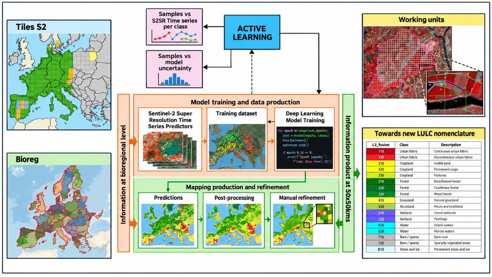
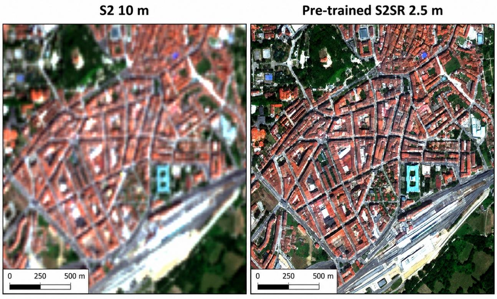
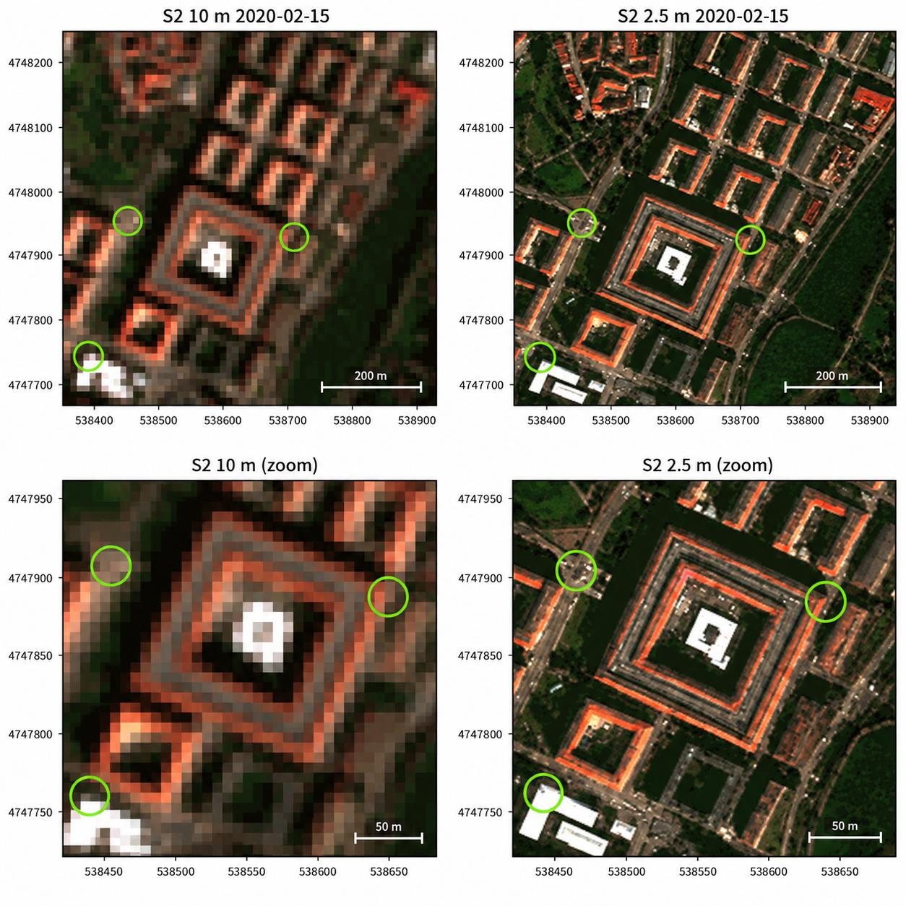
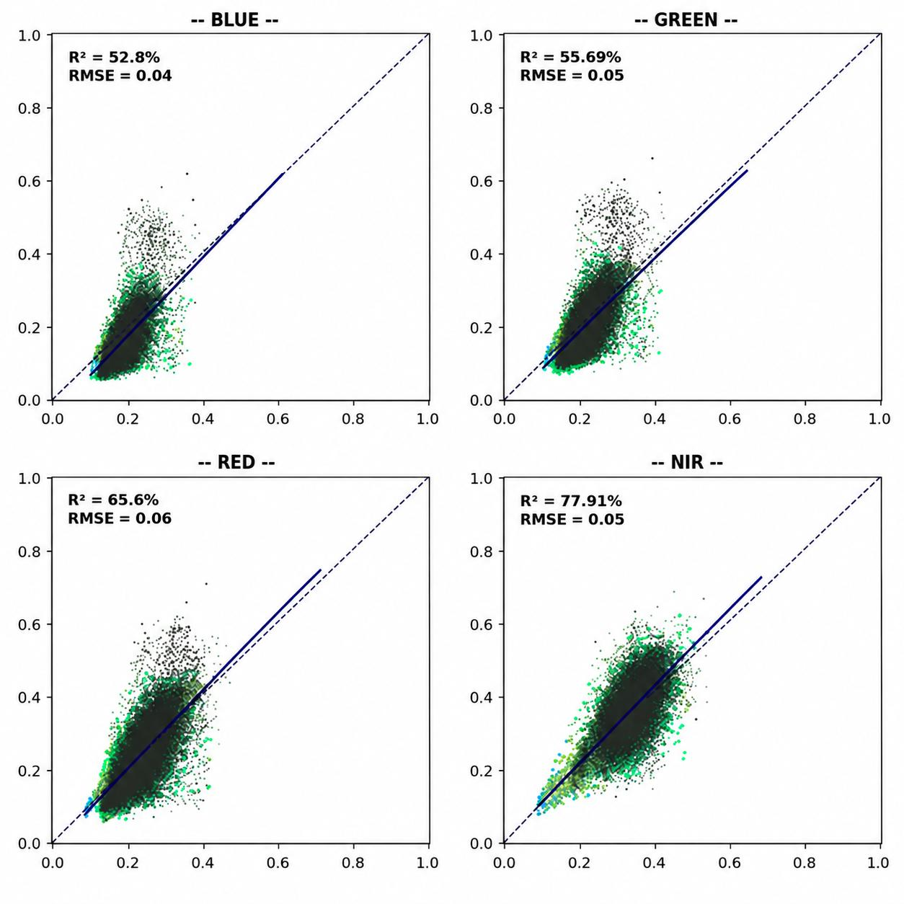
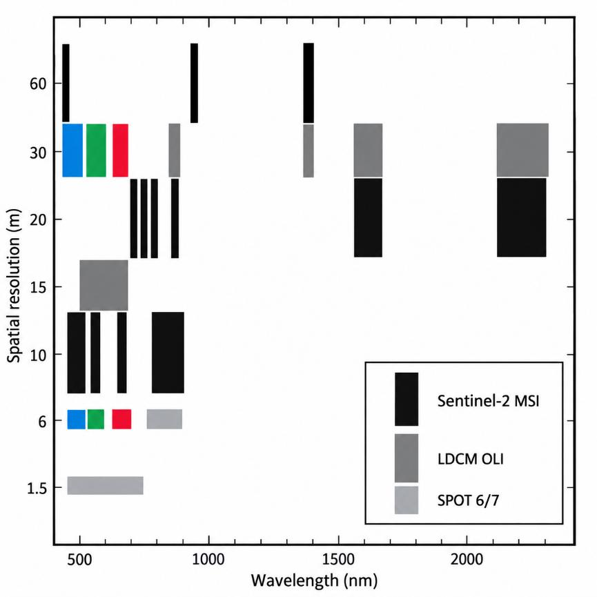
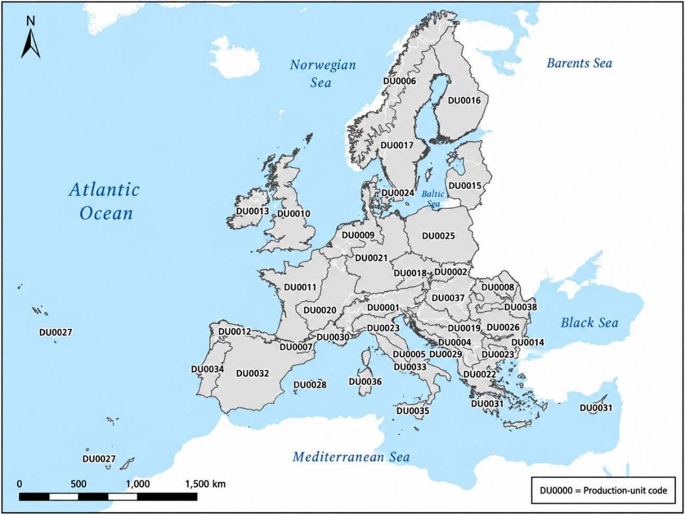
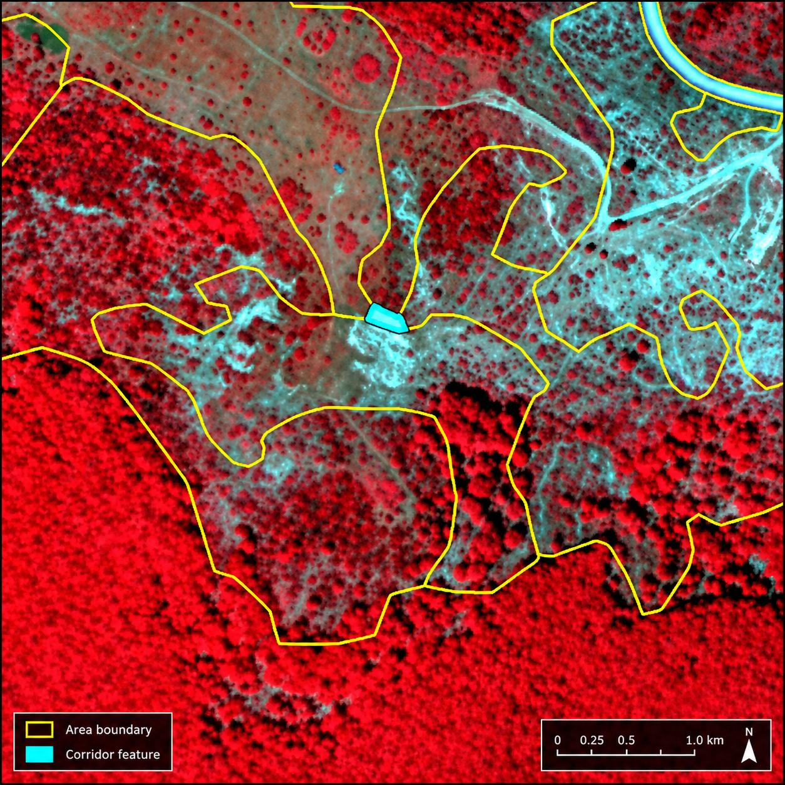

# Executive summary

COTESA is the leader of a consortium for the "Copernicus Land Monitoring Service, Priority Area Monitoring – Protected Areas 2021 and 2024", in response to the call for tenders by open procedure No EEA/DIS/RO/23/009.

The Protected Areas product aims to provide high-quality, harmonized Land Cover/Land Use (LC/LU) information for all terrestrial Natura 2000 sites across the 27 Member States of the European Union (European Union 27 Member States EU27) for the reference years 2021 and 2024. This information is expected to underpin, support, and evaluate European policies focused on biodiversity conservation and sustainable management of protected areas. The product will enable more effective monitoring of Natura 2000 sites, facilitating the assessment of conservation measures and progress towards halting biodiversity loss in Europe. These objectives align with the broader goals of the European Green Deal and the EU Biodiversity Strategy for 2030.

The Framework Service Contract No EEA/DIS/RO/23/009 addresses the following objectives through associated tasks:

* Task 1: To produce the Protected Areas LC/LU status product for the 2021 reference year for all terrestrial Natura 2000 sites, using Very High Resolution (VHR) satellite imagery as primary input.
* Task 2: To produce an updated LC/LU status layer for the 2024 reference year, including a change layer between 2021 and 2024 and revision of the 2021 status layer whenever needed.
* Task 3: To support user uptake activities for the Protected Areas product.
* Task 4: To provide ad-hoc consultancy services as required.

The duration of the Framework Contract is a maximum of 48 months, divided into two phases:

* First phase: Covers the 2021 update.
* Second phase: Covers the 2024 update.

For each phase, a series of specific contracts will be established to address the corresponding tasks in a structured manner. The first specific contract is dedicated to the full-scale production of the Protected Areas LC/LU product for all 25,011 Natura 2000 sites, covering approximately 821,000 km². This phase allows for the evaluation of the proposed new methodology, quality control procedures, and workflow efficiency for the entire dataset. The second specific contract focuses on activities related to user involvement and uptake, including outreach, communication, training, and the establishment of feedback mechanisms to ensure that the product meets the needs of various stakeholders and end-users. Each contract is designed to ensure the successful delivery of high-quality products and to facilitate the continuous improvement of processes throughout the project lifecycle.

# Background of the document

## Scope and objectives

This Algorithm Theoretical Basis Document (ATBD) provides a technical description of the product characteristics, production methodologies and workflows required to generate the Protected Areas Land Cover/Land Use (LC/LU) datasets for the reference years 2021 and 2024 in terrestrial Natura 2000 sites across EU27. The product is a restart/continuation of the existing Copernicus Land Monitoring Service (CLMS) Natura 2000 (N2K) LC/LU product for 2006, 2012 and 2018, renamed Protected Areas to align with other CLMS Priority Area Monitoring products while maintaining backward compatibility as far as possible.

The tender specifies the overarching objectives as:

1.  Production of the 2021 status layer for all terrestrial Natura 2000 sites in EU27.

2.  Production of the 2024 status layer, including the 2021-2024 change layer and revision of the 2021 status layer whenever needed.

3.  Support to user uptake activities.

4.  Provision of ad-hoc consultancy services.

## Content and structure

In the Executive summary section, the document will deliver a succinct snapshot of the PA2021 product, its purpose, the main methodological principles, and the full set of delivered outputs. It will briefly connect the input data and processing workflow to the final layers, emphasising the key elements that underpin consistency, quality, and traceability.

As part of the Background of the document section, the ATBD will establish the context in which PA2021 is produced, the operational needs it responds to, and the main constraints that shape the approach. It will also clarify the intended audience and explain the role of this ATBD in supporting transparency, reproducibility, and quality assurance.

Under Methodology, the ATBD will describe the product and the complete generation process, covering the overview and specifications, the end-to-end workflow, and the nomenclature logic. It will detail input datasets and harmonisation, the sampling and reference-data strategy, production units and bioregional implementation, model training and iterative refinement (including active learning), and the downstream post-processing, manual Quality Control (QC) and Quality Assurance (QA), and packaging of deliverables such as the confidence layer, Product Specification and Inventory List (PSIL), and metadata.

In the Recognized technical issues section, the ATBD will identify and characterise the main sources of uncertainty and limitations across the full processing chain, describing where errors may arise and how they can propagate into the outputs. It will also document known failure modes and recurring edge cases that can affect classification, delineation, change attribution, or interpretability.

Through the Quality control and production verification section, the ATBD will define how product performance is evaluated, including validation design (sampling and stratification), reference/verification data, and the metrics used to quantify quality. It will also describe how acceptance thresholds are applied and how the results are communicated to support compliance and fitness-for-purpose statements.

The ATBD will also specify the operational controls that ensure repeatability and auditability, including versioning of inputs and models, parameter/configuration documentation, and data lineage tracking supported by PSIL. It will also summarise computational requirements and runtime constraints relevant to scalable production and reprocessing.

# Methodology

## Product overview

The PA2021 product overview describes the Protected Areas 2021 status layer as a Very High Resolution (VHR) Land Cover/Land Use (LC/LU) dataset mapped for all terrestrial Natura 2000 sites in EU27. The Area of Interest (AoI) corresponds to the 2021 Natura 2000 terrestrial boundaries (approximately 821,000 km² across 25,011 sites) and is checked for anomalies prior to production. The temporal reference is defined as a 2021 reference date derived from VHR satellite imagery acquired between 2020 and 2022, and the positional accuracy follows the geolocation accuracy of the imagery delivered by the European Space Agency (ESA). The dataset is a vector product delivered in GeoPackage format in the European Terrestrial Reference System 1989 (European Terrestrial Reference System 1989 ETRS89) Lambert Azimuthal Equal Area (LAEA) projection, identified by EPSG (European Petroleum Survey Group coordinate reference system code):3035. It applies a Protected Areas tailored nomenclature of 59 classes. The mapping is specified with a Minimum Mapping Unit (MMU) of 0.5 ha and a Minimum Mapping Width (MMW) of 10 m between objects for distinct mapping. The intended use is to provide a harmonised baseline of LC/LU information within Natura 2000 sites, extracted from VHR and other available imagery and combined with in-situ and ancillary data where appropriate, to support the study and evolution of Natura 2000 sites. The thematic quality targets are ≥85% overall accuracy and ≥80% user's and producer's accuracies per class.

## Technical product specifications

The main technical specifications of the Protected Areas 2021 status layer are summarised in Table 1. The technical requirements are defined in the Tender Specifications for service contract EEA/DIS/RO/23/009 (ΕΕΑ, 2022).

Table 1 Product description and technical specifications for the Protected Areas 2021 status layer.

| Title | Protected Areas 2021 status layer |
|-------------------------------------------------------------|-------------------------------------------------------------------------------------------------------------------------------------------|
| Abstract | VHR LC/LU dataset in Natura 2000 sites |
| INSPIRE themes | Land cover Land use |
| Geographic description | EU27 |
| Temporal description | 2021 reference date extracted from VHR satellite imagery ranging from 2020 to 2022 |
| Purpose | Provide the baseline of LC/LU data in Natura 2000 sites extracted from VHR and other available imagery (and combined with in-situ data) to allow the study and evolution of Natura 2000 sites |
| Minimum Mapping Unit | 0.5 ha |
| Minimum Mapping Width | Minimum Mapping Width (MinMW) of 10 m between 2 objects for distinct mapping |
| Nomenclature | The classification follows the Protected Areas Nomenclature and Mapping Guideline (CLMS, 2026), detailed 59 classes. |
| Projection | ETRS89 Lambert Azimuthal Equal Area (LAEA) (EPSG 3035) |
| Delivery formats | GeoPackage |
| Metadata | Compliant with the Infrastructure for Spatial Information in the European Community (INSPIRE) metadata requirements (European Commission JRC, 2013), according to the applicable technical guidance based on EN ISO 19115 and EN ISO 19119. ISO refers to the International Organization for Standardization. |
| Positional accuracy | According to geo-location accuracy of satellite imagery delivered by ESA |
| Overall classification accuracy | ≥ 85 % overall accuracy ≥ 80 % for class specific user and producer accuracies |

## Workflow

CLMS Protected Areas 2021 uses a semi-automatic approach to extract LC/LU information. A Deep Learning model is trained at bioregional scale using CLMS data and time series of super-resolved Sentinel-2 imagery. Its output is then processed through an advanced post-processing chain and manually refined by expert photo-interpreters. This combination preserves the objectivity of the automated classification while ensuring that the final layer meets the required thematic and geometric specifications. The overall production workflow is shown in Figure 1.

{width=433pt}

## PA2021 Area Of Interest: refinement process

The PA2021 Area of Interest (AoI) is composed of the contributions of the Member States regarding declared Natura 2000 sites. As CLMS Protected Areas refers to terrestrial land areas, only sites with “MARINE\_AREA\_PERCENTAGE = 0" are selected; users should therefore note that sites containing both land and marine areas are excluded from this selection. To reduce issues related to snapping between polygons, isolated areas below the MMU and/or MMW, and geometric spikes, a 20 m buffer is applied. This results in an area of approximately 821,000 km². The AoI also includes Emerald sites and the United Kingdom (around 20,000 km²) as part of the new re-inclusion in the Copernicus Programme.

## Input data

The production of the Protected Areas LC/LU layers is based on a comprehensive integration of multiple CLMS core datasets, ancillary geospatial sources, and high-resolution satellite imagery, ensuring both thematic accuracy and spatial consistency across Europe's Natura 2000 sites.

As the backbone for data sampling within Natura 2000 terrestrial areas, the CLMS N2K 2018 layer has been utilized, providing the essential reference for site delineation and initial class assignment. For coastal Natura 2000 sites, the CLMS Coastal Zones 2018 product serves as the primary reference, with a necessary crosswalk implemented to harmonize LC/LU nomenclature and ensure compatibility across the two layers.

To enhance data reliability and thematic resolution, several CLMS products from 2021 are leveraged for data checking and as complementary sources. These include CLMS High Resolution Layers (HRLs) 2021 (specifically the crop types, grasslands, tree cover density, and forest type layers) which support detailed discrimination between similar classes (e.g., grassland vs. shrubland) and provide up-to-date biophysical context. Additionally, CLCPlus Backbone 2021 is used to support data validation and ensure coherence in LC/LU classification logic. In areas within Natura 2000 sites lacking detailed mapping, Corine Land Cover (CLC) 2018 data support stratification and guides further classification efforts.

Ancillary datasets from the CLMS programme, such as EU-Hydro and Riparian Zones, play a crucial role in accurately assimilating inland watercourses and associated riparian habitats. For the extraction of roads and railways, OpenStreetMap (OSM) data has been integrated due to its broad coverage and up-to-date infrastructure information. Where automated classification is insufficient (particularly for the most detailed Level 4 L4 classes such as airports) the project has employed CLMS Priority Area Monitoring 2018 layers to inform manual refinement and ensure high thematic accuracy. Quality control is further enhanced by cross-checking with CLMS Burnt Areas and CLMS Snow datasets, helping to identify and resolve anomalous results (such as detecting improbable permanent snow at low altitudes).

For validation and calibration, the project incorporates Canopy Height from META (outside the Copernicus programme) to discriminate between shrubland and certain forest types. The ESA\_VHR\_2021 image mosaic serves as the core reference for manual refinement, given its central role in the creation of CLMS 2021 products. When uncertainties arise during visual interpretation, additional support is provided by Google Earth imagery and Google Street View, offering auxiliary information to the refinement team.

Altogether, this robust multi-source input data strategy ensures that the resulting LC/LU products for Protected Areas are comprehensive, accurate, and well-adapted to the diverse European landscape.

Regarding satellite information, the process begins with the access and download of Sentinel-2 Level 2A imagery, orchestrated via Theia and PySTAC services. For each bioregion, cloud-free seasonal mosaics are generated to maximize spectral and temporal information. Spatial resolution is enhanced using COTESA's proprietary IRIX4 superresolution model, standardizing all tiles to 10 m or finer. Multitemporal coregistration algorithms are then applied to ensure accurate pixel alignment across image dates, followed by rigorous QC to filter out suboptimal data and maintain high standards for the S2 (Sentinel-2) superresolved (S2SR) input stack.

The accurate delineation of land cover classes, particularly in dynamic categories such as grasslands and heterogeneous areas, poses a significant challenge in the field of remote sensing. Existing products, like the N2K product, have shown limitations in delineating fine features when compared to alternatives like the CLCPlus Backbone product. This is primarily due to the use of a single Very High Resolution (VHR) reference image (not always matching the reference year, but mostly) and insufficient temporal resolution.

In this context, the Tender Specifications explicitly encourage the investigation of other data sources, such as Sentinel-2 (S2) time series, and advocate for a combined approach using VHR and HR data together with automated and manual classification methods to overcome these limitations and achieve more precise delineation. That is why Super-Resolution (SR) methods emerge as an innovative and strategic solution. COTESA proposes the application of its own pre-trained Super-Resolution Generative Adversarial Network (SRGAN) model on original Sentinel-2 imagery. This methodology not only responds to the call for exploring new data sources but also transcends the traditional trade-off between spatial and temporal resolution. A direct visual comparison between native Sentinel-2 imagery at 10 m and the super-resolved Sentinel-2 output at 2.5 m is shown in Figure 2.

{width=432pt}

The key advantages justifying this approach are:

(1) Substantial Improvement in Spatial Detail: SR enhances the level of detail of Sentinel-2 images (from 10 m to 2.5 m), enabling a significantly finer delineation of objects such as small buildings, crop borders, streets, and critically, the boundaries of complex classes like grasslands. This directly addresses the issue of "overly coarse" delineation identified in the N2K product. A direct visual comparison between the native 10 m resolution of Sentinel-2 and the super-resolved output at 2.5 m [Figure 3] demonstrates this enhancement tangibly, where linear structures and small spatial features become clearly discernible. This will allow us to reduce substantially noise in our PA2021 models whilst improving the details of the geometries.

{width=433pt}

(2) Spectral and Temporal Consistency: Unlike the reliance on a single VHR scene, our SRGAN model generates enhanced images that are spectrally consistent with the original Sentinel-2 time series. This ensures the stability of information over time, leveraging the high temporal resolution (5 days) of Sentinel-2 to capture seasonal dynamics—a key factor for the correct characterization of grasslands, different type of forests or crops, etc. The spectral fidelity of the model is quantitatively demonstrated through regression analysis for key bands (Blue, Green, Red, Near-Infrared), showing high coefficients of determination (R²) and low errors (Root Mean Square Error RMSE) [Figure 4], guaranteeing the integrity of the information for classifications and multi-temporal analysis. Also, this model can be applied to mosaics referring to different time steps in any part of the year, so superresolved mosaics can be used for S2SR time series generation. Regarding validation, this example was carried out by comparing two scenes: a resampled VHR image from commercial imagery (Pléaides) and super-resolved Sentinel-2 image taken, approximately, at the same time. We expected some differences due to the availability of "pure pixels", but a similar behaviour overall in all bands (no bias whatsoever between different bands), which is what actually the image is showing below.

{width=433pt}

(3) Validated and Ready-to-Implement Process: COTESA is using a pre-trained SRGAN model that has been expressly validated using the OpenSR benchmarking initiative developed by the European Space Agency (ESA) in collaboration with the Universitat Politècnica de València (UPV) (ESA, 2022-2025). This tool aims to compare different datasets (National Agriculture Imagery Program NAIP, Plan Nacional de Ortofotografía Aérea PNOA Ortho, Commercial high-resolution optical Earth observation satellite system SPOT and Pleaides) all over the world (US, Europe, etc.) in different landscapes (crops, forests, etc.) with superresolved images allowing a benchmarking between other SR models in terms of hallucinations, omissions, improvements, spectral characteristics, geometrical errors, etc. Our model, trained on over 9,000 km² of multitemporal VHR imagery across Europe, has demonstrated superior performance in critical metrics: high detail enhancement, low omission of patterns, minimal hallucinations, and subpixel geometric errors. The model's design and performance are optimized for the spectral range of sensors like Sentinel-2 [Figure 5], ensuring its suitability for the task. No retraining is required, enabling a fully automated, fast, and efficient prediction process whenever a new mosaic is generated.

{width=291pt}

In conclusion, the integration of super-resolved Sentinel-2 imagery through our SRGAN model represents the realization of the recommended "combined approach," effectively merging the spectral and temporal richness of Sentinel-2 with spatial detail close to VHR. This translates directly into an enhanced capacity for change detection and more accurate and reliable delineation of land cover classes, providing differential and robust value to the project.

## Production units: regionalization based on biogeographical/ecological characteristics.

The regionalization framework, based on biogeographical regions (bioregions), constitutes a fundamental component of the ATBD for CLMS Protected Areas. Its primary objective is to ensure that land cover and land use (LC/LU) mapping is conducted within ecologically coherent domains, while maintaining consistency and scalability at the European level.

The methodology adopts a regionally stratified modelling approach, whereby independent classification models are developed and calibrated within each biogeographical region. This approach is motivated by the significant ecological and environmental heterogeneity observed across Europe. Variations in climatic conditions, geological substrates, hydrological regimes, and landscape histories result in differing ecosystem structures and dynamics, which cannot be adequately captured by a single, continent-wide model.

Within this framework, environmental differentiation is not explicitly modelled through abiotic variables. Instead, it is implicitly represented through the spectral-temporal behaviour of ecosystems derived from Sentinel-2 time series data. Differences in vegetation structure, productivity, phenology, and surface moisture conditions are reflected in the temporal evolution of surface reflectance. Consequently, LC/LU classes exhibit distinct signatures in spectro-phenological space, forming the basis for their discrimination within each region.

The delineation of the regional modelling domains is based on the biogeographical regions defined by the European Environment Agency (EEA), which provide a well-established representation of large-scale ecological patterns across Europe. To enhance operational applicability and facilitate uptake by Member States, these regions are further refined through the integration of national administrative boundaries. This combined approach ensures alignment with both ecological processes and governance structures.

The resulting regional units are designed to achieve a balance between ecological homogeneity and operational scalability. Each region constitutes a modelling domain characterized by relatively consistent environmental conditions and ecosystem functioning. The spatial extent of these domains is optimized to capture dominant spectro-phenological patterns while limiting internal heterogeneity that could negatively affect model performance.

Regionalization serves to constrain the classification process within ecologically consistent contexts. By reducing the range of variability encountered by the classification algorithms, the approach minimizes spectral ambiguity between classes and enhances the capacity of machine learning models to learn robust relationships between multi-temporal satellite observations and LC/LU categories.

Despite the independent calibration of models at regional level, the overall framework ensures pan-European harmonization. This is achieved through the application of consistent class definitions, standardized modelling procedures, and a unified Earth observation data framework. As a result, regional outputs are fully interoperable and can be integrated into a coherent continental dataset, while retaining sensitivity to regional ecosystem dynamics.

In conclusion, the regionalization framework establishes the methodological basis for linking ecological variability across Europe with spectral-temporal information derived from Sentinel-2, enabling the generation of robust, consistent, and ecologically meaningful LC/LU products within the CLMS Protected Areas mapping workflow. The final modelling units resulting from the regionalisation framework are shown in Figure 6.

{width=432pt}

## Sampling and reference data strategy.

This section describes how analysis/training points (ATs) are constructed and refined to support model training and internal checks, based on a rule-driven sampling strategy designed to (i) ensure broad spatial representativeness, (ii) reduce spatial autocorrelation and boundary noise, and (iii) increase label reliability by cross-checking points against independent thematic evidence layers (CLMS rasters and ancillary masks). The overall approach follows a two-stage logic: first, generate a geographically well-distributed candidate point set from existing polygonal information; second, iteratively refine, reclassify, and filter points using intersection rules and consistency checks.

### Spatial design: grid generation and cube placement based on existing CLMS data via a hierarchical scheme

Spatial representativeness and sampling units. The sampling strategy operates on a regular grid to avoid local clustering and to improve coverage across the Area of Interest. A grid of 500 m × 500 m cells is generated over the target geometry (e.g., AoI or thematic polygons used as sources). Only grid cells that intersect the target domain are retained. Each retained grid cell is processed independently, enabling a controlled number of samples per unit area and supporting scalable, parallel processing if required.

Candidate sample generation from polygons ("cube” sampling). Candidate points are generated from polygonal sources by first creating small square sampling windows ("cubes") and then expanding each cube into a fixed micro-pattern of points. For each qualifying polygon subset inside a grid cell, the process attempts to place sampling cubes in two ways:

1.  Centroid-based cubes: a cube is centered on the polygon centroid but only accepted if it falls within a "safe area" (known as pixel pureness) defined by applying an inward buffer (negative buffer) to the polygon. This enforces a minimum distance to the polygon border and reduces the likelihood that samples fall on mixed pixels or ambiguous boundaries.
2.  Random cubes: if the number of accepted centroid cubes is below the target, additional cubes are placed by sampling random locations within the buffered polygon area, again enforcing border distance and minimum spacing between cubes.

The cube parameters are fixed to provide consistent sampling density and boundary avoidance: the cube side length is 8 m, the maximum number of cubes per grid cell is 5, the minimum distance to polygon borders is 12 m for centroid cubes and 15 m for random cubes, and the minimum distance between cube centroids is 15 m. Grid cells are only processed if the clipped polygon area exceeds a minimum coverage threshold (implemented as a fraction of the cell area), ensuring that negligible intersections do not create unstable sampling behaviour.

Point expansion and micro-redundancy. Each accepted cube is converted into a small set of points by placing a 3 x 3 point pattern around the cube centre with a fixed spacing (e.g. 2.6 m offsets). This produces nine points per cube, increasing within-object sampling while still enforcing macro-scale separation via the grid/cube constraints. Each point carries: (i) a target class code inherited from the source polygon attribute (e.g., CODE\_4\_18 or analogous), (ii) a grid cell identifier (cell\_id) supporting stratification, auditing, and later balancing, and (iii) an origin flag (centroid vs. random) to track how the sample was created.

Augmentation using thematic rasters (CLMS). To address gaps or low-frequency classes and to reinforce class evidence, the workflow includes a mechanism to generate additional candidate cubes/points directly from CLMS layers. In practice, raster values meeting specific conditions (e.g., class codes in a given band) are polygonised or masked, then sampled with the same grid/cube logic to create additional ATs. This raster-driven augmentation is particularly useful for classes that are difficult to sample reliably from legacy polygons alone, or for landscapes where polygon coverage is sparse or inconsistent.

### Training data refinement

The purpose of this step is to automatically refine the L4 labels initially inherited from the CLMS Priority Area Monitoring PAM 2018 layers (notably Natura 2000 2018 N2K18, Coastal Zones 2018 CZ18, and Riparian Zones 2018 RZ18) by exploiting the strengths of complementary CLMS datasets closer to the 2021 reference period. In practice, the refinement relies on a hierarchy of rule-based enrichments and overrides derived from 2021 products, thereby reducing the temporal mismatch that would otherwise be introduced by using 2018-based thematic information as the primary reference for PA2021 training. The rules are applied to (i) generate additional training points for under-represented or poorly separable classes, and (ii) relabel or prioritise classes where specific 2021 layers provide stronger evidence than the legacy PAM 2018 sources.

In summary, the refinement rules applied are as follows. (1) Additional cropland training points are generated from HRL Cropland 2021 to improve representation and consistency of agricultural classes. (2) Additional forest-type points are generated from HRL Forest Type 2021, supporting a more robust characterisation of forest subclasses. (3) Additional grassland points are generated from HRL Grassland 2021; within grassland, the two main grassland categories (4100 managed grassland and 4212 natural grassland) are further enriched by analysing grassland harvesting patterns, and expert-defined alpine constraints are introduced through bioregion-specific "Areas Treeline" masks to systematically reclassify managed grasslands to natural grasslands where appropriate. (4) Because shrubland is both heterogeneous and typically underestimated across Copernicus layers, shrub-related labels are prioritised over competing classes; this includes extracting additional shrub evidence from CLCPlus Backbone 2021 using the Low-Growing Woody Plants class and refining it with HRL Cropland 2021 to reduce confusion with agricultural surfaces. (5) Additional training points for Evergreen Broadleaved are extracted from CLCPlus Backbone 2021 to improve separability between coniferous forest (3210) and broadleaved forest (3110). (6) The European Wetland Map is used to extract additional wetland training points (both inland and coastal), including specific enrichment of peat bog conditions where represented.

Overall, this rule-based framework provides a consistent and reproducible mechanism to align candidate labels with independent evidence layers, while remaining extensible: new rules can be incorporated as additional CLMS products, thematic masks, or expert constraints become available for specific bioregions or class groups.

Conflict filtering near class boundaries (buffer-ring exclusion). A dedicated cleaning step removes "conflictive" points located too close to transitions in key thematic layers, where mixed pixels and delineation uncertainty are common. This is implemented by creating annular buffer rings around raster-defined class regions: the target class mask is dilated and eroded by a fixed distance (e.g., 5 m), and the ring between them defines a boundary zone. Points falling inside these rings are removed for selected codes, while a set of “protected” codes may be exempt from removal (to avoid systematically deleting rare but important classes). This boundary filtering reduces label noise and improves the separability of classes during training.

Special handling for coastal and rare thematic classes. The sampling strategy supports targeted enrichment of thematic groups, notably coastal-related classes, by sampling from dedicated coastal polygon datasets (with their own attribute codes) and merging the resulting points into the main AT pool. After merging, points are optionally reclassified by polygon intersection so that their final code (CODE\_4\_18) is consistent with the coastal source codes, ensuring that the training set contains enough exemplars for shoreline and coastal habitat types that may otherwise be underrepresented.

Label normalisation and exclusion rules (training-ready labels). Once the refined AT pool is produced, class codes are mapped to a simplified or grouped training label scheme where required (e.g., converting detailed codes into label strings such as "3.1", “4.2”, etc.). A set of codes can be explicitly assigned to an “exclude” label (e.g., “99”) to remove ambiguous, non-target, or out-of-scope categories from model training. This step yields a training-ready point layer where the included points are consistently labelled and the excluded set is traceable.

Packaging and stratified export by tile. For operational training and reproducibility, the final AT dataset is exported in a structured way: points are intersected with a tile grid (e.g., Sentinel-2 tiling), then written out per tile. During export, points are reprojected to the appropriate UTM (Universal Transverse Mercator) zone for each tile (deriving the EPSG code programmatically) and non-essential fields used only during sampling/refinement (e.g., internal codes, provenance flags, intermediate action fields) are removed. This produces a clean, tile-organised training dataset that aligns with downstream modelling pipelines and supports parallelised training or per-region modelling strategies. Finally, the workflow provides a systematic count of points per training label across all exported tiles, including relative percentages. This enables rapid diagnosis of class imbalance, detection of missing labels in specific regions, and supports iterative sampling refinement (e.g., adding new raster-driven AT generation rules or increasing sampling intensity for low-frequency classes).

Overall, the strategy ensures that PA2021 reference/training points are spatially distributed, boundary-aware, and evidence-refined through explicit, auditable rules. This combination supports robust model training and provides a clear mechanism to evolve the sampling design as new inputs, new classes, or region-specific issues emerge.

As a last step, Self Organizing Maps from the SITS library has been used to filter out those points that does not comply with the “normal” spectrophenological behavior, for each of the 6 predictos: RGBn (Red, Green, Blue and Near-Infrared bands )-NDVI-NDWI. Also, Cleanlab has been applied to the final set of points to filter out those points showing bad quality.

## Model implementation per bioregion.

The production is carried out per ecological region (bioregion) so that the modelling adapts to the dominant environmental and landscape conditions in each area. This regional approach helps the algorithm learn more consistent patterns locally and reduces typical errors that occur when a single model is applied across very different climates, vegetation types, and land-use contexts. For each bioregion, a dedicated training dataset is built, a region-specific model is trained, and predictions are generated in a consistent and repeatable way.

The training dataset starts with an initial pool of candidate reference points derived from available thematic information (see previous section for more information) and is strengthened using superresolved Sentinel-2 time series. For every reference point, the workflow extracts monthly mosaicked information from superresolved Sentinel-2 composites (including the four core reflectance channels, Red R – Green G – Blue B – Near-Infrared NIR) and also derives commonly used indices that capture vegetation and water-related behaviour over time. This means each reference point is represented not by a single image value, but by a temporal signature that improves class separability and robustness to short-term variability. There are a potential 72 bands used as predictors within the model (6 bands x12 time steps), but it could vary from bioregion to bioregion, depending on the quality of the data for each month (for example, most of winter months have been removed because of low sun elevations, snow cover and poor reflectance information).

Before modelling, the reference points are automatically quality-filtered to remove samples that are incomplete or unreliable (for example, points with missing values). The process also normalises labels into the set used by the model and removes categories that are explicitly marked as out of scope. This produces a training-ready dataset that is consistent across tiles and regions.

A key component is the automatic refinement of training points using model confidence, also known as Active Learning process. After an initial model is trained, it is used to re-evaluate the training samples and estimate how strongly each sample is supported by the learned patterns. Samples that show strong contradiction (the model consistently indicates a different class) are treated as likely mislabels and can be removed. Samples that are weakly supported (low separation between the most plausible classes) can also be filtered, but more conservatively. Importantly, the filtering rules are applied with safeguards so that rare or inherently mixed categories are not disproportionately removed, and so that each class retains a minimum amount of training support. It also explicitly treats certain labels as “heterogeneous" (e.g. 1xxx, 4100, 4212, 5100, 5300, 6100) and applies more conservative filtering to them (removing only contradictions, capped at 20%), which is a practical way to preserve inherently mixed/edge categories while still reducing blatant mislabels.

TempCNN (Temporal Convolutional Neural Network) model training is performed with a standard workflow that ensures comparability and stability. The dataset is split into training, validation, and test subsets using stratification so that all classes remain represented. Training uses regularisation and automated controls that prevent overfitting: the best model checkpoint is saved based on validation performance, training can stop early when improvements plateau, and the learning rate is automatically reduced when progress slows. Performance is then measured on an independent test subset using standard quality metrics (including overall accuracy and complementary precision/recall-type measures), providing an internal indication of model behaviour before map generation.

Finally, the approach is iterative. Training, confidence-based refinement, and retraining can be repeated to progressively improve the reliability of the reference set and the resulting model. In practice, this yields a more stable classification, reduces the impact of noisy labels, and improves consistency across the bioregion while keeping the process transparent and reproducible for operational production.

Once a bioregion-specific model is considered fit for production, it is formally accepted only after meeting two complementary criteria: (1) it achieves the required quantitative performance targets (e.g., overall accuracy, Interesection over Union -IoU- and Kappa) on the defined evaluation datasets, and (2) its spatial outputs are qualitatively endorsed through expert review of predictions generated over representative Bounding Boxes (BBOX) spanning diverse landscape contexts within the bioregion, using CORINE (Coordination of Information on the Environment) Land Cover as a consistency reference to support interpretation of expected patterns. After acceptance, the model weights are frozen and archived in .h5 format to ensure reproducibility, and batch inference is executed over the full Area of Interest covered by the Sentinel-2 tiles that compose the bioregion. The resulting classified raster is then post-processed to improve spatial coherence by applying a GDAL (Geospatial Data Abstraction Library) SIEVE operation with a threshold of 15 and 8-neighbour connectivity, which removes small, isolated pixel patches and filters salt-and-pepper artefacts prior to packaging of the final product.

### Algorithm descriptions

The PA2021 processing chain combines super-resolution, rule-based reference-data preparation, bioregion-specific Deep Learning classification and deterministic spatial post-processing.

Sentinel-2 preprocessing and super-resolution. Sentinel-2 Level-2A imagery is accessed and organised by bioregion. Cloud-free seasonal mosaics are generated to maximise spectral and temporal information. Spatial detail is enhanced using COTESA's pre-trained super-resolution approach, generating S2SR inputs. Multi-temporal coregistration and quality-control procedures are then applied to maintain pixel alignment between dates and remove suboptimal observations.

Reference-data generation and refinement. Candidate analysis/training points are generated from existing CLMS polygonal information using a regular 500 m × 500 m grid. Within each retained grid cell, candidate cubes are generated with a cube side length of 8 m, a maximum of five cubes per grid cell, minimum distances to polygon boundaries, and minimum spacing between cube centroids. Each accepted cube is expanded into a 3 x 3 point pattern. The initial labels are subsequently refined using rule-based intersections with complementary 2021 CLMS products and ancillary evidence layers. Boundary-conflict filtering and class-specific enrichment rules are applied to reduce label noise and improve representation of under-represented classes.

Bioregion-specific classification. A dedicated model is trained for each bioregion using monthly super-resolved Sentinel-2 information and derived vegetation/water indices. The model workflow includes stratified training, validation and test subsets, regularisation, early stopping, learning-rate adaptation and confidence-based iterative refinement of training samples. Models are accepted only after quantitative performance targets and expert spatial review are satisfied. Accepted model weights are frozen and archived to support reproducibility.

Raster post-processing and vectorisation. The classified raster is post-processed using GDAL SIEVE with a threshold of 15 and 8-neighbour connectivity to remove small isolated patches and salt-and-pepper artefacts. The result is converted from raster to vector using GDAL POLYGONIZE. Subsequent generalisation, MMU/MMW enforcement, ancillary-data corrections and manual refinement are applied before final packaging of the Protected Areas product.

## Post-processing and manual refinement.

After obtaining the raster result at 2.5 m × 2.5 m resolution, a specific post-processing workflow is applied to convert the raster output into a vector product in accordance with the rules specified in the Invitation to Tender (ITT) requirements. As a first step, isolated pixels are removed using GDAL SIEVE with 8-neighbour connectivity to reduce salt-and-pepper effects. GDAL POLYGONIZE is then used to convert the raster result to vector format. The workflow preserves the detailed delineation provided by the super-resolved Sentinel-2 imagery while applying generalisation rules to reduce the number of vertices without losing relevant boundary detail. Particular emphasis is placed on forest delineation because these classes are especially relevant for end users. Areas below the 0.5 ha MMU are aggregated to the closest suitable polygon. A similar approach is applied to corridor-like geometries. The general MMW is 10 m. Corridors narrower than 10 m are detected and corrected or generalised whenever possible. Exceptions may be retained when correction is not feasible without compromising a valid narrow feature (for example, a narrow polygon between a road and a railway) or when the feature is located at the product boundary; these cases are documented using the COMMENT attribute. The corridor-detection procedure is illustrated in Figure 7.

{width=433pt}

Roads and railways have been extracted from Open Street Maps information with a fixed buffer (and later checked by the manual refinement team that it is continuous and visible within the VHR image). Also, to guarantee consistency between CLMS layers, PA2021 models not only are fed with these data but also used as a post-processing step to improve the result. As a matter of an example, PA2021 areas within Coastal Areas use systematically labels from these layers from 2018 but maintain geometries from the automatic process. In this sense, operators check manually that there is no mismatch between layers (e.g. changes between CZ2018 and PA2021). For those results obtained from the automatic approach as 7xxxx, label at level 4 has been extracted from European Wetland Map, of special importance for the peatbogs. Mountainous areas are prone to show urban false positives within the 2,5x2,5-meter raster, especially in rocks and bare areas. CLCPlus Backbone 2021 has been used to filter automatically those polygons with improbable presence of urban areas and re-labelled accordingly thanks to a crosswalk between the maximum percentage of the class present and the PA2021 nomenclature within the polygon. Likewise, a crosswalk between Open Street Map features and PA2021 classes has been carried out in order to get as much as possible information (even though it is checked by the operators afterwards to avoid any mismatch related to different timeframes). A nice example is the location of farms close to the coast of Netherlands, which are all 1120.

Regarding manual refinement activities, a well-trained team of photointerpreters make use of the VHR\_2021\_IMAGE provided by EEA as WMS (Web Map Service) with the automatic result loaded in a GIS (Geographic Information System) project. The main objective is to preserve as much as possible the delimitation provided by the automatic process to keep the objectivity of the layer. Since the automatic result does not reach L4 levels, especially for urban, wetlands and water, a specific in-house software has been generated. It works as a huge browse feature on the automatic layer with the VHR as a background, setting up the L4 buttons to be clicked by them. Thousands of polygons have been relabelled through this process, more important in those areas with no CLMS data.

## Data wrapping

PA2021 has generated a set of products that are ready-to-use at a European scale. The final delivery will include:

* Data Deliverable. The core data deliverable is the Land Cover/Land Use (LC/LU) Protected Areas product for the reference years 2021 and 2024, covering all terrestrial Natura 2000 sites in the EU27. The production relies on semi-automatic workflows combining Sentinel and Very High Resolution (VHR) satellite imagery, harmonized with in-situ and ancillary datasets (such as CLMS N2K, Coastal Zones, HRLS, CLCPlus, etc.). The deliverable consists of both raster and vector products, segmented and classified into 59 thematic classes according to MAES (Mapping and Assessment of Ecosystems and their Services) and CORINE nomenclatures. All products are produced to meet minimum mapping unit, geometric accuracy, and thematic requirements as defined by EEA. Data are delivered in geospatial formats suitable for integration and analysis at the European scale, ensuring harmonization with other CLMS products and facilitating downstream biodiversity and policy applications. PA2021 final delivery (at a bioregional scale; a total of 38 has been delivered so far) consists of both Geopackage and Geodatabase files with LC/LU information at Level4, accompanied by metadata in a ZIP format.
* Metadata. Comprehensive metadata accompanies all data deliverables, ensuring full traceability, transparency, and reproducibility. Metadata includes details on data sources (satellite missions, ancillary datasets), processing chains (pre-processing, segmentation, classification, post-processing), quality control steps, spatial and temporal coverage, and thematic class definitions. Metadata follows INSPIRE and Copernicus standards to support interoperability and compliance with EU (European Union) data sharing policies. The metadata structure documents versioning, product specifications, and processing history to facilitate updates and future validation efforts.
* Product Delivery and Quality Control Reports. Each product delivery is accompanied by a QC Report, prepared by COTESA, which documents all steps taken to ensure technical and thematic quality, including internal validation protocols, visual and statistical checks, and comparison with previous versions (e.g., N2K 2018). Collecte Localisation Satellites (CLS) is responsible for independent thematic validation and QA as internal validation, leveraging their expertise in Copernicus land monitoring and cross-product harmonization. The QA process covers accuracy assessment (including sampling design, confusion matrices, and user/producer accuracies), reporting of omissions and commissions, and thematic plausibility checks across bioregions. The combined QC/QA framework guarantees compliance with EEA requirements and provides confidence to end users on data reliability.
* PSIL (Product Specification and Inventory List). PSIL is a comprehensive catalogue of all products delivered under the contract. It details product names, formats, spatial and temporal extents, class hierarchies, and file organization. The PSIL is essential for documentation, project management, and user guidance, ensuring all stakeholders have a clear overview of the available data products and their specifications. The PSIL follows the standards set by Copernicus and the EEA, facilitating future updates and data integration efforts.
* Confidence Layer. Each LC/LU product is complemented by a confidence layer, providing spatially explicit information on the predicted accuracy or uncertainty for each classified unit. The confidence layer is derived from model outputs (e.g. class probability surfaces). This information is critical for end users, as it allows them to interpret results with appropriate caution and to prioritise areas for further review or field validation. Each bioregion also holds a confidence layer, understood as the maximum probability of the most probable class according to the model, and a heterogeneity layer, understood as the number/diversity of classes contained within each 10 m pixel. The raw model output has a resolution of 2.5 m × 2.5 m, so 16 model pixels contribute to each 100 m² area.

# Recognized technical issues

This novel approach of generating LC/LU information from superresolved Sentinel-2 time series present several advantages but there are other limitations and known issues to be taken into account. The main motto of the use of this workflow is the traceability; the final PA2021 result directly communicates with the model results. In this sense, additional layers (such as confidence, heterogeneity) bring the possibility to the user of understanding what's behind of the errors. Some known issues are listed below as follows:

*   Due to the temporal sensitive nature of this pipeline, dynamic areas (e.g. water level in Spanish reservoirs) may differ when seen from the VHR imagery. The model tried to adapt to the maximum level of water within the year, in concordance with the EEA team.
*   Commission of 7xxxx classes, specifically within PA2021 sites in northern Europe (e.g. Scandinavia and UK plus Ireland). This is quite significant within peatbogs, which in reality are vast wetlands systems that may seem heathland from the VHR imagery. By comparing the result with the European Wetland Map in those areas, there is absolute agreement for almost all the points.
*   There is a clear lack of CLMS data in those areas, with a very limited presence of N2K18 status layer. Since PA2021 automatic model is looking at the whole superresolved Sentinel-2 time series, it is quite sensitive to the presence of humidity on the ground. Thus, there might be a difference between the VHR from 2021 and PA2021 status layer result.
*   Heathland infraestimation towards grasslands due to a mix between classes and an overrepresentation of grasslands within CLMS layers (depending on specific bioregions).
*   Confusion between crops and heathlands due to the use of N2K18, RZ18, CZ18 layers to extract training points plus low growing woody plants from CLCPlus Backbone 2021 limited by HRL Crop Types 2021. This last layer seems to omit some crops (e.g. vineyards located in Istria, Croatia), causing more incorrect training points of heathlands.
*   Confusion between croplands, managed grasslands and natural grasslands due to the similar spectro-phenological behavior shown within the superresolved Sentinel-2 time series.
*   More level of detail within polygons means that there are more vertexes so polygons may be more irregular, specifically diffuse within subjective classes (e.g. agroforestry). This is of particular relevance within typical land use classes such as urban:
    1.  Isolated houses connected by non-artificial surfaces might be omitted since the post-processing rules (such as minimum mapping unit and minimum mapping width) tends to generalize.
    2.  In a similar sense, gardens are strictly grasslands regarding the automatic process, so they might be omitted as well in terms of Land Use.

# Quality control and production verification

## Overview of the validation activities

The validation activities undertaken for the Protected Areas Land Cover/Land Use (Protected Areas PA LC/LU) 2021 status layer constituted a fundamental component of the quality assurance framework established within the project Copernicus Land Monitoring Services: Priority Area Monitoring – Protected Areas 2021 and 2024. The objective of these activities was not only to verify compliance with contractual accuracy requirements but also to provide a comprehensive understanding of the thematic behaviour of the product across the ecological diversity represented within Natura 2000 sites throughout Europe. The validation exercise covered the complete extent of the PA2021 layer, corresponding to more than 821,000 km², and therefore represented the first full-scale assessment of the new generation Protected Areas product.

The assessment framework (further details on the validation methodology, sampling design and thematic accuracy assessment are provided in the Final Validation Report -Hugé & Pennec, 2026-) combined geospatial quality evaluation, statistical validation procedures, independent interpretation exercises and plausibility analyses. The methodology followed internationally accepted practices derived from Committee on Earth Observation Satellites (CEOS) recommendations and INSPIRE data quality specifications, ensuring consistency with previous Copernicus validation exercises while adapting the workflow to the increased complexity of the PA2021 product. Particular emphasis was placed on thematic accuracy because the product introduces an expanded nomenclature containing 59 classes, significantly increasing thematic detail compared with previous Natura 2000 products.

Validation activities were performed independently from production workflows. This separation ensured objectivity and reduced potential bias in interpretation. The assessment relied on a stratified systematic sampling approach derived from the Land Use/Cover Area Frame Statistical Survey (LUCAS) framework and incorporated reference imagery, ancillary information and manual photo-interpretation procedures. The final sample population reached approximately 37,000 validation points, providing statistically robust results at pan-European scale while maintaining representation of all Level 1 thematic classes.

Besides the numerical assessment, additional visual inspection activities were carried out to evaluate polygon geometry, thematic plausibility and consistency between mapped classes and ecological patterns. This dual approach allowed the validation exercise to move beyond simple accuracy indicators and identify structural limitations, recurrent confusion patterns and opportunities for future methodological improvements.

## Thematic performance of the PA2021 product

The thematic assessment confirmed that the PA2021 status layer achieved the expected quality targets established in the technical specifications. The final product reached an overall accuracy of 89.63%, with a 95% confidence interval of ±0.30 percentage points, exceeding the contractual threshold of 85%., exceeding the contractual threshold of 85%, demonstrating the robustness of the production workflow and confirming the suitability of the adopted methodology for continental implementation.

Performance varied among thematic classes according to ecological complexity and landscape heterogeneity. Forest and water classes achieved the highest levels of reliability. Woodland and Forest reached a Producer Accuracy of 94.75% (95% CI: ±0.32 percentage points) and a User Accuracy of 97.91% (95% CI: ±0.22 percentage points), representing one of the strongest components of the classification. These results indicate that the combination of temporal Sentinel-2 information, ancillary CLMS products and regional modelling successfully captured forest structures across different ecological environments. Water classes performed even better, showing minimal confusion with neighboring categories and very high thematic stability.

Agricultural and grassland environments produced intermediate results. Cropland achieved a Producer Accuracy of 90.52% (95% CI: ±0.89 percentage points), although commission errors remained relatively high due to frequent confusion with grassland systems. These difficulties are largely explained by phenological similarities, rotational agricultural practices and temporary fallow periods. In many Mediterranean and transitional environments, spectral responses of managed grasslands and cultivated fields overlap during specific periods of the year, reducing separability. Grassland classes also showed bidirectional confusion with croplands, shrublands and wetlands, reflecting the complexity of semi-natural ecosystems frequently observed within Natura 2000 sites.

The most problematic thematic groups corresponded to Heathland and Scrub and Wetland classes. Shrub environments achieved a Producer Accuracy below the target threshold, mainly because of transitions with natural grasslands and forest edges. Validation teams repeatedly identified extensive polygons containing mixtures of shrubs, herbaceous vegetation and sparse tree cover. These situations were particularly frequent in alpine and Nordic regions where ecological transitions are gradual and difficult to delimit precisely. Thematic ambiguities were further increased by the presence of dwarf shrubs, mosses, lichens and low woody vegetation that can exhibit spectral behaviour similar to grasslands.

Wetlands represented the class with the lowest User Accuracy, indicating elevated commission errors. The strongest confusion occurred with shrublands and hydrophilous grasslands, especially in northern habitats. Several wet ecosystems presented mixed characteristics combining moisture gradients, herbaceous vegetation and sparse woody structures, making strict separation difficult even during manual interpretation. Despite these limitations, Producer Accuracy remained above target values, indicating that wetlands were generally detected but occasionally overestimated in extent.

Overall, thematic performance demonstrated that the PA2021 methodology successfully captured the dominant ecological structures of European protected areas while highlighting specific classes requiring additional refinement for future updates.

## Geometric quality, delineation issues and product limitations

Beyond thematic accuracy, validation activities also examined the spatial behaviour of polygons and their correspondence with landscape structures visible in reference imagery. This additional assessment revealed that although the product achieved satisfactory thematic quality, some geometric limitations remain and should be considered during interpretation and future updates.

One of the most recurrent observations concerned the presence of very large polygons containing internally heterogeneous landscapes. Validation teams identified polygons ranging from several hundred square kilometres to, in exceptional cases, more than one thousand square kilometres. These polygons frequently included combinations of croplands, grasslands, shrublands, wetlands and urban structures that exceeded the minimum mapping unit and could therefore have been represented as separate objects.

This phenomenon was particularly visible in Balkan, Mediterranean and Nordic regions. In Mediterranean landscapes, agricultural mosaics and shrub transitions often remained aggregated within broader polygons despite containing distinguishable internal structures. In Nordic environments, extensive shrublands and grassland patches occasionally appeared merged into large units, reducing thematic detail.

Boundary delineation also represented an important source of uncertainty. River margins, wetland transitions and forest edges frequently showed ambiguous geometry due to seasonal variability and gradual ecological transitions. Water bodies were especially sensitive to temporal fluctuations because imagery acquisition dates did not always coincide with identical hydrological conditions. Consequently, river widths and shorelines occasionally differed from the interpreted reference situation.

Another limitation concerned ecological transition zones. Interfaces between shrublands and forests, alpine grasslands and rocky areas, or wetlands and hydrophilous vegetation often lacked sharp boundaries in reality. In such environments, thematic separation becomes partially subjective and depends strongly on interpretation criteria and local ecological conditions.

Despite these limitations, the validation exercise confirmed that most identified issues correspond to refinement opportunities rather than systematic methodological weaknesses. The product remains fully suitable for large-scale ecological analysis and significantly improves thematic detail compared with previous Natura 2000 datasets.

# Terms of use and product technical support

## Terms of use

The product(s) described in this document is/are created in the frame of the Copernicus programme of the European Union by the European Environment Agency (product custodian) and is/are owned by the European Union. The product(s) can be used following the Copernicus full, free and open data policy, which allows the use of the product(s) also for commercial purposes. Derived products created by end users from the product(s) described in this document are owned by the end users, who have all intellectual property rights to the derived products.

## Citation

In cases of re-dissemination of the product(s) described in this document, or when the product(s) is/are used to create a derived product, a reference to the source is required. The following acknowledgement can be used:

"European Union, Copernicus Land Monitoring Service <year>, European Environment Agency (EEA)”

## Product technical support

Product technical support is provided by the product custodian through the Copernicus Land Monitoring Service helpdesk at copernicus@[eea.europa.eu](http://www.eea.europa.eu/). Product technical support does not include software-specific user support or general GIS or remote sensing support.

# List of abbreviations & acronyms

| Abbreviation / acronym | Meaning |
|-----------------------------------------------------|---------------------------------------------------------------------------------------------------------------------------------------------------|
| AoI                    | Area of Interest                                                                        |
| AT                     | Analysis/Training point(s) - confirm project-preferred wording                          |
| ATBD                   | Algorithm Theoretical Basis Document                                                    |
| BBOX                   | Bounding Box                                                                            |
| CEOS                   | Committee on Earth Observation Satellites                                               |
| CLC                    | CORINE Land Cover                                                                       |
| CLCPlus Backbone       | CLCPlus Backbone                                                                        |
| CLS                    | Use the consortium partner's official full organisation name                            |
| CLMS                   | Copernicus Land Monitoring Service                                                      |
| CORINE                 | Coordination of Information on the Environment                                          |
| CZ18                   | Coastal Zones 2018                                                                      |
| EEA                    | European Environment Agency                                                             |
| EPSG                   | European Petroleum Survey Group coordinate reference system code                        |
| ESA                    | European Space Agency                                                                   |
| ETRS89                 | European Terrestrial Reference System 1989                                              |
| EU                     | European Union                                                                          |
| EU27                   | European Union 27 Member States                                                         |
| GDAL                   | Geospatial Data Abstraction Library                                                     |
| GIS                    | Geographic Information System                                                           |
| HRL                    | High Resolution Layer                                                                   |
| INSPIRE                | Infrastructure for Spatial Information in the European Community                        |
| IoU                    | Intersection over Union                                                                 |
| IRIX4                  | IRIX4 Super Resolution algorithm                                                        |
| ISO                    | International Organization for Standardization                                 |
| ITT                    | Invitation to Tender                                                           |
| L4                     | Level 4                                                                        |
| LAEA                   | Lambert Azimuthal Equal Area                                                   |
| LC/LU                  | Land Cover / Land Use                                                          |
| LUCAS                  | Land Use/Cover Area Frame Statistical Survey                                   |
| MAES                   | Mapping and Assessment of Ecosystems and their Services                        |
| MMU                    | Minimum Mapping Unit                                                           |
| MMW                    | Minimum Mapping Width                                                          |
| NAIP                   | National Agriculture Imagery Program                                           |
| N2K                    | Natura 2000                                                                    |
| N2K18                  | Natura 2000 2018                                                               |
| NIR                    | Near-Infrared                                                                  |
| OSM                    | OpenStreetMap                                                                  |
| PA                     | Protected Areas                                                                |
| PAM                    | Priority Area Monitoring                                                       |
| PNOA                   | Plan Nacional de Ortofotografía Aérea                                          |
| PSIL                   | Product Specification and Inventory List                                       |
| QA                     | Quality Assurance                                                              |
| QC                     | Quality Control                                                                |
| RGBn                   | Red, Green, Blue and Near-Infrared bands                                       |
| RMSE                   | Root Mean Square Error                                                         |
| RZ18                   | Riparian Zones 2018                                                            |
| S2                     | Sentinel-2                                                                     |
| S2SR                   | Super-resolved Sentinel-2                                                      |
| SPOT                   | Commercial high-resolution optical Earth observation satellite system          |
| SR | Super-Resolution |
| SRGAN | Super-Resolution Generative Adversarial Network |
| TempCNN | Temporal Convolutional Neural Network |
| UTM | Universal Transverse Mercator |
| VHR | Very High Resolution |
| WMS | Web Map Service |

# References

Copernicus Land Monitoring Service (CLMS). (2026). *Protected Areas Nomenclature and Mapping Guideline, Issue 1.4, 30 April 2026*. Unpublished project document.

European Commission, Joint Research Centre (JRC). (2013). *INSPIRE Metadata Implementing Rules: Technical Guidelines based on EN ISO 19115 and EN ISO 19119. 29 October 2013*. European Commission.

29 October 2013. European Commission. (2022). Call for tenders EEA/DIS/R0/23/009 – Annex I: Tender Specifications.

European Environment Agency (EEA). (2022). *Call for tenders EEA/DIS/RO/23/009 – Annex I: Tender Specifications. Copernicus Land Monitoring Services: Priority Area Monitoring – Protected Areas 2021 and 2024. Issued 1 September 2022*. Procurement document.

Hugé, J., & Pennec, A. (2026). *Protected Areas LC/LU 2021 status product – Final Validation Report, Version 2.0. Copernicus Land Monitoring Services: Priority Area Monitoring – Protected Areas 2021 and 2024. Service contract EEA/DIS/RO/23/009. 31 March 2026*. Unpublished project document.

European Space Agency (ESA). (2022–2025). *OpenSR — Robust, accountable super-resolution for Sentinel-2 and beyond. ESA O-lab project, University of Valencia & Signal Processing Group*.
