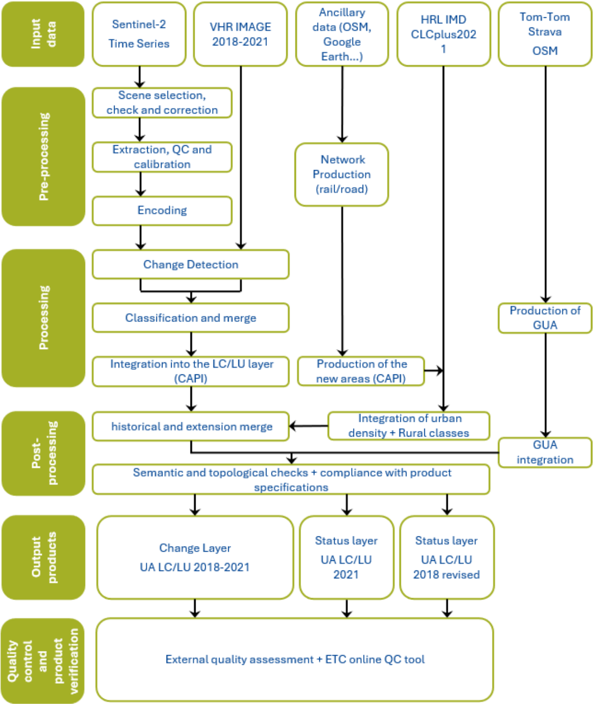
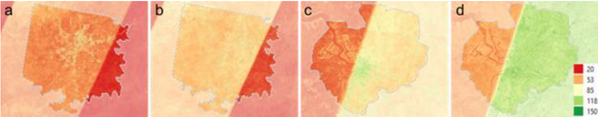
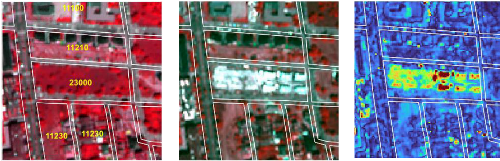
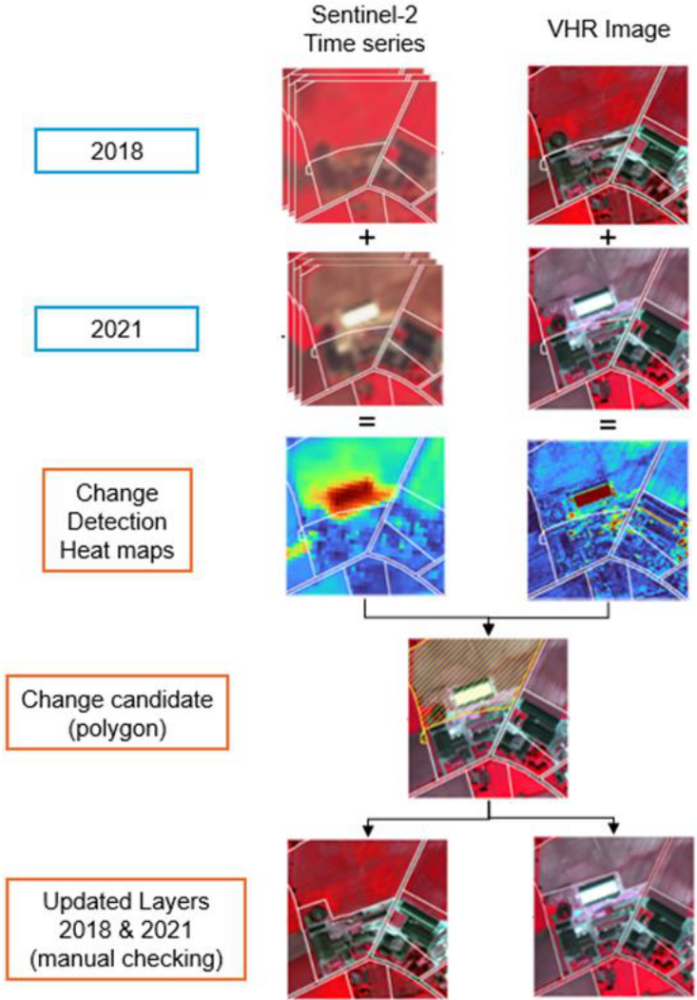
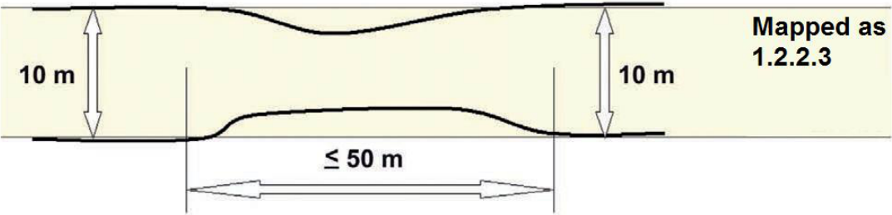
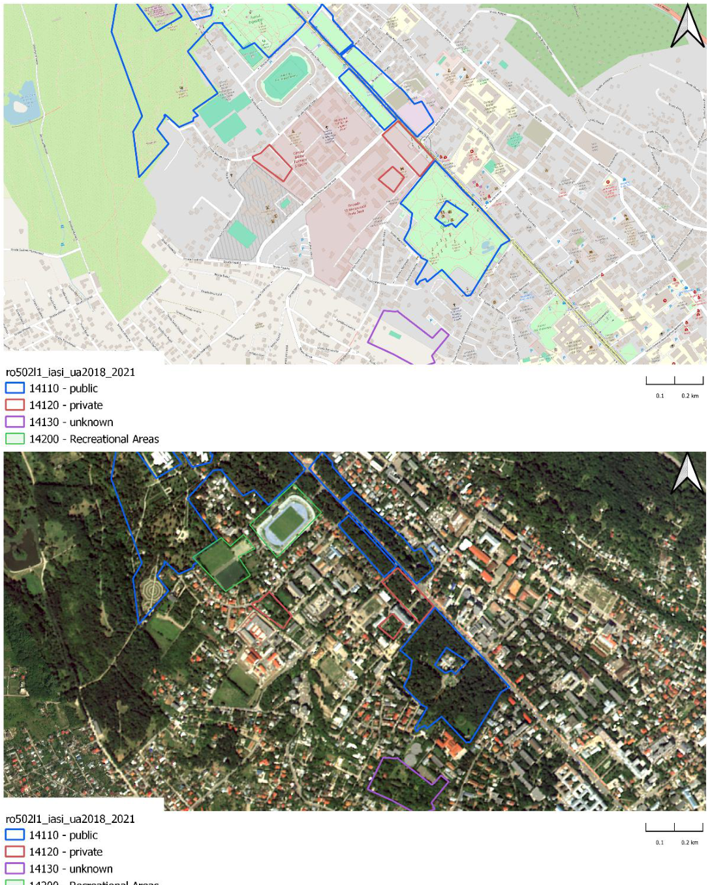

# Executive summary {#sec-executive-summary}

This document provides a comprehensive overview of the theoretical basis for the algorithms  used to derive the Copernicus Urban Atlas 2021 (UA). This product suite is designed to offer  accurate and reliable information of land cover land use in cities, using data acquired from Very  High Resolution (VHR) sensor as well as Sentinel-2 data.

The algorithms detailed in this document are developed to process raw satellite data into meaningful thematic products. Key components include:

1. **Source data**: Description of the satellite and sensor specifications, including spatial,  temporal, and spectral resolutions. This section also covers ancillary datasets used for  calibration and validation.

2. **Preprocessing**: Steps taken to correct and calibrate raw data, including radiometric and geometric corrections, time series parametrization.

3. **Processing**: Steps taken to change detection methodology and identify urban changes from Earth Observation (EO) datasets, leading to the UA LC/LU (Land Cover/Land Use) 2021 output. This section also covers the Change detection between 2018 and 2021  reference years.

4. **Post-Processing**: Steps taken to characterize the detected changes.

5. **Internal Verification**: Methods used to verify the accuracy and reliability of the derived dataset.

6. **Known technical issues**: Issues encountered during production or known limitations of  the products.

# Background of the document {#sec-background-of-the-document}

## Scope and objectives

This Algorithm Theoretical Basis Document (ATBD) summarizes the product characteristics and describes production methodologies and workflows of “UA LC/LU 2021”.

## Content and structure

- Chapter 1 provides the executive summary of the project along with a general information about European Union's Earth Observation Programme and Copernicus  Land Monitoring Service (CLMS).

- Chapter 2 outlines the scope, content and structure of this document.

- Chapter 3 details the general thematic content and product descriptions with the  methodology, workflows and internal quality control processes.

- Chapter 4 details the quality control and thematic internal verification processes.

- Chapter 5 presents the known technical limitations and residual technical issues.

- Chapter 6 defines key terms used in the document.

- and the Abbreviations & Acronyms, References, and Annex chapters provide supplementary information, and additional reference materials.

# Methodology {#sec-methodology}

The present section describes in detail the methodology applied for the production of UA LC/LU 2021 layer, including the change layer 2018-2021 and the UA LC/LU 2018 revised.

The methodology applied to produce the Building Block Height is presented in a separate ATBD. So as the methodology applied for the production of the Street Tree Layer 2021 that is presented in the ATBD document for Copernicus High Resolution Layer Small Landscape Feature products.

Table 1: Overview table of methodology

|Category Title|Description/Details|
|--|--|
|Retrieval Methodology|Change Detection|
|Input Data|Sentinel-2 (S2A, S2B), Level-2A (processing baseline 05.11), retrieved from Amazon Web ServicesVHR_IMAGE_2018 and VHR_IMAGE_2021 retrieved via ESA (European Space Agency) Data WareHouse (DWH)|
|Ancillary Data|OSM (Open Street Map) for roads, railways, rivers, etc.,CLCplus (Corine Land Cover) for rural classes, HRL (High Resolution Layer) IMD (Imperviousness Degree), TomTom®|
|Processing Workflow|Cloud masking, atmospheric correction, time-series compositing, deeplearning-based classification, mosaicking, vectorization, exclusion masks, aggregation|
|Spatial/Temporal Resolution|2-4m spatial resolution; 3 years update|
|Verification and Accuracy|Validation using independent visual interpretation of verification samples, weighted accuracy assessment with producer’s and user’s accuracy calculations.|

## Methodology and workflow

The figure below shows an overview of the workflow:

{#fig-figure1}

## Source data

UA 2021 LC/LU production relies on analysis and combination of different input datasets considered as source data. 

### EO data

Two different EO datasets are used to produce the UA 2021 products:

- <u>VHR_IMAGE_2021</u>: retrieved from ESA DWH through Copernicus Contributing Missions, this dataset provides a Very High Resolution (VHR) coverage of EEA38+UK for the reference year 2021. It contains VHR multispectral (RGB+NIR) products (2-4m spatial resolution) acquired between 2020 and 2022, in ETRS89-LAEA projection (EPSG:3035). The following missions contributed to this dataset:

  - Pleiades (28.68%)

  - SuperView (17.33%)

  - WorldView-2 and 3 (13.5%)

  - Kompsat-2-3 (7.12%)

  - Geoeye-1 (3.81%)

  - SPOT6-7 (26.66%)

  - TripleSat (0.63%)

  - Geosat-2 (0.98%)

  - Vision-1 (0.94%)

- <u>VHR IMAGE 2018</u> is also used for validation of the UA Change layer 2018-2021 and the UA2018 revised layer. 

- <u>Sentinel-2 time-series</u>: For a said reference year, the full time series on Sentinel 2 data was utilized. 

### Ancillary data

Ancillary data and other data are also used for the production of Urban Atlas 2021:

In the context of the labelling the accessibility of GUAs, in-situ and ancillary data are needed to  support the differentiation, quality assessment and validation of the classification. The following  additional data was used to categorise the classified GUAs as publicly or privately accessible:

- **OSM** is a collaborative, community-driven mapping project that provides free and open geographic data to users globally, making it a valuable resource for various applications,  including urban planning. Among the data, it offers detailed information on  infrastructure, land use, and transportation networks, and is therefore predestined to  distinguish between public and private green urban areas (GUAs) through specific tags  such as "leisure=park" for public parks and "landuse=residential" for private gardens. Further, the dataset contains information about restrictions and accessibility, indicated  by the tag access=private, which highlights whether a road is accessible to the public or not. However, many additional tags can be used—either individually or in combination—to enable a largely unique distinction between public and private GUA. Several tags associated with each feature have been implemented (see Annex 1). One disadvantage of OSM are the inconsistencies across different locations and / or  countries.

- **Digital Data Streets TomTom®** database. The TomTom® database is a highly accurate  database (97 %) that has been optimised for applications beyond pure navigation. The  TomTom®’s digital road data is continuously updated and therefore the street network  provides a significant quality benefit for the classification. The data consist of line (street  network) and point of interest data (POIs) for navigation purposes. In the frame of this  task, the street network is used to extract information about private or publicly accessible roads. 

- **Metro Strava** data was identified as another valuable data source that contributes to classification. Strava is a widely used digital platform that allows millions of users around the world to track their physical activities such as running, cycling, and walking via Global Positioning System (GPS)-enabled devices. The data generated through these activities, commonly referred to as Strava data, provides rich insights into human movement  patterns, particularly in outdoor environments. Each activity recorded on Strava  includes spatial tracks, time-stamped routes, distance, speed, elevation gain, and sometimes physiological data such as heart rate or power output, depending on user  settings and devices. In the frame of this project, we assumed that roads, streets and  paths that are used by Strava users for recreational activities have public access. <br> Although Strava had agreed to provide the data, the data was not provided for the full pan-European area. As a result, the data could not be used to comply with pan-European consistency requirements. 

- **High-Resolution Layer (HRL) Imperviousness**: Since 2006, the CLMS **HRL  Imperviousness Degree (IMD)** captures the percentage and change of soil sealing. Since  Urban Atlas 2018, the imperviousness degree provided by this layer is used for the  classification at level 4 of the residential or mixed-use urban fabric units. The current  update frequency of this layer is consistent with the update frequency of UA products.  Hence, IMD 2021 and 2024 are planned to be integrated in the production workflow of  UA2021 and 2024, especially to get the level 3 and 4 of residential polygons in the new  Functional Urban Areas (FUA) extensions and new FUAs.

- **CLCplus Backbone**: After nearly 30 years and five successful reference year  implementations of Corine Land Cover (CLC) (1990, 2000, 2006, 2012, 2018), the new  CLCplus product suite will constitute the next evolution step of this well-established  European reference product, setting a new standard from the reference year 2018  onwards for the EEA-38+UK countries. The CLCplus Backbone for the reference year  2018 consists of two main products, based primarily on Copernicus Sentinel satellite  imagery from 2017, 2018 and 2019: 

  - a pixel-based, multi-temporal S2 time series based, wall-to-wall Raster Product  with 10m spatial resolution and 11 basic LC classes (see nomenclature in Annex  2); covers 11 LC classes and is anticipated to synergistically complement the  currently five HR Layers 

  - an object-based Vector Product with 0.5 ha Minimum Mapping Unit (MMU), derived from a combination of linear traffic and hydrological networks (Hardbone) and image segmentation (Softbone), and 18 LC classes attributed with aggregated statistics from the Raster Product as well as various additional characteristics. 

  - Urban Atlas uses the corresponding classes of the CLCplus raster product for a  major part of the rural classification (classes). This is the case for classes 21000,  23000, 31000, 32000, 33000 and 50000. Some classes (22000, 24000 and  40000) must be extracted visually because they are not present in the CLCplus raster. Class 50000 must be completed visually, mainly concerning the  watercourses because the resolution of CLCplus is not sufficient to extract them  properly.

Table 2: Ancillary datasets used for the UA 2021 production

|Source|Use|Reference|
|--|--|--|
|OSM (Open Street Map)|Road and railway networks|[https://www.openstreetmap.org/](https://www.openstreetmap.org/)|
|TomTom®|Green Urban Area classification|[https://www.tomtom.com/](https://www.tomtom.com/)|
|CLCplus Backbone 2021|Rural classification for extensions|[https://land.copernicus.eu/en/products/clc-backbone](https://land.copernicus.eu/en/products/clc-backbone)|
|HRL IMD 2021|IMD (imperviousness density)|[https://land.copernicus.eu/en/products/high-resolution-layer-imperviousness](https://land.copernicus.eu/en/products/high-resolution-layer-imperviousness)|

## Pre-processing

### Input data for pre-processing

#### VHR data

The complete VHR_IMAGE_2021 dataset provided by the European Space Agency (ESA) through  the Copernicus Space Data Infrastructure was used for processing.

#### Sentinel Data

The complete Sentinel-2 archive for the specified reference year and tile was utilized for processing. A dedicated preprocessing routine was applied to Level-2A data across the entire time series to generate cloud-free percentile composites of the corresponding Sentinel-2 bands, along with a harmonic fitting of the time series. For further details, refer to @sec-pre-processing-methodology below.

### Pre-processing methodology {#sec-pre-processing-methodology}

The combination of Sentinel-2 (S2) time series data and Very High-Resolution (VHR) imagery is significant for detecting changes in urban areas between 2018 and 2021/2024 for the Urban  Atlas. Sentinel-2, with its frequent revisit time and multispectral capabilities, provides a wealth  of information about land cover and land use dynamics over time. By analysing the S2 time series, it becomes possible to identify gradual changes, such as urban expansion, vegetation  growth, and land degradation, which can contribute to an accurate understanding of urban development trends. However, to capture fine-scale details and detect subtle changes within urban environments, the integration of VHR imagery becomes crucial. VHR imagery offers a  more detailed view of urban features, including buildings, roads, and infrastructure. However, the drawbacks are an inconstancy of date of sensor which provide a patchwork at Pan European scale. 

By merging analysis from VHR imagery with Sentinel-2 data, it becomes possible to detect and  analyse specific changes such as new construction, demolition, changes in building heights, and  modifications to transportation networks joining the advantage of temporal consistency of  Sentinel time series and geometric precision of VHR data.

#### VHR data

The ready-to-use images from VHR_IMAGE_2021 dataset (cloud free, homogeneous and without gaps) were downloaded from the ESA Data Warehouse (DWH) and stored on a secure and dedicated cloud infrastructure. They were then grouped into image stream (WMS) to improve their usability and visualization by operators.

#### Sentinel Data

The dense observation capacity provided by the Sentinel-2 satellite constellation enables detailed monitoring of landcover dynamics across large areas. To efficiently identify meaningful changes from this wealth of data, a robust and scalable time-series modelling approach is applied to Normalized Difference Vegetation Index (NDVI) observations.

Rather than combining multiple data reduction techniques, the final method focuses exclusively on the temporal behaviour of NDVI, which serves as a reliable proxy for landcover activity and condition. By modelling the NDVI time series directly, temporal patterns such as phenological  cycles, trends, and anomalies can be captured in a compact set of model parameters. This  reduces the dimensionality of the input data while preserving relevant information.

The NDVI time series is parametrized using a combination of harmonic and polynomial functions. This allows for a flexible yet consistent representation of seasonal and interannual dynamics. The resulting model coefficients are used to characterize baseline conditions and to detect deviations that may indicate land cover or land use changes.

$f(t)=\sum_{i=0}^{P}p_{i}t^{i}\;\;+\sum_{k=0}^{H}(\alpha_{k}\mathrm{sin}\left(k\omega t\right)+\beta_{k}\mathrm{cos}\left(k\omega t\right))$

in this equation, p~i~ are the coefficients of the polynomial term with order P, H is the order of the  harmonic system and α~k~ and β~k~ are the coefficients of the harmonic functions with order k. $\omega= 2π$/year is the base angular frequency of the harmonic system. The coefficients p~i~, α~k~ and β~k~ are  estimated by performing ordinary least squares fit to the signal of each pixel of the time series. <br> Cloud and atmospheric artifacts (@fig-figure2) are mitigated through a weighting scheme based on  the Sentinel-2 L2A Scene Classification Layer (SCL), in which observations with high cloud or  shadow probability are down-weighted during the modelling process. This ensures that only  high-quality observations contribute meaningfully to the fitted time series.

{#fig-figure2}

By focusing on NDVI time-series modelling, the approach leverages established evidence of its  effectiveness for land surface monitoring while maintaining computational efficiency and  interpretability across diverse landscape types.

## Processing

### Processing methodology

#### Change detection methodology based on Sentinel-2 (S2)

Once the NDVI time series has been modelled for two different reference years, changes are quantified by calculating the Root Mean Square Deviation (RMSD) between the corresponding modelled curves. The RMSD provides a direct and interpretable measure of how much the NDVI signal (both in value and shape) has changed between the two years at each pixel location.

The RMSD is calculated as:

$\mathrm{RMSD}=\sqrt{\frac{1}{2\pi}\int_{0}^{2\pi}(f_{1}(t)-f_{2}(t))^{2}~d t}$

This expresses the average squared difference between two continuous NDVI curves (modelled by the harmonic curves f~1~ and f~2~ over a full annual cycle.

This RMSD value acts as a direct proxy for the magnitude of change, resulting in a continuous  surface, a "heatmap of change", that highlights where significant differences in landcover dynamics have occurred.

However, one limitation of this approach is that different land cover types exhibit inherently  different levels of temporal variability. For instance, agricultural areas naturally undergo  frequent changes due to cropping cycles, leading to high RMSD values even in the absence of actual land cover conversion. In contrast, forested or urban areas typically exhibit more stable  NDVI patterns.

To account for this, the RMSD values are normalized based on land cover class using the CLCplus Backbone as a reference map. For each land cover class, we calculate the mean and standard  deviation of RMSD values across all pixels. The raw RMSD at each pixel is then transformed into  a standardized score:

$\begin{array}{r}{\mathrm{RMSD}_{\mathrm{norm}}=\frac{\mathrm{RMSD}-\mu_{\mathrm{class}}}{\sigma_{\mathrm{class}}}}\end{array}$

where μ~class~ and σ~class~ are the mean and standard deviation of the RMSD within the corresponding  land cover class.

This normalized RMSD highlights pixels where the observed change is significantly greater than  what is typical for that land cover type, allowing for a more context-aware detection of  anomalies and potential change events. In the @fig-figure3 below, an example for a detected change  in Vienna, Austria is displayed.

{#fig-figure3}

To further improve the accuracy and reliability of detected changes, the normalized RMSD layer is subsequently fused with information derived from very high resolution (VHR) imagery-based change detection, resulting in a more robust, multi-source assessment of land cover change.

#### Change detection methodology based on VHR

The second step of the production workflow is the work lead by the CLS team regarding the  Change Detection based on VHR.

CLS has made several tests on using 2 possible unsupervised methods: Principal Component  Analysis (PCA) and Slow Feature Analysis (SFA).

**PCA** is a statistical technique commonly used for dimensionality reduction and preserving the  inherent structure of data. It aims to transform a set of correlated variables into a new set of  uncorrelated variables known as principal components. These components are linear combinations of the original variables and are arranged in descending order of their ability to  explain the variance within the data. By doing so, PCA enables the separation of significant  changes from other variations in the data. This approach allows for the extraction of the most significant change information, aiding in the generation of change maps.

**SFA** is a scientific method employed for image analysis, focusing on slow or large-scale features present in visual data. This approach capitalizes on the notion that important and meaningful  information can be extracted by emphasizing low-frequency structures in an image, which typically represent large-scale variations. SFA can identify slow-changing features, which are more likely to represent meaningful changes over time.

By merging the two approaches, CLS hastested to combine the advantages of PCA that lies in its  computational efficiency and its ability to filter out noise without significantly affecting the  geometric properties of entities present in the image, and the advantage of SFA that excels at  filtering the difference image by preserving large-scale change structures. By combining these  methods, a consistent approach could be achieved by applying a threshold to the SFA output  image. This thresholding operation extracts major change structures and incorporates them into  the output of PCA. Consequently, this provides a heat map representing the studied area,  effectively highlighting potential change areas.

Finally, after several iterations and analysis of outputs, the methodology was adapted by giving priority to the **PCA approach**. The SFA results required a heavy and lengthy computing process, and results were not fully satisfactory, showing a high number of commission errors (@fig-figure4). 

{#fig-figure4}

#### Production of change candidate layer

After obtaining the heatmaps derived from S2 data and those derived from VHR data, it is necessary to combine both into a single layer that will constitute the change candidates. 

A CLC change layer is extracted and applied to the S2 change candidates, retaining only the  changes identified by both the CLC and S2 layers, while small elements are removed based on  the defined MMU. On the VHR side, changes are preserved only in urban areas and where they  overlap with the CLC/S2 layer—meaning that, in the end, only VHR-detected changes within the  S2 and CLC change areas are kept. The methodology is illustrated in @fig-figure5 below:

{#fig-figure5}

Starting with the two change detection heat maps, the next steps consist of:

- Harmonization of the two heatmaps. Both maps do not have the same resolution, the Sentinel heat map is resampled to 2meters spatial resolution to match with VHR resolution. 

- Merge of the two heat maps, using a simple addition operation. This way, no heatmap  has priority over the other, as both will have advantages in different landscapes: VHR  derived change layer will accurately include change within urban areas or of small  extent, while Sentinel derived change layer will be efficient to detect/discard changes  at the edges or outside urban areas.

- Convert the heatmaps into binary layers (stable areas vs potential change areas) done  by a thresholding of the dataset using a value applicable for each FUA. To determine the  value to be used for the thresholding, a calibration step is implemented: a subset of  pixels is selected across various landscapes and labelled as change or stable area.  Comparing the pixel values (= probability of change) and labels allows to identify the  threshold value. A conservative approach is preferred to maximize the change detection  (i.e the applied threshold is voluntarily lowered compared to value obtained by  statistical analysis to avoid automatically discard valid changes).

- Filter out artefacts such as salt and pepper aspect of the heatmaps.

- Apply an MMU to automatically remove changes that will not fit the technical specifications of the product.

#### Production of change layer 2018-2021 and extraction of revised 2018 layer

Manual enhancement is the crucial final step in the production framework, aiming to validate  the detected changes and to refine the change polygon geometry, if required, to ensure that the correct MMU is applied. This process ensures that only changes larger than the change minimum mapping unit (MMU) to consider (0.10 ha for urban areas and 0.25 ha for rural areas) and leading to polygons larger than the minimum status mapping unit (0.25 ha for urban areas and 1 ha for rural areas) are mapped.

In case of a homogeneous area larger than the MMU but divided in 2 or more polygons by the  road or railway network, each part can be smaller to preserve the land cover information.  However, no polygon can be smaller than 500 Sqm (e.g. a 1 ha forest divided in 4 polygons by the road network has to be mapped) except for polygons at the border of the FUA for which the MMU is 100 Sqm.

The minimum mapping width (MMW) between 2 objects for distinct mapping is 10 m.

Exceptions can be considered in two cases:

- For class 12220 (MMW = 6 m).

- To maintain continuity of linear structures, they can be mapped smaller than 10 m over  a distance up to 50 m (see figure below).

{#fig-figure6}

Priority mapping rules for areas smaller than the MMU are used:

- Areas under MMU are visually added to the adjacent unit with the thematically closest  class. This rule is used for the artificial classes (1xxxx).

- Areas under MMU are added to the adjacent unit with the longest common border line, except with railways or roads (exception here: if an object is below the MMU size and  entirely surrounded by e.g. road or railway network, it shall be aggregated with that surrounding traffic line). Rule used for the natural / semi-natural classes (2xxxx, 3xxxx, 4xxxx, 5xxxx) and all the polygons under 100 Sqm.

In order to ensure that relevant LC/LU changes are appropriately extracted, some specific  Minimum Mapping Units for LULC change layer are defined as below:

- Urban (class 1) to urban (class 1) = 0.1 ha

- Rural/natural (classes 2-5) to urban (class 1) = 0.1 ha

- Rural/natural (classes 2-5) to rural/natural (classes 2-5) = 0.25 ha

- Urban (class 1) to rural/natural (classes 2-5) = 0.25 ha

Considering these MMUs (Minimum Mapping Units), exceptions are made in case of areas where changes involve road and railway networks (classes 12210, 12220, 12230); polygon features classified as road or railway for one date or directly connected to such element are extracted even if area is lower than MMU in order to keep consistency of the transportation network. In this case, and for the concerned polygons, a comment is added in the attribute table.

To guarantee a complete and accurate dataset, a thorough visual inspection of the image is  conducted to identify any obvious change that may have been missed by the automated  detection process. This ensures that the final dataset is of the highest quality and accurately  represents the changes that have occurred in the area between the reference years. The manual  enhancement process is essential to validate and refine the results obtained from the  automated change detection process, guaranteeing the best possible outcomes for the project. Additionally, some of the errors in the UA2018 product can be spotted and have been  highlighted by the VHR 2018-2021 change analysis, because polygons had been wrongly labelled  in the UA2018 product (known as false change error) or because, even without a real error,  regarding a detected change, the initial geometry of a polygon can be slightly adapted to allow  an extraction of a new one with good geometrical accuracy.

The change layer is only mapping polygons that exhibit actual changes, disregarding those  without any discernible modifications. To mitigate false changes, any misclassification identified in the 2018 layer is corrected, but solely in the immediate vicinity of the actual land cover/land use change area. This operation must be carried out by means of visual analysis. The interpreter compares the change candidate polygon with the images (2018 and 2021) and ignores or inserts the change in the production layer by improving/adjusting geometric and thematic information  for both reference years.

Once the change analysis is over, The UA2018-revised layer can be easily extracted.

#### Production of the status layer 2021

**Creation of the new 2021 areas**

FUA boundaries are dynamic entities that can evolve due to updates in the population grid  published by Eurostat or modifications in the LAU (Local Administrative Units) within countries.  This has occurred in every Urban Atlas exercise, necessitating mitigation measures to maintain consistency across time series.

Compared with the extent of the UA2018, some FUAs are stable, while others may have been reduced or expanded, either by incorporating areas recovered from neighbouring former FUAs  from the 2018 UA or by integrating new areas, not present in the 2018 products, which will  therefore need to be generated from scratch.

The methodology used for the mapping of these new areas will mainly follow the methodology used for the production of the previous Urban Atlas products (2012/2018) already achieved to ensure the highest level of homogeneity but with some adjustments to get better results,  essentially in the rural areas.

Most of the UA classes within urban areas involve a land use component which is difficult to  identify based on automatic classification procedure. Therefore, to obtain the required level of  quality, the techniques of Computer-Assisted Photo Interpretation (CAPI) will be used for these classes that are difficult to discriminate through automated classification techniques. This work will be facilitated by using the output of processes on the road and railway networks of the OSM database, which will provide a skeleton for the urban areas thus focusing the CAPI work on the  relevant areas.

Each photo interpreter is allocated to a FUA or a subset of the FUA area based on her/his own experience. The objective of this step is to extract all the artificialized classes (classes 1XXXX). The interpreter subdivides polygons if needed to extract homogeneous entities regarding the image and the product specifications, then applies the dedicated class.

Once the roads, railways are interpreted and validated, the rural classes extracted from CLCplus raster database is combined to the layer to fill in the classification on rural areas. At the same  time, HRL imperviousness is used to apply the different level densities on residential polygons.

Finally, after some completions and checks the UA2021 LC/LU production on new areas is over.

When working with a FUA that contains some surface expansion between 2018 and 2021, it is  necessary to proceed to an additional step of visual verification. This step ensures the perfect  alignment of the historical sections with the expanded sections along the boundary between  these different parts.

**Urban Atlas 2021 status layer generation**

The 2021 status layer is generated by merging two types of layers:

- On historical areas (existing in the 2018 UA products) a layer created from the comparison between the 2018 status layer with the validated change layer. The 2021 layer is here an updated version of the UA2018 layers.

- On new areas (non-existing in the 2018 UA products) an UA2021 layer created from scratch.

- Consequently, UA2018-revised and UA2021 can have different extents.

The existing parts of the initial UA2018 not included in the UA2021 extents are not present on  the UA2021 outputs but are also removed on the UA2018-revised outputs, which is in line with  what was done during the UA2012-2018 production.

After creation of the full 2021 dataset, polygons belonging to the green urban area class are analysed for private or public access. This is described in the following chapter.

#### Generation of Green Urban Areas (GUA) “public vs private” label

**Data model**

The existing Urban Atlas nomenclature was extended by three new subclasses of the existing  GUA class (14100). This development followed a request by DG Regio to better allow to evaluate the value of GUAs of a city and to be able to better report in the frame of the Sustainable Development Goal (SDG) 11 - sustainable cities and communities that refers to a need new, intelligent urban planning that creates safe, affordable and resilient cities with green and culturally inspiring living conditions.

- 14110 - Public access

- 14120 - Private access

- 14130 - Unknown access

To increase the consistency, accuracy and quality of the results, a combination of OSM and commercial Digital Data Streets TomTom® database was used for labelling of the UA GUAs.

**Methodology**

The initial phase of the production focused on the acquisition and meticulous preparation of the datasets required for classification. At the heart of this step lies the extraction of relevant  geospatial information from OpenStreetMap (OSM). Specifically, the OSM Overpass API, a powerful, Representational State Transfer (REST)ful web service, was utilized to query and  retrieve targeted subsets of OSM data. This allowed for precise extraction of features tagged  with relevant attributes, as outlined in Annex 1 - Green Urban Areas queries.

The TomTom® multinet data was purchased from a company called p17 and prepared by merging data from individual countries into a single vector file and extracting the information on streets with private access.

In parallel, the Urban Atlas Green Urban Areas (GUA) polygons were prepared for integration  and analysis. Given that data from multiple sources can introduce minor spatial inconsistencies,  a negative buffer of 10 meters was applied to each polygon. This preprocessing step helps prevent erroneous intersections caused by overlapping or imprecise boundaries, ensuring  cleaner analytical outcomes.

Following data preparation, the classification process is based on sequential checks for  intersection of GUA polygons with OSM and TomTom® data. This sequence of steps is not  accidental but rather based on the availability and robustness of the OSM and TomTom  metadata. For example, the TomTom® dataset includes a more systematic labelling of road  segments with restricted access and is therefore applied after the OSM and allowed to overwrite  its initial classification.

Each subsequent step may overwrite an existing classification. Polygons remain unclassified as long as they don't intersect with one of the datasets, if no intersection occurs a class ‘unknown’ is assigned in the final step.

- **OSM road/trail network**: in the first iteration a GUA polygon is checked for  intersection with the OSM road and trail network, from which all segments with restricted accessibility were excluded. If the polygon is found to intersect with OSM road grid it is classified as public access (class 14110).

- **TomTom® road network**: secondly, the same polygon is checked for intersection with TomTom® road network from which all road segments labelled as ‘private’ were excluded. Upon intersection the polygon is classified as public access.

- **TomTom® POI data**: In the subsequent iteration, the polygon is checked for  intersection with TomTom’s Point Of Interest (POI) database. All POI information is  considered to indicate public accessibility as it typically marks locations of private businesses (e.g. retail, services etc.) or public infrastructure. If a polygon is found to intersect with a TomTom® POI it is classified as public access.

- **OSM polygon data ‘public’**: subsequently, the GUA polygon is checked for intersection against a collection of OSM polygon data with a wide range of specific  tags indicating public accessibility and classified as public access upon intersection.

- **OSM polygon data ‘private’**: the GUA polygon is once again compared against OSM polygon data, this time checking for intersections with polygons with tags explicitly  indicating private or restricted accessibility. The polygon is classified as private access (class 14120) upon intersection.

- **Unknown access**: Finally, all GUA polygons that did not intersect with any of the above-described data are classified as unknown access (class 14130).

@fig-figure7 shows the result of the labelling process and the final classification of GUAs into public (blue), private (red) and unknown (purple) in the FUA of Iasi, Romania. Additionally, it also shows class 14200 - recreational and sport areas (green).

{#fig-figure7}

Table 3 shows the number of private/public and unknown occurrences of selected FUAs.

Table 3: Number of private/public and unknown occurrences of selected FUAs of one delivery batch

|Site|Name|Ref year|Private|Public|Unknown|
|--|--|--|--|--|--|
|al004l1|Shkoder|2021|0|69|24|
|ba004l1|Tuzla|2021|0|90|28|
|bg001l2|Sofia|2021|1|685|206|
|bg002l2|Plovdiv|2021|1|223|39|
|bg004l2|Burgas|2021|0|140|37|
|bg014l1|Haskovo|2021|0|41|6|
|bg018l1|Vratsa|2021|8|78|41|
|ch007l2|St gallen|2021|0|59|14|
|cz002l2|Brno|2021|2|442|65|
|cz014l2|Jihlava|2021|0|143|37|
|es003l3|Valencia|2021|3|745|171|
|es009l2|Valladolid|2021|2|432|96|
|es514l1|Almeria|2021|3|148|17|
|es519l1|Albacete|2021|9|139|30|
|fi001l3|Helsinki|2021|0|1695|123|
|fi002l3|Tampere|2021|1|907|106|
|fi008l2|Kuopio|2021|0|156|14|
|fi009l2|Jyvaskyla|2021|0|236|52|
|hu005l2|Debrecen|2021|3|252|61|
|hu00l2|Szekesfehervar|2021|0|372|118|
|it004l2|Torino|2021|7|995|224|
|it020l3|Campobasso|2021|0|50|12|
|it027l2|Cagliari|2021|0|196|59|
|lt001l1|Vilnius|2021|2|817|218|
|lt003l1|Panevezys|2021|0|153|87|
|lv501l1|Daugavpils|2021|0|44|9|
|mk003l1|Bitola|2021|0|96|16|
|nl002l3|Amsterdam|2021|3|2354|146|
|nl511l3|Zwolle|2021|0|705|77|
|pl004l2|Wroclaw|2021|6|445|33|
|pl005l2|Poznan|2021|3|699|165|
|pl010l2|Katowice|2021|2|1817|181|
|pl011l2|Bialystok|2021|2|237|46|
|pl027l2|Kalisz|2021|0|96|27|
|pt001l3|Lisboa|2021|27|786|195|
|pt005l2|Coimbra|2021|0|158|142|
|ro009l1|Sibiu|2021|3|59|25|
|rs002l1|Novi sad|2021|0|107|6|
|rs014l1|Valjevo|2021|0|53|20|
|rs015l1|Vranje|2021|0|43|8|
|se001l1|Stockholm|2021|10|2445|392|
|se005l1|Umea|2021|0|166|46|
|se007l1|Linkoping|2021|0|452|116|
|se501l1|Vasteras|2021|1|131|14|
|se505l1|Boras|2021|0|103|48|
|si001l2|Ljubljana|2021|2|248|86|
|sk002l1|Kosice|2021|0|347|6|
|sk005l1|Presov|2021|0|198|7|
|tr018l1|Konya|2021|1|391|66|
|tr030l1|Batman|2021|2|83|8|
|tr031l1|Sivas|2021|0|118|20|
|tr044l1|Karaman|2021|0|129|29|
|xk002l1|Prizren|2021|0|27|12|

#### Integration of the GUA codes

Once the GUA polygons are recalculated with the new GUA classes, they can be used directly by location intersect to replace the old 14100 class by the new 14110, 14120 and 14130 classes (see nomenclature in Annex 2). This operation occurs once the production is over on the areas and before the deliverable’s preparation.

Note that this implementation of new classes is only applied for the 2021 reference year. It will thus not be applied on the 2018 revised layer nor in the 2018 fields of the change layer.

#### Preparation of layers

Once the various layers are finalized in production, the preparation of the deliverables is initiated.

First, it is essential to ensure that all produced layers comply with the product specifications and defined topological rules. Necessary corrections are made, and then an automated process  standardizes and exports the layers in the required GeoPackage (gpkg) format. These layers are subsequently tested using the online QC tool. Final adjustments are made to the layers, if  necessary, followed by the online submission of the data.

#### Preparation of associated documents

After the production layers are validated, automated report preparation tools are launched. The  output consists of two PDF documents:

- A general production report detailing the processing phases, dates, a cartographic overview, and statistical elements.

- A map with a detailed legend of the most recent vintage (2021 in this case).

All this data is then published online by the EEA on their website and is available for free download.

## Output products

The UA 2021 production outputs comprise three main primary layers, provided in pan-European  LAEA (Lambert Azimuthal Equal-Area) projection – EPSG (European Petroleum Survey  Group):3035:

- Urban Atlas 2018-2021 change layer 

- Urban Atlas 2018 revised status layer

- Urban Atlas 2021 status layer

- Street Tree Layer 2021 status layer

- Building Block Height 2021 (see separate ATBD for Building Block Height)

# Quality control and production verification {#sec-quality-control-and-production-verification}

## Quality assurance and quality control framework

Quality Assurance (QA) and Quality Control (QC) procedures will be implemented on all  production sites under the coordination and supervision of the Quality Manager acting as lead  of the Work Package on Quality Management (WP 120). Within the overall QA/QC framework, dedicated efforts will be devoted throughout the entire production chain, where:

- **Quality Assurance (QA)** relates to the procedures fully integrated in the post-processing routine in place to ensure that the desired quality is met by provision of detailed  guidelines and documentation for each step within the production process and 

- **Quality Control (QC)** within the production process will apply planned and systematic checks at various stages between data collection and the final product

Quality assurance follows an internal standardised approach to Quality Management and  comprises dedicated procedures of quality control breakpoints during the production chain, in  order to keep persistent quality over the various stages of production, assure fitness for purpose  of the end products and that all product requirements and related sign of quality are fulfilled.  The quality checks also serve to establish comparability, traceability and to assure a consistent  quality during the production. Priority will be given to the target thematic accuracies to be  achieved by each product and to consistency (spatial, thematic, temporal) and homogeneity  over time and regions.

The conformity and systematic checks are performed as part of the QC framework according to  the Logical consistency as described in the **INSPIRE** (Infrastructure for Spatial Information in the European Community) **Data Specifications**:

#### Topological consistency

The topological consistency describes the degree of correctness of the topological characteristics described in the product specification of the dataset. The topology rules are defined at the start of the Project. 

A series of automatic inspections will be applied in order to ensure the geometric and topological  integrity of items for each thematic feature class. An exhaustive topology check procedure is  initiated before each partial delivery, as well as for the final delivery. The topology checks consist  of confirming that the produced database does not contain errors, related to the following types  of entries: 

- No unclosed polygons, i.e. polygon features that would not be completely closed

- No null feature errors, i.e. table records without geometry component 

- No vertices non-compliant with cluster tolerance, i.e. closer than the agreed tolerance

- No multipart features, i.e. features that would be composed by more than one geometric part 

- No faulty point-curve connections, i.e. faulty point-curve connections in the dataset

- No missing connections due to undershoots, i.e. items in the dataset within the parameter tolerance that are mismatched due to undershoots 

- No invalid slivers, i.e. items in the dataset that are invalid sliver surface

- No polygon with invalid geometry

- No invalid self-intersect errors, i.e. items in the dataset that illegally intersect with  themselves 

- No invalid self-overlap errors, i.e. items in the dataset that illegally intersect with themselves 

- No very small line or polygon features, i.e. features that should not have been extracted because of their non-significant size

- No kink or kickback online or polygon features, i.e. features with geometric anomalies such as narrow angles or back points. 

Additionally, a series of topological rules reflecting the relationships between entities inside  each feature class will be checked. The Table presents the topological rules included in our QC  procedure.

Table 4: Quality Assurance: topological rules

|Feature|Rule|Notes|
|--|--|--|
|Area|Must not overlap|Requires that the interior of polygons in the Feature Class not overlap at the same scale. The polygons can share edges or vertices|
|Area|Must not have gaps|No voids within a single polygon or between adjacent polygons. All polygons must form a continuous surface. Guarantee full land cover|


#### Format consistency 

The format consistency includes detection of file format, file or attribute names or attribute types which do not correspond to the specifications. 

The Attribute Table consistency checks consist of identifying missing attribute information with respect to edited/newly created polygons. This process is performed in a semi-automatic mode in order to ensure the conceptual and topological relationships between the features from different feature classes (or layers). If any missing attribute information is found, it will be corrected. 

The documentation of the attribute table is mostly done through the use of software modules internally developed by CLS and integrated in the User Interface for editing.

For the attribute information, successive checks for the attribute fields will be implemented:

- Completeness – Check that an item has been assigned for each feature and each attribute field 

- Conformance – Check that all attribute values are compliant with the value domains.

#### Domain consistency 

The Domain consistency involves the detection of attribute values that are outside the predefined range of values. For vector data each attribute has a pre-defined set of range of values. Among those checks, a special attention will be given to the assessment of unlikely evolutions.

The resulting database maintains for each geographical element the history of the evolution  between 2018 and 2021 (and later between 2021 and 2024). A very efficient method of checking  the quality of the database, already implemented by CLS in previous UA production as well as other commercial projects, is to identify the codes corresponding to “unlikely evolution”. 

Generally, the unlikely evolution parameters are related to a decrease of the artificial cover  degree, or an increase of the degree of human impact; for instance: an urban area towards  agriculture, or an agricultural area towards a natural environment. The consortium will implement the modelling of such unlikely evolutions and then searches for the relevant polygons. The operator performs the analysis of such areas in order to assess whether the target evolution is confirmed and valid, or whether false change was included in the database. In this case, the operator will amend the 2018 (2021) or 2021 (2024) datasets accordingly to correct  the error.

The identified errors may be concerned with either 2018 (2021) or 2021 (2024). In some cases, they cannot be detected when looking at only one date. The process proposed here will then not only **improve the accuracy of the new 2021 (2024) database** but also **improve the overall accuracy of the original 2018 (2021) database**. 

#### Conceptual consistency 

The conceptual consistency indicates that the data structure follows the data specifications in terms of data model and relationships (e.g., type of feature used, MMU, MMW (Minimum Mapping Width), Coordinate Reference System, etc).

As for topology checks, a series of automatic control will be performed all along the production workflow and on the different LC/LU product with adapted rules for each of them, to ensure that geometric rules are correctly applied with regards to the specification of each thematic  class, according to the PUM (Product User Manual) document. Each detected error is flagged and manually assessed in order to obtain a fully compliant product.

## Thematic quality and accuracy assessment

### Objectives and approach

The main goal of an accuracy assessment independent from the production is to guarantee the  quality of the UA mapping products with reference to the accuracy thresholds set in the tender  specifications, for the LC/LU products these are: 

\- >= 85% for the urban classes (class 1)

\- >= 80% for the rural classes (classes 2 to 5)

\- >= 80% accuracy for all classes

This will be achieved through the update and adaptation of the validation data set initially  developed for the Urban Atlas 2006 project through a so-called “double-blind” approach. This  means that the production team will not have access to the reference data set during the visual  interpretation stages of the production process and the reference data team will not have access  to the maps produced. This approach has been updated and used for the production of Urban  Atlas 2012 and 2018. Using it for the 2021 and 2024 production will ensure a high consistency  between previous and upcoming UA productions.

### Sampling and response design

The validation framework should:

- Be based on a representative probabilistic sample, following a sound and statistically  robust methodology.

- Ensure synergies and economies of scale.

1) To be fully compatible with the state-of-the art literature in the field of validation, a stratified  systematic sampling design is implemented. The advantage of this method as opposed to setting  a fixed number of randomly selected control points per FUA are that:

- It takes characteristics of the FUA into account (size and proportion of urban areas).

- The cluster sampling facilitates the collection of reference observations

- An element of systematic sampling ensures a better representation of the study area compared with a pure random sampling.

2) With a view to minimize costs, the UA2018 samples will be reused for the UA2021 and UA2024  updates. The rationale is that changes should occupy a small portion of the FUAs area (especially  as the update frequency is now every 3 years) and that most of the 2018 reference information  should still be valid for the year 2021. Paired observations between updated UA2021 FUAs and  UA2018 reference data will be analysed for each quality control point once a given FUA is  produced. All the points that are in disagreement will reflect either a change in the 2018-2021 period or an error in one of the status layers (error in the UA2018 layer of false change included  in the 2021 product).

Based on the expected amount of actual change and the quality of previous UA LC/LU product,  it is assumed that the number of samples presenting a discrepancy between updated 2021 FUAs  and UA2018 reference would represent less than 10% of the complete sample pool (261 075  samples across EEA38). We propose in the framework of this validation activity to re-interpret  for the reference year 2021 up to 10% of the complete sample pool. Those 10% (around 26 000  samples) would be selected based on 2 criterions: 

- Discrepancy between UA2021 LC/LU product and UA2018 reference. As stated above, those samples are likely to identify change area, errors in the status products or change in the nomenclature (private/public characteristic of the GUAs)

- Agreement between UA2021 LC/LU product and UA2018, but location of the samples in one of the following categories:

  1. Located in a 200m buffer outside of urban areas

  2. Located in a construction site in UA2018 product

  3. Located in rural areas

This criterion will target omitted change by focusing the selection of samples to areas which are the most expected to be targeted by changes (urban/rural area limit and construction sites, categories 1 & 2) or potential changes within rural areas (category 3).

Table 5: Share of samples to be interpreted

|Criterion selection|Share of samples to be interpreted|
|--|--|
|Discrepancy between UA 2021 product and UA2018 reference data|67%|
|Agreement between UA2021 product and UA2018 reference and included in a 200m buffer around urban classes|11%|
|Agreement between UA2021 product and UA2018 reference and located in a construction site in 2018|11%|
|Agreement between UA2021 product and UA2018 reference and located in rural areas|11%|
|Total|100%|

This proposed distribution of the reference samples to be re-interpreted is considered for the complete FUAs coverage but of course can vary from one FUA to another, depending on each FUA characteristics.

Each selected sample will be re-interpreted using 2021 reference and guiding datasets  (VHR_IMAGE_2021, ancillary dataset such as Google Earth, Bing Maps or Wikimapia) to update the reference attribute.

### Thematic accuracy and statistical analysis

The updated reference dataset for the year 2021 is then compared to the UA2021 LC/LU product  to derive thematic accuracies. The thematic accuracy will be presented in the form of a **weighted error matrix**. This method is well adapted to evaluate categorical variables. The **Producer’s and  User’s Accuracy** will be derived for classes 1 to 5; the **Overall Accuracy** will be derived for all  classes combined and the 95% confidence intervals will be calculated for each accuracy. Those  metrics are derived for each FUAs and included in a “Quality Index Sheet” delivered for each  FUA. The “Quality Index Sheet” includes also the Quality Control summary described in the  previous section.

Considering the FUA boundaries are subject to evolution between the reference years, the  consortium is considering adjusting the sampling design and drawing additional samples if  necessary to make sure the complete AOI is validated adequately.

# Recognized technical issues {#sec-recognized-technical-issues}

This section outlines the key technical challenges, limitations, and constraints encountered  during the production of the Urban Atlas dataset under the Copernicus Land Monitoring Service. It focuses on methodological and algorithmic limitations, input and reference data quality, and other relevant technical aspects that may impact the overall accuracy, consistency, or reliability  of the final product. Additionally, ongoing improvements and planned future developments  aimed at addressing these issues are briefly discussed.

## Technical issues linked to the UA2021 LC/LU production

**Issue 1: Input data heterogeneity**

VHR imagery originates from multiple missions with different acquisition conditions (season,  illumination, atmospheric effects). This introduces radiometric and spectral inconsistencies  across FUAs, which may reduce classification and change detection homogeneity.

**Mitigation 1**: Sentinel-2 time series partly compensate by providing temporal consistency. Additional harmonization techniques (cross-sensor normalization, common calibration references) for the VHR imagery should be explored for future releases.

**Issue 2: Temporal misalignment of reference datasets**

Although the target year is 2021, VHR acquisitions span 2020–2022, which can cause mismatches between Sentinel-2 and VHR data. This temporal misalignment may lead to confusion between seasonal variation and genuine land cover change.

**Mitigation 2**: Improved temporal compositing strategies and stricter acquisition windows are planned for UA2024 to reduce misclassification risks.

**Issue 3: Algorithmic limitations in change detection**

The Sentinel-2 RMSD approach tends to falsely detect agricultural rotations as land cover  change, while VHR PCA-based methods produced high commission errors. SFA showed potential  but proved computationally too demanding for operational use.

**Mitigation 3**: Enhanced fusion strategies are being tested, combining Sentinel-2 and VHR data with HRL Imperviousness masks or deep learning classifiers to improve robustness and reduce false detections.

**Issue 4: Dependence on ancillary data quality**

Ancillary datasets such as OSM, HRL Imperviousness, and CLCplus vary in quality across Europe. OSM tagging inconsistencies affect urban fabric classification and road network delineation, while CLCplus may miss certain rural classes.

**Mitigation 4**: Integration of additional authoritative national datasets, where available, is foreseen. Expanded use of HRL updates is planned to improve reliability.

**Issue 5: Manual interpretation workload and subjectivity**

Several UA classes (e.g. mixed urban fabric, industrial areas) require Computer-Assisted Photo Interpretation (CAPI). This ensures quality but introduces interpreter subjectivity and slows  production.

**Mitigation 5**: Gradual integration of deep learning–based semantic segmentation methods is  being considered to reduce reliance on manual interpretation while maintaining thematic  accuracy.

**Issue 6: Boundary consistency between UA2018 and UA2021**

FUA boundary changes (due to population grid and LAU updates) create alignment difficulties  between UA2018 revised products and UA2021 outputs, occasionally leading to discontinuities  at boundaries.

**Mitigation 6**: Stricter geospatial harmonization rules and automated boundary alignment checks  might be considered for future updates.

**Issue 7: Quality assurance limitations**

Despite rigorous QA/QC, residual errors remain, particularly in detecting “unlikely evolutions”  (e.g. urban reverting to agriculture). Automated checks cannot always capture these anomalies.

**Mitigation 7**: In addition to internal plausibility models and anomaly detection, an external  validation process will be organized by the EEA to provide an independent assessment of  thematic accuracy and ensure product reliability.

## Technical issues linked to the GUA classification

**Issue 1: Determine whether a polygon should be fully or partly classified as restricted access.**

**Mitigation 1**: Task, as already the pure distinction between public and private access is very  challenging with the available ancillary data. Statistical analysis, such as the evaluation of  overlapping polygons with restricted access roads or other relevant criteria, can help make this  determination. The evaluation can consider factors like the convex hull of private roads or other  relevant spatial inputs to determine the extent of the restricted access classification within each  GUA polygon.

**Issue 2: OSM data quality can vary, leading to inconsistencies across different locations.**

**Mitigation 2**: Extent QOS queries to include more tags and be more robust in classifying more polygons. Combining OSM with other data sources such as TomTom® to equalize this.

**Issue 3: Limited ancillary data sources.**

**Mitigation 3**: To further improve the production of Green Urban Areas (GUA) in the 2024 Urban Atlas, the integration of additional ancillary datasets beyond OSM and TomTom® should be explored. Mobility and activity-based platforms such as Komoot, Garmin, Strava, or shared  micro-mobility providers like Dott offer valuable user-generated information on cycling routes,  recreational paths, and the actual use and accessibility of GUAs. These datasets capture finescale patterns of accessibility and intensity of use that are often not visible in cadastral or land  cover records, thereby complementing existing geospatial information. Incorporating such  dynamic data would enhance the labelling of GUAs, particularly for linear features (e.g., cycling  corridors, river paths) and smaller green areas. While challenges remain regarding data access, licensing, and harmonization, the inclusion of these sources has strong potential to enrich the  thematic detail and policy relevance of Urban Atlas products.

# Terms of use and product technical support {#sec-terms-of-use-and-product-technical-support}

## Terms of use

The Terms of Use for the product(s) described in this document, acknowledge that:

“Free, full and open access to the products and services of the Copernicus Land Monitoring  Service is made on the conditions that:

  1. When distributing or communicating Copernicus Land Monitoring Service products and services (data, software scripts, web services, user and methodological documentation and similar) to the public, users shall inform the public of the source of these products and services and shall acknowledge that the Copernicus Land Monitoring Service products and services were produced “with funding by the European Union”.

  2. Where the Copernicus Land Monitoring Service products and services have been adapted or modified by the user, the user shall clearly state this.

  3. Users shall make sure not to convey the impression to the public that the user's activities are officially endorsed by the European Union.

The user has all intellectual property rights to the products he/she has created based on the Copernicus Land Monitoring Service products and services.”[^1]

[^1]:[Copernicus Land Monitoring Service – Data policy](https://land.copernicus.eu/en/data-policy)

## Citation

When **planning to publish a publication (scientific, commercial, etc.)**, it should be explicitly mentioned:

“This publication has been prepared using European Union's Copernicus Land Monitoring Service information; <insert all relevant DOI links here, if applicable>”

When developing a **product or service using the products or services of the Copernicus Land Monitoring Service**, it should explicitly mentioned:

“Generated using European Union's Copernicus Land Monitoring Service information; <insert all relevant DOI links here, if applicable>”

When **redistributing a part of the Copernicus Land Monitoring Service (product, dataset,  documentation, picture, web service, etc.)**, it should explicitly mentioned:

“European Union's Copernicus Land Monitoring Service information; <insert all relevant DOI links here, if applicable>”[^2]

[^2]:[Copernicus Land Monitoring Service – Data policy](https://land.copernicus.eu/en/data-policy)

## Product technical support

Product technical support is provided by the product custodian through Copernicus Land  Monitoring Service desk[^3]. Product technical support does not include software specific user  support or general GIS or remote sensing support.

[^3]:[Copernicus Land Monitoring Service – Service desk](https://land.copernicus.eu/en/contact-service-helpdesk)

More information on the products can be found on the Copernicus Land Monitoring Service website [https://land.copernicus.eu/](https://land.copernicus.eu/).

# List of abbreviations & acronyms

|Abbreviation|Name|Reference|
|--|--|--|
|AOI|Area of Interest|[Wikipedia](https://en.wikipedia.org/wiki/Area_of_interest)|
|API|Application Programming Interface|[Wikipedia](https://en.wikipedia.org/wiki/API)|
|ATBD|Algorithm Theoretical Basis Document||
|CAPI|Computer Assisted Photo Interpretation|[Wikipedia](https://en.wikipedia.org/wiki/Aerial_photographic_and_satellite_image_interpretation)|
|CLC|Corine Land Cover|[Copernicus](https://land.copernicus.eu/en/products/corine-land-cover)|
|CLCplus|Corine Land Cover plus|[Copernicus](https://land.copernicus.eu/en/products/corine-land-cover)|
|CLMS|Copernicus Land Monitoring Services|[Copernicus](https://land.copernicus.eu/en)|
|CLS|Collect Location Satellite|[CLS](https://www.cls.fr/en/)|
|CSV|Comma-Separated Values||
|DOI|Digital Object Identifier|[Wikipedia](https://en.wikipedia.org/wiki/Digital_object_identifier)|
|DWH|Data WareHouse|[Wikipedia](https://en.wikipedia.org/wiki/Data_warehouse)|
|EC|European Commission||
|EEA|European Environment Agency|[EEA](https://www.eea.europa.eu/en)|
|EO|Earth Observation|[Wikipedia](https://en.wikipedia.org/wiki/Earth_observation)|
|EPSG|European Petroleum Survey Group|[EPSG](https://epsg.org/home.html)|
|ESA|European Space Agency|[ESA](https://www.esa.int/)|
|ETRS89|European Terrestrial Reference System 1989|[Wikipedia](https://en.wikipedia.org/wiki/European_Terrestrial_Reference_System_1989)|
|ETC|European Topic Centre|[ETC](https://etc.europa.eu/)|
|FUA|Functional Urban Areas|[Wikipedia](https://en.wikipedia.org/wiki/Functional_urban_area)|
|GIS|Geographic Information System|[Wikipedia](https://en.wikipedia.org/wiki/Geographic_information_system)|
|GPS|Global Positioning System|[Wikipedia](https://en.wikipedia.org/wiki/Global_Positioning_System)|
|GUA|Green Urban Areas|[Wikipedia](https://en.wikipedia.org/wiki/Urban_green_space)|
|Ha|Hectar||
|HRL|High-Resolution Layer|[Copernicus](https://land.copernicus.eu/en/products)|
|HRL IMD|High-Resolution Layer Imperviousness Density|[Copernicus](https://land.copernicus.eu/en/products/high-resolution-layer-imperviousness)|
|HR|High Resolution||
|IMD|Imperviousness Density|[Copernicus](https://land.copernicus.eu/en/products/high-resolution-layer-imperviousness)|
|INSPIRE|Infrastructure for Spatial Information in the European Community|[INSPIRE](https://knowledge-base.inspire.ec.europa.eu/index_en)|
|LAEA|Lambert Azimuthal Equal-Area projection|[Wikipedia](https://en.wikipedia.org/wiki/Lambert_azimuthal_equal-area_projection)|
|LAU|Local Administrative Units|[Eurostat](https://ec.europa.eu/eurostat/web/lau)|
|LLC|Land Cover|[Wikipedia](https://en.wikipedia.org/wiki/Land_cover)|
|LC/LU|Land Use Land Cover|[Wikipedia](https://en.wikipedia.org/wiki/Land_use)|
|MMU|Minimum Mapping Unit|[Wikipedia](https://en.wikipedia.org/wiki/Minimum_mapping_unit)|
|MMW|Minimum Mapping Width|[Wikipedia](https://en.wikipedia.org/wiki/Minimum_mapping_unit)|
|NDVI|Normalized Difference Vegetation Index|[Wikipedia](https://en.wikipedia.org/wiki/Normalized_difference_vegetation_index)|
|NIR|Near Infrared|[Wikipedia](https://en.wikipedia.org/wiki/Infrared#Regions)|
|OSM|OpenStreetMap|[OpenStreetMap](https://www.openstreetmap.org/#map=10/57.6840/11.7361)|
|PCA|Principal Component Analysis|[Wikipedia](https://en.wikipedia.org/wiki/Principal_component_analysis)|
|PDF|Portable Document Format||
|POI|Point of Interest|[Wikipedia](https://en.wikipedia.org/wiki/Point_of_interest)|
|PUM|Product User Manual||
|QA|Quality Assurance||
|QC|Quality Control||
|QOS|Query Overpass Service||
|REST|Representational State Transfer|[Wikipedia](https://en.wikipedia.org/wiki/REST)|
|RGB|Red, Green, Blue||
|RMSD|Root Mean Square Deviation|[Wikipedia](https://en.wikipedia.org/wiki/Root_mean_square_deviation)|
|S2|Sentinel-2|[Sentinel-2](https://en.wikipedia.org/wiki/Sentinel-2)|
|SCL|Scene Classification Layer|[Copernicus](https://land.copernicus.eu/en)|
|SDG|Sustainable Development Goals|[SDG11](https://en.wikipedia.org/wiki/Sustainable_Development_Goal_11)|
|SFA|Slow Feature Analysis||
|Sqm|Square Metre||
|UA|Urban Atlas|[Copernicus](https://land.copernicus.eu/en/products/urban-atlas)|
|VHR|Very High Resolution||
|WMS|Web Map Service|[Web Map Service](https://en.wikipedia.org/wiki/Web_Map_Service)|
|WP|Work Package||

# Annex 1 - Green Urban Areas queries

OSM public streets query (overpass)

```markdown
way({bbox_str})[highway][!"access"];
```

OSM public polygons query (overpass)

```markdown
nwr["amenity"="grave_yard"]({bbox_str});

nwr["landuse"="cemetery"]({bbox_str});

nwr["fee"!="yes"]["landuse"="recreation_ground"]({bbox_str});

nwr["access"!="private"]["leisure"="park"]({bbox_str});

nwr["leisure"="playground"]({bbox_str});

nwr["leisure"="dog_park"]({bbox_str});

nwr["leisure"="common"]({bbox_str});

nwr["tourism"="picnic_site"]({bbox_str});

nwr["area"="yes"]["highway"="pedestrian"]({bbox_str});

nwr["access"="yes"]["leisure"="garden"]({bbox_str});

nwr["access"="permissive"]["leisure"="garden"]({bbox_str});

nwr["access"!="private"]["natural"="wood"]({bbox_str});

nwr["access"!="private"]["natural"="moor"]({bbox_str});

nwr["access"!="private"]["natural"="heath"]({bbox_str});

nwr["access"!="private"]["natural"="fell"]({bbox_str});

nwr["access"!="private"]["natural"="scrub"]({bbox_str});

nwr["access"!="private"]["natural"="grassland"]({bbox_str});

nwr["access"!="private"]["landuse"="grass"]({bbox_str});

nwr["access"!="private"]["landuse"="meadow"]({bbox_str});

nwr["access"!="private"]["landuse"="village_green"]({bbox_str});
```

OSM private polygons query (overpass)

```markdown
nwr["access"="private"]["leisure"="park"]({bbox_str});

nwr["access"="private"]["leisure"="garden"]({bbox_str});

nwr["access"="private"]["natural"="wood"]({bbox_str});

nwr["access"="private"]["natural"="grassland"]({bbox_str});

nwr["access"="private"]["landuse"="village_green"]({bbox_str});

nwr["access"="private"]["amenity"="biergarten"]({bbox_str});

nwr["access"="private"]["amenity"="restaurant"]({bbox_str});

nwr["access"="private"]["amenity"="kindergarten"]({bbox_str});

nwr["access"="private"]["amenity"="dog_toilet"]({bbox_str});

nwr["access"="private"]["amenity"="shower"]({bbox_str});

nwr["access"="private"]["amenity"="toilets"]({bbox_str});

nwr["access"="private"]["landuse"="military"]({bbox_str});

nwr["access"="private"]["landuse"="recreation_ground"]({bbox_str});

nwr["access"="private"]["aeroway"="aerodrome"]({bbox_str});

nwr["access"="private"]["leisure"="golf_course"]({bbox_str});nwr["barrier"="fence"]["aeroway"="aerodrome"]({bbox_str});nwr["barrier"="fence"]["landuse"="military"]({bbox_str});nwr["aeroway"="aerodrome"]({bbox_str});nwr["landuse"="military"]({bbox_str});nwr["leisure"="golf_course"]({bbox_str});
```

# Annex 2 - UA LC/LU Nomenclature

The Urban Atlas Land Use / Land Cover classification is derived from CORINE Land Cover and is  composed of 27 classes distributing among 5 thematic groups, namely:

  1. Artificial surfaces

  2. Agricultural areas

  3. Natural and (semi-)natural areas

  4. Wetlands

  5. Water

Four hierarchical levels are defined in the nomenclature for artificial surfaces (class 1) while only  two are defined for the non-artificial ones (classes 2-5). The table below shows the LC/LU  nomenclature providing class codes and descriptions and any information or ancillary data  source useful for the product generation in addition to EO data.

A decision matric below illustrate the rules followed to apply LC/LU nomenclature to each identified feature.

Table 6: UA LC/LU nomenclature (in bold, classes used in the products, without any further subdivision)

|UA No.|Code|Nomenclature|Additional Information|
|--|--|--|--|
|1||Artificial surfaces||
|1.1||Urban Fabric||
|**1.1.1**|**11100**|**Continuous urban fabric (S.L. : > 80%)**|HRL IMD required|
|1.1.2||Discontinuous Urban Fabric (S.L. 10% - 80%)|HRL IMD required|
|**1.1.2.1**|**11210**|**Discontinuous dense urban fabric (S.L. : 50% - 80%)**|HRL IMD required|
|**1.1.2.2**|**11220**|**Discontinuous medium density urban fabric (S.L. : 30% - 50%)**|HRL IMD required|
|**1.1.2.3**|**11230**|**Discontinuous low density urban fabric (S.L. : 10% -30%)**|HRL IMD required|
|**1.1.2.4**|**11240**|**Discontinuous very low density urban fabric (S.L. : < 10%)**|HRL IMD required|
|**1.1.3**|**11300**|**Isolated structures**||
|1.2||Industrial, commercial, public, military, private and transport units||
|**1.2.1**|**12100**|**Industrial, commercial, public, military and private units|zoning data / field check recommended**|
|1.2.2||Road and rail network and associated land|COTS or OSM data required|
|**1.2.2.1**|**12210**|**Fast transit roads and associated land**|COTS or OSM data required|
|**1.2.2.2**|**12220**|**Other roads and associated land**|COTS or OSM data required|
|**1.2.2.3**|**12230**|**Railways and associated land**|COTS or OSM data required|
|**1.2.3**|**12300**|**Port areas**|zoning data/ field check recommended|
|**1.2.4**|**12400**|**Airports**|zoning data/ field check recommended|
|1.3||Mine, dump and construction sites||
|**1.3.1**|**13100**|**Mineral extraction and dump sites**||
|**1.3.3**|**13300**|**Construction sites**||
|**1.3.4**|**13400**|**Land without current use**||
|1.4||Artificial non-agricultural vegetated areas||
|**1.4**|**14100**|**Green urban areas**|Only for 2018 reference year|
|**1.4.1**|**14110**|**Green urban areas (Public access) – new class**|Only for 2021 reference year|
|**1.4.1**|**14120**|**Green urban areas (Private access) – new class**|Only for 2021 reference year|
|**1.4.1**|**14130**|**Green urban areas (Unknown access conditions) – new class**|Only for 2021 reference year|
|**1.4.2**|**14200**|**Sports and leisure facilities**||
|2||Agricultural areas|1 ha MMU|
|**2.1**|**21000**|**Arable land (annual crops)**||
|**2.2**|**22000**|**Permanent crops (vineyards, fruit trees, olive groves)**||
|**2.3**|**23000**|**Pastures**||
|**2.4**|**24000**|**Complex and mixed cultivation patterns**||
|3||Natural and (semi-)natural areas|1 ha MMU|
|**3.1**|**31000**|**Forests**||
|**3.2**|**32000**|**Herbaceous vegetation associations (natural grassland, moors...)**||
|**3.3**|**33000**|**Open spaces with little or no vegetation (beaches, dunes, bare rocks, glaciers)**||
|**4**|**40000**|**Wetlands**|**1 ha MMU**|
|**5**|**50000**|**Water**|**1 ha MMU**|
|9||No data||
|**9.1**|**91000**|**No data (Clouds and shadows)**||
|**9.2**|**92000**|**No data (Missing imagery)**||

# Document history

|Version|Date|Short description of changes|
|--|--|--|
|1.2|05.02.2026|Initial published version|

# Applicable documents

|Version|Applicable document|
|--|--|
|AD-1|Urban Atlas 2021 – Product User Manual (PUM)|
