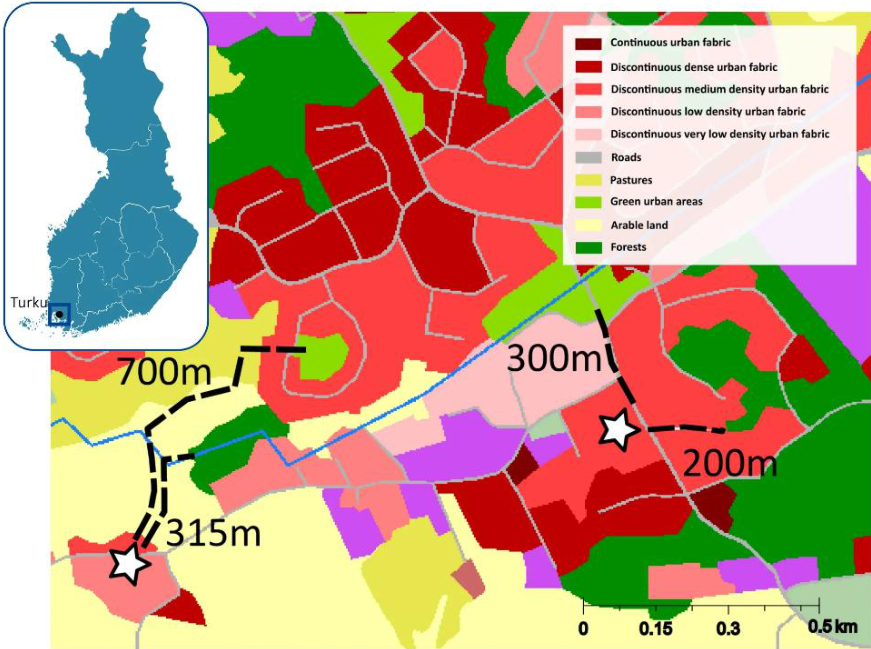
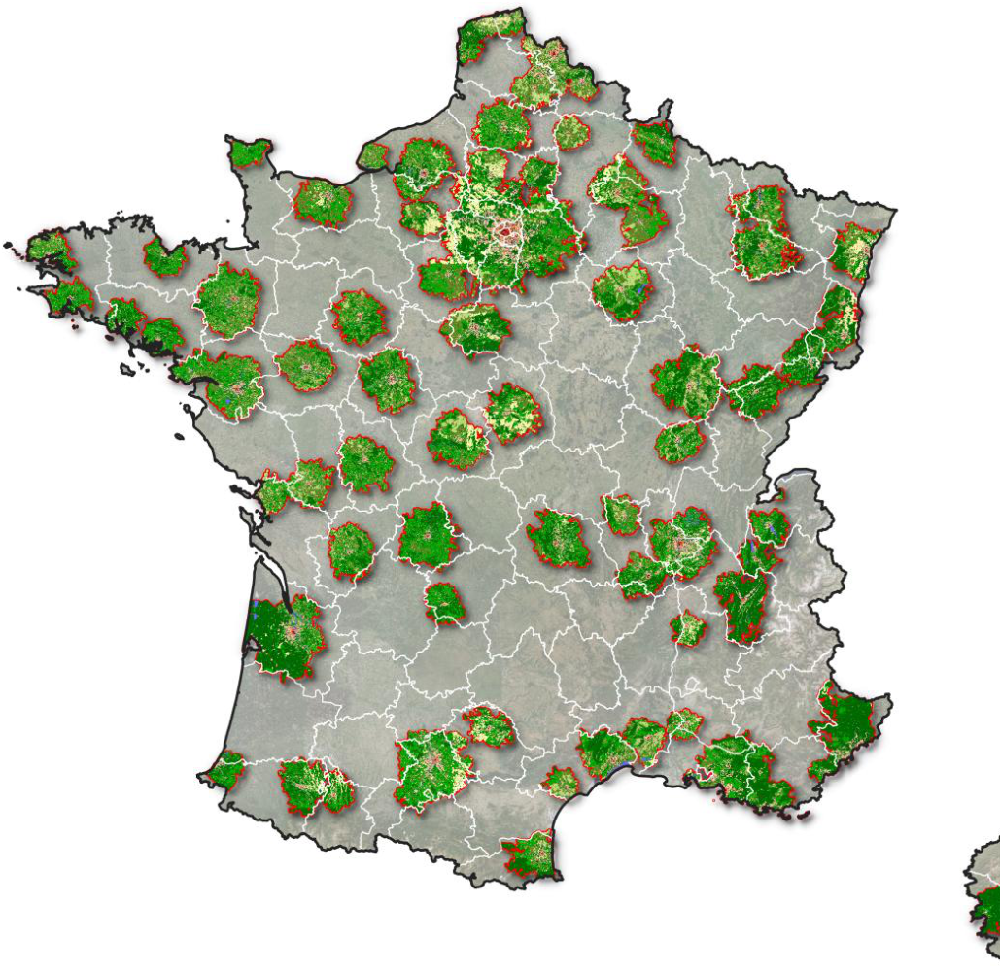
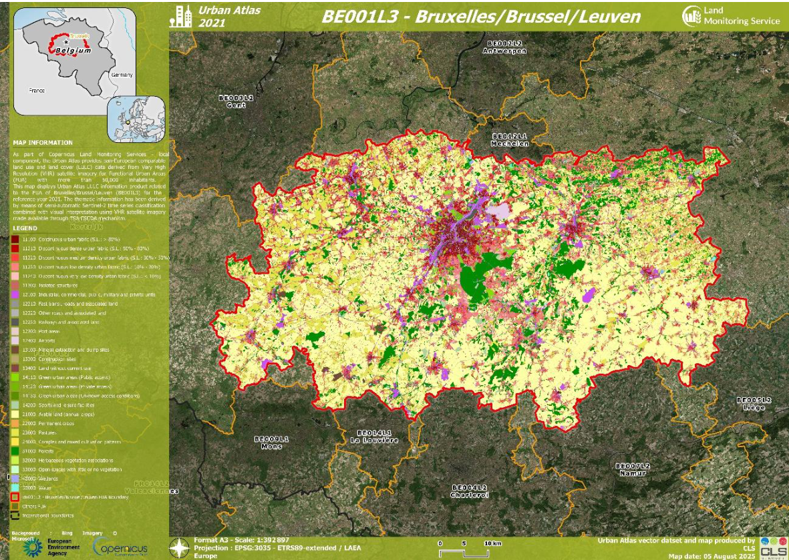
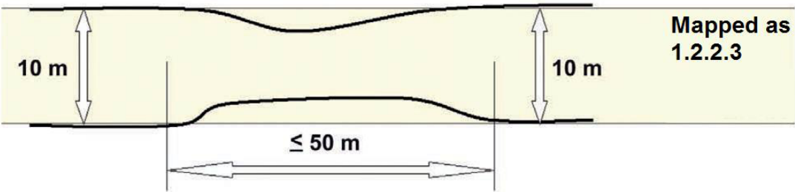
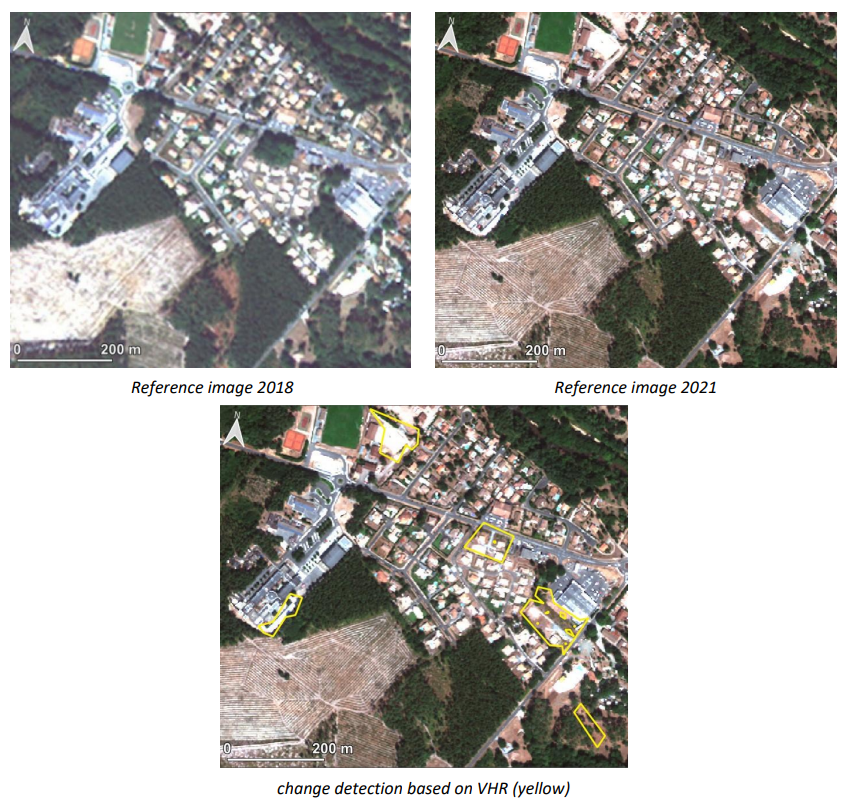
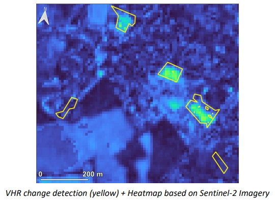
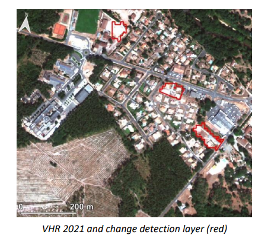
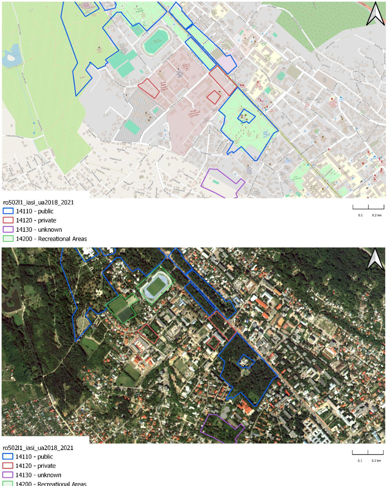

# Non-technical summary

The **Copernicus Urban Atlas 2021** is a product developed to map and monitor urban areas across Europe and is part of the European Union’s Earth observation program. This product uses  satellite data to provide detailed information about land use and land cover in urban regions,  helping to understand urban dynamics and changes over time.

Product key features:

- **Land Use and Land Cover Mapping**: The Urban Atlas provides detailed maps of land use and land cover in urban areas, including residential zones, commercial areas, green spaces, and infrastructures. This helps users understand the spatial distribution and characteristics of urban environments for the reference year 2021.

- **Change Detection**: The product includes data on changes in land use and land cover from 2018 to 2021, allowing users to identify trends such as urban expansion,  redevelopment, and changes in green spaces. This is crucial for urban planning and  environmental monitoring.

- **Green Urban Areas private/public**: the product now differentiates between the public  vs. private to better understand the accessibility of these green areas. 

- **Street Tree Layer**: Derived from Copernicus High-Resolution Layer Small Landscape Features and CLMS Urban Atlas 2021, this dataset categorizes woody vegetation within urban areas across Europe, and it is distributed as part of the Urban Atlas suite.

- **Standardized Data**: The product follows standardized classification schemes and methodologies, ensuring consistency and comparability across different regions and time periods.

**Why is this product important?** The Copernicus Urban Atlas provides accurate, detailed data for  urban planning, environmental monitoring, and policymaking. It is especially useful for assessing  urban growth, managing land resources, and monitoring the impacts of urbanization on the  environment. This product supports reports required by international organizations, including  the European Union, helping governments and organizations make informed decisions to  promote sustainable urban development.

**Who can use it?** The information is available to a wide range of users, including urban planners,  environmental agencies, scientists, policymakers, and conservationists. The data is openly  accessible and can be used for research, policy reporting, and practical urban management  tasks, such as planning new developments, improving infrastructure, and protecting green  spaces.

# Executive summary

The Copernicus Land Monitoring Service (CLMS) provides geographical information on land  cover and its changes, land use, vegetation state, water cycle, and earth surface energy variables to a broad range of users in Europe and across the world for various domains and applications. CLMS is jointly implemented by the European Environment Agency (EEA) and the European  Commission’s Directorate-General Joint Research Centre (JRC).

This Product User Manual (PUM) aims to guide users with the usage of the Copernicus Urban  Atlas (UA) for the 2021 reference year and captures detailed definitions and product  specifications. The Urban Atlas portfolio currently comprises vector layers dedicated to Land  Cover and Land Use (LC/LU) mapping, including residential zones, commercial areas, green  spaces, and infrastructures. This 2021 release of the Urban Atlas covers the area of 38 EEA  members and cooperating countries, plus the United Kingdom (UK), at high spatial resolution. It  is compliant with the established specifications of the existing time series of the product. The  product and its contained layers have been updated following the regular three-year cycle and  additionally contain new classes for the private/public classification of Green Urban Areas  (GUA).

All layers contained here are derived from semi-automatic image processing methods of Very  High Resolution (VHR) Earth Observation (EO) imagery and High-Resolution (HR) optical satellite  image time series (Sentinel-2). They provide dedicated information on urban land use and land  cover during the reference year 2021 (i.e., status) and detected changes between 2018 and 2021  (i.e., change). The aim of these layers is to provide reliable status and frequent updates on these  urban characteristics to facilitate environmental monitoring applications, regional and  transnational analyses, and, generally, to support decision-making that is based on spatial  evidence.

# Scope of the document

The Product User Manual (PUM) is designed for a broad audience of users who seek to  understand and utilize the product effectively. It is intended primarily for end-users who require an overview of the product’s features, quality, and usage guidelines without needing deep technical expertise. This includes operational users, decision-makers, and general users who need to assess the product’s suitability for their applications.

The PUM provides essential information on product characteristics, quality indicators, terms of  use, and available technical support. However, it is not intended as a technical document.

The document is structured as follows:

- Chapter 1 provides the non-technical summary with a generic overview of the product, general information about European Union's Earth Observation Programme and Copernicus Land Monitoring Service (CLMS), who and why the product is used.

- Chapter 2 provides the executive summary of the project along with a general  information about European Union's Earth Observation Programme and CLMS.

- Chapter 3 outlines the scope, content and structure of this document.

- Chapter 4 introduces the initial objectives and user needs, and feedback collected.

- Chapter 5 describes the current user requirements.

- Chapter 6 presents potential application areas and example use cases.

- Chapter 7 presents product description (product content and characteristics).

- Chapter 8 summarizes the product methodology and workflow production.

- Chapter 9 presents the terms of use, citation guidelines, and technical support for the product.

- and the Abbreviations & Acronyms, References, FAQ (Frequently Asked Questions), and Annex chapters provide citations, and supplementary information.

# Lineage of product

The primary objective of the Urban Atlas is to provide high-resolution, comparable, and reliable land use and land cover data for urban areas across Europe. Early user requirements focused on ensuring data consistency across borders, supporting urban planning, monitoring land take, and facilitating EU (European Union) policy implementation, particularly regarding climate adaptation, sustainable development, and transport infrastructure.

Through user feedback conducted with municipal authorities, regional planners, researchers, and environmental agencies, key user needs have been identified, including:

- **Improved temporal resolution** to support change detection and trend analysis. Initially, Urban Atlas products were produced at six-year intervals between the 2006 and 2018 editions. Since the 2021 release, the update frequency has increased to every **three years**.

- Enhanced thematic details, especially in categories like Green Urban Areas,  infrastructure, and mixed-use zones. The 2021 release introduced a more refined  nomenclature for **Green Urban Areas**, distinguishing between **publicly and privately accessible spaces**. Additionally, efforts are underway to enhance the classification of  class 121 (Industrial, commercial, public, military, and private units) to improve thematic  accuracy.

- **Greater accessibility** through interoperable formats and integration into GIS  (Geographic Information System) and urban planning tools.

# User requirements

The Copernicus Urban Atlas is designed to meet the diverse needs of its user community, which  includes urban planners, environmental agencies, scientists, policymakers, and conservationists. The following summarizes the known current user needs:

- **Policy and monitoring support**: Users require accurate and up-to-date geographical information to support policy development and environmental monitoring. The Urban  Atlas provides essential data for assessing urban growth, managing land resources, and monitoring the impacts of urbanization on the environment. This information is crucial  for developing sustainable urban policies and strategies.

- **Land cover and land use mapping**: Detailed and high-resolution maps of land cover and  land use are essential for understanding the spatial distribution and characteristics of  urban environments. Users need comprehensive data on various land use types,  including residential zones, commercial areas, green spaces, and infrastructure, to make  informed decisions about urban planning and development.

- **Data accessibility**: Easy access to reliable and standardized data is a key requirement for  users. Urban Atlas ensures that its data is openly accessible, allowing a wide range of  users to utilize the information for research, policy reporting, and practical urban  management tasks. The data is available in user-friendly formats, facilitating its  integration into various applications and analyses.

- **Frequency and timeliness**: Users need data that is updated regularly to reflect the latest changes in urban areas. Urban Atlas now follows a three-year update cycle (compared to six-year cycle in past products), providing users with timely information on land use  and land cover changes. This increased frequency ensures that users have access to  current data for monitoring urban dynamics and making timely decisions.

- **Differentiation Green Urban Areas**: After collecting user requirements from several stakeholders in preparation for the 2021 mapping of the Urban Atlas dataset, one of the most recurring requests was to enable differentiation of green urban areas (class 14100) according to their public accessibility. To properly assess the benefits of inner-city green elements for urban ecology and quality of life, one important attribute is the easy and free accessibility to these areas for the public. 

While existing user feedback has highlighted the importance of harmonized, pan-European data, the overall volume of responses remains limited. To better align future developments of the  Urban Atlas with real-world planning needs and policy priorities, we strongly encourage users to share their experiences, suggestions, and requirements. Feedback can be submitted via the  official Copernicus Land Monitoring Service website:  [https://land.copernicus.eu/en/products/urban-atlas?tab=applications__use_cases](https://land.copernicus.eu/en/products/urban-atlas?tab=applications__use_cases).

# Product application areas and use case examples

The Copernicus Urban Atlas is a versatile tool designed to support a wide range of applications in urban planning, environmental monitoring, and policymaking. This section outlines various use cases and potential application areas, providing an overview of potential users and documented use cases. Additionally, it offers guidance on known limitations and suggests alternative products for specific applications.

## Use case 1: Assessing quality and accessibility of Finnish urban green spaces with Urban Atlas

One of the key applications of the Urban Atlas is in assessing the quality and accessibility of  urban green spaces. A notable example is the study conducted in Finland, which utilized the  Urban Atlas to evaluate green spaces across the country's seven largest city regions[^1]. The  primary goal was to understand how accessibility and quality vary with neighbourhood-level socioeconomic status. High-quality urban green spaces, such as Helsinki's Central Park, enhance  the quality of life for residents by encouraging physical activity, fostering social interaction, and  improving air quality while also mitigating urban heat island effects.

[^1]: [https://land.copernicus.eu/en/use-cases/assessing-quality-and-accessibility-of-finnish-urban-green-spaces-with-urban-atlas/assessing-quality-and-accessibility-of-finnish-urban-green-spaces-with-urban-atlas](https://land.copernicus.eu/en/use-cases/assessing-quality-and-accessibility-of-finnish-urban-green-spaces-with-urban-atlas/assessing-quality-and-accessibility-of-finnish-urban-green-spaces-with-urban-atlas)

Researchers used Urban Atlas to map green spaces and analyse their accessibility using  pedestrian street networks. This data helped city managers ensure that residents, regardless of  income, have access to high-quality green spaces. The study highlighted the importance of  differentiating green urban areas according to their public accessibility, as easy and free access  to these areas is crucial for urban ecology and quality of life.

{#fig-figure1}

## Use case 2: National mapping of Local Climate Zones (LCZ) to help communities diagnose urban overheating in France

Cerema (French Centre for Studies on Risks, the Environment, Mobility and Urban Planning) and French Ministry of Ecological Transition, Energy, Climate, and Risk Prevention published a national map of Local Climate Zones (LCZ)[^2] to help local authorities diagnose urban overheating. This data is made available free of charge to the public and local authorities for urban areas with more than 50,000 inhabitants in France. Therefore, Cerema used areas covered by the Urban Atlas of the European Earth Observation Program Copernicus.

[^2]: [https://www.cerema.fr/fr/actualites/cerema-publie-nouvelles-donnees-surchauffe-urbaine](https://www.cerema.fr/fr/actualites/cerema-publie-nouvelles-donnees-surchauffe-urbaine)

In this type of study, the advantage of the Copernicus Urban Atlas product is that it provides free and consistent data for local authorities.

{#fig-figure2}

# Product description

## Overview of the product and contained layers

The Urban Atlas service offers a high-resolution land use map of urban areas. Initially covering  over 300 European cities with more than 100,000 inhabitants for the 2006 reference year, the  Urban Atlas is available for the 2012 and 2018 reference years over 788 cities with more than  50,000 inhabitants distributed among EU, EFTA (European Free Trade Association) and West  Balkan countries plus United Kingdom and Turkey. The 2021 product cover 790 cities including  new FUAs. 

Each Urban Atlas product is generated over the city and its surroundings, according to the **Functional Urban Area (FUA)** defined by the implementation of the approach developed by the DG Regional and Urban Policy (REGIO) of the European Commission (EC).

The Copernicus Urban Atlas portfolio includes 5 main layers, provided in pan-European LAEA  (Lambert Azimuthal Equal-Area) projection – EPSG (European Petroleum Survey Group):3035:

- Urban Atlas 2018-2021 change layer

- Urban Atlas 2018 revised status layer

- Urban Atlas 2021 status layer (as can be seen in @fig-figure3)

- Street Tree Layer 2021 status layer

- Building Block Height 2021 (product described in a separate Product User Manual)

{#fig-figure3}

## Product characteristics

### Interpretation rules

The delineation is performed in accordance with the EO Very High Resolution (VHR) data. EO  data shall be regarded as the primary (reference) data source. The interpretation of the object  is done using:

- The EO data, topographic maps, navigation data (COTS or OSM) and other relevant ancillary data such as Google Earth or Wikimapia.

- Auxiliary information including local expertise.

If two or more objects are overlapping at different levels, the top level is mapped continuously,  e.g. road bridge over railway is mapped as seen, the railway polygon is split in two parts, and the road is mapped as a continuous feature.

In case of two or more objects overlapping at the same height level, the visually dominant and complete object (in use and shape) is mapped continuously. For example, a road / railway crossing viewed at the same height level: the railway shall be mapped continuously to maintain the network. The road shall be split in two parts.

In case of a homogeneous area larger than the MMU but divided in 2 or more polygons by the  road or railway network, each part can be smaller to preserve the land cover information.  However, no polygon can be smaller than 500 Sqm (e.g. a 1 ha forest divided in 4 polygons by the road network has to be mapped) except for polygons at the border of the FUA for which the MMU is 100 Sqm.

The minimum mapping width (MMW) between 2 objects for distinct mapping is 10 m.

Exceptions can be considered in two cases:

- For class 12220 (MMW = 6 m).

- To maintain continuity of linear structures, they can be mapped smaller than 10 m over  a distance up to 50 m (see figure below).

{#fig-figure4}

Priority mapping rules for areas smaller than the MMU are used:

- Areas under MMU are visually added to the adjacent unit with the thematically closest  class. This rule is used for the artificial classes (1xxxx).

- Areas under MMU are added to the adjacent unit with the longest common border line, except with railways or roads (exception here: if an object is below the MMU size and  entirely surrounded by e.g. road or railway network, it shall be aggregated with that  surrounding traffic line). Rule used for the natural / semi-natural classes (2xxxx, 3xxxx, 4xxxx, 5xxxx) and all the polygons under 100 Sqm.

### UA 2018-2021 change layer

The change layer between 2018 and 2021 for EU27 + EFTA countries + Western Balkan countries+ Turkey + UK for 790 FUA’s. Using the VHR satellite imagery of the reference years 2018 and  2021 in an image-to-image change detection process, the resulting changes as compared to  2018 are mapped. Tasks are performed by applying a mixture of automatic classification  routines and visual interpretation. Only polygons containing a real change are mapped into this change layer. For this layer, the MMU (Minimum Mapping Unit) is reduced up to 0.1 ha with some exceptions.

**Specific Minimum Mapping Units for LC/LU CHANGE layer**:

In order to ensure that relevant LC/LU changes are appropriately extracted, some specific  Minimum Mapping Units for LULC change layer are defined as below: 

- Urban (class 1) to urban (class 1) = 0.1 ha

- Rural/natural (classes 2-5) to urban (class 1) = 0.1 ha

- Rural/natural (classes 2-5) to rural/natural (classes 2-5) = 0.25 ha

- Urban (class 1) to rural/natural (classes 2-5) = 0.25 ha

Considering these MMUs (Minimum Mapping Units), exceptions are made in case of areas where changes involve road and railway networks (classes 12210, 12220, 12230); polygon features classified as road or railway for one date or directly connected to such element are extracted even if area is lower than MMU in order to keep consistency of the transportation network. In this case, and for the concerned polygons, a comment is added in the attribute table.

### UA 2018 revised status layer

In the specific case of a change detection between 2018 and 2021, LC/LU misclassifications from 2018 are corrected but only in the immediate surroundings of the actual LC/LU change area. These corrections lead to the production of a revised LC/LU 2018 status layer. Of course, if a major, significant error is detected visually in the 2018 product, particularly for errors concerning artificial classes, these errors are corrected but the initial reason for the existence of this layer  is to enable the appropriate changes to be delimited and characterized.

### UA LC/LU status map 2021

The Urban Atlas 2021 status layer is produced by combining the Urban Atlas 2018 dataset with the Urban Atlas 2018-2021 change dataset. This is the updated version of the Urban Atlas 2018 revised dataset.

### Street Tree Layer 2021

Street Tree Layer provides information about presence of trees within urban areas as defined  by CLMS Urban Atlas Functional Urban Areas (FUA). It includes contiguous rows or patches of  trees covering 500m² or more over Artificial surfaces (nomenclature class 1) inside each FUA covered by UA2021, without including trees along road or railway networks connecting cities  and villages. Due to changes in the processing chain, improved detection algorithms, and  changes in the quality of input imagery, the application of the minimum mapping width (MMW) of 10 m was deemed no longer necessary, unlike in previous UA STL releases.

This layer is provided as a vector layer and it is distributed as part of the Urban Atlas suite.

## Product specifications

**UA 2018-2021 change layer**

Layer name: Urban Atlas Change Layer 2018-2021

Product (group/family): Urban Atlas (Priority Area Monitoring)

Layer category: Change layer

Summary: Vector dataset providing the baseline of land use/land cover on Functional Urban Areas, extracted from VHR and other available imagery (and combined with in-situ data) to allow the study of the characteristics of these areas in comparison with major urban areas in the EU and EFTA countries.

Reference year/cycle/period: 2018-2021

Geometric resolution: Mapping scale of the vector data: 1:10 000

Coordinate Reference System: ETRS89 Lambert Azimuthal Equal Area (LAEA) (EPSG 3035)

Coverage: EEA-38 except Liechtenstein (32 EEA member countries and 6 cooperating countries) + UK

Geometric accuracy: According to geo-location accuracy of satellite imagery delivered by ESA

Thematic accuracy:   ≥ 85 % in urban classes (class 1)   ≥ 80 % in rural classes (classes 2 to 5)   ≥ 80 % overall accuracy

Minimum Mapping Unit:   Urban (class 1) to urban (class 1) = 0.1 ha   Rural/natural (classes 2-5) to urban (class 1) = 0.1 ha   Rural/natural (classes 2-5) to rural/natural (classes 2-5) = 0.25 ha   Urban (class 1) to rural/natural (classes 2-5) = 0.25 ha

Minimum Mapping Width: 10 m between 2 objects for distinct mapping

Vector classes: see Annex 1 (containing 28 classes)

Attribute information associated with vector features, including the following minimum fields:

|Field|Description|Type|Length|Example|
|--|--|--|--|--|
|country|country 2-letter code|String|2|DK|
|fua_name|FUA_name|String|150|Albacete|
|fua_code|FUA ID|String|7|DK001L2|
|code_2018|2018 LC/LUcode|String|5|50000|
|class_2018|2018 LC/LUcode|String|150|water|
|code_2021|2021 LC/LUcode|String|5|50000|
|class_2021|2021 LC/LUcode|String|150|water|
|prod_date|Map prod year-month|String|7|2024-11|
|identifier|Unique ID|String|30|12-FR073L2|
|perimeter|Length of the polygon (in m)|Double|-1|-|
|area|Area of the polygon|Double|-1|-|
|comment|mmu exceptions|String|100|-|

Metadata: INSPIRE Metadata Implementing Rules: Technical Guidelines based on EN ISO 19115 and EN ISO 19119

Delivery format: Geopackage, layer styles in qml format

Quality – Production verification: Quality statement of the layer detailing the different accuracies to reach (85% for urban classes, 80% for rural classes and for the overall database). Information available in a dedicated report.

**UA 2018 revised status**

Layer name: Urban Atlas Land Cover/Land Use 2018

Product (group/family): Urban Atlas (Priority Area Monitoring)

Summary: Vector dataset providing the baseline of land use/land cover on Functional Urban Areas, extracted from VHR and other available imagery (and combined with in-situ data) to allow the study of the characteristics of these areas in comparison with major urban areas in the EU and EFTA countries.

Reference year/cycle/period: 2018

Geometric resolution: Mapping scale of the vector data: 1:10 000

Coordinate Reference System: ETRS89 Lambert Azimuthal Equal Area (LAEA) (EPSG 3035)

Coverage: EEA-38 except Liechtenstein (32 EEA member countries and 5 cooperating countries) + UK

Geometric accuracy: According to geo-location accuracy of satellite imagery delivered by ESA

Thematic accuracy:   ≥ 85 % in urban classes (class 1)   ≥ 80 % in rural classes (classes 2 to 5)   ≥ 80 % overall accuracy

Minimum Mapping Unit:   0.25 ha in urban areas   1 ha in rural areas

Minimum Mapping Width: 10 m between 2 objects for distinct mapping

Vector classes: see Annex 1 (containing 26 classes)

Attribute information associated with vector features, including the following minimum fields:

|Field|Description|Type|Length|Example|
|--|--|--|--|--|
|country|country 2-letter code|String|2|DK|
|fua_name|FUA_name|String|150|Albacete|
|fua_code|FUA ID|String|7|DK001L2|
|code_2018|2018 LC/LUcode|String|5|50000|
|class_2018|2018 LC/LUcode|String|150|water|
|prod_date|Map prod year-month|String|7|2018-07|
|identifier|Unique ID|String|30|12-FR073L2|
|perimeter|Length of the polygon (in m)|Double|-1|-|
|area|Area of the polygon|Double|-1|-|
|comment|mmu exceptions|String|100|-|

Metadata: INSPIRE Metadata Implementing Rules: Technical Guidelines based on EN ISO 19115 and EN ISO 19119

Delivery format: Geopackage, layer styles in qml format

Quality – Production verification: Quality statement of the layer detailing the different accuracies to reach (85% for urban classes, 80% for rural classes and for the overall database). Information available in a dedicated report.

**UA LC/LU 2021 status layer**

Layer name: Urban Atlas Land Cover/Land Use 2021

Acronym: UA LC/LU 2021

Product (group/family): Urban Atlas (Priority Area Monitoring)

Layer category: Status layer

Summary: Vector dataset providing the baseline of land use/land cover on Functional Urban Areas, extracted from VHR and other available imagery (and combined with in-situ data) to allow the study of the characteristics of these areas in comparison with major urban areas in the EU and EFTA countries.

Reference year/cycle/period: 2021

Geometric resolution: Mapping scale of the vector data: 1:10 000

Coordinate Reference System: ETRS89 Lambert Azimuthal Equal Area (LAEA) (EPSG 3035)

Coverage: EEA-38 except Liechtenstein (32 EEA member countries and 5 cooperating countries) + UK

Geometric accuracy: According to geo-location accuracy of satellite imagery delivered by ESA

Thematic accuracy:   ≥ 85 % in urban classes (class 1)   ≥ 80 % in rural classes (classes 2 to 5)   ≥ 80 % overall accuracy

Minimum Mapping Unit:   0.25 ha in urban areas   1 ha in rural areas

Minimum Mapping Width: 10 m between 2 objects for distinct mapping

Vector classes: see Annex 1 (containing 28 classes)

Attribute information associated with vector features, including the following minimum fields:

|Field|Description|Type|Length|Example|
|--|--|--|--|--|
|country|country 2-letter code|String|2|DK|
|fua_name|FUA_name|String|150|Albacete|
|fua_code|FUA ID|String|7|DK001L2|
|code_2021|2021 LC/LU code|String|5|50000|
|class_2021|2021 LC/LU code|String|150|water|
|prod_date|Map prod year-month|String|7|2018-07|
|identifier|Unique ID|String|30|12-FR073L2|
|perimeter|Length of the polygon (in m)|Double|-1|-|
|area|Area of the polygon|Double|-1|-|
|comment|mmu exceptions|String|100|-|

Metadata: INSPIRE Metadata Implementing Rules: Technical Guidelines based on EN ISO 19115 and EN ISO 19119

Delivery format: Geopackage, layer styles in qml format

Quality – Production verification: Quality statement of the layer detailing the different accuracies to reach (85% for urban classes, 80% for rural classes and for the overall database). Information available in a dedicated report.

**Street Tree Layer 2021**

Layer name: Street Tree Layer 2021 vector

Acronym: STL

Product (group/family): Priority Area Monitoring

Layer category: Status

Summary: Urban woody vegetation within Urban Atlas FUA

Reference year/cycle/period: 2021

Geometric resolution: Equivalent 1:5 000

Coordinate Reference System: European ETRS89 LAEA projection

Coverage: Urban Atlas FUAs

Geometric accuracy: Based on the ortho-rectified satellite imagery provided by ESA

Thematic accuracy: NA

Minimum Mapping Unit: 500m²

Minimum Mapping Width: 10 m between 2 objects for distinct mapping

Vector classes: 1: Street Tree Layer

Attribute information associated with vector features, including the following minimum fields:

|Field|Description|Type|Value(s)|NoData value|
|--|--|--|--|--|
|Shape|Polygon|Geometry|Polygon|NA|
|Area|Area|Double|0.001 to 1.8E308|NA|
|Perimeter|Perimeter|Double|0.001 to 1.8E308|NA|
|Country|Country|Text|country 2-letter code|NA|
|Fua_code|Urban Atlas FUA code|Text|Ex: AT001L3|NA|
|Fua_Name|Urban Atlas FUA name|Text|Ex: Wien|NA|
|STL|Street Tree Presence|Integer|1|NA|

Metadata: XML metadata files compliant with INSPIRE metadata standards

Delivery format: Geopackage

Quality – Production verification: Layer thematic accuracy reached/exceed the 80% producer’s and user’s target

## Known thematic overlaps of the product

The Urban Atlas is part of the Copernicus Land Monitoring Service (CLMS) and is designed to  support urban and regional planning by providing harmonized, high-resolution land cover and  land use (LC/LU) data for Functional Urban Areas (FUA) across Europe. However, thematic  overlaps may occur between the Urban Atlas and other CLMS products (e.g. Coordination of  Information on the Environment (CORINE) Land Cover, HRL (High-Resolution Layers) or external datasets produced at national or regional levels.

This section provides guidance to help users select the most suitable dataset for their specific  application when such overlaps exist.

When choosing among overlapping datasets, users are encouraged to consider the following  factors:

- **Temporal and spatial resolution**:

Urban Atlas offers a high spatial resolution and a relatively recent update cycle (every three years as of the 2021 release). Users requiring more frequent or finer-scale updates may also explore High-Resolution Layers (HRLs) or national datasets where available.

- **Data accuracy and validation**:

Urban Atlas data undergoes strict quality assurance and validation procedures to ensure  consistency and reliability across European urban areas. However, for highly localized  applications, national datasets may offer context-specific improvements or locally verified data.

- **Data harmonization and interoperability**:

As a pan-European dataset, Urban Atlas is fully harmonized, making it suitable for cross-border  and large-scale policy analysis. In contrast, external datasets may follow different classification  schemes or spatial definitions, which could limit interoperability.

Some illustrative use cases can help users to recognize where they might encounter thematic overlaps: 

- A municipality comparing urban green space trends over time may prefer Urban Atlas for its consistent nomenclature and multi-year coverage.

- A researcher conducting high-resolution habitat mapping within a single city might opt  for local datasets or HRLs with finer spatial detail.

- A planner assessing urban expansion at a metropolitan scale across several countries would benefit from the harmonized classification of the Urban Atlas.

# Production methodology and workflow overview

This section provides an overview of the methods and workflow used for production of Urban  Atlas 2021 products. Details, illustrations and more advanced concepts are described in the  Urban Atlas ATBD (Algorithm Theoretical Basis Document).

## Preprocessing of EO data

Originally, the production of Urban Atlas layers relied exclusively on Very High Resolution (VHR) imagery provided by the European Space Agency (ESA) through the Copernicus Space Data  Infrastructure. For the 2021 production cycle, the consortium enhanced the methodology by  integrating dense optical time series from the Sentinel-2 satellite constellation. This addition enables more effective and reliable detection of land cover land use changes, compared to approaches based solely on VHR imagery.

### Preprocessing of Sentinel-2 timeseries

Change detection is based on modelling the Normalized Difference Vegetation Index (NDVI)  derived from Sentinel-2 (S2) imagery for two reference years: 2018 and 2021. For each year,  NDVI values are fitted with harmonic functions that describe the seasonal patterns of landcover activity. This modelling results in a set of coefficients that summarize the shape and timing of a  certain pixel throughout the year. By comparing the coefficients from 2018 and 2021, it is  possible to identify significant deviations in seasonal behaviour, which may indicate land cover  or land use change.

To ensure reliable curve fitting, clouds and shadows are down-weighted using information from  the S2 Scene Classification Layer (SCL). Observations affected by atmospheric conditions are  given lower weight. 

Detailed methodology is available in the latest version of the Algorithm Theoretical Basis Document (ATBD).

### Preprocessing of VHR

In combination with Sentinel imagery, the production of the 2021 Urban Atlas (UA) relies on Very High Resolution (VHR) satellite imagery accessible through ESA (European Space Agency) Copernicus Space Data. The production process of the new Urban Atlas relies on change detection, requiring two VHR datasets to analyse changes between 2018 and 2021:

- **VHR_IMAGE_2018** and **VHR_IMAGE_2018_ENHANCED**

- **VHR_IMAGE_2021**

The datasets contain thousands of VHR scenes providing cloud-free coverage of Europe and is stored on a dedicated IT (Information Technology) infrastructure. A Web Map Service/ Web Cover Service (WMS/WCS) flux of each dataset is generated to support thematic enhancement and internal validation.

## Ancillary and other data

Several ancillary datasets were used to collect landcover information for the reference year 2021, which were then used for calibration and training of the classification models and/or for  deriving additional layers used for masking purposes. The list of the datasets and their use is  presented in the table below.

Table 1: Ancillary datasets used for UA 2021 production

|Source|Use|Reference|
|--|--|--|
|OSM (Open Street Map)|Road and railway networks|[https://www.openstreetmap.org/](https://www.openstreetmap.org/)|
|TomTom®|Green Urban Area classification|[https://www.tomtom.com/](https://www.tomtom.com/)|
|CLCplus Backbone 2021|Rural classification for extensions|[https://land.copernicus.eu/en/products/clc-backbone](https://land.copernicus.eu/en/products/clc-backbone)|
|HRL IMD|IMD (imperviousness density)|[https://land.copernicus.eu/en/products/high-resolution-layer-imperviousness](https://land.copernicus.eu/en/products/high-resolution-layer-imperviousness)|

## Production of Urban Atlas LC/LU products

### Change detection methodology based on VHR

To characterize the appearance of a real change between two images (in our case, two VHR  mosaic, 2018-2021), CLS (Collecte Localisation Satellite) propose a method based on the **Principal Component Analysis (PCA)** which is a statistical method for dimensionality reduction  that preserves the inherent structure of data. PCA transforms correlated variables into  uncorrelated principal components, which are linear combinations of the original variables.  These components are ordered by their ability to explain data variance, enabling the separation  of significant changes from other variations. PCA involves computing the eigenvalues and  eigenvectors of the covariance matrix derived from the difference image. By retaining only the  principal component with the largest eigenvalue, PCA reduces sensor-induced noise and extracts  the most significant change information, aiding in the generation of change maps. The @fig-figure5 is showing an example of a change detected between 2018 and 2021. 

{#fig-figure5}

### Change detection based on Sentinel-2

Once the NDVI curves have been modelled for both 2018 and 2021, change is quantified by  calculating the Root Mean Square Deviation (RMSD) between the two curves for each pixel. This metric captures the average difference in vegetation behavior across the entire year, serving as a robust indicator of how much the seasonal NDVI pattern has changed over time.

The resulting RMSD map highlights areas where landcover dynamics have shifted, such as changes due to build-up, vegetation health, or management practices. High RMSD values  indicate strong deviations between years—these areas are flagged as potential change hotspots and visualized as a continuous "heatmap of change."

However, it's important to note that different land cover types have inherently different levels  of seasonal variability. For example, agricultural fields often show strong year-to-year  differences due to crop rotations or management changes whereas Forests or urban areas are  typically more stable, with lower natural variability.

To avoid false positives in highly dynamic areas and to better highlight meaningful changes,  RMSD values are normalized by land cover class using the CLCplus (Corine Land Cover plus) Backbone dataset. For each land cover type:

- The mean and standard deviation of RMSD is calculated across all pixels in that class.

- Each pixel's RMSD is then expressed in terms of how many standard deviations it  deviates from the class mean (i.e., as a z-score).

- This normalized RMSD enables a fair comparison across different landscapes and helps isolate changes that are unexpected within the context of typical variability.

Finally, this normalized change metric is combined with change information from VHR imagery. This multi-source fusion further increases the confidence of the detected changes.

See the latest version of the ATBD, for full details on RMSD computation and normalization.

{#fig-figure6}

### Production of a layer of change candidates

After obtaining the heatmaps derived from S2 (Sentinel-2) data and those derived from VHR data, it is necessary to combine both into a single layer that will constitute the change  candidates. This process includes a comparison of the two detection bases, followed by a rule-based cleaning procedure and alignment with the minimum surface specifications of the LC/LU  product.

{#fig-figure7}

### Production of change layer 2018-2021

The change layer is only mapping polygons that exhibit actual changes, disregarding those  without any discernible modifications. To mitigate false changes, any misclassification identified in the 2018 layer is corrected, but solely in the immediate vicinity of the actual land cover/land  use change area. This operation must be carried out by means of visual analysis. The interpreter compares the change candidate polygon with the images (2018 and 2021) and ignore or insert the change in the production layer by improving/adjusting geometric and thematic information for both reference year. Consequently, a revised Urban Atlas land cover/land use status layer  (SL) for 2018 will be generated and delivered. Production of Urban Atlas 2021 status layer.

### Creation of the new 2021 areas

Adjustment of FUA boundaries is needed, based on Eurostat population grid updates or LAU  (Local Administrative Unit) modifications, ensuring consistency across time series. Compared with the extent of the UA2018, some FUAs are stable, while others may have been reduced or  expanded, either by incorporating areas recovered from neighbouring former FUAs from the  2018 UA or by integrating new areas, not present in the 2018 products, which will therefore  need to be generated from scratch.

The major steps for creating the new 2021 areas are as follows:

- Create a network skeleton by using OSM roads and railways database

- Use CAPI (Computer Assisted Photo Interpretation) approach by means of visual interpretation to extract artificialized classes (1XXXX)

- Add rural classes by using CLCplus raster information.

- Apply the right level densities (5 different classes) on each residential polygon.

- After some checks, the UA2021 LC/LU production is over.

### Urban Atlas 2021 status layer generation

The 2021 status layer is generated by merging two types of layers:

- On historical areas (existing in the 2018 UA products) a layer created from the comparison between the 2018 status layer with the validated change layer. The 2021 layer is here an updated version of the UA2018 layers.

- On new areas (non-existing in the 2018 UA products) an UA2021 layer created from scratch.

- Consequently, UA2018-revised and UA2021 can have different extents.

The existing parts of the initial UA2018 not included in the UA2021 extents are not present on the UA2021 outputs but are also removed on the UA2018-revised outputs, which is in line with what was done during the UA2012-2018 production.

### Production of Green Urban Areas (GUA) private/public codes

Data model

The Urban Atlas nomenclature was extended with three new subclasses of the GUA class (14100) to better evaluate the value of Green Urban Areas (GUAs) and report on SDG 11 (Sustainable  Development Goals). The new subclasses are:

- 14110: Public access

- 14120: Private access

- 14130: Unknown access

#### Methodology

The initial phase of the production focused on the acquisition and meticulous preparation of the datasets required for classification. At the heart of this step lies the extraction of relevant geospatial information from OpenStreetMap (OSM). Specifically, the OSM Overpass API, a powerful, Representational State Transfer (REST)ful web service, was utilized to query and retrieve targeted subsets of OSM data. This allowed for precise extraction of features tagged with relevant attributes.

The TomTom® multinet data was purchased from a company called p17[^3] and prepared by merging data from individual countries into a single vector file and extracting the information  on streets with private access.

[^3]: [https://www.p17.de/](https://www.p17.de/)

In parallel, the Urban Atlas Green Urban Areas (GUA) polygons were prepared for integration  and analysis. Given that data from multiple sources can introduce minor spatial inconsistencies, a negative buffer of 10 meters was applied to each polygon. This preprocessing step helps prevent erroneous intersections caused by overlapping or imprecise boundaries, ensuring  cleaner analytical outcomes.

Following data preparation, the classification process was carried out through a series of logical steps. Initially, the GUA polygons intersecting/overlapping with OSM road segments classified as publicly accessible (class 14110). Additionally, a second check for intersection was performed against TomTom® road network data. The geometries of road grids of OSM and TomTom®datasets differ and checking against them both makes the results more robust.

In subsequent processing steps each GUA polygon was checked for intersection with TomTom® point of interest (POI) dataset, and distinct selections of OSM polygons grouped into those indicating either public or private access.

GUA polygons that did not intersect with any of the above data were assigned ‘unknown’ access (class 14130). 

@fig-figure8 below shows the result of the labelling process and the final classification of GUAs into public (blue), private (red) and unknown (purple) in the FUA of Iasi, Romania. Additionally, it also shows class 14200 - recreational and sport areas (green).

{#fig-figure8}

The reader is referred to the product’s ATBD for full details on Green Urban Areas classification. A detailed list of OSM data tags used to indicate public and private accessibility is included in Annex 1 at the end of the ATBD.

# Terms of use and product technical support

## Terms of use

The product(s) described in this document is/are created in the frame of the Copernicus  programme of the European Union by the European Environment Agency (product custodian)  and is/are owned by the European Union. The product(s) can be used following Copernicus full  free and open data policy, which allows the use of the product(s) also for any commercial  purpose. Derived products created by end users from the product(s) described in this document  are owned by the end users, who have all intellectual rights to the derived products.

## Citation

When **planning to publish a publication (scientific, commercial, etc.)**, it should be explicitly  mentioned:

“This publication has been prepared using European Union's Copernicus Land  Monitoring Service information; <insert all relevant DOI (Digital Object Identifier) links  here, if applicable>” 

When developing a **product or service using the products or services of the Copernicus Land  Monitoring Service**, it should explicitly mentioned:

“Generated using European Union's Copernicus Land Monitoring Service information; <insert all relevant DOI links here, if applicable>”

When **redistributing a part of the Copernicus Land Monitoring Service (product, dataset,  documentation, picture, web service, etc.)**, it should explicitly mentioned:

“European Union's Copernicus Land Monitoring Service information; <insert all relevant DOI links here, if applicable>”

## Product Technical support

Product technical support is provided by the product custodian through Copernicus Land  Monitoring Service desk[^4]. Product technical support does not include software specific user  support or general GIS or remote sensing support.

[^4]: [Copernicus Land Monitoring Service – Service desk](https://land.copernicus.eu/en/contact-service-helpdesk)

More information on the products can be found on the Copernicus Land Monitoring Service website [https://land.copernicus.eu/](https://land.copernicus.eu/)

# List of abbreviations & acronyms

|Abbreviation|Name|Reference|
|--|--|--|
|ATBD|Algorithm Theoretical Basis Document||
|CAPI|Computer Assisted Photo Interpretation|[Wikipedia](https://en.wikipedia.org/wiki/Aerial_photographic_and_satellite_image_interpretation)|
|CBD|Central Business Districts||
|CLCplus|Corine Land Cover plus|[Copernicus](https://land.copernicus.eu/en/products/corine-land-cover)|
|CORINE|COoRdination de l’INformation sur l’Environnement||
|COTS|Commercial Off-The-Shelf||
|CLMS|Copernicus Land Monitoring Service|[Copernicus](https://land.copernicus.eu/en)|
|DOI|Digital Object Identifier|[Wikipedia](https://en.wikipedia.org/wiki/Digital_object_identifier)|
|DWH|Data WareHouse|[Wikipedia](https://en.wikipedia.org/wiki/Data_warehouse)|
|EC|European Commission||
|EEA|European Environment Agency|[EEA](https://www.eea.europa.eu/en)|
|EFTA|European Free Trade Association||
|EO|Earth Observation|[Wikipedia](https://en.wikipedia.org/wiki/Earth_observation)|
|EPSG|European Petroleum Survey Group|[EPSG](https://epsg.org/home.html)|
|ESA|European Space Agency|[ESA](https://www.esa.int/)|
|ETRS89|European Terrestrial Reference System 1989|[Wikipedia](https://en.wikipedia.org/wiki/European_Terrestrial_Reference_System_1989)|
|EU|European Union||
|FAQ|Frequently Asked Question||
|FUA|Functional Urban Areas|[Wikipedia](https://en.wikipedia.org/wiki/Functional_urban_area)|
|GUA|Green Urban Areas|[Wikipedia](https://en.wikipedia.org/wiki/Urban_green_space)|
|HRL|High-Resolution Layer|[Copernicus](https://land.copernicus.eu/en/products?tab=explore)|
|HRL IMD|High-Resolution Layer Imperviousness Density|[Copernicus](https://land.copernicus.eu/en/products?tab=explore)|
|IMD|Imperviousness Degree||
|INSPIRE|Infrastructure for Spatial Information in the European Community|[INSPIRE](https://knowledge-base.inspire.ec.europa.eu/index_en)|
|ISO|International Organization for Standardization||
|IT|Information Technology||
|JRC|Joint Research Center||
|LAEA|Lambert Azimuthal Equal-Area projection|[Wikipedia](https://en.wikipedia.org/wiki/Lambert_azimuthal_equal-area_projection)|
|LAU|Local Administrative Units|[Eurostat](https://ec.europa.eu/eurostat/web/lau)|
|LC|Land Cover|[Wikipedia](https://en.wikipedia.org/wiki/Land_cover)|
|LC/LU|Land Use Land Cover|[Wikipedia](https://en.wikipedia.org/wiki/Land_use)|
|LCZ|Local Climate Zones||
|LU|Land Use||
|MMU|Minimum Mapping Unit|[Wikipedia](https://en.wikipedia.org/wiki/Minimum_mapping_unit)|
|MMW|Minimum Mapping Width|[Wikipedia](https://en.wikipedia.org/wiki/Minimum_mapping_unit)|
|NDVI|Normalized Difference Vegetation Index|[Wikipedia](https://en.wikipedia.org/wiki/Normalized_difference_vegetation_index)|
|OSM|OpenStreetMap|[OpenStreetMap](https://www.openstreetmap.org/#map=10/57.6840/11.7361)|
|PCA|Principal Component Analysis|[Wikipedia](https://en.wikipedia.org/wiki/Principal_component_analysis)|
|PUM|Product User Manual||
|QML|Qt Modeling Language||
|REGIO|Regional and Urban Policy||
|RMSD|Root Mean Square Deviation||
|S2|Sentinel-2||
|SCL|Scene Classification Layer|[Copernicus](https://land.copernicus.eu/en)|
|SDG|Sustainable Development Goals|[SDG11](https://en.wikipedia.org/wiki/Sustainable_Development_Goal_11)|
|SL|Status Layer||
|Sqm|Square Metre||
|UA|Urban Atlas||
|UK|United Kingdom||
|UTM|Universal Transverse Mercator||
|VHR|Very High Resolution||
|WMS|Web Map Service|[Web Map Service](https://en.wikipedia.org/wiki/Web_Map_Service)|
|WP|Work Package||

# Annex 1 UA LC/LU nomenclature

The Urban Atlas Land Use / Land Cover classification is derived from CORINE Land Cover and is  composed of 27 classes distributing among 5 thematic groups, namely:

1. Artificial surfaces

2. Agricultural areas

3. Natural and (semi-)natural areas

4. Wetlands

5. Water

Four hierarchical levels are defined in the nomenclature for artificial surfaces (class 1) while only  two are defined for the non-artificial ones (classes 2-5). The table below shows the LC/LU  nomenclature providing class codes and descriptions and any information or ancillary data  source useful for the product generation in addition to EO data.

A decision matric below illustrate the rules followed to apply LC/LU nomenclature to each identified feature.

Table 2: UA LC/LU nomenclature (in bold, classes used in the products, without any further subdivision)

|UA No.|Code|Nomenclature|Additional Information|
|--|--|--|--|
|1||Artificial surfaces||
|1.1||Urban Fabric||
|**1.1.1**|**11100**|**Continuous urban fabric (S.L. : > 80%)**|HRL IMD required|
|1.1.2||Discontinuous Urban Fabric (S.L. 10% - 80%)|HRL IMD required|
|**1.1.2.1**|**11210**|**Discontinuous dense urban fabric (S.L. : 50% - 80%)**|HRL IMD required|
|**1.1.2.2**|**11220**|**Discontinuous medium density urban fabric (S.L. : 30% - 50%)**|HRL IMD required|
|**1.1.2.3**|**11230**|**Discontinuous low density urban fabric (S.L. : 10% -30%)**|HRL IMD required|
|**1.1.2.4**|**11240**|**Discontinuous very low density urban fabric (S.L. : < 10%)**|HRL IMD required|
|**1.1.3**|**11300**|**Isolated structures**||
|1.2||Industrial, commercial, public, military, private and transport units||
|**1.2.1**|**12100**|**Industrial, commercial, public, military and private units|zoning data / field check recommended**|
|1.2.2||Road and rail network and associated land|COTS or OSM data required|
|**1.2.2.1**|**12210**|**Fast transit roads and associated land**|COTS or OSM data required|
|**1.2.2.2**|**12220**|**Other roads and associated land**|COTS or OSM data required|
|**1.2.2.3**|**12230**|**Railways and associated land**|COTS or OSM data required|
|**1.2.3**|**12300**|**Port areas**|zoning data/ field check recommended|
|**1.2.4**|**12400**|**Airports**|zoning data/ field check recommended|
|1.3||Mine, dump and construction sites||
|**1.3.1**|**13100**|**Mineral extraction and dump sites**||
|**1.3.3**|**13300**|**Construction sites**||
|**1.3.4**|**13400**|**Land without current use**||
|1.4||Artificial non-agricultural vegetated areas||
|**1.4**|**14100**|**Green urban areas**|Only for 2018 reference year|
|**1.4.1**|**14110**|**Green urban areas (Public access) – new class**|Only for 2021 reference year|
|**1.4.1**|**14120**|**Green urban areas (Private access) – new class**|Only for 2021 reference year|
|**1.4.1**|**14130**|**Green urban areas (Unknown access conditions) – new class**|Only for 2021 reference year|
|**1.4.2**|**14200**|**Sports and leisure facilities**||
|2||Agricultural areas|1 ha MMU|
|**2.1**|**21000**|**Arable land (annual crops)**||
|**2.2**|**22000**|**Permanent crops (vineyards, fruit trees, olive groves)**||
|**2.3**|**23000**|**Pastures**||
|**2.4**|**24000**|**Complex and mixed cultivation patterns**||
|3||Natural and (semi-)natural areas|1 ha MMU|
|**3.1**|**31000**|**Forests**||
|**3.2**|**32000**|**Herbaceous vegetation associations (natural grassland, moors...)**||
|**3.3**|**33000**|**Open spaces with little or no vegetation (beaches, dunes, bare rocks, glaciers)**||
|**4**|**40000**|**Wetlands**|**1 ha MMU**|
|**5**|**50000**|**Water**|**1 ha MMU**|
|9||No data||
|**9.1**|**91000**|**No data (Clouds and shadows)**||
|**9.2**|**92000**|**No data (Missing imagery)**||

# Annex 2 Description of LC/LU thematic classes

**1. ARTIFICIAL SURFACES**

Surfaces with dominant human influence and without agricultural land use.

These areas include all artificial structures and their associated non-sealed and vegetated  surfaces.

Artificial structures are defined as buildings, roads, all constructions of infrastructure and other  artificially sealed or paved areas.

**Associated non-sealed and vegetated surfaces** are areas functionally related to human activities, except agriculture.

Also, the areas where the natural surface is replaced by extraction and / or deposition or  designed landscapes (such as urban parks or leisure parks) are mapped in this class.

The land use is dominated by permanently populated areas and / or traffic, exploration, nonagricultural production, sports, recreation and leisure.

**1.1. URBAN FABRIC**

Built-up areas and their associated land, such as gardens, parks, planted areas and non-surfaced  public areas and the infrastructure, if these areas are not suitable to be mapped separately  regarding the minimum mapping unit size.

Basically, the classes 1.1.1 and 1.1.2. are distinguished by their degree of soil sealing.

Residential structures and patterns are predominant, but also downtown areas and city centres, including the Central Business Districts (CBD) and areas with partial residential use, are included.

The urban fabric classes (1.1) are distinguished only by their degree of soil sealing not by their  type of buildings (single family houses or apartment blocks).

The detailed descriptions of the different classes below are given to the interpreters to support the delineation of mapping objects with homogeneous sealing density (without being required to assign the exact density classes).

Using the navigation data as a skeleton for the urban area, in many cases it is necessary to subdivide the blocks formed by the navigation data due to the different sealing density of the residential areas or different functions of the buildings and their associated land.

After completion of the interpretation, the sealing level information from the IMD sealing layer  is integrated into the data.

**1.1.1. CONTINUOUS URBAN FABRIC**

Special note:

Mapping the 3rd level is done only with the defined application of the IMD sealing layer.

*MMU 0.25 ha, MMW: 10 m*

Land Cover:

Average degree of soil sealing: > 80%

Built-up areas and their associated land, if these areas are not suitable to be mapped separately  regarding the minimum mapping unit size.

Buildings, roads and sealed areas cover most of the area; non-linear areas of vegetation and bare soil are exceptional.

Land Use:

Predominant residential use: areas with a high degree of soil sealing, independent of their  housing scheme (single family houses or high-rise dwellings, city centre or suburb).

Included are downtown areas and city centres, and Central Business Districts (CBD) if there is partial residential use.

**1.1.2. DISCONTINUOUS URBAN FABRIC**

Special note:

Mapping the 4th level of density classes is done only with the defined application of the imperviousness / soil sealing layer.

Land Cover:

Average degree of imperviousness / soil sealing: 0 - 80%

Built-up areas and their associated land (small roads, sealed areas including non-linear areas of  vegetation and bare soil), if these areas are not suitable to be mapped separately regarding the  minimum mapping unit size.

This type of land cover can be distinguished from continuous urban fabric by a larger fraction of  non-sealed and / or vegetated surfaces: gardens, parks, planted areas and non-surfaced public  areas.

Land Use:

Predominant residential usage. Contains more than 20% non-sealed areas, independent of their housing scheme (single family houses or high-rise dwellings, city centre or suburb).

The non-sealed areas might be private gardens or common green areas.

Not included are:

Farms with large buildings (agro-industrial production), → class 1.2.1.

Nurseries with dominant areas of greenhouses (no or only small fields) → class 1.2.1.

Allotment gardens → class 1.4.2.

Holiday villages (“Club Med”) → class 1.4.2.

**1.1.2.1. DISCONTINUOUS DENSE URBAN FABRIC**

*MMU 0.25 ha, MMW: 10 m*

Average degree of soil sealing: > 50 - 80%

Residential buildings, roads and other artificially surfaced areas.

**1.1.2.2. DISCONTINUOUS MEDIUM DENSITY URBAN FABRIC**

*MMU 0.25 ha, MMW: 10 m*

Average degree of soil sealing: > 30 - 50%

Residential buildings, roads and other artificially surfaced areas. The vegetated areas are predominant, but the land is not dedicated to forestry or agriculture.

**1.1.2.3. DISCONTINUOUS LOW DENSITY URBAN FABRIC**

*MMU 0.25 ha, MMW: 10 m*

Average degree of soil sealing: 10 - 30%

Residential buildings, roads and other artificially surfaced areas. The vegetated areas are  predominant, but the land is not dedicated to forestry or agriculture.

**1.1.2.4. DISCONTINUOUS VERY LOW DENSITY URBAN FABRIC**

*MMU 0.25 ha, MMW: 10 m*

Average degree of soil sealing: <10 %

Residential buildings, roads and other artificially surfaced areas. The vegetated areas are predominant, but the land is not dedicated to forestry or agriculture. Example: exclusive residential areas with large gardens.

**1.1.3. ISOLATED STRUCTURES**

*MMU 0.25 ha, Maximum Mapping Unit 2 ha, MMW: 10 m*

Isolated artificial structures with a **residential component**, such as (small) individual farmhouses  and related buildings.

It must contain only a few houses (1 to 5 houses: depending on the size of the houses and the number of associated buildings), otherwise it should be included in class 1.1.2.

**The mapping unit is no larger than 2 ha**, otherwise it should also be included in class 1.1.2.

To be in line with this eligibility rule (regarding level 1 of the nomenclature, artificialized areas), if the considered feature is neighbouring another urban class polygon(s) other than transportation network, and the total surface of the considered polygons is above 2 ha, the area should be considered as class 1.1.2 rather than 1.1.3”

Comment: In this kind of areas under development, some small areas are considered as class 1.1.2 (and not 1.1.3) because of the presence of neighbouring areas classified as 1.3.4 (artificial areas).

**1.2. INDUSTRIAL, COMMERCIAL, PUBLIC, MILITARY, PRIVATE AND TRANSPORT UNITS**

At least 30% of the ground is covered by artificial surfaces. More than 50% of those artificial surfaces are occupied by buildings and / or artificial structures with non-residential use, i.e. industrial, commercial or transport related uses are dominant.

**1.2.1. INDUSTRIAL, COMMERCIAL, PUBLIC, MILITARY AND PRIVATE UNITS**

*MMU 0.25 ha, MMW: 10 m*

Land cover:

Artificial structures (e.g. buildings) or artificial surfaces (e.g. concrete, asphalt, tar, macadam, tarmac or otherwise stabilized surface, e.g. compacted soil, devoid of vegetation), occupy most of the surface. Included are associated areas, such as roads, sealed areas and vegetated areas, if these areas are not suitable to be mapped separately regarding the MMU size.

Land use:

Industrial, commercial, public, military or private units. The administrative boundaries of the production or service unit are mapped, including associated features larger than the MMU (e.g. sports areas or transport structures).

Also included are:

\> Bare soil and/or grassland potentially used for storage of material or as enclosures for livestock.

\> Compounds with significant amounts of green or natural areas but with industrial, commercial, military or public use. Example: communication tower, antennas or wind motors and their associated land.

This class contains:

a) Industrial uses and related areas

\> Sites of industrial activities, including their related areas such as storage areas.

\> Production sites.

\> Energy plants: nuclear, solar, hydroelectric, thermal, electric and wind farms.

\> Sewage treatment plants.

\> Farming industries (farms with large buildings and / or greenhouses).

\> Antennas, even with predominant vegetated areas. The vegetated areas may be predominant, but the land is not dedicated to forestry or agriculture.

\> Water treatment plants.

\> Sewage plants.

\> Seawater desalination plants.

The industrial units can be distinguished from residential built-up areas by the type of buildings, their access to transport features and the surroundings:

\> Buildings with large surface areas (inside, not all rooms need daylight, as in dwelling houses).

\> Good access to roads and parking for customers.

\> Industrial areas are often outside the historical city centre.

b) Commercial uses, retail parks and related areas

\> Surfaces purely occupied by commercial activities, including their related areas (e.g. parking  areas even larger than the MMU).

\> High-rise office buildings.

\> Petrol and service stations within built-up areas.

The commercial units can be distinguished from residential built-up areas by the type of large buildings, their access to transport features and the surroundings:

\> Buildings with large surface areas (inside, not all rooms need daylight, as in dwelling houses).

\> Good access to roads and parking for customers.

\> Pure commercial areas are often outside the historical city centre.

Not included are:

Petrol stations along fast transit and main roads with access only from these roads. They are mapped together with the road transport system → class 1.2.2.1 or 1.2.2.2.

c) Public, military and private services not related to the transport system

Surfaces purely occupied by general government, public or private administrations including  their related areas (access ways, lawns, military training areas, parking areas).

Included are:

\> Schools and universities.

\> Hospitals and other health services or buildings.

\> Places of worship (churches / cathedrals / religious buildings).

\> Archaeological sites and museums.

\> Administration buildings, ministries.

\> Penitentiaries.

\> Military areas including bases and ports.

\> Military exercise areas fenced and under current use.

\> Castles, etc. not primarily used for residential purposes (building management, gardeners, etc.… living there is not residential use in this sense).

\> Private storage areas without a residential component, such as compounds of garages.

Not included are:

\> Public parks → class 1.4.1.

\> Holiday resorts including their hotels → class 1.4.2.

\> Sport centres or bathing centres → class 1.4.2.

\> Cemeteries → class 1.4.1 (note: for the “UA 2006” LC/LU production, the cemeteries wereclassified in class 1.2.1, they are now included in class 1.4.1 in “UA 2006 Revised” and “UA 2012” LC/LU).

\> Military airports → class 1.2.4.

d) Civil protection and supply infrastructure

\> Dams, dikes, irrigation and drainage canals and ponds and other technical public  infrastructure, to be mapped with the roads, embankments and associated land included.

\> Includes also breakwaters, piers and jetties, sea walls and flood defenses.

\> (Ancient) city walls, other protecting walls, bunkers.

\> Avalanche barriers.

Not included are:

Noise barriers → class 1.2.2.

Water courses (within e.g. diked canals) if the water area is wider than 10 m → class 5; Reservoirs  along natural water courses → class 5.

**1.2.2. ROAD AND RAIL NETWORK AND ASSOCIATED LAND**

Special Note:

The road and railway network (COTS (Commercial Off-The-Shelf), or OSM data) is ingested into the classification database according to the method given in the Annex.

Parts of the navigation data that are obviously not congruent with the corresponding traffic line in the EO data and ancillary map need to be corrected.

Roads which are not contained in the navigation data are mapped by the service provider  according to the mapping criteria defined in this mapping guide.

Roads or railways do not necessarily have to form a closed network. Isolated traffic lines are possible, but they are to be mapped regarding the MMU criterion.

Associated land is mapped with the roads / railways as it is visible in the EO data and topographic maps.

Associated lands are:

\> Slopes of embankments or cut sections.

\> Areas enclosed by roads or railways, without direct access and without agricultural land use.

\> Fenced areas along roads (e.g. as for protection against wild animals).

\> Areas enclosed by motorways, exits or service roads with no detectable access.

\> Noise barriers (fences, walls, earth walls).

\> Rest areas, service stations and parking areas only accessible from the fast transit roads.

\> Railway facilities including stations, cargo stations and service areas.

\> Foot- or bicycle paths parallel to the traffic line.

\> Green strips, alleys (with trees or bushes).

**1.2.2.1. FAST TRANSIT ROADS AND ASSOCIATED LAND**

*MMU 0.25 ha, MMW: 10 m*

Roads defined as “motorways” in the navigation data, including motorway rest, service areas, tolls, parking areas, only accessible from the motorways.

Areas surrounded by highway or railway junctions have to be included in the corresponding network.

Motorways that are not included in the navigation data are to be mapped by the service provider.

**1.2.2.2. OTHER ROADS AND ASSOCIATED LAND**

*MMU 0.25 ha, MMW: 6 m*

Roads, crossings, intersections and parking areas, including roundabouts and sealed areas with “road surface”.

**1.2.2.3. RAILWAYS AND ASSOCIATED LAND**

*MMU 0.25 ha, MMW: 10 m*

Railway facilities including stations, cargo stations and service areas.

**1.2.3. PORT AREAS**

*MMU 0.25 ha, MMW: 10 m*

Special Note:

Ancillary data is recommended for identifying the administrative boundary of the port area. The delineation itself is to be done on the EO data:

\> Detailed city / tourist maps or

\> Field check (on site visit) or

\> Local zoning data

Administrative area of inland harbours and seaports.

Infrastructure of port areas, including quays, dockyards, transport and storage areas and associated areas.

Not included are:

Marinas → class 1.4.2.

Industrial areas directly located in a port.

**1.2.4. AIRPORTS**

*MMU 0.25 ha, MMW: 10 m*

Special Note:

Ancillary data is recommended for identifying the administrative boundary of the airport area. The delineation itself is to be done on the EO data:

\> Detailed city / tourist maps or

\> Field check (on site visit) or

\> Local zoning data

Administrative area of airports mostly fenced.

Included are all airport installations: runways, buildings and associated land.

Military airports are also included (included in class 1.2.1. for UA2006).

Not included are:

Aerodromes without sealed runway → class 1.4.2.

**1.3. MINE, DUMP AND CONSTRUCTION SITES**

**1.3.1. MINERAL EXTRACTION AND DUMP SITES**

*MMU 0.25 ha, MMW: 10 m*

Special Note:

Ancillary data is recommended for identifying the administrative boundary. The delineation itself is to be done on the EO data:

\> Detailed city / tourist maps or

\> Field check (on site visit) or

\> Local zoning data

Included are:

\> Open pit extraction sites (sand, quarries) including water surface, if < MMU, open-cast mines, **inland salinas**, oil and gas fields.

\> Their protecting dikes and / or vegetation belts and associated land such as service areas, storage depots.

\> Public, industrial or mine dump sites, raw or liquid waste, legal or illegal, their protecting dikes and / or vegetation belts and associated land such as service areas.

Not included are:

Water bodies > MMU → class 5.

Exploited peat bogs → class 4 (only for UA2012).

Coastal salinas → class 4 (only for UA2012).

Re-cultivated areas (mapped according to their actual land cover) → class 2 or 3.

Riverbed extraction → class 4 for wetlands or 3.3 for rocks (only for UA2012).

Decanting basins of biological water treatment plants → class 1.2.1.

**1.3.3. CONSTRUCTION SITES**

*MMU 0.25 ha, MMW: 10 m*

Spaces under construction or development, soil or bedrock excavations for construction purposes or other earthworks visible in the image.

Clear evidence of actual construction needs to be identifiable in the data, such as actual excavations and machinery on site, or ongoing construction of any stage, land under development, etc.

In case of doubt → class 1.3.4.

**1.3.4. LAND WITHOUT CURRENT USE**

*MMU 0.25 ha, MMW: 10 m*

Areas in the vicinity of artificial surfaces still waiting to be used or re-used. The area is obviously in a transitional position, “waiting to be used”.

Waste land removed former industry areas, (“brown fields”) gaps in between new construction areas or leftover land in the urban context (“green fields”).

No actual agricultural or recreational use.

No construction is visible, without maintenance, but no undisturbed fully natural or semi-natural vegetation (secondary ruderal vegetation).

Also, areas where the street network is already finished, but actual erection of buildings is still not visible.

Not included are:

“Leftover areas”, areas too small / narrow for any construction regarding the MMU size → map to the appropriate neighbour class as associated land.

**1.4. ARTIFICIAL NON-AGRICULTURAL VEGETATED AREAS**

Vegetation planted and regularly worked by humans; strongly human-influenced. Sporting facilities as functional units independent of being non-sealed, sealed or built-up.

**1.4.1. GREEN URBAN AREAS**

*MMU 0.25 ha, MMW: 10 m*

Public green areas for predominantly recreational use such as gardens, playgrounds, zoos, parks, castle parks and cemeteries (cemeteries were included in class 1.2.1 for UA2006). Suburban natural areas that have become and are managed as urban parks.

Forests or green areas extending from the surroundings into urban areas are mapped as green  urban areas when at least two sides are bordered by urban areas and structures, and traces of  recreational use are visible.

Not included are:

Private gardens within housing areas → class 1.1.

Buildings within parks, such as castles or museums → class 1.2.1.

Cases of patches of natural vegetation or agricultural areas, enclosed by built-up areas without being managed as green urban areas:

\> under 0,25 ha → merged with the surrounding classes

\> between 0,25 ha and 1 ha → class 1.3.4.

\> above 1ha → classified in their own LC/LU

**1.4.2. SPORTS AND LEISURE FACILITIES**

*MMU 0.25 ha, MMW: 10 m*

All sports and leisure facilities including associated land, whether public or commercially  managed: e.g. Theresienwiese (Munich), public arenas for any kind of sports including  associated green areas, parking places, etc.:

- Golf courses.

- Sports fields (also outside the settlement area).

- Campgrounds.

- Leisure parks.

- Riding grounds.

- Racecourses.

- Amusement parks.

- Swimming resorts etc.

- Holiday villages (“Club Med”).

- Allotment gardens (Allotment gardens are complexes of a few up to hundreds of land parcels assigned to residential people. Most of the parcels contain individual cultivation areas with fruits or vegetables, as well as a shed for tools and shelter).

- Glider or sports airports, aerodromes without sealed runway.

- Marinas.

Not included are:

Private gardens within housing areas → class 1.1.

Motor racing courses within industrial zone used for test purposes → class 1.2.1.

Caravan parking used for commercial activities → class 1.2.1.

Soccer fields, etc. within e.g. military bases or within university campuses → class 1.2.1.

**2. AGRICULTURAL**

Please note that Classes 2.1 to 2.4 are grouped together in Class 2 in UA2006.

*MMU 1 ha*

**2.1. ARABLE LAND**

- Fields under rotation system. Can be non-irrigated or permanently irrigated. Also includes rice fields.

- Fields laid in fallow are included.

**2.2. PERMANENT CROPS**

- Orchards

- Vineyards and their nurseries

- Roses

- Olive groves

- Berries and hop plantations

**2.3. PASTURES**

- Pasture and meadow under agricultural use, grazed or mechanically harvested. Wooded meadows, pastures with scattered trees.

**2.4. COMPLEX AND MIXED CULTIVATION PATTERNS**

- Annual crops associated with permanent crops such as orchards.

- Complex cultivation patterns.

- Land principally occupied by agriculture, with significant areas of natural vegetation.

- Agroforestry areas.

**3. NATURAL AND SEMI-NATURAL AREAS**

Please note that Class 3.1 are included into class 3 and classes 3.2 and 3.3 are included into class 2 in UA2006.

*MMU 1 ha*

**3.1. FORESTS**

- Broad leaved forest, coniferous forest and mixed forest.

- Transitional woodland and shrub (clear cut, new plantations and regeneration, or damage  forest).

- With ground coverage of tree canopy > 30%, tree height > 5 m, including bushes and shrubs at the fringe of the forest.

- Included tree nurseries, Populus plantations, Christmas tree plantations.

- Forest regeneration / re-colonisation: clear cuts, new forest plantations.

Not included are:

Forests within urban areas and/or subject to high human pressure → class 1.4.1

**3.2. HERBACEOUS VEGETATION ASSOCIATION**

- Vegetation cover more than 50%, ground coverage of trees with height >5 m: <30%, areas with minor / without artificial or agricultural influence.

- Sclerophyllous vegetation.

- Bushy sclerophyllous vegetation (e.g. maquis, garrigue).

- Abandoned arable land with bushes.

- Woodland degradation: storm, snow, insects or air pollution.

- Areas under power transmission lines inside forest.

- Fire breaks.

- Steep bushy slopes of eroded areas.

- Abandoned vineyards or orchards, arable land and pastures under natural colonisation.

- Herbaceous area with bush proliferation indicating no agricultural or farming use for a rather  long time.

- Bushy areas along creeks.

- Bushes, shrubs and herbaceous plants, dwarf forest in alpine or coastal regions  (Pinus Mugo forests). Height is maximum 3 m in climax stage.

- Natural grassland.

**3.3. OPEN SPACES WITH LITTLE OR NO VEGETATION**

a) Beaches, dunes, sand:

- < 10% vegetation cover.

- Beaches, dunes and sand plains, (coastal or inland location), gravel along rivers.

- Seasonal rivers, if water is characteristic for a shorter part of the year (< 2 months).

b) Bare rocks:

- > 90% of the land surface of bare rocks, (i.e. < 10% vegetation).

- Rocks, gravel fields, landslides.

- Scree (fragments resulting from mechanical and chemical erosion. Weathering rocks forming heaps of coarse debris at the foot of steep slopes), cliffs, rocks.

c) Sparsely vegetated areas:

- Steppes, tundra, badlands, scattered high altitude vegetation. Bare soils inside military  training areas. Vegetation cover 10 - 50%.

d) Burnt areas:

- Recently burnt forest or shrubs (but not natural grassland), still mainly black on EO data.

e) Snow and ice:

- Glacier and perpetual snow.

**4. WETLANDS**

Please note that Class 4 is included into Class 2 in UA2006.

a) Inland wetlands:

- Areas flooded or liable to flooding during a large part of the year by fresh, brackish or  standing water with specific vegetation coverage made of low shrub, semi-ligneous or herbaceous species.

- Water fringe vegetation, reed beds of lakes, rivers and brooks. Sedge and fen-sedge beds, swamps.

- Peat bogs, with or without peat extracting areas.

- Shallow water areas covered with reed.

- Seasonal rivers, if water course is not visible in the EO data.

b) Coastal wetlands:

- Areas flooded or liable to flooding during a large part of the year by brackish or saline water, susceptible to flooding by sea water. Often in the process of fi in and gradually being  colonized by halophytic plants.

- Specific vegetation coverage made of low shrub, semi-ligneous or herbaceous species.

- Alluvial planes, marshes and intertidal flats

- Salinas (salt production sites by evaporation).

Not included are:

Military exercise areas fenced and under current use → class 1.2.1.

Greenhouses → class 1.2.1.

Inland salinas → class 1.3 1.

**5. WATER**

*MMU 1 ha*

The visible water surface area on the EO data is delineated. EO data should be considered as a primary (guiding) data source.

- Sea.

- Lakes.

- Fishponds (natural, artificial)

- Rivers, including channeled rivers.

- Canals.

The default source for delineation is the EO data. If no clear delineation is possible using EO data, the other reference datasets may be used for that. Examples are:

- Reservoirs.

- Water courses or ponds with a strongly variable surface level.

All water bodies and water courses visible in the imagery are mapped as long as they exceed an extent of 1 ha.

Water courses are mapped continuously also when water surface is covered by vegetation. If  the water is partly obscured, e.g. by vegetation, the delineation shall be oriented to other parts  of the water where it is not obscured.

Included are:

- Seasonal rivers, if the water course is visible in the EO data, otherwise → class 2.

- Fishponds with distance < 10 m are mapped together.

The navigation (COTS or OSM) data water layer may be used as a reference for interpretation.  However, delineation of water areas must be done using the EO data, as the geometric accuracy  of a OSM data water object is too rough for mapping on the scale 1:10 000.

Not included are:

Shallow water areas covered with reed > MMU → class 2 Seasonal rivers, if the water course is  not visible in the EO data → class 2.

**9. NO DATA**

*No MMU*

**9.1. No data (Clouds and shadows)**

Areas where clouds or cloud shadows prevent any visual analysis.

- In cases of limited but not zero visibility, confirmation may be made by comparison with  the reference image from the previous year, as well as with Google Earth or Bing imagery  data, to apply a code other than "no data" whenever possible.

- In cases where clouds or cloud shadows occur, for example, over the sea or within large  forest masses, it may be considered—after verification using Google Earth or Bing  imagery—that there are no changes to extract, and the class from the previous  reference year is retained.

**9.2. No data (Missing imagery)**

Areas for which no reference image is available (gaps in image coverage).

In cases over the sea or within large forest masses, and for small areas, it may be considered—after verification using Google Earth or Bing imagery—that no changes need to be extracted,  and the class from the previous reference year is retained.

# Document history

|Version|Date|Short description of changes|
|--|--|--|
|1.2|05.02.2026|Initial published issue|

# Applicable documents

|Version|Applicable document|
|--|--|
|AD-1|Urban Atlas 2021 – Algorithm Theoretical Basis Document (ATBD)|