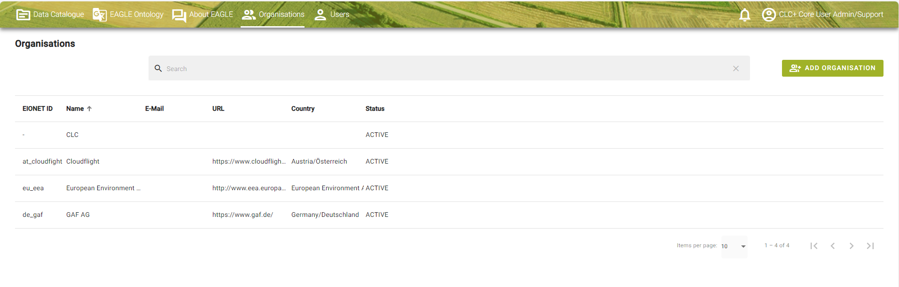
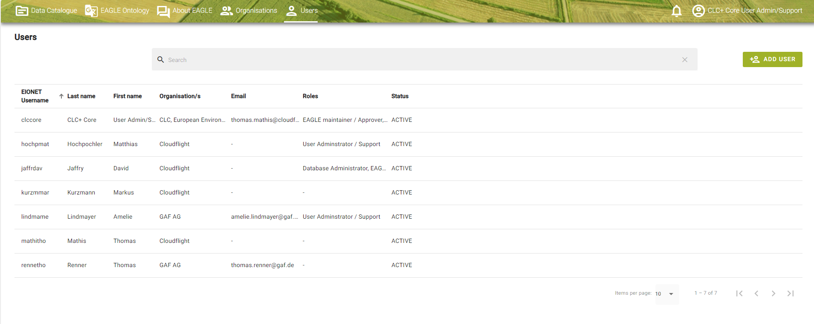
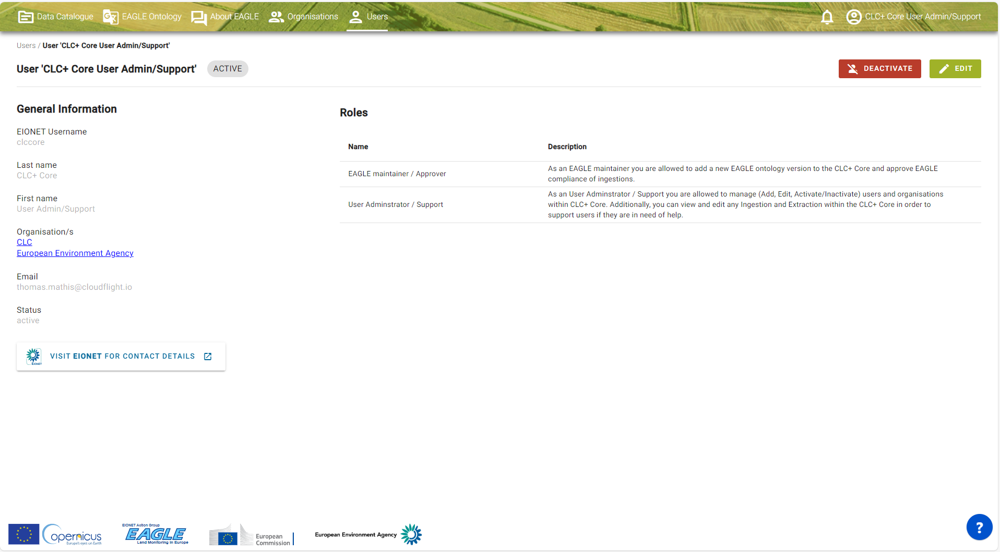
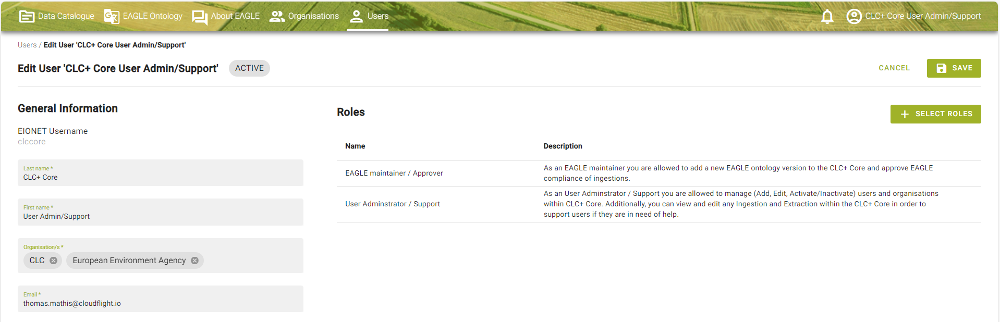
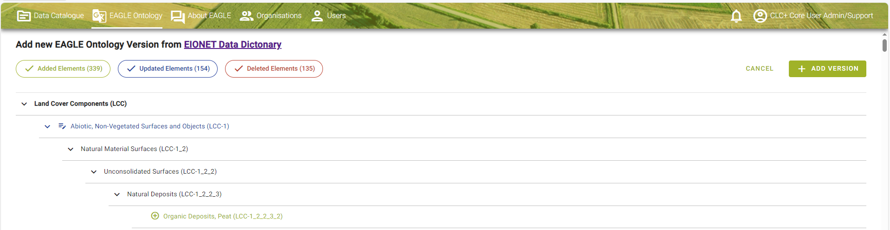
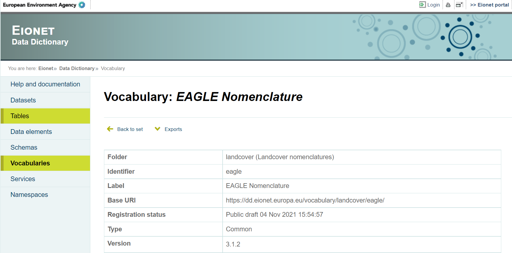
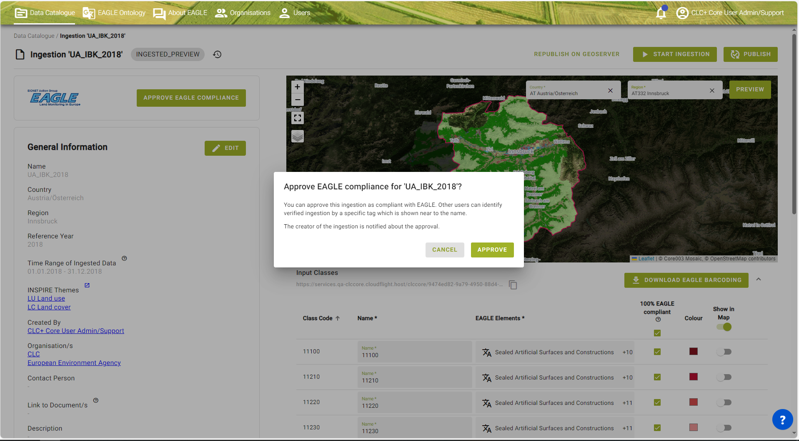
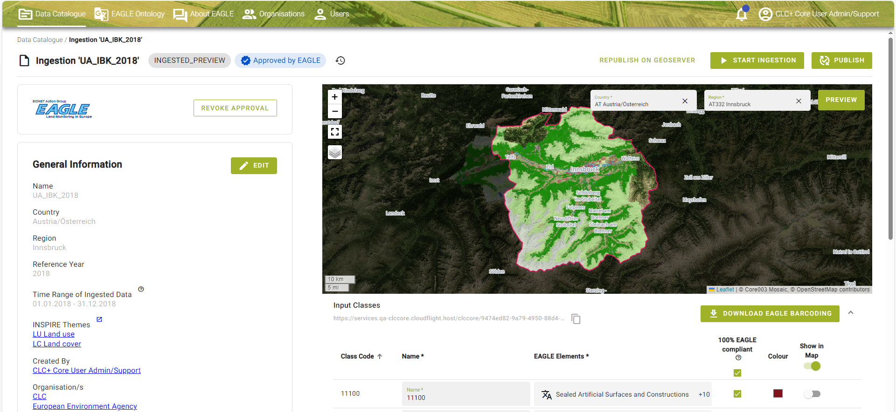

Date: 2023-12-21

Doc. Version : Issue 4.0

Content ID: /

**Document Control Information**

  -------------------------------------------------------------------------------------------------
  Document Title     CLC+ Core User Guideline
  ------------------ ------------------------------------------------------------------------------
  Project Title      CLC+ Core production and provision of complementary consultancy services

  Document Author    Thomas Mathis (Cloudflight), Tanja Gasber (GeoVille), Amelie Lindmayer (GAF)

  Project Owner      Tobias Langanke (EEA)

  Project Manager    Tobias Langanke (EEA)

  Document Code      /

  Document Version   Issue 4.0

  Distribution       

  Date               2023-12-20
  -------------------------------------------------------------------------------------------------

**Document Approver(s) and Reviewer(s):**

  -----------------------------------------------------------------------
  Name                  Role            Action            Date
  --------------------- --------------- ----------------- ---------------
  Tim Wiltzius (CLF)    Reviewer        Document review   2023-12-20

  Johannes Vass (CLF)   Reviewer        Document review   
  -----------------------------------------------------------------------

**Document history**

  -----------------------------------------------------------------------------------------------------------------------------------------------------------------------------
  Revision   Date         Created by                            Short description of changes
  ---------- ------------ ------------------------------------- ---------------------------------------------------------------------------------------------------------------
  1.0        2022-04-08   CLC+ Core consortium (CLF, GV, GAF)   Initial document creation

  2.0        2022-06-10   CLC+ Core consortium (CLF, GV, GAF)   Restructure of entire document, extension of Extraction chapter and Admin User section

  3.0        2023-06-06   CLC+ Core consortium (CLF, GV, GAF)   Adaption of rule 3 in the current version of the CLC+ Core system

  4.0        2023-12-22   CLC+ Core consortium (CLF, GV, GAF)   Update of the entire document with all newly implemented features and improvements of the system (within SC8)
  -----------------------------------------------------------------------------------------------------------------------------------------------------------------------------

**Applicable Documents (AD)**

+--------+-------------------------------------------------------------------------------------------------------------------------------------------------------------------------------------------------+
| **ID** | **Document Name / Content**                                                                                                                                                                     |
+========+:================================================================================================================================================================================================+
| AD01   | Tender Specifications -- EEA/DIS/R0/20/019 -- Copernicus Land Monitoring Service -- Production of the CLC+ Core and Provision of Complementary Consultancy Services                             |
+--------+-------------------------------------------------------------------------------------------------------------------------------------------------------------------------------------------------+
| AD02   | Consortium's Technical Proposal -- in response to Call for tenders EEA/DIS/R0/20/019 -- CLC+CORE Technical Proposal - v2.0                                                                      |
+--------+-------------------------------------------------------------------------------------------------------------------------------------------------------------------------------------------------+
| AD03   | Specific Contract No 3436/R0-COPERNICUS/EEA.58286                                                                                                                                               |
+--------+-------------------------------------------------------------------------------------------------------------------------------------------------------------------------------------------------+
| AD04   | Minutes of the KOM (CLC+Core_KOM_Minutes.docx)                                                                                                                                                  |
+--------+-------------------------------------------------------------------------------------------------------------------------------------------------------------------------------------------------+
| AD05   | PM1 - Project Management and Governance Plan (CLC+Core_Deliverable_PM1_Project_Management_Plan_V1.0.pdf)                                                                                        |
+--------+-------------------------------------------------------------------------------------------------------------------------------------------------------------------------------------------------+
| AD06   | Implementation of CLC+ based on the EAGLE concept --Additional support for further development of CLC+                                                                                          |
|        |                                                                                                                                                                                                 |
|        | databases (CLC+ and CLC+ instances, namely CLC+ LULUCF instance and CLC+ Legacy instance) - Task 4: From CLC+ Core to CLC+ Legacy - 3436/R0-Copernicus/EEA.57755                                |
+--------+-------------------------------------------------------------------------------------------------------------------------------------------------------------------------------------------------+
| AD07   | PM2 - 1st Project Management and Status Report (CLC+Core_Deliverable_PM2_1st-Project-Management-Status-Report_V1.0.pdf)                                                                         |
+--------+-------------------------------------------------------------------------------------------------------------------------------------------------------------------------------------------------+
| AD08   | CLC+ Core Decision Log_V1.4 (CLC+Core_Decision_log_V1.4.pdf)                                                                                                                                    |
+--------+-------------------------------------------------------------------------------------------------------------------------------------------------------------------------------------------------+
| AD09   | D1 - Software Design (CLC+Core_D1_Software \_Design_V1.0.pdf)                                                                                                                                   |
+--------+-------------------------------------------------------------------------------------------------------------------------------------------------------------------------------------------------+
| AD10   | D3.2.1 - Demonstration and documentation of ingested CLMS datasets, under this Service Contract (CLC+Core_Deliverable_D3.2.1_Demonstration-and-documentation-of-ingested-CLMS-datasets_V01.pdf) |
+--------+-------------------------------------------------------------------------------------------------------------------------------------------------------------------------------------------------+
| AD11   | D3.1 - Documentation of deployment of CLC+ Core products to DIAS -- cloud service (CLC+Core_Deliverable_D3.1_Documentation of deployment of CLC+ Core products to DIAS_V1.0.pdf)                |
+--------+-------------------------------------------------------------------------------------------------------------------------------------------------------------------------------------------------+
| AD12   | LULUCF_classes_simplified_EAGLE_query_rules_20210325.xlsx (Provided by EAGLE Group)                                                                                                             |
+--------+-------------------------------------------------------------------------------------------------------------------------------------------------------------------------------------------------+
| AD13   | Specific contract no 3506_R0-COPERNCA_EEA.59433                                                                                                                                                 |
+--------+-------------------------------------------------------------------------------------------------------------------------------------------------------------------------------------------------+

# Admin User only

In this section information is given which is relevant for **Admin Users only**. This mainly concerns the categories Organisations and Users, where the Admin User has additional rights compared to a normal System User. An important task given to the admin user is the possibility to upload a new EAGLE ontology into the system.

## Organisations 

This navigation menu tab provides an overview of the registered **Organisations** of the CLC+ Core system.

Organisations are taken over by default from EIONET on your first login to CLC+ Core. Organisations play an important role when you define the visibility of your Ingestion or Extraction for publishing it. The visibility can be limited to users from your organisations only or for the country of the selected Organisation. Further, the Admin User has rights to add or remove Organisations (see [Figure 6‑1](#_Ref153959302)).

As an **Admin User** your account has certain authorizations, i.e. you are able to add new Organisations.

Search function, to **search for an organisation** within the system.

{width="6.925in" height="2.222916666666667in"}

[]{#_Ref153959302 .anchor}**Figure 6‑1: Menu item -- Organisations**

## Users

This navigation menu tab provides an overview of the registered User of the CLC+ Core system.

Users are taken over by default from EIONET on your first login to CLC+ Core. Depending on your role assigned, you have more or less rights. The Admin User has rights to add or remove Users from the system or change their status. To open your Profile, click on your name (see [Figure 6‑2](#_Ref153959323)). Now you will be forwarded to the Profile view (section 1.5.1 in User Manual).

As an Admin User your account has certain authorizations, i.e. you are able to add new Users.

Further, you have the possibility to **search for a User.**

{width="6.925in" height="2.7680555555555557in"}

[]{#_Ref153959323 .anchor}**Figure 6‑2: Menu item -- Users.**

### User Profile 

To open the **User Profile** you can either click on the User Profile Icon in the Header, which opens a context menu with the actions 'My Profile' and 'Logout' ([Figure 6‑3](#_Ref153959344)) or in the Users tab by clicking on your name ([Figure 6‑3](#_Ref153959344)). You will then be forwarded to the Profile view.

{width="6.925in" height="1.1444444444444444in"}

[]{#_Ref153959344 .anchor}**Figure 6‑3: User Profile -- Actions.**

### User Profile View

When you click on the context menu action 'My Profile' of the User Profile Icon you will find yourself within the User Profile view. Thus, a profile can only be changed by a person with the role 'User Administration / support'. Within your Profile you can see several information (see [Figure 6‑4](#_Ref153959381)) such as:

**General Information:** In this area the most important information from your user profile is shown which is username, first and last name, which organisation you are part of and your current status. The EIONET button guides you to the [Eionet Portal](https://www.eionet.europa.eu/login?came_from=/directory/user%3Fuid%3Dclccore).

**Roles:** In this area it is displayed what roles are assigned to you. Roles define what you as a user are allowed to do within the CLC+ Core system from a functional point of view. Typically, roles are for only Users which administer the application.

As an Admin User can deactivated by a person with the role 'User Administration / support'. "Inactive" Users do not have access to the application.

{width="6.925in" height="3.827777777777778in"}

[]{#_Ref153959381 .anchor}**Figure 6‑4: View User Profile (User Administrator).**

### Edit User Profile

Editing your profile will only affect / edit the user profile in the CLC+ Core system and not the EIONET account. **General:** Changing your first- and last name and the organisation can only be done by a person with the role 'User Administration / support'.

**Roles** can only be changed by a person with the role 'User Administration / support'.

By clicking on 'Save' your entered information will be saved. If you do not want to save the changed information, then you have the possibility to click on 'Cancel' (see [Figure 6‑5](#_Ref153959405)).

{width="6.925in" height="2.23125in"}

[]{#_Ref153959405 .anchor}**Figure 6‑5: Edit User Profile.**

## Add / upload new EAGLE Ontology 

In the "**Add new version**" dialog a call is made to the EIONET data dictionary. This feature is for expert user only. The dictionary is immediately compared to the previous version and differences will be updated. For example, as in the figure below, there are no differences, which is why you get this view ([Figure 6‑6](#_Ref99095063)).

By clicking on the **EIONET Data Dictionary** link you will be redirected to the EIONET data dictionary. Data Dictionary[^1] holds definitions of datasets, tables and data elements (see [Figure 6‑7](#_Ref153959430)). Each of these three levels is defined by a set of attributes, the core set of which corresponds to ISO 11179 standard for describing data elements. The whole attribute set is flexible, and attributes can be added / removed from/to the system.

{width="6.925in" height="1.7979166666666666in"}

[]{#_Ref99095063 .anchor}**Figure 6‑6: Add new EAGLE Ontology Version.**

{width="6.0178619860017495in" height="2.9841885389326333in"}

[]{#_Ref153959430 .anchor}**Figure 6‑7: EIONET data dictionary.**

Once a new EAGLE ontology version is published all users get a notification (see section 1.7.3 in User Manual).

## Approval EAGLE barcoding

The EAGLE barcoding of an Ingestion can be approved for being **EAGLE compliant** by any user with the additional role of being an "EAGLE Maintainer/Approver". When opening an Ingestion, the button "Approve EAGLE Compliance" can only by seen by users with that role (see [Figure 6‑8](#_Ref153959461)). The User gets notified once the EAGLE barcoding for the Ingestion is approved by an EAGLE Maintainer.

{width="6.925in" height="3.8361111111111112in"}

[]{#_Ref153959461 .anchor}**Figure 6‑8:Approval of EAGLE compliance for an Ingestion.**

The Ingestion gets than a quality stamp in the Data Catalogue (first column) and when opening the Ingestion next to the status. Please note that for now it is only planned to go through the approval process for the CLMS products.

The **EAGLE approval** for an Ingestion can also be revoked again by the EAGLE Maintainer (see [Figure 6‑9](#_Ref153959479)). Each approval change is saved and displayed in the history of an Ingestion.

{width="6.925in" height="3.1902777777777778in"}

[]{#_Ref153959479 .anchor}**Figure 6‑9:Approval and possibility to revoke the EAGLE approval again.**

# List of abbreviations

  -------------------------------------------------------------------------------------------------------------------------------------------------------------------------------------------------------------------------------
  Abbreviation            Name                                                                                                 Reference
  ----------------------- ---------------------------------------------------------------------------------------------------- --------------------------------------------------------------------------------------------------
  **ADs**                 Applicable Documents                                                                                 

  **AI**                  Action Item                                                                                          

  **API**                 Application Programming Interface                                                                    

  **CLC**                 CORINE Land Cover                                                                                    <https://land.copernicus.eu/en/products/corine-land-cover>

  **CLC+**                CORINE Land Cover +                                                                                  <https://land.copernicus.eu/en/products/clc-a-new-generation-land-information-system-for-europe>

  **CLMS**                Copernicus Land Monitoring Service                                                                   <https://land.copernicus.eu/en>

  **COG**                 Cloud-optimized GIF                                                                                  

  **CORINE**              Coordination of information on the environment                                                       

  **CZ**                  Coastal Zones                                                                                        

  **DB**                  Database                                                                                             

  **DIAS**                Copernicus Data and Information Access Services                                                      

  **EAGLE**               Eionet Action Group on Land monitoring in Europe                                                     <https://land.copernicus.eu/en/eagle>

  **EC**                  European Commission                                                                                  <https://commission.europa.eu/>

  **EEA**                 European Environment Agency                                                                          <https://www.eea.europa.eu>

  **EEA39**               The 33 member and 6 cooperating countries of the EEA                                        

  **EEA38+UK**            The 32 member and 6 cooperating countries of the EEA + United Kingdom                       

  **EO**                  Earth Observation                                                                         

  **ESA**                 European Space Agency                                                                                 <https://www.esa.int>

  **ETC**                 European Topic Centre                                                                                 <https://www.eionet.europa.eu/etcs>

  **EU**                  European Union                                                                              

  **EU27**                The 27 Member States of the European Union                                                  

  **FM**                  Final Meeting                                                                                        

  **FWC**                 Framework Contract                                                                                   

  **GDAL**                Geospatial Data Abstraction Library                                                                  

  **GDB**                 Geodatabase                                                                                          

  **GIO**                 GMES Initial Operations                                                                              

  **GPKG**                GeoPackage                                                                                           

  **HDF5**                Hierarchical Data Format                                                                             

  **HRL / HRLs**          High Resolution Layer / High Resolution Layers                                                       

  **IaaS**                Infrastructure-as-a-Service                                                                          

  **ID**                  Identification Number                                                                                

  **INSPIRE**             Infrastructure for Spatial Information in Europe                                                     <https://knowledge-base.inspire.ec.europa.eu/index_en>

  **ISO**                 International Organisation for Standardization                                                       

  **ITT**                 Invitation to Tender                                                                                 

  **JDBC**                Java Database Connectivity                                                                           

  **JWT**                 JSON Web Token                                                                                       

  **KOM**                 Kick-Off Meeting                                                                                     

  **LC**                  Land Cover                                                                                           

  **LCC**                 Land Cover Component                                                                                 

  **LCH**                 Land Characteristics                                                                                 

  **LC/LU**               Land Cover / Land Use                                                                                

  **LCC**                 Land Cover Component                                                                                 

  **LU**                  Land Use                                                                                             

  **LUA**                 Land Use Attribute                                                                                   

  **LULUCF**              Land Use, Land Use Change and Forestry                                                               

  **LYR**                 ArcGIS Layer File                                                                                    

  **MMU**                 Minimum Mapping Unit                                                                                 

  **MS**                  Member States                                                                                        

  **NFRs**                Non-Functional-Requirements                                                                          

  **NRC**                 National Reference Centre                                                                            

  **NUTS**                Nomenclature of Territorial Units for Statistics                                                     

  **N2K**                 Natura 2000                                                                                          

  **OBDC**                Open Database Connectivity                                                                           

  **PDF**                 Portable Document Format                                                                             

  **PM**                  Progress Meeting                                                                                     

  **PMP**                 Project Management Plan                                                                              

  **PoC**                 Proof of Concept                                                                                     

  **QA**                  Quality Assurance                                                                                    

  **QC**                  Quality Control                                                                                      

  **QM**                  Quality Management                                                                                   

  **QML**                 QGIS Style file                                                                                      

  **REST**                Representational State Transfer                                                                      

  **RZ**                  Riparian Zones                                                                                       

  **SC**                  Specific Contract                                                                                    

  **SHP**                 ESRI Shapefile                                                                                       

  **SLD**                 Styled Layer Descriptor                                                                              

  **SQL**                 Structured Query Language                                                                            

  **UA**                  Urban Atlas                                                                                          

  **UI**                  User Interface                                                                                       

  **URI**                 Uniform Resource Identifier                                                                          

  **URL**                 Uniform Resource Locator                                                                             

  **UUID**                Universally Unique Identifier                                                                        

  **VM**                  Virtual Machine                                                                                      

  **WBS**                 Work Breakdown Structure                                                                             

  **WEkEO**               Copernicus DIAS reference service for environmental data, virtual environments for data processing   <https://www.wekeo.eu/>

  **WP**                  Work Package                                                                                         

  **ZIP**                 ZIP Format                                                                                           
-------------------------------------------------------------------------------------------------------------------------------------------------------------------------------------------------------------------------------

[^1]: <https://dd.eionet.europa.eu/documentation/doc1>