Date: 2023-12-21

Doc. Version: Issue 4.0

Content ID: /

**Document Control Information**

  -------------------------------------------------------------------------------------------------
  Document Title     CLC+ Core User Guideline
  ------------------ ------------------------------------------------------------------------------
  Project Title      CLC+ Core production and provision of complementary consultancy services

  Document Author    Thomas Mathis (Cloudflight), Tanja Gasber (GeoVille), Amelie Lindmayer (GAF)

  Project Owner      Tobias Langanke (EEA)

  Project Manager    Tobias Langanke (EEA)

  Document Code      /

  Document Version   Issue 4.0

  Distribution       

  Date               2023-12-20
  -------------------------------------------------------------------------------------------------

**Document Approver(s) and Reviewer(s):**

  ----------------------------------------------------------------
  Name                  Role        Action            Date
  --------------------- ----------- ----------------- ------------
  Tim Wiltzius (CLF)    Reviewer    Document review   2023-12-20

  Johannes Vass (CLF)   Reviewer    Document review   
  ----------------------------------------------------------------

**Document history**

  -----------------------------------------------------------------------------------------------------------------------------------------------------------------------------
  Revision   Date         Created by                            Short description of changes
  ---------- ------------ ------------------------------------- ---------------------------------------------------------------------------------------------------------------
  1.0        2022-04-08   CLC+ Core consortium (CLF, GV, GAF)   Initial document creation

  2.0        2022-06-10   CLC+ Core consortium (CLF, GV, GAF)   Restructure of entire document, extension of Extraction chapter and Admin User section

  3.0        2023-06-06   CLC+ Core consortium (CLF, GV, GAF)   Adaption of rule 3 in the current version of the CLC+ Core system

  4.0        2023-12-22   CLC+ Core consortium (CLF, GV, GAF)   Update of the entire document with all newly implemented features and improvements of the system (within SC8)
  -----------------------------------------------------------------------------------------------------------------------------------------------------------------------------

**Applicable Documents (AD)**

+--------+-------------------------------------------------------------------------------------------------------------------------------------------------------------------------------------------------+
| **ID** | **Document Name / Content**                                                                                                                                                                     |
+========+:================================================================================================================================================================================================+
| AD01   | Tender Specifications -- EEA/DIS/R0/20/019 -- Copernicus Land Monitoring Service -- Production of the CLC+ Core and Provision of Complementary Consultancy Services                             |
+--------+-------------------------------------------------------------------------------------------------------------------------------------------------------------------------------------------------+
| AD02   | Consortium's Technical Proposal -- in response to Call for tenders EEA/DIS/R0/20/019 -- CLC+CORE Technical Proposal - v2.0                                                                      |
+--------+-------------------------------------------------------------------------------------------------------------------------------------------------------------------------------------------------+
| AD03   | Specific Contract No 3436/R0-COPERNICUS/EEA.58286                                                                                                                                               |
+--------+-------------------------------------------------------------------------------------------------------------------------------------------------------------------------------------------------+
| AD04   | Minutes of the KOM (CLC+Core_KOM_Minutes.docx)                                                                                                                                                  |
+--------+-------------------------------------------------------------------------------------------------------------------------------------------------------------------------------------------------+
| AD05   | PM1 - Project Management and Governance Plan (CLC+Core_Deliverable_PM1_Project_Management_Plan_V1.0.pdf)                                                                                        |
+--------+-------------------------------------------------------------------------------------------------------------------------------------------------------------------------------------------------+
| AD06   | Implementation of CLC+ based on the EAGLE concept --Additional support for further development of CLC+                                                                                          |
|        |                                                                                                                                                                                                 |
|        | databases (CLC+ and CLC+ instances, namely CLC+ LULUCF instance and CLC+ Legacy instance) - Task 4: From CLC+ Core to CLC+ Legacy - 3436/R0-Copernicus/EEA.57755                                |
+--------+-------------------------------------------------------------------------------------------------------------------------------------------------------------------------------------------------+
| AD07   | PM2 - 1st Project Management and Status Report (CLC+Core_Deliverable_PM2_1st-Project-Management-Status-Report_V1.0.pdf)                                                                         |
+--------+-------------------------------------------------------------------------------------------------------------------------------------------------------------------------------------------------+
| AD08   | CLC+ Core Decision Log_V1.4 (CLC+Core_Decision_log_V1.4.pdf)                                                                                                                                    |
+--------+-------------------------------------------------------------------------------------------------------------------------------------------------------------------------------------------------+
| AD09   | D1 - Software Design (CLC+Core_D1_Software \_Design_V1.0.pdf)                                                                                                                                   |
+--------+-------------------------------------------------------------------------------------------------------------------------------------------------------------------------------------------------+
| AD10   | D3.2.1 - Demonstration and documentation of ingested CLMS datasets, under this Service Contract (CLC+Core_Deliverable_D3.2.1_Demonstration-and-documentation-of-ingested-CLMS-datasets_V01.pdf) |
+--------+-------------------------------------------------------------------------------------------------------------------------------------------------------------------------------------------------+
| AD11   | D3.1 - Documentation of deployment of CLC+ Core products to DIAS -- cloud service (CLC+Core_Deliverable_D3.1_Documentation of deployment of CLC+ Core products to DIAS_V1.0.pdf)                |
+--------+-------------------------------------------------------------------------------------------------------------------------------------------------------------------------------------------------+
| AD12   | LULUCF_classes_simplified_EAGLE_query_rules_20210325.xlsx (Provided by EAGLE Group)                                                                                                             |
+--------+-------------------------------------------------------------------------------------------------------------------------------------------------------------------------------------------------+
| AD13   | Specific contract no 3506_R0-COPERNCA_EEA.59433                                                                                                                                                 |
+--------+-------------------------------------------------------------------------------------------------------------------------------------------------------------------------------------------------+

# Introduction

This User Guideline is designed to provide documentation for the users of CLC+ Core[^1]. This documentation aims to describe all user interfaces and functionalities from the user\'s point of view. Furthermore, additional useful information, experiences and recommendations have been added to provide the user with the most comprehensive guideline possible.

For a better understanding the described functionalities are highlighted with markers containing numbers (see example on the left side) in the text and within the screenshots.

Further important notes and remarks are marked with a green outline.

In addition, in section [5](#faq-frequently-asked-questions) frequently asked questions are collected and a [Glossary](#glossary) (see section [7](#glossary)) was added at the end of the user guideline explaining the most common terms relevant to the CLC+ Core system.

## CLC+ Core in a nutshell

With CLC+ Core, the European Environment Agency (EEA) offers you a consistent multi-use grid-based, web-based Land Cover/Land Use (LC/LU) hybrid data repository. Following up on the CLC+ Backbone, the CLC+ Core constitutes the second stage of the CLC+ Product Suite (see [Figure 1‑1](#_Ref151465617)). The CLC+ Core provides a flexible database approach to incorporate existing and future European Copernicus Land Monitoring Service (CLMS) products as well as various national land cover (LC) and land use (LU) datasets, by standardised integration along the EAGLE language, which further enables the Extraction of various CLC+ Instances. CLC+ Core will thus be able to provide unprecedented information to strengthen Europe's leading role in climate change impact mitigation and the management of environmental monitoring in support of programmes and policies such as Land Use, Land-Use Change and Forestry (LULUCF) and the European Green Deal. The goal of the CLC+ suite is to become the new European standard in land monitoring, within the CLMS.

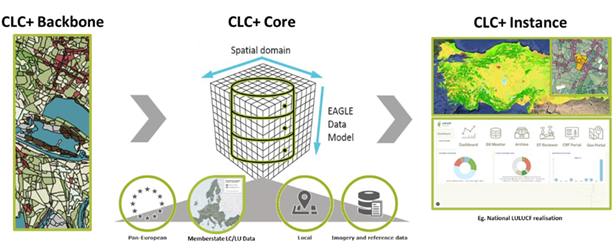{width="6.419444444444444in" height="2.6032841207349082in"}

[]{#_Ref151465617 .anchor}**Figure 1‑1: CLC+ Product suite overview (from left to right) with the CLC+ Core database solution (middle) hosting integrated CLMS, and potentially ancillary and national LC/LU data.**

The following chapters provide a brief overview about the CLC+ Core System and how to perform an Ingestion or Extraction. Chapter [0](#_Ref105139868) gives an introduction about how to get started and the main functionalities of the CLC+ Core. Further, you get to information about the Organizations and User that are part of the System. The EAGLE concept, as a main part of the System, is described in chapter [0](#_Toc65609501). In this section you get tips and hints how to perform the EAGLE barcoding. There are already several datasets in the CLC+ Core System. The process how to ingest your own data in the System is described in chapter [3](#ingestions) whereas chapter [4](#extraction) explains the creation of an Extraction. The Frequently Asked Questions (FAQ) section ([5](#faq-frequently-asked-questions)) provides the user a summary of questions and their answers regarding the CLC+ Core environment.

**Please note that this guideline is a living document which will be updated regularly.**

## Getting started?

The CLC+ Core **Login** Page (see [Figure 1‑2](#_Ref151465691)) uses the EIONET Portal for authentication. If you already have an **EIONET account**, use your EIONET credentials to gain access: [clcplus-core.land.copernicus.eu](https://clcplus-core.land.copernicus.eu). If you are not logged in, the login app routes you automatically to the login.

If you do not have an EIONET account yet, please contact the [Eionet Helpdesk](https://www.eionet.europa.eu/about/helpdesk?msclkid=265000d2aa8b11ec89be0ad26fcd73b0) to create one.

If you already have an account but forgot your password, you can reset your password here: [Eionet passwor](https://www.eionet.europa.eu/password-reset)d reset.

The European Environment Information and Observation Network (EIONET) is a partnership network of the European Environment Agency (EEA) and its 38 member and cooperating countries. EEA and Eionet gather and develop data, knowledge, and advice policy makers about Europe\'s environment. The Eionet helpdesk is a central contact point for support requests related to Eionet account management and IT troubleshooting on Eionet web sites, tools and services.

Eionet user accounts are created for those who need access to Eionet websites, tools and services that require Eionet login. **New user accounts can only be created by the Eionet Helpdesk and the National Focal Points.** The Eionet helpdesk is manned throughout the opening hours of EEA and generally responds to the ticket within 24 hours.

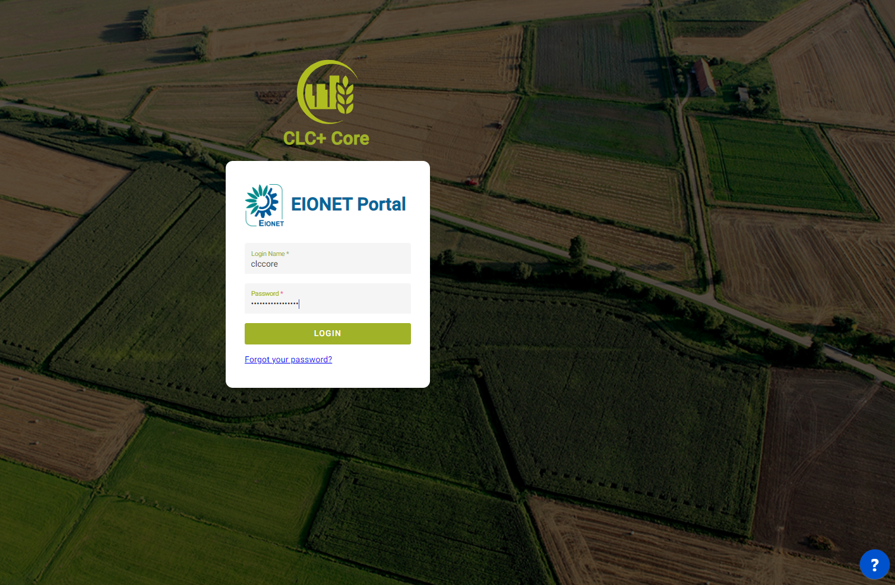{width="6.093470034995626in" height="3.9828751093613297in"}

[]{#_Ref151465691 .anchor}**Figure 1‑2: CLC+ Core login page**

## Webpage elements

In this section, the general page elements are described to give an overview of the structure of this website, its navigation and its content (see [Figure 1‑3](#_Ref151621809)).

### Header

The **Header** section contains the Navigation Menu (see [Figure 1‑3](#_Ref151621809)). The different tabs will be described in the respective sections of this document:

- Data Catalogue (section [1.6](#data-catalogue)),

- EAGLE Ontology (section [0](#_Toc65609501)),

- About EAGLE (section [1.9](#about-eagle)),

- Organisations (section [1.31.3](#webpage-elements)),

- Users (section [1.5](#users))

- Notifications (see section [1.7.3](#notifications-messages)) and

- User Profile (section [1.5.1](#user-profile)).

### Content

The **Content** represents the section between the Header and the Footer area and varies depending on which tab is opened (see [Figure 1‑3](#_Ref151621809)). The Data Catalogue (section [1.6](#data-catalogue)) is the landing page / starting point of CLC+ Core. To navigate through the system, simply click on the relevant navigation tabs or entries.

{width="6.925in" height="3.8055555555555554in"}

[]{#_Ref151621809 .anchor}**Figure 1‑3: Content example - Data Catalogue**

## Organisations 

This navigation menu tab provides an overview of the registered **Organisations** of the CLC+ Core system.

Organisations are taken over by default from EIONET with your first login to CLC+ Core. Organisations play an important role when you define the visibility of your Ingestion or Extraction for publishing it. The visibility can be limited to users from your organisations only or for the country of the selected Organisation (see sections [3.8](#publish-ingestion) and [4.8](#publish-extraction-and-download-result)).

**Search function**, to search for an organisation within the system (see [Figure 1‑4](#_Ref151465792)). If you are an Admin User, please refer to section 6.1 in separate Annex.

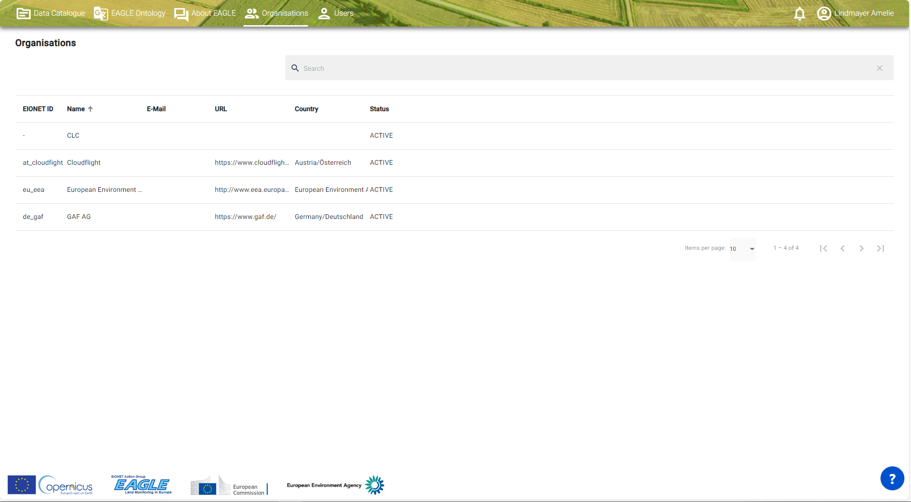{width="6.925in" height="3.8201388888888888in"}

[]{#_Ref151465792 .anchor}**Figure 1‑4: Menu item -- Organisations**

## Users

This navigation menu tab provides an overview of the registered **User** of the CLC+ Core system.

Users are taken over by default from EIONET with your first login to CLC+ Core. Depending on your role assigned, you have more or less rights. To open your Profile click on your name. Now you will be forwarded to the Profile view (section [1.5.1](#user-profile)).

You have the possibility to search for a **User** (see [Figure 1‑5](#_Ref100263548)). If you are an Admin User, please refer to section 6.2 in separate Annex.

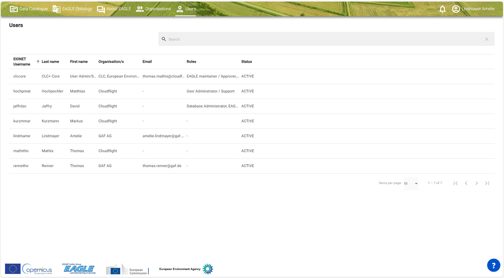{width="6.925in" height="3.832638888888889in"}

[]{#_Ref100263548 .anchor}**Figure 1‑5: Menu item -- Users**

### User Profile 

To open the **User Profile** View you can either click on the User Profile Icon in the Header, which opens a context menu with the actions 'My Profile' and 'Logout' ([Figure 1‑6](#_Ref100263532)) or in the Users tab by clicking on your name. You will then be forwarded to the Profile view. By clicking on Logout your session will be terminated.

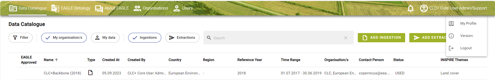{width="6.925in" height="1.1444444444444444in"}

[]{#_Ref100263532 .anchor}**Figure 1‑6: User Profile -- Actions**

### User Profile View

When you click on the context menu action 'My Profile' of the User Profile Icon you will find yourself within the User Profile view. Thus, a profile can only be changed by a person with the role 'User Administration / support'. Within your Profile you can see several information (see [Figure 1‑7](#_Ref151622278)) such as:

**General Information:** In this area the most important information from your user profile is shown which is username, first and last name, which organisation you are part of and your status. The EIONET button guides you to the [Eionet Portal](https://www.eionet.europa.eu/login?came_from=/directory/user%3Fuid%3Dclccore).

**Roles:** In this area it is displayed what roles are assigned to you. Roles define what you as a user are allowed to do within the CLC+ Core system from a functional point of view. You are perfectly able to use the system if there are no roles assigned to you. If you are an Admin User, please refer to section 6.2 in separate Annex.

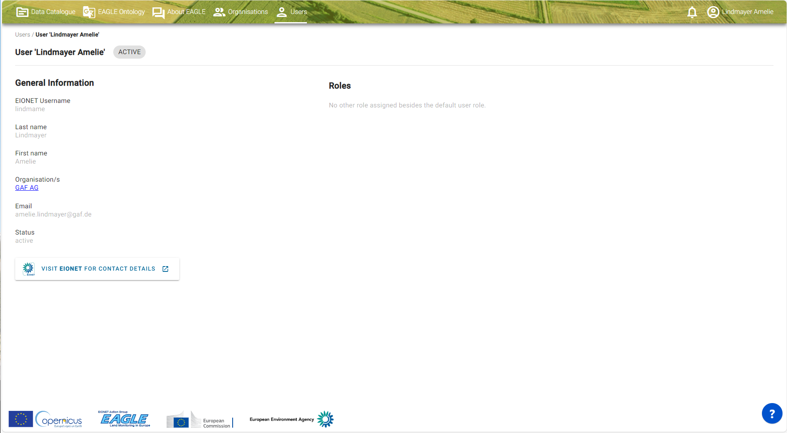{width="6.925in" height="3.8125in"}

[]{#_Ref151622278 .anchor}**Figure 1‑7: View User Profile (User without special roles)**

In the table below ([Table 1‑1](#_Ref151985895)) the roles possible in the CLC+ Core system are listed:

  ---------------------------------------------------------------------------------------------------------------------------------------------------------------------------------------------------------------------------------------------------------------------------------------------------------------------
  Role                           Description
  ------------------------------ --------------------------------------------------------------------------------------------------------------------------------------------------------------------------------------------------------------------------------------------------------------------------------------
  User Administrator / Support   As an User Administrator / Support you are allowed to manage (Add, Edit, Activate/Inactivate) users and organisations within CLC+ Core. Additionally, you can view and edit any Ingestion and Extraction within the CLC+ Core in order to support users if they are in need of help.

  EAGLE maintainer / Approver    As an EAGLE maintainer you are allowed to add a new EAGLE ontology version to the CLC+ Core and approve EAGLE compliance of Ingestions.

  System Administrator           For now, this role is only available within CLC+ Core so that it can be seen who is the system administrator. For later this role could be used for additional views like e.g., scheduling view.

  Database Administrator         For now, this role is only available within CLC+ Core so that it can be seen who is the database administrator. For later this role could be used for additional views like e.g., performance view.
  ---------------------------------------------------------------------------------------------------------------------------------------------------------------------------------------------------------------------------------------------------------------------------------------------------------------------

  : []{#_Ref151985895 .anchor}Table 1‑1: different user roles in the CLC+ Core system

Note: Only the admin can assign a role to the user

## Data Catalogue

The **Data Catalogue** is the landing page / starting point of CLC+ Core. In the Data Catalogue, you can search for existing Ingestions and Extractions within CLC+ Core (see [Figure 1‑8](#_Ref151467230)).

**An Ingestion is the input dataset resampled / aggregated to 100 x 100 m spatial resolution**.

Each Ingestion (section [3](#ingestions)) consists of one or more Land Cover and or Land Use classes. These classes, so called Input Classes (section [3.6](#input-classes)) in CLC+ Core will be used for Extractions (section [4](#extraction)). An Extraction can create independent data products for future Instances by selecting Input Classes, adding rules that extract the required information. More information about Ingestions and Extractions are given in sections [3](#ingestions) and [4](#extraction).

By hovering your mouse cursor over the content, the table entries turn grey and three dots appear at the end of the line. By clicking on the 3 dots, you have different options. Ingestion/Extraction can be opened in detail view, or opened in new tab. Further an Ingestion or Extraction can be reused (e.g. see section [3.9](#reuse-ingestion)) or if it's the users own Ingestion/Extraction and it has been published but not yet used (see section [3.5](#status-of-an-ingestion) or [4.1](#status-of-an-extraction)) it can be unpublished again. Further a used Ingestion could be achieved. With a right click on an Extraction additional options appear (see lower image of [Figure 1‑8](#_Ref151467230)): the user can download Extraction dataset as GeoTIFF or the Extraction metadata as JSON file directly (further this data can also be downloaded in the Extraction detail view page see section [4.8](#publish-extraction-and-download-result).

In addition to the functionalities mentioned above, the data catalogue is the starting point for adding new data to the system (**Add Ingestions**) (see [Figure 1‑8](#_Ref151467230) [Figure 1‑9](#_Ref151467380)),

or to start an Extraction configuration (**Add Extractions**) (see [Figure 1‑8](#_Ref151467230) [Figure 1‑9](#_Ref151467380)).

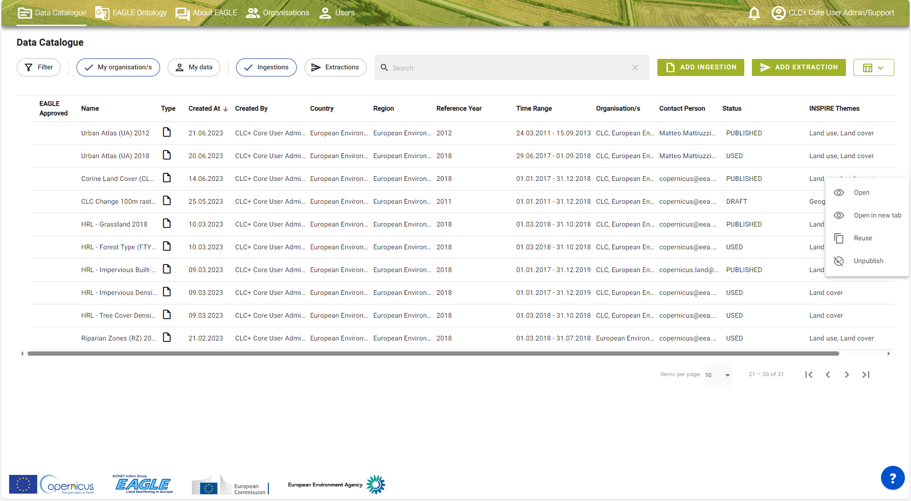{width="6.925196850393701in" height="3.811023622047244in"}

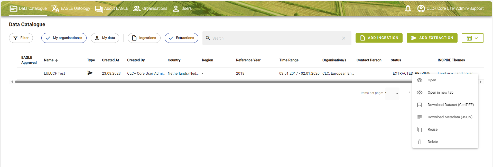{width="6.925in" height="2.086956474190726in"}

[]{#_Ref151467230 .anchor}**Figure 1‑8: Data Catalogue (Ingestions upper image, lower image Extractions view)**

The Data Catalogue lists all Ingestions and Extractions available in the CLC+ Core system. It is subdivided in several **columns**: EAGLE Approval (for further details see section [2.5](#eagle-approval-stamp-for-ingestions)), Name (of the Ingestion/Extraction), Type (Ingestion or Extraction), Created at, Created by (user), Country, Region, Reference Year (od Ingestion/Extraction), Time range (of the original input data), Organisation, Contact Person, Status and INSPIRE Themes (see [Figure 1‑9](#_Ref151467380)). All columns can be sorted ascending or descending by clicking on the column heading (arrow symbol appears). Further columns can be hidden by deselecting them on the right side (symbol next to 'Add Extraction'). The specific column then won't be displayed in the overview table anymore, but can easily be shown again by activating it again.

**Filter and Search** for Ingestions and Extractions (see [Figure 1‑9](#_Ref151467380)) is also possible. In order to find already existing Ingestions / Extractions within CLC+ Core, an option for searching and filtering the system is available. For more details see section [1.7.1](#search-and-filter).

Further there are '**Quick Filters**" available. The user can quickly filter by "Ingestion", "Extraction", "My Organisation" or "My Data" (see [Figure 1‑9](#_Ref151467380)). By clicking on e.g. "My Data" symbol the filter for the table blow gets activated (check mark appears) and only shows then the Ingestions/Extractions = data the user added. Same applies for "My Organisation" only data shown ingested or extracted by the user's organisation are shown. By activating (clicking on the symbol) for example "Ingestions" only Ingestions are shown in the table. Each of these quick filter options can easily be deactivated again by clicking on it again (check mark will disappear) and no filters will be applied to the table below anymore.

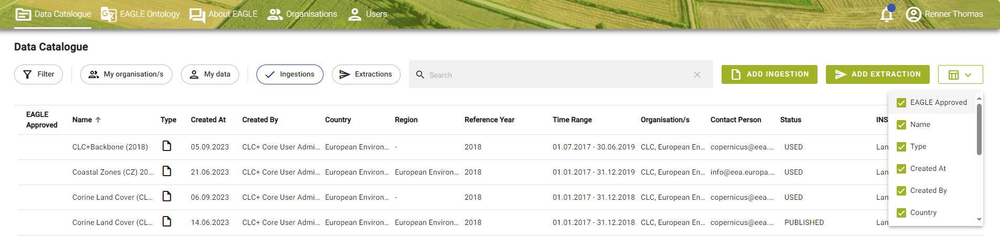{width="6.925in" height="1.6416666666666666in"}

[]{#_Ref151467380 .anchor}**Figure 1‑9: Data Catalogue -- Main functionalities**

## Auxiliary / Supporting functions

**Breadcrumbs** appear on sub-pages to show their parent pages. This helps you to identify how you got to the page you are currently working on (see [Figure 1‑10](#_Ref151467456)). In addition, it provides you more information about the context. Breadcrumbs are not clickable.

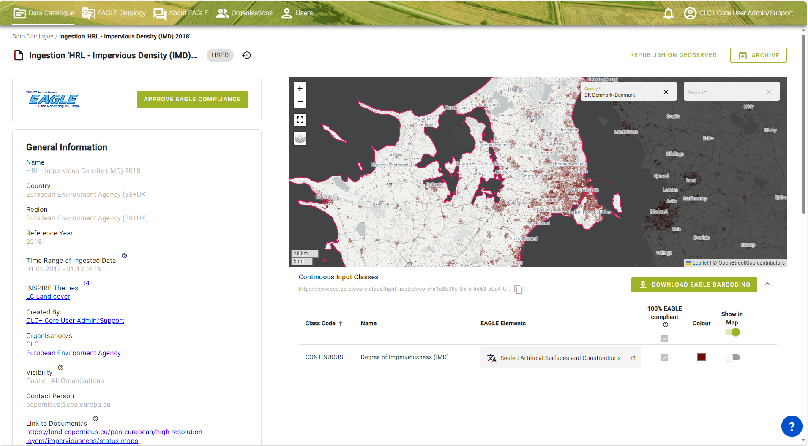{width="6.925in" height="3.828472222222222in"}

[]{#_Ref151467456 .anchor}**Figure 1‑10: Breadcrumbs**

**Pagination** is only available on the page if applicable to the content of the page, for example where tables / lists exist. With the pagination you can navigate through the different pages of a table (see [Figure 1‑11](#_Ref151467477)). On pages with a higher number, you can find previously ingested datasets.

**Help function** by clicking on the "?" icon on the bottom right corner (see [Figure 1‑11](#_Ref151627187)) a separate Help window opens in which the use can report any issues or questions. Further it is possible to write directly an email to <clcplus-core-support@cloudflight.support>.

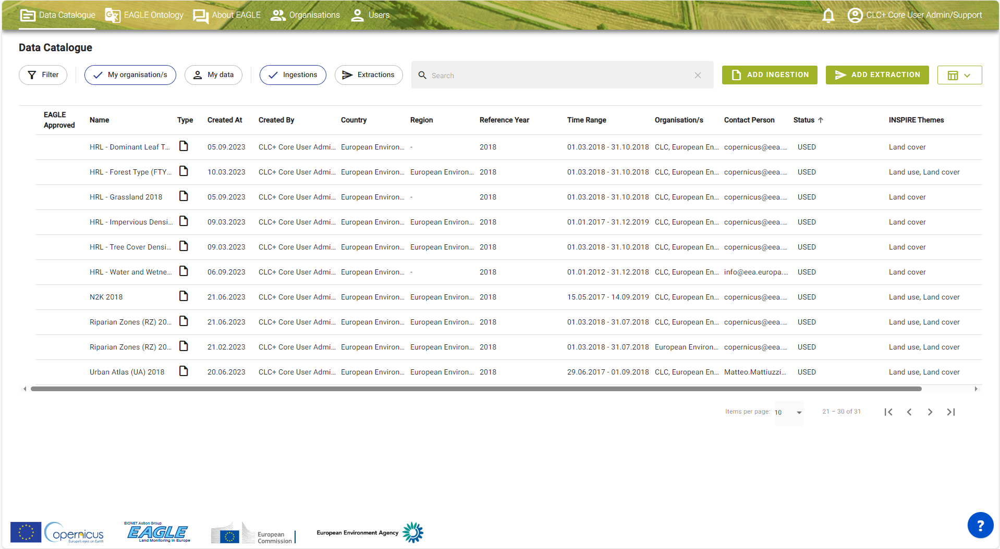{width="6.925in" height="3.828472222222222in"}

**Figure 1‑11: Pagination and Help function**

### Search and Filter

In order to search for content within CLC+ Core, an option for **searching** the system is available (see [Figure 1‑12](#_Ref151467805)). This is the grey field / box allows you to enter text. After typing your search text into the search field, please press the enter key to start the search process.

Besides the 'Quick Filters' (see section [1.6](#data-catalogue)) there are some more detailed **filter** options which make the search more user-friendly. You can filter all Ingestions and Extractions in a panel by: country (single countries or e.g. EEA38+ UK or EU27 etc.), region, reference year, time range, status or INSPIRE theme. It is also possible to clear all filters after applying them. Or by click on the Filter header to close the filter panel again. If the user navigates in the same tab the filters remain saved until they are cleared.

By default, all archived data is not shown. By activating 'Show ARCHIVED data' also archived data is considered in the filtering process and results. Further the user can filter for Ingestions which have the EAGLE Approval stamp (see section [2.5](#eagle-approval-stamp-for-ingestions)) by activating 'Show only EAGLE approved Ingestions'.

**Filtered results** will be shown then on the right.

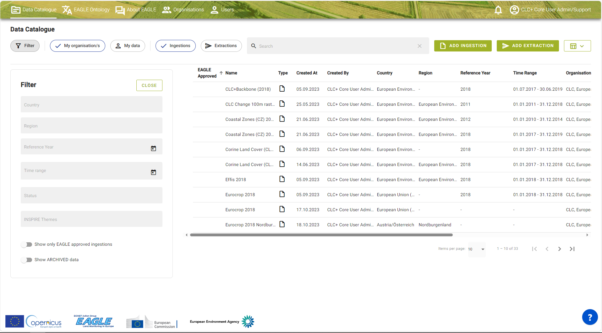{width="6.925in" height="3.7830194663167105in"}

[]{#_Ref151467805 .anchor}**Figure 1‑12: Search and Filter function in the Data Catalogue**

The search function can be found in several tabs in the CLC+ Core system. In the Data Catalogue you can search for Ingestions and Extractions (section [3](#ingestions) and [4](#extraction)). Here you are able to search for Information of each column (Name, Type, Created at, etc.). The function allows to search Input Classes to be used for an Extraction (section [4.4](#add-input-classes-to-extraction)) as well as for Users or Organisations of the CLC+ Core system (section [1.3](#webpage-elements)).

### Pop-ups/Inline Notifications 

**Inline Notifications** are shown immediately after you have triggered an action for a process that runs in the background e.g. start a 'Preview' or 'Ingestion'. [Failed notifications]{.underline} are shown in red ([Figure 1‑13](#_Ref98847093)). They will disappear automatically after a while. These notifications provide support and information on how to solve the issue.

In the example in [Figure 1‑13](#_Ref98847093), the EAGLE barcoding is missing and the Country / Region field has not been filled out -- therefore these fields are highlighted in red, and you get the hint with the notification to fill out all required fields. If not all required fields are filled the action/process cannot start.

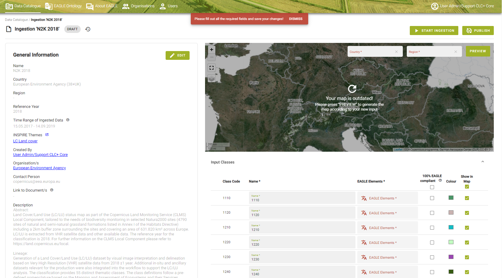{width="6.929391951006124in" height="6.158339895013123in"}

[]{#_Ref98847093 .anchor}**Figure 1‑13: Add Ingestion -- Notification of a failed preview due to missing EAGLE barcoding and the Country/region field has not been filled out -- therefore these fields are highlighted in red, and you get the hint with the notification to fill out all required fields.**

**Pop-up notifications** are messages shown on your desktop to grab your attention. The following figures show some examples for pop-up notifications (see [Figure 1‑14](#_Ref98938457), [Figure 1‑15](#_Ref98938435) and [Figure 1‑16](#_Ref98938437)). Pop-up notifications are also shown in case there is an invalid entry in the uploaded EAGLE barcoding file (see [Figure 1-17](#_Ref152831048)).

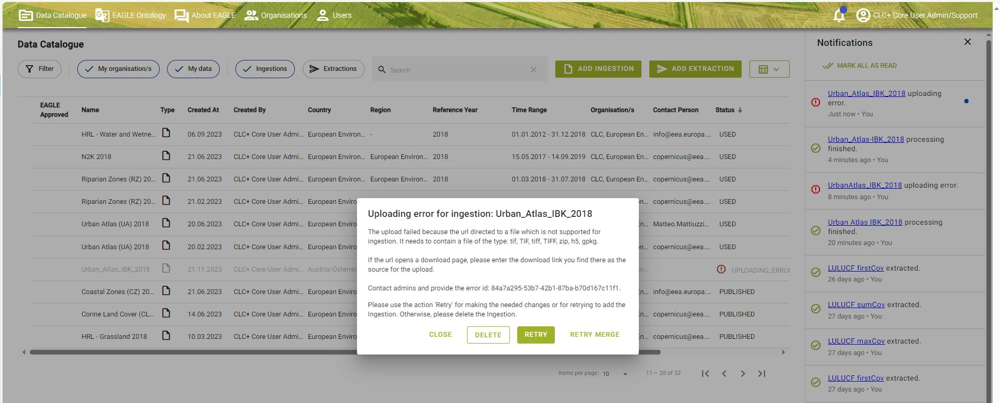{width="6.925in" height="2.794145888013998in"}

[]{#_Ref98938457 .anchor}**Figure 1‑14: Pop-up Notification about deleting Ingestion. If an Ingestion upload was not successful, you can either delete the Ingestion or retry with different datasets or input parameters.**

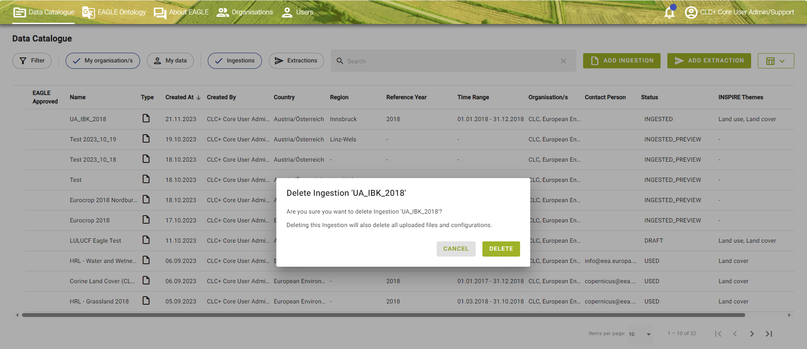{width="6.925in" height="3.0034722222222223in"}

[]{#_Ref98938435 .anchor}**Figure 1‑15: Pop-up Notification about deleting Ingestion**

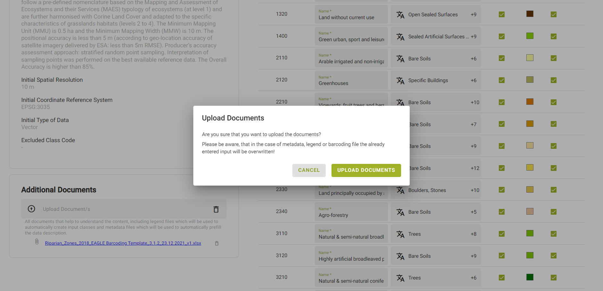{width="6.925in" height="3.3541666666666665in"}

[]{#_Ref98938437 .anchor}**Figure 1‑16: Pop-up Notification about uploading documents**

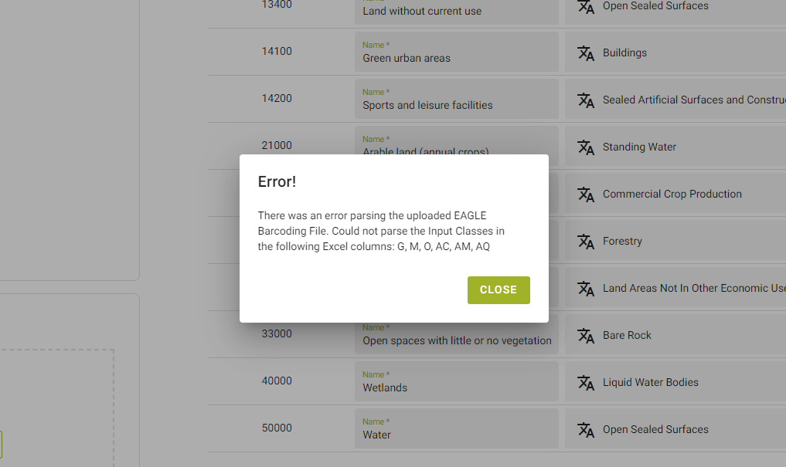{width="6.3in" height="3.747916666666667in"}

[]{#_Ref152831048 .anchor}**Figure 1-17: Pop-up Notification about errors in the uploaded EAGLE barcoding file and the hint in which columns in the Excel file there are some potential errors.**

### Notifications messages

The user gets notified whenever there is a change of status happening with the user's Ingestion or Extraction. Whenever a Ingestion or Extraction gets published, assuming it was published with public visibility (see section [3.8](#publish-ingestion) and [4.8](#publish-extraction-and-download-result)) all users get a notification about the new publication.

The following events/status changes trigger a **notification message** (examples see [Figure 1‑19](#_Ref151471608)):

- Ingestion Uploading Error

- Ingestion Processing Error

- Ingestion Processing Cancelled

- Ingestion Processing Finished

- Ingestion Ingesting Error

- Ingestion Ingesting Cancelled

- Ingestion Ingested

- Ingestion Published

- Extraction Extracting Error

- Extraction Extracting Cancelled

- Extraction Extracted

- Extraction Published

- Barcoding approved by EAGLE.

- Barcoding approval revoked

- New EAGLE ontology version published

**Notifications** are shown in the header (see clock icon on the upper right corner next to the User profile/user name). Whenever there is a new notification available and unread a blue dot appears next to the clock icon (see [Figure 1‑18](#_Ref151468543)).

By clicking on the **notification's icon**, a more detailed view of the notifications opens which includes all notifications (see [Figure 1‑18](#_Ref151468543)). By clicking on the notification or by clicking "Mark all as read" (all) notifications get read and the blue dot disappears.

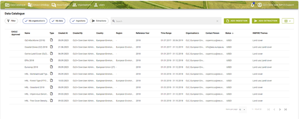

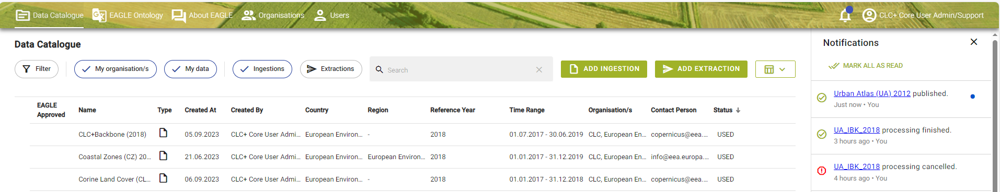{width="6.925196850393701in" height="1.330708661417323in"}

[]{#_Toc154044680 .anchor}**Figure 1‑18: Notifications at the header (blue dot if new/unread notifications is available), by clicking on the clock the notifications open up on the right.**

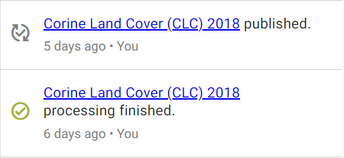{width="3.039200568678915in" height="1.3968996062992125in"}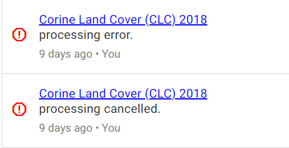{width="2.766547462817148in" height="1.4241305774278215in"}

[]{#_Ref151471608 .anchor}**Figure 1‑19: Examples for notification of status changes.**

Further if the users email address is added in the user profile an email with the notification will be send automatically if the notification is not read within 15 min (see below [Figure 1‑20](#_Ref151472379)).

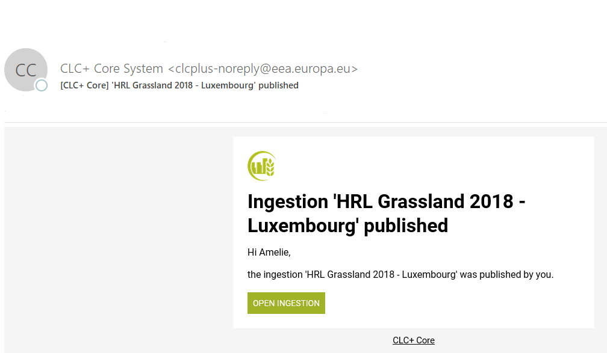{width="5.388442694663167in" height="3.1378543307086613in"}

[]{#_Ref151472379 .anchor}**Figure 1‑20: Notification email in case of an unread notification**

## Projections (of national datasets)

In general, datasets in national projections can be ingested into the CLC+ Core. Since there is such a large number of different **projections**, we ask for your understanding that the system cannot take all projections into account. We have therefore limited ourselves to the projections that are supported as national projections in the CLMS products and by GDAL (see Annex [Table 0‑4](#_Ref151967307)).

## About [EAGLE](https://land.copernicus.eu/eagle)

Within the Navigation Menu you can find the entry "**About EAGLE**" which brings you directly to the [homepage of the EAGLE group](https://land.copernicus.eu/en/eagle?tab=main) (see [Figure 1‑21](#_Ref151986403)) when clicking on it. On this page you can find additional information about EAGLE, documentations and tools and the context and background of the Pan-European Implementation of CLC+ based on the EAGLE concept.

{width="6.925in" height="3.823611111111111in"}

[]{#_Ref151986403 .anchor}**Figure 1‑21: Homepage of the EAGLE group on land.copernicus.eu**

[]{#_Toc65609501 .anchor}

# [[]{#_Toc154044849 .anchor}EAGLE](https://land.copernicus.eu/eagle)[^2]

Since 2008, the **EAGLE** Group has been developing a solution and proof of concept to support the semantic and technical framework of a European harmonised information capacity for land monitoring. The EAGLE Group is a self-initiated and open group of land monitoring experts from different European Environment Agency (EEA) member countries, mostly -- but not only -- in their roles as EIONET members. Thus, the EAGLE Group brings together knowledge and experiences from existing land cover (LC) and land use (LU) classification approaches and initiatives in a bottom-up approach.

Meanwhile, EAGLE barcoding is acknowledged by the Copernicus Land Monitoring Service (CLMS) as an instrumental and crucial component to support a general shift of focus from classification to characterisation, and EAGLE compliance is enforced in all newer CLMS products.

In the "**EAGLE Ontology**" tab you can inspect the current and older EAGLE ontologies. You can download the EAGLE barcoding file template you will need for the EAGLE barcoding (section [2.3](#_Ref153949431)). Additionally, expert users have the possibility to add new EAGLE ontologies (section 6.3 in separate Annex). The most current version of the EAGLE matrix is v3.2[^3] which is also implemented already in the current version of the CLC+ Core system. In the current EAGLE matrix version some elements have been deleted and the barcoding values were reduced to X-5 instead of before X,0-6.

In this section, you will be further given a general overview of the EAGLE concept and the approach and implementation the CLC+ consortium used for the EAGLE barcoding for the CLMS products ingested in the CLC+ Core system. To prove the concept also two national datasets for the Netherlands and Spain were EAGLE barcoded and uploaded to the system.

## General overview of the EAGLE concept

The EAGLE concept[^4] is explicitly mentioned in the Copernicus Work Programmes as an essential pillar to support the challenging new use cases of the 2nd generation CORINE Land Cover (CLC), also known as CLC+. The EAGLE concept is now operationally implemented as a central component of the CLC+ implementation, to guarantee a standardized integration approach of different LC/LU products.

The EAGLE concept has been established to ease the collection of data of different classification systems and nomenclatures, with the aim to make them comparable. The concept is based on a set of attributes that allow the description of landscape objects. The EAGLE matrix itself is presented in the form of an Excel cross table and is subdivided into three main blocks. The matrix elements represent atomic landscape descriptors of:

I.  LAND COVER Components -- LCC,

II. LAND USE Attributes -- LUA,

III. LAND CHARACTERISTICS -- LCH

In the CLMS products, such as the HRLs, each class in the nomenclature is coded by a specific number and definition. Compliance with the EAGLE data model is ensured by switching to an object-based approach, providing an INSPIRE-compatible distinction between LCC, LUA and complementary object characteristics (CH). The connection and compliance of the hierarchical CLC-driven and CODE level-based nomenclature to the EAGLE data model is established via the EAGLE barcoding file. The EAGLE barcoding values (see Annex Table 0-1) provide a semantic translation of class definitions into the EAGLE matrix elements[^5].

[Figure 2‑1](#_Ref98942013) shows HRL IMD as example: Barcode of value 5 means that the input class directly relates to the EAGLE element (*LCC_1_1_1* *Sealed Artificial Surfaces and Constructions*) and therefore the spatial coverage of the class can be considered the spatial coverage of the EAGLE element. A pure exclusive solitary element and nothing else besides the 5-coded element is contained. Additionally, a factor defines the coverage of the EAGLE element for the Input Class. Value range is from 0.0 to 1.0. Together with the percentage coverage of the Input Class for each cell it defines the coverage of the EAGLE element for each cell. For example, if an Input Class has got a percentage coverage of 80% for the specific cell and a factor of 0.5 is applied to the specific EAGLE element, the coverage of the EAGLE element for this cell is 40%.

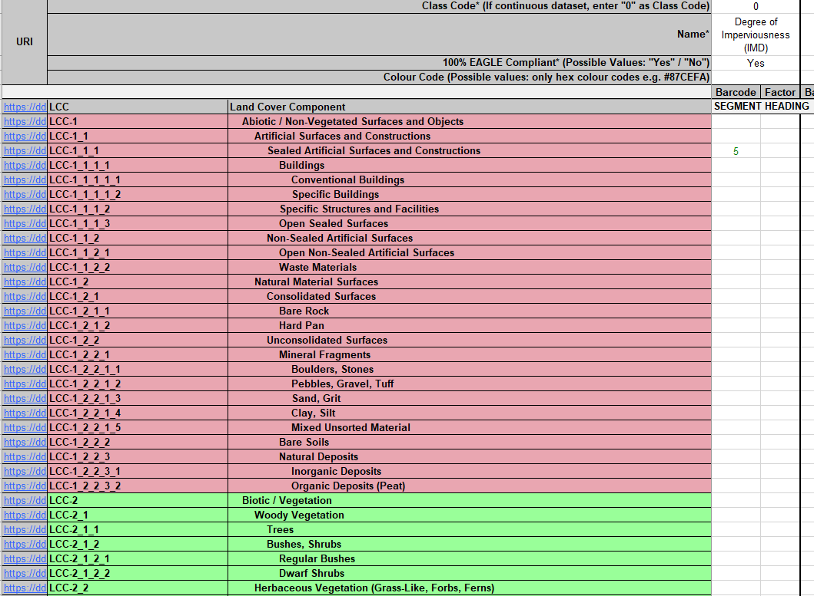{width="3.9963746719160107in" height="2.9793580489938756in"}

[]{#_Ref98942013 .anchor}**Figure 2‑1: The EAGLE matrix for HRL Imperviousness degree (excerpt).**

## Approach and implementation used by the CLC+ CORE Consortium

It should be mentioned that the EAGLE barcoding was performed to the best of the CLC+ Core consortiums' knowledge and belief using a 'simplified' approach. The aim of this approach was not to describe the Ingestion in the best and most extensive way, it is more to have the best basis for the planed Extraction.

Therefore, we established several rules (section [2.2.1](#mapping-approach-of-the-consortium)), which we followed performing the EAGLE barcoding and might help other users creating their own barcoding. With this approach the available CLMS datasets have been ingested (see in Annex [Table 0‑2](#_Ref151628372)). They are detectable as they were created exclusively by the „User Admin /Support CLC+ Core" User.

### Mapping Approach of the Consortium

a. **Stick to the guidelines / nomenclature**

- Go through the guidelines document, check the definition chapter, and identify land cover, land use and characteristics aspects. Also keep in mind the list of included categories.

b. **Reduce complexity**

- Limit the complexity and simplify the barcoding (example see [Figure 2‑2](#_Ref151986473)). Focus on the most useful codes and highest possible hierarchy levels, considering the future Extractions.

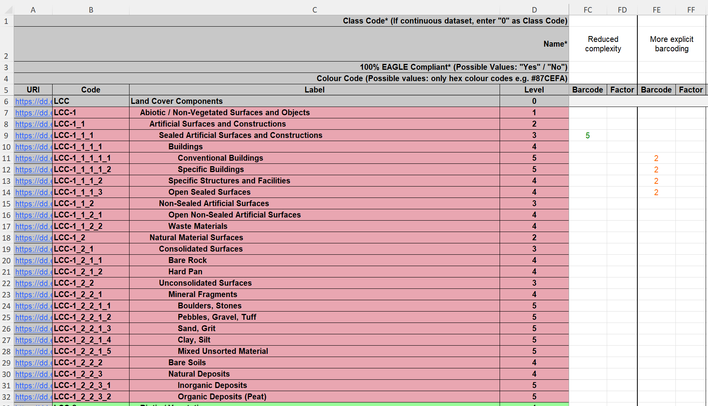{width="6.268055555555556in" height="2.5555555555555554in"}

[]{#_Ref151986473 .anchor}**Figure 2‑2: Comparison simplified or more explicit barcoding**

c. **Try to not interpret**

- Open sea is 100% marine water and therefore mapped with value of 5. It likely includes fishing but has not been mentioned in the guidelines thus, this LCC was not mapped ([Figure 2‑3](#_Ref100052219)).

- On the other hand, sometimes the Land Use is absolutely clear from the nomenclature. The Netherlands BBG dataset describes on class: \"Inland water for mineral extraction", which can be mapped as displayed in [Figure 2‑4](#_Ref100052208).

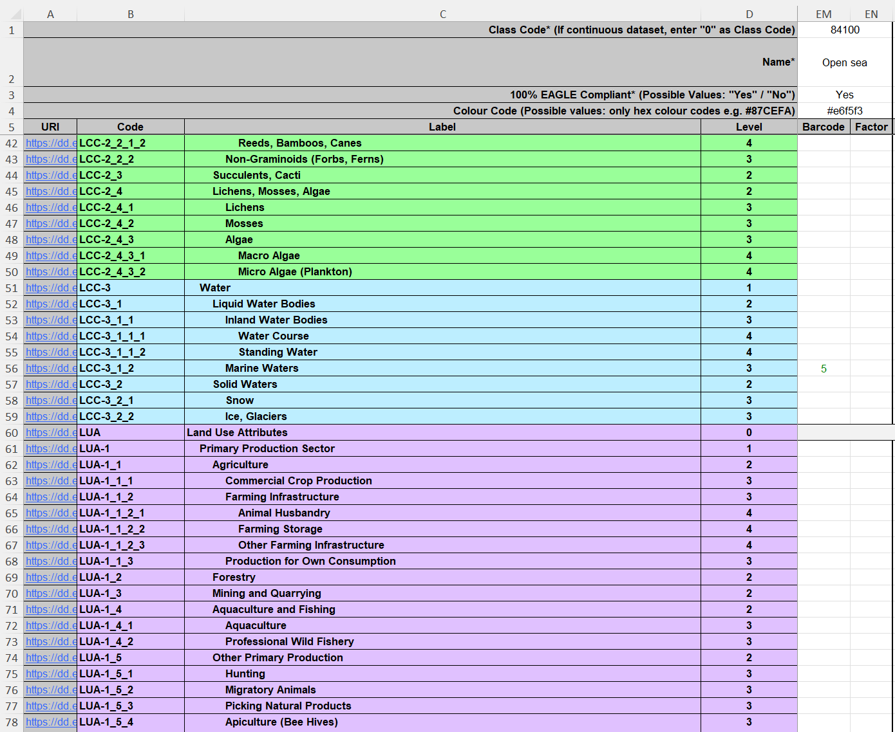{width="6.268055555555556in" height="5.131944444444445in"}

[]{#_Ref100052219 .anchor}**Figure 2‑3: Coastal Zones - \"Open Sea\" land cover components, land use attributes**

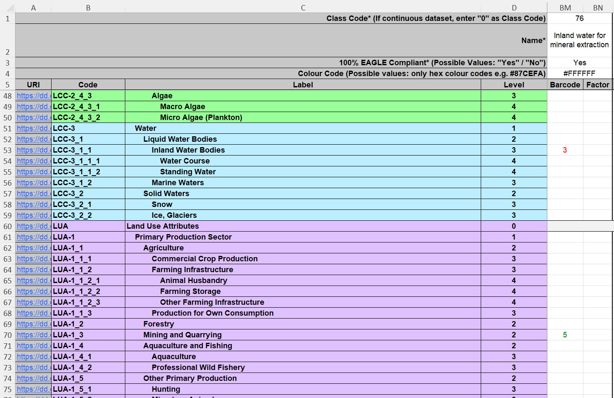{width="6.268055555555556in" height="4.072916666666667in"}

[]{#_Ref100052208 .anchor}**Figure 2‑4: NL BBG - \"Inland water for mineral extraction\"**

d. **Interpretation might be necessary for differentiation**

- Even if we stated under d. that interpretation should be avoided, sometimes the barcoding will need a little "interpretation" to differentiate classes or their use.

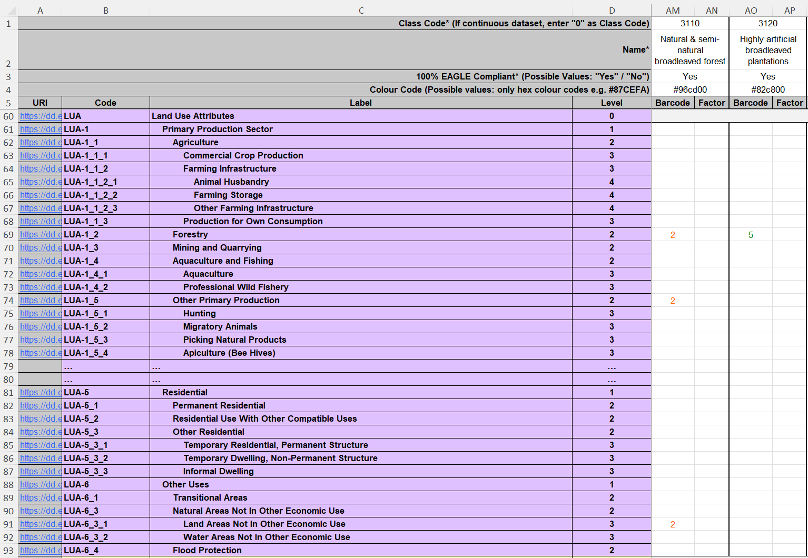{width="6.268055555555556in" height="4.33125in"}

[]{#_Toc137576632 .anchor}**Figure 2‑5: Natura 2000 - \"(Semi-)Natural Forest\" vs \"Plantations\" land use attribute mapping**

e. **Consider Land Cover and Land Use separately**

- Not always both land cover and land use will be useful for Extractions. Sometimes we have a very heterogeneous land cover setting but clear land use, and vice-versa. Some classes will not offer much insight due to a (potential) combination of abiotic, biotic and water land cover components. For such classes, the land use section might be more useful.

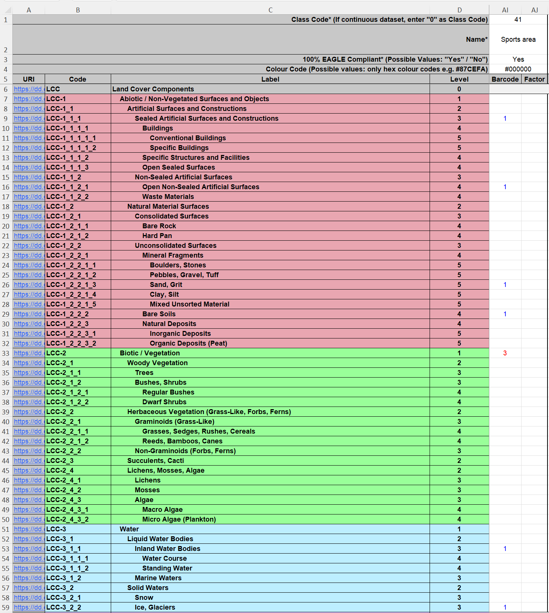{width="6.268055555555556in" height="6.988194444444445in"}

[]{#_Toc137576633 .anchor}**Figure 2‑6: NL BBG - \"Sports Area\" which includes land cover component ice rinks**

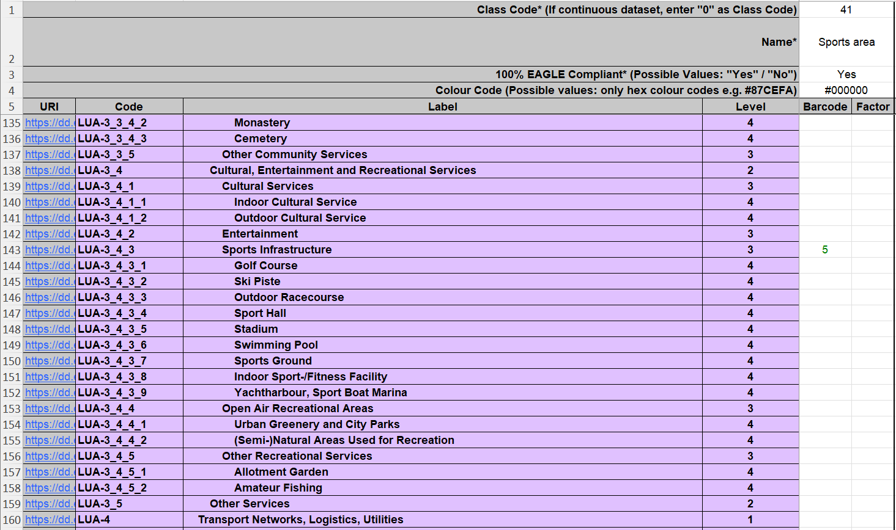{width="6.268055555555556in" height="3.713888888888889in"}

[]{#_Toc137576634 .anchor}**Figure 2‑7: NL BBG - \"Sports Area\" has a clear land use barcoding**

For a better understanding of the data and to describe the parent classes content wise in more detail, the Level 1 classes are differentiated into subtypes of these LULUCF parent classes. The Level 2 and 3 classes are no official classes, and each country may define the classes in the way that best suits the country's specific characteristics. This concrete subdivision is based on the examples mentioned in the official class definitions or auxiliary subdivision done by the EAGLE group and adapted by the CLC+ Core consortium \[AD11\] ([Table 0‑3](#_Ref149045139) see Annex). It is recommended to involve specific experts to support the subclass definitions to best meet the reporting requirements.

Further, the consortium recommends assigning the EAGLE elements to the respective (sub)classes. In a first round, select all the required EAGLE elements that should describe the subclass as best as possible. In [Table 0‑3](#_Ref149045139) (see Annex), an example is shown of the category "Grassland" with its subclasses and the identified EGLE elements relevant for Extraction. The procedure has to be done for all the remaining categories as well. In a second round check the availability of the EAGLE element in the input classes together with the barcoding value. This second round is very important to ensure that the rule will have an output. If the rule is not true, the outcome will be empty. I.e. forest class "clear cuts" can be described best with the following EAGLE elements: LCC "bushes/shrubs and herbaceous vegetation", LUA "forestry" and LCH "clear cut" besides other elements. In this case the LCH attribute is not barcoded in any of the CLC input classes although it would be very well describing this subclass. Due to this fact it cannot be used in the rule or if used, the output would be empty.

## [[]{#_Toc154044853 .anchor}EAGLE Ontology](https://land.copernicus.eu/eagle/work-results-documentation-and-tools) overview

After you have clicked on "**EAGLE Ontology**", you will see the EAGLE Ontology overview (see [Figure 2‑9](#_Ref151986517)), which shows you a list of the EAGLE Ontology (EAGLE barcoding file) versions within CLC+ Core. You can see detailed information about the version, creation date (created on), creator (created by) and description of the respective EAGLE version.

Users with the role "EAGLE maintenance" have the possibility to add a new version to the system. This is described in more detail at section 63. In separate Annex for Admin Users. Once a new EAGLE ontology version is published all users get a notification (see section [1.7.3](#notifications-messages)).

Users are also able to **download the EAGLE barcoding template using this button. Additionally, the EAGLE templates and other tools can be accessed [here](https://land.copernicus.eu/en/eagle?tab=document_archive)**. You can use this template to map/translate your dataset and upload your data together with the EAGLE barcoding. This is the recommended way performing the EAGLE barcoding -- alternatively, the data can be mapped while editing the Ingestion.

**Note: In general, you need to barcode all classes. There is a possibility to re-structure / aggregate your classes to a less detailed level** **in an external GIS [BEFORE]{.underline} uploading them to the system. This is recommended if your national dataset is very detailed which does not provide more value to the Extraction but to reduce the amount of input classes and the effort of the EAGLE barcoding.** In [Figure 2‑8](#_Ref99878072) below, the original 337 classes (GEWASCODE) from the Dutch LPIS dataset were reduced /aggregated to 16 classes (LGN). To do this:

- Add a new column (enter name and select datatype integer)

- Select all polygons with value i.e. 372 (select by attributes)

- Open the filed calculator and add value 1 for all selected entries

- Repeat until all values have a new class code assigned

- **Now, that you have everything reclassified, you can start the EAGLE barcoding**

> 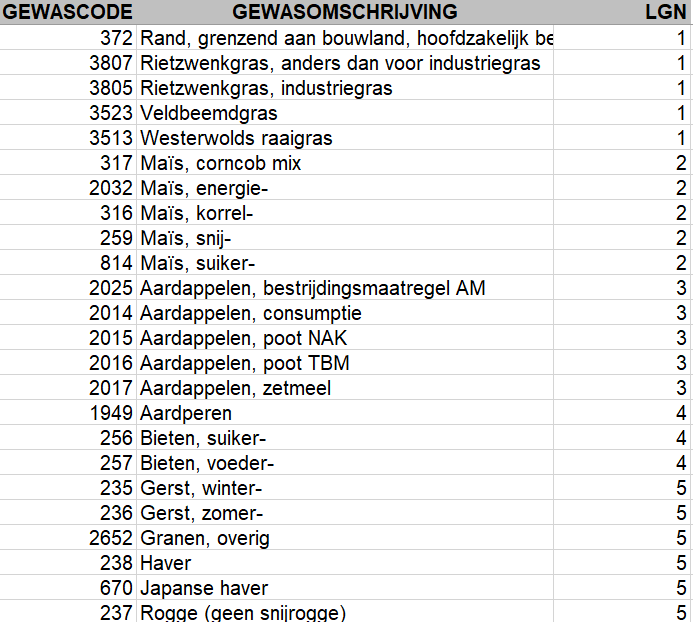{width="3.620683508311461in" height="3.2496117672790903in"} 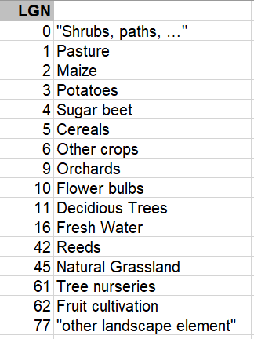{width="2.416116579177603in" height="3.2214873140857394in"}

[]{#_Ref99878072 .anchor}**Figure 2‑8: The original 337 classes (GEWASCODE) from the Dutch LPIS dataset were reduced /aggregated to 16 classes (LGN).**

You are also able to have a look at the details of each EAGLE Ontology version by clicking on "open" within the context menu of each EAGLE Ontology version from the table. The detail page is described in section [2.4](#view-details-of-eagle-ontology).

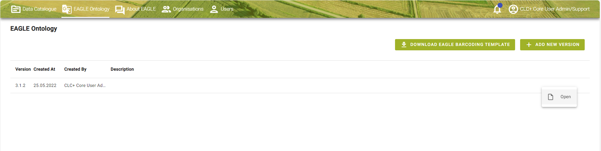{width="6.925in" height="1.7451388888888888in"}

[]{#_Ref151986517 .anchor}**Figure 2‑9: EAGLE Ontology overview**

## View details of EAGLE Ontology 

After clicking on "Open" for the specific EAGLE Ontology version (see section 7.1) you will find yourself within the EAGLE Ontology detail view (see [Figure 2‑10](#_Ref151986549)).

Within the detail view you can find the details and structure of the specific EAGLE Ontology version and its elements. By collapsing/expanding the sections you can dig deeper into the structure of the ontology.

Via the search field you can easily find specific EAGLE elements.

Additionally, you can open the details of each EAGLE element by a right-click and select "show details" or alternatively, by using the action "show details" within the context menu of the EAGLE element.

After you clicked on "show details" a dialog will pop up to show you all relevant information for the specific EAGLE element (see [Figure 2‑11](#_Ref151986570)). You can see in which version (Version), when (created at) and by whom (created by) it was created, since (since version) and until (to version) which version it was active in the ontology, when (changed at) and by whom it has been changed (changed by) and a description.

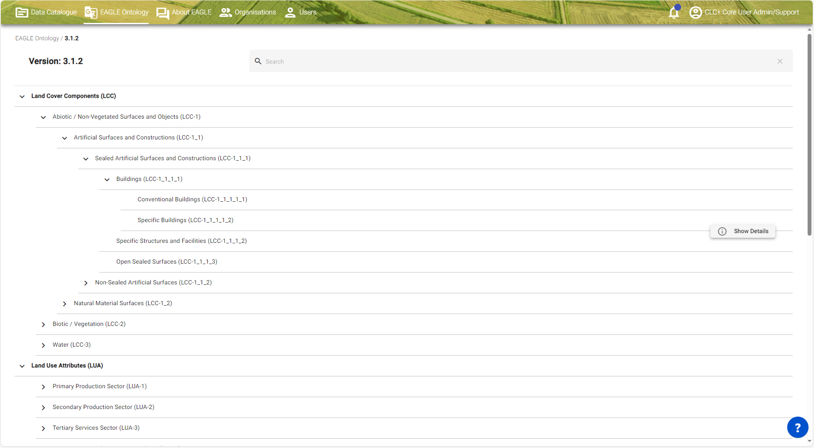{width="6.925in" height="3.8180555555555555in"}

[]{#_Ref151986549 .anchor}**Figure 2‑10: View details of EAGLE Ontology**

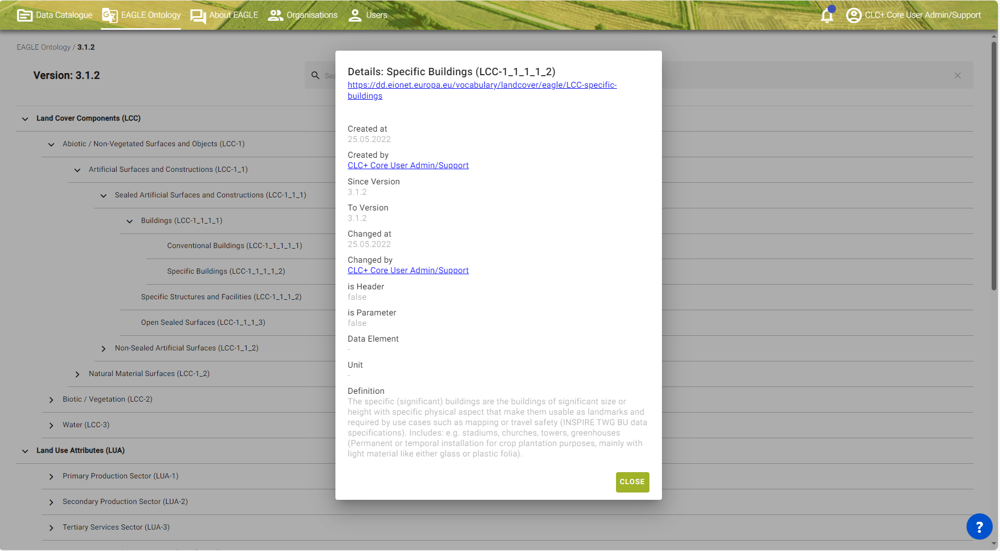{width="6.925in" height="3.817361111111111in"}

[]{#_Ref151986570 .anchor}**Figure 2‑11: View details of EAGLE element**

In addition, the EAGLE mapping barcoding file of a published Ingestion can be downloaded on the detail view page of the Ingestion. Either at the bottom left of the page under "Additional Documents" by clicking on the file or by using the "Download EAGLE Barcoding" button below the map view (see [Figure 2-12](#_Ref152831592)).

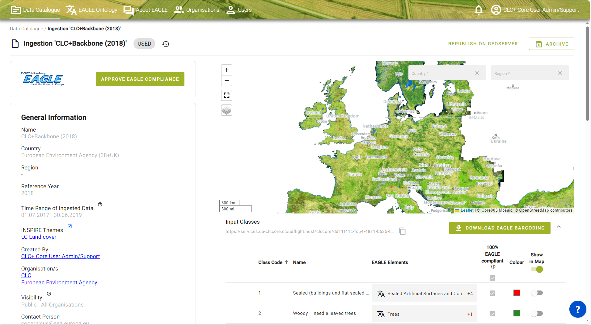{width="6.925in" height="3.81875in"}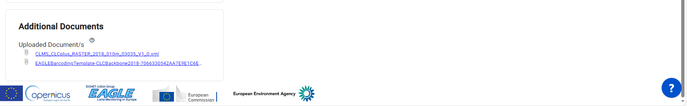{width="6.925in" height="1.073611111111111in"}

[]{#_Ref152831592 .anchor}**Figure 2-12: Options for downloading the EAGLE barcoding file of a published Ingestion.**

## EAGLE approval stamp for Ingestions

The EAGLE barcoding of an Ingestion can be approved for being EAGLE compliant by any user with the additional role of being an "EAGLE Maintainer/Approver". This approval process can only be initiated by users with this role and is for now only planned for the CLMS products. If you are an Admin User, please refer to section 6.4 in separate Annex.

The Ingestions gets then a quality stamp/icon in the Data Catalogue (first column 'EAGLE approved'). By hovering over it with the mouse an explanation appears in the grey box: "The EAGLE mapping was reviewed and approved by the EAGLE Group". Further when opening the Ingestion itself the approval appears next to the status (see [Figure 2‑13](#_Ref151645180)). Moreover, when selecting Input classes for an Extraction (see section [4.4](#add-input-classes-to-extraction)) there is also the possibility in the 'add input class' view to filter by 'show only EAGLE approved Input classes'. The EAGLE approval for an Ingestion can also be revoked again by the EAGLE Maintainer. Each approval change is saved and displayed in the history of an Ingestion.

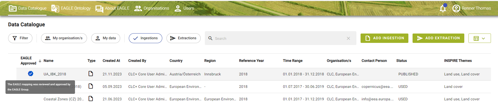{width="6.925in" height="1.4673611111111111in"}

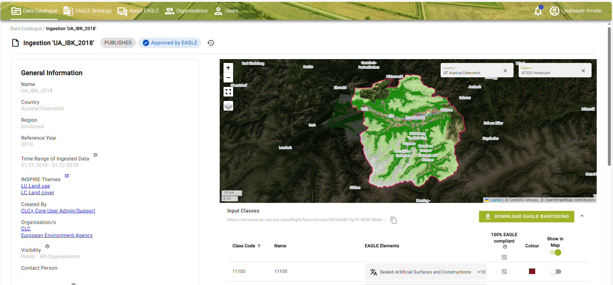{width="6.925in" height="3.2222222222222223in"}

[]{#_Ref151645180 .anchor}**Figure 2‑13: EAGLE Approval stamp in the Data Catalogue (upper image) and Ingestion view (lower image).**

## Lessons learned for the EAGLE barcoding approach

In the meanwhile, the consortium gained valuable experience about the EAGLE barcoding approach in regard to ingesting and extracting datasets into and from the CLC+ Core System. As the EAGLE barcoding approach is not trivial, the following lessons learned can be summarized by the consortium:

- The EAGLE model must be studied in depth along with the dataset/nomenclature to be barcoded, which must be divided into its fractions. Due to the number of EAGLE elements and possibilities for the barcode value, the process of barcoding must be done thoughtfully. After an initial version is produced, it may need to be revised and discussed several times until it leads to a \'final\' version.

- Understanding the nomenclatures are crucial. If the nomenclatures do not contain detailed descriptions of the respective classes, barcoding is all the more difficult. Often the class definitions leave much room for interpretation or even contradict each other. The point is to clearly express what characterises the individual class and not to try to describe everything that exists or that one could think of as well as possible.

- In most hierarchical nomenclatures, level 1 classes are already described, which are then further stratified and specified by the next level, which can make barcoding difficult.

- Expert knowledge of the datasets is therefore extremely valuable for meaningful barcoding. Nevertheless, the determination of the barcode value will be subjective depending on the responsible performing the barcoding.

- Since Extractions are highly dependent on both the selected input classes and the barcoding, a comprehensive knowledge of them is essential.

- In general, the more heterogeneous the classes are, the more difficult and elaborative the barcoding will become.

- In the best case, you already have a concept in mind of what you want to extract, but this is not obligatory. In the case, the barcoding has to be reworked and adapted if no optimal results can be achieved.

- The required LCC, LUA and LCH attributes are primarily determined by the requirements of the instance classes.

- Changes in the EAGLE barcoding template are covered with the CLC+ System. The system is always updated to the latest version of the template. Older versions are stored in the system and Ingestions and Extractions based on the older versions remain valid. Only if the EAGLE barcoding is performed on an older version, it will not be possible to upload this older template but rather needs to be updated/transferred to the latest version.

# Ingestions 

As mentioned in the introduction, users are able to add already existing datasets to the CLC+ Core, such as products of the Copernicus CLMS portfolio as well as national datasets by performing an **Ingestion**. Ingestion means to upload datasets to the system and make it available and usable for all users, a selected user group or only for the organization of the ingesting user. [Figure 3‑1](#_Ref100264360) provides a simplified overview of the Ingestion process.

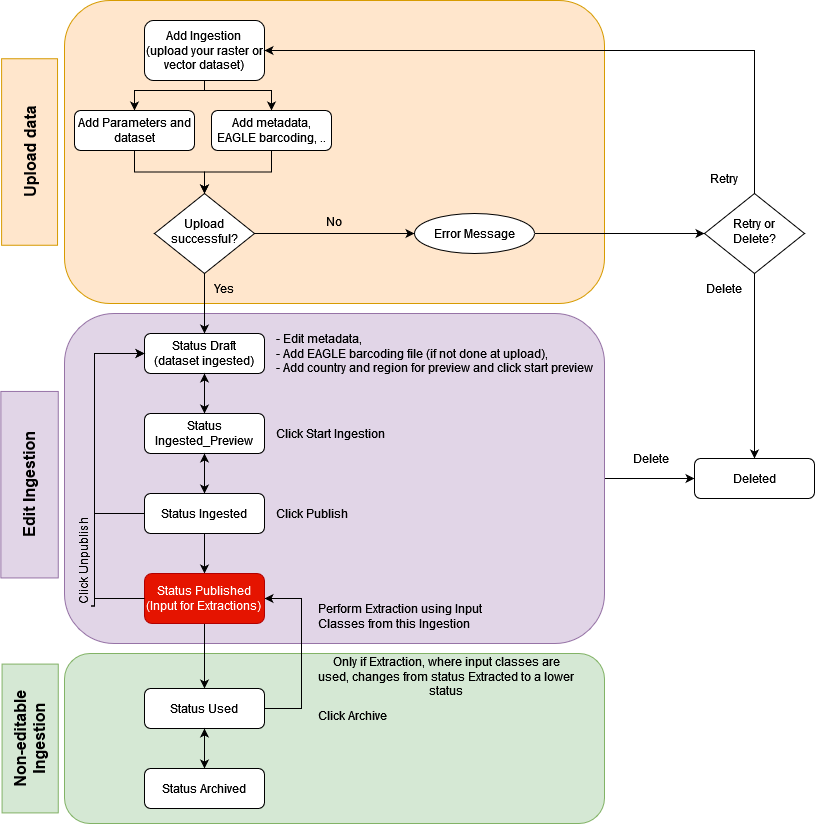{width="5.909722222222222in" height="5.972541557305337in"}

[]{#_Ref100264360 .anchor}**Figure 3‑1: Simplified Ingestion workflow**

Dataset to be uploaded can be common **raster and vector file formats**:

- Shapefile (shp as zip)

- Geopackage (gpkg)

- File geodatabases (gdb)

- Hierarchical Data Format (HDF5)

- GeoTiff (tif/tiff)

Several additional documents can accompany the dataset, such as a metadata file, a legend / style file (section [3.2.1](#raster-dataset) and [3.2.2](#vector-dataset)) and the EAGLE barcoding files (section [2.3](#_Ref105145961)). By adding them at Ingestion creation, the information is extracted automatically, otherwise the user need to add this information manually at a later stage. An Ingestion has been successfully processed, once it is in the status draft.

An Ingestion comprises the following steps, which are described in more detail in this section below:

a)  Upload the data (either by attaching a local dataset directly within the \"Upload Dataset\" field or by providing a dataset download URL) and configure its settings (section [3.2](#add-ingestion))

b)  Map the Input Classes to the respective EAGLE[^6] barcoding using the EAGLE barcoding template (section [2.3](#_Ref99728447)). Alternatively, the mapping can be performed in the system itself (section [3.7](#edit-ingestion))

c)  Edit, preview, start Ingestion and publish the Ingestion

**Please consider that the Ingestion will be resampled**[^7] **and aggregated to 100 x 100 m. This reduced spatial resolution needs to be taken into account while setting up the Extraction rules (section [4.5.1](#some-definitions-for-a-better-understanding-also-see-glossary)).**

## Generic workflow

The key steps required in the development of an Ingestion and Extraction are (see [Figure 3‑2](#_Ref151987137)):

1.  Knowledge of Reporting or Extraction requirements

2.  Development of an Extraction concept

3.  Identification and selection of relevant and required datasets

4.  Performing an EAGLE barcoding suitable for the Extractions

5.  Ingest dataset into the CLC+ Core System

6.  (Optional) Adaption of EAGLE barcoding and re-ingestion

7.  Publish Ingestion

8.  Selection of Input Classes

9.  Definition of Output Classes including Extraction rulesets

10. Perform an Extraction

11. Publish Extraction

+------------------+-------------------------------------------------------------------------------------+
| > **Ingestion**  | 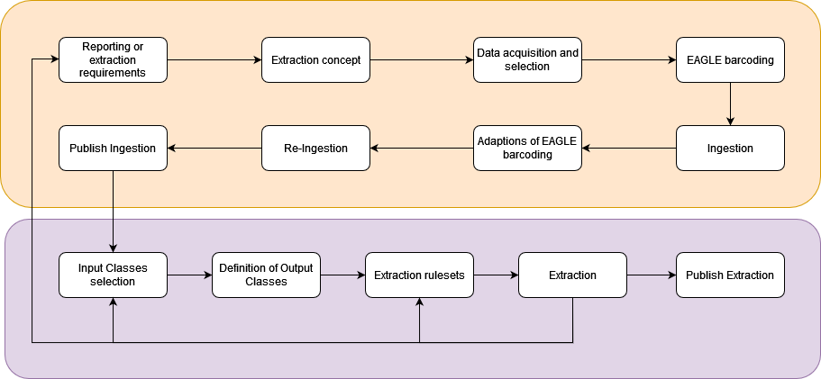{width="6.607769028871391in" height="3.0520833333333335in"} |
+------------------+                                                                                     |
| > **Extraction** |                                                                                     |
+==================+=====================================================================================+

 []{#_Ref151987137 .anchor}**Figure 3‑2: Generic workflow for the creation of an Ingestion and Extraction.**

## Add Ingestion

### Raster dataset

Clicking the '**Add Ingestion**' button (section [1.6](#data-catalogue) [Figure 1‑9](#_Ref151467380)) opens the 'Add Ingestion' dialog (see [Figure 3‑3](#_Ref151987176)) where you can define the data format of your dataset (step 1).

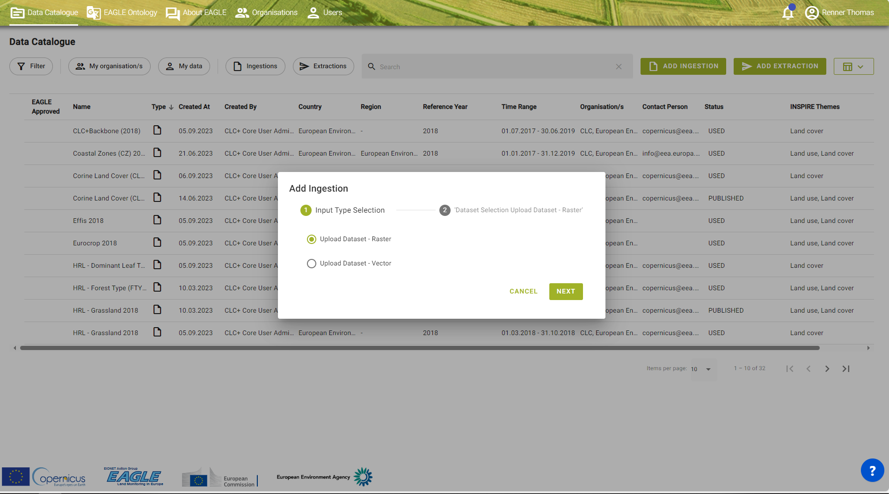{width="6.925in" height="3.852777777777778in"}

[]{#_Ref151987176 .anchor}**Figure 3‑3: Add Ingestion - Step 1 (Data format) - here raster file**

In a second step, further information, such as name and country / region that describe the data can be entered (step 2 see [Figure 3‑4](#_Ref151987203)). All **mandatory fields** are marked with a \*. In this example, we will upload the HRL Imperviousness (IMD) for Albania. Since we want to ingest the whole country, we do not specify a region.

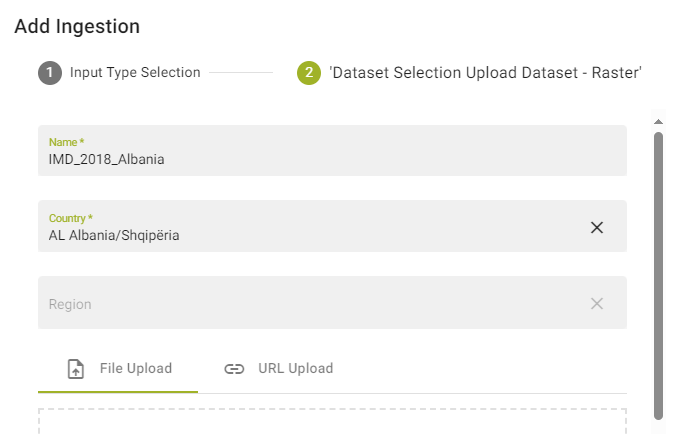{width="4.93673665791776in" height="3.1693733595800526in"}

[]{#_Ref151987203 .anchor}**Figure 3‑4: Add Ingestion - Step 2 (Parameter)**

The data can be uploaded directly from a computer (file upload or per \`drag and drop\`) or by entering an URL where the data shall be collected from (step 3 see [Figure 3‑5](#_Ref151987252)). Please also refer to section [3.3 Remarks on the Ingestion process](#_Ref99729782). The supported file formats for raster files are:

- Hierarchical Data Format (HDF5)

- GeoTiff (tif/tiff)

In this example below, we chose the file upload from a local computer. By doing this, an attachment is added to the dialog. **In case the file size is larger than 5 GB, a warning appears recommending using an URL upload as the file upload might take a long time.**

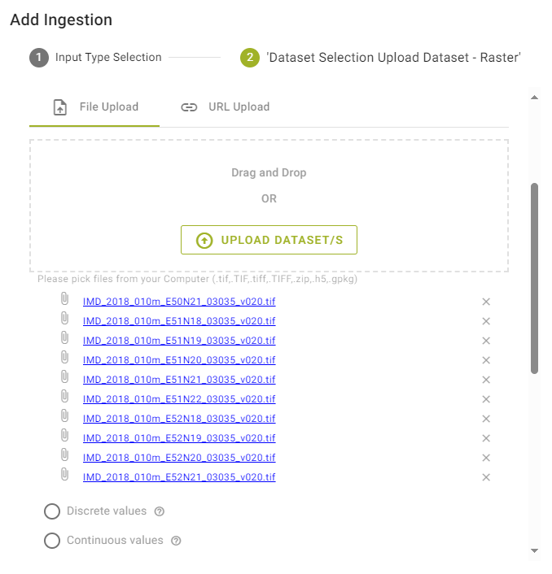{width="4.338582677165355in" height="4.519685039370079in"}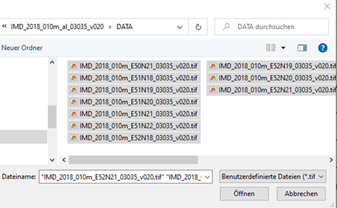{width="3.5188681102362205in" height="2.1646161417322833in"}

[]{#_Ref151987252 .anchor}**Figure 3‑5: Add Ingestion - Step 3 (Data upload via local computer)**

In another example below (see [Figure 3‑7](#_Ref151987383)), we chose the URL upload from the [CLMS portal](https://land.copernicus.eu/en/dataset-catalog). Select the required files on the download page (put them in the shopping cart) (see [Figure 3‑8](#_Ref151987407)). After sending the order, you will retrieve a download link via the CLMS portal (depending on the processing time) and per email. Note that these download links expire after a while.

**Note: please use a direct download URL (a link that automatically starts the download immediately). Consider that the system can only process links which do not require a user login.**

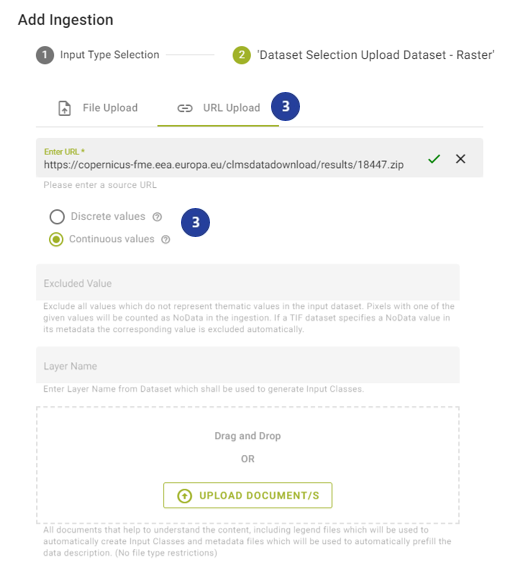{width="5.291666666666667in" height="5.9375in"}

[]{#_Ref151987332 .anchor}**Figure 3‑6: Add Ingestion - Step 3 (Data upload via URL)**

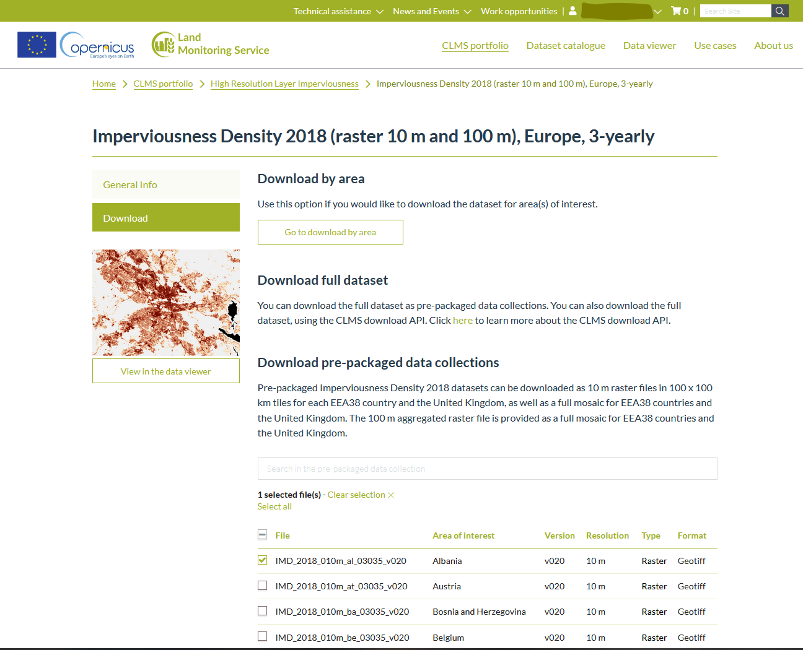{width="5.926814304461942in" height="4.801718066491689in"}

[]{#_Ref151987383 .anchor}**Figure 3‑7: Add Ingestion -Step 3 (Get download link via CLMS portal)**

> 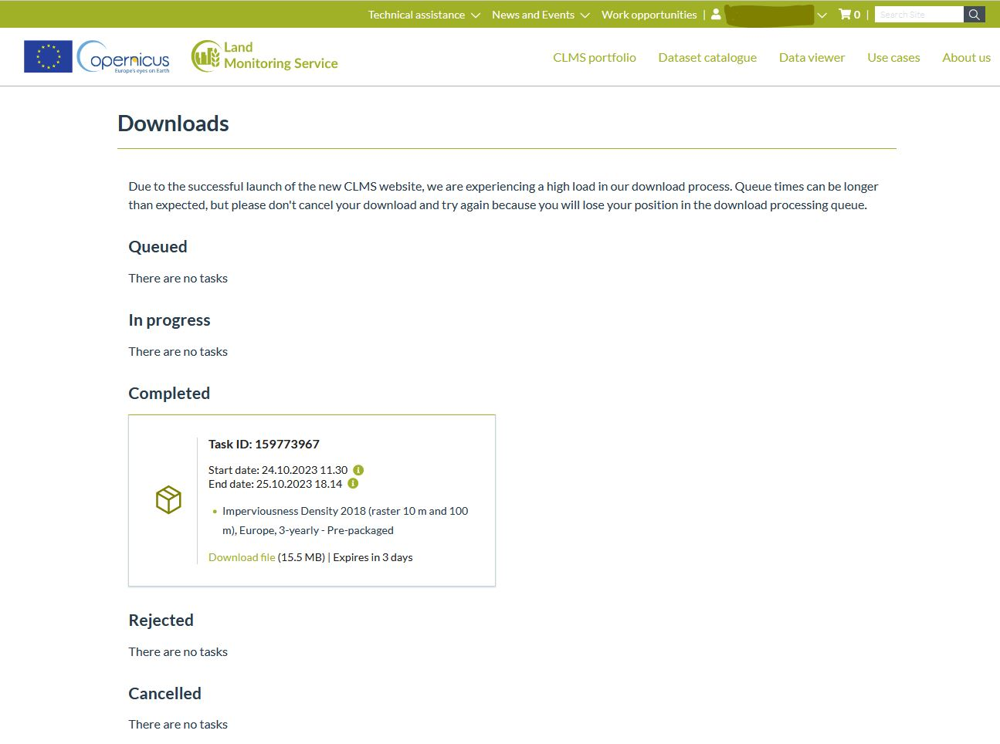{width="4.811321084864392in" height="3.5814720034995626in"}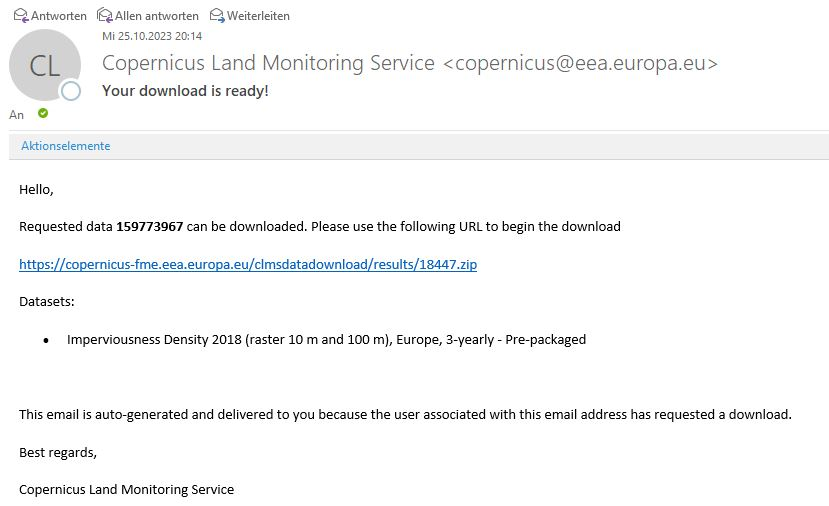{width="4.792452974628172in" height="2.9253576115485562in"}

[]{#_Ref151987407 .anchor}**Figure 3‑8: Add Ingestion - Step 3 (Get download link via the portal and via email)**

After selecting the dataset, you need to define if the dataset has discrete or continuous values[^8] (see [Figure 3‑5](#_Ref151987252) and [Figure 3‑6](#_Ref151987332)). For example, the HRL WAW and all local components consists of discrete objects, which have known and definable boundaries. A lake is a discrete object within the surrounding landscape. The HRL TCD and IMD however, represent continuous values, as their values range from 0-100 %, indicating the degree of their respective characteristic.

In step 4, you have the possibility to **exclude a class code** from being processed (see [Figure 3‑9](#_Ref151987363)). It excludes all class codes which stand for an unknown classification (i.e. NoData values). If a TIF dataset specifies a NoData value in its metadata the corresponding class is excluded automatically. This is recommended if you don't want to have specific values in the statistics/being processed and for all unclassified/unknown values (i.e. NoData) (step 4). All pixels in the ingested dataset with an excluded class code will then appear as NoData pixel in the final Ingestion. If you do not enter a excluded class code value and the NoData value does not appear in the TIF metadata, then all classes are "0" in the ingestion, where the original data always displayed the no-data class.

For **Continuous values** (datasets with continues values/ranges like e.g. tree cover density values between 0 and 100%) all **values** which do not represent thematic values in the input dataset will be **excluded**. Pixels with one of the given values will be counted as NoData in the ingestion. If a TIF dataset specifies a NoData value in its metadata the corresponding value is excluded automatically.

For **Discrete values** (datasets with concret, mulitple claseses like e.g. HRL Forest class 0,1,2) all **class codes** which do not represent thematic values in the input dataset will be **excluded**. For example, unclassifiable (254) and outside area (255) pixels should be excluded. Pixels of the given classes will be counted as NoData in the ingestion. If a TIF dataset specifies a NoData value in its metadata the corresponding class is excluded automatically.

In the example, we want to exclude 255 and 254 from being ingested. Please press enter after entering the value. Alternatively, for discrete datasets, you are able to hide the values when editing the data (section [3.7](#edit-ingestion) [Figure 3‑35](#_Ref100162670)) by disabling single classes with the "eye" symbol before ingesting and publishing an Ingestion.

Additionally, you can **enter a layer name** which shall be used to generate input classes if there are [more than one layers per]{.underline} dataset (if several layers are stored in a .gdb for example). If nothing is defined, the first layer will be selected. In this case, this field can be omitted.

**Please make sure to avoid special characters, otherwise an error will occur.** Please also refer to section [3.3](#_Ref99729782) to learn about the **limitations of data uploads**.

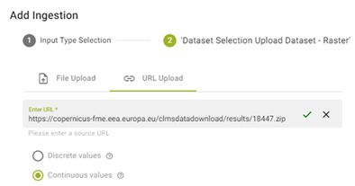{width="4.147503280839895in" height="2.177729658792651in"}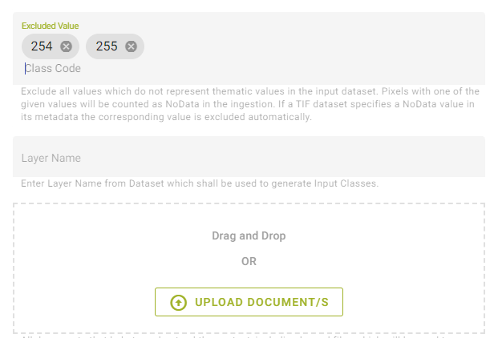{width="3.9302241907261593in" height="2.6924595363079615in"}

[]{#_Ref151987363 .anchor}**Figure 3‑9: Add Ingestion - Step 4 (exclude values and enter layer name)**

The fifth step is optional and provides you with the possibility to upload **additional, supporting files** that help to understand the content (see [Figure 3‑10](#_Ref151987450)), such as:

- Metadata files,

- Legend files (QGIS layer style file (.qml) or SLD (Styled Layer Descriptor) file (.sld); ArcGIS Layer Files (.lyr) are not supported),

- EAGLE Barcoding files.

Files can be uploaded via the explorer or per "drag and drop". These additional files will be used to prefill the data descriptions and define the EAGLE barcodes as well as the style for the Ingestion Classes (step 5). The upload of these documents can also be performed at a later stage (section [3.7](#edit-ingestion)).

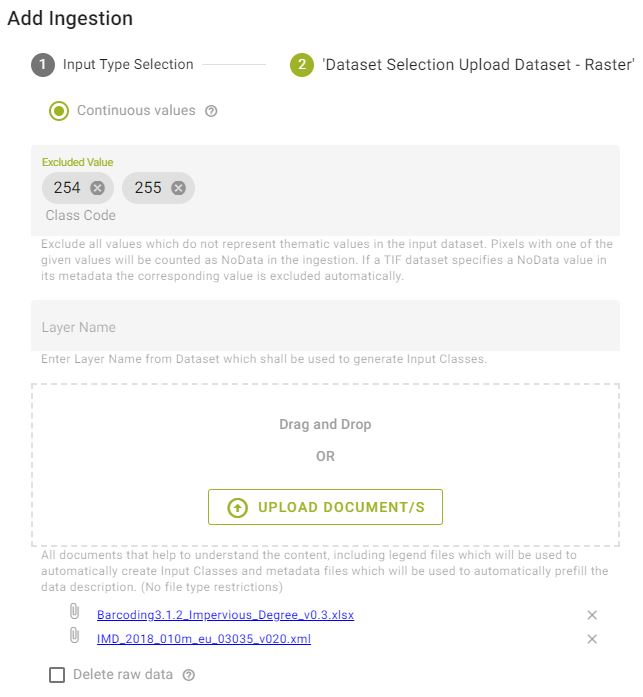{width="3.2547167541557305in" height="3.5280533683289588in"}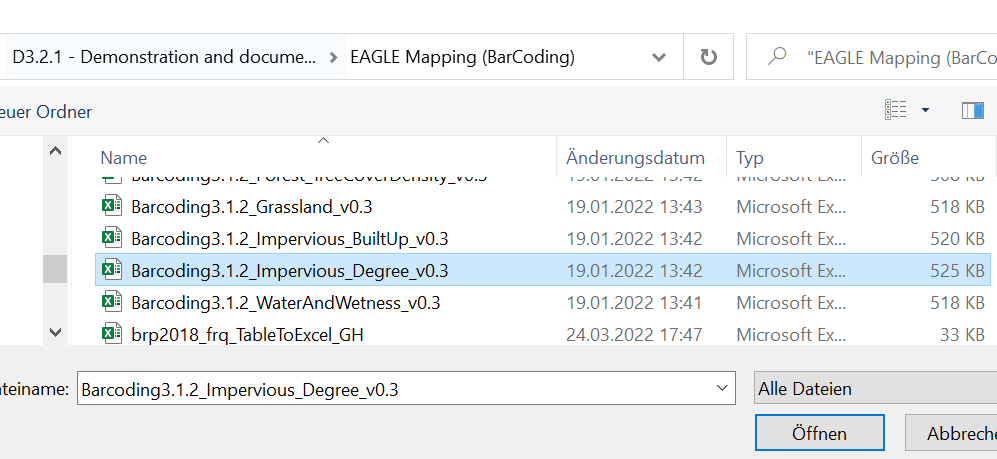{width="3.7945319335083116in" height="1.746836176727909in"}

[]{#_Ref151987450 .anchor}**Figure 3‑10: Add Ingestion - Step 5 (upload additional datasets (i.e. EAGLE barcoding file))**

{width="3.6037740594925634in" height="3.906424978127734in"}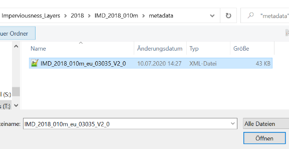{width="2.991311242344707in" height="1.537652012248469in"}

[]{#_Toc137576649 .anchor}**Figure 3‑11: Add Ingestion - Step 5 (upload additional datasets (i.e. Metadata file))**

The last option allows you to specify whether the **raw data** (original/initial uploaded dataset) can be retained in the system after processing (see [Figure 3‑12](#_Ref151987498)). The "Delete raw data" tick box is not ticked by default. If the "delete raw data" is ticked the initial dataset will be automatically deleted after the creation of the Ingestion from the CLC+ Core storage. The raw data will only usable for users of the same organization and the admin user - and only if the Ingestion processing fails and the failed Ingestion needs to be processed (retry) again. Otherwise retrying a failed Ingestion processing step will not be possible and a completely new Ingestion would need to be initiated. After an Ingestion was successful the raw dataset is not needed anymore. Note that no user can access the raw data in the CLC+ Cores data storage.

As soon as the processing step is finished, the raw data cannot be downloaded or reused anymore by anyone. Finally, if you have defined all upload parameters, the dataset can be added by pressing the 'ADD' button (see [Figure 3‑12](#_Ref151987498)). While the upload is performed, please do not leave the page (see [Figure 3‑13](#_Ref151987519)).

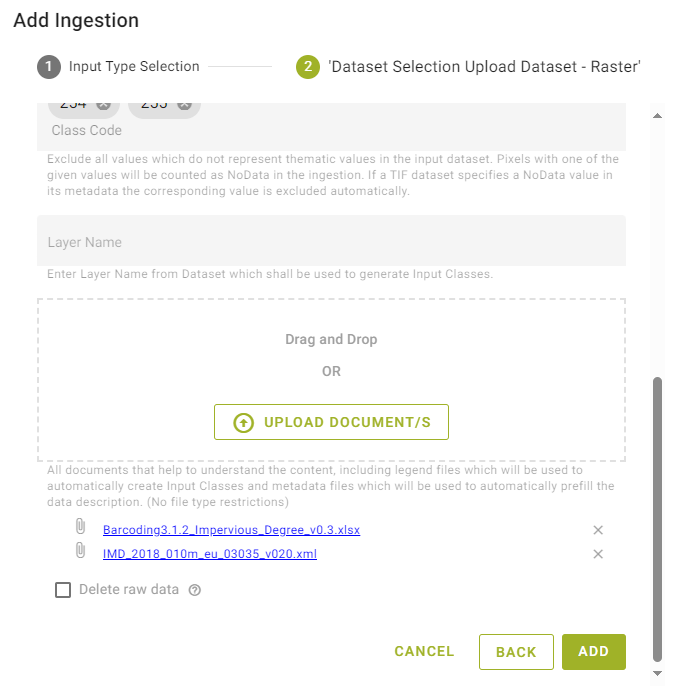{width="4.0806277340332455in" height="4.182929790026247in"}

[]{#_Ref151987519 .anchor}**Figure 3‑12: Add Ingestion - Step 6 (start the upload)**

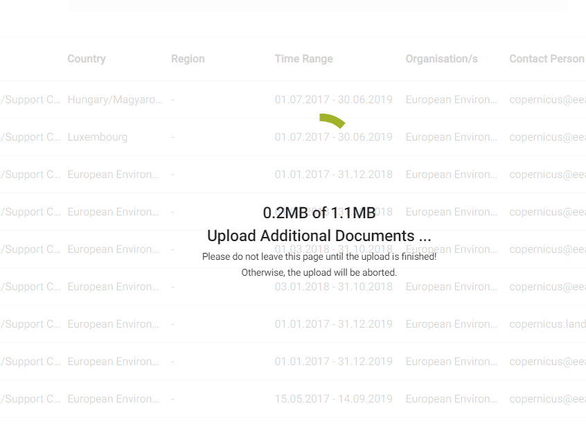{ width="3.573008530183727in" height="2.584806430446194in"}

[]{#_Ref151987498 .anchor}**Figure 3‑13: Add Ingestion - Step 6 (stay on page)**

### Vector dataset

Clicking the '**Add Ingestion**' button (see section [1.6](#data-catalogue) [Figure 1‑9](#_Ref151467380)) opens the 'Add Ingestion' dialog (see [Figure 3‑14](#_Ref151987694)) where you can define the data format of your dataset (step 1).

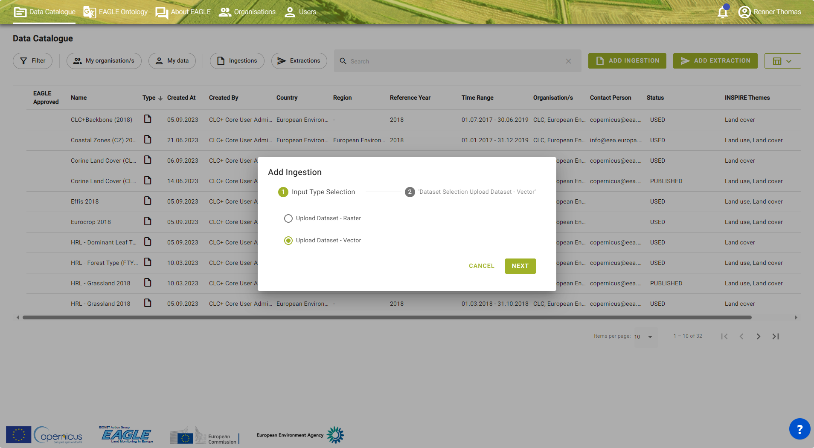{width="6.925in" height="3.8180555555555555in"}

[]{#_Ref151987694 .anchor}**Figure 3‑14: Add Ingestion - Step 1 (Data format) - here vector file**

In a second step, further information, such as name and country / region that describes the data can be entered (step 2 see [Figure 3‑15](#_Ref151987707)). All **mandatory fields** are marked with a \*. In this example, we will upload the Urban Atlas 2018 for Innsbruck. As we want to ingest the area of Innsbruck only in this example, we do specify Tyrol as region.

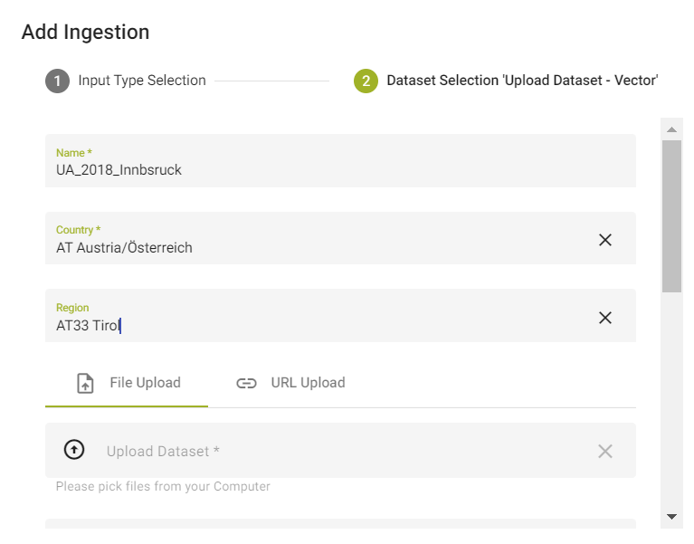{width="4.013493000874891in" height="3.144948600174978in"}

[]{#_Ref151987707 .anchor}**Figure 3‑15: Add Ingestion - Step 2 (Parameter)**

The data can be uploaded directly from your computer (file upload or per \`drag and drop\`) or by entering an URL where the data shall be collected from (step 3 see [Figure 3‑16](#_Ref151987739)). Please also refer to section [3.3](#_Ref99729782) [Remarks on the Ingestion process](#_Ref99729782). The supported file formats for vector files:

- shapefile - When uploading a shapefile (shp), its elements need to be zipped

- geopackage (gpkg)

- file geodatabases (gdb)

- Hierarchical Data Format (HDF5)

In this example below (see [Figure 3‑16](#_Ref151987739)), we chose the file upload from a local computer. If successfully defined, an attachment is added to the dialog. **If the file size is larger than 5 GB, a warning appears recommending using an URL upload as the file upload might take a long time.**

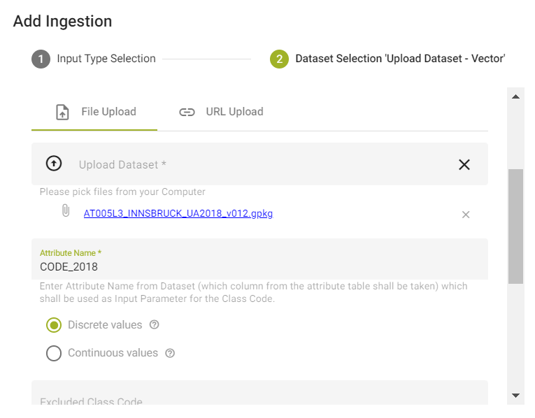{width="4.726548556430446in" height="3.3500721784776903in"}

[]{#_Ref151987739 .anchor}**Figure 3‑16: Add Ingestion - Step 3 (Data upload via local computer)**

In this example below (see [Figure 3‑17](#_Ref151987899)), we chose the URL upload from the [CLMS portal](https://land.copernicus.eu/). Select the required files on the download page (put them in the shopping cart) (see [Figure 3‑18](#_Ref151987915)). After sending the order, you will retrieve a download link via this page (depending on the processing time) and per email. Copy the link and enter the URL in the dialog.

**Note: please use a direct download URL (link that automatically starts the download immediately). Consider that the system can only process links which do not require a user login.**

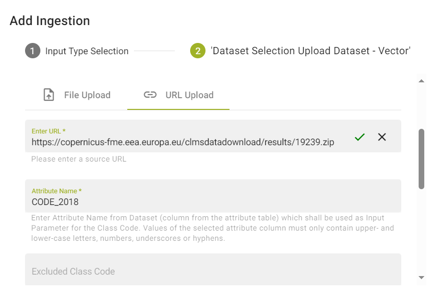{width="5.412512029746281in" height="3.109834864391951in"}

[]{#_Ref151987899 .anchor}**Figure 3‑17: Add Ingestion - Step 3 (Data upload via URL)**

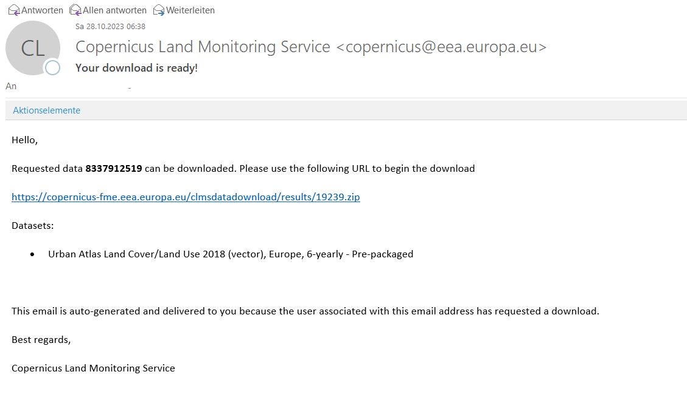{width="5.6799289151356085in" height="3.3181813210848645in"}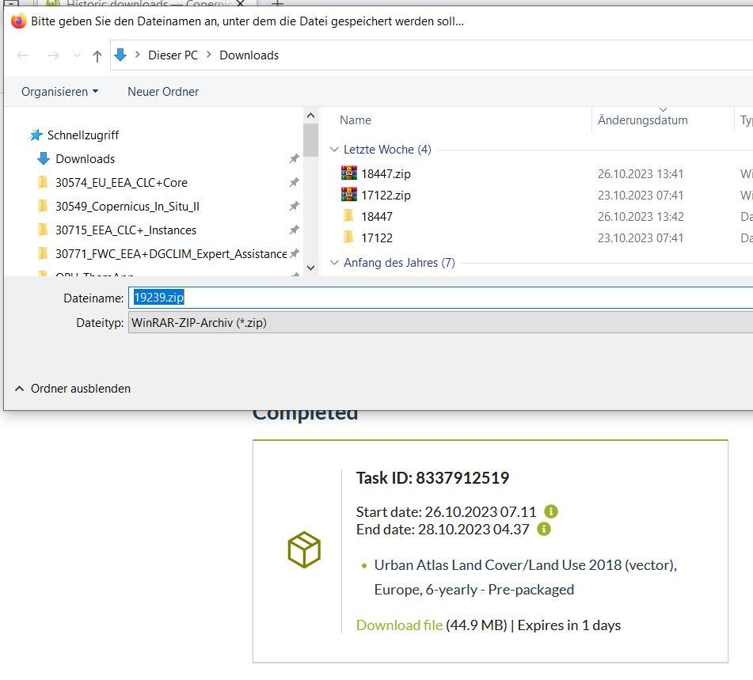{width="4.80394028871391in" height="4.340909886264217in"}

[]{#_Ref151987915 .anchor}**Figure 3‑18: Add Ingestion - Step 3 (Get download link via the portal and via email)**

For the vector file, the Attribute Name from the dataset (column from the attribute table) which shall be used as Input Parameter for the Class Code needs to be entered (see [Figure 3‑16](#_Ref151987739) and [Figure 3‑17](#_Ref151987899)), for the raster dataset this is not required as raster dataset usually consists of one band only. Please select an integer field (the code and not its description). In general, strings also work as long as they do not have any special characters. Allowed: digits, upper-lower case, hyphen, underscore. In this case (see [Figure 3‑19](#_Ref151987951)), we chose 'code_2018'.

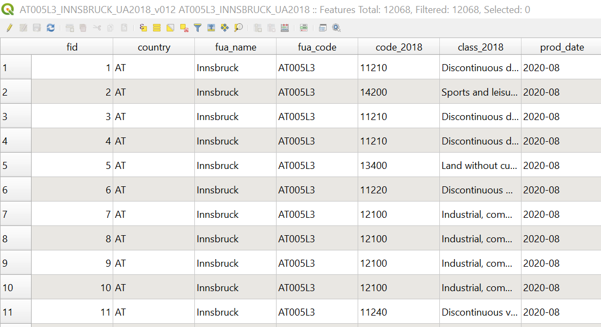{ width="5.619794400699912in" height="3.06462489063867in"}

[]{#_Ref151987951 .anchor}**Figure 3‑19: Add Ingestion - Step 3 (Enter Attribute Name from the dataset (column from the attribute table) which shall be used as Input Parameter for the Class Code needs to be entered). Here: code_2018**

After selecting the dataset, you need to define if the dataset has discrete or continuous values[^9]. F**or vector data currently only discrete values are specified**. In this case, the Urban Atlas consists of discrete values indicating the degree of its according characteristic.

In step 4, you have the possibility to **exclude a class code** from being processed (see [Figure 3‑20](#_Ref151988050)). It excludes all class codes which stand for an unknown classification (i.e. NoData values). If a TIF dataset specifies a NoData value in its metadata the corresponding class is excluded automatically. This is recommended if you don't want to have specific values in the statistics/being processed and for all unclassified/unknown values (i.e. NoData) (step 4). All pixels in the ingested dataset with an excluded class code will then appear as NoData pixel in the final Ingestion. If you do not enter a excluded class code value and the NoData value does not appear in the TIF metadata, then all classes are "0" in the ingestion, where the original data always displayed the no-data class.

Please press enter after entering the value. Alternatively, for discrete datasets, you are able to hide the values when editing the data (section [3.7](#edit-ingestion) [Figure 3‑35](#_Ref100162670)) by disabling single classes with the "eye" symbol before ingesting and publishing an Ingestion.

Additionally, you can **enter a layer name** (see [Figure 3‑20](#_Ref151988050)) which shall be used to generate input classes if there are [more than one layers per]{.underline} dataset (if several layers are stored in a .gdb for example). If nothing is defined, the first layer will be selected. In this case, we have three layers and we need the first one. We write 'AT005L3_INNSBRUCK_UA2018' but the first layer would be selected by default anyways.

**Please make sure to avoid special characters, otherwise an error will occur.** Please also refer to section [3.3](#_Ref99729782) to learn about the **limitations of data uploads**.

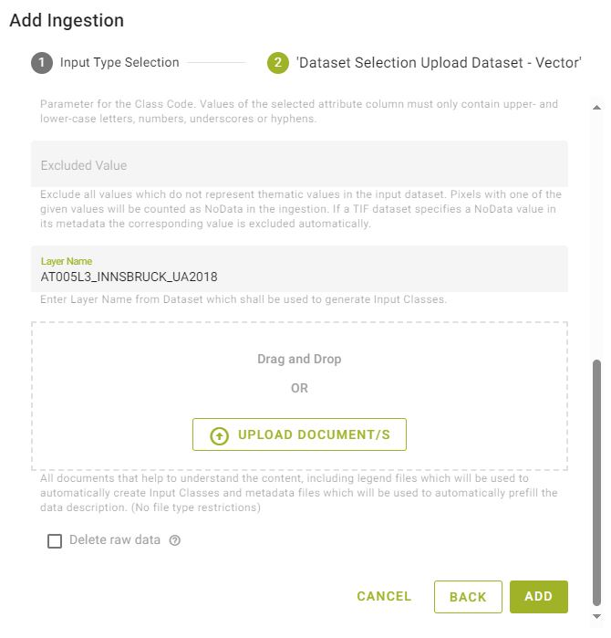{width="3.486956474190726in" height="3.637884951881015in"}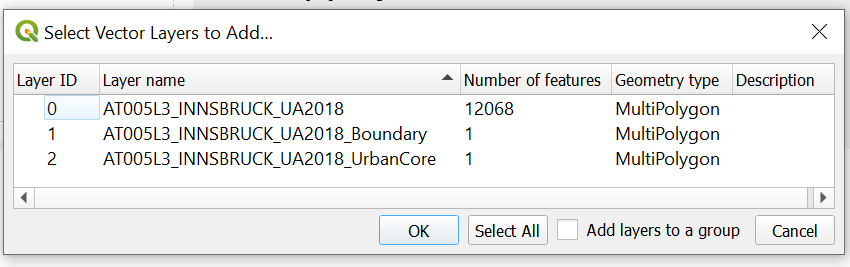{width="3.513888888888889in" height="1.1036406386701663in"}

[]{#_Ref151988050 .anchor}**Figure 3‑20: Add Ingestion - Step 4 (exclude values and enter layer name)**

The fifth step provides the possibility to upload **additional, supporting files** that help to understand the content, such as the metadata files (see [Figure 3‑22](#_Ref151988218)), legend files (see [Figure 3‑21](#_Ref151988076)) QGIS layer style file (.qml) or SLD (Styled Layer Descriptor) file (.sld); ArcGIS Layer Files (.lyr) are not supported), EAGLE Barcoding files (see [Figure 3‑23](#_Ref151988308)). These additional files will be used prefill the data descriptions and define the EAGLE barcodes and the style to the Ingestion Classes (step 5). The upload of these documents can also be performed at a later stage (section [3.7](#edit-ingestion)) and is possible via the explorer or per "drag and drop".

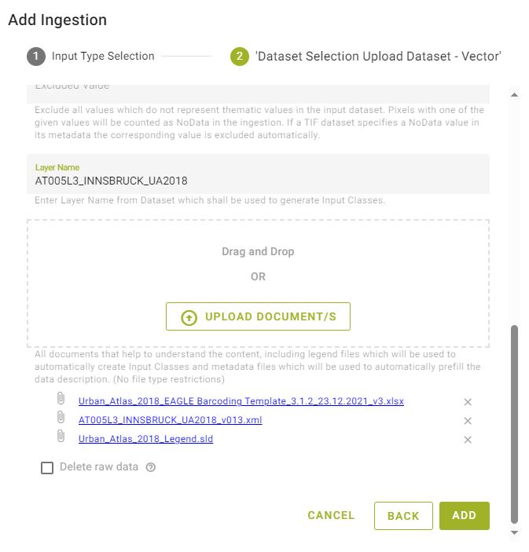{width="3.991304680664917in" height="4.169222440944882in"}
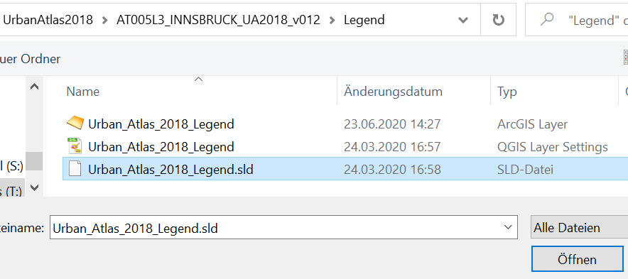{width="3.777292213473316in" height="1.6791666666666667in"}

[]{#_Ref151988076 .anchor}**Figure 3‑21: Add Ingestion - Step 5 (upload additional datasets (i.e. legend / style file))**

{width="3.965217629046369in" height="4.141973972003499in"}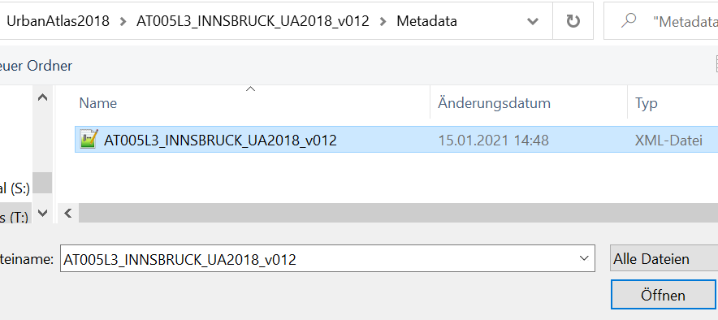{width="3.2582983377077865in" height="1.4520833333333334in"}

[]{#_Ref151988218 .anchor}**Figure 3‑22: Add Ingestion - Step 5 (upload additional datasets (i.e. Metadata file))**

{width="4.311319991251094in" height="4.503503937007874in"}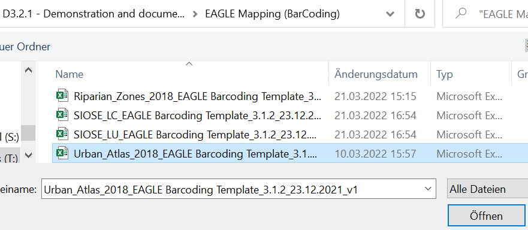{width="3.2121391076115486in" height="1.4in"}

[]{#_Ref151988308 .anchor}**Figure 3‑23: Add Ingestion - Step 5 (upload additional datasets (i.e. EAGLE barcoding file))**

The last option allows you to specify whether the **raw data** (original uploaded dataset) can be retained in the system after processing (see [Figure 3‑24](#_Ref151988324)). The "Delete raw data" tick box is not ticked by default. If the "delete raw data" is ticked the initial dataset will be deleted after the creation of the Ingestion from the CLC+ Core storage. The raw data will only usable for users of the same organization and the admin user - and only if the Ingestion processing fails and the failed Ingestion needs to be processed (retry) again. Otherwise retrying a failed Ingestion processing step will not be possible and a completely new Ingestion would need to be initiated. After an Ingestion was successful the raw dataset is not needed anymore. Note that no user can access the raw data in the CLC+ Cores data storage.

As soon as the processing step is finished, the raw data cannot be downloaded or reused anymore by anyone. Finally, if you have everything defined, the dataset can be added by pressing the 'ADD' button (see [Figure 3‑24](#_Ref151988324)). While the upload is performed, please do not leave the page.

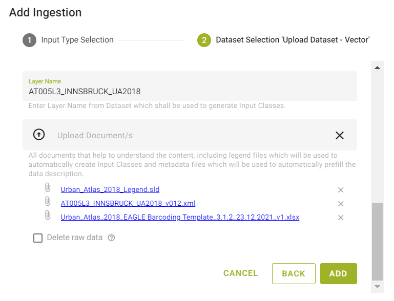{width="4.204266185476816in" height="3.214753937007874in"}

[]{#_Ref151988324 .anchor}**Figure 3‑24: Add Ingestion - Step 6 (start the upload)**

## Remarks on the Ingestion process

Usually, a dataset consists of one file / layer. There is no problem in uploading a single dataset to the system. However, currently there is no option to upload more than one file from a common folder, a gdb or gpkg). In such a case, either you indicate the desired file in the dialogue under 'layer name' or the first file in the folder will be selected automatically for the Ingestion.

In case your data is split into several sub-tiles, such as Urban Atlas or Riparian Zones, you have 3 possibilities to upload your data in the system:

- Use the direct download URL from the CLMS portal -- **recommended**

- Extract the required layer from GDB / GPKG and merge data into one dataset in a GIS software **outside the system** (might not be possible due to the size)

- Ingest single datasets (i.e. start the Ingestion process for each single file)

For datasets (i.e. gdb, gpkg) that consist of more than one layer (per file), you need to specify the layer name which shall be used to generate input classes in the field 'layer name'. If no specific file is defined, the first layer will be selected. In the example below we have three layers in the dataset we want to ingest. For selecting the first one, we can define 'AT005L3_INNSBRUCK_UA2018' under 'layer name' or we skip it as the first layer would be selected by default anyways.

{width="3.513888888888889in" height="1.1034722222222222in"}

If your required layer is not on the first position of your folder/gdb/gpkg and in addition the layers of different regions are named differently (SAR_13_T_USOS vs. SAR_15_T_USOS), you have 2 possibilities to upload your data in the system:

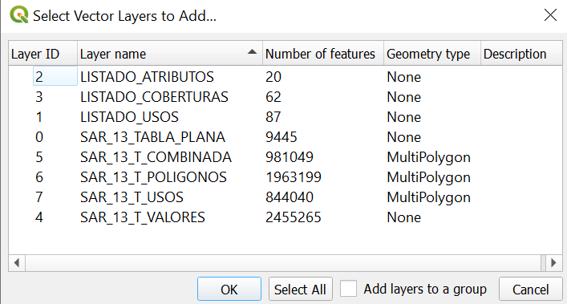{width="2.9251498250218724in" height="1.568176946631671in"} 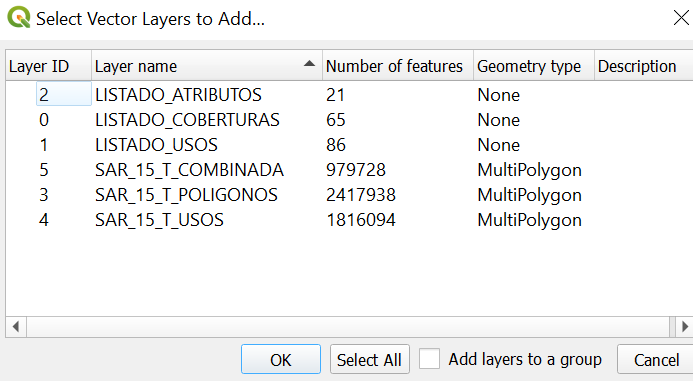{width="2.801619641294838in" height="1.5401607611548556in"}

- Extract the required layer from GDB / GPKG and merge data into one dataset in a GIS software **outside the system** (might be not possible due to the size)

- Ingest single datasets (means several single files in the system)

## Retry or Delete

If for some reason the upload was not successful, you have the option of uploading the data set again (retry). For your convenience, all fields remain filled in and the data (if the checkbox \'delete raw data\' has not been ticked) is retained. There is also the option to change data or fields, e.g. if you have found an error.

If you have tried to upload the dataset by mistake, you can delete the entry.

Both options can be initiated by right clicking on the Ingestion for which the upload failed (see [Figure 3‑25](#_Ref151988719)).

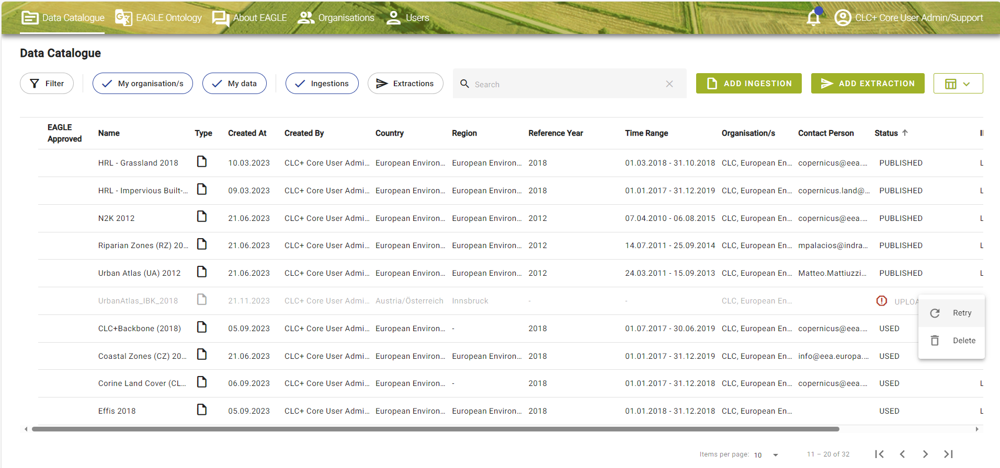{width="6.925in" height="3.245138888888889in"}

[]{#_Ref151988719 .anchor}**Figure 3‑25: Add Ingestion -- Retry or delete dataset**

Further there is also the possibility to 'cancel' and Ingestion while its uploading or processing (right click on the processing Ingestion see [Figure 3‑26](#_Ref151988796)), it will then run into an 'Uploading Error' or 'Processing Error' (see section [3.5](#status-of-an-ingestion)).

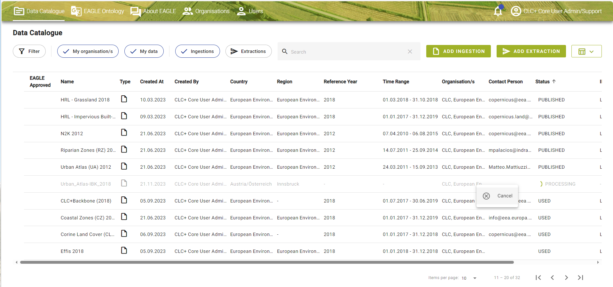{width="6.925in" height="3.251388888888889in"}[]{#_Ref151988796 .anchor}

**Figure 3‑26:Cancel Ingestion while uploading or processing**

## Status of an Ingestion

The **status** indicates the current process of the Ingestion or Extraction in the system. The status is displayed in the Data Catalogue for each Ingestion and Extraction in the column 'Status' (see [Figure 3‑27](#_Ref151989171)). [Table 3‑1](#_Ref98940657) provides a detailed description of possible status messages. Sections [3.7 Edit Ingestion](#edit-ingestion) and [4.3 Edit Extraction](#edit-extraction) go into more detail on how Ingestion- and Extraction-states are changed. For any change of the status of the users own Ingestion the user gets a notification (see section [1.7.3](#notifications-messages)) as well as an email notification. Further all users get notified in whenever a new Ingestion is published (assuming the Ingestion was published publicly).

In the example below, you can see the different states of Ingestions in the Data Catalogue view (see [Figure 3‑27](#_Ref151989171)). Several are Used, one Published, one Draft, one Processing and four Ingestions are in status Ingested_Preview.

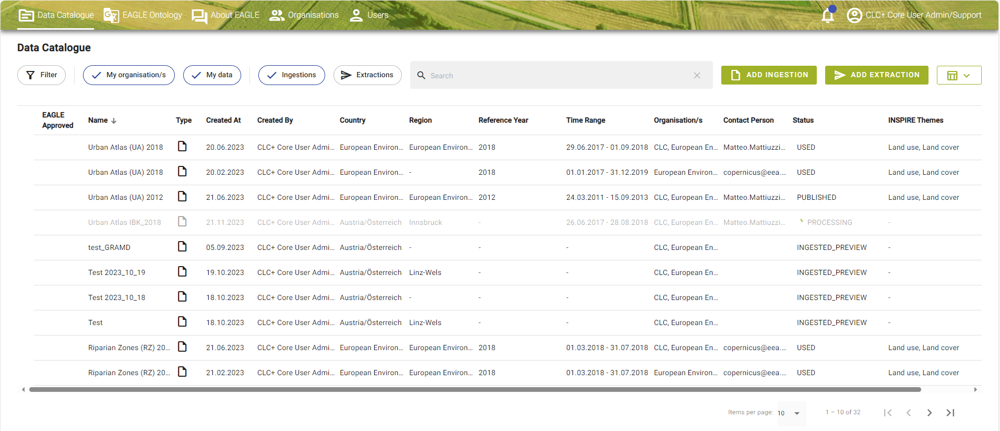{width="6.925in" height="2.9854166666666666in"}[]{#_Ref151989171 .anchor}

**Figure 3‑27: Example of different status of datasets in the CLC+ system**

+-------------------+------------------------------------------------------------------------------------------------------------------------------------------------------------------------------------------------------------------------------------------------------------------------------------------------------------------------------------+
| **Status**        | **Description**                                                                                                                                                                                                                                                                                                                    |
+:==================+:===================================================================================================================================================================================================================================================================================================================================+
| Uploading         | Process, where all relevant information and their datasets are uploaded to the system.                                                                                                                                                                                                                                             |
|                   |                                                                                                                                                                                                                                                                                                                                    |
|                   | **Note: During this phase it is necessary to have a stable internet connection and to keep the webpage open.** As soon as the status changes to "PROCESSING" the webpage can be left/closed.                                                                                                                                       |
+-------------------+------------------------------------------------------------------------------------------------------------------------------------------------------------------------------------------------------------------------------------------------------------------------------------------------------------------------------------+
| Uploading_Error   | An error occurred while uploading the dataset. By clicking on the data catalogue entry, a pop-up window will help indicating the error.                                                                                                                                                                                            |
|                   |                                                                                                                                                                                                                                                                                                                                    |
|                   | 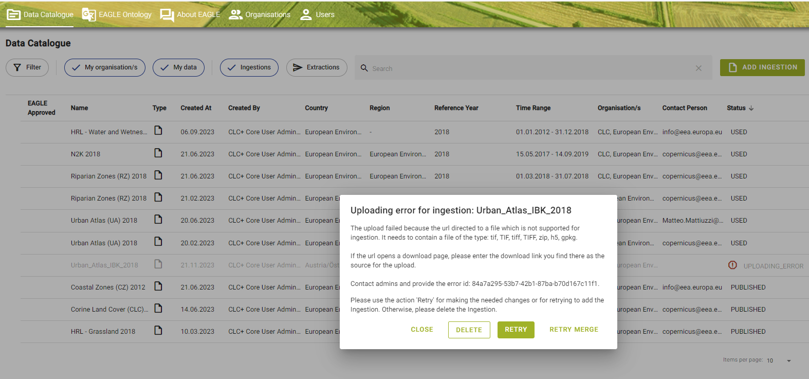{width="5.570138888888889in" height="2.6083333333333334in"}                                                                                                                                                                                                                                                |
|                   |                                                                                                                                                                                                                                                                                                                                    |
|                   | - When ingesting a vector file, please check if the correct attribute value is selected                                                                                                                                                                                                                                            |
|                   |                                                                                                                                                                                                                                                                                                                                    |
|                   | - Check if the provided upload link is valid. In case the link is valid, a download should start by clicking on it. If not, the download link might be expired (i.e. CLMS links expire after 24h)                                                                                                                                  |
|                   |                                                                                                                                                                                                                                                                                                                                    |
|                   | - Retry or delete Ingestion                                                                                                                                                                                                                                                                                                        |
|                   |                                                                                                                                                                                                                                                                                                                                    |
|                   | Contact the [CLC+ Core support team](https://clcplus-core.land.copernicus.eu/)                                                                                                                                                                                                                                                     |
+-------------------+------------------------------------------------------------------------------------------------------------------------------------------------------------------------------------------------------------------------------------------------------------------------------------------------------------------------------------+
| Processing        | The dataset is processed in the system (rasterized, reprojected and aggregated, merged and their layers extracted into Input Classes). As soon as an Ingestion is successfully processed, the status changes to "DRAFT".                                                                                                           |
+-------------------+------------------------------------------------------------------------------------------------------------------------------------------------------------------------------------------------------------------------------------------------------------------------------------------------------------------------------------+
| Processing_Error  | An error occurred while processing the dataset. By clicking on the data catalogue entry, a pop-up window will help indicating the error.                                                                                                                                                                                           |
|                   |                                                                                                                                                                                                                                                                                                                                    |
|                   | 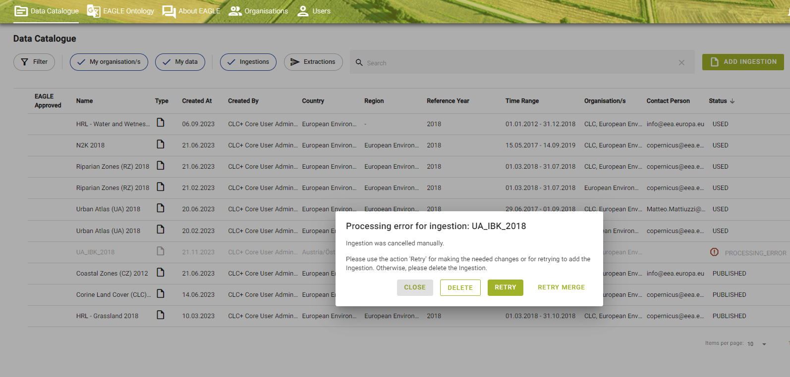{width="5.570138888888889in" height="2.6625in"}                                                                                                                                                                                                                                                            |
|                   |                                                                                                                                                                                                                                                                                                                                    |
|                   | - Check if the provided upload link is valid. In case the link is valid, a download should start by clicking on it. If not, the download link might be expired (i.e. CLMS links expire after 24h)                                                                                                                                  |
|                   |                                                                                                                                                                                                                                                                                                                                    |
|                   | - Retry or delete Ingestion                                                                                                                                                                                                                                                                                                        |
|                   |                                                                                                                                                                                                                                                                                                                                    |
|                   | Contact the [CLC+ Core support team](https://clcplus-core.land.copernicus.eu/)                                                                                                                                                                                                                                                     |
+-------------------+------------------------------------------------------------------------------------------------------------------------------------------------------------------------------------------------------------------------------------------------------------------------------------------------------------------------------------+
| Draft             | Either the dataset was processed successfully and is newly ingested in the system or changes were made to an existing Ingestion. The Ingestion can now be edited by performing an EAGLE barcoding, changing some of its ingesting information and many more.                                                                       |
+-------------------+------------------------------------------------------------------------------------------------------------------------------------------------------------------------------------------------------------------------------------------------------------------------------------------------------------------------------------+
| Ingesting_Preview | The preview is executed for a smaller area in the map.                                                                                                                                                                                                                                                                             |
+-------------------+------------------------------------------------------------------------------------------------------------------------------------------------------------------------------------------------------------------------------------------------------------------------------------------------------------------------------------+
| Ingesting         | Ingestion is executed for the whole area                                                                                                                                                                                                                                                                                           |
+-------------------+------------------------------------------------------------------------------------------------------------------------------------------------------------------------------------------------------------------------------------------------------------------------------------------------------------------------------------+
| Ingesting_Error   | An Error occurred during the INGESTING or INGESTING_PREVIEW step. When opening the detail page of the Ingestion an error message with more details is displayed. Do the required changes to resolve the error and start the Ingestion again?                                                                                       |
+-------------------+------------------------------------------------------------------------------------------------------------------------------------------------------------------------------------------------------------------------------------------------------------------------------------------------------------------------------------+
| Ingested          | Ingestion execution is finished for the whole area.                                                                                                                                                                                                                                                                                |
+-------------------+------------------------------------------------------------------------------------------------------------------------------------------------------------------------------------------------------------------------------------------------------------------------------------------------------------------------------------+
| Published         | If the Ingestion is published, **it can be made available to other users and can thus be used for Extractions.**                                                                                                                                                                                                                   |
|                   |                                                                                                                                                                                                                                                                                                                                    |
|                   | The user has several possibilities to publish the Ingestion. Depending on what kind of visibility (private, public or national) you have chosen, the Ingestion will then be available to either all users (public), to all countries of the selected organisation (national), or only to users within your organisation (private). |
|                   |                                                                                                                                                                                                                                                                                                                                    |
|                   | **Note: Once the Ingestion is published, other users can perform Extractions with the Ingestion, which changes the status to \"used\". In status USED, you can no longer make changes to the Ingestion.**                                                                                                                          |
|                   |                                                                                                                                                                                                                                                                                                                                    |
|                   | 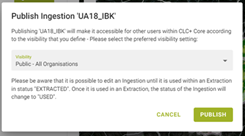{width="2.5629604111986in" height="1.423902012248469in"}                                                                                                                                                                                                                                                  |
+-------------------+------------------------------------------------------------------------------------------------------------------------------------------------------------------------------------------------------------------------------------------------------------------------------------------------------------------------------------+
| Used              | The dataset is already used in an Extraction. **Now it is no longer possible to delete the dataset. The only further option is to archive the dataset.**                                                                                                                                                                           |
+-------------------+------------------------------------------------------------------------------------------------------------------------------------------------------------------------------------------------------------------------------------------------------------------------------------------------------------------------------------+
| Archived          | The dataset is archived and thus **no longer available / usable for Extractions**. Additionally, it is unpublished from the geoserver, which means it cannot be viewed in the preview anymore.                                                                                                                                     |
+-------------------+------------------------------------------------------------------------------------------------------------------------------------------------------------------------------------------------------------------------------------------------------------------------------------------------------------------------------------+

: []{#_Ref98940657 .anchor}Table 3‑1: Status of ingested datasets

The status of an Ingestion is also displayed in the detail view next to the Ingestion Name in the upper left corner (see [Figure 3‑28](#_Ref151989420)). The status of an Ingestion can be changed by triggering some actions. E.g. by adding the EAGLE barcodes and pressing preview for a small area, the status converts from 'draft' (see [Figure 3‑28](#_Ref151989420)) to 'ingested_preview'.

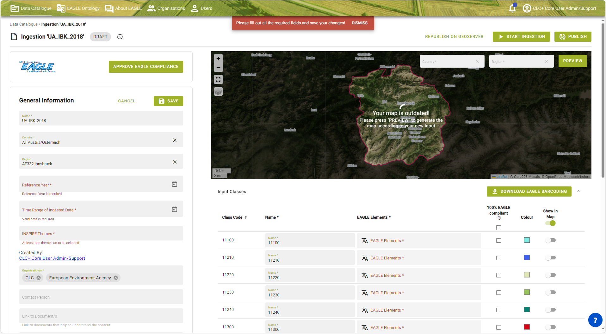{width="6.925in" height="3.8201388888888888in"}

[]{#_Ref151989420 .anchor}**Figure 3‑28: From draft to ingested_preview (by adding EAGLE barcodes, Region and general information like reference year, time range and INSPIRE theme)**

## Input Classes

**Input Classes** are representing detailed information about the Ingestion and originating from the uploaded dataset for each Ingestion. This also means that every Input Class is connected to an Ingestion. Input Classes contain the information on how to interpret the class code within the raster file and how they are mapped to the specific EAGLE barcodes (compliance to EAGLE, factor of EAGLE barcode value). Input Classes from the dataset layers are generated when adding a new Ingestion to the system (see section[3.23.2](#add-ingestion)). Furthermore, they are used when adding a new Extraction to the system in case they are selected (see section [4.2](#add-extraction)). In the example below (see [Figure 3‑29](#_Ref151640298)[Figure 3‑29](#_Ref151640298)) the Ingestion 'HRL Forest Type' has three input classes. Besides the class code the class name and the EAGLE barcodes per class are shown, as well as the colour code per class.

{width="0.27165354330708663in" height="0.27165354330708663in"}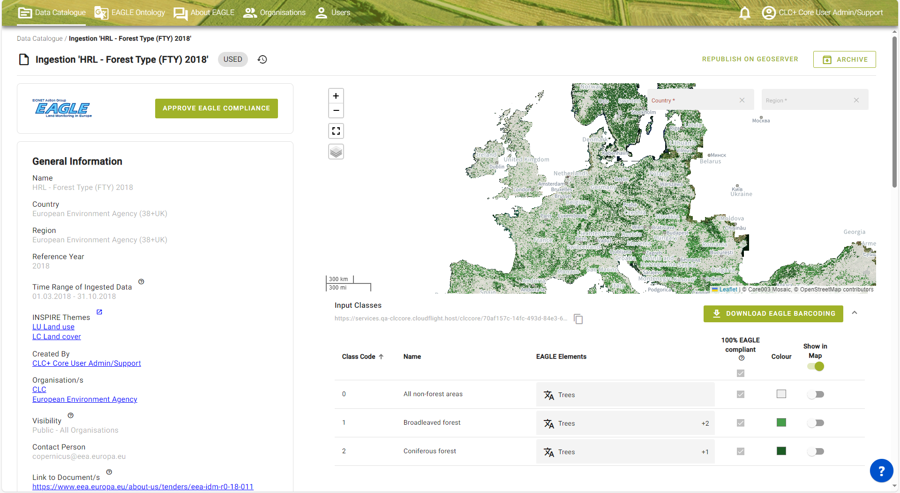{width="6.925in" height="3.801388888888889in"}

[]{#_Ref151640298 .anchor}**Figure 3‑29: Example of Input Classes of the HRL Forest Type Ingestion**

## Edit Ingestion 

To finally ingest your data to be able to use it, click on the required Ingestion in the data catalogue table. You will be forwarded to a more detailed view of the same Ingestion.

**Before an Ingestion can be previewed or published, you need to review the Ingestion settings and map all Input Classes to EAGLE elements.** To avoid mistakes, you can preview your Input Classes in the map. **Note: The EAGLE barcoding is a mandatory task.**

You can **edit your Ingestion** as often as you like, also after the status has change to Ingested or Published. If published, clicking unpublish will set the status back to ingested and you are able to edit your Ingestion again.

**Be aware that once the Ingestion is published and has been used for an Extraction, it cannot be edited anymore**.

In the left section (**General Information**), you can review all Ingestion information and edit them by clicking on the "**Edit**" button. Reference year, time range and [INSPIRE Themes](https://inspire.ec.europa.eu/Themes/Data-Specifications/2892) are mandatory fields. In case a metadata file has been uploaded during the Ingestion and the necessary data is available, this section will be prefilled already. Save the changes by clicking on the "Save" button. Before leaving the page without saving your edits the user will be reminded to save the edits, otherwise all edits will not be saved when returning to the page. Below the General Information the user can add **additional documents** like the EAGLE barcoding file per drag and drop or via uploading.

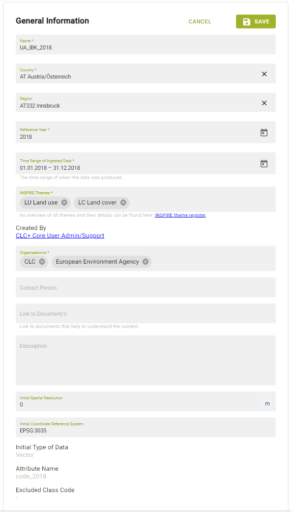{width="3.4196456692913384in" height="6.002495625546807in"}

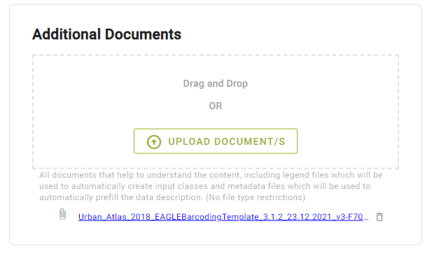{width="4.19990157480315in" height="2.5390004374453192in"}

[]{#_Toc137576666 .anchor}**Figure 3‑30: Edit Ingestion -- Ingestion settings and possibility to add additional documents**

**Note: Changes can only be done for unpublished datasets. As soon as a dataset has been used in an Extraction, changes can no longer be made while in use (by you or any other user).**

It is obligatory to map all ingested classes as **EAGLE elements** in order to publish an Ingestion. It is recommended to upload the EAGLE barcoding file (a detailed description is provided in section [2.3](#_Ref100162317)) together with the data. You can do this already when defining the settings for the Ingestion (see section [3.2](#add-ingestion)) or by clicking on the EAGLE element picker. In case you use the picker, continue with step 3 below, otherwise you can skip this and continue with step 4.

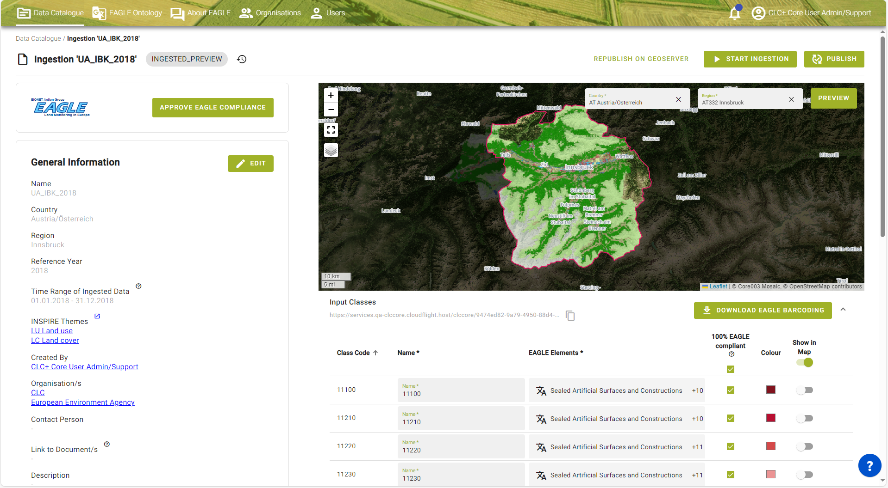{width="6.925in" height="3.8125in"}

[]{#_Ref98941497 .anchor}**Figure 3‑31: Edit Ingestion (step 3 is in [**Figure 3‑33**](#_Ref98941415))**

Further if the EAGLE barcoding was already uploaded or done manually the number of used EAGLE elements per Input class is shown in the EAGLE elements column. For example, + 10 for class 11100 in the example below (see [Figure 3‑32](#_Ref152070629)) indicated that overall 11 EAGLE elements are barcoded for this Input class (first element is written in the column, the other 10 EAGLE elements are summarized as '+10'). By hovering over the EAGLE element column for an input class all EAGLE elements of this class including the applied barcoding is shown in the dark grey box (see [Figure 3‑32](#_Ref152070629)).

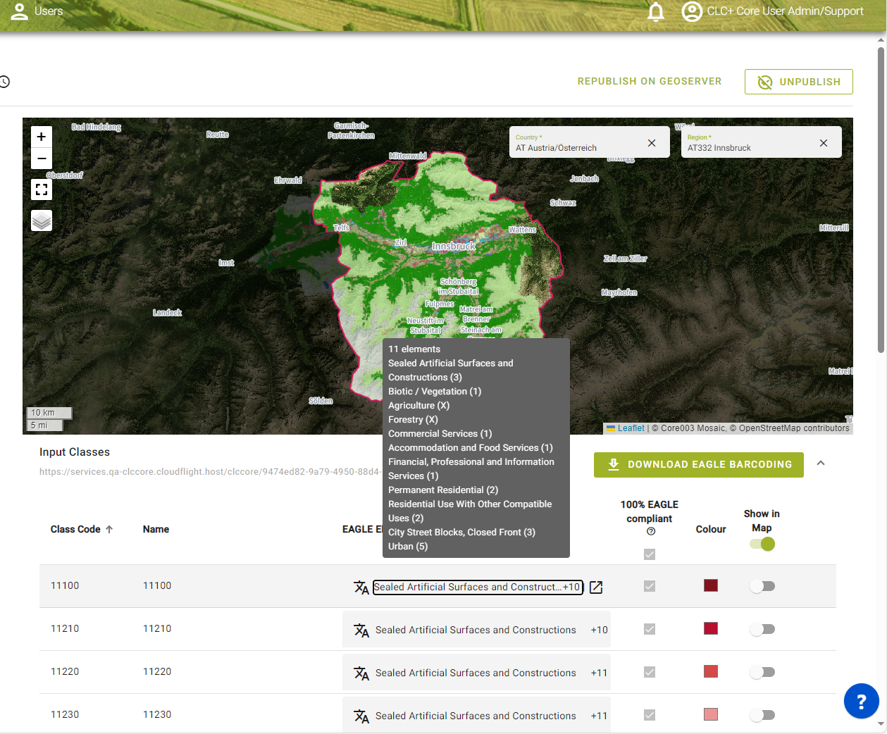{width="6.925in" height="5.73125in"}

[]{#_Ref152070629 .anchor}**Figure 3‑32: Summary of EAGLE elements per Input class**

Even if it is recommended to upload the EAGLE barcoding file, the CLC+ Core system provides you with the EAGLE Picker](see [Figure 3‑33](#_Ref98941415) and [Figure 3‑34](#_Ref98941416)) that allows you to align the EAGLE elements with the Input Classes from an Ingestion. By clicking on the EAGLE elements of one Input class a new window for the EAGLE barcoding opens (see [Figure 3‑33](#_Ref98941415)). The picker allows you to multi-select EAGLE elements that match the Input Classes, select an EAGLE barcode (X-5 including a label, for a detailed description of each barcode see the help function ([Figure 3‑34](#_Ref98941416)) or Annex [Table 0‑1](#_Ref152071020)) and set a factor that defines the coverage of the EAGLE element on the specific input class once an EAGLE element has been added to an Input Class. Finally, you need to check the checkbox whether it is 100% EAGLE compliant or not. The '100% EAGLE compliant' tick box is a flag indicating if the mapping to the EAGLE language for one Input class is fully compliant or only partially compliant. If it is only partially compliant it needs to be evaluated within an Extraction then if the given gap causes issues in the specific use case. Note that this tick box is not connected to the "Approved by EAGLE" stamp for complete Ingestions.

Concerning the Help function, in the "Help- EAGLE Barcoding Manual" there is also a direct link (see [Figure 3‑34](#_Ref98941416)) to the [EAGLE homepage](https://land.copernicus.eu/en/eagle?tab=bar_coding), which opens then in a separate tab.

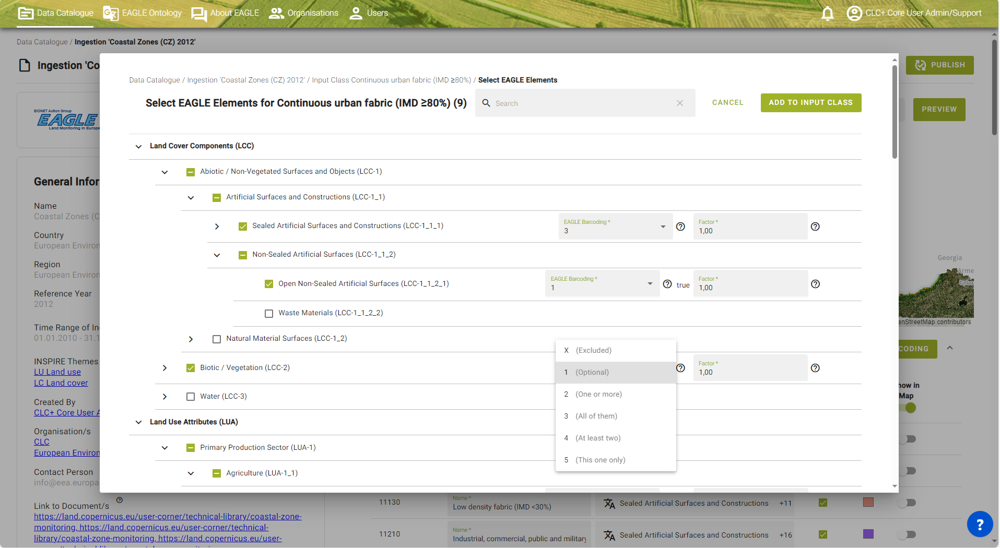{width="6.925in" height="3.797222222222222in"}[]{#_Ref98941415 .anchor}

**Figure 3‑33: Mapping Input Classes to EAGLE elements - Select EAGLE elements**

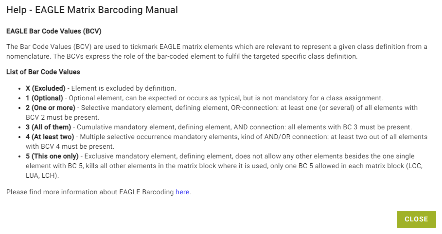{width="3.876061898512686in" height="2.059691601049869in"}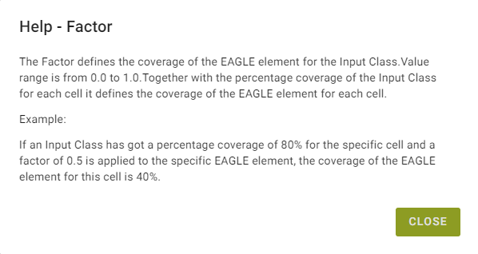{width="3.1216032370953632in" height="1.6599825021872265in"}

[]{#_Ref98941416 .anchor}**Figure 3‑34: Mapping Input Classes to EAGLE elements -- Help windows for barcoding and factor**

Classes that have been already excluded from the dataset (e.g. NoData) in the relevant steps before, will not be shown in the Input Classes section anymore (see section [3.2](#add-ingestion) "exclude class codes"). In case this has not been done yet, there is still the opportunity to hide (not exclude!!!) specified/single classes before finally ingesting the data. Therefore, just uncheck the 'eye' symbol at the end of the row of the respective class ([Figure 3‑35](#_Ref100162670)). Note that the hidden classes will appear as "0" in the Ingestion and not as NoData pixels. Hidden classes can be shown again even after publishing the Ingestion by unpublishing the Ingestion but only if the Ingestion is not in status "Used" yet.

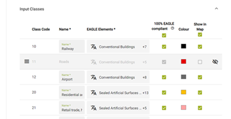{width="3.987040682414698in" height="2.0510750218722658in"}

[]{#_Ref100162670 .anchor}**Figure 3‑35: Uncheck 'eye' to prevent values / classes to be ingested.**

Once all settings and Input Classes have been reviewed, you can start the Ingestion for a small area / region that lies within the boundary of the processed dataset by clicking on '**preview**' (see [Figure 3‑36](#_Ref152070767)). If the preview was successful, you can now inspect your Ingestion in the map and continue with step 6.

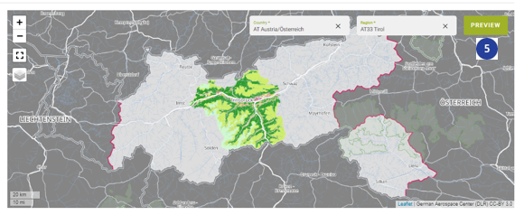{ width="4.84594706911636in" height="1.9885094050743657in"}

[]{#_Ref152070767 .anchor}**Figure 3‑36: Map preview**

Now, you can '**Start the Ingestion**' for the full extent of your Ingestion (see [Figure 3‑31](#_Ref98941497)). Afterwards you have the choice to 'Publish' to use it for Extractions and to make it available for other users (see [Figure 3‑39](#_Ref151639942)).

The clock symbol allows to view the **Ingestion history** (see [Figure 3‑37](#_Ref98877006)).

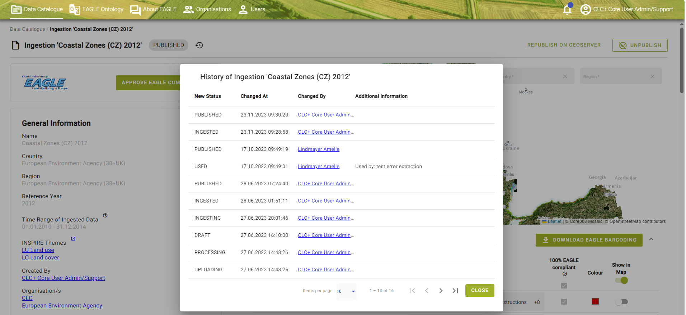{width="6.925in" height="3.183333333333333in"}

[]{#_Ref98877006 .anchor}**Figure 3‑37: History of Ingestion for one layer**

Once an Ingestion is published (see next chapter) Input classes can either be shown all in the map preview by activating the "Show in Map" or be toggled on and off individually by selectin on Input class. Only the selected Input class will then be shown in the map preview like for example class "11210" in the example below (see [Figure 3‑38](#_Ref152248025)).

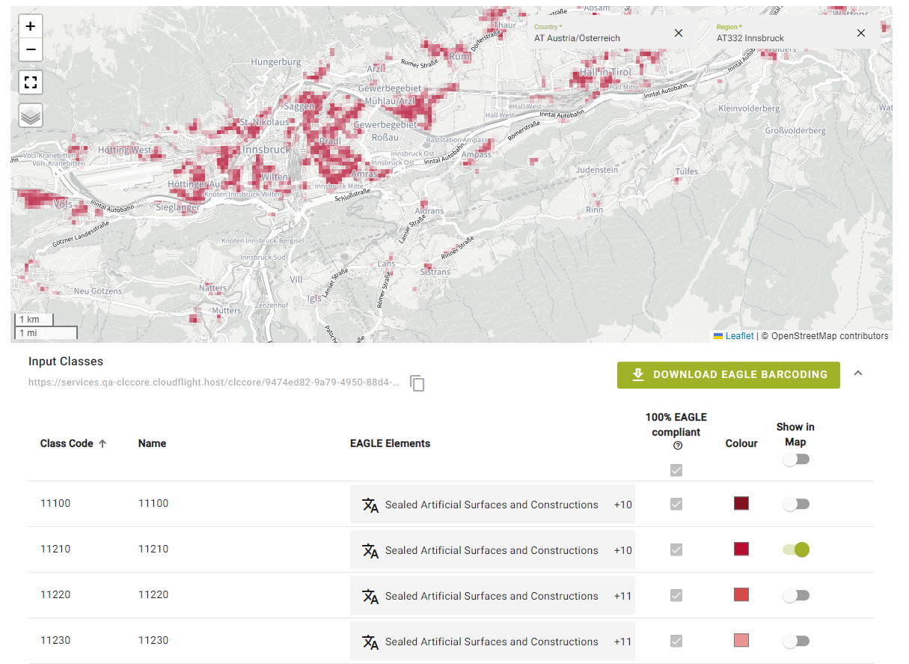{width="6.925in" height="5.055555555555555in"}

[]{#_Ref152248025 .anchor}**Figure 3‑38: Show selected Input classes in the map of published Ingestions.**

## Publish Ingestion

You can **publish an Ingestion** by clicking on the button 'publish' in the Ingestion view (see at section [3.7](#edit-ingestion) and [Figure 3‑39](#_Ref151639942) below).

**Note: Depending on what kind of visibility (private, public or national) you have chosen, the ingested data will then be available to either all users (public), to the country of the selected organisation (national), or only to users within your organisation (private). Consider, that other users might use your data for Extractions. As mentioned before, once your data has been used, it can no longer be deleted or edited while in use by either you or other users.**

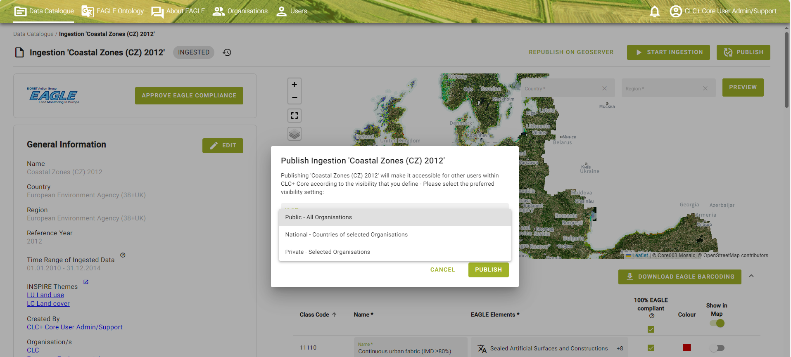{width="6.925in" height="3.1277777777777778in"}

[]{#_Ref151639942 .anchor}Figure 3‑39: Publish Ingestion -- Select visibility (public or limited)

## Reuse Ingestion

Further, you can **reuse** an Ingestion by right clicking on the Ingestion in the Data Catalogue a small windowsdialog with several options opens (see [Figure 3‑40](#_Ref151639877)). Here, the Add Ingestion dialog opens again (see [Figure 3‑41](#_Ref151639902)), with all the fields containing the previous information entered such as name, region, excluded values (section[3.2](#add-ingestion)). Please note that by reusing an Ingestion the original raw data will not be available anymore. Also, in case the "delete raw data" was not ticked for the reused Ingestion the raw data is not accessible and reusable anymore. The data needs to be uploaded as a file or via ULR again. Only the information entered to the Ingestion before will be already filled in when reusing an Ingestion.

{width="0.4618055555555556in" height="0.5277777777777778in"}

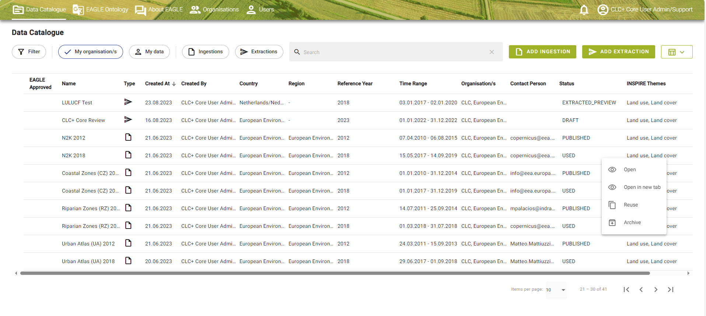{width="6.925in" height="3.1083333333333334in"}[]{#_Ref151639877 .anchor}

**Figure 3‑40: Reuse Ingestion**

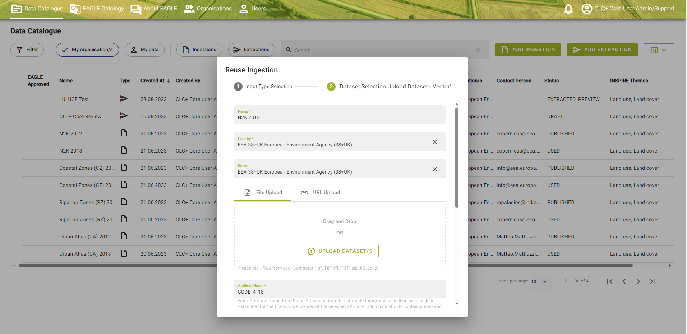{width="6.925in" height="3.379166666666667in"}[]{#_Ref151639902 .anchor}

**Figure 3‑41: Reuse Ingestion -- detailed view**

# Extraction

An **Extraction** will create new and independent data products that can be used to generate Extractions for future CLC+ instances by selecting Input Classes from available Ingestions in the CLC+ Core (section [3.6](#input-classes)), define Class Conditions (section [4.5.1](#some-definitions-for-a-better-understanding-also-see-glossary)) extracting the required information and thus, create new Output Classes (section [4.5](#output-classes)), reuse an already available Extraction (section [4.9](#reuse-extraction)) or delete an Extraction (section [4.10](#delete-extraction)). To make the new Extraction available for all or selected users in CLC+ Core, execute the Extraction, review and validate the Extraction results and publish it (section [4.8](#publish-extraction-and-download-result)). [Figure 4‑1](#_Ref100264486) provides a simplified overview of the Extraction process.

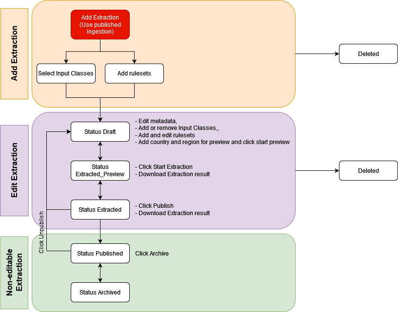{width="5.734752843394576in" height="4.506944444444445in"}

[]{#_Ref100264486 .anchor}**Figure 4‑1: Simplified Extraction workflow.**

Before starting with an Extraction, **it is recommended to already have a concept in mind**. First of all, you need the **requirements** what the Extraction is supposed to deliver (i.e. CLC+ legacy, LULUCF instance, etc.). With this knowledge, the Data acquisition can start. Before ingesting the data, the EAGLE barcoding needs to be performed, also considering the planned Extraction output. As soon as the data is ingested, the **selection of required input classes** can be done. Afterwards the **definition of Output Classes including their Class Condition** is conducted.

As a consequence of the aggregation to 100 m, **several thematic classes share one 100 m pixel**. In an Extraction, this pixel is assigned to a single class. This is accomplished by an algorithm which assigns the class of a pixel by checking on Class Condition after the other. Pixels that are shared by several thematic classes **are assigned to the first output class that exceeds the threshold** and the pixel is no longer available to any other class. The hierarchical processing of the Extraction favours thus classes that are extracted early. Therefore, it is immensely important to know the requirements you want to extract as **the order of the Output classes is decisive**. Currently, this might lead to a bias of the statistical estimates which could be avoided by adapting the Extraction method such that it is insensitive to the hierarchical order, for example by extracting the class with highest fraction with highest priority. Another option could be to extract all classes separately or by implementing a future update so that a multiband raster Extraction can be the output.

## Status of an Extraction

The **status** indicates the current process of the Ingestion or Extraction in the system. The status is displayed in the Data Catalogue for each Ingestion and Extraction in the column 'Status' (see [Figure 3‑27](#_Ref151989171)). [Table 4‑1](#_Ref153954038) provides a detailed description of possible status messages.

+-------------------+-------------------------------------------------------------------------------------------------------------------------------------------------------------------------------------------------------------------------------------------------------------------------------------------------------------------------------------------------------------------------------------------------------------------+
| **Status**        | **Description**                                                                                                                                                                                                                                                                                                                                                                                                   |
+:==================+:==================================================================================================================================================================================================================================================================================================================================================================================================================+
| Cancel            | If you want to stop or cancel an extracted that you started, right click on the associated extraction in the Data Catalogue and click cancel.                                                                                                                                                                                                                                                                     |
|                   |                                                                                                                                                                                                                                                                                                                                                                                                                   |
|                   | {width="4.576922572178478in" height="1.0229855643044619in"}                                                                                                                                                                                                                                                                                                                              |
+-------------------+-------------------------------------------------------------------------------------------------------------------------------------------------------------------------------------------------------------------------------------------------------------------------------------------------------------------------------------------------------------------------------------------------------------------+
| Draft             | Either the Extraction was newly created in the system or changes were made to an existing Extraction. The Extraction can now be edited by adding input- or output classes or changing some metadata fields.                                                                                                                                                                                                       |
+-------------------+-------------------------------------------------------------------------------------------------------------------------------------------------------------------------------------------------------------------------------------------------------------------------------------------------------------------------------------------------------------------------------------------------------------------+
| Extracting        | If an extraction has been started and the dataset is processing, the status is set to extracting. While extracting the data the dataset cannot be viewed.                                                                                                                                                                                                                                                         |
+-------------------+-------------------------------------------------------------------------------------------------------------------------------------------------------------------------------------------------------------------------------------------------------------------------------------------------------------------------------------------------------------------------------------------------------------------+
| Extracted_Preview | The preview is executed for smaller area in the map.                                                                                                                                                                                                                                                                                                                                                              |
+-------------------+-------------------------------------------------------------------------------------------------------------------------------------------------------------------------------------------------------------------------------------------------------------------------------------------------------------------------------------------------------------------------------------------------------------------+
| Extracted         | The performed Extraction was successful and can now be published.                                                                                                                                                                                                                                                                                                                                                 |
+-------------------+-------------------------------------------------------------------------------------------------------------------------------------------------------------------------------------------------------------------------------------------------------------------------------------------------------------------------------------------------------------------------------------------------------------------+
| Extracting_Error  | An error occurred while performing an Extraction. By clicking on the data catalogue entry, a pop-up window will help indicating the error.                                                                                                                                                                                                                                                                        |
|                   |                                                                                                                                                                                                                                                                                                                                                                                                                   |
|                   | 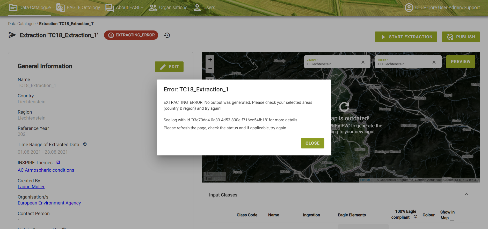{width="5.554351487314086in" height="2.6134186351706035in"}                                                                                                                                                                                                                                                         |
+-------------------+-------------------------------------------------------------------------------------------------------------------------------------------------------------------------------------------------------------------------------------------------------------------------------------------------------------------------------------------------------------------------------------------------------------------+
| Published         | If the Extraction is published, **it can be made available to other users.** The user has several possibilities to publish the Extraction. Depending on what kind of visibility (private, public or national) you have chosen, the Extraction will then be available to either all users (public), to all countries of the selected organisation (national), or only to users within your organisation (private). |
|                   |                                                                                                                                                                                                                                                                                                                                                                                                                   |
|                   | **Note: Once the Extraction is published, it cannot be changed anymore!**                                                                                                                                                                                                                                                                                                                                         |
+-------------------+-------------------------------------------------------------------------------------------------------------------------------------------------------------------------------------------------------------------------------------------------------------------------------------------------------------------------------------------------------------------------------------------------------------------+
| Archived          | The Extraction is archived and thus it is unpublished from the geoserver, which means it cannot be viewed in the preview anymore.                                                                                                                                                                                                                                                                                 |
+-------------------+-------------------------------------------------------------------------------------------------------------------------------------------------------------------------------------------------------------------------------------------------------------------------------------------------------------------------------------------------------------------------------------------------------------------+

: []{#_Ref153954038 .anchor}Table 4‑1: Status of Extraction datasets

## Add Extraction 

Clicking the '**Add Extraction'** button (section [4.2](#add-extraction)) opens the 'Add Extraction' dialog where you have to enter a name and define a country. Optional you can also enter a region. In the following example, an Extraction for the LULUCF case in the Netherlands will be done ([Figure 4‑2](#_Ref100140157)).

By clicking on 'ADD', you will be forwarded to the 'Edit Extraction' view ([Figure 4‑3](#_Ref153438205), section [4.3](#edit-extraction)). Further, a new entry in the Data Catalogue table was created with status 'Draft' ([Figure 4‑4](#_Ref100140139)).

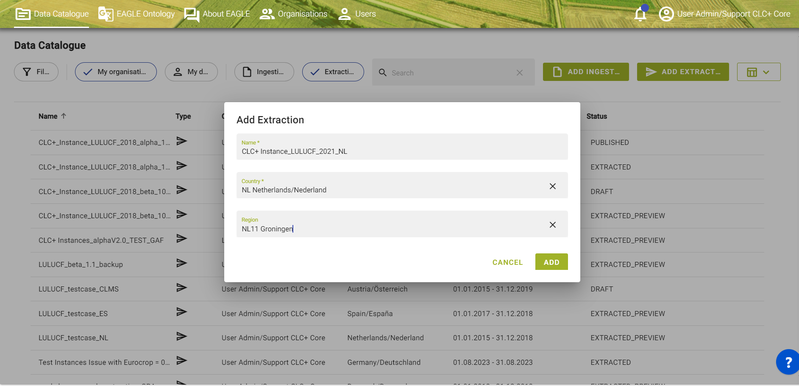{width="6.925in" height="3.3465277777777778in"}

[]{#_Ref153438205 .anchor}**Figure 4‑2: Add Extraction -- Add Extraction Dialog.**

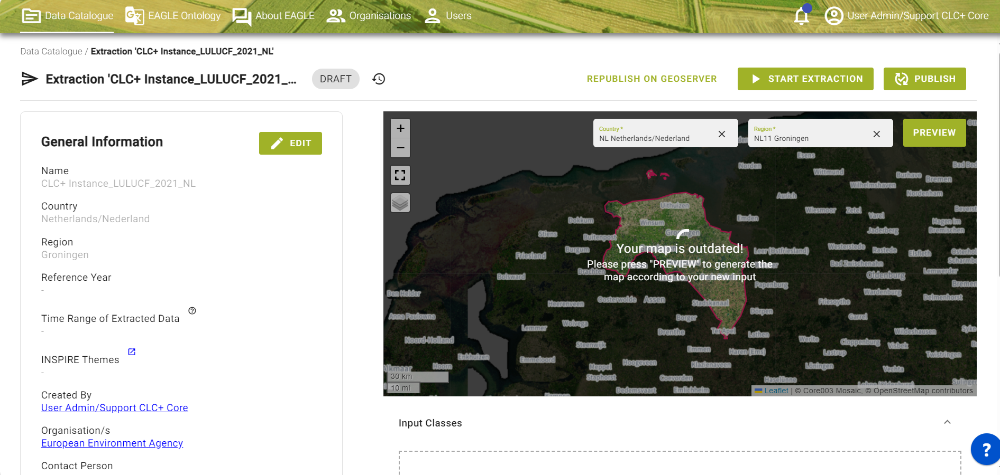{width="6.925in" height="3.2958333333333334in"}

[]{#_Ref100140157 .anchor}**Figure 4‑3: Add Extraction -- Edit Extraction View.**

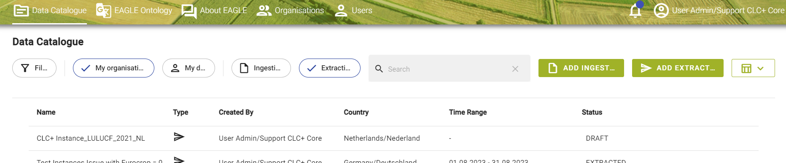{width="6.925in" height="1.4375in"}

[]{#_Ref100140139 .anchor}**Figure 4‑4: Add Extraction -- A new entry in the table was created with status 'draft'.**

## Edit Extraction

Before an Extraction can be published you need to set the Extraction settings, select the specific Input Classes and create Output Classes with the help of Extraction rules. To prevent mistakes, you can preview your results within a specific NUTS region in a Map Viewer. This view is very similar to the Edit Ingestion (section [3.7](#edit-ingestion)) one.

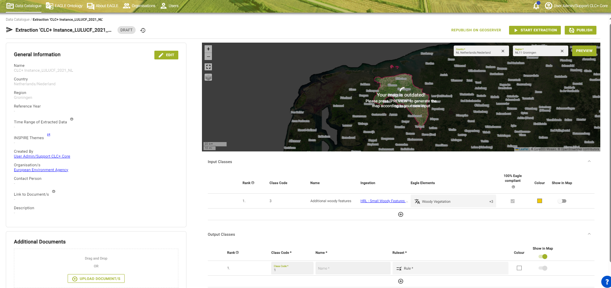{width="6.925in" height="3.2715277777777776in"}

[]{#_Ref153953950 .anchor}**Figure 4‑5: Edit Extraction.**

In the left section (**General Information**) (see [Figure 4‑5](#_Ref153953950) and [Figure 4‑6](#_Ref153953951)) you can review all Extraction settings and update them if necessary. Reference year, Time range and [INSPIRE Themes](https://inspire.ec.europa.eu/Themes/Data-Specifications/2892) are mandatory.

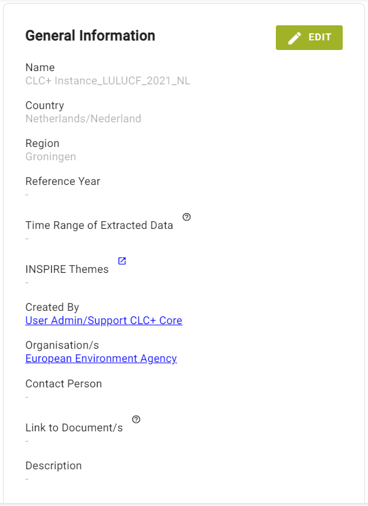{width="2.9580260279965005in" height="4.066681977252843in"} 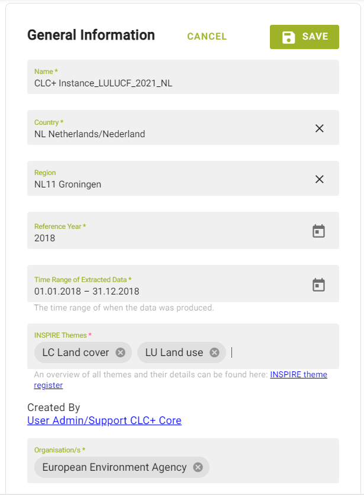{width="2.9644499125109363in" height="4.034543963254593in"}

[]{#_Ref153953951 .anchor}**Figure 4‑6: Edit Extraction - Review all Extraction settings and update them if necessary. Reference year, Time range and INSPIRE Themes are mandatory.**

Further, users are able to upload additional (already existing) datasets such as EAGLE matrix or style files (CLR, QML) or metadata information (txt, xml) ([Figure 4‑7](#_Ref153644917)).

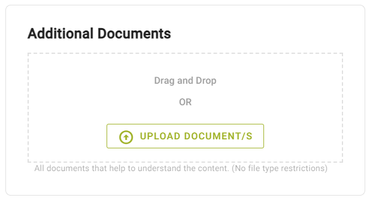{width="3.4574409448818897in" height="1.8518011811023622in"}

[]{#_Ref153644917 .anchor}**Figure 4‑7: Upload of additional datasets such as EAGLE matrix or style files.**

In the next step, you need to **define the Input Classes** you want to use for your Extraction. By clicking on the {width="0.16875in" height="0.16875in"} icon, in the area "**Input Classes**" you can **add Input Classes** which are already ingested into CLC+ Core (see [Figure 4‑8](#_Ref153954099)). The **"Select Input Classes"** menu opens and the dataset can be selected by checking the tick box. By clicking on the **"Confirm Selection"** button, the data will be taken into the Extraction view. Details about this step can be found at section [4.4 Add Input Classes to Extraction](#add-input-classes-to-extraction).

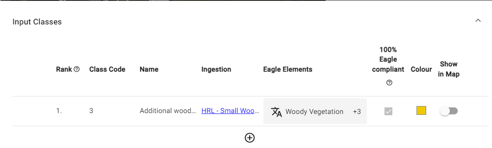{width="6.1026388888888885in" height="1.69875in"}

[]{#_Ref153954099 .anchor}**Figure 4‑8: Add or delete Input Classes.**

As a next step you need to create Output Classes and define Class Conditions for them. Creating new Output Classes is possible by clicking on in the {width="0.16875in" height="0.16875in"} icon in the area "**Output Classes**" (see [Figure 4‑9](#_Ref105168124)). Once you have triggered this action, a new and Output Class will be added and you have to define the specific attributes such as the class code, name and the Class Condition (ruleset) ([Figure 4‑9](#_Ref105168124)). Further, you can specify a class colour and if you want to have this Extraction displayed in the Map preview or not. The class code is the value you assign to an Output Class, the name should be class descriptive (i.e. class 1 -- woodland stands, 2 -- unmanaged woodland, etc.).

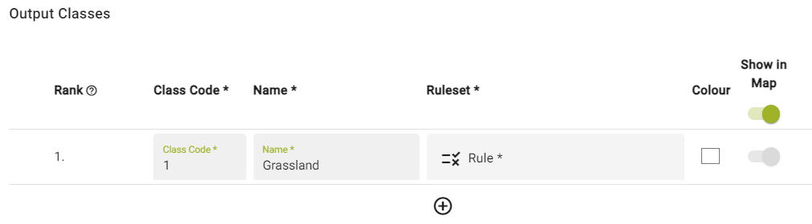{width="6.355581802274716in" height="1.7584284776902888in"}

[]{#_Ref105168124 .anchor}**Figure 4‑9: Add or delete Output Classes.**

Once you have defined the specific attributes for the Output Classes, you need to **add Class Conditions** to the Output Classes. You can do that by clicking directly on the Class Condition (Rule) field at each Output Classes row ([Figure 4‑9](#_Ref105168124)). Details about how to create Class Conditions can be found at section [4.5.1](#some-definitions-for-a-better-understanding-also-see-glossary).

Optionally, create a preliminary view of the Extraction by selecting a certain NUTS region in the map and clicking the "**Preview**" button (see [Figure 4‑10](#_Ref153954681) and section [4.7](#preview-extraction-and-download-result)). Further, you are able to download the result.

Once all settings and the test result have been reviewed you can start the Extraction process by clicking on the "**start Extraction**" button ([Figure 4‑5](#_Ref153953950) and [Figure 4‑11](#_Ref153651792)). Once the Extraction has already been processed, you can publish the Extraction to make it available for other users. See also at section **[4.8](#publish-extraction-and-download-result) [Publish Extraction](#publish-extraction-and-download-result)**. Further, you are able to download the result.

**After starting the Extraction, a pop-up window will appear asking if you really want to proceed as the Extraction may take a while. Further, it is indicating that EAGLE elements are used within the rules that are not corresponding to the available Input Classes. Please check if the correct EAGLE element and the correct barcode value is applied! The warning can be ignored but may affect the result!** (see [Figure 4‑10](#_Ref153954681)).

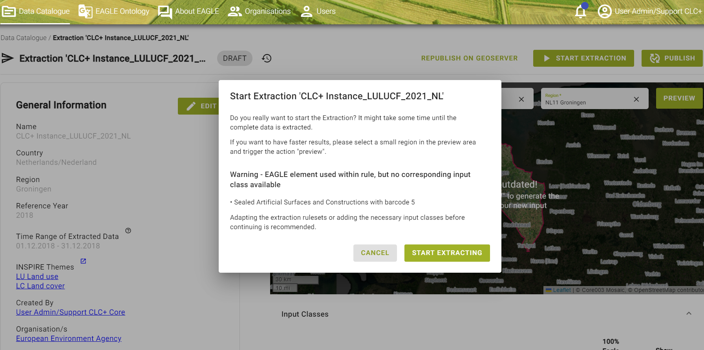{width="6.565197944006999in" height="3.266139545056868in"}

[]{#_Ref153954681 .anchor}**Figure 4‑10: Pop up window asking to proceed. Indicating that EAGLE elements are used within the rules that are not corresponding to the available Input Classes.**

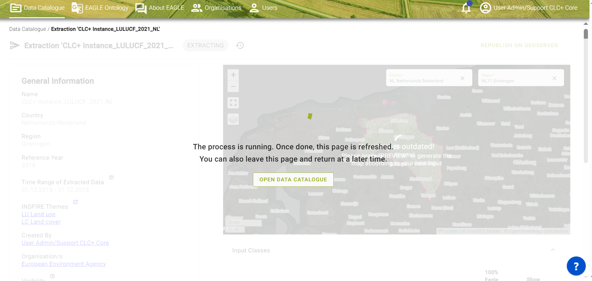{ width="6.925in" height="3.286111111111111in"}

[]{#_Ref153651792 .anchor}**Figure 4‑11: After starting the Extraction process.**

## Add Input Classes to Extraction

After you clicked on the {width="0.16875in" height="0.16875in"} icon within the area "**Input Classes**" the **"Select Input Classes"** menu opens. You can select which are already ingested into CLC+ Core and that you want to use for your Extraction by checking the tick box. You can multi-select (more than one possible) Input Classes and also see information about them within the table. Use the {width="0.4027777777777778in" height="0.17844597550306213in"} icon to add or remove columns for data information such as Name, Created at/by, Reference Year, EAGLE comliance, etc ([Figure 4‑12](#_Ref153650700)).

Additionally, you have the possibility to **search** for specific Input Classes using the search field and the filter panel. In the filter panel ([Figure 4‑13](#_Ref153649503)) you can sear for data matching your criteria. Further, there is an option to toggle on/off "100 EAGLE compliant" or "EAGLE approved". The list on the right is updated accordingly.

Further, you can reduce the list of data to data, ingested only by your or your organisation ([Figure 4‑12](#_Ref153650700)).

By hovering the mouse over the EAGLE elements column, a tooltip dialog opens, displaying all barcoded EAGLE elements for this Input Class ([Figure 4‑14](#_Ref153650770)). The EAGLE barcoding can be opened in a new tab to be inspected in more detail by clicking on the {width="0.1736111111111111in" height="0.1736111111111111in"} icon ([Figure 4‑15](#_Ref153650763)).

In the last step you click on the **"Confirm Selection"** button in order to apply them. The data will be taken into the Extraction view ([Figure 4‑12](#_Ref153650700)).

Back in the Extraction view, the selected data can be seen ([Figure 4‑16](#_Ref105172435)). By clicking on the {width="0.16875in" height="0.16875in"} icon at the end of the Input Classes, you are able to add more classes and of course you can delete classes from your current selection by clicking on the delete symbol ([Figure 4‑17](#_Ref105172428)). Same as in the "Select Input Classes" View, hovering your mouse over the EAGLE elements column, a tooltip dialog opens, displaying all barcoded EAGLE elements for this Input Class ([Figure 4‑17](#_Ref105172428)). The EAGLE barcoding can be opened in a new tab to be inspected in more detail by clicking on the {width="0.1736111111111111in" height="0.1736111111111111in"} icon.

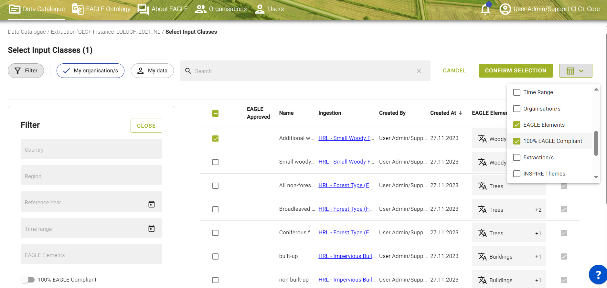{width="6.925in" height="3.285416666666667in"}

[]{#_Ref153650700 .anchor}**Figure 4‑12: Add Input Classes to Extraction -- selection of classes.**

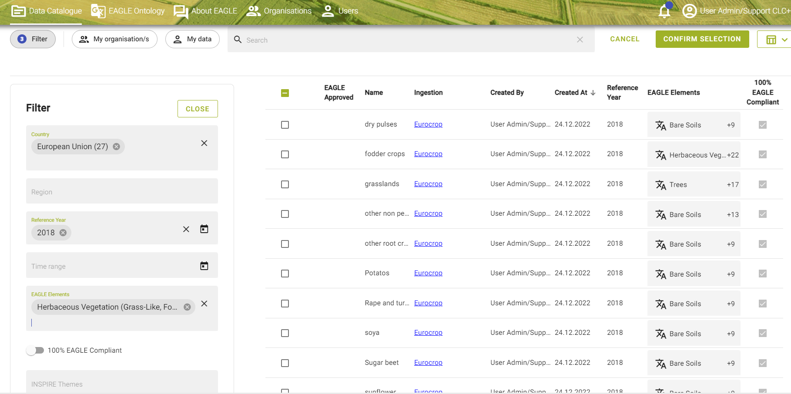{width="6.925in" height="3.451388888888889in"}

[]{#_Ref153649503 .anchor}**Figure 4‑13: Add Input Classes to Extraction -- filter panel.**

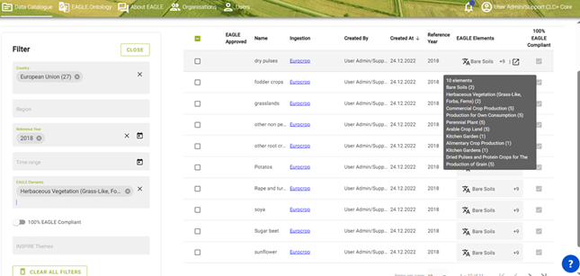{width="6.729166666666667in" height="3.2083333333333335in"}

[]{#_Ref153650770 .anchor}**Figure 4‑14: Add Input Classes to Extraction - EAGLE elements with tooltip dialog.**

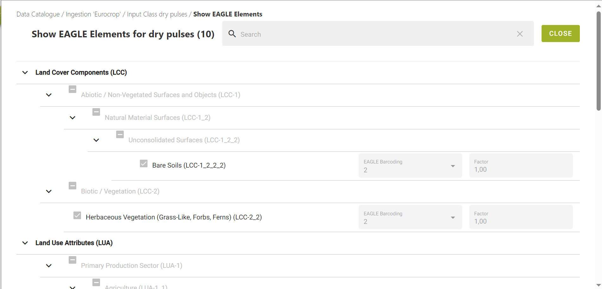{ width="6.925in" height="3.327777777777778in"}

[]{#_Ref153650763 .anchor}**Figure 4‑15: Add Input Classes to Extraction - EAGLE barcoding opened in new window (here for Input Class "dry pulses").**

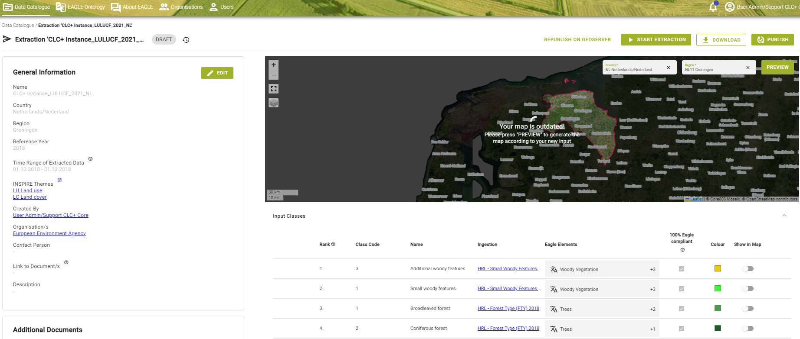{ width="6.925in" height="2.9402777777777778in"}

[]{#_Ref105172435 .anchor}**Figure 4‑16: Add Input Classes to Extraction -- back in Edit Extraction view with the newly added Input Classes.**

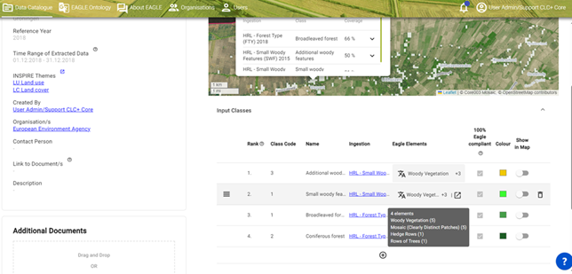{width="6.715277777777778in" height="3.2222222222222223in"}

[]{#_Ref105172428 .anchor}**Figure 4‑17: Add or delete Input Classes in the Extraction view and the EAGLE elements shown in the tooltip dialog.**

**The Input Classes are following a hierarchical processing (from first to last). But depending on the chosen Coverage Function, the order is more or less important. First coverage function i.e. examines the Input Classes from top to bottom until the first one is found that has a valid value. Using the highest cov function, the order of the Classes is not important.**

**There is also the possibility to change the order per 'Drag & Drop'.**

## Output Classes

An **Output Class** represent detailed information about one classification option of an Extraction (section [4](#extraction)). Together with the class code and the name, it also contains the Class Condition that specifies when the output class should be applied. Output Classes can be found within the specific Extraction itself but are not displayed separately within the Data Catalogue. Details about that can be found at section [4.3 Edit Extraction](#edit-extraction).

### Some definitions for a better understanding (also see [Glossary](#glossary))

A **Rule** is a textual format of the specified Extraction syntax and is displayed in the user interface as a structured expression. You can relate EAGLE elements to other EAGLE elements, values (numbers) or percentages, in order to define how a new Output Class should be created. In other words, a **Rule** is simple comparison of a **Coverage Function** against another coverage value. For example:

*The coverage of LCC-Water with barcode 5 must be greater than 50%. cov("LCC-Water", 5) \> 50*

A **Ruleset** is a combination of **Rules or Rulesets** using Boolean operators. Depending on the type of linking operator, the compound expression is only true if both linked expressions are true (AND-linkage) or if at least one of the linked expressions is true (OR-linkage). For example:

*The coverage of LCC-Water/5 or LCC-Trees/5 must be greater than 50%. cov("LCC-Water", 5) \> 50 **OR** cov("LCC-Trees", 5) \> 50*

The **Class Condition** specifies whether the Extraction Output Class to which it belongs should be applied to a given pixel, given the coverage values of Extraction Input Classes. Technically speaking, a Class Condition is a Ruleset.

**Note: Currently it is not possible to save the rulesets outside of the CLC+ Core System to reuse them for other Extractions. There is a workaround, you can copy the rules (CTRL+C) from an existing rule and paste it into another Extraction rule (CTRL+V) by using the text-field for Extraction rules.**

### Create Output Classes

After you clicked on the {width="0.16875in" height="0.16875in"} icon within the area "**Output Classes**" a new entry will be added. First, you have to define a name (here: FL Transitional woodland) and Rule Class Code (here: 1) for the new Output Class. The Class Code is automatically filled by the system, starting at 1, but could be adapted to your needs ([Figure 4‑18](#_Ref153806764)).

The Output Classes are ranked according to their order. So, it is following hierarchical processing (from first to last). That means that the CLC+ Core System always favours the classes with a smaller order number. If a pixel is then assigned to an Output Class, it cannot be assigned to another class even if the coverage for this other class is higher. There is also the possibility to change the order of the Output Classes by Drag & Drop.

Furthermore, you can select a colour for your Output Class. And toggle the visibility of this Output Class in the map. **Checking the eye icon disables this Output Class from being extracted** ([Figure 4‑18](#_Ref153806764)).

Same as for the Input Classes, you are able to add further Output Classes or delete the entry ([Figure 4‑18](#_Ref153806764)).

After you have clicked on the Class Condition of a specific Output Class ([Figure 4‑18](#_Ref153806764)), a new window opens (Query Builder, [Figure 4‑19](#_Ref153808348)) and you can start creating or editing it (see section [4.5.3 Create Class Conditions/Rulesets](#create-class-conditionsrulesets)).

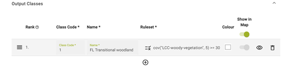{width="6.228293963254593in" height="1.449423665791776in"}

[]{#_Ref153806764 .anchor}**Figure 4‑18: Create new Output Class and other options.**

### Create Class Conditions/Rulesets

[Figure 4‑19](#_Ref153808348) shows an overview of the Query Builder with all its options and functions which are explained in more details in this section.

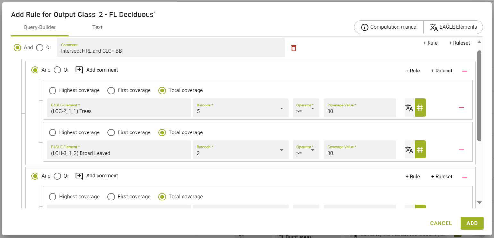{width="6.925in" height="3.3368055555555554in"}

[]{#_Ref153808348 .anchor}**Figure 4‑19: Query Builder with all its options and functions.**

Starting with a blank **Query Builder**, you are able to build up the Class Condition by using single **Rules** or **Rulesets** (nested set of rules). To decide between **Rule** and **Ruleset** you need to know how the EAGLE elements you need for the **Extraction** relate to each other. The relation is defined by **logical expressions (Boolean).** **Depending on the type of linking operator, the compound expression is only true, if both linked expressions are true (AND-linkage) or if at least one of the linked expressions is true (OR-linkage).** You can add as many **Rules** or **Rulesets** as needed. Of course, you can also delete previously created Rule(sets).

So, in a first step decide on the structure you need and add Rules or Rulesets according to your requirements as can be seen in [Figure 4‑20](#_Ref153873991). If you add a Ruleset, you need to add Rules to it.

Example: For the Extraction of the deciduous forest class, I add two Rulesets, one with two and one with three Rules, connected via an AND operator. I want to make sure to only extract pixel that are covered in all datasets ([Figure 4‑21](#_Ref153875245)). Once I have the structure, I can start with entering the content.

Of course, there is the possibility to delete Rules or Rulesets.

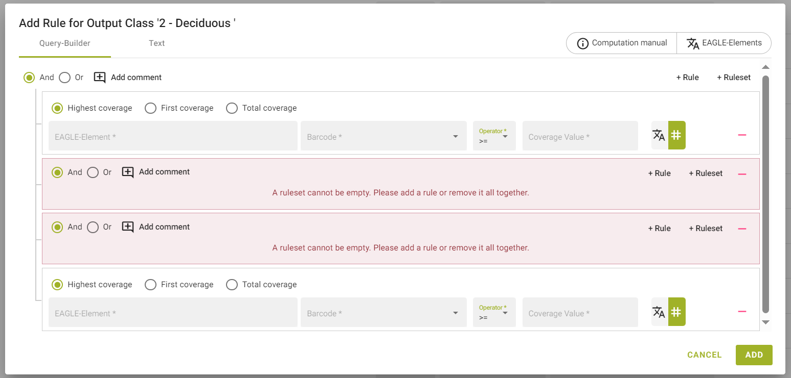{width="6.484667541557306in" height="3.1480424321959757in"}

[]{#_Ref153873991 .anchor}**Figure 4‑20: Create new Rule for an Output Class -- Query Builder**

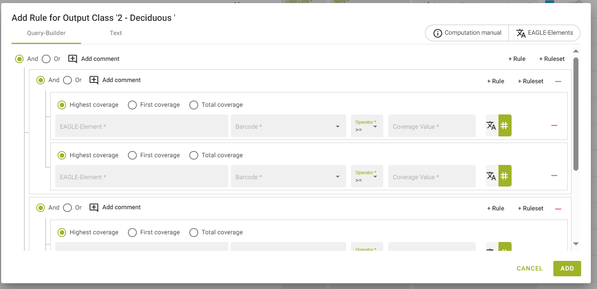{width="6.562167541557305in" height="3.1435487751531057in"}

[]{#_Ref153875245 .anchor}**Figure 4‑21: Create new Class Condition for Output Class "Deciduous Forest".**

In the next steps, select the required EAGLE elements from the Query Builder ([Figure 4‑22](#_Ref153876094)). The prefered option is to select elements from the drop down menu but you can also write in the text box.

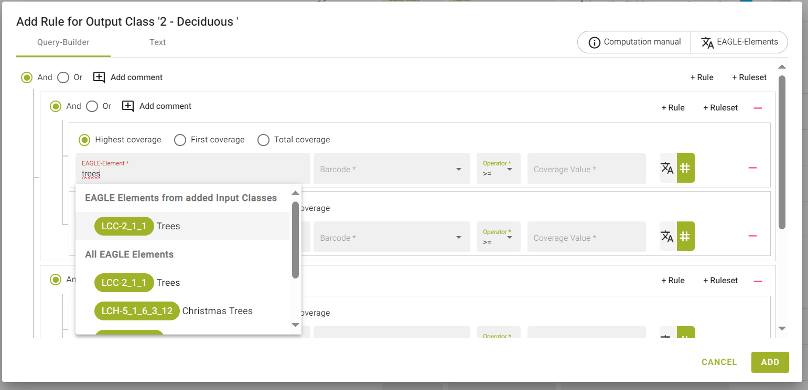{width="6.533227252843394in" height="3.158512685914261in"}

[]{#_Ref153876094 .anchor}**Figure 4‑22: Select EAGLE elements in the Query Builder.**

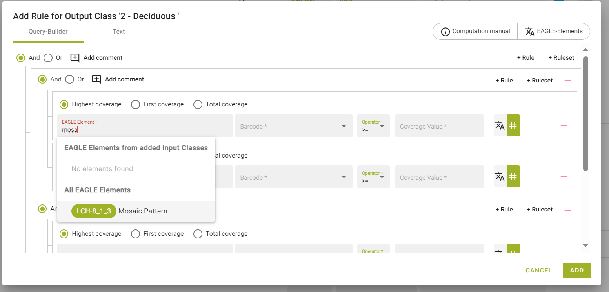{width="6.580074365704287in" height="3.1653248031496064in"}

[]{#_Ref153881096 .anchor}**Figure 4‑23: Select EAGLE elements in the Query Builder. Information that LCH-8_1_3 is in the list of EAGLE elements but does not occur in one of the Input Classes.**

Next, select the barcode value from a drop-down list. There is also the option to multiselect barcode values to cover more than one Input Class having different barcodes mapped ([Figure 4‑24](#_Ref153876076)).

**Multi-selected barcodes are OR-connected. That means, that a rule with multiple barcodes can be written as well as an OR-connected ruleset containing an individual rule for each of the barcodes. The multi-selection is only possible if an EAGLE Element is compared to a value but not if two EAGLE Elements are compared (icon-toggle on the right).**

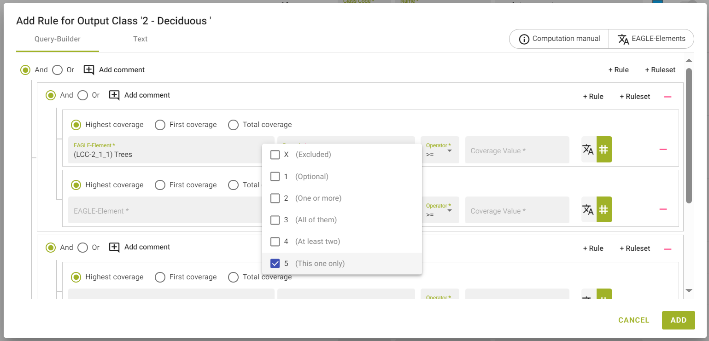{width="6.580279965004374in" height="3.1680621172353454in"}

[]{#_Ref153876076 .anchor}**Figure 4‑24: Select the barcode value from a drop-down list in the Query Builder.**

Then the comparison operators need to be selected from a drop-down list ([Figure 4‑25](#_Ref153876064)).

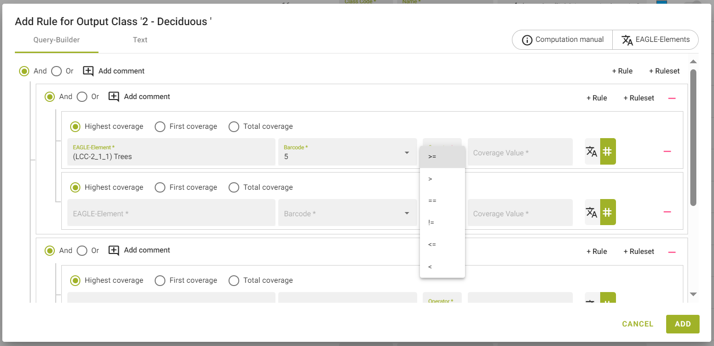{width="6.5305369641294835in" height="3.1611417322834647in"}

[]{#_Ref153876064 .anchor}**Figure 4‑25: Select the comparison operators in the Query Builder.**

The last step is setting the percentage coverage of the aggregated value.

**Note: Aggregated means that for the i.e. 100 underlying 10 m pixel values the arithmetic mean is calculated. As a consequence, several thematic classes share one 100 m pixel and the coverage value indicates the percentage of a pixel's area that is covered by a barcoded EAGLE element. In an Extraction, this pixel is assigned to a single class by evaluating the Class Conditions of all Output Classes until one is found whose ruleset matches.**

Subsequently, add other EAGLE elements to complete the Ruleset. Clicking on "**ADD**" will save the Class Condition (see [Figure 4‑26](#_Ref153876041)).

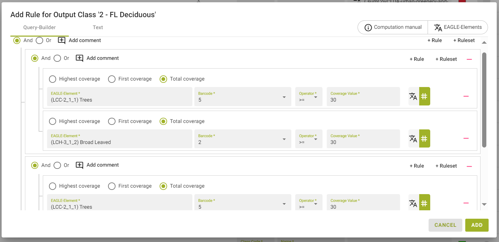{width="6.5090485564304466in" height="3.1657524059492563in"}

[]{#_Ref153876041 .anchor}**Figure 4‑26: Class Condition for Output Class "Deciduous Forest" set up in the Query Builder.**

You also have the option to add comments to your Class Conditions (see [Figure 4‑27](#_Ref153958528)). Especially, if the Rulesets are getting more complex, the commenting function might be very helpful. You can use it to document your intentions because due to the usage of the EAGLE elements, the connection to the Ingestions and/or Input Classes gets lost or difficult to keep track. There is of course also the possibility to delete the comments.

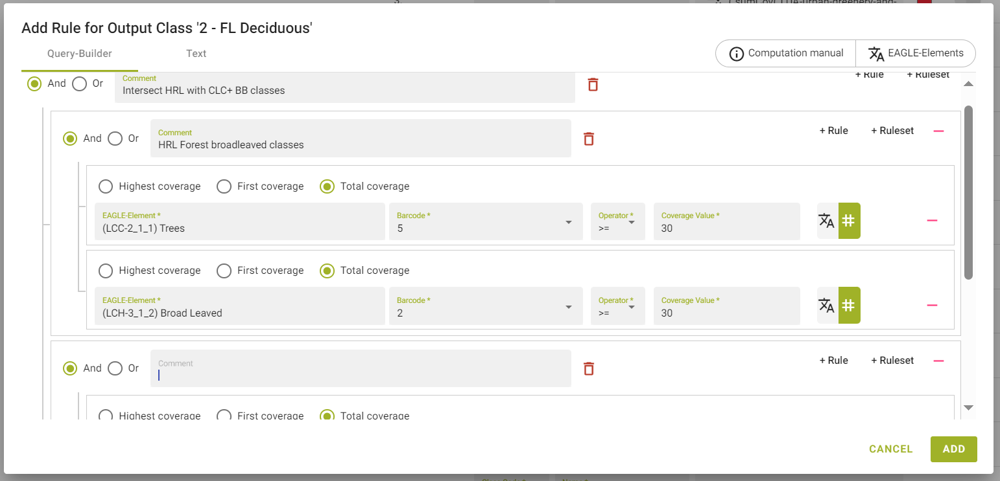{width="6.506107830271216in" height="3.1349628171478567in"}

[]{#_Ref153958528 .anchor}**Figure 4‑27: Add comments to the Rulesets.**

If you are familiar with query language, you are also able to use the "Text field". In [Figure 4‑28](#_Ref105174879), you can see the Class Condition and its rules in an **expression language** in the Text tab. If you have added a comment, this is also shown here. If you want to reuse a created Class Condition or parts of it in a different class, copy the respective text and paste it in a different Output Classes Class Condition text editor.

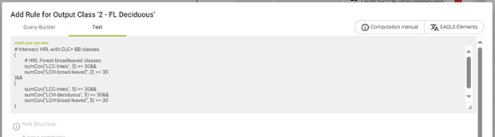{width="6.461420603674541in" height="1.7926017060367454in"}

[]{#_Ref105174879 .anchor}**Figure 4‑28: Class Condition in expression language.**

Further, there are two information boxes at the top right. By clicking on "Computational Manual", a window next to the Query Builder appears ([Figure 4‑29](#_Ref153880313)). It explains how the Extraction result is computes by explaining the details about which Input Classes' coverages are considered during the calculation of Coverage Functions. In section [4.6](#how-is-the-extraction-result-computed), the whole process and the single Coverage Functions are described in more detail.

You need to select either of the three options which might fit best to your requirements. Highest Coverage is the default and is recommended.

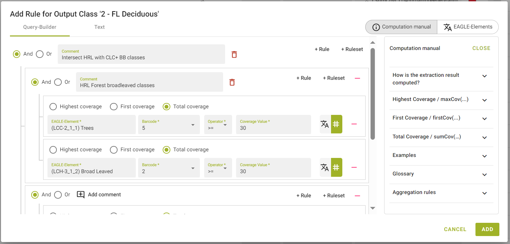{width="6.565692257217847in" height="3.150505249343832in"}

[]{#_Ref153880313 .anchor}**Figure 4‑29: Computational Manual.**

## How is the extraction result computed?

Each pixel of the output raster is assigned to the first output class whose **Class Condition** is fulfilled. If none of the class conditions are fulfilled for a given pixel, it remains unclassified (i.e. its value is *No-Data)*. This computation is done independently for each pixel, which means that a pixel is never influenced by its neighbors.

**Class Conditions** consist at the core of **Rules,** which perform a comparison of the **Coverage** value of a barcoded EAGLE elements against a threshold. The coverage value of a barcoded EAGLE element is computed with a **Coverage Function.** This computation works by:

1.  Selecting the **Input Classes** that were explicitly mapped with the given EAGLE element and barcode during the ingestion process or that are mapped with a direct child in the EAGLE ontology (aggregation rule 5),

2.  Further restricting this selection based on the type of **Coverage Function** (aggregation rule 3)

3.  Calculating the **Coverage** sum of all selected **Input Classes** (aggregation rule 2).

You can choose between three types of **Coverage Function** in your rules. They differ only in which of the matching input classes are chosen and aggregated (i.e. step 2). The selection of matching input classes (step 1) and the final aggregation (step 3) are always the same. In the following the different **Coverage Functions** are described in more detail:

**Highest Coverage / maxCov(\...)**

This function groups the matching **Input Classes** by **Ingestion**, selects the group that has the highest **Coverage** sum for the current pixel, and returns that coverage sum. If no **Input Class** has a value, the result is NO DATA.

This choice of **Coverage Function** makes sense if you want to know whether at least one of your chosen **Ingestions** reaches a given minimum **Coverage** for a certain EAGLE-element-barcode-combination.

**First Coverage / firstCov(\...)**

This function examines the **Input Classes** from top to bottom until the first one is found that has a value (not *NO DATA*) for the current pixel. It selects this class and all the other matching **Input Classes** of the same **Ingestion** and returns their sum of **Coverages**. If none of the classes have a value, it returns *NO DATA*.

For this function the ordering of **Input Classes** is relevant for the result, so make sure that they are sorted by their priority.

This choice of **Coverage Function** makes sense when aggregating datasets that describe the same features but have different quality and spatial extent. The first **Coverage Function** allows you to prioritize the high-quality **Ingestion** wherever it's available and fall back to the low-quality one otherwise.

**Total Coverage / sumCov(...)**

This function selects all the matching **Input Classes** independent of which **Ingestion** they belong to and returns their coverage sum, or NO-DATA if none of them has a value.

This choice of **Coverage Function** can make sense if you need to sum up coverages of **Input Classes** that belong to different Ingestions, which is not possible with the two other function types. However, sumCov comes with the risk of producing **Coverage** values bigger than a hundred percent if Input Classes are summed up which are not semantically disjunct.

**Examples**

Consider the following ranked **Input Classes** that have a matching EAGLE barcoding of LCC-Water with barcode 5.

  ------------------------------------------------------------------------------
  **Extraction Input Class**   **Ingestion**   **Mapping**         **Value**
  ---------------------------- --------------- ------------------- -------------
  **A1**                       **A**           **LCC-Water / 5**   **NO-DATA**

  B1                           B               LCC-Trees / 5       80 %

  **B2**                       **B**           **LCC-Water / 5**   **15 %**

  **B3**                       **B**           **LCC-Water / 5**   **5 %**

  **C1**                       **C**           **LCC-Water / 5**   **40%**

  C2                           C               LCC-Trees / 5       60 %
  ------------------------------------------------------------------------------

Assume a rule that checks that the coverage value of *LCC-Water* with Barcode 5 is greater or equals 50. Let's look at the results of the different **Coverage Functions** in this case:

- **maxCov("LCC-Water", 5)** returns the highest coverage sum of matching **Input Classes** within any **Ingestion**, which is in this case the **Coverage** of C1 (40%). That's smaller than 50 % so the rule is *false*.

- **firstCov("LCC-Water", 5)** looks for the first matching **Input Class** with a value (B2) and returns all the matching classes of that **Ingestion** (B2 + B3 = 20%). 20 % is smaller than 50 %, so the rule is *false*.

- **sumCov("LCC-Water", 5)** returns the **Coverage** sum of all matching **Input Classes** independent of which **Ingestion** they belong to (B2 + B3 + C1 = 60%). That's bigger than 50 %, so the rule is *true.*

Using the EAGLE elements information box will list all the relevant EAGLE elements and show the Input Classes, Ingestions and the barcode value ([Figure 4‑30](#_Ref153880277)). So, in this example: EAGLE element "Trees" with barcode 5 is included in the following Information: i.e. Broadleaved class from DLT 2018, broadleaved, deciduous trees from CLC+ BB 2018, etc. By clicking on the Ingestion link, you will be transferred to the Ingestion view of this dataset.

This will help users to avoid errors and get a better overview and understanding of the used EAGLE elements.

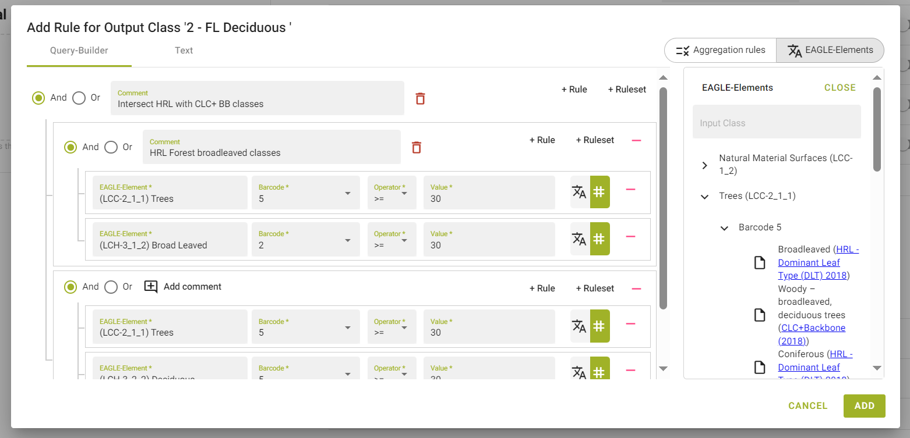{width="6.520193569553806in" height="3.1430577427821524in"}

[]{#_Ref153880277 .anchor}**Figure 4‑30: EAGLE elements.**

[Table 0‑5](#_Ref105175205) in the Annex shows as an example of LC category "Forest" with its sublevels and the applied rulesets.

## Preview Extraction and download result

Analog to the Ingestion section, you can run a preview of your Extraction for a small extent by clicking **Preview** in the Map Viewer. By doing so, your Extraction result can be visually inspected in the map. If the preview was successful and the result satisfying, continue with 'Start Extraction' to apply the ruleset for the full extent ([Figure 4‑31](#_Ref153652241)).

By inspecting the data in the map and clicking on the classification/pixel, a tooltip dialog opens. Under Output Class the assigned Output Class (here Grassland) is indicated ([Figure 4‑31](#_Ref153652241)). By clicking on the Output Class in the window the Class unfolds and the result of all the rules of the selected output class is shown. Here you find the information which rule was true and which rules was false and the reason why ([Figure 4‑32](#_Ref153972958)). By checking the show all box, all Output Classes are shown, even the ones that have been ignored because a True condition was found ([Figure 4‑32](#_Ref153972958)).

The used Input Classes in the section below ([Figure 4‑31](#_Ref153652241)). Further, the coverage of each individual class is shown. By clicking on the Input Class in the window the Class unfolds and further information is shown in [Figure 4‑32](#_Ref153972958). Per default, all Input Classes covering 0% are not shown but this feature can be enabled by checking the tick box.

Further, you can **download** the dataset (geotiff) and the metadata (geojson) to be able to inspect and validate your data in more detail in a GIS program on your local computer ([Figure 4‑31](#_Ref153652241)).

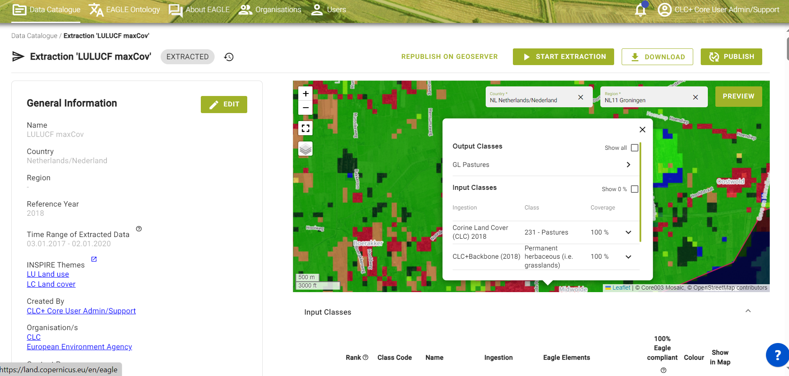{width="6.504597550306212in" height="3.1074912510936135in"}

[]{#_Ref153652241 .anchor}**Figure 4‑31: Preview Extraction and download result.**

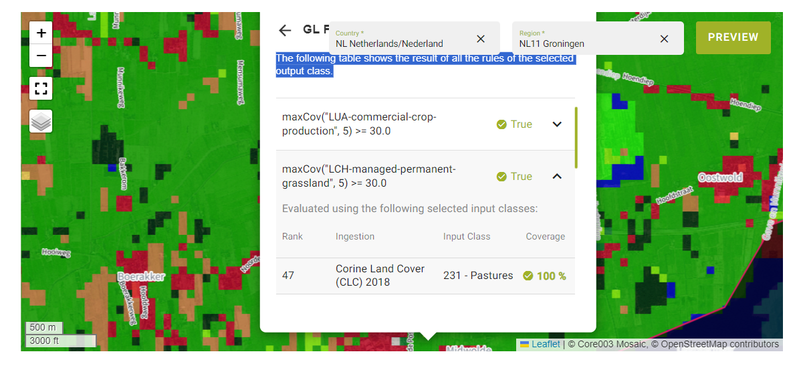{width="6.247557961504812in" height="2.868162729658793in"}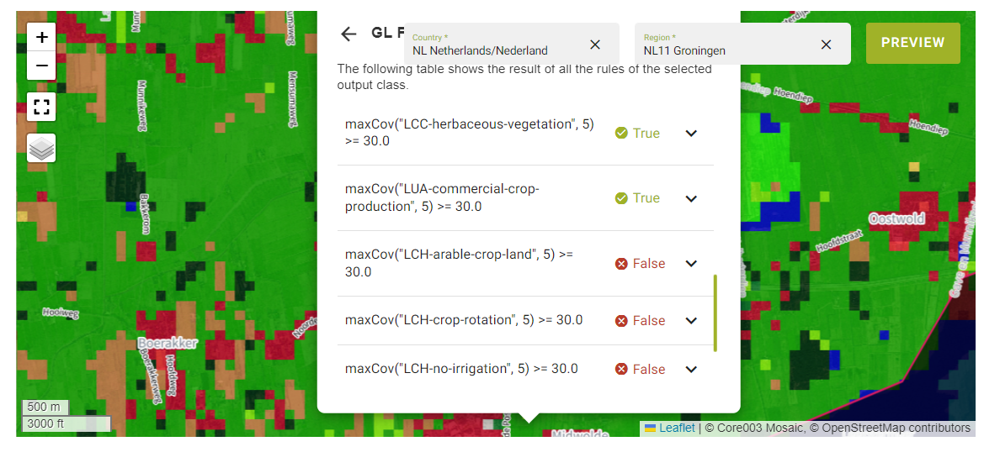{width="6.318649387576553in" height="2.8615146544181975in"}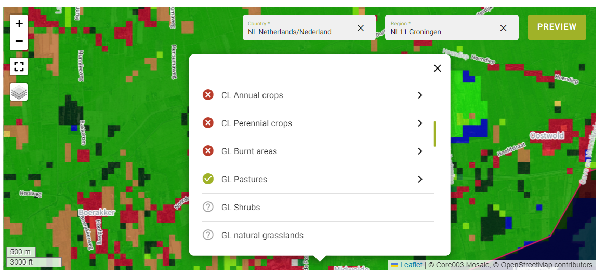{width="6.576442475940508in" height="3.0006824146981628in"}[]{#_Ref153972958 .anchor}

**Figure 4‑32: Output Class extraction information.**

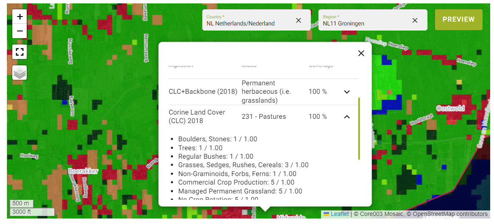{width="6.636077209098863in" height="3.007263779527559in"}[]{#_Ref153972533 .anchor}

**Figure 4‑33: Input Class extraction information.**

## Publish Extraction and download result

You can publish an Extraction by clicking on the '**publish**' button in the detail view. Similar to the IngestionI, you can choose the Visibility of your Extraction (public/private/national) ([Figure 4‑34](#_Ref153652068)).

Further, you can download the dataset (geotiff) and the metadata (geojson) to be able to inspect your data in more detail in a GIS program on your local computer ([Figure 4‑34](#_Ref153652068)).

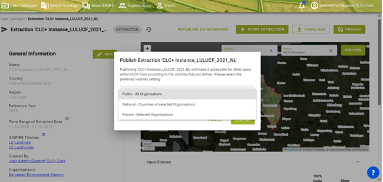{width="6.779166666666667in" height="3.2291666666666665in"}

[]{#_Ref153652068 .anchor}**Figure 4‑34: Publish Extraction and download result.**

## Reuse Extraction

Further, you can **reuse** an Extraction. By right clicking on the Extraction in the Data Catalogue, a small window with several options opens (see [Figure 4‑35](#_Ref153652480)). Here, the Add Extraction dialog opens again, with all the fields containing the previous information entered such as name, country, region (see [Figure 4‑36](#_Ref153652678)). This is only true, if the user does share the same organisation with the entry or is a USER_ADMIN. Otherwise, the entry will either way is not visible to the user.

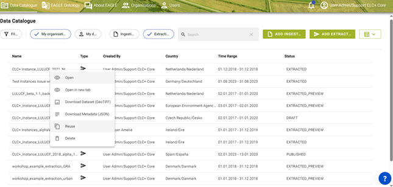{width="6.729166666666667in" height="3.201388888888889in"}

[]{#_Ref153652480 .anchor}**Figure 4‑35: Reuse Extraction.**

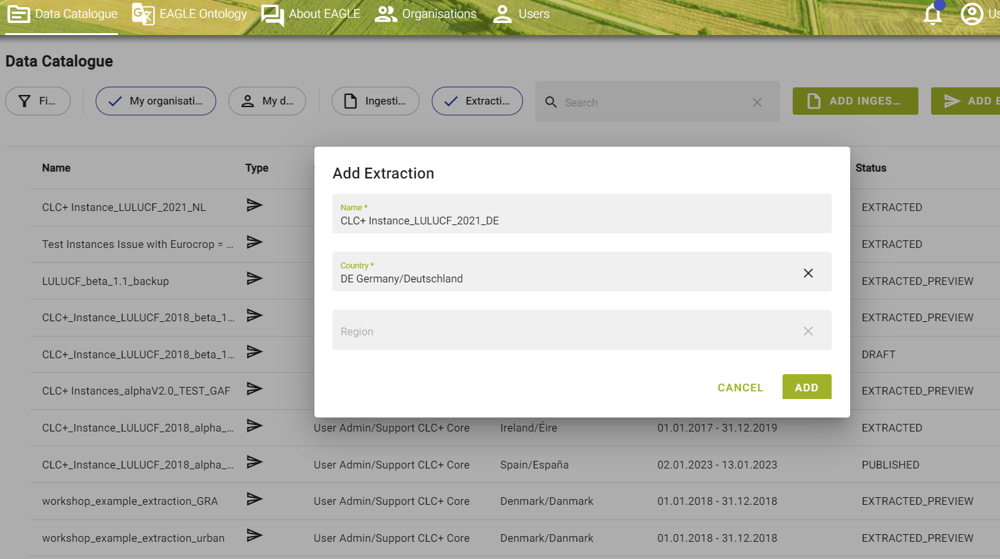{width="6.925in" height="3.872916666666667in"}

[]{#_Ref153652678 .anchor}**Figure 4‑36: Reuse Extraction -- detailed view.**

## Delete Extraction

Further, you can **delete** an Extraction. By right clicking on the Extraction in the Data Catalogue, a small window with several options opens (see [Figure 4‑35](#_Ref153652480)). By clicking on "**Delete**", a pop-up window prevents you from accidentally deleting a dataset (see [Figure 4‑37](#_Ref153956701)). By clicking Delete in the window, the dataset will be ultimately removed from the data catalogue. This is only true, if the user does share the same organisation with the entry or is a USER_ADMIN. Otherwise, the entry will either way is not visible to the user.

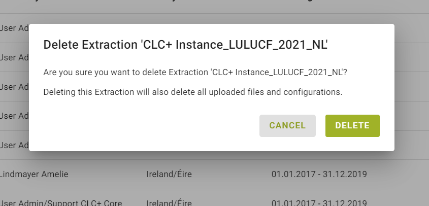{width="2.9652777777777777in" height="1.4246533245844268in"}

[]{#_Ref153956701 .anchor}**Figure 4‑37: Delete Extraction**

## Recommendations and lessons learned

Since the creation of the rulesets is a very complex task that must be carried out with great attention and precision, it is advisable to add each rule individually, then execute it and examine the result in a GIS program. Especially when creating the Extraction rules (wrong barcode value or wrong logical operator) an error can occur very quickly and debugging in the CLC+ Core System is sometimes difficult. Please consider that that step will take quite some time. With the implementation of the new map pop up described in section [4.7](#preview-extraction-and-download-result) it becomes easier for the user to debug and find out why a certain Output Class are extracted like that a s all the background information why a Class Condition was applied or not becomes visible in the map pop up.

Furthermore, it should be noted that due to some additional rules/Aggregation rules (see Annex) implemented in the system, the creation of Extraction rules and understanding their output is further complicated.

# FAQ (Frequently Asked Questions) 

In this section you can find the most frequently asked questions about CLC+ Core. Of course, this section will be extended on demand.

**Where can I find more information about CLMS products?**

In general, you can find more about CLMS products on EEAs official homepage <https://land.copernicus.eu/>.

**Where can I find more information About EAGLE?**

Within CLC+ Core we have directly linked the EAGLE homepage in our Navigation Menu at "About EAGLE" (see also section 9 - About EAGLE within this documentation). There you can find additional material About EAGLE. There is also a FAQ section and the possibility to get in touch with the EAGLE group.

**Where can I download the latest EAGLE barcoding template?**

You can download the matrix under menu item "EAGLE ontology" and then click on "Download barcoding template"

**Can I find word definitions of CLC+ Core System?**

Yes, you can find them in the [Glossary](#glossary).

**Where do I get user credentials for using the system?**

If you do not have an EIONET account yet, please contact the [Eionet Helpdesk](https://www.eionet.europa.eu/about/helpdesk?msclkid=265000d2aa8b11ec89be0ad26fcd73b0) and create one.

**What to do if my Ingestion / Extraction fails?**

a.  If ingesting a vector file, please check if the correct attribute value is selected

b.  Check if the provided upload link is valid. It is valid if a file download is automatically started immediately after clicking on the link. If not, the download link might be expired (i.e. CLMS links expire after 24h)

c.  Retry or delete Ingestion

d.  Contact the [CLC+ Core support team](https://clcplus-core.land.copernicus.eu/) (us the help function '?' on the webpage or <clcplus-core-support@cloudflight.support>)

**Is it possible to upload data from my local premises?**

Yes, you are able to upload your locally stored data but due to performance issues, especially for large datasets, it is recommended to upload the data using an URL.

**What if my dataset has more than \>100 classes -- do I need to perform the EAGLE barcoding for all classes?**

In general yes, you need to map all classes if you want to use them within the system. But you could consider the possibility to re-structure / aggregate your classes to a less detailed level before uploading them to the system.

**Will my dataset automatically be reprojected, rasterized (for vector datasets) and aggregated to 100 m or do I have to pre-process anything?**

No, everything will be performed automatically.

**Can I always make changes to my ingested dataset?**

Most of the times - yes. However, if your dataset is published and used, no more changes can be made while in use (by you or another user).

**How can I prevent my data from being seen by all users?**

Depending on what kind of visibility (private or public) you have chosen, the ingested data will then be available to either all users (public), to the country of the selected organisation (national), or only to users within your organisation (private). So, to prevent your data to be seen by others choose the private option.

**I uploaded an ArcGIS Layer (.lyr) file for the symbology of my vector dataset but it is not working?**

The CLC+ Core system only recognizes and supports the following legend/symbology files: QGIS layer style file (.qml) or SLD (Styled Layer Descriptor) file (.sld). Text files and ArcGIS Layer Files (.lyr) are not supported.

**Which raster and vector file formats are supported by CLC+ Core to ingest data?**

- shapefile (shp as zip)

- geopackage (gpkg)

- file geodatabases (gdb)

- Hierarchical Data Format (HDF5)

- Geotiff (tif/tiff)

**What if there is a new version of the EAGLE barcoding file, is it necessary to update all my datasets? And what if an Extraction was already used?**

If the new version of the EAGLE barcoding file only contains new EAGLE elements or has some updates on existing ones, no Extractions need to be update (unless you want to also add the newly created EAGLE elements in you EAGLE mapping).

If EAGLE elements do no longer exist in the newer version of the EAGLE barcoding file, please check all your Ingestions and Extractions which are not published yet. For these Ingestions and Extractions please update the EAGLE barcoding.

For all published Ingestions and Extractions, the EAGLE barcoding cannot be changed anymore.

**I have trouble with the EAGLE mapping of my dataset, where can I get support?**

Relevant contact details are provided in the portal.

# Admin User only - see separate Annex

# Glossary

**Ingestion**\
An Ingestion is the original input dataset uploaded to the CLC+ Core system. Each uploaded dataset gets resampled / aggregated to 100 x 100 m spatial resolution. Each Ingestion consists of one or more classes. These classes, so called **Input Classes** in CLC+ Core, can then be used as input for **Extractions**. CLC+ Core supports the following raster and vector file formats to ingest data: shapefile (shp as zip), geopackage (gpkg), file geodatabases (gdb), Hierarchical Data Format (HDF5) or Geotiff (tif/tiff).

**Extraction**\
An Extraction will create new and independent data products (100x100m raster) by combining data from several **Extraction Input Classes.** Every pixel of the raster is classified as one **Extraction Output Class**, based on its **Class Condition**, or remains unclassified, if none of the conditions apply.

**Extraction Input Class**\
Extraction Input classes are **Input classes** of **Ingestions** used in an **Extraction**. They are selected by the user from all published **Ingestions** in the CLC+ Core system. They need to be selected for each Extraction because they define the input data which is needed to evaluate the **Class Condition** of each **Extraction Output Class**.

**Coverage**\
The percentage of the area of a given pixel that an **Input Class** covers is called the coverage. Pixel values are not binary because the raw input data is reprojected to the EPSG:3035 coordinate reference system and resampled to a 100m x 100m pixel size if they are not given in this format already. Therefore, it can happen that multiple **Input Classes** from the same **Ingestion** apply to the same raster pixel, but don't cover the full extent of the pixel.

A coverage can also be *No-Data* if the whole area of the pixel is unclassified in the **Ingestion**.

**Extraction Output Class**\
Represents one classification option of an **Extraction**. It has a name, an identifying class code and a C**lass Condition** that specifies when the output class should be applied.

**Class Condition**\
Specifies whether the **Extraction Output Class** to which it belongs should be applied to a given pixel, given the **coverage** values of **Extraction Input Classes**. Technically speaking, a class condition is a **Ruleset** (consisting of nested **Rules** and **Rulesets).**

**Ruleset** \
A combination of **Rules** *or* **Rulesets** using Boolean operators[^10].boolean operators^1^. Depending on the type of linking operator, the compound expression is only true if both linked expressions are true (AND-linkage) or if at least one of the linked expressions is true (OR-linkage). Consequently, the result of a ruleset is also always *true* or *false.* For example:

> *The coverage of LCC-Water/5 or LCC-Trees/5 must be greater than 50%. \
> **cov("LCC-Water", 5) \> 50*** ***   OR*** ***  cov("LCC-Trees", 5) \> 50** *

The top-level ruleset of an output class is called the **Class Condition.** 

**Rule**\
A simple comparison of a **Coverage Function** (i.e. the coverage of a barcoded EAGLE element) against another coverage value. For example: 

> *The coverage of LCC-Water with barcode 5 must be greater than 50%. \
> **cov("LCC-Water", 5) \> 50** *

When evaluating a **rule** on a given pixel, the result is always either *true* or *false.* Comparing a *No-Data* value against any other value produces the result *false.*

**Coverage Function**\
A function that computes the **Coverage** of a barcoded EAGLE element for the selected **Extraction Input Classes** for a given pixel. This computation works by:

1.  Selecting the **Extraction Input Classes** that were explicitly mapped with the given EAGLE element and barcode during the Ingestion process or that are mapped with a direct child in the EAGLE ontology (aggregation rule 5),

2.  Further restricting this selection based on the type of Coverage Function (aggregation rule 3)

3.  Calculating the **Coverage** sum of all selected **Extraction Input Classes** (aggregation rule 2).

# List of abbreviations

  -------------------------------------------------------------------------------------------------------------------------------------------------------------------------------------------------------------------------------
  Abbreviation            Name                                                                                                 Reference
  ----------------------- ---------------------------------------------------------------------------------------------------- --------------------------------------------------------------------------------------------------
  **ADs**                 Applicable Documents                                                                                 

  **AI**                  Action Item                                                                                          

  **API**                 Application Programming Interface                                                                    

  **CLC**                 CORINE Land Cover                                                                                    <https://land.copernicus.eu/en/products/corine-land-cover>

  **CLC+**                CORINE Land Cover +                                                                                  <https://land.copernicus.eu/en/products/clc-a-new-generation-land-information-system-for-europe>

  **CLMS**                Copernicus Land Monitoring Service                                                                   <https://land.copernicus.eu/en>

  **COG**                 Cloud-optimized GIF                                                                                  

  **CORINE**              Coordination of information on the environment                                                       

  **CZ**                  Coastal Zones                                                                                        

  **DB**                  Database                                                                                             

  **DIAS**                Copernicus Data and Information Access Services                                                      

  **EAGLE**               Eionet Action Group on Land monitoring in Europe                                                     <https://land.copernicus.eu/en/eagle>

  **EC**                  European Commission                                                                                  <https://commission.europa.eu/>

  **EEA**                 European Environment Agency                                                                          <https://www.eea.europa.eu>

  **EEA39**               The 33 member and 6 cooperating countries of the EEA                                       

  **EEA38+UK**            The 32 member and 6 cooperating countries of the EEA + United Kingdom                      

  **EO**                  Earth Observation                                                                          

  **ESA**                 European Space Agency                                                                                <https://www.esa.int>

  **ETC**                 European Topic Centre                                                                                <https://www.eionet.europa.eu/etcs>

  **EU**                  European Union                                                                              

  **EU27**                The 27 Member States of the European Union                                                  

  **FM**                  Final Meeting                                                                                        

  **FWC**                 Framework Contract                                                                                   

  **GDAL**                Geospatial Data Abstraction Library                                                                  

  **GDB**                 Geodatabase                                                                                          

  **GIO**                 GMES Initial Operations                                                                              

  **GPKG**                GeoPackage                                                                                           

  **HDF5**                Hierarchical Data Format                                                                             

  **HRL / HRLs**          High Resolution Layer / High Resolution Layers                                                       

  **IaaS**                Infrastructure-as-a-Service                                                                          

  **ID**                  Identification Number                                                                                

  **INSPIRE**             Infrastructure for Spatial Information in Europe                                                     <https://knowledge-base.inspire.ec.europa.eu/index_en>

  **ISO**                 International Organisation for Standardization                                                       

  **ITT**                 Invitation to Tender                                                                                 

  **JDBC**                Java Database Connectivity                                                                           

  **JWT**                 JSON Web Token                                                                                       

  **KOM**                 Kick-Off Meeting                                                                                     

  **LC**                  Land Cover                                                                                           

  **LCC**                 Land Cover Component                                                                                 

  **LCH**                 Land Characteristics                                                                                 

  **LC/LU**               Land Cover / Land Use                                                                                

  **LCC**                 Land Cover Component                                                                                 

  **LU**                  Land Use                                                                                             

  **LUA**                 Land Use Attribute                                                                                   

  **LULUCF**              Land Use, Land Use Change and Forestry                                                               

  **LYR**                 ArcGIS Layer File                                                                                    

  **MMU**                 Minimum Mapping Unit                                                                                 

  **MS**                  Member States                                                                                        

  **NFRs**                Non-Functional-Requirements                                                                          

  **NRC**                 National Reference Centre                                                                            

  **NUTS**                Nomenclature of Territorial Units for Statistics                                                     

  **N2K**                 Natura 2000                                                                                          

  **OBDC**                Open Database Connectivity                                                                           

  **PDF**                 Portable Document Format                                                                             

  **PM**                  Progress Meeting                                                                                     

  **PMP**                 Project Management Plan                                                                              

  **PoC**                 Proof of Concept                                                                                     

  **QA**                  Quality Assurance                                                                                    

  **QC**                  Quality Control                                                                                      

  **QM**                  Quality Management                                                                                   

  **QML**                 QGIS Style file                                                                                      

  **REST**                Representational State Transfer                                                                      

  **RZ**                  Riparian Zones                                                                                       

  **SC**                  Specific Contract                                                                                    

  **SHP**                 ESRI Shapefile                                                                                       

  **SLD**                 Styled Layer Descriptor                                                                              

  **SQL**                 Structured Query Language                                                                            

  **UA**                  Urban Atlas                                                                                          

  **UI**                  User Interface                                                                                       

  **URI**                 Uniform Resource Identifier                                                                          

  **URL**                 Uniform Resource Locator                                                                             

  **UUID**                Universally Unique Identifier                                                                        

  **VM**                  Virtual Machine                                                                                      

  **WBS**                 Work Breakdown Structure                                                                             

  **WEkEO**               Copernicus DIAS reference service for environmental data, virtual environments for data processing   <https://www.wekeo.eu/>

  **WP**                  Work Package                                                                                         

  **ZIP**                 ZIP Format                                                                                           
  -------------------------------------------------------------------------------------------------------------------------------------------------------------------------------------------------------------------------------

# Annex

**Barcoding**

The 'barcoding' method is referring to the process of selecting and assigning a value to relevant LCC, LUA and LCH elements from the matrix to describe a class. The aim of bar-coding is to create a standardized and concise representation of the class using a sequence of numerical codes.

The EAGLE matrix elements initially have no specific bar code value (BCV) and are considered neutral. During the bar-coding exercise for a targeted class or landscape situation, these elements get assigned a certain BCV (Table 1) according to their importance and logic relationship within a given class definition. The resulting sequence of numerical codes assigned to the matrix elements serves as a descriptive summary of the class.

This bar-coding approach streamlines the process of representing complex information about different classes, making it easier to handle and to compare among them and with other classification systems. When working with the barcoding exercise, different classes require the EAGLE elements to take different roles, according to the targeted definitions. Similar class definitions should reflect in also similar barcoding results.[^11].

  ---------------------------------------------------------------------------------------------------------------------------------------------------------------------------------------------
   **Barcode Value**  **Definition**
  ------------------- -------------------------------------------------------------------------------------------------------------------------------------------------------------------------
           X          Element is excluded by definition

           1          An optional element, it can occur as typical but not necessarily as mandatory

           2          Selective mandatory element, EITHER-AND/OR logic, at least two or more of all elements with assigned BCV 2 must be present

           3          Cumulative mandatory element, AND-logic, all elements with assigned BCV 3 must be present

           4          Paired mandatory element, two of all elements with assigned BCV 4 must be present

           5          Exclusive mandatory element, NOTHING-BUT-logic, practically allows only the one element with assigned BCV 5 and excludes any other element from its parent matrix block
  ---------------------------------------------------------------------------------------------------------------------------------------------------------------------------------------------

  : []{#_Ref152071020 .anchor}Table 0‑1: List of Bar-code value meanings. The BCVs define the role of EAGLE elements to fulfil a given mapping rule, class definition or landscape situation.

**Aggregation Rules**

In the **current version of the CLC+ Core system**, for the creation of an Extraction, the **following rules** were applied:

1.  Apply the coverage of the Input Class multiplied by the specified factor to the specified barcoded EAGLE element.

2.  If there is more than one coverage information for a certain barcoded EAGLE element originating from different Input Classes of the same Ingestion the coverage values are added up.

3.  If there is more than one coverage information for a certain EAGLE element originating from different data sets, the result depends on the choice of Coverage Function:

    a.  For *maxCov* the highest coverage sum of matching Input Classes within any Ingestion in the list of inputs is chosen.

    b.  For *firstCov* the first matching Input Class in the list of inputs has priority - so the order of the Input Classes is relevant here. More important classes should be ranked first.

    c.  For *sumCov* the coverages of all matching Input Classes are summed up, even if they belong to different Ingestions.

4.  Coverage values do NOT propagate to child elements of the EAGLE hierarchy. If an Input Class maps to EAGLE "buildings" the system does not give any information about "Specific buildings".

5.  Coverage values are propagated to its parent elements by default.

6.  If several values must be combined (several contributions are coming from children) they are NOT added up if they originate from the same Input Class.

\

+----------------------+--------------------------------------------------------------+--------------------------+--------------------+-----------------+------------------------------------------+
| **Product Category** | **Product Name (long)**                                      | **Product Name (short)** | **Reference year** | **Data format** | **comments**                             |
+:=====================+:=============================================================+:=========================+:===================+:================+:=========================================+
| HRLs                                                                                                                                                                                             |
+----------------------+--------------------------------------------------------------+--------------------------+--------------------+-----------------+------------------------------------------+
| Imperviousness       | Built up                                                     | IBU_010m_18              | HRL 2018           | Raster          |                                          |
+----------------------+--------------------------------------------------------------+--------------------------+--------------------+-----------------+------------------------------------------+
| Imperviousness       | Degree of Imperviousness                                     | IMD_010m_18              | HRL 2018           | Raster          |                                          |
+----------------------+--------------------------------------------------------------+--------------------------+--------------------+-----------------+------------------------------------------+
| Forest               | Tree Cover Density                                           | TCD_010m_18              | HRL 2018           | Raster          |                                          |
+----------------------+--------------------------------------------------------------+--------------------------+--------------------+-----------------+------------------------------------------+
| Forest               | Forest Type                                                  | FTY_010m_18              | HRL 2018           | Raster          |                                          |
+----------------------+--------------------------------------------------------------+--------------------------+--------------------+-----------------+------------------------------------------+
| Forest               | Dominant Leaf Type                                           | DLT_010m_18              | HRL 2018           | Raster          |                                          |
+----------------------+--------------------------------------------------------------+--------------------------+--------------------+-----------------+------------------------------------------+
| Grassland            | Grassland                                                    | GRA_010m_18              | HRL 2018           | Raster          |                                          |
+----------------------+--------------------------------------------------------------+--------------------------+--------------------+-----------------+------------------------------------------+
| Water and Wetness    | Water and Wetness                                            | WAW_010m_18              | HRL 2018           | Raster          |                                          |
+----------------------+--------------------------------------------------------------+--------------------------+--------------------+-----------------+------------------------------------------+
| Small Woody Feature  | Small Woody Feature                                          | SWF_005m_15              | HRL 2015           | Raster          |                                          |
+----------------------+--------------------------------------------------------------+--------------------------+--------------------+-----------------+------------------------------------------+
| Small Woody Feature  | Small Woody Feature                                          | SWF_005m_18              | HRL 2018           | Raster          |                                          |
+----------------------+--------------------------------------------------------------+--------------------------+--------------------+-----------------+------------------------------------------+
| CLC / CLC+ Backbone                                                                                                                                                                              |
+----------------------+--------------------------------------------------------------+--------------------------+--------------------+-----------------+------------------------------------------+
| CLC raster           | Corine Land Cover                                            | CLC_100m_18              | CLC 2018           | Raster          |                                          |
+----------------------+--------------------------------------------------------------+--------------------------+--------------------+-----------------+------------------------------------------+
| CLC+ Backbone        | Corine Land Cover Plus Backbone                              | CLC+BB_010m_18           | CLC+ BB 2018       | Raster          |                                          |
+----------------------+--------------------------------------------------------------+--------------------------+--------------------+-----------------+------------------------------------------+
| Priority Area Monitoring                                                                                                                                                                         |
+----------------------+--------------------------------------------------------------+--------------------------+--------------------+-----------------+------------------------------------------+
| Urban Atlas          | Urban Atlas LC/LU                                            | UA LC/LU 18              | Hotspot 2018       | Vector          |                                          |
+----------------------+--------------------------------------------------------------+--------------------------+--------------------+-----------------+------------------------------------------+
| Urban Atlas          | Urban Atlas LC/LU                                            | UA LC/LU 12              | Hotspot 2012       | Vector          |                                          |
+----------------------+--------------------------------------------------------------+--------------------------+--------------------+-----------------+------------------------------------------+
| Riparian Zones       | Riparian Zones LC/LU                                         | RZ LC/LU 18              | Hotspot 2018       | Vector          |                                          |
+----------------------+--------------------------------------------------------------+--------------------------+--------------------+-----------------+------------------------------------------+
| Riparian Zones       | Riparian Zones LC/LU                                         | RZ LC/LU 12              | Hotspot 2012       | Vector          |                                          |
+----------------------+--------------------------------------------------------------+--------------------------+--------------------+-----------------+------------------------------------------+
| Natura 2000          | Natura 2000 LC/LU                                            | N2K LC/LU 18             | Hotspot 2018       | Vector          |                                          |
+----------------------+--------------------------------------------------------------+--------------------------+--------------------+-----------------+------------------------------------------+
| Natura 2000          | Natura 2000 LC/LU                                            | N2K LC/LU 12             | Hotspot 2012       | Vector          |                                          |
+----------------------+--------------------------------------------------------------+--------------------------+--------------------+-----------------+------------------------------------------+
| Coastal Zones        | Coastal Zones LC/LU                                          | CZ LC/LU 18              | Hotspot 2018       | Vector          |                                          |
+----------------------+--------------------------------------------------------------+--------------------------+--------------------+-----------------+------------------------------------------+
| Coastal Zones        | Coastal Zones LC/LU                                          | CZ LC/LU 12              | Hotspot 2012       | Vector          |                                          |
+----------------------+--------------------------------------------------------------+--------------------------+--------------------+-----------------+------------------------------------------+
| National Datasets                                                                                                                                                                                |
+----------------------+--------------------------------------------------------------+--------------------------+--------------------+-----------------+------------------------------------------+
| National dataset NL  | Bestand Bodemgebruik                                         | BBG 15                   | 2015               | Vector          | Aggregated to less classes by consortium |
+----------------------+--------------------------------------------------------------+--------------------------+--------------------+-----------------+------------------------------------------+
| National dataset NL  | BRP Agricultural Parcels (Gewasparcelen)                     | BRP 18                   | 2018               | Vector          | Aggregated to less classes by consortium |
+----------------------+--------------------------------------------------------------+--------------------------+--------------------+-----------------+------------------------------------------+
| National dataset ES  | National Land Cover and Land Use System (SIOSE) - Land Cover | SIOSE - Land Cover       | 2017               | Vector          |                                          |
+----------------------+--------------------------------------------------------------+--------------------------+--------------------+-----------------+------------------------------------------+
| National dataset ES  | National Land Cover and Land Use System (SIOSE) - Land Use   | SIOSE - Land Use         | 2017               | Vector          |                                          |
+----------------------+--------------------------------------------------------------+--------------------------+--------------------+-----------------+------------------------------------------+

: []{#_Ref151628372 .anchor}Table 0‑2: Datasets used for Ingestion into the CLC+ Core System by the CLC+ Core Consortium.

Source: <https://land.copernicus.eu/> and national authorities

+---------------+---------------------+--------------------------------+----------+----------------------------------------------+---------------------------------------------+-------------------------------------+-------------------------------------------------------------+-------------------------------------------------------+-------------------------------------------------------------+
| Level 1       | Level 2             | Level 3                        | dataset  | **LCC**                                      | **LUA**                                     | **LCH**                             | **code CLMS**                                               | **code ES**                                           | **code NL**                                                 |
+:=============:+:===================:+:==============================:+:=========+:=============================================+:============================================+:====================================+:============================================================+:======================================================+:============================================================+
| **Grassland** | Agriculture Use     | Pasture Use                    | CLC      |                                              | 1_1_1 commercial crop production            | 5_1_2_2 no crop rotation\           | *(*                                                         | *(*                                                   | *(*                                                         |
|               |                     |                                |          |                                              |                                             | 5_1_6_2 Pasture-meadow              |                                                             |                                                       |                                                             |
|               |                     |                                |          |                                              |                                             |                                     | *cov(\"LCC-graminoids\", 5)\>=50&&*                         | *cov(\"LCC-graminoids\", 5)\>=30\|\|*                 | *cov(\"LCC-graminoids\", 5)\>=30&&*                         |
|               |                     |                                |          |                                              |                                             |                                     |                                                             |                                                       |                                                             |
|               |                     |                                |          |                                              |                                             |                                     | *cov(\"LCC-herbaceous-vegetation\", 5)\>=30*                | *cov(\"LCC-graminoids\", 3)\>=30*                     | *cov(\"LCC-herbaceous-vegetation\", 2)\>=30*                |
|               |                     |                                |          |                                              |                                             |                                     |                                                             |                                                       |                                                             |
|               |                     |                                |          |                                              |                                             |                                     | *)&&*                                                       | *)&&*                                                 | *)&&*                                                       |
|               |                     |                                |          |                                              |                                             |                                     |                                                             |                                                       |                                                             |
|               |                     |                                |          |                                              |                                             |                                     | *(*                                                         | *(*                                                   | *(*                                                         |
|               |                     |                                |          |                                              |                                             |                                     |                                                             |                                                       |                                                             |
|               |                     |                                |          |                                              |                                             |                                     | *cov(\"LUA-commercial-crop-production\", 5)\>=30*           | *cov(\"LUA-other-primary-production\", 3)\>=30*       | *cov(\"LUA-commercial-crop-production\", 5)\>=30*           |
|               |                     |                                |          |                                              |                                             |                                     |                                                             |                                                       |                                                             |
|               |                     |                                |          |                                              |                                             |                                     | *)&&*                                                       | *)*                                                   | *)*                                                         |
|               |                     |                                |          |                                              |                                             |                                     |                                                             |                                                       |                                                             |
|               |                     |                                |          |                                              |                                             |                                     | *(*                                                         |                                                       |                                                             |
|               |                     |                                |          |                                              |                                             |                                     |                                                             |                                                       |                                                             |
|               |                     |                                |          |                                              |                                             |                                     | *cov(\"LCH-no-crop-rotation\", 5)\>=30\|\|*                 |                                                       |                                                             |
|               |                     |                                |          |                                              |                                             |                                     |                                                             |                                                       |                                                             |
|               |                     |                                |          |                                              |                                             |                                     | *cov(\"LCH-pasture-meadow\", 5)\>=30*                       |                                                       |                                                             |
|               |                     |                                |          |                                              |                                             |                                     |                                                             |                                                       |                                                             |
|               |                     |                                |          |                                              |                                             |                                     | *)*                                                         |                                                       |                                                             |
|               |                     |                                +----------+----------------------------------------------+---------------------------------------------+-------------------------------------+                                                             |                                                       |                                                             |
|               |                     |                                | SIOSE LU |                                              | 1_5 other primary production                |                                     |                                                             |                                                       |                                                             |
|               |                     |                                +----------+----------------------------------------------+---------------------------------------------+-------------------------------------+                                                             |                                                       |                                                             |
|               |                     |                                | SIOSE LC | 2_2_1 graminiods                             |                                             |                                     |                                                             |                                                       |                                                             |
|               |                     |                                +----------+----------------------------------------------+---------------------------------------------+-------------------------------------+                                                             |                                                       |                                                             |
|               |                     |                                | BRP      | 2_2_1 graminiods                             | 1_1_1 commercial crop production            |                                     |                                                             |                                                       |                                                             |
|               |                     |                                +----------+----------------------------------------------+---------------------------------------------+-------------------------------------+                                                             |                                                       |                                                             |
|               |                     |                                | BBG      | 2_2 herbaceous_vegetation                    |                                             |                                     |                                                             |                                                       |                                                             |
|               |                     |                                +----------+----------------------------------------------+---------------------------------------------+-------------------------------------+                                                             |                                                       |                                                             |
|               |                     |                                | CLC+     | 2_2 herbaceous_vegetation                    |                                             |                                     |                                                             |                                                       |                                                             |
|               |                     |                                +----------+----------------------------------------------+---------------------------------------------+-------------------------------------+                                                             |                                                       |                                                             |
|               |                     |                                | GRA      | 2_2_1 graminiods                             |                                             |                                     |                                                             |                                                       |                                                             |
|               |                     +--------------------------------+----------+----------------------------------------------+---------------------------------------------+-------------------------------------+-------------------------------------------------------------+-------------------------------------------------------+-------------------------------------------------------------+
|               |                     | Managed Grassland              | CLC      | 2_2_1_1 grasses                              |                                             | 5_1_2_2 no crop rotation\           | *(*                                                         | *(*                                                   | *(*                                                         |
|               |                     |                                |          |                                              |                                             | 5_1_1_2 managed grassland           |                                                             |                                                       |                                                             |
|               |                     |                                |          |                                              |                                             |                                     | *cov(\"LCC-graminoids\", 5)\>=50&&*                         | *cov(\"LCC-graminoids\", 5)\>=30\|\|*                 | *cov(\"LCC-graminoids\", 5)\>=30&&*                         |
|               |                     |                                |          |                                              |                                             |                                     |                                                             |                                                       |                                                             |
|               |                     |                                |          |                                              |                                             |                                     | *cov(\"LCC-herbaceous-vegetation\", 5)\>=50*                | *cov(\"LCC-graminoids\", 3)\>=30*                     | *cov(\"LCC-herbaceous-vegetation\", 2)\>=30*                |
|               |                     |                                |          |                                              |                                             |                                     |                                                             |                                                       |                                                             |
|               |                     |                                |          |                                              |                                             |                                     | *)&&*                                                       | *)&&*                                                 | *)&&*                                                       |
|               |                     |                                |          |                                              |                                             |                                     |                                                             |                                                       |                                                             |
|               |                     |                                |          |                                              |                                             |                                     | *(*                                                         | *(*                                                   | *(*                                                         |
|               |                     |                                |          |                                              |                                             |                                     |                                                             |                                                       |                                                             |
|               |                     |                                |          |                                              |                                             |                                     | *cov(\"LUA-commercial-crop-production\", 5)\>=30*           | *cov(\"LUA-commercial-crop-production\", 5)\>=30*     | *cov(\"LUA-commercial-crop-production\", 5)\>=30*           |
|               |                     |                                |          |                                              |                                             |                                     |                                                             |                                                       |                                                             |
|               |                     |                                |          |                                              |                                             |                                     | *)&&*                                                       | *)*                                                   | *)&&*                                                       |
|               |                     |                                |          |                                              |                                             |                                     |                                                             |                                                       |                                                             |
|               |                     |                                |          |                                              |                                             |                                     | *(*                                                         |                                                       | *(*                                                         |
|               |                     |                                |          |                                              |                                             |                                     |                                                             |                                                       |                                                             |
|               |                     |                                |          |                                              |                                             |                                     | *cov(\"LCH-no-crop-rotation\", 5)\>=30&&*                   |                                                       | *cov(\"LCH-managed-permanent-grassland\", 5)\>=30*          |
|               |                     |                                |          |                                              |                                             |                                     |                                                             |                                                       |                                                             |
|               |                     |                                |          |                                              |                                             |                                     | *cov(\"LCH-pasture-meadow\", 5)\>=30&&*                     |                                                       | *)*                                                         |
|               |                     |                                |          |                                              |                                             |                                     |                                                             |                                                       |                                                             |
|               |                     |                                |          |                                              |                                             |                                     | *cov(\"LCH-managed-permanent-grassland\", 5)\>=30*          |                                                       |                                                             |
|               |                     |                                |          |                                              |                                             |                                     |                                                             |                                                       |                                                             |
|               |                     |                                |          |                                              |                                             |                                     | *)*                                                         |                                                       |                                                             |
|               |                     |                                +----------+----------------------------------------------+---------------------------------------------+-------------------------------------+                                                             |                                                       |                                                             |
|               |                     |                                | SIOSE LU |                                              |  1_1_1 commercial crop production           |                                     |                                                             |                                                       |                                                             |
|               |                     |                                +----------+----------------------------------------------+---------------------------------------------+-------------------------------------+                                                             |                                                       |                                                             |
|               |                     |                                | SIOSE LC |  2_2_1 graminiods, 2_2 herbaceous_vegetation |                                             |                                     |                                                             |                                                       |                                                             |
|               |                     |                                +----------+----------------------------------------------+---------------------------------------------+-------------------------------------+                                                             |                                                       |                                                             |
|               |                     |                                | BRP      | 2_2_1 graminiods                             | 1_1_1 commercial crop production            | 5_1_1_2 managed permanent grassland |                                                             |                                                       |                                                             |
|               |                     |                                +----------+----------------------------------------------+---------------------------------------------+-------------------------------------+                                                             |                                                       |                                                             |
|               |                     |                                | BBG      |                                              |                                             |                                     |                                                             |                                                       |                                                             |
|               |                     |                                +----------+----------------------------------------------+---------------------------------------------+-------------------------------------+                                                             |                                                       |                                                             |
|               |                     |                                | CLC+     | 2_2 herbaceous_vegetation                    |                                             |                                     |                                                             |                                                       |                                                             |
|               |                     |                                +----------+----------------------------------------------+---------------------------------------------+-------------------------------------+                                                             |                                                       |                                                             |
|               |                     |                                | GRA      | 2_2_1 graminiods                             |                                             |                                     |                                                             |                                                       |                                                             |
|               +---------------------+--------------------------------+----------+----------------------------------------------+---------------------------------------------+-------------------------------------+-------------------------------------------------------------+-------------------------------------------------------+-------------------------------------------------------------+
|               | Non Agriculture Use | Natural/Semi-natural grassland | CLC      |                                              | 6_3_1 Land areas not in other economic use  | 5_1_4_1_1 no ploughing\             | *(*                                                         | *(*                                                   | *(*                                                         |
|               |                     |                                |          |                                              |                                             | 5_1_4_5_1 no irrigation\            |                                                             |                                                       |                                                             |
|               |                     |                                |          |                                              |                                             | 5_1_4_2_1 no fertilizing\           | *cov(\"LCC-graminoids\", 5)\>=50&&*                         | *cov(\"LCC-graminoids\", 5)\>=50\|\|*                 | *cov(\"LCC-graminoids\", 5)\>=30*                           |
|               |                     |                                |          |                                              |                                             | 5_1_4_3_1 no weed control\          |                                                             |                                                       |                                                             |
|               |                     |                                |          |                                              |                                             | 5_1_4_4_1 no pest control\          | *cov(\"LCC-herbaceous-vegetation\", 5)\>=50*                | *cov(\"LCC-grasses_sedges_rushes_cereals \", 3)\>=50* | *)&&*                                                       |
|               |                     |                                |          |                                              |                                             | 5_1_4_7_1 no drainage               |                                                             |                                                       |                                                             |
|               |                     |                                |          |                                              |                                             |                                     | *)&&*                                                       | *)*                                                   | *(*                                                         |
|               |                     |                                |          |                                              |                                             |                                     |                                                             |                                                       |                                                             |
|               |                     |                                |          |                                              |                                             |                                     | *(*                                                         |                                                       | *cov(\"LUA-land-areas-not-in-other-economic-use\", 5)\>=30* |
|               |                     |                                |          |                                              |                                             |                                     |                                                             |                                                       |                                                             |
|               |                     |                                |          |                                              |                                             |                                     | *cov(\"LUA-land-areas-not-in-other-economic-use\", 2)\>=30* |                                                       | *)*                                                         |
|               |                     |                                |          |                                              |                                             |                                     |                                                             |                                                       |                                                             |
|               |                     |                                |          |                                              |                                             |                                     | *)&&*                                                       |                                                       |                                                             |
|               |                     |                                |          |                                              |                                             |                                     |                                                             |                                                       |                                                             |
|               |                     |                                |          |                                              |                                             |                                     | *(*                                                         |                                                       |                                                             |
|               |                     |                                |          |                                              |                                             |                                     |                                                             |                                                       |                                                             |
|               |                     |                                |          |                                              |                                             |                                     | *cov(\"LCH-no-ploughing\", 5)\>=30\|\|*                     |                                                       |                                                             |
|               |                     |                                |          |                                              |                                             |                                     |                                                             |                                                       |                                                             |
|               |                     |                                |          |                                              |                                             |                                     | *cov(\"LCH-no-irrigation\", 5)\>=30\|\|*                    |                                                       |                                                             |
|               |                     |                                |          |                                              |                                             |                                     |                                                             |                                                       |                                                             |
|               |                     |                                |          |                                              |                                             |                                     | *cov(\"LCH-no-fertilizing\", 5)\>=30\|\|*                   |                                                       |                                                             |
|               |                     |                                |          |                                              |                                             |                                     |                                                             |                                                       |                                                             |
|               |                     |                                |          |                                              |                                             |                                     | *cov(\"LCH-no-weed-control\", 5)\>=30\|\|*                  |                                                       |                                                             |
|               |                     |                                |          |                                              |                                             |                                     |                                                             |                                                       |                                                             |
|               |                     |                                |          |                                              |                                             |                                     | *cov(\"LCH-no-pest-control\", 5)\>=30\|\|*                  |                                                       |                                                             |
|               |                     |                                |          |                                              |                                             |                                     |                                                             |                                                       |                                                             |
|               |                     |                                |          |                                              |                                             |                                     | *cov(\"LCH-no-drainage\", 5)\>=30*                          |                                                       |                                                             |
|               |                     |                                |          |                                              |                                             |                                     |                                                             |                                                       |                                                             |
|               |                     |                                |          |                                              |                                             |                                     | *)*                                                         |                                                       |                                                             |
|               |                     |                                +----------+----------------------------------------------+---------------------------------------------+-------------------------------------+                                                             |                                                       |                                                             |
|               |                     |                                | SIOSE LU |                                              |                                             |                                     |                                                             |                                                       |                                                             |
|               |                     |                                +----------+----------------------------------------------+---------------------------------------------+-------------------------------------+                                                             |                                                       |                                                             |
|               |                     |                                | SIOSE LC |  2_2_1_1 Grasses, Sedges, Rushes, Cereals    |                                             |                                     |                                                             |                                                       |                                                             |
|               |                     |                                +----------+----------------------------------------------+---------------------------------------------+-------------------------------------+                                                             |                                                       |                                                             |
|               |                     |                                | BRP      | 2_2_1 graminiods                             |  6_3_1 Land areas not in other economic use |                                     |                                                             |                                                       |                                                             |
|               |                     |                                +----------+----------------------------------------------+---------------------------------------------+-------------------------------------+                                                             |                                                       |                                                             |
|               |                     |                                | BBG      |                                              |                                             |                                     |                                                             |                                                       |                                                             |
|               |                     |                                +----------+----------------------------------------------+---------------------------------------------+-------------------------------------+                                                             |                                                       |                                                             |
|               |                     |                                | CLC+     | 2_2 herbaceous_vegetation                    |                                             |                                     |                                                             |                                                       |                                                             |
|               |                     |                                +----------+----------------------------------------------+---------------------------------------------+-------------------------------------+                                                             |                                                       |                                                             |
|               |                     |                                | GRA      | 2_2_1 graminiods                             |                                             |                                     |                                                             |                                                       |                                                             |
+---------------+---------------------+--------------------------------+----------+----------------------------------------------+---------------------------------------------+-------------------------------------+-------------------------------------------------------------+-------------------------------------------------------+-------------------------------------------------------------+

: []{#_Ref149045139 .anchor}Table 0‑3: Excerpt of the LC/LU classes (here Grassland) with sub stratification and corresponding EAGLE elements relevant for Extraction. Proposal EAGLE Group \[AD11\] supplemented by consortium. The procedure must be done for all the remaining classes as well.

  --------------
  2056   5015
  ------ -------
  2059   5016

  2100   5325

  2154   5514

  2157   5514

  2169   6204

  2180   23033

  2462   23700

  3006   25830

  3059   25832

  3067   25833

  3301   25834

  3346   25834

  3763   28992

  3765   31287

  3812   32628

  3844   32632

  3909   32632

  3912   32635

  5014   32636
  --------------

  : []{#_Ref151967307 .anchor}Table 0‑4: supported national EPSG codes in the CLC+ Core system

[]{#_Ref105175205 .anchor}

+-------------------------------------------------------------------------------------------------------------------------------------------------------------------------------------------------------------------------------------------------------------------------------------------------------------------------------------------------------------------------------------------------------------------------------------------------------------------------------------------------------------------------------------------------------------------------------------------------------------------------------------------------------------------------------------------------------------------------------------------------------------------------------------------------------------------------------+-----------------------------------------------------------------------------------------------------------------------------------------------------------------------------------------------------------------------------------------------------------------------------------------------------------------------------------------------------------------------------------------------------------------------------------------+--------------------------------------------------------------------------------------------------------------------------------------------------------------------------------------------------------------------------------------------------------------+
| Output Classes                                                                                                                                                                                                                                                                                                                                                                                                                                                                                                                                                                                                                                                                                                                                                                                                                | Input Classes                                                                                                                                                                                                                                                                                                                                                                                                                           | CLC+ Core Ruleset                                                                                                                                                                                                                                            |
+------------+------------------------------+-----------------------------------------------------------------------------------------------------------------------------------------------------------------------------------------------------------------------------------------------------------------------------------------------------------------------------------------------------------------------------------------------------------------------------------------------------------------------------------------------------------------------------------------------------------------------------------------------------------------------------------------------------------------------------------------------------------------------------------------------------------------------------------+-----------------------------------------------------+----------------+-----------------+--------------------+----------+----------------------------------------------------------------------------------------------------------------------------------------------------------------------------------------------------------------------------------------------------------------------------------------------------------------+-------------------------------------------------------------+------------------------------------------------------------------------------------------------------------------------------------------------------------------------------------------------+
| Class code | Output classes               | Output Class description                                                                                                                                                                                                                                                                                                                                                                                                                                                                                                                                                                                                                                                                                                                                                          | Input classes                                       | Reference year | Temp resolution | Spatial resolution | MMU      | Class description                                                                                                                                                                                                                                                                                              | CLC+ Core Ruleset                                           | CLC+ Core Ruleset Intention                                                                                                                                                                    |
+:==========:+:============================:+:=================================================================================================================================================================================================================================================================================================================================================================================================================================================================================================================================================================================================================================================================================================================================================================================:+:====================================================+:==============:+:===============:+:==================:+:========:+:===============================================================================================================================================================================================================================================================================================================+:============================================================+:===============================================================================================================================================================================================+
| **21**     | **FL Burnt areas**           | The Burnt Area products map burn scars, surfaces which have been sufficiently affected by fire to display significant changes in the vegetation cover (destruction of dry material, reduction or loss of green material) and in the ground surface (temporarily darker because of ash, destroyed buildings). In this case it maps burnt forest areas and woody plants such as coniferous and broad-leaved trees; etc                                                                                                                                                                                                                                                                                                                                                              | EFFIS for year 2018                                 | 2018           | 1               | 4                  | n/a      | [[https://effis-gwis-cms.s3-eu-west-1.amazonaws.com/effis/reports-and-publications/effis-related-publications/eudb_tech_spec_final_2register.pdf]{.underline}](https://effis-gwis-cms.s3-eu-west-1.amazonaws.com/effis/reports-and-publications/effis-related-publications/eudb_tech_spec_final_2register.pdf) | cov(\"LCC-trees\", 5)\>=30&&\                               | Effis dataset (2018) is combined with all forest classes that are mapped with the EAGLE element \"trees\"==5 (HRL TCD, DLT, CLC+ BB) via an AND operator                                       |
|            |                              |                                                                                                                                                                                                                                                                                                                                                                                                                                                                                                                                                                                                                                                                                                                                                                                   |                                                     |                |                 |                    |          |                                                                                                                                                                                                                                                                                                                | cov(\"LCH-forest-fire-wildfire\", 5)\>=30                   |                                                                                                                                                                                                |
|            |                              |                                                                                                                                                                                                                                                                                                                                                                                                                                                                                                                                                                                                                                                                                                                                                                                   +-----------------------------------------------------+----------------+-----------------+--------------------+----------+----------------------------------------------------------------------------------------------------------------------------------------------------------------------------------------------------------------------------------------------------------------------------------------------------------------+                                                             |                                                                                                                                                                                                |
|            |                              |                                                                                                                                                                                                                                                                                                                                                                                                                                                                                                                                                                                                                                                                                                                                                                                   | All HRLs/CLC+BB forest classes mapped with trees==5 | 2018           | 2/3             | 10                 | 0.01ha   | [[https://land.copernicus.eu/user-corner/technical-library/clc-bb_user_manual_ras]{.underline}](https://land.copernicus.eu/user-corner/technical-library/clc-bb_user_manual_ras)                                                                                                                               |                                                             |                                                                                                                                                                                                |
+------------+------------------------------+-----------------------------------------------------------------------------------------------------------------------------------------------------------------------------------------------------------------------------------------------------------------------------------------------------------------------------------------------------------------------------------------------------------------------------------------------------------------------------------------------------------------------------------------------------------------------------------------------------------------------------------------------------------------------------------------------------------------------------------------------------------------------------------+-----------------------------------------------------+----------------+-----------------+--------------------+----------+----------------------------------------------------------------------------------------------------------------------------------------------------------------------------------------------------------------------------------------------------------------------------------------------------------------+-------------------------------------------------------------+------------------------------------------------------------------------------------------------------------------------------------------------------------------------------------------------+
| **22**     | **FL Transitional woodland** | Transitional bushy and herbaceous vegetation with occasional scattered trees. Can represent woodland degradation, forest regeneration / recolonization or natural succession. Areas representing natural development of forest formations, consisting of young plants of broad--leaved and coniferous species, with herbaceous vegetation and dispersed solitary adult trees. Transitional process can be for instance natural succession on abandoned agricultural land, regeneration of forest after damages of various origin (e.g. storm, avalanche), stages of forest degeneration caused by natural or anthropogenic stress factors (e.g. drought, pollution), reforestation after clearcutting, afforestation on formerly non-forested natural or semi-natural areas etc.\ | CLC 324 Transitional woodland/shrub                 | 2018           | 6               | 100                | 25ha     | [[https://land.copernicus.eu/user-corner/technical-library/corine-land-cover-nomenclature-guidelines/html/index-clc-324.html]{.underline}](https://land.copernicus.eu/user-corner/technical-library/corine-land-cover-nomenclature-guidelines/html/index-clc-324.html)                                         | (\                                                          | All forest classes that are mapped with the EAGLE element \"trees\"==5 (HRL TCD, DLT, CLC+ BB) are combined with CLC trans wood class via an AND operator                                      |
|            |                              | **Includes:**\                                                                                                                                                                                                                                                                                                                                                                                                                                                                                                                                                                                                                                                                                                                                                                    |                                                     |                |                 |                    |          |                                                                                                                                                                                                                                                                                                                | cov(\"LCC-regular-bushes\", 2)\>=30&&\                      |                                                                                                                                                                                                |
|            |                              | - young broad-leaved and/or coniferous trees;\                                                                                                                                                                                                                                                                                                                                                                                                                                                                                                                                                                                                                                                                                                                                    |                                                     |                |                 |                    |          |                                                                                                                                                                                                                                                                                                                | cov(\"LUA-forestry\", 2)\>=30&&\                            |                                                                                                                                                                                                |
|            |                              | - damaged or dead trees and shrubs;\                                                                                                                                                                                                                                                                                                                                                                                                                                                                                                                                                                                                                                                                                                                                              |                                                     |                |                 |                    |          |                                                                                                                                                                                                                                                                                                                | cov(\"LCH-abandoned\", 2)\>=30&&\                           |                                                                                                                                                                                                |
|            |                              | - fully grown trees, covering \< 30% of area;\                                                                                                                                                                                                                                                                                                                                                                                                                                                                                                                                                                                                                                                                                                                                    |                                                     |                |                 |                    |          |                                                                                                                                                                                                                                                                                                                | cov(\"LCH-clear-cut\", 2)\>=30&&\                           |                                                                                                                                                                                                |
|            |                              | shrubs;\                                                                                                                                                                                                                                                                                                                                                                                                                                                                                                                                                                                                                                                                                                                                                                          |                                                     |                |                 |                    |          |                                                                                                                                                                                                                                                                                                                | cov(\"LCH-collapsed-destroyed-damaged\", 2)\>=30&&\         |                                                                                                                                                                                                |
|            |                              | - herbaceous vegetation (grasses and herbs);\                                                                                                                                                                                                                                                                                                                                                                                                                                                                                                                                                                                                                                                                                                                                     |                                                     |                |                 |                    |          |                                                                                                                                                                                                                                                                                                                | cov(\"LCH-woodland-forest-and-other-wooded-land\", 5)\>=30\ |                                                                                                                                                                                                |
|            |                              | - bare soil or natural bare surfaces.                                                                                                                                                                                                                                                                                                                                                                                                                                                                                                                                                                                                                                                                                                                                             |                                                     |                |                 |                    |          |                                                                                                                                                                                                                                                                                                                | )&&\                                                        |                                                                                                                                                                                                |
|            |                              |                                                                                                                                                                                                                                                                                                                                                                                                                                                                                                                                                                                                                                                                                                                                                                                   |                                                     |                |                 |                    |          |                                                                                                                                                                                                                                                                                                                | cov(\"LCC-trees\", 5)\>=30                                  |                                                                                                                                                                                                |
|            |                              |                                                                                                                                                                                                                                                                                                                                                                                                                                                                                                                                                                                                                                                                                                                                                                                   +-----------------------------------------------------+----------------+-----------------+--------------------+----------+----------------------------------------------------------------------------------------------------------------------------------------------------------------------------------------------------------------------------------------------------------------------------------------------------------------+                                                             |                                                                                                                                                                                                |
|            |                              |                                                                                                                                                                                                                                                                                                                                                                                                                                                                                                                                                                                                                                                                                                                                                                                   | All HRLs/CLC+BB forest classes mapped with trees==5 | 2018           | 2/3             | 10                 | 0.01ha   | [[https://land.copernicus.eu/user-corner/technical-library/clc-bb_user_manual_ras]{.underline}](https://land.copernicus.eu/user-corner/technical-library/clc-bb_user_manual_ras)                                                                                                                               |                                                             |                                                                                                                                                                                                |
+------------+------------------------------+-----------------------------------------------------------------------------------------------------------------------------------------------------------------------------------------------------------------------------------------------------------------------------------------------------------------------------------------------------------------------------------------------------------------------------------------------------------------------------------------------------------------------------------------------------------------------------------------------------------------------------------------------------------------------------------------------------------------------------------------------------------------------------------+-----------------------------------------------------+----------------+-----------------+--------------------+----------+----------------------------------------------------------------------------------------------------------------------------------------------------------------------------------------------------------------------------------------------------------------------------------------------------------------+-------------------------------------------------------------+------------------------------------------------------------------------------------------------------------------------------------------------------------------------------------------------+
| **23**     | **FL Deciduous**             | Perennial woody plants with single, self-supporting main stem or trunk, containing woody tissue and branching into smaller branches and shoots.\                                                                                                                                                                                                                                                                                                                                                                                                                                                                                                                                                                                                                                  | HRL Forest TCD                                      | 2018           | 3               | 10                 | /        | [[Forest 2018 user manual (copernicus.eu)]{.underline}](https://land.copernicus.eu/user-corner/technical-library/forest-2018-user-manual.pdf)                                                                                                                                                                  | (\                                                          | Combination of the broadleaved/deciduous forest classes via an AND operator                                                                                                                    |
|            |                              | **Includes:**\                                                                                                                                                                                                                                                                                                                                                                                                                                                                                                                                                                                                                                                                                                                                                                    |                                                     |                |                 |                    |          |                                                                                                                                                                                                                                                                                                                | cov(\"LCC-trees\", 5)\>=30&&\                               |                                                                                                                                                                                                |
|            |                              | - referring to trees of the botanical group Angiospermae, with the exception of ginkgo (Ginkgo biloba), which belongs to the Gymnospermae taxonomically.\                                                                                                                                                                                                                                                                                                                                                                                                                                                                                                                                                                                                                         |                                                     |                |                 |                    |          |                                                                                                                                                                                                                                                                                                                | cov(\"LCH-broad-leaved\", 2)\>=30\                          |                                                                                                                                                                                                |
|            |                              | - trees which are leafless for a certain period during the year\                                                                                                                                                                                                                                                                                                                                                                                                                                                                                                                                                                                                                                                                                                                  |                                                     |                |                 |                    |          |                                                                                                                                                                                                                                                                                                                | )&&\                                                        |                                                                                                                                                                                                |
|            |                              | **Excludes:**\                                                                                                                                                                                                                                                                                                                                                                                                                                                                                                                                                                                                                                                                                                                                                                    |                                                     |                |                 |                    |          |                                                                                                                                                                                                                                                                                                                | (\                                                          |                                                                                                                                                                                                |
|            |                              | - Pinus mugo and Alnus vidris\                                                                                                                                                                                                                                                                                                                                                                                                                                                                                                                                                                                                                                                                                                                                                    |                                                     |                |                 |                    |          |                                                                                                                                                                                                                                                                                                                | cov(\"LCC-trees\", 5)\>=30&&\                               |                                                                                                                                                                                                |
|            |                              | - Ephedra\                                                                                                                                                                                                                                                                                                                                                                                                                                                                                                                                                                                                                                                                                                                                                                        |                                                     |                |                 |                    |          |                                                                                                                                                                                                                                                                                                                | cov(\"LCH-deciduous\", 5)\>=30&&\                           |                                                                                                                                                                                                |
|            |                              | - Shrub forms of Taxus, Juniperus and Betula\                                                                                                                                                                                                                                                                                                                                                                                                                                                                                                                                                                                                                                                                                                                                     |                                                     |                |                 |                    |          |                                                                                                                                                                                                                                                                                                                | cov(\"LCH-broad-leaved\", 5)\>=30\                          |                                                                                                                                                                                                |
|            |                              | - Musa                                                                                                                                                                                                                                                                                                                                                                                                                                                                                                                                                                                                                                                                                                                                                                            |                                                     |                |                 |                    |          |                                                                                                                                                                                                                                                                                                                | )                                                           |                                                                                                                                                                                                |
|            |                              |                                                                                                                                                                                                                                                                                                                                                                                                                                                                                                                                                                                                                                                                                                                                                                                   +-----------------------------------------------------+----------------+-----------------+--------------------+----------+----------------------------------------------------------------------------------------------------------------------------------------------------------------------------------------------------------------------------------------------------------------------------------------------------------------+                                                             |                                                                                                                                                                                                |
|            |                              |                                                                                                                                                                                                                                                                                                                                                                                                                                                                                                                                                                                                                                                                                                                                                                                   | HRL Forest DLT broadleaved                          | 2018           | 3               | 10                 | /        | [[Forest 2018 user manual (copernicus.eu)]{.underline}](https://land.copernicus.eu/user-corner/technical-library/forest-2018-user-manual.pdf)                                                                                                                                                                  |                                                             |                                                                                                                                                                                                |
|            |                              |                                                                                                                                                                                                                                                                                                                                                                                                                                                                                                                                                                                                                                                                                                                                                                                   +-----------------------------------------------------+----------------+-----------------+--------------------+----------+----------------------------------------------------------------------------------------------------------------------------------------------------------------------------------------------------------------------------------------------------------------------------------------------------------------+                                                             |                                                                                                                                                                                                |
|            |                              |                                                                                                                                                                                                                                                                                                                                                                                                                                                                                                                                                                                                                                                                                                                                                                                   | CLC+BB Broadl deciduous                             | 2018           | 2               | 10                 | 0.01ha   | [[https://land.copernicus.eu/user-corner/technical-library/clc-bb_user_manual_ras]{.underline}](https://land.copernicus.eu/user-corner/technical-library/clc-bb_user_manual_ras)                                                                                                                               |                                                             |                                                                                                                                                                                                |
+------------+------------------------------+-----------------------------------------------------------------------------------------------------------------------------------------------------------------------------------------------------------------------------------------------------------------------------------------------------------------------------------------------------------------------------------------------------------------------------------------------------------------------------------------------------------------------------------------------------------------------------------------------------------------------------------------------------------------------------------------------------------------------------------------------------------------------------------+-----------------------------------------------------+----------------+-----------------+--------------------+----------+----------------------------------------------------------------------------------------------------------------------------------------------------------------------------------------------------------------------------------------------------------------------------------------------------------------+-------------------------------------------------------------+------------------------------------------------------------------------------------------------------------------------------------------------------------------------------------------------+
| **24**     | **FL Coniferous/Evergreen**  | Perennial woody plants with single, self-supporting main stem or trunk, containing woody tissue and branching into smaller branches and shoots.\                                                                                                                                                                                                                                                                                                                                                                                                                                                                                                                                                                                                                                  | HRL Forest TCD                                      | 2018           | 3               | 10                 | /        | [[Forest 2018 user manual (copernicus.eu)]{.underline}](https://land.copernicus.eu/user-corner/technical-library/forest-2018-user-manual.pdf)                                                                                                                                                                  | (\                                                          | Combination of theHRL TCD via an AND operator,with the other needle/coniferous/evergreen classes. These are connected via an OR operator as evergreen class is only common in southern Europe. |
|            |                              | **Includes:\**                                                                                                                                                                                                                                                                                                                                                                                                                                                                                                                                                                                                                                                                                                                                                                    |                                                     |                |                 |                    |          |                                                                                                                                                                                                                                                                                                                | cov(\"LCC-trees\", 5)\>=30&&\                               |                                                                                                                                                                                                |
|            |                              | - Needle leaved trees: referring to trees of the botanical group Gymnospermae (Ford-Robertson, 1971) carrying typical needle-shaped leaves. An exception is Ginkgo biloba which belongs to the Gymnospermae but is considered here as Broadleaved deciduous tree.\                                                                                                                                                                                                                                                                                                                                                                                                                                                                                                                |                                                     |                |                 |                    |          |                                                                                                                                                                                                                                                                                                                | (\                                                          |                                                                                                                                                                                                |
|            |                              | - trees that are never entirely without green foliage (includes palm-leaved species)                                                                                                                                                                                                                                                                                                                                                                                                                                                                                                                                                                                                                                                                                              |                                                     |                |                 |                    |          |                                                                                                                                                                                                                                                                                                                | cov(\"LCH-needle-leaved\", 5)\>=30\|\|\                     |                                                                                                                                                                                                |
|            |                              |                                                                                                                                                                                                                                                                                                                                                                                                                                                                                                                                                                                                                                                                                                                                                                                   |                                                     |                |                 |                    |          |                                                                                                                                                                                                                                                                                                                | cov(\"LCH-evergreen\", 5)\>=30\                             |                                                                                                                                                                                                |
|            |                              |                                                                                                                                                                                                                                                                                                                                                                                                                                                                                                                                                                                                                                                                                                                                                                                   |                                                     |                |                 |                    |          |                                                                                                                                                                                                                                                                                                                | )\                                                          |                                                                                                                                                                                                |
|            |                              |                                                                                                                                                                                                                                                                                                                                                                                                                                                                                                                                                                                                                                                                                                                                                                                   |                                                     |                |                 |                    |          |                                                                                                                                                                                                                                                                                                                | )                                                           |                                                                                                                                                                                                |
|            |                              |                                                                                                                                                                                                                                                                                                                                                                                                                                                                                                                                                                                                                                                                                                                                                                                   +-----------------------------------------------------+----------------+-----------------+--------------------+----------+----------------------------------------------------------------------------------------------------------------------------------------------------------------------------------------------------------------------------------------------------------------------------------------------------------------+                                                             |                                                                                                                                                                                                |
|            |                              |                                                                                                                                                                                                                                                                                                                                                                                                                                                                                                                                                                                                                                                                                                                                                                                   | HRL Forest DLT coniferous                           | 2018           | 3               | 10                 | /        | [[Forest 2018 user manual (copernicus.eu)]{.underline}](https://land.copernicus.eu/user-corner/technical-library/forest-2018-user-manual.pdf)                                                                                                                                                                  |                                                             |                                                                                                                                                                                                |
|            |                              |                                                                                                                                                                                                                                                                                                                                                                                                                                                                                                                                                                                                                                                                                                                                                                                   +-----------------------------------------------------+----------------+-----------------+--------------------+----------+----------------------------------------------------------------------------------------------------------------------------------------------------------------------------------------------------------------------------------------------------------------------------------------------------------------+                                                             |                                                                                                                                                                                                |
|            |                              |                                                                                                                                                                                                                                                                                                                                                                                                                                                                                                                                                                                                                                                                                                                                                                                   | CLC+BB needle leaved                                | 2018           | 2               | 10                 | 0.01ha   | [[https://land.copernicus.eu/user-corner/technical-library/clc-bb_user_manual_ras]{.underline}](https://land.copernicus.eu/user-corner/technical-library/clc-bb_user_manual_ras)                                                                                                                               |                                                             |                                                                                                                                                                                                |
|            |                              |                                                                                                                                                                                                                                                                                                                                                                                                                                                                                                                                                                                                                                                                                                                                                                                   +-----------------------------------------------------+----------------+-----------------+--------------------+----------+----------------------------------------------------------------------------------------------------------------------------------------------------------------------------------------------------------------------------------------------------------------------------------------------------------------+                                                             |                                                                                                                                                                                                |
|            |                              |                                                                                                                                                                                                                                                                                                                                                                                                                                                                                                                                                                                                                                                                                                                                                                                   | CLC+BB Broadl evergreen                             | 2018           | 2               | 10                 | 0.01ha   | [[https://land.copernicus.eu/user-corner/technical-library/clc-bb_user_manual_ras]{.underline}](https://land.copernicus.eu/user-corner/technical-library/clc-bb_user_manual_ras)                                                                                                                               |                                                             |                                                                                                                                                                                                |
+------------+------------------------------+-----------------------------------------------------------------------------------------------------------------------------------------------------------------------------------------------------------------------------------------------------------------------------------------------------------------------------------------------------------------------------------------------------------------------------------------------------------------------------------------------------------------------------------------------------------------------------------------------------------------------------------------------------------------------------------------------------------------------------------------------------------------------------------+-----------------------------------------------------+----------------+-----------------+--------------------+----------+----------------------------------------------------------------------------------------------------------------------------------------------------------------------------------------------------------------------------------------------------------------------------------------------------------------+-------------------------------------------------------------+------------------------------------------------------------------------------------------------------------------------------------------------------------------------------------------------+

: []{#_Toc154038182 .anchor}Table 0‑5: Excerpt of the LC/LU classes (here Forest) with sub stratification and applied rulesets done by the CLC+ Instances consortium.

[^1]: [clcplus-core.land.copernicus.eu](https://urldefense.com/v3/__https:/eur02.safelinks.protection.outlook.com/?url=https*3A*2F*2Furldefense.com*2Fv3*2F__https*3A*2Feur02.safelinks.protection.outlook.com*2F*3Furl*3Dhttps*3A*2F*2Furldefense.com*2Fv3*2F__https*3A*2F*2Feur02.safelinks.protection.outlook.com*2F*3Furl*3Dhttps*3A*2F*2Furldefense.com*2Fv3*2F__http*3A*2Fclcplus-core.land.copernicus.eu__*3B!!OepYZ6Q!vOjXaYPuONheDubX7TP8vlAB4HsNJN6FhNzsvqHkg48gGOpCiRnh1azddHGtV3Q8bU1s*24*26data*3D04*7C01*7CEugenija.Schuren*40eea.europa.eu*7C6f421a51adb245e0345308da11596ea5*7Cbe2e7beab4934de5bbc58b4a6a235600*7C1*7C0*7C637841373076254170*7CUnknown*7CTWFpbGZsb3d8eyJWIjoiMC4wLjAwMDAiLCJQIjoiV2luMzIiLCJBTiI6Ik1haWwiLCJXVCI6Mn0*3D*7C3000*26sdata*3Df*2By2Icsr881iMH4*2Fy4XqZL21MYo1U6rS*2FCjZy5q*2FpGQ*3D*26reserved*3D0__*3BJSUlJSUlJSUlJSUlJSUlJSUlJSUlJSUlJSU!!OepYZ6Q!u-9fn2l19QpUDeQxuJjOpS3JsdMpopBHv_AL7TvwMKWhE5kg4Acj4zHlXO1YGA_Uya9h*24*26data*3D04*7C01*7CEugenija.Schuren*40eea.europa.eu*7C032e79d3f38e4414f98208da116dcd40*7Cbe2e7beab4934de5bbc58b4a6a235600*7C1*7C0*7C637841460556907216*7CUnknown*7CTWFpbGZsb3d8eyJWIjoiMC4wLjAwMDAiLCJQIjoiV2luMzIiLCJBTiI6Ik1haWwiLCJXVCI6Mn0*3D*7C3000*26sdata*3DvbJoKgAIl4Eavm8tJQxNqg03N4OUVcsiyGGM7EEFBeU*3D*26reserved*3D0__*3BJSUlJSUlJSUlJSUqKioqKioqKiolJSoqKioqKioqKioqKiUlKioqKiolJSUlJSUlJSUlJSUlJSUlJQ!!OepYZ6Q!q5qrniOv8p1iIfZjis3w329hIAadz9WRg40QUHKftwrQTJmA9rOYSiJwW14coqosJtkr*24&data=04*7C01*7CEugenija.Schuren*40eea.europa.eu*7Ced4a17eba3f84c759e1f08da1602dbae*7Cbe2e7beab4934de5bbc58b4a6a235600*7C1*7C0*7C637846498797154873*7CUnknown*7CTWFpbGZsb3d8eyJWIjoiMC4wLjAwMDAiLCJQIjoiV2luMzIiLCJBTiI6Ik1haWwiLCJXVCI6Mn0*3D*7C3000&sdata=OnVb26TUT97Ab*2BT4tcGZJLsOyrS1tZFQaunm67nD7D0*3D&reserved=0__;JSUlJSUlJSUlJSoqKioqKioqKioqKioqKioqKioqKioqKioqKioqKioqKioqKioqKioqKioqKiUlKioqKioqKioqKioqJSUqJSUlJSUlJSUlJSUlJSUlJSUl!!OepYZ6Q!40atOGXaqdeEoJ_GcIGYMO63a2RM3Pvq1R4AZoytOQKlw-W_0eTXi0SexpK7ZkDuC3Tnf1gCekFB7R2NH6xjfl7QsBXT23nxVQFp$)

[^2]: <https://land.copernicus.eu/en/eagle?tab=main>

[^3]: <https://land.copernicus.eu/en/eagle?tab=document_archive>

[^4]: [https://land.copernicus.eu/en/technical-library/explanatory-documentation-of-the-eagle-concept-3_2/@@download/file](https://land.copernicus.eu/en/eagle?tab=introduction_and_context) (Version 3.2, 2023)

[^5]: <https://land.copernicus.eu/en/eagle?tab=document_archive> (Version 3.2, 2023) <https://land.copernicus.eu/eagle/files/documents-and-reports/eagle-matrix-t2-2_bar-coding-manual>

[^6]: https://land.copernicus.eu/eagle/files/explanatory-documentation/eagle-docu (Version 3.1.2, 2021)

[^7]: Rasterization to 10 m resolution for [vector]{.underline} products first

[^8]: <https://desktop.arcgis.com/en/arcmap/10.3/manage-data/raster-and-images/discrete-and-continuous-data.htm>

[^9]: <https://desktop.arcgis.com/en/arcmap/10.3/manage-data/raster-and-images/discrete-and-continuous-data.htm>

[^10]: <https://de.wikipedia.org/wiki/Logischer_Operator>

[^11]: <https://land.copernicus.eu/en/eagle?tab=bar_coding>
