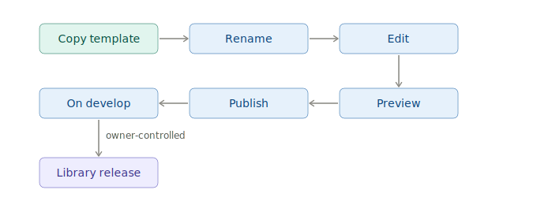
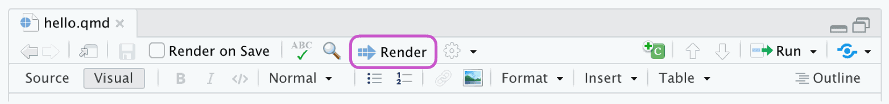
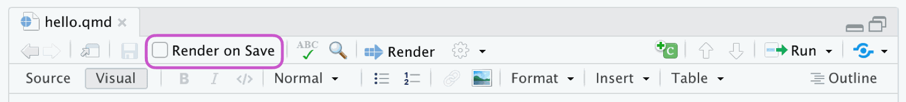
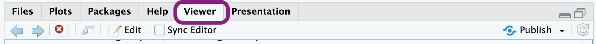
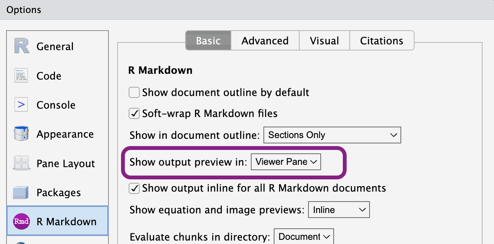

::: callout-note
This guide assumes your project is already integrated with the Technical Library - the `DOCS/` subtree is in place and the Git aliases are configured. If that setup isn't done yet, see the [Setup Guide](guidelines_setup-guide_v1.html) first.
:::

# How This Works

## Your project and the central library

Your project repository contains a `DOCS/` folder that is both part of your project and part of the central CLMS Technical Library. The connection works as a **git subtree**: your documents live in your repo, but `git docs-publish` merges them into the library's `develop` branch.

That means you own the source. You edit locally, commit to your project, and publish when ready. The library pulls in documents from all projects.

## The publish flow

Publishing to `develop` is not a public release. The public-facing library only changes when a Technical Library owner promotes changes from `develop` to `test` to `main`. As an editor, your work stops at `develop`.

{fig-align="center"}

## The document lifecycle

{fig-align="center"}

Major version bumps are your decision - you create a new file with a bumped `_v<N>` suffix. Minor and patch versions are AI-assigned at release time based on the scope of changes.


# Starting a New Document

## From a template (recommended)

Pick the template that matches your document type:

- `CLMS_Template_ATBD.qmd` - Algorithm Theoretical Basis Document, for the scientific and technical foundations of a data product
- `CLMS_Template_PUM.qmd` - Product User Manual, for how users access and interpret a product

Once you've chosen:

1. Copy the template into `DOCS/` (not sure what that looks like? See [Folder and File Structure](#folder-and-file-structure))
2. Rename it using this pattern: `CLMS_<Product-Name>_<Document-Type>_v<Major-Version>.qmd`

   For example: `CLMS_HRL-Forest_PUM_v1.qmd`

   Use hyphens within the product name, not underscores. Start every new document at `_v1`. The document type is either `ATBD` or `PUM`.

3. Create a matching `-media/` folder for images: `CLMS_HRL-Forest_PUM_v1-media/`
4. Edit in place, following the structure the template provides

The templates include a pre-filled YAML header, required sections, and commented guidance throughout. Try to keep the structure intact - it makes a real difference to how consistently documents behave across the library.

## From scratch

If neither template fits, create a new `.qmd` file directly in `DOCS/`, following the same naming pattern, create a matching `-media/` folder, and add the required YAML header manually (see [The YAML Header](#the-yaml-header)).

::: callout-tip
Templates save time even when they don't feel like an exact fit - the YAML header and section structure are the main things you'd otherwise need to set up manually.
:::

Migrating an existing `.docx`? See the Migration Guide [TBD link].


# The YAML Header

If you copied a template, the header is pre-filled - just update `title`, `subtitle`, `date`, and `product-name`.

## Required fields

```yaml
---
title: "HRL Forest"
subtitle: "High Resolution Layer - Forest Type"
date: "2026-01-27"
product-name: "HRL Forest"
---
```

- `title` - short product name, appears as the document title
- `subtitle` - full product name or document type description
- `date` - publication or last-updated date in ISO format
- `product-name` - used internally for metadata and indexing

## Optional fields

- `template-version` - records which template version was used as the starting point. Set automatically when copying a template; don't edit it manually.

## System-managed fields

Leave these out of your YAML header entirely - the publishing system handles them:

- `keywords` - AI-generated at publish time based on document content. Anything you add gets overwritten.
- `version` - carried by the filename suffix, not the YAML. No version field belongs in the header.


# Writing Content

Markdown basics - headings, lists, links, images, tables, equations, footnotes, diagrams - are covered in the [Quarto Markdown guide](https://quarto.org/docs/authoring/markdown-basics.html). This chapter covers only what's specific to this system.

## Image folder convention

Images go in `<your-document-name>-media/`, referenced with relative paths:

```markdown

```

## Page breaks

Use the Quarto shortcode to insert a page break in PDF output:

```markdown

```

Note that `---` renders as a horizontal rule, not a page break.

## Complex table layouts

For tables with merged cells, nested content, or custom styling, use HTML tables directly in your `.qmd` file. Both the HTML output and Typst-rendered PDF handle them well.

Standard Markdown tables have limited formatting options. HTML tables let you control exactly how things look - column widths, cell colours, text alignment, borders - using inline CSS:

````markdown
```{=html}
<table style="width: 100%; border-collapse: collapse;">
  <thead>
    <tr style="background-color: #2c3e50; color: white;">
      <th colspan="2" style="padding: 10px; text-align: center;">Product Overview</th>
    </tr>
  </thead>
  <tbody>
    <tr>
      <td style="padding: 8px; border: 1px solid #ccc; font-weight: bold;">HRL Forest</td>
      <td style="padding: 8px; border: 1px solid #ccc;">Active</td>
    </tr>
    <tr style="background-color: #f2f2f2;">
      <td style="padding: 8px; border: 1px solid #ccc; font-weight: bold;">Water Bodies</td>
      <td style="padding: 8px; border: 1px solid #ccc;">Active</td>
    </tr>
  </tbody>
</table>
```
````


# Editing and Previewing Locally

## Open the project in RStudio

1. Open RStudio
2. **File > Open Project...** and select the root folder of your project
3. Navigate to `DOCS/` and open the `.qmd` file you want to edit

## Preview your document

Click the **Render** button at the top of the editor pane to render HTML or PDF:

{fig-align="center"}

Or enable **Preview on Save** in the toolbar to re-render on every save:

{fig-align="center"}

The rendered output appears in the **Viewer** tab in the lower-right pane:

{fig-align="center"}

If the Viewer tab isn't showing rendered output, go to **Tools > Global Options > R Markdown** and set **Show output preview in** to **Viewer Pane**:

{height="300px" fig-align="center"}

## Render the full project

To render all documents and preview the complete library locally:

```bash
git docs-preview
```

::: callout-tip
The repository ships with the project config renamed to `_quarto-not-used.yaml` so RStudio operates in single-file mode by default - faster for day-to-day editing. When you need to render the full project, rename it to `_quarto.yaml`, run `quarto render`, then rename it back.
:::


# Publishing to Develop

```bash
git add DOCS/
git commit -m "docs: update [brief description]"
git docs-publish
```

After the pipeline runs, check your document at:
<https://eea.github.io/CLMS_documents/develop/index.html>

Navigation, cross-links, and the sidebar TOC can behave differently than in your local RStudio preview - worth a quick look before calling it done.


# Folder and File Structure

```text
DOCS/
├── _meta/                            # Scripts, config, metadata - do not edit
├── includes/                         # Quarto include files - do not edit
├── templates/                        # Document templates - do not edit
├── theme/                            # Styling definitions - do not edit
├── _quarto.yml                       # Project-wide Quarto config
├── CLMS_HRL-Forest_PUM_v2.qmd
├── CLMS_HRL-Forest_PUM_v2-media/
├── CLMS_Water-Bodies_ATBD_v1.qmd
├── CLMS_Water-Bodies_ATBD_v1-media/
└── ...
```

Your work lives in `DOCS/` directly: one `.qmd` file per document, plus a matching `-media/` folder for images and diagrams. The four managed subdirectories (`_meta/`, `includes/`, `templates/`, `theme/`) are updated centrally - don't edit them.


# File Naming and Versioning

## The version suffix

The `_v<N>` suffix in the filename is the major version - the only version number you control. Minor and patch versions are assigned automatically by AI at library release time based on the scope of changes: small corrections get a patch bump (`2.3.5 → 2.3.6`), new or revised sections get a minor bump (`2.3.0 → 2.4.0`). A new file `CLMS_HRL-Forest_PUM_v3.qmd` starts at `3.0.0` at its first release. You never set a version number in YAML.

## When to create a new major version

Edit the existing file for most changes. Create a new major version only when you need to:

- rewrite most of the content
- make breaking structural changes
- keep the previous version available as a stable reference

```bash
cp DOCS/CLMS_HRL-Forest_PUM_v2.qmd DOCS/CLMS_HRL-Forest_PUM_v3.qmd
cp -r DOCS/CLMS_HRL-Forest_PUM_v2-media DOCS/CLMS_HRL-Forest_PUM_v3-media
```

Both versions stay in the library and evolve independently from that point on.

## Don't rename after publishing

The filename becomes part of the document's URL. Renaming breaks links and cross-references. If a significant revision is needed, create a new major version rather than renaming.


# Restoring Previous Versions

Restore pulls a published version of a document into your local working copy. It doesn't roll back the library - think of it as "pick up from version X," not "undo to version X."

## Commands

```bash
git docs-restore --list-all                                 # all published documents
git docs-restore --list DOCS/CLMS_HRL-Forest_PUM_v2.qmd     # versions of one file
git docs-restore DOCS/CLMS_HRL-Forest_PUM_v2.qmd 2.0.0      # specific version
git docs-restore --latest DOCS/CLMS_HRL-Forest_PUM_v2.qmd   # latest published version
```

## When to use it

**Recover deleted content.** You removed a section locally and need it back. Restore the last published version, copy out what you need, then carry on with your current version.

**Something went wrong in a recent edit.** Restore an earlier version (e.g. `2.1.0`) and work forward from there rather than trying to untangle the current state.

**Resurrect a deleted file.** If a file was removed from the project but still exists in the library history, `--list-all` will find it. Restore brings it back into `DOCS/` as if nothing happened.


# Release Path

Once you publish to `develop`, the rest of the process belongs to Technical Library owners. Getting from develop to public requires two separate pull requests, each reviewed and approved by a second owner before it merges.

| Stage | URL |
|-------|-----|
| develop | <https://eea.github.io/CLMS_documents/develop/index.html> |
| test | <https://eea.github.io/CLMS_documents/test/index.html> |
| main (public) | <https://library.land.copernicus.eu> |

At each release, the system assigns version numbers automatically based on what changed.
