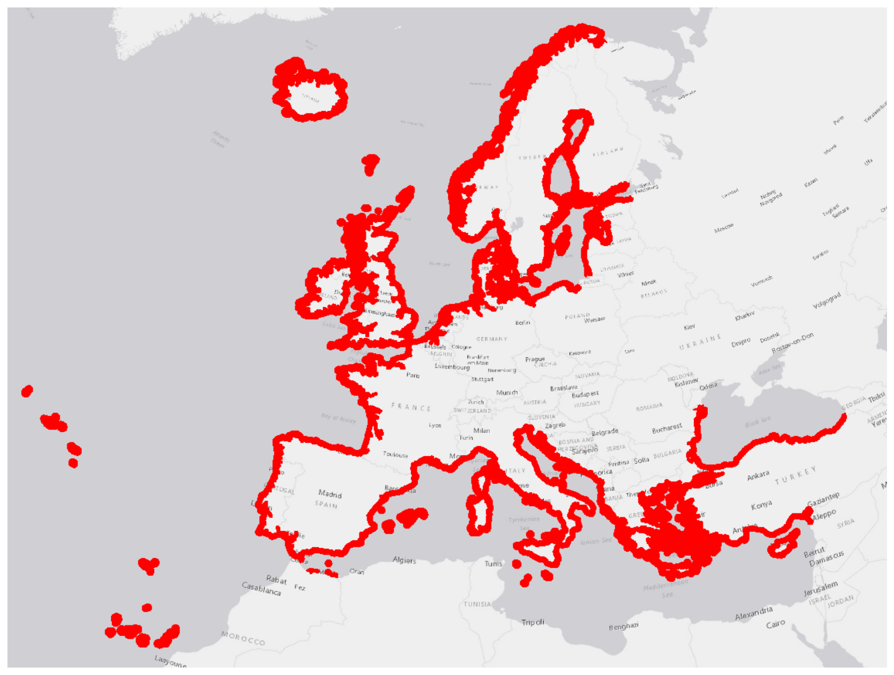

::: {.tbl-caption}
```{=typst}
#set text(size: 9pt, fill: rgb("#3E6893"))
```
Document History
:::

```{=html}
<table>
<colgroup>
<col style="width: 20.0%">
<col style="width: 30.5%">
<col style="width: 26.5%">
<col style="width: 23.0%">
</colgroup>
<tr>
    <td colspan="4" style="background-color:#ffffcc; font-weight:bold;">List of reviews</td>
  </tr>
  <tr>
    <td style="font-weight:bold">Version</td>
    <td style="font-weight:bold">Author</td>
    <td style="font-weight:bold">Date</td>
    <td style="font-weight:bold">Note</td>
  </tr>
  <tr>
    <td>v0</td>
    <td>CZ Production Team</td>
    <td>10/02/2021</td>
    <td>First release</td>
  </tr>
</table>
```

# Introduction

## Purpose and scope

This document represents the Internal final QC/QA Delivery Report referring to the Coastal Zones products covering the 100% of the AOI to be mapped within the framework of the SPECIFIC CONTRACTS No 3436/RO-COPERNICUS/EEA.57850 and No 3436/RO-COPERNICUS/EEA.58088, both implementing Framework service contract No EEA/DIS/R0/18/008 – Production of Very High Resolution Land Cover/Land Use dataset for coastal zones of the reference years 2012 and 2018.

This Delivery Report includes the following key information about the final delivery:

-   Product specifications (including keynotes about the production process and used source files)
-   Quantitative assessment of LCLU delivered data
-   Delivered files

## Applicable documents

| Ref. | Tile |
|------------------------------|--------------------------------------------------------------------------------------------------------------------------------------------------------------------------|
| \[AD.1] | Tender Specifications “EEA/DIS/R0/18/008 Framework service contract for Copernicus Local Land Monitoring Services – Production of Very High Resolution Land Cover/Land Use dataset for coastal zones of the reference years 2012 and 2018" |
| \[AD.2] | Proposal responding to EEA'S Invitation for Tender (pkz008-429-1.0_EEA_LC_Coastal_Zone_Technical_Proposal) |
| \[AD.3] | Framework Service Contract EEA/DIS/RO/18/008 |
| \[AD.4] | SPECIFIC CONTRACT No 3436/RO-COPERNICUS/EEA.57850 |
| \[AD.5] | SPECIFIC CONTRACT No 3436/RO-COPERNICUS/EEA.58088 |

## Reference documents

```{=typst}
#set page(flipped: true, paper: "a3")
#set text(size: 5pt)
```

| Ref. | Tile |
|-------------|-------------------------------------------------------------------------------------------------------------------------------------------------------------------------------------------|
| \[RD.1] | Footprints for VHR2012 data (pkz048-47-1.0 – D4.1) |
| \[RD.2] | Assessment report on the availability of VHR2012 data (pkz048-37-1.1 – D4.2) |
| \[RD.3] | Preliminary Coastal Zones AOI 2018 (pkz048-43-1.0 – D5.1) |
| \[RD.4] | Final Coastal Zones AOI 2018 (pkz048-65-1.2 - D5.2) |
| \[RD.5] | Final mapping guidelines (pkz048-66-v2 – D6.2) |
| \[RD.6] | [https://github.com/eea/copernicus_quality_tools/wiki/Coastal-Zones-2012#vectornaming](https://github.com/eea/copernicus_quality_tools/wiki/Coastal-Zones-2012#vectornaming) |
| \[RD.7] | [https://github.com/eea/copernicus_quality_tools/wiki/Coastal-Zones-2018#vectornaming](https://github.com/eea/copernicus_quality_tools/wiki/Coastal-Zones-2018#vectornaming) |
| \[RD.8] | [https://github.com/eea/copernicus_quality_tools/wiki/Coastal-Zones-Change-2012-2018#vectornaming](https://github.com/eea/copernicus_quality_tools/wiki/Coastal-Zones-Change-2012-2018#vectornaming) |
| \[RD.9] | Data Warehouse phase 2 DAP v2.5 [https://spacedata.copernicus.eu/documents/12833/14545/DAP+Document+-+current/c2449218-3ed9-434a-b32c-edfbb95b9362](https://spacedata.copernicus.eu/documents/12833/14545/DAP+Document+-+current/c2449218-3ed9-434a-b32c-edfbb95b9362) |
| \[RD.10] | GMES Space Component Data Access Portfolio: Data Warehouse 2011-2014 [https://spacedata.copernicus.eu/documents/12833/14553/DAP_Document_DWH_V2.8_27122013.pdf](https://spacedata.copernicus.eu/documents/12833/14553/DAP_Document_DWH_V2.8_27122013.pdf) |

```{=typst}
#set page(flipped: false, paper: "a4")
#set text(size: 11pt)
```

# Product specifications

The Coastal Zones products provide a detailed Land Cover/Land Use dataset for the coastal zones of the EEA39. The mapped coastal zones are delimited by the CLC boundaries on the seaward side and include an adapted 10 km wide strip on landward side, including specific areas under clear coastal influence or being clearly relevant for coastal zones even if reaching further than 10 km landwards.

The CZ LC/LU product includes three complementary layers:

1.  LC/LU status map for the reference year 2012.
2.  LC/LU status map for the reference year 2018.
3.  LC/LU change map 2012-2018 derived from and fully consistent with 1) and 2) to characterize the evolution of the coastal zones over time.

Product specifications of each layer are described in the following three tables.

::: {.tbl-caption}
```{=typst}
#set text(size: 9pt, fill: rgb("#3E6893"))
```
Table 1: Coastal Zones Land Cover and Land Use status map 2012
:::

```{=html}
<table>
<tr>
    <td colspan="3" style="background-color:#4f81bd; color:#ffffff; font-weight:bold;">Coastal Zones Land Cover and Land Use status map 2012</td>
  </tr>
  <tr>
    <td colspan="2" style="background-color:#dbe5f1; font-weight:bold; text-align:center">Product Title / Content</td>
    <td style="background-color:#dbe5f1; font-weight:bold; text-align:center">Product Short Name</td>
  </tr>
  <tr>
    <td colspan="2">Coastal Zones Land Cover and Land Use status map 2012</td>
    <td>CZ_LCLU_2012</td>
  </tr>
  <tr>
    <td colspan="3" style="background-color:#dbe5f1; font-weight:bold; text-align:center">Product Definition</td>
  </tr>
  <tr>
    <td colspan="3">The LCLU status map provides a detailed Land Cover and Land Use map of the coastal land zone within EEA39, for a specific reference year, based on VHR satellite imagery and coastal zones nomenclature.</td>
  </tr>
  <tr>
    <td colspan="3" style="background-color:#dbe5f1; font-weight:bold; text-align:center">Input Data Sources</td>
  </tr>
  <tr>
    <td colspan="3">
      1) Coastal Zones AOI (adapted buffer of EU-Hydro dataset)<br>
      2) Image data:<br>
      <table>
        <tr>
          <td style="vertical-align:top">
            <b>Products:</b>
            <ul>
              <li>DWH_MG2b_CORE_03</li>
              <li>D2_MG2b_NARA_011b</li>
              <li>D2_MG2b_LOLA_011b</li>
              <li>VHR_IMAGE_2015</li>
            </ul>
          </td>
          <td style="vertical-align:top">
            <b>Missions:</b>
            <ul>
              <li>SPOT-5 (2.5m)</li>
              <li>SPOT-6 (1.5m/4.0m)</li>
              <li>SPOT-7 (4.0m)</li>
              <li>Pléiades (2.0m)</li>
              <li>WorldView-2 (2.0m)</li>
            </ul>
          </td>
        </tr>
      </table>
      3) Additional data:<br>
      CLC 2012/2018; Urban Atlas 2012/2018; GIO HR Layers; DWH_MG2_CORE_01 Coverage 2 (RapidEye, 5m); National orthophoto WMS, Google Earth, Bing Maps; Numerous additional reference and in-situ data sources.
    </td>
  </tr>
  <tr>
    <td colspan="3" style="background-color:#dbe5f1; font-weight:bold; text-align:center">Methodology</td>
  </tr>
  <tr>
    <td colspan="3">Mixture of automatic classification routines and visual interpretation of VHR satellite data implementing tailored Coastal Zones nomenclature.</td>
  </tr>
  <tr>
    <td colspan="3" style="background-color:#dbe5f1; font-weight:bold; text-align:center">Geographic Coverage</td>
  </tr>
  <tr>
    <td colspan="3">Customized 10 km landwards buffer Coastal land zone and 25 km seawards buffer including territorial waters within EEA39.</td>
  </tr>
  <tr>
    <td colspan="3" style="background-color:#dbe5f1; font-weight:bold; text-align:center">Projection</td>
  </tr>
  <tr>
    <td colspan="3">ETRS89 Lambert Azimuthal Equal Area (LAEA) (EPSG 3035)</td>
  </tr>
  <tr>
    <td colspan="3" style="background-color:#dbe5f1; font-weight:bold; text-align:center">Temporal Reference</td>
  </tr>
  <tr>
    <td colspan="3">Reference year 2012 (products of the reference year 2012 are produced based on 2011-2014 reference data)</td>
  </tr>
  <tr>
    <td colspan="2" style="background-color:#dbe5f1; font-weight:bold; text-align:center">Geometric Resolution / Equivalent Scale</td>
    <td style="background-color:#dbe5f1; font-weight:bold; text-align:center">Nomenclature</td>
  </tr>
  <tr>
    <td colspan="2">1:10,000</td>
    <td>71 thematic classes</td>
  </tr>
  <tr>
    <td style="background-color:#dbe5f1; font-weight:bold; text-align:center">Minimum Mapping Unit</td>
    <td style="background-color:#dbe5f1; font-weight:bold; text-align:center">Minimum Mapping Length</td>
    <td style="background-color:#dbe5f1; font-weight:bold; text-align:center">Minimum Mapping Width</td>
  </tr>
  <tr>
    <td>0.5 ha</td>
    <td>N/A</td>
    <td>10 m</td>
  </tr>
  <tr>
    <td colspan="3" style="background-color:#dbe5f1; font-weight:bold; text-align:center">Thematic/Positional Product Accuracy</td>
  </tr>
  <tr>
    <td colspan="3">
      ≥ 80 % for class specific user and produced accuracies<br>
      ≥ 85 % overall accuracy<br>
      Positional accuracy: RMSE ≤ 5m
    </td>
  </tr>
</table>
```

::: {.tbl-caption}
```{=typst}
#set text(size: 9pt, fill: rgb("#3E6893"))
```
Table 2: Coastal Zones Land Cover and Land Use status map 2018
:::

```{=html}
<table>
<tr>
    <td colspan="3" style="background-color:#4f81bd; color:#ffffff; font-weight:bold;">Coastal Zones Land Cover and Land Use status map 2018</td>
  </tr>
  <tr>
    <td colspan="2" style="background-color:#dbe5f1; font-weight:bold; text-align:center">Product Title / Content</td>
    <td style="background-color:#dbe5f1; font-weight:bold; text-align:center">Product Short Name</td>
  </tr>
  <tr>
    <td colspan="2">Coastal Zones Land Cover and Land Use status map 2018</td>
    <td>CZ_LCLU_2018</td>
  </tr>
  <tr>
    <td colspan="3" style="background-color:#dbe5f1; font-weight:bold; text-align:center">Product Definition</td>
  </tr>
  <tr>
    <td colspan="3">The LCLU status map provides a detailed Land Cover and Land Use map of the coastal land zone within EEA39, for a specific reference year, based on VHR satellite imagery and coastal zones nomenclature.</td>
  </tr>
  <tr>
    <td colspan="3" style="background-color:#dbe5f1; font-weight:bold; text-align:center">Input Data Sources</td>
  </tr>
  <tr>
    <td colspan="3">
      1) Coastal Zones AOI (adapted buffer of EU-Hydro dataset)<br>
      2) Image data:<br>
      <table>
        <tr>
          <td style="vertical-align:top">
            <b>Products:</b>
            <ul>
              <li>VHR_IMAGE_2018</li>
            </ul>
          </td>
          <td style="vertical-align:top">
            <b>Missions:</b>
            <ul>
              <li>SPOT-6 (1.5m/4.0m)</li>
              <li>SPOT-7 (4.0m)</li>
              <li>Pléiades (2.0m)</li>
              <li>WorldView-2 (2.0m)</li>
            </ul>
          </td>
          <td style="vertical-align:top">
            <ul>
              <li>SuperView-1 (2.0m)</li>
              <li>KOMPSat (2.0m)</li>
              <li>Planet Dove (4.0m)</li>
              <li>Deimos-2 (4.0m)</li>
              <li>TripleSat-1 (4.0m)</li>
            </ul>
          </td>
        </tr>
      </table>
      3) Additional data:<br>
      CLC 2012/2018; Urban Atlas 2012/2018; GIO HR Layers; National orthophoto WMS, Google Earth, Bing Maps; Numerous additional reference and in-situ data sources.
    </td>
  </tr>
  <tr>
    <td colspan="3" style="background-color:#dbe5f1; font-weight:bold; text-align:center">Methodology</td>
  </tr>
  <tr>
    <td colspan="3">Produced by merging LCLU status 2012 and LCLU change map in a GIS environment.</td>
  </tr>
  <tr>
    <td colspan="3" style="background-color:#dbe5f1; font-weight:bold; text-align:center">Geographic Coverage</td>
  </tr>
  <tr>
    <td colspan="3">Customized 10 km landwards buffer Coastal land zone and 25 km seawards buffer including territorial waters within EEA39.</td>
  </tr>
  <tr>
    <td colspan="3" style="background-color:#dbe5f1; font-weight:bold; text-align:center">Projection</td>
  </tr>
  <tr>
    <td colspan="3">ETRS89 Lambert Azimuthal Equal Area (LAEA) (EPSG 3035)</td>
  </tr>
  <tr>
    <td colspan="3" style="background-color:#dbe5f1; font-weight:bold; text-align:center">Temporal Reference</td>
  </tr>
  <tr>
    <td colspan="3">Reference year 2018 (products of the reference year 2018 are produced based on 2017-2019 reference data)</td>
  </tr>
  <tr>
    <td colspan="2" style="background-color:#dbe5f1; font-weight:bold; text-align:center">Geometric Resolution / Equivalent Scale</td>
    <td style="background-color:#dbe5f1; font-weight:bold; text-align:center">Nomenclature</td>
  </tr>
  <tr>
    <td colspan="2">1:10,000</td>
    <td>71 thematic classes</td>
  </tr>
  <tr>
    <td style="background-color:#dbe5f1; font-weight:bold; text-align:center">Minimum Mapping Unit</td>
    <td style="background-color:#dbe5f1; font-weight:bold; text-align:center">Minimum Mapping Length</td>
    <td style="background-color:#dbe5f1; font-weight:bold; text-align:center">Minimum Mapping Width</td>
  </tr>
  <tr>
    <td>0.5 ha</td>
    <td>N/A</td>
    <td>10 m</td>
  </tr>
  <tr>
    <td colspan="3" style="background-color:#dbe5f1; font-weight:bold; text-align:center">Thematic/Positional Product Accuracy</td>
  </tr>
  <tr>
    <td colspan="3">
      ≥ 80% for class specific user and produced accuracies<br>
      ≥ 85% overall accuracy<br>
      Positional accuracy: RMSE ≤ 5m
    </td>
  </tr>
</table>
```

::: {.tbl-caption}
```{=typst}
#set text(size: 9pt, fill: rgb("#3E6893"))
```
Table 3: Coastal Zones Land Cover and Land Use change map 2012-2018
:::

```{=html}
<table>
<tr>
    <td colspan="3" style="background-color:#4f81bd; color:#ffffff; font-weight:bold;">Coastal Zones Land Cover and Land Use change map 2012-2018</td>
  </tr>
  <tr>
    <td colspan="2" style="background-color:#dbe5f1; font-weight:bold; text-align:center">Product Title / Content</td>
    <td style="background-color:#dbe5f1; font-weight:bold; text-align:center">Product Short Name</td>
  </tr>
  <tr>
    <td colspan="2">Coastal Zones Land Cover and Land Use change map 2012-2018</td>
    <td>CZ_LCLU<br>change_2012_2018</td>
  </tr>
  <tr>
    <td colspan="3" style="background-color:#dbe5f1; font-weight:bold; text-align:center">Product Definition</td>
  </tr>
  <tr>
    <td colspan="3">The LCLU change map provides a detailed Land Cover and Land Use change map of the coastal land zone within EEA39, between two specific reference years, based on VHR satellite imagery and coastal zones nomenclature.</td>
  </tr>
  <tr>
    <td colspan="3" style="background-color:#dbe5f1; font-weight:bold; text-align:center">Input Data Sources</td>
  </tr>
  <tr>
    <td colspan="3">
      1) Coastal Zones AOI (adapted buffer of EU-Hydro dataset)<br>
      2) Image data:<br>
      <table>
        <tr>
          <td style="vertical-align:top">
            <b>Products:</b>
            <ul>
              <li>DWH_MG2b_CORE_03</li>
              <li>D2_MG2b_NARA_011b</li>
              <li>D2_MG2b_LOLA_011b</li>
              <li>VHR_IMAGE_2015</li>
              <li>VHR_IMAGE_2018</li>
            </ul>
          </td>
          <td style="vertical-align:top">
            <b>Missions:</b>
            <ul>
              <li>SPOT-5 (2.5m)</li>
              <li>SPOT-6 (1.5m/4.0m)</li>
              <li>SPOT-7 (4.0m)</li>
              <li>Pléiades (2.0m)</li>
              <li>WorldView-2 (2.0m)</li>
            </ul>
          </td>
          <td style="vertical-align:top">
           <ul>
              <li>SuperView-1 (2.0m)</li>
              <li>KOMPSat (2.0m)</li>
              <li>Planet Dove (4.0m)</li>
              <li>Deimos-2 (4.0m)</li>
              <li>TripleSat-1 (4.0m)</li>
            </ul>
          </td>
        </tr>
      </table>
      3) Additional data:<br>
      CLC 2012/2018; Urban Atlas 2012/2018; GIO HR Layers; National orthophoto WMS, Google Earth, Bing Maps; Numerous additional reference and in-situ data sources.
    </td>
  </tr>
  <tr>
    <td colspan="3" style="background-color:#dbe5f1; font-weight:bold; text-align:center">Methodology</td>
  </tr>
  <tr>
    <td colspan="3">Mixture of automatic classification routines and visual interpretation of VHR satellite data implementing tailored Coastal Zones nomenclature.</td>
  </tr>
  <tr>
    <td colspan="3" style="background-color:#dbe5f1; font-weight:bold; text-align:center">Geographic Coverage</td>
  </tr>
  <tr>
    <td colspan="3">Customized 10 km landwards buffer Coastal land zone and 25 km seawards buffer including territorial waters within EEA39.</td>
  </tr>
  <tr>
    <td colspan="3" style="background-color:#dbe5f1; font-weight:bold; text-align:center">Projection</td>
  </tr>
  <tr>
    <td colspan="3">ETRS89 Lambert Azimuthal Equal Area (LAEA) (EPSG 3035)</td>
  </tr>
  <tr>
    <td colspan="3" style="background-color:#dbe5f1; font-weight:bold; text-align:center">Temporal Reference</td>
  </tr>
  <tr>
    <td colspan="3">Based on very high resolution (VHR) satellite imagery of the reference years 2012 and 2018</td>
  </tr>
  <tr>
    <td colspan="2" style="background-color:#dbe5f1; font-weight:bold; text-align:center">Geometric Resolution / Equivalent Scale</td>
    <td style="background-color:#dbe5f1; font-weight:bold; text-align:center">Nomenclature</td>
  </tr>
  <tr>
    <td colspan="2">1:10.000</td>
    <td>71 thematic classes</td>
  </tr>
  <tr>
    <td style="background-color:#dbe5f1; font-weight:bold; text-align:center">Minimum Mapping Unit</td>
    <td style="background-color:#dbe5f1; font-weight:bold; text-align:center">Minimum Mapping Length</td>
    <td style="background-color:#dbe5f1; font-weight:bold; text-align:center">Minimum Mapping Width</td>
  </tr>
  <tr>
    <td>0.5 ha</td>
    <td>N/A</td>
    <td>10 m</td>
  </tr>
  <tr>
    <td colspan="3" style="background-color:#dbe5f1; font-weight:bold; text-align:center">Thematic/Positional Product Accuracy</td>
  </tr>
  <tr>
    <td colspan="3">≥ 80 % for class specific user and produced accuracies<br>≥ 85 % overall accuracy<br>Positional accuracy: RMSE ≤ 5m</td>
  </tr>
</table>
```

## Nomenclature

The Coastal Zones LC/LU layer differentiates 71 thematic LC/LU classes. In line with the other thematic hotspot products, the CZ nomenclature is designed to address the MAES classes at level 2.0.

Table 4 describes the CZ nomenclature and how CZ classes shall be aggregated to map MAES at level 2. More details about the CZ nomenclature can be found in [RD.5].

```{=typst}
#set page(flipped: true)
#set text(size: 9pt)
```

::: {.tbl-caption}
```{=typst}
#set text(size: 9pt, fill: rgb("#3E6893"))
```
Table 4: Detailed CZ LC/LU classes and cross reference to MAES Level 2
:::

```{=html}
<table style="font-size: 8pt">
<colgroup>
<col style="width: 21.3%">
<col style="width: 16.5%">
<col style="width: 18.9%">
<col style="width: 14.0%">
<col style="width: 16.5%">
<col style="width: 12.8%">
</colgroup>
<tr>
    <td style="font-weight:bold">Level 1</td>
    <td style="font-weight:bold">Level 2</td>
    <td style="font-weight:bold">Level 3</td>
    <td style="font-weight:bold">Level 4</td>
    <td style="font-weight:bold">Level 5</td>
    <td style="font-weight:bold">Ecosystem types level 2 (MAES)</td>
  </tr>
  <tr>
    <td rowspan="20" style="background-color:#ff0000; color:#ffffff; vertical-align:middle; text-align:center">1 Urban</td>
    <td rowspan="5" style="background-color:#e06666; vertical-align:middle">1.1 Urban fabric, industrial, commercial, public, military and private units</td>
    <td rowspan="3" style="background-color:#ea9999; vertical-align:middle">1.1.1 Urban fabric (predominantly public and private units)</td>
    <td style="background-color:#f4cccc">1.1.1.1 Continuous urban fabric (IMD ≥80%)</td>
    <td></td>
    <td rowspan="20" style="background-color:#ff0000; color:#ffffff; vertical-align:middle; text-align:center">Urban</td>
  </tr>
  <tr>
    <td style="background-color:#f4cccc">1.1.1.2 Dense urban fabric (IMD ≥30-80%)</td>
    <td></td>
  </tr>
  <tr>
    <td style="background-color:#f4cccc">1.1.1.3 Low density fabric (IMD &lt;30%)</td>
    <td></td>
  </tr>
  <tr>
    <td rowspan="2" style="background-color:#d5a6bd; vertical-align:middle">1.1.2 Industrial, commercial, public and military units</td>
    <td style="background-color:#e8d0de">1.1.2.1 Industrial, commercial, public and military units (other)</td>
    <td></td>
  </tr>
  <tr>
    <td style="background-color:#e8d0de">1.1.2.2 Nuclear energy plants and associated land</td>
    <td></td>
  </tr>
  <tr>
    <td rowspan="10" style="background-color:#e6b8af; vertical-align:middle">1.2 Transport infrastructure</td>
    <td style="background-color:#d8c2be">1.2.1 Road networks and associated land</td>
    <td></td>
    <td></td>
  </tr>
  <tr>
    <td style="background-color:#d8c2be">1.2.2 Railways and associated land</td>
    <td></td>
    <td></td>
  </tr>
  <tr>
    <td rowspan="7" style="background-color:#d8c2be; vertical-align:middle">1.2.3 Port areas and associated land</td>
    <td style="background-color:#d9d2e9">1.2.3.1 Cargo port</td>
    <td></td>
  </tr>
  <tr>
    <td style="background-color:#d9d2e9">1.2.3.2 Passenger port</td>
    <td></td>
  </tr>
  <tr>
    <td style="background-color:#d9d2e9">1.2.3.3 Fishing port</td>
    <td></td>
  </tr>
  <tr>
    <td style="background-color:#d9d2e9">1.2.3.4 Naval port</td>
    <td></td>
  </tr>
  <tr>
    <td style="background-color:#d9d2e9">1.2.3.5 Marinas</td>
    <td></td>
  </tr>
  <tr>
    <td style="background-color:#d9d2e9">1.2.3.6 Local multi-functional harbours</td>
    <td></td>
  </tr>
  <tr>
    <td style="background-color:#d9d2e9">1.2.3.7 Shipyards</td>
    <td></td>
  </tr>
  <tr>
    <td style="background-color:#d8c2be">1.2.4 Airports and associated land</td>
    <td></td>
    <td></td>
  </tr>
  <tr>
    <td rowspan="4" style="background-color:#999999; vertical-align:middle">1.3 Mineral extraction, dump and construction sites, land without current use</td>
    <td rowspan="3" style="background-color:#b7b7b7; vertical-align:middle">1.3.1 Mineral extraction, dump and construction sites</td>
    <td style="background-color:#d9d9d9">1.3.1.1 Mineral extraction sites</td>
    <td></td>
  </tr>
  <tr>
    <td style="background-color:#d9d9d9">1.3.1.2 Dump sites</td>
    <td></td>
  </tr>
  <tr>
    <td style="background-color:#d9d9d9">1.3.1.3 Construction sites</td>
    <td></td>
  </tr>
  <tr>
    <td style="background-color:#b7b7b7">1.3.2 Land without current use</td>
    <td></td>
    <td></td>
  </tr>
  <tr>
    <td style="background-color:#c2d699">1.4 Green urban, sports and leisure facilities</td>
    <td></td>
    <td></td>
    <td></td>
  </tr>
  <tr>
    <td rowspan="8" style="background-color:#fff2cc; vertical-align:middle; text-align:center">2 Cropland</td>
    <td rowspan="2" style="background-color:#ffd966; vertical-align:middle">2.1 Arable land</td>
    <td style="background-color:#ffe599">2.1.1 Arable irrigated and non-irrigated land</td>
    <td></td>
    <td></td>
    <td rowspan="8" style="background-color:#fff2cc; vertical-align:middle; text-align:center">Cropland</td>
  </tr>
  <tr>
    <td style="background-color:#ffe599">2.1.2 Greenhouses</td>
    <td></td>
    <td></td>
  </tr>
  <tr>
    <td rowspan="2" style="background-color:#ffd966; vertical-align:middle">2.2 Permanent crops</td>
    <td style="background-color:#ffe599">2.2.1 Vineyards, fruit trees and berry plantations</td>
    <td></td>
    <td></td>
  </tr>
  <tr>
    <td style="background-color:#ffe599">2.2.2 Olive groves</td>
    <td></td>
    <td></td>
  </tr>
  <tr>
    <td rowspan="4" style="background-color:#ffd966; vertical-align:middle">2.3 Heterogeneous agricultural area</td>
    <td style="background-color:#ffe599">2.3.1 Annual crops associated with permanent crops</td>
    <td></td>
    <td></td>
  </tr>
  <tr>
    <td style="background-color:#ffe599">2.3.2 Complex cultivation patterns</td>
    <td></td>
    <td></td>
  </tr>
  <tr>
    <td style="background-color:#ffe599">2.3.3 Land principally occupied by agriculture with significant areas of natural vegetation</td>
    <td></td>
    <td></td>
  </tr>
  <tr>
    <td style="background-color:#ffe599">2.3.4 Agro-forestry</td>
    <td></td>
    <td></td>
  </tr>
  <tr>
    <td rowspan="9" style="background-color:#38761d; color:#ffffff; vertical-align:middle; text-align:center">3 Woodland and forest</td>
    <td rowspan="2" style="background-color:#6aa84f; vertical-align:middle">3.1 Broadleaved forest</td>
    <td style="background-color:#93c47d">3.1.1 Natural & semi-natural broadleaved forest</td>
    <td></td>
    <td></td>
    <td rowspan="9" style="background-color:#38761d; color:#ffffff; vertical-align:middle; text-align:center">Woodland and forest</td>
  </tr>
  <tr>
    <td style="background-color:#93c47d">3.1.2 Highly artificial broadleaved plantations</td>
    <td></td>
  </tr>
  <tr>
    <td rowspan="2" style="background-color:#6aa84f; vertical-align:middle">3.2 Coniferous forest</td>
    <td style="background-color:#93c47d">3.2.1 Natural & semi-natural coniferous forest</td>
    <td></td>
    <td></td>
  </tr>
  <tr>
    <td style="background-color:#93c47d">3.2.2 Highly artificial coniferous plantations</td>
    <td></td>
  </tr>
  <tr>
    <td rowspan="2" style="background-color:#6aa84f; vertical-align:middle">3.3 Mixed forest</td>
    <td style="background-color:#93c47d">3.3.1 Natural & semi-natural mixed forest</td>
    <td></td>
    <td></td>
  </tr>
  <tr>
    <td style="background-color:#93c47d">3.3.2 Highly artificial mixed plantations</td>
    <td></td>
  </tr>
  <tr>
    <td style="background-color:#6aa84f">3.4 Transitional woodland and scrub</td>
    <td></td>
    <td></td>
    <td></td>
  </tr>
  <tr>
    <td style="background-color:#6aa84f">3.5 Lines of trees and scrub</td>
    <td></td>
    <td></td>
    <td></td>
  </tr>
  <tr>
    <td style="background-color:#6aa84f">3.6 Damaged forest</td>
    <td></td>
    <td></td>
    <td></td>
  </tr>
  <tr>
    <td rowspan="3" style="background-color:#b6d7a8; vertical-align:middle; text-align:center">4 Grassland</td>
    <td style="background-color:#d9ead3">4.1 Managed grassland</td>
    <td></td>
    <td></td>
    <td></td>
    <td rowspan="3" style="background-color:#b6d7a8; vertical-align:middle; text-align:center">Grassland</td>
  </tr>
  <tr>
    <td rowspan="2" style="background-color:#d9ead3; vertical-align:middle">4.2 Natural & semi-natural grassland</td>
    <td style="background-color:#e9f3ea">4.2.1 Semi-natural grassland</td>
    <td></td>
    <td></td>
  </tr>
  <tr>
    <td></td>
    <td style="background-color:#e1eade">alpine natural grassland</td>
    <td></td>
  </tr>
  <tr>
    <td rowspan="3" style="background-color:#b45f06; color:#ffffff; vertical-align:middle; text-align:center">5 Heathland and scrub</td>
    <td style="background-color:#e69138">5.1 Heathland and moorland</td>
    <td></td>
    <td></td>
    <td></td>
    <td rowspan="3" style="background-color:#b45f06; color:#ffffff; vertical-align:middle; text-align:center">Heathland and shrub</td>
  </tr>
  <tr>
    <td style="background-color:#e69138">5.2 Alpine scrub land</td>
    <td></td>
    <td></td>
    <td></td>
  </tr>
  <tr>
    <td style="background-color:#e69138">5.3 Sclerophyllous scrubs</td>
    <td></td>
    <td></td>
    <td></td>
  </tr>
  <tr>
    <td rowspan="10" style="background-color:#d9d9d9; vertical-align:middle; text-align:center">6 Open spaces with little or no vegetation</td>
    <td rowspan="2" style="background-color:#efefef; vertical-align:middle">6.1 Sparsely vegetated areas</td>
    <td style="background-color:#f5f5f5">6.1.1 Sparse vegetation on sands</td>
    <td></td>
    <td></td>
    <td rowspan="10" style="background-color:#d9d9d9; vertical-align:middle; text-align:center">Sparsely vegetated land</td>
  </tr>
  <tr>
    <td style="background-color:#f5f5f5">6.1.2 Sparse vegetation on rocks</td>
    <td></td>
    <td></td>
  </tr>
  <tr>
    <td rowspan="4" style="background-color:#efefef; vertical-align:middle">6.2 Beaches, dunes, river banks</td>
    <td rowspan="3" style="background-color:#f5f5f5; vertical-align:middle">6.2.1 Beaches and dunes</td>
    <td rowspan="2" style="background-color:#fafafa; vertical-align:middle">6.2.1.1 Beaches</td>
    <td style="background-color:#fcfcfc">6.2.1.1.1 Sandy beaches</td>
  </tr>
  <tr>
    <td style="background-color:#fcfcfc">6.2.1.1.2 Shingle beaches</td>
  </tr>
  <tr>
    <td style="background-color:#fafafa">6.2.1.2 Dunes</td>
    <td></td>
  </tr>
  <tr>
    <td style="background-color:#f5f5f5">6.2.2 River banks</td>
    <td></td>
    <td></td>
  </tr>
  <tr>
    <td rowspan="4" style="background-color:#efefef; vertical-align:middle">6.3 Bare rocks, burnt areas, glaciers and perpetual snow</td>
    <td rowspan="2" style="background-color:#f5f5f5; vertical-align:middle">6.3.1 Bare rocks, outcrops, cliffs</td>
    <td style="background-color:#fafafa">6.3.1.1 Bare rocks and outcrops</td>
    <td></td>
  </tr>
  <tr>
    <td style="background-color:#fafafa">6.3.1.2 Coastal cliffs</td>
    <td></td>
  </tr>
  <tr>
    <td style="background-color:#f5f5f5">6.3.2 Burnt areas (except burnt forest)</td>
    <td></td>
    <td></td>
  </tr>
  <tr>
    <td style="background-color:#f5f5f5">6.3.3 Glaciers and perpetual snow</td>
    <td></td>
    <td></td>
  </tr>
  <tr>
    <td rowspan="3" style="background-color:#4a86e8; vertical-align:middle; text-align:center">7 Wetland</td>
    <td rowspan="2" style="background-color:#a4c2f4; vertical-align:middle">7.1 Inland wetlands</td>
    <td style="background-color:#c9daf8">7.1.1 Inland marshes</td>
    <td></td>
    <td></td>
    <td rowspan="3" style="background-color:#4a86e8; vertical-align:middle; text-align:center">Wetlands</td>
  </tr>
  <tr>
    <td rowspan="2" style="background-color:#c9daf8; vertical-align:top">7.1.2 Peat bogs</td>
    <td style="background-color:#deeaf9">7.1.2.1 Exploited peat bogs</td>
    <td></td>
  </tr>
  <tr>
    <td rowspan="3" style="background-color:#a4c2f4; vertical-align:middle">7.2 Coastal wetlands</td>
    <td style="background-color:#deeaf9">7.1.2.2 Unexploited peat bogs</td>
    <td></td>
  </tr>
  <tr>
    <td rowspan="12" style="background-color:#3c78d8; color:#ffffff; vertical-align:middle; text-align:center">8 Water</td>
    <td style="background-color:#c9daf8">7.2.1 Salt marshes</td>
    <td></td>
    <td></td>
    <td rowspan="5" style="background-color:#a4c2f4; vertical-align:middle; text-align:center">Marine inlets and transitional waters</td>
  </tr>
  <tr>
    <td style="background-color:#c9daf8">7.2.2 Salines</td>
    <td></td>
    <td></td>
  </tr>
  <tr>
    <td rowspan="3" style="background-color:#6fa8dc; vertical-align:middle">8.1 Water courses</td>
    <td style="background-color:#9fc5e8">7.2.3 Intertidal flats</td>
    <td></td>
    <td></td>
  </tr>
  <tr>
    <td style="background-color:#9fc5e8">8.1.1 Natural & semi-natural water courses</td>
    <td></td>
    <td></td>
  </tr>
  <tr>
    <td style="background-color:#9fc5e8">8.1.2 Highly modified water courses and canals</td>
    <td></td>
    <td></td>
  </tr>
  <tr>
    <td rowspan="4" style="background-color:#6fa8dc; vertical-align:middle">8.2 Lakes and reservoirs</td>
    <td style="background-color:#9fc5e8">8.1.3 Seasonally connected water courses (oxbows)</td>
    <td></td>
    <td></td>
    <td rowspan="4" style="background-color:#3c78d8; color:#ffffff; vertical-align:middle; text-align:center">Rivers and lakes</td>
  </tr>
  <tr>
    <td style="background-color:#9fc5e8">8.2.1 Natural lakes</td>
    <td></td>
    <td></td>
  </tr>
  <tr>
    <td style="background-color:#9fc5e8">8.2.2 Reservoirs</td>
    <td></td>
    <td></td>
  </tr>
  <tr>
    <td style="background-color:#9fc5e8">8.2.3 Aquaculture ponds</td>
    <td></td>
    <td></td>
  </tr>
  <tr>
    <td rowspan="3" style="background-color:#6fa8dc; vertical-align:middle">8.3 Transitional waters</td>
    <td style="background-color:#9fc5e8">8.2.4 Standing water bodies of extractive industrial sites</td>
    <td></td>
    <td></td>
    <td rowspan="3" style="background-color:#a4c2f4; vertical-align:middle; text-align:center">Marine inlets and transitional waters</td>
  </tr>
  <tr>
    <td style="background-color:#9fc5e8">8.3.1 Lagoons</td>
    <td></td>
    <td></td>
  </tr>
  <tr>
    <td style="background-color:#9fc5e8">8.3.2 Estuaries</td>
    <td></td>
    <td></td>
  </tr>
  <tr>
    <td rowspan="2" style="background-color:#6fa8dc; vertical-align:middle">8.4 Sea and ocean</td>
    <td style="background-color:#9fc5e8">8.3.3 Marine inlets and fjords</td>
    <td></td>
    <td></td>
    <td rowspan="2" style="background-color:#3c78d8; color:#ffffff; vertical-align:middle; text-align:center">Open ocean Coastal</td>
  </tr>
  <tr>
    <td style="background-color:#9fc5e8">8.4.1 Open sea</td>
    <td></td>
    <td></td>
  </tr>
</table>
```

```{=typst}
#set page(flipped: false, paper: "a4")
#set text(size: 11pt)
```

A recoding rule table from 4th to 5th class level has been agreed with EEA and applied to all the CZ mapping products in order to maximize coherence between CZ and N2k nomenclatures (See Appendix A). For the same reason, compared to the previous deliveries, in this final delivery the LC/LU classes 8.3.2.0 – “Marine inlets and fjords" and 8.3.3.0 – “Estuaries” have been switched (in the previous deliveries the LC/U class 8.3.2.0 was "Estuaries" and the LC/LU class 8.3.3.0 was "Marine inlets and fjords").

## Overview of mapped area

The entire mapped area (100% of the AOI) totals 2.229.478 km², including the marine and ocean LCLU classes: 84100 - Open sea and 84200 - Coastal waters.

In terms of only land mapped area¹ the size of the AOI is: 723.518 km² (for status layer 2018).

Compared to the 719.844,2 km² defined in SC2 + SC3 (and spatially defined in [RD.4]), the final AOI includes additional 3.673 km². The additional km² originates from a more detailed mapping of the LCLU class 72300 - Intertidal flats and, to a minimal extent, from a further refining of the coastline which, in some cases, has been corrected to improve the overlap with the VHR images.

More in detail, Class 72300 - Intertidal flats, initially extracted from the CLC map, was furtherly refined through photointerpretation of the VHR images by including additional intertidal flats that were not included in the CLC map due to the different (lower) MMU of the latter.

Figure 1 illustrates the spatial distribution of the total area mapped.



¹ i.e. excluding marine and ocean LCLU classes: 83200 - Estuaries, 83300 - Marine inlets and fjords, 84100 - Open sea and 84200 - Coastal waters

### Summary statistics

The summary statistics on the CZ LC/LU class spatial distribution for the mapped area is reported in Table 5. The change area covers just ~1,5% of the total land surface of the mapped area.

```{=typst}
#set page(flipped: true, paper: "a3")
#set text(size: 8pt)
```

::: {.tbl-caption}
```{=typst}
#set text(size: 9pt, fill: rgb("#3E6893"))
```
Table 5: CZ LC/LU class spatial distribution for the mapped area.
:::

```{=html}
<table style="font-size: 8pt">
<colgroup>
<col style="width: 6.7%">
<col style="width: 18.6%">
<col style="width: 8.2%">
<col style="width: 10.4%">
<col style="width: 6.7%">
<col style="width: 8.2%">
<col style="width: 10.9%">
<col style="width: 7.5%">
<col style="width: 7.8%">
<col style="width: 7.5%">
<col style="width: 7.5%">
</colgroup>
<tr>
    <td rowspan="2" style="font-weight:bold; vertical-align:middle;">Class code</td>
    <td rowspan="2" style="font-weight:bold; vertical-align:middle;">Class names</td>
    <td colspan="3" style="font-weight:bold;">Status map 2012</td>
    <td colspan="3" style="font-weight:bold;">Status layer 2018</td>
    <td colspan="3" style="font-weight:bold;">Change layer 2012-2018</td>
  </tr>
  <tr>
    <td style="font-weight:bold; text-align:center">Counts</td>
    <td style="font-weight:bold; text-align:center">Area (km²)</td>
    <td style="font-weight:bold; text-align:center">Area (%)</td>
    <td style="font-weight:bold; text-align:center">Counts</td>
    <td style="font-weight:bold; text-align:center">Area (km²)</td>
    <td style="font-weight:bold; text-align:center">Area (%)</td>
    <td style="font-weight:bold; text-align:center">Area gain (km²)</td>
    <td style="font-weight:bold; text-align:center">Area loss (km²)</td>
    <td style="font-weight:bold; text-align:center">Diff (km²)</td>
  </tr>
  <tr>
    <td>11110</td>
    <td>Continuous urban fabric (IM,D ≥ 80%)</td>
    <td style="text-align:right">27762</td>
    <td style="text-align:right">3246,65</td>
    <td style="text-align:right">0,15%</td>
    <td style="text-align:right">27873</td>
    <td style="text-align:right">3258,51</td>
    <td style="text-align:right">0,15%</td>
    <td style="text-align:right">13,42</td>
    <td style="text-align:right">1,55</td>
    <td style="text-align:right">11,86</td>
  </tr>
  <tr>
    <td>11120</td>
    <td>Dense urban fabric (IM,D ≥ 30-80%)</td>
    <td style="text-align:right">161366</td>
    <td style="text-align:right">18827,99</td>
    <td style="text-align:right">0,84%</td>
    <td style="text-align:right">161707</td>
    <td style="text-align:right">19084,97</td>
    <td style="text-align:right">0,86%</td>
    <td style="text-align:right">264,94</td>
    <td style="text-align:right">7,96</td>
    <td style="text-align:right">256,98</td>
  </tr>
  <tr>
    <td>11130</td>
    <td>Low density urban fabric (IM,D &lt; 30%)</td>
    <td style="text-align:right">553987</td>
    <td style="text-align:right">13767,87</td>
    <td style="text-align:right">0,62%</td>
    <td style="text-align:right">556971</td>
    <td style="text-align:right">13943,46</td>
    <td style="text-align:right">0,63%</td>
    <td style="text-align:right">182,48</td>
    <td style="text-align:right">6,90</td>
    <td style="text-align:right">175,58</td>
  </tr>
  <tr>
    <td>11210</td>
    <td>Industrial, commercial, public and military units (other)</td>
    <td style="text-align:right">376863</td>
    <td style="text-align:right">11314,42</td>
    <td style="text-align:right">0,51%</td>
    <td style="text-align:right">385050</td>
    <td style="text-align:right">11862,07</td>
    <td style="text-align:right">0,53%</td>
    <td style="text-align:right">586,14</td>
    <td style="text-align:right">38,49</td>
    <td style="text-align:right">547,64</td>
  </tr>
  <tr>
    <td>11220</td>
    <td>Nuclear energy plants and associated land</td>
    <td style="text-align:right">41</td>
    <td style="text-align:right">16,72</td>
    <td style="text-align:right">&gt;0,01%</td>
    <td style="text-align:right">50</td>
    <td style="text-align:right">18,74</td>
    <td style="text-align:right">&gt;0,01%</td>
    <td style="text-align:right">2,02</td>
    <td></td>
    <td style="text-align:right">2,02</td>
  </tr>
  <tr>
    <td>12100</td>
    <td>Road networks and associated land</td>
    <td style="text-align:right">7736</td>
    <td style="text-align:right">4695,29</td>
    <td style="text-align:right">0,21%</td>
    <td style="text-align:right">7817</td>
    <td style="text-align:right">4789,97</td>
    <td style="text-align:right">0,21%</td>
    <td style="text-align:right">97,68</td>
    <td style="text-align:right">3,00</td>
    <td style="text-align:right">94,68</td>
  </tr>
  <tr>
    <td>12200</td>
    <td>Railways and associated land</td>
    <td style="text-align:right">3092</td>
    <td style="text-align:right">705,27</td>
    <td style="text-align:right">0,03%</td>
    <td style="text-align:right">3141</td>
    <td style="text-align:right">713,83</td>
    <td style="text-align:right">0,03%</td>
    <td style="text-align:right">9,11</td>
    <td style="text-align:right">0,55</td>
    <td style="text-align:right">8,55</td>
  </tr>
  <tr>
    <td>12310</td>
    <td>Cargo port</td>
    <td style="text-align:right">1794</td>
    <td style="text-align:right">546,25</td>
    <td style="text-align:right">0,02%</td>
    <td style="text-align:right">1811</td>
    <td style="text-align:right">571,25</td>
    <td style="text-align:right">0,03%</td>
    <td style="text-align:right">27,31</td>
    <td style="text-align:right">2,32</td>
    <td style="text-align:right">24,99</td>
  </tr>
  <tr>
    <td>12320</td>
    <td>Passenger port</td>
    <td style="text-align:right">504</td>
    <td style="text-align:right">23,34</td>
    <td style="text-align:right">&gt;0,01%</td>
    <td style="text-align:right">513</td>
    <td style="text-align:right">24,94</td>
    <td style="text-align:right">&gt;0,01%</td>
    <td style="text-align:right">1,62</td>
    <td style="text-align:right">0,02</td>
    <td style="text-align:right">1,59</td>
  </tr>
  <tr>
    <td>12330</td>
    <td>Fishing port</td>
    <td style="text-align:right">1480</td>
    <td style="text-align:right">29,51</td>
    <td style="text-align:right">&gt;0,01%</td>
    <td style="text-align:right">1518</td>
    <td style="text-align:right">30,56</td>
    <td style="text-align:right">&gt;0,01%</td>
    <td style="text-align:right">1,08</td>
    <td style="text-align:right">0,02</td>
    <td style="text-align:right">1,05</td>
  </tr>
  <tr>
    <td>12340</td>
    <td>Naval port</td>
    <td style="text-align:right">116</td>
    <td style="text-align:right">31,88</td>
    <td style="text-align:right">&gt;0,01%</td>
    <td style="text-align:right">116</td>
    <td style="text-align:right">32,23</td>
    <td style="text-align:right">&gt;0,01%</td>
    <td style="text-align:right">0,34</td>
    <td></td>
    <td style="text-align:right">0,34</td>
  </tr>
  <tr>
    <td>12350</td>
    <td>Marinas</td>
    <td style="text-align:right">3506</td>
    <td style="text-align:right">145,88</td>
    <td style="text-align:right">0,01%</td>
    <td style="text-align:right">3559</td>
    <td style="text-align:right">149,34</td>
    <td style="text-align:right">0,01%</td>
    <td style="text-align:right">3,62</td>
    <td style="text-align:right">0,16</td>
    <td style="text-align:right">3,46</td>
  </tr>
  <tr>
    <td>12360</td>
    <td>Local multi-functional harbours</td>
    <td style="text-align:right">1285</td>
    <td style="text-align:right">35,54</td>
    <td style="text-align:right">&gt;0,01%</td>
    <td style="text-align:right">1293</td>
    <td style="text-align:right">35,98</td>
    <td style="text-align:right">&gt;0,01%</td>
    <td style="text-align:right">0,60</td>
    <td style="text-align:right">0,16</td>
    <td style="text-align:right">0,44</td>
  </tr>
  <tr>
    <td>12370</td>
    <td>Shipyards</td>
    <td style="text-align:right">402</td>
    <td style="text-align:right">40,54</td>
    <td style="text-align:right">&gt;0,01%</td>
    <td style="text-align:right">409</td>
    <td style="text-align:right">41,80</td>
    <td style="text-align:right">&gt;0,01%</td>
    <td style="text-align:right">1,32</td>
    <td style="text-align:right">0,06</td>
    <td style="text-align:right">1,27</td>
  </tr>
  <tr>
    <td>12400</td>
    <td>Airports and associated land</td>
    <td style="text-align:right">751</td>
    <td style="text-align:right">908,50</td>
    <td style="text-align:right">0,04%</td>
    <td style="text-align:right">759</td>
    <td style="text-align:right">912,90</td>
    <td style="text-align:right">0,04%</td>
    <td style="text-align:right">8,56</td>
    <td style="text-align:right">4,17</td>
    <td style="text-align:right">4,39</td>
  </tr>
  <tr>
    <td>13110</td>
    <td>Mineral extraction sites</td>
    <td style="text-align:right">14767</td>
    <td style="text-align:right">1449,72</td>
    <td style="text-align:right">0,07%</td>
    <td style="text-align:right">14881</td>
    <td style="text-align:right">1510,91</td>
    <td style="text-align:right">0,07%</td>
    <td style="text-align:right">164,41</td>
    <td style="text-align:right">103,23</td>
    <td style="text-align:right">61,19</td>
  </tr>
  <tr>
    <td>13120</td>
    <td>Dump sites</td>
    <td style="text-align:right">2013</td>
    <td style="text-align:right">117,60</td>
    <td style="text-align:right">0,01%</td>
    <td style="text-align:right">2055</td>
    <td style="text-align:right">117,57</td>
    <td style="text-align:right">0,01%</td>
    <td style="text-align:right">7,81</td>
    <td style="text-align:right">7,84</td>
    <td style="text-align:right">-0,03</td>
  </tr>
  <tr>
    <td>13130</td>
    <td>Construction sites</td>
    <td style="text-align:right">14015</td>
    <td style="text-align:right">602,97</td>
    <td style="text-align:right">0,03%</td>
    <td style="text-align:right">10930</td>
    <td style="text-align:right">540,62</td>
    <td style="text-align:right">0,02%</td>
    <td style="text-align:right">393,42</td>
    <td style="text-align:right">455,76</td>
    <td style="text-align:right">-62,34</td>
  </tr>
  <tr>
    <td>13200</td>
    <td>Land without current use</td>
    <td style="text-align:right">30742</td>
    <td style="text-align:right">840,84</td>
    <td style="text-align:right">0,04%</td>
    <td style="text-align:right">29031</td>
    <td style="text-align:right">788,19</td>
    <td style="text-align:right">0,04%</td>
    <td style="text-align:right">82,13</td>
    <td style="text-align:right">134,78</td>
    <td style="text-align:right">-52,65</td>
  </tr>
  <tr>
    <td>14000</td>
    <td>Green urban, sports and leisure facilities</td>
    <td style="text-align:right">101860</td>
    <td style="text-align:right">5827,75</td>
    <td style="text-align:right">0,26%</td>
    <td style="text-align:right">103091</td>
    <td style="text-align:right">5896,32</td>
    <td style="text-align:right">0,26%</td>
    <td style="text-align:right">100,40</td>
    <td style="text-align:right">31,83</td>
    <td style="text-align:right">68,57</td>
  </tr>
  <tr>
    <td>21100</td>
    <td>Arable irrigated and non-irrigated land</td>
    <td style="text-align:right">335945</td>
    <td style="text-align:right">122755,66</td>
    <td style="text-align:right">5,51%</td>
    <td style="text-align:right">338372</td>
    <td style="text-align:right">122217,06</td>
    <td style="text-align:right">5,48%</td>
    <td style="text-align:right">353,05</td>
    <td style="text-align:right">891,65</td>
    <td style="text-align:right">-538,61</td>
  </tr>
  <tr>
    <td>21200</td>
    <td>Greenhouses</td>
    <td style="text-align:right">28913</td>
    <td style="text-align:right">1549,81</td>
    <td style="text-align:right">0,07%</td>
    <td style="text-align:right">30257</td>
    <td style="text-align:right">1703,81</td>
    <td style="text-align:right">0,08%</td>
    <td style="text-align:right">202,90</td>
    <td style="text-align:right">48,90</td>
    <td style="text-align:right">154,00</td>
  </tr>
  <tr>
    <td>22100</td>
    <td>Vineyards, fruit trees and berry plantations</td>
    <td style="text-align:right">111145</td>
    <td style="text-align:right">15598,94</td>
    <td style="text-align:right">0,70%</td>
    <td style="text-align:right">112828</td>
    <td style="text-align:right">15728,69</td>
    <td style="text-align:right">0,71%</td>
    <td style="text-align:right">298,29</td>
    <td style="text-align:right">168,55</td>
    <td style="text-align:right">129,75</td>
  </tr>
  <tr>
    <td>22200</td>
    <td>Olive groves</td>
    <td style="text-align:right">108815</td>
    <td style="text-align:right">15297,06</td>
    <td style="text-align:right">0,69%</td>
    <td style="text-align:right">109494</td>
    <td style="text-align:right">15283,00</td>
    <td style="text-align:right">0,69%</td>
    <td style="text-align:right">41,30</td>
    <td style="text-align:right">55,35</td>
    <td style="text-align:right">-14,05</td>
  </tr>
  <tr>
    <td>23100</td>
    <td>Annual crops associated with permanent crops</td>
    <td style="text-align:right">4444</td>
    <td style="text-align:right">480,82</td>
    <td style="text-align:right">0,02%</td>
    <td style="text-align:right">4466</td>
    <td style="text-align:right">479,17</td>
    <td style="text-align:right">0,02%</td>
    <td style="text-align:right">1,30</td>
    <td style="text-align:right">2,94</td>
    <td style="text-align:right">-1,65</td>
  </tr>
  <tr>
    <td>23200</td>
    <td>Complex cultivation patterns</td>
    <td style="text-align:right">38258</td>
    <td style="text-align:right">3494,51</td>
    <td style="text-align:right">0,16%</td>
    <td style="text-align:right">38368</td>
    <td style="text-align:right">3487,52</td>
    <td style="text-align:right">0,16%</td>
    <td style="text-align:right">4,94</td>
    <td style="text-align:right">11,93</td>
    <td style="text-align:right">-6,99</td>
  </tr>
  <tr>
    <td>23300</td>
    <td>Land principally occupied by agriculture with significant areas of natural vegetation</td>
    <td style="text-align:right">23949</td>
    <td style="text-align:right">2854,33</td>
    <td style="text-align:right">0,13%</td>
    <td style="text-align:right">24042</td>
    <td style="text-align:right">2851,10</td>
    <td style="text-align:right">0,13%</td>
    <td style="text-align:right">4,55</td>
    <td style="text-align:right">7,78</td>
    <td style="text-align:right">-3,23</td>
  </tr>
  <tr>
    <td>23400</td>
    <td>Agro-forestry (Mediterranean Areas)</td>
    <td style="text-align:right">2743</td>
    <td style="text-align:right">1048,79</td>
    <td style="text-align:right">0,05%</td>
    <td style="text-align:right">2747</td>
    <td style="text-align:right">1044,44</td>
    <td style="text-align:right">0,05%</td>
    <td style="text-align:right">2,30</td>
    <td style="text-align:right">6,66</td>
    <td style="text-align:right">-4,35</td>
  </tr>
  <tr>
    <td>31100</td>
    <td>Natural & semi-natural broadleaved forest</td>
    <td style="text-align:right">426043</td>
    <td style="text-align:right">74640,42</td>
    <td style="text-align:right">3,35%</td>
    <td style="text-align:right">428992</td>
    <td style="text-align:right">74527,39</td>
    <td style="text-align:right">3,34%</td>
    <td style="text-align:right">470,67</td>
    <td style="text-align:right">583,71</td>
    <td style="text-align:right">-113,04</td>
  </tr>
  <tr>
    <td>31200</td>
    <td>Highly artificial broadleaved plantations</td>
    <td style="text-align:right">15290</td>
    <td style="text-align:right">6172,99</td>
    <td style="text-align:right">0,28%</td>
    <td style="text-align:right">15525</td>
    <td style="text-align:right">6118,50</td>
    <td style="text-align:right">0,27%</td>
    <td style="text-align:right">55,74</td>
    <td style="text-align:right">110,24</td>
    <td style="text-align:right">-54,50</td>
  </tr>
  <tr>
    <td>32100</td>
    <td>Natural & semi-natural coniferous forest</td>
    <td style="text-align:right">244012</td>
    <td style="text-align:right">76659,29</td>
    <td style="text-align:right">3,44%</td>
    <td style="text-align:right">253200</td>
    <td style="text-align:right">74109,04</td>
    <td style="text-align:right">3,32%</td>
    <td style="text-align:right">1299,62</td>
    <td style="text-align:right">3849,86</td>
    <td style="text-align:right">-2550,25</td>
  </tr>
  <tr>
    <td>32200</td>
    <td>Highly artificial coniferous plantations</td>
    <td style="text-align:right">4441</td>
    <td style="text-align:right">586,41</td>
    <td style="text-align:right">0,03%</td>
    <td style="text-align:right">4806</td>
    <td style="text-align:right">661,02</td>
    <td style="text-align:right">0,03%</td>
    <td style="text-align:right">109,87</td>
    <td style="text-align:right">35,26</td>
    <td style="text-align:right">74,61</td>
  </tr>
  <tr>
    <td>33100</td>
    <td>Natural & semi-natural mixed forest</td>
    <td style="text-align:right">101368</td>
    <td style="text-align:right">19043,31</td>
    <td style="text-align:right">0,85%</td>
    <td style="text-align:right">102973</td>
    <td style="text-align:right">18897,99</td>
    <td style="text-align:right">0,85%</td>
    <td style="text-align:right">273,64</td>
    <td style="text-align:right">418,96</td>
    <td style="text-align:right">-145,32</td>
  </tr>
  <tr>
    <td>33200</td>
    <td>Highly artificial mixed plantations</td>
    <td style="text-align:right">393</td>
    <td style="text-align:right">44,07</td>
    <td style="text-align:right">&gt;0,01%</td>
    <td style="text-align:right">453</td>
    <td style="text-align:right">46,92</td>
    <td style="text-align:right">&gt;0,01%</td>
    <td style="text-align:right">5,32</td>
    <td style="text-align:right">2,47</td>
    <td style="text-align:right">2,85</td>
  </tr>
  <tr>
    <td>34000</td>
    <td>Transitional woodland and scrub</td>
    <td style="text-align:right">171587</td>
    <td style="text-align:right">12240,05</td>
    <td style="text-align:right">0,55%</td>
    <td style="text-align:right">194055</td>
    <td style="text-align:right">14594,22</td>
    <td style="text-align:right">0,65%</td>
    <td style="text-align:right">4659,75</td>
    <td style="text-align:right">2305,58</td>
    <td style="text-align:right">2354,17</td>
  </tr>
  <tr>
    <td>35000</td>
    <td>Lines of trees and scrub</td>
    <td style="text-align:right">11844</td>
    <td style="text-align:right">241,67</td>
    <td style="text-align:right">0,01%</td>
    <td style="text-align:right">11866</td>
    <td style="text-align:right">245,75</td>
    <td style="text-align:right">0,01%</td>
    <td style="text-align:right">4,91</td>
    <td style="text-align:right">0,83</td>
    <td style="text-align:right">4,08</td>
  </tr>
  <tr>
    <td>36000</td>
    <td>Damaged forest</td>
    <td style="text-align:right">266</td>
    <td style="text-align:right">53,84</td>
    <td style="text-align:right">&gt;0,01%</td>
    <td style="text-align:right">668</td>
    <td style="text-align:right">325,50</td>
    <td style="text-align:right">0,01%</td>
    <td style="text-align:right">322,92</td>
    <td style="text-align:right">51,25</td>
    <td style="text-align:right">271,67</td>
  </tr>
  <tr>
    <td>41000</td>
    <td>Managed grassland</td>
    <td style="text-align:right">276578</td>
    <td style="text-align:right">56337,34</td>
    <td style="text-align:right">2,53%</td>
    <td style="text-align:right">277341</td>
    <td style="text-align:right">56130,94</td>
    <td style="text-align:right">2,52%</td>
    <td style="text-align:right">84,91</td>
    <td style="text-align:right">291,31</td>
    <td style="text-align:right">-206,40</td>
  </tr>
  <tr>
    <td>42100</td>
    <td>Semi-natural grassland</td>
    <td style="text-align:right">362745</td>
    <td style="text-align:right">35404,02</td>
    <td style="text-align:right">1,59%</td>
    <td style="text-align:right">364138</td>
    <td style="text-align:right">35253,64</td>
    <td style="text-align:right">1,58%</td>
    <td style="text-align:right">366,50</td>
    <td style="text-align:right">516,88</td>
    <td style="text-align:right">-150,38</td>
  </tr>
  <tr>
    <td>42200</td>
    <td>Alpine and sub-alpine natural grassland</td>
    <td style="text-align:right">56</td>
    <td style="text-align:right">2,41</td>
    <td style="text-align:right">&gt;0,01%</td>
    <td style="text-align:right">72</td>
    <td style="text-align:right">2,86</td>
    <td style="text-align:right">&gt;0,01%</td>
    <td style="text-align:right">0,61</td>
    <td style="text-align:right">0,16</td>
    <td style="text-align:right">0,45</td>
  </tr>
  <tr>
    <td>51000</td>
    <td>Heathland and moorland</td>
    <td style="text-align:right">132860</td>
    <td style="text-align:right">44469,98</td>
    <td style="text-align:right">1,99%</td>
    <td style="text-align:right">133002</td>
    <td style="text-align:right">44395,65</td>
    <td style="text-align:right">1,99%</td>
    <td style="text-align:right">20,90</td>
    <td style="text-align:right">95,24</td>
    <td style="text-align:right">-74,33</td>
  </tr>
  <tr>
    <td>52000</td>
    <td>Alpine scrub land</td>
    <td style="text-align:right">1024</td>
    <td style="text-align:right">55,05</td>
    <td style="text-align:right">&gt;0,01%</td>
    <td style="text-align:right">1026</td>
    <td style="text-align:right">55,37</td>
    <td style="text-align:right">&gt;0,01%</td>
    <td style="text-align:right">0,38</td>
    <td style="text-align:right">0,07</td>
    <td style="text-align:right">0,32</td>
  </tr>
  <tr>
    <td>53000</td>
    <td>Sclerophyllous scrubs</td>
    <td style="text-align:right">110991</td>
    <td style="text-align:right">38964,49</td>
    <td style="text-align:right">1,75%</td>
    <td style="text-align:right">111758</td>
    <td style="text-align:right">38558,07</td>
    <td style="text-align:right">1,73%</td>
    <td style="text-align:right">124,68</td>
    <td style="text-align:right">531,10</td>
    <td style="text-align:right">-406,42</td>
  </tr>
  <tr>
    <td>61100</td>
    <td>Sparse vegetation on sands</td>
    <td style="text-align:right">7061</td>
    <td style="text-align:right">926,12</td>
    <td style="text-align:right">0,04%</td>
    <td style="text-align:right">7142</td>
    <td style="text-align:right">926,09</td>
    <td style="text-align:right">0,04%</td>
    <td style="text-align:right">6,07</td>
    <td style="text-align:right">6,10</td>
    <td style="text-align:right">-0,03</td>
  </tr>
  <tr>
    <td>61200</td>
    <td>Sparse vegetation on rocks</td>
    <td style="text-align:right">211328</td>
    <td style="text-align:right">44344,88</td>
    <td style="text-align:right">1,99%</td>
    <td style="text-align:right">211545</td>
    <td style="text-align:right">44378,01</td>
    <td style="text-align:right">1,99%</td>
    <td style="text-align:right">62,73</td>
    <td style="text-align:right">29,60</td>
    <td style="text-align:right">33,14</td>
  </tr>
  <tr>
    <td>62111</td>
    <td>Sandy beach</td>
    <td style="text-align:right">11675</td>
    <td style="text-align:right">1118,98</td>
    <td style="text-align:right">0,05%</td>
    <td style="text-align:right">11708</td>
    <td style="text-align:right">1131,68</td>
    <td style="text-align:right">0,05%</td>
    <td style="text-align:right">21,40</td>
    <td style="text-align:right">8,71</td>
    <td style="text-align:right">12,69</td>
  </tr>
  <tr>
    <td>62112</td>
    <td>Shingle beach</td>
    <td style="text-align:right">2477</td>
    <td style="text-align:right">106,09</td>
    <td style="text-align:right">&gt;0,01%</td>
    <td style="text-align:right">2470</td>
    <td style="text-align:right">106,33</td>
    <td style="text-align:right">&gt;0,01%</td>
    <td style="text-align:right">0,89</td>
    <td style="text-align:right">0,64</td>
    <td style="text-align:right">0,24</td>
  </tr>
  <tr>
    <td>62120</td>
    <td>Dunes</td>
    <td style="text-align:right">1458</td>
    <td style="text-align:right">527,47</td>
    <td style="text-align:right">0,02%</td>
    <td style="text-align:right">1464</td>
    <td style="text-align:right">527,25</td>
    <td style="text-align:right">0,02%</td>
    <td style="text-align:right">0,55</td>
    <td style="text-align:right">0,76</td>
    <td style="text-align:right">-0,21</td>
  </tr>
  <tr>
    <td>62200</td>
    <td>River banks</td>
    <td style="text-align:right">11843</td>
    <td style="text-align:right">973,52</td>
    <td style="text-align:right">0,04%</td>
    <td style="text-align:right">11968</td>
    <td style="text-align:right">953,47</td>
    <td style="text-align:right">0,04%</td>
    <td style="text-align:right">33,24</td>
    <td style="text-align:right">53,29</td>
    <td style="text-align:right">-20,05</td>
  </tr>
  <tr>
    <td>63110</td>
    <td>Bare rocks and outcrops</td>
    <td style="text-align:right">31194</td>
    <td style="text-align:right">15086,22</td>
    <td style="text-align:right">0,68%</td>
    <td style="text-align:right">31260</td>
    <td style="text-align:right">15092,21</td>
    <td style="text-align:right">0,68%</td>
    <td style="text-align:right">9,93</td>
    <td style="text-align:right">3,95</td>
    <td style="text-align:right">5,99</td>
  </tr>
  <tr>
    <td>63120</td>
    <td>Coastal cliffs</td>
    <td style="text-align:right">30377</td>
    <td style="text-align:right">1409,62</td>
    <td style="text-align:right">0,06%</td>
    <td style="text-align:right">30355</td>
    <td style="text-align:right">1406,98</td>
    <td style="text-align:right">0,06%</td>
    <td style="text-align:right">0,26</td>
    <td style="text-align:right">2,90</td>
    <td style="text-align:right">-2,64</td>
  </tr>
  <tr>
    <td>63200</td>
    <td>Burnt areas (except burnt forest)</td>
    <td style="text-align:right">448</td>
    <td style="text-align:right">129,50</td>
    <td style="text-align:right">0,01%</td>
    <td style="text-align:right">540</td>
    <td style="text-align:right">183,74</td>
    <td style="text-align:right">0,01%</td>
    <td style="text-align:right">177,52</td>
    <td style="text-align:right">123,28</td>
    <td style="text-align:right">54,24</td>
  </tr>
  <tr>
    <td>63300</td>
    <td>Glaciers and perpetual snow</td>
    <td style="text-align:right">3133</td>
    <td style="text-align:right">1148,63</td>
    <td style="text-align:right">0,05%</td>
    <td style="text-align:right">3133</td>
    <td style="text-align:right">1142,30</td>
    <td style="text-align:right">0,05%</td>
    <td style="text-align:right">0,22</td>
    <td style="text-align:right">6,54</td>
    <td style="text-align:right">-6,33</td>
  </tr>
  <tr>
    <td>71100</td>
    <td>Inland marshes</td>
    <td style="text-align:right">40724</td>
    <td style="text-align:right">5698,52</td>
    <td style="text-align:right">0,26%</td>
    <td style="text-align:right">40835</td>
    <td style="text-align:right">5702,56</td>
    <td style="text-align:right">0,26%</td>
    <td style="text-align:right">22,04</td>
    <td style="text-align:right">18,00</td>
    <td style="text-align:right">4,04</td>
  </tr>
  <tr>
    <td>71210</td>
    <td>Exploited peat bog</td>
    <td style="text-align:right">3119</td>
    <td style="text-align:right">1183,07</td>
    <td style="text-align:right">0,05%</td>
    <td style="text-align:right">3142</td>
    <td style="text-align:right">1186,63</td>
    <td style="text-align:right">0,05%</td>
    <td style="text-align:right">6,09</td>
    <td style="text-align:right">2,53</td>
    <td style="text-align:right">3,56</td>
  </tr>
  <tr>
    <td>71220</td>
    <td>Unexploited peat bog</td>
    <td style="text-align:right">63443</td>
    <td style="text-align:right">18937,96</td>
    <td style="text-align:right">0,85%</td>
    <td style="text-align:right">63489</td>
    <td style="text-align:right">18921,81</td>
    <td style="text-align:right">0,85%</td>
    <td style="text-align:right">0,78</td>
    <td style="text-align:right">16,93</td>
    <td style="text-align:right">-16,15</td>
  </tr>
  <tr>
    <td>72100</td>
    <td>Salt marshes</td>
    <td style="text-align:right">32063</td>
    <td style="text-align:right">5228,60</td>
    <td style="text-align:right">0,23%</td>
    <td style="text-align:right">32109</td>
    <td style="text-align:right">5221,32</td>
    <td style="text-align:right">0,23%</td>
    <td style="text-align:right">9,27</td>
    <td style="text-align:right">16,55</td>
    <td style="text-align:right">-7,28</td>
  </tr>
  <tr>
    <td>72200</td>
    <td>Salines</td>
    <td style="text-align:right">1087</td>
    <td style="text-align:right">707,59</td>
    <td style="text-align:right">0,03%</td>
    <td style="text-align:right">1093</td>
    <td style="text-align:right">710,03</td>
    <td style="text-align:right">0,03%</td>
    <td style="text-align:right">6,64</td>
    <td style="text-align:right">4,20</td>
    <td style="text-align:right">2,44</td>
  </tr>
  <tr>
    <td>72300</td>
    <td>Intertidal flats</td>
    <td style="text-align:right">7112</td>
    <td style="text-align:right">12142,34</td>
    <td style="text-align:right">0,54%</td>
    <td style="text-align:right">7123</td>
    <td style="text-align:right">12148,68</td>
    <td style="text-align:right">0,54%</td>
    <td style="text-align:right">9,81</td>
    <td style="text-align:right">3,48</td>
    <td style="text-align:right">6,33</td>
  </tr>
  <tr>
    <td>81100</td>
    <td>Natural & semi-natural water courses</td>
    <td style="text-align:right">19219</td>
    <td style="text-align:right">3428,76</td>
    <td style="text-align:right">0,15%</td>
    <td style="text-align:right">19274</td>
    <td style="text-align:right">3463,89</td>
    <td style="text-align:right">0,16%</td>
    <td style="text-align:right">59,76</td>
    <td style="text-align:right">24,63</td>
    <td style="text-align:right">35,13</td>
  </tr>
  <tr>
    <td>81200</td>
    <td>Highly modified water courses and canals</td>
    <td style="text-align:right">7553</td>
    <td style="text-align:right">722,79</td>
    <td style="text-align:right">0,03%</td>
    <td style="text-align:right">7668</td>
    <td style="text-align:right">739,05</td>
    <td style="text-align:right">0,03%</td>
    <td style="text-align:right">18,03</td>
    <td style="text-align:right">1,77</td>
    <td style="text-align:right">16,26</td>
  </tr>
  <tr>
    <td>81300</td>
    <td>Seasonally connected water courses (oxbows)</td>
    <td style="text-align:right">475</td>
    <td style="text-align:right">27,91</td>
    <td style="text-align:right">&gt;0,01%</td>
    <td style="text-align:right">490</td>
    <td style="text-align:right">28,42</td>
    <td style="text-align:right">&gt;0,01%</td>
    <td style="text-align:right">0,62</td>
    <td style="text-align:right">0,11</td>
    <td style="text-align:right">0,50</td>
  </tr>
  <tr>
    <td>82100</td>
    <td>Natural lakes</td>
    <td style="text-align:right">107399</td>
    <td style="text-align:right">12479,63</td>
    <td style="text-align:right">0,56%</td>
    <td style="text-align:right">107576</td>
    <td style="text-align:right">12501,30</td>
    <td style="text-align:right">0,56%</td>
    <td style="text-align:right">31,10</td>
    <td style="text-align:right">9,43</td>
    <td style="text-align:right">21,67</td>
  </tr>
  <tr>
    <td>82200</td>
    <td>Reservoirs</td>
    <td style="text-align:right">7200</td>
    <td style="text-align:right">168,08</td>
    <td style="text-align:right">0,01%</td>
    <td style="text-align:right">7586</td>
    <td style="text-align:right">187,84</td>
    <td style="text-align:right">0,01%</td>
    <td style="text-align:right">22,02</td>
    <td style="text-align:right">2,26</td>
    <td style="text-align:right">19,76</td>
  </tr>
  <tr>
    <td>82300</td>
    <td>Aquaculture ponds</td>
    <td style="text-align:right">681</td>
    <td style="text-align:right">126,33</td>
    <td style="text-align:right">0,01%</td>
    <td style="text-align:right">696</td>
    <td style="text-align:right">127,31</td>
    <td style="text-align:right">0,01%</td>
    <td style="text-align:right">1,33</td>
    <td style="text-align:right">0,35</td>
    <td style="text-align:right">0,98</td>
  </tr>
  <tr>
    <td>82400</td>
    <td>Standing water bodies of extractive industrial sites</td>
    <td style="text-align:right">1589</td>
    <td style="text-align:right">63,50</td>
    <td style="text-align:right">&gt;0,01%</td>
    <td style="text-align:right">1752</td>
    <td style="text-align:right">72,41</td>
    <td style="text-align:right">&gt;0,01%</td>
    <td style="text-align:right">13,26</td>
    <td style="text-align:right">4,35</td>
    <td style="text-align:right">8,94</td>
  </tr>
  <tr>
    <td>83100</td>
    <td>Lagoons</td>
    <td style="text-align:right">2959</td>
    <td style="text-align:right">5619,55</td>
    <td style="text-align:right">0,25%</td>
    <td style="text-align:right">2966</td>
    <td style="text-align:right">5617,08</td>
    <td style="text-align:right">0,25%</td>
    <td style="text-align:right">3,01</td>
    <td style="text-align:right">5,48</td>
    <td style="text-align:right">-2,48</td>
  </tr>
  <tr>
    <td>83200</td>
    <td>Estuaries</td>
    <td style="text-align:right">597</td>
    <td style="text-align:right">3367,10</td>
    <td style="text-align:right">0,15%</td>
    <td style="text-align:right">601</td>
    <td style="text-align:right">3360,57</td>
    <td style="text-align:right">0,15%</td>
    <td style="text-align:right">0,41</td>
    <td style="text-align:right">6,94</td>
    <td style="text-align:right">-6,53</td>
  </tr>
  <tr>
    <td>83300</td>
    <td>Marine inlets and fjords</td>
    <td style="text-align:right">701</td>
    <td style="text-align:right">28829,98</td>
    <td style="text-align:right">1,29%</td>
    <td style="text-align:right">711</td>
    <td style="text-align:right">28806,84</td>
    <td style="text-align:right">1,29%</td>
    <td style="text-align:right">0,15</td>
    <td style="text-align:right">23,28</td>
    <td style="text-align:right">-23,14</td>
  </tr>
  <tr>
    <td>84100</td>
    <td>Open sea</td>
    <td style="text-align:right">250</td>
    <td style="text-align:right">1267898,72</td>
    <td style="text-align:right">56,87%</td>
    <td style="text-align:right">249</td>
    <td style="text-align:right">1267898,70</td>
    <td style="text-align:right">56,87%</td>
    <td></td>
    <td style="text-align:right">0,02</td>
    <td style="text-align:right">-0,02</td>
  </tr>
  <tr>
    <td>84200</td>
    <td>Coastal waters</td>
    <td style="text-align:right">803</td>
    <td style="text-align:right">205906,74</td>
    <td style="text-align:right">9,24%</td>
    <td style="text-align:right">812</td>
    <td style="text-align:right">205893,70</td>
    <td style="text-align:right">9,24%</td>
    <td style="text-align:right">28,46</td>
    <td style="text-align:right">41,50</td>
    <td style="text-align:right">-13,04</td>
  </tr>
  <tr>
    <td>SUM</td>
    <td></td>
    <td style="text-align:right"><b>4.425.760</b></td>
    <td style="text-align:right"><b>2.229.478,03</b></td>
    <td style="text-align:right"><b>100%</b></td>
    <td style="text-align:right"><b>4.482.781</b></td>
    <td style="text-align:right"><b>2.229.478,03</b></td>
    <td style="text-align:right"><b>100%</b></td>
    <td style="text-align:right"><b>11203,05</b></td>
    <td style="text-align:right"><b>11203,05</b></td>
    <td></td>
  </tr>
</table>
```

```{=typst}
#set page(flipped: false, paper: "a4")
#set text(size: 11pt)
```

## Keynotes of used source files

The primary data source used for the mapping activities are the VHR datasets available in the ESA Data WareHouse. More in detail, in the areas covered by this delivery, the VHR2012 dataset is composed mainly by SPOT 5 data with a very small percentage of SPOT 6 data, while the VHR2018 dataset is composed by Pleiades and SPOT 7 data with minor percentages of PlanetScope and Deimos data.

In general, the data quality allows to meet the map specifications with minor issues in some areas where lower resolution images were available. In such cases the correct interpretation of the images has been supported by using available ancillary data.

In case of more than one image was available on a particular area, the interpretation was based on a defined hierarchy of the images: for the Status layer 2012 the images acquired in 2012 were first used, then the images acquired in 2013 and then in 2011 as last option. For Status layer 2018 the images acquired in 2018 were first used, than those acquired in 2017 since no images acquired in 2019 were available.

If more than one image was available in the same year on a particular area, than the hierarchy of the images dates was the following: Sep, Aug, Jul, Jun, May, Oct, Dec, Nov, Apr, Mar, Feb, Jan. For the day of the month the hierarchy was eventually in the reverse order from the last day to the first of the month.

Reference information of the satellite images used for the production of each LCLU map is included in the Parent Scene Identification Layer (PSIL, section 4.4).

In some cases, due to the complexity of the landscape and/or the resolution of the input VHR data, some ancillary data have been used to support the thematic interpretation while the objects delineation was always performed on the VHR satellite data.

The used ancillary data are:

-   Microsoft Bing Maps.
-   Google Earth satellite images.
-   Map of the Nature System of Italy (partial)².
-   Pan-European High Resolution Layers³.

## Keynotes about the production process

The methodology implemented for the production of the Coastal Zone LC/LU map, due to the very detailed thematic specifications, is mainly founded on visual interpretation and delineation from remotely sensed Very High Resolution (VHR) images.

The visual interpretation is supported by a geometric skeleton derived by the integration of the already existing Copernicus Hot Spot mapping products such as Riparian Zones, Natura 2000 and Urban Atlas plus Open Street Map (in particular road and railway features) that have been used to the highest possible extent in order to avoid duplication of work.

The geometric skeleton and the VHR2012 are the basis data for the Coastal Zones LC/LU interpretation of the reference year 2012.

The change detection layer is created starting from the LC/LU 2012 status layer and applying a visual change interpretation and delineation based on the VHR satellite imagery of the reference years 2012 and 2018.

The status map 2018 layer is finally derived through the automatic integration of the status map 2012 and the change layer in a GIS environment.

² [http://www.isprambiente.gov.it/en/environmental-services/map-of-the-nature-system?set_language=en](http://www.isprambiente.gov.it/en/environmental-services/map-of-the-nature-system?set_language=en)
³ [https://land.copernicus.eu/pan-european/high-resolution-layers](https://land.copernicus.eu/pan-european/high-resolution-layers)

The geometric skeleton for Coastal Zones is derived by the following main input data:

-   Natura 2000 & Riparian Zones
-   Corine Land Cover (just selected classes)
-   Urban Atlas (just selected classes & no direct integration)
-   Open Street Maps (roads & railways)

Most of the input data have a similar nomenclature and mostly the same specifications as CZ (Minimum Mapping Unit = 0,5ha; Minimum Mapping Width = 10m, no spikes/acute angles, etc.). But still some of the input data can contain errors which are integrated also in the skeleton. These errors result due to:

-   different degrees of application of the specifications
-   different quality checks tools and methods (improvements of methods from first products to latest products, etc.)
-   different thematic interpretations
-   The specifications of Urban Atlas differ from CZ: some processing steps are needed to transform UA to input data for the skeleton. These processing steps can result in some artefacts, which produce MMW errors, spikes, etc.

The existing Copernicus Hot Spot mapping products (N2K, RZ, CLC) integrated in the skeleton are final and approved products (although containing some minor errors, e.g. MMW errors).

The integration of all input data into the skeleton also transfers the errors into the skeleton. Due to the combination of all data also some new errors on the border of the input data can be generated.

Ideally all errors in the CZ mapping should be resolved, but:

1)  some errors are introduced by the input data (that contain errors) that are already officially accepted
2)  some errors are introduced due to the skeleton generation (input data integration process) and the new mapping

Because some of the input data are already accepted by EEA and in the best-case errorless products could be expected for the integration into the skeleton, these errors are not corrected in the CZ products. Just the errors introduced in the CZ mapping due to the skeleton generation and the new mapping are resolved.

Handling of the different error types are described in the following Table 6.

::: {.tbl-caption}
```{=typst}
#set text(size: 9pt, fill: rgb("#3E6893"))
```
Table 6: Handling of the errors inside the geometric skeleton
:::

```{=html}
<table>
<colgroup>
<col style="width: 21.7%">
<col style="width: 46.3%">
<col style="width: 32.0%">
</colgroup>
<tr>
    <td colspan="3" style="font-weight:bold;">Handling of the errors inside the geometric skeleton</td>
  </tr>
  <tr>
    <td style="font-weight:bold">Type</td>
    <td style="font-weight:bold">Description</td>
    <td style="font-weight:bold">Adopted solution</td>
  </tr>
  <tr>
    <td>Border errors between input data</td>
    <td>Errors resulting of different classes of the input data on the same locations (different mapping or different granularity of nomenclature)</td>
    <td>
      <ul>
        <li>All errors are resolved</li>
        <li>Adjacent polygons on the border with different codes are manually recoded to the correct class</li>
        <li>The boundary of the skeleton is not visible in the final product</li>
      </ul>
    </td>
  </tr>
  <tr>
    <td>Thematic errors</td>
    <td>Errors of wrong classification of the input datasets</td>
    <td>Errors are corrected if:
      <ul>
        <li>the wrong classification affects the class on the first code level (e.g. Cropland instead of woodland)</li>
        <li>the wrong classification affects change situations (the wrong classes are corrected to be able to represent the changes properly)</li>
      </ul>
    </td>
  </tr>
  <tr>
    <td>Geometric errors</td>
    <td>Geometric/topological errors which violate the CZ specifications (MMU, MMW, spikes, etc.):</td>
    <td>
      Errors due the pre-processing of input data to transform them into input data for the skeleton are corrected
      <ul>
        <li>Errors resulting of the input data of N2K, RZ and CLC will not be corrected (errors directly taken from the input data to the skeleton)</li>
      </ul>
    </td>
  </tr>
</table>
```

### Integration of CLC water classes

In order to take into account CZ Users feedback for amending seawards the final AOI, the "4.2.3 - Intertidal flats" thematic class from Corine Land Cover has been extracted and included in the final CZ product.

In addition, in order to close small gaps in the seawards and to homogenize the AOI in the whole EEA39, all sea and ocean gaps have been closed. For this reason the "5.2.3 Sea and ocean" thematic class from Corine Land Cover has been used and included in the final CZ product. The adopted solution improves the initial definition of a 1 km landwards buffer and makes the cartographic representation of the final product more aesthetically pleasing.

### Different water levels in VHR2012 and VHR2018

For the scope of the Coastal Zones LC/LU production, the EU-Hydro coastline (updated on February 20, 2019 and amended through a comparison with the image data available from VHR-2018) is used as starting point. Only different water levels due to erosion/accretion of this coastline are mapped as changes in the change layer.

Different water body levels in VHR2012 and VHR2018 due to tide or temporal flooded areas are not considered as LC/LU changes. The reference year 2012 is used as basis for the LC/LU mapping and the water level of 2012 is delineated. If temporal fluctuations of water level between 2012 and 2018 without any real permanent change are detected, the water level change is not mapped and a comment is added to the class polygon.

# Quantitative assessment of LCLU delivered data

The following section describes the internal accuracy assessment procedures and results of the LC/LU mapping referred to the final delivery (100% of the final AOI).

## Accuracy Assessment

A well-proven thematic accuracy assessment was performed to evaluate the accuracy (overall accuracy, user's and producer's accuracy) of the Coastal Zones LC/LU status product of 2012, the status product of 2018 and the change layer (2012-2018). In order to understand the procedure of the internal accuracy assessment performed by the service providers, the applied sampling and response design is briefly described in this report. At the end of the report the results of the internal accuracy assessment for this intermediate delivery are presented. The validation shows that the consortium has delivered high quality products.

## Sampling Design

For the Coastal Zones thematic accuracy assessment of the status layer 2012, the status layer 2018 and change layer 2012-2018, a stratified random point sampling scheme, in which all areas have a known non-zero probability of sampling, was selected. The first level strata of the sampling scheme are the Delivery Units (3 deliveries with an area distribution of 15,1%, 34,9% and 50,0%) and the second level strata are all LC/LU classes on Level 5 that have been mapped within a Delivery Unit, while taking into account the area sizes of the respective LC/LU class occurrence. To sufficiently cover changes and potential changes in the validation, additional sample points were added in areas mapped as changes (commission stratum) and areas prone to changes (omission stratum).

## Response Design

For the internal validation of the Coastal Zones status 2012 layer, status 2018 layer and change layer 2012-2018, reference labels down to class level 5 were inferred by visual interpretation of the selected sample points. This step was performed by independent, well-trained operators, who were not involved in the production itself, using the Very High-Resolution (VHR) satellite data or higher quality data if available and applicable (e.g. Google Earth, Bing Maps, national orthophoto WMS). When re-interpreting the LC/LU sample point, the response design had to respect the latest product specifications with Coastal Zones LC/LU nomenclature guidelines ([RD.5]). A blind validation (without seeing the mapped classes) was performed on Level 1, a validation using a plausibility approach was used for level 5 (validator have information on the mapped class and need to decide if it is plausible and correct).

## Internal validation results

The internal validation comprises the estimation of the overall weighted thematic accuracy of the status layer of 2012, status layer of 2018 and change layer 2012-2018. In order to maintain full statistical rigor and representativeness and account for unequal inclusion probabilities and the relative occurrence of classes, area related weights were replied, according to the area ratio for each class compared to the overall area.

The area weighting was adapted for the marine classes (8.4 Sea and ocean: 8.4.1 Open sea & 8.4.2 Coastal waters). The large area of these classes (>66% of the total Area of Interest) would distort the validation, since the weighting factor of them would overestimate the influence of these two classes. The area reaching 1 km from the coastline seawards was chosen as reference area for these classes, as this was the original Area of Interest. Using this approach, the validation kept its statistical soundness, but increased its validity and significance.

In total 60.001 sample points were evaluated for the full delivery of the Coastal Zones product. Every LC/LU class and every region should be represented sufficiently.

The validation assessment includes the Overall Accuracy, Producer's Accuracies and User's Accuracies for Status 2012, Status 2018 and for the Change 2012-2018. The assessments are made for Level 1 (blind Accuracy for Status 2012 and Status 2018 is presented, on Table 10Error! Reference source not found. and Table 11Error! Reference source not found. the Producer's and User's Accuracies of the 8 Level 1 classes and the 71 Level 5 classes respectively. Accuracy metrics of the change layer 2012-2018 are demonstrated on Table 8Error! Reference source not found. (Overall Accuracy of the change layer 2012-2018) and on Table 9Error! Reference source not found. (Producer's and User's Accuracies of the changes).

The Overall Accuracy for the plausibility validation on Level 5 is 97,90 % for Status 2012 and 97,70% for Status 2018. For the blind validation on Level 1 these values are slightly higher, 98,27 % for Status 2012 and 98,24 % for Status 2018. All these values exceed the required Overall Accuracies of 85%.

::: {.tbl-caption}
```{=typst}
#set text(size: 9pt, fill: rgb("#3E6893"))
```
Table 7: Overall Accuracies for Status 2012 and Status 2018.
:::

| | \multicolumn{2}{c}{Status 2012} | \multicolumn{2}{c}{Status 2018} |
|----------------------------|---------------------------------------------------------------------------------------|-------------------------------------------------------------------------------------|
| | **Overall Accuracy** | **Confidence Interval** | **Overall Accuracy** | **Confidence Interval** |
| **Level 5** | plausibility validation | 97.90% | 0.0015 | 97.70% | 0.0016 |
| **Level 1** | blind validation | 98.27% | 0.0013 | 98.24% | 0.0013 |

For the change layer 2012-2018 an Overall Accuracy of 99,61 % on Level 5 (with aggregation of the changes on level 1), 99,44 % on Level 5 (with aggregation of the changes on level 5), and 99,61 % on Level 1 is reached. These values are high, because they state that 99,61 % of the area is correctly mapped as change or non-change. The change area covers just ~1,64% of the total land surface of the Area of Interest.

::: {.tbl-caption}
```{=typst}
#set text(size: 9pt, fill: rgb("#3E6893"))
```
Table 8: Overall Accuracies for Change 2012-2018.
:::

| | | \multicolumn{2}{c}{Change 2012-2018} |
|----------------------------------|----------------------------------------------------------------------|-------------------------------------------------------------------------------------------------|
| | | **Overall Accuracy** | **Confidence Interval** |
| **Level 5** | plausibility validation / aggregation level 1 | 99.606% | 0.000545 |
| **Level 5** | plausibility validation / aggregation level 5 | 99.437% | 0.000795 |
| **Level 1** | blind validation | 99.608% | 0.000543 |

5 with aggregation of the changes on level 5) This means, >92 % of the real LC/LU changes were detected correctly and >93 % of the mapped changes are real LC/LU changes (see Table 9Error! Reference source not found.).

::: {.tbl-caption}
```{=typst}
#set text(size: 9pt, fill: rgb("#3E6893"))
```
Table 9: Producer's and User's Accuracies for Change 2012-2018.
:::

| | \multicolumn{2}{c}{Change 2012-2018} |
|-------------------------------------------------------------------|-------------------------------------------------------------------------------------------------------------------------------------|
| | **Producer's Accuracy** | **User's Accuracy** |
| **Changes** | 92.935% | 93.252% |
| **Non-Changes** | 97.851% | 99.723% |

The Producer's and User's Accuracy for Status 2012 and Status 2018 for the blind validation of Level 1 classes all achieve the required 80 %.

::: {.tbl-caption}
```{=typst}
#set text(size: 9pt, fill: rgb("#3E6893"))
```
Table 10: Producer's and User's Accuracies for Status 2012 and Status 2018 Level 1 classes.
:::

| Class | \multicolumn{2}{c}{2012} | \multicolumn{2}{c}{2018} |
|----------------------|-----------------------------------------------------------------------------------------|-----------------------------------------------------------------------------------------|
| | **Producer's Accuracy** | **User's Accuracy** | **Producer's Accuracy** | **User's Accuracy** |
| 1 | 97.39% | 98.66% | 96.69% | 98.60% |
| 2 | 97.67% | 98.20% | 97.09% | 98.12% |
| 3 | 98.68% | 98.18% | 98.08% | 98.65% |
| 4 | 94.91% | 96.96% | 92.08% | 96.34% |
| 5 | 91.20% | 96.76% | 88.17% | 95.96% |
| 6 | 94.70% | 98.15% | 91.72% | 98.32% |
| 7 | 97.08% | 98.41% | 87.75% | 98.37% |
| 8 | 98.31% | 99.50% | 93.56% | 99.48% |

exceed the 80% in the Producer's and User's Accuracy. Some rare classes have slightly lower accuracy values (see Table 11Error! Reference source not found.).

::: {.tbl-caption}
```{=typst}
#set text(size: 9pt, fill: rgb("#3E6893"))
```
Table 11: Producer's and User's Accuracies for Status 2012 and Status 2018 Level 5 classes.
:::

```{=html}
<table>
<colgroup>
<col style="width: 23.2%">
<col style="width: 19.3%">
<col style="width: 23.2%">
<col style="width: 19.3%">
<col style="width: 15.0%">
</colgroup>
<tr>
    <td rowspan="2" style="font-weight:bold;vertical-align:middle;">Class</td>
    <td colspan="2" style="font-weight:bold;">2012</td>
    <td colspan="2" style="font-weight:bold;">2018</td>
  </tr>
  <tr>
    <td style="font-weight:bold;text-align:center">Producer's Accuracy</td>
    <td style="font-weight:bold;text-align:center">User's Accuracy</td>
    <td style="font-weight:bold;text-align:center">Producer's Accuracy</td>
    <td style="font-weight:bold;text-align:center">User's Accuracy</td>
  </tr>
  <tr><td>11110</td><td>99.88%</td><td>90.52%</td><td>96.21%</td><td>90.57%</td></tr>
  <tr><td>11120</td><td>91.65%</td><td>98.06%</td><td>89.70%</td><td>98.23%</td></tr>
  <tr><td>11130</td><td>86.69%</td><td>98.11%</td><td>94.00%</td><td>98.11%</td></tr>
  <tr><td>11210</td><td>96.52%</td><td>97.97%</td><td>94.67%</td><td>97.99%</td></tr>
  <tr><td>11220</td><td>76.39%</td><td>90.50%</td><td>100.00%</td><td>90.50%</td></tr>
  <tr><td>12100</td><td>98.51%</td><td>98.38%</td><td>95.65%</td><td>98.90%</td></tr>
  <tr><td>12200</td><td>83.05%</td><td>99.70%</td><td>100.00%</td><td>99.71%</td></tr>
  <tr><td>12310</td><td>95.37%</td><td>92.24%</td><td>90.29%</td><td>92.33%</td></tr>
  <tr><td>12320</td><td>87.31%</td><td>91.04%</td><td>96.48%</td><td>90.56%</td></tr>
  <tr><td>12330</td><td>94.45%</td><td>90.59%</td><td>81.71%</td><td>91.12%</td></tr>
  <tr><td>12340</td><td>96.77%</td><td>91.76%</td><td>67.70%</td><td>91.76%</td></tr>
  <tr><td>12350</td><td>94.81%</td><td>87.86%</td><td>95.54%</td><td>94.04%</td></tr>
  <tr><td>12360</td><td>67.10%</td><td>77.36%</td><td>94.77%</td><td>77.42%</td></tr>
  <tr><td>12370</td><td>97.45%</td><td>85.24%</td><td>98.35%</td><td>85.56%</td></tr>
  <tr><td>12400</td><td>100.00%</td><td>99.40%</td><td>89.63%</td><td>99.40%</td></tr>
  <tr><td>13110</td><td>91.48%</td><td>96.65%</td><td>92.82%</td><td>93.68%</td></tr>
  <tr><td>13120</td><td>93.97%</td><td>76.19%</td><td>68.78%</td><td>73.83%</td></tr>
  <tr><td>13130</td><td>92.59%</td><td>95.20%</td><td>87.20%</td><td>88.64%</td></tr>
  <tr><td>13200</td><td>95.60%</td><td>89.43%</td><td>90.41%</td><td>88.04%</td></tr>
  <tr><td>14000</td><td>70.95%</td><td>96.48%</td><td>91.71%</td><td>96.63%</td></tr>
  <tr><td>21100</td><td>63.11%</td><td>99.18%</td><td>95.93%</td><td>98.90%</td></tr>
  <tr><td>21200</td><td>93.99%</td><td>94.89%</td><td>94.38%</td><td>97.48%</td></tr>
  <tr><td>22100</td><td>96.16%</td><td>96.73%</td><td>92.23%</td><td>96.59%</td></tr>
  <tr><td>22200</td><td>95.06%</td><td>96.42%</td><td>88.29%</td><td>96.06%</td></tr>
  <tr><td>23100</td><td>93.15%</td><td>83.38%</td><td>93.58%</td><td>83.72%</td></tr>
  <tr><td>23200</td><td>92.86%</td><td>84.03%</td><td>74.17%</td><td>83.94%</td></tr>
  <tr><td>23300</td><td>90.38%</td><td>86.37%</td><td>90.74%</td><td>86.28%</td></tr>
  <tr><td>23400</td><td>83.30%</td><td>89.88%</td><td>97.37%</td><td>89.80%</td></tr>
  <tr><td>31100</td><td>99.38%</td><td>97.94%</td><td>97.18%</td><td>97.62%</td></tr>
  <tr><td>31200</td><td>95.80%</td><td>99.04%</td><td>88.12%</td><td>98.99%</td></tr>
  <tr><td>32100</td><td>98.38%</td><td>99.44%</td><td>97.63%</td><td>98.84%</td></tr>
  <tr><td>32200</td><td>94.81%</td><td>71.68%</td><td>80.16%</td><td>86.46%</td></tr>
  <tr><td>33100</td><td>98.15%</td><td>98.68%</td><td>97.41%</td><td>98.47%</td></tr>
  <tr><td>33200</td><td>92.90%</td><td>38.10%</td><td>90.84%</td><td>38.64%</td></tr>
  <tr><td>34000</td><td>90.92%</td><td>94.71%</td><td>90.80%</td><td>94.74%</td></tr>
  <tr><td>35000</td><td>99.13%</td><td>94.24%</td><td>90.34%</td><td>94.24%</td></tr>
  <tr><td>36000</td><td>88.55%</td><td>83.84%</td><td>96.90%</td><td>79.96%</td></tr>
  <tr><td>41000</td><td>97.28%</td><td>98.14%</td><td>95.74%</td><td>97.72%</td></tr>
  <tr><td>42100</td><td>91.62%</td><td>94.35%</td><td>91.49%</td><td>93.69%</td></tr>
  <tr><td>42200</td><td>94.50%</td><td>26.34%</td><td>67.32%</td><td>27.65%</td></tr>
  <tr><td>51000</td><td>99.11%</td><td>97.36%</td><td>89.76%</td><td>97.20%</td></tr>
  <tr><td>52000</td><td>97.61%</td><td>86.68%</td><td>100.00%</td><td>81.55%</td></tr>
  <tr><td>53000</td><td>99.95%</td><td>96.14%</td><td>91.07%</td><td>95.71%</td></tr>
  <tr><td>61100</td><td>98.83%</td><td>86.55%</td><td>98.22%</td><td>87.38%</td></tr>
  <tr><td>61200</td><td>96.02%</td><td>97.97%</td><td>76.68%</td><td>97.83%</td></tr>
  <tr><td>62111</td><td>97.44%</td><td>98.48%</td><td>88.92%</td><td>97.87%</td></tr>
  <tr><td>62112</td><td>83.82%</td><td>88.57%</td><td>78.55%</td><td>88.48%</td></tr>
  <tr><td>62120</td><td>51.18%</td><td>98.70%</td><td>89.13%</td><td>98.75%</td></tr>
  <tr><td>62200</td><td>95.88%</td><td>92.25%</td><td>90.40%</td><td>90.06%</td></tr>
  <tr><td>63110</td><td>99.75%</td><td>98.08%</td><td>93.45%</td><td>97.87%</td></tr>
  <tr><td>63120</td><td>98.02%</td><td>97.29%</td><td>69.65%</td><td>97.26%</td></tr>
  <tr><td>63200</td><td>91.21%</td><td>93.87%</td><td>100.00%</td><td>77.57%</td></tr>
  <tr><td>63300</td><td>96.51%</td><td>97.88%</td><td>89.32%</td><td>97.73%</td></tr>
  <tr><td>71100</td><td>92.93%</td><td>95.03%</td><td>79.74%</td><td>94.98%</td></tr>
  <tr><td>71210</td><td>92.43%</td><td>96.36%</td><td>78.65%</td><td>96.20%</td></tr>
  <tr><td>71220</td><td>98.77%</td><td>97.92%</td><td>86.73%</td><td>97.91%</td></tr>
  <tr><td>72100</td><td>90.64%</td><td>98.05%</td><td>91.36%</td><td>98.20%</td></tr>
  <tr><td>72200</td><td>98.09%</td><td>99.54%</td><td>99.12%</td><td>99.54%</td></tr>
  <tr><td>72300</td><td>88.56%</td><td>97.19%</td><td>79.61%</td><td>97.20%</td></tr>
  <tr><td>81100</td><td>96.86%</td><td>98.45%</td><td>96.74%</td><td>98.24%</td></tr>
  <tr><td>81200</td><td>97.56%</td><td>98.90%</td><td>86.81%</td><td>98.85%</td></tr>
  <tr><td>81300</td><td>100.00%</td><td>98.40%</td><td>91.27%</td><td>98.35%</td></tr>
  <tr><td>82100</td><td>99.65%</td><td>99.42%</td><td>82.27%</td><td>99.15%</td></tr>
  <tr><td>82200</td><td>68.75%</td><td>89.53%</td><td>91.49%</td><td>89.93%</td></tr>
  <tr><td>82300</td><td>86.41%</td><td>98.02%</td><td>97.61%</td><td>98.10%</td></tr>
  <tr><td>82400</td><td>92.29%</td><td>90.28%</td><td>87.55%</td><td>90.47%</td></tr>
  <tr><td>83100</td><td>93.36%</td><td>97.51%</td><td>96.91%</td><td>97.52%</td></tr>
  <tr><td>83200</td><td>97.61%</td><td>98.13%</td><td>85.44%</td><td>98.19%</td></tr>
  <tr><td>83300</td><td>95.77%</td><td>95.99%</td><td>98.89%</td><td>95.98%</td></tr>
  <tr><td>84100</td><td>100.00%</td><td>100.00%</td><td>99.95%</td><td>100.00%</td></tr>
  <tr><td>84200</td><td>96.88%</td><td>99.65%</td><td>96.48%</td><td>99.64%</td></tr>
</table>
```

The validation estimates presented above express minimum quality values of the products delivered as the products have been further revised before delivery in order to correct the most important errors resulting from the internal validation process.

# Delivered files

## LCLU maps

According to the rules defined in [RD.6],[RD.7] and [RD.8], the data are delivered in three different zip files:

-   `CZ_2012_DU004_3035_V1_0.zip` (includes the status map 2012)
-   `CZ_2018_DU004_3035_V1_0.zip` (includes the status map 2018)
-   `CZ_Change_2012_2018_DU004_3035_V1_0.zip` (includes the change map 2012-2018)

Each zip file includes the LCLU maps in Geopackage format as well as the metadata file in a separate folder as required in [RD.6], [RD.7] and [RD.8]. The name of the geopackage is the same of the zip file.

The attributes fields of each of the three layers are reported in Table 12.

::: {.tbl-caption}
```{=typst}
#set text(size: 9pt, fill: rgb("#3E6893"))
```
Table 12: attribute fields in the three datasets
:::

| Status map 2012 | Status maps 2018 | Change map 2012-2018 |
|----------------------------------------------------------|----------------------------------------------------------|-----------------------------------------------------------------------------------|
| ID | ID | ID |
| DU | DU | DU |
| CODE_1_12 | CODE_1_18 | CODE_1_12 |
| CODE_2_12 | CODE_2_18 | CODE_2_12 |
| CODE_3_12 | CODE_3_18 | CODE_3_12 |
| CODE_4_12 | CODE_4_18 | CODE_4_12 |
| CODE_5_12 | CODE_5_18 | CODE_5_18 |
| COMMENT_12 | COMMENT_18 | CODE_1_18 |
| NODATA_12 | NODATA_18 | CODE_2_18 |
| AREA_HA | AREA_HA | CODE_3_18 |
| Shape_Length | Shape_Length | CODE_4_18 |
| Shape_Area | Shape_Area | CODE_5_18 |
| | | COMMENT |
| | | NODATA_12 |
| | | NODATA_18 |
| | | CHANGECODE |
| | | AREA_HA |
| | | Shape_Length |
| | | Shape_Area |

Where:

-   "ID": unique feature identifier.
-   "DU": coastal zones delivery unit ID.
-   "CODE_1_12": LCLU class code level 1, 2012.
-   "CODE_2_12": LCLU class code level 2, 2012.
-   "CODE_3_12": LCLU class code level 3, 2012.
-   "CODE_4_12": LCLU class code level 4, 2012.
-   "CODE_5_12": LCLU class code level 5, 2012.
-   "CODE_1_18": LCLU class code level 1, 2018.
-   "CODE_2_18": LCLU class code level 2, 2018.
-   "CODE_4_18": LCLU class code level 4, 2018.
-   "CODE_5_18": LCLU class code level 5, 2018.
-   "NODATA_12": indicator that polygon was not mapped in 2012 (0 or 1).
-   “NODATA_18”: indicator that polygon was not mapped in 2018 (0 or 1).
-   "COMMENT_12": MMU or MMW exception and different water level comment.
-   "COMMENT_18”: MMU or MMW exception and different water level comment.
-   "COMMENT": area size exception comment.
-   “CHANGECODE": "CODE_4_12"_"CODE_4_18" e.g. "2110_1111".
-   “AREA_HA”: “real”, area of polygon in hectares.
-   "Shape_Length": the perimeter of the feature.
-   "Shape_Area": the area of the polygon expressed in m².

## Reference points interpreted

Reference points interpreted for the product level delivery report are also included in the delivery. The points are delivered in shapefile format included in a zip file. This file collects the validation points used in delivery 1 (15,4% of AOI), delivery 2 (34,6% of AOI) and delivery 3 (50% of AOI), for a total of 60.001 points.

The map validation process has been the same for each single delivery. Since a re-coding to 5$^{th}$ level class of the nomenclature has been agreed with EEA during the project (only re-coding not introducing further classification improvement), the validation has been always performed at class level 4 and then the results have been presented at level 5 according to the recoding table agreed with EEA (Appendix A).

Reference points, provided as shapefile named “CZ_DEL04_validation_points.zip", do not consider the 5$^{th}$ level class of the nomenclature. The shapefile has the following attribute table listed in Table 13.

::: {.tbl-caption}
```{=typst}
#set text(size: 9pt, fill: rgb("#3E6893"))
```
Table 13: Attribute table of the reference points shapefile.
:::

| Name | Description |
|------------------------------|--------------------------------------------------------------------------------------------------------------------------------------------------------------------------|
| Id | Id of the point |
| CODE_4_12 | Class of the polygon underneath the point at the 4$^{th}$ level of the status map 2012 |
| CODE_4_18 | Class of the polygon underneath the point at the 4$^{th}$ level of the status map 2018 |
| Val_4_12 | Validator class attribution at 4$^{th}$ level for status map 2012 (plausibility approach) |
| Val_4_18 | Validator class attribution at 4$^{th}$ level for status map 2018 (plausibility approach) |
| Val_1_12 | Validator class attribution at 1$^{st}$ level for status map 2012 (blind approach) |
| Val_1_18 | Validator class attribution at 1$^{st}$ level for status map 2018 (blind approach) |

The spatial reference system for all data is: ETRS89 ETRS-LAEA equal-area projection (EPSG: 3035).

## Metadata

Metadata are provided together with the products as INSPIRE-compliant XML files according to the EEA Metadata Standard for Geographic Information (EEA-MSGI). EEA-MSGI has been developed by EEA to meet needs and demands for inter-operability of metadata. EEA's standard for metadata is a profile of the ISO 19115 standard for geographic metadata and contains more elements than the minimum required to comply the INSPIRE metadata regulation.

at: [http://www.eionet.europa.eu/gis](http://www.eionet.europa.eu/gis).

## PSIL

The Parent Scene Identification Layer (PSIL) is an auxiliary vector file included in the delivery containing spatially explicit reference information of the satellite images used for the production of each LCLU map.

The PSIL includes two files:

-   "CZ_DEL04_PSIL_2012.zip" related to the images used for the status map 2012
-   "CZ_DEL04_PSIL_2018.zip" related to the images used for the status map 2018

Each zip file includes a vector polygon file in ESRI Shapefile format projected in ETRS89 Lambert Azimuthal Equal Area (EPSG: 3035). The shapefiles define the VHR images used in production for each point of the maps. The attribute table of each shapefile is described in Table 14.

::: {.tbl-caption}
```{=typst}
#set text(size: 9pt, fill: rgb("#3E6893"))
```
Table 14: Attribute table of the PSIL shapefiles
:::

| Name | Description |
|------------------------------------------------|--------------------------------------------------------------------------------------------------------------------------------------------------------|
| Id | Id of the polygon |
| Filename | File name of the image as defined in the ESA Data WareHouse |
| ProdType | Product Type as defined in [RD.9] and [RD.10] |
| Start_Sens | Start date and time of the acquisition of the image |
| Stop_Sens | Stop date and time of the acquisition of the image |
| Platform | Satellite platform code |
| Datasets | Name of the dataset including the image file in the ESA Data WareHouse |
| Delivery | Delivery number for which the image has been used |

# Appendix A: Re-coding table from 4$^{th}$ to 5$^{th}$ class level

The following re-coding rule table from 4$^{th}$ to 5$^{th}$ class level has been agreed with EEA and applied to all the CZ mapping products in order to maximize coherence between CZ and N2k nomenclatures.

forth level of old nomenclature class code | Fifth level of new nomenclature class code
--- | ---
1111 | 11110
1112 | 11120
1113 | 11130
1121 | 11210
1122 | 11220
1210 | 12100
1220 | 12200
1231 | 12310
1232 | 12320
1233 | 12330
1234 | 12340
1235 | 12350
1236 | 12360
1237 | 12370
1240 | 12400
1310 | 13110
1320 | 13120
1330 | 13130
1340 | 13200
1400 | 14000
2110 | 21100
2120 | 21200
2210 | 22100
2220 | 22200
2310 | 23100
2320 | 23200
2330 | 23300
2340 | 23400
3110 | 31100
3120 | 31200
3210 | 32100
3220 | 32200
3310 | 33100
3320 | 33200
3400 | 34000
3500 | 35000
3600 | 36000
4100 | 41000
4210 | 42100
4220 | 42200
5100 | 51000
5300 | 53000
6110 | 61100
6120 | 61200
6211 | 62111
6212 | 62112
6220 | 62120
6230 | 62200
6311 | 63110
6312 | 63120
6320 | 63200
6330 | 63300
7110 | 71100
7121 | 71210
7122 | 71220
7210 | 72100
7220 | 72200
7230 | 72300
8110 | 81100
8120 | 81200
8130 | 81300
8210 | 82100
8220 | 82200
8230 | 82300
8240 | 82400
8310 | 83100
8320 | 83200
8330 | 83300
8410 | 84100
8420 | 84200