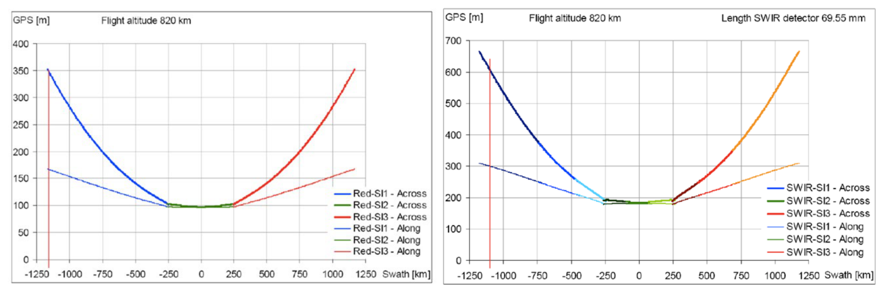
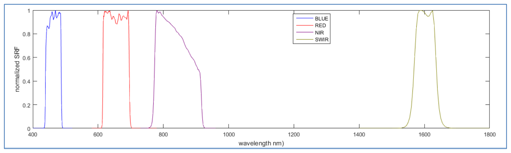
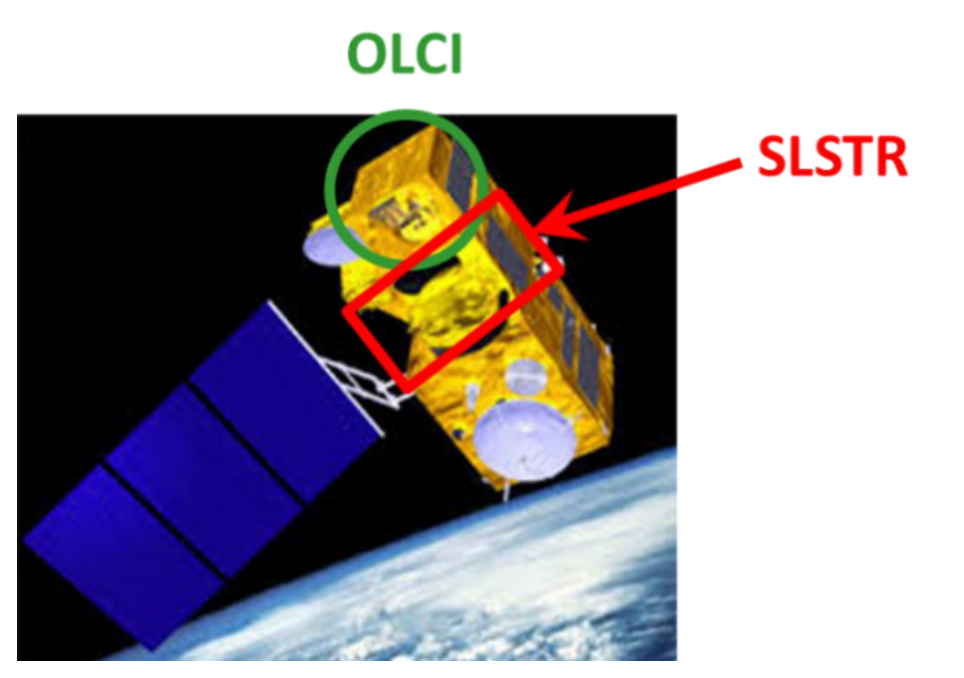
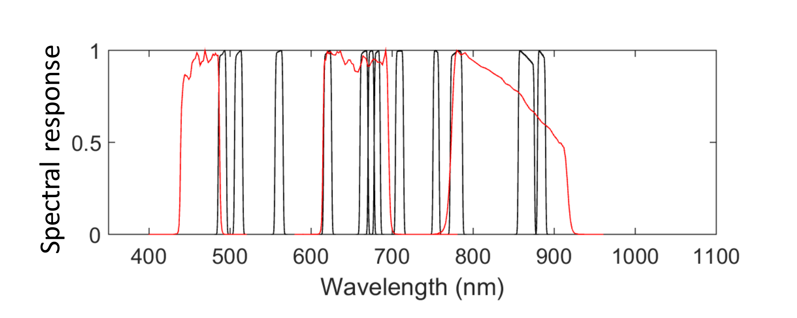
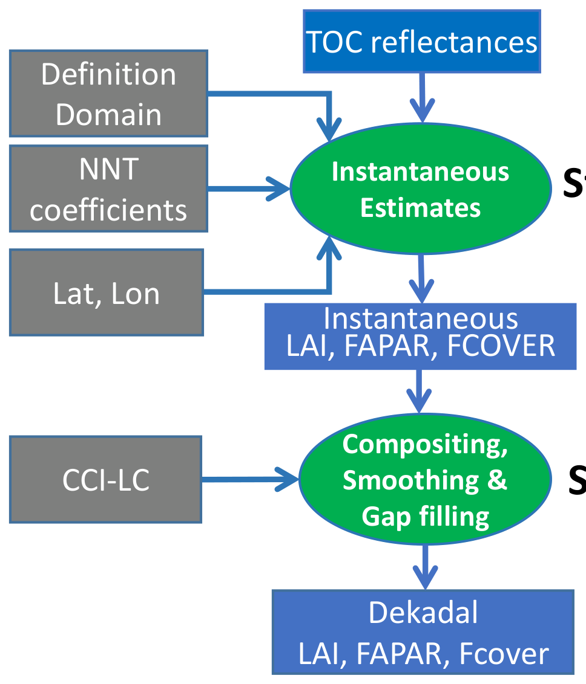
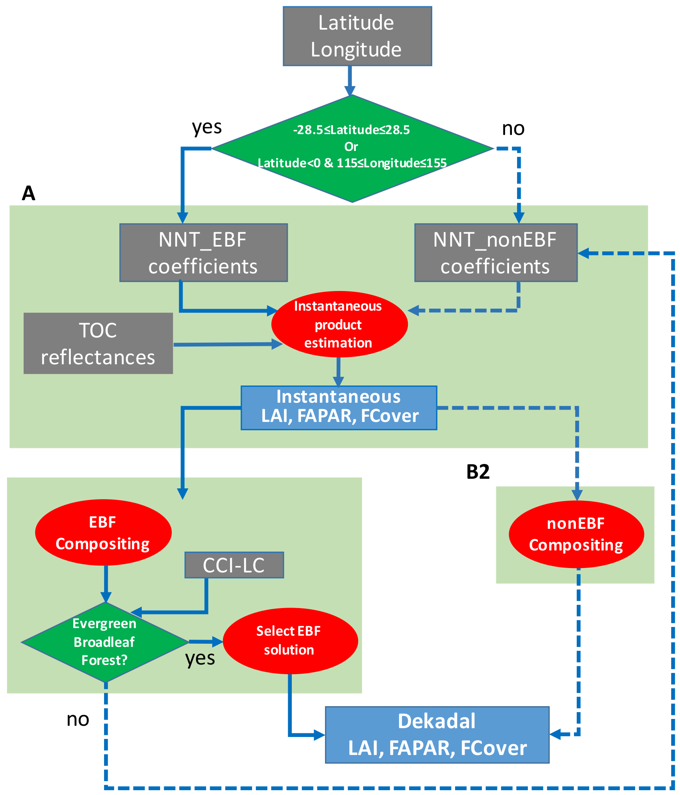
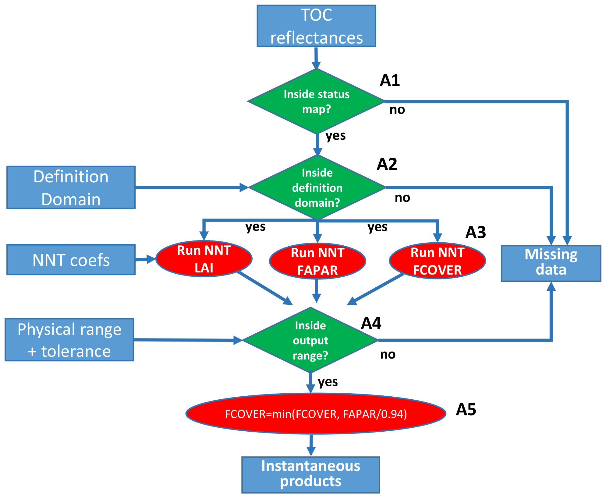

```{=html}
<table>
<colgroup>
<col style="width: 14.9%">
<col style="width: 73.7%">
<col style="width: 11.4%">
</colgroup>
  <tr>
    <td colspan="2" style="font-weight:bold;">Dissemination Level</td>
  </tr>
  <tr>
    <td>PU</td>
    <td>Public</td>
    <td>X</td>
  </tr>
  <tr>
    <td>PP</td>
    <td>Restricted to other programme participants (including the Commission Services)</td>
    <td></td>
  </tr>
  <tr>
    <td>RE</td>
    <td>Restricted to a group specified by the consortium (including the Commission Services)</td>
    <td></td>
  </tr>
  <tr>
    <td>CO</td>
    <td>Confidential, only for members of the consortium (including the Commission Services)</td>
    <td></td>
  </tr>
</table>
```
## Document Release Sheet

```{=html}
<table>
<colgroup>
<col style="width: 25.8%">
<col style="width: 26.6%">
<col style="width: 10.6%">
<col style="width: 5.6%">
<col style="width: 10.6%">
<col style="width: 20.8%">
</colgroup>
  <tr>
    <td style="font-weight:bold">Book captain:</td>
    <td>Aleixandre Verger (CREAF)</td>
    <td style="font-weight:bold;">Sig</td>
    <td></td>
    <td style="font-weight:bold">Date</td>
    <td>10.04.2026</td>
  </tr>
  <tr>
    <td style="font-weight:bold">Approval:</td>
    <td>Roselyne Lacaze (HYGEOS)</td>
    <td style="font-weight:bold; text-align:center">Sign</td>
    <td></td>
    <td style="font-weight:bold">Date</td>
    <td>10.04.2026</td>
  </tr>
  <tr>
    <td style="font-weight:bold">Endorsement:</td>
    <td>N. Gobron (JRC)</td>
    <td style="font-weight:bold; text-align:center">Sign</td>
    <td></td>
    <td style="font-weight:bold">Date</td>
    <td></td>
  </tr>
  <tr>
    <td style="font-weight:bold">Distribution:</td>
    <td>Public</td>
    <td colspan="4"></td>
  </tr>
</table>
```

## Change Record

| Date | Page(s) | Description of Change | Release |
|---------------------------------------|---------------------------------|---------------------------------------------------------------------------------------------------|-----------------------------|
| 26.09.2025 | All | First issue for Version 2.0 of Sentinel-3 and PROBA-V products | I1.00 |
| 10.04.2026 | 66 <br> 79, 82, 85 | Clarifications in Section 4.5 <br> Add Figure 28, Figure 31, Figure 34 in Section5.3 | I1.10 |

## List of Acronyms

| Acronym | Definition |
|--------------------------------------------|------------------------------------------------------------------------------------------------------------------------------------------------------------|
| AD | Applicable Document |
| ATBD | Algorithm theoretical based Document |
| AATSR | Advanced Along Track Scanning Radiometer |
| BELMANIP | BEnchmark Land Multisite ANalysis and Intercomparison of Products |
| C6 | Collection 6 |
| CCI-LC | Climate Change Initiative-Land Cover |
| CEOS | Committee for Earth Observation Satellite |
| CG | Crops and Grassland |
| CLMS | Copernicus Land Monitoring Service |
| COG | Cloud-Optimized Geotiff |
| CYCLOPES | Carbon cYcle and Change in Land Observational Products from an Ensemble of Satellites. |
| DBF | Deciduous Broadleaf Forest |
| DN | Digital Number |
| EBF | Evergreen Broadleaf Forest |
| FAPAR | Fraction of Absorbed Photosynthetically Active Radiation |
| FCover | Fraction of vegetation cover |
| FIPAR | Fraction of Intercepted Photosynthetically Active Radiation |
| FP5/FP7 | 5^th^ and 7^th^ Framework Programme |
| JRC | Joint Research Center |
| GAUL | Global Administrative Unit Layer |
| GBOV | Ground-Based Observations for Validation |
| GCOS | Global Climate Observation System |
| GEOCLIM | Climatology of Version1 LAI, FAPAR, Fcover VGT products |
| GLASS | Global Land Surface Satellite |
| GLOBCOVER | Global land cover from MERIS |
| GMES | Global Monitoring of Environment and Security |
| IDEPIX | Identification of Pixels processor |
| ImagineS | Implementation of Multi-scale Agricultural Indicators Exploiting Sentinels |
| LAI | Leaf Area Index |
| LSA SAF | Land Surface Analysis Satellite Applications Facility |
| MERIS | Medium Resolution Imaging Spectrometer |
| MODIS | Moderate Imaging Spectrometer |
| NDVI | Normalized Difference Vegetation Index |
| NF | Needleleaf Forest |
| NIR | Near Infrared spectral domain |
| NNT | Neural Network Technique |
| NOBS | Number of observations |
| OLCI | Ocean and Land Colour Instrument |
| PROBA-V | Project of on-board autonomy – VEGETATION instrument |
| PUM | Product User Manual |
| PV | PROBA-V |
| QA | Quantitative quality assessment |
| QAR | Quality Assessment Report |
| QC | Qualitative quality index |
| R&D | Research and Development |
| RMSE | Root Mean Square Error |
| RT | Real Time |
| S3 | Sentinel-3 |
| SAA | Sun Azimuth Angle |
| SLSTR | Sea and Land Surface Temperature Radiometer |
| SMAC | Simplified Method for Atmospheric Correction |
| SPOT | Satellite Pour l'Observation de la Terre |
| SSB | Shrubs/Savana/Bare soil |
| SSD | Service Specifications Document |
| SVP | Service Validation Plan |
| SZA | Sun Zenith Angle |
| TOA | Top of Atmosphere |
| TOC | Top of Canopy |
| VAA | Viewing Azimuth Angle |
| VGT | VEGETATION instrument onboard SPOT satellite |
| VZA | Viewing Zenith Angle |
| WGS84 | World Geodetic System 1984 |

# EXECUTIVE SUMMARY

The Copernicus Land Monitoring Service (CLMS) produces a series of qualified bio-geophysical products on the status and evolution of the land surface. The products are used to monitor vegetation, crops, water cycle, energy budget and terrestrial cryosphere. Production and delivery of the parameters take place in a timely manner and are complemented by the constitution of long-term time series.

From 1^st^ January 2013, the Copernicus Land Monitoring Service is providing Essential Climate Variables like the Leaf Area Index (LAI), the Fraction of Absorbed Photosynthetically Active Radiation absorbed by the vegetation (FAPAR), as well as the Fraction of Green Vegetation Cover (FCover), every 10 days over the globe, on a reliable and automatic basis from Earth Observation satellite data.

The operations of the CLMS are supported by a number of research and development initiatives. Among them, the FP7 ImagineS project (http://FP7-imagines.eu) set-up the Version 1.0 of the algorithm retrieving the LAI, FAPAR, FCover 300m products from PROBA-V data The Version 1.0 of these products, produced and delivered in near Real Time (RT), were derived from PROBA-V Collection 1 data from January 2014 to June 2020, end of the operational PROBA-V mission.. The Version 1.1. of the algorithm was adapted to the imagery of the Ocean and Land Colour Instrument (OLCI) onboard the Sentinel-3 platform. The Version 1.1 Sentinel-3 products were delivered from July 2020 ensuring the continuity of PROBA-V LAI, FAPAR, and FCover 300m products. The quality assessment was reported in [CGLOPS1_QAR_LAI[FAPAR/FCOVER]300m-V1.1]. Some marginal inconsistencies were identified between PROBA-V and Sentinel-3 300m products due to the differences between Version 1.0 and Version 1.1 retrieval algorithms and input auxiliary data, and because of some issues in the implementation of Version 1.0 and Version 1.1 algorithms. Further, the Collection 2 of PROBA-V data has been released in March 2023. To improve the consistency of the long time series of LAI, FAPAR and FCover products at 300m resolution from 2014 to present, we have adapted Version 1.1 to the characteristics of PROBA-V Collection 2 input data and to the Version 2.3 of Sentinel-3 OLCI surface reflectance for the reprocessing of the entire time series, from PROBA-V and Sentinel-3, resulting in Version 2.0 algorithm.

This Algorithm Theoretical Based Document (ATBD) describes the Version 2.0 of the algorithm for the generation of LAI, FAPAR and FCover 300m products from PROBA-V Collection 2 (2014-2018) and Sentinel-3 OLCI (2019-present) data. The variables are calculated globally on a 10-daily basis and made available to the user in near-real time every 10 days. The product is projected on a regular latitude/longitude grid with a resolution of 1/336°. It is delivered covering the whole globe (from - 180°E to +180°W and from +85°N to -65°S) and provided in netCDF4-CF format (by default format) containing the variables values (LAI, FAPAR and FCover), associated with some quantitative and qualitative quality indicators.

# BACKGROUND OF THE DOCUMENT

## SCOPE AND OBJECTIVES

CLMS supports applications in a variety of domains such as spatial and urban planning, forest management, water management, agriculture and food security, nature conservation and restoration, rural development, ecosystem accounting and mitigation/adaptation to climate change. The products are then operationally generated and delivered freely in near real time through the CLMS portal (https://land.copernicus.eu).

This document provides a detailed description and justification of the algorithm proposed for Version 2.0 of the algorithm of the LAI, FAPAR and FCover 300m derived from PROBA-V and Sentinel-3 Top-Of-Canopy (TOC) reflectance.

A theoretical validation is done including a comparison with Version 1.0 of PROBA-V 300m products (Fuster et al. 2020) and MODIS Collection 6 products (Myneni et al. 2002; Yan et al. 2016a; Yan et al. 2016b). Further validation of the products is completed by a full quality assessment analysis according to the Product Quality Assurance Document [CGLOPS1_PQAD].

## CONTENT OF THE DOCUMENT

This document is structured as follows:

-   Chapter 2 recalls the requirements
-   Chapter 3 contains the definition of the proposed products, a description of the input data and the outline of the algorithm
-   Chapter 4 describes in detail the algorithm
-   Chapter 5 presents the algorithm performance

## RELATED DOCUMENTS

### Applicable documents

AD1: Part 2: Technical specifications of Framework Service Contract – Operation of the bio-geophysical variables systematic monitoring of the Global Land Component of the Copernicus Land Service 'CGLOPS' JRC/2023/OP/0273, 19^th^ April 2023.

Available at https://etendering.ted.europa.eu/cft/cft-display.html?cftId=13795

### Input

| Document ID | Descriptor |
|--------------------------------------------------------------------------------------------------|------------------------------------------------------------------------------------------------------|
| CGLOPS1_PQAD | Product Quality Assurance Document of the Copernicus Land Monitoring Service for “Vegetation and Energy" products |
| CGLOPS1_ATBD_S3-AC-V1 | Algorithm Theoretical Basis Document of the atmospheric corrections applied on the Sentinel-3 data |
| CGLOPS1_QAR_S3-CloudMask | Report presenting the evaluation of Sentinel-3 OLCI and SLSTR cloud, cloud shadow and snow masks. |
| CGLOPS1_PUM_S3-TOC-Reflectance300m-V2.3 | Product User Manual of Sentinel-3 OLCI and SLSTR Top-Of-Canopy Reflectance Version 2.3 |
| CGLOPS1_QAR_LAI[FAPAR/FCOVER] 300m-V1 | Quality assessment report of the LAI, FAPAR, FCover 300m Version 1.0 PROBA-V products |
| CGLOPS1_QAR_LAI[FAPAR/FCOVER] 300m-V1.1 | Quality assessment report of the LAI, FAPAR, FCover 300m Version 1.1 Sentinel-3 products |

These documents are available on the CLMS website, in the Technical Library: https://land.copernicus.eu/en/technical-library

### Output

CGLOPS1_PUM_LAI[FAPAR/FCOVER] 300m-V2.0
: Product User Manual summarizing all information about LAI, FAPAR, FCover 300m Version 2.0 product

CGLOPS1_VR_LAI[FAPAR/FCOVER]300m-V2.0
: Validation Report of the LAI, FAPAR, FCover 300m Version 2.0 product

These documents are available on https://land.copernicus.eu/en/technical-library

### External documents

| Document ID | Descriptor |
|-------------------------------------------------------------|-------------------------------------------------------------------------------------------------------------------------------------------|
| ImagineS_RP2.1_ATBD-LAI300m_I1.73 | Algorithm Theoretical Basis Document describing the retrieval methodology of the Version 1.0 of LAI, FAPAR, FCover 300m from PROBA-V, set-up in the context of the FP7/ImagineS project. |

Available on: https://land.copernicus.eu/en/technical-library

PROBAV_PUM_C2
: PROBA-V Collection 2 Products User Manual v1.0, 27 March 2023

Available at https://proba-v.vgt.vito.be/sites/probavvgt/files/downloads/PROBA-V_C2_Products_User_Manual.pdf

ACRI-ST, 2017
: Product Data Format Specification – OLCI Level 1 products, available at:

https://sentinels.copernicus.eu/documents/247904/4812102/S3IPF_PDS_004.1_-_i2r5_–_Product_Data_Format_Specification_–_OLCI_Level_1.pdf

GCOS#245
: The 2022 GCOS ECVs Requirements

Available online at : https://library.wmo.int/records/item/58111-the-2022-gcos-ecvs-requirements-gcos-245?offset=1

# REQUIREMENTS

According to the applicable document [AD1], the requirements relevant for LAI, FAPAR, FCover products are described below.

## SPECIFIC TECHNICAL DETAILS AND REQUIREMENTS

```{=html}
<table>
<colgroup>
<col style="width: 37.2%">
<col style="width: 62.8%">
</colgroup>
  <tr>
    <td colspan="2" style="background-color:#538135; color:#ffffff; font-weight:bold">PRODUCT SPECIFICATION</td>
  </tr>
  <tr>
    <td colspan="2" style="font-weight:bold">Geometric Properties:</td>
  </tr>
  <tr>
    <td>Baseline dataset pixel resolution</td>
    <td>300m</td>
  </tr>
  <tr>
    <td>Target baseline location accuracy</td>
    <td>Better than 0.5 pixels</td>
  </tr>
  <tr>
    <td>Coordinate position</td>
    <td>Centre of the pixel</td>
  </tr>
  <tr>
    <td>Geodetical datum</td>
    <td>WGS84</td>
  </tr>
  <tr>
    <td>Geographic projection</td>
    <td>Regular latitude/longitude grid</td>
  </tr>
  <tr>
    <td>Geographic coverage:</td>
    <td>Global</td>
  </tr>
  <tr>
    <td>Temporal resolution</td>
    <td>10-day period (dekad: days 1-10, 11-20, 21 end of month)</td>
  </tr>
  <tr>
    <td>Timeliness</td>
    <td>Within 2 days (optimally 1 day) after the end of each dekad</td>
  </tr>
</table>
```

```{=html}
<table>
<colgroup>
<col style="width: 52.1%">
<col style="width: 47.9%">
</colgroup>
  <tr>
    <td colspan="2" style="background-color:#538135; color:#ffffff; font-weight:bold">FAPAR – FRACTION OF ABSORBED PHOTOSYNTHETICALLY ACTIVE RADIATION</td>
  </tr>
  <tr>
    <td colspan="2">FAPAR corresponds to the fraction of photosynthetically active radiation (PAR, i.e. solar radiation in the spectral range 400-700 nm) that is absorbed by plants.</td>
  </tr>
  <tr>
    <td>Uncertainty (2-sigma)</td>
    <td>Threshold: 10% for values >0.05; <br> 0.005 (absolute values) for smaller values <br> Goal: 5% for values ≥ 0.05 <br> 0.0025 (absolute value) for smaller values</td>
  </tr>
  <tr>
    <td>Stability (per decade i.e. 10 years)</td>
    <td>Threshold: 3% <br> Goal: 1.5%</td>
  </tr>
</table>
```

```{=html}
<table>
<colgroup>
<col style="width: 52.1%">
<col style="width: 47.9%">
</colgroup>
  <tr>
    <td colspan="2" style="background-color:#538135; color:#ffffff; font-weight:bold">LAI - LEAF AREA INDEX</td>
  </tr>
  <tr>
    <td colspan="2">Leaf Area Index of a plant canopy or ecosystem is defined as one half of the total green leaf area per unit horizontal ground surface area and measures the area of leaf material present in the specified environment (projection to the underlying ground along the normal to the slope) [m²/m²].</td>
  </tr>
  <tr>
    <td>Uncertainty (2-sigma)</td>
    <td>Threshold: 20% for values ≥ 0.5 <br> 0.1 (absolute value) for smaller values <br> Goal: 10% for values ≥ 0.5 <br> 0.05 (absolute value) for smaller values</td>
  </tr>
  <tr>
    <td>Stability (per decade, i.e. 10 years)</td>
    <td>Threshold: 3% <br> Goal: 1.5%</td>
  </tr>
</table>
```
```{=html}
<table>
<colgroup>
<col style="width: 54.2%">
<col style="width: 45.8%">
</colgroup>
  <tr>
    <td colspan="2" style="background-color:#538135; color:#ffffff; font-weight:bold">FCOVER – FRACTION OF GREEN VEGETATION COVER</td>
  </tr>
  <tr>
    <td colspan="2">The Fraction of Vegetation Cover corresponds to the fraction of ground covered by green vegetation. Practically, it quantifies the spatial extent of the vegetation.</td>
  </tr>
  <tr>
    <td>Uncertainty (2-sigma)</td>
    <td>Threshold: 10% <br> Goal: 5%</td>
  </tr>
  <tr>
    <td>Stability (per decade, i.e. 10 years)</td>
    <td>Threshold: 5% <br> Goal: 2.5%</td>
  </tr>
</table>
```
## FURTHER REQUIREMENTS

### Output product composition

Products may contain various information layers and ancillary information – the base reference for product packages are the operational products as on 01.03.2023.

### Data structure

Data coding[^1] shall be compatible with the Global Land products as on 01.03.2023 and/or follow the INSPIRE specifications, where applicable.

Ancillary information shall be as currently used and include at least the following:

-   The number of measurements per pixel used to generate any synthesis product
-   The per-pixel date of the individual measurement or the start-end dates of the period covered
-   Quality indicators, with explicit per-pixel identification of the cause of anomalous parameter result.

The product naming and filename conventions that are used in the Copernicus Global Land component production as on 01.03.2023 shall be followed. This may be adapted for complete product collections upon agreement with the contracting authority during the Framework.

### Data format

To ensure interoperability with the current Global Land component (operational product data formats and archive data formats) and other Copernicus services, all datasets will be available in NETCDF. Additional format such as Cloud Optimized Geotiff (COG) or ZAR format can be proposed for production or could be requested by the Contracting Authority during the Framework Contract.

[^1]: Data coding is the provision for the number of bits, range of values, usage of reserved values, content of status map,

### Uncertainties and validation

Uncertainties indicated in the product specifications above follow the threshold and goal proposed by GCOS#245.

Uncertainties estimates should account for the error propagation uncertainty coming from input data though the retrieval algorithms as during the contract period, ESA plans to imbed uncertainties in the Sentinel-3 ground segment products and, for Sentinel-2, there is an offline tool to determine Level 1 uncertainties; these can be used for propagation in the production chain.

Validation of the products shall conform to at least the CEOS LPV standards. Wherever appropriate the bio-geophysical variables shall be validated and compared to CEOS CAL/VAL data sets and/or Ground-Based Observations for Validation (GBOV) of Copernicus Global Land component of Copernicus Global Land component when biophysical parameters are available.

### Input data

Copernicus sentinel data are available from https://dataspace.copernicus.eu

Bio-geophysical variable products should be based on common base reflectance data:

-   Sentinel 3: Derived Top-of-Canopy reflectance may be brokered or produced as it is the case on 01.03.2023 under the CGLOPS contracts;
-   Sentinel 2: the Global Land Sentinel-2 Global Mosaic (S2GM)² component provides temporal mosaic of surface spectral bands that can be brokered and/or directly used.

Up to and including 2019, products archives of the Global Land Component have been based on SPOT VGT, Proba-V, ENVISAT, MODIS, TOPEX/Poseidon, Jason-1, Jason-2, Jason-3, datasets, which are available through the https://dataspace.copernicus.eu.

LST and SWI can be based on geostationary and other satellite data.

Ancillary satellite data that is purchased through Copernicus and put at disposal of the Services is available through the Data Warehouse and will become available on the Copernicus Dataspace Ecosystem.

Ancillary data sets, other than satellite imagery described above, that might be required shall be the responsibility of the contractor.

²

### Product delivery

Products shall be delivered to the Copernicus Land Component dissemination. The Copernicus Data Space Ecosystem infrastructure will be used to provide access to the final map products.

# OVERVIEW

## THE CONSIDERED PRODUCTS

The considered products correspond to actual vegetation biophysical variables that are defined below.

### Leaf Area Index (LAI)

LAI is defined as one half the total green (i.e., photosynthetically active) leaf area per unit horizontal ground surface area (Chen and Black 1992). LAI is a non-dimensional quantity, although units of m²/m² are often quoted. It determines the size of the interface for exchange of energy (including radiation) and mass between the canopy and the atmosphere. This is an intrinsic canopy primary variable that should not depend on observation conditions. LAI is strongly non-linearly related to reflectance. Therefore, its estimation from remote sensing observations is scale dependent (Garrigues et al. 2006; Weiss et al. 2000). Note that vegetation LAI as estimated from remote sensing includes all the green contributors such as the understory when existing under forests canopies.

### FAPAR

The FAPAR is defined as the fraction of photosynthetically active radiation (PAR; solar radiation reaching the surface in the 0.4-0.7µm spectral region) that is absorbed by vegetation. FAPAR is expressed as a unitless fraction of the incoming radiation received at the land surface. The FAPAR value results directly from the radiative transfer in the canopy. FAPAR is the sum of two terms, weighted by the diffuse fraction in the PAR domain: the 'black sky' FAPAR that corresponds to the direct component (collimated beam irradiance in the sun direction only) and the 'white sky' or the diffuse component. FAPAR can be computed at a given time (e.g instantaneous FAPAR at the actual sun position of measurement) or daily integrated.

FAPAR depends on canopy structure, vegetation element optical properties and illumination conditions (Baret et al. 2007). It is very useful as input to a number of primary productivity models based on simple efficiency considerations (McCallum et al. 2009; Prince 1991). Most of the primary productivity models using this efficiency concept are running at the daily time step. Since the CLMS FAPAR product is originally derived from CYCLOPES FAPAR at 10:00 (Baret et al. 2007) and MODIS aboard Terra FAPAR at 10:30 (Myneni et al. 2002), CLMS FAPAR product is defined as the black-sky fraction of PAR absorbed by green elements including over and understorey vegetation at 10:15 (actually between 10:00 and 10:30) which is a good approximation of the daily integrated black-sky FAPAR value (Baret et al. 2007).

FAPAR is relatively linearly related to reflectance values, and is little sensitive to scaling issues (Hilker et al. 2010; Weiss et al. 2000). Note also that the FAPAR refers only to the green parts of the canopy.

### Fraction of green Vegetation Cover (FCover)

FCover is defined as the fraction of ground surface covered by green vegetation as seen from the nadir direction (Baret et al. 2013). This definition agrees with the definition of LSA SAF FCover products (https://landsaf.ipma.pt/en/products/vegetation/fvc/) as well as the GLASS FCover product (Jia et al. 2015). FCover is expressed as a unitless fraction of the ground surface.

FCover is used to separate vegetation and soil in energy balance processes, including temperature and evapotranspiration. It is computed from the leaf area index and other canopy structural variables and does not depend on variables such as the geometry of illumination as compared to FAPAR. For this reason, it is a very good candidate for the replacement of classical vegetation indices for the monitoring of green vegetation. Because of its quasi-linear relationship with reflectances, FCover is only marginally scale dependent (Weiss et al. 2000). Note that similarly to LAI and FAPAR, only the green elements are considered.

## PROBA-V INSTRUMENTS AND DATA

The PROBA-V Collection 2 (C2) daily synthesis (S1) top of canopy (TOC) reflectance products [PROBAV_PUM_C2] have been used in Version 2.0 of 300m algorithm.

The PROBA-V sensor has been launched on 6^th^ May 2013 onboard the PROBA platform. It was designed to bridge the gap in space-borne vegetation measurements between SPOT-VGT (March 2018 - May 2014) and the Sentinel-3 satellites launched in 2016. The mission objective is to ensure the continuity with the heritage of the SPOT-VGT mission.

PROBA-V operated at an altitude of 820 km altitude in a sun-synchronous orbit with a local overpass time at launch of 10:45 h. Because the satellite had no onboard propellant, the overpass time was expected to gradually differ from the at-launch value. After launch, the local overpass time first increased to 10:50h in October 2014, followed by a decrease to 10:45h in June 2016. By end-of-mission in June 2020, the Local Time of Descending Node will be at ~09:30h.

The instrument had a Field of View of 102°, resulting in a swath width of 2295 km. This swath width ensured a daily near-global coverage (90%) and full global coverage is achieved every 2 days. An array of 6000x4 elements was used in the VIS-NIR (only 3 bands on the 4 potential ones are used) yielding to a ground sampling distance that varied across the swath from 100m up to 350m at the extremities of the swath (Figure 1, left). The SWIR domain was sampled using 3 arrays of 1024 elements, providing a ground sampling distance about twice as that in the VIS-NIR (Figure 1, right).

This obviously posed a problem regarding the consistency of the radiometric information between the VIS-NIR and SWIR domains.

The optical design of PROBA-V consisted of three cameras. Each camera had two focal planes, one for the short-wave infrared (SWIR) and one for the visible and near-infrared (VNIR) bands. The VNIR detector consisted of four lines of 5200 pixels. Three spectral bands were implemented, comparable with SPOT-VGT: BLUE, RED, and NIR (see Table 1). The SWIR detector was a linear array composed of three staggered detectors of 1024 pixels. The normalized spectral response functions of the four spectral bands of PROBA-V are shown in Figure 2.

The PROBA-V processing was described in Sterckx et al. (2014) and Dierckx et al. (2014). Information on the PROBA-V Collection 2 is available on https://proba-v.vgt.vito.be/en/quality/product-and-algorithm-information. The description of the PROBA-V S1 TOC products is summarized in Table 2 and detailed in the Product User Manual [PROBAV_PUM_C2].



: Table 1: PROBA-V spectral characteristics: band center and width. The spectral bands selected for Version 2.0 of LAI, FAPAR, FCover 300m algorithm are highlighted in bold.

```{=html}
<table>
<colgroup>
<col style="width: 20.7%">
<col style="width: 20.0%">
<col style="width: 17.9%">
<col style="width: 41.5%">
</colgroup>
  <tr>
    <td><b>Acronym</b></td>
    <td><b>Center (nm)</b></td>
    <td><b>Width (nm)</b></td>
    <td><b>Potential Applications</b></td>
  </tr>
  <tr>
    <td>B0 (blue)</td>
    <td>463</td>
    <td>46</td>
    <td>Continental ecosystems - Atmosphere</td>
  </tr>
  <tr>
    <td><b>B2 (red)</b></td>
    <td><b>655</b></td>
    <td><b>79</b></td>
    <td><b>Continental ecosystems</b></td>
  </tr>
  <tr>
    <td><b>B3 (NIR)</b></td>
    <td><b>845</b></td>
    <td><b>144</b></td>
    <td><b>Continental ecosystems</b></td>
  </tr>
  <tr>
    <td><b>SWIR</b></td>
    <td><b>1600</b></td>
    <td><b>73</b></td>
    <td><b>Continental ecosystems</b></td>
  </tr>
</table>
```



: Table 2: PROBA-V S1 data descriptor

```{=html}
<table style="font-size: 10pt">
<colgroup>
<col style="width: 38.9%">
<col style="width: 61.1%">
</colgroup>
  <caption style="caption-side:bottom; text-align:left"></caption>
  <tr>
    <td style="background-color:#92d050; font-weight:bold">PROBA-V planes</td>
    <td style="background-color:#92d050; font-weight:bold">Description</td>
  </tr>
  <tr>
    <td>B0</td>
    <td>B0 spectral band, Radiometry data</td>
  </tr>
  <tr>
    <td>B2</td>
    <td>B2 spectral band, Radiometry data</td>
  </tr>
  <tr>
    <td>B3</td>
    <td>B3 spectral band, Radiometry data</td>
  </tr>
  <tr>
    <td>SWIR</td>
    <td>SWIR spectral band, Radiometry data</td>
  </tr>
  <tr>
    <td>NDVI</td>
    <td>Normalized Difference Vegetation Index data</td>
  </tr>
  <tr>
    <td>QC</td>
    <td>
      Quality Control<br>
      Bit NR 7: Radiometric quality for B0 coded as 0 if bad and 1 if good<br>
      Bit NR 6: Radiometric quality for B2 coded as 0 if bad and 1 if good<br>
      Bit NR 5: Radiometric quality for B3 coded as 0 if bad and 1 if good<br>
      Bit NR 4: Radiometric quality for MIR coded as 0 if bad and 1 if good<br>
      Bit NR 3: land code 1 or water code 0<br>
      Bit 2: snow/ice code 1 or code 0 if no ice/snow<br>
      <div style="font-family:monospace; white-space:pre">Bit 1: 0   0   1   1   0
Bit 0: 0   1   0   1   0
Clear Shadow Undefined Cloud Ice</div>
    </td>
  </tr>
  <tr>
    <td>VZA-VNIR</td>
    <td>view zenith angles for Visible and Near Infra-Red channels</td>
  </tr>
  <tr>
    <td>VAA-VNIR</td>
    <td>view azimuth angles for Visible and Near Infra-Red channels</td>
  </tr>
  <tr>
    <td>VZA-SWIR</td>
    <td>View zenith angles for SWIR channel</td>
  </tr>
  <tr>
    <td>VAA-SWIR</td>
    <td>View azimuth angles for SWIR channel</td>
  </tr>
  <tr>
    <td>SZA</td>
    <td>sun zenith angles</td>
  </tr>
  <tr>
    <td>SAA</td>
    <td>sun azimuth angles</td>
  </tr>
  <tr>
    <td>TIME</td>
    <td>Observation timing information</td>
  </tr>
</table>
```

## SENTINEL-3 INSTRUMENTS AND DATA

Sentinel-3 is a constellation of at least 2 identical satellites, Sentinel-3A and 3B. Sentinel-3A was launched on 16 February 2016 with 4 instruments on board (Figure 3) followed by the launch of Sentinel-3B on 25 April 2018. Each satellite operates in a reference orbit with a repeat cycle of 27 days, with a 4-day sub-cycle. The use of Sentinel-3A and Sentinel-3B satellites in conjunction enable a short revisit time of less than two days at the equator.





: Table 3: Sentinel-3 OLCI spectral characteristics: band center and width. The spectral bands selected for LAI, FAPAR, FCover 300m algorithm are highlighted in bold.

```{=html}
<table>
<colgroup>
<col style="width: 11.7%">
<col style="width: 19.8%">
<col style="width: 15.6%">
<col style="width: 52.9%">
</colgroup>
  <tr>
    <td><b>Band</b></td>
    <td><b>λ centre (nm)</b></td>
    <td><b>Width (nm)</b></td>
    <td><b>Potential Application</b></td>
  </tr>
  <tr>
    <td>Oa1</td>
    <td>400</td>
    <td>15</td>
    <td>Aerosol correction, improved water constituent retrieval</td>
  </tr>
  <tr>
    <td>Oa2</td>
    <td>412.5</td>
    <td>10</td>
    <td>Yellow substance and detrital pigments (turbidity)</td>
  </tr>
  <tr>
    <td>Oa3</td>
    <td>442.5</td>
    <td>10</td>
    <td>Chlorophyll absorption max., biogeochemistry, vegetation</td>
  </tr>
  <tr>
    <td><b>Oa4</b></td>
    <td><b>490</b></td>
    <td><b>10</b></td>
    <td><b>High Chlorophyll, other pigments</b></td>
  </tr>
  <tr>
    <td><b>Oa5</b></td>
    <td><b>510</b></td>
    <td><b>10</b></td>
    <td><b>Chlorophyll, sediment, turbidity, red tide</b></td>
  </tr>
  <tr>
    <td><b>Oa6</b></td>
    <td><b>560</b></td>
    <td><b>10</b></td>
    <td><b>Chlorophyll reference (Chlorophyll minimum)</b></td>
  </tr>
  <tr>
    <td><b>Oa7</b></td>
    <td><b>620</b></td>
    <td><b>10</b></td>
    <td><b>Sediment loading</b></td>
  </tr>
  <tr>
    <td><b>Oa8</b></td>
    <td><b>665</b></td>
    <td><b>10</b></td>
    <td><b>Chlorophyll (2nd Chlorophyll abs. max.), sediment, yellow substance /vegetation</b></td>
  </tr>
  <tr>
    <td><b>Oa9</b></td>
    <td><b>673.75</b></td>
    <td><b>7.5</b></td>
    <td><b>For improved fluorescence retrieval and to better account for smile together with the bands 665 and 680 nm</b></td>
  </tr>
  <tr>
    <td><b>Oa10</b></td>
    <td><b>681.25</b></td>
    <td><b>7.5</b></td>
    <td><b>Chlorophyll fluorescence peak, red edge</b></td>
  </tr>
  <tr>
    <td><b>Oa11</b></td>
    <td><b>708.75</b></td>
    <td><b>10</b></td>
    <td><b>Chlorophyll fluorescence baseline, red edge transition</b></td>
  </tr>
  <tr>
    <td><b>Oa12</b></td>
    <td><b>753.75</b></td>
    <td><b>7.5</b></td>
    <td><b>Oxygen absorption/clouds, vegetation</b></td>
  </tr>
  <tr>
    <td>Oa13</td>
    <td>761.25</td>
    <td>2.5</td>
    <td>Oxygen absorption band/aerosol correction</td>
  </tr>
  <tr>
    <td>Oa14</td>
    <td>764.375</td>
    <td>3.75</td>
    <td>Atmospheric correction</td>
  </tr>
  <tr>
    <td>Oa15</td>
    <td>767.5</td>
    <td>2.5</td>
    <td>Oxygen absorption band used for cloud top pressure, fluorescence over land</td>
  </tr>
  <tr>
    <td><b>Oa16</b></td>
    <td><b>778.75</b></td>
    <td><b>15</b></td>
    <td><b>Atmospheric correction/aerosol correction</b></td>
  </tr>
  <tr>
    <td><b>Oa17</b></td>
    <td><b>865</b></td>
    <td><b>20</b></td>
    <td><b>Atmospheric correction/aerosol correction, clouds, pixel co-registration</b></td>
  </tr>
  <tr>
    <td><b>Oa18</b></td>
    <td><b>885</b></td>
    <td><b>10</b></td>
    <td><b>Water vapour absorption reference band. Common reference</b></td>
  </tr>
  <tr>
    <td>Oa19</td>
    <td>900</td>
    <td>10</td>
    <td>Water vapour absorption, vegetation monitoring</td>
  </tr>
  <tr>
    <td>Oa20</td>
    <td>940</td>
    <td>20</td>
    <td>Water vapour absorption, atmos./aerosol corr.</td>
  </tr>
  <tr>
    <td>Oa21</td>
    <td>1 020</td>
    <td>40</td>
    <td>Atmospheric correction/aerosol correction</td>
  </tr>
</table>
```
The satellite flies at 814 km altitude on a circular sun-synchronous orbit with 10:00 am equatorial crossing time. The two optical instruments, OLCI (300m resolution) and SLSTR (500m resolution for optical bands and 1km for thermal ones) provide a common quasi-simultaneous view of the Earth. The SLSTR data is not used due to its lower spatial resolution. The OLCI has a swath of 1269 km, a field of view of 68° and 21 spectral channels (Table 3). The field-of-view is divided between five cameras on a common structure with the calibration assembly. Each camera has an optical grating to provide the minimum baseline of 16 spectral bands required by the mission together with the potential for optional bands for improved atmospheric corrections (Table 3 and Figure 4). Although preliminary designed for ocean applications, OLCI is fully suitable for land applications, considering its spectral characteristics and spatial resolution.

The instantaneous top of canopy (TOC) reflectance products [CGLOPS1_PUM_S3-TOC-Reflectance300m-V2.3] from OLCI in 12 spectral bands (Oa4-12 and Oa16-18, Figure 4 and Table 3) have been used in LAI, FAPAR, FCover 300m algorithm.

## RATIONALE FOR THE ALGORITHM SELECTION AND DESIGN

The objective is to develop an algorithm dedicated to the estimation of Version 2.0 of LAI, FAPAR and FCover 300m from the PROBA-V (2014-2018) and Sentinel-3 (2019-present) series of observations. The algorithm should provide high level of consistency with Version 1.0 of PROBA-V products. The Version 2.0 of LAI, FAPAR and FCover 300m products should have the same temporal sampling frequency of 10 days. Products should also be associated with quality assessment flags as well as quantified uncertainties. The algorithm runs at the pixel level without interactions with the surrounding pixels. The algorithm should provide real time estimation. This forces to perform short term projection of the product dynamics.

Version 1.0 of 300m algorithm was set-up in the ImagineS project [ImagineS_RP2.1_ATBD-LAI300m_I1.73]. After the quality assessment of the 300m LAI, FAPAR, FCover Version 1.0 [CGLOPS1_QAR_LAI[FAPAR/FCOVER]300m-V1], the methodology has been adapted to reduce the noise in the product time series especially in near real time mode and to address external recommendations and operational constraints in CLMS. This ATBD describes the Version 2.0 of the retrieval algorithm. Since the performance of LAI, FAPAR, FCover estimates is highly dependent on the level of noise in the input reflectance data, Top of Atmosphere (TOA) reflectance used in Version 1.0 have been replaced by TOC reflectance in the Version 2.0 of the algorithm. Further, the parametrization of the algorithm has been adapted in Version 2.0 to the characteristics of PROBA-V Collection 2 and Sentinel-3 Version 2.3 TOC reflectances. The neural networks used to transform PROBA-V and Sentinel-3 TOC reflectance into instantaneous LAI, FAPAR and FCover estimates have been calibrated with current Version 1.0 PROBA-V 300m LAI, FAPAR, FCover products to ensure a good agreement and temporal consistency in the transition from PROBA-V to Sentinel-3. Details of the Version 2.0 of LAI, FAPAR and FCover 300m are provided in Chapter 4. The differences with previous versions are detailed in Section 4.5.

## ALGORITHM OUTLINE

The scheme proposed for the 300m products retrieval methodology is sketched in Figure 5. The algorithm starts from instantaneous TOC reflectance products which are first transformed into instantaneous estimates of LAI, FAPAR, FCover (Step A in Figure 5). This Step A is sensor specific. Then, smoothing and gap filling is achieved over a compositing temporal window that may be dissymmetric as in the case of the near-real time situation or at the beginning of the time series (Step B in Figure 5).

Two different processing chains are applied whether the pixel's biome is an Evergreen Broadleaf Forests (EBFs) or not to account the specific behaviors of EBFs: (i) lower near infrared reflectance level for a given LAI value mainly due to thicker leaves, and (ii) high level of noise in the time series due to the remaining atmospheric effects and cloud contamination in regions characterized by a high occurrence of clouds. Gap filling is only applied for EBFs.



The selection of the instantaneous estimates considered as valid in the compositing window (Step B) is made based on the LAI product.

The compositing for real time estimates (Step B) is achieved according to the scheme described in Figure 6. We consider a particular dekadal date, D.

-   In real time mode, RT0 (when the actual date corresponds to D, i. e. the first line in Figure 6), the compositing is achieved using only the past observations, with a maximum compositing window spanning c- days in the past (c. was set to 210 days for EBF and 60 days for nonEBF). The value of the product at dekadal date D is therefore relatively unstable in the presence of noisy and missing data.
-   Then, the observations accumulate after dekadal date D when time passing. The value at dekadal date D is updated using the observations available after dekadal date D within the consolidation period. The accuracy of the product value progressively improves during this consolidation period.
-   At the end of the consolidation period, the value of the product at dekadal date D has converged towards the ‘historical' time series when, for a given dekad ‘D' to be processed, the 'n' dekads before 'D' and after 'D' in the time series are available. 'n' is the number of dekads required for the convergence of LAI, FAPAR and FCover values. ‘n' was fixed to 6 dekads, i.e. 60 days.

![Figure 6: Scheme showing the compositing used for near real time estimates from RT0 (in the top) to the final consolidation RT6 (in the bottom). D refers to the dekad being processed. D+n corresponds to the n dekads available after the dekad D. c- refers to the maximum semi-compositing window before date D (60 days for nonEBF and 210 days for EBF) and c+ refers to the semi-compositing window after date D (0 days for RT0, 10 days for RT1, 20 days for RT2, 30 days for RT3 and 60 days for RT6 and after if the time series are reprocessed).](Algorithm_theoretical_basis_document_-_Fraction_of_Absorbed_Photosynthetically_Active_Radiation_300m_version_2-media/img-158261b77e659cebbd542d3347fa7735.png)

Note that when working in real time estimation and updating the values for each new dekad available, the compositing period is not symmetric: the maximum compositing window in the past is longer before than after date D: c- > c+ for RT0, RT1, RT2...RT5. The compositing period after D is limited by the length of the consolidation period that is fixed to 60 days. For nonEBFs in RT6 case or when the time series are reprocessed in ‘historical' mode after D+6 dekads, the maximum length of the compositing period after date D should be equal to that in the period before, i.e. c+ = c- = 60 days (Figure 6). For EBFs, the compositing window is never symmetric: c-=210 days and c+=[0,60] days.

Once a new dekad is available after dekadal date D, the value of the RT product at dekadal date D is recomputed. Since the product value after the second consolidation (RT2) remains mostly stable (see section 5.1), the third, fourth and fifth consolidations are not distributed but only RT0, RT1, RT2 and the consolidated product after convergence, RT6, which is the final product. When the time series are reprocessed in ‘historical' mode after D+6 dekads, only RT6 products are produced and distributed. These are the main considerations for the processing of LAI, FAPAR, FCover 300m time series from PROBA-V (2014-2018) and Sentinel-3 (2019-present):

-   Processing must be done from 2014 onwards, chronologically.
-   Running PROBA-V chain from start of 2014 until end of 2019.
-   Running Sentinel-3 chain from start of 2019 until present. Because of the compositing process, the processing should start only when 210 days have been accumulated. In practice, this means start running Sentinel-3 chain for 1^st^ dekad 2019 using May-Dec 2018 Sentinel-3 data as input, i.e. generate daily LAI/FAPAR/FCover estimates from May 2018 (Step A of the algorithm) but generate composited values (Step B) only from start 2019 using the past May-Dec 2018 Sentinel-3 dailies for the composition.
-   CCI-LC of the year 2014 is only used for the identification of EBFs at the beginning of the time series to initialize PROBA-V processing. Then the information for land cover estimation comes from the data. To initialize Sentinel-3 chain, EBF/No-EBF information from PROBA-V chain are used. This ensures the consistency in the transition from PROBA-V to Sentinel-3 at the start of 2019.

# ALGORITHM DESCRIPTION

In this section, the inputs and outputs are described, along with the quality flags considered. Then, the several steps of the algorithm are presented in details.

## INPUTS

All these inputs are required for each considered pixel.

### Top of Canopy reflectance

The PROBA-V Collection 2 (C2) daily synthesis (S1) of Top of Canopy reflectance in B0: blue, B2: red and B3: near infrared bands (Table 1) are used as inputs. The SWIR band of PROBA-V sensor was not used because it is associated to a degraded spatial resolution and ground spatial sampling distance which are roughly twice that of the VIS-NIR domain (Figure 1). Note that the same spectral bands used in Version 1.0 of 300m products are used in Version 2.0.

The OLCI Top of Canopy reflectance in Oa4-12 and Oa16-18 spectral bands (Table 3) are used as inputs [CGLOPS1_ATBD_S3-AC-V1]. The blue bands Oa1-3 were discarded due to possible residual problems of atmospheric correction because they correspond to strong Rayleigh and aerosol scattering associated with low canopy reflectance levels (Liu et al. 2021). The narrow spectral bands Oa13-15 were discarded because they correspond to oxygen absorption bands used for aerosol, cloud and atmospheric correction. Finally, bands Oa19-21 were discarded because they are water absorption bands.

The PROBA-V and OLCI TOC reflectances should be expressed in terms of reflectance factor, mainly varying between 0.0 and 0.7 for most land surfaces outside the hot-spot or the specular directions and cloud, snow or ice cover.

### Geometry of acquisition

The geometry information is required for the neural networks. It includes:

-   the cosine of the view zenith angle (cos(VZA)),
-   the cosine of the sun zenith angle (cos(SZA)),
-   the cosine of the relative azimuth angle (cos(SAA-VAA)) where SAA corresponds to the Sun Azimuth Angle and VAA to the Viewing Azimuth Angle

### Land cover

The CCI-LC (https://www.esa-landcover-cci.org) land cover map was used as auxiliary information for deciding whether a pixel belongs or not to an Evergreen Broadleaf Forest (EBF) at the beginning of the time series as described in Section 4.3.2.1. The CCI-LC (2.0.7cds) classification for the first year of time series processing is used: i.e. CCI-LC 2014. This land cover map is derived from PROBA-V data at 300m (https://cds.climate.copernicus.eu/datasets/satellite-land-cover?tab=overview). According to CCI-LC legend, the EBF corresponds to class number 50 labeled as ‘Tree cover, broadleaved, evergreen, closed to open (>15%)'.

### Land/water mask

A mask identifying both open ocean pixels and inland water pixels as “water” must be used as auxiliary information for deciding whether a pixel belongs to land or water. This mask is inherited from the quality flags of OLCI Sentinel-3 TOC reflectance. IDEPIX_LAND flag, from Idepix cloud detection module, and 'fresh_inland_water' flag, from OLCI L1B data, are used to distinguish "land" and "water" pixels. Only "land" pixels are processed. One flag (QC(1) in Table 8) associated to the LAI, FAPAR, FCover products specifies if the pixel is identified as land (QC(1)=0) or water (QC(1)=1).

### Algorithm parameters

The two main steps (Step A and Step B) of the algorithm as showed in Figure 5 use a series of parameters listed in Table 4 and Table 5, respectively. Their roles and usages are further described in the various paragraphs of Section 4.3. The parameters used in the calibration of the neural networks and the elaboration of the definition domain are sensor specific and are given in Annex 1: Neural Network Calibration.

::: {.tbl-caption}
```{=typst}
#set text(size: 9pt, fill: rgb("#3E6893"))
```
Table 4: The algorithmic parameters used in Step A.
:::

| Parameter | Descriptive Name | Type | Value | Reference section |
|----------------------------------------------------------------|------------------------------------------------------------|---------------------|--------------------|----------------------------------|
| Ptol^min^~LAI~ | Tolerance limit minimum for LAI | Float | -0.2 | 4.3.1.4 |
| Ptol^max^~LAI~ | Tolerance limit maximum for LAI | Float | 10 | 4.3.1.4 |
| Ptol^min^~FAPAR~ | Tolerance limit minimum for FAPAR | Float | -0.1 | 4.3.1.4 |
| Ptol^max^~FAPAR~ | Tolerance limit maximum for FAPAR | Float | 1.2 | 4.3.1.4 |
| Ptol^min^~FCover~ | Tolerance limit minimum for FCover | Float | -0.1 | 4.3.1.4 |
| Ptol^max^~FCover~ | Tolerance limit maximum for FCover | Float | 1.2 | 4.3.1.4 |

::: {.tbl-caption}
```{=typst}
#set text(size: 9pt, fill: rgb("#3E6893"))
```
Table 5: The algorithmic parameters for Step B.
:::

```{=html}
<table>
<colgroup>
<col style="width: 23.4%">
<col style="width: 29.1%">
<col style="width: 10.6%">
<col style="width: 10.6%">
<col style="width: 9.4%">
<col style="width: 16.8%">
</colgroup>
  <tr>
    <td><b>Parameter</b></td>
    <td><b>Descriptive Name</b></td>
    <td><b>Type</b></td>
    <td><b>Units</b></td>
    <td><b>Value</b></td>
    <td><b>Reference section</b></td>
  </tr>
  <tr>
    <td>length<sup>EBF</sup><sub>max_bef</sub></td>
    <td>Maximum length of the half compositing window before the date being processed for EBF case</td>
    <td>Int.</td>
    <td>days</td>
    <td>210</td>
    <td>4.3.2.1.1</td>
  </tr>
  <tr>
    <td>length<sup>EBF</sup><sub>max_aft</sub></td>
    <td>Maximum length of the half compositing window after the date being processed for EBF case</td>
    <td>Int</td>
    <td>days</td>
    <td>60</td>
    <td>4.3.2.1.1</td>
  </tr>
  <tr>
    <td>N<sub>EBF</sub></td>
    <td>Number of observations required to compute products for EBF case</td>
    <td>Int.</td>
    <td>-</td>
    <td>10</td>
    <td>4.3.2.1.2</td>
  </tr>
  <tr>
    <td>f<sub>x</sub>(N<sub>tot</sub>)</td>
    <td>Frequency used to consider an observation as valid for EBF case</td>
    <td>Float</td>
    <td>%</td>
    <td>70</td>
    <td>4.3.2.1.2</td>
  </tr>
  <tr>
    <td>Lat<sup>EBF</sup><sub>max</sub></td>
    <td>Latitude max at which EBF can be found (absolute value)</td>
    <td>Float.</td>
    <td>º</td>
    <td>28.5</td>
    <td>4.3.2.1.3</td>
  </tr>
  <tr>
    <td>f<sup>min</sup><sub>EBF</sub></td>
    <td>Ratio of number of dates at which the pixel is identified as EBF over the N<sup>max</sup><sub>EBF</sub> dekads</td>
    <td>Float</td>
    <td>-</td>
    <td>0.9</td>
    <td>4.3.2.1.3</td>
  </tr>
  <tr>
    <td>LAI<sup>EBF</sup><sub>min</sub></td>
    <td>Threshold LAI value required to detect EBF (EBF should have LAI>LAI<sup>EBF</sup><sub>min</sub>)</td>
    <td>Float</td>
    <td>-</td>
    <td>4</td>
    <td>4.3.2.1.3</td>
  </tr>
  <tr>
    <td>Diff<sup>thres</sup></td>
    <td>Used to apply a threshold on the difference, δLAI_Valid between consecutive valid observations to detect EBF</td>
    <td>Float</td>
    <td>-</td>
    <td>0.9</td>
    <td>4.3.2.1.3</td>
  </tr>
  <tr>
    <td>Percent<sub>EBF</sub></td>
    <td>Value of the percentile of difference between consecutive observations used to detect EBF</td>
    <td>Float</td>
    <td>%</td>
    <td>80</td>
    <td>4.3.2.1.3</td>
  </tr>
  <tr>
    <td>N<sup>min</sup><sub>outlier</sub></td>
    <td>Minimum number of observations required for outlier identification</td>
    <td>Int</td>
    <td>-</td>
    <td>3</td>
    <td>4.3.2.2.1</td>
  </tr>
  <tr>
    <td>tol<sup>abs</sup><sub>outlier</sub></td>
    <td>Value of outlier threshold (absolute value) used to detect outliers</td>
    <td>Float</td>
    <td>-</td>
    <td>0.1</td>
    <td>4.3.2.2.1</td>
  </tr>
  <tr>
    <td>tol<sub>outlier</sub></td>
    <td>Value of outlier threshold (relative value) used to detect outliers</td>
    <td>Float</td>
    <td>-</td>
    <td>0.6</td>
    <td>4.3.2.2.1</td>
  </tr>
  <tr>
    <td>length<sub>outlier</sub></td>
    <td>Length of the half window used for outlier rejection for nonEBF case</td>
    <td>Int.</td>
    <td>days</td>
    <td>5</td>
    <td>4.3.2.2.1</td>
  </tr>
  <tr>
    <td>length<sup>min</sup><sub>noEBF</sub></td>
    <td>Minimum length of the half compositing window for nonEBF case</td>
    <td>Int.</td>
    <td>days</td>
    <td>15</td>
    <td>4.3.2.2.2</td>
  </tr>
  <tr>
    <td>length<sup>max</sup><sub>noEBF</sub></td>
    <td>Maximum length of the half compositing window for nonEBF case</td>
    <td>Int.</td>
    <td>days</td>
    <td>60</td>
    <td>4.3.2.2.2</td>
  </tr>
  <tr>
    <td>N<sub>no_EBF</sub></td>
    <td>Number of valid observations for nonEBF case in each half window used to define the length of the composition window</td>
    <td>Int</td>
    <td>-</td>
    <td>10</td>
    <td>4.3.2.2.2</td>
  </tr>
  <tr>
    <td>N<sub>linear</sub></td>
    <td>Minimum number of valid observations for degree-2 polynomial fit; non EBF case</td>
    <td>Int.</td>
    <td>-</td>
    <td>5</td>
    <td>4.3.2.2.3</td>
  </tr>
  <tr>
    <td>k</td>
    <td>Value of coefficient k in the weighing of observations for the polynomial fitting for non EBF case</td>
    <td>Float</td>
    <td>-</td>
    <td>2</td>
    <td>4.3.2.2.3</td>
  </tr>
  <tr>
    <td>N<sub>miss</sub></td>
    <td>Minimum number of observations for non EBF case</td>
    <td>Int.</td>
    <td>-</td>
    <td>3</td>
    <td>4.3.2.2.3</td>
  </tr>
  <tr>
    <td>ND<sup>max</sup><sub>gap</sub></td>
    <td>Length in dekads of period with missing data that can be filled</td>
    <td>Int.</td>
    <td>dekads</td>
    <td>6</td>
    <td>4.3.2.2.3</td>
  </tr>
  <tr>
    <td>Δ<sup>max</sup><sub>noEBF</sub></td>
    <td>Maximum distance between the date of the dekad and the nearest observations required to compute the product in the non EBF case</td>
    <td>Int.</td>
    <td>days</td>
    <td>15</td>
    <td>4.3.2.2.3</td>
  </tr>
  <tr>
    <td>length<sub>interp</sub></td>
    <td>Length of the window used to interpolate between the 2 nearest data before and after dekad when nonEBF algorithm fails</td>
    <td>Int.</td>
    <td>days</td>
    <td>15</td>
    <td>4.3.2.2.3</td>
  </tr>
  <tr>
    <td>length<sub>nearest</sub></td>
    <td>Length of the window used to select the nearest data before or after dekad when nonEBF algorithm fails and interpolation is not possible</td>
    <td>Int.</td>
    <td>days</td>
    <td>5</td>
    <td>4.3.2.2.3</td>
  </tr>
  <tr>
    <td>δ<sub>LAI</sub></td>
    <td>Threshold value for the confidence interval on the estimated value</td>
    <td>Float</td>
    <td>-</td>
    <td>0.35</td>
    <td>4.3.2.2.3</td>
  </tr>
  <tr>
    <td>tol<sup>min</sup><sub>FAPAR</sub></td>
    <td>Tolerance minimum on FAPAR used to reject estimated values outside the expected range of variation</td>
    <td>Float</td>
    <td>-</td>
    <td>-0.1</td>
    <td>4.3.2.2.4</td>
  </tr>
  <tr>
    <td>tol<sup>min</sup><sub>FCOVER</sub></td>
    <td>Tolerance minimum on FCover used to reject estimated values outside the expected range of variation</td>
    <td>Float</td>
    <td>-</td>
    <td>-0.1</td>
    <td>4.3.2.2.4</td>
  </tr>
  <tr>
    <td>tol<sup>min</sup><sub>LAI</sub></td>
    <td>Tolerance minimum on LAI used to reject estimated values outside the expected range of variation</td>
    <td>Float</td>
    <td>-</td>
    <td>-0.2</td>
    <td>4.3.2.2.4</td>
  </tr>
  <tr>
    <td>tol<sup>max</sup><sub>LAI</sub></td>
    <td>Tolerance maximum on LAI used to reject estimated values outside the expected range of variation</td>
    <td>Float</td>
    <td>-</td>
    <td>10</td>
    <td>4.3.2.2.4</td>
  </tr>
  <tr>
    <td>tol<sup>max</sup><sub>FAPAR</sub></td>
    <td>Tolerance maximum on FAPAR used to reject estimated values outside the expected range of variation</td>
    <td>Float</td>
    <td>-</td>
    <td>1.2</td>
    <td>4.3.2.2.4</td>
  </tr>
  <tr>
    <td>tol<sup>max</sup><sub>FCOVER</sub></td>
    <td>Tolerance maximum on FCover used to reject estimated values outside the expected range of variation</td>
    <td>Float</td>
    <td>-</td>
    <td>1.2</td>
    <td>4.3.2.2.4</td>
  </tr>
  <tr>
    <td>N<sup>max</sup><sub>DEBF</sub></td>
    <td>Number of dekads used to compute the fraction of EBF cases</td>
    <td>Int.</td>
    <td>dekads</td>
    <td>36</td>
    <td>4.3.2.1.3</td>
  </tr>
</table>
```


## OUTPUTS

Three types of outputs are expected:

-   The dekadal values of LAI, FAPAR and FCover

-   Quantitative quality assessment (QA) indicators of the products
-   Qualitative quality indicators (QC)

### The LAI, FAPAR and FCover products

The outputs are computed by application of the algorithm over each pixel at each dekadal date. They include the LAI, FAPAR and FCover values as described previously. The range of variation and resolution are presented in Table 6. The same conventions as for 300m V1.0 products are used here. The definition of the maximum physical value of 1 for FCover is clear and corresponds to pixels with full cover green vegetation. The maximum FAPAR values are expected to be close to 0.94 (Baret and Guyot 1991) corresponding to full cover dense vegetation with albedo in the PAR domain close to 0.06. However, for LAI, the upper limit is not a physical limit, but a value just slightly higher than the maximum value that can be reached by the MODIS and CYCLOPES original products (Baret et al. 2013).

The physical values are retrieved by:

$$
\text{PhyVal} = \text{DN} * \text{Scaling\_factor} + \text{Offset}
$$

where the scaling factor and the offset are given in Table 6.

::: {.tbl-caption}
```{=typst}
#set text(size: 9pt, fill: rgb("#3E6893"))
```
Table 6: Minimum, maximum values and associated resolution for LAI, FAPAR and FCover products.
:::

| Product | Physical Minimum | Physical Maximum | Max DN value | Missing value | Scaling factor | Offset |
|----------------------------|--------------------------------|-----------------------------------|-----------------------|----------------------------|--------------------------------|-----------------------|
| LAI | 0.0 | 7.0 | 210 | 255 | 1/30. | 0 |
| FAPAR | 0.0 | 0.94 | 235 | 255 | 1/250. | 0 |
| FCover | 0.0 | 1.0 | 250 | 255 | 1/250. | 0 |

### Quality indicators

In addition to the LAI, FAPAR and FCover values, quantitative (QA) and qualitative (QC) quality indicators are also generated. They are listed in Table 7 and Table 8, respectively.

The quantitative (QA) metrics NOBS, RMSE and LENGTH_BEFORE, LENGTH_AFTER are ancillary layers describing the quality of the product. The RMSE for each variable are calculated as the root mean square error between the instantaneous estimates in the compositing window and the final 10-day product value. See section 4.3.2 for more details.

::: {.tbl-caption}
```{=typst}
#set text(size: 9pt, fill: rgb("#3E6893"))
```
Table 7: Minimum, maximum values and associated resolution for the quantitative quality indicators (QA) of LAI, FAPAR and FCover. D means dekadal date.
:::

| QA | Quantitative quality indicator | Physical Minimum | Physical Maximum | Max DN value | Scaling factor | Offset | Missing Value |
|---------------------------------|----------------------------------------|------------------------|------------------------|-----------------|----------------------|-------------------|---------------------|
| NOBS | Number of available valid instantaneous estimates in the compositing window | 0.0 | 60\* | 60 | 1 | 0 | 255 |
| LENGTH_ BEFORE | Length in days of semi-period before D | 0 | 210 | 210 | 1 | 0 | 255 |
| LENGTH_ AFTER | Length in days of semi-period after D | 0 | 60 | 60 | 1 | 0 | 255 |
| RMSE-LAI | Uncertainty on LAI value | 0.0 | 7.0 | 210 | 1/30. | 0 | 255 |
| RMSE-FAPAR | Uncertainty on FAPAR value | 0.0 | 0.94 | 235 | 1/250. | 0 | 255 |
| RMSE-FCover | Uncertainty on FCover value | 0.0 | 1.0 | 250 | 1/250. | 0 | 255 |

\* The theoretical maximum of NOBS is set to 60 to account for more than one instantaneous estimate per day in the compositing window but the typical maximum of NOBS is 10 for EBF and 20 for nonEBF.

The qualitative quality flag (QC) indicator is coded as 8-bit (1 byte) pattern shown in Table 8. Bit 1 is the least significant bit (right-most). The QC value 255, i.e. 11111111 in binary form, is used for missing (non-processed) pixels.

::: {.tbl-caption}
```{=typst}
#set text(size: 9pt, fill: rgb("#3E6893"))
```
Table 8: Qualitative quality indicators (QC). The numbers in brackets refer to the QC bit number. QC (1:8) = 11111111 indicates non-processed pixel.
:::

| QC | Qualitative quality indicator | Meaning | Reference section |
|------------|------------------------------------------------------|-------------------------------------------------------------------------------------------------------|-------------------------------|
| 1 | Land/Water | QC (1) = 0: Land <br> QC (1) = 1: Water | 4.3.1.1 |
| 2 | Vegetation class identified | QC (2) = 0: nonEBF case <br> QC (2) = 1: EBF case | 4.3.2.1.3 |
| 3 | Not used | Not used | |
| 4 | Not used | Not used | |
| 5 | Method used for product computation EBF case | EBF case: <br> QC (5) = 0: Based on instantaneous observations <br> QC (5) = 1: Based on previous dekadal product or missing value (in this case the product value is set to missing value) | 4.3.2.1.2 |
| 7:6 | Method used for product computation nonEBF case | nonEBF case: <br> QC (7:6) = 00: Second degree polynomials fit <br> QC (7:6) = 10: Linear fit <br> QC (7:6) = 01: Interpolation between the two nearest dates within length^no EBF^~interp~ days <br> QC (7:6) = 11: Nearest value within length^nearest^~noEBF~ days or missing value (in this case the product value is set to missing value) | 4.3.2.2.3 |
| 8 | Instantaneous EBF classification flag | QC (8) = 0: nonEBF case instantaneous value <br> QC (8) = 1: EBF case instantaneous value | 4.3.2.1.3 |

## DETAILED DESCRIPTION

As summarized in Figure 5 and detailed in Figure 7, the Version 2.0 algorithm of vegetation 300m products relies on 2 main steps:

-   Step A: instantaneous estimates of LAI, FAPAR, FCover (Figure 8)
-   Step B: compositing, smoothing and gap filling (gap filling is only applied for EBFs processing) (Figure 9)

The algorithm is dependent on the pixel land cover type (Figure 7). Specific Neural Network Techniques (NNTs) and dedicated smoothing procedures are applied, respectively, in steps A and B for Evergreen Broadleaf Forest (EBF) or non EBF pixels. The geographic position of the pixel is used first to trigger EBF or nonEBF branches. Only pixels located in tropical latitudes ($-28.5º \le$ Latitude $\le 28.5º$) or in Australia ($Latitude < 0º$ and $115º \le Longitude \le 155º$) are susceptible of being EBFs.



For these potential EBF pixels, the algorithm is run in two iterations (Figure 7). At the first iteration, step A with NNT coefficients for EBFs and step B1 corresponding to EBF composition are applied. In addition to the dekadal estimates of LAI, FAPAR, FCover, step B1 also determines the land cover type of each pixel: Evergreen Broadleaf Forest (EBF) or nonEBF. The algorithm only keeps as EBFs those pixels in tropical latitudes or in Australia that, according to the data, have high LAI values, low seasonality and a significant level of noise. That is the algorithm itself searches and defines whether a pixel is EBF or nonEBF based on the LAI data values. However, at the beginning of the time series, the CCI-LC land cover is used as auxiliary information for initialization EBF and nonEBF masks. Note that this external land cover map is only used for processing the first year of the time series. The processing starts with historical PROBA-V time series followed by Sentinel-3 data, then the CCI-LC 2014 must be used. The information used for initialization EBF and nonEBF masks at the first dekad of Sentinel-3 time series is the EBF/nonEBF class resulted from Version 2.0 algorithm detection for the last dekad of PROBA-V processing. Further details of EBF/nonEBF detection are provided in section 4.3.2.1.3. If the pixel is detected as nonEBF, a second run is performed, with specific nonEBF NNTs in step A and step B2 smoothing procedure.

For the pixels which are not located in tropical latitudes or Australia, the algorithm is run in one single iteration using nonEBF branch (nonEBF NNTs in step A and step B2 for the composition) (Figure 7).

### Instantaneous LAI, FAPAR, FCover estimates (Step A)

It yields a first estimate of instantaneous products from the Top-of-Canopy reflectance (Figure 8).



#### Rejection of input data based upon their quality status (Step A1)

The quality flags associated to PROBA-V and Sentinel-3 TOC data are first used to keep only pixels with all the selected spectral bands having good radiometric quality, located over land, not covered by ice, cloud or snow.

For PROBA-V, the QC plane (Table 2) is first used to keep only the best quality pixels i.e. pixels with status map value equal to 248 = 11111000. Only land pixels, as identified by the land/water mask (Section 4.1.4), are processed.

For Sentinel-3:

-   quality_flags layer inherited from OLCI L1B data (ACRI-ST, 2017; CGLOPS1_PUM_S3-TOC-Reflectance300m-V2.3):
    -   'saturated_Oa\*' for bands Oa4-12 and Oa16-18, exclude when raised
    -   For Sentinel-3 TOC reflectance V2.3 used in V2.0 algorithm, additional information is requested: 'fresh_inland_water', exclude when raised [CGLOPS1_PUM_S3-TOC-Reflectance300m-V2.3]. For Sentinel-3 TOC reflectances V1, used in V1.1 algorithm, this information was already included in the IDEPIX_LAND quality flag.
-   pixel_classif_flags, output of Idepix cloud detection module, (CGLOPS1_QAR_S3-CloudMask, CGLOPS1_PUM_S3-TOC-Reflectance300m-V2.3):
    -   IDEPIX_LAND: include when raised
    -   IDEPIX_CLOUD: exclude when raised
    -   IDEPIX_CLOUD_AMBIGUOUS: exclude when raised
    -   IDEPIX_CLOUD_BUFFER: exclude when raised
    -   IDEPIX_CLOUD_SHADOW: exclude when raised
    -   IDEPIX_SNOW_ICE: exclude when raised

#### First outlier rejection (Step A2)

A first condition is applied to verify whether the inputs of a given observation keep within the range of variation of the training dataset called here the definition domain. In order to avoid that the Neural networks would extrapolate values, only the input TOC reflectance in the selected spectral bands for a given observation which are within the definition domain (Table 9,
Table 10, Annex 1: Neural Network Calibration) are kept as valid input data. The observations with TOC data values out of the definition domain are considered as outliers and rejected. Note that the definition domain is sensor specific: one domain is defined for PROBA-V and one domain for Sentinel-3.

#### Deriving instantaneous estimates using neural networks (Step A3)

Two sets of specific neural networks for EBF and nonEBF were previously calibrated for each of the 3 variables considered (LAI, FAPAR, and FCover) (Annex 1: Neural Network Calibration). The neural networks are also sensor specific: one set of neural networks is calibrated for PROBA-V and other for Sentinel-3. Then the combination of three variables (LAI, FAPAR, FCover) per two landcover vegetation classes (EBF and nonEBF) per two sensors (PROBA-V and Sentinel-3) resulted in twelve neural networks.

For the pixels located outside the regions of the world suitable for EBF (Figure 7), nonEBF NNTs are applied to each individual observation (one pixel at a given date).

For the pixels located in a region of the world suitable for EBF, the EBF NNTs are used similarly. If the EBF identification achieved in Step B1 (Figure 7) reveals that some of these pixels are actually not EBF then, the nonEBF NNTs are used to reprocess these pixels in a second iteration (Figure 7).

The inputs of the neural networks are:

-   TOC reflectance in the selected bands (the PROBA-V neural networks ingest TOC reflectance in 3 spectral bands: B0, B2 and B3, while the Sentinel-3 neural networks ingest TOC reflectance in 12 OLCI spectral bands: Oa4-12 and Oa16-18),
-   the cosine of the view zenith angle (cos(VZA)),
-   the cosine of the sun zenith angle (cos(SZA)),
-   the cosine of the relative azimuth angle (cos(SAA-VAA)),

To apply the neural networks, the following steps must be completed:

-   **Normalization of the inputs**: The inputs are normalized to prevent possible numerical problems during the training process. For all the inputs X, the following normalization equation must be applied:

    $$X_{norm} = 2 \cdot \frac{(X - X_{min})}{(X_{max} - X_{min})} - 1$$

    where Xnorm is the normalized input value, and Xmin and Xmax correspond to the minimum and maximum values of the inputs in the neural network training data set (Table 9, Table 10).

-   **Run the neural network**. The neural network is described by its architecture, i.e. the number of hidden layers and the output layer. Each layer is described by its number of neurons, associated weight and biases and transfer function. A simple neural network with one hidden layer with 5 neurons and one output layer was used. For the neurons of the hidden layers, the transfer function is a tangent sigmoid function given by: $y = \text{Tansig}(x) = 2/(1 + \exp(-2x)) - 1$, while for the output layer the transfer function is linear ($y = x$) .

-   **Denormalization of the output**. It simply consists in applying the inverse function used for input normalization:

    $$Y = 0.5 \cdot (Y_{norm} + 1) \cdot (Y_{max}^* - Y_{min}^*) + Y_{min}^*$$

    where Ynorm is the normalized output value issued from the NNT, and Ymin\* and Ymax\* are computed over the neural network training data set (Table 9, Table 10).

<!-- figures detected in Phase 1 but not placed by the converter
     (review and place manually if any is a real figure):
       FIG_11: Figure 9: Flow chart showing the different cases for smoothing, and gap filling at the dekadal date D for Evergreen Broadleaf Forest situations. D indicates the current dekad at which the product is computed (D-1 being the previous dekad). -> Algorithm_theoretical_basis_document_-_Fraction_of_Absorbed_Photosynthetically_Active_Radiation_300m_version_2-media/img-6b0fb983da5b88e4935bd9761ab075fe.png
       FIG_12: Figure 10: Flow chart showing the land cover class identification after applying the EBF compositing algorithm. -> Algorithm_theoretical_basis_document_-_Fraction_of_Absorbed_Photosynthetically_Active_Radiation_300m_version_2-media/img-4cfea58775bb62cd3f480ccec578428b.png
       FIG_13: Figure 12: Scheme describing how to set the values lengthbefore and Nbefore. D indicates the date of the current dekad at which the product is computed, and t is the first date within D-lengthma BF at which an instantaneous product is available. -> Algorithm_theoretical_basis_document_-_Fraction_of_Absorbed_Photosynthetically_Active_Radiation_300m_version_2-media/img-87aa31fca9e8ab3a2e00fa6a7f12bbf2.png
       FIG_14: Figure 13: Scheme describing how to set the values lengthafter and Nafter. D indicates the current dekad at which the product is computed, and t is the latest date at which an instantaneous product is available. -> Algorithm_theoretical_basis_document_-_Fraction_of_Absorbed_Photosynthetically_Active_Radiation_300m_version_2-media/img-ce3e6bb7cedd7fe903c61990a1968cbe.png
       FIG_15: Figure 14: Flow chart showing the three cases considered for temporal compositing, smoothing and projection for non-Evergreen Broadleaf Forest situations. t represents the dates at which instantaneous products P are available. D indicates the current dekad at which the product is computed. -> Algorithm_theoretical_basis_document_-_Fraction_of_Absorbed_Photosynthetically_Active_Radiation_300m_version_2-media/img-e162468a176871c9dfb2cdcf9d658d33.png
       FIG_16: Figure 15: The weighting function used in the polynomial fitting. Delta represents the difference between the actual instantaneous data and the estimates from the first iteration of the polynomial. The slope k was set here to k=2. -> Algorithm_theoretical_basis_document_-_Fraction_of_Absorbed_Photosynthetically_Active_Radiation_300m_version_2-media/img-19fe19831ec945b48c22c3c0d6471a67.png
       FIG_17: Figure 16: Temporal profiles of Version 2.0 RT (for RT0, RT1, RT2 and RT6) Sentinel-3 LAI products over several BELMANIP2 sites for the period from 2018-07-01 to 2019-06-30. -> Algorithm_theoretical_basis_document_-_Fraction_of_Absorbed_Photosynthetically_Active_Radiation_300m_version_2-media/img-e147be30e3446d991aeb5b7e34c2b6c3.png
       FIG_18: Figure 17: Comparison of the intermediate RT (from RT0 to RT5) and the consolidated RT6 modes of Version 2.0 Sentinel-3 LAI 300m products over the BELMANIP2 sites for the 2018-07-01 to 2019-06-30 period. -> Algorithm_theoretical_basis_document_-_Fraction_of_Absorbed_Photosynthetically_Active_Radiation_300m_version_2-media/img-0248e3e5ded30f09444b9dbe17006ebd.png
       FIG_19: Figure 18: Idem as Figure 17 for FAPAR. -> Algorithm_theoretical_basis_document_-_Fraction_of_Absorbed_Photosynthetically_Active_Radiation_300m_version_2-media/img-3d636cb0d62a415c5c417578b9dce192.png
       FIG_20: Figure 19: Idem as Figure 17 for FCover. -> Algorithm_theoretical_basis_document_-_Fraction_of_Absorbed_Photosynthetically_Active_Radiation_300m_version_2-media/img-507e02a8ba04aed5a1978999d836262b.png
       FIG_21: Figure 20: RMSE between the intermediate RT (for RT0 to RT5) and the consolidated RT6 modes of Version 2.0 Sentinel-3 LAI 300m products as a function of (a) the noise in the data computed as the RMSE between the instantaneous estimates and the RT6 product and (b) the number of available instantaneous estimates (NOBS) before the date of the dekad being processed. -> Algorithm_theoretical_basis_document_-_Fraction_of_Absorbed_Photosynthetically_Active_Radiation_300m_version_2-media/img-9c5bae2d7c9142c68f6422fb0bae2d0a.png
       FIG_22: Figure 21: Idem as Figure 20 for FAPAR. -> Algorithm_theoretical_basis_document_-_Fraction_of_Absorbed_Photosynthetically_Active_Radiation_300m_version_2-media/img-07c92ba89891b7c2c5af976ccfcc6616.png
       FIG_23: Figure 22: Idem as Figure 20 for FCover. -> Algorithm_theoretical_basis_document_-_Fraction_of_Absorbed_Photosynthetically_Active_Radiation_300m_version_2-media/img-bb7b365540dfe5b824d32655c0e93ada.png
       FIG_24: Figure 23: Fraction of valid data for the different RT modes of Version 2.0 Sentinel-3 300m products per biome. -> Algorithm_theoretical_basis_document_-_Fraction_of_Absorbed_Photosynthetically_Active_Radiation_300m_version_2-media/img-ab1fe786bcc71e47d3ea8f1c6f7c3028.png
       FIG_25: Figure 24: Histogram of the δ absolute difference representing temporal smoothness for the different RT modes of Version 2.0 Sentinel-3 (a) LAI, (b) FAPAR and (c) FCover 300m products. Evaluation over the BELMANIP2 sites for the 2018-07-01 to 2019-06-30 period. -> Algorithm_theoretical_basis_document_-_Fraction_of_Absorbed_Photosynthetically_Active_Radiation_300m_version_2-media/img-a4bd6590b78f1e186544e5ec86b04b9b.png
       FIG_26: Figure 25: Comparison between LAI-FAPAR for V1.0 and V2.0 of 300m PROBA-V (PV) and Sentinel-3 (S3) products over the BELMANIP2 sites for the 2018-07-01 to 2019-06-30 period (number of samples, n=9002). -> Algorithm_theoretical_basis_document_-_Fraction_of_Absorbed_Photosynthetically_Active_Radiation_300m_version_2-media/img-c55bf23e524e8d28483c32a43c7a4325.png
       FIG_27: Figure 26: Comparison between FAPAR-FCover for V1.0 and V2.0 of 300m PROBA-V (PV) and Sentinel-3 (S3) products over the BELMANIP2 sites for the 2018-07-01 to 2019-06-30 period (number of samples, n=9002). -> Algorithm_theoretical_basis_document_-_Fraction_of_Absorbed_Photosynthetically_Active_Radiation_300m_version_2-media/img-86ead5866effac987c93eebd4c88b0e3.png
       FIG_28: Figure 27: Comparison between V2.0 Sentinel-3 and PROBA-V (a), V2.0 and V1.0 PROBA-V (b), V2.0 Sentinel-3 and V1.0 PROBA-V (c), and 300m and MODIS C6 (d,e,f) LAI products over the BELMANIP2 sites for the period from 2018-07-01 to 2019-06-30. -> Algorithm_theoretical_basis_document_-_Fraction_of_Absorbed_Photosynthetically_Active_Radiation_300m_version_2-media/img-e473f8810ff6d3698016add254056a68.png
       FIG_29: Figure 28: Comparison of V2.0 Sentinel-3 with V2.0 PROBA-V (top), V1.0 PROBA-V (middle) and MODIS C6 (bottom) LAI products per CCI-LC biome type over the BELMANIP2 sites for the period from 2018-07-01 to 2019-06-30. -> Algorithm_theoretical_basis_document_-_Fraction_of_Absorbed_Photosynthetically_Active_Radiation_300m_version_2-media/img-be1a710a481c78aa68fa0a474a0c1cb4.png
       FIG_30: Figure 29: Distribution of V2.0 PROBA-V (PV) and Sentinel-3 (S3), V1.0 PROBA-V, and MODIS C6 LAI products per CCI-LC biome type over the BELMANIP2 sites for the period from 2018-07-01 to 2019-06-30. The bin size of the histograms is 0.25 LAI. -> Algorithm_theoretical_basis_document_-_Fraction_of_Absorbed_Photosynthetically_Active_Radiation_300m_version_2-media/img-a6caf0ee467073223d73fd3c8ed2d291.png
       FIG_31: Figure 30: Comparison between V2.0 Sentinel-3 and PROBA-V (a), V2.0 and V1.0 PROBA-V (b), V2.0 Sentinel-3 and V1.0 PROBA-V (c), and 300m and MODIS C6 (d,e,f) FAPAR products over the BELMANIP2 sites for the period from 2018-07-01 to 2019-06-30. -> Algorithm_theoretical_basis_document_-_Fraction_of_Absorbed_Photosynthetically_Active_Radiation_300m_version_2-media/img-fbfb755b5b1b0d21d554fc2f6a98acbd.png
       FIG_32: Figure 31: Comparison of V2.0 Sentinel-3 with V2.0 PROBA-V (top), V1.0 PROBA-V (middle) and MODIS C6 (bottom) FAPAR products per CCI-LC biome type over the BELMANIP2 sites for the period from 2018-07-01 to 2019-06-30. -> Algorithm_theoretical_basis_document_-_Fraction_of_Absorbed_Photosynthetically_Active_Radiation_300m_version_2-media/img-aaf0edf43b37db6bf6861cbf0b70e532.png
       FIG_33: Figure 32: Distribution of V2.0 PROBA-V and Sentinel-3, V1.0 PROBA-V, and MODIS C6 FAPAR products per biome type over the BELMANIP2 sites for the period from 2018-07-01 to 2019-06-30. The bin size of the histograms is 0.05 FAPAR. -> Algorithm_theoretical_basis_document_-_Fraction_of_Absorbed_Photosynthetically_Active_Radiation_300m_version_2-media/img-2bfcbdb9a1c0f3c88fc90cbe1dd05a0c.png
       FIG_34: Figure 33: Comparison between V2.0 Sentinel-3 and PROBA-V (a), V2.0 and V1.0 PROBA-V (b), V2.0 Sentinel-3 and V1.0 PROBA-V (c), V1.0 and corrected V1.0 forcing FCover<FAPAR/0.94 (V1.0-Corr.) (d), V2.0 and V1.0-Corr. PROBA-V (e), and V2.0 Sentinel-3 and V1.0-Corr (f) FCover products over the BELMANIP2 sites for the period from 2018-07-01 to 2019-06-30. -> Algorithm_theoretical_basis_document_-_Fraction_of_Absorbed_Photosynthetically_Active_Radiation_300m_version_2-media/img-c8dcc7e633f7b0e492418d3b9df87853.png
       FIG_35: Figure 34: Comparison of V2.0 Sentinel-3 with V2.0 PROBA-V (top) and V1.0 PROBA-V (bottom) FCover products per CCI-LC biome type over the BELMANIP2 sites for the period from 2018-07-01 to 2019-06-30. -> Algorithm_theoretical_basis_document_-_Fraction_of_Absorbed_Photosynthetically_Active_Radiation_300m_version_2-media/img-3d7dbf474d6c323faa400ad3121a4ce0.png
       FIG_36: Figure 35: Distribution of V2.0 PROBA-V, V2.0 Sentinel-3 and V1.0 PROBA-V FCover products as well as corrected V1.0 forcing FCover<FAPAR/0.94 (V1.0-Corr.). Assessment per CCI-LC biome type over the 445 BELMANIP2 sites for the period from 2018-07-01 to 2019-06-30. The bin size of the histograms is 0.05 FCover. -> Algorithm_theoretical_basis_document_-_Fraction_of_Absorbed_Photosynthetically_Active_Radiation_300m_version_2-media/img-ce236a4cc54a71b8e248d7644afbe6d3.png
       FIG_37: Figure 36: Schematic description of the principles used for V2.0 neural networks calibration and application. TOC refers to the input top of the canopy reflectance from PROBA-V or Sentinel-3. -> Algorithm_theoretical_basis_document_-_Fraction_of_Absorbed_Photosynthetically_Active_Radiation_300m_version_2-media/img-be5282685f424ba7683794474b844a53.png
       FIG_38: Figure 37. Location of BELMANIP2.1 sites per CCI-LC biome type. -> Algorithm_theoretical_basis_document_-_Fraction_of_Absorbed_Photosynthetically_Active_Radiation_300m_version_2-media/img-c8b422474527593c7a4786baaf567f20.png
       FIG_39: Figure 38: Filtering of the training dataset based on the LAI-NDVI relationship for (a) PROBA-V neural networks, i.e. PROBA-V (PV) V1.0 LAI and NDVI derived from PV Collection 2 TOC reflectance data and (b) Sentinel-3 neural networks, i.e. PV V1.0 LAI and NDVI derived from Sentinel-3 (S3) V1 TOC reflectance data. The yellow tones correspond to more density of points. The red lines define the upper and lower limits of the filtered training dataset. -> Algorithm_theoretical_basis_document_-_Fraction_of_Absorbed_Photosynthetically_Active_Radiation_300m_version_2-media/img-0d983585edf9a3cd1609be9037b2b6e9.png
       FIG_40: Figure 39: Schematic representation of the convex hull in the case of 2 dimensional inputs of the network. -> Algorithm_theoretical_basis_document_-_Fraction_of_Absorbed_Photosynthetically_Active_Radiation_300m_version_2-media/img-853a40ca2301bf75b0c12e584f72abe9.png
       FIG_41: Figure 40: The convex hull corresponding to the definition domain of PROBA-V neural networks. -> Algorithm_theoretical_basis_document_-_Fraction_of_Absorbed_Photosynthetically_Active_Radiation_300m_version_2-media/img-eb241fad858a538522a125cf003372ee.png
       FIG_42: Figure 41: Neural network architecture for the estimation of the considered biophysical variables. It is made of 1 hidden layer with 5 neurons having sigmoidal transfer functions, and one output layer with one linear neuron. The dimension of the input layer is 15 for Sentinel-3 and 6 for PROBA-V. -> Algorithm_theoretical_basis_document_-_Fraction_of_Absorbed_Photosynthetically_Active_Radiation_300m_version_2-media/img-45314d9a9d8df33248fb334987ef3da6.png
       FIG_43: Figure 42: Theoretical performances of the neural networks used for the estimation of PROBA-V LAI, FAPAR and FCover V2.0 products. Top: EBF, Bottom: Non EBF. Neural network V2.0 PROBA-V (PV) predicted outputs and the V1.0 PROBA-V target products in the validation dataset are displayed as a density plot. -> Algorithm_theoretical_basis_document_-_Fraction_of_Absorbed_Photosynthetically_Active_Radiation_300m_version_2-media/img-1cd6c052bee7f936bedd90dcbd7c9bf4.png
       FIG_44: Figure 43: Theoretical performances of the neural networks used for the estimation of Sentinel-3 LAI, FAPAR and FCover V2.0 products. -> Algorithm_theoretical_basis_document_-_Fraction_of_Absorbed_Photosynthetically_Active_Radiation_300m_version_2-media/img-5d64b048cc9155efaecec69133f080e8.png
-->
