| Document Author | Matthieu Denisselle¹, Florence Marti¹, Robin Buratti¹, Cemal Melih Taniş², Kari Luojus², Golda Prakasam²<br>¹Magellium (lead); ²Finnish Meteorological Institute (FMI). |
|---------------------------------------------------------------------------|-----------------------------------------------------------------------------------------------------------------------------|
| **Project Owner** | Joanna Przystawska |
| **Project Manager** | Florence Marti |
| **Document Code** | HR-WSI-DT-066-MAG_ATBD_ICE |
| **Document Version** | 1.4 |
| **Distribution** | Public |
| **Date** | 20/01/2026 |
### Document Approver(s) and Reviewer(s)

| Name | Role | Action | Date |
|----------------------------------------------------------|------------------------------------------------------|-----------------------------------------|------------------------------------------------|
| Joanna Przystawska | Project Owner | Revision | 11/12/2024 |
| Lorenzo Solari | Project Owner (deputy) | Revision | 11/12/2024 |
| Joanna Przystawska | Project Owner | Revision | 07/03/2025 |
| Lorenzo Solari | Project Owner (deputy) | Revision | 07/03/2025 |

### Document history

| Revision | Date | Created by | Short description of changes |
|---------------------------|-----------------------------------|--------------------------------------------------------|----------------------------------------------------------------------------------|
| 0.1 | 16/04/2024 | F. Marti (Magellium) and the HR-WSI consortium | First draft |
| 1.0 | 22/11/2024 | F. Marti (Magellium) and the HR-WSI consortium | First version of the document. In line with: WIC S2 V100; WIC S1 V100; WIC S1+S2 V100; AWIC V100; ICD V100 |
| 1.1 | 28/02/2025 | F. Marti (Magellium) and the HR-WSI consortium | Account for EEA revision.<br>In line with: WIC S2 V100; WIC S1 V100; WIC S1+S2 V100; AWIC V100; ICD V100 |
| 1.2 | 14/03/2025 | F. Marti (Magellium) and the HR-WSI consortium | Account for EEA revision.<br>In line with: WIC S2 V100; WIC S1 V100; WIC S1+S2 V100; AWIC V100; ICD V100 |
| 1.3 | 23/12/2025 | M. Denisselle (Magellium) and the HR-WSI consortium | Upgrade of WIC S1 to V101.<br>In line with: WIC S2 V100; WIC S1 V101; WIC S1+S2 V100; AWIC V100; ICD V100 |
| 1.4 | 20/01/2025 | M. Denisselle (Magellium) and the HR-WSI consortium | Update of the thresholds of the ICD-QA layer. |
```{=html}
</div>
```

Table 3. Description of the High Resolution Layers used in HR-WSI ice production

Table 4. HR-WSI production phases and water mask used to initialise the WIC S1, WIC S2 and ICD generations.

Table 5. Flat reflectance bands of MAJA L2A product

Table 6. Description of the Sentinel-2 scenes using for WIC S2 classifier training

Table 7. Pixel occurrences for each class within the training dataset for the WIC S2 product

Table 8. Description of the Sentinel-2 scenes using for WIC S2 classifier test

Table 9. Pixel occurrences for each class within the test dataset for the WIC S2 product

Table 10. Confusion matrix definition

Table 11. Confusion matrix obtained when testing the Random Forest classifier used in WIC S2 product

Table 12. Classification report of the Random Forest classifier used in WIC S2 product

Table 13. Merging policy for the WIC S2 products, inputs of WIC S1+S2

Table 14. Overlapping rules in fusion of input WIC products

Table 15. List of reprojected/resampled ice products. The native product used as the basis for the reprojection is indicated. *xx in EPSG:326xx refers to the UTM zone. For the EEA38+UK area, UTM goes from 25 to 38.

Table 16. List of the abbreviations and acronyms

### List of figures

Figure 1. HR-WSI ice production workflow (NRT: near real-time). The colored arrows distinguish the processing of data derived from Sentinel-1 (orange), Sentinel-2 (blue) and both Sentinel-1 and Sentinel-2 (green) acquisitions.

Figure 2. Topological relationship between polygon and line features of rivers in the EU-Hydro data model.

Figure 3. Sentinel-2 Level-2A data, along with the cloud mask generated by MAJA software, is used as input for water, snow, and ice productions.

Figure 7. Sentinel-1 SAR sigma nought backscatter maps with 10 m by 10 m pixel spacing used as input for water, snow and ice productions.

Figure 8. Flowchart of the S1 SAR Preprocessing Module.

Figure 9. Schematic of the WIC processing divided into three processing steps

Figure 10. Optimal ice and open water classification thresholds of VH and VV models determined using 100 training dataset subsets by Stonevicius et al. (2022).

Figure 11. The performance of different thresholds for VV polarization (keeping the threshold for VH polarization at -21.2 dB) to detect ice cover on lakes in the reference dataset.

Figure 12. WIC S1 processing workflow (QA layers not included for simplicity)

Figure 13. WIC S1+S2 processing workflow

Figure 14. Example of AWIC product on a river basin in Poland. The information is given on a 10 km long river section. Background: Sentinel-2 L1C RGB composition.

Figure 15. Schematic of the module for AWIC processing.

Figure 16. Sentinel-2 tiling grid over EEA38+UK, area of computation of the HR-WSI products. Projection in UTM/WGS84.

Figure 17. European reference grid (100km x 100km) over EEA38+UK, area of computation of the HR-WSI products. Projection in LAEA (EPSG:3035).

Figure 18. Elbe River in the area of the mouth of the Mulde from the EU-Hydro database. Both rivers are collected as one polygon (together with the Saale and Havel whose confluences are further downstream).

Figure 19. Oder River branches in the estuary section with River_Net_l features from the EU-Hydro database signed according to various CGNELIN attribute values.

Figure 20. Middle course of the Oder River, Poland, from the EU-Hydro database. Estuary sections of the two tributary rivers (in black, upper left and lower right corners of the picture) only cause disturbances in the main river course because they are merged to its polygon

Figure 21. Danube delta from the EU-Hydro database. The automatic splitting of all branches is difficult to interpret and creates multipolygon features that require manual correction.

Figure 22. Upper course of Saale River from the EU-Hydro database. Several spatially

### Scope and objectives of the document

This document is the Algorithm Theoretical Basis Document (ATBD) of the Pan-European High Resolution Water Snow & Ice Monitoring (HR-WSI) product suite as part of the Copernicus Land Monitoring Service (CLMS). This ATBD is dedicated to the description and justification of the algorithms used in the generation of ice products.

The Pan-European component of CLMS is coordinated by the European Environment Agency (EEA). It provides land cover, land use, ground-motion and biophysical products for the 38 member and cooperating countries of the European Environment Agency network (Eionet) [AUX1], as well as the United Kingdom, jointly referred to as the EEA38+UK. Among the biophysical products, the CLMS produces and disseminates the HR-WSI products describing snow properties on land, ice occurrences on the hydrographic network, and the evolution of the hydrographic network extent.

Monitoring snow, ice, and water cover is crucial for various applications due to their significant impact on the water cycle and surface energy fluxes. HR-WSI products cater to the specific requirements of the European community. Some are disseminated in near real-time (NRT), while others are daily. The data used to compute these products are sourced from high resolution space observations, specifically from the synthetic aperture radar (SAR) of the Sentinel-1 constellation (S1) and the optical multispectral instrument (MSI) on board the Sentinel-2 constellation (S2). The annual and multiannual aggregation products, produced over hydrological years from NRT and daily production, enable the study of evolutions in water, snow, and ice cover over EEA38+UK territory.

The HR-WSI project is the continuation of the High Resolution Snow & Ice project (HR-S&I - 2019-2024). In addition, the current portfolio now embeds the generation and dissemination of annual and multi-annual water products.

This document focuses on ice products in the HR-WSI portfolio. For water and snow products, users are referred to their respective ATBDs [AD1] and [AD2].

### HR-WSI ice products summary

In HR-WSI, ice occurrences on the hydrographic network are described by three types of products.

-   The **Water/Ice Cover (WIC)** product provides pixel-based information about ice presence on rivers and lakes. There are several different WIC products available depending on their data source (either S1, S2 or a combination of both types of observations).
-   The **Aggregated Water/Ice Cover (AWIC)** database provides the percent coverage of snow-covered or snow-free ice on lakes and on 10 km river sections. This spatially aggregated information is computed from the various WIC products.

The Pan-European HR-WSI production and monitoring system is composed of various modules to process all ice products from S1 and S2 observations. Figure 1 highlights the relation between the ice products as well as the satellite data used to derive them.

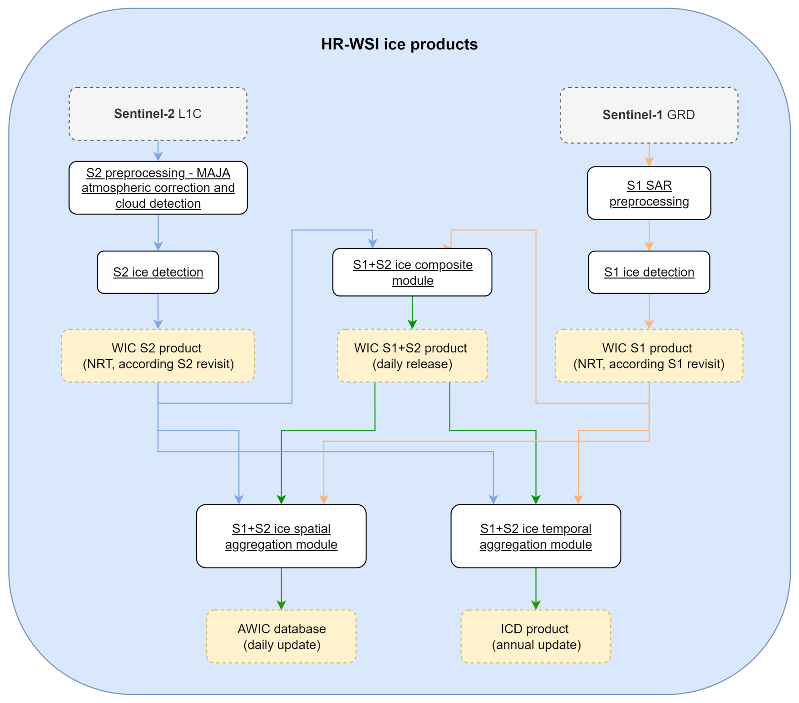

Daily, the HR-WSI chain identifies new S2 L1C and S1 GRD data and applies preprocessing algorithms. From a S2 L1C image, the MAJA atmospheric correction and cloud-screening module first generates an L2A product, including a cloud and cloud shadow mask (Section 3). In parallel, S1 GRD images are preprocessed into backscatter maps at S2 tile level (Section 4). The water and ice detection is performed separately on S2 L2A products (Section 5) and S1 backscatter maps (Section 6).

**Important**: S1 radar imagery and S2 optical imagery have distinct capabilities for ice detection. Each ice product in the portfolio requires a water mask as a prerequisite to identify the surfaces where the algorithms can be applied, or to differentiate between land and water surfaces, thereby avoiding ambiguities in snow-covered areas.

### Document structure

The document is organised as follows.

-   Section 2 presents the auxiliary data used in the HR-WSI ice production.
-   Section 3 describes the preprocessing stage of S2 L1C into an L2A product including a cloud mask.
-   Section 4 describes the preprocessing stage of S1 GRD products into backscatter maps.
-   Section 5 provides a detailed description and justification of the water/ice detection algorithm for WIC S2 processing.
-   Section 6 provides a detailed description and justification of the ice detection algorithm for WIC S1 processing.
-   Section 7 provides a detailed description of the WIC S1+S2 processing.
-   Section 8 provides a detailed description of the AWIC processing.
-   Section 9 provides a detailed description of the ICD processing.
-   Section 10 presents the resampling and reprojection tools used for the annual ICD products.
-   Sections 11 and 12 list the abbreviations, acronyms and references used in this document.

### Applicable documents

The following table lists the documents with a direct bearing on the content of this document.

::: {.tbl-caption}
```{=typst}
#set text(size: 9pt, fill: rgb("#3E6893"))
```
Table 1. Applicable documents
:::

| Id. | Reference | Name of the document |
|--------------|------------------------------------------------------------------|------------------------------------------------------------------------------------------------------------------------|
| AD1 | HR-WSI-DT-064-MAG_ATBD_WATER | Pan-European component Lot 1 - production of High Resolution Water, Snow and Ice products: HR-WSI Algorithm Theoretical Basis Document - Water products |
| AD2 | HR-WSI-DT-065-MAG_ATBD_SNOW | Pan-European component Lot 1 - production of High Resolution Water, Snow and Ice products: HR-WSI Algorithm Theoretical Basis Document - Snow products |
| AD3 | HR-WSI-DT-069-MAG_PUM_ICE | Pan-European component Lot 1 - production of High Resolution Water, Snow and Ice products: HR-WSI Product User Manual - Ice products |
| AD4 | HR-WSI-DT-067-MAG_PUM_WATER | Pan-European component Lot 1 - production of High Resolution Water, Snow and Ice products: HR-WSI Product User Manual - Water products |

Ice products processing routines rely on multiple auxiliary products used either during the processing stage or the post-processing stage for computing Quality Assessment (QA) layers. This section provides details on these auxiliary products, their origin, and any operations applied to them.

## Copernicus Digital Elevation Models

The Digital Elevation Models (DEMs) selected for the generation of the ice products are provided by the European Space Agency (ESA)/Copernicus. These include COP-DEM_EEA-10-DGED and COP-DEM_GLO-30-DGED. The data were downloaded from the PIANetary Data Access (PANDA) website [AUX2].
The Copernicus Digital Elevation Models (DEMs) EEA-10 [AUX3] and GLO-30 [AUX4] represent the surface of the Earth including buildings, infrastructure, and vegetation. The DEMs EEA-10 and GLO-30 provide orthometric height values relative to the vertical coordinate reference system (CRS) EGM2008 (EPSG 3855) using the WGS84-G1150 ellipsoid (EPSG 4326) as horizontal CRS [AUX3, AUX4 technical description of the datasets].

```{=typst}
#set page(flipped: true)
#set text(size: 9pt)
```

::: {.tbl-caption}
```{=typst}
#set text(size: 9pt, fill: rgb("#3E6893"))
```
Table 2. Description of the Digital Elevation Models used in HR-WSI ice production
:::

| Name | Source | Treatment | Used while processing |
|------------------------------------------------------|--------------------------------------------------------|--------------------------------------------------------|-----------------------------------|
| COP-DEM_EEA-10-DGED<br>[AUX3] Version 2022_1 | PANDA COPERNICUS<br>February 2024 | Resampling at 20m using the GdalWarp¹ 'cubic' algorithm.<br>Cropping on the S2 tiles covering EEA38+UK, in projection WGS84/UTM¹ - using GdalWarp. | WIC S2 |
| COP-DEM_EEA-10-DGED<br>[AUX3] Version 2022_1<br>&<br>COP-DEM_GLO-30-DGED<br>[AUX4] Version 2022_1 | PANDA COPERNICUS<br>February 2024 | Resampling using GdalWarp² bilinear algorithm and cropping on the S2 tiles covering EEA38+UK, in projection WGS84/UTM¹.<br>For S1 preprocessing, SAR wet snow detection, WDS and SWS, additional data preparation as described in Section 2.3. | S1 preprocessing & WIC S1 |

```{=typst}
#set page(flipped: false, paper: "a4")
#set text(size: 11pt)
```

¹ GDAL 3.8.3 Python package distributed on the conda-forge channel for Python 3.12.1
² GDAL 3.4.3 Python package

The DEMS EEA-10 and GLO-30 are prepared in the S2 tiling grid. The GLO-30 DEM is oversampled to 10m by 10m pixel size. The EEA-10-based DEM is used as the primary DEM over the EEA38+UK domain. In case of missing pixels, and along the boundary of the EEA38+UK domain, the oversampled DEM from the DEM GLO-30 is used to ensure that radar layover, foreshortening and shadow masks are also calculated for mountain areas along the EEA38+UK boundary. The orthometric heights of the merged DEM are converted to ellipsoidal heights referring to the WGS84 ellipsoid applying the EGM2008 geoid⁴.

The 10m DEM is used for the S1 SAR preprocessing module and the preparation of the radar layover, foreshortening and shadow mask (Section 4). It is resampled to 60m by 60m pixel size for the WIC S1 processing routine (Section 6).

## Preparation of the radar layover, foreshortening and shadow masks

For each Sentinel-1 track, a radar layover, foreshortening and shadow mask is calculated during the geocoding process in the S1 SAR Preprocessing Module (Section 4). This step requires SAR imaging geometry and a DEM as input. The 10m DEM built from the EEA-10 and GLO-30 DEMs as introduced in Section 2.1 is used.

The resulting layers are aggregated from 10m by 10m pixel spacing to 60m by 60m pixel spacing using a median filter for the radar layover, foreshortening, and shadow masks. They are then used for the WIC S1 products (Section 6).

## Copernicus High Resolution Layers

CLMS delivers several High Resolution Layers (HRL) at 10m pixel spacing, over the EEA38+UK domain and the United Kingdom (UK). Table 3 details which HRLs are used by which processing routines.

The HRLs are delivered as individual raster files in the ETRS89 LAEA coordinate system at the resolution of 10m x 10m. They are reprojected to the UTM/WGS84 coordinate system and cropped to the range of the Sentinel-2 tiling grid and resampled to 60m x 60m pixel spacing for WIC S1 production.

³ WGS84/UTM or "EPSG:326XX" where XX is the UTM zone over which the S2 tile lies. XX also corresponds to the first 2 digits of a tile name (e.g. 32TLR). The auxiliary data are generated over the EEA38+UK (covering UTM zones 25 to 38).

⁴ https://earth-info.nga.mil/GandG/wgs84/gravitymod/egm2008/egm08_wgs84.html

```{=html}
<div style="font-size: 10pt">
```
| | | | |
|-------------------------------------------------------------------|--------------------------------------------|----------------------------------------------------|-------------------------------------|
| HRL-Tree Cover Density<br>Version 2018, 10m LAEA projection (EPSG:3035) [AUX5] | CLMS portal<br>(Feb. 2024) | Resampling at 60m and cropping on the S2 tiles covering EEA38+UK, in projection WGS84/UTM⁵ using a majority resampling method⁶. | WIC S1 |
| HRL-Imperviousness Density<br>Version 2018, 10m LAEA projection (EPSG:3035) [AUX6] | CLMS portal<br>(Feb. 2024) | Resampling at 60m and cropping on the S2 tiles covering EEA38+UK, in projection WGS84/UTM⁵ using a majority resampling method⁶. | WIC S1 |
| HRL-Grassland<br>Version 2018, 10m LAEA projection (EPSG:3035) [AUX7] | CLMS portal<br>(Feb. 2024) | Resampling at 60m and cropping on the S2 tiles covering EEA38+UK, in projection WGS84/UTM⁵ using a majority resampling method⁶. | WIC S1 |
| HRL-Water And Wetness<br>Version 2018, 10m LAEA projection (EPSG:3035) [AUX8] | CLMS portal<br>(Feb. 2024) | Wetness information has been removed entirely, other classes are kept.<br>Cropping on the S2 tiles covering EEA38+UK, in projection WGS84/UTM⁵ using a majority resampling method⁶. | WIC S1 (resampling at 60m)<br>WIC S2, WIC S1+S2, ICD (resampling at 20m)<br>Only used for initialising the NRT and delayed-time productions (more details in Section 2.4) |
```{=html}
</div>
```

## Preparation of the dynamic water mask used for the annual productions of WIC S1, WIC S2 and ICD data

WIC S1 processing is performed within the extent of water bodies, while the generation of WIC S2 relies on the surface water extent during the post-processing stage. The ICD aggregates WIC data over a specified water area as well. All WIC S1, WIC S2, and ICD products rely on the same water mask for a given hydrological year.

For most WIC and ICD products, inland water areas are defined using a water mask derived from the HR-WSI Water Cover Duration (WCD) product. This product provides the frequency of water occurrences at the pixel scale (10m x 10m) over the hydrological year, which spans from 1 September to 31 August, as detailed in the water ATBD [AD1] and PUM [AD4]. The WCD product for hydrological year N-1 serves as the basis for calculating WIC S1, WIC S2, and ICD products for year N (1 September N-1 to 31 August N).

⁵ WGS84/UTM or "EPSG:326XX" where XX is the UTM zone over which the S2 tile lies. XX also corresponds to the first 2 digits of a tile name (e.g. 32TLR). The auxiliary data are generated over the EEA38+UK (covering UTM zones 25 to 38).

⁶ The GdalWarp 'mode' algorithm is a majority algorithm that selects the value which appears most often of all the sampled points. In the case of ties, the first value identified as the mode will be selected - GDAL 3.8.3 Python package distributed on the conda-forge channel for Python 3.12.1.

At the end of each hydrological year, the corresponding WCD product is generated and used to create the new water mask (as described below). The water mask used for the current production is then switched for the new one.

::: {.tbl-caption}
```{=typst}
#set text(size: 9pt, fill: rgb("#3E6893"))
```
Table 4. HR-WSI production phases and water mask used to initialise the WIC S1, WIC S2 and ICD generations.
:::

| HR-WSI production phase/hydrological year | Water mask |
|----------------------------------------------------------------------------------------------------------|----------------------------------------------------------------------------------------------|
| S1 and S2 observations from September 2024 to August 2025 (NRT processing) | Based on the HRL-WAW 2018 product, available at the time of processing (see Section 2.3) |
| S1 and S2 observations from September 2016 to August 2017 (delayed-time processing of the archive) | Based on the HRL-WAW 2018 product, available at the time of processing (see Section 2.3) |
| Other production periods, i.e. other hydrological years | Based on the WCD product of the previous hydrological year (more details on its computation below) |

A water mask is obtained from the WCD product by applying thresholds to the frequency of water occurrences. As a result, two classes are obtained:

-   Permanent water: Water probability ≥ 60% (366 days)
-   Temporary water: 0% > Water probability > 60% (366 days)

The WCD product is in the same spatial extent as the WIC product, but the pixel spacing is 10m x 10m. Thus, the water mask is resampled to:

-   20m x 20m pixel spacing for WIC S2 and ICD processing routines
-   60m x 60m pixel spacing for WIC S1 processing routine

using the same method which is used in resampling the High Resolution Layers (see Section 2.3).

## Preparation of the river network database used for the WIC S1 and AWIC productions

Ice production relies on a river network database which describes the extent of water bodies on a European scale: EU-Hydro River Network database (2006-2012) version 1 [AUX9] (LAEA projection (EPSG:3035), Vector - Minimum Mapping Unit: 1 ha). It is delivered by the CLMS.

**Preparation for the WIC S1 production**

The categorisation of lake and river areas, used in quality control flag generation of the WIC S1 product, is based on the EU-Hydro hydrographic database [AUX9]. InlandWater polygons are used as lakes and River_net_p, and Transit_p polygons are used as rivers. The water bodies in vector format in EU-Hydro database are first categorised into lakes and rivers, then are

-   River parts with polygons longer than 40 kilometres
-   Rivers connecting lakes (e.g. Vistån River in Sweden)
-   Canals
-   Ditches
-   Lakes

This translates to the following polygon layers from the EU-Hydro database:

-   InlandWater
-   Transit_p
-   Ditches_p
-   Subset of the Canals_p
    -   polygons longer than 20 km
-   Subset of the River_Net_p
    -   polygons longer than 40 km
    -   rivers connecting lakes

From those layers, 10 km long sections are created for the following:

-   Rivers longer than 40 km (from River_Net_p layer)
-   Rivers connecting lakes
-   Canals longer than 20 km (from Canals_p)
-   Ditches longer than 20 km (from Ditches_p)

These divisions are computed from the mouth of the rivers and canals to their source (see Annex A for details). These linear feature layers contain the river and canal network of each EU-Hydro river basin (see Figure 2). They are used to compute the `river_km_id`. River flow directions are checked and corrected when necessary.

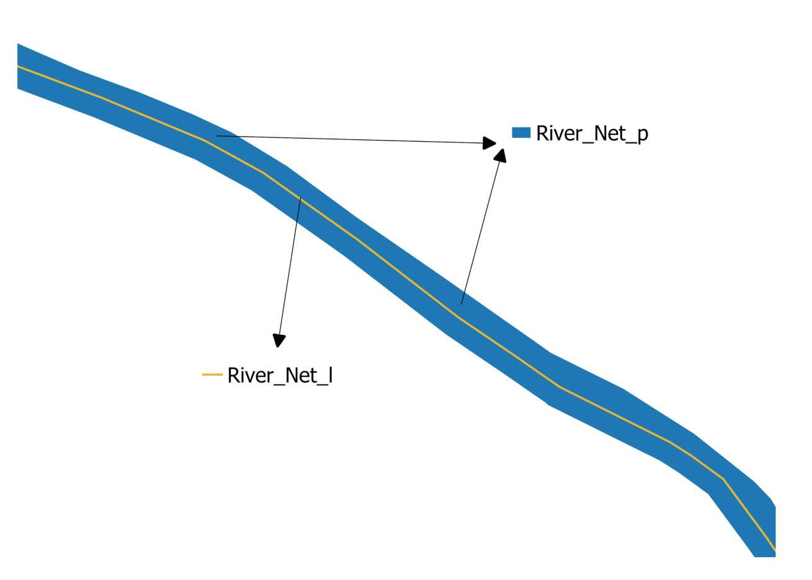

4.  Generating relevant buffers from 10 km long linear features depending on the river or canal characteristics (width, number of curves, islands etc.).
5.  Dividing each river, ditch or canal polygon from step 1 into 10 km long sections and adding a river_km attribute.

## Preparation of the daily meteorological data used for the production of WIC S1

Daily average wind speed and 5-day sum of 2m daily average air temperature from 3-hourly estimations of 2m air temperature, 10m wind direction (u-component) and wind speed (v-component) are generated daily in FMI. 3-Hourly estimations are obtained from ECMWF Atmospheric Model high resolution 10-day forecast (Set I - HRES) dataset [AUX10], disseminated daily at 06:00 hours. The 5-day sum of daily average air temperature is calculated for each cell of the grid (0.1 degrees) after converting temperature values into degrees Celsius. The daily average 10m wind speed is calculated after calculating 3-hourly wind speed from u- (eastward wind) and v- (northward wind) components. Generated meteorological data is made available by SFTP protocol, retrieved once by the HRWSI production system during the processing of WIC S1 every day. After the first successful daily retrieval of meteorological data, it is kept in HRWSI storage to be used by remaining processing routines for the day.

from a Sentinel-2 L1C product using the MAJA software. MAJA stands for the MACCS-ATCOR Joint Algorithm, where MACCS is the Multi-Temporal Atmospheric Correction and Cloud Screening software, developed by CNES and CESBIO, and ATCOR is the atmospheric correction software developed by DLR. MAJA's cloud screening method has been developed for high resolution sensors (e.g. Sentinel-2, Formosat-2, LANDSAT, VENµS) and a large range of applications. HR-WSI relies on the MAJA software to obtain surface reflectances (Sentinel-2 L2A product) and a good-quality Cloud Classification (CC) from a Sentinel-2 L1C product.

MAJA code is open source under Apache licence and available from a Gitlab repository [AUX11]. This section is not intended to be exhaustive, but rather to summarise the principles underlying the MAJA, particularly as regards cloud detection. For more information, readers are invited to read the publicly accessible ATBD (Hagolle et al., 2017).

As summarised in Figure 3, the outputs of the MAJA algorithm (Section 3.2.6) are stored temporarily for further use for:

-   Fractional Snow Cover (FSC) product [AD2]
-   S2-based Water/Ice Cover (WIC S2) product (Section 5)
-   S2-based monthly water masks processing [AD1]

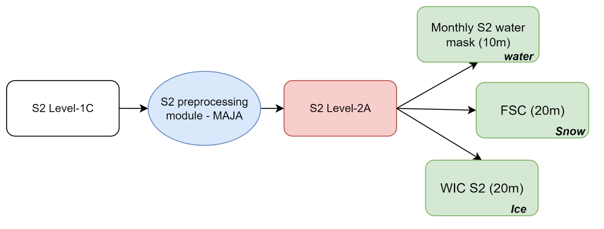

## Retrieval algorithm

### Outline

What makes MAJA unique is the fact that it combines multi-temporal and multi-spectral methods to better detect clouds and estimate atmospheric aerosol content. The use of multi-temporal information improves data quality and robustness but also introduces constraints to the processing, as discussed in Section 3.2.7.

the same shape.

Additionally, the method incorporates classical multispectral properties:

-   High clouds have a high reflectance in the Sentinel-2 water vapour absorption band at 1380 nm.
-   Clouds are generally brighter and whiter than most surfaces.

The detection of cloud shadows also involves multi-temporal criteria. While dark zones exist naturally, making it challenging to distinguish them from shadows, shadows cause a sudden apparent darkening of the surface, which can be used for detection.

A final geometrical processing step aligns clouds with their shadows.

Since the boundaries of clouds are fuzzy, and as the multispectral registration applies to the earth's surface and not to the clouds, a buffer is added around the clouds. This results in a classification bias toward greater severity, as part of the buffer may include cloud-free areas. However, this approach is preferred to mitigate the significant impact that undetected clouds could have on downstream applications.

### Related and existing applications

MAJA has been used with several satellites (e.g. Formosat-2, LANDSAT, VENµS) and is currently used in the processing chain that generates the Theia Snow collection [AUX12] from Sentinel-2 observations.

It is also used operationally at DLR, CNES, and the Norwegian and Romanian space agencies. It is available as an open-source software and is downloaded on average once per day.

### Alternative methodologies

Cloud detection algorithms vary in their approach and are based on various spectral properties, spatial, and temporal features, as well as machine learning methods (Skakun et al., 2022). These include for instance, Fmask, initially developed for Landsat imagery (Zhu et al., 2015), (Frantz et al., 2018), S2cloudless [AUX13], the IdePix plugin (Wevers et al., 2021) or the Sen2cor tool, the processor for Sentinel-2 Level 2A product generation (Louis et al., 2016) [AUX14] which similarly to MAJA perform both atmospheric correction and cloud screening. All three adopt a mono-temporal approach, i.e. process single-scenes.

### Input data

The MAJA software works on a Sentinel-2 tile level. For HR-WSI, it is configured to use the following input data:

-   Sentinel-2 L1C product [AUX15],
-   Metadata from previous Sentinel-2 L2A products, including a composite image built based on previous cloud-free acquisitions,
-   A digital elevation model (DEM): Copernicus DEM: GLO-30, (DGED format), dataset ID:

Each L1C product leads to a CC product and an L2A product used as input for other HR-WSI processing tasks.

Intermediate data from the resulting L2A product are stored for further internal usage and are not disseminated publicly a metadata file with the updated composite image and the following rasters in Geographic Tagged Image File Format (GeoTIFF):

-   SRE images: ground reflectances without the correction of slope effects or surface reflectance
-   FRE images: ground reflectance with the correction of slope effects, or flat reflectance
-   CLM mask: mask describing the cloud and cloud shadow coverage coded over 8 bits
-   MG2: geophysical mask coded over 8 bits
-   EDG: edge mask (actual border of the image within the tile extent)

Readers are referred to a more exhaustive description of the MAJA L2A product [AUX17] and to the ESA Sentinel-2 documentation for spectral bands description [AUX18].

A CC product consists of three GeoTIFF raster files and a metadata file in Extensible Markup Language (XML). The raster files are encoded as 8-bit unsigned integers and retained in the projection, extent and resolution of the initial SWIR band of the Sentinel-2 L2A product (WGS84/UTM with a pixel size of 20 m by 20 m). The list of raster files is as follows.

-   CC: cloud and cloud shadow classification from MAJA
-   QAFLAGS: bit-coded quality flags
-   CC-QA: quality value from 0 (high quality) to 3 (minimal quality) for CC

Readers are referred to the product user manual [AD3] for a complete description of the CC product.

### Methodology

#### MAJA cloud and cloud shadow detection

The MAJA ATBD is publicly accessible (Hagolle et al., 2017).

The MAJA method is a recurrent algorithm that processes images in chronological order. Like any recurrent process, it requires initialisation. The different processing modes are described later in this section.

MAJA performs several operations to obtain surface reflectances and generate a high-quality cloud mask for a Sentinel-2 scene:

-   Estimation of water vapour content
-   Correction for molecular absorption (including water vapour)
-   Detection of clouds, cloud shadows, water, coarse detection of snow
-   Estimation of aerosol content and aerosol optical thickness (AOT)

For the first image in the time series, a basic atmospheric correction is performed and the clouds are detected using the mono-temporal approach. After each processing, a composite image is updated with the unclouded pixels from the processed date. This composite image is then used as a reference for cloud detection and AOT estimate.

**Cloud detection**

The mono-temporal cloud detection relies on thresholding methods based solely on spectral information. The first test is based on the cirrus band (at 1380 nm 60m - B10) which effectively detects the high clouds (above 2000m, including thin cirrus). Additional thresholds are required, in particular in the visible/near-infrared (VNIR) and short-wave infrared (SWIR). This is an important first step, as subsequent modules (e.g. aerosol and water vapour retrieval) use this information.

In nominal mode (multi-temporal), the cloud detection method is based on a large number of tests, the most efficient of which are:

-   A mono-temporal test based on the cirrus band: this test uses a threshold that varies according to the terrain elevation.
-   A multi-temporal test: this test detects a sharp increase of the blue surface reflectance (492 nm, 10 m resolution, B2), compared to the composite image, which indicates presence of a cloud. Since a similar increase can occur on the ground, the pixel is classified as a cloud if the difference in the blue reflectance reaches a certain threshold. The threshold value depends on the age of the pixel in the composite image relative to the pixel of the current image.
-   A final step to avoid over-detection of clouds: for each potential cloud detected by the previous tests, this last test measures the correlation of the pixel neighbourhood with the previous images. As it is unlikely that two different clouds at the same location on successive dates have the same shape, if a large correlation is observed, the pixel is finally not declared as a cloud.

**Cloud shadow detection**

Cloud shadows appear dark, but they are not the only dark objects within a Sentinel-2 image. They can be confused with water areas, bare soils or terrain shadows. Typically, cloud shadows are cast by clouds located within the image. These shadowed pixels are identified through the intersection between potential shadowed pixels (the projected surface of the previously detected cloud) with darkened pixels. In cases where cloud shadows are cast by clouds lying outside of the image boundary, the search is limited to an area near the image edges, based on solar angles. In both cases, darkened pixels are classified using an adaptive threshold method based on the red band and the composite image.

**Dilation of the detected cloud mask**

MAJA software is optimised to minimize cloud cover omissions. Cloud edges are typically fuzzy, and some parts could be undetected. Additionally, clouds scatter light in their neighbourhood,

performed at a coarse resolution (see MAJA configuration section). Afterwards, all masks obtained are oversampled to the full resolution (10/20m) before applying the corrections. This step also helps speed up the MAJA processing.

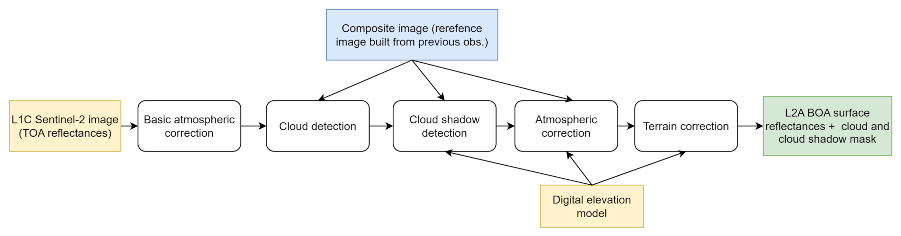

**Cloud Classification (CC) formatting**

The Cloud Classification (CC) layer provides information on the cloud cover and the cloud shadows detected by MAJA. It is derived from the CLM, the MG2 and the EDG masks, which are the MAJA's outputs.

The CC layer is intended to give a classification of the scene, however, users should note that a single pixel could have been identified as both cloud-covered and cloud-shaded, as the retrieval methods are performed independently.

From the CC raster is fulfilled according to the following priority rules:

-   High clouds (CLM bit 7 == 1),
-   Other clouds (CLM bit 1 == 1 & bit 7 == 0),
-   Cloud shadow ((CLM bit 5 == 1 | CLM bit 6 == 1) & CLM bit 1 == 0 & bit 7 == 0),
-   Cloud and cloud shadow-free pixels: all other pixels that are not outside the acquisition area are assigned to this class. Pixels outside the acquisition area are set to "no data" (from EDG mask).

**Quality assessment (QA) data**

A QA value is reported for each pixel to characterise the quality of the cloud retrieval, based on various indicators. The QA values are derived from a confidence index which itself results from the combination of various flags (QAFLAGS) that are described below. Each flag is a binary value set to one if true and zero otherwise.

Various information can be retrieved from the CLM raster:

-   MAJA indicates for each cloud pixel if it was detected via mono-temporal thresholds, multi-temporal thresholds, or both. The multi-temporal approach detects approximately twice as many clouds as the single-temporal approach, which uses more flexible thresholds to avoid overdetection. Two bits are provided in the QAFLAGS layer, as follows:

reflectances. One bit is provided in the QAFLAGS layer, as follows:

-   thinnest clouds (CLM - bit 4)

-   MAJA specifies how a pixel has been assigned to the cloud shadow class, either through the "geometric approach" for shadows cast by a previously detected cloud, or through the "radiometric approach" to identify cloud shadows originating outside the image. In the latter case, the detection quality is lower, and users are informed about the possibility of missing cloud shadows at the edges of the image. Two bits are provided in the QAFLAGS layer, as follows:
    -   cloud shadows cast by a detected cloud (CLM - bit 5)
    -   cloud shadows cast by a cloud outside image (CLM - bit 6)

Finally, one bit is provided in the QAFLAGS layer to describe the open water areas detected by MAJA. These are retrieved from the geophysical mask:

-   Water mask (MG2 - bit 0)

Then, the CC-QA value is computed, starting from the highest quality (0) and being degraded by 1 when the “cloud shadow cast by a cloud outside image” condition is met. The possible values for CC-QA are as follows:

-   CC-QA = 0: High quality
-   CC-QA= 1: Medium quality

#### MAJA processing modes

To process a given Sentinel-2 tile for date D, MAJA requires the results of the processing of the previous observation date available (denoted as D-1) from the same tile as input. As a result, the acquisitions must be processed in chronological order. The processing of L2A for date D, using L2A of date D-1 and L1C of date D as inputs is referred to as the nominal processing mode (Figure 5).

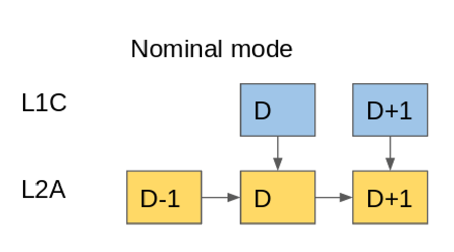

As for all recurrent algorithms, MAJA requires an initialisation. MAJA has two initialisation modes (Figure 6):

at a lower resolution, except for the final iteration, which generates the L2A product for date D.

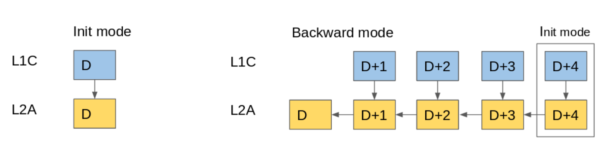

For most of the tiles, MAJA needs to be initialised only once when the HR-WSI processing chain is first started. This standard initialisation is performed in backward mode with N set to 10 dates before starting the NRT processing. However, due to interruptions in Sentinel-2 acquisitions MAJA must be re-initialised during the NRT operations if the interruption exceeds 60 days. To comply with NRT requirements, these re-initialisations are done in init mode in the following cases:

-   In high-latitude regions, where acquisitions stop during winter due to polar darkness. Hence the L2A process must be reinitialised every year when acquisition restarts.
-   In other regions, if all acquisitions are done with fully overcast conditions over a period exceeding 60 days (though this is very rare). For instance, in the Theia Land Data Centre, this situation has occurred in some tiles of countries of equatorial Africa during the rainy season but has never been observed for tiles located in Europe (even in typically cloudy regions like western France or Scotland).

### MAJA configuration

The main parameters impacting the L2A production for HR-WSI of CLMS are listed below. Some parameters have been changed compared to standard GIPP, as follows:

-   **Maximum cloud percentage**
    The maximum cloud percentage defines the percentage of cloud cover within a tile above which MAJA does not generate the product. The default value is set to 90%, which is considered a balanced compromise saving processing resources without losing too many valid pixels.
    The experience with the Theia service production shows that the default value discards one-third of the Sentinel-2 tiles. However, a few clear pixels are lost, and these are often small spots in between clouds and therefore often affected by adjacency effects, undetected cloud shadows, an inaccurate estimate of aerosol optical thickness, etc. This default value is also applied for HR-WSI production.
    `<Max_Cloud_Percentage>90</Max_Cloud_Percentage>`

-   **Copernicus Atmosphere Monitoring Service (CAMS)**
    MAJA can utilize aerosol type information from the CAMS reanalyses [AUX19], resulting in improved retrieval of aerosol optical thickness and better atmospheric correction:
    `<Use_Cams_Data>true</Use_Cams_Data>`
-   **Maximum no-data percentage**
    The maximum no data percentage defines the ratio of no data, cloud and snow pixels within the image above which MAJA does not produce the product. For HR-WSI processing this ratio is set to 100% so that MAJA generates a product even when it identifies 100% snow on a tile:
    `<Max_No_Data_Percentage>101</Max_No_Data_Percentage>`
-   **Cloud detection spatial resolution**
    The detection of clouds and the estimation of water vapour and aerosol content are performed at a coarse resolution. For HR-WSI processing this resolution is set to 120m x 120m:
    `<Cloud_Detection_Spatial_resolution>120</Cloud_Detection_Spatial_resolution>`

### Limitations

Sentinel-2 is providing high resolution optical imagery. However, the resulting L2A product is impacted by the classical limitations, such as in the case of optically thick clouds, in polar regions during polar nights, and when solar illumination is insufficient, which degrades reflectance accuracy. Additionally, the sunglint effect over water surfaces presents challenges for accurate L2A processing and cloud detection. The L2A is not generated when the cloud cover exceeds a critical threshold (for the threshold value, see Section 3.2.8.).

For most applications of the S2 L2A product (e.g. vegetation studies), omitting clouds can be costly. Consequently, MAJA tends to over-detect clouds to avoid false negatives. This phenomenon is partly mitigated by Sentinel-2's good revisit rate. The dilation applied around the detected clouds significantly reduces the risk of omitting clouds but increases the uncertainty of the classification for pixels located in the dilation zone.

Cloud detection is easier over water surfaces due to their uniform and low reflectance in the near infrared (except in sun glint geometry). However, cloud detection over land is more challenging. Even with high resolution imagery, when clouds are much larger than pixel size, distinguishing thin clouds from the underlying landscape can be difficult.

Finally, the classification quality of pixels near image edges is lower, as cloud shadows from clouds outside the image are likely to be missed. Note that the CC-QA layer only highlights the classification uncertainty of pixels in shaded areas caused by clouds outside the image.

dataset. Furthermore, MAJA outputs were validated against ground measurements of land surface reflectance. These two recent approaches offer readers comprehensive insights into the quality of MAJA Sentinel-2 Level 2 products.

In terms of cloud screening, an evaluation of the MAJA cloud mask (where cloud and cloud shadows classes are clumped together) was conducted using 32 manually classified scenes. This assessment demonstrated a 91% overall accuracy in detecting cloud and cloud shadows (Hagolle et al., 2017). In the seven scenes containing snow-covered mountains, MAJA's performance reached 92%, while alternative algorithms, such as Sen2Cor, achieved only 71% (Baetens et al., 2019). A comparative study of atmospheric correction codes showed that the average noise on surface reflectance for MAJA was below 0.01 (Gascoin et al., 2019).

More recently, the Cloud Mask Intercomparison exercise (CMIX) (Skakun et al., 2022) evaluated cloud masking algorithms for Landsat 8 and Sentinel-2. CMIX addressed the challenge of assessing cloud masking algorithms in the absence of consensus on the definition of clouds in remote sensing imagery. The study highlighted that the performance of algorithms varied depending on the reference dataset, which can be attributed to differences in how the reference datasets were produced. The results showed the good performances of MAJA software, particularly in terms of accuracy.

discussed. S1 IW DualPol data in VV and VH polarisation, processed as GRD products, are used as input for the S1 SAR Preprocessing Module. The processing steps for the generation of the SAR sigma nought backscatter maps with 10 m by 10 m pixel spacing are described. The co- and cross-polarised sigma nought backscatter maps resulting from the S1 SAR Preprocessing.

Preprocessed SAR images are used as input for the following modules (Figure 7):

-   SAR wet snow detection, used in the
    -   SAR Wet Snow (SWS) products and
    -   Wet/Dry Snow (WDS) products (ATBD - Snow products AD2)
-   S1-based monthly water masks (ATBD - Water products, AD1)
-   S1-based Water and Ice Cover (WIC) products (Section 6)

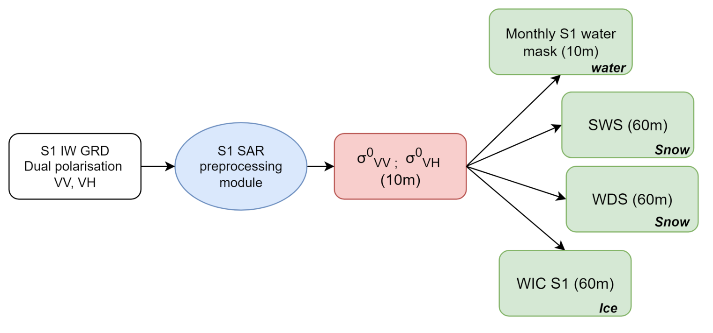

## Retrieval algorithm

### Outline

The flowchart of the S1 SAR Preprocessing Module is shown in Figure 8.

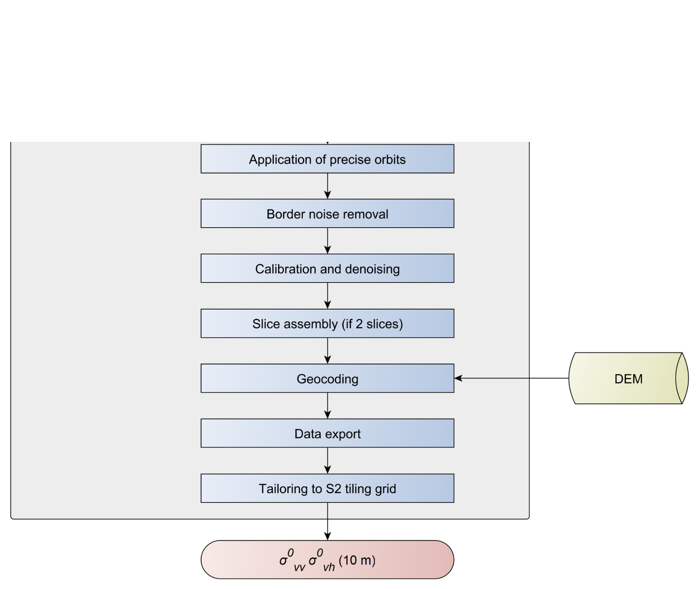

### Assumptions

The preprocessing of S1 Level 0 to Level 1 SAR data is performed by the Instrument Processing Facility (IPF) of the Copernicus Space Component Ground Segment (CGS). Details about this preprocessing are available online⁷. Implemented tools and functions to work with S1 SAR IW Level-1 GRD data in SNAP v9 [AUX20] and pre-defined links to external databases, e.g. to download precise orbits from online archives, are assumed to be up-to-date.

### Related and existing applications

The S1 SAR Preprocessing Module uses the ESA SNAP v9 [AUX20] functions and modules to generate geocoded sigma nought backscatter maps in the S2 tiling grid with 10 m by 10 m pixel spacing based on S1 SAR IW Level-1 GRD data.

### Alternative methodologies

The processing steps for the S1 SAR preprocessing are implemented in the ESA SNAP v9 [AUX20], an open-source software. Other software packages developed to prepare and analyse S1 SAR data could be used alternatively to prepare the backscatter maps.

⁷ https://sentiwiki.copernicus.eu/web/s1-processing, accessed on 07/03/2025.

The S1 SAR Preprocessing Module outputs are S1 sigma nought backscatter maps in VV and VH polarisation ($\sigma_{vv}^{0}$, $\sigma_{vh}^{0}$), geocoded in the S2 tiling grid with 10 m by 10 m pixel spacing.

### Methodology

The S1 SAR Preprocessing Module covers the following steps:

**Data import**

The S1 SAR IW GRD data and associated metadata are imported to SNAP v9.0.

**Application of precise orbits**

Per slice, the precise S1 orbit is downloaded from the ESA database and applied to the S1 SAR IW GRD data.

**Border Noise Removal**

Radiometric artefacts are removed at the image borders. The borderLimit and trimTreshold values are set to their default values, 500 and 0.5, respectively.

**Calibration and denoising**

Conversion of S1 SAR IW GRD data to physical units (radar brightness, $\beta^{0}$, backscatter coefficient, $\sigma^{0}$) is performed according to the S1 SAR Technical Guide [AUX21]. To use S1A and S1B jointly, a noise correction is performed using the annotated noise values to improve inter-sensor calibration (S1 MPC, 2017).

The relation used for conversion of the digital value, DN, of the GRD product to the backscatter coefficient, $\sigma_{i,j}^{0}$, and radar brightness $\beta_{i,j}^{0}$ (i= range pixel, j, azimuth pixel) is

$$\sigma_{i,j}^{0} = \beta_{i,j}^{0} \sin(\theta_{i,j}) = \frac{(|DN_i|^2 - \eta_i)}{A^2} \sin(\theta_{i,j})$$
(Equation 1)

where $A^2$ is the calibration constant and $\eta_{i,j}$ is the thermal noise. Both parameters are annotated in the S1 GRD metadata file. $\theta_{i,j}$ is the local incidence angle on the Earth's surface, derived from the local incidence angle map of the SAR reference image (cf. Section 6.2.7.1 of the ATBD snow [AD2]) of the same track.

**Slice assembly**

If two slices are imported, the slices are combined to form an assembled Level-1 product with the same product characteristics covering the S2 tile.

**Geocoding**

The multi-looked backscatter values in ground range geometry are transformed into the S2 tiling system by applying the Range-Doppler Geocoding method. The Range Doppler Geocoding is state of the art and described e.g. in Schubert et al. (2017). As input, the method requires orbit state vectors, which are annotated in the metadata files of the GRD products, and the DEM, where the height values are given in terms of WGS84 ellipsoidal heights. The output of this step is a $\sigma_{vv}^{0}$ and a $\sigma_{vh}^{0}$ image in map coordinates.

-   imgResamplingMethod: bilinear_interpolation;
-   pixelSpacingInMeters: 10.

**Data export**

The dual-pol backscatter maps are geocoded in the UTM map projection with 10 m by 10 m pixel spacing and are exported into a raster file in GeoTiff format with 2 layers, one for $\sigma_{vv}^{0}$ and one for $\sigma_{vh}^{0}$.

**Tailoring to S2 tiling grid**

The resulting dual-pol backscatter maps of SNAP v9.0 are cropped to the S2 tiling and compressed using LZW with gdal_translate.

## Quality assessment

The S1 SAR Preprocessing Module does not contain any quality assessment.

The Sentinel-2 Water & Ice Coverage (WIC S2) is derived from Sentinel-2 Level-2A products using a machine learning algorithm. Developed by Magellium, this algorithm is designed to detect open water and ice on continental surfaces and is based on a Random Forest classifier applied to MAJA Sentinel-2 L2A raster. It processes a Sentinel-2 L2A tile to provide ice and water coverage information at a 20m x 20m resolution within the area of interest (AOI), specifically the EEA38+UK area.

## Retrieval algorithm

### Outline

The Sentinel-2 ice detection module aims to simultaneously detect open water and ice on inland waters on a single Sentinel-2 image. It is based on a Random Forest (RF) classifier, which makes the distinction between three classes:

-   Open water
-   Snow and ice
-   Other features

The "other features" category encompasses land, vegetation, salt sea, and other surface types. The classifier relies on six input features derived from the Sentinel-2 image and a Digital Elevation Model (DEM): the Normalised Difference Water Index (NDWI), the Normalised Difference Snow Index (NDSI), the Normalised Difference Vegetation Index (NDVI), the SWIR band (B11), the standard deviation of the blue band (B2) gradient, and the slope. These three spectral indices are calculated using four reflectance bands (see Section 4.2.5. Input data).

Since the WIC S2 product focuses on detecting ice on water areas, a water mask is used to differentiate between snow on ice-covered water areas and snow on land (see the post-processing in Section 5.2.7). This water mask is, when available at the time of WIC S2 processing, derived from the Copernicus HR-WSI annual product, Water Cover Duration (WCD) [AD4], and is updated each year to reflect the water extent of the previous hydrological year. More detailed information on the water mask is given in Section 2.4.

Finally, the WIC S2 product computed by the module includes the following classes:

-   Open water
-   Snow-covered or snow-free ice
-   Other features
-   Cloud or cloud shadow
-   No data

### Assumptions

**Liquid water detection is facilitated by its low reflectance as compared to ice and snow**

In its liquid state, water has relatively low reflectance, especially in the near and mid-infrared. Due to these properties, water and snow/ice coverage can be clearly distinguished on satellite optical images (Latifovic and Pouliot, 2007).

makes it fairly simple to be differentiated.

Whenever clouds are misclassified as snow, they can be corrected in the post-processing step by applying the MAJA cloud/cloud shadow layer.

In addition, the difference between the reflectance of snow in short-wave infrared and green bands is consistent regardless of the considered image. Therefore, snow-covered areas can be identified using the specific NDSI spectral index (Hall and Riggs, 2011).

### Related and existing applications

This is the first time a random forest classifier has been used for water/ice detection on a European scale.

### Alternative methodologies

Operational services for ice detection on surface waters have been developed on a national and European level using optical imagery.

**HR-S&I River and Lake Ice Extent (RLIE) from the Copernicus Land Monitoring Service - pan-European component**

The Sentinel-2 River and Lake Ice Extent (RLIE S2) product aimed to detect ice on inland water bodies covering the EEA38+UK countries [AUX22]. It was computed from MAJA Sentinel-2 L2A products, based on a minimum distance classifier, which processes the L2A tile into 20m x 20m resolution ice cover information within the water bodies as defined by the EU-Hydro database [AUX9]. The RLIE S2 product was computed in the frame of the Copernicus High Resolution Snow and Ice (HR-S&I) project until 2024.

**Lake Ice Extent (LIE) from Copernicus Land Monitoring Service - global component**

The Lake Ice Extent in the Copernicus Global Land Service is an ice product derived from optical satellite imagery at 250 m resolution. While the algorithm was initially developed using MODIS, it has since been further refined to operate with data from the VIIRS (Visible Infrared Imaging Radiometer Suite) instrument on NOAA-20 (JPSS-1), which is currently in use. The classification is pixel-based, using a threshold approach. Cloud-free freshwater bodies are classified into three classes: fully snow-covered ice, partially snow-covered ice/clear ice, and open water. The service now utilises top-of-atmosphere data from a near-infrared channel, supplemented by thermal data to avoid misclassification during the summer months. The aim of the LIE data is to provide information about the ice extent on lakes as well as the timing of events in the annual cycle of freshwater ice, including the initiation of ice formation, freezing of lakes, initiation of the melting period, and ice-out date [AUX23].

-   Since the Sentinel-2 swath does not perfectly align with the coverage of Sentinel-2 tiles, the flat surface reflectance band B12 (2190 nm) at 20 m spatial resolution is used to indicate the portion of the Sentinel-2 tile that falls outside the satellite swath.

::: {.tbl-caption}
```{=typst}
#set text(size: 9pt, fill: rgb("#3E6893"))
```
Table 5. Flat reflectance bands of MAJA L2A product
:::

| Band name suffix | Spectral resolution<br>(middle of range) [nm] | Spatial resolution [m] |
|--------------------------------------------------------|-----------------------------------------------------------------------------------------------|-------------------------------------------------|
| B2 (blue) | 490 | 10 |
| B3 (green) | 560 | 10 |
| B4 (red) | 665 | 10 |
| B8 (NIR) | 842 | 10 |
| B11 (SWIR) | 1610 | 20 |

-   Cloud mask: 8-bit encoded single-band raster at 20m spatial resolution. Only the first bit, which gathers all clouds and all shadows, is used.
-   Geophysical mask: 8-bit encoded single-band raster at 20m spatial resolution; which includes masks related to the quality of the acquisition with regards to geophysical conditions, such as solar angle and clouds.
-   Copernicus Digital Elevation Model (DEM) - EEA10 (see Section 2).
-   Slope derived from the above DEM. Like the DEM data, it is static for each tile (see Section 2).
-   Water mask. An inland water mask delineates the area where the RF classifier's identification of snow must be reinterpreted as a snow-covered ice pixel. It is also used in the quality layers of the product. Users should refer to Section 2.4 to know the source of the water mask for a given WIC S1 product. In most cases, it is derived from the HR-WSI WCD product and represents the conditions of the previous hydrological year.

### Output data

For each L2A product, four raster files in Geographic Tagged Image File Format (GeoTIFF) and a metadata file in Extensible Markup Language (XML) are produced. The raster files are coded in 8-bit unsigned integer and maintain the projection, extent and resolution of the initial 20m resolution bands of the Sentinel-2 L2A product (UTM/WGS84 with a pixel size of 20m x 20m).

The list of raster files is as follows:

-   WIC: water and ice extent

product.

### Methodology

The WIC S2 processing consists in three main processing steps (Figure 9):

-   Input data pre-processing
-   Classification by the RF algorithm
-   Post-processing, which includes generating the quality layers and preparing the final WIC S2 format

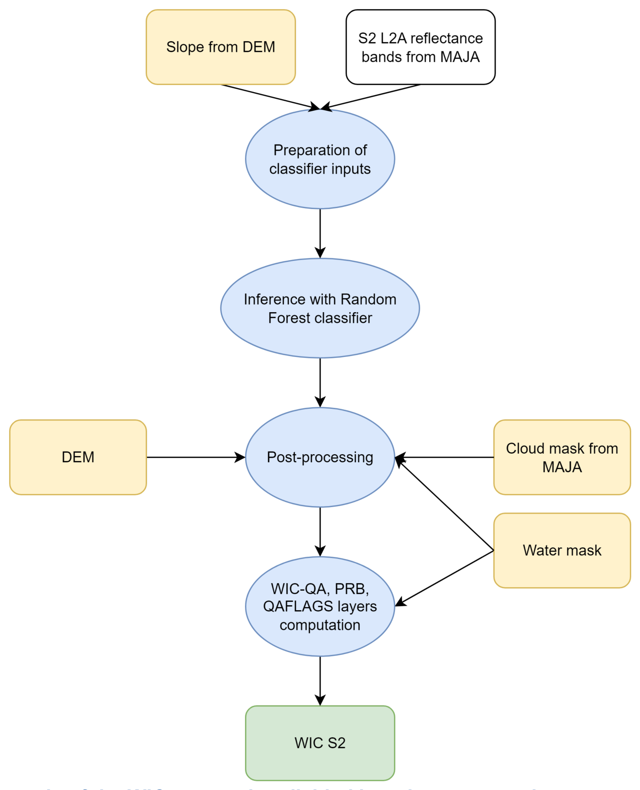

**Step 1: Pre-processing**

In this step, all the inputs required by the classifier are prepared.

Four flat surface reflectance bands (B2 B3, B4, B8) are resampled from 10m to 20m, the same resolution as the output WIC S2 product. The downsampling is done using the GdalWarp

(McFEETERS, 1996):

$$NDWI = (\rho_{green} - \rho_{NIR}) / (\rho_{green} + \rho_{NIR})$$
Equation 2

-   NDSI (normalised difference snow index) used for better distinction of snow (Dozier, 1989):

$$NDSI = (\rho_{green} - \rho_{SWIR}) / (\rho_{green} + \rho_{SWIR})$$
Equation 3

-   NDVI (normalised difference vegetation index) used to identify vegetation (Rouse et al., 1973; Tucker, 1979):

$$NDVI = (\rho_{NIR} - \rho_{red}) / (\rho_{NIR} + \rho_{red})$$
Equation 4

In the above equations,

-   $\rho_{green}$ is the flat surface reflectance in the green (B3) spectral band at 0.56 µm;
-   $\rho_{red}$ is the flat surface reflectance in the red (B4) spectral band at 0.67 µm;
-   $\rho_{NIR}$ is the flat surface reflectance in the NIR (B8) spectral band at 0.8 µm;
-   $\rho_{SWIR}$ is the flat surface reflectance in the SWIR (B11) spectral band at 1.6 µm.

The three spectral indices are then binarized, meaning that if the value exceeds or is equal to a threshold, it becomes 1; otherwise it becomes 0. The threshold values for NDWI, NDSI and NDVI are respectively 0.3, 0.4 and 0.1. Those thresholds were set up after several iterations, in order to improve the water and ice detection. The binarization was made in order to help the classifier to identify the pixel land cover, meaning that above the NDWI, NDSI and NDVI thresholds, the pixel might be considered respectively as water, snow or vegetation.

Two other indices are used for the WIC S2 classification:

-   The standard deviation of the local gradient of blue (B2):
    -   First, the local gradient of blue is computed, using a Sobel filter in a 5*5 pixels window centred on the pixel,
    -   Then, the standard deviation of this local gradient of blue is computed, using a 5*5 pixels window centred on the pixel.
-   The bounded SWIR band (B11):
    -   The flat surface reflectance in the SWIR spectral band is bounded. All reflectance values below 200 are reassigned to 200, and all reflectance values above 600 are reassigned to 600.

In summary, the inputs to the RF classifier are:

-   Binarized NDVI

**Step 2: Inference using the RF classifier**

The static classifier is applied to the full Sentinel-2 image (see Section 5.2.8), transforming it into a labelled image with the following classes:

-   Water
-   Snow and ice
-   Other features

This labelled image then serves as input for the post-processing step.

The classification probability generated by the RF algorithm is stored in the PRB layer and is subsequently used for post-processing and the creation of quality layers.

**Step 3: Post-processing, including the preparation of quality layers**

Additional steps are necessary to obtain the final classes of the WIC S2 main layer:

-   Water
-   Snow-covered or snow-free ice
-   Other features
-   Cloud
-   No data

There are three steps involved in formatting:

-   The cloud mask is applied to discriminate between the cloud and cloud shadow pixels.
-   Pixels outside of the satellite swath are identified by looking for 'no data' in the B12 layer, and this consequent 'no data' mask is applied to the WIC, PRB and WIC-QA layers.
-   The water mask is applied to differentiate between ‘snow and ice' pixels above water bodies and those over land. Since snow on ice cannot be distinguished from snow on land using optical observations, 'snow and ice' pixels within the water mask are classified as ice and assigned the label 'snow-covered or snow-free ice'. Meanwhile, snow pixels outside the water mask area are reclassified as 'other features'.

Three other post-processing steps are applied to enhance the WIC S2 classification in cases where the classifier's performance is deemed suboptimal (see Section 5.2.9):

-   Potential misclassified pixels as 'snow-covered or snow-free ice' in land/water interfaces: if a pixel is classified as 'snow-covered or snow-free ice' and has a classification probability of less than 90% and a NDWI value greater than 0.1, then it is reclassified as 'water'.
-   Potential misclassified pixels as 'other features' on water: if a pixel is classified as 'other features', has a NDVI value greater than 0.1 and a difference between the classification probabilities of classes 'water' and 'other features' lower than 20%, then it is reclassified as 'water'.
-   Potential misclassified pixels as 'water' in shadow: if a pixel is classified as 'water', has a classification probability lower than 80% and is located in a topographical shadow, then it is reclassified as 'other features'. This step requires a topographical shadow mask (including both self and cast shadows) that varies by season and tile location. This mask

score (among four possible scores) generated from the PRB layer, and the QAFLAGS layer which includes quality-related bits (see Section 5.2.6).

**PRB layer**

The Random Forest classifier gives, for each pixel, a class along with a probability for each class. This layer gives the RF highest probability (meaning the probability of the class affected by the classifier), except for:

-   Cloud and no data pixels, which are given the same value as those from the WIC layer
-   Pixels affected by post-processing in the WIC layer: the RF probability of the new class is retrieved and replaces the probability of the previously affected class

**QAFLAGS layer**

Quality flags are stored in the QAFLAGS layer, as binary values and are set to one if true and zero otherwise. The first flag identifies topographical shadows in the image (mask obtained during post-processing), the second indicates the potential presence of water based on the annual static water mask and the third indicates which pixels are affected by the WIC layer post-processing (i.e. pixels which class has been modified).

-   Hillshade
-   Presence of water
-   Pixels affected by post-processing

All flags are set to zero outside of the detection area.

**WIC-QA layer**

Then a confidence score is computed in three successive steps, based on three factors:

-   The classification confidence, coming directly from the Random Forest classifier:
    -   WIC-QA = 0 if: 80 <= classification probability
    -   WIC-QA = 1 if: 67 <= classification probability < 80
    -   WIC-QA = 2 if: 50 <= classification probability < 67
    -   WIC-QA = 3 if: classification probability < 50
-   The agreement between the classification and the water mask:
    -   If the water mask indicates water absence, and the pixel is classified as 'water' or 'snow-covered or snow-free ice', the WIC-QA value is increased by 1
    -   If the water mask indicates water presence, and the pixel is classified as 'other features', the WIC-QA value is increased by 1
-   The hillshade presence:
    -   The WIC-QA value is increased by 1 if the pixel is located in a topographic shadow

The possible values of WIC-QA are as follows:

-   WIC-QA = 0: high quality
-   WIC-QA = 1: medium quality
-   WIC-QA = 2: low quality
-   WIC-QA = 3: minimal quality

The Random Forest classifier was trained using 20.000 pixels from 4 Sentinel-2 MAJA L2A images at 20m resolution, i.e. 80.000 pixels used in total. Those scenes were chosen for the variety of landscapes, locations, and period of the year that they represent (Table 6). Also, each of them has special features on which the classifier is expected to perform well.

::: {.tbl-caption}
```{=typst}
#set text(size: 9pt, fill: rgb("#3E6893"))
```
Table 6. Description of the Sentinel-2 scenes using for WIC S2 classifier training
:::

| Tile id | Date | Location | Characteristics |
|--------------------------|--------------------------------------------|----------------------------------------------------|------------------------------------------------------------------------------|
| 48UVC | 2020/04/23 | Lake Baïkal, Russia | Thin ice, thin rivers, dark soil |
| 36UUB | 2019/02/17 | River Dnieper, Ukraine | Thin rivers |
| 16TGS | 2019/01/13 | Lake Huron, Canada | Snow/ice, almost black and white scene |
| 22MGE | 2021/07/19 | Marajó Bay, Brazil | Turbid water |

**1- Labelling of the images of the training dataset**

The images were labelled as part of the work of Jugier et al. (2022) on classifying water and ice from Sentinel-2 imagery using machine learning methods. It is a semi-automated process with the following steps.

A preliminary labelling is made, using the CNES Active Learning for Cloud Detection (ALCD) software [AUX25], which is a semi-automatic tool using a Random Forest algorithm applied on Sentinel-2 L1C products, to produce labelled images at a 60m resolution. The labelling includes the following classes: land, water, snow, thin ice, thick ice, mineral turbidity, organic turbidity, vegetation, other, clouds, clouds shadows, salt sea.

While the ALCD tool's primary objective is to identify cloud pixels on a Sentinel-2 L1C image, it can also be used for snow or ice detection. It requires three inputs: a cloud-free scene, a cloudy scene to classify and a DEM product. ALCD starts by combining the input raster products and creating one empty shapefile for each label defined by the user. The user then adds reference vector points for each label in the QGIS software and runs ALCD again to start the classification. If the classified image is not satisfactory, the user can add new vector points to refine the model and redo a classification iteratively until he is satisfied with the results. At the end of a classification, ALCD generates four outputs: a labelled image, a confidence map, a contour map and statistics on the classification.

An extra step is performed by an operator using the GIMP software, to improve the labelling at a pixel level on hydrological areas (lakes, rivers, salt sea), and outside hydrological areas to correct serious mistakes.

The classes of the labelled images are then merged into macro-classes, to allow a more robust classifier trained on less classes:

-   Water, mineral turbidity and organic turbidity are merged into water

| Class | Occurrences |
|--------------------------------------------------------------------------------------|------------------------------------------------------------------------------------------------------------------|
| Water | 49637 (62 %) |
| Snow or ice | 20915 (26 %) |
| Other features | 9448 (12 %) |

**2- Training of the classifier**

The classifier is now trained on the following indices, computed for the four scenes of the training database:

-   Binarised NDVI
-   Binarised NDSI
-   Binarised NDWI
-   Standard deviation of blue gradient (B2)
-   Bounded B11
-   Slope, which is static for a given tile

**3-Testing of the classifier**

The performances of the classifier are tested on 27 Sentinel-2 L2A images, described in Table 8. These images were labelled in the same way as the training images, into 3 thematic classes.

| | | |
|-----------------------------------------|----------------------------------------------------------------------------|-----------------------------------------------------------------------------------|
| 37WDN | 2020/02/20 | White Sea |
| 33VVF | 2020/02/24 | Vänern Lake |
| 34WFT | 2020/02/28 | Gulf of Bothnia |
| 48UWC | 2020/04/10 | Baïkal Lake |
| 48UVC | 2020/04/10 | Baïkal Lake |
| 19UDP | 2021/02/21 | St-Laurent River |
| 18FXK | 2021/03/03 | Argentino Lake |
| 46SBA | 2021/04/04 | Tibet |
| 45SYR | 2021/04/04 | Tibet |
| 14UNC | 2021/05/08 | Winnipeg Lake |
| 42QXM | 2021/04/25 | Rahn Kutch |
| 36SWH | 2021/07/12 | Tuz Lake |
| 30TXR | 2021/07/17 | Garonne estuary |
| 31TGM | 2019/06/29 | Leman Lake |
| 36MUC | 2021/07/23 | Victoria Lake |
| 16UDU | 2019/02/18 | Superior Lake |
| 17TML | 2019/02/19 | Georgia Bay |
| 34WET | 2020/02/06 | Gulf of Bothnia |
| 21MXT | 2020/07/28 | Rio Tapajos |
| 33PVQ | 2020/12/24 | Tchad Lake |
| 33VVF | 2021/02/13 | Vänern Lake |
| 45SXR | 2021/10/14 | Tibet |
| 21HWB | 2021/06/14 | Rio de la Plata |
| 20JNM | 2021/07/23 | Mar Chiquita |
| 38UQE | 2021/04/14 | Volga River |

| Other features | 327103 (61 %) |
|----------------------------------------------------------------------------------------------------------|----------------------------------------------------------------------------------------------|

The results of the comparison between the classifier results and the test images are collected in a confusion matrix (Table 11 - page 41), whose definition is given in Table 10.

::: {.tbl-caption}
```{=typst}
#set text(size: 9pt, fill: rgb("#3E6893"))
```
Table 10. Confusion matrix definition
:::

```{=html}
<table>
<colgroup>
<col style="width: 32.1%">
<col style="width: 26.8%">
<col style="width: 16.8%">
<col style="width: 12.2%">
<col style="width: 12.2%">
</colgroup>
<tr>
    <td rowspan="2" colspan="2" style="border: 1px solid #000000"></td>
    <td colspan="3" style="border: 1px solid #000000"><b>RF Classifier prediction</b></td>
  </tr>
  <tr>
    <td style="border:1px solid #000000"><b>Other features</b></td>
    <td style="border:1px solid #000000"><b>ice</b></td>
    <td style="border:1px solid #000000"><b>Water</b></td>
  </tr>
  <tr>
    <td rowspan="3" style="vertical-align:middle;text-align:center;border:1px solid #000000"><b>Expert<br>label</b></td>
    <td style="border:1px solid #000000"><b>Other features</b></td>
    <td style="background-color:#c9daf8;text-align:center;border:1px solid #000000">n<sub>11</sub></td>
    <td style="background-color:#c9daf8;text-align:center;border:1px solid #000000">n<sub>12</sub></td>
    <td style="background-color:#c9daf8;text-align:center;border:1px solid #000000">n<sub>13</sub></td>
  </tr>
  <tr> 
    <td style="border:1px solid #000000"><b>Snow and ice</b></td>
    <td style="background-color:#b6d7a8;text-align:center;border:1px solid #000000">n<sub>21</sub></td>
    <td style="background-color:#b6d7a8;text-align:center;border:1px solid #000000">n<sub>22</sub></td>
    <td style="background-color:#b6d7a8;text-align:center;border:1px solid #000000">n<sub>23</sub></td>
  </tr>
  <tr>
    <td style="border:1px solid #000000"><b>Water</b></td>
    <td style="background-color:#ead1dc;text-align:center;border:1px solid #000000">n<sub>31</sub></td>
    <td style="background-color:#ead1dc;text-align:center;border:1px solid #000000">n<sub>32</sub></td>
    <td style="background-color:#ead1dc;text-align:center;border:1px solid #000000">n<sub>33</sub></td>
  </tr>
</table>
```

The classification report in Table 12 (page 41) includes quality Indicators which are derived from the confusion matrix. Those metrics are defined below and provided by the Scikit-Learn Python module [AUX26] .

-   Precision indicates the model's reliability level concerning the positive events regarding positive class assignment. It is calculated for each class. Precision for the snow or ice' class is calculated according to the following formula:
    $$Precision (snow/ice) = \frac{n_{22}}{n_{12}+n_{22}+n_{32}}$$

-   Recall indicates the model's reliability level regarding positive event detection. It is calculated for each class. Recall for the “snow or ice” class is calculated according to the following formula:
    $$Recall (snow/ice) = \frac{n_{22}}{n_{21}+n_{22}+n_{23}}$$

-   F1 score - the combination of recall and precision, calculated for each class:
    $$F1 \ score = 2 * \frac{recall*precision}{recall+precision}$$

-   Average scores are provided for each of the metrics defined above, including both a classic average ("macro avg") and a support-weighted average ("weighted avg").

-   Accuracy defined by the proportion of pixels which were correctly classified to the overall number of pixels. Overall accuracy is calculated for the whole model:
    $$accuracy = \frac{n_{11}+n_{22}+n_{33}}{\sum{n}}$$

| **Expert<br>label** | | | |
|----------------------------------------------------------------------------------------------------------|-------------------------------|-------------------------------|-------------------------------|
| Ice | 0.04 | 0.90 | 0.06 |
| Water | 0.02 | 0.05 | 0.93 |

::: {.tbl-caption}
```{=typst}
#set text(size: 9pt, fill: rgb("#3E6893"))
```
Table 12. Classification report of the Random Forest classifier used in WIC S2 product
:::

```{=html}
<table>
<colgroup>
<col style="width: 19.1%">
<col style="width: 18.5%">
<col style="width: 13.6%">
<col style="width: 16.8%">
<col style="width: 15.2%">
<col style="width: 16.8%">
</colgroup>
<tr>
<td></td>
<td><b>Precision</b></td>
<td><b>Recall</b></td>
<td><b>F1-score</b></td>
<td><b>Support</b></td>
<td><b>Accuracy</b></td>
</tr>
<tr>
<td><b>Other features</b></td>
<td style="text-align:center">0.98</td>
<td style="text-align:center">0.91</td>
<td style="text-align:center">0.94</td>
<td style="text-align:center">327103</td>
<td rowspan="5" style="text-align:center;vertical-align:middle">0.91</td>
</tr>
<tr>
<td><b>Ice</b></td>
<td style="text-align:center">0.80</td>
<td style="text-align:center">0.90</td>
<td style="text-align:center">0.85</td>
<td style="text-align:center">119567</td>
</tr>
<tr>
<td><b>Water</b></td>
<td style="text-align:center">0.85</td>
<td style="text-align:center">0.93</td>
<td style="text-align:center">0.89</td>
<td style="text-align:center">93330</td>
</tr>
<tr>
<td><b>macro avg</b></td>
<td style="text-align:center">0.88</td>
<td style="text-align:center">0.91</td>
<td style="text-align:center">0.89</td>
<td style="text-align:center">540000</td>
</tr>
<tr>
<td><b>weighted avg</b></td>
<td style="text-align:center">0.92</td>
<td style="text-align:center">0.91</td>
<td style="text-align:center">0.91</td>
<td style="text-align:center">540000</td>
</tr>
</table>
```

**4- Conclusion**

A Random Forest classifier was trained on 4 MAJA L2A Sentinel-2 images and tested on 27 images, leading to an overall accuracy of 91%.

The classifier processed in this manner will now function as a static classifier and be applied to every input Sentinel-2 L2A product.

### Limitations

As the Sentinel-2 WIC product is based on optical observations, it does not provide any information on the water and ice cover in the following situations:

-   Under thick clouds
-   In polar regions during polar nights
-   When solar illumination is insufficient (degraded reflectance accuracy)

The following limitations are mostly related to the challenge of detecting water and ice from a single optical image.

**Uncaptured clouds or cloud shadows**

Some clouds or cloud shadows may not be captured by the MAJA software, then a classification will be performed on the affected pixels. Therefore, those pixels may be classified mainly as 'other features' or 'snow-covered or snow-free ice'. Also, some clouds, outside the image, can cast shadows within a neighbouring image. Others are large enough to cast a shadow on an entire nearby image, whose pixel values are significantly changed. The existing

falsely classified pixels, but a few of them may not be captured.

**Misclassification on water because of NDVI computation**

The NDVI is one of the classifier inputs and is often one of the most reliable. However, it is computed on level-2 reflectances (bottom of atmosphere) and the NDVI sometimes contains noise after the atmospheric correction above water areas. On the affected pixels, the classifier struggles to make a decision between ‘water' and ‘other features'. A post-processing step is applied to correct those falsely classified pixels, but a few of them may not be captured.

**Misclassification at land/water interfaces**

The classification sometimes includes pixels classified as 'snow-covered or snow-free ice' at land/water interfaces. This misclassification is related to the standard deviation of the blue gradient, which includes the influence of the neighbourhood and is useful for capturing ice pixels. A post-processing step is applied to correct these misclassified pixels, but some of them may not be captured. Therefore, the quality of classification in rivers narrower than 100 metres may be reduced.

**Snow/ice coverage detection over non-water surfaces**

The classification includes the classes: 'water', 'snow and ice' and 'other features'. However, as the final WIC S2 products should only include 'water', 'snow-covered or snow-free ice' and 'other features', a water mask is applied to discriminate 'snow and ice' pixels over land and over water. However, some water surfaces may not be in the water mask and will be reclassified as 'other features' in the case where they are ice covered.

**Narrow rivers, canals and streams**

Narrow streams and small water bodies are intensively affected by pixels in their neighbourhood; consequently, they are often falsely identified as the 'other features' class (see Section 5.2.2. Assumptions). It is thus recommended to only take into account water bodies whose characteristic length is greater than 100 metres and to check the level of confidence of the classification in the QA layers.

**Water bodies affected by water bloom**

The water bloom is defined as the growth of algae or cyanobacteria in surface waters. It changes the chemical and physical properties of water and consequently its spectral characteristics. Therefore inland water bodies strongly affected by water bloom are sometimes misclassified by the WIC S2 algorithm as 'other features' or mainly ‘snow-covered or snow-free ice'. Users should note this phenomenon is considered to occur mainly in warm seasons (spring, and summer) and take it into consideration while analysing the WIC products.

**Dark/thin ice**

Detection of extremely thin ice and snow-free ice, which is often dark, is challenging because the spectral reflectance of water and dark or/and extremely thin ice can have similar values. Consequently, these ice-cover land types are prone to be misclassified as ‘open water'.

particular cases, the WIC S2 algorithm can provide degraded classification results on turbid waters. As the turbidity phenomenon often concerns narrow rivers, potential misclassification due to narrow rivers and turbid water is prone to occur simultaneously.

**Detection of flowing ice floe or frazil ice**

The resolution of the WIC S2 products is defined as 20m x 20m. This pixel size precludes any reliable detection of objects whose dimensions are smaller than 20m x 20m. In the context of ice detection, this spatial limitation prevents the detection of flowing ice floe, frazil ice or ice parts whose spatial dimensions are lower than 20m.

**Constantly changing riverbeds or lake tables**

While changing every year, the water mask on which the ice classification is performed, is constant over the year. However, riverbeds and lakebeds change throughout the year, and the water extent ground truth can differ from the water mask. This can lead to an underestimation of the ice coverage when the actual range of inland water has increased, or an overestimation when non-water surfaces are included in the water mask. When using the HR-WSI WCD product, the surface water extent reflects the previous hydrological year, while the HRL-WAW product represents the 2012-2018 period (Section 2.4). These water masks carry the limitations inherent in their sources.

**Water mask and ice classification constraints**

Ice (snow-covered or snow-free ice) classification is only possible within the extent defined by a water mask. This mask is updated yearly to reflect interannual changes in riverbeds and lake tables, but the actual water extent may differ from the mask, which has its own limitations. The limitations of the water mask used by the algorithm are then carried over to the WIC S2 product. Limitations of the WCD-derived water mask are detailed in the water ATBD [AD1].

Users should keep these factors in mind when analysing the WIC S2 products to ensure accurate interpretation of the data.

## Quality assessment

As part of the HR-WSI project, an independent assessment of the HR-WSI WIC S2 products will be carried out over a dozen European Sentinel-2 tiles, covering the period 2020-2021. This particular set of sites was selected to represent a variety of topographies, climates and land cover types and for which auxiliary validation datasets are available. Results will be then made available in a validation report.

The S1-based Water and Ice Cover (WIC S1) product uses backscatter coefficient maps, that are obtained from Level-1 Ground Range Detected (GRD) High Resolution Sentinel-1 products in the Interferometric Wide (IW) swath mode using the Sentinel-1 preprocessing module (Section 4). As the product is designed to detect ice on inland waters, the area of interest is limited to the surface water defined by a water mask, derived annually from the HR-WSI Water Cover Duration (WCD) product. The source of this water mask may vary if the WCD was unavailable during processing due to the initialization of the production; further details can be found in Section 2.4). The algorithm classifies the pixels as ice-covered or water-covered pixels based on a thresholding approach of the VV and VH polarisation backscatter coefficients. WIC S1 products are delivered on the Sentinel-2 Level-1C tiling grid, in 60m x 60m spatial resolution.

## Retrieval algorithm

### Outline

The algorithm detects ice/snow extent on inland waters based on the thresholding of backscatter coefficients in VV and VH polarisation images. The algorithm is based on the assumption in Section 6.2.2. and the study by Stonevicius et al. (2022). It expects high backscatter in ice cover cases and low backscatter in open water cases. Stonevicius et al. (2022) studied the method in two rivers in Lithuania and the thresholds are selected accordingly for rivers. For lakes, a similar approach is applied to find suitable thresholds. Using thresholds for the rivers as a starting point, lower thresholds with 1 dB intervals are used to classify water pixels, and then compared with the reference data prepared to select the best threshold for VV polarization. The reference data is manually prepared using Sentinel-1, Sentinel-2 and meteorological data covering the melting season of 2023 (March to June) over 3 Sentinel-2 tiles in Finland: 35WMQ, 35WNP and 34WFU. For VH polarization, the same threshold is used for lakes and rivers. The performance metrics for the thresholds for lakes are calculated using the exact methodology in section 6.2.7; by including both polarizations with “or” logic, unlike Stonevicius et al. (2022) who used the polarizations separately.

Figure 10 shows the optimal thresholds for rivers over the graphs of true prediction rate of ice and water vs. backscatter coefficient thresholds in VH and VH polarisation in the training dataset.

Figure 11 shows the performance of different thresholds to detect ice cover on lakes in the reference dataset.

The thresholds selected are applied for the whole area of HR-WSI production. The final WIC S1 product includes the following thematic classes:

-   Open water,
-   Snow-covered or snow-free ice,
-   Radar shadow / layover / foreshortening,

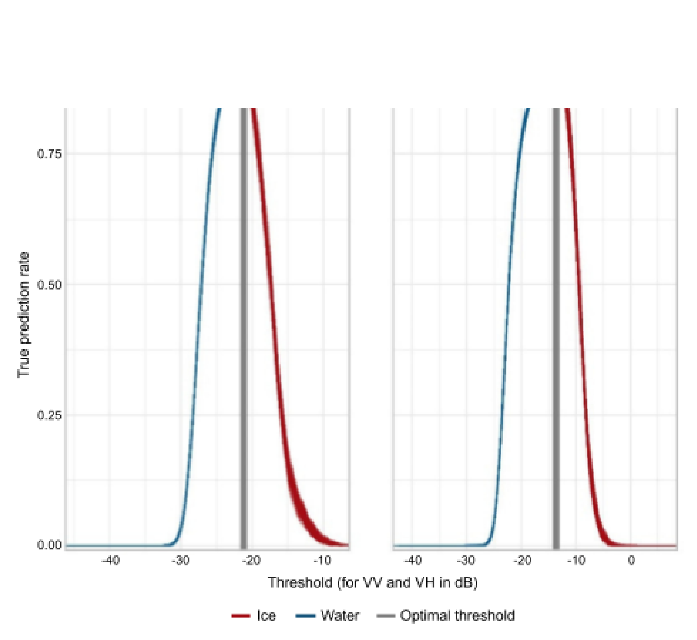

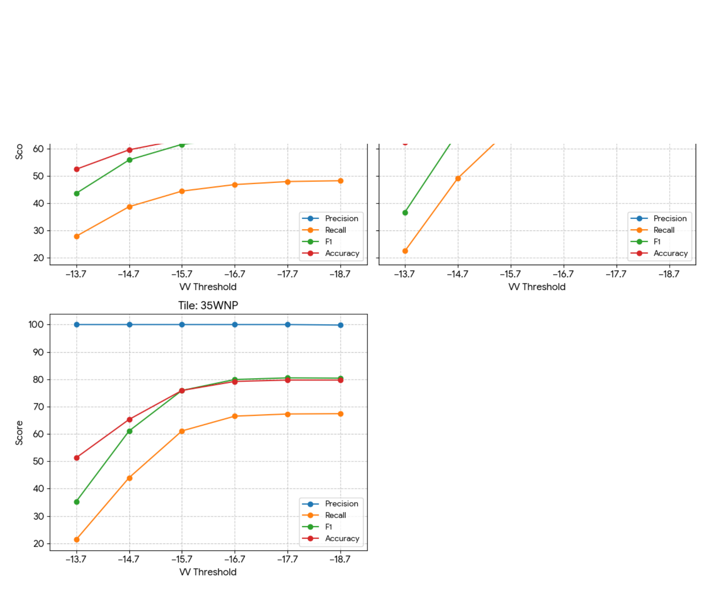

### Assumptions

**Smooth open water is the feature with the lowest backscatter coefficient**

The smooth water surface reflects radar radiation similar to a mirror, which means that only a small part of the emitted radiation returns to the sensor. Therefore, water surface backscatter in the radar image is very low, which is the starting point for detecting objects other than open water within a predefined water body. On the other hand, high speed wind causes higher backscatter coefficients to be observed even if the water surface is open (see Section 6.2.8.).

**Frazil ice, floe and shattered ice are typical ice phenomena on rivers**

Flowing water does not freeze into one smooth sheet but undergoes the process of ice formation by the formation of frazil ice discs, which then collide and stick together to form irregular ice cover. Similarly, during thawing, rivers' ice cover fractures and breaks into pieces of ice floes which then flow down the river. If the frazil ice encounters a pre-formed ice sheet, both the ice floe and frazil ice can accumulate into ice jams. These ice phenomena reflect radar radiation in a diffuse manner, resulting in high backscatter in radar images. On the other hand, other phenomena such as thin ice and melting (wet) snow on ice surface results in low backscatter in radar images, leading to misclassifications (see Section 6.2.8.).

EEA38+UK countries. It used a similar thresholding algorithm with different thresholds [AUX27]. The RLIE S1 product was computed on the Sentinel-2 tile grid at 20m x 20m resolution in the frame of the Copernicus Land High Resolution Snow and Ice (HR-S&I) project and was produced and distributed until 2024.

### Alternative methodologies

A similar method of extracting lake ice phenology by thresholding SAR-based backscatter has been studied by Murfitt and Duguay (2020). It differs from the approach used here in that the thresholds are obtained by analysing time series of average backscatter coefficients. This method can theoretically be used to define thresholds for ice cover mapping in different regions or climates in an operational setting, but it requires large amounts of processing and potentially human intervention and inspection of the data.

Operational services for ice detection on surface waters have already been developed on national and European levels using radar imagery.

**National level: River Ice Monitoring Service in Poland**

The River Ice Monitoring Service is part of the EO4EP (Earth Observation for Eastern Partnership) project funded by the ESA which aims at meeting the needs of the Water Management Board in Poland. It is based on Sentinel-1 acquisitions, which enable observations regardless of weather and illumination conditions. This allows the provision of complete, spatially continuous information on ice within riverbeds at a high temporal frequency [AUX28].

### Input data

The WIC S1 algorithm uses the following input data:

-   Preprocessed Sentinel-1 Backscatter coefficient (sigma nought) maps consisting of
    -   VV polarisation
    -   VH polarisation
    The spatial resolution of the backscatter coefficient maps is 10m x 10m (Section 4). After applying multilooking to decrease signal noise, the resolution of the product is 60m x 60m.

-   Radar layover, foreshortening and shadow mask
    -   Preparation of the mask is described in Section 2.2.

-   EU-Hydro database
    -   EU-Hydro River Network database (2006-2012) version 1 [AUX9]. More details in Section 2.5.

-   Meteorological data
    -   ECMWF HRES meteorological data is used for filtering potential false alarms during windy or summer days, and for the computation of QAFLAGS and WIC-QA layers (Section 2.6). The data includes hourly 2m air temperature, 10m wind direction (u-component) and 10m wind speed (v-component) estimations.
-   Imperviousness density layer (IMD)
    -   HRL Imperviousness density layer is used in QAFLAGS and WIC-QA computation (Section 2.3).
-   Grassland layer
    -   HRL Grassland layer is used in QAFLAGS and WIC-QA computation (Section 2.3).
-   Tree cover density layer
    -   HRL Tree cover density layer is used in QAFLAGS and WIC-QA computation (Section 2.3).

### Output data

Each WIC S1 product is formed of three raster files in Geographic Tagged Image File Format (GeoTIFF) and a metadata file in Extensible Markup Language (XML). The raster files match the S2 L2A projection (WGS84/UTM) and the extent of the input products, with a resolution of 60m x 60m. The raster files are coded in unsigned integers (8-bit and 16-bit). The individual raster files are as follows:

-   WIC: S1 based ice extent on rivers and lakes (within the water mask),
-   WIC-QA: quality control value from WIC from 0 (high quality) to 3 (minimal quality),
-   QAFLAGS: bit-coded quality flags (see Section 6.2.7.).

Readers are referred to the product user manual [AD3] for a complete description of the product.

### Methodology

The methodology for WIC S1 processing is presented in Figure 12 and described below. The water mask is generated once a year, while the radar shadow mask, here referring to the radar shadow / layover / foreshortening masks, is generated once during the ramp-up of the project and it is valid for the whole WIC S1 production. Readers are referred to Sections 2.4 and 2.2 for more details.

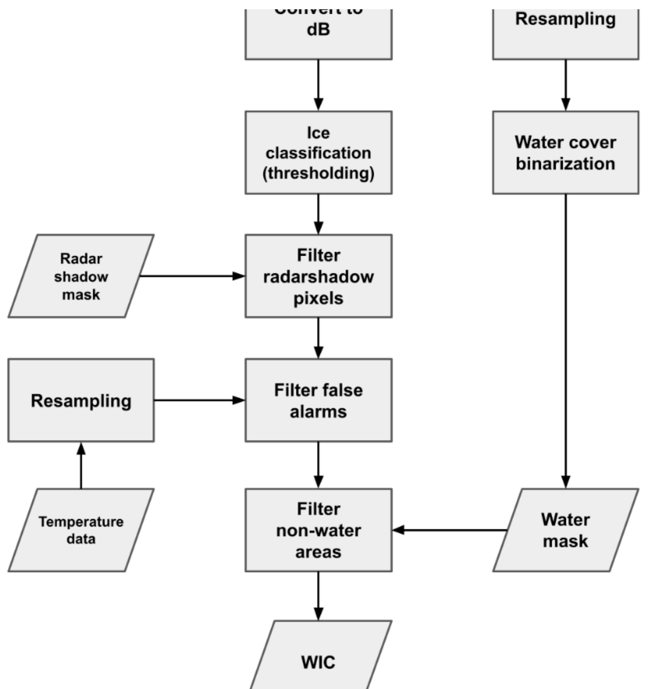

**Preparation of the meteorological data**

Preparation and acquisition of daily average wind speed and 5-day sum of daily average air temperature (at 2-meter height) data, which are generated daily by FMI, is described in Section 2.6. Originally gridded to a spatial resolution of 0.1 degrees, it is resampled using the nearest neighbour method to the S2 tile over which the product is to be produced.

**Multilooking on the SAR image**

Backscatter (sigma nought) maps in 10m spatial resolution are multi looked by averaging values in 6 x 6 pixels area to reduce noise and obtain 60m spatial resolution.

**Conversion to dB from linear units on the SAR image**

Multilooked backscatter map values in linear units are converted to dB using the following equation:

$$\sigma_{dB} = 10 \times \log_{10}(\sigma_{linear})$$
Equation 5

IF sigma0vv ≥ THR_WICsigma0_vv OR sigma0ѵH ≥ THR_WICsigma0_VH
THEN ice covered
ELSE
water covered

The backscatter coefficient thresholds for rivers are those from Stonevicius et al. (2022):

THR_WICsigma0_vv = -13.7 dB
THR_WICsigma0_VH = -21.2 dB

The backscatter coefficient thresholds for lakes were derived from comparisons with the reference data prepared for the development of the product:

THR_WICsigma0_vv = -17.7 dB
THR_WICsigma0_VH = -21.2 dB

**Unclassifiable pixels**

Radar shadow / layover / foreshortening pixels are masked out from the classification using the dedicated mask, marked as *radarshadow* in the WIC layer.

Pixels with invalid or no- observations from the backscatter (sigma nought) maps (pixel value of zero) are marked as *nodata* in the WIC layer.

**Filtering out possible false alarms and marking unclassifiable pixels with temperature data**

If the meteorological data is available and previous-5-day-sum-temperature for a pixel is higher than 50°C (10°C per day), it is considered that the ice cover has already melted. If the classification results in ice cover for such a case, it will be a false alarm. Also, if there was no backscatter observation for the pixel (see above), the melted state can be assumed. In these cases, the pixel is marked as "open water" and the "summer_day" flag is raised. In any case, "temperature_data" flag is set if the temperature (and meteorological) data is available. (more details on the different flags in the subsection below).

**Classification area**

Pixels outside the inland water extent are marked as *nodata* in the WIC layer.

**Quality Control (QA) computation and QAFLAGS**

A QA value is computed and reported for each WIC S1 value along with data flags (QAFLAGS) to characterise the quality of the output products based on various indicators. The QA value is derived from a confidence index which results from the combination of various flags described below. All flags are binary values and are set to one if true and to zero otherwise. All flags are set to zero outside of the detection area.

Even if the water mask is derived from the WCD product and updated annually (Section 2.5), it still includes temporary water pixels which the presence of water is changing through the year.

-   imperviousness_flag is set when imperviousness ≥75%,
-   tree_cover_density_flag is set when TCD ≥75%,
-   grassland_flag is set when grassland = 1.

Four flags (based on meteorological data) are created according to the temperature and wind speed:

-   wind_flag is set if wind speed data is available for the location,
-   windy_flag is set if the daily average wind speed is higher than THR_WICWINDSPEED = 5 m/s. This flag is to warn users about the decreased quality in the backscatter coefficient due to the movements on the water surface caused by the wind (see Section 6.2.8.),
-   temperature_flag is set if previous-5-day-sum-temperature data is available for the location,
-   summer_day flag is set if previous-5-day-sum-temperature data is higher than THR_WICTEMPSUM = 50°C (10°C per day on average).

One flag (based on hydrography data) is created according to water body categorisation:

-   standing_water_flag is set if the pixel is part of a lake area. Since the algorithm can misclassify inland water areas covered with smooth ice (for more details, refer to Section 6.2.8. Limitations), the flag is used to warn end-users about the possibly degraded quality of the WIC S1 product on these water bodies. The categorisation of lake and river areas is based on the EU-Hydro hydrographic database, as described in Section 2.5. However, the raster of EU-Hydro waterbody categories might not align exactly with the annually changing water mask, so when water pixels are not part of a selected water body defined by EU-Hydro, then they are assigned the category of the closest EU-Hydro pixels, with a range of 1000 meters.

One flag (based on the water mask) is created to indicate the detection area:

-   inland_water_flag is set if the water mask product indicates temporary or permanent water.

The WIC-QA layer is set to have the following values:

-   0: high quality
-   1: medium quality
-   2: low quality
-   3: minimal quality
-   radar shadow / layover / foreshortening
-   nodata

It is computed from all the aforementioned flags and the radar shadow/layover/foreshortening static mask, following the steps:

1.  Whole QA raster is set to high quality

8.  Set QA to radar shadow/layover/foreshortening if radar shadow/layover/foreshortening is present
9.  Set QA to high quality if summer_day
10. Set QA to nodata for nodata in WIC layer

\* grassland_flag and tree_conver_density_flag can be raised at the same time only in very rare cases. If the quality is already minimal at step 5, it is ignored.

### Limitations

**Water mask**

The limitations of the water mask used by the algorithm are carried over to the WIC S1 product, as it defines the water extent for classification. In addition to the water extent, the distinction between temporary and permanent water affects the quality layers of the WIC S1 product. If the water mask incorrectly classifies water pixels as temporarily covered instead of permanently covered, the QA layer value is reduced, even if the classification quality remains unaffected. The limitations of the WCD-derived water mask are detailed in the water ATBD [AD1].

**Wind**

Wind over water surface has an effect on SAR backscatter through movements on the water surface. When there is no ice cover on the water surface, strong winds cause the backscatter coefficient to be much higher compared to the backscatter caused by calm, open water (La et al., 2018; Monaldo et al., 2016). Thus, the WIC product is expected to report false alarms of ice cover in such cases. The product uses meteorological data to flag such cases (wind speed over 5 km/s) in QAFLAGS layer and report a lower quality in QA layer (see Section 6.2.7.).

**Wet snow cover on ice surface**

The appearance of the snow cover over the ice surfaces occurs commonly - mainly on lake surfaces, but also on river ice. If the snow layer is characterised as wet snow, it strongly influences the ice differentiation capability using SAR imagery. It is known that wet snow reduces penetration depth dramatically. Thus, the backscatter returned to the sensor mostly comes from the wet snow layer rather than the underlying ice (Chu et al., 2015). As wet snow shows similar backscatter values to open water surfaces, the occurrence of wet snow on ice cover will lead to misclassification of the ice as open water. As long as the wet snow persists, the misclassification will continue. Such misclassification in NRT settings will lead to a misjudgement of very early thawing of ice cover.

**Smooth ice surfaces**

A smooth ice cover consists of pure ice with very few or no air bubbles or other volume scattering on its surface. Smooth ice layers have been recognised to show very similar surface scattering and physical properties to open water (Magnuszewski, 2018). As a result, these two

instance, high altitude lakes tend to freeze into rough ice cover as a result of methane emission contributing to the release of bubbles on the lake surface (Matthews et al., 2020). The detection of ice within microwave SAR images on these lakes would therefore be more reliable.

**Melting ice cover**

The melting process results in an increase in wetness of the ice surface usually with the presence of a liquid water layer. In these conditions, the C-band backscatter signatures of ice are masked and the ice differentiation skill based on Sentinel-1 SAR images decreases (Magnuszewski, 2018). Therefore, the classification results for ice cover in periods of mild spell should be considered with caution.

**Differentiation of ice from other high-backscatter objects**

The presence of shoreline vegetation, bare soil and man-made objects (bridges, dams, etc.) within the AOI can result in misclassification errors. Using only two polarisations, these objects which show a strong backscatter of radar radiation can be mistaken for ice. Users are referred to the QAFLAGS quality layer (see Section 6.2.7. Methodology), which note areas likely to be non-water surfaces, helping to mitigate this issue.

## Quality assessment

As part of the HR-WSI project, an independent assessment of the HR-WSI WIC S1 products will be carried out over a dozen European Sentinel-2 tiles, covering the period 2020-2021. This particular set of sites was selected to represent a variety of topographies, climates and land cover types and for which auxiliary validation datasets are available. Results will be then made available in a validation report.

The Sentinel-1 and Sentinel-2 Water and Ice Cover (WIC S1+S2) is a product generated on a daily basis on inland waters within the EEA38+UK area. This product focuses on surface water regions defined by a dynamic water mask, updated annually (see Section 2.4), and provides data on the presence of either snow-covered or snow-free ice on rivers and lakes.

It is computed from the Water and Ice Cover product based on Sentinel-2 optical data (WIC S2) (see Section 5) and the Water and Ice Cover product based on Sentinel-1 synthetic aperture radar data (WIC S1) (see Section 6). A WIC S1+S2 product is processed when both WIC S1 and WIC S2 observations are available on the same day. Furthermore, as two WIC S1 products can be computed on the same day for a particular area, and each one is combined with the WIC S2 product, two WIC S1+S2 products are produced on this day.

The generation of the WIC S1+S2 is triggered daily at the end of the day, in order to have all WIC S1 and WIC S2 products of the day available. If, however, either no WIC S1 data or no WIC S2 data were available, then the WIC S1+S2 product will be generated when they are made available within a maximum limit of 10 days.

A basic assumption of the WIC S1+S2 product is that WIC S2 data is enriched with information from WIC S1 on the pixels where optical observations could not be exploited.

The WIC S1+S2 is delivered on Sentinel-2 tiles, with a pixel size of 20m x 20m in the WGS84/UTM projection.

## Retrieval algorithm

### Outline

The WIC S1+S2 is computed as a combination of input WIC S1 and WIC S2 products of the same day. First, those input products must undergo a preprocessing step: the WIC S2 information is kept in the extent of the water mask so that the area of interest of WIC S1 and S2 is common (inland waters as defined by the water mask used for the current hydrological year), while the WIC S1 product is resampled to 20m, the same resolution as the WIC S2. The products are then combined into a single WIC S1+S2 product, based on the assumption that the optical data from the WIC S2 is enriched with radar information from the WIC S1 when the optical data cannot be exploited.

The final WIC S1+S2 product includes the following thematic classes:

-   Open water
-   Snow-covered or snow-free ice
-   Other features (land, vegetation, salt sea, other)
-   Cloud or cloud shadow
-   Radar shadow / layover / foreshortening
-   No data

the sensing time of S1 and S2 acquisitions. It is assumed that the WIC S1 and WIC S2 data corresponding to the closest acquisition times can be combined.

Moreover, all basic underlying assumptions applicable to the WIC S2 and the WIC S1 products are also applicable to the WIC S1+S2 product (see Sections 5.2.2 and 6.2.2).

### Related and existing applications

Currently, no other scientifically described or commercially available operational services have been developed for ice detection on surface waters which provide products based on combined information from both radar and optical data.

### Alternative methodologies

Currently, no scientifically described or commercially available services or applications have been developed which uses an alternative methodology for retrieving ice cover information on inland waters from both Sentinel-1 synthetic aperture radar data and Sentinel-2 optical data.

### Input data

The WIC S1+S2 algorithm is configured to use the following input data.

-   One or more WIC S1 product (Water and Ice Cover, based on Sentinel-1 data)
-   One or more WIC S2 product (Water and Ice Cover, based on Sentinel-2 data)
-   Water mask. An inland water mask defines the area for which the daily data combination is performed. This mask is the same as the one used for the WIC S1 and WIC S2 inputs. Users should refer to Section 2.4 to know the source of the water mask for a given WIC S1+S2 product. In most cases, it is derived from the HR-WSI WCD product and reflects conditions of the previous hydrological year.

Users should note that WIC S1+S2 products are only produced for the corresponding WIC S1 and WIC S2 data acquired on the same day. When more than one WIC S1 product is acquired, the WIC S2 is combined with each of the WIC S1 products to compute the WIC S1+S2 products.

### Output data

For each of the WIC S1 products combined to the WIC S2 products as WIC S1+S2, three raster files in Geographic Tagged Image File Format (GeoTIFF) and a metadata file in Extensible Markup Language (XML) are produced. The raster files are coded in 8-bit unsigned integer and maintain the projection, extent and resolution of the initial 20m resolution bands of the Sentinel-2 L2A product (UTM/WGS84 with a pixel size of 20m x 20m).

The list of raster files is as follows:

product.

### Methodology

Every day at a fixed time, the availability of the WIC S1 and WIC S2 data is checked for each tile. When both WIC S1 and WIC S2 products are available, and if the output WIC S1+S2 has not been computed yet, the following procedure is applied for each tile, in order to compute the WIC S1+S2 product.

The processing of the WIC S1+S2 product is summarised in Figure 13 (page 57).

**Step 1. Preprocessing: preparation of the input WIC products**

-   Import all available WIC S1 and WIC S2 products of the acquisition day.

Note: A S2 tile may be covered by two S2 L1C products corresponding to the same acquisition, leading to two WIC S2 products.

-   If necessary, merge all WIC S2 products related to the same acquisition (same orbit, same date, same tile). If the two products overlap, a fusion approach is applied to the WIC products, using the WIC layer values to determine which input data is retained for each pixel. Table 13 provides the overlapping rules.

::: {.tbl-caption}
```{=typst}
#set text(size: 9pt, fill: rgb("#3E6893"))
```
Table 13. Merging policy for the WIC S2 products, inputs of WIC S1+S2
:::

| Layer | Merging policy |
|--------------------------|------------------------------------------------------------------------------------------------------------------------------------------------------------------------------|
| WIC | From both WIC S2 input products, the WIC value with the highest preference order is kept.<br>Preference order is as follows: cloud or cloud shadow > open water > snow-covered or snow-free ice > other features > no data |
| WIC-QA | From both WIC S2 input products, the WIC-QA value from the product with the WIC value with the highest preference order is kept.<br>Preference order is as follows: cloud or cloud shadow > open water > snow-covered or snow-free ice > other features > no data |
| QAFLAGS | From both WIC S2 input products, the QAFLAGS value with the highest preference order is kept.<br>Preference order is as follows: any activated bit or bits > no activated bit. |

The WIC S1+S2 product uses Sentinel-2 data as the primary source, with Sentinel-1 data as a complement. To match the WIC S2 product, the WIC S1+S2 product has a 20 metre pixel spacing. Since the WIC S1 product has a 60 metre pixel spacing, it is resampled to 20 metres using the GdalWarp 'average' method.

**Step 4. Processing: Merging of the input WIC products**

-   If there are two WIC S1 products, corresponding to two different acquisitions for the day, they are merged separately with the WIC S2 product of the day. For each couple of input product (one WIC S1, one WIC S2), the following merging policy is applied for each pixel to create the WIC layer of the output WIC S1+S2:
    -   If the WIC S2 information is 'open water', 'snow-covered or snow-free ice' or 'other features', this information is kept.
    -   If the WIC S2 information is 'cloud or cloud shadow', it is replaced with the WIC S1 classification if it is 'open water' or 'snow-covered or snow-free ice'.
    -   If the WIC S2 information is 'no data', it is replaced with WIC S1 classification.

**Step 5. Post-processing: Quality Assessment**

The QAFLAGS and WIC-QA layers of the WIC S1+S2 output product are derived from the input WIC S1 and WIC S2 QAFLAGS and WIC-QA layers.

For a detailed description of the QAFLAGS and WIC-QA layers of the WIC S1 product, see Section 6.2.7.

For a detailed description of the QAFLAGS and WIC-QA layers of the WIC S2 product, see Section 5.2.7.

First, a new flag is created in order to indicate, at pixel level, from which input product the classification comes from. This source_data_flag is active when the pixel information comes from the WIC S1 input product, and is inactive when it comes from the WIC S2 input product.

Then, all the QAFLAGS corresponding to the source of the data are copied into the WIC S1+S2 QAFLAGS layer. Consequently, as the WIC S1 QAFLAGS layer contains 9 bits, while the WIC S2 QAFLAGS layer contains 7 bits, 2 bits are unused in the WIC S1+S2 QAFLAGS layer when the source_data_flag is inactive. To sum up, the QAFLAGS contains the following classes:

-   When the source_data_flag is active (meaning the classification comes from WIC S1)
    -   bit 0: temporary water flag
    -   bit 1: standing or uncategorized water flag
    -   bit 2: temperature data flag
    -   bit 3: summer day flag
    -   bit 4: imperviousness flag
    -   bit 5: tree cover density flag
    -   bit 6: grassland flag
    -   bit 7: wind speed data flag
    -   bit 8: windy flag
    -   bit 9: data source
-   bit 5: tree cover density flag
-   bit 6: grassland flag
-   bit 7: unused
-   bit 8: unused
-   bit 9: data source

The QA layer of the WIC S1+S2 output product is created following the same approach: if the pixel information comes from the WIC S1 input product, the WIC S1 QA value is assigned to this pixel, and likewise for the WIC S2. All flags are set to zero outside of the detection area.

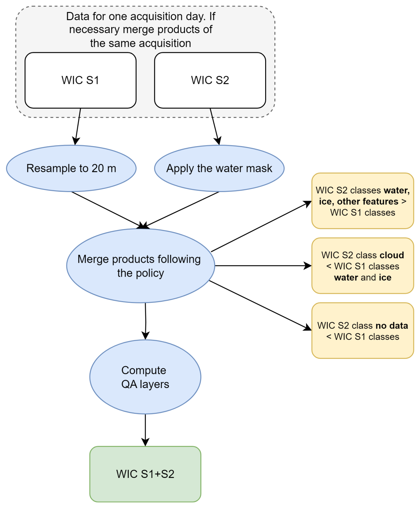

The WIC S1+S2 product heavily depends on the revisit rate and overlapping occurrences of S1 and S2. The 'cloud and cloud shadow' and 'no data' classes derived from S2 observations cannot always be completely replaced by S1 data, particularly when the overlap between the two products is partial. As a result, gaps in the WIC S1+S2 thematic information may still occur.

**Rapidly changing ice cover**

Since the WIC S1 and WIC S2 data used for the WIC S1+S2 product are acquired at different times of the day, the combined product's quality may decrease in certain situations. This is particularly true when weather and environmental conditions change rapidly between the two acquisition times. Rapidly melting ice, or ice moving quickly due to currents, can also lead to discrepancies between the two input products. This issue is more relevant to river ice, as lake ice is generally less prone to movement.

## Quality assessment

As part of the HR-WSI project, an independent assessment of the HR-WSI WIC S1+S2 products will be carried out over a dozen European Sentinel-2 tiles, covering the period 2020-2021. This particular ensemble of sites was selected to represent a variety of topographies, climates and land cover types and for which auxiliary validation datasets are available. Results will be then made available in a validation report.

The Aggregated Water and Ice Cover (AWIC) information is stored in a geodatabase and accessible from a REST API. It describes the surface coverage of lakes and rivers defined by the EU-Hydro database (described in Section 2.5) and is a spatial aggregation of the Water and Ice Cover products (WIC S1, WIC S2 and WIC S1+S2) described in Sections 5, 6, and 7. It provides the percentage of open water, snow-covered or snow-free ice, as well as other categories (clouds, radar shadow / layover / foreshortening, other features and no data), for individual lakes and over 10 km longitudinal sections of rivers for each acquisition date.

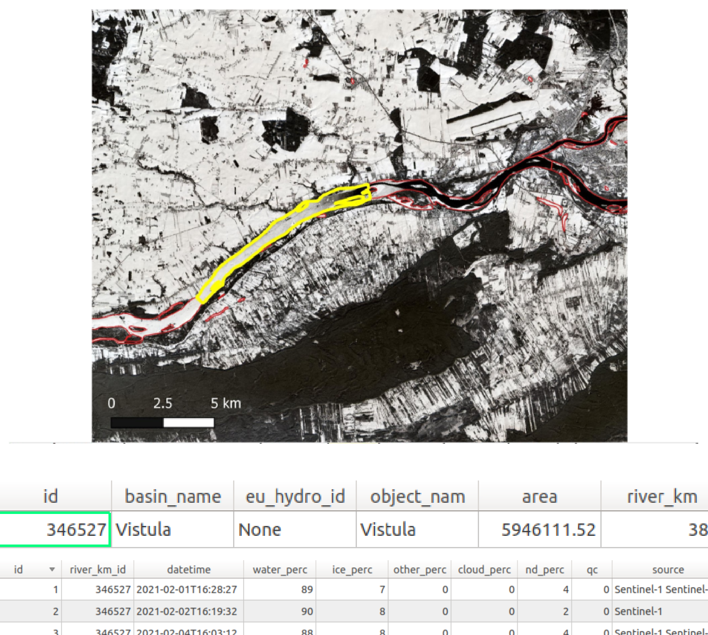

The AWIC geodatabase is fed daily from the input WIC products computed on this day. For each day, the source Water and Ice Cover product information (WIC S1, WIC S2, WIC S1+S2) used for

each basin, river division and kilometre numeration are done beforehand (more details in Section 2.5). The percentage of coverage for each class from the WIC products is then calculated for each hydrographic element (individual lakes or 10 km river sections) for every WIC product. Finally, the statistical information for these hydrographic elements is stored in a PostGIS geodatabase [AUX29].

The procedure to use the REST API to access the geodatabase and examples of applications of AWIC products can be found in the product user manual [AD3].

## Retrieval algorithm

### Outline

The AWIC geodatabase is updated daily. The latest WIC products generated from Sentinel-1 (WIC S1) and Sentinel-2 (WIC S2) observations are identified alongside combined products (WIC S1+S2). Each input WIC product is then spatially aggregated on lakes or 10 km long river segments at each river basin level. The resulting statistics indicate the percentage coverage of each class from the WIC products of the day. These statistics are eventually added to the geodatabase.

Additionally, complementary static information about the hydrographic network is stored within the persistent geodatabase. It consists of:

-   Polygon vector data circling the river basin or lake basin (AOI)
-   River or lake name
-   River kilometre from the mouth (only for rivers)
-   Area of the lake (only for lakes)
-   River segment (only for rivers)

### Assumptions

As the AWIC product is generated from the WIC S1, WIC S2 and WIC S1+S2 datasets, the basic underlying assumptions are those of WIC S1 (see Section 6.2.2.), WIC S2 (see Section 5.2.2) and WIC S1+S2 (see Section 7.2.2.).

### Related and existing applications

**Lake Ice Extent from Copernicus Monitoring Land Service - global component (LIE)**

The Lake Ice Extent in the Copernicus Global Land Service is an ice product derived from optical satellite imagery at 250 m resolution. While the algorithm was initially developed using MODIS, it has since been further refined to operate with data from the VIIRS (Visible Infrared Imaging Radiometer Suite) instrument on NOAA-20 (JPSS-1), which is currently in use. The classification is pixel-based, using a threshold approach. Cloud-free freshwater bodies are classified into three classes: fully snow-covered ice, partially snow-covered ice/clear ice, and open water. The

The ICE algorithm for AWIC is configured to use the following input data:

-   All available WIC S1, WIC S2, and WIC S1+S2 products processed by the HR-WSI system. More precisely, for each day and each S2 tile, all the available WIC S1, WIC S2 and WIC S1+S2 products are used.
-   Polygon layers - river segments and lakes - created from the EU-Hydro database (see Section 2.5) and covering the 33 European river basins.

### Output data

AWIC geometries are stored in a PostGIS geodatabase [AUX29] format in the European ETRS89 LAEA coordinate system (EPSG: 3035). After the statistics computation, the geodatabase is filled with the spatially aggregated data on the geometries, individual lakes and 10 km long river sections, for each EU-Hydro river basin.

Each record in the AWIC product refers to a particular geometry feature (lake or river section) and is assigned with the percentage of coverage of each class derived from the relevant WIC S1/WIC S2/WIC S1+S2 product (as detailed in Section 8.2.7.):

-   Open water,
-   Snow-covered or snow-free ice,
-   Cloud or cloud shadow,
-   Radar shadow / layover / foreshortening,
-   Other features (land, vegetation, salt sea, other),
-   No data.

Three columns give information about the source of the aggregated data:

-   Type: indicates if the AWIC is derived from S1, S2 or both S1 and S2 data.
-   Percentage of S1 pixels: shows the percentage of exploitable pixels (i.e. excluding no data pixels) derived from an S1 observation.
-   Percentage of S2 pixels: shows the percentage of exploitable pixels (i.e. excluding no data pixels) derived from an S2 observation.

For each AWIC, a quality value (QA) is also computed (see Section 8.2.7.). AWIC information is also delivered with metadata.

Users should refer to the product user manual for ice products [AD3] for a complete description of the AWIC product format.

### Methodology

All processing is done with GDAL [AUX30] and is presented in Figure 15 (page 63).

First, a subset of the EU-Hydro river basins has been processed according to the logic exposed in Section 8.2.5.

-   Import the EU-Hydro river basins intersecting the Sentinel-2 tiles of harvested WIC products. Several EU-Hydro river basins can intersect a single Sentinel-2 tile.
-   If necessary, merge all WIC S2 products relating to the same date and tile. If the two products overlap, a fusion approach is applied to the classification results. It is described in the WIC S1+S2 section, in particular Section 5.2.7., subsection "Preparation of the input WIC products".

**WIC data merging**

-   Merge WIC products covering the EU-Hydro river basin into one raster, for each possible group of WIC products (from WIC S2, WIC S1 morning, WIC S1 afternoon, WIC S1+S2 morning, WIC S1+S2 afternoon). If the tiles overlap, a fusion approach is applied. Table 14 presents the merging policy applicable when two products of the same type overlap. If the resulting raster does not cover all objects from the river basin, the area for which the WIC is not provided is set to the 'no data' class.

::: {.tbl-caption}
```{=typst}
#set text(size: 9pt, fill: rgb("#3E6893"))
```
Table 14. Overlapping rules in fusion of input WIC products
:::

| Layer | Merging policy |
|--------------------------|------------------------------------------------------------------------------------------------------------------------------------------------------------------------------|
| WIC | Values are set by preference order: cloud or cloud shadow > open water > snow-covered or snow-free ice > other features > no data |

**Statistics computation**

-   Compute coverage statistics for all the previously retrieved EU-Hydro river basin geometry according to the following formulas:
    -   water_perc = (open water/N) \* 100(%),
    -   ice_perc = (snow-covered or snow-free ice/N) \*100(%),
    -   other_perc = (other features/N) \*100(%),
    -   cloud_perc = (clouds/N) \*100(%),
    -   shadow_perc = (radar shadow/N) \*100 (%)
    -   nd_perc = (no_data/N) \*100(%),

where

-   N is the number of pixels within a particular geometry,
-   pen water is the number of pixels classified as 'open water' within a particular geometry,
-   snow-covered or snow-free ice is the number of pixels classified as 'snow-covered or snow-free ice' within a particular geometry,
-   other features is the number of pixels classified as 'other features' within a particular geometry,
-   clouds is the number of pixels classified as 'clouds' within a particular geometry

particular geometry.

-   Compute the percentage of pixels coming from S1 (respectively S2) observation for exploitable pixels (i.e. excluding no data pixels), according to the following formulas:
    -   s1_perc = (s1 pixels/N_exploitable) \*100 (%),
    -   s2_perc = (s2 pixels/N_exploitable) \*100 (%)

where

-   s1 pixels = number of pixels from an S1 observation
-   s2 pixels = number of pixels from an S2 observation
-   N_exploitable = number of exploitable pixels (N - no data)
-   Calculate the QA according to the following formula:
    `AWIC_confidence = mean(WIC_confidence_level)`,
    where the WIC_confidence_level is the QA value for each pixel, coming from the input WIC product (see the "Methodology" sections associated with the input product).

The four QA possible values for the AWIC product are as follows.

-   0 if 0.5 > AWIC_confidence ≥ 0 indicating high quality
-   1 if 1.5 > AWIC_confidence ≥ 0.5 indicating medium quality
-   2 if 2.5 > AWIC_confidence ≥ 1.5 indicating low quality
-   3 if 3.0 ≥ AWIC_confidence ≥ 2.5 indicating minimal quality

-   Assign coverage statistics and date of source image acquisition to the AWIC geodatabase.

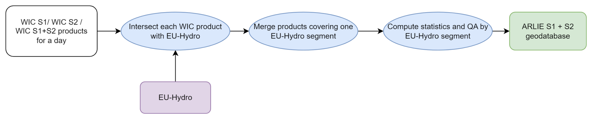

### Limitations

Misclassification errors in the WIC S1 and WIC S2 products directly propagate into the cover fractions of the AWIC product. More details regarding WIC S2, WIC S1, and WIC S1+S2 limitations can be found in sections ‘Limitations' 5.2.9., 6.2.8., and 7.2.8. respectively.

## Quality assessment

As part of the HR-WSI project, an independent assessment of the HR-WSI AWIC data will be carried out over a dozen European Sentinel-2 tiles, covering the period 2020-2021. This particular set of sites was selected to represent a variety of topographies, climates and land cover types and for which auxiliary validation datasets are available. Results will be then made available in a validation report.

The Ice Cover Duration (ICD) product provides the duration of the ice season on an annual basis at 20m resolution. The metric is over a hydrological year (01 September to 31 August) at European level, on inland water pixels within the EEA38+UK area. It is derived from a time series of binary ice cover maps, derived from WIC S1, WIC S2 and WIC S1+S2, using the Let It Snow software (LIS). LIS is originally designed and developed for snow cover processing and temporal aggregation, but the linear interpolation part of the algorithm which ICD uses is identical. As such, the input products, WIC S1, WIC S2 and WIC S1+S2 are converted to FSC-like intermediate products to be used as input to LIS software. Output of LIS software is then converted to ICD main layer and QA layers are processed separately. Additionally, the product is masked with a water mask, derived annually from the HR-WSI Water Cover Duration (WCD) product. The source of this water mask may vary if the WCD was unavailable during processing due to the initialization of the production; further details can be found in Section 2.4. to include only inland water pixels and ensure consistency between the ice products.

LIS software was developed by CESBIO and CNES. The code is open source under Apache licence and available from a Gitlab repository [AUX31].

Note that ICD products are delivered in various projections/pixel spacing definitions. For more details, readers are referred to Section 10.

## Retrieval algorithm

### Outline

The module collects all ice cover observations over a given tile and time period, in this case one year. For each day, which products to be used is decided according to their availability and if necessary, multiple products are merged into one. For each pixel, a linear interpolation along the time axis is performed to obtain a continuous time series at a daily time step. From this time series the total number of ice days is computed (ICD). Then, the water mask is applied, to limit the ICD extent to inland waters within EEA38+UK area.

### Assumptions

The algorithm assumes that a daily time series of ice cover absence or presence can be reconstructed by linear interpolation from irregularly observed ice cover maps.

### Related and existing applications

CLMS HRWSI Snow Phenology product uses the same application on snow cover maps from S2 only and S1 and S2 observations [AD2].

### Alternative methodologies

A similar method of ice phenology extraction on lakes by thresholding SAR based backscatter thresholding but obtaining the thresholds by analysing time series of average backscattering coefficients is studied by Murfitt and Duguay (2020). The method extracts ice-off and ice-on dates, which then can be used to derive the duration of the ice cover. On the other hand, the method uses SAR data directly, rather than ice cover products.

### Input data

The ICD algorithm is configured to use the following input data.

-   HR-WSI Water and Ice Cover (WIC) products covering the hydrological year, defined from 1st of September to the 31st of August of the following year. Additional data are required before the beginning and after the end of the hydrological year in order to manage the linear interpolation at the edges of the period. Margins are set to 30 days in order to maximise the probability to have at least 1 observation for all the tile pixels (see Section 9.2.7 - data collection)
    -   WIC S1 (Water and Ice Cover, based on Sentinel-1 data),
    -   WIC S2 (Water and Ice Cover, based on Sentinel-2 data),
    -   WIC S1+S2 (Water and Ice Cover, based on Sentinel-1 and Sentinel-2 data).
-   Water mask
    -   Water mask. An inland water mask defines the area over which the ICD is computed. This mask is the same as the one used for the WIC inputs. Users should refer to Section 2.4 to know the source of the water mask for a given WIC S1+S2 product. In most cases, it is derived from the HR-WSI WCD product and reflects conditions of the previous hydrological year.

### Output data

Each ICD product is formed of four raster files in Geographic Tagged Image File Format (GeoTIFF) and a metadata file in Extensible Markup Language (XML). The raster files are coded in 16-bit unsigned integers and maintain the projection, extent and resolution of the initial 20m resolution bands of the Sentinel-2 L2A product (UTM/WGS84 with a pixel size of 20m x 20m).

The list of raster files is as follows:

-   ICD: number of days with ice cover on water covered area
-   NOBS1: Number of days with S1 based observations over the hydrological year (data at margin is not included)
-   NOBS2: Number of days with S2 based observations over the hydrological year (data at margin is not included)
-   ICD-QA: confidence level of the ICD layer from 0 (high quality) to 3 (minimal quality)

The ICD processing is performed at the tile level.

**Preprocessing - data collection**

All the Water and Ice Cover (WIC) products covering the period under consideration are collected. This period is defined through parameters given in a configuration file:

-   `date_start`: the target start date for the beginning of the time range, set to the 1st of September N-1 where N is the hydrological year under consideration
-   `date_end`: the target stop date for the end of the time range, set to the 31st of August N

Additional ice products are collected with a margin of ±30 days outside the requested time range to avoid any extrapolation at the edges of the water year:

-   `Date_margin` is set to 30 days in HR-WSI

The algorithm does not store the entire content of WIC products, but only the following layers:

-   WIC layer: water and ice extent
-   WIC-QA layer: quality for the water and ice extent
-   QAFLAGS layer: Quality control flags (only for WIC S1+S2)

**Data fusion and preference**

At this point, all the WIC products available for the full time period are gathered. The data fusion step is applied for each day of the time period. There can be several WIC products available for a given date, reporting different ice cover classification for the same pixels. Ice cover status for a given pixel for a given day is decided before the processing. For each day, if any WIC product exists, they are fused and converted to one FSC-like product. During this operation, the module also counts the number of Sentinel-1 and Sentinel-2 observations (NOBS1 and NOBS2) over the hydrological year, according to which sensor type the final value in daily FSC-like products are selected from.

The decision of which pixel's value is final is made according to the following rules, in hierarchical order, for different cases:

**Product type for the given day and tile:**

-   If at least one WIC S1+S2 product exists, WIC S1+S2 products are used and WIC S1 and WIC S2 products are discarded.
-   If no WIC S1+S2 product exists, then all of the WIC S1 and WIC S2 products are used.

**Using these product types, for each pixel for the given and and tile:**

-   If the information is available from only one product, it is used. In case of availability from multiple products:
    -   Observations over gaps: Ice or open water classes are preferred over gap classes (cloud, radar shadow or no data). In case of observations from multiple products:

After the final values are decided, the daily product is converted to FSC-like products by replacing "ice covered" by “snow”, “open water” by “no snow" and gap classes by "no data." FSC-like product is stored as an intermediate product with an appropriate file name convention for LIS software.

**Resampling of the input WIC S1 product**

The ICD, WIC S1+S2 and WIC S2 products have a 20 metre pixel spacing, while the WIC S1 product has a 60 metre pixel spacing. Therefore, if any WIC S1 product is used as input, it is resampled to a 20 metre pixel spacing. As the resampling is done from higher to lower pixel spacing, the nearest neighbour method is used.

**Masking non-water areas**

Merged WIC layers for each day considered are masked with the water mask to include only water pixels. This is to ensure consistency between the ice products.

**Data conversion**

The interpolation processing will rely on two binary information, ice presence/absence and invalid/valid data.

The fused WIC layer is converted into binary ice masks `ice_mask`:

-   0: no ice (when WIC is open water, clouds, radar shadow, other features or no data)
-   1: ice (when WIC is snow-covered or snow-free ice)

Binary masks `invalid_mask` (cloud/radar shadow/no data) are also created, and indicate the true usability of the acquisition.

-   0: valid (WIC class is open water, snow-covered or snow-free ice or other features)
-   1: invalid (WIC class is cloud, radar shadow, or no data)

**Time series interpolation**

For each pixel of the tile, a linear interpolation is performed on the stack of `ice_mask` to obtain a complete time series with a daily time step. At this point, the interpolated ice mask time series is available (interp_ice_mask).

**Post-processing**

For each pixel, the interpolated binary ice mask time series is analysed to derive the ice covered days. The daily binary ice masks interp_ice_mask are stacked and summed into one annual ice map. It results in the ice cover duration (ICD) in days between 0 and 366.

**Quality layers**

Sentinel-1 based and Sentinel-2 based observations (NOBS1 and NOBS2) is already computed during the "data fusion" stage.

The ICD variable is characterised by a confidence index (ICD-QA):

-   0: High quality
-   1: Medium quality
-   2: Low quality
-   3: Minimal quality

The resulting quality confidence level is decided according to the ice cover duration and intervals of number of days with exploitable observations (NOBS = NOBS1 + NOBS2);

-   ICD-QA = 3 if NOBS < 40 or ICD < 30
-   ICD-QA = 2 if 40 <= NOBS < 80 and ICD >= 30
-   ICD-QA = 1 if 80 <= NOBS < 120 and ICD >= 30
-   ICD-QA = 0 if 120 <= NOBS and ICD >= 30

### Limitations

The LIS algorithm was developed for snow phenology and specifically for mountain ranges and therefore the ice phenology based on S1 and S2 observations should be treated with caution.

The quality of the interpolation is highly dependent on the number of usable observations over the hydrological year, and more specifically on the sampling of the observations contributing to the time series. As a consequence, missing observations due to cloud cover, radar shadow or no data cause interpolation artefacts by increasing the time gap between two consecutive actual observations. This effect is particularly important in polar regions where optical acquisitions are absent for a period of time.

The quality of the interpolation is also dependent on the quality of the ice products used in the time series, any wrong ice detection will indifferently be interpolated and will propagate the error.

The ICD product is not intended for studying short-term extreme ice events, as it employs a linear interpolation approach over the entire hydrological year.

## Quality assessment

As part of the HR-WSI project, an independent assessment of the HR-WSI ICD products will be carried out over a dozen European Sentinel-2 tiles, covering the period 2020-2021. This particular set of sites was selected to represent a variety of topographies, climates and land cover types and for which auxiliary validation datasets are available. Results will be then made available in a validation report.

The resampled products are detailed in Table 15 and the LAEA grid is shown in Figure 17.

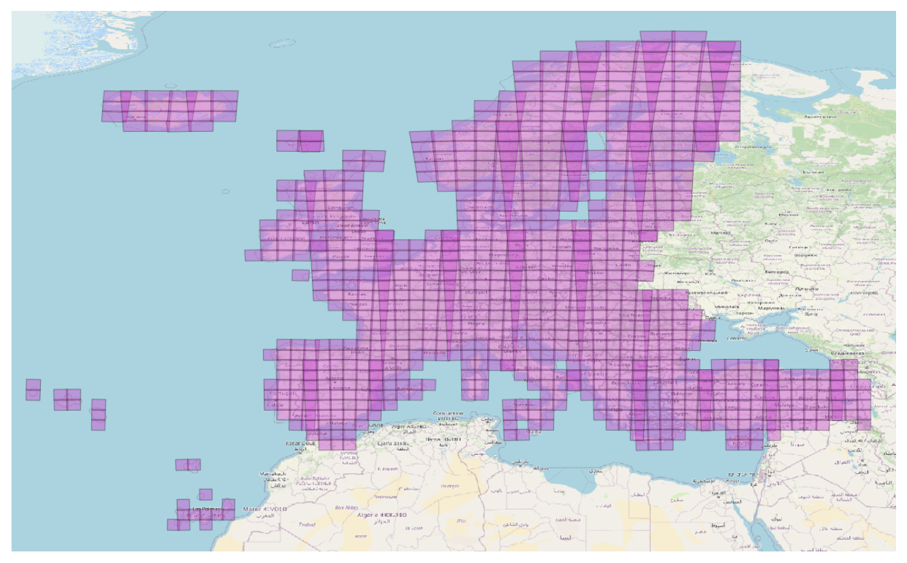

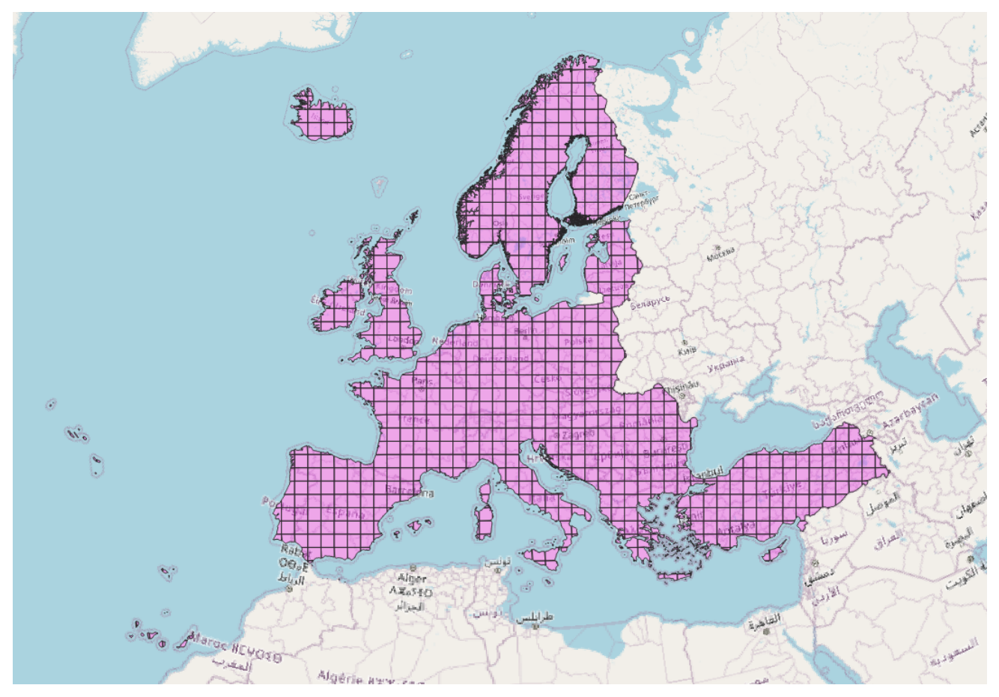

| | |
|--------------------------------------------------------------------------------------------|------------------------------------------------------------------------------------------------------------|
| ICD product defined on S2 tiling grid (110km x 110 km), in the UTM/WGS84 projection (EPSG:326xx\*), with a pixel size of 20m x 20m | km), in the LAEA projection (EPSG:3035), with a pixel size of 20m x 20m |
| | ICD product defined on the European tiles (100km x 100 km), in the LAEA projection (EPSG:3035), with a pixel size of 100m x 100m |

Reprojection and resampling are performed using the *warp* method of the GDAL library and requires that all the native products are generated and available over the entire EEA38+UK.

::: {.tbl-caption}
```{=typst}
#set text(size: 9pt, fill: rgb("#3E6893"))
```
Table 16. List of the abbreviations and acronyms
:::

| Abbreviation | Name | Reference |
|---------------------------------------|----------------------------------------------------------------------|-------------------------------------------------------------------------------------------|
| **ALCD** | Active Learning for Cloud Detection | |
| **API** | Application Programming Interface | |
| **CDSE** | Copernicus Data Space Ecosystem | https://dataspace.copernicus.eu/ |
| **CLMS** | Copernicus Land Monitoring Service | https://land.copernicus.eu |
| **CNES** | French Space Study Center | https://cnes.fr/ |
| **DIAS** | Data and Information Access Services | |
| **ECMWF** | European Centre for Medium-Range Weather Forecasts | |
| **EEA** | European Environment Agency | www.eea.europa.eu |
| **GIMP** | Image Manipulation Program | https://www.gimp.org/ |
| **HRES** | Highest RESolution model from ECMWF | |
| **HRL-WAW** | High Resolution Layers - Water & Wetness | https://land.copernicus.eu |
| **HRWL** | High Resolution Water Layer | |
| **LAEA** | Lambert azimuthal equal-area projection | |
| **NDSI** | Normalised Difference Snow Index | |
| **NDVI** | Normalised Difference Vegetation Index | |
| **NDWI** | Normalised Difference Water Index | |
| **QA** | Quality assessment | |
| **QGIS** | Geographic Information System software | https://www.qgis.org/ |
| **REST** | REpresentational State Transfer | |
| **RLIE S1 / RLIE S2** | HR-S&I River and Lake Ice Extent based on Sentinel-1 / Sentinel-2 | https://land.copernicus.eu/ |
| **SAR** | Synthetic aperture radar | |
| **S1/S2** | Sentinel-1/Sentinel-2 | |
| **UK** | The United Kingdom | |
| **UTM** | Universal Transverse Mercator | |
| **WCD** | Water Cover Duration | |
| **WEKEO** | WEKEO European cloud infrastructure (DIAS) | |
| **WGS84** | World Geodetic System 1984 | |

with a Supervised Active Learning Procedure, Remote Sens., 11, 433, https://doi.org/10.3390/rs11040433, 2019.

Chu, T., Das, A., and Lindenschmidt, K.-E.: Monitoring the Variation in Ice-Cover Characteristics of the Slave River, Canada Using RADARSAT-2 Data—A Case Study, Remote Sens. Chang. North. High Latit. Ecosyst., 7, 13664–13691, https://doi.org/10.3390/rs71013664, 2015.

Colin, J., Hagolle, O., Landier, L., Coustance, S., Kettig, P., Meygret, A., Osman, J., and Vermote, E.: Assessment of the Performance of the Atmospheric Correction Algorithm MAJA for Sentinel-2 Surface Reflectance Estimates, Remote Sens., 15, 2665, https://doi.org/10.3390/rs15102665, 2023.

Doxani, G., Vermote, E. F., Roger, J.-C., Skakun, S., Gascon, F., Collison, A., De Keukelaere, L., Desjardins, C., Frantz, D., Hagolle, O., Kim, M., Louis, J., Pacifici, F., Pflug, B., Poilvé, H., Ramon, D., Richter, R., and Yin, F.: Atmospheric Correction Inter-comparison exercise, ACIX-II Land: An assessment of atmospheric correction processors for Landsat 8 and Sentinel-2 over land, Remote Sens. Environ., 285, 113412, https://doi.org/10.1016/j.rse.2022.113412, 2023.

Dozier, J.: Spectral signature of alpine snow cover from the landsat thematic mapper, Remote Sens. Environ., 28, 9–22, https://doi.org/10.1016/0034-4257(89)90101-6, 1989.

Frantz, D., Haß, E., Uhl, A., Stoffels, J., and Hill, J.: Improvement of the Fmask algorithm for Sentinel-2 images: Separating clouds from bright surfaces based on parallax effects, Remote Sens. Environ., 215, 471–481, https://doi.org/10.1016/j.rse.2018.04.046, 2018.

Gascoin, S., Grizonnet, M., Bouchet, M., Salgues, G., and Hagolle, O.: Theia Snow collection: high-resolution operational snow cover maps from Sentinel-2 and Landsat-8 data, Earth Syst. Sci. Data, 11, 493–514, https://doi.org/10.5194/essd-11-493-2019, 2019.

Hagolle, O., Huc, M., Desjardins, C., Auer, S., and Richter, R.: MAJA Algorithm Theoretical Basis Document, https://doi.org/10.5281/zenodo.1209633, 2017.

Hall, D. K. and Riggs, G. A.: Normalized-Difference Snow Index (NDSI), in: Encyclopedia of Snow, Ice and Glaciers, edited by: Singh, V. P., Singh, P., and Haritashya, U. K., Springer Netherlands, Dordrecht, 779–780, https://doi.org/10.1007/978-90-481-2642-2_376, 2011.

Jugier, R., Cremese, R., Fournier, H., Duran Gomez, N., Salgues, G., and Thenoz, C.: On water and ice classification from Sentinel-2 imagery using machine learning, https://doi.org/10.1002/essoar.10512606.1, 19 October 2022.

La, T. V., Khenchaf, A., Comblet, F., and Nahum, C.: Assessment of Wind Speed Estimation From C-Band Sentinel-1 Images Using Empirical and Electromagnetic Models, IEEE Trans. Geosci. Remote Sens., 56, 4075–4087, https://doi.org/10.1109/TGRS.2018.2822876, 2018.

Latifovic, R. and Pouliot, D.: Analysis of climate change impacts on lake ice phenology in Canada using the historical satellite data record, Remote Sens. Environ., 106, 492-507, https://doi.org/10.1016/j.rse.2006.09.015, 2007.

Matthews, E., Johnson, M. S., Genovese, V., Du, J., and Bastviken, D.: Methane emission from high latitude lakes: methane-centric lake classification and satellite-driven annual cycle of emissions, Sci. Rep., 10, 12465, https://doi.org/10.1038/s41598-020-68246-1, 2020.

McFEETERS, S. K.: The use of the Normalized Difference Water Index (NDWI) in the delineation of open water features, Int. J. Remote Sens., 17, 1425-1432, https://doi.org/10.1080/01431169608948714, 1996.

Monaldo, F., Jackson, C., Li, X., and Pichel, W. G.: Preliminary Evaluation of Sentinel-1A Wind Speed Retrievals, IEEE J. Sel. Top. Appl. Earth Obs. Remote Sens., 9, 2638–2642, https://doi.org/10.1109/JSTARS.2015.2504324, 2016.

Murfitt, J. and Duguay, C. R.: Assessing the Performance of Methods for Monitoring Ice Phenology of the World's Largest High Arctic Lake Using High-Density Time Series Analysis of Sentinel-1 Data, Remote Sens., 12, 382, https://doi.org/10.3390/rs12030382, 2020.

Pickens, A. H., Hansen, M. C., Stehman, S. V., Tyukavina, A., Potapov, P., Zalles, V., and Higgins, J.: Global seasonal dynamics of inland open water and ice, Remote Sens. Environ., 272, 112963, https://doi.org/10.1016/j.rse.2022.112963, 2022.

Rouse, J. W., Haas, R. H., Schell, J. A., and Deering, D. W.: Monitoring vegetation systems in the Great Plains with ERTS, Third ERTS Symposium, Washington DC: NASA, NTRS Author Affiliations: Texas A&M Univ.NTRS Report/Patent Number: PAPER-A20NTRS Document ID: 19740022614NTRS Research Center: Legacy CDMS (CDMS), 309–317, 1973.

S1 MPC: Thermal Denoising of Products Generated by the S-1 IPF, MPC-0392, 2017.

Schubert, A., Miranda, N., Geudtner, D., and Small, D.: Sentinel-1A/B Combined Product Geolocation Accuracy, Remote Sens., 9, 607, https://doi.org/10.3390/rs9060607, 2017.

Skakun, S., Wevers, J., Brockmann, C., Doxani, G., Aleksandrov, M., Batič, M., Frantz, D., Gascon, F., Gómez-Chova, L., Hagolle, O., López-Puigdollers, D., Louis, J., Lubej, M., Mateo-García, G., Osman, J., Peressutti, D., Pflug, B., Puc, J., Richter, R., Roger, J.-C., Scaramuzza, P., Vermote, E., Vesel, N., Zupanc, A., and Žust, L.: Cloud Mask Intercomparison eXercise (CMIX): An evaluation of cloud masking algorithms for Landsat 8 and Sentinel-2, Remote Sens. Environ., 274, 112990, https://doi.org/10.1016/j.rse.2022.112990, 2022.

Stonevicius, E., Uselis, G., and Grendaite, D.: Ice Detection with Sentinel-1 SAR Backscatter Threshold in Long Sections of Temperate Climate Rivers, Remote Sens., 14, 1627, https://doi.org/10.3390/rs14071627, 2022.

Tucker, C. J.: Red and photographic infrared linear combinations for monitoring vegetation, Remote Sens. Environ., 8, 127–150, https://doi.org/10.1016/0034-4257(79)90013-0, 1979.

Wevers, J., Müller, D., Scholze, J., Kirches, G., Quast, R., and Brockmann, C.: IdePix for Sentinel-2 MSI Algorithm Theoretical Basis Document, https://doi.org/10.5281/zenodo.5788067, 2021.

Zhu, Z., Wang, S., and Woodcock, C. E.: Improvement and expansion of the Fmask algorithm:

```{=typst}
#set page(flipped: true, paper: "a3")
#set text(size: 8pt)
```

| Id. | Document |
|-------------------|-------------------------------------------------------------------------------------------------------------------------------------------------------------------------------------|
| **AUX1** | European Environment Information and Observation Network (Eionet), https://www.eionet.europa.eu/, accessed: 09/2024 |
| **AUX2** | PIANetary Data Access catalogue - Copernicus Space Component Data Access by ESA/EC https://panda.copernicus.eu/web/cds-catalogue, accessed: 01/2024 |
| **AUX3** | Copernicus DEM: EEA-10, (DGED), dataset ID: COP-DEM_EEA-10-DGED https://panda.copernicus.eu/web/cds-catalogue, accessed: 01/2024 |
| **AUX4** | Copernicus DEM: GLO-30, (DGED), dataset ID: COP-DEM_GLO-30-DGED https://panda.copernicus.eu/web/cds-catalogue, accessed: 01/2024 |
| **AUX5** | HRL Tree Cover Density (TCD), 10m, 2018. E.U. Copernicus Land Monitoring Service (CLMS). https://doi.org/10.2909/486f77da-d605-423e-93a9-680760ab6791. https://land.copernicus.eu/en/products/high-resolution-layer-tree-cover-density/tree-cover-density-2018, accessed: 02/2024 |
| **AUX6** | HRL Imperviousness Density (IMD), 10m, 2018. E.U. Copernicus Land Monitoring Service (CLMS). https://doi.org/10.2909/3bf542bd-eebd-4d73-b53c-a0243f2ed862. https://land.copernicus.eu/en/products/high-resolution-layer-imperviousness/imperviousness-density-2018, accessed: 02/2024 |
| **AUX7** | HRL Grassland (GRA), 10m, 2018. E.U. Copernicus Land Monitoring Service (CLMS). https://doi.org/10.2909/60639d5b-9164-4135-ae93-fb4132bb6d83. https://land.copernicus.eu/en/products/high-resolution-layer-grassland/grassland-2018, accessed: 02/2024 |
| **AUX8** | HRL Water Layer (WL), 10m, 2018. E.U. Copernicus Land Monitoring Service (CLMS). https://doi.org/10.2909/7992f641-bf77-47b7-b0c1-74fc832b78b1. https://land.copernicus.eu/en/products/high-resolution-layer-water-and-wetness/water-and-wetness-status-2018, accessed: 02/2024 |
| **AUX9** | CLMS, EU-Hydro database (version 1.0) https://land.copernicus.eu/en/products/eu-hydro/eu-hydro-river-network-database, accessed 10/04/2024 |
| **AUX10** | Atmospheric Model high resolution 10-day forecast (Set I - HRES), https://www.ecmwf.int/en/forecasts/datasets/set-i, accessed: 09/2024 |

```{=typst}
#set page(flipped: false, paper: "a4")
#set text(size: 11pt)
```

https://www.theia-land.fr/en/snow-ice/ Data delivery through https://theia.cnes.fr/; https://catalogue.theia-land.fr/ and soon on https://hydroweb.next.theia-land.fr/, accessed: 01/02/2024
| **AUX13** | A. Zupanc, Improving Cloud Detection with Machine Learning, https://medium.com/sentinel-hub/improving-cloud-detection-with-machine-learning-c09dc5d7cf13 (2017),, accessed: 14/02/2024 |
| **AUX14** | Sentinel-2 Level-2A Algorithm Theoretical Basis Document. Louis, J. (2021), https://step.esa.int/thirdparties/sen2cor/2.10.0/docs/S2-PDGS-MPC-L2A-ATBD-V2.10.0.pdf, accessed: 09/2024 |
| **AUX15** | Sentinel-2 Products Specification Document, https://sentinel.esa.int/documents/247904/685211/sentinel-2-products-specification-document, accessed: 14/02/2024 |
| **AUX16** | MAJA GIPP parameter files repository: https://gitlab.orfeo-toolbox.org/maja/maja-gipp2/-/tree/master/SENTINEL2?ref_type=heads, accessed: 14/02/2024 |
| **AUX17** | MAJA Sentinel-2 L2A product description https://theia.cnes.fr/atdistrib/documents/PSC-NT-411-0362-CNES_01_00_SENTINEL-2A_L2A_Products_Description.pdf, accessed: 10/03/2020 |
| **AUX18** | Sentinel-2 MultiSpectral Instrument (MSI) user guide and spectral bands definition, https://sentinels.copernicus.eu/web/sentinel/technical-guides/sentinel-2-msi/msi-instrument https://sentinels.copernicus.eu/web/sentinel/user-guides/sentinel-2-msi/resolutions/spatial, accessed: 14/02/2024 |
| **AUX19** | Copernicus Atmosphere aerosol product used in MAJA for THEIA production: https://ads.atmosphere.copernicus.eu/cdsapp#!/dataset/cams-global-atmospheric-composition-forecasts?tab=overview, accessed: 14/02/2024 https://ads-beta.atmosphere.copernicus.eu/datasets/cams-global-atmospheric-composition-forecasts?tab=overview, accessed: 09/09/2024 |
| **AUX20** | Sentinel Application Platform, Sentinel toolbox, https://step.esa.int/main/download/snap-download/, accessed: 02/2025 |
| **AUX21** | Sentinel-1 SAR Technical Guide, https://sentinel.esa.int/web/sentinel/technical-guides/sentinel-1-sar, accessed: 07/2024 |
| **AUX22** | Copernicus Pan-European High Resolution Snow and Ice Monitoring: River and Lake Ice Extent based on Sentinel-2, 20m, 2021. E.U. Copernicus Land Monitoring Service (CLMS). Algorithm Theoretical Basis Document, version 2.6 (COSIMS-DT-063-MAG_ATBD_ICE_2.6) https://land.copernicus.eu/en/products/water-bodies/high-resolution-river-and-lake-ice-extent, accessed: 09/2024 & on request to the CLMS service desk. |
| **AUX23** | Copernicus Global Land Operations, Lake Ice Extent, Algorithm Theoretical Basis, https://land.copernicus.eu/global/sites/cgls.vito.be/files/products/CGLOPS2_ATBD_LIE-250m-V1_I1.02.pdf, access: 2024-03-05 |

```{=typst}
#set page(flipped: true)
#set text(size: 9pt)
```

| **AUX25** | CNES ALCD software: https://github.com/CNES/ALCD, access: 2024-04-11 |
|--------------------|------------------------------------------------------------------------------------------------------------------------------------------------------------------------------------|
| **AUX26** | Scikit-learn Python module for machine learning, https://scikit-learn.org/dev/modules/generated/sklearn.metrics.classification_report.html, accessed on 11/2024 |
| **AUX27** | Copernicus Pan-European High Resolution Snow and Ice Monitoring: River and Lake Ice Extent based on Sentinel-1, 20m, 2020. E.U. Copernicus Land Monitoring Service (CLMS). Algorithm Theoretical Basis Document, version 1.3 (COSIMS-DT-126-MAG_ATBD_ICE_S1_1.3) https://www.eea.europa.eu/en/datahub/datahubitem-view/b5c68a06-5dcf-42e5-baad-94f861189f91, https://land.copernicus.eu/en/products/water-bodies/high-resolution-river-and-lake-ice-extent, accessed: 09/2024 & on request to the CLMS service desk. |
| **AUX28** | Products and services for improvement hydrographic network management in Poland https://eo4sd-eastern.eu/portfolio/product/river-ice-monitoring.html, access: 2024-03-05 |
| **AUX29** | PostGIS extension for PostgreSQL databases to support geospatial data, https://postgis.net/, accessed on 09/2024 |
| **AUX30** | GDAL library, https://gdal.org/en/latest/index.html, accessed on 11/2024 |
| **AUX31** | Let-It-Snow code Gitlab repository, https://gitlab.orfeo-toolbox.org/remote_modules/let-it-snow, accessed: 07/03/2025 |

```{=typst}
#set page(flipped: false, paper: "a4")
#set text(size: 11pt)
```

also explains the rationale behind the elimination of unusable polygons from the processing and why this process requires a large amount of manual effort and cannot be fully automated.

**Merged polygons of several rivers**

The main issue is that splitting rivers (which are mainly represented as one polygon) cannot be performed automatically because meanders of rivers cause those small polygons to be unpredictably separated from the main river course. Therefore, it is difficult to retrieve a polygon containing only one river.

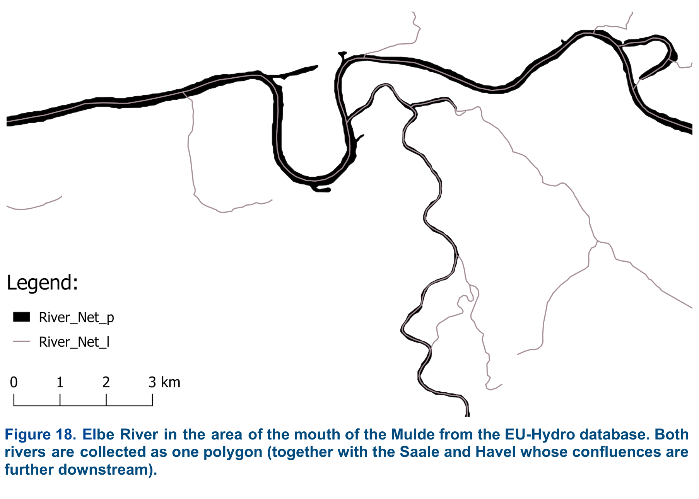

**Inconsistent and/or incomplete attribute data for specific river geometry selection**

There is no dictionary or code list which allows for the automatic selection of a single river course. The most promising attribute (CGNELIN) has many different values when the river is divided into many branches (Figure 19). According to the EU-Hydro user guide, some of the attributes (CGNELIN, ERM_ID etc.) within the dataset are described as 'Incomplete, not updated' or 'empty'.

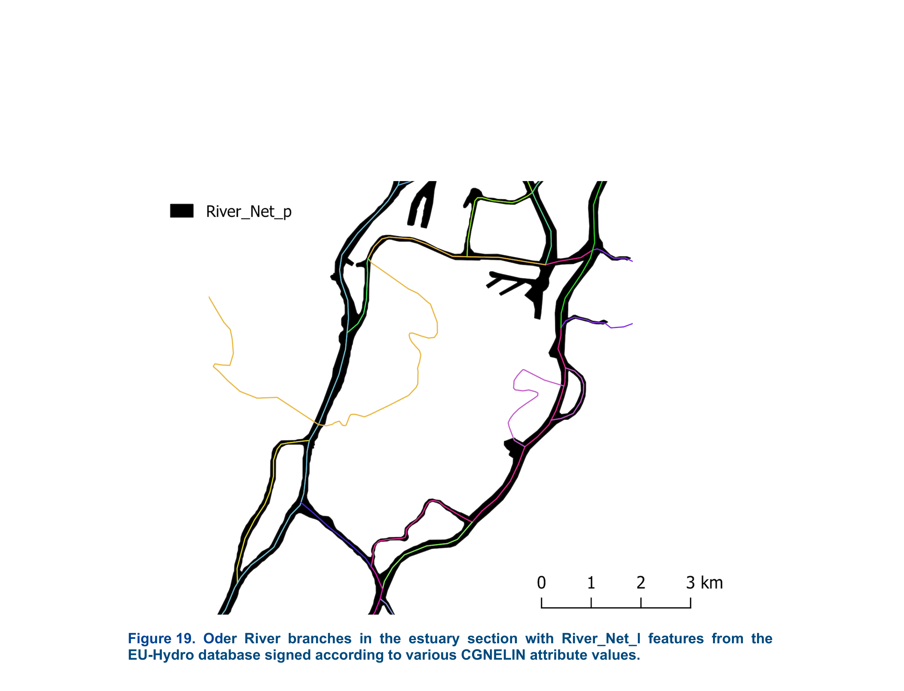

**Lack of river names**

The name of any geographical object is one of the most valuable piece of information for any user and it could be useful for the river course selection as described above as well as accompanying any AWIC record. In the current state of EU-Hydro development, the names of the rivers should be added manually.

**Short estuary sections of tributary rivers are merged with the main river course**

This situation occurs when particular tributary rivers are gathered mainly as linear features only, but their mouths are represented by polygon features and are usually the part of the main river. This issue causes inaccurate calculation of statistics and to avoid this, all tributary mouths included in the main river polygon features should be eliminated manually (Figure 20).


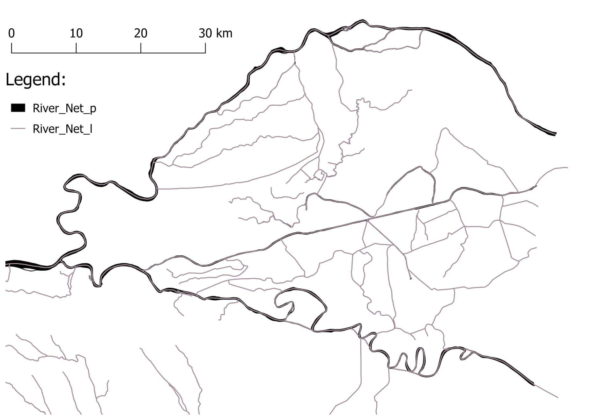

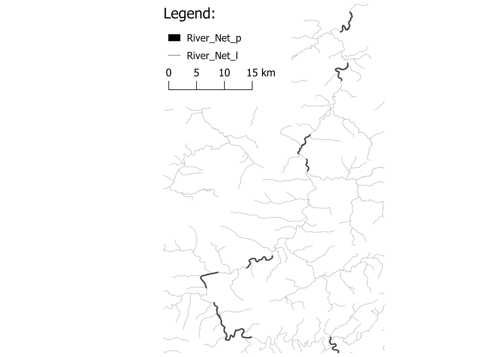