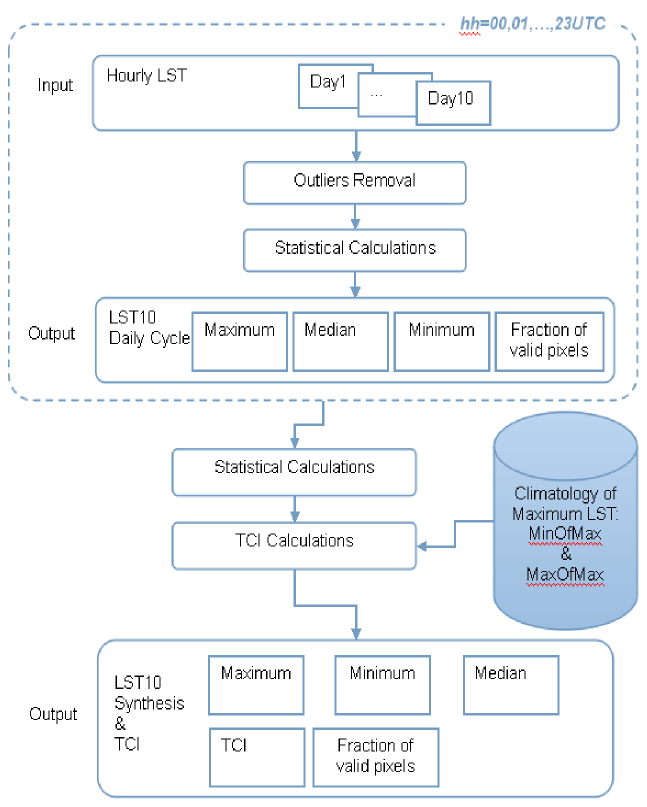

```{=html}
<table>
<colgroup>
<col style="width: 59.0%">
<col style="width: 29.3%">
<col style="width: 11.7%">
</colgroup>
  <tr>
    <td style="font-weight:bold">Dissemination Level</td>
    <td></td>
  </tr>
  <tr>
    <td>PU</td>
    <td>Public</td>
    <td>X</td>
  </tr>
  <tr>
    <td>PP</td>
    <td colspan="2">Restricted to other program participants (including the Commission Services)</td>
  </tr>
  <tr>
    <td>RE</td>
    <td colspan="2">Restricted to a group specified by the consortium (including the Commission Services)</td>
  </tr>
  <tr>
    <td>CO</td>
    <td colspan="2">Confidential, only for members of the consortium (including the Commission Services)</td>
  </tr>
</table>
```

# DOCUMENT RELEASE SHEET

| | | | |
|----------------------------------------------------------|----------------------------------------------------|--------------------------------------------|----------------------------------------------|
| Book Captain: | Emanuel Dutra (IPMA) | Date: 12.03.2026 | Sign. *Emanuel Dutra* |
| Approval: | Roselyne Lacaze (HYGEOS) | Date: 13.03.2026 | Sign. *Roselyne Lacaze* |
| Endorsement: | Nadine Gabron (JRC) | Date: | Sign. |
| Distribution: | Public | | |

# CHANGE RECORD

| Date | Page(s) | Description of Change | Release |
|--------------------------------------------|---------------------------------|-------------------------------------------------------------------------------------------|-------------------------------|
| 30.10.2025 | All | First version | 11.00 |
| 12.03.2026 | 17-19, 21 | Clarifications on the handling of outliers and fraction of valid | 11.10 |

# LIST OF ACRONYMS

AD
: Applicable Document

ATBD
: Algorithm Theoretical Basis Document

CAL/VAL
: Calibration and Validation

CEOS
: Committee on Earth Observation Satellites

CGLOPS
: Copernicus Global Land Operations

CLMS
: Copernicus Land Monitoring Service

GCOS
: Global Climate Observing System

GEO
: Geostationary

GOES
: Geostationary Operational Environmental Satellite

IODC
: Indian Ocean Data Coverage

IPMA
: Instituto Portugês do Mar e da Atmosfera

JRC
: Joint Research Center

LST
: Land Surface Temperature

LPV
: Land Product Validation

MSG
: Meteosat Second Generation

NDVI
: Normalized Difference Vegetation Index

PUM
: Product User Manual

STD
: Standard Deviation

TCI
: Thermal Condition Index

TOA
: Top-of-Atmosphere

UTC
: Coordinated Universal Time

VR
: Validation report

WGS
: World Geodetic System

WMO
: World Meteorological Organisation

# EXECUTIVE SUMMARY

The Copernicus Land Monitoring Service (CLMS) produces a series of qualified bio-geophysical products on the status and evolution of the land surface. The products are used to monitor vegetation, crops, water cycle, energy budget and terrestrial cryosphere. Production and delivery of the parameters take place in a timely manner and are complemented by the constitution of long-term time series.

This document describes the procedures used to calculate a 10-day synthesis of global Land Surface Temperature (LST) obtained from a constellation of geostationary (GEO) satellite missions: Meteosat Second Generation (MSG) 0° and Indian Ocean Data Coverage (IODC); Geostationary Operational Environmental Satellite (GOES) and Himawari; benefiting from high-temporal frequency and wide area coverage at hourly rate with 0.025° spatial resolution, being available since January 2018 to near-real time.

# Background of the Document

## Scope and Objectives

The aim of 10-day LST product is to provide a complete overview of the LST daily cycle over each 10-day compositing for every image pixel. The composites contain the maximum, median and minimum LST values observed per time slot (i.e., 00, 01, ..., 23 UTC) during the 10-day period. Those composites can be used to retrieve a synthesis of LST conditions and to derive a Thermal Condition Index (TCI), i.e., an index which characterizes the pixel temperature within its expected maximum range. Therefore a 10-day TCI is also provided by the 10-day LST product to ease the use of such information in e.g. agrometeorological applications.

This document describes the theoretical basis of the 10-day LST V3.0 retrieval methodology.

## Content of the Document

This document is structured as follows:

*   Chapter 2 recalls the requirements applicable for LST10 product.
*   Chapter 3 gives a brief overview of the product and the strategy used on the product retrieval.
*   Chapter 4 describes the algorithms and the input data used to retrieve the LST10. This section also contains examples of variables contained in the output file product.
*   Chapter 5 states the assumptions and main limitations of the LST10 product.
*   Chapter 6 enumerates the risks and respective mitigation procedures.
*   Chapter 7 lists the references.

## Related Documents

### Applicable document

AD1: Part 2: Technical specifications of Framework Service Contract – Operation of the bio-geophysical variables systematic monitoring of the Global Land Component of the Copernicus Land Service ‘CGLOPS' JRC/2023/OP/0273, 19^th^ April 2023.

Available at: <https://etendering.ted.europa.eu/cft/cft-display.html?cftId=13795>

### Input

**Document ID**
CGLOPS1_ATBD_LST-V3.0

CGLOPS1 PUM LST-V3.0

**Descriptor**
Algorithm Theoretical Basis Document of Land Surface Temperature Product Version 3.0

Product User Manual for Land Surface Temperature Version 3.0

### Output

**Document ID**
CGLOPS1 PUM LST10-V3.0

CGLOPS1 VR_LST-LST10-V3.0

**Descriptor**
Product User Manual for 10-day Land Surface Temperature Version 3.0

Validation report for Land Surface Temperature product family Version 3.0

### External documents

**Document ID**
GCOS#245

**Descriptor**
The 2022 GCOS ECVs Requirements

Available at <https://library.wmo.int/records/item/58111-the-2022-gcos-ecvs-requirements-gcos-245?offset=1>

# Requirements

According to the applicable document [AD1], the requirements relevant for the LST product are summarized below.

## Specific technical details and requirements

Geometric Properties:
```{=html}
<table>
<colgroup>
<col style="width: 40.1%">
<col style="width: 59.9%">
</colgroup>
  <tr><td colspan="2" style="background-color:#4F6228;color:#ffffff;font-weight:bold;">PRODUCT SPECIFICATION</td></tr>
  <tr><td>Geolocation precision</td><td>Better than 0.5 pixels</td></tr>
  <tr><td>Coordinate position</td><td>Centre of the pixel</td></tr>
  <tr><td>Geodetic datum</td><td>WGS84</td></tr>
  <tr><td>Geographic projection</td><td>Regular latitude/longitude grid</td></tr>
  <tr><td>Geographic coverage</td><td>Global</td></tr>
</table>
```

```{=html}
<table>
<colgroup>
<col style="width: 48.4%">
<col style="width: 51.6%">
</colgroup>
  <tr><td colspan="2" style="background-color:#4F6228;color:#ffffff;font-weight:bold;">LST - LAND SURFACE TEMPERATURE</td></tr>
  <tr><td colspan="2">The Land Surface Temperature (LST) is the radiative skin temperature of the land surface, as measured in the direction of the remote sensor [K].</td></tr>
  <tr><td>Spatial resolution</td><td>5 km</td></tr>
  <tr><td>Time span:</td><td>Hourly and 10-day period</td></tr>
  <tr><td>Timeliness:</td><td>Hourly: within 4 hours; within 2 days (optimally 1 day) after the end of 10-day period.</td></tr>
  <tr><td>Uncertainty (2 sigma)</td><td>Threshold: 2 K, Goal: 1 K</td></tr>
  <tr><td>Stability (per decade)</td><td>Threshold: 0.3 K, Goal: 0.1 Κ</td></tr>
</table>
```

## Further requirements

### Output product composition

Products may contain various information layers and ancillary information – the base reference for product packages are the operational products as on 01.03.2023.

### Data Structure

Data coding¹ shall be compatible with the Global Land products as on 01.03.2023 and/or follow the INSPIRE specifications, where applicable.

Ancillary information shall be as currently used and include at least the following:

*   The number of measurements per pixel used to generate any synthesis product
*   The per-pixel date of the individual measurement or the start-end dates of the period covered
*   Quality indicators, with explicit per-pixel identification of the cause of anomalous parameter result.

The product naming and filename conventions that are used in the Copernicus Global Land component production as on 01.03.2023 shall be followed. This may be adapted for complete product collections upon agreement with the contracting authority during the Framework.

### Data format

To ensure interoperability with the current Global Land component (operational product data formats and archive data formats) and other Copernicus services, all datasets shall be available in NETCDF. Additional format such as Cloud Optimized Geotiff (COG) or ZAR format can be proposed for production or could be requested by the Contracting Authority during the Framework Contract.

### Uncertainties and Validation

Uncertainties indicated in the product specifications above follow the threshold and goal proposed by GCOS#245.

Uncertainties estimates should account for the error propagation uncertainty coming from input data though the retrieval algorithms as during the contract period, ESA plans to imbed uncertainties in the Sentinel-3 ground segment products and, for Sentinel-2, there is an offline tool to determine Evel 1 uncertainties; these can be used for propagation in the production chain.

Validation of the products shall conform to at least the CEOS LPV standards. Wherever appropriate the bio-geophysical variables shall be validated and compared to CEOS CAL/VAL data sets and/or Ground-Based Observations for Validation (GBOV) of Copernicus Global Land component when biophysical parameters are available.

### Input data

Copernicus sentinel data are available from <https://dataspace.copernicus.eu>

Bio-geophysical variable products should be based on common base reflectance data:

¹ Data coding is the provision for the number of bits, range of values, usage of reserved values, content of status map,

*   Sentinel 3: Derived Top-of-Canopy reflectance may be brokered or produced as it is the case on 01.03.2023 under the CGLOPS contracts;
*   Sentinel 2: the Global Land Sentinel-2 Global Mosaic (S2GM)² component provides temporal mosaic of surface spectral bands that can be brokered and/or directly used.

Up to and including 2019, products archives of the Global Land component have been based on SPOT VGT, Proba-V, ENVISAT, MODIS, TOPEX/Poseidon, Jason-1, Jason-2, Jason-3, datasets, which are available through the <https://dataspace.copernicus.eu>.

LST and SWI can be based on geostationary and other satellite data.

Ancillary satellite data that is purchased through Copernicus and put at disposal of the Services is available through the Data Warehouse and will become available on the Copernicus Dataspace Ecosystem.

Ancillary data sets, other than satellite imagery described above, that might be required shall be the responsibility of the contractor.

### Product delivery

Products shall be delivered to the Copernicus Land Component dissemination.

The Copernicus Data Space Ecosystem infrastructure will be used to provide access to the final map products.

# LST10 Overview

The Copernicus Land Monitoring Service (CLMS) provides an LST retrieved from a constellation of geostationary (GEO) missions: Meteosat Second Generation (MSG) 0° and Indian Ocean Data Coverage (IODC); Geostationary Operational Environmental Satellite East (GOES East); and Himawari; benefiting from high-temporal frequency and wide area coverage at hourly rate with 0.025° spatial resolution covering land pixels between 60°S and 70°N. The latitude limits of 60°S and 70°N correspond to the limits of land regions that can be observed by the GEO satellites. This product is available since January 2018 to near-real time.

To ease integration of the LST products together with other CLMS variables in, e.g., agrometeorological applications, the CLMS offers a 10-day composite of LST: LST10. This product consists of a complete overview of the LST daily cycle per pixel over each 10-day compositing period. Additionally, a 10-day synthesis and TCI is also calculated and distributed with the LST10 product.

The hourly maps of global LST are used to estimate the main parameters characterizing the daily cycle of LST for each pixel – the maximum, median and minimum temperatures– as well as the fraction of valid pixels used in the calculation. These parameters are estimated for each of the 10 days (dekad). Statistics for the 10-day period are then derived and compared to a multi-year climatology to produce TCI.

# Algorithm Description

## Processing Outline

The LST10 product is generated every 10 days (at the 1^st^, 11^th^, 21^st^ days of each month), with a timeliness up to 2 days, through the following steps (Figure 1):

**Step 1:** Gather the LST product of all timeslots of the dekad - corresponding to 10 days, except for the last dekad of the month where the period ranges between 8 and 11 days depending on the number of days of the month.

**Step 2:** Remove positive and negative outliers from the clear sky LST observations keeping only valid LST values.

**Step 3:** Calculate the decadal statistical parameters (maximum, median, minimum) of the LST product per pixel.

**Step 1 to Step 3** are repeated for all the possible timeslots (00, 01, ..., 23UTC) to generate a set of 24 maps of statistical parameters obtained for the specific timeslot during the compositing period. The statistical parameters include the maximum, median and minimum values of LST for the whole dekad. In addition, a map with the fraction of valid observations is also provided.

**Step 4:** Calculate a synthesis of the LST product over the dekad, regardless the time of the day. The synthesis includes the maximum, median and minimum values of LST. The fraction of valid observations in the period is also provided as an ancillary dataset.

**Step 5:** Calculate the TCI obtained by comparing the median of the LST values observed during the compositing period around the local daily maximum with the upper and lower values of maximum LST from a multi-year climatology (see section 4.5).



## Input Data

LST is estimated from Top-of-Atmosphere (TOA) brightness temperatures of atmospheric window channels within the infrared range. The algorithm developed for GEO satellites take into account the information in the available channels within the thermal infrared range.

The LST retrieval methodology (described in the product ATBD [CGLOPS1_ATBD_LST-V3.0]) is based on semi-empirical formulations, where LST is expressed as a regression function of TOA brightness temperatures obtained in clear sky conditions. The main input to the LST10 V3.0 is the hourly LST V3.0 global product provided by CLMS.

## Outlier Removal

The first step to remove LST outliers is to assume that valid values are within the physical range as defined in the LST PUM [CGLOPS1_PUM_LST-V3.0]: [-70°C, 80°C]. This procedure eliminates most of the unrealistic LST values caused by wrong values in the satellite imagery (e.g., image stripes) but does not remove other outliers, e.g., LST retrievals obtained in pixels contaminated by clouds. It also does not remove other effects, such as fires or volcanoes, which may lead to LST retrievals within the physical range but being several degrees higher than expected for the region and time of the day. This is particularly relevant for the retrieving of maximum LST values, which, in such cases, would not be representative of the compositing period.

## LST10 – Daily Cycle

One of the main advantages of retrieving LST from GEO satellites is the ability to characterize the LST daily cycle. A temporal composite of LST is aimed for applications that do not require information on the daily variation of the LST within a relatively short period and/or need an LST daily cycle without gaps due to cloudiness.

The LST10 – Daily Cycle is a 10-day composite of LST product for hourly timeslots (00 to 23UTC) and provides maps of the following parameters:

*   Maximum, median and minimum of valid LST values observed during the compositing period per timeslot.
*   Fraction of valid LST values (used to calculate statistics) in the compositing period. In this context, a valid LST value corresponds to clear sky retrieval, after outlier removal.

Despite the outlier removal, the product provides the median rather than the average of LST, since the former is less sensitive to outliers especially for smaller sample sizes.

## LST10 - Synthesis & TCI

During the last decades, satellite data has been used to monitor crops and pasture development (e.g., Kogan et al., 2012). It has been demonstrated that vegetation health indices may be derived from moisture and thermal conditions (e.g., Kogan, 2001). Therefore, the 10-day LST composites described above can be used to provide a synthesis of LST conditions of the compositing period and to derive for each pixel the 10-day TCI for each year (y) and 10-day dekad (d):

$$TCI_{y,d} = \frac{[LST_{d}^{lm}]_{Max} - LST_{y,d}^{lm}}{[LST_{d}^{lm}]_{Max} - [LST_{d}^{lm}]_{Min}}$$

where $LST_{y,d}^{lm}$ is the median of the LST at the time of the local maximum (lm), over a dekad, and $[LST_d^{lm}]_{Max}$ and $[LST_d^{lm}]_{Min}$ are the multi-annual maximum and minimum, respectively, of LST at the time of local maximum for each dekad. $LST_{y,d}^{lm}$ corresponds to a smoothed LST maximum over each dekad, in line with the definition first proposed by Kogan (1997). Nevertheless, it is worth mentioning that this TCI product is an adaptation of the model proposed by Kogan (2001, 1997) to GEO satellite observations. The climatological pre-processing of LST10 daily cycle product follows:

*   Time of local maximum (lm): For each dekad, the multi-annual daily cycle is computed and the time of maximum is retained.
*   For each dekad, the multi-annual maximum and minimum of the LST at the time of the local maximum is computed. Pixels with an average fraction of valid data below 0.3 are masked. They are not considered for the climatological calculations neither for the actual TCI computation. This guarantees a minimum level of sampling for the climatology computations and TCI.

The TCI, together with vegetation parameters such as the Vegetation Condition Index derived from the Normalized Difference Vegetation Index (NDVI), has long been used as a suitable indicator of vegetation health. Following the equation above, the TCI characterizes how warm any given land pixel is with respect to its maximum temperature range. Since over vegetated surfaces, temperature is strongly controlled by energy fluxes (sensible and latent heat), the TCI indirectly characterizes the moisture availability through the near-surface radiation and aerodynamic conditions (Anderson et al., 2007; Kogan et al., 2012).

It should be noted that the TCI is generally estimated from polar-orbiter satellites using the daytime LST or brightness temperatures of the daytime passage. The use of GEO platforms and corresponding increase in temporal sampling is expected to smooth and increase the reliability of TCI values. The number of clear observations available during the compositing period provides further indication of the representativeness of the composite values.

Together with the TCI and the 10-day LST synthesis datasets, ancillary datasets for complementary information are provided, including:

*   Fraction of valid LST values (used to calculate statistics) in the compositing period. In this context, a valid LST value corresponds to clear sky retrieval, after outlier removal.
*   Maximum, median and minimum LST values observed during the compositing period (regardless of the observation time).

## Algorithm Output

The 10-day LST product output is composed by 2 files: 1 file holding a composite of the 10-day period for each hour of a day (Daily Cycle); and 1 file aggregating every hour of the respective dekad (Synthesis & TCI) as described below.

**LST10 – Daily Cycle**

Each file is composed by a set of variables for a specific timeslot (00, 01, ..., 23 UTC):

*   **MAX, MEDIAN** and **MIN**: respectively the maximum, median and minimum LST values observed, at a specific timeslot, during the compositing period;
*   **FRAC_VALID_OBS**: Fraction of valid observations as used to calculate the statistical parameters, for each specific timeslot;

**LST10 – Synthesis & TCI**

The file is composed by a set of variables for the compositing period:

*   **MAX, MEDIAN** and **MIN**: respectively the maximum, median and minimum LST values observed during the compositing period, regardless the time of the day;
*   **FRAC_VALID_OBS**: Fraction of valid observations as used to calculate the statistical parameters, regardless the time of the day;
*   **TCI**: Thermal Condition Index for the compositing period, estimated using LST observations around local solar noon;

The fraction of valid observations used to calculate the LST composite (FRAC_VALID_OBS) can be considered as a quality indicator to decide whether a pixel value should be used or disregarded. Different thresholds might be applied depending on the product usage.

A full description of the product file format and content may be found in the LST10 Product User Manual [CGLOPS1_PUM_LST10-V3.0].

# Assumptions and Limitations

It is assumed that the maximum LST value for a specific day occurs at the time of local maximum, computed, for each dekad, from the multi-annual daily cycle, which is a climatological value and could vary from day to day.

Ideally, TCI should be determined with a long climatology of maximum LST. The current data available only covers 8 years (2018-2025).

Since the LST product is only calculated under clear sky conditions, it may happen that in some cloudy areas there are too few valid pixels to compute statistical parameters over the compositing period. However, the number of valid LST values available to calculate those statistics can be used as an indicator of the robustness of the LST10 product. The use of a threshold of 0.3 for the fraction of valid data is recommended for most applications.

# Risk and Mitigation

The main risk associated to the LST10 product is the absence of its input, i.e., the CLMS LST hourly product. As such, both products will benefit from the same mitigation procedures [CGLOPS1_ATBD_LST-V3.0].

# References

Anderson, M.C., Norman, J.M., Mecikalski, J.R., Otkin, J.A., Kustas, W.P., 2007. A climatological study of evapotranspiration and moisture stress across the continental United States based on thermal remote sensing: 1. Model formulation. J. Geophys. Res. Atmos. <https://doi.org/10.1029/2006JD007506>

Kogan, F., Salazar, L., Roytman, L., 2012. Forecasting crop production using satellite-based vegetation health indices in Kansas, USA. Int. J. Remote Sens. <https://doi.org/10.1080/01431161.2011.621464>

Kogan, F.N., 2001. Operational space technology for global vegetation assessment. Bull. Am. Meteorol. Soc. <https://doi.org/10.1175/1520-0477(2001)082<1949:OSTFGV>2.3.CO;2>

Kogan, F.N., 1997. Global Drought Watch from Space. Bull. Am. Meteorol. Soc. 78, 621–636. <https://doi.org/10.1175/1520-0477(1997)078<0621:GDWFS>2.0.CO;2>