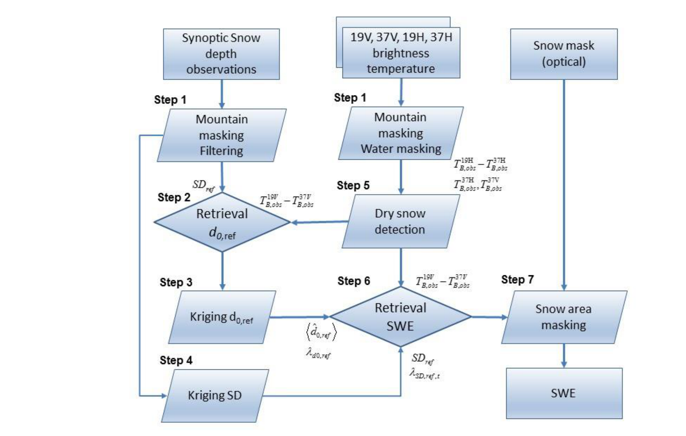

```{=html}
<table>
<colgroup>
<col style="width: 27.1%">
<col style="width: 52.2%">
<col style="width: 20.8%">
</colgroup>
  <tr>
    <td colspan="2" style=" font-weight: bold">Dissemination Level</td>
  </tr>
  <tr>
    <td>PU</td>
    <td>Public</td>
    <td style="text-align:center">X</td>
  </tr>
  <tr>
    <td>PP</td>
    <td colspan="2">Restricted to other programme participants (including the Commission Services)</td>
  </tr>
  <tr>
    <td>RE</td>
    <td colspan="2">Restricted to a group specified by the consortium (including the Commission Services)</td>
  </tr>
  <tr>
    <td>CO</td>
    <td colspan="2">Confidential, only for members of the consortium (including the Commission Services)</td>
  </tr>
</table>
```
## Document Release Sheet

| | | | |
|--------------------------------------------------------------------------------|----------------------------------------------|-------------------------------------|-------------------------------------|
| **Book captain:** | Kari Luojus | **Sign** | **Date** |
| **Approval:** | Roselyne Lacaze | **Sign** | **Date** |
| **Endorsement:** | Mark Dowell | **Sign** | **Date** |
| **Distribution:** | Public | | |

## Change Record

| Issue/Rev | Date | Page(s) | Description of Change | Release |
|---------------------------------|----------------------------------------|-----------------------------|--------------------------------------------------------------------|-------------------------------|
| | 03.03.2017 | All | First issue | I1.00 |
| | 31.05.2017 | All | Modifications after CGLOPS internal review | I1.01 |
| | | | | |
| | | | | |
| | | | | |
| | | | | |

## List of Acronyms

| | |
|--------------------------------------|------------------------------------------------------------------------------------------------------------------------------------------------------------------|
| ATBD | Algorithm Theoretical Basis Document |
| CGLS | Copernicus Global Land Service |
| DEM | Digital Elevation Model |
| ECMWF | European Centre for Medium Range Weather Forecasts |
| EO | Earth Observation |
| ESA | European Space Agency |
| FMI | Finnish Meteorological Institute |
| GL | Global Land |
| NRT | Near Real Time |
| RMS | Root Mean Square |
| RMSE | Root Mean Square Error |
| SD | Snow Depth |
| SSMIS | Special Sensor Microwave Imager/Sounder |
| SWE | Snow Water Equivalent |
| SYKE | Finnish Environment Institute |
| VIIRS | Visible Infrared Imaging Radiometer Suite |

# Background of the document

## Executive Summary

The Global Land (GL) Component in the framework of Copernicus is earmarked as a component of the Land service to operate “a multi-purpose service component” that will provide a series of bio-geophysical products on the status and evolution of land surface at a global scale. Production and delivery of the parameters are to take place in a timely manner, and are to be complemented by the constitution of long term time series.

The Copernicus Global Land Service contains a Snow Water Equivalent (SWE) Near Real Time (NRT) product at 0.05 degree resolution. The SWE is derived by combining passive microwave radiometer brightness temperature observations from *Special Sensor Microwave Imager/Sounder* (SSMIS) with snow depth observations from synoptic weather station network. The microwave information is provided in nominal 25km resolution and is resampled to 0.05 degree latitude longitude grid using optical remote sensing data. Daily product is available in 12 hours after required global satellite data have been acquired, timeliness dictated by processing of massive satellite data sets.

This Algorithm Theoretical Basis Document (ATBD) describes the algorithm for the SWE NRT at 0.05 degree resolution.

## Scope and Objectives

One of the main objectives of Copernicus program is to provide to the scientific community as well as other stakeholders including policy makers, the proper information required for several applications. This has been detailed in the Service Specifications Document (GIOGL1-ServiceSpecifications). The products are then operationally generated and delivered freely through the Copernicus Global Land portal (http://land.copernicus.vgt.vito.be) in near real-time. Historic data sets will also be freely available through the same data portal.

The objective of this document is to provide a detailed description and justification of the algorithm used for SWE NRT 0.05 degree product.

## Content of the document

This document is structured as follows:

-   Chapter 2 recalls the users requirements, and the expected performance
-   Chapter 3 describes the Snow Water Equivalent (SWE) retrieval methodology
-   Chapter 4 lists the relevant references

## Related documents

### Applicable documents

AD1: Annex I - Technical Specifications JRC/IPR/2015/H.5/0026/OC to Contract Notice 2015/S 151-277962 of 7^th August 2015

AD2: Appendix 1 – Copernicus Global land Component Product and Service Detailed Technical requirements to Technical Annex to Contract Notice 2015/S 151-277962 of 7^th August 2015

AD3: GCOS-154, Systematic Observation Requirements for Satellite-Based Data Products for Climate, WMO/GCOS Technical Document (2011)

AD4: IGOS, 2007: Cryosphere Theme Report 2007. WMO/IGOS Technical Document (2007).

### Input

::: {.tbl-caption}
```{=typst}
#set text(size: 9pt, fill: rgb("#3E6893"))
```
Table 1: Input documents
:::

| Document ID | Descriptor |
|-----------------------------------------------------|---------------------------------------------------------------------------------------------------------------------------------------------------|
| CGLOPS2_SSD | Service Specifications of the Global Component of the Copernicus Land Service. |

### Output

::: {.tbl-caption}
```{=typst}
#set text(size: 9pt, fill: rgb("#3E6893"))
```
Table 2: Output documents
:::

| Document ID | Descriptor |
|-----------------------------------------------------------------------------|---------------------------------------------------------------------------------------------------------------------------|
| CGLOPS2_PUM_SWE-NH-5km-V1_I1.01 | Product User Manual summarizing all relevant information of the NH 5km SWE v1.0.1 product |
| CGLOPS2_QAR_SWE5-NH-5km-V1_I1.01 | Report describing the results of the scientific quality assessment of the NH 5km SWE v1.0.1 product |

# Review of Users Requirements

According to applicable documents [AD1-AD4] (EC Copernicus, WMO/GCOS and WMO/IGOS), the user's requirements relevant for NH 5km SWE are:

-   **Definition**:
    -   The Snow Water Equivalent (SWE) is the measure of the amount of water frozen within the snow pack per unit area. In principle, it gives the height of the water column that would form, if the snow pack would melt completely. It is measured and indicated in millimetres [mm].
-   **Geometric properties**:
    -   Location accuracy shall be less than one pixel
    -   Pixel coordinates are given for the centre of pixel
-   **Geographical coverage**:
    -   Geographic projection: regular latitude/longitude
    -   Geodetical datum: WGS84
    -   Coordinate position: centre of pixel
    -   Pixel size: 0.05°
    -   Window coordinates:
        -   Upper left: 180°W – 85°N
        -   Lower right: 180°E – 35°N
-   **Ancillary information**:
    -   Per-pixel uncertainty information (described in section 3.2) available for each grid cell
-   **Accuracy requirements**: The accuracy requirements from AD3 and AD4 are summarized below:

**Target and Minimum requirements for Snow Water Equivalent (AD3, WMO/GCOS):**

Shallow Snow (≤ 0.3 m)
-   Target requirement: 20 mm (which is ~25% for 30cm of SD)
-   Minimum requirement: 30 mm (which is ~40% for 30cm of SD)

Deep Snow (> 0.3 m)
-   Target requirement: 7% / Minimum requirement: 10%

**Target requirements for Snow Water Equivalent (AD4, WMO/IGOS):**
-   Target accuracy requirement: 10 mm
    "Current low-resolution to moderate-resolution, 5km to 20km, passive microwave sensors are adequate to provide an estimate of snow-water equivalent for shallow snow packs in simple terrain. Current holdings are inadequate to overcome limitations of low-resolution passive microwave observations and sparse in situ observations in areas of complex terrain and deep snow."

# Methodology Description

## Overview

The Copernicus Global Land service (CGLS) SWE retrieval algorithm combines information from satellite based microwave radiometer and optical spectrometer observations with ground based weather station snow depth measurements and produces daily hemispherical scale SWE estimates. The CGLS SWE product applies the retrieval methodology by Pulliainen (2006), refined and described in detail by Takala et al.(2011). The SWE product is enhanced with snow extent information from optical satellite data at a moderate resolution (~5km spatial resolution). The SWE product covers all land surface areas between latitudes 35°N-85°N with the exception of mountainous regions, glaciers and Greenland. The SWE estimates are complemented with a statistically derived accuracy estimate accompanying each SWE estimate (on a pixel level).

## The retrieval Algorithm

### Outline

The basis of the SWE processing system is presented by Pulliainen (2006). As applied here, estimates of SWE (snow depth) based on emission model inversion of two frequencies, 19.35 and 37.0 GHz, are first calibrated over EASE grid cells with weather station measurements of SD available. Snow grain size is used in the model as a scalable model input parameter (being determined from the input radiometer and weather station data). These values of grain size are used to construct a Kriging interpolated background map of the effective grain size, including an estimate of the effective grain size error. The map is then used as an input in model inversion over the span of available radiometer observations, providing an estimate of SWE. In the inversion process, the effective grain size in each grid cell is weighed with its respective error estimate. The weather station observations of SD are further interpolated to provide a first guess estimate of SD (or SWE). The SWE estimate map and SD map from weather station observations are combined using a Bayesian spatial assimilation approach to provide the final SWE estimates, with the interpolated SD field constraining radiometer retrievals. A snow density value is applied to each grid cell to connect depth to SWE. Areas of wet snow are masked according to observed brightness temperature values using empirical thresholds, as model inversion of SD/SWE over areas of wet snow is not feasible due to the saturated brightness temperature response.

The snow emission model applied is the semi-empirical HUT snow emission model (Pulliainen et al., 1999). The model calculates the brightness temperature from a single layer homogenous snowpack covering frozen ground in the frequency range of 11 to 94 GHz. Input parameters of the model include snowpack depth, density, effective grain size, snow volumetric moisture and temperature. Separate modules account for ground emission and the effect of vegetation and atmosphere. The model has been applied in investigations against tower-based and airborne reference radiometer observations (e.g. Tedesco et al., 2006; Lemmetyinen et al., 2016).

The detection of snow extent is carried out using optical-based snow maps derived from the ESA GlobSnow NH VIIRS product, combined with information from NOAA IMS on cloud obstructed pixels.

In the future, the information on snow extent will be acquired from the CGLS Northern Hemisphere Snow Cover Extent product. The areas that are identified as snow covered from the optical data, but for which a SWE estimate is not produced, are given a marginal SWE value (0.001 mm) in the final SWE product. The areas where a SWE estimate is given and which are identified as snow covered from the optical data, retain their microwave derived SWE estimate. The areas that are identified as snow free from the optical data, are given a SWE value of 0 mm in the final SWE product.

### Basic underlying assumptions

The underlying principle in passive microwave retrieval of SWE is based on observing the attenuating effect of snow cover on the naturally emitted brightness temperature from the ground surface. The ground brightness temperature is scattered and absorbed by the overlying snow medium, resulting in typically a decreasing brightness temperature with increasing (dry) snow mass. The scattering intensity increases as the wavelength approaches the size of the scattering particles. Considering that individual snow particles are measured in millimeters, high microwave frequencies (short wavelengths) will be scattered more than low frequencies (long wavelengths). The intensity of absorption can be related to the dielectric properties of snow, with snow density largely defining the permittivity for dry snow. Absorption at microwave frequencies increases dramatically with the inclusion of free water (moisture) in snow, resulting in distinct differences of microwave signatures from dry and wet snowpacks.

Initial investigations by e.g. Ulaby and Stiles (1980) pointed out the sensitivity of microwave emission from snowpacks to the total water equivalent. This led to the development of various retrieval approaches of SWE from passive microwave instruments in space (e.g. Rango et al., 1979; Künzi et al., 1982). From the available set of observed frequencies, most algorithms for retrieval of SWE employ a 36-37 GHz ($\lambda \approx 8.1$ mm) and a 18-19 GHz ($\lambda \approx 15.8$ mm) channel in combination. The scattering of a 18-19 GHz signal in snow is considered smaller when compared to 36-37 GHz, while the emissivity of frozen soil and snow is estimated to be largely similar at both frequencies. Observing the brightness temperature difference of the two channels allows to establish a relation with the detected signal and snow depth (or SWE), with the additional benefit that the effect of variations in physical temperature on the measured brightness temperature are reduced. Similarly, observing a channel difference reduces or even cancels out systematic errors of the observation, provided that the errors in the two observations are similar (e.g. due to using common calibration targets on a space-borne sensor). Typically the vertically polarized channel is preferred due to the inherent decreased sensitivity to snow layering (e.g. Rees et al., 2010).

### Related and previous applications

The microwave radiometer-based SWE retrieval approach has been developed originally in the ESA GlobSnow project. It has been further refined in the EC FP7 CryoLand project, where it was produced in 0.1 degree resolution for the pan-European domain. The combination of the passive microwave based SWE retrieval and the optical snow extent product have been studied in ESA GlobSnow-2 and EC FP7 SEN3APP projects, and are for the first time implemented for operational use with the Copernicus Global Land Service project.

### Alternative methodologies currently in use

There are alternative, passive microwave radiometer-based SWE retrieval approaches available. However, heritage algorithms (e.g. Chang et al. 1987, Armstrong et al. 2001) as well as newer stand-alone approaches relying solely on remote sensing observations (Kelly 2009; Tedesco et al. 2016, Kelly et al. 2017) have been found to lack the retrieval skill of the approach applied for the CGLS SWE product, as presented in (Takala et al. 2011) and indicated by the assessments carried out in the ESA SnowPEx project (publication pending, results available in project technical documentation) and briefly presented in the CGLOPS2_QAR_SWE5km_NH document.

### Input data

The main input parameters to the product consist of synoptic Snow Depth (SD) observations and space borne passive microwave brightness temperatures of the SSMIS instrument on board DSMP series satellite F17. SD data is available through FMI near real time weather observations database and SSMIS data is provided from EUMETCAST. The final product has a finer resolution than the actual radiometer instrument. Care is taken that input auxiliary data ingested in the assimilation algorithm is convoluted, so that it matches the original brightness temperature data resolution.

Synoptic snow depth observations are acquired through the FMI real time observation database. In the assimilation of SD values with space-borne estimates, a density value of 240 kg/m^3 is first assumed to translate SD to SWE. No error estimates are included in the synoptic SD dataset. In the assimilation, this is dealt with by assigning a variance of 150 cm^2 to the observations over forested areas, and a variance of 400 cm^2 for open areas. These variance estimates are based on observations in Finland and Canada.

Land use and most importantly forest cover fraction are derived from ESA GlobCover 2009 300 m data (Bontemps et al. 2011). Stem volume is required as an input parameter to the emission model to compensate for forest cover effects (Pulliainen et al., 1999; Kruopis et al., 1999); pixel average stem volumes are estimated by utilizing Northern Hemisphere-scale forest transmissivity map data (Metsämäki et al., 2015).

Masking snow covered area is done using a high resolution snow mask, derived from ESA GlobSnow NPP Suomi VIIRS-based FSC product combined with the NOAA IMS (National Ice Center 2008) snow extent map. The procedure uses snow cover extent information from GlobSnow product where available, for regions that are cloud covered, under polar darkness or not available from Globsnow, are determined from NOAA IMS (which is a cloud filled and spatially continuous product).

A water mask is derived from Global Raster Water Mask at 250 meter Spatial Resolution MOD44W (Carroll et al. 2009). Since water masking is done after the assimilation process the mask data are not convoluted. The mountain mask is derived from ETOPO5 data (Etopo5 1988) by calculating topography variances; a threshold value of 200 m is applied, with grid cells exceeding this limit masked out from the final SWE product.

### Forward model

The HUT snow emission model (Pulliainen et al., 1999) is a radiative transfer-based, semi-empirical model which calculates the emission from a single homogenous snowpack. The model assumes that most scattering of radiation propagating in a snowpack is concentrated in the forward direction (of propagation). Based on this assumption, the HUT model applies the delta-Eddington approximation to the radiative transfer equation, applying an empirical constant to determine the forward scattered intensity of snow. The radiative transfer equation essentially assumes only the forward propagating flux; however, the propagation of emission is considered in both up- and downward directions in snow (see e.g., Pan et al., 2015). The forest transmissivity model by Kruopis et al. (1999) is used to calculate forest transmissivity. Correction for atmospheric transmissivity and emission is provided by a statistical approach based on the 55% fractile of atmospheric conditions in Northern latitudes (Pulliainen et al., 1993).

### Output product

The SWE product is provided on a daily basis in a NetCDF CF format.

The SWE product file includes two data fields:

-   The SWE estimate [mm]
-   The statistical standard deviation of the SWE estimates [mm] (i.e. the accuracy estimate for each SWE value).

A quicklook file in GeoTIFF-format is generated for each daily SWE product.

### Methodology

The algorithm for estimating SWE assimilating in situ snow depth observations and space borne SWE estimates is presented in detail in (Pulliainen 2006), (Takala et al. 2011) and (Luojus et al. 2013). A summary with clarifications relevant for CGLS SWE product is given in the following.

-   **Step 1**: The mountain mask and high value masks are applied to synoptic snow depth (SD) information. The high value mask removes the deepest 1.5% of reported snow depth values in order to avoid spurious or erroneous deep snow observations. The mountain mask criterion removes all observations that fall within EASE-grid cells with a height standard deviation above 200 m within the grid cell.
    The mountain mask, water mask and dry snow masks are applied to brightness temperature data. The mountain mask criterion removes all observations that fall within EASE-grid cells with a height standard deviation above 200 m within the grid cell. The water mask removes grid cells with over 30 % water.

-   **Step 2**: Synoptic snow depth (SD) observations and observed brightness temperatures over reference station locations are applied in numerical inversion of the one-layer HUT snow emission model (Pulliainen et al., 1999, see section) to retrieve values of effective grain size $d_o$, which matches model predictions to observations. The model is fit to space-borne observed $T_B$ values at the locations of weather stations by optimizing the value of snow grain size $d_o$. The fitting procedure is:
    $$ \min_{d_o} \left( (T_{B,19V}^{mod}(d_o, SD_{ref}) - T_{B,37V}^{mod}(d_o, SD_{ref})) - (T_{B,19V,ref}^{obs} - T_{B,37V,ref}^{obs}) \right)^2 \quad(1)$$
    where the known snow depth is $SD_{ref}$, $T_B^{19V}$ and $T_B^{37V}$ denote the vertically polarized brightness temperature at approximately 19 and 37 GHz with indices *mod* and *obs* referring to modeled and observed values, respectively. Vertical polarization is used because it correlates best with SWE in the boreal forest zone (Hallikainen and Jolma 1992, Pulliainen et al. 1999, Pulliainen and Hallikainen 2001). Snow density is treated with a constant value of 0.24 g/cm³ (Sturm et al. 2010). At each synoptic station location, the final estimate of $d_{o,ref}$ (and its standard deviation Δ) is obtained by averaging values obtained for the ensemble of the nearest stations, so that
    $$ \hat{d}_{o,ref} = \frac{1}{M} \sum_{j} d_{o,ref,j} \quad(2.a)$$
    $$ \hat{\Delta d}_{o,ref} = \sqrt{\frac{1}{M-1} \sum_{j} (d_{o,ref,j} - \hat{d}_{o,ref})^2} \quad(2.b) $$
    where M is the number of stations (default 6).

-   **Step 3**: The effective grain size and variance values are further interpolated over the selected grid of brightness temperature observations using Kriging interpolation, obtaining a spatially continuous field of effective grain size and its variance.

-   **Step 4**: SD observations are interpolated to the selected grid of brightness temperature observations using Kriging interpolation (from 35° N to 85° N in latitude and from 180° W to 180° E with resolution of 0.05° x 0.05°). As a modification to the algorithm by Takala et al. 2011, the variance Δp² assigned to individual SD observations is set at 150 cm² for open areas and 400 cm² for forested areas. This differs from the earlier versions where a constant value of 150 cm² was used. As an output, a spatially distributed estimate of SD and its variance are obtained.

-   **Step 5**: a dry snow mask is applied to brightness temperature data to identify areas where snow is not possible, and areas indicating wet snow cover. For dry snow, the following conditions should be met:
    $SD_t = 15.9 \cdot (T_{B,obs,19V} - T_{B,obs,37V}) > 80(mm)$
    $T_{B,obs,37H} < 240K$
    $T_{B,obs,37V} < 250K$

-   **Step 6**: Observed brightness temperatures over the whole area of interest are applied together with the effective grain size and effective grain size variance in numerical inversion of the one-layer HUT snow emission model to retrieve SWE. Similarly to the retrieval of effective grain size, an iterative cost function is applied; HUT snow emission model estimates are matched to observations numerically by fluctuating the SWE value. The background field of $SD_t$ is applied to constrain the retrieval. A constant value of snow density is applied to calculate $SWE_t$ from $SD_t$. The cost function constrains the grain size value according to the predicted background grain size and the estimated variance produced in Step 3. Thus, assimilation adaptively weighs the space-borne brightness temperature observations and the background $SD_t$ field (produced in Step 3) to estimate a final SWE and a measure of statistical uncertainty (in the form of a variance estimate) on a grid cell by grid cell basis:
    $$ \min_{SD_t} \left[ \frac{((T_{mod}^{19V}(SD_t)-T_{mod}^{37V}(SD_t))-(T_{B,obs,ref,t}^{19V}-T_{B,obs,ref,t}^{37V}))^2}{\sigma_{t}^2} + \frac{(SD_t - SD_{ref,t})^2}{(\Delta SD_{ref,t})^2} \right] \quad (3) $$
    where $SD_{ref,t}$ is the snow depth estimate from the kriging interpolation for the day under consideration, t. $\Delta SD_{ref,t}$ the estimate of standard deviation from the kriging interpolation, and $SD_t$ is the snow depth for which equation (3) is minimized (note that $SWE = SD_t * 0.24$ g/cm³). The variance of $T_B$, $\sigma_t^2$, is estimated by approximating $T_B$ as function of snow depth and grain size in a Taylor series:
    $$ T_{B,t}(D_t, d_{o,t}) \approx T_B(D_t, \hat{d}_{o,ref,t}) + \frac{\partial T_B(\hat{d}_{o,ref,t})}{\partial \hat{d}_{o,ref,t}}(d_{o,t} - \hat{d}_{o,ref,t}) \quad(4.a) $$
    $$ \sigma_t^2 = \text{var}(T_{B,t}(D_t, \hat{d}_{o,t})) = \left[ \frac{\partial T_{B,t}(\hat{d}_{o,ref,t})}{\partial \hat{d}_{o,ref,t}} \right]^2 \lambda^2_{d_{o,ref,t}} \quad(4.b) $$
    In practice, the variance $\sigma_t^2$ adjusts the weight of brightness temperature data with respect to the weight of the SD background field (parameter $\Delta D,ref$). A basic feature of the algorithm is that if the sensitivity of space-borne radiometer observations to SWE is assessed to be close to zero by formulas (4.a) and (4.b), the weight of radiometer data on the final SWE product approaches zero (this is the case e.g. if the magnitude of SWE is very high). The higher is the estimated sensitivity of $T_B$ to SWE, the higher is the weight given to the radiometer data. Thus, the weight of the radiometer data varies both temporally and spatially in order to provide a maximum likelihood estimate of SWE.

-   **Step 7** In the final stage, masking snow covered area is done using a high resolution snow mask derived from ESA GlobSnow NPP Suomi VIIRS-based FSC product combined with the NOAA IMS (National Ice Center 2008) snow extent map. The procedure uses snow cover extent information from GlobSnow FSC product where available; for regions that are cloud covered, under polar darkness or not available from Globsnow, are determined from NOAA IMS (a cloud filled, spatially continuous product). The areas that are identified as snow covered from the optical data, but for which a SWE estimate is not produced, are given a marginal SWE value (0.001 mm) in the final SWE product. The areas where a SWE estimate is given and which are identified as snow covered from the optical data, retain their microwave derived SWE estimate. The areas that are identified as snow free from the optical data, are given a SWE value of 0 mm in the final SWE product.



### Significance of satellite data and ground-based observations for final SWE product

The effect of the kriged background SD-field into the final SWE product is presented in detail in (Takala et al. 2011). In short, the Figure 2 illustrates the difference between the final assimilation result and the ground data based interpolation. This represents the difference between the 'observed SD' field (multiplied with a constant snow density of 0.24 g/cm3) and the 'assimilated SWE' field from step 6. This demonstrates the impact of incorporating satellite passive microwave data compared to the use of ground data interpolation only. An example of a single hemispheric difference map is shown, along the histogram of the difference for the GlobSnow 30-year-long daily time series. The maximum values of the difference in SWE extend to about 100 mm. However, the number of such cases is small, and therefore not evident in the histogram. As indicated by Figure 2 the spatial variability of the weight of the satellite input varies strongly depending on the coverage of weather stations used as input to the assimilation algorithm. The weight also varies temporally, being low if the sensitivity of SWE to observed brightness temperature is estimated to be low. The assessment presented in (Pulliainen, 2006) shows that the assimilation approach improved the SWE estimation accuracy in about 60% of the investigated cases across Eurasia (the improvement was also typically larger than any reductions) compared with the interpolation of weather station SD values only.


### Limitations

The product is provided for all land surface areas in Northern Hemisphere between latitudes 35°N-85°N with the exception of mountainous regions, glaciers and Greenland.

The channel difference (between 19 GHz and 37 GHz) used for SWE retrieval will saturate for deep snowpacks (e.g. Mätzler et al., 1982). For this reason, the retrieval performance tends to decrease with increasing snow depth. Due to utilization of ground based synoptic weather station observations, the SWE retrieval is sensitive up to snow depths of ~60-80cm (~150mm – 200mm of SWE).

Due to the coarse resolution of the available space-based passive microwave radiometers and the high variability of SWE in the mountainous regions, the SWE estimates are not provided for mountainous regions (knowing the limitation of the retrievals). For similar reason, the SWE is not retrieved for over glaciers and ice sheets, it is not really possible to determine where the snow pack ends and the firn or ice layer begins, thus these are not mapped within the SWE products.

## Quality Assessment

The uncertainty layer embedded with the SWE product includes both the effect of the systematic (bias) and statistical (random) error. The statistical error is determined through an adaptive dynamic error propagation approach (Pulliainen, 2006; Takala et al. 2011). The systematic error is derived from a multi-year analysis of independent snow course observations from Russia and the Former Soviet Union (Luojus et al. 2011; Luojus et al. 2014).

The validation of the SWE product is reported within Luojus et al. (2014). The report contains comparisons of GlobSnow SWE data 1979–2010 with distributed snow transect data collected from the former Soviet Union and Russia covering the period 1979–2009. The reference dataset contains snow path measurements carried out within 517 different snow path locations, ranging from 35° to 85° northern latitude and 14° to 179° of eastern longitude. This vast dataset (285,300 samples) is compared against the SWE data acquired for the same period and gives a thorough view on the algorithm performance in different seasonal and geographical domains. The comparison shows that the RMSE for SWE values range between 0 and 150 mm for the years 1979–2009 (consisting of 144,959 samples) was 32.1 mm. The bias for the same dataset was +8.5 mm. The use of all the samples of the full data set (all SWE values, consisting of 161,684 samples) gave a bias of +1.1 mm and RMSE of 43.4 mm (both values represent a significant improvement over the alternative existing SWE retrieval algorithms). Also, the RMSE for the different years show a consistent behavior with no significantly outlying years evident.

For additional validation of the SWE algorithm, snow path data from SYKE (Finnish Environment Institute) has been used in conjunction with the data from Russia. The SYKE dataset is independent of the synoptic SD observations (used as input for the retrieval method), which is a vital requirement for sensible product validation. There are ~165 sites distributed around Finland. At each site, observations of snow depth, density and SWE are made along a transect of either 2 or 4 kilometers, through land cover typical for each area. The validation uses the average value of the individual observations of SWE. The details of the analysis are given in the Quality Assessment Report [CGLOPS2_QAR_SWE-NH-5km].

## Risk of failure and Mitigation measures

**Sensor failure of the DMSP SSMIS**

While sensor failure is always a risk in remote sensing projects, the probability for sensor failure for the DMSP-F17 SSMIS, used currently, is low. In case of failure of the DMSP-F17, there are other operational DMSP-F -series satellites with a working SSMIS sensor on orbit. If the DMSP-F17 fails, there is a spare satellite (DMSP-F18) already in operation in orbit which can be used for SWE production. In addition to the SSMIS sensors on-board the DMSP-F -series satellites, the SWE retrieval can be tuned to utilize the AMSR-2 sensor on-board GCOM-W satellite, or the MWRI instrument on-board the FY-3B/3C satellites. All these alternative instruments are already in-orbit providing a wide range of options to revert to in case of sensor or satellite failure.

**Availability of high resolution optical Snow Extent data to augment SWE retrieval**

The retrieval of the 5km SWE product utilizes data from GlobSnow VIIRS-based FSC product and the NOAA IMS. In case both the GlobSnow and NOAA IMS data are missing, the retrieval can not be performed. These products are independent of each other, which mitigates the risk; also in the future there will be a Sentinel-3 data-based product (produced within the Copernicus Global Land Service) that can be utilized for SWE retrieval.

# References

Armstrong R. L. and M. J. Brodzik. 2001. Recent Northern Hemisphere snow extent: a comparison of data derived from visible and microwave satellite sensors. Geophysical Research Letters 28(19): 3673-3676.

Bontemps, S., Defourny, P., Bogaert, E. V., Arino, O., Kalogirou, V., & Perez, J. R. (2011). GLOBCOVER 2009-Products description and validation report.

Carroll, M. L., Townshend, J. R., DiMiceli, C. M., Noojipady, P., & Sohlberg, R. A. (2009). A new global raster water mask at 250 m resolution. International Journal of Digital Earth, 2(4), 291-308.

Chang, A. T. C., Foster, J. L., & Hall, D. K. (1987). Nimbus-7 SMMR derived global snow cover parameters. Annals of glaciology, 9(1), 39-44.

Kelly, R. E. J. (2009). The AMSR-E Snow Depth Algorithm: Description and Initial Results. *Journal of The Remote Sensing Society of Japan*, 29(1), 307-317.

Kelly, R., Saberi, N. and Li, Q.; "The AMSR2 Satellite-Based Microwave Snow Algorithm (SMSA): A Parsimonious Snow Depth and Snow Water Equivalent Approach", 8th EARSEL workshop on Land Ice and Snow, EARSeL LISSIG, Institute of Geography, University of Bern, Switzerland, 7–9 February 2017.

Kruopis, N., J. Praks, A. Arslan, H. Alasalmi, J. Koskinen and M. Hallikainen, 1999. Passive microwave measurements of snow-covered forests in EMAC'95. *IEEE Trans. Geosci. Remote Sensing*, 37, 2699-2705.

Künzi, K. F., S. Patil, and H. Rott (1982). Snow-cover parameters retrieved from Nimbus-7 Scanning Multichannel Microwave Radiometer (SMMR) data. *IEEE Trans. Geosci. Remote Sens.*, GE-20, 452-467.

Larue F., A. Royer, D. De Sève, A. Langlois, A. Roy and L. Brucker (2016). Validation analysis of the GlobSnow-2 database over an eco-climatic latitudinal gradient in Eastern Canada, *Remote Sensing of Environment*, 194, 264-277.

Lemmetyinen, J., Pulliainen, J., Rees,A., Kontu, A., Qiu, Y., and Derksen, C. (2010). "Multiple-Layer Adaptation of HUT Snow Emission Model: Comparison With Experimental Data.” *IEEE Trans. Geosci. Remote Sens.*, Vol. 48, No. 7, July.

Lemmetyinen, J., A. Kontu, J-P. Kärnä, J. Vehviläinen, M. Takala, and J. Pulliainen (2011). Correcting for the influence of frozen lakes in satellite microwave radiometer observations through application of a microwave emission model. *Remote Sens. Environ.*, 115(12), 3695-3706.

Lemmetyinen, J., Derksen, C., Toose, P., Proksch, M., Pulliainen, J., Kontu, A., Rautiainen, K., Seppänen, J., and Hallikainen, M., 2015. Simulating seasonally and spatially varying snow cover brightness temperature using HUT snow emission model and retrieval of a microwave effective grain size. *Remote Sens. Environ.*, 156, 71-95.

Luojus, K., Pulliainen, J., Takala, M., Lemmetyinen, J., Derksen, C., Metsämäki S, and Bojkov, B., (2011)" Investigating Hemispherical Trends In Snow Accumulation Using Globsnow Snow Water Equivalent Data”, IEEE Geoscience and Remote Sensing Symposium (IGARSS), IEEE International, 24-29 July 2011, Vancouver, Canada.

Luojus, K., Pulliainen, J., Takala, M., Lemmetyinen, J., Kangwa, M., Smolander, T. and Derksen, C., "Algorithm Theoretical Basis Document (ATBD) for SWE Algorithm", ESA GlobSnow-2 Deliverable-6, 2013.

Luojus, K., Pulliainen, J., Takala, M., Lemmetyinen, J., Kangwa, M., Smolander, T. and Derksen, C., and Mudryk, L., "Algorithm Theoretical Basis Document (ATBD) for SWE Algorithm", ESA GlobSnow-2 Deliverable-21, 2014.

Metsämäki, S., Pulliainen, J., Salminen, M., Luojus, K., Wiesmann, A., Solberg, R., Böttcher, K., Hiltunen, M. and Ripper, E., "Introduction to GlobSnow Snow Extent products with considerations for accuracy assessment", *Remote Sensing of Environment*, Vol. 156, January 2015, pp. 96-108, doi: 10.1016/j.rse.2014.09.018.

Mätzler, C., E. Schanda, and W. Good, 1982. Towards the definition of optimum sensor specifications for microwave remote sensing of snow. *IEEE Trans. Geosci. Remote Sens.*, GE-20, 57-66.

Pulliainen, J., J.-P. Kärnä, and M. T. Hallikainen, 1993. Development of geophysical retrieval algorithms for the MIMR. *IEEE Trans. Geosci. Remote Sensing*, 31, 1, 268–277.

Pulliainen, J., J. Grandell, and M. T. Hallikainen. (1999) HUT Snow Emission Model and its Applicability to Snow Water Equivalent Retrieval. *IEEE Transactions on Geoscience and Remote Sensing*. 37: 1378-1390.

Pulliainen, J., 2006, Mapping of snow water equivalent and snow depth in boreal and sub-arctic zones by assimilating space-borne microwave radiometer data and ground-based observations. *Remote Sensing of Environment*. 101: 257-269. DOI: 10.1016/j.rse.2006.01.002.

Rango, A., A. T. C. Chang, and J. L. Foster (1979). The utilisation of space-borne microwave radiometers for monitoring snowpack properties. *Nord. Hydrol.*, 10, 25–40.

Rees, A., J. Lemmetyinen, C. Derksen, J. Pulliainen, and M. English, 2010. Observed and modelled effects of ice lens formation on passive microwave brightness temperatures over snow covered tundra. *Remote Sensing of Environment*, 114(1):116-126.

Takala M., Pulliainen J, Metsämäki S, Koskinen J. 2009. Detection of Snowmelt Using Spaceborne Microwave Radiometer Data in Eurasia from 1979 to 2007. *IEEE Trans. on Geoscience and Remote Sensing*, Vol 47, pp. 2996 – 3007.

Takala, M., Luojus, K., Pulliainen, J., Derksen, C., Lemmetyinen, J., Kärnä, J.-P, Koskinen, J., Bojkov, B., 2011, “Estimating northern hemisphere snow water equivalent for climate research through assimilation of space-borne radiometer data and ground-based measurements", *Remote Sensing of Environment*, Vol. 115, Issue 12, 15 December 2011, Pages 3517-3529, ISSN 0034-4257, DOI: 10.1016/j.rse.2011.08.014.

Tedesco, M., and J. Jeyaratnam, 2016. A new operational snow retrieval algorithm applied to historical AMSR-E brightness temperatures. *Remote Sens.*, 8, 1037; doi: 10.3390/rs8121037.

Tedesco, M. and E. J. Kim. 2006. Intercomparison of electromagnetic models for passive microwave remote sensing of snow. *IEEE Trans. Geosci. Remote Sens.*, 44(10), 2654-2666.

Ulaby, F.T. and W. H. Stiles, 1980. The active and passive microwave response to snow parameters 2. Water Equivalent of dry snow. *IEEE Trans. Geosci. Remote Sens.*, GE-85, 1045-1049.