```{=html}
<table>
<colgroup>
<col style="width: 14.9%">
<col style="width: 73.7%">
<col style="width: 11.4%">
</colgroup>
  <tr>
    <td>PU</td>
    <td>Public</td>
    <td >X</td>
  </tr>
  <tr>
    <td>PP</td>
    <td>Restricted to other programme participants (including the Commission Services)</td>
    <td></td>
  </tr>
  <tr>
    <td>RE</td>
    <td>Restricted to a group specified by the consortium (including the Commission Services)</td>
    <td></td>
  </tr>
  <tr>
    <td>CO</td>
    <td>Confidential, only for members of the consortium (including the Commission Services)</td>
    <td></td>
  </tr>
</table>
```
:::
<div style="text-align: center; font-weight: bold">Dissemination Level</div>

### Document Release Sheet

```{=html}
<table>
<colgroup>
<col style="width: 31.9%">
<col style="width: 26.3%">
<col style="width: 13.2%">
<col style="width: 28.6%">
</colgroup>
  <tr>
    <td>Book captain:</td>
    <td>João Paulo Martins</td>
    <td colspan="2" style="vertical-align:middle"></td>
  </tr>
  <tr>
    <td>Approval:</td>
    <td>Roselyne Lacaze</td>
    <td style="vertical-align:bottom">Sign <br> </td>
    <td style="vertical-align:bottom">Date: 04.03.2019</td>
  </tr>
  <tr>
    <td>Endorsement:</td>
    <td>Michael Cherlet</td>
    <td style="vertical-align:bottom">Sign</td>
    <td style="vertical-align:bottom">Date</td>
  </tr>
  <tr>
    <td>Distribution:</td>
    <td>Public</td>
    <td colspan="2"></td>
  </tr>
</table>
```
### Change Record

| Issue/Rev | Date | Page(s) | Description of Change | Release |
|-----------------------------|-------------------------------|---------------------|-----------------------------------------------------------------------------------------------|-----------------------|
| | 28.03.2013 | All | Geoland2 document, Issue 1.20, 06.07.2012 | I1.00 |
| I1.00 | 07.03.2014 | | Move geoland2 document into Global Land document | I1.01 |
| I1.01 | 06.08.2014 | All | Algorithm update after detection of artefacts: improve the atmospheric correction<br><br>Inclusion of the second thermal infrared channel as input for the MTSAT LST.<br><br>Included a new section with risk assessment and mitigation.<br><br>Include clarifications required by review board. | I1.10 |
| I1.10 | 31.07.2015 | | Update LST algorithm to Himawari/AHI (delivery of WP 30.090.101).<br><br>Align LST resolution to 5/112° (delivery of WP30.330.101). | I1.20 |
| I1.20 | 18.01.2016 | | Updated with clarifications after 2nd review of 2015. | I1.30 |
| I1.30 | 15.02.2019 | | Updated to include processing of GOES-16, leaving the necessary references to historical sensors / algorithms. General document update following more recent practices, framework and companion documents. | I1.40 |
| I1.40 | 27.06.2019 | 54-60 | Editorial changes in Chapter 4 | I1.41 |

### List of Figures

Figure 1: Flow diagram of the generation of Global LST and respective Error bars and Quality Flag. Data flow identified by (1) is detailed in Figure 2.

Figure 2: Flow diagram of the generation of LST for each GEO disk (Himawari or MTSAT & GOES).

Figure 3: Error budget estimated for 9 different formulations of split window algorithms, taking into account the uncertainty of the split-window regression and of input data (sensor noise, emissivity and total column water vapour).

Figure 4: Main properties of the calibration database atmospheric profiles used in the determination of the model coefficients for GOES and Himawari. (a) TCWV distribution; (b) Tskin distribution; (c) bivariate TCWV/TSkin distribution and (d) geographical distribution.

Figure 5 - Distribution of the GSW parameters used in SEVIRI (indicated at the top of each panel) and explained variance of the fitted regression (bottom left) as a function of the satellite zenith angle and total column water vapour (in cm).

Figure 6: Distribution of LST errors obtained for the SEVIRI GSW verification database, which are obtained for different classes of Satellite Zenith Angle (indicated in the bottom left of each panel) and water vapour content (x-axis in each diagram). The lines within each boxplot correspond to the lower quartile, median and upper quartile, respectively, while the whiskers extend to remaining data.

Figure 7: Model RMSD (in K) for the GSW developed for GOES-16 (left), SEVIRI (center) and Himawari-8 (right) thermal infrared window channels.

Figure 8: Flow diagram of the generation of LST and respective Quality Control (QC), using the GSW algorithm.

Figure 9: Variability of LST (in K) for GOES-16 (left), MSG (center) and Himawari-8 (right) due to sensor noise, ST, as a function of TCWV and satellite zenith angle.

Figure 10: Variability of LST for GOES-16 (left), MSG (center) and Himawari-8 (right) due to emissivity uncertainty, Sε2, as a function of TCWV. Values are given for 3 classes of mean emissivity (between TIR1 and TIR2): arid (є ≤ 0.96) in blue, sparsely vegetated 0.96 < є ≤ 0.98 in yellow and highly vegetated / water (e > 0.98) in green.

Figure 11: Variability of LST (in K) for GOES-16 (left), MSG (center) and Himawari-8 (right) due to the uncertainty in TCWV forecasts, SW, as a function of TCWV and satellite zenith angle. White areas denote uncertainties above 4 K.

Figure 12: Variability of LST (in K) for GOES-16 (left), MSG (center) and Himawari-8 (right) due to the uncertainty in all inputs, SLST, as a function of TCWV and satellite zenith angle. From top to bottom, results are shown for arid, sparsely vegetated and highly vegetated situations.

Figure 13: Distribution of the One-Channel Algorithm parameters (indicated at the top of each panel) developed for GOES-13 imager, for different landcover types (from top to bottom Bare Soil, Croplands and Permanent Wetlands) and explained variance of the fitted regression (right) as a function of the satellite zenith angle and total column water vapour (cm). Classes for which explained variance is above 85% and/or the algorithm error exceeds 4K are masked out.

Figure 14: Distribution of the Two-Channel Algorithm parameters (indicated at the top of each panel) developed for GOES-13 imager, for different landcover types (from top to bottom Bare Soil, Croplands and Permanent Wetlands) and explained variance of the fitted regression (right) as a function of the satellite zenith angle and total column water vapour (cm).

Figure 15: as in Figure 6, but for the mono-channel algorithm developed for GOES-13 window channel.

Figure 16: as in Figure 6, but for the two-channel algorithm developed for GOES-13 MIR and TIR channels.

Figure 17: as in Figure 6, but for the mono-channel algorithm developed for MTSAT 11µm channel.

Figure 18: as in Figure 6, but for the two-channel algorithm developed for MTSAT MIR and TIR channels.

Figure 19: Flow diagram of the generation of LST and respective Quality Control (QC), using the Dual-algorithm. The diagram is valid for both GOES-13 and MTSAT imager data (denoted by GEO).

Figure 20: LST (K) estimated for February 1st, 2019, over the GOES disk (left, 10:00 UTC time slot), the MSG disk (center, 09:45 UTC time slot), and the Himawari disk (right, 10:00 UTC time slot).

Figure 21: LST (K) estimated for February 1st, 2019 at 10:00 UTC.

Figure 22: Example of product uncertainty for the CGLOPS product for timeslot of February 1st, 2019 at 10:00 UTC.

Figure 23: Difference between LST retrieved from MSG and from GOES-16 in their overlapping region. Data from all the 1500UTC timeslots (1445UTC for SEVIRI) from 10 to 19 of January 2019. Also shown the difference in satellite zenith angle (top right) and in acquisition time (bottom left), as well as the scatterplot between GOES and MSG LST.

Figure 24: same as Figure 23 but for the 0300UTC.

Figure 25: Same as Figure 23 but for 10-19 July 2018.

Figure 26: Same as Figure 25 but for 0300 UTC.

Figure 27: Mean hourly diurnal cycle of LST for MSG (red) and GOES (blue), taken in a 10 × 10 grid box around 10.00S, 38.00W (represented in the left as a red square), and using 10 days around the 15^th^ of July 2018 (center) and 15^th^ of January 2019 (right).

Figure 28: Distribution of the differences between SEVIRI minus GOES LST for the (a) 10-19 July 2018 and (b) 10-19 January 2019, presented for hourly time-slots. The lines within each boxplot correspond to the lower quartile, median and upper quartile, respectively, while the whiskers extend to remaining data.

Figure 29: Comparison of the Fraction of Vegetation Cover values used by GOES and SEVIRI for the July 2018 period (upper row) and January 2019 period (lower row).

### List of Tables

Table 1: GCOS requirements for LST as Essential Climate Variables (GCOS-154, 2011)

Table 2: CGLOPS uncertainty levels for LST products.

Table 3: WMOs requirements for global LST products (https://www.wmo-sat.info/oscar/requirements); G=goal, B=breakthrough, T=threshold.

Table 4: Satellite channels used for LST estimation using the GSW algorithm.

Table 5: Satellite channels used for LST estimation using the DA algorithm

Table 6: Split-window formulations tested in Yue et al. (2008) and their respective references. T~s~ denotes LST; C, A~1~, A~2~, A~3~, B~1~, B~2~, B~3~ are the regression coefficients, T~11~ and T~12~ are the brightness temperatures in the IR 108 and IR 120 channels, ε~11~ and ε~12~ their emissivities and ε the average of both emissivities.

Table 7: Values used for *dε* for each split-window channel (see equation (15)). For land covers that are not in the table, values are zero.

Table 8: Reported *NEΔT* values, corresponding to $\sigma T_{TIR2}$ and $\sigma T_{MIR2}$ (in K) for the DA channels of each sensor.

Table 9: Risk Classification Schema

Table 10: Risk identification and mitigation assessment

Table 11: Emissivities and their uncertainties for the GOES-16 split-window channels, per land cover type. Also shown the typical FVC value for each land cover.

Table 12: Emissivities and their uncertainties for the MSG split-window channels, per land cover type. Also shown the typical FVC value for each land cover.

Table 13: Emissivities and their uncertainties for the Himawari-8 split-window channels, per land cover type. Also shown the typical FVC value for each land cover.

Table 14: Bit-assignment in the LST quality flag.

### List of Acronyms

```{=html}
<table style="font-size: 9pt">
<colgroup>
<col style="width: 27.3%">
<col style="width: 72.7%">
</colgroup>
  <tbody >
    <tr><td ><b>AATSR</b></td><td >Advanced Along-Track Scanning Radiometer</td></tr>
    <tr><td ><b>ABI</b></td><td >Advanced Baseline Imager</td></tr>
    <tr><td ><b>AHI</b></td><td >Advanced Himawari Imager</td></tr>
    <tr><td ><b>ATBD</b></td><td >Algorithm Theoretical Basis Document</td></tr>
    <tr><td ><b>AVHRR</b></td><td >Advanced Very High Resolution Radiometer</td></tr>
    <tr><td ><b>CGLOPS</b></td><td >Copernicus Global Land Operations</td></tr>
    <tr><td ><b>CGLS</b></td><td >Copernicus Global Land Service</td></tr>
    <tr><td ><b>CMa</b></td><td >Cloud Mask</td></tr>
    <tr><td ><b>DA</b></td><td >Dual-Algorithm</td></tr>
    <tr><td ><b>ECMWF</b></td><td >European Centre for Medium-Range Weather Forecasts</td></tr>
    <tr><td ><b>EUMETCast</b></td><td >EUMETSAT's broadcast system for environmental data</td></tr>
    <tr><td ><b>EUMETSAT</b></td><td >European Organisation for the Exploitation of Meteorological Satellites</td></tr>
    <tr><td ><b>ESA</b></td><td >European Space Agency</td></tr>
    <tr><td ><b>FVC</b></td><td >Fraction of Vegetation Cover</td></tr>
    <tr><td ><b>FCover</b></td><td >CGLOPS Fraction of Vegetation Cover product</td></tr>
    <tr><td ><b>GEO</b></td><td >Geostationary satellites</td></tr>
    <tr><td ><b>GIO</b></td><td >GMES Initial operations</td></tr>
    <tr><td ><b>GMES</b></td><td >Global Monitoring for Environment and Security</td></tr>
    <tr><td ><b>GOES</b></td><td >Geostationary Operational Environmental Satellite</td></tr>
    <tr><td ><b>GSW</b></td><td >Generalized Split-Window</td></tr>
    <tr><td ><b>IPMA</b></td><td >Instituto Português do Mar e da Atmosfera</td></tr>
    <tr><td ><b>IGBP</b></td><td >International Geosphere-Biosphere Program</td></tr>
    <tr><td ><b>IODC</b></td><td >Indian Ocean Data Coverage</td></tr>
    <tr><td ><b>IR</b></td><td >InfraRed</td></tr>
    <tr><td ><b>ITCZ</b></td><td >InterTropical Convergence Zone</td></tr>
    <tr><td ><b>JAMI</b></td><td >Japanese Advanced Meteorological Imager</td></tr>
    <tr><td ><b>JMA</b></td><td >Japan Meteorological Agency</td></tr>
    <tr><td ><b>LSA-SAF</b></td><td >EUMETSAT Satellite Application Facility on Land Surface Analysis</td></tr>
    <tr><td ><b>LST</b></td><td >Land Surface Temperature</td></tr>
    <tr><td ><b>LUT</b></td><td >Look-Up-Tables</td></tr>
    <tr><td ><b>MIR</b></td><td >Middle infrared</td></tr>
    <tr><td ><b>MODIS</b></td><td >Moderate Resolution Imaging Spectroradiometer</td></tr>
    <tr><td ><b>MODTRAN4</b></td><td >MODerate spectral resolution atmospheric TRANSsmittance</td></tr>
    <tr><td ><b>MSG</b></td><td >Meteosat Second Generation</td></tr>
    <tr><td ><b>MTSAT</b></td><td >Multi-Function Transport Satellite</td></tr>
    <tr><td ><b>NetCDF</b></td><td >Network Common Data Form</td></tr>
    <tr><td ><b>NOAA</b></td><td >National Oceanic and Atmospheric Administration</td></tr>
    <tr><td ><b>NRT</b></td><td >Near Real Time</td></tr>
    <tr><td ><b>NWC SAF</b></td><td >Eumetsat SAF on Nowcasting and Very Short Range Forecasting</td></tr>
    <tr><td ><b>PUM</b></td><td >Product User Manual</td></tr>
    <tr><td ><b>QC</b></td><td >Quality Control</td></tr>
    <tr><td ><b>RMSD</b></td><td >Root Mean Square Difference</td></tr>
    <tr><td ><b>SAF</b></td><td >Satellite Application Facility</td></tr>
    <tr><td ><b>SEVIRI</b></td><td >Spinning Enhanced Visible Infra-Red Imager</td></tr>
    <tr><td ><b>SLSTR</b></td><td >Sea and Land Surface Temperature Radiometer</td></tr>
    <tr><td ><b>SURFRAD</b></td><td >Surface Radiation network of stations</td></tr>
    <tr><td ><b>SZA</b></td><td >Satellite (viewing) Zenith Angle</td></tr>
    <tr><td ><b>T2m</b></td><td >Temperature at 2 meters height</td></tr>
    <tr><td ><b>TCWV</b></td><td >Total Column Water Vapour</td></tr>
    <tr><td ><b>TIGR</b></td><td >Thermodynamic Initial Guess Retrieval</td></tr>
    <tr><td ><b>TIR</b></td><td >Thermal InfraRed</td></tr>
    <tr><td ><b>TOA</b></td><td >Top-of-Atmosphere</td></tr>
    <tr><td ><b>Tskin</b></td><td >Skin temperature</td></tr>
    <tr><td ><b>UTC</b></td><td >Coordinated Universal Time</td></tr>
    <tr><td ><b>VR</b></td><td >Validation Report</td></tr>
  </tbody>
</table>
```

### EXECUTIVE SUMMARY

The Copernicus Global Land Operations (CGLOPS) is earmarked as a component of the Land service to operate “*a multi-purpose service component*” that will provide a series of bio-geophysical products on the status and evolution of land surface at global scale. Production and delivery of the parameters are to take place in a timely manner and are complemented by the constitution of long-term time series.

This Algorithm Theoretical Basis Document (ATBD) describes the procedures used to calculate the global Land Surface Temperature (LST) obtained from a constellation of geostationary (GEO) satellites: Meteosat Second Generation (MSG); Geostationary Operational Environmental Satellite (GOES); and Himawari (and its predecessor Multi-Function Transport Satellite - MTSAT), as well as their scientific background. These platforms are operated by different satellite agencies, but the data are made available in near real time via the EUMETSAT dissemination system, EUMETCast.

LST is the radiative skin temperature of land surface, as measured in the direction of the remote sensor, corrected for surface emissivity. Given the different characteristics of the imagers onboard each GEO platform, this document describes two sets of methodologies that can be applicable (and adjusted) to the available data. All are based on semi-empirical functions that relate LST to top-of-atmosphere brightness temperatures in thermal (around 11 μm and 12 μm) and/or middle infrared (around 4 μm) window channels. The assumptions and physics underlying each methodology, as well as the uncertainties of LST estimates are discussed. The formulations are all trained using a dataset of radiative transfer simulations for a wide range of atmospheric and surface conditions. The performance of each algorithm is then assessed by comparing its output against an independent set of simulations. The Generalized Split-Window algorithm generally provides the lower uncertainty in LST retrievals when compared to the Dual-Algorithm method. However, its use is conditioned by the availability of brightness temperature measured in two adjacent channels within the thermal atmospheric window. Currently these are available in NRT for all the sensors used in the generation of the CGLOPS1 LST product. However, users must take into account that for some of the sensors used in the past, this was not the case; the 12 μm channel was not available in the GOES sensors prior to GOES-16 and in the case of MTSAT that channel existed but was not broadcasted in the EUMETCast system, and therefore was not available for the CGLOPS production chain. In those cases, LST was more uncertain due to the usage of the DA algorithm, especially during daytime when only one channel is used to retrieve LST.

The assessment of LST accuracy requires the verification of LST retrievals from actual observations against an independent source of data, e.g., in situ measurements. The document presents the results of a single validation exercise of SEVIRI/MSG based LST with observations taken at Gobabeb station (Namibia). The results suggest the retrievals are generally within user requirements (below 2 K) and within the NRT estimations of error bars. Full validation of the LST product, extended to LST values estimated from GOES and Himawari, is available in the Validation Report [GIOGL1_VR_LST] and in the annual Scientific Quality Evaluation reports, published in the first quarter of each year in the CGLOPS website (https://land.copernicus.eu/global/products/lst).

# Background of the document

## Scope and Objectives

The document includes the theoretical basis of the LST retrieval methodology and details the physics background of the different algorithms, as well as expected accuracy, which are associated to the algorithms uncertainties and to inputs errors, and limitations of the remote sensing data.

## Content of the document

This document is structured as follows:

-   Chapter 2 makes a review of user requirements
-   Chapter 3 describes the methodologies that shall be used for LST estimation
-   Chapter 4 summarizes some quality assessment results
-   Chapter 5 presents the output LST product
-   Chapter 6 identifies the risks and the mitigation measures
-   Chapter 7 lists the references

## Related documents

### Applicable documents

AD1: Annex I – Technical Specifications JRC/IPR/2015/H.5/0026/OC to Contract Notice 2015/S 151-277962 of 7^th^ August 2015

AD2: Appendix 1 – Product and Service Detailed Technical requirements to Annex II to Contract Notice 2012/S 129-213277 of 7^th^ July 2012

AD3: GIO Copernicus Global Land – Technical User Group – Service Specification and Product Requirements Proposal – SPB-GIO-3017-TUG-SS-004 – Issue I1.0 – 26 May 2015.

### Input

**Document ID**
CGLOPS1_SSD

**Descriptor**
Service Specifications of the Global Component of the Copernicus Land Service.

**Document ID**
CGLOPS1_SVP

**Descriptor**
Service Validation Plan of the Global Component of the Copernicus Land Service for the “Vegetation and Energy” products

**Document ID**
GIOGL1_ATBD_CloudMask

**Descriptor**
Algorithm Theoretical Basis Document of the Cloud Mask set-up for LST retrieval

**Document ID**
GIOGL1_VR_LST

**Descriptor**
Validation Report describing the results of the scientific quality assessment of the LST product

### Output

**Document ID**
CGLOPS1_PUM_LST

**Descriptor**
Product User Manual summarizing all information about the LST product

# Review of Users Requirements

According to the applicable document [AD2] and [AD3], the user's requirements relevant for the LST product are:

-   **Definition**:
    -   Temperature of the apparent surface of land (bare soil or vegetation)
    -   Physical unit: [K]
-   **Geometric properties**:
    -   Pixel size of output data shall be defined on a per-product basis so as to facilitate the multi-parameter analysis and exploitation.
    -   The target baseline location accuracy shall be 1/3^rd^ of the at-nadir instantaneous field of view
    -   pixel co-coordinates shall be given for centre of pixel
-   **Geographical coverage**:
    -   Geographic projection: regular lat-long
    -   Geodetical datum: WGS84
    -   Coordinate position: centre of pixel
    -   Window coordinates:
        -   Upper Left:180°W-75°N
        -   Bottom Right: 180°E - 56°S
-   **Ancillary information**:
    -   the number of measurements per pixel used to generate the synthesis product
    -   the per-pixel date of the individual measurements or the start-end dates of the period actually covered
    -   quality indicators, with explicit per-pixel identification of the cause of anomalous parameter result
-   **Accuracy requirements**:
    -   **Baseline**: wherever applicable the bio-geophysical parameters should meet the internationally agreed accuracy standards laid down in document “Systematic Observation Requirements for Satellite-Based Products for Climate”. Supplemental details to the satellite based component of the “Implementation Plan for the Global Observing System for Climate in Support of the UNFCCC”. GCOS-#154, 2011” (Table 1).
    -   **Target**: considering data usage by that part of the user community focused on operational monitoring at (sub-) national scale, accuracy standards may apply not on averages at global scale, but at a finer geographic resolution and in any event at least at biome level.

::: {.tbl-caption}
```{=typst}
#set text(size: 9pt, fill: rgb("#3E6893"))
```
Table 1: GCOS requirements for LST as Essential Climate Variables (GCOS-154, 2011)
:::

| Variable: Land Surface Temperature | Horizontal Resolution | Vertical Resolution | Temporal Resolution | Accuracy | Stability |
|--------------------------------------------------|--------------------------------|--------------------------------|--------------------------------|-------------------------|----------------------------|
| **Requirements** | 1 km | N/A | 1 hour | 1 K | N/A |
| **Currently achievable performance** | 5 km | N/A | 1 hour | 2 – 3 K | 1 – 2 K |
Additionally, the Technical User Group of the Copernicus Global Land Service [AD3] has recommended the uncertainty levels for LST (Table 2). Furthermore, there is a general requirement for all the Global Land products to be aligned in terms of pixel size, and therefore GEO-derived products should be distributed with a resolution of 5/112°.

::: {.tbl-caption}
```{=typst}
#set text(size: 9pt, fill: rgb("#3E6893"))
```
Table 2: CGLOPS uncertainty levels for LST products.
:::

| | Optimal | Target | Threshold |
|--------------------------------------------|--------------------------------------------------|--------------------------------------------|-------------------------------------------------------------|
| **LST** | 1K | 2K | 4K |
-   **Additional user requirements**

The GCOS requirements are supplemented by application specific requirements identified by the WMO (Table 3).These specific requirements are defined at goal (ideal), breakthrough (optimum in terms of cost-benefit), and threshold (minimum acceptable).

::: {.tbl-caption}
```{=typst}
#set text(size: 9pt, fill: rgb("#3E6893"))
```
Table 3: WMOs requirements for global LST products (https://www.wmo-sat.info/oscar/requirements); G=goal, B=breakthrough, T=threshold.
:::

```{=html}
<table>
<colgroup>
<col style="width: 25.2%">
<col style="width: 7.5%">
<col style="width: 7.5%">
<col style="width: 4.7%">
<col style="width: 8.9%">
<col style="width: 7.5%">
<col style="width: 7.5%">
<col style="width: 10.4%">
<col style="width: 10.4%">
<col style="width: 10.4%">
</colgroup>
<tr>
    <td rowspan="2" style=" vertical-align: middle"><b>Application</b></td>
    <td colspan="3" style=" vertical-align: middle"><b>Accuracy (%)</b></td>
    <td colspan="3" style=" vertical-align: middle"><b>Spatial resolution (km)</b></td>
    <td colspan="3" style=" vertical-align: middle"><b>Temporal resolution</b></td>
  </tr>
  <tr>
    <td style="text-align: center"><b>G</b></td>
    <td style="text-align: center"><b>B</b></td>
    <td style="text-align: center"><b>T</b></td>
    <td style="text-align: center"><b>G</b></td>
    <td style="text-align: center"><b>B</b></td>
    <td style="text-align: center"><b>T</b></td>
    <td style="text-align: center"><b>G</b></td>
    <td style="text-align: center"><b>B</b></td>
    <td style="text-align: center"><b>T</b></td>
  </tr>
  <tr>
    <td>GEWEX</td>
    <td>1</td>
    <td>2</td>
    <td>4</td>
    <td>50</td>
    <td>100</td>
    <td>250</td>
    <td>3h</td>
    <td>6h</td>
    <td>12h</td>
  </tr>
  <tr>
    <td>Global Weather Prediction</td>
    <td>0.5</td>
    <td>1</td>
    <td>4</td>
    <td>5</td>
    <td>15</td>
    <td>250</td>
    <td>30min</td>
    <td>3h</td>
    <td>6h</td>
  </tr>
  <tr>
    <td>Regional Weather Prediction</td>
    <td>1</td>
    <td>2</td>
    <td>4</td>
    <td>1</td>
    <td>5</td>
    <td>20</td>
    <td>30min</td>
    <td>1h</td>
    <td>6h</td>
  </tr>
  <tr>
    <td>Hydrology</td>
    <td>0.3</td>
    <td>0.6</td>
    <td>3</td>
    <td>0.01</td>
    <td>0.3</td>
    <td>250</td>
    <td>1h</td>
    <td>6h</td>
    <td>7days</td>
  </tr>
  <tr>
    <td>Agricultural Meteorology</td>
    <td>0.3</td>
    <td>0.6</td>
    <td>2</td>
    <td>0.1</td>
    <td>0.5</td>
    <td>10</td>
    <td>1h</td>
    <td>3h</td>
    <td>3days</td>
  </tr>
  <tr>
    <td>Nowcasting</td>
    <td>0.5</td>
    <td>1</td>
    <td>3</td>
    <td>1</td>
    <td>5</td>
    <td>30</td>
    <td>10min</td>
    <td>30min</td>
    <td>1h</td>
  </tr>
  <tr>
    <td>Climate</td>
    <td>1</td>
    <td>1.3</td>
    <td>2</td>
    <td>1</td>
    <td>10</td>
    <td>500</td>
    <td>24h</td>
    <td>2days</td>
    <td>3days</td>
  </tr>
</table>
```

# Methodology Description

## Overview

Land Surface Temperature (LST) is estimated from Top-of-Atmosphere (TOA) brightness temperatures of atmospheric window channels within the infrared range. The algorithms developed for GEO satellites take into account the information in the available channels and are divided into three groups:

i)  split-window methodologies, which make use of two adjacent window channels within the thermal infrared range ($T_{TIR1}$ and $T_{TIR2}$);
ii) two-channel algorithms, which derive LST from one window channel in the thermal infrared – around 11 µm – and another in the middle infra-red – around 3.9 µm ($T_{TIR1}$ and $T_{MIR}$, respectively); two-channel algorithms are used when only one thermal infrared channel is available and for night-time conditions, when $T_{MIR}$ is not contaminated by solar radiation reflected by the surface;
iii) mono-channel method that corrects the TOA brightness temperature of a single channel, $T_{TIR1}$, for atmospheric attenuation and surface emissivity; this algorithm is used for daytime conditions, when only one thermal infrared channel is available.

The methodologies mentioned above are all based on semi-empirical formulations, where LST is expressed as a regression function of TOA brightness temperatures. To minimize LST uncertainties, the algorithms are trained for different classes of satellite view angle, atmosphere water vapour content, and when needed, for different land cover types.

In the current version of CGLOPS LST, all satellites use a generalized split window algorithm. Before GOES-16 became operational (December 2017), GOES used a two-channel approach for night-time and a mono-channel approach for day time. The same was true for Himawari disk area, which, until end of November 2015, used a similar approach since the second split-window channel from MTSAT was not available through EUMETCast.

## The retrieval Algorithm

### Outline

The LST product is generated every hour (as illustrated in the workflow in Figure 1), through the following steps:

**Step 1**: Generate LST product for each GEO satellite disk (see the workflow in the Figure 2).

**Step 1.1**: Gather input data in the same resolution and projection as the satellite imagery;

**Step 1.2**: Decide which algorithm is to be used depending on the availability of the second thermal channel (TIR2);

**Step 1.3**: For all land pixels;

**Step 1.3.1**: In case of TIR2 is available for the given sensor, the LST is calculated with the Generalized Split Window (GSW) algorithm (section 3.2.5);

**Step 1.3.2**: In case of unavailability of TIR2 in the given sensor, check the solar elevation to decide whether the LST is to be calculated with or without the MIR channel i.e., by applying the two- or mono-channel algorithm, respectively (section 3.2.6);

**Step1.3.3**: Calculate the uncertainties associated to the LST retrievals and set up a quality flag;

**Step 2**: Merge the LST (and the additional layers) for Himawari (or its predecessor MTSAT) and GOES disks with the MSG LST (from LSA-SAF) to obtain a global product.

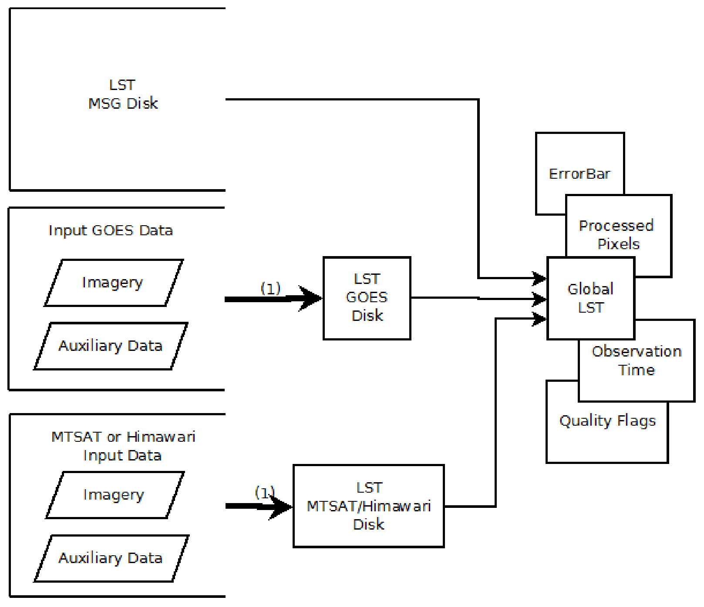

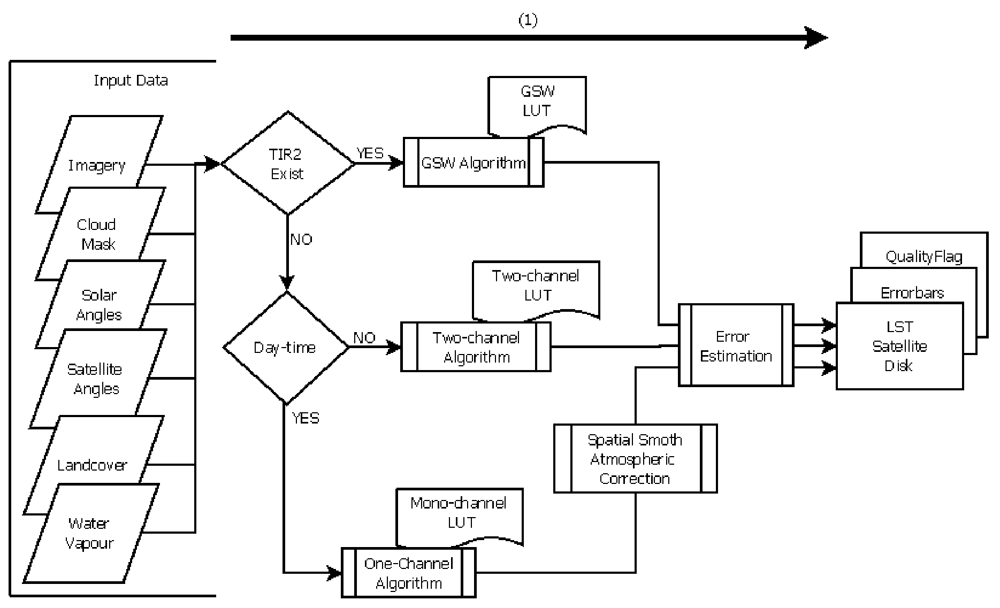

### Basic underlying assumptions

LST estimations from remotely sensed data are generally obtained from one or more channels within the thermal infrared atmospheric window from 8-to-13 µm (Dash et al., 2002, Li et al, 2013). Operational LST retrievals often make use of split-window algorithms (e.g., Prata, 1993; Wan and Dozier, 1996), where LST is obtained through a semi-empirical regression of top-of-atmosphere (TOA) brightness temperatures of two pseudo-contiguous channels, i.e., the split-window channels.

A relevant factor in the selection of the algorithm is its expected reliability for operational LST retrievals, both in terms of expected accuracy and timeliness. The latter favours the use of semi-empirical relationships between LST and TOA brightness temperatures, which are computationally efficient and free of the convergence problems of direct emissivity and temperature retrieval methods (e.g., Faysash and Smith, 1999; Hulley and Hook, 2011) associated to the non-linearity of the inverse problem in remote sensing (e.g., Rodgers, 2000). Recent studies have assessed the combination of middle infrared bands centred on 3.9 µm ($T_{MIR}$) with the split-window within the 10-to-13 µm band ($T_{TIR1}$ and $T_{TIR2}$; Sun and Pinker, 2007; Pinker et al., 2007). Although there are several caveats regarding the use of such extra channels for LST operational retrievals, they can become a very useful source of information, particularly in the absence of two $T_{TIR}$ bands. The major problems regarding the use of $T_{MIR}$ include: (i) the uncertainty of surface emissivity within $T_{MIR}$, which is considerably higher than that of $T_{TIR}$ channels, particularly over semi-arid regions (Trigo et al., 2008a); (ii) solar contamination of daytime $T_{MIR}$ observations must be taken into account.

Ultimately, we want to generate a global LST field, which corresponds to the fusion of LST fields generated from three geostationary satellites – GOES (covering the Americas), MSG (covering most of Europe and Africa regions) and Himawari / MTSAT (covering the Asia and Oceania). The design of the algorithms applied to each individual sensor needs to take into account the channels described in Table 4 and Table 5.

::: {.tbl-caption}
```{=typst}
#set text(size: 9pt, fill: rgb("#3E6893"))
```
Table 4: Satellite channels used for LST estimation using the GSW algorithm.
:::

::: {.tbl-caption}
```{=typst}
#set text(size: 9pt, fill: rgb("#3E6893"))
```
Table 5: Satellite channels used for LST estimation using the DA algorithm
:::

| | MSG/SEVIRI | GOES/ABI | Himawari/AHI |
|---------------------------------|-----------------------------------------------------------|----------------------------------------------------|--------------------------------------------------------|
| **TIR1** | 10.0 – 11.5 μm | 10.8 – 11.6µm | 10.8 – 11.6 μm |
| **TIR2** | 11.2 – 12.8 µm | 11.8 – 12.8μm | 11.7 - 13.1 μm |
| | GOES/Imager | MTSAT/JAMI |
| :--- | :--- | :--- |
| **MIR** | 3.8 – 4.0 μm | 3.5 – 4.0 μm |
| **TIR1** | 10.2 – 11.2 μm | 10.3 – 11.3 µm |
Both ABI onboard GOES-16 (and following satellites of the same series) and AHI onboard Himawari-8 (and following satellites) provide three channels in the split-window region. The given combination of channels was chosen to achieve the best correspondence with SEVIRI/MSG and therefore facilitate product harmonization. The combination of the three (instead of the current two) ABI and AHI channels within the thermal infrared window to derive LST may be considered in a future version of the product (Yamamoto et al., 2018), e.g., upon the update to Meteosat Third Generation.

The GOES imager (from GOES-9 to GOES-13) provided measurements within a single TIR channel (Table 5). As a consequence, LST is estimated using observations from TIR1 and MIR during night-time and TIR1 alone during daytime, to avoid contamination from solar radiation reflected by the surface (Freitas et al., 2013). In the case of MTSAT, it actually provided observations for two split-window bands, but they were not disseminated via EUMETCast. To our knowledge, there was no operational production of LST from MTSAT.

### Related and previous applications

The LST algorithm for SEVIRI was developed by the Eumetsat Satellite Application Facility (SAF) on Land Surface Analysis (LSA). The LSA-SAF generates, archives and disseminates SEVIRI-based LST with a 15-minute frequency, at the original satellite spatial resolution. The Copernicus Global Land LST product has benefited from the experience gained during the development of the LSA-SAF LST product for the design and implementation of GOES, MTSAT and Himawari LST algorithms.

### Alternative methodologies currently in use

A thorough overview of algorithms developed for the estimation of LST from remote sensing observations within the infra-red domain may be found in Li et al., 2013. Satellite-based thermal infrared (TIR) data is directly linked to the LST through the radiative transfer equation. However, the estimation of LST from satellite TIR measurements requires correction for surface emissivity and for atmospheric effects. The algorithms used for operational production of LST are generally designed to extract the highest information possible from available channels, minimizing product uncertainty and generation time. When split-window bands are available, generalized split-window methods fulfill such prerequisites and therefore are the most widely used for operational LST products, e.g.:

-   MODIS daily products MOD11A1 (MODIS on Terra) and MYD11 (MYD11A1) are based on the algorithm developed by Wan and Dozier (1996);
-   a similar algorithm is used by the LSA-SAF for SEVIRI-based LST;
-   the AATSR/Envisat LST distributed (off-line) by ESA is based on a split-window formulation developed by Prata (1993);
-   the SLSTR Level-2 LST from the ESA Sentinel-3 mission, which uses a simpler split-window formulation described in Remedios (2012);
-   the NOAA LST operational product retrieved from VIIRS/NPP, also using a generalized split-window algorithm (Yu et al, 2005).

The split-window algorithms assume that land surface temperature is linearly related to the TOA brightness temperature within the TIR range, apart from an atmospheric and surface emissivity correction. The atmospheric correction is a function of the differential absorption of the two adjacent channels TIR1 and TIR2. There are several formulations of generalized split-window algorithms. Yu et al. (2008) compared some of the most used documented formulations (Table 6).

The performance of LST algorithms often depends on the retrieval conditions, as further detailed in section 3.2.5.2, and on the sensitivity to input uncertainties. As an example, Figure 3 presents the LST error budget estimated for the set of 9 split-window algorithms shown in Table 6, assuming realistic uncertainties in the respective input parameters and viewing angle up to 22°. The generalized split-window corresponds to algorithm #1. Figure 3 clearly shows that most formulations tend to perform worse under moist atmospheres (and with increasing viewing angle, although not shown). The cluster of methods with overall lower errors has in common an explicit correction of surface emissivity and coefficients tuned to classes atmospheric water vapor content and view angle. The differences in performance among these, which include the Wan and Dozier (1996), are very small.

::: {.tbl-caption}
```{=typst}
#set text(size: 9pt, fill: rgb("#3E6893"))
```
Table 6: Split-window formulations tested in Yue et al. (2008) and their respective references. T<sub>s</sub> denotes LST; C, A<sub>1</sub>, A<sub>2</sub>, A<sub>3</sub>, B<sub>1</sub>, B<sub>2</sub>, B<sub>3</sub> are the regression coefficients, T<sub>11</sub> and T<sub>12</sub> are the brightness temperatures in the IR 108 and IR 120 channels, ε<sub>11</sub> and ε<sub>12</sub> their emissivities and ε the average of both emissivities.
:::

```{=html}
<table>
<colgroup>
<col style="width: 5.3%">
<col style="width: 70.0%">
<col style="width: 24.6%">
</colgroup>
<tr>
    <td style="font-weight: bold">N°</td>
    <td style="font-weight: bold">Formula</td>
    <td style="font-weight: bold">Reference(s)</td>
  </tr>
  <tr>
    <td>1</td>
    <td>$T_{s} = C + (A_1 + A_2 \frac{1-\epsilon}{\epsilon} + A_3 \frac{\Delta\epsilon}{\epsilon^2}) \frac{T_{11}+T_{12}}{2} + (B_1+B_2 \frac{1-\epsilon}{\epsilon} + B_3 \frac{\Delta\epsilon}{\epsilon^2}) \frac{T_{11}-T_{12}}{2}$</td>
    <td>(Freitas et al., 2010; Wan and Dozier, 1996)</td>
  </tr>
  <tr>
    <td>2</td>
    <td>$T_{s} = C + A_1 + A_2 \frac{1-\epsilon}{\epsilon} + A_3 \frac{\Delta\epsilon}{\epsilon^2}$</td>
    <td>(Caselles et al., 1997; Prata and Platt, 1991)</td>
  </tr>
  <tr>
    <td>3</td>
    <td>$T_{s} = C + A_1T_{11} + A_2(T_{11}-T_{12}) + A_3(1-\epsilon) + A_4\Delta\epsilon$</td>
    <td>(Ulivieri et al., 1994)</td>
  </tr>
  <tr>
    <td>4</td>
    <td>$T_{s} = C + A_1T_{11} + A_2(T_{11}-T_{12}) + A_3\frac{1-\epsilon}{\epsilon} + A_4\frac{\Delta\epsilon}{\epsilon^2}$</td>
    <td>(Vidal, 1991)</td>
  </tr>
  <tr>
    <td>5</td>
    <td>$T_{s} = C + A_1T_{11} + A_2(T_{11}-T_{12}) + A_3(T_{11}-T_{12})(1-\epsilon_{11}) + A_4 T_{12} \Delta\epsilon$</td>
    <td>(Price, 1984)</td>
  </tr>
  <tr>
    <td>6</td>
    <td>$T_{s} = C + A_1T_{11} + A_2(T_{11}-T_{12}) + A_3\epsilon$</td>
    <td>(Ulivieri and Cannizzaro, 1985)</td>
  </tr>
  <tr>
    <td>7</td>
    <td>$T_s = C + A_1 T_{11} + A_2 (T_{11} - T_{12}) + A_3 \epsilon + A_4 \Delta \epsilon$</td>
    <td>(Sobrino et al., 1994)</td>
  </tr>
  <tr>
    <td>8</td>
    <td>$T_s = C + A_1 T_{11} + A_2 (T_{11} - T_{12}) + A_3(1- \epsilon_{11}) + A_4 \Delta \epsilon$</td>
    <td>(Coll et al., 1997)</td>
  </tr>
  <tr>
    <td>9</td>
    <td>$T_s = C + A_1 T_{11} + A_2 (T_{11} - T_{12}) + A_3(T_{11}-T_{12})^2 + A_4(1- \epsilon_{11}) + A_5 \Delta \epsilon$</td>
    <td>(Sobrino et al., 1993)</td>
  </tr>
</table>
```

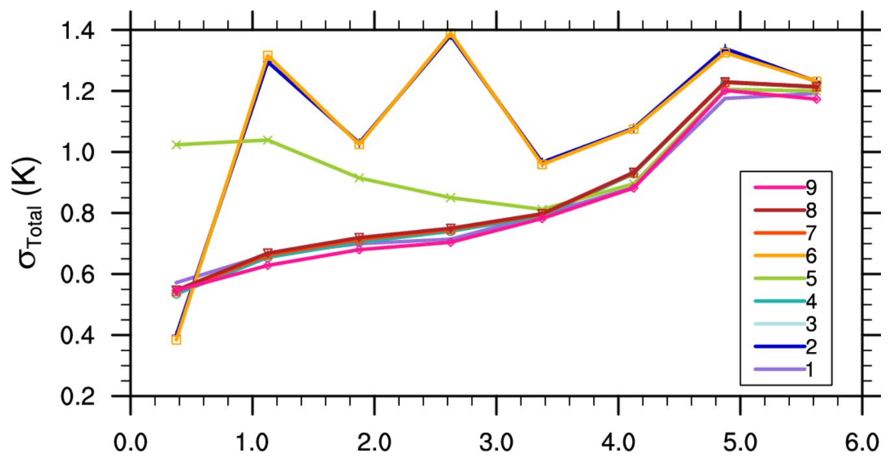
TCWV (cm)

### Generalized Split-Window Algorithm

#### Input data

The Generalized Split-Window algorithm (GSW) provides estimation of LST using measurements from two adjacent channels within the infrared atmospheric window, $T_{TIR1}$ and $T_{TIR2}$ (Table 4).

All inputs are re-gridded (both in time and space, when needed) for each pixel in the original satellite geostationary projection, so that all algorithm inputs are in a common grid.

The GSW requires the following inputs :

-   Land Cover data base - provided by the International Geosphere-Biosphere Program (IGBP) database (Belward, 1996).
-   Fraction of Vegetation Cover for
    -   SEVIRI daily pixels – estimated by the LSA-SAF from surface reflectance data
    -   Other sensors - a static value, characteristic of the pixel land-cover type. Future developments will include the replacement of this static value by a time-varying dataset, such as the Copernicus Global Land FCover product
-   Cloud mask for:
    -   SEVIRI - obtained from the NWC SAF software
    -   Other sensors - developed by the project team, based on the NWC SAF software (see corresponding ATBD [GIOGL1\_ATBD\_CloudMask]
-   Total Column Water Vapor (TCWV), which is obtained from ECMWF operational forecasts, retrieved with an hourly frequency and at 9km resolution.

#### LST retrieval

The GSW algorithm, used for example at LSA-SAF in their LST products (Trigo et al., 2008b), uses a formulation similar to that first proposed by Wan and Dozier (1996) for AVHRR and MODIS. In this algorithm, LST is as a function of TOA brightness temperatures of each sensor split-window channels ($T_{TIR1}$ and $T_{TIR2}$, respectively) – see Table 4):

$$LST = (A_1 + A_2\frac{1-\epsilon}{\epsilon} + A_3\frac{\Delta\epsilon}{\epsilon^2})\frac{T_{TIR1}+T_{TIR2}}{2} + (B_1 + B_2\frac{1-\epsilon}{\epsilon} + B_3\frac{\Delta\epsilon}{\epsilon^2})\frac{T_{TIR1}-T_{TIR2}}{2} + C + \Delta LST$$

where ε is the average of the two channels surface emissivities, Δε their difference ($\epsilon_{TIR1}$ - $\epsilon_{TIR2}$), while A~j~, B~j~, (j = 1,2,3) and C are the GSW coefficients obtained by fitting equation (1) to a calibration dataset for different classes of water vapour, TCWV, and satellite or viewing zenith angle (SZA), and ΔLST is the model error. The GSW algorithm is applied to clear sky pixels only (Freitas et al., 2010). The pixel emissivity for channel i is estimated as a function of the fraction of vegetation cover (FVC) according to the equation:

$$\epsilon_i = FVC \times \epsilon_{veg} + (1-FVC) \times \epsilon_{BS},$$

where $\epsilon_{BS}$ and $\epsilon_{veg}$ represent the emissivities of bare soil and vegetation, respectively. The values of the emissivities and their uncertainties are obtained for each sensor and for each channel using a spectral emissivity library of surface materials and convolving each individual spectrum with the channel response function and then averaging for all materials within a given land cover type. The uncertainty here is the absolute uncertainty, i.e. the largest absolute deviation from the mean emissivity within each class. These values are shown in Table 11 to Table 13 in Annex 1 : Emissivities and their uncertainties.

The calibration and verification databases of the GSW developed for each sensor rely on radiative transfer simulations of TOA brightness temperatures for the split-window channels available in the sensors considered here. The simulations are performed for the database of global profiles of temperature, moisture, and ozone compiled by Borbas et al. (2005) for clear sky conditions, and referred hereafter as SeeBor. The database contains over 15,700 profiles taken from other datasets, such as NOAA88 (Seemann et al., 2003), TIGR-like (Chevallier, 2001), and TIGR (Chedin et al., 1985), that are representative of a wide range of atmospheric (clear sky) conditions over the whole globe. In addition, surface parameters such as skin temperatures ($T_{skin}$) and a landcover classification within the International Geosphere-Biosphere Programme ecosystem categories (IGBP) (Belward, 1996) are assigned to each profile. Skin temperature over land surfaces corresponds to LST in SeeBor and is estimated as a function of 2m temperature ($T_{2m}$), biosphere information, and solar zenith and azimuth angles (Borbas et al. 2005). In the design of the calibration database, random viewing angles within the range of acceptable usage are assigned to each profile – viewing zenith angle values above 70° are not used in the CGLOPS LST merged LST product (see section 3.3), as the signature of surface emitted radiation (and therefore LST) weakens for very high viewing angles.

The calibration methodology used here follows the study by Martins et al. (2016). The SeeBor database described above was split into two subsets – one used for the calibration of the GSW algorithms, and an independent one used for verification of the fitted versions. The calibration subset strongly influences the robustness of the model coefficients; therefore, the choice of the profiles requires some caution. The SEVIRI algorithm was calibrated within the framework of LSA-SAF using 77 geographically well distributed atmospheres, covering a broad variety of water vapour content (from very dry to moist conditions), leaving more than 15,600 profiles for GSW verification (Freitas et al., 2010); this corresponds to the algorithm currently used operationally to generate LSA-SAF LST products. The calibration of ABI and AHI LST algorithms made use of a new and more representative selection of profiles, taken for areas outside the MSG disk, which lead to a lower regression error (Martins et al., 2016). The composition of such calibration database follows the steps below:

i) Define classes of $T_{skin}$ (from 200 K to 330 K in steps of 5 K) and TCWV (from 0 to 6 cm in classes of 0.75 cm—values greater than this should be treated with the coefficient corresponding to the last TCWV class)

ii) Iterate in the SeeBor clear-sky profile database to fill each class in the TCWV/TSkin phase space (as in Figure 4c) with one case each. When a new profile is selected, it is ensured that its great-circle distance to the already selected profiles is greater than an initial distance of 15 degrees, which guarantees a wide geographical coverage. After a sufficiently large number of tries (in this case 30,000), the distance criterion is relaxed in steps of minus 1 degree, until the whole TCWV/TSkin phase space is filled. The final set has 116 profiles.

iii) For each of the previously selected profiles, assign a new $T_{skin}$ based on the ranges of $T_{skin} - T_{air}$ observed range of this difference. The choice of the range of perturbations to apply is key to the performance of the chosen model and may depend on the region of interest. In the case of this work, a range of ±15K around $T_{air}$ in steps of 5K showed an overall good performance. As will be seen, large biases arise when non-physical cases are included or if the somewhat more extreme cases are not taken into account.

iv) Each of these conditions may be sensed from angles ranging from 0 (nadir view) to 70° in steps of 2.5°. It is important to discretize the viewing geometry in this way because this is an intrinsically non-linear problem. The upper limit of the viewing zenith angle might be adapted for the sensor under analysis. Previous calibration exercises show that above this viewing angle limit the retrieval errors are generally too high, especially for moister atmospheres (Freitas et al., 2010);

v) For the emissivity, a range of possible values are attributed to each of the cases above: values of $\epsilon_{TIR1}$from 0.93 to 1.0 in steps of 0.01 and then prescribe departures from this value for $\epsilon_{TIR2}$: -0.015 to 0.035 in steps of 0.01 (excluding cases where $\epsilon_{TIR2}$ > 1), as suggested by the distribution of this difference within the SeeBor dataset.


The radiative transfer simulations are performed using the MODerate spectral resolution atmospheric TRANsmittance algorithm (MODTRAN4) (Berk et al., 2000). The radiance (L~v~) that would be measured by each TIR channel is then estimated with MODTRAN4, for each of the surface and atmospheric conditions, and viewing geometry described in the previous paragraph. The simulations are performed using a spectral resolution of 1 cm⁻¹. The integration of L~v~ weighted by the i-th channel response function ϕ~i,v~, provides channel i effective radiance:

$$L_i = \frac{\int_{\nu_{i1}}^{\nu_{i2}} \phi_i(\nu)L_\nu d\nu}{\int_{\nu_{i1}}^{\nu_{i2}} \phi_i(\nu)d\nu}$$

where v~i,1~ and v~i,2~ are the lower and upper wave number boundaries of the channel, respectively; the integrals in (3) are estimated taking into account tabulated values of response function of each channel. These values are then subject to the inverse Planck function, B⁻¹, to obtain an estimate of the channel effective brightness temperatures, $T_{IR1}$ and $T_{IR2}$ (e.g., Freitas et al., 2013):

$$T_i^* = B^{-1}(\nu_{i,c}, L_i) = \frac{c_2 \nu_{i,c}}{\log(\frac{c_1 \nu_{i,c}^3}{L_i}+1)}$$

where v~i,c~ is the central frequency of each channel (in cm⁻¹), c₁ = 1.19104 × 10⁻⁵mW.cm² and c₂ = 1.43877 K.cm are constants. However, these are the effective brightness temperatures estimated using v~i,c~ without taking into account that the radiance L~i~ corresponds to the whole band, following the instrument response function. A further correction is then required to convert T~i~* into spectral brightness temperature, $T_{b_i}$. The latter is channel/ sensor dependent and each satellite agency uses slightly different methodologies to perform this conversion. In the case of GOES and according to the ATBD (https://www.star.nesdis.noaa.gov/goesr/docs/ATBD/Imagery.pdf), it takes the form:

$$T_{b_i} = \frac{T_i^* - bc_{1_i}}{bc_{2_i}}$$

where *fk*~1i~, *fk*~2i~, *bc*~1i~ and *bc*~2i~ are the coefficients which are calculated taking into account each channel response function and are provided within the metadata of the products disseminated via EUMETCast. In the case of Himawari, the ATBD (https://www.data.jma.go.jp/mscweb/en/himawari89/space_segment/hsd_sample/HS_D_users_guide_en_v12.pdf) states that the correction is performed using a 2^nd^ degree polynomial expression of the form:

$$T_{b_i} = b_{1i} + b_{2i}T_i^* + b_{3i}T_i^{*2}$$
Where, again, b~1i~, b~2i~ e b~3i~ are the band coefficients provided in the input file metadata.

For SEVIRI on MSG, the performed correction is linear as in the case of Himawari (https://www.eumetsat.int/website/wcm/idc/idcplg?IdcService=GET_FILE&dDocName=PDF_EFFECT_RAD_TO_BRIGHTNESS&RevisionSelectionMethod=LatestReleased&Rendition=Web):

$$T_{b_i} = (T_i^* - \beta)/\alpha$$

where α and β are the band correction coefficients.

The GSW parameters A~j~, B~j~ and C obtained by fitting equation (1) to the calibration dataset and the variance of LST explained by the regression are schematically shown in Figure 5 (example for SEVIRI). The calibration is performed offline and the coefficients are kept in look-up-tables used by each sensor. The ranges for the look-up tables are the same as the ranges for the simulations. The GSW algorithms are verified against the independent subset of simulated TOA brightness temperatures (which excludes the calibration data).

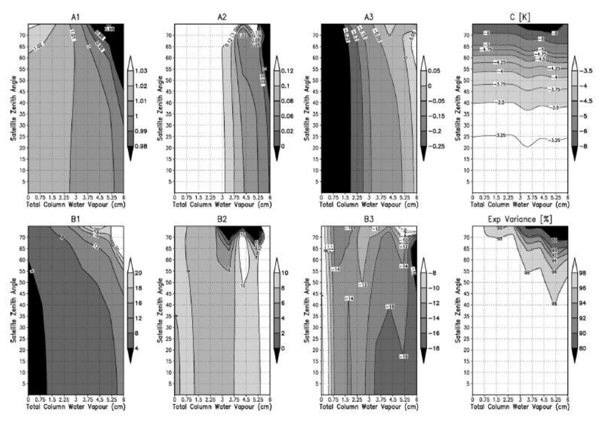

Figure 6 shows the SEVIRI GSW error distribution within each class of TCWV and SZA (figure from Freitas et al, 2010). Classes with root mean square differences (RMSD) higher than 4K are omitted. These classes correspond to cases where explained variance of the SEVIRI GSW within the training dataset is less than 93%, and where errors of 10K or more are commonly obtained within the verification database. Thus, we limit the operational production of LST to SZA below 67.5° when TCWV is 3 cm or higher, and to SZA below 62.5° when TCWV is 4.5 cm or higher.


The overall bias and RMSD of the SEVIRI GSW are 0.05K and 0.78K, respectively. As shown in Figure 6, the retrieval errors tend to increase with both satellite zenith angle and TCWV. The RMSD is always below 2K for water vapour content and angles within the range of values required for LST estimations, with the exception of (i) TCWV above 5.25 cm and satellite zenith angle higher than 57.5°; and (ii) TCWV above 2.25cm and satellite zenith angle higher than 72.5° where the GSW presents RMSD of the order of 3K.

The Figure 7 presents the RMSD of the GOES-16, MSG/SEVIRI and Himawari GSW as a function of satellite zenith angle and TCWV classes. Differences between the GSW algorithm developed to the different sensors arise from distinct channel response functions, instrument noise, and differences on the calibration database. Particularly in the case of MSG, we use LSA-SAF LST directly, which used a less comprehensive calibration database. For GOES-16 and Himawari, the calibration database was expanded and for GOES-16 the strategy described in Martins *et al.* (2016) was adopted. In future versions of this product, a more harmonized treatment for all sensors is envisaged.

The GSW flow chart is shown in Figure 8.

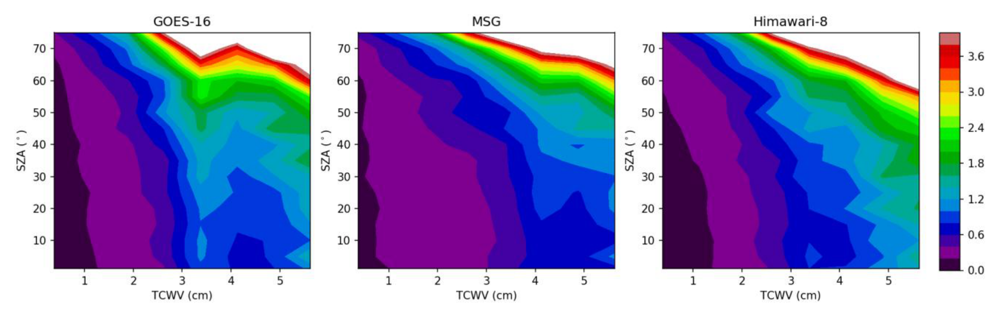

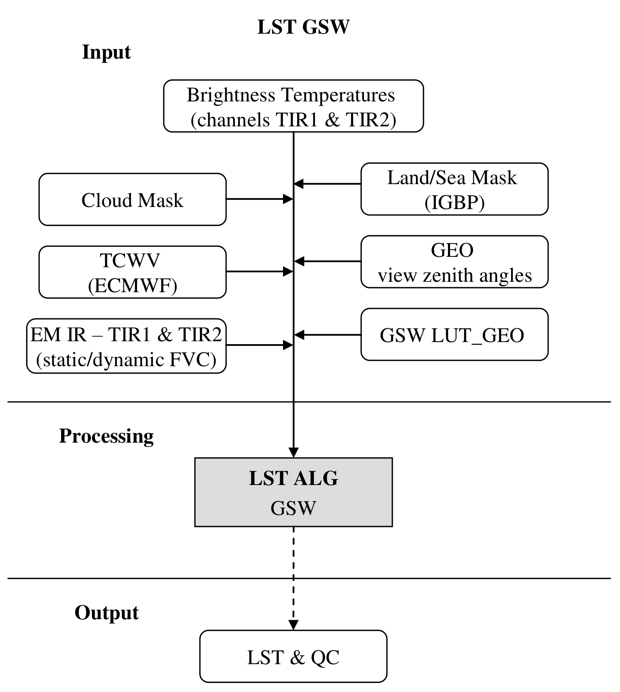

##### LST retrieval uncertainty

The estimation of the uncertainty for each LST value is based on the framework developed by Freitas et al. (2010) for the case of the LSA-SAF LST product. The method relies on clear identification of the uncertainty sources associated to inputs and to the regression model, and their propagation to the final product, which is detailed below. Surface emissivity, atmospheric total column water vapor, the viewing geometry and, to a lesser extent, the sensor radiometric noise are the main factors affecting the uncertainty in the LST retrieval. Barren soils and sparsely vegetated surfaces are characterized by relatively low emissivities values and high uncertainties, since the variability of emissivity among pixels within these land cover types is not well captured in the maps used in LST retrievals. Emissivity errors are higher under dry atmospheres which further contribute to IR retrievals being particularly challenging over arid and semi-arid regions. On the other hand, high atmospheric moisture content enhances the non-linear effects in atmospheric absorption/emission of the IR radiation and increases the optical path, limiting the retrieval by a linear regression scheme such as the GSW (in these cases, the model regression uncertainty is also high – see Figure 7). The optical path is also increased for high satellite viewing angles, and therefore the uncertainty generally increases towards the satellite disk edge.

Finally, errors in the cloud masking algorithm may severely affect the LST retrieval and are usually characterized as negative outliers when compared to in situ values in mostly any product validation exercise. According to validation results of the NWC SAF cloud mask for SEVIRI, the expected rate of missed clouds is of the order of 4% (Kerdraon and Le Gléau, 2016). These missed cases often correspond to broken clouds or cases in neighboring cloudy pixels. It is very difficult to propagate the uncertainty in cloud identification to LST error bars (Bulgin et al., 2018).

In a real scenario, we do not have access to the exact GSW inputs $X = (T_{10.5}, T_{12.3}, \epsilon_{10.5}, \epsilon_{12.3})$ and $Y = (W, \Psi)$ (where W denotes the TCWV and $\Psi$ is the viewing zenith angle), but only to inaccurate inputs, which we denote by $\hat{X} = (\hat{T}_{10.5}, \hat{T}_{12.3}, \hat{\epsilon}_{10.5}, \hat{\epsilon}_{12.3})$ and $\hat{Y} = (\hat{W}, \hat{\Psi})$. Therefore, if we still infer the LST according to model (1) replacing the exact GSW inputs with the inaccurate ones, we have a new source of uncertainty on the top of the fitting error $\Delta LST$. In the current section, the main uncertainty sources are identified and their impact on the total LST uncertainty is estimated.

Let us define the vector of model coefficients $\theta = (A_1, A_2, A_3, B_1, B_2, B_3, C)$. Notice that the vector $\theta$ generated by the fitting process is a function of TCWV and viewing zenith anglen i.e., $\theta = \theta(Y)$. Consider the LST estimator $\widehat{LST} = f(\hat{X}, \hat{\theta})$, where $\hat{\theta} = \theta(\hat{Y})$ and $f(\hat X, \hat\theta)$ is the LST estimate given by model (1). A characterization of the model uncertainty is given by:

$$S_{LST} = E[(f(\hat X, \hat\theta) - LST)^2 | X, Y]^{1/2}$$

where the operator E[. |X, Y] stands for mean value conditioned to X and Y; i.e. for a given GSW input X, Y, we want to compute the RMSD of the LST estimate. Using the fact that $LST = f(X, \theta) + \Delta LST$ and assuming that $E[f(\hat X, \hat\theta)|X, Y] = f(X, \theta)$, we may write:

$$S_{LST} = \left( E[(f(\hat X, \hat\theta) - f(X, \theta))^2 | X, Y] + \Delta LST^2 \right)^{1/2}$$

By taking a linear approximation of $f(\hat{X}, \hat{\theta})$ in the neighbourhood of $(X, \theta)$ and denoting $\sigma_{\hat{x}_i}^2 = E[(\hat{x}_i - x_i)^2 | X]$ and $\sigma_{\hat{\theta}_i}^2 = E[(\hat{\theta}_i - \theta_i)^2 | Y]$, we are led to:

$$S_{LST}^2 \approx \sum_i \left( \frac{\partial f}{\partial x_i} \right)^2 \sigma_{\hat{x}_i}^2 + \sum_j \left( \frac{\partial f}{\partial \theta_j} \right)^2 \sigma_{\hat{\theta}_j}^2 + \Delta LST^2$$

where we have assumed that the components of X, Y are mutually independent and that the $E[(\hat{x}_i - x_i) | X] = 0$ and $E[(\hat{\theta}_i - \theta_i) | Y] = 0$. Next, we study in detail the error due to each individual GSW input.

###### Impact of sensor noise

The impact of sensor noise on LST is given by the sum of the uncertainties associated to the noise of each split-window channel:

$$S_T^2 = S_{T_{IR1}}^2 + S_{T_{IR2}}^2$$

where:

$$S_{T_{IR1}}^2 = \left( \frac{\partial f}{\partial T_{IR1}} \right)^2 \sigma_{T_{IR1}}^2 \text{ and } S_{T_{IR2}}^2 = \left( \frac{\partial f}{\partial T_{IR2}} \right)^2 \sigma_{T_{IR2}}^2$$

In this case, the value of $\sqrt{\sigma_{T_{IRn}}^2}$ is given by the instrument radiometric noise, $NE\Delta T$, to be reported for each channel upon instrument calibration. In the case of the currently operational sensors in use for the CGLOPS LST, all channels / instruments have a reported $NE\Delta T \approx 0.1K$.

In the case of the GSW algorithm [Eq.(1)], the derivatives with respect to the split-window brightness temperatures are given by:

$$\frac{\partial f}{\partial T_{IR1}} = \frac{1}{2} \left[ A_1 + B_1 + (A_2+B_2)\frac{1-\epsilon}{\epsilon} + (A_3+B_3)\frac{\Delta\epsilon}{\epsilon^2} \right]$$

$$\frac{\partial f}{\partial T_{IR2}} = \frac{1}{2} \left[ A_1 - B_1 + (A_2-B_2)\frac{1-\epsilon}{\epsilon} + (A_3-B_3)\frac{\Delta\epsilon}{\epsilon^2} \right]$$

The expected impact of this uncertainty is assessed here by perturbing each of the cases in the validation database with 200 random normally distributed perturbations to each $T_{ir}$, and then computing the variance of the differences between the perturbed vs. unperturbed inputs. The result is shown for each sensor, per class of TCWV and satellite zenith angle, in Figure 9. GOES-16 and Himawari-8 show similar behaviour, with impacts growing towards higher optical paths. MSG shows a slightly higher impact towards higher optical paths, compared to GOES-16 and Himawari-8.

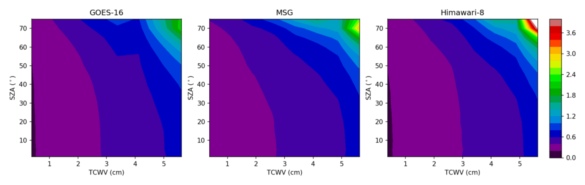

###### Impact of uncertainties in surface emissivity

The impact of uncertainties in surface emissivity for both split-window channels is given by:

$$S_\epsilon^2 = S_{\epsilon_{IR1}}^2 + S_{\epsilon_{IR2}}^2$$

Where

$$S_{\epsilon_{IR1}}^2 = \left( \frac{\partial f}{\partial\epsilon_{IR1}} \right)^2 \sigma_{\epsilon_{IR1}}^2 + de_{MR,IR1}^2 \text{ and } S_{\epsilon_{IR2}}^2 = \left( \frac{\partial f}{\partial\epsilon_{IR2}} \right)^2 \sigma_{\epsilon_{IR2}}^2 + de_{MR,IR2}^2$$

where $de_{MR,IR_i}$ is the uncertainty due to multiple reflections. This factor is added here as a source of uncertainty due to the difficulty to explicitly model this phenomenon, which would depend on geometrical factors such as the canopy height and typical separation between vegetation elements (Trigo et al., 2008). Its effect on the emissivity uncertainty for each channel is estimated using (Trigo et al., 2008):

$$de_{MR,IR_i} = \psi(d\epsilon)_{IR_i} FVC(1 - FVC)$$

Tabulated values of $(d\epsilon)_{IR_i}$ per IGBP land cover type and per channel were calculated in Peres and DaCamara (2005) and are reproduced in Table 7.

::: {.tbl-caption}
```{=typst}
#set text(size: 9pt, fill: rgb("#3E6893"))
```
Table 7: Values used for (de) for each split-window channel (see equation (15)). For land covers that are not in the table, values are zero.
:::

| IGBP Class | TIR1 | TIR2 |
|-----------------------------------------------|----------------------------------------------------------------------------|-----------------------------------------------------------------------------|
| 1; 2 | 0.0139 | 0.0123 |
| 3; 4 | 0.0138 | 0.0122 |
| 5 | 0.0139 | 0.0122 |
| 6 | 0.0102 | 0.0088 |
| 7 | 0.0022 | 0.0019 |
| 8 | 0.0101 | 0.0087 |
| 9 | 0.0060 | 0.0052 |
| 10 | 0.0012 | 0.0011 |
| 12 | 0.0059 | 0.0048 |
| 13 | 0.0016 | 0.0011 |
| 14 | 0.0070 | 0.0060 |
| 16 | 0.0020 | 0.0013 |
To estimate $\sigma_{\epsilon_{IRi}}^2$, we need to take into account the uncertainties due to $\epsilon_{vegi}$, $\epsilon_{bsi}$ and FVC.Thus, by propagating their uncertainties using (2), we get:

$$\sigma_{\epsilon_{IRi}}^2 = FVC^2 \sigma_{veg_i}^2 + (1 - FVC)^2 \sigma_{bs_i}^2 + (\epsilon_{veg_i} - \epsilon_{bs_i})^2 \sigma_{FVC}^2 + (d\epsilon_{MR,IR_i})^2$$

Finally, the derivatives in (16) are given by:

$$\frac{\partial f}{\partial \epsilon_{IR1}} = -\frac{1}{2} \left[ A_2\frac{T_{IR1}+T_{IR2}}{\epsilon^2} + A_3(T_{IR1}+T_{IR2})\frac{(1+\Delta\epsilon)}{\epsilon^3} - B_2\frac{T_{IR1}-T_{IR2}}{\epsilon^2} + B_3(T_{IR1}-T_{IR2})\frac{(\epsilon-\Delta\epsilon)}{\epsilon^3}\right]$$

$$\frac{\partial f}{\partial \epsilon_{IR2}} = -\frac{1}{2} \left[ A_2\frac{T_{IR1}+T_{IR2}}{\epsilon^2} + A_3(T_{IR1}+T_{IR2})\frac{(1+\Delta\epsilon)}{\epsilon^3} + B_2\frac{T_{IR1}-T_{IR2}}{\epsilon^2} + B_3(T_{IR1}-T_{IR2})\frac{(\epsilon+\Delta\epsilon)}{\epsilon^3}\right]$$

In Figure 10, an assessment of this source of uncertainty is shown as a function of TCWV and for 3 classes of mean emissivity (between TIR1 and TIR2): arid ($\bar\epsilon \le 0.96$), sparsely vegetated ($0.96 < \bar\epsilon \le 0.98$) and highly vegetated / water ($\bar\epsilon > 0.98$). For each profile of the validation database, a reference retrieval was made using the $FVC$, $\epsilon_{bs}$ and $\epsilon_{veg}$ values of Table 11 to Table 13, corresponding to the land cover assigned to the profile. Then, 200 random normally distributed perturbations of FVC were introduced in each case of the validation database with a standard deviation equal to the reported uncertainty in FVC, as well as 200 uniformly distributed perturbations of $\epsilon_{bs}$ and $\epsilon_{veg}$ with distribution half-widths corresponding to the respective uncertainty. Results for GOES-16 and Himawari-8 are very similar, with 1) a general decrease of $S_\epsilon$ with TCWV due to compensation of errors between emitted land surface radiance and reflected radiance emitted by the atmosphere (which increases in moister atmospheres) and 2) with larger values in situations with less vegetation, which are characterized by lower and more uncertain emissivities. MSG shows somewhat higher values, not only due to differences in the calibration database but also due to differences in the channel frequencies/response functions of each channel.


###### Uncertainties in forecasts of atmospheric water vapour content

Since the total column water vapor is used implicitly in the algorithm (i.e. different sets of parameters are used for each class of TCWV values), the uncertainty cannot be calculated analytically. The uncertainty due to this parameter is related to the fact that there is a probability of choosing the wrong set of model coefficients because the TCWV forecast may lead to a wrong choice of TCWV class. Therefore, it is estimated a priori as follows:

1) the operational use of the GSW algorithm (Eq.1) to retrieve LST from each sensor makes use of forecasts of TCWV ($\hat W$) provided by the European Centre for Medium-range Weather Forecasts (ECMWF). To characterize $\hat W$ error statistics, we compare ECMWF $\hat W$ forecasts (with forecast steps ranging between 12 and 36 h) with the respective analysis, for the 15^th^ of each month for one full year; ECMWF grid points with model cloud cover higher than 10% were excluded. This exercise is repeated regularly (about once per year) to update the uncertainty in ECMWF forecasts. The comparison between $\hat W$ forecasts and analysis (the reference value) allows us to estimate the probability $P(W_{ifc} | W_{ian})$, i.e., the probability that $\hat W$ belongs to the water vapour content class $W_{ifc}$, given that the true class is $W_{ian}$.
2) The validation database is used to calculate the variance of the LST for each class of SZA/TCWV. The variance is obtained by simulating each case of the validation database ($i_{valid}$) with all the possible sets of coefficients corresponding to that SZA ($i_{fc}$) and then comparing to the value obtained with the “true” set of coefficients ($LST_{ivalid}$). The uncertainty final estimate is provided for each SZA / forecast TCWV class by multiplying the obtained variance by the probability of a given forecast class does not correspond to the “true” class:

$$S_W^2 = \frac{1}{n_{TCWV}} \sum_i^{n_{TCWV}} \sigma_{W_{ian}|W_{fc}}^2 P(W_{ian}|\hat{W}_{fc})$$

where $\sigma_{W_{ian}|W_{fc}}^2$ is the variance of the errors of LST for a given $\hat W$ estimate (i.e., for a given TCWV forecast $\hat W_{fc}$), when the correct value is $W_{ian}$; $P(W_{ian}|\hat{W}_{fc})$ is the probability that the correct class of TCWV is determined by $W_{ian}$, conditioned by the forecast value of $\hat W_{fc}$; $n_{TCWV}$ is the number of TCWV classes considered.

In Figure 11, the variability due to uncertainty in LST is shown as function of TCWV and satellite zenith angle (SZA). Again, higher values occur towards higher optical paths (i.e. towards higher TCWV and higher SZA). In general, the uncertainty due to TCWV is small because the forecasts are generally close to the analysis used for verification (therefore it is unlikely that a set of coefficients corresponding to a different TCWV class is used, especially towards lower TCWV values) and only for those classes with higher TCWV, the fact that a different set of coefficients is used will imply higher differences in the retrieved LST.

These values are prescribed to the operational chain as a LUT, since it is not possible to perform these calculations for each forecast (since the analysis is of course not available at the time of production).

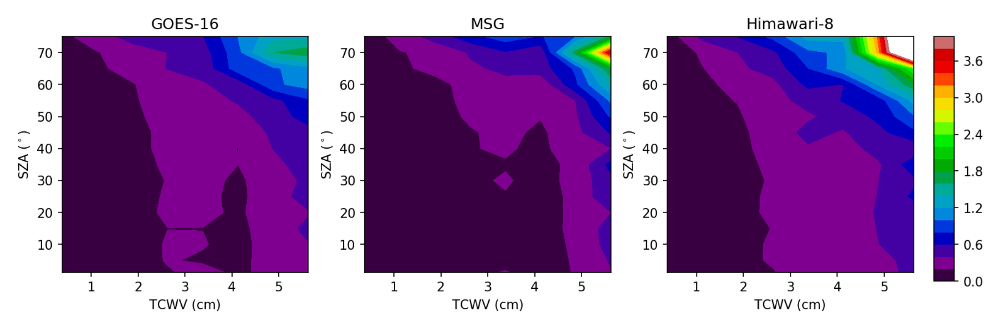

###### Total uncertainty of LST retrievals

The estimation of LST error bars, $S_{LST}$, assumes that all sources of errors described in the previous sections are independent and therefore is given by:

$$S_{LST} = \sqrt{S_T^2 + S_\epsilon^2 + S_W^2 + \Delta LST^2}$$

In Figure 12, an assessment of the total expected uncertainty is shown as a function of TCWV and satellite zenith angle (SZA), for each sensor and for arid, sparsely vegetated and highly vegetated situations. Overall, uncertainty grows towards higher optical paths, to the point that for a few classes of high TCWV and SZA we do not recommend the usage of the product and therefore all situations with pixel uncertainty higher than 5 K are not taken into account for the final LST product (see section 3.3). The required product target accuracy is 2 K (Table 2). However, users are advised to take into consideration the estimated error bars for their application. **LST values with uncertainties above 4 K must be used with caution**. These values are usually found in those classes with higher optical path (see white areas in Figure 12).

The analysis of algorithm uncertainties is complemented with validation against independent sources of data, including in situ observations and LST products retrieved from other sensors (Trigo et al, 2008b, Goettsche et al, 2013, 2016, Ermida et al, 2014). As shown in Goettsche et al. (2016), there is good agreement with in situ measurements taken in arid and semi-arid regions. In fact, for comparisons made between SEVIRI LST retrievals and in situ measurements taken at Gobabeb and Farm Heimat in Namibia over the 2009 - 2014 period, RMSD was generally below 1.5 K, with slightly higher values in months with more undetected clouds, while biases varied between -0.5 K and 0.6 K. These ground stations are located over highly homogeneous areas, and therefore the local measurements represent very reasonably those at the satellite pixel scale. The monthly average uncertainties estimated in NRT for SEVIRI/MSG LST, taking into account expected algorithm and input accuracies, lies between 2 K and 3 K. This range is of the same order or even larger than the root mean square differences between the in situ and the satellite measurements (Trigo et al, 2008b; Freitas et al., 2010).


### Dual-Algorithm

#### Input data

The Dual-Algorithm (DA) provides estimation of LST using measurements from (i) one middle infrared and one thermal window channel, $T_{MIR}$ and $T_{TIR1}$ (Table 5) during night-time and; (ii) a single thermal window channel $T_{TIR1}$ during daytime. The reason for having two different formulations is to avoid uncertainties in LST due to solar contamination of $T_{MIR}$ during daytime.

A version of the DA was adjusted to GOES-13 (and also its predecessors) and MTSAT imagers since the GSW can only be applied whenever the two IR channels are available in NRT.

The DA requires the following inputs:

-   Land Cover data base - provided by the International Geosphere-Biosphere Program (IGBP) database (Belward, 1996).
-   Cloud mask developed by the project team, based on the NWC SAF software (see corresponding ATBD [GIOGL1\_ATBD\_CloudMask]).
-   Total Column Water Vapour (TCWV), which is obtained from ECMWF operational forecasts, retrieved with an hourly frequency and at 9 km resolution.

#### Methodology

Following the approach presented in Sun et al. (2004), a mono-channel and a two-channel algorithm were developed for channels available onboard GOES-13 and MTSAT, respectively. The mono- and two-channel methods are based on equations (3) and (4), and unlike the original formulations developed by Sun et al. (2004), the coefficients depend implicitly on TCWV.

The Mono-Channel Algorithm, used during day time is given by:

$$LST = A_1 + A_2 T_{TIR1} + \Delta LST$$

The Two-Channel Algorithm, used in the night time is given by:

$$LST = B_1 + B_2 T_{TIR1} + B_3(T_{TIR1} - T_{MIR}) + \Delta LST$$

where ΔLST is the model error and A~i~ and B~i~ (i=1,2,3) the model coefficients. As in the case of the GSW algorithm, the coefficients in equations (23) and (24) are fit to a calibration dataset for different classes of TCWV, satellite viewing zenith angle (SZA) and, in this case, also to land cover type since these algorithms do not use explicit emissivity as an input. The calibration and verification databases of the DA are built independently for GOES-13 and MTSAT imagers. They follow the same methodology described in the previous section, relying on radiative transfer simulations of TOA brightness temperatures for the middle and thermal infrared channels available onboard each sensor. Therefore, MODTRAN4 simulations obtained for SeeBor database within the spectral ranges of MIR and TIR bands are convoluted with the sensors response function, as in equation (3). TOA brightness temperatures are obtained via application of the Planck function.

The parameters in the DA algorithm are estimated for each of the 16 land-cover types within IGBP database, for 8 different classes of TCWV, up to 6 cm, and for 16 classes of SZA, up to 75°, ensuring that all ranges of atmospheric attenuation within the thermal infrared are covered.

The parameters of the Mono-Channel Algorithm and of the Two-Channel Algorithm are schematically presented in Figure 13 and Figure 14 respectively, along with the variance of LST explained by the regression, for 4 different landcover types. The uncertainty of the mono-channel (used for daytime) and two-channel (used for night-time) formulations are assessed by comparison with the verification dataset. The distribution of errors is shown in Figure 15 and Figure 16 for GOES and in Figure 17 and Figure 18 for MTSAT formulations. While the two-channel methodology presents errors similar to those obtained for the GSW – frequently within the 2K range - the use of a single channel is associated to a considerable uncertainty increase.

As before, the estimation of the uncertainty for each LST value is based on the results presented in Figure 15 to Figure 18, along with a series of sensitivity tests to input errors, namely those associated to (i) ECMWF TCWV forecasts and; (ii) emissivity variability within each land cover database. We will also consider 4K as the maximum uncertainty estimation, measured by the RMS difference between reference and estimated LST; higher uncertainty values will be masked out.


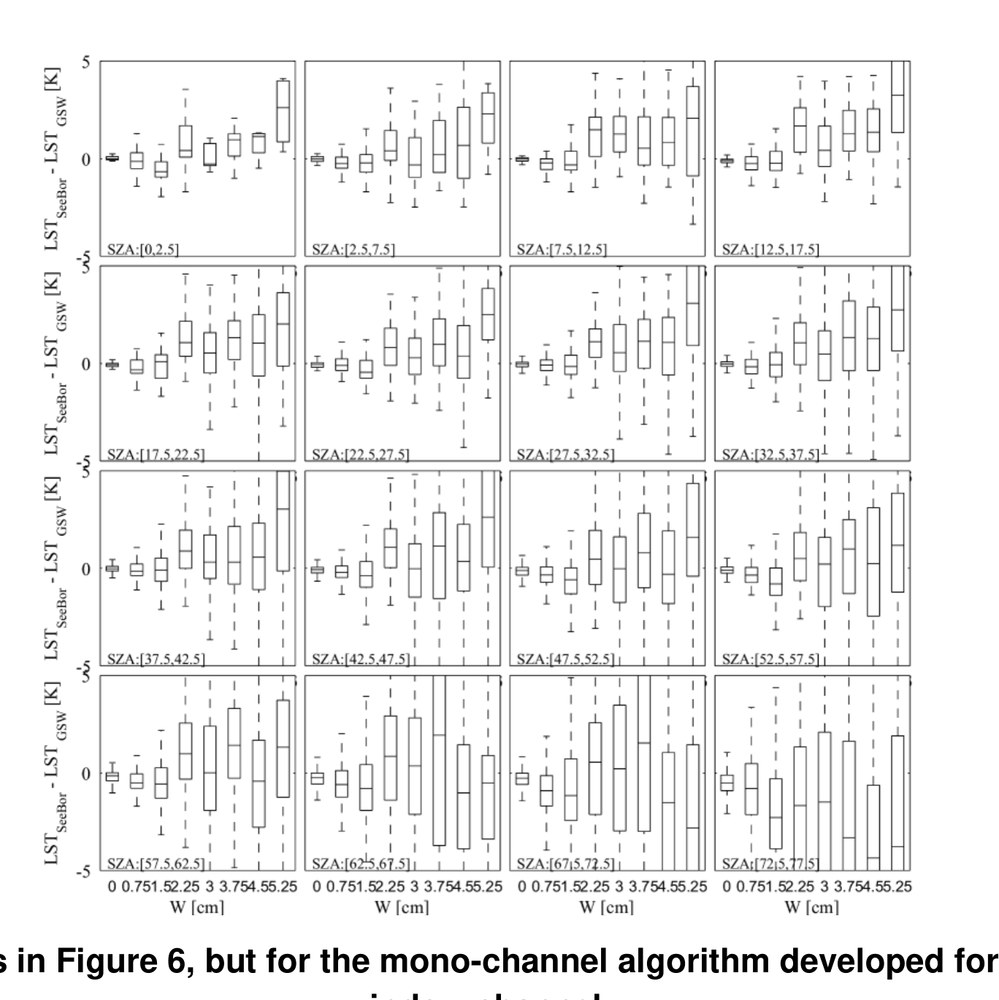

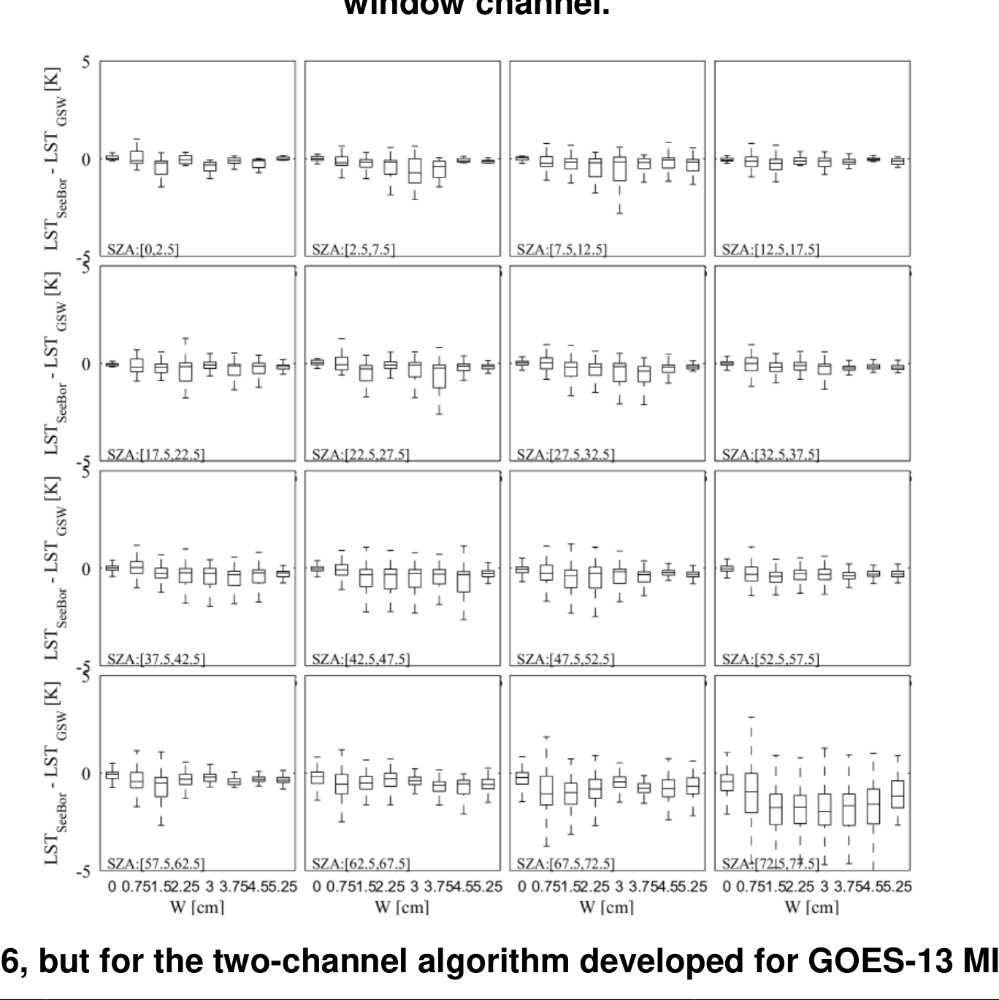

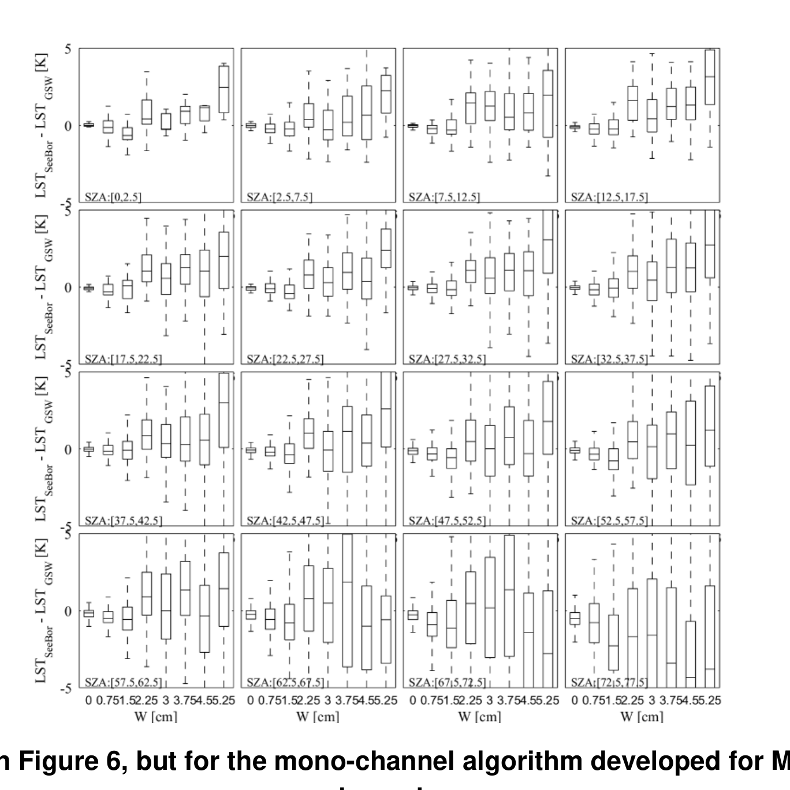

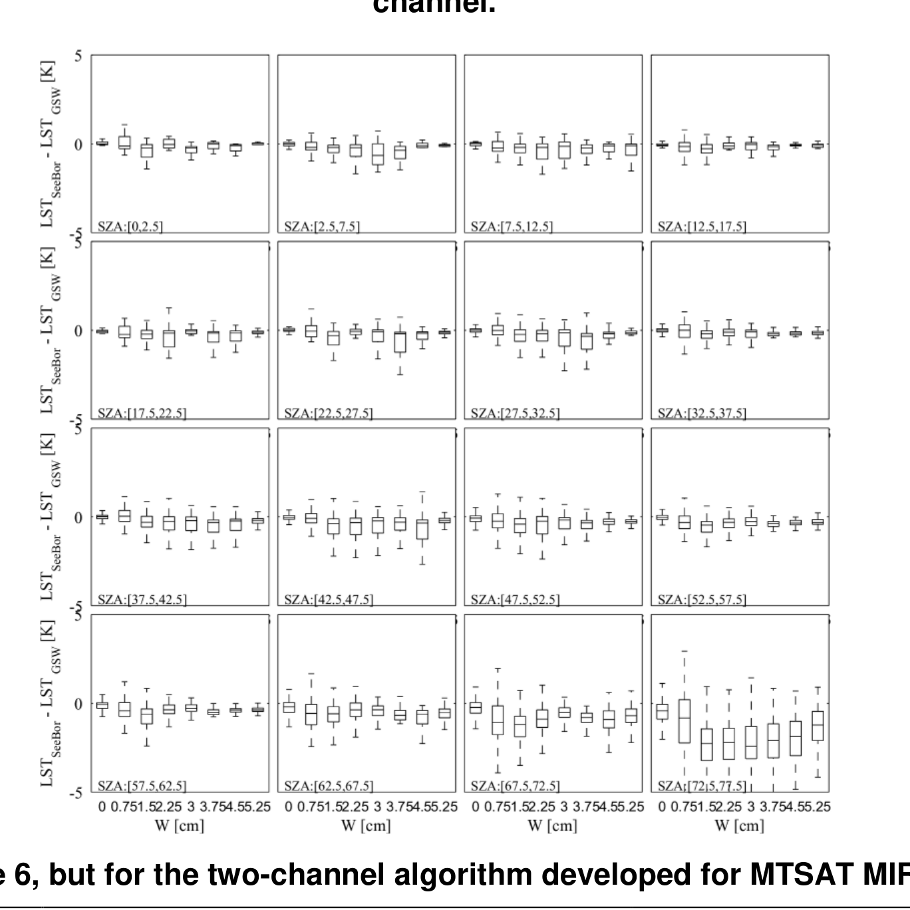
The DA flow chart is shown in Figure 19.

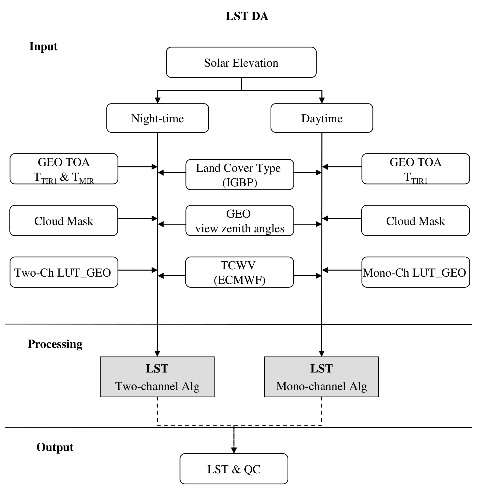

As already mentioned, the difference between the brightness temperatures of two spectral channels gives information about the atmospheric attenuation in the satellite measurements. In case of the mono-channel algorithm the atmospheric information is only given by the auxiliary input data (TCWV and satellite zenith angle). As such the mono-channel algorithm is much more dependent on the auxiliary input data than the two-channel algorithms. Besides that the mono-channel algorithm is adapted for specific classes of TCWV and satellite zenith angle, thus a small difference in one of these parameters could imply on a considerable difference in the atmospheric correction which, in some particularly conditions, imply on spatial discontinuities on the LST field. To overcome this effect an interpolation on the atmospheric correction is applied to the mono-channel derived LST. The interpolation consists in calculate, for each pixel, two values of LST corresponding to two adjacent classes of water vapour. The final LST is a linear interpolation of those values for the actual water vapour content.

##### LST retrieval uncertainty

In the case of DA, a similar framework to the one presented in section 3.2.5.1 is used. The main difference is that the algorithms do not have an explicit emissivity, so we only need to take into account the uncertainty due to land cover (apart from the regression error, sensor noise and TCWV forecasts). For the sake of completeness, we present the formulations used to derive the uncertainty due to sensor noise and due to land cover using DA in the following sub-sections. The treatment of the uncertainty due to TCWV forecasts is similar to what was described in section 3.2.5.1

###### Uncertainty due to sensor noise

The reported values of *NEΔT* for the channels used in the DA are given in Table 8 for each sensor.
The reported NEAT values, corresponding to $\sqrt{\sigma_{TIR}^2}$ and $\sqrt{\sigma_{MIR}^2}$ (in K) for the DA channels of each sensor are shown in Table 8.

::: {.tbl-caption}
```{=typst}
#set text(size: 9pt, fill: rgb("#3E6893"))
```
Table 8: Reported NEAT values, corresponding to $\sqrt{\sigma_{TIR}^2}$ and $\sqrt{\sigma_{MIR}^2}$ (in K) for the DA channels of each sensor.
:::

| | GOES / Imager | MTSAT / JAMI |
|-------------------------------------------------------|--------------------------------------------------------------------------|------------------------------------------------------------------------|
| **TIR** | 0.1281 | 0.4215 |
| **MIR** | 0.1789 | 0.3940 |
The uncertainty due to sensor noise is given by the sum of the contributions of each channel:

$$S_T^2 = S_{T_{TIR}}^2 (+S_{T_{MIR}}^2)_{\text{for two-channel algo}}$$

where:

$$S_{T_{TIR}}^2 = \left( \frac{\partial f}{\partial T_{TIR}} \right)^2 \sigma_{T_{TIR}}^2 \text{ and } S_{T_{MIR}}^2 = \left( \frac{\partial f}{\partial T_{MIR}} \right)^2 \sigma_{T_{MIR}}^2$$

The derivative in Eq. (26) for the mono-channel algorithm is given by:

$$\frac{\partial f}{\partial T_{TIR}} = A_2$$

In the case of the two-channel, the derivatives are given by:

$$\frac{\partial f}{\partial T_{TIR}} = B_2 + B_3$$

$$\frac{\partial f}{\partial T_{MIR}} = -B_3$$

###### Uncertainty due to emissivity

To account for emissivity, the two-channel algorithm is calibrated for classes of land cover. Each land cover comprises a range of materials, each with different spectral emissivities for bare ground and vegetation, as well as a typical fraction of vegetation cover. This variability within each land cover class is prescribed to the processing chain as a LUT, which takes into account all cases in the validation database.

## Data Fusion

All algorithms described in the previous sections allow the estimation of LST on a pixel-by-pixel basis. LST corresponds to instantaneous fields produced every 15 minutes in the case of SEVIRI, and hourly in the case of GOES and Himawari. The three individual fields are then re-projected and merged onto a 5/112°x5/112° regular grid, according to user requirements. The individual timeslots selected to integrate the global product are T=0 for both GOES and Himawari and T-15 for MSG. This configuration was maintained for consistency with previous sensors. When the product was originally designed, this configuration minimized differences between acquisition times within regions where the individual satellite disks overlap. With the introduction of Himawari, the T=0 slot was selected since there was no overlap with any other disk. With the current introduction of GOES-16 (and following satellites) in the processing chain, the ideal solution would have been to use T=0 for all sensors. However, the production team decided to maintain consistency in the time series obtained within the MSG disk in this product version. Therefore, it was decided to keep T=-15min for SEVIRI and T=0 for both GOES and Himawari. This configuration will change in the next product version, which especially motivated by the introduction of IODC, since there will be an increase of the overlapping areas. Users should be aware of these changes in the near future, as well as of reprocessing activities that might occur.

LST data fusion consists on having LST retrievals from the different geostationary satellites merged into a single field, thus yielding a global product.

The final LST product is obtained by averaging all the LST values from pixels within each grid box (regular in latitude and longitude), for satellite zenith angles up to 70° for all sensors. In this context all the averages are weighted taking into account the respective viewing angle, so that the final product is less influenced by lower quality retrievals (i.e. those with greater satellite zenith angle). At the end four data layers are added to the LST product with additional information crucial for the product applications: i) the error bars in a pixel by pixel basis, determined taking into account algorithm uncertainties as well as the propagation of input uncertainties (section 3.2; Freitas et al., 2010); ii) the pixel acquisition time – in areas observed by more than one satellite, this value corresponds to an average of acquisition times, also weighted by the satellite zenith angle; iii) the fraction of pixels that were effectively processed, and iv) a quality flag with satellite information, missing data, cloudiness and land-water mask (Table 14 in Annex 2: LST Quality Control Information).

Figure 20 shows examples of the LST retrieved with the three individual sensors used to provide the final merged product, in this case obtained at around February 1^st^, 2019 at 10:00 UTC (depending on each sensor individual timeslot).

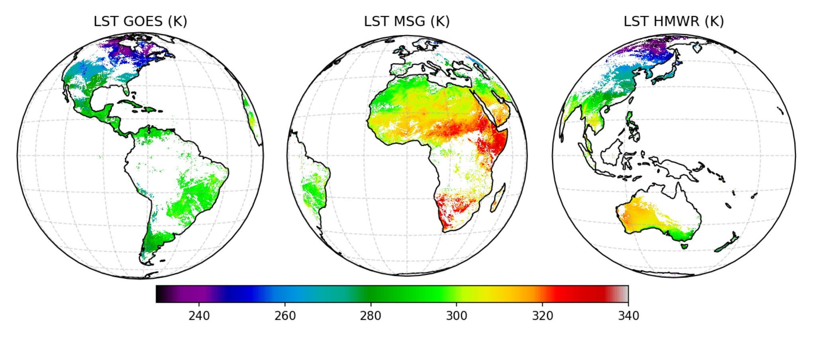

Data fusion of these fields yield the results depicted in Figure 21, which illustrates the near-global LST product estimated for February 1^st^, 2019, at 10:00 UTC. The most striking feature of this figure is the lack of coverage in the Middle East and in Polar Regions. The corresponding uncertainty is provided in Figure 22. In the overlapping region of South America, there are a few grid points with larger uncertainties, which are associated to pixels obtained with SEVIRI, and that GOES considered as cloudy.

The next product version will include data from the Indian Ocean Data Coverage (IODC) mission from EUMETSAT, which features an MSG platform located at 41.5°E, and will therefore fill the Middle East coverage gap. The inclusion of this mission in the CGLOPS LST product will also contribute to lower the uncertainties around the Arabian Peninsula, which is observed by the 0° MSG SEVIRI with a large viewing angle. Another key feature of the next product release will be the use of dynamic FVC maps as input, which will allow better merging between pixels measured by different sensors and a more realistic uncertainty estimate due to emissivity (which seems rather low in the case of GOES and Himawari disks).

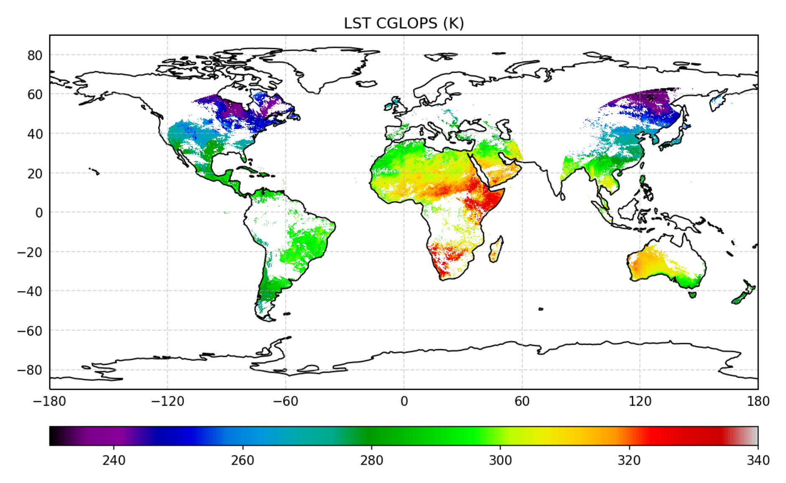

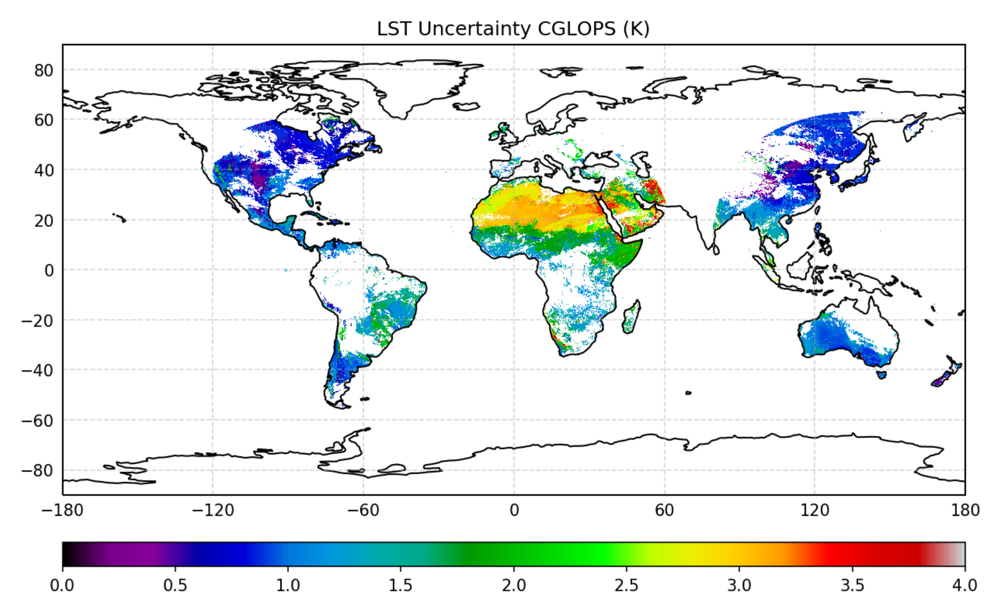

# Quality Assessment

The LST product is validated following the procedure described in the Service Validation Plan [CGLOPS1_SVP] to obtain the discrepancies between CGLOPS LST estimates and ground data. Additionally, a comparison between CGLOPS LST and MODIS LST is performed. An annual Scientific Quality Evaluation report is provided in the first/second quarter of each year, with respect to the data of the previous year. The main goal of this yearly report is to guarantee that the quality of product for the respective year is compliant with the user requirements and the Validation Report [GIOGL1_VR_LST], following the procedures therein and the most recent recommendations of the Land Product Validation (LPV) group of the Committee on Earth Observation Satellite (CEOS) for the validation of satellite-derived land products. The report also includes a section devoted to illustrating the usefulness of the product in representing extreme events such as heat waves, wild fires and droughts. The user is referred to the latest validation report available online in the CGLOPS portal (https://land.copernicus.eu/global/documents/products) for details on validation techniques and results.

Since there are some differences in the way SEVIRI and the remaining sensors are processed, a consistency analysis is required within the overlapping regions. In the current product version, the only overlap occurs in the region where the GOES and MSG disks intersect (South America and the West-Africa). To perform the comparison, both LST fields are projected onto a regular 5/112°×5/112° grid, similar to the final product grid. This comparison is performed for pixels classified as "clear sky” for both satellites over land areas, for 10 days in two contrasting months: January 2019 and July 2018 at 0300 UTC and 1500 UTC.

In Figure 23, the difference between MSG and GOES-16 LSTs is shown for the 1500 UTC timeslots (10 day average from Jan 10 to Jan 19, 2019). The average difference is only shown when more than 2 values exist over a grid cell, whereas in the scatterplots all cases are used. MSG LSTs are systematically warmer over this region, as indicated by the bias over all collocations of about 1.6 K. Differences in the observation times between MSG and GOES (the former measuring up to 20 min earlier) are consistent with MSG warm bias over North-western Africa, where diurnal amplitudes are large and LST warming/cooling before/after local noon is very pronounced. Differences in observation times are, however, less useful to explain the smoother differences between the two LST fields observed over South America. Satellite zenith angles (SZA) are similar for both sensors but it is clear that when MSG SZAs are largest, both LSTs compare worse, especially towards the westernmost areas of Brazil, where differences reaching over 3 K. In the night-time case (Figure 24), the differences are smaller, but a positive bias (MSG > GOES) of around 1.4 K persists. The overall July statistics improve when compared to January, with a bias of 0.2 K for daytime (Figure 25) and 0.9 K for night-time (Figure 26). The maps of LST differences for July show that both estimates differ up to 2 K for the major part of the studied domain, except for the few pixels over West Africa, essentially explained by differences in observation time – especially during local summer when daily amplitudes are particularly large (reaching over 40 K). It is clear from all maps that positive differences are much more frequent than negative differences (i.e. MSG is almost always warmer than GOES). These comparisons are performed over a particularly difficult area for LST retrievals. In January, the north part of South America is under the influence of the ITCZ, which explains the relatively low sampling. In July, the number of matchups over the same area is greatly increased, whereas over West Africa there are much less matchups. When the product was derived using the previous generation of GOES imagers, the opposite pattern was observed, with GOES yielding warmer temperatures than MSG especially during night time [GIOGL1_VR_LST]. Despite these differences, the highest point density stretches along the 1:1 line in the scatterplots, suggesting acceptable consistency between the two LST fields; the cluster of points most noticeable above the 1:1 line in Figure 25 and Figure 26 is essentially constituted by points from Northern Africa.


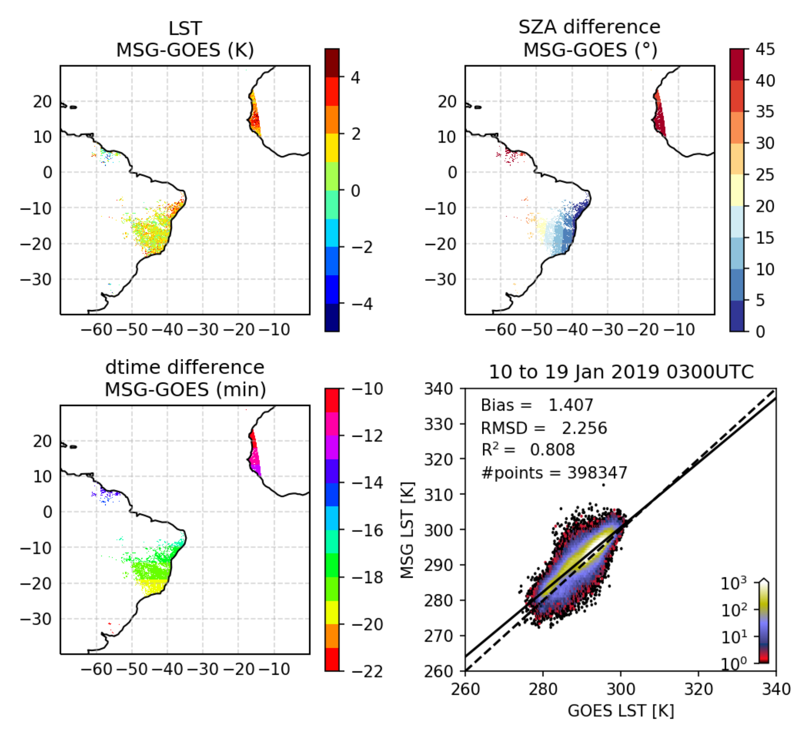

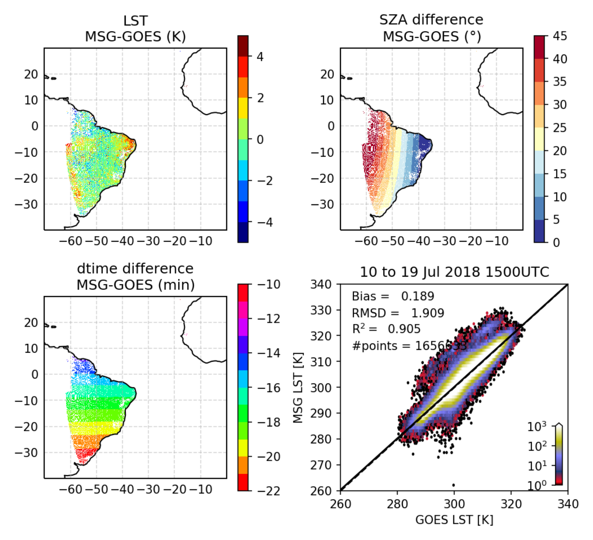

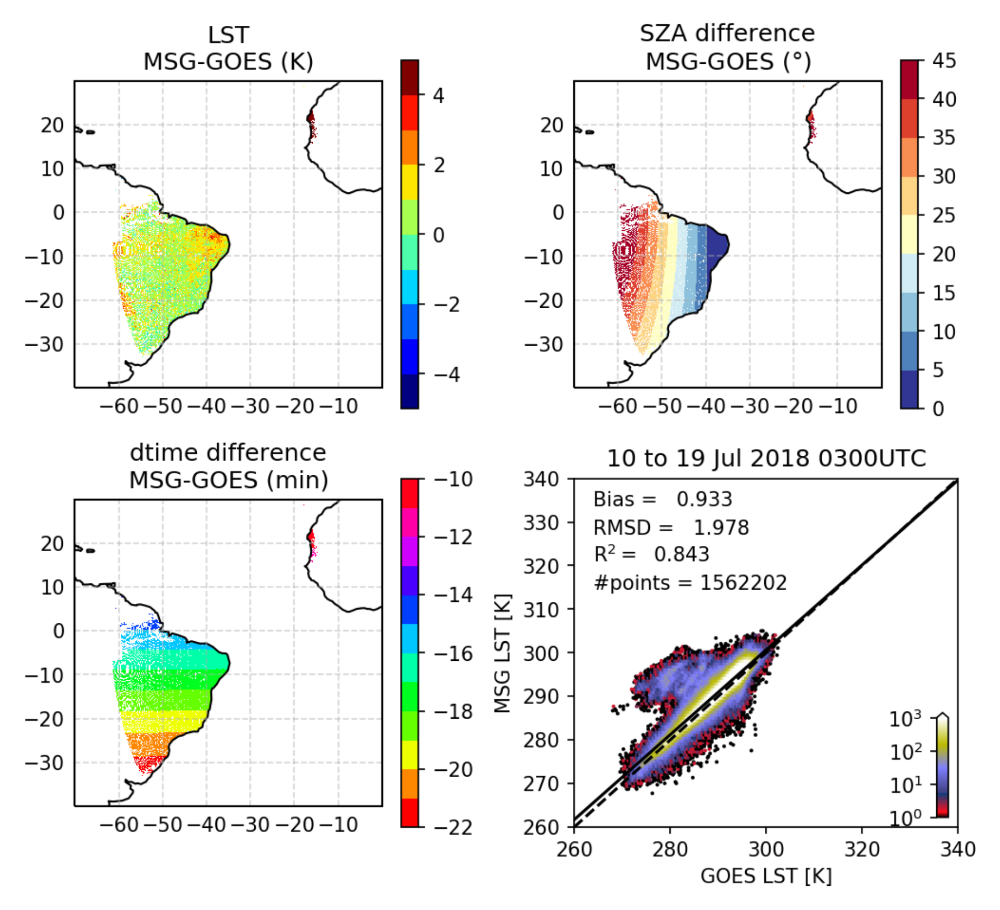

In Figure 27, the mean diurnal cycle of LST as measured by MSG and by GOES are compared, taking into account their error bars and difference in acquisition times. Each hourly value represents a spatial and temporal mean, taken over an area of 10 × 10 grid boxes of the 5/112° regular grid, around an arbitrary location, in this case centered at 10.00°S, 38.00°W (the pattern is mostly similar to other locations within South America - not shown). This area was chosen since it showed high mean differences between both LST estimates in the previous figures, despite that no significant differences in satellite zenith angle are affecting the comparison. MSG values are still systematically higher than GOES with very few exceptions. Although there is a high degree of overlap between the error bars of both sensors, there are stages of the diurnal cycle at which they do not, namely around 12 UTC in the July case and in the late afternoon, particularly in the January case.


The distributions of the differences between MSG and GOES LSTs within the overlapping area are shown in Figure 28 for the two periods under analysis. The spread of LST discrepancies is larger for January than July, and larger for daytime when compared to night-time slots. These are very close to the upper limit of LST error bars for that region (see example shown in Figure 22), meaning that the discrepancies are mostly consistent with product uncertainties.

The distribution of LST uncertainties shows considerably higher variability during daytime (9 - 21 UTC). During daytime, it becomes particularly difficult to distinguish among the different causes for LST discrepancies, such as algorithms used for both LST and cloud mask, higher LST spatial variability, and differences in TOA observations. In January, the ITCZ is located over this area, and as such this is a period characterized by very high cloud coverage, with a strong diurnal cycle peaking in the late afternoon. This has a clear translation to the comparisons, since each sensor is sensing the area using different viewing geometries, spatial resolutions, and using different cloud masking schemes.


Figure 29 illustrates the average Fraction of Vegetation Cover (FVC) used by each satellite in equation (2), for the July 2018 and January 2019 periods considered above. This is another likely cause between the observed discrepancies (especially in regions with similar satellite zenith angles), since GOES uses a static value for each land cover (see Table 11), and MSG uses the LSA-SAF daily FVC product, thus translating the vegetation dynamics. Lower FVC values imply a lower emissivity estimate in general, as more weight is given to the bare ground term in Eq. (2). Lower emissivities translate into higher LSTs. For example, in the 10 x 10 grid box area considered in Figure 27, the FVC used by GOES was 0.55 (in both periods, since it is a static value associated to the land cover map). However, MSG uses a value of 0.29 (0.25) for July 2018 (January 2019). This will translate into higher LSTs for MSG in this area, with larger differences for higher (brightness) temperatures (cf. eq. (1)). Discrepancies due to static FVC are likely to be mitigated in the next product evolution, which will use dynamic FCOVER data from CGLOPS as input to Eq. (2), thus allowing for a better emissivity estimate.

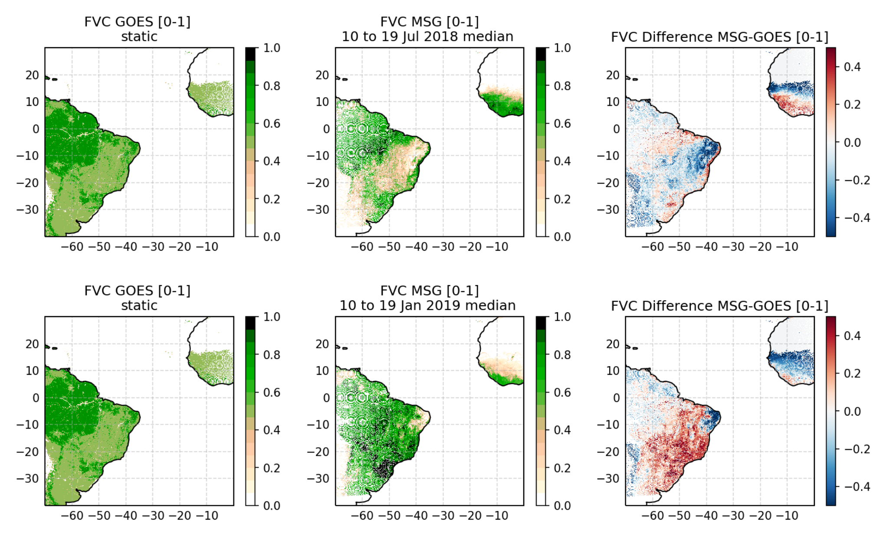

# Output Product

The LST files contain one main dataset corresponding to LST estimations, a dataset with the associated LST uncertainties, a layer with the data aquisition time, a dataset with the information on the number of processed pixels used on the reprojection and also a quality flag dataset. The latter consists of a 16-bit unsigned integer assigned as described in Table 14 of Annex 2 : LST Quality Control Information.

All the LST product datasets are in a common projection and resolution as defined in the user's requirements [AD2]: plate-carrée with a resolution of 5/112°.

Details are given into the Product User Manual [CGLOPS1_PUM_LST].

# Risk of failure and Mitigation measures

The risks associated with CGLS LST product are here classified with respect to effect and frequency following the standards of *The Open Group*¹︎.

The **effects** are assessed using the following criteria:

**Catastrophic**: infers a complete loss of production and no reprocessing capabilities due to missing mandatory input data.

**Critical**: infers loss of production in a significant part of the globe (e.g. one satellite disk) due to missing mandatory input data with implication on the service performance but no impact on product quality.

**Marginal**: the product is generated in a degraded mode with possible implications on the product quality but no implications on the service performance.

**Negligible**: nominal production over the major part of the potential processed areas or a slightly decrease on the product quality.

The **frequency** could be enumerated as follows:

**Frequent**: Likely to occur very often.

**Likely**: Occurs several times over the course of the GIO service.

**Occasional**: Occurs sporadically.

**Seldom**: Remotely possible and would probably occur not more than once in the course of the GIO service.

**Unlikely**: Will probably not occur during the GIO service.

The scheme to assess **impact** on the LST is defined as:

**Extremely High Risk** (E): The process of global LST will most likely fail with severe consequences.

**High Risk** (H): Significant failure of parts of the LST resulting in certain user requests not being achieved.

**Moderate Risk** (M): Noticeable failure of LST production threatening the success of certain user requests.

**Low Risk** (L): Certain user requests might not be wholly successful.

***
¹ http://www.opengroup.org/

***

These impacts can be derived using the classification schema in Table 9.

::: {.tbl-caption}
```{=typst}
#set text(size: 9pt, fill: rgb("#3E6893"))
```
Table 9: Risk Classification Schema.
:::

```{=html}
<table>
<colgroup>
<col style="width: 22.4%">
<col style="width: 16.1%">
<col style="width: 13.0%">
<col style="width: 19.3%">
<col style="width: 13.0%">
<col style="width: 16.1%">
</colgroup>
<tr>
    <td><b>Effect</b></td>
    <td colspan="5"><b>Frequency</b></td>
  </tr>
  <tr>
    <td></td>
    <td style="text-align:center"><b>Frequent</b></td>
    <td style="text-align:center"><b>Likely</b></td>
    <td style="text-align:center"><b>Occasional</b></td>
    <td style="text-align:center"><b>Seldom</b></td>
    <td style="text-align:center"><b>Unlikely</b></td>
  </tr>
  <tr>
    <td>Catastrophic</td>
    <td style="text-align:center">E</td>
    <td style="text-align:center">E</td>
    <td style="text-align:center">H</td>
    <td style="text-align:center">H</td>
    <td style="text-align:center">M</td>
  </tr>
  <tr>
    <td>Critical</td>
    <td style="text-align:center">E</td>
    <td style="text-align:center">H</td>
    <td style="text-align:center">H</td>
    <td style="text-align:center">M</td>
    <td style="text-align:center">L</td>
  </tr>
  <tr>
    <td>Marginal</td>
    <td style="text-align:center">H</td>
    <td style="text-align:center">M</td>
    <td style="text-align:center">M</td>
    <td style="text-align:center">L</td>
    <td style="text-align:center">L</td>
  </tr>
  <tr>
    <td>Negligible</td>
    <td style="text-align:center">M</td>
    <td style="text-align:center">L</td>
    <td style="text-align:center">L</td>
    <td style="text-align:center">L</td>
    <td style="text-align:center">L</td>
  </tr>
</table>
```

The main risks associated with the LST production are the failures of HW/SW infrastructure and the missing input data. As described in previous sections (3.2.5.1 and 3.2.6.1) the global LST product requires the following foreign inputs:

-   Global Landcover
-   LSA-SAF LST
-   GEO imagery
-   Forecasted atmospheric data

The risk identification and classification as well as the mitigation measures are presented in Table 10.

```{=typst}
#set page(flipped: true)
#set text(size: 9pt)
```

::: {.tbl-caption}
```{=typst}
#set text(size: 9pt, fill: rgb("#3E6893"))
```
Table 10: Risk identification and mitigation assessment.
:::

```{=html}
<table>
<colgroup>
<col style="width: 18.4%">
<col style="width: 21.2%">
<col style="width: 13.3%">
<col style="width: 11.5%">
<col style="width: 18.5%">
<col style="width: 17.1%">
</colgroup>
<tr>
    <td><b>Risk Context</b></td>
    <td><b>Risk Identification</b></td>
    <td><b>Effect</b></td>
    <td><b>Frequency</b></td>
    <td><b>Impact</b></td>
    <td><b>Mitigation Measure</b></td>
  </tr>
  <tr>
    <td rowspan="2">HW/SW infrastructure</td>
    <td>HW Failure</td>
    <td>Catastrophic</td>
    <td>Unlikely</td>
    <td>M</td>
    <td>A mirror system ready to start over the nominal service.</td>
  </tr>
  <tr>
    <td>SW errors</td>
    <td>Marginal</td>
    <td>Occasional</td>
    <td>M</td>
    <td>Operators and developers ready to identify and correct bugs.</td>
  </tr>
  <tr>
    <td>Global Landcover</td>
    <td>No</td>
    <td></td>
    <td></td>
    <td></td>
    <td>Since this is a static database there is no risk of failure thus any mitigation measure needed.</td>
  </tr>
  <tr>
    <td rowspan="2">LSA-SAF LST</td>
    <td>Missing data</td>
    <td>Critical</td>
    <td>Occasional</td>
    <td>H</td>
    <td>Nominal LST would be produced but only in the regions not exclusively covered by MSG satellite.</td>
  </tr>
  <tr>
    <td>Missing Service</td>
    <td>Critical</td>
    <td>Unlikely</td>
    <td>L</td>
    <td>Nominal LST would be produced but only in the regions not exclusively covered by MSG satellite. The process of LST for the MSG satellite in the framework of CGLOPS could be assessed.</td>
  </tr>
  <tr>
    <td rowspan="4">GEO Imagery</td>
    <td>Missing GOES16 Imagery</td>
    <td>Negligible</td>
    <td>Occasional</td>
    <td>L</td>
    <td>Use data from backup satellite (GOES14) to produce nominal LST product. LST algorithm prepared to operate with the backup satellite data using a less accurate algorithm.</td>
  </tr>
  <tr>
    <td>Missing GOES-E service</td>
    <td>Critical</td>
    <td>Seldom</td>
    <td>M</td>
    <td>Use GOES-W imagery to produce nominal LST but the South America region and the East coast of USA would not be processed.</td>
  </tr>
  <tr>
    <td>Missing GOES service</td>
    <td>Critical</td>
    <td>Unlikely</td>
    <td>L</td>
    <td>Nominal LST would be produced but only in the regions not exclusively covered by GOES satellite.</td>
  </tr>
  <tr>
    <td>Missing Himawari-8 Imagery</td>
    <td>Negligible</td>
    <td>Occasional</td>
    <td>L</td>
    <td>Use data from backup satellite (Himawari-9) to produce nominal LST product. LST algorithm prepared to operate with the backup satellite data.</td>
  </tr>
  <tr>
     <td></td>
     <td>Missing Himawari service</td>
     <td>Critical</td>
     <td>Unlikely</td>
     <td>L</td>
     <td>Nominal LST would be produced but only in the regions not exclusively covered by Himawari satellite. The use of other satellites e.g. FYI, could be assessed to cover Asia region.</td>
  </tr>
  <tr>
    <td rowspan="3">Forecasted atmospheric data</td>
    <td>Missing the most recent forecasted data from ECMWF</td>
    <td>Negligible</td>
    <td>Occasional</td>
    <td>L</td>
    <td>Use the forecasted data from the previous model run with higher step to produce nominal LST.</td>
  </tr>
  <tr>
    <td>Missing ECMWF forecasted data</td>
    <td>Marginal</td>
    <td>Seldom</td>
    <td>L</td>
    <td>Use ECMWF ERA 5 data to produce LST in degraded mode due to coarser spatial and temporal resolution.</td>
  </tr>
  <tr>
    <td>Missing ECMWF service</td>
    <td>Marginal</td>
    <td>Unlikely</td>
    <td>L</td>
    <td>Use forecasted data from GFS (NOAA) model to produce LST in degraded mode.</td>
  </tr>
</table>
```

```{=typst}
#set page(flipped: false, paper: "a4")
#set text(size: 11pt)
```

# References

Belward, A. S., ed., 1996: “The IGBP-DIS global 1km land cover data set (DISCover) – proposal and implementation plans. IGBP-DIS working paper No. 13. IGBP-DIS Office, Météo-France, Toulouse, France, 61 pp.

Berk, A., G.P. Anderson, P.K. Acharya, J.H. Chetwynd, L.S. Bernstein, E.P. Shettle, M.W. Matthew, and S.M. Alder-Golden, 2000: “MODTRAN4 Version 2 User’s Manual Air Force Res. Lab.”, Space Vehicles Directorate, Air Force Material Command, Hanscom AFB, MA.

Borbas, E., S. W. Seemann, H.-L. Huang, J. Li, and W. P. Menzel, 2005: “Global profile training database for satellite regression retrievals with estimates of skin temperature and emissivity”. Proc. of the Int. ATOVS Study Conference-XIV, Beijing, China, 25-31 May 2005, pp763-770.

Bulgin, C. E., Merchant, C. J., Ghent, D., Klüser, L., Popp, T., Poulsen, C., and Sogacheva, L., 2018. "Quantifying Uncertainty in Satellite-Retrieved Land Surface Temperature from Cloud Detection Errors". *Remote Sens*., 10(4), 616.

Caselles V., C. Coll and E. Valor, 1997: “Land surface emissivity and temperature determination in the whole HAPEX-Sahel area from AVHRR data". *Int. J. Remote Sens*., vol 18 (April 2013): 1009–1027. DOI: 10.1080/014311697218548.

Chevallier, F., 2001: “Sampled databases of 60-level atmospheric profiles from the ECMWF analyses", *Numerical Weather Prediction Satellite Application Facility Research Report* [NWP SAF Res. Rep.] no. 4.

Chedin, A. N. A. Scott, C. Wahiche, and P. Moulinier, 1985: “The improved initialization inversion method: a high resolution physical method for temperature retrievals from satellites of the TIROS-N series", *J. Climate Appl. Meteor.*, vol. 24, 128-143.

Coll C., E. Valor, T. Schugge and V. Caselles, 1997. “A procedure for estimating the land surface emissivity difference in the AVHRR channels 4 and 5". Remote Sensing Application to the Valencian Area.

Coll, C., V. Caselles, J. M. Galve, E. Valor, R. Niclós, and J. M. Sánchez, 2006: “Evaluation of split-window and dual-angle correction methods for land surface temperature retrieval from Envisat/Advanced Along, Track Scanning Radiometer (AATSR) data", *J. Geophys. Res.*, vol. 111, D12105, doi:10.1029/2005JD006830.

Dash, P., F. M. Göttsche, F. S. Olesen and H. Fischer, 2002: “Land surface temperature and emissivity estimation from passive sensor data: theory and practice-current trends”, *Int. J. Remote Sens.*, vol. 23, 2563–2594.

Ermida, S. L., Trigo, I. F., DaCamara, C. C., Göttsche, F. M., Olesen, F. S., & Hulley, G., 2014: "Validation of remotely sensed surface temperature over an oak woodland landscape—The problem of viewing and illumination geometries". *Remote Sens. Environ.*, 148, 16-27.

Faysash A. and E. A. Smith, 1999: “Simultaneous land surface temperature-emissivity retrieval in the infrared split window". *J. Atmos. Oceanic Technol.*, vol. 16, 1673-1689.

Freitas, S. C., I. F. Trigo, and J. M. Bioucas-Dias, F. Göttsche, 2010: Quantifying the Uncertainty of Land Surface Temperature Retrievals from SEVIRI/Meteosat. *IEEE Trans. Geosci. Remote Sens.*, 48, doi: 10.1109/TGRS.2009.2027697.

Freitas, S. C., Trigo, I. F., Macedo, J., Barroso, C., Silva, R., and Perdigão, R., 2013: Land surface temperature from multiple geostationary satellites. *Int. J. Remote Sens.*, 34(9-10), 3051-3068.

Göttsche, F. M., Olesen, F. S., & Bork-Unkelbach, A., 2013: “Validation of land surface temperature derived from MSG/SEVIRI with in situ measurements at Gobabeb, Namibia". *Int. J. Remote Sens.*, 34(9-10), 3069-3083.

Göttsche, F. M., Olesen, F. S., Trigo, I. F., Bork-Unkelbach, A., & Martin, M. A., 2016: “Long term validation of land surface temperature retrieved from MSG/SEVIRI with continuous in-situ measurements in Africa”. *Remote Sens.*, 8(5), 410.

Hulley, G. C., and Hook, S. J., 2011: Generating consistent land surface temperature and emissivity products between ASTER and MODIS data for earth science research. *IEEE Trans. Geosci. Remote Sens.*, 49(4), 1304-1315.

Jiang, G.-M. and Z.-L. Li, 2008: “Split-window algorithm for land surface temperature estimation from MSG1-SEVIRI data", *Int. J. Remote Sens.*, vol 29, 6067–6074.

Jiménez-Muñoz, J. C. and J. A. Sobrino, 2006 :“Error sources on the land surface temperature retrieved from thermal infrared single channel remote sensing data", *Int. J. Remote Sens.*, vol 25, 999-1014.

Kerdraon, G., Le Gléau, H., 2016: Scientific and Validation report for the Cloud Product Processors of the NWC/GEO”. NWC/CDOP2/GEO/MFL/SCI/VR/Cloud, Issue 1, Rev. 0 (available online: http://www.nwcsaf.org/AemetWebContents/ScientificDocumentation/Documentation/GEO/v2016/NWC-CDOP2-GEO-MFL-SCI-VR-Cloud_v1.0.pdf)

Li, Z.-L., B.-H. Tang, H. Wu, H. Ren, G. Yan, Z. Wan, I. F. Trigo, and J A. Sobrino, 2013: "Satellite-derived land surface temperature: Current status and perspectives”. *Remote Sens. Environ.*, 131, 14-37. doi: 10.1016/j.rse.2012.12.008

Martins, J.P., Trigo, I., Bento, V., da Camara, C., 2016: "A Physically Constrained Calibration Database for Land Surface Temperature Using Infrared Retrieval Algorithms". *Remote Sens.* 8(10), 808. https://doi.org/10.3390/rs8100808

Peres, L. F., & DaCamara, C. C., 2005: “Emissivity maps to retrieve land-surface temperature from MSG/SEVIRI”. *IEEE Trans. Geosci. Remote Sens.*, 43(8), 1834-1844.

Pinker, R. T., D. Sun, M. Miller, and G. J. Robinson, 2007: “Diurnal cycle of land surface temperature in a desert encroachment zone as observed from satellites", *Geophys. Res. Lett.*, vol. 34, doi:10.1029/2007GL03186.

Prata, A. J., 1993: “Land surface temperature derived from the advanced very high resolution radiometer and the along-track scanning radiometer: 1. Theory”, *J. Geophys. Res.*, vol. 98, 16,689-16,702.

Prata A. J. and C. M. R. Platt, 1991. "Land surface temperature measurements from the AVHRR”. Proceedings of the 5th AVHRR data users conference.

Price J. C., 1984. "Land surface temperature measurements from the split window channels of the NOAA 7 Advanced Very High Resolution Radiometer". *J. Geophys. Res.*, 7231. DOI: 10.1029/JD089iD05p07231.

Remedios, J., 2012: Sentinel-3 Optical Products and Algorithm Definition: SLSTR ATBD Land Surface Temperature. European Space Agency. Ref: S3-L2-SD-03-T03-ULNILU-ATBD_L2LST, v2.3 (available online: https://sentinel.esa.int/documents/247904/349589/SLSTR_Level-2_LST_ATBD.pdf)

Rodgers, C. D., 2000: “Inverse methods for atmospheric sounding: theory and practice”, Series on Atmospheric, Ocean and Planetary Physics, vol. 2. World Scientific, Hackensack, 238 pp.

Seemann, S. W., J. Li, W. P. Menzel, and L. E. Gumley, 2003: “Operational retrieval of atmospheric temperature, moisture, and ozone from MODIS infrared radiances”. *J. Appl. Meteor.*, vol 42, 1072-1091.

Sobrino J. A., Z.-L. Li, M. P. Stoll and F. Becker, 1993: “Determination of the surface temperature from ATSR data". *Proceedings of 25th International Symposium on Remote Sensing of Environment*.

Sobrino J. A., Z.-L. Li, M. P. Stoll and F. Becker, 1994: “Improvements in the split-window technique for land surface temperature determination”. *IEEE Trans. Geosci. Remote Sens.* 32(2): 243-253. DOI: 10.1109/36.295038.

Sobrino, J. A. and M. Romaguera, “Land surface temperature retrieval from MSG1-SEVIRI data", *Remote Sens. Environ.*, vol. 92, 247–254, 2004

Sun, D. and R. T. Pinker, 2003: “Estimation of land surface temperature from a Geostationary Operational Environmental Satellite (GOES-8)”, *J. Geophys. Res.*, vol. 108, 4326, doi: 10.1029/2002JD002422.

Sun, D., R. T. Pinker, and J. B. Basara, 2004: “Land Surface Temperature Estimation from the Next Generation of Geostationary Operational Environmental Satellites: GOES M-Q”, *J. Appl. Met.*, vol. 43, 363-372.

Trigo, I. F., L. F. Peres, C. C. DaCamara, and S. C. Freitas, 2008a: “Thermal Land Surface Emissivity Retrieved From SEVIRI/Meteosat.”, *IEEE Trans. Geosci. Remote Sens.*, vol 46, doi: 10.1109/TGRS.2007.905197,.

Trigo, I. F., I. T. Monteiro, F. Olesen, and E. Kabsch, 2008b: “An assessment of remotely sensed Land Surface Temperature”, *J. Geophys. Res.*, vol 113, D17108, doi:10.1029/2008JD010035.

Ulivieri C. and G. Cannizzaro, 1985. “Land surface temperature retrievals from satellite measurements". *Acta Astronaut.*, vol 12(12): 977–985.

Ulivieri C., M. M. Castronuovo, R. Francioni, A. Cardillo, 1994: “A split window algorithm for estimating land surface temperature from satellites”. *Adv. Space Res.*, vol 14(3): 59–65. DOI: 10.1016/0273-1177(94)90193-7.

Vidal A., 1991: “Atmospheric and emissivity correction of land surface temperature measured from satellite using ground measurements or satellite data”. *Int. J. Remote Sens.*, vol 12(12): 2449–2460.

Wan, Z. and J. Dozier, 1996: “A generalized split-window algorithm for retrieving land surface temperature from space”, *IEEE Trans. Geosci. Remote Sens.*, vol. 34, 892–905, 1996.

Yamamoto, Y., Ishikawa, H., Oku, Y., & Hu, Z., 2018. “An algorithm for land surface temperature retrieval using three thermal infrared bands of Himawari-8". *J. Meteor. Soc. Japan.*, Ser. II, 96, 59-76.

Yu Y., J. L. Privette, A. Pinheiro, 2005: Analysis of the NPOESS VIIRS Land Surface Temperature algorithm using MODIS data. *IEEE Trans. Geosci. Remote Sens.*, 43 (10) (2005), pp. 2340-2350

Yu Y., J. L. Privette, and A. C. Pinheiro, 2008: “Evaluation of Split-Window Land Surface Temperature Algorithms for Generating Climate Data Records”, *IEEE Trans. Geosci. Remote Sens.*, vol. 46, doi: 10.1109/TGRS.2007.909097.

# ANNEX 1 : Emissivities and their uncertainties

::: {.tbl-caption}
```{=typst}
#set text(size: 9pt, fill: rgb("#3E6893"))
```
Table 11: Emissivities and their uncertainties for the GOES-16 split-window channels, per land cover type. Also shown the typical FVC value for each land cover.
:::

```{=html}
<table style="font-size: 8pt">
<colgroup>
<col style="width: 15.2%">
<col style="width: 18.9%">
<col style="width: 16.5%">
<col style="width: 16.5%">
<col style="width: 16.5%">
<col style="width: 16.5%">
</colgroup>
<tr>
    <td rowspan="2" style="vertical-align:middle"><b>IGBP Land Cover type</b></td>
    <td rowspan="2" style="vertical-align:middle"><b>FVC<br>(σ<sub>FVC</sub> = 0.1)</b></td>
    <td colspan="2" ><b>TIR1</b></td>
    <td colspan="2" ><b>TIR2</b></td>
  </tr>
  <tr>
    <td style="text-align:center">ε<sub>veg</sub> ± σ<sub>εveg</sub></td>
    <td style="text-align:center">ε<sub>bg</sub> ± σ<sub>εbg</sub></td>
    <td style="text-align:center">ε<sub>veg</sub> ± σ<sub>εveg</sub></td>
    <td style="text-align:center">ε<sub>bg</sub> ± σ<sub>εbg</sub></td>
  </tr>
  <tr>
    <td>1, 2</td>
    <td>0.800</td>
    <td>0.9969 ± 0.0025</td>
    <td>0.9685 ± 0.0050</td>
    <td>0.9975 ± 0.0025</td>
    <td>0.9770 ± 0.0049</td>
  </tr>
  <tr>
    <td>3, 4</td>
    <td>0.800</td>
    <td>0.9920 ± 0.0025</td>
    <td>0.9685 ± 0.0050</td>
    <td>0.9924 ± 0.0025</td>
    <td>0.9770 ± 0.0049</td>
  </tr>
  <tr>
    <td>5</td>
    <td>0.800</td>
    <td>0.9945 ± 0.0025</td>
    <td>0.9685 ± 0.0050</td>
    <td>0.9949 ± 0.0025</td>
    <td>0.9770 ± 0.0049</td>
  </tr>
  <tr>
    <td>6</td>
    <td>0.800</td>
    <td>0.9945 ± 0.0025</td>
    <td>0.9687 ± 0.0115</td>
    <td>0.9949 ± 0.0025</td>
    <td>0.9755 ± 0.0085</td>
  </tr>
  <tr>
    <td>7</td>
    <td>0.500</td>
    <td>0.9945 ± 0.0025</td>
    <td>0.9687 ± 0.0115</td>
    <td>0.9949 ± 0.0025</td>
    <td>0.9755 ± 0.0085</td>
  </tr>
  <tr>
    <td>8</td>
    <td>0.500</td>
    <td>0.9913 ± 0.0007</td>
    <td>0.9687 ± 0.0115</td>
    <td>0.9919 ± 0.0004</td>
    <td>0.9755 ± 0.0085</td>
  </tr>
  <tr>
    <td>9</td>
    <td>0.500</td>
    <td>0.9911 ± 0.0009</td>
    <td>0.9687 ± 0.0115</td>
    <td>0.9918 ± 0.0006</td>
    <td>0.9755 ± 0.0085</td>
  </tr>
  <tr>
    <td>10</td>
    <td>0.500</td>
    <td>0.9914 ± 0.0025</td>
    <td>0.9914 ± 0.0025</td>
    <td>0.9930 ± 0.0028</td>
    <td>0.9930 ± 0.0028</td>
  </tr>
  <tr>
    <td>11</td>
    <td>0.000</td>
    <td>0.9969 ± 0.0025</td>
    <td>0.9685 ± 0.0050</td>
    <td>0.9975 ± 0.0025</td>
    <td>0.9770 ± 0.0049</td>
  </tr>
  <tr>
    <td>12</td>
    <td>0.500</td>
    <td>0.9958 ± 0.0028</td>
    <td>0.9731 ± 0.0047</td>
    <td>0.9966 ± 0.0028</td>
    <td>0.9814 ± 0.0036</td>
  </tr>
  <tr>
    <td>13</td>
    <td>0.100</td>
    <td>0.9927 ± 0.0018</td>
    <td>0.9581 ± 0.0051</td>
    <td>0.9933 ± 0.0016</td>
    <td>0.9727 ± 0.0036</td>
  </tr>
  <tr>
    <td>14</td>
    <td>0.500</td>
    <td>0.9937 ± 0.0028</td>
    <td>0.9731 ± 0.0047</td>
    <td>0.9944 ± 0.0028</td>
    <td>0.9814 ± 0.0036</td>
  </tr>
  <tr>
    <td>15</td>
    <td>0.000</td>
    <td>0.9802 ± 0.0130</td>
    <td>0.9802 ± 0.0130</td>
    <td>0.9599 ± 0.0289</td>
    <td>0.9599 ± 0.0289</td>
  </tr>
  <tr>
    <td>16</td>
    <td>0.005</td>
    <td>0.9911 ± 0.0009</td>
    <td>0.9551 ± 0.0187</td>
    <td>0.9918 ± 0.0006</td>
    <td>0.9612 ± 0.0167</td>
  </tr>
  <tr>
    <td>17</td>
    <td>0.000</td>
    <td>0.9902 ± 0.0005</td>
    <td>0.9902 ± 0.0005</td>
    <td>0.9822 ± 0.0002</td>
    <td>0.9822 ± 0.0002</td>
  </tr>
  <tr>
    <td>18</td>
    <td>0.000</td>
    <td>0.9902 ± 0.0005</td>
    <td>0.9902 ± 0.0005</td>
    <td>0.9822 ± 0.0002</td>
    <td>0.9822 ± 0.0002</td>
  </tr>
</table>
```

::: {.tbl-caption}
```{=typst}
#set text(size: 9pt, fill: rgb("#3E6893"))
```
Table 12: Emissivities and their uncertainties for the MSG split-window channels, per land cover type. Also shown the typical FVC value for each land cover.
:::

```{=html}
<table style="font-size: 8pt">
<colgroup>
<col style="width: 15.2%">
<col style="width: 18.9%">
<col style="width: 16.5%">
<col style="width: 16.5%">
<col style="width: 16.5%">
<col style="width: 16.5%">
</colgroup>
<tr>
    <td rowspan="2" style="vertical-align:middle"><b>IGBP Land Cover type</b></td>
    <td rowspan="2" style="vertical-align:middle"><b>FVC<br>(σ<sub>FVC</sub> = 0.1)</b></td>
    <td colspan="2" ><b>TIR1</b></td>
    <td colspan="2" ><b>TIR2</b></td>
  </tr>
  <tr>
    <td style="text-align:center">ε<sub>veg</sub> ± σ<sub>εveg</sub></td>
    <td style="text-align:center">ε<sub>bg</sub> ± σ<sub>εbg</sub></td>
    <td style="text-align:center">ε<sub>veg</sub> ± σ<sub>εveg</sub></td>
    <td style="text-align:center">ε<sub>bg</sub> ± σ<sub>εbg</sub></td>
  </tr>
  <tr>
    <td>1, 2</td>
    <td>0.800</td>
    <td>0.9968 ± 0.0022</td>
    <td>0.9696 ± 0.0056</td>
    <td>0.9973 ± 0.0026</td>
    <td>0.9733 ± 0.0076</td>
  </tr>
  <tr>
    <td>3, 4</td>
    <td>0.800</td>
    <td>0.9923 ± 0.0022</td>
    <td>0.9696 ± 0.0056</td>
    <td>0.9922 ± 0.0026</td>
    <td>0.9733 ± 0.0076</td>
  </tr>
  <tr>
    <td>5</td>
    <td>0.800</td>
    <td>0.9945 ± 0.0022</td>
    <td>0.9696 ± 0.0056</td>
    <td>0.9947 ± 0.0026</td>
    <td>0.9733 ± 0.0076</td>
  </tr>
  <tr>
    <td>6</td>
    <td>0.800</td>
    <td>0.9945 ± 0.0022</td>
    <td>0.9680 ± 0.0120</td>
    <td>0.9947 ± 0.0026</td>
    <td>0.9726 ± 0.0092</td>
  </tr>
  <tr>
    <td>7</td>
    <td>0.500</td>
    <td>0.9945 ± 0.0022</td>
    <td>0.9680 ± 0.0120</td>
    <td>0.9947 ± 0.0026</td>
    <td>0.9726 ± 0.0092</td>
  </tr>
  <tr>
    <td>8</td>
    <td>0.500</td>
    <td>0.9914 ± 0.0009</td>
    <td>0.9680 ± 0.0120</td>
    <td>0.9917 ± 0.0005</td>
    <td>0.9726 ± 0.0092</td>
  </tr>
  <tr>
    <td>9</td>
    <td>0.500</td>
    <td>0.9911 ± 0.0013</td>
    <td>0.9680 ± 0.0120</td>
    <td>0.9915 ± 0.0007</td>
    <td>0.9726 ± 0.0092</td>
  </tr>
  <tr>
    <td>10</td>
    <td>0.500</td>
    <td>0.9885 ± 0.0055</td>
    <td>0.9885 ± 0.0055</td>
    <td>0.9924 ± 0.0024</td>
    <td>0.9924 ± 0.0024</td>
  </tr>
  <tr>
    <td>11</td>
    <td>0.000</td>
    <td>0.9968 ± 0.0022</td>
    <td>0.9696 ± 0.0056</td>
    <td>0.9973 ± 0.0026</td>
    <td>0.9733 ± 0.0076</td>
  </tr>
  <tr>
    <td>12</td>
    <td>0.500</td>
    <td>0.9949 ± 0.0026</td>
    <td>0.9728 ± 0.0052</td>
    <td>0.9967 ± 0.0029</td>
    <td>0.9780 ± 0.0031</td>
  </tr>
  <tr>
    <td>13</td>
    <td>0.100</td>
    <td>0.9926 ± 0.0019</td>
    <td>0.9574 ± 0.0066</td>
    <td>0.9930 ± 0.0017</td>
    <td>0.9711 ± 0.0037</td>
  </tr>
  <tr>
    <td>14</td>
    <td>0.500</td>
    <td>0.9934 ± 0.0026</td>
    <td>0.9728 ± 0.0052</td>
    <td>0.9942 ± 0.0029</td>
    <td>0.9780 ± 0.0031</td>
  </tr>
  <tr>
    <td>15</td>
    <td>0.000</td>
    <td>0.9888 ± 0.0068</td>
    <td>0.9888 ± 0.0068</td>
    <td>0.9649 ± 0.0248</td>
    <td>0.9649 ± 0.0248</td>
  </tr>
  <tr>
    <td>16</td>
    <td>0.005</td>
    <td>0.9911 ± 0.0013</td>
    <td>0.9469 ± 0.0211</td>
    <td>0.9915 ± 0.0007</td>
    <td>0.9658 ± 0.0068</td>
  </tr>
  <tr>
    <td>17</td>
    <td>0.000</td>
    <td>0.9900 ± 0.0006</td>
    <td>0.9900 ± 0.0006</td>
    <td>0.9856 ± 0.0003</td>
    <td>0.9856 ± 0.0003</td>
  </tr>
  <tr>
    <td>18</td>
    <td>0.000</td>
    <td>0.9900 ± 0.0006</td>
    <td>0.9900 ± 0.0006</td>
    <td>0.9856 ± 0.0003</td>
    <td>0.9856 ± 0.0003</td>
  </tr>
</table>
```
::: {.tbl-caption}
```{=typst}
#set text(size: 9pt, fill: rgb("#3E6893"))
```
Table 13: Emissivities and their uncertainties for the Himawari-8 split-window channels, per land cover type. Also shown the typical FVC value for each land cover.
:::

```{=html}
<table style="font-size: 8pt">
<colgroup>
<col style="width: 15.2%">
<col style="width: 18.9%">
<col style="width: 16.5%">
<col style="width: 16.5%">
<col style="width: 16.5%">
<col style="width: 16.5%">
</colgroup>
<tr>
    <td rowspan="2" style="vertical-align:middle"><b>IGBP Land Cover type</b></td>
    <td rowspan="2" style="vertical-align:middle"><b>FVC<br>(σ<sub>FVC</sub> = 0.1)</b></td>
    <td colspan="2" ><b>TIR1</b></td>
    <td colspan="2" ><b>TIR2</b></td>
  </tr>
  <tr>
    <td style="text-align:center">ε<sub>veg</sub> ± σ<sub>εveg</sub></td>
    <td style="text-align:center">ε<sub>bg</sub> ± σ<sub>εbg</sub></td>
    <td style="text-align:center">ε<sub>veg</sub> ± σ<sub>εveg</sub></td>
    <td style="text-align:center">ε<sub>bg</sub> ± σ<sub>εbg</sub></td>
  </tr>
  <tr>
    <td>1, 2</td>
    <td>0.800</td>
    <td>0.9969 ± 0.0025</td>
    <td>0.9683 ± 0.0055</td>
    <td>0.9975 ± 0.0025</td>
    <td>0.9772 ± 0.0052</td>
  </tr>
  <tr>
    <td>3, 4</td>
    <td>0.800</td>
    <td>0.9920 ± 0.0025</td>
    <td>0.9683 ± 0.0055</td>
    <td>0.9925 ± 0.0025</td>
    <td>0.9772 ± 0.0052</td>
  </tr>
  <tr>
    <td>5</td>
    <td>0.800</td>
    <td>0.9945 ± 0.0025</td>
    <td>0.9683 ± 0.0055</td>
    <td>0.9950 ± 0.0025</td>
    <td>0.9772 ± 0.0052</td>
  </tr>
  <tr>
    <td>6</td>
    <td>0.800</td>
    <td>0.9945 ± 0.0025</td>
    <td>0.9685 ± 0.0114</td>
    <td>0.9950 ± 0.0025</td>
    <td>0.9756 ± 0.0088</td>
  </tr>
  <tr>
    <td>7</td>
    <td>0.500</td>
    <td>0.9945 ± 0.0025</td>
    <td>0.9685 ± 0.0114</td>
    <td>0.9950 ± 0.0025</td>
    <td>0.9756 ± 0.0088</td>
  </tr>
  <tr>
    <td>8</td>
    <td>0.500</td>
    <td>0.9914 ± 0.0006</td>
    <td>0.9685 ± 0.0114</td>
    <td>0.9920 ± 0.0005</td>
    <td>0.9756 ± 0.0088</td>
  </tr>
  <tr>
    <td>9</td>
    <td>0.500</td>
    <td>0.9911 ± 0.0008</td>
    <td>0.9685 ± 0.0114</td>
    <td>0.9919 ± 0.0006</td>
    <td>0.9756 ± 0.0088</td>
  </tr>
  <tr>
    <td>10</td>
    <td>0.500</td>
    <td>0.9916 ± 0.0024</td>
    <td>0.9916 ± 0.0024</td>
    <td>0.9930 ± 0.0028</td>
    <td>0.9930 ± 0.0028</td>
  </tr>
  <tr>
    <td>11</td>
    <td>0.000</td>
    <td>0.9969 ± 0.0025</td>
    <td>0.9683 ± 0.0055</td>
    <td>0.9975 ± 0.0025</td>
    <td>0.9772 ± 0.0052</td>
  </tr>
  <tr>
    <td>12</td>
    <td>0.500</td>
    <td>0.9958 ± 0.0028</td>
    <td>0.9729 ± 0.0048</td>
    <td>0.9966 ± 0.0027</td>
    <td>0.9814 ± 0.0040</td>
  </tr>
  <tr>
    <td>13</td>
    <td>0.100</td>
    <td>0.9927 ± 0.0018</td>
    <td>0.9573 ± 0.0051</td>
    <td>0.9934 ± 0.0016</td>
    <td>0.9721 ± 0.0039</td>
  </tr>
  <tr>
    <td>14</td>
    <td>0.500</td>
    <td>0.9937 ± 0.0028</td>
    <td>0.9729 ± 0.0048</td>
    <td>0.9944 ± 0.0027</td>
    <td>0.9814 ± 0.0040</td>
  </tr>
  <tr>
    <td>15</td>
    <td>0.000</td>
    <td>0.9795 ± 0.0135</td>
    <td>0.9795 ± 0.0135</td>
    <td>0.9589 ± 0.0297</td>
    <td>0.9589 ± 0.0297</td>
  </tr>
  <tr>
    <td>16</td>
    <td>0.005</td>
    <td>0.9911 ± 0.0008</td>
    <td>0.9553 ± 0.0188</td>
    <td>0.9919 ± 0.0006</td>
    <td>0.9588 ± 0.0238</td>
  </tr>
  <tr>
    <td>17</td>
    <td>0.000</td>
    <td>0.9901 ± 0.0005</td>
    <td>0.9901 ± 0.0005</td>
    <td>0.9813 ± 0.0002</td>
    <td>0.9813 ± 0.0002</td>
  </tr>
  <tr>
    <td>18</td>
    <td>0.000</td>
    <td>0.9901 ± 0.0005</td>
    <td>0.9901 ± 0.0005</td>
    <td>0.9813 ± 0.0002</td>
    <td>0.9813 ± 0.0002</td>
  </tr>
</table>
```
# ANNEX 2 : LST QUALITY CONTROL INFORMATION

::: {.tbl-caption}
```{=typst}
#set text(size: 9pt, fill: rgb("#3E6893"))
```
Table 14: Bit-assignment in the LST quality flag.
:::

```{=html}
<table>
<colgroup>
<col style="width: 22.9%">
<col style="width: 45.6%">
<col style="width: 31.5%">
</colgroup>
<tr>
    <td><b>Decimal value</b></td>
    <td><b>Sat</b></td>
    <td><b>Description</b></td>
  </tr>
  <tr>
    <td>0</td>
    <td rowspan="4" style="vertical-align: middle">GOES</td>
    <td>Sea pixel</td>
  </tr>
  <tr>
    <td>4</td>
    <td>Cloud free pixel (clear sky > 90%)</td>
  </tr>
  <tr>
    <td>8</td>
    <td>Pixel contaminated by clouds (90% > clear sky > 10%)</td>
  </tr>
  <tr>
    <td>12</td>
    <td>Pixel filled by clouds (clear sky &lt; 10%)</td>
  </tr>
  <tr>
    <td>16</td>
    <td rowspan="5" style="vertical-align: middle">MSG</td>
    <td>Unprocessed pixel</td>
  </tr>
  <tr>
    <td>1</td>
    <td>Sea pixel</td>
  </tr>
  <tr>
    <td>5</td>
    <td>Cloud free pixel (clear sky > 90%)</td>
  </tr>
  <tr>
    <td>9</td>
    <td>Pixel contaminated by clouds (90% > clear sky > 10%)</td>
  </tr>
  <tr>
    <td>13</td>
    <td>Pixel filled by clouds (clear sky &lt; 10%)</td>
  </tr>
  <tr>
    <td>17</td>
    <td rowspan="5" style="vertical-align: middle">MTSAT or Himawari</td>
    <td>Unprocessed pixel</td>
  </tr>
  <tr>
    <td>2</td>    
    <td>Sea pixel</td>
  </tr>
  <tr>
    <td>6</td>
    <td>Cloud free pixel (clear sky > 90%)</td>
  </tr>
  <tr>
    <td>10</td>    
    <td>Pixel contaminated by clouds (90% > clear sky > 10%)</td>
  </tr>
  <tr>
    <td>14</td>
    <td>Pixel filled by clouds (clear sky &lt; 10%)</td>
  </tr>
  <tr>
    <td>18</td>
    <td rowspan="5" style="vertical-align: middle">MULTI-MISSION</td>
    <td>Unprocessed pixel</td>
  </tr>
  <tr>
    <td>3</td>    
    <td>Sea pixel</td>
  </tr>
  <tr>
    <td>7</td>
    <td>Cloud free pixel (clear sky > 90%)</td>
  </tr>
  <tr>
    <td>11</td>
    <td>Pixel contaminated by clouds (90% > clear sky > 10%)</td>
  </tr>
  <tr>
    <td>15</td>
    <td>Pixel filled by clouds (clear sky &lt; 10%)</td>
  </tr>
  <tr>
    <td>19</td>
    <td rowspan="2"></td>
    <td>Unprocessed pixel</td>
  </tr>
  <tr>
    <td>32</td>
    <td>Pixel out of Disk</td>
  </tr>
</table>
```