# Background

The new High-Resolution Layer (HRL) production on vegetated land cover has been ongoing since 2022. HRL Vegetated is a complex product comprising HRL Crop Types, HRL Grasslands, and HRL Forest, each with several sub-layers. In preparation for the continuation of HRL Vegetated Land Cover Characteristics (VLCC) for the reference year 2025 onwards, the European Environment Agency (EEA) foresees the potential need for product definitions and methodologies updates. This task is aimed at supporting the EEA in the evolution of the HRL VLCC products.

# Assignment of this task and specific actions

-   **ST1: Assessment of Similarities and Differences**

    This subtask aims to explore various grassland mapping initiatives in Europe and compare them with HRL VLCC products. The goal is to identify similarities, differences, and potential improvements for future product development.

-   **ST2: Collection of User Requirements and Literature Review of Additional Forest Types**

    This subtask will support the EEA in gathering user requirements for extending forest-type classifications within the VLCC Forest dataset and conducting a literature review on current classification methodologies.

-   **ST3: Assessment of Timeseries Consistency of Forest Layers**

    This subtask focuses on assessing the stability and consistency of time series for HRL Forest layers to support indicator development.

# Key Deliverables

Overview of grassland datasets and their comparison, proposed forest type classifications based on user requirements and literature review, time series assessment summary and recommendations for improving consistency.

# Assessment of similarities and differences

## Overview of the selected initiatives mapping grassland

The monitoring and mapping of grasslands play a crucial role in sustainable land management, biodiversity conservation, and agricultural policy implementation across Europe and beyond. Grasslands represent a significant land cover type that supports ecosystem services, carbon sequestration, and habitat provision for numerous species (Bengtsson et al., 2019; Peeters, 2009). In recent years, advancements in remote sensing technology and the availability of high-resolution satellite imagery have enabled more detailed and consistent efforts in grassland monitoring.

European institutions and global organisations have invested in various projects and initiatives to monitor grasslands at different spatial and temporal scales. These initiatives aim to address challenges such as land-use change, grassland degradation, and the need for effective management practices. Grassland data sources, like the High-Resolution Layer Vegetated Land Cover Characteristics (HRL VLCC) Grassland and the EU Grassland Watch (EUGW) project, exemplify how remote sensing and data-driven approaches are being employed to provide accurate and up-to-date information on grassland distribution, productivity, and management.

This chapter explores the various grassland mapping initiatives and data sources currently being utilised for grassland monitoring and assessment across Europe and globally. The goal is to offer an in-depth understanding of the available datasets, their applications, and the grassland classification, and management methodologies. Special focus is placed on the EU Grassland Watch (EUGW) project and its comparison with the HRL VLCC Grassland dataset, as these two initiatives are important to understanding the current state of grassland mapping at the European level. Focusing on qualitative comparison highlights differences in coverage, accuracy, thematic layers, and practical applications.

In addition to these primary datasets, several other grassland monitoring initiatives contribute to a broader understanding of grassland distribution and related characteristics such as productivity or management practices. These initiatives utilise different methodologies, ranging from in-situ data collection and field surveys to remote sensing-based or even including predictive modelling, providing valuable datasets for land management, biodiversity conservation, and agricultural practices. Beyond data production, these projects also offer valuable policy insights and research recommendations. Overall, six different initiatives, products, and projects were identified, each offering a unique perspective on grassland mapping and monitoring (Table 1).

-   **EU Grassland Watch (EUGW)** provides high-resolution monitoring of grassland management, productivity, and biodiversity across Natura 2000 sites in Europe. The dataset offers yearly updates dating back to 1994, leveraging both Sentinel and pre-Sentinel satellite data to track grassland dynamics. It focuses on management events, productivity trends, habitat mapping and related biodiversity as well as land cover-based indicators.
-   **LUCAS Grassland Module** offers an extensive in-situ dataset based on systematic field surveys conducted across thousands of locations in Europe. The module provides detailed information on grassland management, soil types, and species composition, making it an essential validation source for remote sensing-based classifications. First introduced in 2018 as a pilot, with a more extensive rollout in 2022, LUCAS provides point-based vector data that serves as a ground-truth dataset for European grassland studies. LUCAS data points are already used for validation and training samples in the production of HRL VLCC Grassland data.
-   **Global Pasture Watch** delivers 30m-resolution raster data on a global scale, mapping annual pasture extent, livestock density, short vegetation cover, and gross primary productivity. Covering the period 2000-2022, this initiative integrates multiple Earth observation datasets to monitor the dynamics of both natural and managed pasturelands. It may serve as a valuable resource for tracking global grassland changes, particularly in response to climate change, grazing pressures, and land-use conversion.
-   **The SUPER-G Project** takes a multidisciplinary approach to sustainable grassland management, integrating remote sensing, field studies, and policy research. Running from 2018 to 2023 under the Horizon 2020 framework, SUPER-G focused on developing sustainable permanent grassland systems by combining 10m-resolution Sentinel-1 and Sentinel-2 data with field-based ecological assessments. Its outputs include policy recommendations, biodiversity assessments, and tools for optimising land management practices.
-   **GRASS SIGNAL** is a real-time monitoring and forecasting tool designed for agricultural applications, predicting grass yield, quality, and moisture supply over a five-day forecast period. Using Sentinel-1 and Sentinel-2 data provides insights into biomass productivity, crude protein content, nitrogen uptake, and the energy value of grasslands. GRASS SIGNAL is valuable as an aid tool to farmers and land managers in optimising grazing and forage management while contributing to precision agriculture applications.
-   Lastly, the **ESDAC Soil Biomass Productivity Maps** offer a static, model-based assessment of grassland productivity across the EU. These maps, developed by the European Soil Data Centre (ESDAC), evaluate grassland fertility and productivity potential under varying soil, climatic, and topographical conditions. Based on long-term modelling, the dataset (published in 2016) provides 1km-resolution raster data, offering insights into the inherent soil productivity of European grasslands without being influenced by short-term climatic variability.

These explorations on several mapping initiatives and grassland-related projects may help to identify gaps, opportunities, and best practices for future grassland monitoring activities, supporting the evolution of the HRL VLCC Grassland product. The table below provides an overview of key grassland mapping initiatives and data sources (excluding HRL VLCC Grassland and complex LU/LC datasets like the Global Land Cover-SHARE (GLC-SHARE)). Each source has its unique focus, coverage, and applications, making them useful for different grassland monitoring tasks. The following subchapters briefly introduce the individual initiatives (except for EUGW), including visualizing the data if available, and a more detailed comparison between the EUGW and HRL VLCC Grassland will be then provided.

Table 1 An overview of different initiatives (except for CLMS HRL VLCC Grassland) that map grassland in Europe and globally. These initiatives cover a broad range of thematic categories, including remote sensing-based grassland mapping, field-based mapping, policy-oriented and research projects, and Al-based monitoring services.

```{=typst}
#set page(flipped: true, paper: "a3")
#set text(size: 5pt)
```

| Source/Initiative/Project | Brief description | Spatial coverage | Temporal coverage | Resolution, Data type |
|-------------------------------------------------------------------------------------------------------------------------------------------------------|------------|------------|------------|------------|
| **EU Grassland Watch (EUGW)** <br> Source: <br> [https://cop4n2k.eu/](https://cop4n2k.eu/) <br> [https://ec.europa.eu/eu-grassland-watch/](https://ec.europa.eu/eu-grassland-watch/) | Monitors grassland management, productivity, and biodiversity within Natura 2000 sites. | Europe (only Natura 2000 sites) | yearly, 1994-present (Sentinel and pre-Sentinel era) | 10m (Sentinel era), 30m (pre-Sentinel era), raster |
| **LUCAS Grassland Module** <br> Source: <br> [https://wikis.ec.europa.eu/display/EUPKH/LUCAS+grassland+survey](https://wikis.ec.europa.eu/display/EUPKH/LUCAS+grassland+survey) | Provides indicative information on grassland management sward height and floristic composition collected via an in-situ survey. LUCAS data points are already used for validation and training samples in the production of HRL VLCC. | Europe | 2018 (pilot grassland module, 3000 sites), 2022 (full module, 20000 sites) | Point-based, vector |
| **Global Pasture Watch** <br> Source: <br> [https://landcarbonlab.org/about-global-pasture-watch/](https://landcarbonlab.org/about-global-pasture-watch/) | Provides a 30-meter global dataset mapping annually. This includes four deliverables: Pasture, livestock density map, short vegetation map, and gross primary productivity map. | Global | 2000-2022 | 30m, raster |
| **SUPER-G Project** <br> Source: <br> [https://cordis.europa.eu/project/id/774124](https://cordis.europa.eu/project/id/774124), <br> [https://www.super-g.eu/](https://www.super-g.eu/) | A European research initiative focused on developing sustainable permanent grassland systems and policies, combining field data, remote sensing, and modelling outputs to promote biodiversity, productivity, and ecosystem services. | Europe (case studies) | policy-oriented, has been implemented during 2018-2023 (Horizon 2020 project) | policy-oriented, field surveys, recommendations |
| **GRASS SIGNAL** <br> Source: <br> [https://business.esa.int/projects/grasssignal](https://business.esa.int/projects/grasssignal) | Service that helps to monitor grass growth. It predicts the yield and quality of grass for a five-day forecast period. | Africa, Australia, USA, UK | 2016 and onwards (considering Sentinel-2 data), weekly predictions | up to 10m (Sentinel-1 and Sentinel-2), raster |
| **ESDAC Soil Biomass Productivity (Grassland Layer)** <br> Source: <br> [https://esdac.jrc.ec.europa.eu/content/soil-biomass-productivity-maps-grasslands-and-pasture-coplands-and-forest-areas-european](https://esdac.jrc.ec.europa.eu/content/soil-biomass-productivity-maps-grasslands-and-pasture-coplands-and-forest-areas-european) | A map that provides soil biomass productivity maps, assessing grassland fertility and productivity under varying soil, climatic, and topographical conditions. | Europe (EU27) | 2016 (based on long-term soil productivity modelling) | 1km, raster (GeoTIFF) |

```{=typst}
#set page(flipped: false, paper: "a4")
#set text(size: 11pt)
```

## A closer look into selected initiatives - background, data, products, methods.

### Global Pasture Watch [^1][^2][^3]

The Global Pasture Watch research consortium provides high-resolution (30m) annual grassland mapping products covering the period 2000-2022, with planned updates beyond 2022. This collaborative initiative is led by the Land & Carbon Lab in partnership with multiple research institutions, including the World Resources Institute, OpenGeoHub, IIASA, the German Centre for Integrative Biodiversity Research, and Cornell University. The consortium applies state-of-the-art machine learning techniques, earth observation data fusion, and crowdsourced validation to create highly accurate grassland and pasture mapping products. This chapter provides an overview of the available dataset, its methodology, key deliverables, and potential applications with CLMS HRL VLCC Grassland.

The dataset consists of four core mapping products that integrate multi-source earth observation data and expert validation. This includes the following four key products:

-   **Pasture Class Maps**

    Represented by annual land cover classification maps at 30m resolution identifying natural/semi-natural and cultivated pastures globally. Using a probabilistic classification approach, these maps differentiate grasslands from other land cover types.

-   **Livestock Density Maps**

    Provide per-hectare estimates of livestock density, identifying hotspots of managed and unmanaged grazing areas. These maps support the monitoring of rangeland management, overgrazing, and livestock-related carbon emissions.

-   **Short Vegetation Height Maps**

    Represent annual 30m-resolution vegetation height estimates, helping to identify grassland structure and biomass availability. These maps are derived from IceSat-2 LiDAR data, offering insights into pasture productivity and suitability for grazing. Root mean square error (RMSE) ranges around 2.3m depending on the monitored vegetation type. Vegetation height is expressed as majority value rather than mean or median values.

-   **Gross Primary Productivity (GPP) Maps**

    Represented by bi-monthly carbon flux maps, estimating the amount of carbon fixed by grasslands through photosynthesis. These maps help assess grassland health, productivity, and carbon sequestration potential over time.


The Global Pasture Watch dataset is derived using an integrated remote sensing and machine learning approach (see Figure 1). It combines GLAD Landsat ARD-2, MOD11A2, MCD19A2, and auxiliary datasets (e.g., accessibility, roads, water) to enhance classification accuracy. Over 2.3 million reference samples, visually interpreted from VHR imagery within the dedicated QGIS Fast Grid Inspection plugin, support model training. Two spatiotemporal Random Forest models separately classify cultivated and natural/semi-natural grasslands, ensuring robust differentiation. The models generate annual probability-based maps (2000–2022) at 30m resolution, enabling long-term monitoring of grassland dynamics.

Furthermore, various maps can be generated using custom algorithms accessible from GitHub (see: [https://github.com/wri/global-pasture-watch/blob/main/ggc-30m/README.md](https://github.com/wri/global-pasture-watch/blob/main/ggc-30m/README.md)), and data produced by the Global Pasture Watch project can also be viewed by the Google Earth Engine app (see: [https://global-pasture-watch.projects.earthengine.app/view/ggc-30m](https://global-pasture-watch.projects.earthengine.app/view/ggc-30m); Figure 2).

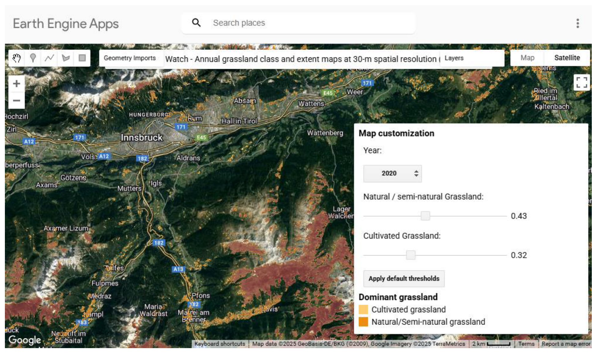

In summary, some aspects of Global Pasture Watch can be relevant to the potential further development of CLMS HRL VLCC Grassland data. In particular, methodologies applied to produce the Global Pasture Watch dataset may contribute to enhancing the CLMS HRL VLCC Grassland product by machine learning-based classification. HRL VLCC could benefit from similar probabilistic classification methods, for example, for detecting grassland management practices, which is one of the challenges in grassland mapping within the CLMS portfolio. This information about farming practises of management intensity is sometimes available only in national LPIS data, although it can be very useful for various research related to, for example, productivity monitoring on the pan-European level. Specifically, grazing still remains an important aspect of agricultural grassland management not addressed within the VLCC. Within Global Pasture Watch grazing is inferred from national databases. For Europe this is mainly provided by Eurostat. While this approach is suitable for products with a global scope, it does not provide means to map at higher spatial accuracy underlining the need for in-situ data on livestock density to be used as input for higher resolution mapping within Europe.

Another interesting product provided by the Global Pasture Watch are the short vegetation height maps. This is a LIDAR derived mapping product indicating dominant sward height. While again this is very interesting global product, the spatial resolution may not be suitable for European applications especially for e.g. such as measuring scrub encroachment. Vegetation height as such remains an important aspect of grassland physiology and structure and remains excluded from the VLCC.

### SUPER-G Project[^4][^5]

The SUPER-G project (SUstainable PERmanent Grassland systems and policies) is a five-year European initiative (2018–2023) primarily aimed as a policy-oriented and research-driven initiative rather than a data-providing project like EU Grassland Watch or Global Pasture Watch. It focuses on developing sustainable permanent grassland systems and policies, engaging multiple stakeholders (farmers, policymakers, researchers) to promote biodiversity, ecosystem services, and climate resilience in grassland management. The overall objective of the SUPER-G project is to co-develop sustainable permanent grassland systems and policies with farmers and policymakers that will be effective in optimising productivity whilst supporting biodiversity and delivering several ecological services. The key objectives include:

-   **Co-Development**

    Engage farmers, policymakers, and other stakeholders to collaboratively develop sustainable permanent grassland systems, typology and policies to improve communication and policymaking across Europe.

-   **Ecosystem Services Optimization**

    Conduct a systematic review of grassland multifunctionality, emphasizing their role in providing ecological services like carbon sequestration, biodiversity, and climate resilience benefits.

-   **Benchmarking and Testing**

    Assess the productivity of permanent grasslands across Europe through field data collection and analysis from farm networks and experimental platforms.

-   **Policy Support**

    Develop tools and mechanisms that inform and support policy decisions related to the management of permanent grasslands. Evaluating existing policies and developing recommendations to support sustainable permanent grassland management.

SUPER-G employs a multi-actor approach involving farmers, land managers, advisors, researchers, and policymakers. The project spans 14 countries across various European biogeographic regions, including the Mediterranean, Atlantic, Continental, Alpine, Pannonian, and Boreal zones (Figure 3).

```{=typst}
#set page(flipped: true, paper: "a3")
#set text(size: 8pt)
```

::: {.tbl-caption}
```{=typst}
#set text(size: 9pt, fill: rgb("#3E6893"))
```
Figure 3 An example of one of the experimental sites where innovative grassland management options and new technologies, such as spectral and electromagnetic sensors, were tested and evaluated.
:::

```{=html}
<table>
<colgroup>
<col style="width: 8.7%">
<col style="width: 10.9%">
<col style="width: 5.9%">
<col style="width: 24.9%">
<col style="width: 12.3%">
<col style="width: 15.0%">
<col style="width: 14.9%">
<col style="width: 7.4%">
</colgroup>
<thead>
    <tr>
      <td style="background-color:#d9ead3;"><b>SITE</b></td>
      <td style="background-color:#d9ead3;"><b>BIOGEOGRAPHIC REGION</b></td>
      <td style="background-color:#d9ead3;"><b>LEAD ORGAN.</b></td>
      <td style="background-color:#d9ead3;"><b>MANAGEMENT OPTION(S) /<br>TECHNOLOGIES TESTED</b></td>
      <td style="background-color:#d9ead3;"><b>MEASUREMENTS</b></td>
      <td style="background-color:#d9ead3;"><b>ES</b></td>
      <td style="background-color:#d9ead3;"><b>TYPE OF<br>INVESTIGATED AGRICULTURE</b></td>
      <td style="background-color:#d9ead3;"><b>LIVEST. TYPE</b></td>
    </tr>
  </thead>
  <tbody>
    <tr>
      <td>Forage Research Station, Moravian Uplands</td>
      <td>Continental / Pannonian</td>
      <td>MENDU</td>
      <td>Grazing management<br>Fertilisation<br>Species mixes<br>Over-seeding methods</td>
      <td>Grass yield and quality<br>Water balance and flows</td>
      <td>Food Production<br>Water quality<br>Flood control<br>Erosion Control</td>
      <td>Conventional<br>Organic</td>
      <td>Dairy<br>Beef</td>
    </tr>
  </tbody>
</table>
```

```{=typst}
#set page(flipped: false, paper: "a4")
#set text(size: 11pt)
```

While SUPER-G does not provide a large-scale remote sensing dataset, the most important additional value of the SUPER-G project probably lies in the extensive research findings, various factsheets (see: [https://www.super-g.eu/communication/factsheets/](https://www.super-g.eu/communication/factsheets/)), case study results, and policy recommendations, which can contribute to the future development of CLMS HRL VLCC Grassland. This can be achieved by improving classification rules based on refining definitions of grasslands, identifying new grassland management indicators that could enhance CLMS HRL VLCC Grassland portfolio by detecting mowing events or grazing intensity or supporting the integration of grassland typologies that better reflect management intensity, sustainability practices, and biodiversity metrics.

### GRASS SIGNAL[^6]

In contrast to two previously described initiatives, the GRASS SIGNAL project is an Al-powered satellite-based grassland monitoring and decision-support service designed to provide real-time insights on grass growth, biomass, quality, and degradation risks. The GRASS SIGNAL is a dynamic forecasting tool, delivering weekly predictions to support sustainable grassland and rangeland management. Developed by Deep Planet in partnership with the European Space Agency, the project harnesses Earth Observation data (Sentinel-1 and Sentinel-2), Al-driven analytics, and machine learning models (Figure 4) to optimise grazing, fertilisation, and irrigation strategies across diverse ecosystems.

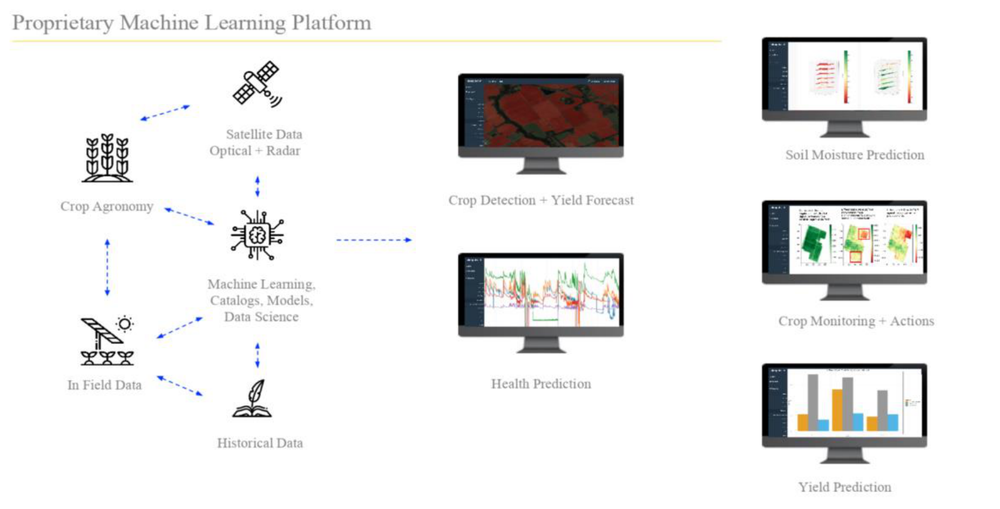

The GRASS SIGNAL is specifically designed to support farmers, rangeland managers, livestock producers, and policymakers by providing highly accurate, data-driven decision support. The service offers:

-   **Biomass & Growth Monitoring**

    Provides weekly biomass estimates at up to 97% accuracy, identifying growth patterns and productivity.

-   **Overgrazing & Degradation Alerts**

    Detects high-impact grazing areas and signals land degradation risks for adaptive management.

-   **Irrigation & Fertilization Insights**

    Uses NDVI and NDWI indicators to predict water stress and nutrient requirements for improved pasture management.

-   **Decision-Support System**

    Integrated into Deep Planet's Al platform, offering automated recommendations and work order tracking to optimise grazing strategies.

-   **Scalability & Global Reach**

    Initially designed for African rangelands, then extended to Australia, the USA, and the UK, with applications for intensively grazed pastures.

The GRASS SIGNAL methodology integrates Sentinel-1 SAR and Sentinel-2 optical imagery, accessed via the Sentinel Hub API, to enable high-resolution monitoring of grasslands. It employs Al-driven predictive models trained on EO data, historical field observations, and in-situ validation, ensuring accurate classification. The system provides high-frequency updates, generating biomass, grazing intensity, and moisture maps every 2 to 3 days, significantly enhancing traditional monitoring approaches. Additionally, the cloud-based Al platform offers a web interface for visualizing data, receiving alerts, and tracking pasture conditions in real time, facilitating informed decision-making for land managers and stakeholders (Figure 5).

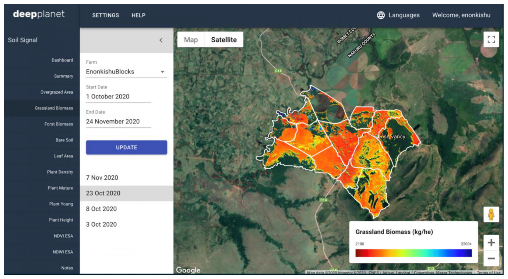

While GRASS SIGNAL is not a conventional grassland mapping initiative, its dynamic monitoring capabilities offer potential enhancements to CLMS HRL VLCC Grassland. These improvements could benefit from high-frequency biomass updates, which may, for instance, enhance the detection of seasonal mowing events. However, it may also be useful to integrate these advancements into product platforms such as the High Resolution – Vegetation Phenology and Productivity (HR-VPP) where their application may be more targeted. Furthermore, GRASS SIGNAL's data on overgrazing and soil moisture could refine CLMS HRL VLCC Grassland classifications by distinguishing between different management practices.

### ESDAC Soil Biomass Productivity (Grassland Layer)[^7]

The ESDAC Soil Biomass Productivity dataset is a static mapping product developed by the European Soil Data Centre (ESDAC) under the Joint Research Centre (JRC) of the European Commission. This dataset provides a model-based assessment of soil biomass productivity for grasslands, croplands, and forests across the EU27 (with reference year 2016 based on long-term soil productivity modelling). The grassland-specific component of this dataset classifies and ranks grassland soil productivity based on inherent soil fertility, climate conditions, and land use. It relies on soil modelling and spatial interpolation techniques to estimate productivity patterns. The calculations integrate pre-existing soil datasets, climate models, and topographic information, resulting in 1 km resolution raster maps that depict relative soil fertility on a standardised scale (0-10).

The ESDAC Soil Biomass Productivity dataset may potentially complement HRL VLCC Grassland by improving the characterization of grassland soil fertility. The dataset offers potential for insights into further grassland classification, particularly in distinguishing productive vs. marginal grasslands, particularly in regions where long-term soil conditions strongly influence grassland productivity.

## Comparison of CLMS HRL VLCC Grassland with EUGW

### Initial look into both datasets

-   **CLMS HRL VLCC Grassland portfolio**

The HRL VLCC Grassland dataset represents a fundamental restructuring of the pre-existing High-Resolution Layer (HRL) Grassland products from 2015 and 2018, while also maintaining consistency with them. Unlike traditional land cover datasets, HRL VLCC does not solely focus on land cover classification but extends to include essential management practices, such as mowing events and ploughing indicators. This approach is intended to enhance the understanding of grassland dynamics, particularly in agricultural and environmental monitoring contexts.

The HRL VLCC Grassland dataset is derived from multi-temporal classifications using a combination of Sentinel-1 (SAR) and Sentinel-2 (optical) satellite imagery. The processing workflow integrates Base Vegetation Layers (BVLs), which serve as an annual composite layer, offering insights into grassland health and changes over time. Calibration with existing Copernicus datasets, such as HRL Grassland 2018 and CLC 2018, ensures consistency in classification and reduces discrepancies between different data years. Additionally, confidence layers are included to assess the reliability of the classification results, offering users a measure of uncertainty in the dataset. With annual time-series the product is unprecedented in timeliness of provided thematic information. However, it is important to understand that annual production does not equal a change mapping and although a specific class probability weighting scheme is applied between years to minimize noise changes between years can occur simply by chance. There is also a dedicated Grassland Change layer which acts as a continuation of the HRL tri-annual cycle. This undergoes an internal validation and is set at 80% mapping accuracy.

The HRL VLCC dataset provides wall-to-wall coverage across all 38 EEA member and cooperating countries, making it highly suitable for policy monitoring, Common Agricultural Policy (CAP) compliance assessments, and large-scale environmental monitoring efforts.

::: {.tbl-caption}
```{=typst}
#set text(size: 9pt, fill: rgb("#3E6893"))
```
Table 2 Overview of HRL VLCC Grassland portfolio
:::

| No | Name of product | Acronym | Description |
|------------|---------------------------------------------------------------|-----------------------------|-----------------------------------------------------------------------------------------------|
| 1 | Grassland | GRA | Binary layer mapping grasslands (10m) |
| 2 | Grassland | GRA | Binary layer mapping grasslands (100m) |
| 3 | Grassland Change | GRAC | Change layer between 2018 and 2021, gain, loss or unchanged |
| 4 | Ploughing indicator | PLOUGH | Number of years before when ploughing occurred |
| 5 | Grassland Confidence Layer | GRACL | Percentage of grassland confidence |
| 6 | Herbaceous cover | HER | Binary layer defining temporary grasslands |
| 7 | Grassland change confidence layer | GRACL | Percentage of grassland change confidence |
| 8 | Grassland mowing events | GRAME | Number of mowing events detected |
| 9 | Grassland mowing event dates | GRAMD | Date of the year when mowing event started |
| 10 | GRAME confidence layers | GRAMECL | Mowing detection confidence |
| 11 | Points for internal quality control of Grassland products | GRAREF | Point marking 10m pixel annotated as grassland vs non-grassland |

**EU Grassland Watch (EUGW)**

The EUGW is a targeted grassland mapping initiative that focuses on Natura 2000 sites rich in grassland biodiversity (Table 3). Unlike HRL VLCC Grassland, which provides pan-European coverage, EUGW is restricted to the boundaries of Natura 2000 and is designed primarily for conservation, biodiversity monitoring, and Article 17 reporting under the EU Habitats Directive.

::: {.tbl-caption}
```{=typst}
#set text(size: 9pt, fill: rgb("#3E6893"))
```
Table 3 Summary of key characteristics of the EUGW project.
:::

| Feature/component | Description |
|-----------------------------------------------------------------------|---------------------------------------------------------------------------------------------------------------------------------|
| Coverage | Natura 2000 sites in Europe |
| Reference Years | 1994-2024 (continuous time series) |
| Primary Data Sources | Sentinel-1 (SAR), Sentinel-2 (optical), Landsat, DEM |
| Classification Approach | Machine learning-based classification with NDVI time series and SAR backscatter indices |
| Key Thematic Components | Grassland Type (EUNIS habitat mapping), Management (mowing, ploughing, grazing), Productivity (NDVI-based trends) |
| Change Detection | Annual information without dedicated change layers. |
| Temporal Harmonization | Yes, ensures long-term trend consistency |
| Validation Methods | Validation of Land Cover product is primarily conducted based on photo interpretation using a dedicated web-tool (Sentinel era) as well as in-situ data. Model accuracy of the Grassland Type component is validated using, national inventories, and in situ databases such as the European Vegetation Archive. |
| User Target Group | Biodiversity conservation, Natura 2000 monitoring, Article 17 reporting |

The product definition and choice of input data for EUGW have been aligned with CLMS mapping products. At a primary level, EUGW provides a basic 9-class land cover product, which mostly complies with CLC+ Backbone for potential analysis going beyond the extent of Natura 2000 alone. This land cover product is provided for an extensive time series from 1994 to 2024, starting with the birth of the Natura 2000 network in 1994 until the present. The land cover product provides the basic spatial delineation mask to identify permanent herbaceous vegetation.

At the secondary level, all areas within this mask are further characterised by three independent components (Figure 6Figure 6 Three independent thematic components developed within the EUGW project. These components are further described in more detail in the next chapter.):

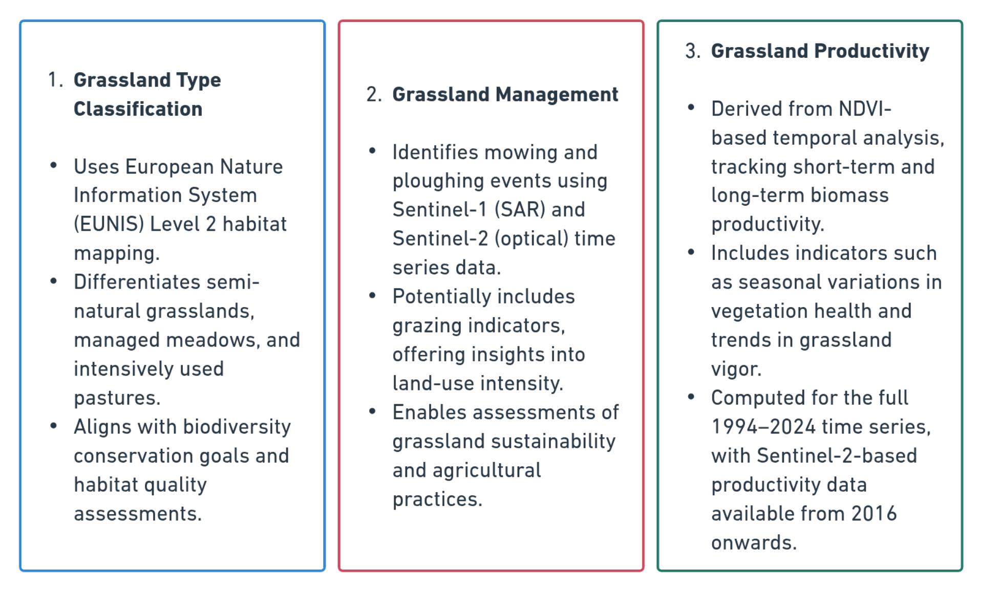

Grassland type and productivity are computed for the full-time series (1994-2024), while the management data relies on a denser time series and is only available for the Sentinel 2 era (2016 onwards). To enhance accuracy, EUGW integrates multiple Earth Observation (EO) datasets, including:

-   Machine learning-based classification using Sentinel-1 and Sentinel-2 imagery.
-   Historical Landsat data to extend analysis into the pre-Sentinel era.
-   Digital Elevation Models (DEM) to refine landform-based classifications.
-   SAR backscatter analysis for improved detection of vegetation structural changes.

EUGW was developed based on lessons learned from the previous COP4N2K project, which used a MAES-aligned mixed land cover/land use nomenclature. Based on user feedback, the pre-classification of grasslands into fixed categories (e.g., managed or semi-natural grassland) was found to be too restrictive. As a response, EUGW avoids hard-coded grassland classifications and instead provides modular thematic layers that users can combine in different ways to suit their specific needs. This flexible approach enables better differentiation between land-use intensity levels, biodiversity values, and management regimes. One of the key methodological strengths is also the temporal harmonization framework, which reduces inconsistencies in classification over time. This ensures that trend analysis remains robust, minimizing artifacts caused by sensor differences or classification shifts across different reference years.

Because the product portfolio is highly modular and can thus be overwhelming to non-expert users, EUGW also offers a dedicated web-platform containing selected products for direct view.

### Detailed overview of EUGW portfolio

-   **Grassland Type Characterization Component**

The Grassland Type Thematic Layer (GTYP) is a key component of the EUGW dataset, providing spatial information on the distribution of different grassland types across Natura 2000 sites (Table 4). It is based on a classification system that aligns with the EUNIS Level-2 habitat framework, distinguishing categories such as dry grasslands, mesic grasslands, wet and temporarily wet grasslands, alpine and sub-alpine meadows, inland salt steppes, forest clearings, and sparsely wooded grasslands. This classification is derived from a combination of vegetation indices (NDVI, NMDI, TCARI), SAR backscatter data, topographic variables (DEM, TWI, TPI), and high-resolution vegetation phenology datasets (HR-VPP) trained on in-situ data from the LUCAS grassland module and EVA database. The GTYP layer is updated annually, ensuring consistency in monitoring habitat conditions, conservation status, and long-term grassland trends. Its 10m resolution (since 2016) and 30m resolution (1994-2015) make it suitable for biodiversity assessments and habitat reporting under Article 17 of the Habitats Directive. The GTYP layer plays a crucial role in providing reliable baseline data for ecological assessments, conservation planning, and land-use monitoring within protected areas.

::: {.tbl-caption}
```{=typst}
#set text(size: 9pt, fill: rgb("#3E6893"))
```
Table 4 Overview of EUGW - Grassland Type products (the first and key component)
:::

| No | Name of product | Acronym | Description |
|------------|-----------------------------------------------------------------|---------------------------------|-----------------------------------------------------------------------------------------|
| 1 | Grassland Type Thematic Layer | GTYP | Spatial extent of the considered grassland type categories |

-   **Grassland Management Characterization Component**

The Grassland Management Characterization Component (GM) of EUGW provides essential insights into the intensity and frequency of grassland management activities, including mowing, grazing, and ploughing (Table 5). This component is designed to track the temporal persistence of grasslands, distinguishing between permanent and temporary grasslands based on their management history. It incorporates data from NDVI-based time-series analysis, bare soil occurrence metrics, and grassland texture analysis to classify different levels of management intensity. The GM component includes key datasets such as Grassland Management Events (MNEV), which record the number of detected management activities per year, and First and Last Management Event Dates (MFED, MLED), which mark the timing of interventions. Additional indicators, like the Grassland Dynamics Index (MGDI) and Gross/Net Productivity Indices (MGPI, MNPI), compare real productivity and biomass removal with a theoretical no-management scenario. The component also assesses bare soil persistence (BSAP, BSRP) and texture uniformity (GTEX) as proxies for management intensity. These products support agricultural monitoring, and environmental sustainability assessments, offering high-resolution data for annual evaluations of grassland condition and management trends.

::: {.tbl-caption}
```{=typst}
#set text(size: 9pt, fill: rgb("#3E6893"))
```
Table 5 Overview of EUGW - Grassland Management products (the second component)
:::

| No | Name of product | Acronym | Note |
|------------|--------------------------------------------------------|--------------------------|----------------------------------------------------------------------------------------------------------|
| 2 | Grassland Management Thematic Layer | GMNG | Spatial extent of the considered grassland management categories |
| 3 | Grassland Persistence - all LC (relative) | GPER | Indication of last land cover change "any-to-grassland" |
| 4 | Grassland Persistence - all LC (absolute) | GPEY | Indication of last land cover change "any-to-grassland" |
| 5 | Grassland Persistence - arable land (relative) | GALR | Indication of last land cover change "arable land-to-grassland" |
| 6 | Grassland Persistence - arable land (absolute) | GALY | Indication of last land cover change "arable land-to-grassland" |
| 7 | Grassland Management Events | MNEV | Number of management events detected during the given year |
| 8 | First Event Date | MFED | Date (DOY) of the first detected management event |
| 9 | Last Event Date | MLED | Date (DOY) of the last detected management event |
| 10 | Grassland Dynamics Index | MGDI | Relative comparison of the real annual grassland dynamics with theoretical "no management scenario" |
| 11 | Grassland Gross Productivity Index | MGPI | Relative comparison of the real annual grassland productivity with theoretical "no management scenario" |
| 12 | Grassland Net Productivity Index | MNPI | Relative comparison of the real annual grassland productivity with theoretical "no management scenario" |
| 13 | Bare Soil Occurrence | BSOC | Monthly indication of bare soil occurrence (on grassland areas) |
| 14 | Bare Soil Anomalies | BSAN | Monthly indication of bare soil anomaly Occurrence (on grassland areas): Bare soil occurrence taking into account the context of the given N2000 site and time |
| 15 | Bare Soil Anomaly Type | BSAT | (differentiate real anomalies from cases where the presence of bare or "almost bare" surfaces could reflect common conditions of the site) Categorization of the identified bare soil anomalies from a temporal perspective: permanently bare vs. damage vs. recovery vs. damage & recovery vs. temporary recovery |
| 16 | Bare Soil Absolute Persistence | BSAP | Number of months for which the given pixel exhibits bare status |
| 17 | Bare Soil Relative Persistence | BSRP | Relative part of the year for which the given pixel exhibits bare status |
| 18 | Grassland Texture | GTEX | Grassland texture: indicator of grassland spatial uniformity |

-   **Grassland Productivity Characterization Component**

The Grassland Productivity Characterization Component (GP) of EUGW provides a detailed assessment of grassland productivity across both short-term and long-term temporal scales (
Table 6). It evaluates productivity trends, state, and performance by leveraging satellite-based phenology and productivity datasets (HR-VPP), NDVI time-series, and statistical analyses. The short-term productivity assessment compares annual grassland productivity with a six-year reference period, while the long-term productivity assessment uses data from 1996 onwards to evaluate productivity changes over decades. Key indicators include the Grassland Productivity Trend (SPTR, LPTR), which tracks increasing or decreasing productivity based on regression analysis, and Grassland Productivity State (SPSP, LPSP), which classifies productivity levels relative to historical baselines. The Grassland Productivity Performance (SPPC, LPPC) assesses productivity compared to other sites within the same habitat type, offering insights into grassland condition relative to its ecosystem context. To enhance accuracy, productivity anomalies are detected using percentile classifications and Z-score analyses (SPSZ, LPSZ). The GP component is instrumental in monitoring land-use changes, climate impacts, and habitat degradation or recovery.

::: {.tbl-caption}
```{=typst}
#set text(size: 9pt, fill: rgb("#3E6893"))
```
Table 6 Overview of EUGW - Grassland Productivity products (the last third component)
:::

| No | Name of product | Acronym | Note |
|------------|------------------------------------------------------------------------------|--------------------------|------------------------------------------------------------------------------------|
| 19 | Grassland Short Term Productivity Thematic Layer | GSTP | Spatial extent of the considered grassland productivity categories |
| 20 | Grassland Long Term Productivity Thematic Layer | GLTP | Spatial extent of the considered grassland productivity categories |
| 21 | Grassland Short Term Productivity Trend - Slope | SPTR | Slope of the short-term productivity trend |
| 22 | Grassland Short Term Productivity Trend - Score | SPRR | R2 of the linear trend fit |
| 23 | Grassland Short Term Productivity Trend - Direction | SPTD | Direction of the short-term productivity trend |
| 24 | Grassland Short Term Productivity Trend - Significance | SPTS | Significance (p-value) of the Mann-Kendall trend test |
| 25 | Grassland Long Term Annual Dynamics Trend - Slope | LPTR | Slope of the long-term productivity trend |
| 26 | Grassland Long Term Annual Dynamics Trend - Score | LPRR | R2 of the linear trend fit |
| 27 | Grassland Long Term Annual Dynamics Trend - Direction | LPTD | Direction of the long-term productivity trend |
| 28 | Grassland Long Term Annual Dynamics Trend - Significance | LPTS | Significance (p-value) of the Mann-Kendall trend test |
| 29 | Grassland Short Term Productivity State - Percentile Classes | SPSP | Comparison of the actual and reference productivity in temporal domain (percentile classes) |
| 30 | Grassland Short Term Productivity State Percentile Classes Change | SPSC | Temporal change of productivity class (percentile classes) |
| 31 | Grassland Short Term Productivity State - Z-Score Classes | SPSZ | Comparison of the actual and reference productivity in temporal domain (z-score classes) |
| 32 | Grassland Long Term Annual Dynamics State | LPSP | Comparison of the actual and reference productivity in temporal domain (percentile classes) |
| 33 | Grassland Long Term Annual Dynamics State | LPSC | Temporal change of productivity class (percentile classes) |
| 34 | Grassland Long Term Annual Dynamics State | LPSZ | Comparison of the actual and reference productivity in temporal domain (z-score classes) |
| 35 | Grassland Short Term Productivity Performance - Percentile Classes | SPPC | Comparison of the actual and reference productivity in spatial domain (percentile classes) |
| 36 | Grassland Short Term Productivity Performance - Z-Score Classes | SPPZ | Comparison of the actual and reference productivity in spatial domain (z-score classes) |
| 37 | Grassland Long Term Annual Dynamics Performance - Percentile Classes | LPPC | Comparison of the actual and reference productivity in spatial domain (percentile classes) |
| 38 | Grassland Long Term Annual Dynamics Performance - Z-score Classes | LPPZ | Comparison of the actual and reference productivity in spatial domain (z-score classes) |

### Similarities and differences

The CLMS HRL VLCC Grassland and EUGW datasets are both high-resolution grassland monitoring initiatives but serve different user needs, thematic scopes, and spatial extents. While EUGW's structure allows for higher thematic resolution in ecological assessments, HRL VLCC provides broad-scale monitoring with simplified classifications. This section highlights their methodological overlaps, structural differences, and potential synergies.

#### Spatial Coverage

HRL VLCC provides pan-European coverage across all EEA38 countries, ensuring wall-to-wall consistency. It is particularly suited for agricultural and land-use assessments at a continental scale. EUGW is site-specific, focusing on Natura 2000 protected areas, which represent biodiversity-rich grasslands. Its mapping is optimized for Article 17 reporting under the EU Habitats Directive.

#### Thematic Focus

HRL VLCC primarily integrates:

-   Binary grassland classification (permanent vs. temporary)
-   Grassland change mapping (gain/loss)
-   Mowing and ploughing indicators
-   Confidence layers assessing classification reliability.

EUGW, on the other hand, goes much further in biophysical differentiation, offering:

-   Grassland type classification based on EUNIS habitat categories (dry, mesic, wet, alpine, salt steppes, sparsely wooded, and forest clearings)
-   Grassland management layers, detailing mowing, grazing occurrence, and ploughing trends. Like mowing and ploughing, grazing is inferred from the development of biomass over the year reflected by spectral indices. Due to the difficulty of distinguishing grazing in areas with low productivity in late summer (e.g. mediterranean) grazing can only be partially captured and is not provided as dedicated layer but rather incorporated into the “management events" layer.
-   Grassland productivity layers, including e.g. short-term and long-term productivity trends

#### Methodological Overlaps

Both HRL VLCC Grassland and EUGW share several methodological principles in their approach to grassland classification and monitoring. A key similarity lies in their use of multi-sensor EO data. Both datasets rely on Sentinel-1 SAR for backscatter analysis and Sentinel-2 optical imagery for NDVI-based classification. However, EUGW expands its historical depth by incorporating Landsat imagery (1994-2015), enabling long-term trend analysis, whereas HRL VLCC focuses primarily on more recent Sentinel-era observations (2017-2021).

Temporal harmonization is another critical aspect where both datasets ensure consistency over time. HRL VLCC emphasizes short-term consistency, aligning with previous HRL Grassland products from 2015 and 2018 to maintain classification stability across recent years. In contrast, EUGW offers a fully structured 30-year time series (1994–2024), employing explicit temporal harmonization techniques to minimize classification inconsistencies that could arise due to sensor transitions and methodological updates.

Both initiatives utilize machine learning-based classification techniques, integrating optical and SAR composites to refine land cover and management event detection. HRL VLCC employs Base Vegetation Layers (BVLs) as annual composites, ensuring stability and consistency through the years in grassland classification. Meanwhile, EUGW applies advanced time-series modelling, incorporating phenology metrics and vegetation dynamics to enhance the accuracy of grassland type and management intensity assessments. These approaches allow HRL VLCC to maintain consistency in agricultural monitoring, while EUGW provides a richer ecological perspective through dynamic trend analysis.

#### Product-Level Differences

::: {.tbl-caption}
```{=typst}
#set text(size: 9pt, fill: rgb("#3E6893"))
```
Table 7 The key characteristics of both initiatives.
:::

| Parameter | CLMS HRL VLCC Grassland | EU Grassland Watch |
|-------------------------------------------|---------------------------------------------------------------------------------------|----------------------------------------------------------------------|
| Coverage Area | Pan-European (38 EEA member and cooperating countries) | Pan-European, focusing on Natura 2000 sites (> 16430 sites) and biodiversity hotspots |
| Reference Years | 2017-2021 | 1994 to present, split into pre-Sentinel (1994-2015) and Sentinel eras (>2016) |
| Spatial Resolution | 10m for primary products; 20m for some other products | 10m for recent years (2016 onwards), 30m for earlier years (1994-2015) |
| Grassland Typology | Binary classification (grassland/non-grassland) | EUNIS level 2-based habitat mapping |
| Projection | ETRS89 LAEA for mainland Europe | ETRS89 LAEA for mainland Europe |
| Main Products | Including 11 different products/indicators, e.g. Grassland Mask (GRA), Herbaceous Cover (HER), Grassland Change Layer (GRAC), Grassland Mowing Events (GRAME), Grassland Confidence Layer (GRACL), Ploughing Indicator (PLOUGH) | Including 38 different products/indicators, e.g. Grassland Type Layer, Management Intensity Layer, Productivity Metrics, Bare Soil Occurrence, each component contains different products. Selected main products will be available on web-tool for direct view, while more advanced expert products will be available for download. |
| Primary Data Sources | Sentinel-1 (radar), Sentinel-2 (optical) | Sentinel-1, Sentinel-2, Landsat, EU-DEM data, SAR backscatter data |
| In Situ Data Usage | Limited reliance on in situ data, primarily satellite-based | Extensive use of national inventories and European databases for validation |
| Processing Methodology | Multi-temporal classification based on annual Base Vegetation Layers (BVLs). The process includes data calibration using Copernicus products (HRL Grassland 2018, CLC 2018) and visually interpreted sample points | Machine learning classification, NDVI profile analysis, SAR backscatter indices, temporal harmonization |
| Classification Criteria | Grasslands are classified based on vegetation cover exceeding thresholds of NDVI, distinguishing between permanent and temporary grasslands. Fodder crops, such as seeded grassland, are included if they dominate the land cover | Grasslands are characterised based on vegetation types, management practices, and productivity indicators. There is no a-priori thematic grassland classification. |
| Thematic Layers | Thematic layers provide insights into grassland coverage, grassland changes, mowing events, and ploughing activities. Confidence layers assess classification reliability | Includes grassland coverage, management events (mowing, grazing, ploughing), and productivity trends |
| Change Detection | Grassland Change Layer (GRAC) tracks the gain or loss of grassland areas between 2018 and 2021. Ploughing Indicator (PLOUGH) detects ploughing events over a six-year period | Tracks mowing and ploughing events, productivity changes over time, and bare soil occurrences, short- and long-term productivity trends |
| Accuracy and Validation | Target thematic accuracy is 85% at the biogeographical region level. Validation is primarily internal, with reference points and polygons annotated for grassland and non-grassland classification | Prototype site validations and consistency checks across different years and regions |
| Potential Use Cases | Environmental monitoring, policy reporting (e.g., CAP), biodiversity assessments, tracking agricultural management practices such as mowing and ploughing | Environmental monitoring, biodiversity assessments, CAP policy reporting, agricultural management tracking |
| Exclusions | Areas dominated by shrubs, lichen, mosses, or wetlands with herbaceous species are not included in the HRL VLCC Grassland portfolio | Excludes areas with less than 30% herbaceous cover or dominated by non-graminoid species |

#### Cross-Compatibility with CLMS Products

EUGW is designed for optimal cross-comparability with CLMS and, therefore, will include an aggregated grassland mask, ensuring direct overlap between EUGW permanent herbaceous areas, CLC-BB permanent herbaceous, HRL-GRA, and VLCC GRA (Figure 7).

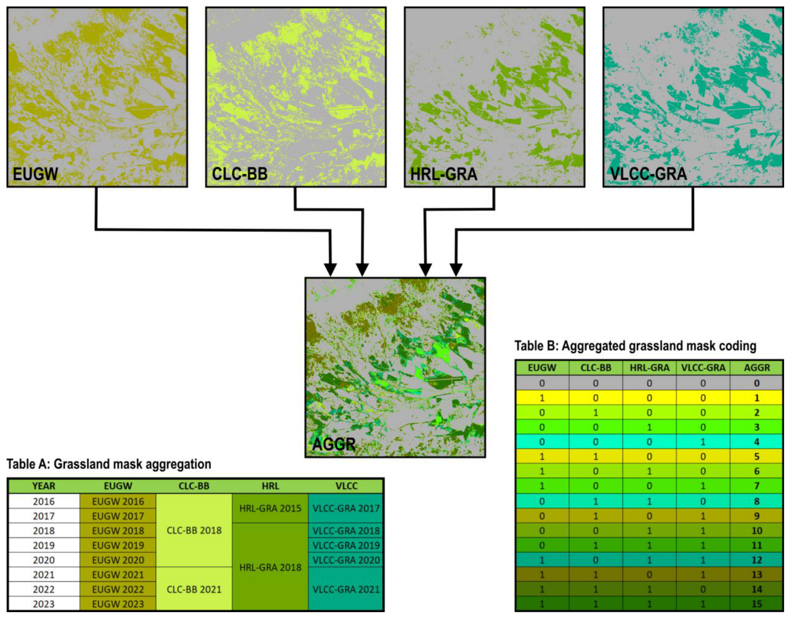

#### Grazing Detection – A Common Challenge

One of the main limitations of both HRL VLCC and EUGW is their lack of capability to accurately and extensively map grazing activity. While EUGW incorporates grazing intensity within its grassland management component, the publication of a dedicated grazing pressure layer remains under discussion (Status: 03/2025).

Distinguishing grazed from non-grazed areas using remote sensing alone presents several challenges. One of the primary limitations is the scarcity and coarse resolution of in-situ reference data, which makes it difficult to train reliable classifiers for grazing detection. Additionally, seasonal biomass variations complicate the differentiation between grazing and mowing, as both activities can result in similar spectral and structural changes in vegetation indices. This issue is particularly problematic in non-intensively grazed semi-natural areas, where biomass regrowth varies significantly across different ecosystems and years.

To improve grazing detection capabilities, additional supplementary datasets such as livestock density maps, climate factors, and local grazing records. These external data sources could help discriminate grazing impacts from other land management activities, providing a more robust basis for mapping grazing pressure within both HRL VLCC and EUGW. A recent example of efforts in this direction has been provided by Malek et al. (2024), emphasizing the need for non-Earth Observation (non-EO) reference data to enhance grazing classification.

### Potential and recommendations

The development of EUGW has been aligned with HRL VLCC and other CLMS products, ensuring a high degree of transferability and cross-comparability. Due to its modular structure, EUGW is designed to be flexible and adaptable, allowing for integration with existing land monitoring datasets and potential future expansions. This modular approach ensures that EUGW remains compatible with HRL VLCC broad-scale agricultural applications while providing finer ecological granularity for biodiversity assessments within Natura 2000 sites.

One of the most critical gaps in grassland monitoring is the lack of a dedicated grazing pressure product within both HRL VLCC and EUGW. While EUGW incorporates grazing intensity indicators within its management characterization component, the publication of a standalone grazing detection layer remains pending. The absence of high-resolution in-situ reference data makes the systematic identification of grazed areas challenging from remote sensing data, limiting the effectiveness of machine-learning-based classification approaches. Additionally, biomass variability across ecosystems and seasons further complicates the differentiation between grazing and mowing events, leading to uncertainties in classification.

To address this issue, additional initiatives might be needed to foster the development of harmonized grazing reference databases. A notable example of such an initiative is the Global Biodiversity Information Facility (GBIF), which provides a centralized API-based database for species presence data. A similar approach could be applied to grazing pressure, where a comprehensive reference database for livestock stocking density at higher spatial resolutions would significantly enhance the accuracy of grassland management assessments. Such an activity has been launchen by the Land Management for Sustainability (LAMASUS) project[^8] which has developed a Picture Pile app to classify and collect information on grazing. This type of dataset would support remote sensing-based grazing monitoring, enabling both HRL VLCC and EUGW to improve their classification of grassland use intensity. Grazing information cannot only be derived from in-situ data but may also be derived punctually from the analysis of image data from webcams (Weber et al. 2023).

Another area for potential enhancement is grassland productivity assessment. EUGW includes detailed short-term (GSTP) and long-term (GLTP) productivity indicators, providing insights into grassland health trends over time. HRL VLCC currently lacks dedicated productivity layers, relying instead on mowing frequency as a simplified proxy for productivity monitoring. Future iterations of HRL VLCC could benefit from adopting EUGW's productivity trend methodology, allowing for a more refined assessment of biomass dynamics and long-term ecosystem sustainability.

Given the increasing role of agricultural-related datasets in environmental and agricultural policy monitoring, HRL VLCC and EUGW should continue to enhance their interoperability. EUGW already ensures alignment with CLC Backbone, HRL Grassland, and VLCC Grassland, enabling direct comparability between datasets. HRL VLCC could further benefit from incorporating EUGW's aggregated grassland mask, ensuring consistent cross-product analysis and enhanced usability for CAP compliance and biodiversity monitoring. By addressing these gaps and opportunities, HRL VLCC can provide an even more robust foundation for grassland monitoring, agricultural assessments, and biodiversity conservation across Europe.

# Collection of user requirements and literature review of additional forest Types

## Literature review

This review investigates possible alternative classifications on forest types and their connection to the EEA forest typology (European Environment Agency 2007) as well as the forest type needs for Member States under different regulation systems, such as the Ecosystem accounting regulation and the LULUCF.

### EEA Classification on European Forest type

The EEA European Forest Type (EFT) system consists of 14 main categories, which are further divided into 78 types (Table 8). A study by Pividori et al. 2016 constructed a matrix where the presence of key tree and shrub species per forest type are represented, based on the EEA forest typology report. In this matrix, tree and shrub species are separated into three main groups: Conifers, Broadleaved, and Alien trees. Additionally, the species presence is categorized into three categories:

the species is abundant and dominant in the EFT
the species presence in the EFT is either secondary or predominant but in peculiar and not characteristic ecological conditions of the EFT
the presence in the EFT is both dominant and secondary in some cases

The EFT defines categories 4-8 (European Environment Agency 2007, table 6.1) as the section for broadleaved deciduous and mixed coniferous-broadleaved forest. However, after analysing the presence of key tree and shrub species per forest type within each category, it became evident that only category 7 (Mountainous beech forest) represents a real mixed class. This category is characterized by mountainous vegetation belt coniferous species (Spruce, Fir) that become competitive with deciduous species (Beech).

::: {.tbl-caption}
```{=typst}
#set text(size: 9pt, fill: rgb("#3E6893"))
```
Table 8 European Forest Type (EFT) system categorization
:::

```{=html}
<table>
<colgroup>
<col style="width: 60.8%">
<col style="width: 39.2%">
</colgroup>
<tr>
    <td><b>Category</b></td>
    <td><b>Forest Type</b></td>
  </tr>
  <tr>
    <td rowspan="2" style="vertical-align:middle">1. Boreal forest</td>
    <td>1.1 Spruce and sprucebirch boreal forest</td>
  </tr>
  <tr>
    <td>1.2 Pine and pinebirch boreal forest</td>
  </tr>
  <tr>
    <td rowspan="6" style="vertical-align:middle">2. Hemiboreal forest and nemoral coniferous and mixed broadleavedconiferous forest</td>
    <td>2.1 Hemiboreal forest</td>
  </tr>
  <tr>
    <td>2.2 Nemoral Scots pine forest</td>
  </tr>
  <tr>
    <td>2.3 Nemoral spruce forest</td>
  </tr>
  <tr>
    <td>2.4 Nemoral Black pine forest</td>
  </tr>
  <tr>
    <td>2.5 Mixed Scots pinebirch forest</td>
  </tr>
  <tr>
    <td>2.6 Mixed Scots pinepedunculate oak forest</td>
  </tr>
  <tr>
    <td rowspan="3" style="vertical-align:middle">3. Alpine coniferous forest</td>
    <td>3.1 Subalpine larch-arolla pine and dwarf pine forest</td>
  </tr>
  <tr>
    <td>3.2 Subalpine and mountainous spruce and mountainous mixed sprucesilver fir forest</td>
  </tr>
  <tr>
    <td>3.3 Alpine Scots pine and Black pine forest</td>
  </tr>
  <tr>
    <td rowspan="2" style="vertical-align:middle">4. Acidophilous oak and oakbirch forest</td>
    <td>4.1 Acidophilous oakwood</td>
  </tr>
  <tr>
    <td>4.2 Oakbirch forest</td>
  </tr>
  <tr>
    <td rowspan="9" style="vertical-align:middle">5. Mesophytic deciduous forest</td>
    <td>5.1 Pedunculate oak-hornbeam forest</td>
  </tr>
  <tr>
    <td>5.2 Sessile oak-hornbeam forest</td>
  </tr>
  <tr>
    <td>5.3 Ashwood and oakash forest</td>
  </tr>
  <tr>
    <td>5.4 Mapleoak forest</td>
  </tr>
  <tr>
    <td>5.5 Limeoak forest</td>
  </tr>
  <tr>
    <td>5.6 Maplelime forest</td>
  </tr>
  <tr>
    <td>5.7 Lime forest</td>
  </tr>
  <tr>
    <td>5.8 Ravine and slope forest</td>
  </tr>
  <tr>
    <td>5.9 Other mesophytic deciduous forests</td>
  </tr>
  <tr>
    <td rowspan="7" style="vertical-align:middle">6. Beech forest</td>
    <td>6.1 Lowland beech forest of southern Scandinavia and north central Europe</td>
  </tr>
  <tr>
    <td>6.2 Atlantic and subatlantic lowland beech forest</td>
  </tr>
  <tr>
    <td>6.3 Subatlantic submountainous beech forest</td>
  </tr>
  <tr>
    <td>6.4 Central European submountainous beech forest</td>
  </tr>
  <tr>
    <td>6.5 Carpathian submountainous beech forest</td>
  </tr>
  <tr>
    <td>6.6 Illyrian submountainous beech forest</td>
  </tr>
  <tr>
    <td>6.7 Moesian submountainous beech forest</td>
  </tr>
  <tr>
    <td rowspan="8" style="vertical-align:middle">7. Mountainous beech forest</td>
    <td>7.1 South western European mountainous beech forest (Cantabrians, Pyrenees, central Massif, south western Alps)</td>
  </tr>
  <tr>
    <td>7.2 Central European mountainous beech forest</td>
  </tr>
  <tr>
    <td>7.3 ApennineCorsican mountainous beech forest</td>
  </tr>
  <tr>
    <td>7.4 Illyrian mountainous beech forest</td>
  </tr>
  <tr>
    <td>7.5 Carpathian mountainous beech forest</td>
  </tr>
  <tr>
    <td>7.6 Moesian mountainous beech forest</td>
  </tr>
  <tr>
    <td>7.7 Crimean mountainous beech forest</td>
  </tr>
  <tr>
    <td>7.8 Oriental beech and hornbeamoriental beech forest</td>
  </tr>
  <tr>
    <td rowspan="8" style="vertical-align:middle">8. Thermophilous deciduous forest</td>
    <td>8.1 Downy oak forest</td>
  </tr>
  <tr>
    <td>8.2 Turkey oak, Hungarian oak and Sessile oak forest</td>
  </tr>
  <tr>
    <td>8.3 Pyrenean oak forest</td>
  </tr>
  <tr>
    <td>8.4 Portuguese oak and Mirbeck's oak Iberian forest</td>
  </tr>
  <tr>
    <td>8.5 Macedonian oak forest</td>
  </tr>
  <tr>
    <td>8.6 Valonia oak forest</td>
  </tr>
  <tr>
    <td>8.7 Chestnut forest</td>
  </tr>
  <tr>
    <td>8.8 Other thermophilous deciduous forests</td>
  </tr>
  <tr>
    <td rowspan="5" style="vertical-align:middle">9. Broadleaved evergreen forest</td>
    <td>9.1 Mediterranean evergreen oak forest</td>
  </tr>
  <tr>
    <td>9.2 Olivecarob forest</td>
  </tr>
  <tr>
    <td>9.3 Palm groves</td>
  </tr>
  <tr>
    <td>9.4 Macaronesian laurisilva</td>
  </tr>
  <tr>
    <td>9.5 Other sclerophlyllous forests</td>
  </tr>
  <tr>
    <td rowspan="11" style="vertical-align:middle">10. Coniferous forests of the Mediterranean, Anatolian and Macaronesian regions</td>
    <td>10.1 Mediterranean pine forest</td>
  </tr>
  <tr>
    <td>10.2 Mediterranean and Anatolian Black pine forest</td>
  </tr>
  <tr>
    <td>10.3 Canarian pine forest</td>
  </tr>
  <tr>
    <td>10.4 Mediterranean and Anatolian Scots pine forest</td>
  </tr>
  <tr>
    <td>10.5 AltiMediterranean pine forest</td>
  </tr>
  <tr>
    <td>10.6 Mediterranean and Anatolian fir forest</td>
  </tr>
  <tr>
    <td>10.7 Juniper forest</td>
  </tr>
  <tr>
    <td>10.8 Cypress forest</td>
  </tr>
  <tr>
    <td>10.9 Cedar forest</td>
  </tr>
  <tr>
    <td>10.10 Tetraclinis articulata stands</td>
  </tr>
  <tr>
    <td>10.11 Mediterranean yew stands</td>
  </tr>
  <tr>
    <td rowspan="5" style="vertical-align:middle">11. Mire and swamp forest</td>
    <td>11.1 Conifer dominated or mixed mire forest</td>
  </tr>
  <tr>
    <td>11.2 Alder swamp forest</td>
  </tr>
  <tr>
    <td>11.3 Birch swamp forest</td>
  </tr>
  <tr>
    <td>11.4 Pedunculate oak swamp forest</td>
  </tr>
  <tr>
    <td>11.5 Aspen swamp forest</td>
  </tr>
  <tr>
    <td rowspan="3" style="vertical-align:middle">12. Floodplain forest</td>
    <td>12.1 Riparian forest</td>
  </tr>
  <tr>
    <td>12.2 Fluvial forest</td>
  </tr>
  <tr>
    <td>12.3 Mediterranean and Macaronesian riparian forest</td>
  </tr>
  <tr>
    <td rowspan="5" style="vertical-align:middle">13. Non riverine alder, birch, or aspen forest</td>
    <td>13.1 Alder forest</td>
  </tr>
  <tr>
    <td>13.2 Italian alder forest</td>
  </tr>
  <tr>
    <td>13.3 Boreal birch forest</td>
  </tr>
  <tr>
    <td>13.4 Southern boreal birch forest</td>
  </tr>
  <tr>
    <td>13,5 Aspen forest</td>
  </tr>
  <tr>
    <td rowspan="2" style="vertical-align:middle">14. Plantations and self-sown exotic forest</td>
    <td>14.1 Plantations of sitenative species</td>
  </tr>
  <tr>
    <td>14.2 Plantations of not site native species and selfsown exotic forest</td>
  </tr>
</table>
```

We compared how the 14 main EFT categories align with the current Corine Land Cover (CLC) classes which represent Forest cover (Table 9). There is a match between some of the CLC classes and the EFT categories, including Broad-leaved, Coniferous and Mixed Forest. However, CLC does not provide sufficient information to match the different EFT categories. It also does not provide a distinction between evergreen and deciduous forests and is missing a class for transitional woodland/shrub. Finally, plantations are considered within other CLC classes.

Among the EFT categories, the category 11. Mire and swamp forest is worth mentioning as it can be divided into coniferous and broadleaved types based on forest types which compose it: Coniferous: 11.1 Conifer dominated or mixed mire forest (Spruce mire, Pine mire)) and Broadleaved: 11.2 Alder swamp forest; 11.3 Birch swamp forest; 11.4 Pedunculate oak swamp forest; 11.5 Aspen swamp forest.

::: {.tbl-caption}
```{=typst}
#set text(size: 9pt, fill: rgb("#3E6893"))
```
Table 9 Alignment of EFT categories with the current Corine Land Cover (CLC) classes
:::

```{=html}
<table>
<colgroup>
<col style="width: 34.5%">
<col style="width: 22.8%">
<col style="width: 22.8%">
<col style="width: 19.9%">
</colgroup>
<tr>
    <td colspan="3" ><b>Corine Land Cover</b></td>
    <td ><b>EEA European Forest Typology</b></td>
  </tr>
  <tr>
    <td><b>Level 2</b></td>
    <td><b>Level 3</b></td>
    <td><b>Description</b></td>
    <td><b>Category</b></td>
  </tr>
  <tr>
    <td rowspan="15" style="vertical-align:middle">3.1 Forest</td>
    <td rowspan="8" style="vertical-align:middle">3.1.1 Broad-leaved Forest</td>
    <td rowspan="8" style="vertical-align:middle">Vegetation formation composed principally of trees, including shrub and bush understorey, where broad-leaved species predominate.</td>
    <td style="background-color:#d9ead3">4. Acidophilous oak and oak birch forest</td>
  </tr>
  <tr>
    <td style="background-color:#d9ead3">5. Mesophytic deciduous forest</td>
  </tr>
  <tr>
    <td style="background-color:#d9ead3">6. Beech forest</td>
  </tr>
  <tr>
    <td style="background-color:#d9ead3">8. Thermophilous deciduous forest</td>
  </tr>
  <tr>
    <td style="background-color:#d9ead3">9. Broadleaved evergreen forest</td>
  </tr>
  <tr>
    <td style="background-color:#d9ead3">11. Mire and swamp forest (11.2-11.5)</td>
  </tr>
  <tr>
    <td style="background-color:#d9ead3">12. Floodplain forest</td>
  </tr>
  <tr>
    <td style="background-color:#d9ead3">13. Non riverine alder, birch, or aspen forest</td>
  </tr>
  <tr>
    <td rowspan="5" style="vertical-align:middle">3.1.2 Coniferous Forest</td>
    <td rowspan="5" style="vertical-align:middle">Vegetation formation composed principally of trees, including shrub and bush understorey, where coniferous species predominate.</td>
    <td style="background-color:#b6d7a8">1. Boreal forest</td>
  </tr>
  <tr>
    <td style="background-color:#b6d7a8">2. Hemiboreal forest and nemoral coniferous and mixed broadleaved-coniferous forest</td>
  </tr>
  <tr>
    <td style="background-color:#b6d7a8">3. Alpine coniferous forest</td>
  </tr>
  <tr>
    <td style="background-color:#b6d7a8">10. Coniferous forests of the Mediterranean, Anatolian and Macronesian regions</td>
  </tr>
  <tr>
    <td style="background-color:#b6d7a8">11. Mire and swamp forest (11.1)</td>
  </tr>
  <tr>
    <td style="vertical-align:middle">3.1.3 Mixed Forest</td>
    <td style="vertical-align:middle">Vegetation formation composed principally of trees, including shrub and bush understorey, where neither broad-leaved nor coniferous species predominate.</td>
    <td>7. Mountainous beech forest</td>
  </tr>
  <tr>
    <td style="vertical-align:middle">3.2 Shrub and/or herbaceous vegetation associations</td>
    <td style="vertical-align:middle">3.2.4 Transitional woodland/shrub</td>
    <td style="vertical-align:middle">Transitional bushy and herbaceous vegetation with occasional scattered trees. Can represent woodland degradation, forest regeneration / recolonization or natural succession</td>
    <td>Within other EFT classes</td>
  </tr>
  <tr>
    <td colspan="3">Within other CLC classes</td>
    <td>14. Plantations and self-sown exotic forest</td>
  </tr>
</table>
```

### Eu ecosystem typology

We also compared the EU Ecosystem Typology (ET) classification (at Level 2) with the 14 EFT categories (Table 10). In comparison to CLC, the ET classification includes 2 additional classes that better align with the EFT categories: Broadleaved evergreen and Plantation. However, ET is also missing a class for transitional woodland/shrub and does not provide sufficient information to match the different EFT categories.

::: {.tbl-caption}
```{=typst}
#set text(size: 9pt, fill: rgb("#3E6893"))
```
Table 10 Comparison between EFT and EU Ecosystem typology classes
:::

```{=html}
<table>
<colgroup>
<col style="width: 34.5%">
<col style="width: 22.8%">
<col style="width: 22.8%">
<col style="width: 19.9%">
</colgroup>
<tr>
    <td colspan="3" ><b>EU Ecosystem Typology</b></td>
    <td ><b>EEA European Forest Typology</b></td>
  </tr>
  <tr>
    <td><b>Level 1</b></td>
    <td><b>Level 2</b></td>
    <td><b>Description</b></td>
    <td><b>Category</b></td>
  </tr>
  <tr>
    <td rowspan="19" style="vertical-align:middle">4. Forest and woodlands</td>
    <td rowspan="6" style="vertical-align:middle">4.1 Broadleaved deciduous forests</td>
    <td rowspan="6" style="vertical-align:middle">Woodlands and forests dominated by summer-green non-coniferous trees that lose their leaves in winter. Includes woodland with mixed evergreen and deciduous broadleaved trees, provided that the deciduous cover exceeds that of evergreens. The proportion of conifers should not exceed 25%.</td>
    <td style="background-color:#d9ead3">4. Acidophilous oak and oak birch forest</td>
  </tr>
  <tr>
    <td style="background-color:#d9ead3">5. Mesophytic deciduous forest</td>
  </tr>
  <tr>
    <td style="background-color:#d9ead3">6. Beech forest</td>
  </tr>
  <tr>
    <td style="background-color:#d9ead3">8. Thermophilous deciduous forest</td>
  </tr>
  <tr>
    <td style="background-color:#d9ead3">11. Mire and swamp forest (11.2-11.5)</td>
  </tr>
  <tr>
    <td style="background-color:#d9ead3">12. Floodplain forest</td>
  </tr>
  <tr>
    <td rowspan="6" style="vertical-align:middle">4.2 Coniferous forests</td>
    <td rowspan="6" style="vertical-align:middle">Vegetation formation composed principally of trees, including shrub and bush understory, where coniferous species predominate. The proportion of deciduous trees should not exceed 25%.</td>
    <td style="background-color:#d9ead3">13. Non riverine alder, birch, or aspen forest</td>
  </tr>
  <tr>
    <td style="background-color:#b6d7a8">1. Boreal forest</td>
  </tr>
  <tr>
    <td style="background-color:#b6d7a8">2. Hemiboreal forest and nemoral coniferous and mixed broadleaved-coniferous forest</td>
  </tr>
  <tr>
    <td style="background-color:#b6d7a8">3. Alpine coniferous forest</td>
  </tr>
  <tr>
    <td style="background-color:#b6d7a8">10. Coniferous forests of the Mediterranean, Anatolian and Macronesian regions</td>
  </tr>
  <tr>
    <td style="background-color:#b6d7a8">11. Mire and swamp forest (11.1)</td>
  </tr>
  <tr>
    <td style="vertical-align:middle">4.3 Broadleaved evergreen forests</td>
    <td style="vertical-align:middle">Forests dominated by broadleaved sclerophyllous or lauriphyllous evergreen trees, or by palms. They are characteristic of the Mediterranean and warm-temperate humid zones.</td>
    <td style="background-color:#d9ead3">9. Broadleaved evergreen forest</td>
  </tr>
  <tr>
    <td style="vertical-align:middle">4.4 Mixed forests</td>
    <td style="vertical-align:middle">Vegetation formation composed principally of trees, including shrub and bush understorey, where neither broadleaved nor coniferous species strongly predominate (i.e. <75% deciduous and <75% coniferous trees).</td>
    <td>7. Mountainous beech forest</td>
  </tr>
  <tr>
    <td style="vertical-align:middle">4.5 Transitional Forest and Woodland shrub</td>
    <td style="vertical-align:middle">Transitional forests and woodland shrub. Includes vegetation that is always shrubland and areas of temporarily cleared forest (as part of forest management).</td>
    <td>Within other EFT classes</td>
  </tr>
  <tr>
    <td style="vertical-align:middle">4.6 Plantations</td>
    <td style="vertical-align:middle">Monoculture plantations or plantations strongly dominated by one or few species of non-European coniferous and broadleaved trees with very sparse or lacking undergrowth, e.g. eucalyptus plantations. Forest stands of single or mixed species consisting of native and/or non-native trees species that have long been established in European ecosystems and have diverse undergrowth typical for forest ecosystems should be classified as part of types 4.1 to 4.4. If not possible to distinguish plantations, these areas should be attributed to the classes 4.1 - 4.4.</td>
    <td>14. Plantations and self-sown exotic forest</td>
  </tr>
</table>
```

Delving into Level 3 of the ET classification, we find a more elaborate distinction of the Mixed Forest class (4.4). There is differentiation made between Mixed forests dominated by coniferous species (4.4.1), Mixed forests dominated by broadleaved species (4.4.2) and other mixed forests including stands of non-native trees species that have long been established in European forest mixes (4.4.3).

Taking these distinctions into account, we might consider adding more categories besides category 7 (Mountainous Beech Forest) to the Mixed Forest class. The following categories show a combination of deciduous and coniferous species that are either dominant or both dominant and secondary in some cases, according to the European Forest Types: tree species matrix (Pividori et al. 2016):

1 Boreal forest
2 Hemiboreal forest and nemoral coniferous and mixed broadleaved-coniferous forest
8 Thermophilous deciduous forest
10 Coniferous forests of the Mediterranean, Anatolian and Macronesian regions

Additionally, when looking into Level 3 of the ET classification, we noticed that there are two classes (one for Coniferous and one for Broadleaved evergreen) are missing in the EEA classification of European Forest Types:

-   Taiga forests (4.2.7)
-   Mainland laurophyllous forests (4.3.2)

### Forest category for LULUCF reporting

To understand which forest type categories are being reported by Member States, we analysed the Member States' LULUCF data from 2019 (as part of Task 1.4.4.1 – Support to LULUCF). We summarized the forest type categories reported by the 28 Member States and derived the following insights:

::: {.tbl-caption}
```{=typst}
#set text(size: 9pt, fill: rgb("#3E6893"))
```
Table 11 Stratification reported by Member States
:::

| Stratification forest types | № | Countries |
|------------------------------------------------------------------|-------------|-------------------------------------------------------------------------------------------------------------------------|
| No further stratification | 11 | Belgium, Germany, Denmark, Italy, Greece, Luxembourg, Malta, Netherlands, Poland, Sweden, United Kingdom |
| Further stratification | 17 | Austria, Bulgaria, Cyprus, Czechia, Estonia, Spain, Finland, France, Croatia, Hungary, Ireland, Italy, Lithuania, Latvia, Portugal, Romania, Slovenia, Slovakia |

Among the Member States that provided further stratification beyond the general "forest" category, some reported broader classes (e.g., Broadleaved, Coniferous), others reported at species level, and some a combination of both. Below is an overview of the 12 countries that reported broader classes:

::: {.tbl-caption}
```{=typst}
#set text(size: 9pt, fill: rgb("#3E6893"))
```
Table 12 Forest classes reported by Member States
:::

| Reported class | № | Member States |
|-----------------------------------------------------------------------------|--------------|------------------------------------------------------------------------------------------------------------|
| Broadleaved deciduous | 10 | Austria, Bulgaria, Cyprus, Spain, Finland, France, Croatia, Ireland, Lithuania, Slovenia |
| Coniferous | 11 | Austria, Bulgaria, Cyprus, Spain, France, Croatia, Hungary, Ireland, Lithuania, Romania, Slovenia |
| Broadleaved evergreen | 0 | |
| Mixed | 3 | Spain, France, Ireland |
| Transitional Forest and Woodland shrub | 0 | |
| Plantations | 1 | Italy |
| Shrubs | 2 | Spain, Croatia |

There were also 12 countries that provided species-level information, some in combination with broader classes.

::: {.tbl-caption}
```{=typst}
#set text(size: 9pt, fill: rgb("#3E6893"))
```
Table 13 Species reported by Member States, in accordance with the groups of the European Forest Types: tree species matrix (Pividori et al. 2016)
:::

| Group | Species | № | Member States |
|----------------------------------------------|---------------------------------------------------------------|------------|------------------------------------------------------------------------------|
| Broadleaved | Oak (Quercus) | 6 | Czechia, Hungary, Latvia, Romania, Portugal, Slovakia |
| | Beech (Fagus) | 4 | Czechia, Hungary, Romania, Slovakia |
| | Poplar (Populus) | 3 | France, Hungary, Slovakia |
| | Willow (Salix) | 3 | Hungary, Latvia, Slovakia |
| | Ash (Fraxinus) | 2 | Latvia, Slovakia |
| | Alder (Alnus) | 2 | Latvia, Slovakia |
| | Birch (Betula) | 2 | Latvia, Slovakia |
| | Hornbeam (Carpinus) | 1 | Slovakia |
| | Maple (Acer) | 1 | Slovakia |
| | Elm (Ulmus) | 1 | Slovakia |
| | Linden (Tilia) | 1 | Slovakia |
| Coniferous | Pine (Pinus) | 7 | Czechia, Estonia, Finland, Ireland, Latvia, Portugal, Slovakia |
| | Spruce (Picea) | 6 | Czechia, Estonia, Finland, Ireland, Latvia, Slovakia |
| | Fir (Abies) | 1 | Estonia |
| | Larch (Larix) | 2 | Estonia, Slovakia |
| Alien/Planted | Locust (Robinia) | 2 | Hungary, Slovakia |
| | Eucalyptus | 1 | Portugal |

### Refining ona proposal on Forest Type extent nomenclature

The initial nomenclature proposal, presented by GAF (Oct 2024) effectively outlines key species used to delineate the 14 classes of the EEA European Forest Type classification scheme. Important species for the major forest types like Broadleaved Deciduous (Fagus, Quercus, Betula, Alnus, Populus), Broadleaved Evergreen (Quercus, Olea europaea, Eucalyptus), and Coniferous (Picea, Pinus) are included. When combined with biogeographical data, specific zones, tree height, and soil types, these species can help define the 14 categories. For example, the DEM layer, together with predominantly Evergreen Deciduous species like Fagus (Beech), can be used to identify Category 6 - Beech Forest.

Additionally, it may be useful to include information on other species, such as Abies (Fir), Fraxinus (Ash), Salix (Willow), and Populus (Alder), as these species were frequently reported in LULUCF submissions by Member States.

### First set of recommendations

-   The initial proposal of GAF nomenclature aligns with the 14 EEA European Forest Type classes, with major forest types (Broadleaved Deciduous, Broadleaved Evergreen, and Coniferous) at Level 1 and key species at Level 2.
-   There's no separate Mixed Forest category in the GAF nomenclature, though it can be inferred from other classes. Defining Mixed Forest requires clarity on species proportions. The Mixed Forest class is required in EU module on ecosystem accounting. In the reports analysed of LULUCF, only 3 countries report on mixed forest.
-   The GAF lacks a Plantations category. While Eucalyptus is included, some Member States also mention Populus, which could be considered an important species for plantations. Additionally, there are some alien species that were mentioned by the Member States (e.g., Robinia, Platanus). These species might be taken into consideration, although they might be more common in urban areas (parks, street lines, etc.). Finally, there is a Transitional Forests and Woodland Shrubs category lacking from the current GAF nomenclature.
-   LULUCF data shows 16 of 28 Member States report forest stratification, with 12 providing species details. Common species are included in the GAF, but others like Abies, Fraxinus, Salix, and Populus could be added.

# Assessment of Timeseries Consistency of Forest Layers

Meaningful monitoring of natural processes requires consistent monitoring of individual land cover (and land use) elements. We say that a time-series is consistent if the difference between the status of any two reference years corresponds to the changes:

$$Change = New status – Old status$$

Unfortunately, this simple requirement is violated in most currently available land cover time series because of several practical reasons. The main objective of this subtask is to analyse how far the consistency criteria is fulfilled in the currently available CLMS Forest time series, to explore the reasons of inconsistency, and to make suggestions for possible improvements.

## Basic concepts and terminology used for tree cover / forest related CLMS products

Available CLMS products provide various time-series of tree cover or forest related information. However, the terms "forest” and “tree cover” have different meanings when describing specific Land Cover / Land Use (LCLU) products.

A forest is an ecosystem characterized by a dense community of trees. Hundreds of definitions of forest are used throughout the world, incorporating factors such as tree density, tree height, land use, legal standing, and ecological function. The United Nations' Food and Agriculture Organization (FAO) defines a forest as, "Land spanning more than 0.5 hectares with trees higher than 5 meters and a canopy cover of more than 10 percent, or trees able to reach these thresholds in-situ. It does not include land that is predominantly under agricultural or urban use” (FAO 2018).

→ In many countries the official term “forest” is used to characterize area used by forestry, but this may include areas without actual tree cover after a clear-cut, or e.g. nurseries.
→ Information about forest cover is provided by various, typically vector based CLMS products, as specific thematic classes of Corine Land Cover (CLC) or Priority Area Monitoring products (PAM).

Tree (canopy) cover is often defined as the "vertical projection of tree crowns to a horizontal earth's surface". This definition is used by many Earth Observation (EO) based surveys, providing information on a pixel basis about either:

→ the proportional crown coverage;
→ binary information about presence / absence of tree cover;
→ additional information about leaf type.

::: {.tbl-caption}
```{=typst}
#set text(size: 9pt, fill: rgb("#3E6893"))
```
Table 14 Forest / tree cover related CLMS products covering entire EEA38 / EEA38+UK area
:::

| CLMS survey | Reference dates | Description |
|-----------------------------------|-------------------------------------------------|--------------------------------------------------------------------------------------------------------------------|
| HRL Forest / VLCC Forest | 2012, 2015, 2018, (2018revised, 2019, 2020, 2021) | Raster products (20m/10m resolution): Tree Cover Density (TCD), Dominant Leaf Type (DLT), Forest Type (FTY) |
| CLCplus Backbone | 2018, 2021, (2023) | Raster products (10m resolution) including woody classes: 2: Woody - needle leaved trees; 3: Woody - Broadleaved deciduous trees; 4: Woody - Broadleaved evergreen trees |
| Small Landscape Features | 2018, (2021) | Raster product (5m) providing estimation for total tree cover: <br> 2018: Woody Vegetation Mask + Forest Mask <br> 2021: Woody Vegetation Layer (WVL – production in progress) |
| Corine Land Cover (CLC) | 2000, 2006, 2012, 2018 | Vector (raster) product: Forest classes (311, 312, 313, 324) and other classes with significant tree cover, as 141-Green urban areas; 223-Olive groves; 222-Fruit trees and berry plantations; 243-Land principally occupied by agriculture, with significant areas of natural vegetation; 244-Agro-forestry areas |

## Overview and evolution of main HRL Forest products

HRL Forest layers are the main focus of this analysis. Note, despite of the name “Forest", these layers are in character more tree cover than forest related, considering terminology described in chapter 3.1.

HRL Forest layers include three main product types:

-   **Tree Cover Density (TCD)** status product estimates the ratio of the rectangular cell area (0-100%) of the vertical projection of tree crowns to a horizontal earth's surface. The product is created from the reference year of 2018 in 10m (previously 20m) resolution, aggregated in a second step to 100m.
-   **Dominant Leaf Type (DLT)** status is a classified product providing the separation of broadleaved and coniferous cover for tree covered (TCD > 0 %) areas. The product is created from the reference year of 2018 in 10m (previously 20m) resolution. Aggregated 100m DLT products were created presenting dominant leaf type classes during HRL2015 update for 2012 and 2015 reference years. From 2018 aggregated 100m resolution Broadleaved Cover Density (BCD) and Coniferous Cover Density (CCD) layers are provided.
-   **Forest Type (FTY)** product is derived from primary TCD and DLT data, largely following the FAO forest definition by applying 10% tree cover density threshold and 0.5 ha Minimum Mapping Unit (MMU). Urban trees and trees under predominantly agricultural use are marked (2012 & 2015), from 2018 excluded based on the Forest Type Additional Support layer (FADSL). Aggregated 100m FTY products are created presenting dominant leaf type classes.

The first status product of the HRL Forest time series dates back to the reference year 2012. The initial three years update period was repeated with yearly update in case of TCD and DLT products from 2018 in frames of the new HRL Vegetated Land Cover Component (VLCC) mapping (products are delivered, but not published yet), FTY status was produced only for the reference year of 2021 and change layers are still produced to represent a 3 years period, currently between 2018-2021.

::: {.tbl-caption}
```{=typst}
#set text(size: 9pt, fill: rgb("#3E6893"))
```
Table 15 Overview of HRL Forest status and change layers
:::

```{=html}
<table>
<colgroup>
<col style="width: 13.0%">
<col style="width: 14.9%">
<col style="width: 19.3%">
<col style="width: 19.3%">
<col style="width: 17.8%">
<col style="width: 12.3%">
<col style="width: 3.2%">
</colgroup>
<tr>
    <td rowspan="2" style=" vertical-align:middle"><b>Ref. year</b></td>
    <td colspan="3" ><b>Status</b></td>
    <td colspan="3" ><b>Change</b></td>
  </tr>
  <tr>
    <td style="text-align:center"><b>Tree Cover Density</b></td>
    <td style="text-align:center"><b>Dominant Leaf Type</b></td>
    <td style="text-align:center"><b>Forest Type</b></td>
    <td style="text-align:center"><b>Tree Cover Density change</b></td>
    <td style="text-align:center"><b>Dominant Leaf Type change</b></td>
    <td style="text-align:center"><b>Forest Type change</b></td>
  </tr>
  <tr>
    <td style="text-align:center">2012</td>
    <td>TCD2012 20m<br>TCD2012 100m</td>
    <td>DLT2012 20m<br>DLT2012 100m</td>
    <td>FTY2012 20m<br>FADSL2012 20m<br>FTY2012 100m</td>
    <td rowspan="2" style="vertical-align:middle">TCDC1215 100m*<br>TCCM1215 20m</td>
    <td rowspan="2" style="vertical-align:middle">DLTC1215 20m</td>
    <td rowspan="4" style="text-align:center; vertical-align:middle">-</td>
  </tr>
  <tr>
    <td style="text-align:center">2015</td>
    <td>TCD2015 20m<br>TCD2015 100m</td>
    <td>DLT2015 20m<br>DLT2015 100m*<br>BCD2018 100m<br>CCD2018 100m</td>
    <td>FTY2015 20m<br>FADSL2015 20m<br>FTY2015 100m</td>
  </tr>
  <tr>
    <td style="text-align:center">2018</td>
    <td>TCD2018 10m<br>TCD2018 100m</td>
    <td>DLT2018 10m<br>BCD2018 100m<br>CCD2018 100m</td>
    <td>FTY2018 10m<br>FADSL2018 10m<br>FTY2018 100m</td>
    <td>TCCM1518 20m</td>
    <td>DLTC1518 20m</td>
  </tr>
  <tr>
    <td style="text-align:center">2018-2021 (VLCC)</td>
    <td>TCD20xx 10m<br>TCD20xx 100m</td>
    <td>DLT20xx 10m<br>BCD20xx 100m<br>CCD20xx 100m</td>
    <td>FTY20yy 10m<br>FADSL20yy 10m<br>FTY20yy 100m</td>
    <td>TCPC1821 20m</td>
    <td>DLTC1821 20m</td>
  </tr>
  <tr>
    <td colspan="7">TCD&amp;DLT (xx): 2018(revised), 2019, 2020, 2021; FTY(yy): only 2018 (revised) and 2021</td>
  </tr>
</table>
```

## Assessment of the stability of HRL Forest products

The stability of the HRL Forest time-series is influenced by a number of factors, including:

-   The basic concept of mapping and updating the products;
-   Changes between individual surveys in:
    -   Specification of products (mapping rules, resolution, etc);
    -   Mapped Area of Interest (AOI);
    -   Input data and in the complex classification methodology;
    -   External input (CLC, HRL Imperviousness) used to derive FTY layers;

### Evolution of the specification of individual products

The production of currently available HRL Forest products can be divided into three eras linked to individual mapping contracts.

#### HRL Forest 2015 (reference years 2015 & 2012)[^9]

The HRL Forest with reference year 2015 (± 1 year) has been fully produced with one harmonised set of products (no split in different service elements and geographic lots) by a consortium of well-established European service providers. For the first time, the product portfolio included a set of new change products at pan-European scale. Additionally, the 2015 production included the correction and re-processing of the historical 2012 HRL Forest products to allow a full harmonisation across Europe.

::: {.tbl-caption}
```{=typst}
#set text(size: 9pt, fill: rgb("#3E6893"))
```
Table 16 Overview of key parameters of products created in the frames of HRL Forest 2015 survey
:::

| Parameter | Description |
|-----------------------------------------------------------------|---------------------------------------------------------------------------------------------------------------------------------------|
| **Reference years** | 2015 (± 1 year)<br>2012 (± 1 year) - reprocessed historical HRL 2012 products |
| **Area mapped** | Countries mapped: EEA39 (current terminology EEA38+UK)<br>Total area mapped: 5 858 166 sqkm |
| **Unclassifiable (254) area** | 87 431 sqkm for reprocessed historical HRL 2012 products,<br>734 sqkm for 2015 products; |
| **Spatial resolution** | 20m for primary status products (TCD, DLT, FTY)<br>20m for Dominant Leaf Type Change (DLTC) product,<br>100m for Tree Cover Density Change (TCDC) product<br>100m for aggregated products |
| **Satellite input imagery used** | Primarily Sentinel-2A & Landsat-8 resampled to 20m & ESA DWH VHR 2015 (2015 products);<br>ESA Data Warehouse HR and VHR data (re-processing of historical 2012 products); |
| **Ancillary data used** | Previous GMES Forest 2012 data;<br>CLC2012 & HRL Impervious Degree 2012 & 2015 used to exclude trees in urban and agricultural context by creating FAD and FTY 2012 & 2015 layers;<br>Other ancillary data, as HRL Grassland 2012&2015m Water&Wetness 2012&2015 etc. |
| **Relevant novelties in methodology compared to historical (GMES) HRL data** | Primary layers DLT and TCD at 20m spatial resolution are sharing the same spatial extent for both 2015 and 2012 products;<br>New change products DLTC (20m) and TCDC (100m) introduced; |

#### HRL Forest 2018 (reference year 2018)[^10]

The HRL Forest with reference year 2018 (± 1 year) has been fully produced by a consortium of European service providers. Significant novelty was the resolution upgrade to 10m in case of primary status layers and the introduction of a set of additional expert layers (e.g. Confidence Layers). The specification of change layers was slightly updated, new Tree Cover Change Mask layer in 20m resolution was introduced to the portfolio and additionally created for previous 2012-2015 period as well.

::: {.tbl-caption}
```{=typst}
#set text(size: 9pt, fill: rgb("#3E6893"))
```
Table 17 Overview of key parameters of products created in the frames of HRL Forest 2018 survey
:::

| Parameter | Description |
|---------------------------------------------------------------|-----------------------------------------------------------------------------------------------------------------------------------------|
| **Reference years** | 2018 (± 1 year) |
| **Area mapped** | Countries mapped: EEA39 (current terminology EEA38+UK), slightly extended compared to HRL 2015 area<br>Total area mapped: 5 911 062 sqkm |
| **Unclassifiable (254) area** | none |
| **Spatial resolution** | 10m for primary status products (TCD, DLT, FTY)<br>20m for Dominant Leaf Type Change (DLTC) & Tree Cover Change Mask (TCCM),<br>100m for aggregated products |
| **Satellite input imagery used** | Primarily Sentinel-2A & Sentinel-2B L2A-data from the reference year 2018 in 10m |
| **Ancillary data used** | Previous HRL Forest 2015 & 2012 data;<br>CLC2018 & HRL Impervious Degree 2018 used to exclude trees in urban and agricultural context by creating FAD and FTY 2018 layers;<br>Other ancillary data close to reference year of 2018. |
| **Relevant novelties in methodology compared to historical (GMES) HRL data** | Resolution upgrade from 20m to 10m (status layers);<br>Introduction of 20m resolution TCPC change layer, calculation backward to 2012-2015 period as well;<br>Physical exclusion of urban trees and trees under predominantly agricultural use from FTY forest areas (previously these were only marked by FADSL);<br>Produced in large part in cloud environment (MUNDI web services), complex workflow described in Product User Manual; |

#### HRL VLCC Forest (reference years 2018-2021)[^11]

The HRL VLCC portfolio comprises raster layers dedicated to the themes Tree cover and Forest, Grassland and Cropland for the EEA38 countries. Significant novelties are the harmonized production of the yearly updated status layers and the harmonization with other vegetation layers included to VLCC portfolio.

::: {.tbl-caption}
```{=typst}
#set text(size: 9pt, fill: rgb("#3E6893"))
```
Table 18 Overview of key parameters of products created in the frames of VLCC Forest survey
:::

| Parameter | Description |
|---------------------------------------------------------------------------------|-----------------------------------------------------------------------------------------------------------------------|
| **Reference years** | new 2018 (revised), 2019, 2020, 2021 |
| **Area mapped** | Countries mapped: EEA38 (without UK)<br>Total area mapped: 5 610 863 sqkm |
| **Unclassifiable (254) area** | none |
| **Spatial resolution** | 10m for primary status products (TCD, DLT, FTY)<br>20m for Dominant Leaf Type Change (DLTC) & Tree Cover Presence Change (TCPC)\*,<br>100m for aggregated products |
| **Satellite input<br>imagery used\*\*** | Primarily Sentinel-2A & Sentinel-2B L2A-data in 10m resolution ? |
| **Ancillary data<br>used\*\*** | Previous HRL Forest 2018; ?<br>CLC2018 & HRL Impervious Degree 2018 used to exclude trees in urban and agricultural context by creating FAD and FTY 2018 layers; ?<br>Other ancillary data close to reference year of 2018. ?<br>CLCplus Backbone ?? |
| **Relevant novelties<br>in methodology<br>compared to<br>historical (GMES)<br>HRL data** | Substantial changes in mapping concept:<br>Yearly update of tree cover / forest status between 2018-2021;<br>New (revised) status for the reference year of 2018 (TCD, DLT, FTY);<br>High level technical consistency in time-series (AOI, calibration, leaf type, status vs changes)<br>Introduction of 1ha MMU for change patches in 20m change products (TCPC, DLTC). |

\*New name for Tree Cover Change Mask (TCCM) produced by previous HRL Forest inventories
\*\* No exact information, product user manual not yet available.

### Changes in the total mapped area

The estimated total tree covered area is influenced by total area mapped by a certain survey. Additional factor is the presence of unclassifiable (254) areas in pre-2018 products due to cloud cover (limitations in the availability of satellite input imagery). The influence of all these factors is appearing in the overall statistics of the original HRL products.

::: {.tbl-caption}
```{=typst}
#set text(size: 9pt, fill: rgb("#3E6893"))
```
Table 19 Overall statistics of Dominant Leaf Type (DLT) raster products (sqkm)
:::

| DLT class | HRL DLT2012 | HRL DLT2015 | HRL DLT2018 | VLCC DLT2018 | VLCC DLT2019 | VLCC DLT2020 | VLCC DLT2021 |
|-------------------------------------------|----------------------|----------------------|----------------------|----------------------|----------------------|----------------------|----------------------|
| 0: non-tree covered areas | 3 670 507 | 3 631 870 | 3 711 454 | 3 581 943 | 3 588 549 | 3 598 260 | 3 609 649 |
| 1: broadleaved trees | 1 217 389 | 1 340 814 | 1 268 761 | 1 099 650 | 1 098 026 | 1 095 801 | 1 093 336 |
| 2: coniferous trees | 882 839 | 884 748 | 930 847 | 976 398 | 971 416 | 963 931 | 955 007 |
| 254: unclassifiable | 87 431 | 734 | | | | | |
| TOTAL AREA | 5 858 166 | 5 858 166 | 5 911 062 | 5 657 991 | 5 657 991 | 5 657 991 | 5 657 991 |
| TREE COVER | 2 100 228 | 2 225 562 | 2 199 608 | 2 076 049 | 2 069 442 | 2 059 732 | 2 048 342 |

The total area providing valid CLMS tree cover information shows the following evolution:

-   Most of CLMS products were produced in the 2012-2018 period for the area of 39 EEA member countries (EEA39), but the mapped areas are still showing some differences:
-   **HRL Forest 2015 (reference years 2015 & 2012)**: The total area of HRL Forest products for both 2012 and 2015 reference years is exactly the same, as HRL Forest 2012 was re-processed in the frames of HRL2015 survey. On the other hand, large unclassifiable area (87 431 sqkm) is present in 2012 year products, while significantly lower amount (734 sqkm) is present in 2015 year products;
-   **HRL Forest 2018**: The total mapped area is slightly larger for 2018 year survey due to refinement of land mask e.g. by considering previously unmapped islands along the coastline.
-   **VLCC Forest layers (2018-2021)**: The CLMS production in the period between 2018-2021, including VLCC Forest layers and CLCplus Backbone 2021 was restricted to the EEA38 countries, without UK area.

HRL Forest Type (FTY) layers are aimed to estimate “forest” area, by largely following the FAO forest definition. HRL FTY is a derived product, and combines tree cover information from primary HRL DLT & TCD layers, as well as from HRL Imperviousness and Corine Land Cover:

-   FTY Forest type (broadleaved vs coniferous) is originated directly from DLT tree cover 1&2;
-   DLT tree covered classes (1&2) characterized by lower than 10% tree cover density (TCD <10%) are excluded from FTY forest areas;
-   Areas under agricultural use and in urban context are excluded from FTY forest areas based on information derived from CLC and HRL Imperviousness;
-   Minimum Mapping unit of 0.5ha is applied both for tree-covered for non-tree-covered areas in a 4-pixel connectivity mode.

::: {.tbl-caption}
```{=typst}
#set text(size: 9pt, fill: rgb("#3E6893"))
```
Table 20 Overall statistics of Forest Type (FTY) raster products (sqkm)
:::

| FTY class | HRL FTY2012 | HRL FTY2015 | HRL FTY2018 | VLCC FTY2018 | VLCC FTY2019 | VLCC FTY2020 | VLCC FTY2021 |
|-----------------------------------------------|----------------------|----------------------|----------------------|----------------------|---------------------|---------------------|----------------------|
| 0: all non-forest areas | 3 716 772 | 3 673 400 | 3 816 871 | 3 662 597 | | | 3 689 335 |
| 1: broadleaved forest | 1 168 519 | 1 300 187 | 1 159 570 | 1 015 159 | | | 1 009 473 |
| 2: coniferous forest | 885 445 | 883 845 | 934 621 | 980 235 | | | 959 184 |
| 254: unclassifiable | 87 431 | 734 | | | | | |
| TOTAL AREA | 5 858 166 | 5 858 166 | 5 911 062 | 5 657 991 | - | - | 5 657 991 |
| FOREST AREA | 2 053 963 | 2 184 033 | 2 094 191 | 1 995 394 | - | - | 1 968 657 |

The overall statistics of Forest Type products are showing similar picture, while the estimated forest cover is slightly lower than corresponding tree cover values.

### Evolution of total tree cover estimated for EEA38 area

In order to exclude the effect of the variations in AOI, estimated total tree cover values were compared to areas commonly mapped by all surveys, by excluding all areas from the comparison, where the out of area (255) raster code is appearing in any of the HRL Forest products. The commonly mapped area corresponds to the area of EEA38 countries, but slightly lower than the total area mapped by VLCC survey.

::: {.tbl-caption}
```{=typst}
#set text(size: 9pt, fill: rgb("#3E6893"))
```
Table 21 Overall statistics of DLT products clipped to area commonly mapped by all surveys (sqkm)
:::

| DLT class | HRL DLT2012 | HRL DLT2015 | HRL DLT2018 | VLCC DLT2018 | VLCC DLT2019 | VLCC DLT2020 | VLCC DLT2021 |
|-------------------------------------------|----------------------|----------------------|----------------------|----------------------|----------------------|----------------------|----------------------|
| 0: all non-tree covered areas | 3 452 112 | 3 418 330 | 3 443 636 | 3 535 642 | 3 542 247 | 3 551 957 | 3 563 347 |
| 1: broadleaved trees | 1 200 102 | 1 317 597 | 1 247 205 | 1 099 295 | 1 097 671 | 1 095 446 | 1 092 980 |
| 2: coniferous trees | 872 074 | 874 558 | 920 022 | 975 926 | 970 944 | 963 460 | 954 535 |
| 254: unclassifiable | 86 575 | 378 | | | | | |
| TOTAL AREA | 5 610 863 | 5 610 863 | 5 610 863 | 5 610 863 | 5 610 863 | 5 610 863 | 5 610 863 |
| Tree Cover | 2 072 176 | 2 192 155 | 2 167 227 | 2 075 221 | 2 068 616 | 2 058 906 | 2 047 515 |

#### Estimation of tree covered area by various sources

Tree cover is mapped by several CLMS surveys, providing various results by estimation the total tree cover of European area. The primary products of two of the surveys can be characterized with similar thematic specification and the same, i.e. 10m raster resolution from the reference year of 2018, namely HRL Forest and CLCplus Backbone. The list of included and excluded elements of tree covered features is very similar both for HRL Forest as well as for CLCplus Backbone woody areas, although slight differences appear in the list. Despite of the similarities in the specifications there are significant differences in the estimated extent and structure of soil tree cover.

Thus, the area covered by trees may be estimated from:

-   TCD layers, by considering tree cover density values in various ways;
-   DLT layers, by considering all raster cells classified as broadleaved or coniferous trees;
-   CLCplus Backbone by considering woody classes (2: needle leaved / 3: broadleaved deciduous / 4: broadleaved evergreen) or even class 5 (low growing woody vegetation);
-   Additionally, FTY layers are aimed to estimate forest cover, by considering all raster cells classified as broadleaved or coniferous forest.

**Area estimations based on tree cover density**

TCD maps are created by a procedure characterized by two major steps:

-   Creation of the mask (“skeleton”) of tree covered areas based a list of included / excluded elements. The area of this mask corresponds exactly to the total area of DLT map and is usually created by hybrid methods considering image classification and in-situ knowledge of tree covered features;
-   Calculation of the tree cover density value (1-100%) within the mask based on EO derived vegetation indices.

Various possible calculation methods are used to calculate the extent of tree cover based on TCD:

-   **Tree cover estimation based on TCD values directly**: By definition this calculation method would deliver the exact estimation of tree cover, where the tree covered area of an individual raster cell is calculated as the total area of the raster cell multiplied by the percentage of tree cover shown by TCD value. Note, in practice the TCD value is significantly influenced by the current state of the vegetation;
-   **Tree cover estimations based on binary maps, by applying various thresholds on TCD values**:
-   TCD > 1%: All elements included to Tree Cover Mask (equivalent to DLT tree covered area by definition);
-   $TCD \ge 10\%$: Commonly applied value appearing in forest definition, used by production of FTY layers as well besides 0.5ha MMU and exclusions by CLC and IMD data on agricultural and urban areas;
-   $TCD \ge 30\%$: Commonly applied value for practical applications, appearing e.g in CLC forest definition;
-   $TCD \ge 50\%$: Corresponding to theoretical majority rule (initial assumption for the comparability with CLCplus Backbone woody classes).

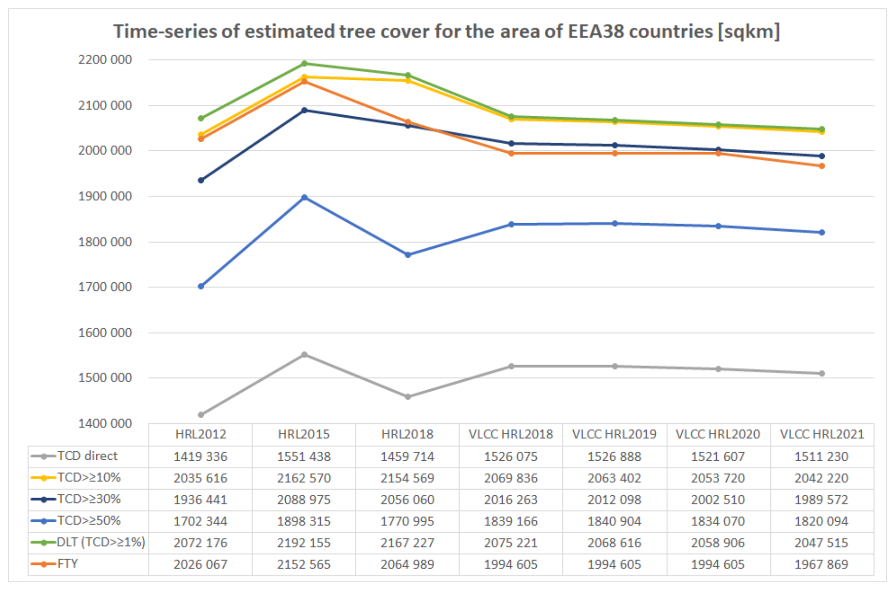

Considering various possibilities for the estimations of tree cover described above, the estimated total tree covered area is influenced by the major factors of:

-   The extent end structure of the binary mask of tree cover further classified in DLT / FTY products as broadleaved or coniferous - influencing all presented estimations;
-   The calibration of TCD values – influencing TCD, TCD≥10%, TCD≥30% and TCD≥50% estimations.

Both the extent and structure of tree cover mask, as well as calibration of TCD values are showing significant differences, and characterise the individual surveys. All of these factors are influencing the total estimated tree covered area presented in Figure 8:

-   Large variation of total estimated tree cover is shown in the period 2012-2018, while the time-series within VLCC survey (2018-2021) is showing stability by presenting the slow decrease of total tree cover;
-   All estimations show obvious breakpoint in 2018 between HRL2018 and VLCC2018 surveys;
-   Lowest tree covered area is estimated by TCD direct calculation method, while highest values are shown by DLT layers (equivalent with TCD ≥ 1%);
-   Lowest total tree covered area in the time-series is shown by 2012 survey. One of the possible reasons is, that relatively large area (altogether 86 575 sqkm) could not be classified because of cloud cover, represented by value 254 (unclassifiable area) in HRL2012 data;
-   The highest total tree covered area in the time-series is shown by 2015 survey. Possible reason is the significant overestimation of tree cover experienced by many visual checks;
-   Local minimum is shown only by TCD direct and TCD ≥ 50% calculations in case of HRL2018;
-   FTY and TCD ≥ 1% shows only few differences in 2012 and in 2015, while larger differences from 2018 onwards. The reason is, that areas under agricultural use and in urban context were only marked in 2012 and 2015, while from 2018 excluded from FTY forest areas by FADSL layers.

### Evolution of the calibration of TCD values

TCD-value based estimations of tree covered area are significantly influenced by the calibration of TCD values. Calibration differences between individual surveys may be illustrated well by the histogram of TCD values. The calibration differences between HRL TCD2018 and VLCC TCD2018 are highlighted to demonstrate that the distribution of TCD values is not specific to the reference year, but to the survey.

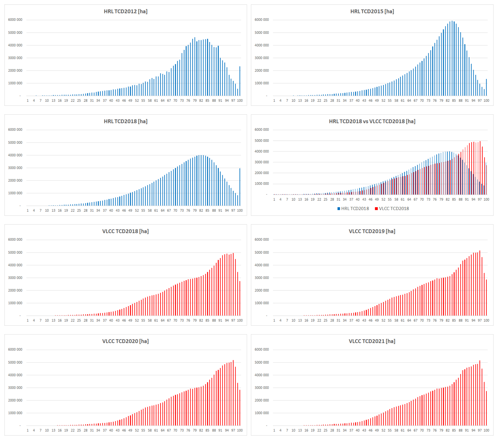

While the distribution of TCD values shows significant differences between each reference year in 2012-2018 period, the shape of the histograms is almost the same for all VLCC TCD layers - the yearly time-series of VLCC TCD layers shows stability in terms of calibration as well. The question is however, how far the calibration of next survey (beyond 2021) may be harmonized with the current calibration of VLCC TCD layers.

### Overview of the stability of leaf type classification in DLT status layers

Besides of providing a mask for tree / forest covered areas, DLT and FTY layers provide separation of the leaf type between broadleaved vs coniferous. The stability of the classification in the time-series was analysed by checking the differences of the DLT layers.

Following difference codes were applied by considering all possible combinations in the classification:

0: unchanged areas with no tree cover
1: new broadleaved cover (no tree cover in first layer)
2: new coniferous cover (no tree cover in first layer)
3: loss of broadleaved cover (no tree cover in second layer)
4: loss of coniferous cover (no tree cover in second layer)
11: unchanged broadleaved cover
22: unchanged coniferous cover
120: broadleaved changed to coniferous
210: coniferous changed to broadleaved
254: unclassifiable in any of parent status layers

In order to gain comparable results for the entire period the DLT differences were calculated for the area mapped commonly by all DLT layers. All differences were calculated in 10m raster resolution.

::: {.tbl-caption}
```{=typst}
#set text(size: 9pt, fill: rgb("#3E6893"))
```
Table 22 Classification differences in DLT time-series for commonly mapped EEA38 area (sqkm)
:::

| DIFFERENCE CODE | HRL DLT2012 VS HRL DLT2015 | HRL DLT2015 VS HRL DLT2018 | VLCC DLT2018 VS VLCC DLT2019 | VLCC DLT2019 VS VLCC DLT2020 | VLCC DLT2020 VS VLCC DLT2021 |
|------------------------------------|---------------------------------------------|------------------------------|----------------------------|------------------------------|------------------------------|
| 0 | 3 209 737 | 3 297 386 | 3 535 164 | 3 540 472 | 3 547 401 |
| 1 | 200 052 | 103 320 | 354 | 1 297 | 3 234 |
| 2 | 42 024 | 42 930 | 124 | 479 | 1 321 |
| 3 | 118 517 | 198 077 | 1 978 | 3 522 | 5 700 |
| 4 | 40 839 | 40 180 | 5 105 | 7 963 | 10 246 |
| 11 | 1 008 487 | 947 604 | 1 097 317 | 1 094 149 | 1 089 746 |
| 22 | 736 584 | 831 471 | 970 821 | 962 981 | 953 214 |
| 120 | 73 070 | 101 524 | | | |
| 210 | 94 600 | 48 371 | | | |
| 254 | 86 953 | | | | |
| SUM | 5 610 863 | 5 610 863 | 5 610 863 | 5 610 863 | 5 610 863 |
| | **HRL DLT2018 VS VLCC DLT2018** | | | | |
| 0 | 3 208 100 | | | | |
| 1 | 170 956 | | | | |
| 2 | 39 275 | | | | |
| 3 | 176 445 | | | | |
| 4 | 58 793 | | | | |
| 11 | 975 178 | | | | |
| 22 | 714 724 | | | | |
| 120 | 165 974 | | | | |
| 210 | 101 041 | | | | |
| 254 | 378 | | | | |
| SUM | 5 610 863 | | | | |

**Key observations:**

-   In case of all change classes (new cover / loss of cover) significantly more differences are shown between HRL or HRL vs VLCC layers in 2012-2018 period, than between VLCC layers in period 2018-2021;
-   Large areas were re-classified from broadleaved to coniferous and vice versa between HRL or HRL vs VLCC layers in 2012-2018 period, while no re-classification is shown between VLCC layers in period 2018-2021;
-   Two different classifications (HRL vs VLCC survey) were compared to the same reference year of 2018, similar magnitude of differences is shown than between any of previous classifications;
-   Unclassifiable areas appear in comparisons between HRL DLT layers 2012-2015 and 2015-2018.

### Classification differences HRL DLT2018 vs VLCC DLT2018 layers

The magnitude of classification differences between HRL DLT2018 vs VLCC DLT2018 layers characterizes well the level of classification uncertainty of individual surveys. Classification differences were coded the same way as in case of tree cover presence change data.

::: {.tbl-caption}
```{=typst}
#set text(size: 9pt, fill: rgb("#3E6893"))
```
Table 23 Differences in estimated tree cover for the reference year of 2018
:::

| DIFFERENCE CLASS | HRL DLT2018 vs VLCC DLT2018 | | |
|-------------------------------------------------------------------|---------------------------------------|-------------------------------------|----------------------------------------------------------|
| | **sqkm** | **%** | **% of unchanged<br>tree cover** |
| 0: unchanged areas with no tree cover | 3 343 511 | 59.1% | |
| 1: new tree cover | 146 363 | 2.6% | 7.6% |
| 2: loss of tree cover | 238 325 | 4.2% | 12.4% |
| 10: unchanged areas with tree cover | 1 929 685 | 34.1% | 100.0% |
| 254: unclassifiable in any status | - | - | |
| **SUM** | **5 657 885** | **100.0%** | |

Significant differences in estimated tree cover are shown between the two classifications performed to the same reference year of 2018. Altogether 146 363 sqkm areas (7.6% of all stable tree cover) were classified in VLCC DLT2018 as new tree cover against HRL DLT2018, while 238 325 sqkm (12.4% of all stable tree cover) were classified as loss of tree cover compared to HRL DLT2018.

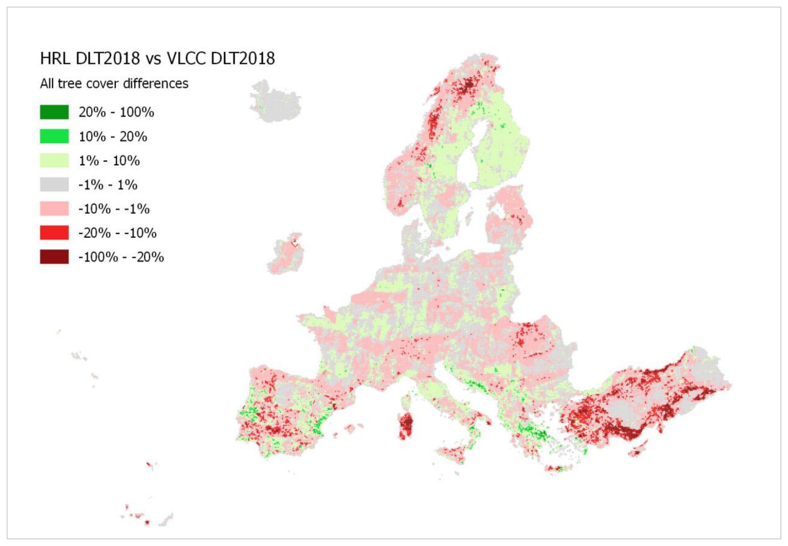

Aggregated tree cover differences were calculated for a 10x10km statistical grid. The distribution of tree cover differences between the two classifications shows regional variations, especially large differences are shown for Mediterranean and Scandinavian areas.

```{=typst}
#set page(flipped: true)
#set text(size: 9pt)
```

::: {.tbl-caption}
```{=typst}
#set text(size: 9pt, fill: rgb("#3E6893"))
```
Table 24 DLT classification uncertainties for the reference year of 2018
:::

| DIFFERENCE CLASS | HRL DLT2018 vs VLCC DLT2018 | | | |
|---------------------------------|--------------------|-----------------------|---------------------------------------------------------|--------------------------------------------------------------------|
| | **sqkm** | **%** | **% to unchanged<br>broadleaved** | **% to<br>unchanged<br>coniferous** |
| 0: unchanged areas with no tree cover | 3 343 511 | 59.1% | | |
| 1: new broadleaved cover | 103 376 | 1.8% | 10.9% | |
| 2: new coniferous cover | 42 988 | 0.8% | | 5.2% |
| 3: loss of broadleaved cover | 198 119 | 3.5% | 20.9% | |
| 4: loss of coniferous cover | 40 207 | 0.7% | | 4.8% |
| 11: unchanged broadleaved cover | 947 878 | 16.8% | 100.0% | |
| 22: unchanged coniferous cover | 831 863 | 14.7% | | 100.0% |
| 120: broadleaved changed to coniferous | 101 548 | 1.8% | 10.7% | |
| 210: coniferous changed to broadleaved | 48 397 | 0.9% | | 5.8% |
| 254: unclassifiable in any status | | 0.0% | | |
| **SUM** | **5 657 885** | **100.0%** | | |

```{=typst}
#set page(flipped: false, paper: "a4")
#set text(size: 11pt)
```

Not only the presence of tree cover, but also the leaf type classification is showing differences between the two surveys. Classification differences were coded in similar way as in case of dominant leaf type change data, but all the meaningful combinations were kept.

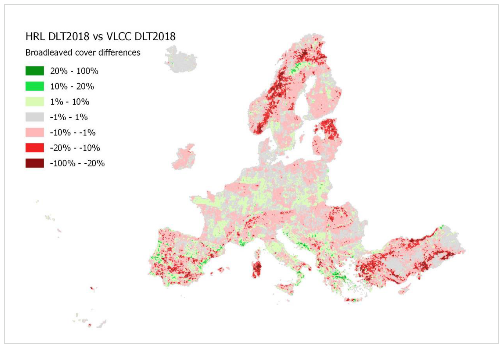

Aggregated differences of broadleaved / coniferous cover were calculated for a 10x10km statistical grid to illustrate regional variations in leaf type classification. Large amount of broadleaved cover was eliminated or re-classified to coniferous cover by VLCC DLT survey compared to HRL DLT2018.

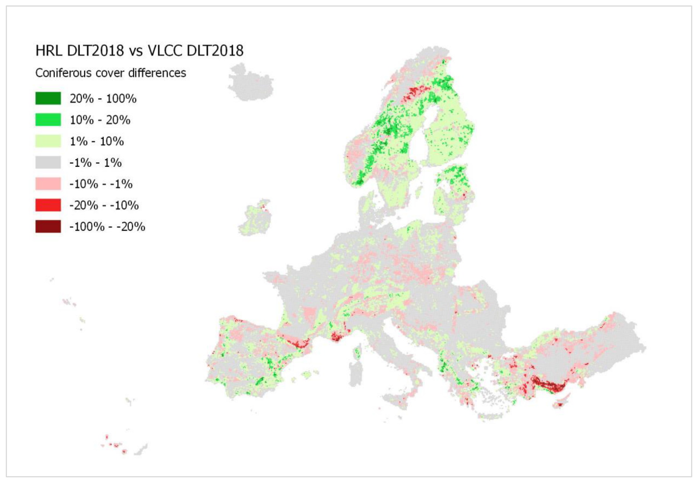

Large green areas in Scandinavia indicate new coniferous cover partly as new cover partly as re-classified from broadleaved by VLCC DLT survey compared to HRL DLT2018.

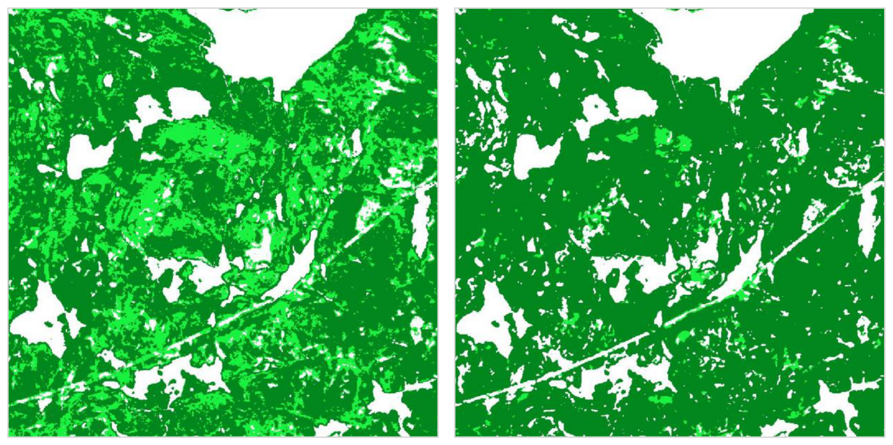
HRL DLT2018
VLCC DLT2018

#### Visualization of classification differences by high resolution maps

In order to gain exact statistics and be able to visualize all differences between DLT classifications DLT difference maps were calculated in 10m raster resolution between neighbouring status data, where all possible combinations were considered. The high-resolution difference map between HRL DLT2018 and VLCC DLT2018 survey results indicate especially large variations in tree cover classifications Mediterranean, Scandinavian and Alpine regions.


CLCplus Backbone 2018

The re-classification of broadleaved cover to coniferous by VLCC DLT2018 is typical for most of Scandinavian area.


CLCplus Backbone 2018

The example in Portugal illustrates well the uncertainty of the classification on low density Mediterranean tree cover. Primarily the presence of tree cover is classified differently in Mediterranean area by the two surveys, but at several regions the re-classification of broadleaved to coniferous is characteristic to southern areas as well.


CLCplus Backbone 2018

Forest areas in the mountainous Alpine relief are often misclassified. Typical differences between the two surveys are illustrated for Alpine region, the most characteristic difference is the re-classification of broadleaved to coniferous by VLCC DLT2018, but similarly typical issue is the loss of coniferous cover in the new classification. In the example the latter area was classified as low-growing woody vegetation by CLCplus Backbone.

### Classification differences VLCC DLT2018 vs CLCplus Backbone 2018

CLCplus Backbone is representing a third independent classification concerning tree cover information for the European area. Overall statistics of woody classes were compared to the commonly mapped (EEA38) area.

```{=typst}
#set page(flipped: true)
#set text(size: 9pt)
```

::: {.tbl-caption}
```{=typst}
#set text(size: 9pt, fill: rgb("#3E6893"))
```
Table 25 Overall statistics of VLCC DLT vs CLCplus Backbone for the reference year of 2018 (sqkm)
:::

```{=html}
<table>
<colgroup>
<col style="width: 16.2%">
<col style="width: 12.2%">
<col style="width: 16.9%">
<col style="width: 19.5%">
<col style="width: 22.1%">
<col style="width: 13.1%">
</colgroup>
<tr>
    <td><b>DLT class</b></td>
    <td><b>VLCC<br>DLT2018</b></td>
    <td><b>CLCplus Backbone class</b></td>
    <td><b>CLCplus<br>Backbone<br>2018</b></td>
    <td><b>Difference:<br>Backbone –<br>DLT (sqkm)</b></td>
    <td><b>Difference:<br>%</b></td>
  </tr>
  <tr>
    <td>0: no tree cover</td>
    <td>3 581 943</td>
    <td>0: no tree cover (all other classes)</td>
    <td>3 629 182</td>
    <td>47 239</td>
    <td>1.3%</td>
  </tr>
  <tr>
    <td rowspan="2" style="vertical-align:middle">1: broadleaved trees</td>
    <td rowspan="2" style="vertical-align:middle">1 099 650</td>
    <td>3: broadleaved deciduous trees</td>
    <td>916 188</td>
    <td rowspan="2" style="vertical-align:middle">-65 968</td>
    <td rowspan="2" style="vertical-align:middle">-6.0%</td>
  </tr>
  <tr>
    <td>4: broadleaved evergreen trees</td>
    <td>117 494</td>
  </tr>
  <tr>
    <td>2: coniferous trees</td>
    <td>976 398</td>
    <td>2: needle leaved trees</td>
    <td>995 129</td>
    <td>18 731</td>
    <td>1.9%</td>
  </tr>
  <tr>
    <td>SUM</td>
    <td>5 657 991</td>
    <td>SUM</td>
    <td>5 657 991</td>
    <td>-</td>
    <td>-</td>
  </tr>
  <tr>
    <td>All tree cover (1+2)</td>
    <td>2 076 049</td>
    <td>All tree cover (2+3+4)</td>
    <td>2 028 810</td>
    <td>-47 237</td>
    <td>2.3%</td>
  </tr>
</table>
```

```{=typst}
#set page(flipped: false, paper: "a4")
#set text(size: 11pt)
```

Only few differences (47 237 sqkm, corresponding to 2.3% surplus by DLT2018) are indicated by overall statistics between the two surveys. Largest difference (65 968 sqkm, corresponding to 6.0% surplus by DLT2018) is shown for broadleaved trees.

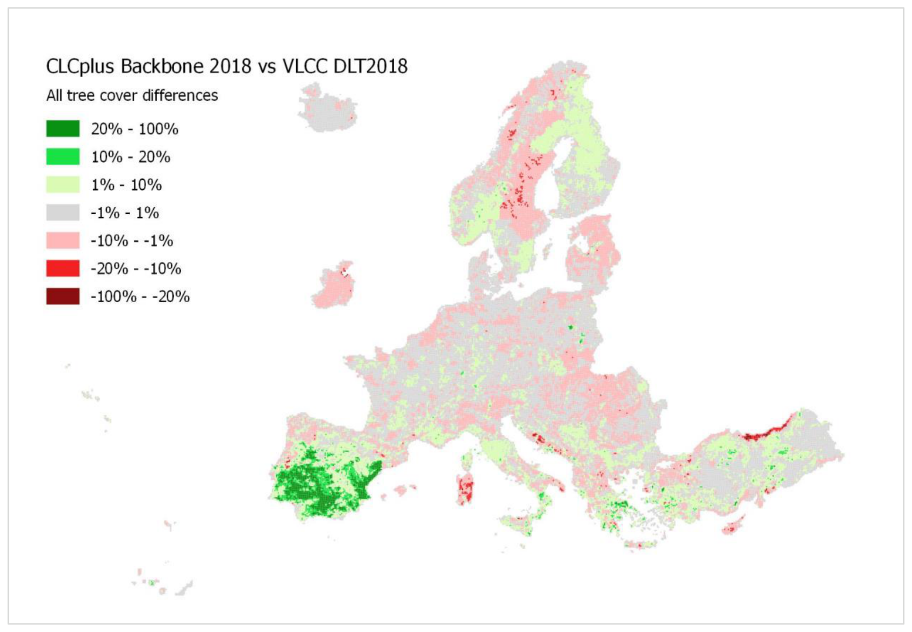

Aggregated tree cover differences were calculated for a 10x10km statistical grid. Relatively few differences are shown for most of the European area except the large green spot in Spain-Portugal, indicating significant surplus of tree cover mapped by DLT2018 compared to CLCplus Backbone.

### Classification differences HRL DLT2012 vs HRL DLT2015 layers

DLT difference map was calculated in 20m raster resolution between HRL DLT2012 vs HRL DLT2015 layers. Calculated differences were compared to available change layers between 2012 and 2015 HRL Forest data.

::: {.tbl-caption}
```{=typst}
#set text(size: 9pt, fill: rgb("#3E6893"))
```
Table 26 Tree cover differences compared to tree cover changes indicated by TCCM1215\* data
:::

| DIFFERENCE CLASS | HRL DLT2012 vs HRL DLT2015 |
|------------------------------------------------------------------------------------------------------|--------------------------------------------------------------------------------------------------|
| | **Tree cover<br>difference (sqkm)** | **Tree cover change<br>(sqkm)** | **Change / Difference %** |
| 0: unchanged areas with no tree cover | 3 416 742 | 3 518 599 | 103,0% |
| 1: new tree cover | 252 031 | 100 566 | 39,9% |
| 2: loss of tree cover | 165 154 | 61 792 | 37,4% |
| 10: unchanged areas with tree cover | 1 936 075 | 2 089 044 | 107,9% |
| 254: unclassifiable in any status | 88 164 | 88 164 | 100,0% |
| **SUM** | **5 858 166** | **5 858 166** | **100,0%** |

\*Tree Cover Change Mask (TCCM) 2012-2015 data (20m resolution) were not provided by original HRL Forest 2015 survey (and not included to corresponding guidelines), but was provided later by HRL Forest 2018 survey.

The Dominant Leaf type Change (DLTC) layer produced by original HRL Forest 2015 survey was an early version of that kind, is now outdated and currently no DLTC layer for the 2012-2015 period is published on CLMS website. The original DLTC1215 layer was produce by combining tree cover change information with dominant leaf type change and has included many classes, which cannot link fully to the difference classes derived by logical combinations of DLTC classes.

::: {.tbl-caption}
```{=typst}
#set text(size: 9pt, fill: rgb("#3E6893"))
```
Table 27 DLT differences compared to DLT changes indicated by DLTC1215* data
:::

```{=html}
<table>
<colgroup>
<col style="width: 28.0%">
<col style="width: 20.8%">
<col style="width: 28.0%">
<col style="width: 23.3%">
</colgroup>
<tr>
    <td><b>DLT difference class</b></td>
    <td><b>DLT diff<br>2012-2015</b></td>
    <td><b>DLT 2012-2015 change class</b></td>
    <td><b>DLT change<br>2012-2015</b></td>
  </tr>
  <tr>
    <td>0: unchanged areas with no tree cover</td>
    <td>3 416 742</td>
    <td>0: unchanged areas with no tree cover</td>
    <td>3 522 280</td>
  </tr>
  <tr>
    <td>1: new broadleaved cover</td>
    <td>209 205</td>
    <td>1: new broadleaved cover</td>
    <td>83 010</td>
  </tr>
  <tr>
    <td>2: new coniferous cover</td>
    <td>42 826</td>
    <td>2: new coniferous cover</td>
    <td>13 610</td>
  </tr>
  <tr>
    <td>3: loss of broadleaved cover</td>
    <td>122 860</td>
    <td>3: loss of broadleaved cover</td>
    <td>38 957</td>
  </tr>
  <tr>
    <td>4: loss of coniferous cover</td>
    <td>42 294</td>
    <td>4: loss of coniferous cover</td>
    <td>20 658</td>
  </tr>
  <tr>
    <td>11: unchanged broadleaved cover</td>
    <td>1 021 618</td>
    <td>10: unchanged areas with tree cover</td>
    <td>2 040 828</td>
  </tr>
  <tr>
    <td>22: unchanged coniferous cover</td>
    <td>745 126</td>
    <td>11: broadleaved, increased density</td>
    <td>16 559</td>
  </tr>
  <tr>
    <td>120: broadleaved changed to coniferous</td>
    <td>73 863</td>
    <td>33: broadleaved, decreased density</td>
    <td>7 183</td>
  </tr>
  <tr>
    <td>210: coniferous changed to broadleaved</td>
    <td>95 469</td>
    <td>22: coniferous, increased density</td>
    <td>4 663</td>
  </tr>
  <tr>
    <td>254: unclassifiable in any status</td>
    <td>88 164</td>
    <td>44: coniferous, decreased density</td>
    <td>3 062</td>
  </tr>
  <tr>
    <td><b>SUM</b></td>
    <td><b>5 858 166</b></td>
    <td>120: broadleaved changed to coniferous</td>
    <td>3 062</td>
  </tr>
  <tr>
    <td></td>
    <td></td>
    <td>210: coniferous changed to broadleaved</td>
    <td>15 668</td>
  </tr>
  <tr>
    <td></td>
    <td></td>
    <td>254: unclassifiable in any status</td>
    <td>88 164</td>
  </tr>
  <tr>
    <td></td>
    <td></td>
    <td><b>SUM</b></td>
    <td><b>5 858 166</b></td>
  </tr>
</table>
```

\*DLTC1215 layer is outdated, not available any more in CLMS website

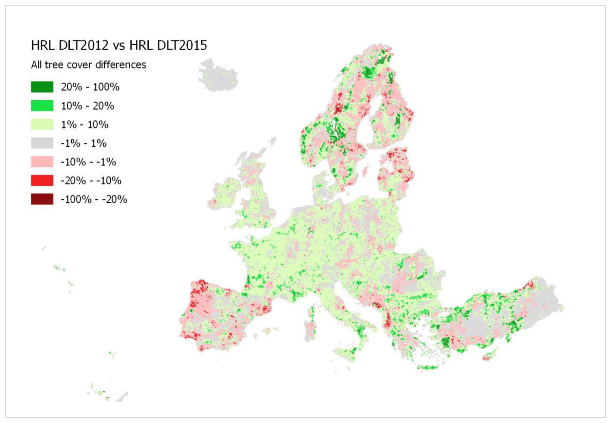

Aggregated tree cover differences were calculated for a 10x10km statistical grid. The distribution of all tree cover differences between the two classifications shows regional variations. The overall vision based on the statistics and maps is, that tree cover differences are more the consequence of classification uncertainties of individual processing units, than of real tree cover changes.

Tree cover changes represent about 40% of all the differences, but no further information is available about the reliability of change data, as the only validation result published[^12] was analysing only the 100m resolution Tree Cover Density Change (TCDC) 2012-2015 data (besides of TCD and FTY status).

The main findings and recommendations for the HRL TCDC product are summarised in the report as follows:

-   The TCDC layer only meets the minimum accuracy requirement for increased and decreased changes with respect to omission errors;
-   The TCDC shows very high amount of commission errors which lead to an overestimation of changes.
-   The next exercise for the production of the Forest layer should include the reprocessing of the change layers.
-   Results provided at bio-geographical regions and country/group of country level, should provide a sound basis for further improving the product.

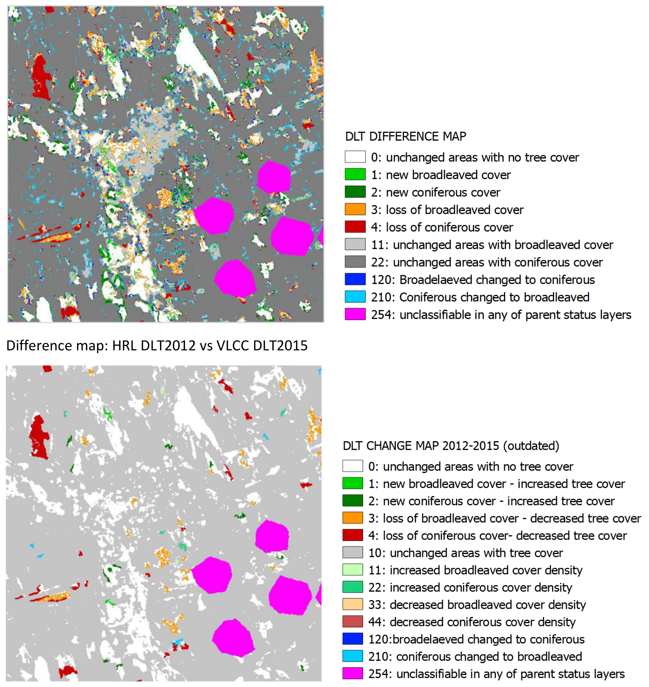
Dominant Leaf Type Change (DLTC) 2012-2015 (outdated map and classification)

In order to gain exact statistics and be able to visualize all differences between DLT2012 and DLT2015 classifications DLT difference map was calculated in 20m raster resolution, where all possible combinations were considered. The high-resolution difference map between HRL DLT2012 and HRL DLT2015 survey results indicate especially large variations in tree cover classifications Mediterranean, Scandinavian and Alpine regions. Unclassified areas due to cloud cover occur in many places sporadically across Europe, but extreme large unclassified areas are appearing in Scandinavian region.

### Classification differences HRL DLT2015 vs HRL DLT2018 layers

DLT difference map was calculated in 10m raster resolution between HRL DLT2015 vs HRL DLT2018 layers. Calculated differences were compared to available change layers between 2015 and 2018 HRL Forest data.

::: {.tbl-caption}
```{=typst}
#set text(size: 9pt, fill: rgb("#3E6893"))
```
Table 28 Tree cover differences compared to tree cover changes indicated by TCCM1518 data
:::

| DIFFERENCE CLASS | HRL DLT2015 vs HRL DLT2018 |
|--------------------------------------------------------------------------------------------------------|------------------------------------------------------------------------------------------------|
| | **Tree cover<br>difference (sqkm)** | **Tree cover change<br>(sqkm)** | **Change / difference<br>%** |
| 0: unchanged areas with no tree cover | 3 413 593 | 3 619 816 | 106.0% |
| 1: new tree cover | 217 626 | 1 957 | 0.9% |
| 2: loss of tree cover | 244 492 | 17 510 | 7.2% |
| 10: unchanged areas with tree cover | 1 981 069 | 2 272 189 | 114.7% |
| 254: unclassifiable in any status | 734 | 734 | 100.0% |
| **SUM** | **5 857 514** | **5 912 205** | **100.9%** |

Both Tree Cover Change mask (TCCM) and Dominant Leaf Type Change (DLTC) layers were provided by the HRL Forest 2018 survey in 20m resolution. With the aggregation of thematic classes, DLT difference classes may be linked to TCCM classes directly.

HRL DLT2015 (20m resolution) and HRL DLT2018 (10m resolution) layers cannot be considered as consistent, not only because of the different spatial resolution, but statistically the difference of the layers is obviously not corresponding to the changes derived, the changes represent only 0.9% (broadleaved trees) and 7.2% (coniferous trees) of the differences.

With the merge of thematic classes, DLT difference classes may be linked to DLTC classes directly, but as the DLTC layer does not include (by definition) all combinations of possible DLT differences, DLTC layers cannot be directly used in an backdating ("accounting") process.

::: {.tbl-caption}
```{=typst}
#set text(size: 9pt, fill: rgb("#3E6893"))
```
Table 29 DLT differences compared to DLT changes indicated by DLT1518 data
:::

```{=html}
<table>
<colgroup>
<col style="width: 22.7%">
<col style="width: 16.9%">
<col style="width: 23.7%">
<col style="width: 21.1%">
<col style="width: 15.5%">
</colgroup>
<tr>
    <td><b>DLT difference class</b></td>
    <td><b>DLT diff<br>2015-<br>2018</b></td>
    <td><b>DLT 2012-2015 change class</b></td>
    <td><b>DLT<br>change<br>2015-2018</b></td>
    <td><b>Change /<br>difference</b></td>
  </tr>
  <tr>
    <td>0: unchanged areas with no tree cover</td>
    <td>3 413 593</td>
    <td>0: unchanged areas with no<br>tree cover</td>
    <td>3 619 816</td>
    <td>106.0%</td>
  </tr>
  <tr>
    <td>1: new broadleaved cover</td>
    <td>177 655</td>
    <td>1: new broadleaved cover</td>
    <td>1 239</td>
    <td>0.7%</td>
  </tr>
  <tr>
    <td>2: new coniferous cover</td>
    <td>39 971</td>
    <td>2: new coniferous cover</td>
    <td>718</td>
    <td>1.8%</td>
  </tr>
  <tr>
    <td>3: loss of broadleaved cover</td>
    <td>184 629</td>
    <td>3: loss of broadleaved cover</td>
    <td>5 415</td>
    <td>2.9%</td>
  </tr>
  <tr>
    <td>4: loss of coniferous cover</td>
    <td>59 863</td>
    <td>4: loss of coniferous cover</td>
    <td>12 095</td>
    <td>20.2%</td>
  </tr>
  <tr>
    <td>11: unchanged broadleaved cover</td>
    <td>988 726</td>
    <td rowspan="2" style="vertical-align:middle">10: unchanged areas with tree<br>cover</td>
    <td rowspan="2" style="vertical-align:middle">2 271 876</td>
    <td rowspan="2" style="vertical-align:middle">132.7%</td>
  </tr>
  <tr>
    <td>22: unchanged coniferous cover</td>
    <td>722 894</td>
  </tr>
  <tr>
    <td>120: broadleaved changed to coniferous</td>
    <td>167 458</td>
    <td rowspan="2" style="vertical-align:middle">12: potential change among<br>dominant leaf type</td>
    <td rowspan="2" style="vertical-align:middle">313</td>
    <td rowspan="2" style="vertical-align:middle">0.1%</td>
  </tr>
  <tr>
    <td>210: coniferous changed to broadleaved</td>
    <td>101 991</td>
  </tr>
  <tr>
    <td>254: unclassifiable in any status</td>
    <td>734</td>
    <td>254: unclassifiable in any<br>status</td>
    <td>734</td>
    <td>100.0%</td>
  </tr>
  <tr>
    <td><b>SUM</b></td>
    <td><b>5 857 514</b></td>
    <td><b>SUM</b></td>
    <td><b>5 912 166</b></td>
    <td><b>100.9%</b></td>
  </tr>
</table>
```

Changes in DLTC layer represent only the minority of all differences, all the rest of differences were considered as "technical change" and filtered out. Relatively high share (20.2%) of differences were kept in case of DLTC class 4 (loss of coniferous forest).

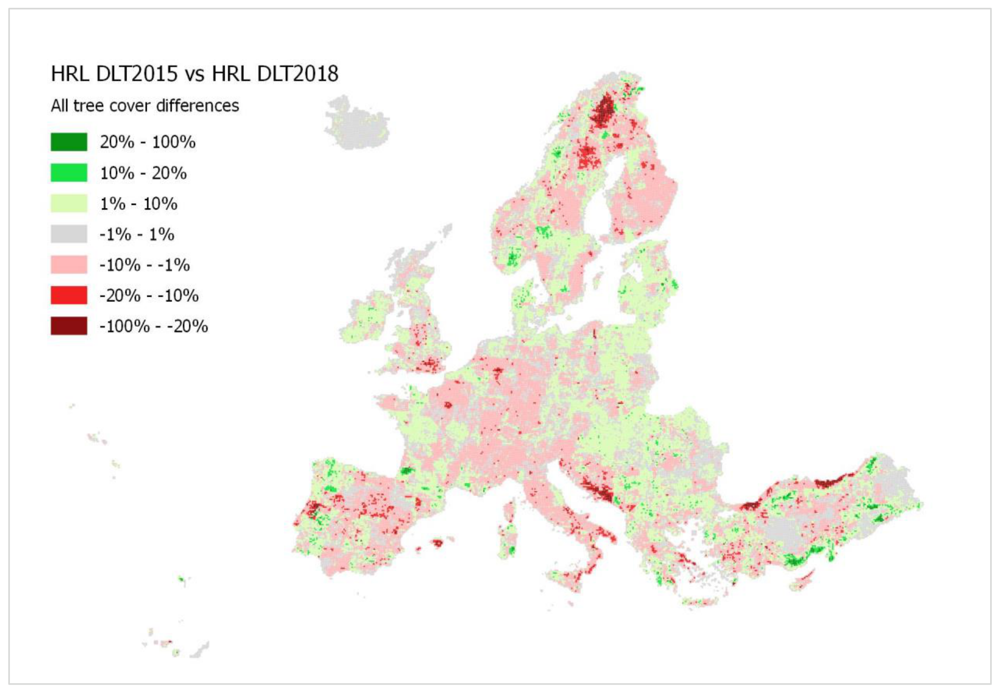

Aggregated tree cover differences were calculated for a 10x10km statistical grid. The distribution of all tree cover differences between the two classifications shows regional variations. The overall vision based on the statistics and maps is, that tree cover differences are more the consequence of classification uncertainties of individual processing units, than of real tree cover changes.

Only limited information is available about the reliability of change data, as no European validation results were published for HRL Forest 2018 products. On the other hand, DLTC1518 layer was verified by EEA Member States and the evaluation report is available[^13]. Main conclusions of the MS verification are:

-   The average look and feel evaluation result for HRL DLTC 2015-2018 layer was 2.9 (acceptable);
-   The best-performing class was the "loss of coniferous cover (4)" with (good) overall result;
-   The lowest result appeared at "potential change among leaf types (12)" class as 1.7 (insufficient);
-   The other three classes reached “acceptable” level, class “new broadleaved cover (1)” with the lowest score among them: 2.5;
-   Class "new coniferous cover (2)" with 2.9 and class "loss of broadleaved cover (3)" with the highest score among them, exceeding overall average, as 3.3.

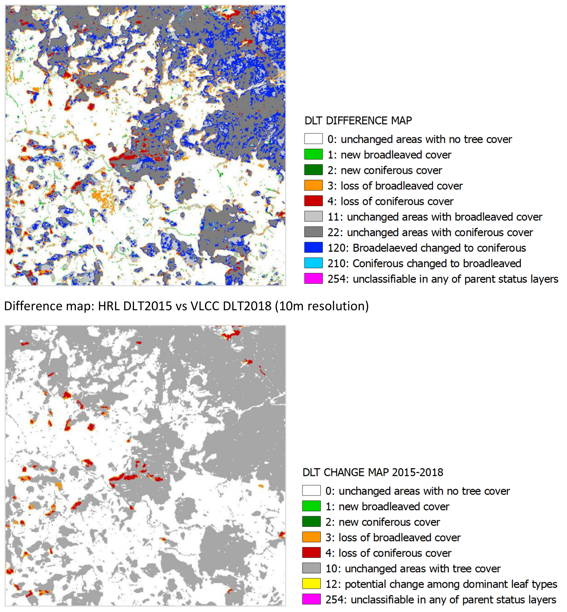
Dominant Leaf Type Change (DLTC) 2015-2018 (20m resolution)

In order to gain exact statistics and be able to visualize all differences between HRL DLT2015 and HRL DLT2018 classifications DLT difference map was calculated in 10m raster resolution, where all possible combinations were considered. The high-resolution difference map between HRL DLT2018 and HRL DLT2018 survey results indicate especially large variations in tree cover classifications Mediterranean, Scandinavian and in mountainous regions.

***
[^1]: https://github.com/wri/global-pasture-watch/blob/main/ggc-30m/README.md
[^2]: https://landcarbonlab.org/about-global-pasture-watch/
[^3]: https://global-pasture-watch.projects.earthengine.app/view/ggc-30m
[^4]: https://www.super-g.eu/about-super-g/
[^5]: https://cordis.europa.eu/project/id/774124
[^6]: https://business.esa.int/projects/grasssignal
[^7]: https://esdac.jrc.ec.europa.eu/content/soil-biomass-productivity-maps-grasslands-and-pasture-coplands-and-forest-areas-european
[^8]: https://www.lamasus.eu/ -last accessed 08.05.2025 09:45
[^9]: Product specifications – DLT, FT and TCD (2012 and 2015) and DLT, FT and TCD Changes
[^10]: Product user manual – DLT, FT and TCD 2018 and DLT, FT and TCD Changes
[^11]: High Resolution Layer Vegetated Land Cover Characteristics 2017-2021 Production - Key technical specifications
[^12]: HRL FOREST 2015 FINAL VALIDATION REPORT
[^13]: Task 9 Assessment of MS verification results (HRLs 2018) - HRL DLTC 2015-2018. ETC/ULS Copernicus Report 2021 under SC 58651.
***

### Classification differences VLCC DLT2018 vs VLCC DLT2021 layers

DLT difference map was calculated in 10m raster resolution between VLCC DLT2018 vs VLCC DLT2021 layers. Calculated differences were compared to available change layers between 2018 and 2021 VLCC Forest data.

::: {.tbl-caption}
```{=typst}
#set text(size: 9pt, fill: rgb("#3E6893"))
```
Table 30 Tree cover differences compared to tree cover changes indicated by TCPC1821 data
:::

| DIFFERENCE CLASS | HRL DLT2015 vs HRL DLT2018 | | |
|------------------------------------------|--------------------------------------------------------|----------------------------------------------------|--------------------------------------------------|
| | **Tree cover<br>difference (sqkm)** | **Tree cover change<br>(sqkm)** | **Change / difference<br>%** |
| 0: unchanged areas with no tree cover | 3 576 183 | 3 525 896 | 98,6% |
| 1: new tree cover | 6 815 | 2 187 | 32,1% |
| 2: loss of tree cover | 34 521 | 21 204 | 61,4% |
| 10: unchanged areas with tree cover | 2 041 527 | 2 109 759 | 103,3% |
| 254: unclassifiable in any status | - | - | - |
| **SUM** | **5 659 046** | **5 659 046** | **100,0%** |

VLCC DLT layers were produced for each reference year in the 2018-2021 period, both change layers Tree Cover Presence Change (PCPC, new name for TCCM in previous surveys) and Dominant Leaf Type Change (DLTC) layers were provided by the VLCC Forest 2018-2021 survey in 20m resolution to cover the full 3 yearly period.

With the merge of thematic classes, DLT difference classes may be linked to DLTC classes directly, but as the DLTC layer does not include (by definition) all combinations of possible DLT differences, DLTC layers cannot be directly used in a backdating (“accounting") process.

::: {.tbl-caption}
```{=typst}
#set text(size: 9pt, fill: rgb("#3E6893"))
```
Table 31 DLT differences compared to DLT changes indicated by DLT1821 data
:::

```{=html}
<table>
<colgroup>
<col style="width: 23.2%">
<col style="width: 17.3%">
<col style="width: 24.2%">
<col style="width: 19.4%">
<col style="width: 15.9%">
</colgroup>
<tr>
    <td><b>DLT difference class</b></td>
    <td><b>DLT diff<br>2015-2018</b></td>
    <td><b>DLT 2012-2015 change class</b></td>
    <td><b>DLT change<br>2015-2018</b></td>
    <td><b>Change /<br>difference</b></td>
  </tr>
  <tr>
    <td>0: unchanged areas with no tree cover</td>
    <td>3 576 183</td>
    <td>0: unchanged areas with no tree cover</td>
    <td>3 525 896</td>
    <td>98.6%</td>
  </tr>
  <tr>
    <td>1: new broadleaved cover</td>
    <td>4 888</td>
    <td>1: new broadleaved cover</td>
    <td>1 660</td>
    <td>34.0%</td>
  </tr>
  <tr>
    <td>2: new coniferous cover</td>
    <td>1 927</td>
    <td>2: new coniferous cover</td>
    <td>528</td>
    <td>27.4%</td>
  </tr>
  <tr>
    <td>3: loss of broadleaved cover</td>
    <td>11 203</td>
    <td>3: loss of broadleaved cover</td>
    <td>4 301</td>
    <td>38.4%</td>
  </tr>
  <tr>
    <td>4: loss of coniferous cover</td>
    <td>23 319</td>
    <td>4: loss of coniferous cover</td>
    <td>16 903</td>
    <td>72.5%</td>
  </tr>
  <tr>
    <td>11: unchanged broadleaved cover</td>
    <td>1 088 448</td>
    <td rowspan="2" style="vertical-align:middle">10: unchanged areas with tree cover</td>
    <td rowspan="2" style="vertical-align:middle">2 109 759</td>
    <td rowspan="2" style="vertical-align:middle">103.3%</td>
  </tr>
  <tr>
    <td>22: unchanged coniferous cover</td>
    <td>953 080</td>
  </tr>
  <tr>
    <td>120: broadleaved changed to coniferous</td>
    <td>-</td>
    <td rowspan="2" style="vertical-align:middle">12: potential change among dominant leaf type</td>
    <td rowspan="2" style="vertical-align:middle">-</td>
    <td rowspan="2" style="vertical-align:middle">-</td>
  </tr>
  <tr>
    <td>210: coniferous changed to broadleaved</td>
    <td>-</td>
  </tr>
  <tr>
    <td>254: unclassifiable in any status</td>
    <td>-</td>
    <td>254: unclassifiable in any status</td>
    <td>-</td>
    <td>-</td>
  </tr>
  <tr>
    <td><b>SUM</b></td>
    <td><b>5 659 064</b></td>
    <td><b>SUM</b></td>
    <td><b>5 659 064</b></td>
    <td><b>100.0%</b></td>
  </tr>
</table>
```

No re-classification between broadleaved to coniferous neither vice-versa is appearing in DLT differences, neither class 12 (potential change among dominant leaf type) is appearing in DLTC1821 layer, this is unique in the whole of DLT time-series - VLCC DLT layers were produced obviously in a technically harmonized way.

TCPC and DLTC changes represent almost all differences except that a Minimum Mapping Unit (MMU = 1ha) was applied. TCPC and DLTC changes represent between 27-72% of all differences depending on change classes, where the missing changes correspond to differences appearing as contiguous patches with a size smaller than 1 ha.

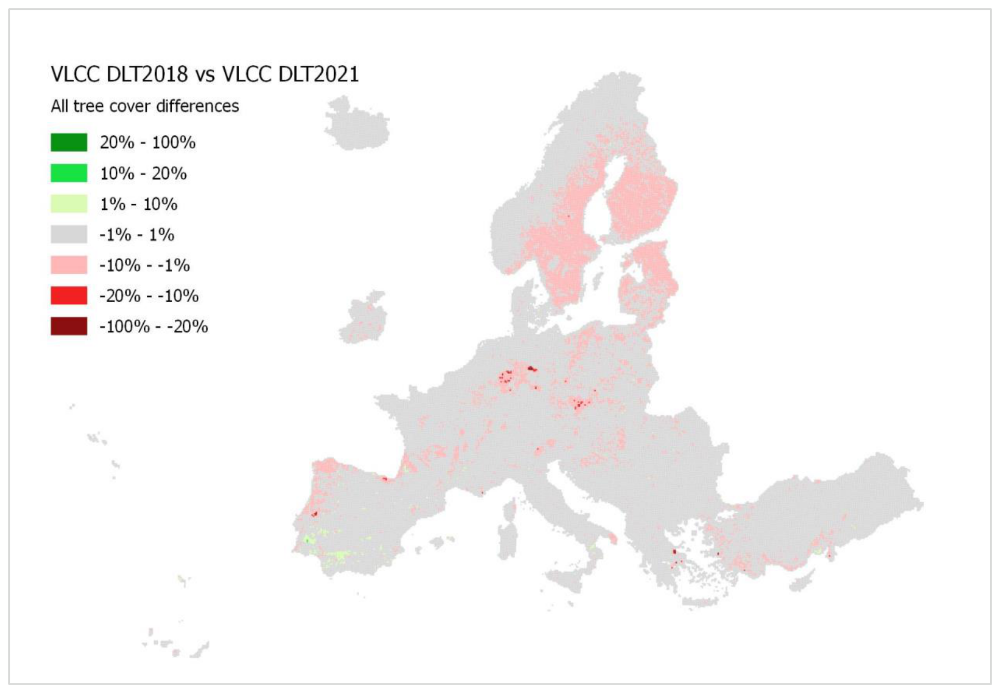

Aggregated tree cover differences were calculated for a 10x10km statistical grid. The distribution of all tree cover differences between the two classifications shows slight decrease of tree cover over Scandinavia and sporadically across Europe except some Mediterranean locations mostly in Spain or Portugal.

The overall vision is, that tree cover differences may correspond mostly to real tree cover changes, however no external QA/QC results are available yet for VLCC Forest data.

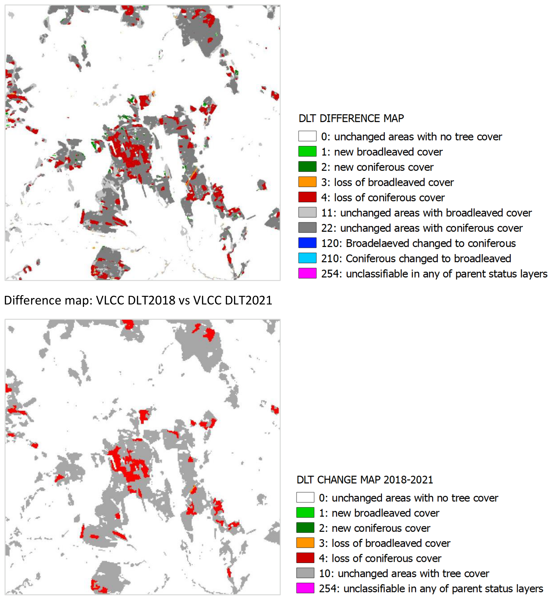
Dominant Leaf Type Change (VLCC DLTC) 2018-2021

In order to gain exact statistics and be able to visualize all differences between VLCC DLT2018 and VLCC DLT2021 classifications DLT difference map was calculated in 10m raster resolution, where all possible combinations were considered.

The 10m resolution difference map between HRL DLT2018 and HRL DLT2018 surveys corresponds exactly to DLTC1821 change map except that:

-   Difference map was produced in 10m resolution while DLTC map is provided in 20m resolution;
-   Contiguous tree cover difference patches smaller than 1ha were eliminated from DLTC;
-   Difference classes 11 (unchanged broadleaved) and 22 (unchanged coniferous) were merged to DLTC class 10 (unchanged areas with tree cover.

## Discussion of the mapping concepts applied for creating HRL Forest layers

The post classification comparison change mapping method is applied for most of raster-based CLMS products, supplemented by the semi-automatic separation of technical changes from real land cover changes.

Main and simplified steps of the complex processing are:

1.  Creating status layer for first reference year by complex classification procedure;
2.  Creating status layer for second reference year by complex classification procedure;
3.  Creating difference layer by GIS procedure;
4.  Separation of technical changes from real changes by semi-automatic procedures, creating change layer for publication.

Previous tree cover change layers for 2012-2015 and 2015-2018 period have followed the above steps. This has resulted more or less reliable tree cover change layers, but the status layers in the time-series were not harmonized, the difference of the status layers have shown significantly larger differences than changes appearing in TCCM or DLTC layers.

The new VLCC Forest survey is providing technically harmonized time-series of all primary tree cover data (TCD, DLT, FTY status and TCPC & DLTC changes) for the 2018-2021 period. The high level of technical consistency is unique among HRL Forest layers, but among other high resolution land cover layers (HRL Imperviousness or CLCplus Backbone) as well.

To reach this level, the additional step was introduced to the processing:

5.  Artificial harmonization of the status layers, by creating the new status as a combination of previous status and real changes gained in step 4;

This step was obviously included to a more complex procedure applied to harmonize all of the status layers between 2018 and 2021, as not only these two layers, but all of them (2018-2019-2020-2021) proved to be technically harmonized both in terms of both: Calibration of TCD values and consistent classification tree cover, including leaf type.

Additional steps were applied to gain final tree cover change data:

6.  Elimination of contiguous patches of tree cover smaller than 1ha MMU;
7.  Resampling 10m intermediate tree cover change data to 20m resolution.

Steps 6 & 7 have introduced slight technical inconsistency between tree cover status and change data, the simple requirement

$$Change = New status – Old status$$

is obviously not fulfilled, although VLCC Forest layers are technically close to be perfectly consistent.

Remaining questions are be answered:

-   Is the MMU of 1ha a good choice to improve the reliability of tree cover change data?
-   Are valuable changes lost with the introduction of 1ha MMU? If yes, what is the recommended value for the MMU?
-   How the resampling the change data to 20m is affecting the quality? Is it really necessary?
-   Would be worth to make tree cover status and change data fully consistent?

### Effect of 1ha MMU applied to VLCC Forest change data

While the high level of technical consistency and plausible change figures in terms of statistical tables and difference maps show the data to be close to perfect, no extensive QA/QC results are available yet to provide overall figures about data quality.

A common experience with HR LCLU layers is that the change data also contain many 1-2 pixel change patches, which statistically account for the largest mass of all changes, while they do not represent real change, but are mostly identified as noise due to the uncertainty of the classifications. For this reason, filtering out small patches of change seems to be a very good idea, as confirmed by the preliminary quality control results performed on preliminary delivery of VLCC Forest data, where the reliability of remaining (larger than 1 ha) changes proved to be rather high. On the other hand, the question is what we lose by applying 1ha MMU - verification exercises usually do not check missing changes.

In order to have an idea about the effect of applying 1ha MMU to VLCC Forest change data, the difference of VLCC FLT2018 and VLCC DLT2021 was examined in more detail.

**Data preparation**

Step 1: Tree cover difference map was calculated in 10m raster resolution with the combination of VLCC DLT2018 and VLCC DLT2021 data. Leaf type classification was not considered, only the presence or absence of tree cover.

Step 2: The tree cover difference map was vectorized. The distribution of tree cover differences by size of contiguous difference patches was calculated (Table 32)

::: {.tbl-caption}
```{=typst}
#set text(size: 9pt, fill: rgb("#3E6893"))
```
Table 32 Distribution of the aggregated area of tree cover difference polygons by patch size ranges
:::

```{=html}
<table>
<colgroup>
<col style="width: 30.6%">
<col style="width: 14.1%">
<col style="width: 20.3%">
<col style="width: 14.7%">
<col style="width: 20.3%">
</colgroup>
<tr>
    <td rowspan="2" style=" vertical-align:middle"><b>Patch size</b></td>
    <td colspan="2" ><b>New tree cover</b></td>
    <td colspan="2" ><b>Loss of tree cover</b></td>
  </tr>
  <tr>
    <td><b>sqkm</b></td>
    <td><b>%</b></td>
    <td><b>sqkm</b></td>
    <td><b>%</b></td>
  </tr>
  <tr>
    <td>Smaller than 0.1ha</td>
    <td>2 044</td>
    <td>30.0%</td>
    <td>3 343</td>
    <td>9.7%</td>
  </tr>
  <tr>
    <td>0.1ha – 1ha</td>
    <td>2 243</td>
    <td>32.9%</td>
    <td>7 638</td>
    <td>22.1%</td>
  </tr>
  <tr>
    <td>Greater or equal than 1ha</td>
    <td>2 528</td>
    <td>37.1%</td>
    <td>23 540</td>
    <td>68.2%</td>
  </tr>
  <tr>
    <td><b>All changes</b></td>
    <td><b>6 815</b></td>
    <td><b>100.0%</b></td>
    <td><b>34 521</b></td>
    <td><b>100.0%</b></td>
  </tr>
</table>
```

The effect of 1ha MMU shows different picture considering gain or loss of tree cover:

-   In case of new tree cover most of the differences (62.9%) is lost due to the applied 1ha MMU;
-   In case of loss of tree cover still significant amount (31.8%) of differences is lost due to the applied 1ha MMU.

Due to the high level of harmonization between VLCC Forest layers the difference of tree cover status layers in the size range greater or equal to 1ha is almost fully compliant with TCPC change data, except slight differences, probably due to the effect of the aggregation of 10m difference raster to 20m:

-   2 528 sqkm difference in case of new tree cover against 2 187 sqkm in TCPC class 1;
-   23 540 sqkm difference in case of loss of tree cover against 21 204 in TCPC class 2.

Resources in the frames of this task did not allow to perform an extensive quality check of tree cover change data, but we have used the part of the limited resources to verify the validity of tree cover differences as real changes under the 1ha MMU patch size limit.

#### Verification methodology

Step 1: Tree cover difference polygons in the size range of 0.1-1ha (corresponding to 10-99 contiguous tree covered raster cells) were pre-selected as target of further stratified random sampling.

Step 2: Altogether 100 random samples were selected both for new tree cover and loss of tree cover from the pre-selected set;

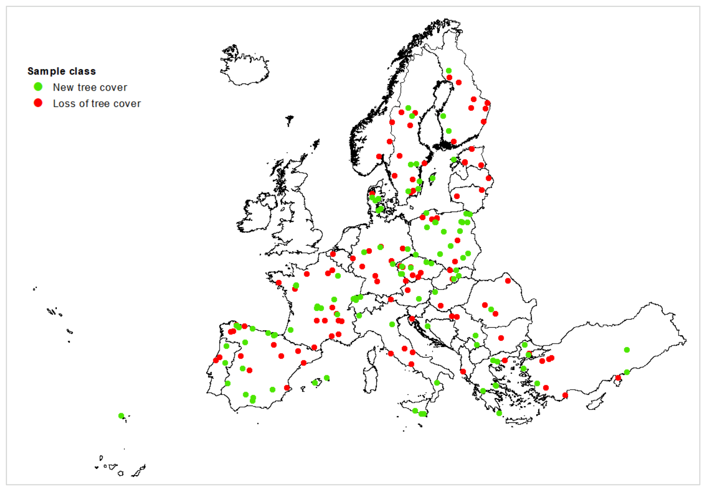

Step 3: The random samples were checked visually against historical Google Earth imagery supported by EEA VHR satellite imagery, by answering following questions:

-   Is appropriate Google Earth imagery available for both reference dates?
-   Is the classification correct in VLCC DLT2018 data (leaf type not considered)?
-   Is the classification correct in VLCC DLT2021 data (leaf type not considered)?
-   Does the difference polygon correspond to a real tree cover change, or a partial tree cover change, or no change at all?

#### Results

Altogether 200 selected samples were checked, but only 189 samples could be evaluated, as in case of the rest of samples no appropriate EO imagery was available for both of reference dates.

::: {.tbl-caption}
```{=typst}
#set text(size: 9pt, fill: rgb("#3E6893"))
```
Table 33 Results of validity check
:::

```{=html}
<table>
<colgroup>
<col style="width: 14.9%">
<col style="width: 14.9%">
<col style="width: 19.5%">
<col style="width: 19.2%">
<col style="width: 12.9%">
<col style="width: 6.7%">
<col style="width: 5.4%">
<col style="width: 6.7%">
</colgroup>
<tr>
    <td rowspan="2" style=" vertical-align:middle"><b>Stratum</b></td>
    <td rowspan="2" style=" vertical-align:middle"><b>No. of all samples</b></td>
    <td rowspan="2" style=" vertical-align:middle"><b>No. of samples evaluated</b></td>
    <td ><b>DLT2018</b></td>
    <td ><b>DLT2021</b></td>
    <td colspan="3" ><b>Validity of change (no. of samples)</b></td>
  </tr>
  <tr>
    <td style="text-align:center"><b>Correct</b></td>
    <td style="text-align:center"><b>Correct</b></td>
    <td style="text-align:center"><b>Real<br>change</b></td>
    <td style="text-align:center"><b>Partial<br>change</b></td>
    <td style="text-align:center"><b>No<br>change</b></td>
  </tr>
  <tr>
    <td>New tree cover</td>
    <td style="text-align:center">100</td>
    <td style="text-align:center">98</td>
    <td style="text-align:center">93%</td>
    <td style="text-align:center">91%</td>
    <td style="text-align:center">74%</td>
    <td style="text-align:center">7%</td>
    <td style="text-align:center">18%</td>
  </tr>
  <tr>
    <td>Loss of tree cover</td>
    <td style="text-align:center">100</td>
    <td style="text-align:center">91</td>
    <td style="text-align:center">89%</td>
    <td style="text-align:center">87%</td>
    <td style="text-align:center">74%</td>
    <td style="text-align:center">8%</td>
    <td style="text-align:center">19%</td>
  </tr>
  <tr>
    <td><b>Total:</b></td>
    <td style="text-align:center"><b>200</b></td>
    <td style="text-align:center"><b>189</b></td>
    <td style="text-align:center"><b>91%</b></td>
    <td style="text-align:center"><b>89%</b></td>
    <td style="text-align:center"><b>74%</b></td>
    <td style="text-align:center"><b>7%</b></td>
    <td style="text-align:center"><b>19%</b></td>
  </tr>
</table>
```

Based on the results of the look & feel validity check shown in Table 33 we can conclude, that the validity of tree cover changes examined in DLT difference patches in the range of 0.1-1ha is still very high. Although we only had the opportunity to examine a limited number of samples in this exercise, we can argue that by excluding changes below 1ha we lose valuable change information. More detailed analysis is required to establish appropriate value for an MMU.

### Effects of the aggregation of change data to 20m raster resolution

The aggregation of 10m HRL difference data to 20m raster resolution HRL change data causes obviously a built-in inconsistency between HRL status and change information. While keeping the 20m resolution for the 2018-2015 data merging seemed largely logical due to the different resolution of the HRL status layers, keeping the 20m resolution for the post-2018 change raster layers cannot be justified in this way.

The only logical argument would be to filter out noise due to the uncertainty of the classifications, but this can be considered solved by introducing an MMU to change data. All in all, it seems that for the post-2018 change data, keeping the 20m resolution is not justified, it causes more problems than we expect to solve.

### Chance of achieving full consistency in HRL Forest time-series

The time-series of high resolution VLCC Forest data between 2018-2021 represent a high level of technical consistency, still status and change layers are not entirely consistent. However, the full consistency could be easily reached by applying few changes in current mapping concept with following recommendations:

-   Avoid the aggregation of change data from 10m to 20m;
-   Apply an MMU on changes to eliminate noise like tree cover differences to gain final change data. The currently applied MMU of 1ha proved to be too high, we recommend an MMU around 0.1ha;
-   Repeat harmonization process (step 5 as discussed in the introduction of chapter 3.4) with final change data.

This way a full harmonization could be reached in VLCC Forest time-series for 2018-2021 period. Remaining questions are however:

-   VLCC Forest layers are currently technically harmonized with other VLCC layers (e.g HRL Grassland). Therefore, any harmonization is recommended to be applied not only for Forest but to other layers vegetation layers as well in VLCC portfolio.
-   The continuation of the production of VLCC layers after 2021 is to be planned in a similar, harmonized way, in order to avoid new breakpoints in the time-series.

## Conclusions & recommendations

The consistency of the time-series of HRL Forest data was examined in the whole 2012-2021 period. Additionally, tree cover information derived from CLCplus Backbone was compared to HRL Forest 2018 data.

**Main conclusions are as follows:**

-   The terminology of the products may be misleading. The two primary products HRL Forest surveys (TCD and DLT) are closely tree cover instead of forest related, while the FTY product is derived from primary TCD and DLT data, largely following the FAO forest definition;
-   Many break points were identified in the history of HRL Forest products due to changes in specifications, available input data and in mapping concept;
-   The new VLCC Forest time-series provides yearly status and additionally change data between the 3 yearly period between 2018-2021. This time-series of VLCC Forest status layers may be characterized with a very high level of technical consistency both in terms of calibration of TCD values and the classification of leaf type;
-   The VLCC DLT status and change layers are almost completely consistent, except for the effects of applying 1 ha MMU and the generalization by aggregation to 20 m;
-   CLCplus Backbone provides comparable, but not completely equivalent estimation for the tree cover of European area.

**Key recommendations are:**

-   Keep the high level of harmonization between status layers in the continuation of the time-series after 2021 reference year;
-   Perform detailed verification of tree cover change data, including the verification of potential changes under 1ha MMU;
-   Consider the possibility of reducing MMU by finding a balance between validity of change features and avoiding significant omission in change data;
-   Improve the consistency between status and change layers by additional harmonization steps and by avoiding the aggregation of change data to 20m.

# Summary & Conclusions

This report presents the outcomes of Task 2: Product Development Support for the HRL Vegetated Land Cover Characteristics (VLCC) products. The focus has been on exploration of potential of improvements of grassland and forest data products through three key subtasks:

-   **ST1: Assessment of Similarities and Differences** - A comprehensive comparison was conducted between the HRL VLCC Grassland product and other existing and prominent grassland mapping initiatives, including EU Grassland Watch (EUGW), Global Pasture Watch, SUPER-G, GRASS SIGNAL, and ESDAC Soil Biomass Productivity. While HRL VLCC offers pan-European, consistent annual mapping aligned with CAP monitoring, it lacks deeper ecological detail. Key findings include:
    -   EUGW provides unique modular, habitat-focused monitoring within Natura 2000 sites, offering detailed indicators for type, management, and productivity using NDVI, SAR, and HR-VPP.
    -   Global Pasture Watch contributes innovative methods like probabilistic grassland classification, grazing inference, and vegetation height mapping, though with limitations in spatial accuracy.
    -   SUPER-G and GRASS SIGNAL inform the potential of integrating farm-level management data, real-time biomass forecasting, and Al-driven decision support.
    -   

-   **ST2: Collection of User Requirements and Literature Review of Additional Forest Types** – Collection of User Requirements and Literature Review of Additional Forest Types
    This subtask investigated the suitability and gaps in current forest typologies for integration into HRL VLCC Forest products. The review focused on the European Forest Types (EFT) classification and compared it against both the Corine Land Cover (CLC) and EU Ecosystem Typology (ET) frameworks. Key findings include:
    -   Many EFT categories do not align neatly with CLC or ET due to missing classes such as Mixed Forests, Plantations, and Transitional Woodland-Shrub.
    -   Only a few categories in EFT (e.g. Mountainous Beech Forest) clearly represent mixed compositions, highlighting the need for more explicit mixed-species definitions.
    -   Species-level reporting (from LULUCF submissions by 17 Member States) confirms the frequent use of tree species such as Quercus, Fagus, Populus, Salix, and Robinia, which should be incorporated into classification rules.
    A first nomenclature proposal, developed by GAF, outlines forest type definitions based on combinations of dominant species, biogeographic regions, and auxiliary data such as DEM and soil. While it aligns with the 14 EFT categories at Level 1, it currently:
    -   Lacks explicit Mixed Forest and Plantation classes.
    -   Needs refinement to reflect national reporting requirements and ecosystem accounting needs.
    The recommendations from this subtask include:
    -   Expanding the classification to better reflect national stratification practices (e.g., Mixed Forest, Plantations, and alien/exotic species).
    -   Developing aggregation rules to support both broad classes for reporting and detailed classes for ecological assessments.
    -   Aligning forest type mapping with LULUCF reporting and ecosystem typology frameworks to support policy integration.

-   **ST3: Assessment of Time Series Consistency of Forest Layers** – This subtask examined the consistency of HRL Forest products from 2012 to 2021, focusing on whether differences between reference years reflect actual changes. Multiple breakpoints were identified across mapping cycles due to changes in specifications, AOI, input data, and classification logic. While HRL Forest 2012–2018 shows high variability and inconsistency between status and change layers, the VLCC Forest 2018-2021 series displays a much higher level of technical harmonization, particularly in terms of calibration, leaf type classification, and year-to-year stability. However, full consistency is not yet achieved, mainly due to the application of a 1 ha Minimum Mapping Unit (MMU) and the aggregation of change layers to 20m, which filter out small but valid changes. Recommendations include reducing the MMU (e.g., to 0.1 ha), avoiding unnecessary resampling, and repeating harmonization steps to align status and change layers. The VLCC series demonstrates that fully consistent time-series production is feasible and valuable for long-term forest monitoring.

#### Key Cross-Cutting Findings and Outlook

This task has demonstrated the critical importance of harmonizing methodologies and enhancing thematic granularity in the CLMS HRL VLCC products. The comparison with EUGW and other initiatives underscores that while HRL VLCC offers strong pan-European consistency, it can benefit from more refined indicators, especially in productivity assessment and grazing intensity detection. Integration of advanced techniques, such as machine learning, and improved in-situ data use, as seen in initiatives like Global Pasture Watch and GRASS SIGNAL, can potentially enhance product reliability and thematic resolution.

In forest classification, the review and stakeholder analysis reveal a demand for a more nuanced nomenclature that reflects both ecological diversity and national reporting requirements. This includes recognizing transitional forest types, plantations, and mixed-species forests, aligning better with LULUCF and EU ecosystem accounting needs.

The time-series analysis of forest layers highlights the need for a stable framework that ensures logical consistency across years. Achieving full temporal consistency remains a challenge, but it is essential for tracking long-term trends and supporting robust indicator development.

#### Recommendations and potential improvements

-   **Enhancement of thematic detail in grassland mapping:**

    Integrate productivity layers and more dynamic indicators (e.g., derived from NDVI trends or vegetation phenology and productivity). Consider incorporating short vegetation height data and biomass metrics to support structural characterization.

-   **Improvement of detection of grazing practices:**

    Support the collection of harmonized in-situ data on grazing or external reference datasets (e.g., livestock density, grazing activity data). In-situ data on all grazing related variables is essential to improve training of classifiers and improve (hybrid) mapping possibilities and quality in coming years.

-   **Adoption of a refined forest type nomenclature:**

    Expand current classifications to include Mixed Forests, Plantations, and Transitional Woodland-Shrub categories. Incorporate frequently reported species (e.g., Populus, Robinia, Salix) into classification frameworks for better alignment with national LULUCF reports.

-   **Fostering interoperability between products:**

    Ensure alignment of HRL VLCC Grassland and Forest layers with EUGW, CLC+ Backbone, and other CLMS products through common/aligned reference masks and nomenclature structures.

-   **Ensuring time-series consistency:**

    Improve calibration and harmonization of forest layers across years to support temporal coherence. Implement quality control and validation procedures specifically aimed at identifying and minimizing year-to-year classification noise.

-   **Facilitating stakeholder engagement:**

    Establish mechanisms for continuous feedback from users, including national forest institutes and conservation bodies, to adapt product development to emerging needs.

-   **Promote modular and scalable product design:**

    Continue developing thematic components (e.g., grassland type, management, productivity) in a modular format, as seen in EUGW, to support flexible use and integration into diverse applications.

By addressing these recommendations, HRL VLCC can evolve into a more robust, policy-relevant, and ecologically meaningful dataset suite supporting the EU's environmental and agricultural monitoring needs.

# References

Bengtsson, J., J. M. Bullock, B. Egoh, C. Everson, T. Everson, T. O'Connor, P. J. O'Farrell, H. G. Smith, and R. Lindborg (2019): Grasslands—more important for ecosystem services than you might think. Ecosphere 10(2):e02582. [https://doi.org/10.1002/ecs2.2582](https://doi.org/10.1002/ecs2.2582)

Malek, Ž., Schulze, K., Bartl, H. et al. (2024): Mapping livestock grazing in semi-natural areas in the European Union and United Kingdom. Landscape Ecology, 39(2). [https://doi.org/10.1007/s10980-024-01810-6](https://doi.org/10.1007/s10980-024-01810-6)

Peeters, A. (2009): Importance, evolution, environmental impact and future challenges of grasslands and grassland-based systems in Europe. 55(3): 113-125. [https://doi.org/10.1111/j.1744-697X.2009.00154.x](https://doi.org/10.1111/j.1744-697X.2009.00154.x)

Pividori, M., Giannetti, F., Barbati, A., Chirici, G. (2016): European Forest Types: tree species matrix. In: San-Miguel-Ayanz, J., de Rigo, D., Caudullo, G., Houston Durrant, T., Mauri, A. (Eds.), European Atlas of Forest Tree Species. Publ. Off. EU, Luxembourg, pp. e01f162+