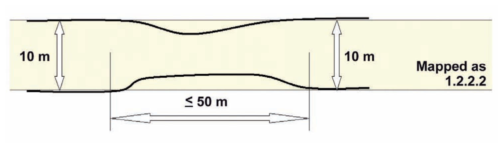
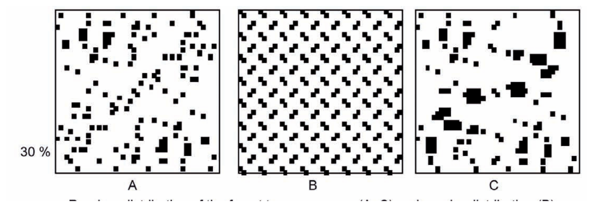
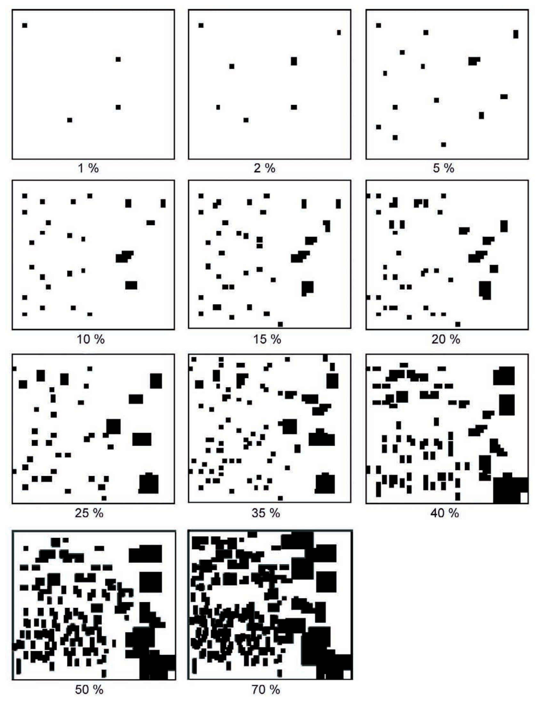
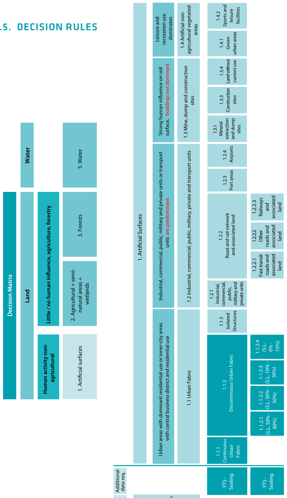
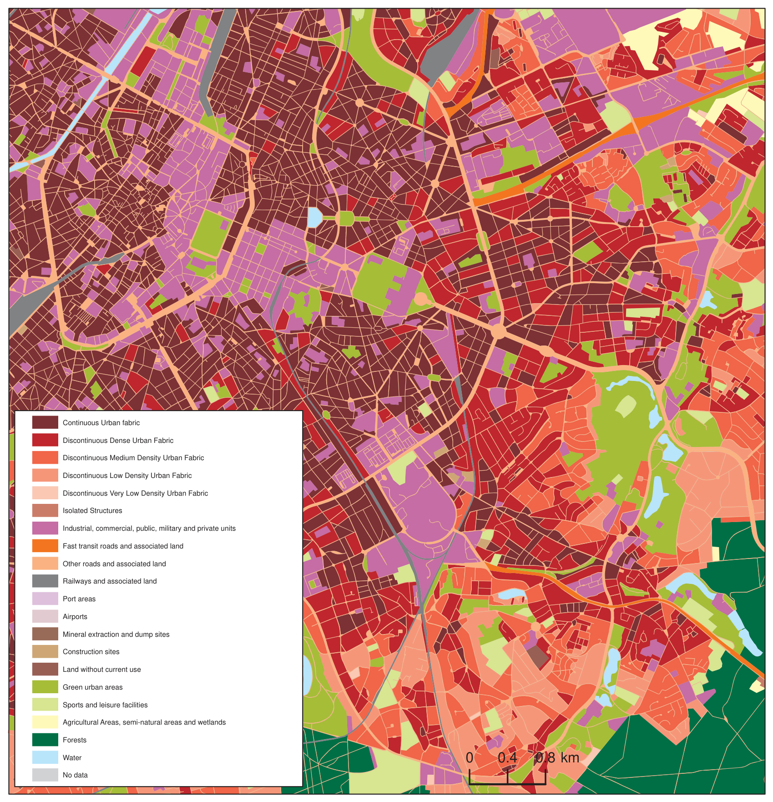

# EXECUTIVE SUMMARY

This document contains the product description, mapping guidance and class description for the product "Urban Atlas" for the GMES “Urban Atlas" project.

# SCOPE

This mapping guide shall guide the service providers in generating an Urban Atlas mapping product. In particular, it shall provide guidance to achieve:

-   Congruent product attributes such as file format, file attributes;
-   Common nomenclature;
-   Common look and feel of the product;
-   Comparable quality of the product.

# REFERENCE DOCUMENTS

::: {.tbl-caption}
```{=typst}
#set text(size: 9pt, fill: rgb("#3E6893"))
```
Table: Reference Documents
:::

| Reference            | Issue / Revision | Name                        |
|---------------------------------------------------------------------------------------|-----------------------------------------------|------------------------------------------------------------------|
| RD-1 ITD-0421-RP-0003-C5 | 1.00             | C5-Service Validation Protocol |

# MAPPING GUIDE

## PRODUCT DESCRIPTION

The Urban Atlas service offers a high-resolution land use map of urban areas.

The product described in this mapping guide is adapted to European needs (discussed and agreed with DG Regional Policy) and contains information that can be derived mainly from Earth Observation (EO) data backed by other reference data, such as COTS navigation data and topographic maps.

::: {.tbl-caption}
```{=typst}
#set text(size: 9pt, fill: rgb("#3E6893"))
```
TABLE 1: PRODUCT FEATURES
:::

```{=html}
<table>
<colgroup>
<col style="width: 50.0%">
<col style="width: 50.0%">
</colgroup>
<tr>
    <td colspan="2" style="background-color:#009ca6;color:#ffffff;font-weight:bold">Product features:</td>
  </tr>
  <tr>
    <td colspan="2" style="background-color:#afe1e3">Digital thematic map.<br>Thematic classes based on CORINE LC nomenclature and GUS Legend.</td>
  </tr>
  <tr>
    <td colspan="2" style="background-color:#009ca6;color:#ffffff;font-weight:bold">Input data sources</td>
  </tr>
  <tr>
    <td colspan="2" style="background-color:#afe1e3">Earth Observation (EO) data with 2.5 m spatial resolution multispectral or pan-sharpened (multispectral merged with panchromatic) data. Multispectral data includes near-infrared band.<br>Topographic Maps at a scale of 1: 50 000 or larger.<br>COTS navigation data for the road network (methodology applied will be defined).<br>Areas of Interest for Urban Atlas Mapping are determined by DG Regional Policy.<br>Sealing layer based on FTS specifications for degree of sealing for level 3 classes 1.1.1 and 1.1.2 and level 4 classes 1.1.2.1, 1.1.2.2, 1.1.2.3 and 1.1.2.4.<br>All input data should be described by metadata according to the INSPIRE metadata profile specifications and guidelines.</td>
  </tr>
  <tr>
    <td colspan="2" style="background-color:#009ca6;color:#ffffff;font-weight:bold">Ancillary data optional for all classes</td>
  </tr>
  <tr>
    <td colspan="2" style="background-color:#afe1e3">COTS navigation data: points of interest, land use, land cover, water areas.<br>Google Earth (only for interpretation, not for delineation).<br>Local city maps.</td>
  </tr>
  <tr>
    <td colspan="2" style="background-color:#009ca6;color:#ffffff;font-weight:bold">Ancillary data required for certain classes</td>
  </tr>
  <tr>
    <td colspan="2" style="background-color:#afe1e3">Local zoning data (e.g. cadastral data).<br>Field check (on-site visit).<br>Very high resolution imagery (better than 1 m ground resolution, e.g. aerial photographs).</td>
  </tr>
  <tr>
    <td colspan="2" style="background-color:#009ca6;color:#ffffff;font-weight:bold">Geometric resolution (Scale)</td>
  </tr>
  <tr>
    <td colspan="2" style="background-color:#afe1e3">1:10 000; MinMU = 0.25 ha</td>
  </tr>
  <tr>
    <td colspan="2" style="background-color:#009ca6;color:#ffffff;font-weight:bold">Geographic projection / Reference system</td>
  </tr>
  <tr>
    <td colspan="2" style="background-color:#afe1e3">As per user request but uniform within project area.</td>
  </tr>
  <tr>
    <td colspan="2" style="background-color:#009ca6;color:#ffffff;font-weight:bold">Positional accuracy</td>
  </tr>
  <tr>
    <td colspan="2" style="background-color:#afe1e3">± 5 m</td>
  </tr>
  <tr>
    <td colspan="2" style="background-color:#009ca6;color:#ffffff;font-weight:bold">Thematic accuracy (in %)</td>
  </tr>
  <tr>
    <td colspan="2" style="background-color:#afe1e3">Minimum overall accuracy for level 1 class 1 "Artificial surfaces”: 85%.<br>Minimum overall accuracy (all classes): 80%.<br>Methodology for quality control has to be performed according to RD[1].<br>The minimum overall accuracy for level 1 class 1 "Artificial surfaces" must include both omission and commission errors with other classes within the larger urban zone (LUZ).</td>
  </tr>
  <tr>
    <td colspan="2" style="background-color:#009ca6;color:#ffffff;font-weight:bold">Update frequency</td>
  </tr>
  <tr>
    <td colspan="2" style="background-color:#afe1e3">t.b.d.</td>
  </tr>
  <tr>
    <td colspan="2" style="background-color:#009ca6;color:#ffffff;font-weight:bold">Base data topicality</td>
  </tr>
  <tr>
    <td colspan="2" style="background-color:#afe1e3">t.b.d</td>
  </tr>
  <tr>
    <td colspan="2" style="background-color:#009ca6;color:#ffffff;font-weight:bold">Delivery format</td>
  </tr>
  <tr>
    <td colspan="2" style="background-color:#afe1e3">Topologically correct GIS file.<br>Single part features.</td>
  </tr>
  <tr>
    <td colspan="2" style="background-color:#009ca6;color:#ffffff;font-weight:bold">Data type</td>
  </tr>
  <tr>
    <td colspan="2" style="background-color:#afe1e3">Vector</td>
  </tr>
</table>
```

## GENERAL GUIDELINES

### PRE-PROCESSING AND GEO-CODING OF EO DATA

t.b.d.

### PRE-PROCESSING AND GEOMETRIC ADAPTATION OF COTS NAVIGATION DATA

The EO data are the basis for interpretation. In case of geometrical differences between EO data and COTS navigation data, the COTS navigation data has to be corrected in line with the EO data.

The pre-processing and application of the COTS navigation data shall be done according to the methodology defined in Annex 1.

### PRE-PROCESSING OF TOPOGRAPHIC MAPS

Topographic maps are used for interpretation of objects. Topographic maps should be used in digital form with precise geo-coding. The usage of printed (analogue) maps is not recommended. In case of geometrical differences between EO data and topographic maps, the erroneous data (either RS-data or topo-maps) needs to be identified using reliable datasets providing spatial reference information. The geometry of the mapping product shall then be congruent with the correct dataset.

### CLASSIFICATION AND INTERPRETATION

Application of automatic classification routines, such as segmentation and clustering, may be applied whenever appropriate:

-   Automated segmentation and classification to achieve an initial differentiation between basic land cover classes (urban vs. forest vs. water vs. other land cover) is possible following a decision of the service providers;
-   As the backbone for the object geometry, the COTS navigation data network is recommended but only with the method defined in the Annex.

Complying with the interpretation rules and data format definitions according to this mapping guide is essential (see below).

### APPLICATION OF FTS SEALING LAYER

The FTS sealing layer is used for classification of the sealing densities of class 1.1 urban fabric in level 3 and level 4.

### ACCURACY ASSESSMENT AND VALIDATION

The methodology for Accuracy Assessment and Validation has to be defined according to RD[1]. The Minimum Overall Accuracy for level 1 class 1 "Artificial surfaces" must include both omission and commission errors with other classes within the LUZ.

### DATA FORMAT OF FINAL PRODUCT

ESRI ArcInfo or ArcGIS compatible vector format with polygon topology:

-   Complete coverage in a single map single layer;
-   No overlapping polygons, gaps, duplicates or missing polygon labels or node overshoots;
-   Final Vectors need to have a smooth appearance (no pixel-shaped polygons are allowed). The smoothing shall be done by the service provider by methods still t.b.d. It is to ensure that smoothed vectors still comply with the minimum width and minimum mapping units required for objects.

| GSELUA_yy     |
|---------------|
| 11210\*       |

\* example provided of the number for UA class 1.1.2.1

| Code | Meaning                               |
|------------------------------------|--------------------------------------------------------------------------------------------------------------------------------------------------------------------|
| GSEL | for GSELand, UA for Urban Atlas      |
| yy   | year of production (e.g. 08 for 2008) |

Column data format:

GSELUA_yy: 5 digits in Long Integer format without decimal places
(values allowed: 11110 to 50000 (all class codes))

### INTERPRETATION RULES

-   The delineation is to be done on the EO data. EO data should be considered as the primary (guiding) data source.
-   The interpretation of the object is done using:
    -   The EO data, topographic maps and COTS navigation data;
    -   Auxiliary information including local expertise.
-   The interpreted area should be interpreted with a minimum 100 m extension (100 m buffer) to ensure accuracy and continuity of polygons. During the post-processing phase, a subset with the spatial extent of the final product will be generated. At the borders of this subset (i.e. the final product), polygons smaller than the MinMU may be present.
-   In areas where two or more scenes overlap, the most recent data must be used for delineation and interpretation.
-   In case of cloud coverage over the most recent scene, the affected part (only this part!) shall be interpreted using a cloudless older scene.
-   If two or more objects are overlapping at different levels, the top level is mapped continuously, e.g. road bridge over railway is mapped as seen, the railway polygon is broken and the road is mapped as a continuous feature.
-   In case of two or more objects overlapping at the same height level, the visually dominant and complete object (in use and shape) is mapped continuously. For example, a road / railway crossing viewed at the same height level: the railway shall be mapped continuously to maintain the network. The road shall be broken.

```{=typst}
#set page(flipped: true)
#set text(size: 9pt)
```

::: {.tbl-caption}
```{=typst}
#set text(size: 9pt, fill: rgb("#3E6893"))
```
TABLE 2: PRODUCT ACCURACIES
:::

```{=html}
<table>
<colgroup>
<col style="width: 24.8%">
<col style="width: 18.0%">
<col style="width: 7.2%">
<col style="width: 18.0%">
<col style="width: 24.9%">
<col style="width: 7.1%">
</colgroup>
<tr style="background-color:#009ca6; color:#ffffff">
    <td style="font-weight:bold">CORINE<br>Class(es)<br>[Level I, No.]</td>
    <td style="font-weight:bold">Level(s)<br>provided</td>
    <td style="font-weight:bold">MinMU</td>
    <td style="font-weight:bold">Thematic<br>Accuracy</td>
    <td style="font-weight:bold">Positional<br>Pixel<br>Accuracy</td>
  </tr>
  <tr style="background-color:#afe1e3">
    <td style="text-align:center">M1.1 Urban Atlas</td>
    <td style="text-align:center">1</td>
    <td style="text-align:center">I-IV</td>
    <td style="text-align:center">0.25 ha</td>
    <td style="text-align:center">&gt;= 85%</td>
    <td style="text-align:center">&lt;± 5 m</td>
  </tr>
  <tr style="background-color:#afe1e3">
    <td></td>
    <td style="text-align:center">2 - 5</td>
    <td></td>
    <td style="text-align:center">1 ha</td>
    <td style="text-align:center">&gt;= 80%</td>
    <td style="text-align:center">&lt;± 5 m</td>
  </tr>
  <tr style="background-color:#afe1e3">
    <td colspan="4" style="text-align:left">Overall<br>Accuracy</td>
    <td style="text-align:center">&gt;= 80%</td>
    <td></td>
  </tr>
</table>
```

```{=typst}
#set page(flipped: false, paper: "a4")
#set text(size: 11pt)
```

### MINIMUM MAPPING UNITS

-   Minimum mapping unit (MinMU): Class 1: 0.25 ha
    Class 2-5: 1 ha
    Exception of MinMU 0.25 / 1 ha: in case of an homogeneous area > MinMU, but divided in 2 or more polygons by the road network, each part can be smaller to preserve the land cover information. However, no polygon can be smaller than 500 m² (e.g. a 1 ha forest divided in 4 polygons by the road network has to be mapped).
-   Minimum mapping width (MinMW) between 2 objects for distinct mapping of 10 m
-   Maximum mapping width (MaxMW) between 2 objects for mapping together 10 m
    Exception of minimum width 10 m of a mapping unit: to maintain continuity of linear structures, they can be mapped smaller than 10 m over a distance of up to 50 m (see figure).



### PRIORITY RULES

Priority mapping rules for areas smaller than the MinMU:

-   Smaller areas are added to the adjacent unit with the next lesser number of the same sub-class.
-   Smaller areas are added to the adjacent unit of the same upper class.
-   Smaller areas are added to the adjacent unit with the longest common border line, except to railways or roads (exception here: if an object is below the MMU size and completely surrounded by e.g. a road or railway network, it shall be aggregated with that surrounding traffic line).

### GOOD PRACTICE FOR DATA DISPLAY FOR DELINEATION

Mapping scale on screen 1: 5 000

## VISUAL EXAMPLES FOR RANDOM DISTRIBUTIONS





## LEGEND TABLE

::: {.tbl-caption}
```{=typst}
#set text(size: 9pt, fill: rgb("#3E6893"))
```
TABLE 3: UA NOMENCLATURE (IN BOLD: CLASSES WITHOUT ANY FURTHER SUBDIVISION)
:::

```{=html}
<table>
<colgroup>
<col style="width: 14.2%">
<col style="width: 17.2%">
<col style="width: 34.7%">
<col style="width: 33.9%">
</colgroup>
<tr>
    <td colspan="4" style="background-color:#009ca6;color:#ffffff;font-weight:bold">
      GSELand M1.1 Urban Atlas
    </td>
  </tr>
  <tr>
    <td style="background-color:#009ca6;color:#ffffff;text-align:center;font-weight:bold">Urban <br>Atlas No.</td>
    <td style="background-color:#009ca6;color:#ffffff;text-align:center;font-weight:bold">Vector<br>Data Code</td>
    <td style="background-color:#009ca6;color:#ffffff;text-align:center;font-weight:bold">Nomenclature</td>
    <td style="background-color:#009ca6;color:#ffffff;text-align:center;font-weight:bold">Additional<br>Information</td>
  </tr>
  <tr>
    <td colspan="2" style="background-color:#afe1e3">GSELUA_yy</td>
    <td></td>
    <td></td>
  </tr>
  <tr>
    <td style="background-color:#afe1e3">1</td>
    <td rowspan="22" style="background-color:#afe1e3"></td>
    <td style="background-color:#afe1e3">Artificial surfaces</td>
    <td rowspan="22" style="background-color:#afe1e3"></td>
  </tr>
  <tr>
    <td style="background-color:#afe1e3">1.1</td>
    <td style="background-color:#afe1e3">Urban Fabric</td>
  </tr>
  <tr>
    <td style="background-color:#afe1e3">1.1.1</td>
    <td style="background-color:#55b8ba">11100</td>
    <td style="background-color:#55b8ba"><b>Continuous Urban Fabric (S.L. > 80%)</b></td>
    <td style="background-color:#55b8ba">FTS¹ required</td>
  </tr>
  <tr>
    <td style="background-color:#afe1e3">1.1.2</td>
    <td style="background-color:#55b8ba">11200</td>
    <td style="background-color:#55b8ba">Discontinuous Urban Fabric<br>(S.L. 10% - 80%)</td>
    <td></td>
  </tr>
  <tr>
    <td style="background-color:#afe1e3">1.1.2.1</td>
    <td style="background-color:#55b8ba">11210</td>
    <td style="background-color:#55b8ba"><b>Discontinuous Dense Urban Fabric<br>(S.L. 50% - 80%)</b></td>
    <td style="background-color:#55b8ba">FTS required</td>
  </tr>
  <tr>
    <td style="background-color:#afe1e3">1.1.2.2</td>
    <td style="background-color:#55b8ba">11220</td>
    <td style="background-color:#55b8ba"><b>Discontinuous Medium Density<br>Urban Fabric (S.L. 30% - 50%)</b></td>
    <td style="background-color:#55b8ba">FTS required</td>
  </tr>
  <tr>
    <td style="background-color:#afe1e3">1.1.2.3</td>
    <td style="background-color:#55b8ba">11230</td>
    <td style="background-color:#55b8ba"><b>Discontinuous Low Density Urban<br>Fabric (S.L. 10% - 30%)</b></td>
    <td style="background-color:#55b8ba">FTS required</td>
  </tr>
  <tr>
    <td style="background-color:#afe1e3">1.1.2.4</td>
    <td style="background-color:#55b8ba">11240</td>
    <td style="background-color:#55b8ba"><b>Discontinuous Very Low Density<br>Urban Fabric (S.L. < 10%)</b></td>
    <td style="background-color:#55b8ba">FTS required</td>
  </tr>
  <tr>
    <td style="background-color:#afe1e3">1.1.3</td>
    <td style="background-color:#55b8ba">11300</td>
    <td style="background-color:#55b8ba"><b>Isolated structures</b></td>
    <td></td>
  </tr>
  <tr>
    <td style="background-color:#afe1e3">1.2</td>
    <td></td>
    <td style="background-color:#afe1e3">Industrial, commercial, public,<br>military, private and transport units</td>
    <td></td>
  </tr>
  <tr>
    <td style="background-color:#afe1e3">1.2.1</td>
    <td style="background-color:#55b8ba">12100</td>
    <td style="background-color:#55b8ba"><b>Industrial, commercial, public,<br>military and private units</b></td>
    <td style="background-color:#55b8ba">zoning data<br>/ field check<br>recommended</td>
  </tr>
  <tr>
    <td style="background-color:#afe1e3">1.2.2</td>
    <td style="background-color:#55b8ba">12200</td>
    <td style="background-color:#55b8ba">Road and rail network<br>and associated land</td>
    <td style="background-color:#55b8ba">COTS² navigation<br>data required</td>
  </tr>
  <tr>
    <td style="background-color:#afe1e3">1.2.2.1</td>
    <td style="background-color:#55b8ba">12210</td>
    <td style="background-color:#55b8ba"><b>Fast transit roads and associated<br>land</b></td>
    <td style="background-color:#55b8ba">COTS navigation<br>data required</td>
  </tr>
  <tr>
    <td style="background-color:#afe1e3">1.2.2.2</td>
    <td style="background-color:#55b8ba">12220</td>
    <td style="background-color:#55b8ba"><b>Other roads and associated land</b></td>
    <td style="background-color:#55b8ba">COTS navigation<br>data required</td>
  </tr>
  <tr>
    <td style="background-color:#afe1e3">1.2.2.3</td>
    <td style="background-color:#55b8ba">12230</td>
    <td style="background-color:#55b8ba"><b>Railways and associated land</b></td>
    <td style="background-color:#55b8ba">COTS navigation<br>data required</td>
  </tr>
  <tr>
    <td style="background-color:#afe1e3">1.2.3</td>
    <td style="background-color:#55b8ba">12300</td>
    <td style="background-color:#55b8ba"><b>Port areas</b></td>
    <td style="background-color:#55b8ba">zoning data<br>/ field check<br>recommended</td>
  </tr>
  <tr>
    <td style="background-color:#afe1e3">1.2.4</td>
    <td style="background-color:#55b8ba">12400</td>
    <td style="background-color:#55b8ba"><b>Airports</b></td>
    <td style="background-color:#55b8ba">zoning data<br>/ field check<br>recommended</td>
  </tr>
  <tr>
    <td style="background-color:#afe1e3">1.3</td>
    <td></td>
    <td style="background-color:#afe1e3">Mine, dump and construction sites</td>
    <td></td>
  </tr>
  <tr>
    <td style="background-color:#afe1e3">1.3.1</td>
    <td style="background-color:#55b8ba">13100</td>
    <td style="background-color:#55b8ba"><b>Mineral extraction and dump sites</b></td>
    <td></td>
  </tr>
  <tr>
    <td style="background-color:#afe1e3">1.3.3</td>
    <td style="background-color:#55b8ba">13300</td>
    <td style="background-color:#55b8ba"><b>Construction sites</b></td>
    <td></td>
  </tr>
  <tr>
    <td style="background-color:#afe1e3">1.3.4</td>
    <td style="background-color:#55b8ba">13400</td>
    <td style="background-color:#55b8ba"><b>Land without current use</b></td>
    <td></td>
  </tr>
  <tr>
    <td style="background-color:#afe1e3">1.4</td>
    <td></td>
    <td style="background-color:#afe1e3">Artificial non-agricultural vegetated<br>areas</td>
    <td></td>
  </tr>
  <tr>
    <td style="background-color:#afe1e3">1.4.1</td>
    <td style="background-color:#55b8ba">14100</td>
    <td style="background-color:#55b8ba"><b>Green urban areas</b></td>
    <td></td>
  </tr>
  <tr>
    <td style="background-color:#afe1e3">1.4.2</td>
    <td style="background-color:#55b8ba">14200</td>
    <td style="background-color:#55b8ba"><b>Sports and leisure facilities</b></td>
    <td></td>
  </tr>
  <tr>
    <td style="background-color:#e6f5d0">2</td>
    <td style="background-color:#e6f5d0">20000</td>
    <td style="background-color:#e6f5d0"><b>Agricultural areas, semi-natural<br>areas and wetlands</b></td>
    <td style="background-color:#e6f5d0">1 ha MMU</td>
  </tr>
  <tr>
    <td style="background-color:#c2d7b8">3</td>
    <td style="background-color:#c2d7b8">30000</td>
    <td style="background-color:#c2d7b8"><b>Forests</b></td>
    <td style="background-color:#c2d7b8">1 ha MMU</td>
  </tr>
  <tr>
    <td style="background-color:#a2dcf0">5</td>
    <td style="background-color:#a2dcf0">50000</td>
    <td style="background-color:#a2dcf0"><b>Water</b></td>
    <td style="background-color:#a2dcf0">1 ha MMU</td>
  </tr>
</table>
```

¹ FTS = EEA Fast Track Sealing Layer. The assignment of the sealing levels (i.e. classes 1.1.2.1 - 1.1.2.4) shall be carried out using this layer. The QA check will check only if the technical approach agreed with DG REGIO is kept, but will not assess the absolute accuracy of these classes.
² COTS - Commercial Off-The-Shelf



Ref. data

-   Sat.-image
-   TK
-   COTS navigation data

## DESCRIPTION OF MAPPING UNITS FOR THE URBAN ATLAS

### 1. ARTIFICIAL SURFACES

Surfaces with dominant human influence but without agricultural land use.
These areas include all artificial structures and their associated non-sealed and vegetated surfaces.

**Artificial structures** are defined as buildings, roads, all constructions of infrastructure and other artificially sealed or paved areas.

**Associated non-sealed and vegetated surfaces** are areas functionally related to human activities, except agriculture.
Also, the areas where the natural surface is replaced by extraction and / or deposition or designed landscapes (such as urban parks or leisure parks) are mapped in this class.
The land use is dominated by permanently populated areas and / or traffic, exploration, non-agricultural production, sports, recreation and leisure.

#### 1.1. URBAN FABRIC

Built-up areas and their associated land, such as gardens, parks, planted areas and non-surfaced public areas and the infrastructure, if these areas are not suitable to be mapped separately with regard to the minimum mapping unit size.
Basically the classes 1.1.1 and 1.1.2. are distinguished by their degree of soil sealing.
Residential structures and patterns are predominant, but also downtown areas and city centres, including the central business districts (CBD) and areas with partial residential use, are included.
The urban fabric classes (1.1.) are distinguished only by their degree of soil sealing not by their type of buildings (single family houses or apartment blocks).
The detailed descriptions of the different classes below are given to the interpreters to support the delineation of mapping objects with homogeneous sealing density (without being required to assign the exact density classes).

Using the COTS navigation data as a skeleton for the urban area, in many cases it is necessary to subdivide the blocks formed by the COTS navigation data due to the different sealing density of the residential areas or different functions of the buildings and their associated land.
After completion of the interpretation, the sealing level information from the FTS sealing layer is integrated into the data.

##### 1.1.1. CONTINUOUS URBAN FABRIC

**Special note:**
Mapping the 3rd level is done only with the defined application of the FTS sealing layer.
MinMU 0.25 ha, Minimum width: 10 m

**Land Cover:**
Average degree of soil sealing: > 80%
Built-up areas and their associated land, if these areas are not suitable to be mapped separately with regard to the minimum mapping unit size.
Buildings, roads and sealed areas cover most of the area; non-linear areas of vegetation and bare soil are exceptional.

**Land Use:**
Predominant residential use: areas with a high degree of soil sealing, independent of their housing scheme (single family houses or high rise dwellings, city centre or suburb).
Included are downtown areas and city centres, and central business districts (CBD) as long as there is partial residential use.

##### 1.1.2. DISCONTINUOUS URBAN FABRIC

**Special note:**
Mapping the 4th level of density classes is done only with the defined application of the FTS sealing layer.

**Land Cover:**
Average degree of soil sealing: 0 - 80%
Built-up areas and their associated land (small roads, sealed areas including non-linear areas of vegetation and bare soil), if these areas are not suitable to be mapped separately with regard to the minimum mapping unit size.
This type of land cover can be distinguished from continuous urban fabric by a larger fraction of non-sealed and / or vegetated surfaces: gardens, parks, planted areas and non-surfaced public areas.

**Land Use:**
Predominant residential usage. Contains more than 20% non-sealed areas, independent of their housing scheme (single family houses or high-rise dwellings, city centre or suburb).
The non-sealed areas might be private gardens or common green areas.

**Not included are:**

-   Farms with large buildings (agro-industrial production), → class 1.2.1;
-   Nurseries with dominant areas of greenhouses (no or only small fields) → class 1.2.1;
-   Allotment gardens → class 1.4.;
-   Holiday villages ("Club Med") → class 1.4.2.

###### 1.1.2.1. DISCONTINUOUS DENSE URBAN FABRIC

MinMU 0.25 ha, Minimum width: 10 m
Average degree of soil sealing: > 50 - 80%
Residential buildings, roads and other artificially surfaced areas.

###### 1.1.2.2. DISCONTINUOUS MEDIUM DENSITY URBAN FABRIC

MinMU 0.25 ha, Minimum width: 10 m
Average degree of soil sealing: > 30 - 50%
Residential buildings, roads and other artificially surfaced areas. The vegetated areas are predominant, but the land is not dedicated to forestry or agriculture.

###### 1.1.2.3. DISCONTINUOUS LOW DENSITY URBAN FABRIC

MinMU 0.25 ha, Minimum width: 10 m
Average degree of soil sealing: 10 - 30%
Residential buildings, roads and other artificially surfaced areas. The vegetated areas are predominant, but the land is not dedicated to forestry or agriculture.

###### 1.1.2.4. DISCONTINUOUS VERY LOW DENSITY URBAN FABRIC

MinMU 0.25 ha, Minimum width: 10 m
Average degree of soil sealing: <10%
Residential buildings, roads and other artificially surfaced areas. The vegetated areas are predominant, but the land is not dedicated to forestry or agriculture. Example: exclusive residential areas with large gardens.

##### 1.1.3. ISOLATED STRUCTURES

MinMU 0.25 ha, MaxMU 2 ha, Minimum width: 10 m
Isolated artificial structures with a **residential component**, such as (small) individual farm houses and related buildings.
The mapping unit will never be surrounded by any urban class other than transportation network.
**The mapping unit is no larger than 2 ha.**
Exception: border blocks / polygons in housing developments (they may be adjacent to roads and non-urban classes).

#### 1.2. INDUSTRIAL, COMMERCIAL, PUBLIC, MILITARY, PRIVATE AND TRANSPORT UNITS

At least 30% of the ground is covered by artificial surfaces. More than 50% of those artificial surfaces are occupied by buildings and / or artificial structures with non-residential use, i.e. industrial, commercial or transport related uses are dominant

##### 1.2.1. INDUSTRIAL, COMMERCIAL, PUBLIC, MILITARY AND PRIVATE UNITS

MinMU 0.25 ha, Minimum width: 10 m

**Land cover:**
Artificial structures (e.g. buildings) or artificial surfaces (e.g. concrete, asphalt, tar, macadam, tarmac or otherwise stabilised surface, e.g. compacted soil, devoid of vegetation), occupy most of the surface. Included are associated areas, such as roads, sealed areas and vegetated areas, if these areas are not suitable to be mapped separately with regard to the minimum mapping unit size.

**Land use:**
Industrial, commercial, public, military or private units. The administrative boundaries of the production or service unit are mapped, including associated features larger than the MinMU (e.g. sports areas or transport structures).

**Also included are:**

-   Bare soil and/or grassland potentially used for storage of material or as enclosures for livestock.
-   Compounds with significant amounts of green or natural areas but with industrial, commercial, military or public use. Example: communication tower, antennas or wind motors and their associated land.

**This class contains:**

a)  **Industrial uses and related areas**
    -   Sites of industrial activities, including their related areas;
    -   Production sites;
    -   Energy plants: nuclear, solar, hydroelectric, thermal, electric and wind farms;
    -   Sewage treatment plants;
    -   Farming industries (farms with large buildings and / or greenhouses, not production fields);
    -   Antennas, even with predominant vegetated areas. The vegetated areas may be predominant, but the land is not dedicated to forestry or agriculture;
    -   Water treatment plants;
    -   Sewage plants;
    -   Seawater desalination plants.

    The industrial units can be distinguished from residential built-up areas by the type of buildings, their access to transport features and the surroundings:
    -   Buildings with large surface areas (inside, not all rooms need daylight, as in dwelling houses);
    -   Good access to roads and parking for customers;
    -   Industrial areas are often outside the historical city centre.

b)  **Commercial uses, retail parks and related areas**
    -   Surfaces purely occupied by commercial activities, including their related areas (e.g. parking areas even larger than the MinMU);
    -   High-rise office buildings;
    -   Petrol and service stations within built-up areas.

    The commercial units can be distinguished from residential built-up areas by the type of large buildings, their access to transport features and the surroundings:
    -   Buildings with large surface areas (inside, not all rooms need daylight, as in dwelling houses);
    -   Good access to roads and parking for customers;
    -   Pure commercial areas are often outside the historical city centre.

    **Not included are:**
    Petrol stations along fast transit and main roads with access only from these roads. They are mapped together with the road transport system → class 1.2.2.1 or 1.2.2.2.

c)  **Public, military and private services not related to the transport system**
    Surfaces purely occupied by general government, public or private administrations including their related areas (access ways, lawns, parking areas).

**Included are:**

-   Schools and universities;
-   Hospitals and other health services or buildings;
-   Places of worship (churches / cathedrals / religious buildings);
-   Cemeteries;
-   Archaeological sites and museums;
-   Administration buildings, ministries;
-   Penitentiaries;
-   Military areas including bases and airports;
-   Military exercise areas fenced and under current use;
-   Castles, etc. not primarily used for residential purposes (building management, gardeners, etc. living there is not residential use in this sense);
-   Private storage areas without a residential component, such as compounds of garages.

**Not included are:**
Public parks → class 1.4.1;
Holiday resorts including their hotels → class 1.4.2;
Sport centres or bathing centres → class 1.4.2;

d)  **Civil protection and supply infrastructure**
-   Dams, dikes, irrigation and drainage canals and ponds and other technical public infrastructure, to be mapped with the roads, embankments and associated land included;
-   Includes also breakwaters, piers and jetties, sea walls and flood defences;
-   (Ancient) city walls, other protecting walls, bunkers;
-   Avalanche barriers.

**Not included are:**
Noise barriers → class 1.2.2.;
Water courses (within e.g. diked canals) if the water area is wider than 10 m → class 5;
Reservoirs along natural water courses → class 5.

#### 1.2.2. ROAD AND RAIL NETWORK AND ASSOCIATED LAND

***Special Note:***
The road and railway network (COTS navigation data) is ingested into the classification database according to the method given in the Annex.
Parts of the COTS navigation data that are obviously not congruent with the corresponding traffic line in the EO data and topo-map need to be corrected.

Roads which are not contained in the COTS navigation data are mapped by the service provider according to the mapping criteria defined in this mapping guide.
Roads or railways do not necessarily have to form a closed network. Isolated traffic lines are possible, but they are to be mapped with regard to the MinMU criterion.
Associated land is mapped with the roads / railways as it is visible in the EO data and topographic maps.

**Associated lands are:**

-   Slopes of embankments or cut sections;
-   Areas enclosed by roads or railways, without direct access and without agricultural land use;
-   Fenced areas along roads (e.g. as for protection against wild animals);
-   Areas enclosed by motorways, exits or service roads with no detectable access;
-   Noise barriers (fences, walls, earth walls);
-   Rest areas, service stations and parking areas only accessible from the fast transit roads;
-   Railway facilities including stations, cargo stations and service areas;
-   Foot- or bicycle paths parallel to the traffic line;
-   Green strips, alleys (with trees or bushes).

##### 1.2.2.1. FAST TRANSIT ROADS AND ASSOCIATED LAND

MinMU 0.25 ha, Minimum width: 10 m
Roads defined as "motorways" in the COTS navigation data, and motorway rest and service areas and parking areas, only accessible from the motorways.
Motorways that are not included in the COTS navigation data are to be mapped by the service provider.

##### 1.2.2.2. OTHER ROADS AND ASSOCIATED LAND

MinMU 0.25 ha, Minimum width: 10 m
Roads, crossings, intersections and parking areas, including roundabouts and sealed areas with "road surface".

##### 1.2.2.3. RAILWAYS AND ASSOCIATED LAND

MinMU 0.25 ha, Minimum width: 10 m
Railway facilities including stations, cargo stations and service areas.

#### 1.2.3. PORT AREAS

MinMU 0.25 ha, Minimum width: 10 m

***Special Note:***
Ancillary data is recommended for identifying the administrative boundary of the port area. The delineation itself is to be done on the EO data:

-   Detailed city / tourist maps or
-   Field check (on site visit) or
-   Local zoning data

Administrative area of inland harbours and sea ports.
Infrastructure of port areas, including quays, dockyards, transport and storage areas and associated areas.

**Not included are:**
Marinas → class 1.4.2.

#### 1.2.4. AIRPORTS

MinMU 0.25 ha, Minimum width: 10 m

***Special Note:***
Ancillary data is recommended for identifying the administrative boundary of the airport area. The delineation itself is to be done on the EO data:

-   Detailed city / tourist maps or
-   Field check (on site visit) or
-   Local zoning data

Administrative area of airports, mostly fenced.
Included are all airport installations: runways, buildings and associated land.

**Not included are:**
Aerodromes without sealed runway → class 1.4.2.

### 1.3. MINE, DUMP AND CONSTRUCTION SITES

#### 1.3.1. MINERAL EXTRACTION AND DUMP SITES

MinMU 0.25 ha, Minimum width: 10 m

***Special Note:***
Ancillary data is recommended for identifying the administrative boundary.
The delineation itself is to be done on the EO data:

-   Detailed city / tourist maps or
-   Field check (on site visit) or
-   Local zoning data

**Included are:**

-   Open pit extraction sites (sand, quarries) including water surface, if < MinMU, open-cast mines, **inland salinas**, oil and gas fields;
-   Their protecting dikes and / or vegetation belts and associated land such as service areas, storage depots;
-   Public, industrial or mine dump sites, raw or liquid wastes, legal or illegal, their protecting dikes and / or vegetation belts and associated land such as service areas.

**Not included are:**
Water bodies > MinMU → class 5;
Exploited peat bogs → class 2;
Coastal salinas → class 2;
Re-cultivated areas (mapped according to their actual land cover) → class 2 or 3;
River bed extraction → class 2;
Decanting basins of biological water treatment plants class 1.2.1.

#### 1.3.3 CONSTRUCTION SITES

MinMU 0.25 ha, Minimum width: 10 m
Spaces under construction or development, soil or bedrock excavations for construction purposes or other earthworks visible in the image.
Clear evidence of actual construction needs to be identifiable in the data, such as actual excavations and machinery on site, or ongoing construction of any stage, etc.
In case of doubt → class 1.3.4.

#### 1.3.4. LAND WITHOUT CURRENT USE

MinMU 0.25 ha, Minimum width: 10 m
Areas in the vicinity of artificial surfaces still waiting to be used or re-used. The area is obviously in a transitional position, "waiting to be used".
Waste land, removed former industry areas, ("brown fields") gaps in between new construction areas or leftover land in the urban context ("green fields").
No actual agricultural or recreational use.
No construction is visible, without maintenance, but no undisturbed fully natural or semi-natural vegetation (secondary ruderal vegetation).
Also areas where the street network is already finished, but actual erection of buildings is still not visible.

**Not included are:**
"Leftover areas", areas too small / narrow for any construction with regard to the MinMU size → map to the appropriate neighbour class as associated land.

### 1.4. ARTIFICIAL NON-AGRICULTURAL VEGETATED AREAS

Vegetation planted and regularly worked by humans; strongly human-influenced.
Sporting facilities as functional units independent of being non-sealed, sealed or built-up.

#### 1.4.1. GREEN URBAN AREAS

MinMU 0.25 ha, Minimum width: 10 m
Public green areas for predominantly recreational use such as gardens, zoos, parks, castle parks.
Suburban natural areas that have become and are managed as urban parks.
Forests or green areas extending from the surroundings into urban areas are mapped as green urban areas when at least two sides are bordered by urban areas and structures, and traces of recreational use are visible.

**Not included are:**
Private gardens within housing areas → class 1.1;
Cemeteries → class 1.2.1;
Buildings within parks, such as castles or museums → class 1.2.1;
Patches of natural vegetation or agricultural areas enclosed by built-up areas without being managed as green urban areas → class 1.

#### 1.4.2. SPORTS AND LEISURE FACILITIES

MinMU 0.25 ha, Minimum width: 10 m

All sports and leisure facilities including associated land, whether public or commercially managed: e.g. Theresienwiese (Munich), public arenas for any kind of sports including associated green areas, parking places, etc.:

-   Golf courses;
-   Sports fields (also outside the settlement area);
-   Camp grounds;
-   Leisure parks;
-   Riding grounds;
-   Racecourses;
-   Amusement parks;
-   Swimming resorts etc.;
-   Holiday villages ("Club Med");
-   Allotment gardens¹;
-   Glider or sports airports, aerodromes without sealed runway;
-   Marinas.

**Not included are:**
Private gardens within housing areas → class 1.1;
Motor racing courses within industrial zone used for test purposes → class 1.2.1;
Caravan parking used for commercial activities → class 1.2.1;
Soccer fields, etc. within e.g. military bases or within university campuses → class 1.2.1;

### 2. AGRICULTURAL + SEMI-NATURAL + WETLAND AREAS

MinMU 1 ha

a)  **Arable land:**
    -   Fields under rotation system. Can be non-irrigated or permanently irrigated. Also includes rice fields;
    -   Fields laid in fallow are included.

b)  **Permanent crops:**
    -   Fruit orchards, scattered fruit trees with pasture;
    -   Vineyards and their nurseries;

¹ Allotment gardens are complexes of a few up to hundreds of land parcels assigned to residential people. Most of the parcels contain individual cultivation areas with fruits or vegetables, as well as a shed for tools and shelter.

-   Roses;
-   Olive groves;
-   Berries and hop plantations.

c)  **Pasture & natural grassland:**
    -   Grassland;
    -   Pasture and meadow under agricultural use, grazed or mechanically harvested.

d)  **Shrubs and / or herbaceous vegetation including transitional woodland**
-   Vegetation cover more than 50%, ground coverage of trees with height > 5 m: < 30%, areas with minor / without artificial or agricultural influence;
-   Sclerophyllous vegetation;
-   Bushy sclerophyllous vegetation (e.g. maquis, garrigue);
-   Abandoned arable land with bushes;
-   Woodland degradation: storm, snow, insects or air pollution;
-   Areas under power transmission lines inside forest;
-   Fire breaks;
-   Steep bushy slopes of eroded areas;
-   Abandoned vineyards or orchards, arable land and pasture land under natural colonisation;
-   Dehesas with bush proliferation indicating no agricultural or farming use for a rather long time;
-   Bushy areas along creeks.

e)  **Moors and heathland:**
-   Bushes, shrubs and herbaceous plants, dwarf forest in alpine or coastal regions (Pinus Mugo forests). Height is maximum 3 m in climax stage.

f)  **Beaches, dunes, sand:**
-   < 10% vegetation cover;
-   Beaches, dunes and sand plains, (coastal or inland location), gravel along rivers;
-   Seasonal rivers, if water is characteristic for a shorter part of the year (< 2 months).

g)  **Bare rocks:**
-   > 90% of the land surface of bare rocks, (i.e. < 10% vegetation);
-   Rocks, gravel fields, landslides;
-   Scree (fragments resulting from mechanical and chemical erosion. Weathering rocks forming heaps of coarse debris at the foot of steep slopes), cliffs, rocks.

h)  **Sparsely vegetated areas:**
-   Steppes, tundra, badlands, scattered high altitude vegetation. Bare soils inside military training areas. Vegetation cover 10 - 50%.

i)  **Burnt areas:**
    -   Recently burnt forest or shrubs (but not natural grassland), still mainly black on EO data.

j)  **Snow and ice:**
    -   Glacier and perpetual snow.

k)  **Inland wetlands:**
    -   Areas flooded or liable to flooding during a large part of the year by fresh, brackish or standing water with specific vegetation coverage made of low shrub, semi-ligneous or herbaceous species;
    -   Water fringe vegetation, reed beds of lakes, rivers and brooks. Sedge and fen-sedge beds, swamps;
    -   Peat bogs, with or without peat extracting areas;
    -   Shallow water areas covered with reed;
    -   Seasonal rivers, if water course is not visible in the EO data.

l)  **Coastal wetlands:**
    -   Areas, flooded or liable to flooding during a large part of the year by brackish or saline water, susceptible to flooding by sea water. Often in the process of filling in and gradually being colonised by halophytic plants;
    -   Specific vegetation coverage made of low shrub, semi-ligneous or herbaceous species;
    -   Alluvial planes, marshes and intertidal flats;
    -   Salinas (salt production sites by evaporation).

**Not included are:**
Military exercise areas fenced and under current use → class 1.2.1;
Greenhouses → class 1.2.1;
Inland salinas → class 1.3 1.

### 3. FOREST (NATURAL AND PLANTATION)

MinMU 1 ha

-   With ground coverage of tree canopy > 30%, tree height > 5 m, including bushes and shrubs at the fringe of the forest;
-   Included are plantations such as Populus plantations, Christmas tree plantations;
-   Forest regeneration / re-colonisation: clear cuts, new forest plantations.

**Not included are:**
Forests within urban areas and/or subject to high human pressure → class 1.4.1

### 4. WATER

MinMU 1 ha

The visible water surface area on the EO data is delineated. EO data should be considered as a primary (guiding) data source.

-   Sea;
-   Lakes;
-   Fish ponds (natural, artificial);
-   Rivers, including channelled rivers;
-   Canals.

The default source for delineation is the EO data. If no clear delineation is possible using EO data, the other reference datasets may be used for that. Examples are:

-   Reservoirs;
-   Water courses or ponds with a strongly variable surface level.

All water bodies and water courses visible in the imagery are mapped as long as they exceed an extent of 1 ha.
Water courses are mapped continuously also when water surface is covered by vegetation. If the water is partly obscured, e.g. by vegetation, the delineation shall be oriented to other parts of the water where it is not obscured.
Included are: seasonal rivers, if the water course is visible in the EO data, otherwise → class 2.
Fish ponds with distance < 10 m are mapped together.
The COTS navigation data water layer may be used as a reference for interpretation. However, delineation of water areas must be done using the EO data, as the geometric accuracy of a COTS navigation data water object is too rough for mapping on the scale 1:10 000.

**Not included are:**
Shallow water areas covered with reed > MinMU → class 2 Seasonal rivers, if the water course is not visible in the EO data → class 2

# ANNEX

## PRE-PROCESSING AND GEOMETRIC ADAPTATION OF COTS NAVIGATION DATA

The COTS navigation data by default comes with a certain categorisation of its street network. Two basic categories are important within the context of the Urban Atlas. The first category gives information about the Functional Road Class (FRC) of each road, the second one gives information about the importance of each road within the city traffic network (Net2Class).

The COTS navigation data currently used shows the following categories for FRC and Net2Class:

| FRC | Full name                               |
|------------------------|--------------------------------------------------------------------------------------------------------------------------------------------------------------------------------|
| 0   | Motorway, Freeway or other Major Road   |
| 1   | Major Road less important than a Motorway |
| 2   | Other Major Road                        |
| 3   | Secondary Road                          |
| 4   | Local Connecting Road                   |
| 5   | Local Road of high importance           |
| 6   | Local Road                              |
| 7   | Local Road of minor importance          |
| 8   | Other Road                              |

| Net2Class | Importance Level       |
|---------------------------------------------------|-----------------------------------------------------------------------------------------------------------------------------------------------------|
| 0         | First class (Highest)  |
| 1         | Second class           |
| 2         | Third class            |
| 3         | Fourth class           |
| 4         | Fifth class            |
| 5         | Sixth class            |
| 6         | Seventh class (Lowest) |

### USAGE OF COTS NAVIGATION DATA FOR THE URBAN ATLAS

The COTS navigation data will be used to generate the street and railroad network of the mapping product. This network will serve as a "backbone" and is decisive for the look and feel of the final product.

The data is delivered in line vector format by the data provider. These lines need to be widened so that the traffic line network of the final product covers the transport areas in the EO data.

For that purpose a usage and buffering strategy was developed to implement the COTS navigation data into the product.

The integration of the traffic network shall be done in advance of all other visual or (semi) automatic delineation and labelling of objects.

The goal of the traffic line implementation process is to ingest a traffic line network into the mapping product that covers all traffic lines wider than 10 m (including their associated land see traffic line description: chapter 6, class 1.2.2) and on the other hand - is cost-efficient to integrate.

**To achieve that goal the following strategy was developed:**

-   The railway network is delineated individually if it exceeds a minimum width of 10 m including its associated land.
-   The most important roads (FRC classes 0, 1) will be delineated individually.
-   The majority of the roads (FRC classes 2 to 5) will be ingested by buffering the line vectors. The buffered roads will have an overall width of at least 10 m. The buffering width for each FRC class will be adapted to the local conditions of each individual city to resemble the overall characteristics of the local traffic network.
-   Certain roads (FRC class 6 and above) will be mapped if available (by buffering) or left out according to the decision of the service provider. This is to preserve a common look and feel of the mapping products of different cities.

The following table gives an overview of the treatment of the COTS road network:

```{=html}
<table>
<colgroup>
<col style="width: 10.4%">
<col style="width: 22.4%">
<col style="width: 22.4%">
<col style="width: 22.4%">
<col style="width: 22.4%">
</colgroup>
  <tr>
    <td style="background-color:#009ca6;color:#ffffff;font-weight:bold;"></td>
    <td colspan="4" style="background-color:#009ca6;color:#ffffff;font-weight:bold;">Net2Class</td>
  </tr>
  <tr>
    <td style="background-color:#009ca6;color:#ffffff;font-weight:bold;text-align:center">FRC</td>
    <td style="background-color:#009ca6;color:#ffffff;font-weight:bold;text-align:center">1</td>
    <td style="background-color:#009ca6;color:#ffffff;font-weight:bold;text-align:center">2</td>
    <td style="background-color:#009ca6;color:#ffffff;font-weight:bold;text-align:center">3</td>
    <td style="background-color:#009ca6;color:#ffffff;font-weight:bold;text-align:center">4</td>
  </tr>
  <tr>
    <td style="background-color:#afe1e3;text-align:center;font-weight:bold">0</td>
    <td colspan="4" style="background-color:#afe1e3;text-align:center">Manual</td>
  </tr>
  <tr>
    <td style="background-color:#afe1e3;text-align:center;font-weight:bold">1</td>
    <td colspan="4" style="background-color:#afe1e3;text-align:center">Manual</td>
  </tr>
  <tr>
    <td style="background-color:#afe1e3;text-align:center;font-weight:bold">2</td>
    <td style="background-color:#afe1e3;text-align:center">Estimated<br>buffer width</td>
    <td style="background-color:#afe1e3;text-align:center">Estimated<br>buffer width</td>
    <td style="background-color:#afe1e3;text-align:center">Estimated<br>buffer width</td>
    <td style="background-color:#afe1e3;text-align:center">Estimated<br>buffer width</td>
  </tr>
  <tr>
    <td style="background-color:#afe1e3;text-align:center;font-weight:bold">3</td>
    <td style="background-color:#afe1e3;text-align:center">Estimated<br>buffer width</td>
    <td style="background-color:#afe1e3;text-align:center">Estimated<br>buffer width</td>
    <td style="background-color:#afe1e3;text-align:center">Estimated<br>buffer width</td>
    <td style="background-color:#afe1e3;text-align:center">Estimated<br>buffer width</td>
  </tr>
  <tr>
    <td style="background-color:#afe1e3;text-align:center;font-weight:bold">4</td>
    <td style="background-color:#afe1e3;text-align:center">Estimated<br>buffer width</td>
    <td style="background-color:#afe1e3;text-align:center">Estimated<br>buffer width</td>
    <td style="background-color:#afe1e3;text-align:center">Estimated<br>buffer width</td>
    <td style="background-color:#afe1e3;text-align:center">Estimated<br>buffer width</td>
  </tr>
  <tr>
    <td style="background-color:#afe1e3;text-align:center;font-weight:bold">5</td>
    <td style="background-color:#afe1e3;text-align:center">Estimated<br>buffer width</td>
    <td style="background-color:#afe1e3;text-align:center">Estimated<br>buffer width</td>
    <td style="background-color:#afe1e3;text-align:center">Estimated<br>buffer width</td>
    <td style="background-color:#afe1e3;text-align:center">Estimated<br>buffer width</td>
  </tr>
  <tr>
    <td style="background-color:#afe1e3;text-align:center;font-weight:bold">6 and above</td>
    <td colspan="4" style="background-color:#afe1e3;text-align:center">Mapping decided on city by city basis</td>
  </tr>
</table>
```

The general procedure for the road buffering is as follows:

**PRE-PROCESSING**

-   Identification of the different combinations for fields Net2Class and FRC.
-   Decision whether to include FRC=6 or not based on visual inspection.
-   Sampling of a number of streets (up to service provider) for each combination.
-   Estimation of mean width for each combination.
-   The use of VHR imagery (e.g. GoogleEarth) is recommended. If the city is not available in VHR, a city with similar morphology in the same country may be used along with the EO data for production.

**PROCESSING**

-   Buffering implementation.
-   Manual delineation of streets FRC=0 and 1.

**POST-PROCESSING**

-   Manual delineation of streets wider than 10 m that have not been buffered previously (i.e. not present in the street network layer or belonging to combinations not considered for buffering).
-   Correction (elimination / edition) of errors due to inaccuracies of the line street network or buffering process.

Post-processing will be implemented according to service provider's production chain.



Source of photos: Spot Image S.A, provided under EC/ESA GSC-DA; includes material
© CNES, Distribution Spot Image S.A., all rights reserved

© European Union, 2011
Reproduction is authorised provided the source is acknowledged.