# EXECUTIVE SUMMARY

This document contains the product description, mapping guidance and class description for the product “Urban Atlas” from the Copernicus “Urban Atlas" project for the 2006 reference year and the “Urban Atlas" update and extension for the 2012 and 2018 reference years.

# SCOPE

This mapping guide aims at supporting service providers in generating an Urban Atlas mapping product. It provides guidance to achieve:

*   Congruent product attributes such as file format, file attributes.
*   Common nomenclature.
*   Common look and feel of the product.
*   Comparable quality of the product.

# REFERENCE DOCUMENTS

The table below includes the different Reference Documents (RD) related to the Urban Atlas project. A list of abbreviations is provided in Annex 1.

::: {.tbl-caption}
```{=typst}
#set text(size: 9pt, fill: rgb("#3E6893"))
```
Reference Documents
:::

```{=html}
<table style="font-size: 9pt">
<colgroup>
<col style="width: 8.5%">
<col style="width: 34.9%">
<col style="width: 8.5%">
<col style="width: 14.3%">
<col style="width: 33.8%">
</colgroup>
<thead>
    <tr style="background-color:#00A99D; color:#ffffff">
      <td style="font-weight:bold;"></td>
      <td style="font-weight:bold;">Name</td>
      <td style="font-weight:bold;">Issue</td>
      <td style="font-weight:bold;">Date</td>
      <td style="font-weight:bold;">Reference</td>
    </tr>
  </thead>
  <tbody>
    <tr style="background-color:#E5F6F4">
      <td style="font-weight:bold">RD[1]</td>
      <td>C5-Service Validation Protocol</td>
      <td>1.00</td>
      <td>14/05/2008</td>
      <td>ITD-0421-RP-0003-C5</td>
    </tr>
    <tr style="background-color:#E5F6F4">
      <td style="font-weight:bold">RD[2]</td>
      <td>Call for Tenders No<br>ENTR/08/029 - Specifications</td>
      <td>2.00</td>
      <td>07/05/2008</td>
      <td>Call for Tenders No<br>ENTR/08/029 - Specs</td>
    </tr>
    <tr style="background-color:#E5F6F4">
      <td style="font-weight:bold">RD[3]</td>
      <td>Mapping Guide for a European<br>Urban Atlas</td>
      <td>1.02</td>
      <td>08/05/2008</td>
      <td>ITD-0421-GSELand-TN-01</td>
    </tr>
    <tr style="background-color:#E5F6F4">
      <td style="font-weight:bold">RD[4]</td>
      <td>Call for Tenders No<br>EEA/IDM/RO/16/007 -<br>Specifications</td>
      <td>1.0</td>
      <td>08/08/2016</td>
      <td>Call for Tenders No<br>EEA/IDM/RO/16/007 -<br>Specs</td>
    </tr>
    <tr style="background-color:#E5F6F4">
      <td style="font-weight:bold">RD[5]</td>
      <td>Urban Atlas 2012 Validation<br>Report</td>
      <td>1.2</td>
      <td>09/06/2017</td>
      <td>UA2012 Validation Report</td>
    </tr>
    <tr style="background-color:#E5F6F4">
      <td style="font-weight:bold">RD[6]</td>
      <td>Urban Atlas 2012 Extension to<br>Western Balkan and Turkey<br>Validation report</td>
      <td>1.5</td>
      <td>05/11/2018</td>
      <td>UA2012 Extension<br>Validation report</td>
    </tr>
    <tr style="background-color:#E5F6F4">
      <td style="font-weight:bold">RD[7]</td>
      <td>Urban Atlas 2006 Mapping<br>Guide</td>
      <td>2.0</td>
      <td></td>
      <td>UA2006 Mapping Guide</td>
    </tr>
    <tr style="background-color:#E5F6F4">
      <td style="font-weight:bold">RD[8]</td>
      <td>Urban Atlas 2012 Mapping<br>Guide</td>
      <td>5.0</td>
      <td></td>
      <td>UA2012 Mapping Guide</td>
    </tr>
  </tbody>
</table>
```

# MAPPING GUIDE

## PRODUCT DESCRIPTION

### LAND USE / LAND COVER MAPPING

The Urban Atlas service offers a high-resolution land use map of urban areas. Initially covering over 300 European cities with more than 100,000 inhabitants for the 2006 reference year, the Urban Atlas is available for the 2012 and 2018 reference years over nearly 800 cities with more than 50,000 inhabitants distributed among EU, EFTA and West Balkan countries plus United Kingdom and Turkey. Each Urban Atlas product is generated over the city and its surroundings, according to the Functional Urban Area (FUA) defined by the implementation of the approach developed by the DG Regional and Urban Policy (REGIO) of the European Commission.
The product described in this mapping guide is adapted to European needs (discussed and agreed with DG REGIO) and contains information that can be derived mainly from Earth Observation (EO) data backed by other reference data, such as Commercial Off-The-Shelf (COTS) or Open Street Map (OSM) navigation data and topographic maps.
Detailed specifications of Urban Atlas LU/LC product.

::: {.tbl-caption}
```{=typst}
#set text(size: 9pt, fill: rgb("#3E6893"))
```
Detailed specifications of Urban Atlas LU/LC product
:::

```{=html}
<table>
<colgroup>
<col style="width: 51.9%">
<col style="width: 48.1%">
</colgroup>
<tr><td style="background-color:#00A99D; color:#ffffff; font-weight:bold">Title</td><td style="background-color:#00A99D; color:#ffffff">Urban Atlas LU/LC</td></tr>
<tr><td style="background-color:#E5F6F4; font-weight:bold">Abstract</td><td style="background-color:#E5F6F4">Very high-resolution land use and land cover dataset of Functional Urban Areas</td></tr>
<tr><td style="background-color:#E5F6F4; font-weight:bold">INSPIRE themes</td><td style="background-color:#E5F6F4">Land cover<br>Land use</td></tr>
<tr><td style="background-color:#E5F6F4; font-weight:bold">Geographic description</td><td style="background-color:#E5F6F4">EU, EFTA and West Balkan countries plus United Kingdom and Turkey</td></tr>
<tr><td style="background-color:#E5F6F4; font-weight:bold">Temporal description</td><td style="background-color:#E5F6F4">2006 / 2012 / 2018</td></tr>
<tr><td style="background-color:#E5F6F4; font-weight:bold">Purpose</td><td style="background-color:#E5F6F4">Provide the baseline of land use/land cover data on Functional Urban Areas extracted from VHR and other available imagery (and combined with in-situ data) to allow the study of the characteristics of these areas in comparison with major urban areas in the EU and EFTA countries.</td></tr>
<tr><td style="background-color:#E5F6F4; font-weight:bold">Minimum Mapping Unit</td><td style="background-color:#E5F6F4">0.25 ha in urban areas (level 1)<br>1 ha in rural areas (level 2-5)</td></tr>
<tr><td style="background-color:#E5F6F4; font-weight:bold">Minimum mapping width</td><td style="background-color:#E5F6F4">10 m between two objects for distinct mapping</td></tr>
<tr><td style="background-color:#E5F6F4; font-weight:bold">Nomenclature</td><td style="background-color:#E5F6F4">As provided in the Chapter 4.4. table 3 (containing 27 classes)</td></tr>
<tr><td style="background-color:#E5F6F4; font-weight:bold">Projection</td><td style="background-color:#E5F6F4">ETRS89 Lambert Azimuthal Equal Area (LAEA) (EPSG 3035)</td></tr>
<tr><td style="background-color:#E5F6F4; font-weight:bold">Delivery formats</td><td style="background-color:#E5F6F4">Shapefile (2006), EsriFileGDB (2012), GeoPackage (2018)</td></tr>
<tr><td style="background-color:#E5F6F4; font-weight:bold">Metadata</td><td style="background-color:#E5F6F4">INSPIRE Metadata Implementing Rules: Technical Guidelines based on EN ISO 19115 and EN ISO 19119</td></tr>
<tr><td style="background-color:#E5F6F4; font-weight:bold">Positional accuracy</td><td style="background-color:#E5F6F4">According to geo-location accuracy of satellite imagery delivered by ESA</td></tr>
<tr><td style="background-color:#E5F6F4; font-weight:bold">Overall classification<br>accuracy</td><td style="background-color:#E5F6F4">≥ 85 % in urban classes (class 1)<br>≥ 80 % in rural classes (classes 2 to 5)<br>≥ 80 % overall accuracy</td></tr>
</table>
```

The table provided in Annex 5.3 gives a more detailed description of the product specifications.


### ADDITIONAL INFORMATION LAYERS

The Urban Atlas Mapping Guide is related to the main product and by default refers to the Land Use / Land Cover (LU/LC) database. However, two additional information layers are also available starting from the 2012 reference year. A short description including the detailed specifications is proposed in this section.

The first one is called Street Tree Layer (STL), a separate layer from the Urban Atlas LU/LC map produced within the level 1 urban mask for each FUA (partial coverage for 2012 reference year). It includes contiguous rows or patches of trees along the streets.

::: {.tbl-caption}
```{=typst}
#set text(size: 9pt, fill: rgb("#3E6893"))
```
Table 1: Detailed specifications of Urban Atlas STL product
:::

```{=html}
<table>
<colgroup>
<col style="width: 51.9%">
<col style="width: 48.1%">
</colgroup>
<tr><td style="background-color:#00A99D; color:#ffffff; font-weight:bold">Title</td><td style="background-color:#00A99D; color:#ffffff">Street Tree Layer</td></tr>
<tr><td style="background-color:#E5F6F4; font-weight:bold">Abstract</td><td style="background-color:#E5F6F4">Very high-resolution tree cover dataset of inside nomenclature level 1 areas.</td></tr>
<tr><td style="background-color:#E5F6F4; font-weight:bold">INSPIRE themes</td><td style="background-color:#E5F6F4">Land cover</td></tr>
<tr><td style="background-color:#E5F6F4; font-weight:bold">Geographic description</td><td style="background-color:#E5F6F4">EU, EFTA and West Balkan countries plus United Kingdom and Turkey</td></tr>
<tr><td style="background-color:#E5F6F4; font-weight:bold">Temporal description</td><td style="background-color:#E5F6F4">2012 (partial coverage) / 2018</td></tr>
<tr><td style="background-color:#E5F6F4; font-weight:bold">Purpose</td><td style="background-color:#E5F6F4">Mapping of contiguous rows or patches of trees covering inside the nomenclature level 1 areas.</td></tr>
<tr><td style="background-color:#E5F6F4; font-weight:bold">Minimum Mapping Unit</td><td style="background-color:#E5F6F4">500 m²</td></tr>
<tr><td style="background-color:#E5F6F4; font-weight:bold">Minimum mapping width</td><td style="background-color:#E5F6F4">10 m</td></tr>
<tr><td style="background-color:#E5F6F4; font-weight:bold">Nomenclature</td><td style="background-color:#E5F6F4">Tree (STL=1) or Nodata (99)</td></tr>
<tr><td style="background-color:#E5F6F4; font-weight:bold">Projection</td><td style="background-color:#E5F6F4">ETRS89 Lambert Azimuthal Equal Area (LAEA) (EPSG 3035)</td></tr>
<tr><td style="background-color:#E5F6F4; font-weight:bold">Delivery formats</td><td style="background-color:#E5F6F4">Shapefile (2012), GeoPackage (2018)</td></tr>
<tr><td style="background-color:#E5F6F4; font-weight:bold">Metadata</td><td style="background-color:#E5F6F4">INSPIRE Metadata Implementing Rules: Technical Guidelines based on EN ISO 19115 and EN ISO 19119</td></tr>
<tr><td style="background-color:#E5F6F4; font-weight:bold">Positional accuracy</td><td style="background-color:#E5F6F4">According to geo-location accuracy of satellite imagery delivered by ESA</td></tr>
<tr><td style="background-color:#E5F6F4; font-weight:bold">Overall classification<br>accuracy</td><td style="background-color:#E5F6F4">> 80 % in urban classes</td></tr>
</table>
```

The second one is a Digital Height Model (DHM) providing building bloc height information. This consists of a 10 m x 10 m resolution raster layer containing height information generated for urban areas of selected cities (currently the core area of capitals of all countries covered by the Urban Atlas). The building height information is derived from IRS-P5 stereo images of the reference year 2012. It contains only the heights of the building bloc itself (i.e. trees are masked out). As described in the terms of reference, the mean absolute error of the height must be below 3m. This is verified by comparing the measured values with reference values and described in a validation report.

::: {.tbl-caption}
```{=typst}
#set text(size: 9pt, fill: rgb("#3E6893"))
```
Table 2: Detailed specifications of Urban Atlas DHM product
:::

```{=html}
<table>
<colgroup>
<col style="width: 51.9%">
<col style="width: 48.1%">
</colgroup>
<tr><td style="background-color:#00A99D; color:#ffffff; font-weight:bold">Title</td><td style="background-color:#00A99D; color:#ffffff">Digital Height Model</td></tr>
<tr><td style="background-color:#E5F6F4; font-weight:bold">Abstract</td><td style="background-color:#E5F6F4">Very High-Resolution layer (grid, building or block footprint) containing building height in the core urban area</td></tr>
<tr><td style="background-color:#E5F6F4; font-weight:bold">INSPIRE themes</td><td style="background-color:#E5F6F4">Buildings</td></tr>
<tr><td style="background-color:#E5F6F4; font-weight:bold">Geographic description</td><td style="background-color:#E5F6F4">EU, EFTA and West Balkan countries plus United Kingdom and Turkey - core urban areas of capital cities only</td></tr>
<tr><td style="background-color:#E5F6F4; font-weight:bold">Temporal description</td><td style="background-color:#E5F6F4">2012</td></tr>
<tr><td style="background-color:#E5F6F4; font-weight:bold">Purpose</td><td style="background-color:#E5F6F4">Provide very high-resolution information (grid, building or block footprint) containing building height in the core urban area of capital cities in order to obtain a better insight into measuring urban density</td></tr>
<tr><td style="background-color:#E5F6F4; font-weight:bold">Minimum Mapping Unit</td><td style="background-color:#E5F6F4">10 m x 10 m or better</td></tr>
<tr><td style="background-color:#E5F6F4; font-weight:bold">Minimum mapping width</td><td style="background-color:#E5F6F4">N.A.</td></tr>
<tr><td style="background-color:#E5F6F4; font-weight:bold">Nomenclature</td><td style="background-color:#E5F6F4">N.A.</td></tr>
<tr><td style="background-color:#E5F6F4; font-weight:bold">Projection</td><td style="background-color:#E5F6F4">ETRS89 Lambert Azimuthal Equal Area (LAEA) (EPSG 3035)</td></tr>
<tr><td style="background-color:#E5F6F4; font-weight:bold">Delivery formats</td><td style="background-color:#E5F6F4">Raster GeoTIFF 16-bit</td></tr>
<tr><td style="background-color:#E5F6F4; font-weight:bold">Metadata</td><td style="background-color:#E5F6F4">INSPIRE Metadata Implementing Rules: Technical Guidelines based on EN ISO 19115 and EN ISO 19119</td></tr>
<tr><td style="background-color:#E5F6F4; font-weight:bold">Horizontal accuracy</td><td style="background-color:#E5F6F4">Half a pixel</td></tr>
<tr><td style="background-color:#E5F6F4; font-weight:bold">Vertical accuracy</td><td style="background-color:#E5F6F4">3 m</td></tr>
<tr><td style="background-color:#E5F6F4; font-weight:bold">Overall classification<br>accuracy</td><td style="background-color:#E5F6F4">N.A.</td></tr>
</table>
```

## GENERAL GUIDELINES

### PRE-PROCESSING AND GEO-CODING OF EO DATA

The EO data provided to the Service Provider should already be pre-processed. In order to reach the 1/10,000 expected scale, EO data should be provided with spatial resolution less than 5 meters. Service Provider should check the geometric quality of the delivered EO data, but no further pre-processing step is expected. The EO data for the European Urban Atlas 2012 is the optical VHR2 coverage over EU 2011-2013 (DWH_MG2b_CORE_03) available on Data Warehouse (DWH) of the European Space Agency (ESA). The EO data for the Urban Atlas 2018 is an optical VHR coverage over EU 2017-2019 also available on ESA DWH. Change detection task can be supported by Copernicus Sentinel-2 data (10 m resolution).

### PRE-PROCESSING AND GEOMETRIC ADAPTATION OF NAVIGATION DATA

The EO data are the basis for interpretation and classification. In case of geometrical differences between EO data and navigation data (COTS or OSM), the navigation data has to be corrected in line with the EO data.
The pre-processing and application of the navigation data (COTS or OSM) shall be done according to the methodology defined in Annex 5.2.

### PRE-PROCESSING OF TOPOGRAPHIC MAPS

Topographic maps can be used for interpretation of objects. Topographic maps should be used in digital form with precise geo-coding. The usage of printed (analogue) maps is not recommended. In case of geometrical differences between EO data and topographic maps, the erroneous data (either EO-data or topo-maps) needs to be identified using reliable datasets providing spatial reference information. The geometry of the mapping product shall then be congruent with the correct dataset.

### CLASSIFICATION AND INTERPRETATION

Application of automatic classification routines, such as segmentation and clustering, may be applied whenever appropriate:
> Automated segmentation and classification to achieve an initial differentiation between basic land cover classes (urban vs. forest vs. water vs. other land cover) is possible following a decision of the service providers.
> As the backbone for the object geometry, the navigation data network (COTS or OSM) is recommended but only with the method defined in the Annex.
Manual refinement and classification at the finest level of the LU/LC classification especially within urban areas by means of visual interpretation of EO data remain necessary to be compliant with the product specifications. For this purpose, the following sections provide the rules and principles to be applied.

### USE OF COPERNICUS HRL IMPERVIOUSNESS

Among the reference products from Copernicus Land Monitoring Services (CLMS), the pan-European High-Resolution Layer (HRL) Imperviousness (formerly named Fast Track Sealing layer, FTS) is used for the classification at level 4 of the residential or mixed use urban fabric units classified 1.1.2 from EO data

The assignment of the imperviousness/soil sealing levels or density (i.e. classes 1.1.2.1 - 1.1.2.4) shall be carried out using the HRL Imperviousness layer or similar one. The Quality Assurance (QA) process will check only if the technical approach agreed with DG REGIO is respected but will not assess the absolute accuracy of these classes.

### DATA FORMAT OF THE FINAL PRODUCT

ESRI ArcGIS compatible or open source OGC-standard vector format with polygon topology:

*   Complete coverage in a single area feature layer.
*   No overlapping polygons, gaps, duplicates or missing polygon labels or node overshoots.
*   Final vectors need to have a smooth appearance (no pixel-shaped polygons are allowed). The smoothing shall be done by the service provider by methods preserving the geometry of objects. It is to ensure that smoothed vectors still comply with the minimum width and minimum mapping units required for objects.

```{=html}
<table>
  <tr>
    <td style="background-color:#00A99D; color:#ffffff; font-weight:bold;">CODE_yyyyy</td>
  </tr>
  <tr>
    <td style="background-color:#E5F6F4; text-align:center">11210*</td>
  </tr>
</table>
```

\* Example provided of the number for UA class 1.1.2.1

```{=html}
<table>
<colgroup>
<col style="width: 28.0%">
<col style="width: 12.7%">
<col style="width: 59.3%">
</colgroup>
  <tr>
    <td style="background-color:#00A99D; color:#ffffff; font-weight:bold;">CODE</td>
    <td style="background-color:#00A99D; color:#ffffff; font-weight:bold;">→</td>
    <td style="background-color:#00A99D; color:#ffffff; font-weight:bold;">Legend code</td>
  </tr>
  <tr>
    <td style="background-color:#E5F6F4; text-align:center">yyyyy</td>
    <td style="background-color:#E5F6F4; text-align:center">→</td>
    <td style="background-color:#E5F6F4; text-align:center">Reference year (e.g. 2006, 2012 or 2018)</td>
  </tr>
</table>
```

Column data format:
CODE_yyyyy: 5 digits in Long Integer format without decimal places (values allowed: 11100 to 92000 (all class codes))
The complete description of the data format is provided in section 5.4.

### INTERPRETATION RULES

*   The delineation is to be done on the EO data. EO data should be considered as the primary (guiding) data source.
*   The interpretation of the object is done using:
    *   The EO data, topographic maps, navigation data (COTS or OSM) and other relevant ancillary data.
    *   Auxiliary information including local expertise.
*   The interpreted area should be interpreted with a minimum 100 m extension (100 m buffer) to ensure accuracy and continuity of polygons. During the post-processing phase, a subset with the spatial extent of the final product will be generated. At the borders of this subset (i.e. the final product), polygons smaller than the MMU may be present. To be in line with this rule, please note that a 100m extension buffer has been applied over sea / ocean for the coastal FUAs for the 2012 & 2018 products.
*   In areas where two or more scenes overlap, the most recent data must be used for delineation and interpretation.
*   In case of cloud coverage over the most recent scene, the affected part (only this part!) shall be interpreted using a cloudless alternative scene.
*   If two or more objects are overlapping at different levels, the top level is mapped continuously, e.g. road bridge over railway is mapped as seen, the railway polygon is split in two parts and the road is mapped as a continuous feature.
*   In case of two or more objects overlapping at the same height level, the visually dominant and complete object (in use and shape) is mapped continuously. For example, a road / railway crossing viewed at the same height level: the railway shall be mapped continuously to maintain the network. The road shall be split in two parts.
*   Analysis scale : 1:5 000

### LU/LC CHANGE DETECTION AND LAYER GENERATION

In case of the required production of an update of the Urban Atlas LU/LC database for a historic or new reference year, change detection task shall be performed and an additional layer shall be produced by the service provider, the Land Use / Land Cover (LU/LC) change layer. For the European Urban Atlas, following the LU/LC product generation for the 2006 reference year, change detection were performed successively for generating the 2012 and 2018 products.
Change detection and characterization shall be performed considering the VHR ortho-rectified optical satellite imagery as the reference. Adopting a manual methodological approach based on the visual comparison between the images from two different reference years is always required, but it can also be combined with automatic change detection approaches (image-to-image or map-to-image) which should improve the performances. Otherwise, as the change layer shall only contain real changes between two reference years, any inconsistencies of LU/LC codes will not be considered as a change if due to thematic misclassification inherited from the LU/LC information related to the first reference year already available. In such a case, it is worth to correct LU/LC misclassifications related to this year and generate a revised status layer accordingly.
In the specific case of the change detection between 2012 and 2018 for the European Urban Atlas, LU/LC misclassifications from 2012 are corrected but only in the immediate surroundings of the actual LU/LC change area, which led to produce a revised LU/LC 2012 status layer. Otherwise, LU/LC changes from, to, or within urban areas are detected, extracted and characterized at the finest level of the nomenclature, in accordance with the MMUs listed below. However, LU/LC changes occurring within rural/natural areas are mapped only if the change occurs at level 1 of the nomenclature, then well characterized at the finest level (ex: change from 31000 to 23000). In other words, changes that occur within the same rural/natural areas are not mapped (for instance, changes from 21000 to 22000 are not identified and therefore not included in the change layer).
Changes are firstly reported in an intermediate layer identified as Urban Atlas 2012-2018 LU/LC which contains the LU/LC information for both reference dates, 2012 and 2018. More concretely, based on the 2012 LU/LC information, polygon features of detected changes are delineated and characterized for 2018. Then, the change layer is generated, but it is worth to highlight that it is not performed by a fully blind extraction of all area features for which LU/LC classification codes are different. Indeed, there are one exception for which the area features are not considered for generating the change layer: isolated structures logically classified as 11300 for 2012 reference year and classified as continuous or discontinuous urban fabric unit (11100 or 11200) for 2018 only because of urban expansion over the period but without any actual LU/LC change (contextual reason). This means that for getting real changes occurred between 2012 and 2018, the 2012-2018 change layer shall be used; combining both status layers and extracting the features which have different LU/LC classifications overtime will not provide this information.
A particular case: forest cuts.

As it is often quite difficult to predict the future LU/LC over an area resulting from a forest cut, the rule applied is the following:

*   Forest cuts are included in Class 31000 named 'Forests' by default as it is mentioned in Section 4.6, and systematically in case such areas are fully surrounded by wooded area.
*   Forest cuts are included in another class as soon as they occur at the edge of the forest and that the context given by VHR reference imagery justifies such a choice (e.g. pastures, orchards, future construction site, etc.).


### STREET TREE LAYER

The Street Tree Layer 2012 (STL2012) and Street Tree Layer 2018 (STL2018) are separate layers from respectively the UA2012 and UA2018 LU/LC Layers, which are produced within the level 1 urban mask for each FUA. They include contiguous rows or patches of trees covering 500m² or more and with a minimum width (MinMW) of 10 m over "Artificial surfaces" (nomenclature class 1) inside FUA (i.e. rows of trees along the road network outside urban areas or forest adjacent to urban areas should not be included).
The following specific rules have to be applied:

*   Exception to the 10 m MinMW rule: in order to maintain continuity, units smaller than 10 m over a distance up to 10 m can still be included in STL (see figures below).

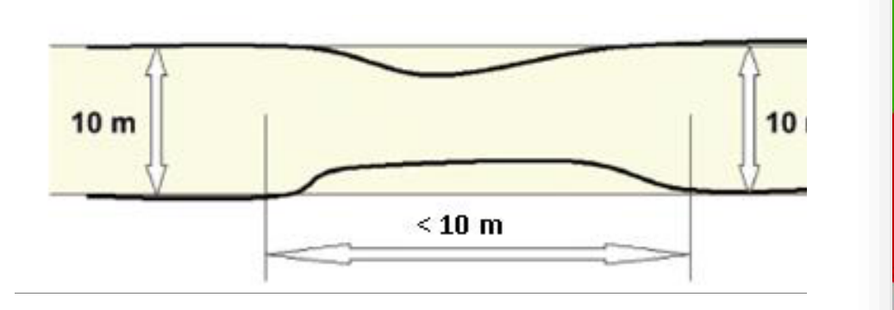
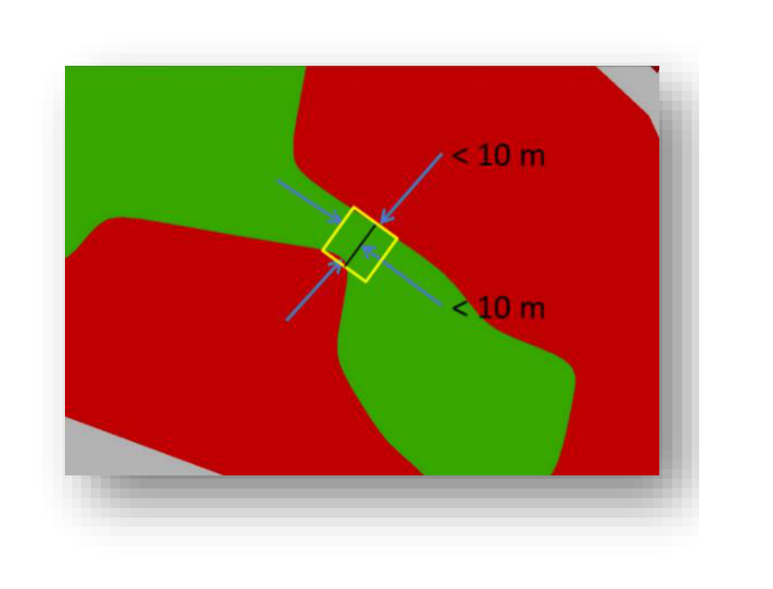

*   Border effect correction: road network crossing wooded area and connecting cities and villages is fully classified as STL due to tree crown cover by default. Therefore, post-processing step needs to be implemented for correcting this misclassification.

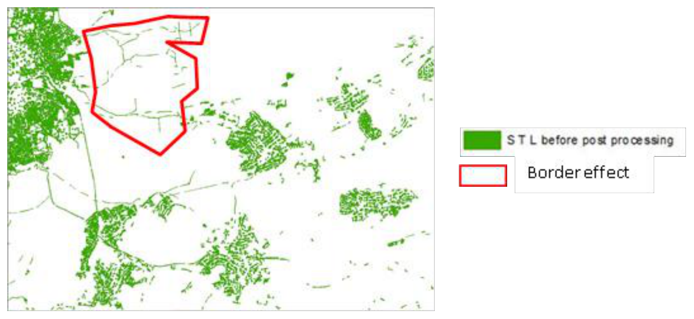

An urban mask analysis to exclude road and railway networks connecting cities and villages shall be applied to solve this border effect. Urban Mask analysis needs to define a tolerance fixed to 50 m that well differentiate urban and interurban networks. Large railway infrastructures may be excluded from the mask, but this is not an issue knowing that trees are very rare in such areas.

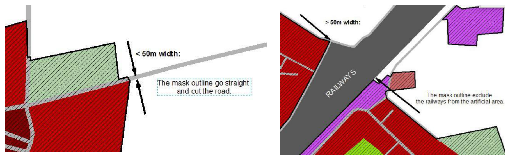

STL patches do not cover roads (codes 12210 and 12220) or railways (code 12230) connecting cities, that are outside the urban mask.

*   MMU rule (>500 m²) is applied to STL polygons (STL = 1)
*   The STL layer contains trees (STL = 1) or No data (STL= 99).

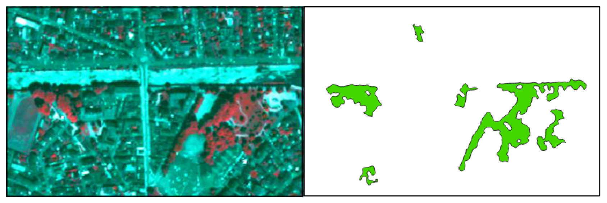

### DIGITAL HEIGHT MODEL LAYER (DHM)

A 10 m raster layer containing height information is generated for core urban areas of capital cities of the EEA38 and the United Kingdom as part of the Urban Atlas project (see table 2), based on the methodology described hereafter.

1. Base data

The input data source of stereo data is the IRS-P5 Cartosat-1. In May 2005, the Indian Space Research Organisation (ISRO) had launched the IRS-P5 Cartosat-1 satellite, equipped with the PAN-Aft and PAN-Fore instruments that form a dual-optics 2-line (forward and backward looking) along-track stereoscopic push broom scanner with a stereo angle of 31°, an original spatial resolution of 2.5 m and a swath width of 27 km. The satellite covers the entire globe in 1867 orbits on a 126-day cycle.
Because of its optimized stereo configuration (stereo acquisitions within seconds and optimized acquisition angles), IRS-P5 Cartosat-1 high-resolution stereo satellite imagery has proven to be perfectly suited for the creation of the digital surface models in the resolution and quality requested.
The very comprehensive data situation and the unique specifications guarantee a very good coverage of urban areas in Europe by one single data source.

2. DSM generation

Based on the stereo images, a digital surface model (DSM) is generated, which represents the height of all objects above the earth's surface, i.e. plant/ forest canopy or the top of artificial constructions such as buildings.
The major steps are:

*   Selection of suitable stereo images
*   Pixel-wise matching approach
*   Bundle block adjustment and RPC improvement
*   Automated outlier detection
*   Void filling
*   Process QA

The result of the DSM processing chain is an accurate and reliable 3 m DSM (to get the full advantages of the higher resolution, e.g. for a better delineation of buildings), which will be further regularised to the final 10 m resolution in the nDSM generation step, to fit the product requirements.

3. DTM generation

Digital terrain models (DTMs) represent the height of the bare earth's surface. In this case, the DTMs are generated from a DSM and non-ground features such as buildings, trees, bushes and vehicles have to be identified and their height measurements be removed from the data before interpolation.
In order to ensure meeting the DTM quality requirements even in complicated terrain situations and to ensure best possible accuracy of generated DTMs, it is useful to combine the extracted ground point results of different filter methods or apply regionally adjusted algorithm parameterizations.
The interpolation approach carried out in this project is ordinary Kriging. It is the most commonly used Kriging method, used in simulations for spatial data, commonly considered to best minimizes the variance of the estimation error.

4. nDSM generation and refinement

The next step towards finally retrieving building block heights is the creation of a normalized Digital Surface Model (nDSM). An nDSM is the difference between a DTM and a DSM used to show height values of buildings, vegetation and other objects.

nDSM = DSM - DTM

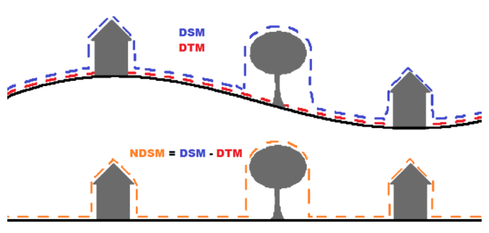

As there are vegetation and other untilled areas included in the raw nDSM, hence a substantial further quality refinement with different ancillary datasets is necessary to generate a sharp and error-free digital building block height model.
Ancillary datasets consist of (i) built-up area, water and street classes of Urban Atlas 2012 and (ii) NDVI map for vegetation removal, calculated from Spot 5 seamless mosaics.

The nDSM at this stage is a 3 m resolution intermediate product that is then resampled with a maximum upscaling process to the final 10 m horizontal resolution, and which is then finally sharpened by using the borders of the built-up area classes from Urban Atlas 2012. Values outside these classes are set to Zero. Each pixel represents a height value and no statistics have been calculated based on the building block heights.

In a last refinement step the accuracy specifications are checked and if necessary, heights are adapted.

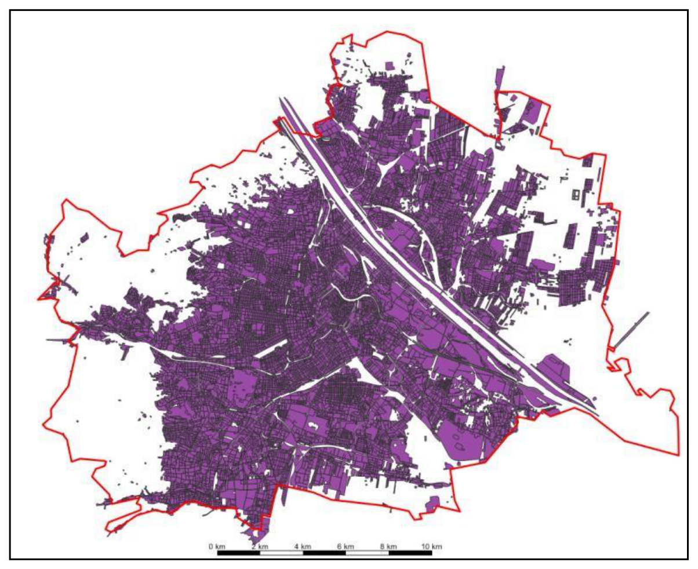

5. Post processing and product finalization

In the final post-processing and product package generation step, the properly refined nDSM with building block heights, which are considered the final product (Digital Height Models DHM) are checked by an automated routine for adherence to the following basic technical and formal product specifications:

*   10 m spatial resolution.
*   ETRS89 - Lambert Azimuthal Equal Area (LAEA) projection.
*   Consistent file format, naming and structure, class legends and color codes.
*   Correct height values / background values.

Each Building Block Height model (DHM) is clipped exactly to the AOI and assigned a folder with a corresponding name. As a further automated step, an INSPIRE compliant metadata file is generated for every product and a template for the delivery report is created for each DU and stored in the respective folder.

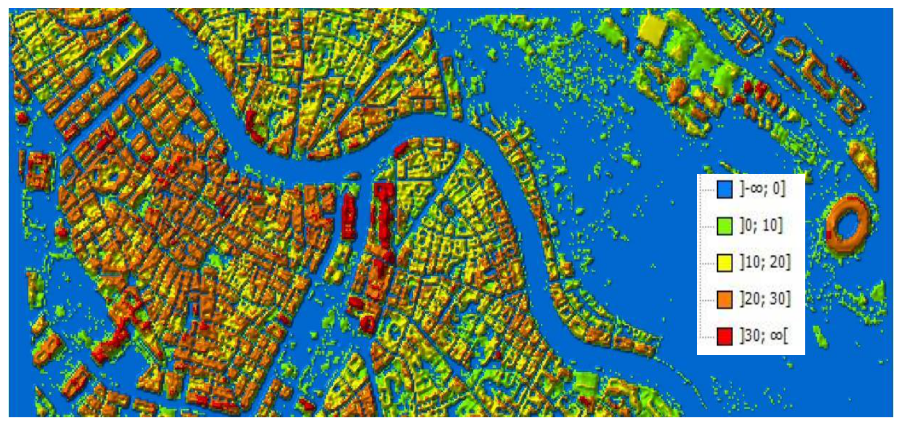

### MINIMUM MAPPING UNITS AND EXCEPTIONS

```{=html}
<table>
<colgroup>
<col style="width: 42.7%">
<col style="width: 27.4%">
<col style="width: 13.8%">
<col style="width: 16.1%">
</colgroup>
  <tr>
    <td style="background-color:#00A99D; color:#ffffff; font-weight:bold;">CORINE<br>Classes [Lev. I, No.]</td>
    <td style="background-color:#00A99D; color:#ffffff; font-weight:bold;">Levels provided</td>
    <td style="background-color:#00A99D; color:#ffffff; font-weight:bold;">MMU</td>
  </tr>
  <tr>
    <td style="background-color:#E5F6F4; text-align:center">Urban</td>
    <td style="background-color:#E5F6F4; text-align:center">1</td>
    <td style="background-color:#E5F6F4; text-align:center">I - IV</td>
    <td style="background-color:#E5F6F4; text-align:center">0.25 ha</td>
  </tr>
  <tr>
    <td style="background-color:#E5F6F4; text-align:center">Rural</td>
    <td style="background-color:#E5F6F4; text-align:center">2 - 5</td>
    <td style="background-color:#E5F6F4; text-align:center">I - II</td>
    <td style="background-color:#E5F6F4; text-align:center">1 ha</td>
  </tr>
  <tr>
    <td style="background-color:#E5F6F4; text-align:center">Street Tree Layer</td>
    <td style="background-color:#E5F6F4; text-align:center">-</td>
    <td style="background-color:#E5F6F4; text-align:center">-</td>
    <td style="background-color:#E5F6F4; text-align:center">500 m<sup>2</sup></td>
  </tr>
</table>
```

Exception of MMU 0.25 / 1 ha: in case of a homogeneous area > MMU but divided in 2 or more polygons by the road or railway network, each part can be smaller to preserve the land cover information. However, no polygon can be smaller than 500 m² (e.g. a 1 ha forest divided in 4 polygons by the road network has to be mapped) except for polygons at the border of the FUA (>100 m²).
The minimum mapping width (MinMW) between 2 objects for distinct mapping is 10 m.
Exception of minimum width 10m of a mapping unit: class 12220 (MMW = 6m).
Exception of minimum width 10m of a mapping unit: to maintain continuity of linear structures, they can be mapped smaller than 10 m over a distance up to 50 m (see figure below).

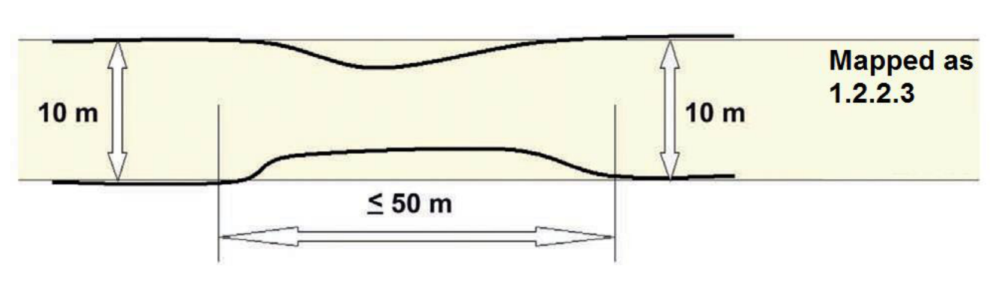

Priority mapping rules for areas smaller than the MMU:

1.  Smaller areas are visually added to the adjacent unit with the thematically closest class. Rule used for the artificial codes (1xxxx).

2.  Smaller areas are added to the adjacent unit with the longest common border line, except to railways or roads (exception here: if an object is below the MMU size and completely surrounded by e.g. road or railway network it shall be aggregated with that surrounding traffic line). Rule used for the natural / semi-natural codes (2xxxx, 3xxxx, 4xxxx, 5xxxx) and all the polygons < 100m².

Specific Minimum Mapping Units for LULC CHANGE layer :
In order to ensure that relevant LU/LC changes are appropriately extracted, the MMUs for the LU/LC change layer (e.g. 2012-2018) are defined as below:

*   Urban (class 1) to urban (class 1) = 0.1 ha
*   Rural/natural (classes 2-5) to urban (class 1) = 0.1 ha
*   Rural/natural (classes 2-5) to rural/natural (classes 2-5) = 0.25 ha
*   Urban (class 1) to rural/natural (classes 2-5) = 0.25 ha

Considering this MMUs, exceptions are made in case of areas where changes involve road and railway networks (classes 12210, 12220, 12230); polygon features classified as road or railway for one date or directly connected to such element are extracted even if area is lower than MMU in order to keep consistency of the transportation network.

### ACCURACY ASSESSMENT AND VALIDATION

In addition to the usual QA/QC procedure implementation, which implies visual checks for ensuring thematic and geometric positional accuracies and automatic checks for ensuring completeness and logical consistency during the post-processing phase of the production, accuracy assessment and validation must be performed independently from the production for providing the evidence that the results are fully compliant with the product specifications.
Thus, accuracy assessment follows a "double-blind" approach which means that production team and reference data team work completely independently. Reference database is obtained through the interpretation of samples which are selected based on a stratified random sampling of EEA 1km grid cell. The number of samples for each FUAs varies depending on the FUA size. The results of the reference interpretation provide the material to derive confusion matrixes, which are used to assess the accuracies.

```{=html}
<table>
<colgroup>
<col style="width: 25.1%">
<col style="width: 16.1%">
<col style="width: 24.8%">
<col style="width: 24.2%">
<col style="width: 9.8%">
</colgroup>
  <tr>
    <td style="background-color:#00A99D; color:#ffffff; font-weight:bold;">CORINE<br>Classes [Lev. I, No.]</td>
    <td style="background-color:#00A99D; color:#ffffff; font-weight:bold;">Levels provided</td>
    <td style="background-color:#00A99D; color:#ffffff; font-weight:bold;">Thematic<br>Accuracy</td>
    <td style="background-color:#00A99D; color:#ffffff; font-weight:bold;">Positional Pixel<br>Accuracy</td>
  </tr>
  <tr>
    <td style="background-color:#E5F6F4; text-align:center">Urban</td>
    <td style="background-color:#E5F6F4; text-align:center">1</td>
    <td style="background-color:#E5F6F4; text-align:center">I - IV</td>
    <td style="background-color:#E5F6F4; text-align:center">>= 85%</td>
    <td style="background-color:#E5F6F4; text-align:center">&lt;± 5 m</td>
  </tr>
  <tr>
    <td style="background-color:#E5F6F4; text-align:center">Rural</td>
    <td style="background-color:#E5F6F4; text-align:center">2 - 5</td>
    <td style="background-color:#E5F6F4; text-align:center">I - II</td>
    <td style="background-color:#E5F6F4; text-align:center">>= 80%</td>
    <td style="background-color:#E5F6F4; text-align:center">&lt;± 5 m</td>
  </tr>
  <tr>
    <td style="background-color:#E5F6F4; text-align:center" colspan="3">Overall<br>Accuracy</td>
    <td style="background-color:#E5F6F4; text-align:center">>= 80%</td>
  </tr>
</table>
```

For the DHM layer, Quality controls are conducted for each stage of the production: the DSM and DTM generation, the nDSM production, the masking and the nDSM / Building Block Height refinement. Thus, the emerging dataset is quality checked several times throughout the process.
Every product is accompanied by a DHM QC Report, which shows the results of the external Quality Check and an INSPIRE compliant xml file: [Building Height 2012 — Copernicus Land Monitoring Service](https://land.copernicus.eu/pan-european/high-resolution-layers/building-height-2012).

## LU/LC NOMENCLATURE

The Urban Atlas Land Use / Land Cover classification is derived from CORINE Land Cover and is composed of 27 classes distributing among 5 thematic groups, namely:

1.  Artificial surfaces
2.  Agricultural areas
3.  Natural and (semi-)natural areas
4.  Wetlands
5.  Water

Four hierarchical levels are defined in the nomenclature for artificial surfaces (class 1) while only two are defined for the non-artificial ones (classes 2-5). The table below shows the LU/LC nomenclature providing class codes and descriptions and any information or ancillary data source useful for the product generation in addition to EO data.
A decision matric below illustrate the rules followed to apply LULC nomenclature to each identified feature.

::: {.tbl-caption}
```{=typst}
#set text(size: 9pt, fill: rgb("#3E6893"))
```
Table 3: UA LULC nomenclature (in bold, classes without any further subdivision)
:::

```{=html}
<table>
<colgroup>
<col style="width: 13.5%">
<col style="width: 10.6%">
<col style="width: 37.2%">
<col style="width: 38.8%">
</colgroup>
<tr style="background-color:#00A99D;color:#ffffff; font-weight:bold">
<td >UA No.</td>
<td >Code</td>
<td >Nomenclature</td>
<td >Additional<br>Information</td>
</tr>
<tr style="background-color:#E5F6F4">
<td><b>1</b></td>
<td></td>
<td><b>Artificial surfaces</b></td>
<td></td>
</tr>
<tr style="background-color:#B3DFDA">
<td>1.1</td>
<td></td>
<td>Urban Fabric</td>
<td></td>
</tr>
<tr style="background-color:#80CBC4">
<td><b>1.1.1</b></td>
<td><b>11100</b></td>
<td><b>Continuous urban fabric (S.L. &gt; 80%)</b></td>
<td>HRL IMD required</td>
</tr>
<tr style="background-color:#B3DFDA">
<td>1.1.2</td>
<td></td>
<td>Discontinuous Urban Fabric (S.L. 10% - 80%)</td>
<td></td>
</tr>
<tr style="background-color:#4DB6AC">
<td><b>1.1.2.1</b></td>
<td><b>11210</b></td>
<td><b>Discontinuous dense urban fabric<br>(S.L. 50% - 80%)</b></td>
<td>HRL IMD required</td>
</tr>
<tr style="background-color:#4DB6AC">
<td><b>1.1.2.2</b></td>
<td><b>11220</b></td>
<td><b>Discontinuous medium density<br>urban fabric (S.L. 30% - 50%)</b></td>
<td>HRL IMD required</td>
</tr>
<tr style="background-color:#4DB6AC">
<td><b>1.1.2.3</b></td>
<td><b>11230</b></td>
<td><b>Discontinuous low density urban<br>fabric (S.L. 10% - 30%)</b></td>
<td>HRL IMD required</td>
</tr>
<tr style="background-color:#4DB6AC">
<td><b>1.1.2.4</b></td>
<td><b>11240</b></td>
<td><b>Discontinuous very low density<br>urban fabric (S.L. &lt; 10%)</b></td>
<td>HRL IMD required</td>
</tr>
<tr style="background-color:#80CBC4">
<td><b>1.1.3</b></td>
<td><b>11300</b></td>
<td><b>Isolated structures</b></td>
<td></td>
</tr>
<tr style="background-color:#B3DFDA">
<td>1.2</td>
<td></td>
<td>Industrial, commercial, public, military, private and transport units</td>
<td></td>
</tr>
<tr style="background-color:#80CBC4">
<td><b>1.2.1</b></td>
<td><b>12100</b></td>
<td><b>Industrial, commercial, public,<br>military and private units</b></td>
<td>zoning data / field<br>check recommended</td>
</tr>
<tr style="background-color:#B3DFDA">
<td>1.2.2</td>
<td></td>
<td>Road and rail network and associated land</td>
<td>COTS or OSM data required</td>
</tr>
<tr style="background-color:#4DB6AC">
<td><b>1.2.2.1</b></td>
<td><b>12210</b></td>
<td><b>Fast transit roads and associated land</b></td>
<td>COTS or OSM data required</td>
</tr>
<tr style="background-color:#4DB6AC">
<td><b>1.2.2.2</b></td>
<td><b>12220</b></td>
<td><b>Other roads and associated land</b></td>
<td>COTS or OSM data required</td>
</tr>
<tr style="background-color:#4DB6AC">
<td><b>1.2.2.3</b></td>
<td><b>12230</b></td>
<td><b>Railways and associated land</b></td>
<td>COTS or OSM data required</td>
</tr>
<tr style="background-color:#80CBC4">
<td><b>1.2.3</b></td>
<td><b>12300</b></td>
<td><b>Port areas</b></td>
<td>zoning data<br>/ field check<br>recommended</td>
</tr>
<tr style="background-color:#80CBC4">
<td><b>1.2.4</b></td>
<td><b>12400</b></td>
<td><b>Airports</b></td>
<td>zoning data<br>/ field check<br>recommended</td>
</tr>
<tr style="background-color:#B3DFDA">
<td>1.3</td>
<td></td>
<td>Mine, dump and construction sites</td>
<td></td>
</tr>
<tr style="background-color:#80CBC4">
<td><b>1.3.1</b></td>
<td><b>13100</b></td>
<td><b>Mineral extraction and dump sites</b></td>
<td></td>
</tr>
<tr style="background-color:#80CBC4">
<td><b>1.3.3</b></td>
<td><b>13300</b></td>
<td><b>Construction sites</b></td>
<td></td>
</tr>
<tr style="background-color:#80CBC4">
<td><b>1.3.4</b></td>
<td><b>13400</b></td>
<td><b>Land without current use</b></td>
<td></td>
</tr>
<tr style="background-color:#B3DFDA">
<td>1.4</td>
<td></td>
<td>Artificial non-agricultural vegetated areas</td>
<td></td>
</tr>
<tr style="background-color:#80CBC4">
<td><b>1.4.1</b></td>
<td><b>14100</b></td>
<td><b>Green urban areas</b></td>
<td></td>
</tr>
<tr style="background-color:#80CBC4">
<td><b>1.4.2</b></td>
<td><b>14200</b></td>
<td><b>Sports and leisure facilities</b></td>
<td></td>
</tr>
<tr style="background-color:#E5F6F4">
<td><b>2</b></td>
<td></td>
<td><b>Agricultural areas</b></td>
<td><b>1 ha MMU</b></td>
</tr>
<tr style="background-color:#B3DFDA">
<td><b>2.1</b></td>
<td><b>21000</b></td>
<td><b>Arable land (annual crops)</b></td>
<td></td>
</tr>
<tr style="background-color:#B3DFDA">
<td><b>2.2</b></td>
<td><b>22000</b></td>
<td><b>Permanent crops</b></td>
<td></td>
</tr>
<tr style="background-color:#B3DFDA">
<td><b>2.3</b></td>
<td><b>23000</b></td>
<td><b>Pastures</b></td>
<td></td>
</tr>
<tr style="background-color:#B3DFDA">
<td><b>2.4</b></td>
<td><b>24000</b></td>
<td><b>Complex and mixed cultivation</b></td>
<td></td>
</tr>
<tr style="background-color:#E5F6F4">
<td><b>3</b></td>
<td></td>
<td><b>Natural and (semi-)natural areas</b></td>
<td><b>1 ha MMU</b></td>
</tr>
<tr style="background-color:#B3DFDA">
<td><b>3.1</b></td>
<td><b>31000</b></td>
<td><b>Forests</b></td>
<td></td>
</tr>
<tr style="background-color:#B3DFDA">
<td><b>3.2</b></td>
<td><b>32000</b></td>
<td><b>Herbaceous vegetation associations</b></td>
<td></td>
</tr>
<tr style="background-color:#B3DFDA">
<td><b>3.3</b></td>
<td><b>33000</b></td>
<td><b>Open spaces with little or no vegetation</b></td>
<td></td>
</tr>
<tr style="background-color:#E5F6F4">
<td><b>4</b></td>
<td><b>40000</b></td>
<td><b>Wetlands</b></td>
<td><b>1 ha MMU</b></td>
</tr>
<tr style="background-color:#E5F6F4">
<td><b>5</b></td>
<td><b>50000</b></td>
<td><b>Water</b></td>
<td><b>1 ha MMU</b></td>
</tr>
<tr style="background-color:#E5F6F4">
<td><b>9.1</b></td>
<td><b>91000</b></td>
<td><b>No data (Clouds and shadows)</b></td>
<td></td>
</tr>
<tr style="background-color:#E5F6F4">
<td><b>9.2</b></td>
<td><b>92000</b></td>
<td><b>No data (Missing imagery)</b></td>
<td></td>
</tr>
</table>
```

## DECISION RULES

Affectation of LULC classes follow the below decision matrix. A detailed matrix concerning artificial areas is illustrated next page.

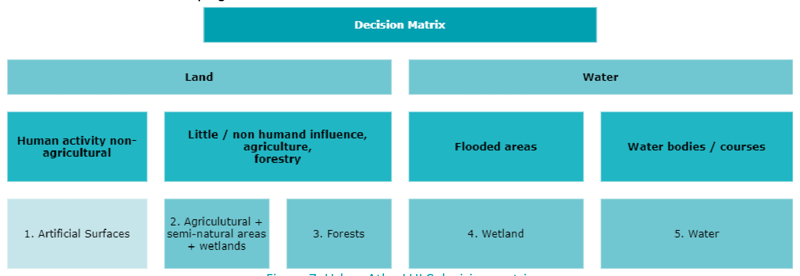

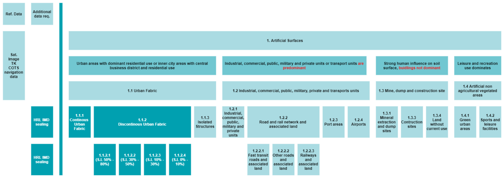

## DESCRIPTION OF LU/LC THEMATIC CLASSES

### ARTIFICIAL SURFACES

Surfaces with dominant human influence and without agricultural land use.
These areas include all artificial structures and their associated non-sealed and vegetated surfaces.
Artificial structures are defined as buildings, roads, all constructions of infrastructure and other artificially sealed or paved areas.
Associated non-sealed and vegetated surfaces are areas functionally related to human activities, except agriculture.
Also, the areas where the natural surface is replaced by extraction and / or deposition or designed landscapes (such as urban parks or leisure parks) are mapped in this class.
The land use is dominated by permanently populated areas and / or traffic, exploration, non-agricultural production, sports, recreation and leisure.

#### URBAN FABRIC

Built-up areas and their associated land, such as gardens, parks, planted areas and non-surfaced public areas and the infrastructure, if these areas are not suitable to be mapped separately regarding the minimum mapping unit size.
Basically, the classes 1.1.1 and 1.1.2. are distinguished by their degree of soil sealing.
Residential structures and patterns are predominant, but also downtown areas and city centres, including the Central Business Districts (CBD) and areas with partial residential use, are included.
The urban fabric classes (1.1) are distinguished only by their degree of soil sealing not by their type of buildings (single family houses or apartment blocks).
The detailed descriptions of the different classes below are given to the interpreters to support the delineation of mapping objects with homogeneous sealing density (without being required to assign the exact density classes).
Using the navigation data as a skeleton for the urban area, in many cases it is necessary to subdivide the blocks formed by the navigation data due to the different sealing density of the residential areas or different functions of the buildings and their associated land.
After completion of the interpretation, the sealing level information from the IMD sealing layer is integrated into the data.

##### CONTINUOUS URBAN FABRIC

Special note:
Mapping the 3rd level is done only with the defined application of the IMD sealing layer.
MMU 0.25 ha, MinMW: 10 m

Land Cover:
Average degree of soil sealing: > 80%
Built-up areas and their associated land, if these areas are not suitable to be mapped separately regarding the minimum mapping unit size.
Buildings, roads and sealed areas cover most of the area; non-linear areas of vegetation and bare soil are exceptional.

Land Use:
Predominant residential use: areas with a high degree of soil sealing, independent of their housing scheme (single family houses or high-rise dwellings, city centre or suburb).
Included are downtown areas and city centres, and Central Business Districts (CBD) if there is partial residential use.

##### DISCONTINUOUS URBAN FABRIC

Special note:
Mapping the 4th level of density classes is done only with the defined application of the imperviousness / soil sealing layer.

Land Cover:
Average degree of imperviousness / soil sealing: 0 - 80%
Built-up areas and their associated land (small roads, sealed areas including non-linear areas of vegetation and bare soil), if these areas are not suitable to be mapped separately regarding the minimum mapping unit size.
This type of land cover can be distinguished from continuous urban fabric by a larger fraction of non-sealed and / or vegetated surfaces: gardens, parks, planted areas and non-surfaced public areas.

Land Use:
Predominant residential usage. Contains more than 20% non-sealed areas, independent of their housing scheme (single family houses or high-rise dwellings, city centre or suburb).
The non-sealed areas might be private gardens or common green areas.

Not included are:
Farms with large buildings (agro-industrial production), → class 1.2.1.
Nurseries with dominant areas of greenhouses (no or only small fields) → class 1.2.1.
Allotment gardens → class 1.4.2.
Holiday villages (“Club Med”) → class 1.4.2.

###### DISCONTINUOUS DENSE URBAN FABRIC

MMU 0.25 ha, MinMW: 10 m
Average degree of soil sealing: > 50 - 80%
Residential buildings, roads and other artificially surfaced areas.

###### DISCONTINUOUS MEDIUM DENSITY URBAN FABRIC

MMU 0.25 ha, MinMW: 10 m
Average degree of soil sealing: > 30 - 50%
Residential buildings, roads and other artificially surfaced areas. The vegetated areas are predominant, but the land is not dedicated to forestry or agriculture.

###### DISCONTINUOUS LOW DENSITY URBAN FABRIC

MMU 0.25 ha, MinMW: 10 m
Average degree of soil sealing: 10 - 30%
Residential buildings, roads and other artificially surfaced areas. The vegetated areas are predominant, but the land is not dedicated to forestry or agriculture.

###### DISCONTINUOUS VERY LOW DENSITY URBAN FABRIC

MMU 0.25 ha, MinMW: 10 m
Average degree of soil sealing: <10%
Residential buildings, roads and other artificially surfaced areas. The vegetated areas are predominant, but the land is not dedicated to forestry or agriculture. Example: exclusive residential areas with large gardens.

##### ISOLATED STRUCTURES

MMU 0.25 ha, Maximum Mapping Unit 2 ha, MinMW: 10 m

Isolated artificially structures with a residential component, such as (small) individual farmhouses and related buildings.
It must contain only a few houses (1 to 5 houses: depending on the size of the houses and the number of associated buildings), otherwise it should be included in class 1.1.2.
The mapping unit is no larger than 2 ha, otherwise it should also be included in class 1.1.2.
To be in line with this eligibility rule (regarding level 1 of the nomenclature, artificialized areas), if the considered feature is neighbouring another urban class polygon(s) other than transportation network, and the total surface of the considered polygons is above 2 ha, the area should be considered as class 1.1.2 rather than 1.1.3"

Comment: In this kind of areas under development, some small areas are considered as class 1.1.2 (and not 1.1.3) because of the presence of neighbouring areas classified as 1.3.4 (artificial areas).

#### INDUSTRIAL, COMMERCIAL, PUBLIC, MILITARY, PRIVATE AND TRANSPORT UNITS

At least 30% of the ground is covered by artificial surfaces. More than 50% of those artificial surfaces are occupied by buildings and / or artificial structures with non-residential use, i.e. industrial, commercial or transport related uses are dominant.

##### INDUSTRIAL, COMMERCIAL, PUBLIC, MILITARY AND PRIVATE UNITS

MMU 0.25 ha, MinMW: 10 m
Land cover:
Artificial structures (e.g. buildings) or artificial surfaces (e.g. concrete, asphalt, tar, macadam, tarmac or otherwise stabilized surface, e.g. compacted soil, devoid of vegetation), occupy most of the surface. Included are associated areas, such as roads, sealed areas and vegetated areas, if these areas are not suitable to be mapped separately regarding the MMU size.

Land use:
Industrial, commercial, public, military or private units. The administrative boundaries of the production or service unit are mapped, including associated features larger than the MMU (e.g. sports areas or transport structures).

Also included are:
> Bare soil and/or grassland potentially used for storage of material or as enclosures for livestock.
> Compounds with significant amounts of green or natural areas but with industrial, commercial, military or public use. Example: communication tower, antennas or wind motors and their associated land.

This class contains:

a) Industrial uses and related areas
> Sites of industrial activities, including their related areas such as storage areas.
> Production sites.
> Energy plants: nuclear, solar, hydroelectric, thermal, electric and wind farms.
> Sewage treatment plants.
> Farming industries (farms with large buildings and / or greenhouses).
> Antennas, even with predominant vegetated areas. The vegetated areas may be predominant, but the land is not dedicated to forestry or agriculture.
> Water treatment plants.
> Sewage plants.
> Seawater desalination plants.

The industrial units can be distinguished from residential built-up areas by the type of buildings, their access to transport features and the surroundings:
> Buildings with large surface areas (inside, not all rooms need daylight, as in dwelling houses).
> Good access to roads and parking for customers.
> Industrial areas are often outside the historical city centre.

b) Commercial uses, retail parks and related areas
> Surfaces purely occupied by commercial activities, including their related areas (e.g. parking areas even larger than the MMU).
> High-rise office buildings.
> Petrol and service stations within built-up areas.

The commercial units can be distinguished from residential built-up areas by the type of large buildings, their access to transport features and the surroundings:
> Buildings with large surface areas (inside, not all rooms need daylight, as in dwelling houses).
> Good access to roads and parking for customers.
> Pure commercial areas are often outside the historical city centre.

Not included are:
Petrol stations along fast transit and main roads with access only from these roads. They are mapped together with the road transport system → class 1.2.2.1 or 1.2.2.2.

c) Public, military and private services not related to the transport system
Surfaces purely occupied by general government, public or private administrations including their related areas (access ways, lawns, military training areas, parking areas).

Included are:
> Schools and universities.
> Hospitals and other health services or buildings.
> Places of worship (churches / cathedrals / religious buildings).
> Archaeological sites and museums.
> Administration buildings, ministries.
> Penitentiaries.
> Military areas including bases and ports.
> Military exercise areas fenced and under current use.
> Castles, etc. not primarily used for residential purposes (building management, gardeners, etc.... living there is not residential use in this sense).
> Private storage areas without a residential component, such as compounds of garages.

Not included are:
> Public parks → class 1.4.1.
> Holiday resorts including their hotels → class 1.4.2.
> Sport centres or bathing centres → class 1.4.2.
> Cemeteries → class 1.4.1 (note: for the "UA 2006” LULC production, the cemeteries were classified in class 1.2.1, they are now included in class 1.4.1 in "UA 2006 Revised" and "UA 2012" LCLU).
> Military airports → class 1.2.4.

d) Civil protection and supply infrastructure
> Dams, dikes, irrigation and drainage canals and ponds and other technical public infrastructure, to be mapped with the roads, embankments and associated land included.
> Includes also breakwaters, piers and jetties, sea walls and flood defenses.
> (Ancient) city walls, other protecting walls, bunkers.
> Avalanche barriers.

Not included are:
Noise barriers → class 1.2.2.
Water courses (within e.g. diked canals) if the water area is wider than 10 m → class 5; Reservoirs along natural water courses → class 5.

##### ROAD AND RAIL NETWORK AND ASSOCIATED LAND

MMU 0.25 ha, MinMW: 6 m (Road) - 10 m (Rail)

Special Note:
The road and railway network (COTS or OSM data) is ingested into the classification database according to the method given in the Annex.
Parts of the navigation data that are obviously not congruent with the corresponding traffic line in the EO data and ancillary map need to be corrected.

Roads which are not contained in the navigation data are mapped by the service provider according to the mapping criteria defined in this mapping guide.
Roads or railways do not necessarily have to form a closed network. Isolated traffic lines are possible, but they are to be mapped regarding the MMU criterion.
Associated land is mapped with the roads / railways as it is visible in the EO data and topographic maps.

Associated lands are:
> Slopes of embankments or cut sections.
> Areas enclosed by roads or railways, without direct access and without agricultural land use.
> Fenced areas along roads (e.g. as for protection against wild animals).
> Areas enclosed by motorways, exits or service roads with no detectable access.
> Noise barriers (fences, walls, earth walls).
> Rest areas, service stations and parking areas only accessible from the fast transit roads.
> Railway facilities including stations, cargo stations and service areas.
> Foot- or bicycle paths parallel to the traffic line.
> Green strips, alleys (with trees or bushes).

###### FAST TRANSIT ROADS AND ASSOCIATED LAND

MMU 0.25 ha, MinMW: 6 m

Roads defined as "motorways" in the navigation data, including motorway rest, service areas, tolls, parking areas, only accessible from the motorways.
Areas surrounded by highway or railway junctions have to be included in the corresponding network.
Motorways that are not included in the navigation data are to be mapped by the service provider.

###### OTHER ROADS AND ASSOCIATED LAND

MMU 0.25 ha, MinMW: 6 m

Roads, crossings, intersections and parking areas, including roundabouts and sealed areas with "road surface".

###### RAILWAYS AND ASSOCIATED LAND

MMU 0.25 ha, MinMW: 10 m

Railway facilities including stations, cargo stations and service areas.

#### PORT AREAS

MMU 0.25 ha, MinMW: 10 m

Special Note:

Ancillary data is recommended for identifying the administrative boundary of the port area.
The delineation itself is to be done on the EO data:
> Detailed city / tourist maps or
> Field check (on site visit) or
> Local zoning data

Administrative area of inland harbours and seaports.
Infrastructure of port areas, including quays, dockyards, transport and storage areas and associated areas.

Not included are:
Marinas → class 1.4.2.
Industrial areas directly located in a port.

#### AIRPORTS

MMU 0.25 ha, MinMW: 10 m

Special Note:

Ancillary data is recommended for identifying the administrative boundary of the airport area.
The delineation itself is to be done on the EO data:
> Detailed city / tourist maps or
> Field check (on site visit) or
> Local zoning data

Administrative area of airports mostly fenced.
Included are all airport installations: runways, buildings and associated land.
Military airports are also included (included in class 1.2.1. for UA2006).

Not included are:
Aerodromes without sealed runway → class 1.4.2.

### MINE, DUMP AND CONSTRUCTION SITES

#### MINERAL EXTRACTION AND DUMP SITES

MMU 0.25 ha, MinMW: 10 m

Special Note:
Ancillary data is recommended for identifying the administrative boundary. The delineation itself is to be done on the EO data:
> Detailed city / tourist maps or
> Field check (on site visit) or
> Local zoning data

Included are:
> Open pit extraction sites (sand, quarries) including water surface, if < MMU, open-cast mines, inland salinas, oil and gas fields.
> Their protecting dikes and / or vegetation belts and associated land such as service areas, storage depots.
> Public, industrial or mine dump sites, raw or liquid wastes, legal or illegal, their protecting dikes and / or vegetation belts and associated land such as service areas.

Not included are:
Water bodies > MMU → class 5.
Exploited peat bogs → class 4 (only for UA2012).
Coastal salinas → class 4 (only for UA2012).
Re-cultivated areas (mapped according to their actual land cover) → class 2 or 3.
Riverbed extraction → class 4 for wetlands or 3.3 for rocks (only for UA2012).
Decanting basins of biological water treatment plants → class 1.2.1.

#### CONSTRUCTION SITES

MMU 0.25 ha, MinMW: 10 m

Spaces under construction or development, soil or bedrock excavations for construction purposes or other earthworks visible in the image.
Clear evidence of actual construction needs to be identifiable in the data, such as actual excavations and machinery on site, or ongoing construction of any stage, land under development, etc.

In case of doubt → class 1.3.4.

#### LAND WITHOUT CURRENT USE

MMU 0.25 ha, MinMW: 10 m

Areas in the vicinity of artificial surfaces still waiting to be used or re-used. The area is obviously in a transitional position, "waiting to be used".
Waste land removed former industry areas, ("brown fields") gaps in between new construction areas or leftover land in the urban context ("green fields").
No actual agricultural or recreational use.
No construction is visible, without maintenance, but no undisturbed fully natural or semi-natural vegetation (secondary ruderal vegetation).
Also, areas where the street network is already finished, but actual erection of buildings is still not visible.

Not included are:
"Leftover areas", areas too small / narrow for any construction regarding the MMU size → map to the appropriate neighbour class as associated land.

### ARTIFICIAL NON-AGRICULTURAL VEGETATED AREAS

Vegetation planted and regularly worked by humans; strongly human-influenced. Sporting facilities as functional units independent of being non-sealed, sealed or built-up.

#### GREEN URBAN AREAS

MMU 0.25 ha, MinMW: 10 m

Public green areas for predominantly recreational use such as gardens, playgrounds, zoos, parks, castle parks and cemeteries (cemeteries were included in class 1.2.1 for UA2006). Suburban natural areas that have become and are managed as urban parks.
Forests or green areas extending from the surroundings into urban areas are mapped as green urban areas when at least two sides are bordered by urban areas and structures, and traces of recreational use are visible.

Not included are:
Private gardens within housing areas → class 1.1.
Buildings within parks, such as castles or museums → class 1.2.1.

Cases of patches of natural vegetation or agricultural areas, enclosed by built-up areas without being managed as green urban areas :
> under 0,25 ha → merged with the surrounding classes
> between 0,25 ha and 1 ha→ class 1.3.4.
> above 1ha classified in their own LC/LU

#### SPORTS AND LEISURE FACILITIES

MMU 0.25 ha, MinMW: 10 m

All sports and leisure facilities including associated land, whether public or commercially managed: e.g. Theresienwiese (Munich), public arenas for any kind of sports including associated green areas, parking places, etc.:

*   Golf courses.
*   Campgrounds.
*   Leisure parks.
*   Riding grounds.
*   Racecourses.
*   Amusement parks.
*   Swimming resorts etc.
*   Holiday villages ("Club Med").
*   Allotment gardens[^1].
*   Glider or sports airports, aerodromes without sealed runway.
*   Marinas.

Not included are:
Private gardens within housing areas → class 1.1.
Motor racing courses within industrial zone used for test purposes → class 1.2.1.
Caravan parking used for commercial activities → class 1.2.1.
Soccer fields, etc. within e.g. military bases or within university campuses → class 1.2.1.

[^1]: Allotment gardens are complexes of a few up to hundreds of land parcels assigned to residential people.

### AGRICULTURAL

Please note that Classes 2.1 to 2.4 are grouped together in Class 2 in UA2006.

MMU I ha

#### ARABLE LAND

*   Fields under rotation system. Can be non-irrigated or permanently irrigated. Also includes rice fields.
*   Fields laid in fallow are included.

#### PERMANENT CROPS

*   Orchards
*   Vineyards and their nurseries
*   Roses
*   Olive groves
*   Berries and hop plantations

#### PASTURES

*   Pasture and meadow under agricultural use, grazed or mechanically harvested.
    Wooded meadows, pastures with scattered trees.

#### COMPLEX AND MIXED CULTIVATION PATTERNS

*   Annual crops associated with permanent crops such as orchards.
*   Complex cultivation patterns.
*   Land principally occupied by agriculture, with significant areas of natural vegetation.
*   Agroforestry areas.

### NATURAL AND SEMI-NATURAL AREAS

Please note that Class 3.1 are included into class 3 and classes 3.2 and 3.3 are included into class 2 in UA2006.

MMU I ha

#### FORESTS

*   Broad leaved forest, coniferous forest and mixed forest.
*   Transitional woodland and shrub (clear cut, new plantations and regeneration, or damage forest).
*   With ground coverage of tree canopy > 30%, tree height > 5 m, including bushes and shrubs at the fringe of the forest.
*   Included tree nurseries, Populus plantations, Christmas tree plantations.
*   Forest regeneration / re-colonisation: clear cuts, new forest plantations.

Not included are:
Forests within urban areas and/or subject to high human pressure → class 1.4.1

#### HERBACEOUS VEGETATION ASSOCIATION

*   Vegetation cover more than 50%, ground coverage of trees with height >5 m: <30%, areas with minor / without artificial or agricultural influence.
*   Sclerophyllous vegetation.
*   Bushy sclerophyllous vegetation (e.g. maquis, garrigue).
*   Abandoned arable land with bushes.
*   Woodland degradation: storm, snow, insects or air pollution.
*   Areas under power transmission lines inside forest.
*   Fire breaks.
*   Steep bushy slopes of eroded areas.
*   Abandoned vineyards or orchards, arable land and pastures under natural colonisation.
*   Herbaceous area with bush proliferation indicating no agricultural or farming use for a rather long time.
*   Bushy areas along creeks.
*   Bushes, shrubs and herbaceous plants, dwarf forest in alpine or coastal regions (Pinus Mugo forests). Height is maximum 3 m in climax stage.
*   Natural grassland.

#### OPEN SPACES WITH LITTLE OR NO VEGETATION

a) Beaches, dunes, sand:

*   Beaches, dunes and sand plains, (coastal or inland location), gravel along rivers.
*   Seasonal rivers, if water is characteristic for a shorter part of the year (< 2 months).

b) Bare rocks:
*   > 90% of the land surface of bare rocks, (i.e. < 10% vegetation).
*   Rocks, gravel fields, landslides.
*   Scree (fragments resulting from mechanical and chemical erosion. Weathering rocks forming heaps of coarse debris at the foot of steep slopes), cliffs, rocks.

c) Sparsely vegetated areas:
*   Steppes, tundra, badlands, scattered high altitude vegetation. Bare soils inside military training areas. Vegetation cover 10 - 50%.

d) Burnt areas:
*   Recently burnt forest or shrubs (but not natural grassland), still mainly black on EO data.

e) Snow and ice:
*   Glacier and perpetual snow.

### WETLANDS

Please note that Class 4 is included into Class 2 in UA2006.

a) Inland wetlands:
*   Areas flooded or liable to flooding during a large part of the year by fresh, brackish or standing water with specific vegetation coverage made of low shrub, semi-ligneous or herbaceous species.
*   Water fringe vegetation, reed beds of lakes, rivers and brooks. Sedge and fen-sedge beds, swamps.
*   Peat bogs, with or without peat extracting areas.
*   Shallow water areas covered with reed.
*   Seasonal rivers, if water course is not visible in the EO data.

b) Coastal wetlands:
*   Areas flooded or liable to flooding during a large part of the year by brackish or saline water, susceptible to flooding by sea water. Often in the process of fi in and gradually being colonized by halophytic plants.
*   Specific vegetation coverage made of low shrub, semi-ligneous or herbaceous species.
*   Alluvial planes, marshes and intertidal flats
*   Salinas (salt production sites by evaporation).

Not included are:
Military exercise areas fenced and under current use → class 1.2.1.
Greenhouses → class 1.2.1.
Inland salinas → class 1.3.1.

### WATER

MMU I ha

The visible water surface area on the EO data is delineated. EO data should be considered as a primary (guiding) data source.

*   Sea.
*   Lakes.
*   Fishponds (natural, artificial)
*   Rivers, including channeled rivers.
*   Canals.

The default source for delineation is the EO data. If no clear delineation is possible using EO data, the other reference datasets may be used for that. Examples are:

*   Reservoirs.
*   Water courses or ponds with a strongly variable surface level.

All water bodies and water courses visible in the imagery are mapped as long as they exceed an extent of 1 ha.
Water courses are mapped continuously also when water surface is covered by vegetation. If the water is partly obscured, e.g. by vegetation, the delineation shall be oriented to other parts of the water where it is not obscured.
Included are:

*   Seasonal rivers, if the water course is visible in the EO data, otherwise → class 2.
*   Fishponds with distance < 10 m are mapped together.

The navigation (COTS or OSM) data water layer may be used as a reference for interpretation. However, delineation of water areas must be done using the EO data, as the geometric accuracy of a OSM data water object is too rough for mapping on the scale 1:10 000.

Not included are:
Shallow water areas covered with reed > MMU → class 2 Seasonal rivers, if the water course is not visible in the EO data → class 2.

### MISCELLANEOUS

Concerning the UA2006 products, areas with EO data provision problems were classified in separate classes described below.

a) No data (Clouds and shadows)
Areas affected by clouds or shadows on the EO data have to be mapped with ancillary data if the cloud or/and shadow overlays with the "CGC_RG_LAEA" layer (priority areas corresponding to the cities and greater cities according to the EC/OECD definition of cities (2011) provided by DG REGIO). An additional layer called “CGC_CLOUD_CAPI" delineating the areas classified by other data sources (Google Earth or other relevant available data sources) than the VHR2 coverage (DWH_MG2b_CORE_03) will be produced.
Outside these priority areas, class 9.1 (code 91000) will be used for areas covered by clouds and shadows over the satellite images where land use/land cover is not possible to be determined.

b) No data (Missing imagery)
This class 9.2 (code 92000) includes areas without available satellite image or inadequate imagery (e.g. no STL data can be produced as the image acquisition is outside the vegetation period).

# ANNEX

## LIST OF ABBREVIATIONS

| Abbreviation | Meaning                                                             |
|-----------------------------------------------------|---------------------------------------------------------------------------------------------------------------------------------------------------|
| CBD          | Central Business Districts                                          |
| CLMS         | Copernicus Land Monitoring Service                                  |
| CORINE       | COoRdination of INformation on the Environment                      |
| COTS         | Commercial Off-The-Shelf                                            |
| DG REGIO     | European Commission Directorate-General for Regional and Urban Policy |
| DHM          | Digital Height Model                                                |
| DWH          | Data WareHouse                                                      |
| EC           | European Commission                                                 |
| EEA          | European Environment Agency                                         |
| EFTA         | European Free Trade Association                                     |
| EO           | Earth Observation                                                   |
| EU           | European Union                                                      |
| ESA          | European Space Agency                                               |
| FTS          | Fast Track Sealing layer                                            |
| FUA          | Functional Urban Areas                                              |
| HRL          | High Resolution Layer                                               |
| IMD          | IMperviousness Degree                                               |
| INSPIRE      | INfrastructure for SPatial InfoRmation in Europe                    |
| LULC         | Land Use / Land Cover                                               |
| MinMW        | Minimum Mapping Width                                               |
| MMU          | Minimum Mapping Unit                                                |
| OA           | Overall Accuracy                                                    |
| OECD         | Organization for Economic Co-operation and Development              |
| OSM          | Open Street Map                                                     |
| QA           | Quality Assurance                                                   |
| QC           | Quality Check                                                       |
| RD           | Reference Document                                                  |
| RPC          | Rational polynomial coefficient                                     |
| SL           | Sealing Layer                                                       |
| STL          | Street Tree Layer                                                   |
| UA           | Urban Atlas                                                         |
| VHR          | Very High Resolution                                                |

## PRE-PROCESSING AND GEOMETRIC ADAPTATION OF NAVIGATION DATA

The navigation datasets (COTS or OSM) by default include a specific and hierarchical classification of the road network. Two basic categories are important within the context of the Urban Atlas. The first category gives information about the Functional Road Class (FRC), i.e. the road type, the second one gives information about the importance of each road within the city traffic network (Net2Class).

The navigation data currently used shows the following categories for FRC/type and Net2Class:

```{=html}
<table>
<colgroup>
<col style="width: 19.6%">
<col style="width: 44.4%">
<col style="width: 35.9%">
</colgroup>
  <tr>
    <td style="background-color:#00A99D; color:#ffffff; font-weight:bold;">FRC (COTS)</td>
    <td style="background-color:#00A99D; color:#ffffff; font-weight:bold;">Type (OSM)</td>
    <td style="background-color:#00A99D; color:#ffffff; font-weight:bold;">Full name</td>
  </tr>
  <tr>
    <td style="background-color:#E5F6F4">0</td>
    <td style="background-color:#E5F6F4">motorway</td>
    <td style="background-color:#E5F6F4">Motorway, Freeway or another Major Road</td>
  </tr>
  <tr>
    <td style="background-color:#E5F6F4">1</td>
    <td style="background-color:#E5F6F4">trunk</td>
    <td style="background-color:#E5F6F4">Major Road less important than a Motorway</td>
  </tr>
  <tr>
    <td style="background-color:#E5F6F4">2</td>
    <td style="background-color:#E5F6F4">trunk_link</td>
    <td style="background-color:#E5F6F4">Other Major Road</td>
  </tr>
  <tr>
    <td style="background-color:#E5F6F4">3</td>
    <td style="background-color:#E5F6F4">primary</td>
    <td style="background-color:#E5F6F4">Secondary Road</td>
  </tr>
  <tr>
    <td style="background-color:#E5F6F4">4</td>
    <td style="background-color:#E5F6F4">secondary</td>
    <td style="background-color:#E5F6F4">Local Connecting Road</td>
  </tr>
  <tr>
    <td style="background-color:#E5F6F4">5</td>
    <td style="background-color:#E5F6F4">secondary_link</td>
    <td style="background-color:#E5F6F4">Local Road of high importance</td>
  </tr>
  <tr>
    <td style="background-color:#E5F6F4">6</td>
    <td style="background-color:#E5F6F4">tertiary</td>
    <td style="background-color:#E5F6F4">Local Road</td>
  </tr>
  <tr>
    <td style="background-color:#E5F6F4">7</td>
    <td style="background-color:#E5F6F4">residential, service, unclassified</td>
    <td style="background-color:#E5F6F4">Local Road of minor importance</td>
  </tr>
  <tr>
    <td style="background-color:#E5F6F4">8</td>
    <td style="background-color:#E5F6F4">track, path, steps, cycleway</td>
    <td style="background-color:#E5F6F4">Other Road</td>
  </tr>
</table>
```

```{=html}
<table>
<colgroup>
<col style="width: 42.9%">
<col style="width: 57.1%">
</colgroup>
  <tr>
    <td style="background-color:#00A99D; color:#ffffff; font-weight:bold;">Net2Class</td>
    <td style="background-color:#00A99D; color:#ffffff; font-weight:bold;">Importance Level</td>
  </tr>
  <tr>
    <td style="background-color:#E5F6F4">0</td>
    <td style="background-color:#E5F6F4">First class (Highest)</td>
  </tr>
  <tr>
    <td style="background-color:#E5F6F4">1</td>
    <td style="background-color:#E5F6F4">Second class</td>
  </tr>
  <tr>
    <td style="background-color:#E5F6F4">2</td>
    <td style="background-color:#E5F6F4">Third class</td>
  </tr>
  <tr>
    <td style="background-color:#E5F6F4">3</td>
    <td style="background-color:#E5F6F4">Fourth class</td>
  </tr>
  <tr>
    <td style="background-color:#E5F6F4">4</td>
    <td style="background-color:#E5F6F4">Fifth class</td>
  </tr>
  <tr>
    <td style="background-color:#E5F6F4">5</td>
    <td style="background-color:#E5F6F4">Sixth class</td>
  </tr>
  <tr>
    <td style="background-color:#E5F6F4">6</td>
    <td style="background-color:#E5F6F4">Seventh class (Lowest)</td>
  </tr>
</table>
```

USAGE OF NAVIGATION DATA FOR THE URBAN ATLAS

The navigation data (COTS or OSM) will be used to generate the street and railroad network of the mapping product. This network will serve as a "backbone" and is decisive for the look and feel of the final product.

The data is delivered in line vector format by the data provider. These lines need to be widened so that the traffic line network of the final product covers the transport areas in the EO data.

For that purpose, a usage and buffering strategy was developed to implement the navigation data into the product.

The integration of the traffic network shall be done in advance of all other visual or (semi) automatic delineation and labelling of objects.

The goal of the traffic line implementation process is to ingest a traffic line network into the mapping product that covers all traffic lines wider than 10 m (including their associated land – see traffic line description: class 1.2.2) and – on the other hand – is COTS-efficient to integrate.

To achieve that goal the following strategy was developed:

*   The railway network is delineated individually if it exceeds a minimum width of 10 m including its associated land.
*   The most important roads (FRC classes 0, 1) will be delineated individually.
*   Most of the roads (FRC classes 2 to 5) will be ingested by buffering the line vectors. The buffered roads will have an overall width of at least 10 m. The buffering width for each FRC class will be adapted to the local conditions of each individual city to resemble the overall characteristics of the local traffic network.
*   Certain roads (FRC class 6 and above) will be mapped if available (by buffering) or left out according to the decision of the service provider. This is to preserve a common look and feel of the mapping products of different cities.

The following table gives an overview of the road network processing approach:

```{=html}
<table>
<colgroup>
<col style="width: 10.4%">
<col style="width: 22.4%">
<col style="width: 22.4%">
<col style="width: 22.4%">
<col style="width: 22.4%">
</colgroup>
  <tr>
    <td rowspan="2" style="background-color:#E5F6F4"></td>
    <td colspan="4" style="background-color:#00A99D; color:#ffffff; font-weight:bold;">Net2Class</td>
  </tr>
  <tr>
    <td style="background-color:#E5F6F4; font-weight:bold; text-align:center">1</td>
    <td style="background-color:#B3DFDA; font-weight:bold; text-align:center">2</td>
    <td style="background-color:#80CBC4; font-weight:bold; text-align:center">3</td>
    <td style="background-color:#4DB6AC; font-weight:bold; text-align:center">4</td>
  </tr>
  <tr>
    <td style="background-color:#E5F6F4; font-weight:bold; text-align:center">FRC</td>
    <td colspan="4"></td>
  </tr>
  <tr>
    <td style="background-color:#E5F6F4; font-weight:bold; text-align:center">0</td>
    <td colspan="4" style="background-color:#FFFFFF; text-align:center">Manual</td>
  </tr>
  <tr>
    <td style="background-color:#E5F6F4; font-weight:bold; text-align:center">1</td>
    <td colspan="4" style="background-color:#FFFFFF; text-align:center">Manual</td>
  </tr>
  <tr>
    <td style="background-color:#E5F6F4; font-weight:bold; text-align:center">2</td>
    <td style="background-color:#E5F6F4; text-align:center">Estimated<br>buffer width</td>
    <td style="background-color:#B3DFDA; text-align:center">Estimated<br>buffer width</td>
    <td style="background-color:#80CBC4; text-align:center">Estimated<br>buffer width</td>
    <td style="background-color:#4DB6AC; text-align:center">Estimated<br>buffer width</td>
  </tr>
   <tr>
    <td style="background-color:#E5F6F4; font-weight:bold; text-align:center">3</td>
    <td style="background-color:#E5F6F4; text-align:center">Estimated<br>buffer width</td>
    <td style="background-color:#B3DFDA; text-align:center">Estimated<br>buffer width</td>
    <td style="background-color:#80CBC4; text-align:center">Estimated<br>buffer width</td>
    <td style="background-color:#4DB6AC; text-align:center">Estimated<br>buffer width</td>
  </tr>
  <tr>
    <td style="background-color:#E5F6F4; font-weight:bold; text-align:center">4</td>
    <td style="background-color:#E5F6F4; text-align:center">Estimated<br>buffer width</td>
    <td style="background-color:#B3DFDA; text-align:center">Estimated<br>buffer width</td>
    <td style="background-color:#80CBC4; text-align:center">Estimated<br>buffer width</td>
    <td style="background-color:#4DB6AC; text-align:center">Estimated<br>buffer width</td>
  </tr>
  <tr>
    <td style="background-color:#E5F6F4; font-weight:bold; text-align:center">5</td>
    <td style="background-color:#E5F6F4; text-align:center">Estimated<br>buffer width</td>
    <td style="background-color:#B3DFDA; text-align:center">Estimated<br>buffer width</td>
    <td style="background-color:#80CBC4; text-align:center">Estimated<br>buffer width</td>
    <td style="background-color:#4DB6AC; text-align:center">Estimated<br>buffer width</td>
  </tr>
  <tr>
    <td style="background-color:#E5F6F4; font-weight:bold; text-align:center">6 and above</td>
    <td colspan="4" style="background-color:#FFFFFF; text-align:center">Mapping decided on city by city basis</td>
  </tr>
</table>
```

The general procedure for the road buffering is as follows:
PRE-PROCESSING

*   Identification of the different combinations for fields Net2Class and FRC.
*   Decision whether to include FRC=6 or not based on visual inspection.
*   Sampling of several streets (up to service provider) for each combination.
*   Estimation of mean width for each combination.
*   The use of VHR imagery (e.g. Google Earth) is recommended. If the city is not available in VHR, a city with similar morphology in the same country may be used along with the EO data for production.

PROCESSING

*   Buffering implementation.
*   Manual delineation of streets FRC=0 and 1.

POST-PROCESSING

*   Manual delineation of streets wider than 10 m that have not been buffered previously (i.e. not present in the street network layer or belonging to combinations not considered for buffering).
*   Correction (elimination / edition) of errors due to inaccuracies of the line street network or buffering process.

Post-processing will be implemented according to service provider's production chain.

## DETAILED PRODUCT SPECIFICATION TABLE

```{=html}
<table style="font-size: 9pt">
<colgroup>
<col style="width: 50.0%">
<col style="width: 50.0%">
</colgroup>
  <tr><td colspan="2" style="background-color:#00A99D; color:#ffffff; font-weight:bold">Product features</td></tr>
  <tr><td colspan="2" style="background-color:#B3DFDA">Digital thematic map.<br>Thematic classes based on CORINE LC nomenclature and Copernicus Urban Service Legend</td></tr>
  <tr><td colspan="2" style="background-color:#00A99D; color:#ffffff; font-weight:bold">Input data sources</td></tr>
  <tr><td colspan="2" style="background-color:#B3DFDA">Earth Observation (EO) data with 2 to 4 m spatial resolution multispectral or pan-sharpened (multispectral merged with panchromatic) data. Multispectral data includes near-infrared band. 10m resolution Sentinel-2 EO data for the rural 2012-2018 change detections.<br>Topographic Maps at a scale of 1: 50 000 or larger.<br>Navigation data (COTS or OSM) for the road network.<br>Areas of Interest for Urban Atlas (UA) Mapping are determined by DG REGIO.<br>Soil Sealing / Imperviousness Degree (IMD) based on HRL Imperviousness specifications for degree of sealed soils (IMD 0-100%) for level 3 classes 1.1.1 and 1.1.2 and level 4 classes 1.1.2.1, 1.1.2.2, 1.1.2.3 and 1.1.2.4.<br>All input data should be described by metadata according to the INSPIRE metadata profile specifications and guidelines.</td></tr>
  <tr><td colspan="2" style="background-color:#00A99D; color:#ffffff; font-weight:bold">Ancillary data optional for all classes</td></tr>
  <tr><td colspan="2" style="background-color:#B3DFDA">Navigation data (COTS or OSM): points of interest, land use, land cover, water areas.<br>Google Earth or other relevant available database (only for interpretation, not for delineation).<br>Local city maps</td></tr>
  <tr><td colspan="2" style="background-color:#00A99D; color:#ffffff; font-weight:bold">Ancillary data optional for all classes</td></tr>
  <tr><td colspan="2" style="background-color:#B3DFDA">Local zoning data (e.g. cadastral data). Field check (on-site visit).<br>Very high resolution imagery (better than 1 m ground resolution, e.g. aerial photographs).</td></tr>
  <tr><td colspan="2" style="background-color:#00A99D; color:#ffffff; font-weight:bold">Geometric resolution (Scale)</td></tr>
  <tr><td colspan="2" style="background-color:#B3DFDA">1:10 000</td></tr>
  <tr><td colspan="2" style="background-color:#00A99D; color:#ffffff; font-weight:bold">Geographic projection / Reference System</td></tr>
  <tr><td colspan="2" style="background-color:#B3DFDA">ETRS_1989_LAEA (for UA2012)</td></tr>
  <tr><td colspan="2" style="background-color:#00A99D; color:#ffffff; font-weight:bold">Positional accuracy</td></tr>
  <tr><td colspan="2" style="background-color:#B3DFDA">± 5 m</td></tr>
  <tr><td colspan="2" style="background-color:#00A99D; color:#ffffff; font-weight:bold">Thematic accuracy (in %)</td></tr>
  <tr><td colspan="2" style="background-color:#B3DFDA">Minimum Overall Accuracy (OA) for level 1 class 1 "Artificial surfaces: 85%<br>Minimum OA (Rural surfaces and Overall): 80%.<br>Methodology for quality control has to be performed according to RD[1].<br>The minimum OA for level 1 class 1 "Artificial surfaces" must include both omission and commission errors with other classes within the Functional Urban Areas (FUA).</td></tr>
  <tr><td colspan="2" style="background-color:#00A99D; color:#ffffff; font-weight:bold">Update frequency</td></tr>
  <tr><td colspan="2" style="background-color:#B3DFDA">Every 6 years</td></tr>
  <tr><td colspan="2" style="background-color:#00A99D; color:#ffffff; font-weight:bold">Base data topicality</td></tr>
  <tr><td colspan="2" style="background-color:#B3DFDA">Not specified</td></tr>
  <tr><td colspan="2" style="background-color:#00A99D; color:#ffffff; font-weight:bold">Delivery format</td></tr>
  <tr><td colspan="2" style="background-color:#B3DFDA">Topologically correct GIS files.<br>Single part features.</td></tr>
  <tr><td colspan="2" style="background-color:#00A99D; color:#ffffff; font-weight:bold">Data type</td></tr>
  <tr><td colspan="2" style="background-color:#B3DFDA">Vector</td></tr>
</table>
```

## PRODUCT TYPES AND ATTRIBUTE FIELD DESCRIPTIONS

The different types of cartographic products available in the Urban Atlas are described below.

### UA 2006 LULC

This data corresponds to the reviewed version of 305 FUAs produced for the Urban Atlas Land Use/Land Cover for the 2006 reference year.

::: {.tbl-caption}
```{=typst}
#set text(size: 9pt, fill: rgb("#3E6893"))
```
Table 4: UA 2006 LULC FIELD DESCRIPTION
:::

| Field Name | Description | Type | Length | Precision | Scale |
|------------------------------------|-----------------------------------------------------------------|---------------------------|-----------------------|------------------------------|-------------------|
| COUNTRY | country 2-letter code (e.g. DK) | String | 50 | 0 | 0 |
| CITIES | FUA Name (e.g. København) | String | 254 | 0 | 0 |
| FUA_OR_CIT | FUA ID (e.g. DK001L2) | String | 254 | 0 | 0 |
| CODE2006 | 2006 LULC code (e.g. 50000) | String | 7 | 0 | 0 |
| ITEM2006 | 2006 LULC class (e.g. water) | String | 150 | 0 | 0 |
| PROD_DATE | Map production year (e.g. 2015) | String | 4 | 0 | 0 |
| Shape_Length | Length of the polygon (in m) | Double | 8 | 0 | 0 |
| Shape_Area | Area of the polygon (in m²) | Double | 8 | 0 | 0 |

### UA 2012 LULC

This data corresponds to the reviewed version of the FUAs produced for the Urban Atlas Land Use/Land Cover for the 2012 reference year.

::: {.tbl-caption}
```{=typst}
#set text(size: 9pt, fill: rgb("#3E6893"))
```
Table 5: UA 2012 LULC FIELD DESCRIPTION
:::

| Field Name | Description | Type | Length | Precision | Scale |
|---------------------------------------|-------------------------------------------------------------|---------------------------|-----------------------|------------------------------|-------------------|
| country | country 2-letter code (e.g. DK) | String | 2 | 0 | 0 |
| fua_name | FUA Name (e.g. København) | String | 150 | 0 | 0 |
| fua_code | FUA ID (e.g. DK001L2) | String | 7 | 0 | 0 |
| code_2012 | 2012 LULC code (e.g. 50000) | String | 5 | 0 | 0 |
| class_2012 | 2012 LULC class (e.g. water) | String | 150 | 0 | 0 |
| prod_date | Map prod year-month (e.g. 2018-07) | String | 7 | 0 | 0 |
| identifier | Unique ID (e.g. 12-FR073L2) | String | 30 | 0 | 0 |
| perimeter | Length of the polygon (in m) | Doubl | -1 | 0 | 0 |
| area | Area of the polygon (in m²) | Doubl | -1 | 0 | 0 |
| comment | mmu exceptions regarding changes | String | 100 | 0 | 0 |

### UA 2006-2012 LULC CHANGE MAP

The change 2006-2012 layer is derived from the combined 2006 and 2012 UA data products and corresponds only to the changes of Land use/Land cover between those two dates. It concerns 305 FUAs produced for both the 2006 and 2012 reference years. The MMU is reduced up to 0.1 ha with some exceptions (see Section 4.7 LULC change layer).

::: {.tbl-caption}
```{=typst}
#set text(size: 9pt, fill: rgb("#3E6893"))
```
Table 6: UA 2006-2012 LULC CHANGE FIELD DESCRIPTION
:::

| Field Name | Description | Type | Length | Precision | Scale |
|------------------------------------|-----------------------------------------------------------------|---------------------------|-----------------------|------------------------------|-------------------|
| COUNTRY | country 2-letter code (e.g. DK) | String | 50 | 0 | 0 |
| CITIES | FUA Name (e.g. København) | String | 254 | 0 | 0 |
| FUA_OR_CIT | FUA ID (e.g. DK001L2) | String | 254 | 0 | 0 |
| CODE2006 | 2006 LULC code (e.g. 50000) | String | 7 | 0 | 0 |
| ITEM2006 | 2006 LULC class (e.g. water) | String | 150 | 0 | 0 |
| CODE2012 | 2012 LULC code (e.g. 50000) | String | 7 | 0 | 0 |
| ITEM2012 | 2012 LULC class (e.g. water) | String | 150 | 0 | 0 |
| PROD_DATE | Map production year (e.g. 2015) | String | 4 | 0 | 0 |
| IDENT | Unique ID (e.g. 16-DK001L2) | String | 30 | 0 | 0 |
| Shape_Length | Length of the polygon (in m) | Double | 8 | 0 | 0 |
| Shape_Area | Area of the polygon (in m²) | Double | 8 | 0 | 0 |

### UA 2018 LULC

This data corresponds to the Urban Atlas Land use/Land cover over 788 FUAs for the 2018 reference year.

::: {.tbl-caption}
```{=typst}
#set text(size: 9pt, fill: rgb("#3E6893"))
```
Table 7: UA 2018 LULC FIELD DESCRIPTION
:::

| Field Name | Description | Type | Length | Precision | Scale |
|---------------------------------------|-------------------------------------------------------------|---------------------------|-----------------------|------------------------------|-------------------|
| country | country 2-letter code (e.g. DK) | String | 2 | 0 | 0 |
| fua_name | FUA Name (e.g. København) | String | 150 | 0 | 0 |
| fua_code | FUA ID (e.g. DK001L2) | String | 7 | 0 | 0 |
| code_2018 | 2018 LULC code (e.g. 50000) | String | 5 | 0 | 0 |
| class_2018 | 2018 LULC class (e.g. water) | String | 150 | 0 | 0 |
| prod_date | Map prod year-month (e.g. 2018-07) | String | 7 | 0 | 0 |
| identifier | Unique ID (e.g. 12-FR073L2) | String | 30 | 0 | 0 |
| perimeter | Length of the polygon (in m) | Doubl | -1 | 0 | 0 |
| area | Area of the polygon (in m²) | Doubl | -1 | 0 | 0 |
| comment | mmu exceptions regarding changes | String | 100 | 0 | 0 |

### UA 2012-2018 LULC CHANGE MAP

The 2012-2018 LU/LC change layer is derived from the combined UA2012 and UA2018 data products with exceptions in order to correspond only to the actual changes of Land Use / Land Cover between those two dates. The MMU is reduced up to 0.1 ha with some exceptions (see further information provided in Section 4.7 LULC change layer).

::: {.tbl-caption}
```{=typst}
#set text(size: 9pt, fill: rgb("#3E6893"))
```
Table 8: UA 2012-2018 LULC CHANGE FIELD DESCRIPTION
:::

| Field Name | Description | Type | Length | Precision | Scale |
|---------------------------------------|---------------------------------------------------------------|---------------------------|---------------------|------------------------------|-------------------|
| country | country 2-letter code (e.g. DK) | String | 2 | 0 | 0 |
| fua_name | FUA Name (e.g. København) | String | 15 | 0 | 0 |
| fua_code | FUA ID (e.g. DK001L2) | String | 7 | 0 | 0 |
| code_2012 | 2012 LULC code (e.g. 50000) | String | 5 | 0 | 0 |
| class_2012 | 2012 LULC class (e.g. water) | String | 15 | 0 | 0 |
| code_2018 | 2018 LULC code (e.g. 50000) | String | 5 | 0 | 0 |
| class_2018 | 2018 LULC class (e.g. water) | String | 15 | 0 | 0 |
| prod_date | Map prod year-month (e.g. 2018-07) | String | 7 | 0 | 0 |
| identifier | Unique ID (e.g. 12-FR073L2) | String | 30 | 0 | 0 |
| perimeter | Length of the polygon (in m) | Double | -1 | 0 | 0 |
| area | Area of the polygon (in m²) | Double | -1 | 0 | 0 |
| comment | mmu exceptions regarding changes | String | 10 | 0 | 0 |

### UA 2012 STL (STREET TREE LAYER)

This data corresponds to the Urban Atlas - Street Tree Layer (STL) for the 2012 reference year.

::: {.tbl-caption}
```{=typst}
#set text(size: 9pt, fill: rgb("#3E6893"))
```
Table 9: UA 2012 STL FIELD DESCRIPTION
:::

| Field Name | Description | Type | Length | Precision | Scale |
|----------------------------------|---------------------------------------------------------------|------------------------------|-----------------------|------------------------------|-------------------|
| COUNTRY | country 2-letter code (e.g. DK) | String | 50 | 0 | 0 |
| CITIES | FUA Name (e.g. København) | String | 254 | 0 | 0 |
| FUA_OR_CIT | FUA ID (e.g. DK001L2) | String | 254 | 0 | 0 |
| STL | Legend code (0, 1, 99) | Integer | 2 | 0 | 0 |
| Shape_Length | Length of the polygon (in m) | Double | 8 | 0 | 0 |
| Shape_Area | Area of the polygon (in m²) | Double | 8 | 0 | 0 |

### UA 2018 STL (STREET TREE LAYER)

This data corresponds to the Urban Atlas - Street Tree Layer (STL) for the 2018 reference year.

::: {.tbl-caption}
```{=typst}
#set text(size: 9pt, fill: rgb("#3E6893"))
```
Table 10: UA 2018 STL FIELD DESCRIPTION
:::

| Field Name | Description | Type | Length | Precision | Scale |
|------------------------------------|-------------------------------------------------------------|------------------------------|-----------------------|------------------------------|-------------------|
| country | country 2-letter code (e.g. DK) | String | 2 | 0 | 0 |
| Fua_name | FUA Name (e.g. København) | String | 150 | 0 | 0 |
| fua_code | FUA ID (e.g. DK001L2) | String | 7 | 0 | 0 |
| STL | Legend code (1, 99) | Integer | 2 | 0 | 0 |
| perimeter | Length of the polygon (in m) | Double | -1 | 0 | 0 |
| area | Area of the polygon (in m²) | Double | -1 | 0 | 0 |

## URBAN ATLAS MAPPING GUIDE - CHANGE RECORDS

```{=html}
<table>
<colgroup>
<col style="width: 17.0%">
<col style="width: 22.5%">
<col style="width: 60.4%">
</colgroup>
  <tr>
    <td style="background-color:#00A99D; color:#ffffff; font-weight:bold;">Version</td>
    <td style="background-color:#00A99D; color:#ffffff; font-weight:bold;">Date</td>
    <td style="background-color:#00A99D; color:#ffffff; font-weight:bold;">Comments and main updates</td>
  </tr>
  <tr><td style="background-color:#E5F6F4">V1</td><td style="background-color:#E5F6F4">08/05/2008</td><td style="background-color:#E5F6F4">Document TD-0421-GSELand-TN-01 from the ESRIN/Contract No. 19407/05/I-LG (GSE Land Information Services)</td></tr>
  <tr><td style="background-color:#E5F6F4">V2</td><td style="background-color:#E5F6F4">2011</td><td style="background-color:#E5F6F4">Urban Atlas 2006 Mapping Guide with European Commission Template</td></tr>
  <tr><td style="background-color:#E5F6F4">V3</td><td style="background-color:#E5F6F4">03/04/2016</td><td style="background-color:#E5F6F4">- Update for the Urban Atlas 2012 component into the former template<br>- Insertion of attribute tables description for Urban Atlas 2006 revised, Urban Atlas 2012, Changes 2006-2012, Urban Atlas 2006-2012<br>- New unique projection: ETRS_1989_LAEA<br>- Exception of MinMW for the Roads: 6 m</td></tr>
  <tr><td style="background-color:#E5F6F4">V4.1</td><td style="background-color:#E5F6F4">03/05/2016</td><td style="background-color:#E5F6F4">- Urban Atlas 2012 Mapping Guide with European Commission Template<br>- Insertion of Section 4.6: Description of mapping units for the Urban Atlas Street Tree Layer</td></tr>
  <tr><td style="background-color:#E5F6F4">V4.2</td><td style="background-color:#E5F6F4">04/05/2016</td><td style="background-color:#E5F6F4">- Minor corrections</td></tr>
  <tr><td style="background-color:#E5F6F4">V4.3</td><td style="background-color:#E5F6F4">24/06/2016</td><td style="background-color:#E5F6F4">- Insertion of new “no data” classes: 91000 No data (Clouds and shadows) / 92000 No data (Missing imagery)</td></tr>
  <tr><td style="background-color:#E5F6F4">V4.4</td><td style="background-color:#E5F6F4">05/07/2016</td><td style="background-color:#E5F6F4">- Minor corrections</td></tr>
  <tr><td style="background-color:#E5F6F4">V4.5</td><td style="background-color:#E5F6F4">27/07/2016</td><td style="background-color:#E5F6F4">- Insertion of Section 4.7 dedicated on the change layer including the specific MMU for this layer<br>- Insertion of the Table of Content at the beginning of the document</td></tr>
  <tr><td style="background-color:#E5F6F4">V4.6</td><td style="background-color:#E5F6F4">03/08/2016</td><td style="background-color:#E5F6F4">- Removal of the confusing sentence in section 4.2.9. about Minimum mapping units: "Maximum mapping width (MaxMW) between 2 objects for mapping together 10 m"<br>- MaxMW was also removed from the list of abbreviations</td></tr>
  <tr><td style="background-color:#E5F6F4">V4.7</td><td style="background-color:#E5F6F4">28/10/2016</td><td style="background-color:#E5F6F4">- Insertion of report information and Change records</td></tr>
  <tr><td style="background-color:#E5F6F4">V4.8</td><td style="background-color:#E5F6F4">02/12/2016</td><td style="background-color:#E5F6F4">- Insertion of a versioning on the cover page and on the footer<br>- New formulation for the sentences of the priority rules, section 4.2.10<br>- Insertion of a figure for the Street Tree Layer minimum mapping unit, section 4.8<br>- Modification of the STL no data code from 91000/92000 to 99, section 5.4.5.</td></tr>
  <tr><td style="background-color:#E5F6F4">V5.0</td><td style="background-color:#E5F6F4">24/02/2017</td><td style="background-color:#E5F6F4">- Paging corrections</td></tr>
  <tr><td style="background-color:#E5F6F4">V6.0</td><td style="background-color:#E5F6F4">06/06/2019</td><td style="background-color:#E5F6F4">- Some minor precisions in classes description.<br>- Updates to include the 2018 exercise.</td></tr>
  <tr><td style="background-color:#E5F6F4">V6.1</td><td style="background-color:#E5F6F4">28/02/2020</td><td style="background-color:#E5F6F4">- Update of Reference Documents<br>- Update on section 4.1 Product description (addition of DHM product)<br>- Update on section 4.2 General Guidelines (redesign of section to include latest changes on change layer, STL product)<br>- Update on section 5.4 product types and field descriptions</td></tr>
  <tr><td style="background-color:#E5F6F4">V6.2</td><td style="background-color:#E5F6F4">21/09/2021</td><td style="background-color:#E5F6F4">- Add of a section about the digital height model layer (DHM)</td></tr>
  <tr><td style="background-color:#E5F6F4">V6.3</td><td style="background-color:#E5F6F4">06/01/2023</td><td style="background-color:#E5F6F4">- Clarifications on descriptions for classes 1.1.3. and 1.4.1.</td></tr>
</table>
```

***
Source of photos: © Spot Image S.A, provided under EC/ESA GSC-DA; includes material
© CNES, Distribution Spot Image S.A., all rights reserved

© European Union, 2020
Reproduction is authorized provided the source is acknowledged.

<!-- figures detected in Phase 1 but not placed by the converter
     (review and place manually if any is a real figure):
       FIG_1: (no caption) -> Mapping_Guide_Land_Cover_Land_Use_and_Street_Tree_Layer_2012_and_2018-media/img-4ea544c46887e900e546473436c5d3dc.png
-->
