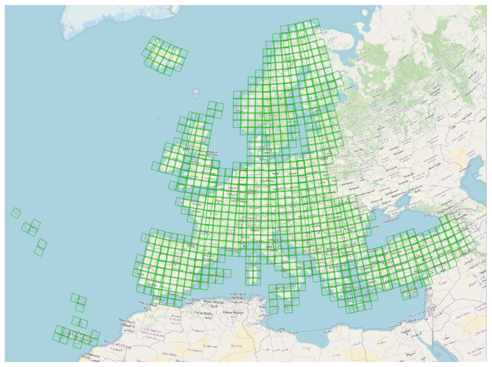
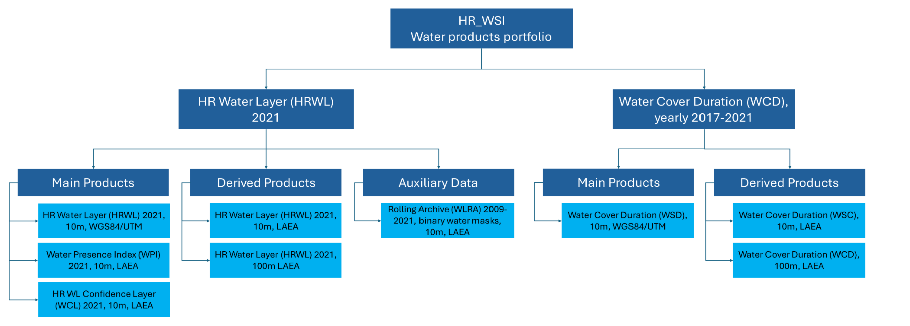
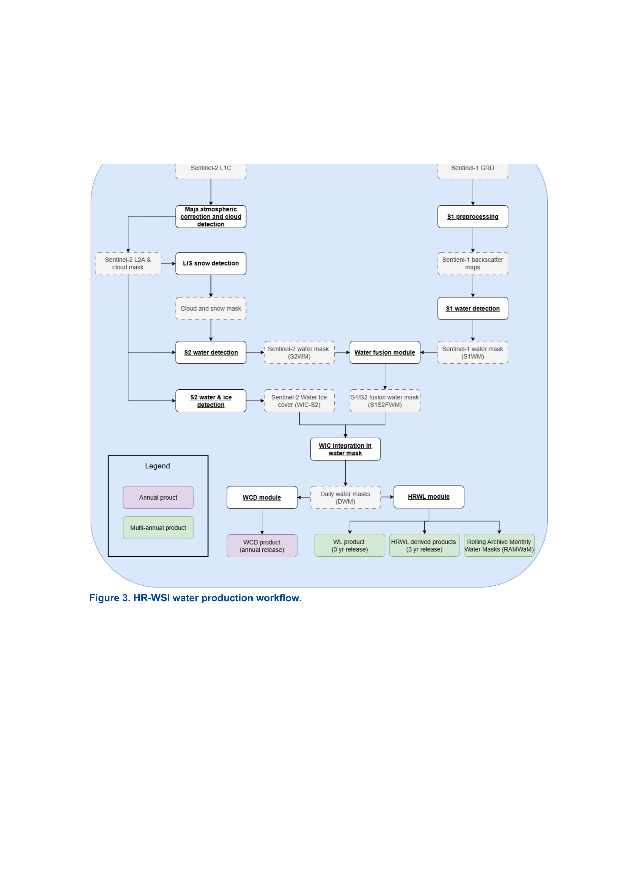
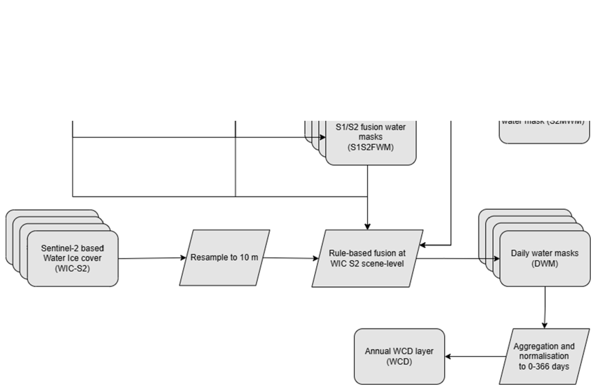
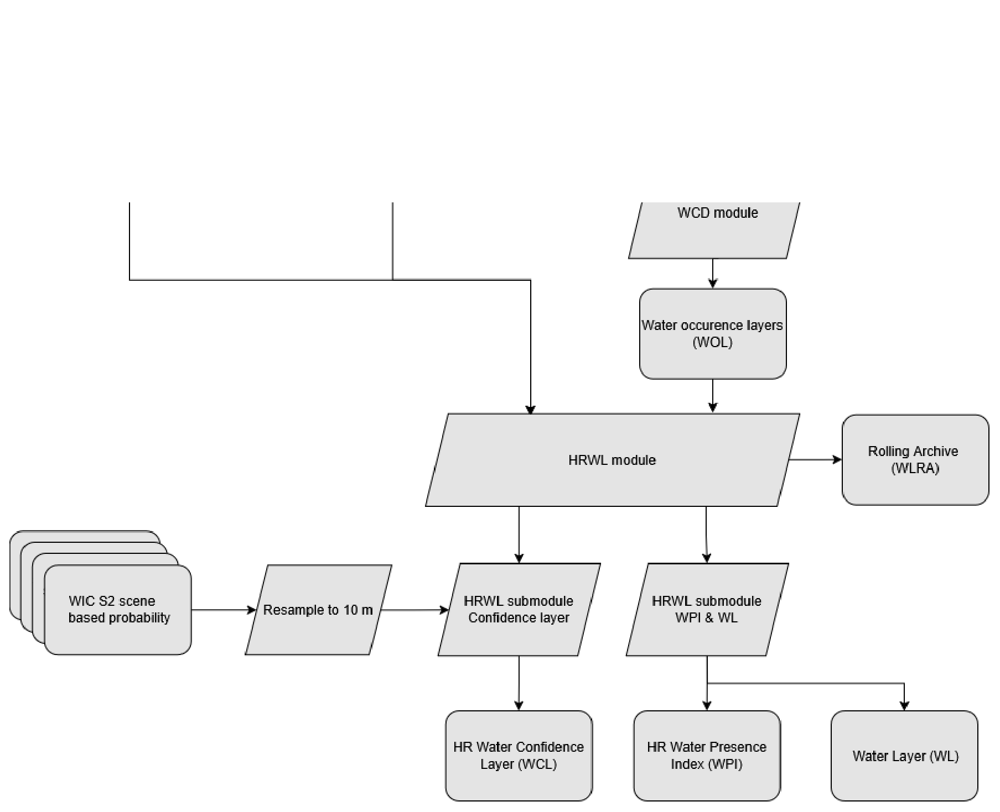
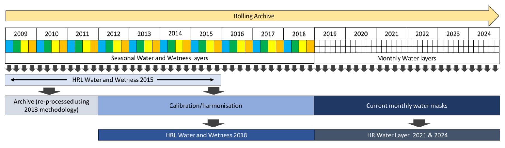

```{=html}
<table>
<colgroup>
<col style="width: 26.7%">
<col style="width: 73.3%">
</colgroup>
  <tr>
    <td style="font-weight:bold">Document Author</td>
    <td>Tanja Gasber¹, Christian Gruber¹, Adam Pasik¹, Florence Marti², Matthieu Denisselle²<br>¹GeoVille GmbH, ²Magellium (lead).</td>
  </tr>
  <tr>
    <td style="font-weight:bold">Project Owner</td>
    <td>Joanna Przystawska</td>
  </tr>
  <tr>
    <td style="font-weight:bold">Project Manager</td>
    <td>Florence Marti</td>
  </tr>
  <tr>
    <td style="font-weight:bold">Document Code</td>
    <td>HR-WSI-DT-067-MAG_PUM_WATER</td>
  </tr>
  <tr>
    <td style="font-weight:bold">Document Version</td>
    <td>1.3</td>
  </tr>
  <tr>
    <td style="font-weight:bold">Distribution</td>
    <td>Public</td>
  </tr>
  <tr>
    <td style="font-weight:bold">Date</td>
    <td>23/12/2025</td>
  </tr>
</table>
```

### Document Approver(s) and Reviewer(s)

| Name | Role | Action | Date |
|----------------------------------------------------------|--------------------------------------------------|----------------------------------------------|----------------------------------------------|
| Joanna Przystawska | Project Owner | Revision (WCD) | 27/01/2025 |
| Lorenzo Solari | Project Owner (deputy) | Revision (WCD) | 27/01/2025 |
| Joanna Przystawska | Project Owner | Revision (WCD) | 11/03/2025 |
| Lorenzo Solari | Project Owner (deputy) | Revision (WCD) | 11/03/2025 |

### Document history

| Revision | Date | Created by | Short description of changes |
|---------------------------|-------------------------------------|-----------------------------------------------------------------|-----------------------------------------------------------------------|
| 0.1 | 17/04/2024 | F. Marti (Magellium) and the HR-WSI consortium | First draft |
| 1.0 | 22/11/2024 | F. Marti (Magellium) and the HR-WSI consortium | First version of the document. In line with: WCD V100 |
| 1.1 | 03/03/2025 | F. Marti (Magellium) and the HR-WSI consortium | Account for EEA revision. In line with: WCD V100; HRWL 2021 V100 |
| 1.2 | 14/03/2025 | F. Marti (Magellium) and the HR-WSI consortium | Account for EEA revision. In line with: WCD V100; HRWL 2021 V100 |
| 1.3 | 23/12/2025 | M.Denisselle (Magellium) and the HR-WSI consortium | Update for a consistent and clear terminology for the water masks. In line with: WCD V100; HRWL 2021 V100 |

### List of figures

Figure 3. HR-WSI water production workflow.

Figure 4. Water Cover Duration (WCD) layer workflow diagram.

Figure 5. Two examples of WCD products for the hydrological year 2021 (i.e. 2020-2021). Alpine tile 32TNS on the left (with Lake Como at the bottom). Eastern Turkey tile 38SLH on the right (with Lake Van on the upper left). The colour scale is defined in days. No water pixels are transparent.

Figure 6. Workflow diagram for the production of the HR Water Layer

Figure 7. Examples of the HRWL products for the 38TKL UTM tile located in Turkey showing the Çoruh river, background: Google. Top left: Water Layer (WL) classification differentiating between permanent and temporary water (dark and light blue, respectively) and dry land (transparent for visibility). Top right: Water Presence Index (WPI) layer showing the frequency of water. Dry pixels are partly transparent for visibility. Bottom: Water Confidence Layer (WCL) showing the confidence in the WL classification, illustrating the complexity of classifying mountainous areas. The development timeframe is from 2020-09 to 2021-08.

Figure 8. Overview of the Water rolling archive data collection and layers for the HR Water production.

Figure 9. Monthly binary water mask for the 38TKL UTM tile located in Turkey showing the Çoruh river. The blue value indicates the presence of water representing a value of one, while partly transparent dry pixels are presented as a zero. The timeframe of the mask is September 2020.

### List of tables

Table 1. Applicable documents

Table 2. WCD product content

Table 3. Definition of water classes.

Table 4. Elements to be included and excluded in the Water Layer (main layer of the HRWL product).

Table 5. Classification criteria for the WL layer of the HRWL product

Table 6. High Resolution Water Layer (HRWL) product content.

Table 7. Water Layer Rolling Archive (WLRA) content

Table 8. List of the abbreviations and acronyms

based on satellite Earth observation and in situ (non-space) data. These services are freely and openly accessible to its users through six thematic Copernicus services (atmosphere monitoring, marine environment monitoring, land monitoring, climate change, emergency management and security).
The Copernicus Land Monitoring Service (CLMS) provides geographical information on land cover and its changes, land use, vegetation state, water cycle and earth surface energy variables to a broad range of users in Europe and across the world in the field of environmental terrestrial applications. CLMS is jointly implemented by the European Environment Agency and the European Commission DG Joint Research Centre.

Among its bio-geophysical products, CLMS produces and disseminates information on snow, ice, and water bodies at the European scale. Managed by the European Environment Agency, this data is compiled into the High Resolution Water, Snow, and Ice (HR-WSI) portfolio.
HR-WSI covers snow properties on land (snow cover, snow state conditions, and annual snow synthesis), ice occurrences in the hydrographic network (ice cover and annual ice synthesis), and changes in the network's extent at annual and multi-annual scales. These land characteristics are derived from optical and radar satellite data from the Copernicus program (Sentinel-1 and Sentinel-2), with most products delivered as high-resolution maps ranging from 60m to 10m pixel spacing.
Monitoring snow, ice, and water cover is essential due to their significant influence on the water cycle and surface energy fluxes. HR-WSI products offer valuable data for various sectors, including water management, energy, infrastructure safety, transportation, biodiversity, climate change research, and winter tourism, benefiting stakeholders at local, national, and European levels.

The Product User Manual is the primary document that users are highly recommended to read before starting to work with the products. This manual specifically focuses on the water products within the HR-WSI portfolio, while separate manuals are available for snow and ice products. They provide information on the frequency of water presence at an annual scale and over a 7-year period.

## Scope and objectives of the document

This document is the Product User Manual (PUM) dedicated to the content and format description of water products generated in the framework of the pan-European High Resolution Water Snow & Ice (HR-WSI) product suite, as part of the Copernicus Land Monitoring Service (CLMS).
For snow and ice products, users are referred to their respective PUMs [AD1] and [AD2].

The PUM is intended for a wide range of end-users who wish to understand and use the product effectively. This document provides detailed specifications for these products, including content, format, naming conventions, and an overview of the retrieval method. It offers key information on the product's characteristics, quality indicators, usage terms, and

## Sentinel-1 and Sentinel-2 missions

The Sentinel-1 and Sentinel-2 constellations were launched to meet the operational needs of the Copernicus Earth Observation programme, in particular the Copernicus services as CLMS, as part of the European response to monitor the environment, mitigate the effects of climate change and ensure civil security.

The Sentinel-1 constellation operates 24/7 and uses C-band synthetic aperture radar (SAR) imaging, allowing it to acquire images in all weather conditions. The satellites offer four exclusive imaging modes with different resolutions (down to 5 m) and coverage (up to 400 km), as well as dual polarisation capability. The operational configuration involves two satellites orbiting the Earth at an altitude of 693 km, 180° apart, operating in a repeat pass interval of 6 days. On the 23rd of December 2021, Copernicus Sentinel-1B experienced an anomaly related to the instrument electronics power supply provided by the satellite platform, leaving it unable to deliver radar data. It has been officially non-operational since August 2022.
The Sentinel-1 Level 1 Ground Range Detected (GRD) data is utilised to produce HR-WSI products. It comprises focused SAR data that has been detected, multi-looked, and projected to ground range using the Earth ellipsoid model WGS84.

The Sentinel-2 constellation operates 24/7 and each satellite is equipped with a camera that captures images of Earth's surface in 13 spectral bands at high spatial resolution. The visible and near-infrared bands have a resolution of 10 m, the red edge has a resolution of 20 m, and the shortwave infrared bands have a resolution of 60 m. Two satellites are positioned 180° apart in orbit at an altitude of 786 km. This configuration optimises coverage and revisit times, resulting in a five-day revisit time at the equator under cloud-free conditions, and 2-3 days at European latitudes. The overlap between the two satellite swaths from adjacent orbits increases the revisit frequency, under varying viewing conditions. However, like with any optical sensor, the availability of usable data is influenced by cloud cover and solar illumination conditions.
The Sentinel-2 Level 1C product, which is a monodated orthorectified image expressed in top-of-atmosphere reflectance, is used to derive HR-WSI products. The L1C product is disseminated in granules of a fixed size: 110 km tiles in UTM/WGS84 projection, as shown in Figure 1 (page 11).

Both Sentinel-1 and Sentinel-2 constellations offer valuable information for monitoring water, snow, and ice over continental surfaces at high spatial resolutions.
The main challenge in using Sentinel-2 optical data is to identify clouds and their shadows to define reliable usable image pixels. When studying the snow and ice variables, it is essential to have a good understanding of cloud cover to distinguish it from snow cover. After masking out clouds and their shadows, it is possible to detect snow over land, identify inland waters and distinguish ice over inland waters.

To support clarity throughout this document, it is important to note that several intermediate and final water mask layers are produced during the processing chain. Because their names and functions may appear similar, a dedicated lookup table is provided to ensure readers can easily distinguish between them at any point in the document.

Readers are therefore encouraged to refer to Table 1 when a specific mask is mentioned. The table summarizes:

*   Product name,
*   Abbreviation,
*   Purpose,
*   Type, whether it is intermediate or final,
*   Temporal frequency, whether it is monthly or daily,
*   Projection, whether it is LAEA or UTM,
*   Deliverable

This reference should minimise ambiguity and ensure consistent interpretation of the product descriptions and results.

```{=typst}
#set page(flipped: true)
#set text(size: 9pt)
```

::: {.tbl-caption}
```{=typst}
#set text(size: 9pt, fill: rgb("#3E6893"))
```
Table 1. Overview of Water Masks produced in this project
:::

| Product name | Abbreviation | Purpose | Type | Temporal frequency | Projection | Deliverable |
|----------------------------|---------------------------------|---------------------|---------------------------------|--------------------------|----------------------------|------------------------------|
| Sentinel-1 Water Mask | S1WM | Daily and Fusion water masks | Intermediate | Monthly | UTM | No |
| Sentinel-2 Water Mask | S2WM | Daily and Fusion water masks | Intermediate | Monthly | UTM | No |
| Sentinel-2 Minimum Water Mask | S2MWM | Daily and Fusion water masks | Intermediate | Monthly | UTM | No |
| Sentinel-2 Potential Water Masks | S2PWM | Daily and Fusion water masks | Intermediate | Monthly | UTM | No |
| S1/S2 Fusion Water Masks | S1S2FWM | Daily and Fusion water masks | Intermediate | Monthly | UTM | No |
| Daily Water Masks | DWM | WCD | Intermediate | Daily | UTM | No |
| Water Occurrence Layers | WOL | HRWL/ WLRAMWM | Intermediate | Monthly | UTM | No |
| Water Masks | | | | | | |

```{=typst}
#set page(flipped: false, paper: "a4")
#set text(size: 11pt)
```

## Document structure

The document is organised as follows.

*   Section 2 presents potential application areas and example use cases for the HR-WSI water products.
*   Section 3 introduces the HR-WSI water portfolio.
*   Section 4 presents the Water Cover Duration (WCD) product.
*   Section 5 presents a detailed description of the High Resolution Water Layer (HRWL) products.
*   Section 6 provides a detailed description of the associated HR water rolling archive (WLRA).
*   Section 7 provides information about terms of use as well as the technical product support.
*   Section 8 introduces the HR-WSI access manual.
*   Section 9 and 10 list the abbreviations, acronyms and references used in this document.

## Applicable documents

The following table lists the documents with a direct bearing on the content of this document.

::: {.tbl-caption}
```{=typst}
#set text(size: 9pt, fill: rgb("#3E6893"))
```
Table 1. Applicable documents
:::

| Id. | Reference | Name of the document |
|--------------|------------------------------------------------------------------|------------------------------------------------------------------------------------------------------------------------|
| AD1 | HR-WSI-DT-068-MAG_PUM_SNOW | Pan-European component Lot 1 - production of High Resolution Water, Snow and Ice products: HR-WSI Product User Manual - Snow products |
| AD2 | HR-WSI-DT-069-MAG_PUM_ICE | Pan-European component Lot 1 - production of High Resolution Water, Snow and Ice products: HR-WSI Product User Manual - Ice products |
| AD3 | HR-WSI-DT-064-MAG_ATBD_WATER | Pan-European component Lot 1 - production of High Resolution Water, Snow and Ice products: HR-WSI Algorithm Theoretical Basis Document - Water products |
| AD4 | HR-WSI-DT-065-MAG_ATBD_SNOW | Pan-European component Lot 1 - production of High Resolution Water, Snow and Ice products: HR-WSI Algorithm Theoretical Basis Document - Snow products |
| AD5 | HR-WSI-DT-066-MAG_ATBD_ICE | Pan-European component Lot 1 - production of High Resolution Water, Snow and Ice products: HR-WSI Algorithm Theoretical Basis Document - Ice products |

across various fields, whether for monitoring, forecasting, or analysing past events, all of which contribute to data-driven decision-making in environmental management. A wide range of sectors can benefit from accurate, timely water-related data to support decision-making and strategic planning at various levels. This data can be applied to both local and national needs or, on a larger scale, to support the implementation of European directives, for example.

### Key Application Areas

#### Water management

HR-WSI products provide essential support for water management at both the basin and national levels, helping with equitable water distribution across various sectors, including domestic use, agriculture, and recreation. These products play a key role in managing water sharing between rural and urban areas, upstream and downstream catchments, and even across countries, contributing to international efforts for universal water access. HR-WSI products can contribute to compliance with the Water Framework Directive (2000/60/EC) and to achieving Sustainable Development Goal (SDG) 6: clean water and sanitation, by improving water quality, availability and access [AUX1].
Providing insights into the quantity of water stored as water and snow, HR-WSI data is crucial for monitoring snowpack and water flows, which are necessary for managing flood risks, droughts, and overall water availability. They are instrumental in risk management for public territorial bodies, helping prevent flooding and ensuring balanced water resource management. They also assist organisations involved in land development and spatial planning, where hydrological data is critical for infrastructure planning, risk management, and climate adaptation strategies.
Additionally, industries requiring accurate water flow estimates—such as hydropower and nuclear energy—can rely on HR-WSI data to plan water usage for power generation, optimize production or ensure infrastructure safety.
From a research perspective, HR-WSI water products serve as valuable tools for advancing hydrology and snow science. They enhance understanding of snowpack variations and river flow rates, supporting the modeling, assimilation, prediction, and validation of hydrological and snow models. These products also play a crucial role in research on extreme hydrological events, such as floods and droughts, by improving prediction capabilities and risk assessments.

#### Climate Change and Extreme Events

Climate change is intensifying extreme weather events, including floods, droughts, and shifts in hydrological patterns. The HR-WSI Water Cover Duration (WCD) and Water Layer (WL) provides valuable insights into these changes by offering high-resolution data on surface water dynamics.
One critical use case is flood risk assessment and management. As extreme precipitation events become more frequent, emergency responders and policymakers rely on the Water products to identify flood-prone areas and track water body expansions. By analyzing long-term trends, authorities can refine flood defense strategies and urban planning to minimize damage to infrastructure and communities.

to climate variations. By tracking temporal water availability, conservationists can take timely actions to protect these fragile ecosystems from degradation.
In summary, the CLMS HR Water Layer is a powerful tool for understanding and adapting to the impacts of climate change (SDG 13: combat climate change and its impacts [AUX1]). Whether for flood preparedness, drought mitigation, or environmental conservation, this dataset enables data-driven decisions that enhance resilience in the face of extreme weather events.

#### SDG reporting

Scientists, governments, and agencies rely on these datasets for regular assessments to ensure informed decision-making. This use case, using examples from the HR-WSI water products, aims to enhance operational capacities by enabling nations to generate spatial time-series data for water resource reporting. The methodology aligns with the United Nations Environment Programme's step-by-step monitoring [AUX2] approach for SDG Indicator 6.6.1 [AUX1], ensuring compatibility with global reporting frameworks.
While Earth Observation data is already recognized for tracking inland water trends, most existing approaches rely solely on optical data. By integrating dense time series of optical and Synthetic Aperture Radar (SAR) imagery, this use case demonstrates the added value of Copernicus data streams in improving national-level SDG water resource monitoring. The ability to leverage both data types enhances monitoring accuracy, particularly in regions affected by persistent cloud cover, seasonal variations, or rapid hydrological changes.
Sustaining this monitoring capability at the national level depends on human resources and ICT infrastructure. Long-term success requires investment in cloud storage, data processing, or national data cubes, either through national stakeholders or donor support. Strengthening these capacities ensures that countries can independently monitor their water resources using Copernicus data, fostering resilience in water management and environmental reporting.

### Potential Users

HR-WSI water products can be valuable to a wide range of stakeholders, both economic and non-economic water users, at local, national, and European levels. These include:

*   Water Management Agencies
*   Urban and Regional Planning Agencies
*   Hydrological Monitoring and Forecasting Agencies
*   Water Distributors and Agricultural Stakeholders, Including agricultural sectors (crop farming, livestock, fisheries, and forestry)
*   Energy Sector Stakeholders, such as those involved in hydropower or nuclear energy
*   Biodiversity and Environmental Protection Organizations
*   National Parks and Protected Area Managers
*   Tourism Industry Stakeholders, including winter tourism operators, ski resorts, and other recreational businesses
*   Research Institutions, academic and scientific organizations
*   Space industry actors

# HR-WSI water products overview



The HR-WSI Water portfolio, as visualised in Figure 2 (page 12), covers two types of products:

*   **Water Cover Duration (WCD)**, an annual (hydrological year) product based on Sentinel-1 and Sentinel-2 imagery. The WCD is divided into main and derived products.
    *   The main products:
        *   The 10m WCD in WGS84/UTM projection.
    *   The derived products:
        *   The 10m layer in ETRS89 LAEA projection,
        *   The 100m resolution layer in ETRS89 LAEA projection.

*   **High Resolution Water Layer (HRWL)**, a multi-annual product based on Sentinel-1 and Sentinel-2 imagery. The Water Layer is divided into main, derived and auxiliary products.
    *   The main products:
        *   The 10m WL in WGS84/UTM projection,
        *   The 10m Water Presence Index (WPI) in ETRS89 LAEA projection, derived from the Water Occurrence Layers (WOL),
    *   The auxiliary data:
        *   The Water Layer Rolling Archive (WLRA), a ZARR data collection that consists of intermediate production layers of binary water masks (2009-2021) and showing the seasonal/monthly water and dry occurrences. The HRWL covers a period of seven years per reference year and is regularly updated every three years. It is therefore important that it is consistent over the entire period. To guarantee reproducibility and future continuation of the baseline product, these binary water masks are provided within a ZARR data collection consisting of all seasonal masks (RASWaM) starting from 2009. The computation frequency for the new HRWL changed from seasonal to monthly water masks (RASWaM) .
Readers should note that the auxiliary datasets are not distributed in the same way as other HR-WSI products and are available on request from the CLMS Service Desk.

**Important note:** Above is an overview of the HRWL product that will be produced in the coming months. By the end of 2025, the portfolio will include the multi-annual WL product for the reference years 2021 and 2024. These products will cover the period 2016-2021 and 2018-2024 respectively. Figure 2 illustrates the HR-WSI water portfolio made of the WCD products and the future HRWL product for the reference year 2021.



The production chain of HR-WSI water products is presented in Figure 3. It is composed of various modules to process all water products from Sentinel-1 and 2 observations. Figure 3 highlights the relation and dependency between the different water products as well as the satellite data they are derived from. A brief description of each product is given in the following sections. For a detailed characterisation of all products, users are referred to the dedicated sections below. More technical explanations of the used methods and algorithms can be found in the Algorithm Theoretical Basis Document (ATBD) [AD3].



(S1S2FWM) and on the outputs of the Water and Ice Cover (WIC S2) product (described in the ice PUM [AD2] and ATBD [AD4]).
This combined approach leads to a higher-quality WCD information layer. The Operational Surface Water Extent processor used to retrieve water occurrence information based on Sentinel-1 and Sentinel-2 data has been developed and improved over the past years within several EEA productions and ESA-funded activities and has recently been evaluated as the most accurate water detection algorithm in a round robin intercomparison of 14 different methodologies (Tottrup et al., 2022).
The resulting WCD layer describes the water presence frequency in a hydrological year and is expressed in days. It is published each year around October, after the end of the hydrological year. Additionally, it is used as a water mask for the WIC S1 and WIC S2 products of the following year (see the ATBD of the ice products [AD2]).
The WCD product is disseminated in two different pixel spacings and projections (native projection from S2 products, i.e. UTM/WGS84 and European LAEA projection).

## Algorithm

### Retrieval methodology

In the hybrid sensor approach, a dynamic thresholding method is applied on both optical and SAR imagery separately as described in Ludwig et al. (2019) and Martinis et al. (2009). Subsequently, a rule-based approach fuses the optical (S2WM) and radar-based (S1WM) information into combined S1/S2 fusion water reference masks (S1S2FWM). Finally, the S1WM and S2WM, S1S2FWM, S2 annual minimum and potential water masks are combined with the WIC S2 scene-based water and ice classification product into the daily water mask. These DWM layers are aggregated to an intermediate monthly Water Occurrence Layer (WOL) which is temporarily stored for further processing in the HRWL product (see Section 5). The final WCD product follows from an aggregation of the DWM for a hydrological year and is expressed in days per year.

The scene-based DWM is computed by combining information from the S1WM and S2WM and the scene-based WIC S2 product. The merging of the three products is done with a rule-based approach, where majority agreement (min. two products) rules whether the pixel is classified as water or not. Where necessary, missing swaths of the WIC S2 scenes are completed with the S1S2FWM and so are the cloud-obscured areas in the optical products (see Figure 4).

Additionally, the S2 time-series based potential water mask (S2PWM) is incorporated into the rule-based approach to delimit the maximum extent of the area where water might be detected. That is, if at least two out of three products agree on the pixels belonging to the water class it is classified as water as long as it lies within the limits of the potential water mask. This minimizes Sentinel-1 artefacts in mountainous areas, while preserving SAR-detected water features, including small rivers.



The combined DWM layer undergoes several steps before it is delivered as the final WCD product. These post-processing steps include masking using the HRL NVLCC IMD 2018 layer [AUX4] to exclude commission errors over built-up areas and clipping the extent of the product to the EEA38 + UK area boundaries using the HRL Water and Wetness Layer (WAW) 2018 information [AUX5]. The seawater class from the WAW was derived using the EU-Hydro product [AUX6].

Users seeking more information can find detailed explanations on the retrieval algorithm in the ATBD [AD3].

### Product limitations

The WCD comes with a sound and state of the art methodology and provides users with highly accurate information on water masks at pan-European level. Even if the used method handles outliers to a certain extent, intensive preparation of the input data and a dedicated post-processing (including automatic and semi-automatic steps) were necessary in order to ensure a valid thematic classification.
It should be noted that combining data from both optical and SAR sensors enhances the robustness of the WCD datasets, however it also introduces uncertainties associated with each input source. Additionally, the WIC S2 product, while providing a finer temporal resolution essential to the WCD production, is delivered at 20 m spatial resolution and requires resampling before it can be merged with the S1WM and S2WM into the final product (see Figure 4).
It should be noted, particularly in areas with a strong winter influence and the occurrence of polar nights the number of Sentinel-2 data with low cloud and snow cover is reduced. This may lead to incorrect water detection and propagating in potential errors in the water bodies. In such cases, Sentinel-1 may improve the situation but cannot correct all potential errors.

characteristics and geographical distribution of European water bodies, including rivers, lakes, and catchments.
As no alternative European dataset is available to distinguish between freshwater and saltwater areas, the sea water mask used in the WAW 2018 layer was applied to the current WCD layer to ensure consistency. However, due to the dynamic nature of coastlines, this approach may not perfectly align with the actual shoreline, potentially leading to minor discrepancies, such as unexpected water detections along the coast in a few pixels.
For further information and details, see ATBD [AD3].

### Differences from the previous version

This is the first version of this product.

## Product description

### Spatial information

Main product:

*   The main WCD layer covers an area of 110 km by 110 km, which corresponds to the Sentinel-2 tiling grid with a pixel size of 10 m by 10 m in UTM/WGS84 projection or EPSG:326XX, where xx indicates the UTM zone over which the product is set. XX also corresponds to the first 2 digits of a tile name (such as 32TLR).

Derived products:

*   The derived WCD layer covers an area of 100 km by 100 km, which corresponds to the EEA reference grid with a pixel size of 10 m by 10 m in ETRS89 LAEA projection.
*   The derived aggregated WCD product covers an area of 100 km by 100 km, which corresponds to the EEA reference grid with a pixel size of 100 m by 100 m in ETRS89 LAEA projection.

All WCD layers are generated over the entire EEA38 + UK (covering UTM zones 25 to 38).
Since the final UTM products are combined with the integrated EEA boundaries [AUX9] and coastline [AUX6], inconsistencies may occur along these boundaries. Incorrect NoData values caused by the reprojection are corrected by assigning the value of the nearest neighboring pixel. This approach is used to adjust the output to the EEA boundary file (LAEA).

### Temporal information

The WCD is produced for each hydrological year starting 2017.
The hydrological year starts 01. September and ends 31. August of the following year. This timeframe aligns with the natural cycle of precipitation, snowmelt, and runoff, allowing for consistent assessment of water resources and hydrological processes across different regions.

component (WIC S2 data) and the level of agreement among the three fused products (S1WM and S2WM and WIC S2 classification layer). Quality is expressed in four categories as indicated in Table 2.
The WCD in 10m, UTM/WGS84 and LAEA projection, consists of three files:

*   the main layer, which has the same name as the product,
*   the WCD-QA layer,
*   INSPIRE-compliant XML metadata file [AUX7].

The derived WCD in 100m, only in LAEA projection, consists of three files:

*   the main layer, which has the same name as the product,
*   the WCD-QA layer,
*   INSPIRE-compliant XML metadata file [AUX7].

The content, format, data type and size of the layers are described in Table 2.

::: {.tbl-caption}
```{=typst}
#set text(size: 9pt, fill: rgb("#3E6893"))
```
Table 2. WCD product content
:::

```{=html}
<table>
<colgroup>
<col style="width: 30.7%">
<col style="width: 36.0%">
<col style="width: 16.9%">
<col style="width: 16.3%">
</colgroup>
<thead>
    <tr>
      <td>File identifier (layer/ metadata)</td>
      <td>Description</td>
      <td>Format</td>
      <td>Data type</td>
    </tr>
  </thead>
  <tbody>
    <tr>
      <td>WCD</td>
      <td>Describes the water presence frequency in a hydrological year and is expressed in days as follows:<br>→ 0: no water<br>→ 1-366 day with water detected<br>→ 65485: cloud or cloud shadow<br>→ 65533: sea water<br>→ 65535: no data</td>
      <td>GeoTIFF</td>
      <td>uint16</td>
    </tr>
    <tr>
      <td>WCD-QA</td>
      <td>Quality layer providing a basic assessment of WCD quality:<br>→ 0: high quality<br>→ 1: medium quality<br>→ 2: low quality<br>→ 3: minimal quality<br>→ 205: cloud or cloud shadow<br>→ 253: sea water<br>→ 255: no data</td>
      <td>GeoTIFF</td>
      <td>uint8</td>
    </tr>
    <tr>
      <td>MTD</td>
      <td>Product metadata (INSPIRE compatible)</td>
      <td>XML</td>
      <td>string</td>
    </tr>
  </tbody>
</table>
```


### File naming convention

The following naming convention is applicable to each layer of the product:

`CLMS_WSI_WCD_<PIXEL_SPACING>_<TILEID>_<YYYYMMDDP1Y>_COMB_<VERSION>_<FILE_ID>.<EXTENSION>`

This contains the following components:

*   `<PIXEL_SPACING>` indicates the pixel spacing/spatial resolution of the product in metres as a three-digit number followed by "m" for metres ('010m' or '100m').
*   `<TILEID>` indicates the tile ID from the S2 or EEA grid and is defined as TXXXXX or EXXXNXX respectively.
*   `<YYYYMMDDP1Y>` where the date YYYYMMDD corresponds to the first day of the hydrological year. P1Y indicates the Period of one year for annual products.
*   `<COMB>` the data source "S1-S2-Landsat".
*   `<VERSION>` is the three-digit version number and starts with ‘V100' for the first major version published. <VERSION> is defined in VXYY format where X changes each time a major version is released (‘V200', 'V300') and YY indicates minor versions released between two major versions (‘V101', ‘V111').
*   `<FILE_ID>` corresponds to the different WCD file identifiers defined in Table 2 (page 17).
*   `<EXTENSION>` is 'tif' for the raster file or 'xml' for the metadata file.

Examples:

*   For an S2 inherited tile:
    `CLMS_WSI_HRWL_010m_T31TCH_20160901P1Y_COMB_V100_WCD.tif`
*   For an ETRS89 LAEA tile at native resolution:
    `CLMS_WSI_HRWL_010m_E010N20_20160901P1Y_COMB_V100_WCD.tif`
*   For an ETRS89 LAEA tile with 100m pixel spacing:
    `CLMS_WSI_HRWL_100m_E010N20_20160901P1Y_COMB_V100_WCD.tif`

# High Resolution Water Layer (HRWL)

## Overview

provides classified maps distinguishing among permanent water, temporary water, dry areas, and sea water. Table 3 below summarizes the detailed definitions for these classes.

Multi-annual HRWL products are based on a 7-year period and are released on a 3-year scale. This section presents the HRWL product for the reference year 2021, based on Sentinel-1 and Sentinel-2 imagery from the period 2016-2021, at full spatial resolution of 10m x 10m for the EEA38 + UK. The primary input for this product comes from the Water Cover Duration (WCD) production (see Section 4). In the context of the HR-WSI production, the Water Occurrence Layers (WOL) are derived from DWM of the WCD workflow, combining the S1WM and S2WM with the WIC S2 NRT product. The key difference compared to the WCD product is that the information is aggregated based on months on a calendar year (Jan-Dec) rather than a hydrological year and multiple scenes based (Sep-Aug).

In addition to the release of multi-annual HRWL products on a 3-year scale, a data archive is regularly updated with binary monthly water masks (RAMWaM). This auxiliary ZARR data collection starting in 2009, described in Section 6, is available upon request only.

::: {.tbl-caption}
```{=typst}
#set text(size: 9pt, fill: rgb("#3E6893"))
```
Table 3. Definition of water classes.
:::

```{=html}
<table>
<colgroup>
<col style="width: 20.3%">
<col style="width: 48.0%">
<col style="width: 31.7%">
</colgroup>
<thead>
    <tr>
      <td>Class</td>
      <td>Explanation</td>
      <td>Examples</td>
    </tr>
  </thead>
  <tbody>
    <tr>
      <td>Dry</td>
      <td>Always dry or mostly dry with minor instances of water (i.e. &lt;25%)</td>
      <td>
        <ul>
          <li>Sand</li>
          <li>Bedrock</li>
          <li>Sealed surfaces</li>
        </ul>
      </td>
    </tr>
    <tr>
      <td>Permanent water</td>
      <td>Always water.<br>The highest ratio of the water / total instances (&gt;85%) are classified as permanent water surfaces.</td>
      <td>
        <ul>
          <li>Permanent inland lakes (natural)</li>
          <li>Artificial ponds (permanent fishponds, reservoir)</li>
          <li>Natural ponds (permanent open water surfaces of inland or coastal wetlands)</li>
          <li>Rivers</li>
          <li>Channels (permanently with water)</li>
          <li>Coastal water surfaces: lagoons, estuaries</li>
          <li>Liquid dump sites (permanent)</li>
        </ul>
      </td>
    </tr>
    <tr>
      <td>Temporary water</td>
      <td>Temporary water surfaces.<br>Alteration of dry and water<br>Temporary water surfaces will have a ratio between &gt;25% to 85% (water / total instances)</td>
      <td>
        <ul>
          <li>Temporary water surfaces associated to permanent water bodies</li>
          <li>Temporary natural (e.g. steppe) lakes and temporary artificial lakes (e.g. cassettes of fishponds)</li>
          <li>Intermittent rivers</li>
          <li>Flood areas</li>
          <li>Water-logged areas</li>
          <li>Wet agricultural fields, including rice fields</li>
          <li>Intertidal areas</li>
        </ul>
      </td>
    </tr>
    <tr>
      <td>Sea water</td>
      <td></td>
      <td></td>
    </tr>
  </tbody>
</table>
```

::: {.tbl-caption}
```{=typst}
#set text(size: 9pt, fill: rgb("#3E6893"))
```
Table 4. Elements to be included and excluded in the Water Layer (main layer of the HRWL product).
:::

```{=html}
<table>
<colgroup>
<col style="width: 59.6%">
<col style="width: 40.4%">
</colgroup>
<thead>
    <tr>
      <td>Elements to be included in the HR Water Layer 2021</td>
      <td>Elements to be excluded from the HR Water Layer 2021</td>
    </tr>
  </thead>
  <tbody>
    <tr>
      <td>
        <ul>
          <li>Open water bodies (including floating or emergent vegetation)
            <ul>
              <li>Permanent lakes, reservoirs, ponds</li>
              <li>Rivers</li>
            </ul>
          </li>
          <li>Temporary open water bodies (intermittent rivers, changing lake/reservoir levels)</li>
          <li>Temporarily inundated areas (due to snow melt, floods, or rain)</li>
          <li>Wet agricultural fields, including rice fields and water-logged areas</li>
          <li>Transitional coastal water bodies (lagoons, estuaries)</li>
        </ul>
      </td>
      <td>
        <ul>
          <li>Sea and ocean (sea water beyond a boundary provided by the EEA)</li>
          <li>Permanent snow and glaciers</li>
        </ul>
      </td>
    </tr>
  </tbody>
</table>
```

## Algorithm

The methodologies and workflows of the HRWL portfolio are described in the following sections in more detail.

### Retrieval methodology

The methodology applied for the production of the HRWL allows deriving water in a robust, reliable and reproducible way from high resolution optical and SAR satellite images. It is based on a fully pre-processed Sentinel-2 and Sentinel-1 time series spanning from 2016 to 2021 to generate the HRWL products for the 2021 reference year.

The HRWL portfolio consists of three pieces of information, as outlined below:

*   The Water Layer (WL)
*   The Water Presence Index (WPI)
*   The Water Confidence Layer (WCL)

The production is based on an unsupervised dynamic thresholding approach and derivation of water frequencies based on monthly spectral composites and different biophysical indices as Normalized Difference Water Index (NDWI), Modified Normalised Difference Water Index (mNDWI), or for Sentinel-1 on percentiles based on the backscatter maps. In additional processing steps, (see Section 4.2) a WOL is generated based on a monthly stack from DWM.
By aggregating these WOL for the period of seven years (for reference year 2021, only the period 2016-2021 is used due to S2 data availability) and postprocessing with additional

::: {.tbl-caption}
```{=typst}
#set text(size: 9pt, fill: rgb("#3E6893"))
```
Table 5. Classification criteria for the WL layer of the HRWL product
:::

| Code | Class | Frequency |
|------------------|-------------------------------------------------------------------------------------------------------------------------------|-------------------------------------------------------|
| | | Water relative frequency | Dry relative frequency |
| 1 | Permanent water (always water with minor instances of dry/non-water) | > 85 % | <= 15% |
| 2 | Temporary water (alternation of dry and water) | > 25 %- 85 % | <= 75% |
| 0 | No water (dry; always or mostly dry/no water with minor instances of water) | < 25% | > 75% |

The RAMWaM that are stored in the WLRA are derived from WOL, intermediate outputs of the WCD. Here, any non-zero water occurrence is mapped to 1 while dry pixels are mapped to 0. The WOL are then aggregated for the whole period (here 2016-2021) and a Water Presence Index (WPI) with values from 0 (only dry observations) to 100 (only water observations) is created. This index has two interpretations: (1) as a probability that a particular location contains water, and (2) the duration of water cover within the period of evaluation. The final WPI indicates the occurrence of water areas throughout the entire observation period 2016-2021 for the 2021 reference year.
The main classification Water Layer (WL) is finally created from the WPI. Here a water presence index above 85% is considered as permanent water, below 25% as dry or mostly dry and everything between 25% - 85% as temporary water.

The Water Confidence Layer (WCL) for the WL combines multiple quality and processing-based parameters and as well as per-pixel confidence information at 10 m pixel resolution. It is based upon combining the classification probabilities for the three underlying input water masks (S2WM, S1WM and WIC S2), i.e. the probabilities for the monthly Sentinel-2 water probability, the Sentinel-1 fuzzy-membership and the classification probabilities for the WIC S2 product. The Sentinel-1 fuzzy-membership is normalized and converted into a water probability. The scene based WIC S2 probabilities are averaged to a monthly probability matching the S1 and S2 monthly inputs. The three inputs are then combined with a weighted average, where the weights are inversely proportional to the deviation from the mean. This aims at reducing the impact of a single input disagreeing with the remaining two inputs. The final WCL is then produced by taking the 75th percentile of the whole period of observation. Based on the WL classification, pixels of the confidence layer represent the classification confidence for each pixel either being dry or being water.



### Product limitations

The WL comes with a sound and state of the art methodology and provides users with comprehensive information on water and water masks at pan-European level. Even if the used method handles outliers to a certain extent, thanks to intensive preparation of the input data and a dedicated post-processing, misclassifications and artefacts may still be present within the products.
The WCL is well suited to assessing the confidence in the classification, particularly to indicate complex areas of high uncertainty. However, it is inherently dependent on the quality of the confidence of the different input layers, making it difficult to assess systematic inaccuracies in the inputs. Further, see ATBD [AD3].
The EEA boundary layer provided by the European Environment Agency (EEA) includes a 250m buffer and does not account for the distinction between freshwater and saltwater areas. To address this limitation, the CLMS EU-Hydro [AUX6] product was utilized to delineate these areas, introducing class 253 (Sea water) as part of the WAW 2018 production. The EU-Hydro product offers a comprehensive dataset that includes a photo-interpreted river network, ensuring alignment with the surface representation of water bodies (such as lakes and wide rivers) using several additional data sources to provide detailed insights into the physical characteristics and geographical distribution of European water bodies, including rivers, lakes, and catchments.
As no alternative European dataset is available to distinguish between freshwater and saltwater areas, the sea water mask used in the WAW 2018 layer was applied to the current

This is the first version of this product.

## Product specifications

### Spatial information

The main layer, WL, is delivered in three different versions (projection and pixel spacing).

*   At 10m x 10m spatial resolution and in native UTM/WGS84 coordinate system, fully compliant with the S2 reference grid. The coordinate reference system is UTM/WGS84 or EPSG:326XX where XX indicates the UTM zone over which the product is set. XX also corresponds to the first 2 digits of a tile name (such as 32TLR).
*   At 10m x 10m spatial resolution as tiles aligned with the Pan-European High Resolution Layers¹ in the European grid (ETRS89 LAEA - EPSG: 3035).
*   At 100m x 100m spatial resolution as tiles aligned with the Pan-European High Resolution Layers¹ in the European grid (ETRS89 LAEA - EPSG: 3035).

The WPI and WLC layers are provided in 10m x 10m spatial resolution as tiles aligned with the Pan-European High Resolution Layers¹ in the European grid (ETRS89 LAEA - EPSG: 3035) (also indicated in Table 6 - page 24).

The conversion from UTM/WGS84 to LAEA projection is described in the ATBD for water products [AD3]. Layers' versions can be distinguished by the product naming convention (see `<PIXEL_SPACING>` and `<TILE_ID>` in Section 5.3.4).
Since the final UTM products are combined with the integrated EEA boundaries [AUX9] and coastline [AUX6], inconsistencies may occur along these boundaries. Incorrect NoData values caused by the reprojection are corrected by assigning the value of the nearest neighboring pixel. This approach is used to adjust the output to the EEA boundary file (LAEA).
All HRWL products are generated over the entire EEA38+UK area (covering UTM zones 25 to 38).

### Temporal information

All HRWL products are computed over a 7-year period. They are delivered to end-users on a 3-annual basis.
The HRWL 2021 products are based on 2016² - 2021 imagery for the reference year 2021.

[^1]: https://land.copernicus.eu/pan-european/high-resolution-layers, accessed on 28/02/2025
[^2]: Production period is August 2016 to December 2021 due to the S1/S2 data availability

The WL is a classified layer, differentiating the classes of permanent water, temporary water, and dry areas as well as sea water, non-classifiable pixels, and outside area.

The WPI indicates the occurrence of water areas throughout the entire observation period and is derived from frequencies of WATER and DRY. The WPI is finally calculated according to the number of Water occurrences. The resulting layer assembles the water occurrence as an index on a scale between 0 (only dry observations) to 100 (only water observations).

The WCL is a raster displaying a measure of confidence for the WL. It provides information regarding the spatial variability of the product quality. The confidence layer informs the user at pixel level about the reliability of the product enabling, for instance, potential users to include the product in modelling studies or to exclude parts of the maps with enhanced uncertainty from further analyses.

::: {.tbl-caption}
```{=typst}
#set text(size: 9pt, fill: rgb("#3E6893"))
```
Table 6. High Resolution Water Layer (HRWL) product content.
:::

```{=html}
<table>
<colgroup>
<col style="width: 36.9%">
<col style="width: 37.5%">
<col style="width: 13.6%">
<col style="width: 12.0%">
</colgroup>
<thead>
    <tr>
      <td>File identifier (layer/metadata)</td>
      <td>Description</td>
      <td>Format</td>
      <td>Data type</td>
    </tr>
  </thead>
  <tbody>
    <tr>
      <td>WL</td>
      <td>Classified layer, differentiating the classes of permanent water, temporary water, and dry areas as well as sea water, non-classifiable pixels, and outside area throughout the entire observation period 2016-2021 as follows:<br>→ 0: dry<br>→ 1: permanent water<br>→ 2: temporary water<br>→ 205: cloud or cloud shadow<br>→ 253: sea water<br>→ 255: no data</td>
      <td>GeoTIFF</td>
      <td>uint8</td>
    </tr>
    <tr>
      <td>WPI (delivered in 10m, EPSG:3035 version only)</td>
      <td>Shows the occurrence of water areas throughout the entire observation period 2016-2021 as follows:<br>→ 0: no water<br>→ 1-100: water presence<br>→ 205: cloud or cloud shadow<br>→ 253: sea water<br>→ 255: no data</td>
      <td>GeoTIFF</td>
      <td>uint8</td>
    </tr>
    <tr>
      <td>WCL (delivered in 10m, EPSG:3035 version only)</td>
      <td>Quality layer providing an assessment of WL quality:<br>→ 0-100: classification confidence<br>→ 205: cloud or cloud shadow<br>→ 253: sea water<br>→ 255: no data</td>
      <td>GeoTIFF</td>
      <td>uint8</td>
    </tr>
  </tbody>
</table>
```

![Figure 7. Examples of the HRWL products for the 38TKL UTM tile located in Turkey showing the Çoruh river, background: Google. Top left: Water Layer (WL) classification differentiating between permanent and temporary water (dark and light blue, respectively) and dry land (transparent for visibility). Top right: Water Presence Index (WPI) layer showing the frequency of water. Dry pixels are partly transparent for visibility. Bottom: Water Confidence Layer (WCL) showing the confidence in the WL classification, illustrating the complexity of classifying mountainous areas. The development timeframe is from 2020-09 to 2021-08.](Product_User_Manual_-_High_Resolution_Water_Products_Europe-media/img-544d4a66adb9fae31e239f5363c80ea8.png)

*   `<VERSION>` is the three-digit version number and starts with 'V100' for the first major version published. <VERSION> is defined in VXYY format where X changes each time a major version is released ('V200', ‘V300') and YY indicates minor versions released between two major versions ('V101', 'V111').
*   `<FILE_ID>` corresponds to the different WL file identifiers defined in Table 6 (page 24).
*   `<EXTENSION>` is 'tif' for the raster file or 'xml' for the metadata file.

Examples:

*   For an S2 inherited tile:
    `CLMS_WSI_HRWL_010m_T31TCH_<20160101P64M>_COMB_V100_WL.tif`
*   For an ETRS89 LAEA tile at native resolution:
    `CLMS_WSI_HRWL_010m_E020N030_<20160101P64M>_COMB_V100_WL.tif`
*   For an ETRS89 LAEA tile with 100m pixel spacing:
    `CLMS_WSI_HRWL_100m_E020N030_<20160101P64M>_COMB_V100_WL.tif`
*   Water Confidence Layer for an ETRS89 LAEA tile at native resolution:
    `CLMS_WSI_HRWL_010m_E020N030_<20160101P64M>_COMB_V100_WCL.tif`
*   Water Presence Index for an ETRS89 LAEA tile at native resolution:
    `CLMS_WSI_HRWL_010m_E020N030_<20160101P64M>_COMB_V100_WPI.tif`

# High Resolution Water Layer Rolling Archive (WLRA)

## Overview

The Water Layer Rolling Archive (WLRA) is a collection of water masks (RAMWaM, binary information: surface water presence/absence) generated from the multi-annual High Resolution Water Layer (WL) products (see Section 5). It is called a "rolling archive" because it is continuously updated as new HRWL products are produced. The planned productions for the reference years 2021 and 2024 will together cover the period from 2016 to 2024. These RAMWaM are derived from Sentinel-1 and Sentinel-2 observations and are available monthly at a 10m pixel resolution over the EEA38+UK area.
**History of the WLRA:** The postgres database was initially created to store masks derived from the CLMS High Resolution Water and Wetness (HRL-WAW) [AUX5] production for the reference year 2015 (covering the period 2009-2015). These historic RASWaM were derived on a seasonal basis and showed water and dry occurrences.
With the production for the reference year 2018 (covering the 2012-2018 period), there was a change in both the satellite input data and the methodology used. To ensure consistency across the archive, a harmonization effort was made: the historical masks (2009-2015) were re-processed using the 2018 methodology and resampled to 10m resolution for full geometric consistency with the 2018 production.

With the HRWL products for the years 2021 and 2024, other changes will be introduced. Now, monthly binary water masks (RAMWaM) will be added to the WLRA changing to the ZARR file format [AUX8] for the period 2016-2024. As the methodology for these masks differs from that used in the HRL-WAW 2018 production, the existing seasonal water masks RASWaM for the period 2016-2018 will be replaced with the more recent RAMWaM.

The archive includes the following types of masks (Figure 8):

*   Re-processed historic seasonal binary masks (RASWaM) (i.e., 16 seasons): time-stamped seasonal binary water masks for the period 2009–2015. Each season is defined on a calendar basis (e.g., January-February-March, etc.).
*   Monthly binary masks (RAMWaM): time-stamped monthly binary water and dry masks for the period 2016-2021.



The WLRA is specified as an 'auxiliary product' and therefore not directly available on the CLMS portal but can be requested by users. Users could use the data for example to create new

## Algorithm

### Retrieval methodology

The WLRA data collection is set up as in a ZARR file format [AUX8] to store all seasonal (RAsWaM, from former production) and monthly RAMWaM for the full 2009–2021 period in a structured and easily accessible manner. ZARR is an open standard and an efficient file format designed for chunked, compressed, and scalable storage of large multidimensional data, making it particularly well-suited for geospatial raster datasets such as geospatial GeoTiffs. ZARR provides an optimized solution that allows for efficient compression, and seamless integration with cloud-based storage using a chunked storage mechanism, which enables efficient read and write operations by dividing large datasets into smaller, independently accessible chunks. Thus, the data can be stored in ZARR format with compression applied to optimize storage space while maintaining fast access times. The format allows data to be stored in object storage solutions such as Amazon S3, Open Data Cube or Google Cloud Storage. This setup enables researchers, data scientists, and organizations to efficiently access and use the data.
The WLRA will not only enable the structured storage and access of already existing individual time steps (e.g. water detection spring 2020) but will also provide an added value through querying the content.
The RAMWaM of the WLRA are created partly during the WCD process (see Section 4.2.1) and the HRWL process (see Section 5.2.1). In short, the DWM created in the WCD procedure are aggregated to WOL, which determines the number of water observations in the monthly observation period. These WOL are then processed into RAMWaM for the WLRA in the HRWL process. Here any non-zero water occurrence is consolidated as a 1 while dry pixels remain as a 0, resulting in monthly binary water masks (RAMWaM).

### Product limitations

Apart from the limitation in creating monthly water masks (see Section 4.2.2), a particular limitation of binary masks is the lack of any notion of observation count or frequency. For example, rare artefacts and permanent water bodies are given equal weight. However, this limitation is overcome by considering a long time series of binary water masks.
Furthermore, the monthly mask is derived from three different data sets, which contribute directly to the quality of the result. However, the different input data (S1WM, S2WM and WIC S2 masks) can also be potential sources of error for the generated monthly mask.

### Differences from the previous version

The differences between the masks available in the WLRA before and after 2016 are as follows:

*   Monthly masks (RAMWaM) (seasonal masks before 2016: RASWaM),
*   An updated workflow is used, which includes the incorporation of the WIC S2 product.

## Product description

### Temporal information

The WLRA contains binary water and dry masks from 2009 to 2021. From 2009 to 2016, the archive is made of RASWaM seasonal masks. Since August 2016, the archive contains RAMWaM.

### Product content

The WLRA is delivered as a zip file containing the RASWaM & RAMWaM in ZARR data format [AUX8] to increase the accessibility and user-friendliness instead of a database. The WLRA zip comes in a package with the INSPIRE metadata XML for each file.
File description, format, data type and size are given in Table 7.

::: {.tbl-caption}
```{=typst}
#set text(size: 9pt, fill: rgb("#3E6893"))
```
Table 7. Water Layer Rolling Archive (WLRA) content
:::

```{=html}
<table>
<colgroup>
<col style="width: 35.1%">
<col style="width: 29.4%">
<col style="width: 22.4%">
<col style="width: 13.1%">
</colgroup>
<thead>
    <tr>
      <td>File identifier (layer/metadata)</td>
      <td>Description</td>
      <td>Format</td>
      <td>Data type</td>
    </tr>
  </thead>
  <tbody>
    <tr>
      <td>WLRA: RASWaM</td>
      <td>Water masks showing the seasonal (2009-2015) water / dry occurrences in binary values as follows:<br>→ 0: no water/dry<br>→ 1: water<br>→ 255: no data</td>
      <td>ZARR files with Geotiffs</td>
      <td>uint8</td>
    </tr>
    <tr>
      <td>RAMWaM</td>
      <td>Water masks showing the monthly (2016-2021) water / dry occurrences in binary values as follows:<br>→ 0: no water/dry<br>→ 1: water<br>→ 255: no data</td>
      <td></td>
      <td></td>
    </tr>
  </tbody>
</table>
```


### File naming convention

The following naming convention is applicable to each layer of the product:

`CLMS_WSI_HRWL_<RES>_<TILEID>_<YYYYMMDDPXXX>_COMB_<VERSION>_<FILE_ID>.<EXTENSION>`

Examples:

*   For the full package in ETRS89 LAEA resolution:
    `CLMS_WSI_HRWL_010m_<20090101P12Y>_COMB_V100_WLRA.zip`
*   For an ETRS89 LAEA tile at native resolution - recent monthly water masks (RAMWaM):
    `CLMS_WSI_HRWL_010m_<20160101P1M>_COMB_V100_WaM.zarr`
*   For an ETRS89 LAEA tile at native resolution - historical seasonal water masks (RASWaM):
    `CLMS_WSI_HRWL_010m_<20090101P3M>_COMB_V100_WaM.zarr`

This contains the following components:

*   `<RES>` defines the spatial resolution.
*   `<TILEID>` indicates the tile ID from the EEA grid and is defined as EXXXNXX.
*   `<YYYYMMDDPXXX>` where YYYYMMDD corresponds to the first day of the period, and XXX indicates the period's duration. P1M indicates a period of one month (applicable for monthly masks), P3M indicates three months (applicable for historical masks), and P12Y refers to the full period of the WLRA, i.e. 12 years, since the first entry into the WLRA dates from 01.01.2009.
*   `<COMB>` the data source "S1-S2-Landsat” for instance has to be specified in the XML (with GDAL edit in a later version).
*   `<VERSION>` is the three-digit version number and starts with ‘V100' for the first major version published. <VERSION> is defined in VXYY format where X changes each time a

# Terms of use and product technical support

The products described in this document are generated in the frame of the Copernicus programme of the European Union by the European Environment Agency and are owned by the European Union. The products can be used following Copernicus full free and open data policy, which allows the use of the products also for any commercial purpose. Derived products created by end users from the products described in this document are owned by the end users, who have all intellectual rights to the derived products.
More details about data use terms and conditions can be found on the Copernicus Land Monitoring Service portal: https://land.copernicus.eu/en/data-policy.

## Citation

In cases of re-dissemination of the products described in this document or when the products are used to create a derived product it is required to provide a reference to the source.
A template is provided below:

> "© European Union, Copernicus Land Monitoring Service <year>, European Environment Agency (EEA)"

In case of use in a publication, it is recommended to cite the dataset, in the following template. Note that the Digital Object Identifier (DOI), if applicable, is provided on the dataset page on the CLMS webportal.

> "Dataset title. European Union's Copernicus Land Monitoring Service information, <provide the name and URL of data access point>. <DOI: dataset DOI, if applicable> (Accessed on DD.MM.YYYY)"

## Product technical support

Product technical support is provided by the product custodian through Copernicus Land Monitoring Service helpdesk at https://land.copernicus.eu/en/contact-service-helpdesk or directly at copernicus@eea.europa.eu.

portal or contact the service desk at https://land.copernicus.eu/en/contact-service-helpdesk.

::: {.tbl-caption}
```{=typst}
#set text(size: 9pt, fill: rgb("#3E6893"))
```
Table 8. List of the abbreviations and acronyms
:::

| Abbreviation | Name | Reference |
|-----------------------------------|-------------------------------------------|-------------------------------------------------------------------------------------------------------------------------|
| AD | Applicable documents | |
| ATBD | Algorithm Theoretical Basis Document | |
| CDSE | Copernicus Data Space Ecosystem | https://dataspace.copernicus.eu/ |
| CLD | Cloud layer in the FSC product | |
| CLMS | Copernicus Land Monitoring Service | |
| DWM | Daily Water Masks | |
| DEM | Digital Elevation Model | |
| DIAS | Data and Information Access Services | |
| EEA | European Environment Agency | www.eea.europa.eu |
| EEA38 + UK | EEA 38 area plus UK | |
| ETRS89 | European Terrestrial Reference system 1989 | |
| ESA | European Space Agency | |
| FSC | Fractional Snow Cover | |
| GRD | Ground Range Detected | |
| HAND | Height Above Nearest Drainage | |
| HRL | High Resolution Layers | |
| HR-S&I | HR-S&I High resolution Snow and Ice (service, products) | |
| HR-WSI | High resolution Water, Snow and Ice (products, service) | https://land.copernicus.eu |
| HRL-WAW | High Resolution Layers - Water & Wetness | |
| HRWL | High Resolution Water Layer | |
| INSPIRE | Infrastructure for Spatial Information in the European | |
| ITT | Invitation To Tender | |
| JRC | Joint Research Council (European commission) | https://joint-research-centre.ec.europa.eu/ |
| LAEA | Lambert azimuthal equal-area projection | |
| MNDWI | Modified Normalised Difference Water Index | |
| MTD | Metadata | |
| NRT | Near Real-Time | |
| NDWI | Normalised Difference Water Index | |
| PUM | Product User Manual | |
| RAMWAM | Rolling Archive Monthly Water Masks | |
| RASWAM | Rolling Archive Seasonal Water Masks | |
| QA | Quality Assessment | |
| SAR | Synthetic Aperture Radar | |
| SDG | Sustainable Development Goal | |
| UK | The United Kingdom | |
| UTM | Universal Transverse Mercator | |
| WCD | Water Cover Duration | |
| WCL | Water Confidence Layer | |
| WEKEO | WEKEO European cloud infrastructure (DIAS) | https://www.wekeo.eu/ |
| WGS84 | World Geodetic System 1984 | |
| WIC | Water Ice Cover | |
| WOL | Water occurrence layers | |
| WPI | Water Presence Index | |
| WLRA | Water Layer Rolling Archive | |
| XML | Extensible Markup Language | |

Environment, 224, 333-351. https://doi.org/10.1016/j.rse.2019.01.017
Martinis, S., Twele, A., & Voigt, S. (2009). Towards operational near real-time flood detection using a split-based automatic thresholding procedure on high resolution TerraSAR-X data. Natural Hazards and Earth System Sciences, 9(2), 303-314. https://doi.org/10.5194/nhess-9-303-2009
Seewald, M., Ralser, S., Innerbichler, F., Dulleck, B., Gruber, C., Leitner, A., Duffy, C., Ziselsberger, M., Reimer, C., Stachl, T., Milinkovic, D., McCormick, N., Salamon, P., & Joint Research Centre (European Commission). (2023). Global flood monitoring: Annual product and service quality assessment report 2022: Vol. JRC TECHNICAL REPORT (European Union). European Union. https://doi.org/10.2760/666238
Tottrup, C., Druce, D., Meyer, R. P., Christensen, M., Riffler, M., Dulleck, B., Rastner, P., Jupova, K., Sokoup, T., Haag, A., Cordeiro, M. C. R., Martinez, J.-M., Franke, J., Schwarz, M., Vanthof, V., Liu, S., Zhou, H., Marzi, D., Rudiyanto, R., ... Paganini, M. (2022). Surface Water Dynamics from Space: A Round Robin Intercomparison of Using Optical and SAR High-Resolution Satellite Observations for Regional Surface Water Detection. Remote Sensing, 14(10), Article 10. https://doi.org/10.3390/rs14102410

The following table lists the auxiliary data and the respective url used in support of this document.

```{=typst}
#set page(flipped: true)
#set text(size: 9pt)
```

| Id. | Document |
|-------------|-------------------------------------------------------------------------------------------------------------------------------------------------------------------------------------------|
| AUX1 | Sustainable development goals as defined by the Department of Economic and Social Affairs of the United Nations, https://sdgs.un.org/goals, accessed: 03/2025 |
| AUX2 | United Nations Environment Programme's monitoring of ecosystems, https://www.unwater.org/publications/step-step-methodology-monitoring-ecosystems-661, accessed: 03/2025 |
| AUX3 | European Environment Information and Observation Network (Eionet), https://www.eionet.europa.eu/, accessed: 09/2024 |
| AUX4 | Copernicus Land Monitoring Service, High Resolution Layer (HRL), Imperviousness Density (IMD), 2018. https://land.copernicus.eu/en/products/high-resolution-layer-imperviousness/imperviousness-density-2018, accessed: 02/2024 |
| AUX5 | Copernicus Land Monitoring Service, High Resolution Layer (HRL), Water and Wetness (WAW), 10m, 2015 & 2018. https://land.copernicus.eu/en/products/high-resolution-layer-water-and-wetness, accessed: 02/2024 |
| AUX6 | Copernicus Land Monitoring Service, EU-Hydro database (version 1.0) https://land.copernicus.eu/en/products/eu-hydro/eu-hydro-river-network-database, documentation: https://land.copernicus.eu/en/technical-library/eu-hydro_user_guide/%40%40download/file, accessed 10/04/2024 |
| AUX9 | EEA Administrative Boundaries of EEA38 and the United Kingdom, https://sdi.eea.europa.eu/data/08c0e074-4a98-4545-bd85-f58fe3f74d82, accessed 12/2025 |

```{=typst}
#set page(flipped: false, paper: "a4")
#set text(size: 11pt)
```