| | Dissemination Level | |
|--------------|-----------------------------------------------------------------------------------------------------------------------------------------------------------------------------|-------------|
| PU | Public | X |
| PP | Restricted to other programme participants (including the Commission Services) | |
| RE | Restricted to a group specified by the consortium (including the Commission Services) | |
| CO | Confidential, only for members of the consortium (including the Commission Services) | |

### DOCUMENT RELEASE SHEET

```{=html}
<table>
<colgroup>
<col style="width: 33.1%">
<col style="width: 21.6%">
<col style="width: 29.6%">
<col style="width: 15.8%">
</colgroup>
  <tr>
    <td style="font-weight:bold">Book captain:</td>
    <td>C. Paulik</td>
    <td>Date: 21.07.2015</td>
    <td>Sig: </td>
  </tr>
  <tr>
    <td style="font-weight:bold">Approval:</td>
    <td>R. Lacaze</td>
    <td>Date: 22.07.2015</td>
    <td>Sign: 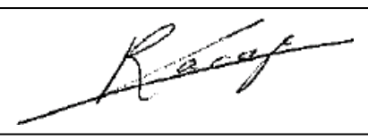</td>
  </tr>
  <tr>
    <td style="font-weight:bold">Endorsement:</td>
    <td>M. Cherlet</td>
    <td>Date:</td>
    <td>Sign:</td>
  </tr>
  <tr>
    <td style="font-weight:bold">Distribution:</td>
    <td colspan="3"></td>
  </tr>
</table>
```

### CHANGE RECORD

| Issue/Rev | Date | Page(s) | Description of Change | Release |
|------------------------------------|------------------------------------------|-----------------------------|--------------------------------------------------------------|-------------------------------|
| | 07.07.2014 | All | First Issue | I1.00 |
| I1.00 | 21.07.2015 | All | Update after external review | I1.10 |
| | | | | |
| | | | | |
| | | | | |

### LIST OF FIGURES

Fig. 1: Comparison of ASCAT backscatter (sigma40) measurements, ERA Interim 2 meters air temperature and WMO Meteo snow depth data over a grid point at 66.5037°E, 66.6924°N in 2007

Fig. 2: SWI and GLDAS data for a point in France. SWI data was scaled to GLDAS data according to procedure explained in Chapter 3.6. It can be seen that for very similar input data evident in the very similar SWI values for T=1 the data is quite different for T=100 due to different initial conditions.

Fig. 3: Maps of Pearson's correlation coefficient with a p value < 0.01 for SWIV3 calculated with Metop A and B and SWIV2 calculated using Metop B data as well as the difference between them. The lower right plot shows a cumulative histogram of these differences. All plots for T=1.

Fig. 4: Maps of Pearson's correlation coefficient with a p value < 0.01 for SWIV3 calculated with Metop A and B and SWIV2 calculated using Metop B data as well as the difference between them. The lower right plot shows a cumulative histogram of these differences. All plots for T=20.

Fig. 5: Maps of RMSD for SWIV3 calculated with Metop A and B and SWIV2 calculated using Metop B data as well as the difference between them. The lower right plot shows a cumulative histogram of these differences. All plots for T=1.

Fig. 6: Maps of RMSD for SWIV3 calculated with Metop A and B and SWIV2 calculated using Metop B data as well as the difference between them. The lower right plot shows a cumulative histogram of these differences. All plots for T=20.

Fig. 7: Maps of Pearson's correlation coefficient with a p value < 0.01 for SWIV3 calculated with Metop A and B and SWIV3 calculated using Metop B data as well as the difference between them. The lower right plot shows a cumulative histogram of these differences. All plots for T=1.

Fig. 8: Maps of Pearson's correlation coefficient with a p value < 0.01 for SWIV3 calculated with Metop A and B and SWIV3 calculated using Metop B data as well as the difference between them. The lower right plot shows a cumulative histogram of these differences. All plots for T=20.

Fig. 9: Maps of Pearson's correlation coefficient with a p value < 0.01 for SWIV3 calculated with Metop A and B and SWIV3 calculated using Metop B data as well as the difference between them. The lower right plot shows a cumulative histogram of these differences. All plots for T=100.

Fig. 10: Maps of RMSD for SWIV3 calculated with Metop A and B and SWIV3 calculated using Metop B data as well as the difference between them. The lower right plot shows a cumulative histogram of these differences. All plots for T=1.

Fig. 11: Maps of RMSD for SWIV3 calculated with Metop A and B and SWIV3 calculated using Metop B data as well as the difference between them. The lower right plot shows a cumulative histogram of these differences. All plots for T=20.

Fig. 12: Maps of RMSD for SWIV3 calculated with Metop A and B and SWIV3 calculated using Metop B data as well as the difference between them. The lower right plot shows a cumulative histogram of these differences. All plots for T=100.

Fig. 13: Maps of correctly classified days in percent for SSFV3 using Metop A and B, SSFV2 using only Metop B and the differences between the two. The lower right plot shows a cumulative histogram of these differences.

Fig. 14: Maps of mean of consecutive days wrongly classified for SSFV3 using Metop A and B, SSFV2 using only Metop B and the differences between the two. The lower right plot shows a cumulative histogram of these differences.

Fig. 15: Pearson's R between GLDAS Layer 1 (0 – 0.1m) and SWI10 T=1 with a p-value < 0.1 (top) and histogram of R (bottom)

Fig. 16: Pearson's R between GLDAS Layer 1 (0 – 0.1m) and SWI10 T=20 with a p-value < 0.1 (top) and histogram of R (bottom).

Fig. 17: Pearson's R between GLDAS Layer 3 (0.4 - 1m) and SWI10 T=100 with a p-value < 0.1 (top) and histogram of R (bottom).

Fig. 18: RMSD between GLDAS Layer 1 (0 – 0.1m) and for SWI10 T=1 (top) and histogram of RMSD (bottom)

Fig. 19: RMSD between GLDAS Layer 1 (0 – 0.1m) and for SWI10 T=20 (top) and histogram of RMSD (bottom).

Fig. 20: RMSD between GLDAS Layer 3 (0.4 - 1m) and SWI10 T=100 (top) and histogram of RMSD (bottom)

Fig. 21: Maps of Pearson's correlation coefficient with a p value < 0.01 for SWIV3 calculated with Metop A and B and SWIV2 calculated using Metop B data as well as the difference between them. The lower right plot shows a cumulative histogram of these differences. All plots for T=1.

Fig. 22: Maps of Pearson's correlation coefficient with a p value < 0.01 for SWIV3 calculated with Metop A and B and SWIV2 calculated using Metop B data as well as the difference between them. The lower right plot shows a cumulative histogram of these differences. All plots for T=20.

Fig. 23: Maps of RMSD for SWIV3 calculated with Metop A and B and SWIV2 calculated using Metop B data as well as the difference between them. The lower right plot shows a cumulative histogram of these differences. All plots for T=1.

Fig. 24: Maps of RMSD for SWIV3 calculated with Metop A and B and SWIV2 calculated using Metop B data as well as the difference between them. The lower right plot shows a cumulative histogram of these differences. All plots for T=1.

Fig. 25: Maps of Pearson's correlation coefficient with a p value < 0.01 for SWIV3 calculated with Metop A and B and only Metop B data as well as the difference between them. The lower right plot shows a cumulative histogram of these differences. All plots for T=1.

Fig. 26: Maps of Pearson's correlation coefficient with a p value < 0.01 for SWIV3 calculated with Metop A and B and only Metop B data as well as the difference between them. The lower right plot shows a cumulative histogram of these differences. All plots for T=20.

Fig. 27: Maps of Pearson's correlation coefficient with a p value < 0.01 for SWIV3 calculated with Metop A and B and only Metop B data as well as the difference between them. The lower right plot shows a cumulative histogram of these differences. All plots for T=100.

Fig. 28: Maps of RMSD for SWIV3 calculated with Metop A and B and only Metop B data as well as the difference between them. The lower right plot shows a cumulative histogram of these differences.. All plots for T=1.

Fig. 29: Maps of RMSD for SWIV3 calculated with Metop A and B and only Metop B data as well as the difference between them. The lower right plot shows a cumulative histogram of these differences.. All plots for T=20.

Fig. 30: Maps of RMSD for SWIV3 calculated with Metop A and B and only Metop B data as well as the difference between them. The lower right plot shows a cumulative histogram of these differences.. All plots for T=100.

Fig. 31: Different SWI variants and in situ data for SNOTEL station CRAB CREEK.

Fig. 32: Different SWI variants and in situ data for USCRN station Edinburg-17-NNE.

Fig. 33: Different SWI variants and in situ data for SCAN station Pine Nut.

Fig. 34: Different SWI variants and in situ data for TERENO station Selhausen.

Fig. 35: Map and histogram of Pearson's R (p < 0.1) between in situ data and SWI10 of for T=1.

Fig. 36: Map and histogram of Pearson's R (p < 0.1) between in situ data and SWI10 of for T=20

Fig. 37: Map and histogram of Pearson's R (p < 0.1) between in situ data and SWI10 of for T=100

Fig. 38: Map and histogram of RMDS between in situ data and SWI10 of for T=1

Fig. 39: Map and histogram of RMDS between in situ data and SWI10 of for T=20

Fig. 40: Map and histogram of RMDS between in situ data and SWI10 of for T=100

### LIST OF TABLES

Table 1: Target requirements of GCOS for soil moisture (up to 5cm soil depth) as Essential Climate Variable (GCOS-154, 2011)

Table 2: Required accuracy of SWI and SWI in 3 categories

Table 3: Possible values of the SSF and their meaning

Table 4: Available datasets for validation

Table 5: Classification scheme

Table 6: Which T-values were compared to which layer of the GLDAS model.

Table 7: Station details and climate classification.

### LIST OF ACRONYMS

ASCAT
:   Advanced Scatterometer (Metop)

CDF
:   Cumulative Distribution Function

CEOS
:   Committee on Earth Observation Satellites

ECMWF
:   European Centre for Medium Range Weather Forecasting

ERA-40
:   ECMWF ReAnalysis 40 data set

ERA-Interim
:   ECMWF Reanalysis Interim

ERS
:   European Remote Sensing Satellite

EUMETSAT
:   European Organisation for the Exploitation of Meteorological Satellites

GIO
:   GMES Initial Operations

GL
:   Copernicus (ex GMES) Global Land service

GLDAS
:   Global Land Data Assimilation System

GMES
:   Global Monitoring for Environment and Security

H-SAF
:   Satellite Application Facility on Hydrology

ISMN
:   International Soil Moisture Network

NRT
:   Near real time

PUM
:   Product User Manual

QFLAG
:   Quality Flag

SSF
:   Surface State Flag

SSM
:   Surface Soil Moisture

SWI
:   Soil Water Index

WMO
:   World Meteorological Organization

# BACKGROUND OF THE DOCUMENT

## EXECUTIVE SUMMARY

From 1st January 2013, the Global Land (GL) component of the Copernicus Land service is providing a series of bio-geophysical products describing the status and evolution of land surface at global scale. Essential Climate Variables like the Leaf Area Index (LAI), the Fraction of PAR absorbed by the vegetation (FAPAR), the surface albedo, the Land Surface Temperature, the soil moisture, the burnt areas, the areas of water bodies, and additional vegetation indices, are generated every hour, every day or every 10 days from Earth Observation satellite data. Production and delivery of the parameters are performed on a reliable, automatic and timely manner and are complemented by the constitution of long term time series.

Quality Assessment and continuous Quality Monitoring constitute the only means of guaranteeing the compliance of generated products with user requirements:

*   The former concerns the new products which must pass an exhaustive scientific evaluation before to be implemented operationally.
*   The latter concerns the operational products to check their quality keeps at the same level along the time.

Both follow, as much as possible, the guidelines, protocols and metrics defined by the Land Product Validation (LPV) group of the Committee on Earth Observation Satellite (CEOS) for the validation of satellite-derived land products.

In this QA report the test datasets of the new version (Version 3) of the Soil Water Index (SWI) (called SWIV3) and the 10-days composite SWI (SWI10) dataset are compared to the Global Land Data Assimilation System (GLDAS) land surface model and in situ data. For the SWI products also the currently operational SWI Version 2 (SWIV2) was compared against GLDAS and in situ data to have a benchmark for the SWIV3 results.

In addition to that, SWIV3 was computed with different input data. Once using both Metop-A and B surface soil moisture as input and once using only Metop-B data. This was done to check that the quality of the product does not deteriorate unreasonably if one satellite fails.

## SCOPE AND OBJECTIVES

The aim of this document is to present the results of the Quality Assessment of the test datasets produced during the evolution of the SWI and SWI10 datasets. For the SWI, the main goal was to check the quality of the SWIV3 product against that of the operational SWIV2. For the SWI10 product, a first assessment of the quality was the focus since no previous products of this type are available.

The products used in this study were:

*   SWI V2.0 (SWIV2)
*   SWI V3.0 MetopA+B (SWIV3)
*   SWI V3.0 MetopB (SWIV3_B)
*   Surface State Flag (SSF) V2.0 (SSFV2)
*   SSF V3.0 MetopA+B (SSFV3)
*   SWI10 V1.0

This study covers nearly 12 months from 24.04.2013 to 21.04.2014. The reason for this validation period is that on 24th of April 2013 Metop-B became the operational satellite and the GLDAS data was only available until 21st of April 2014 when this study was conducted.

## CONTENT OF THE DOCUMENT

This document is structured as follows:

*   Chapter 2 recalls the users requirements, and the expected performance
*   Chapter 3 describes the methodology for quality monitoring, the metrics and the criteria of the evaluation
*   Chapter 4 presents the results of the scientific analysis
*   Chapter 5 summarizes the main conclusions of the study

## RELATED DOCUMENTS

### Applicable documents

AD1: Annex II – Tender Specifications to Contract Notice 2012/S 129-213277 of 7th July 2012

AD2: Appendix 1 – Product and Service Detailed Technical requirements to Annex II to Contract Notice 2012/S 129-213277 of 7th July 2012

### Input documents

GIOGL1_SVP
: Service Validation Plan of the Global Land Service

GIOGL1_ServiceSpecifications
: Service Specifications of the Global Land Service

GIOGL1_ATBD_SWIV3
: Algorithm Theoretical Basis Document of the SWI V3.0, SSF V3.0 and SWI10

### Output documents

GIOGL1_PUM_SWI
:Product User Manual of SWI summarizing all information about the product, including the main conclusions of the quality assessment.

# USERS REQUIREMENTS

According to the applicable document [AD2], the user's requirements relevant for the Soil Water Index are:

*   **Definition**: Amount of water (m³/m³) contained in soil layers identified according to their depth measured from the top surface.
*   **Geometric properties**:
    *   Pixel size shall be defined on a per-product basis so as to facilitate the multi-parameter analysis and exploitation
    *   The target baseline location accuracy shall be 1/3 of the at-nadir instantaneous field of view.
    *   Pixel co-ordinates shall be given for the centre of the pixel.
*   **Geographical coverage**:
    *   Geographic projection: regular lat-long
    *   Geodetical datum: WGS84
    *   Pixel accuracy: minimum 10 digits
    *   Coordinate position: centre of pixel
    *   Window coordinates:
        *   Upper Left:180°W-74°N
        *   Bottom Right: 180°E 56°S
*   **Ancillary information**:
    *   the number of measurements per pixel used to generate the synthesis product
    *   the per-pixel date of the individual measurements or the start-end dates of the period actually covered
    *   quality indicators, with explicit per-pixel identification of the cause of anomalous parameter result
*   **Accuracy requirements**: wherever applicable the bio-geophysical parameters should meet the internationally agreed accuracy standards laid down in document "Systematic Observation Requirements for Satellite-Based Products for Climate”. Supplemental details to the satellite based component of the "Implementation Plan for the Global Observing System for Climate in Support of the UNFCCC”. GCOS-#154, 2011” (Table 1).

::: {.tbl-caption}
```{=typst}
#set text(size: 9pt, fill: rgb("#3E6893"))
```
Table 1: Target requirements of GCOS for soil moisture (up to 5cm soil depth) as Essential Climate Variable (GCOS-154, 2011)
:::

| Variable | Horizontal Resolution | Temporal resolution | Accuracy | Stability |
|------------------------------------------|----------------------------------------|--------------------------------------|-------------------------------|-------------------------------------------------|
| Volumetric soil moisture | 50km | Daily | 0.04 m³/m³ | 0.01m³/m³/year |

GCOS notes that the targets above “are set as an accuracy of about 10 per cent of saturated content and stability of about 2 per cent of saturated content. These values are judged adequate for regional impact and adaptation studies and verification and development of climate models. It is considered premature to consider global scale changes.” It adds that “stating a general accuracy requirement is difficult for this type of observation, as this depends not only on soil type but also on soil moisture content itself. The stated numbers thus should be viewed with some caution".

In addition, the user requirements for the SWI and SSF variables were also defined in the FP7/geoland2 project (Table 2).

::: {.tbl-caption}
```{=typst}
#set text(size: 9pt, fill: rgb("#3E6893"))
```
Table 2: Required accuracy of SWI and SWI in 3 categories
:::

| Variable | Threshold | Target | Optimal |
|--------------------------------------------------|----------------------------------------------------------|----------------------------------------------|----------------------------------------------|
| SWI | 20% | 10% | 5% |
| SSF | 7 days | 3 days | 1 day |

The above requirements are indicative. They will be adapted to the GL products and clarified by the user board of the Global Land service.

# QUALITY ASSESSMENT METHOD

## SWI DATASET

The SWI algorithm, originally developed at Vienna University of Technology (TU Wien) and later improved by other research groups, uses an infiltration model describing the relation between surface soil moisture (SSM) and profile soil moisture as a function of time. The algorithm is based on a two-layer water balance model proposed by Wagner et al. (1999) to estimate profile soil moisture from SSM retrieved from scatterometer data. The remotely sensed topsoil represents the first layer and the second layer extends downwards from the bottom of the surface layer. In this model, the water content of the reservoir layer is described in terms of an Index, which is controlled only by the past soil moisture conditions in the surface layer in a way that the influence of measurements decreases by increasing the time:

$$
\text{SWI}(t_n) = \frac{\sum_i \text{SSM}(t_i) e^{-\frac{t_n-t_i}{T}}}{\sum_i e^{-\frac{t_n-t_i}{T}}} \quad \text{for } t_i \le t_n
\quad (1)
$$

In which tₙ is the observation time of the current measurement and tᵢ are the observation times of the previous measurements. These times are given in Julian days. In (Eq. 1) all Surface Soil Moisture (SSM) observations made before tₙ are exponentially weighted and summed up. The factor T determines how fast the weights become smaller and how strongly SSM observations taken in the past influence the current SWI. If e.g. the T value is 5 and a SSM measurement was taken 10 days before tₙ then this observation would receive the weight $e^{-10/5} = 0.135$. Using a T value of 20 in the same case would increase the weight to $e^{-10/20}= 0.607$.

This basic algorithm is the same for SWIV2 and SWIV3. The difference between the two datasets is the input data. Whereas SWIV2 uses data from one Metop satellite, SWIV3 uses data from both Metop-A and Metop-B. This change leads to more SSM observations being integrated into the SWI which will provide SWI estimates that are more stable. The usage of two satellites does not produce more valid SWI observations since the timestamp of the SWI is daily regardless of available input data. The use of more observations is only indicated by a higher value of the quality flag (QFLAG).

SWI10 data are produced by averaging the SWI images over three periods each month. The date ranges used for averaging are:

*   1-10^th^ day of the month
*   11-20^th^ day of the month
*   21^st^-end of the month

## SSF DATASET

Surface soil moisture retrieval from scatterometer data has certain limitations; it can not be retrieved when the surface is frozen or covered by snow, dense vegetation, or water. Whereas dense vegetation and water are almost static factors the freeze/thaw cycle is dynamic.

The backscattered signal depends, among other factors, on the frozen state of the surface. When the soil surface freezes, dielectric properties of the soil change significantly which usually results in low backscatter values. As snow begins to fall and accumulates over the surface, backscatter signals initially drop. In some cases it increases again in the winter months. This is due to volume scattering and depends on the structure of the snow (not visible in Fig. 1). With increasing temperature in spring, snow begins to melt and water covers the surface of the snow pack which can cause sudden drops in backscatter. After the snow melting period, soil and vegetation begin to thaw and consequently backscatter rises again. Fig. 1 shows this behavior.

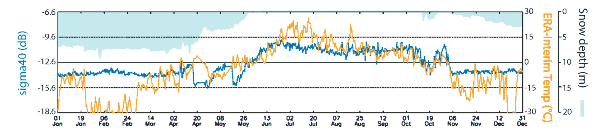

The frozen state of the surface is recorded within the surface state flag (SSF). The SSF is calculated in 2 steps. Initially, the algorithm uses the relationship of backscatter measurements over temperature to find freeze/thaw parameters and thresholds that define the freezing characteristics of each location. In a second step, two decision trees use these parameters to find the freeze/thaw state of every soil moisture observation. In some edge cases, the SSF cannot be estimated from the backscatter. Historical probabilities for frozen temperatures and snow cover are used in those situations. Table 3 shows the possible values of the surface state flag. If the SSF has the values 2 or 3 the soil moisture measurements are not usable for SWI calculation and the SWI is kept constant at the level it had before freezing. The algorithm is explained in more detail in and the ATBD [GIOGL1_ATBD_SWIV3] and in Naeimi et al. (2012).

There are no algorithmic differences between SSFV2 and SSFV3. The difference is in the parameters that are used for deriving the freeze-thaw state. Whereas the parameters for the SWIV2 were derived from two years of data, the SSFV3 parameters were derived from 5 years of data which should lead to more robustly estimated freeze-thaw states.

One thing to consider when comparing SSFV2 and SSFV3 is the bug that was found in SSFV2 during the first Quality Monitoring report. This bug lead to missing SSF values when the SSF could not be derived from backscatter alone.

::: {.tbl-caption}
```{=typst}
#set text(size: 9pt, fill: rgb("#3E6893"))
```
Table 3: Possible values of the SSF and their meaning
:::

| SSF value | Detected surface state |
|--------------------------------------------|------------------------------------------------------------------------------------------------------------------------------------------------------------|
| 255 | Could not be determined |
| 1 | Unfrozen |
| 2 | Frozen |
| 3 | Temporary water on the surface |

## MODEL REFERENCE PRODUCTS

The SWI product was compared against the GLDAS (Global Land Data Assimilation System) Noah Land Surface Model.

The GLDAS Noah Land Surface Model (Rodell et al. 2004) is produced by NASA. It includes 4 soil layers with the bottom depth at 0.1, 0.4, 1 and 2 m respectively and simulates over 30 land surface parameters in total. Data is available with a temporal sampling of 3 hours on a global 0.25° grid. The model soil moisture data was converted from kg/m² to m³/m³ by using the formula $SM[\text{m}^3/\text{m}^3] = SM[\text{kg}/\text{m}^2] * 0.001 * 1/d$ where d is the thickness of the soil layer in meters. The factor 0.001 is due to the assumption that 1 kg of water represents 1000 cm³ which is 0.001 m³.

The soil moisture component of the GLDAS model is of course not error free but the authors are not aware of a comprehensive study on the global quality of the modelled soil moisture of the GLDAS model. Dorigo et al. (2010) investigated the quality of the GLDAS and ERA-Interim models with the triple collocation method using remotely sensed soil moisture datasets as the other 2 datasets. Similar error structures were found for the two models, indicating that results obtained for the ERA-Interim model can be used as a proxy for the GLDAS soil moisture output. Albergel et al. (2013) explored the performance of the ERA-Land, which is a pre operational successor to ERA-Interim, and MERRA-Land model against 196 in-situ stations from the ISMN and found mean correlation coefficients of 0.66 and 0.69 respectively. Chen et al. (2013) compared the GLDAS model output against in-situ stations on the Tibetan plateau and found that the model underestimates surface soil moisture (0-5cm) but was in good agreement with a deeper layer (10 - 40cm). Correlations of 0.69 (0-5cm) and 0.76 (10-40cm) were found.

## IN-SITU REFERENCE PRODUCTS

In situ data from the International Soil Moisture Network (ISMN) is used as a reference. The ISMN provides a harmonized repository of in situ soil moisture observations (https://ismn.geo.tuwien.ac.at/). This harmonization makes it feasible to use in situ data from a wide array of networks. The data quality of stations can vary widely and is not guaranteed to be consistent in time for any station. Wild animals as well as farmers or other natural phenomena can lead to sensor failure or shifts in the location which invalidate the sensor calibration. These errors are partly addressed by various quality and consistency checks that were recently introduced by Dorigo et al. (2013) which aim to automatically detect and flag jumps, plateaus and other unrealistic behaviour in the data. Also checks for realistic maximum and minimum values are performed.

Another issue when comparing remotely sensed and in situ data is spatial representativeness. This means how well an in situ observation, which is essentially a point measurement, represents the data gathered by the much larger satellite footprint. This is also different for each station and depends on topography, soil types and microclimates.

## DATA AVAILABILITY

Table 4 shows the data availability of the SWI and the reference datasets, the availability of Metop-B and GLDAS data sets, the beginning and end of the validation period.

::: {.tbl-caption}
```{=typst}
#set text(size: 9pt, fill: rgb("#3E6893"))
```
Table 4: Available datasets for validation
:::

```{=html}
<table>
<colgroup>
<col style="width: 22.1%">
<col style="width: 13.1%">
<col style="width: 19.0%">
<col style="width: 17.6%">
<col style="width: 16.5%">
<col style="width: 11.7%">
</colgroup>
<tr>
    <td>Dataset</td>
    <td>Start</td>
    <td>End</td>
    <td>Spatial Coverage, Resolution</td>
    <td>Observed soil layer</td>
    <td>Unit</td>
  </tr>
  <tr>
    <td>SWI V2 NRT</td>
    <td>2012-06-01</td>
    <td>2014-04-30</td>
    <td>Global, 25km</td>
    <td>T-value</td>
    <td>Percent</td>
  </tr>
  <tr>
    <td>SWI V3<br>test dataset</td>
    <td>2013-04-24</td>
    <td>2014-04-30</td>
    <td>Global, 25km</td>
    <td>T-value</td>
    <td>Percent</td>
  </tr>
  <tr>
    <td>SWI10 test<br>dataset</td>
    <td>2013-04-10</td>
    <td>2014-04-30</td>
    <td>Global, 25 km</td>
    <td>T-value</td>
    <td>Percent</td>
  </tr>
  <tr>
    <td>GLDAS soil<br>moisture and<br>temperature</td>
    <td>2000-02-24</td>
    <td>2014-04-21</td>
    <td>Global, 0.25°</td>
    <td>0 - 0.1 m<br>0.4 - 1m (only<br>soil moisture)</td>
    <td>°C and<br>Kg/m²</td>
  </tr>
  <tr>
    <td>ISMN</td>
    <td>2013-04-24</td>
    <td>Different, max<br>2014-04-30</td>
    <td>767 stations</td>
    <td>0 - 0.1 m</td>
    <td>m³/m³</td>
  </tr>
</table>
```

An important factor to consider is that the SWI V2 NRT product started production already in June 2012, whereas the SWI V3 test dataset was initialized in April 2013. Different initial values can have a significant influence on SWI time series with high T values for a long time (see Fig. 2). Efforts were made to use the gain values from the SWI NRT processing chain (V2) when initializing the SWIV3 test product. But since this data is stored in an undocumented C++ format the effort to decode it was deemed too big for the benefit of having products that are initialized with the same values. This discrepancy does only influence high T values and since the higher T values are basically an exponentially weighted average of the SWI with T value of 1 we can be certain that they will be equivalent if the SWI with T=1 is the same.


## SWI PROCEDURE

The aim of this validation report is to assess the performance of the SWIV3 and SWI10 products in the period from 24th of April 2013 until 21st of April 2014 (main validation period) relative to the performance of the SWI NRT product (SWIV2) available from the Copernicus Land Service in the same period.

For the SWI and SWI10 validation the following metrics are used:

*   Pearson's correlation coefficient (R) with a p value < 0.01
*   Root mean square difference (RMSD)

### Temporal Matching

#### SWI procedure

The reference dataset GLDAS and data from the International Soil Moisture Network (ISMN) were temporally matched to the SWI observation timestamp using nearest neighbour matching. This was necessary since the SWI is a daily dataset whereas the reference datasets have multiple observations per day.

#### SWI10 procedure

SWI10 is a decadal product meaning that only 1 value every ~10 days is available. To make the GLDAS and ISMN datasets comparable, they too were averaged over the same ~10 day period than the SWI10 product.

### Scaling

Since both the SWI and SWI10 are in a different unit than the reference product, scaling was necessary to ensure consistent results. The used approach was that of min-max scaling. With this method one dataset is scaled to have the same maximum and minimum values as the other dataset. This approach was taken since it does not completely remove the bias as does e.g. scaling to the same mean and standard deviation. At first also experiments with linear CDF matching after (Liu et al. 2011) were made but it was discovered that the matching failed for high T-values in very dry regions because the algorithm was unable to calculate the necessary percentiles.

The SWI products were scaled into the GLDAS or in-situ data space. This approach was taken to ensure the comparability of the RMSD results. Before the calculation of the metrics, observations where the Surface State Flag showed frozen were removed. If less than 10 observations remained for a grid point, no metrics were calculated.

## SSF PROCEDURE

For the SSF validation the following metrics are used:

*   Percentage of correctly classified observations (percent_valid)
*   Period of consecutive misclassified days (mean) (wrong_days)

Temporal matching was done in the same way as described for the SWI.

Classification of the SSF values into the binary correct-incorrect form was done using the classification scheme outlined inTable 5. The soil temperature was taken from the first layer of the used land surface model. The percent_valid metric was then calculated as the percentage of correctly classified observations as a fraction of all observations. Wrong_days was calculated by finding consecutive periods of wrong classification and measuring their length in days. Since each grid point can have multiple such periods the mean length of these periods is reported.

::: {.tbl-caption}
```{=typst}
#set text(size: 9pt, fill: rgb("#3E6893"))
```
Table 5: Classification scheme
:::

| SSF value | Soil temperature | Classification |
|-------------------------------------|----------------------------------------------------------------------------|---------------------------------------------------------------------------------------|
| 1, 3 | >= 0°C | Correct |
| 2 | &lt; 0°C | Correct |
| 1, 3 | &lt; 0°C | Incorrect |
| 2 | >= 0°C | Incorrect |

## COMPARISON MATRIX

The different T-values of the SWI products were compared to different layers of the GLDAS model. This was done since higher T-values represent deeper soil layers. Table 6Table 6 shows which T-values were compared to which layer of the model and to which depth of the in situ stations.

::: {.tbl-caption}
```{=typst}
#set text(size: 9pt, fill: rgb("#3E6893"))
```
Table 6: Which T-values were compared to which layer of the GLDAS model
:::

| SWI/SWI10 T-Value | GLDAS layer depth | in situ observation depth |
|--------------------------------------------------------------------------|-------------------------------------------------------|------------------------------------------------------------------------|
| 1, 5, 10, 15, 20, 40 | 0 - 0.1 m | 0-0.1m |
| 60, 100 | 0.4 - 1 m | 0-0.1m |

# RESULTS

The comparisons were done for all 8 T-Values but since the results are very similar for all T values we will only show the comparisons for T=1 T=20 and T=100 for products which have the same initialization.

For the comparisons with the current operational product SWIV2, only results for T=1 and T=20 will be shown. This is because the results for the higher T values are not comparable because of the different initialization times.

## COMPARISON TO GLDAS

Al-Yaari et al. (2014) compared ASCAT and SMOS data to the MERRA land surface model and found similar results than those found for the SWIV3 in this document. Low correlations were observed in arid and semi-arid regions as well as high latitude regions whereas other areas showed high positive correlations (see Fig. 3 and Fig. 4). RMSD values are lower for arid regions because of the smaller dynamic range of soil moisture in these areas. High RMSD can be observed in northern regions where soil moisture is generally higher (see Fig. 5 and Fig. 6). In general, the GCOS requirements of 0.04 m³/m³ are not reached for all regions. This hard threshold of 0.04 m³/m³ is not applicable everywhere though. GCOS themselves state in the requirements that this number was chosen to approximately be 10% of the saturated content which varies widely between soil and climate types.

### SWIV2-GLDAS compared to SWIV3-GLDAS

In this section, the results of comparing the new SWIV3 product with GLDAS data are compared to those of the SWIV2 – GLDAS comparison. Pearson correlation coefficients shown in Fig. 3 and Fig. 4 show that R of SWIV3 is very similar to the R scores of SWIV2. The observed differences of ± 0.06 are not significant within a 95% confidence interval. The results for T=20 shown in Fig. 4 show slightly higher differences which is expected since the two SWI datasets were not initialized with the same starting values which is more important for high T values.


Fig. 5 and Fig. 6 also show that in terms of RMSD the differences are small. The RMSD for T=1 seems to be slightly lower for the SWIV3 product in South America. In North America slightly higher RMSD for SWIV3 is observed but these differences are so small that interpreting them in a meaningful way is hardly possible.

Overall the differences in RMSD are higher for T=20. This is because of the different initialization times.


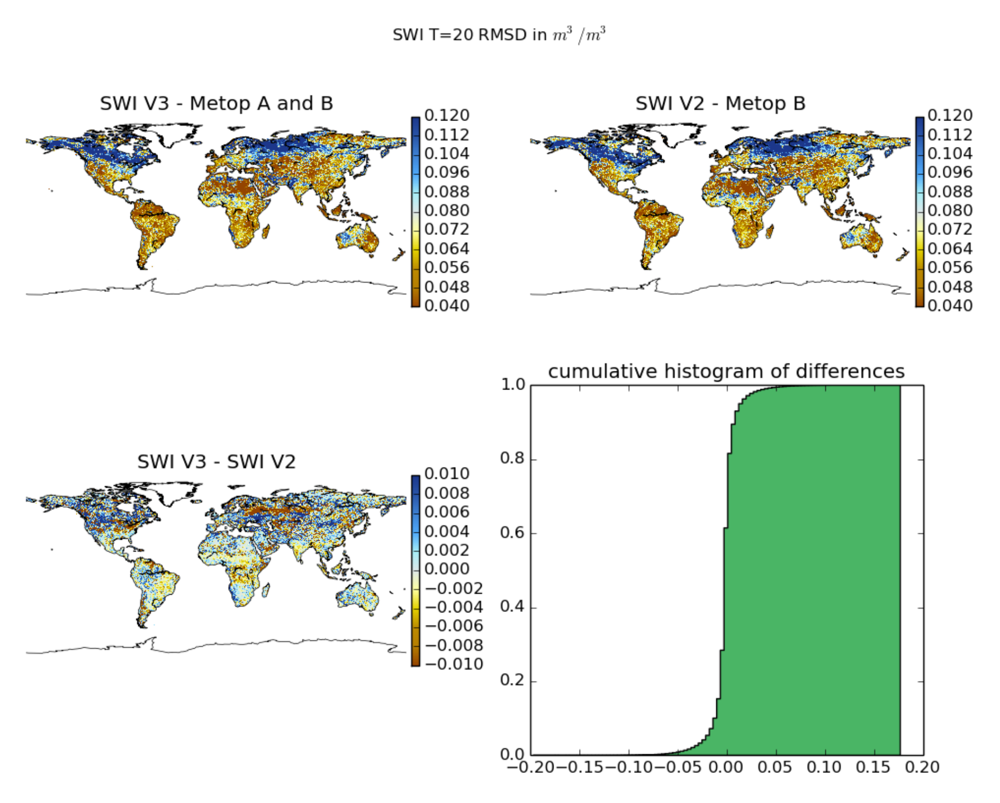

### SWIV3 - GLDAS compared to SWIV3_B - GLDAS

In this section, the SWIV3 product is compared to a SWIV3 product computed only with the input data from ASCAT on board Metop-B (SWIV3_B). This was done to see if a hypothetical sensor failure would have an influence on the accuracy of the product. Fig. 7 to Fig. 12 show the results of this comparison for T values 1, 20 and 100 for both Pearson's R and RMSD. Only very small differences can be observed in these plots. For T=1, both R and RMSD show slightly better values when both Metop A and B are used but it is hard to argue that these differences are really significant using 1 year of data. Higher T values show what seem to be random differences. This can be expected because the high T values average over time and thus an additional observation from e.g. Metop A will not have much influence.


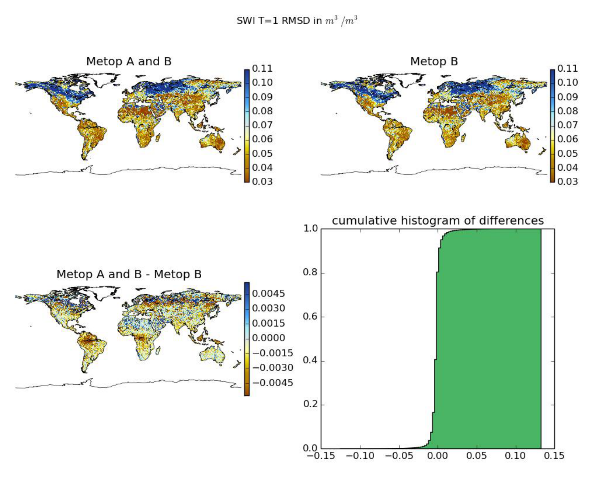

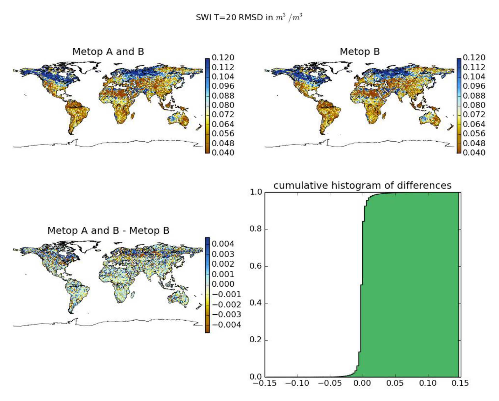

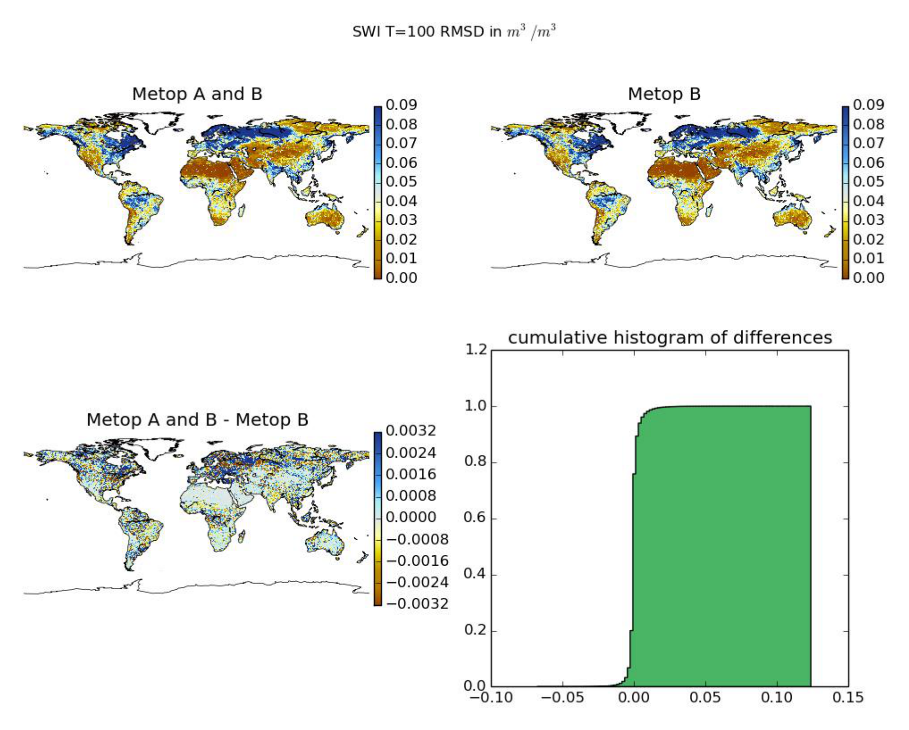

### SSFV2 compared to SSFV3

In this section, the SSF from the current operational product (SSFV2) is compared to the SSF computed with the new SSFV3 processor. The basic algorithm is the same but the bugs that were found in the SSFV2 are no longer present in SSFV3. Fig. 13 and Fig. 14 show the result of this comparison. It can be seen that the bug that was present in SSFV2 until the end of 2013 affected the results. The most affected areas are the Gobi desert and parts of the Andes and a small part in Libya as well as areas in the Canadian Rocky Mountains. These are all areas where the algorithm presented in Naeimi et al. (2012) is not applicable (see Figure 5 in Naeimi et al. 2012).

The differences in Libya come from the fact that the bug in SSFV2 prevented the application of probabilistic flags included in the Surface Soil Moisture (SSM) input product. These flags give probabilities of frozen soil and snow cover for each day of the year. The probability for frozen soil were derived from the ERA40 model which indeed shows temperatures below 0°C in these regions around the end of December of each year.

In all other regions the results are almost identical.

The results for the comparison between SSFV3 and SSFV3_B (only with Metop-B data) are not shown since no systematic differences were found.

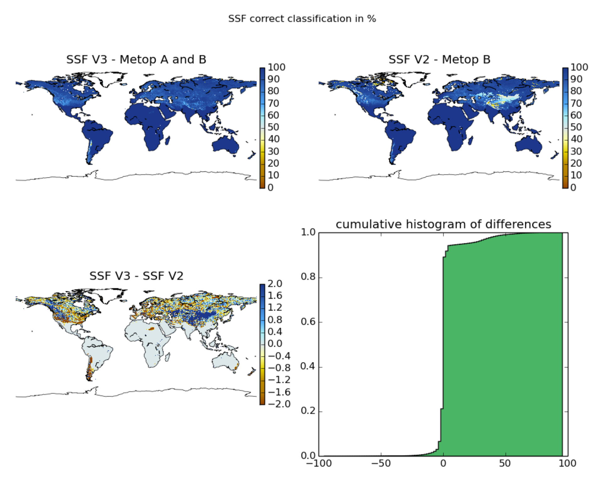

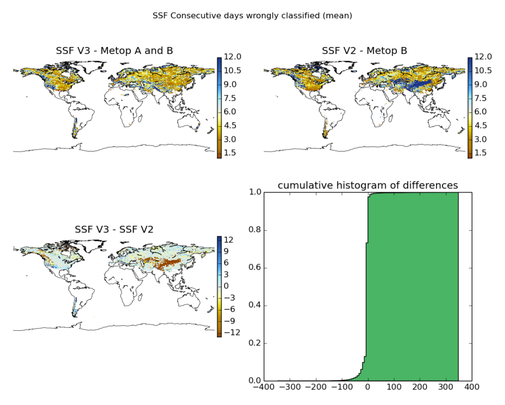

### Comparison of GLDAS and SWI10

In 13 months of available test data for the SWIV3, 39 SWI10 products are generated which leads to a pretty small sample size for calculating the metrics. This is also the reason why for Fig. 15 to Fig. 17 the p value for R values that will be shown was increased from 0.01 to 0.1. Pearson's correlation coefficient shows the same large scale patterns than SWIV3 or SWIV2 which gives confidence that the conversion algorithm works correctly. It is expected that the performance of SWI10 and SWIV3 is very similar as soon as sufficiently long time series are available for both products. The missing R values around zero correlation are because only correlations with ap value < 0.1 are shown.

The RMSD values shown in Fig. 18 to Fig. 20 also show the same patterns as Fig. 10 to Fig. 12 but show higher values in parts of Africa, South America and India. These are also regions in which the correlation was not significant so this should not be taken as a real issue but is most likely related to the small sample size.

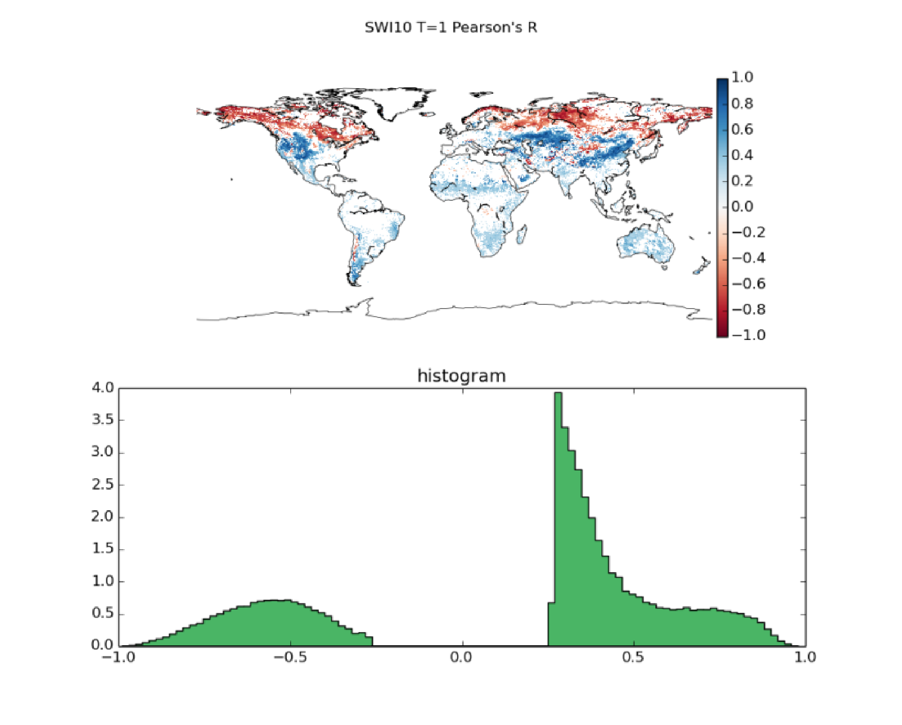

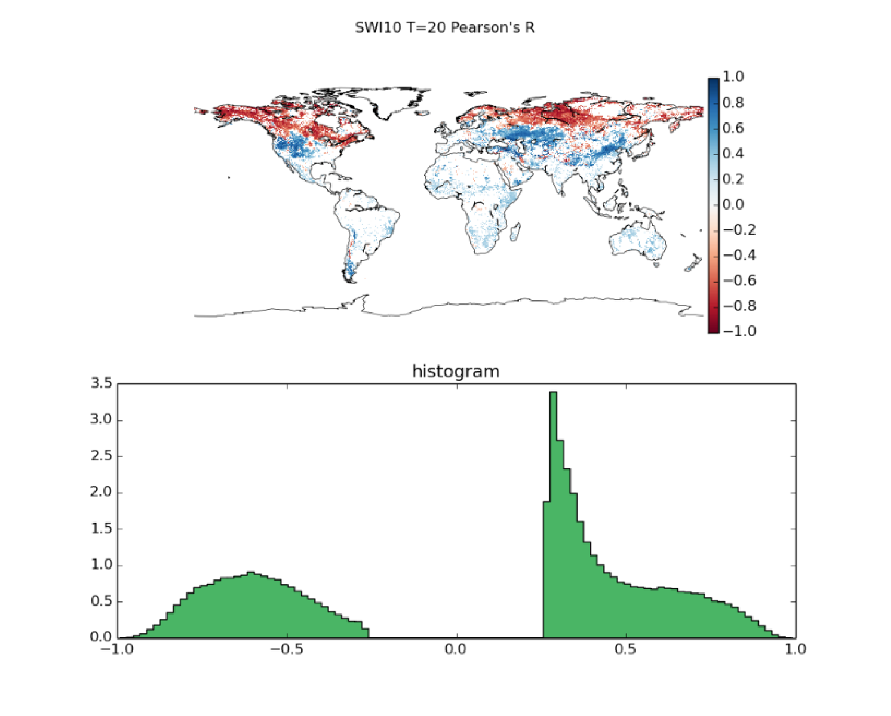

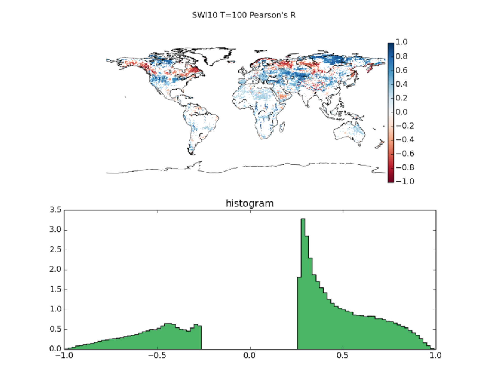

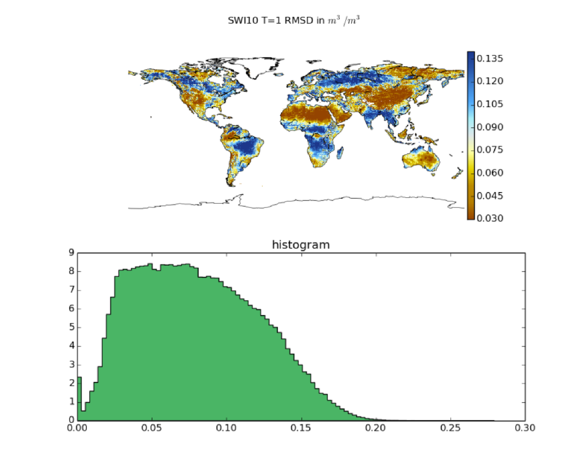

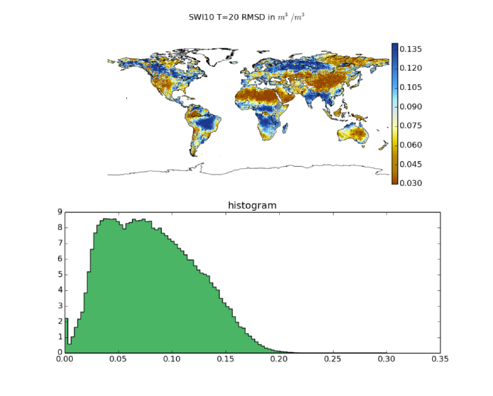

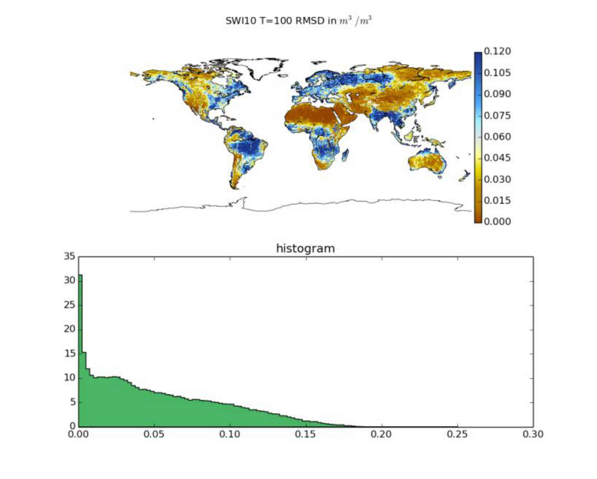

## COMPARISON TO INSITU DATA

The underlying ASCAT SSM product, as well as the SWI filter, has been extensively validated in the literature. Paulik et al. (2014) compared the SWIV2 product to data from 664 in situ stations using data from the ISMN and found mean R and RMSD values of 0.54 and 0.062 m³/m³ respectively. Brocca et al. (2011) compared AMSR-E and ASCAT derived SWI filtered soil moisture to 17 in situ stations across Europe and found a mean R value of 0.82 for the SWI filtered products. A similar comparison study was done by Griesfeller et al. (2015) over six in situ stations in Norway which found mean R values of 0.72 and 0.68 for ASCAT SWI descending and ascending passes respectively.

Soil moisture data from the ISMN was used to validate the SWIV3 and SWI10 products. As with the comparison to the GLDAS model, different variants of the SWIV3, the SWIV2 and SWI10 were compared to the ISMN data. The results of these comparisons are presented in the next sections.

The maps only show the parts of the Earth were data from in situ stations was available during the validation period. The results are very similar to those shown in Section 4.1.

### SWIV2-insitu compared to SWIV3-insitu

In this section, the results of the validation of SWIV3 and in situ data are compared to the results obtained by validating SWIV2 with in situ data. Fig. 21 and Fig. 22 show Pearson's correlation. Only small differences between the dataset can be observed which are not statistically significant. Also the RSMD results in Fig. 23 and Fig. 24 show very little differences.


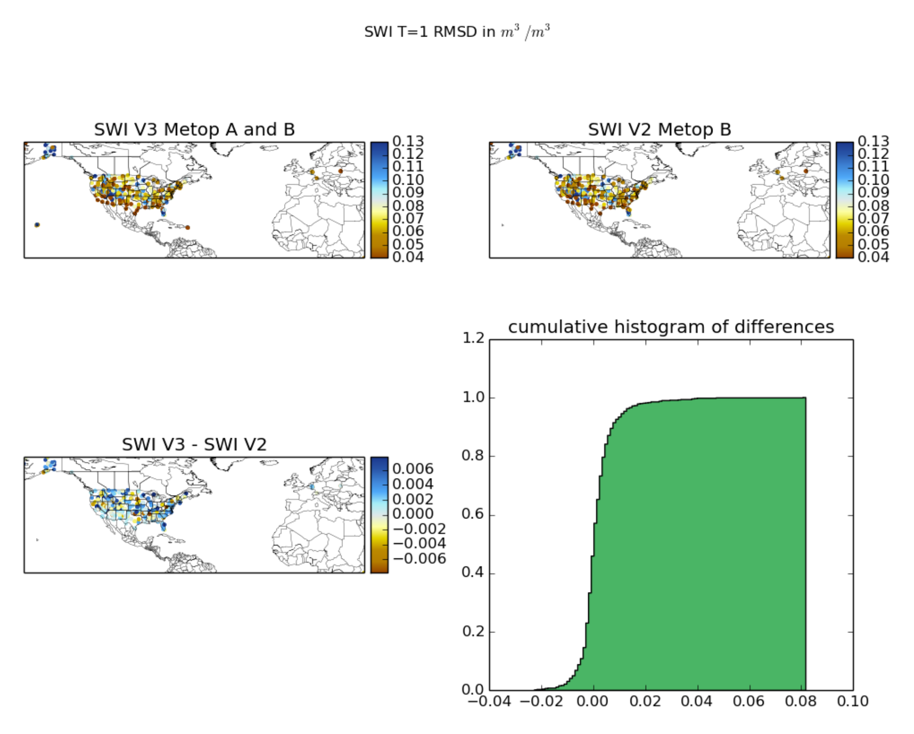

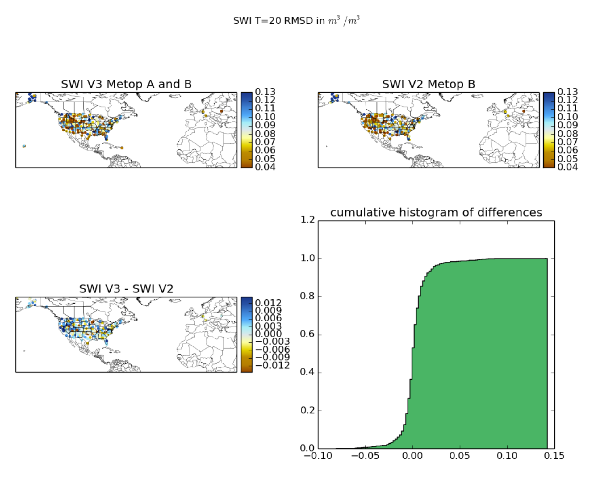

### SWIV3-insitu compared to SWIV3_B-insitu

Also the results of the comparisons of SWIV3 with and without data from Metop-A (SWIV3_B) to in situ data are very similar to those described in Section 4.1.2. Fig. 25 to Fig. 30 show again that the benefit of having two sensors does not show itself in the validation period. There seems to be a small benefit for T=1 in both R and RMSD but the statistical significance of these results is not strong.


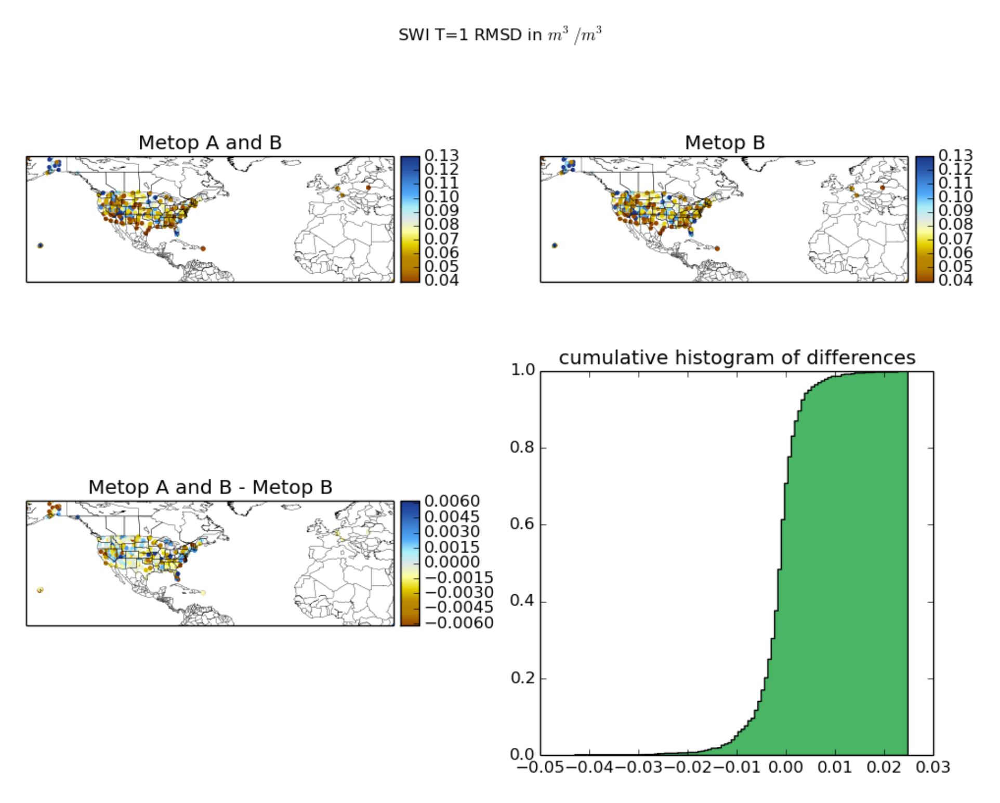

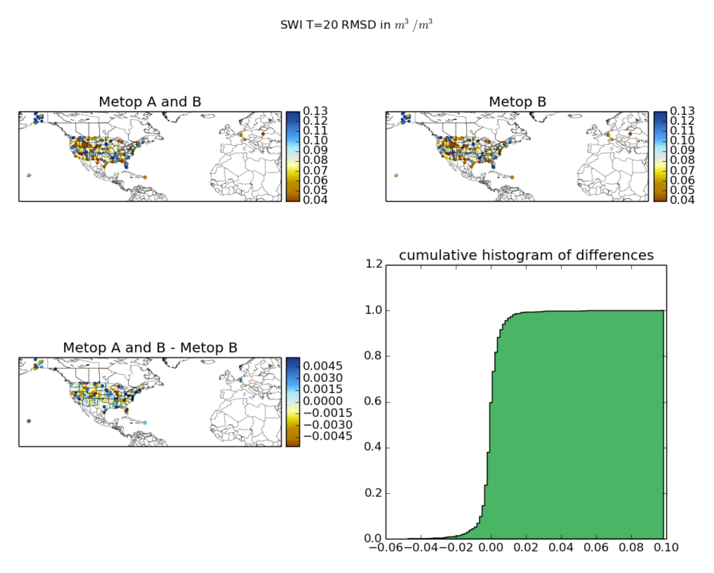

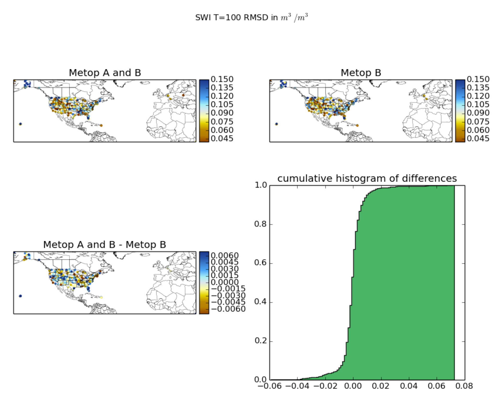

### Time series of selected in situ stations

Four in situ stations were selected to be discussed in more detail. They were selected basically at random but care was taken that bad and good results are shown and that different climate zones are represented. The four selected stations and their climate zones are listed in Table 7. For all in situ data the first layer, measured at a depth of 0.05m, is shown. For these plots SWI with T=1 and 100 is shown.

::: {.tbl-caption}
```{=typst}
#set text(size: 9pt, fill: rgb("#3E6893"))
```
Table 7: Station details and climate classification
:::

```{=html}
<table>
<colgroup>
<col style="width: 22.0%">
<col style="width: 11.8%">
<col style="width: 26.1%">
<col style="width: 40.1%">
</colgroup>
<tr>
    <td>Station Name</td>
    <td>Network</td>
    <td>latitude/longitude</td>
    <td>Köppen-Geiger<br>Climate class</td>
  </tr>
  <tr>
    <td>CRAB CREEK</td>
    <td>SNOTEL</td>
    <td>44.44°N / 111.99° E</td>
    <td>Dfb (humid continental<br>climate: snow, fully<br>humid, warm summer)</td>
  </tr>
  <tr>
    <td>Edinburg-17-NNE</td>
    <td>USCRN</td>
    <td>26.53°N / 98.06° E</td>
    <td>Cfa (humid subtropical<br>climate: warm<br>temperate, fully humid,<br>hot summer)</td>
  </tr>
  <tr>
    <td>Pine Nut</td>
    <td>SCAN</td>
    <td>36.57°N / 115.20°E</td>
    <td>BWk (cold desert<br>climate: cold arid)</td>
  </tr>
  <tr>
    <td>Selhausen</td>
    <td>TERENO</td>
    <td>50.87°N / 6.45°W</td>
    <td>Cfb (oceanic climate:<br>warm temperate, fully<br>humid, warm summer)</td>
  </tr>
</table>
```

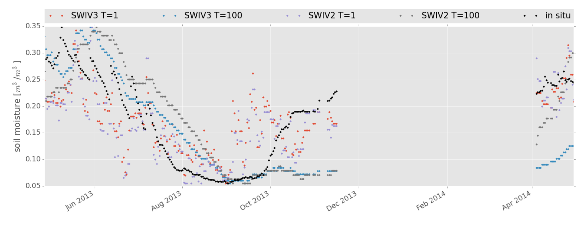

The SWI time series at CRAB CREEK shown in Fig. 31 shows fair agreement with the in situ data. R between SWIV3 T=1 and in situ is 0.67 with a RMSD of 0.063 m³/m³. Wetting events in summer 2013 are generally reflected well in the SWI data but during autumn signals of different magnitude and sometimes even direction are shown. Reasons for that could be lacking spatial representativeness. No data is present during the winter period from November until April. The after winter peak in SWIV2 is due to slightly different freeze/thaw masking of SWIV2 and SWIV3.

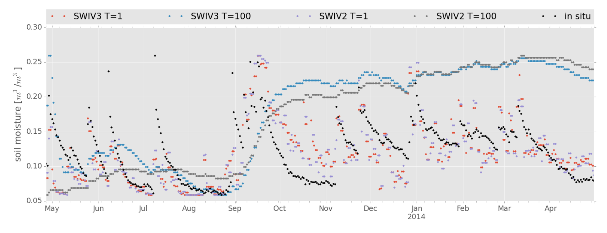

The SWI T=1 time series shown in Fig. 32 show good agreement with the in situ data. R between SWIV3 T=1 and in situ data is 0.64 with a RMSD of 0.036 m³/m³. Soil moisture conditions of the whole year are well represented in the SWI data.

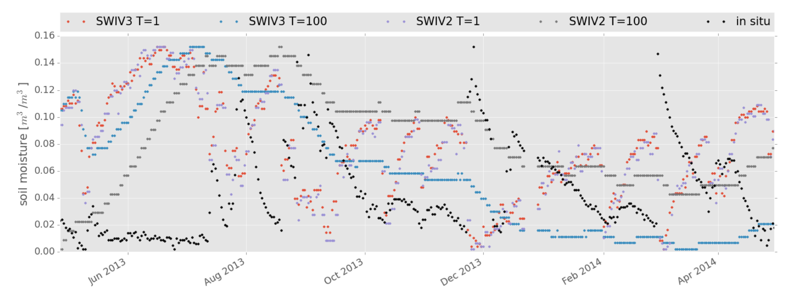

Fig. 33 shows a special case. In this area negative correlations are observed between in situ soil moisture data and the SWI products. This is because of unexpected backscatter behavior of the ASCAT instrument in some areas. Hahn et al. (2013) attributed this behavior to volume scattering in very dry conditions that reverse the expected radar response to soil wetting. R of SWIV3 T=1 and in situ data is -0.66 whereas RMSD is 0.071 m³/m³.

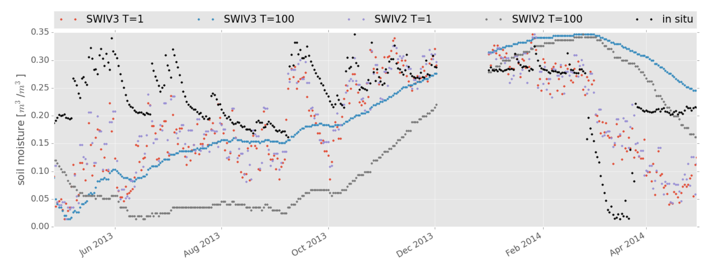

Correlation between SWIV3 T=1 and in situ for station Selhausen is 0.53 with a RMSD of 0.045 m³/m³. Fig. 34 shows that wetting and drying is well represented but also that during summer either a dry or a wet bias is observed. This time series also show the effect that different initial conditions can have on SWI with T=100. In this case the difference between the time series is exaggerated by the applied minimum-maximum scaling.

#### Comparison of in situ data and SWI10

The SWI10 data generally shows correlations that are in line with what one would expect based on the R values achieved by the SWIV3 product (Fig. 35 to Fig. 37). RMSD for the comparison with in situ data (Fig. 38 to Fig. 40) is in the same range as the comparison with GLDAS showed.

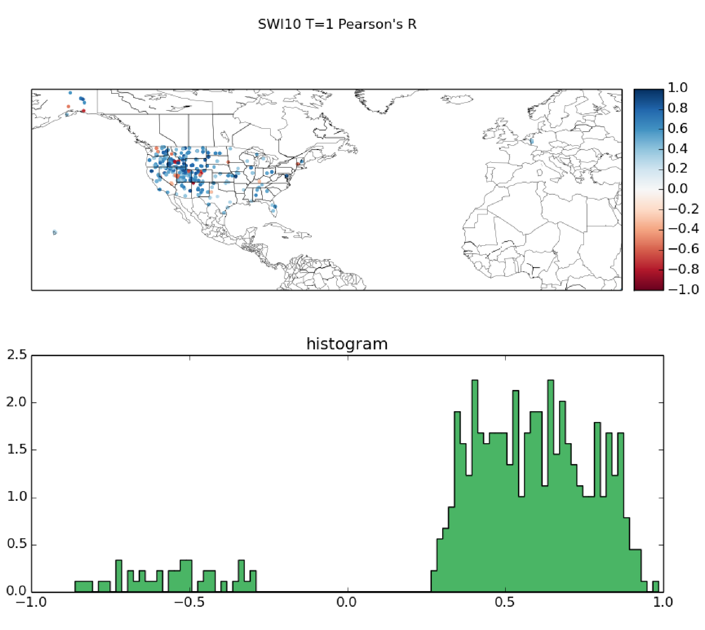

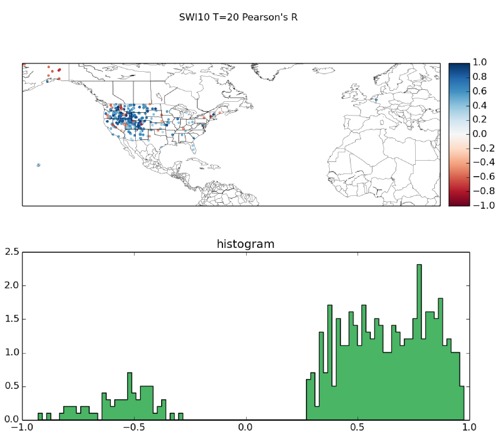

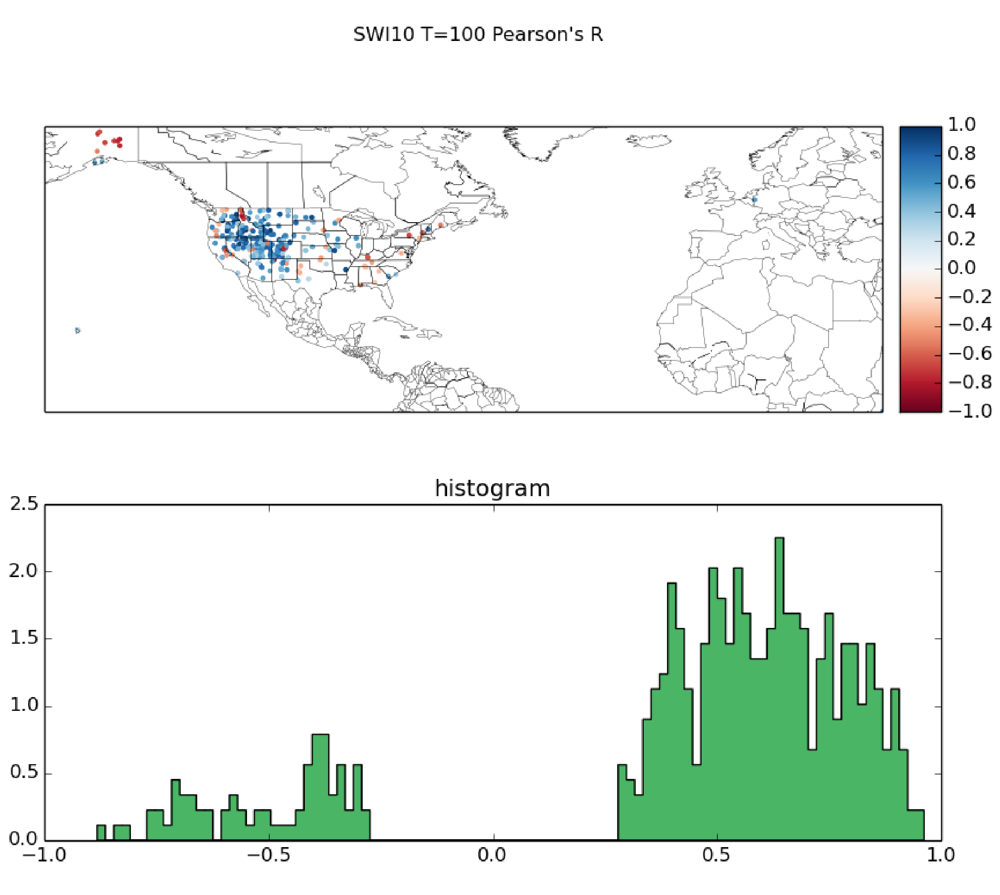

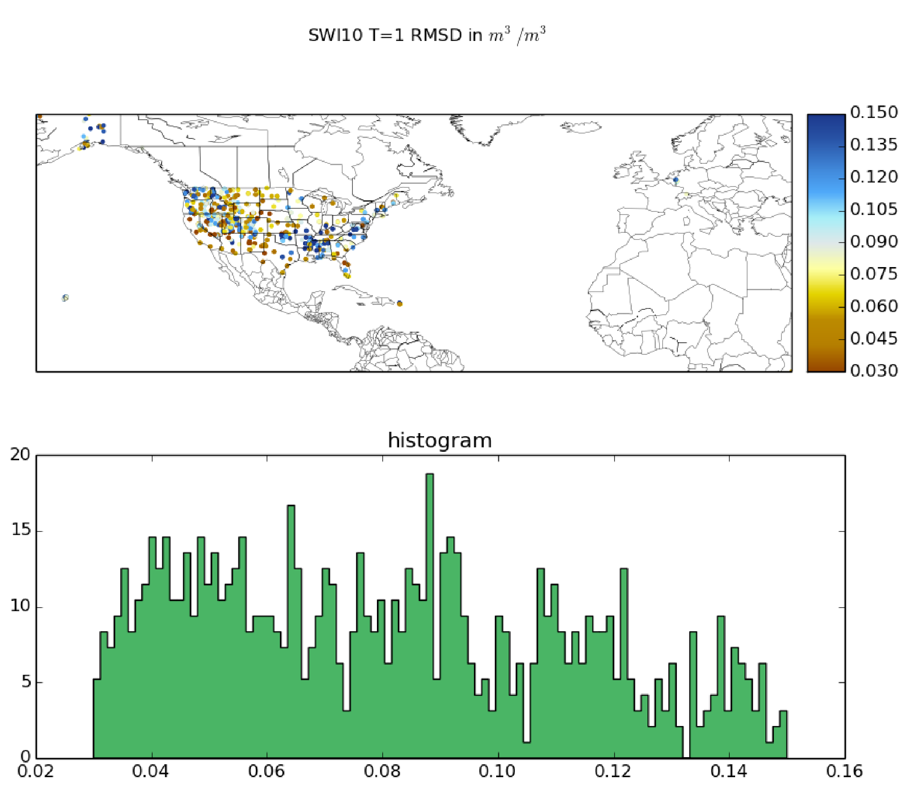

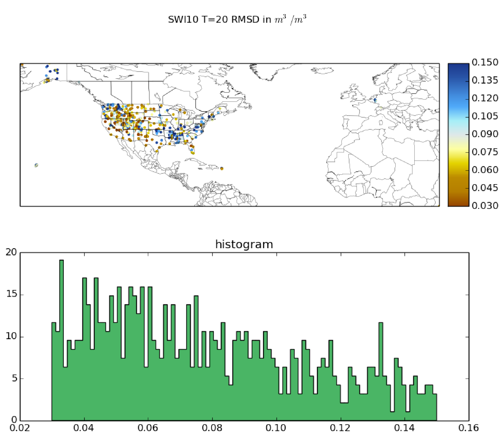

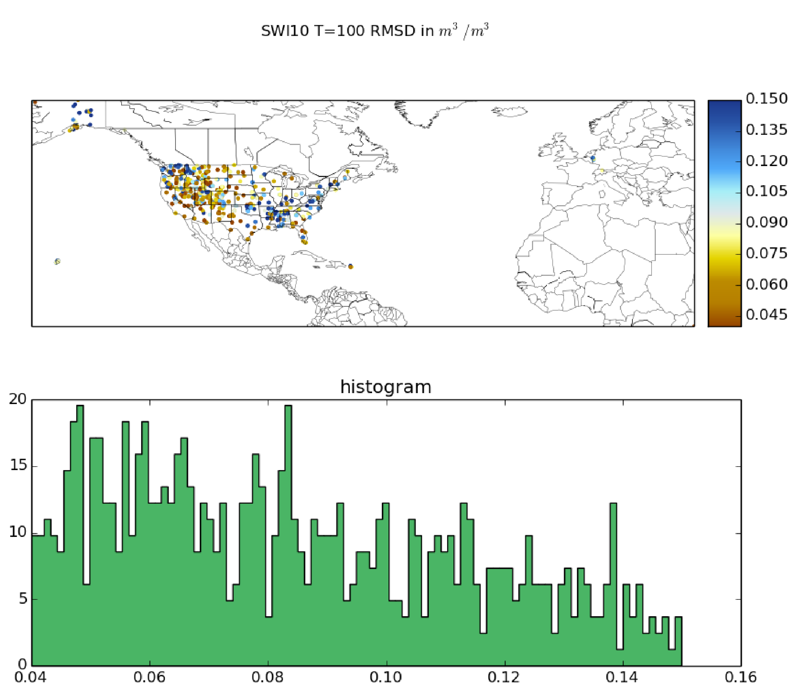

# CONCLUSIONS

SWIV3, SWI10 and SSFV3 test datasets were compared to the GLDAS model and to in situ data from the ISMN. The achieved results were put into context by using the currently operational products as a reference, when possible. The results obtained here are very similar to results obtained by published studies. Comparison with modelled data shows good agreement in all regions except arid areas and in northern latitudes. The validation with in situ observations generally shows positive correlations, but there are some stations in arid areas that show non-significant or even negative R values. The results showed that the quality of the product is essentially unchanged between SWIV2 and SWIV3 for a one year validation period. It was also shown that a sensor failure of one satellite would have very little influence on the output product.

During the regular cross cutting validation exercise performed by the Global Land service in assimilating the SWI into a Land Data Assimilation System, it has been observed that the SWIV2 product seemed to dry in the Summer of 2013 over France. The SWIV3 will probably show the same behaviour since the two products are very similar. Investigations into the cause of this behaviour are ongoing but could not be detected here because only one year of SWIV3 test data was available.

In addition, it was shown that the SWI10 product retains the basic characteristics from the SWIV3 input product. Similar spatial distribution of the error metrics was observed although the absolute values for RMSD were higher in some regions. As soon as the full SWI10 archive is available it can be checked if this is a result of the small sample size or a real feature in the dataset.

The validation of SSFV3 revealed unintuitive behaviour in Libya. This will be reported to the H-SAF team responsible for the frozen probabilities included in the SSM input data. So that it can be investigated if SSF should indeed report the frozen state in this situation or if adjustments are necessary.

# REFERENCES

Al-Yaari, A., Wigneron, J.-P., Ducharne, A., Kerr, Y., Wagner, W., De Lannoy, G., Reichle, R., Al Bitar, A., Dorigo, W., & Richaume, P. (2014). Global-scale comparison of passive (SMOS) and active (ASCAT) satellite based microwave soil moisture retrievals with soil moisture simulations (MERRA-Land). *Remote Sensing of Environment*, 152, 614-626

Albergel, C., Dorigo, W., Reichle, R.H., Balsamo, G., de Rosnay, P., Muñoz-Sabater, J., Isaksen, L., de Jeu, R., & Wagner, W. (2013). Skill and Global Trend Analysis of Soil Moisture from Reanalyses and Microwave Remote Sensing. *Journal of Hydrometeorology*, 14, 1259-1277

Brocca, L., Hasenauer, S., Lacava, T., Melone, F., Moramarco, T., Wagner, W., Dorigo, W., Matgen, P., Martínez-Fernández, J., Llorens, P., Latron, J., Martin, C., & Bittelli, M. (2011). Soil moisture estimation through ASCAT and AMSR-E sensors: An intercomparison and validation study across Europe. *Remote Sensing of Environment*, 115, 3390-3408

Chen, Y., Yang, K., Qin, J., Zhao, L., Tang, W., & Han, M. (2013). Evaluation of AMSR-E retrievals and GLDAS simulations against observations of a soil moisture network on the central Tibetan Plateau. *Journal of Geophysical Research: Atmospheres*, 118, 4466-4475

Dorigo, W.A., Scipal, K., Parinussa, R.M., Liu, Y.Y., Wagner, W., de Jeu, R.A.M., & Naeimi, V. (2010). Error characterisation of global active and passive microwave soil moisture datasets. *Hydrol. Earth Syst. Sci.*, 14, 2605-2616

Dorigo, W.A., Xaver, A., Vreugdenhil, M., Gruber, A., Hegyiová, A., Sanchis-Dufau, A.D., Zamojski, D., Cordes, C., Wagner, W., & Drusch, M. (2013). Global Automated Quality Control of In Situ Soil Moisture Data from the International Soil Moisture Network. *Vadose Zone Journal*, 12

Griesfeller, A., Lahoz, W., de Jeu, R., Dorigo, W., Haugen, L., Svendby, T., & Wagner, W. (2015). Evaluation of satellite soil moisture products over Norway using ground-based observations. *International Journal of Applied Earth Observation and Geoinformation*

Hahn, S., Wagner, W., Vreugdenhil, M., Melzer, T., & Abdulrahman, A. (2013). Challenges for soil moisture retrieval from C-band backscatter measurements in arid and semi-arid environments. In, *EUMETSAT Meteorological Satellite Conference*. Vienna

Liu, Y.Y., Parinussa, R.M., Dorigo, W.A., De Jeu, R.A.M., Wagner, W., van Dijk, A.I.J.M., McCabe, M.F., & Evans, J.P. (2011). Developing an improved soil moisture dataset by blending passive and active microwave satellite-based retrievals. *Hydrol. Earth Syst. Sci.*, 15, 425-436

Naeimi, V., Paulik, C., Bartsch, A., Wagner, W., Kidd, R.A., Park, S.-E., Elger, K., & Boike, J. (2012). ASCAT Surface State Flag (SSF): Extracting Information on Surface Freeze/Thaw Conditions From Backscatter Data Using an Empirical Threshold-Analysis Algorithm. *IEEE TRANSACTIONS ON GEOSCIENCE AND REMOTE SENSING*, 50, 2566-2582

Paulik, C., Dorigo, W., Wagner, W., & Kidd, R. (2014). Validation of the ASCAT Soil Water Index using in situ data from the International Soil Moisture Network. *International Journal of Applied Earth Observation and Geoinformation*, 30, 1-8

Rodell, M., Houser, P.R., Jambor, U., Gottschalck, J., Mitchell, K., Meng, C.J., Arsenault, K., Cosgrove, B., Radakovich, J., Bosilovich, M., Entin\*, J.K., Walker, J.P., Lohmann, D., & Toll, D. (2004). The Global Land Data Assimilation System. *Bulletin of the American Meteorological Society*, 85, 381-394

Wagner, W., Lemoine, G., Rott, H. (1999): A Method for Estimating Soil Moisture from ERS Scatterometer and Soil Data. *Rem. Sens. Environ.* 70: 191-207.