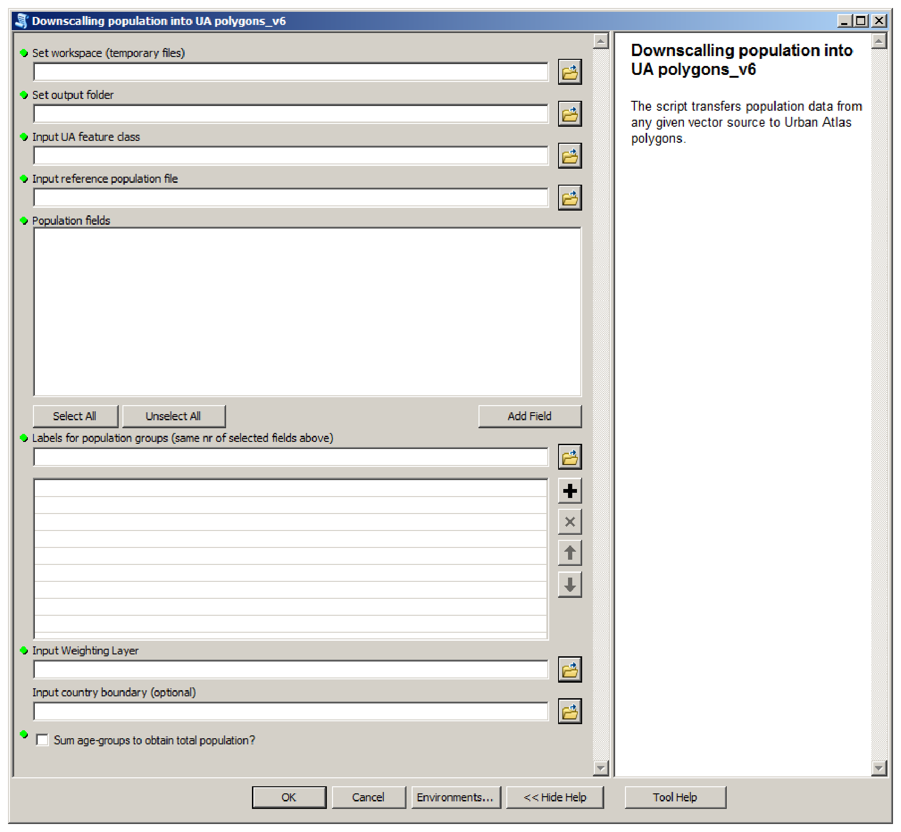
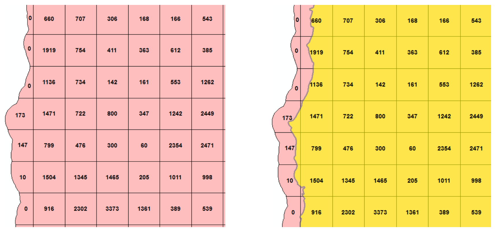
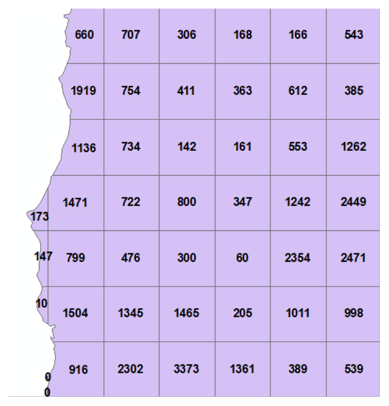
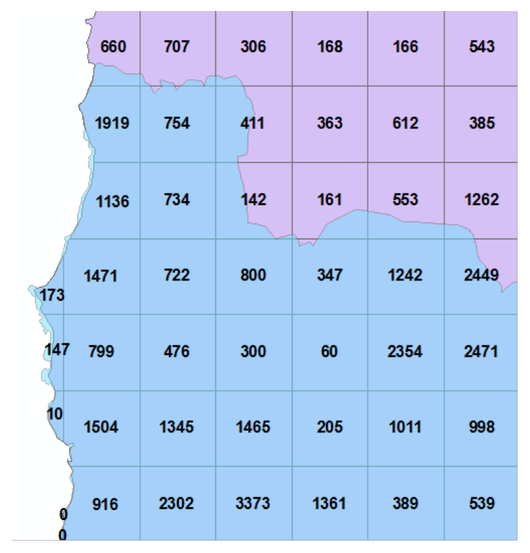
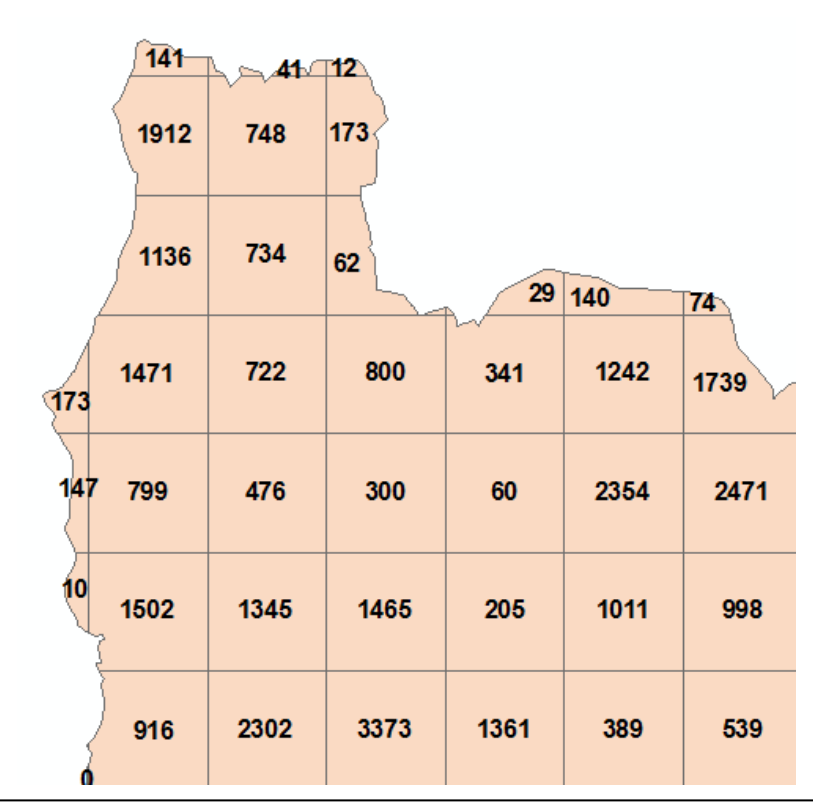

This publication is a Technical report by the Joint Research Centre (JRC), the European Commission's science and knowledge service. It aims to provide evidence-based scientific support to the European policy-making process. The scientific output expressed does not imply a policy position of the European Commission. Neither the European Commission nor any person acting on behalf of the Commission is responsible for the use which might be made of this publication.

**Contact information**
Name: Carlo Lavalle
Address: European Commission, Joint Research Centre, Via Enrico Fermi 2749, 21027 Ispra (VA), Italy
E-mail: carlo.lavalle@jrc.ec.europa.eu
Tel.: +39 0332 78 5231

**JRC Science Hub**
https://ec.europa.eu/jrc

**Land-Use-based Integrated Sustainability Assessment Modelling Platform**
https://ec.europa.eu/jrc/en/luisa

JRC103756

EUR 28194 EN

| PDF | ISBN 978-92-79-63484-0 | ISSN 1831-9424 | doi:10.2791/06831 |
|----------------|-------------------------------------------------------------------------|------------------------------------------|---------------------------------------------------------------------|

© European Union, 2016

Reproduction is authorised provided the source is acknowledged.

How to cite: Batista e Silva F and Poelman H (2016) Mapping population density in Functional Urban Areas - A method to downscale population statistics to Urban Atlas polygons. JRC Technical Report no. EUR 28194 EN. doi:10.2791/06831.

All images © European Union 2016, except front cover photo from Oliver Wendel, licensed under Creative Commons Zero. Source: unsplash.com

## Abstract

Urban Atlas 2012 is a powerful geographical dataset that describes land use/land cover at high spatial resolution for nearly 700 European Functional Urban Areas of more than 50,000 inhabitants in 31 European countries (EU28 + EFTA). The objective of the work described in this report was to enrich the Urban Atlas dataset by including estimates of residential population at the vector polygon level.

The estimation was done by downscaling, or disaggregating, census population reported at country-specific geometries (‘source geometry’) to the Urban Atlas land use/land cover polygons (‘target geometry’). The downscaling method can be described as a 'smart' areal interpolation which combined land use/land cover information from Urban Atlas, building densities from the European Settlement Map and census data. For numerous Functional Urban Areas for which population data were previously only available at coarse resolution (e.g. municipality, or 1 Km² grid cells), these newly released estimates represent a significant increase in spatial resolution, enabling diverse fine scale analyses for the whole Urban Atlas dataset.

With the free-of-charge distribution of this dataset, the number of potential users and applications of the Urban Atlas can further increase. Detailed maps of population density are very important for the study and characterisation of urban areas, and are essential inputs for urban and infrastructure planning and management, disaster risk assessment and mitigation, social policies, and analysis of quality of life and well-being. Moreover, this work further expands the knowledge base of JRC's LUISA territorial modelling platform, used to assess regional and local impacts of European trends, policies and investments.

# Introduction

**The importance of population density maps**

Detailed maps of population density are very important for the study and characterisation of urban areas. Such maps help urban practitioners design plans and policies that are based on knowledge of the urban area's population distribution profiles. Detailed and accurate information of population distribution is relevant for urban planning in general, particularly for planning of infrastructures, management of waste and utilities, disaster risk assessment and mitigation, social policies, quality of life and well-being, to mention just a few areas of application.

**Complete and consistent data for comparable assessments**

Complete and consistent data of population densities across European cities is useful if one needs to compare aspects from different cities in the wider continental context. As such, the coverage of population density maps ought to be large and representative and the maps must be as comparable as possible. This double challenge is becoming more feasible to overcome with the increasing availability of data in large quantities and high quality with which such comparable population density maps can be constructed.

One key issue is that a definition of a city or urban area based on its official administrative boundaries is a poor and misleading one. Urban areas are functional spaces which often do not match with politically defined boundaries. The Organisation for Economic Co-operation and Development (OECD) and the European Commission (EC) have recently established a harmonized definition of Functional Urban Areas (FUA) which takes into account both the population distribution and densities (urban form) and the commuting patterns to the urban centre. In simple terms, a Functional Urban Area is therefore defined as the contiguous set of municipalities which have at least 50% of their population in the urban centre (defined as the contiguous set of urban cells of 1 Km by 1 Km with a population density of at least 1500 inhabitants/Km² and a total population of at least 50,000 inhabitants), plus the surrounding municipalities for which at least 15% of the employed persons commute to the main municipality of the urban agglomeration)[^1].

**Mapping land uses and population for European Functional Urban Areas**

In their continuous efforts to improve the knowledge base for the European urban areas, the EC Directorate-General for Regional and Urban Policy (DG REGIO) and the Directorate-General

[^1]: See Dijkstra and Poelman (2012) for additional details.

for Growth, in coordination with the European Space Agency and the European Environment Agency (EEA), supported the creation of the Urban Atlas (UA) dataset. The Urban Atlas is a collection of high-resolution digital and vector land use/land cover (LULC) maps, covering hundreds of European FUAs. The UA is now part of the range of Copernicus land monitoring services, and is freely available to the public.

At the request and with the support of DG REGIO, the Directorate-General Joint Research Centre (JRC) enriched the UA dataset by estimating the number of residents in each vector polygon for all the covered FUAs. The estimated residential population remains as an additional attribute to the land-use classification, which is hoped to broaden the range of potential applications of the Urban Atlas dataset, contributing to new analyses and assessments in different thematic fields[^2]. Moreover, these new estimates are an additional element of the knowledge base of JRC's LUISA territorial modelling platform, used to assess regional and local impacts of European trends, policies and investments[^3].

The methodology used to perform the estimation combines the land-use information present in the UA dataset itself with two other key data inputs: population data derived from the latest censuses by the National Statistical Institutes (NSIs) and built-up densities derived from the JRC's European Settlement Map (ESM). By combining these three data inputs by means of Geographical Information System (GIS) operations, it is possible to produce highly detailed and comparable population density maps for all the Functional Urban Areas available in the Urban Atlas.

The estimation of residential population for the Urban Atlas polygons has already been conducted and documented in the past by JRC and REGIO[^4]. The main differences of the current work vis-à-vis the earlier experience are synthetized in table 1. In summary, in the current estimation exercise the base year is updated from 2006 to 2011-2012, the coverage in terms of number FUAs has more than doubled, population for main age-groups is present for FUAs in a selected number of countries, and improvements to the estimation methodology have been implemented, particularly by including an improved and updated representation of built-up densities and by recording the number of residents as integer numbers, instead of continuous.

[^2]: See a recent example of how population estimates for UA polygons have been used to evaluate access to green areas in Europe's cities in Poelman (2016).
[^3]: See Lavalle et al. (2016) and https://ec.europa.eu/jrc/en/luisa.
[^4]: See Batista e Silva et al. (2013a) for related report.

**Aim and structure of the report**

The aim of this report is to describe the methodology and source data used to estimate residential population in each built-up polygon of the Urban Atlas 2012 dataset. The remainder of the report is organized as follows: section 2 describes in detail the input data and methodology applied; section 3 describes the resulting product and discusses data quality issues; section 4 wraps-up the work done and sets the scene for future developments in the field of high-resolution population mapping.

::: {.tbl-caption}
```{=typst}
#set text(size: 9pt, fill: rgb("#3E6893"))
```
Table 1. Summary of main differences between the 2013 and the 2016 releases of the Urban Atlas population estimates.
:::

|                          | 2013 release                 | 2016 release                |
|-----------------------------------------------------------------------------------|-------------------------------------------------------|--------------------------------------------------------------|
| **Urban Atlas version**      | 2006                         | 2012                        |
| **No. of countries covered** | 27 (EU27)                    | 31 (EU28 + EFTA)            |
| **No. of FUAs covered**      | 301                          | 697                         |
| **Source of population data**| NSIS + GEOSTAT + Others      | NSIS + GEOSTAT              |
| Reference year           | 2006                         | 2011                        |
| Age-group data           | No                           | Yes (selected countries)*   |
| **Source for built-up density**| EEA Soil Sealing Layer       | JRC European Settlement Map |
| Reference year           | 2006                         | 2012                        |
| **Methodology**            | Areal weighting / Dasymetric | Areal weighting / Dasymetric|
| **Number type**            | Continuous (float)           | Discrete (integer)          |
Notes:
\* Belgium, Spain, Italy, Malta, Netherlands, Slovenia, and UK (except Scotland).

# Data and methods

## Key concepts and definitions

**Population data and population maps**

In very broad terms, population data can be stored in a conventional table, relational database, or geographical database. The latter form of storing population data is the most convenient because it links population counts to the respective spatial reporting units, their shape, size and geographical location. Population maps are visual representations of population distribution or density, and can nowadays be easily constructed with specialized GIS-software used to display, manage and manipulate geographical databases.

**Zoning systems**

Population maps are therefore composed of population counts for a set of individual geographical units which, altogether, form a geographical zoning system. There are various types of geographical zoning systems: administrative, statistical, analytical, and regular.

Administrative zoning systems are those composed of geographical units relevant for political and administrative purposes, such as countries, regions, municipalities or even parishes. Statistical zoning systems are those which are created deliberately for the collection and dissemination of statistical data. Examples are the European nomenclature of territorial units for statistics (NUTS), or census tracts. For practical reasons, there is often a correspondence between administrative and statistical zoning systems. Analytical zoning systems are those whose boundaries are constructed with certain underlying thematic considerations. That is the case of tessellations based on land use/land cover, soil types, climate or biogeographical regions. Finally, regular zoning systems are tessellations of space based on equally shaped and sized geographical units, e.g. a grid of squared-cells of a pre-established size.

**Residential, night-time and day-time population**

Another important preliminary consideration is the definition of residential population. Residential population refers to the number of people who declare to reside in a given location. As such, when mapping residential population we are essentially mapping the distribution of population during the night time, assuming that most people stay in their declared places of residence during the night for shelter and rest, and excluding the fraction of people who work outside their residences during night time. Conversely, the location of population during the day is determined by the location of economic, social and leisure facilities which pull population off their residences, driving commuting flows and other forms of daily trips. Day-time population distribution thus varies greatly from night-time distribution. Contrary to night-time population, which can be straightforwardly inferred by official statistics on residential population, it is extremely more challenging to infer day-time population distribution. While research is currently on-going at the JRC to advance as well in the mapping of day-time population[^5], that is not addressed in the report herein.

**The 'dasymetric' mapping method**

The estimation of residential population for the Urban Atlas polygons is done by a 'smart' areal interpolation procedure whereby counts of residents provided at a given 'source' geometry

[^5]: The JRC exploratory research project 'ENACT' is exploring methods to construct multi-temporal population distribution grid maps that reflect both daily and seasonal variations, leveraging new and unconventional ('big') data sources.

(regular grids, census tracts or commune boundaries) are transferred to the 'target' geometry, i.e. in this case the Urban Atlas polygons. The transfer, downscaling, or disaggregation, of the population counts from source to target geometry is done by means of GIS and tabular operations, whereby source geometry, target geometry, and population covariates ('ancillary' data) are combined. The combination of population counts available at a relatively coarse spatial geometry with covariates of population distribution such as land uses, building footprints, night-time lights, or street segments to generate more detailed maps of population density is typically referred in the literature as ‘dasymetric' mapping[^6].

The following sections describe in more detail the different types of input data used and how they have been combined in this work.

## Input data

**Source data: census population reported at various zoning systems**

Source data refers to the original population values reported at a given zoning system (e.g. regular grids, census tracts or commune boundaries). The spatial resolution/detail of the source data influences significantly the accuracy of the final disaggregated population maps, and so it is convenient to use the finest available source of population data for each FUA or country. As preferred option, high resolution ‘bottom-up grids' (< 1 km² cell size) were chosen as source data. Bottom-up grids refer to population values assigned to fine grid systems of regular squared cells, usually based on geo-referenced point data obtained through field surveys/censuses conducted by NSIs. Because such grids are unfortunately only available for a few countries, other sources of population data were sought, namely census tracts and commune boundaries. For the majority of the countries, however, the GEOSTAT grid 2011 was used as source data. The GEOSTAT grid is a population dataset maintained by Eurostat which reports residential population for each 1 Km² grid cell. This grid is based on the censuses carried in most countries in 2011, and largely produced by aggregating point-based population records[^7].

**Target data: Urban Atlas land use polygons**

Target data is herein defined as the set of polygonal entities for which population needs to be estimated. In this case, the target data are the polygons of the Urban Atlas dataset. The Urban Atlas 2012 is a collection of high-resolution maps of land use/land cover covering 697 Functional Urban Areas of over 50,000 inhabitants from 31 European countries (EU28 + EFTA).

[^6]: See Batista e Silva et al. (2013b) for a review of the dasymetric method.
[^7]: Further information available at: http://ec.europa.eu/eurostat/statistics-explained/index.php/Population_grids

The UA has a thematic resolution of 27 LULC classes compatible with the CORINE Land Cover nomenclature. In terms of spatial resolution, the UA is characterized by a minimum mapping unit (MMU) of 0.25 hectares for all artificial surfaces and 1 hectare for all the remaining LULC classes (agriculture, forest, wetlands and water). The UA is produced using Earth Observation (EO) data, road network datasets and topographic maps. The delineation of LULC polygons is done by using a mix of automatic methods, visual interpretation and local expertise[^8]. The UA is available for free download in the Copernicus Land Monitoring Services[^9].

**Ancillary data: European Settlement Map's built-up densities**

Lastly, as ancillary data to guide the population disaggregation process, the European Settlement Map was used. The ESM is an EO-derived, 10 metre-resolution raster dataset representing built-up areas. The pixel values represent the share of pixel covered by any built-up structure, and was produced by the JRC using innovative machine learning techniques that relate morphological and textural characteristics present in the imagery with the occurrence of built-up structures.

In the herein work, the ESM was used to populate each UA polygon with a built-up area estimate, which is then used as a weight in the population disaggregation process. This of course assumes a positive relationship between share of built-up area and population density. An important shortcoming of the ESM is that it only captures the horizontal density of built-up, while missing the vertical dimension. The implication is that the volume of built-up (a better predictor of population presence) cannot be derived. Building heights could be derived, for example, from airborne LIDAR sensor data, but their acquisition for all the European space is still unviable[^10].

Table 2 summarizes the data used in this project.

[^8]: For additional details on the technical specifications and methodologies applied to produce the UA, refer to the report European Commission (2016).
[^9]: http://land.copernicus.eu/local/urban-atlas/urban-atlas-2012/
[^10]: The Spanish Instituto Geografico Nacional provides free access to a LIDAR data for Spain (http://pnoa.ign.es), but this is still a relatively isolated initiative among European countries.

::: {.tbl-caption}
```{=typst}
#set text(size: 9pt, fill: rgb("#3E6893"))
```
Table 2. Input data used.
:::

```{=html}
<table>
<colgroup>
<col style="width: 34.5%">
<col style="width: 26.7%">
<col style="width: 16.7%">
<col style="width: 22.1%">
</colgroup>
<tr>
    <td><b>Data category</b></td>
    <td><b>Description</b></td>
    <td><b>Reference year</b></td>
    <td><b>Coverage</b></td>
  </tr>
  <tr>
    <td rowspan="4" style="vertical-align:middle">Source</td>
    <td>Type 1: High resolution bottom-up grids (&lt;1km)</td>
    <td rowspan="4" style="text-align:center;vertical-align:middle">2011*</td>
    <td>Estonia, Finland, Slovenia**</td>
  </tr>
  <tr>
    <td>Type 2: Census tracts</td>
    <td>Belgium, Cyprus***, Spain, Italy, Malta, Netherlands, Poland, Portugal, United Kingdom</td>
  </tr>
  <tr>
    <td>Type 3: Municipal/parish boundaries</td>
    <td>Luxembourg, Latvia</td>
  </tr>
  <tr>
    <td>Type 4: Medium resolution bottom-up or hybrid grid (1km) (GEOSTAT grid)</td>
    <td>The remainder EU28 + EFTA countries</td>
  </tr>
  <tr>
    <td>Target</td>
    <td>Urban Atlas polygons (only the polygons presumed to be populated)</td>
    <td style="text-align:center">2011-2013</td>
    <td>EU28 + EFTA</td>
  </tr>
  <tr>
    <td>Ancillary</td>
    <td>European Settlement Map</td>
    <td style="text-align:center">2012</td>
    <td>EU28 + EFTA</td>
  </tr>
</table>
```
Notes:  
\* Except Finland (2012) and the Netherlands (2014).  
\*\* Estonia: mixed grid (100m for urban areas; 500m suburban areas; 1Km for rural areas); Finland: 250m grid; Slovenia: 100m grid.  
\*\*\* Only for the areas under the effective control of the Government of the Republic of Cyprus.

## Methods

**Main assumptions and weighting scheme**

When transferring source population to the target zones, the Urban Atlas classes were classified into three major categories relevant to population distribution. This pre-classification is the first main assumption.

-   Category 1: LULC classes for which population shares are assumed to be directly proportional to the amount of built-up detected in the ESM;
    -   'Urban fabric' classes (1.1.X.X), ranging from high to very low density urban fabric, plus the class 'isolated structures' (1.1.3.0);
    -   'Agricultural areas' (2.X.X.X).
-   Category 2: LULC classes assumed to contain only residual amounts of resident population:
    -   'Industrial, commercial, public, military and private units' (1.2.1.0);
    -   'Port areas' (1.2.3.0);
    -   'Sports and leisure facilities' (1.4.2.0);
-   Category 3: LULC classes assumed to have no resident population:
    -   All remaining classes.

The above identified LULC class categories are treated differently in the disaggregation process. LULC classes in category 3 are not allowed to contain any population. Conversely, for all the polygons for which residential population is warranted (LULC classes from categories 1 and 2 above), the total built-up area, as derived from the ESM raster at 10 metre resolution, is determined. This is done using the so-called ‘zonal statistics' function from the GIS software. For LULC classes in category 2, however, the amount of built-up area is further modified by a numerical factor which accounts for the presumption that only a small fraction of the built-up areas found in these land use polygons are used for residential purposes. This factor was set to 0.05. The built-up area for each polygon is then used as a weighing factor in the disaggregation process.

For illustration purposes, table 3 shows the average building densities per LULC class found in the FUA of Lisbon, Portugal.

::: {.tbl-caption}
```{=typst}
#set text(size: 9pt, fill: rgb("#3E6893"))
```
Table 3. Average share of built-up per LULC class in the FUA of Lisbon, Portugal.
:::

| LULC class code | LULC class description                                  | Average share of built-up\* |
|-------------------------------------------------------|-----------------------------------------------------------------------------------------------|---------------------------------------------------|
| **1.1.1.0**     | Continuous urban fabric                                 | 48.8%                       |
| **1.1.2.1**     | Discontinuous dense urban fabric                        | 38.9%                       |
| **1.1.2.2**     | Discontinuous medium density urban fabric               | 29.5%                       |
| **1.1.2.3**     | Discontinuous low density urban fabric                  | 24.7%                       |
| **1.1.2.4**     | Discontinuous very low density urban fabric             | 20.3%                       |
| **1.1.3.0**     | Isolated structures                                     | 20.1%                       |
| **1.2.1.0**     | Industrial, commercial, public, military and private units | 39.4% (2.0%)\*\*            |
| **1.2.3.0**     | Port areas                                              | 33.5% (1.7%)\*\*            |
| **1.4.2.0**     | Sport and leisure facilities                            | 21.8% (1.1%)\*\*            |
| **2.X.X.X**     | Agricultural areas                                      | 4.2%                        |
Notes:
\* Calculated as total built-up surface divided by total area of polygon of LULC class.
\*\* In parenthesis the built-up density after applying the residential share factor.

**Disaggregation**

To redistribute population from the source to the target spatial units, source and target layers are first intersected geometrically through a GIS operation, resulting in a third layer which we will refer to as 'transitional' geometry. It contains unique combinations between all overlapping source polygons s ∈ S and urban atlas polygons t ∈ T, so that t ∈ T ∩ S. This yields a set of areal units indicated by i that can be aggregated to source polygons, indicated by s, or to urban atlas polygons, indicated by t. The next step is to estimate the population for each polygon of the transitional geometry. The following, standard formulation was used:

$$P_{i,g} = P_{s,g} \cdot \frac{A_i}{\sum_{i} A_i}$$

where:

$P_{i,g}$ corresponds to estimated population in a given polygon $i$ of the transitional geometry;

$g$ corresponds to an age-group of $k$ possible age-groups. Typically, $k=1$ (when age-group breakdown is absent), or $k=3$, with $g \in \{\le 14, 15:64, \ge 65\}$;

$P_s$ is the known population in the source polygon $s$;

$A_i$ is the total built-up area within polygon $i$;

$n$ corresponds to the number of transitional polygons within each source polygon.

At this point, $P_{i,g}$ is a continuous numerical value. Given that population only occurs in discrete numbers, a procedure is then implemented to convert the continuous numerical values into discrete ones. Simply rounding the numbers was not appropriate because it would almost inevitably result in a total population for the FUA different (even if slightly) from the original total. The applied procedure starts by rounding down the initial estimates of population for each transitional polygon $i$:

$$P'_{i,g} = \text{floor}(P_{i,g})$$

This leaves a remainder population $R$ in each polygon $i$:

$$R_i = P'_i - P''_i$$

$R_{FUA}$ is then calculated as the sum of $R_i$ in all $i$ polygons within the FUA, and corresponds to the total amount of population which needs to be reallocated among $i$ polygons to ensure consistency between total population in the FUA and the sum of population in all transitional polygons. In the equation below, $d$ is the total number of $i$ polygons within the FUA:

$$R_{FUA} = \sum_{i}^{d} R_i$$

Because $R_i$ is smaller than 1 in all $i$ polygons, $R_{FUA}$ is necessarily smaller than $d$. Therefore, if we select a $R_{FUA}$ number of $i$ polygons and warrant an additional inhabitant we ensure that the sum of population values in all $i$ polygons corresponds to the original total population in the FUA. In order make the selection, we first sort $R_i$ values in a descending sequence (from highest remainder population to lowest). The sequence is stored as variable $O_i$:

$$O_i = \text{sort}(R_i), \text{with } O_i \in \{1:d\}$$

Subsequently, we grant one additional inhabitant in polygons $i$ ranked higher than the $R_{FUA}$-th position (i.e. the highest $R_i$ remainders):

$$
P''_{i,g} = \begin{cases} P'_{i,g} + 1 & \text{if } O_i \le R_{FUA} \\ P'_{i,g} & \end{cases}
$$

This results in an integer number of people $P''_{i,g}$, where $\sum P''_{i,g} = P_{FUA,g}$. Finally, the estimated population for each Urban Atlas polygon $t$ is simply:

$$P_{t,g} = \sum_i P''_{i,g}$$

where $j$ corresponds to the number of transitional polygons within each target polygon of the Urban Atlas dataset. Total population for $P_t$ can be obtained:

$$P_t = \sum_g^k P_{t,g}$$

**Software used**

The disaggregation was implemented using ArcGIS geoprocessing tools. A script written in Python programming language, and accessible as a tool within the ArcGIS environment was created to facilitate the processing and allow batch processing.

The tool accepts any type of source data in vector format. Other parameters are used to specify the fields that contain population data (total population and/or population per age-groups) and the desired output field names. The ‘weighting layer' parameter refers to the built-up density map in raster format. If a country boundary is provided, the source vector file is first clipped by the country boundary (see Appendix 1, 'step 1').

If the final parameter is checked, the population age-groups are summed for each row/polygon to achieve total population as a new field. This option, however, should only be checked in case the sum of the age-groups is equivalent to the total population in the source data. Due to privacy issues, that is not the case for some countries. In such cases, the parameter should not be checked, resulting in that both age-groups and total population are disaggregated separately.

Log files are produced and stored in the specified workspace with information regarding any errors that might have occurred and with the date and duration of the geoprocessing. The implemented technical solution allows an easy re-run of specific cities whenever source data of superior quality become available. Figure 1 shows the interface of the tool.



# Results and data quality

The final output is a conventional DBF-format table with the following fields:

-   `UATL_ID`: unique identifier for each Urban Atlas polygon. This field allows establishing the link with the Urban Atlas geometry.
-   `Pop_tot`: Total residential population.
-   `Pop_0_14`: Residential population until 14 years of age.
-   `Pop_15_64`: Residential population between 15 and 64 years of age.
-   `Pop_65`: Residential population above 64 years.

Figure 2 shows the inputs used for the disaggregation of population in the FUAs of Lisbon and Budapest and the respective results as population density per Urban Atlas polygon. Figure 3 shows results for the FUAs of Brussels and Rome, for which population data with age-group breakdown were available.

**Considerations on data quality and comparability of estimates**

In a disaggregation procedure such as the one herein described, the outcome is never less accurate than the original source data. By disaggregating numerical data from one coarse geometry to a finer one, there is always a gain in detail and a better approximation to ground truth without the risk of deteriorating the source information. The degree to which the disaggregation approximates reality, however, varies greatly, and depends chiefly on two factors: 1) the quality of the ancillary data and 2) the appropriateness of the disaggregation algorithm and its parameters.

Because the above mentioned factors were equal in all FUAs (same ancillary data, and same algorithm and parameters), the quality of the disaggregation per se is constant across Europe. However, the overall accuracy of the population estimations for the Urban Atlas polygons may differ between FUAs depending on the spatial resolution of the source population data. Ceteris paribus, FUAs for which source population was available at higher spatial resolution are characterized by polygon-level population estimates of higher accuracy.

In table 2, four types of source data were presented depending on the spatial resolution. Source data of type 1 refers to high-resolution bottom-up grids. FUAs for which this type of data has been used have the highest accuracy levels, in particular Slovenia, for which a grid of 100 x 100m was available. Subsequently, source data of type 2, referring to census tracts, are expected to deliver the next highest overall accuracies thanks to the typically very small size of census zones. However, contrary to regular grids, census tracts have irregular shapes and sizes, leading in fact to a spatially heterogeneous resolution (i.e. higher within urbanised settings, lower in rural areas). Source data of type 4, referring to the GEOSTAT grid should lead to the third highest accuracies, in particular for countries where the grid has been produced by aggregating point-data[^11]. Finally, source data of type 3 – municipal or parish boundaries – should deliver the lowest accuracies.

The diversity of source data used poses the question of comparability of estimates between FUAs. Before using the estimates for comparisons between FUAs, one should bear in mind the following rules of thumb:

1.  FUAs belonging to the same country are comparable in terms of the population estimation quality;
2.  Idem for FUAs for which the source population data is of equal spatial resolution;
3.  For FUAs for which source data is of different spatial resolution, comparisons between FUAs are admissible depending on the spatial scale of the application[^12].

In the 2013 release of the Urban Atlas population estimation[^13], a validation of the population estimates for a selection of FUAs was undertaken. Given the small changes to the nature of the input data and to the disaggregation method applied, no significant differences to the earlier validation results are expected.

[^11]: For details, refer to the GEOSTAT grid product specifications here: http://ec.europa.eu/eurostat/web/gisco/geodata/reference-data/population-distribution-demography.
[^12]: If the spatial scale of application is the neighbourhood level, then population estimations for FUAs based on high-resolution grids and census tracts should be fairly comparable. For applications of a spatial scale equal or greater than 1Km², population estimations for all FUAs are comparable, except those based on source data of type 3 (municipal/parishes).
[^13]: Batista e Silva et al. (2013a).

# Concluding remarks

The work herein presented resulted in an enriched Urban Atlas dataset with an estimate of residential population for each vector polygon. This enables diverse analyses at fine scale for the whole UA dataset which comprehends nearly 700 European Functional Urban Areas of more than 50,000 inhabitants in 31 countries (EU28 + EFTA). For countries like Belgium, Spain, Italy, Malta, Netherlands, Slovenia, and UK (except Scotland), population is also broken-down in 3 main age-groups: <15, 15-64, >64.

The residential population estimates for the UA polygons were produced by downscaling census population counts from country-specific source geometries. This was done by combining the most up-to-date and state-of-the-art geographical layers concerning land use/land cover, built-up density, and census population, using spatial and tabular operators from Geographical Information Systems software. The downscaling procedure allows gaining additional detail and insight regarding actual population distribution without deteriorating the original population data sources. Countries for which the dataset is most reliable are all those for which the downscaling was performed from bottom-up grids or census tracts, as reported in table 2.

UA population estimates have already been used for various assessments by the European Commission services. The current release will become freely available to the wider public through the European Copernicus Land Monitoring Services website, thus expanding greatly the number of potential users and applications of this enriched Urban Atlas dataset.

Many European countries produce already today point-based population registers. This would allow – by means of simple spatial aggregation operations – the production of population datasets for any desired type of zoning system and resolution. However, due to privacy and data protections issues, many countries still refrain from disclosing bottom-up population data at high grid resolution (< 1 Km²). In other cases, high-resolution grids are available but not free of charge. In the longer term, the expected (and hoped) increase of freely available bottom-up grids at high resolution could progressively fade the need for population disaggregation methods. Until disaggregation cannot be fully discarded, current methods are fairly mature given the existing available ancillary data. Significant improvements to the disaggregation accuracies are now dependent on the widespread of new datasets that allow deriving building volume (such as building heights, nr. of floors, floor area) and building use (residential, commercial, mixed, etc.).

Another strand of innovative research regards the mapping of day-time population, requiring the use of new and unconventional (‘big') data sources. Although not addressed in this report, on-going research at the JRC (ENACT project) aims at developing methods to map multi-temporal population distribution, so to take into account daily and seasonal variations of population. Detailed knowledge of population distribution is an essential element for JRC's LUISA Territorial Modelling Platform.


# Acknowledgements

To Emile Robe and Olivier Draily from GIS team in DG REGIO with whom we interacted throughout the whole production process of the population estimations for the Urban Atlas polygons. To Mario Marin (JRC) who helped in various practical tasks of this project. To Chris Jacobs Crisioni (JRC) who suggested the method to allocate discrete population numbers. To all NSIs who are disclosing population data at increasing levels of spatial and thematic disaggregation, thus contributing to improved research and policy support.

# References

Batista e Silva F, Gallego J, Lavalle C (2013b) A high-resolution population grid for Europe. Journal of Maps 9(1): 16-28. Online: http://www.tandfonline.com/doi/abs/10.1080/17445647.2013.764830

Batista e Silva F, Poelman H, Martens V, Lavalle C (2013a) Population Estimation for the Urban Atlas Polygons. JRC technical report no. EUR 26437 EN. Publications Office of the European Union. Online: http://bookshop.europa.eu/en/population-estimation-for-the-urban-atlas-polygons-pbLBNA26437/

Dijkstra L and Poelman H (2012) Cities in Europe – the new OECD-EC definition. Regional focus 01/2012. Online: http://ec.europa.eu/regional_policy/sources/docgener/focus/2012_01_city.pdf.

European Commission (2016) Mapping Guide for a European Urban Atlas. Online: http://land.copernicus.eu/user-corner/technical-library/urban-atlas-mapping-guide

Lavalle C, Batista e Silva F, Baranzelli C, et al. (2016) Land Use and Scenario Modeling for Integrated Sustainability Assessment, in J Feranec et al. (eds.) European Landscape Dynamics: CORINE Land Cover Data. CRC Press - Taylor & Francis Group. pp. 237-262.

Poelman H (2016) A walk to the park? Assessing access to green areas in Europe's cities. Working paper 01/2016. Online: http://ec.europa.eu/regional_policy/sources/docgener/work/2016_03_green_urban_area.pdf

# List of abbreviations

**DG JRC**
Directorate-General Joint Research Centre

**DG REGIO**
Directorate-General for Regional and Urban Policy

**DG**
Directorate-General

**EC**
European Commission

**EEA**
European Environment Agency

**EFTA**
European Free Trade Association

**EO**
Earth Observation

**ESM**
European Settlement Map

**EU**
European Union

**FUA**
Functional Urban Area

**GIS**
Geographical Information Systems

**LIDAR**
Light Detection And Ranging

**LUISA**
Territorial Modelling Platform

**LULC**
Land use/land cover

**MMU**
Minimum mapping unit

**NSI**
National Statistical Institute

**OECD**
Organisation for Economic Co-operation and Development

**UA**
Urban Atlas

# Appendix 1: Border adjustments

The source population data comes in various forms/geometries: regular grids, census tracts and commune boundaries. The geometry of the source data may not always coincide with the target geometry, particularly when the source data comes as a regular grid. The mismatch is troublesome along the coastline and country borders.

It is common to find populated cells which have a portion of area covered by the sea, but whose reported population refers only to the actual land surface of the cell. Similarly, in a grid of cells reporting population for country A, some of those cells will also include a portion of area of a neighbouring country B. In such situations, the source data has to be clipped by the boundary of the country, thus removing the unpopulated surface from the cell.

In addition, the spatial extent of the Functional Urban Areas is smaller than the extent of the source data. Therefore, remaining source cells ought to be clipped by the border of the FUA and its population adjusted. The adjustment is done through a simple areal weighting rule.

These preparatory steps related to the source data are part of the downscaling procedure. The following sequence of images and respective labels illustrate the adjustments mentioned above.

Original source data (grid), with respective total population per cell. The actual land area, in yellow.



Step 1: The grid cells are clipped by the country border. Population values are kept the same.



Border of the Functional Urban Area, in blue.



Step 2: The grid cells are clipped by the border of the Functional Urban Area. Population in clipped cells is adjusted through simple areal weighting. The resulting grid is used in the subsequent disaggregation steps.



> Europe Direct is a service to help you find answers to your questions about the European Union
>
> Free phone number (*): 00 800 6 7 8 9 10 11
> (*) Certain mobile telephone operators do not allow access to 00 800 numbers or these calls may be billed.
>
> A great deal of additional information on the European Union is available on the Internet.
> It can be accessed through the Europa server http://europa.eu
>
> **How to obtain EU publications**
>
> Our publications are available from EU Bookshop (http://bookshop.europa.eu),
> where you can place an order with the sales agent of your choice.
>
> The Publications Office has a worldwide network of sales agents.
> You can obtain their contact details by sending a fax to (352) 29 29-42758.

**JRC Mission**

As the science and knowledge service of the European Commission, the Joint Research Centre's mission is to support EU policies with independent evidence throughout the whole policy cycle.


**EU Science Hub**
ec.europa.eu/jrc

@EU_ScienceHub

EU Science Hub - Joint Research Centre

Joint Research Centre

EU Science Hub

doi:10.2791/06831  
ISBN 978-92-79-63484-0