User Manual Copernicus Land  Monitoring Service

CORINE Land Cover

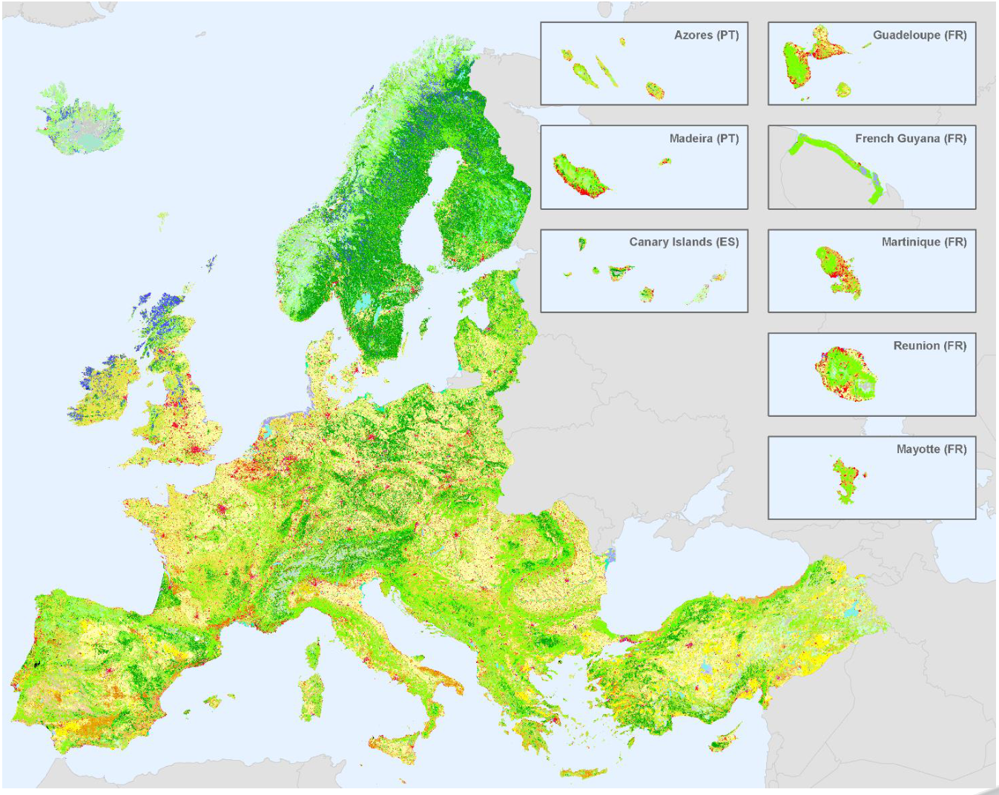

Contact:

Copernicus Land Monitoring Service (CLMS)

European Environment Agency (EEA)

Kongens Nytorv 6 – 1050 Copenhagen K. – Denmark

https://land.copernicus.eu/

|Document version:|1.0|
|--|--|
|Document date:|20 April 2021|

Lead service provider for data production:

NT (National Teams) within EIONET National Reference Centres Land Cover (NRC) with support from EEA/ETC ULS (European Environment Agency/European Topic Centre Urban Land and Soil)

User Manual prepared by:

György Büttner(Environment Agency Austria)

Barbara Kosztra, Gergely Maucha, Róbert Pataki(Lechner Non-profit Ltd)

Stefan Kleeschulte (space4environment)

Gerard Hazeu, Marian Vittek(Wageningen Environmental Research)

Christoph Schröder (University Malaga)

AndreasLittkopf (Environment Agency Austria)

# Disclaimer:

© European Union, Copernicus Land Monitoring Service 2021, European Environment Agency (EEA)

All Rights Reserved. No parts of this document may be photocopied, reproduced, stored in retrieval system,  or transmitted, in any form or by any means whether electronic, mechanical, or otherwise without the prior written permission of the European Environment Agency.

## Content

I. Executive summary.................................................................................................................................... 7

II. Guide for the reader.................................................................................................................................. 9

Who is this guide for?................................................................................................................................ 9

Content and structure ............................................................................................................................... 9

Applicable documents............................................................................................................................. 10

III. History of CORINE Land Cover................................................................................................................. 11

Early user requirements.......................................................................................................................... 11

The evolution of CORINE Land Cover ...................................................................................................... 12

Recent user requirements....................................................................................................................... 17

Outlook to CLC+....................................................................................................................................... 20

IV. Product application areas and/or examples of use cases....................................................................... 23

European level applications..................................................................................................................... 23

National and regional applications.......................................................................................................... 24

V. Product description ................................................................................................................................. 25

Technical specifications........................................................................................................................... 26

CLC status layer products........................................................................................................................ 28

CLC-Change products............................................................................................................................... 30

CLC accounting layers.............................................................................................................................. 33

VI. Product methodology and workflow....................................................................................................... 34

Workflow of CORINE Land Cover inventories ......................................................................................... 34

Mapping CLC Changes............................................................................................................................. 36

Creation of CLC status layer..................................................................................................................... 42

Semi-automated and bottom-up approaches applied in CLC ................................................................. 44

European products.................................................................................................................................. 47

VII. Quality assessment.................................................................................................................................. 50

Verification of CLC data ........................................................................................................................... 50

Validation of CLC data ............................................................................................................................. 52

VIII. How to use CLC? ...................................................................................................................................... 59

CLC Changes between consecutive inventories...................................................................................... 59

|CLC Changes between non-consecutive inventories...............................................................................|60|
|--|--|
|IX. Terms of use and product technical support ..........................................................................................|63|
|Terms of use ............................................................................................................................................|63|
|Citation ....................................................................................................................................................|63|
|Product technical support .......................................................................................................................|63|
|X.   References...............................................................................................................................................|64|
|XI. Annexes...................................................................................................................................................|67|
|Annex 1: The standard CORINE Land Cover nomenclature (class names only) ......................................|67|
|Annex 2: Naming convention of CLC products........................................................................................|68|
|Annex 3: Responsible national organisations producing CLC2018 .........................................................|70|
|Annex 4: CLC generalisation table...........................................................................................................|71|
|Annex 5: CORINE Land Cover accounting layers .....................................................................................|72|
|Annex 6: Selected use cases of CORINE Land Cover ...............................................................................|74|

## LIST OF FIGURES

|Figure 1: Support of enhancement ideas for CLC...........................................................................................|18|
|--|--|
|Figure 2: The concept of \(2^{\mathsf{n d}}\) generation CORINE Land Cover and the CLC+ product suite............................|21|
|Figure 3: CLC2018 database covering European area of EEA38 countries and the UK..................................|25|
|Figure 4: Comparison of minimum mapping units (MMU) of status layer (left) and change layer (right) ....|27|
|Figure 5: Consistent mapping of CLC Change (AD03).....................................................................................|37|
|Figure 6: Approaches for CLC update (AD03)..................................................................................................|38|
|Figure 7: Change mapping example from the Manual of CORINE Land Cover changes (AD04).....................|40|
|Figure 8: Mapping linear features using complex changes (AD04).................................................................|41|
|Figure 9: Steps of creating CLC2018 by combining revised CLC2012 with CLC-Change2012-2018.......................|44|
|Figure 10: Production of CLC-Change2006-2012 and CLC2012 by using high resolution national data in Spain|46|
|Figure 11: Validation of CLC data by means of LUCAS LU/LC point survey and field photographs ................|54|
|Figure 12: Biogeographic regions of Europe used for stratification of CLC for validation (EEA, 2016)...........|56|
|Figure 13: The effect of generalization of <25 ha changes on the new status layer.......................................|59|
|Figure 14: Comparison of CLC2006 produced by photointerpretation (left) and by generalisation from SIO(right)...............................................................................................................................................................|SE  61|

## LIST OF TABLES

Table 1: The evolution of CORINE Land Cover ................................................................................................ 12

Table 2: Attributes for CLC vector status data ................................................................................................ 29

Table 3: Attributes for CLC raster status data ................................................................................................. 30

|Table 4: Attributes for CLC-Change vector data..............................................................................................|31|
|--|--|
|Table 5: Attributes for CLC-Change raster data (consumption part) ..............................................................|32|
|Table 6: Attributes for CLC-Change raster data (formation part) ...................................................................|32|
|Table 7: Work packages of a CORINE Land Cover inventory (case: CLC2018) ................................................|34|
|Table 8: Standard CLC deliveries produced by CORINE Land Cover National Teams......................................|47|
|Table 9: Comparison of accuracies of validation obtained for CLC2012 and CLC2018 (AD08).......................|57|
|Table 10: Comparison of accuracies of validation obtained for CLC-Change2006-2012 and CLC-Change2012-2018||
|(AD08)..............................................................................................................................................................|57|

## ABBREVIATIONS

|AD|Applicable Document|
|--|--|
|AEI|Agri-environmental indicators|
|CAP|Common Agriculture Policy (EC)|
|CAPI|Computer Assisted Photointerpretation|
|CBD|Convention on Biological Diversity|
|CDR|Central Data Repository|
|CLC|CORINE Land Cover|
|CLC-Change|the database of CLC changes|
|CLC change or CLC changes|the CORINE Land Cover change / changes themselves|
|CLC+|2nd generation CORINE Land Cover|
|CLMS|Copernicus Land Monitoring Service|
|CLRTAP|Convention on Long-Range Transboundary Air Pollution (UNECE)|
|CORINE|Coordination of Information on the Environment|
|CSI|Core Set of Indicators (EEA)|
|DBTA|Data Base Technical Acceptance|
|DG Agri|Directorate-General for Agriculture and Rural Development (EC)|
|DG DEFIS|Directorate-General for Defence Industry and Space|
|DG ENTR|Directorate-General Enterprise and Industry (EC)|
|DLM-DE|Digital Landscape Model for Germany|
|DOM|Départments d’outre-mer (French Overseas Territories)|
|EAGLE|EIONET Action Group on Land monitoring in Europe (EEA)|
|EC|European Commission|
|EEA|European Environment Agency|
|EEA39|39 members and cooperating countries of EEA (until 2020)|
|EEA38|38 members and cooperating countries of EEA (after Brexit in 2020)|
|EIONET|European Environment Information and Observation Network|
|EO|Earth Observation|
|EPSG|a public registry of spatial reference systems, created by European PetroleumSurvey Group|
|ESA|European Space Agency|
|ETC|European Topic Centre|
|ETRS89|European Terrestrial Reference System 1989|
|EUNIS|European Nature Information System|
|FPI|Fire Proneness Index|
|GE|Google Earth|
|GHG|greenhouse gas|
|GI|green infrastructure|
|GIO|GMES Initial Operations|
|GMES|Global Monitoring for Environment and Security (named Copernicus since late 2012)|
|ha|hectare (=100 m x 100 meter area)|
|HNV|High Nature Value|
|HRL|high resolution layer(s)|
|IRS|Indian Remote Sensing Satellite|
|JRC|European Commission DG Joint Research Centre|
|LAEA|Lambert Azimuthal Equal Area projection|
|Landsat|Series of US Earth observation satellites|
|LEAC|Land and Ecosystem Accounting|
|LC|Land Cover|
|LCF|Land Cover Flows|
|LISS|Linear Imaging Self-Scanning Sensor (on board of Indian Resourcesat satellites)|
|LSI|Land and Soil Indicators|
|LPIS|Land Parcel Identification Service|
|LU|Land Use|
|LUCAS|Land Use/Cover Area Frame Statistical Survey (Eurostat)|
|LUISA|Land Use based Integrated Sustainability Assessment|
|LULUCF|Land use, land-use change, and forestry (UN)|
|MAES|Mapping and Assessment of Ecosystems and their Services (EC)|
|MMU|Minimum Mapping Unit|
|MMW|Minimum Mapping Width|
|MSS|Multispectral Scanner (sensor on board of early US Landsat satellites)|
|NIR|Near Infrared (spectral band)|
|NRC|National Reference Centre (of the EIONET)|
|NUTS|Nomenclature des Unités territoriales statistiques|
|NT|National Team|
|OSM|Open Street Map (OpenStreetMap)|
|QA|Quality Assurance|
|QC|Quality Control|
|RapidEye|constellation of German Earth observation satellites|
|SDG|Sustainable Development Goals (EC, Eurostat)|
|SEBI|Streamlining European Biodiversity Indicators (EEA)|
|SIOSE|Sistema de Información de Ocupación del Suelo en España|
|SPOT|Series of French Earth Observation satellites|
|S-2|Sentinel-2, ESA EO satellites within Copernicus Programme (S-2A and S-2B)|
|SWIR|Short-wave infrared (spectral band)|
|TM|Thematic Mapper (sensor on board of US Landsat satellites)|
|TT|(CLC) Technical Team|
|UMZ|Urban Morphological Zones|
|UNECE|United Nations Economic Commission for Europe|
|WMS|Web Map Service|
|WP|Work Package|

# I. Executive summary

Copernicus is the European Union's Earth Observation Programme. It offers information services based on satellite Earth observation and in situ (non-space) data. These information services are freely and openly accessible to their users through six thematic Copernicus services (atmosphere monitoring, marine environment monitoring, land monitoring, climate change, emergency management and security).

The Copernicus Land Monitoring Service (CLMS) provides geographical information on land cover and  its changes, land use, vegetation state, water cycle and earth surface energy variables to a broad range  of users in Europe and across the world in the field of environmental terrestrial applications.

CLMS is jointly implemented by the European Environment Agency (EEA) and the European Commission DG Joint Research Centre (JRC).

CORINE Land Cover (CLC) is the oldest and most sought-after database of CLMS. CLC was specified to  standardize data collection related to land in Europe to support environmental policy development.  The reference year of the first CLC inventory was 1990 (CLC1990), and the first update was created in  2000. Further inventories followed with an update cycle of 6 years. The project is implemented by  national teams under the management, guidance and close quality control of EEA. The number of  participating countries has increased over time − currently includes 32 EEA member countries and the  UK and six cooperating countries (EEA38 and the UK) with a total area of nearly 6 Mkm2. Orthocorrected high spatial resolution satellite images provide the geometrical and thematic basis for  mapping. In-situ data (topographic maps, ortho-photos and ground survey data) are essential ancillary  information. The basic technical parameters of CLC have not changed since the beginning: 1) the  nomenclature including 44 classes (on level-3) in five main land cover / use groups: Artificial surfaces,  Agriculture, Forests and seminatural areas, Wetlands and Water; 2) the geometric detail: 25 hectare  minimum mapping unit (MMU) and 100 meter minimum mapping width (MMW). The layer of CORINE  Land Cover Changes (CLC-Change) is produced since the second CLC inventory (CLC2000). CLC-Change is created by direct mapping of changes taking place between two consecutive inventories, based on  visual image-to-image comparison of satellite images. Change mapping applies a 5 ha MMU to pick up  more detail in the CLC-Change layer than in the CLC status layer. Integration of national CLC and CLCChange data includes some harmonization along national borders. European validation studies have  shown that the achieved thematic accuracy is above the specified minimum (85 %). Primary CLC and  CLC-Change data are produced in vector format with polygon topology. Derived products in raster  format are also available. The seamless European CLC and CLC-Change time series data (CLC1990,  CLC2000, CLC2006, CLC2012, CLC2018 and related CLC-Change data) are distributed in the standard  European Coordinate Reference System defined by the European Terrestrial Reference System 1989  (ETRS89) datum and Lambert Azimuthal Equal Area (LAEA) projection (EPSG: 3035). Results of the CLC  inventories can be downloaded from the Copernicus Land Monitoring Service site free of charge for all  users for any use. CLC data contribute to a wide range of studies and applications with European  coverage, e.g.: ecosystem mapping, modelling the impacts of climate change, landscape fragmentation  by roads, abandonment of farmland and major structural changes in agriculture, urban sprawl, water management.A harmonization methodology has been developed to allow a statistically solid basis for CLC time series analysis by means of the so-called CLC accounting layers .

The future CLC+concept is underdevelopment, aiming the continuation of the CLC time series, by making benefit of high spatial and temporal resolution satellite imagery(ESA Sentinels), thematic data provided by Member States and advanced information extraction techniques .

# II. Guide for the reader

## Who is this guide for?

The product User Manual is the primary document that users are recommended to read before using  the CLC product. It provides an overview of the product characteristics, product methodology and  workflows, user requirements and example/potential use cases, information about the quality assessment checks and their results as well as product technical support.

This guide has been developed primarily for stakeholders and users from the public and private sectors  and civil society (on the fields of environment, agriculture, rural development, statistics, mapping,  monitoring among others). It also aims to provide information for policy makers and Member State  officials involved in the European, national and regional planning and evaluation processes of e.g. land  management, environmental management, agriculture. Other readers with potential interests in the  contents of this guide are citizens of EEA38 and the UK with interests in environmental policies, such  as researchers, journalists, and civil society organizations. However, the guide is intentionally more  focused on the needs of technical users of the data.

## Content and structure

The document provides information to the user that helps understand which CLC product is suitable  for the intended purpose, and how they should be used (Chapter VIII), further illustrating this with many real use case examples (Chapter IV). By explaining the content, methodology and quality of CLC (Chapters V, VI and VII) the guidelines allow the reader to properly interpret the figures and results  derived from CLC products. Information on formats, naming conventions and access (Chapters V and  IX) help hands-on work with the data.

The document is structured as follows:

• Chapter III recalls the history of CORINE Land Cover (1985-2020) incl. early user requirements and recent user requirement. 

• Chapter IV presents potential application areas and/or example use cases covering EU-level applications as well as examples of national applications.

• Chapter V presents technical specifications and product descriptions (product file naming  convention and format(s), product content and characteristics).

• Chapter VI provides a description of the product methodology and workflows.

• Chapter VII summarizes the quality assessment and/or validation procedure and the results. 

• Chapter VIII is about practical advices to users: how to use CLC?

• Chapter IX provides information about product access and use conditions as well as the technical  product support.

• Chapter X lists references to the cited literature.

• Chapter XI provides annexes.

## Applicable documents

|Reference|Content|Location of document|
|--|--|--|
|AD01|CLC nomenclature guidelines (pdf)|https://land.copernicus.eu/user-corner/technical-library/corine-land-cover-nomenclature-guidelines/docs/pdf/CLC2018_Nomenclature_illustrated_guide_20190510.pdf|
|AD02|CLC nomenclature guidelines (on-line)|https://land.copernicus.eu/user-corner/technical-library/corine-land-cover-nomenclature-guidelines/html/|
|AD03|CLC2018 Technical Guidelines|https://land.copernicus.eu/user-corner/technical-library//clc2018technicalguidelines_final.pdf|
|AD04|Manual of CLC Changes|https://land.copernicus.eu/user-corner/technical-library/manual_of_changes_final_draft.pdf|
|AD05|CLC and CLC-Change release lineage|https://land.copernicus.eu/user-corner/technical-library//clc-and-clcc-release-lineage-v20u1.pdf|
|AD06|Seamless data coverage table (1990-2018)|https://land.copernicus.eu/user-corner/technical-library//clc-country-coverage-1990-2018-v20u1.pdf|
|AD07|CLC2012 validation report|https://land.copernicus.eu/user-corner/technical-library/clc-2012-validation-report-1|
|AD08|CLC2018 validation report|https://land.copernicus.eu/user-corner/technical-library/clc-2018-and-clc-change-2012-2018-validation-report/view|

Applicable documents are referred to in the Manual in the form of AD0x, where x is the serial number of the document in the table above.

# III. History of CORINE Land Cover

## Early user requirements

CORINE Land Cover has an almost 40-year-long history. The term CORINE stands for 'Coordination of  information on the environment' and it was a European Commission program from 1985 dedicated to  different environmental issues: “an experimental project for gathering, coordinating and ensuring the  consistency of information on the state of the environment and natural resources in the Community”  (85/338/EEC, 6.27.1985).

In order to determine the Community's environment policy, assess the effects of this policy correctly  and incorporate the environmental dimension into other policies, the Commission needed proper data  on the environment and an understanding of the ongoing processes (Heymann et al., 1993).

A further objective of the CORINE programme was to bring together all the many attempts that had been made over the years at various levels (international, Community, national and regional) to obtain more information on the environment and the way it is changing, by devising procedures for collating, standardising and exchanging data on the environment in the Member States.

Early user requirements (as objectives) as included in the first CORINE Land Cover Technical Guidelines (Heymann et al., 1993) are not specific to CORINE Land Cover but related to all the components of the CORINE programme, including CORINE Land Cover, CORINE Air, CORINE Hydro and CORINE Biotopes.

Text box 1: Early user requirements of CORINE (1985)

If our environment and natural heritage are to be properly managed,  decision-makers need to be provided with both an overview of existing  knowledge, and information which is as complete and up-to-date as  possible on changes in certain features of the biosphere.

To this end, the three aims of the CORINE (Coordination of information on  the environment) programme of the European Commission are:

• to compile information on the state of the environment with regard to certain topics which have priority for all the Member States of the Community;

• to coordinate the compilation of data and the organization of  information within the Member States or at international level;

• to ensure that information is consistent, and that data are  compatible.

Obviously, the main technical parameters of CLC (MMU=25 hectares, MMW=100 meters, hierarchical  3-level nomenclature) reflect the needs of the main user, the European Commission. National user  needs could be introduced into CLC in three ways:

• Using higher geometric resolution than the standard 25 ha (<25 ha polygons were allowed in  CLC1990 inventory, and used by some of the countries, but stopped later because of the  difficulty in comparing countries with different mapping resolution).

• Using more thematic detail (i.e. level-4 or level-5 categories) than specified in the standard nomenclature (this option is still used by a few countries).

• In optimizing the process to derive national CLC inventories countries have freedom to decide on some specifities of the methodology, and on the ancillary data used, as far as the results are compatible with the product specifications (see more in Ch. V. Technical specifications).

During its long lifetime, CLC has maintained its basic technical specifications (nomenclature, geometric  resolution), but the process of technical implementation has significantly changed since the beginning. 

## The evolution of CORINE Land Cover

The history of CLC is presented below (Table 1) based on documents AD05 and AD06.

Table 1: The evolution of CORINE Land Cover

||CLC1990|CLC2000|CLC2006|CLC2012|CLC2018|
|--|--|--|--|--|--|
|Satellite data|Landsat-5 MSS/TMsingle date|Landsat-7 ETMsingle date|SPOT-4/5 andIRS P6 LISS IIIdual date|IRS LISS IIIand RapidEyedual date|ESA Sentinel-2 dual dateLandsat 8|
|Time consistency|1986-1996|2000 +/- 1 year|2006+/- 1 year|2011-2012|20171(2018)|
|Geometric accuracy, satellite image|≤ 50 m|≤ 25 m|≤ 25 m|≤ 25 m|≤ 10 m|
|Min. mapping unit/width|25 ha/ 100m|25 ha/ 100m|25 ha/ 100m|25 ha/ 100m|25 ha/ 100m|
|Geometric accuracy, CLC|100 m|better than 100 m|better than 100 m|better than 100 m|better than 100 m|
|Targeted thematic accuracy ≥ 85%|not checked, probably not reached|reached|reached|reached|reached|
|CLC-Change|not implemented|non-standard change mapping methodology|standard change mapping methodology|standard change mapping methodology|standard change mapping methodology|
|Production time|10 years|4 years|3 years|2 years|1,5 year|
|Documentation|incomplete metadata|standard metadata|standard metadata|standard metadata|standard metadata|
|Access to the data|unclear dissemination policy|dissemination policy agreed from the start|free access for all users|free access for all users|free access for all users|
|Number of countries|28|39|39|39|39|

### CLC1990

The main aim of CLC1990 was to test the methodology decided by the European Commission in 1985  (85/338/EEC, 6.27.1985). According to the official publication of CLC1990 results (December 2000) the  first CORINE Land Cover project included 12 of that time EU member countries, and 10 countries of  Central and Eastern Europe (preparing for the EU accession). This meant two different financial mechanisms, and a rather long implementation period. Later, six additional countries have created CLC1990, summing up to altogether 28 countries of EEA392(AD06). The reference periods (acquisition  period of applied satellite imagery) of the participating countries were rather heterogeneous, i.e. the  time consistency of CLC1990 was poor. For the sake of simplicity 1990 is considered as reference year.

Main features of CLC1990:

• The nomenclature was finalized during the early years of the project implementation period.

• A single date Landsat MSS and later Landsat TM satellite imagery taken in 1985-1996 in  1:100.000 colour print format was used as basis of photointerpretation. Countries were checked  regarding their capability to produce hardcopies (colour film and paper print). In case of lack of  this capacity imagery was centrally provided.

• Ortho-correction was not routinely applied in producing the image map documents for photointerpretation. 

• Mapping technology entailed photo-interpretation by drawing manually on a plastic overlay  covering a 1:100.000 scale printout of a satellite image map.

• In-situ (ancillary) data were mainly topographic maps and black-and-white aerial photographs as hardcopy. 

• The 25 ha minimum mapping unit (MMU) was not applied as hard limit, i.e. <25 ha polygons were allowed.

• Drawings on the plastic overlay had to be digitized to create the final database. The lack of orthocorrection and the deformation of the plastic often caused geometric distortion of the resulting  land cover data. 

• Quality control and assurance were difficult tasks in CLC1990 as the checking of photointerpretation had to be carried out on the plastic overlay.

• Integrated European vector data was available as ESRI ArcInfo Librarian and derived raster products as ESRI grids in 100 m and 250 m resolution.

• Data dissemination policy was unclear.

### CLC2000

The second CLC inventory was implemented within the IMAGE&CLC2000 project managed by the EEA  and the Joint Research Centre (JRC). Until the official publication of results (September 2009) 37  countries of EEA39 have participated. Later two additional countries have completed CLC2000, yielding  full EEA39 coverage (AD06). The project had two main aims with similar priorities: (1) produce an  updated CLC database based on lessons learnt during the \(1^{\mathfrak{x}}\) inventory with improved geometry  (CLC2000) and (2) derive a database of land cover changes (CLC-Change between 1990 and 2000). 

### Main features of CLC2000:

• A single-date Landsat-7 ETM satellite imagery taken in 1999-2001 (in digital form) was provided by JRC, i.e. the time consistency has improved compared to CLC1990. The exceptions were Albania, Bosnia and Herzegovina and Republic of North Macedonia, where satellite images taken in late 1990s were used to derive the first CLC covering the country. For pragmatic reasons these too are considered as CLC2000. 

• The technology of drawing the interpretation on plastic transparencies was discarded and replaced by CAPI (computer-assisted photo-interpretation).

• Five countries (Finland, Iceland, Norway, Sweden, and the UK) applied non-standard methodology, including different levels of automatization (country-specific due to differences in availability of national data) by combining image processing, in-situ data integration and cartographic generalisation.

• Prior to mapping changes, CLC1990 data had to be corrected: bulk geometric mistakes were removed by polynomial transformation or rubber-sheeting and residual geometric errors exceeding 100 m and coding mistakes were removed by manual editing. 

• The 25 ha minimum mapping unit (MMU) was applied as hard limit, i.e. polygons <25 ha were eliminated (generalized).

• In some countries correcting CLC1990 needed significantly more effort than the subsequent  updating. 

• The project has provided the first opportunity for mapping CLC changes. Majority of countries  first updated CLC1990 to CLC2000, then the two status layers were intersected to derive CLCChange. However, due to the different MMUs in CLC and CLC-Change the result included lots of  noise and false changes. Isolated changes having size under the 25 ha MMU were naturally  omitted by this method (see detail in Ch. VI. Mapping CLC Changes). A few countries used the  other way of update, where changes were first mapped then the new status layer was produced  in a GIS operation. This method was later selected as the preferred method by the EEA. All in all,  CLC-Change database production for the CLC2000 inventory was not homogeneous across  Europe.

• Computer-assisted verification was introduced providing written, geo-located explanations  regarding the mistakes found, thus supporting a harmonized production of the database all over  Europe.

• Full harmonization (visual re-interpretation by keeping the 25 ha MMU) inside a 5-km wide strip along national borders was done including 32 countries for CLC2000 and 24 countries for CLCChange1990-2000.

• The first consolidated version of European CLC data have been produced as integrated and harmonised seamless layer in ESRI ArcInfo Workstation Librarian map tiles. 

• Dual ownership of CLC and CLC-Change data (EEA and the country) was introduced. The dissemination and use of products were defined in an agreement between the EEA, the EC and the participating countries. 

### CLC2006

The third CLC inventory was the result of EEA’s collaboration with the European Commission (EC) and  the European Space Agency (ESA) on the implementation of the Fast Track Service on Land Monitoring  as part of the Global Monitoring for Environment and Security programme (REGULATION EU No  911/2010). The CLC-Change database was considered as the primary product, and a uniform change  mapping methodology was applied (see details in Ch. VI. Mapping CLC Changes). At the time of  publishing the results (July 2011), all but one EEA39 countries have had participated. The missing  country, Greece realised CLC2006 later, during the CLC2012 inventory.

### Main features of CLC2006:

• Dual-date satellite imagery (SPOT-4/5 and IRS P6 LISS III) provided enhanced change mapping  capabilities.

• CAPI was the prevailing method applied in interpreting of satellite images. Nevertheless, Finland,  Iceland, Norway, Sweden, and the UK applied a semi-automated methodology, like during  CLC2000.

• CLC-Change was mapped directly in all countries. The so-called ‘change mapping first’ approach applied consists of three steps: 1) revision of CLC2000 (to remove mistakes and inconsistencies);2) creation of CLC-Change by image-to-image comparison; 3) creation of CLC2006 by combining revised CLC2000 and CLC-Change2000-2006 in a GIS operation.

• Scanned topographic maps and national coverages of digital colour aerial photographs (orthophotos) were commonly available. Thematic maps, such as forestry and agriculture were also frequently accessible.

• Most of the European QC was conducted by visiting the national teams. In some cases, remote  verification was applied (without mission to countries). Separate verification of the regions of Italy and Spain was introduced because of geographic diversity and the regional teams involved.

• The coverage of CLC increased with Madeira (Autonomous region of Portugal).

• Data dissemination improved. CLC data got freely accessible from EEA to any person or legal entity.

### CLC2012

The fourth CLC inventory (CLC2012) was implemented by EEA as part of the GMES Initial Operations  (GIO) initiated by DG ENTR of the European Commission. By the time of publication of results  (September 2016) all EEA39 countries have completed the project.

### Main features of CLC2012:

• Two high-resolution satellite image coverages (IRS Resourcesat-1/2, SPOT-4/5, RapidEye  constellation) taken in 2011-2012 provided multi-temporal information.

• Still CAPI was the prevailing methodology applied in interpreting of satellite images. The number  of countries applying semi-automated methodology increased, as Germany, Ireland and Spain  were added to the former list including Finland, Iceland, Norway and Sweden. Full bottom-up  solution based on generalisation of high-resolution national land monitoring data was practised  in Germany and Spain. However, UK has turned from semi-automated processing back to CAPI  because no national high-resolution dataset was available for 2012.

• ‘Change mapping first’ approach used (see details in Ch. VI. Mapping CLC Changes).

• Digital or scanned topographic maps and ortho-photos were commonly available. Use of thematic data (forestry, LPIS, fires etc.) becomes more frequent.

• Most of the QC was conducted in remote verifications. Italy and Spain were verified by regions.

• In producing the European products, a simplified border-matching was applied.

• The coverage of CLC increased with Azores (Autonomous region of Portugal), Channel Islands (British dependency) and the French Overseas Territories (DOMs3).

• Revised layers (revised CLC2000 and revised CLC2006) were made available for the users for the first time. CLC2000 layer has been replaced by revised CLC2000, and CLC2006 layer has been replaced by revised CLC2006 on land.copernicus.eu portal. See details in Ch.VI. European products.

### CLC2018

The fifth CLC inventory for the reference year 2018 was produced under the Copernicus programme.  It has the shortest production time in the history of CLC inventories. All EEA39 countries were mapped.  Data were published in February 2020. 

### Main features of CLC2018:

• Multitemporal Sentinel-2 (and optionally Landsat-8) satellite images were provided to the national teams.

• In majority of countries visual photointerpretation (CAPI) following uniform methodology  (AD03) was applied. The number of countries applying semi-automated or bottom-up methodology increased (eight in total), as Portugal was added to the former list including Finland, Germany, Iceland, Ireland, Norway, Spain and Sweden.

• ‘Change mapping first’ approach used (see details in Ch. VI. Mapping CLC Changes).

• Most of the QC was conducted in remote verifications. Italy and Spain were verified by regions.

• In producing the European products, a simplified border matching was applied.

• The coverage of CLC increased with Faroe Islands (autonomous territory within the Kingdom of  Denmark). 

• Revised CLC2012 layers were made available for 38 countries (not produced by Finland, see AD06). CLC2012 layers have been replaced by revised CLC2012 on land.copernicus.eu portal. See details in Ch.VI. European products.

• Change in naming convention: an improved file naming convention Annex 2) has been introduced for downloadable files from land.copernicus.eu portal.

## Recent user requirements4

During the history of CLC inventories, many new requirement and improvement ideas have arisen,  some of which becoming reality during subsequent inventories. Such are the nomenclature  improvements, application of some level-4 and -5 categories on national level and refinement of  change mapping methodology, among others. Also, there have been a number of higher-resolution  national CLC initiatives (in e.g. Hungary and Portugal), reflecting the need for more detailed data at  national level. However, the basic parameters of European CLC have remained unchanged, the 25 ha / 5 ha MMU, the 3-level nomenclature and the list of classes, and any national enhancements remained  sporadic and unsynchronized. Also, the above-mentioned ideas for development and expressions of  user needs have not been systematically collected until 2016. At that time, as part of CLC2018  implementation planning, an extensive survey has been conducted among EEA Member and  Cooperating countries (ETC-ULS, 2016) focusing on (among others) national requirements towards  CLC2018, enhancement ideas and willingness for enhancement (e.g. higher-resolution CLC, attribution  of polygons). The study summarizing the results has identified a number of user requirements, ideas  for enhancement that can be considered valid and worth to take into account in planning the future  of CLC. These requirements are summarized below.

### CLC enhancement ideas

Any foreseen enhancement of CLC potentially addresses both geometric resolution (change of  Minimum Mapping Unit) of CLC status layers and CLC-Change layers and thematic resolution (level-4/5 classes or attribution of polygons), as well as others (e.g. improvement of nomenclature). The  questions in the survey addressing enhancement interest/willingness were formulated in a way that it  excluded the budget factor, i.e. “In case of sufficient funding, would you support one or more of the  following ideas for enhancement of CLC on the European scale in CLC2018?” Note that question  referred to the European database and not to a national CLC.

The summary of answers (Figure 1) showed that most of responding countries find useful and worth  to support one or more of the enhancement ideas. 25 out of 32 countries would support finer  resolution, showing that there is in general a national demand for high-resolution LC/LU data, as it  usually does not exist in the countries. Thematic refinement is also supported by about one third of  the respondents.

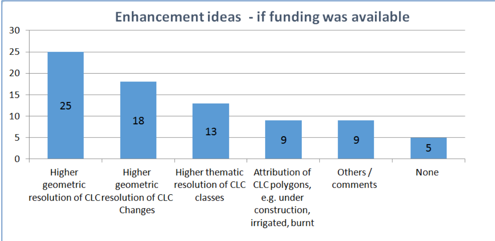

Figure 1: Support of enhancement ideas for CLC

Regarding the ideal level of geometric detail (MMU) responses obtained were as follows (in bold the most preferred solution):

• Fine as it is: 11 countries.

• Identical MMU for CLC and CLC change: 10 countries.

o Proposals: 0.05 ha, 0.4 ha, 0.5 ha (2 countries), 1 ha (2 countries), 5 ha (3 countries, see Text box 2), 25 ha.

• Different MMU for CLC and CLC change: 10 countries. The most frequent combinations were: 5 ha / 1 ha and 1 ha / 0,5 ha).

Text box 2: Identical CLC and CLC-Change resolutions preferred by 10 countries (2016)

5 ha resolution for both CLC and CLC-Change would have several advantages:

• still feasible with current CLC nomenclature,

• statistical comparability,

• easier for bottom-up solutions,

• centrally organized access to LPIS would support it.

Regarding higher thematic resolution there were three main types of solution favoured by countries:

• Separate land cover from land use (i.e. apply EAGLE data model).

• All classes are to be subdivided if MMU is decreased.

• Subdivide only some of the classes (those proposed by more than two countries are in bold):

o 1125(discontinuous urban fabric) proposed by 2 countries,

o 121 (industrial or commercial units), 122 (road and rail network), 132 (dump sites), 133 (construction sites) proposed by 2 countries, 

o 142 (sport and leisure facilities), 231 (pasture) proposed by 2 countries,

o 242 (complex cultivation patterns), proposed by 2 countries,

o 243 (land principally occupied by agriculture, with significant areas of natural vegetation) proposed by 3 countries),

o 311 (broad-leaved forest), 321 (natural grassland),

o 322 (moors and heathland), proposed by 3 countries,

o 324 (transitional woodland-scrub), proposed by 7 countries,

o 333 (sparsely vegetated areas), 411 inland marshes),

o 412 (peat bogs), proposed by 4 countries,

o 511 (water courses), 512 (water bodies)

Other way of increasing thematic resolution is to add attributes to CLC polygons. Attributes can be

• (selected) attributes of the EAGLE descriptive system (8 countries proposed)

• other attributes: average parcel size for class 211 (arable land); clearcut; burnt; irrigated;abandoned/unused (3 countries); windmill parks; greenhouses; nature reconstruction, etc.

Besides simply increasing the thematic resolution, other thematic issues should be tackled. These are related to

• inherent problems of nomenclature (e.g. no class for unused areas);

• new phenomena that have arisen in the last decades (e.g. windmills and energy crops). 

Mapping these is of interest to the European Community and/or many CLC implementing countries, therefore finding a pan-European solution is of common interest. 

CLC continuity (i.e. maintaining the comparability between results of CLC inventories) is the main  requirement, thus the introduction of new classes, merging or deleting existing classes is not  supported, as this would endanger long-term monitoring and accounting schemes. This way, only two  solutions are left for thematic enrichment of CLC data:

1) introduction of commonly agreed subclasses on the European level

2) attribution of CLC polygons with parameters or descriptors.

Both solutions give the opportunity to add more thematic detail and both keep compatibility with  previous CLC inventories. Both can be implemented for the status layer and / or for the layer of CLCChange. (With view on implementation and economic rationale the outlined proposal below relates to  attributing of polygons in CLC-Change layer.) From applicability point of view subdivision of classes  and attribution are not much different. However, as not all missing features/characteristics can be added as subclasses of existing classes, an advantage of attribution is that new features can be mapped without introducing completely new classes. 

There are few attributes that can be applied for not only a single class, but a number of classes, therefore are proposed to have a priority. These are:

• abandoned / out of use: can be applied for disused artificial sites / brownfields (121 – industry  class), uncompleted construction sites (133), suburban unused ruderal areas (231), salines (422).

• irrigated: all agriculture (2xx) classes;

• burnt: all permanent crops (22x) and forests and shrubs (31x and 32x) classes;

• presence of windmills: all agriculture land (2xx), most forest and seminatural areas (3xx classes) and sea and ocean (523).

On top of that, considering the frequency of classes in CLC-Change and the proposals from MS, the  following are the classes recommended as primary target of attributing CLC-Change polygons:

• 324 (transitional woodland-scrub) – growth of forests (succession) and decline of forests (clearcutting);

• 121 (industrial or commercial units) – green energy industry;

• 133 (construction sites) – construction of artificial features and “nature construction";

• 142 (sport and leisure facilities) – cemeteries and sport/recreation;

• 512 (water bodies) – natural and man-made.

### Intention to create a national higher-resolution CLC

A few countries are using the opportunity of CLC mapping to create in parallel a more detailed national  dataset for national uses, others might intend to do so, but cannot fill the gap between this wish and  the available financial resources. As answers to this question revealed, the majority of countries (21)  would be willing to create a national higher-resolution CLC if funding was available. A minority (3  countries) have found the solution to finance this extra exercise. Four countries were not interested.

## Outlook to CLC+

With the operational status of Sentinel-1 and Sentinel-2 satellites there is the potential global coverage of high spatial resolution data at regular intervals. The EEA appreciates this situation and has therefore identified the need for further improvements to the Copernicus Land Monitoring Service (CLMS) product portfolio, which includes development of a 2nd generation CLC or CLC+. 

The European Environment Agency (EEA) and the European Commission Directorate-General for Defence Industry and Space (DG DEFIS) have determined to develop and design a conceptual strategy and associated technical specifications for a new series of products within the CLMS portfolio, which  should meet the current and future requirements for European Land Cover Land Use (LC/LU)  monitoring and reporting obligations. This process of development is nominally called the "2nd  generation CORINE Land Cover (CLC)" and the suite of products resulting are referred to as “CLC+”.

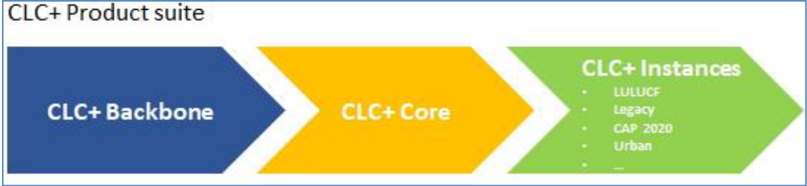

Figure 2: The concept of 2nd generation CORINE Land Cover and the CLC+ product suite

The CLC+ suite of products becomes the new European baseline for LC/LU monitoring for the decade  to come, from which tailored products (so-called instances) can be derived for support key EU policy  needs through the full policy cycle, as well as to specific needs as expressed by stakeholders in the  Member States (Figure 2). From that time perspective, it is of paramount importance that the  components of the CLC+ suite are implemented in a “change-proof” approach, i.e. that stable  information over time remains stable over subsequent updates ensuring that changes in the landscape  are reflected reliably in subsequent updates.

The new concept and the product suite have been specified through an extensive partnership between the EIONET network, and in particular the EAGLE expert group and stakeholders inside EEA. The  process was supported by open on-line user consultations. 

### EAGLE CLC+ concept

The EAGLE CLC+ approach proposes a conceptual strategy that consists of a number of interlinked  elements representing separate CLC+ datasets / products and therefore can be delivered  independently in discrete production phases. Each of the datasets / products has its own technical  specification and production methodology and can be produced through its own funding / resourcing  mechanisms.

1. CLC+ Backbone is a spatially detailed, large scale inventory providing EO-based land cover  thematic attributes as 10-m-resolution raster data. The additional vector version of CLC+ Backbone provides a spatial structure for landscape features, attributed with the raster data.

2. CLC+ Core is a consistent multi-use grid database repository for environmental land monitoring information, populated with a broad range of land cover (including but not limited to CLC+-Backbone), land use and ancillary data from the Copernicus Land Monitoring Service (CLMS),  Member State input and other data sources, forming the information engine to deliver and  support tailored thematic information requirements. 

3. CLC+ Instances are a “nominal” end points or final products in the CLC+ product suite. There  may potentially be multiple “instances” with different specifications and for different purposes. Primarily, instances are considered as raster / grid products derived from the CLC-Core and will be a LULC monitoring product with improved spatial and thematic performance, relative to the  current CLC. It can be tailored towards different types of application domains. Currently  proposed instances are CLC+ LULUCF (1st priority) and CLC+ Legacy (\(2^{\mathsf{n d}}\) priority).

### CLC+ Instances

### CLC+ LULUCF Instance

The aim of CLC+ LULUCF instance is to provide a consistent European bottom-up based 100m  resolution raster product containing LCLU information relevant for LULUCF accounting required for  GHG reporting.

### CLC+ Legacy Instance

The aim of CLC+ Legacy instance is to provide a consistent European bottom-up based CLC-compatible  product, by:

• Ensuring the continuity of CLC time series (100m raster resolution, 5-ha / 25-ha MMU vector CLC+ Legacy Instance products, dataset of real changes6).

• Optimally, providing a true 100m spatial resolution7(1ha MMU) raster CLC product (1ha resolution CLC+ Legacy Instance).

# IV. Product application areas and/or examples of use cases

As clearly demonstrated by the download statistics from the Copernicus Land Portal, CORINE Land  Cover with its nearly 40-year history is still clearly the data set with the highest number of downloads  by far. Only in quarters 1 and 2 of 2020 the download number for CLC2018 (ca. 10 800) is almost twice  the number of all local component products together. And even CLC1990 has been downloaded during  this first half year more than 1400 times (Sousa, 2020). 

This demand is also reflected in the wide range of European and national applications built on and around CLC. The use cases in Annex 6 are a selection of the applications of CLC 

• in support of a wide range of policies including the Common Agricultural Policy, the Habitat Directive and Biodiversity Strategy, the No Net Loss and Land Degradation Neutrality, the Sustainable Development Goals, the LULUCF Regulation, the EU Strategy on Climate Adaption, Green Infrastructure and many more. 

• supporting EEA and European Commission indicators for monitoring the above policies;

• for the mapping of the spatial extent of ecosystem types and their services;

• for urban and landscape level assessment,

• for another range of applications from forest fires to drought and soil

• at different levels of scale from European to sub-national.

Common to most of these applications is the possibility to draw conclusions based on the analysis of  land cover / use changes with a globally unprecedented length of time series.

34 use cases are presented in Annex 6 in a uniform structure and grouped into two main groups: European level applications/reports (24 examples) and national / regional applications (10 examples).

## European level applications

These use cases are further subdivided into six sub-groups:

• Indicators developed and maintained by the EEA:

o Land take in Europe.

o Fragmentation of natural and semi-natural areas.

o Landscape fragmentation.

o Vegetation productivity.

• Common Agriculture Policy (CAP) and agri-environmental indicators:

o Land use change (Agri-environmental indicator 9).

o Utilised Agricultural Areas (UAA) under Natura 2000 (Agri-environmental indicator 2, also CAP context indicator 34).

o High Nature Value Farmland and the Common Agricultural Policy (CAP Context indicator 37 and Agri-environmental indicator 23).

• Ecosystems related applications:

o Ecosystem type mapping.

o Mapping of ecosystem services.

o Mapping and Assessment of Ecosystems and their Services.

o EUNIS habitat classification.

• Urban related applications:

o Urban form.

o Urban Morphological Zones.

• Land cover and landscape change-related reports and applications:

o Landscapes in transition: an account of 25 years of land cover change in Europe.

o Land and ecosystem accounts for Europe. Towards geospatial environmental accounting.

o Changes and flows in European landscapes 1990-2000.

o Land cover changes and soil functions. An approach for integrated accounting.

o Land Use - based Integrated Sustainability Assessment (LUISA).

### • Other European applications:

o Spatial analysis of green infrastructure in Europe.

o Vegetation response to water deficit in Europe.

o Trend in soil moisture.

o European map of alien plant invasions.

o A population density grid of the European Union.

o Land cover fire proneness in Europe.

## National and regional applications

These use cases cover a wide range of applications. More than half of them contribute to fulfilling international reporting obligations. 

o Estimation of carbon stored in vegetation for climate change modelling.

o Urban climate modelling.

o Landscape evaluation.

o Assessing landscapes’ capacities to provide ecosystem services.

o LULUCF mapping (Land use, land-use change, and forestry mapping; introduced by the United Nations Climate Change Secretariat).

o Estimation of ecosystem specific critical loads for CLRTAP reporting (Convention on LongRange Transboundary Air Pollution, defined by the UNECE).

o Forest mapping for SDG (Sustainable Development Goals, defined by the EC and Eurostat).

o Mapping loss of natural and seminatural habitats (UN Convention on Biological Diversity). 

o Catchment modelling of river discharge and phosphorus load.

o Mapping land cover changes between 1990 and 2018 in a National Park.

# V. Product description

Standard European CORINE Land Cover products are accessible via the Copernicus Land Portal. The  download packages of various CLC status and change products include datasets covering EEA members  and cooperating (EEA38) countries8 and the UK in ETRS 1989 LAEA projection9(Figure 3) and French  DOMs in local UTM projections.

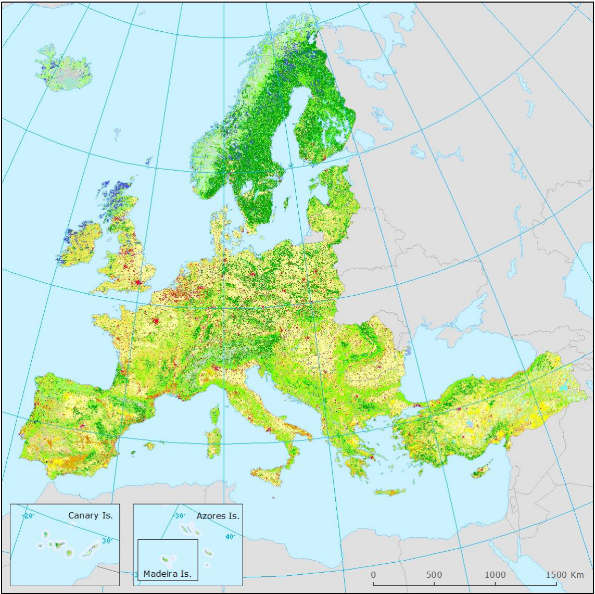

Figure 3: CLC2018 database covering European area of EEA38 countries and the UK.

Standard European CLC products are provided in two different vector formats (ESRI File Geodatabase  and SQLite Database) as well as in 100-m resolution GeoTiff raster format.

## Technical specifications

The basic parameters of CLC (spatial resolution and nomenclature) have not changed during its lifetime  (Table 1), thus maintaining the comparability between consecutive inventories.

### Spatial resolution

The minimum mapping unit (MMU) is 25 ha for mapping CLC status layers. This means that objects  having less than 25 ha area cannot be present in the database; they are generalized into a neighbouring  feature to result > 25 ha polygons. (This is a hard limit, meaning that <25 ha polygons are not allowed  in the database.) The minimum mapping width (MMW) of linear elements is 100 m; this means that  objects (most typically highways and rivers) having less than 100 metres width cannot be present in  the database. (It must be noted that this is a soft limit, 10% exaggeration of the width of features is  allowed, mostly to keep continuity of linear features.) The explanation for the MMU and MMW values is as follows: 

• The satellite images available in the 1980s’ had coarse resolution (57m x 79m for Landsat MSS) and poor (50-80 m) positional accuracy. 

• Producing CLC with photo-interpretation is a labour-intensive process, so a trade-off had to be found between mapping detail and production costs.

• In CLC1990, when interpreters drew and coded CLC polygons on plastic overlay at scale  1:100.000, the 25 ha MMU was considered the smallest object that could be manually  delineated (meaning 0,5 x 0,5 cm in case of rectangular object). Similarly, the 100 m MMW  was considered as the narrowest linear element that could be drawn (0.1 cm width at a scale  of 1:100.000 (Büttner, 2014).

In CLC change mapping, there was a policy demand to reduce the MMU for changes down to 5 ha to  produce policy-relevant information at the European scale. This resulted in CLC-Change layers being  much more detailed than the CLC status layers (Figure 4). 

The use of a 25 ha (CLC status layer) and 5 ha (CLC-Change layer) MMU and the 100 m MMW (for both  layers) is obligatory in the European CLC datasets. Often mentioned limitations related to the spatial  detail of CLC are:

• The 25 ha MMU of the CLC status layers and 5 ha MMU of the CLC-Change layers are too coarse, and often do not fulfil national requirements.

• Because of the 100 m MMW (of both status and change layers), CLC is hardly suitable to map the road network, as only the super-highways can be included. 

• Mapping important changes having narrow and elongated shape, like road construction and withdrawal of glaciers creates difficulties.

To tackle the above issues, a few countries has created more detailed national CLC and CLC-Change databases, which are then generalised to yield the European CLC datasets.

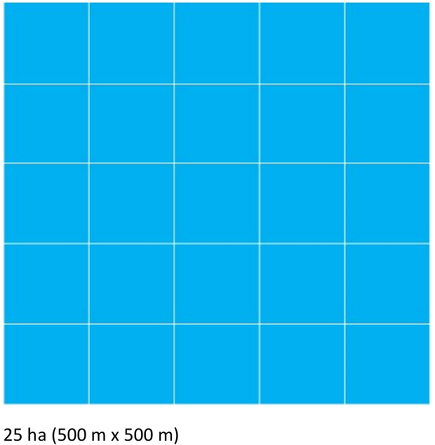

25 ha (500 m x 500 m) 5 ha (224 m x 224 m)

Figure 4: Comparison of minimum mapping units (MMU) of status layer (left) and change layer (right)

### Nomenclature

The standard European CLC nomenclature (Annex 1) is hierarchical, including three levels of thematic  detail in five major groups (Heymann et al., 1993): 

• artificial surfaces

• agricultural areas

• forests and semi-natural areas

• wetlands

• water bodies.

Although CLC’s name suggests that it is a land cover database, besides pure land cover-focused (LC) classes, the nomenclature includes land use-focused (LU) classes (especially within the artificial surfaces group) and some classes having mixed LC / LU character, as well. 

Altogether there are 44 classes on level 3. Although the 44 classes have not changed since the implementation of the first CLC inventory (i.e. the results of inventories are kept comparable over time), the definition of most of the nomenclature elements was significantly improved and refined (AD01). The latest version of Nomenclature Guidelines is available also online (AD02). 

The use of level-3 classes is obligatory in the European CLC datasets. However, there are some examples of more detailed national nomenclatures, where one or more of the standard level-3 classes  are hierarchically subdivided to level 4. Often mentioned limitations of the nomenclature are:

• It is a mixture of land cover and land use classes.

• Significant areas are covered by mosaic/mixed classes (242, 243), which causes difficulties in some applications.

• Some classes describe special characteristics (status) of the objects (e.g. “irrigated”, “burnt”). It would be better to apply attributes for such cases (e.g. instead of “irrigated arable land” class use “arable land” class, with “irrigated” attribute).

• The classes are designed with view on visual interpretability and their identification often  requires the human capacity of abstraction and combination of information. It is therefore not  straightforward to describe them in a machine-readable way, thus difficult to derive them by  semi-automated methodologies combining existing datasets.

## CLC status layer products

CLC status layer products are available for the reference years of 1990 (partial EEA39 coverage), 2000,  2006, 2012 and 2018 as individual download packages. A new database version always includes data  covering all previous inventories. Data representing a previous inventory have the same structure, but  geographic coverage might be different (see AD05). The content of a download package is explained  below by means of the example of CLC2018 status.

Base folder (example names listed for various supported formats)10:

• u2018_clc2018_v2020_20u1_fgdb (ESRI File Geodatabase vector format)

• u2018_clc2018_v2020_20u1_geoPackage (SQLite Geopackage vector format)

• u2018_clc2018_v2020_20u1_raster100m (100-m resolution raster format)

A download package has the following structure and contains the following information:

\DATA folder (contains raster or vector CLC data layers):

• U2018_CLC2018_V2020_20u1.gdb (European seamless mosaic in ESRI File Geodatabase)

• U2018_CLC2018_V2020_20u1.gpkg (European seamless mosaic SQLite Geopackage)

• U2018_CLC2018_V2020_20u1.tif (European seamless mosaic in raster Geotiff format)

\DATA\French_DOMs folder (vector or raster files for CLC Guadeloupe, French Guyana, Martinique, Mayotte and Réunion).

\Documents folder (readme files, ancillary documentation of detailed history (lineage) of dataset,  country coverage, file naming convention).

\Legend folder (CLC nomenclature and colour styles for ArcGIS and QGIS).

\French_DOMs folder (Legends for CLC French DOMs - appears only in case of CLC raster data)

\Metadata folder (ISO XML metadata files).

### CLC vector status data layers

Vector databases were provided by National Teams (NT) within CLC1990, CLC2000, CLC2006, CLC2012  and CLC2018 projects (see Ch. III. The evolution of CORINE Land Cover). All polygon features in the  original vector database were classified and digitised based on satellite images with 100 m or better positional accuracy (according to CLC specifications) and 25 ha minimum mapping unit into the standard CLC nomenclature (Annex 1). 

Harmonization of polygon outlines and codes on country borders was done only for CLC2000 layer. For  other inventories only small sliver polygons along borders (<0,1 ha) have been dissolved (see Ch.III.  The evolution of CORINE Land Cover). European CLC seamless vector database represents the final  vector product of European CLC data integration, created in ESRI GeoDatabase format and provided in SQLite Geopackage format as well.

Some redundant lines between neighbouring polygons with the same code are still present in  database, but only as result of persisting ‘adaptive tilling’ procedure limitation of ArcGIS11. Polygons  under MMU (25 ha) may be present along national borders and along tile boundaries. Polygons (slivers)  under 0,1 ha may be present only along tile boundaries. 

Feature attributes provided for CLC vector status data:

The actual content of the Feature Attribute Table is slightly different for the two vector formats  provided (ESRI Geodatabase/SQLite Geopackage). Attribute names are presented showing the example of CLC2018 status in Table 2:

File name: U2018_CLC2018_V2020_20u1.gdb / U2018_CLC2018_V2020_20u1.gpkg

Table 2: Attributes for CLC vector status data

|Attribute names|Explanation|
|--|--|
|FID (ESRI Geodatabase) / OBJECTID (SQLite Geopackage)|Built-in numeric unique ID of CLC polygon features|
|Shape|Built-in attribute showing the feature type (polygon)|
|CODE_18|Level-3 CLC code as text|
|Remark|Remarks provided for individual CLC polygons (usually empty)|
|Area_Ha|Area of individual CLC polygons in hectares|
|ID|Unique ID of CLC polygon features as text (e.g. “EU_1”)|
|Shape_length (ESRI Geodatabase only)|Built-in numeric attribute showing the perimeter of individual CLC polygons in meters|
|Shape_Area (ESRI Geodatabase only)|Built-in numeric attribute showing the area of individual CLC polygons in square meters|

### CLC raster status data layers

100-m resolution raster CLC data were created by the rasterization of seamless European CLC vector data using CELL_CENTER method12. Data are provided in compressed GeoTiff format (integer values, pixel depth: 8 bit).

### Attributes provided for CLC raster status data

Attributes of the Raster Attribute Table are presented showing the example of CLC2018 status product in Table 3:

File name: U2018_CLC2018_V2020_20u1.tif

Table 3: Attributes for CLC raster status data

|Attribute names|Explanation|
|--|--|
|OID|Built-in numeric unique ID of the records showing individual raster values|
|Value|Integer raster value showing indications of the CLC code in the range of 1,,..44, corresponding to CLC codes 111,..523, plus code 48 corresponding to 999: NODATA (representing only the area of Andorra, which is not covered by CLC)|
|COUNT|Built-in numeric attributes showing the number of raster cells with the same raster value13|
|LABEL3|Level-3 CLC class names as text|
|Red|Stored as real number in range 0..1; RGB red CLC colour code|
|Green|Stored as real number in range 0..1; RGB green CLC colour code|
|Blue|Stored as real number in range 0..1; RGB blue CLC colour code|
|CODE_18|Three-digit level-3 CLC code as text|

## CLC-Change products

CLC-Change layer products are available for the reference years of 2000 (partial EEA39 coverage),  2006, 2012 and 2018 as individual download packages. A new database version always include data  covering the previous inventories. Data representing a previous inventory have the same structure,  but geographic coverage might be different (see AD05). The content of a download package is  explained by means of the example of CLC-Change2012-2018 layer.

Base folder (example names listed for various formats)14:

• u2018_cha1218_v2020_20u1_fgdb (ESRI File Geodatabase vector format)

• u2018_cha1218_v2020_20u1_geoPackage (SQLite Geopackage vector format)

• u2018_cha1218_v2020_20u1_raster100m (100m resolution raster)

\DATA folder (contains raster or vector CLC-Change data layers):

• U2018_CHA1218_V2020_20u1.gdb (European seamless mosaic in ESRI File Geodatabase)

• U2018_CHA1218_V2020_20u1.gpkg (European seamless mosaic SQLite Geopackage)

• U2018_CHA1218_V2020_20u1.tif (European seamless mosaic in raster Geotiff format)

Additional folders have the same content as described under the CLC status layer products.

### Description of CLC-Change vector data layers

Harmonization on country border was done only for CLC-Change1990-2000 layer. For other layers only  small sliver polygons along borders (<0,1 ha) have been dissolved. European CLC-Change seamless  vector database represents the final vector product of European CLC-Change data integration, created  in ESRI GeoDatabase format, and provided in SQLite Geopackage format as well.

Some redundant lines between neighbouring polygons with the same code are still present in  database, but only as result of persisting ‘adaptive tilling’ procedure limitation of ArcGIS15. Polygons under MMU (5 ha) may be present along national borders and along tile boundaries. Polygons (slivers) under 0,1 ha may be present only along tile boundaries. 

### Feature attributes provided for CLC-Change vector data

The actual content of the Feature Attribute Table is slightly different for the two vector formats provided (ESRI Geodatabase/SQLite Geopackage). Attribute names are presented showing the example of CLC-Change2012-2018 in Table 4:

File name: U2018_CHA1218_V2020_20u1.gdb / U2018_CHA1218_V2020_20u1.gpkg

Table 4: Attributes for CLC-Change vector data

|Attribute names|Explanation|
|--|--|
|OBJECTID (or FID)|Built-in numeric unique ID of CLC polygon features|
|Shape|Built-in attribute showing the feature type (polygon)|
|Change|CLC change types as text (e.g. “211-112”)|
|ID|Unique ID of CLC change polygon features as text (e.g. “EU_1”)|
|CODE_12|Three-digit level-3 CLC code for the 2012 reference year as text|
|CODE_18|Three-digit level-3 CLC code for the 2018 reference year as text|
|Chtype|Text attribute with possible values “R” for real and “T” for technical changes|
|Remark|Remarks provided for individual CLC polygons (usually empty)|
|Area_Ha|Area of individual CLC polygons in hectares|
|Shape_length (ESRI Geodatabase only)|Built-in numeric attribute showing the perimeter of individual CLC polygons in meters|
|Shape_Area (ESRI Geodatabase only)|Built-in numeric attribute showing the area of individual CLC polygons in square meters|

### Description of CLC-Change raster data layers

100-m resolution raster CLC-Change data were created by the rasterization of seamless CLC-Change vector data using CELL_CENTER method. In order to keep 8-bit resolution for change layers, they are  divided into two files, representing consumption (from) and formation (to) part of change. Data are provided in compressed GeoTiff format (integer values, pixel depth: 8 bit).

### Attributes provided for CLC-Change raster data

Attribute names are presented showing the example of CLC-Change2012-2018 in Tables 5 and 6.

File name: U2018_CHA1218_12_V2020_20u1 - contains consumption part of change (‘from’ code).

Table 5: Attributes for CLC-Change raster data (consumption part)

|Attribute names|Explanation|
|--|--|
|OID|Built-in numeric unique ID of the records showing individual raster values|
|Value|Integer raster value showing indications of the CLC code in the range of 1,,..44, corresponding to CLC codes 111,..523, plus code 48 corresponding to 999: NODATA (representing only the area of Andorra, which is not covered by CLC)|
|COUNT|Built-in numeric attributes showing the number of raster cells with the same raster value|
|LABEL3|Three-digit level-3 CLC class names as text|
|CODE_12|Three-digit level-3 CLC code for the 2012 reference year as text|
|Red|Stored as real number in range 0..1; RGB red CLC colour code|
|Green|Stored as real number in range 0..1; RGB green CLC colour code|
|Blue|Stored as real number in range 0..1; RGB blue CLC colour code|

File name: U2018_CHA1218_18_V2020_20u1 - contains formation part of change (‘to’ code).

Table 6: Attributes for CLC-Change raster data (formation part)

|Attribute names|Explanation|
|--|--|
|OID|Built-in numeric unique ID of the records showing individual raster values|
|Value|Integer raster value showing indications of the CLC code in the range of 1,,..44, corresponding to CLC codes 111,..523, plus code 48 corresponding to 999: NODATA (representing only the area of Andorra, which is not covered by CLC)|
|COUNT|Built-in numeric attributes showing the number of raster cells with the same raster value|
|LABEL3|Three-digit level-3 CLC class names as text|
|CODE_18|Three-digit level-3 CLC code for the 2012 reference year as text|
|Red|Stored as real number in range 0..1; RGB red CLC colour code|
|Green|Stored as real number in range 0..1; RGB green CLC colour code|
|Blue|Stored as real number in range 0..1; RGB blue CLC colour code|

## CLC accounting layers

Due to the technical characteristics of CLC and CLC-Change data, the evolution of the CLC update  methodology and the quality of input data, time-series statistics derived directly from historical CLC  data include several inconsistencies (see more in Ch. VIII. How to use CLC?). A harmonization  methodology has been developed to create a statistically solid basis for CLC time series analysis by  means of the so-called CLC accounting layers (more detail on account methodology is provided in  Annex 5.) CLC accounting layers are “expert products” and are available following the link:  https://www.eea.europa.eu/data-and-maps/data/corine-land-cover-accounting-layers

# VI. Product methodology and workflow

## Workflow of CORINE Land Cover inventories

CLC production is a good and well-functioning example of cooperation between European institutions  (EEA and ESA), the Member States and industry. The workflow of the five, consecutive CLC inventories  is rather similar, including nearly the same work packages. Table 7 provides an overview of the role of  contributing partners involved in the execution of each work package in CLC2018.

Table 7: Work packages of a CORINE Land Cover inventory (case: CLC2018)

|WP|Tasks|NRC / NT|EEA /ETC|ESA|Service Provider|
|--|--|--|--|--|--|
|1.1|Satellite image data acquisition(Sentinel-2 and Landsat-8)|||X||
|1.2|Ortho-correction|||X||
|1.3|Technical preparation of IMAGE2018|o|||X|
|2|In-situ and ancillary data collection|X|X|||
|3.1|Mapping CLC Changeslayer(2012-2018)|X|o|||
|3.2|Creation of CLC2018status layer|X|o|||
|4|Verification by CLC Technical Team|o|X|||
|5|Final quality control and producing European products|o|X|||
|6|Validation||||X|
|7|Data dissemination|X|X|||

X = leading partner

o = partner involved

WP1 (satellite image provision) is dominantly centrally organised (ESA being responsible for image  acquisition, Service Provider for technical preparation). WP2 (in-situ data) is shared by the EIONET National Reference Centres Land Cover (NRC) / National Teams (NT) and the EEA. WP3 (CLC production) is implemented by NT (National Teams in CLC2018 are listed in Annex 3) with support from  EEA/ETC. WP4 (verification) is performed by the CLC Technical Team of EEA/ETC. WP5 (Final products)  is implemented by the EEA/ETC. WP6 (validation) is performed by a Service Provider. WP7  (dissemination) is shared between the EEA and the NRC.

### Satellite image acquisition and orthocorrection

To fulfil the technical specifications of CLC, Earth observation data (satellitesimages) with the following  characteristics are needed:

• resolution (pixel size): 10-30 metres

• spectral bands (optimal for landscape mapping): red, NIR, SWIR (supporting photointerpretation)

• coverage-1 (date of imagery optimal for CLC mapping): image acquisition window determined by the national team

• coverage-2 (date of imagery to provide optimal complimentary information, from CLC2006): 2nd image acquisition window determined by national team 

• pre-processing level: orthocorrected, national projection.

Satellite images to support CLC mapping are provided by ESA16. These image data sets are often  referred to as IMAGE[year], where [year] refers to the CLC reference year (e.g. IMAGE2018 was mostly  taken in 2017 with gap-filling in 2018, see Table 1). These satellite images are also usually used for  purposes other than the CLC inventory (e.g. High-Resolution Layers). At the time of the first four CLC  inventories, ESA did not have its dedicated satellite(s) suitable for continental land monitoring, therefore ESA established agreements (since 2009 in the frame of the GMES Space Component) with  appropriate satellite image (typically Landsat, IRS, SPOT) providers for image acquisition. As the  Sentinel-2 satellites have been placed on orbit in 2015 and 2017, they provided the primary data  support for the fifth (CLC2018) and further inventories. In CLC2018, image acquisition (including  thousands of images) and ortho-correction of satellite imagery (level-1C images in UTM/WGS84  projection) was provided by ESA through the Sentinel Hub.

It is usually a difficult task to cover the whole EEA39 area (6 Mkm2) with cloud-free imagery17.  Therefore, for “gap-filling”, images of othersatellite(s) having comparable characteristics are collected.  In CLC2018 the image acquisition campaign was especially short, as the dedicated Sentinel-2 image  acquisition campaign IMAGE2018 was confined to the year of 2017 (covering a single year, instead of  3 years of previous campaigns). Landsat-8 imagery was used as gap-filling to cover areas where no  Sentinel-2 imagery was available in 2018 (Table 1).

### Technical preparation of image products

In most of the CLC inventories, image enhancement techniques were applied in pre-processing of  satellite imagery to support visual photointerpretation. The most common methodology applied is  high-pass filtering in order to enhance geometric (structural) detail of the imagery, i.e. to improve  interpretability (Chavez et al., 1991). The image product types available in CLC2018 (AD03) were as  follows:

• The main – so-called “visual” - product, Sentinel-2 data (or Landsat-8 for gap filling) reprojected into national projection, was centrally produced by a Service Provider. This product included selected bands (red, NIR, SWIR) enhanced using the gradient image of the synthetic panchromatic band (in case of Sentinel-2) or the panchromatic band (Landsat-8). 

• Additionally, the full, not-enhanced image products were provided by ESA, without modifications, for those countries that wanted to go beyond visual interpretation.

### In-situ data

In-situ data (ancillary or reference data) in Copernicus programme, by definition, comprise all nonspace-born data with a geographic dimension. Major use of in situ data in CLC project is to complement  the satellite data in the course of production and to verify or validate results provided from space-born  data. In-situ data is often used for provision of land use, crop type and habitat information, among  others. Most frequently used and most needed in-situ data include: 

• Up-to date topographic maps (preferably at scale 1:25.000 / 1:50.000) to be used during interpretation, mapping and validation process.

• Orthophotos, taken optimally in the years when the satellite images were taken (2012 and  2017 in case of the CLC2018 project (especially if topographic maps are out of date). 

• Thematic maps (built-up, vegetation type/habitats, forestry, hydrology, etc.).

• LPIS/IACS data, which have an utmost importance in precise mapping of agriculture classes and their changes.

• Other ancillary data (e.g. urban planning, nature conservation, forest fire) for  identification/interpretation and verification of CLC classes and their changes.

• LUCAS field survey data coordinated by Eurostat, including landscape photographs from visited points, covering EU member states. The latest LUCAS survey was conducted in 2018 (Eurostat, 2019). LUCAS data are occasionally used in mapping, but more frequently in validation. 

• High-Resolution Layers (HRL) of CLMS (especially degree of imperviousness and tree cover density / forest type). These data were available to support CLC2012 and CLC2018 (and produced by using IMAGE2012 and IMAGE2018 data).

• Ancillary data complementing the above and being useful in CLC change mapping are Google  Earth (GE) imagery (or equivalent): it provides VHR image data, supporting the interpretation  where no ortho-photos are available. Often multi-year time series are provided (time slider  function), which are especially useful in understanding the evolution of an area. Crowdsourced field photos, labels of different layers and StreetView function of GE can be useful,  too in providing in-situ evidence or information on function of land/buildings or on natural  vegetation. 

• For the verification done by the CLC Technical Team often the only ancillary data are provided by GE.

## Mapping CLC Changes

The term ‘change layer’ is used for CLC maps reflecting the change of land cover between two  reference dates. Since the CLC2006 inventory, CLC-Change(yearold-yearnew) is the primary product of  the updating. It is produced directly (i.e. not derived by intersecting CLC[yearold] and CLC[yearnew]) and has a MMU of 5 ha, which means significantly more detail than the 25 ha the MMU of the status layers (Figure 4). 

The aim of creating CLC-Change is to produce a map of real land cover changes describing an evolution process taking place in the environment (e.g. urban sprawl, forest clearcut). Changes should be interpreted regardless of their position (i.e. connected to an existing polygon or being “island”-like, see Figure 5)18. 

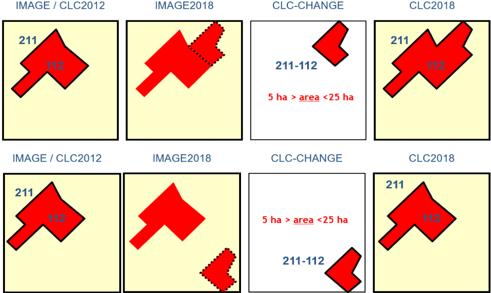

Upper row: growth of an existing settlement. Lower row: birth of a new (isolated) settlement

• First boxes in both rows show the land cover status visible on IMAGE2012 and the polygon outlines in  CLC2012 database.

• Second boxes show the land cover status visible on IMAGE2018 without polygon boundaries. Dashed outline marks patches that have changed. 

• Third boxes show polygons to be drawn in the CLC-Change database.

• Fourth boxes show the polygons as present in CLC2018 database (as the results of GIS addition of  CLC2012 and CLC-Change2012-2018.

Figure 5: Consistent mapping of CLC Change (AD03)

### Change polygons should

• have size at least 5 ha,

• have width at least 100 m,

• describe a real evolution process that occurred between yearold and yearnew, and

• be detectable on satellite images (with support of dedicated in-situ data, if needed).

There are two basic approaches of creating a change layer, ‘CLC updated first’ and ‘change mapping first’, summarized on Figure 6.

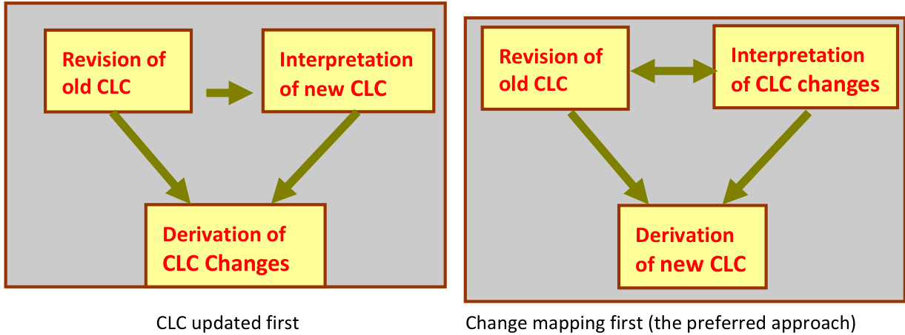

Figure 6: Approaches for CLC update (AD03)

The ‘change mapping first’ methodology supports better the above goals than the ‘update first’ approach (Figure 6) as (1) changes are interpreted directly (the interpreter has to think about what the  real process was); and (2) all changes larger than 5 ha can be easily delineated regardless of their  geometric position (whether attached to an existing polygon or not). Isolated changes (island-like  polygons) having size between 5 and 25 ha cannot be mapped using the ‘update first’ method (Büttner,  2014).

### Understanding CLC Changes

CLC changes can include those changes of the Earth surface that have longer than yearly/seasonal periodicity. Urban sprawl, plantation of olive trees to replace arable land, melting of glaciers or  creation of a new water reservoir are such long-term land cover changes to be mapped as CLC change. On the other hand, transient changes and short-term periodical changes are phenomena not to be  mapped as CLC change. 

Transient changes (lasting only for short time), not to be mapped as CLC change are e.g.:

• Changes along rivers due to floods (temporary inundations).

• Changes inland due to heavy rains (temporary water-logging).

What to do with periodical changes, where LC status alternates between two different land covers? Several such processes have periodicity shorter than 1 year, therefore are not to be considered as CLC  change: 

• Water level changes in coastal areas due to tidal phenomena (high tide, low tide).

• Changes in lake / wetland area due to seasonal water level differences.

• Intermittent water cover of glacial rivers during the spring snow-melt period.

• Regular changes of water cover of fishponds due to maintenance.

• Seasonal phenological changes in forests (status of leaves).

• Seasonal phenological changes of natural grassland and sparse vegetation (green in spring, yellow in summer).

• Seasonal difference in crop development (bare soil → green crop → mature crop → harvested  crop).

• Seasonal changes in annual snow cover (esp. high mountains and Northern Europe).

Such changes do not need to be mapped as CLC change, but the most typical status should be selected as basis of coding the area (e.g. in case of a glacial river the gravel bed should be mapped, because  river water occurs only for a few weeks during spring melting period).

There are some changes that are periodic, but the periodicity is longer than 1 year or even longer than the CLC mapping repetition period. These processes have to be mapped. E.g.: 

• Alternation of arable land and set-aside/pasture land (211-231, 231-211). Periodicity is usually  several years, however being country / region dependent. (In countries where grass is planted  as one-year (fodder) crop, being part of crop rotation, these changes are NOT considered to  be CLC change.) 

• Forest clearcut (31x-324) and new plantation growth (324-31x). After clearcutting minimum 5-10 years are needed for a new forest to develop. 

Additionally, CLC changes should reflect not only land cover changes, but also a switch from one CLC class to another. For example, the formation of low-growing cover of young trees on a formerly unvegetated clearcut area is a long-term land cover change, but not a CLC change, because both statuses belong to CLC class 324 – transitional woodland and shrub.

Experts interpret CLC changes directly on screen, by visually comparing IMAGE[yearold] and  \(\mathsf{I M A G E}[\mathsf{y e a r}_{\mathsf{n e w}}]\) data in geo-linked, dual-window environment. The delineation of changes must be  based on CLC[yearold] polygons in order to avoid creating sliver polygons and false changes when  producing a CLC[yearnew] database (Figure 7).

The photointerpreter must give two CLC codes to each change polygon: code[yearold] and code[yearnew]. These codes must represent the land cover status of the given polygon in the two years, respectively. A change code pair thus shows the process that occurred in reality (Figure 7) and may be different from the codes occurring on the CLC[yearold] map and / or in the final CLC[yearnew] map, due to generalization applied in producing CLC.

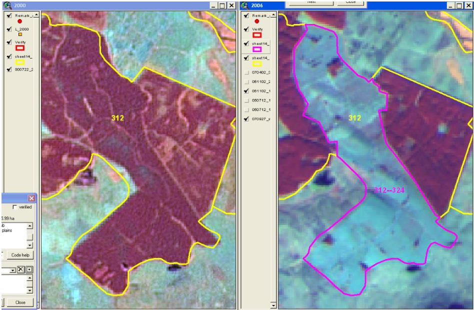

Change mapping example (Ireland). Coniferous forest (code=312) in 2000 (left) is clearcut by 2006 (left). The  loss of forest cover is characterized by the light colour of the ground due to the disappearance of crown  cover. Forestry regulation protects forest cover by prescribing reforestation after harvesting. The loss of  forest cover is therefore temporary. The transitional woodland area (code=324) will sooner or later be  replaced by forest. 312-324 is the most widespread CLC change type in Europe.

Figure 7: Change mapping example from the Manual of CORINE Land Cover changes (AD04)

Left: IMAGE2000 and CLC2000 in yellow outlines, right: IMAGE2006 and CLC Change2000-2006 in magenta outlines

Both the delineation and the coding of changes require some level of abstraction capability and often  a good knowledge of characteristics and typical processes of the area mapped (local knowledge). This is also the reason why semi-automated methods are less frequent in change mapping than in status  mapping, and why semi-automated results require visual control. 

In order to improve harmonisation of mapping CLC changes in Europe, a ‘Manual of CORINE Land Cover  changes’ has been written including examples of most frequent changes and typical mistakes (AD04). The document has been extensively used in training of teams creating CLC-Change data, and it gives a  good basis for understanding the meaning of ‘CLC change’ for the users of CLC, too.

### Complex changes

Although the MMU for change mapping is 5 ha, in some cases change polygons < 5 ha are also allowed to be mapped. Complex change means a connected set of different changes, having either of the two CLC code attributes identical. Any of the elementary changes of the complex change can have area below the MMU (5 ha) as long as the total area of elementary changes reaches the 5 ha size (Figure 8).

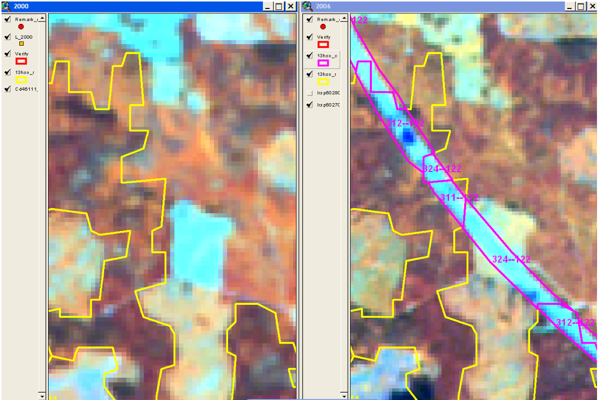

New highway was constructed in Sweden. On IMAGE2000 (left) patches of forest and transitional woodland  (clearcut and young forest) are visible. In CLC2006 (right) we have a complex change forming a linear feature,  with all elementary change polygons having 122 code (road and rail network) as second attribute. In complex change it is allowed to have elementary change polygons below the 5 ha limit, in order to keep the continuity  of the feature. The width of the new linear feature exceeds 100 m, as probably it includes “associated areas”  as well (service roads, residual construction areas, etc).

Figure 8: Mapping linear features using complex changes (AD04)

### Revision

Occurrence of interpretation mistakes is an inherent characteristic of photointerpretation of remote  sensing data, coming not necessarily from negligence, but from insufficient information. During the  update procedure, examining newly available satellite images or ancillary data often leads to the  discovery of thematic mistakes in the database to be updated. In order to avoid error propagation into  the next CLC (CLC[yearnew]), mistakes discovered in the previous CLC (CLC[yearold]) are much  recommended – in locations of changes absolutely necessary – to be corrected. These mistakes are: 

• Systematic mistakes known from the previous inventory but not corrected yet and those discovered during the recent change mapping (or verification, see Ch. VII. Quality assessment). Systematic improvement of geometry can also be included here. 

• Random mistakes. These are usually ad-hoc discovered during change mapping (or verification) or can be systematically searched for by visually browsing the CLC map to be updated in scale 1:30.000-40.000.

Mistakes are revealed during the revision process because of the following factors:

• Availability of higher-resolution satellite imagery.

• A new satellite image or time series of satellite imagery provides additional key to correctly  recognise a feature.

• Improved availability and better quality of in-situ data.

• Improved skills of experts, i.e. better understanding and application of CLC nomenclature.

In some cases, the revision is done independent of the update, upon decision of the NT to improve the product (between two inventories).

The ‘change mapping first’ approach allows revising CLC[yearnew], in parallel with mapping CLC  changes. However, on polygon level, revision should always precede delineation of changes. The  revised CLC[yearnew] layer is a ‘by-product’ of the update by ‘change mapping first’ approach. Since the  CLC2006 inventory, the old status layer is replaced by the revised old status layer as soon as the new  status layer has been completed (see in Chapter VI. European products).

### Tools of the traditional CLC methodology

In order to assist NT work and ensure good-quality results, EEA provided a dedicated software package  to the NT for the CLC2006, CLC2012 and CLC2018 inventories. The software - named ‘CLC2018 Support  Package’ (Taracsák, 2018) in case of the CLC2018 inventory - includes a module for interpreting  changes and implementing revision (‘InterChange’) and one for internal quality control and verification (‘InterCheck’). In CLC2018, 31 users from 27 countries used one or more modules of the package in  their work, mostly those teams applying the traditional mapping method, but also some others  working with semi-automated approaches, described in the next section.

Commonly, GIS software are designed primarily for viewing GIS databases with tools for creating maps, menus for handling databases and graphical editing tools. If a software has editing possibilities too, these are general tools, not specialized for individual tasks. On the contrary, CLC2018 Support Package is a specialized, task-oriented software that significantly facilitates updating, change detection and mapping, quality control and correction of CORINE land cover databases by means of computerassisted visual photointerpretation. The software has a number of error-prevention functions, helping to create databases compliant to the specifications.

## Creation of CLC status layer

The term ‘status layer’ is used for CLC maps reflecting the status of land cover at a certain reference date. Only the early CLC status layers (CLC1990 and in part CLC2000) can be considered as primary products, i.e. having been produced directly by photointerpreting satellite images starting from scratch. (Later status layers are created by updating previous ones by adding change areas – see below.) The main guiding rules for producing the status layers are:

• Geometric detail (MMU and MMW, see Chapter V. Spatial resolution)

• Nomenclature (thematic classes, see Chapter V. Nomenclature)

The creation of status layers consists of manually drawing polygons on the basis of satellite imagery and coding them with a 3-digit CLC code. In-situ (ancillary) data are used for interpretation or control, if needed. Both the delineation and the coding require high level of abstraction capability and a good knowledge of the biogeographical, economic, cultural characteristics of the area mapped. The entire area (e.g. working unit, region, country) has to be interpreted, i.e. no unclassified area is allowed.

Land cover objects having size (area, width, or both) below the specified geometric limits (MMU,  MMW, see above) are generalized by the photointerpreter. The generalization is based on the  ‘similarity’ between the small object (size < MMU) and the valid (size > MMU) objects in the neighbourhood. Rules of generalisation are summarised in the generalisation table (Bossard et al., 2000), updated in 2006 and 2018 (see Annex 4). E.g. a small wetland is joined to a neighbouring water body rather than to an arable land. Generalization is usually straightforward for an experienced photointerpreter, but it is not so evident for automation.

Since the CLC2006 inventory, the recommended updating methodology of CLC has been the ‘change  mapping first’ approach19 (Figure 6), since then the updated status layer has not been the primary  product anymore, but a derivative created as described below.

The updated new status layer (CLC[yearnew]) is generated through an automated process by using the revised old status layer (CLC[yearold]) and the interpreted CLC-Change(yearold-yearnew) layer:

\[\mathsf{C L C}[\mathsf{y e a r}_{\mathrm{new}}]=\mathsf{r e v i s e d}\;\mathsf{C L C}[\mathsf{y e a r}_{\mathrm{oid}}]\;(+)\,\mathsf{C L C}\mathsf{-C h a n g e}(\mathsf{y e a r}_{\mathrm{oid}}\mathsf{-y e a r}_{\mathrm{new}})\;(+)\;\mathsf{G e n e r a l i z a t i o n}\;\]

in case of CLC2018 update the above equation means:

CLC2018 = revised CLC2012 (+) CLC-Change2012-2018 (+) Generalization

Where (+) means the following operation: the revised CLC2012 and CLC-Change2012-2018 databases are  intersected, and where change polygons exist, code 2012 of CLC2012 is replaced by code 2018 of the  CLC-Change2012-2018, and finally neighbours with identical code are unified. Small (<25 ha MMU)  polygons are generalized in a stepwise aggregation process, using a priority table (Annex 4). The  process is illustrated in Figure 9.

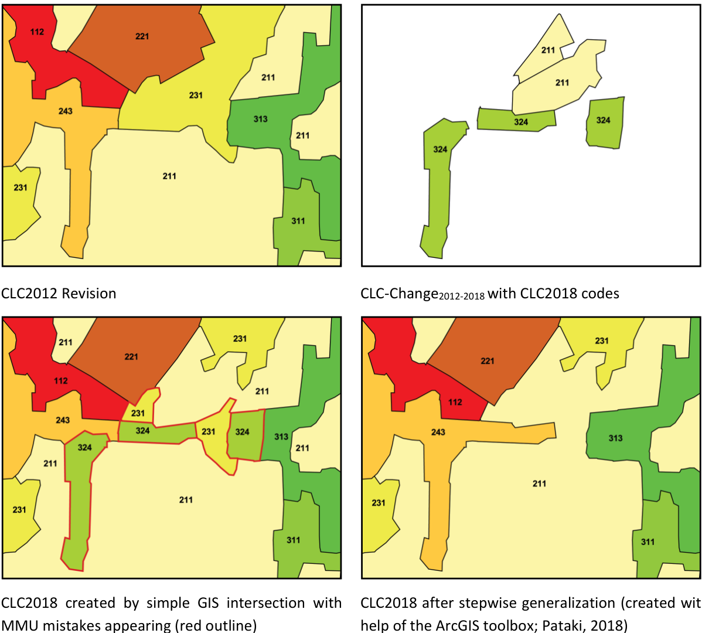

Figure 9: Steps of creating CLC2018 by combining revised CLC2012 with CLC-Change2012-2018

## Semi-automated and bottom-up approaches applied in CLC

Some countries have applied operationally and regularly (fully or partly) semi-automated solutions to  map CLC and CLC changes. The main aims of these solutions are to replace labour-intensive photointerpretation, increase accuracy and reproducibility and provide better compatibility with national  databases. These solutions combine national GIS datasets, satellite image processing technology, onscreen digitization (visual photo-interpretation) and GIS-based generalisation. Some level of visual  input or control is however always applied in such methods, too, as the human abstraction capacity  cannot be fully replaced by automated rules, especially in case of change mapping.

The implementation of a semi-automated approach heavily depends on the type of LU/LC data available in the country. The availability of LU data is crucial, because information on function of the land cannot be derived automatically from satellite data. Brief overviews of the so-far used methodologies are presented below, by country.

• In Finland, sophisticated pre-processing of satellite images (based on physical models e.g.  atmospheric correction), classification of stratified imagery, regression estimation for forestry  parameters, visual interpretation, integration of national land use data, and generalization of  high-resolution national data to European CLC are applied. Level-4 CLC nomenclature is used  for national purposes with pixel resolution (25 m). Particularly, forests and semi-natural areas  and wetlands have more thematic detail (Finnish Environment Institute, 2005).

• In Germany, a Digital Land Cover Model (DLM-DE) has been developed with 1 ha MMU. The concept of DLM-DE embodies the integration of national topographic reference data (ATKISDLM) with thematic remote sensing data, and it covers national needs. Since the CLC2012 inventory, DLM-DE supports the European land monitoring process by deriving high resolution CORINE Land Cover (CLC) data with 1 ha MMU and generalizing it to the MMU of CLC (25 ha).  CLC-Change is created by means of comparing DLM-DEnew and DLM-DEold and generalisation to 5 ha. Both Status layers and change layer creation includes manual editing and visual control steps (Federal Environment Agency Germany, 2012). 

• In Iceland, thematic data are provided by relevant national authorities and institutions. Several  classes however are derived from remotely sensed data. Applied tools are GIS harmonization  and generalization (National Land Survey of Iceland, 2009).

• In Ireland, as part of CLC2012, firstly an extensive revision of the CLC2006 was undertaken. A  combination of ancillary vector data and interpretation of satellite imagery was used to both  revise the existing 2006 dataset and to identify changes within the 2006-2012 reference period. LPIS was used as a direct source of land use information for agricultural areas, vector data from the Forest Service was used to aid the mapping of forested areas, whilst national  scale data on water bodies was used to improve the mapping of water feature boundaries and the coastline. The ancillary data was generalised into a 5-ha intermediate dataset, which was coded to the CLC classes. This intermediate dataset was then intersected with the existing  CLC2006 dataset with areas of this disagreement being sorted into change or revision via  spectral interpretation of the satellite imagery in an object-oriented remote sensing platform. Areas of the existing dataset not covered by ancillary data were assessed by spectral means to  find areas of mis-classification. Manual photo-interpretation was used to find and map CLC  change areas not covered by automated processes or imagery and for verification of the  outputs from the automated process (Lydon and Smith, 2014).

• Norway applies generalization and the merging of data from land resource maps and national  registers (Aune-Lundberg and Strand, 2010). 

• Portugal has used a method based on higher-resolution national LC/LU data starting from CLC2018. As preparation, NT has performed an extensive thematic correction of CLC2012  based on National Land Use and Land Cover Map (COS2010) data. National Land Cover Land Use Map (COS) of Portugal is created every 5 years, with a nomenclature fully compatible with CLC on level-3, while having more thematic detail on level-4 and -5, with altogether 225 classes. Geometric resolution is also significantly higher, 1 ha / 20 m. When COS2010 was  completed, a cross-comparison with CLC2012 was implemented, followed by manual  correction of non-compliant objects larger than 25 ha. Correction has affected altogether 10% of CLC2012 and 3% of COS2010. The corrected CLC2012 formed the basis of traditional  photointerpretation-based CLC change mapping in the CLC2018 exercise. However, this was not the only use of COS data in CLC2018 project: > 5 ha changes were derived from COS 2010-2015 change dataset and were provided to photointerpreters as ancillary information for  potential changes. COS change data are also produced directly, applying the ‘change mapping  first’ approach known from CLC. However, in creating CLC-Change2012-2018 interpreters always  had to be aware of the 2-years date difference between CLC and COS surveys (ETC-ULS, 2018).

• In Sweden, theme-wise classification of satellite imagery (interactive thresholding or  automatic classification), visual interpretation, forest classification calibrated by National  Forest Inventory data, and generalization of high-resolution national data to European CLC are applied. Sweden has produced 58 level-6 classes for national purposes with pixel resolution (25 m) and MMU = 1, 2, 5 or 25 ha) (Engberg, 2005).

• Spain has also been using a bottom-up solution for updating European CLC since the CLC2012  inventory (Figure 10). The National Information System on Land Cover & Use (SIOSE) is a geographic information system at equivalent cartographic scale 1:25,000 including polygons, whose minimum area varies from 2 ha to 0.5 ha depending on the LC class. SIOSE polygons describe individually each piece of land by allocating a set of real landscape objects with percentages. The SIOSE data model defines 45 classes of landscape objects (e.g. buildings, bridges etc.), 40 LC classes and more than 20 attributes for further description of LC  characteristics. The object-oriented design in SIOSE allows an easy and complete semantic  generalization to provide CLC status layer and CLC-Change layer from national scale to the European one (Hazeu et al., 2016).

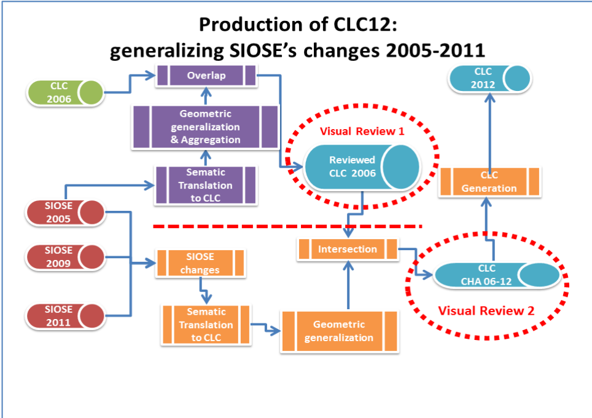

Figure 10: Production of CLC-Change2006-2012 and CLC2012 by using high-resolution national data in Spain

## European products

The method of producing integrated European products from national deliverables has significantly  improved during the lifetime of CLC. The procedure applied during CLC2018 (AD03) isshortly presented below.

National data can be considered as ‘ready for delivery’ after the following steps are fulfilled:

• A last (usually \(2^{\mathsf{n d}}\)) verification of CLC Technical Team took place and the verification report has been issued with an evaluation Accepted or Conditionally Accepted.

• Recommendations specified in the verification reports have been integrated into the data by  the NT. 

• Technical quality of deliverables has been checked internally by NT and screened using an online quality screening tool20 to conform to all specifications(regarding format, technical, and topological specification) as defined in AD03.

Table 8 includesstandard deliveries, expected from the countries (xx stands for the two-character-long  ISO code of the country). ESRI Geodatabase format introduced during CLC2006 is considered as  primary delivery format.

Table 8: Standard CLC deliveries produced by CORINE Land Cover National Teams

|Layer|[Standard delivery file name]|
|--|--|
|CLC-Change2012-2018|[CHA18_xx]|
|CLC2018|[CLC18_xx]|
|revised CLC2012|[CLC12_xx]|
|Metadata||

When online-checked national deliveries are uploaded into the Central Data Repository (CDR) of the  EEA, the database technical acceptance (DBTA) procedure is performed, and the DBTA report is issued.  DBTA report contains summary of data and metadata conformity checks, and a judgement about  acceptance. National CLC can be either ‘accepted’ or can got a ‘request for improvement’ valuation  (with supporting information) if further improvement is needed. Accepted data are considered final  deliveries and uploaded onto a dedicated location of the CDR (AD03).

After the technical quality control of national deliveries (Table 8) of all participating countries, the  European products (CLC and CLC-Change) are produced in the standard European Coordinate  Reference System defined by the European Terrestrial Reference System 1989 (ETRS89) datum and  Lambert Azimuthal Equal Area (LAEA) projection (EPSG: 3035). National products are slightly (0,5 km buffer) overinterpreted through the national borders, in order not to leave any area without  interpretation. National products must be matched (mosaicked) together. Extensive border matching  (with manual editing) has only been done during the CLC2000 project. Since then, only a simplified border matching has been applied: code differences along the two sides of borders are not changed,  only polygons with area ≤ 0,1 ha (sliver polygons) are eliminated. Polygons with size < MMU can remain  along the borders, which causes (a known and tolerated) non-compliance to specifications as part of  the trade-off between data quality and processing costs.

Another non-compliance to the technical specification is that some <25 ha polygons might occur in European CLC vector datasets because of optimization of ArcGIS geodatabase. This means artificial borders (dissolve errors) typically (but not exclusively) related to the sea and ocean buffer (class 523), which is highly complex in terms of the number of vertices.

Having the revised CLC[yearold] since the CLC2006 inventory (as by-product of the updating by ‘change  mapping first’ approach), the old status layer is replaced by the revised old status layer by the majority  of participating countries, as soon as the new status layer has been completed. 

The seamless data coverage table (see AD06) updated for all new versions of European seamless data coverages includes important information for the users regarding what is available for download. See Text box 3. See file naming convention in Annex 2.

Text box 3: Content of the seamless data coverage table (AD06)

Seamless data coverage table, V2020_v20u1 includes the most recent version (at the time of  writing):

• Availability (marked with Y) or non-availability (marked with N) of CLC and CLC-Change country coverage in any of the five inventories (e.g. Finland is not covered by CLC1990).

• Version of CLC2000: whether revised CLC2000 (Y1) or CLC2000 (Y2) is available (e.g. revised CLC2000 exists for Hungary, while CLC2000 without revision is available for  Spain).

• Version of CLC2006: whether revised CLC2006 (Y3) or CLC2006 (Y4) is available (e.g. revised CLC2006 exists for Norway, while CLC2006 without revision is available for  Germany).

• Version of CLC2012: whether revised CLC2012 (Y5) or CLC2012 without revision (Y6) is available (revised CLC exists for all but one countries, Finland).

Important:

Having the revised CLC[yearold] (by-product of the updating by ‘change mapping first’ approach)  since the CLC2006 inventory, the old status layer is replaced by the revised old status layer, as  soon as the new status layer has been completed and published on the Copernicus Land Portal:

CLC2006 inventory: CLC2000 replaced by revised CLC2000.

CLC2012 inventory: CLC2006 replaced by revised CLC2006.

CLC2018 inventory: CLC2012 replaced by revised CLC2012.

# VII. Quality assessment

Quality control (QC) and quality assurance (QA) are key elements of the European CLC projects since  the early days of CLC inventories (Heymann et al., 1993, Bossard et al., 2000). We distinguish two  different QA/QC activities (Büttner et al., 2016a):

• Verification has a corrective purpose and is implemented as part of the production process. Verification results are created to inform the producer of data about quality issues. Through the feedback loops, verification is a tool for geometric standardization and thematic harmonization of CLC all over Europe.

• Validation aims to assess the accuracy of the final database and is implemented after completion of the production. Validation should be fully independent from production and rely on data with higher spatial resolution than those used in production. Validation results are created with an aim of informing the users about data quality.

The objective of this chapter is to describe the practice of the European verification of CLC data, focusing on current practice in CLC2018 project (AD03) and to summarise the results of European  validation studies (AD07, AD08).

## Verification of CLC data

An important element of CLC project management on behalf of EEA21 is quality assurance and quality  control of the work done by NT (see Table 7). Quality assurance includes the standardized production  of input satellite imagery, the provision of implementation guidelines and helpdesk, as well as technical  acceptance procedures, while quality control is ensured via the verification activity of the so-called CLC  Technical Team (TT). Usually two verifications by EEA and / or European Topic Centre22 experts making  up the CLC TT are organised for each country during a CLC inventory. In the early inventories, two onsite verification visits were organized to each participating country. However, due to improved  availability of in-situ data in digital form, the European-wide improvement of Internet to transfer large  amount of data and the reduction of project implementation time, the majority of these visits have  been replaced by remote verification actions. This means that data are sent by countries for remote  checking, and CLC TT checks them on their own premises. In countries working with regional teams  (e.g. Italy and Spain) all regions are verified separately.

• 1st verification is done when 10-20% of the country area is interpreted. The main purpose is to reveal problems and give feedback in the early phase of implementation, in order to influence further production. Working units for checking are selected by the national team.

• 2nd verification is due when around 75% of the country area is interpreted. The main purpose is to check the database close to completion and suggest overall improvements if still needed. Working units for checking are selected by the EEA/ETC.

Looking at the equation shown in Ch.VI. Creation of CLC status layer regarding the production of the updated CLC,

CLC[yearnew] = revised CLC[yearold] (+) CLC-Change(yearold-yearnew) (+) Generalization

it is obvious that the targets of verification should be the revised CLC[yearold] and CLC Change (yearold,  yearnew ), i.e. those layers that that are produced directly (printed in bold in the equation above). It  means that CLC[yearnew] is not verified23.

Verification of CLC and CLC-Change in CLC2018 project meant checking the coverage of revised CLC2012 and CLC-Change2012-2018 databases by visual photointerpretation, based on the following data:

• Satellite images (IMAGE2012, IMAGE2018) used to derive CLC and CLC-Change by the national team.

• Optionally ancillary data as topographic maps or links to orthophotos on Web Map Service (WMS).

During remote verification frequently Google Earth (GE) imagery was the only ancillary / in-situ data available. GE coverage and timeline has improved recently in most parts of Europe and it supports  verification of CLC and the CLC-Change in an efficient way. 

Since CLC2000, a custom-made software tool, InterCheck (Büttner et al., 2003; Taracsák, 2018) serves as software platform to carry out the verification. (InterCheck as part of CLC2018 Support Package was made available for all national teams, to support their own internal QC activities.) InterCheck allows  the parallel checking of the two deliveries (revised CLC[yearold] and CLC-Change(yearold-yearnew), in a synchronized dual-window environment. Quality remarks based on visual control are provided in point coverages linking the thematic comment to a specific location. Remarks related to the revised CLC and  CLC-Change datasets are provided in separate files. A verification report is written too, describing and explaining the main issues and suggestions to improve them, illustrated by screenshot examples24. The result of the verification of a working unit is expressed in qualitative terms (i.e. no accuracy figures are provided):

• A (accepted) means: only minor problems were found.

• CA (conditionally accepted) means: there are more problems but relatively easy to correct;following corrections the working unit is accepted.

• R (rejected) means: there are many mistakes in the database (incorrect application of the nomenclature, omitted changes, false changes etc.), which requires considerable work to  correct.

Usually, altogether about 5-25% of the area of countries is checked during the two verification actions,  depending on the area of the country, number of photointerpreters and the quality of work.

Verification is carried out by sporadic (but usually systematic) visual checking of CLC[yearold] layer and  detailed checking of CLC-Change(yearold-yearnew) layer. In CLC2018 this meant checking revised CLC2012 and CLC-Change2012-2018. Verification does not provide any quantitative accuracy figures, just  a qualitative evaluation in order to influence the further production process.

• Checking of revised CLC[yearold] focuses on thematic and geometric properties of the revised CLC[yearold] layer, i.e. if nomenclature is applied properly (AD01, AD02) and if delineation is precise enough. Basically, revised CLC[yearold] will determine the quality of updated CLC, because the CLC-Change layer covers usually only a few percent of the area. 

• Checking CLC-Change(yearold-yearnew) focuses on two issues: (1) do the mapped changes represent real change processes in the environment? (2) are there any omitted changes? 

Main technical steps of verification are as follows:

• Automated technical conformity checking of both layers to reveal technical mistakes (e.g. polygons smaller than MMU, invalid codes) and topological mistakes (e.g. a hole in the revised CLC[yearold] database, overlapping and multipart polygons).

• Visual checking of revised CLC[yearold] layer, including: (1) checking CLC code statistics (to reveal invalid and non-relevant codes) and (2) visual evaluation of “critical” classes (sampled according to CLC code, polygon size range, etc.).

• Visual checking of CLC-Change(yearold-yearnew) means:

o Checking CLC-Change statistics (to reveal invalid and non-relevant changes).

o Depending on the number of changes visual checking of (1) all changes, or (2) just a  subset of changes. Change types with the largest total area are always checked. For each verified change polygon both the delineation and the coding are checked. Coding should reflect real change processes as visible on images. 

o Looking for changes omitted by the national team.

As the two checked datasets are interdependent, the last two steps above also influence each other. This means that systematic problems discovered in one database will affect the focus of checks in the  other.

## Validation of CLC data

The objective of the validation of CLC data is to derive thematic accuracy figures, to assess if dataset accuracy has reached the 85% target accuracy (Table 1). Its main goal is to inform users of the databases about quality in quantitative terms. Validation must be based on independent, very-highresolution in-situ data as reference. The date of in-situ data should coincide as much as possible with the acquisition date of satellite images used to derive CLC. In-situ data used in validation should be  independent, i.e. must not have been used in compilation of the CLC databases. Experts working on  validation also should be independent, not having participated in the mapping exercise.

Validation is carried out either on national or European level. Some countries performed a national validation of their CLC datasets using country-specific approaches. In most cases spatially and thematically more detailed national data were used for that purpose (Hazeu, 2003; Caetano et al., 2006; Aune-Lundberg and Strand, 2010). 

Validation in the CLC context means thematic validation. The aim of validating European CLC is to  assess its thematic accuracy by means of a statistical method. Major challenges related to validation  of European CLC are: (1) to gain access to appropriate in-situ (reference) data with European coverage  to support the validation; and 2) to validate CLC classes covering only small area in Europe. Below, four European validation exercises are presented:

• Validation of CLC2000 by means of Eurostat LUCAS data (Büttner and Maucha, 2006; Maucha  and Büttner, 2006).

• Validation of CLC-Change2000-2006 data by means of Google Earth imagery (Büttner et al., 2010).

• European validation of CLC2012 (AD07)

• European validation of CLC2018 (AD08)

### Validation of CLC2000 by means of Eurostat LUCAS data

LUCAS data (Eurostat, 2003) provided by Eurostat were used to validate CLC2000 (Büttner and  Maucha, 2006; Maucha and Büttner, 2006). Because LUCAS data were available for 18 EU member  states, only part of the EEA39 area has been validated. Two approaches were followed: 

• Independent reinterpretation of IMAGE2000 around LUCAS sampling points based on LUCAS  LU/LC codes and field photographs (Figure 11). Reinterpretation applied the ‘enhanced plausibility’ approach, when first an independent coding of the sample point was done blindly (i.e. not knowing what is the code in the database), followed by judging if the actual code in  the dataset is acceptable.

• Automatic comparison of CLC2000 codes with LUCAS LU and LC codes.

The main findings of the reinterpretation approach were as follows:

• The overall accuracy of CLC2000 was 87.0 ± 0.7 %, i.e. the 85 % specified accuracy (see Table 1) requirement was fulfilled. 

• The highest class-level accuracy (> 95 %) was obtained for the following classes: rivers (511), lakes (512), industrial and commercial units (121) and discontinuous urban fabric (112). 

• The two largest CLC classes – non-irrigated arable land (211) and coniferous forest (312) were estimated with high accuracy (between 90 and 95%). Similar accuracies were found for agroforestry (244) and permanently irrigated arable land (212). 

• The lowest accuracies were obtained for sparse vegetation (333), fruit trees and berry  plantations (222) and “land principally occupied by agriculture, with significant areas of natural  vegetation“ (class 243) highlighting the difficulties in interpreting these classes.

• For about half of the 44 CLC classes accuracy figures could not be derived because of low  representativity25, or could not be validated because they were not part of LUCAS inventory  (e.g. glaciers and coastal water areas).

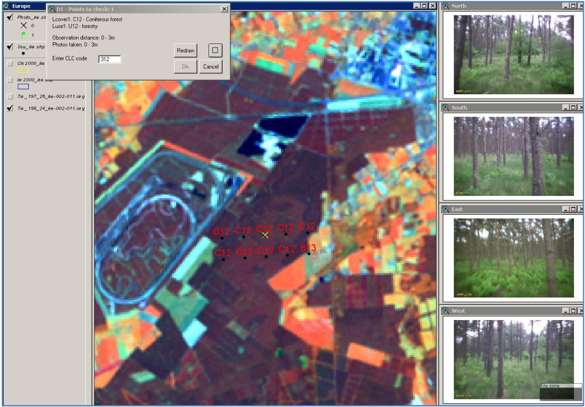

Figure 11: Validation of CLC data by means of LUCAS LU/LC point survey and field photographs

The result of the automatic comparison showed that agreement between CLC2000 and LUCAS LU/LC  was 75.6 ± 0.2 %. This lower agreement was attributed to the resolution difference between the two  datasets (point survey in case of LUCAS and 25 ha MMU in case of CLC).

### Validation of CLC-Change2000-2006 by means of Google Earth imagery

Stratified random sampling was used for validating the CLC-Change2000-2006 database. This was the first  effort to validate CLC-Change dataset in the history of CLC (Büttner et al., 2010). The exercise proved  to be difficult because the total amount of CLC changes was rather low: just 1,24 % of the total area of  EEA39 has changed. Therefore, a special sampling strategy was applied: 100 sample points were  selected from inside each of the 25 level-1 change types, thus representing the whole change polygon  population. 

The large number of participating countries made it unrealistic to collect very high spatial resolution  orthophotos or satellite imagery for the purposes of validation. Therefore, validation was executed  through the independent re-interpretation (using also the ‘enhanced plausibility’ approach) of  IMAGE2000 and IMAGE2006, supported by the use of Google Earth imagery (including image time  series). 

The obtained 87.8 ± 3.3 % overall accuracy (calculated using commission errors only) based on 2405 samples is satisfactory. The omission error was not possible to measure due to the very large sample size that would have been required. 

17 of the 25 change type groups showed accuracy higher than 85 %, 13 types of which had accuracy  higher than 90 %. This group included the largest level-1 change class, namely the internal changes in  forest and semi-natural vegetation. Significant change types with accuracies below 85 % were: (1)  forest and semi-natural area changed to agriculture; and (2) artificial area changed to forest and seminatural cover (e.g. reclamation of mineral extraction sites).

### European validation of CLC2012

This was the first time when the European validation was an integral part of the CLC inventory (AD07) and not an ad-hoc exercise. A stratified systematic sampling approach based on LUCAS was used to  select more than 25.000 sampling locations. These were evaluated by independent experts, not taking  part in the CLC2012 mapping exercise. VHR satellite imagery (not used in production of CLC) and  Google Earth or Bing imagery have been used to interpret the surrounding of control points. The analysis was performed covering all the EEA39 countries and the French DOMs. The thematic accuracy  assessment was conducted in a two-stage process (enhanced plausibility approach): 

1. An initial blind interpretation in which the validation team did not have knowledge of the product’s  thematic classes. However, the polygon outline was provided to the validation team to consider  boundary effects and geometric differences between the validation and production image data.

2. A plausibility analysis was performed on all sample units in disagreement with the production data to consider the following cases: 

• 1: Uncertain code, both producer and operator (validator) codes are plausible. Final validation code used is the producer code.

• 2: Error from first validation interpretation. Final validation used is the producer code.

• 3: Error from producer. Final validation code used is from first validation interpretation.

• 4: Producer and operator are both wrong. Final validation code used is a new code from this second interpretation. 

Validation results were reported at 3 levels: pan-European, country (or group of countries) and by  biogeographical regions. Countries larger than 90.000 \(k\mathsf{m}^{2}\) (15 countries) were separately evaluated,  while countries smaller than 90.000 \(\mathsf{k m}^{2}\) were grouped together (7 groups). Both the CLC2012 status  layer and the CLC-Change2006-2012 layer have been validated. As could be expected, the plausibility  analysis showed better results than the blind analysis for each level of reporting.

Results show that the 85% target accuracy for Europe has been met for the plausibility analysis. Overall  accuracies obtained for CLC2012 are 83.6 % for the blind analysis and 89.7 % for the plausibility  analysis. The overall accuracy for the CLC-Change2006-2012 data layer at CLC level-3 is 81.8% for the blind  analysis and 88.6 % for the plausibility analysis. Lower accuracies were obtained for the Anatolian and  Black Sea regions as well as in the Mediterranean area. The most consistent results were found within  the Eastern temperate zones.

### European validation of CLC2018

The validation of CLC2018 (AD08) was similar to the validation of CLC2012, discussed above. The procedure was part of the CLC2018 project and applied the same methodology as in CLC2012, including two stages: blind interpretation and plausibility analysis (AD07). The target was to validate CLC2018 and CLC-Change2012-2018. 25695 sample points covering 100% of the EEA39 were selected. High resolution (pixel size between 5 m and 20 m) and very high-resolution (pixel size <2 m and 2,5 m) satellite images were used for control, accompanied by Google Earth imagery.

The results show that the CLC2018 products meet the thematic quality requirement, i.e. 85 % in both stages (blind and plausibility) of analysis. The overall accuracies obtained for CLC2018 are 92.43 % for the blind analysis and 92.67 % for the plausibility analysis. The overall accuracy for the CLC-Change2012-2018 data layer at CLC level-3 is 87.12 % for the blind analysis and 87.83 % for the plausibility analysis. These particularly good results are related to the fact that the 2018 dataset was the fifth update of CORINE Land Cover data, and that each time the database has undergone corrections performed by the national teams (SIRS, 2020).

Regarding biogeographic regions, lower than 85% accuracy was obtained for Black Sea region (84 %). The other regions have results above the recommended accuracy threshold (see Table 9 and Figure  12). 

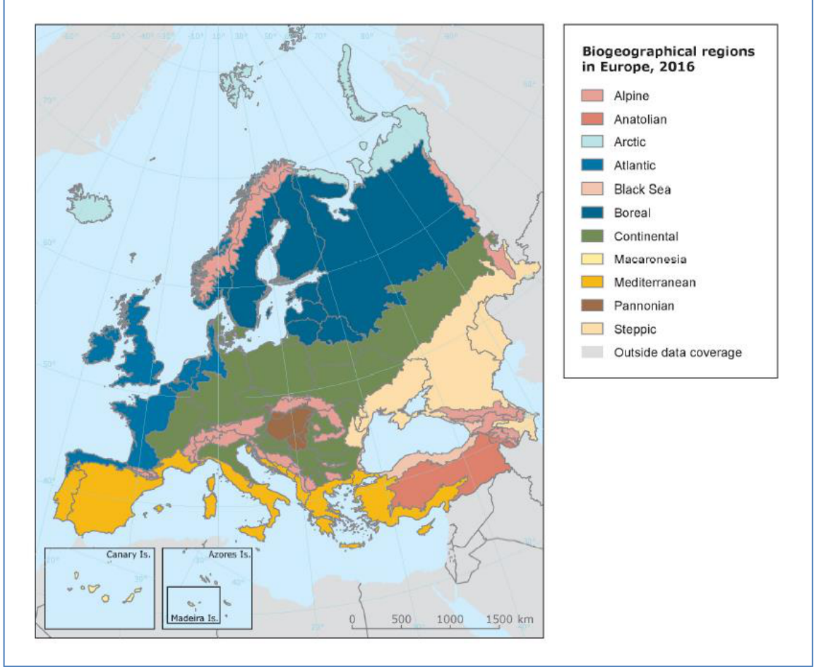

Figure 12: Biogeographic regions of Europe used for stratification of CLC for validation (EEA, 2016)

Table 9 compares the overall accuracies of validation for the biogeographic regions obtained for CLC2012 and CLC2018, while Table 10 compares accuracies obtained for CLC-Change 2006-2012 and CLC-Change2012-2018(AD08). Regarding accuracies of countries(or group of countries)see the European Validation Reports(AD07 an dAD 08).

Table 9:Comparison of accuracies of validation obtained for CLC2012 and CLC2018(AD0S)

||Overall accuracy CLC2012|Overall accuracy CLC2012|Overall accuracy CLC2018|Overall accuracy CLC2018|
|--|--|--|--|--|
||Blindanalysis|Plausibilityanalysis|Blindanalysis|Plausibilityanalysis|
|Alpine|84,29%|92,49%|93,80%|93,89%|
|Anatolian|77,15%|86,44%|86,49%|86,55%|
|Arctic|85,29%|93,75%|98,94%|98,94%|
|Atlantic|87,75%|91,30%|93,15%|94,00%|
|BlackSea|81,70%|84,45%|84,57%|84,03%|
|Boreal|84,35%|89,12%|95,34%|95,30%|
|Continental|83,91%|90,74%|93,21%|93,65%|
|Macaronesia|80,32%|90,33%|93,97%|96,84%|
|Mediterranean|80,69%|86,54%|89,46%|89,63%|
|Pannonian|86,87%|93,48%|96,71%|96,75%|
|Steppic|87,03%|96,40%|96,52%|99,13%|
|Oversea departments|96,41%|97,61%|92,23%|92,35%|

Accuracy betterthan 85%

Accuracy between 80% and 85%

### Accuracy lessthan 80%

Table 10:Comparrson of accuracies of validation obtainedfor CLC-Change2006-2012 and CLC-Change 201222018(AD03)

||OverallaccuracyCLCCH2006-2012level 3|OverallaccuracyCLCCH2006-2012level 3|OverallaccuracyCLCCH2012-2018 level3|OverallaccuracyCLCCH2012-2018 level3|
|--|--|--|--|--|
||Blindanalysis|Plausibilityanalysis|Blindanalysis|Plausibilityanalysis|
|Alpine|83,47%|91,94%|89,86%|90,61%|
|Anatolian|75,62%|85,93%|80,43%|81,34%|
|Arctic|83,12%|93,38%|98,14%|98,19%|
|Atlantic|85,89%|89.81%|89,94%|90,82%|
|BlackSea|81,54%|84,31%|77.99%|78.53%|
|Boreal|80,21%|86,69%|91.14%|91,56%|
|Continental|82.98%|90,25%|87,59%|88,25%|
|Macaronesia|79,95%|89,95%|72,64%|89,97%|
|Mediterranean|79,06%|85,54%|81,37%|82,00%|
|Pannonian|85,29%|92.25%|91,37%|91.80%|
|Steppic|86,99%|96,38%|94,23%|97,02%|
|Oversea departments|96.38%|97,58%|86,41%|86,52%|

Accuracy better than 85%Accuracy between 80% and 85%Accuracy less than 80%

Comparing Tables 9 and 10 show that for each biogeographical region, the overall accuracy for the CLC-Change 2012-2018 layer is systematically lower than the CLC2018 overall accuracy. In most regions,overall accuracy for CLC2018 is higher than for CLC2012(the exceptions are: Black Sea and Overseas departments). Comparing accuracies obtained for CLC-Change2006-2012 and CLC-Change2012-2018 the picture is more varied:there are regions with increased accuracy and others with decreased accuracy.Regions permanently below the 85% threshold are(according to the plausibility analysis):Anatolian,Black Sea and Mediterranean .

# VIII. How to use CLC?

In this chapter some examples are provided concerning the recommended use of CORINE Land cover  data, based on users’ questions arrived at the Copernicus Land Help Desk and published in the  Frequently Asked Questions. Through Help Desk activities it became obvious that land cover change  monitoring and time series analysis is far from being trivial for most of the users. This chapter discusses  two basic cases of change analysis, i.e. between consecutive inventories and between non-consecutive  inventories,

## CLC Changes between consecutive inventories

Question: A user wants to use land cover changes derived from CORINE Land Cover data between 2006  and 2012. Should he/she use the difference between the two status layers or the CLC-Change dataset  instead?

Users interested in CLC changes between consecutive CLC inventories should always rely on the corresponding CLC-Change product and never on the difference (intersection) of the two consecutive status layers. The CLC-Change product includes the real land cover changes mapped directly, with visual control, at a higher-resolution of 5 ha (see Ch. VI. Mapping CLC Changes), while the difference (intersect) product includes the difference of two generalized, lower resolution (25 ha MMU) datasets. The consequence of the “change mapping first” methodology — and eventually that of the different MMUs — is that the difference between two consecutive status layers (here: CLC2006 and CLC2012) will differ from the corresponding CLC-Change layer (here: CLC-Change2000-2006, see Figure 13). The magnitude of difference depends on the size distribution of change polygons. The more changes between 5 and 25 ha, the larger the difference between CLC-Change and the intersect of CLC2000 and CLC2006. If all changes were larger than 25 ha, there would be no difference. 

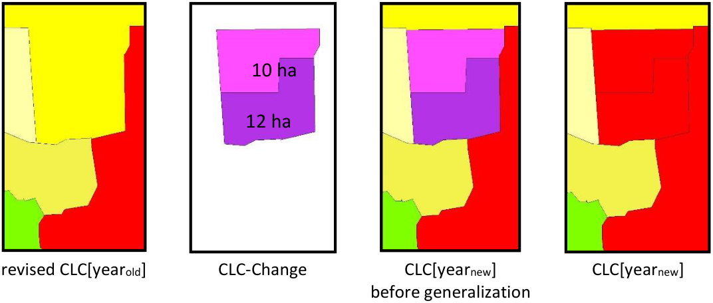

Figure 13: The effect of generalization of <25 ha changes on the new status layer

Explanation of Figure 13: The 1st imagette corresponds to revised CLC[yearold], representing a suburban environment including arable land (yellow) and settlement (red). Attached to the settlement a new construction site (pink) and industry (lilac) are emerging on former arable land (\(2^{\mathsf{n d}}\) imagette, CLCChange). The 3rd imagette shows the CLC[yearnew], if we would not have the 25-ha MMU. However, the new construction site and industry polygons being below MMU (25 ha) are generalized into the  settlement (\(4^{\mathrm{th}}\) imagette) yielding CLC[yearnew]. The difference between CLC[yearold] and CLC[yearnew] is a 22 ha arable-residential change (compare the 1st and 4th imagettes), which is obviously false, because the real changes are different (10 ha arable-construction site change, 15 ha arable-industry change), as indicated by CLC-Change (\(2^{\mathsf{n d}}\) imagette).

Additionally, the revisions (correction) of the old status layer cannot be distinguished from real land  cover changes when intersecting the old and new status layers. (Remember however, that since the  CLC2006 inventory the old status layer is replaced by the revised old status layer upon publication of  the new status layer (see Ch. VI. Revision). This helps distinguishing revisions, but does not solve the  MMU-related issues.) When CLC[yearold] is needed, the user has to be careful to download the revised  version of CLC[yearold] (revised versions CLC[yearold] are found in packages of CLC[yearnew]). See: Ch. VI.  European products.

Example 1: A user is interested in mapping sprawl of residential areas between 2012 and 2018 in the administrative units of Benelux countries.

Download CLC-Change2012-2018 and CLC2012 from the most recent version of Copernicus Land website.  Compile the required change statistics and aggregate it according the administrative units of the study.  Checking the Seamless data coverage table (AD06) one can see that revised CLC2012 has been  produced for Belgium, Luxemburg and Netherlands. As we learnt in Ch. VI., CLC2012 has been replaced  by revised CLC2012 parallel with publication of CLC2018. Therefore, the downloaded CLC2012  (meaning the revised CLC2012) should be used to normalize change statistics to derive percent change  values over the administrative units. If CLC2012 was downloaded from a version before the publication  of CLC2018 this will not include the revisions and might provide misleading results. 

Example 2: A user is interested in mapping forest fires between 2000 and 2006 over the administrative units of Spain.

Download CLC-Change2000-2006 and CLC2006 from the most recent version of CLC from Copernicus Land  website. Compile the required change statistics and aggregate it according the administrative units of  the study. Checking the Seamless data coverage table (AD06) one can see that revised CLC2000 has  not been produced by Spain. Therefore, if you want to normalise results (by using total forest area in  2000) you should be aware of the fact, that your results might be less precise. 

## CLC Changes between non-consecutive inventories

A user intends to study the variation of the extent of wetlands in Europe between 2000 and 2018. For this purpose, he/she used time series of CLC raster data: CLC2000, CLC2006, CLC2012 and 2018, and has found inconsistent results.

Due to methodological reasons, the difference of any non-consecutive CLC inventories (e.g. CLC2018 and CLC2000) would provide an approximation of real changes only26 if no revisions in any of the three involved CLC status layers (CLC2000, CLC2006, CLC2012) had taken place. However, this situation can hardly happen in the practice.

The code of a CLC[yearnew] polygon can be different from code of CLC[yearold] polygon because of the  following reasons:

• A real CLC change occurred between the two inventories.

• A revision of CLC[yearold] was done during the change mapping process (see Ch. VI. Revision).

• Independent of the actual inventory, the national team enhanced (revised) one or more of the classes of their CLC (Banko, 2020; Thulin, 2019).

• Methodological changes occurred in CLC production (typically replacing photointerpretation with a semi-automated methodology), which can influence significantly (sometimes dramatically) the geometry as well as the thematic content of CLC (Álvarez and Camacho Olmedo, 2017). This happened so far in Germany, Ireland, Portugal, and Spain (Figure 14). See details at Ch. VI. Semi-automated approaches applied in CLC.

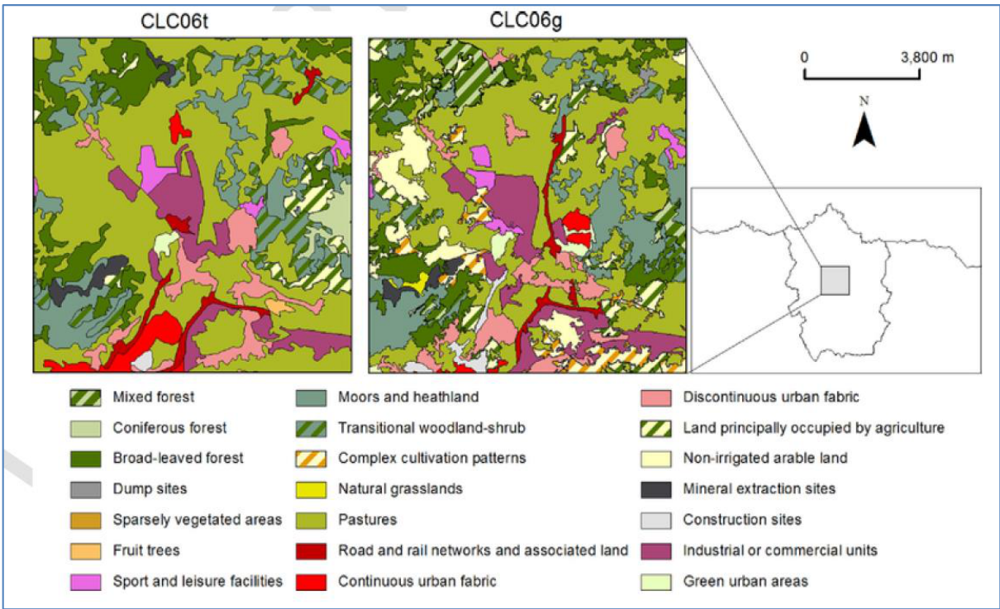

Figure 14: Comparison of CLC2006 produced by photointerpretation (left) and by generalisation from SIOSE (right)

If one compares CLC inventories more distant in time (e.g. CLC2000 and CLC2018) the difference will always include real changes mixed with modifications of the status databases. Methodological changes in a few countries mentioned above further complicate the situation. 

The solution is using the so-called accounting layers (see Ch. V. CLC accounting layers and Annex 5) made available by EEA to help comparing “distant” status layers, like CLC2000 and CLC2018. Accounting layers (synthetized CLCs) were derived backwards by deducting CLC-Change layers consecutively from the latest (best available) status layer (currently: CLC2018).

# IX. Terms of use and product technical support

## Terms of use

The product(s) described in this document is/are created in the frame of the Copernicus programme  of the European Union by the European Environment Agency (product custodian) and is/are owned by the European Union. The product(s) can be used following Copernicus full free and open data policy,  which allows the use of the product(s) also for any commercial purpose. Derived products created by  end users from the product(s) described in this document are owned by the end users, who have all  intellectual rights to the derived products.

## Citation

In cases of re-dissemination of the product(s) described in this document or when the product(s) is/are used to create a derived product it is required to provide a reference to the source. A template is provided below:

“© European Union, Copernicus Land Monitoring Service <year>, European Environment Agency (EEA)"

## Product technical support

Product technical support is provided by the product custodian through Copernicus Land Monitoring Service helpdesk at copernicus@eea.europa.eu. Product technical support doesn’t include software specific user support or general GIS or remote sensing support.

# X. References

AUNE-LUNDBERG, L. AND G-H. STRAND (2010). CORINE Land Cover 2006. The Norwegian CLC2006 project. Report from the Norwegian Forest and Landscape Institute, 11/2010.

ÁLVAREZ, D.G., AND M.T. CAMACHO OLMEDO (2017). Changes in the methodology used in the production  of the Spanish CORINE: Uncertainty analysis of the new maps. International Journal of Applied Earth Observation and Geoinformation. December 2017.

BANKO, G. (2020) Personal communication.

BOSSARD, M, FERANEC, J. AND J. OTAHEL (2000). CORINE Land Cover Technical Guide – Addendum 2000. EEA Technical Report No. 40, 2000.

BÜTTNER,GY.,MAUCHA,G. AND G. TARACSÁK (2003). Inter-Change: A software support for interpreting land  cover changes. In Benes, T. (editor): Geoinformation for European-wide interpretation. Proceedings of  the 22nd EARSeL Symposium, Prague, 2002. (pp. 93-98). Millpress, 2003.

BÜTTNER, GY., G. MAUCHA (2006). The thematic accuracy of CORINE Land Cover 2000. Assessment using  LUCAS (land use /cover area frame statistical survey). EEA Technical reportNO. 7/2006. ISSN1725-2237. http://www.eea.europa.eu/publications/technical_report_2006_7

BÜTTNER,GY., KOSZTRA, B.,MAUCHA,G.&R. PATAKI(2010). Implementation and achievements of CLC2006.  Final Report to EEA, Copenhagen by ETC-SIA, 2010. https://land.copernicus.eu/user-corner/technicallibrary/CLCFinalrep_revised_finaldraft.pdf

BÜTTNER, GY. (2014) CORINE land cover and land cover change products. In I. MANAKOS and M. BRAUN  (editors): Land use and land cover mapping in Europe: Practices & trends (PP. 55–74). Remote Sensing  and Digital Image Processing 18. Springer, Dordrecht, 2014.

BÜTTNER, GY., KOSZTRA, B. AND G. MAUCHA (2016a). Accuracy Assessment of CLC data. In: J. FERANEC, T. SOUKUP, G. HAZEU, G. JAFFRAIN (editors): European landscape dynamics: CORINE Land Cover data (pp. 41-52), CRC Press, 2016.

CAETANO, M., MATA, F. AND S. FREIRE (2006). Accuracy assessment of the Portuguese CORINE Land Cover map. In Marcal, A. (editor), Global Developments in Environmental Earth Observation from Space.  Proceedings of the 25th EARSeL Symposium, Porto, 2005. (pp. 459-467). Millpress 2006.

CHAVEZ, P. S. JR, SIDES, S. S. AND J. A. ANDERSON (1991). Comparison of three different methods to merge  multiresolution and multispectral data: Landsat TM and SPOT panchromatic. Photogrammetric  Engineering and Remote Sensing, 57, 295-303.

ENGBERG, A. (2005). Swedish CLC2000 Final Report, Lantmäteriet, 2005.

ETC-ULS (2016). Planning of cooperation with EEA member and cooperating countries in preparation of the CLC2018 exercise. Service Contract No. 3436/R0-Copernicus/EEA.56586. ETC/ULS report. 20/12/2016.

ETC-ULS (2018). CLC2018 training report Portugal.

FEDERAL ENVIRONMENT AGENCY GERMANY (2012). Implementation of Pan-EU Component of GIO Land in  Germany, 2012.

FINNISH ENVIRONMENT INSTITUTE (2005). CLC2000 Finland Final Report, SYKE, 2005.

HAZEU, G.W. (2003). CLC2000 Land Cover database of the Netherlands. Alterra Rapport, 775. Wageningen: Alterra, 2003.

HAZEU, G., BÜTTNER, GY., AROZARENA, A., VALCÁRCEL, N., FERANEC, J. AND G. SMITH (2016). Detailed CLC Data:  Member States with CLC Level 4/Level 5 and (Semi-)Automated Solutions. In: J. Feranec, T. Soukup, G.  Hazeu, G. Jaffrain (editors): European landscape dynamics: CORINE Land Cover data (pp. 277-304), CRC  Press, 2016.

LYDON, K. AND SMITH, G. (2014). CORINE Landcover 2012 Ireland, Final report, EPA. https://www.epa.ie/pubs/data/corinedata/CLC2012_IE_Final_Report.pdf

MAUCHA, G. AND GY. BÜTTNER (2006). Validation of the European CORINE Land Cover 2000 database. In  Marcal, A. (editor), Global Developments in Environmental Earth Observation from Space. Proceedings  of the 25th EARSeL Symposium, Porto, 2005. (pp. 449-457). Millpress 2006.

NATIONAL LAND SURVEY OF ICELAND (2009). CLC2006, CLC2000 and CLC-Changes in Iceland, Final Report, NLSI, 2009.

PATAKI, R. (2018). ArcGIS 10.5-10.3 toolbox for creation of CLC2018 database. User Guide. ETC-ULS partner BFKH.

SOUSA, A. (2020). Personal communication.

TARACSÁK, G. (2018). CLC2018 Support Package. http://clc2018.taracsak.hu/

THULIN, S. (2019). Personal communication with Copernicus Land Help Desk, 2019.

## Documents of the EU

85/338/EEC (1985). Council Decision of 27 June 1985 on the adoption of the Commission work  programme concerning an experimental project for gathering, coordinating and ensuring the  consistency of information on the state of the environment and natural resources in the Community  https://op.europa.eu/en/publication-detail/-/publication/96f31dc9-8b92-40ed-9e38-35f83ee44ca5/languageen

EUROSTAT (2003). The LUCAS survey - European statisticians monitor territory https://ec.europa.eu/eurostat/web/products-statistical-working-papers/-/KS-AZ-03-001?inheritRedirect=true

EUROSTAT (2019). https://ec.europa.eu/eurostat/statistics-explained/index.php/LUCAS_-_Land_use_and_land_cover_survey#LUCAS_-_the_historical_perspective

HEYMANN, Y., STEENMANS, C., CROISELLE, G., AND M. BOSSARD (1993). CORINE land cover technical guide. European Commission, CECA-CEE-CEEA, Brussels, Luxembourg, 1993.

REGULATIONEU(2010). No 911/2010 of the European Parliament and of the Council of 22 September 2010 on the European Earth monitoring programme (GMES) and its initial operations (2011 to 2013) http://www.google.com/search?q=EU+Regulation +%28EU%29+n%C2%B0911%2F2010

# XI. Annexes

## Annex 1: The standard CORINE Land Cover nomenclature (class names only)

|LEVEL 1|LEVEL 2|LEVEL 3|
|--|--|--|
|1. ARTIFICIAL SURFACES|1.1. Urban fabric|1.1.1. Continuous urban fabric1.1.2. Discontinuous urban fabric|
|1. ARTIFICIAL SURFACES|1.2. Industrial, commercial and transport units|1.2.1. Industrial or commercial units1.2.2. Road and rail networks and associated land1.2.3. Port areas1.2.4. Airports|
|1. ARTIFICIAL SURFACES|1.3. Mine, dump and construction sites|1.3.1. Mineral extraction sites1.3.2. Dump sites1.3.3. Construction sites|
|1. ARTIFICIAL SURFACES|1.4. Artificial, non-agricultural vegetated areas|1.4.1. Green urban areas1.4.2. Sport and leisure facilities|
|2. AGRICULTURAL AREAS|2.1. Arable land|2.1.1. Non-irrigated arable land2.1.2. Permanently irrigated land2.1.3. Rice fields|
|2. AGRICULTURAL AREAS|2.2. Permanent crops|2.2.1. Vineyards2.2.2. Fruit trees and berry plantations2.2.3. Olive groves|
|2. AGRICULTURAL AREAS|2.3. Pastures|2.3.1. Pastures|
|2. AGRICULTURAL AREAS|2.4. Heterogeneous agricultural areas|2.4.1. Annual crops associated with permanent crops2.4.2. Complex cultivation patterns2.4.3. Land principally occupied by agriculture, with significant areas of natural vegetation2.4.4. Agro-forestry areas|
|3. FOREST AND SEMI-NATURAL AREAS|3.1. Forests|3.1.1. Broad-leaved forest3.1.2. Coniferous forest3.1.3. Mixed forest|
|3. FOREST AND SEMI-NATURAL AREAS|3.2. Scrub and/or herbaceous associations|3.2.1. Natural grassland3.2.2. Moors and heathland3.2.3. Sclerophyllous vegetation3.2.4. Transitional woodland-scrub|
|3. FOREST AND SEMI-NATURAL AREAS|3 .3. Open spaces with little or no vegetation|3.3.1. Beaches, dunes, sands3.3.2. Bare rocks3.3.3. Sparsely vegetated areas3.3.4. Burnt areas3.3.5. Glaciers and perpetual snow|
|4. WETLANDS|4.1. Inland wetlands|4.1.1. Inland marshes4.1.2. Peat bogs|
|4. WETLANDS|4.2. Marine wetlands|4.2.1. Salt marshes4.2.2. Salines4.2.3. Intertidal flats|
|5. WATER BODIES|5.1. Inland waters|5.1.1. Water courses5.1.2. Water bodies|
|5. WATER BODIES|5.2. Marine waters|5.2.1. Coastal lagoons5.2.2. Estuaries5.2.3. Sea and ocean|

## Annex 2: Naming convention of CLC products

## CORINE LAND COVER - EUROPEAN SEAMLESS DATABASE (VERSION 2020_20u1)27

## FILE NAMING CONVENTION

New file naming convention has been introduced based on user feedback on version 20. Filename is  composed of combination of information about update campaign, data theme and reference year and version specification (including release year and release number).

## UPDATE CAMPAIGN | THEME| REFERENCE YEAR | RELEASE YEAR | RELEASE NUMBER

UPDATE CAMPAIGN:

• update campaign refers to the year of the CLC campaign, when the file content was last modified or updated

THEME:

• theme refers to specific CLC layer type: clc - refers to status layer, cha - refers to change layer REFERENCE YEAR: 

• reference year refers to the year for which CLC information included in the file were mapped RELEASE YEAR:

• release year refers to the year of CLC data release

RELEASE NUMBER:

• release number refers to a sequential numbering of CLC data releases. Initially it is named as  a beta version (e.g. 20b2) until the new complete final version is ready covering the full  territory (e.g. 20). Any subsequent minor update is recorded as incremental number in suffix  (e.g. 20u1).

### Examples:

U<update campaign>_<theme><reference year>_V<release year>_<release number>

file name: ‘U2006_CLC2000_V2020_20b2' means:

U2006 - last modification / update of the file is from the 2006 mapping campaign

CLC2000 - file contains CLC status data for reference year 2000

V2020_20b2 - file was released in 2020 as second beta (incomplete/partial) version of version 20

file name 'U2018_CHA1218_V2020_20u1' means:

U2018 - last modification / update of the file is from the 2018 mapping campaign  CHA1218 - file contains CLC change data between reference years 2012 and 2018 V2020_20u1 - file was released in 2020 as a first update of final version 20

### Special cases:

#### Change layers in raster

In order to keep 8bit resolution for raster version, change layers are divided into two files.

Vector file name:

U2018_CHA1218_V2020_20u1

Raster files name:

U2018_CHA1218_12_V2020_20u1 - file contains consumption part of change (‘from’ code) U2018_CHA1218_18_V2020_20u1 - file contains formation part of change (‘to’ code)

Overseas countries and territories -Overseas departments (DOMs)

Overseas countries and territories are delivered as separate package to keep consistency between  vector and raster delivery. Structure of the delivery and file naming conventions are the same except DOM specification (country code and DOM code) suffix.

UPDATE CAMPAIGN | THEME | REFERENCE YEAR| RELEASE YEAR | RELEASE NUMBER | COUNTRY CODE | DOM  CODE

Example:

U<update campaign>_<theme><reference year>_V<release year>_<release number>_<country  code>_<DOM code>

file name: ‘U2006_CLC2000_V2018_20b2_FR_GLP' means

U2006 - last modification / update of the file is from the 2006 mapping campaign

CLC2000 - file contains CLC status data for reference year 2000

V2018_20b2 - file was released in 2018 as second beta version (incomplete) of version 20

FR - file is for French territory

GLP - DOM name is Guadeloupe

***********************************************************

Prepared by GISAT 02/2020

Remark:

File naming convention might change. In case of any doubt see the valid document:  https://land.copernicus.eu/user-corner/technical-library/clc-file-naming-conventions-guidev20u1.pdf

## Annex 3: Responsible national organisations producing CLC2018

|Albania|National Environment Agency|
|--|--|
|Austria|Umweltbundesamt (UBA)|
|Belgium|Institut Géographique National / Nationaal Geografisch Instituut|
|Bosnia and Herzegovina|Faculty of Agricultural and Food Sciences (PAM)|
|Bulgaria|Executive Environment Agency|
|Croatia|Oikon doo|
|Cyprus|Cyprus University of Technology|
|Czech Republic|Czech Environmental Information Agency (CENIA)|
|Denmark|GILAB doo|
|Estonia|Estonian Map Center|
|Finland|Finnish Environment Institute (SYKE)|
|France|Systèmes d'Information à Référence Spatiale (SIRS)|
|Germany|Bundesamt für Kartographie und Geodäsie (BKG)|
|Greece|Hellenic Cadastre|
|Hungary|BFKH (former FÖMI)|
|Iceland|National Land Survey of Iceland (NLSI)|
|Ireland|Environmental Protection Agency (EPA)|
|Italy|Italian National Institute for Environmental Protection and Research (ISPRA)|
|Kosovo|Kosovo Environmental Protection Agency|
|Latvia|GIS-Centras – National Center for Remote Sensing and Geoinformatics|
|Liechtenstein|Umweltbundesamt (UBA)|
|Lithuania|GIS-Centras – National Center for Remote Sensing and Geoinformatics|
|Luxembourg|space4environment sárl|
|Macedonia|GOVE doo|
|Malta|Swiss Federal Institute for Forest, Snow and Landscape Research (WSL)|
|Montenegro|Geological Survey of Montenegro|
|Netherlands|Wageningen Environmental Research (Alterra)|
|Norway|Norwegian Institute of Bioeconomy Research (NIBIO)|
|Poland|Institute of Geodesy and Cartography (IGiK)|
|Portugal|Direção-Geral do Território (DGT)|
|Romania|Danube Delta Institute (DDNI)|
|Serbia|GILAB doo|
|Slovakia|Slovak Environment Agency (SEA)|
|Slovenia|Geodetic Institute of Slovenia|
|Spain|Centro Nacional de Información Geográfica, D.G. Instituto Geográfico Nacional (IGN-CNIG)|
|Sweden|Lantmäteriet (Swedish Mapping, Cadastral and Land Registration Authority)|
|Switzerland|Swiss Federal Institute for Forest, Snow and Landscape Research (WSL)|
|Turkey|Ministry of Forestry and Water Affairs|
|United Kingdom|University of Leicester|

A n n e x 4:C L C g e n e r a l i s a t i o n t a b l e

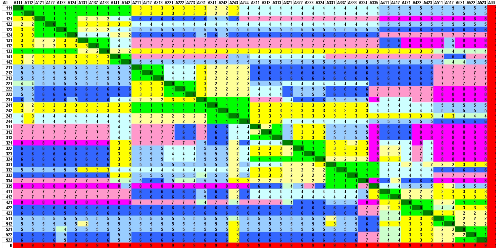

In column A0 code of polygon under size limit (to be generalised), in rows priority of merging with their neighbours of the code given in the column header are listed. The smaller the priority value, the higher the similaritybetween the polygon to be generalised and its  neighbour.Source: Bossard et al, 2000; Pataki, 2018.

(Note that figure illustrates the priority table version valid at first publishing of the generalisation toolbox (10 July 2014). Figure is not  updated to follow any further modificationsof the table.)

## Annex 5: CORINE Land Cover accounting layers

CORINE Land Cover (CLC) data are produced from 1986 for European (EEA member or cooperating) countries. Altogether five mapping inventories were implemented in this period, producing five status layers (CLC1990, CLC2000, CLC2006, CLC2012, CLC2018) and four CLC-Change layers for the corresponding periods (1990-2000, 2000-2006, 2006-2012, 2012-2018). Pan-European CLC and CLCChange data are available as vector and raster products.

Due to the technical characteristics of CLC and CLC-Change data, the evolution in CLC update  methodology and in quality of input data, time-series statistics derived directly from historical CLC data include several inconsistencies. A harmonization methodology has been developed to allow a  statistically solid basis for CLC time series analysis by means of the so-called CLC accounting layers.

The solution applied for the harmonization of CLC time-series is based on the idea to combine CLC  status and change information in order to create a homogenous quality time series of CLC / CLC-Change  layers for land cover accounting purposes fulfilling the relation: 

CLC-Change = Accounting CLC_new status – Accounting CLC_old status

As a consequence of this criteria, CLC changes for longer period (e.g. between 2000 and 2018) may be  derived from the differences of the corresponding CLC accounting status layers.

The CLC accounting methodology is characterized by two major steps:

I. Add more detail to the latest CLC status layer (CLC2018) from previous CLC-Change information and use this modified layer (CLC2018 accounting layer) as a reference,

II. Create previous CLC (accounting) status layers by "backdating" of the reference, realized by  subtracting CLC-Change-based information from CLC2018 accounting layer.

Based on the above principles, the working steps of the creation of CLC accounting layers are as follows:

1) Include formation information (i.e. code[yearnew]) from the CLC-Change layers into the CLC2018 status layer, thereby creating the CLC2018 accounting layer, as follows:

a. Overwrite CLC2018 with formation code (i.e. code2006) from CLC-Change2000-2006. Intermediate result: A1_CLC2018

b. Overwrite A1_CLC2018 with formation code (i.e. code2012) from CLC-Change2006-2012. Intermediate result: A2_CLC2018

c. Overwrite A2_CLC2018 with formation code (i.e. code2018) from CLC-Change2012-2018. Result: Final accounting layer for the reference year 2018 (file name:  CLC2018ACC_V2018_20.tif28)

2) Create CLC2012 accounting layer by including consumption information (i.e. code2012) into  CLC2018ACC_V2018_20.tif from CLC-Change2012-2018. Result: Final accounting layer for the  reference year 2012 (file name: CLC2012ACC_V2018_20).

3) Create CLC2006 accounting layer by including consumption information (i.e. code2006) into  CLC2012ACC_V2018_20.tif from CLC-Change2006-2012. Result: Final accounting layer for the  reference year 2006 (file name: CLC2006ACC_V2018_20).

4) Create CLC2000 accounting layer by including consumption information (i.e. code2000) into CLC2006ACC_V2018_20.tif from CLC-Change2000-2006. Result: Final accounting layer for the  reference year 2000 (file name: CLC2000ACC_V2018_20).

Notes:

The actual set of CLC accounting layers was created on the basis of version V2018_20 of CORINE Land Cover European database (RELEASE V2018_20; dated 06/2019).

The simple solution applied for the combination of CLC and CLC-Change layers causes some known issues, such as: 

• Due to the accounting methodology (i.e. combining a 25 ha MMU status layer with 5 ha MMU change layers) many smaller than 25ha MMU features will appear locally. 

• “Fake features” may appear in the backdated CLC status layers due to inconsistencies between CLC-Change datasets and due to omitted (not interpreted) changes.

In the frame of ETC-ULS activity a raster generalization methodology was developed to eliminate fake features and attenuate effects of mixed MMU29. This methodology has not been approved yet, so has not been applied to actual CLC accounting layers.

## Annex 6:Selected use cases of CORINE Land Cover

### European level applications

### EEA indicators

|Application name|
|--|
|LAND TAKE IN EUROPE(EEACSI014)|
|Application domain|
|EU/international                    UrbanEnvironmental accounting/impact assessmentSpatial planning|
|Responsible organisation/client|
|EEA                    2019|
|Short description of the application , describing role of CLC|
|The land take indicator addresses the change in the area of agricultural, forest and other semi-natural land taken for urban and other artificial land development.Land take includes areas sealedby construction and urban infrastructure, as well as urban green areas, and sport and leisurefacilities. The data are derived from the CORINE Land Cover accounting layers.|
|Illustration of application|
|Land take per major land cover categories-Yearly land take per major land cover category intheEU-28 for all Corine Land Cover observation periods500                    Arable land and permanentcrops(kmz/yr)Forests and transitionalwoodland shrub(km2/yr)Natural grassland,400                    heathland,sclerophylousvegetation(km2/yr)Pastures and mosaicfarmland(km2/yr)Wetlands(km²/yr)30020010002000-2006             2006-2012             2012-2018             2000-2018|

Policy domain of the application

The indicator addresses the 7th Environment Action Programme target to reach 'no net land take  by 2050' and the Land Degradation Neutrality target of the United Nations Development Goals  (SDG 15.3). 

Link to application / results / Bibliographic reference

https://www.eea.europa.eu/data-and-maps/indicators/land-take-3/assessment

|Application name|Application name|Application name|
|--|--|--|
|FRAGMENTATION OF NATURAL AND SEMI-NATURAL AREAS(EEASEBI013)|FRAGMENTATION OF NATURAL AND SEMI-NATURAL AREAS(EEASEBI013)|FRAGMENTATION OF NATURAL AND SEMI-NATURAL AREAS(EEASEBI013)|
|Application domain|Application domain|Application domain|
|EU/international|Urban, Agriculture, ForestBiodiversity/nature conservation|Urban, Agriculture, ForestBiodiversity/nature conservation|
|Responsible organisation/client|Responsible organisation/client|Responsible organisation/client|
|EEA|EEA|2017|
|Short description of the application, describing role of CLC|Short description of the application, describing role of CLC|Short description of the application, describing role of CLC|
|The landscape mosaic pattern in Europe is changing due to two opposing landscape processes thatare driven by either anthropogenic or natural factors. Such changes have an impact on the supply ofecosystem functions and services such as habitat provision , species dispersal, pollination, pestcontrol or climate mitigation . The indicator illustrates the increasing fragmentation of natural andsemi-natural lands by anthropogenic factors, such as the expansion of agricultural areas, transportinfrastructures, settlements and the occurrence offfres.The indicator has 2 sub-indicators:Fragmentation of natural and semi-natural areasForest connectivityThe indictor is based on CLC2000 and CLC2006.|The landscape mosaic pattern in Europe is changing due to two opposing landscape processes thatare driven by either anthropogenic or natural factors. Such changes have an impact on the supply ofecosystem functions and services such as habitat provision , species dispersal, pollination, pestcontrol or climate mitigation . The indicator illustrates the increasing fragmentation of natural andsemi-natural lands by anthropogenic factors, such as the expansion of agricultural areas, transportinfrastructures, settlements and the occurrence offfres.The indicator has 2 sub-indicators:Fragmentation of natural and semi-natural areasForest connectivityThe indictor is based on CLC2000 and CLC2006.|The landscape mosaic pattern in Europe is changing due to two opposing landscape processes thatare driven by either anthropogenic or natural factors. Such changes have an impact on the supply ofecosystem functions and services such as habitat provision , species dispersal, pollination, pestcontrol or climate mitigation . The indicator illustrates the increasing fragmentation of natural andsemi-natural lands by anthropogenic factors, such as the expansion of agricultural areas, transportinfrastructures, settlements and the occurrence offfres.The indicator has 2 sub-indicators:Fragmentation of natural and semi-natural areasForest connectivityThe indictor is based on CLC2000 and CLC2006.|
|Illustration of application|Illustration of application|Illustration of application|
|National distribution of forest connectivity for year 2006 and forest connectivity change in theperiod 2000-2006National distribution offorest connectivity and forestconnectivity changeProportion oflandscape unitsper connectivity range(year 2006)<30%30%-50%>50%Trend ofunits in range>50%(years 2000-2006)Medium decreaseLow decreaseStableLow increaseMedium increaseNo dataOutside coverage500      1000|National distribution of forest connectivity for year 2006 and forest connectivity change in theperiod 2000-2006National distribution offorest connectivity and forestconnectivity changeProportion oflandscape unitsper connectivity range(year 2006)<30%30%-50%>50%Trend ofunits in range>50%(years 2000-2006)Medium decreaseLow decreaseStableLow increaseMedium increaseNo dataOutside coverage500      1000|National distribution of forest connectivity for year 2006 and forest connectivity change in theperiod 2000-2006National distribution offorest connectivity and forestconnectivity changeProportion oflandscape unitsper connectivity range(year 2006)<30%30%-50%>50%Trend ofunits in range>50%(years 2000-2006)Medium decreaseLow decreaseStableLow increaseMedium increaseNo dataOutside coverage500      1000|
|Policy domain of the application|
|Biodiversity policy – Halting the loss of biodiversity|
|Link to application / results / Bibliographic reference|
|https://www.eea.europa.eu/data-and-maps/indicators/fragmentation-of-natural-and-semi-1/assessment-1|

Application name

LANDSCAPE FRAGMENTATION IN EUROPE

Application domain

### EU / international Biodiversity/nature conservation

### Environmental accounting / impact assessment

Responsible organisation / client

#### EEA and FOEN (Swiss Federal Office for the Environment) 2016

Short description of the application, describing role of CLC

Landscape fragmentation is the result of transforming large habitat patches into smaller, more  isolated fragments of habitat. The aim of the study “Landscape fragmentation in Europe” was to  quantify landscape fragmentation of land areas in all countries in Europe for which the necessary  data were available. The study considered fragmentation caused by transportation infrastructure  and built-up areas. Effective mesh size and effective mesh density are applied to measure landscape  fragmentation. 

Some classes (mainly built-up areas) from CLC were used as fragmenting elements.

Illustration of application

Wildlife corridor network of trans-regional importance in Switzerland. Size of unfragmented landscape parts in \(\mathsf{k m}^{2}\).

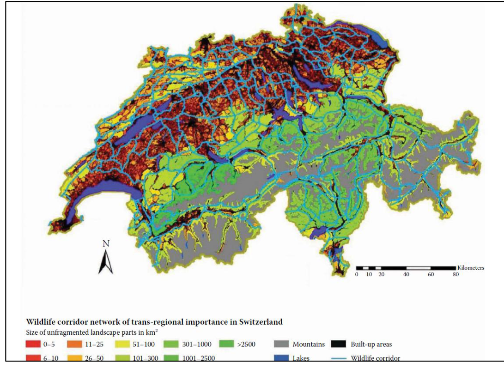

|Policy domain of the application|
|--|
|Implications for Nature Conservation, Traffic and Urban Planning:- A tool for performance review- Relevance for biodiversity: tangible guiding concepts regarding fragmentation of habitats for mammals|
|Link to application / results / Bibliographic reference|
|Jochen A. G. Jaeger, Tomas Soukup, Christian Schwick, Luis F. Madriñán, and Felix Kienast, 2016. Landscape fragmentation in Europe. In Feranec, J., Soukup, T., Hazeu, G. and Jaffrain, G., 2016. European Landscape Dynamics: CORINE Land Cover Data. CRC Press, Boca Raton, 337 Pages - 52 Color & 45 B/W Illustrations, ISBN 9781482244663.EEA (European Environment Agency) and FOEN (Swiss Federal Office for the Environment), 2011. Landscape fragmentation in Europe. Joint EEA-FOEN report. EEA Report No. 2/2011 (J. A. G. Jaeger, T. Soukup, L. F. Madriñán, C. Schwick, and F. Kienast, authors). Luxembourg: Publications Office of the European Union.|

|Application name|Application name|Application name|
|--|--|--|
|VEGETATION PRODUCTIVITY (LSI 009)|VEGETATION PRODUCTIVITY (LSI 009)|VEGETATION PRODUCTIVITY (LSI 009)|
|Application domain|Application domain|Application domain|
|EU / international|Biodiversity / Nature conservation Environmental monitoring / impact assessment|Biodiversity / Nature conservation Environmental monitoring / impact assessment|
|Responsible organisation / client|Responsible organisation / client|Responsible organisation / client|
|EEA|EEA|2020|
|Short description of the application, describing role of CLC|Short description of the application, describing role of CLC|Short description of the application, describing role of CLC|
|The indicator addresses trends in land surface productivity derived from remote sensing observed time series of vegetation indices. The vegetation index used in the indicator is the Plant Phenology Index. Vegetation productivity indicates the spatial distribution and change of the vegetation cover – a key characteristic of ecosystem condition. Monitoring vegetation productivity of lands is essential for understanding the interactions between the biosphere, the climate and biogeochemical cycles.Vegetation productivity was correlated to climatic drivers, such as the number of frost days, precipitation and temperature, in a multivariate linear regression. Using the CORINE Land Cover (CLC) 2000-2018 series, only those grid cells were considered in this analysis where the CLC layers indicated no land use change between 2000-2018.|The indicator addresses trends in land surface productivity derived from remote sensing observed time series of vegetation indices. The vegetation index used in the indicator is the Plant Phenology Index. Vegetation productivity indicates the spatial distribution and change of the vegetation cover – a key characteristic of ecosystem condition. Monitoring vegetation productivity of lands is essential for understanding the interactions between the biosphere, the climate and biogeochemical cycles.Vegetation productivity was correlated to climatic drivers, such as the number of frost days, precipitation and temperature, in a multivariate linear regression. Using the CORINE Land Cover (CLC) 2000-2018 series, only those grid cells were considered in this analysis where the CLC layers indicated no land use change between 2000-2018.|The indicator addresses trends in land surface productivity derived from remote sensing observed time series of vegetation indices. The vegetation index used in the indicator is the Plant Phenology Index. Vegetation productivity indicates the spatial distribution and change of the vegetation cover – a key characteristic of ecosystem condition. Monitoring vegetation productivity of lands is essential for understanding the interactions between the biosphere, the climate and biogeochemical cycles.Vegetation productivity was correlated to climatic drivers, such as the number of frost days, precipitation and temperature, in a multivariate linear regression. Using the CORINE Land Cover (CLC) 2000-2018 series, only those grid cells were considered in this analysis where the CLC layers indicated no land use change between 2000-2018.|
|Illustration of application|Illustration of application|Illustration of application|
||||

Illustration of application

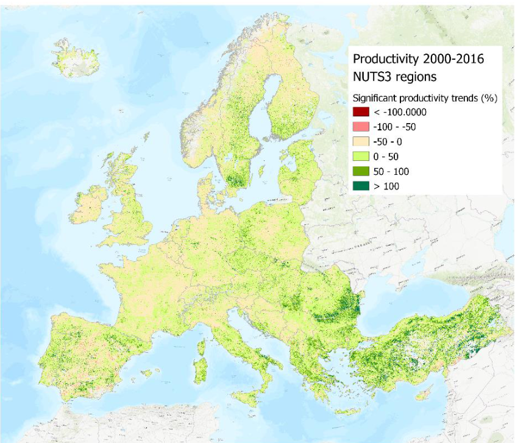

|Policy domain of the application|
|--|
|Biodiversity Strategy, Green Infrastructure, LULUCF, CAP|
|Link to application / results / Bibliographic reference|
|https://www.eea.europa.eu/data-and-maps/indicators/land-productivity-dynamics/assessment|

CAP and agri-environmental indicators 

|Application name|Application name|Application name|
|--|--|--|
|AGRI-ENVIRONMENTAL INDICATOR 9 – LAND USE CHANGE|AGRI-ENVIRONMENTAL INDICATOR 9 – LAND USE CHANGE|AGRI-ENVIRONMENTAL INDICATOR 9 – LAND USE CHANGE|
|Application domain|Application domain|Application domain|
|EU / international|Urban Agriculture Forest Water / marine / coastal Environmental accounting / impact assessment|Urban Agriculture Forest Water / marine / coastal Environmental accounting / impact assessment|
|Responsible organisation / client|Responsible organisation / client|Responsible organisation / client|
|EEA / Eurostat / DG AGRI|EEA / Eurostat / DG AGRI|2000-2018|
|Short description of the application, describing role of CLC|Short description of the application, describing role of CLC|Short description of the application, describing role of CLC|
|The indicator represents land use change from agriculture to artificial surfaces between 2000 and 2018 in absolute terms (hectares) and as a percentage of the agricultural area in 2000 (100 m grid, NUTS 3 regions or country level). Land use change is defined as the exits from agricultural land use broken down by non – agricultural sectors. It represents the conversion of agricultural area to non-agricultural use.CORINE Land Cover accounting layer 2000 and 2018 has been used as input data.|The indicator represents land use change from agriculture to artificial surfaces between 2000 and 2018 in absolute terms (hectares) and as a percentage of the agricultural area in 2000 (100 m grid, NUTS 3 regions or country level). Land use change is defined as the exits from agricultural land use broken down by non – agricultural sectors. It represents the conversion of agricultural area to non-agricultural use.CORINE Land Cover accounting layer 2000 and 2018 has been used as input data.|The indicator represents land use change from agriculture to artificial surfaces between 2000 and 2018 in absolute terms (hectares) and as a percentage of the agricultural area in 2000 (100 m grid, NUTS 3 regions or country level). Land use change is defined as the exits from agricultural land use broken down by non – agricultural sectors. It represents the conversion of agricultural area to non-agricultural use.CORINE Land Cover accounting layer 2000 and 2018 has been used as input data.|
|Illustration of application|Illustration of application|Illustration of application|

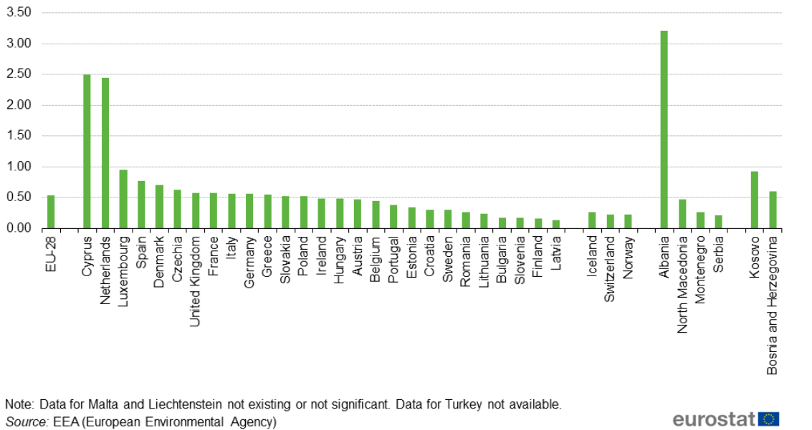

Policy domain of the application

European Spatial Development Perspective, Territorial Agenda of the EU, European Soil Thematic Strategy, Biodiversity Strategy, CAP 

Link to application / results / Bibliographic reference

images/9/96/Figure1_Change_in_land_use_from_agriculture_to_artificial_surfaces_2000-2018_EU

28_EFTA_CC_PCC.png

Application name

AGRI-ENVIRONMENTAL INDICATOR 2 – UTILISED AGRICULTURAL AREAS (UAA) UNDER  NATURA 2000  also CAP CONTEXT INDICATOR 34 – N2000 AREAS

Application domain

### EU / international Agriculture

### Forest

### Biodiversity / nature conservation

Responsible organisation / client

#### EEA / Eurostat / DG AGRI 2016

Short description of the application, describing role of CLC

The indicator describes the share of agricultural area as well as forest area under designation by the Natura 2000 regulation. 

The Natura 2000 network is an EU-wide network of nature protection areas established under the  1992 Habitats Directive. The aim of the network is to assure the long-term survival of Europe's most  valuable and threatened species and habitats. 

CLC data are used to define the extent of agricultural as well as forest areas.

Illustration of application

Utilised Agricultural Areas under Natura 2000 in 2016

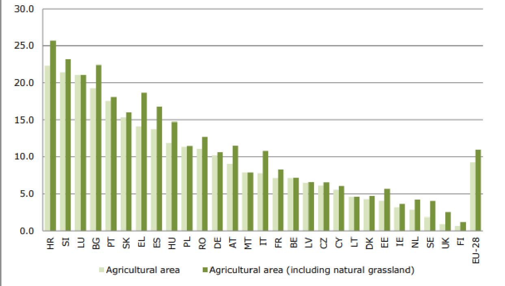

Policy domain of the application 

CAP, Biodiversity Strategy, Habitat Directive

Link to application / results / Bibliographic reference

https://ec.europa.eu/info/sites/info/files/food-farming-fisheries/farming/documents/capindicators-doc-c34_2018_en.pdf

https://ec.europa.eu/info/sites/info/files/food-farming-fisheries/farming/documents/capindicators-c34_2019_en.xlsx

|Application name|Application name|Application name|
|--|--|--|
|HIGH NATURE VALUE FARMLAND AND THE COMMON AGRICULTURAL POLICY (CAP CONTEXT INDICATOR 37 AND AEI 23)|HIGH NATURE VALUE FARMLAND AND THE COMMON AGRICULTURAL POLICY (CAP CONTEXT INDICATOR 37 AND AEI 23)|HIGH NATURE VALUE FARMLAND AND THE COMMON AGRICULTURAL POLICY (CAP CONTEXT INDICATOR 37 AND AEI 23)|
|Application domain|Application domain|Application domain|
|EU / international|Agriculture Biodiversity / nature conservation|Agriculture Biodiversity / nature conservation|
|Responsible organisation / client|Responsible organisation / client|Responsible organisation / client|
|EEA|EEA|2012|
|Short description of the application, describing role of CLC|Short description of the application, describing role of CLC|Short description of the application, describing role of CLC|
|The objective of EEA was to estimate the likelihood of presence of HNV farmland within Europe using existing European-wide datasets. The CLC European dataset was used as it was available consistently across the great majority of European countries. It was, though, noted that these data have several drawbacks related to geometric limitations (minimum mapping unit [MMU] of 25 ha), thematic resolution (particular class assessment) and updates dynamic (10 and 6 years), which had an impact in the quality/ reliability of the results, which can be seen only as approximate.|The objective of EEA was to estimate the likelihood of presence of HNV farmland within Europe using existing European-wide datasets. The CLC European dataset was used as it was available consistently across the great majority of European countries. It was, though, noted that these data have several drawbacks related to geometric limitations (minimum mapping unit [MMU] of 25 ha), thematic resolution (particular class assessment) and updates dynamic (10 and 6 years), which had an impact in the quality/ reliability of the results, which can be seen only as approximate.|The objective of EEA was to estimate the likelihood of presence of HNV farmland within Europe using existing European-wide datasets. The CLC European dataset was used as it was available consistently across the great majority of European countries. It was, though, noted that these data have several drawbacks related to geometric limitations (minimum mapping unit [MMU] of 25 ha), thematic resolution (particular class assessment) and updates dynamic (10 and 6 years), which had an impact in the quality/ reliability of the results, which can be seen only as approximate.|
|Illustration of application|Illustration of application|Illustration of application|

Estimated HNV presence in Europe

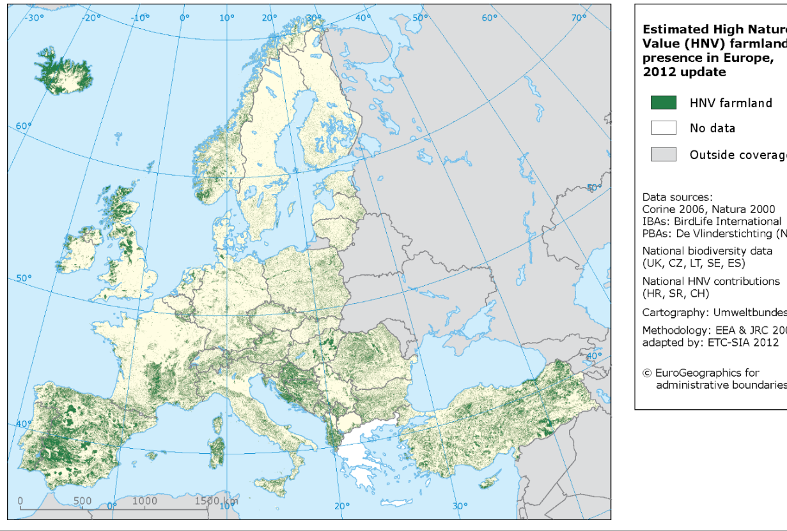

|Policy domain of the application|
|--|
|Common Agricultural Policy (CAP)SEBI 020: Agriculture: area under management practices potentially supporting biodiversity. A key component of this indicator is information on the estimated distribution of HNV farmland in Europe.|
|Link to application / results / Bibliographic reference|
|Ivone Pereira Martins, Katarzyna Biala, and Ana Maria Ribeiro de Sousa, 2016. High Nature Value Farmland and the Common Agricultural Policy. In Feranec, J., Soukup, T., Hazeu, G. and Jaffrain, G., 2016. European Landscape Dynamics: CORINE Land Cover Data. CRC Press, Boca Raton, 337 Pages - 52 Color & 45 B/W Illustrations, ISBN 9781482244663.|

Ecosystems related applications

|Application name|Application name|Application name|
|--|--|--|
|ECOSYSTEM TYPE MAPPING|ECOSYSTEM TYPE MAPPING|ECOSYSTEM TYPE MAPPING|
|Application domain|Application domain|Application domain|
|EU / international|Biodiversity / nature conservation Environmental accounting / impact assessment|Biodiversity / nature conservation Environmental accounting / impact assessment|
|Responsible organisation / client|Responsible organisation / client|Responsible organisation / client|
|EEA|EEA|2016|
|Short description of the application, describing role of CLC|Short description of the application, describing role of CLC|Short description of the application, describing role of CLC|
|The map provides a first overview about the potential spatial distribution of major habitats across Europe. As such, it can build the reference for numerous applications for assessing ecosystem condition that triggers their habitat quality, structure, extension, biodiversity, and capacity to provide services.CLC is used as one of the input datasets to construct the Ecosystem Map.|The map provides a first overview about the potential spatial distribution of major habitats across Europe. As such, it can build the reference for numerous applications for assessing ecosystem condition that triggers their habitat quality, structure, extension, biodiversity, and capacity to provide services.CLC is used as one of the input datasets to construct the Ecosystem Map.|The map provides a first overview about the potential spatial distribution of major habitats across Europe. As such, it can build the reference for numerous applications for assessing ecosystem condition that triggers their habitat quality, structure, extension, biodiversity, and capacity to provide services.CLC is used as one of the input datasets to construct the Ecosystem Map.|
|Illustration of application|Illustration of application|Illustration of application|

Ecosystem map version 2.1.

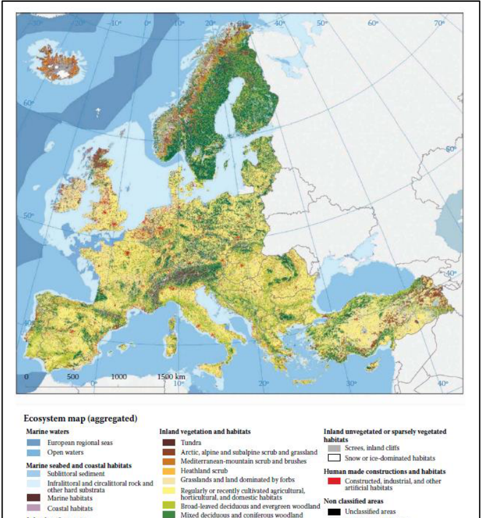

Policy domain of the application

Communication for the Implementation of a Biodiversity Strategy to 2020

Halting the loss of biodiversity and the degradation of ecosystem services in the European Union (EU)  by 2020, and restoring them in so far as feasible, while stepping up the EU contribution to averting  global biodiversity loss.

Action 5 of Target 2 “Mapping and Assessment of Ecosystems and their Services” (MAES)

Link to application / results / Bibliographic reference

Markus Erhard, Branislav Olah, Gebhard Banko, Stefan Kleeschulte, and Dania Abdul-Malak, 2016. Ecosystem Mapping and Assessment. In Feranec, J., Soukup, T., Hazeu, G. and Jaffrain, G., 2016.  European Landscape Dynamics: CORINE Land Cover Data. CRC Press, Boca Raton, 337 Pages - 52 Color & 45 B/W Illustrations, ISBN 9781482244663.

Mapping Europe's ecosystems — European Environment Agency 

https://www.eea.europa.eu/publications/mapping-europe-s-ecosystems

## Application name

### MAPPING OF ECOSYSTEM SERVICES

## Application domain

### EU / international Biodiversity / nature conservation

### Environmental accounting / impact assessment

## Responsible organisation / client

### JRC 2011

## Short description of the application, describing role of CLC

The mapping of the spatial extent of ecosystems and their services is a major prerequisite for the  assessment and modelling of the state and trends of biodiversity. The objective of this first attempt  to map ecosystem services was to identify the spatial differences in ecosystem services supplied by  all ecosystems situated in the European Union, including also semi natural and agricultural systems  which fall outside the Natura2000 network and which contribute to the green infrastructure. The following maps / data sets were produced: 

### Provisioning services

### o Timber services

### o Crop services

### o Livestock services

### o Freshwater provision

### Regulating services

#### o Water regulation services

#### o Water purifying services

#### o Climate regulation services

#### o Natural hazard protection services

#### o Air quality regulation

#### o Erosion control

#### o Pollution services

#### o Soil quality regulation control

### Cultural services

#### o Recreation services

CLC provided the basis for the geographical distribution for many of the services.

## Illustration of application

### Indicator representing the capacity of forests and natural ecosystems to help prevent soil erosion.

continued on next page

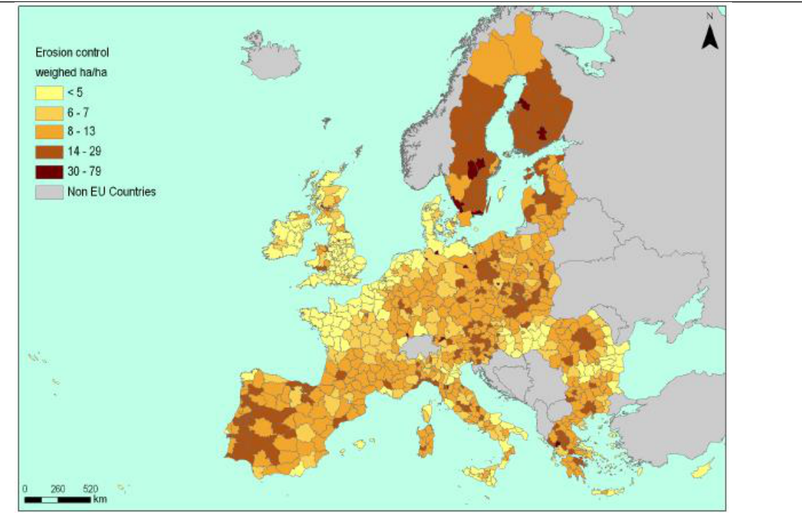

Policy domain of the application

Biodiversity Strategy

Link to application / results / Bibliographic reference

MAES, J.; PARACCHINI, M.; ZULIAN, G. (2011): A European assessment of the provision of ecosystem services - Towards an atlas of ecosystem services 

https://publications.jrc.ec.europa.eu/repository/bitstream/JRC63505/j.maes.pdf

|Application name|Application name|Application name|
|--|--|--|
|MAPPING AND ASSESSMENT OF ECOSYSTEMS AND THEIR SERVICES|MAPPING AND ASSESSMENT OF ECOSYSTEMS AND THEIR SERVICES|MAPPING AND ASSESSMENT OF ECOSYSTEMS AND THEIR SERVICES|
|Application domain|Application domain|Application domain|
|EU/international|Biodiversity/nature conservationEnvironmental accounting/impact assessment|Biodiversity/nature conservationEnvironmental accounting/impact assessment|
|Responsible organisation/client|Responsible organisation/client|Responsible organisation/client|
|JRC|JRC|2015/2020|
|Short description of the application, describing role of CLC|Short description of the application, describing role of CLC|Short description of the application, describing role of CLC|
|Mapping and Assessment of Ecosystems and their Services(MAES)is one of the keystone actions oftheEU Biodiversity Strategy to 2020. The publication presents a first analysis of ecosystems and theirservices at the European scale. In particular, changes observed between 2000 and 2010in(1)theextent of ecosystems, as derived from land cover and land use data, and in(2)the supply or use ofecosystem services are reported. In addition, this report acts as a reference for a set of ecosystemservices maps at theEU scale which can be used for further studies which require spatial data .The full assessment(MAES2020)constitutes an updated knowledge base of all ecosystems which cansupport the evaluation of the 2020 biodiversity targets.CLC provided the basis for the geographical distribution for many of the services.|Mapping and Assessment of Ecosystems and their Services(MAES)is one of the keystone actions oftheEU Biodiversity Strategy to 2020. The publication presents a first analysis of ecosystems and theirservices at the European scale. In particular, changes observed between 2000 and 2010in(1)theextent of ecosystems, as derived from land cover and land use data, and in(2)the supply or use ofecosystem services are reported. In addition, this report acts as a reference for a set of ecosystemservices maps at theEU scale which can be used for further studies which require spatial data .The full assessment(MAES2020)constitutes an updated knowledge base of all ecosystems which cansupport the evaluation of the 2020 biodiversity targets.CLC provided the basis for the geographical distribution for many of the services.|Mapping and Assessment of Ecosystems and their Services(MAES)is one of the keystone actions oftheEU Biodiversity Strategy to 2020. The publication presents a first analysis of ecosystems and theirservices at the European scale. In particular, changes observed between 2000 and 2010in(1)theextent of ecosystems, as derived from land cover and land use data, and in(2)the supply or use ofecosystem services are reported. In addition, this report acts as a reference for a set of ecosystemservices maps at theEU scale which can be used for further studies which require spatial data .The full assessment(MAES2020)constitutes an updated knowledge base of all ecosystems which cansupport the evaluation of the 2020 biodiversity targets.CLC provided the basis for the geographical distribution for many of the services.|
|Illustration of application|Illustration of application|Illustration of application|
|Change in the extent in the surfacearea of ecosystems based on landcover dataRivers and lakes                    0.04%Wetlands          -0.03%Sparsely vegetated land                    0.03%Woodland and forest                    2.79%Heathland and shrub             -0.18%Grassland         -0.87%Cropland-2.13%Urban land                    0.35%-3%   -2%   -1%   0%    1%    2%    3%   4%Rate of change(% decade-1)|Change in the extent in the surfacearea of ecosystems based on landcover dataRivers and lakes                    0.04%Wetlands          -0.03%Sparsely vegetated land                    0.03%Woodland and forest                    2.79%Heathland and shrub             -0.18%Grassland         -0.87%Cropland-2.13%Urban land                    0.35%-3%   -2%   -1%   0%    1%    2%    3%   4%Rate of change(% decade-1)|Change in the extent in the surfacearea of ecosystems based on landcover dataRivers and lakes                    0.04%Wetlands          -0.03%Sparsely vegetated land                    0.03%Woodland and forest                    2.79%Heathland and shrub             -0.18%Grassland         -0.87%Cropland-2.13%Urban land                    0.35%-3%   -2%   -1%   0%    1%    2%    3%   4%Rate of change(% decade-1)|
|Policy domain of the application|
|Biodiversity Strategy, MAES|
|Link to application / results / Bibliographic reference|
|MAES, J. et al (2015): Mapping and Assessment of Ecosystems and their Services - Trends in ecosystems and ecosystem services in the European Union between 2000 and 2010https://publications.jrc.ec.europa.eu/repository/bitstream/JRC94889/lbna27143enn.pdfhttps://data.jrc.ec.europa.eu/dataset/7e3f0681-5967-41f7-ae9b-87f1c3cfac4fMAES, J. et al (2020): Mapping and Assessment of Ecosystems and their Services: An EU ecosystem assessment. https://ec.europa.eu/jrc/en/publication/eur-scientific-and-technical-research-reports/mapping-and-assessment-ecosystems-and-their-services-eu-ecosystem-assessment|

Application name

EUNIS HABITAT CLASSIFICATION

Application domain

### EU / international Nature

Responsible organisation / client

EEA 2007/2019

Short description of the application, describing role of CLC

The EUNIS habitat classification is a comprehensive pan-European system for habitat identification.  The classification is hierarchical and covers all types of habitats from natural to artificial, from  terrestrial to freshwater and marine. The habitat types are identified by specific codes, names and  descriptions. The terrestrial and freshwater classification builds upon previous initiatives, notably the  biotopes classification, the Palaearctic habitats classification, Annex I of the EU Habitats Directive  92/43/EEC, the CORINE Land Cover nomenclature and the Nordic habitat classification.

Illustration of application

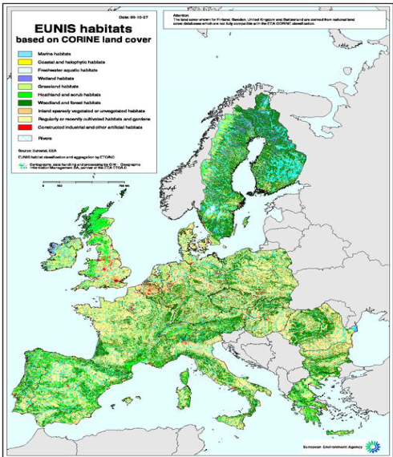

Policy domain of the application

EU and global biodiversity strategies and the 7th Environmental Action Programme

Link to application / results / Bibliographic reference

Moss, D. (1998): EUNIS habitat classification - Cross references between the EUNIS habitat  classification and (i) Annex I of the EU Habitat Directive (92/43/EEC) and (ii) the CORINE land cover  nomenclature. Draft version, European Environment Agency

https://www.eea.europa.eu/data-and-maps/data/eunis-habitat-classification

### Urban related applications

|Application name|Application name|Application name|Application name|Application name|
|--|--|--|--|--|
|URBAN FORM|URBAN FORM|URBAN FORM|URBAN FORM|URBAN FORM|
|Application domain|Application domain|Application domain|Application domain|Application domain|
|EU / international|EU / international|Urban|Urban|Urban|
|Responsible organisation / client|Responsible organisation / client|Responsible organisation / client|Responsible organisation / client|Responsible organisation / client|
|Helmholtz Centre for Environmental Research (UFZ), Leipzig, Germany|Helmholtz Centre for Environmental Research (UFZ), Leipzig, Germany|Helmholtz Centre for Environmental Research (UFZ), Leipzig, Germany|2010|2010|
|Short description of the application, describing role of CLC|Short description of the application, describing role of CLC|Short description of the application, describing role of CLC|Short description of the application, describing role of CLC|Short description of the application, describing role of CLC|
|Study analyses urban form with respect to landscape metrics and population-related indicators for 231 European cities. Correlations and factor analysis identify the most relevant urban form indicators. Furthermore, a cluster analysis groups European cities according to their urban form. The methodological aim of this study is to empirically reduce the number of indicators for urban form in Europe by analysing the relationships among urban form indicators. CORINE land cover dataset was used for the assessment of “sealed urban patches” spatial distribution.|Study analyses urban form with respect to landscape metrics and population-related indicators for 231 European cities. Correlations and factor analysis identify the most relevant urban form indicators. Furthermore, a cluster analysis groups European cities according to their urban form. The methodological aim of this study is to empirically reduce the number of indicators for urban form in Europe by analysing the relationships among urban form indicators. CORINE land cover dataset was used for the assessment of “sealed urban patches” spatial distribution.|Study analyses urban form with respect to landscape metrics and population-related indicators for 231 European cities. Correlations and factor analysis identify the most relevant urban form indicators. Furthermore, a cluster analysis groups European cities according to their urban form. The methodological aim of this study is to empirically reduce the number of indicators for urban form in Europe by analysing the relationships among urban form indicators. CORINE land cover dataset was used for the assessment of “sealed urban patches” spatial distribution.|Study analyses urban form with respect to landscape metrics and population-related indicators for 231 European cities. Correlations and factor analysis identify the most relevant urban form indicators. Furthermore, a cluster analysis groups European cities according to their urban form. The methodological aim of this study is to empirically reduce the number of indicators for urban form in Europe by analysing the relationships among urban form indicators. CORINE land cover dataset was used for the assessment of “sealed urban patches” spatial distribution.|Study analyses urban form with respect to landscape metrics and population-related indicators for 231 European cities. Correlations and factor analysis identify the most relevant urban form indicators. Furthermore, a cluster analysis groups European cities according to their urban form. The methodological aim of this study is to empirically reduce the number of indicators for urban form in Europe by analysing the relationships among urban form indicators. CORINE land cover dataset was used for the assessment of “sealed urban patches” spatial distribution.|
|Illustration of application|Illustration of application|Illustration of application|Illustration of application|Illustration of application|
||||||
||||||
|Policy domain of the application|Policy domain of the application|Policy domain of the application|Policy domain of the application|Policy domain of the application|

Illustration of application

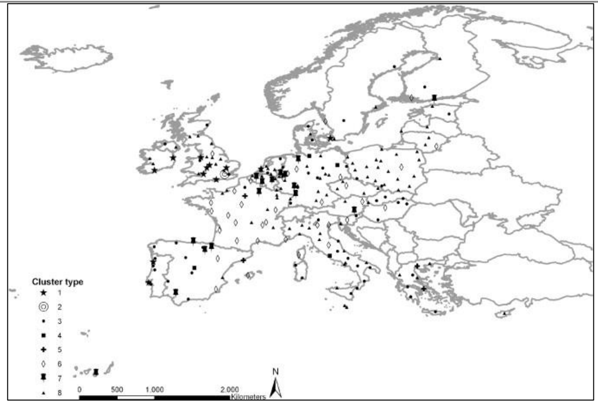

Policy domain of the application

Aalborg Charter of European Cities and Towns Towards Sustainability in 1994 (European Sustainable Cities and Towns Campaign, ESCTC, 1994), 

European Spatial Development Perspective was adopted in 1999 (EC, 1999),

Thematic Strategy on the Urban Environment (EC, 2006a)

Cohesion policy with the explicit aim of managing urban sprawl (EC, 2006b).

Leipzig Charter on Sustainable European Cities and the Territorial Agenda (European Union, EU, 2007a, EU, 2007b) 

Link to application / results / Bibliographic reference

Nina Schwarz, Urban form revisited — Selecting indicators for characterising European cities, Landscape and Urban Planning, Volume 96, Issue 1, 2010, Pages 29-47, ISSN 0169-2046, https://doi.org/10.1016/j.landurbplan.2010.01.007

Application name

URBAN MORPHOLOGICAL ZONES

Application domain

### EU / international Urban

Responsible organisation / client

EEA 2014

Short description of the application, describing role of CLC

An Urban Morphological Zone can be defined as “A set of built-up areas laying less than 200 m apart”. The data set is used to overcome the heterogeneity when trying to define the outline of an urban area based on administrative or legal criteria. Instead, it uses the concept of connected built-up areas. 

Urban morphological zones (UMZ) are defined by CORINE land cover classes considered to contribute to the urban tissue and function. 

Illustration of application

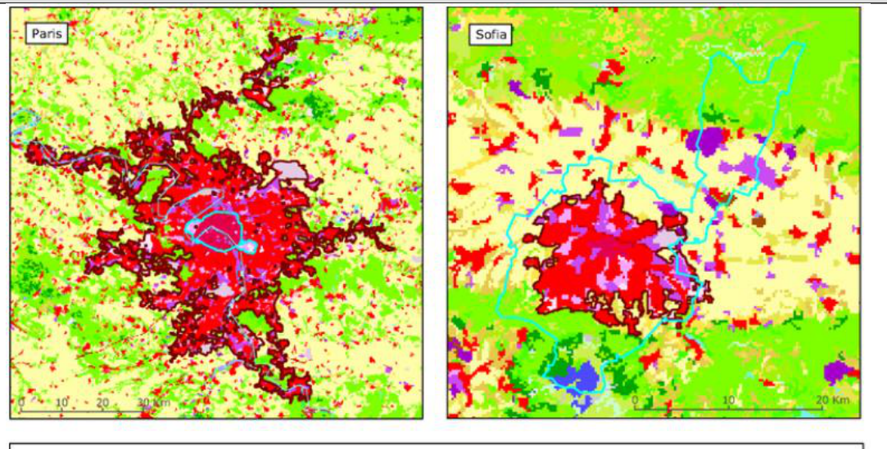

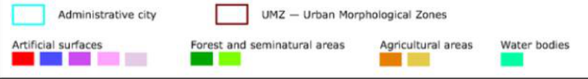

Policy domain of the application

### Urban sprawl

Link to application / results / Bibliographic reference

https://www.eea.europa.eu/data-and-maps/data/urban-morphological-zones-2006-1

Land cover and landscape changes 

|Application name|Application name|Application name|
|--|--|--|
|LANDSCAPES IN TRANSITION: AN ACCOUNT OF 25 YEARS OF LAND COVER CHANGE IN EUROPE|LANDSCAPES IN TRANSITION: AN ACCOUNT OF 25 YEARS OF LAND COVER CHANGE IN EUROPE|LANDSCAPES IN TRANSITION: AN ACCOUNT OF 25 YEARS OF LAND COVER CHANGE IN EUROPE|
|Application domain|Application domain|Application domain|
|EU / international|Environmental accounting / impact assessment|Environmental accounting / impact assessment|
|Responsible organisation / client|Responsible organisation / client|Responsible organisation / client|
|EEA|EEA|2019|
|Short description of the application, describing role of CLC|Short description of the application, describing role of CLC|Short description of the application, describing role of CLC|
|The EEA report 'Landscapes in transition: an account of 25 years of land cover change in Europe,' takes a closer look at the emerging trends over the last two and a half decades in land use and their environmental impacts. The dominant trend is the continued and accelerating shift from rural to urban use, influenced mostly by economic activities and urban lifestyle demands — such as high mobility and consumption patterns. The land use change statistics are based on CLC data from 1990 to 2012.|The EEA report 'Landscapes in transition: an account of 25 years of land cover change in Europe,' takes a closer look at the emerging trends over the last two and a half decades in land use and their environmental impacts. The dominant trend is the continued and accelerating shift from rural to urban use, influenced mostly by economic activities and urban lifestyle demands — such as high mobility and consumption patterns. The land use change statistics are based on CLC data from 1990 to 2012.|The EEA report 'Landscapes in transition: an account of 25 years of land cover change in Europe,' takes a closer look at the emerging trends over the last two and a half decades in land use and their environmental impacts. The dominant trend is the continued and accelerating shift from rural to urban use, influenced mostly by economic activities and urban lifestyle demands — such as high mobility and consumption patterns. The land use change statistics are based on CLC data from 1990 to 2012.|
|Illustration of application|Illustration of application|Illustration of application|

Main trends in selected land cover categories over 22 years (based on 27 countries):

(a) % compared with 1990; (b) annual land cover change in km2

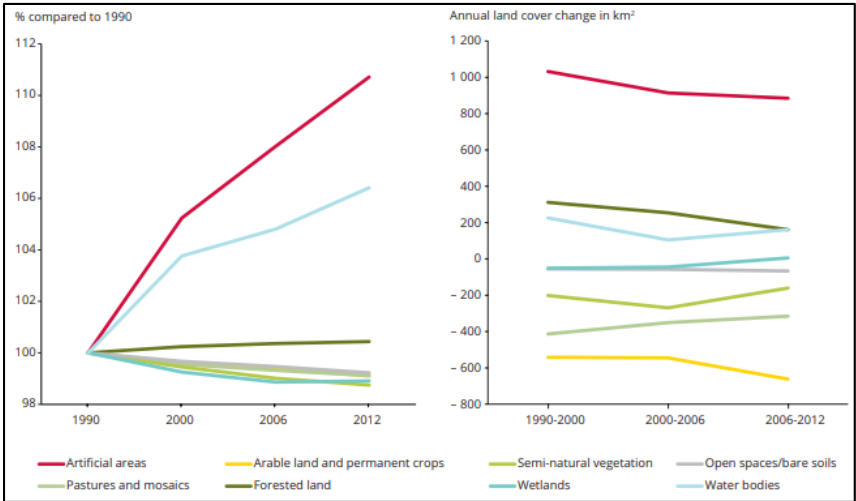

Policy domain of the application

Sustainable development

Link to application / results / Bibliographic reference

https://www.eea.europa.eu/publications/landscapes-in-transition/at_download/file

https://www.eea.europa.eu/highlights/unsustainable-land-use-threatens-european-landscapes

|Application name|Application name|Application name|
|--|--|--|
|LAND AND ECOSYSTEM ACCOUNTS FOR EUROPE. TOWARDS GEOSPATIALENVIRONMENTAL ACCOUNTING|LAND AND ECOSYSTEM ACCOUNTS FOR EUROPE. TOWARDS GEOSPATIALENVIRONMENTAL ACCOUNTING|LAND AND ECOSYSTEM ACCOUNTS FOR EUROPE. TOWARDS GEOSPATIALENVIRONMENTAL ACCOUNTING|
|Application domain|Application domain|Application domain|
|EU/international|Environmental accounting/impact assessment|Environmental accounting/impact assessment|
|Responsible organisation/client|Responsible organisation/client|Responsible organisation/client|
|EEA|EEA|2020|
|Short description of the application, describing role of CLC|Short description of the application, describing role of CLC|Short description of the application, describing role of CLC|
|Land and Ecosystem Accounting(LEAC)is anEEA initiative which is partofEEA`s geospatialenvironmental accounting system. TheEEA LEAC approach also supports the calculation of ecosystemaccounts as proposed by the guidance issued by the United Nations Statistics Department on‘Experimental Ecosystem Accounting(SEEA-EEA). LEAC uses the CORINE Land Cover data sets as thebasic layer for the long-term land accounting.|Land and Ecosystem Accounting(LEAC)is anEEA initiative which is partofEEA`s geospatialenvironmental accounting system. TheEEA LEAC approach also supports the calculation of ecosystemaccounts as proposed by the guidance issued by the United Nations Statistics Department on‘Experimental Ecosystem Accounting(SEEA-EEA). LEAC uses the CORINE Land Cover data sets as thebasic layer for the long-term land accounting.|Land and Ecosystem Accounting(LEAC)is anEEA initiative which is partofEEA`s geospatialenvironmental accounting system. TheEEA LEAC approach also supports the calculation of ecosystemaccounts as proposed by the guidance issued by the United Nations Statistics Department on‘Experimental Ecosystem Accounting(SEEA-EEA). LEAC uses the CORINE Land Cover data sets as thebasic layer for the long-term land accounting.|
|Illustration of application|Illustration of application|Illustration of application|
|Arableland andpermanentcropsc     eha/km2n         Arable land and permanent crops gainsNOoutcsihdaen gcoeverage         and losses during the period 2000-2018,-1,488-354-353.9--124-12390          EEA39,0,1-4646.1-265265.1-1,553Canary Is.         AzoresIs0Madeira Is.                    0      500     1000    1500km|Arableland andpermanentcropsc     eha/km2n         Arable land and permanent crops gainsNOoutcsihdaen gcoeverage         and losses during the period 2000-2018,-1,488-354-353.9--124-12390          EEA39,0,1-4646.1-265265.1-1,553Canary Is.         AzoresIs0Madeira Is.                    0      500     1000    1500km|Arableland andpermanentcropsc     eha/km2n         Arable land and permanent crops gainsNOoutcsihdaen gcoeverage         and losses during the period 2000-2018,-1,488-354-353.9--124-12390          EEA39,0,1-4646.1-265265.1-1,553Canary Is.         AzoresIs0Madeira Is.                    0      500     1000    1500km|
|Policy domain of the application|Policy domain of the application|Policy domain of the application|
|Sustainable development|Sustainable development|Sustainable development|
|Link to application/results/Bibliographic reference|Link to application/results/Bibliographic reference|Link to application/results/Bibliographic reference|
|Ivitset al.(2020):Land and ecosystem accounts for Europe Towards geospatial environmentalaccounting. ETC/ULS Report 02/2020.https://www.ei onet.europa.eu/etc s/etc-uls/products/etc-uls-report-02-2020-land-and-ecosystem--accounts-for-europe-towards-geo spatial-environmental-accounting-1|Ivitset al.(2020):Land and ecosystem accounts for Europe Towards geospatial environmentalaccounting. ETC/ULS Report 02/2020.https://www.ei onet.europa.eu/etc s/etc-uls/products/etc-uls-report-02-2020-land-and-ecosystem--accounts-for-europe-towards-geo spatial-environmental-accounting-1|Ivitset al.(2020):Land and ecosystem accounts for Europe Towards geospatial environmentalaccounting. ETC/ULS Report 02/2020.https://www.ei onet.europa.eu/etc s/etc-uls/products/etc-uls-report-02-2020-land-and-ecosystem--accounts-for-europe-towards-geo spatial-environmental-accounting-1|

Madeira Is. 0 500

Policy domain of the application

Sustainable development

Link to application/results/Bibliographic reference

Ivitset al.(2020):Land and ecosystem accounts for Europe Towards geospatial environmental accounting. ETC/ULS Report 02/2020.

https://www.ei onet.europa.eu/etc s/etc-uls/products/etc-uls-report-02-2020-land-and-ecosystem--accounts-for-europe-towards-geo spatial-environmental-accounting-1

Application name

CHANGES AND FLOWS IN EUROPEAN LANDSCAPES 1990-2000

Application domain

### EU / international Land cover

Responsible organisation / client

### Slovak Academy of Sciences 2010

Short description of the application, describing role of CLC

The study contains information about frequency and areas of CLC and their changes in the period  1990-2000, but above all in the processes - flows (LCF) that take place in the European landscape.  Results of statistical analysis and maps demonstrate the frequency and rate (by two values: one above  and another below the mean LCF rates) of the following processes: urbanisation (LCF1), intensification  of agriculture (LCF2), extensification of agriculture (LCF3), afforestation (LCF4), deforestation (LCF5)  and construction of water bodies (LCF6).

Illustration of application

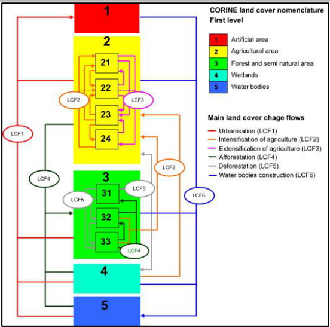

Policy domain of the application

Sustainable development

Link to application / results / Bibliographic reference

Jan Feranec, Gabriel Jaffrain, Tomas Soukup, Gerard Hazeu. Determining changes and flows in  European landscapes 1990–2000 using CORINE land cover data, Applied Geography, Volume 30, Issue 1, 2010, Pages 19-35, ISSN 0143-6228

https://doi.org/10.1016/j.apgeog.2009.07.003

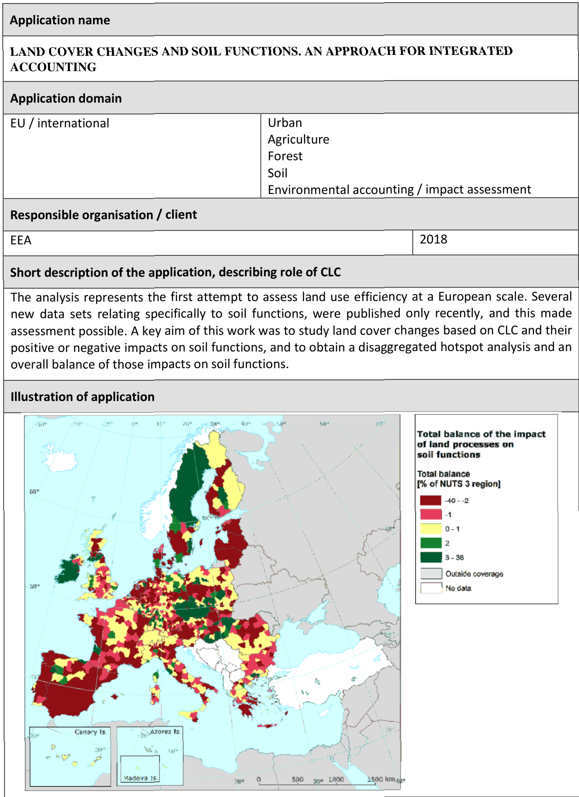

Total impact of the various land processes on the aggregated soil functions (hectares) in four Czech  NUTS 3 regions

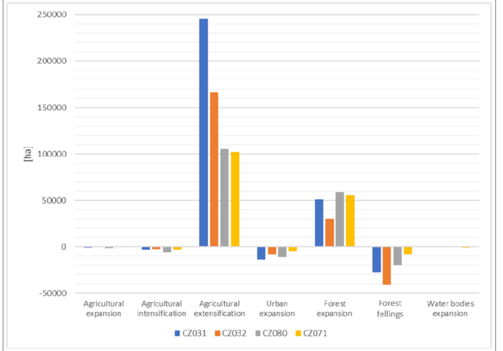

Policy domain of the application

Land degradation neutrality, Environmental Action Programme

Link to application / results / Bibliographic reference

https://www.eionet.europa.eu/etcs/etc-uls/products/etc-uls-report-02-2018-integratedaccounting-of-land-cover-changes-and-soil-functions

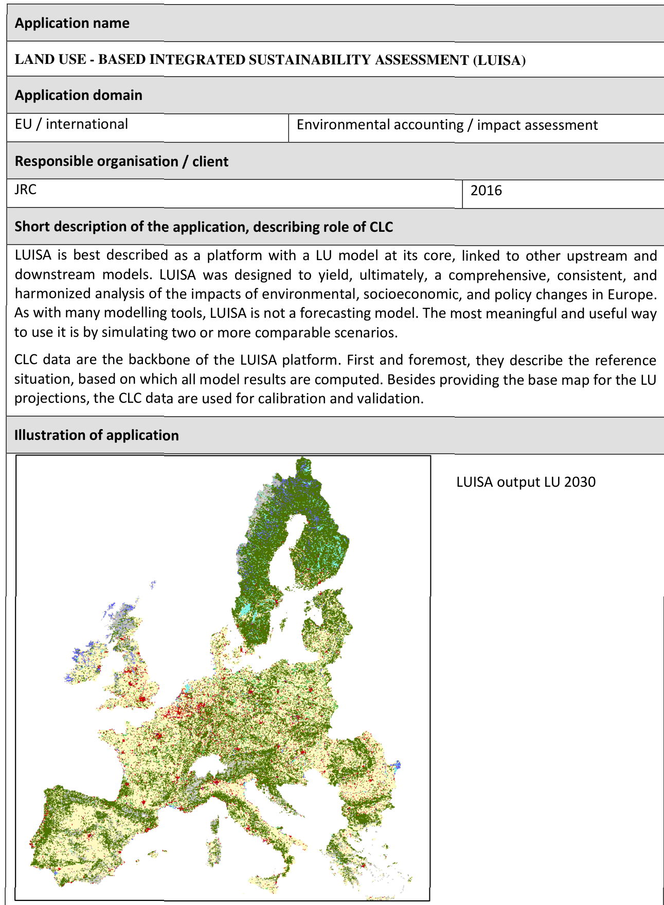

Policy domain of the application

LUISA has been used for impact assessments related to the Integrated Coastal Zone Management  (Lavalle et al., 2011c), Common Agricultural Policy (Lavalle et al., 2011b), Energy (shale gas and energy  package) (Lavalle et al., 2013c), EU Water Blueprint (Burek et al., 2012; De Roo et al., 2012), Regional  Policy (Batista e Silva et al., 2013a), and the Resource Efficiency Roadmap (Lavalle et al., 2013b).

## Link to application / results / Bibliographic reference

Carlo Lavalle, Filipe Batista e Silva, Claudia Baranzelli, Chris Jacobs-Crisioni, Ine Vandecasteele, Ana Luisa  Barbosa, Joachim Maes, Grazia Zulian, Carolina Perpiña Castillo, Ricardo Barranco, and Sara Vallecillo, 2016.  Land Use and Scenario Modeling for Integrated Sustainability assessment. In Feranec, J., Soukup, T.,  Hazeu, G. and Jaffrain, G., 2016. European Landscape Dynamics: CORINE Land Cover Data. CRC Press,  Boca Raton, 337 Pages - 52 Color & 45 B/W Illustrations, ISBN 9781482244663. 

### Other European applications 

#### Application name

## SPATIAL ANALYSIS OF GREEN INFRASTRUCTURE IN EUROPE

### Application domain

### EU / international Biodiversity / nature conservation

### Environmental accounting / impact assessment

### Spatial planning

Responsible organisation / client

### EEA 2014

#### Short description of the application, describing role of CLC

#### Green infrastructure is a tool for providing ecological, economic and social benefits through natural

#### solutions, helping to understand the advantages nature offers human society and to mobilise

#### investments that sustain and enhance these benefits.

#### The objective of the publication is to propose a feasible and replicable methodology for use by

different entities and at varying scales, when identifying GI elements.

#### The selected ecosystem services and the core habitat definition is to a large extent based on CLC

data.

Illustration of application

#### Mapping of potential GI networks (R = potential restoration areas, C = potential conservation areas)

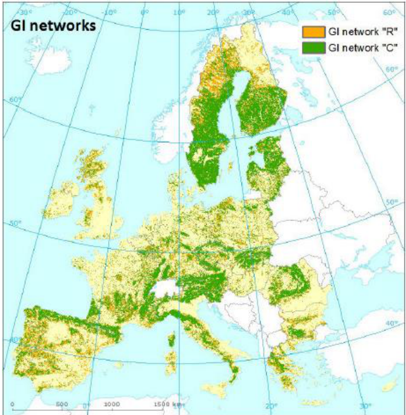

Policy domain of the application

Biodiversity Strategy, Green Infrastructure

Link to application / results / Bibliographic reference

EEA Technical Report No 2/2014

https://www.eea.europa.eu/publications/spatial-analysis-of-green-infrastructure

|Application name|Application name|Application name|
|--|--|--|
|VEGETATION RESPONSE TO WATER DEFICIT IN EUROPE|VEGETATION RESPONSE TO WATER DEFICIT IN EUROPE|VEGETATION RESPONSE TO WATER DEFICIT IN EUROPE|
|Application domain|Application domain|Application domain|
|EU / international|Water / marine / coastal Climate Biodiversity / nature conservation Environmental accounting / impact assessment|Water / marine / coastal Climate Biodiversity / nature conservation Environmental accounting / impact assessment|
|Responsible organisation / client|Responsible organisation / client|Responsible organisation / client|
|EEA|EEA|2020|
|Short description of the application, describing role of CLC|Short description of the application, describing role of CLC|Short description of the application, describing role of CLC|
|Monitoring vegetation response to water deficit due to droughts is necessary to be able to introduce effective measures to increase the resilience of ecosystems in line with the EU’s nature restoration plan — a key element of the EU biodiversity strategy for 2030. The indicator addresses anomalies and long-term trends of vegetation productivity derived from remote sensing observed time series of vegetation indices in areas that are pressured by drought. CLC data has been used to identify areas where land cover / use change could have been the reason for vegetation response and not drought. In addition, the ecosystem types characterization of the impacts is also based on CLC accounting layers.|Monitoring vegetation response to water deficit due to droughts is necessary to be able to introduce effective measures to increase the resilience of ecosystems in line with the EU’s nature restoration plan — a key element of the EU biodiversity strategy for 2030. The indicator addresses anomalies and long-term trends of vegetation productivity derived from remote sensing observed time series of vegetation indices in areas that are pressured by drought. CLC data has been used to identify areas where land cover / use change could have been the reason for vegetation response and not drought. In addition, the ecosystem types characterization of the impacts is also based on CLC accounting layers.|Monitoring vegetation response to water deficit due to droughts is necessary to be able to introduce effective measures to increase the resilience of ecosystems in line with the EU’s nature restoration plan — a key element of the EU biodiversity strategy for 2030. The indicator addresses anomalies and long-term trends of vegetation productivity derived from remote sensing observed time series of vegetation indices in areas that are pressured by drought. CLC data has been used to identify areas where land cover / use change could have been the reason for vegetation response and not drought. In addition, the ecosystem types characterization of the impacts is also based on CLC accounting layers.|
|Illustration of application|Illustration of application|Illustration of application|
||||

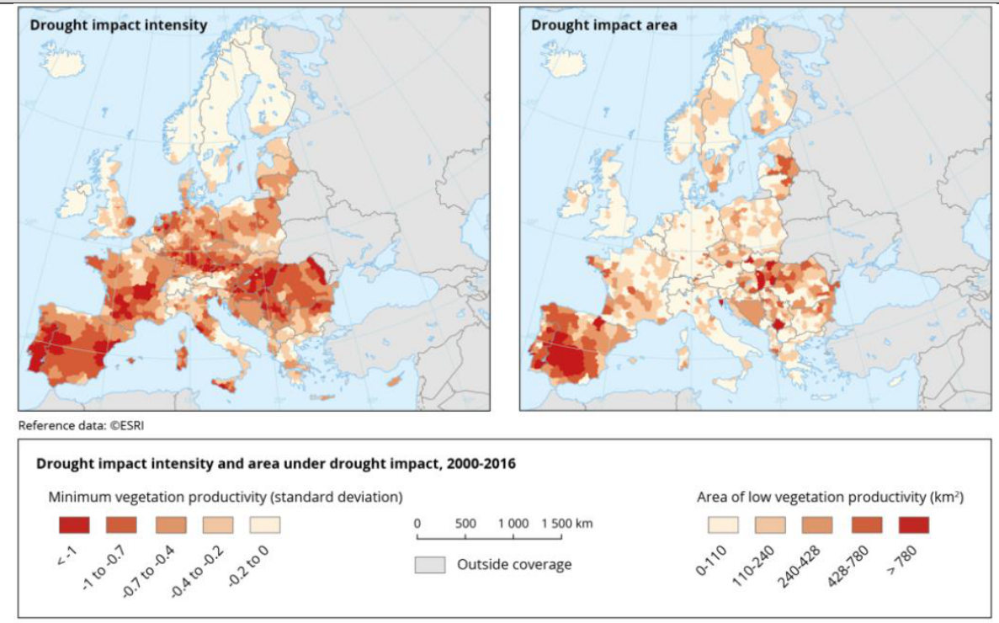

Policy domain of the application

Biodiversity Strategy, Green Infrastructure, LULUCF, CAP

Link to application / results / Bibliographic reference

https://www.eea.europa.eu/data-and-maps/indicators/drought-impact-on-vegetation

productivity/assessment/view

https://www.eea.europa.eu/data-and-maps/data/data-viewers/vegetation-productivity-loss-underdrought

https://www.eea.europa.eu/data-and-maps/data/data-viewers/soil-moisture

|Application name|Application name|Application name|
|--|--|--|
|TREND IN SOIL MOISTURE|TREND IN SOIL MOISTURE|TREND IN SOIL MOISTURE|
|Application domain|Application domain|Application domain|
|Pan-European|Climate Agriculture|Climate Agriculture|
|Responsible organisation / client|Responsible organisation / client|Responsible organisation / client|
|European Environment Agency|European Environment Agency|2016|
|Short description of the application, describing role of CLC|Short description of the application, describing role of CLC|Short description of the application, describing role of CLC|
|Soil moisture is one of the Land and Soil indicators (LSI) developed by the European Environment agency to assess soil moisture content as a proxy for agricultural droughts. The indicator covers past trends and projections of soil moistures that are modelled at Pan-European scale. Land cover information from CORINE Land Cover 2006 was used to identify the type of land cover and to calculate the crop coefficient for three phenological stages (start, middle and end of season).|Soil moisture is one of the Land and Soil indicators (LSI) developed by the European Environment agency to assess soil moisture content as a proxy for agricultural droughts. The indicator covers past trends and projections of soil moistures that are modelled at Pan-European scale. Land cover information from CORINE Land Cover 2006 was used to identify the type of land cover and to calculate the crop coefficient for three phenological stages (start, middle and end of season).|Soil moisture is one of the Land and Soil indicators (LSI) developed by the European Environment agency to assess soil moisture content as a proxy for agricultural droughts. The indicator covers past trends and projections of soil moistures that are modelled at Pan-European scale. Land cover information from CORINE Land Cover 2006 was used to identify the type of land cover and to calculate the crop coefficient for three phenological stages (start, middle and end of season).|
|Illustration of application|Illustration of application|Illustration of application|
|Soil moisture content was modelled using a soil moisture balance model in the upper soil horizons (up to 1 m).|Soil moisture content was modelled using a soil moisture balance model in the upper soil horizons (up to 1 m).|Soil moisture content was modelled using a soil moisture balance model in the upper soil horizons (up to 1 m).|
|Policy domain of the application|Policy domain of the application|Policy domain of the application|
|• EU Strategy on adaptation to climate change (COM/2013/216 final)• 7th Environment Action Programme• EU Common Agricultural Policy (CAP) reform - basic regulations|• EU Strategy on adaptation to climate change (COM/2013/216 final)• 7th Environment Action Programme• EU Common Agricultural Policy (CAP) reform - basic regulations|• EU Strategy on adaptation to climate change (COM/2013/216 final)• 7th Environment Action Programme• EU Common Agricultural Policy (CAP) reform - basic regulations|
|Link to application / results / Bibliographic reference|Link to application / results / Bibliographic reference|Link to application / results / Bibliographic reference|
|Indicator assessment page: https://www.eea.europa.eu/data-and-maps/indicators/water-retention-4/assessmentIndicator specifications: https://www.eea.europa.eu/data-and-maps/indicators/water-retention-4|Indicator assessment page: https://www.eea.europa.eu/data-and-maps/indicators/water-retention-4/assessmentIndicator specifications: https://www.eea.europa.eu/data-and-maps/indicators/water-retention-4|Indicator assessment page: https://www.eea.europa.eu/data-and-maps/indicators/water-retention-4/assessmentIndicator specifications: https://www.eea.europa.eu/data-and-maps/indicators/water-retention-4|

Policy domain of the application

• EU Strategy on adaptation to climate change (COM/2013/216 final)

• 7th Environment Action Programme

• EU Common Agricultural Policy (CAP) reform - basic regulations

Link to application / results / Bibliographic reference

Indicator assessment page: https://www.eea.europa.eu/data-and-maps/indicators/water-retention-4/assessment

Indicator specifications: https://www.eea.europa.eu/data-and-maps/indicators/water-retention-4

|Application name|Application name|Application name|
|--|--|--|
|EUROPEAN MAP OF ALIEN PLANT INVASIONS|EUROPEAN MAP OF ALIEN PLANT INVASIONS|EUROPEAN MAP OF ALIEN PLANT INVASIONS|
|Application domain|Application domain|Application domain|
|EU / international|Vegetation|Vegetation|
|Responsible organisation / client|Responsible organisation / client|Responsible organisation / client|
|Masaryk University, Czech Republic|Masaryk University, Czech Republic|2009|
|Short description of the application, describing role of CLC|Short description of the application, describing role of CLC|Short description of the application, describing role of CLC|
|In this study is combined the quantitative data on the proportion of alien species in different habitats of three regions with a land‐cover map to construct the first map of the level of alien plant invasion for Europe. The highest levels of invasion were predicted for agricultural, urban and industrial land‐cover classes, low levels for natural and semi‐natural grasslands and most woodlands, and the lowest levels for sclerophyllous vegetation, heathlands and peatlands. The proportion of 33 habitat types were estimated in each CORINE land-cover class and calculated the level of invasion for each class. We projected the levels of invasion on the CORINE land cover map of Europe, extrapolating Catalonian data to the Mediterranean bioregion, Czech data to the Continental bioregion, British data to the British Isles and combined Czech-British data to the Atlantic and Boreal bioregions. The resulting map of the level of invasion reflected the distribution of these land cover classes across Europe.|In this study is combined the quantitative data on the proportion of alien species in different habitats of three regions with a land‐cover map to construct the first map of the level of alien plant invasion for Europe. The highest levels of invasion were predicted for agricultural, urban and industrial land‐cover classes, low levels for natural and semi‐natural grasslands and most woodlands, and the lowest levels for sclerophyllous vegetation, heathlands and peatlands. The proportion of 33 habitat types were estimated in each CORINE land-cover class and calculated the level of invasion for each class. We projected the levels of invasion on the CORINE land cover map of Europe, extrapolating Catalonian data to the Mediterranean bioregion, Czech data to the Continental bioregion, British data to the British Isles and combined Czech-British data to the Atlantic and Boreal bioregions. The resulting map of the level of invasion reflected the distribution of these land cover classes across Europe.|In this study is combined the quantitative data on the proportion of alien species in different habitats of three regions with a land‐cover map to construct the first map of the level of alien plant invasion for Europe. The highest levels of invasion were predicted for agricultural, urban and industrial land‐cover classes, low levels for natural and semi‐natural grasslands and most woodlands, and the lowest levels for sclerophyllous vegetation, heathlands and peatlands. The proportion of 33 habitat types were estimated in each CORINE land-cover class and calculated the level of invasion for each class. We projected the levels of invasion on the CORINE land cover map of Europe, extrapolating Catalonian data to the Mediterranean bioregion, Czech data to the Continental bioregion, British data to the British Isles and combined Czech-British data to the Atlantic and Boreal bioregions. The resulting map of the level of invasion reflected the distribution of these land cover classes across Europe.|
|Illustration of application|Illustration of application|Illustration of application|
||||
|Policy domain of the application|Policy domain of the application|Policy domain of the application|
|EU policy on invasive alien species: the European Alien Species Information Network (EASIN)https://easin.jrc.ec.europa.eu/easin|EU policy on invasive alien species: the European Alien Species Information Network (EASIN)https://easin.jrc.ec.europa.eu/easin|EU policy on invasive alien species: the European Alien Species Information Network (EASIN)https://easin.jrc.ec.europa.eu/easin|
|Link to application / results / Bibliographic reference|Link to application / results / Bibliographic reference|Link to application / results / Bibliographic reference|
|Chytrý, M., Pyšek, P., Wild, J., Pino, J., Maskell, L.C. and Vilà, M. (2009), European map of alien plant invasions based on the quantitative assessment across habitats. Diversity and Distributions, 15: 98-107. https://doi-org.ezproxy.library.wur.nl/10.1111/j.1472-4642.2008.00515.x|Chytrý, M., Pyšek, P., Wild, J., Pino, J., Maskell, L.C. and Vilà, M. (2009), European map of alien plant invasions based on the quantitative assessment across habitats. Diversity and Distributions, 15: 98-107. https://doi-org.ezproxy.library.wur.nl/10.1111/j.1472-4642.2008.00515.x|Chytrý, M., Pyšek, P., Wild, J., Pino, J., Maskell, L.C. and Vilà, M. (2009), European map of alien plant invasions based on the quantitative assessment across habitats. Diversity and Distributions, 15: 98-107. https://doi-org.ezproxy.library.wur.nl/10.1111/j.1472-4642.2008.00515.x|

Illustration of application

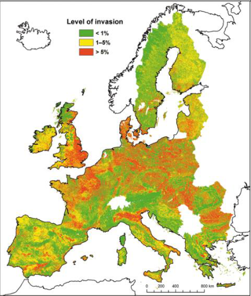

Policy domain of the application

EU policy on invasive alien species: the European Alien Species Information Network (EASIN) https://easin.jrc.ec.europa.eu/easin

Link to application / results / Bibliographic reference

Chytrý, M., Pyšek, P., Wild, J., Pino, J., Maskell, L.C. and Vilà, M. (2009), European map of alien plant  invasions based on the quantitative assessment across habitats. Diversity and Distributions, 15: 98-107. https://doi-org.ezproxy.library.wur.nl/10.1111/j.1472-4642.2008.00515.x

Application name

A POPULATION DENSITY GRID OF THE EUROPEAN UNION

Application domain

### EU / international Population

#### Responsible organisation / client

JRC 2010

Short description of the application, describing role of CLC

This study describes four methods used to produce dasymetric population density grids combining  population data per commune with CORINE Land Cover. An accuracy assessment has been carried out  for five countries for which a very reliable 1-km population density grid exists; the improvement,  compared with the choropleth map per commune, ranges between 20% for the weakest result in  Finland and 62% for the best result in the Netherlands. The best results are obtained with a method  using logit regression to integrate information from the point survey LUCAS (Land Use/Cover Area  frame Survey); however, performance differences between methods are moderate. The dasymetric  grid is distributed free of charge by the European Environment Agency, for non-commercial use.

Illustration of application

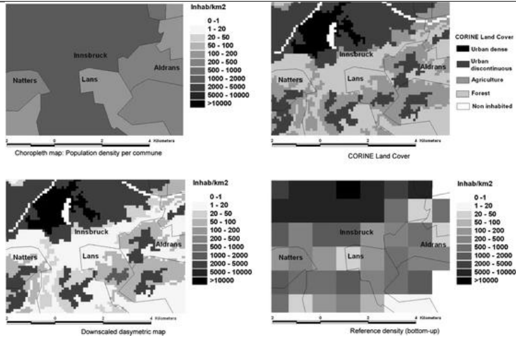

Policy domain of the application

European regional development policy

Link to application / results / Bibliographic reference

Gallego, F.J. A population density grid of the European Union. Popul Environ 31, 460–473 (2010).https://doi.org/10.1007/s11111-010-0108-y

|Application name|
|--|
|LAND COVER FIRE PRONENESS IN EUROPE|
|Application domain|
|Southern Europe / international           Nature|
|Responsible organisation / client|
|Centre for the Research and Technology of Agro-Environmental and 2014Biological Sciences (CITAB), Portugal|
|Short description of the application, describing role of CLC|
|This study aims to identify and characterize the spatial and temporal evolution of the fire incidence and of the vegetation types that are most affected by forest fires in Europe, with emphasis on the mixed forests. CORINE Land Cover maps for 2000 and 2006 (CLC2000, CLC2006) and burned area (BA) perimeters, from 2000 to 2013 in Europe are combined to access the spatial and temporal evolution of the types of vegetation that are most affected by fires. The spatial and temporal distribution of BA perimeters, vegetation and burnt vegetation by fires was performed and different statistics were obtained for Mediterranean and northern Europe, confirming the usefulness of the used land cover classification. A fire proneness index (FPI) is proposed to assess the fire selectivity of landcover classes, to quantify and compare the propensity of vegetation classes and countries to fire.|

Illustration of application

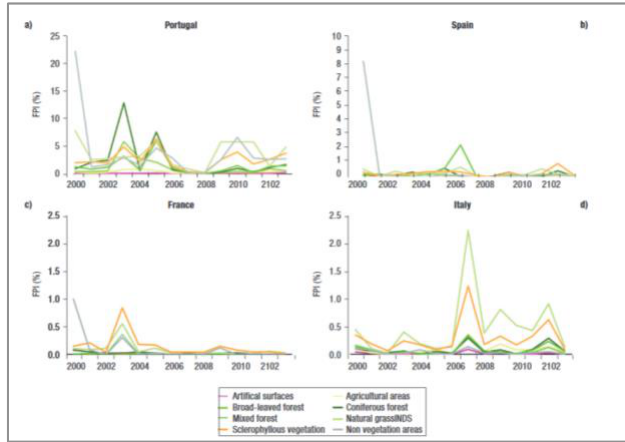

Temporal evolution of FPI of some land cover classes for (a) Portugal,  (b) Spain, (c) France, and (d) Italy.

|Policy domain of the application|
|--|
|Council Regulation (EEC) No 2158/92 of 23 July 1992 on protection of the Community's forests against fire.https://eur-lex.europa.eu/legal-content/EN/TXT/?uri=CELEX:31992R2158|
|Link to application / results / Bibliographic reference|
|PEREIRA, Mario Gonzalez; ARANHA, Jose; AMRAOUI, Malik. Land cover fire proneness in Europe. Forest Systems, [S.l.], v. 23, n. 3, p. 598-610, dec. 2014. ISSN 2171-9845.http://dx.doi.org/10.5424/fs/2014233-06115|

National and regional applications

Application name

CORINE LAND-COVER MAPPING TO ESTIMATE CARBON STORED IN THE VEGETATION OF  IRELAND

Application domain

### National Climate

Responsible organisation / client

### School of Geography, The Queen's University of Belfast, Belfast, BT7 2000

### 1NN, Northern Ireland

Short description of the application, describing role of CLC

The CORINE land cover database for Ireland is used to estimate the amount of carbon stored (tonnes) by each land-cover (vegetation) type. Carbon store is the area of each CORINE land-cover type multiplied by its carbon density (t C ha). Derivations of these carbon densities are described, and limitations of data and other empirical evidence discussed. The total vegetation-carbon stores are calculated for Northern Ireland (3.81 Mt), the Republic of Ireland (19.27 Mt) and Ireland (23.08 Mt).

Illustration of application

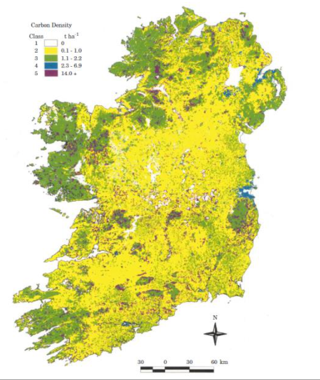

Policy domain of the application

LULUCF, climate

Link to application / results / Bibliographic reference

M.M. Cruickshank, R.W. Tomlinson and S. Trew, 2000. Application of CORINE land-cover mapping to  estimate carbon stored in the vegetation of Ireland, Journal of Environmental Management Volume  58, Issue 4, April 2000, Pages 269-287. https://doi.org/10.1006/jema.2000.0330

|Application name|Application name|Application name|Application name|Application name|
|--|--|--|--|--|
|A DIAGNOSTIC FRAMEWORK FOR EVALUATING LANDSCAPES|A DIAGNOSTIC FRAMEWORK FOR EVALUATING LANDSCAPES|A DIAGNOSTIC FRAMEWORK FOR EVALUATING LANDSCAPES|A DIAGNOSTIC FRAMEWORK FOR EVALUATING LANDSCAPES|A DIAGNOSTIC FRAMEWORK FOR EVALUATING LANDSCAPES|
|Application domain|Application domain|Application domain|Application domain|Application domain|
|Sub-National|Sub-National|Landscape|Landscape|Landscape|
|Responsible organisation / client|Responsible organisation / client|Responsible organisation / client|Responsible organisation / client|Responsible organisation / client|
|Laboratory for Forest, Nature and Landscape Research, Katholieke Universiteit Leuven, Vital Decosterstraat 102, 3000 Leuven, Belgium|Laboratory for Forest, Nature and Landscape Research, Katholieke Universiteit Leuven, Vital Decosterstraat 102, 3000 Leuven, Belgium|Laboratory for Forest, Nature and Landscape Research, Katholieke Universiteit Leuven, Vital Decosterstraat 102, 3000 Leuven, Belgium|2001|2001|
|Short description of the application, describing role of CLC|Short description of the application, describing role of CLC|Short description of the application, describing role of CLC|Short description of the application, describing role of CLC|Short description of the application, describing role of CLC|
|Land cover data are especially targeted as input source, since they are relatively unbiased in terms of landscape values and since they generally cover whole areas, not just target objects or conditions. The general evaluation model is based on quantifiable land cover and landscape structure characteristics. The process of landscape evaluation is an iterative improvement and refinement of indicators and reference data. Criteria and indicators have to be selected with reference to regional or local specificity and priorities. These indicators are translated into landscape metrics, which yield cartographic outputs of evaluation hypotheses of landscapes. The next step is to refine these hypotheses by adding information from complementary data sources. The importance of this study lies in a possible stimulation of the discussion of landscape values across areas, in the comparison of value perceptions between different regions, and in adding value to existing land cover data. Illustrations are given for the Madrid autonomous area. CORINE land cover data and a vegetation map have been as information source.|Land cover data are especially targeted as input source, since they are relatively unbiased in terms of landscape values and since they generally cover whole areas, not just target objects or conditions. The general evaluation model is based on quantifiable land cover and landscape structure characteristics. The process of landscape evaluation is an iterative improvement and refinement of indicators and reference data. Criteria and indicators have to be selected with reference to regional or local specificity and priorities. These indicators are translated into landscape metrics, which yield cartographic outputs of evaluation hypotheses of landscapes. The next step is to refine these hypotheses by adding information from complementary data sources. The importance of this study lies in a possible stimulation of the discussion of landscape values across areas, in the comparison of value perceptions between different regions, and in adding value to existing land cover data. Illustrations are given for the Madrid autonomous area. CORINE land cover data and a vegetation map have been as information source.|Land cover data are especially targeted as input source, since they are relatively unbiased in terms of landscape values and since they generally cover whole areas, not just target objects or conditions. The general evaluation model is based on quantifiable land cover and landscape structure characteristics. The process of landscape evaluation is an iterative improvement and refinement of indicators and reference data. Criteria and indicators have to be selected with reference to regional or local specificity and priorities. These indicators are translated into landscape metrics, which yield cartographic outputs of evaluation hypotheses of landscapes. The next step is to refine these hypotheses by adding information from complementary data sources. The importance of this study lies in a possible stimulation of the discussion of landscape values across areas, in the comparison of value perceptions between different regions, and in adding value to existing land cover data. Illustrations are given for the Madrid autonomous area. CORINE land cover data and a vegetation map have been as information source.|Land cover data are especially targeted as input source, since they are relatively unbiased in terms of landscape values and since they generally cover whole areas, not just target objects or conditions. The general evaluation model is based on quantifiable land cover and landscape structure characteristics. The process of landscape evaluation is an iterative improvement and refinement of indicators and reference data. Criteria and indicators have to be selected with reference to regional or local specificity and priorities. These indicators are translated into landscape metrics, which yield cartographic outputs of evaluation hypotheses of landscapes. The next step is to refine these hypotheses by adding information from complementary data sources. The importance of this study lies in a possible stimulation of the discussion of landscape values across areas, in the comparison of value perceptions between different regions, and in adding value to existing land cover data. Illustrations are given for the Madrid autonomous area. CORINE land cover data and a vegetation map have been as information source.|Land cover data are especially targeted as input source, since they are relatively unbiased in terms of landscape values and since they generally cover whole areas, not just target objects or conditions. The general evaluation model is based on quantifiable land cover and landscape structure characteristics. The process of landscape evaluation is an iterative improvement and refinement of indicators and reference data. Criteria and indicators have to be selected with reference to regional or local specificity and priorities. These indicators are translated into landscape metrics, which yield cartographic outputs of evaluation hypotheses of landscapes. The next step is to refine these hypotheses by adding information from complementary data sources. The importance of this study lies in a possible stimulation of the discussion of landscape values across areas, in the comparison of value perceptions between different regions, and in adding value to existing land cover data. Illustrations are given for the Madrid autonomous area. CORINE land cover data and a vegetation map have been as information source.|
|Illustration of application|Illustration of application|Illustration of application|Illustration of application|Illustration of application|
|Four examples of apppermanent vegetation agricultural activity estmoving window of 25 kas number of natural a(d) Degree of urbanisatimap.|lication of landscacover per \(\mathsf{k m}^{2}\) defiimated as number  \(\mathsf{k m}^{2}\), based on the Cnd semi-natural vegion, expressed as me|pe indices for landscape ned in a moving window o of different agricultural laORINE land cover data. (c) etation communities, baseean distance to built-up elem|evaluatif 25 \(\mathsf{k m}^{2}\) nd usesEcologid on 1:5ments, b|ion. (a) Percentage of m2(b) Heterogeneity of s per \(\mathsf{k m}^{2}\) defined in a cal diversity, estimated 50.000 vegetation map. based on the vegetation|
||||||
||||||

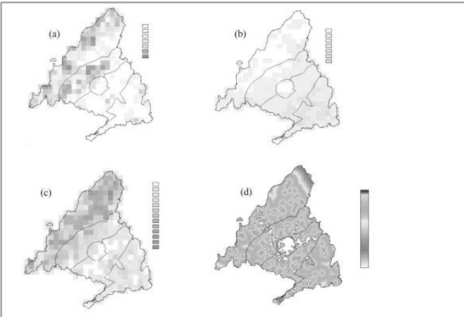

Policy domain of the application

Landscape / Landscape Convention 

Link to application / results / Bibliographic reference

Hubert Gulinck, Marta Múgica, José Vicente de Lucio and José Antonio Atauric, 2001. A framework for  comparative landscape analysis and evaluation based on land cover data, with an application in the Madrid region (Spain). Landscape and Urban Planning, Volume 55, Issue 4, 10 August 2001, Pages  257-270. https://doi.org/10.1016/S0169-2046(01)00159-1

#### Application name

LANDSCAPE’S CAPACITIES TO PROVIDE ECOSYSTEM SERVICES – A CONCEPT FOR LAND

COVER BASED ASSESSMENTS

#### Application domain

### Sub-national Landscape, ecosystem services

#### Responsible organisation / client

University of Kiel, Ecology Centre, Olshausenstr. 40; 24098 Kiel 2009

#### Short description of the application, describing role of CLC

A concept for the assessment of multiple ecosystem services is proposed as a basis for discussion and

further development of a respective evaluation instrument. Using quantitative and qualitative

assessment data in combination with land cover and land use information originated from remote

sensing and GIS, impacts of human activities can be evaluated. An exemplary application of the

approach dealing with food provision in the Halle-Leipzig region in Germany is presented. CORINE LC

is used as input data.

Illustration of application

### Matrix for the assessment of the different land cover types capacities to provide selected ecosystem

goods and services.

|Policy domain of the application|
|--|
|Biodiversity Strategy|
|Link to application / results / Bibliographic reference|
|B. Burkhard, F. Kroll, F. Müller & W. Windhorst, 2009. Landscapes‘ Capacities to Provide Ecosystem Services - a Concept for Land-Cover Based Assessments. Landscape Online 15, 1-22. DOI:10.3097/LO.200915|

Application name

URBAN CLIMATE MODELLING

Application domain

### National Urban

### Sub-nationalClimate

Responsible organisation / client

German Meteorological Service (DWD) 2018

Short description of the application, describing role of CLC

The German Meteorological Service (DWD) uses the urban climate model MUKLIMO_3 to do urban  climate modelling and simulations that is based on high resolution geo-data that describe the  morphology and structure of the urban areas. In their most recent update of the model, they have  substituted urban land cover maps with land use data from CLMS, including HRLs (forest,  imperviousness), Urban Atlas and CORINE Land Cover. 

DWD has created a seamless vector land cover data set by blending CORINE Land Cover and Urban Atlas data, adding the physical parameters degree of soil sealing and degree of forest cover from the HRLs and extracting elevation data from EU-DEM. The homogeneous data input allows for comparability of the results across Germany. 

Illustration of application

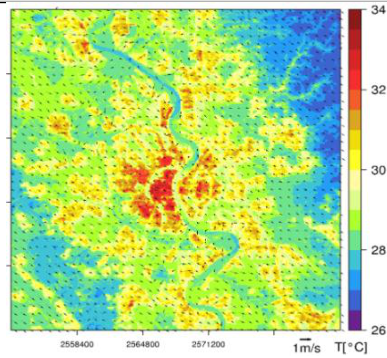

Urban climate simulation based on CLMS data (City of Cologne)

Policy domain of the application

Climate adaptation policies at local and national level, in line with the European Green Deal and EU Climate Action

Link to application / results / Bibliographic reference

Heene, V.; Koßmann,M.; Fuchs, P., 2018: Copernicus-Daten für Stadtklimasimulationen. In I. Ehlert  und C. Schweitzer (Hrsg.): Copernicus für das Umweltmonitoring - Eine Einführung. S. 38-42. Schau-Noppel, H., Kossman, M., Buchholz, S. (2020): Meteorological information for climate-proof  urban planning - The example of KLIMPRAX. Urban Climate 32. 100614.  https://doi.org/10.1016/j.uclim.2020.100614

https://www.dwd.de/EN/ourservices/muklimo_thermodynamic/muklimo_thermodynamic.html

Application name

LULUCF MAPPING

Application domain

National Climate

Responsible organisation / client

### Spanish Ministry for Ecological Transition (Miteco) 2019 (ongoing)

Short description of the application, describing role of CLC

The Spanish Ministry for Ecological Transition is preparing its national emission inventory to integrate  spatially explicit data for LULUCF mapping over the coming years. Input data for the mapping is being  collected from different national data repositories and inventories. CLC data is used to expand the  time series and, in the future, CLC+ will be integrated to substitute national data sources. 

Illustration of application

First LULUCF cartography for Spain

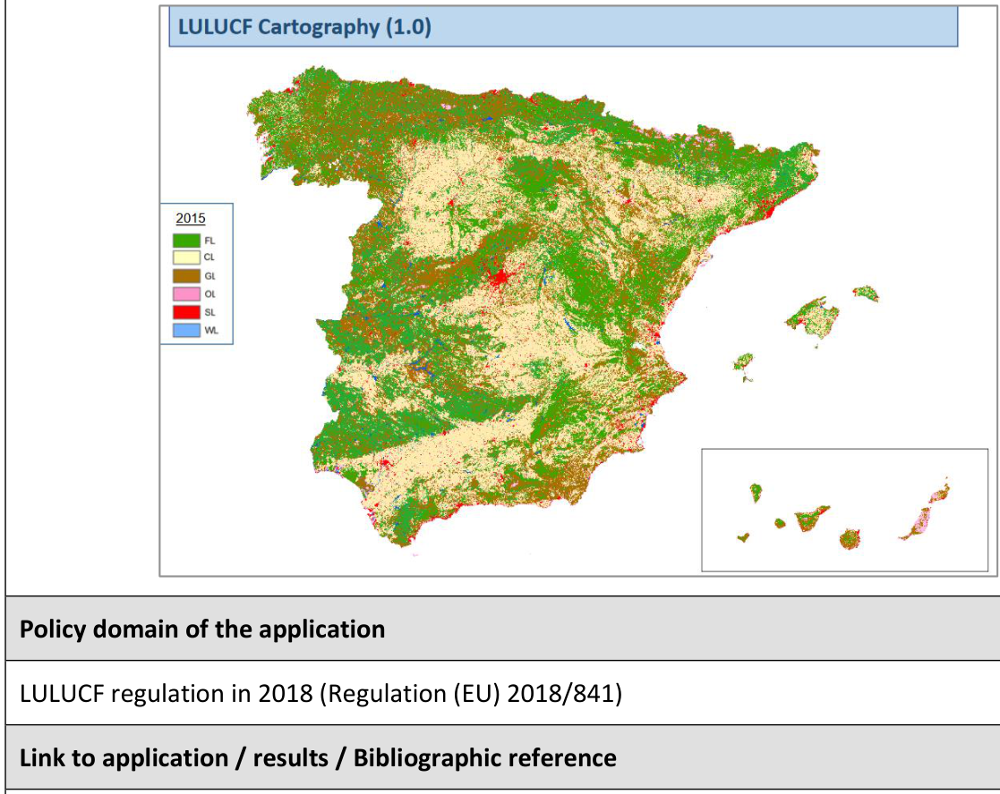

n/a

Application name

ECOSYSTEM-SPECIFIC CRITICAL LOADS FOR CLRTAP REPORTING

Application domain

### EU / international / National Climate

Environmental accounting / impact assessment

Responsible organisation / client

### Umweltbundesamt Germany 2015

Short description of the application, describing role of CLC

Within the framework of Germany's reporting obligations for the Convention on Long-range, Transboundary Air Pollution, a new German dataset for ecosystem-specific critical loads was made available  to the European Co-ordination Center. For the first time the land use information was taken from the  high-resolution CORINE Land Cover 2012 data set, that was merged with detailed soil and climate  cartography for Germany, and deposition data. From the spatial intersection of the digital CORINE  land use map, the differentiated soil survey map of Germany (BÜK1000N) and the climatic regions of  BMBVS (2013), 1026 different combination types emerged for the German critical load dataset of  2017.

Illustration of application

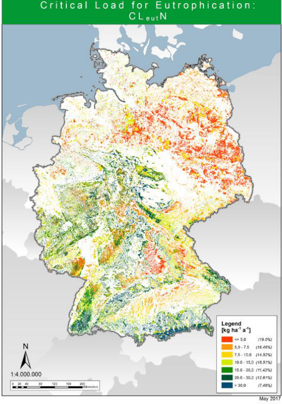

Policy domain of the application

Convention on Long-Range Transboundary Air Pollution (CLRTAP) of the United Nations Economic  Commission for Europe (UNECE)

Link to application / results / Bibliographic reference

Report (in German): https://www.umweltbundesamt.de/publikationen/critical-load-daten-fuer-dieberichterstattung-2015

Application name

## SDG MONITORING: SDG 15 “LIFE ON LAND”

Application domain

### National Urban

### Forest

Responsible organisation / client

### 1. Government of Ireland1. 2018

### 2. Institut national de la statistique e des etudes 2. 2012

### economiques

Short description of the application, describing role of CLC

### The Sustainable Development Goal 15 “Life on Land” focusses on state and trends of terrestrial

### ecosystems. Spatially explicit data is highly relevant for different Goal 15 targets and their indicators.

Several countries are adopting CORINE Land Cover as data source for their indicators, e.g.:

#### 1. Ireland: SDG 15.1.1, Forest Area as a Proportion of Total Land Area

#### CORINE Land cover data from 2018 were used to calculate the percentage forest cover at Electoral

Division level over Ireland. It uses the CLC classes for forests (31x).

#### 2. France: SDG 15.3: Low impacted ecosystems

Indicator 15.3 "Low impacted ecosystems" measures the share of the territory occupied by low

impacted ecosystems. It thus makes it possible to know the relative part of the non-impacted

territory and provides information on our ability to preserve and restore ecosystems and their

functioning, especially if the indicator is monitored over a long period (several decades). This

indicator corresponds to the sum of the areas of CORINE Land Cover classes 3xx, 4xx and 231, 243,

244, in other words forests and semi-natural environments (3xx), wetlands (4xx), meadows (231),

cultural systems and parcels, complexes (243) and agroforestry areas (244).

Illustration of application

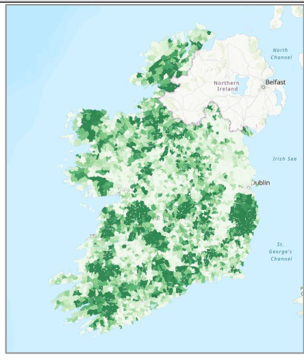

#### Percentage forest cover at Electoral Division

level over Ireland by using CLC2018 (proxi to

represent SDG 15.1.1)

Policy domain of the application 

Sustainable Development Goals

Link to application / results / Bibliographic reference

1.Ireland: https://irelandsdg.geohive.ie/datasets/sdg-15-1-1-forest-area-as-a-proportion-of-totalland-area-electoral-division-2018-ireland-epa-osi

2.France: https://www.insee.fr/fr/statistiques/series/112963796?INDICATEUR-ODD=113764165 /file:///C:/Users/C_SCHR~1/AppData/Local/Temp/metadonnees-15.i3.pdf

|Application name|Application name|Application name|Application name|
|--|--|--|--|
|PROGRESS ASSESSMENT FOR CBD TARGET 5|PROGRESS ASSESSMENT FOR CBD TARGET 5|PROGRESS ASSESSMENT FOR CBD TARGET 5|PROGRESS ASSESSMENT FOR CBD TARGET 5|
|Application domain|Application domain|Application domain|Application domain|
|National|Biodiversity|Biodiversity|Biodiversity|
|Responsible organisation/client|Responsible organisation/client|Responsible organisation/client|Responsible organisation/client|
|ERA Malta|ERA Malta|2018|2018|
|Short description of the application, describing role of CLC|Short description of the application, describing role of CLC|Short description of the application, describing role of CLC|Short description of the application, describing role of CLC|
|CORINE Land Cover(CLC)information assists with understanding changes inland cover andmonitoring large scale changes over long-time frames in the context of international reportingmechanism. The Environment Agency of Malta(ERA)uses CLC to assess the rate of loss of naturaland semi-natural habitats of conservation value, using the percentage cover of“forests and semi-natural areas”and its changes between 2006 and 2018.|CORINE Land Cover(CLC)information assists with understanding changes inland cover andmonitoring large scale changes over long-time frames in the context of international reportingmechanism. The Environment Agency of Malta(ERA)uses CLC to assess the rate of loss of naturaland semi-natural habitats of conservation value, using the percentage cover of“forests and semi-natural areas”and its changes between 2006 and 2018.|CORINE Land Cover(CLC)information assists with understanding changes inland cover andmonitoring large scale changes over long-time frames in the context of international reportingmechanism. The Environment Agency of Malta(ERA)uses CLC to assess the rate of loss of naturaland semi-natural habitats of conservation value, using the percentage cover of“forests and semi-natural areas”and its changes between 2006 and 2018.|CORINE Land Cover(CLC)information assists with understanding changes inland cover andmonitoring large scale changes over long-time frames in the context of international reportingmechanism. The Environment Agency of Malta(ERA)uses CLC to assess the rate of loss of naturaland semi-natural habitats of conservation value, using the percentage cover of“forests and semi-natural areas”and its changes between 2006 and 2018.|
|Illustration of application|Illustration of application|Illustration of application|Illustration of application|
|CLC2018CLC2018_MTCODE_12-1121211221241311324114221122124224331231322333427523||人||
|||||
|Policy domain of the application|Policy domain of the application|Policy domain of the application|Policy domain of the application|
|UN Convention on Biological Diversity|UN Convention on Biological Diversity|UN Convention on Biological Diversity|UN Convention on Biological Diversity|
|Link to application/results/Bibliographic reference|Link to application/results/Bibliographic reference|Link to application/results/Bibliographic reference|Link to application/results/Bibliographic reference|
|https://chm.cbd.int/database/record?documentID=252721|https://chm.cbd.int/database/record?documentID=252721|https://chm.cbd.int/database/record?documentID=252721|https://chm.cbd.int/database/record?documentID=252721|

Policy domain of the application

## UN Convention on Biological Diversity

Link to application/results/Bibliographic reference

https://chm.cbd.int/database/record?documentID=252721

|Application name|Application name|Application name|
|--|--|--|
|MODELLING RIVER DISCHARGE AND PHOSPHORUS LOAD USING REMOTE SENSING AND GIS IN A RIVER CATCHMENT|MODELLING RIVER DISCHARGE AND PHOSPHORUS LOAD USING REMOTE SENSING AND GIS IN A RIVER CATCHMENT|MODELLING RIVER DISCHARGE AND PHOSPHORUS LOAD USING REMOTE SENSING AND GIS IN A RIVER CATCHMENT|
|Application domain|Application domain|Application domain|
|National / Central and Eastern European|hydrology, catchment modellingenvironment, phosphorus load|hydrology, catchment modellingenvironment, phosphorus load|
|Responsible organisation / client|Responsible organisation / client|Responsible organisation / client|
|EC Phare ProgrammeMinistry of Environment, Hungary|1993-1996|1993-1996|
|Short description of the application, describing role of CLC|Short description of the application, describing role of CLC|Short description of the application, describing role of CLC|
|One of the most significant pollutants in rivers is phosphorus. It is derived into surface waters from both point and non-point sources. Phosphorus transport into the Zagyva river catchment in Hungaryhas been modelled over a two-year period with monthly time steps using a raster GIS technology. The model consisted of two main parts: the hydrological sub-model, which predicts river discharge and the phosphorus load sub-model, which yields phosphorus concentration along any point of the river network. The agreement of the modelled parameters (e.g. discharge and concentration) as compared to the measured data was found to be acceptable. CLC has provided an input layer to complex GIS modelling: phosphorus load into the environment and the evapotranspiration depend on land cover.|One of the most significant pollutants in rivers is phosphorus. It is derived into surface waters from both point and non-point sources. Phosphorus transport into the Zagyva river catchment in Hungaryhas been modelled over a two-year period with monthly time steps using a raster GIS technology. The model consisted of two main parts: the hydrological sub-model, which predicts river discharge and the phosphorus load sub-model, which yields phosphorus concentration along any point of the river network. The agreement of the modelled parameters (e.g. discharge and concentration) as compared to the measured data was found to be acceptable. CLC has provided an input layer to complex GIS modelling: phosphorus load into the environment and the evapotranspiration depend on land cover.|One of the most significant pollutants in rivers is phosphorus. It is derived into surface waters from both point and non-point sources. Phosphorus transport into the Zagyva river catchment in Hungaryhas been modelled over a two-year period with monthly time steps using a raster GIS technology. The model consisted of two main parts: the hydrological sub-model, which predicts river discharge and the phosphorus load sub-model, which yields phosphorus concentration along any point of the river network. The agreement of the modelled parameters (e.g. discharge and concentration) as compared to the measured data was found to be acceptable. CLC has provided an input layer to complex GIS modelling: phosphorus load into the environment and the evapotranspiration depend on land cover.|
|Illustration of application|Illustration of application|Illustration of application|
|Functional flowchart of the model|||
||||
||||

Illustration of application

Functional flowchart of the model

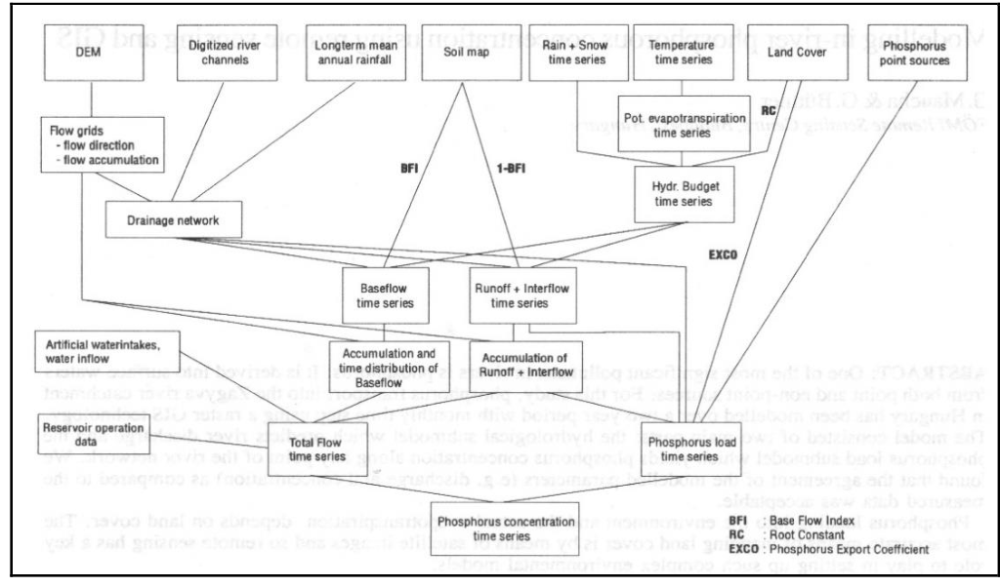

Policy domain of the application

EU Water Framework Directive

Link to application / results / Bibliographic reference

Maucha, G., Büttner, Gy.: Modelling in-river phosphorus concentration using remote sensing and  GIS, EARSeL Symposium, Lyngby, Denmark, June 17-20, 1997; In: Future trends in Remote Sensing,  pp.279-286, Balkema Publishers, 1998.

|Application name|Application name|
|--|--|
|MAPPING LAND COVER CHANGES IN THE LOW TATRAS NATIONAL PARK, SLOVAKIA|MAPPING LAND COVER CHANGES IN THE LOW TATRAS NATIONAL PARK, SLOVAKIA|
|Application domain|Application domain|
|nationalsub-national|environment, forestrynature protection|
|Responsible organisation / client|Responsible organisation / client|
|Slovak Research and Development AgencyMinistry of the Environment of the Slovak Republic|1990-2018|
|Short description of the application, describing role of CLC|Short description of the application, describing role of CLC|
|The protection of nature and landscape in the high mountains of the Western Carpathians is at the forefront of society’s interests in connection with the development of economy and mass tourism. The research was focused on analysing the extent and character of land cover changes in the Low Tatras National Park (Slovakia) over the last 30 years (1990–2018) using CORINE Land Cover (CLC) data. It was possible to evaluate the landscape changes in the protected area and to identify barriers and possibilities of their long-term sustainable development. Based on computer modelling, the main areas of land cover change were identified, and based on historical-geographical and field research, land cover flows were determined and justified in the studied landscape. Land cover changes occurred on up to 20% of the national park area in the given period. The most significant change was observed in the CLC class coniferous forests, with almost a 12% decrease. Conversely, there was an increase of more than 11% in the CLC class transitional woodland-shrub. Wind calamities were the main reason of these forestry changes between 1990 and 2018. Their destructive power stems from improper forest management combined with anthropogenic climate change.|The protection of nature and landscape in the high mountains of the Western Carpathians is at the forefront of society’s interests in connection with the development of economy and mass tourism. The research was focused on analysing the extent and character of land cover changes in the Low Tatras National Park (Slovakia) over the last 30 years (1990–2018) using CORINE Land Cover (CLC) data. It was possible to evaluate the landscape changes in the protected area and to identify barriers and possibilities of their long-term sustainable development. Based on computer modelling, the main areas of land cover change were identified, and based on historical-geographical and field research, land cover flows were determined and justified in the studied landscape. Land cover changes occurred on up to 20% of the national park area in the given period. The most significant change was observed in the CLC class coniferous forests, with almost a 12% decrease. Conversely, there was an increase of more than 11% in the CLC class transitional woodland-shrub. Wind calamities were the main reason of these forestry changes between 1990 and 2018. Their destructive power stems from improper forest management combined with anthropogenic climate change.|
|Illustration of application|Illustration of application|
|Land cover of Low Tatras National Park in 1990 and 2018|Land cover of Low Tatras National Park in 1990 and 2018|

Illustration of application

Land cover of Low Tatras National Park in 1990 and 2018

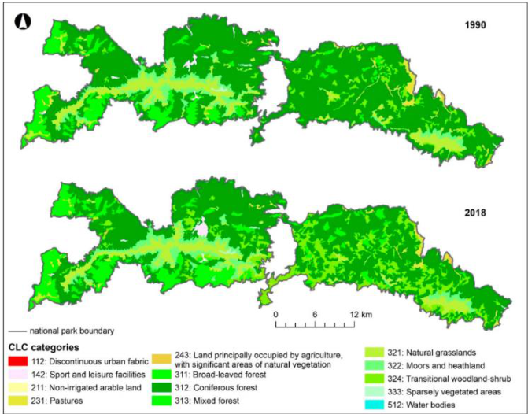

Policy domain of the application

nature protection, forestry

Link to application / results / Bibliographic reference

Žoncová, M., Hronček, P. and Gregorová, B.: Mapping of the Land Cover Changes in High  Mountains of Western Carpathians between 1990–2018: Case Study of the Low Tatras National  Park (Slovakia)

Land 2020, 9(12), 483; https://doi.org/10.3390/land9120483

