# Copernicus Land Monitoring  Service – High Resolution Layer  Vegetated Land Cover Characteristics

SPECIFIC CONTRACT NO 3506/R0-COPERNCA/EEA.60009  IMPLEMENTING FRAMEWORK SERVICE CONTRACT NO.  EEA/DIS/R0/21/013

## D1.3 FEASIBILITY STUDY ON ADDING  WINTER/SPRING CEREALS DISTINCTION TO THE CROPPING PATTERNS

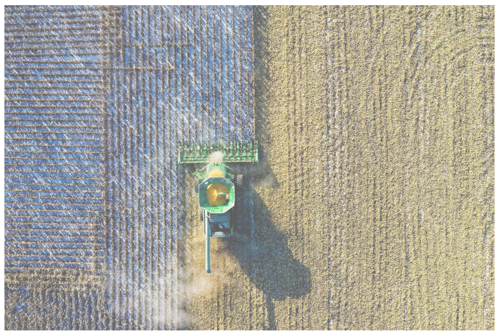

Date 2025-03-31!

Doc. Version : 1.1

Content ID: D1.3 HRL winter/spring

# Contentsghcgh

|Contents.......................................................................................................................................|..2|
|--|--|
|List of Figures ...............................................................................................................................|..3|
|List of Tables.................................................................................................................................|..4|
|1   Executive Summary..............................................................................................................|..4|
|2   Background of the document ..............................................................................................|..5|
|2.1 Scope................................................................................................................................|..5|
|2.2 Content and structure......................................................................................................|..5|
|3   Methodology........................................................................................................................|..5|
|3.1 In-Situ Data.......................................................................................................................|..6|
|3.2 Features............................................................................................................................|..7|
|3.3 Validation .........................................................................................................................|..7|
|3.3.1 Quantitative .............................................................................................................|..7|
|3.3.2 Qualitative................................................................................................................|..8|
|3.4 Confidence .......................................................................................................................|..9|
|4    Results..................................................................................................................................|12|
|4.1 Wheat...............................................................................................................................|12|
|4.2 Barley ...............................................................................................................................|14|
|4.3 Other Cereals ...................................................................................................................|15|
|4.4 Qualitative Validation ......................................................................................................|17|
|5   Recommendations...............................................................................................................|18|
|5.1 Feasibility .........................................................................................................................|18|
|5.2 Limitations........................................................................................................................|20|
|6    References............................................................................................................................|20|
|7 Supplementary Materials.....................................................................................................|20|
|7.1 Detailed Samples..............................................................................................................|20|
|7.2 Confusion Matrices..........................................................................................................|22|
|7.2.1 Wheat.......................................................................................................................|22|
|7.2.2   Barley......................................................................................................................|...22|
|7.2.3 Other Cereals .........................................................................................................|...23|
|7.3 Model Combinations......................................................................................................|...24|
|7.4 Location Thresholds.......................................................................................................|...25|
|7.4.1 Wheat.....................................................................................................................|...25|
|7.4.2   Barley......................................................................................................................|...26|
|7.4.3 Other Cereals .........................................................................................................|...27|
|7.5 Node Confidence............................................................................................................|...27|
|7.5.1 Wheat.....................................................................................................................|...27|
|7.5.2   Barley......................................................................................................................|...28|
|7.5.3 Other Cereals .........................................................................................................|...28|

7.6 

# List of Figures

## Figure 1: USDA Cropping calendar indicating the percentage of total production for winter and

barley and winter wheat [1]. .........................................................................................................9

## Figure 2: Schematic (simplified) representation of the decision-tree classification. A and B

represent nodes classifying the points into winter (w) or spring (s). Following majority voting,

the leaf nodes are assigned the class with the most data points, and confidence (C) can be

calculated for each node................................................................................................................9

## Figure 3: Schematic overview on the parameters used to calculate the uncertainty at an event

## date (i.e., emergence or harvest). Event date in this example is an emergence. Figure and Eqs.

6-8 sourced from ATBD [2]. .........................................................................................................10

## Figure 4: Decision Tree Classifier for Wheat, assigned classes are indicated by blue for winter

wheat, and by green for spring wheat. Values indicate the confidence of the assigned class.

## Emergence and Harvest are given in DOY, duration in number of days, and Northing/Easting are

provided in coordinates following LAEA projection (EPSG 3035). A geographical delineation of

these thresholds is provided by Supplementary Figure 1. ..........................................................13

## Figure 5: Decision Tree Classifier for Barley, assigned classes are indicated by blue for winter

barley, and by green for spring barley. Values indicate the confidence of the assigned class.

Emergence and Harvest are given in DOY, duration in number of days, and Northing/Easting are

provided in coordinates following LAEA projection (EPSG 3035). A geographical delineation of

these thresholds is provided by Supplementary Figure 2. ..........................................................14

Figure 6: Decision Tree Classifier for Other Cereals, assigned classes are indicated by blue for

other winter cereals, and by green for other spring cereals. Values indicate the confidence of the

assigned class. Emergence and Harvest are given in DOY, duration in number of days, and

Northing/Easting are provided in coordinates following LAEA projection (EPSG 3035). A

geographical delineation of these thresholds is provided by Supplementary Figure 3. .............16

Figure 7: Share of winter cereals per crop (rows) and per year (columns). Percentages are

calculated by considering the results of the triple q50 run.........................................................17

## Figure 8: Example of a season cropping pattern layer. (Results are from the triple q50 run).

Results are shown for a part of LAEA tile E30N21. ......................................................................19

Figure 9: Example of a confidence layer for the season cropping pattern layer. Results are shown for a part of LAEA tile E30N21. ....................................................................................................19

# List of Tables

## Table 1: Crop types used to check the feasibility of splitting between winter/spring cereals. ....5

## Table 2: GSAA training data and years used in the training/testing of the winter/spring cereals

split. Number of samples per crop in each dataset is provided by Supplementary Table 1. ........6

Table 3: Number of samples per crop type in training/testing subsets. .......................................7

Table 4: Number of different model runs and calculated weights for each combination of

quantiles. For a detailed list of all combinations, see Supplementary Table 5. ..........................11

Table 5: Accuracy Metrics for the Wheat classifier. Values were calculated using the 20% subset.

Confusion Matrix can be found in Supplementary Material. ......................................................12

## Table 6: Accuracy Metrics for the Barley classifier. Values were calculated using the 20% subset.

Confusion matrix can be found in Supplementary Material. ......................................................15

## Table 7: Accuracy Metrics for the Other Cereals classifier. Values were calculated using the 20%

subset. Confusion Matrix can be found in Supplementary Material...........................................16

Table 8: European share of winter cereals per crop (rows) and per year (columns). Shares are

..

.

# 1 Executive Summary

Copernicus is the European Union's Earth Observation Programme. It offers information services  based on satellite Earth observation and in situ (non-space) data. These information services are freely and openly accessible to its users through six thematic Copernicus services (Atmosphere Monitoring, Marine Environment Monitoring, Land Monitoring, Climate Change, Emergency  Management and Security). 

The Copernicus Land Monitoring Service (CLMS) provides geographical information on land cover and its changes, land use, vegetation state, water cycle and earth surface energy variables  to a broad range of users in Europe and across the world in the field of environmental terrestrial  applications. 

CLMS is jointly implemented by the European Environment Agency (EEA) and the European Commission’s DG Joint Research Centre (JRC).

The High-Resolution Layer (HRL) vegetated land cover characteristics are a set of harmonised yearly maps dedicated to the thematic themes Tree Cover & Forests, Grasslands and Croplands. Those include a rich suite of raster products mapping the yearly status of those land cover types  at a spatial resolution of 10 meters and change layers at 3-yearly interval and 20-meter resolution. HRL vegetated land cover characteristics extends the time-series of the existing HRL’s Tree Cover & Forests and Grasslands and complements the CLMS portfolio with new layer  dedicated to the mapping of crop types and agricultural practices such as mowing, harvest and  cover crops.

The implemented Crop Type (CTY) distinguishes several types of cereals including Wheat, Barley and a class for Other Cereals but currently does not provide a distinction of strains into Winter  or Spring cereals. This document provides result of a study which was conducted to investigate  whether such a distinction could be implemented in future productions and / or updates of the HRL Croplands products. 

# 2 Background of the document

## 2.1 Scope

This report presents a feasibility study on the integration of the HRL Crop Type (CTY) and  Cropping Patterns products to differentiate cereal classes in the HRL CTY layer into winter and  spring variants through an additional post-processing step. The motivation for this study stems  from the need for Pan-European information on winter and spring cereals distribution, which is  currently lacking in the HRL CTY product. The report details the proposed methodology, results,  and provides recommendations and limitations regarding the feasibility and accuracy of this  classification approach.

## 2.2 Content and structure

In more detail, the document is structured as follows:

• Chapter 3 outlines the selected methodology, detailing the approach used for  distinguishing winter and spring cereals.

• Chapter 4 presents the validation results, evaluating the performance and accuracy of  the proposed methodology.

• Chapter 5 discusses key recommendations and identifies limitations.

• Chapter 6 includes supplemental materials, offering additional data and supporting  information.

# 3 Methodology

In this feasibility study, we adopted a post-processing approach to distinguish winter from spring  cereals instead of separating winter/spring cereals in the CTY classification stage. This is mainly  due to the underrepresentation of spring cereals, making it difficult to use as a separate class in  CTY classification. Instead, we utilize the classification from the HRL CTY map and further  subdivide the categories "1110-Barley," "1120-Wheat," and "1150-Other cereals" into winter  and spring variants (Table 1)- resulting in a hierarchical approach.

Table 1: Crop types used to check the feasibility of splitting between winter/spring cereals.

|CTY Code|Land Cover|Crop Group|Crop type|Season|
|--|--|--|--|--|
|1110|Arable Crops|Cereals|Wheat|Winter Wheat|
|1110|Arable Crops|Cereals|Wheat|Spring Wheat|
|1120|Arable Crops|Cereals|Barley|Winter Barley|
|1120|Arable Crops|Cereals|Barley|Spring Barley|
|1150|Arable Crops|Cereals|Other cereals|Other Winter Cereals|
|1150|Arable Crops|Cereals|Other cereals|Other Spring Cereals|

To do this, we opted for a shallow decision tree approach. To do so, we used the DecisionTreeClassifier class from the sklearn.tree Python package. All default values were used, and the tree depth was set to 5. The main reasoning behind this value is to make the splitting structure as transparent as possible, allowing for easy interpretation and linking existing cropping systems to final decision tree nodes. A shallow decision tree ensures that the decision rules remain simple and interpretable, which is crucial in this feasibility study as it helps validate  the approach against expert knowledge. Additionally, this approach mimics an expert-based ruling system while being computationally lightweight. 

However, there is an inherent trade-off between interpretability and accuracy when choosing  the depth of a decision tree. While increasing tree depth may improve classification accuracy by  capturing more complex patterns, it also leads to more intricate decision rules, making it harder  to understand and validate the model’s behaviour. A deeper tree also risks overfitting to the  training data, reducing its generalizability. Conversely, a shallow decision tree provides clear,  easily interpretable rules but may sacrifice some accuracy by failing to capture finer distinctions. 

To assess this trade-off, we will analyse the accuracy metrics (see 3.3.1) for different tree depths to determine the marginal gains of adding more layers. This analysis, detailed in the Supplementary Materials, helps evaluate how much additional complexity is necessary to  achieve an acceptable balance between accuracy and interpretability. Furthermore, using a  shallow decision tree helps in understanding the complexity of algorithms required to construct a credible split, ensuring that the method remains adaptable for future refinements. We  produced a separate decision tree per cereal type, and depending on a pixel’s HRL CTY classification, a different classifier was used. 

## 3.1 In-Situ Data

To train (80%) and test (20%) the approach, we used in-situ data from the GeoSpatial Aid  Application (GSAA) dataset (Table 2). GSAA data is comprised of georeferenced agricultural  parcels. The parcels are declared by farmers and represented as polygons. The same data was  used to train the crop type mapping. From each field polygon, the centroid point was used in  further analysis. 

Table 2: GSAA training data and years used in the training/testing of the winter/spring cereals split. Number of samples per crop in each dataset is provided by Supplementary Table 1.

|GSAA training locations crop type model|GSAA training locations crop type model|GSAA training locations crop type model|GSAA training locations crop type model|GSAA training locations crop type model|GSAA training locations crop type model|
|--|--|--|--|--|--|
|Country Code|Country|2018|2019|2020|2021|
|AT|Austria|x|x|x||
|BE|Belgium|x|x|x|x|
|DE|Germany||||x|
|DK|Denmark||x|||
|EE|Estonia||||x|
|FI|Finland|||x|x|
|FR|France||x|x||
|LV|Latvia|x|||x|
|SE|Sweden||||x|
|SI|Slovenia||||x|
|SK|Slovakia||||x|

## 3.2 Features

As input features to the model, we used the HRL Cropping Pattern products that were already  produced within the HRL-VLCC scope. From each point, we extracted information on Main  Season Emergence (CPMCE), Main Season Duration (CPMCD), Main Season Harvest (CPMCH),  and Locational information (Northing + Easting) derived from geographical coordinates. Data  was extracted for the year in which each in-situ data point was taken.

## 3.3 Validation

### 3.3.1 Quantitative

The splitting algorithm was validated by using a randomly selected subset of 20% of the input  data to construct confusion matrices and derive accuracy metrics from them. The training and  testing subset were selected randomly per crop using the default train_test_split function from  the sklearn python package- so without any stratification in terms of region or winter/spring  class. Table 3 shows that both training and testing samples are clearly unbalanced with more  winter points present than spring for all crops. This will likely result in lower accuracies for spring  cereals than for winter cereals, but follows a probabilistic design and should, in principle, be a  representation of the situation on the ground. 

Table 3: Number of samples per crop type in training/testing subsets.

||Training Samples|Training Samples|Testing Samples|Testing Samples|
|--|--|--|--|--|
||Winter|Spring|Winter|Spring|
|Wheat|2.309.442|166.145|518.147|28.372|
|Barley|726.681|426.736|159.027|81.995|
|Other Cereals|522.526|124.791|93.127|11.514|

In this feasibility study, we used Overall Accuracy(OA)for general performance and Producers Accuracy(PA), Users’Accuracy(UA), and F1-score as class-dependent accuracy metrics(Eqs.1-5).

#### Predicted

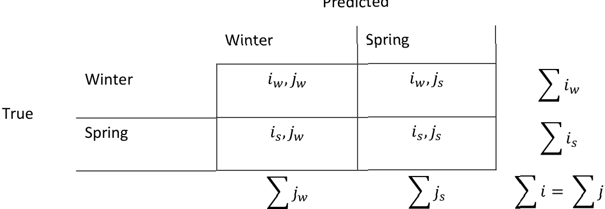

##### Overall Accuracy

\[O A={\frac{\sum_{x}i_{x},j_{x}}{\sum i}}\quad w i t h\;x=\{w,s\}\tag{1}\]   

##### Producers Accuracy

\[P A_{x}=\frac{i_{x},j_{x}}{\sum j_{x}}~w i t h\:x=\left\{w,s\right\}\tag{2}\]  

##### Users Accuracy

\[U A_{x}=\frac{i_{x},j_{x}}{\sum i_{x}}\;w i t h\;x=\{w,s\}\tag{3}\]  

##### F1-score

\[F1_{x}=2*{\frac{P A_{x}\,\times\,U A_{x}}{P A_{x}+U A_{x}}}\tag{4}\]  

So that when combining(2),(3), and(4):

\[F1_{x}=~2*\frac{(i_{x},j_{x})}{\sum i_{x}+\sum j_{x}}\tag{5}\]   ) 

### 3.3.2 Qualitative

To qualitatively assess the feasibility of producing an accurate winter/spring split in wheat,barley, and “other cereals”- we have compared our results to known information on the split between winter and spring cereals. In particular, the USDA cropping calendar shows detailed  information for wheat and barley at the level of the European Union (Figure 1). They estimate  that 52% of barley production is by winter barley, and that the majority of wheat is winter wheat  (96%).

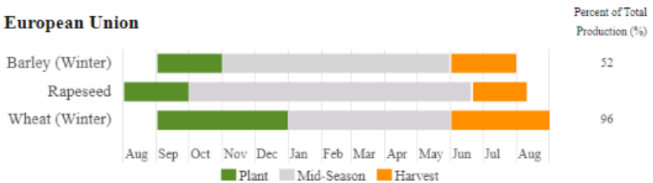

Figure 1: USDA Cropping calendar indicating the percentage of total production for winter  and barley and winter wheat [1].

## 3.4 Confidence

To calculate the confidence of the classification, we integrate the confidence layers generated  for emergence (CPMCECL), harvest (CPMCHCL), and duration (CPMCDCL) with the confidence  provided by the decision-tree classifier itself.

During its training phase, the decision-tree classifier partitions data points into leaf nodes by  iteratively identifying optimal splits based on input variable thresholds. This results in a defined  number of points in each leaf node. The leaf nodes are classified as “winter” or “spring” based  on majority voting. Consequently, each node has an intrinsic uncertainty that can be used to  compute the confidence of its assigned class. 

For example, in Figure 2, nodes A and B classify points as “winter” (w) or “spring” (s). Based on  majority voting, node A is assigned “winter” and node B is assigned “spring”. The confidence (C)  for each node is calculated as the proportion of correctly classified points. Since the training dataset is inherently imbalanced (see Table 3), it is also important to verify whether there are substantial differences in confidence between final “winter” and “spring” nodes. 

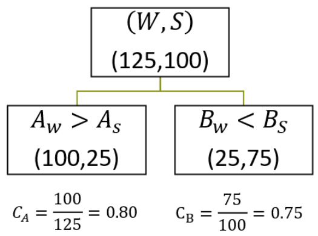

Figure 2: Schematic (simplified) representation of the decision-tree classification. A and B represent nodes classifying the points into winter (w) or spring (s). Following majority voting,  the leaf nodes are assigned the class with the most data points, and confidence (C) can be calculated for each node.

As outlined in the CLMS Vegetated HRL ATBD [2], the confidence layers for emergence, harvest, and duration are quantified as the average deviation between the median estimate (q50) and the \(10^{\mathrm{th}}\) (q10) and \(90^{\mathrm{th}}\) (q90) percentiles (Figure 3, Eqs. 6-8).

\[\begin{array}{r l r}{{0^{\oplus}}\left({940}\right){\mathrm{and~}90^{\oplus}}\left({990}\right){\mathrm{percentiles~}\left({\mathrm{Figure~}3},{\mathrm{~fo}5},\mathrm{~\AA~}\right)}~~~~~~}&{}&\\ {f A P A R_{u n c e r t a i n t y~}q_{10}}&{=f A P A R_{e v e n t~q50}-f A P A R_{e v e n t~q10}}&{}&{(6)}\\ {f A P A R_{u n c e r t a i n t y~q90}}&{=f A P A R_{e v e n t~q50}-f A P A R_{e v e n t~q90}}&{}&{(7)}\\ {d a y s~u n c e r t a i n t y_{e v e n t}}&{}&{}&{}\\ {=\ a b s\left({\frac{f A P A R_{u n c e r t a i n t y~q10}}{c l o p e~f A P A R_{e v e n t~q50}}}\right)}&{}&{(8)}\\ &{+\ a b s\left({\frac{f A P A R_{u n c e r t a i n t y~q90}}{s\Lambda m e~f A P A R_{e v e n t~q50}}}\right)}&{}&{(8)}\end{array}\]

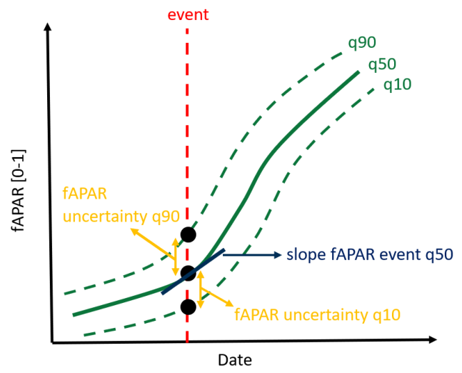

Figure 3: Schematic overview on the parameters used to calculate the uncertainty at an event  date (i.e., emergence or harvest). Event date in this example is an emergence. Figure and Eqs. 6-8 sourced from ATBD [2]. 

To account for the impact of intrinsic uncertainties in the three confidence layers (emergence, harvest, duration) on the final classification uncertainty, we propose a combined approach. This  involves running multiple classifications using the same decision-tree model, but with different combinations of q10, q50, and q90 as input values for each layer.

In this approach, we simulate the emergence, harvest, and duration layers by considering three  different quantiles. Each quantile represents a different scenario – q10 for a lower-bound estimate, q50 for the median (which is also the provided value for CPMCE, CPMCH, and CPMCD), and q90 for an upper-bound estimate. By running the decision tree for each combination of  these quantiles, we generate multiple classification outcomes- each linked to a certain probability of occurrence. 

The weight of each model run is determined by the probability density of each combination of  quantiles. For a normal distribution, the probability density function (PDF) is given by:

\[f(x)=\frac{1}{\sqrt{2\pi\sigma^{2}}}\mathrm{exp}\left(-\frac{(x-\mu)^{2}}{2\sigma^{2}}\right)\tag{9}\]

For quantiles q10, q50, and q90, the z-scores can be calculated by:

\[z(q)=\frac{x_{q}-\mu}{\sigma}\tag{10}\]

So that for a standard normal distribution (\(\mu=0\) and \(\sigma=1\)):

\[z(q10)=\,-1.28,\;\;\;\;\;z(q50)=0,\;\;\;\;z(q90)=1.28\]

And the PDF values for these quantiles are:

\[f(q10)\approx0.18,\;\;\;\;\;f(q50)\;\approx0.40\;\;\;\;f(q90)\;\approx0.18\]

These values represent the relative likelihood of values clustering near these quantiles. Due to the symmetry of the standard normal distribution, q10 and q90 have identical PDF values. 

The weights (\(W\)) for each model run (𝑟) are calculated as the product of the PDFs of the  corresponding quantiles used for emergence \((q_{E})\), harvest \((q_{H})\), and duration (\(q_{D}\)):

\[w_{r}=f{\big(}q_{E,R}{\big)}\times f(q_{H,R})\times f(q_{D,R})\tag{11}\]

The weights are normalized to ensure their sum equals 1:

\[W_{r}=\frac{w_{r}}{\sum_{m}^{M}w_{m}},\tag{12}\]

The symmetry of the standard normal distribution reduces the number of unique weights  required for combinations of q10, q50, and q90. Table 4 provides the calculated weights for each combination. 

Table 4: Number of different model runs and calculated weights for each combination of  quantiles. For a detailed list of all combinations, see Supplementary Table 5.

|Combination|Number ofDifferent Model Runs|\(w_{r}\)|\(W_{r}\)|
|--|--|--|--|
|0 x q50|8|0.005|0.013|
|1 x q50|12|0.012|0.029|
|2 x q50|6|0.028|0.066|
|3 x q50|1|0.063|0.151|
|∑|27|0.420|1.000|

Using these weights, the confidence for the final classification is computed as a weighted average of the confidences from all model runs, per pixel and per crop type. 

\[C_{x}=\sum_{r}^{R}W_{r}C_{r,x}\tag{13}\]

As this is done posterior to the CTY classification, it does not explicitly consider CTY confidence.

\[C_{x}=\sum_{r}^{R}W_{r}C_{r,x}\]

# 4 Results

## 4.1 Wheat

All leaf nodes from the Wheat decision tree classifier are the result of a combination of both  locational arguments and input variables from the cropping patterns products (Figure 4). All  input variables are represented in the decision tree classifier and most leaf nodes have a high  confidence (more info in Supplementary Material). The independent validation also shows that  the classifier results in quite accurate results (Table 5). This is true for the overall classification  (OA = 0.98), and for class-specific metrics. Accuracy of Spring Wheat is visibly lower than for  Winter Wheat- which is likely caused by the imbalance in training points between winter/spring  wheat. Still, the accuracy of spring wheat (minority class) is quite high, indicating that it might  not be necessary to account for this imbalance in further developments. For Spring Wheat, UA  values are higher than PA values, which might imply an underestimation. This should be  considered when the area of spring wheat is calculated.

Table 5: Accuracy Metrics for the Wheat classifier. Values were calculated using the 20%  subset. Confusion Matrix can be found in Supplementary Material. 

Wheat Accuracy

||PA|UA|F1|
|--|--|--|--|
|Spring Wheat|0.77|0.88|0.82|
|Winter Wheat|0.99|0.99|0.99|

Overall Accuracy (OA) = 0.98

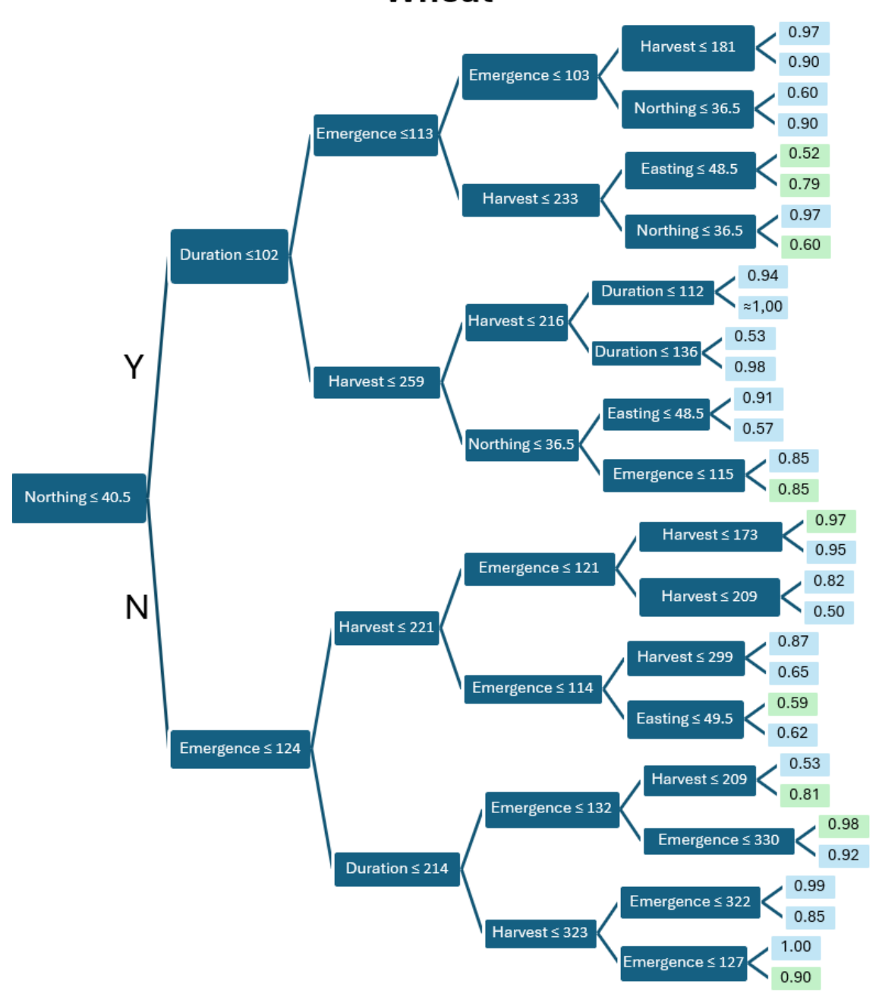

Figure 4: Decision Tree Classifier for Wheat, assigned classes are indicated by blue for winter  wheat, and by green for spring wheat. Values indicate the confidence of the assigned class.  Emergence and Harvest are given in DOY, duration in number of days, and Northing/Easting  are provided in coordinates following LAEA projection (EPSG 3035). A geographical delineation  of these thresholds is provided by Supplementary Figure 1. 

## 4.2 Barley

For Barley, all nodes are the result of a combination of both locational arguments and crop  pattern input variables (Figure 5). Compared to wheat, more nodes indicate a spring season, which is also reflected by the larger relative share of spring points in the training sample. Consequently, the difference in accuracy values between spring and winter barley is less  apparent (Table 6). Overall Accuracy is high (OA = 0.93) and class-specific accuracies are also high. As UA for Spring Barley is slightly higher than PA and vice-versa for Winter Barley, there is likely to be a slight underestimation of spring barley and overestimation of winter barley. This  should be considered when deriving area estimates. Information on the leaf nodes confidence for barley can be consulted in the Supplementary Material.

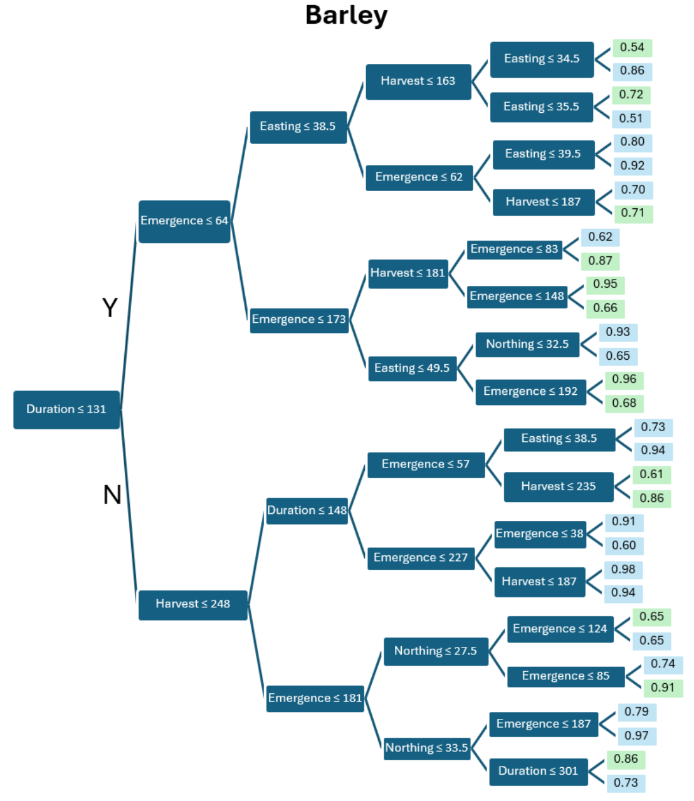

Figure 5: Decision Tree Classifier for Barley, assigned classes are indicated by blue for winter  barley, and by green for spring barley. Values indicate the confidence of the assigned class.  Emergence and Harvest are given in DOY, duration in number of days, and Northing/Easting  are provided in coordinates following LAEA projection (EPSG 3035). A geographical delineation  of these thresholds is provided by Supplementary Figure 2. 

Table 6: Accuracy Metrics for the Barley classifier. Values were calculated using the 20%  subset. Confusion matrix can be found in Supplementary Material.

Barley Accuracy

||PA|UA|F1|
|--|--|--|--|
|Spring Barley|0.89|0.93|0.91|
|Winter Barley|0.96|0.94|0.95|

Overall Accuracy (OA) = 0.93

## 4.3 Other Cereals

For other cereals, the decision tree classifier looks strikingly different than for wheat or barley (Figure 6). While the classifiers for wheat and barley included a combination of both location  and cropping pattern in almost every node, the classifier for “other cereals” almost exclusively  uses cropping pattern variables and only one locational argument. Looking to the accuracy of  the classification, this does not mean that there is a sharp drop in accuracy as overall accuracy  is high (OA = 0.97), and class-specific accuracy values are also high (Table 7). 

It is assumed that this is caused by the fact that the “Other Cereals” class is a heterogeneous class of different cereal types. The “other cereals” class includes a range of cereals, each of which  have different growing conditions at different locations, making it difficult for the classifier.  Information on the leaf nodes confidence for other cereals can be consulted in the  Supplementary Material.

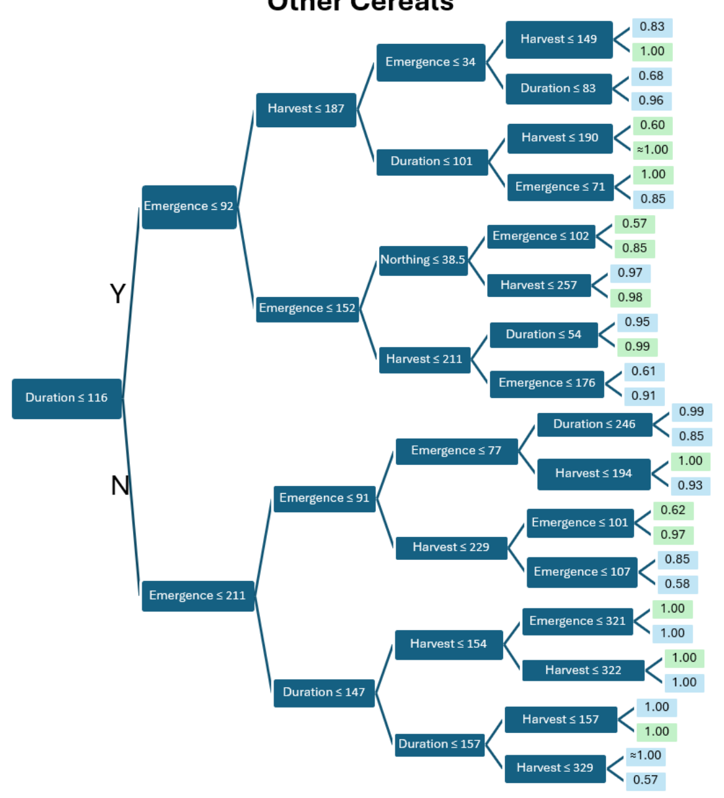

Figure 6: Decision Tree Classifier for Other Cereals, assigned classes are indicated by blue for  other winter cereals, and by green for other spring cereals. Values indicate the confidence of  the assigned class. Emergence and Harvest are given in DOY, duration in number of days, and  Northing/Easting are provided in coordinates following LAEA projection (EPSG 3035). A  geographical delineation of these thresholds is provided by Supplementary Figure 3.

Table 7: Accuracy Metrics for the Other Cereals classifier. Values were calculated using the  20% subset. Confusion Matrix can be found in Supplementary Material.

Other Cereals

Accuracy

||PA|UA|F1|
|--|--|--|--|
|Other Spring Cereals|0.87|0.82|0.84|
|Other Winter Cereals|0.98|0.98|0.98|

Overall Accuracy (OA) = 0.97

## 4.4 Qualitative Validation

Results from the “triple q50 run” (Table 4) show consistent spatial patterns over time (Figure 7). We used this run for qualitative validation as this is the run that uses all values provided by the cropping patterns layers as produced for HRL. It is expected that the results of this run will be  very similar to the final outcome and allows us to make a qualitative comparison without having  to run the entire confidence scheme.

For barley, spring barley is more observed in Northern and Eastern Europe, while the Southern and Western parts of Europe are more dominated by winter barley. Spain has a higher share of  spring barley than other Southern European countries. The estimated share of winter barley  increases between 2017-2021 from 0.56 to 0.67. Compared to the production share estimated by the USDA cropping calendar (Figure 1) [1], the estimates made here are slightly higherparticularly at later years. It is unclear whether this is a bias or because USDA indicates share of production, while Table 8 provides an indication of area. 

For other cereals, other winter cereals seem to dominate according to our classification. Order of magnitude is consistent over time (ranging between 0.78-0.86). Slightly higher shares of other spring cereals are predicted over Central Europe (e.g., Poland) or Turkey.

For wheat, the picture is even more leaning towards winter wheat. Our classification estimates that between 95-98% of the wheat extent is cultivated during winter. Exceptions are predicted in Scandinavia (notably Finland). The order of magnitude of our predictions is very much in line with those of the USDA cropping calendar for production.

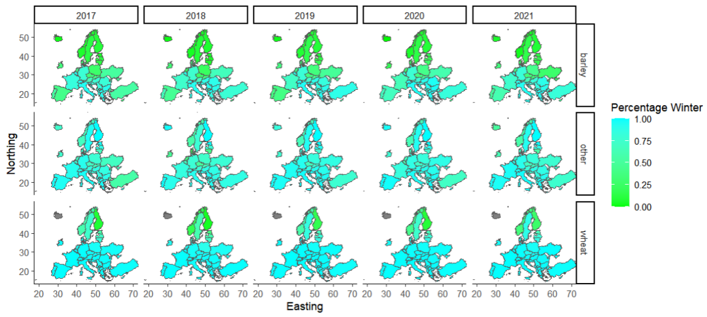

Figure 7: Share of winter cereals per crop (rows) and per year (columns). Percentages are calculated by considering the results of the triple q50 run.

Table 8: European share of winter cereals per crop (rows) and per year (columns). Shares are  calculated by considering the results of the triple q50 run.

||Share of Winter Cereals|Share of Winter Cereals|Share of Winter Cereals|Share of Winter Cereals|Share of Winter Cereals|
|--|--|--|--|--|--|
||2017|2018|2019|2020|2021|
|Barley|0.56|0.60|0.61|0.66|0.67|
|Other|0.83|0.78|0.86|0.85|0.86|
|Wheat|0.97|0.95|0.98|0.97|0.97|

# 5 Recommendations

## 5.1 Feasibility

Based on the above feasibility study, we believe it is feasible to produce a product that splits  winter from spring cereals in a credible manner at a European scale. The amount of in-situ data points on spring cereals is too limited to be included in training of the CTY model, but the  proposed approach would make it possible in post-processing.

In a similar fashion to other cropping pattern data products, the calculation of a confidence layer  is also feasible. As the proposed algorithm builds on information from the CTY and cropping  pattern detection algorithms, it is well aligned with existing products. 

The proposed classifier is a decision-tree classifier. This is far from the most performative  classifier but has the advantage of being understandable and transparent. In this way, the  processing is not a black box as would be the case for other, more performative algorithms. This  way, it created a ruling system by determining optimal thresholds rather than being expertbased. Even though the algorithm is not too complex, it achieves high accuracy. 

Figure 8Figure 9 present the results of the proposed approach for a selected region within a  single LAEA tile in Spain, along with the corresponding confidence levels. We propose integrating the winter and spring cereals classification, along with associated confidence levels, as an  additional layer within the HRL Croplands portfolio. This approach preserves the original HRL  CTY layer without further subdivision. 

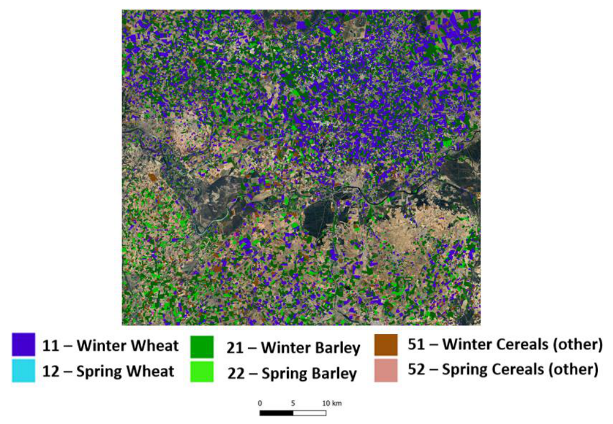

Figure 8: Example of a season cropping pattern layer. (Results are from the triple q50 run). Results are shown for a part of LAEA tile E30N21.

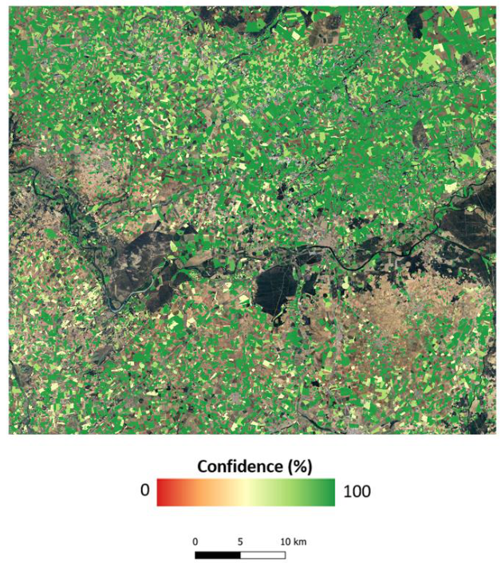

Figure 9: Example of a confidence layer for the season cropping pattern layer. Results are shown for a part of LAEA tile E30N21.

## 5.2 Limitations

• The models were trained and validated using the available information on winter/spring  cereals existing within the LPIS/GSAA database. This means that the consecutive  quantitative accuracy assessment also only includes data points from the countries that were included in the initial training (see Table 2). It is unclear whether the same accuracy can be achieved for countries/regions not included in the initial dataset. This is particularly true for Southern or Eastern European countries where reference data were  virtually absent. 

• Because of strong seasonal differences and vastly different crop management practices, overseas areas are not considered in this analysis.

• Since a separate classifier is developed for each crop type based on the initial crop type  classification, the results are highly dependent on the accuracy, constraints, and  limitations of the original classification, including factors such as the minimum mapping  unit.

• Currently, the algorithm operates only for pixels with recorded emergence (CPMCE),  harvest (CPMCH), and duration (CPMCD) values. However, some pixels are flagged due  to high uncertainty or field boundary issues, resulting in cases where a crop type is  assigned, but no additional cropping pattern information is available. Consequently,  estimating the season (winter/spring) is not feasible for these pixels (more info in Cropping Patterns section in ATBD [1]). This limitation is consistent with other cropping pattern products, where similar flagging values could be applied.

# 6 References

[1] United States Department of Agriculture, Foreign Agricultural Service. (n.d.). Crop  Calendar – Europe. International Production Assessment Division (IPAD). Retrieved  March 1, 2025, from https://ipad.fas.usda.gov/rssiws/al/crop_calendar/europe.aspx

[2] CLMS Vegetated HRL ATBD (2024). HRL Algorithm Technical Basis Document.

# 7 Supplementary Materials

## 7.1 Detailed Samples

Supplementary Table 1: Number of samples per dataset.

|Dataset|Wheat|Wheat|Barley|Barley|Other Cereals|Other Cereals|Total|
|--|--|--|--|--|--|--|--|
|Dataset|Winter|Spring|Winter|Spring|Winter|Spring|Total|
|AT-2018|138.828|2.847|52.989|30.733|69.661|21.593|316.651|
|AT-2019|132.366|2.213|55.991|23.832|71.823|20.354|306.579|
|AT-2020|129.945|2.278|57.109|20.613|69.123|19.735|298.803|
|BE-2018|29.734|384|8.465|669|370|379|40.001|
|BE-2019|31.577|365|9.296|506|451|309|42.504|
|BE-2020|28.978|471|8.779|937|433|384|39.982|
|BE-2021|31.052|546|7.721|737|488|250|40.794|
|DE-2021|146.827|2.665|78.683|12.317|85.624|10.421|336.537|
|DK-2019|68.119|2.671|13.649|87.925|27.486|11.147|210.997|
|EE-2021|13.726|5.525|2.245|10.737|533|195|32.961|
|FI-2020|6.436|52.201|148|0|5.762|1.381|65.928|
|FI-2021|14.111|46.470|330|0|5.646|1.104|67.661|
|FR-2019|1.006.541|6.616|290.910|115.953|139.940|19.366|1.579.326|
|FR-2020|846.941|16.669|257.208|166.960|121.496|26.277|1.435.101|
|LV-2019|44.329|22.422|611|16.312|1.315|212|85.201|
|LV-2021|45.767|19.298|1.409|11.770|1.132|117|79.493|
|SE-2021|56.888|9.382|3.755|0|6.701|567|77.293|
|SI-2021|27.901|1.228|28.599|1.924|8.342|1.820|69.814|
|SK-2021|24.211|4.028|4.017|10.600|21|0|42.877|
|Total|2.823.827|198.279|881.914|512.525|616.347|135.611|5.168.503|

## 7.2 Confusion Matrices

### 7.2.1 Wheat

Supplementary Table 2: Confusion Matrix with absolute numbers for the Wheat classifier. 

|Wheat|Wheat|Observed|Observed|Observed|
|--|--|--|--|--|
|Wheat|Wheat|Spring|Winter|∑|
|Predicted|Spring|24.870|7.264|32.134|
|Predicted|Winter|3.502|510.883|514.385|
|Predicted|∑|28.372|518.147|546.519|

### 7.2.2 Barley

Supplementary Table 3: Confusion Matrix with absolute numbers for the Barley classifier.

|Barley|Barley|Observed|Observed|Observed|
|--|--|--|--|--|
|Barley|Barley|Spring|Winter|∑|
|Predicted|Spring|76.049|9.740|85.789|
|Predicted|Winter|5.946|149.287|155.233|
|Predicted|∑|81.995|159.027|241.022|

### 7.2.3 Other Cereals

Supplementary Table 4: Confusion Matrix with absolute numbers for the Other Cereals classifier.

|Other Cereals|Other Cereals|Observed|Observed|Observed|
|--|--|--|--|--|
|Other Cereals|Other Cereals|Spring|Winter|∑|
|Predicted|Spring|9.392|1.428|10.820|
|Predicted|Winter|2.122|91.699|93.821|
|Predicted|∑|11.514|93.127|104.641|

## 7.3

## 7.4 Model Combinations

Supplementary Table 5: Derived weights for each combination of emergence, duration, and  harvest quantiles. Note that many combinations have equal weights because of similar  probability of occurrence. 

|Emergence|Duration|Harvest|𝒘𝒓|\(w_{r}\)|
|--|--|--|--|--|
|Q10|Q10|Q10|0.005|0.013|
|Q10|Q10|Q50|0.012|0.029|
|Q10|Q10|Q90|0.005|0.013|
|Q10|Q50|Q10|0.012|0.029|
|Q10|Q50|Q50|0.028|0.066|
|Q10|Q50|Q90|0.012|0.029|
|Q10|Q90|Q10|0.005|0.013|
|Q10|Q90|Q50|0.012|0.029|
|Q10|Q90|Q90|0.005|0.013|
|Q50|Q10|Q10|0.012|0.029|
|Q50|Q10|Q50|0.028|0.066|
|Q50|Q10|Q90|0.012|0.029|
|Q50|Q50|Q10|0.028|0.066|
|Q50|Q50|Q50|0.063|0.151|
|Q50|Q50|Q90|0.028|0.066|
|Q50|Q90|Q10|0.012|0.029|
|Q50|Q90|Q50|0.028|0.066|
|Q50|Q90|Q90|0.012|0.029|
|Q90|Q10|Q10|0.005|0.013|
|Q90|Q10|Q50|0.012|0.029|
|Q90|Q10|Q90|0.005|0.013|
|Q90|Q50|Q10|0.012|0.029|
|Q90|Q50|Q50|0.028|0.066|
|Q90|Q50|Q90|0.012|0.029|
|Q90|Q90|Q10|0.005|0.013|
|Q90|Q90|Q50|0.012|0.029|
|Q90|Q90|Q90|0.005|0.013|

## 7.5 Location Thresholds

### 7.5.1 Wheat

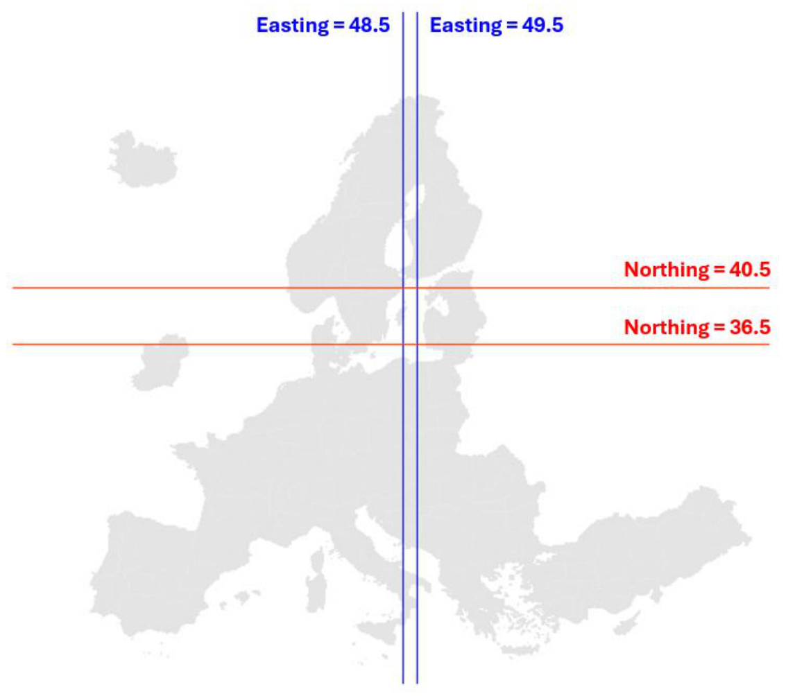

Supplementary Figure 1: Map showing the thresholds defined by the decision tree classifier for  Wheat. Values represent coordinates in the LAEA coordinate reference system (EPSG:3035). 

### 7.5.2 Barley

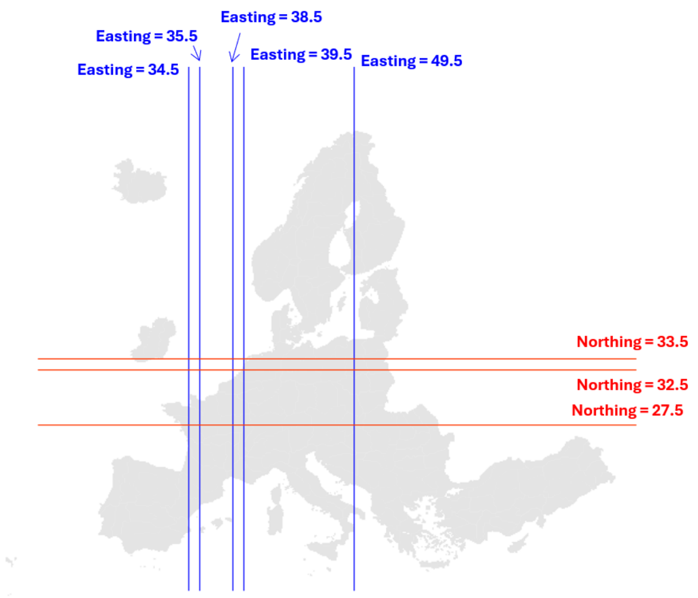

Supplementary Figure 2: Map showing the thresholds defined by the decision tree classifier for  Barley. Values represent coordinates in the LAEA coordinate reference system (EPSG:3035).

### 7.5.3 Other Cereals

Supplementary Figure 3: Map showing the thresholds defined by the decision tree classifier for  Other Cereals. Values represent coordinates in the LAEA coordinate reference system  (EPSG:3035).

## 7.6 Node Confidence

### 7.6.1 Wheat

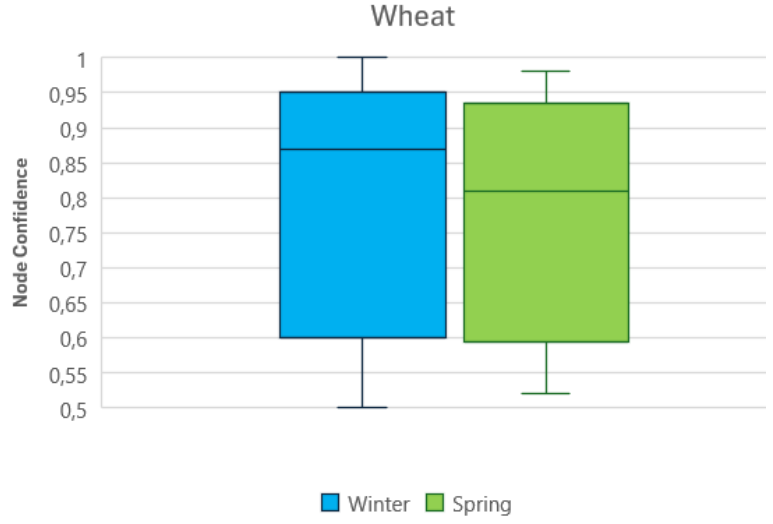

Supplementary Figure 4: Boxplots indicating the node confidence of winter and spring wheat.

### 7.6.2 Barley

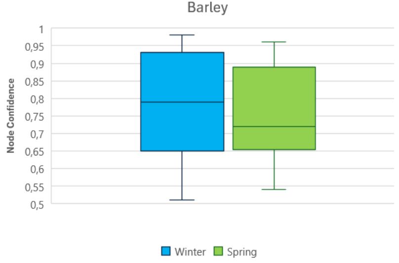

Supplementary Figure 5: Boxplots indicating the node confidence of winter and spring barley

### 7.6.3 Other Cereals

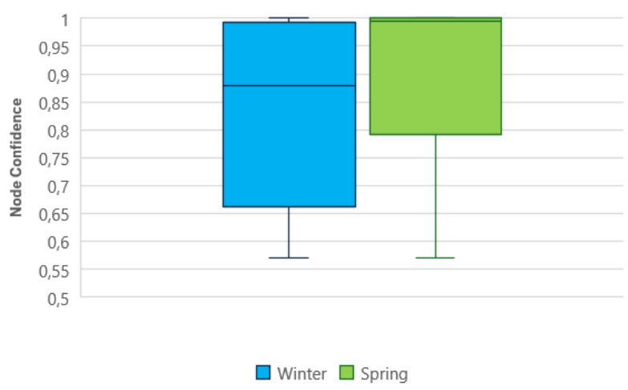

Supplementary Figure 6: Boxplots indicating the node confidence of other winter and spring  cereals. 

## 7.7 Tree Depth Analysis

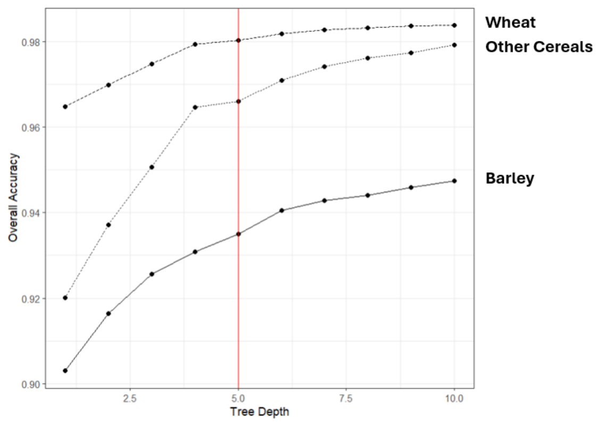

Supplementary Figure 7: Overall Accuracy gained for different tree depths. Values were calculated using the same testing subset. Red line indicates the final tree depth of 5. 

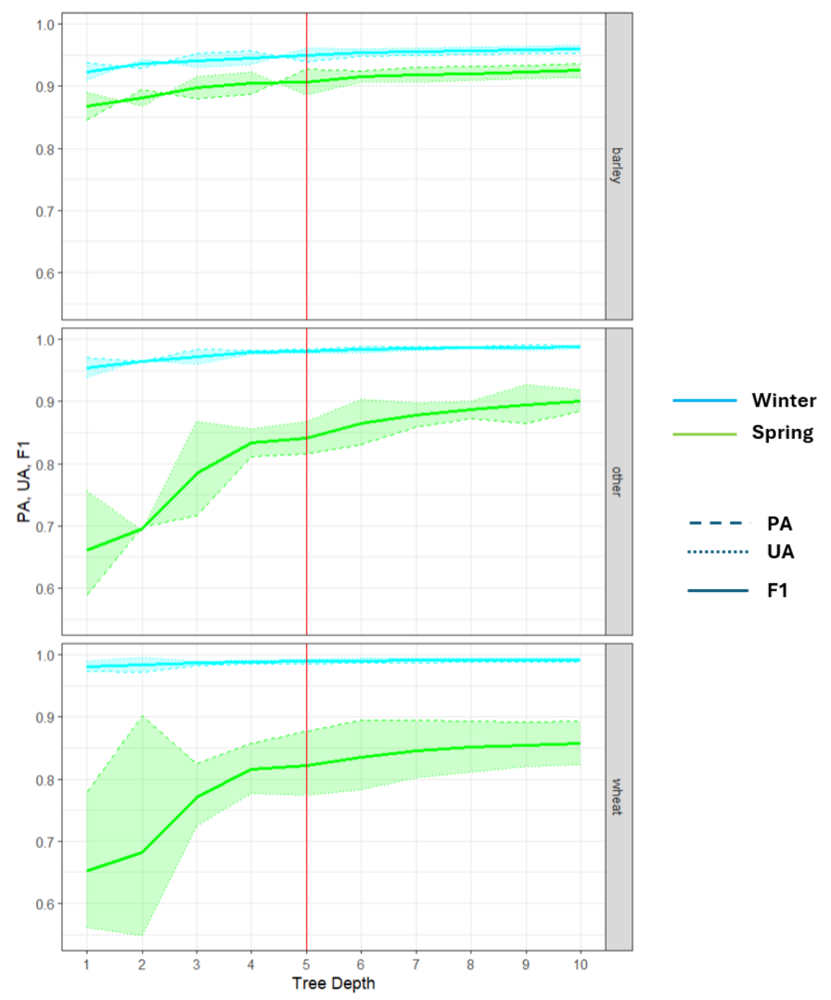

Supplementary Figure 8: Class-Specific accuracy values gained for different tree depths.  Values were calculated with the same testing subset. Red line indicates the final tree depth of 

CLMS HRL_VLCC WINTER/SPRING FEASIBILITY STUDY

Page | 30

