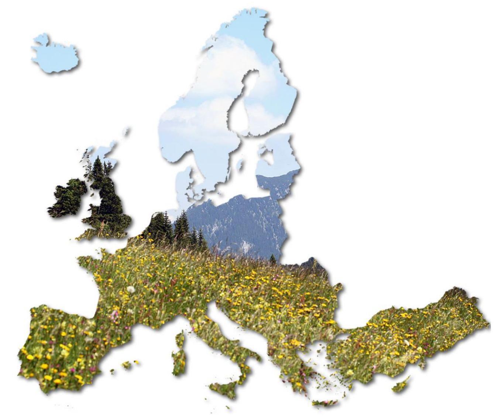
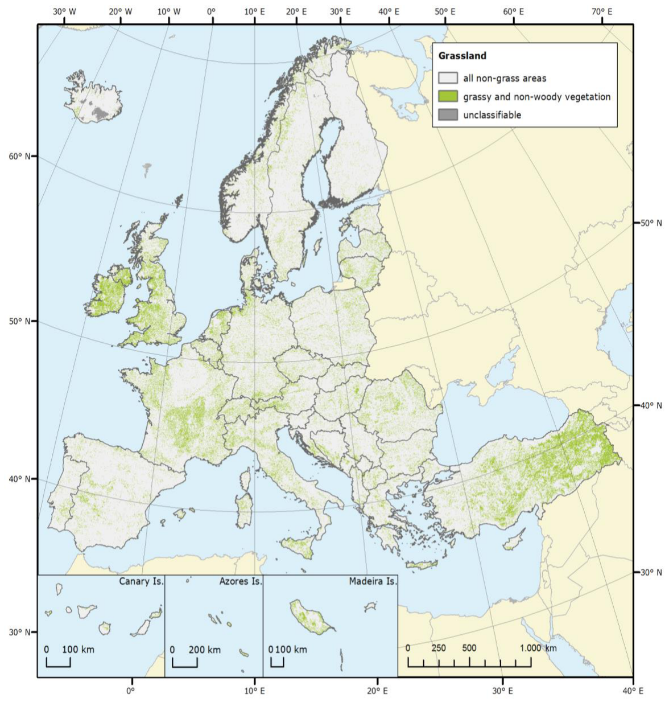
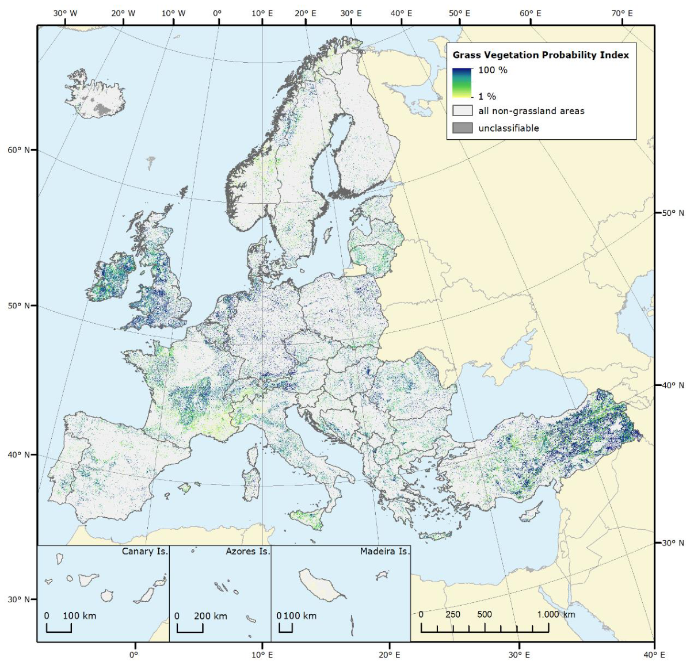
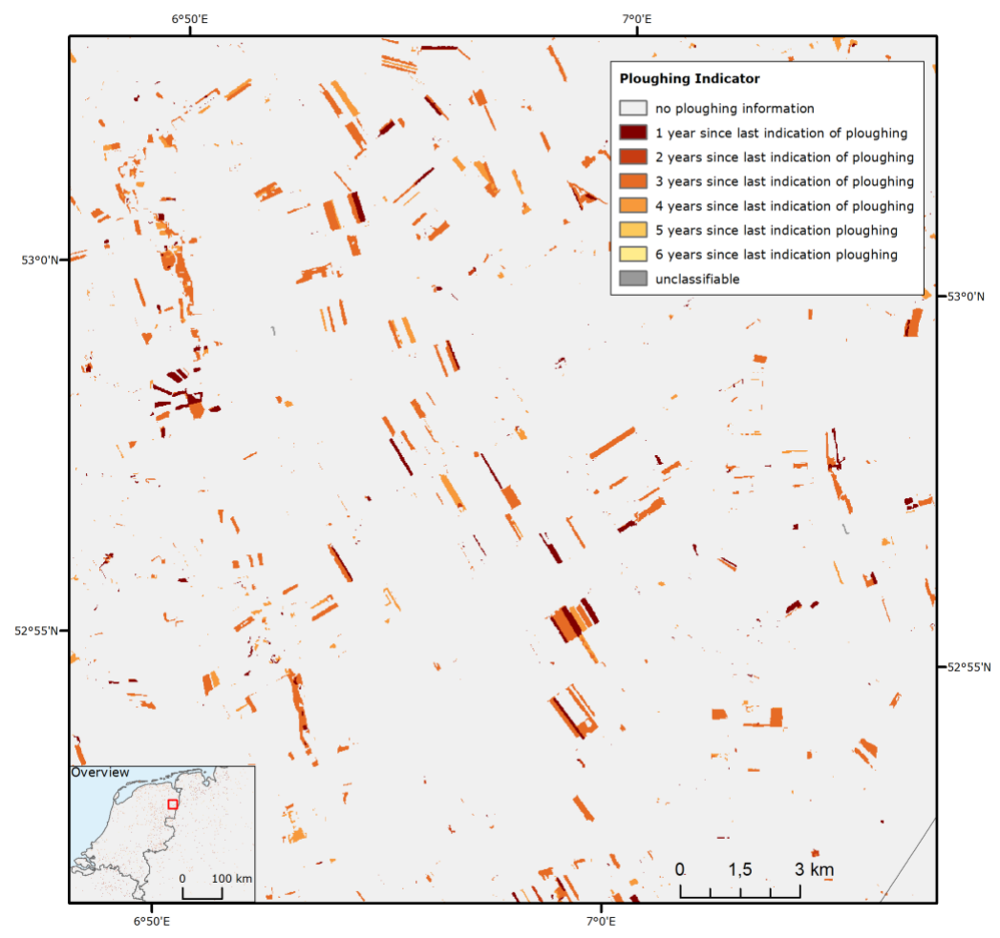
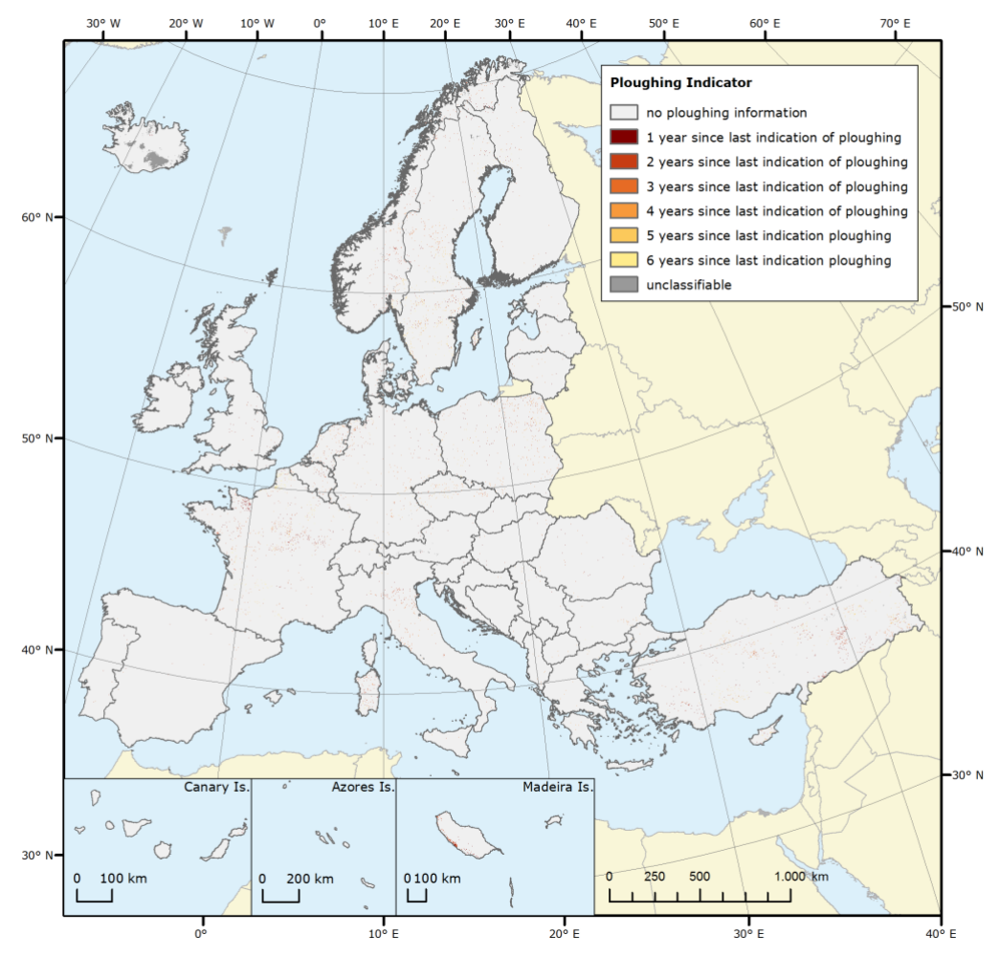

Copernicus Land Monitoring Service – High Resolution Layer Grassland

Product Specifications

land.copernicus.eu

Copernicus land monitoring service – High resolution layer Grassland: Product Specifications Document

|Title|Copernicus Land Monitoring Service – High Resolution Layer Grassland: Product Specifications Document|
|--|--|
|Creator|Tobias LANGANKE|
|Creation date|2017-03-15|
|Subject|Definitions and product specifications of Copernicus High Resolution Layer Grassland|
|Status|Final|
|Publisher|Copernicus team at EEA|
|Type|Text|
|Description|This document contains detailed product definitions and specifications for the pan-European Copernicus HRL Grassland layer for the 2015 reference year. It was created in close collaboration and with contributions from the service providers of Lot 3 in a consultative process.|
|Contributor|Regine RICHTER (GAF AG), Christopher SANDOW (GAF AG), Cornelia STORCH (GAF AG), Baudouin DESCLÉE (SIRS), Andrew MORAN (GeoVille)|
|Format|Microsoft Word document|
|Source|European Environment Agency and HRL Grassland service providers|
|Rights|European Environment Agency|
|Identifier|This is version 2 of 2018-04-10|
|Language|EN|
|Relation|Copernicus regulation|
|Coverage|2018|

# TABLE OF CONTENTS

Background................................................................................................................................ 5

HRL Product Overview............................................................................................................... 5

Data Used for HRL Grassland Generation ................................................................................. 5

Grassland Mask (GRA)............................................................................................................... 6

Grass Vegetation Probability Index (GRAVPI) ........................................................................... 9

Ploughing Indicator (PLOUGH)................................................................................................ 10

INSPIRE Metadata and Mapping Tables.................................................................................. 12

Thematic Accuracy .................................................................................................................. 13

Annex I: Detailed Product Specifications.................................................................................... 14

Annex II: Color Palettes............................................................................................................... 17

# LIST OF FIGURES

Figure 1: Overview on HRL2015 Grassland Layer ............................................................................. 8

|Figure 2: Grassland Vegetation Probability Index........................................................................... 10|
|--|
|Figure 3: PLOUGH (detailed view)................................................................................................... 11|

.. 12

# LIST OF TABLES

|Table 1: List of auxiliary data sets used for HRL Grassland production ..........................................|.. 6|
|--|--|
|Table 2: Definition of HRL2015 Grassland Layer.............................................................................|.. 7|

# LIST OF ACRONYMS

|DWH|Data Warehouse|
|--|--|
|EEA|European Environment Agency|
|EO|Earth Observation|
|ESA|European Space Agency|
|GRA|Grassland Layer|
|GRAVPI|Grassland vegetation probability Index|
|HRL|High Resolution Layer|
|INSPIRE|INfrastructure for SPatial InfoRmation in Europe|
|LAEA|Lambert Azimuthal Equal Area Projection|
|LUCAS|Land Use and Coverage Area frame Survey|
|MMU|Minimum Mapping Unit|
|NGR|Natural and semi-natural grasslands|
|PLOUGH|Ploughing Indicator|
|USGS|United States Geological Survey|

# Background

This document captures detailed product specifications for the high resolution layer (HRL)  Grassland for the 2015 reference year. It provides an overview of the HRL Grassland products, their specifications and EO and in-situ data that have been used for data generation. For each product,  the general workflow of data creation is explained and overview maps are shown to present the  layers. INSPIRE metadata and mapping tables established per layer are described and colour  palettes designed are displayed. Tables with detailed product specifications for each product are  presented in Annex I at the end of this document.

# HRL Product Overview

The pan-European HRL Grassland 2015 product consists of three different layers, the

 Grassland (GRA)

 Grassland Vegetation Probability Index (GRAVPI) and the

 Ploughing Indicator (PLOUGH)

The main product of the “ HRL Grassland” is the “Grassland” layer, a grassland/non-grassland mask  for the EEA39 area. This grassy and non-woody vegetation baseline product includes all kinds of  grasslands: managed grassland, semi-natural grassland and natural grassy vegetation. The layer is  not directly comparable to the precursor HRL Grassland layer of the reference year 2012, which  focused on natural (and parts of semi-natural) grasslands, and fully replaces the 2012 product.

Two additional (expert) products complete the HRL Grassland: the Ploughing Indicator (PLOUGH)  and the Grassland Vegetation Probability Index (GRAVPI). While the PLOUGH concentrates on  historic land cover features with the aim to indicate ploughing activities in preceding years, the  GRAVPI provides a measure of classification reliability. Both products are designed for expert  users, and are still in a testing phase.

# Data Used for HRL Grassland Generation

A variety of high resolution satellite images with multiple spatial resolutions were utilized for the  production of the HRL Grassland layers. These include primarily the dense time series of the  Sentinel 1 and Sentinel 2 archives of the Copernicus programme. Furthermore, Earth observation  (EO) data from the USGS Landsat programme and Copernicus DWH HR_IMAGE_2012 datasets were used as supplementary data sources. For the production of the grassland layer, the following  primary EO data sources have been deployed: Sentinel-2A, Sentinel-1A and B and Landsat 8 OLI.  Historical EO data sets applied for the generation of PLOUGH were Landsat 8 OLI, Landsat 5 TM and IRS-P6 LISS-3 (from HR_IMAGE_2012).

Besides EO data, a series of public available auxiliary data sets proved to be suitable to support training sample selection, plausibility checks and calibration of algorithms. Table 1 gives an overview on the utilized data.

Table 1: List of auxiliary data sets used for HRL Grassland production

|Name of data set|Characteristics|
|--|--|
|Land Use and Coverage Area frame Survey (LUCAS)| In-situ; observation through survey Points Coverage: EU countries 3-year-update cycle|
|HRL Tree Cover Density (2012 & 2015)| Resolution: 20 m Coverage: EEA|
|HRL Forest Type (2012 & 2015)| Resolution: 20 m Coverage: EEA|
|HRL Impervious Degree (2012 & 2015)| Resolution: 20 m Coverage: EEA|
|HRL Water & Wetness (2012 & 2015)| Resolution: 20 m Coverage: EEA|
|Global Forest Change 2000–2014 (Hansen et al. 2013)| Resolution: 30 m Coverage: global|
|Corine Land Cover| Thematic map Minimum mapping unit: 50 ha Coverage: EEA|
|National/regional thematic maps, e.g. SIOSE, LPIS data| High degree of detail, higher than Corine Land Cover 50 ha MMU|
|National phenology dataset PHASE| Coverage: Germany only|

# Grassland Mask (GRA)

The HRL Grassland Layer defines grassland as

 herbaceous vegetation with at least 30% ground cover, of which at least 30% graminoid species such as Poaceae, Cyperaceae and Juncaceae

 it can include additional non woody plants such as lichens, mosses and ferns

 scattered trees and shrubs may be present, covering a maximum 10 %.

Table 2 presents a detailed list of all grassland elements and of objects that are excluded from the grassland mask.

Table 2: Definition of HRL2015 Grassland Layer

|Elements to be included in the grassland product|Elements to be excluded from the grassland product|
|--|--|
|• Natural, semi-natural, agricultural / managed grass-covered surfaces.• Grasslands with scattered trees and shrubs covering a maximum 10 %.• Heathland with high grass cover, maximum of 10 % non-grass cover•   Coastal grasslands, such as grey dunes and salt meadows located in intertidal flat areas with at least 30 % graminoid species of vegetation cover• Sparsely vegetated grasslands (> 30% vegetation cover – see comment below)• Grasslands in urban areas: parks, urban green spaces in residential and industrial areas• Semi-arid steppes with scattered Artemisia scrub• Meadows: grassland which is not regularly grazed by domestic livestock, but rather allowed to grow unchecked in order to produce hay• Grasslands in urban areas: sport fields, golf courses• Grasslands on land without use• Natural grasslands on military sites|• Peat forming ecosystems dominated by sedges.• Reed beds and helophytes dominated systems.• Tall forbs, fern, shrub dominated vegetation.• Grasslands that have been observed as tilled (in the reference year or a certain period before, in that case they are considered as arable fields)•   Rice fields• Vineyards, orchards, olive groves, (if more than 10 % shrubs or trees)• Tundras dominated by shrubs and lichens • Grassland on fresh (and older) clear-cuts in the woods|

The 30% ground cover density value defined above is understood as reference indicating that  grasslands with ≥ 30% ground cover normally can be distinguished from open ground on satellite  data, as the vegetation cover dominates bare soil reflection. It is understood as a guideline rather  than a strict rule during production to focus on “dense grasslands” that can be identified in a  reliable manner in EO data rather than on “sparsely vegetated grasslands”. Confusions with bare  soil or sparsely vegetated grassland < 30% ground cover can such be avoided. 

The HRL2015 Grassland Layer was produced by using a combined optical/SAR data analysis approach based on data from the reference period 2015 +/-1 year. Image objects derived from  multi-temporal optical EO data were utilized to classify the multi-temporal data base of both  sensor types. Training samples of the main land use classes were selected and applied in a  supervised classification approach to compute grassland maps of both sensors. A subsequent rulebased evaluation finally defined the optimum grassland mask. Additionally, recent and historic  bare soil masks helped to identify grassland areas that show a ploughing indication and therefore  were excluded from the mask. HRL2012/2015 layers on imperviousness, tree cover density and  permanent water bodies were used for a plausibility analysis in order to identify and remove improper overlays. The final grassland mask was generalized by filter operations to derive a  harmonized product with 1 ha minimum mapping unit (Figure 1).

Areas that could not be classified due to clouds/cloud shadows/snow cover or a lack of satellite data have been classified by a separate code (code 254). Cloud/cloud shadow/snow masks applied were either derived in a fully automated process using the Fmask algorithm or manually by the service providers. In the first case, overestimations of the areas affected could be observed which, however, mostly do not affect the grassland layer. 

For detailed product specifications see Annex I. More information on the HRL Grassland colour  palette can be found in Annex II.

Figure 1: Overview on HRL2015 Grassland Layer, © EuroGeographics for the administrative boundaries

## National Products and 100m products

The pan-European HRL2015 Grassland Layer is available at two different pixel resolutions: 20m  layer and 100m product. To achieve the 100m map, an aggregation process was carried out  weighting grassland, non-grassland and unclassifiable pixels at 20m level within a 100m grid cell.  The class majority determined the final assignment of the 100m grid cell to a specific class.

Both, the 20m product and the aggregated 100m HRL2015 Grassland Layers are provided in  national projections as well. National country borders from EUROSTAT (European Boundary Map  Version 11) and country-specific projection parameters provided by ESA via the HR/VHR _IMAGE_2015 were used to re-project the European 20m and 100m data sets to national layers.  The national layers are provided with a buffer of 100m width.

# Grass Vegetation Probability Index (GRAVPI)

The Grass Vegetation Probability Index describes the reliability of the multi-seasonal optical grassland classification for the reference year 2015 (EO data from plus/minus 1 year). It is a  measure for the reliability of the grassland class assignment and indicates to which degree grassland could be separated from other vegetated land cover types (see Figure 2). 

The probability index is directly related to the EO data situation: while dense time series of  meaningful scenes will lead to high classification reliabilities, poor data situations will provide low  probability index rates. An optimum data scenario is used to calibrate the index to the range of 1-100%.

For detailed GRAVPI product specifications see Annex I. More information on the GRAVPI colour palette can be found in Annex II.

Figure 2: Grassland Vegetation Probability Index, © EuroGeographics for the administrative boundaries

# Ploughing Indicator (PLOUGH)

The Ploughing Indicator estimates the temporal extent since last ploughing activity. PLOUGH is derived from historical bare soil time series (up to 6 years) of multi-temporal optical HR imagery.  Primary EO data sources were Landsat 8 OLI and Landsat 5 TM data. For 2012, where neither  Landsat 8 OLI nor Landsat 5 TM data have been available, data from HR_IMAGE_2012 were used  to fill the temporal gap in the time series. 

PLOUGH is a pixel-based layer where each pixel value represents the latest bare soil indication  (number of years prior to the target year) within the grassland mask. The reliability of PLOUGH strongly depends on the availability of suitable historical EO data. Poor data situations (clouded images, unfavourable data acquisition dates, only few data sets available) will lead to a less reliable  PLOUGH, while an optimum coverage will raise the quality of the information provided. Moreover,  the NDVI-based approach has its limitations in areas with dry climate where un-vegetated areas  and dry vegetation is confused. In those regions dry vegetation as well as ploughed grassland is  included in the ploughing indicator map.

PLOUGH can be used as additional, independent information layer for a flexible application of  different grassland definitions. The maps shown in Figure 4 and Figure 3 illustrate the product. For  detailed PLOUGH product specifications see Annex I. More information on the PLOUGH colour  palette can be found in Annex II.

Figure 3: PLOUGH (detailed view) 

Figure 4: Pan-European Ploughing Indicator, © EuroGeographics for the administrative boundaries

# INSPIRE Metadata and Mapping Tables

Metadata are provided together with the products as INSPIRE-compliant XML files according to  the EEA Metadata Standard for Geographic Information (EEA-MSGI). EEA-MSGI has been  developed by EEA to meet needs and demands for inter-operability of metadata. EEA’s standard  for metadata is a profile of the ISO 19115 standard for geographic metadata and contains more  elements than the minimum required to comply the INSPIRE metadata regulation. Detailed  conceptual specifications on EEA-MSGI and other relevant information on metadata can be found  online at http://www.eionet.europa.eu/gis.

INSPIRE mapping tables show the evidence that the products delivered are compatible with the  INSPIRE Data Specification on Land Cover. This evidence is provided as table document showing  the associations between the source (product/deliverable) and the target data model (INSPIRE  Data Specification on Land Cover). 

# Thematic Accuracy

For HRL Grassland, thematic accuracy assessment will be made on the main product, the grassland  mask. The target isset at 85 % thematic accuracy to be achieved within each biogeographic region.  A quantitative approach will be used based on a set of stratified systematic point samples that will  be compared to internal EO data sets (Sentinel-1/2, DHW IMAGE20XX, Landsat, etc.) and suitable  external data archives (e.g. GoogleEarthPro, national orthophotos or national grassland datasets).  There will be three levels of accuracy assessment: 

a) an internal validation by SPs to report on the accuracy as part of the delivery report, 

b) further assessments on samples of the 20m products by ETC in the early production phase, and 

c) a full independent validation of the full European product after production.

While the additional products are not part of the thematic accuracy assessment, these products  are at least checked regarding semantic accuracy.

## Annex I: Detailed Product Specifications

|Grassland Layer 2015 (20m /100m)|AcronymGRA|
|--|--|
|Reference year2015 (+/- 1 year)|Reference year2015 (+/- 1 year)|
|Geometric resolution Pixel resolution 20m x 20 m, fully conform with the EEA reference grid|Geometric resolution Pixel resolution 20m x 20 m, fully conform with the EEA reference grid|
|Coordinate Reference SystemEuropean Terrestrial Reference System 1989 (ETRS89), LAEA projection|Coordinate Reference SystemEuropean Terrestrial Reference System 1989 (ETRS89), LAEA projection|
|Geometric accuracy (positioning accuracy)Less than half a pixel. According to ortho-rectified satellite image base delivered by ESA.|Geometric accuracy (positioning accuracy)Less than half a pixel. According to ortho-rectified satellite image base delivered by ESA.|
|Thematic accuracy85 % thematic accuracy to be achieved within each biogeographic region.|Thematic accuracy85 % thematic accuracy to be achieved within each biogeographic region.|
|Data type8bit unsigned raster, LZW compression|Data type8bit unsigned raster, LZW compression|
|Minimum Mapping Unit (MMU)1 ha (20m product)|Minimum Mapping Unit (MMU)1 ha (20m product)|
|Min. Width of linear features20 m/100m (for Grassland main product only)|Min. Width of linear features20 m/100m (for Grassland main product only)|
|Raster coding0: all non-grass areas1: grassy and non-woody vegetation254: unclassifiable (no satellite image available, or clouds, shadows, or snow)255: outside area|Raster coding0: all non-grass areas1: grassy and non-woody vegetation254: unclassifiable (no satellite image available, or clouds, shadows, or snow)255: outside area|
|MetadataXML metadata files are to be produced according to INSPIRE metadata standards|MetadataXML metadata files are to be produced according to INSPIRE metadata standards|
|Delivery formatGeoTIFF|Delivery formatGeoTIFF|
|Grassland Vegetation Probability Index|AcronymGRAVPI|
|Reference year2015 (+/- 1 year)|Reference year2015 (+/- 1 year)|
|Geometric resolution Pixel resolution 20m x 20 m, fully conform with the EEA reference grid|Geometric resolution Pixel resolution 20m x 20 m, fully conform with the EEA reference grid|
|Coordinate Reference SystemEuropean Terrestrial Reference System 1989 (ETRS89), LAEA projection|Coordinate Reference SystemEuropean Terrestrial Reference System 1989 (ETRS89), LAEA projection|
|Geometric accuracy (positioning accuracy)Less than half a pixel. According to ortho-rectified satellite image base delivered by ESA.|Geometric accuracy (positioning accuracy)Less than half a pixel. According to ortho-rectified satellite image base delivered by ESA.|
|Thematic accuracyNot applicable|Thematic accuracyNot applicable|
|Data type8bit unsigned raster, LZW compression|Data type8bit unsigned raster, LZW compression|
|Minimum Mapping Unit (MMU)20 m|Minimum Mapping Unit (MMU)20 m|
|Min. Width of linear features20 m|Min. Width of linear features20 m|
|Raster coding0: all non-grassland areas1-100: grassland vegetation probability index value254: unclassifiable (no satellite image available, or clouds, shadows, or snow)255: outside area|Raster coding0: all non-grassland areas1-100: grassland vegetation probability index value254: unclassifiable (no satellite image available, or clouds, shadows, or snow)255: outside area|
|MetadataXML metadata files are to be produced according to INSPIRE metadata standards|MetadataXML metadata files are to be produced according to INSPIRE metadata standards|
|Delivery formatGeoTIFF|Delivery formatGeoTIFF|
|Ploughing Indicator|AcronymPLOUGH|
|Reference year2015 (+/- 1 year) and 6 preceding years|Reference year2015 (+/- 1 year) and 6 preceding years|
|Geometric resolution Pixel resolution 20m x 20 m, fully conform with the EEA reference grid|Geometric resolution Pixel resolution 20m x 20 m, fully conform with the EEA reference grid|
|Coordinate Reference SystemEuropean Terrestrial Reference System 1989 (ETRS89), LAEA projection|Coordinate Reference SystemEuropean Terrestrial Reference System 1989 (ETRS89), LAEA projection|
|Geometric accuracy (positioning accuracy)Less than half a pixel. According to ortho-rectified satellite image base delivered by ESA.|Geometric accuracy (positioning accuracy)Less than half a pixel. According to ortho-rectified satellite image base delivered by ESA.|
|Thematic accuracyNot applicable|Thematic accuracyNot applicable|
|Data type8bit unsigned raster, LZW compression|Data type8bit unsigned raster, LZW compression|
|Minimum Mapping Unit (MMU)20 m|Minimum Mapping Unit (MMU)20 m|
|Min. Width of linear features20 m|Min. Width of linear features20 m|
|Raster coding0: no ploughing information1-6: the number of years since last indication of ploughing254: unclassifiable (no satellite image available, or clouds, shadows, or snow)255: outside area|Raster coding0: no ploughing information1-6: the number of years since last indication of ploughing254: unclassifiable (no satellite image available, or clouds, shadows, or snow)255: outside area|
|MetadataXML metadata files are to be produced according to INSPIRE metadata standards|MetadataXML metadata files are to be produced according to INSPIRE metadata standards|
|Delivery formatGeoTIFF|Delivery formatGeoTIFF|

## Annex II: Color Palettes

For each product,a G IS file(*.clr)specifying the colour palette and a text file(*.txt)listing the RGB values for possible non-GIS products and material will be provided .

### GRA-Grassland

|Class Code|Class Name|Red|Green|Blue||
|--|--|--|--|--|--|
|0|all non-grass areas|240|240|240||
|1|grassy and non-woody vegetation|163|199|56||
|254|unclassiffable(no satellite image available, orclouds, shadows, or snow)|153|153|153||
|255|outside area|0|0|0||

### GRAVPI-Grass Vegetation Probability Index

|Class Code|Class Name|Red|Green|Blue||
|--|--|--|--|--|--|
|0|all non-grassland areas|240|240|240||
|1|1% grassland vegetation probability index|186|255|172||
|50|50% grassland vegetation probability index|85|160|89||
|100|100% grassland vegetation probability index|28|92|36||
|254|un classiffable(no satellite image available, orclouds, shadows, or snow)|153|153|153||
|255|outside area|0|0|0||

### PLOUGH-Additional product Ploughing Indicator

|Class Code|Class Name|Red|Green|Blue||
|--|--|--|--|--|--|
|0|no ploughing information|255|255|255||
|1|1 year since last indication of ploughing|20|255|20||
|2|2 years since last indication of ploughing|0|150|0||
|3|3 years since last indication of ploughing|255|0|0||
|4|4 years since last indication of ploughing|255|128|0||
|5|5 years since last indication of ploughing|191|191|191||
|6|6 years since last indication of ploughing|191|255|191||
|254|un classiffable in any of parent status layers|153|153|153||
|255|outside area|0|0|0||

