Validation report -High-Resolution Layer Small  Landscape Features (SLF) 2021

ESTABLISHMENT AND MAINTENANCE OF A  CROSS-CUTTING VALIDATION FRAMEWORK  FOR AND VALIDATION OF COPERNICUS LAND MONITORING SERVICE PRODUCTS 

Date: 11/12/2025

Doc. Version: 1.0

Content ID: D7-06

# Contents

Contents.................................................................................................................................................. 2

Executive Summary ................................................................................................................................. 5

1 Introduction ..................................................................................................................................... 6

2 Product Description ......................................................................................................................... 7

3 Validation Methodology and Analysis ........................................................................................... 10

3.1 Thematic accuracy ............................................................................................................... 10

3.1.1 Sampling Design .............................................................................................................. 10

3.1.2 Response Design.............................................................................................................. 13

3.1.3 Accuracy Assessment....................................................................................................... 16

3.2 Usability ............................................................................................................................... 18

4 Results............................................................................................................................................ 19

4.1 Thematic Accuracy Woody Vegetation Layer (WVL) ........................................................... 19

4.1.1 WVL - EU27...................................................................................................................... 19

4.1.2 WVL - BGR........................................................................................................................ 20

4.2 Qualitative Assessment Small Woody Feature (SWF) ......................................................... 24

4.3 Usability ............................................................................................................................... 29

5 Conclusions and Recommendations.............................................................................................. 30

5.1 Thematic Accuracy............................................................................................................... 30

5.2 Usability ............................................................................................................................... 32

6 References...................................................................................................................................... 33

List of abbreviations.............................................................................................................................. 35

# List of Figures

Figure 1: WVL 2021 layer overview (Copernicus Land Monitoring Service, 2025c) ............................... 9

Figure 2: SWF 2021 layer overview (Copernicus Land Monitoring Service, 2025c)................................ 9

Figure 3: Schematic example of sampling design: selection of validation area (orange squares), selected sampling locations (blue) within validation area (white outline) and sampling units (yellow) populated with existing reference information...................................................................................................... 11

Figure 4: Sample unit (40x40m) and 8x8 subunits (points) for the WVL validation ............................. 14

Figure 5: GIS layout for the interpretation of the WVL sample units. Customised attribute entry form (right) and multiple maps views with reference or supportive layers (left). ........................................ 14

Figure 6: Scatterplot results for WVL 2021 coverage approach at EU27 (larger points represent larger sample weights) .................................................................................................................................... 20

Figure 7: Scatterplot results for WVL 2021 coverage approach per BGR (larger points represent larger  sample weights) .................................................................................................................................... 24

Figure 8: Example for good detection of small linear and patchy woody elements............................. 25

Figure 9: Example for grassland areas mapped as SWF........................................................................ 26

Figure 10: Example for missed-out SWF elements, due to exclusion via the applied forest mask ...... 26

Figure 11: Example for inconsistent mapping of woody area as either forest or SWF......................... 27

Figure 12: Example of (partly) correctly mapped individual trees and tree groups (central and southern areas) as well as classification inconsistencies between forest and SWF (northern part) ................... 27

Figure 13: Example of correctly mapped small woody elements but inconsistent SWF definition: the central isolated woody patch has a size of around 3 ha and could be classified either as forest or as SWF........................................................................................................................................................ 28

Figure 14: Example of large SWF elements........................................................................................... 28

Figure 15: Example for good detection of woody vegetation in an agricultural area .......................... 31

Figure 16: Observed difficulties in detecting lower woody cover densities......................................... 31

Figure 17: Example for overestimation of woody cover in forest regrowth areas............................... 32

# List of Tables

Table 1: CLMS layers validated................................................................................................................ 7

Table 2: WVL product characteristics, adapted from (Copernicus Land Monitoring Service, 2025b).... 7

Table 3: SWF raster product characteristics adapted from (Copernicus Land Monitoring Service, 2025b)................................................................................................................................................................. 8

Table 4: Validation areas per BGR in EU27............................................................................................ 11

Table 5: Sample units per WVL class and BGR at EU27......................................................................... 13

Table 6: Reference (r) and supportive data (s) used for the validation of WVL 2021........................... 15

Table 7: WVL 2021 overall thematic accuracy results at EU27 ............................................................. 19

Table 8: WVL 2021 thematic accuracy results per class at EU27 (central subunit approach) .............. 19

Table 9: WVL 2021 thematic accuracy results per class at EU27 (coverage approach)........................ 19

Table 10: WVL 2021 linear regression details at EU27 (coverage approach) ....................................... 20

Table 11: WVL 2021 overall accuracy results per BGR.......................................................................... 21

Table 12: WVL 2021 thematic accuracy results per class and BGR (central subunit approach)........... 21

Table 13: WVL 2021 thematic accuracy results per class and BGR (coverage approach)..................... 22

Table 14: WVL 2021 linear regression details per BGR (coverage approach)....................................... 22

# Executive Summary

This report presents the validation results for the Woody Vegetation Layer (WVL) and Small Woody  Features (SWF) layers produced for reference year 2021. The WVL and SWF form part of the  Copernicus Land Monitoring Service (CLMS) High Resolution Layer (HRL) Small Landscape Features. 

The thematic accuracy of the WVL 2021 layer was assessed in a statistically robust approach using  available reference and supportive data within selected validation areas and at different reporting  units. Two assessments were carried out. At the sample unit (40x40m), all 64 subunits were aggregated  and compared with the corresponding layer pixels (coverage-based approach). WVL values per sample  unit were aggregated into three woody coverage classes (0%, 1–30%, 31–100%) to calculate the  standard accuracy measures per class. Additionally, the individual central subunit was also compared  with the corresponding pixel to provide agreement at the pixel level (central subunit approach), using  binary classes (woody = 1, non-woody = 0). The results for the WVL 2021 layer showed:

• an overall accuracy of 87.8% when comparing the central subunit and 82.4% for the coverage-based approach at the EU27 reporting level. The validated WVL layer for 2021 showed a good linear model fit (\(R^{2}=0.77)\) with the validation data; however, both omission and commission errors were evident, as was overestimation in the mid-density range. 

• at the Biogeographical Region (BGR) level, all regions exceeded an overall accuracy of  85% except for the Macaronesia and Mediterranean regions. 

Sparse woody areas remain challenging to map. Across all BGRs, user’s accuracy and producer’s accuracy for the low-density class (1–30% coverage) remain below 90%, with user’s accuracy higher than producer’s accuracy, indicating underestimation of woody vegetation in this density range.

A qualitative assessment of the SWF was made by comparing the 2021 layer with very high-resolution image data. This showed that, across regions, the SWF layer overestimates the amount of small  woody features. As the SWF is derived from the WVL, the challenge of mapping sparse and small  woody elements persists. However, additional misclassifications were evident, with typical errors  being linked to the land use definitions and geometric rules applied. Generally, misclassifications in  the forest and agricultural masks resulted of true SWF elements being omitted and features that  should fall under forest being included. Additionally, exceptions to the geometric rules permit the  inclusion of very large features as SWF, resulting in overlap with the forest definition and classification  inconsistencies. Clarifying these rules would improve the consistency and usability of the product.

The document review focused on evaluating the Algorithm Theoretical Basis Document (ATBD) (Copernicus Land Monitoring Service, 2025a) and the Product User Manual (PUM) (Copernicus Land Monitoring Service, 2025b) against the latest CLMS template structures, considering ISO19157 quality elements and additional usability aspects. The assessment confirmed that both documents are generally well structured, aligning with their respective templates and covering key sections such as methodology, product characteristics, user requirements, and terms of use. 

# 1 Introduction

This report provides information on the validation assessments and their results obtained for the Woody Vegetation Layer (WVL) and Small Woody Features (SWF) layers produced for 2021. The validation was conducted under the framework service contract No EEA/DIS/R0/23/010. The CLMS validation framework defines the validation methods applicable to different CLMS products in order to maximise synergies, while allowing adaptations needed to product specific characteristics. The CLMS validation framework addresses the different elements defined in the ISO19157:2023 standard, titled "Geographic information -- Data quality", to assess the quality of CLMS products according to the following principles:

• Completeness: The presence and absence of features, their attributes, and relationships.

• Logical consistency: The degree of adherence to logical rules of data structure, attribution, and relationships (e.g., topological consistency).

• Positional accuracy: The accuracy of the position of features.

• Temporal accuracy: The accuracy of temporal attributes and the relationships of features  with time.

• Thematic accuracy: The accuracy of attribute values and classifications.

In addition to the ISO19157 quality elements:

• Usability: Checks assess the quality and completeness of product documentation.

Completeness, logical consistency and positional accuracy are tested and verified as part of the CLMS  production, mainly via the CLMS QC Tool (European Environment Agency, 2025) and are not replicated  here. Within the CLMS validation framework, temporal accuracy checks are only applied to CLMS  product layers where the relationships between product features and time are an implicit product  criterion. This does not apply to the WVL and SWF layers. 

# 2 Product Description

WVL and SWF are part of the High-Resolution Layer (HRL) SLF 2021 product group. The WVL provides a raster layer containing information about the presence or absence of woody vegetation of any type (with the exception of vineyards) across Europe at pixel level. The WVL replaces the Woody Vegetation Mask (WVM) of previous SLF product versions. The SWF, derived from the WVL, further distinguishes small woody features based on their morphological specifications. It contains information about linear and patchy woody vegetation outside forest, with the exception of artificial tree rows like orchards, tree plantation or vineyards.

This validation report addresses the WVL and SWF layers generated for the reference year 2021 (Table 1). The layers cover Europe, defined as EEA38+UK, according to predefined product specifications (WVL: Table 2, SWF: Table 3). The SWF raster layer was used for this validation exercise, but results are also applicable to the SWF vector layer. 

Table 1: CLMS layers validated

|Layer name|Acronym|Version|Data access|
|--|--|--|--|
|Woody Vegetation Layer 2021|WVL 2021|V01_R00|2025-04-28 (provided/accessed)|
|Small Woody Features 2021|SWF 2021|V01_R00|2025-04-28 (provided/accessed)|

Table 2: WVL product characteristics, adapted from (Copernicus Land Monitoring Service, 2025b)

|Product name|Product name|Acronym|Product group|
|--|--|--|--|
|Woody Vegetation Layer|Woody Vegetation Layer|WVL|HRL   Small   Landscape Features|
|Summary|Woody vegetation for the reference year 2021. It contains woody vegetation without height, size, or shape differentiation for all areas with the exception of vineyards.|Woody vegetation for the reference year 2021. It contains woody vegetation without height, size, or shape differentiation for all areas with the exception of vineyards.|Woody vegetation for the reference year 2021. It contains woody vegetation without height, size, or shape differentiation for all areas with the exception of vineyards.|
|Geometric resolution|Pixel resolution 5m x 5m, conform with the EEA reference grid|Pixel resolution 5m x 5m, conform with the EEA reference grid|Pixel resolution 5m x 5m, conform with the EEA reference grid|
|Coordinate Reference System|European ETRS89 LAEA projection|European ETRS89 LAEA projection|European ETRS89 LAEA projection|
|Coverage|EEA-38 + UK|EEA-38 + UK|EEA-38 + UK|
|Geometric accuracy|Based on the ortho-rectified satellite imagery provided by ESA|Based on the ortho-rectified satellite imagery provided by ESA|Based on the ortho-rectified satellite imagery provided by ESA|
|Thematic accuracy|Not defined|Not defined|Not defined|
|Minimum Mapping Unit (MMU)|Pixel-based (no MMU)|Pixel-based (no MMU)|Pixel-based (no MMU)|
|Raster coding|0: All non-tree covered areas1: Tree covered areas255: Outside area|0: All non-tree covered areas1: Tree covered areas255: Outside area|0: All non-tree covered areas1: Tree covered areas255: Outside area|
|Metadata|XML metadata files according to INSPIRE metadata standards and GDAL-style Permanent Auxiliary Metadata (PAM)*.aux.xml including statistics and Raster Attribute Table|XML metadata files according to INSPIRE metadata standards and GDAL-style Permanent Auxiliary Metadata (PAM)*.aux.xml including statistics and Raster Attribute Table|XML metadata files according to INSPIRE metadata standards and GDAL-style Permanent Auxiliary Metadata (PAM)*.aux.xml including statistics and Raster Attribute Table|
|Delivery format|GeoTIFF|GeoTIFF|GeoTIFF|

Table 3: SWF raster product characteristics adapted from (Copernicus Land Monitoring Service, 2025b)

|Product name|Product name|Acronym|Product group|
|--|--|--|--|
|Small Woody Feature|Small Woody Feature|SWF|HRL   Small   Landscape Features|
|Summary|Woody features outside forested areas, provided in raster format, derived from vector layer SWF VEC 2021.|Woody features outside forested areas, provided in raster format, derived from vector layer SWF VEC 2021.|Woody features outside forested areas, provided in raster format, derived from vector layer SWF VEC 2021.|
|Geometric resolution|Pixel resolution 5m x 5m, conform with the EEA reference grid|Pixel resolution 5m x 5m, conform with the EEA reference grid|Pixel resolution 5m x 5m, conform with the EEA reference grid|
|Coordinate Reference System|European ETRS89 LAEA projection|European ETRS89 LAEA projection|European ETRS89 LAEA projection|
|Coverage|EEA-38 + UK|EEA-38 + UK|EEA-38 + UK|
|Geometric accuracy|Based on the ortho-rectified satellite imagery provided by ESA|Based on the ortho-rectified satellite imagery provided by ESA|Based on the ortho-rectified satellite imagery provided by ESA|
|Thematic accuracy|≥80%|≥80%|≥80%|
|Minimum Mapping Unit (MMU)|No MMU for the linear elements. MMU for patchy structures of trees and scrub:  \(200\mathsf{m}^{2}\) (size limit of \(5000m^{2}\))To ensure connectivity between mapped linear and patchy elements, features that are outside of the geometric specification can be included in the product if they are:•   Connected to a valid (e.g., geometrically compliant) linear or patch, with no min/max criterion;•   Isolated and with an area comprised between 0.15 and 5 ha.|No MMU for the linear elements. MMU for patchy structures of trees and scrub:  \(200\mathsf{m}^{2}\) (size limit of \(5000m^{2}\))To ensure connectivity between mapped linear and patchy elements, features that are outside of the geometric specification can be included in the product if they are:•   Connected to a valid (e.g., geometrically compliant) linear or patch, with no min/max criterion;•   Isolated and with an area comprised between 0.15 and 5 ha.|No MMU for the linear elements. MMU for patchy structures of trees and scrub:  \(200\mathsf{m}^{2}\) (size limit of \(5000m^{2}\))To ensure connectivity between mapped linear and patchy elements, features that are outside of the geometric specification can be included in the product if they are:•   Connected to a valid (e.g., geometrically compliant) linear or patch, with no min/max criterion;•   Isolated and with an area comprised between 0.15 and 5 ha.|
|Raster coding|0: All non-SWF covered areas1: SWF covered areas255: Outside area|0: All non-SWF covered areas1: SWF covered areas255: Outside area|0: All non-SWF covered areas1: SWF covered areas255: Outside area|
|Metadata|XML metadata files according to INSPIRE metadata standards and GDAL-style Permanent Auxiliary Metadata (PAM)*.aux.xml including statistics and Raster Attribute Table|XML metadata files according to INSPIRE metadata standards and GDAL-style Permanent Auxiliary Metadata (PAM)*.aux.xml including statistics and Raster Attribute Table|XML metadata files according to INSPIRE metadata standards and GDAL-style Permanent Auxiliary Metadata (PAM)*.aux.xml including statistics and Raster Attribute Table|
|Delivery format|GeoTiff|GeoTiff|GeoTiff|
|Quality – Production Verification|NA|NA|NA|

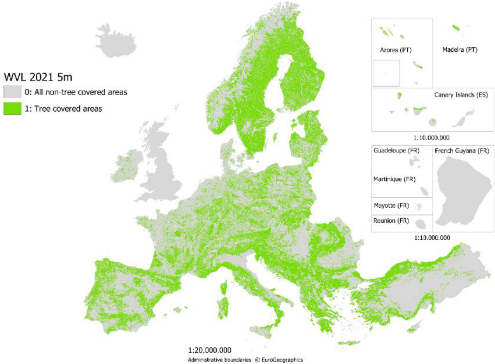

Figure 1: WVL 2021 layer overview (Copernicus Land Monitoring Service, 2025c)

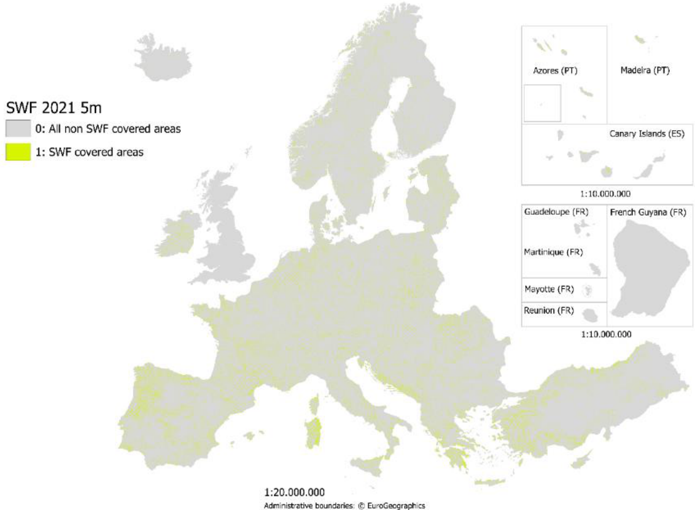

Figure 2: SWF 2021 layer overview (Copernicus Land Monitoring Service, 2025c)

# 3 Validation Methodology and Analysis

The following chapters describe the specific methods used to assess the thematic accuracy and  usability of the WVL 2021 layer. A qualitative assessment of the SWF 2021 layer is presented,  highlighting the identified strengths and weaknesses based on selected examples from the validation  areas (chapter 4.2).

## 3.1 Thematic accuracy

The CLMS validation approach for thematic accuracy compares the CLMS layer with validation data in a sample-based approach, following established scientific practices (Congalton and Green, 2008;Olofsson et al., 2014; Stehman and Foody, 2019). The validation data is assumed to be more accurate than the CLMS layer data. The level of agreement between validation and layer data defines the thematic accuracy. The accuracy estimation methodology consists of three major components,  explained in more detail in the following chapters: Sampling Design, Response Design and Accuracy  Assessment.

### 3.1.1 Sampling Design

The sampling design involves the protocol for selecting the sample and determining the number of  sample units. The sample is chosen using a probability approach, ensuring each element has a  calculable chance of selection (sampling weights). This approach allows for extrapolation of accuracy  from the sample to the entire study area. Stratification is used to effectively allocate samples to classes  of interest or rare classes that might otherwise be underrepresented. Knowing the sampling  probability (weights) is crucial to account for unequal probabilities and prevent bias in accuracy  estimation. The sampling design for the validation of thematic accuracy for the CLMS layer consists  of two elements (Figure 3): 

• Validation Areas: representing the smallest reporting unit and seamlessly covering EEA38+ UK territory as defined by the Copernicus EEA38 + UK boundary layer (European Environment Agency, 2023).

• Sampling Frame: 2x2 km grid points covering all validation areas.

The validation areas are primarily defined by NUTS2 administrative units, which provide comprehensive and scalable coverage for the validation process. They are aligned with the CLMS  production extent, including a buffer around the terrestrial territory. The validation areas are stratified by the Biogeographical Regions (BGR) dataset (European Environment Agency, 2016). It contains the official delineations used in the Habitats Directive (92/43/EEC) and for the EMERALD Network set up under the Convention on the Conservation of European Wildlife and Natural Habitats (Bern Convention). Each validation area is assigned to the BGR where most of the territory overlaps. During the generation of the validation areas, smaller NUTS2 units with fewer than 500 sample grid  points were aggregated, and larger NUTS2 units were split to better align with the boundaries of the  BGR.

The sampling frame is represented by points along a 2x2 km-spaced grid aligned with the Copernicus grid (European Environment Agency, 2024) and LUCAS Master frame grid (European Commission: Eurostat et al., 2018). It was spatially enlarged to cover EEA38 + UK. Each point of the grid is stratified by the CLCplus Backbone raster layer 2018 (Copernicus Land Monitoring Service, 2023) into 11 classes, with the pixel northeast of the point used as a reference class for stratification. The points define the  position of the sample unit. The final sample units for the accuracy assessment are then selected using both validation areas and sampling frame. To ensure the validation data remained independent of the production data, adjustments to the standard 2×2 km sampling frame were necessary. Points coinciding with LUCAS 2018 survey locations, which were extensively used in producing the CLCplus Backbone and various HRL products, were systematically shifted by 1 km in accordance with a dedicated protocol. This ensured that they remained within their original CLCplus Backbone 2018 strata as far as possible.

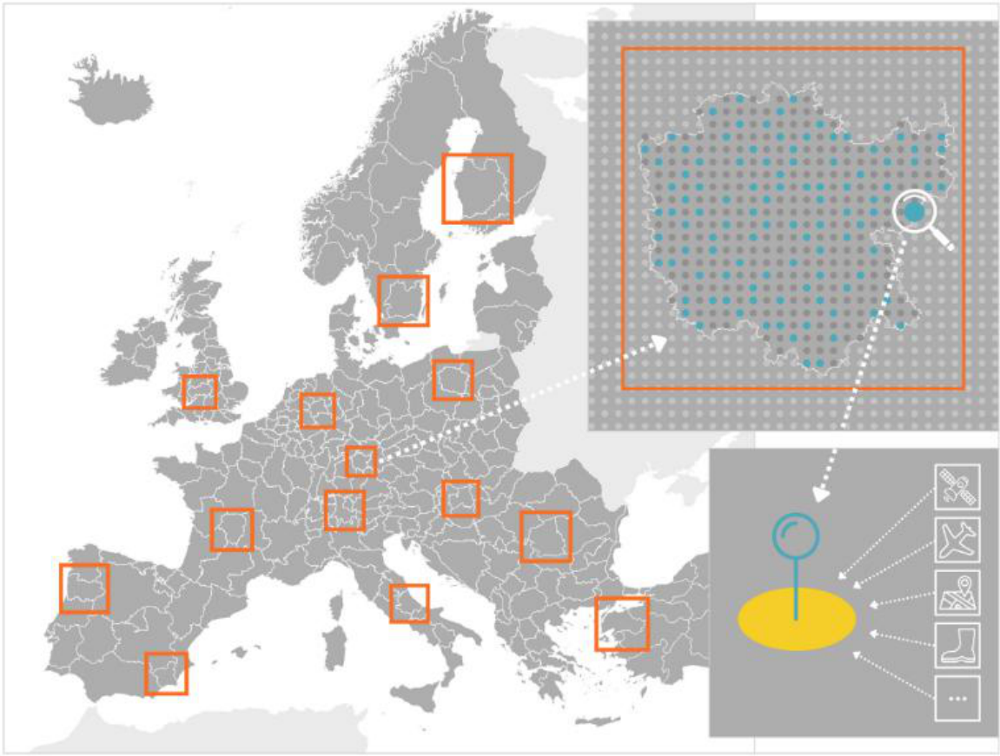

Figure 3: Schematic example of sampling design: selection of validation area (orange squares),  selected sampling locations (blue) within validation area (white outline) and sampling units (yellow) populated with existing reference information. 

The validation areas are selected from each BGR stratum using a random selection process, whereby  larger validation areas are more likely to be selected. A minimum of one validation area per BGR is  required, with an approximately proportional allocation of the remaining areas. Depending on the  applied reporting level different numbers of validation areas are selected for the standard CLMS crosscutting validations. 

For the EU27 wide assessment of WVL and SWF, 31 validation areas were randomly selected across  BGRs (Table 4), representing approximately 19% of EU27 territory. 

Table 4: Validation areas per BGR in EU27

|BGR|EU27|EU27|
|--|--|--|
|BGR|Total validation areas|Selected validation areas|
|Alpine (ALP)|11|1|
|Anatolian (ANA)|0|0|
|Arctic (ARC)|0|0|
|Atlantic (ATL)|41|6|
|Black Sea (BLS)|2|1|
|Boreal (BOR)|15|3|
|Continental (CON)|95|10|
|Macaronesia (MAC)|2|1|
|Mediterranean (MED)|46|6|
|Pannonian (PAN)|9|2|
|Steppic (STE)|1|1|
|Tropical (TRO)|0|0|
|Total|222|31|

Sample points are then drawn from the sampling frame within the selected validation areas. The  points are selected using a random stratified approach from each CLCplus BB 2018 strata. The number  of sample units is determined based on the following key considerations:

• Minimum number of sample units for accuracy reporting: A sufficient number of sample units is needed to report accuracy across all thematic classes at both the validation area and BGR levels. The number of sample units is guided by the product accuracy requirements and corresponding margin of error (MoE) of ±5% at a 95% confidence interval. The underlying  sample size calculation as presented in Stehman and Foody (2019) uses the expected user’s accuracy 𝑝, and the targeted MoE 𝑑, to estimate the required number of sample units 𝑛 per class ℎ. 𝑧, the z-score, is set to 1.96 for a 95% confidence interval.

\[n_{h}=\frac{z^{2}p(1-p)}{d^{2}}\]

• The assumption of a CLMS layer overall and class accuracy of 85% and a target MoE of 5%  would require 200 sample units. The objective is to have a minimum number of sample units  per class at the BGR level. For each selected validation area there should be a minimum of 30  samples per class. However, fewer samples may be acceptable for rare classes that are not well-covered in some BGRs or validation areas. For some classes, the selected sample size may  thus be below the targeted sample size because there are not enough sample units available  within the standard 2x2 km sampling frame. 

• A maximum number of sample units per validation area was defined, ranging from 500 to 800, depending on the number of validation areas per BGR. Larger BGRs were allocated fewer  sample units per validation area, while smaller BGRs with fewer validation areas received more. Once the minimum number of sample units per validation area is met, the remaining  units up to the maximum number are allocated proportionally. This approach targets sufficient number of sample units for all thematic classes across all reporting levels, while maintaining a representative character by allocating a part of the sample units proportionally.

• Shared sampling design: The overall CLMS validation framework foresees that one sample can  be used for different CLMS product layers(cross-cutting efficiency). To achieve this, a sufficient  number of sample units must be allocated across different thematic domains. The CLCplus BB  2018 classes (Copernicus Land Monitoring Service, 2022) are used as the strata for guiding this  allocation since its thematic classes cover most land cover types. To ensure adequate  representation of rare classes, more sample units are included than typically required to  achieve statistical robustness.

Sample weights are calculated for each sample unit by combining the selection probabilities from the  first stage and second stage of sampling. These weights indicate how many sample units each point  represents within the total population of all possible sample points. The calculation accounts for the  differing selection probabilities at both sampling stages and compensates for unequal number of  samples per strata.

This general cross-cutting sampling approach involves using the same validation areas and sample  units for the validation of different CLMS product layers and reference years. Validation areas are not  considered fixed but may be adjusted or changed in the course of later validation activities in order to  consider the availability of existing and upcoming reference data, align with changing CLMS product  extent or to better cover specific CLMS product classes. The targeted sample size of 200 sample units  per class for the WVL validation is achieved for all thematic classes at the EU27 and BGR level (Table  5), except in MAC for class 1.

Table 5: Sample units per WVL class and BGR at EU27

||WVL 2021|WVL 2021|WVL 2021|
|--|--|--|--|
|BGR|Class 0|Class 1|Total|
|Alpine (ALP)|411|379|790|
|Atlantic (ATL)|2,512|1,345|3,857|
|Black Sea (BLS)|429|296|725|
|Boreal (BOR)|1,268|978|2,246|
|Continental (CON)|3,010|1,969|4,979|
|Macaronesia (MAC)|311|180|491|
|Mediterranean (MED)|2,459|2,029|4,488|
|Pannonian (PAN)|990|498|1,488|
|Steppic (STE)|527|273|800|
|Total|11,917|7,947|19,864|

### 3.1.2 Response Design

The response design describes all steps to collect validation data at the sample sites and compare it  with the layer being validated. It includes selecting an appropriate type of sample unit and establishing  the protocol for collecting or preparing reference data to achieve a 1:1 spatial, thematic, and temporal  match with the product data.

The sample unit for the WVL is defined as a 40x40 meter square centred on the central sampling point,  comprising 64 WVL pixels (Figure 4). Each sample unit is subdivided into 64 subunits, arranged in an  8x8 grid. WVL is assessed by interpreting each subunit to determine whether it falls within woody  cover or not using available reference and supportive data.

Validation data is created by classifying samples according to the thematic classes of the layer being  validated. This process involves utilizing existing and suitable reference datasets. Sample units are  inspected or visually interpreted using Computer-Assisted Photointerpretation (CAPI) and existing  high-quality reference and supporting data (Table 6). 

The reference data serve as the primary source for visual interpretation, providing high-quality  reference information from the same year. Supportive data, on the other hand, offer additional  context or information to aid the decision-making process. Reference data from different years can be  used to confirm stable classes/quantities from logical rules or to track and confirm change between  CLMS layer releases. E.g. orthophotos showing needle leaved forest in pre-production dates and  needle leaved forest in post-production years, imply that the same forested land cover was also present in the CLMS layer reference year. The checks and interpretation of the sample units are conducted in a Geographic Information System (GIS), employing dedicated data entry forms that  incorporate a range of features including dropdown menus, checkboxes, comment text fields and the capacity for structured and guided data entry (Figure 5). 

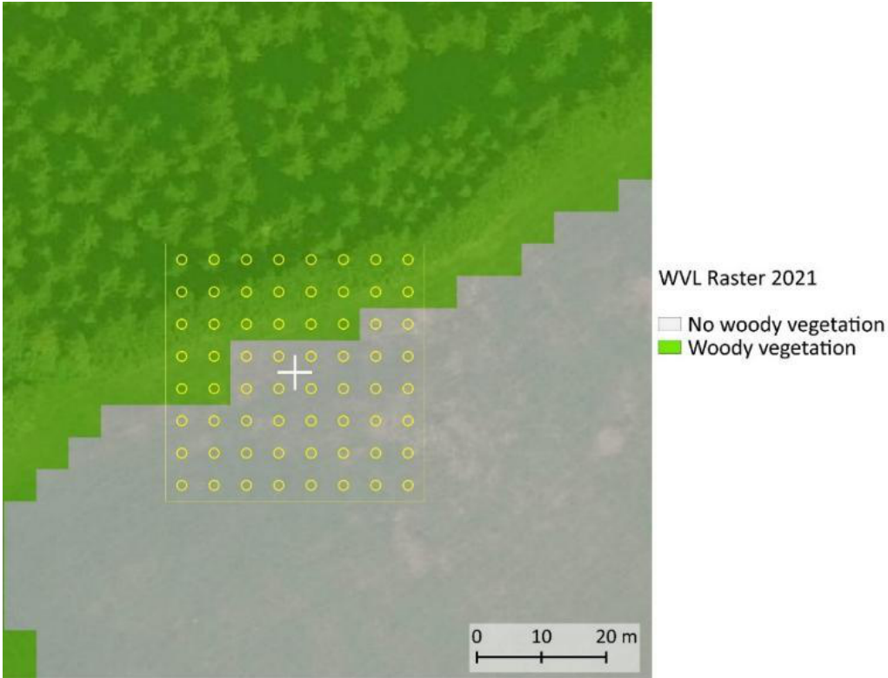

Figure 4: Sample unit (40x40m) and 8x8 subunits (points) for the WVL validation

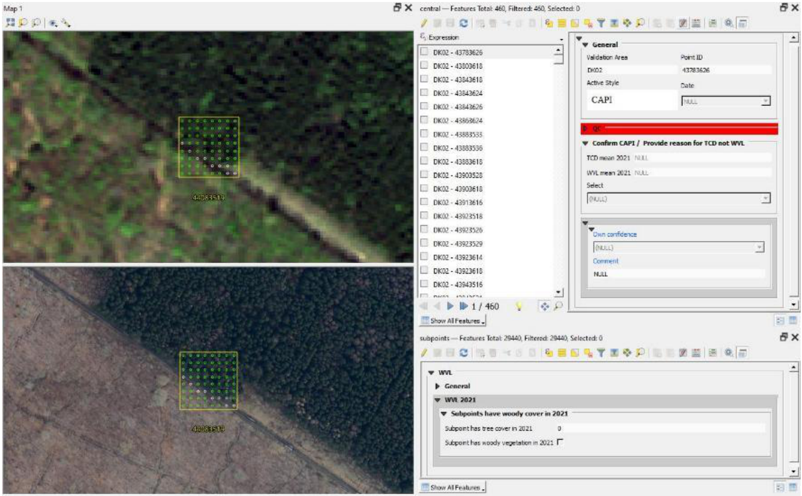

Figure 5: GIS layout for the interpretation of the WVL sample units. Customised attribute entry form (right) and multiple maps views with reference or supportive layers (left).

The interpretation of the WVL sample units was done in a blind approach: The interpreter is unaware of the CLMS layer value or the sample strata to which it belongs, ensuring an unbiased classification and comparison.

Table 6: Reference (r) and supportive data (s) used for the validation of WVL 2021

|Coverage|Usage|Data name|Reference type|Reference year|Access|Provider|
|--|--|--|--|--|--|--|
|EEA39|s|EEA39_VHR_2018|Orthoimagery|2018|WMS / WMTS|EEA|
|EEA39|r|EEA39_VHR_2021|Orthoimagery|2021|WMS / WMTS|EEA|
|EEA39|s|EEA39_VHR_2024|Orthoimagery|2024|WMS / WMTS|EEA|
|Global|s|Bing maps|Orthoimagery|unknown|WMS / WMTS|Bing|
|Global|s|Google Maps|Orthoimagery|unknown|WMS / WMTS|Google|
|EU22+UK|s|LUCAS 2009|Field data / PI|2009|Download|Eurostat|
|EU26+UK|s|LUCAS 2012|Field data / PI|2012|Download|Eurostat|
|EU27+UK|s|LUCAS 2015|Field data / PI|2015|Download|Eurostat|
|EU27|s|LUCAS 2022|Field data / PI|2022|Download|Eurostat|
|EU27+UK|s|LUCAS Master Strata|PI|<2017|Download|Eurostat|
|EU27|s|LUCAS Copernicus Polygons|Field data|2022|Download|Eurostat|
|National    / regional|s|Orthoimagery, Aerial photos|Orthoimagery|< 2021|WMS / WMTS or Download|Various|
|National    / regional|r|Orthoimagery, Aerial photos|Orthoimagery|2021|WMS / WMTS or Download|Various|
|National    / regional|s|Orthoimagery, Aerial photos|Orthoimagery|> 2021|WMS / WMTS or Download|Various|
|National    / regional|s|Various    regional data|Auxillary data|Various|WMS / WMTS or Download|Various|
|EEA39|r|Sentinel-2 Mosaic|Satellite imagery|2021|Download|Copernicus|
|EEA39|s|Sentinel-2 Mosaic|Satellite imagery|2022-2024|Download|Copernicus|
|EU27|s|TCD     plausibility results   (only   for WVL)|Validation data|2021|Download|Project-internal|
|EU27|S|WVL Blind results (only for SWF)|Validation data|2021|Download|Project-internal|

### 3.1.3 Accuracy Assessment

The layer’s thematic accuracy is assessed by comparing the validation data and the layer data using a  statistical approach, with the results presented in a confusion matrix. Sample weights are used to  compensate for the unbalanced selection probabilities of individual sample units in the stratified  sampling approach. Several accuracy measures are calculated to assess the thematic accuracy of the  CLMS layer. These reporting measures include:

• User’s Accuracy (per product layer class, UA): Indicates the probability that a sample unit  classified as a certain class in the layer actually belongs to that class on the ground.

• Producer’s Accuracy (per product layer class, PA): Indicates the probability that a sample unit  belonging to a certain class on the ground is correctly classified in the layer. 

• Overall Accuracy (OA): Indicates the proportion of correctly classified sample units across all  classes. 

• Margin of Error (MoE): The margin of error, representing the standard deviation at a 95% confidence level, is calculated for user’s accuracy, producer’s accuracy, and overall accuracy. This provides an estimate of the uncertainty associated with the accuracy measures.

\[M o E=z\,x\,S E\]

𝑆𝐸 is the Standard Error of the accuracy estimate, and 𝑧 is the z-score corresponding to the desired confidence level, approximately 1.96 for 95% confidence level.

• F1 Score (per product layer class 𝑖): The F1 Score is a harmonic mean of user’s accuracy  and producer’s accuracy for each layer class. It provides a single measure of accuracy that  balances the trade-off between both accuracies.

\[F1\,S c o r e=2\,\mathrm{x}\frac{U A_{i}\,\mathrm{x}\,P A_{i}}{U A_{i}+P A_{i}}\]

Since the CLMS validation framework uses the same sample units for different CLMS layers the strata  and the mapped layer classes are not the same and standard stratified estimators are not suitable for  calculation of overall, user’s and producer's accuracy. Instead, indicator functions and stratified  estimators as described by (Stehman, 2014) are used here to calculate accuracies and their variances.  The indicator functions are used to account for that sample units are selected from strata different  than the map classes. Indicator function for overall accuracy is defined as:

\[y_{u}=\{_{0\,i f\,u n i t\,u\,i s\,c l a s s i f i e d\,c o r r e c t l y}^{1}\]

Overall accuracy is then calculated as a sample mean using a stratified estimator (Stehman, 2014):

\[\widehat{Y}=\sum_{h=1}^{H}N_{h}^{*}\;\overline{{y}}_{h}/\,N\]

Where

\[\overline{{y}}_{h}=\sum_{u\in h}y_{u}/n_{h}^{*}\]

is the sample mean of the \(y_{u}\) values in stratum ℎ, \(u\in h\) indicates that sample unit 𝑢 was selected from  stratum ℎ and 𝐻 denotes the number of strata. 𝑁 is the number of all possible units in the sample  frame (population), \(N_{h}^{*}\) is the number of possible units and \(n_{h}^{*}\) the selected sample units in stratum ℎ. An estimator for the variance of \(\widehat{\overline{{Y}}}\) is provided in (Stehman, 2014) Equation 25 and 26.

User’s accuracy and producer’s accuracy require different indicator functions for \(y_{u}\) and \(x_{u}\).For user’s accuracy:

\[y_{u}={\left\{\begin{array}{l l}{1\,i f\,u n i t\,u\,i s\,c l a s s i f i e d\,c o r r e c t l y\,a n d\,i s\,m a p\,c l a s s\,k}\\ {0\qquad\qquad\qquad\,o t h e r w i s e}\end{array}\right.}\]

and

\[x_{u}=\left\{\begin{array}{l}{{i f\,u n i t\,u\,i s\,m a p\,c l a s s\,k}}\\ {{0\qquad o t h e r w i s e}}\end{array}\right.\]

for producer’s accuracy:

\[y_{u}={\Big\{}_{0}^{1\,i f\,u n i t\,u\,i s\,c l a s s i f i e d\,c o r r e c t l y\,a n d\,h a s\,c l a s s\,k\,i n\,t h e\,v a l i d a t i o n\,d a t a}\]

and

\[x_{u}=\ \left\{\begin{array}{c}{{i\,f\,u n i t\,u\,h a s\,c l a s s\,k\,i n\,t h e\,v a l i d a t i o n\,d a t a}}\\ {{0\,o t h e r w i s e}}\end{array}\right.\]

User’s and producer’s accuracies are then calculated using a combined ratio estimator (Stehman, 2014) Equitation 27:

\[\hat{R}=\frac{\sum_{h=1}^{H}N_{h}^{*}\overline{{y}}_{h}}{\sum_{h=1}^{H}N_{h}^{*}\overline{{x}}_{h}}\]

where \(\overline{{\mathbf{y}}}_{\mathrm{h}}\) and xhare the sample means of \(y_{u}\) and \(x_{u}\) in the stratum ℎ. The variance estimator for \(\hat{R}\) is provided in (Stehman, 2014) Equation 28.

The WVL thematic accuracy assessment was carried out in two approaches using the validation data  recorded within the sample unit: 

• Coverage approach – Sample subunits were aggregated and compared with the corresponding 64 pixels using counts and mean values, providing agreement at the 40×40 m sample unit level. WVL values were aggregated into three woody coverage classes (0%, 1–30%, 31–100%) to calculate the standard accuracy measures per class. Scatterplots and regression analyses were used to compare WVL coverage as continuous values (without class aggregation).

• Central subunit approach – Individual subunits were compared with corresponding pixels, providing agreement at the pixel level. The pixel located northeast of the sample unit centre was selected for per-pixel accuracy assessment using binary classes (woody = 1, non-woody = 0) and standard accuracy measures.

## 3.2 Usability

The CLMS validation approach for usability assessment is done by conducting a structured review of  the Product User Manuals (PUM) and Algorithm Theoretical Basis Documents (ATBD). The document  review is carried out following the standard approach defined within the CLMS validation framework,  which incorporates principles of usability checks. The methodology evaluatesthe ATBD and User PUM  for the layer against the CLMS template structures.

The review process involves systematically checking each section of the layer’s ATBD and PUM to assess their alignment with the expected content, structure, proofreading, and level of detail prescribed by the templates. Key aspects examined include the clarity and completeness of sections on product purpose, methodology, technical specifications, user guidance, and supporting visuals such as tables and figures. A scoring system is applied to indicate the extent to which each element meets the criteria, ranging from well-aligned to requiring significant improvement.

In addition, the methodology includes qualitative comments to highlight strengths, identify areas  needing clarification or expansion, and suggests specific enhancements. This structured approach  ensures a consistent, transparent assessment of the documentation’s quality and usability.

For the usability assessment of the HRL SLF 2021 the following documents were evaluated (Copernicus Land Monitoring Service, 2025a, 2025b):

• HRL SLF ALGORITHM THEORETICAL BASIS DOCUMENT (ATBD) 2021. Doc. Version Issue 0.3. (Accessed: 2 July 2025).

• HRL SLF PRODUCT USER MANUAL (PUM) 2021. Doc. Version Issue 0.3. (Accessed: 2 July  2025).

# 4 Results

## 4.1 Thematic Accuracy Woody Vegetation Layer (WVL)

The thematic accuracy results are described at the two reporting levels: EU27 and BGR.

### 4.1.1 WVL - EU27

The central subunit assessment shows an OA of 87.8% (Table 7), with PA and UA above or close to  85% for both classes (Table 8). Accuracy is slightly higher for the non-tree covered area class (0), which  achieves a UA of 90.5% and PA of 86.4%, compared to the tree covered areas class (1), where UA is  84.9% and PA 89.4%. Overall, the results show a balanced performance across both classes, with only  minor differences between UA and PA.

The aggregated coverage approach reaches an OA of 82.4% with a margin of error of 0.6% (Table 7).  The non-tree covered area class (0) achieves a UA of 76.8% and a higher PA of 93.9%, resulting in an F1  score of 84.5% (Table 8). Lower accuracies are observed for sparsely covered woody sample units (1–30%), where UA is 67.9% and PA drops to 39.7%. In contrast, the denser woody sample units (31–100%) shows consistently high values, with UA of 89.2% and PA of 90.9% (Table 9). Overall, the results  indicate reliable detection of non-woody and dense woody areas, while accuracy is lower for sparser woody coverage.

Table 7: WVL 2021 overall thematic accuracy results at EU27

|Validation approach|OA [%]|MoE [%]|
|--|--|--|
|Central subunit (2 classes)|87.8|0.6|
|Coverage approach (3 classes)|82.4|0.6|

Table 8: WVL 2021 thematic accuracy results per class at EU27 (central subunit approach)

|Layer|Layer class|UA [%]|MoE [%]|PA [%]|MoE [%]|F1 score [%]|
|--|--|--|--|--|--|--|
|WVL 2021|0: All non-tree covered areas|90.5|0.6|86.4|0.8|88.4|
|WVL 2021|1: Tree covered areas|84.9|0.9|89.4|0.7|87.1|

Table 9: WVL 2021 thematic accuracy results per class at EU27 (coverage approach)

|Layer|Layer class|UA [%]|MoE [%]|PA [%]|MoE [%]|F1 score [%]|
|--|--|--|--|--|--|--|
|WVL 2021|0%|76.8|1.0|93.9|0.7|84.5|
|WVL 2021|1-30%|67.9|2.3|39.7|1.9|50.1|
|WVL 2021|31-100%|89.2|0.7|90.9|0.6|90.1|

The validated WVL 2021 layer shows a good linear model fit, with \(\mathsf{R}^{2}\) value of 0.77 (Table 10). The  linear regression slope (0.93) indicates a minimal overall underestimation of the woody coverage  compared to the validation data. The scatterplot (Figure 6) also reveals a concentration of layer map  values above the ideal line in the mid-range of validation values (around 0.3–0.5), indicating an  overestimation of woody coverage in this density range by the WVL layer. In addition, both omission (Val > 0%, Map = 0%) and commission errors (Val = 0%, Map > 0%) are evident.

Table 10: WVL 2021 linear regression details at EU27 (coverage approach)

|Layer|n|R²|Slope|Intercept|
|--|--|--|--|--|
|WVL 2021|19,864|0.77|0.93|0.07|

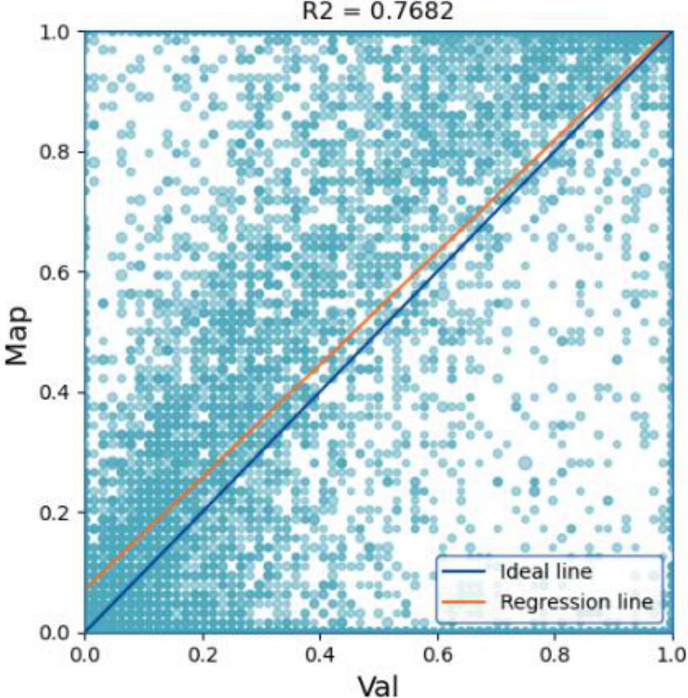

Figure 6: Scatterplot results for WVL 2021 coverage approach at EU27 (larger points represent  larger sample weights)

### 4.1.2 WVL - BGR

When only the central subunit pixel is assessed, OA per BGR shows some variation, remaining above 85% in all regions except MAC (82.4%) and MED (78.6%). The highest OA is observed in BLS (94.7%) and STE (95.6%) (Table 11). Per-class accuracies at BGR level (Table 12) reflect the regional OA patterns. Highest values are observed in BLS, CON, PAN, and STE, where both UA and PA exceed 88% for classes 0 and 1, with F1 scores above 90%. The UA for class 1 is lower than PA in the ALP and BOR region, indicating an underestimation of woody vegetation. ATL shows balanced accuracies, with both UA and PA around 80–90%. Lower accuracies are evident in MAC and MED, particularly for class 1 in MAC (UA= 83.9%, PA = 71.7%) and both classes in MED (UA and PA ~78–80%).

The coverage approach shows similar regional pattern but lower accuracies (Table 11). Six regions  (ALP, BLS, BOR, CON, PAN, STE) still reach an OA between 86% and 90%, Strongest difference to the  central subunit assessment is found in MAC, with an OA of 67.9% and highest MoE of 4.9%. Across all  BGRs, UA and PA for the low-density class (1–30%) remain consistently below 90%, with UA higher than PA, indicating underestimation of woody vegetation in this density range (Table 12). The higher MoE for UA and PA in the low-density class (1-30%) in the BGRs ALP, MAC, BLS and STE is due to the lower accuracy and smaller sample size in this class of these BGRs. By contrast, the high-density class (31–100%) achieves high values across most regions, with UA and PA exceeding 90%. For class 0, however, UA is generally lower than PA, particularly in the MED and MAC region, reflecting an overestimation of non-woody areas in these regions. 

Table 11: WVL 2021 overall accuracy results per BGR

||Central subunit approach|Central subunit approach|Coverage approach|Coverage approach|
|--|--|--|--|--|
|BGR|OA [%]|MoE [%]|OA [%]|MoE [%]|
|Alpine (ALP)|89.4|2.6|88.3|2.2|
|Atlantic (ATL)|86.7|1.1|77.7|1.4|
|Black Sea (BLS)|94.7|1.6|89.8|1.8|
|Boreal (BOR)|90.1|1.6|88.8|1.5|
|Continental (CON)|92.9|0.8|86.4|0.9|
|Macaronesia (MAC)|82.4|4.2|67.9|4.9|
|Mediterranean (MED)|78.6|1.2|72.6|1.3|
|Pannonian (PAN)|94.3|1.2|88.7|1.7|
|Steppic (STE)|95.6|1.3|89.4|2.2|

Table 12: WVL 2021 thematic accuracy results per class and BGR (central subunit approach)

|BGR|Layer class|UA [%]|UA MoE [%]|PA [%]|PA MoE [%]|F1 score [%]|
|--|--|--|--|--|--|--|
|ALP|0|94.7|2.7|80.3|4.7|86.9|
|ALP|1|86.3|3.7|96.5|1.8|91.1|
|ATL|0|88.7|1.2|90.6|1.3|89.6|
|ATL|1|83.1|2.2|80.0|2.0|81.5|
|BLS|0|95.0|1.9|94.7|2.3|94.8|
|BLS|1|94.3|2.6|94.6|2.0|94.5|
|BOR|0|93.4|2.1|83.1|2.8|87.9|
|BOR|1|88.0|2.2|95.5|1.4|91.6|
|CON|0|96.8|0.7|90.8|1.1|93.7|
|CON|1|88.4|1.4|95.9|0.9|92.0|
|MAC|0|81.5|5.2|90.1|4.5|85.6|
|MAC|1|83.9|6.8|71.7|6.9|77.3|
|MED|0|79.7|1.7|78.3|1.7|79.0|
|MED|1|77.5|1.8|78.9|1.7|78.2|
|PAN|0|96.2|1.0|96.1|1.2|96.2|
|PAN|1|88.5|3.3|89.0|2.9|88.8|
|STE|0|96.2|1.4|98.0|1.2|97.1|
|STE|1|93.8|3.5|88.8|3.8|91.2|

Table 13: WVL 2021 thematic accuracy results per class and BGR (coverage approach)

|BGR|Layer class|UA [%]|UA MoE [%]|PA [%]|PA MoE [%]|F1 score [%]|
|--|--|--|--|--|--|--|
|ALP|0|80.4|5.4|94.9|3.2|87.1|
|ALP|1-30%|77.1|11.4|37.3|9.6|50.3|
|ALP|31-100%|92.6|2.4|97.4|1.5|95.0|
|ATL|0|73.5|2.2|92.3|1.6|81.8|
|ATL|1-30%|70.8|4.1|45.8|3.7|55.7|
|ATL|31-100%|85.0|1.9|83.8|1.8|84.4|
|BLS|0|82.1|3.5|98.6|1.3|89.6|
|BLS|1-30%|72.2|11.7|40.4|9.7|51.8|
|BLS|31-100%|98.8|1.0|94.2|1.9|96.4|
|BOR|0|87.2|2.9|93.2|2.2|90.1|
|BOR|1-30%|66.4|8.5|40.5|7.0|50.3|
|BOR|31-100%|92.0|1.6|96.3|1.2|94.1|
|CON|0|86.4|1.5|94.2|1.1|90.2|
|CON|1-30%|75.8|4.1|42.3|3.6|54.3|
|CON|31-100%|88.5|1.3|97.2|0.7|92.6|
|MAC|0|60.1|7.4|93.0|5.3|73.0|
|MAC|1-30%|48.0|19.0|18.7|9.6|26.9|
|MAC|31-100%|81.8|7.0|72.2|6.6|76.7|
|MED|0|52.7|2.4|93.3|1.7|67.4|
|MED|1-30%|58.8|4.1|33.8|3.1|42.9|
|MED|31-100%|87.8|1.4|81.9|1.5|84.8|
|PAN|0|88.7|2.2|98.0|1.1|93.1|
|PAN|1-30%|75.8|7.5|48.1|7.4|58.8|
|PAN|31-100%|93.0|2.6|91.0|2.2|92.0|
|STE|0|89.6|2.7|98.0|1.4|93.6|
|STE|1-30%|46.9|19.3|24.3|12.3|32.0|
|STE|31-100%|95.1|3.2|86.6|4.1|90.6|

At BGR level, regression results (Table 14) show good fits in ALP, BLS, BOR, CON, PAN, and STE (\(\mathsf{R}^{2}\geq\) 0.83), with the highest in BLS (R² = 0.93, slope = 1.01). Lower agreement is found in ATL (R² = 0.67) and  MED (\(R^{2}=0.56\)), while MAC shows the lowest fit (\(R^{2}=0.46\), slope = 0.62). Across several regions, the  scatterplots (Figure 7) indicate overestimation of woody cover in the mid-density range (0.3–0.5).

Table 14: WVL 2021 linear regression details per BGR (coverage approach)

|BGR|n|R²|Slope|Intercept|
|--|--|--|--|--|
|ALP|790|0.86|0.97|0.11|
|ATL|3,858|0.67|0.84|0.05|
|BLS|725|0.93|1.01|-0.01|
|BOR|2,246|0.83|0.92|0.1|
|CON|4,979|0.90|0.98|0.05|
|MAC|490|0.46|0.62|0.09|
|MED|4,487|0.56|0.84|0.09|
|PAN|1,488|0.89|0.99|0.0|
|STE|800|0.86|0.95|0.0|

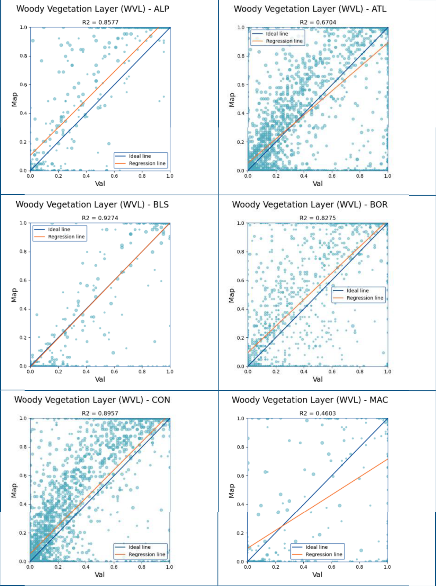

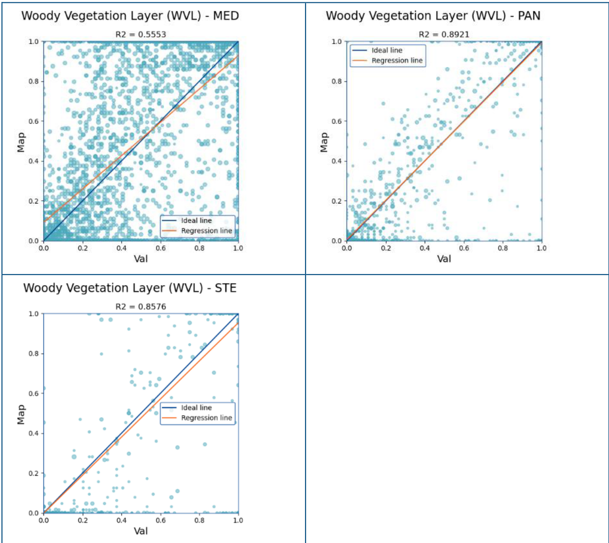

Figure 7: Scatterplot results for WVL 2021 coverage approach per BGR (larger points represent larger  sample weights)

## 4.2 Qualitative Assessment Small Woody Feature (SWF)

Generally, the qualitative assessment showed that the SWF 2021 layer has a high accuracy in capturing existing woody elements (Figure 8), whereas it appears to overestimate woody vegetation (Figure 9). The SWF 2021 layer shows the same challenges as the WVL in mapping sparse, small and narrow woody elements. For example, narrow linear woody elements, such as tree lines and hedges are sometimes not consistently detected or mapped wider than they are, including neighbouring areas (Figure 8).

The visual inspections also revealed methodological difficulties to derive the SWF 2021 layer from the WVL 2021 layer. The SWF production workflow uses additional input data and applies geometrical  aggregation and integration rules as described in Copernicus Land Monitoring Service (2025a). Typical SWF errors are linked to the applied land use definitions and geometric rules. Examples indicate that errors in the forest and agricultural masks used during production are a major source of  misclassification in the SWF product, leading both to the omission of true SWF elements (Figure 10) and to the inclusion of features that should instead be assigned to forest (Figure 11). To improve readability the vector layer of the SWF product is shown in the examples. 

The geometric definition of SWF allows exceptions in feature size, creating overlap with the applied  forest definition. This leads to inconsistencies in how SWF and forest are delineated and results in  cases where woody features could be included as SWF as well as excluded as forest (Figure 12 and  Figure 13). These exceptions permit individual non-linear SWF elements to exceed 1,000 ha (Figure  14), or multiple adjacent SWF geometries to form even larger areas, which contradicts both the forest  definition and the understanding of small woody features. Clarifying the geometric definition would  improve the consistency and usability of the product.

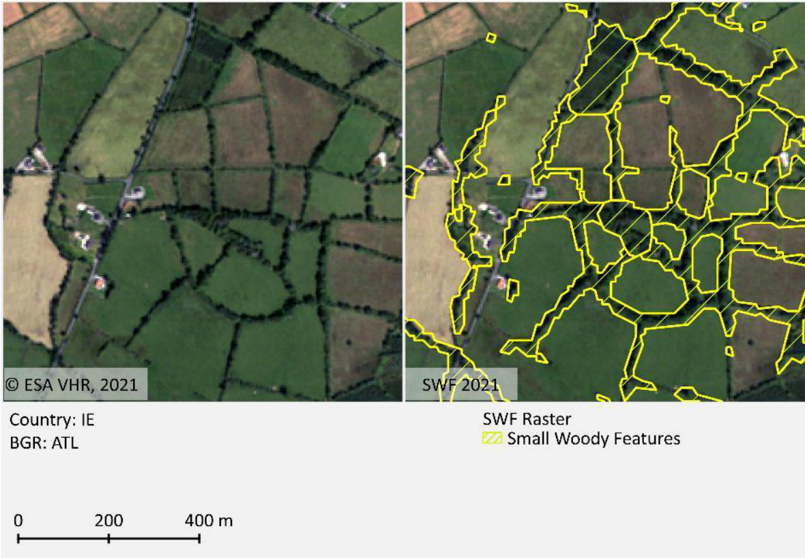

Figure 8: Example for good detection of small linear and patchy woody elements

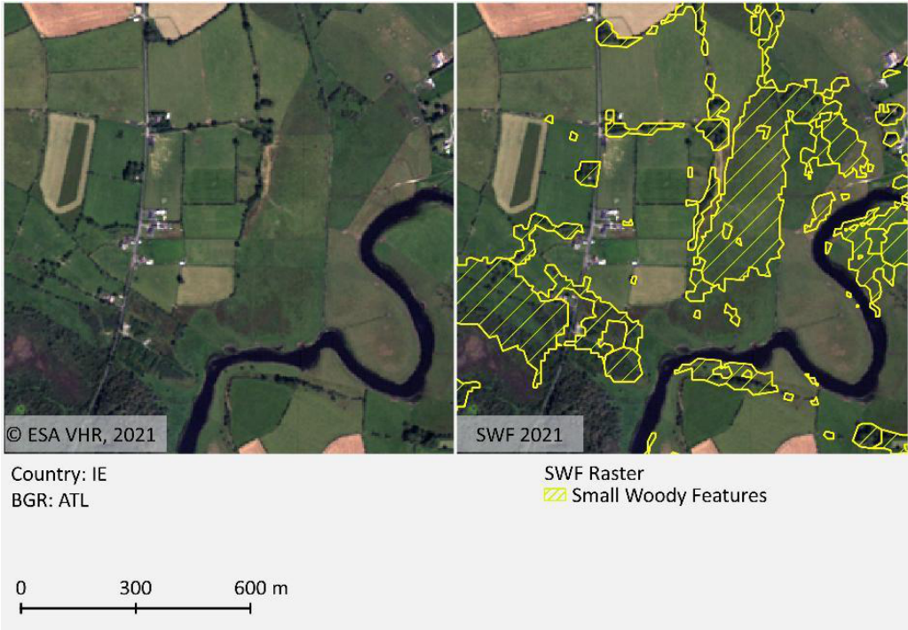

Figure 9: Example for grassland areas mapped as SWF

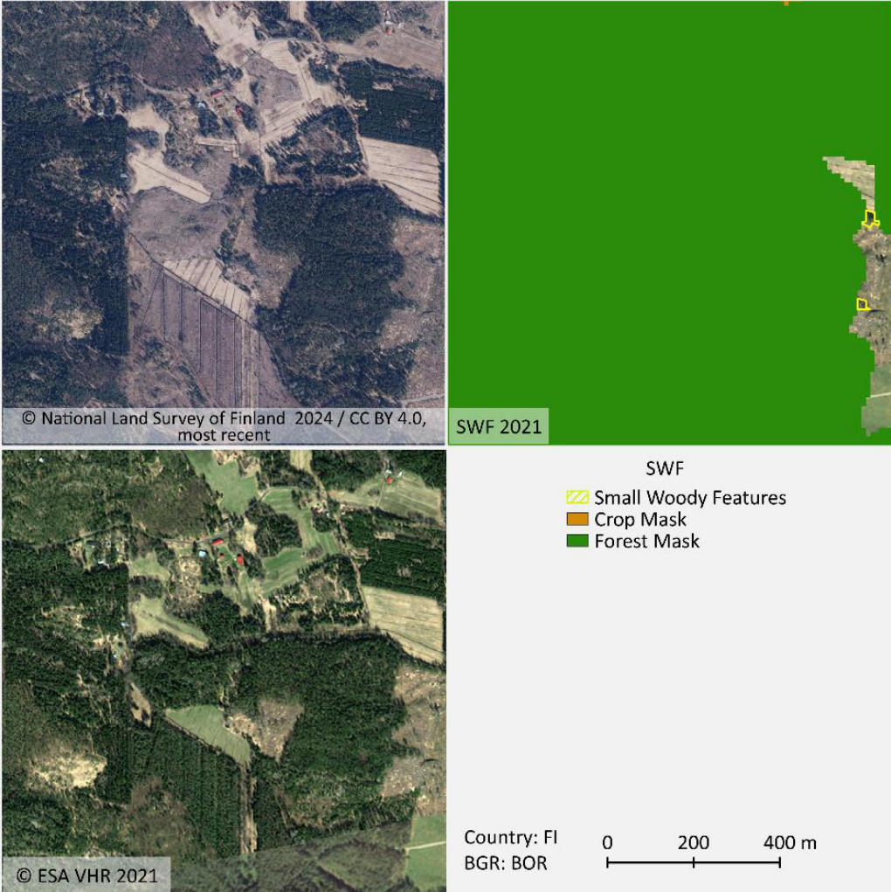

Figure 10: Example for missed-out SWF elements, due to exclusion via the applied forest mask 

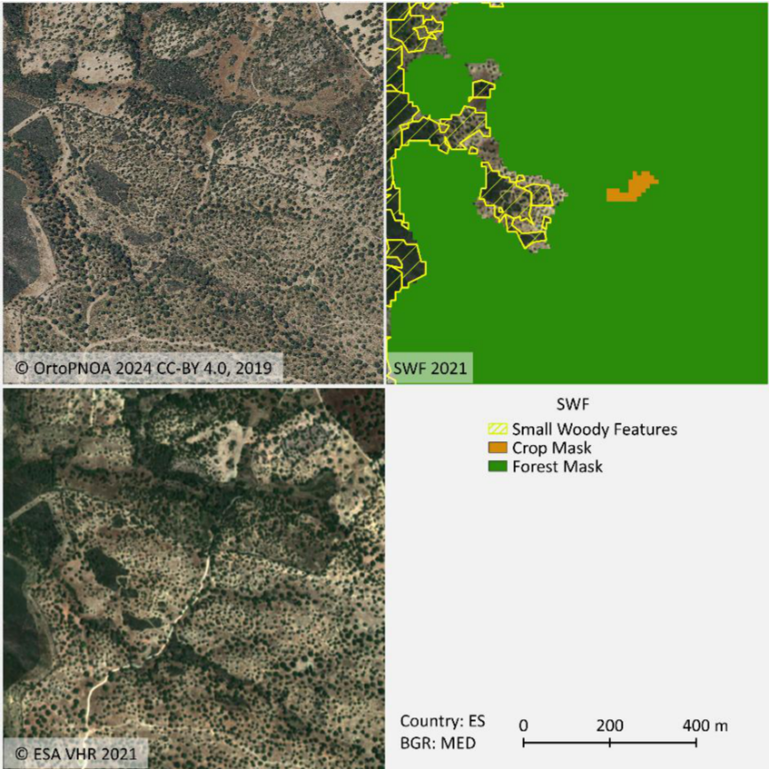

Figure 11: Example for inconsistent mapping of woody area as either forest or SWF

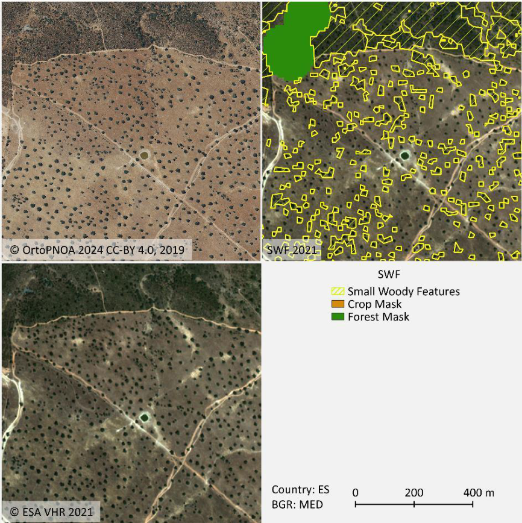

Figure 12: Example of (partly) correctly mapped individual trees and tree groups (central and southern areas) as well as classification inconsistencies between forest and SWF (northern part)

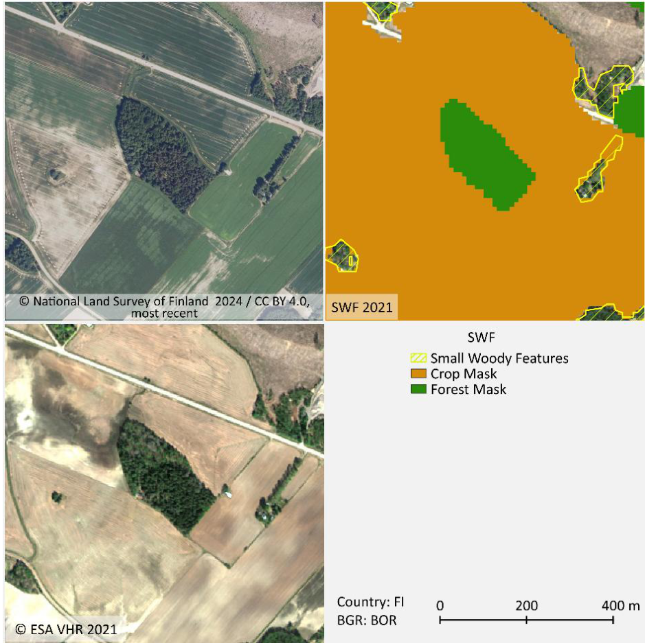

Figure 13: Example of correctly mapped small woody elements but inconsistent SWF definition: the central isolated woody patch has a size of around 3 ha and could be classified either as forest or as  SWF

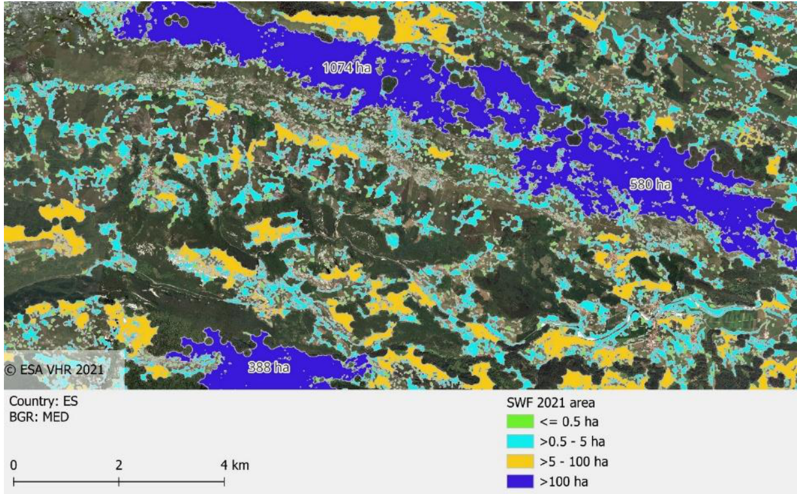

Figure 14: Example of large SWF elements

Validation Report - High-Resolution Layer Small Landscape Features 2021

## 4.3 Usability

The review found that both the ATBD and PUM documentation for the HRL SLF 2021 are generally well structured and align closely with the official CLMS templates. The documents effectively cover key areas such as background, methodology, product specifications, and user guidance.

However, the assessment also identified specific sections that require further development or clarification. In the ATBD, descriptions of the change detection processing and Street Tree Layer (STL)  are incomplete, and some figures and tables would benefit from clearer legends, improved formatting, and the inclusion of an overall workflow diagram. In the PUM, the section on Change Layer production is missing, thematic accuracy details are incomplete in key tables, and additional workflow figures and example maps could enhance usability.

Both documents also showed minor issues with formatting consistency, use of abbreviations, and  incomplete citation or document control sections. Addressing these points will help ensure the documentation meets quality expectations, supports user needs, and remains fully aligned with CLMS standards.

# 5 Conclusions and Recommendations

## 5.1 Thematic Accuracy

To assess the thematic accuracy of the WVL layer for 2021, validation data was generated for selected validation areas. Hereby, a synergistic cross-cutting approach was applied within the CLMS validation framework project. The thematic accuracy was assessed using a statistically sound methodology,  leveraging available reference and supportive data across different reporting units.

The two different validation approaches were used to assess the thematic accuracy assessment of  the WVL 2021 layer. Both show consistent results at EU27. For the central subunit approach there is  an OA close to 88% and balanced UA and PA above 85% for both woody and non-woody classes. For the coverage-based assessment at the sample unit level, OA decreases slightly to 82%. Here, accuracies  remain high for non-woody and dense woody cover, while sparsely woody areas show lower  accuracies. Regression analysis confirms a generally good fit, though with overestimation in the middensity range and some omission and commission errors.

At BGR level, the two approaches reveal similar regional patterns. The OA is greater than 85% for all  regions except MED and MAC, when assessed at the central subunit. Class-level accuracies are higher for the dense woody cover class (31-100%) as compared to the class 1-30%. Coverage-based  assessments produce a similar picture Together the results show that WVL 2021 reliably detects nonwoody and dense woody areas across Europe (Figure 15) but remains challenging in areas of sparser woody coverage. Consistent overestimation of woody cover in the mid-density range is evident across  several regions, particularly in areas where lower woody density is common, e.g. orchards (Figure 16).  Classification limits are also evident in patchy forest regrowth areas (Figure 17). Overall, the two  assessment methods complement each other: the central subunit approach targets pixel-level  accuracy and geometric accuracy, while the coverage-based approach provides additional insight into  how well woody coverage is detected in different density classes. The use of sample units covering  several pixels (64) provides an additional advantage, as it reduces errors at class boundaries where  geometric differences between validation and map data are most pronounced. 

The assessment of the SWF was qualitative only, based on visual inspections across different BGR and landscape types in Europe, rather than on a statistical sample. The key findings indicate that the SWF 2021 layer effectively represents small woody elements but tends to overestimate woody  vegetation, particularly for narrow or sparse features. Several identified inconsistencies are linked to the production workflow, including errors in forest and agricultural masks and ambiguities in the geometric definition, resulting in both omissions and inappropriate inclusions. The current size definition of SWF allows very large elements to be included and creates overlaps with the forest  definition, leading to ambiguous SWF classes. Clarifying these definitions and improving mask accuracy would enhance the consistency and reliability of the product.

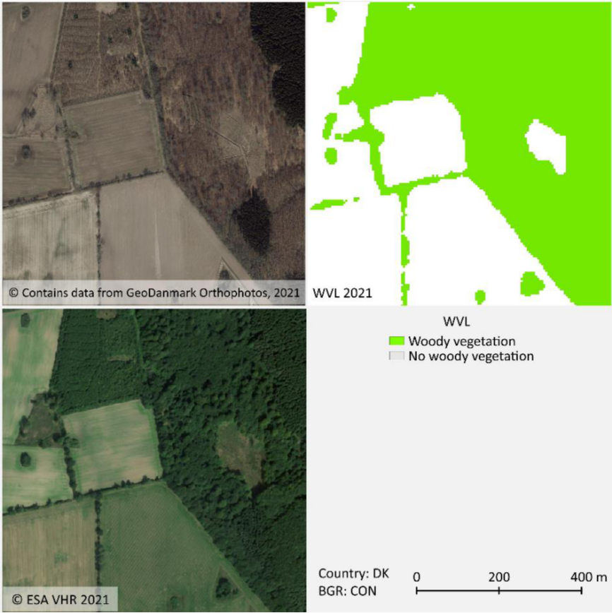

Figure 15: Example for good detection of woody vegetation in an agricultural area

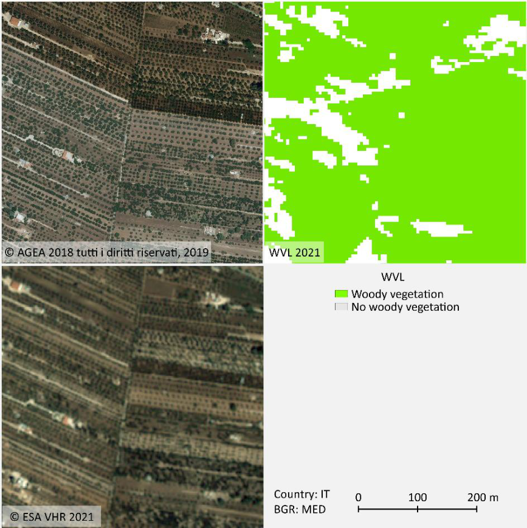

Figure 16: Observed difficulties in detecting lower woody cover densities

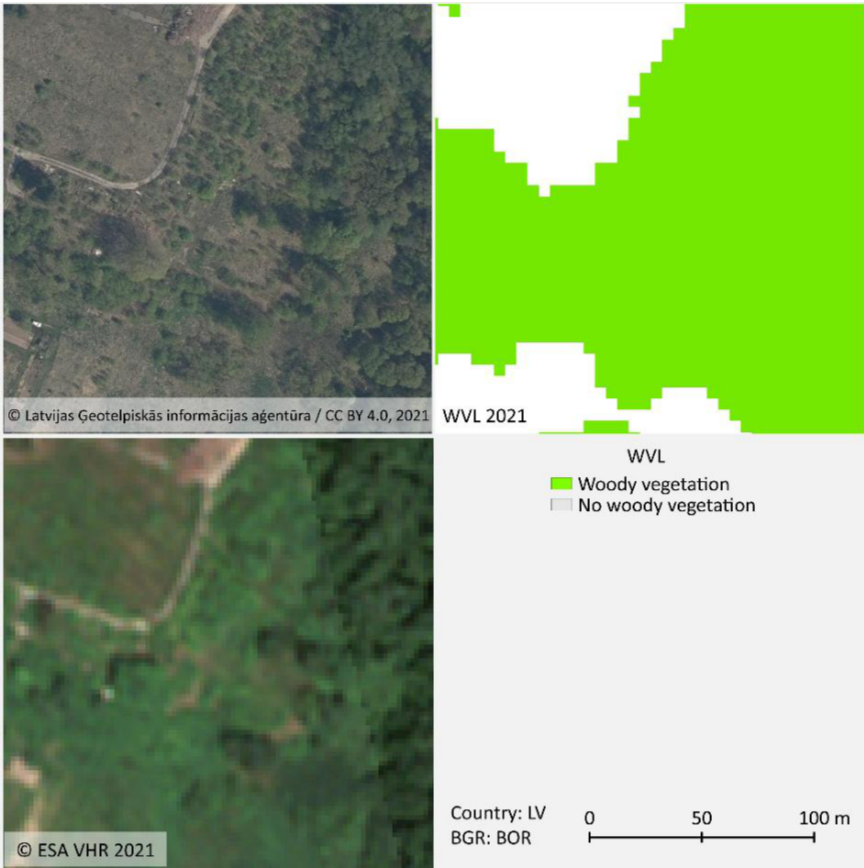

Figure 17: Example for overestimation of woody cover in forest regrowth areas

## 5.2 Usability

The review confirmed that the ATBD and PUM for the HRL SLF 2021 are generally well structured and  aligned with the CLMS template requirements, effectively covering core elements such as  methodology, product details, and user guidance. However, several areas were identified that need  further attention to ensure the documentation is fully complete, consistent, and user-friendly.

It is recommended to:

• Finalise all incomplete sections, notably on the Change Layer methodology, STL descriptions,  and thematic accuracy reporting.

• Improve formatting for consistency, including tables, colour schemes, section breaks, and systematic introduction and listing of abbreviations.

• Add workflow diagrams and illustrative figures or example maps to better support user interpretation.

• Complete citations in line with the CLMS data policy and ensure all internal notes or placeholders are removed before publication.

# 6 References

Congalton, R.G. and Green, K. (2008) Assessing the accuracy of remotely sensed data: principles and  practices. 2nd ed. Boca Raton: CRC Press/Taylor & Francis. Available at:  https://doi.org/10.1201/9781420055139.

Copernicus Land Monitoring Service (2022) CLC+ Backbone Product Specification and User Manual. Product Specification and User Manual Issue 3.0. Copenhagen: European Environment Agency (EEA), p. 131. Available at: https://land.copernicus.eu/en/technical-library/clc-backbone-product-usermanual/@@download/file (Accessed: 10 February 2025).

Copernicus Land Monitoring Service (2023) ‘CLCplus Backbone 2018 (Raster 10 m), Europe, 3-yearly, Feb. 2023’. Available at: https://doi.org/10.2909/cd534ebf-f553-42f0-9ac1-62c1dc36d32c.

Copernicus Land Monitoring Service (2025a) HRL SLF ALGORITHM THEORETICAL BASIS DOCUMENT  (ATBD) 2021. Doc. Version Issue 0.3. European Environment Agency (EEA). Available at: Download not  yet available (Accessed: 2 July 2025).

Copernicus Land Monitoring Service (2025b) HRL SLF PRODUCT USER MANUAL (PUM) 2021. Doc.  Version Issue 0.3. European Environment Agency (EEA). Available at: Download not yet available  (Accessed: 2 July 2025).

Copernicus Land Monitoring Service (2025c) ‘Small Landscape Features 2021 (raster 5m)’. Available at: not yet available.

European Commission: Eurostat et al. (2018) Redesign sample for Land Use/Cover Area frame Survey  (LUCAS) 2018 - 2018 edition. LU: Publications Office. Available at:  https://data.europa.eu/doi/10.2785/132365 (Accessed: 17 November 2021).

European Environment Agency (2016) ‘Biogeographical regions’. https://sdi.eea.europa.eu/data/c6d27566-e699-4d58-a132-bbe3fe01491b. Available at: https://www.eea.europa.eu/en/datahub/datahubitem-view/11db8d14-f167-4cd5-9205-95638dfd9618 (Accessed: 9 December 2024).

European Environment Agency (2023) ‘Copernicus EEA38 Boundary Layer with 250 m buffer (raster 10m), version 2, Nov. 2023’. https://sdi.eea.europa.eu/catalogue/srv/eng/catalog.search#/metadata/a14e9739-089d-4f63-8f83-a184e1e8b906. Available at: https://sdi.eea.europa.eu/catalogue/srv/eng/catalog.search#/metadata/a14e9739-089d-4f63-8f83-a184e1e8b906 (Accessed: 9 December 2024).

European Environment Agency (2024) ‘EEA reference grid for Europe (50km), Jun. 2024’. https://sdi.eea.europa.eu/catalogue/srv/eng/catalog.search#/metadata/3c362237-daa4-45e2-8c16-aaadfb1a003b. Available at: https://doi.org/10.2909/aac8379a-5c4e-445c-b2ef-23a6a2701ef0.

European Environment Agency (2025) ‘CLMS QC Tool’. European Environment Agency. Available at: https://github.com/eea/copernicus_quality_tools (Accessed: 10 February 2025).

Olofsson, P. et al. (2014) ‘Good practices for estimating area and assessing accuracy of land change’, Remote Sensing of Environment, 148, pp. 42–57. Available at: https://doi.org/10.1016/j.rse.2014.02.015.

Stehman, S.V. (2014) ‘Estimating area and map accuracy for stratified random sampling when the  strata are different from the map classes’, International Journal of Remote Sensing, 35(13), pp. 4923–4939. Available at: https://doi.org/10.1080/01431161.2014.930207.

Stehman, S.V. and Foody, G.M. (2019) ‘Key issues in rigorous accuracy assessment of land cover products’, Remote Sensing of Environment, 231, p. 111199. Available at: https://doi.org/10.1016/j.rse.2019.05.018.

# List of abbreviations

|Abbreviation|Name|
|--|--|
|ALP|Alpine|
|ANA|Anatolian|
|ARC|Arctic|
|ATBD|Algorithm Theoretical Basis Document|
|ATL|Atlantic|
|BB|Backbone|
|BGR|Biogeographical Regions|
|BLS|Black Sea|
|BOR|Boreal|
|CAPI|Computer-Assisted Photo Interpretation|
|CLC|CORINE Land Cover|
|CLCplus BB|CORINE Land Cover Plus Backbone|
|CLMS|Copernicus Land Monitoring Service|
|CON|Continental|
|CSV|Comma-Separated Values|
|EEA|European Environment Agency|
|EEA38|Member and cooperating countries of the European Environment Agency network, Eionet|
|EUROSTAT|Statistical Office of the European Union|
|EU|European Union|
|FTY|Forest Type|
|GeoTIFF|Georeferenced Tagged Image File Format|
|GIS|Geographic Information System|
|HRL|High Resolution Layer|
|IACS|Integrated Administration and Control Systems|
|INSPIRE|Infrastructure for Spatial Information in the European Community|
|ISO|International Organization for Standardization|
|LAEA|Lambert azimuthal equal-area projection|
|LC|Land Cover|
|LPIS|Land Parcel Information System|
|LU|Land Use|
|LUCAS|Land Use and Coverage Area frame Survey from Eurostat|
|MAC|Macaronesia|
|MED|Mediterranean|
|MMU|Minimum Mapping Unit|
|MoE|Margin of Error|
|NUTS|Nomenclature of territorial units for statistics|
|PAN|Pannonian|
|PUM|Product User Manual|
|QC|Quality Control|

Validation Report - High-Resolution Layer Small Landscape Features 2021

|Abbreviation|Name|
|--|--|
|SLF|Small Landscape Features|
|STE|Steppic|
|STL|Street Tree Layer|
|SWF|Small Woody features|
|TRO|Tropical|
|UA|User’s accuracy|
|UK|United Kingdom|
|TCD|Tree Cover Density|
|VLCC|Vegetated Land Cover Characteristics|
|VSE|CLMS Validation System Environment|
|WGS84|World Geodetic System 1984|
|WMS|Web Map Service|
|WMTS|Web Map Tile Service|
|WVL|Woody Vegetation Layer|

