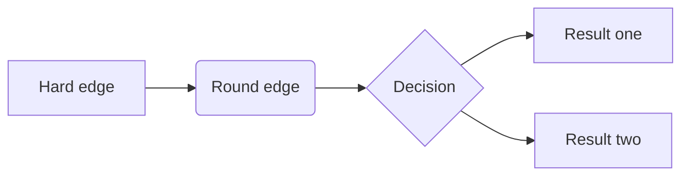

# Guide for Writing Technical Documentation

Copernicus Land Monitoring Service

This manual guides users through creating technical documentation for the Copernicus Land Monitoring Service (CLMS) using Quarto. Quarto simplifies writing professional documents in Markdown, converting them into HTML and PDF for publication. The manual covers Markdown basics, document rendering, and review processes. It describes project folder structure, template usage, and addresses common mistakes. The document promotes the creation of clear, consistent, and professional documents suitable for the Copernicus Land Monitoring Service.

Author

European Environment Agency (EEA)

Published

December 3, 2025

Keywords

Quarto, Markdown, Technical documentation, Documentation guidelines, RStudio, Git, Command line tools, Document rendering, HTML, PDF

  
**Contact:**

European Environment Agency (EEA)  
Kongens Nytorv 6  
1050 Copenhagen K  
Denmark  
[**https://land.copernicus.eu/**](https://land.copernicus.eu/)

# 1 Introduction

This manual guides users through creating technical documentation for the Copernicus Land Monitoring Service using [**Quarto**](https://quarto.org/). Quarto simplifies the process of writing professional documents in [**Markdown**](https://www.markdownguide.org/), and converting them into **HTML** and **PDF** for nice publishing. The manual covers basic Markdown writing, document rendering, as well a the review, and publication process of technical CLMS documents. It also describes the project folder structure, template usage, and common mistakes to avoid.

> **NOTE:**
>
> You don’t need to be a programmer nor an expert to use Quarto. If you’ve ever written a document in Microsoft Word, you’ll be able to use Quarto with a bit of practice.

# 2 Required Software

Before you can start writing documentation with Quarto, you’ll need to install a few tools. Most of them are quick to set up, and this chapter will guide you through what’s needed and why.

These tools help with writing, saving versions of your documents, and converting them into professional formats like HTML or PDF.

## 2.1 Git

Git keeps track of your document changes over time. It also makes it easy to work with others without accidentally overwriting each other’s work. You don’t have to learn Git right away- but having it installed is important.

- **Windows** users: [Download Git for Windows](https://git-scm.com/download/win).
- **macOS** users: Git may already be installed. If not, you can install it using the Terminal.
- **Linux** users: Use your package manager, e.g., `sudo apt install git`.

## 2.2 RStudio

RStudio is a user-friendly editor where you’ll write and preview your documentation. It works great with Quarto and supports rendering documents into different formats.

- Download it from [rstudio.com](https://posit.co/download/rstudio-desktop/).

> **NOTE:**
>
> Even though RStudio is made for programming in R, don’t worry—you’ll just use it as your writing tool for Quarto.

## 2.3 Quarto

Quarto is the main tool you’ll be using to write and convert your documents into formats like HTML or PDF. It works together with RStudio and Pandoc.

Download it from [quarto.org](https://quarto.org/docs/get-started/)

After installation, Quarto works quietly in the background when you click “Render” in RStudio.

## 2.4 Pandoc

Pandoc is the tool that turns your Markdown text into beautiful documents. It often comes bundled with RStudio or Quarto. If you’re not sure whether it’s installed, don’t worry—Quarto will usually handle this for you behind the scenes.

## 2.5 A Command Line Tool

Depending on your system, you’ll also need a basic command line tool to run a few simple commands:

- **Windows**: Use **PowerShell**, which is already installed on most Windows computers.
- **macOS or Linux**: Use the built-in **Terminal**, which gives you access to **bash** (the default command shell on most systems).

> **TIP:**
>
> You’ll only need the command line for a few things, like starting a Quarto preview or checking if software is installed. We’ll walk you through these steps when the time comes.

# 3 Adding Documentation to Your Project

To integrate the documentation into your project, follow the steps below. Full instructions are available at: <https://github.com/eea/CLMS_documents_base>

## 3.1 Link the Base Repository

Add the base documentation repository as a remote:

``` bash
git remote add clms-docs-base git@github.com:eea/CLMS_documents_base.git
```

## 3.2 Add the `DOCS/` Folder to Your Project

Use the following command to pull in the documentation as a subtree:

``` bash
git subtree add --prefix=DOCS clms-docs-base main --squash
```

After running this, your project will include a `DOCS/` directory containing all necessary documentation resources.

## 3.3 Set Up Git Shortcuts

To simplify documentation management, run the appropriate setup script based on your operating system:

``` bash
# On macOS or Linux:
./DOCS/_meta/scripts/linux/setup-docs-aliases.sh

# On Windows (PowerShell):
./DOCS/_meta/scripts/win/setup-docs-aliases.ps1
```

This will configure convenient Git aliases for working with the documentation.

## 3.4 Available Git Aliases

Once the setup is complete, you’ll have access to these useful Git commands:

- `git docs-update`: Syncs your local documentation with updates from the base repository.
- `git docs-publish`: Pushes your documentation changes to the repository.
- `git docs-preview`: Generates a local preview of your documentation.
- `git docs-restore`: Retrieves previous published versions of documentation files (see “Restoring Previous Documentation Versions” for details).

These shortcuts make it easy to keep your documentation up-to-date, share changes, review your work, and recover previous versions when needed.

# 4 Folder and File Structure

This section explains how your documentation project is organized and where to put your files. The structure ensures consistency, simplifies maintenance, and allows documents to be rendered correctly in both your local project and the central Technical Library.

Below is the standard folder layout you’ll see at the root of the `DOCS/` directory in your project:

``` text
DOCS/
├── _meta/              # Scripts, config, and metadata (do not edit)
├── includes/           # Quarto include files (do not edit)
├── templates/          # Document templates (do not edit)
├── theme/              # Styling definitions (do not edit)
├── _quarto.yml         # Project-wide Quarto config
├── CLMS_your-product-one_ATBD_v1.qmd
├── CLMS_your-product-one_ATBD_v1-media/
├── CLMS_your-product-two_PUM_v2.qmd
├── CLMS_your-product-two_PUM_v2-media/
├── ...
└── CLMS_your-product-last_PUM_v1.qmd
```

### 4.0.1 What You Should Do

- You simply need to **add your own `.qmd` files** in the `DOCS/` directory.

- If your document uses charts, screenshots, or diagrams, create a **media folder** with the same base name as your document and a `-media` suffix.

  Example:

  ``` text
  DOCS/
  ├── CLMS_HRL-Forest_PUM_v2.qmd
  └── CLMS_HRL-Forest_PUM_v2-media/
      └── figure1.png
  ```

- Do **not modify** the following folders: `_meta/`, `includes/`, `templates/`, `theme/`. These are managed centrally.

  - **`templates/`**  
    This is where you’ll find ready-to-use `.qmd` templates. There are templates for two document types:

    - **ATBD** (Algorithm Theoretical Basis Document)  
    - **PUM** (Product User Manual)

    When you start a new document, copy the appropriate template from this directory. This ensures consistency in structure and formatting across all documents in the Technical Library.

- Styling and rendering will **automatically reflect** the structure and appearance defined by the central documentation project.

### 4.0.2 Previewing Your Documentation

To preview the full rendered documentation from your project, use:

``` bash
git docs-preview
```

For more details on previewing and validating, see the final chapter of this manual.

# 5 Basic Markdown Syntax

> **NOTE:**
>
> In addition to this guide and the official documentation, you can also explore the template `.qmd` files in the `templates` folder. These files include real examples of how to structure documents using Markdown and Quarto-specific syntax. They’re a great reference when you’re not sure how to format something.

Markdown is a simple way to format text using plain characters — no need for complicated tools or buttons. Quarto uses Markdown to let you write clean, readable documents that can be turned into HTML or PDF automatically.

This section shows the most useful Markdown elements you’ll need when writing documentation. If you want to explore more, visit the official [Quarto Markdown guide](https://quarto.org/docs/authoring/markdown-basics.html).

## 5.1 Line Breaks and New Lines

In Markdown, how you break a line can affect how your text is displayed in the final document. Quarto follows standard Markdown behavior, so it’s important to understand the difference between soft and hard line breaks.

### 5.1.1 Soft Line Break (Just Pressing Enter)

When you press `Enter` once and start a new line in your text editor, Markdown **does not** create a visible line break in the output. Instead, it treats the two lines as part of the same paragraph.

Example (input):

``` markdown
This is the first line
and this is the second line.
```

Rendered output:

    This is the first line and this is the second line.

This keeps your Markdown source tidy, but it won’t create new lines unless explicitly instructed

### 5.1.2 Hard Line Break (Using  at End of Line)

To force a visible line break in Markdown, you must add two spaces at the end of a line or use a backslash `\`. Quarto supports both, but using `\` is clearer and more explicit.

``` markdown
This is the first line.\
and this is the second line.
```

Rendered output:

    This is the first line.  
    and this is the second line.

### 5.1.3 Paragraph Break (Double Enter)

If you press Enter twice (i.e., leave a blank line between two lines), Markdown will treat the content as two separate paragraphs. This results in a larger vertical space between the lines in the rendered output.

Example (input):

``` markdown
This is the first paragraph.

This is the second paragraph.
```

Rendered output:

    This is the first paragraph.

    This is the second paragraph.

This behavior is especially important when structuring readable documentation, separating ideas, or organizing content clearly.

### 5.1.4 Summary

- Use `Enter` for a new line in your editor, but **don’t expect a visible line break**.
- Use `\` at the end of a line when you want to **force a line break**.
- Use **double Enter** (i.e., an empty line between paragraphs) to start a **new paragraph with extra spacing**.

## 5.2 Headings

Use the `#` symbol to create headings and organize your content. More `#` means a smaller heading level:

``` markdown
# Title (Level 1)
## Section (Level 2)
### Subsection (Level 3)
```

## 5.3 Paragraphs and Line Breaks

Just write text normally to create a paragraph. Leave an empty line between paragraphs.  
To create a **line break** inside a paragraph, end the line with two spaces:

``` markdown
This is one line.
This is another line.
```

## 5.4 Bold and Italic Text

- *Italic* — use one asterisk or underscore: `*italic*` or `_italic_`  
- **Bold** — use two asterisks: `**bold**`  
- ***Bold and italic*** — use three asterisks: `***bold and italic***`

## 5.5 Lists

### 5.5.1 Bullet (Unordered) List

``` markdown
- Item one

- Item two

  - Subitem
```

### 5.5.2 Numbered (Ordered) List

``` markdown
1. First step

2. Second step

   1. Sub-step
```

> **IMPORTANT:**
>
> Make sure to include a blank line between list items, and ensure they are correctly indented. This ensures proper rendering in .docx and .pdf outputs. Without these, list entries may merge, misalign, or render incorrectly.

### 5.5.3 Paragraphs Within List Items

To include a paragraph or a block of text as part of a list item, indent the paragraph to match the indentation of the list content. Also, make sure the paragraph follows the list item without a blank line, or it may break the list.

``` markdown
- This is the list item title.
  This is a paragraph that belongs to the same list item.
  It should be indented to align with the start of "This is a paragraph..."

- Another item
  With its own paragraph block.
```

### 5.5.4 Single-Item List Rendering Issue

When a list or sublist contains only one item, it can be incorrectly rendered in .docx or .pdf formats. In such cases, the item may appear in the wrong font or style.

To fix this, apply a custom style to the single list item. In the provided Word template, use the style named “NormalLine”.

Here is how to apply it:

``` markdown
- step 1        
    - [step 1.1]{custom-style="NormalLine"}\
```

> **NOTE:**
>
> - The custom-style attribute ensures the correct formatting.
> - Don’t forget to include the backslash () at the end of the line to prevent unwanted spacing or breaks.

## 5.6 Links and Images

### 5.6.1 Link

``` markdown
[Quarto website](https://quarto.org)
```

### 5.6.2 Image

Place image files in your `media/` folder, and use:

``` markdown

```

## 5.7 Code Blocks and Inline Code

### 5.7.1 Inline code

Use backticks (\`) to highlight short code inside a sentence:

``` markdown
Use the `render` button to build your document.
```

Rendered result:

Use the `render` button to build your document.

### 5.7.2 Code block

Use triple backticks for larger code examples:

```` markdown
```python
print("Hello, world!")
```
````

Rendered result:

``` python
print("Hello, world!")
```

You can replace `python` with other languages like `bash`, `r`, or `json`.

## 5.8 Tables

Tables are a great way to present structured information. Below are two common ways to create them, along with rendered previews.

> **TIP:**

### 5.8.1 Simple (Pipe) Table

``` markdown
| Name       | Role       | Status   |
|---------------------------------------------|------------------------------------------------------------------------|-----------------------------------------------------------------------------------|
| Alice      | Developer  | *Active*   |
| Bob        | Reviewer   | **Pending**  |
: Demonstration of pipe table syntax
```

Rendered result:

| Name  | Role      | Status      |
|-------|-----------|-------------|
| Alice | Developer | *Active*    |
| Bob   | Reviewer  | **Pending** |

Demonstration of pipe table syntax {.caption-top .table}

Make sure to align columns using `|` and `-`.

### 5.8.2 HTML-style Table (for advanced layouts)

``` markdown
```{=html}
<table style="border-collapse: collapse; width: 100%; font-size: 14px;">
  <thead style="background-color: #2c3e50; color: black;">
    <tr>
      <th colspan="3" style="padding: 10px; border: 1px solid #ccc; text-align: center;">
        Document Workflow Overview
      </th>
    </tr>
    <tr>
      <th style="padding: 8px; border: 1px solid #ccc;">Step</th>
      <th style="padding: 8px; border: 1px solid #ccc;">Task</th>
      <th style="padding: 8px; border: 1px solid #ccc;">Details</th>
    </tr>
  </thead>
  <tbody style="background-color: #ecf0f1;">
    <tr>
      <td style="padding: 8px; border: 1px solid #ccc;">1</td>
      <td style="padding: 8px; border: 1px solid #ccc;">Initialize Project</td>
      <td style="padding: 8px; border: 1px solid #ccc;">Set up folder structure and copy base template</td>
    </tr>
    <tr>
      <td style="padding: 8px; border: 1px solid #ccc;">2</td>
      <td colspan="2" style="padding: 8px; border: 1px solid #ccc;">Create and configure `.qmd` file</td>
    </tr>
    <tr>
      <td style="padding: 8px; border: 1px solid #ccc;">3</td>
      <td style="padding: 8px; border: 1px solid #ccc;">Write Content</td>
      <td style="padding: 8px; border: 1px solid #ccc;">
        Add sections, insert media, and apply styles.<br>
        Use templates to ensure structure consistency.
      </td>
    </tr>
    <tr>
      <td style="padding: 8px; border: 1px solid #ccc;">4</td>
      <td style="padding: 8px; border: 1px solid #ccc;">Render Output</td>
      <td style="padding: 8px; border: 1px solid #ccc;">
        <ul style="margin: 0; padding-left: 20px;">
          <li>HTML for preview</li>
          <li>DOCX for formatting check</li>
          <li>PDF via automation</li>
        </ul>
      </td>
    </tr>
    <tr>
      <td colspan="3" style="padding: 8px; border: 1px solid #ccc; background-color: #d1ecf1; text-align: center;">
        ✅ All steps completed — document ready for review
      </td>
    </tr>
  </tbody>
</table>
```

Rendered result:

[TABLE]

> **WARNING:**
>
> Avoid using **nested tables** (a table inside another table) when writing documentation intended for DOCX or PDF output. While this might work in HTML, it often causes serious rendering problems in Word or during PDF conversion — such as layout breakage, invisible borders, or unreadable formatting.
>
> ✅ Instead of nesting:
>
> - Reorganize the content into a simpler layout
> - Split one large complex table into two or more smaller tables placed one after another
>
> This ensures your document remains clean, readable, and properly formatted across all output formats.

## 5.9 Figures (with captions and layout)

You can add figures using this special block format:

``` markdown
::: {.figure}

A short caption for the figure.
:::
```

You can also use layout options, like `fig-align="center"` or `fig-width="80%"` in advanced cases.  
More: <https://quarto.org/docs/authoring/figures.html>

## 5.10 Showing Images in Multiple Columns or Rows

Sometimes you want to display a group of images side by side or in a grid. This is useful for comparisons or visual overviews. The following approaches work well in both HTML and DOCX outputs, including when converting to PDF.

------------------------------------------------------------------------

### 5.10.1 Without Captions

You can use a Markdown table to arrange images in multiple columns and rows:

``` markdown
| {width=120} | {width=120} | {width=120} |
|--------------------------------------------------------------------|------------------------------------------------------------------|------------------------------------------------------------------|
| {width=120} | {width=120} | {width=120} |
```

This creates two rows with three images each. Adjust the width as needed to fit your layout.

------------------------------------------------------------------------

### 5.10.2 With Captions

To add captions under each image, simply include a row of text below each row of images:

``` markdown
| {width=120} | {width=120} | {width=120} |
|--------------------------------------------------------------------|------------------------------------------------------------------|------------------------------------------------------------------|
| Caption 1               | Caption 2               | Caption 3               |
| {width=120} | {width=120} | {width=120} |
| Caption 4               | Caption 5               | Caption 6               |
```

This method keeps captions aligned with each image, and works across all output formats.

> ⚠️ **Note:** Tables used for captions will show borders in DOCX and PDF outputs. Removing them requires custom styles in a reference DOCX.

## 5.11 Page Breaks for .docx/.pdf Outputs

In Quarto, using section breaks (like - - -) may not reliably produce a page break in .docx or .pdf outputs. Instead, to insert a page break that appears only in those formats, use the following block: that appears only in .docx or .pdf outputs, use the following block:

``` markdown
::: {.content-visible format=docx}
```{=openxml}
<w:p><w:r><w:br w:type="page"/></w:r></w:p>
:::
```

This will ensure that the page break is included in the rendered Word or PDF document, but not visible in HTML or other formats.

## 5.12 Equations

Quarto supports mathematical equations using LaTeX-style syntax. You can add inline equations or display equations as blocks.

### 5.12.1 Inline Equations

Use single dollar signs `$...$` for inline math:

``` markdown
The formula for the area is $A = \pi r^2$.
```

Rendered result:

The formula for the area is \\A = \pi r^2\\.

### 5.12.2 Display Equations

Use double dollar signs `$$...$$` to show a larger, centered equation block:

``` markdown
$$
E = mc^2
$$
```

Rendered result:

\\ E = mc^2 \\

You can use most standard LaTeX math symbols and operators.  
For more examples, check the [Quarto math documentation](https://quarto.org/docs/authoring/markdown-basics.html#equations).

## 5.13 Diagrams

Quarto supports diagrams using **mermaid** and **dot**. Just use a code block like this:

### 5.13.1 Mermaid example

```` markdown
```{mermaid}
flowchart LR
  A[Hard edge] --> B(Round edge)
  B --> C{Decision}
  C --> D[Result one]
  C --> E[Result two]
```
````



### 5.13.2 Dot example

```` markdown
```{dot}
digraph DocumentationWorkflow {
  node [shape=box, style=rounded]

  Start -> "Create .qmd File"
  "Create .qmd File" -> "Write Content"
  "Write Content" -> "Render to HTML"
  "Write Content" -> "Render to DOCX"
  "Render to DOCX" -> "Convert to PDF"
  "Render to HTML" -> Review
  "Convert to PDF" -> Review
  Review -> "Push to GitHub"
  "Push to GitHub" -> Done

  Done [shape=ellipse, style=filled, fillcolor=lightgrey]
}
```
````

![](data:image/svg+xml;base64,PHN2ZyB3aWR0aD0iNjcyIiBoZWlnaHQ9IjQ4MCIgdmlld2JveD0iMC4wMCAwLjAwIDI0NC4zMyA1NDguMDAiIHhtbG5zPSJodHRwOi8vd3d3LnczLm9yZy8yMDAwL3N2ZyIgeGxpbms9Imh0dHA6Ly93d3cudzMub3JnLzE5OTkveGxpbmsiIHN0eWxlPSI7IG1heC13aWR0aDogbm9uZTsgbWF4LWhlaWdodDogbm9uZSI+CjxnIGlkPSJncmFwaDAiIGNsYXNzPSJncmFwaCIgdHJhbnNmb3JtPSJzY2FsZSgxIDEpIHJvdGF0ZSgwKSB0cmFuc2xhdGUoNCA1NDQpIj4KPHRpdGxlPkRvY3VtZW50YXRpb25Xb3JrZmxvdzwvdGl0bGU+Cjxwb2x5Z29uIGZpbGw9IndoaXRlIiBzdHJva2U9InRyYW5zcGFyZW50IiBwb2ludHM9Ii00LDQgLTQsLTU0NCAyNDAuMzMsLTU0NCAyNDAuMzMsNCAtNCw0Ij48L3BvbHlnb24+CjwhLS0gU3RhcnQgLS0+CjxnIGlkPSJub2RlMSIgY2xhc3M9Im5vZGUiPgo8dGl0bGU+U3RhcnQ8L3RpdGxlPgo8cGF0aCBmaWxsPSJub25lIiBzdHJva2U9ImJsYWNrIiBkPSJNMTM0Ljk5LC01NDBDMTM0Ljk5LC01NDAgMTA0Ljk5LC01NDAgMTA0Ljk5LC01NDAgOTguOTksLTU0MCA5Mi45OSwtNTM0IDkyLjk5LC01MjggOTIuOTksLTUyOCA5Mi45OSwtNTE2IDkyLjk5LC01MTYgOTIuOTksLTUxMCA5OC45OSwtNTA0IDEwNC45OSwtNTA0IDEwNC45OSwtNTA0IDEzNC45OSwtNTA0IDEzNC45OSwtNTA0IDE0MC45OSwtNTA0IDE0Ni45OSwtNTEwIDE0Ni45OSwtNTE2IDE0Ni45OSwtNTE2IDE0Ni45OSwtNTI4IDE0Ni45OSwtNTI4IDE0Ni45OSwtNTM0IDE0MC45OSwtNTQwIDEzNC45OSwtNTQwIiAvPgo8dGV4dCB0ZXh0LWFuY2hvcj0ibWlkZGxlIiB4PSIxMTkuOTkiIHk9Ii01MTcuOCIgZm9udC1mYW1pbHk9IlRpbWVzLHNlcmlmIiBmb250LXNpemU9IjE0LjAwIj5TdGFydDwvdGV4dD4KPC9nPgo8IS0tIENyZWF0ZSAucW1kIEZpbGUgLS0+CjxnIGlkPSJub2RlMiIgY2xhc3M9Im5vZGUiPgo8dGl0bGU+Q3JlYXRlIC5xbWQgRmlsZTwvdGl0bGU+CjxwYXRoIGZpbGw9Im5vbmUiIHN0cm9rZT0iYmxhY2siIGQ9Ik0xNjIuNjksLTQ2OEMxNjIuNjksLTQ2OCA3Ny4yOSwtNDY4IDc3LjI5LC00NjggNzEuMjksLTQ2OCA2NS4yOSwtNDYyIDY1LjI5LC00NTYgNjUuMjksLTQ1NiA2NS4yOSwtNDQ0IDY1LjI5LC00NDQgNjUuMjksLTQzOCA3MS4yOSwtNDMyIDc3LjI5LC00MzIgNzcuMjksLTQzMiAxNjIuNjksLTQzMiAxNjIuNjksLTQzMiAxNjguNjksLTQzMiAxNzQuNjksLTQzOCAxNzQuNjksLTQ0NCAxNzQuNjksLTQ0NCAxNzQuNjksLTQ1NiAxNzQuNjksLTQ1NiAxNzQuNjksLTQ2MiAxNjguNjksLTQ2OCAxNjIuNjksLTQ2OCIgLz4KPHRleHQgdGV4dC1hbmNob3I9Im1pZGRsZSIgeD0iMTE5Ljk5IiB5PSItNDQ1LjgiIGZvbnQtZmFtaWx5PSJUaW1lcyxzZXJpZiIgZm9udC1zaXplPSIxNC4wMCI+Q3JlYXRlIC5xbWQgRmlsZTwvdGV4dD4KPC9nPgo8IS0tIFN0YXJ0JiM0NTsmZ3Q7Q3JlYXRlIC5xbWQgRmlsZSAtLT4KPGcgaWQ9ImVkZ2UxIiBjbGFzcz0iZWRnZSI+Cjx0aXRsZT5TdGFydC0mZ3Q7Q3JlYXRlIC5xbWQgRmlsZTwvdGl0bGU+CjxwYXRoIGZpbGw9Im5vbmUiIHN0cm9rZT0iYmxhY2siIGQ9Ik0xMTkuOTksLTUwMy43QzExOS45OSwtNDk1Ljk4IDExOS45OSwtNDg2LjcxIDExOS45OSwtNDc4LjExIiAvPgo8cG9seWdvbiBmaWxsPSJibGFjayIgc3Ryb2tlPSJibGFjayIgcG9pbnRzPSIxMjMuNDksLTQ3OC4xIDExOS45OSwtNDY4LjEgMTE2LjQ5LC00NzguMSAxMjMuNDksLTQ3OC4xIj48L3BvbHlnb24+CjwvZz4KPCEtLSBXcml0ZSBDb250ZW50IC0tPgo8ZyBpZD0ibm9kZTMiIGNsYXNzPSJub2RlIj4KPHRpdGxlPldyaXRlIENvbnRlbnQ8L3RpdGxlPgo8cGF0aCBmaWxsPSJub25lIiBzdHJva2U9ImJsYWNrIiBkPSJNMTU1LjY5LC0zOTZDMTU1LjY5LC0zOTYgODQuMjksLTM5NiA4NC4yOSwtMzk2IDc4LjI5LC0zOTYgNzIuMjksLTM5MCA3Mi4yOSwtMzg0IDcyLjI5LC0zODQgNzIuMjksLTM3MiA3Mi4yOSwtMzcyIDcyLjI5LC0zNjYgNzguMjksLTM2MCA4NC4yOSwtMzYwIDg0LjI5LC0zNjAgMTU1LjY5LC0zNjAgMTU1LjY5LC0zNjAgMTYxLjY5LC0zNjAgMTY3LjY5LC0zNjYgMTY3LjY5LC0zNzIgMTY3LjY5LC0zNzIgMTY3LjY5LC0zODQgMTY3LjY5LC0zODQgMTY3LjY5LC0zOTAgMTYxLjY5LC0zOTYgMTU1LjY5LC0zOTYiIC8+Cjx0ZXh0IHRleHQtYW5jaG9yPSJtaWRkbGUiIHg9IjExOS45OSIgeT0iLTM3My44IiBmb250LWZhbWlseT0iVGltZXMsc2VyaWYiIGZvbnQtc2l6ZT0iMTQuMDAiPldyaXRlIENvbnRlbnQ8L3RleHQ+CjwvZz4KPCEtLSBDcmVhdGUgLnFtZCBGaWxlJiM0NTsmZ3Q7V3JpdGUgQ29udGVudCAtLT4KPGcgaWQ9ImVkZ2UyIiBjbGFzcz0iZWRnZSI+Cjx0aXRsZT5DcmVhdGUgLnFtZCBGaWxlLSZndDtXcml0ZSBDb250ZW50PC90aXRsZT4KPHBhdGggZmlsbD0ibm9uZSIgc3Ryb2tlPSJibGFjayIgZD0iTTExOS45OSwtNDMxLjdDMTE5Ljk5LC00MjMuOTggMTE5Ljk5LC00MTQuNzEgMTE5Ljk5LC00MDYuMTEiIC8+Cjxwb2x5Z29uIGZpbGw9ImJsYWNrIiBzdHJva2U9ImJsYWNrIiBwb2ludHM9IjEyMy40OSwtNDA2LjEgMTE5Ljk5LC0zOTYuMSAxMTYuNDksLTQwNi4xIDEyMy40OSwtNDA2LjEiPjwvcG9seWdvbj4KPC9nPgo8IS0tIFJlbmRlciB0byBIVE1MIC0tPgo8ZyBpZD0ibm9kZTQiIGNsYXNzPSJub2RlIj4KPHRpdGxlPlJlbmRlciB0byBIVE1MPC90aXRsZT4KPHBhdGggZmlsbD0ibm9uZSIgc3Ryb2tlPSJibGFjayIgZD0iTTEwMS45NywtMjUyQzEwMS45NywtMjUyIDEyLjAxLC0yNTIgMTIuMDEsLTI1MiA2LjAxLC0yNTIgMC4wMSwtMjQ2IDAuMDEsLTI0MCAwLjAxLC0yNDAgMC4wMSwtMjI4IDAuMDEsLTIyOCAwLjAxLC0yMjIgNi4wMSwtMjE2IDEyLjAxLC0yMTYgMTIuMDEsLTIxNiAxMDEuOTcsLTIxNiAxMDEuOTcsLTIxNiAxMDcuOTcsLTIxNiAxMTMuOTcsLTIyMiAxMTMuOTcsLTIyOCAxMTMuOTcsLTIyOCAxMTMuOTcsLTI0MCAxMTMuOTcsLTI0MCAxMTMuOTcsLTI0NiAxMDcuOTcsLTI1MiAxMDEuOTcsLTI1MiIgLz4KPHRleHQgdGV4dC1hbmNob3I9Im1pZGRsZSIgeD0iNTYuOTkiIHk9Ii0yMjkuOCIgZm9udC1mYW1pbHk9IlRpbWVzLHNlcmlmIiBmb250LXNpemU9IjE0LjAwIj5SZW5kZXIgdG8gSFRNTDwvdGV4dD4KPC9nPgo8IS0tIFdyaXRlIENvbnRlbnQmIzQ1OyZndDtSZW5kZXIgdG8gSFRNTCAtLT4KPGcgaWQ9ImVkZ2UzIiBjbGFzcz0iZWRnZSI+Cjx0aXRsZT5Xcml0ZSBDb250ZW50LSZndDtSZW5kZXIgdG8gSFRNTDwvdGl0bGU+CjxwYXRoIGZpbGw9Im5vbmUiIHN0cm9rZT0iYmxhY2siIGQ9Ik0xMTIuMzksLTM1OS44N0MxMDEuNTYsLTMzNS40NiA4MS41OCwtMjkwLjQzIDY4LjgxLC0yNjEuNjQiIC8+Cjxwb2x5Z29uIGZpbGw9ImJsYWNrIiBzdHJva2U9ImJsYWNrIiBwb2ludHM9IjcxLjg3LC0yNTkuOTEgNjQuNjIsLTI1Mi4xOSA2NS40NywtMjYyLjc1IDcxLjg3LC0yNTkuOTEiPjwvcG9seWdvbj4KPC9nPgo8IS0tIFJlbmRlciB0byBET0NYIC0tPgo8ZyBpZD0ibm9kZTUiIGNsYXNzPSJub2RlIj4KPHRpdGxlPlJlbmRlciB0byBET0NYPC90aXRsZT4KPHBhdGggZmlsbD0ibm9uZSIgc3Ryb2tlPSJibGFjayIgZD0iTTIxNy45OCwtMzI0QzIxNy45OCwtMzI0IDEyOCwtMzI0IDEyOCwtMzI0IDEyMiwtMzI0IDExNiwtMzE4IDExNiwtMzEyIDExNiwtMzEyIDExNiwtMzAwIDExNiwtMzAwIDExNiwtMjk0IDEyMiwtMjg4IDEyOCwtMjg4IDEyOCwtMjg4IDIxNy45OCwtMjg4IDIxNy45OCwtMjg4IDIyMy45OCwtMjg4IDIyOS45OCwtMjk0IDIyOS45OCwtMzAwIDIyOS45OCwtMzAwIDIyOS45OCwtMzEyIDIyOS45OCwtMzEyIDIyOS45OCwtMzE4IDIyMy45OCwtMzI0IDIxNy45OCwtMzI0IiAvPgo8dGV4dCB0ZXh0LWFuY2hvcj0ibWlkZGxlIiB4PSIxNzIuOTkiIHk9Ii0zMDEuOCIgZm9udC1mYW1pbHk9IlRpbWVzLHNlcmlmIiBmb250LXNpemU9IjE0LjAwIj5SZW5kZXIgdG8gRE9DWDwvdGV4dD4KPC9nPgo8IS0tIFdyaXRlIENvbnRlbnQmIzQ1OyZndDtSZW5kZXIgdG8gRE9DWCAtLT4KPGcgaWQ9ImVkZ2U0IiBjbGFzcz0iZWRnZSI+Cjx0aXRsZT5Xcml0ZSBDb250ZW50LSZndDtSZW5kZXIgdG8gRE9DWDwvdGl0bGU+CjxwYXRoIGZpbGw9Im5vbmUiIHN0cm9rZT0iYmxhY2siIGQ9Ik0xMzMuMDksLTM1OS43QzEzOS4zOCwtMzUxLjM5IDE0Ny4wNCwtMzQxLjI4IDE1My45NSwtMzMyLjE0IiAvPgo8cG9seWdvbiBmaWxsPSJibGFjayIgc3Ryb2tlPSJibGFjayIgcG9pbnRzPSIxNTYuNzksLTMzNC4xOSAxNjAuMDQsLTMyNC4xIDE1MS4yMSwtMzI5Ljk2IDE1Ni43OSwtMzM0LjE5Ij48L3BvbHlnb24+CjwvZz4KPCEtLSBSZXZpZXcgLS0+CjxnIGlkPSJub2RlNyIgY2xhc3M9Im5vZGUiPgo8dGl0bGU+UmV2aWV3PC90aXRsZT4KPHBhdGggZmlsbD0ibm9uZSIgc3Ryb2tlPSJibGFjayIgZD0iTTEzNy4yNiwtMTgwQzEzNy4yNiwtMTgwIDEwMi43MiwtMTgwIDEwMi43MiwtMTgwIDk2LjcyLC0xODAgOTAuNzIsLTE3NCA5MC43MiwtMTY4IDkwLjcyLC0xNjggOTAuNzIsLTE1NiA5MC43MiwtMTU2IDkwLjcyLC0xNTAgOTYuNzIsLTE0NCAxMDIuNzIsLTE0NCAxMDIuNzIsLTE0NCAxMzcuMjYsLTE0NCAxMzcuMjYsLTE0NCAxNDMuMjYsLTE0NCAxNDkuMjYsLTE1MCAxNDkuMjYsLTE1NiAxNDkuMjYsLTE1NiAxNDkuMjYsLTE2OCAxNDkuMjYsLTE2OCAxNDkuMjYsLTE3NCAxNDMuMjYsLTE4MCAxMzcuMjYsLTE4MCIgLz4KPHRleHQgdGV4dC1hbmNob3I9Im1pZGRsZSIgeD0iMTE5Ljk5IiB5PSItMTU3LjgiIGZvbnQtZmFtaWx5PSJUaW1lcyxzZXJpZiIgZm9udC1zaXplPSIxNC4wMCI+UmV2aWV3PC90ZXh0Pgo8L2c+CjwhLS0gUmVuZGVyIHRvIEhUTUwmIzQ1OyZndDtSZXZpZXcgLS0+CjxnIGlkPSJlZGdlNiIgY2xhc3M9ImVkZ2UiPgo8dGl0bGU+UmVuZGVyIHRvIEhUTUwtJmd0O1JldmlldzwvdGl0bGU+CjxwYXRoIGZpbGw9Im5vbmUiIHN0cm9rZT0iYmxhY2siIGQ9Ik03Mi41NiwtMjE1LjdDODAuMTksLTIwNy4yMiA4OS41MSwtMTk2Ljg2IDk3Ljg3LC0xODcuNTgiIC8+Cjxwb2x5Z29uIGZpbGw9ImJsYWNrIiBzdHJva2U9ImJsYWNrIiBwb2ludHM9IjEwMC41MSwtMTg5Ljg4IDEwNC42LC0xODAuMSA5NS4zLC0xODUuMiAxMDAuNTEsLTE4OS44OCI+PC9wb2x5Z29uPgo8L2c+CjwhLS0gQ29udmVydCB0byBQREYgLS0+CjxnIGlkPSJub2RlNiIgY2xhc3M9Im5vZGUiPgo8dGl0bGU+Q29udmVydCB0byBQREY8L3RpdGxlPgo8cGF0aCBmaWxsPSJub25lIiBzdHJva2U9ImJsYWNrIiBkPSJNMjI0LjE3LC0yNTJDMjI0LjE3LC0yNTIgMTQzLjgxLC0yNTIgMTQzLjgxLC0yNTIgMTM3LjgxLC0yNTIgMTMxLjgxLC0yNDYgMTMxLjgxLC0yNDAgMTMxLjgxLC0yNDAgMTMxLjgxLC0yMjggMTMxLjgxLC0yMjggMTMxLjgxLC0yMjIgMTM3LjgxLC0yMTYgMTQzLjgxLC0yMTYgMTQzLjgxLC0yMTYgMjI0LjE3LC0yMTYgMjI0LjE3LC0yMTYgMjMwLjE3LC0yMTYgMjM2LjE3LC0yMjIgMjM2LjE3LC0yMjggMjM2LjE3LC0yMjggMjM2LjE3LC0yNDAgMjM2LjE3LC0yNDAgMjM2LjE3LC0yNDYgMjMwLjE3LC0yNTIgMjI0LjE3LC0yNTIiIC8+Cjx0ZXh0IHRleHQtYW5jaG9yPSJtaWRkbGUiIHg9IjE4My45OSIgeT0iLTIyOS44IiBmb250LWZhbWlseT0iVGltZXMsc2VyaWYiIGZvbnQtc2l6ZT0iMTQuMDAiPkNvbnZlcnQgdG8gUERGPC90ZXh0Pgo8L2c+CjwhLS0gUmVuZGVyIHRvIERPQ1gmIzQ1OyZndDtDb252ZXJ0IHRvIFBERiAtLT4KPGcgaWQ9ImVkZ2U1IiBjbGFzcz0iZWRnZSI+Cjx0aXRsZT5SZW5kZXIgdG8gRE9DWC0mZ3Q7Q29udmVydCB0byBQREY8L3RpdGxlPgo8cGF0aCBmaWxsPSJub25lIiBzdHJva2U9ImJsYWNrIiBkPSJNMTc1LjcxLC0yODcuN0MxNzYuOTIsLTI3OS45OCAxNzguMzgsLTI3MC43MSAxNzkuNzMsLTI2Mi4xMSIgLz4KPHBvbHlnb24gZmlsbD0iYmxhY2siIHN0cm9rZT0iYmxhY2siIHBvaW50cz0iMTgzLjIxLC0yNjIuNTMgMTgxLjMsLTI1Mi4xIDE3Ni4yOSwtMjYxLjQ0IDE4My4yMSwtMjYyLjUzIj48L3BvbHlnb24+CjwvZz4KPCEtLSBDb252ZXJ0IHRvIFBERiYjNDU7Jmd0O1JldmlldyAtLT4KPGcgaWQ9ImVkZ2U3IiBjbGFzcz0iZWRnZSI+Cjx0aXRsZT5Db252ZXJ0IHRvIFBERi0mZ3Q7UmV2aWV3PC90aXRsZT4KPHBhdGggZmlsbD0ibm9uZSIgc3Ryb2tlPSJibGFjayIgZD0iTTE2OC4xNywtMjE1LjdDMTYwLjQyLC0yMDcuMjIgMTUwLjk1LC0xOTYuODYgMTQyLjQ3LC0xODcuNTgiIC8+Cjxwb2x5Z29uIGZpbGw9ImJsYWNrIiBzdHJva2U9ImJsYWNrIiBwb2ludHM9IjE0NC45NiwtMTg1LjEyIDEzNS42MywtMTgwLjEgMTM5Ljc5LC0xODkuODUgMTQ0Ljk2LC0xODUuMTIiPjwvcG9seWdvbj4KPC9nPgo8IS0tIFB1c2ggdG8gR2l0SHViIC0tPgo8ZyBpZD0ibm9kZTgiIGNsYXNzPSJub2RlIj4KPHRpdGxlPlB1c2ggdG8gR2l0SHViPC90aXRsZT4KPHBhdGggZmlsbD0ibm9uZSIgc3Ryb2tlPSJibGFjayIgZD0iTTE1OS42MSwtMTA4QzE1OS42MSwtMTA4IDgwLjM3LC0xMDggODAuMzcsLTEwOCA3NC4zNywtMTA4IDY4LjM3LC0xMDIgNjguMzcsLTk2IDY4LjM3LC05NiA2OC4zNywtODQgNjguMzcsLTg0IDY4LjM3LC03OCA3NC4zNywtNzIgODAuMzcsLTcyIDgwLjM3LC03MiAxNTkuNjEsLTcyIDE1OS42MSwtNzIgMTY1LjYxLC03MiAxNzEuNjEsLTc4IDE3MS42MSwtODQgMTcxLjYxLC04NCAxNzEuNjEsLTk2IDE3MS42MSwtOTYgMTcxLjYxLC0xMDIgMTY1LjYxLC0xMDggMTU5LjYxLC0xMDgiIC8+Cjx0ZXh0IHRleHQtYW5jaG9yPSJtaWRkbGUiIHg9IjExOS45OSIgeT0iLTg1LjgiIGZvbnQtZmFtaWx5PSJUaW1lcyxzZXJpZiIgZm9udC1zaXplPSIxNC4wMCI+UHVzaCB0byBHaXRIdWI8L3RleHQ+CjwvZz4KPCEtLSBSZXZpZXcmIzQ1OyZndDtQdXNoIHRvIEdpdEh1YiAtLT4KPGcgaWQ9ImVkZ2U4IiBjbGFzcz0iZWRnZSI+Cjx0aXRsZT5SZXZpZXctJmd0O1B1c2ggdG8gR2l0SHViPC90aXRsZT4KPHBhdGggZmlsbD0ibm9uZSIgc3Ryb2tlPSJibGFjayIgZD0iTTExOS45OSwtMTQzLjdDMTE5Ljk5LC0xMzUuOTggMTE5Ljk5LC0xMjYuNzEgMTE5Ljk5LC0xMTguMTEiIC8+Cjxwb2x5Z29uIGZpbGw9ImJsYWNrIiBzdHJva2U9ImJsYWNrIiBwb2ludHM9IjEyMy40OSwtMTE4LjEgMTE5Ljk5LC0xMDguMSAxMTYuNDksLTExOC4xIDEyMy40OSwtMTE4LjEiPjwvcG9seWdvbj4KPC9nPgo8IS0tIERvbmUgLS0+CjxnIGlkPSJub2RlOSIgY2xhc3M9Im5vZGUiPgo8dGl0bGU+RG9uZTwvdGl0bGU+CjxlbGxpcHNlIGZpbGw9ImxpZ2h0Z3JleSIgc3Ryb2tlPSJibGFjayIgY3g9IjExOS45OSIgY3k9Ii0xOCIgcng9IjMxLjkxIiByeT0iMTgiPjwvZWxsaXBzZT4KPHRleHQgdGV4dC1hbmNob3I9Im1pZGRsZSIgeD0iMTE5Ljk5IiB5PSItMTMuOCIgZm9udC1mYW1pbHk9IlRpbWVzLHNlcmlmIiBmb250LXNpemU9IjE0LjAwIj5Eb25lPC90ZXh0Pgo8L2c+CjwhLS0gUHVzaCB0byBHaXRIdWImIzQ1OyZndDtEb25lIC0tPgo8ZyBpZD0iZWRnZTkiIGNsYXNzPSJlZGdlIj4KPHRpdGxlPlB1c2ggdG8gR2l0SHViLSZndDtEb25lPC90aXRsZT4KPHBhdGggZmlsbD0ibm9uZSIgc3Ryb2tlPSJibGFjayIgZD0iTTExOS45OSwtNzEuN0MxMTkuOTksLTYzLjk4IDExOS45OSwtNTQuNzEgMTE5Ljk5LC00Ni4xMSIgLz4KPHBvbHlnb24gZmlsbD0iYmxhY2siIHN0cm9rZT0iYmxhY2siIHBvaW50cz0iMTIzLjQ5LC00Ni4xIDExOS45OSwtMzYuMSAxMTYuNDksLTQ2LjEgMTIzLjQ5LC00Ni4xIj48L3BvbHlnb24+CjwvZz4KPC9nPgo8L3N2Zz4=)

More: <https://quarto.org/docs/authoring/diagrams.html>

## 5.14 Footnotes

You can add footnotes to explain details without interrupting the main text. Use `[^1]` where you want the footnote, and define the footnote at the bottom:

``` markdown
This is a sentence with a footnote.[^1]

[^1]: This is the footnote content.
```

Rendered result:

This is a sentence with a footnote.[^1]

## 5.15 Notebook Output Embeds

If you’re working with code notebooks (like Jupyter or R Markdown), you can include outputs such as plots or tables directly in the document. Quarto will automatically embed them after the code block.

More: <https://quarto.org/docs/authoring/notebook-embed.html>

# 6 Creating New Documentation

Creating a new document is simple when you follow a clear workflow. You can either start from a ready-made template or create a file from scratch.

## 6.1 Step 1: Start a New File

There are two ways to begin:

### 6.1.1 Option 1: Use a Template

1.  Open the `templates/` folder.
2.  Choose the right template:
    - ``` CLMS``_Template``_ATBD.qmd ``` for an Algorithm Theoretical Basis Document (ATBD)
    - ``` CLMS``_Template``_PUM.qmd ``` for a Product User Manual (PUM)
3.  Copy the template into the `products/` folder.
4.  Rename it to match your new document. Example: `my-product.qmd`
5.  Create a new media folder named `my-product-media/` next to it to store images and charts.

### 6.1.2 Option 2: Create from scratch

1.  Inside the `products/` folder, create a new file: e.g. `my-product.qmd`
2.  Create a new media folder named `my-product-media/` for related images and figures.

> 💡 Using templates is recommended because they include structure and helpful comments. But starting from scratch gives you full control.

## 6.2 Step 2: Understand and Use the Template

Templates include:

- A pre-filled YAML header (the part at the top with `---`)
- Required sections and headings
- Helpful comments you should keep while editing

> 💡 If you use an already defined template, the YAML header is included — you don’t need to add it manually.

## 6.3 Step 3: Add or Adjust the YAML Header

If you’re creating the `.qmd` file from scratch (i.e. not using one of the provided ATBD or PUM templates), you typically **do not need to specify the `format` field** manually. Quarto will automatically apply its default rendering format, which is sufficient in most cases.

However, if you need to customize the rendering outputs (e.g. to apply a specific DOCX style), then you **must define the `format:` field** carefully.

These fields are **required** for correct rendering:

- `format`: controls how your document is rendered (HTML, styled DOCX, PDF)

> **IMPORTANT:**
>
> You **must include** the `pdf: default` format in the YAML header.  
> Although PDF is not rendered directly during this step, defining it here ensures compatibility with the automated rendering workflow later. Details are explained in the [Rendering Documentation](#rendering-documentation) section.

If you override the `format` section, please follow these strict guidelines:

- Only modify the `format:` block.
- You must define all three output formats:
  - `html:`
  - `docx:` (with `reference-doc:` pointing to the style template)
  - `pdf:`

Improper modifications can break the rendering process locally or in the central Technical Library. To see correct examples of a fully-defined format block, refer to the template files in `DOCS/templates/`.

Here’s a basic header you can use:

``` markdown
---
title: "Product SHORT NAME"
subtitle: "Product full name"
date: "2022-10-06"
template-version: 1.0.0
product-name: Product Name
description: "Product DESCRIPTION"
---
```

### 6.3.1 Field Descriptions:

- `title`: The main title of the document (displayed in the rendered output).
- `subtitle`: An optional second line of text under the title.
- `date`: The publication or last updated date.
- `version`: The version of your document (e.g. “1.0”, “v2.3-draft”).
- `template-version`: **Not rendered** — this is a special internal field that helps keep track of which template was originally used. Do not remove or modify this field unless you’re updating the template version intentionally.

> These fields must be filled in by the user. Only other fields — such as shared configuration or output format — are pre-filled in the template.

# 7 Creating Major Version Updates

Sometimes you need to create a major version update of existing documentation - for example, moving from v2 to v3. This happens when you’re making substantial changes that warrant keeping both versions available in the Technical Library.

## 7.1 When to Create a Major Version

Create a new major version file (v3 alongside v2) when:

- You’re completely rewriting the document with a different structure or approach
- The changes would break existing user workflows or references
- You need to maintain the old version for users of legacy systems or products

For smaller updates, corrections, or additions, just edit the existing file - the versioning system will handle incrementing minor or patch versions automatically during release.

## 7.2 The Workflow

To create a major version update:

1.  **Copy your existing file**

    ``` bash
    cp docs/CLMS_HRL-Forest_PUM_v2.qmd docs/CLMS_HRL-Forest_PUM_v3.qmd
    cp -r docs/CLMS_HRL-Forest_PUM_v2-media docs/CLMS_HRL-Forest_PUM_v3-media
    ```

2.  **Edit the new v3 file**

    - Update the content with your major changes
    - The YAML header fields (title, description, etc.) can stay the same or be updated as needed
    - Update image paths if you’re using the new media folder: `CLMS_HRL-Forest_PUM_v3-media/`

3.  **Publish both files**

    ``` bash
    git add docs/CLMS_HRL-Forest_PUM_v3.qmd docs/CLMS_HRL-Forest_PUM_v3-media/
    git commit -m "docs: add v3 of HRL Forest PUM"
    git docs-publish
    ```

4.  **Both versions coexist**

    - The v2 file remains in the library and can still receive updates (patches like 2.5.1, 2.5.2)
    - The v3 file starts its own version history (3.0.0, 3.1.0, etc.)
    - Users can access either version based on their needs

## 7.3 What Happens During Release

When the Technical Library is released:

- The AI analyzes changes to your new v3 file
- Because it’s a new filename with `_v3`, it starts at version 3.0.0
- The AI will increment minor and patch versions (3.1.0, 3.0.1, etc.) based on future changes
- Your existing v2 file keeps its version history unchanged (2.x.x versions continue independently)
- Both appear in the published Technical Library as separate documents

See “Releasing Official Documentation” for details on how the AI assigns minor and patch versions.

# 8 Importance of File Naming

Each `.qmd` file has a filename that plays an important role in how your documentation is organized, versioned, and accessed online.

## 8.1 Naming Convention

Documentation files follow this naming pattern:

    CLMS_<Product-Name>_<Document-Type>_v<Major-Version>.qmd

**Examples:**

- `CLMS_HRL-Forest_PUM_v2.qmd` - Product User Manual for HRL Forest, major version 2
- `CLMS_Water-Bodies_ATBD_v1.qmd` - Algorithm Theoretical Basis Document for Water Bodies, major version 1

## 8.2 The Version Suffix

The `_v<number>` suffix at the end of the filename represents the **major version** of the document and is set by you, the editor:

- `_v1` - First major version (versions 1.0.0, 1.1.0, 1.2.3, etc.)
- `_v2` - Second major version (versions 2.0.0, 2.1.0, 2.2.1, etc.)
- `_v3` - Third major version (versions 3.0.0, 3.1.0, etc.)

The minor and patch numbers (the second and third parts of the version) are managed automatically by the Technical Library system during the release process. You control the major version by choosing the filename suffix.

## 8.3 URL Generation

The filename (without the `.qmd` extension) becomes part of the document’s URL after publishing.

**Example:**

- File: `docs/CLMS_HRL-Forest_PUM_v2.qmd`
- URL: `https://library.land.copernicus.eu/hrl/CLMS_HRL-Forest_PUM_v2.html`

## 8.4 Naming Guidelines

When creating documentation files:

- Follow the CLMS naming convention shown above
- Start with `_v1` for new documents
- Use clear, descriptive product names
- Avoid renaming files after creation, as it breaks links and references
- Only change the version suffix when creating a major version update (see “Creating Major Version Updates”)

> **IMPORTANT:**
>
> The filename is permanent once published. Changing it later breaks URLs, cross-references, and the version history tracking. If you need to make major changes, create a new major version file (e.g., v2 → v3) rather than renaming the existing file.

# 9 Ready-Made QMD Templates

To make documentation creation easier and more consistent, you can start your work from ready-made `.qmd` template files. These templates include the correct structure, required sections, and helpful comments to guide your editing.

Templates are stored in the `templates/` directory. Currently, two types of templates are provided:

## 9.1 ATBD Template

**Filename:** `CLMS_Template_ATBD.qmd`

This template is used for creating an **Algorithm Theoretical Basis Document (ATBD)**.

It includes:

- A structured outline based on standard ATBD requirements
- Placeholder sections for theory, algorithm descriptions, validation, and references
- YAML metadata pre-filled with necessary fields and style settings
- Commented guidance within each section

> 💡 Use this template when documenting the scientific or technical foundation of a data product.

## 9.2 PUM Template

**Filename:** `CLMS_Template_PUM.qmd`

This template is used for creating a **Product User Manual (PUM)**.

It includes:

- Sections for product overview, data access, interpretation, and use
- Notes on where to insert images, tables, and figures
- YAML header configured for standard rendering

> 💡 Use this template when documenting how users should interact with or interpret a product.

## 9.3 How to Use the Templates

1.  Go to `templates/`
2.  Choose either `CLMS_Template_ATBD.qmd` or `CLMS_Template_PUM.qmd`
3.  Copy the file into the `products/` folder
4.  Rename it to match your project (e.g. `my-product.qmd`)
5.  Begin editing based on the guidance in the template

If you’re unsure which template to use, ask your team lead or check what was used in previous similar documents.

> **IMPORTANT:**
>
> Do not modify the structure of the template unless absolutely necessary.  
> Keeping the structure consistent across all documents ensures that the documentation system stays clear, professional, and easy to navigate for all users and reviewers.

# 10 Using Pandoc to Convert DOCX to QMD

When translating existing documents from Word (`.docx`) into Quarto Markdown (`.qmd`), you can use **Pandoc** to quickly generate a base file. This can save time by preserving text structure, headings, and even tables — though the result will still need cleanup.

## 10.1 What is Pandoc?

[Pandoc](https://pandoc.org/installing.html) is a powerful command-line tool that can convert documents between various formats, including Markdown, DOCX, HTML, LaTeX, and more.

To use Pandoc on your computer, download and install it from the official site: <https://pandoc.org/installing.html>

## 10.2 When and How to Use It

Use Pandoc **only** for converting existing `.docx` documents into `.qmd`. Do **not** use it to convert PDFs — Pandoc does not support PDF as an input format. This approach is ideal when you’re:

- Migrating legacy documentation into the Quarto system
- Creating a quick starting point for manual cleanup
- Extracting embedded images and figures from `.docx`

## 10.3 Basic Usage Example

Open a terminal or command prompt — ideally from within **RStudio’s Terminal tab** so you can stay in one environment — and run the following command. You can provide either a relative or full path to the `.docx` file:

``` bash
$ pandoc my-doc.docx -o my-doc.qmd --wrap=none --from=docx --to=markdown+fenced_divs+grid_tables+pipe_tables+smart
```

### 10.3.1 What this command does:

- `my-doc.docx`: The input Word document.
- `-o my-doc.qmd`: Output file in Markdown format.
- `--wrap=none`: Prevents Pandoc from breaking long lines into multiple lines.
- `--from=docx`: Specifies that the input file is a Word document.
- `--to=markdown+fenced_divs+grid_tables+pipe_tables+smart`: Sets output format and enables enhanced table and layout options.

## 10.4 Where Are Media Files Stored?

When Pandoc finds images or other media in the `.docx` file, it extracts them automatically into a new folder.  
By default, extracted media will be placed into a subfolder named `media/`, located next to your output `.qmd` file.  
This is created automatically and will contain all image assets referenced in the converted file.

### 10.4.1 Changing the Media Folder Name

You can change the default media folder name using the `--extract-media` option:

``` bash
$ pandoc my-doc.docx -o my-doc.qmd --extract-media=custom-media-folder
```

> **NOTE:**
>
> Pandoc will create a `media/` subfolder *inside* the folder you specify. For example, running the above command will result in:
>
>     custom-media-folder/media/
>
> If you want to follow the structure expected by your project (e.g. `my-doc-media/`), make sure to move the contents **out of that inner `media/` folder** and place them in the right location manually.

## 10.5 Next Steps

After conversion, you’ll likely need to:

- Clean up unnecessary styles or extra spacing
- Rename and organize media files
- Add a proper YAML header at the top of the `.qmd` file
- Restructure the content to match your template or documentation style

While not perfect, this method gives you a solid starting point — especially for long or complex documents.

# 11 Default Styles and Options

To make documentation look consistent and professional, we use a set of predefined styles and settings. These are applied automatically when you render your `.qmd` files, so you don’t need to worry about design details — just focus on the content.

## 11.1 Shared Styling Configuration

Most formatting options (fonts, colors, spacing, margins, etc.) are defined in shared configuration files. These files are stored in `styles` directory and include:

- A custom DOCX file for styling PDF output
- A CSS stylesheet for HTML
- Metadata files for shared fields like project name, institution, and contributors

Don’t edit them! — they’re used automatically by the rendering scripts.

## 11.2 Theme

It ensures that all documents have a clean, modern, and consistent appearance — both in HTML and PDF output.

> This theme is applied automatically. You do not need to configure it manually in your documents.

## 11.3 Table of Contents

The table of contents (TOC) is enabled by default and appears on the left-hand side in HTML documents.

You can control how many heading levels are shown by adjusting `toc-depth` in your YAML header, though the default setting (`toc-depth: 3`) is usually enough.

## 11.4 Customizing Per-Document Settings

If needed, you can override the default styles or add extra options in your document’s YAML header. For example:

``` markdown
format:
  html:
    toc: true
    toc-depth: 3
  docx:
    reference-doc: ../styles/custom-reference.docx
  pdf: default
```

# 12 Automatic Keywords Generation

You do not need to manually add keywords to your document’s metadata. The system is designed to handle this automatically using AI during the publishing workflow.

## 12.1 How It Works

- The default Quarto metadata configuration automatically injects a special placeholder value into the `keywords:` field in your document’s header.
- When your document is rendered and processed for publication, an AI service analyzes its content and automatically generates **10 relevant keywords**.
- These keywords help with document indexing, search, and classification on the publication platform.

This process ensures consistent keyword formatting and reduces the work required from authors.

## 12.2 What You Should Do

Nothing!  
Simply leave the `keywords:` field untouched or omit it entirely. The publishing system will take care of it for you.

If you do add custom keywords for internal purposes, they will be overwritten during the publishing step — so it’s best to let the system manage them.

# 13 Using RStudio with Quarto

[RStudio](https://posit.co/products/open-source/rstudio/) is the recommended tool for working with `.qmd` (Quarto Markdown) files. It provides a simple, user-friendly interface for writing, editing, and rendering documentation.

You don’t need to know R to use RStudio — we only use it here as a Markdown editor with rendering features.

## 13.1 Opening Your Project

1.  Open RStudio.
2.  Use **File \> Open Project…** and select the root folder of the Technical Library.
3.  Navigate to the `products/` folder.
4.  Open the `.qmd` file you want to edit.

## 13.2 Editing QMD Files

You can edit `.qmd` files just like regular text documents. RStudio provides:

- Syntax highlighting for Markdown and code blocks
- A live preview of rendered output
- Auto-saving and formatting support
- Instant feedback when rendering errors occur

Use the **Preview on Save** option (checkbox in the toolbar) to automatically render your file every time you save it. This makes editing more efficient.

## 13.3 Managing Media Files

If your document uses images or diagrams:

- Place them in a dedicated media folder (e.g. `my-doc-media/`)
- Use relative paths in your `.qmd` file, like:

``` markdown

```

# 14 Rendering Documentation

Once your `.qmd` file is ready, the next step is to render it — this means turning it into a final document that can be published. Quarto supports multiple output formats, but in our workflow, we focus on: **HTML** and **PDF**.

You can render your documentation directly in RStudio as described below or using command-line tools, depending on what you prefer. Both options work the same way and produce identical results — choose the one that fits your workflow best.

## 14.1 Render to HTML

HTML is the default output format and is useful for previewing your document in a web browser while you work. Rendered HTML uses the custom Technical Library theme and includes a table of contents, clickable navigation, and consistent styles. It’s a great way to check formatting, layout, and images as you write.

There are two ways to preview your `.qmd` file:

- Click the **Render** button at the top of the RStudio window. ![A screenshot of a software interface toolbar, likely from RStudio, for editing a file named \`hello.qmd\`. The toolbar contains various options including navigation arrows, a save icon, and a checkbox labelled 'Render on Save'. The central part of the toolbar features a 'Render' button, visually highlighted with a purple outline, depicted with an icon of two blue arrows pointing right. To the right of the 'Render' button are a gear icon (settings) and a dropdown arrow. Further right, a 'Run' button with a green arrow is visible, along with a refresh/loop icon. Below the main toolbar, two tabs are visible: 'Source' and 'Visual', with 'Visual' currently selected. Additional text formatting and editing options are also present, such as bold, italic, code, 'Normal' dropdown, list icons, image insertion icon, 'Format' dropdown, 'Insert' dropdown, 'Table' dropdown, and an 'Outline' option.](guidelines_editor-manual_v1-media/rstudio-render.png)

- Or enable **Preview on Save** (in the RStudio IDE toolbar). This option automatically re-renders your document every time you save it. ![A screenshot of the RStudio integrated development environment's toolbar when editing a Quarto (.qmd) file. The document tab displays 'hello.qmd'. The main toolbar shows various icons including navigation arrows, a save icon, and a checkbox labeled 'Render on Save', which is highlighted by a purple oval. Following 'Render on Save', there are icons for spelling/grammar check (ABC with green checkmark), search (magnifying glass), and a 'Render' button (blue arrow icon). To the right are a settings gear icon, a dropdown arrow, an 'Insert Chunk' icon (green C), an upload/download arrow pair, a 'Run' button with a green arrow, and a refresh/sync icon. Below this, there are two tabs for editing modes: 'Source' and 'Visual' (currently active). Further below is a standard text formatting toolbar with options for bold, italic, code, text style (Normal), list types, image insertion, and dropdowns for Format, Insert, Table, and Outline.](guidelines_editor-manual_v1-media/rstudio-render-on-save.png)

After clicking the **Render** button (or saving the file with **Preview on Save** enabled), the HTML version of your document will appear in the **Viewer** tab, located in the **Output** pane (typically in the lower right corner of RStudio).

![A screenshot of the RStudio Integrated Development Environment (IDE) menu bar and toolbar, showing options relevant to documentation rendering. The menu bar displays the following tabs: 'Files', 'Plots', 'Packages', 'Help', 'Viewer', and 'Presentation'. The 'Viewer' tab is prominently highlighted by a thick purple oval outline. Below the menu bar, the toolbar includes navigation arrows (left, right), an icon with a red 'X' (likely close or stop), a blank document icon, an 'Edit' button accompanied by a pencil icon, and a 'Sync Editor' checkbox. On the right side of the toolbar, a 'Publish' button with a blue circular arrows icon is visible, along with a dropdown arrow and a refresh icon. In the top right corner, there are two window management icons.](guidelines_editor-manual_v1-media/rstudio-render-viewer-tab.png)

If the **Viewer** tab is not visible:

1.  Go to **Tools \> Global Options** in the top menu.
2.  Navigate to the **R Markdown** section.
3.  Ensure that **Show output preview in:** is set to **Viewer Pane**.

![This image is a screenshot of the 'Options' dialog within the RStudio Integrated Development Environment (IDE), displaying settings for R Markdown. On the left navigation panel, 'R Markdown' is selected. The main pane has four tabs: 'Basic' (currently active), 'Advanced', 'Visual', and 'Citations'. Under the 'Basic' tab for 'R Markdown' settings, the following options are visible: 'Show document outline by default' (unchecked), 'Soft-wrap R Markdown files' (checked), and 'Show in document outline:' (dropdown set to 'Sections Only'). A key setting, 'Show output preview in:', is highlighted with a purple border, and its dropdown is set to 'Viewer Pane'. Below this, 'Show output inline for all R Markdown documents' is checked, 'Show equation and image previews:' is set to 'Inline', and 'Evaluate chunks in directory:' is set to 'Document'.](guidelines_editor-manual_v1-media/rstudio-render-viewer-options.png)

This setting ensures that rendered documents are displayed within RStudio, providing a seamless preview experience.

## 14.2 Render to PDF via DOCX and LibreOffice

PDFs are not generated directly by Quarto. Instead, the process involves a few automatic steps:

1.  Quarto first generates a `.docx` (Word) file using the styles and settings defined in the YAML header and shared config files.
2.  Then, a LibreOffice macro automatically converts the `.docx` to `.pdf`.
3.  The resulting PDF file is saved in the output location.

This approach ensures consistent and well-formatted PDFs, even across different systems.

> **IMPORTANT:**
>
> - Make sure `pdf: default` is included in your YAML header — this triggers the PDF pipeline.
> - Do not define custom `pdf:` options unless you know what you’re doing.

### 14.2.1 Preview with DOCX Instead of PDF

Instead of manually generating a PDF (which involves running scripts or waiting for the automated conversion), you can simply render a `.docx` file. It will look almost exactly like the final PDF because it uses the same styles and layout rules.

This is a great option when you want to quickly check how your document will look in PDF format — especially while you’re still editing the `.qmd` file.

You don’t need to change the order of output formats in the YAML header. Just click the **black arrow next to the Render button** in RStudio and select **“Render MS Word”** from the dropdown menu.

![A screenshot of the RStudio integrated development environment (IDE) displaying the file 'CLMS_ATBD_Template.qmd'. The top toolbar includes a 'Render on Save' checkbox, which is checked, and a 'Render' button. A dropdown menu, activated by an arrow next to the 'Render' button, is open (the arrow and the 'Render MS Word' option are highlighted by purple ovals). The dropdown menu presents three output options: 'Render HTML', 'Render MS Word', and 'Render PDF'. The main editor panel shows the beginning of a Quarto Markdown (\`.qmd\`) document, with lines from its YAML header visible: \`title: 'Product SHORT NA\[unreadable\]'\`, \`subtitle: 'ATBD Copernic\[unreadable\] Service'\`, and \`date: '2022-10-06'\`. Tabs for 'Source' and 'Visual' modes are also present.](guidelines_editor-manual_v1-media/rstudio-render-docx.png)

After rendering, the `.docx` file will automatically open in your default DOCX editor (e.g., Microsoft Word or LibreOffice Writer). If it doesn’t open automatically, you can still find it saved in the **same folder as your `.qmd` file**, with the same base filename.

This approach is fast and avoids editing the YAML just to preview layout changes.

## 14.3 Output Location

When you render a single `.qmd` file locally (e.g. using RStudio or the command line), the output (HTML or DOCX/PDF) is saved next to your source file — usually inside the `products/` folder.

If you run the full command:

``` bash
$ quarto render
```

then Quarto will build the entire Technical Library and save the results in a special `_site` folder. However, this is typically handled automatically by the rendering workflow in the GitHub repository during the publishing process.

> 💡 You do not need to render the entire library yourself. Just focus on rendering the file you are currently working on. This keeps things faster and easier to manage during editing.

------------------------------------------------------------------------

### 14.3.1 About the `_quarto.yaml` File

The `_quarto.yaml` file is a special configuration file that defines project-wide settings, including the default output folder — which is `_site`.

When this file is present in the root of your project, RStudio (and Quarto) assumes you’re working in **project mode**. That means it tries to render the **entire site**, not just the file you’re editing.

This can cause a few issues during local editing:

- Slower preview performance
- RStudio sometimes doesn’t pick up the latest changes right away (likely due to caching)
- Viewer pane might not display fresh output

Unfortunately, this behavior isn’t clearly documented — but it can be confusing and frustrating.

### 14.3.2 Recommended Setup for Efficient Editing

To avoid these issues, the repository includes a renamed config file: `_quarto-not-used.yaml`. This allows users to edit and preview individual files efficiently without triggering full-site rendering.

By default, this means:

- RStudio operates in “single file mode”
- Output files (HTML, DOCX) are written directly next to the `.qmd` file (e.g. in `products/`)

### 14.3.3 Rendering the Full Project

When you need to preview or build the entire Technical Library locally:

1.  Rename `_quarto-not-used.yaml` to `_quarto.yaml`
2.  Run:

``` bash
$ quarto render
```

This builds the full site into the `_site/` folder as defined in the YAML config.

> ⚠️ Working with `_quarto.yaml` in place during regular editing **can work**, but it may lead to slower performance or outdated previews in the Viewer pane. For a smoother editing experience, keep it renamed by default.

# 15 Problems and Solutions

This chapter describes common problems you might face while editing `.qmd` files and rendering documentation — along with practical solutions and best practices. These issues are based on real experience working with the templates and rendering workflow.

## 15.1 Text Styling in DOCX

**Problem**

You want to style or color specific parts of text in the final document, such as bolding only part of a sentence or changing its color.

**Solution**

Use a **custom character style** from the template DOCX file. For example:

``` markdown
[**AD**]{custom-style="BoldRowText"}
```

This style (`BoldRowText`) is already defined in the `template.docx` file.

> **NOTE:**
>
> If you’re adding a new style to the `.docx` reference file, make sure it’s a **character style** so it works correctly when applied inline in `.qmd` files. Custom styles must always be defined as character styles — not paragraph styles. Using the wrong type can cause formatting issues across the entire document.

## 15.2 Figure and Image Numbering

**Problem**

Figures and images inserted into `.qmd` files do not automatically include numbers in the rendered DOCX or PDF file.

**Workaround**

You can use figure referencing like this:

``` markdown
{{#fig-3 height=356px}}
```

However, this approach wraps the image in a table structure, which might cause visible borders or layout issues — especially if your styling is strict or minimal.

**Best Practice**

For clean results:

- Add a manual figure number and title directly as text under the image.
- Avoid using automatic figure references unless necessary for cross-referencing.

Example:

``` markdown

**Figure 3.** Data processing flow chart.
```

## 15.3 Table Styling and Formatting

**Problem**

Only one table style is applied to all tables via the DOCX template, and additional formatting — like emphasizing specific rows — isn’t applied automatically.

**Solution**

Use a custom character style (like `BoldRowText`) within cells that require special formatting.

``` markdown
[**MRVPP**]{custom-style="BoldRowText"}
```

This will bold specific text while keeping the rest of the table structure intact.

**Best Practice**

- Do not change the table structure or layout in the DOCX file manually.
- Always apply row or cell formatting by using inline styled text directly in the `.qmd` source.

> 💡 If you need to format a row differently (e.g. a header row within the body of the table), apply the style inline using the method above.

------------------------------------------------------------------------

More issues will be added here as the system and workflow evolve. If you encounter a formatting issue or rendering problem that isn’t listed, ask your team lead or check how other documents handled similar cases.

# 16 Document Review and Git Workflow

## 16.1 Pushing Changes to Git

Each project maintains documentation in its own `DOCS/` directory. When published to the Technical Library, your project’s documents are available under a directory named after your project’s Git repository name (`<PROJECT_NAME>`). These directories are managed as **git subtrees**, meaning their version history is isolated from the main repository for clarity and independence.

To publish updates to the central **Technical Library**:

1.  Commit all your modified documentation files within your project repository:

    ``` bash
    git add DOCS/
    git commit -m "docs: update [brief description]"
    ```

2.  Run the following command:

    ``` bash
    git docs-publish
    ```

3.  This command merges your subtree changes into the `develop` branch of the central Technical Library repository.

4.  After rendering, the updated Technical Library (develop version) becomes accessible at <https://eea.github.io/CLMS_documents/develop/index.html>

## 16.2 Reviewing Documents

The release of the complete Technical Library is controlled by the Technical Library owner.

1.  The process begins with the creation of a **pull request (PR)** from the `develop` branch to the `test` branch.
2.  This is a **pre-release** stage and is **not automated**.
3.  When the PR is created, the **PR title is automatically generated** by GitHub Actions to conform to semantic commit format rules.
4.  Only a **Technical Library owner** can create this PR.
5.  Repository rules require that the PR must be reviewed and accepted by **at least one other Technical Library owner**.
6.  Once the review is approved:
    - The PR is merged.
    - The preview (test) version is automatically rendered and published at <https://eea.github.io/CLMS_documents/test/index.html>

## 16.3 Releasing Official Documentation

To publish the final release version:

1.  A Technical Library owner must create a **PR from `test` to `main`**.
2.  This PR also must be **reviewed and approved by another repository owner**.
3.  Upon review approval:
    - The PR is merged.
    - The final, official version is automatically rendered and published at <https://library.land.copernicus.eu>

### 16.3.1 Version Number Assignment

Version numbers are **automatically generated** during the release workflow using semantic versioning (major.minor.patch format).

When documents are merged into the `main` branch:

- An AI service analyzes the changes made to each modified document
- The AI determines whether to increment the **minor** or **patch** version based on the scope of changes
- Small fixes and corrections increment the patch version (e.g., 2.1.0 → 2.1.1)
- New content, features, or improvements increment the minor version (e.g., 2.1.0 → 2.2.0)

The **major version** is controlled by the filename suffix (e.g., `_v2` in `document_v2.qmd`). To create a new major version, you must create a new file with the updated suffix (see “Creating Major Version Updates” for details).

**Example:** If you have `CLMS_HRL-Forest_PUM_v2.qmd` currently at version 2.3.5:

- Minor changes → AI assigns 2.3.6 (patch++)
- New features → AI assigns 2.4.0 (minor++)
- Major rewrite → You create `CLMS_HRL-Forest_PUM_v3.qmd`, which starts at 3.0.0

# 17 Restoring Previous Documentation Versions

The restore feature lets you fetch any published version of a documentation file into your local project. This is useful when you need to recover deleted content, start from a previous version, or review what changed between releases.

## 17.1 Quick Reference

``` bash
# List all published files and their versions
git docs-restore --list-all

# List all versions for a specific file
git docs-restore --list docs/CLMS_HRL-Forest_PUM_v2.qmd

# Restore a specific version
git docs-restore docs/CLMS_HRL-Forest_PUM_v2.qmd 2.0.0

# Restore the latest published version
git docs-restore --latest docs/CLMS_HRL-Forest_PUM_v2.qmd
```

## 17.2 What “Restore” Means

**Restore fetches a file to your local project** - it doesn’t roll back or change anything in the published Technical Library. You’re getting a copy of a previous version that you can work on, edit, and eventually publish as a new version.

Think of it as “start editing from version X” rather than “undo to version X in the library.”

## 17.3 Common Scenarios

**Recovering deleted content:** You accidentally removed an important section from your local file. Restore the latest published version to get it back, then continue editing.

**Starting from a previous version:** Version 2.2.0 introduced problems. Restore version 2.0.0, make corrections, and publish. When the library is released, your changes will be assigned a new minor or patch version (like 2.3.0 or 2.2.1) based on their scope.

**Bringing back a deleted file:** A file was removed from your project but still exists in the Technical Library. Restore it to recreate the file locally, then you can update and republish it.

## 17.4 The Workflow

Here’s what happens when you restore and publish:

1.  **Restore:** Fetch version 2.0.0 of `docs/CLMS_HRL-Forest_PUM_v2.qmd` to your project
2.  **Edit:** Make changes locally (file is still named `CLMS_HRL-Forest_PUM_v2.qmd` with `_v2` suffix)
3.  **Publish to develop:** Push changes with `git docs-publish` - your document appears in the develop environment for preview
4.  **Release process:** When the Technical Library is released (develop → test → main), AI analyzes your changes and assigns the next minor or patch version
5.  **Result:** Your edited document appears in the Technical Library with a new version (e.g., 2.3.0 for new features, 2.2.1 for fixes)

Note that version numbers are assigned only during the final release, not when you push to develop. The AI only controls minor and patch versions - if you need a major version change (v2 → v3), you must create a new file (see “Creating Major Version Updates”). See the “Releasing Official Documentation” section for details on how versioning works.

## 17.5 Checking Available Versions

### 17.5.1 List All Published Files

To see every documentation file with published versions:

``` bash
git docs-restore --list-all
```

Output shows the latest version, release date, and current status:

    Published files for MyProject:

    docs/CLMS_HRL-Forest_PUM_v2.qmd
      latest: 2.2.0 (released: 2025-12-01)
      status: active

    docs/CLMS_Water-Bodies_ATBD_v1.qmd
      latest: 1.5.0 (released: 2024-06-15)
      status: deleted (deleted: 2025-01-10)

Files marked “deleted” were removed from your project but still exist in the Technical Library - you can restore any of their versions.

### 17.5.2 List Versions for a Specific File

To see the complete version history of a file:

``` bash
git docs-restore --list docs/CLMS_HRL-Forest_PUM_v2.qmd
```

You’ll get a timeline of all published releases:

    Available versions for docs/CLMS_HRL-Forest_PUM_v2.qmd:

    2.2.0 (released: 2025-12-01) [latest]
    2.1.0 (released: 2025-09-15)
    2.0.0 (released: 2025-06-10)

## 17.6 Restoring Files

### 17.6.1 Restore a Specific Version

Choose any published version and fetch it to your project:

``` bash
git docs-restore docs/CLMS_HRL-Forest_PUM_v2.qmd 2.0.0
```

If you have uncommitted changes to that file, you’ll need to commit or stash them first. The command won’t overwrite your work without warning.

The file is replaced with the requested version and ready for you to edit.

### 17.6.2 Restore the Latest Published Version

To get the most recent released version:

``` bash
git docs-restore --latest docs/CLMS_HRL-Forest_PUM_v2.qmd
```

This is useful after experimenting with changes you want to discard - just fetch the latest published version and start fresh.

### 17.6.3 Restore a Deleted File

If a file shows `status: deleted` in the list, you can still restore it:

``` bash
git docs-restore docs/CLMS_Water-Bodies_ATBD_v1.qmd 1.5.0
```

This recreates the file in your project at the specified version. From there, you can update it and publish as usual.

## 17.7 After Restoring

Once you’ve restored a file to your local project:

1.  **Review the content** - Open it in RStudio or your editor to see what you’re working with
2.  **Make your edits** - Treat it like any other working file
3.  **Test rendering** - Make sure it builds correctly
4.  **Commit and publish** - When ready, commit your changes and run `git docs-publish`

Your changes will appear in the develop environment for preview. Version numbers are assigned later during the release process (see “Releasing Official Documentation” for details).

> **IMPORTANT:**
>
> Restore only affects your local project. Nothing changes in the published Technical Library until you explicitly publish your work. You can restore, review, and discard without any consequences to the published documentation.

> **TIP:**
>
> You can run restore commands from any directory in your project. The system handles paths automatically, so `git docs-restore docs/CLMS_HRL-Forest_PUM_v2.qmd` works whether you’re at the project root or in a subdirectory.

# 18 Change Log

| Date       | Version | Summary         |
|------------|---------|-----------------|
| 2025-12-03 | 1.0.0   | Initial release |

Back to top

## Footnotes

## Reuse

EUPL (\>= 1.2)

[^1]: This is the footnote content.
