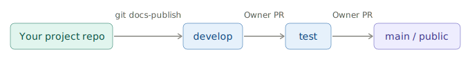

# Editor Guide
European Environment Agency (EEA)
2026-05-26

- [<span class="toc-section-number">1</span> How This
  Works](#how-this-works)
  - [<span class="toc-section-number">1.1</span> Your project and the
    central library](#your-project-and-the-central-library)
  - [<span class="toc-section-number">1.2</span> The publish
    flow](#the-publish-flow)
  - [<span class="toc-section-number">1.3</span> The document
    lifecycle](#the-document-lifecycle)
- [<span class="toc-section-number">2</span> Starting a New
  Document](#starting-a-new-document)
  - [<span class="toc-section-number">2.1</span> From a template
    (recommended)](#from-a-template-recommended)
  - [<span class="toc-section-number">2.2</span> From
    scratch](#from-scratch)
- [<span class="toc-section-number">3</span> The YAML
  Header](#the-yaml-header)
  - [<span class="toc-section-number">3.1</span> Required
    fields](#required-fields)
  - [<span class="toc-section-number">3.2</span> Optional
    fields](#optional-fields)
  - [<span class="toc-section-number">3.3</span> System-managed
    fields](#system-managed-fields)
- [<span class="toc-section-number">4</span> Writing
  Content](#writing-content)
  - [<span class="toc-section-number">4.1</span> Image folder
    convention](#image-folder-convention)
  - [<span class="toc-section-number">4.2</span> Page
    breaks](#page-breaks)
  - [<span class="toc-section-number">4.3</span> Complex table
    layouts](#complex-table-layouts)
- [<span class="toc-section-number">5</span> Editing and Previewing
  Locally](#editing-and-previewing-locally)
  - [<span class="toc-section-number">5.1</span> Open the project in
    RStudio](#open-the-project-in-rstudio)
  - [<span class="toc-section-number">5.2</span> Preview your
    document](#preview-your-document)
  - [<span class="toc-section-number">5.3</span> Render the full
    project](#render-the-full-project)
- [<span class="toc-section-number">6</span> Publishing to
  Develop](#publishing-to-develop)
- [<span class="toc-section-number">7</span> Folder and File
  Structure](#folder-and-file-structure)
- [<span class="toc-section-number">8</span> File Naming and
  Versioning](#file-naming-and-versioning)
  - [<span class="toc-section-number">8.1</span> The version
    suffix](#the-version-suffix)
  - [<span class="toc-section-number">8.2</span> When to create a new
    major version](#when-to-create-a-new-major-version)
  - [<span class="toc-section-number">8.3</span> Don’t rename after
    publishing](#dont-rename-after-publishing)
- [<span class="toc-section-number">9</span> Restoring Previous
  Versions](#restoring-previous-versions)
  - [<span class="toc-section-number">9.1</span> Commands](#commands)
  - [<span class="toc-section-number">9.2</span> When to use
    it](#when-to-use-it)
- [<span class="toc-section-number">10</span> Release
  Path](#release-path)

> [!NOTE]
>
> This guide assumes your project is already integrated with the
> Technical Library - the `DOCS/` subtree is in place and the Git
> aliases are configured. If that setup isn’t done yet, see the [Setup
> Guide](guidelines-setup-guide_v1.html) first.

# How This Works

## Your project and the central library

Your project repository contains a `DOCS/` folder that is both part of
your project and part of the central CLMS Technical Library. The
connection works as a **git subtree**: your documents live in your repo,
but `git docs-publish` merges them into the library’s `develop` branch.

That means you own the source. You edit locally, commit to your project,
and publish when ready. The library pulls in documents from all
projects.

## The publish flow

Publishing to `develop` is not a public release. The public-facing
library only changes when a Technical Library owner promotes changes
from `develop` to `test` to `main`. As an editor, your work stops at
`develop`.



## The document lifecycle


Major version bumps are your decision - you create a new file with a
bumped `_v<N>` suffix. Minor and patch versions are AI-assigned at
release time based on the scope of changes.

# Starting a New Document

## From a template (recommended)

Pick the template that matches your document type:

- `CLMS_Template_ATBD.qmd` - Algorithm Theoretical Basis Document, for
  the scientific and technical foundations of a data product
- `CLMS_Template_PUM.qmd` - Product User Manual, for how users access
  and interpret a product

Once you’ve chosen:

1.  Copy the template into `DOCS/` (not sure what that looks like? See
    [Folder and File Structure](#folder-and-file-structure))

2.  Rename it using this pattern:
    `CLMS_<Product-Name>_<Document-Type>_v<Major-Version>.qmd`

    For example: `CLMS_HRL-Forest_PUM_v1.qmd`

    Use hyphens within the product name, not underscores. Start every
    new document at `_v1`. The document type is either `ATBD` or `PUM`.

3.  Create a matching `-media/` folder for images:
    `CLMS_HRL-Forest_PUM_v1-media/`

4.  Edit in place, following the structure the template provides

The templates include a pre-filled YAML header, required sections, and
commented guidance throughout. Try to keep the structure intact - it
makes a real difference to how consistently documents behave across the
library.

## From scratch

If neither template fits, create a new `.qmd` file directly in `DOCS/`,
following the same naming pattern, create a matching `-media/` folder,
and add the required YAML header manually (see [The YAML
Header](#the-yaml-header)).

> [!TIP]
>
> Templates save time even when they don’t feel like an exact fit - the
> YAML header and section structure are the main things you’d otherwise
> need to set up manually.

Migrating an existing `.docx`? See the Migration Guide \[TBD link\].

# The YAML Header

If you copied a template, the header is pre-filled - just update
`title`, `subtitle`, `date`, and `product-name`.

## Required fields

``` yaml
---
title: "HRL Forest"
subtitle: "High Resolution Layer - Forest Type"
date: "2026-01-27"
product-name: "HRL Forest"
---
```

- `title` - short product name, appears as the document title
- `subtitle` - full product name or document type description
- `date` - publication or last-updated date in ISO format
- `product-name` - used internally for metadata and indexing

## Optional fields

- `template-version` - records which template version was used as the
  starting point. Set automatically when copying a template; don’t edit
  it manually.

## System-managed fields

Leave these out of your YAML header entirely - the publishing system
handles them:

- `keywords` - AI-generated at publish time based on document content.
  Anything you add gets overwritten.
- `version` - carried by the filename suffix, not the YAML. No version
  field belongs in the header.

# Writing Content

Markdown basics - headings, lists, links, images, tables, equations,
footnotes, diagrams - are covered in the [Quarto Markdown
guide](https://quarto.org/docs/authoring/markdown-basics.html). This
chapter covers only what’s specific to this system.

## Image folder convention

Images go in `<your-document-name>-media/`, referenced with relative
paths:

``` markdown

```

## Page breaks

Use the Quarto shortcode to insert a page break in PDF output:

``` markdown

```

Note that `---` renders as a horizontal rule, not a page break.

## Complex table layouts

For tables with merged cells, nested content, or custom styling, use
HTML tables directly in your `.qmd` file. Both the HTML output and
Typst-rendered PDF handle them well.

Standard Markdown tables have limited formatting options. HTML tables
let you control exactly how things look - column widths, cell colours,
text alignment, borders - using inline CSS:

```` markdown
```{=html}
<table style="width: 100%; border-collapse: collapse;">
  <thead>
    <tr style="background-color: #2c3e50; color: white;">
      <th colspan="2" style="padding: 10px; text-align: center;">Product Overview</th>
    </tr>
  </thead>
  <tbody>
    <tr>
      <td style="padding: 8px; border: 1px solid #ccc; font-weight: bold;">HRL Forest</td>
      <td style="padding: 8px; border: 1px solid #ccc;">Active</td>
    </tr>
    <tr style="background-color: #f2f2f2;">
      <td style="padding: 8px; border: 1px solid #ccc; font-weight: bold;">Water Bodies</td>
      <td style="padding: 8px; border: 1px solid #ccc;">Active</td>
    </tr>
  </tbody>
</table>
```
````

# Editing and Previewing Locally

## Open the project in RStudio

1.  Open RStudio
2.  **File \> Open Project…** and select the root folder of your project
3.  Navigate to `DOCS/` and open the `.qmd` file you want to edit

## Preview your document

Click the **Render** button at the top of the editor pane to render HTML
or PDF:


A screenshot of a software interface toolbar, likely from RStudio, for
editing a file named `hello.qmd`. The toolbar contains various options
including navigation arrows, a save icon, and a checkbox labelled
“Render on Save”. The central part of the toolbar features a “Render”
button, visually highlighted with a purple outline, depicted with an
icon of two blue arrows pointing right. To the right of the “Render”
button are a gear icon (settings) and a dropdown arrow. Further right, a
“Run” button with a green arrow is visible, along with a refresh/loop
icon. Below the main toolbar, two tabs are visible: “Source” and
“Visual”, with “Visual” currently selected. Additional text formatting
and editing options are also present, such as bold, italic, code,
“Normal” dropdown, list icons, image insertion icon, “Format” dropdown,
“Insert” dropdown, “Table” dropdown, and an “Outline” option.

Or enable **Preview on Save** in the toolbar to re-render on every save:


A screenshot of the RStudio integrated development environment’s toolbar
when editing a Quarto (.qmd) file. The document tab displays
“hello.qmd”. The main toolbar shows various icons including navigation
arrows, a save icon, and a checkbox labeled “Render on Save”, which is
highlighted by a purple oval. Following “Render on Save”, there are
icons for spelling/grammar check (ABC with green checkmark), search
(magnifying glass), and a “Render” button (blue arrow icon). To the
right are a settings gear icon, a dropdown arrow, an “Insert Chunk” icon
(green C), an upload/download arrow pair, a “Run” button with a green
arrow, and a refresh/sync icon. Below this, there are two tabs for
editing modes: “Source” and “Visual” (currently active). Further below
is a standard text formatting toolbar with options for bold, italic,
code, text style (Normal), list types, image insertion, and dropdowns
for Format, Insert, Table, and Outline.

The rendered output appears in the **Viewer** tab in the lower-right
pane:


A screenshot of the RStudio Integrated Development Environment (IDE)
menu bar and toolbar, showing options relevant to documentation
rendering. The menu bar displays the following tabs: “Files”, “Plots”,
“Packages”, “Help”, “Viewer”, and “Presentation”. The “Viewer” tab is
prominently highlighted by a thick purple oval outline. Below the menu
bar, the toolbar includes navigation arrows (left, right), an icon with
a red ‘X’ (likely close or stop), a blank document icon, an “Edit”
button accompanied by a pencil icon, and a “Sync Editor” checkbox. On
the right side of the toolbar, a “Publish” button with a blue circular
arrows icon is visible, along with a dropdown arrow and a refresh icon.
In the top right corner, there are two window management icons.

If the Viewer tab isn’t showing rendered output, go to **Tools \> Global
Options \> R Markdown** and set **Show output preview in** to **Viewer
Pane**:


This image is a screenshot of the “Options” dialog within the RStudio
Integrated Development Environment (IDE), displaying settings for R
Markdown. On the left navigation panel, “R Markdown” is selected. The
main pane has four tabs: “Basic” (currently active), “Advanced”,
“Visual”, and “Citations”. Under the “Basic” tab for “R Markdown”
settings, the following options are visible: “Show document outline by
default” (unchecked), “Soft-wrap R Markdown files” (checked), and “Show
in document outline:” (dropdown set to “Sections Only”). A key setting,
“Show output preview in:”, is highlighted with a purple border, and its
dropdown is set to “Viewer Pane”. Below this, “Show output inline for
all R Markdown documents” is checked, “Show equation and image
previews:” is set to “Inline”, and “Evaluate chunks in directory:” is
set to “Document”.

## Render the full project

To render all documents and preview the complete library locally:

``` bash
git docs-preview
```

> [!TIP]
>
> The repository ships with the project config renamed to
> `_quarto-not-used.yaml` so RStudio operates in single-file mode by
> default - faster for day-to-day editing. When you need to render the
> full project, rename it to `_quarto.yaml`, run `quarto render`, then
> rename it back.

# Publishing to Develop

``` bash
git add DOCS/
git commit -m "docs: update [brief description]"
git docs-publish
```

After the pipeline runs, check your document at:
<https://eea.github.io/CLMS_documents/develop/index.html>

Navigation, cross-links, and the sidebar TOC can behave differently than
in your local RStudio preview - worth a quick look before calling it
done.

# Folder and File Structure

``` text
DOCS/
├── _meta/                            # Scripts, config, metadata - do not edit
├── includes/                         # Quarto include files - do not edit
├── templates/                        # Document templates - do not edit
├── theme/                            # Styling definitions - do not edit
├── _quarto.yml                       # Project-wide Quarto config
├── CLMS_HRL-Forest_PUM_v2.qmd
├── CLMS_HRL-Forest_PUM_v2-media/
├── CLMS_Water-Bodies_ATBD_v1.qmd
├── CLMS_Water-Bodies_ATBD_v1-media/
└── ...
```

Your work lives in `DOCS/` directly: one `.qmd` file per document, plus
a matching `-media/` folder for images and diagrams. The four managed
subdirectories (`_meta/`, `includes/`, `templates/`, `theme/`) are
updated centrally - don’t edit them.

# File Naming and Versioning

## The version suffix

The `_v<N>` suffix in the filename is the major version - the only
version number you control. Minor and patch versions are assigned
automatically by AI at library release time based on the scope of
changes: small corrections get a patch bump (`2.3.5 → 2.3.6`), new or
revised sections get a minor bump (`2.3.0 → 2.4.0`). A new file
`CLMS_HRL-Forest_PUM_v3.qmd` starts at `3.0.0` at its first release. You
never set a version number in YAML.

## When to create a new major version

Edit the existing file for most changes. Create a new major version only
when you need to:

- rewrite most of the content
- make breaking structural changes
- keep the previous version available as a stable reference

``` bash
cp DOCS/CLMS_HRL-Forest_PUM_v2.qmd DOCS/CLMS_HRL-Forest_PUM_v3.qmd
cp -r DOCS/CLMS_HRL-Forest_PUM_v2-media DOCS/CLMS_HRL-Forest_PUM_v3-media
```

Both versions stay in the library and evolve independently from that
point on.

## Don’t rename after publishing

The filename becomes part of the document’s URL. Renaming breaks links
and cross-references. If a significant revision is needed, create a new
major version rather than renaming.

# Restoring Previous Versions

Restore pulls a published version of a document into your local working
copy. It doesn’t roll back the library - think of it as “pick up from
version X,” not “undo to version X.”

## Commands

``` bash
git docs-restore --list-all                                 # all published documents
git docs-restore --list DOCS/CLMS_HRL-Forest_PUM_v2.qmd     # versions of one file
git docs-restore DOCS/CLMS_HRL-Forest_PUM_v2.qmd 2.0.0      # specific version
git docs-restore --latest DOCS/CLMS_HRL-Forest_PUM_v2.qmd   # latest published version
```

## When to use it

**Recover deleted content.** You removed a section locally and need it
back. Restore the last published version, copy out what you need, then
carry on with your current version.

**Something went wrong in a recent edit.** Restore an earlier version
(e.g. `2.1.0`) and work forward from there rather than trying to
untangle the current state.

**Resurrect a deleted file.** If a file was removed from the project but
still exists in the library history, `--list-all` will find it. Restore
brings it back into `DOCS/` as if nothing happened.

# Release Path

Once you publish to `develop`, the rest of the process belongs to
Technical Library owners. Getting from develop to public requires two
separate pull requests, each reviewed and approved by a second owner
before it merges.

| Stage         | URL                                                       |
|---------------|-----------------------------------------------------------|
| develop       | <https://eea.github.io/CLMS_documents/develop/index.html> |
| test          | <https://eea.github.io/CLMS_documents/test/index.html>    |
| main (public) | <https://library.land.copernicus.eu>                      |

At each release, the system assigns version numbers automatically based
on what changed.
