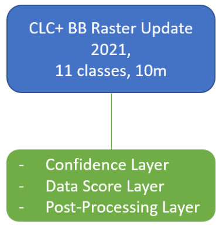

# CLCplus Backbone 2021 - Product User Manual
Copernicus Land Monitoring Service
2025-12-03

- [1 Executive
  Summary](#executive-summary)
- [2 Background of the
  Document](#background-of-the-document)
  - [2.1 Scope of the
    Document](#scope-of-the-document)
  - [2.2 Content and
    Structure](#content-and-structure)
- [3 Product
  Description](#product-description)
  - [3.1 Overview of the product
    portfolio](#sec-overview-of-the-product-portfolio)
  - [3.2 Raster
    Product](#sec-raster-product)
    - [3.2.1 Technical Product
      Specifications](#sec-technical-product-specifications)
    - [3.2.2 Production
      Algorithm and
      Methodology](#sec-production-algorithm-and-methodology)
  - [3.3 Additional Quality
    Layers and Products](#sec-additional-quality-layers-and-products)
    - [3.3.1 Data Score Layer
      (DSL)](#data-score-layer-dsl)
    - [3.3.2 Raster Confidence
      Layer (CONF)](#raster-confidence-layer-conf)
    - [3.3.3 Raster
      Post-processing Layer
      (POST)](#sec-raster-post-processing-layer-POST)
    - [3.3.4 National
      Projections of the Raster
      Product](#national-projections-of-the-raster-product)
- [4 Product
  Quality](#product-quality)
  - [4.1 Methodological
    approach](#methodological-approach)
  - [4.2 Results](#results)
  - [4.3
    Analysis](#sec-analysis)
- [5 Terms of Use and Product
  Technical Support](#terms-of-use-and-product-technical-support)
  - [5.1 Terms of
    Use](#terms-of-use)
  - [5.2 Citation](#citation)
  - [5.3 Product Technical
    Support](#product-technical-support)
- [6 Acronyms and
  Abbreviations](#acronyms-and-abbreviations)
- [7 References](#references)
- [8 Annexes](#annexes)
  - [8.1 Annex 1: Naming
    Conventions](#annex-1-naming-conventions)
  - [8.2 Annex 2: Colour
    Palettes](#annex-2-colour-palettes)
  - [8.3 Annex 3: Projection
    Parameters](#annex-3-projection-parameters)
  - [8.4 Annex 4: Thematic
    Accuracies for the Reporting Units of the CLC+ BB Raster Product
    2021](#annex-4-thematic-accuracies-for-the-reporting-units-of-the-clc-bb-raster-product-2021)

# Executive Summary

**Copernicus** is the European Union’s Earth Observation Programme. It
offers information services based on satellite Earth observation and in
situ (non-space) data. These information services are freely and openly
accessible to its users through six thematic Copernicus services
(Atmosphere Monitoring, Marine Environment Monitoring, Land Monitoring,
Climate Change, Emergency Management and Security). The **Copernicus
Land Monitoring Service (CLMS)** provides geographical information on
land cover and its changes, land use, vegetation state, water cycle and
earth surface energy variables to a broad range of users in Europe and
across the world in the field of environmental terrestrial applications.
CLMS is jointly implemented by the European Environment Agency and the
European Commission’s DG Joint Research Centre (JRC).

The ‘**CLC+ Backbone**’ constitutes the first component of the CLMS’s
new ‘CLC+ Product Suite’, which represents a true paradigm change in
European land cover/land use (LC/LU) monitoring, building on the rich
legacy of the European CORINE Land Cover (CLC) flagship product. The
CLC+ Backbone is an object-oriented, large scale, wall-to-wall (EEA-38),
high-resolution (HR) inventory of European LC.

The CLC+ Backbone Product Specification and User Manual is intended to
provide all product information to users that may be required for
successful further-reaching analyses and applications.

The CLC+ Backbone is being produced in the European Terrestrial
Reference System 1989 (ETRS89) and in Lambert Azimuthal Equal Area
(LAEA) projection by a consortium of European service providers. It is a
pixelbased, multi-temporal Copernicus Sentinel-2 time-series based
raster product with 10 m spatial resolution and 11 basic LC classes.
This raster product has first been produced for the reference 2018 and
has been updated for the reference year 2021 (excluding the UK).

This document constitutes the Product Specifications and User Manual for
the CLC+ BB Raster Product 2021. It provides detailed specifications for
the CLC+ Backbone Raster Product, as well as all additional products, as
well as a documentation of the applied production methodologies,
together with discussions of the strengths and limitations of the
products. Furthermore, the document contains summaries of the extensive
internal validation conducted for the primary 11-class Raster Product.

# Background of the Document

## Scope of the Document

This Product Specification and User Manual is the primary document that
users are recommended to read before using the product. It provides a
description of the product characteristics, production methodologies and
workflows, and information about the product quality. Furthermore, it
gives information on the terms of use and product technical support. It
constitutes the consolidated final Issue 1.0 of the document.

## Content and Structure

In more detail, the document is structured as follows:

- Chapter 3 presents a detailed product description, including details
  on the applied production methodology and workflow, as well as the
  technical specification of all available 2021 products;

- Chapter 4 summarizes the information on the product quality, including
  details on the applied assessment procedure;

- Chapter 5 provides information about product access and use conditions
  as well as on the technical product support;

- Chapter 6 lists references to the cited literature; and

- the Annexes provide technical details with respect to product file
  naming, colour palettes and projection parameters.

# Product Description

This chapter provides a comprehensive overview of the CLC+ Backbone
products’ specifications, putting them in the context of the overall
CLC+ product suite of the Raster Update 2021
(<a href="#sec-overview-of-the-product-portfolio"
class="quarto-xref">Section 3.1</a>), presenting the characteristics of
the primary Raster Product
(<a href="#sec-raster-product" class="quarto-xref">Section 3.2</a>) and
the various accompanying Additional Quality Layers and Expert Products
(<a href="#sec-additional-quality-layers-and-products"
class="quarto-xref">Section 3.3</a>).

## Overview of the product portfolio

The CLC+ Raster Product Update for the reference year 2021 comprises the
primary Raster Product, representing an 11-class land cover
classification at 10m spatial resolution and an MMU of one pixel
(10m\*10m = 100m²), as well as three expert products (see Figure 1).
Those expert products are additional layers, which provide further
information on quality of the Raster Product and comprise the Confidence
Layer (the confidence of the initial class assignment), the Data Score
Layer (the number of used valid Sentinel-2 observations) and the Raster
Post-Processing Layer (marking pixels, whose initially assigned class
code was adjusted during post-processing correction steps).

This diagram illustrates the structure of the CLC+ Backbone Raster
Update product for 2021. The main product, labelled “CLC+ BB Raster
Update 2021”, is characterised by 11 land cover classes and a 10-metre
resolution. This primary product is associated with three additional
components or layers: a Confidence Layer, a Data Score Layer, and a
Post-Processing Layer.

## Raster Product

The CLC+ Backbone Raster Product 2021 is a 10m pixel-based land cover
map (see Figure 2) based on Sentinel data for the reference year 2021 ±
3 months. Each pixel shows the dominant land cover among the 11 basic
land cover classes. The following sections provide information on the
product specifications (<a href="#sec-technical-product-specifications"
class="quarto-xref">Section 3.2.1</a>) including the nomenclature
concept and class definitions
(<a href="#sec-nomenclature-concept-and-class-definitions"
class="quarto-xref">Section 3.2.1.1</a>) as well as the related decision
tree approach (<a href="#sec-decision-tree-for-area-thresholds"
class="quarto-xref">Section 3.2.1.2</a>). Additionally,
<a href="#sec-examples" class="quarto-xref">Section 3.2.1.3</a> provides
some illustrated examples of typical cases of the Raster Product
nomenclature and decision tree application. Details on the production
methodology (<a href="#sec-production-algorithm-and-methodology"
class="quarto-xref">Section 3.2.2</a>), including an overview of the
input data, the time series classification approach and postprocessing
steps are given in sections
<a href="#sec-input-data" class="quarto-xref">Section 3.2.2.1</a> to
<a href="#sec-post-processing" class="quarto-xref">Section 3.2.2.3</a>.
Additionally,
<a href="#sec-strength-and-limitations-of-the-applied-methodolgy"
class="quarto-xref">Section 3.2.2.4</a> provides a comprehensive
overview of the strengths and limitations of the applied approach.

Choropleth map displaying ten land cover types across Europe, including
the Azores, Canary, and Madeira Islands, likely representing Copernicus
Land Monitoring Service (CLMS) CLC+ Backbone products from the Raster
Update 2021. The map uses a geographic coordinate system with longitude
lines from 10°W to 70°E and latitude lines from 30°N to 60°N.

The legend defines the following land cover classes and their associated
colours: \* Sealed (red) \* Woody needle leaved trees (dark green) \*
Woody broadleaved deciduous trees (light green) \* Woody broadleaved
evergreen trees (brighter green) \* Low-growing woody plants (brown) \*
Permanent herbaceous (light yellow) \* Periodically herbaceous (yellow)
\* Lichens and mosses (pink/purple) \* Non and sparsely vegetated (grey)
\* Water (dark blue) \* Snow and ice (light blue)

A main scale bar indicates 0, 250, 500, and 1,000 km. Two inset maps for
the Azores Islands and Canary and Madeira Islands each have a scale bar
showing 0, 150, and 300 km.

Spatially, Northern Europe (e.g., Scandinavia) is dominated by woody
needle leaved trees, water bodies, lichens and mosses, and snow and ice
(Iceland). Central and Western Europe show a mix of woody broadleaved
deciduous and evergreen trees, permanent herbaceous areas, and small,
scattered sealed surfaces. Southern Europe (e.g., Iberian Peninsula,
Italy, Greece) exhibits a prevalence of permanent herbaceous and
periodically herbaceous vegetation, low-growing woody plants, and woody
broadleaved evergreen trees.

### Technical Product Specifications

The product specifications for the CLC+ Backbone Raster Product for the
reference year 2021 are summarized in the table below. Further product
details and information on nomenclature etc. can be found in the
following sub-sections.

**CLC+ Backbone Raster Product**

**Acronym**: RASTER

**Product family**: CLMS_CLCplus

**Summary**: CLC+ Backbone is a spatially detailed, large scale,
EO-based land cover inventory. The CLC+ Backbone Raster Product is a 10m
pixel-based land cover map based on Sentinel time series from October
2020 to March 2022 and auxiliary features. For each pixel it shows the
dominant land cover among the 11 basic land cover classes.

**Reference year**: 2021

**Geometric resolution**: Pixel resolution 10m x 10m, fully conform with
the EEA reference grid

**Coordinate Reference System**: European ETRS89 LAEA projection / for
French DOMs WGS84 and the respective UTM zone

**Coverage**: 5.749.035 km² (covering the full EEA-38)

**Geometric accuracy (positioning scale)**: Equals Sentinel-2 positional
accuracy in 2021 (\< 11m at 95.5 % confidence level)

**Thematic accuracy**: 90 % overall accuracy, not more than 15 %
omission errors and 15 % commission errors per class (the amount of
omission and commission errors for particular difficult classes such as
Low-growing woody plants and Lichens and Moses might regionally exceed
those thresholds)

**Data type**: 8bit unsigned raster with LZW compression

**Minimum Mapping Unit (MMU)**: Pixel-based (no MMU)

**Necessary attributes**: Raster value, class name, pixel count

**Raster coding (thematic pixel values)**:

- 1: Sealed

- 2: Woody needle leaved trees

- 3: Woody Broadleaved deciduous trees

- 4: Woody Broadleaved evergreen trees

- 5: Low-growing woody plants

- 6: Permanent herbaceous

- 7: Periodically herbaceous

- 8: Lichens and mosses

- 9: Non and sparsely vegetated

- 10: Water

- 11: Snow and ice

- 253: Coastal seawater buffer

- 254: Outside area

- 255: No data

**Metadata**: XML metadata files according to INSPIRE metadata standards

**Delivery format**: GeoTIFF incl. pyramids (\*.ovr, level: 11,
resampling: Nearest Neighbour), attribute table (\*.dbf), statistics
(\*.aux.xml), colour tables (\*.clr) and INSPIRE-compliant metadata in
XML format

The Raster Product for the reference year 2018 by definition does not
provide a separation between inland water and coastal/sea water along a
country’s sea border and in the respective 250m coastal buffer zone. For
potential use cases intending to separate both, a clipping with a
national/European coast line dataset was recommended therefore. In the
2021 Raster Product this separation of the seawater in the coastal
buffer zone from the inland water has been introduced, to ease the use
of the product. Further detail on the implementation of this separation
is provided in
<a href="#sec-post-processing" class="quarto-xref">Section 3.2.2.3</a>.

#### Nomenclature concept and class definitions

Most of the class definitions for CLC+ Backbone Raster Product comprise
a 50% area threshold to express that the dominant land cover should be
assigned. While this is a plausible approach there are many situations
where the land cover within a single 10m pixel comprises a spatial mix
of different classes and no single class reaches an absolute majority of
50%. A simple example is provided in Figure 3.

This conceptual illustration depicts a square area divided into three
distinct land cover / land use (LULC) classes. The top-right portion,
shaded dark green, is labelled “Woody”. The central, light green band is
labelled “Permanent herbaceous”. The bottom-left area, coloured blue, is
labelled “Water”. This visual representation demonstrates the adjacency
of these different land cover types within a single conceptual unit or
pixel, aligning with class definitions for the Copernicus Land
Monitoring Service (CLMS) CLC+ Backbone Raster Product. ‘Woody’
corresponds to CLMS class 5 (Low-growing woody plants), ‘Permanent
herbaceous’ to class 6, and ‘Water’ to class 10.

To address this issue, a relative majority is used in most cases for the
class assignment. This logic is implemented in detail through a decision
tree approach which does not only define the area threshold but further
clarifies and limits for each class the Land Cover Component (Figure 4)
considered when evaluating the area threshold. The approach is detailed
in <a href="#sec-decision-tree-for-area-thresholds"
class="quarto-xref">Section 3.2.1.2</a> In general, the area fractions
of different land cover classes are to be understood as what can be
reasonably evaluated in HR and VHR remote sensing imagery at nadir.

This table presents a hierarchical classification scheme for Land Cover
Components (LCC), detailing the nomenclature concept and class
definitions across four levels. The scheme is divided into three primary
categories: “ABIOTIC / NON-VEGETATED SURFACES AND OBJECTS”, “BIOTIC /
VEGETATION”, and “WATER”.

| Level 1: Main Category | Level 2: Sub-Category | Level 3: Type | Level 4: Specific Detail |
|----|----|----|----|
| **Land Cover Components (LCC)** |  |  |  |
| **ABIOTIC / NON-VEGETATED SURFACES AND OBJECTS** |  |  |  |
|  | Artificial Surfaces and Constructions |  |  |
|  |  | Sealed Artificial Surfaces and Constructions | Buildings |
|  |  |  | specific structures and facilities |
|  |  |  | open sealed surfaces |
|  |  | Non-Sealed Artificial Surfaces and Constructions | waste materials |
|  |  |  | non-sealed and semi-sealed artificial surfaces |
|  | Natural Material Surfaces |  |  |
|  |  | Consolidated Surfaces | bare rock |
|  |  |  | hard pan |
|  |  | Un-Consolidated Surfaces | Mineral Fragments |
|  |  |  | bare soils |
|  |  |  | Natural Deposits |
| **BIOTIC / VEGETATION** |  |  |  |
|  | Woody Vegetation |  |  |
|  |  | trees |  |
|  |  | Bushes, Shrubs | regular bushes |
|  |  |  | dwarf shrubs |
|  | Herbaceous Vegetation (grass-like, forbs, ferns) |  |  |
|  |  | Graminoids (grass-like) | grasses, sedges, rushes, cereals (low) |
|  |  |  | reeds, bamboos, canes (high) |
|  |  | non-graminoids (forbs, ferns) | forbs, ferns |
|  | succulents and cacti | e.g. halophytes, cacti |  |
|  | Lichens, Mosses and Algae |  |  |
|  |  | lichens |  |
|  |  | mosses |  |
|  |  | Algae | macro algae |
|  |  |  | micro algae (plancton) |
| **WATER** |  |  |  |
|  | Liquid waters |  |  |
|  |  | Inland Waters | water courses |
|  |  |  | standing waters |
|  |  | Marine Waters |  |
|  | Solid waters |  |  |
|  |  | Snow |  |
|  |  | Ice, Glaciers |  |

This table provides the detailed classification hierarchy used for
defining land cover types, which is foundational for products like the
Copernicus Land Monitoring Service (CLMS) CLC+ Backbone Raster Product.

**Remark on the temporal dimensions of the land cover classes:** In
cases of land cover changes during the reference year and unless stated
otherwise in the class definitions below (i.e. Permanent herbaceous
vs. Periodically herbaceous, Snow and Ice), the dominant land cover
(i.e. present \> 6 month/ year) shall be mapped.

Textual descriptions of the main land cover components included in each
of the 11 classes are provided in the following paragraphs. The area
thresholds are explained in more detail in
<a href="#sec-decision-tree-for-area-thresholds"
class="quarto-xref">Section 3.2.1.2</a>.

1.  <u>**Sealed:**</u>

Sealed Artificial Surfaces include all impervious and sealed surfaces
that are covered mainly by features with a specific height above ground
(buildings and artificial constructions) or features without a specific
height above ground (flat impervious surfaces). Flat surfaces covered by
any type of impervious material that is used for artificial surface
pavements (e.g. asphalt, concrete, tarmacadam).

- Includes: All sealed artificial surfaces and constructions including
  Buildings, Specific structures and facilities, and open sealed
  surfaces (EAGLE land cover components). Also vegetated rooftops are to
  be mapped under this class. Railway tracks are also considered as part
  of this class since they typically comprise impervious structural
  elements and a highly compacted subsoil.

- Excludes: Waste materials (e.g. communal / industrial waste),
  non-sealed and semi-sealed artificial surfaces (e.g. nat. mat.
  displaced from original place, artificially consolidated,
  e.g. logistic and storage areas, festive squares, non-vegetated sport
  fields, grass pavers, permeable paving. Such areas are to be mapped as
  Non- and sparsely-vegetated since Biotic LC components do typically
  not exceed 30%.

2.  <u>**Woody - trees**</u>

Perennial woody plants with single, self-supporting main stem or trunk,
containing woody tissue and branching into smaller branches and shoots.

| Excluded                                   | Destination class        |
|--------------------------------------------|--------------------------|
| Pinus mugo and Alnus viridis               | Low-growing woody plants |
| Ephedra                                    | Low-growing woody plants |
| Shrub forms of Taxus, Juniperus and Betula | Low-growing woody plants |
| Musa                                       | Permanent herbaceous     |

2.1. <u>**Woody needle leaved trees**</u>

Needle leaved trees: referring to trees of the botanical group
Gymnospermae (Ford-Robertson, 1971) carrying typical needle-shaped
leaves. An exception is Ginkgo biloba which belongs to the Gymnospermae
but is considered here as Broadleaved deciduous tree.

2.2. <u>**Broadleaved trees:**</u> referring to trees of the botanical
group Angiospermae, with the exception of ginkgo (Ginkgo biloba), which
belongs to the Gymnospermae taxonomically.

2.2.1 <u>**Woody Broadleaved deciduous trees:**</u> broadleaved trees
which are leafless for a certain period during the year

2.2.2 <u>**Woody Broadleaved evergreen trees:**</u> trees that are never
entirely without green foliage (includes palm-leaved species)

5.  <u>**Low-growing woody plants**</u>

Perennial woody plants with shrub growth form i.e. multiple stems
arising at or near the base, height usually less than 5 metres. Leaf
type can be needle leaf, broadleaf or palm leaf, phenology either
evergreen or deciduous, leaf surface type can be regular or
sclerophyllous.

- Includes: regular bushes and dwarf shrubs, species such as Pinus mugo,
  Alnus viridis, shrub forms from the genus Ephedra, Taxus, Juniperus
  and Betula, subshrubs such as Thymus spec., Salvia, Rosmarinus,
  Calluna vulgaris, Erica spec. The class also includes Vitis spec. and
  Humulus spec., which are typically permanent crops, as well as Opuntia
  ficus-indica. Individual small trees in shrub-dominated areas are
  allowed in this class.

- Excludes: Low-growing fruit trees (e.g. apple plantations), tree cover
  regrowth (e.g. after clear cuts) with sufficient density and trees in
  nurseries, which should be classified according to the definitions for
  Woody-trees

Remark: Due to the difficulty of differentiating shrubs / bushes from
trees and herbaceous vegetation, the accuracies could be regionally
below the defined target accuracies.

6.  <u>**Permanent herbaceous**</u>

- Permanent herbaceous areas are characterized by a continuous
  vegetation cover throughout a year. No bare soil occurs within a year.
  These areas are either unmanaged or extensively managed natural
  grasslands or permanently managed grasslands, or arable areas with a
  permanent vegetation cover (e.g. fodder crops) or even set-aside land
  in agriculture. For managed grasslands, the biomass will vary over the
  year, depending on the number of mowing (grassland cuts) or grazing
  events.

- According to IACS/LPIS definition a permanent and managed grassland
  may be ploughed every 3-5 years for amelioration purposes followed by
  an artificial seeding phase and a renewal of vegetation cover, thus
  potentially showing a phase of bare soil within a time frame of 5-6
  years. Given that the observation period for the CLC+ Backbone Raster
  Product is of 1 year with a focus on land cover, such longer-term land
  use patterns cannot be considered and therefore grasslands which
  underwent ploughing within the reference year are typically mapped
  under the class 7. Periodically Herbaceous.

The class includes regular graminaceous (grasses), reeds and forbs,
notably also natural dry grassland in Southern, South-Eastern Europe and
Turkey, as well as banana plantations (Musa spec.).

7.  <u>**Periodically herbaceous**</u>

- Periodically herbaceous areas are characterized by at least one land
  cover change (in the sense of EAGLE land cover components) between
  bare soil and herbaceous vegetation within one year. Depending on the
  management intensities these areas can also have up to several changes
  between these two EAGLE land cover components within a year. Normally
  these areas are managed as arable areas.

8.  <u>**Lichens and mosses**</u>

- Any type of lichens – composite organisms formed by a symbiotic
  relationship of a fungus and a photosynthetic partner (usually green
  algae or cyanobacteria);

- Mosses: Non-vascular plants in the land plant division Bryophyta. They
  are small (a few centimetres tall) herbaceous (non-woody) plants that
  absorb water and nutrients mainly through their leaves and but also
  photosynthesize;

- Typical vegetation class of northern European Tundra vegetation;

Remark: The mapping of this class is focused on larger areas in northern
Europe where sufficient in situ data is available. Due to the difficulty
to distinguish Lichens and Mosses from herbaceous vegetation and dwarf
shrubs producer’s and user’s accuracies below 80% and a corresponding
impact on the overall accuracy are to be expected.

9.  <u>**Non and sparsely vegetated (i.e. rock, screes, sand, permanent
    bare soils)**</u>

Contains consolidated and unconsolidated materials as well as permanent
bare soils, where non-vegetated areas cover \>= 70 % of the land
surface;

- Consolidated surfaces (rocks):

  - The rock surface is continuous except perhaps for a few cracks in
    the material. Some areas may be covered by shallow layers of soil or
    there could be isolated pockets of soil or a mixture of both;

  - Examples: solid (closed) rock formations, fresh lava flows,
    quarries, mineral extraction sites, open pit mines.

- Unconsolidated surfaces (screes, sand, permanent bare soil)

  - Mineral Fragments come to be through mainly physical disintegration
    of geological formations and are the result of becoming smaller and
    smaller along time. They are accumulated on site due to sedimentary
    processes or human activity;

  - Includes variable particle sizes: boulders, stones, pebble, gravel,
    sand and clay

  - Examples: mountain slope debris, gravel river banks, open pit pebble
    mining of fossil river banks or fluvial sediments, volcanic lapilli
    fields, sand dunes, sand beaches, river sand banks, volcanic ash.

- Permanent bare soil:

  - Mixture of mineral and organic material that is fertile enough and
    capable of sustaining plant life, but being continuously
    un-vegetated during the entire observation period.

- Sparsely vegetated areas:

  - Sparsely vegetated on unstable areas (stones, boulders, rubble on
    steep slopes, or anthropogenic activity), due to harsh environmental
    conditions or anthropogenic interference. Biotic land cover below
    \<30%.

- Any other non-sealed artificial surfaces and constructions with a
  vegetation cover \<30%.

- Organic and in-organic deposits with a vegetation cover \<30%.

10. <u>**Water**</u>

- Inland water in liquid state of aggregation, regardless of its shape,
  salinity and origin (natural or artificial);

- Includes: running water (water courses) and standing water (natural
  lakes, fishponds, man-made reservoirs, pools, irrigation ponds, etc.);

- Excludes: Seawater that is included in a buffer around the coast line.
  All water pixels beyond the coastline are classified as “coastal
  seawater buffer” (value: 253). This distinction is made to enable the
  derivation of reliable water statistics, especially for countries with
  long coastlines, where the area of seawater would distort any derived
  water statistics, otherwise. For more details on the methodology for
  the coastal seawater buffer derivation see
  <a href="#sec-post-processing" class="quarto-xref">Section 3.2.2.3</a>

**Remark**: Regarding the temporal coverage the area should be under
water at least 50% of the observation period; temporary ice cover of
water bodies included.

11. <u>**Snow and ice**</u>

- Snow: areas covered permanently (\> 90 % of observation period) with
  snow throughout the year;

- Ice: persistent ice cover formed by accumulation of snow (up to 100 %
  of observation period);

- and combinations of both (e.g. in case of glaciers being covered by
  snow for parts of the year)

#### Decision tree for area thresholds

The CLC+ Backbone Raster Product decision tree (Figure 5) complements
the class definitions in
<a href="#sec-nomenclature-concept-and-class-definitions"
class="quarto-xref">Section 3.2.1.1</a> and the EAGLE LCC matrix
(cf. Figure 4), to ensure a seamless definition of the classes not only
for “pure” pixels, but also in cases of mixed land cover at the scale of
the 10m resolution of the Raster Product. At each decision level, the
decision tree defines the reference area which should be considered
(blue text next to the rhombus) and the area threshold for a specific
land cover class in percentages of the reference area (white text in
rhombus). Generally, the decision tree targets to define an unambiguous
assignment of pixels with (pure or) mixed land cover to the dominant
land cover class. In accordance with the EAGLE concept, it refers to the
dominant land cover independent of the land use. Pixels which are for
example dominated by Permanent Herbaceous should be considered as such,
even though the dominant land use might be an orchard, fruit plantation
or Dehesa. Further examples are given in
<a href="#sec-examples" class="quarto-xref">Section 3.2.1.3</a>

This diagram illustrates a land cover classification decision tree,
defining resulting classes based on a series of decision thresholds. The
legend indicates that diamond shapes represent “Decision threshold” and
rectangular shapes represent “Resulting class”.

The classification process begins with an initial check: 1. **IF Water
\> 50% (YES):** \* Then check **Liquid water \> 50%**: \* **IF Liquid
water \> 50% (YES):** The resulting class is **Water**. \* **IF Liquid
water \> 50% (NO):** The resulting class is **Snow and Ice**. 2. **IF
Water \> 50% (NO):** \* Then check **Biotic \> 50%**: \* **IF Biotic \>
50% (YES):** Proceed to Biotic Classification. \* **IF Biotic \> 50%
(NO):** Proceed to Abiotic Classification.

**Abiotic Classification (if Water \> 50% NO and Biotic \> 50% NO):** 3.
Check **Sealed \> 50%**: \* **IF Sealed \> 50% (YES):** The resulting
class is **Sealed**. \* **IF Sealed \> 50% (NO):** \* Then check
**Biotic \> 30%**: \* **IF Biotic \> 30% (NO):** The resulting class is
**Non- and sparsely vegetated**. \* **IF Biotic \> 30% (YES):** Merge
into the Biotic Classification path (specifically, the decision point
for “Woody \> 50%”).

**Biotic Classification (if Water \> 50% NO and Biotic \> 50% YES, or if
Sealed \> 50% NO and Biotic \> 30% YES):** 4. Check **Woody \> 50%**: \*
**IF Woody \> 50% (YES):** Proceed to Woody Vegetation Classification.
\* **IF Woody \> 50% (NO):** Proceed to Not Woody Vegetation
Classification.

**Woody Vegetation Classification (if Woody \> 50% YES):** 5. Check
**Low-growing woody plants \> 50%**: \* **IF Low-growing woody plants \>
50% (YES):** The resulting class is **Low-growing woody plants (bushes,
shrubs)**. \* **IF Low-growing woody plants \> 50% (NO):** \* Then check
**Needle leaved tree \> 50%**: \* **IF Needle leaved tree \> 50%
(YES):** The resulting class is **Woody – needle leaved trees**. \* **IF
Needle leaved tree \> 50% (NO):** \* Then check **Broadleaved, deciduous
trees \> 50%**: \* **IF Broadleaved, deciduous trees \> 50% (YES):** The
resulting class is **Woody – broadleaved, deciduous trees**. \* **IF
Broadleaved, deciduous trees \> 50% (NO):** \* Then check **Broadleaved,
evergreen trees \> 50%**: \* **IF Broadleaved, evergreen trees \> 50%
(YES):** The resulting class is **Woody – broadleaved, evergreen
trees**. \* **IF Broadleaved, evergreen trees \> 50% (NO):** The
resulting class is **Please call the EAGLE hotline!**.

**Not Woody Vegetation Classification (if Woody \> 50% NO):** 6. Check
**Herbaceous Vegetation \> 50%**: \* **IF Herbaceous Vegetation \> 50%
(YES):** \* Then check **Periodically herbaceous \> 50%**: \* **IF
Periodically herbaceous \> 50% (YES):** The resulting class is
**Periodically herbaceous**. \* **IF Periodically herbaceous \> 50%
(NO):** \* Then check **Permanent herbaceous \> 50%**: \* **IF Permanent
herbaceous \> 50% (YES):** The resulting class is **Permanent
herbaceous**. \* \*\*IF

#### Examples

Some concrete examples for the usage of the decision tree are provided
in the following:

Example 1 – Hypothetical example - considering the mix which was already
presented in Figure 3:

A conceptual map illustrating the spatial distribution of three distinct
land cover classes within a square area. The top-right section is
coloured dark green and labelled “Woody”. A curved diagonal band running
from the top-left to the bottom-right is coloured light green and
labelled “Permanent herbaceous”. The bottom-left section is coloured
blue and labelled “Water”. The image depicts a simplified arrangement of
these land cover types, likely representing a grid cell or a small land
parcel. No specific geographic location, scale bar, or compass is
provided.

1.  Does Water cover more than 50% (considering the sum of Water ∪Biotic
    ∪ Abiotic)? \> NO

2.  Does Biotic cover more than 50% (considering the sum of Biotic
    ∪Abiotic)? \> YES

3.  Does Woody cover more than 50% (considering the sum of Biotic)? \>
    NO

4.  Does Herbaceous vegetation cover more than 50% (considering the sum
    of Not Woody vegetation)? \> YES

5.  Does Periodically herbaceous cover more than 50% (considering the
    sum Herbaceous vegetation)? \> NO

6.  Does Permanent herbaceous cover more than 50% (considering the sum
    Herbaceous vegetation)? \> YES

7.  Permanent herbaceous

Example 2 – Real world example extracted from Figure 5 (Row 2, Column
5):

A cropped screenshot depicting an irregular green polygon, outlined in
dark grey, against a blurred light brown or beige background. A small
section of a yellow polygon is visible in the bottom right corner. This
image illustrates a spatially mixed land cover scenario, where the green
polygon likely represents a patch of vegetation within a larger land
cover unit. The context suggests it is an example used for applying area
thresholds in the Copernicus Land Monitoring Service (CLMS) CLC+
Backbone Raster Product decision tree for pixels with mixed land cover
at 10 m resolution.

Sealed: 0 m²

Broadleaved evergreen trees: 17.54 m²

Permanent herbaceous: 2.34 m²

Non-vegetated: 80.12 m²

1.  Does Water cover more than 50% (considering the sum of Water ∪
    Biotic ∪ Abiotic)? \> NO

2.  Does Biotic cover more than 50% (considering the sum of Biotic ∪
    Abiotic)? \> NO

3.  Does Sealed cover more than 50% (considering the sum of Abiotic)? \>
    NO

4.  Does Biotic cover more than 30% (considering the sum of Biotic and
    Abiotic)? \> NO

5.  Non- and sparsely-vegetated

Example 2 illustrates the application of the decision tree over an area
with olive groves in Southern Spain. Since the growth of the understory
is largely suppressed (tillage and use of herbicides are common) and the
tree cover is relatively sparse, the Biotic coverage percentage for most
pixels does not exceed the 30% threshold and the pixel should hence be
considered as Non- and sparsely-vegetated. In cases where the
suppression of the herbaceous understory is not continuous
(i.e. alteration between herbaceous cover and bare soil within one
year), such areas should be mapped as Periodically Herbaceous instead.

As illustrated in Figure 6, the same will apply for wide areas where
such land cover characteristics are dominant, in line with the key
paradigm of the EAGLE concept to disentangle land cover and land use.

This image illustrates the Copernicus Land Monitoring Service (CLMS)
land cover classification of olive groves in Southern Spain, combining
aerial imagery, a classified grid, and a ground-level photograph. The
top-left panel shows an aerial view of an agricultural area with
scattered trees and a road, with a red bounding box highlighting the
area for detailed analysis. The top-right panel displays the same area
within the red box with an overlay depicting interpreted land cover
features: green shapes representing trees, a red stripe for the sealed
road, and light green/yellow for herbaceous cover against a bare soil
background. The bottom-left panel presents the resulting land cover
classification grid for the highlighted area, with cells coloured
according to the legend: \* Red: 1: Sealed \* Dark green: 4: Woody
broadleaved evergreen Trees \* Yellow/Light Green: 6: Permanent
herbaceous \* Grey: 9: Non- and sparsely-vegetated This classification
shows the sealed road (red), patches of woody broadleaved evergreen
trees (dark green), and a significant prevalence of non- and
sparsely-vegetated areas (grey), alongside minor occurrences of
permanent herbaceous cover (yellow/light green). The bottom-right panel
provides a corroborating ground-level photograph from “© Google Street
View”, depicting a sealed road, olive trees, and reddish bare soil with
sparse understory vegetation, consistent with the classification and the
described suppression of herbaceous growth in these olive groves.

Example 3 below (Figure 7) shows the map result for a rural area in
France, illustrating some interruptions of small linear landscape
elements (rural road in this case). The apparent omission of such narrow
linear elements (e.g. narrow roads and water courses, narrow tree lines
and hedge rows) is a common feature of the CLC+ BB raster Product, since
a) such narrow landscape elements do often not occupy the majority of
the pixels and b) are registered in the time series with a mixed
spectral signal due to the sensor point spread function and imprecisions
in the multi-temporal spatial co-registration.

This image displays a land cover classification map on the left and its
corresponding satellite imagery on the right, both overlaid with a
regular grid. The classified map, representing a 12x12 grid of cells,
shows colours assigned according to the provided legend: 1. **Red**:
Sealed 2. **Dark Green**: Coniferous 3. **Light Green**: Broadleaved
deciduous 4. **Bright Green**: Broadleaved evergreen 5. **Brown**:
Shrubs 6. **Light Yellow-green**: Permanent Herbaceous (Perm. Herb) 7.
**Yellow**: Periodically Herbaceous (Periodically Herb) 8. **Pink**:
Lichens and mosses 9. **Grey**: Sparsely vegetated 10. **Dark Blue**:
Water 11. **Light Blue**: Permanent Snow and Ice (Perm. Snow and Ice)

In the classified map, the predominant land cover is yellow (7 -
Periodically Herbaceous), covering most of the grid cells. Several red
cells (1 - Sealed) form a diagonal linear feature across the lower-left
and central parts of the grid, with a few additional scattered red cells
in the upper right. A distinct vertical strip of bright green cells (4 -
Broadleaved evergreen) is present along the far right edge. A small
cluster of light yellow-green cells (6 - Permanent Herbaceous) is
visible in the bottom-left corner.

The satellite imagery on the right, also featuring a matching grid
overlay, provides the real-world visual context for the classification.
It depicts a landscape with a diagonal linear feature corresponding to
the red ‘Sealed’ areas (likely a road or path), a dense line of trees on
the right corresponding to the bright green ‘Broadleaved evergreen’
areas, and open fields or sparsely vegetated areas in between, which are
classified as ‘Periodically Herbaceous’ and ‘Permanent Herbaceous’. This
example illustrates the land cover characteristics of an area, such as
olive groves in Southern Spain, with the EAGLE concept’s approach to
disentangling land cover and land use.

Example 4 (Figure 8) illustrates the largely correct mapping of an area
with sparse coniferous tree cover and herbaceous understory as class 6
(Permanent Herbaceous). While the mapping of such mixed areas might be
unexpected for some users and might not be reflected in national /
regional land cover maps, it correctly represents the dominant land
cover and its spectral-temporal properties.

The image displays two raster maps illustrating the Copernicus Land
Monitoring Service (CLMS) CLC+ (next-generation land cover/land use)
Backbone Raster Product decision tree approach for evaluating area
thresholds for mixed land cover in olive groves in Castile-La Mancha,
Spain.

The left panel shows a classified land cover map overlaid on an aerial
image. The map depicts an agricultural area, likely an olive grove, with
distinct patches of darker green representing tree canopy and yellow
representing understory or bare soil. According to the legend, these
correspond to ‘4 - Broadleaved evergreen’ (darker green) and ‘7 -
Periodically Herb’ (yellow), reflecting the intermittent herbaceous
cover in such cultivated areas. The underlying aerial imagery shows
shadows cast by the trees and lighter, possibly tilled, ground between
them.

A legend to the right of the left panel lists 11 land cover classes and
their associated colours: 1 - Sealed (red) 2 - Coniferous (dark green)
3 - Broadleaved deciduous (light green) 4 - Broadleaved evergreen
(medium green) 5 - Shrubs (brown) 6 - Perm. Herb (Permanent Herbaceous)
(light yellow-green) 7 - Periodically Herb (yellow) 8 - Lichens and
mosses (pink) 9 - Sparsely vegetated (grey) 10 - Water (blue) 11 - Perm.
Snow and Ice (light blue)

The right panel displays a false-colour composite satellite image of the
same area, pre-classification. This image shows spectral information
with vibrant reds indicating active vegetation and green/blue tones
representing other surface features, serving as the input for the land
cover classification process. Both panels are overlaid with a square
grid representing individual raster cells. The visual comparison
demonstrates how the CLC+ decision tree processes the raw spectral data
into classified land cover types, identifying areas of “Broadleaved
evergreen” trees and “Periodically Herbaceous” ground, consistent with
olive grove environments where understory growth is managed.

Example 5 concerns the mapping of Water and Permanent Snow & Ice, which
are defined according to their spatio-temporal extent throughout the
reference year, with at least 50% and 90% permanence within the period,
respectively. As illustrated in Figure 9 and Figure 10, the production
has taken these thresholds into account, considering temporal profiles
of the NDVI and NDSI during the generation of training data, quality
control and internal validation. It is therefore important to note that
single satellite images at deliberate times can suggest different
spatial extents for these two classes, depending on the time of
acquisition. Time-series should be consulted in case of doubts for
assessing the correctness of the extent in the Raster Product.

This composite illustration demonstrates the Copernicus Land Monitoring
Service (CLMS) CLC+ Backbone (BB) Raster Product decision tree approach
for evaluating area thresholds for mixed land cover types, using an
example of olive groves in Castile-La Mancha, Spain.

The upper-left panel displays a CLC+ Backbone Raster Product map,
showing land cover classification with a legend: 1. Sealed (red) 2.
Coniferous (dark green) 3. Broadleaved deciduous (light green) 4.
Broadleaved evergreen (darker green) 5. Shrubs (brown) 6. Perm. Herb
(Permanent Herbaceous, pale yellow) 7. Periodically Herb (Periodically
Herbaceous, white) 8. Lichens and mosses (purple) 9. Sparsely vegetated
(grey) 10. Water (blue) 11. Perm. Snow and Ice (Permanent Snow and Ice,
cyan) The map highlights significant areas of Water (blue), Sealed
(red), and Sparsely vegetated (grey) land cover.

The upper-right panel shows a Sentinel-2 (S-2) seasonal composite
false-colour satellite image of the same area. Three specific locations
are marked with white numbered boxes: Area 1 (a lighter blue patch),
Area 2 (a lighter blue patch along a darker river), and Area 3 (a large,
lighter-toned patch).

The lower section presents three Normalised Difference Vegetation Index
(NDVI) line charts, labelled 1, 2, and 3, corresponding to the areas
identified in the S-2 composite. Each chart plots NDVI values (Y-axis,
ranging from approximately -0.8 to 0.4) over time (X-axis, from 2017-05
to 2020-09). Two data series are shown: ‘Index_orig’ (grey dots
representing raw NDVI data) and ‘Index_interp’ (a blue line representing
interpolated NDVI data). A blue shaded vertical rectangle from 2018-01
to 2019-01 highlights a one-year period in each chart. \* **Chart 1
(Area 1)**: Shows annual NDVI cycles, generally ranging between -0.4 and
0.2, with clear seasonal peaks in the spring/summer months. \* **Chart 2
(Area 2)**: Displays more pronounced annual NDVI cycles, with peaks
reaching up to approximately 0.2 and troughs around -0.6, indicating
stronger seasonal vegetation changes. \* **Chart 3 (Area 3)**: Exhibits
generally lower NDVI values, mostly between -0.6 and 0.2, with less
pronounced seasonal peaks compared to Chart 2, consistent with sparsely
vegetated or bare soil areas, such as olive groves where understory
vegetation is suppressed.

Figure 9: Example of the mapping of ephemeral classes in the CLC+ BB
Raster Product. Water is mapped according to its spatio-temporal
coverage during the reference year 2021. In the given example from the
2018 production, areas which are more than 50% of the observations
covered by water (i.e. NDVI typically below 0), are correctly mapped as
Water. Areas with shorter water coverage show an NDVI slightly above 0
for most of the time in this example and are correctly mapped as
Sparsely- and Non-vegetated.

This image illustrates the Copernicus Land Monitoring Service (CLMS)
CLC+ Backbone Raster Product decision tree approach using a classified
land cover map, a Very High Resolution (VHR) image, and two Normalized
Difference Spectral Index (NDSI) time series charts for specific
locations.

The upper-left panel displays a CLC+ Backbone Raster Product map,
showing 11 land cover classes: 1-Sealed (red), 2-Coniferous (dark
green), 3-Broadleaved deciduous (light green), 4-Broadleaved evergreen
(medium green), 5-Shrubs (brown), 6-Perm. Herb (Permanent Herbaceous,
light yellow/lime), 7-Periodically Herb (Periodically Herbaceous, light
orange/yellow), 8-Lichens and mosses (pink), 9-Sparsely vegetated
(grey), 10-Water (dark blue), and 11-Perm. Snow and Ice (light
blue/cyan). The map predominantly shows “Perm. Snow and Ice” (light
blue), “Sparsely vegetated” (grey), and “Water” (dark blue), with some
areas of “Perm. Herb” (light yellow). Two specific locations are
highlighted: point ‘1’ within a “Sparsely vegetated” area, and point ‘2’
within a “Perm. Snow and Ice” area, near a “Sparsely vegetated”
boundary.

The upper-right panel shows a VHR IMAGE 2018, a false-colour satellite
composite corresponding to the mapped area. It displays varied terrain
with bright white/light blue features, dark green/red areas, and
intermediate tones, providing visual context for the land cover
classification.

The bottom-left panel, labeled ‘1’, is an NDSI time series chart for
location ‘1’ on the map, spanning from May 2017 to September 2020. The
Y-axis represents NDSI values from 0.1 to 1.0. Two data series are
shown: “Index_orig” (grey diamonds) representing original NDSI values,
and “Index_interp” (blue line with circles) representing interpolated
NDSI values. The “Index_interp” shows a relatively stable pattern
between approximately 0.7 and 0.9, with slight seasonal fluctuation. A
shaded blue rectangle highlights the 2018-01 to 2019-01 period.

The bottom-right panel, labeled ‘2’, is an NDSI time series chart for
location ‘2’ on the map, also spanning May 2017 to September 2020. This
chart exhibits clear annual seasonality for “Index_interp”, with peaks
around 0.7–0.8 in mid-year and significant troughs around 0.1–0.2 in
late year/winter. The 2018-01 to 2019-01 period is highlighted, clearly
showing the annual cycle with a low NDSI value in late 2018. The
distinct seasonal pattern of low NDSI during winter at location ‘2’
suggests it might correspond to a snow-covered or seasonally barren
area.

This illustration, particularly using the “Sparsely vegetated” and
“Periodically Herbaceous” categories, supports the classification logic
for land cover in areas such as olive groves in Castile-La Mancha,
Spain, where biotic cover percentages and their seasonal variations in
herbaceous understory influence their classification.

Example 6 (Figure 11) illustrates the mapping of some agricultural
parcels in the Mediterranean, correctly as Non- and Sparsely Vegetated,
if they have not been cultivated in the main growing season 2021
(i.e. October 2020 to July 2021 in the Mediterranean). The contrast is
in particular clear, when contrasting with the temporal trajectory of
neighbouring parcels, which were cultivated in the growing season
(Figure 11 – Fields numbered as 2).

This illustration demonstrates the Copernicus Land Monitoring Service
(CLMS) CLC+ Backbone Raster Product (BB Raster Product) decision tree
approach to evaluate area thresholds for mixed land cover, specifically
for olive groves in Castile-La Mancha, Spain. The image comprises three
main components: a classified CLC+ BB Raster Product map (top left), a
Very High Resolution (VHR) IMAGE 2018 (top right), and two Normalised
Difference Vegetation Index (NDVI) time series charts (bottom).

The CLC+ BB Raster Product map displays land cover classes for a
specific area, with a red diagonal line indicating a “1 - Sealed”
surface (e.g., a road). The map legend defines 11 land cover classes: \*
1 - Sealed (red) \* 2 - Coniferous (dark green) \* 3 - Broadleaved
deciduous (light green) \* 4 - Broadleaved evergreen (medium green) \*
5 - Shrubs (brown) \* 6 - Perm. Herb (Permanent herbaceous, yellow) \*
7 - Periodically Herb (Periodically herbaceous, yellow with dotted
outline) \* 8 - Lichens and mosses (purple) \* 9 - Sparsely vegetated
(grey) \* 10 - Water (blue) \* 11 - Perm. Snow and Ice (light blue)
Large areas are classified as “6 - Perm. Herb” (yellow) and “9 -
Sparsely vegetated” (grey). Specific points ‘1’ (within a grey area) and
‘2’ (within a yellow area) are marked to correspond with the NDVI charts
below.

The VHR IMAGE 2018 provides a false-colour infrared view of the same
geographic area, showing agricultural fields, olive groves, and other
land features, serving as a visual reference for the land cover
classification.

The two line charts at the bottom show NDVI time series data from May
2017 to September 2020. The Y-axis represents NDVI values from 0.1 to
1.0, while the X-axis represents time. Each chart displays “Index_orig”
(original data points, grey dots) and “Index_interp” (interpolated
values, blue line with diamonds). \* **Chart 1** corresponds to point
‘1’ in the map, classified as “9 - Sparsely vegetated”. Its NDVI profile
shows generally low values (around 0.1–0.4) for much of the year, with a
distinct seasonal peak reaching approximately 0.9 in late 2018/early
2019, and a similar but lower peak in late 2019/early 2020. A blue
shaded box highlights the period from January 2018 to January 2019. This
profile indicates intermittent vegetation. \* **Chart 2** corresponds to
point ‘2’ in the map, classified as “6 - Perm. Herb” (Permanent
herbaceous). Its NDVI profile shows clear annual cycles with
consistently higher peaks, reaching approximately 0.9 during the growing
season (e.g., early 2018, early 2019, early 2020), and lower values
during other periods. A blue shaded box highlights the period from
January 2018 to January 2019. This profile indicates consistent seasonal
vegetation.

The illustration visually connects the classified land cover map with
the underlying vegetation dynamics captured by VHR imagery and NDVI time
series, highlighting how temporal spectral profiles inform the land
cover classification for areas like olive groves.

Example 7 (Figure 12) illustrates the mapping of dry grasslands
(widespread in Southern Europe and Turkey) as Permanent Herbaceous.
Though the vegetation signal is rather subtle, when compared to
Permanent Herbaceous, for example in Central Europe, it is still
sufficient to correctly distinguish such areas from Nonand Sparsely
vegetated areas in those regions.

This composite image illustrates the application of the Copernicus Land
Monitoring Service (CLMS) CLC+ Backbone Raster Product decision tree
approach for evaluating area thresholds for mixed land cover,
exemplified by olive groves in Southern Spain, Castile-La Mancha. The
image consists of three main parts: a classified land cover map, a Very
High Resolution (VHR) aerial image, and two Normalised Difference
Vegetation Index (NDVI) time series charts.

The top left panel displays a CLC+ Backbone Raster Product map showing
different land cover classes. The legend defines 11 classes: 1-Sealed
(red), 2-Coniferous (dark green), 3-Broadleaved deciduous (light green),
4-Broadleaved evergreen (mid green), 5-Shrubs (brown), 6-Perm. Herb
(yellow-green), 7-Periodically Herb (yellow), 8-Lichens and mosses
(purple), 9-Sparsely vegetated (grey), 10-Water (blue), and 11-Perm.
Snow and Ice (light blue). The map prominently features a central grey
area classified as ‘9 - Sparsely vegetated’, bordered by ‘6 - Perm.
Herb’ (yellow-green) and ‘7 - Periodically Herb’ (yellow). Two numbered
squares indicate specific locations for NDVI analysis: ‘1’ is within the
‘Sparsely vegetated’ area, and ‘2’ is within the ‘Periodically Herb’
area.

The top right panel presents a VHR IMAGE 2018, providing an aerial view
of the same area. This image shows bare soil, some green vegetation, and
tilled or cultivated fields, consistent with olive groves where
understory vegetation is often suppressed.

The bottom two panels are line charts displaying NDVI values from
2017-05 to 2020-09, with the Y-axis ranging from 0.1 to 1.0. Each chart
shows “Index_orig” (original data points) and “Index_interp”
(interpolated blue line). A blue rectangular box highlights the period
from approximately 2018-01 to 2018-09. - Chart 1 (bottom left)
corresponds to location ‘1’ (Sparsely vegetated). Its NDVI values are
consistently low, generally remaining below 0.2, with minor seasonal
fluctuations peaking around 0.2 in late spring/early summer. The
highlighted 2018 period shows NDVI between 0.1 and 0.2. This indicates
very sparse or absent vegetation. - Chart 2 (bottom right) corresponds
to location ‘2’ (Periodically Herb). Its NDVI values exhibit more
pronounced seasonal variation, fluctuating between 0.1 and approximately
0.4. Peaks of around 0.3 to 0.4 occur in late spring/early summer,
indicating periodic vegetation growth. The highlighted 2018 period shows
NDVI increasing from around 0.1 to 0.3 before decreasing, demonstrating
a temporary presence of vegetation.

Example 8 (Figure 13) illustrates uncertainties in the mapping of
intensively managed grassland (e.g. fodder crops) as either Permanent
Herbaceous or Periodically Herbaceous. While the exposure of bare soil
within the reference years can be clearly detected in most ploughed
parcels (i.e. to be mapped as Periodically Herbaceous), there can be
border cases where drought events and mowing events under rather dry
conditions are not fully distinguishable from a bare soil exposure.

This composite illustration demonstrates the Copernicus Land Monitoring
Service (CLMS) CLC+ Backbone (BB) Raster Product’s approach to land
cover classification for a rural area in France, integrating Very High
Resolution (VHR) imagery, Normalised Difference Vegetation Index (NDVI)
time series, and Google Earth aerial imagery.

The **top left panel**, titled “CLC+ BB Raster Product”, displays a grid
map of land cover classes. The legend defines 11 classes: 1-Sealed
(red), 2-Coniferous (dark green), 3-Broadleaved deciduous (medium
green), 4-Broadleaved evergreen (light green), 5-Shrubs (brown), 6-Perm.
Herb (dark yellow/lime), 7-Periodically Herb (light yellow), 8-Lichens
and mosses (purple), 9-Sparsely vegetated (gray), 10-Water (dark blue),
and 11-Perm. Snow and Ice (light blue). The map shows areas classified
as “1 - Sealed” (red) in the lower-left, bordered by “6 - Perm. Herb”
(dark yellow/lime) and “7 - Periodically Herb” (light yellow). Pixel ‘1’
is classified as “7 - Periodically Herb”, and pixel ‘2’ is classified as
“6 - Perm. Herb”.

The **top right panel**, titled “VHR IMAGE 2018”, shows a Very High
Resolution image, likely in false-colour infrared, with the same grid
overlaid. It reveals agricultural fields (red tones for healthy
vegetation) and a diagonal linear feature (light blue/cyan), likely a
rural road or water course, corresponding to the “Sealed” areas on the
CLC+ map.

The **middle row** presents two line charts displaying Normalised
Difference Vegetation Index (NDVI) over time. Both charts have a Y-axis
representing NDVI (0.1 to 1.0) and an X-axis showing time from May 2017
to May 2020. “Index_orig” (gray dots) shows original NDVI values, while
“Index_interp” (blue line) represents the interpolated NDVI. \* **Chart
1 (for Pixel 1, “Periodically Herb”)** shows significant seasonal
fluctuations, with NDVI values typically peaking around 0.7-0.9 in
summer and dropping below 0.3 in winter, characteristic of annual crops.
A blue shaded box highlights the period 2018-01 to 2019-01. \* **Chart 2
(for Pixel 2, “Perm. Herb”)** shows generally higher NDVI values, often
above 0.7, with less dramatic winter dips (around 0.6), consistent with
permanent grassland. A blue shaded box highlights the period 2018-01 to
2019-01.

The **bottom row**, labelled “Google Earth time line”, displays six
aerial images of the area captured on different dates: 2018-02-19,
2018-05-14, 2018-05-27, 2018-05-30, 2018-07-20, and 2019-02-15. These
images visually corroborate the seasonal vegetation changes reflected in
the NDVI charts, showing fields transitioning from fallow/brown in
winter to green in spring/summer, and then to harvested/brown again. A
linear feature, likely the rural road, is visible across these images.

This illustration highlights how the CLC+ BB Raster Product uses
multi-temporal data and VHR imagery to differentiate land cover types
and detect landscape elements like small linear features.

Example 9 (Figure 14) illustrates uncertainties in the mapping of the
class Low-growing woody plants (bushes, shrubs) versus Woody trees. The
main defining characteristics for the class Low-growing woody plants
comprise the habitus (i.e. multiple stems emerging from the ground) and
the typical height (i.e. typically below 5m), both of which are criteria
which are typically difficult to evaluate from Sentinel-2 time series
alone. While the spectral-temporal signature of shrubs allows a
distinction from other land cover types to some degree (e.g. vineyards),
there are many cases where this is less obvious. These comprise in
particular sparse woody canopies in Nordic countries with mixtures of
shrubs and trees even at the species level, Mediterranean Macchie mingle
with trees or heathlands, with mixtures of dwarf shrubs and herbaceous
species.

This image presents a multi-source comparison of land cover mapping for
an area with sparse vegetation, combining a Copernicus Land Monitoring
Service (CLMS) CLC+ BB Raster Product, Very High Resolution (VHR)
imagery, and a ground-level Google Earth Street View photograph.

The top left panel displays the **CLC+ BB Raster Product** with a square
grid (implied 10 m pixel resolution). It uses the following colour-coded
legend for 11 land cover classes: \* 1 - Sealed (red) \* 2 - Coniferous
(dark green) \* 3 - Broadleaved deciduous (light green) \* 4 -
Broadleaved evergreen (medium green) \* 5 - Shrubs (brown) \* 6 - Perm.
Herb (light yellow) \* 7 - Periodically Herb (yellow) \* 8 - Lichens and
mosses (pink) \* 9 - Sparsely vegetated (grey) \* 10 - Water (dark blue)
\* 11 - Perm. Snow and Ice (light blue) The map predominantly shows a
mix of light green (Broadleaved deciduous), brown (Shrubs), and light
yellow (Permanent Herbaceous) cells, with a prominent red linear feature
(Sealed) running vertically on the left side, and some grey (Sparsely
vegetated) cells. This reflects an area with sparse coniferous tree
cover and herbaceous understory where the dominant cover is mapped as
Permanent Herbaceous (Class 6).

The top right panel shows **VHR IMAGE 2018**, overlaid with the same
square grid. This image is a false-colour representation, likely
near-infrared, where a prominent light blue linear feature
(corresponding to the red ‘Sealed’ class in the CLC+ BB product)
traverses the scene. Surrounding areas display varied reddish tones
(indicating sparse vegetation, soil, or rock) and greenish-blue patches
(indicating denser vegetation).

The bottom panel provides a **Google Earth – Street View 2009-06**
photograph, showing a ground-level view of a sparsely vegetated
landscape. It features numerous bare deciduous trees, rocky ground, and
patches of herbaceous vegetation and moss. Hills or mountains with some
visible snow patches are in the background under an overcast sky. This
photograph serves as ground truth for the land cover products,
illustrating the actual appearance of the “sparse coniferous tree cover
and herbaceous understory” described in the accompanying text, which is
dominantly mapped as Permanent Herbaceous (Class 6) in the CLC+ BB
product.

Example 10 (Figure 15) illustrates the typical similarity between
surfaces covered by Lichens and Mosses versus Non- and Sparsely
Vegetated areas with some fractions of sparse herbaceous vegetation.
Both land cover compositions occur in the same biogeographic regions and
are nearly indistinguishable in VHR imagery or NDVI time-series. In
areas, where street level imagery and auxiliary data sources are
available, it is possible to map and verify larger occurrences of this
class, however, large uncertainties remain, in particular in remote
areas with no or little adequate reference data.

This composite image illustrates the classification of land cover by the
Copernicus Land Monitoring Service (CLMS) CLC+ BB Raster Product,
cross-referenced with Very High Resolution (VHR) IMAGE 2018 and Google
Earth – Street View, and supported by Normalised Difference Vegetation
Index (NDVI) time-series profiles.

The legend defines ten CLC+ BB land cover classes by colour: 1. Sealed
(red) 2. Coniferous (dark green) 3. Broadleaved deciduous (light green)
4. Broadleaved evergreen (medium green) 5. Shrubs (brown) 6. Permanent
Herbaceous (light yellow-green) 7. Periodically Herbaceous (yellow) 8.
Lichens and mosses (magenta) 9. Sparsely vegetated (grey) 10. Water
(blue)

**Example 1 (left column, top and bottom, labelled “1”):** The CLC+ BB
Raster Product grid shows primarily magenta cells (Class 8: Lichens and
mosses), with some light yellow-green cells (Class 6: Permanent
Herbaceous) and grey cells (Class 9: Sparsely vegetated). The VHR IMAGE
2018 shows a mix of yellowish-green and brownish terrain, while the
Google Earth – Street View displays a ground-level perspective of
low-lying, sparse yellowish-green vegetation on rocky ground. The
corresponding NDVI line chart, titled “1”, shows “Index_orig” (grey
dots) and “Index_interp” (blue line with circles) from 2017-09 to
2020-09. NDVI values cycle annually, peaking around 0.4 in late summer
(e.g., 2018-09, 2019-09) and dropping to near 0.0 in winter (e.g.,
2018-01, 2019-01). A shaded blue box highlights the period 2018-01 to
2019-01.

**Example 2 (right column, top and bottom, labelled “2”):** The CLC+ BB
Raster Product grid primarily shows grey cells (Class 9: Sparsely
vegetated), with some light yellow-green cells (Class 6: Permanent
Herbaceous). The VHR IMAGE 2018 displays green patches against a reddish
background. The Google Earth – Street View image shows a rugged,
sparsely vegetated, rocky landscape with multiple wind turbines visible
on the horizon. The corresponding NDVI line chart, titled “2”, also
shows “Index_orig” (grey dots) and “Index_interp” (blue line with
circles) for the same 2017-09 to 2020-09 period. NDVI values cycle
annually, reaching summer peaks around 0.2-0.3 (e.g., 2018-09, 2019-09)
and winter troughs near 0.0. These peaks are generally lower than in
Example 1. A shaded blue box highlights the period 2018-01 to 2019-01.

The Y-axis for both NDVI charts ranges from -0.2 to 1.0.

### Production Algorithm and Methodology

This section provides a methodological description of the production
approach for the Raster Update 2021.

#### Input Data

The main input data source for the raster classification is Sentinel-2
time-series data, covering the period from 2020-10-01 to 2022-03-31.
Compared to the 2018 production the time series has been shortened by 6
months, (i.e. starting 3 months later and ending 3 months earlier), in
order to reduce the data volume and thus processing efforts. Initially
all scenes at a processing level of L2A and with a cloud coverage lower
than 80% are retrieved. Cloud-masks are computed using the Scene
Classification Layer (SCL), provided by ESA. The EO data is processed in
UTM projection and for each pixel all valid observations are taken into
account, after masking out clouds and cloud shadows to interpolate an
equidistant time-series with a total of 54 time-steps. This includes all
S-2 bands except B10 and several spectral indices such as NDVI, NDWI,
NDMI or NBR. Optional input data to support the classification in
particularly difficult areas (Sentinel-1 time-series, mono-temporal
auxiliary features extracted from DEMs, distance features derived from
existing LC/LU maps) were extensively tested at several test sites
during the early production phase in the 2018 production. These tests
demonstrated, that the inclusion of such additional features did in most
cases not lead to any significant accuracy gains. Considering also the
overhead in terms of computational footprints, such additional data
sources were finally not integrated. In particularly difficult areas,
additional sampling and post-processing strategies were found more
efficient, to address remaining issues in the classification results.
The same approach has been applied for the Raster Update 2021, as well.

The training / validation and test data required for the model
calibration is based on the sample data base (DB) from the 2018
production, which was compiled from various sources, such as from
adjusted and filtered LUCAS\[EUROSTAT 2018\] data of 2018, from
stratified automated LC class annotations based on existing land
use/land cover maps, as well as from additional visual sample point
photo-interpretation from VHR imagery, NDVI time series and auxiliary
datasets. The latter comprise, amongst others, national LC datasets,
aerial imagery, or LiDAR data collected by a European network of
involved regional experts. CLMS HR-S&I was also considered to improve
the sampling and classification for the class Permanent Snow & Ice, but
was finally not integrated due to deviating product specifications, that
would have rather degraded the classification results (e.g. the HR-S&I
Permanent Snow Area does not consider ice, and sets a threshold of 95%
permanence instead of 90% defined for the CLC+ Backbone Raster Product).

#### Time series classification

Given the heterogeneity of the addressed European landscapes, all
classifier training, testing and, finally, LC classification, is
performed along substrata based on biogeographical regions (Metzger et
al. 2013) and existing LC layers. The AOI is subdivided in 132 of these
substrata (i.e. Production Units, Figure 16). The regional calibration
is performed iteratively using initially all readily collected samples
from the 2018 production for a specific Production Unit to train and
test a first model (i.e. 20% of the samples are withheld from training
for testing). The classifier used is a Temporal Convolutional Neural
Network (TempCNN) classifier, which outperforms the current state of the
art classifiers for satellite image time series analysis, such as Random
Forest (RF) or Recurrent Neural Networks (RNNs), as described in
Pelletier et al. (2019).

A base map displaying the geographical extent of Europe, including the
European Union Member States, the United Kingdom, Iceland, Norway,
Switzerland, the Western Balkans, and Turkey. All landmasses are
uniformly coloured beige with black outlines, further subdivided by
internal black lines into numerous sub-national administrative regions.
Water bodies are coloured light blue. A horizontal scale bar is located
at the bottom center, indicating distances in kilometres (km) with
markings at 0, 250, 500, 1,000, and 1,500 km. There is no thematic data
or legend displayed on this map. The map likely provides the
geographical context for Copernicus Land Monitoring Service (CLMS)
products, such as the CORINE Land Cover (CLC+) BB Raster Product, as
referenced in the surrounding document text, which discusses mapping
land cover classes like “Permanent Herbaceous” and “Periodically
Herbaceous” in these regions.

During the model training there is an outlier detection, based on an
open source python AI package called Cleanlab (Northcutt et al., 2021),
which is identifying samples where the class label is in conflict with
the expected characteristics for its class. This outlier detection was
implemented in 15 iterations, where the train and test set composition
is changing for each iteration. All samples that are flagged as
potentially conflicting in each of the 15 iterations are finally
extracted. Those so-called noisy samples are then reviewed by expert
personnel and the class code is updated in case there has indeed been a
LC change from 2018 to 2021 (or the sample had been mislabelled in the
previous production). Subsequently the model is trained and tested again
with the updated sample data base; this process is repeated until the
accuracy metrics on the test set indicate that the required target
accuracies are reached.

#### Post-processing

Post-processing steps comprise 1) bilateral filtering of the class
probabilities, 2) blending of the probabilities along production unit
borders and 3) an interannual calibration with the class probabilities
from the 2018 production to ensure best possible product consistency,
while still allowing for changes in the land cover, where there has
indeed been a change and enhancements, where the 2018 showed weaknesses.

A bilateral filter is applied to reduce the salt and pepper noise in the
classification while preserving edges. This type of filter tends to
provide a good compromise between computational complexity and accuracy
improvements (Schindler 2012). A small window size and low standard
deviation was used to parametrize the filter in a way that favours the
preservation of small details while still reduce label noise
significantly.

The training data used for model calibration of neighbouring production
units typically has some overlap to ensure consistency in the
classification of neighbouring units. Nevertheless, differences in the
model calibration could still lead to undesired edge effects at the
borders of production units. To circumvent this issue each production
units is initially produced with a buffer of 10km which ensures an
overlap of 20 km among neighbouring units. Within this overlap a
distance weighted averaging of the classification probabilities is
performed so that probabilities from both models have an equal weight at
the centre of the overlap area and increasing / decreasing weights
respectively as a function of the distance to the centre of the overlap.

Finally, the 2021 probabilities are calibrated with the 2018
probabilities to create best possible consistency between both
classification results. This postprocessing step builds around the
computation of a pixel-based measure of change between the prediction
probabilities of 2018 and 2021. Since the probabilities for each of the
11 possible classes per pixel can be interpreted as a point in an
11-dimensional space, the measure of change between two such points,
i.e. the probabilities of 2018 ($p_{2018}$) and 2021 ($p_{2021}$), can
be defined as the Euclidean distance between them:

$$M_{change}\sqrt[2]{\sum_{i=1}^{11}(p_{2021}^{i}-p_{2018}^{i})^{2}}$$

The highest possible value for $M_{change}$ is given by a change between
two class predictions made with 100% certainty, as shown for a change
from class 1 to class 2 here:

$$p_{2021}=(1\ 0\ 0\ 0\ 0\ 0\ 0\ 0\ 0)$$

$$p_{2018}=(1\ 0\ 0\ 0\ 0\ 0\ 0\ 0\ 0)$$

$$M^{max}_{meas}=\sqrt[2]{2}={1.414}\ldots$$

With the direction of change known by comparing the 2018 and 2021
prediction rasters, this metric allowed the implementation of
class-specific change thresholds by which pixels from the 2021 product
can be identified as low or high-probability changes:

For most changes, a general threshold value was used (in theory, 110
change directions are possible). However, in some particular cases,
change-direction-specific values had to be applied, i.e., very high
thresholds for unreasonable changes (e.g., sudden changes between forest
leaf types) and lower thresholds between classes, for which changes are
more likely to happen (e.g., vegetation classes to bare soil or sealed
due to construction activity or deforestation). Based on those
thresholds, changes in the assigned LC class between 2018 and 2021 are
allowed or suppressed, respectively.

In case of remaining issues in the 2021 Raster Product after the
interannual calibration, those are addressed with a semiautomatic
post-processing approach by defining AOIs where misclassifications are
corrected with available auxiliary layers, like e.g. sealed surfaces,
derived from Open Street Map (OSM) and the Imperviousness Degree layer
from HRL Non-Vegetated Land Cover Characteristics (NVLCC). All pixels
affected by changes during this semi-automatic post-processing are
documented in the Raster Post-processing Layer
(<a href="#sec-raster-post-processing-layer-POST"
class="quarto-xref">Section 3.3.3</a>) delivered with the EEA-38 Raster
Product.

Table 1: Overview of usage of auxiliary datasets during the
post-processing routine

| Auxiliary dataset | Pseudo code | Explanation |
|----|----|----|
| OSM: Open Street Map roads, parking lots, runways and building footprintsIMD: Imperviousness Density High Resolution Layer Non-Vegetated Land Cover Characteristics 2021 | IF OSM != Sealed & IMD != Sealed & PROBA1\<=7000THEN PRED==9 | • Reduction of omission of Sealed areas in particular for small features and coastal areas • Reduction of commission of Non- and sparsely vegetated in urban areas • Reduction of commission of Sealed in areas with little or no vegetation cover • Reduction of omission of Sealed for small roads |
| OSM: Open Street Map riverbanks, rivers, canals and derelict_canals | IF OSM== Water & PRED== 1 & PROBA10\>=8000THEN PRED==10 | • Reduction of sealed commission in water bodies, which points to confusion between both classes. |

Implementation of the coastal seawater buffer separation

As a last step of the post-processing, the newly introduced separation
of the coastal seawater buffer from inland water, is performed. This is
done by using the EUhydro coast line with further improvements,
implemented manually and by using the EEA-38 boundary layer, to derive a
mask, covering the seawater areas within the respective 250m coastal
buffer zone. The underlying pixels are then recoded to a unique raster
code with the help of this masking layer. The coding and naming for this
separate technical class were defined as “coastal seawater buffer” with
raster code 253. The raster code 253 is in the range of the outside area
and the no data values (254 & 255), which separates it from the 11 basic
LC classes and shall prevent to imply a newly introduced thematic class,
which it is not. This recoding of the water areas in the coastal buffer
zone is implemented to enable the derivation of reliable water
statistics, especially for countries with long coastlines, where the
area of seawater would distort any derived water statistics, otherwise.
The remaining water areas (class 10) represent the inland water,
regardless its salinity. Figure 17 shows the 2018 product in comparison
to the 2021 Raster Product with the newly introduced recoding of the
coastal seawater buffer.

This image displays two Copernicus Land Monitoring Service (CLMS) CORINE
Land Cover+ (CLC+) “Big Bang” Raster maps, illustrating land cover
changes in a coastal area between 2018 and 2021. The map on the left is
titled “CLC+ BB Raster 2018”, and the map on the right is titled “CLC+
BB Raster 2021”.

The maps use a consistent colour scheme to represent land cover types:
\* Deep blue: Sea or major water bodies. \* Light blue/cyan: Coastal
buffer zone, potentially representing intertidal areas or shallow
coastal waters. \* Light grey: Unclassified land or background areas. \*
Dark green: Dense vegetation, such as forests. \* Light green: Less
dense vegetation, likely grasslands or heterogeneous natural areas. \*
Yellow: Agricultural fields or open cultivated land. \* Red: Impervious
surfaces, built-up areas, urban fabric, and infrastructure, including
roads and port facilities.

Comparing the 2018 and 2021 maps, a visible increase in red areas
(impervious surfaces/built-up land) is apparent in 2021, particularly
concentrated around existing urban clusters, along the road network, and
within the port area located in the lower-left section. This indicates
urban expansion or development activity. Some yellow (agricultural) and
light green (vegetation) areas in the inland and coastal-proximate
regions show conversion to red or other land cover types, consistent
with the detection of “class-specific change thresholds” for changes
like “vegetation classes to bare soil or sealed due to construction
activity or deforestation”.

It has to be considered, that the derivation of the coastal seawater
buffer is based on ancillary data (with some manual improvements) and
therefore dependent on the quality of this data. Therefore, there might
be inconsistencies where pixels of class 10 (water) remain within the
coastal buffer zone and where inland water might be partially coded as
253 (coastal seawater buffer), in case the ancillary data shows
inaccuracies in outlining the coastline.

#### Strengths and Limitations of the Applied Methodology

The strongest point of the applied methodology is a generally high
accuracy and robustness for most land cover classes and biogeographical
regions. This is the result of several elements including:

- The ingestion of a full time series of 1,5 years of Sentinel-2
  (i.e. 2021 ± 0.25 years) data, which comprises very rich information
  on the spectral-temporal dynamics of different land cover classes,
  generally enables a very good separability of the 11 target classes
  and partially even compensates some shortcomings in the Sentinel-2 L2A
  input data, such as topographic over-normalization on northto
  west-facing slopes.

- The usage of a state-of-the-art Deep Learning architecture, that
  enables to fully leverage the full timeseries, without the need for
  feature engineering / selection, that typically leads to some loss of
  information.

- A rich sample database of more than 1 million sample points, which
  have been allocated, curated and quality-checked based on various
  sources.

- A regional calibration approach, which allows to address regional
  differences and particularly difficult cases in the classification.

- Post-processing comprising the reduction of label noise (bilateral
  filtering), assurance of wall-to-wall consistency (blending) and
  consistency with the 2018 Raster Product (interannual calibration), as
  well as rule-based reduction of omission and commission errors.

Despite the excellent quality achieved with the applied methodology,
some limitations remain. It is worth mentioning, that areas of
heterogeneous land cover and small landscape features typically cause a
relatively high uncertainty, due to mixed spectral-temporal signals. As
already explained in
<a href="#sec-examples" class="quarto-xref">Section 3.2.1.3</a>,
particularly the classes Low-growing woody vegetation (Figure 14) and
Lichens and Mosses (Figure 15) have some inherent uncertainty due to i)
some fuzziness in the class definition, ii) limited spectral-temporal
separability and/or iii) limited reference data, in particular in remote
areas; all three factors cannot be easily resolved on a methodological
level. To a lesser degree, this also concerns areas with intensively
managed grassland (Figure 13), where the exposure /non-exposure of bare
soil within the reference year cannot always be determined with last
certainty.

Further class specific issues are analysed with respect to the internal
validation results in
<a href="#sec-analysis" class="quarto-xref">Section 4.3</a>.

## Additional Quality Layers and Products

The CLC+ BB Raster Product is accompanied by three auxiliary quality
layers, which are explained in this section of the document.

### Data Score Layer (DSL)

The product specifications for the CLC+ Backbone DSL layer are
summarized in the following. Further details and information can be
found below.

**CLC+ Backbone Raster Data Score Layer**

**Acronym**: DSL

**Product family**: CLMS_CLCplus

**Summary**: The Data Score Layer is a 10m pixel-based Quality Layer for
the CLC+ Backbone Raster Product. It is based on Sentinel time series
from October 2020 to March 2022 and auxiliary features. For each pixel
it shows the dominant land cover among the 11 basic land cover classes.

**Reference year**: 2021

**Geometric resolution**: Pixel resolution 10m x 10m, fully conform with
the EEA reference grid

**Coordinate Reference System**: European ETRS89 LAEA projection / for
French DOMs WGS84 and the respective UTM zone

**Coverage**: 5.749.035 km² (covering the full EEA-38

**Geometric accuracy (positioning scale)**: equals the Sentinel-2
positional accuracy in 2021 (~11m at 95.5% confidence)

**Data type**: 16bit unsigned raster with LZW compression

**Minimum Mapping Unit (MMU)**: Pixel-based (no MMU)

**Attributes**:

| Field | Description | Type | Value range | Outside area |
|----|----|----|----|----|
| Value | Pixel value | Integer |  | 65535 |
| Count | Number of pixels with the corresponding pixel value | Double |  |  |
| Obs_count | Number of cloud free observations | String | 0 – 200 in full EEA-38 | “Outside area” |

Delivery format: GeoTIFF incl. pyramids (\*.ovr, resampling: Nearest
Neighbour), attribute table (\*.dbf), statistics (\*.aux.xml), colour
tables (\*.clr).

The Data Score Layer (DSL) for the reference year 2021 ± 3 months
presents the number of valid Sentinel-2 observations available to
interpolate the equidistant time series (54 time steps), which is
finally ingested into the classifier. Valid observations are defined as
i) having a cloud coverage in the Sentinel-2 L2A metadata of max. 80%
and ii) cloud and shadow free according to the cloud masks, derived from
the SCL. The DSL can be considered as indicator for the quality of the
available data base for the raster classification. The clearly visible
stripe patterns (see Figure 18) from SW to NE correctly represent the
different data quantities between the overlapping areas of the S-2
swaths. Besides this normal general pattern of the DSL, there are some
patterns that are worth further explaining. Sentinel-2 GRANULE overlaps
are often visible as horizontal and vertical stripes with slightly
higher observation counts. This is due to the fact that in the overlap
areas, there is a higher chance that one of the GRANULES fulfils the 80%
cloud cover threshold. Compared to the DSL of the 2018 raster
production, the values of the 2021 DSL are in general lower, due to the
shortened time window used for the production.

This choropleth map displays the Data Score Layer 2021 for the European
Environment Agency’s 38 member countries (EEA-38), showing the number of
cloud-free observations used for the Copernicus Land Monitoring Service
(CLMS) CLC+ Backbone Raster Product. The map uses a colour gradient
legend ranging from red (0 cloud-free observations) to green (\>200
cloud-free observations), with orange and yellow indicating intermediate
values.

The main map covers Europe from approximately 10°W to 70°E longitude and
30°N to 60°N latitude, with a primary scale bar showing 0, 250, 500, and
1,000 km. Two inset maps show “Azores Is.” and “Canary and Madeira Is.”,
each with a scale bar showing 0, 150, and 300 km. Country borders are
outlined in black.

The map’s spatial pattern reveals diagonal stripes of varying
observation counts across landmasses, characteristic of satellite
acquisition swaths. Many areas, particularly central and northern
Europe, show predominant orange to green stripes, indicating a high
number of cloud-free observations, often exceeding 100 or 200.
Conversely, parts of Ireland, Iceland, the United Kingdom, and certain
coastal or mountainous regions in Southern Europe (e.g., Iberian
Peninsula, Italy, Greece, Turkey) show more red or orange stripes,
suggesting fewer cloud-free observations (closer to 0). The data
reflects Sentinel time series from October 2020 to March 2022 at 10m x
10m pixel resolution, projected in ETRS89 LAEA.

The DSL for the French DOMs (not displayed in the figure above) is
available as separate raster files in the respective national
projections.

### Raster Confidence Layer (CONF)

The product specifications for the CLC+ Backbone Raster CL layer are
summarized in the following table. Further details and information can
be found below the table.

**CLC+ Backbone Raster Confidence Layer**

**Acronym**: CONF

**Product family**: CLMS_CLCplus

**Summary**: The Confidence Layer is a 10m pixel-based Quality Layer for
the CLC+ Backbone Raster Product. It provides information about the
reliability of the land cover class assignment per pixel.

**Reference year**: 2021

**Geometric resolution**: Pixel resolution 10m x 10m, fully conform with
the EEA reference grid

**Coordinate Reference System**: European ETRS89 LAEA projection / for
French DOMs WGS84 and the respective UTM zone

**Coverage**: 5.749.035 km² (covering the full EEA-38)

**Geometric accuracy (positioning scale)**: equals the Sentinel-2
positional accuracy in 2021 (~11m at 95.5% confidence)

**Data type**: 8bit unsigned raster with LZW compression

**Minimum Mapping Unit (MMU)**: Pixel-based (no MMU)

**Attributes**:

| Field | Description | Type | Value range | Outside area |
|----|----|----|----|----|
| Value | Pixel value | Integer |  | 254 |
| Count | Number of pixels with the corresponding pixel value | Double |  |  |
| Confidence | Confidence value in percentage | String | 0 – 100 | “Outside area” |

Delivery format: GeoTIFF incl. pyramids (\*.ovr, resampling: Nearest
Neighbour), attribute table (\*.dbf), statistics (\*.aux.xml), colour
tables (\*.clr).

The Raster Confidence Layer provides information about the reliability
of the land cover class assignment per pixel (Figure 19). More
specifically, it depicts the difference of the probabilities for the
highest ranked class and the second highest ranked class (often referred
to as probability margin), whereas high values are an indicator for a
higher confidence of the classifier regarding the assigned class. The
partially visible edges between adjacent Production Units are the result
of different regional classification model trainings. Areas with lower
confidence are typically concentrated in transition areas, with a higher
degree of mixed spectral-temporal signatures from mixed land cover
types.

Choropleth map displaying the Raster Confidence Layer for the Copernicus
Land Monitoring Service (CLMS) CORINE Land Cover Plus (CLC+) Backbone
Raster Product across Europe, including the EEA-38 countries, for the
reference year 2021. The map uses a colour gradient to represent
“Confidence Value” from 0 (red) to 100 (blue), indicating the
reliability of land cover class assignment per pixel.

The main map covers Europe from approximately 10°W to 70°E longitude and
30°N to 70°N latitude. An inset map displays the Azores Is., and another
inset map shows the Canary and Madeira Is.

Spatially, most of Central and Northern Europe (including Scandinavia,
Ireland, UK, Germany, France, Poland, and the Baltic States) shows high
confidence values, generally depicted in green and blue. Southern
Europe, particularly the Iberian Peninsula (Spain, Portugal), parts of
Italy, Greece, Turkey, and Cyprus, shows lower confidence values,
represented by yellow, orange, and red colours. Iceland also displays
areas of higher confidence in blue.

The main map includes a scale bar from 0 to 1,000 km, with intermediate
marks at 250 km and 500 km. The inset maps for Azores Is. and Canary and
Madeira Is. each have a scale bar from 0 to 300 km, with an intermediate
mark at 150 km. The coordinate reference system is ETRS89 LAEA
projection.

The CONF for the French DOMs (not displayed in the figure above) is
available as separate raster files in the respective national
projections.

The distribution of the raster confidence values is displayed in Figure
20. It shows a significant increase of confidence values from
approximately 90% upwards. Overall, ~67% of all classified pixels have
been assigned to the respective dominant class (out of max. 11 classes)
with a confidence of ≥ 50%. Considering the classifier’s general
difficulty to distinguish between up to 11 classes (depending on the
present land cover in the respective regions), this shows that the
classifier was able to draw on a sufficiently large data and sample
basis, to resolve most uncertainties in the classification. While this
measure of uncertainty is not always a good proxy for the distribution
of errors (i.e. in case of spectral-temporal similarity, the
classification can still commit an error with high confidence), it is
worth noting that areas with lower confidence generally coincide with
areas where land cover classification is generally more difficult
(i.e. Southern Europe, Norway and Iceland)

This bar chart, representing a histogram, illustrates the distribution
of confidence values for land cover class assignments per pixel. The
Y-axis, labelled “Count”, represents the number of pixels, ranging from
0 to 100,000,000,000 (10^11). The X-axis, labelled “Confidence”, shows
confidence values in percentage from 0 to 99, with labels at 3-unit
intervals (0, 3, 6, …, 99). The chart displays a highly right-skewed
distribution, indicating that a substantial majority of pixels have very
high confidence in their land cover classification. Lower confidence
values, such as 0-15%, show counts of approximately 5,000,000,000
pixels. The pixel count gradually increases with rising confidence,
showing a sharp rise above 90% confidence. At 90% confidence, the count
is approximately 10,000,000,000. At 93%, it rises to about
20,000,000,000. At 96%, the count is around 32,000,000,000. The highest
bar is at 99% confidence, with a count approaching 90,000,000,000
pixels. This distribution highlights that most land cover class
assignments are made with high reliability.

### Raster Post-processing Layer (POST)

The product specifications for the CLC+ Backbone Raster Post-processing
Layer are summarized in the following table. Further details and
information can be found below the table.

**CLC+ Backbone Raster Post-processing Layer**

**Acronym**: POST

**Product family**: CLMS_CLCplus

**Summary**: The Post-processing Layer is a 10m pixel-based Quality
Layer for the CLC+ Backbone Raster Product. It provides information of
pixels that were re-coded during post-processing of the raster
classification.

**Reference year**: 2021

**Geometric resolution**: Pixel resolution 10m x 10m, fully conform with
the EEA reference grid

**Coordinate Reference System**: European ETRS89 LAEA projection / for
French DOMs WGS84 and the respective UTM zone

**Coverage**: 5.749.035 km² (covering the full EEA-38)

**Geometric accuracy (positioning scale)**: equals the Sentinel-2
positional accuracy in 2021 (~11m at 95.5% confidence)

**Data type**: 8bit unsigned raster with LZW compression

**Minimum Mapping Unit (MMU)**: Pixel-based (no MMU)

**Post-processing coding**:

- 0: No change during post-processing

- 1: Recoded during post-processing

**Attributes**:

| Field | Description | Type | Value range | Outside area |
|----|----|----|----|----|
| Value | Pixel value | Integer | 0 – 1 | 254 |
| Count | Number of pixels with the corresponding pixel value | Double |  |  |
| Class_name | If the pixel went through change during post-processing or not | String |  | “Outside area” |

**Delivery format**: GeoTIFF incl. pyramids (\*.ovr, resampling: Nearest
Neighbour), attribute table (\*.dbf), statistics (\*.aux.xml), colour
tables (\*.clr).

The Raster Post-processing Layer for the CLC+ Backbone Raster Product
2021 marks all pixels, which were recoded during the post-processing of
the raster classification (Figure 21). The green areas represent these
recoded and thus improved areas. The rulesets were intentionally
tailored to be rather conservative and introduce changes only where
auxiliary layers provide very reliable information. This is reflected in
the very small fraction of pixels that underwent automated corrections
(0.1%) during the post-processing.

A choropleth map illustrating the Raster Post-processing Layer for the
Copernicus Land Monitoring Service (CLMS) CLC+ Backbone Raster Product
2021 across the European Environment Agency (EEA-38) coverage. The map
uses a light blue background for water, and land areas are outlined by
black borders and internal administrative divisions. Land areas are
colour-coded based on post-processing status: light grey (labelled “No
change during post-processing”) and green (labelled “Recoded during
post-processing”). The map covers the full EEA-38 area, from
approximately 10°W to 70°E longitude and 30°N to 70°N latitude,
encompassing continental Europe and surrounding countries including
Iceland, Ireland, the United Kingdom, Norway, Sweden, Finland, and
Turkey.

Two inset maps display the Azores Islands (labelled “Azores Is.”) and
the Canary and Madeira Islands (labelled “Canary and Madeira Is.”),
showing the same colour coding. The vast majority of the EEA-38 land
area is depicted in light grey, indicating “No change during
post-processing”. A concentrated region in northeastern Spain,
specifically around Catalonia (approximately 0° to 3°E longitude and 40°
to 42°N latitude), is highlighted in green, indicating that pixels were
“Recoded during post-processing” in this area.

The main map includes a scale bar indicating distances of 0, 250, 500,
and 1,000 km. The inset maps for the Azores and Canary/Madeira Islands
each have a scale bar showing 0, 150, and 300 km. The reference year for
the layer is 2021. The Coordinate Reference System for the main
continental coverage is European ETRS89 LAEA projection, and for
specific island territories such as those shown in the insets, it is
WGS84 with the respective UTM zone.

The POST for the French DOMs (not displayed in the figure above) is
available as separate raster files in the respective national
projections.

### National Projections of the Raster Product

Besides the full EEA-38 extent, the CLC+ 2021 Raster Product is
additionally available in the national projections of the single
countries. In total there are 47 re-projected raster products,
consisting of the 38 member and cooperating countries, including the
French DOMs and the Portuguese and Spanish islands (Madeira, Azores,
Canaries) as separate projections. Figure 22 shows the national
projection of the CLC+ Raster Product 2021 for French Guiana as an
example.

This map displays the national raster projection and land cover
classification for French Guiana, based on the Copernicus Land
Monitoring Service (CLMS) CLC+ Backbone Raster Product 2021. The map
uses a colour-coded legend to represent different land cover types: \*
Red: Sealed \* Dark green: Woody needle leaved trees \* Bright green:
Woody Broadleaved evergreen trees \* Brown: Low-growing woody plants \*
Light yellow: Permanent herbaceous \* Yellow: Periodically herbaceous \*
Grey: Non and sparsely vegetated \* Dark blue: Water \* Light grey:
(Outside area) \* Light blue: (Coastal seawater buffer)

The map depicts French Guiana, extending approximately from 2°0’N to
6°0’N latitude and 54°0’W to 52°0’W longitude. The dominant land cover
type, represented by bright green, is “Woody Broadleaved evergreen
trees,” covering the vast majority of the territory. According to the
document context, these green areas represent pixels that were recoded
during the post-processing of the raster classification, indicating
improved areas. “Water” (dark blue) is visible in inland river networks
and along the coast. “Permanent herbaceous” (light yellow) and
“Low-growing woody plants” (brown) are observed in limited areas,
primarily along the northern coast and river systems. “Sealed” (red) and
“Non and sparsely vegetated” (grey) areas are minimal and appear as
small, scattered patches. A scale bar indicates distances of 0, 25, 50,
and 100 km.

# Product Quality

This section provides the internal validation results of the CLC+ BB
Raster Product 2021. The internal validation has been performed as
internal task of the CLC+ Backbone Raster Product creation, but
completely separated and independent of the production team.

## Methodological approach

The sampling design, implemented for CLC+ BB raster 2018 has been reused
as a basis for the validation of the CLC+ BB Raster Product 2021.
Indeed, the stratification has been applied at two levels:

- Stratification according to countries and group of countries greater
  than 90,000km²

- Stratification based on the CLC+ BB Raster Product classes based on
  the map products

The sampling plan has been established in an appropriate sampling frame
and sampling unit. The distribution of samples is done per validation
reporting area (i.e. entire country, or group of countries for the
smaller ones). The validation results are first given at European level,
then the analysis was performed over the EEA-38 countries/groups (UK
excluded after Brexit). The according reporting zones are shown in
Figure 23.

Choropleth map displaying the Copernicus Land Monitoring Service (CLMS)
CLC+ Backbone Raster Post-processing Layer for 2021 across the European
Environment Agency (EEA)-38 extent. The map delineates 23 processing
zones (ZONE1 to ZONE23) and uses a colour scheme to represent land cover
and areas that underwent automated corrections during post-processing.
Predominant colours indicate various land cover types resulting from the
CLC+ Backbone Raster Product, with green areas representing improved,
recoded areas and yellow indicating other land cover. Small, sparse red
pixels are distributed across the map, marking the specific locations
(pixels) where automated corrections were applied during the
post-processing, representing a very small fraction (0.1%) of total
pixels. Blue areas consistently represent water bodies. Iceland is shown
in an inset labeled ZONE14, and several French Overseas Departments
(DOMs) are shown in an inset labeled ZONE23. No scale bar or compass is
explicitly provided.

An overview of the sampled areas and the distribution of samples per
class for the Raster Product are provided in Table 2 and Table 3.

Table 2: Overview of the validated areas (zones) of the CLC+ BB Raster
Product 2021

| Zone | Acronym | Country | Coverage ( Entirely / Partially / not at all) |
|----|----|----|----|
| Z 1 | TR | Turkey | Entirely |
| Z 2 | FR | France | Entirely |
| Z 3 | ES-AD | Spain-Andora | Entirely |
| Z 4 | SE | Sweden | Entirely |
| Z 5 | DE | Germany | Entirely |
| Z 6 | FI | Finland | Entirely |
| Z 7 | NO | Norway | Entirely |
| Z 8 | PL | Poland | Entirely |
| Z 9 | IT-MT | Italy - Malta | Entirely |
| Z10 | IE | Ireland ( excluded United Kingdom ) | Entirely |
| Z11 | RO | Romania | Entirely |
| Z12 | CY-EL | Cyprus-Greece | Entirely |
| Z13 | BG | Bulgaria | Entirely |
| Z14 | IS | Island | Entirely |
| Z15 | HU | Hungaria | Entirely |
| Z16 | PT | Portugal | Entirely |
| Z17 | AT-CH-LI | Austria-Switzerland -Liechtenstein | Entirely |
| Z18 | BE-DK-LU-NL | Belgium - Danmark - Luxembourg - Netherlands | Entirely |
| Z19 | AL-KX-MK-ME-RS | Albania- Kosovo- Macedonia- Montenegro-Serbia | Entirely |
| Z20 | SI-HR-BA | Slovenia- Croatia- Bosnia & Herzegovina | Entirely |
| Z21 | CZ- SK | Czech Republic - Slovakia | Entirely |
| Z22 | LV-LT-EE | Latvia- Lithuania-Estonia | Entirely |
| Z23 | DOM | French overseas departments | Entirely |

Table 3: Distribution of sampling units in each CLC+ BB Raster 2021
class

| Code | CLC+ BB Raster Product- Description | 2021 area (sq.km) | Area fraction | Samples distribution |
|----|----|----|----|----|
| 1 | Sealed | 164 291,41 | 2,84% | 3118 |
| 2 | Woody – needle leaved trees | 972 504,79 | 16,82% | 4594 |
| 3 | Woody – Broadleaved deciduous trees | 894 508,77 | 15,47% | 5200 |
| 4 | Woody – Broadleaved evergreen trees | 206 503,77 | 3,57% | 1888 |
| 5 | Low-growing woody plants (bushes, shrubs) | 265 351,77 | 4,59% | 3636 |
| 6 | Permanent herbaceous | 1 673 943,65 | 28,95% | 7467 |
| 7 | Periodically herbaceous | 1 079 767,56 | 18,67% | 5266 |
| 8 | Lichens and mosses | 27 033,24 | 0,47% | 510 |
| 9 | Non- and sparsely-vegetated | 233 655,77 | 4,04% | 3983 |
| 10 | Water | 247 860,14 | 4,29% | 3537 |
| 11 | Snow and ice | 16 544,71 | 0,29% | 1294 |
|  | Total | 5 781 965,57 | 100,00% | 40493 |

Choropleth map displaying the distribution of sampling units across
Europe and surrounding countries, divided into 22 explicitly labelled
zones and an additional unlabelled island zone. Each zone is filled with
a grey stippled pattern, representing the presence of sampling units,
and outlined in black. Some zones are a darker shade of grey than
others, potentially for visual distinction of adjacent regions. The map
includes the following zones, identified with country or region names
where resolved by the surrounding text context: \* ZONE1: Turkey and
potentially parts of the Caucasus region. \* ZONE2: France. \* ZONE3:
Spain (excluding Portugal). \*

Figure 24 shows the sampling design distribution for the different zones
of the EEA 38.

Response design

Regarding the response design, a photo-interpretation tool was
implemented (customization of QGIS software, Figure 25). Different
source data sets are used in the interpretation process: Sentinel-2
data, VHR imagery provided by ESA and also Google Earth and Microsoft
(Bing) as well. Within available Sentinel-2 data, whenever possible
images of 2 seasons are displayed: summer and winter in order to better
distinguish certain land cover classes. NDVI profiles are also available
for each validation point – an example is shown in Figure 26.

This image depicts a Geographic Information System (GIS) interface
(QGIS) focused on land cover classification, likely for validation
within the Copernicus Land Monitoring Service (CLMS) framework. The main
display area shows a pixelated land cover map, potentially covering a
region near Munich and Innsbruck within the European Environment
Agency-38 countries. The map uses distinct colours for different land
cover classes: a dominant brown, interspersed with light green, dark
green, and smaller areas of red and grey pixels. A yellow dot with a
black border indicates a selected sampling point.

On the left, a “Layers” panel lists several active data layers,
including “Munich-Innsbruck_700_samples_Plau”,
“CLCplus_RASTER_2018_010m_TestSiteMunich_Innsbruck_030…”, and various
Sentinel-2 imagery composites (summer, winter, fall).
“Sentinel2_summer_FakeColor” is checked and displayed. Below the layers,
an attribute table pane, titled “Munich-Innsbruck_700_samples_Plau ::
Features Total 700; Filtered: Selected…”, shows rows of data for sample
points. Row 358 is highlighted, displaying “5” in the “CLC_Blind” column
and “1” in the “CLC_Plau” column, with the comment “1 both are plausible
(limit between 5 & 3)”. This suggests a comparison between an automated
classification (“CLC_Blind”) and a photo-interpretation or plausibility
assessment (“CLC_Plau”), indicating an ambiguity for the selected pixel
between CLC+ class 1 (Sealed), class 3 (Woody – Broadleaved deciduous
trees), and class 5 (Low-growing woody plants (bushes, shrubs)).

At the bottom of the interface, four smaller panes display different
Sentinel-2 imagery views for the selected location: “Sentinel2 Summer
True Color”, “Sentinel2 Fall False Color (B-11-4)”, “Sentinel2 Winter
False Color (B-11-4)”, and “Sentinel2 Summer False Color (B-11-4)”. A
“Value Tool” panel shows raster values at the selected coordinate,
including “CLCplus_RASTER_2018_0.5.0” and multiple
“Sentinel2_summer_False…” values. The coordinate displayed at the bottom
is 674999.2512611378, 5244984.322154505, 267.0.

This is a line chart displaying Normalised Difference Vegetation Index
(NDVI) values over time for SAMPLE ID: 25109, spanning from July 2017 to
January 2022. The Y-axis represents NDVI, ranging from -1.0 to 1.0. The
X-axis represents Date. Two data series are shown: “NDVI original” (grey
plus signs) representing raw observations, and “NDVI interpolated” (dark
blue line with open circles) representing a smoothed time series. The
chart shows a strong annual seasonality, with peaks occurring during
summer months (July-August) and troughs during winter months
(January-February). The interpolated NDVI values peak at approximately
0.5 in July 2018, 0.55 in July 2019, 0.55 in July 2020, and 0.55 in July
2021. Troughs for the interpolated series are observed around 0.05 in
January 2019, January 2020, and January 2021. The “NDVI interpolated”
series starts around -0.05 in July 2017 and ends around 0.15 in January
2022, demonstrating a slight upward trend in winter minimums over the
observed period.

The 2021 CLC+ BB Raster Product validation is established on the basis
of the same sampling design used to validate the 2018 CLC+ BB Raster
Product. The validation samples are checked by experienced
photointerpreters, in order to assess the correct 2021 code.

All samples showing a difference between the 2018 and 2021 map codes or
a difference between at least one of the map codes and the 2018
plausibility analysis have systematically been re-interpreted.

When assessing a sample point, the photo-interpreter has access to the
following attributes values: map classes of 2018 and 2021, and the
validation code from 2018. The interpreter assesses if the map 2021
class can be considered as correct or not, and fills the 2021 validation
code attribute. The interpreter considers the pixel at the point and
also takes into account the nature of the object.

Statistical analysis and Estimation

The following section contains the results from the thematic accuracy
assessment of the CLC+ Backbone Raster Product for the reference year
2021.

According to the accuracy requirements, specified for the CLC+ Backbone
Raster Product, the minimum overall accuracy for the products is 90% and
the minimum individual class accuracy should not be lower than 85%
(i.e. omission errors and commission errors less than 15%).

Table 4: General requirement: Accuracy thresholds

| Overall accuracy               | \> 90 % | 85 - 90 % | \< 85%  |
|--------------------------------|---------|-----------|---------|
| Per Land cover class           | \> 85 % | 80 - 85 % | \< 80 % |
| Omission and commission errors | \<15%   | 15-20%    | \>20%   |

Table 5: Calculated accuracy parameters determined for the validation

| ACCURACY PARAMETER            | ABBREVIATION |
|-------------------------------|--------------|
| OVERALL ACCURACY              | OA           |
| OVERALL ACCURACY UNCERTAINTY  | ΔOA          |
| OMISSION ERROR                | OE           |
| PRODUCER ACCURACY             | PA           |
| PRODUCER ACCURACY UNCERTAINTY | ΔPA          |
| COMMISSION ERROR              | CE           |
| USER ACCURACY                 | UA           |
| USER ACCURACY UNCERTAINTY     | ΔUA          |

Table 6: List of CLC+ BB Raster Product classes

This table presents the 11 land cover classes and their corresponding
numeric codes for the CLC+ (next-generation land cover/land use)
Backbone Raster Product. The scheme defines various land cover types
used in the Copernicus Land Monitoring Service (CLMS).

| CODE | DESCRIPTION                       |
|------|-----------------------------------|
| 1    | Sealed                            |
| 2    | Woody needle leaved trees         |
| 3    | Woody Broadleaved deciduous trees |
| 4    | Woody Broadleaved evergreen trees |
| 5    | Low-growing woody plants          |
| 6    | Permanent herbaceous              |
| 7    | Periodically herbaceous           |
| 8    | Lichens and mosses                |
| 9    | Non and sparsely vegetated        |
| 10   | Water                             |
| 11   | Snow and ice                      |

The table details the classification codes from 1 to 11, covering
categories such as sealed surfaces (Code 1), various types of woody
vegetation (Codes 2-5), herbaceous vegetation (Codes 6-7), lichens and
mosses (Code 8), non and sparsely vegetated areas (Code 9), water (Code
10), and snow and ice (Code 11). This classification forms the basis for
thematic accuracy assessment, with an overall accuracy target of \>90%
and individual class accuracy \>85% (omission and commission errors
\<15%).

## Results

This section provides the evaluation of the EEA-38 Raster Product. The
analysis was performed over 100% of this coverage (including the French
DOMs) and the thematic evaluation is based on **Woody needle leaved
trees**.

The overall accuracies obtained in the frame of the validation exercise
are **Woody needle leaved trees**, so the results are above the expected
90% threshold.

Table 7 summarizes overall accuracies obtained by zone (country or group
of countries) for the internal validation CLC+ BB 2021 Raster Product
including the 95% confidence intervals. In addition, the table shows the
accuracies of the 2018 Raster Product in comparison. While in the 2018
production three country´s evaluations did not reach the requirements
regarding the overall accuracy, only the result for Portugal remains
marginally below the 90% in the 2021 production (only by 0.2%).
Considering the confidence interval, the classification for Portugal
also meets the requirements.

The detailed analysis for the CLC+ BB validation exercise in 2021 per
reporting zone (producer, user and overall accuracies per zones) are
provided in the Annex of this User Manual.

Table 7: Overall accuracy for the validation analysis and confidence
interval (95%) for the Raster Product 2021 (EEA-38) per country or group
of countries in comparison to the 2018 results

|  |  | Overall accuracy CLC+BB-2018 RASTER PRODUCT | Overall accuracy CLC+BB-2018 RASTER PRODUCT | Overall accuracy CLC+BB-2021 RASTER PRODUCT | Overall accuracy CLC+BB-2021 RASTER PRODUCT |
|----|----|----|----|----|----|
| Zone Country or group of countries (EEA38) | Zone Country or group of countries (EEA38) | PLAUSIBILITY ANALYSIS | Confidence interval of 95% | VALIDATION ANALYSIS | Confidence interval of 95% |
| Z 1 | Turkey | 92,20% | 1,50% | 93,90% | 1.40% |
| Z 2 | France | 94,90% | 1,10% | 94,90% | 1,10% |
| Z 3 | Spain-Andorra | 93.20% | 1.20% | 93,50% | 1.20% |
| Z 4 | Sweden | 91.90% | 1.50% | 95,10% | 1,10% |
| Z 5 | Germany | 95.50% | 1.00% | 95,20% | 1,10% |
| Z 6 | Finland | 94.10% | 1.20% | 94,50% | 1,20% |
| Z 7 | Norway | 91.60% | 1.40% | 92,40% | 1,30% |
| Z 8 | Poland | 96.40% | 1.00% | 96,80% | 0,90% |
| Z 9 | Italy - Malta | 89.90% | 1.90% | 91,70% | 1,40% |
| Z10 | Ireland | 91.30% | 1.50% | 96,60% | 2,00% |
| Z11 | Romania | 94.70% | 1.10% | 94.90% | 1.10% |
| Z12 | Cyprus-Greece | 87.90% | 1.80% | 91,00% | 1.60% |
| Z13 | Bulgaria | 94.10% | 1.30% | 96,50% | 1.0% |
| Z14 | Island | 91,70% | 1.60% | 91,40% | 1.50% |
| Z15 | Hungaria | 94.20% | 1.20% | 97.70% | 0.70% |
| Z16 | Portugal | 89.90% | 1.50% | 89.80% | 1.60% |
| Z17 | Austria-Switzerland -Liechtenstein | 95.90% | 1.10% | 96.70% | 1.00% |
| Z18 | Belgium - Danmark - Luxembourg - Netherlands | 91.90% | 1.50% | 94.60% | 1.20% |
| Z19 | Albania- Kosovo- Macedonia- Montenegro-Serbia | 94.70% | 1.20% | 95,40% | 1.10% |
| Z20 | Slovenia- Croatia- Bosnia & Herzegovina | 90.40% | 1,60% | 93,80% | 1.30% |
| Z21 | Czech Republic - Slovakia | 97.20% | 0.80% | 97.20% | 0.80% |
| Z22 | Latvia- Lithuania-Estonia | 91.60% | 1.40% | 93,10% | 1.30% |
| Z23 | French overseas departments | 97.60% | 0.60% | 98,30% | 0,40% |
|  |  |  |  |  |  |
|  | GLOBAL ACCURACY | 91,90% | 0,30% | 93,70% | 0,30% |

More differentiated analyses of area-weighted Producer’s and User’s
Accuracies per raster class are presented in Table 8. Considering the
plausibility analysis, most classes feature rather low rates of omission
and commission error below the target value of \< 15%. Exceptions are
class 5 (Low-growing woody vegetation), for which lower accuracies have
already been anticipated and class 8 (Lichens and Mosses), which is
generally subject to high uncertainties in both, the classification and
validation in particular because of the limited spectral-temporal
separability and reference data. Nevertheless, those classes
representation could be improved compared to the 2018 product.

Table 8: Area-weighted per class Producer’s and User’s Accuracies of the
CLC+ Backbone Raster Product 2021 (EEA-38) in comparison to the 2018
results

| Code | Legend (Land Cover Class) | Plausibility analysis Raster product 2018 (Producer (%)) | Plausibility analysis Raster product 2018 (ΔPA (%)) | Plausibility analysis Raster product 2018 (OE (%)) | Plausibility analysis Raster product 2018 (User (%)) | Plausibility analysis Raster product 2018 (ΔUA (%)) | Plausibility analysis Raster product 2018 (CE (%)) | Validation Raster product CLC+BB 2021 (Producer (%)) | Validation Raster product CLC+BB 2021 (ΔPA (%)) | Validation Raster product CLC+BB 2021 (OE (%)) | Validation Raster product CLC+BB 2021 (User (%)) | Validation Raster product CLC+BB 2021 (ΔUA (%)) | Validation Raster product CLC+BB 2021 (CE (%)) |
|----|----|----|----|----|----|----|----|----|----|----|----|----|----|
| 1 | Sealed | 86.02 | 1.9 | 14.0 | 88.07 | 1.2 | 11.9 | 88.27 | 1.86 | 11.73 | 93.33 | 0.88 | 6.67 |
| 2 | Woody – needle leaved trees | 96.98 | 0.4 | 3.0 | 94.35 | 0.7 | 5.6 | 97.85 | 0.38 | 2.15 | 97.00 | 0.49 | 3.00 |
| 3 | Woody – Broadleaved deciduous trees | 92.11 | 0.7 | 7.9 | 93.48 | 0.6 | 6.5 | 94.56 | 0.61 | 5.44 | 96.62 | 0.48 | 3.38 |
| 4 | Woody – Broadleaved evergreen trees | 86.26 | 1.8 | 13.7 | 89.27 | 1.4 | 10.7 | 85.88 | 1.77 | 14.12 | 92.43 | 1.17 | 7.57 |
| 5 | Low-growing woody plants (bushes, shrubs) | 72.07 | 1.9 | 27.9 | 82.93 | 1.2 | 17.1 | 81.64 | 1.78 | 18.36 | 86.74 | 1.13 | 13.26 |
| 6 | Permanent herbaceous | 92.33 | 0.5 | 7.7 | 90.09 | 0.7 | 9.9 | 95.42 | 0.39 | 4.58 | 89.58 | 0.70 | 10.42 |
| 7 | Periodically herbaceous | 94.30 | 0.6 | 5.7 | 95.02 | 0.6 | 5.0 | 93.71 | 0.63 | 6.29 | 96.32 | 0.50 | 3.68 |
| 8 | Lichens and mosses | 67.09 | 4.8 | 32.9 | 76.37 | 3.1 | 23.6 | 66.14 | 5.49 | 33.86 | 90.98 | 2.39 | 9.02 |
| 9 | Non- and sparsely-vegetated | 86.87 | 1.5 | 13.1 | 84.19 | 1.1 | 15.8 | 88.78 | 1.49 | 11.22 | 90.41 | 0.92 | 9.59 |
| 10 | Water | 96.89 | 0.9 | 3.1 | 98.14 | 0.4 | 1.9 | 96.94 | 0.84 | 3.06 | 99.18 | 0.30 | 0.82 |
| 11 | Snow and ice | 99.58 | 0.8 | 0.4 | 85.50 | 2.0 | 14.5 | 96.35 | 2.20 | 3.65 | 93.51 | 1.38 | 6.49 |
| Overall accuracy |  | 91.9 ± 0.3% |  |  |  |  |  | 93.7 ± 0.3% |  |  |  |  |  |

Producer accuracy indicates how much of each real-world land cover class
was correctly detected by the map; User accuracy indicates how reliable
each classified pixel is for a given class. Omission error (OE) is the
proportion of real-world features of a class that were missed by the
classification; Commission error (CE) is the proportion of features
classified as a certain class that actually belong to a different class.
ΔPA (%) and ΔUA (%) represent the confidence intervals for Producer
Accuracy and User Accuracy, respectively.

This table presents accuracy statistics for 11 land cover classes from
the Copernicus Land Monitoring Service (CLMS) raster products, comparing
“Plausibility analysis Raster product 2018” with “Validation Raster
product CLC+BB 2021”. The “Overall accuracy” improved from 91.9 ± 0.3%
in 2018 to 93.7 ± 0.3% in 2021. “Lichen and mosses” consistently show
the lowest Producer accuracy (67.09% in 2018, 66.14% in 2021) and
highest Omission and Commission errors across both analysis periods,
highlighting a challenge in classifying this category. In contrast,
“Snow and ice” (99.58% Producer in 2018, 96.35% in 2021) and “Woody –
needle leaved trees” (96.98% in 2018, 97.85% in 2021) generally exhibit
the highest Producer accuracies. The Validation Raster product CLC+BB
2021 generally shows improved accuracies and reduced errors for most
classes compared to the Plausibility analysis 2018, with notable
improvements for “Low-growing woody plants”. Cells with values typically
below 85% for Producer/User accuracy or above 15% for OE/CE are
highlighted in shades of orange or red for lower performance, while
higher performing cells are green.

The stratification and sampling design proved efficient ensuring a good
representation of all eleven Land-Cover classes whilst providing precise
overall thematic accuracy results for EEA-38.

## Analysis

The following section will provide a closer look on class 5 and 8 and
discuss why they show producer accuracies below the targeted 85%.

Table 9 shows the raw confusion matrix for the validation of the CLC+ BB
2021 Raster Product. It shows the number of samples evaluated per class
and gives an impression which classes show confusions to which extent.

Table 9: Raw confusion matrix, showing the number of samples by class

The table presents a confusion matrix comparing mapped land cover
classes (`CODE_MAP` rows) against validation reference classes
(`CODE_VAL21` columns). The numbers represent the count of samples
(pixels or validation points). The overall total number of samples is
40,493. Diagonal cells (shaded grey) indicate correctly classified
samples where the mapped class matches the validation reference class.

The matrix details are: \| CODE_MAP  CODE_VAL21 \| 1 \| 2 \| 3 \| 4 \| 5
(Low-growing woody vegetation) \| 6 \| 7 \| 8 (Lichens and Mosses) \| 9
\| 10 \| 11 \| TOTAL \| \|—\|—\|—\|—\|—\|—\|—\|—\|—\|—\|—\|—\|—\| \| 1
\| 2910 \| 2 \| 19 \| 3 \| 3 \| 54 \| 13 \| 0 \| 111 \| 3 \| 0 \| 3118
\| \| 2 \| 2 \| 4456 \| 36 \| 10 \| 37 \| 49 \| 0 \| 0 \| 2 \| 2 \| 0 \|
4594 \| \| 3 \| 4 \| 39 \| 5024 \| 30 \| 41 \| 55 \| 4 \| 0 \| 1 \| 2 \|
0 \| 5200 \| \| 4 \| 7 \| 16 \| 24 \| 1745 \| 45 \| 44 \| 6 \| 0 \| 1 \|
0 \| 0 \| 1888 \| \| 5 (Low-growing woody vegetation) \| 12 \| 30 \| 114
\| 99 \| 3154 \| 162 \| 32 \| 2 \| 28 \| 3 \| 0 \| 3636 \| \| 6 \| 48 \|
42 \| 124 \| 53 \| 111 \| 6689 \| 281 \| 45 \| 57 \| 17 \| 0 \| 7467 \|
\| 7 \| 10 \| 0 \| 8 \| 21 \| 14 \| 125 \| 5072 \| 0 \| 14 \| 2 \| 0 \|
5266 \| \| 8 (Lichens and Mosses) \| 0 \| 2 \| 1 \| 0 \| 1 \| 28 \| 0 \|
464 \| 14 \| 0 \| 0 \| 510 \| \| 9 \| 82 \| 3 \| 7 \| 9 \| 68 \| 81 \|
42 \| 40 \| 3601 \| 40 \| 10 \| 3983 \| \| 10 \| 0 \| 4 \| 3 \| 0 \| 0
\| 12 \| 0 \| 0 \| 10 \| 3508 \| 0 \| 3537 \| \| 11 \| 0 \| 0 \| 0 \| 0
\| 0 \| 0 \| 0 \| 1 \| 79 \| 4 \| 1210 \| 1294 \| \| TOTAL \| 3075 \|
4594 \| 5360 \| 1970 \| 3474 \| 7299 \| 5450 \| 552 \| 3918 \| 3581 \|
1220 \| 40493 \|

Producer accuracy indicates how much of each real-world (reference) land
cover class was correctly detected by the map; User accuracy indicates
how reliable each classified pixel is (how much of what was mapped as a
class truly belongs to it). Omission error is the proportion of real
features missed; Commission error is the proportion of false detections.

The table shows that the highest number of correctly classified samples
is for Class 6 (6,689 samples), followed by Class 7 (5,072 samples) and
Class 3 (5,024 samples). Class 8 (Lichens and Mosses) has the fewest
correctly classified samples at 464, but also has a low total count of
reference samples (552). Misclassifications are indicated by
off-diagonal values; for example, 281 samples of reference Class 7 were
mapped as Class 6, and 111 samples of reference Class 9 were mapped as
Class 1. Class 5 (Low-growing woody vegetation) and Class 8 (Lichens and
Mosses) are noted in the context as having lower accuracies and being
subject to higher uncertainties.

In case of class 5, one can see that the lower PA is mostly driven by
confusions with the tree cover classes (2, 3, 4), permanent herbaceous
(6) and non- and sparsely-vegetated (9). Shrubby vegetation is often
associated with grassy vegetation or trees and sometimes the transition
is fluent and it is very hard for the classifier to reliably assign the
correct class in all cases. Especially in Mediterranean countries where
bushy and sclerophyllous vegetation are associated with trees (maquis
and garrigue), it is difficult to distinguish the low growing woody
vegetation from Mediterranean forests. Another difficult part of the
class 5 definition are vineyards which should be included in this class
but are often having a grassy understory and thus are not easy to
distinguish from permanent herbaceous vegetation (class 6). On the other
hand, there are also cases where the vineyards are planted on bare
ground and the bright signal of the bare soil/gravel is the more
dominant one, causing commissions of class 9 in those areas. Generally,
the class definition for class 5 is very broad and vegetation to be
included shows largely varying spectral characteristics, as indicated in
the Figure 27, also containing NDVI profiles.

This table presents a validation sample (POINT_ID 13199) for the
Copernicus Land Monitoring Service (CLMS) CLC+ Backbone Raster Product
2021, illustrating an omission error for class 5. The table shows: \|
POINT_ID \| Code Map21 \| Code validation \| Map 2021 \| Google earth /
Bing aerial \| Sentinel 2 (10m) 2021 \| Comments \|
\|:———\|:———–\|:—————-\|:———\|:—————————\|:———————-\|:———\| \| 13199 \|
6 \| 5 \| (image) \| (image) \| (image) \| Omission class 5 –
Low-growing woody plants vineyard \|

For POINT_ID 13199: \* The `Code Map21` shows a classification of ‘6’.
\* The `Code validation` shows a reference classification of ‘5’, which
corresponds to “Low-growing woody plants” as stated in the comments and
surrounding text. \* The `Map 2021` image displays a 2x2 grid, primarily
light green/yellow with a red ‘x’ over the top left pixel and two
grey/light yellow pixels below, representing the CLC+ Backbone Raster
Product 2021 classification. \* The `Google earth / Bing aerial` image
shows an aerial view of agricultural land, likely a vineyard, with
parallel rows of vegetation and bare earth, highlighting a specific area
with a yellow square. \* The `Sentinel 2 (10m) 2021` image displays a
10m resolution satellite view (likely false-colour composite) showing a
mix of green and brown tones within a grid, highlighting an area with a
yellow square. \* The `Comments` indicate “Omission class 5 –
Low-growing woody plants vineyard”, meaning the CLC+ product (Code 6)
failed to correctly classify the validation reference (Code 5).

Below the main table, additional visual and temporal data are provided:
\* A “Street view” photograph shows a vineyard from ground level,
featuring rows of “Low-growing woody plants” and dry soil, under a
partly cloudy sky. \* A line chart titled “SAMPLE ID: 13199” displays
Normalised Difference Vegetation Index (NDVI) values from 2017-07 to
2022-01. The Y-axis represents NDVI values ranging from 0.1 to 1.0. The
X-axis represents Date. Two data series are plotted: “NDVI original”
(grey diamonds) and “NDVI interpolated” (blue line with circles). The
chart shows clear annual seasonality, with NDVI peaks around 0.6–0.7
occurring in winter/spring (e.g., January 2018, 2019, 2020, 2021) and
troughs around 0.1–0.2 in summer/autumn (e.g., July 2017, 2018, 2019,
2020, 2021). The interpolated line smooths the original NDVI
observations, reflecting the typical phenological cycle of a vineyard.

This table details a specific validation point, highlighting an omission
error for the “Low-growing woody vegetation” class, using multiple
visual data sources and an NDVI time series to provide evidence.

This image presents a validation example for a specific point (ID 40113)
from the Copernicus Land Monitoring Service (CLMS) CLC+ Backbone Raster
Product 2021, highlighting an omission error for class 5 (Low-growing
woody plants).

The upper section is a table with the following columns and content for
POINT_ID 40113: \* **POINT_ID**: 40113 \* **Code Map21**: 4 (indicating
the class assigned in the 2021 map product) \* **Code validation**: 5
(indicating the validated reference class, corresponding to Low-growing
woody plants) \* **Map 2021**: An embedded image showing a 5x5 pixel
grid. The central pixel (highlighted by a yellow square) is brown,
surrounded by green and other brown pixels. This represents the CLC+ map
classification for the point. \* **Google earth / Bing aerial**: An
embedded aerial image showing a high-resolution satellite view of the
point’s location, featuring dense green vegetation with some lighter
paths/clearings. A yellow square with a red dot precisely marks the
point. \* **Sentinel 2 (10m)**: An embedded Sentinel 2 satellite image
(10m resolution) showing the point’s location in a reddish-brown colour
scheme, again with a yellow square highlighting the central pixel. \*
**Comments**: Omission class 5 – Low-growing woody plants. This notes
that the map product (Code Map21 = 4) incorrectly classified the point
which should have been class 5 (Low-growing woody plants), resulting in
an omission error.

The lower left section contains a photograph titled “Street view
Low-growing woody plants close to the point.” The photograph shows a
hillside covered densely with green, bushy, low-growing woody
vegetation, viewed from a road with a guardrail. A red circular no-entry
sign is visible on the left. This provides ground truth visual
reference.

The lower right section contains a line chart titled “SAMPLE ID: 21884”.
This chart displays the Normalised Difference Vegetation Index (NDVI)
values over time for the sampled point. \* **Y-axis**: NDVI, ranging
from 0.1 to 1.0. \* **X-axis**: Date, spanning from 2017-07 to 2022-01.
\* **Data Series**: \* `NDVI original` (grey diamonds): Represents
individual, original NDVI measurements, showing significant
fluctuations. \* `NDVI interpolated` (blue line with circles):
Represents a smoothed, interpolated NDVI time series, showing clear
seasonal patterns with peaks in summer/autumn (NDVI values typically
between 0.5 and 0.6) and troughs in winter (NDVI values typically
between 0.4 and 0.5). One original data point in early 2018 reaches
above 0.9.

The combination of map product classification, aerial imagery, satellite
imagery, ground-level photograph, and the NDVI time series analysis
supports the identification and explanation of the omission error for
the “Low-growing woody plants” class in the CLC+ Backbone Raster Product
2021.

This composite image illustrates a validation sample (POINT_ID 22671)
for the Copernicus Land Monitoring Service (CLMS) CLC+ Backbone Raster
Product 2021, highlighting an omission error for “Low-growing woody
plants.”

The upper section presents validation data in a tabular format: -
**POINT_ID:** 22671 - **Code Map 21:** 3 (the classification assigned by
the CLC+ product) - **Code validation:** 5 (the reference/ground truth
classification, which corresponds to “Low-growing woody plants”) - **Map
2021:** A classified map segment with pixels in light green, dark green,
brown, light yellow, and a red highlight for the point of interest. -
**Google earth / Bing aerial:** A high-resolution aerial photograph
showing an area with dense green vegetation and some exposed soil or
tracks. - **Sentinel 2 (10m):** A false-colour satellite image (likely
infrared composite) displaying green, orange, and reddish hues. -
**Comments:** “Omission class 5 – Low-growing woody plants (deciduous
shrubby formation)”, indicating the product misclassified the point.

The lower left section contains a street-level photograph with the
caption: “Street view Low-growing woody plants—Small evergreen shrubs
associated with small trees.” This photograph provides ground-truth
visual evidence for the site.

The lower right section displays a line chart titled “SAMPLE ID: 22671,”
showing the Normalised Difference Vegetation Index (NDVI) over time. -
The X-axis (Date) ranges from 2017-07 to 2022-01. - The Y-axis (NDVI)
ranges from 0.1 to 1.0. - Two data series are shown: “NDVI original”
(grey diamond markers) and “NDVI interpolated” (blue line with circular
markers). - The chart exhibits a strong seasonal pattern, with NDVI
values peaking between 0.6 and 0.7 during summer months (around July)
and troughing between 0.2 and 0.3 during winter months (around
January/February), consistently from 2017 to 2021.

This image collectively demonstrates that the CLC+ Backbone Raster
Product 2021 product classified the location as Code 3, while validation
identified it as Code 5 (Low-growing woody plants), resulting in an
omission error.

Class 8 has a low producer accuracy (PA = 66.14%) but a good user
accuracy (UA = 90.98%). The weak PA is mainly due to confusions with the
permanent herbaceous cover class (6) and the non and sparsely vegetated
class (9). Class 8 in general contains complex vegetation formations and
the tendency is to accept class 8 in case the NDVI is in the range of
0.4 to 0.6 and to accept class 6, when the NDVI is higher than 0.6. The
difficulty is mostly to dissociate graminoid formations from lichens and
mosses, which is not possible when looking at S-2 imagery. The tundra
formations in the polar and in the alpine regions are composed mainly of
a combination of grasses, sedges, lichens, mosses and various types of
shrubs, where it is very hard to decide, what the predominant land cover
is. Further, Lichens and mosses are also found on bare rock, which cause
confusions with class 9 (non and sparsely vegetated). Therefore, the
distinction of class 9 from class 8 was based on the NDVI (where pixels
with a value below 0.3 were considered as class 9) and further
geo-spatial information, if available.

This image presents a validation example for a specific point (ID 40113)
from the Copernicus Land Monitoring Service (CLMS) CLC+ Backbone Raster
Product 2021, highlighting an omission error for class 5 (Low-growing
woody plants).

The upper section is a table with the following columns and content for
POINT_ID 40113: \* **POINT_ID**: 40113 \* **Code Map21**: 4 (indicating
the class assigned in the 2021 map product) \* **Code validation**: 5
(indicating the validated reference class, corresponding to Low-growing
woody plants) \* **Map 2021**: An embedded image showing a 5x5 pixel
grid. The central pixel (highlighted by a yellow square) is brown,
surrounded by green and other brown pixels. This represents the CLC+ map
classification for the point. \* **Google earth / Bing aerial**: An
embedded aerial image showing a high-resolution satellite view of the
point’s location, featuring dense green vegetation with some lighter
paths/clearings. A yellow square with a red dot precisely marks the
point. \* **Sentinel 2 (10m)**: An embedded Sentinel 2 satellite image
(10m resolution) showing the point’s location in a reddish-brown colour
scheme, again with a yellow square highlighting the central pixel. \*
**Comments**: Omission class 5 – Low-growing woody plants. This notes
that the map product (Code Map21 = 4) incorrectly classified the point
which should have been class 5 (Low-growing woody plants), resulting in
an omission error.

The lower left section contains a photograph titled “Street view
Low-growing woody plants close to the point.” The photograph shows a
hillside covered densely with green, bushy, low-growing woody
vegetation, viewed from a road with a guardrail. A red circular no-entry
sign is visible on the left. This provides ground truth visual
reference.

The lower right section contains a line chart titled “SAMPLE ID: 21884”.
This chart displays the Normalised Difference Vegetation Index (NDVI)
values over time for the sampled point. \* **Y-axis**: NDVI, ranging
from 0.1 to 1.0. \* **X-axis**: Date, spanning from 2017-07 to 2022-01.
\* **Data Series**: \* `NDVI original` (grey diamonds): Represents
individual, original NDVI measurements, showing significant
fluctuations. \* `NDVI interpolated` (blue line with circles):
Represents a smoothed, interpolated NDVI time series, showing clear
seasonal patterns with peaks in summer/autumn (NDVI values typically
between 0.5 and 0.6) and troughs in winter (NDVI values typically
between 0.4 and 0.5). One original data point in early 2018 reaches
above 0.9.

The combination of map product classification, aerial imagery, satellite
imagery, ground-level photograph, and the NDVI time series analysis
supports the identification and explanation of the omission error for
the “Low-growing woody plants” class in the CLC+ Backbone Raster Product
2021.

# Terms of Use and Product Technical Support

## Terms of Use

The product(s) described in this document is/are created in the frame of
the Copernicus programme of the European Union by the European
Environment Agency (product custodian) and is/are owned by the European
Union. The product(s) can be used following Copernicus full free and
open data policy, which allows the use of the product(s) also for any
commercial purpose. Derived products created by end users from the
product(s) described in this document are owned by the end users, who
have all intellectual rightsto the derived products.

## Citation

In cases of re-dissemination of the product(s) described in this
document or when the product(s) is/are used to create a derived product
it is required to provide a reference to the source. A template is
provided below:

“© European Union, Copernicus Land Monitoring Service <year>, European
Environment Agency (EEA)”

## Product Technical Support

Product technical support is provided by the product custodian through
Copernicus Land Monitoring Service helpdesk at copernicus@eea.europa.eu.
Product technical support doesn’t include software specific user support
or general GIS or remote sensing support.

# Acronyms and Abbreviations

| AD       | Applicable Document                                      |
|----------|----------------------------------------------------------|
| AoI      | Area of Interest                                         |
| BB       | Backbone                                                 |
| CL       | Confidence Layer                                         |
| CLC      | CORINE Land Cover                                        |
| CLC+     | CORINE Land Cover +                                      |
| CLMS     | Copernicus Land Monitoring Service                       |
| CORINE   | COoRdination of INformation on the Environment           |
| DEM      | Digital Elevation Model                                  |
| DG       | Directorate General                                      |
| DOMs     | Départements d’Outre-Mer (French Overseas Departments)   |
| DSL      | Data Score Layer                                         |
| EAGLE    | EIONET Action Group on Land monitoring in Europe         |
| EEA      | European Environment Agency                              |
| EEA-38   | The 32 member and 6 cooperating countries of the EEA     |
| EIONET   | European Environment Information and Observation Network |
| EO       | Earth Observation                                        |
| EPSG     | European Petroleum Survey Group                          |
| ETRS89   | European Terrestrial Reference System 1989               |
| EU       | European Union                                           |
| EU-27    | The 27 member states of the European Union               |
| EU-Hydro | European Hydrography Layer                               |
| EUROSTAT | European Statistical Office                              |
| GEnZ     | Global Environmental Zones                               |
| GIS      | Geographic Information System                            |
| HR       | High Resolution                                          |
| INSPIRE  | INfrastructure for SPatial InfoRmation in Europe         |
| ISO      | International Organisation for Standardisation           |
| I/O      | Input / Output                                           |
| JRC      | Joint Research Centre                                    |
| L2A      | Level 2A                                                 |
| LAEA     | Lambert Azimuthal Equal Area                             |
| LC       | Land Cover                                               |
| LC/LU    | Land Cover/Land Use                                      |
| LPIS     | Land Parcel Identification System                        |
| LU       | Land Use                                                 |
| LUCAS    | Land Use/Cover Area frame Survey                         |
| LZW      | Lempel–Ziv–Welch data compression algorithm              |
| MMU      | Minimum Mapping Unit                                     |
| MSGI     | Metadata Standard for Geographic Information             |
| NDVI     | Normalized Difference Vegetation Index                   |
| NDWI     | Normalized Difference Water Index                        |
| OA       | Overall Accuracy                                         |
| ΔOA      | Confidence Interval of the Overall Accuracy              |
| OE       | Omission Error                                           |
| OSM      | Open Street Map                                          |
| PA       | Producer’s Accuracy                                      |
| ΔPA      | Confidence Interval of the Producer’s Accuracy           |
| PU       | Production Unit                                          |
| QA       | Quality Assurance                                        |
| QC       | Quality Control                                          |
| S-2      | Sentinel-2                                               |
| TIFF     | Tagged Image File Format                                 |
| TempCNN  | Temporal Convolutional Neural Network classifier         |
| UA       | User’s Accuracy                                          |
| ΔUA      | Confidence Interval of the User’s Accuracy               |
| UK       | United Kingdom                                           |
| UTM      | Universal Transverse Mercator                            |
| UUID     | Unique Unit Identifier                                   |
| VHR      | Very High Resolution                                     |
| WGS84    | World Geodetic System 1984                               |
| XML      | Extensible Markup Language                               |

# References

EUROSTAT (2018). LUCAS survey for 2018
https://ec.europa.eu/eurostat/de/web/lucas/data/primarydata/2018
\[2021-06-25\]

Metzger, M. J., Bunce, R. G., Jongman, R. H., Sayre, R., Trabucco, A., &
Zomer, R. (2013). A high‐resolution bioclimate map of the world: a
unifying framework for global biodiversity research and monitoring.
Global Ecology and Biogeography, 22(5), 630-638.

Northcutt, C., Jiang, L., & Chuang, I. (2021). Confident learning:
Estimating uncertainty in dataset labels. Journal of Artificial
Intelligence Research, 70, 1373-1411.

Pelletier, C., Webb G.I. & Petitjean, F. (2019). Temporal Convolutional
Neural Network for the Classification of Satellite Image Time Series.
Remote Sensing 11, no. 5: 523. https://doi.org/10.3390/rs11050523

Schindler, K. (2012). An overview and comparison of smooth labeling
methods for land-cover classification. IEEE Transactions on Geoscience
and Remote Sensing, 50(11), 4534-4545.

# Annexes

## Annex 1: Naming Conventions

The following file naming convention was applied to CLC+ Backbone
products. All letters except the THEME descriptor are in small (not
capital) letters, and no points (“.”) and/or minus (“-“) within file
names. The file naming is based on the following descriptors:

CLMS_CLCplus\_\[PRODUCT ACRONYM\]*\[REFERENCE
YEAR\]*\[RESOLUTION\]*\[EXTENT\]*\[EPSG\]\_\[VERSION\]

**Product Acronym:**

- Acronym of the respective product

| CONF   | Raster Confidence Layer   |
|--------|---------------------------|
| DSL    | Data Score Layer          |
| POST   | Post-processing Layer     |
| RASTER | Raster product 11 classes |

**Reference Year**

- 2021 in four digits

**Resolution (in case of raster file)**

- Four‐digit (e.g. 010m)

**Extent**

- 5‐digit unique id of the production / delivery unit

- “eu” for deliveries with full coverage of EEA‐38

**EPSG**

- 5‐digit EPSG code (geodetic parameter dataset code by the European
  Petroleum Survey Group), see http://www.epsg‐registry.org/

- e.g. “03035” for the European LAEA projection

**Version**

- 4‐digit qualifier of the version number, starting with “V1_0” for a
  first full final version, and allowing to capture
  re‐processing/calculation of small changes as (“V1_1”, “V1_2” etc.).
  In case of major changes, a second version should be used (“V2_0”)

Example for EEA-38 final delivery:

CLMS_CLCplus_RASTER_2021_010m_eu_03035_V1_1

## Annex 2: Colour Palettes

The CLC+ Backbone products are delivered with the following colour maps
as \*.clr and\* .clr.txt.

*Raster Product*

Colour palette for the Raster Product

The table presents the colour palette for the Copernicus Land Monitoring
Service (CLMS) CLC+ (CORINE Land Cover Plus) Raster Product, mapping 14
land cover classes to their corresponding class codes, RGB colour
values, and visual palette representations.

| Class name | Class code | Colour (R,G,B) | Colour (Palette) |
|:---|:---|:---|:---|
| Sealed | 1 | 255, 0, 0 | Red |
| Woody needle leaved trees | 2 | 34, 139, 34 | Dark Green |
| Woody Broadleaved deciduous trees | 3 | 128, 255, 0 | Light Green |
| Woody Broadleaved evergreen trees | 4 | 0, 255, 8 | Bright Green |
| Low-growing woody plants | 5 | 128, 64, 0 | Brown |
| Permanent herbaceous | 6 | 204, 242, 77 | Pale Yellow-Green |
| Periodically herbaceous | 7 | 255, 255, 128 | Light Yellow |
| Lichens and mosses | 8 | 255, 128, 255 | Pink |
| Non and sparsely vegetated | 9 | 191, 191, 191 | Grey |
| Water | 10 | 0, 128, 255 | Blue |
| Snow and ice | 11 | 0, 255, 255 | Cyan |
| Coastal seawater buffer | 253 | 191, 223, 255 | Light Blue |
| Outside area | 254 | 230, 230, 230 | Light Grey |
| No data | 255 | 0, 0, 0 | Black |

This table defines the standard classification scheme and associated
colour mapping for a CLMS CLC+ Raster Product, providing distinct visual
representations for each land cover category.

*Data Score Layer*

Colour palette for the Data Score Layer

| Number of cloud free observations | Colour (R,G,B) | Colour (Palette) |
|-----------------------------------|----------------|------------------|
| \> 200                            | 0, 97, 0       | (Dark Green)     |
| 150                               | 122, 171, 0    | (Mid Green)      |
| 100                               | 255, 255, 0    | (Yellow)         |
| 50                                | 255, 153, 0    | (Orange)         |
| 0                                 | 255, 34, 0     | (Red)            |

This table specifies a colour palette for visualising the quality or
confidence of Copernicus Land Monitoring Service (CLMS) raster products,
specifically for Data Score Layers and Raster Confidence Layers, based
on the number of cloud-free observations used to generate the data.
Higher numbers of cloud-free observations correspond to colours in the
green spectrum, indicating better data quality, while lower numbers
shift towards yellow, orange, and red, indicating lower data quality or
confidence due to fewer observations. For example, more than 200
cloud-free observations are mapped to dark green (0, 97, 0), while 0
observations are mapped to red (255, 34, 0).

*Raster Confidence Layer*

Colour palette for the Raster Confidence Layer

The table displays the colour palette for a Raster Confidence Layer
product, mapping confidence values to specific RGB colour codes. \|
Confidence value \[%\] \| Colour (R,G,B) \| \|—\|—\| \| 100 \| 12, 47,
122 \| \| 80 \| 32, 153, 143 \| \| 60 \| 0, 219, 0 \| \| 40 \| 255, 255,
0 \| \| 20 \| 237, 161, 19 \| \| 0 \| 194, 82, 60 \| The palette
visualises a gradient where the highest confidence value (100%) is dark
blue, transitioning through teal (80%), bright green (60%), yellow
(40%), orange (20%), and finally dark orange/red for the lowest
confidence value (0%).

*Post-Processing Layer*

Colour palette for the Raster Post-processing layer

The table presents the colour palette for the Copernicus Land Monitoring
Service (CLMS) CLC+ Raster Post-processing Layer, mapping class names
and codes to RGB colour values.

| Class name                       | Class code | Colour (R,G,B) | Colour (Palette) |
|----------------------------------|------------|----------------|------------------|
| No change during post-processing | 0          | 240, 240, 240  | (white)          |
| Recoded during post-processing   | 1          | 112, 168, 0    | (green)          |
| Outside area                     | 254        | 0, 0, 0        | (black)          |
| NoData                           | 255        | 0, 0, 0        | (black)          |

This table defines the visual representation for raster data
post-processing status, indicating no change with white, recoded areas
with green, and areas outside the processing extent or with no data as
black.

## Annex 3: Projection Parameters

Except for French DOMs and the national products, the primary products
are produced and delivered in the European LAEA projection (EPSG: 3035),
which is defined according to the following WKT:

    PROJCS["ETRS89-extended / LAEA Europe",
     GEOGCS["ETRS89",
     DATUM["European_Terrestrial_Reference_System_1989",
     SPHEROID["GRS 1980",6378137,298.257222101,
     AUTHORITY["EPSG","7019"]],
     AUTHORITY["EPSG","6258"]],
     PRIMEM["Greenwich",0,
     AUTHORITY["EPSG","8901"]],
     UNIT["degree",0.0174532925199433,
     AUTHORITY["EPSG","9122"]],
     AUTHORITY["EPSG","4258"]],
     PROJECTION["Lambert_Azimuthal_Equal_Area"],
     PARAMETER["latitude_of_center",52],
     PARAMETER["longitude_of_center",10],
     PARAMETER["false_easting",4321000],
     PARAMETER["false_northing",3210000],
     UNIT["metre",1,
     AUTHORITY["EPSG","9001"]],
     AXIS["Northing",NORTH],
     AXIS["Easting",EAST],
     AUTHORITY["EPSG","3035"]]

## Annex 4: Thematic Accuracies for the Reporting Units of the CLC+ BB Raster Product 2021

**Zone 1 – Turkey**

Overall Accuracy for CLC+ Backbone Raster Product 2021 in percent for
zone 1

| Overall Accuracy (%) | ΔOA (%) |
|----------------------|---------|
| 93.90                | 1.10    |

The table displays thematic accuracy metrics for the Copernicus Land
Monitoring Service (CLMS) CLC+ Backbone Raster Product 2021 for Zone 2
(France), broken down by eleven land cover classes identified by codes 1
through 11. Class 8 contains no data for any metric.

| Metric | Class 1 | Class 2 | Class 3 | Class 4 | Class 5 | Class 6 | Class 7 | Class 8 | Class 9 | Class 10 | Class 11 |
|----|----|----|----|----|----|----|----|----|----|----|----|
| Producer accuracy (%) | 85.35 | 94.33 | 94.59 | 70.32 | 91.36 | 98.44 | 88.30 | \- | 92.83 | 96.04 | 100.00 |
| Error on Producer accuracy | 9.68 | 3.62 | 3.92 | 17.30 | 6.38 | 0.83 | 3.93 | \- | 5.76 | 4.85 | \- |
| Omission error (%) | 14.65 | 5.67 | 5.41 | 29.68 | 8.64 | 1.56 | 11.70 | \- | 7.17 | 3.96 | \- |
| User accuracy (%) | 96.35 | 98.02 | 96.41 | 90.57 | 90.12 | 90.64 | 97.77 | \- | 93.64 | 99.25 | 77.04 |
| Error on User accuracy (%) | 3.13 | 1.88 | 2.59 | 4.66 | 4.68 | 2.90 | 1.70 | \- | 3.37 | 1.46 | 8.08 |
| Commission_error (%) | 3.65 | 1.98 | 3.59 | 9.43 | 9.88 | 9.36 | 2.23 | \- | 6.36 | 0.75 | 22.96 |

Producer accuracy indicates how much of each real-world land cover class
was correctly detected by the product; User accuracy indicates the
reliability of each classified pixel. Omission error is the proportion
of real features missed; Commission error is the proportion of false
detections. Most classes show high accuracy (highlighted in green).
Notable exceptions include Class 4 with low Producer accuracy (70.32%)
and high Omission error (29.68%), and Class 11 with low User accuracy
(77.04%) and high Commission error (22.96%), despite a 100.00% Producer
accuracy.

**Zone 2 – France**

Overall Accuracy for CLC+ Backbone Raster Product 2021 in percent for
zone 2

| Overall Accuracy (%) | ΔOA (%) |
|----------------------|---------|
| 94.90                | 1.10    |

| Metric | CODE_CLASS_VAL21 (1) | CODE_CLASS_VAL21 (2) | CODE_CLASS_VAL21 (3) | CODE_CLASS_VAL21 (4) | CODE_CLASS_VAL21 (5) | CODE_CLASS_VAL21 (6) | CODE_CLASS_VAL21 (7) | CODE_CLASS_VAL21 (8) | CODE_CLASS_VAL21 (9) | CODE_CLASS_VAL21 (10) | CODE_CLASS_VAL21 (11) |
|:---|:---|:---|:---|:---|:---|:---|:---|:---|:---|:---|:---|
| Producer accuracy (%) | 96.28 | 97.56 | 94.83 | 83.22 | 81.92 | 98.55 | 95.24 | \- | 63.29 | 99.98 | 100.00 |
| Error on Producer accuracy (%) | 4.12 | 2.49 | 2.35 | 11.78 | 9.03 | 1.15 | 2.28 | \- | 13.71 | 0.04 | \- |
| Omission error (%) | 3.72 | 2.44 | 5.17 | 16.78 | 18.08 | 1.45 | 4.76 | \- | 36.71 | 0.02 | \- |
| User accuracy (%) | 92.91 | 97.31 | 98.92 | 91.25 | 85.29 | 88.41 | 99.34 | \- | 97.41 | 100.00 | 97.94 |
| Error on User accuracy (%) | 4.31 | 2.32 | 1.17 | 4.46 | 5.39 | 3.55 | 0.89 | \- | 2.18 | \- | 2.86 |
| Commission_error (%) | 7.09 | 2.69 | 1.08 | 8.75 | 14.71 | 11.59 | 0.66 | \- | 2.59 | \- | 2.06 |

Producer accuracy indicates how much of each real-world land cover class
was correctly detected by the classification; User accuracy indicates
how reliable each classified pixel is. Omission error is the proportion
of real features missed for a given class, while Commission error is the
proportion of false detections for a given class.

The table presents accuracy metrics for different land cover classes (1
through 11) of the Copernicus Land Monitoring Service (CLMS) CLC+
Backbone Raster Product 2021. Class 9 shows the lowest Producer accuracy
at 63.29% and the highest Omission error at 36.71%. Class 10 and 11
achieve the highest Producer accuracy values at 99.98% and 100.00%
respectively, with Class 10 also showing 100.00% User accuracy. Class 8
has no data reported for any accuracy metric.

**Zone 3 – Spain & Andorra**

Overall Accuracy for CLC+ Backbone Raster Product 2021 in percent for
zone 3

| Overall Accuracy (%) | ΔOA (%) |
|----------------------|---------|
| 93.50                | 1.20    |

This table presents thematic accuracy metrics, including Producer
accuracy (%), Error on Producer, Omission error (%), User accuracy (%),
Error on User accuracy, and Commission error (%), for various validation
classes (CODE_CLASS_VAL21, identified as 1 through 11) of the Copernicus
Land Monitoring Service (CLMS) CLC+ Backbone Raster Product 2021 for
Zone 1 (Turkey). Specific names for classes 1-11 are not provided in the
image. Values indicated by green text generally represent higher
accuracy, while yellow text indicates lower accuracy for Producer and
User accuracies.

| Metric | 1 | 2 | 3 | 4 | 5 | 6 | 7 | 8 | 9 | 10 | 11 |
|:---|:---|:---|:---|:---|:---|:---|:---|:---|:---|:---|:---|
| Producer accuracy (%) | 92.70 | 99.21 | 97.18 | 81.46 | 95.59 | 95.50 | 93.57 | \- | 82.88 | 96.51 | 100.00 |
| Error on Producer | 7.23 | 1.55 | 3.50 | 5.72 | 2.43 | 1.91 | 2.53 | \- | 8.17 | 4.08 | \- |
| Omission error (%) | 7.30 | 0.79 | 2.82 | 18.54 | 4.41 | 4.50 | 6.43 | \- | 17.12 | 3.49 | \- |
| User accuracy (%) | 98.58 | 97.99 | 97.79 | 97.66 | 98.16 | 91.87 | 87.67 | \- | 83.44 | 97.56 | 94.07 |
| Error on User accuracy | 1.94 | 1.96 | 2.47 | 1.93 | 1.57 | 2.96 | 3.84 | \- | 5.95 | 2.73 | 4.39 |
| Commission_error (%) | 1.42 | 2.01 | 2.21 | 2.34 | 1.84 | 8.13 | 12.33 | \- | 16.56 | 2.44 | 5.93 |

Producer accuracy indicates how much of each real-world land cover class
was correctly detected by the product; User accuracy indicates how
reliable each classified pixel is (the probability that a pixel
classified as X truly is X). Omission error is the proportion of real
features missed (false negatives); Commission error is the proportion of
false detections (false positives).

The table shows that Producer accuracy ranges from a low of 81.46% for
Class 4 to a high of 100.00% for Class 11. User accuracy ranges from
83.44% for Class 9 to 98.58% for Class 1. Classes 4 and 9 generally
exhibit lower accuracy and higher associated errors. Class 8 has no data
reported for any metric.

**Zone 4 – Sweden**

Overall Accuracy for CLC+ Backbone Raster Product 2021 in percent for
zone 4

| Overall Accuracy (%) | ΔOA (%) |
|----------------------|---------|
| 95.10                | 1.10    |

The table displays accuracy assessment metrics, including Producer
accuracy (%), Error on Producer accuracy (%), Omission error (%), User
accuracy (%), Error on User accuracy (%), and Commission error (%), for
the Copernicus Land Monitoring Service (CLMS) CLC+ Backbone Raster
Product 2021, broken down by eleven `CODE_CLASS_VAL21` classes (1 to 11)
for Zone 1 (Turkey).

| Metric | Class 1 | Class 2 | Class 3 | Class 4 | Class 5 | Class 6 | Class 7 | Class 8 | Class 9 | Class 10 | Class 11 |
|----|----|----|----|----|----|----|----|----|----|----|----|
| Producer accuracy (%) | 80.46 | 98.34 | 94.87 | \- | 39.79 | 94.78 | 85.28 | 66.47 | 91.09 | 99.27 | 100.00 |
| Error on Producer accuracy (%) | 16.80 | 0.86 | 4.24 | \- | 14.55 | 2.58 | 8.26 | 12.81 | 7.88 | 1.37 | \- |
| Omission error (%) | 19.54 | 1.66 | 5.13 | \- | 60.21 | 5.22 | 14.72 | 33.53 | 8.91 | 0.73 | \- |
| User accuracy (%) | 93.80 | 97.45 | 92.64 | \- | 78.18 | 90.57 | 100.00 | 92.39 | 88.20 | 98.55 | 91.85 |
| Error on User accuracy (%) | 4.23 | 1.48 | 4.09 | \- | 10.92 | 3.08 | \- | 5.05 | 5.03 | 1.62 | 4.82 |
| Commission error (%) | 6.20 | 2.55 | 7.36 | \- | 21.82 | 9.43 | \- | 7.61 | 11.80 | 1.45 | 8.15 |

Producer accuracy indicates how much of each real-world land cover class
was correctly detected; User accuracy indicates how reliable each
classified pixel is; Omission error is the proportion of real features
missed; Commission error is the proportion of false detections. The
table highlights Class 5 with the lowest Producer accuracy (39.79%) and
User accuracy (78.18%), coupled with the highest Omission error (60.21%)
and Commission error (21.82%). Class 4 has no data for any metric.
Classes 10 and 11 show very high Producer accuracy (99.27% and 100.00%
respectively), and Class 7 shows perfect User accuracy (100.00%) with no
associated errors for user accuracy or commission.

**Zone 5 – Germany**

Overall Accuracy for CLC+ Backbone Raster Product 2021 in percent for
zone 5

| Overall Accuracy (%) | ΔOA (%) |
|----------------------|---------|
| 95.20                | 1.10    |

|  | CODE_CLASS_VAL21 (Class 1) | CODE_CLASS_VAL21 (Class 2) | CODE_CLASS_VAL21 (Class 3) | CODE_CLASS_VAL21 (Class 4) | CODE_CLASS_VAL21 (Class 5) | CODE_CLASS_VAL21 (Class 6) | CODE_CLASS_VAL21 (Class 7) | CODE_CLASS_VAL21 (Class 8) | CODE_CLASS_VAL21 (Class 9) | CODE_CLASS_VAL21 (Class 10) | CODE_CLASS_VAL21 (Class 11) |
|----|----|----|----|----|----|----|----|----|----|----|----|
| Producer accuracy (%) | 92.14 | 98.98 | 97.65 | \- | 47.49 | 94.30 | 95.46 | \- | 82.07 | 99.63 | 0.60 |
| Error on Producer accuracy (%) | 4.77 | 1.17 | 1.75 | \- | 14.93 | 2.44 | 1.83 | \- | 24.78 | 0.55 | 0.61 |
| Omission error (%) | 7.86 | 1.02 | 2.35 | \- | 52.51 | 5.70 | 4.54 | \- | 17.93 | 0.37 | 99.40 |
| User accuracy (%) | 97.45 | 97.65 | 95.67 | \- | 87.32 | 90.27 | 97.12 | \- | 86.09 | 99.30 | 100.00 |
| Error on User accuracy (%) | 2.15 | 1.87 | 2.40 | \- | 5.57 | 3.16 | 1.73 | \- | 5.90 | 1.37 | \- |
| Commission_error (%) | 2.55 | 2.35 | 4.33 | \- | 12.68 | 9.73 | 2.88 | \- | 13.91 | 0.70 | \- |

Producer accuracy indicates how much of each real-world land cover class
was correctly detected by the product; User accuracy indicates how
reliable each classified pixel is for a given class. Omission error is
the proportion of real features of a given class that were missed by the
classification; Commission error is the proportion of false detections
for a given class. This table presents accuracy metrics for eleven
different land cover classes (CODE_CLASS_VAL21), where classes 4 and 8
have no data. Class 11 shows very low Producer accuracy (0.60%) and high
Omission error (99.40%) but perfect User accuracy (100.00%). Class 5
also exhibits low Producer accuracy (47.49%) and high Omission error
(52.51%), while classes 2, 3, 6, 7, and 10 demonstrate high Producer and
User accuracies (all above 90%) and low associated errors.

**Zone 6 – Finland**

Overall Accuracy for CLC+ Backbone Raster Product 2021 in percent for
zone 6

| Overall Accuracy (%) | ΔOA (%) |
|----------------------|---------|
| 94.50                | 1.20    |

| Metric | CODE_CLASS_VAL21 (Class 1) | CODE_CLASS_VAL21 (Class 2) | CODE_CLASS_VAL21 (Class 3) | CODE_CLASS_VAL21 (Class 4) | CODE_CLASS_VAL21 (Class 5) | CODE_CLASS_VAL21 (Class 6) | CODE_CLASS_VAL21 (Class 7) | CODE_CLASS_VAL21 (Class 8) | CODE_CLASS_VAL21 (Class 9) | CODE_CLASS_VAL21 (Class 10) | CODE_CLASS_VAL21 (Class 11) |
|----|----|----|----|----|----|----|----|----|----|----|----|
| Producer accuracy (%) | 87.97 | 97.81 | 88.09 | \- | 37.87 | 94.60 | 97.42 | 36.17 | 65.67 | 98.42 | 100.00 |
| Error on Producer accuracy (%) | 13.41 | 0.91 | 5.88 | \- | 15.90 | 3.04 | 3.59 | 13.61 | 20.62 | 2.16 | \- |
| Omission error (%) | 12.03 | 2.19 | 11.91 | \- | 62.13 | 5.40 | 2.58 | 63.83 | 34.33 | 1.58 | \- |
| User accuracy (%) | 94.29 | 97.10 | 90.22 | \- | 82.95 | 86.09 | 95.04 | 97.35 | 93.13 | 100.00 | 85.00 |
| Error on User accuracy (%) | 3.87 | 1.53 | 4.28 | \- | 8.09 | 4.29 | 3.65 | 2.49 | 3.67 | \- | 6.42 |
| Commission error (%) | 5.71 | 2.90 | 9.78 | \- | 17.05 | 13.91 | 4.96 | 2.65 | 6.88 | \- | 15.00 |

Producer accuracy indicates how much of each real-world land cover class
was correctly detected by the classification; User accuracy indicates
how reliable each classified pixel is. Omission error is the proportion
of real-world features belonging to a class that were missed by the
classification; Commission error is the proportion of pixels classified
as a certain type that actually belong to another class. This table
displays accuracy assessment results for the Copernicus Land Monitoring
Service (CLMS) CLC+ Backbone Raster Product 2021 in Zone 3 (Spain).
Classes 5 and 8 show notably low Producer accuracy (37.87% and 36.17%
respectively) and high Omission errors (62.13% and 63.83%), indicating
many instances of these classes were missed. In contrast, Class 10
achieved 100.00% User accuracy and 98.42% Producer accuracy,
demonstrating very high reliability and completeness for that class.
Class 4 has no data for any of the metrics.

**Zone 7 – Norway**

Overall Accuracy for CLC+ Backbone Raster Product 2021 in percent for
zone 7

| Overall Accuracy (%) | ΔOA (%) |
|----------------------|---------|
| 92,4                 | 1.3     |

The table presents accuracy metrics for the Copernicus Land Monitoring
Service (CLMS) CLC+ Backbone Raster Product 2021 for classes 1 through
11, specifically for Zone 4 (Sweden). The metrics include Producer
accuracy (%), Error on Producer, Omission error (%), User accuracy (%),
Error on User accuracy (%), and Commission error (%). Values in percent
are standardised with a period as a decimal separator.

| CODE_CLASS_VAL21 | 1 | 2 | 3 | 4 | 5 | 6 | 7 | 8 | 9 | 10 | 11 |
|:---|:---|:---|:---|:---|:---|:---|:---|:---|:---|:---|:---|
| Producer accuracy (%) | 89.15 | 96.47 | 89.44 | \- | 42.33 | 95.59 | 62.62 | 74.92 | 98.16 | 99.53 | 93.11 |
| Error on Producer | 14.33 | 2.29 | 4.66 | \- | 8.32 | 1.40 | 15.77 | 9.71 | 1.58 | 0.87 | 9.51 |
| Omission error (%) | 10.85 | 3.53 | 10.56 | \- | 57.67 | 4.41 | 37.38 | 25.08 | 1.84 | 0.47 | 6.89 |
| User accuracy (%) | 91.34 | 99.58 | 94.59 | \- | 87.94 | 91.06 | 99.14 | 87.74 | 82.31 | 98.43 | 92.68 |
| Error on User accuracy (%) | 5.08 | 0.82 | 3.17 | \- | 5.00 | 2.86 | 1.63 | 6.10 | 4.15 | 1.77 | 4.74 |
| Commission_error (%) | 8.66 | 0.42 | 5.41 | \- | 12.06 | 8.94 | 0.86 | 12.26 | 17.69 | 1.57 | 7.32 |

Producer accuracy indicates how much of each real-world land cover class
was correctly detected; User accuracy indicates how reliable each
classified pixel is; Omission error is the proportion of real features
missed by the classification; Commission error is the proportion of
false detections within a classified feature. The table highlights
varying levels of accuracy across land cover classes, with notably lower
Producer accuracy for Class 5 (42.33%), Class 7 (62.62%), and Class 8
(74.92%). Class 10 shows the highest Producer accuracy at 99.53%. User
accuracy is lowest for Class 9 (82.31%), and highest for Class 2
(99.58%) and Class 7 (99.14%). Class 4 has no data for any of the
metrics. Colour coding indicates high accuracy (green), moderate
(yellow/orange), and low accuracy (red).

**Zone 8 – Poland**

Overall Accuracy for CLC+ Backbone Raster Product 2021 in percent for
zone 8

| Overall Accuracy (%) | ΔOA (%) |
|----------------------|---------|
| 96.80                | 0.90    |

This table presents the accuracy assessment results for the Copernicus
Land Monitoring Service (CLMS) CLC+ Backbone Raster Product for the year
2021, specifically for Zone 5 (Germany), across 11 land cover classes
identified by `CODE_CLASS_VAL21` (classes 1 to 11). Class names are not
visible in the table or surrounding context.

|                        | 1     | 2     | 3     | 4   | 5     | 6     | 7     | 8   | 9     | 10     | 11  |
|------------------------|-------|-------|-------|-----|-------|-------|-------|-----|-------|--------|-----|
| Producer accuracy (%)  | 94.96 | 98.62 | 94.37 | \-  | 81.69 | 96.06 | 98.09 | \-  | 75.89 | 96.53  | \-  |
| Error on Producer      | 5.39  | 1.27  | 2.75  | \-  | 29.05 | 1.95  | 1.14  | \-  | 19.69 | 5.90   | \-  |
| Omission error (%)     | 5.04  | 1.38  | 5.63  | \-  | 18.31 | 3.94  | 1.91  | \-  | 24.11 | 3.47   | \-  |
| User accuracy (%)      | 91.03 | 99.15 | 96.41 | \-  | 69.39 | 93.33 | 99.04 | \-  | 89.03 | 100.00 | \-  |
| Error on User accuracy | 4.70  | 1.17  | 2.20  | \-  | 8.90  | 2.63  | 1.05  | \-  | 5.10  | \-     | \-  |
| Commission_error (%)   | 8.97  | 0.85  | 3.59  | \-  | 30.61 | 6.67  | 0.96  | \-  | 10.97 | \-     | \-  |

Producer accuracy indicates how much of each real-world land cover class
was correctly detected in the map; User accuracy indicates how reliable
each classified pixel is. Omission error is the proportion of real
features missed by the classification; Commission error is the
proportion of false detections.

The table highlights varying accuracy levels across land cover classes
for Zone 5 (Germany) in 2021. Classes 1, 2, 3, 6, 7, and 10 show high
Producer and User accuracies, generally above 90%, indicated by green
shading. Class 5 (yellow shaded Producer accuracy, red shaded User
accuracy) exhibits lower accuracy, with a Producer accuracy of 81.69%
and a User accuracy of 69.39%, accompanied by high Omission error
(18.31%) and Commission error (30.61%). Class 9 (red shaded Producer
accuracy) also shows a lower Producer accuracy of 75.89% and high
Omission error of 24.11%. Classes 4, 8, and 11 have no data, indicated
by a dash “-”. Class 10 uniquely achieves 100.00% User accuracy.

**Zone 9 – Italy-Malta**

Overall Accuracy for CLC+ Backbone Raster Product 2021 in percent for
zone 9

| Overall Accuracy (%) | ΔOA (%) |
|----------------------|---------|
| 91.70                | 1.40%   |

This table presents accuracy statistics for the Copernicus Land
Monitoring Service (CLMS) CLC+ Backbone Raster Product for 11 land cover
classes, identified as CODE_CLASS_VAL21 (Classes 1-11). Values are given
in percentages (%).

|  | CODE_CLASS_VAL21 (Class 1) | CODE_CLASS_VAL21 (Class 2) | CODE_CLASS_VAL21 (Class 3) | CODE_CLASS_VAL21 (Class 4) | CODE_CLASS_VAL21 (Class 5) | CODE_CLASS_VAL21 (Class 6) | CODE_CLASS_VAL21 (Class 7) | CODE_CLASS_VAL21 (Class 8) | CODE_CLASS_VAL21 (Class 9) | CODE_CLASS_VAL21 (Class 10) | CODE_CLASS_VAL21 (Class 11) |
|----|----|----|----|----|----|----|----|----|----|----|----|
| Producer accuracy (%) | 89.34 | 95.55 | 95.84 | 84.76 | 83.80 | 91.45 | 91.62 | \- | 84.37 | 97.84 | 100.00 |
| Error on Producer accuracy (%) | 6.49 | 4.42 | 2.01 | 5.53 | 7.60 | 2.62 | 3.09 | \- | 9.38 | 3.13 | \- |
| Omission error (%) | 10.66 | 4.45 | 4.16 | 15.24 | 16.20 | 8.55 | 8.38 | \- | 15.63 | 2.16 | \- |
| User accuracy (%) | 97.14 | 99.26 | 94.44 | 90.78 | 81.87 | 84.26 | 94.68 | \- | 94.82 | 99.28 | 100.00 |
| Error on User accuracy (%) | 2.70 | 1.42 | 2.57 | 3.90 | 6.07 | 4.16 | 2.57 | \- | 3.14 | 1.39 | \- |
| Commission_error (%) | 2.86 | 0.74 | 5.56 | 9.22 | 18.13 | 15.74 | 5.32 | \- | 5.18 | 0.72 | \- |

Producer accuracy indicates how much of each real-world land cover class
was correctly detected by the product; User accuracy indicates how
reliable each classified pixel is (i.e., the probability that a pixel
classified as a certain class in the map actually represents that class
on the ground); Omission error is the proportion of real features
belonging to a class that were missed by the classification; Commission
error is the proportion of features classified as a given class that do
not actually belong to that class.

The table shows Class 11 achieves 100% Producer and User accuracy with
no associated errors, while Class 8 has no available data for any
metric. Classes 2 and 10 consistently show high accuracies (Producer
accuracy above 95.55%, User accuracy above 99.28%) and low errors across
all metrics. Conversely, Classes 4, 5, and 9 exhibit lower Producer
accuracy (83.80% to 84.76%) and higher Omission/Commission errors, with
Class 5 having the lowest User accuracy at 81.87% and the highest
Commission error at 18.13%. The accuracy values are colour-coded in the
original image, with green indicating higher accuracy and yellow
indicating lower, but still acceptable, accuracy levels.

**Zone 10 – Ireland**

Overall Accuracy for CLC+ Backbone Raster Product 2021 in percent for
zone 10

| Overall Accuracy (%) | ΔOA (%) |
|----------------------|---------|
| 96.60                | 2.00    |

This table presents accuracy assessment metrics for the Copernicus Land
Monitoring Service (CLMS) CLC+ Backbone Raster Product 2021 for Zone 9
(Italy-Malta), broken down by `CODE_CLASS_VAL21` classes 1 through 11.

| Metric | Class 1 | Class 2 | Class 3 | Class 4 | Class 5 | Class 6 | Class 7 | Class 8 | Class 9 | Class 10 | Class 11 |
|:---|:---|:---|:---|:---|:---|:---|:---|:---|:---|:---|:---|
| Producer accuracy (%) | 99.02 | 100.00 | 78.44 | \- | 43.68 | 99.62 | 100.00 | \- | 65.84 | 100.00 | \- |
| Error on Producer | 1.91 | \- | 14.85 | \- | 32.13 | 0.37 | \- | \- | 27.12 | \- | \- |
| Omission error (%) | 0.98 | \- | 21.56 | \- | 56.32 | 0.38 | \- | \- | 34.16 | \- | \- |
| User accuracy (%) | 88.89 | 98.21 | 100.00 | \- | 96.08 | 96.39 | 97.62 | \- | 90.48 | 97.18 | \- |
| Error on User accuracy | 10.72 | 3.50 | \- | \- | 5.23 | 2.62 | 4.67 | \- | 7.31 | 3.90 | \- |
| Commission error (%) | 11.11 | 1.79 | \- | \- | 3.92 | 3.61 | 2.38 | \- | 9.52 | 2.82 | \- |

Producer accuracy indicates how much of each real-world land cover class
was correctly detected by the product; User accuracy indicates how
reliable each classified pixel is. Omission error is the proportion of
real features that were missed by the classification; Commission error
is the proportion of features that were incorrectly included in a class
(false detections).

The table shows that Classes 2, 7, and 10 achieved 100% Producer
accuracy, while Class 5 had the lowest Producer accuracy at 43.68% and
the highest Omission error at 56.32%. User accuracy values are generally
high across all assessed classes, ranging from 88.89% for Class 1 to
100.00% for Class 3. Classes 4, 8, and 11 do not have associated
accuracy data, indicated by a dash (“-”).

**Zone 11 – Romania**

Overall Accuracy for CLC+ Backbone Raster Product 2021 in percent for
zone 11

| Overall Accuracy (%) | ΔOA (%) |
|----------------------|---------|
| 94.90                | 1.10    |

The table presents accuracy metrics for the Copernicus Land Monitoring
Service (CLMS) CLC+ Backbone Raster Product for various land cover
classes, identified by `CODE_CLASS_VAL21` (classes 1 through 11). Values
are expressed in percentages.

|                    | 1     | 2     | 3     | 4   | 5     | 6     | 7     | 8   | 9     | 10    | 11  |
|--------------------|-------|-------|-------|-----|-------|-------|-------|-----|-------|-------|-----|
| Producer accuracy  | 83.50 | 97.57 | 96.44 | \-  | 92.03 | 92.09 | 97.65 | \-  | 59.08 | 94.29 | \-  |
| Error on Producer  | 11.21 | 2.61  | 1.51  | \-  | 7.95  | 2.60  | 1.39  | \-  | 27.37 | 9.16  | \-  |
| Omission error (%) | 16.50 | 2.43  | 3.56  | \-  | 7.97  | 7.91  | 2.35  | \-  | 40.92 | 5.71  | \-  |
| User accuracy (%)  | 95.52 | 96.59 | 98.20 | \-  | 78.05 | 94.02 | 94.27 | \-  | 84.71 | 97.83 | \-  |
| Error on User      | 3.38  | 2.70  | 1.21  | \-  | 7.06  | 2.38  | 2.60  | \-  | 5.82  | 2.42  | \-  |
| Commission_error   | 4.48  | 3.41  | 1.80  | \-  | 21.95 | 5.98  | 5.73  | \-  | 15.29 | 2.17  | \-  |

Producer accuracy indicates how much of each real-world land cover class
was correctly detected; User accuracy indicates how reliable each
classified pixel is. Omission error is the proportion of real features
missed by the classification; Commission error is the proportion of
false detections.

Classes 4, 8, and 11 have no reported data. Class 9 shows the lowest
Producer accuracy (59.08%) and User accuracy (84.71%), alongside the
highest Omission error (40.92%) and Commission error (15.29%),
indicating poorer performance. Conversely, classes 2, 3, 6, 7, and 10
generally exhibit high accuracy, with Class 7 having the highest
Producer accuracy (97.65%) and Class 3 the highest User accuracy
(98.20%) and lowest Commission error (1.80%).

**Zone 12 – Cyprus-Greece**

Overall Accuracy for CLC+ Backbone Raster Product 2021 in percent for
zone 12

| Overall Accuracy (%) | ΔOA (%) |
|----------------------|---------|
| 91.00                | 1.60    |

The table presents accuracy metrics for the Copernicus Land Monitoring
Service (CLMS) CLC+ Backbone Raster Product 2021, specifically for land
cover classes (CODE_CLASS_VAL21) 1 through 11 in Zone 9, which
corresponds to Italy. The metrics are provided as percentages.

|  | CODE_CLASS_VAL21 (1) | CODE_CLASS_VAL21 (2) | CODE_CLASS_VAL21 (3) | CODE_CLASS_VAL21 (4) | CODE_CLASS_VAL21 (5) | CODE_CLASS_VAL21 (6) | CODE_CLASS_VAL21 (7) | CODE_CLASS_VAL21 (8) | CODE_CLASS_VAL21 (9) | CODE_CLASS_VAL21 (10) | CODE_CLASS_VAL21 (11) |
|----|----|----|----|----|----|----|----|----|----|----|----|
| Producer accuracy | 77.72 | 93.17 | 98.38 | 71.11 | 90.42 | 94.71 | 92.82 | \- | 86.29 | 96.80 | \- |
| Error on Producer | 12.62 | 4.24 | 1.52 | 7.44 | 4.00 | 2.50 | 4.30 | \- | 8.84 | 4.97 | \- |
| Omission error (%) | 22.28 | 6.83 | 1.62 | 28.89 | 9.58 | 5.29 | 7.18 | \- | 13.71 | 3.20 | \- |
| User accuracy (%) | 92.13 | 94.34 | 85.28 | 88.66 | 91.96 | 87.71 | 98.89 | \- | 97.56 | 99.55 | \- |
| Error on User | 4.72 | 3.59 | 5.30 | 5.72 | 3.75 | 4.31 | 1.50 | \- | 2.65 | 0.88 | \- |
| Commission_error | 7.87 | 5.66 | 14.72 | 11.34 | 8.04 | 12.29 | 1.11 | \- | 2.44 | 0.45 | \- |

Producer accuracy indicates how much of each real-world land cover class
was correctly detected by the product; User accuracy indicates how
reliable each classified pixel is, i.e., the probability that a pixel
classified as a certain class actually represents that class on the
ground. Omission error is the proportion of real-world features that
were missed (not detected) by the classification; Commission error is
the proportion of features that were falsely detected (incorrectly
classified) into a category. The “Error on Producer” and “Error on User”
rows likely represent statistical uncertainties for the respective
accuracy metrics. The table shows that land cover class 3 has the
highest Producer accuracy at 98.38%, while class 4 has the lowest at
71.11%. Class 10 exhibits the highest User accuracy at 99.55%, and class
3 the lowest at 85.28%. Classes 8 and 11 have no data available for
these metrics. Cells with green backgrounds indicate higher accuracy
values, while cells with red backgrounds indicate lower accuracy values.

**Zone 13 – Bulgaria**

Overall Accuracy for CLC+ Backbone Raster Product 2021 in percent for
zone 13

| Overall Accuracy (%) | ΔOA (%) |
|----------------------|---------|
| 96.50                | 1.00    |

This table presents accuracy assessment metrics for the Copernicus Land
Monitoring Service (CLMS) CLC+ (next-generation land cover/land use)
Backbone Raster Product 2021, for Zone 10 (Ireland). The table displays
Producer accuracy (%), Error on Producer, Omission error (%), User
accuracy (%), Error on User accuracy, and Commission error (%) for 11
distinct land cover classes, identified by `CODE_CLASS_VAL21` from 1 to
11 (specific class names are not visible in the image).

| Metric | Class 1 | Class 2 | Class 3 | Class 4 | Class 5 | Class 6 | Class 7 | Class 8 | Class 9 | Class 10 | Class 11 |
|:---|:---|:---|:---|:---|:---|:---|:---|:---|:---|:---|:---|
| Producer accuracy (%) | 83.86 | 95.57 | 97.90 | \- | 78.53 | 98.70 | 97.85 | \- | 64.68 | 100.00 | \- |
| Error on Producer | 12.88 | 4.24 | 1.32 | \- | 11.30 | 1.22 | 1.56 | \- | 22.48 | \- | \- |
| Omission error (%) | 16.14 | 4.43 | 2.10 | 100.00 | 21.47 | 1.30 | 2.15 | \- | 35.32 | \- | \- |
| User accuracy (%) | 97.10 | 98.27 | 98.69 | \- | 92.73 | 88.93 | 99.29 | \- | 97.86 | 99.25 | \- |
| Error on User accuracy | 2.78 | 1.94 | 1.25 | \- | 3.99 | 4.02 | 0.97 | \- | 2.38 | 1.46 | \- |
| Commission_error (%) | 2.90 | 1.73 | 1.31 | 100.00 | 7.27 | 11.07 | 0.71 | \- | 2.14 | 0.75 | \- |

Producer accuracy indicates how much of each real-world land cover class
was correctly detected by the product; User accuracy indicates how
reliable each classified pixel is; Omission error is the proportion of
real features belonging to a class that were missed by the
classification; Commission error is the proportion of features
incorrectly included in a given class.

The data shows high User accuracy across most classes, ranging from
88.93% (Class 6) to 99.29% (Class 7) and 99.25% (Class 10). Producer
accuracy varies more, with lower values for Class 9 (64.68%), Class 5
(78.53%), and Class 1 (83.86%), but reaching 100.00% for Class 10.
Classes 4, 8, and 11 show mostly “-” values, indicating they may not be
present or fully assessed, with Class 4 specifically showing 100.00%
Omission and Commission error.

**Zone 14 – Island**

Overall Accuracy for CLC+ Backbone Raster Product 2021 in percent for
zone 14

| Overall Accuracy (%) | ΔOA (%) |
|----------------------|---------|
| 91.40                | 1.50    |

| Metric | CODE_CLASS_VAL21 (1) | CODE_CLASS_VAL21 (2) | CODE_CLASS_VAL21 (3) | CODE_CLASS_VAL21 (4) | CODE_CLASS_VAL21 (5) | CODE_CLASS_VAL21 (6) | CODE_CLASS_VAL21 (7) | CODE_CLASS_VAL21 (8) | CODE_CLASS_VAL21 (9) | CODE_CLASS_VAL21 (10) | CODE_CLASS_VAL21 (11) |
|:---|:---|:---|:---|:---|:---|:---|:---|:---|:---|:---|:---|
| Producer accuracy (%) | 40.94 | 22.00 | 36.30 | \- | 78.63 | 95.49 | 6.46 | 74.41 | 95.94 | 94.13 | 95.89 |
| Error on Producer accuracy (%) | 27.08 | 15.18 | 13.97 | \- | 16.63 | 1.89 | 4.50 | 6.40 | 1.43 | 6.24 | 3.79 |
| Omission error (%) | 59.06 | 78.00 | 63.70 | \- | 21.37 | 4.51 | 93.54 | 25.59 | 4.06 | 5.87 | 4.11 |
| User accuracy (%) | 91.47 | 87.64 | 95.31 | \- | 85.86 | 86.86 | 96.15 | 86.34 | 93.88 | 97.84 | 98.46 |
| Error on User accuracy (%) | 4.96 | 7.08 | 4.66 | \- | 5.24 | 3.08 | 3.28 | 5.10 | 2.38 | 2.41 | 1.72 |
| Commission_error (%) | 8.53 | 12.36 | 4.69 | \- | 14.14 | 13.14 | 3.85 | 13.66 | 6.12 | 2.16 | 1.54 |

Producer accuracy indicates how much of each real-world land cover class
was correctly detected by the classification; User accuracy indicates
how reliable each classified pixel is. Omission error is the proportion
of real features missed by the classification; Commission error is the
proportion of false detections. The table displays accuracy metrics for
the Copernicus Land Monitoring Service (CLMS) CLC+ Backbone Raster
Product 2021 for Validation Zone 11 across 11 land cover classes
(CODE_CLASS_VAL21). Class 7 has the lowest Producer accuracy (6.46%) and
highest Omission error (93.54%), indicating poor detection. Conversely,
classes 6, 9, 10, and 11 show high Producer accuracies (95.49%, 95.94%,
94.13%, 95.89% respectively) and User accuracies (86.86%, 93.88%,
97.84%, 98.46% respectively), with corresponding low errors. Data for
Class 4 is not available, indicated by a dash.

**Zone 15 – Hungaria**

Overall Accuracy for CLC+ Backbone Raster Product 2021 in percent for
zone 15

| Overall Accuracy (%) | ΔOA (%) |
|----------------------|---------|
| 97.70                | 0.70    |

This table presents accuracy metrics for 11 land cover classes,
identified by codes 1 through 11, likely for the Copernicus Land
Monitoring Service (CLMS) CLC+ Backbone Raster Product for validation
year 2021. Class names are not visible in the table. The metrics include
Producer accuracy, Error on Producer, Omission error (%), User accuracy
(%), Error on User, and Commission error. Green highlighted values
indicate higher accuracy or lower error, while red highlights indicate
lower accuracy or higher error.

|  | Class 1 | Class 2 | Class 3 | Class 4 | Class 5 | Class 6 | Class 7 | Class 8 | Class 9 | Class 10 | Class 11 |
|:---|:---|:---|:---|:---|:---|:---|:---|:---|:---|:---|:---|
| Producer accuracy | 99.87 | 98.72 | 97.75 | \- | 77.08 | 97.42 | 99.22 | \- | 72.96 | 99.88 | \- |
| Error on Producer | 0.18 | 2.66 | 1.22 | \- | 11.69 | 1.22 | 0.61 | \- | 20.61 | 0.24 | \- |
| Omission error (%) | 0.13 | 1.28 | 2.25 | \- | 22.92 | 2.58 | 0.78 | \- | 27.04 | 0.12 | \- |
| User accuracy (%) | 91.13 | 95.68 | 98.20 | \- | 77.78 | 96.72 | 100.00 | \- | 89.58 | 98.57 | \- |
| Error on User | 5.20 | 3.44 | 1.52 | \- | 7.60 | 2.17 | \- | \- | 5.19 | 1.97 | \- |
| Commission_error | 8.87 | 4.32 | 1.80 | \- | 22.22 | 3.28 | \- | \- | 10.42 | 1.43 | \- |

Producer accuracy indicates how much of each real-world land cover class
was correctly detected by the product; User accuracy indicates how
reliable each pixel classified by the product is; Omission error is the
proportion of real features that were missed (not classified as that
type); Commission error is the proportion of false detections (pixels
classified as a type that do not belong to that type). Classes 4, 8, and
11 have no data. Class 7 shows a perfect User accuracy of 100.00%.
Classes 5 and 9 exhibit the lowest Producer and User accuracies, with
Class 9 having the highest Omission error (27.04%) and Class 5 having
the highest Commission error (22.22%) and Error on Producer (11.69%).

**Zone 16 – Portugal**

Overall Accuracy for CLC+ Backbone Raster Product 2021 in percent for
zone 16

| Overall Accuracy (%) | ΔOA (%) |
|----------------------|---------|
| 89.80                | 1.60    |

The table displays the Producer accuracy, User accuracy, and associated
error metrics for the Copernicus Land Monitoring Service (CLMS) CLC+
Backbone Raster Product 2021 across various land cover classes,
identified by `CODE_CLASS_VAL21`, for Zone 13 (Bulgaria). Values are
given in percentages.

|                       | 1     | 2     | 3     | 4     | 5     | 6     | 7     | 8   | 9     | 10    | 11  |
|-----------------------|-------|-------|-------|-------|-------|-------|-------|-----|-------|-------|-----|
| Producer accuracy (%) | 93.21 | 93.74 | 82.34 | 94.43 | 91.59 | 92.69 | 65.89 | \-  | 71.18 | 92.42 | \-  |
| Error on Producer     | 5.00  | 5.01  | 9.25  | 2.78  | 3.03  | 2.03  | 8.05  | \-  | 12.45 | 6.54  | \-  |
| Omission error (%)    | 6.79  | 6.26  | 17.66 | 5.57  | 8.41  | 7.31  | 34.11 | \-  | 28.82 | 7.58  | \-  |
| User accuracy (%)     | 98.58 | 91.30 | 95.62 | 87.92 | 91.39 | 88.37 | 85.71 | \-  | 87.97 | 99.26 | \-  |
| Error on User         | 1.91  | 4.81  | 3.38  | 3.84  | 3.15  | 3.13  | 6.42  | \-  | 5.64  | 1.41  | \-  |
| Commission error (%)  | 1.42  | 8.70  | 4.38  | 12.08 | 8.61  | 11.63 | 14.29 | \-  | 12.03 | 0.74  | \-  |

Producer accuracy indicates how much of each real-world land cover class
was correctly detected by the product; User accuracy indicates how
reliable each classified pixel is. Omission error is the proportion of
real features missed by the classification; Commission error is the
proportion of false detections.

The table shows that Classes 1, 2, 4, 5, 6, and 10 generally have high
producer and user accuracies (above 91% for producer accuracy, above 87%
for user accuracy), with Class 10 exhibiting the highest User accuracy
at 99.26% and lowest Commission error at 0.74%. Classes 7 and 9 have the
lowest Producer accuracies, at 65.89% and 71.18% respectively, and
corresponding high Omission errors (34.11% and 28.82%) and Commission
errors (14.29% and 12.03%). Classes 8 and 11 do not have accuracy data
available.

**Zone 17 – Austria-Switzerland-Liechtenstein**

Overall Accuracy for CLC+ Backbone Raster Product 2021 in percent for
zone 17

| Overall Accuracy (%) | ΔOA (%) |
|----------------------|---------|
| 96.70                | 1.00    |

This table presents Producer accuracy, User accuracy, and associated
errors in percentages for the Copernicus Land Monitoring Service (CLMS)
CLC+ Backbone Raster Product 2021 for Zone 14, broken down by
`CODE_CLASS_VAL21` land cover classes 1 through 11.

| Metric | 1 | 2 | 3 | 4 | 5 | 6 | 7 | 8 | 9 | 10 | 11 |
|----|----|----|----|----|----|----|----|----|----|----|----|
| Producer accuracy (%) | 92.11 | 98.91 | 94.09 | \- | 78.55 | 98.85 | 94.65 | \- | 97.64 | 95.52 | 100.00 |
| Error on Producer | 6.48 | 1.09 | 3.70 | \- | 11.21 | 0.95 | 3.67 | \- | 3.04 | 8.65 | \- |
| Omission error (%) | 7.89 | 1.09 | 5.91 | \- | 21.45 | 1.15 | 5.35 | \- | 2.36 | 4.48 | \- |
| User accuracy (%) | 97.69 | 99.35 | 98.52 | \- | 96.20 | 92.31 | 99.51 | \- | 95.81 | 100.00 | 100.00 |
| Error on User accuracy | 2.55 | 0.89 | 1.63 | \- | 2.94 | 2.88 | 0.93 | \- | 2.88 | \- | \- |
| Commission_error (%) | 2.31 | 0.65 | 1.48 | \- | 3.80 | 7.69 | 0.49 | \- | 4.19 | \- | \- |

Note: Specific class names for `CODE_CLASS_VAL21` 1-11 are not visible
in the image or immediate context. Producer accuracy indicates how much
of each real-world land cover class was correctly detected; User
accuracy indicates how reliable each classified pixel is for a given
class; Omission error is the proportion of real features missed (false
negatives); Commission error is the proportion of false detections
(false positives). The table shows that most classes achieve high
Producer and User accuracies, generally above 90% (highlighted green).
Class 5 exhibits the lowest Producer accuracy at 78.55% (highlighted
red), corresponding to the highest Omission error of 21.45% and Error on
Producer of 11.21%. Classes 4 and 8 have no data available. Classes 10
and 11 achieve 100.00% User accuracy, with Class 11 also reaching
100.00% Producer accuracy.

**Zone 18 – Belgium-Denmark-Luxembourg-Netherlands**

Overall Accuracy for CLC+ Backbone Raster Product 2021 in percent for
zone 18

| Overall Accuracy (%) | ΔOA (%) |
|----------------------|---------|
| 94.60                | 1.20    |

The table presents Producer accuracy, Error on Producer, Omission error
(%), User accuracy, Error on User accuracy, and Commission error (%) for
eleven CLC+ (Copernicus Land Monitoring Service CORINE Land Cover+) land
cover classes (CODE_CLASS_VAL21: 1 through 11). Classes 4, 8, and 11
show no data for any of the metrics.

| Metric                 | 1     | 2     | 3     | 4   | 5     | 6     | 7     | 8   | 9     | 10    | 11  |
|------------------------|-------|-------|-------|-----|-------|-------|-------|-----|-------|-------|-----|
| Producer accuracy (%)  | 95.70 | 99.02 | 93.91 | \-  | 56.91 | 98.20 | 92.37 | \-  | 59.57 | 96.80 | \-  |
| Error on Producer      | 3.69  | 1.85  | 3.17  | \-  | 20.38 | 1.28  | 2.46  | \-  | 18.95 | 3.68  | \-  |
| Omission error (%)     | 4.30  | 0.98  | 6.09  | \-  | 43.09 | 1.80  | 7.63  | \-  | 40.43 | 3.20  | \-  |
| User accuracy (%)      | 95.61 | 96.38 | 97.84 | \-  | 94.89 | 86.77 | 99.08 | \-  | 95.56 | 99.57 | \-  |
| Error on User accuracy | 2.82  | 3.16  | 1.83  | \-  | 3.69  | 3.53  | 0.99  | \-  | 3.46  | 0.84  | \-  |
| Commission_error (%)   | 4.39  | 3.62  | 2.16  | \-  | 5.11  | 13.23 | 0.92  | \-  | 4.44  | 0.43  | \-  |

Producer accuracy indicates how much of each real-world land cover class
was correctly detected in the product; User accuracy indicates how
reliable each classified pixel is; Omission error is the proportion of
real features missed; Commission error is the proportion of false
detections. The table highlights lower Producer accuracies for Class 5
(56.91%) and Class 9 (59.57%), corresponding to high Omission errors of
43.09% and 40.43% respectively. User accuracies are generally high, with
Class 6 showing the lowest value at 86.77% and the highest Commission
error at 13.23%. Classes 2, 3, 7, and 10 consistently show high Producer
and User accuracies, exceeding 90%.

**Zone 19 – Albania-Kosovo-Macedonia-Montenegro-Serbia**

Overall Accuracy for CLC+ Backbone Raster Product 2021 in percent for
zone 19

| Overall Accuracy (%) | ΔOA (%) |
|----------------------|---------|
| 95.40                | 1.10    |

The table displays accuracy assessment metrics for the Copernicus Land
Monitoring Service (CLMS) CLC+ Backbone Raster Product for individual
land cover classes, identified by `CODE_CLASS_VAL21` (Classes 1 through
11) for Zone 16. All values are in percent (%).

|  | Class 1 | Class 2 | Class 3 | Class 4 | Class 5 | Class 6 | Class 7 | Class 8 | Class 9 | Class 10 | Class 11 |
|----|----|----|----|----|----|----|----|----|----|----|----|
| Producer accuracy (%) | 85.00 | 97.66 | 98.18 | 100.00 | 66.84 | 95.70 | 96.98 | \- | 94.49 | 100.00 | \- |
| Error on Producer accuracy | 12.12 | 3.48 | 1.13 | \- | 9.59 | 1.93 | 1.98 | \- | 4.64 | \- | \- |
| Omission error (%) | 15.00 | 2.34 | 1.82 | \- | 33.16 | 4.30 | 3.02 | \- | 5.51 | \- | \- |
| User accuracy (%) | 87.38 | 97.17 | 98.18 | 91.20 | 87.80 | 92.31 | 96.12 | \- | 93.80 | 98.10 | \- |
| Error on User accuracy (%) | 6.61 | 3.17 | 1.33 | 5.20 | 5.52 | 3.01 | 2.35 | \- | 4.21 | 2.64 | \- |
| Commission_error (%) | 12.62 | 2.83 | 1.82 | 8.80 | 12.20 | 7.69 | 3.88 | \- | 6.20 | 1.90 | \- |

Producer accuracy indicates how much of each real-world land cover class
was correctly detected by the map; User accuracy indicates how reliable
each classified pixel is; Omission error is the proportion of real
features missed; Commission error is the proportion of false detections.
Green highlighted values generally indicate high accuracy or low error,
while red highlights indicate lower accuracy or higher error. Classes 4
and 10 show 100.00% Producer accuracy. Class 5 exhibits the lowest
Producer accuracy at 66.84% and the highest Omission error at 33.16%.
Classes 8 and 11 have no data for most accuracy metrics.

**Zone 20 – Slovenia-Croatia-Bosnia & Herzegovina**

Overall Accuracy for CLC+ Backbone Raster Product 2021 in percent for
zone 20

| Overall Accuracy (%) | ΔOA (%) |
|----------------------|---------|
| 93.80                | 1.30    |

This table presents accuracy metrics for the Copernicus Land Monitoring
Service (CLMS) CLC+ (next-generation CORINE Land Cover) Backbone Raster
Product for 2021, broken down by eleven land cover classes identified by
`CODE_CLASS_VAL21` (1 through 11). The specific names for these classes
are not provided in the image.

| Metric | Class 1 | Class 2 | Class 3 | Class 4 | Class 5 | Class 6 | Class 7 | Class 8 | Class 9 | Class 10 | Class 11 |
|----|----|----|----|----|----|----|----|----|----|----|----|
| Producer accuracy (%) | 88.06 | 93.45 | 97.67 | 92.02 | 70.54 | 97.37 | 88.96 | \- | 84.18 | 99.15 | 100.00 |
| Error on Producer accuracy | 10.24 | 4.64 | 1.21 | 8.91 | 8.18 | 1.26 | 5.10 | \- | 13.35 | 0.97 | \- |
| Omission error (%) | 11.94 | 6.55 | 2.33 | 7.98 | 29.46 | 2.63 | 11.04 | \- | 15.82 | 0.85 | \- |
| User accuracy (%) | 93.50 | 98.82 | 96.92 | 73.95 | 91.77 | 86.81 | 95.38 | \- | 92.89 | 100.00 | 100.00 |
| Error on User accuracy (%) | 4.31 | 1.58 | 1.70 | 9.02 | 4.00 | 4.04 | 2.87 | \- | 3.44 | \- | \- |
| Commission_error (%) | 6.50 | 1.18 | 3.08 | 26.05 | 8.23 | 13.19 | 4.62 | \- | 7.11 | \- | \- |

Producer accuracy indicates how much of each real-world land cover class
was correctly detected; User accuracy indicates how reliable each
classified pixel is; Omission error is the proportion of real features
missed; Commission error is the proportion of false detections. Values
highlighted in green represent high accuracy, while those in red
indicate lower accuracy, and yellow indicates moderate accuracy. Class 5
shows the lowest Producer accuracy (70.54%) and highest Omission error
(29.46%), while Class 4 exhibits the lowest User accuracy (73.95%) and
highest Commission error (26.05%). Classes 10 and 11 achieve 100.00%
Producer and User accuracy, respectively, with minimal errors, although
Class 11 has no “Error on Producer accuracy” or “Omission error” values
reported. Class 8 has no accuracy data available.

**Zone 21 – Czech Republic - Slovakia**

Overall Accuracy for CLC+ Backbone Raster Product 2021 in percent for
zone 21

| Overall Accuracy (%) | ΔOA (%) |
|----------------------|---------|
| 97.20                | 0.80    |

The table presents accuracy assessment metrics for different land cover
classes, identified by `CODE_CLASS_VAL21` from 1 to 11, for a CLC+
(Copernicus Land Monitoring Service) Backbone Raster Product. All values
are percentages.

|  | 1 \[class name not visible\] | 2 \[class name not visible\] | 3 \[class name not visible\] | 4 \[class name not visible\] | 5 \[class name not visible\] | 6 \[class name not visible\] | 7 \[class name not visible\] | 8 \[class name not visible\] | 9 \[class name not visible\] | 10 \[class name not visible\] | 11 \[class name not visible\] |
|:---|:---|:---|:---|:---|:---|:---|:---|:---|:---|:---|:---|
| Producer accuracy (%) | 96.10 | 99.52 | 97.91 | \- | 76.54 | 96.76 | 97.90 | \- | 60.29 | 92.96 | \- |
| Error on Producer | 4.70 | 0.79 | 1.37 | \- | 15.72 | 1.88 | 1.30 | \- | 22.44 | 12.38 | \- |
| Omission error (%) | 3.90 | 0.48 | 2.09 | \- | 23.46 | 3.24 | 2.10 | \- | 39.71 | 7.04 | \- |
| User accuracy (%) | 96.50 | 97.40 | 99.00 | \- | 86.15 | 94.86 | 98.28 | \- | 91.95 | 100.00 | \- |
| Error on User accuracy | 2.99 | 1.92 | 1.11 | \- | 6.26 | 2.38 | 1.35 | \- | 4.48 | \- | \- |
| Commission_error (%) | 3.50 | 2.60 | 1.00 | \- | 13.85 | 5.14 | 1.72 | \- | 8.05 | \- | \- |

Producer accuracy indicates how much of each real-world land cover class
was correctly detected by the classification system; User accuracy
indicates the reliability of each classified pixel. Omission error is
the proportion of real features missed by the classification; Commission
error is the proportion of false detections.

Classes 4, 8, and 11 have no data (“-”) across all metrics. Class 2
exhibits the highest Producer accuracy at 99.52% and the lowest Omission
error at 0.48%. Class 10 shows the highest User accuracy at 100.00%.
Conversely, Class 9 has the lowest Producer accuracy (60.29%) and the
highest Omission error (39.71%), indicating significant
under-classification for this class. Class 5 also demonstrates
comparatively lower performance with a Producer accuracy of 76.54% and
an Omission error of 23.46%. The cells for high accuracy values are
highlighted in green, and low accuracy values in red.

**Zone 22 – Latvia - Lithuania-Estonia**

Overall Accuracy for CLC+ Backbone Raster Product 2021 in percent for
zone 22

| Overall Accuracy (%) | ΔOA (%) |
|----------------------|---------|
| 93.10                | 1.30    |

|  | CODE_CLASS_VAL21 (Class 1) | CODE_CLASS_VAL21 (Class 2) | CODE_CLASS_VAL21 (Class 3) | CODE_CLASS_VAL21 (Class 4) | CODE_CLASS_VAL21 (Class 5) | CODE_CLASS_VAL21 (Class 6) | CODE_CLASS_VAL21 (Class 7) | CODE_CLASS_VAL21 (Class 8) | CODE_CLASS_VAL21 (Class 9) | CODE_CLASS_VAL21 (Class 10) | CODE_CLASS_VAL21 (Class 11) |
|:---|:---|:---|:---|:---|:---|:---|:---|:---|:---|:---|:---|
| Producer accuracy (%) | 85.67 | 100.00 | 96.29 | \- | 83.87 | 95.29 | 84.78 | \- | 51.05 | 93.67 | \- |
| Error on Producer accuracy (%) | 14.65 | \- | 2.25 | \- | 13.88 | 2.26 | 3.77 | \- | 11.91 | 6.88 | \- |
| Omission error (%) | 14.33 | \- | 3.71 | \- | 16.13 | 4.71 | 15.22 | 100.00 | 48.95 | 6.33 | \- |
| User accuracy (%) | 72.79 | 94.51 | 100.00 | \- | 93.71 | 83.60 | 99.58 | \- | 87.01 | 100.00 | \- |
| Error on User accuracy (%) | 8.13 | 2.78 | \- | \- | 3.85 | 3.92 | 0.75 | \- | 4.99 | \- | \- |
| Commission_error (%) | 27.21 | 5.49 | \- | \- | 6.29 | 16.40 | 0.42 | 100.00 | 12.99 | \- | \- |

Producer accuracy indicates how much of each real-world land cover class
was correctly detected; User accuracy indicates how reliable each
classified pixel is; Omission error is the proportion of real features
missed; Commission error is the proportion of false detections. The
table displays accuracy metrics for 11 land cover classes
(CODE_CLASS_VAL21) for the CLC+ Backbone Raster Product 2021 in Zone 21
(Czech Republic - Slovakia). Classes 2, 3, and 10 show the highest
Producer and User accuracies (100.00% for class 2 and 100.00% for class
3 and 100.00% for class 10 in User Accuracy). Class 9 has the lowest
Producer accuracy at 51.05% and the highest Omission error at 48.95%.
Class 1 has the lowest User accuracy at 72.79% and the highest
Commission error at 27.21%. Classes 4 and 11 have no data, while Class 8
shows 100.00% Omission error and 100.00% Commission error, indicating
complete misclassification or absence of the class.

**Zone 23 – French Overseas Departments**

Overall Accuracy for CLC+ Backbone Raster Product 2021 in percent for
zone 23

| Overall Accuracy (%) | ΔOA (%) |
|----------------------|---------|
| 98.30                | 0.60    |

The table presents accuracy metrics for the Copernicus Land Monitoring
Service (CLMS) CLC+ Backbone Raster Product 2021, categorised by land
cover class codes 1 through 11. Each class code has associated Producer
accuracy (%), Error on Producer accuracy (%), Omission error (%), User
accuracy (%), Error on User accuracy (%), and Commission error (%).
Green cells indicate high accuracy, yellow moderate, and red low.

|  | 1 | 2 | 3 | 4 | 5 | 6 | 7 | 8 | 9 | 10 | 11 |
|----|----|----|----|----|----|----|----|----|----|----|----|
| Producer accuracy (%) | 91.93 | 78.49 | \- | 99.07 | 86.11 | 86.93 | 86.03 | \- | 61.19 | 97.28 | \- |
| Error on Producer accuracy (%) | 7.06 | 32.77 | \- | 0.18 | 6.81 | 9.31 | 10.85 | \- | 13.39 | 1.71 | \- |
| Omission error (%) | 8.07 | 21.51 | \- | 0.93 | 13.89 | 13.07 | 13.97 | \- | 38.81 | 2.72 | \- |
| User accuracy (%) | 88.73 | 87.14 | \- | 99.80 | 62.96 | 80.09 | 68.42 | \- | 74.81 | 99.55 | \- |
| Error on User accuracy (%) | 5.31 | 8.33 | \- | 0.35 | 7.68 | 5.11 | 9.30 | \- | 7.80 | 0.84 | \- |
| Commission_error (%) | 11.27 | 12.86 | \- | 0.20 | 37.04 | 19.91 | 31.58 | \- | 25.19 | 0.45 | \- |

Producer accuracy indicates how much of each real-world land cover class
was correctly detected by the product; User accuracy indicates how
reliable each classified pixel is (i.e., the probability that a pixel
classified as a certain class truly represents that class on the
ground); Omission error is the proportion of real features that were
missed (not detected); Commission error is the proportion of false
detections (pixels classified as a certain class that are not actually
that class). Classes 3, 8, and 11 have no data. Class 4 (Producer
accuracy 99.07%, User accuracy 99.80%) and Class 10 (Producer accuracy
97.28%, User accuracy 99.55%) show the highest accuracy across both
metrics, with very low errors. Conversely, Class 9 exhibits the lowest
Producer accuracy (61.19%) and Class 5 the lowest User accuracy
(62.96%), indicating poorer performance for these specific land cover
types.
