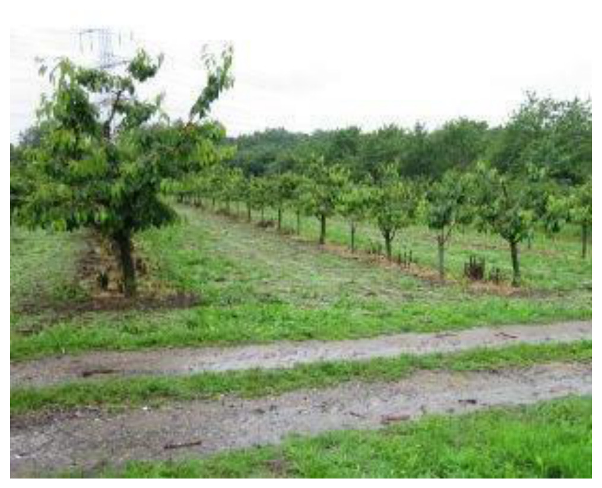
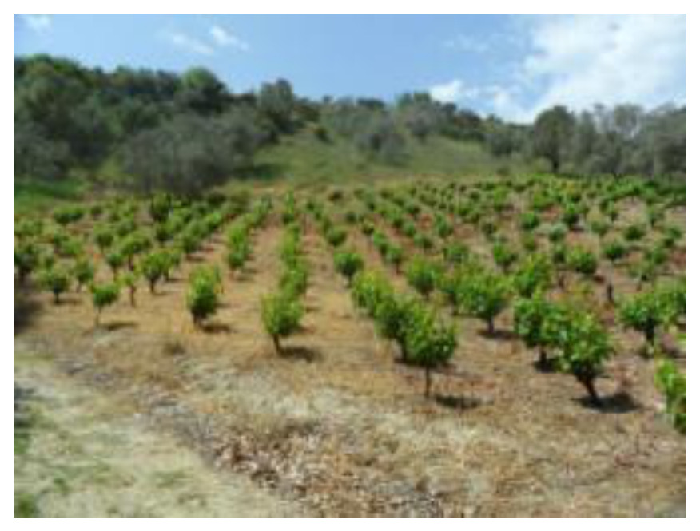
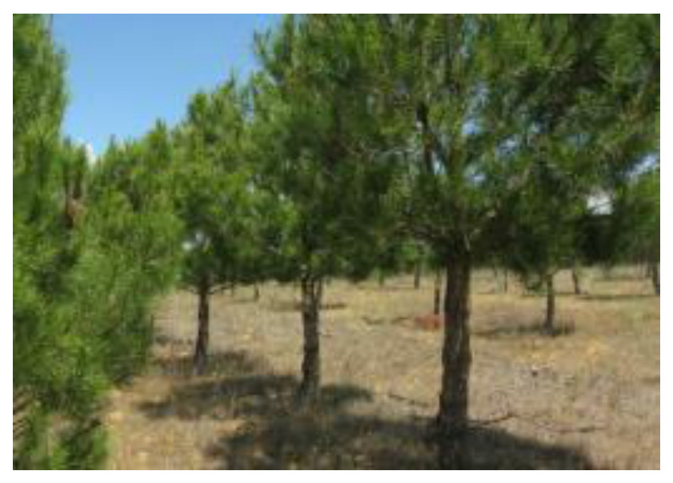
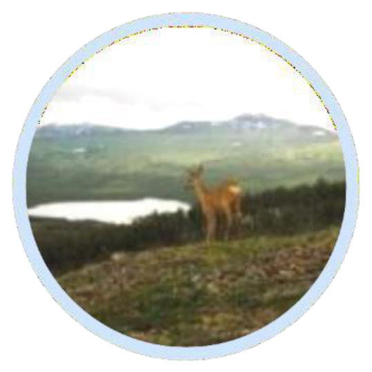
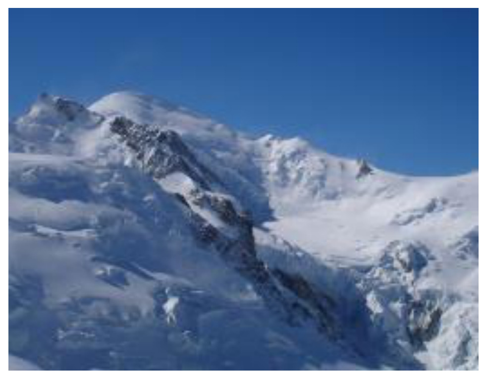

# NOMENCLATURE and MAPPING GUIDELINE
European Environment Agency (EEA)
2026-09-18

- [0.1 Industrial, commercial
  and military units](#industrial-commercial-and-military-units)
- [0.2 Road networks and
  associated land](#road-networks-and-associated-land)
- [0.3 Railways and associated
  land](#railways-and-associated-land)
- [0.4 Port areas and associated
  land](#port-areas-and-associated-land)
- [0.5 Airports and associated
  land](#airports-and-associated-land)
- [0.6 Mineral extraction, dump
  and construction
  sites](#mineral-extraction-dump-and-construction-sites)
- [0.7 Land without current
  use](#land-without-current-use)
- [0.8 Green urban, sports and
  leisure facilities](#green-urban-sports-and-leisure-facilities)
- [0.9 Permanent
  crops](#permanent-crops)
- [0.10 Heterogeneous
  agricultural area](#heterogeneous-agricultural-area)
- [0.11 Arable
  land](#arable-land)
- [0.12
  Greenhouses](#greenhouses)
- [0.13 Vineyards, fruit trees
  and berry plantations](#vineyards-fruit-trees-and-berry-plantations-1)
- [0.14 Olive
  groves](#olive-groves-1)
- [0.15 Annual crops associated
  with permanent crops](#annual-crops-associated-with-permanent-crops-1)
- [0.16 Complex cultivation
  patterns](#complex-cultivation-patterns-1)
- [0.17 Land principally
  occupied by agriculture with significant areas of natural
  vegetation](#land-principally-occupied-by-agriculture-with-significant-areas-of-natural-vegetation-1)
- [0.18
  Agro-forestry](#agro-forestry-1)
- [0.19 Coniferous
  forest](#coniferous-forest)
- [0.20 Mixed
  forest](#mixed-forest)
- [0.21 Transitional woodland
  and scrub](#transitional-woodland-and-scrub)
- [0.22 Lines of trees and
  scrub](#lines-of-trees-and-scrub)
- [0.23 Damaged
  forest](#damaged-forest)
- [0.24 Natural and semi-natural
  broadleaved forest](#natural-and-semi-natural-broadleaved-forest)
- [0.25 Highly artificial
  broadleaved plantations](#highly-artificial-broadleaved-plantations)
- [0.26 Natural and semi-natural
  coniferous forest](#natural-and-semi-natural-coniferous-forest-1)
- [0.27 Highly artificial
  coniferous plantations](#highly-artificial-coniferous-plantations-1)
- [0.28 Natural and semi-natural
  mixed forest](#natural-and-semi-natural-mixed-forest-1)
- [0.29 Highly artificial mixed
  plantations](#highly-artificial-mixed-plantations-1)
- [0.30 Transitional woodland
  and scrub](#transitional-woodland-and-scrub-1)
- [0.31 Lines of trees and
  scrub](#lines-of-trees-and-scrub-1)
- [0.32 Damaged
  forest](#damaged-forest-1)
- [0.33 Natural and semi-natural
  grassland](#natural-and-semi-natural-grassland)
- [0.34 Managed
  grassland](#managed-grassland)
- [0.35 Semi-natural
  grassland](#semi-natural-grassland-1)
- [0.36 Alpine and sub-alpine
  natural grassland](#alpine-and-sub-alpine-natural-grassland-1)
- [0.37 Heathland and
  moorland](#heathland-and-moorland)
- [0.38 Alpine scrub
  land](#alpine-scrub-land)
- [0.39 Sclerophyllous
  scrub](#sclerophyllous-scrub)
- [0.40 Sparsely vegetated
  areas](#sparsely-vegetated-areas)
- [0.41 Beaches and
  dunes](#beaches-and-dunes)
- [0.42 River
  banks](#river-banks)
- [0.43 Bare rocks, outcrops,
  cliffs and scree](#bare-rocks-outcrops-cliffs-and-scree)
- [0.44 Scree](#scree)
- [0.45 Burnt areas (except
  burnt forest)](#burnt-areas-except-burnt-forest)
- [0.46 Glaciers and perpetual
  snow](#glaciers-and-perpetual-snow)
- [0.47 Perpetual
  snow](#perpetual-snow)
- [0.48 Inland
  marshes](#inland-marshes)
- [0.49 Exploited peat
  bogs](#exploited-peat-bogs)
- [0.50 Unexploited peat
  bogs](#unexploited-peat-bogs)
- [0.51 Salt
  marshes](#salt-marshes)
- [0.52 Salines](#salines)
- [0.53 Intertidal
  flats](#intertidal-flats)
- [0.54 Natural & semi-natural
  water courses](#natural--semi-natural-water-courses)
- [0.55 Highly modified water
  courses and canals](#highly-modified-water-courses-and-canals)
- [0.56 Seasonally connected
  water courses (oxbows)](#seasonally-connected-water-courses-oxbows)
- [0.57 Lakes and
  reservoirs](#lakes-and-reservoirs)
- [0.58 Natural water
  bodies](#natural-water-bodies)
- [0.59 Reservoirs](#reservoirs)
- [0.60 Aquaculture
  ponds](#aquaculture-ponds)
- [0.61 Standing water bodies of
  extractive industrial
  sites](#standing-water-bodies-of-extractive-industrial-sites)
- [0.62 Lagoons](#lagoons)
- [0.63 Estuaries](#estuaries)
- [0.64 Marine inlets and
  fjords](#marine-inlets-and-fjords)
- [0.65 Open sea](#open-sea)
- [0.66 Coastal
  waters](#coastal-waters)

I. Introduction This document provides a comprehensive Land Cover / Land
Use (LC/LU) nomenclature guideline for the Copernicus local land
monitoring products Protected Areas 2021 -2024. It covers a detailed
description of all LC/LU classes, their geographic characteristics,
available input datasets and relevant methods to interpret the
respective classes.

2.  Protected Areas LC/LU legend The Nomenclature for the LC/LU dataset
    is structured into four levels (Code level 1- Code level 4). The
    LC/LU code levels were designed to correspond to the Mapping and
    Assessment of Ecosystems and their Services – MAES typology Level
    2[^1] .

Table 2: Detailed Nomenclature for the LC/LU dataset overview (dated
19.12.2021)

<table data-quarto-postprocess="true">
<colgroup>
<col style="width: 18%" />
<col style="width: 16%" />
<col style="width: 17%" />
<col style="width: 15%" />
<col style="width: 18%" />
<col style="width: 6%" />
<col style="width: 7%" />
</colgroup>
<tbody>
<tr>
<td rowspan="19">Level 1</td>
<td rowspan="8">Level 2</td>
<td rowspan="8" style="background-color: #ff4040">1. Urban</td>
<td rowspan="2" style="background-color: #c00000">1.1 Urban fabric,
industrial, commercial, public, military and private units</td>
<td style="background-color: #c00000">1.1.1 Urban fabric (predominantly
public and private units)</td>
<td rowspan="8">Level 4</td>
<td rowspan="8">MAES Level 2</td>
</tr>
<tr>
<td style="background-color: #9660ee">1.1.2 Industrial, commercial and
military units</td>
</tr>
<tr>
<td rowspan="4" style="background-color: #83899d">1.2 Transport
infrastructure</td>
<td style="background-color: #83899d">1.2.1 Road networks and associated
land</td>
</tr>
<tr>
<td style="background-color: #404040">1.2.2 Railways and associated
land</td>
</tr>
<tr>
<td style="background-color: #ffe6de">1.2.3 Port areas and associated
land</td>
</tr>
<tr>
<td style="background-color: #df9fc2">1.2.4 Airports and associated
land</td>
</tr>
<tr>
<td rowspan="2" style="background-color: #946200">1.3 Mineral
extraction, dump and construction sites, land without current use</td>
<td style="background-color: #946200">1.3.1 Mineral extraction sites,
dump and construction sites</td>
</tr>
<tr>
<td style="background-color: #693700">1.3.2 Land without current
use</td>
</tr>
<tr>
<td></td>
<td style="background-color: #91d500">1.4 Green urban, sports and
leisure facilities</td>
<td></td>
<td></td>
<td rowspan="8">URBAN</td>
<td></td>
</tr>
<tr>
<td rowspan="10" style="background-color: #ffffa8">2. Cropland</td>
<td rowspan="2" style="background-color: #ffffa8">2.1 Arable land</td>
<td style="background-color: #ffffa8">2.1.1 Arable irrigated and
non-irrigated land</td>
<td rowspan="10"></td>
<td></td>
</tr>
<tr>
<td style="background-color: #b8c151">2.1.2 Greenhouses</td>
<td></td>
</tr>
<tr>
<td rowspan="2" style="background-color: #f0cc80">2.2 Permanent
crops</td>
<td style="background-color: #f38309">2.2.1 Vineyards, fruit trees and
berry plantations</td>
<td></td>
</tr>
<tr>
<td style="background-color: #df9f00">2.2.2 Olive groves</td>
<td></td>
</tr>
<tr>
<td rowspan="4" style="background-color: #ffe6a6">2.3 Heterogeneous
agricultural area</td>
<td style="background-color: #ffe6a6">2.3.1 Annual crops associated with
permanent crops</td>
<td></td>
</tr>
<tr>
<td style="background-color: #ffe64d">2.3.2 Complex cultivation
patterns</td>
<td></td>
</tr>
<tr>
<td style="background-color: #e6cc4d">2.3.3 Land principally occupied by
agriculture with significant areas of natural vegetation</td>
<td></td>
</tr>
<tr>
<td style="background-color: #ebc59f">2.3.4 Agro-forestry</td>
<td></td>
<td></td>
</tr>
<tr>
<td rowspan="10" style="background-color: #007800">3. Woodland and
forest</td>
<td rowspan="2" style="background-color: #82bc00">3.1 Broadleaved
forest</td>
<td style="background-color: #82bc00">3.1.1 Natural &amp; semi-natural
broadleaved forest</td>
<td rowspan="10"></td>
</tr>
<tr>
<td style="background-color: #82bc00">3.1.2 Highly artificial
broadleaved plantations</td>
</tr>
<tr>
<td rowspan="2" style="background-color: #007800">3.2 Coniferous
forest</td>
<td style="background-color: #007800">3.2.1 Natural &amp; semi-natural
coniferous forest</td>
<td></td>
<td></td>
<td></td>
</tr>
<tr>
<td style="background-color: #007800">3.2.2 Highly artificial coniferous
plantations</td>
<td></td>
<td></td>
<td></td>
</tr>
<tr>
<td rowspan="2" style="background-color: #419f00">3.3 Mixed forest</td>
<td style="background-color: #419f00">3.3.1 Natural &amp; semi-natural
mixed forest</td>
<td></td>
<td></td>
<td></td>
</tr>
<tr>
<td style="background-color: #419f00">3.3.2 Highly artificial mixed
plantations</td>
<td></td>
<td></td>
<td></td>
</tr>
<tr>
<td style="background-color: #a9ef00">3.4 Transitional woodland and
scrub</td>
<td></td>
<td></td>
<td></td>
<td></td>
</tr>
<tr>
<td style="background-color: #c3f000">3.5 Lines of trees and scrub</td>
<td></td>
<td></td>
<td></td>
<td></td>
</tr>
<tr>
<td style="background-color: #2b342b">3.6 Damaged forest</td>
<td></td>
<td></td>
<td></td>
<td></td>
</tr>
<tr>
<td></td>
<td></td>
<td></td>
<td></td>
<td></td>
</tr>
</tbody>
</table>

<table style="width:100%;" data-quarto-postprocess="true">
<colgroup>
<col style="width: 23%" />
<col style="width: 20%" />
<col style="width: 20%" />
<col style="width: 20%" />
<col style="width: 14%" />
</colgroup>
<thead>
<tr>
<th>Level 1</th>
<th>Level 2</th>
<th>Level 3</th>
<th>Level 4</th>
<th>MAES level 2</th>
</tr>
</thead>
<tbody>
<tr>
<td rowspan="4" style="background-color: #e6e64d">4. Grassland</td>
<td style="background-color: #e6e64d">4.1 Managed grassland</td>
<td></td>
<td></td>
<td rowspan="4">GRASSLAND</td>
</tr>
<tr>
<td rowspan="3" style="background-color: #dff04d">4.2 Natural &amp;
semi-natural grassland</td>
<td rowspan="2" style="background-color: #dff04d">4.2.1 Semi-natural
grassland</td>
<td style="background-color: #dff04d">4.2.1.1 Semi-natural grassland
with woody plants (C.C.D. ≥ 30 %)</td>
</tr>
<tr>
<td style="background-color: #dff04d">4.2.1.2 Semi-natural grassland
without woody plants (C.C.D. &lt; 30%)</td>
</tr>
<tr>
<td style="background-color: #ccf04d">4.2.2 Alpine and sub-alpine
natural grassland</td>
<td></td>
</tr>
<tr>
<td rowspan="3" style="background-color: #ccf04d">5. Heathland and
scrub</td>
<td style="background-color: #a6ff80">5.1 Heathland and moorland</td>
<td></td>
<td></td>
<td rowspan="3">HEATHLAND AND SCRUB</td>
</tr>
<tr>
<td style="background-color: #9fed6a">5.2 Alpine scrub land</td>
<td></td>
<td></td>
</tr>
<tr>
<td style="background-color: #a9eb5c">5.3 Sclerophyllous scrubs</td>
<td></td>
<td></td>
</tr>
<tr>
<td rowspan="7" style="background-color: #ccffd5">6. Open spaces with
little or no vegetation</td>
<td style="background-color: #ccffd5">6.1 Sparsely vegetated areas</td>
<td></td>
<td></td>
<td rowspan="7">SPARSELY VEGETATED</td>
</tr>
<tr>
<td rowspan="2" style="background-color: #dff5dc">6.2 Beaches, dunes,
river banks</td>
<td style="background-color: #dff5dc">6.2.1 Beaches and dunes</td>
<td></td>
</tr>
<tr>
<td style="background-color: #dfdfdc">6.2.2 River banks</td>
<td></td>
</tr>
<tr>
<td rowspan="4" style="background-color: #b4bcb4">6.3 Bare rocks, burnt
areas, glaciers and perpetual snow</td>
<td rowspan="2" style="background-color: #b4bcb4">6.3.1 Bare rocks,
outcrops, cliffs and scree</td>
<td style="background-color: #b4bcb4">6.3.1.1 Bare rocks, outcrops,
cliffs</td>
</tr>
<tr>
<td style="background-color: #b4bcb4">6.3.1.2 Scree</td>
</tr>
<tr>
<td style="background-color: #9faa9f">6.3.2 Burnt areas (except burnt
forest)</td>
<td></td>
</tr>
<tr>
<td rowspan="2" style="background-color: #8a948a">6.3.3 Glaciers and
perpetual snow</td>
<td style="background-color: #8a948a">6.3.3.1 Glaciers</td>
</tr>
<tr>
<td rowspan="8" style="background-color: #a6a6fb">7. Wetland</td>
<td rowspan="4" style="background-color: #a6a6fb">7.1 Inland
wetlands</td>
<td style="background-color: #a6a6fb">7.1.1 Inland marshes</td>
<td></td>
</tr>
<tr>
<td rowspan="2" style="background-color: #5d5ff8">7.1.2 Peat bogs</td>
<td style="background-color: #5d5ff8">7.1.2.1 Exploited peat bogs</td>
<td></td>
</tr>
<tr>
<td style="background-color: #5d5ff8">7.1.2.2 Unexploited peat bogs</td>
<td></td>
</tr>
<tr>
<td></td>
<td></td>
<td></td>
</tr>
<tr>
<td rowspan="4" style="background-color: #91c6ee">7.2 Coastal
wetlands</td>
<td style="background-color: #91c6ee">7.2.1 Salt marshes</td>
<td></td>
<td rowspan="4">MARINE INLETS AND TRANSITIONAL WATERS</td>
</tr>
<tr>
<td style="background-color: #858fa7">7.2.2 Salines</td>
<td></td>
</tr>
<tr>
<td style="background-color: #a0a1e1">7.2.3 Intertidal flats</td>
<td></td>
</tr>
<tr>
<td></td>
<td></td>
</tr>
<tr>
<td rowspan="12" style="background-color: #00f5db">8. Water</td>
<td rowspan="3" style="background-color: #00efdd">8.1 Water courses</td>
<td style="background-color: #00efdd">8.1.1 Natural &amp; semi-natural
water courses</td>
<td></td>
<td rowspan="6">RIVERS AND LAKES</td>
</tr>
<tr>
<td style="background-color: #00f4cf">8.1.2 Highly modified water
courses and canals</td>
<td></td>
</tr>
<tr>
<td style="background-color: #79ebee">8.1.3 Seasonally connected water
courses (oxbows)</td>
<td></td>
</tr>
<tr>
<td rowspan="4" style="background-color: #82eeee">8.2 Lakes and
reservoirs</td>
<td style="background-color: #82eeee">8.2.1 Natural lakes</td>
<td></td>
</tr>
<tr>
<td style="background-color: #78e6e6">8.2.2 Reservoirs</td>
<td></td>
</tr>
<tr>
<td style="background-color: #6cdcdc">8.2.3 Aquaculture ponds</td>
<td></td>
</tr>
<tr>
<td style="background-color: #62d2d2">8.2.4 Standing water bodies of
extractive industrial sites</td>
<td></td>
<td rowspan="3">MARINE INLETS AND TRANSITIONAL WATERS</td>
</tr>
<tr>
<td rowspan="3" style="background-color: #00ffa6">8.3 Transitional
waters</td>
<td style="background-color: #00ffa6">8.3.1 Lagoons</td>
<td></td>
</tr>
<tr>
<td style="background-color: #00df85">8.3.2 Estuaries</td>
<td></td>
</tr>
<tr>
<td style="background-color: #00c677">8.3.3 Marine inlets and
fjords</td>
<td></td>
<td></td>
</tr>
<tr>
<td rowspan="2" style="background-color: #e6f5f3">8.4 Sea and ocean</td>
<td style="background-color: #e6f5f3">8.4.1 Open sea</td>
<td></td>
<td>OPEN OCEAN</td>
</tr>
<tr>
<td style="background-color: #d2e6eb">8.4.2 Coastal waters</td>
<td></td>
<td>COASTAL</td>
</tr>
</tbody>
</table>

3.  Mapping rules

Object delineation Object delineation is performed on VHR EO data as
primary data source. In areas, where two or more satellite scenes
overlap, the most suitable scene is chosen as primary data source. In
this regard a detailed prioritization system has been established
considering especially acquisition year and acquisition month. In cases
where clouds or cloud shadows cover the area of interest alternative
image data can be used.

Delineation Rules Object delineation should be as follows: \*
Delineation shall be angular and not round. \* Avoid to digitize too
many vertices: Use vertices as few as possible and only as many as
necessary to define the shape of an object. \* Avoid to map sharp
angles. \* Use road centers (roads \< 10 m width) as border between two
objects if roads separate two features. E.g. a forest and an
agricultural area are separated by a road feature \< 10 m width. Map the
border between forest and agriculture in the middle of the road.

Minimum Mapping Unit (MMU) / Minimum Mapping Width (MMW) The minimum
mapping unit defined is $\ge 0.5$ ha for all objects. A minimum width of
$\ge 10$ m is defined. MMU exceptions: \* Objects located at a site
border: If an object is cut at an AOI border, the feature is mapped, if
the whole object (inside and outside the AOI) amounts to $\ge 0.5$ ha.
However, the MMU of those divided features lying inside the site shall
have a MMU of at least $\ge 0.2$ ha. Smaller objects will be
generalized. \* Complex changes (see below). \* Linear features (roads,
railways, rivers) that are split in two or more polygons by other linear
elements (e.g. the road/railway network) will be mapped even if the
resulting segments are smaller than the MMU in order to preserve the
network. However, features \< 0.2 ha will be generalized. \* Urban
objects which are confined by roads or railways. Features \< 0.2 ha will
be generalized. MMW exceptions: \* To maintain continuity of features
with mostly linear nature (Codes 1.2.1, 1.2.2, 6.2.1, 6.2.2, 8.1.1 and
8.1.2), the MMW may fall below the limit of 10 m over a distance of up
to 100 m.

Good Practice for Data Display – Mapping Scale On-screen mapping scale
is 1:5.000 – 1:10.000 depending on the landscape and feature class.
Large homogeneous objects like agricultural areas or woodland are mapped
at scales 1:8.000 – 1:10.000. For all other features, 1:5.000 mapping
scale is applied.

Overlap Rules \* Objects may not overlap. In case of real objects
overlay, the following rules apply: \* If objects overlap on different
levels, the top level is mapped. Example: if a road bridge overlaps a
river, the road is mapped continuously. \* If objects overlap on the
same level, the visually dominant object is mapped continuously.
However, if roads and railways meet on the same level, railways are
mapped continuously to maintain the railway network.

Priority Rules The priority rules applied are defined as follows: \*
Objects \< 0.5 ha are added to the neighboring object with the next
number of the same sub-class. \* Objects \< 0.5 ha are added to the
neighboring object with the longest common border line. Exception:
Objects surrounded by railways or roads. If an object is below the MMU
size and completely surrounded by a road or railway network, it shall be
aggregated with that surrounding traffic line.

Water level rules and flooding mapping A flood event is not considered
as a “Temporal fluctuation of water level”. In case of a extraordinary
flood event the actual/real land cover/land use should be mapped.

A false-colour satellite image displays a diverse landscape featuring a
major river, smaller water bodies, agricultural fields, and urban
settlements. The large, dark blue water body traversing the image from
top-right to bottom-right is a main river, containing an elongated
island. To the left of the main river, a complex network of meandering
dark blue channels and lakes is visible, including a prominent,
irregularly shaped lake in the upper-central area. Agricultural fields
appear as bright red and reddish-purple rectangular or irregularly
shaped patches, indicating strong vegetation reflectance in the infrared
spectrum (typical of healthy vegetation in false-colour composites).
Areas of light blue-green and grey hues represent bare soil or
non-vegetated surfaces, as well as two distinct urbanised areas,
particularly visible in the upper-left and lower-left, characterised by
dense, grid-like patterns of streets and buildings. The image shows a
detailed resolution suitable for mapping features like those described
as having a Minimum Mapping Unit (MMU) or Minimum Mapping Width (MMW)
contextually, such as fields or urban objects.

Allowed Comments In order to clarify certain mapping delineations, there
are some comments defined as product attributes.

Table 3: List of allowed comments

| Order No | Description; Note | Comment |
|----|----|----|
| 1 | Polygons \< 0.5 ha at outer Aol site boundary, that have an apparent continuation outside the Aol boundary, which is visible on the image data. | “Area size exception (at Protected Areas Aol boundary)” |
| 2 | Polygons \< 0.5 ha inside Aol site boundary, that are allowed due to nomenclature guideline rules e.g. to represent changes, to ensure continuity of road/rail/river network at intersections of these classes, to mark urban objects confined by roads or railways ≥ 0.2 ha up to \< 0.5 ha | “Area size exception (inside Protected Areas Aol boundary)” |

4.  Description of mapping features

1 Urban The urban classes contain land that is covered by building
structures and transport network. Urban fabrics appear in blue and
darkish blue-grey colours on satellite images.

A circular photograph depicts an urban or semi-urban landscape. A
multi-lane road or highway extends horizontally across the middle
distance of the image. On the left side, several urban buildings are
visible, including a prominent tall, rectangular building in the
background. On the right, a large, light-coloured building, likely a
high-rise, is positioned in the foreground, partially obscuring the
view. A bus and a car are visible on a lower road segment in the
foreground. The sky above is clear and blue. The scene primarily
showcases artificial surfaces and infrastructure.

From the UA Mapping Guide: \* Surfaces with dominant human influence but
without agricultural land use. These areas include all artificial
structures and their associated non-sealed and vegetated surfaces. \*
Artificial structures are defined as buildings, roads, all constructions
of infrastructure and other artificially sealed or paved areas. \*
Associated non-sealed and vegetated surfaces are areas functionally
related to human activities, except agriculture. \* Also, the areas
where the natural surface is replaced by extraction and / or deposition
or designed landscapes (such as urban parks or leisure parks) are mapped
in this class. \* The land use is dominated by permanent population.

Specific generalization/delineation rules are applied for urban classes:
\* Segments of roads, rivers and railways \< 0.5 ha, that are necessary
to represent the “network” of each feature, will be mapped. Features \<
0.2 ha will be generalized. \* Urban objects confined by roads or
railways $\ge 0.2$ up to \< 0.5 ha, will be mapped. Smaller urban
objects will be generalized. \* If an infrastructure line is crossing a
river, the bridge has to be mapped if the bridge is wider than 10
meters.

This category includes:

1.1 Urban fabric, industrial, commercial, public, military and private
units Urban fabric contains land covered by artificial structures and
transport networks. Industrial or commercial units are almost completely
covered by artificial surface.

1.2 Transport infrastructure Motorways, roads and railways with their
associated land and installations are included in this class if width \>
10 m. Airports and port areas with installations and associated land are
included. If an infrastructure line is crossing a river, the bridge has
to be mapped if the bridge is wider than 10 meters.

1.3 Mineral extraction, dump and construction sites, land without
current use Dump sites include public, industrial or mine dump sites.
Construction development, soil and bedrock excavations and earthwork are
included in this class. Land without current use is land that is in a
transitional phase. It is included in urban areas.

1.4 Green urban areas, sports and leisure facilities Green urban areas
are areas with vegetation within the urban fabric and include parks. In
sports and leisure facilities, camping grounds, sport grounds, leisure
parks, golf courses, racecourses, etc. are included. It also comprises
parks not surrounded by urban areas.

1.1.1 Urban fabric (predominantly public and private units) Definition:
Buildings and their associated land together with artificial surfaced
areas, regardless of the building density. Predominant residential usage
contains non-sealed areas, independent of the housing scheme (single
family houses or high-rise dwellings, city centre or suburb). The
non-sealed areas might be private gardens or common green areas.

This category includes: Very dense Urban: \* Built-up areas and their
associated land with dominant residential use; mostly inner-city areas
with central business district as long as there is partial residential
use. \* Buildings, roads and sealed areas cover most of the area;
non-linear areas of vegetation and bare soil. Dense Urban: \*
Predominant residential usage. Low dense Urban: \* Residential buildings
in rural areas, roads and other artificially surfaced areas. The
vegetated areas are predominant, but the land is not dedicated to
forestry or agriculture. \* Built-up areas on small farms.

This category excludes: \* Industrial, commercial, public (hospitals,
museums, castles, university campuses, schools, government districts,
cemeteries, big farms…), military $\rightarrow$ class 1.1.2 Industrial,
commercial and military unit \* Nurseries with dominant areas of
greenhouses (no or only small fields) $\rightarrow$ class 2.1.2
Greenhouses \* Allotment gardens $\rightarrow$ class 1.4 Green urban,
sports and leisure facilities \* Holiday villages (“Club Med”)
$\rightarrow$ class 1.4 Green urban, sports and leisure facilities

This photograph depicts a dense urban residential area, likely in
Tallinn, Estonia, featuring multiple multi-story buildings. Many
buildings have distinct dark grey sloped roofs with numerous dormer
windows. The building facades are painted in a variety of pastel
colours, including pink, light blue, and light grey. In the foreground,
lower buildings with different architectural styles, some with tiled
roofs, are visible, interspersed with green trees. The sky is overcast.
The partial caption beneath the image reads: “Urban f\[abric\] of class
1.1.1 (Tallinn, \[unreadable\])”, indicating it serves as an example for
the Copernicus Land Monitoring Service (CLMS) Land Use / Land Cover
(LULC) class 1.1.1, defined as “Urban fabric (predominantly public and
private units)”.

A photograph depicting a narrow, paved residential street in an urban
environment. Multi-story buildings, characteristic of residential usage,
line both sides of the street, showing aged facades with peeling paint
or plaster. Visible features include exposed utility lines, multiple
external air conditioning units, and laundry hanging to dry on lines
from balconies on the right side. Two motor scooters are parked on the
paved street, which slopes gently into the background. A blue
cylindrical water tank is visible on a distant rooftop under an overcast
sky. This image serves as an example of ‘Residential usage’ land cover,
consistent with classifications like ‘Very dense Urban’ or ‘Dense Urban’
as defined by the Copernicus Land Monitoring Service (CLMS) for urban
Land Use / Land Cover (LULC) mapping.

A ground-level photograph captures a residential street scene. On the
right side, several detached houses featuring white vertical siding and
red-tiled roofs are visible. In the immediate foreground, a neatly
trimmed green hedge delineates a grassy lawn area. Adjacent to the hedge
and lawn, a paved sidewalk constructed from square, light-coloured
pavers extends into the lower right corner. To the left of the hedge, an
asphalt road or driveway is visible. A utility pole with a small grey
box attached stands in front of the hedge on the left. Various green
trees and additional vegetation populate the background and line the
street, indicating a suburban or low-density urban environment
characterized by a mix of artificial surfaces (buildings, road,
sidewalk) and vegetated areas (hedges, lawn, trees). This scene
exemplifies “Predominant residential usage” with “non-sealed areas” such
as private gardens and common green areas.

A photograph depicting an urban residential landscape in Tallinn,
Estonia, categorized as “Continuous Urban fabric Imperviousness Density
(IM.D.)” for land cover mapping. The foreground features a wide, grey
asphalt road, flanked by green grassy verges. A row of trees lines the
right side of the road. In the mid-ground on the left, a low,
single-story building with a light grey facade and dark roof is
partially visible behind a fence. Behind it, several multi-story
residential apartment buildings with reddish-brown facades and numerous
white balconies dominate the skyline. The scene represents a built-up
area with a mix of impervious surfaces and vegetation, consistent with a
dense urban environment. The photo credit is K. Larsson.

This is a photograph of a residential street in Tallinn, Estonia,
illustrating features of Continuous Urban fabric, associated with
Imperviousness Density (IM.D.) mapping. The image captures a narrow,
unsealed dirt or gravel road curving slightly to the left, with a small
figure of a person walking away from the viewer in the middle distance.
Both sides of the road are lined with dense, trimmed green hedges and
green lawn areas. On the right, a yellow house with a prominent brown
roof and two rectangular windows is visible, partially obscured by a
tree with yellow foliage and additional green hedges. Behind this house,
a tall, dark green conifer tree stands against a light sky. In the
background on the left, another house with a red roof is partially
visible amongst other trees. The scene depicts a mixed landscape of
residential buildings and significant vegetated areas, characteristic of
urban fabric where non-sealed areas like private gardens are present.
The photo credit is attributed to K. Larsson.

A photograph depicting a residential scene in Palermo, Spain,
illustrating an example of continuous urban fabric that includes green
areas. The foreground features a light blue, bean-shaped swimming pool
with metal steps, surrounded by light brown patterned paving stones.
This pool area is set within a well-maintained green grass lawn. In the
background, white residential-style buildings with red-tiled roofs are
visible, interspersed with palm trees and various green bushes and
foliage. Several white sun loungers are placed on the grass and near the
pool. This image is referenced in Copernicus Land Monitoring Service
(CLMS) documentation as an example related to “Continuous Urban fabric
IM.D.” (Imperviousness Density).

Appearance: \* Urban fabric appears in blue or dark blue /grey colours
on satellite images.

This map displays a false colour composite satellite or aerial image of
an urban area, likely Tallinn, Estonia, overlaid with yellow-outlined
polygons representing different land cover classes. The false colour
imagery shows vegetation in red, urban structures and sealed surfaces in
cyan/grey tones, and water bodies in dark blue/black. Several land cover
polygons are labelled with numeric codes: \* **1110**: Continuous Urban
fabric, characterised by buildings, roads, and sealed areas covering
most of the extent, with non-linear areas of vegetation and bare soil.
\* **1120**: Discontinuous Urban fabric, showing predominant residential
usage, with residential buildings in rural areas, roads, and other
artificially surfaced areas, where vegetated areas are predominant but
not dedicated to forestry or agriculture. \* **1210**: Industrial or
commercial units. \* **1220**: Railway networks, visually corresponding
to visible railway tracks. \* **1400**: Green urban areas, sports and
leisure facilities. \* **9110**: Water courses, representing the river
or canal winding through the area. The map illustrates the spatial
distribution and delineation of various urban and natural land cover
types within a city environment, typical for Copernicus Land Monitoring
Service (CLMS) products such as CORINE Land Cover (CLC) mapping.

A false-colour infrared (FCIR) map depicting an urban area in Stockholm,
Sweden, from European Union LUCAS 2009 imagery. The map shows vegetated
areas in red, built-up surfaces (buildings, roads) in grey-blue, and
water bodies in dark blue/black. An irregular light blue polygon,
labelled “1110”, outlines a central urban area, which is identified in
the surrounding document text as “Dense Urban fabric”. Additional light
blue lines follow major road networks, and thin green and white lines
outline other features including the water’s edge. The map highlights
the spatial extent of dense urban development alongside adjacent water
bodies and surrounding vegetated areas.

False-color composite aerial imagery of a densely built-up urban area in
Tallinn, Estonia. The image features a prominent cyan numerical label
“1110” at its center. Vegetated areas appear bright red, while roads and
buildings are depicted in shades of grey and cyan. Black outlines
delineate distinct areas within the urban landscape. The label “1110”
indicates a “Continuous Urban Fabric” class, a land cover category
typically characterized by predominant residential usage and high
imperviousness, consistent with CORINE Land Cover (CLC) nomenclature.
Credit: K. Larsson.

This is a false-colour infrared map showing an unspecified urban area
with overlaid land cover classifications. The base imagery displays
water bodies in dark blue/black (visible at the top of the image), dense
vegetation in reddish-pink tones, and urban infrastructure like
buildings and roads in greyish-blue and white tones. A large polygon,
outlined in light blue (cyan), delineates a significant portion of the
urban environment and is labelled with the numerical code “1110”. Based
on CORINE Land Cover (CLC) nomenclature, “1110” typically represents
“Continuous urban fabric”. Smaller land parcels and boundaries are also
indicated by dotted yellow lines. The map depicts a densely built-up
area situated adjacent to a river or large water body, demonstrating a
typical urban land use pattern with residential and industrial
structures. No scale bar, compass, or specific geographical location
(e.g., city, country) is explicitly visible on the map itself.

A false-colour satellite or aerial map displays a rural landscape
featuring forests, agricultural fields, and scattered artificial
surfaces. Vegetation, including forested areas and cultivated fields,
appears in shades of dark red and maroon, indicating high infrared
reflectance, while other fields show a lighter brownish-green hue. A
winding dark feature, likely a road or river, traverses the central part
of the image, bordered by thin green outlines. A small, dark water body,
possibly a pond or lake, is visible in the lower-right. Several
irregular polygons, outlined in thin yellow-green lines, delineate
larger land parcels. Overlaying this imagery are five
light-blue-outlined polygons, each containing the label “1110” in a grey
box. These “1110” polygons highlight small clusters of buildings, roads,
or other artificial surfaces located within or adjacent to fields and
forests. Based on the surrounding text, land cover class “1110”
represents “Residential buildings in rural areas, roads and other
artificially surfaced areas” and “Built-up areas on small farms”, where
“vegetated areas are predominant”. No scale bar, compass, or explicit
geographic location is provided.

An aerial false-colour infrared image displays a varied landscape
dominated by agricultural fields, interspersed with scattered buildings
and a river. Active vegetation appears in shades of red and magenta,
including a dense riparian zone along the bottom edge and various field
parcels. Other agricultural fields are visible in light blue and grey
tones, potentially indicating bare soil or different crop types. Small,
individual buildings and clusters of structures, appearing as light blue
or white forms with darker roofs, are distributed across the scene.
Eight distinct built-up areas are outlined by yellow polygons, each
explicitly labelled with the code “1110”. A network of narrow, light
grey linear features, likely roads or paths, traverses the field
patterns. The bottom portion of the image shows a river or water body
bordered by dense vegetation. The “1110” classification on these
dispersed built-up areas in an agricultural matrix suggests a specific
category of land cover, likely related to discontinuous urban fabric or
built-up areas on small farms as discussed in the surrounding document
context for Copernicus Land Monitoring Service (CLMS) products.

A false-colour satellite image displaying land cover/land use classes,
delineated by yellow polygon boundaries and labelled with numeric codes,
over a coastal area. Water bodies appear dark blue or black, while
vegetated land shows in shades of red, indicating high infrared
reflectance. Areas of human development or bare ground appear as lighter
specks within the red vegetation.

Specific land cover classes identified by code are: \* `1110`: Labelled
in three yellow-outlined polygons on a grey background, representing
“Continuous Urban Fabric”. These areas contain numerous small
white/light grey features likely indicating buildings or impervious
surfaces. \* `4212`: Labelled in two yellow-outlined polygons on an
orange background, located directly adjacent to the dark water bodies,
suggesting a coastal or water-related land cover type. \* `3110`:
Labelled in the bottom right corner on a brown/orange background,
without a polygon outline, situated within a predominantly red,
vegetated area, likely representing “Broad-leaved forest”.

No scale bar, compass, or explicit geographic location are visible.

Exceptions from MMU: Exceptions from MMU \> 0.5 ha are made for 1.2.1
Road networks and associated land and 1.2.2 Railways and associated land
in order to keep the network formed by these linear features. Further
exceptions are urban areas (1.1.1) or industrial/commercial units
(1.1.2) being encircled by either rails, roads or rivers. In those cases
urban features up to a MMU of 0.2 ha are kept and flagged with comments
(Table 3).

MMW exceptions: To maintain continuity of linear features, the MMW may
fall below the limit of 10 m over a distance of up to 100 m.

Generalization rules for urban areas with low density: If a strict MMU
\> 0.5 ha mapping of urban fabric areas is applied, the low urban
density areas would be underestimated. Therefore, to get a good
representation of the area, the following generalisation rules will be
adopted: \* Do not apply the 10 m MMW distance rule at the urban fringe
but apply a \< 50m MMW to generalize outline. \* Include private
gardens. \* Avoid mapping of single urban segments. \* Map the “whole
structure”. \* Close gaps at the urban fringe applying a maximum width
of 50 m. In any case, real agricultural/grassland parcel contained
within urban surroundings, will be mapped as agricultural/grassland.

An aerial map displaying land cover mapping generalization rules for a
linear settlement in an agricultural landscape. The background imagery
is a false-colour composite from a Spot 5 satellite, likely dated
2011-07-23 or 2012-08-11, showing vegetation in red/brown stripes
(agricultural fields) and buildings/impervious surfaces in light
blue/white. Yellow outlines delineate individual mapping units according
to Copernicus Land Monitoring Service (CLMS) guidelines.

Specific land cover classes are identified by numeric labels: \* `1110`
marks a segment of continuous urban fabric, specifically representing a
“low urban density area class 1.1.1” as described in the surrounding
context. \* `2320` identifies an area of complex cultivation patterns
adjacent to the settlement. \* `3110` indicates an area of broad-leaved
forest.

Two black arrows with labels illustrate distances for generalization:
one points to a gap between urban units labeled `> 50 m`, indicating
distinct features, while another points to a narrower gap labeled
`< 50 m`, suggesting that these units would be generalized into a single
feature if within the Minimum Mapping Unit (MMU) rules for urban areas.
The map demonstrates the application of generalization rules for urban
areas with low density, particularly how connectivity and separation
distances influence the delineation of features.

This image displays three panels illustrating the mapping and
generalization of land cover features from Spot 5 satellite imagery (2.5
m resolution, 1/2/3 band combination) acquired on 2011-07-23, focused on
an agricultural area in Poland. The false-colour infrared imagery shows
vegetation in magenta/red hues, while buildings and bare ground appear
in light blue/grey.

The left panel presents the raw satellite imagery, showing dispersed
houses along a linear feature (likely a road or path) within extensive
agricultural fields.

The middle panel shows the same area with overlaid green polygons
delineating classified land cover units, each labeled with a 4-digit
code. A “30 m” scale bar is present. Yellow arrows point to sections
highlighting areas where mapping or generalization rules are applied.
The visible land cover codes are: \* **1110**: Urban fabric
(representing houses and settlements, consistent with low urban density
areas like class 1.1.1 referenced in the surrounding text). \* **2110**:
Arable land (non-irrigated), mapped to large, elongated agricultural
fields. \* **2210**: Permanent crops or complex cultivation patterns,
mapped to smaller, more fragmented agricultural fields. \* **4100**:
Inland wetlands (standard CORINE Land Cover (CLC) interpretation),
mapped to small patches of land that appear to be bare or uncultivated.

The right panel provides a magnified view of a section of the middle
panel, detailing the delineation of individual 1110 (Urban fabric) and
4100 (Inland wetlands) polygons. The image demonstrates how features,
particularly scattered houses in an agricultural landscape, are mapped
and classified according to specific rules, likely involving minimum
mapping unit (MMU) exceptions and generalization.

This image provides a visual comparison between raw Spot 5 satellite
imagery from 2011-07-23 (left panel) and its interpretation with
generalized delineations for low urban density areas (right panel),
specifically for Åre, Sweden. The imagery, captured with a 1/2/3 band
combination, shows an agricultural landscape with scattered buildings
and a road network. Reddish areas likely represent agricultural fields
or bare soil, while cyan areas indicate vegetation or urban fabric.

The left panel displays the original satellite view. The right panel
shows the same area with analytical overlays: green polygons delineate
regions classified as “1.1.1” (Urban fabric – low density). These
polygons illustrate the application of land cover generalization rules,
enclosing multiple buildings and associated land, including private
gardens, to represent the “whole structure” of low-density urban areas.
Yellow arrows highlight specific areas where generalization rules, such
as closing gaps at the urban fringe up to a maximum width of 50 m, have
aggregated what might appear as separate urban segments in the raw
imagery into continuous classified features. This demonstrates the
mapping methodology for CLMS urban classes, considering Minimum Mapping
Unit (MMU) and Minimum Mapping Width (MMW) exceptions to accurately
represent low urban density areas.

This map displays a satellite image (Spot 5, 2.5 m resolution, 1/2/3
band combination, dated 2011-07-23; CNES 2011©, Distribution Airbus
DS/Spot Image) illustrating the application of generalization rules for
mapping low urban density areas, identified as class 1.1.1, within
Copernicus Land Monitoring Service (CLMS) products. The background
satellite imagery shows an agricultural landscape with fields in
red/magenta tones and built-up areas in light blue/cyan. A yellow
polygonal boundary delineates an elongated low urban density area. Two
locations within this boundary are labelled “1110”, referring to the
class 1.1.1 “Urban fabric”. Blue arrows with “\< 50 m” annotations point
to narrow gaps at the urban fringe that are included within the yellow
boundary, indicating that gaps less than 50 metres in width are closed
to generalize the outline and map the “whole structure” of the urban
area. A blue arrow with a “\> 50 m” annotation points to a wider gap
that is excluded from the yellow urban boundary. This visualises the
rule to close gaps at the urban fringe applying a maximum width of 50
metres.

This image displays two side-by-side false-colour infrared satellite
images from Spot 5 (2.5 m resolution, 1/2/3 band combination), captured
on 2011-07-23, illustrating land cover/land use (LULC) mapping with a
focus on generalization rules for low urban density areas.

The left panel shows the raw satellite imagery, where healthy vegetation
appears in shades of red, and built-up or bare ground areas appear in
shades of teal/green. Three yellow ellipses highlight areas of mixed low
urban density fabric, characterized by dispersed buildings and
interspersed green spaces like gardens or small plots.

The right panel shows the same satellite imagery with overlaid vector
polygons, representing various land cover classes. These polygons are
delineated by pink or yellow lines and contain numeric class labels: \*
**Pink-outlined polygons** denote: \* **1110**: Urban fabric
(Discontinuous urban fabric), illustrating the generalized delineation
of low urban density areas, which may include private gardens and merged
segments to represent the “whole structure” as per the Copernicus Land
Monitoring Service (CLMS) rules. \* **2320**: Pastures, representing
agricultural or grassland parcels that are retained as separate features
even when located within urban surroundings. \* **Yellow-outlined
polygons** denote: \* **1120**: Industrial, commercial and transport
units. \* **2110**: Arable land. \* **1210**: Road networks and
associated land. \* **1220**: Railways and associated land. \* **3110**:
Broad-leaved forest. \* **4100**: Inland marshes. \* **4211**: Inland
waters (rivers/canals). \* **3400**: Wetlands (specific class label
unreadable from the image).

This map demonstrates the practical application of Minimum Mapping Unit
(MMU) and Minimum Mapping Width (MMW) exceptions and specific
generalization rules used in CLMS land cover products, such as CORINE
Land Cover (CLC), for detailed and accurate representation of complex
landscapes at the urban fringe.

If OSM delineation is too precise, please correct real errors and
perhaps parts of the outline. 

This image comprises two False-Colour Infrared (FCIR) satellite map
views, both derived from Spot 5 imagery (2.5 m resolution, dated
2011-07-23), illustrating the application of generalization rules for
land cover mapping in a low urban density area. The background imagery
shows healthy vegetation in red/pink, with urban and bare soil features
in shades of grey/blue. Yellow polygons delineate land cover classes.

The left map, titled “Original delineation of a low urban density area,”
shows fragmented urban fabric polygons labelled “1110” (representing
urban areas, corresponding to CLC class 1.1.1 as per the document
context) and a larger, distinct “2110” polygon (representing arable
land). Black arrows point to two significant gaps in the upper “1110”
urban polygon. The urban polygons appear highly fragmented with
irregular boundaries.

The right map, titled “Generalized delineation of a low urban density
area,” shows the same area after applying generalization rules. The
“1110” urban polygons are now consolidated and smoothed, with the gaps
(previously indicated by arrows in the left image) closed. This reflects
the generalization rules to include private gardens, connect single
urban segments, and close gaps up to 50 m wide at the urban fringe,
creating a more continuous “whole structure” for urban areas. The “2110”
arable land polygon remains similarly delineated in both maps. The
overall pattern demonstrates how mapping guidelines are applied to
simplify and refine the representation of low urban density areas by
merging smaller, fragmented features into larger, contiguous polygons.

1110 1110 1110 1110 2110 2110 1110 1110 1110 1110 Left side: Very
precise OSM delineation Right side: Manual delineation Keep OSM, and
just correct errors.

Methodological advice: \* Use Urban Atlas Data, if available.

### Industrial, commercial and military units

Definition: This category contains industrial, commercial and military
units. The administrative border and associated areas, such as roads,
sealed areas and vegetated areas are included, if these areas are below
the minimum mapping unit size. It also contains public, military and
private services. At least 30% of the ground is covered by artificial
surfaces. More than 50% of those artificial surfaces are occupied by
buildings and / or artificial structures with non-residential use,
i.e. industrial, commercial or transport related uses are dominant. The
texture is homogenous with large buildings, car parks and sheds
representing industrial or commercial complexes. Industrial or
commercial units located in urban fabric are only taken into account if
they are clearly distinguishable from residential areas.

This category includes: Industrial uses and related areas: \* Sites of
industrial activities, including their related areas. \* Production
sites. \* Energy plants: nuclear, solar, hydroelectric, thermal,
electric and wind farms. \* Farming industries (farms with large
buildings and / or greenhouses below MMU, not production fields). \*
Antennas, even with predominant vegetated areas. The vegetated areas may
be predominant, but the land is not dedicated to forestry or
agriculture. \* Water treatment plants, sewage plants and seawater
desalination plants. \* Stud farms, agricultural facilities
(cooperatives, state farm centers, livestock farms, living and
exploitation buildings). \* Oil camps including administrative area. \*
Abandoned industrial sites and by-products of industrial activities
where buildings are still present. \* Water retention infrastructure
(dam) and hydro-electric stations. \* Telecommunication networks (relay
stations for TV, telescopes, radars) including associated land. \* Bare
soil / grassland used for storage of material next to industrial sites.
Commercial uses, retail parks and related areas: \* Surfaces purely
occupied by commercial activities, including their related areas
(e.g. parking areas even larger than the MMU). \* High-rise office
buildings. \* Petrol and service stations within built-up areas. \*
Large shopping centers. Public, military and private services not
related to the transport system: \* Surfaces purely occupied by general
government, public or private administrations including their related
areas (access ways, lawns, parking areas). \* Schools and universities
research and development establishments, including associated areas like
sports fields, meadows also if \> 0.5 ha whenever they are inside the
administrative limit. \* Hospitals and other health services or
buildings. \* Places of worship (churches/ cathedrals/ religious
buildings). \* Active archaeological sites and museums, near to urban
areas. \* Administration buildings, ministries. \* Penitentiaries. \*
Military areas excluding bases and airports. \* Military exercise areas
fenced and under current use. \* Castles, etc. not primarily used for
residential purposes (building management, etc.). \* Private storage
areas without a residential component, such as compounds of garages. \*
Company benefit schemes (old people’s home, convalescent homes,
orphanages, etc.). \* Exposition sites, fair sites. \* Military
barracks, testing pistes, test fields, biological waste water treatment
plants, water houses, transformers). The administrative boundary should
be included and also associated land like storage space or managed
grassland. \* Mine land areas. \* Cemeteries. \* Jetties without boats
(boats belong to the water body). Civil protection and supply
infrastructure: \* Dams and dikes, if they are unvegetated. \*
Irrigation and drainage canals and ponds and other technical public
infrastructure, to be mapped with the roads, embankments and associated
land included. \* Includes also breakwaters, piers and jetties, sea
walls and flood defenses. \* (Ancient) city walls, other protecting
walls, bunkers. \* Avalanche barriers. \* Security, law and order
services (fire stations, penal establishments, etc.). Water areas in
industrial sites: Water areas in industrial sites (ponds, settling
basins, slurry tanks, etc.) will be mapped as industrial site even
though they are larger than 0.5 ha, except water bodies related to the
extractive industry (mines and gravel). These are mapped as class
$\rightarrow$ 8.2.4 Standing water bodies of extractive industrial
sites.

This category excludes: \* Petrol stations along fast transit and main
roads with access only from these roads. They are mapped together with
the road transport system $\rightarrow$ class 1.2.1 Road networks and
associated land. \* Public parks $\rightarrow$ class 1.4 Green urban,
sports and leisure facilities. \* Isolated holiday resorts including
their hotels $\rightarrow$ class 1.4 Green urban, sports and leisure
facilities. \* Sport centers or bathing centers $\rightarrow$ class 1.4
Green urban, sports and leisure facilities. \* Noise barriers
$\rightarrow$ class 1.2.1 Road networks and associated land or 1.2.2
Railways and associated land. \* Lines of trees (woody barriers) for
shelter or shading $\rightarrow$ class 3.5.0 Lines of trees and scrub.
\* Water courses (within e.g. diked canals) if the water area is wider
than 10 m $\rightarrow$ class 8.1.1 Natural & semi-natural water
courses, 8.1.2 Highly modified water courses and canals. \* Artificial
reservoirs not connected to industrial sites $\rightarrow$ class 8.2.2
Reservoirs. \* Dockyards and piers $\rightarrow$ 1.2.3 Port areas and
associated land. \* Greenhouse surfaces $\rightarrow$ 2.1.2 Greenhouses.
\* Dykes and dams, if they are vegetated $\rightarrow$ grassland or
suitable LC/LU. \* Non-active archaeological sites $\rightarrow$ 1.3.2
Land without current use. \* Water bodies related to the extractive
industry (mines and gravel) $\rightarrow$ 8.2.4 Standing water bodies of
extractive industrial sites. \* Toxic lakes, used for disposal
$\rightarrow$ 8.2.4 Standing water bodies of extractive industrial sites
(if additional information is available indicating that the lake is used
for industrial purposes – if no information is available: 8.2.1 Natural
lakes or 8.2.4 Standing water bodies of extractive industrial sites). \*
Small (usually temporal) agricultural dump sites (hay storage, manure,
organic material, silage), if there is no other (permanent) storage or
industrial facility in neighbourhood $\rightarrow$ 1.3.1 Mineral
extraction, dump and construction sites. \* Afforestation setting, but
used as transect for power line poles; power line poles visible
$\rightarrow$ current LU / LC \* Open grassland, wood or other natural
areas \> 0,5 ha (MMU) within the boundaries of military sites
$\rightarrow$ respective LC class.

A photograph depicting a bustling urban street scene, likely a market
area or transport hub. In the background, there is a large building
complex characterized by prominent arched roofs and tall windows. The
largest building on the left features a distinctive chimney-like
structure. To its right, a smaller, similarly styled building stands
next to several colorful street kiosks or vendor stalls. A number of
pedestrians are visible on the sidewalk and crossing the street in front
of the buildings. The foreground shows a wide street with two sets of
tram tracks laid into cobblestone pavement. A black car is visible on
the right side of the street, and a pigeon is on the cobblestones. The
text on the kiosks and a logo on the car are unreadable due to image
resolution. This image illustrates a typical urban environment with
elements relevant to Copernicus Land Monitoring Service (CLMS) Land Use
/ Land Cover (LULC) classification, such as “Road networks and
associated land” (CORINE Land Cover, CLC+, class 1.2.1) and other urban
fabric categories.

A photograph depicts an industrial complex under a clear blue sky. In
the background, there are several large, light-coloured buildings with
corrugated roofs, likely serving as warehouses or factory structures.
One taller white building features a prominent red “M” logo or letter. A
crane or similar lifting equipment is visible on the roof of one of the
main buildings. In front of the buildings, an outdoor area is used for
storing various materials, including stacks of red pipes or containers,
metal scaffolding, and other industrial goods. A blue and white truck is
visible among the stored materials. The foreground consists of sparse,
dry vegetation and bare ground, suggesting a non-urban or peri-urban
industrial setting.

Appearance: 

False-colour infrared (CIR) satellite or aerial map showing a mixed land
cover area, likely for Copernicus Land Monitoring Service (CLMS) Land
Use / Land Cover (LULC) classification. A large body of dark blue/black
water occupies the left side of the image. A significant industrial or
commercial complex, appearing in shades of blue-grey (impervious
surfaces), is outlined by a light blue polygon. Within this polygon, the
number “1120” is visible, likely representing a specific land cover
class code. The surrounding area, particularly to the right and bottom,
shows a residential or mixed urban fabric with buildings and roads
(blue-grey) interspersed with vegetation (red). Thin green lines
delineate land parcel boundaries throughout the visible area. A bridge
or causeway crosses the body of water in the upper right quadrant. No
scale bar, compass, legend, or reference year is visible.

This is a false-colour infrared satellite image depicting an urban or
peri-urban landscape. Vegetation appears in shades of red, while
impervious surfaces, roads, and bare ground are rendered in grey and
blue tones, and water bodies in dark blue. Two distinct areas are
highlighted by light blue polygons and labelled with the numerical code
“1120”, which corresponds to the CORINE Land Cover (CLC) classification
for “Discontinuous urban fabric”. These two highlighted areas feature
large, rectangular buildings with flat roofs, interspersed with paved
surfaces and some sparse vegetation, consistent with industrial,
commercial, or institutional complexes. The surrounding landscape
includes dense residential areas, a network of roads, larger red
vegetated zones (likely parks or green spaces), a sports field with a
green oval track in the upper-right quadrant, and a small dark blue
water body also in the upper-right.

This map displays a false-colour satellite image of a landscape, likely
used for land cover mapping. The imagery utilises near-infrared bands,
showing dense vegetation in shades of red, bare earth and dry areas in
brown/grey, and buildings and artificial surfaces in white/light grey. A
river, appearing as a dark serpentine path, flows through the centre of
the image. The landscape is segmented into numerous polygonal parcels,
delineated by thin blue lines, which represent mapping units. Several of
these parcels are highlighted with a cyan outline. One specific
cyan-outlined polygon, encompassing an area with scattered buildings and
associated land, is explicitly labelled with a grey box containing the
number “1120”. This number corresponds to the CORINE Land Cover (CLC)
class “Discontinuous urban fabric.” No scale bar, compass, legend, or
reference year is visible on the map.

Methodological advice: \* Use Urban Atlas data, if available.

### Road networks and associated land

Definition: Road network and its associated land. In this sense, a road
is identified as the route with a specially prepared surface that is
intended for use by wheeled vehicles. Minimum mapping width for roads is
$\ge 10$ m.

This category includes: \* Roads, crossings, intersections and parking
areas, including roundabouts and sealed areas with “road surface”. \*
Slopes of embankments or cut sections. \* Areas enclosed by roads or
railways, without direct access not representing any Urban categories
and whenever below MMU. \* Fenced areas along roads (e.g. as for
protection against wild animals). \* Areas enclosed by motorways, exits
or service roads with no detectable access. \* Non-woody noise barriers
(fences, walls, earth walls) adjacent to roads. \* Rest areas, service
stations and parking areas only accessible from the fast transit roads.
\* Foot- or bicycle paths parallel to the traffic line. \* Closed-down
roads. \* Green strips, alleyways (with trees or bushes) if less than
10m wide.

This category excludes: \* Motorways under construction $\rightarrow$
1.3.1 Mineral extractions, dump and construction sites. \* Closed-down
roads (classified under the real appropriate land cover category) if MMW
less than 10 m. \* Land plots \> 0.5 ha surrounded by roads and not
considered as associated land. $\rightarrow$ Map current land cover
category.

A photograph taken from an elevated viewpoint captures an urban
landscape dominated by a multi-level road network and prominent
buildings under a clear blue sky. In the lower left foreground, part of
the roof of a white and blue bus is visible. To its right, a silver car
is parked on a paved area next to a large, grey, multi-story building
that occupies the right side of the frame. A purple circular annotation
marker is visible on the paved area near the silver car. The central
midground features a busy, elevated multi-lane highway with multiple
vehicles, and a lower road section beneath it, also carrying traffic. In
the background, beyond the road network, several urban buildings are
visible, including a tall, slender grey tower and another multi-story
building with numerous windows on its facade. This scene exemplifies
diverse urban land cover features such as artificial surfaces (roads,
parking areas) and buildings, relevant for land use / land cover (LULC)
mapping and Urban Atlas classification.

Appearance: 

A false-colour satellite image, likely using near-infrared bands,
displays a landscape identified as an example of a “road network and its
associated land” near Stockholm, Sweden. The image features a prominent
light blue line running vertically through the left-central portion,
representing a road network. To its east, a wide, dark, meandering river
also flows vertically through the right-central part of the map. Healthy
vegetation, such as forests and agricultural fields, appears in shades
of bright red and pink, with some lighter grey-green areas indicating
different cultivation or less dense vegetation. Water bodies, including
the river and a smaller, irregularly shaped lake/pond in the mid-left,
appear very dark, almost black. Small clusters of lighter-toned
features, possibly buildings or small settlements, are scattered along
the road and river. No scale bar, compass, legend, or specific date is
visible.

This map displays an orthophoto of an urban area in Stockholm, Sweden,
overlaid with spatial data representing road networks and associated
land. The base layer is a false-colour infrared image, where healthy
vegetation appears in shades of red, urban and artificial surfaces are
shown in grey/blue tones, and water bodies are depicted in dark
blue/black. Overlaid on this imagery are bright turquoise (cyan) lines
that represent the road network and its associated land, consistent with
a minimum mapping width for roads of 10 m. These roads form an
interconnected network, including segments crossing water bodies. Thin
yellow-green lines delineate numerous land cover/land use boundaries,
forming polygons around urban blocks, vegetated areas, and the extents
of the road features. A distinct airport runway is visible in the
bottom-left portion of the map. The map illustrates the spatial
distribution of a road network within a mixed urban and natural
environment, highlighting the interface between artificial linear
infrastructure and surrounding land cover parcels. No scale bar,
compass, or formal legend is present.

False-colour infrared satellite imagery depicting a mixed landscape,
identified by the surrounding context as an area near Stockholm, Sweden.
The image features a dense urban area in the upper half (appearing
cyan/light blue), agricultural fields in the lower half (appearing deep
red, indicating healthy vegetation), and a wide river flowing
horizontally across the middle (appearing dark blue/green). A
significant transportation network is highlighted by an overlaid bright
cyan line, indicating a major road and associated infrastructure. This
network includes a long bridge crossing the river and a complex road
interchange on the southern bank. A numerical label “1210” is
prominently displayed over the bridge segment of the highlighted road
network. This label signifies the land cover class “Road network and its
associated land”, as defined by the Copernicus Land Monitoring Service
(CLMS) documentation, where roads have a minimum mapping width of 10 m.
No scale bar, compass, legend, or specific reference year is visible
within the image itself.

Specific aspects: \* Roads do not necessarily have to form a closed
network. Isolated traffic lines are possible, but they have to be mapped
with regard to the MMU criterion. \* Associated land \< 0.5 ha MMU is
mapped with the roads as it is visible in the EO data and topographic
maps. \* If a road is covered by a tunnel, the LU/LC above the tunnel
has to be mapped.

Specific generalization rule: 

This map displays various land cover / land use (LULC) classifications
around a road network, demonstrating the delineation of ‘Road network
and associated land’ (class 1.2.1). The map shows an area with polygons
coloured light green, outlined in grey, and marked with four-digit
classification codes: \* **1110:** Continuous urban fabric \* **1120:**
Discontinuous urban fabric \* **1210:** Industrial or commercial units
\* **1220:** Road and rail networks and associated land \* **1400:**
Green urban areas \* **2110:** Non-irrigated arable land \* **4100:**
Inland marshes \* **4212:** Peatbogs \* **8110:** Inland waters
Purple-shaded linear features, primarily associated with roads and
intersections, represent examples of the delineation of ‘Road network
and associated land’ (class 1.2.1), despite being labelled ‘3500’ within
the polygons. In standard Copernicus Land Monitoring Service (CLMS)
CORINE Land Cover (CLC) classifications, ‘3500’ typically refers to
‘Land with sparse vegetation’. A Geographic Information System (GIS)
identify pop-up window is visible in the lower central part of the map,
showing “Identify from: Top-most layer”, a “Location: 4.201.815.924,
2.989.572.309 Meters”, and “Identified 1 Feature”. The geographic
location is not explicitly stated on the map but is referenced as
potentially from Stockholm, Sweden, or Siljan/Skien, Norway in the
surrounding document context. No scale bar, compass, or specific date is
visible on the map.

Methodological advice: \* Use Urban Atlas Data, if available. \* Use
COTS transport infrastructure data.

### Railways and associated land

Definition: Railways and its associated land. In this sense, a railway
is identified as one or more railway tracks comprising a network that is
operated for the conveyance of passengers and/or goods. Minimum mapping
width $\ge 10$m.

This category includes: \* Railway facilities including stations, cargo
stations and service areas. \* Closed-down rails $\ge 10$m MMW and areas
where infrastructure is still visible.

This category excludes: \* Rails ending in industrial sites
$\rightarrow$ 1.1.2 Industrial, commercial and military units. \*
Tramways $\rightarrow$ 1.2.1 Road networks and associated land. \*
monorails, funiculars $\rightarrow$ 1.2.1 Road networks and associated
land. \* Railways and high-speed train under construction $\rightarrow$
1.3.1 Mineral extractions, dump and construction sites. \* Closed-down
transport network: if MMW less than 10 m $\rightarrow$ generalize to
surrounding LC.

A photograph shows a blue passenger train, labelled “ROSAGSBANAN” on its
side, stopped at a concrete platform. Several people are visible on the
platform, some near the train’s doors. A station sign on the platform is
readable as “Åkersberga”. To the right of the platform, parallel railway
tracks extend into the distance, curving slightly right, with ballast
and sleepers visible. Overhead catenary wires for the railway are also
present. Beyond the tracks, a paved area or path runs alongside the
railway. In the background, there are buildings and deciduous trees
displaying autumn foliage. The image depicts railway infrastructure
including tracks, a platform, a station shelter, and surrounding
associated land, consistent with descriptions for land cover
classification.

Appearance: 

False-colour infrared aerial or satellite map showing an urban and
peri-urban area in Täby, Sweden. Healthy vegetation appears in red
tones, impervious surfaces (buildings, roads) in grey/blue, and water
bodies (a river) in dark tones. Overlaid on the imagery are thin green
lines delineating various land cover/land use polygons. A prominent
linear cyan-coloured polygon is labelled “1220”, representing “Railways
and associated land”. This feature runs generally north-south through
the image, crossing a large river body via a bridge, and includes
railway tracks and what appear to be station or service areas. No scale
bar, compass, or legend is present on the map itself. Credit: K.
Larsson.

False-colour infrared (NIR-Red-Green composite) satellite or aerial
imagery illustrating the mapping of land cover class 1220, which
represents Railways and associated land. The base image displays
vegetation in red/pink tones, impervious surfaces in blue/grey, and
water in dark tones. A prominent linear feature, identified by the label
“1220” and outlined in bright cyan, corresponds to a railway line
running parallel to a dark linear water body, likely a river. The
surrounding areas include urban developments with buildings and road
networks, visible as grey/blue structures, and agricultural fields or
vegetated areas shown in red. A network of light green lines delineates
various land cover polygons or mapping units across the entire scene.

Specific aspects: \* Railways do not necessarily have to form a closed
network. Isolated railway lines are possible, but they have to be mapped
with regard to the MMU criterion. \* Associated land \< 0.5 ha is mapped
with the railways as it is visible in the EO data and topographic maps,
also in industrial sites. \* If railways intersect other objects on the
same level, they always form the top-level. They clip all other
features. If a road bridge spans above a railway line (different
topological levels), the road is mapped. \* If a railway is covered by a
tunnel, the LU/LC above the tunnel has to be mapped.

Generalization rules: In industrial sites, rail networks are often
complicated and hard to delineate in SPOT5/6 if no ancillary data are
available. If no auxiliary data are available, map only those railroad
features that can be detected with SPOT5/6 data. 

A thematic map illustrating various land cover/land use (LCLU)
classifications, likely from a Copernicus Land Monitoring Service (CLMS)
product such as CLC+. The map displays polygons with numerical codes
representing different LCLU categories in an area featuring urban,
agricultural, forest, and transport infrastructure. The land cover
polygons are outlined with thin grey lines and filled predominantly in
light green. Specific linear features, identified as “3500” and
representing railway lines, are highlighted in a light purple/lilac
fill.

Visible LCLU codes and their interpretations (based on common CLC+
nomenclature and surrounding document context) are: \* 1110: Continuous
urban fabric \* 1120: Discontinuous urban fabric \* 1210: Road networks
and associated land \* 1220: Railway facilities and associated land
(matching the document’s category 1.2.2) \* 1400: Green urban areas \*
2110: Non-irrigated arable land \* 3500: Railway lines (highlighted in
purple, representing specific railway tracks or features that are the
focus of delineation guidelines) \* 4100: Agricultural areas \* 4212:
Deciduous forest \* 8110: Water bodies

An embedded GIS “Identify” window is partially visible, showing
“Identify from: <Top-most layer>” and a “Location” coordinate
(4,201,815,524, 2,989,572,309 Meters), indicating “Identified 1
feature”. No scale bar, compass, or explicit data source year are
visible directly on the map, but the surrounding document context
suggests data from a Spot 5 image acquired on 2012-08-11. The map
demonstrates the spatial distribution of detailed land cover classes
with a particular focus on distinguishing and mapping railway
infrastructure.

Methodological advice: \* Use Urban Atlas Data, if available. \* Use
COTS transport infrastructure data, if available.

### Port areas and associated land

Definition: Port areas contain the infrastructure of the port area,
quays, piers, dockyards and also the transport and storage area
associated to the port. Delineation of port areas must be taken from the
geographical location, near the sea or large rivers (inland ports).

This category includes: \* Administrative area of inland harbors and sea
ports. \* Infrastructure of port areas, including quays, piers,
dockyards, transport and storage areas and associated areas. \*
Commercial and military ports. \* Shipyards. \* Fishing ports. \*
Shipping and infrastructure port facilities. \* Harbour stations, dock
houses. \* Oil terminals adjacent or connected to a port site. \* Piers,
if related to port.

This category excludes: \* Marinas $\rightarrow$ class 1.4 Green urban,
sports and leisure facilities. \* Yachts ports, sport and recreation
ports $\rightarrow$ class 1.4 Green urban, sports and leisure
facilities. \* Boats will be ignored \* Port area water, connected to
the sea $\rightarrow$ class 8.4.1 Coastal waters. \* Port area water,
connected to river or lakes $\rightarrow$ class 8.1 Water courses or 8.2
Lakes and Reservoirs. \* Port area water situated in a transitional
waters like marine inlets, estuaries or fjords $\rightarrow$ 8.3
Transitional waters \* Port area water on marina or yachting ports
(small area, not complying with MMU or MMW) $\rightarrow$ 1.4 Green
urban, sports and leisure facilities.

A ground-level photograph depicts an urban landscape likely within a
port area, featuring a large, grey, rectangular building with a blue
sign on its facade, serving as a terminal or warehouse. In front of the
building, a white coach bus with “SAAGA LINE” visible on its side is
parked on a paved surface. Elevated concrete structures, resembling
pedestrian walkways or light rail infrastructure, are visible spanning
across the mid-ground. One section of the elevated structure appears to
have a small white train or tram on it. In the background, other city
buildings with glass facades are visible. The foreground shows a paved
road or parking area with a white arrow painted on the asphalt,
indicating a right turn. Streetlights and a dark grey trash receptacle
are also present. The sky is partly cloudy. The image illustrates a
complex transport hub including a building, bus services, and elevated
transit, characteristic of the infrastructure found in port areas.

Appearance: 

This map displays a coastal area near Stockholm, Sweden, showing the
delineation of port and associated industrial infrastructure. The
primary features are several irregularly shaped polygons, outlined in
light blue/cyan, which identify areas of artificial surfaces, buildings,
and other port facilities. One of these larger polygons is explicitly
labelled with the number “123”. The underlying imagery is a false-colour
composite, where vegetated areas appear in deep red/maroon, and water
bodies (sea/lakes) appear black. The artificial surfaces within the
delineated port areas appear greyish/bluish. Fainter linear features,
outlined in green and yellow, are visible on the landward side, likely
representing roads or other infrastructure connecting to the port. The
image uses data from European Union, LUCAS 2009. No scale bar, compass,
or explicit legend is present within the image. The map illustrates the
spatial extent and fragmented nature of port land use, contrasting it
with natural land cover types.

This map displays land cover classification polygons overlaid on a
false-colour infrared satellite image of a port area and its
surroundings in Stockholm, Sweden. The image is credited to European
Union, LUCAS 2009. In this false-colour composite, vegetated areas
appear in shades of red. Land cover units are delineated by yellow
polygon outlines and labelled with 4-digit numerical codes, typically
repeated (e.g., ‘8110 8110’), which indicate specific land cover
classes. Red circles highlight particular labelled areas.

The identified land cover classes include: \* **8110 (Water courses):**
Dominates the large central river channel. \* **8120 (Coastal waters or
Transitional waters):** Found in smaller water bodies, docks, and
harbour basins within the port area, highlighted by a red circle. \*
**1230 (Industrial or commercial units, public, military, private, heavy
transport infrastructures):** Delineates the core port infrastructure,
including quays, dockyards, storage areas, and associated buildings,
appearing frequently along the waterfront. Multiple instances are
highlighted by red circles. This class corresponds to the “Port areas”
feature under discussion. \* **1110 (Continuous urban fabric):** Densely
built-up areas. \* **1120 (Discontinuous urban fabric):** Less dense
urban areas. \* **1310 (Mineral extraction sites or Construction
sites):** Areas of industrial or land alteration activity. \* **1320
(Dump sites or Land without current use):** Areas potentially associated
with waste management or unutilized land. \* **1400 (Green urban areas,
sports and leisure facilities):** Green spaces integrated within urban
or industrial settings. \* **3110 (Broad-leaved forest):** Forested
areas, appearing red in the false-colour imagery. \* **4100
(Non-irrigated arable land):** Agricultural or open land areas.

The map illustrates the detailed delineation and classification of land
use and land cover types within a complex port and urban environment.

Methodological advice: \* Use Urban Atlas Data, if available.

### Airports and associated land

Definition: Everything associated with the airport (runways, buildings,
hangars, associated land) is included in this class, contains also all
grassland areas, even if \> 0.5 ha. Artificial runways surrounded by
grassy areas are easily distinguishable in satellite images. Heliports
(helicopters ports) are also included in this category if they are \>
0.5 ha.

This category includes: \* Administrative area of airports, mostly
fenced. \* Included are all airport installations: runways, buildings
and associated land (mainly grassland). \* Military airports.

This category excludes: \* Aerodromes without sealed runway
$\rightarrow$ class 1.4 Green urban, sports and leisure facilities. \*
Sport airfield $\rightarrow$ 1.4 Green urban, sports and leisure
facilities.

A ground-level photograph shows a white passenger airplane parked at an
airport gate on a wet tarmac under an overcast sky. The aircraft, with
blue markings on its engine nacelle and vertical stabilizer, is
connected to a jet bridge. Ground support equipment, including a red tug
vehicle, is visible around the aircraft. In the blurry background, other
aircraft and airport buildings can be seen. The foreground features the
metallic grid structure of a large window, indicating the photo was
taken from an airport terminal or airside walkway. This image serves as
an example for the Copernicus Land Monitoring Service (CLMS) category
“Airports and associated land.”

Appearance: 

False-colour satellite imagery depicting an airport facility and its
surrounding landscape. The image is dominated by a large, irregularly
shaped area that encompasses runways, various buildings, and extensive
open ground. The number “1240” is centrally placed over the large open
ground area, which corresponds to the CORINE Land Cover (CLC) code for
“Airports and associated land”. The airport’s impervious surfaces,
including buildings, hangars, and parts of runways, appear in shades of
light blue and cyan, concentrated in the lower and right parts of the
facility. A visible runway or airstrip extends across the upper part of
the central area. Surrounding the airport are distinct rectangular
patches of agricultural land, appearing in bright red (indicating
vegetation in false-colour infrared) and white, suggesting different
crop types or bare soil. Denser urban or residential areas with mixed
colours are visible along the left and lower-left edges, alongside a
road network that includes a highway interchange in the top-left corner.

False-colour infrared satellite imagery showing an airport with
impervious surfaces (runways, buildings) and surrounding vegetated
areas. The primary feature is a long, sealed runway, depicted in dark
blue/grey, with a shorter, curved taxiway or secondary runway connecting
to a cluster of buildings (also dark blue/grey) in the central lower
portion of the image. A numerical label “1240” in cyan is placed over
the main runway, likely indicating a land cover classification code for
airports or associated land. The airport facilities are surrounded by
grassland areas, visible as light green/beige patches. Beyond the
airport perimeter, the landscape consists of agricultural fields and
forested areas, shown in shades of red (indicating dense vegetation) and
some lighter green/beige fields. A small dark blue pond is visible in
the upper left corner. No scale bar, compass, or specific geographic
location is provided.

False-color satellite image displaying an airport and its surrounding
environment. Artificial surfaces such as runways, taxiways, and airport
buildings appear in light cyan or white. The main runway is a long, dark
grey strip centrally located. Adjacent to the airport, large areas of
agricultural land and other vegetation are visible in varying shades of
red, indicating high reflectance in the near-infrared spectrum. A
winding river, appearing dark blue, flows across the lower portion of
the image. Scattered smaller settlements and road networks are also
discernible. The turquoise number “1240” is centrally annotated on the
image, identifying the airport area as land cover class 1240, which
corresponds to “Airports and associated land” according to Copernicus
Land Monitoring Service (CLMS) guidelines.

Methodological advice: \* Use Urban Atlas Data, if available.

### Mineral extraction, dump and construction sites

Definition: This class includes public, industrial or mine dump sites,
areas with open pit extraction of construction material or other
minerals but also spaces under construction, soil or bedrock excavations
and earthwork. Quarries and open-cast mines are easily recognizable on
satellite images (white patches), because they contrast with their
surroundings. The same applies to working gravel pits. Dump sites are
often located near large towns or major industrial areas. Sites being
exploited / in use or only recently abandoned, with no trace of
vegetation, are comprised. Associated land, buildings and
infrastructures are included. Construction sites are easily identifiable
on satellite images. Included are construction sites for buildings, dams
and motorways.

This category includes: \* Open pit extraction sites (sand, quarries)
including water surface, if \< MMU, open-cast mines, oil and gas fields;
including infrastructure: buildings, roads, parking lots, etc. \* Their
protecting dikes and / or vegetation belts and associated land such as
service areas, storage depots. \* Public, industrial or mine dump sites,
raw or liquid wastes, legal or illegal, their protecting dikes and / or
vegetation belts and associated land such as service areas. \* Spaces
under construction or development, soil or bedrock excavations for
construction purposes or other earthworks visible in the image. \* Clear
evidence of actual construction needs to be identifiable in the data,
such as actual excavations and machinery on site, or ongoing
construction of any stage, etc. In case of doubt $\rightarrow$ map
according to their actual LC/LU. \* Active gravel pits. \* Inland
salines (including water surface). \* Agricultural dump sites (hay
storage, manure, organic material, silage).

This category excludes: \* Water bodies \> MMU $\rightarrow$ class 8
Water. \* Exploited peat bogs $\rightarrow$ class 7.1.2.1 Exploited peat
bog. \* Coastal salines $\rightarrow$ class 7.2.2 Salines. \*
Re-cultivated areas $\rightarrow$ mapped according to their actual land
cover. \* Decanting basins of biological water treatment plants
$\rightarrow$ class 8.2.2 Reservoirs or 8.2.4 Standing water bodies of
extractive industrial sites. \* Non-active gravel pits $\rightarrow$ map
according to their actual LC/LU, mainly 3.4.0 Transitional woodland and
scrub (if bushes are visible), 6.1 Sparsely vegetated areas and 6.2.2
River banks.

A photograph depicting a construction site or an area prepared for
construction under a clear blue sky. The foreground and mid-ground
consist of extensive bare, disturbed earth, indicative of recent
excavation or clearing activities. Two tall, slender white poles are
visible, each flying a vertical yellow flag with unreadable markings or
text. A dark utility pole stands slightly to the right of the flags. To
the right of the utility pole, a white sign is placed on a small mound
of earth, but its text is unreadable due to blurriness. In the
background, several multi-story buildings are visible, suggesting an
existing urban or suburban development bordering the construction area.

A ground-level photograph captures a multi-storey residential building
complex under active construction on a hillside, overlooking a coastline
and a distant urban area. In the foreground, significant earthworks are
visible, with excavated soil mounded around the site. A swimming pool,
partially filled with blue water, is being constructed, surrounded by
disturbed earth and building materials including white panels. One of
the buildings, located on the right, features a complete roof with
dormer windows and multiple levels of balconies, but its interiors
appear unfinished. Another building on the left is in an earlier stage,
showing exposed concrete and sections clad in stone, also with
balconies. Natural vegetation is present in the lower foreground and on
a terraced retaining wall between the buildings, contrasting with the
bare earth of the construction site.

A ground-level photograph depicts an industrial dump site, likely a
scrapyard or waste processing facility, beneath a blue sky with
scattered white clouds. On the left side, a large pile of rusted
metallic debris or scrap metal is visible behind a short concrete block
wall. In the middle ground, an orange hydraulic excavator with an
articulated arm is positioned among smaller piles of discarded materials
and other industrial equipment or vehicles. A tall blue pole stands
vertically in the center-left. The ground is unpaved, appearing as
compacted dirt or gravel. On the far right, a dark vertical structure
frames the image. This scene aligns with the definition of “Public,
industrial or mine dump sites, raw or liquid wastes” as described in
land cover/land use classifications.

A landscape photograph depicting a large area of disturbed land. The
foreground shows green grasses and low-lying vegetation. The middle
ground features extensive stretches of bare, light brown to
reddish-brown earth, characteristic of soil or bedrock excavations.
Visible within this area are several dark mounds of material, a distinct
depression (possibly a pit or basin) with lighter-coloured banks and
darker material at its base, and a collection of scattered debris and
materials, including some blue and white tarpaulins. Towards the left of
the disturbed area, a piece of heavy machinery, likely an excavator, is
visible. The background consists of gently rolling hills with patches of
green vegetation and distant white structures under a clear blue sky.
This site is indicative of significant land alteration, consistent with
open pit extraction sites, mine dump sites, or large-scale construction
activities. No text labels or measurement readings are visible.

Appearance: 

The map displays a detailed false-colour infrared satellite image
overlaid with CORINE Land Cover (CLC) polygon boundaries. Vegetation
appears in various shades of red, while water bodies are dark blue, and
disturbed or built-up areas are light turquoise/white. Yellow lines
delineate general land parcels. A specific area, predominantly light
turquoise, is highlighted with light blue boundaries and explicitly
labelled with the CLC code “1310”, indicating “Mine, dump and
construction sites”. This area is directly adjacent to a large dark blue
water body, also outlined in light blue. Other surrounding areas, shown
in red, likely represent agricultural land or natural vegetation. No
scale bar, compass, or explicit data source or year is visible, but the
CLC code suggests it is part of a Copernicus Land Monitoring Service
(CLMS) product.

This false-colour infrared map depicts land cover and land use
classifications in an area identified as a construction site in Cadiz,
Spain. The base imagery shows vegetation in red/magenta hues and bare
ground or artificial surfaces in light blue/grey/white. A large central
area, outlined in light blue/cyan, is classified as 1310, representing a
Construction site / Mineral extraction site, consistent with the visual
evidence of extensive excavation and bare earth. Surrounding this
central area, other land cover units, outlined in yellow/orange, are
labelled with the following codes: 1400 for Dump sites (e.g., public,
industrial, or mine dump sites); 3310 for Forest areas; 1120 for
Industrial or commercial units (visible as buildings); 1110 for
Residential urban fabric; and 3210 for Natural grasslands. No scale bar,
compass, or specific date is visible on the map.

This image displays a false-colour composite aerial or satellite view of
a river system or large wetland area surrounded by agricultural land,
with overlaid polygons representing different Land Cover / Land Use
(LCLU) classes. A large, irregular light greenish-blue polygon in the
central riverine area is labelled with the CORINE Land Cover (CLC) code
`1310`, which corresponds to “Mine, dump and construction sites.” This
area appears to be a significant disturbed or excavated site within the
riverine environment. A yellow label `3400` points to a reddish-brown
vegetated area adjacent to the main river channel, representing the CLC
class “Transitional woodland and scrub.” Dark teal-coloured polygons
delineate water bodies and wet areas, consistent with river channels and
associated wetlands. Thin blue lines indicate boundaries, likely
cadastral or administrative. The surrounding landscape consists of
greyish-brown agricultural fields. No scale bar, compass rose, legend,
or reference year is present in the image.

Specific delineation rules for gravel pits: If the gravel pit is active:
map as 1.3.1 Mineral extraction, dump and construction sites. If it is
not-active, map as 3.4.0 Transitional woodland and scrub (in case bushes
are visible). For all areas without or with little vegetation (\< 30%):
Map as 6.2.2 River banks.

Methodological advice: \* Use Urban Atlas Data, if available.

### Land without current use

Definition: Areas in the close to artificial surfaces, still waiting to
be used or re-used, is obviously in a transitional position, “waiting to
be used” and will be mapped as Land without current use. “Land without
current use” located outside urban areas will be classified according to
their land cover – mostly grassland or transitional (bushes have to be
visible).

This category includes: \* Waste land, removed former industry areas,
(“brown fields”) gaps in between new construction areas or leftover land
in the urban context (“green fields”). \* No actual agricultural or
recreational use. \* No construction is visible, without maintenance,
but no undisturbed fully natural or semi-natural vegetation (secondary
rural vegetation). \* Also areas where the street network is already
finished, but actual erection of buildings is still not visible. \*
Non-active archaeological sites, archaeological sites without
infrastructure (like e.g. museum, parking places, access roads) if
inside urban continuum.

This category excludes: \* “Leftover areas”, areas too small / narrow
for any construction with regard to the MMU size $\rightarrow$ map to
the appropriate neighbor(u)r class as associated land. \* Active
archaeological sites $\rightarrow$ 1.1.2 Industrial, commercial and
military units.

This ground-level photograph depicts a vacant, undeveloped land parcel,
characteristic of an area classified as “Land without current use” or a
“green field” site, situated in a peri-urban environment. The foreground
shows a low wire fence and dry, sparse vegetation consisting of grasses
and weeds, indicating a lack of active use or maintenance. The central
area of the plot features uneven terrain with dry, light brown soil and
scattered, low-density scrub. In the background, residential buildings
are visible, including a light-coloured structure on the left and an
orange-toned building on the right, interspersed with trees and bushes.
A tall communication tower or antenna stands prominently in the distant
background. The overall scene suggests an area awaiting future
development or re-use, with no visible construction activity or
agricultural/recreational use, fitting the description of land in a
transitional position.

Appearance: 

This map presents an aerial view of an area in Malaga, Spain, with
overlaid land cover polygons. The base imagery is false-colour infrared,
showing areas with high vegetation reflectance in red, artificial
surfaces or bare soil in lighter reddish-brown tones, and a water body
(likely a canal or river) in dark blue/black at the top, featuring a
roundabout. Multiple distinct land parcels are outlined in cyan and
labelled with the numerical code “1320”. Based on the accompanying
documentation, “1320” denotes “Land without current use,” defined as
areas near artificial surfaces that are in a transitional state,
awaiting development or re-use, with no active agricultural or
recreational use, and no visible construction. These parcels of “Land
without current use” appear as reddish-brown patches of bare ground or
very sparse vegetation. Surrounding features include artificial surfaces
(red polygons), some delineated by yellow outlines, and additional land
parcels also outlined in yellow. No scale bar, compass, or specific date
is visible.

This is a false-colour infrared (NIR-Red-Green) satellite image showing
land cover and land use features in Malaga, Spain. Vegetated areas
appear red/pink, while artificial surfaces and bare soil appear
grey/blue. The map displays several distinct land cover polygons with
associated numeric labels. A prominent area is delineated by a light
blue polygon with a cyan outline, encompassing mostly bare or disturbed
land. This area is labeled “1320” and aligns with the definition of
“Land without current use” as described in the document context (e.g.,
“waste land, removed former industry areas”). Smaller, connected parcels
within the cyan outline are labeled “1210”. Other areas on the map
include: \* “1210” labels located outside the main cyan-outlined parcel,
adjacent to buildings and paved surfaces, likely representing
industrial, commercial, or transport units. \* “1120” label positioned
over an area with buildings and paved surfaces, likely representing
discontinuous urban fabric or similar artificial surfaces. \* “1400”
label placed over a heavily vegetated (red/pink) area to the left of the
main cyan-outlined parcel, indicating natural or semi-natural
vegetation, possibly forest or shrubland.

This is a false-colour infrared satellite image depicting land cover
types near an urban area in Malaga, Spain. Healthy vegetation is
represented in bright red hues, while bare ground, disturbed soil, and
artificial surfaces appear in shades of cyan, grey, and light blue. A
river or water body is visible as a dark blue/black winding feature on
the left side of the image. Agricultural fields are present in varying
shades of red and light brown in the central-left. An urban area,
characterised by a grid pattern of streets and buildings, is located in
the bottom-right and central-right.

A specific polygonal area in the upper-centre of the image is outlined
in turquoise and labelled with the cyan number “1320”. This area
exhibits lighter, less vibrant tones, consistent with bare land or
sparse, disturbed vegetation. Based on the accompanying documentation,
“1320” refers to “Land without current use”, which includes waste land,
removed former industry areas (brownfields), gaps between new
construction areas, or leftover land (greenfields) in an urban context
without actual agricultural or recreational use, and no visible
construction or undisturbed natural vegetation. No scale bar, compass,
or date is visible on the map.

Methodological advice: \* Use Urban Atlas Data, if available.

### Green urban, sports and leisure facilities

Definition: All sports and leisure facilities including associated land,
whether public or commercially managed. Public arenas for any kind of
sports including associated green areas, parking places, etc. Usually
near to human settlements. Vegetation is often planted and regularly
worked by humans; strongly human-influenced. Public green areas such as
gardens, zoos, parks, castle parks with predominantly recreational use
and sporting facilities independent of being non-sealed, sealed or
built-up, are entirely included on this category.

This category includes: \* Public green areas for predominantly
recreational use such as gardens, zoos, parks, castle parks. \* Suburban
natural areas that have become and are managed as urban parks. \*
Forests or green areas extending from the surroundings into urban areas
are mapped as green urban areas when at least two sides are bordered by
urban areas and structures, and traces of recreational use are visible.
\* Golf courses. \* Sports fields (also outside the settlement area). \*
Camp grounds. \* Leisure parks. \* Riding grounds and associated horse
stables and riding halls. \* Racecourses. \* Amusement parks. \*
Swimming resorts etc. \* Isolated holiday villages. \* Allotment
gardens. \* Glider or sports airports, aerodromes without sealed runway.
\* Marinas and associated Jetties. \* Skiing slopes. \* Buildings
belonging to 1.4 areas such as riding halls next to riding grounds or
tennis halls next to tennis court complexes.

This category excludes: \* Private gardens within housing areas
$\rightarrow$ 1.1.1 Urban fabric. \* Cemeteries $\rightarrow$ 1.1.2
Industrial, commercial and military units. \* Buildings within parks,
such as Castles or museums $\rightarrow$ 1.1.2 Industrial, commercial
and military units. \* Patches of natural vegetation or agricultural
areas enclosed by built-up areas without being managed as green urban
areas $\rightarrow$ class 2.1.1 Arable irrigated and non- irrigated land
or 4.1 Managed grassland. \* Motor racing courses within industrial zone
used for test purposes $\rightarrow$ 1.1.2 Industrial, commercial and
military units. \* Caravan parking used for commercial activities
$\rightarrow$ 1.1.2 Industrial, commercial and military units. \* Soccer
fields, etc. within e.g. military bases or within schools or university
campuses $\rightarrow$ 1.1.2 Industrial, commercial and military units.
\* Boats $\rightarrow$ 8 Water.

This photo illustrates a “Green urban area” in Marbella, as defined
within land cover/land use classification systems such as CLC+
(next-generation land cover/land use). The image shows a large, open,
well-maintained grassy lawn under natural sunlight, with several mature
deciduous trees casting long shadows across the grass. The trees include
various forms, one with a prominent light-coloured trunk and others with
denser, full canopies, consistent with a temperate climate. In the
background on the left, a multi-story residential building with
reddish-brown brick walls and multiple windows is partially visible
behind the foliage. This visual represents an example of urban green
infrastructure.

A photograph illustrating a green urban area in Täby, Sweden. The
foreground shows a large, well-maintained grassy slope with a
light-coloured pathway running along its left edge. Several small,
sparse trees or shrubs are visible on the slope. In the mid-ground, a
paved road borders the top of the grassy area, with multiple parked
cars. The background features several multi-story buildings,
predominantly with yellow facades and visible balconies, indicating a
residential or mixed-use urban environment. This image exemplifies a
“Green urban area”, a land cover class often associated with category
1.4 in Copernicus Land Monitoring Service (CLMS) Urban Atlas
classifications.

This photograph illustrates a green urban area, specifically a golf
course, located in Täby, Sweden. The scene includes expansive, manicured
green fairways with several golfers visible, interspersed with sand
traps and trees. A white, winding path traverses the landscape. In the
midground, two water bodies, appearing as ponds, each feature an active
fountain. Denser tree cover frames the background, behind which urban
structures, including a building resembling a clubhouse, are
discernible. The image credit is K. Larsson.

A photograph depicting a green urban area in Täby, Sweden. In the
foreground, a grassy field with white-flowered plants extends across the
image. Several medium-sized evergreen trees are prominent, with one
large tree in the center foreground, and others positioned near and
between the buildings in the midground and background. The midground
features a light-coloured, multi-story building on the left and a
smaller, brick-coloured building further back on the right. In the
background, a taller, brick-coloured building is partially visible among
trees on the right. The sky is overcast. The photo illustrates an
example of “Green urban areas” for land cover classification. Credit: K.
Larsson.

A ground-level photograph depicts a “Green urban area” in Täby, Sweden,
during a sunny winter day. The ground in the foreground and mid-ground
is covered with patches of snow and exposed earth/grass. Prominently in
the mid-ground are three small, orange, spherical objects arranged in a
line, alongside a larger, flat, circular orange structure with a central
depression, serving as outdoor seating or play equipment. A bicycle with
wide tires is parked on the snowy ground further back. The background
features a line of bare trees, characteristic of a winter landscape, and
some distant vertical structures, possibly utility poles or stadium
lights, under a clear, bright blue sky with a visible sun flare in the
upper right. The image is credited to K. Larsson.

A ground-level photograph shows an artificial turf football (soccer)
pitch, identified as a “Green urban area” in Täby, Sweden. The pitch
features white playing lines and goalposts with nets visible on both the
left and right sides. Several people, including adults and children, are
on the field, with one person in the foreground actively dribbling a
football. A fence runs across the background, behind which a dense line
of tall trees, including coniferous and deciduous species, is visible. A
tall floodlight pole stands on the right side of the field. A white
banner with green, unreadable text is affixed to the fence on the left.
The lighting suggests late afternoon.

Appearance 

An aerial or satellite map, likely in false-colour infrared imagery
where healthy vegetation appears in shades of red, displaying an urban
environment. The map shows distinct land cover units delineated by
yellow polygon outlines. Two primary land cover classes are labelled: \*
**1110**: Represents “Urban fabric”, characterised by densely built-up
areas with structures appearing in light green/grey tones. \* **1400**:
Represents “Green urban areas”, shown as parcels of dense vegetation
appearing in dark red/brown tones. These classified areas are
interspersed throughout the urban landscape. Based on the surrounding
document context, the map depicts an area like Täby, Sweden, or
Marbella, Spain. No scale bar, compass, or specific date is visible.

False-color infrared satellite map depicting Green urban areas in Täby,
Sweden. The map displays a coastal landscape, with a dark blue body of
water on the upper right. Land cover is shown in false-color infrared
imagery, where healthy vegetation appears bright red, impervious
surfaces and buildings are light blue/cyan, and roads are grey with
bright yellow double outlines. Yellow lines delineate various land cover
polygons. A prominent polygon, encompassing multiple buildings and
surrounding red-vegetated areas, is labelled “1400” in green text. This
“1400” polygon represents a ‘Green urban area’, consistent with CORINE
Land Cover (CLC) level 2 class 1.4, ‘Artificial non-agricultural
vegetated areas’. No scale bar, compass, or legend is visible.

The map displays false-colour infrared satellite imagery of a coastal
landmass featuring urban development and a large green area adjacent to
a water body. In this imagery, vegetation appears in shades of red,
built-up areas are lighter grey/blue, and water is dark blue/black.
Several land cover units are delineated by green outlines and labelled
with numeric codes, likely from the Copernicus Land Monitoring Service
(CLMS).

An area labelled “1110” (Urban fabric) is visible along the coastline,
characterised by dense structures and some vegetation. A prominent,
large area on the central landmass, outlined in light blue and labelled
“1400”, is identified as a “Green urban area” which, based on the
surrounding document context, specifically represents a golf course. The
extensive dark water body surrounding the landmass is labelled “8420”,
indicating a water body, likely Sea and Ocean.

This map displays a land cover classification overlayed on false-colour
infrared satellite imagery, where red tones indicate vegetation. The map
delineates different land cover classes using numerical codes and
coloured outlines. Three specific land cover polygons are labelled: \* A
central, large polygon outlined in cyan contains the label “1400” on a
pink background. Based on the surrounding document context, this
represents a “Golf course,” falling under the “Sport and leisure
facilities” category (often CLC+ 1.4.2). \* In the lower right portion
of the map, an area is labelled “1110” in green text. This class
corresponds to “Urban fabric” (typically CLC+ 1.1.1), characterised by a
mix of built-up structures and vegetated plots. \* In the lower left
portion, an area is labelled “1210” in green text. This land cover class
appears as a vegetated area, though its precise classification within
the CLC+ framework is not specified by the immediate context. Other
surrounding areas are delineated by thin green lines. No scale bar,
compass, or specific geographic coordinates are visible on the map.

The image is a false colour infrared satellite map depicting land cover
classification, likely of a golf course and surrounding natural areas.
The background imagery shows vegetation in shades of pink and red, with
denser vegetation appearing as darker red/brown, and a dark blue/black
area representing a water body on the right.

A light blue irregular polygon boundary encloses a large area, visually
consistent with a golf course, which is labelled with a pink rectangular
box containing the green text “1400”. Based on the surrounding document
context, this code “1400” represents a “Golf course”, a type of “Green
urban area”.

To the southeast of the golf course, adjacent to the water body, another
area of dense vegetation is outlined by a dark green boundary and
labelled with a red rectangular box containing the green text “3210”.
This code likely refers to a forest or dense woodland category.
Additional dark green lines indicate other land cover unit boundaries.
No scale bar, compass, or explicit geographic location (beyond context
indicating a European location) is visible.

Isolated holiday village’s delineation criteria: Map only distinct
“holiday and leisure infrastructure” (e. g. camping grounds) as 1.4
Green urban, sports and leisure facilities.

The map displays an aerial or satellite image in False Color Infrared
(FCIR) of a coastal or lakeside area, showing land, water, and built-up
structures. Healthy vegetation appears reddish-brown, water bodies are
dark blue/black, and artificial structures are light blue/grey. Overlaid
on the imagery are yellow and cyan polygons delineating land cover/land
use features. A large central complex of buildings, situated near the
water, is highlighted by a cyan polygon and labelled with the numerical
code “1400”. This code likely represents a sub-class of Artificial
surfaces, such as Urban fabric or Industrial, commercial and military
units, based on the visual features and common Copernicus Land
Monitoring Service (CLMS) classification schemes like CORINE Land Cover
(CLC). Surrounding the central complex are areas of reddish vegetation,
defined by yellow polygons. A linear feature, possibly a road or
railway, also outlined in yellow, traverses the bottom part of the
image. Additionally, several smaller features interpreted as boats or
docks are visible in the water, each enclosed by a yellow polygon. No
scale bar, compass, legend, or explicit geographic location is visible.

Methodological advice: \* Use Urban Atlas Data, if available.

2 Cropland Cropland is the main food production area. It includes both
intensively managed ecosystems and multifunctional areas supporting many
semi-natural and natural species along with food production (lower
intensity management). It comprises regularly or recently cultivated
agricultural, horticultural and domestic habitats and agro-ecosystems
with significant coverage of natural vegetation (agricultural mosaics)
(MAES et. al., 2013). MAES categorizes croplands in three main groups:
\* Arable Land \* Permanent Crops \* Heterogeneous agricultural areas
Arable Land is land under a rotation system used for annually harvested
plants and fallow lands. The land is permanently or not irrigated. It
includes cereals, oil seed plants, vegetables, beets, fodder and flooded
crops such as rice and other inundated croplands. Permanent crops are
surfaces that are not under a rotation system but last for many seasons
and don´t need to be replanted after harvest. Included are ligneous
crops of standard cultures for fruit production such as extensive fruit
orchards, olive groves, chestnut groves, walnut groves, shrub orchards
such as vineyards and some specific low-system orchard plantation,
espaliers and climbers. In the case of irrigated permanent crops, the
qualification of irrigation prevails over permanent, thus, all the
irrigated permanent crops are classified as 2.1.1 Arable land.
Heterogeneous agricultural areas comprise surfaces where several
categories are mixed. This may be either annual crops associated with
permanent crops on the same parcel or annual crops cultivated under
forest trees. Moreover, also combinations of annual crops, meadows
and/or permanent crops mixed with natural vegetation or natural areas
belong to this class.

A photograph of an expansive agricultural field, likely depicting
cropland or arable land, under active irrigation. The foreground shows
freshly tilled or planted brown soil extending towards a horizon of
gently rolling green hills under a partly cloudy sky. Several large,
multi-wheeled centre-pivot irrigation systems are visible across the
field, with water sprays clearly visible, indicating ongoing watering of
the crops. This image illustrates irrigated cropland, consistent with
“Arable Land” as defined in Copernicus Land Monitoring Service (CLMS)
documentation.

Specific decision rules have been stabilised to distinct different types
of heterogeneous agricultural areas: \* Annual crops associated or in
mosaic with permanent crops (vineyards, olives groves and non-irrigated
fruits trees) in parcels \< 0.5 ha $\rightarrow$ 2.3.1 Annual crops
associated with permanent crops. \* Mosaic or association of arable land
and permanent crops in parcels \< 0.5 ha. $\rightarrow$ 2.3.2 Complex
cultivation patterns. \* Mix of arable land and pastures $\rightarrow$
2.3.2 Complex cultivation patterns. \* Crops
(annual/permanent/irrigated/non-irrigated) and mosaic of crops and
pastures in mosaic and natural vegetation (agricultural area \> 75% and
presence of parcels). \* $\rightarrow$ 2.3.3 Land principally occupied
by agriculture with significant areas of natural vegetation. \*
Agro-forestry landscapes in specific locations $\rightarrow$ 2.3.4
Agro-forestry.

This category includes: \### Arable land \#### Arable land \####
Greenhouses

### Permanent crops

#### Vineyards, fruit trees and berry plantations

#### Olive groves

### Heterogeneous agricultural area

#### Annual crops associated with permanent crops

#### Complex cultivation patterns

#### Land principally occupied by agriculture with significant areas of natural vegetation

#### Agro-forestry

### Arable land

Definition: Arable land includes irrigated and non-irrigated arable
land.

This category includes:

| Irrigated arable land | Non-irrigated arable land |
|----|----|
| Crops irrigated permanently or periodically. Most of the crops cannot be cultivated without an artificial water supply. Use of permanent irrigation infrastructure (irrigation channels, drainage network, irrigation ponds). Includes also rice fields and irrigated fruits trees and vineyards in Mediterranean region. Irrigated arable land is restricted to Mediterranean areas, except clear areas with irrigated permanent infrastructures in other regions (such as Po river valley or Danube plain in Romania). The delimitation of Mediterranean will be based on biogeographic regions cartography. | All kind of crops like cereals, legumes, fodder crops, root crops and fallow land. Includes flower and tree (nurseries) cultivation and vegetables (e.g. asparagus), whether open field or under plastic sheets. Includes market gardening and aromatic, medicinal and culinary plants. |

| Irrigated arable land | Non-irrigated arable land |
|----|----|
| \- Traditional irrigated arable land with permanent irrigation infrastructure. Traditional irrigation areas located in fertile alluvial soils alongside the main Mediterranean rivers. These areas also include intensively or extensively managed fruit trees. | \- All kinds of non-irrigated arable land excluding permanent crops. |
| \- Rice fields in Italy, Spain, Portugal or France (e.g. Camargue). Rice fields can be periodically flooded. | \- Hop plantations. |
| \- Irrigated land using underground water when parcels \> 0.5 ha (regardless of the irrigation system). In many cases, parcels occupied with crops under sprinkling irrigation systems are mixed with parcels occupied by non-irrigated crops. The location of irrigated parcels can vary from an agricultural year to another within the same area. | \- Multi-year crops as asparagus and chicory – also if planted under plastic sheets. |
| \- Areas predominantly irrigated using center-pivots irrigation systems. Main areas are located in Turkey (Tigris-Euphrates basins), Central Spain (La Mancha and Ebro Valley) or Portugal (Alentejo). The location of the center-pivot systems can vary from an agricultural year to another within the same area. | \- Semi-permanent crops as strawberries. |
|  | \- Temporary fallow land, such as land under three yearly rotation systems (no change mapping for steady rotation areas). |
|  | \- Drained arable land. |
|  | \- Non-permanent industrial crops as textile plants (e.g. cotton, flax), oleaginous plants (e.g. rapeseed, sunflower). |
|  | \- Tobacco. |
|  | \- Condiment plants. |
|  | \- Sugar cane. |

In many cases associated to artificial irrigations ponds. Well
represented in Southern Spain. Parcel with young tree plantations are
also included (identifiable by soil removal, big parcels, presence of
irrigation ponds, etc.). • Flowers under rotation system. • Industrial
flower crops as lavender species. • Nurseries-garden (seedlings of fruit
trees and shrubs) • Cereals burnt after harvesting (usual practice in
Anatolia, Turkey). • Arable fields using for growing hay. • Abandoned
irrigated arable land even the irrigation channel network is still
visible in the satellite image. • Strawberries not irrigated. This
category excludes:

rapeseed, sunflower). • Tobacco. • Condiment plants. • Sugar cane. •
Fruit trees irrigated permanently and intensively managed. Full
irrigation is needed to maintain these crops (e.g. orange trees, lemon
trees, peach trees, etc.). Irrigated strawberries fields intensively
managed.

| Irrigated arable land | Non-irrigated arable land |
|----|----|
| \- Drainage network intended to clean up wet soils -\> Classification according to their actual land cover. | \- Permanent crops -\> 2.2.x Permanent crops. |
| \- Crops under greenhouses -\> 2.1.2 Greenhouses. | \- Managed and natural grassland -\> 4.x.x.x Grassland. |
| \- In specific locations across Europe, crops could be sporadically irrigated using sprinkler systems (e.g. improvement of production of potatoes or maize in dry summers in Central and Western Europe or irrigation of winter cereals in Southern Europe). Olive-trees, other fruit trees and vineyards could be also sporadically irrigated using localization irrigation systems. These categories are not included in this class -\> other arable land categories. | \- Allotment gardens, city gardens -\> 1.4 Green urban, sports and leisure facilities. |
|  | \- Land that lies fallow for at least three years and which looks like grassland -\> 4.2.1.x Semi-natural grassland. |
|  | \- Rice fields -\> 2.1.1 Arable irrigated and non-irrigated land. |
|  | \- Forest tree nurseries with non-commercial purposes located in forest areas -\> 3.4.0 Transitional woodland and scrub. |
|  | \- Fruit and berry plantation under greenhouses -\> 2.1.2 Greenhouses. |
| \- Ancient rice fields with irrigation channels should be mapped according to their actual land cover. | \- Osier trees for wicker production -\> 2.2.1 Vineyards, fruit trees and berry plantations. |
|  | \- Permanent plantations of roses -\> 2.2.1 Vineyards, fruit trees and berry plantations. |
|  | \- Wine-growing nurseries -\> 2.2.1 Vineyards, fruit trees and berry plantations. |

A photograph shows a field of young, green maize (corn) plants being
irrigated. In the foreground, an open-air irrigation channel, resembling
a traditional acequia, transports water. The channel begins with a
circular concrete or stone basin filled with water, from which a long,
elevated, dark-coloured trough extends into the field. The maize crop
covers most of the visible land, appearing healthy and uniformly green.
In the mid-ground and background, various trees and shrubs are visible,
with what appear to be distant rural structures or houses under a bright
sky. The scene depicts a typical setup for traditional irrigated arable
land.

Schematic representation of a permanent irrigated area with irrigation
channels. 

A ground-level photograph depicting an agricultural landscape under a
partly cloudy sky. In the foreground, green crops are visible, actively
being irrigated by multiple sprinklers spraying water across the field.
In the midground, there are other cultivated fields, some appearing
fallow or tilled, and a dark-roofed building. The background features a
rolling, vegetated hillside with several tall electricity transmission
pylons visible on the horizon. The scene illustrates land use dedicated
to crop cultivation reliant on irrigation systems.

This map illustrates different types of agricultural land cover and
infrastructure within a generic agricultural area. The legend defines
four categories: “Irrigated arable land” is depicted in bright green.
“Non-irrigated arable land” forms the background in light yellow/beige.
“Roads” are shown as thin grey lines delineating rectangular parcels and
some curvilinear paths. One specific feature, “Center-pivot irrigation”,
is represented by a pie chart symbol, which shows segments of dark
green, light green, and beige, indicating a mixed land use or irrigation
pattern within that specific circular area. The map displays a grid-like
arrangement of parcels, some of which are irrigated.

This image is completely white and contains no discernible information.
It appears to be a blank placeholder.

This image is a completely blank white square and contains no useful
information.

A photograph captures a large, recently tilled agricultural field with
visible rows of brown soil under an overcast, cloudy sky. In the
foreground, prominently positioned to the left, is a section of a
metallic center-pivot irrigation system, featuring a large wheeled base
and a structural framework extending into the distance. Additional
segments of the irrigation system are visible further back in the field.
In the background, a road or highway is discernible with vehicles,
bordered by a strip of green vegetation. This image depicts an
agricultural landscape featuring “irrigated arable land” as commonly
managed for various crops, including industrial plants, tobacco, or
intensively managed fruit trees, as referenced in the surrounding
document context, particularly in regions like Southern Spain.

This conceptual land use diagram illustrates different types of
agricultural land cover and associated infrastructure. The legend
defines six categories: \* **Center-pivot irrigation:** Represented by
circular fields divided into segments. The legend icon for this category
is a small pie chart with light green, dark green, and pale yellow
segments. In the main diagram, circular areas show these segmented
patterns, implying zones of specific center-pivot irrigation, other
irrigated parcels, and non-irrigated arable land within the system. \*
**Other irrigated parcels:** Shown as solid dark green shapes, including
rectangular fields and solid circular fields. \* **Non-irrigated arable
land:** Depicted as a pale yellow background, forming the general
agricultural landscape. \* **Roads:** Thin light yellow rectangular
lines or strips. \* **Rural buildings:** Small black L-shaped or
rectangular symbols. \* **Irrigation pond:** Small dark blue square
symbols.

The diagram shows a landscape predominantly covered by non-irrigated
arable land. Scattered throughout are several circular fields
representing center-pivot irrigation systems, often featuring segments
of other irrigated parcels (dark green) and non-irrigated arable land
(pale yellow) within them. Additionally, various solid dark green
rectangular and circular areas denote other irrigated parcels. Roads
traverse the area, and small black symbols indicate rural buildings. A
dark blue irrigation pond is centrally located among several circular
fields, suggesting its role in supplying water for irrigation.

A ground-level photograph captures a landscape featuring an artificial
irrigation pond in the midground, fronted by green bushes. Beyond the
pond, extensive green fields, possibly a golf course or intensively
managed irrigated arable land, extend towards the base of dry, rocky
hills in the background. The sky above is light blue with sparse, wispy
clouds. The scene is consistent with descriptions of landscapes in
regions like Southern Spain, involving managed agricultural areas and
water infrastructure for irrigation.

This is a conceptual map illustrating different land cover types and
infrastructure in an agricultural landscape. The map delineates various
parcels of land using distinct colours and patterns, with a legend
defining each feature.

The legend specifies: \* **Irrigated arable land**: represented by a
light green solid fill. \* **Irrigated fruit trees**: shown as dark
green squares with a pattern of smaller dark green dots. \*
**Non-irrigated arable land**: depicted with a light yellow solid fill,
forming the predominant background. \* **Roads**: indicated by light
grey lines traversing the landscape and dividing parcels. \* **Rural
buildings**: symbolized by small black and white rectangles. \*
**Irrigation pond**: marked by dark blue solid fill, typically square or
rectangular in shape.

The map shows a network of roads dividing irregularly shaped land
parcels. Irrigated areas, specifically irrigated arable land and
irrigated fruit trees, are frequently co-located with irrigation ponds,
indicating a direct connection between water sources and irrigated
cultivation. Rural buildings are scattered throughout the agricultural
area.

A ground-level photograph depicts a large agricultural field dominated
by bright yellow flowering crops, strongly resembling rapeseed or
sunflower, covering the mid-ground. In the immediate foreground, a
narrow strip of vibrant green grass extends across the bottom of the
image. Behind the yellow field, an undulating hillside with drier, brown
and green vegetation, sparse bushes or small trees, and a faint winding
path towards the top is visible. The scene portrays a rural agricultural
landscape.

A ground-level photograph of a dry, rural agricultural landscape under a
clear blue sky with sparse white clouds. In the foreground, a large,
relatively flat field of golden-yellow to light brown arable land shows
distinct linear patterns, consistent with harvested crops or recent
tilling. In the midground, a gently sloping hill rises, covered with
dry, sparse, light-coloured vegetation and exposed patches of lighter
soil or rock. Some darker green shrubbery or small trees are visible on
the upper left slope of the hill. The overall impression is of a dry
environment, potentially representing non-irrigated arable land.

This map illustrates a generic rural landscape, detailing its primary
land cover and infrastructure features. The dominant feature is “Arable
land,” depicted in light yellow with fine vertical hatching, covering
most of the map area and divided into distinct plots by faint lines. A
prominent blue, winding “River” flows horizontally through the central
part of the arable land. Thin, light grey lines represent “Roads,” some
appearing to delineate the boundaries of arable land parcels, while
others traverse between them. A “Rural settlement” is indicated by a
cluster of small black and white squares located in the upper right
quadrant, adjacent to the river. A legend on the right side of the map
provides the visual key for each of these four features. In the top
right corner, above the legend, are two unlabeled grey and black square
icons.

Appearence: Traditional irrigated arable land with permanent irrigation
infrastructure \* Red colours in summer-time. \* Regular and
small-medium parcels. \* Irrigation channels visible. \* Villages and
farms.

A false-colour satellite or aerial image displaying a rural landscape
with actively cultivated fields, bare soil, a small central settlement,
and natural linear features. Actively vegetated areas, likely crops,
appear in bright shades of red, indicating high reflectance in the
near-infrared spectrum. Fields of bare soil or harvested land are
depicted in various shades of light grey and beige. A compact cluster of
buildings, forming a village or small settlement, is visible in the
center, rendered in light grey and white tones. The settlement is
surrounded by an intricate patchwork of agricultural fields. Several
linear features, possibly roads or tracks, crisscross the landscape. A
wider, winding light grey feature on the far right may represent a dry
riverbed, wadi, or a large irrigation channel.

Rice fields \* In specific locations as deltas or near big rivers. Other
locations are also possible. \* Red colours in summer-time. Presence of
water in spring and soil in winter. \* Regular and small-medium parcels.
\* Clear presence of irrigation channels visible. \* Presence of
buildings.

This is a satellite image captured by Spot 5 on 2011-09-06, depicting a
traditional irrigated agricultural area in Saka, Anatolia, Turkey. The
image uses a 1/2/3 band combination (likely false-color infrared) with a
resolution of 2.5 m, attributed to CNES 2011© Distribution Airbus
DS/Spot Image. The landscape is characterised by numerous
small-to-medium sized, irregularly shaped parcels of cultivated land,
appearing in various shades of dark red, indicating active vegetation,
consistent with summer-time appearance. Thin, light blue-green linear
features, likely irrigation channels or roads, crisscross the area,
defining the parcel boundaries. Several small, bright light blue-green
patches are also visible, which could represent water bodies or areas
with different land cover characteristics within the irrigated system.

Irrigated land using underground water \* Regular medium and big
parcels. \* Red colour in infrared bands combinations in summer time.
Mixed with not irrigated parcels.

A satellite image captured by the Spot 5 sensor at 2.5 m resolution on
2006-08-27, depicting an agricultural landscape in Zaragoza, Ebro
valley, Spain. The image uses a natural colour combination, showing
distinct parcels of land. Actively vegetated, likely irrigated, fields
appear vibrant green, contrasting with non-vegetated or fallow parcels
which are visible in shades of brown and grey. Many fields are
rectangular, but prominent circular and semi-circular patterns in the
lower left corner indicate the presence of center-pivot irrigation
systems. Linear features, possibly roads or irrigation channels, are
visible throughout the terrain. A winding, lighter-coloured natural
watercourse or wadi is discernible in the upper right and lower right
sections of the image.

Center-pivot irrigation landscape \* Typical round shape of center-pivot
irrigation systems. \* Red colour in infrared bands combinations in
summer time. \* Mixed with not irrigated parcels.

A satellite image depicting an agricultural landscape primarily
characterized by numerous circular fields, typical of center-pivot
irrigation systems. These circular parcels vary in size and show
different land cover states: some appear dark green, indicating active
vegetation or crops, while others are lighter brown or grey,
representing bare soil, harvested fields, or areas with less vigorous
vegetation. Interspersed among the circular fields are irregularly
shaped parcels, also showing a mix of green and lighter brown tones.
Several small, irregularly shaped blue water bodies, likely ponds or
reservoirs, are visible throughout the scene. This image exemplifies a
center-pivot irrigation landscape, combining intensively managed
irrigated areas with other land parcels.

Intensively managed fruit tree plantations \* Identification of lines of
trees. \* Red colour in infrared bands combinations in summer time.

This is a Spot 5 satellite image, captured on 2006-09-16, showing an
agricultural landscape near Viransehir, Turkey, at 2.5 m resolution
using a natural colour combination. The image depicts a large dark blue
body of water along its lower edge. Above the water, the landscape is
characterised by numerous agricultural parcels, predominantly regular
medium and big in size. Many fields exhibit reddish tones, indicative of
active and healthy vegetation, while others appear in shades of light
brown, beige, or grey, suggesting bare soil or harvested areas. In the
upper-central part of the image, a clustered settlement is visible,
marked by a density of small, light-coloured buildings. This image
serves as an example of irrigated land using underground water, which is
often found mixed with non-irrigated parcels. The copyright attribution
is CNES 2006 ©, Distribution Airbus DS / Spot Image.

- Landscape structured by fields of rectangular size.
- Mix of diverse crops resulting in a heterogeneous pattern of different
  image colours and image textures.
- Located on fertile grounds and in vicinity to settlements.
- Mix of red, green and blue colours. Red colours indicate vital green
  whereas green and light blue colours are an evidence for open soil of
  fields which already have been harvested.

This satellite image presents an aerial view of non-irrigated arable
land in Central Europe, specifically Germany. The landscape is
structured by numerous agricultural fields, predominantly rectangular or
irregularly shaped polygons, delineated by faint white lines. The image
is a false-colour composite captured by the Spot 5 satellite (2.5 m
resolution, 1/2/3 band combination) on 2010-06-28. The colour scheme
features a heterogeneous mix of vibrant red, dark green, and some
lighter green or light blue patches. The red colours indicate vital
green vegetation, suggesting healthy crops. The dark green areas likely
represent different crop types or less vigorous vegetation. The lighter
green and light blue areas are evidence of open soil in fields that have
already been harvested. The image provides a detailed view of diverse
crop patterns and soil conditions within this agricultural landscape.
The image is attributed to CNES 2010©, Distribution Airbus DS/Spot
Image.

- Plough furrows are a typical characteristic of crops.

A high-resolution (2.5 m) Spot 5 satellite image, taken on 2012-07-27,
depicts non-irrigated agricultural fields in Northern Germany using a
1/2/3 band combination false-colour composite. The landscape is
structured by numerous rectangular and polygonal fields, separated by
thin linear boundaries. Fields show a heterogeneous pattern of colours,
where deep red/burgundy hues indicate vital green vegetation, while
green and light blue/cyan areas represent open soil, likely from fields
that have already been harvested. Many fields display distinct parallel
linear patterns, typical of plough furrows or crop rows. The image
illustrates a structured agricultural landscape during summertime. The
image copyright is CNES 2012©, Distribution Airbus DS/Spot Image.

- Yellow/white colours in summer-time.

An aerial or satellite image showing a rural landscape dominated by
agricultural fields. The image features a mosaic of land parcels with
varying shapes and colours. Fields appear in shades of light yellow,
white, and pale green, interspersed with areas displaying reddish hues,
particularly in the lower central part and in smaller patches
throughout. The reddish areas indicate vital green vegetation, while the
lighter colours suggest bare soil, harvested fields, or less vigorous
crops. The landscape is structured by distinct field boundaries. Based
on surrounding context, this image represents non-irrigated arable land,
with colours typical for summer, and is likely captured by a Spot 5
sensor at 2.5 m resolution.

- Square allotments, flat surface.

This satellite image, captured on 2010-06-28 by Spot 5 at 2.5 m
resolution, shows non-irrigated arable land and diverse agricultural
patterns in central Europe, Germany, using a 1/2/3 band combination
(false-colour composite). The colour scheme indicates vital green
vegetation in red hues, while open soil of fields (potentially
harvested) is shown in green and light blue/white colours. Several land
cover classes or patterns are identified by yellow numeric labels
(likely CORINE Land Cover (CLC) codes) on the fields: 2110, representing
Non-irrigated arable land, is visible on the large central field
exhibiting parallel light blue/white and red stripes; 2220, indicating
Complex cultivation patterns, appears on the reddish-purple field in the
bottom-left; and 3210, denoting Natural grasslands, is on the light blue
field in the top-middle-left. Partially obscured labels include 2310
(Pastures) in the top-left, 2430 (Land principally occupied by
agriculture, with significant areas of natural vegetation) in the
mid-left, and 3120 (Coniferous forest) in the far upper-right corner.
The image displays a landscape structured by rectangular fields,
revealing a heterogeneous pattern of varying image colours and textures
due to different crop types or stages.

Methodological advice: \* Use LPIS if available. \* EO data acquired
outside the vegetation period may also support the discrimination
between arable land and grassland. \* EO data with different band
combinations than the normal false colours combination also support the
discrimination between arable land and grassland, e.g. Landsat 8 band
comination 5-6-4.

### Greenhouses

Definition: All types of greenhouses regardless of whether they have
solid glass or plastic roofs. The greenhouses are used to breed plants,
vegetables or flowers.

This category includes: \* All kinds of greenhouses used to breed trees,
plants, vegetables or flowers. \* Greenhouses also with open roofs at
time of EO data acquisition but with clear presence of infrastructure.

This category excludes: \* Crops grown under plastic sheets
(e.g. asparagus, strawberries plantations and other vegetables)
$\rightarrow$ Other types of crops.

A ground-level photograph depicts a long greenhouse structure under a
clear blue sky. The greenhouse is covered with a light brown/tan
translucent fabric or plastic material, giving it a soft, diffuse
appearance. Support structures are visible through the covering,
suggesting an internal framework. The roofline appears slightly sloped,
and the covering material exhibits some wrinkles. A copyright notice in
the lower left corner reads “© Eurostat LUCAS 2009”. This image serves
as an example of a greenhouse, potentially with an open or flexible
roof, as defined in the context of land cover mapping.

A photograph depicting agricultural infrastructure, likely for a
greenhouse or net-house system, under a clear blue sky. The ground is
dry and largely bare, with visible grid patterns of vertical metal or
wooden poles supporting horizontal wires or netting, implying a
structure designed to protect crops. Some sparse, low-lying green
vegetation is visible on the ground. Distant hills or mountains can be
seen in the background. A dark material, possibly a shading net, is
visible in the foreground, draped over part of the structure. A
copyright notice “© Eurostat LUCAS 2009” is present in the bottom left
corner.

Appearance: \* Mostly located in rural areas at the outer border of
settlements, but near cities. \* High reflection of buildings due to the
plastic or glass roofs. This may lead to confusions with industrial or
commercial buildings. It is therefore recommended to check the objects
with high-resolution data sources or other data sources like
e.g. topographic maps. \* Oftentimes surrounded by small fields where
vegetables or flowers are grown.

An aerial photograph, presented as a false-colour composite, depicts an
agricultural landscape in Almería, Andalusia, Spain. The image is
dominated by extensive areas of greenhouses, which appear as numerous
bright cyan/turquoise rectangular structures due to the high reflection
from their plastic or glass roofs. These greenhouses are arranged in
parallel clusters, forming large, irregularly shaped blocks. Adjacent to
and interspersed with these greenhouse complexes are cultivated fields,
rendered in varying shades of dark red and maroon, indicating different
crop types or stages, or bare soil. In the upper right portion of the
image, reddish-brown areas likely represent natural vegetation or
uncultivated land. The image is credited to Eurostat LUCAS 2009.

- Typical characteristic: long but very narrow, parallel buildings.
- Certain types of greenhouses can open their roofs. In this case, the
  greenhouse may appear as a normal field.

Aerial imagery of a nursery with greenhouses located in Lampertheim,
Germany, captured on 2010-07-14 by Spot 5 at 2.5 m resolution using a
1/2/3 band combination. The image displays a complex of multiple long,
narrow, parallel greenhouse structures, which appear in bright blue and
cyan tones, indicating high reflection from their plastic or glass
roofs. A larger, brighter white/cyan building is visible at the upper
left of the complex. The surrounding landscape consists of agricultural
fields, shown in red/magenta and green colours, typical for vegetation
in this spectral band combination.

- In Mediterranean areas, located in very intensive agricultural areas
  and in many cases mixed with irrigated parcels.

An aerial photograph, specifically a satellite image, depicting an
agricultural landscape with numerous greenhouses in Lampertheim,
Germany, captured on 2010-07-14 by Spot 5 with a 2.5 m resolution (1/2/3
band combination). The image shows a patchwork of land cover, primarily
consisting of agricultural fields and prominent bright, reflective
structures identified as greenhouses. The greenhouses appear as
rectangular, often long and narrow, light blue to white features,
reflecting their plastic or glass roofs. These structures are
distributed across the landscape and are interspersed among fields that
vary in colour from reddish-brown to darker green, typical of cultivated
land, suggesting different crop types or stages of growth in a
false-colour representation. Some darker, curvilinear elements, possibly
uncultivated areas or small water features, are also visible.

### Vineyards, fruit trees and berry plantations

Definition: Parcels planted with fruit trees, single or mixed fruit
species, fruit trees associated with permanently grassed surfaces, small
fruit trees or shrubs and berry plantations. Includes chestnut and
walnut groves. Furthermore, it includes plantations of traditional and
intensive managed grapevine grown mainly for winemaking, but also
raisins, table grapes and non-alcoholic grape juice.

This category includes: \* Plantations of traditional and intensive
managed grapevine including vine-growing nurseries, interspaces of
vegetation and small access roads. \* Complex cultivation patterns where
vineyards cover more than 50% of the area. \* Abandoned vineyards in
case they still have the characteristic structure. \* Scattered
high-stem and low-stem deciduous and evergreen fruit trees (e.g. apple,
pear, plum, apricot, peach, cherry, citrus trees) planted in the field.
The underground is mostly grassland, but can also be arable land. \*
Berry plantations. \* Deciduous or evergreen fruit trees and berry
plantations. \* Central Europe: “meadow orchards” which is a traditional
landscape in the temperate, maritime climate. Mediterranean zone:
non-irrigated fruit trees (almonds and others as *ceratonia siliqua* or
cherries and chestnut trees in mountainous areas), in many cases mixed
with vineyards and olive groves and cereals. Pistachio trees in Turkey.
\* Willow plantations for wicker production. \* Abandoned orchards which
still preserve characteristic alignments. \* Dwarf trees, shrubs
espaliers or perennial ligneous climbers. \* Permanent florist
plantation of roses. \* Permanent industrial plants like coffee, cacao,
mulberry and tea. \* Plantation of vineyards associated to fruit trees
within the same parcel where vines cover at least 40% of the cover.

This category excludes: \* Intensively irrigated vineyards in
Mediterranean region $\rightarrow$ 2.1.1 Arable land. \* Annual crops
associated with vineyards, if the single features are \< 0.5 ha
$\rightarrow$ 2.3.1 Annual crops associated with permanent crops. \*
Intensively / permanently irrigated fruit trees and berry plantations
$\rightarrow$ 2.1.1 Arable land. \* Fruit trees under greenhouses
$\rightarrow$ 2.1.2 Greenhouses. \* Hop plantations $\rightarrow$ 2.1.1
Arable land. \* Fruit tree nurseries $\rightarrow$ 2.1.1 Arable land. \*
Strawberries $\rightarrow$ 2.1.1 Arable land. \* Multi-year plants as
asparagus $\rightarrow$ 2.1.1 Arable land. \* Olive groves $\rightarrow$
2.2.2 Olive groves. \* Carob trees $\rightarrow$ 3.x.x Woodland and
forest. \* Abandoned orchards where plantation structures have
disappeared $\rightarrow$ 3.4.0 Transitional woodland and scrub.

A photograph displaying a wide panoramic view of a rural agricultural
valley landscape, captured from an elevated position. The foreground
shows dense green foliage from trees and shrubs. The midground features
numerous rectangular parcels of light green cultivated fields,
consistent with arable land or annual crops, which extend across the
valley floor. A small white structure is faintly visible in the far
middle distance within one of the fields. The background is dominated by
undulating hills covered with dark green dense forest. The scene is
illuminated by soft, natural light, suggesting either early morning or
late afternoon.

A ground-level photograph captures a rural agricultural landscape under
a clear blue sky dotted with scattered white cumulus clouds. In the
foreground, a strip of dry, yellowish-brown grass and tilled earth is
visible. Beyond this, a vast field of vibrant green crops is planted in
neat, parallel rows that extend across the mid-ground and up a gentle
slope towards the right. These rows suggest a form of permanent crop
cultivation, such as fruit trees or vineyards. On the left side of the
image, the land transitions to a lighter brown, possibly fallow or
recently tilled ground, ascending a hill. Two thin, light-colored poles
stand vertically in the mid-ground, and a distant, dark-colored
transmission tower is visible on the far left horizon. The scene
illustrates land use characteristic of permanent crops.

This photograph captures a rural landscape dominated by a fruit tree
plantation or orchard under a partly cloudy blue sky. A metal wire grid
fence, with a metal post on the right, occupies the immediate
foreground. Behind the fence, several rows of deciduous fruit trees with
vibrant green foliage extend into the midground. The ground beneath and
between the trees is covered with green grass and scattered wildflowers.
In the background, rolling hills are visible, covered with a mix of
darker green forests and lighter green open areas, possibly indicating
meadows or pastures. Faint, partially obscured text in the bottom-left
corner reads “© \[unreadable\] COLLECTION 2009”. This image is
illustrative of land categorized as “permanent crops”.

A photograph showing an agricultural field with rows of widely spaced,
medium-sized, green-leafed trees, consistent with non-irrigated
permanent crops such as almond or other fruit trees, in a Mediterranean
landscape. The ground cover is sparse, consisting of dry,
yellowish-brown grass and exposed stony soil. A low, dry-stone wall
borders the field on the left. In the immediate foreground, an open
blue/green field notebook lies on the ground, indicating a field survey
or ground truth activity for land cover classification. Hills with more
vegetation are visible in the background. A partially obscured copyright
notice at the bottom left reads “© \[unreadable\] / LANDCOVER/ EEA”.

A photograph depicting a vineyard in Dordogne, France, credited to C.
Alonso. The image shows several parallel rows of young, leafy trees or
vines, planted in a grassy field. Two unpaved dirt tracks traverse the
foreground. In the background, a denser line of trees or woodland is
visible under an overcast sky. The image exemplifies a permanent crop
classification.

A ground-level photograph depicts an agricultural field featuring
multiple rows of young green trees or shrubs. The plants are evenly
spaced and grow in dark, tilled soil. A clear, unpaved strip of bare
earth runs centrally through the image, separating the rows of crops as
it recedes into the distance, suggesting a maintained pathway or
inter-row space. The sky above is bright, indicating daylight. In the
distant background, blurred outlines of more mature trees and general
vegetation are visible. The plants appear to be young permanent crops,
consistent with descriptions of pistachio trees or willow plantations
found in the surrounding document context.

A photograph depicting a vineyard in the Duero Valley, Central Spain.
The image shows numerous rows of young grapevines with vibrant green
leaves, planted on a gentle, sun-lit slope. The ground between the vine
rows is dry, light brown soil with sparse vegetation. In the background,
a hill is covered with trees and scrubland under a bright blue sky with
scattered white clouds. The photograph is credited to M. Palacios.

Appearance: Vineyards: \* Characteristic structure: small parcel sizes,
terraced cultivation and high reflectance of open soil when cultivated
in rows.

An aerial or satellite photograph displays a mosaic of agricultural land
cover, primarily consisting of cultivated fields and permanent crops,
interspersed with scattered rural settlements. The fields exhibit varied
colours, from light green to brown and yellowish-brown, indicating
different crop types or stages of vegetation, with some displaying
distinct linear patterns from cultivation. Small clusters of red-roofed
buildings, suggesting villages or farmsteads, are visible in the upper
central and right portions of the image. Narrow linear features, likely
tracks or minor roads, traverse the agricultural parcels. The overall
landscape is characteristic of European agricultural regions, showcasing
a mix of arable land and permanent crop areas such as orchards or
vineyards.

- Location in Central Europe and other Atlantic areas: very often
  located at steep river shores and at sun-oriented hillsides.

This is a false-colour infrared aerial or satellite image displaying a
mosaic of agricultural parcels, likely vineyards or orchards, delineated
by thin white lines. Healthy vegetation appears in various shades of
reddish-brown, indicating high near-infrared reflectance. Areas with
lower near-infrared reflectance, possibly bare soil, less vigorous
vegetation, or different crop types, are shown in bluish-green. A
prominent, winding reddish-brown feature traverses the upper-middle and
central parts of the image, potentially representing a natural linear
feature like a river or a strip of riparian vegetation, flanked by
cultivated land. The image shows a detailed view of small, irregularly
shaped parcels characteristic of perennial crops.

This false-colour aerial or satellite image depicts a rural landscape,
likely in Dordogne, France, featuring a prominent river flowing
horizontally through the centre. A bridge crosses the river, connecting
both banks. The river appears in a dark blue hue. On both sides of the
river, the landscape is extensively covered by agricultural fields,
distinguished by small parcel sizes and clear terraced cultivation
patterns. These terraced fields are outlined by light-coloured lines and
exhibit varying shades of red and pink, consistent with the infrared
reflectance of healthy vegetation, which the surrounding document
context identifies as vineyards. Denser areas of natural vegetation or
woodland are also visible in deeper red tones, particularly in the hilly
terrain towards the upper right. Scattered settlements and
infrastructure appear as turquoise or light blue features, indicating
urbanized areas or bare soil, mainly clustered along the riverbanks.

High stem fruit trees: \* In vicinity to urban areas or agricultural
farms; mostly private use. \* In most cases irregular planting scheme.
\* In Central Europe: Understorey is normally grassland, sometimes also
arable land (e.g.  Luxemburg).

This aerial imagery displays an agricultural landscape using a
false-colour infrared composite. Vegetation is rendered in shades of red
and magenta, while bare soil or less dense vegetation appears in
brownish or greenish-grey tones, and highly reflective surfaces,
possibly buildings, are bright cyan. A specific rectangular parcel of
cultivated land is highlighted with a magenta outline. This delineated
parcel exhibits a reddish-brown colour and a textured pattern indicative
of rows of plants, consistent with the appearance of a vineyard.
Surrounding areas include other cultivated fields, some showing distinct
row patterns in greenish-grey hues, and areas of denser vegetation in
deep red.

- Sometimes planted in small stripes.

This is a false-color satellite image of vineyards near Lösnich,
Germany, captured by Spot 5 on 2010-06-03. The imagery has a 2.5 m
resolution and uses a 1/2/3 band combination (typically Near Infrared,
Red, Green), which renders healthy vegetation in shades of red/pink and
non-vegetated surfaces, water, and urban areas in cyan/blue tones. The
dominant features are large areas of agricultural land, specifically
vineyards, visible as distinct linear patterns of red vegetation,
consistent with terraced cultivation and open soil rows. A prominent,
straight, linear feature, likely a road or highway, traverses the image
diagonally from the upper left to the lower right, appearing cyan. Two
dark, irregularly shaped water bodies are visible in the lower-left
quadrant. In the bottom-right corner, a cluster of cyan and red features
indicates a settlement or urban area. The image provides a visual
example of the characteristic structure of vineyards in Central Europe.

- Regular planting scheme.
- Big tree crown and red colour in infrared band combinations.
- Understorey without vegetation.
- Usually in fertile soils.

False-colour satellite imagery from Spot 5 (2.5 m resolution, 1/2/3 band
combination) depicting land cover near Úbeda, Spain, captured on
2011-08-12. The image displays a diverse landscape: highly vegetated
areas, including what are identified as vineyards, appear in bright red.
Artificial surfaces such as a prominent diagonal highway, urban areas,
and industrial buildings are visible in light blue and grey tones.
Extensive areas of bare soil or sparse, dry vegetation are rendered in
various shades of brown and beige. A winding river system, shown in dark
blue/black, is present in the lower right and centre-right, often
bordered by vibrant red vegetation, indicating riparian zones or
irrigated agriculture. The upper right and lower left portions of the
image show patterns consistent with natural erosion or dry riverbeds in
brownish hues.

Low stem fruit trees: \* Appearance similar to shrub, but regular
planting scheme. \* Appearance similar to arable crops. \* Coarse
texture. \* In many cases (e.g. tea plantations) ancillary data is
needed for identification.

This image is a false-colour infrared satellite image (Spot 5, 2.5 m
resolution, 1/2/3 band combination) depicting an agricultural landscape.
The central feature is a vineyard parcel located in Lösnich, Germany,
captured on 2010-06-03. This parcel is delineated by a magenta polygonal
outline and shows distinct parallel linear patterns indicative of rows
of cultivated plants, appearing in shades of magenta and reddish-brown.
Surrounding fields display variations in colour, with some areas
exhibiting a bluer-greenish tint, suggesting different vegetation types
or land cover characteristics. The imagery is sourced from CNES 2010©,
distributed by Airbus DS/Spot Image.

Special aspects: \* Where fruit trees or berry plantations are
associated to olive trees on the same parcel, the following rules are
applied: \* Fruit tree cover \> 50%: $\rightarrow$ 2.2.1 Vineyards,
fruit trees and berry plantations. \* Fruit tree cover \< 50%:
$\rightarrow$ 2.2.2. Olive groves \* Fruit tree cover = 50%, olive cover
= 50% $\rightarrow$ 2.2.2. Olive groves.

o Fruit tree cover \< 50%: ➔ 2.2.2. Olive groves o Fruit tree cover =
50%, olive cover = 50% ➔ 2.2.2. Olive groves.

Generalization rules for fruit trees and berry plantations mixed with
fallow land or annual agricultural crops: \* Often small, “fallow”
stripes without vegetation or parcels of other annual crops inside
complexes of fruit trees or berry plantations.

Approach for small, vegetation less stripes of fallow land/annual crops
inside areas which are mainly covered by fruit trees or berry
plantations: \* Cut out big, related blocks of areas without vegetation
(see yellow arrow). \* Integrate smaller stripes without vegetation.

This map displays a rural landscape, likely in Europe, using
false-colour composite satellite imagery where dense vegetation appears
dark red (e.g., forests), and agricultural fields appear in lighter
shades of green and brown. A small settlement area is visible in the top
right. The landscape is delineated into numerous polygons by dark brown
outlines, with each polygon labelled by a 4-digit yellow code
representing a specific land cover/land use (LCLU) class.

The visible LCLU codes, interpreted based on common CORINE Land Cover
(CLC) nomenclature and the surrounding document context, include: \*
`2110`: Arable land (non-irrigated), characterized by large,
rectangular, light green/brown fields. \* `2210`: Vineyards, appearing
as smaller fields with distinct linear patterns. \* `2270`: Olive
groves, also shown as smaller, linear-patterned fields. A yellow arrow
explicitly points to a parcel classified as `2270`. \* `2320`: Complex
cultivation patterns. \* `2330`: Land principally occupied by
agriculture, with significant areas of natural vegetation. \* `3110`:
Broad-leaved forest, identified by dense, dark red patches. \* `3210`:
Natural grasslands, appearing as reddish-brown areas, often with
irregular shapes. \* `3310`: Sparsely vegetated areas, present in
smaller, irregular patches, particularly near the settlement. \* `4211`:
Pastures, characterized by irregular reddish-brown shapes, often
bordering other vegetation types. \* `4212`: Agro-forestry areas or
mixed forest/agricultural patches. \* Smaller, less distinct labels
`3400` and `3500` are visible within some agricultural parcels, possibly
representing fallow land or other annual agricultural crops as suggested
by the surrounding text.

The map lacks an explicit scale bar, compass rose, or legend within the
image frame. The primary function of this map is to illustrate the
precise spatial delineation and classification of diverse LCLU types,
with a particular focus on distinguishing between specific agricultural
practices within a mixed landscape.

Methodological advice: \* Use of CLC class 2.2.1 as orientation.

### Olive groves

Definition: Areas planted with olive trees.

This category includes: \* Olive trees dedicated to production of olives
and oil. \* There are some instances when olive and vineyard parcels are
combined, in this case the parcels have to be delimitated individually
if they are \> 0.5 ha, but should be included in the same polygon when
they are \< 0.5 ha. Whether they are assigned to olive grove or to
vineyards will depend on density.

This category excludes: \* Olive trees are considered as non-irrigated
crops, except in specific sites where they are in association or mosaic
with irrigated annual crops $\rightarrow$ 2.1.1 Arable land. \* Wild
olive trees $\rightarrow$ 5.3 Sclerophyllous scrub. \* Abandoned olive
trees $\rightarrow$ 5.3 Sclerophyllous scrub.

A photograph depicting an olive grove, characteristic of non-irrigated
agricultural land cover. The scene features multiple olive trees with
dense green foliage, appearing to be planted in rows on gently sloping,
uneven terrain. The ground beneath the trees is dry and covered with
sparse, yellowish-brown herbaceous vegetation, with some areas showing
exposed soil or tilled earth, particularly in the lower right. A
tree-covered hill forms the background, extending towards the upper
left. The sky above is blue with scattered white cumulus clouds. This
image illustrates a typical ‘Olive groves’ land cover type as defined in
Copernicus Land Monitoring Service (CLMS) and CORINE Land Cover (CLC)
guidelines.

A photograph depicting a young olive grove planted on a sloping field
under a light blue sky. Numerous young olive trees are visible, planted
in regular rows that follow the contours of the hill. Each small tree is
protected by a dark-coloured, cylindrical tube around its base. The
foreground shows predominantly tilled, light brown soil, while further
up the slope, green vegetation (likely grass or cover crops) is visible
between the tree rows. The image illustrates an agricultural area
dedicated to olive cultivation.

A photograph showcasing olive groves in a mountainous region of
South-western Spain. The foreground features olive trees planted in
distinct, well-ordered rows, with dry, light brown soil visible between
the trees. The land slopes gently downwards from the viewer. In the
midground and background, further olive trees and natural vegetation
cover rolling hills, extending towards a range of mountains in the far
distance under a hazy sky. This landscape illustrates a typical
Mediterranean agricultural land use for olive production. Credit: M.
Palacios.

A photograph depicting olive groves in a mountainous region of
South-western Spain. The foreground shows numerous olive trees
interspersed with dry, scrubby vegetation on rolling terrain. In the
mid-ground, a small settlement or town is visible at the base of a range
of hazy, grey-blue mountains that dominate the background. The sky is
clear blue. The credit for the photograph is M. Palacios. This image is
used to illustrate the definition and characteristics of “Olive groves”
as a land cover category within Copernicus Land Monitoring Service
(CLMS) documentation, relating to land use/land cover (LULC) mapping.

Appearance: \* Scattered trees on grassland or arable land. \* Regular
and irregular planting scheme. \* In most cases planted schemes with
characteristic Spotted structure.

This is a false-colour infrared satellite or aerial map displaying
agricultural land in a mountainous area of South-western Spain. The
image highlights an extensive area of olive groves, delineated by a
thick blue polygon boundary. Within this boundary, individual olive
trees are visible as distinct, regularly spaced reddish-pink dots
arranged in a grid pattern. The reddish-pink colour indicates healthy
vegetation, characteristic of false-colour infrared imagery where
chlorophyll reflects strongly. Outside the delineated area, the
landscape shows a mosaic of other agricultural fields, appearing in
shades of grey, brown, and yellowish-tan, likely representing bare soil
or different crop types. A large, darker red vegetated area (possibly
dense scrubland or forest) is visible on the far left. A narrow, linear
feature, potentially a road or canal, runs along the bottom right edge
of the image. No scale bar, compass, or specific date is visible. This
map visually represents the land cover category “Olive groves” (CLC
class 2.2.1).

This is a false-color infrared aerial photograph depicting an
agricultural and semi-natural landscape in a mountainous area of
South-western Spain. The image features a mosaic of land cover types,
with distinct patterns characteristic of cultivation. Dominant colors
are shades of green, red, and brown, indicating varied vegetation health
and density typical of false-color imagery. Regularly planted olive
trees appear as patterned areas with reddish-brown to dark green hues,
particularly noticeable in the upper-right quadrant where linear rows
are visible. Other areas show more uniform green or reddish tones,
suggesting different types of fields, pastures, or scrubland, while
darker patches indicate sparser vegetation or bare soil. A
light-colored, unpaved road or track winds through the lower-left and
central portions of the image. The terrain exhibits undulating
topography with visible slopes, consistent with a mountainous region.
The image is credited to M. Palacios.

Special aspects: \* In case, fruit trees are associated to olive trees
on the same parcel, map \* 2.2.2 Olive groves, if olive trees cover
$\ge 50$% \* 2.2.1 Vineyards, fruit trees and berry plantations, if
olive trees cover \< 50%

Methodological advice: \* Use of CLC class 2.2.3 as orientation.

### Annual crops associated with permanent crops

Definition: Non-permanent crops (arable land or pasture) associated with
permanent crops on the same parcel. Mosaic of annual crops and permanent
crops (parcels less than 0.5 ha). This class is used in Mediterranean
areas, where associations olive groves/vineyards and annual crops appear
frequently.

This category includes: \* Association of annual and permanent crops
while the proportion of each crop is below the MMU of 0.5 ha.

This category excludes: \* Permanent crops (vineyards and olive groves)
non cultivated in mosaic or association with annual crops $\rightarrow$
2.2.1 Vineyards, fruit trees and berry plantations/ 2.2.2 Olive groves.

A photograph depicting a Mediterranean agricultural landscape, dominated
by a foreground of reddish-brown, tilled soil. Scattered across the
midground are several olive trees with their characteristic grey-green
foliage. Behind the olive trees, rows of darker green plants, consistent
with vineyards, are visible. In the background, rolling hills feature
additional agricultural fields, one of which shows a light yellowish
colour, suggesting dry annual crops or stubble. The sky is overcast.
Partially visible text in the bottom left corner includes “Plaça de
l’OLI (2.2.3) ©, 2009”, indicating a reference to CORINE Land Cover
(CLC) class 2.2.3 for Olive groves and a capture year of 2009.

This map displays a mosaic of agricultural land cover types, inland
wetlands, and urban fabric, likely in a Mediterranean region as
suggested by the surrounding context. The base image is a false-colour
infrared satellite image from Spot 5 (2.5 m resolution, 1/2/3 band
combination) from 2011-08-12, where dense vegetation appears reddish to
light green, and a water body is dark blue/black. Overlaid in black
outlines are polygons representing land parcels, each labelled with a
CORINE Land Cover (CLC) code in purple text.

The visible CLC codes and their interpretations are: \* `1110`:
Continuous urban fabric (top right). \* `2110`: Non-irrigated arable
land (large rectangular reddish fields). \* `2310`: Pastures (light
green fields; three of these areas, highlighted by red arrows, show a
distinct speckled texture indicating planted features, consistent with
olive groves or permanent crops). \* `4211`: Saline marshes (top right,
partially obscured). \* `4212`: Inland marshes (bottom left and middle
right). \* `6210`: Natural grasslands (left, adjacent to the water
body). \* `6410`: Inland marshes (partially obscured within the dark
blue water body in the upper left, which visually appears as open water
but is labelled as marsh).

The red arrows explicitly highlight three polygons classified as `2310`
(Pastures) that contain regularly spaced, speckled features indicative
of permanent crops such as olive groves, as described in the associated
documentation for features with a characteristic “Spotted structure”.
The map illustrates the detailed mapping of agricultural landscapes
where different crop types and their associations are delineated.

Appearance: \* The same appearance as annual crops, olive groves and
vineyards.

### Complex cultivation patterns

Definition: Mosaic of small parcels of diverse annual crops, pastures
and/or permanent crops. Small irrigated parcels mixed with non-irrigated
arable land parcels. Includes irrigated fruits trees. This class
includes mixed parcels (\< 0.5 ha) of permanent crops (fruits trees as
almonds and others, berry plantations, vineyards and olive groves. In
difference to 2.3.1 Annual crops associated with permanent crops the
class 2.3.2 Complex cultivation patterns includes mixed parcels which
are too small to be mapped as a single feature with an area of \> 0.5
ha.) The distinction between 2.3.3 Land principally occupied by
agriculture with significant areas of natural vegetation and 2.3.2 is,
unlike in 2.3.2, the presence of natural vegetation (patches of trees,
small forests, scrub) or natural objects like little lakes or ponds.) In
2.3.2 Complex cultivation patterns we only have a mixture of annual
crops, grassland and/or permanent crops, but no natural vegetation.

This category includes: \* Diverse annual crops (irrigated and
non-irrigated), pastures and/or all kinds of permanent crops (vineyard,
fruit trees, berry plantation, olives groves, etc.). \* Mixed parcels of
permanent crops (fruit trees as almonds and others, berry plantations,
vineyards and olive groves. Each category covers less than \< 0.5 ha.

This category excludes: \* Hobby gardens/ city gardens / allotment
gardens $\rightarrow$ 1.4 Green urban, sports and leisure facilities. \*
Market gardening $\rightarrow$ 2.1.1 Arable land. \* Nursery cultivation
$\rightarrow$ 2.1.1 Arable land. \* Irrigated or non-irrigated arable
land parcels larger than 0.5 ha. $\rightarrow$ 2.1.1 Arable land. \*
Grassland parcels larger than 0.5 ha $\rightarrow$ 4.x.x.x Grassland. \*
Complex patterns of irrigated and non-irrigated arable land with
significant presence of natural vegetation $\rightarrow$ 2.3.3 Land
principally occupied by agriculture with significant areas of natural
vegetation.

The image presents two schematic maps illustrating agricultural land use
and complex cultivation patterns, typical for Copernicus Land Monitoring
Service (CLMS) CORINE Land Cover (CLC) categories, particularly CLC
class 2.3.2 “Complex cultivation patterns”.

The **left map** shows a rural area with a central “Rural settlement”
(represented by black and grey rectangles on a white background),
surrounded by a mosaic of land cover types. The legend for the left map
defines: \* Grassland: solid light green \* Orchards: light green with
dark green circles \* Arable land: light yellow with vertical light
green stripes \* Rural settlement: white background with black and grey
small rectangles \* Roads: solid dark green (visually represented in the
map as thin white paths and small dark green rectangular features). The
map depicts the settlement intersected by roads, with adjacent parcels
of grassland, orchards, and arable land.

The **right map** illustrates a linear arrangement of agricultural
parcels, focusing on irrigation types. The legend for the right map
defines: \* Irrigated arable land: solid light green \* Non-irrigated
arable land: light yellow with vertical light green stripes \* Irrigated
fruit trees: light beige with dark blue circles. This map shows an
alternating pattern of irrigated and non-irrigated arable land parcels,
interspersed with several small beige sections containing irrigated
fruit trees.

Both maps visually differentiate land use categories according to their
specified colour and pattern codes. No scale, compass, or specific
geographic location is provided. The examples demonstrate mixed land
use, including irrigated and non-irrigated agricultural areas,
characteristic of complex cultivation patterns where individual parcels
are often too small to be mapped as single features (\>0.5 ha).

Schematic representation of complex patterns of irrigated and
non-irrigated arable land.

Appearance: \* Coarse texture. \* Mix of diverse colours. \* Small
parcels separated or mixed with rows of trees or vine. \* Characteristic
pattern caused by small parcels of diverse annual crops, pasture and/or
annual crops.

This false-colour infrared satellite image displays various land cover
types delineated by classification polygons and numeric codes,
illustrating a landscape primarily composed of agricultural fields,
forests, and transitional areas. Dense vegetation, characteristic of
forest and scrub, appears in bright red tones, while agricultural fields
show a mix of green and brown hues, reflecting different crop types and
stages.

Visible land cover classification codes within the polygons are: \*
**2110:** Non-irrigated arable land, depicted as a large, relatively
uniform greenish-blue area in the upper left. \* **2320:** Complex
cultivation patterns, dominating the central area, characterized by a
mix of diverse colours, coarse texture, and numerous small, irregularly
shaped parcels of annual crops, grassland, and/or permanent crops, as
per the surrounding context. \* **3110:** Broad-leaved forest, appearing
as dense bright red vegetation in the upper right and lower right
sections of the image. \* **1210:** Identified within a smaller polygon
in the upper right, adjacent to or embedded within the forest area 3110.
\* **4211:** Transitional woodland-shrub, visible in several smaller,
irregular polygons, often bordering agricultural or forest areas,
showing mixed red/brown/green tones. \* **2330:** Land principally
occupied by agriculture with significant areas of natural vegetation,
depicted in several polygons in the lower central part, showing a mixed
pattern of agricultural use and natural elements.

The image emphasizes the visual characteristics used in land cover
classification, such as the “coarse texture” and “mix of diverse
colours” specific to complex cultivation patterns.

This image is a false-colour satellite representation of a landscape,
depicting diverse land cover types. The upper and right sections are
dominated by irregularly shaped agricultural parcels, indicative of
complex cultivation patterns, including diverse annual crops, pastures,
and permanent crops. Vigorous vegetation appears bright red, while other
areas are lighter green or bluish. A winding, light cyan-coloured river
or water channel is visible on the far left. The central and bottom-left
portion of the image shows a dense urban settlement or village,
characterized by a concentration of buildings, a mix of grey, brown, and
green tones, and an overlaid grid of light blue lines, likely
delineating street networks or property parcels.

False-colour satellite imagery depicts an agricultural landscape
characterized by complex cultivation patterns, as described in the
accompanying text as “complex patterns of irrigated and non-irrigated
arable land.” The image displays numerous small, rectangular parcels of
land, exhibiting a coarse texture and a diverse mix of colours. Shades
of red typically indicate healthy or dense vegetation, corresponding to
diverse annual crops, pastures, and/or permanent crops such as
vineyards, fruit trees, berry plantations, and olive groves. Cyan and
greenish-blue tones suggest areas with less vigorous vegetation, bare
soil, or different crop types/growth stages. A yellow-green polygon
highlights a central area of these densely packed, small parcels. A
distinct linear feature, likely a road or canal, runs diagonally along
the right side of the image. The parcels within the complex cultivation
pattern appear to be smaller than 0.5 ha each.

Methodological advice: \* Use of CLC class 2.4.3 as orientation.

### Land principally occupied by agriculture with significant areas of natural vegetation

Definition: Areas principally occupied by agriculture (mix of
crops/grassland), interspersed with significant natural areas.

This category includes: \* Parcels of annual cropland in
mosaic/association with natural vegetation \< 0.5 ha. \* Parcels of
permanent crops in mosaic/association with natural vegetation \< 0.5 ha.
\* Parcels of natural/semi-natural vegetation (forest, groups of trees,
shrub, small water bodies) \< 0.5 ha mixed with arable land. \*
Hortillonage (vegetable crops and canals) in France. \* Agriculture and
scattered heaps of stones.

This category excludes: \* Mixture of arable land and permanent crops
without parcels of natural vegetation $\rightarrow$ 2.3.2 Complex
cultivation patterns. \* Areas, where agricultural area (2.1.x, 2.2.x,
2.3.x) is \> 75% $\rightarrow$ 2.x.x Croplands. \* Areas, where
natural/semi-natural area is \> 75% $\rightarrow$ 3.x.x Woodland and
forest. \* Hedged areas. \* Areas with grassland and natural vegetation
$\rightarrow$ 4.1 Managed grassland or 4.2.x.x Natural & semi- natural
grassland.

A ground-level photograph depicts a panoramic view of a river valley,
showcasing a diverse mix of agricultural and natural land cover
features. In the immediate foreground, different vegetation types are
explicitly labelled: a “FRUIT TREE” is visible on the far left, with
“GRASSES” below it. Towards the center-left, a patch of lighter-coloured
soil is indicated as “ARABLE LAND” by a white arrow. Further right in
the foreground, more “GRASSES” are present, and an “OLIVE TREE” stands
on the far right. The mid-ground and background reveal steep hillsides
covered in dense green and brown vegetation, with a winding river
visible at the bottom of the valley. The sky is overcast. This
photograph serves as an example of land principally occupied by
agriculture (mix of crops/grassland) interspersed with significant
natural areas, consistent with definitions used in Copernicus Land
Monitoring Service (CLMS) and CORINE Land Cover (CLC) products.

This illustrative map depicts a rural landscape characterized by a
mosaic of agricultural areas, natural vegetation, and a central
settlement. The legend defines six land cover / land use types: \*
**Grassland:** Represented by solid light green areas. \* **Orchards:**
Shown as light green areas dotted with dark green circles. \* **Arable
land:** Indicated by light yellow areas with vertical white stripes. \*
**Natural vegetation:** Depicted as dark green/brown areas with small
light green tree icons. \* **Rural settlement:** Composed of black and
grey rectangular blocks with white borders, clustered centrally. \*
**Roads:** Represented by light green linear features containing a
central white vertical stripe. The map shows agricultural parcels
(grassland, orchards, arable land) intermingled with areas of natural
vegetation. Several individual roads segment the landscape. This spatial
arrangement illustrates a landscape with land principally occupied by
agriculture, interspersed with significant natural areas, consistent
with CORINE Land Cover (CLC) category 2.4.3.

Appearance: \* Heterogeneous areas with predominant land parcels
structure but presence of natural vegetation.

An aerial or satellite image in false-color infrared, displaying a
landscape featuring a prominent dark blue river flowing diagonally
through the scene. Areas of dense, healthy vegetation appear in bright
red, indicating high Normalized Difference Vegetation Index (NDVI),
while other natural or semi-natural areas are light green and brown.
Several irregularly shaped agricultural parcels appear in lighter
beige/greenish tones, contrasting with the surrounding natural
vegetation. A yellow polygon highlights a specific area on the right
bank of the river, encompassing a mosaic of these agricultural parcels
interspersed with the red and green natural vegetation. This image
exemplifies CORINE Land Cover (CLC) class 2.3.3, defined as “Land
principally occupied by agriculture with significant areas of natural
vegetation.” The image caption states: “Agricultural parcel included in
an area with vegetation natural (spontaneous grasses, trees, scrub,
etc.). Credit: M. Rodriguez.”

### Agro-forestry

Definition: Agro-forestry is a land use management system in which trees
or shrubs are grown around or among crops or pastures. It combines
agricultural and forestry techniques to achieve a more sustainable land
use system. An example of this landscape is the *dehesa* (located in
southern and central Spain and southern Portugal where it is called
*montado*). This category is limited to Mediterranean area. In this
landscape the understory is regularly cleared of scrubs to improve
grasslands or trees. In agroforestry areas with T.C.D. \< 30% it is
frequent the presence of arable land. Agro-forestry areas with more than
50% of scrub understory are considered as forest. Agroforestry areas
(grassland understory) with less than 10% T.C.D. are considered as
grassland.

This category includes: \* Trees (several species of *quercus*) with an
understory of grasses (predominant) or arable land. \* Areas of forest
trees imbricated with fruit trees/ olive trees but neither of them
dominates. \* Trees (predominantly *quercus* species) planted in
agricultural land. \* Pastures mixed with agricultural land, or parcels
that vary their use (between agriculture or pasture) depending on the
year, mixed with trees.

This category excludes: \* Scandinavian forest meadows $\rightarrow$
4.2.x.x Natural and semi-natural grassland / 3.x.x. Woodland (with low
density). \* Fruit trees including meadow orchards of Central Europe
$\rightarrow$ 2.2.1 Vineyards, fruit trees and berry plantations. \*
Complex cultivation patterns $\rightarrow$ 2.3.2 Complex cultivation
patterns. \* Annual crops associated with permanent crops $\rightarrow$
2.3.1 Annual crops associated with permanent crops. \* Olive groves
$\rightarrow$ 2.2.2 Olive groves. \* Grasslands with trees in other
locations; Atlantic parkland (EUNIS Code E7.1) and sub-continental
parkland (EUNIS Code E7.2) $\rightarrow$ 4.x.x.x. Grassland. \*
Agro-forestry areas with more than 50% of scrub understory $\rightarrow$
3.x.x Woodland and forest. \* Agro-forestry areas (grassland understory)
with less than 10% T.C.D. $\rightarrow$ 4.x.x.x Grassland.

A ground-level photograph depicting an agro-forestry landscape,
consistent with a *dehesa* in Spain or *montado* in Portugal. The image
features several widely spaced deciduous trees with green foliage and
thick, gnarled trunks, casting shadows across the foreground. The ground
layer is covered with dry, sparse grasses or scrub and exposed soil,
indicative of a Mediterranean environment. The setting suggests a
managed land use system integrating trees with an understory of grasses,
as described for this category in Copernicus Land Monitoring Service
(CLMS) documentation.

This photograph captures an agroforestry landscape, characteristic of a
*dehesa* in southern and central Spain or a *montado* in southern
Portugal. The foreground and mid-ground are dominated by dense,
yellowish-green scrub vegetation and dry, sparsely vegetated ground. In
the background and extending into the mid-ground, numerous broad-leaved
trees, identifiable as *quercus* species, are sparsely distributed under
a clear blue sky. The scene illustrates a land use system where trees
are mixed with an understory of grasses or arable land, and where the
scrub layer may be regularly cleared, consistent with definitions of
agroforestry areas.

A photograph depicting an agroforestry landscape, likely a *dehesa* or
*montado* from the Mediterranean area. The foreground is dominated by a
field of green grass with interspersed patches of lighter,
yellowish-green vegetation, possibly indicating flowering plants or
varying grassland density. In the midground and background, numerous
broadleaf trees with dense, dark green canopies are scattered across the
terrain. These trees are consistent with *Quercus* species (oaks), which
are characteristic of dehesa systems. The sky is bright but overcast,
creating soft lighting.

This conceptual map illustrates an agroforestry landscape, likely a
*montado* as indicated by the surrounding text, featuring various land
cover and land use elements. The legend defines six features: \*
**Grassland:** Represented by dark yellow areas, forming the majority of
the landscape. \* **Arable land:** Depicted as light yellow or
cream-coloured polygons, interspersing the grassland. One prominent
arable parcel is located towards the bottom centre, and smaller parcels
are at the top right. \* **Farm buildings:** Shown as black rectangular
structures, visible in the upper central part of the map. \* **Trees:**
Individually drawn green tree icons with light brown trunks, scattered
across both grassland and arable land areas. There are 10 visible trees.
\* **Roads:** Indicated by thick yellow lines with white outlines,
curving through the landscape. \* **Water trough:** Represented by
small, blue, irregularly shaped polygons. Two water troughs are visible
in the central and lower-left grassland areas.

The map shows a fragmented landscape with distinct parcels separated by
thin grey lines. The predominant land cover is grassland, populated with
scattered trees, consistent with an agroforestry system.

Appearance: \* Land with scattered trees. \* Big parcels with different
management and appearance: grasses (dry in summertime), arable land and
scrubs.

An aerial or satellite image showing a dehesa agro-forestry landscape,
likely in South-western Spain, rendered in false-colour infrared. The
dominant colour scheme consists of speckled reddish-magenta areas,
indicating dense vegetation (e.g., cork oaks) and purplish-grey areas,
representing sparser vegetation or bare ground (e.g., grassland or
arable land understory). The landscape is crisscrossed by numerous
winding white lines, which appear to be unpaved tracks or paths. Two
small, light blue circular features are visible, representing ponds or
small water bodies. Thick black lines delineate land parcel boundaries,
with a prominent one running horizontally across the lower third of the
image. Thin light blue lines are present along some of these boundaries.
Annotated numerical labels, likely representing land cover/land use
categories, include “2340” in the upper-right quadrant over a dense
vegetated area, “1210” near the bottom-right boundary over a less dense
vegetated area, a partially obscured “2940” below the main black
boundary, and a partially obscured “120” in the top-left corner. The
image illustrates a characteristic Dehesa habitat with high Tree Cover
Density (TCD).

- Land with very disperse trees.
- Big parcels with different management and appearance: grasses (dry in
  summertime), arable land and scrubs.
- Distinction to forest with low density (3.x.x Woodland and forest) and
  4.x.x.x Grassland is based in the use of in situ data (e.g. specific
  national databases as SIOSE in Spain).

The image is a false-colour satellite or aerial image depicting an
agro-forestry landscape. It displays a mosaic of irregularly shaped
fields, characterized by light green and greyish-green tones, indicating
varied land uses such as grasslands or cultivated areas. Numerous dark,
circular features are scattered across the landscape, interpreted as
individual trees or small tree clusters, consistent with a Tree Cover
Density (T.C.D.) of less than 30%. A prominent, reddish linear feature,
likely a dry riverbed or a dirt track, runs through the right side of
the image, highlighted by the false-colour composite. Additional faint
linear features suggest field boundaries or minor tracks. The overall
scene represents an agro-forestry area.

3 Woodland and forest The woodland and forest classes are mainly
dominated by woody vegetation of various age or by succession of climax
vegetation types (MAES et al. 2013). The interpretation is done
according to FAO (2000) with tree cover \>10 %, MMU of 0.5 ha and trees
able to reach 5 m height in-situ at maturity. Young natural stands and
all plantations established for forestry purposes, which have yet
reached a crown density of 10 % or tree height of 5 m, are also included
as forest. These areas are normally part of the forest area although
temporarily unstocked because of human intervention or natural reasons
but which are expected to revert to forest. Forest further comprises: \*
nurseries and seed orchards that constitute an integral part of the
forest; \* forest roads, \* cleared tracts \< 0.5 ha, \* firebreaks and
other small open areas \< 0.5 ha; \* forest in national parks, nature
reserves and other protected areas with an area of more than 0.5 ha and
width of more than 10 m (which goes beyond the FAO Forest definition of
20 m); \* plantations primarily used for forestry purposes, including
rubber wood plantations and cork oak stands. Land predominantly used for
agricultural practices is excluded. Excluded is also land with \* either
a crown cover (or equivalent stocking level) of 5-10% of trees able to
reach a height of 5 m at maturity in situ; \* or a crown cover (or
equivalent stocking level) of more than 10% of trees not able to reach a
height of 5 m at maturity in situ (e.g. dwarf or stunted trees); \* or
shrub or bush cover of more than 10% are not accounted as forest. The
differentiation between broadleaved, coniferous and mixed forest is in
accordance with CLC interpretation guideline and HR Forest definition.
Broadleaved forest: Vegetation formation composed principally of trees,
including shrub and bush understoreys, where broadleaved species
predominate and represent more than 75% of the pattern.

A high-resolution aerial or satellite photograph, circularly framed,
depicts a dense forest situated within a mountainous or rugged terrain.
The foreground and immediate slopes consist of barren or sparsely
vegetated brown and tan rock and soil, suggesting steep cliffs or rocky
outcrops. A deep valley or gorge is prominently featured, with its floor
and distant slopes covered by a uniform, dense canopy of green,
coniferous-looking trees. The image visually represents “Woodland and
forest” land cover, consistent with land cover classification standards
that define forest as areas with tree cover greater than 10% and a
Minimum Mapping Unit (MMU) of 0.5 ha, where trees can reach 5 m height
at maturity.

Coniferous forest: Vegetation formation composed principally of trees,
including shrub and bush understoreys, where coniferous species
predominate and represent more than 75% of the pattern. Mixed forest:
Vegetation formation composed principally of trees, including shrub and
bush understoreys, where neither broadleaved nor coniferous species
predominate. The share of coniferous or broadleaved species does not
exceed 75% in the canopy closure. The definition of Woodland and Forest
is mainly oriented along aggregated EUNIS habitat classes. Forest type
interpretation might be problematic in locations with sunny slopes or in
hilly regions with shady slopes. Fire breaks will be classified
according to their current land covers.

This category includes: \### Broadleaved forest \#### Natural and
semi-natural broadleaved forest \#### Highly artificial broadleaved
plantations

### Coniferous forest

#### Natural and semi-natural coniferous forest

#### Highly artificial coniferous plantations

### Mixed forest

#### Natural and semi-natural mixed forest

#### Highly artificial mixed plantations

### Transitional woodland and scrub

### Lines of trees and scrub

### Damaged forest

### Natural and semi-natural broadleaved forest

Definition: This class is comprised of the tree species *Fagus* (EUNIS
G1.6), deciduous or semi-deciduous thermophilous types like *Quercus*
species and *Carpinus orientalis*, *Castanea sativa* or *Ostrya
carpinifolia* (EUNIS G1.7). Moreover, *Quercus robur* or *Quercus
petraea* on acid soils (G1.8), forest composed of *Betula, Populus
tremula* or *Sorbus aucuparia* (G1.9) species; *Quercus robur, Ulmus
spp., Fraxinus excelsior, Tilia cordata* or *Acer platanoides* (G1.A)
and woods dominated by *Alnus* (G1.B). Also forest growing on wet ground
(e.g. moors, swamps, marshes, fens or peat bogs) is included in this
class. On non-acid peat the class is comprised of the tree species
*Alnus, Populus, Quercus* swamp woods (EUNIS G1.4). On wet acid peat
*Betula pubescens* predominates, or rarely *Alnus glutinosa* (EUNIS
G1.5). In addition, this class comprises broadleaved sclerophyllous or
lauriphyllous evergreen trees and palms, which are characteristic for
the Mediterranean and warm-temperate humid zones (EUNIS class G2). In
these regions broadleaved evergreen forest is predominant and represents
more than 75% of the pattern.

This category includes: \* Vegetation formation composed of trees,
including shrub and bush understoreys, where broadleaved species (EUNIS
classes G1.6, G1.7, G1.8, G1.9, G1.A and G1.B) predominate and represent
more than 75% of the pattern. \* Broadleaved swamp forest: Vegetation
formation composed principally of trees, including shrub and bush
understorey, where broadleaved species (EUNIS classes G1.4, G1.5)
predominate on acidic peat/not on acidic peat but wet soil and represent
more than 75% of the pattern. \* Broadleaved evergreen forest of the
Mediterranean and warm-temperate humid zones. Includes all extensively
managed, but sometimes regularly planted semi-natural broadleaved
forests in Southern, Central and Northern Europe composed of regional
forest types. \* Includes all extensively managed, but sometimes
regularly planted semi-natural broadleaved forests in Southern, Central
and Northern Europe composed of regional forest types. \* Linear
broadleaved forest stripes at river sides.

This category excludes: \* Clear-cut or regrowth of other natural and
semi-natural broadleaved forest $\rightarrow$ 3.4.0 Transitional
woodland and scrub. \* Clear cutting or regrowth of broadleaved swamp
forest $\rightarrow$ 3.4.0 Transitional woodland and scrub. \* All
intensively managed highly artificial broadleaved forest plantations,
composed of exotic types $\rightarrow$ 3.1.2 Highly artificial
broadleaved plantations. \* Heathland and Moorland where vegetation
cover is composed of heather, scrub and transitional woodland
(e.g. birch, alder, pine) $\rightarrow$ 5.1.0 Heathland and Moorland. \*
Scrub and reeds in rivers or at river shores $\rightarrow$ 3.4.0
Transitional woodland and scrub. \* (repetition, see two points above)
Heathland and Moorland where vegetation cover is composed of heather,
scrub and transitional woodland (e.g. birch, alder, pine) $\rightarrow$
5.1.0 Heathland and Moorland. \* Broadleaved evergreen Eucalyptus
plantations $\rightarrow$ 3.1.2 Highly artificial broadleaved
plantations.

A photograph showing the interior of a dense forest composed of tall,
slender broadleaved trees. The tree trunks are a light greyish-brown and
rise vertically, forming a high canopy of green foliage, some with hints
of yellowing. The ground is thickly covered with fallen, dry brown
leaves, indicative of late summer or autumn conditions. The trees appear
to be mature and are uniformly spaced, consistent with descriptions of
extensively managed semi-natural broadleaved forests found in European
environmental classifications.

A photograph depicting a dense canopy of broadleaved trees during
autumn. The foliage displays a vibrant spectrum of colours, ranging from
dark green on the left, through bright yellow and various shades of
orange in the middle, to deep red on the right. The trees appear to be
illuminated by soft sunlight, possibly from a late afternoon or early
morning angle. The sky above is partially covered with clouds, featuring
darker grey clouds in the upper portion and lighter, brighter clouds
just above the tree line.

A terrestrial photograph captures a diverse landscape under a clear blue
sky. In the foreground and mid-ground, a river flows, bordered by dense,
dark green broadleaved riparian forest. On the right side of the river,
the landscape transitions to rolling hills with cultivated fields,
specifically vineyards visible with distinct rows. Further in the
mid-distance, a town or settlement is nestled against hills, with a
prominent historical building, possibly a castle, situated on a higher
elevation. Distant mountains form the horizon line. A small,
reddish-brown building with a tiled roof is visible on the riverbank on
the far right. The scene showcases mixed land cover including natural
broadleaved forest along river sides, agricultural areas, and urban
elements.

A ground-level photograph depicting a dense stand of tall, slender trees
with green broad leaves, characteristic of a broadleaved forest. The
tree trunks are visible, with green undergrowth at the base. The image
illustrates a type of vegetation formation composed of trees where
broadleaved species predominate, consistent with descriptions for EUNIS
classes G1.6, G1.7, G1.8, G1.9, G1.A, G1.B (Broadleaved forest) or G1.4,
G1.5 (Broadleaved swamp forest) in land cover classifications.

A ground-level photograph depicting a broadleaved swamp forest
landscape. The foreground and midground feature standing water, largely
covered by a uniform layer of light green aquatic vegetation, consistent
with duckweed or algae. Numerous tree trunks, some slender and some more
substantial, rise from the water, displaying a mix of green and
reddish-brown foliage on their branches. Small clumps of emergent
wetland grasses and shrubs are visible in the water, along with several
fallen, bark-covered tree branches partially submerged. The image
represents a typical broadleaved swamp forest habitat, characterized by
wet soil and dominant broadleaved species.

A ground-level photograph showcasing a hilly landscape, typical of a
Mediterranean or warm-temperate humid zone. The foreground is dominated
by dense, green broadleaved tree and shrub vegetation, consistent with a
broadleaved evergreen forest or semi-natural broadleaved forest. In the
middle to background, a sloped area with lighter, drier, brownish soil
is visible, featuring sparse, regularly spaced trees in rows, indicating
an extensively managed cultivated area, likely an olive grove or similar
agricultural plantation.

Appearance: 

This is a false-colour infrared aerial or satellite image displaying a
mosaic of land cover types. The dominant colour is deep red, indicating
extensive areas of healthy broadleaved vegetation, consistent with
descriptions of broadleaved evergreen or semi-natural broadleaved
forests. Lighter red and pink areas represent other vegetated lands,
potentially agricultural fields or areas with sparser vegetation or
different species. Patches of cyan and blue are visible, particularly in
the upper right, which can signify bare soil, wet soil conditions, or
recently clear-cut areas, aligning with “transitional woodland and
scrub” or “heathland and moorland” categories discussed in the document
context. Faint white lines delineate the boundaries of various land
parcels, suggesting managed forest units or agricultural plots within
the landscape.

A false-colour infrared satellite image depicts a riverine landscape
featuring a winding river system, extensive vegetation, agricultural
fields, and a small settlement. Healthy, dense vegetation,
characteristic of forests or woodlands (including linear riparian forest
stripes), appears in deep red. Water bodies, including the main river
channel and numerous narrower, meandering tributaries, are rendered in
dark blue. Lighter blue-green areas indicate agricultural fields, areas
with sparse vegetation, or bare soil. A small cluster of light
blue-green and white features in the upper right corner represents a
built-up area or village.

Broadleaved swamp forest: 

This false-colour infrared satellite image depicts a landscape with
diverse land cover types. A prominent green arrow points to an area
labelled “Swamp forest,” which appears as an irregularly shaped, dark
reddish-brown forest patch. Another green arrow indicates an “Exploited
Peat bog,” visible as a cluster of dark, rectangular areas, some
featuring lighter green linear patterns, suggesting human activity or
drainage within the peatland. The surrounding landscape consists of
numerous rectangular fields rendered in various false-colour infrared
tones, including bright red, light green, and purplish hues, typical of
agricultural land or different vegetation types. The image visually
distinguishes specific land cover and land use categories relevant for
land monitoring and classification.

- Located on wet grounds.
- Near or in vicinity to exploited/unexploited peat bogs, moors, swamps
  or marshes. Therefore, swamp forest often shows regular, streaky
  shape.
- Not flown through by rivers.

### Highly artificial broadleaved plantations

Definition: Cultivated deciduous broadleaved tree formations planted for
the production of wood, composed of exotic species or native species out
of their natural range, planted in clearly unnatural stand or as
monocultures (e.g.  row plantation).

This category includes: \* Exotic species (e.g. Eucalyptus sp.) planted
in clearly unnatural stand (basically row plantation). \* Monoculture
stands out of their natural range with clearly artificial planting
pattern. \* Visible clear cutting in Eucalyptus sp. plantations. Many of
these plantations have a management based on harvesting (felling,
chipping and hauling) and short-term regeneration. In this case the
clear cutting between harvesting and regeneration are considered as
fallow land and will be included in this category.

This category excludes: \* Small, linear forest stands \> 25 m width,
planted for wind shield purposes $\rightarrow$ 3.1.1 Natural and semi-
natural broadleaved forest. \* Small, linear forest stands \< 25 m
width, planted for wind shield purposes $\rightarrow$ 3.5.0 Lines of
trees and scrub. \* Natural stands but planted in monocultures and
structured by regular road network $\rightarrow$ 3.1.1 Natural and
semi-natural broadleaved forest. \* Semi-natural broadleaved forest
planted in the natural stands for timber production $\rightarrow$ 3.1.1
Natural & semi-natural broadleaved forest. \* Naturalized plantations
(basically not visible rows or plantations integrated in the landscape)
of exotic trees (mainly Eucalyptus sp.) $\rightarrow$ 3.1.1 Natural &
semi-natural broadleaved forest.

A ground-level photograph depicting a densely planted coniferous forest,
likely a plantation, with trees arranged in discernible rows. The trees
have straight, slender trunks with textured bark, and their foliage is
green. The forest floor is covered predominantly by bright green grass,
interspersed with patches of dry, light brown vegetation. The
perspective extends into the depth of the plantation, showing numerous
trees receding into the background. The image is attributed to Sergio
Gualin, European Environment Agency.

Appearance: 

A false-colour satellite image displaying various land cover classes,
delineated by polygons with overlaid numeric codes. The general outlines
of land parcels are shown with orange borders. A specific central area
of interest is highlighted with a cyan border.

The visible land cover codes and their visual characteristics are: \*
**1110:** Located in the upper right, representing a built-up or
continuous urban fabric area. \* **2110:** Located in the mid-left, a
large polygon showing a ploughed or cultivated agricultural field,
consistent with non-irrigated arable land. \* **3110:** Located in the
upper part, bordering a linear feature (likely a road), depicting a
broad-leaved forest area. \* **3220:** The central area with a cyan
border, displaying distinct linear patterns of vegetation, strongly
indicative of a ‘Highly artificial broadleaved plantation’ as defined in
the document’s context (cultivated deciduous broadleaved tree formations
planted in rows). \* **4100:** Located in the lower left, depicting a
darker, irregular area that could represent inland marshes or wetlands.
\* **4212:** Located in the lower right, representing a water body,
consistent with coastal lagoons or similar aquatic features. \* **35:**
A pink linear feature visible in the far upper right, likely denoting
“Lines of trees and scrub” (referencing code 3.5.0 in the accompanying
text).

No scale bar, compass, legend, or explicit source/year information is
visible on the map.

- Regular planting scheme.
- Coniferous plantations in arable land (in many cases related to
  set-aside obligations). Only clear highly artificial coniferous
  plantation are included here.

A photograph depicting a highly artificial coniferous plantation of pine
trees, situated in the north west of Spain. The trees are planted in
visible, uniform rows, extending into the background, with sparse, dry,
brown ground vegetation. The sky is clear blue. The image illustrates a
“row plantation” type of forest management. Credit: European Union LUCAS
2012.

An aerial image captured by European Union LUCAS 2012, displaying a
mosaic of highly artificial coniferous (Pine) plantations in the north
west of Spain. The landscape is characterized by numerous irregularly
shaped parcels of land, exhibiting varying hues of reddish-brown, light
green, grey, and desaturated brown, indicating different stages of
vegetation growth, soil conditions, or potentially fallow land between
harvesting cycles. The image depicts a fragmented land cover pattern
typical of managed agricultural or forestry areas.

### Natural and semi-natural coniferous forest

Definition: Vegetation formation composed principally of coniferous
trees, including shrub and bush understoreys and where coniferous
species predominate and represent more than 75% of the pattern. Class is
comprised of coniferous tree species mainly evergreen (*Abies, Cedrus,
Picea, Pinus, Taxus, Cupressaceae*) but also deciduous *Larix decidua*
(EUNIS G3) or *Juniperus sabina* (but with low TCD). This class is also
comprised of coniferous tree and stunted growth species (EUNIS G3.D)
like e.g. *Pinus sylvestris, Pinus rotundata* and *Picea abies*, growing
on a humid to wet peaty substrate, with an permanent high water level
and even higher than the surrounding water table.

This category includes: \* Vegetation formation composed principally of
coniferous trees, including shrub and bush understoreys, where
coniferous species predominate and represent more than 75% of the
pattern. \* Coniferous swamp forest: Vegetation formation composed
principally of trees, including shrub and bush understoreys, where
coniferous species predominate on acidic peat/not on acidic peat but wet
soil and represent more than 75% of the pattern. \* Includes all
extensively managed, but sometimes regularly planted semi-natural
coniferous forests in Southern, Central and Northern Europe composed of
regional forest types. \* Linear coniferous forest stripes at river
sides.

This category excludes: \* Heathland and Moorland where vegetation cover
is composed of heather, scrub and transitional coniferous woodland
(e.g. pine) $\rightarrow$ 5.1.0 Heathland and Moorland. \* Clear-cut or
regrowth of coniferous forest $\rightarrow$ 3.4.0 Transitional woodland
and scrub. \* Artificial coniferous plantation of exotic species
$\rightarrow$ 3.2.2 Highly artificial coniferous plantations.

A photograph depicting a natural or semi-natural coniferous forest. The
image shows a dense stand of tall, evergreen coniferous trees, primarily
covering the upper and right portions of a sloped terrain. The ground in
the foreground and between some trees is rocky, with numerous
light-coloured rocks interspersed with green grass and small shrubs. The
overall scene suggests a mixed habitat of coniferous vegetation and a
rocky, herbaceous understorey, consistent with the document’s definition
of “Natural and semi-natural coniferous forest” where coniferous species
predominate.

A ground-level photograph depicting a valley densely populated with
coniferous trees, viewed from a rocky, elevated vantage point. The
foreground consists of rugged, light-brown rock formations and sparse,
dry vegetation on the cliff edges. In the midground, a thick canopy of
green coniferous trees covers the valley floor and slopes. Distant hills
and mountains form the background under a bright, clear sky. The image
illustrates a coniferous forest within a pronounced mountainous or
canyon-like landscape.

A ground-level photograph depicts a natural or semi-natural coniferous
forest. The image shows numerous tree trunks of coniferous species,
appearing relatively dense. The forest floor is covered with a mixture
of green moss, grasses, and low-growing shrubs, suggesting a humid or
wet substrate. Sunlight filters through the canopy, creating dappled
lighting on the understory. In the bottom-left corner, a faint, almost
unreadable watermark “shutterstock.com” is visible. This image serves as
an example of the “Natural and semi-natural coniferous forest” land
cover type.

A ground-level photograph depicting a natural or semi-natural coniferous
forest ecosystem. The foreground shows an open area of low-lying
vegetation, predominantly reddish-brown and purplish in colour,
characteristic of heathland or peatland environments, with small, bushy
coniferous plants scattered throughout. The midground and background
feature a denser growth of taller, slender coniferous trees, indicating
a forest. The sky is partially cloudy with white and grey clouds. This
landscape aligns with descriptions of coniferous tree and stunted growth
species, such as *Pinus sylvestris*, *Pinus rotundata*, and *Picea
abies*, growing on humid to wet peaty substrates, and could represent a
coniferous swamp forest or an area with *Juniperus sabina*.

Appearance: 

A false-colour satellite or aerial image displays a rural landscape
dominated by distinct agricultural fields and linear features. The image
uses a composite that renders healthy, actively photosynthesizing
vegetation in bright red to crimson hues, while other land cover types
appear in shades of teal, cyan, and dark blue. Large rectangular and
irregularly shaped fields show varying degrees of vegetation health,
with some areas appearing vibrant red, indicating dense, healthy
vegetation, and others in darker maroon, suggesting sparser growth,
different crop types, or bare soil. Numerous fields are coloured in
shades of teal and cyan, likely representing bare soil or harvested
areas. A prominent, dark linear feature, possibly a road or canal,
traverses the image diagonally from the top-left towards the
bottom-right, segmenting the landscape. Other finer linear features
define field boundaries. In the bottom-right corner, a brighter, light
blue/white irregular patch is visible, likely indicating a water body or
very wet soil. The image exemplifies the type of remote sensing data
used for Copernicus Land Monitoring Service (CLMS) products and land
cover classification, potentially for mapping vegetation formations like
coniferous forests, as referenced in the surrounding document text.

This is a false-colour satellite image displaying a predominantly
forested landscape. Extensive areas of dense vegetation, likely
coniferous forest as described in the accompanying text (EUNIS G3),
appear as dark purplish-red. Within these forested zones, thin, winding
white or light grey linear features are visible, which are consistent
with forest tracks or unpaved roads. Areas with sparser vegetation,
clear-cuts, or stages of forest regrowth are distinguishable by a
brighter red or magenta colour. In the upper-left quadrant, a distinct
smaller area exhibits blue/cyan and white features, indicating urban or
built-up structures adjacent to the forest. The image lacks a scale bar,
compass, or specific date.

This False Colour Infrared (FCIR) satellite image displays a meandering
river flowing through a diverse landscape of agricultural fields and
natural vegetation, with a settlement visible. No scale bar, compass, or
legend is present. The river appears as a dark blue to black ribbon.
Surrounding the river, agricultural fields are shown in varying shades:
light green/cyan likely represents bare soil or low-chlorophyll
vegetation, while bright red indicates healthy, high-chlorophyll
vegetation. Along the riverbanks and within the large river bend, there
are dense areas of dark red to brown vegetation, which are interpreted
as coniferous forests or coniferous swamp forests based on the typical
FCIR signature for such vegetation and the surrounding textual context.
Two yellow arrows explicitly point to these dark red/brown linear
vegetation features along the river, indicating their significance,
possibly as riparian zones. On the right side of the image, a settlement
is visible, characterized by a bright red colour (vegetation)
interspersed with white linear features (buildings and roads). The image
visually differentiates land cover types like coniferous forests,
agricultural areas, and urban development.

### Highly artificial coniferous plantations

Definition: Cultivated coniferous tree formations planted for the
production of wood, composed of exotic species or native species out of
their natural range, planted in clearly unnatural stands or as
monocultures (e.g. clearly visible row plantation).

This category includes: \* Highly artificial coniferous tree formations
planted in monocultures and out of their natural range. \* Christmas
tree plantations.

This category excludes: \* Small, linear forest stands, probably planted
as wind shield – No plantation $\rightarrow$ 3.5.0 Lines of trees and
scrub. \* Clearly detectable monoculture coniferous stands (e.g. row
plantation) not composed of exotic species and planted not out of their
natural range will be classified as class 3.2.1 Natural and semi-natural
coniferous forest. \* Semi-natural coniferous forest planted in the
natural environments for timber production $\rightarrow$ 3.2.1 Natural
and semi-natural coniferous forest.

A ground-level photograph depicting a densely planted coniferous forest,
likely a plantation, with trees arranged in discernible rows. The trees
have straight, slender trunks with textured bark, and their foliage is
green. The forest floor is covered predominantly by bright green grass,
interspersed with patches of dry, light brown vegetation. The
perspective extends into the depth of the plantation, showing numerous
trees receding into the background. The image is attributed to Sergio
Gualin, European Environment Agency.

Appearance: 

A false-colour satellite image displaying various land cover classes,
delineated by polygons with overlaid numeric codes. The general outlines
of land parcels are shown with orange borders. A specific central area
of interest is highlighted with a cyan border.

The visible land cover codes and their visual characteristics are: \*
**1110:** Located in the upper right, representing a built-up or
continuous urban fabric area. \* **2110:** Located in the mid-left, a
large polygon showing a ploughed or cultivated agricultural field,
consistent with non-irrigated arable land. \* **3110:** Located in the
upper part, bordering a linear feature (likely a road), depicting a
broad-leaved forest area. \* **3220:** The central area with a cyan
border, displaying distinct linear patterns of vegetation, strongly
indicative of a ‘Highly artificial broadleaved plantation’ as defined in
the document’s context (cultivated deciduous broadleaved tree formations
planted in rows). \* **4100:** Located in the lower left, depicting a
darker, irregular area that could represent inland marshes or wetlands.
\* **4212:** Located in the lower right, representing a water body,
consistent with coastal lagoons or similar aquatic features. \* **35:**
A pink linear feature visible in the far upper right, likely denoting
“Lines of trees and scrub” (referencing code 3.5.0 in the accompanying
text).

No scale bar, compass, legend, or explicit source/year information is
visible on the map.

- Regular planting scheme.
- Coniferous plantations in arable land (in many cases related to
  set-aside obligations). Only clear highly artificial coniferous
  plantation are included here.

A photograph depicting a highly artificial coniferous plantation of pine
trees, situated in the north west of Spain. The trees are planted in
visible, uniform rows, extending into the background, with sparse, dry,
brown ground vegetation. The sky is clear blue. The image illustrates a
“row plantation” type of forest management. Credit: European Union LUCAS
2012.

An aerial image captured by European Union LUCAS 2012, displaying a
mosaic of highly artificial coniferous (Pine) plantations in the north
west of Spain. The landscape is characterized by numerous irregularly
shaped parcels of land, exhibiting varying hues of reddish-brown, light
green, grey, and desaturated brown, indicating different stages of
vegetation growth, soil conditions, or potentially fallow land between
harvesting cycles. The image depicts a fragmented land cover pattern
typical of managed agricultural or forestry areas.

### Natural and semi-natural mixed forest

Definition: Vegetation formation composed of coniferous and deciduous
trees, including shrub and bush understoreys. Neither broadleaved nor
coniferous species predominate. The share of coniferous or broadleaved
species does not exceed 75% in the canopy closure. Furthermore, the
class includes mixed forest on wet ground (e.g. moors, swamps, marshes,
fens or peat bogs) and forest which consists of a mix of broadleaved
deciduous or evergreen and coniferous trees.

This category includes: \* Vegetation formation composed principally of
trees, including shrub and bush understoreys, where neither broad-leaved
nor coniferous species predominate and the share of coniferous or
broad-leaved species does not exceed 75% in the canopy closure. \* Mixed
swamp forest: Vegetation formation composed principally of trees,
including shrub and bush understoreys, where neither broadleaved nor
coniferous species predominate on acidic peat/not on acidic peat but wet
soil and the share of coniferous or broadleaved species does not exceed
25% in the canopy closure. \* Includes all extensively managed,
semi-natural mixed forests in Southern, Central and Northern Europe
composed of regional forest types.

This category excludes: \* Clear-cut or regrowth of other natural and
semi-natural mixed forest $\rightarrow$ 3.4.0 Transitional woodland and
scrub. \* Heathland and Moorland where the vegetation cover is composed
of heather, scrub and transitional woodland (e.g. birch, alder, pine)
$\rightarrow$ 5.1.0 Heathland and Moorland.

A ground-level photograph of a coniferous plantation in Spain. The image
shows numerous dense, vertically oriented tree trunks, some with
reddish-brown bark, extending upwards. The forest floor and mid-level
are covered with a lush, green understory composed of various shrubs,
ferns, and smaller plants, indicating dense vegetation. The image is
derived from Spot 5 satellite imagery, processed with a 1/2/3 band
combination, and has a 2.5 m spatial resolution. The date of image
acquisition is 2012-07-04. Credit: CNES 2011© Distribution Airbus
DS/Spot Image.

Appearance: 

This map displays a land cover classification derived from a Spot 5
satellite image (2.5 m resolution, 1/2/3 band combination, false-colour
infrared) of an area in Spain, dated 2012-07-04. The imagery highlights
vegetation in shades of red, with darker reds indicating denser healthy
vegetation. Overlaid on the imagery are dark green polygons, each
labelled with a 4-digit land cover classification code.

The classified land cover features include: \* **3210**: Two polygons
identified as Coniferous forest or plantation. The larger northern
polygon clearly shows parallel rows, characteristic of a coniferous
plantation, appearing as lighter red stripes against a darker red
background. The smaller western 3210 polygon is also dense red. \*
**3310**: Two polygons classified as Mixed forest, matching the “Natural
and semi-natural mixed forest” definition in the surrounding text. The
largest eastern polygon covers a substantial area of dense, dark red
forest. A smaller 3310 polygon is located adjacent to the northern 3210
plantation. \* **3110**: One polygon identified as a dense forest type,
appearing in dark red, located between the western 3210 and the large
3310 polygons. \* **4212**: Two polygons indicating a lighter, less
vegetated land cover, possibly a form of wetland, marsh, or transitional
woodland-shrub, appearing as pale reddish-brown areas. These contrast
with the surrounding dense forest. \* **4241**: A very small, bright,
linear feature, likely a water course or very wet area, possibly a small
bog or stream, embedded within or adjacent to the forested and wetland
areas. \* **3400**: One polygon in the southern part of the map, also
displaying a lighter, less dense vegetation cover than the surrounding
forests, appearing pale brown/red.

The map shows a landscape dominated by forest types (codes 3110, 3210,
3310), with interspersed areas of wetlands or less dense vegetation
(codes 4212, 4241, 3400).

Mixed swamp forest: \* Located on wet grounds. \* Near or in vicinity to
exploited/unexploited peat bogs, moors, swamps or marshes. Therefore,
swamp forest often shows regular, streaky shape. \* Not flown through by
rivers/located at the riverside.

This is a false-color satellite image displaying land cover in Mazin,
Croatia, captured on 2011-08-15 by Spot 5. The image has a 2.5 m spatial
resolution and uses a 1/2/3 band combination. The visual shows distinct
land cover types: large, regularly shaped fields in the upper-left and
central-left appear in dark green, characteristic of agricultural land.
A broad, irregular area dominating the center and right side of the
image is depicted in deep reddish-brown to dark red tones, corresponding
to “Other mixed forest.” A prominent yellow arrow points towards this
mixed forest area, specifically indicating the boundary between the
agricultural fields and the forest. Smaller, irregularly shaped patches
with various red, green, and purple hues are visible on the right,
likely representing additional agricultural plots or different
vegetation stages. The image is credited to CNES 2010©, Distribution
Airbus DS/Spot.

### Highly artificial mixed plantations

Definition: Mixed plantations (EUNIS G4.F) of coniferous and deciduous
species where at least one constituent is exotic or outside its natural
range, or if composed of native species planted in clearly unnatural
stands.

This category includes: \* Cultivated mixed tree formations planted for
the production of wood, composed of exotic species, of native species
out of their natural range, or of native species planted in clearly
unnatural stands, often as monocultures.

This category excludes: \* Small, linear forest stands (MMW \> 25 m) of
mixed forest, planted for wind shield purposes $\rightarrow$ 3.3.1
Natural and semi-natural mixed forest. \* Small, linear forest stands
(MMW \< 25 m) of mixed forest, planted for wind shield purposes
$\rightarrow$ 3.5.0 Lines of trees and scrub. \* Semi-natural mixed
forest planted in the natural stands for timber production $\rightarrow$
3.3.1 Natural and semi-natural mixed forest.

### Transitional woodland and scrub

Definition: Bushy or herbaceous vegetation with scattered trees that
represent either woodland degradation or forest regeneration/
recolonization. The class is comprised of EUNIS G5.6 which defines early
stages of woodland regrowth or newly-colonizing woodland composed
predominantly of young individuals of high-forest species that are still
less than 5 m in height as transitional woodland.

This category includes: \* Pre- or post-formation of broadleaved
evergreen forest with usually thick evergreen shrub stratum composed of
evergreen oaks, olive trees, pines etc. Crown cover \< 30%. \* Abandoned
agricultural land under recolonization of trees and shrub. Scattered
trees or shrub cover more than 30%. \* Abandoned peat bogs covered by
scrubs and trees in recovering process. \* Abandoned fruit tree
plantations and orchards. \* Abandoned vineyards, where original
structure is not visible any more. \* Shrub along river sides and on
river banks (may include small patches of reeds with area \< 0.5 Ha)
where neither climax tree-like forest formations nor grassland is
detected (mainly located in areas of Mediterranean and continental
climates with a summer season with warm-temperate & low precipitation).
\* Abandoned military training areas in regeneration process. \*
Clear-cuts in forest areas. \* Forest regrowth areas, that haven’t
reached the climax vegetation. \* Young forest plantations of young
trees that are still less than 5 m in height. \* Forest nurseries inside
forest areas. \* Short-rotation Salix beds for biomass production.

This category excludes: \* Forest stands with canopy cover of at least
50% $\rightarrow$ 3.1.x/ 3.2.x/3.3.x. Broadleaved forest/ Coniferous
forest/ Mixed forest. \* Climax vegetation $\rightarrow$ 3.x.x Woodland
and forest. \* Stable/climax tree-like forest formations on wet land
with a tree height of less than 4 m $\rightarrow$ 5.1.0 Heathland and
Moorland or 5.2.0 Alpine scrub land. \* Reed coverd wetland along river
sides $\rightarrow$ 7.1.1 Inland Marshes. \* Abandoned olive groves
$\rightarrow$ 5.3.0 Sclerophyllous scrub.

Abandoned olive groves → 5.3.0 Sclerophyllous scrub. Rosengren.

The photograph depicts a wide, open landscape illustrating a recently
clear-cut forest area. The ground in the foreground and mid-ground is
disturbed, covered with soil, tree stumps, and woody debris, with some
sparse green vegetation visible. A bare, dead sapling stands upright in
the mid-ground. In the distance, rows of newly planted, very young trees
or saplings are discernible, extending towards a dense stand of mature
coniferous trees on the right side of the horizon. The sky is overcast
with grey clouds. This image represents a forest area in a regeneration
process, consistent with categories like “Clear-cuts in forest areas,”
“Forest regrowth areas,” or “Young forest plantations of young trees
that are still less than 5 m in height.”

A ground-level photograph captures a river landscape under a clear blue
sky, featuring a central body of water, lush riparian vegetation, a
bridge, and dry, sparsely vegetated hills in the background. In the
immediate foreground, a strip of light-coloured, possibly sandy or dry
soil is visible. Beyond this, a dense band of green vegetation,
consistent with reeds or tall grasses, borders a narrow river or stream
that appears dark blue-green. More dense green vegetation lines the far
bank of the river. A light-coloured bridge, supported by multiple piers,
spans across the water and vegetation. In the background, on both the
left and right sides, are brown, rocky hills with sparse vegetation. A
building is visible on the left hillside. On the right hillside, a
larger building complex, possibly a hotel or resort, is visible, with
dark rectangular panels, likely solar panels, on its roof. The scene
suggests a Mediterranean or continental climate area with dense shrub
along river sides and banks, as described in the surrounding document
context for category 3.x.x land cover (e.g., shrubland or forest
regrowth).

Appearance: 

This is a false-colour infrared aerial or satellite image displaying a
landscape in Scotland, with credit to M. Rosen. The image shows healthy
vegetation in various shades of dark red and water bodies in dark blue.
A prominent winding river system is visible in dark blue, with several
thin white linear features crossing the water, likely indicating bridges
or small crossings. The surrounding land consists primarily of densely
vegetated areas (dark red), some exhibiting distinct geometric or
irregular boundaries that could represent forest patches, clear-cuts,
young forest plantations, or agricultural fields. A yellow arrow points
to an area of dark red vegetation immediately adjacent to a curving
section of the dark blue river, consistent with shrubland along river
sides or transitional woodland.

- Colour and texture of young clear-cuts is very similar to natural or
  managed grassland.
- Forest clear-cuts often show rectangular shapes.
- Often scattered single trees or tree patches.
- Sometimes coarse texture and mix with open areas.

An aerial image, likely a false-colour infrared composite, displaying
different land cover types delineated by dark brown outlines and
labelled with numeric codes. The image background shows vegetation in
shades of red, with denser vegetation appearing dark red/burgundy and
sparser or regenerating areas in lighter reds. Two main types of
polygons are visible: 1. Areas labelled “3110” (representing
Broad-leaved forest, based on CORINE Land Cover classification) are
depicted in dark red, indicating dense tree cover. These polygons
surround and are interspersed with other land cover types. 2. Areas
labelled “3400” (representing Transitional woodland-shrub, based on
CORINE Land Cover classification, which includes clear-cuts, forest
regrowth, and young forest plantations as mentioned in the surrounding
context) appear in lighter reddish tones, and one significant polygon is
in a grey/white tone, indicating bare ground or very sparse vegetation,
consistent with a clear-cut or recently disturbed area. A white linear
feature, possibly a track or small road, runs through the centre-right
of the image, separating some of the delineated polygons. No scale,
orientation, or specific geographic location (beyond generic “Danube
river side, Hungary” from surrounding text) is explicitly indicated on
the image itself.

- Multi-temporal information is helpful to clarify whether the area was
  forest before.

A side-by-side comparison of false-colour infrared satellite imagery,
illustrating land cover changes in a forested landscape between 2006
(left panel) and 2012 (right panel). The images show polygonal land
parcels with associated land cover codes. The 2006 image on the left
displays a predominantly vibrant reddish-pink colour, indicating dense,
healthy vegetation or forest. Two distinct polygons are highlighted with
black boxes and yellow text: one labeled “3110” and another “3400,” both
appearing as dense vegetation in this year. Other background labels like
“3216” are also visible. The 2012 image on the right shows a clear land
cover transition. The areas that were labelled “3110” and “3400” in 2006
now appear integrated into the surrounding vibrant reddish-pink forest,
suggesting continued dense vegetation. However, new distinct polygons,
which are now a darker, duller brownish-green, are labeled “3400.” These
darker patches contrast significantly with the surrounding healthy red
vegetation, indicating a change to less vegetated areas, consistent with
forest clear-cuts or early-stage regeneration. This visual evidence
suggests that the label “3400” represents a land cover class undergoing
dynamic change, likely involving forest management such as
clear-cutting.

Methodological advice: \* Use of CLC class 3.2.4 as orientation.

### Lines of trees and scrub

Definition: More or less continuous lines of trees forming strips within
a matrix of grassy or cultivated land or along roads, typically used for
shelter or shading. The predominant width of these tree lines is between
10 m and 25 m (sporadically transgressions are allowed, if the linear
character is retained).

This category includes: \* Lines of trees and shrub $\ge 10$ m and
predominantly $\le 25$ m in width and $\ge 0.5$ ha MMU inside urban or
agricultural areas. \* Lines of trees along rivers \< Strahler Level 3
(except clear and relevant Mediterranean gallery forests- – narrow
stretches or strips of forests along the banks of a water body).

This category excludes: \* Lines of trees and shrub \< 10 m or
predominantly \> 25 m MMW or \< 0.5 ha MMU. \* Lines of trees at the
border of forest clear-cuts $\rightarrow$ 3.4.0 Transitional woodland
and scrub. \* Lines of trees along rivers with Strahler Level $\ge$ 3-6
$\rightarrow$ 3.x.x Forest. \* Shore area of rivers, which is already
digitalized by Riparian Zone data $\rightarrow$ 8.1.1 Natural &
semi-natural water courses.

This photograph depicts a wide agricultural field densely covered in
bright yellow flowering plants, likely rapeseed or canola. A distinct,
continuous line of tall deciduous trees with green foliage forms a
backdrop along the horizon under a clear blue sky, bordering the field.
The visible text at the bottom of the image, although partially cut off,
reads: “for example, in Oger, Hungary” and “Spot 5 (2.5 m; 1/2/3 band
combination). Date:2006-07-28 and 2011-10-18. Source: CNES 2012©,
Distribution Airbus DS/Spot Image.” The image illustrates a
“Transitional forest” mapping scenario in Oger, Hungary, emphasizing the
use of multi-temporal Spot 5 satellite imagery for land cover analysis.

Appearance: 

Aerial/satellite imagery of agricultural or rural land in Oger, Hungary,
presented as a 1/2/3 band combination false-colour composite, derived
from Spot 5 satellite data with a 2.5 m resolution. The imagery displays
distinct land cover types: large areas appear red, indicating strong
vegetation (likely dense crops or forest), while adjacent areas are
green/teal, representing other land uses such as fields or less vigorous
vegetation. A prominent linear feature, identified as a “line of trees
and scrub,” is highlighted by a magenta outline, separating various land
parcels. This image relates to “Transitional forest” and multi-temporal
analysis between 2006-07-28 and 2011-10-18. The image source is CNES
2012©, Distribution Airbus DS/Spot Image.

A false-colour infrared satellite image from Spot 5 (2.5 m resolution,
1/2/3 band combination) depicting land cover features in Oger, Hungary.
The image represents a multi-temporal view captured on two dates:
2006-07-28 and 2011-10-18, likely illustrating “transitional forest” as
referenced in the caption. The image displays a linear dark blue/black
feature (likely a water body or shadow) bordered by a light green linear
feature, which represents “lines of trees and scrub”. Adjacent to these
features are large areas of bright pink/red and dark red/maroon,
indicative of agricultural fields or managed vegetation and denser
forest areas, respectively, often used for interpreting vegetation
health in false-colour infrared. The source is CNES 2012©, distributed
by Airbus DS/Spot Image.

- Mostly deciduous or mixed forest.
- Includes bushes.
- In case of very small rivers, lines of trees and scrub will cover the
  creek.
- Lines of trees and scrub may adjoin to forest features.

The image displays two panels of false-colour infrared aerial imagery,
used to illustrate land cover features and their classification
boundaries.

The left panel shows a river valley with a settlement (appearing in
shades of grey-green), adjacent agricultural fields with striped
patterns (labelled 2110 - Non-irrigated arable land, and 2330 -
Pastures), and surrounding forested areas (appearing bright red,
labelled 3210 and 3110). A linear feature, likely a river, runs through
the center, flanked by distinct orange-yellow shaded polygons
representing “Lines of trees and scrub”.

The right panel shows a river (appearing dark blue-black, explicitly
labelled 8110 - Natural & semi-natural water courses) flowing through
predominantly forested land (bright red, labelled 3110). Linear
orange-yellow shaded polygons, consistent with “Lines of trees and
scrub”, border the river. Another linear feature, possibly a road or
larger river, runs parallel to the main river on the right side
(labelled 4120 - Heterogeneous agricultural areas).

The overlaid dark lines delineate polygons of different land cover
classes. The numerical labels within or near these polygons include 3210
(likely a forest type), 2110 (Non-irrigated arable land), 2330
(Pastures), 3110 (Broad-leaved forest), 4120 (Heterogeneous agricultural
areas), and 8110 (Natural & semi-natural water courses). There is no
visible scale bar, compass, or specific date of imagery acquisition
within the image itself.

Methodological advice: \* Do not include forest shadow areas. \* Map
lines of trees and scrub a bit smaller and map the “general” tree
outline.

### Damaged forest

Definition: Damaged forest includes areas still visible on the satellite
image e.g. spectrally due to discolouration of needles and leaves or
trees lying on the ground. Either pests, storm or tornado events or snow
and ice damage or fires may have caused the forest damage. In most
cases, the damage affects monocultures, as these are more vulnerable
than mixed forests. Severe bark beetle attacks, however, are most
evident in National Parks, as the park regulations do not allow
counteractions that may confine the damage. Forest damaged by fire will
mainly occur in southern Europe where wildfires are a common phenomenon.
In Central Europe forest fires are rare and occur only sometimes during
very hot and dry summers on south-facing slopes.

This category includes: \* Forest damaged by fire. \* Forest damaged by
storm, tornado or snow events as long as trees are lying on the ground.
\* Forest damaged by pests like e.g. bark-beetle as long as the damage
is visible due to discolouration. \* This class also includes temporary
forest damages caused by e.g. the oak processionary moth, even if the
affected forests seem to recover quite fast in the following years.

This category excludes: \* Areas already cleared after a storm event
$\rightarrow$ 3.4.0 Transitional woodland and scrub. \* Areas already
cleared and prepared or ready for afforestation $\rightarrow$ 3.4.0
Transitional woodland and scrub. \* Forest clear-cuts $\rightarrow$
3.4.0 Transitional woodland and scrub. \* Afforestation $\rightarrow$
3.4.0 Transitional woodland and scrub. \* Other natural features damaged
by fire $\rightarrow$ 6.3.2 Burnt areas.

A ground-level photograph illustrates a forest landscape suffering from
extensive tree mortality, characteristic of a damaged forest. Numerous
tall, slender, grey tree trunks stand devoid of leaves and most
branches, indicating severe dieback. The understory consists of dry,
yellowish-brown grass and scattered small green saplings or bushes,
suggesting some regeneration or persistent vegetation amidst the damage.
Several tree stumps are visible in the foreground. The sky is overcast
and light grey. This scene is consistent with forest damage caused by
factors such as pests (e.g., bark beetles), storm events, or wildfires,
as defined in environmental monitoring for land cover mapping.

A ground-level photograph depicts a severely damaged forest landscape
under an overcast, light grey sky. The foreground and mid-ground are
covered in dry, yellowish-brown grass and scattered tree stumps of
varying sizes. Numerous tall, bare, dead trees, stripped of leaves and
needles, stand prominently across the scene, extending up a hillside in
the background. These dead trees give the overall forest canopy a grey,
desolate appearance. A few small, green coniferous trees are
interspersed among the dead vegetation in the mid-ground. This image
visually represents areas classified as “Damaged forest” within the
Copernicus Land Monitoring Service (CLMS) context, consistent with
damage caused by pests (like bark beetle), storm events, or other
environmental stressors.

Appearance: \* Clearly visible in EO data due to different colour
scheme: greenish to bluish colours instead of red/brown colours for
forest areas. \* Located inside or at the border of forests. \* Located
primarily in Southern Europe. \* Compact area. \* May have only
short-term effects and forest fully recover within 1-2 years (e.g. oak
processionary moth)

This is a false-colour satellite image displaying forest damage caused
by bark-beetle infestation in the Bavarian Forest, Germany. A yellow
arrow points to a distinct area of damaged forest, which appears in
greenish to bluish colours. Healthy forest areas surrounding the damaged
zone are depicted in reddish-brown tones. Other land cover types appear
as lighter pink/beige. The image is credited to M. Probeck.

This satellite image shows a coastal land area in the Bavarian Forest,
Germany, with an area of forest damaged by bark-beetle. The sea is
visible as dark blue. On land, large expanses of vegetation are rendered
in reddish-brown, which typically represents healthy forest or dense
vegetation in Earth Observation (EO) data. Lighter yellow/beige areas
are also present, likely indicating bare land or sparser vegetation. A
prominent yellow arrow points to a distinct area of greenish-bluish
colour within the larger reddish-brown forested region. This
greenish-bluish colour anomaly represents the damaged forest, as these
colours indicate damage (e.g., from bark-beetle infestation) in EO data,
contrasting with the typical red/brown colours of healthy forests.

False-colour composite satellite imagery of a forested area, identified
from context as Bavarian Forest, Germany. The image displays healthy
forest vegetation in shades of reddish-brown. Two distinct, irregular
polygons, outlined in yellow, delineate areas of “Other damaged forest”
exhibiting greenish-blue to dark grey coloration, consistent with
bark-beetle damage as per the surrounding documentation. Several other
similar patches of greenish-blue to dark grey damaged forest are visible
across the image. No scale bar, compass orientation, legend, or
reference year is present within the image.

This image displays Earth Observation (EO) data from July 11, 2020
(indicated by `20200711`), likely a false-color infrared composite,
showing a landscape possibly in the Bavarian Forest, Germany. The
reddish areas generally represent forest or dense vegetation, while the
dark green areas indicate other land cover types like grasslands or
transitional woodland. Overlaid grey boxes contain pairs of yellow
numbers, which are land cover classification codes.

The labelled land cover types, interpreted based on CORINE Land Cover
(CLC) and the provided context, include: \* **3210 (Natural
grasslands)**: Appears in labels `3210 / 3210` (e.g., in reddish areas)
and as the primary code in `3210 / 3600` (also in reddish areas). \*
**3600 (Other damaged forest)**: Appears as the secondary code in
`3210 / 3600` labels, primarily within reddish areas, indicating forest
affected by damage such as bark-beetle infestation as per the
surrounding context. \* **3400 (Transitional woodland-shrub)**: Appears
in labels `3400 / 3400` in dark green areas. This aligns with CLC 3.4.0,
which includes areas already cleared after storm events or clear-cuts.
\* **1210 (Industrial or commercial units)**: Appears in labels
`1210 / 1210` along linear features or cleared patches. \* **1220 (Road
and rail networks and associated land)**: Appears in labels
`1220 / 1220` along a distinct linear feature. \* **4100 (Inland
wetlands)**: Appears in labels `4100 / 4100` in a dark green area.

The image demonstrates the application of land cover classification in
an environmental monitoring context, specifically identifying both
general land cover types and areas of damaged forest.

- In case of bark-beetle clearly visible due to greenish appearance of
  deadwood inside vital forest stands.
- Sometimes mix of deadwood and natural regrowth - mix of green and
  light red spectral signatures.

Two false-colour satellite images display the same geographic area,
showing land cover and land use changes between 2012 (left panel) and
2018 (right panel). In this representation, healthy vegetation typically
appears red, while other features like cleared land, damaged vegetation,
or water bodies appear in shades of green or blue.

The 2012 image predominantly shows healthy red-coloured forest in the
upper and right portions, with lighter greenish-blue areas of
agricultural fields or open land (labelled 4100, 4212) and a dark
blue/black river winding through the lower-middle section. Black
outlines define various land parcels, many bearing numeric labels such
as 4100, 4212, 3110, and 3410, which represent CORINE Land Cover (CLC)
class codes.

By 2018, a significant portion of the forest that was red in 2012 has
transformed into extensive greenish-blue patches, indicating a
substantial change in vegetation health or land cover. This colour shift
suggests forest damage or alteration, consistent with the effects of
disturbances such as bark beetle infestation or fire, as mentioned in
the surrounding document context. Some forest areas remain red, while
the agricultural fields and river features largely retain their
appearance.

Forest damaged in 2018 by the oak processionary moth (*Thaumetopoea
processionea*) on the whole Turkish- Bulgarian border (here Stoilovo)
causing disruptions the leaf formation of the tree and a limited
chlorophyll content resulting in discolorations in the images. Pleiades
1B (4 m; 1/2/3 band combination). Date: 2018- 08-06. Credit: CCME 2018
provided under COPERNICUS by the European Union and ESA.

False-colour composite satellite imagery, dated 2006, showing a
landscape predominantly covered by forest. Healthy vegetation appears in
shades of deep red, characteristic of infrared band mapping. Areas of
bright cyan and light green indicate non-vegetated land, water bodies,
or stressed/damaged vegetation, consistent with descriptions of damaged
forest appearing greenish to bluish in Earth Observation (EO) data.
Several of these distinct patches, often with dark outlines, are
annotated with CORINE Land Cover (CLC) codes and a ‘0’ underneath.
Visible CLC codes include “3210” (Natural grasslands) associated with
bright cyan/green patches, and “3410” (Moors and heathland) and “3310”
(Forests) also appear. The image captures a complex mosaic of land cover
with specific areas highlighted for distinct classification or potential
change.

False-colour infrared satellite imagery, captured by Spot 5 on
2011-09-18, shows an area of forest near Magdeburg, Germany, at 2.5 m
resolution (1/2/3 band combination). Healthy vegetation appears
reddish-pink, while areas of forest damaged due to increasing soil
moisture are visible as lighter greenish-pink to light green patches.
The year “2012” is overlaid in the top left corner, indicating the
reference year for the classifications. Numerous polygons are overlaid
across the landscape, outlined in black, often with a brownish-red fill.
Each polygon is labelled with two lines of text: a four-digit CORINE
Land Cover (CLC) code (e.g., “3410” for Forests of coniferous trees,
“3210” for Natural grasslands, “3110” for Broad-leaved forest) and a “0”
on the second line. These polygons likely represent specific land cover
classifications or Natura 2000 (N2K) areas as of 2012.

A false-colour infrared satellite map from 2018 showing a forested
landscape. Healthy vegetation appears in deep red, while areas with
damaged forest or sparse vegetation are visible as lighter, bluish-white
patches. Numerous irregularly shaped polygons are outlined in black,
delineating these areas of change or damage. Each polygon is labelled
with a stack of three numerical entries: two lines of four-digit codes
(e.g., “3410 / 3410”, “3210 / 3210”, “3110 / 3110”, “3430 / 3430”)
followed by a “0” on the third line. In one instance, a polygon is
labelled “3260 / 3210 / 0”, indicating a change in the four-digit code.
These four-digit codes likely represent land cover classifications,
possibly CORINE Land Cover (CLC) codes, for different periods, analogous
to the “N2K 2006/ N2K2012” coding mentioned in the document context for
damaged forest areas. The ‘0’ on the third line suggests a specific
change status. The lighter, bluish tones within the outlined areas are
consistent with the document’s description of damaged forest appearing
in “greenish to bluish colours instead of red/brown colours for forest
areas.” No scale bar, compass, or data source is visible on the map.

Methodological advice: \* Recent fire events show blackish shades. When
several months have passed, forest damaged by fire may resemble other
causes such as pests.

4 Grassland The grassland classes are areas dominated by grassy
vegetation of two kinds –managed pastures and (semi-) natural
(extensively managed) grasslands[^2]. Generally grasses (basically
*graminacea* plants but can include tall forbs, rushes and sedges,
mosses and lichens) cover more than 30% of the soils (EUNIS
description), called below Crown Cover Density (C.C.D.). According to
Annex I of the EU Habitats Directive, European natural grasslands are
limited to alpine meadows (as Alpine, Pyrenean and Oro-Iberian
grasslands) and other located grasslands. In this sense, level 2 natural
grasslands are considered as natural and semi-natural grasslands and
managed grasslands are agricultural grasslands. The main characteristic
of agricultural grassland is the high human influence, mainly
cultivation and visible parcel structure in EO data. Semi-natural
grasslands are frequently associated with trees and scrubs. These
grasslands should be managed to maintain their grass coverage, basically
by cutting out scrubs manually or mechanically. The combination of trees
and grasslands is also present in many locations in Europe (in alluvial
areas; in wooded hay meadows; due forest clearing, etc.). *Dehesas* and
other wooded pastures, as Fennoscandinavian wooded pastures, are
included in the cropland class (agroforestry systems located in South
Western Europe) or woodland and forest (in the case of forest pastures).

A ground-level photograph, framed within a light blue circle, displays a
rural scene of a harvested field or grassland. The field is
predominantly covered in dry, light brown stubble or grass. In the
mid-ground, a round hay bale is visible, casting a shadow to its left.
Another two hay bales appear further in the background. A small, bare,
leafless shrub or tree stands in the left foreground. A line of
green-leafed trees, likely a forest edge, is visible across the upper
background. This image exemplifies grassland areas, potentially managed
pastures or extensively managed (semi-)natural grasslands as defined in
Copernicus Land Monitoring Service (CLMS) classifications.

This category includes: \### Managed grassland \#### Managed grassland

### Natural and semi-natural grassland

#### Semi-natural grassland

##### Semi-natural grassland with woody plants (C.C.D. $\ge$ 30%)

##### Semi-natural grassland without woody plants (C.C.D. $\le$ 30%)

#### Alpine and sub-alpine natural grassland

### Managed grassland

Definition: Managed grasslands are considered intensively managed areas
for the production of grass. From a land use point of view, in the case
of these agricultural grasslands, grass is a crop in the same way as
cereals or others. Managed grasslands could be divided into improved and
semi-improved grasslands according to their management. Agricultural
grasslands occupy huge areas in the lowlands of the European plain and
in United Kingdom and Ireland, where they have a longer growing season
due to climatic conditions, leaving dryer areas for arable crops. In
many areas, arable land and agricultural grasslands are mixed. This
category corresponds to 2.3.1 CORINE class (Pastures). According to the
statistical analysis of CORINE Land Cover 2006 data, pastures (231
class) occupied 66% of more than 60.000.000 ha considered as grasslands
(classes 231-pastures- and 321 -natural grasslands-). The main
characteristics of an ideally improved agricultural grassland farmland
are: [^3] \* The grass farmland is dominated by selected grasses,
especially perennial, and the crop is very dense. In early spring, the
grassland is often fertilized by the farmer. These grass farmland areas
are chlorophyll rich almost all year long and do not contain or contain
very little dead biomass. \* Intensive cutting and grazing is done
during the grass growing season (usually from April to September). \*
The grass could be cut and preserved for winter feeding. The grass for
silage must be harvested in an optimal moment. \* Some farmers spread
the grass by mower to achieve a better wilt, with the objective to
remove excessive moisture for silage. This process could generate rows
in the land due to accumulation of grasses. In many cases, this makes
grasses undistinguishable from arable land using remote sensing
techniques. \* Fertilizers are applied. \* Agricultural grassland could
be reseeded. \* Usually there are farm buildings (silages; covered
yards; stables, etc.) around. \* Often/mainly used for grazing. \*
Improved grassland could be included in rotation. In many countries and
in European regulations (as EC Regulation 796/2004 related to EU
agricultural policy) an area is considered as “permanent grassland” if
the land is covered by grasses during at least five years. Per
definition, there is no tree or scrub presence in improved grasslands.

In between the intensively used grass farmland or in specific regions
(as the *bocage* landscape in France), there can be plots of less
intensive or extensive grassland, e.g. mowed only once a year. This type
of grasslands (lowland and mountain hay meadows) could be considered as
semi-improved grasslands (*prairie* in France; *prado* in Spain). Like
in mountain alpine meadows, the percentage of wild floral species can
increase. These grasslands can content trees and scrubs, especially tree
walls around the parcels. Managed grasslands are discriminated from
arable land using Landsat and VHR images, specific colour and structure
patterns (arable land parcels are generally more angular in shape than
pastures and the texture is smooth) and the identification of
cultivation tracks, but a certain grade of confusion between two classes
is expected. Arable land, in Continental, Mediterranean and Nordic
environments, typically appears on flat lowland soils with clay / fine
sediment and few blocks. They are therefore generally more angular in
shape than pastures and the texture is smooth.

This category includes: \* Agricultural grasslands fenced by lines of
trees (including hedges and/or scrub). \* Abandoned arable land used as
pastures or without use (set aside) within agricultural areas. \*
Managed grasslands may content patches of arable land (less than 25%
according CORINE rules; 30% according EUNIS general rules). \* Managed
grasslands with scrub and trees (basically due to process of land
abandonment in mountain but also in lowland environment) where grasses
are dominant. \* Improved and semi-improved grasslands without trees.

This category excludes: \* Agro-forestry systems (dehesas).
$\rightarrow$ 2.3.4 Agro-forestry. \* Urban grasslands (Urban lawns and
sport turfs like golf, cricket, tennis, football or polo courses, plots
without use in non-urban dense environments colonized by herbaceous
plants and grasses of aerodromes and airports, grassland belonging to
industrial areas). $\rightarrow$ 1.4 Green urban, sports and leisure
facilities. \* Land plot clearly dominated by scrubs and trees and where
grasses are not dominant $\rightarrow$ 3.4 Transitional woodland and
scrub. \* Meadows of dump sites $\rightarrow$ 4.2.1.2 Semi-natural
grassland without woody plants

A photograph captures five black and white cows grazing in a verdant,
managed grassland under an overcast sky. In the foreground, a grassy
bank descends towards a narrow waterway or ditch, bordered by a thin
wire fence stretching across the mid-ground. The background reveals
scattered trees and several farm buildings with dark roofs, indicative
of a rural agricultural setting. The image is copyrighted “©European
Union, 2013” and attributed to “LUCAS”.

This map illustrates a generic agricultural landscape, showcasing land
cover types and associated features. The legend defines five categories:
\* **Hay meadows:** Represented by a solid medium-green colour. This is
the dominant land cover across the map. \* **Arable land:** Represented
by a pale yellow-green colour with vertical striping. There are three
distinct rectangular parcels of arable land, primarily located in the
upper-left and top-centre sections. \* **Farms:** Represented by solid
black rectangular shapes, indicating buildings. Three farm structures
are visible, one in the upper-centre and two clustered centrally. \*
**Trees:** Represented by small green tree icons. Groups of trees are
depicted along the left edge and clustered near the central farm
buildings. \* **Roads:** Represented by a light grey/white path. A main
road runs from the bottom-centre, passing the central farm, and
extending towards the top-right. A secondary road connects to a farm on
the central-left. The map depicts an environment where extensive hay
meadows (a type of managed grassland) are interspersed with parcels of
arable land, with farmsteads and trees connected by a road network. This
visual representation aligns with discussions on distinguishing managed
grasslands from arable land in land cover classification.

A ground-level photograph depicts a rural European village situated on a
gently sloping hillside in the background, under a clear blue sky. The
village consists of numerous buildings with traditional architecture,
including a prominent church tower. The foreground and midground feature
rolling agricultural land, appearing as managed grasslands with patches
of bare earth, dotted with deciduous trees and scrub that are mostly
defoliated, suggesting a late autumn or winter season. The trees show
varied density, with some areas appearing as small groves or sparse tree
lines.

This conceptual map illustrates a rural landscape, depicting various
land cover types and features. The legend on the right defines six
elements: \* **Hay meadows** are represented by a green and teal
checkered pattern. \* **Arable land** is shown in a light yellow/cream
colour. \* **Trees** are individually depicted as small green tree
icons. \* **Rural settlement** is represented by a cluster of grey and
black rectangular shapes in the upper central part. \* **Roads** are
shown as light green rectangular strips. \* **River** is represented by
a winding blue line, flowing through a lighter blue/green riparian zone.

The map shows a river flowing horizontally across the central part of
the landscape. Areas designated as Hay meadows (checkered green/teal)
and Arable land (light yellow/cream) form distinct parcels, often
bordered by rows of Trees. A significant concentration of trees is also
present along the riverbanks, forming a linear feature. Roads (light
green) traverse these agricultural areas, connecting different parcels
and leading towards the rural settlement in the upper central region.
The arrangement suggests agricultural fields delineated by tree lines
and natural water features.

A photograph depicting a rural landscape under an overcast sky, likely
in winter or early spring. In the foreground, a robust dry stone wall
runs horizontally across the lower third of the image. Behind the wall,
to the left, a vibrant green managed grassland or pasture is visible,
traversed by a muddy track that extends towards the background. A
deciduous tree with bare, intricate branches and a dark trunk stands
directly behind the dry stone wall, slightly to the left of the image’s
center, partially integrated into the wall structure. To the right of
the tree and wall, another area of lighter green and brown grassland or
scrubland stretches towards the background. The horizon features a line
of dense, bare trees or scrub under a bright, cloud-filled sky.

Appearance: 

A false-colour infrared map displaying various land cover polygons in an
unspecified rural area, delineated by dark brown boundaries and labelled
with yellow numeric CORINE Land Cover (CLC) codes. The map lacks a scale
bar, compass, legend, or source information.

The visual interpretation based on colour and CLC codes is: \* **2110
(Arable land):** Appears as a large reddish area in the centre and upper
centre, indicating actively vegetated agricultural fields. \* **2210
(Permanent pastures):** Appears as a reddish area in the lower central
part. \* **1110 (Urban fabric):** Appears in several smaller
yellowish-green polygons, typically representing residential or mixed
urban areas. \* **1210 (Road and rail networks and associated land):**
Appears as a grey linear feature running vertically through the
left-central part. \* **3110 (Broad-leaved forest):** Appears as a
yellowish-green polygon in the upper right. \* **4100 (Inland
marshes):** Appears as a greenish polygon in the middle-left, visually
consistent with a grassland area. \* **1120 (Industrial, commercial and
transport units):** Appears as a bright blue area in the lower right.

The map illustrates a fragmented landscape with a mix of agricultural
areas (arable land, permanent pastures), built-up areas (urban fabric,
transport infrastructure, industrial units), and natural/semi-natural
areas (forest, inland marshes/grassland). The surrounding document text
refers to this image in the context of “Managed (improved) grasslands”.

Managed (improved) grasslands: \* Located in fertile soils, preferably
in Atlantic and Continental regions in flat or low slope sites. \* In
many cases, presence of agricultural buildings and infrastructure. \*
Land plot structure present. \* Homogenous texture based on high
permanent grass density. \* Red colours present in band combinations
based on infrared during the entire year. Decrease of greenness due to
summertime mowing.

A false-color satellite image displaying a landscape primarily composed
of rectangular plots of land in a deep red hue, indicating healthy
vegetation. A small, bright green point is centrally located, likely
representing a sampling point for land cover validation. In the
mid-right, darker, irregular shapes suggest structures or sparse trees.
A narrow, dark linear feature, possibly a road or canal, traverses the
image diagonally, and a dark body of water is visible in the bottom-left
corner. This image is a schematic representation of managed (improved)
grasslands, characteristic of satellite imagery used in land cover
monitoring programs like the Copernicus Land Monitoring Service (CLMS)
or LUCAS (Land Use/Cover Area Frame Survey).

Managed (semi-improved) grasslands: \* Located in lowland areas in humid
regions around Europe. \* Located in mountainous areas in Mediterranean
region. \* Managed (semi-improved) grasslands fenced by lines of trees
(including hedges and/or scrub). These trees in walls/fences are not
considered as 3.5.0 Lines of trees and scrub. \* Presence of buildings
(villages and agricultural facilities). \* Frequently mixed with
agricultural grasslands. Lowland hay meadows are placed in less
productive locations. In many cases related to forests. \* Land plot
structure present (in many cases bigger than surrounded agricultural
grasslands). \* Homogenous texture based on high permanent grass
density, but in any cases covered by scrubs and trees. \* Red colours
present in band combinations based on infrared during the entire year.

A false-colour infrared satellite image displays a rural landscape
characterized by numerous irregularly shaped fields. The dominant colour
is a vibrant red, indicating dense, healthy vegetation, consistent with
a band combination where the Near-Infrared band is mapped to red.
Interspersed among these bright red fields are patches of darker red or
brownish-green vegetation, possibly representing different land cover
types, less vigorous vegetation, or bare soil. White linear features
traverse the landscape, suggesting roads, tracks, or field boundaries.
Small clusters of white or light grey pixels indicate scattered
buildings or settlements. A distinct bright green dot marks a specific
point of interest centrally located within a large, bright red field.
This imagery is characteristic of remote sensing products used for
monitoring vegetation and land cover, such as managed (semi-improved)
grasslands and arable land.

Difference between managed (semi-improved) and semi-natural grasslands:

|  | **Managed (semi-improved) grassland** | **Semi-natural grassland** |
|----|----|----|
| **Land use** | Managed land parcel normally used for hay production | Normally used for grazing either because it cannot be mowed or because it is located on poor soils (calcareous soils, etc). Normally never used for hay production |
| **Environmental conditions** | Normally located in more humid environments (except humid semi-natural tall herb meadows) and more fertile soils (as at bottoms of river valleys). | Normally located in poor soils areas (calcareous soils, sands, etc.) In many cases (Mediterranean areas) conditioned by a period of water scarcity (usually summertime). |
| **Degree of management** | Grassland that is more or less frequently mowed and/or managed in other ways. More homogeneous grass coverage. In specific conditions can be irrigated. In the case of grassland with trees they can be also managed (e.g. cut for forage). | The herbaceous plants are natural but are created and maintained as permanent grasslands by non-intensive activities, such as grazing. Less homogenous grass coverage. |
| **Landscape** | Normally artificially limited by fences, tree lines, small stone walls and other types of structures in order to facilitate its management. Normally small regular parcels. | Normally larger areas, and normally with no parcel structure. In many cases presence of trees and shrubs due to process on natural vegetation invasion or land abandonment |
| **Location** | Near villages, fertile soils of valleys and accessible areas | Normally located on slopes or poor soils which limit the production. Located in less accessible areas. |

Methodological advice: \* Use of CLC class 2.3.1 as orientation. \*
Arable land/managed grasslands (= permanent) discrimination: use of
Landsat imagery or other EO datasets acquired outside the vegetation
period (August-October, March/April) and application of specific colour
patterns.

This image displays 15 small satellite imagery snippets arranged in
three rows, with five images per row. Each snippet shows a small,
zoomed-in area of land. The imagery uses false-colour composites, common
in remote sensing, resulting in various hues including reds, oranges,
purples, light blues, and greens. The predominant features are polygonal
shapes, suggestive of agricultural fields or managed land parcels,
consistent with the document’s discussion of grasslands and land
management. One snippet in the middle row (second from the left) is
distinct, showing a uniform bright green area, which may represent
dense, homogeneous vegetation or a specific data characteristic. Other
snippets exhibit a mix of colours, indicating variations in vegetation
health, soil types, or different land use/land cover categories. Some
linear features are faintly visible, possibly indicating roads or field
boundaries. The images appear to be at a moderate spatial resolution,
showing pixelated detail. These examples likely illustrate different
land cover patterns encountered when analyzing environmental conditions
and land management practices for grasslands.

The image presents seven low-resolution, false-colour satellite imagery
snippets, arranged with five in the top row and two in the bottom row.
These snippets are visual examples of different land cover and land use
patterns, rendered in common remote sensing false-colour composites. The
dominant colour palette includes shades of orange, green-cyan, blue, and
reddish-purple, typically used to highlight variations in vegetation,
soil, and water bodies. The pixelated nature of the imagery suggests a
relatively coarse spatial resolution.

Specific patterns observed include: - The two leftmost snippets in the
top row primarily show distinct, often rectangular, parcels in orange
and cyan, indicative of agricultural fields or intensively managed
grasslands. - Other snippets, such as the third in the top row, display
more irregular and varied features, including large brown-orange areas
alongside blue and green-cyan patches, which may represent natural
vegetation, unmanaged land, or water bodies. - The fifth snippet in the
top row is characterised by irregular yellowish-green and orange
formations. - The two snippets in the bottom row exhibit a mosaic of
yellowish-green, orange, and reddish-purple areas.

These images likely serve to illustrate land cover classification
features or the visual characteristics of different environmental
conditions within a monitoring programme, such as the Copernicus Land
Monitoring Service (CLMS), particularly in the context of
differentiating various types of grasslands and managed land, as
suggested by the surrounding document context.

This is a false-colour satellite image showing a large, dark blue lake
encircled by diverse land cover. The surrounding land displays a mosaic
of distinct agricultural parcels and other vegetation, rendered in
various shades of green, yellow, orange, brown, red, and purple,
characteristic of Earth Observation data. Three prominent yellow arrows
point to specific agricultural fields that appear lighter
green/yellowish: one on the western side of the lake, one on the eastern
side, and one on the southern side. The land use patterns show a
predominance of geometric parcels, indicative of managed agricultural
areas, interspersed with less structured patches of vegetation. No scale
bar, compass, legend, or reference year is visible on the image.

- Use of VHR images to detect cultivation tracks. In many cases, mowing
  management of grassland produces tracks similar to those in arable
  land but with different pattern and row distance.

This map displays a satellite image, specifically a Landsat image with
band combination 5-6-4, showing different land cover patterns delineated
by yellow-outlined polygons and labelled with numeric codes. The image
illustrates the visual differentiation between arable land and
grasslands based on their colour patterns in this specific band
combination.

The predominant colour patterns and their corresponding interpretations
are: \* **Red areas**: Representing arable land, labelled with the code
3110. These areas exhibit the typical colour patterns for arable land
when viewed in Landsat band combination 5-6-4. \* **Green areas**:
Representing grasslands, labelled with codes 4212 and 4100. These areas
show typical colour patterns for grasslands in the specified Landsat
band combination. \* **Light brown/pinkish area**: A distinct parcel
labelled 4211, which visually suggests bare soil, fallow land, or a
recently harvested field, often associated with agricultural land. \*
**Light blue lines**: Linear features, likely representing roads or
pathways, labelled with codes 2220 and 4100. One such linear feature
(2220) runs diagonally across the lower-left section, while another
(4100) extends through a green grassland area in the lower-right.

The map presents a mosaic of these land cover types, with extensive red
areas (arable land 3110) in the upper-left and top-right sections,
interspersed with green grassland areas (4212, 4100) and the lighter
brown patch (4211) in the upper-central part of the image. The yellow
outlines define the boundaries of these distinct land parcels or
features.

False-colour infrared map displaying typical arable land colour patterns
from a Landsat image (band combination 5-6-4). The image shows an
agricultural landscape with parcels delineated by yellow outlines.
Dominant areas of deep reddish-brown represent arable land, consistent
with the specified band combination. These areas are labelled with codes
“2110” (appearing twice) and “4100”. Greenish areas, representing
healthy vegetation such as grasslands, are also visible. One such
parcel, featuring some structures, is labelled “1120”. An area in the
top right with mixed vegetation and built-up features is labelled
“1110”. A magenta line, likely indicating a linear feature or path,
traverses several parcels. No geographic location, scale bar, compass,
or explicit data source year is indicated beyond “Landsat images”.

This satellite photo displays typical false-colour patterns of different
agricultural land cover types from a Landsat image, utilizing band
combination 5-6-4. A yellow ellipse highlights an area identified as
grasslands, characterized by a relatively uniform reddish-pink hue. A
red ellipse highlights a separate area identified as surrounding arable
land, displaying a deeper red colour with visible linear patterns,
indicative of cultivated parcels or tilling. White linear features along
the left edge likely represent roads or field boundaries. The image
credit is USGS.

Two photographs depicting agricultural land. The left image shows a
recently mown field, likely grassland or a harvested forage crop, with
light brown cut vegetation arranged in distinct swaths, indicating
recent mowing management. A faint pink ring-shaped marker is visible on
the ground in the foreground. A line of trees and distant structures are
visible on the horizon under a pale, overcast sky. The right image shows
a narrow grassy path, possibly a cultivation track, separating two
distinct agricultural fields under a blue sky with scattered white
clouds. To the left of the path is a large field of mature, tall golden
grain crops. To the right, the path borders an area of dry, tall grasses
and a dense green hedgerow.

- Use of specific in-situ data (as Land Parcel identification System in
  the case of Sweden).
- Grassland is often situated in specific locations, e.g. along rivers
  and lakes.

Difference between arable land and managed grassland:

|  | Arable land (2.1.1) | Managed grassland (4.1) |
|----|----|----|
| **Parcel shape** | Parcel generally more angular | Often angular, but also more irregular shapes |
| **Appearance** | • Smooth texture • Different colours → different crops, different growth stages; after harvest soil appears blue | • Smooth texture • due to summer-time mowing |
| **Cultivation marks** | • Cultivation tracks (plough marks, rows, …) • Bales of straw • Access road | • Rows of mowed grass possible • Hay bales • Access road |
| **Landscape** | Very large connected areas lying in lowlands | Appears also in more hilly areas, near forests, … |

### Semi-natural grassland

##### Semi-natural grassland with woody plants (C.C.D. $\ge$ 30%)

##### Semi-natural grassland without woody plants (C.C.D. \< 30%)

Definition: By semi-natural grasslands we mean areas where the
herbaceous plants are natural but are created and maintained as
permanent grasslands by less intensive agricultural activities[^4]. Here
are also included marginal grasslands: abandoned crops invaded by
grasses; areas near roads and other infrastructures; abandoned dumping
sites, etc. .Semi-natural grasslands are divided into two categories,
according to the presence of woody plants (Crown Cover Density, C.C.D
\<30% or $\ge$ 30%). Specific habitats are considered as semi-natural
grasslands in EU Habitats Directive like dry grasslands (as
calcareous/limestone dry grasslands; Mediterranean dry grasslands or
pseudo-steppes; pannonian/sub- pannonian substeppes; Anatolian steppes
or machair and alvar in Nordic countries), mesophilic grasslands and
tall herb humid meadows or alluvial meadows in Mediterranean areas.
Class 4211 includes semi-natural grassland with some isolated trees and
woody plants. If there is no change, the assignment of 4211 is
considered correct. However, if the proportion of shrubs increases and
the of grassland decreases, this is seen as a sign of progressive tree
invation and should therefore be considered an important pressure in the
grassland analysis. In cases of continuing increase of bushes the
assignment of 3400 Transitional woodland and scrub should be mapped.

This category excludes: Wet grasslands, which are wet most time of the
year, should be considered to be included in the wetland layer (in the
case of sedge communities and tall rush swamps). Habitats of bogs and
boreal mires (including herbaceous plants such as sphagnum and others) ➔
7.x.x Wetland. All grasslands with more than 30% C.C.D could be
considered as scrub (CORINE consider 25%).➔ 5.x.x Heathland and scrub.
Clear cutting areas, new forests ➔ 3.4.0 Transitional woodland and
scrub.

This category includes: \* Natural grasslands, according CORINE 3.2.1
classification. \* Hydrophilous tall herb areas. \* Wet grasslands
alongside river in dry environments (including former gravels covered by
grasses and grass-like plants). \* Grasslands which are open because of
topographic or climatic reasons (such as grasslands periodically planed
by ice). \* Mesic and dry grasses of military training areas. \*
Marginal grasses located near infrastructures (as intersections of
railroads). \* Grassland covering abandoned arable land. \*
Mediterranean dry grasslands ploughed to remove scrubs. \* Meadows of
dump sites. \* Typical afforestation setting, but used as transect for
power line poles, no regeneration or re-planting of trees visible, power
line poles visible.

This category excludes: \*

This document fragment outlines specific rules for the classification
and reclassification of land cover related to grasslands, likely within
the Copernicus Land Monitoring Service (CLMS) CORINE Land Cover (CLC)
framework. The rules specify conditions for assigning features to a
category, and conditions for excluding them by reassigning them to
another category.

**Exclusion Rules (Conditions for reclassification away from
grassland-like categories):** \* IF wet grasslands (wet most of the
year), sedge communities, or tall rush swamps THEN classify as 7.x.x
Wetland. \* IF habitats of bogs or boreal mires (including herbaceous
plants such as sphagnum) THEN classify as 7.x.x Wetland. \* IF
grasslands have more than 30% Crown Cover Density (C.C.D) (or 25% as per
CORINE consideration) THEN classify as 5.x.x Heathland and scrub. \* IF
clear cutting areas or new forests THEN classify as 3.4.0 Transitional
woodland and scrub. \* IF reeds covering former gravels THEN classify as
3.4.0 Transitional woodland and scrub. \* IF (in Nordic conditions)
grazed or mowed humid pastures THEN classify as 4.1 Managed grassland.
\* IF managed grasslands THEN classify as 4.1 Managed grassland. \* IF
agro-forestry systems THEN classify as 2.3.4 Agro-forestry. \* IF
broadleaved evergreen forests (which may appear with low tree crown
coverage and be misinterpreted as semi-natural grassland (4.2.1.1)) THEN
classify as 3.1.1 Natural and semi-natural broadleaved forest.

**Inclusion Rules (Conditions for inclusion in the grassland category,
likely semi-natural grassland (4.2.1.1)):** \* Natural grasslands,
according to CORINE 3.2.1 classification. \* Hydrophilous tall herb
areas. \* Wet grasslands alongside rivers in dry environments (including
former gravels covered by grasses and grass-like plants). \* Grasslands
growing in temporary wet areas.

This composite image presents four distinct visuals related to dry
grasslands. The top-left is a photograph captioned “Dry grassland on the
Franconian Alb (juniper heathland), Germany. Credit: M. Probeck.” It
shows a hilly landscape covered in yellowish-green dry grass with
numerous conical juniper trees scattered across the slopes, and a strip
of bright yellow cultivated land in the foreground. The top-right is a
schematic representation of calcareous dry grasslands. It depicts a
sloping terrain with a legend showing “Calcareous substrate” (hatched
pattern), “Grasses” (small ‘w’ shapes), “Arable land” (grid pattern),
and “Trees” (tree icons). The diagram illustrates trees on calcareous
substrate at the top of the slope, transitioning to grasses, then arable
land, and finally grasses again at the base. The bottom-left is a
photograph of an expansive, arid-looking dry grassland with scattered
sparse trees and bushes under a cloudy sky, with a fence line in the
foreground. The bottom-right is a simple map featuring a local rural
area with a legend that identifies: “Grassland” (yellow), “Arable land”
(light yellow), “Farm buildings” (black rectangles), “Trees” (green
icons), “Roads” (thin grey lines), “Cattle tracks” (thinner grey lines),
“Water trough” (blue rectangles), and “Temporary stream” (yellow
outlined wavy line). The map shows a landscape dominated by grassland,
crisscrossed by roads and cattle tracks, with farm buildings and
scattered trees.

A ground-level photograph shows a wide, open landscape primarily
composed of dry, yellowish-brown grasses and sparse low-lying scrubland
extending towards a flat horizon. The sky is clear blue with a few wispy
white clouds. The overall appearance is consistent with natural
grassland or heathland and scrub environments, as referenced in the
accompanying document context regarding CORINE Land Cover (CLC)
classifications. In the bottom-left corner, the text “©European Union,
2012” and “LULUC” are visible.

This photo depicts a wide-angle view of a pastoral landscape under a
partly cloudy sky. The scene is dominated by green grassland, with
scattered bushes and trees visible in the mid-ground and background. A
low, partially overgrown stone wall runs through the middle ground,
extending horizontally across the image. On the left side of the wall, a
brown cow stands in the grassland, with another lighter-coloured cow
visible further back. On the right side of the wall, a dirt track is
present, and several more brown cows are grazing in the distance. The
bottom-left corner of the image contains the attribution “©Corine/Lavis,
2012” and “EEA” (European Environment Agency).

A wide-angle landscape photograph depicts an extensive, largely open
natural grassland environment under a clear blue sky. The foreground
shows sparse, lighter green grass with prominent patches of bare,
light-coloured soil, possibly sand or dry earth. Small, scattered
flowering plants with yellow and light blue/purple blossoms are visible
among the sparse vegetation. The midground features denser, greener
grass cover, extending across the frame towards the horizon. In the far
background on the left, a linear patch of dark green trees or dense
scrub is visible, consistent with “Transitional woodland and scrub”
classification. To the right of this, the distant landscape shows
undulating, drier terrain with a pale, hazy appearance. This image
illustrates a grassland type potentially categorised under CORINE Land
Cover (CLC) as Natural grasslands or Mediterranean dry grasslands,
relevant for Copernicus Land Monitoring Service (CLMS) analysis.

A photograph depicting a dry grassland landscape under a clear blue sky
with sparse clouds. In the foreground, there is a strip of bare earth or
very low, dry vegetation, leading to a metal chain-link fence topped
with barbed wire that extends horizontally across the middle ground.
Beyond the fence, the land is covered with dry, yellowish-green grasses
and some taller, scrub-like vegetation. Two utility poles are visible:
one on the left, partially obscured, and another on the right, featuring
a cross-arm structure at its top. In the background, a line of trees or
dense bushes forms a distant treeline. The scene suggests a marginal
land area, potentially a former agricultural plot or a utility
right-of-way, consistent with descriptions for “Dry Mediterranean
grasslands” or “Marginal grasses located near infrastructures”.

A photograph shows an expanse of Dry Mediterranean grasslands in the
Extremadura region, South Western Spain. The foreground is dominated by
varied green and dry grasses, with taller, drier vegetation prominent on
the right. In the middle ground, several scattered trees and shrubs are
visible, along with distant structures of what appears to be a small
settlement. Rolling, vegetated hills extend into the background beneath
a partly cloudy sky. The image is attributed to “M. Palacios” and
includes a copyright notice in the lower-left corner: “© Copernicus \|
EEA, 2018”. This image is an example of land cover classified as
grassland, specifically natural grasslands or dry Mediterranean
grasslands.

A ground-level photograph captures a landscape primarily composed of
various land cover types. In the foreground, there is an expanse of
bright green grassland, interspersed with numerous clumps of taller,
brownish-green, rush-like vegetation. Behind this, a horizontal strip of
dense, dry, straw-coloured vegetation with some green patches separates
the foreground from the background. The background features a dense,
uniformly planted coniferous forest covering a gentle slope or hillside,
suggesting a managed forest or plantation. The sky above is overcast and
bright.

A photograph depicts a landscape identified as dry Mediterranean
grasslands in the Extremadura region, South Western Spain. In the
immediate foreground, there is dry, sparse, yellowish vegetation, and a
two-strand wire fence stretches horizontally across the lower third of
the image. Behind the fence, a field of lush green grassland contains
several dark, indistinct specks, possibly grazing animals. A line of
green deciduous trees runs across the midground, with a drier,
lighter-coloured hill visible directly behind them. In the far
background, faint hills or mountains meet a clear blue sky with some
wispy clouds. A prominent leafless tree with numerous bare branches
occupies the right side of the foreground, partially framing the scene.
Credit: M. Palacios.

This schematic map illustrates different land cover categories in a
simplified riverine environment. The legend on the right defines five
land cover types: - Grassland (bright green) - Arable land (pale
yellow) - Trees (small green symbols with brown trunks) - Water bodies
(blue) - Roads (light rectangular shape, almost indistinguishable on the
map itself)

The map shows a central, elongated blue feature representing “Water
bodies,” indicative of a river or stream. This is flanked by bright
green areas labelled “Grassland.” Beyond the grassland, the wider
background is coloured pale yellow, representing “Arable land.” Small
green tree symbols are scattered along the edges of the water bodies and
within the grassland, with a denser cluster of trees on the right side
of the map. A faint, thin white line is visible within a grassland area,
corresponding to the “Roads” category in the legend, but it is not
clearly defined. The map visually represents a typical pattern of land
use/land cover around a watercourse, including grasslands which are
further described in the surrounding document text as potentially “wet
grasslands alongside river in dry environments” or “Mediterranean dry
grasslands.”

Two landscape photographs from 2012, showcasing dry grassland
environments used for Copernicus Land Monitoring Service (CLMS) land
cover classification. The left photograph depicts dry Mediterranean
grasslands in the Extremadura region of South Western Spain, under a
clear blue sky. The foreground shows extensive yellowish-brown dry
grasses interspersed with sparse, low green-brown shrubs, extending to a
distant horizon line. The visible text on the image reads “Extremadura
region, 2012” and “LUCAS”. The right photograph depicts Pannonian dry
grasslands in Northwestern Hungary, under an overcast sky. The landscape
features similar dry, brownish grasses and scattered low shrubs. A power
line pole is visible in the mid-ground, to the right of the center. The
visible text on the image reads “European Union, 2012” and “LUCAS”. Both
images illustrate natural grassland types, including those categorized
as CORINE Land Cover (CLC) 3.2.1, which may include areas like abandoned
arable land or military training areas used for land cover monitoring.

Appearance: \* Inhomogeneous appearance. \* Presence of scrub and trees
inside grassland area. \* Irregular shape – no or hardly any rectangle
structures. \* Often remote area with no infrastructure. \* Often in
vicinity to forest areas/ other natural areas. \* May have 1-2 cuts per
year.

A false-colour infrared aerial or satellite image displaying distinct
land parcels demarcated by dark brown/black outlines. The imagery
depicts healthy vegetation in shades of deep red, while areas with
sparse or less vigorous vegetation, or bare ground, appear in lighter
green, grey, or brown tones. The geographic area is not specified, but
the context suggests a European setting.

Several polygons contain numeric labels, which are inferred to be Land
Use / Land Cover (LULC) classification codes: \* The polygon labelled
“1140” in the upper-left represents areas with mixed built structures
and vegetation, consistent with residential or complex cultivation
patterns. \* The polygon labelled “2110” on the left shows a large area
of uniform deep red, indicating an agricultural field (arable land). \*
The large central polygon, labelled “4212” and highlighted by a yellow
arrow, displays a lighter, greenish-grey/brown colour. This appearance
is characteristic of sparsely vegetated land, such as dry grasslands or
pseudo-steppes, aligning with the document’s broader discussion of
grasslands. \* The polygon labelled “3210” in the upper-right is a very
dark red/brown, suggesting dense natural vegetation or a specific
cultivated area. \* The polygon labelled “4100” to the right of the
central area shows a light blue/green tone, characteristic of water
bodies, wetlands, or bare soil. \* The polygon labelled “1110” at the
bottom displays a small cluster of dark red features, likely
representing continuous urban fabric or dense settlements.

No scale bar, compass, legend, or precise date/source are visible on the
map.

This map displays an aerial or satellite False Colour Infrared
(NIR-Red-Green composite) image of an unspecified European region, used
to illustrate land cover feature identification. Dense vegetation
appears in dark reddish-purple, while areas with less vegetation or
distinct land cover types appear in lighter greyish-green tones. Several
land cover polygons are delineated by black outlines and labelled with
yellow numerical codes. A yellow arrow points to a linear-shaped feature
labelled “4212”, which the surrounding text indicates represents
“Meadows of dump sites”. Other visible numerical labels for distinct
polygons include “3110”, “4100”, “4110”, “3410”, and “3100” (partially
obscured). These codes likely correspond to specific Copernicus Land
Monitoring Service (CLMS) or project-specific land cover classes. No
scale bar, compass, legend, or reference year is visible on the map.

Semi-natural grasslands with woody plants: \* Semi-natural grassland
with woody plants (C.C.D. $\ge$ 30%). \* Understory clearly dominated by
grasses (\>30%), except \* climax forest with low tree density and
grasses understory $\rightarrow$ 3.x.x Woodland and forest. \* 2.3.4
Agro-forestry in specific locations, as Southwestern Spain.

This map displays a segment of False-Colour Infrared (FCIR) satellite
imagery. A blue polygonal outline delineates a specific land cover unit.
The area within the blue polygon is characterized by a lighter, mottled
texture, showing patches of light grey/white and sparse reddish/brownish
elements. The surrounding areas, outside the blue polygon, exhibit a
darker red tone, indicative of denser, healthier vegetation in FCIR.
Based on the surrounding document context, the area highlighted by the
blue polygon represents Mediterranean pseudo-steppes, likely depicted in
summertime. No geographic labels, scale bar, compass, or legend are
visible in the image.

False-colour infrared satellite imagery displays two distinct land
parcels, outlined in bright green, within a vegetated landscape. Dense
vegetation, such as forest or scrub, appears in dark reddish-brown.
Areas of sparser vegetation, bare soil, or dry grassland are rendered in
lighter beige, pinkish-red, and pale green tones. Small, bright cyan
features are also present, possibly indicating water bodies or highly
reflective surfaces. The upper green-outlined parcel is labelled
“9130_2” and consists predominantly of light-coloured open ground with
scattered small vegetation patches. The lower green-outlined parcel is
labelled “9130_1” and shows similar open ground characteristics with
more pronounced pinkish-red hues. These parcels exemplify Mediterranean
grasslands in Extremadura, Spain, that have been ploughed 3-5 years
prior to remove invading scrubs, as per the document’s context.

Calcareous/limestone dry grasslands: \* Located in less fertile soils
(such as limestone) in Atlantic and Continental regions. \* Frequently
mixed with rocks and scrubs/trees. \* Land plot structure present (big
plots surrounded by smaller agricultural grassland plots). \* Medium
texture. \* Predominant green/orange colours present in band
combinations based on infrared throughout the year. Less greenness than
agricultural grasslands in the same area.

Satellite imagery, presented as a false-color composite (likely using
near-infrared, red, and green bands as in a Spot 5 1/2/3 band
combination), displays an area of land characterized by reddish-purple
hues indicating dense, healthy vegetation. This appearance corresponds
to “Semi-natural grassland with woody plants” as described in the
surrounding documentation, particularly those with a Canopy Cover
Density (C.C.D.) of 30% or greater. A bright green polygon delineates an
irregularly shaped land parcel featuring this dense vegetation. A small,
circular green point marker is centrally located within the delineated
area. Similar imagery examples in the document, also of semi-natural
grassland with woody plants, are dated around 2011-08-27.

Mediterranean dry grasslands: \* Located in the Mediterranean regions in
areas affected by dry summers. \* Frequently mixed with scrubs. In some
areas mixed with wooded grasslands. \* Generally land plot structure
present (big plots). \* Non-homogenous texture. \* Green/Red colours in
springtime band combinations based on infrared. Brown colours in
summertime (annual grasses). In some cases white colours due to
over-grazing.

This map displays satellite imagery, likely a false-colour composite
(bands 1/2/3) from a Spot 5 sensor, depicting a terrestrial landscape at
a 2.5 m resolution. The scene is dominated by land cover typical of
semi-natural grassland, characterised by varying shades of brown, tan,
and grey for bare soil or dry vegetation, interspersed with scattered
reddish patches that indicate areas of denser vegetation or woody
plants. A bright green winding line delineates a specific land cover
boundary within the image. A small, bright green circular dot is marked
within this outlined area, potentially representing a sampling point. A
linear light blue feature, likely a stream or river, runs along part of
the green boundary in the upper left portion of the map. This image is
illustrative of mapping features for land cover classification within
the Copernicus Land Monitoring Service (CLMS), specifically related to
semi-natural grasslands.

Pannonian steppes: \* Located in flat areas in Pannonian region
(Hungary; Romania; Slovak Republic; Czech Republic; Austria; Serbia and
Croatia), but centered in the Hungarian plaine (puszta). \* Mixed with
agricultural land areas located in areas less productive. \* Usually big
plots with presence of drainage channels in specific locations
(Duna-Tizsa plaine). \* Non-homogenous texture based on a medium grass
density and bare soil patches. \* Green-brown colours in spring and
autumn respectively.

A false-colour infrared satellite image displaying a semi-natural
grassland area with woody plants, captured on 2011-07-08. An irregular
green outline delineates a large area of interest, encompassing diverse
land cover. Within this outlined region, the landscape consists of
reddish-hued vegetation (indicative of healthy plant cover in the 1/2/3
band combination for Spot 5 imagery) mixed with browner, less vegetated
patches. A distinct bright green point marker is located within the
outlined area, towards the centre-right. To the left and bottom of the
main outlined area, the landscape shows more regularly shaped parcels,
suggesting agricultural fields or other managed grasslands, which
exhibit a mix of green and reddish vegetation patterns. The imagery is
from Spot 5, utilising a 1/2/3 band combination, at 2.5 m resolution.
The source is CNES 2011©, distributed by Airbus DS/Spot Image.

Anatolian steppes: \* Located in Centre and Eastern Anatolian (montane
steppes) and Black Sea region. \* Frequently mixed with scrubs. No tree
presence. \* No land plot structure present, but surrounded by arable
land plots. \* Non-homogenous texture. \* Green-Brown colour throughout
the year in dry locations. Green colours in montane steppes during less
dry periods.

Coastal meadows (machair): \* Located at sand dunes in Scotland and
Ireland. \* Can be mixed with scrubs and agricultural plots. \* No land
plot structure present. \* Homogenous texture based on a medium grasses
coverage and the presence of sand. \* Red colours present in band
combinations based on infrared throughout the year. Also brown due to
the sand.

A false-colour composite satellite image of a portion of the Hortobágy
Natura 2000 site in Hungary, captured by Spot 5 on 2011-09-22 using a
1/2/3 band combination. The map depicts a large, dark blue water body on
the left, which transitions into land areas displaying mixed
reddish-brown, green, and lighter brown tones. These land cover features
represent the non-homogeneous texture of Pannonian steppe grasslands,
characterised by medium grass density and bare soil patches. A bright
green line delineates the boundary of the Natura 2000 protected area. A
single green circular marker is centrally located on the terrestrial
area, indicating a point of interest. The image copyright is CNES 2012©,
with distribution by Airbus DS/Spot Image.

Nordic alvar: \* Located in Boreal region (basically Sweden and Baltic
countries). \* Grasses occupying areas with rocks and scrubs. \* Without
land plot structure. \* Non-homogenous texture (grasses, rocks and
scrubs) \* Grasses appearsin red to green colours.

A false-colour infrared satellite image from Spot 5 (2.5 m resolution,
1/2/3 band combination) dated 2011-09-22, showing Pannonic steppe
grasslands within the Hortobágy Natura 2000 site in Hungary. The image,
distributed by Airbus DS/Spot Image (CNES 2012©), displays a landscape
with a distinct green line delineating a boundary, likely for the Natura
2000 protected area. Inside this boundary on the left, the land cover
appears predominantly as dark red or magenta, indicating areas of higher
vegetation density or specific vegetation types. The larger area to the
right, and also within parts of the delineated boundary, shows a
non-homogenous texture with a mosaic of teal/cyan and reddish-brown
patches, consistent with medium grass density, bare soil patches, and
potentially small water bodies. A bright green diamond marker is
centrally located, within a mixed vegetation area, indicating a specific
point of interest.

Grasslands in military camps: \* Non-homogenous texture (grasses, sandy
areas, low bushes, heath). \* Xeric grassland appearsin green colours.

False-colour infrared satellite imagery depicts a terrestrial landscape
with an irregularly shaped area highlighted by a yellow polygon. The
dominant colour within this outlined area is reddish-brown, indicative
of vegetation (such as grasslands or scrublands) as seen in infrared
band combinations, and it exhibits a non-homogenous texture. Surrounding
the outlined region are patches of lighter blue-green vegetation,
suggesting other land cover types or different vegetation states, and
several dark, almost black, water bodies, including a prominent one in
the upper-left quadrant. A linear feature, likely a road or track,
extends vertically along the right edge of the image. A small, distinct
rectangular patch of reddish-toned land cover is present in the
upper-right corner. Based on the surrounding text, this imagery likely
represents a montane steppe ecosystem.

Semi-natural mesophilic grassland: \* Located in Atlantic and
Continental biogeographic regions or in mountains in other areas. \* Can
be mixed with scrubs, trees and agricultural plots. \* No land plot
structure present. \* Homogenous texture based on medium grass coverage.
\* Red colours present in band combinations based on infrared throughout
the year. Also brown due to the sand. \* The texture is often more rough
than arable land and flamed with alternating dryer and more humid parts.

False-colour satellite imagery from Spot 5 (2.5 m resolution, 1/2/3 band
combination) acquired on 2011-05-06, depicting dry natural grassland
without woody plants (code 4.2.1.2) on a former military training site.
An irregular bright green polygon outlines the area of interest. Within
this outlined area, xeric grassland appears in light greenish-blue
tones, intermingled with reddish-brown patches representing sandy areas,
low bushes, or heath, contributing to a non-homogenous texture. A bright
green diamond marker is positioned near the center of the outlined
grassland. The surrounding areas outside the polygon are predominantly
dark reddish-brown. The image is copyrighted by “CNES 2012©,
Distribution Airbus DS/Spot Image”.

Alluvial meadows: \* Associated to humid soils/valleys alongside rivers
and humid soils. \* Frequently flooded. In big alluvial grassland mixed
with agricultural plots. \* Shape related to river valleys. In big
rivers presence of abandoned meander. \* No land plot structure present.
\* Homogenous-medium texture based on high permanent grass density
(temporarily flooded). \* Red colours present in band combinations based
on infrared throughout the year. In many locations affected by a loss of
greenness in summertime (green colours).

This satellite image, acquired on 2011-08-25 by Spot 5 with a 2.5 m
resolution and a 1/2/3 band combination, depicts an alluvial plain. The
imagery shows a landscape characterised by numerous rectangular
agricultural fields. In this false-colour composite, areas with dense,
active vegetation appear bright red, while other fields, possibly fallow
or containing less vigorous vegetation, are displayed in shades of grey
or light brown. A dark blue to black meandering river with several loops
and curves flows through the centre-right of the image. A straight, wide
linear feature, representing a road or highway, traverses the lower
portion of the image from left to right. The image copyright is
attributed to CNES 2012©, with distribution by Airbus DS/Spot Image.

Methodological advice: \* Use of CLC class 3.2.1 as orientation. \*
Subtract alpine-subalpine grasslands using digital elevation model as
reference. \* Soil identification as a proxy: calcareous, sand, chalk,
gypsum. \* Tree encroachment should be mapped 4212 to 3400 and shrub
encroachment (42xx to 5xxx).

### Alpine and sub-alpine natural grassland

Definition: According EUNIS definition “primary and secondary grass- or
sedge- dominated formations of the alpine and subalpine levels of
boreal, nemoral, mediterranean, warm-temperate humid and Anatolian
mountains”[^5]. This category includes following natural grasslands
identified in Annex I Habitat Directive: \* 6140 Siliceous Pyrenean
*Festuca eskia* grasslands[^6] (in the Pyrenees and Cantabrian mountains
in Spain); \* 6150 Siliceous alpine and boreal grasslands[^7] (acidic
grasslands of mountains in the Alps, Carpathians and Scandinavia
together with higher mountains elsewhere in northern Europe such as in
the north of the British Isles); \* 6160 Oro-Iberian *Festuca indigesta*
grasslands[^8] (located in the high Mediterranean mountains of the
Iberian Peninsula) and \* 6170 Alpine and subalpine calcareous
grasslands (present in the Alps, Pyrenees, Carpathian and Scandinavian
mountains, highest mountains of Corsica, Apennines, Cantabrian, Betic
and Iberic mountains in Spain, Dinaric Alps, the mountains of Greece and
Turkey and the Scottish Highlands[^9]). These natural grasslands are
known commonly as alpine meadows. In all the cases, these alpine meadows
involve grasses growing above the limits of the mountain hay meadows and
forests (in many cases in areas with mountain scrublands and bare rocks
or barren landscapes). The majority of these alpine grasslands are
grazed traditionally in summertime under traditional transhumance
regimes. Per definition, there are no trees in alpine grasslands or
their presence is rare. Related EUNIS Habitat Classification: E4. Alpine
and subalpine grassland can be located in alpine valley bottom, slopes
or mountain tops.

This category includes: \* Natural grasslands (occasionally grazed)
above the tree line[^10] with low fraction of bare rock or gravel,
shrubs and sporadic trees. Grasslands cover at least 30% of the surface.
Low managed grassland close to the tree line with high grass density and
no land plot structure present are also included here. \* In the case of
Nordic countries this class includes natural grasslands and
extensive/former grazed grasslands above the tree line.

This category excludes: \* Alpine heaths, usually located between the
tree line and the grasslands formations \* $\rightarrow$ 5.x.x Heathland
and scrub. \* Surfaces covered by mosses and lichen $\rightarrow$ 6.1
Sparsely vegetated areas. \* Grasslands with less than 50 % field cover
(in climax stage), such as snow bed grassland \* $\rightarrow$ 6.1
Sparsely vegetated areas. \* Mountain hay meadows (managed grasslands)
below tree line $\rightarrow$ 4.1 Managed grassland.

A ground-level photograph depicts three cows grazing in a wide, open
alpine or subalpine grassland. The foreground consists of sparse,
dry-looking grass, bare earth patches, and scattered large rocks. Two
brown cows are visible, one in the left-mid ground and another further
right. A third cow, brown and white, is on the far right. In the
background, green-covered hills rise steeply under a clear blue sky,
with some areas appearing more rocky or sparsely vegetated. The scene is
consistent with traditional summertime grazing in an environment above
the tree line.

This ecological zonation diagram illustrates vegetation distribution
along an altitudinal gradient in an alpine environment. From the highest
altitude (left) to lower altitude (right), the landscape components are
depicted in sequence: Bare rocks at the uppermost part, followed by
Grasses with bare soil on the upper slope, then Alpine meadows. A dashed
horizontal line indicates the Tree line. Below the Tree line, the
vegetation changes to Mountain hay meadows, which include scattered
trees and are located closer to human settlements (represented by
buildings).

This image displays four photographs illustrating different types of
alpine grassland environments, consistent with the Copernicus Land
Monitoring Service’s classification of “Alpine and subalpine grassland”.
The top-left photograph, captioned “GRASSES IN ALPINE VALLEY BOTTOM”,
shows a wide, flat, green grassy valley floor surrounded by steep, rocky
mountains with visible snow and glaciers under a cloudy sky. The
top-right photograph, captioned “GRASSES IN ALPINE SLOPES”, depicts a
V-shaped valley with predominantly green grassy slopes and some rock
formations under a clear blue sky. The bottom-left photograph, captioned
“GRASSES, SCRUBS AND BARE ROCKS IN ALPINE SLOPES”, features a steep
mountainside with a mix of green grasses, sparse scrub vegetation, and
significant areas of bare rock, under a clear blue sky. Visible
geological strata appear on the rock faces. The bottom-right photograph,
captioned “GRASSES IN ALPINE MOUNTAIN TOPS”, presents a panoramic view
of rugged, jagged mountain peaks with patches of green vegetation on
lower slopes and snow on higher elevations, under a clear blue sky.

A terrestrial photograph depicting a mountainous landscape with distinct
land cover types delineated. A prominent orange dashed line indicates
the “Tree line”, separating forested slopes from open grasslands. Above
this tree line, the higher elevation areas are identified as “Alpine
grasslands – 4.2.2”. Below the tree line, the lower green slopes are
labelled “Mountain hay meadows (Semi-natural grasslands without woods
plants) – 4.2.1.2”. A white road is visible in the foreground,
traversing through the lower grassland area. The image is sourced from
“©European Union, 2012” and “LUCAS” (Land Use/Cover Area frame Survey).

LUCAS. M Tree line Mountain hay meadows (Semi-natural grasslands without
woods plants) – 4.2.1.2 Alpine grasslands – 4.2.2 Appearance:

Appearance: \* Located over the tree limit in high mountains in Alpine
region (valleys and slopes). \* Frequently mixed with rocks;
non-permanent water and peat bog. \* Discrimination affected by mountain
shadows. \* No land plot structure present. \* Homogenous-medium texture
based on high permanent gras density (rocks) \* Red colours present in
band combinations based on infrared throughout the year (frequently
covered by snow during wintertime). Grasslands in valleys present more
greenness than slope grasses. \* In Nordic countries this category is
normally a heterogeneous vegetation type where grass dominates in a
mosaic of heath vegetation, mire vegetation, alpine willow bushes and
rocky ground.

False-colour satellite or aerial imagery depicting a mountainous
landscape with varied land cover. Areas rendered in deep red likely
represent dense vegetation, such as forest or scrub, while lighter
reddish-brown and cyan/light green areas correspond to sparser
vegetation, bare ground, rock, or grasslands. The terrain shows distinct
valleys and ridges, indicative of a rugged, high-altitude environment. A
prominent circular green marker is positioned near the upper-left centre
of the image. Based on the surrounding documentation, this imagery
likely shows Oro-Iberian festuca indigesta grasslands above 2,000 metres
altitude in the Spanish Central Mountains range, discriminating between
areas potentially below a theoretical tree line (red tones) and
alpine/subalpine grasslands (lighter tones). The green marker could
indicate a specific sampling point or feature of interest.

A false-colour infrared satellite image depicting a mountainous or
high-altitude landscape. The predominant colours are shades of dark red
and magenta, indicative of vigorous vegetation, consistent with alpine
or subalpine grasslands, heaths, or forests discussed in the document’s
context. Patches of darker brown and lighter blue-green are also
visible, suggesting areas of sparser vegetation, rock, or small water
bodies. A distinct bright green circular point is located near the
top-centre of the image, likely marking a sample point or an area of
interest. A continuous, wavy thin green line traverses the lower half of
the image, outlining a landscape feature or a significant environmental
boundary, potentially representing a tree line.

This map displays a false-colour satellite or aerial image of a
mountainous or hilly riverine landscape, overlaid with land cover
classification polygons and codes. Healthy vegetation appears in various
shades of red, while bare ground or sparse vegetation is shown in
bluish-grey. The main river channel is dark blue, with lighter turquoise
sections likely indicating shallower water or exposed sediment.

Boundaries between land cover classes are delineated by yellow lines. A
large area outlined in red is labelled with the code “4220”, which
corresponds to Alpine grasslands based on the document’s accompanying
text. Two regions, one in the upper-right and another in the
lower-right, composed of sparser, reddish-brown vegetation and bare
ground, are labelled “5100”, likely representing Heathland and scrub
based on the document’s context. An area labelled “6220” in a light blue
box is located near the braided sections of the river, within a sparsely
vegetated or sediment-rich zone. An area labelled “8110” in a dark blue
box is situated within the main river channel, representing a specific
water or riverine feature.

No scale bar, compass, or explicit geographic location are provided in
the image itself.

This is an aerial or satellite image, likely rendered in false-colour
infrared, showcasing a mountainous landscape with a prominent bright
green circular point marking a specific location. In the upper left
portion of the image, there is a dark blue-black body of water. The
terrain is rugged, characterized by distinct ridges and valleys.
Vegetation is visible in varying shades of reddish-purple, indicating
dense cover possibly consisting of forest or scrubland, and lighter
reddish-brown for sparser vegetation. Areas of light brown and beige
suggest bare soil, rock, or very sparsely vegetated ground. The green
point highlights a key location within this environment, identified by
the accompanying caption as associated with alpine and subalpine
grasslands. Credit: M. Rodriguez.

The image displays a detailed satellite view of a high-altitude
landscape, likely representing an alpine or subalpine region, featuring
various land cover types. Dominant colours include reddish-brown areas,
which may correspond to heathland, scrub, or sparsely vegetated areas,
and darker purplish-blue zones, possibly indicating different vegetation
types or shadowed terrain. Several irregular, dark, nearly black patches
are visible, which are likely small water bodies such as lakes or ponds.
The image features bright green outlines defining several distinct,
irregularly shaped polygons, representing mapped land cover units or
boundaries. A single bright green diamond marker is centrally located
within one of the reddish-brown land cover units, likely indicating a
sampling or reference point for classification purposes.

This map displays an infrared satellite or aerial image of a mountainous
region, identified in the surrounding context as the Alps in Austria,
overlaid with polygons outlining different land cover or habitat types,
and a theoretical tree line. Dense woody vegetation, such as forests or
shrublands, appears in various shades of dark red and is primarily
labelled with codes 3110, 3210, and 3310. More open areas, including
grasslands and sparsely vegetated zones, appear in lighter red or brown
tones and are labelled with codes 3400, 4100, 4212, 4220, 5200, and
6100. The polygons are delineated by dark green/brown outlines. A
prominent yellow dotted line, representing a theoretical tree line,
traverses the central portion of the map, generally distinguishing areas
of denser vegetation below it from more open landscapes above it. Based
on the surrounding context, codes 4212 and 4220 indicate Alpine
grasslands, while 6100 corresponds to Sparsely vegetated areas.

Methodological advice: \* Extraction of potential subalpine (this zone
also includes forests) and alpine zones (above the tree line) included
in LC/LU buffer area using EU-DEM according regional altitudinal
zonification:

| Mountainous area (associated AOI) | Subalpine altitudinal zone (above m.) |
|----|----|
| Alps | 1,600 m.12 |
| Black Forest, Harz, Vosgues | 1,200 m.13 |
| Pyrenees | 1,600 m.14 |
| Cantabrian Mountains and Mountains of Central Spain | 1,700 m.15 |
| Carpathians mountains | 1,390 m.16 |
| Tatra Mountains | 1,550 m.17 |
| Uplands of Scotland | 900 m.18 |
| Turkey mountains | 1,500 m.19 |
| Corsica mountains | 1,600 m.20 |

- Analysis of the extraction of tree line from HRL Forest.
- The tree line can be used as interpretation aid, but the boundary
  between alpine grassland and other classes can also run below or above
  the tree line.
- In the case of Nordic countries, and considering the heterogeneous
  nature of this class, a polygon may include up to 30% of the classes
  3.1.1 Other natural and semi-natural broadleaved forest, 5.1.0
  Heathland and Moorland, 5.2.0 Alpine scrub land , 7.1.2.2 Unexploited
  peat bog, 7.1.1 Inland marshes, 6.1 Sparsely vegetated areas and
  6.3.1.1 Bare rocks, outcrops, cliffs if these surfaces are too small
  to map separately. The specified class should therefore cover at least
  70% of the surface. The minimum mapping unit for these heterogeneous
  classes will be around 1 ha.

12 Huetz de Lemps, A. (1970): La Végétation de la Terre, Masson et Cie,
Paris. 13 Huetz de Lemps, A. (1970): La Végétation de la Terre, Masson
et Cie, Paris. 14 Rivas-Martínez, S. (1990): Los pisos subalpino y
alpino de los pirineos y de la Cordillera Cantábrica; relaciones y
diferencias, Botánica pirenaico-cantábrica, 577-595, Jaca y Huesca. 15
Rivas-Martínez, S. (1990): Los pisos subalpino y alpino de los Pirineos
y de la Cordillera Cantábrica; relaciones y diferencias, Botánica
pirenaico-cantábrica, 577-595, Jaca y Huesca. 16
http://retro.seals.ch/cntmng?pid=gbi-002:1992:107::136 17
http://geoinfo.amu.edu.pl/sgp/LA/LA11/LA11_06.pdf 18
http://www.snh.org.uk/publications/on-line/advisorynotes/26/26.htm 19
http://www.ukeconet.org/wp-content/uploads/2009/10/Colak_Rotherham_International_Foresty_Review.pdf
20 http://www.oec.fr/modules.php?name=Sections&sop=viewarticle&artid=114

5 Heathland and scrub Heathland and scrub is divided into two classes
depending on whether the shrubby vegetation is evergreen and adapted to
water loss (Sclerophyllous vegetation) or not (Moors and heathland).
Moors and heathland appearsin both temperate and frigid zones. Areas
with heath and dwarf scrub vegetation adheres to the class 5.1.0
Heathland and Moorland. Areas dominated by brush woods and bush-like
forest adheres to the class 5.2.0 Alpine scrub land . Sclerophyllous
vegetation appears in Mediterranean region.

Moors and heathland appears in both temperate and frigid zones.

This category includes: \### Heathland and moorland \### Alpine scrub
land \### Sclerophyllous scrub

A close-up photograph, presented within a light blue circular frame,
captures a natural, low-lying vegetation landscape. The ground is
predominantly covered by a dense layer of brownish-red, short
vegetation, interspersed with small patches of lighter-coloured or bare
soil. A medium-sized bird, light-coloured with a distinct dark marking
on its back, stands on the ground facing left in the mid-right section
of the frame. The environment appears consistent with descriptions of
heterogeneous land cover classes such as heathland, moorland, alpine
scrub land, or sparsely vegetated areas.

### Heathland and moorland

Definition Areas with low and closed cover, dominated by brush, bushes
and herbaceous vegetation or dwarf shrubs. They are mostly secondary
ecosystems with unfavourable natural conditions. The field layer has a
cover \> 50 % and tree cover \< 10 %.

This category includes: \* Areas where the field layer has a cover of
more than 50% at the phenological mature stage. (The date of the
satellite data is crucial, especially in the northern countries where
the vegetation period is short. An area may change from 0% to 100% green
field cover within weeks). \* Heath and scrub formation in Atlantic,
sub-Atlantic and sub-Continental areas with *Ulex* spp., *Calluna
vulgaris, Vaccinium spp., Erica* spp, *Genista* spp., *Vaccinium
myrtillus* and *Rubus* spp. \* Moors in supra-Mediterranean area (400
m-1100 m of elevation) with box trees and gorse, *Buxus* spp.,
*Astragalus* spp., *Bupleurum* spp., etc. \* Sub Alpine tall herbs with
dominating bushy facies, *Calluna* spp., *Vaccinium* spp., *Rubus* spp.,
*Juniperus nana*, etc. \* Arctic moors areas with moss, lichen,
gramineous coverage and small dwarf or prostrate shrub formations
(*Betula nana, Salix lapponum, Salix glauca, Juniperus alpina, Dryas*
spp.); \* Heathland of Mediterranean mountains (apart from alpine and
subalpine areas), including *Juniperus* sp. and *Erica* sp. rich heaths.
\* Grey dunes with heathland vegetation. \* Mosaics of complex
distribution between the classes 5.1, 3.1.1, 4.2.1.x, 5.2, 7.1.2.2, 7.1,
6.1 and 6.2.1, where the class 5.1 cover at least 70% of the surface.

This category excludes: \* Low maquis/mattoral vegetation (CLC class
323) and heathland under recolonizing process where tree- like species
cover more than 30% of the surface (CLC class 324) are excluded. \*
Non-sclerophyllous scrub, such as dwarf pine (*Pinus mugo*) and green
alder (*Alnus ciridis*) in mountainous regions $\rightarrow$ class 5.2.0
Alpine scrub land. \* Leafy bush, bushy fens and *Salix* spp. Thickets
$\rightarrow$ 5.2.0 Alpine scrub land. \* Juniper bush $\rightarrow$
5.2.0 Alpine scrub land or in Mediterranean areas $\rightarrow$ Class
5.3 Sclerophyllus scrubs. \* Areas with \> 50% field coverage with
predominance of grass vegetation $\rightarrow$ Class 4.x.x.x Grassland.
\* Areas with field coverage between 10-50 % field cover $\rightarrow$
Class 6 Open spaces with little or no vegetation. \* Areas with peat
producing vegetation $\rightarrow$ Class 7.x.x Wetland. \* Areas with \>
10 % tree coverage $\rightarrow$ Class 3.x.x Woodland and forest.

A ground-level photograph captures a wide expanse of Arctic moorland
under an overcast sky. The terrain is gently undulating, covered
predominantly by light yellowish-brown vegetation, characteristic of
moss and lichen formations. Interspersed throughout the landscape are
patches of darker green vegetation, consistent with gramineous coverage
or small dwarf shrubs. Hazy hills or mountains are visible in the
distant background.

A photograph capturing a European Golden Plover (*Pluvialis apricaria*)
standing in an extensive area of reddish-brown vegetation,
characteristic of heathland or moorland. The bird features a distinctive
white belly, a dark chest band, and a mottled brown back. The ground
cover consists of low-lying, dense vegetation, consistent with species
like *Calluna vulgaris* (heather) or *Vaccinium* spp., which are typical
of such environments. Scattered patches of lighter, possibly sandy or
sparsely vegetated ground are visible throughout the frame. A small
green plant, likely a young shrub or sapling, is present in the lower
right foreground.

A photograph depicting an expansive heathland or moorland landscape
under an overcast sky. The scene is dominated by dense, low-growing dark
green shrub vegetation covering the foreground and midground.
Interspersed within the green shrubs are patches of lighter brown or
yellowish bare earth and areas of darker, possibly rocky or moss-covered
ground in the immediate foreground. In the far background, a line of
vertical structures, which appear to be wind turbines or power line
pylons, extends horizontally across the horizon. This image illustrates
the type of heath and scrub formation or moorland vegetation described
in Copernicus Land Monitoring Service (CLMS) documentation,
characteristic of areas featuring species such as *Ulex* spp., *Calluna
vulgaris*, *Vaccinium* spp., and *Erica* spp.

A ground-level photograph depicts a hilly, rural landscape under an
overcast sky. In the foreground, the terrain is covered by reddish-brown
heath and scrub vegetation, consistent with the description of heath and
scrub formations containing *Calluna vulgaris*, *Vaccinium* spp., and
*Erica* spp. The midground features several bright green pastures,
likely agricultural land, distinctly demarcated by grey stone walls.
Scattered within this landscape, particularly on the gentle slopes and
mid-distance, are several white-painted houses with dark roofs. Patches
of darker, possibly wetter or less managed vegetation are visible within
the green pastures. The background rises to higher hills, which are
covered in a mix of brown and darker green vegetation, suggesting
further expanses of heathland or sparse scrub. The scene illustrates a
mosaic of complex distribution between various land cover classes.

Appearance: \* In Scandinavian condition this vegetation type occurs in
a mosaic with mire vegetation, alpine grasslands, alpine willow bushes
and rocky ground. This requires generalization where 5.1.0 should cover
at least 70 % of the delineated area. \* Delineation between grass heath
(4.2.2) and herbaceous heath (5.1.0) is associated with low accuracy
when validated in field. A recommendation in the interpretation is also
to use additional supporting data consequently.

This map displays distinct land cover types within outlined yellow
boundaries on a false-colour satellite image. The background imagery
shows vegetation in shades of magenta/pink and turquoise/cyan, with
water bodies in dark blue/black. Three main land cover classes are
identified by their CORINE Land Cover (CLC)-like codes and names: \*
“321 Natural Grasslands” is located in the upper left, characterized by
turquoise and reddish-brown hues. \* “311 Broad-leaved Forest” occupies
the upper right and central-right area, appearing predominantly as
bright magenta/pink vegetation. A meandering river, visible in dark
blue/black, flows through this forest area. \* “322 Moors and Heathland”
is situated in the lower-central part, featuring a mix of magenta/pink
and reddish-brown tones, and includes a dark, irregularly shaped lake.
The yellow outlines delineate the boundaries of these land cover
classes, which exhibit complex and irregular shapes. No scale bar,
compass, or explicit geographic location is provided on the map, but
surrounding context suggests locations in Dalarna, Sweden.

Example from alpine and subalpine areas with Juniperus nana, Loiseleuria
procumbens, Empetrum hermaphroditum, Arctostaphylos uva- ursi,
Arctostaphylos alpina and elements of Alpine flora.

This is a false-colour satellite image depicting a landscape mosaic,
likely in a Scandinavian region (implied by document context). The image
features various land cover or habitat types, delineated by black
outlines and labelled with 4-digit codes, often corresponding to EUNIS
habitat classification or Natura 2000 habitat codes.

The colours on the base imagery indicate different vegetation types: \*
Bright cyan/light blue areas are labelled `6100` (likely Alpine and
boreal grasslands) and `6310` (likely Dry grasslands and scrubland
facies). \* Dark blue/black areas represent water bodies, including a
small lake and river segments. \* Varying shades of pink, red, and
purple represent other dominant land cover types: \* A large
reddish-pink area is labelled `3110` (likely Woodland and forest). \*
Other pink/purple areas are labelled `4220` (likely related to scrub or
heathland), `5100` (likely Temperate heath and scrub or Sclerophyllous
scrubs), and `5200` (likely Shrubland or Sclerophyllous scrubs). \*
Darker, sometimes patchy areas, often adjacent to water features, are
labelled `7122` (likely Blanket bogs or mires, aligning with “peat
producing vegetation” and “Wetland” in the context).

The map lacks a scale bar, compass orientation, or explicit legend, but
the numerical labels clearly differentiate distinct land cover units.

Examples from Scandinavian alpine area. Heathland and Moorland vary with
areas of predominantly dwarf shrubs (brown to gray in IR) and more
herbaceous (appears more red). Areas with predominance of grass in
alpine areas belong to class 4.2.2 Alpine and subalpine grassland.

A satellite map in false colour composite, acquired by SPOT 6 (1.5 m
resolution, 1/2/3 band combination) on 2013-07-24, depicts land cover
types in an alpine or subalpine area. The map highlights two distinct
vegetation classes using labels and yellow circular markers: 1. **5.1.0
Heathlands and Moorlands:** This area, located in the upper-right
portion, appears in shades of dark greenish-brown and lighter cyan. 2.
**Grassland:** This area, located in the lower-right portion, is
distinctly reddish-pink, indicating different spectral reflectance
characteristics in this band combination. The image illustrates the
visual appearance and spatial differentiation between these two land
cover types, which are situated adjacently within the depicted
landscape. The data source is CNES 2013©, distributed by Airbus DS/Spot
Image.

Example of delineation between grassland (\> 30% grass coverage) and
Heathland and Moorland. The area is used as gunnery range.

This image is a false-colour satellite photograph from Spot 6 (1.5 m
resolution, 1/2/3 band combination, meaning near-infrared, red, green
are displayed) taken on 2013-07-24. It depicts an alpine and subalpine
landscape in the Kebnekaise area of Sweden, illustrating different land
cover types. Key areas are identified by orange labels: “Heathland”
appears in the upper-left and upper-right portions of the image,
“Natural grassland” is labelled in the central area, and “Sparsely
vegetated” is indicated in the lower-right. The image displays a mosaic
of vegetation types, with reddish tones representing denser vegetation,
greenish-blue tones for heathland and grassland, and lighter blue/grey
areas for sparsely vegetated or bare ground. Darker patches likely
represent water bodies. The terrain features numerous linear structures,
possibly tracks or roads, crisscrossing the landscape. The image
copyright is CNES 2013©, with distribution by Airbus DS/Spot Image.

### Alpine scrub land

Definition: Thickets, brush woods and bush-like forest with a total
crown cover of \> 30%.

This category includes: \* Brush woods and bush-like forest in
mountainous area with dwarf mountain pine scrub or green alder scrub
(*Pinus mugo ssp. mughus* and *Alnus* spp.) Alpine willow brush, etc.,
accompanied by *Rhododendron* spp.

This category excludes: \* Typical heath and dwarf scrub vegetation
$\rightarrow$ 5.1.0 Heathland and Moorland. \* Areas with vegetation \>
5 meter, and a tree coverage \> 10% $\rightarrow$ 3.x.x Woodland and
forest. \* Sclerophyllous bushes of arid zones, *Maquis* and *garrigue*
in France and Spain, *Phrygana* in Greece, *Matorral* and *tomillares*
in Spain, Junipers. $\rightarrow$ Class 5.3 Sclerophyllous scrub. \*
Shrub- or tall forb-dominated vegetation aside from northern or
mountainous locations $\rightarrow$ 5.1 Heathland and Moorland/4.2.1.x
Semi-natural grassland.

A ground-level photograph depicting a prominent, rocky mountain peak
under a clear blue sky. The lower slopes of the mountain and the
foreground are covered by dense, dark green vegetation identified as
“alpine scrub land.” This scrubland appears as thickets, brush woods,
and bush-like forest. Above this vegetation, the mountain consists of
lighter grey, rocky, and scree-covered terrain, leading up to a rugged
summit. Distant mountains are faintly visible in the background to the
left. The image is captioned “Example for alpine scrub land.”

A ground-level photograph depicting an area of Alpine scrub land,
characterized by dense, low-growing scrub. The immediate foreground
features bushes with light grey-green foliage, consistent with alpine
willow brush. Behind this, a distinct patch of denser, darker green
scrub is visible, potentially representing green alder or dwarf mountain
pine (*Pinus mugo ssp. mughus*). The background shows rocky outcrops and
sparse patches of grass under a pale sky, indicative of a mountainous or
subalpine environment.

Appearance: 

This is a high-resolution false-colour composite satellite image
displaying a detailed land cover classification. The image uses a Spot 5
(2.5 m; 1/2/3 band combination) satellite image, likely from 2011 based
on the surrounding context (CNES 2011©, Distribution Airbus DS/Spot
Image). Various land cover/land use (LULC) parcels are delineated by
black outlines and labelled with four-digit numeric codes. The dominant
colour is reddish/magenta, indicating vegetated areas, with dark blue
representing a lake/pond and light blue/cyan identifying linear water
features, likely a river or very wet areas.

The labelled LULC classes visible are: \* `3110`: A large, dominant
reddish area in the upper right section, likely corresponding to a type
of Woodland or forest. \* `4220`: Several smaller, irregularly shaped
polygons in the upper left, representing a specific type of semi-natural
vegetation or open land. \* `5100`: An area on the far right edge,
likely corresponding to Heathland and Moorland, adjacent to a linear
water feature. \* `5200`: An area below `3110` and to the left of
`5100`, also reddish, possibly a type of scrubland or heathland. \*
`7122`: Two distinct polygons, one above and one below the dark blue
lake/pond, strongly suggesting a wetland classification.

The map illustrates a fine-scale LULC mapping showing diverse
terrestrial and aquatic features, indicative of detailed Copernicus Land
Monitoring Service (CLMS) products.

Example from mountainous area near Kebnekaise, Sweden. \* Salix scrub,
class 5.2.0 Alpine scrub land . \* Dwarf scrubs, class 5.1.0 Heathland
and moorland. \* Peat producing areas, class 7.1.2.2 Unexploited peat
bog. \* Nordic subalpine/subarctic forests, class 3.1 Broadleaved
forest.

This image is a false-color satellite composite displaying a segment of
land, potentially a coastal or lake-side area with a large black body of
water visible on the left. The land area features varied vegetation,
shown in shades of pink and dark green, indicating different land cover
types. Three yellow circular markers are placed on the image, each with
a white line pointing to a white text label in a grey box, classifying
distinct habitat types. The top-right marker points to an area labelled
“5100,” which corresponds to Heathland and Moorland. The bottom-right
marker points to an area labelled “5200,” representing Alpine scrub
land. The bottom-left marker points to an area labelled “7122,” which
corresponds to peat-bogs or transitional mires, consistent with Natura
2000 habitat classification.

Example from mountainous area south of Kebnekaise, Sweden. \* Salix
scrub, class 5.2. \* Dwarf scrubs, class 5.1 \* Peat producing areas,
class 7.1.2.2. \* According to CLC the whole area is 322 - Moors and
Heathland.

This is a false-colour satellite image, acquired on 2013-07-24, using a
Spot 6 1/2/3 band combination at 1.5 m resolution (Credit: CNES 2013©,
Distribution Airbus DS/Spot Image). It displays various land cover types
delineated by irregular yellow polygons with corresponding CORINE Land
Cover (CLC) class codes. Healthy vegetation, such as dense forest,
appears in shades of bright pink/magenta due to the band combination
used.

Key land cover classes identified by their CLC codes within yellow
polygons are: \* `311`: A large, centrally located area of Broad-leaved
forest, appearing bright pink/magenta. \* `321`: Natural grasslands,
located to the upper-left, showing a mix of purplish-brown and lighter
pink hues. \* `322`: Moors and heathland, below `321`, exhibiting
similar purplish-brown and lighter pink tones. \* `412`: Peatbogs,
located in the lower-left, appearing dark blue/black.

Other visible features include several dark blue/black water bodies and
a distinct, meandering dark blue river or stream in the lower central
part of the image. Surrounding areas outside the labelled polygons show
a mosaic of similar land cover characteristics, including sparse
vegetation and turquoise/cyan patches possibly representing bare soil.
No scale bar, compass, or legend is visible directly on the image.

False-colour satellite image displaying a mountainous or subalpine
landscape near Kebnekaise, Sweden, acquired on 2013-07-24 by Spot 6. The
image uses a 1/2/3 band combination with a spatial resolution of 1.5 m.
Prominent reddish-brown areas represent different vegetation types. A
bright yellow arrow points to a distinct patch of reddish-brown
vegetation, identified in the surrounding context as Salix scrub
(Copernicus Land Monitoring Service (CLMS) class 5.2.0 Alpine scrub
land). Other vegetation includes Nordic subalpine/subarctic forests
(CLMS class 3.1 Broadleaved forest). Lighter, almost white/pale blue
linear features suggest snow, ice, or exposed rock and watercourses.
Tan/light brown patches represent sparser vegetation or bare ground. A
yellow line delineates a boundary or feature in the lower right portion
of the image. The image credit is CNES 2013©, Distribution Airbus
DS/Spot Image.

### Sclerophyllous scrub

Definition: This class includes evergreen sclerophyllous bushes and
scrubs, also includes *maquis, garrigue* and *phrygana*. It corresponds
to CLC class 3.2.3 and is characterized by hard, leathery, evergreen
foliage that is adapted to prevent moisture loss.

This category includes: \* Bushes of arid zones. \* *Maquis* and
*garrigue* in France, Italy and Spain. \* *Phrygana* in Greece. \*
*Matorral, tomillares* and *espartales* in Spain. \* Either type must
occupy more than 50% of the area. \* Areas covered with junipers in
Mediterranean areas \> 0.5 ha.

This category excludes: \* Arborescent shrubs which are in the limits of
forest formations with more or less dense arborescent cover. These
arborescent shrubs have usually a thick high evergreen shrub stratum
organized around several types of trees. If the crown cover of these
trees is more than 30%, they will be included in the forest class. If
the crown cover is less than 30%, it is assigned to class $\rightarrow$
3.4.0 Transitional woodland and scrub. \* If bushes of scrub occupy less
than 50% of coverage $\rightarrow$ 6.1 Sparsely vegetated areas.

A ground-level photograph depicting a dense, green landscape primarily
covered by Sclerophyllous shrubs. The shrubs, characterized by their
hard, leathery, evergreen foliage, are visible on a gently sloping
hillside under a bright, clear sky. Faint, partially obscured text in
the bottom left corner reads: “Sclerophyllous shrubs, LULC. MKAS”. This
image provides a visual reference for the Sclerophyllous shrubs Land Use
/ Land Cover (LULC) class, which corresponds to CORINE Land Cover (CLC)
class 3.2.3 and includes formations like maquis, garrigue, and phrygana.

A photograph depicting a landscape dominated by light green, tall,
fibrous grasses consistent with Sclerophyllous scrub vegetation. In the
foreground, dense clumps of grass with visible dry soil between them
stretch across the frame. A small, sparsely branched shrub is visible on
the far left. The middle ground extends into a vast area of similar,
lower-lying scrub. In the background, low, arid hills are visible under
a clear, pale blue sky. The image includes the copyright text “©
European Union, 2013” and “© CAS”.

A ground-level photograph depicts an extensive, undulating landscape
dominated by dense, mixed green vegetation, consistent with
sclerophyllous scrubland or heathland. The foreground and middle ground
feature a variety of low-lying herbaceous plants and shrubs, with some
taller grasses, exhibiting different shades of green and some drier
straw-coloured patches. The terrain appears uneven with gentle rises and
depressions covered by this dense vegetation. A distant treeline or
forest edge is visible in the background, extending towards hazy hills
or mountains under a bright, clear sky. No specific textual labels,
dates, or scale references are visible within the image.

A photograph displaying a hillside landscape dominated by sclerophyllous
scrub and dry, golden-brown grasses under a clear blue sky. In the
foreground, several clumps of light green, sparse, and dense bushes are
visible, characteristic of scrubland vegetation, interspersed with
patches of dry grass. The mid-ground and background show the hillside
rising, covered with similar evergreen scrub vegetation, leading to a
distant, hazy hill range. This type of vegetation, with its hard,
leathery, evergreen foliage, is adapted to arid or semi-arid conditions
and aligns with CORINE Land Cover (CLC) class 3.2.3, encompassing
formations such as *maquis*, *garrigue*, and *phrygana* found in
Mediterranean regions.

Appearance: 

This map is a false-colour satellite image depicting a landscape with
distinct land cover features. The image uses reddish-brown and magenta
tones to represent different vegetation types, with bright red
indicating healthy agricultural fields, and greenish-blue for a water
body. Two specific land cover areas are outlined with black polygons:
the larger, left polygon is labelled “sclerophyllous vegetation,” while
the smaller, right polygon is labelled “transitional woodland and
scrub.” Surrounding these polygons are numerous rectangular cultivated
fields appearing in bright red, indicating active vegetation. A winding
water feature, appearing greenish-blue, runs through the lower-middle
section of the map, separating some of the agricultural areas from the
natural vegetation. No scale bar, compass, or explicit geographic
location is visible on the map.

Mediterranean scrubs in Albania in summertime. 

This is a false-color satellite image displaying a landscape with varied
vegetation types. The dominant central and lower left areas show
reddish-purple hues, consistent with dry or evergreen sclerophyllous
bushes and scrubs, such as *maquis*, *garrigue*, or *phrygana* mentioned
in the context, or *Stipa tenaccissima*. Brighter green/teal vegetation
is visible in the upper right and scattered in the lower left,
indicating different vegetation health or species. A distinct bright
pink/magenta patch is located in the upper right. Several small blue
features, likely water bodies, are present, particularly in the lower
central and upper right. Green outlines trace various land cover parcel
boundaries or linear features, potentially representing classified land
cover units. Linear features, possibly tracks or roads, traverse the
reddish-purple areas. The false-color composite enhances the
differentiation of vegetation and land cover types.

*Matorral* in South-Western Spain. In Mediterranean areas, rain is
concentrated in spring and autumn and red colours in scrubs are not rare
as is the case.

6 Open spaces with little or no vegetation Natural areas covered with
little or no vegetation, including open thermophile formations of sandy
or rocky grounds distributed on calcareous or siliceous soils frequently
disturbed by erosion, sparsely vegetated areas of stones on steep
slopes, screes, cliffs, rock fares, limestone pavements with plant
communities colonizing their tracks, beaches, sand dunes and plains,
riverbanks, perpetual snow and ice, and burnt areas (other than forest
areas). Sparsely vegetated areas have less than 50 % field cover (herb,
grass and/or scrub) at the phenological mature stage and less than 10 %
tree cover.

This category includes: \### Sparsely vegetated areas \### Beaches,
dunes, sands \#### Beaches and dunes \#### River banks \### Bare rocks,
burnt areas, glaciers and perpetual snow \#### Bare rocks, outcrops,
cliffs \#### Burnt areas (except burnt forest) \#### Glaciers and
perpetual snow

A blurred, circular photograph depicts a deer-like animal, possibly a
roe deer, standing on a grassy hillside in the foreground. Behind the
animal, a body of water resembling a lake or pond is visible. The
background features rolling hills or mountains under a light, possibly
cloudy, sky. The image portrays a natural, outdoor environment,
suggesting a terrestrial habitat for wildlife.

### Sparsely vegetated areas

Definition: Sparsely vegetated areas. The field layer has a cover
between 10% and 50% at the phenological mature stage.

This category includes: \* Sparsely vegetated areas with a field cover
between 10% and 50% at the phenological mature stage. \* Snowbed
vegetation and transitions. \* Sparsely vegetated heath. \* Sparsely
vegetated and unstable areas of stones, boulders or rubble on steep
slopes. \* Sparsely vegetation of ‘lapie’ areas, limestone paving and
karstic areas. \* Mosaics of complex distribution between the classes
6.1 (Sparsely vegetated areas), 3.1.1 (Natural and semi-natural
broadleaved forest), 4.2.2 (Alpine and sub-alpine natural grassland),
5.1.0 (Heathland and moorland), 7.1.2.2 (Unexploited peat bog), 7.1.1
(Inland marshes) and 6.2.1 (Beaches and dunes) where the class 6.1
(Sparsely vegetated areas) cover at least 70% of the surface.

This category excludes: \* Non-natural sparsely vegetated areas in Urban
and Croplands $\rightarrow$ 1.x.x Urban / 2.x.x Croplands. \* Areas with
\>10 % tree cover $\rightarrow$ 3.x.x Woodland and forest. \* Areas with
\>50 % field cover $\rightarrow$ 4.x.x.x Grassland / 5.x.x Heathland and
scrub. \* Areas with \< 10 % field cover $\rightarrow$ 6.2.x Beaches,
dunes, river banks/6.3.x Bare soil, rock, perennial snow & glaciers. \*
Areas with dunes or sand plains with or without a grass cove
$\rightarrow$ 6.2.1 Beaches and dunes. \* Burnt areas $\rightarrow$
6.3.2 Burnt areas. \* Wetland $\rightarrow$ 7.x.x Wetland. \* Bare rock,
debris without vegetation $\rightarrow$ 6.2.x Beaches, dunes, river
banks /6.3.x Bare soil, rock, perennial snow & glaciers.

A photograph of an expansive, sparsely vegetated mountain landscape at
dusk or dawn, with a pale sky transitioning from light pink to white.
The foreground shows reddish-brown low-lying vegetation, likely dwarf
shrubs, interspersed with rocks and patches of bare soil, indicative of
sparsely vegetated areas or heathland. A wooden pole, acting as a trail
or route marker, with an ‘X’ shape at its top, stands vertically on the
left side. In the mid-ground, a dark, densely vegetated valley or plain
stretches towards the horizon. A prominent, conical mountain peak,
mostly bare or with very sparse vegetation, dominates the right side of
the distant horizon. Small patches of snow are visible on the higher
slopes of the mountains, suggesting a cold or high-altitude environment.

A ground-level photograph depicting a dry, semi-arid landscape under a
clear, light blue sky. The foreground and mid-ground consist of sparsely
vegetated dryland with scattered small, green shrubs and dry,
light-coloured grasses, consistent with the definition of “Sparsely
vegetated areas” where the field layer has a cover between 10% and 50%.
In the mid-ground, there are several low-rise buildings, some with white
or light-coloured roofs, surrounded by clusters of green trees and
palm-like vegetation. A dark linear feature, potentially a railway line
or a road, is visible running horizontally in front of the buildings.
The background is dominated by a range of dry, undulating hills or low
mountains, primarily in shades of brown and tan, with visible sparse
green shrubbery along their slopes and what appears to be areas of bare
soil or rock.

Appearance: Challenges with the class 6.1 Sparsely vegetated land: \* It
is natural scattered and occurs in a mosaic with heath vegetation, mire
vegetation, alpine grassland and willow bushes. This requires
generalization where 6.1 Sparsely vegetated land should cover at least
70 % of the delineated area. \* The date of the satellite data is thus
crucial, especially in the northern countries where the vegetation
period is narrow. An area may change from 0 % field cover to 100 % field
cover within weeks. A recommendation in the interpretation is also to
use additional supporting data consequently. In dry environments
sparsely vegetated areas may be covered by grasses in spring.

This map excerpt displays a variety of land cover classes delineated by
blue polygons over a natural landscape background. It identifies four
specific areas with numerical labels corresponding to land cover types
from the Copernicus Land Monitoring Service (CLMS) CORINE Land Cover
(CLC+) classification scheme. Two areas, outlined in blue and labelled
6100 and 6310, have internal colours that blend with the general green
and brown background imagery. Label 6100 represents Sparsely vegetated
areas (consistent with CLC+ 6.1). Label 6310 likely indicates Bare soil,
rock, or similar features (consistent with CLC+ 6.3.x categories). Two
other areas, labelled 4212 and 3400, are distinctly coloured
yellowish-brown and outlined in blue. Label 4212 corresponds to Alpine
and sub-alpine natural grassland (specifically CLC+ 4.2.2). Label 3400
represents Woodland and forest (consistent with CLC+ 3.x.x categories).
No scale, orientation, or geographic location information is provided in
the image.

Example from Ölands alvar (a limestone barren plain). 6.1 Sparsely
vegetated land 6.3.1.1 Bare rocks, outcrops, cliffs (previously 6.3.1.0)
4.2.1.2 Semi-natural grassland 3.4.0 Transitional woodland and scrub

Satellite imagery depicting a landscape in Southern Spain, featuring
undulating terrain with light-coloured, sparsely vegetated land. In the
bottom-left, a winding river or wadi, appearing blue-green, flows
through an area of dense red-coloured vegetation, characteristic of
false colour infrared imagery often used to highlight healthy
vegetation. Further north and east, smaller patches of similar reddish
vegetation are visible against the lighter background. The image
illustrates a dry environment with varying degrees of vegetation cover,
typical of CLMS land cover class 6.1 “Sparsely vegetated land”. The
credit for the image is M. Palacios.

Example from Turkey. The semi-arid condition of these areas (cold-
steppe) give as a result a type of vegetation composed of very low
density of xeric scrubland.

A satellite false-color composite image displays a diverse landscape,
with a large yellow ellipse highlighting a central area. The highlighted
region and much of the upper portion of the image show a mosaic of light
turquoise/cyan and pinkish-brown tones, interspersed with darker
patches. This visual signature is consistent with Sparsely vegetated
land, as referred to by CORINE Land Cover (CLC) class 6.1. The lower
part of the image features broader areas of reddish-brown, suggesting
different soil types or denser vegetation, along with smaller light blue
patches that could represent very sparse vegetation or water bodies.
Darker, more shadowed areas are visible in the upper sections of the
image.

Example in the Alps.

### Beaches and dunes

Definition: This class includes dunes (above the drift line, that means
above the high point of material deposited by water) as well as beaches
(up to the drift line, that means up tot the high point of material
deposited by water) with sand, gravel, shingle, pebbles or cobblestones
along lakes, rivers or sea and also artificial “beaches” in urban areas.
Trees or shrub should cover \< 10%. The dunes and sand plains can be
partly vegetated with grass.

This category includes: \* Beaches with sand, gravel, shingle, pebbles
or cobblestones along lakes, rivers or sea. \* Artificial “beaches” in
urban areas (if \> 0,5 ha.), if not included in 1.4 Green urban, sports
and leisure facilities. \* Dunes and sand plains close to the drift line
along rivers, lakes and sea. \* Inland dunes and sand plains, i.e. not
only just above the drift line. \* Shifting dunes with mobile,
unvegetated or open grasslands (white dune). \* Grey dunes fixed,
164olonized164 or 164olonized by more or less closed perennial
grasslands. \* Machair (natural coastal sandplain) formations if \< 50%
of field vegetation not covered by grass vegetation.

This category excludes: \* Areas with \> 10 % tree cover $\rightarrow$
3.x.x Woodland and forest. \* Areas with \> 50 % field cover
$\rightarrow$ 4.x.x.x Grassland / 5.x.x Heathland and scrub. \* River
banks with sand and gravel, accumulation of material at bars and
floodplain $\rightarrow$ 6.2.2 River banks. \* Bare rocks $\rightarrow$
6.3.1.1 Bare rocks, outcrops, cliffs. \* Wet areas $\rightarrow$ 7.x.x
Wetlands. \* Inland dune heaths (crowberry and heather brown dunes)
$\rightarrow$ 5.1.x Moors and heathland. \* Inland dunes thickets
occupied by dense formations of shrubs including sea buckthorn privet,
elder, willow, gorse or broom often festooned with creepers
$\rightarrow$ 5.1.x Moors and heathland. \* Dune sclerophyllous scrubs
$\rightarrow$ 5.3 Sclerophyllus scrub. \* Machair (natural coastal
sandplain) formations if \> 50% of grass vegetation $\rightarrow$
4.x.x.x Grassland.

A photograph depicts a secluded sandy cove beach with clear turquoise
water, characteristic of coastal arid environments. The beach is
populated with numerous people sunbathing and swimming. Surrounding the
cove are steep, arid hills composed of light-brown sand and rocky
outcrops, with sparse, low green shrub vegetation visible on the slopes.
The immediate foreground shows a coarse gravel and rocky terrain,
suggesting the photo was taken from an elevated position overlooking the
beach. In the far background, dry, brown hills extend towards the
horizon, and a few small white buildings are visible on a distant
hillside, indicating some human presence. This landscape aligns with the
Copernicus Land Monitoring Service (CLMS) and CORINE Land Cover (CLC)
definition for “Beaches, dunes and sand plains,” due to its sandy shore,
minimal tree cover, and arid coastal features.

A ground-level photograph depicts a wide, flat sandy beach stretching
extensively along the coastline under a light blue sky with scattered
white cumulus clouds. Tire tracks are visible across the sandy
foreground, indicating some form of vehicle traffic. To the right, the
sea meets the beach with gentle waves breaking near the shore, and the
horizon appears hazy. The scene is characteristic of a ‘Beaches, dunes,
and sand plains’ land cover category, showing minimal vegetation cover,
consistent with criteria for such classifications in the Copernicus Land
Monitoring Service (CLMS).

A photograph depicting an extensive landscape of coastal sand dunes
under a clear sky. The foreground features sparse, low-lying scrub
vegetation with patches of bare sand. In the middle ground, numerous
rolling sand dunes extend towards the horizon, some showing darker areas
of less mobile or slightly vegetated sand. In the background, a clear
blue body of water, likely the sea, meets a light blue sky, with a
distant white object visible on the water. A tall, slender pole,
possibly a weather station or marker, with yellow and brown segments,
stands upright amidst the foreground vegetation on the right side. This
image illustrates a land cover type representing “Dunes and sand plains”
or “Beaches,” which can include “Shifting dunes with mobile, unvegetated
or open grasslands (white dune)” and “Grey dunes fixed… by more or less
closed perennial grasslands,” where tree or shrub cover is typically
less than 10%.

The image is a photograph of a natural landscape featuring a prominent
sandy dune with scattered green vegetation, primarily small, gnarled
evergreen trees or shrubs on its crest and slopes. The surrounding area
in the foreground and midground consists of light beige sand with
sparse, low-lying grasses or small shrub vegetation. The sky above is
partly cloudy with patches of blue. This landscape is consistent with
“Beaches, dunes, sand plains” land cover categories, particularly “Dunes
and sand plains” or “Grey dunes fixed,” as described in Copernicus Land
Monitoring Service (CLMS) documentation. No text or labels are visible
in the image.

Appearance: 

An aerial satellite image depicting a coastal landscape. The image shows
a turquoise-coloured sea, a light beige sandy beach, and a terrestrial
area. The terrestrial area features extensive dark green forest,
interspersed with lighter green agricultural fields and a smaller
developed area containing grey buildings and roads. Immediately behind
the sandy beach, there are lighter-coloured areas indicative of dunes or
sand plains, transitioning into the forest. Several linear structures,
resembling groynes, extend from the beach into the shallow water. A
small green circular marker with a white ‘P’ symbol is visible on the
sandy beach, indicating a specific point of interest or a potential
sampling point for land cover classification. No scale bar, compass, or
date is visible.

A blurry satellite image depicts a coastal landscape. In the foreground,
a dark blue body of water, likely a sea or large lake, meets land along
a distinct, curved light-coloured strip. This strip, consistent with
beach or dune formations, separates the water from the inland area. The
land beyond the coastline shows a mosaic of indistinct, blurred colours:
patches of reddish, orange, and bluish hues suggest urban or artificial
surfaces, while areas of green indicate vegetation or other natural land
cover. No specific features, labels, scale, or temporal information are
discernible due to the image’s low resolution.

This is a false-colour aerial or satellite image showing a coastal area
in Lanzarote, Canary Islands, Spain. The right portion of the image is
dominated by a dark blue body of water, likely the sea. Along the
coastline, a distinct, narrow band of bright turquoise or light blue
represents a beach or sand plain. A small, intensely bright green spot
is visible within this turquoise coastal strip. Moving inland, the land
area (on the left) primarily displays reddish-purple tones, indicative
of vegetation or agricultural fields. This vegetated area is interlaced
with a network of white and light grey lines, representing roads, and
includes scattered reddish patches that signify urban development or
artificial surfaces.

This is a blurry, low-resolution aerial or satellite image depicting a
coastal landscape, identified by its caption as a beach at Lanzarote,
Canary Islands, Spain. The image shows a landmass, predominantly in
shades of green and yellowish-green, occupying the left half. This land
meets a dark blue to black body of water on the right, forming a curved
coastline that extends diagonally from the top-left towards the
bottom-right. A distinct, small, bright light green/yellow point is
visible on the immediate coastline near the top-left, possibly an
artefact or a specific feature. The green land cover suggests
vegetation, possibly in a dune or sand plain environment as described in
the surrounding text. The overall image is highly pixelated.

An aerial or satellite image, likely false-color infrared, displays a
landscape composed of dark reddish-brown, densely vegetated areas
interspersed with irregular patches of light bluish-white ground.
Multiple irregular polygons are delineated by red outlines across the
image, some encompassing predominantly dense vegetation, others a mix of
dense vegetation and lighter patches. A distinct, elongated light
bluish-white area in the lower right-central part of the image is
highlighted by a cyan outline and bears the partial label “Grey dune
\[unreadable\] dune chanes”. Based on the document context, this feature
likely represents a fixed, colonized grey dune. No scale bar, compass
orientation, legend, or precise geographic location is visible.

This is a low-resolution satellite image displaying land cover
classifications with three numerical labels. In the upper left corner,
the code “112” is visible. In the lower left, an area outlined in yellow
is labelled “243”. The central area of the image is labelled “312”.
Based on common CORINE Land Cover (CLC) codes and the surrounding
document context, “112” likely represents Discontinuous urban fabric,
“243” likely represents Land principally occupied by agriculture, with
significant areas of natural vegetation, and “312” likely represents
Coniferous forest. The image background is composed of dark blue-green
and brown hues, suggesting a landscape of natural or semi-natural
vegetation. No scale, compass, legend, or specific geographic
coordinates are provided.

This is a satellite or aerial image depicting a coastal landscape. In
the foreground, a body of water shows varying shades of blue-green,
suggesting depth variations and possibly sediment near the shore. A
wide, light-coloured sandy beach forms the immediate coastline. Inland
from the beach, a dense strip of dark green forest, likely coniferous,
runs parallel to the coast. Beyond the forest, the land transitions into
a patchwork of lighter green and brown agricultural fields and scattered
buildings indicating human settlement, traversed by a winding road. A
small, bright green square icon with a black outline is visible on the
sandy beach, close to the tree line, possibly marking a point of
interest or a sampling location.

A blurry satellite image depicts a coastal landscape identified as the
beach at the Doñana Natura 2000 site in Southern Spain. The lower part
of the image shows the dark blue expanse of the sea, transitioning to a
bright, narrow, light blue-white strip that represents the coastline or
sandy beach. A distinct bright green circular marker with a central
cross is positioned on this coastal strip. The upper portion of the
image displays the terrestrial area, rendered in a blurry mosaic of
reddish-brown, green, and light blue hues, suggesting a mix of different
land cover types such as vegetated areas, potentially urban or
agricultural zones, and bare ground. The image is credited to M.
Palacios.

### River banks

Definition: Sand and gravel of river banks including accumulation of
material at bars and floodplain. Little or no vegetation (\< 10%).

This category includes: \* Sand and gravel of natural river banks (at
the time of the image). \* Deposit material at bars and floodplain may
also consist of silt and clay. \* Alluvial fans with little or no
vegetation or crops. \* Completely or partly dry river beds with a width
of \> 10 m \* Dry river bed-sections \<10 m in width and max. 100 m in
length, which are parts of a \> 10 m river system

This category excludes: \* Beaches along sea and lakes $\rightarrow$
6.2.1 Beaches and dunes. \* River banks/River beds with a width \< 10 m
along a water course with a width \> 10 m $\rightarrow$ generalized as
8.1.1 Natural & semi-natural water courses.

A ground-level photograph captures a wide expanse of multi-coloured
gravel and small stones in the foreground, typical of a dry riverbed or
a beach. The midground features dense green vegetation, including trees
and shrubs, with power lines and infrastructure visible on the left. In
the background, a dark green, forested hill rises on the left, while a
steep, light brown, rocky cliff face dominates the right side. The sky
is overcast. Text in the bottom left corner reads “photographed by 2012
/ LOEAS”.

Appearance: 

False-colour satellite imagery of a braided river system, captured on
2012-08-22 by Spot 5 at 2.5m resolution using a 1/2/3 band combination.
The river’s main channels and braided sections appear in turquoise and
light blue, indicating water. Multiple fluvial islands and riverbanks
are covered with reddish-pink vegetation. The surrounding landscape
predominantly features agricultural fields, visible as rectangular areas
in various shades of reddish-pink, with some darker reddish patches
indicating denser vegetation, possibly forest or healthy crops, and
lighter greyish-pink areas possibly representing bare soil or sediment.
A linear feature, likely a road or track, is visible in the upper right,
running diagonally, with scattered small reddish-pink clusters
suggesting settlements. A small, bright green circular marker highlights
a specific point of interest on one of the river islands in the upper
left quadrant. The image source is CNES 2011©, Distribution Airbus
DS/Spot Image.

A false-colour satellite image depicts a wide, braided river flowing
through a landscape. The river itself appears dark blue/black,
indicating water, with some lighter blue areas potentially showing
shallower water or sediment within the channels. Numerous elongated,
vegetated islands and sand/gravel bars, rendered in light green and
yellowish hues, are visible within the river’s course, dividing it into
multiple channels. The surrounding land shows a mosaic of brown, orange,
and light green colours, likely representing agricultural fields or
other terrestrial land cover types, with some small clusters of light
blue/white pixels suggesting urban or artificial areas on the banks
(particularly on the left side and top right). A prominent bright green
outline highlights a specific, small accumulation of material, likely
sand and gravel, on one of the river banks or a small island feature on
the left side of the image. The colour rendition suggests an infrared or
false-colour composite, where vegetation appears in brighter
green/yellow tones.

A false-color infrared satellite image depicting a braided river system
and its surrounding landscape. The river’s channels appear in shades of
deep cyan and light blue, indicating water, while the wide, exposed
river banks and sand/gravel bars are light grey and beige. Healthy
vegetation, likely forests or dense shrubland, is rendered in vibrant
red due to high near-infrared reflectance. Areas of sparser vegetation
or agricultural land appear in lighter pinks and muted greens/browns.
Faint linear features, possibly tracks or roads, and small clusters of
structures are discernible in the vegetated areas adjacent to the river.
This imagery style (red vegetation, cyan water) is typical of a
false-color composite using near-infrared bands.

Exceptions from MMU: Exceptions from MMU \> 0.5 ha are made for “6.2.2
River banks” in order to keep the network formed by these linear
features.

MMW exceptions: To maintain continuity of linear features, the MMW may
fall below the limit of 10 m over a distance of up to 100 m.

### Bare rocks, outcrops, cliffs and scree

#### Bare rocks, outcrops, cliffs

Definition: Bedrock outcrops with little or no high vegetation (\< 10 %)
but can be moss or lichen covered.

This category includes: \* Cliffs, rock outcrops, rocks and reef flats.
\* Unvegetated lapiaz. \* Sites and products of recent volcanic
activities, volcanic ash and lapilli fields, barren lava fields. \*
Unvegetated supra-littoral rocky zones. \* Eroded areas with little or
no high vegetation (\< 10 %). \* Bare areas in dams, barrages and lakes
of hydropower stations.

This category excludes: \* Beaches with sand, gravel, shingle, pebbles
or cobblestones along lakes or sea $\rightarrow$ 6.2.1 Beaches and
dunes. \* Areas with more than 10% field, bush or tree cover. \* Rivers
banks (sand and gravel) $\rightarrow$ 6.2.2 River banks. \* Dry river
beds $\rightarrow$ 6.2.2 River banks.

Dry river beds ➔ 6.2.2 River banks.

This image contains two photographs illustrating land cover categories
related to bare rocks, outcrops, cliffs, and scree. The left photograph
shows a close-up of a large, grey, smooth rock outcrop with visible
cracks, featuring a small tuft of grass or similar vegetation growing
from a crevice on its upper surface. The right photograph depicts a
wider landscape view with a prominent, conical, treeless mountain (a
fjäll) in the background under a blue sky with scattered clouds. The
foreground consists of an expanse of sparse, low-lying vegetation in
reddish-brown hues, consistent with an alpine or tundra environment,
along with patches of snow and scattered rock debris. The entire image
serves as an example of “Bare rocks, outcrops, cliffs and scree” and is
captioned: “Bare rocks and rock debris in the background. Nipfjället,
Sweden. Credit: S. Kirppu.”

Bare rocks and rock debris in the background. Nipfjället, Sweden.
Credit: S. Kirppu.

A photograph depicting a volcanic landscape under a clear blue sky in
the Canary Islands, Spain. The foreground consists of reddish-brown bare
soil and rocky debris. In the midground, a prominent, dark reddish-brown
volcanic cone is visible, exhibiting some lighter yellow-green hues on
its slopes. Behind this, a larger, darker volcanic peak rises, its lower
flanks covered in black lava flows and scattered patches of green
vegetation. A winding road traverses the dark volcanic terrain in the
mid-to-background. This image illustrates the land cover category “Bare
rocks, outcrops, cliffs” (likely associated with classification code
6.3.1.1), showing bedrock outcrops with little or no high vegetation.
Credit: M. Palacios.

This photograph depicts a natural landscape dominated by extensive bare
rock formations. The rocks are weathered, displaying a textured surface
and varying shades of reddish-brown and light brown. Several large rock
outcrops are visible, extending upwards from the foreground. Sparse,
dry, low-lying shrub vegetation is scattered amongst the rocks and on
the rocky ground, consistent with the definition of “Bare rocks,
outcrops, cliffs” (category 6.3.1.1) which states less than 10% high
vegetation. The sky is a pale, hazy blue. This image illustrates the
appearance of “Bare rocks formations (6.3.1.1)” in Anatolia, Turkey, as
referenced in the accompanying documentation.

Appearance: 

Aerial imagery displaying a winding blue river on the left side, flowing
through a landscape characterised by bare rock outcrops and sparse
vegetation. A prominent, dark, linear geological formation, likely a
cliff or rugged rock ridge, runs roughly parallel to the river. The
surrounding terrain features patches of reddish-coloured vegetation,
indicative of photosynthetic activity (e.g., scrub or low bushes) in a
false-colour infrared representation, interspersed with greenish-blue
areas of bare ground or extremely sparse, non-vigorous vegetation. The
image illustrates land cover features such as bare rocks, outcrops,
cliffs, and eroded areas with minimal high vegetation.

Satellite imagery captured by the Spot 5 sensor, displaying a landscape
composed of vegetated and bare rock areas in a Near-Infrared (NIR), Red
(R), Green (G) false-colour band combination. The image has a spatial
resolution of 2.5 m. Dense vegetation appears in bright red, indicating
high chlorophyll activity, while other vegetated areas appear in
greenish-blue. A winding, lighter blue-green feature on the left may
represent a bare path or a dry stream bed. A yellow vector line
delineates a land cover polygon in the lower central part of the image,
encompassing areas of both red vegetation and lighter, possibly bare,
patches. The numerical label “9990” is visible within this delineated
polygon. A second yellow line crosses the upper portion of the image.
The image illustrates “Bare rocks formations” (CLMS category 6.3.1.1)
which typically feature less than 10% high vegetation cover. The
acquisition date is partially visible as “Date: 2\[unreadable\]”.

This satellite image captures bare rock formations (Copernicus Land
Monitoring Service (CLMS) category 6.3.1.1) in Anatolia, Turkey. The
imagery was acquired on 2011-06-30 by the Spot 5 satellite, utilising a
Near Infrared (NIR), Red (R), Green (G) band combination at 2.5 m
resolution. The landscape depicted is rugged and mountainous,
characterised by extensive exposed rock and eroded areas. Light
cyan/turquoise colours dominate large sections, representing areas of
highly reflective bare rock and debris, possibly including patches of
snow or ice. Darker reddish-brown hues are present in other areas,
typically on steeper slopes and within valleys, also indicating bare
ground or bedrock outcrops with little or no high vegetation (\< 10%).
The image reveals complex topographical features, including sharp
ridges, deep ravines, and visible drainage patterns consistent with
significant erosion.

### Scree

Definition: Blocky areas with little or no high vegetation (\< 10 %) but
can be moss or lichen covered.

This category includes: \* Scree. \* Block litter and mountaintop
debris.

This category excludes: \* Beaches with sand, gravel, shingle, pebbles
or cobblestones along lakes or sea $\rightarrow$ 6.2.1 Beaches and
dunes. \* Areas with more than 10% field, bush or tree cover. \* Rivers
banks (sand and gravel) $\rightarrow$ 6.2.2 River banks. \* Dry river
beds $\rightarrow$ 6.2.2 River banks.

Dry river beds ➔ 6.2.2 River banks. Appearance:

Appearance: 

A false-colour satellite image depicts a rugged volcanic landscape,
consistent with Mount Etna in Italy. The image prominently features dark
grey and black textured areas, which represent bare rock, lava flows, or
scree, characterized as blocky areas with less than 10% high vegetation,
including moss or lichen. These bare areas contrast with reddish zones
that indicate vegetated or sparsely vegetated ground. Light-coloured
linear features, likely roads or tracks, are visible traversing the
reddish areas. Overlaid on this imagery are two sets of vector lines:
bright cyan-blue lines defining larger land cover polygons that
encompass significant areas of both bare rock/scree and sparsely
vegetated land, and thin yellow lines delineating smaller, more
fragmented polygons primarily within the reddish, vegetated zones. The
map illustrates the spatial classification and mapping of distinct land
cover types within this volcanic environment.

### Burnt areas (except burnt forest)

Definition: Areas affected by recent fires, still mainly black, not in
forest.

This category includes: \* All vegetation classes except forest (class
3) which recently have been affected by fires and do not show any new
vegetation cover.

This category excludes: \* Human farming management by burning arable
lands $\rightarrow$ 2.x.x Cropland. \* Burnt forest area $\rightarrow$
3.6 Damaged forest. \* Fires in urban areas $\rightarrow$ 1.x.x Urban.

A ground-level photograph depicting burnt scrubland in South Italy,
taken on 2018-07-29. The foreground and mid-ground are dominated by
numerous charred, black, leafless bushes and scrub, indicative of a
recent fire event. The ground between the burnt vegetation consists of
light brown bare soil, small rocks, and dark, possibly ash-covered
patches. Sparse green vegetation is visible in some areas. In the
background, rolling hills extend towards the horizon under a clear blue
sky. The image serves as an example of a “Burnt area (except burnt
forest)” land cover category for the Copernicus Land Monitoring Service
(CLMS). The visible copyright in the bottom left corner is “© Eurostat
LUCAS 2018”, and the credit is “CCME 2018 provided under COPERNICUS by
the European Union and ESA”.

This satellite image, presented in false-colour infrared, depicts an
area of scrubland in North Western Spain that has been affected by fire.
Large, irregular dark blue-grey areas represent land recently impacted
by fire, showing mainly black or dark tones consistent with burnt
vegetation and exposed soil. Surrounding these areas, healthy vegetation
appears in vibrant red, indicating strong near-infrared reflection
typical of robust plant cover. Various lighter-toned patches suggest
other land cover types, potentially bare ground or agricultural fields.
Thin, winding white lines, likely paths, roads, or property boundaries,
traverse the landscape, including through both burnt and vegetated
zones. The image serves as an example of “Burnt areas (except burnt
forest)” as defined in Copernicus Land Monitoring Service (CLMS)
guidelines. Credit for the imagery is given to the European Union, LUCAS
(Land Use/Cover Area frame statistical Survey).

Appearance: \* Black areas in the image.

### Glaciers and perpetual snow

#### Glaciers

Definition: Land covered by glaciers.

This category includes: \* Glaciers.

This category excludes: \* Temporary snow or ice covered areas
$\rightarrow$ map according to the dominant LC/LU (e.g. bare rocks
6.3.1.1).

A ground-level photograph depicts the Glacier de Bossons, identified as
land cover class 6.3.3.1 (Glacier). The glacier is a prominent white and
grey ice mass with visible flow patterns, descending from snow-capped
peaks in the upper-left and central parts of the image. It is surrounded
by rugged, dark rocky mountains, some showing patches of snow. The lower
slopes of the mountains are covered by dense, dark green coniferous
forest. The sky is partially blue with scattered white clouds. The image
is credited to M. Rodriguez.

A ground-level photograph depicts the extensive snow and ice formations
of the Glacier de Bossons in the French Alps under a clear blue sky. The
image showcases rugged, white mountain peaks and slopes covered by
perpetual snow and glacial ice, corresponding to the land cover category
“Glacier (6.3.3.1)”. The credit for the photo is K. Larsson.

Appearance: 

A false-colour satellite image overlaid with CORINE Land Cover (CLC)
classifications, showing a mountainous or high-altitude landscape. The
image displays several distinct land cover types delineated by yellow
outlines and labelled with CLC categories. ‘CLC: Glaciers and perpetual
snow’ is represented by magenta/pink areas, with multiple individual
glacier bodies visible across the scene. ‘CLC: Bare rock’ appears as
darker blue/purple areas, often adjacent to or surrounding the glaciers.
‘CLC: Sparsely vegetated areas’ is shown in light blue/green tones,
interspersed with bare rock and glaciers. At the bottom right, ‘CLC:
Moors and heathland’ is also identified in light green. The specific
geographic location, scale bar, compass, and reference year are not
visible within the image.

The map depicts a mountainous landscape with detailed grey contour lines
representing elevation changes across undulating terrain. Large areas
marked with a fine blue dot pattern represent glaciers or perpetual
snow. Lighter blue lines indicate streams and drainage patterns, while
thin reddish-brown lines, possibly representing roads or trails,
traverse the lower parts of the landscape. The overall pattern is
characteristic of an alpine environment, consistent with depictions of
glaciers as described in the accompanying text (e.g., “Glacier (6.3.3.1)
de Bossons” in the French Alps). No scale bar, compass, or explicit
legend is visible.

Aerial or satellite image providing a detailed view of a glacier
landscape, specifically representing Glacier (6.3.3.1) de Bossons in the
French Alps. The image displays extensive white areas corresponding to
glaciers and perpetual snow, interspersed with deep blue water bodies,
likely glacial lakes or meltwater. Surrounding these features are
exposed areas of bare earth or rock, visible in reddish-brown and dark
teal tones. This image serves as a visual example for the Copernicus
Land Monitoring Service (CLMS) Land Cover / Land Use (LCLU) category
6.3.3.1, “Glaciers and perpetual snow.”

Methodological advice: \* Use CLC class 3.3.5 as orientation. \* The
identification of glaciers and permanent snow fields depends on an
appropriate date of the image with a low cloud coverage since clouds can
be lead to misinterpretations due to very similar appearance in the
satellite images.

### Perpetual snow

Definition: Permanent snowfields.

This category includes: \* Perpetual snow.

This category excludes: \* Temporary snow or ice covered areas
$\rightarrow$ map according to the dominant LC/LU (e.g. bare rocks
6.3.1.1).

Appearance: . 

An infrared orthophoto displaying a mountainous landscape in Kebnekaise,
Sweden. The image prominently features extensive areas of white,
corresponding to glacier and perpetual snow. These icy features are
surrounded by rugged terrain rendered in dark reddish-brown hues, which
indicate exposed rock formations or sparse high-altitude vegetation in
this infrared band combination. The image is credited to Lantmäteriet,
Sweden. This type of imagery can be used for identifying land cover type
CORINE Land Cover (CLC) class 3.3.5 (Glaciers and perpetual snow).

Methodological advice: \* Use CLC class 3.3.5 as orientation. \* The
identification of glaciers and permanent snow fields depends on an
appropriate date of the image with a low cloud coverage since clouds can
be lead to misinterpretations due to very similar appearance in the
satellite images.

7 Wetland According to Article 1.1 of the Ramsar Convention[^11] (1971),
wetlands are: “areas of marsh, fen, peatland or water, whether natural
or artificial, permanent or temporary, with water that is static or
flowing, fresh, brackish or salt, including areas of marine water the
depth of which at low tide does not exceed six meters”. This class
refers only to inland freshwater/saline wetlands. Inland wetlands are
predominantly water-logged specific plant and animal communities
supporting water regulation and peat-related processes. This class
includes natural or modified mires, bogs and fens, as well as peat
extraction sites[^12]. Surfaces of temporary water are included in
wetlands. According EUNIS guidelines (see table below), water-logged
means the presence of the water table at or above ground level for at
least half of the year.

This category includes: \### Inland wetland \#### Inland marshes \###
Coastal wetlands \#### Salt marshes \#### Salines \#### Intertidal flats

A ground-level photograph depicting an inland wetland landscape,
consistent with the description of wetlands in Copernicus Land
Monitoring Service (CLMS) documentation. The foreground features dense
brown reeds or sedges partially submerged in standing water, indicating
waterlogged conditions. Patches of open water reflect a cloudy sky and
are interspersed with other vegetated areas in the mid-ground. A line of
trees or shrubs forms a distant horizon, with more distant foliage
visible. A tree branch with sparse leaves extends into the upper part of
the frame. The image is circular and framed by a light blue border.

Adaptation of water interpretation in EUNIS[^13] and related PA classes

Adaptation of water interpretation in EUNIS23 and related PA classes
PRESENCE OF WATER PA CLASSIFICATION

| PRESENCE OF WATER | PA CLASSIFICATION |
|----|----|
| Always dry (except extraordinary floods) | 1 Urban (except ponds related to industrial units); 2 Croplands (except rice fields); 3 Woodland and forest (except swamp forests; 4 Grassland, 5 Heathland and scrub; 6.1 Sparsely vegetated areas; 6.3.1.1 Bare rocks, outcrops, cliffs; 6.3.2 Burnt areas |
| Permafrost | N/A |
| Ice | 6.3.3.1 Glaciers |
| Permanent snow | 6.3.3.2 Perpetual snow |
| Mesic, moist, or humid | 3 Woodland and forest 4.2.x Natural and semi-natural grasslands |
| Water-logged (the water table at or above ground level for at least half of the year). Wet soil (including periods with presence of dry soils in dry regions). | 3 Woodland and forest 7. Wetland |
| Permanently covered by water table, but water level variations occurs (including occasionally periods with presence of wet soils) | 8.1.1 Natural & semi-natural water courses; 8.1.3 Seasonally connected water courses (oxbows); 8.2 Lakes and reservoirs (except temporary water bodies); 8.3.3 Marine inlets and fjords; 7.2.3 Intertidal flats; 8.3.1 Lagoons; 8.3.2. Estuaries |
| Permanently covered by water with tidal movements | 8.4.1 Open sea 8.4.2 Coastal waters |

A decision criteria tree is established to clarify guideline
distinctions between the sub-classes as follows: Inland?

This is a classification flowchart describing a workflow for
categorizing wetland areas, adapting the European Nature Information
System (EUNIS) habitat classification. The process begins with an
implicitly inland area and proceeds through a series of decisions:

1.  **Decision: “Wet soil?”**
    - **IF “Wet soil? YES”**: The process moves to evaluate specific
      vegetation characteristics.
      - **Condition Check**: “Mosses, dwarf shrub vegetation and
        herbaceous vegetation typical for hummock mires, lawn and carpet
        mires, mud-bottom mires?”.
        - **Path 1 (Peat Bog specific)**: If this vegetation type is
          present and classified as a “Peat bog”, then a further
          decision is made:
          - **Decision: “Exploited?”**
            - **IF “Exploited? YES”**: Classify as “7.1.2.1 Exploited
              peat bogs”.
            - **IF “Exploited? NO”**: Classify as “7.1.2.2 Unexploited
              peat bogs”.
        - **Path 2 (General Inland Marshes)**: Separately, if the
          vegetation condition (“Mosses, dwarf shrub…”) is met, the area
          can also be classified directly as “7.1.1 Inland marshes”.
    - **IF “Wet soil? NO”**: The area is broadly categorized as “7.
      Wetland”.
      - \*\*Decision: “Salinity?\*“\*\* (The asterisk indicates a
        footnote not visible in the image).
        - **IF “Salinity?\* NO”**: Classify as “7.1.1 Inland marshes”.
        - **IF “Salinity?\* YES”**: The area is identified as “Saline
          marshes”.
          - **Decision: “Exploited?”**
            - **IF “Exploited? NO”**: Classify as “7.1.1 Inland
              marshes”.
            - **IF “Exploited? YES”**: Classify as “1.3.1 Mineral
              extraction”.

The final classification outcomes are “7.1.1 Inland marshes”, “7.1.2.1
Exploited peat bogs”, “7.1.2.2 Unexploited peat bogs”, and “1.3.1
Mineral extraction”.

\*To determinate the salinity of wetlands it is necessary to use
ancillary data.

### Inland marshes

Definition: Inland wetlands without a direct connection to the open
ocean with significant content of water, which is influenced by a
certain seasonal fluctuation. This category corresponds to 4.1.1 CORINE
Land Cover class (Inland marshes). Both inland freshwater marshes and
inland salt marshes are included in this class. They are created where
saline ground water rises to the surface, or in endorheic basins. Inland
marshes appear with or without a vegetation coverage. The coverage
usually consists of reeds. Reed is the common name for several tall,
grass-like plants of wetlands and rivers. They are all members of the
order Poales: Poaceae, Cyperaceae, Sparganiaceae, Typhacea or
Restionaceae. Reed in marshes groups basically two types of plants: \*
Sedges (*Cyperaceae* family) are monocotyledon plants with solid and
triangular stems; 3-ranked leaves; with flowers, and lenticular or
triangular fruits. Sedges are common in wet habitats, including marshes,
and in tundra habitats. \* Rushes (*Juncaceae* family) are monocotyledon
plants with solid and mostly round stems; few leaves, only basal or
reduced to sheaths; with flowers and fruits in capsules. Rushes are
common in wet habitats. If not covered by vegetation: basically mud
areas and/or waterlogged grasses and grass-like plants will be mapped.
Inland salt marshes without vegetation are located predominantly in
Pannonic region (*Pannonic salt steppes*), Turkey, in Mediterranean
specific locations and in endorheic basins across Europe.

This category includes: \* Marshes (freshwater or salt) with or without
vegetation (reeds) coverage. \* Areas, where reeds are harvested. \*
Reed covered wetland along river sides \* In Nordic conditions: includes
non-grazed/mowed and non-peat producing wetlands. These areas normally
have a vegetation of tall grasses and sedges. \* Areas flooded at least
six months a year with low or no vegetation. \* Grasslands highly wet or
flooded at least six months a year. \* Bare soils as results of previous
presence of water will be also included within this category. \* It will
be taken into account that the Baltic Sea has only brackish coastal
waters, which qualify for inland freshwater marshes. \* Limestone mires.
\* Floating vegetation. \* Reed beds in saline marsh with coverage less
than 30%.

This category excludes: \* Floating aquatic vegetation (species such as
*Nuphar* spp., *Nymphaea* spp., *Potamageton* spp. And *Lemna* spp.) is
not considered as reeds and is included in 8.2 Lakes and reservoirs or
8.4 Sea and ocean. \* Grassland highly wet or flooded less than six
months a year $\rightarrow$ 4.1 Managed grassland / 4.2.1.x Semi-
natural grassland. \* Rice fields $\rightarrow$ 2.1.1 Arable land. \*
Reeds mixed with trees (\> 5m) in rivers banks $\rightarrow$ 3.x.x
Woodland and forest. \* Open water $\ge 0.5$ ha in wetland areas (class
8.2.1 Natural lakes). \* Mesic/moist grasslands $\rightarrow$ 4.1
Managed grassland / 4.2.1.x Semi-natural grassland. \* Marine wetlands
such as salt marshes or salines $\rightarrow$ 8.1.x Coastal wetlands. \*
Mires with more than 30% of tree cover density are considered as 3.x.x
Woodland and forest. \* Inland exploited salines and extraction of
sodium minerals in salt marshes, salt lakes or other locations
$\rightarrow$ 1.3.1 Mineral extraction, dump and construction sites. \*
Shrub along river sides and on river banks (may include small patches of
reeds with area \< 0.5 Ha) where neither climax tree-like forest
formations nor grassland is detected (mainly located in areas of
Mediterranean and continental climates with a summer season with
warm-temperate & low precipitation) $\rightarrow$ 3.4.0 Transitional
woodland and scrub.

A ground-level photograph depicting an extensive wetland environment,
likely a freshwater or brackish marsh. The landscape features large
areas of shallow standing water reflecting an overcast sky, interspersed
with dense patches of tall, dry, straw-coloured reeds and grasses. Some
smaller areas of greener vegetation are visible within the water. A
muddy, vegetated bank is visible in the immediate foreground, leading
into the water. A distant treeline stretches across the horizon under
the cloudy sky. This image illustrates a typical reed-covered wetland or
an area of non-grazed/mowed wetland dominated by tall grasses and
sedges, consistent with CLMS (Copernicus Land Monitoring Service) land
cover categories for wetlands.

A photograph depicting a mountainous natural landscape with distinct
land cover features. The background shows rugged, rocky mountains,
partially covered by a dense coniferous forest that extends into the
midground. In the foreground, a small, calm body of water is present,
labelled “WATER”. Surrounding this water body are vegetated areas. An
area to the left of the water is labelled “GRASSES”, with an arrow
pointing to the lighter green vegetation. Along the immediate edge of
the water body, an area is labelled “PRESENCE OF CYPERACEAE PLANTS”.
Blue dashed lines delineate the boundaries of the water and the adjacent
vegetation types, suggesting a classification scheme for these
environmental features, particularly relevant to wetland characteristics
and their vegetation composition.

A ground-level photograph depicts a natural scene featuring a body of
turbid, brownish-green water occupying the foreground and lower half of
the image. Along the far bank of the water, a dense, vibrant green strip
of upright reed-like vegetation grows directly from the water, forming a
clear band. Behind this reed bed, the bank rises and is covered by a
thick layer of lush green shrubs and trees, suggesting a natural wetland
or riparian zone environment. The image illustrates a characteristic
type of vegetation often classified in land cover mapping, such as reed
beds, which are considered a component of wetland ecosystems.

A wide-angle photograph depicts a vast, flat expanse of white, cracked
earth under a clear, bright blue sky. The foreground and midground are
covered by the light-coloured, textured ground, showing patterns
characteristic of desiccation or salt deposits. A thin, dark brown line
representing a distant horizon or low-lying land separates the ground
from the sky in the upper portion of the image. This landscape
represents bare soil resulting from the previous presence of water, such
as a dried lake bed or a salt flat, and can be categorized under wetland
definitions or coastal wetlands like salt marshes as discussed in CLC+
(next-generation land cover/land use) documentation. A copyright notice
“© European Union, 2012” and “LUCAS” (Land Use/Cover Area frame Survey)
are visible in the bottom left corner.

Appearance: Example of inland wetland interpretation rules: 

False-colour infrared satellite imagery showing a land cover
classification example within and surrounding a Natura 2000 Site,
delineated by a green border. The image demonstrates the identification
of various land cover types and their corresponding classification
codes. Specific areas are identified by blue arrows and labelled with
their visual characteristics and land cover class: - Two areas of
“Grass-like plants/water-logged area visible in imagery” are classified
as “7.1.1 Inland marshes”. - An area of “Bare soil from previous
water-logged area” is also classified as “7.1.1 Inland marshes”. - An
area of dense vegetation is classified as “3.1.2/3.1.3/3.1.1 Woodland
and forest”. - A lighter vegetated area is classified as
“Mesic/moist/humid grasslands” or “4.2.1.2 Semi-natural grassland
without woody plants”. - The large, dark central water body is
identified as “Open water visible in imagery” and classified as “8.2.1
Natural lakes”.

Grass-like plants/water-logged area visible in imagery Bare soil from
previous water- logged area 3.1.2/3.1.3/3.1.1 Woodland and forest
Mesic/moist/humid grasslands

Waterlogged areas covered by vegetation: 

This map displays a false-colour satellite image of an inland freshwater
area located within the Tablas de Daimiel Natura 2000 site in Central
Spain. A green line outlines the “Border of Natura 2000 site”. Within
this designated area, land cover classifications are indicated based on
visual interpretation of the imagery. Areas appearing dark blue/black
are identified as “Open water visible in imagery”, which corresponds to
land cover class “8.2.1 Natural lakes”. Areas exhibiting a
purplish/reddish tone, indicative of vegetation, are classified as
“Reeds \> 30%”, corresponding to land cover class “7.1.1 Inland
marshes”. This illustrates specific classification criteria for wetland
types within a protected area.

Wetlands with reeds examples: 

This map presents a false-colour satellite or aerial image depicting a
detailed land cover classification of a wetland and riverine landscape,
likely within the Tablas de Daimiel Natura 2000 Site in Central Spain.
Various land cover units are outlined in black and labelled with
four-digit codes: \* **8210** indicates “Natural lakes,” identifying the
central, dark blue open water body within the wetland complex. \*
**7110** is frequently assigned to extensive areas surrounding the lake
and along the river, representing inland freshwater wetlands, likely
mires, bogs, fens, or areas with reeds. \* **2110** denotes “Arable
land,” found adjacent to the wetland and river areas. \* **3110**
represents “Broad-leaved forest” or similar woodland. \* **3210**
signifies “Natural grassland.” \* **3310** likely indicates “Inland
marshes” or similar bogs/mires/fen. \* **3400** designates “Transitional
woodland and scrub.” \* **8110** indicates areas along the river, likely
“Coastal wetlands” such as salt marshes, adapted for an inland saline
context. The map illustrates the spatial distribution and delineation of
these diverse land cover classes across the depicted area. No scale bar,
compass, or explicit data source year is visible within the image.

A False Colour Composite (FCC) satellite image displays a landscape
featuring a meandering river (bright blue/cyan), extensive vegetation
(deep red/magenta), and various land cover types. The bright blue river
winds through the scene, flanked by dense vegetation shown in deep red
and magenta, indicative of healthy plant life, consistent with forests,
shrubland, and reed beds. Multiple linear light grey/white features
represent roads, with one crossing the river via a bridge. Other bright
blue/cyan patches suggest additional water bodies or very moist wetland
areas. Different shades of reddish-brown and greenish-brown may indicate
agricultural fields in various stages of growth or bare soil. This image
is illustrative of vegetation interpretation, particularly for types
like Cyperaceae plants in a wetland environment. No specific geographic
labels, scale bar, or compass orientation are present in the image.

A false-colour satellite image depicting a rural landscape. A prominent,
winding river or stream appears bright cyan-blue, bordered by a thin
white outline, indicating a delineated feature like a water body or
riparian zone. Surrounding the river are areas of dark reddish-brown,
suggestive of dense vegetation such as woodland or scrub. Large tracts
of land appear in varying shades of reddish-pink, likely representing
agricultural fields or bare soil, while other fields exhibit a lighter
greenish-blue tone, possibly indicating different crop types, vegetation
stages, or land cover. In the upper left quadrant, small clusters of
grey and green features suggest a built-up or residential area. A thin,
linear white feature, potentially a road or track, crosses the
reddish-pink fields towards the river. The imagery uses a false-colour
composite, where red tones typically represent healthy vegetation, while
water bodies can appear in shades of blue or cyan depending on their
characteristics and the band combination used.

Wetland and semi-natural grassland distinction example: 

False-colour infrared satellite imagery from Spot 5 (2.5m resolution,
1/2/3 band combination) depicting the Araslövssjöområdet Natura 2000
site in Sweden, dated 2011-06-28. The image visualises land cover types
through colour: dense vegetation appears in deep red/magenta, water
bodies and rivers as light blue linear features, and specific wetland
vegetation in a pale green/yellowish-green hue. Two white-outlined
polygons are labelled: “411” in the lower-central area, encompassing a
mixed land cover of vegetation and potentially wet patches; and “412” in
the upper-right area, distinctly highlighting a pale
green/yellowish-green wetland vegetation type, consistent with reeds or
Cyperaceae plants often found in inland wetlands. This image serves as
an example of inland wetland interpretation rules for land cover
mapping.

- Map orange-brown-green/red-blue/blue- grey areas as wetland (7.1). Map
  other neighboring grassland areas as 4.2.1.2 Semi- natural grassland
  without woody plants

Special case in Nordic conditions: In the case of Nordic countries, when
typical mire/peat structures cannot be seen in the satellite
image/orthographic photo, it is difficult to determine if an area is
peat producing or not. Therefore the position in the terrain is used for
guidance. Areas directly adjacent to bigger rivers or lakes are included
in 7.1 when visual interpretation is insufficient. This is because of
lower chances of peat production when oxygen from flowing water is
supplied to the ecosystem as opposed to ecosystems adjacent to standing
water. Non-peat producing wetlands normally have a vegetation of grasses
and sedges, either grazed/mowed or not. These areas are included in
7.1.1 Inland marshes. Temporarily flooded areas with low grasses and
sedges are included in 4.2.1.2 Semi-natural grassland without woody
plants.

Methodological advice: \* Use of Corine Land Cover for first location of
main sites. \* Freshwater status of the water bodies will be determined
by location, assuming that considerable distance (up-stream) from the
sea, restrains the salty water from mixing into the water bodies.

### Exploited peat bogs

Definition: Open exploited peat producing wetlands that are not greatly
affected by lakes, sea water or water from water courses. Exploited peat
bogs are characterized by linear trench and parcel structure.

This category includes: \* Extraction of peat in mires.

This category excludes: \* Abandoned peat extraction site with regrowth
$\rightarrow$ Class 3.x.x Woodland and forest. \* Unexploited peat bogs
$\rightarrow$ 7.1.2.2 Unexploited peat bog. \* Exploited peat bogs which
are covered by trees, water bodies or managed grassland on an area \>
0.5 ha $\rightarrow$ 3.x.x Woodland and forest/8.x.x Water/4.1 Managed
grassland.

A photograph showing an exploited peat bog landscape, characterised by
dark brown, exposed soil. The area features prominent linear trenches,
some of which contain standing water, forming distinct parcels of land.
Sparse vegetation is visible within some trenches, and a distant line of
green trees or shrubs marks the horizon under a bright, overcast sky.
The image is copyrighted “©European Union, 2012” and attributed to
“LUCAS”. This landscape represents an open exploited peat producing
wetland, consistent with peat extraction in mires.

Appearance: 

This map displays an aerial or satellite image of a European landscape,
highlighting an “Exploited peat bog” as a prominent feature. The
“Exploited peat bog” is depicted in a vivid bright green colour,
characterized by distinct linear trench and parcel structures, and is
outlined by a yellow polygon. To the left of the exploited peat bog,
there is a dark blue, irregularly shaped lake, also delineated by a
yellow polygon. The surrounding areas show a mosaic of other land cover
types in various shades of brown and green, each demarcated by yellow
polygon boundaries, indicating a heterogeneous landscape likely
comprising forests, grasslands, and other wetlands. No scale bar,
compass, legend, or specific data source/year is visible.

This map displays satellite imagery of a diverse landscape, featuring
various land cover and land use types delineated by distinct yellow
outlines. In the upper left quadrant, a large, dark-coloured water body,
likely a lake, is prominently visible and outlined in yellow. Centrally,
a large, light green area, appearing as open fields, potentially
agricultural land or grassland, is also enclosed by yellow boundaries.
This central area exhibits a linear trench and parcel structure, which
aligns with descriptions of “Exploited peat bogs” in the surrounding
text. Surrounding these features are extensive areas of dark
reddish-brown vegetation, characteristic of forest or scrubland, with
numerous irregular parcels also highlighted by yellow outlines. Smaller
dark water bodies are visible in the lower left. The yellow lines
delineate individual land cover/land use units or polygons, which in the
context of the document, are used for the classification of wetlands,
exploited peat bogs, unexploited peat bogs, woodland, and semi-natural
grassland. No scale bar, compass orientation, legend, specific
geographic location, or acquisition date are visible.

The image displays two side-by-side false-colour satellite images of an
area in Roscommon, Ireland, from 2012. The left image shows raw
satellite data, presenting a mosaic of land cover types with dense
vegetation appearing in red hues, and other features like peat bogs or
agricultural fields in various shades of green and turquoise. The right
image shows the same satellite data with overlaid white polygons and
numerical labels, indicating CORINE Land Cover (CLC) classifications.

The key land cover classes identified by their CLC codes within the
polygons are: \* **311:** Broad-leaved forest (dark red/brown areas). \*
**412:** Peat bogs, which appear as large, dark green rectangular
patches with a characteristic linear trench and parcel structure,
consistent with the definition of “Exploited peat bogs” from the
surrounding context. \* **231:** Pastures (lighter reddish/pinkish
fields). \* **243:** Land principally occupied by agriculture, with
significant areas of natural vegetation (various field types). \*
**211:** Non-irrigated arable land (smaller reddish fields).

The images illustrate a landscape comprising a mix of agricultural
areas, forests, and exploited peat bogs, with the right image providing
a classified interpretation of these land cover units. Data source:
European Union, 2012, LU.

### Unexploited peat bogs

Definition: Open unexploited peat producing wetlands that are not
greatly affected by lakes, sea water or water from water courses. In
Nordic conditions this class is normally a heterogeneous vegetation type
where mire vegetation dominates in a mosaic of heath vegetation, alpine
grassland, alpine willow bushes and a rocky ground. Alternative names
are proposed for this class as ”Peat producing land” or “Peat bog and
other peat producing land”.

This category includes: \* The mire types hummock, lawn, carpet mires
and mud bottom mires. \* Peat bogs in Alpine / Sub-Alpine environment
across Europe. \* Mosaics of complex distribution between the classes
7.1.2.2 Unexploited peat bog and 8.2.1 Natural lakes, where the class
7.1.2.2 covers at least 70% of the surface.

This category excludes: \* Areas with \>10 % tree cover $\rightarrow$
Class 3.x.x Woodland and forest. \* Peat extraction site $\rightarrow$
7.1.2.1 Exploited peat bog.

A photograph depicting an exploited peat bog landscape in Roscommon,
Ireland, captured in 2012. The foreground features a mix of green
grasses and darker, purplish-brown heath or bog vegetation. In the
middle ground, a narrow, light-coloured track or road winds its way
towards the right. Several pale, irregularly shaped rocks or debris are
visible on the right side of the middle ground. The background consists
of gently rolling hills under a partly cloudy sky, with some areas
appearing sunlit and others shaded. The image is credited to “©European
Union, 2012” and “LUCAS”.

Credit imagery: ESA. Natura 2000: Active raised bogs (7110) Same area as
left.

Appearance: 

This map displays an aerial view of an exploited peat bog in northern
Germany, with CORINE Land Cover (CLC) class boundaries overlaid. The
central feature, delineated by yellow polygons, is identified by a white
label box as “CORINE Land Cover: Peat bog (412)”. The background imagery
uses a false-colour band combination, showing the peat bog predominantly
in shades of pinkish-purple and light green, indicating specific
vegetation types. Surrounding land cover includes darker green and brown
areas, while dark blue-black tones along the right edge suggest water
bodies. The yellow polygons also outline adjacent land cover units. The
imagery source is Spot 5 (2.5m resolution, 1/2/3 band combination) from
2011.

The map displays a landscape with delineated features, likely derived
from satellite or aerial imagery. A white text box labels the central
feature as “Natura 2000: Active raised bogs (7110)”, indicating a
habitat type listed under the Habitats Directive 92/43/EEC. The
background imagery shows various land cover types: large dark blue areas
represent water bodies, while land areas are depicted in mottled shades
of greenish-brown, greyish-purple, and brownish-green. A prominent,
large, irregularly shaped landmass, identified as an active raised bog,
is outlined in red. Additional smaller, irregularly shaped features are
also delineated by red lines, appearing along the edges of the main bog
and adjacent to the water bodies. No scale bar, compass, or specific
geographic location is indicated on the image.

In low lying areas or local depressions complex mire types include areas
of open peat, small ponds and streaks of mosses/heath vegetation.

Methodological advice: \* Use of CLC class 4.1.2 as orientation.

### Salt marshes

Definition Coastal salt marshes, according to the EUNIS habitat
description, are dominated by sediments and salt-tolerant stands of
vegetation, occurring on the extreme upper shore of sheltered coasts and
periodically covered by high tides. According to the definition of CLC
class 5.2, Marine waters are oceanic and continental shelf waters, bays
and narrow channels including sea lochs, fiords and straits. The class
salt marshes includes according to EUNIS following habitat types: salt
marsh drift lines, upper salt marshes, mid-upper salt marshes and saline
brackish reed, rush and sedge beds and littoral sediments not included
in 7.2.3 Intertidal flats or 6.2.1 Beaches and dunes. The Estuaries
class (8.3.2) includes marine waters not included in class 8.4.0 Sea and
ocean or other lagoons and coastal wetlands classes. Vegetated low-lying
areas, above the high-tide line, susceptible to flooding by seawater.
Often in the process of filling in, gradually being colonized by salt
tolerant plants (saline reed beds). Salt marshes also appear without or
less vegetation coverage. On the date of the EO data of reference these
areas may be covered or not by water. In this category, the entire marsh
area will be considered as class 7.2.1, regardless if it is covered by
water or not on the date of the image.

This category includes: \* Vegetated beds in salt marshes (basically
salt-tolerant plants but also sedges and rushes). \* Salt marshes in
estuaries and delta areas with or without vegetation coverage. \*
Floating aquatic vegetation in coastal zones. \* Muddy areas covered by
water in coastal salt marshes.

This category excludes: \* Inland salt marshes $\rightarrow$ 7.1.1
Inland marshes. \* Coastal lagoons $\rightarrow$ 8.3.1 Lagoons. \*
Salines $\rightarrow$ 7.2.2 Salines. \* Intertidal flats $\rightarrow$
7.2.3 Intertidal flats. \* Estuaries $\rightarrow$ 8.3.2 Estuaries.

A ground-level photograph of a coastal salt marsh under bright, possibly
low-angle, sunlight. The scene depicts a wide, predominantly flat area
of brown-toned sediment with sparse patches of short, green vegetation
in the foreground and mid-ground. Several small, shallow puddles of
water are visible in the mid-ground. A line of trees or dense vegetation
forms the distant horizon, dimly silhouetted against a bright, hazy sky.
This image exemplifies a vegetated low-lying area, above the high-tide
line and susceptible to seawater flooding, consistent with the
description of salt marshes, which are defined by the EUNIS habitat
classification and correspond to Copernicus Land Monitoring Service
(CLMS) class 7.2.1.

A photograph depicting a calm body of water, likely an estuary or
coastal inlet, under a clear blue sky with sparse clouds. The foreground
is dominated by the water, reflecting the sky. On the left bank, a dense
line of green trees covers a gentle slope, with a few buildings visible
behind the tree line. In the mid-ground, on the right side of the water,
there is an expanse of low-lying marsh vegetation, appearing green and
yellowish, consistent with a salt marsh habitat described in the
accompanying text as “Vegetated low-lying areas, above the high-tide
line, susceptible to flooding by seawater”. Further in the background,
on the right, more buildings are visible at the base of distant hills or
mountains, indicating human settlement within the natural coastal
environment.

A natural landscape photograph showing a wide, flat expanse of a coastal
salt marsh under a blue sky with scattered white clouds. The foreground
and midground are covered by dense, low-lying, salt-tolerant vegetation
(halophytes) in various shades of green and brownish-green. A narrow,
muddy, brownish-coloured water channel or small pond is visible among
the vegetation in the lower left and central-left portion of the image.
The terrain is flat, stretching towards a distant, indistinct horizon.
Partially obscured white text in the bottom left corner reads: “©
Copernicus 201\[unreadable\]”. This image illustrates typical
characteristics of a coastal salt marsh, corresponding to the EUNIS
habitat description and CORINE Land Cover (CLC) class 7.2.1, showcasing
vegetated beds and potential water coverage within such wetlands.

A photograph depicting a natural landscape, likely a salt marsh within
an estuarine environment. In the foreground, dense, tall, green
salt-tolerant vegetation, consistent with reeds, rushes, or sedges,
fills the lower half of the image. Behind this vegetated area, the
landscape flattens into a lighter brown-coloured expanse, possibly
indicating sparser vegetation, mud flats, or an area that may be
periodically covered by water. In the distant background, a low hill
with scattered buildings and trees is visible under a partly cloudy sky,
suggesting a nearby urbanised or residential area along the coast or
estuary. This image illustrates a vegetated bed in a salt marsh, which
falls under the Copernicus Land Monitoring Service (CLMS) CORINE Land
Cover (CLC) class 7.2.1 Salt marshes or estuarine areas as described in
the accompanying text.

Appearance: \* Flat areas covered by water or mud or moist soil in/near
the coastline or in estuaries and other coastal landscapes and with low
vegetation coverage. Marshes and estuary of the Guadalquivir river,
Doñana Natura 2000 site (Spain), Spot 5 (2.5 m; 1/2/3 band combination).
Date: 2011-08- 01. CNES 2011©, Distribution Airbus DS/Spot Image.

This satellite image, derived from European Union 2012 LUCAS (Land
Use/Cover Area frame Survey) data, depicts a coastal landscape in
Camargue, Southern France. A yellow arrow prominently indicates an area
characterized by complex, braided channels and mottled reddish-brown
land, which represents salt marshes with salt-tolerant plants. The image
uses false colour rendering: large areas of dense vegetation appear in
deep red, the main body of water (sea or ocean) is dark blue, and a
significant river or estuary channel is a vibrant turquoise. Additional
features include wavy white patterns along the coast, likely indicative
of sandy dunes or beaches, structured dark blue rectangular areas
possibly representing aquaculture ponds, and a light pink/red grid-like
pattern in the lower part of the image, suggesting an urban or densely
built-up area. The imagery highlights the diverse land cover types
within this coastal zone, characteristic of a salt marsh ecosystem.

In the case of salt marshes transformed to agriculture, classification
rules are applied as follows: 

This aerial or satellite image displays a landscape dominated by large,
rectilinear plots, which are vividly coloured in bright red. These
plots, indicative of salines or salt pans, are segmented by thin,
lighter-coloured linear features, likely dikes or evaporation pond
divisions, forming a distinct grid-like pattern across the visible area.
Within some of the red plots, small, irregular patches of bluish-dark
colour are visible, possibly representing deeper brine or areas with
different concentrations of halophilic microorganisms. The peripheral
areas of the image consist of unstructured brownish-grey land, likely
bare soil or unmanaged terrain. The distinct red colour is
characteristic of salt evaporation ponds where halophilic algae, such as
*Dunaliella salina*, thrive and reflect light strongly in specific
spectral bands used for false-colour imagery.

- Agricultural activity is evident $\rightarrow$ 2.1.1 Arable irrigated
  and non- irrigated.

This is a false-colour composite satellite image from a Spot 5 sensor,
acquired on 2011-08-01, depicting a section of the marshes and estuary
of the Guadalquivir river within the Doñana Natura 2000 site in Spain.
The image uses a 1/2/3 band combination, providing a 2.5 m resolution.
Areas of vigorous vegetation, likely salt-tolerant plants or reeds,
appear in vivid red, with some forming large, rectangular plots.
Greyish-green and light blue areas represent moist soil, mud, or sparse
low vegetation, characteristic of marshlands. A prominent blue river
channel or estuary runs along the right side. In the bottom-left,
lighter blue patches signify open water or very wet ground. A small,
light-coloured, geometrically shaped structure is visible in the
upper-central marshland area. The image provides a detailed view of the
diverse wetland features within this protected area. Credit: CNES 2011©.

- Parcels and drainage channels are visible but agricultural activity is
  abandoned $\rightarrow$ 6.1 Sparsely vegetated areas. If the area is
  water- logged $\rightarrow$ 7.2.1 Salt marshes.

This satellite image, acquired on 2011-08-01 by Spot 5 at 2.5 m
resolution using a 1/2/3 band combination, depicts the marshes and
estuary of the Guadalquivir river within the Doñana Natura 2000 site in
Spain. The image presents a coastal landscape with a dark blue body of
water (sea/ocean) on the right. A meandering dark blue river or estuary
system is visible on the upper left. Extensive areas of bright red
indicate vigorous vegetation, consistent with the false-color
representation of healthy plant life, which includes salt marshes.
Agricultural fields or other cultivated land appear as light blue/grey
and mottled greenish-brown rectangular plots forming geometric patterns
inland from the coast. Credit for the image is CNES 2011©, Distribution
Airbus DS/Spot Image.

- Parcels and drainage channels are visible but the area is covered by
  grassland or scrubland $\rightarrow$ 4.2.x.x Natural & semi-natural
  grassland / 5.x.x Heathland and scrub.

This is a satellite image showing a coastal marsh and estuary landscape
within the Doñana Natura 2000 site, Spain, specifically depicting the
Marshes and estuary of the Guadalquivir river. The image is a
false-color composite acquired by Spot 5 at 2.5 m resolution using 1/2/3
band combination on 2011-08-01. The right side of the image features the
dark blue expanse of the ocean, bordered by a narrow, light blue or
white strip representing the coastline or beach. Inland, extensive areas
of reddish-pink vegetation dominate, indicative of healthy plant cover
such as reeds or salt-tolerant plants typical of marsh environments.
These vegetated areas are interspersed with lighter blue/grey patches,
signifying areas of water, moist soil, or mudflats. Dark, winding linear
features traverse the landscape, representing rivers or drainage
channels. The lower left quadrant shows some geometrically regular,
polygonal shapes with a slightly lighter reddish tone, possibly
indicating agricultural fields or delineated land parcels within the
transformed marshland. The image credit is CNES 2011©, Distribution
Airbus DS/Spot Image.

- The area is invaded by scrubs and trees $\rightarrow$ 3.4.0
  Transitional woodland and scrub.

These rules for transformed salt marshes also apply to 8.3.1 Lagoons.
The treatment of water inside salt marshes is based on the following
rules: \* Water-logged areas (having water or not at the date of the
image) are classified as 7.2.1 Salt marshes. \* Relevant ponds and
channels visible in the image (containing water or clear surface
depressions) will be classified as 8.3.1 Lagoons.

This is a satellite image of the Pineiou Delta, a Natura 2000 site in
Greece, captured on 2011-08-23 by Spot 5 at 2.5 m resolution, using a
1/2/3 band combination. The image displays diverse land cover features.
A prominent green-outlined water body, likely a river or channel,
traverses the right side of the image. To its left, several rectangular
agricultural parcels are visible, with some highlighted by a light blue
overlay, possibly indicating specific cultivation or water management. A
large, irregularly shaped area, outlined by a yellow dotted line,
appears as pale, sparsely vegetated or water-logged ground, consistent
with a transformed salt marsh or an area with abandoned agricultural
activity. The surrounding land shows reddish-brown tones, indicative of
sparse vegetation or bare soil. This image illustrates an area that
could be classified as “Sparsely vegetated areas” (6.1) or “Salt
marshes” (7.2.1) if water-logged, based on the context’s land cover
classification rules for transformed salt marshes without agricultural
use.

Vegetated flat areas in/near the coastline or in estuaries and other
coastal landscapes: 

False-colour satellite imagery from Spot 5 (2.5 m resolution, 1/2/3 band
combination) depicting the Pineiou Delta in Greece, a Natura 2000 site,
captured on 2011-08-23. The image shows a coastal area with a large body
of turquoise water on the left (likely the sea). Adjacent to the
coastline is a band of reddish-pink vegetation, indicating areas with
high infrared reflectance, characteristic of natural or semi-natural
vegetation, possibly transformed salt marshes. An irregular, dark blue
water body is visible within this vegetated area. Inland, the landscape
is dominated by geometrically shaped agricultural parcels, appearing in
shades of red and green (in this false-colour composite, healthy
vegetation appears red). Scattered white/light blue areas indicate
settlements or buildings. A yellow arrow points towards the vegetated
coastal area, where drainage channels and parcels are visible, implying
human modification or past agricultural use. The imagery source is CNES
2011©, distributed by Airbus DS/Spot Image.

Methodological advice: \* Use of CLC class 4.2.1 as orientation.

### Salines

Definition: CORINE Land Cover 422 Salines class definition is adopted:
“Salt-pans, active or in process of abandonment. Sections of salt marsh
exploited for the production of salt by evaporation. They are clearly
distinguishable from the rest of the marsh by their parcellation and
embankment systems”[^14]. Salines (active ones and in process of
abandonment) will be based on CORINE land cover and computer assisted
visual interpretation.

This category includes: \* Exploited coastal salines. \* Salines
organized to breed fish in coastal areas and any type of fish farms in
maritime environments (including inland oyster fish farms).

This category excludes: \* Saline coastal lagoons $\rightarrow$ 7.2.1
Salt marshes. \* Salines not exploited (irregular forms, presence of
vegetation in ponds, barriers covered by vegetation) will be classified
in other classes as 8.3.1 Lagoons or 7.2.1 Salt marshes. \* Freshwater
fish ponds $\rightarrow$ 8.2.3 Aquaculture ponds. \* Inland salines
$\rightarrow$ 1.3.1 Mineral extraction, dump and construction sites.
Floating fish farms $\rightarrow$ 8.4.0 Sea and ocean.

Freshwater fish ponds ➔ 8.2.3 Aquaculture ponds.

Ground-level photograph depicting a saline landscape, likely a salt-pan,
on a clear sunny day. The foreground shows a flat, expansive area with
light brown and white salt deposits covering the ground, consistent with
CORINE Land Cover (CLC) class 4.2.2 definition for “Salines” (salt-pans,
active or in process of abandonment). To the left, a structured
embankment separates the salt-covered area from an elevated strip of
green vegetation. Distant hills or low mountains are visible on the
horizon under a clear blue sky. A timestamp in the bottom left corner
reads ‘2013/05/09 11:24’ and ‘LOCAT’.

This photograph depicts the Salines des Pesquieres, a large-scale
coastal salt production facility in Southern France, as observed in 2012
by the European Union LUCAS (Land Use / Land Cover Area frame Survey).
The image showcases numerous rectangular salt evaporation ponds
(salines) exhibiting a range of colours, from dark grey and blue
(indicating brine or water) to white (crystallized salt deposits) and
pinkish-purple hues in some larger ponds. These colour variations are
characteristic of different stages of the salt evaporation process. The
ponds are clearly partitioned by earthen embankments. The surrounding
terrestrial environment is arid, characterized by dry, sparse vegetation
and barren ground. In the background, low, dark hills rise under a clear
blue sky, and a body of water, likely a coastal lagoon or sea inlet, is
visible on the far left.

Appearance: \* Water ponds with regular shape, close quarters and many
small ponds in or near the coastline. Different colours of ponds
according to their level of water. Without vegetation. In many cases,
associated to buildings.

An aerial or satellite photograph depicts the Salines des Pesquieres in
Southern France, captured in 2012 as part of the LUCAS (Land Use/Cover
Area frame Survey) programme by the European Union. The image displays a
coastal area with the deep blue Mediterranean Sea in the lower right.
Along the coast, a town with a distinct harbour is visible,
characterised by greyish-white built-up areas. Extending inland from the
coast, a large system of salines (salt evaporation ponds) is prominently
featured, appearing as a series of rectangular and irregularly shaped
water bodies in varying shades of blue and greenish-blue. These colours
indicate different water depths or concentrations of salt in the ponds.
The surrounding land, particularly in the upper left and inland, appears
in reddish-brown tones, characteristic of vegetated areas like
agricultural fields or natural vegetation when viewed in near-infrared
imagery. The image clearly shows the parcellation and embankment systems
that distinguish these exploited coastal salines from other land cover
types.

### Intertidal flats

Definition: CORINE Land Cover 423 Intertidal flats class definition is
adopted: “Generally vegetationless expanses of mud, sand or rock lying
between high and low water marks”[^15].

This category includes: \* Area between tide marks, basically composed
by mud, rocks or boulders.

This category excludes: \* Coastal lagoons and marshes $\rightarrow$
8.3.1 Lagoons/ 7.2.1 Salt marshes. \* Estuaries (rivers meet the sea and
salt water is diluted by fresh river water) $\rightarrow$ 8.3.2
Estuaries. \* Beaches and dunes $\rightarrow$ 6.2.x Beaches, dunes,
sands. \* Transformed intertidal flats $\rightarrow$ Current land cover.

A ground-level photograph depicts an expanse of intertidal flats,
characterized by muddy or sandy ground partially covered by green and
brownish vegetation or algae in scattered clumps and patches. Small
pools of water are visible in depressions within the flats. In the
background, a line of deciduous trees grows on a slightly elevated strip
of land, likely marking the coastline or an embankment, under a partly
cloudy sky. The photograph is credited to “©European Union, 2012 LUCAS”.

A ground-level photograph depicting a wide expanse of salt marshes in
Lanzarote, Canary Islands, Spain, under a clear blue sky. The foreground
features exposed, light brown muddy ground with numerous small,
scattered clumps of sparse green and brown vegetation, appearing as
tussocks or low mounds. The mid-ground shows a denser, more continuous
cover of green vegetation, leading to a flat, vegetated horizon line in
the background. In the bottom-left corner of the image, the text
“©European Union, 2012 LUCAS” is visible.

Appearance: \* Generally, mud flats and water channels in the coastline.

This satellite image depicts an intertidal flat in Nissum Bredning,
Denmark, acquired in 2012 and credited to European Union LUCAS. The
image displays a false-colour composite, where deep blue areas represent
open water. Extensive lighter blue and greyish-brown regions show
exposed intertidal mudflats and sandflats, indicative of low tide
conditions. Bright red areas signify vegetated land, likely on islands
or the coastal mainland, consistent with Near-Infrared band
representation of healthy vegetation. A continuous green outline traces
the perimeter of the visible coastal and intertidal features, indicating
the mapped area or a specific land cover boundary.

Difference between intertidal flats and estuaries: Intertidal flats are
characterized by the influence of the sea and the presence of tidal
channels. 8.3.2 Estuaries are characterized by the influence of the
river.

This image presents two conceptual diagrams that distinguish between
Intertidal Flats and Estuaries based on their morphology and dominant
hydrological influences.

The left diagram, labeled “INTERTIDAL FLATS,” illustrates a coastal area
where a large body of blue water, representing the sea, interacts with a
grey landmass. A yellow strip runs along the main coastline. A prominent
white arrow, labeled “SEA INFLUENCE,” points from the sea into the grey
area, which is heavily dissected by an intricate, dendritic network of
smaller blue water channels. This configuration represents generally
vegetationless expanses of mud, sand, or rock lying between high and low
water marks, with tidal water channels.

The right diagram, labeled “ESTUARIES,” depicts a distinct coastal
feature where a river, represented by a blue channel, flows into a wider
bay or sea. A white arrow, labeled “RIVER INFLUENCE,” indicates the flow
direction from the narrower river upstream into the broader estuarine
body. A yellow strip marks a section of the coastline on the right side
of the estuary. This diagram shows a large, open body of water that
widens significantly as it approaches the sea, characteristic of an area
where rivers meet the sea and freshwater dilutes saltwater.

Methodological advice: \* Use of CLC class 4.2.3 as orientation. \* Use
of EU-DEM (0 m altitude line) to identify the exterior border of
intertidal flat. \* The outer border will be defined by the supratidal
zone (zone regularly splashed, but not submerged by sea water). \* Use
of Transitional Water layer (European Framework Directive) to identify
general limits of coastal waters.

8 Water This level comprises all water courses and water bodies, which
are permanent, visible at the surface, containing freshwater and located
in the inland as well as coastal water bodies influenced by saline sea
water like lagoons, marine inlets and estuaries. Open sea is also
included in this parent class. As general for this category, the water
level visible in the EO data used for interpretation will be mapped.
Where the water is missing, the current land cover seen in the image
will be mapped. This general principle is valid for lakes (especially
dams, barrages and lakes of hydropower stations ), rivers, oxbows,
fishponds, etc. .

This category includes: \### Water courses \#### Natural & semi-natural
water courses \#### Highly modified water courses and canals \####
Seasonally connected water courses (oxbows) \### Lakes and reservoirs
\#### Natural lakes \#### Reservoirs \#### Aquaculture ponds \####
Standing water bodies of extractive industrial sites \### Transitional
waters \#### Lagoons \#### Estuaries \#### Marine inlets and fjords \###
Sea and ocean \#### Open sea \#### Coastal waters

A ground-level photograph depicts a wide natural water course under a
partly cloudy blue sky. The water surface reflects the sky and clouds.
Along the near bank, there is green grass and some taller,
yellowish-green shrubs or small trees. In the mid-ground, within the
water, there are small areas of emergent vegetation or land. The far
bank is covered with a dense line of green trees. In the distant
background, above the treeline, several power pylons are visible against
the sky, suggesting human infrastructure in the vicinity of the water
body. The scene illustrates a typical riverine environment, consistent
with the definition of “Water courses” or “Natural & semi-natural water
courses” in Copernicus Land Monitoring Service (CLMS) documentation.

### Natural & semi-natural water courses

Definition Natural stream of water that empties into another body of
water or the sea. Also watercourses that cease to flow for part of the
year, leaving a partially dry bed or water pools (EUNIS definition class
C2.5) are included here. Different classes of temporary rivers are
considered[^16]: snowmelt and glacial meltwater; perched and
semi-perched alluvial and karstic non-permanent streams.

This category includes: \* Natural streams of water with more than 10 m
width. \* Un- or less vegetated river beds with a width \< 10 m along
water courses with a width \> 10 m.

This category excludes: \* Highly modified natural water courses and
canals $\rightarrow$ 8.1.2 Highly modified water courses and canals. \*
Dams, barrages, lakes of hydropower stations and other water bodies
$\rightarrow$ 8.2.1 Natural lakes. \* Water bodies belonging to the
river system $\rightarrow$ 8.1.3 Seasonally connected water courses
(oxbows). \* Small rivers completely covered by vegetation (trees,
scrub, hedges) $\rightarrow$ map current land cover. \* Bank within a
river that is covered by scrub is not considered as inland wetlands will
be classified as 3.4.0 Transitional woodland and scrub. \* Lakes that
are connected to the river systems are mapped as 8.2.1 Natural lakes. \*
Small marinas in rivers: Marina water surface: 8.2.1 Natural lakes /
Sports facilities around water 1.4 Green urban, sports and leisure
facilities. \* Completely or partly dry river beds with a width of \> 10
m $\rightarrow$ map whole riverbed as 6.2.2 River banks. \* Dry river
bed-sections \<10 m in width and max. 100 m in length, which are parts
of a \> 10 m river system $\rightarrow$ 6.2.2 River banks.

A ground-level photograph displays a natural water course. On the left,
a multi-stream waterfall cascades into a clear body of water, which
transitions into a river flowing towards the right. The river features
both turbulent, white-water sections and calmer, deeper blue-green
pools. Dense green vegetation, including trees and various riverine
plants, lines the banks and background, suggesting a natural or
semi-natural environment. The scene is brightly lit, with sunlight
reflecting prominently off the waterfall and water surface. This image
visually represents the concept of “Natural & semi-natural water
courses” (EUNIS definition class C2.5) as described in the accompanying
document section.

A ground-level photograph depicts a wide, calm natural watercourse,
likely a river, under a lightly cloudy blue sky. The water’s surface
reflects the sky and the surrounding trees, showing gentle ripples. The
immediate foreground on the left bank is covered with vibrant green
grass and some taller, lighter green reeds or sedges. On the far bank, a
dense line of deciduous trees and shrubs forms a natural riparian zone,
extending into a rolling green landscape in the background. The image
serves as an illustration for “Natural & semi-natural water courses” as
defined by EUNIS class C2.5, which includes natural streams of water
typically wider than 10 meters.

Appearance: 

This is a false-colour infrared satellite image displaying a landscape
with a mix of land cover types. In this representation, healthy
vegetation appears in shades of reddish-pink and deep magenta,
indicating forest and actively vegetated agricultural fields. Urban
areas and bare soil are rendered in greenish-cyan to light blue-grey.
Water bodies, including a river and several lakes or ponds, appear in
dark blue to black.

A prominent, wide natural stream of water, appearing dark blue, curves
significantly from the upper left quadrant, flowing generally
south-east. Two distinct, somewhat rectangular dark blue water bodies,
resembling lakes or artificial ponds, are located to the north of this
river. Extensive agricultural fields, characterized by a patchwork of
rectangular and irregular shapes in varying reddish-pink and
greenish-cyan hues, surround the river and settlements. Dense forest
areas, identifiable by their deep reddish-brown colour, are visible
along the riverbanks, particularly on the inside of the large river
bend, and cover significant hilly terrain in the south-western and
south-eastern parts of the image.

Two main urban settlements are present: one clustered along the northern
bank of the river, and a larger one sprawling across the southern bank.
These settlements display a greenish-cyan and light blue-grey texture,
indicative of buildings and impervious surfaces. A bridge is visible,
connecting the two settlements across the river. Roads and linear
infrastructure can be seen traversing the landscape, linking the urban
areas and intersecting agricultural plots.

Exceptions from MMU: Exceptions from MMU \> 0.5 ha are made for “8.1.1”
in order to keep the network formed by these linear features.

MMW exceptions: To maintain continuity of linear features, the MMW may
fall below the limit of 10 m over a distance of up to 100 m.

### Highly modified water courses and canals

Definition Natural water courses highly modified due to man-made
interventions (usually concrete bedding and or straightened river
shores) Artificial water courses according to Water Framework
Directive[^17] definition: “water bodies which have been created in a
location where no water body existed before and which have not been
created by the direct physical alteration, movement or realignment of an
existing water body”.

This category includes: \* Highly modified natural water courses and
artificial water courses \> 10 m width. \* Inner harbour areas.

This category excludes: \* Natural courses partially modified
(e.g. flood control structures as bank modification). $\rightarrow$
Other river classes

A photograph depicting a highly modified water course or canal in an
urban setting, identified as the Canal in Lingen, Lower Saxony, Germany.
The canal features straight concrete embankments on both sides, with
calm water reflecting a blue sky and scattered white clouds. Adjacent to
the left bank, there are landscaped green areas with paved pathways and
stepped terraces, alongside several young trees. In the background on
the left, multiple multi-story residential buildings with reddish-brown
brick facades are visible. The right bank is also bordered by green
space, extending towards a distant cityscape featuring various buildings
and a prominent taller structure. The engineered nature of the canal
banks signifies extensive human intervention, consistent with the
definition of highly modified or artificial water courses relevant to
the Water Framework Directive (Directive 2000/60/EC).

A photograph depicting a dirt track running parallel to a calm body of
water, likely a highly modified natural water course or an artificial
water course (canal). The track is unpaved, with patches of green grass
in the middle and along its edges. To the left, a dense line of trees
forms a green backdrop. To the right, the water body is lined by tall
green grass on its bank. In the distance, a bridge or similar structure
spans the water. The image is copyrighted “©European Union 2012” and
sourced from “LUCAS” (Land Use/Cover Area frame Survey).

Appearance: 

An aerial or satellite false-colour infrared image displaying two
distinct types of water courses in a landscape. Vegetation is depicted
in shades of reddish-purple, while water bodies appear blue. A blue text
box in the upper left, labelled “Highly modified water channel”, points
via a blue arrow to a straight, narrow water body on the left side of
the image. This feature is identified by the classification code “8.1.2
Highly modified water courses and canals”. A second blue text box in the
lower right, labelled “Natural water course not modified”, points via a
blue arrow to a wider, meandering water body located centrally in the
image. This feature is identified by the classification code “8.1.1
Natural & semi-natural water courses”. The image visually differentiates
these two land cover / land use (LULC) types.

This map displays a detailed land cover classification overlaid on a
false-colour satellite image of a coastal area, likely illustrating data
from the Copernicus Land Monitoring Service (CLMS). The background
imagery shows vegetation in red/magenta tones, while water bodies appear
dark blue/teal, and artificial surfaces are light blue/cyan. Overlaid on
this imagery are land cover polygons delineated by yellow outlines, each
labelled with 4-digit numeric classification codes. Three red circles
highlight specific classification examples of water features: \* The
top-left red circle indicates an area classified with the code “8120”,
representing a highly modified water course or canal, consistent with
descriptions in the accompanying text. \* The bottom-middle red circle
indicates an area also classified as “8120”, which corresponds to an
inner harbour area. \* The right-middle red circle highlights a large
open water body classified with the code “8110”, likely representing sea
or ocean. Additional visible classification codes in other areas of the
map include 4212, 1123, 4130, 4100, 210, 7103, 9210, and 4211. No scale
bar, compass, specific geographic location, or legend expanding all
codes is present. The map demonstrates the fine-scale categorisation of
water bodies and man-made interventions using CLMS land cover data.

Exceptions from MMU: Exceptions from MMU \> 0.5 ha are made for “8.1.2”
in order to keep the network formed by these linear features.

MMW exceptions: To maintain continuity of linear features, the MMW may
fall below the limit of 10 m over a distance of up to 100m.

Natural water course not modified Natural & semi- natural water courses
Highly modified water channel Highly modified water courses and canals

### Seasonally connected water courses (oxbows)

Definition Lentic backwaters as oxbow lakes, dead side arms, abandoned
braid, etc. separated from the main river channels.

This category includes: \* Permanent and temporarily separated water
bodies belonging to the river system.

This category excludes: \* Oxbow lakes, dead side arms, meander scar,
abandoned braid, etc. not water-bearing at the date of the image.
$\rightarrow$ map according to current land cover. \* Secondary river
channels. $\rightarrow$ 8.1.1 Natural & semi-natural water courses.

This is an aerial photograph depicting a natural river system and
surrounding landscape. The image is taken from a high vantage point,
with rocky terrain visible in the foreground at the bottom left. The
primary feature is a wide, light-coloured river, likely with sandy or
gravelly banks and bed, meandering from the upper right portion of the
image towards the lower middle. To the left of the main river channel,
an prominent oxbow lake is visible, characterized by its distinct
U-shaped curve. This oxbow lake, a type of lentic backwater, appears to
be separated from the main river. Both the river and the oxbow are
bordered by dense green vegetation, indicating riparian zones. The wider
landscape consists of varied natural land cover, including lighter green
and brownish areas of sparse vegetation or grassland, and darker green
patches suggesting denser scrub or forest in the background. A small,
dark blue pond is also visible near the lower left of the oxbow.

Appearance: 

This is a false-colour infrared satellite image, captured by Spot 5 with
a 2.5-metre resolution using a 1/2/3 band combination, dated 2011-02-24.
The image depicts a section of the Danube River within the Gemenc Ramsar
Site in Hungary. The main Danube River channel is visible as a wide,
dark blue, meandering water body running vertically along the right side
of the image. To its left, several distinct, curved, dark blue water
bodies represent oxbow lakes or seasonally connected lentic backwaters,
separated from the main river channel. These correspond to the
definition of “Seasonally connected water courses (oxbows)” which
include permanent and temporarily separated water bodies belonging to
the river system. The surrounding land consists predominantly of large
patches rendered in magenta and deep red, indicating areas of healthy
vegetation, likely agricultural fields or forests. Some lighter
cyan/blue-green rectangular patches are also visible, possibly
representing other types of vegetation or land cover. Grayish-white
areas, particularly in the upper-left and lower-right sections, signify
urban or built-up settlements. The image provides a detailed view of the
riverine landscape, its hydrological features, and surrounding Land Use
/ Land Cover (LULC). The source is CNES 2011©, distributed by Airbus
DS/Spot Image.

### Lakes and reservoirs

A specific decision tree has been elaborated to distinguish the 8.2
Lakes and reservoirs classes from other water classes.

Oxbows or dead side-arms? Water bodies included in industrial sites?
Highly modified inland fish ponds? Water bodies in mineral extraction
sites or gravel pits? Inland salines? Yes No

This is a decision tree diagram outlining the classification logic for
“8.2 Lakes and reservoirs” and related water body types within the
Copernicus Land Monitoring Service (CLMS). The process starts with a
water body to be classified.

1.  **Initial Categorisation:** The water body is evaluated as either
    “Natural or naturalized?” or “Artificial?”.

2.  **Path for “Natural or naturalized?”:**

    - IF the water body is considered “Natural”, THEN a further decision
      is made:
      - IF it is an “Oxbows or dead side-arms?”, THEN it is classified
        as “Natural & semi-natural water courses (oxbows)”.
      - IF it is NOT “Oxbows or dead side-arms?”, THEN it is classified
        as “8.2.1 Natural lakes”.
    - IF the water body is considered “Naturalized”, THEN it is
      classified as “8.2.1 Natural lakes”.
    - **“8.2.1 Natural lakes” includes:** Dams, barrages, and lakes of
      hydropower stations (natural water courses with artificial dams);
      Lakes with artificial origin and not completely man-made structure
      in urban areas (including parks and golf courses); and Ponds
      resulting from former extractive industries (gravel mining).

3.  **Path for “Artificial?”:**

    - IF the water body is “Water bodies included in industrial sites?”,
      THEN it is classified as “1.1.2 Industrial, commercial and
      military units”.
    - IF it is “Completely man-made ponds?”, THEN it is classified as
      “8.2.2 Reservoirs”.
    - IF it is “Highly modified inland fish ponds?”, THEN it is
      classified as “8.2.3 Aquaculture ponds”.
    - IF it is “Water bodies in mineral extraction sites or gravel
      pits?”, THEN it is classified as “8.2.4 Standing water bodies of
      extractive industrial sites”.
    - IF it is “Inland salines?”, THEN it is classified as “1.3.1
      Mineral extraction, dump and construction sites”.

### Natural water bodies

Definition Natural permanent lakes, including dams, barrages and lakes
of hydropower stations . Includes lakes with artificial origin in urban
environments and lakes resulting from former extractive industries
(gravel mining, open cast pit) after restoration.

This category includes: \* Lakes, ponds and pools of natural origin
containing fresh water. \* Lakes, ponds and pools of artificial origin
but with natural structure. \* Dams, barrages and lakes of hydropower
stations (including their tails). \* Lake with artificial origin in
urban environments. \* Lakes resulting from former extractive industries
(gravel mining, open cast pit) after restoration. \* Water surface of
temporary ponds visible at time of satellite acquisition date. \*
Floating aquatic vegetation.

This category excludes: \* Fish ponds $\rightarrow$ 8.2.3 Aquaculture
ponds. \* Ponds and lakes with completely man-made structure
$\rightarrow$ 8.2.2 Reservoirs. \* Concrete structure and related areas
in dams, barrages and lakes of hydropower stations will be classified as
1.1.2 Industrial, commercial and military units. Soil removed in these
sites will be classified as 1.3.1 Mineral extraction, dump and
construction sites. Watercourses passing power stations and dams will be
classified as 8.1.2 Highly modified water courses and canals. \* Flooded
areas e.g. due to heavy rain conditions etc. $\rightarrow$ map according
to current land cover.

An elevated view photograph captures a large, clear blue lake, possibly
an alpine lake, nestled amidst dense green forests covering surrounding
hills. In the background, a range of rugged, greyish-blue mountains with
visible rock formations rises under a pale blue sky. A small settlement,
comprising multiple buildings with dark roofs, is visible on the right
bank of the lake, integrated into the forested landscape. This image
serves as an example of a natural water body, aligning with the
definition of “Natural permanent lakes” or “Lakes, ponds and pools of
natural origin containing fresh water” in the Copernicus Land Monitoring
Service (CLMS) context.

A photograph depicts a wide, calm water body, likely a lake or large
pond, under a bright blue sky with scattered white clouds. In the
immediate foreground, a line of several small, white rowing boats with
red trim are moored along the shore. In the mid-ground, a larger white
tour boat is visible, along with a few smaller paddle boats and human
figures in the water. The far shore features a dense line of green
trees, suggesting a vegetated bank. The image likely illustrates an
urban or semi-urban recreational water feature, consistent with
definitions for “Natural water bodies” in the Copernicus Land Monitoring
Service (CLMS) documentation, including those of artificial origin in
urban environments.

Appearance: 

This satellite image illustrates a “Natural water body” feature,
delineated according to Copernicus Land Monitoring Service (CLMS)
guidelines. The central feature is an elongated, dark blue-green water
body, clearly marked by a distinct light blue/cyan outline, representing
its classified boundary. The surrounding land shows areas of
brownish-green terrain, indicative of vegetation or natural surfaces.
Multiple clusters of red-coloured pixels are visible, particularly in
the upper-left and central-right portions of the image, suggesting
built-up or urban environments. A prominent red line traces a path
across the land, primarily in the lower-right quadrant, which could
represent a linear feature such as a road or a highly modified water
course.

Delimitation of water level in dams, barrages and lakes of hydropower
stations: 

Two side-by-side photographs display a large, pale green water body (a
dammed lake or reservoir) situated within a steep, rocky, and sparsely
vegetated mountainous environment. A concrete dam structure is visible
in the background, and a road winds along the upper slopes of the
mountains on the left. Each photograph features a red dashed line
overlaying the image, indicating a proposed boundary or delineation for
the water body. In the left image, the red dashed line closely follows
the immediate visible shoreline of the water. In contrast, the right
image shows a red dashed line that extends further onto the surrounding
land, encompassing a slightly larger area than the water surface
depicted in the left image. This suggests different interpretations of
the water body’s extent, possibly accounting for water level
fluctuations or the inclusion of immediate banks in the delineation. The
original context describes this as a “Natural water body in the Bavarian
Alps (S-Germany),” with credit to M. Probeck.

Delimitation of water bodies using the current water level. This is the
correct interpretation. Reservoir in Canary Island (Spain). Credit: M.
Palacios.

### Reservoirs

Definition: Pond with completely man-made structure. Water reservoirs,
especially in Mediterranean countries, used for irrigation and located
in agricultural surroundings. This category includes ponds and water
basins for industrial use/sewage not connected to buildings and other
facilities like storage tanks. Main characteristic are rectangular or
circular shape, concrete border, sometimes fenced.

This category includes: \* Completely artificial ponds used for
irrigation or industrial deposits (sedimentation ponds, sewage ponds,
storm water ponds or water ponds near ski areas as a source for
artificial snow). \* Other man-made liquid pools not connected with
buildings or tanks.

This category excludes: \* Natural or naturalized ponds. $\rightarrow$
8.2.1 Natural lakes. \* Lakes in urban areas (parks, recreational and
sport lakes) with artificial origin $\rightarrow$ 8.2.1 Natural lakes.
\* Water ponds/lakes in industrial sites $\rightarrow$ 1.1.2 Industrial,
commercial and military units. \* Lakes that originate from former
extractive industries $\rightarrow$ 8.2.4 Standing water bodies of
extractive industrial sites. \* Fish ponds $\rightarrow$ 8.2.3
Aquaculture ponds.

A photograph depicting a landscape in the Canary Islands, Spain,
featuring a man-made reservoir. The image shows a hilly, semi-arid
environment with cultivated fields, sparse natural vegetation, and
scattered residential buildings. A prominent, large, light-blue,
circular reservoir with visible concrete borders is situated in the
mid-ground, actively holding water and serving adjacent agricultural
plots. The surrounding terrain includes steep, vegetated hillsides in
the foreground, with a dirt path winding upwards. In the background, a
small settlement is visible, interspersed with further agricultural land
and a winding road. This image serves as an example for the correct
delimitation of water bodies based on the current water level,
specifically for man-made reservoirs used for irrigation.

A photograph depicting a fenced-off, man-made water reservoir, likely
used for irrigation, under a pale evening or morning sky. In the
foreground, a wire mesh fence with concrete posts and barbed wire along
the top runs diagonally from the left foreground towards the middle
distance. Dry, sparse vegetation is visible on the ground next to the
fence. Behind the fence, a calm body of water reflects the sky. A blue,
possibly cylindrical, object floats on the water. Near the water’s edge,
behind the fence, are two light-coloured rectangular objects resting on
a dark, ridged structure. Trees and what appear to be low hills or a
distant landscape are visible on the horizon. The image is copyrighted
“©European Union, 2013” and attributed to “LUCAS” (Land Use/Cover Area
frame Survey).

Appearance: \* Artificial ponds/lakes with regular shape.

This satellite image, presented in a false-colour composite, shows a
large irrigation pond with a completely man-made structure, surrounded
by agricultural land in the Canary Islands, Spain. The water bodies
appear dark blue. The largest pond, centrally located and irregularly
shaped, exhibits areas of lighter pinkish-red texture, possibly
indicating shallow water or emergent vegetation. Adjacent to it, to the
southeast, is a smaller, rectangular pond divided into two compartments
by a linear feature. Surrounding these ponds are numerous rectangular
and square fields, depicted in shades of pinkish-red and teal. The
pinkish-red areas represent vigorous vegetation (typical for healthy
crops in false-colour infrared imagery), while the teal areas likely
indicate bare soil or different crop types/stages. A network of thin
linear features, possibly irrigation channels or roads, crisscrosses the
agricultural fields. The image illustrates a typical water reservoir
used for irrigation in an agricultural setting, characteristic of
Mediterranean countries.

### Aquaculture ponds

Definition: Highly transformed and controlled freshwater ponds,
artificial lakes or reservoirs that are stocked with fish and are used
in aquaculture and fish farming.

This category includes: \* Highly transformed ponds used as fish farms/
for fish farming.

This category excludes: \* Natural water bodies used as fish farms/ for
fish farming. $\rightarrow$ 8.2.1 Natural lakes. \* Highly transformed
coastal waters used mainly for fish-breeding activities $\rightarrow$
7.2.2 Salines or 8.3.1 Lagoons if fish farms are located in coastal
lagoons. \* Completely man-made ponds with concrete structure
$\rightarrow$ Class 8.2.2 Reservoirs. \* Silted basins that are not used
any more $\rightarrow$ map current land cover. \* Fish cage systems in
lakes, reservoirs or in the sea.

A photograph shows a narrow, grassy embankment separating two highly
transformed freshwater ponds, indicative of an aquaculture or fish
farming facility. The embankment is covered with green grass, with some
taller reedy vegetation growing near the water’s edge. In the
background, a dense line of green trees forms a forest or woodland
boundary. A faint white structure and a tall pole are visible in the
distance among the trees. The sky is overcast. The image is credited to
“© H. Zytynska / LUCAS, 2009”.

Appearance: \* Water ponds with regular shape, close quarters
(rectangular structure) and many small ponds. Fresh water fish ponds
differ from saline ponds in water colour and algae on their water
surface.

This conceptual map illustrates multiple water bodies, which are
classified as “8.2.3” representing Aquaculture ponds, surrounded by
light green land cover and small, light green patches of vegetation. The
main complex of aquaculture ponds, in the centre, features several
interconnected sections in varying shades of blue (light blue, medium
blue, dark blue, and very dark blue), all contained within a continuous
red outline. Two smaller, isolated ponds, also rendered in blue, are
located to the top right of the main complex; each is individually
labelled “8.2.3” and outlined in red. Small, light green, oval-shaped
features, representing vegetation, are scattered around the blue water
bodies. The general background is a uniform light green, indicating a
broader land cover type.

False-colour infrared satellite imagery displays a complex of
aquaculture ponds set within an agricultural landscape. The central
feature is a grid-like arrangement of numerous small, regularly shaped
rectangular water bodies, appearing dark blue. Adjacent to this main
complex, to the northeast, is another larger, single rectangular pond,
also dark blue. These ponds are surrounded by extensive agricultural
fields, which exhibit varying shades of pink, red, and light
blue/turquoise, typical of false-colour imagery indicating different
vegetation types or crop stages. Linear features, possibly roads or
irrigation channels, delineate the boundaries of the fields and the pond
areas. A larger body of water, also dark blue, is visible in the
bottom-left corner of the image, likely a natural lake or river. The
imagery resolution allows for clear distinction of individual ponds and
field patterns. Based on surrounding documentation, these are likely
fish ponds.

### Standing water bodies of extractive industrial sites

Definition: Water bodies related to active quarry created from ground
water or rainwater accumulation.

This category includes: \* Water bodies in active gravel pits. \* Water
bodies associated with open pit extraction of gravel. \* Decanting pools
associated with mining activities. \* Toxic lakes used for disposal
(only if additional information indicates industrial purposes – if no
information is available: 8.2.1 Natural lakes or 8.2.2 Reservoirs).

This category excludes: \* Mineral treatment pools in mine facilities
with industrial liquids and mud. $\rightarrow$ 8.2.2 Reservoirs. \*
Water bodies associated to waste treatment plants. $\rightarrow$ 8.2.2
Reservoirs. \* Liquid pools in industrial facilities $\rightarrow$ 1.1.2
Industrial, commercial and military units.

A ground-level photograph depicts a long, industrial conveyor belt
transporting light-coloured aggregate material, likely gravel, running
parallel to a large, tranquil body of water under a clear blue sky. The
water is light blue-green, and a sandy or gravelly bank separates it
from the conveyor system. A sparse treeline is visible in the distant
background, and a light pole stands to the right of the conveyor belt.
In the bottom-left corner, the attribution “©European Union, 2012” and
“LUCAS” is visible. This image illustrates a standing water body in an
active gravel pit or related extractive industrial site.

Appearance: Ponds with regular shape and related to soil removal.

False-colour satellite image depicting aquaculture ponds near Goro,
Italy, captured on 2018-07-02, provided under Copernicus by the European
Union and European Space Agency (ESA). The image uses a 1/2/3 band
combination, typically representing Near-Infrared, Red, and Green, which
renders healthy vegetation in shades of red. The central feature is a
complex of aquaculture ponds, outlined and filled in light blue and dark
blue, indicating water bodies with a regular, rectangular shape. A
distinct dark blue rectangular pond is visible within the light blue
cluster. Surrounding these ponds are extensive agricultural fields,
appearing in various shades of red (vegetated areas) and lighter
grey/pink (possibly bare soil or harvested fields). To the left of the
ponds, a greyish, densely structured area represents an urban or
built-up settlement. A winding river, appearing in dark blue/teal, flows
through the upper right and lower right portions of the image,
indicating natural water features distinct from the aquaculture ponds.

Water bodies from restored or naturalized or nonactive quarries are not
included in this category. The main differentiation between
active/non-active is based on the presence of recently removed soil
around the water bodies.

The image is a false-colour infrared satellite or aerial photograph
displaying an agricultural landscape with water features. A large blue
linear feature, likely a river or canal, runs horizontally across the
upper part. Adjacent to this linear feature, a dark blue, irregularly
shaped water body is labelled, with an arrow pointing to it. The label
identifies this as “Bare soil = active quarry” which corresponds to
classification “8.2.4 Standing water bodies of extractive industrial
sites”. Further south in the image, a cluster of smaller, dark,
elongated water bodies is visible within reddish agricultural fields.
These are labelled as “Naturalized ponds” which correspond to
classification “8.2.1 Natural lakes”. Red areas in the image indicate
healthy vegetation, typical of agricultural fields in false-colour
infrared. The image demonstrates the visual distinction and
classification criteria for different types of water bodies in a Land
Cover / Land Use (LCLU) mapping context.

### Lagoons

Definition: Lagoons (8.3.1) are, according to the EUNIS habitat
classification, characterized by their chemical composition (presence of
salt water) and their morphology (partially separated from the sea by
sand banks or shingle, or, less frequently, by rocks). Coastal lagoons
are vegetated (reed bed and salt marsh plants) or unvegetated. CORINE
Land Cover 521 Coastal lagoons is adopted: “Stretches of salt or
brackish water in coastal areas which are separated from the sea by a
tongue of land or other similar topography. These water bodies can be
connected to the sea at limited points, either permanently or for parts
of the year only”[^18]. Coastal lagoons are considered as a water
ecosystem composed by water and specific adapted vegetation (reed beds
and marsh plants). Coastal lagoons also appear without or less
vegetation coverage. This category is relevant in Mediterranean coastal
areas. This class is also present in Baltic sea and is a scarce habitat
at the Atlantic coast.

This category includes: \* Open water of coastal lagoons. \* Reed beds
in coastal lagoons \* Floating aquatic vegetation in coastal lagoons. \*
Tidal mud flats and muddy areas in coastal lagoons. \* Tidal channels.
\* Areas separated by barriers in coastal lagoons and not included in
salines or fish farms. \* Coastal lagoons separated from the sea by
rocks if they are distinguishable from fjords and other related
features. This type is common for the coasts of Scotland, Wales and
Ireland (silted or chocked coastal lagoons). \* Percolation lagoons if
they are clearly separated from sea by sand banks or shingle. \* Coastal
lagoons separated from the sea by artificial structures, as roads.

This category excludes: \* Estuarine lagoon (a lagoon interconnected to
a major river) $\rightarrow$ 8.3.2 Estuaries. \* Inland salt marshes
$\rightarrow$ 7.1.1 Inland marshes. \* Coastal salt marshes
$\rightarrow$ 7.2.1. Salt marshes \* Water courses $\rightarrow$ 8.1.x
Water courses. \* Beaches and dunes $\rightarrow$ 6.2.x Beaches, dunes,
sands. \* Fjords and other coastal lagoons not separated from the sea by
a visible tongue of land, are not included $\rightarrow$ 8.4.0 Sea and
ocean.

A photograph shows a coastal lagoon ecosystem, featuring a sandy
landform, possibly a spit or peninsula, under a clear sky. The sandy
area extends from the foreground into the midground, dividing a body of
calm water. To the left of the sandy feature, a wider expanse of water
is visible. To the right, another body of water shows ripples on its
surface. A dense treeline or band of vegetation is visible on the
distant bank across the water. The image is attributed with “©
Copernicus (year)/2017” and “CLMS” (Copernicus Land Monitoring Service)
in the bottom left corner.

A ground-level photograph depicts a coastal lagoon under a blue sky with
scattered clouds. On the left, the lagoon’s water is calm and greyish,
transitioning to extensive mudflats and shallow areas with sparse green
vegetation along the shore. On the right, a paved promenade with a
reddish, patterned surface runs parallel to the coastline, separated
from the lagoon by rocks and low-lying, dry-looking vegetation. Two
people are visible walking on the promenade in the mid-ground. In the
far distance, across the lagoon, a line of buildings and what appear to
be hills or mountains are visible. The image is credited to “©European
Union, 2012” and sourced from “LUCAS” (Land Use/Cover Area frame
Survey).

Appearance: \* Vegetationless (water coverage) bodies of water generally
separated from the sea by a land barrier (usually sand).

This image is a false-colour composite satellite image depicting a
coastal area with a prominent coastal lagoon and surrounding land cover.
The large, irregularly shaped coastal lagoon appears dark blue, situated
in the central-western part of the image. Extensive land areas, shown in
shades of red, indicate dense vegetation or agricultural fields,
characteristic of a near-infrared false-colour composite. In the
upper-central part of the image, an airport is clearly visible on a
peninsula, featuring multiple white/light-grey runways, taxiways, and
associated structures. A distinct bright green line outlines a
significant area that encompasses the coastal lagoon, the airport, and a
substantial portion of the adjacent vegetated land, extending along the
coastline and inland. Dark blue areas on the western and eastern fringes
of the image represent the open sea. The image showcases a landscape
combining natural coastal features with significant human development.

This conceptual map illustrates a coastal lagoon ecosystem, depicting
various land and water features with their associated land cover
classification codes. On the left, a large dark blue area represents
“Coastal waters (8.4.2.0)”. This is separated from a light blue “Lagoons
(8.3.1.0)” area by a light beige strip labeled “Beaches (6.2.1) or
Dunes”. A narrow opening, identified by a yellow arrow, connects the
“Coastal waters” to the “Lagoons” and is labeled “Tidal channel
(8.3.1.0)”. On the landward side of the lagoon, depicted in beige, there
are areas with green reed-like and black bush-like vegetation, labeled
“Marshes (7.2.1.0 Salt marshes)”, with yellow arrows pointing to these
features. The overall depiction shows the typical arrangement of a
lagoon, separated from the open sea by a natural barrier and connected
via a tidal channel, with associated marsh habitats.

- Muddy areas in coastal lagoons will be also considered as 8.3.1
  Lagoons (including muddy areas separated from the main lagoons by
  barrier and not included in salines or fish farms).

This is a satellite map depicting the coastal lagoon system at Golfo di
Signo, Sardinia, Italy, based on European Union 2012 LUCAS (Land
Use/Cover Area frame Survey) imagery. A significant water body,
identified by the label “8.3.1 Lagoons (without reeds)”, is delineated
by a thick yellow outline. This lagoon exhibits varying water depths or
sediment characteristics, appearing in shades of dark blue and lighter
blue/white. It is largely separated from the darker blue open sea on the
right by a beige/white land barrier, likely a sand spit. To the left,
within the coastal area, a series of rectangular, geometrically arranged
water and land features (depicted in green, dark blue, and black tones)
indicate extensive salt pans or aquaculture facilities. The surrounding
terrestrial areas display vegetation (shown in red, typical for infrared
imagery) and lighter-coloured barren ground.

The following types of coastal lagoons are considered according to their
main morphological characteristics: \* Isolated lagoons: These are
shallow bodies of water separated from the sea by a sand barrier (dunes
and beaches). These lagoons are connected to the sea at limited points.
Typical for Mediterranean coastal areas. In Spain called *Albuferas*.
Coastal lagoon Sand bank Vegetated dunes Pine Rice Irrigated land Sea
and Ocean

This map shows a schematic representation of a typical coastal lagoon
landscape, illustrating the spatial distribution of various land cover
types. The legend on the right indicates six distinct classes by colour.
Starting from inland areas: “2.1.1 Arable irrigated and non-irrigated
land” is depicted in light green and a very light beige. Adjacent to the
lagoon and along the coast, “3.2.1 Other natural & semi-natural
coniferous forest” appears in medium green, and “5.3 Sclerophyllous
scrub” in an olive green. The central water body is classified as “8.3.1
Lagoons” (light blue). This lagoon is separated from the “8.4.2 Coastal
waters” (also light blue) by a narrow land barrier of “6.2.1 Beaches and
Dunes” (yellow). To the far right, beyond the coastal waters, a darker
blue area likely represents the open “Sea and ocean”. Yellow arrows
originating from the land barrier point towards the open sea, suggesting
coastal processes or transitions. The diagram visually supports the
classification guidelines for coastal features within a broader land
monitoring framework.

In many cases, these coastal lagoons which are separated by sand
barriers are open to the sea due to sea erosion or other processes
(leaky, restricted or open type lagoons). In other cases they are
entirely surrounded by sand banks. Coastal lagoon Sand bank Irrigated
land Sea and Ocean

This map illustrates the spatial distribution of key land cover/land use
(LULC) types within a typical coastal lagoon landscape. Four distinct
LULC classes are depicted with colour coding: \* Light green areas
represent “2.1.1 Arable irrigated and non-irrigated land”. \* Light blue
areas represent “8.3.1 Lagoons”. \* Yellow areas, appearing as thin
strips, represent “6.2.1. Beaches and Dunes”. Arrows point from this
label to two distinct yellow features. \* Dark blue areas represent
“8.4.2 Coastal waters”.

The spatial arrangement shows “2.1.1 Arable irrigated and non-irrigated
land” inland, bordering “8.3.1 Lagoons”. These lagoons are separated
from “8.4.2 Coastal waters” by a barrier of “6.2.1. Beaches and Dunes”.
A legend on the right contains four colour swatches (light blue, yellow,
light green, dark blue) matching the mapped classes, but without
explicit text labels. No scale bar, compass, or specific geographic
location is indicated.

Lagoon Sand bank Vegetated area Sea and Ocean

This schematic map illustrates an isolated coastal lagoon system,
depicting distinct land and water cover features. The dominant feature
is a large dark blue area representing “8.4.2 Coastal waters” (the open
sea). A significant light blue area, centrally located and labelled
“8.3.1 Lagoons”, is partially enclosed by a light beige landmass. This
light beige landmass is labelled “6.2.1 Beaches and Dunes” and forms a
sand barrier that separates the “8.3.1 Lagoons” from the “8.4.2 Coastal
waters”. A smaller, unlabelled olive-green area is visible at the
northernmost tip of the light beige sand barrier, situated between the
lagoon and coastal waters. A colour legend is provided on the right,
displaying four unlabelled blocks of colour: light blue, light beige,
olive green, and dark blue, which correspond to the features shown in
the map.

Many of these lagoons are either man-made OR artificially transformed
(especially by the construction of roads on the sand barriers).

This schematic map illustrates an open coastal lagoon ecosystem,
depicting various land cover types using a hierarchical classification
system, likely CORINE Land Cover (CLC) codes. The map shows the
following land cover features: \* **Light green** represents “2.1.1
Arable land” located inland from the lagoon. \* **Light blue**
represents “8.3.1 Lagoons” which forms the main body of water, connected
to the sea. \* **Olive green** represents “5.3 Sclerophyllous scrub”,
appearing in patches along the coast and inland. \* **Dark blue**
represents “8.4.2 Coastal waters” which are the open sea areas adjacent
to the coastline. \* **Red** represents “1.1.1 Urban fabric”, a
developed area situated on the land barrier separating the lagoon from
the coastal waters. \* **Yellow** represents “6.2.1 Beaches and Dunes”,
forming the narrow strip of land barrier between the lagoon and the open
coastal waters, often in proximity to the urban fabric.

The map’s legend on the right displays color swatches corresponding to
these land cover types, but the text labels within the legend are
unreadable. The overall spatial pattern shows a coastal environment with
a large lagoon connected to the sea, bordered by arable land, scrub, and
a strip of urban development on a beach/dune barrier.

Percolation lagoons[^19]: These are normally separated from the sea by
sand or shingle banks. Seawater enters by percolating through the bank.

Lagoon Sand bank Vegetated dunes Arable land Cliffs Sea and ocean

This is a schematic map illustrating various land cover types in a
coastal lagoon complex, likely representing a transformed or silted
lagoon environment as seen in Copernicus Land Monitoring Service (CLMS)
or CORINE Land Cover (CLC) classifications. The map uses distinct
colours to delineate six different land cover categories with their
corresponding CLC codes: \* Light blue represents 8.3.1 Lagoons. \* Dark
blue represents 8.4.2 Coastal waters, into which a small yellow
river-like feature flows. \* Yellow represents 6.2.1.0 Beaches, forming
a barrier between the lagoons and coastal waters. \* Olive green
represents 5.1.0 Heathland and moorland, located adjacent to the lagoon
and beach area. \* Light beige represents 2.1.1 Arable land, occupying
the broader terrestrial area around the lagoon. \* Grey represents
6.3.1.1 Bare land, positioned in the upper right terrestrial corner. The
overall pattern shows a lagoon system connected to coastal waters, with
distinct terrestrial and transitional land cover types surrounding it.
No scale bar, compass, or explicit data source/year is visible. A legend
on the right shows colour blocks corresponding to the described land
cover types but lacks textual labels.

A specific case of coastal lagoons are silted or choked lagoons. These
coastal lagoons are open to the sea, but the water is retained by a rock
barrier (in many cases not visible in the satellite images) or by a long
narrow entrance channel. Fjords are the same landforms that only differ
from lagoons in their water depth.

A schematic map showing the land cover and water body classification for
a percolation coastal lagoon, specifically illustrating Cemlyn lagoon in
north Wales, United Kingdom, as described in the document context. The
map displays four distinct coloured zones: \* A central light blue area,
representing the lagoon, is labelled “8.3.1”. \* A large dark blue area
on the right, representing the sea or ocean, is labelled “8.4.2
Coastal”. \* A beige landmass on the left and partially bordering the
lagoon, representing arable land, is labelled “2.1.1 Arable irrigated
and”. \* A grey, unlabelled narrow strip of land acts as a barrier,
partially separating the lagoon (light blue) from the sea (dark blue)
and from the arable land (beige). Based on the surrounding text
regarding percolation lagoons, this grey area represents a “Sand bank”
or “shingle bank”. A legend on the right shows four colour blocks
corresponding to these colours, but without text labels. The spatial
pattern depicts how a coastal lagoon (8.3.1) is separated from the sea
(8.4.2 Coastal) by a barrier (grey Sand bank) and is adjacent to arable
land (2.1.1).

Vegetated (water coverage) bodies of water generally separated from the
sea by a land barrier (usually sand).

This is a false-colour satellite image of a coastal lagoon,
demonstrating the classification of different land cover types relevant
to the Copernicus Land Monitoring Service (CLMS). A green line indicates
the “Border of Natura 2000 site”, which encompasses the lagoon and
surrounding land. Within the lagoon, two distinct categories are
identified: areas of lighter green/brownish colour along the edges of
the water body are labelled as “Reed coverage = 8.3.1 Lagoons (with
reeds)”, while the dark blue central area of the water body is labelled
as “Open water visible in imagery = 8.3.1 Lagoons (without reeds)”. The
surrounding terrestrial areas are predominantly shown in red and magenta
tones, characteristic of false-colour imagery used to highlight
vegetated land such as agricultural fields.

This class only applies to following situations in coastal lagoons not
related with estuaries or coastal wetlands: A. Reed beds and marsh
plants inside coastal lagoons. B. Reed beds and marsh plants located in
the shoreline of coastal lagoons. C. Reed beds and marsh plants dividing
two coastal lagoons. D. Reed beds and marsh plants separated from
coastal lagoons not related with estuaries or coastal lagoons.

8.3.1 and Reed coverage reeds) Border of Natura 2000 site Open water
visible in imagery reeds)

This schematic map illustrates the key features of the Cemlyn lagoon
coastal environment in North Wales, United Kingdom, focusing on land
cover types relevant to coastal wetlands. The map shows a large light
blue body of water, designated ‘A’, representing the main lagoon area.
This lagoon is separated from the dark blue sea and ocean to the east by
a narrow yellow strip, which represents a sand bank. The wider
surrounding land is depicted in light green, representing general land
cover such as vegetated dunes, arable land, or cliffs. Within and
adjacent to the lagoon, several grey areas are marked with green reed
symbols, representing reed beds and marsh plants. These vegetated areas
are specifically highlighted at locations ‘B’, ‘C’, and ‘D’ along the
lagoon’s shoreline, as well as on smaller islands within the main lagoon
body ‘A’. The legend on the right visually represents these features but
is unlabelled in the image: a light blue square for the lagoon water, a
yellow square for the sand bank, a symbol of green reeds on a grey
background for the reed beds and marsh plants, a dark blue square for
the sea and ocean, and a light green square for the surrounding land.

In the case of complex coastal lagoons (costal lagoons related to
coastal wetlands and estuaries) they will be classified as 7.2.1 Salt
marshes, prevailing the concept of coastal wetlands over coastal
lagoons. In these cases, only reed beds and marsh plants inside the
waterbody or/ and separating two coastal lagoons will be classified as
8.3.1 Lagoons. Lagoon Sand bank Reed beds and marsh plants Rivers Sea
and ocean Irrigated land Sclerophyllous scrub

This is a conceptual map illustrating the spatial distribution of
various land cover classes within a coastal and terrestrial environment.
The map uses distinct colours to represent different land cover types,
which are labelled directly on the map as the legend on the right side
is unlabelled.

The land cover classes and their associated colours are: \* **Light
blue**: 8.3.1 Lagoons and 8.1.1 Natural & semi-natural water courses.
The lagoons form a large body of water protected by coastal features,
while water courses are narrower channels connecting to the sea. \*
**Yellow**: 6.2.1 Beaches and Dunes. These features form a barrier along
the coastline, separating the coastal waters from lagoons and land. A
specific dune area is also labelled 6.2.1.Dunes. \* **Grey**: 7.2.1 Salt
marshes and a broader area of 8.1.1 Natural & semi-natural water
courses. The salt marshes are located inland from the beaches/dunes,
adjacent to the water courses. \* **Dark blue**: 8.4.2 Coastal waters,
representing the open sea. \* **Light green**: 2.1.1 Arable irrigated
and non-irrigated land, occupying the northern inland portion of the
map. \* **Olive green/brown**: 5.3 Sclerophyllous scrub, located between
arable land, lagoons, and salt marshes.

The map shows a progression of land cover types from the open sea (8.4.2
Coastal waters) to the coastline (6.2.1 Beaches and Dunes), then inland
to 8.3.1 Lagoons, 7.2.1 Salt marshes, and 8.1.1 Natural & semi-natural
water courses, finally transitioning to 5.3 Sclerophyllous scrub and
2.1.1 Arable irrigated and non-irrigated land. This arrangement reflects
a typical coastal landscape with interconnected aquatic and terrestrial
ecosystems.

Special cases are coastal lagoons covered by reed beds and marsh plants
and the presence of tidal channel. In these cases the tidal channels
will be as well classified as 8.3.1 Lagoons.

A conceptual map illustrating a complex coastal environment with various
land and water cover types, relevant to Copernicus Land Monitoring
Service (CLMS) Land Use / Land Cover (LULC) classification. The map
depicts: \* **Bright blue** areas, prominently labelled “8.3.1 Lagoons”,
representing interconnected water bodies and channels within the coastal
zone, identified as “Coastal lagoon” in the surrounding text. \*
**Yellow** areas, shown as narrow strips along the coastline and within
the lagoon system, identified as “Sand bank”. \* **Grey** areas,
representing the land surrounding the bright blue water bodies,
identified as “Reed beds and marsh plants”. \* **Dark blue** areas,
representing the open “Sea and ocean” bordering the coastal system. \*
**Light green** areas, representing the broader terrestrial landmass
inland from the coastal zone, identified as “Irrigated land” in the
surrounding text.

A legend on the right displays six colour blocks, whose corresponding
labels are inferred from the surrounding document context: 1. Bright
Blue: Coastal lagoon (8.3.1 Lagoons) 2. Yellow: Sand bank 3. Grey: Reed
beds and marsh plants 4. Light Blue (a slightly darker shade than the
first blue): This specific shade is present in the legend but is not
distinctly applied to separate features on the map illustration. 5. Dark
Blue: Sea and ocean 6. Light Green: Irrigated land

The map visually defines the extent and interrelationship of “8.3.1
Lagoons” within a broader coastal landscape, differentiating them from
other elements like sand banks, marshlands, and the open sea. This
classification aligns with CLMS LULC frameworks, potentially relating to
CORINE Land Cover (CLC) or CLC+ definitions.

Methodological advice: \* Use of CLC class 5.2.13 as orientation.

### Estuaries

Definition: CORINE Land Cover 522 Estuaries class is adopted: “The mouth
of a river within which the tide ebbs and flows, either permanently or
for parts of the year only”[^20]. In many cases, estuaries are
associated with marshes.

This category includes: \* Estuaries. \* Deltas.

This category excludes: \* Marshes in estuaries $\rightarrow$ 7.2.1 Salt
marshes \* Coastal waters $\rightarrow$ 8.4.2 Coastal waters. \* Coastal
lagoons $\rightarrow$ 8.3.1 Lagoons. \* Rivers ending in highly
artificial harbors will be categorized as 8.3.2 Estuaries. \* Fjords,
*rias* (in Northwestern Spain) and straits $\rightarrow$ 8.3.3 Marine
inlets and fjords.

A photograph depicting a wide expanse of murky, light brown water under
a partly cloudy, hazy sky. Numerous small, light-coloured boats are
scattered across the water surface, stretching towards a low-lying, dark
land strip visible on the distant horizon. The foreground shows subtle
ripples on the water. No textual labels or specific geographic
indicators are visible within the image. Based on the surrounding
document context, this photo is likely an example of a coastal lagoon or
estuary, potentially related to a “Leaky coastal lagoon of Ria Formosa
in Portugal” or a CORINE Land Cover (CLC) 522 Estuaries or 8.3.1 Lagoons
classification.

Appearance: \* Ending of rivers which flow into the sea. \* Estuaries
are influenced by tides and in small rivers sand/mud appears when low
tide occurs. \* The limit between 8.2.2 Estuaries and 8.4.1 Coastal
waters is based on the intended continuation of the coastline.

8.4.2.0 Coastal waters 7.2.1.0 Salt marshes 8.1.1.0 Natural/ 8.3.2.0
Semi-natural Estuaries water courses Gironde Estuary delineated
(France), Spot 5 (2.5 m;

This is a satellite imagery map displaying a schematic representation of
typical estuary morphology, featuring the Gironde Estuary in France. The
image uses a false-colour composite. Land areas on either side of the
estuary are shown in reddish-brown tones, characteristic of vegetation
or urban areas in infrared composites. The water body itself transitions
from a lighter cyan colour within the delineated estuary to a darker
blue in the wider coastal waters or sea. A prominent blue line
delineates the boundary of the estuary. An island or sandbank is visible
in the darker blue water body. The imagery source is Spot 5, with a
resolution of 2.5 metres.

A conceptual diagram illustrating the delineation of different land
cover classes within an estuary and its adjacent areas, using
classification codes likely derived from the CORINE Land Cover (CLC)
nomenclature. The diagram shows: - A dark blue area representing
“8.4.2.0 Coastal waters” at the mouth of the estuary, transitioning
inland. - A light blue area representing “8.3.2.0 Estuaries”, which is
the primary water body flowing into the coastal waters. - Further
inland, the light blue area splits into “8.1.1.0 Natural/Semi-natural
water courses”, representing the river system feeding the estuary. -
Small green polygons within the “8.3.2.0 Estuaries” area are labelled
“7.2.1.0 Salt marshes”. - The light beige land surrounding the water
bodies is also classified, with “6.2.1 Beaches” identified at the
interface between the coastal waters/estuary and the land on the upper
left side. The diagram depicts the spatial relationships and boundaries
between these different environmental features. No scale bar, compass,
or specific geographic location is indicated, suggesting it is a generic
example.

In delta rivers, the area where the river meets the sea is classified as
8.3.2 Estuaries. The area affected by tides (presence of mud in the
image) inside the deltaic system which is not covered by vegetation is
also classified as 8.3.2 Estuaries.

A satellite image of the Gironde Estuary in France, acquired on
2011-08-01 by Spot 5 at 2.5 m resolution, using a 1/2/3 band
combination. The image depicts a complex estuarine environment where a
large river meets the sea. Deep blue water represents the main river
channels and the open sea. Lighter blue-green tones indicate shallower
waters with suspended sediment. Extensive areas of land, appearing dark
red, represent vegetation, likely salt marshes or other estuarine flora,
and exposed intertidal mudflats. Light teal to whitish areas are
visible, corresponding to exposed sand or mudflats, particularly at
lower tide. The river branches into multiple distributaries and
channels, creating a deltaic pattern with numerous islands and intricate
shorelines characteristic of an estuary influenced by tides. Credit:
CNES 2011©, Distribution Airbus DS/Spot Image.

Schematic map illustrating the typical morphology of an estuary,
depicting a complex interplay of land and water bodies. The map features
four distinct colour-coded areas, with an unlabelled legend indicating
these colours: \* **Blue:** Represents main water bodies, including the
open sea/coastal waters and deeper estuarine channels. \* **Olive
Green:** Represents terrestrial areas, likely vegetated land or riverine
landscapes, forming a dendritic pattern in the upper and central parts
of the map. \* **Pale Pink:** Represents intertidal areas, such as salt
marshes or mudflats, indicating transitional zones between permanent
land and water. These are interspersed throughout the estuarine system.
\* **Light Grey:** Represents general land or un-vegetated mud/sand
flats within the estuarine system.

The map visually portrays a river system entering a larger water body,
characterized by numerous branching channels, islands, and intertidal
zones, which are typical features of an estuary or delta.

The limits between 8.1.1 Natural & semi-natural water courses and 8.3.2
Estuaries is based in the following practical visual rules: \* There is
a clear narrowing of the river channel $\rightarrow$ the limits are
established where the river begins to be wider. Usually, there are muddy
areas from this point on.

This diagram provides a schematic representation of typical estuary
morphology. A light blue river originates from a green landmass and
flows into a larger dark blue body of water, representing the sea or
coastal waters. The intermediate grey-coloured area depicts the estuary,
which, according to the surrounding documentation, is classified as
8.3.2 Estuaries. A prominent dashed red line crosses the mouth of the
river and the estuary. This line indicates a conceptual boundary, which,
according to the document’s classification rules, defines the limit
between 8.2.2 Estuaries and 8.4.1 Coastal waters, based on the intended
continuation of the coastline.

This schematic diagram illustrates typical estuary morphology, showing a
river system transitioning into a larger marine body and indicating
classification boundaries. The diagram features light green land areas
bordering a river (medium blue) that expands as it flows from the right
into a large body of water (dark blue) on the left. The upstream section
of the river (far right) consists of multiple light blue channels,
suggesting a delta. Within the main river channel, several grey areas
represent sand or mud banks, indicating tidal influence. Two thick red
lines denote classification limits. One red line spans the main river
channel, marking the upstream boundary of the estuarine zone. The second
red line is located further downstream, partially spanning the wider
part of the estuary, indicating a boundary for coastal waters, likely
separating the Copernicus Land Monitoring Service (CLMS) category 8.3.2
Estuaries from 8.4.1 Coastal waters. This diagram visually supports the
classification of areas affected by tides and the delineation of
estuarine systems where rivers meet the sea.

- In deltas and at big rivers where no difference in the width of the
  channel is apparent and salt marshes or complex coastal systems are
  present $\rightarrow$ the limit is the point where wet mud banks
  forming salt marshes or old wetlands transformed by agriculture
  appear.

This schematic map illustrates a typical estuary morphology with
different land cover classes. It depicts a river flowing from an inland
landmass into a sea or ocean, forming a delta. The colour coding
represents: - Light green: Inland land area. - Light blue: Water bodies,
comprising an upstream river and branching channels within the delta.
The upstream river likely corresponds to ‘8.1.1 Natural & semi-natural
water courses’. The branching channels within the delta are part of
‘8.3.2 Estuaries’. - Dark blue: The sea or ocean, corresponding to
‘8.4.0 Sea and ocean’ or ‘8.4.2.0 Coastal waters’. - Light grey: The
area surrounding the delta channels, representing tidal flats, mudflats,
or sparsely vegetated areas within the estuary system. This area is
strongly associated with ‘8.3.2 Estuaries’, and potentially ‘7.2.1 Salt
marshes’ or ‘6.1 Sparsely vegetated areas’. Overlaid red markings
highlight specific features or classification boundaries: - A solid red
line crosses the main river channel upstream of the delta, indicating
the likely limit between ‘8.1.1 Natural & semi-natural water courses’
and ‘8.3.2 Estuaries’, often based on the river channel’s narrowing. -
Two smaller, dashed red lines are present on the light green inland
landmass, suggesting other features or boundaries within the land area.
No scale bar, compass, or specific geographic labels are present.

Methodological advice: \* Use of CORINE LC class 5.2.2 as orientation.
\* Computer assisted visual interpretation complemented by ancillary
information. The delimitation of CLC 8.3.2 Estuaries / 8.1 Water courses
will be determined by the photo interpreter according to morphological
characteristics as e.g. river junctions or other geographic elements as
bare or sandy capes. \* Use of Transitional Water layer (European
Framework Directive) to identify general limits of coastal waters. \* \*
Use of ancillary information: \* GIO-Land HR Water/Wetland Layers. \*
Natura 2000 database. \* Wetland Ramsar Sites. \* Any available
ancillary or in-situ data sources.

### Marine inlets and fjords

Definition: Marine inlets and fjords are valley-shaped openings in the
coastline stretching inland. Fjords are created through glacier activity
where a valley is carved out and later submerged because of rising sea
level. Marine inlets, e.g. ria coast in north-western Spain, originate
from rivers forming a valley which is flooded due to a rise of sea
level. Both can have a complex structure of branches, which may unite to
one before entering the sea. Water inside marine inlets and fjords are
influenced by the sea and its tide and are therefore saline. Delineation
on the water surface is a straight line between the two points of entry
into the sea on each side of the inlet. In contrast to the often long
and linear shaped fjords, marine inlets can have a very broad funnel
shaped opening to the sea. To differentiate between a marine inlet and a
bay (8.4.2 Coastal waters) a river terminating in the marine inlet or a
dry valley formerly shaped by a river can be used as indicator.

A daytime photograph of the Ría de Vigo in Spain, depicting an urbanized
coastal landscape. In the foreground, a densely populated residential
area with numerous houses covers hillsides, interspersed with complex
multi-level highway interchanges and roads. The middle ground features
the wide Ría de Vigo, a marine inlet, with numerous small, square or
rectangular structures on its surface, likely mussel rafts used for
aquaculture. A single sailboat is also visible. Along the opposite shore
of the ría, more urban development, including industrial or commercial
buildings, is present. A large cable-stayed bridge spans a narrower
section of the ría in the mid-background. Surrounding the ría are hills
and mountains covered in vegetation, indicating a mix of natural and
developed land cover. The sky is clear. The visible caption states: “Ría
de Vigo (Spain)”.

A wide-angle photograph capturing a panoramic view of a fjord in Norway.
The deep blue water of the fjord stretches into the distance, winding
between steep, rocky mountainsides that are heavily forested with dark
green vegetation. In the foreground, rocky terrain with sparse green
scrub dominates, providing a vantage point over the fjord. The sky is
bright blue with scattered white cumulus clouds. The image visually
represents a “marine fjord,” defined in the accompanying text as a
valley-shaped opening in the coastline stretching inland, often formed
by glacier activity. The visible text below the image identifies it as a
“marine fjord (Norway)”.

This category includes: \* Coastal fjords of northern Europe
(Scandinavia, Ireland, Scotland, Faroe Islands). \* Ria coast in
Northern Spain and Andalusia, north-western France, Ireland, England and
Wales, Croatia, Montenegro and Malta. \* Some kind of lochs in Scotland,
if they were carved by rivers or glaciers and open into the sea.

This category excludes: \* Mouths of rivers $\rightarrow$ 8.1.1 Natural
& semi-natural water courses. \* Deltas $\rightarrow$ 8.3.2 Estuaries.
\* Bays and coastal enclosures by spits $\rightarrow$ 8.4.2 Coastal
waters. \* Lagoons connected to the sea $\rightarrow$ 8.3.1 Lagoons. \*
Tidal inlets and channels $\rightarrow$ depending on size and location
7.2.1 Salt marshes, 7.2.3 Intertidal flats or 8.4.2 Coastal waters.

Appearance: 

Two false-colour satellite images, captured by SPOT 5 at 2.5-metre
resolution in 2007, illustrating the delineation of marine inlets and
fjords near Sognefjord, Norway. In both images, land appears
predominantly red (indicating vegetation), while water bodies are dark
blue or black.

The left image displays a complex coastline with multiple elongated
water bodies (fjords or inlets) penetrating inland. Yellow lines, each
labelled “8330”, indicate the proposed delineation of the entry points
for three distinct marine inlets from the open sea.

The right image shows a larger fjord system, with a prominent elongated
water body. Yellow lines, also labelled “8330”, mark the delineation of
two main fjord entrances. A yellow box highlights a zoomed-in section in
the bottom right corner, providing a more detailed view of one of these
delineated areas. Yellow arrows in the upper right quadrant point
towards an inland river or valley feature, which, according to the
document’s context, can serve as an indicator to differentiate marine
inlets from bays. The “8330” label refers to the habitat classification
of these marine inlets and fjords, related to the Natura 2000 habitat
type “Submerged or partially submerged sea caves”.

Delineation of ria coast near Vigo (Spain). Yellow arrows indicate the
river tributaries necessary for this class. The mini map shows a bay
situation since there is no river source. SPOT-5 (2.5 m) (1/2/3 band
combination). Date: 2011-04-29 and 2011-08-10 Credit: CCME 2018 provided
under COPERNICUS by the European Union and ESA.

Methodological advice: \* Computer assisted visual interpretation
complemented by ancillary information.

### Open sea

Definition: Open water of seas and oceans outside coastal waters. The
coastal waters are defined as all water areas extending from the
landside up to one nautical mile into the sea (see detailed description
in 8.4.2 Coastal waters).

The image depicts a vast expanse of open water, likely a sea or ocean,
under a transitional sky at either sunset or sunrise. The water surface
is dark blue-grey with visible ripples and waves, extending to a clear
horizon line that spans the width of the frame. Above the horizon, the
sky transitions from warm hues of orange, yellow, and faint pink
directly above the water, blending upwards into light blue and then a
deeper blue at the top of the frame. Scattered, horizontally elongated
clouds are present along the horizon, catching the warm light, and some
fainter, smaller clouds are visible higher in the sky. This image
contextually relates to the definition of “Open sea” in the document as
“Open water of seas and oceans outside coastal waters.”

This category includes: \* Open water outside the coastline, including
the Baltic Sea, the Bothnia Sea and the Gulf of Bothnia

This category excludes: \* Sea area that is within the coastline and one
nautical mile seawards $\rightarrow$ 8.4.2 Coastal waters

Appearance: 

This map displays a coastal area, illustrating the spatial delineation
between different marine water classifications. The landward portion of
the image shows an urbanized coastline and inland vegetation, rendered
in a false colour composite where vegetation appears red and impervious
surfaces or bare soil are dark blue/grey. The water area immediately
adjacent to the land is labelled “8.4.2.0 Coastal waters” and is
depicted in dark blue/turquoise. A yellow line, running approximately
parallel to the coastline, defines the boundary between the “8.4.2.0
Coastal waters” and the deeper “8.4.1.0 Open sea” area, which appears
black. An orange arrow extends from the physical coastline to this
yellow boundary line, with the annotation “= 1 nautical mile,”
signifying that the “Coastal waters” extend one nautical mile from the
land into the sea.

Methodological advice: \* The mapping of open sea will be an automated
GIS operation.

### Coastal waters

Definition: Water area between the coastline (or the theoretical
coastline in case of estuaries, inlets, fjords, etc.) and the open sea.
The European water framework directive defines coastal waters as
“surface water on the landward side of a line, every point of which is
at a distance of one nautical mile on the seaward side from the nearest
point of the baseline from which the breadth of territorial waters is
measured, extending where appropriate up to the outer limit of
transitional waters”[^21]. Hence the coastal waters extend from the
landward extent of either the coastal or transitional waters out to one
nautical mile from the baseline. According to the United Nations
Convention on the on the Law of the Sea (UNCLOS) the baseline is
measured as the low-water line except along the mouths of estuaries and
heads of bays where it cuts across open water.[^22]

A ground-level photograph taken from an elevated viewpoint showing a
wide coastal scene. In the foreground and extending to the right, steep,
dark-coloured cliffs descend to a long stretch of light sandy beach.
White breaking waves create multiple lines of surf along the shore,
transitioning into turquoise and then deep blue open sea under a clear,
light blue sky. The coastline recedes into the distance, revealing more
rugged cliff formations.

A photograph depicts a wide expanse of open sea with choppy, dark
blue-green water featuring numerous whitecaps. Two white-sailed boats
are visible on the water; one is closer to the center, and another is
further left. A large, dark cargo ship or tanker is also visible in the
mid-distance. In the background, a large, rugged mountain range is
partially obscured by atmospheric haze, blending into the pale, hazy
sky. This image serves as an illustration for the “Open Sea” category
within the Copernicus Land Monitoring Service (CLMS) documentation,
differentiating it from “Coastal waters” which are defined by the Water
Framework Directive.

This category includes: \* Open water outside the coastline up to one
nautical mile seawards, including harbour waters.

This category excludes: \* Estuaries. Estuaries are areas greatly
affected by freshwater influence (\> 20 m³/s) and variate in water level
$\rightarrow$ 8.3.2 Estuaries. \* Intertidal flats $\rightarrow$ 7.2.3
Intertidal flats. \* Coastal lagoons are areas separated from the sea.
These water bodies can be connected to the sea at limited points, either
permanently or for parts of the year only $\rightarrow$ 8.3.1 Lagoons.
\* Inlets evolved from valleys created by former glaciers or rivers
which later submerged, e.g. ria coasts, fjords and some kind of lochs in
Scotland $\rightarrow$ 8.3.3 Marine inlets and fjords. \* All water
outside of one nautical mile $\rightarrow$ 8.4.1 Open sea.

Appearance: 

False-colour satellite imagery depicting a rugged coastline in
Catalonia, Spain. The landmass, visible in the lower and left portions
of the image, displays varied terrain with red hues suggesting
vegetation, and lighter blue/white areas potentially indicating rock or
sparse ground cover. The adjacent water body, occupying the upper and
right portions, is predominantly dark blue to black, with some lighter
blue patches near the shore suggesting shallower water. A prominent
yellow line meticulously delineates the highly irregular and complex
coastline. The numeric label “8.4.2.0” is present on the water surface
in the top right. The image illustrates the precise delineation of a
coastline, consistent with the definition of coastal waters and
baselines used in the Water Framework Directive (Directive 2000/60/EC).

A satellite image displaying a coastal environment with extensive
intertidal flats, likely in a European context. A prominent yellow line
acts as a baseline, delineating different geographic areas. To the left
of this line, the area is labelled “8.4.2.0” and is predominantly dark
blue/green, representing open water or deeper channels. To the right of
the yellow line, the area is labelled “7.2.3.0” and shows lighter
green/blue tones, indicative of shallow tidal flats, sandbanks, and
intricate water channels. On the far right edge of the image, a narrow
strip of land is visible, characterised by reddish and dark green
features suggesting terrestrial vegetation or agricultural land. Yellow
arrows point to specific indentations and turns along the yellow
baseline on the left side, highlighting its conformity to the natural
coastline or tidal features. The map illustrates feature delineation in
a complex coastal setting, potentially related to the definition of
coastal waters as per the Water Framework Directive (Directive
2000/60/EC). No scale bar, compass, or specific location name is
visible.

Four illustrative maps depict various coastal and inland water
environments, highlighting a red dotted line representing a baseline.
The maps use a simplified colour scheme: green for land, dark blue for
marine/open water, light blue for inland water bodies (such as rivers
and estuaries), grey for river banks or tidal flats, and yellow for
beaches or sandy areas.

1.  The top-left map displays a river delta flowing into a dark blue
    marine area. The red dotted line follows the outer edges of the
    delta’s landforms and the adjacent coastline.
2.  The top-right map features a wide river, represented by light blue
    water and grey banks, discharging into the dark blue marine area.
    The red dotted line follows the coastline, including a section
    marked by a yellow beach.
3.  The bottom-left map illustrates a large light blue inland water body
    with a river flowing into it from the green land. A yellow beach
    area separates the green land from the dark blue marine water, and
    the red dotted line follows the outer edge of this beach/coastline.
4.  The bottom-right map depicts an irregular coastline with an
    elongated, partially enclosed light blue water body (e.g., a lagoon
    or large estuary) connected to the dark blue marine area by a narrow
    opening. The red dotted line traces the complex outer coastal
    boundary.

These illustrations are relevant to the definition of “coastal waters”
and “baseline” as specified by the Water Framework Directive (Directive
2000/60/EC) and the United Nations Convention on the Law of the Sea
(UNCLOS).

Methodological advice: \* CORINE LC class 5.2.3 as indication. \* The
delineation between 8.4.1 Open sea and 8.4.2 Coastal waters will be made
by semi-automated GIS operations. \* Use of Transitional Waters layer
(European Framework Directive) as indication of limits between open sea
and coastal wetlands/coastal lagoons/intertidal flats. \* National data
(coastal line from national supporting data such as topographical maps
is used as a support to define the borderline between water courses and
coastal sea). \* Supporting remote sensing data and depth data to
delineate from 8.2 Lakes and reservoirs. \* Computer assisted visual
interpretation of SPOT-5 data.

A false-colour satellite image (1/2/3 Band Combination) captured on
2012-09-07, illustrating the delineation of landscape features in
Catalonia, Spain. The image displays a patchwork of land cover types
segmented by numerous thin, white lines representing land parcel or
feature boundaries. Vegetation appears in shades of dark red and
reddish-brown, indicating strong near-infrared reflectance. Areas of
bare ground or sparse vegetation are visible in lighter, almost white
tones. A distinct, dark blue, triangular-shaped water body (likely a
pond or reservoir) is present in the lower right quadrant. A faint,
light blue line suggesting a small stream or drainage channel is visible
in the upper left. The image is credited to CCME 2012, provided under
Copernicus by the European Union and European Space Agency (ESA), and
serves to exemplify the delineation process for mapping features within
a technical guideline.

A ground-level photograph depicts a dirt track or path winding through a
dense plantation of trees. The trees are relatively young, with slender
trunks and light green foliage, consistent with the appearance of
eucalyptus trees. The ground immediately surrounding the track appears
dry and somewhat barren, with some sparse undergrowth visible. The sky,
visible in the upper portion of the image, is bright and hazy. No text,
dates, or specific location identifiers are visible within the image
itself.

This is a false-colour satellite image displaying a mosaic of
terrestrial land cover types. Dense vegetation, likely forest or healthy
crops, appears in dark reddish-brown tones, notably on the right side
and along winding linear features that resemble river courses or
valleys. Areas of sparser vegetation, dry land, or bare soil are
rendered in lighter reddish-brown with scattered dark red features. A
prominent, large region in the central and upper-central part of the
image shows light blue-green tones with distinct linear patterns,
suggesting agricultural fields or open land. Numerous fine linear
features, likely unpaved roads or tracks, crisscross the landscape.
Small, dark, irregular spots may indicate small water bodies or shadows.
The colour scheme is consistent with a 1/2/3 Band Combination, where
healthy vegetation reflects strongly in the near-infrared band,
appearing red. While the surrounding document context refers to
“Schematic representation of classes 8.4.2 Coastal waters (red dot
line)”, this specific image depicts an inland terrestrial landscape and
does not feature any red dot lines or schematic elements. The imagery is
typically provided under Copernicus by the European Union and ESA, with
similar images in the document dating from 2011–2012.

This document fragment outlines classification rules and mapping
guidelines for various land cover features, likely for use in a
Copernicus Land Monitoring Service (CLMS) or similar land use/land cover
(LULC) product, referencing CORINE Land Cover (CLC) codes.

The classification rules are: \* Wet grasslands, defined as being wet
most of the year and showing a wetland layer (in cases of sedge
communities and tall \[unreadable\]), are mapped to `Wetland`. \*
Habitats of bogs and boreal mires, including herbaceous plants, are
mapped to `Wetland`. \* Grasslands with more than 30% C.C.D (Canopy
Cover Density) are considered `Heathland and scrub`. \* Clear cutting
areas and new forests are mapped to CLC class
`3.4.0 Transitional woodland`. \* Reeds covering former gravels are
mapped to CLC class `3.4.0 Transitional woodland`. \* Grazed or moved
humid pastures, specifically in Nordic conditions, are mapped to CLC
class `4.1 Managed grassland`. \* Managed grasslands are mapped to CLC
class `4.1 Managed grassland`. \* Agro-forestry systems are mapped to
CLC class `2.3.4 Agro-forestry`. \* Broadleaved evergreen forests, which
may appear with \[unreadable\] and be misinterpreted as semi-natural
grassland (4.2.1.1), are mapped to CLC class `3.1 Broad-leaved forest`.
\* Grasslands growing in temporary wet areas are identified as a
feature, but the image does not explicitly state their classification
outcome.

The image contains two landscape photographs. The top photograph shows a
gently sloping hill covered in dry grassland and scattered small,
conical juniper trees, characteristic of heathland. A vibrant yellow
field, likely an agricultural crop, is visible in the foreground. The
caption identifies this setting as “Dry grassland on the Franconian Alb
(juniper heathland), Germany.” The credit is given to “M. Probeck.” The
bottom photograph depicts a dry, open landscape with foreground of
golden-brown dry grass and a fence post. Sparse trees are scattered
across the midground, and undulating hills with patches of vegetation
are visible in the background under a partly cloudy sky. The location of
the bottom photograph is not specified in the caption.

[^1]: https://ec.europa.eu/environment/nature/knowledge/ecosystem_assessment/pdf/MAESWorkingPaper2013.pdf

[^2]: European Commission (2013): Mapping and Assessment of Ecosystems
    and Their Services. An Analytical Framework for Ecosystem Assessment
    under Action 5 of the EU Biodiversity Strategy to 2020. Discussion
    Paper, Final, April 2013.

[^3]: Intensive British Agricultural Grasslands. An Introduction to
    Production & Biodiversity.
    http://www.countrysideinfo.co.uk/ag_grasslnd/index.htm

[^4]: FAO,
    http://www.fao.org/agriculture/crops/core-themes/theme/spi/gcwg/definitions/en/

[^5]: http://eunis.eea.europa.eu/habitats/146

[^6]: http://eunis.eea.europa.eu/habitats/10114

[^7]: http://forum.eionet.europa.eu/x_habitat-art17report/library/datasheets/habitats/grasslands/grasslands/6150-siliceous_grassland

[^8]: http://eunis.eea.europa.eu/habitats/10116

[^9]: http://ec.europa.eu/environment/nature/natura2000/management/habitats/pdf/6170_Alpine_calcareous_grasslands.pdf

[^10]: Berdanier, A. B. (2010) Global Treeline Position. Nature
    Education Knowledge 3(10):11.
    http://www.nature.com/scitable/knowledge/library/global-treeline-position-15897370

[^11]: http://www.ramsar.org/

[^12]: European Commission (2013): Mapping and Assessment of Ecosystems
    and Their Services. An Analytical Framework for Ecosystem Assessment
    under Action 5 of the EU Biodiversity Strategy to 2020. Discussion
    Paper, Final, April 2013.

[^13]: DAVIES, C.E., MOSS, D. and O HILL, M. (2004): EUNIS Habitat
    Classification Revised, 2004, report to European Environment
    Agency/European Topic Centre on Nature Protection and Biodiversity.

[^14]: Bossard, M., Feranec, and J. Otahel, J. (2000): CORINE land cover
    technical guide – Addendum 2000, Technical report No 40, European
    Environment Agency.

[^15]: Bossard, M., Feranec, and J. Otahel, J. (2000): CORINE land cover
    technical guide – Addendum 2000, Technical report No 40, European
    Environment Agency.

[^16]: Larned, S.T., Daltry, T., Arscott, D.B. and. Tockner, K. (2010).
    Emerging concepts in temporary-river ecology. Freshwater Biology 55,
    717–7738

[^17]: Directive 2000/60/EC of the European Parliament and of the
    Council of 23 October 2000 establishing a framework for Community
    action in the field of water policy

[^18]: Bossard, M., Feranec, and J. Otahel, J. (2000): CORINE land cover
    technical guide – Addendum 2000, Technical report No 40, European
    Environment Agency.

[^19]: http://jncc.defra.gov.uk/protectedsites/sacselection/habitat.asp?FeatureIntCode=H1150

[^20]: Bossard, M., Feranec, and J. Otahel, J. (2000): CORINE land cover
    technical guide – Addendum 2000, Technical report No 40, European
    Environment Agency.

[^21]: http://inspire.ec.europa.eu/featureconcept/WFDCoastalWater

[^22]: Common Implementation Strategy for the Water Framework Directive
    (2000/60/EC)
    https://circabc.europa.eu/sd/a/85912f96-4dca-432e-84d6-a4dded785da5/Guidance%20No%205%20-%20characterisation%20of%20coastal%20waters%20-%20COAST%20(WG%202.4).pdf
