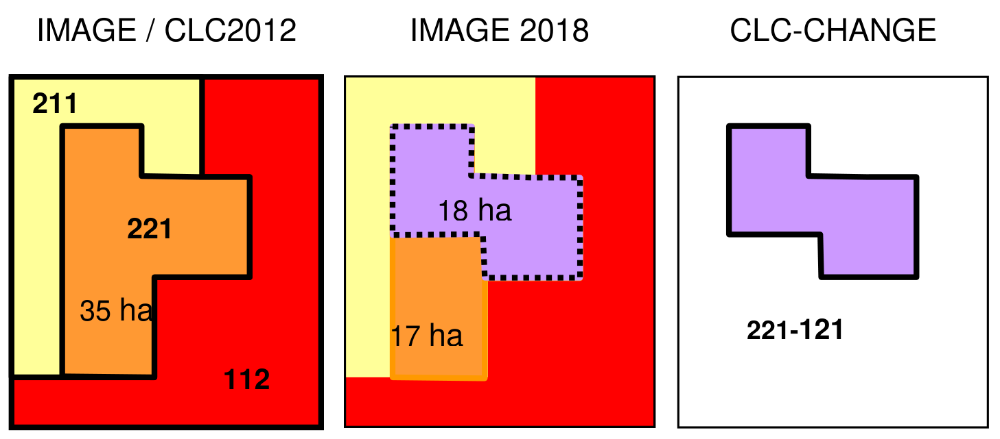
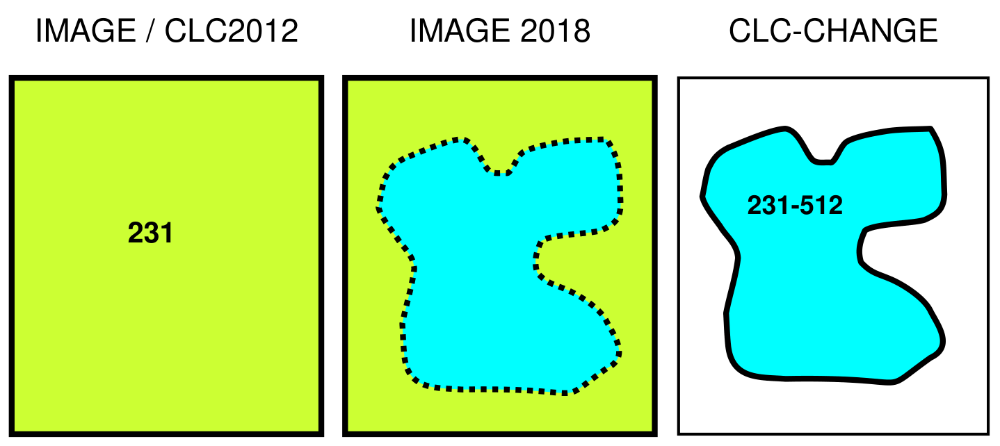
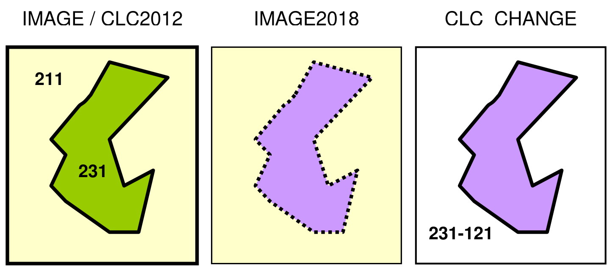
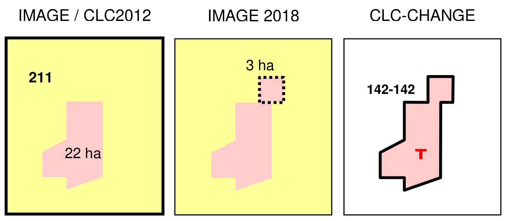

# CLC2018 Technical Guidelines

2017-10-25

- [1
  Introduction](#introduction)
  - [1.1 About the
    document](#about-the-document)
  - [1.2 Brief history of CORINE
    Land Cover](#brief-history-of-corine-land-cover)
    - [1.2.1 CLC1990](#clc1990)
    - [1.2.2 CLC2000](#clc2000)
    - [1.2.3 CLC2006 under
      GMES](#clc2006-under-gmes)
    - [1.2.4 CLC2012 under
      Copernicus](#clc2012-under-copernicus)
    - [1.2.5 CLC2018 in the
      frames of Copernicus](#clc2018-in-the-frames-of-copernicus)
  - [1.3 Main technical
    parameters of CORINE Land
    Cover](#main-technical-parameters-of-corine-land-cover)
  - [1.4 CORINE Land Cover
    changes](#corine-land-cover-changes)
  - [1.5 Preparing for
    CLC2018](#preparing-for-clc2018)
    - [1.5.1 Participating
      countries](#participating-countries)
    - [1.5.2 Technical
      documents](#technical-documents)
- [2 Components of
  CLC2018](#components-of-clc2018)
  - [2.1 Work
    packages](#work-packages)
  - [2.2 Project
    organisation](#project-organisation)
- [3 Satellite image basics for
  CLC2018](#satellite-image-basics-for-clc2018)
  - [3.1 IMAGE2012](#image2012)
    - [3.1.1 High-resolution
      satellite images](#high-resolution-satellite-images)
    - [3.1.2 Access to IMAGE2012
      satellite imagery in ESA’s
      DWH](#access-to-image2012-satellite-imagery-in-esas-dwh)
  - [3.2 IMAGE2018](#image2018)
    - [3.2.1 Technical
      characteristics of Sentinel-2
      imagery](#technical-characteristics-of-sentinel-2-imagery)
    - [3.2.2 Sentinel-2 data
      access and product
      types](#sentinel-2-data-access-and-product-types)
    - [3.2.3
      Landsat-8](#landsat-8)
  - [3.3 Support on IMAGE2018
    provision to
    countries](#support-on-image2018-provision-to-countries)
    - [3.3.1 IMAGE2018 product
      types](#image2018-product-types)
    - [3.3.2 Image selection
      workflow and timing](#image-selection-workflow-and-timing)
- [4 Production of
  CLC-Change2012-2018](#production-of-clc-change2012-2018)
  - [4.1 Interpretation strategy
    in CLC2018](#interpretation-strategy-in-clc2018)
  - [4.2 Change
    mapping](#change-mapping)
    - [4.2.1 Input vector
      data](#input-vector-data)
    - [4.2.2 Particular
      requirements concerning CLC2018
      mapping](#particular-requirements-concerning-clc2018-mapping)
  - [4.3 Photointerpretation of
    changes](#photointerpretation-of-changes)
    - [4.3.1 Figure legends and
      definition of terms](#figure-legends-and-definition-of-terms)
    - [4.3.2 Most frequent
      thematic problems in mapping
      CLC-Changes](#most-frequent-thematic-problems-in-mapping-clc-changes)
    - [4.3.3 Change typology –
      guidelines for
      interpretation](#change-typology--guidelines-for-interpretation)
    - [4.3.4 Treating changes in
      by-definition heterogeneous classes – changes on landscape
      level](#treating-changes-in-by-definition-heterogeneous-classes--changes-on-landscape-level)
  - [4.4 CLC2018 Support Package
    (InterChange
    software)](#clc2018-support-package-interchange-software)
    - [4.4.1 User
      registration](#user-registration)
  - [4.5 Alternative solutions
    for CLC2018](#alternative-solutions-for-clc2018)
- [5 Ancillary
  data](#ancillary-data)
- [6 Production of CLC2018
  database](#production-of-clc2018-database)
- [7 Metadata](#metadata)
  - [7.1 Working unit-level
    metadata](#working-unit-level-metadata)
  - [7.2 Country-level
    metadata](#country-level-metadata)
- [8 Training and
  verification](#training-and-verification)
  - [8.1 Training](#training)
  - [8.2
    Verification](#verification)
- [9 Final quality control and
  delivery](#final-quality-control-and-delivery)
  - [9.1 Delivery
    procedure](#delivery-procedure)
    - [9.1.1 Online quality
      screening](#online-quality-screening)
    - [9.1.2 DBTA
      Report](#dbta-report)
    - [9.1.3 Final
      delivery](#final-delivery)
  - [9.2 Comparison To 2012
    delivery procedure](#comparison-to-2012-delivery-procedure)
- [10 References](#references)
- [11 List of
  abbreviations](#list-of-abbreviations)

# Introduction

## About the document

The European Environment Agency (EEA) is a European Union public body
whose role is to support the European Union in the development and
implementation of environmental policy by providing relevant, reliable,
targeted and timely information on the state of the environment and
future prospects. The Commission has entrusted the EEA with budget
implementation tasks in the Copernicus Earth Observation programme.
Pursuant to Article 7.2 of the Delegation Agreement with the European
Union, the EEA shall be responsible for the coordination of the
technical implementation of the pan-European continental component and
the local component of the Copernicus land monitoring service and the
cross-cutting in situ component, as well as for the necessary
dissemination activities. The key requirement to ensure availability of
Copernicus land monitoring products in due time for assessments to be
made in view of the SoER 2020 report, constitutes a major challenge in
particular on the time line for the production of CORINE Land Cover 2018
(CLC2018).

These Technical Guidelines provide support for the update of CORINE land
cover (CLC) data for the reference year 2018, similarly to its
predecessors for CLC1990 \[1\], CLC2000 \[2\], CLC2006 \[3\] and CLC2012
\[4\]. According to the described standard methodology the CORINE Land
Cover database for the year 2018 (CLC2018) will be derived by
integrating the data of land cover changes between the years 2012–2018
(`CLC-Change~2012-2018~`) – as primary product - with the revised land
cover map of year 2012 (revised CLC2012) - as side product. Alternative,
semiautomatic methodologies – if provide comparable results with the
standard methodology – are allowed and welcome, but not discussed in
this document. The enhanced version of CLC nomenclature is discussed in
a separate document \[5\]. Orthocorrected satellite imagery called
IMAGE2012 (taken in 2011 and 2012) and IMAGE2018 (taken mainly in 2017)
should be used in deriving `CLC-Change~2012-2018~` and deriving CLC2018.

CLC2018 is traditionally implemented or managed by the Eionet National
Reference Centres (NRCs) for land cover, where the best expertise as
well as the ancillary data are available for mapping land cover changes.
Verification of national products and integration of all national
contributions will be provided by EEA, supported by the European Topic
Centre on Urban, Land and Soil System (ETC-ULS).

The structure and content of this document is similar to the CLC2006
Technical Guidelines \[3\]. The first three chapters describe the
background, organisation and main technical parameters of CLC2018
project within the Copernicus Pan-European Land Monitoring Programme. In
this part, especially Chapter 3 (Satellite image basics) has changed
significantly due the availability of ESA’s Sentinel-2 imagery,
considered as breakthrough in European land monitoring. Chapter 4
provides guidelines for mapping CLC-Changes (focusing on the “change
mapping first” photointerpretation technology, applied by most of the
participants). Chapter 5 is about ancillary data. Chapter 6 describes
the automated generation of CLC2018. Chapters 4-6 have changed only
modestly. Chapter 7 describes metadata. Chapters 8 is about the training
of national teams and the procedure of verification. Verification need
to be reorganised in order to keep track with the tight schedule of the
project, while not to lose the high quality of products. Chapter 9
replaced the former chapter about “Deliverables” and describes the
guidelines for delivery of the products.

The intended readers of this document are the members of national CLC
national teams and other organisations involved in the production. The
primary aim is to provide guidance on practical issues of production,
with a basic overview of the theoretical considerations.

## Brief history of CORINE Land Cover

CLC2018 is the fifth CORINE Land Cover inventory (Table 1). Brief
history of CLC is presented below.

### CLC1990

From 1985 to 1990, the European Commission implemented the CORINE
Programme (Co-ordination of Information on the Environment). During this
period, an information system on the state of the European environment
was created and nomenclatures and methodologies were developed and
agreed at EU level. Images acquired by earth observation satellites are
used as the main source data to derive land cover information \[6\].
Satellite images were visually interpreted by using plastic overlays on
top of 1:100.000 scale hardcopies. The first CORINE Land Cover project
(CLC1990) has been implemented in most of the (that time) EU countries,
as well as in the 10 so called Phare partner countries in Central and
Eastern Europe.

Table 1 CORINE Land Cover inventories in Europe

| Name    | Start year | End year       |
|---------|------------|----------------|
| CLC1990 | 1986       | 1999           |
| CLC2000 | 2001       | 2006           |
| CLC2006 | 2007       | 2010           |
| CLC2012 | 2013       | 2015           |
| CLC2018 | 2017       | 2018 (planned) |

### CLC2000

Following the setting up of the European Environment Agency (EEA) and
the establishment of the European Environment Information and
Observation Network (Eionet), the responsibilities of the CORINE
databases - including the updates - rely on the EEA.

As CLC1990 was completed and came to use, several users at national and
European level expressed their need for an updated CLC database.
Updating was implemented within the IMAGE&CLC2000 project, which
consisted of two main components:

- IMAGE2000: covering activities related to satellite image acquisition,
  ortho-rectification and production of European and national mosaic,
  and
- CLC2000 covering activities related to updating of CLC1990 based on
  IMAGE2000 (updated version is named CLC2000) and detection and
  interpretation of land cover changes (named `CLC-Change~1990-2000~`)
  by using CLC1990, IMAGE1990 and IMAGE2000. In order to prevent
  propagating errors into CLC2000 – the geometric and thematic mistakes
  in CLC1990 have been corrected \[7\].

Improving the geometry of CLC layer and mapping CORINE land cover
changes constituted the main novelties of CLC2000. The technology of
drawing the interpretation on transparencies was discarded and replaced
by CAPI (computer-assisted photo-interpretation).

### CLC2006 under GMES

In 2005–2006, strategic discussions amongst member countries, the
European Parliament and the main EU institutions responsible for
environmental policy, reporting and assessment (DG ENV, DG AGRI, EEA,
ESTAT and JRC) have underlined an increasing need for factual and
quantitative information on the state of the environment to be based on
timely, quality assured data, in particular in land cover and land use
related issues. Based on requirements of DG Environment, DG Agriculture
and other users for the period 2006–2008, the EEA put forward a proposal
to collaborate with the European Space Agency (ESA) and the European
Commission (EC) on the implementation of a fast track service precursor
(FTSP) on land monitoring. The definition and implementation of the
necessary satellite data procurement and processing was undertaken by
ESA and JRC. CLC2006 was one of the components of GMES FTSP Land
Monitoring \[8\], \[9\].

From a technical point of view, the main novelty of CLC2006 was the
introduction of harmonised change mapping rules \[10\]. All changes
exceeding 5 ha in size had to be mapped, not only those that were
associated to existing polygons. CAPI was the prevailing method applied
in interpreting of satellite images. Nevertheless, FI, IS, NO, SE and
the UK applied a semiautomatic methodology. Concerning satellite
imagery, the single date Landsat TM, used in CLC2000 was replaced by two
satellite images (taken by usually IRS and SPOT-4) acquired in two
different seasons.

### CLC2012 under Copernicus

The fourth CLC inventory (CLC2012) was implemented as part of the GMES
Initial Operations (GIO) initiated by DG ENTR of the European
Commission. The coordination of the GIO land monitoring was delegated to
EEA for implementation \[11\]. With CLC2012 the CLC time series have
become embedded in the Copernicus programme, thus ensuring sustainable
funding for the future.

The ESA Data Warehouse \[12\] has provided a satellite image catalogue
and download system for all GMES-related activities, including CLC2012.
Two satellite image coverages have been acquired (primarily
IRS/ResourceSat and RapidEye and less extent SPOT-4 and SPOT-5) in
2011-2012. Gap filling in 2013 was targeting those areas which were not
covered by imagery during the 2-year image acquisition period. The
technical implementation of CLC2012 was similar to the CLC2006 inventory
\[4\]. Majority of countries applied Computer Assisted
Photointerpretation (CAPI) technology to map the CLC-Change layer first.
Germany and Ireland joined the Scandinavian countries and Spain by
applying a semi-automatic methodology based on the integration of
existing land use data, satellite image processing and generalization.

### CLC2018 in the frames of Copernicus

CLC2018, the 5th CLC inventory will be a continuation of
previous CORINE Land Cover inventories. The project is coordinated by
the EEA. Main highlights are:

- Sentinel-2 satellite imagery – the 1st European satellite
  dedicated for land monitoring \[16\] - will be provided as basic image
  data support representing land cover in 2017-2018. For gap-filling
  Landsat-8 data will be used.
- Shorter production time (see Tables 1 and 2) compared to previous
  inventories to be harmonised with SOER 2020.

Computer assisted photointerpretation is still the dominating method
used by the participating countries, but alternative solutions
(bottom-up approach) are emerging.

## Main technical parameters of CORINE Land Cover

The choice of minimum mapping unit (MMU = 25 hectares) and minimum width
of linear elements (MMW = 100 metres) in CLC mapping represent a
trade-off between cost and detail of land cover information \[1\]. These
two basic parameters are the same for all the five CLC inventories.

The standard CLC nomenclature includes 44 land cover classes. These are
grouped in a three-level hierarchy. The five main (level-one) categories
are: 1) artificial surfaces, 2) agricultural areas, 3) forests and
semi-natural areas, 4) wetlands, 5) water bodies \[1\]. All national
teams had to adopt this standard nomenclature according to their
landscape conditions. Although the 44 categories have not changed since
the implementation of the first CLC inventory (1986-1998), the
definition of most of the nomenclature elements was significantly
improved \[5\].

Earth observation satellite imagery is the basis of CLC mapping,
providing up-to-date information about the surface of the Earth in
proper resolution. Raw satellite images first have to be pre-processed
and enhanced to yield a geometrically correct document in national
projection. In the CLC1990 inventory ortho-correction was usually not
applied, and GCPs were mostly selected from 1:100.000 scale maps.
Therefore, the geometric accuracy of IMAGE1990 products and that of the
derived CLC1990 did not fulfil specification (Table 2). Started from the
CLC2000 project satellite images are ortho-corrected by using DTM. The
accuracy is characterised with an RMS error below 25 metres.

During the first CLC inventory the “traditional” photointerpretation
method was used: an overlay was fixed on top of a satellite image
hardcopy and the photo-interpreter drew polygons on it marking them with
a CLC code. Later the overlay was digitised, topology was created and
the CLC code entered. This procedure often resulted in several types of
errors in geometry as well as in thematic content, which were mostly
corrected later, within the frames of IMAGE&CLC2000.

In CLC2000 the method of drawing on transparencies was discarded, and
the use of computer-assisted image interpretation (CAPI) was applied
\[2\]. CAPI has become the main tool of producing all the subsequent CLC
inventories, including CLC2018. The number of alternative solutions is
growing slowly.

Main characteristics of subsequent CLC projects are summarised in Table
2.

## CORINE Land Cover changes

CORINE Land Cover Changes (CLC-Changes) are mapped first in the
2nd CLC inventory, CLC2000. It was a policy requirement to
map changes smaller than the 25 ha, MMU size of CLC. The MMU of the
CLC-Changes database was set to 5 ha[^1]. The 100-meter minimum width is
also valid for the CLC-Changes polygons for practical reasons. Changes
should refer to real evolution processes. Starting from CLC2006, mapping
CLC-Changes has been standardised: all CLC-changes larger than 5 ha have
to be mapped \[10\]. See more details in Ch. 4.

Table 2 Evolution of CORINE Land Cover

|  | CLC1990 | CLC2000 | CLC2006 | CLC2012 | CLC2018 |
|----|----|----|----|----|----|
| Satellite data used dominantly | Landsat-4/5 TM single date (in a few cases Landsat MSS) | Landsat-7 ETM single date | SPOT-4 and / or IRS LISS III dual date | IRS, SPOT-4/5 and RapidEye | Sentinel-2 and Landsat-8 for gap filling |
| Time consistency | 1986-1998 | 2000 ± 1 year | 2006± 1 year | 2011-2012 | 2017-2018 |
| Geometric accuracy satellite images | ≤ 50 m | ≤ 25 m | ≤ 25 m | ≤ 25 m | ≤ 10 m (Sentinel-2) |
| CLC mapping MMU | 25 ha | 25 ha | 25 ha | 25 ha | 25 ha |
| CLC mapping minimum width | 100 m | 100 m | 100 m | 100 m | 100 m |
| Geometric accuracy CLC data | 100 m | better than 100 m | better than 100 m | better than 100 m | better than 100 m |
| Thematic accuracy | ≥ 85% (probably not achieved) | ≥ 85% (achieved \[13\] | ≥ 85% | ≥ 85% (probably achieved) | ≥ 85% |
| Change mapping |  | boundary displacement min. 100 m; change area for existing polygons ≥ 5 ha; isolated changes ≥ 25 ha | boundary displacement min. 100 m; all changes \> 5 ha must be mapped | boundary displacement min. 100 m; all changes \> 5 ha must be mapped | boundary displacement min. 100 m; all changes \> 5 ha must be mapped |
| Production time | 13 years | 5 years | 4 years | 3 years | 1,5 years |
| Documentat-ion | incomplete metadata | standard metadata | standard metadata | standard metadata | standard metadata |
| Access to the data | unclear dissemination policy | disseminat-ion policy agreed from the start | free access for all kind of users | free access for all kind of users | free access for all kind of users |
| Number of European countries involved² | 22 (28) | 32 (39) | 38 (39) | 39 | not yet known |

## Preparing for CLC2018

### Participating countries

At the time of writing of this Manual, the final list of participating
countries is not yet available. In order to continue the CLC time
series, all the EEA39 countries are encouraged to participate in
CLC2018: 33 EEA member states and 6 collaborating countries (see Fig. 1.
and Table 3) with total area of 5.85 Mkm².

Table 3 CLC2018 participation (status: October 2017)

| Country | Status | Country | Status |
|----|----|----|----|
| Albania | not eligible for Copernicus funding | Kosovo (under the UN Security Council Resolution 1244/99) | not eligible for Copernicus funding |
| Austria | ✓ | Latvia | will not submit offer |
| Belgium | ✓ | Liechtenstein | ✓ covered by Austria |
| Bosnia and Herzegovina | not eligible for Copernicus funding | Lithuania | ✓ |
| Bulgaria | ✓ | Luxemburg | will not submit offer |
| Croatia | ✓ | Malta | ✓ |
| Cyprus | no reply yet | Montenegro | not eligible for Copernicus funding |
| Czech Republic | ✓ | The Netherlands | ✓ |
| Denmark | will not submit offer | Norway | ✓ |
| Estonia | ✓ | Poland | ✓ |
| Finland | ✓ | Portugal | ✓ |
| Former Yugoslav Republic of Macedonia | not eligible for Copernicus funding | Romania | ✓ |
| France | ✓ | Serbia | not eligible for Copernicus funding |
| Germany | ✓ | Slovakia | ✓ |
| Greece | ✓ | Slovenia | ✓ |
| Hungary | ✓ | Spain | ✓ |
| Iceland | ✓ | Sweden | ✓ |
| Ireland | ✓ | Switzerland | not eligible for Copernicus funding |
| Italy | ✓ | Turkey | not eligible for Copernicus funding; will provide national funding |
|  |  | United Kingdom | ✓ |

Remarks: “No reply yet” means: countries have not sent back the proposal
for a Framework Contract until the deadline “Not eligible for Copernicus
funding” means: these countries might implement CLC2018 under a scheme
different than Copernicus, similarly to CLC2012.

This choropleth map illustrates the participation status of European
countries and surrounding regions in the CORINE Land Cover (CLC) 2018
programme, based on data from October 2017. The map covers Europe,
including Iceland, the United Kingdom, and parts of North Africa and the
Middle East, with insets for the Canary Islands, Azores Islands, and
Madeira Islands. A latitude/longitude grid is shown, ranging from 20°W
to 60°E longitude and 30°N to 60°N latitude. A scale bar indicates
distances up to 1500 km.

The legend defines four categories: \* **Green**: “Participating
country”. This includes most of Western, Central, and Northern Europe,
such as Iceland, Ireland, the United Kingdom, France, Germany, Spain,
Portugal, Italy, Austria, Belgium, Netherlands, Luxembourg, Czech
Republic, Slovakia, Poland, Hungary, Slovenia, Croatia, Bulgaria,
Romania, Greece, Finland, Sweden, Norway, and Estonia. Liechtenstein is
covered by Austria. \* **Blue**: “Participation pending”. These are
mainly countries in the Balkans (Albania, Bosnia and Herzegovina,
Montenegro, Former Yugoslav Republic of Macedonia, Serbia), Switzerland,
Cyprus, and Turkey. According to the context, Albania, Bosnia and
Herzegovina, Montenegro, Former Yugoslav Republic of Macedonia, and
Serbia are “not eligible for Copernicus funding”, while Switzerland and
Turkey are “not eligible for Copernicus funding” but Turkey will
“provide national funding”. Cyprus had “no reply yet”. \* **Red**: “Not
participating”. This includes Denmark, Latvia, and Malta (Luxembourg is
not highlighted in red on the map but stated in the context as “will not
submit offer”). Denmark and Latvia are explicitly listed in the context
as “will not submit offer”, while Malta is listed as ‘✓’ in the context
but red on the map. \* **Grey**: “Out of CLC coverage”. This applies to
Russia, Belarus, Ukraine, and countries in North Africa and the Middle
East, indicating they are outside the primary geographic scope of the
CLC programme.

The map shows widespread participation in Western and Central Europe,
with areas of pending participation predominantly in Southern and
Eastern Europe, and a few instances of non-participation in Northern
Europe.

### Technical documents

Technical documents supporting the implementation of CLC2018 are
presented below.

Table 4 List of technical documents supporting the implementation of
CLC2018

| Subject / Title | Status, reference |
|----|----|
| CLC2018 Technical guidelines | updated, this document |
| CORINE Land Cover nomenclature | updated, separate document and online version \[5\] |
| Manual of CORINE Land Cover changes | separate document, updated \[23\] |
| ArcGIS macro programme for generating CLC2018 | minor actualisation, separate document \[26\] |
| CLC QC Quick Guide - online / off-line manual | updated, separate document \[27\] |
| CLC2018 Support Package (software and user guide) | updated, separate document \[31\] |
| Step-by-step guidelines for IMAGE2018 selection | new, separate document \[32\] |

# Components of CLC2018

## Work packages

Like in the previous CLC inventories 7 work packages have been defined
to implement CLC2018. Table 5 provides an overview of the role of
contributing partners involved in the execution of each work package.
The only novelty in Table 5 is WP 1.3, which is needed because of
Sentinel-2 imagery (see more in Ch. 3.2.3)

Table 5 Work packages and the overview of the role of partners

| Tasks | NRC | EEA | ESA | Service provider |
|----|----|----|----|----|
| WP 1.1 Satellite data acquisition (Sentinel-2 and Landsat 8) |  |  | X |  |
| WP 1.2 Ortho-correction |  |  | X |  |
| WP 1.3 Technical preparation of IMAGE2018 (Sentinel-2 and Landsat-8 (gap-filling)image provision) |  | x |  | X |
| WP 2 In-situ and ancillary data collection | x | x |  |  |
| WP 3.1 Corine land cover change mapping 2012-2018 | X | x |  |  |
| WP 3.2 Generating CLC2018 | X | x |  |  |
| WP 4 Verification by Technical Team | x | x |  |  |
| WP 5 Validation |  |  |  | X |
| WP 6 CLC data dissemination | X | x |  |  |
| WP 7 Project management (NRCs) | X | x | x | x |

X = leading organisation x = organisation involved

This document describes in detail WP1.3, WP3 and WP4. Other WPs will be
tackled only marginally.

## Project organisation

Pursuant to Article 5 of Regulation (EC) No 401/2009 on the EEA and the
Eionet, the EEA may agree with the institutions or bodies which form
part of Eionet (i.e. the NRCs, NFPs and ETCs) upon the necessary
arrangements, in particular contracts, for successfully carrying out the
tasks which it may entrust to them. The Eionet members have already
successfully cooperated with the EEA under the framework of the
GMES/Copernicus Initial Operations (GIO land) 2011-2013 and other
previous programmes and they enjoy thus a long standing experience and
know-how in land monitoring related activities (in particular CLC
production). The continued/renewed involvement of local experts will
warrant the success of the project with access to local knowledge and
ancillary data necessary to support the land cover change mapping. So
far, the production of CLC (as well as other Copernicus tasks executed
in cooperation with the NRCs) has be done on the basis of grant
agreements concluded with the Eionet member countries. With the aim of
streamlining and optimizing the performance process of the
above-mentioned tasks in mind, this time service contracts are awarded
instead. The service contracts are established within a framework
contract between EEA and Eionet member countries, covering a 5 year
period. Service contracts do not require co-financing from the MS, while
they still meet the result ownership requirement. The absence of
co-financing inherent to service contract is deemed to be a factor that
can contribute to the establishment of an operational team within the
NRCs which could then perform on a more permanent and coherent way the
tasks envisaged to be entrusted in both the local and pan-European
components and could lead therefore to a greater commitment towards the
achievement of the set objectives through maintaining a continuous flow
of work and avoiding peaks and loosing know-how. Framework service
contracts to be implemented through specific contracts will cover the
whole period of the operational implementation phase of the current
Copernicus delegation agreement which runs until 31.12.2021. CLC2018
implementation (change mapping and CLC2012 revision) is therefore
executed by national organizations nominated or selected in a tender by
NRCs, or the NRCs themselves. EEA and ETC/ULS will provide
administrative and technical support. Similarly to previous CLC
inventories, the CLC Technical Team will provide training on CLC
mapping, performs verifications, give helpdesk on CLC production
methodology and the photointerpretation software, and carry out
technical verification. Service Providers will be mainly involved in
providing support in image coverage pre-selection, re-projection to
national projections, and provision of the input data to the countries.

# Satellite image basics for CLC2018

The purpose of this chapter is to provide an overview of the satellite
imagery support dedicated for the CLC2018 project. To map CLC changes
between 2012 and 2018 two sets of satellite images should be used: the
ones used to derive CLC2012 (IMAGE2012) as well as the ones depicting
the 2018 status (IMAGE2018). The characteristics of and access to these
satellite images will be shortly described.

ESA has provided access to IMAGE2012 data through its Data Warehouse
\[12\]. Sentinel-2 imagery - constituting the main IMAGE2018 data will
be accessible from the European Space Agency’s (ESA) Copernicus Open
Access Hub \[14\] or via a dedicated organisation set-up by EEA to
provide support to countries in pre-processing of S2 imagery (see Ch.
3.2.3).

## IMAGE2012

Normally, IMAGE2012 data are available for the participating national
teams from their own satellite image archive. If this is not the case,
access to IMAGE2012 is described briefly below.

For the period 2011-2013 the concept of Data Warehouse (DWH) has been
developed by ESA. The new approach was based on the procurement of a set
of common and pre-defined ‘core’ datasets acquired by the Copernicus
Contributing Mission (CCM) and made broadly available to public
organisations at European and national level. A data access portfolio
\[12\] describes the datasets available. The agreement for data access
intended to provide multiple right of use of the ortho-corrected
satellite images in national projection, as long as traceability of use
was ensured. National Teams were granted access to these data for
internal use as soon as the DWH[^2] Licence have been signed.

### High-resolution satellite images

Two coverages of pan-European multi-temporal ortho-rectified satellite
imagery covering all 39 participating countries with 12 nautical miles’
sea buffer was provided by ESA for the period of 2011-2012, with all
spectral bands and cloud masking. This set of imagery is called
IMAGE2012. The raw images were projected into national projection
system. These images were the main satellite data input for producing
the core land cover data (CLC2012 and high-resolution layers). Two dates
of acquisition (narrow and extended acquisition windows, specified by
countries) with cloud-free data (meaning maximum 5 % cloud coverage)
were collected.

In year 2011 high-resolution satellite images covering 1/3 of Europe
have been acquired. In year 2012 the intention was to acquire images for
2/3 of Europe. In 2013 only gap-filling acquisitions have been carried
out.

Characteristics of the main imagery types forming IMAGE2012 and relevant
for CLC2012 are described in Table 6.

- Coverage-1 (1st priority by countries) was planned to be
  completed by the Indian IRS Resourcesat-1 and Resourcesat-2
  satellites. Data were delivered in 20 m pixels in national projection.
  This dataset is included in CORE_01 of DWH.
- Coverage-2 (2nd priority by countries) was planned to be
  completed by the German RapidEye satellite constellation. RapidEye
  satellites include spectral bands in visible and near infrared bands,
  but not in SWIR band. Data were delivered in 20 m pixels in national
  projection. (A 5-m pixel size version in UTM projection also exists.)
  This dataset is included also in CORE_01 of DWH.

<!-- -->

- Images acquired by the French SPOT-4 and SPOT-5 satellites were used
  to complete coverage-1 as well as covarege-2.

In some cases, land cover might have changed between the two images
acquired for CLC2012 (e.g. spread of construction or mining sites,
clearcut of forest, burning shrubs and forests). In such cases the more
recent image was to be used as reference during interpretation.
Therefore, **it is strongly advised to make available all IMAGE2012 data
for CLC2018**, in order to understand the photointerpretation in CLC2012
and avoid erroneous “revision” of CLC2012.

Table 6 Overview of the main parameters of IMAGE2012 satellite imagery
used to derive CLC2012

|  | IRS Resourcesat 1,2 (coverage-1) | RapidEye (coverage-2) | SPOT-4 and SPOT-5 (coverage-1 and 2) |
|----|----|----|----|
| **swath width (km)** | 141 | 20 | 60 - 80 (depending on looking angle) |
| **No. of bands** | 4 | 5 | 4 |
| **bands** | Green, red, NIR, SWIR | Blue, green, red, red-edge, NIR | Green, red, NIR, SWIR |
| **ground sampling distance (m)** | 23.5 | 6.5 | 20 and 10 |
| **bit depth** | 7 | 12 | 8 |
| **to be found in DWH** | Core_01 | Core_01 | Core_01 |
| **delivered resolution (m)** | 20 | 20 | 20 |
| **projection** | national | national | national |

Table 7 includes the recommended standard image band combinations in
order to provide similar colours on screen as photointerpreters had got
used with different satellite sensors. Images acquired by RapidEye
satellites cannot be displayed with the same colours as IRS and SPOT
images, because of the lack of SWIR band in RapidEye.

Table 7 Recommended standard colour rendition for photointerpretation of
IMAGE2012

| Colour        | IRS Resourcesat 1,2 | SPOT-4,5      | RapidEye       |
|---------------|---------------------|---------------|----------------|
| **Red (R)**   | band 3 (NIR)        | band 3 (NIR)  | band 5 (NIR)   |
| **Green (G)** | band 4 (SWIR)       | band 4 (SWIR) | band 3 (red)   |
| **Blue (B)**  | band 2 (red)        | band 2 (red)  | band 2 (green) |

### Access to IMAGE2012 satellite imagery in ESA’s DWH

The procedure for accessing 2012 imagery on ESA’s DWH phase 1 was
described in detail in the CLC2012 Addendum to the CLC2006 Technical
Guidelines. \[4\] However, since some procedures have slightly changed
regarding “How to Access Data”, new information about online
registration, subscription and data download for the Data Warehouse
phase 2 (2014-2020) is available under
<https://spacedata.copernicus.eu/documents/12833/20397/CDS+Registration+Guidelines>

For illustration purposes, CSCDA[^3] data access is made up of four main
processes, as shown in the schematic diagram below extracted from ESA’s
website

This diagram illustrates the user access and data download workflow for
the Copernicus Coordinated Data Access System (CDS). The process
consists of three main stages:

1.  **ON LINE REGISTRATION**: Eligible users register online to the
    Copernicus Coordinated Data Access System (CDS) via the Copernicus
    User’s Personal Area. This step generates Single Sign On (SSO)
    credentials.
2.  Following successful registration and validation, users can pursue
    two parallel paths using their SSO credentials on the Copernicus
    User’s Personal Area:
    - **ORDERING**: Users with relevant assigned quota can place
      standard or emergency on-demand data requests.
    - **SUBSCRIPTION**: Users can subscribe directly to authorised
      datasets.
3.  **DATA DOWNLOAD**: Once subscriptions or orders are implemented, the
    requested data can be downloaded. This is done either via FTPS from
    the CDS online archive or via the Copernicus Client GCL, logging in
    with SSO credentials.

## IMAGE2018

### Technical characteristics of Sentinel-2 imagery

Sentinel-2 mission is a European earth polar-orbiting satellite
constellation (Sentinel-2A and 2B) designed to feed the Copernicus
system with continuous and operational high-resolution imagery for the
global and sustained monitoring of Earth land and coastal areas \[16\].

The Sentinel-2 system is based on the concurrent operations of two
identical satellites flying on a single orbit plane but phased at 180°,
each hosting a Multi-Spectral Instrument (MSI) covering from the visible
to the shortwave infrared spectral range (Figure 3) and delivering high
spatial resolution imagery at global scale and with a high revisit
frequency (Table 8) \[17\].

![Figure 3: MSI Spectral-Bands versus Spatial Resolution
\[17\].](products_2018_Technical_Guidelines_v1-media/img-c4d619539a45e1edf7d072402fcc0b91.png)

Table 8 Overview of the main parameters of Sentinel-2 imagery

<table style="width:100%;" data-quarto-postprocess="true">
<colgroup>
<col style="width: 43%" />
<col style="width: 33%" />
<col style="width: 22%" />
</colgroup>
<tbody>
<tr>
<td colspan="3" style="font-weight: bold">Sentinel-2 Multispectral
Imager (MSI)</td>
</tr>
<tr>
<td>Swath width (km)</td>
<td colspan="2">290</td>
</tr>
<tr>
<td rowspan="4" style="vertical-align: top">Number of bands</td>
<td colspan="2">13 (altogether)</td>
</tr>
<tr>
<td>4</td>
<td>in VIS</td>
</tr>
<tr>
<td>6</td>
<td>in NIR</td>
</tr>
<tr>
<td>3</td>
<td>in SWIR</td>
</tr>
<tr>
<td rowspan="3" style="vertical-align: top">Ground sampling distance
(m)</td>
<td>10</td>
<td>bands 2,3,4 (VIS) and band 8 (NIR)</td>
</tr>
<tr>
<td>20</td>
<td>bands 5,6,7,8a (NIR) and bands 11,12 (SWIR)</td>
</tr>
<tr>
<td>60</td>
<td>band 1 (VIS), band 9 (NIR) and band 10 (SWIR)</td>
</tr>
<tr>
<td>Bit depth (recording)</td>
<td colspan="2">12</td>
</tr>
<tr>
<td>Repeat cycle at the Equator (days)</td>
<td colspan="2">10 (with 1 satellite) 
5 (with 2 satellites)</td>
</tr>
<tr>
<td>Data access</td>
<td colspan="2">free, full and open access</td>
</tr>
<tr>
<td>Delivered resolution (m)</td>
<td colspan="2">10 / 20 / 60 (depending on band)</td>
</tr>
</tbody>
</table>

Sentinel-2’s high-resolution multispectral instrument is based on
well-established heritage from France’s SPOT missions and the US Landsat
satellites. The multispectral imager is the most advanced of its kind -
in fact it is the first optical Earth observation mission to include
four bands in the ‘red edge’, which provide key information on
vegetation state. Spectral bands of Sentinel-2 \[18\] are presented in
Table 9 in comparison with bands of main satellite sensors used in
previous CLC projects.

Table 9 Comparison of spectral bands of Sentinel-2 \[18\] with other EO
satellites

<table style="width:100%;" data-quarto-postprocess="true">
<colgroup>
<col style="width: 5%" />
<col style="width: 18%" />
<col style="width: 17%" />
<col style="width: 22%" />
<col style="width: 14%" />
<col style="width: 21%" />
</colgroup>
<tbody>
<tr>
<td></td>
<td colspan="4" style="font-weight: bold">Bandwidth: lower wavelength –
upper wavelength 
[µm]</td>
<td rowspan="2"
style="font-weight: bold; vertical-align: middle">Remark</td>
</tr>
<tr>
<td></td>
<td style="text-align: center; font-weight: bold;">Sentinel-2 
MSI</td>
<td style="text-align: center; font-weight: bold;">Landsat-7 
ETM</td>
<td style="text-align: center; font-weight: bold;">IRS (Resource- 
sat) LISS-III</td>
<td style="text-align: center; font-weight: bold;">SPOT-4 
HRV</td>
</tr>
<tr>
<td>1</td>
<td>0.433-0.453</td>
<td></td>
<td></td>
<td></td>
<td>VIS band. Main use: atmospheric correction (aerosols)</td>
</tr>
<tr>
<td>2</td>
<td>0.458-0.523</td>
<td>0.45-0.52 (TM1)</td>
<td></td>
<td></td>
<td>VIS: blue band</td>
</tr>
<tr>
<td>3</td>
<td>0.543-0.578</td>
<td>0.53-0.61 (TM2)</td>
<td>0.52-0.59 (MS1)</td>
<td>0.50-0.59 (XI1)</td>
<td>VIS: green band</td>
</tr>
<tr>
<td>4</td>
<td>0.650-0.681</td>
<td>0.63-0.69 (TM3)</td>
<td>0.62-0.68 (MS2)</td>
<td>0.61-0.68 (XI2)</td>
<td>VIS: red band</td>
</tr>
<tr>
<td>5</td>
<td>0.698-0.713</td>
<td></td>
<td></td>
<td></td>
<td>NIR: vegetation red edge band</td>
</tr>
<tr>
<td>6</td>
<td>0.733-0.748</td>
<td></td>
<td></td>
<td></td>
<td>NIR: vegetation red edge band</td>
</tr>
<tr>
<td>7</td>
<td>0.773-0.793</td>
<td></td>
<td></td>
<td></td>
<td>NIR: vegetation red edge band</td>
</tr>
<tr>
<td>8</td>
<td>0.735-0.950</td>
<td>0.75-0.90 (TM4)</td>
<td>0.77-0.86 (MS3)</td>
<td>0.78-0.89 (XI3)</td>
<td>NIR band</td>
</tr>
<tr>
<td>8a</td>
<td>0.855-0.875</td>
<td></td>
<td></td>
<td></td>
<td>NIR: vegetation red edge band</td>
</tr>
<tr>
<td>9</td>
<td>0.935-0.955</td>
<td></td>
<td></td>
<td></td>
<td>NIR band. Main use: atmospheric correction (water vapor)</td>
</tr>
<tr>
<td>10</td>
<td>1.365-1.395</td>
<td></td>
<td></td>
<td></td>
<td>SWIR band. Main use: atmospheric correction (cirrus clouds)</td>
</tr>
<tr>
<td>11</td>
<td>1.565-1.655</td>
<td>1.55-1.75 (TM5)</td>
<td>1.55-1.70 (MS4)</td>
<td>1.58-1.70 (XI4)</td>
<td>SWIR band</td>
</tr>
<tr>
<td>12</td>
<td>2.100-2.280</td>
<td>2.09-2.35 (TM7)</td>
<td></td>
<td></td>
<td>SWIR band</td>
</tr>
</tbody>
</table>

Table 10 Recommended standard colour rendition for photointerpretation
of S2 images

| Colour    | Sentinel-2     |
|-----------|----------------|
| Red (R)   | band 8 (NIR)   |
| Green (G) | band 11 (SWIR) |
| Blue (B)  | band 4 (red)   |

### Sentinel-2 data access and product types

Access to Sentinel data is free, full and open for the broad Regional,
National, European and International user community; data access
mechanisms have been tailored to address the different requirements of
the various use typologies. Starting in 2014, the Sentinel missions
become Copernicus Contributing Missions (CCMs), enlarging significantly
the overall operational Earth Observation capability to support
fulfilling the needs of the Copernicus Services \[19\].

The Sentinel-2 User Products always refer to a given **Datatake**.
Datatake definition refers to a continuous acquisition of an image from
one Sentinel-2 satellite. The maximum length of an imaging Datatake is
15000 km (continuous observation from e.g. Northern Russia to Southern
Africa).

Within a given Datatake, a portion of sensed image downlinked during a
pass to a given receiving station is termed **Datastrip**. If a
particular orbit is acquired by more than one receiving station, a
Datatake is composed of one or more Datastrips.

Sentinel-2 User Products are provided as a compilation along a single
orbit of elementary **Granules** of fixed size. In this respect, the
product granularity corresponds to the minimum indivisible partition of
one Sentinel-2 User Product. For Level-0, 1A and 1B products (Tables 11
and 12), these Granules are sub-images in MSI sensor reference frame of
a given number of lines along-track and detector separated.

All Granules intersecting/touching the Region of Interest of the user
are provided into the final User Product. For ortho-rectified products
(Level-1C, Table 12), the Granules are called **Tiles**. A Tile consists
of 100km x 100km sized ortho-images in cartographic reference frame
UTM/WGS84 (Universal Transverse Mercator / World Geodetic System 1984)
projection.

Table 11 Sentinel-2 products: Level 0 \[17\], \[20\]

|  |  |
|----|----|
| **Level-0** | Contains raw data after restoration of the chronological data sequence at full space/time resolution. Level-0 product contains all the information required to generate the Level-1 (and upper) products. |
|  | One Level-0 product refers always to one Datatake; it can cover the full Datatake or its extract. It may refer to one or several Data-strips from the same Datatake. |

Table 12 Sentinel-2 products: Level 1 \[17\], \[20\]

<table data-quarto-postprocess="true">
<colgroup>
<col style="width: 19%" />
<col style="width: 44%" />
<col style="width: 36%" />
</colgroup>
<tbody>
<tr>
<td style="vertical-align: top"><strong>Level-1A</strong></td>
<td>Corresponds to the systematic processing steps that must be applied
before any further processing. It includes:
<ul>
<li>decompression of the image data,</li>
<li>geometric model computation: geolocation information, coarse
interband / interdetector registration,</li>
<li>SWIR pixels re-arrangement.</li>
</ul>
Allows a quick display of the detectors (sub-swaths) in full resolution
by using standard commercial image processing software.</td>
<td rowspan="2" style="vertical-align: top">One Level-1A/B/C product:
<ul>
<li>refers always to one Datatake;</li>
<li>refer to one or several Datastrip from the same Datatake;</li>
<li>may cover the full Datatake or an extract of the Datatake.</li>
</ul></td>
</tr>
<tr>
<td style="vertical-align: top"><strong>Level-1B</strong></td>
<td>Radiometrically corrected and geo-refined product obtained by
performing corrections on the Level-1A data and refining its geometric
model. 
The radiometric corrections are applied but the geo-refinement model is
only appended to the metadata and not applied to the product.
Corrections include:
<ul>
<li>Radiometric corrections:
<ul>
<li>dark signal, pixel response non-uniformity, crosstalk correction,
defective pixels;</li>
<li>high spatial resolution bands restoration: deconvolution and
denoising based on a wavelet processing.</li>
</ul></li>
<li>Physical geometric model refinement using GCPs provided by the GRI;
this model is not applied to the image but appended to the metadata</li>
<li>Singular pixels detections (defectives pixels, saturations,
no-data).</li>
</ul>
No resampling is performed. The geometric model refinement is optional.
A dedicated flag in the metadata notifies whether the geometric model
provided is the raw model or the refined model.</td>
</tr>
<tr>
<td style="vertical-align: top"><strong>Level-1C</strong></td>
<td>Geo-coded top-of atmosphere (TOA) reflectance with a sub-pixel
multi-spectral and multi-date registration. 
Ortho-image product, i.e. a map projection of the acquired image using a
DEM to correct ground geometric distortions. 
Note that the reflectance meaningful values go from "1" to "65535" as
"0" is reserved for the NO_DATA. 
A cloud, land and water mask is associated to the product. 
L1C products are resampled with a constant GSD (Ground Sampling
Distance) of 10m, 20m and 60m according to the native resolution of the
different spectral bands.</td>
<td></td>
</tr>
</tbody>
</table>

Table 13 Sentinel-2 products: Level 2A \[20\]

|  |  |
|----|----|
| **Level-2A** | Bottom of atmosphere (BoA) reflectance in cartographic projection by using the ATCOR algorithm. Aerosol optical thickness and water vapor content are derived from the image itself. The possibility of making a standard core product, systematically available from the Sentinels core ground segment is currently being assessed as part of the CSC evolution activities. |

### Landsat-8

In CLC2018 Landsat-8 data are planned to use in gap filling, i.e. in
case no S2 imagery would be available for certain areas \[30\].

Landsat 8 is an Earth observation satellite of the USA launched on
February 11, 2013. It is the eighth satellite in the Landsat program;
the seventh to reach orbit successfully. It is a collaboration between
NASA and the United States Geological Survey (USGS).

Landsat 8 consists of three key mission and science objectives:

- Collect 30-meter spatial resolution multispectral image (and a
  15-meter resolution panchromatic) data affording seasonal coverage of
  the global landmasses for a period of no less than 5 years;
- Ensure that Landsat 8 data are sufficiently consistent with data from
  the earlier Landsat missions in terms of acquisition geometry,
  calibration, coverage characteristics, spectral characteristics,
  output product quality, and data availability to permit studies of
  landcover and land-use change over time;
- Distribute Landsat 8 data products to the general public on a
  nondiscriminatory basis at no cost to the user.

Landsat 8’s Operational Land Imager (OLI) improves on past Landsat
sensors. The OLI instrument uses a pushbroom sensor instead of
whiskbroom sensors that were utilized on earlier Landsat satellites. The
pushbroom sensor aligns the imaging detector arrays along Landsat 8’s
focal plane allowing it to view across the entire 185 kilometers swath
cross-track field of view, as opposed to sweeping across the field of
view. With over 7,000 detectors per spectral band, the pushbroom design
results in increased sensitivity, fewer moving parts, and improved land
surface information.

OLI collects data from nine spectral bands. Seven of the nine bands are
consistent with the Thematic Mapper (TM, see Table 9) and Enhanced
Thematic Mapper Plus (ETM+) sensors found on earlier Landsat satellites,
providing for compatibility with the historical Landsat data, while also
improving measurement capabilities. Two new spectral bands, a deep blue
coastal / aerosol band and a shortwave-infrared cirrus band, will be
collected, allowing scientists to measure water quality and improve
detection of high, thin clouds.

Recommended standard colour rendition for photointerpretation of Landsat
8 images:

red (R): band 5 (NIR) green (G): band 6 (SWIR blue (B): band 4 (red)

## Support on IMAGE2018 provision to countries

Because CLC2018 should be completed in 2018, the dedicated Sentinel-2
image acquisition campaign IMAGE2018 is confined to the year of 2017
(covering a single year, instead of 2 or 3 years of previous CLCs). S2
images will provide homogeneous, high quality multi-temporal imagery,
which never existed in previous CLC inventories, to support high-quality
identification of land cover changes in Europe.

Some facts to consider regarding the use of S2 imagery in CLC2018:

- Large number of S2 acquisitions: Expecting a 5-months long image
  acquisition period in 2017 (from mid-spring to mid-autumn), and
  considering the repetition period of 10 days (at Equator) and counting
  on a single satellite, there are minimum 15 acquisition opportunities
  over EEA39. For higher latitudes, there will be even more potential
  acquisitions due to the overlap between neighbour swaths. Having two
  Sentinel-2 satellites doubles the potential number of images to be
  acquired.
- Image selection: Images to be processed for CLC2018 will be optimally
  selected by means of quick-looks, by considering cloud cover and
  seasonality. An image taken in full vegetation cover (summer) and
  another one taken in partial vegetation cover (spring or autumn) are
  usually considered as optimal.
- As the majority of EE39 countries apply photointerpretation in
  deriving the `CLC-Change~2012-2018~` deliverable, an S2 image product,
  optimized to support this work is offered.
- Cartographic projection: ESA provides Sentinel-2 Level-1C images in
  UTM/WGS84 projection. National teams in EEA39 work in national
  projection. S2 imagery is delivered in national cartographic
  projection to support the work of National Teams.

CLC2018 are therefore produced under changed (but overall improved)
input image conditions, based mainly on Sentinel 2 imagery from 2017.
The change to Sentinel 2 data also means that ESA is not providing
pre-selected and national projected coverages to the countries (as in
the past).

To support the countries in the CLC production, a consortium of
companies provides Sentinel-2 and Landsat 8 satellite imagery for the
CLC2018 exercise (IMAGE2018) in contract with EEA.

The aim is to optimally provide two full image coverages for each
country, with at least a six-week period between the two coverages per
reference tile. For images, which the CLC national teams add to the
coverage 1 or coverage2 we use the term “further images” in the
documentation. In addition to these two coverages, the CLC national
teams (altogether) can select a maximum of 3000 additional Sentinel 2
images, according to their specific needs, e.g. also images acquired
outside of the defined acquisition windows. In the following, the term
“additional images” is used for these images, which are not part of
coverage 1 or coverage 2.

### IMAGE2018 product types

The image product types available are:

1.  The main visual product, re-projected into national projections,
    based on Sentinel 2 data (or Landsat 8 for gap filling)
2.  Additionally the full products with no modifications, for those
    countries that want to go beyond visual interpretation

Table 14 Overview of IMAGE2018 product types

<table data-quarto-postprocess="true">
<colgroup>
<col style="width: 21%" />
<col style="width: 40%" />
<col style="width: 37%" />
</colgroup>
<tbody>
<tr>
<td></td>
<td style="font-weight: bold">Visual product</td>
<td style="font-weight: bold">Full product</td>
</tr>
<tr>
<td style="font-weight: bold; vertical-align: top">Sentinel 2A/B</td>
<td><ul>
<li>GeoTIFF, 16bit, 3 bands, no compression, ToA reflectance</li>
<li>False colour composite using S2 bands 8, 11 and 4 (NIR, SWIR,
red)</li>
<li>10 meter spatial resolution</li>
<li>Re-projection to national projection as specified by EEA with EPSG
codes</li>
<li>No geometric improvements</li>
<li>No radiometric improvements</li>
<li>Band 11 brought to 10 m by HPF sharpening</li>
</ul></td>
<td><ul>
<li>no modification of projection, format, naming convention,
radiometry, meta data</li>
<li>all bands in original resolution</li>
</ul></td>
</tr>
<tr>
<td style="font-weight: bold; vertical-align: top">Landsat 8</td>
<td><ul>
<li>Re-projection to national projection as specified by EEA with EPSG
codes</li>
<li>False colour composite using L8 bands 5, 6, 4 (NIR, SWIR, red)</li>
<li>15 meter spatial resolution</li>
<li>No geometric improvements</li>
<li>DN to ToA reflectance conversion, followed by HPF sharpening</li>
</ul></td>
<td><ul>
<li>no modification of projection, format, naming convention,
radiometry, meta data</li>
<li>all bands in original resolution</li>
</ul></td>
</tr>
</tbody>
</table>

### Image selection workflow and timing

The service provider, based on the acquisition windows agreed, selects 2
coverages of Sentinel 2 imagery (or Landsat 8 gap filler), and provide
countries with details on their suggested selection. Each country is
provided with a FTP download that contains in separate directories the
natural colour quicklooks of the pre-selected coverages and a shapefile
with the image footprints and the names of the corresponding quicklooks.
In a separate directory quicklooks of possible additional imagery are
provided.

In the process of image selection, the countries have the opportunity
to:

- Accept the pre-selected coverages as they are.
- Reject one or more images of the pre-selected coverage and select
  other images instead. If necessary, select further images for coverage
  1 and/or coverage 2. In case that the final number of images exceeds
  the number of images that the service provider pre-selected by more
  than 10%, please contact[^4] the service provider to find a solution.
- Select additional Sentinel 2 imagery if necessary (“additional
  images”). All member states in total can select a maximum of 3000
  additional Sentinel 2 images. If the demands by all member states in
  total exceed 3000 images, EEA will find a solution for fair
  distribution.

The workflow is summarized in Table 15.

Table 15 Workflow steps of IMAGE2018 selection

| Workflow step | Activity | Who is doing this? | Timing |
|----|----|----|----|
| 1 | After closure of extended window, **pre-selection and documentation** of imagery by SP | SP (service provider) | Up to 4 weeks after closure of extended windows (with first deliveries starting 3rd October) |
| 2 | **Approval or rejection of pre-selected S2 image tiles**/LS8 scenes, possibly the selection of further S2 image tiles/LS8 scenes for the two coverages, and possibly selection of additional S2 image tiles. Based on shapefile, natural colour quicklooks and detailed instructions provided by SP | CLC national teams | Up to 2 weeks (total of 6 weeks after end of extended window, taking into account first delivery date) |
| 3 | **Production of imagery** and provision for FTP download | SP | Up to 4 weeks (total of up to 10 weeks after end of extended window, taking into account first delivery date) |
| 4: Only in exceptional cases (in case country teams discover problems with images that were not visible in the quicklooks, but that require additional imagery) | Propose further S2 image tiles/LS8 scenes for the two coverages and/or further additional S2 image tiles. | CLC national teams | Up to 2 weeks (total of 12 weeks after end of extended window) |
| 5: Only in exceptional cases | Only in accordance with the SP and EEA: Production of imagery and provision for FTP download | SP | Up to 4 weeks (total of up to 16 weeks after end of extended window) |

Detailed step-by-step guidelines on how to evaluate pre-selected images
and to select the additional imagery (if needed) is provided by the SP
\[32\].

# Production of CLC-Change2012-2018

## Interpretation strategy in CLC2018

Chapter 4.1 is specific because of the use of Sentinel-2 data and valid
for any methodology of deriving `CLC-change~2012-2018~`.

During the S2 image acquisition campaign in 2017 we can expect several
images acquired for any area over the EEA39 (see Ch.3.2.3). Even if some
of these images will be cloudy / partially cloudy, we can expect a
number of useful or partially useful images, more in number than was
available for former European CLC inventories. There are three main
issues to be considered in proper satellite image selection:

1.  **Vegetation phenology** (see also in Ch. 4.2.2.2.3): it is
    important to have an image taken in the peak of vegetation
    development.
    1.  Forests: Broadleaved forests are leafless in May in Scandinavia
        and some species (e.g. *Robinia pseudoacacia*) can be leafless
        even in Central Europe in that period. The leaf development
        status depends on elevation also. Mapping forests is optimal by
        using images taken in July or August.
    2.  Natural grassland and sparse vegetation: green vegetation should
        be visible to map these classes properly. As grass becomes
        yellow in summer under warm climate (Mediterranean, Iberian
        Peninsula, Turkey) images taken at spring (even May can be too
        late in some regions) are needed to map these classes.
    3.  Non-irrigated arable land: like in b) spring images are needed
        to distinguish rain-fed crops (class 211) from abandoned arable
        land (class 231) in the Mediterranean, Iberian Peninsula and
        Turkey.
2.  **Water**: proper mapping of water coverage in CLC often requires
    two satellite images, taken in different seasons. This way short
    term phenomena (e.g. flooding) will not result misclassification.
    Spring and summer imagery will support to avoid erroneous mapping of
    seasonal changes of water coverage of lakes and reservoirs (e.g. due
    to water abstraction for irrigation during summer).
3.  **Glaciers and permanent snow**: images of not exactly the same date
    (optimally the date of smallest snow extent: late August or early
    September) are not comparable, thus using them leads to mapping
    false changes.
4.  **Fast-changing phenomena**: especially constructions and mines,
    clearcutting of forest and burnt forests and shrubs. These phenomena
    can develop fast relative to the length of the S2 image acquisition
    period in 2017. Because the aim is to map the land cover status
    which is closest to the year of 2018 (nominal reference year of
    CLC2018), **the latest acquired useful (cloud free) image should be
    used**. However, as late season images can suffer from low Sun
    illumination angle, the practical end of the image acquisition
    period should be determined according the (extended) time window set
    by the country.

> [!NOTE]
>
> **How to understand „the latest acquired satellite image should be
> used to map fast-growing changes”?**
>
> Example: The country sets the extended time window: 1st June – 15
> September
>
> There are S2 images acquired on:
>
> - 23 Aug, 50% clouded
> - 06 Sept, cloud free
> - 13 Sept, \<5% clouded
> - 20 Sept, 80% clouded
> - 27 Sept, cloud free
>
> **Preference is given to use the image taken on 13 September**

- An S2 image taken in the **peak vegetation** period (e.g. July) is
  considered as the main coverage (coverage-1) for photointerpretation /
  thematic processing.
- It is obligatory to use the **latest**[^5] **acquired useful S2
  image** (e.g. early September, mid-October, depending on latitude).
  This is considered coverage-2 for photointerpretation / thematic
  processing. This image **will be used primarily in verification by the
  CLC Technical Team**.
- The time difference between coverage-1 and coverage-2 should be at
  least **6 weeks**.
- **Use both coverage-1 and coverage-2 in photointerpretation / thematic
  processing**. Otherwise there is a risk that the interpretation will
  be incomplete.
- Moreover, an image taken in May or early June can be proposed as
  coverage-3 for areas with warm climate (the Mediterranean, Iberian
  Peninsula, Turkey) for improved mapping of semi-natural vegetation as
  well as agriculture. The time difference between coverage-3 and
  coverage-1 is preferably also at least 6 weeks.

## Change mapping

This chapter is in large part a repetition of the similar chapter in
CLC2006 Technical Guidelines \[3\] and in part included also in Addendum
CLC2012 \[4\].

`CLC-Change~2012-2018~` is the primary product of the CLC2018 project.
`CLC-Change~2012-2018~` is a “stand-alone” product (i.e. not derived by
intersecting CLC2012 and CLC2018) and having a smaller MMU (5 ha) than
the CLC status layers (25 ha).

The aim is to produce European coverage of **real land cover changes**
that

- are larger than 5 ha;
- wider than 100 m,
- occurred between 2012 and 2018;
- are detectable on satellite images[^6]; regardless of their position
  (i.e. connected to an existing CLC2012 polygon or being
  “island”-like).

> [!NOTE]
>
> **What does “real land cover change” mean?**
>
> Change codes should always represent the change process that happened
> in reality. When giving the codes, interpreter always must be able to
> answer the questions: what is the process described by the codes I
> gave? Is this process the same what I see on the image pair? Is this
> really a CLC change?
>
> Example: 211-112 change means extension of built-up area (112) on
> non-irrigated arable land (211). The interpreter should see the
> irrigated arable land on the 2012 image, and should be convinced that
> this is not a long-time abandoned area (231) or area under
> construction (133). Moreover, he/she should be convinced that in 2018
> the area is built-up (112) and not yet under construction (133).
>
> This way interpreter can avoid mapping seasonal differences as change
> or giving attributes that are meaningless on the field. See more
> details in Ch. 4.2.1/Real change.
>
> The proposed “change mapping first” approach (see Text box 3) provides
> a good means to answer these questions and map real land cover changes
> with MMU = 5 ha.
>
> On the contrary, the “update first” approach followed by intersecting
> CLC2012 and CLC2018 would provide differences of two datasets with 25
> ha MMU. These differences should be edited to get the real changes,
> moreover changes in the 5 ha - 25 ha size range will be neglected.

Because most of the participating countries still apply
photointerpretation (CAPI) the previously standardised **“change mapping
first” methodology** is promoted, like in CLC2006 and CLC2012
inventories. Obviously, like before, any alternative solutions capable
to provide equivalent results are encouraged.

> [!NOTE]
>
> **What does “Change mapping first” method mean:?**
>
> “Change mapping first” means that changes are interpreted directly,
> based on comparison of reference images. Visual comparison of
> IMAGE2012 with IMAGE2018 satellite imagery (with CLC2012 vector data
> overlaid for spatial reference) is followed by direct delineation of
> change polygons.
>
> Practically, if change occurred to a CLC2012 polygon, it should be
> transferred to the database of CLC changes, where the changed part
> will be delineated and kept as polygon (Fig. 4).
>
> At the end of process `CLC-Change~2012-2018~` polygons will be
> combined with CLC2012 polygons in GIS to obtain CLC2018 database.
>
> Necessary thematic / geometric correction (revision) of CLC2012 data
> must precede the delineation of change polygons in order to avoid
> error propagation from CLC2012 to CLC2018.
>
> Consequently, change mapping consists of two steps, namely:
>
> - CLC2012 correction (revision) and
> - interpretation of changes that occurred between 2012 and 2018.
>
> The two processes can be carried out consecutively or in parallel, but
> on level of individual polygons correction (revision) must always
> precede change delineation (see Ch. 4.2.2.1).

The basis of identification of changes is the interpretation of visually
detectable land cover differences on images taken in 2012 and 2018.
Ancillary data, such as topographic maps, orthophotos, HR layers
(derived from satellite imagery), LPIS data, Google Earth imagery etc.
are highly recommended to use (see Ch. 5).

Delineation of changes must be based on CLC2012 polygons in order to
avoid creation of sliver polygons and false changes when producing
CLC2018 database. This means that during interpretation of changes
CLC2012 polygons must be visualised for and used by the interpreter so
that outlines of `CLC-Change~2012-2018~` polygons exactly fit CLC2012
boundaries (Fig. 4).

Interpreter must give two CLC codes to each change polygon:
code2012 and code2018, both included as separate
attributes. These codes must represent the land cover status of the
given polygon in the two dates respectively. **Change code pair thus
shows the process that occurred in reality** and may be different from
the codes occurring in the parent layer and / or in new CLC databases
(due to generalisation applied in producing CLC2012 and CLC2018). See
Text box 4.

> [!NOTE]
>
> **What does it mean: Change code pair should show the process that
> occurred in reality and may be different from the codes occurring in
> the parent layer and / or in new CLC database?**
>
> Example: Think about a 243 polygon in CLC2018 including small (\<25 ha
> but \> 5 ha) agriculture land and small patches of forest.
>
> One of the forest patches (\>5 ha) inside the polygon has been cut
> between 2012 and 2018.
>
> The real change which has to be mapped is: 311-324, and not 243-324
> (being a false change). Note, that the CLC2012 code should not be
> taken over automatically into CLC2018!
>
> In CLC2018 the small (\<25 ha) 324 polygon will be generalised to
> yield a 243 polygon.
>
> **In this example both attributes of the CLC-change polygons are
> different from code2012 as well as from
> code2018.**
>
> See more in Ch. 4.3.1 /Real change

This diagram illustrates the process for delineating and coding land
cover changes between CLC2012 and CLC2018 in the Copernicus Land
Monitoring Service (CLMS) CLC-Change database.

The process is shown in three sequential steps, accompanied by an
initial contextual map: 1. **Contextual Map (left):** An area of land
cover is displayed with various coloured polygons representing different
CLC classes, including red, yellow, light green, dark green, orange,
brown, and purple. An arrow points to a light yellow polygon in the
upper left, which is the focus of the change detection. 2. **Step 1 (top
right):** The CLC2012 polygon (light yellow) that contains the visually
detected change is identified and “taken over into the CLC-Change
database”. 3. **Step 2 (middle right):** A photointerpreter manually
outlines the exact area of land cover change within the CLC2012 polygon,
indicated by a dashed brown line within the light yellow polygon. 4.
**Step 3 (bottom right):** The portion of the original CLC2012 polygon
that did not change (“no-change area”) is deleted. The outlined change
area is isolated, becomes a new polygon (shown here in solid purple),
and is assigned a CLC change code pair (211-121). This code indicates a
change from ‘211 - Arable land (non-irrigated)’ in 2012 to ‘121 -
Industrial or commercial units’ in 2018.

### Input vector data

There are two input vector layers to be used in implementation of
CLC2018 change mapping. The first and most important of these is the
**CLC2012** database. Like in previous CLC exercises, a border-matched
version of CLC2012 data has been produced by EEA in order to eliminate
inconsistencies along state boundaries. As most of the borders were
already matched during the CLC2000 and CLC2006 project, only a limited
level of border matching took place this time.

For **consistency reasons, all countries participating in CLC2018 update
are expected to start the work with CLC2012 data extracted from the
latest version of integrated European CLC2012 dataset.**

In order to support this, border-matched CLC2012 and
`CLC-Change~2006-2012~` data (vector format, national projection) for
all participating countries are available for download at:

<https://forum.eionet.europa.eu/nrc_land_covers/library/copernicus-2014-2020/pan-european-component/corine-land-cover-clc-2018/support-files-clc-production/>

Delivery contents:

`CLC2018_support_XX.gdb` – database in ESRI ArcGIS 10.0 file geodatabase
format: `clc12_XX_nat` …. CLC2012 status dataset `cha12_XX_nat` ….
CLC2006-CLC2012 change dataset

`shapes/` - directory with data in ESRI shape format: `clc12_XX_nat.shp`
…. CLC2012 status dataset `cha12_XX_nat.shp` …. CLC2006-CLC2012 change
dataset

`CLC2018_support_XX.xml` – INSPIRE compliant metadata file in XML format
`CLC2018_support_XX.pdf` – Summary report for delivery (including CRS
transformation parameters) `XX_nat.prj` – Coordinate Reference System
definition on ESRI PRJ file

### Particular requirements concerning CLC2018 mapping

There are particular requirements of change mapping that were indeed
mentioned, but (as shown by experience gathered during the CLC2012
verification process) probably not emphasised strongly enough.

#### CLC2012 revision

Occurrence of interpretation mistakes is an inherent characteristic of
visual interpretation of remote sensing data, coming not necessarily
from negligence, but insufficient information. During updating, by
examining newly available satellite images or ancillary data, usually a
number of thematic mistakes are discovered in the database to be
updated. In order to avoid error propagation into CLC2018, mistakes
discovered in CLC2012 are much recommended – in locations of changes
absolutely necessary – to be corrected.

These are:

1.  Systematic mistakes known from the previous inventory but not
    corrected yet and ones discovered during the recent change mapping
    (or verification). These are relatively easy to find by searching
    for the codes that show systematic mistakes. Systematic improvement
    of geometry can also be included here.
2.  Random mistakes. These are usually ad-hoc discovered during change
    mapping, or can be systematically searched for by visually browsing
    the CLC2012 map in scale 1:30.000-40.000.

In case national team decides not to modify previously submitted CLC2012
data, the tool of technical change (polygons of any size in the change
database having similar codes for 2012 and 2018) can be used for
revision (and transfer of correction to CLC2018). If used for revision,
technical changes can be larger than 25 ha. E.g. if a 50-ha polygon is
coded as technical change (121-121) (see Ch. 4.3.1/ Technical change),
it means that 50-ha industrial area was not mapped in CLC2012. By means
of using technical change CLC2018 will include this 50-ha industry as
revision.

The process of CLC2012 revision can be done either before starting
change mapping or in parallel with change mapping (depending on the
software used). However, interpreter must make sure that revision
(correction) of an individual CLC2012 polygon is always done **before**
a change is mapped in the same location.

#### CLC change interpretation

##### Geometry

1.  The mapping of CLC changes must be done using the geometrical basis
    of CLC2012 polygon layer. The outline of change polygons must
    therefore match CLC2012 polygon border, otherwise false changes and
    geometric mistakes occur. This means that firstly, there should not
    be any narrow channels between or slivers around change polygon
    outlines and CLC2012 polygon outlines (Fig. 5); secondly, change
    polygon outlines should not criss-cross over CLC2012 outlines (Fig.
    6). These mistakes can be most easily avoided by applying the
    recommended method of change mapping: taking over polygons from
    CLC2012 to change database, then drawing changes, then discarding
    not changed parts (Fig. 4).

2.  Topological consistency must be kept. Change polygons should not
    overlap each other.

This image displays two side-by-side false-colour satellite imagery
snippets, illustrating the process of land cover change detection and
mapping updates, likely for the Copernicus Land Monitoring Service
(CLMS) CORINE Land Cover (CLC) products. The left panel shows existing
land cover polygons delineated by yellow lines on a pixelated satellite
image background. The right panel shows the same area, with an
additional polygon outlined in magenta, which represents a newly mapped
land cover change or a correction. A small black circle with a yellow
outline is located within the magenta polygon, indicating a specific
point of interest or a potential error identified during revision. The
background satellite imagery exhibits variations in shades of red,
green, blue, and brown, characteristic of false-colour composites used
for vegetation and land feature interpretation. This visual demonstrates
the “CLC2012 revision” process for identifying and correcting
“systematic mistakes” or “random mistakes” during “CLC2018 mapping.”

This composite map illustrates the identification of Land Cover / Land
Use (LULC) changes and errors during the Copernicus Land Monitoring
Service (CLMS) CORINE Land Cover (CLC) 2018 mapping process, referencing
CLC2012. Both panels display false-colour satellite imagery with
overlaid CLC polygons.

The left panel shows initial CLC polygons outlined in yellow, with
CORINE Land Cover codes: “243” (Complex cultivation patterns), “211”
(Arable land), and “312” (Coniferous forest). This represents the
CLC2012 baseline.

The right panel shows the same area but includes new magenta outlines,
indicating revised polygon boundaries and identified changes. A yellow
dot and a red dot mark locations identified as “mistakes”. A specific
area previously classified as “211” (Arable land) is now encompassed by
a magenta outline and labelled “211—142”, indicating a change from
“Arable land” (211) to “Land principally occupied by agriculture, with
significant areas of natural vegetation” (142). This demonstrates the
revision of CLC2012 data and the detection of LULC changes for CLC2018.

##### Coding

Interpreter should give two codes to each change polygon according to
what is visible on the relevant imagery, one representing land cover in
2012 and the other in 2018. Change codes should always represent the
change process that happened in reality. Therefore, codes can be
different from respective codes in CLC2012 and CLC2018 databases (see
Text box 4).

When giving the codes, interpreter always must be able to answer the
question: what is the process described by the code I gave? Is this
process the same what I see on the image pair? Is this really a CLC
change? This way interpreter can avoid mapping seasonal differences as
change or giving attributes that are meaningless on the field. See more
details in 4.3.1/Real change.

##### Image dates

In order to avoid mapping seasonal differences as change, interpreter
should always be aware of image dates (year and month at least). The
best way to achieve this is to **include image date in the image file
name**, so that it is visualised all the time (see S2 file names in Ch
3.2.3). It is the same reason that makes image mosaics of limited use
for CLC change mapping; in a mosaic image dates are hard or impossible
to check and radiometry (colours) are often strongly distorted. Knowing
image dates is especially important in the following cases:

- Mapping vegetation of mountainous areas: vegetation reaches its full
  development / foliage cover only around June, so earlier images might
  mislead interpreter.
- Mapping hot and dry (Mediterranean and strongly continental) areas:
  vegetation is usually dried out by early summer, which is the
  “standard” date of images for land cover mapping. Thus vegetation
  (arable crops, grassland) is not detectable on such images, or it is
  almost impossible to distinguish arable fields from patches of natural
  grassland or even sparsely vegetated areas. Therefore, additional
  images from April/May are highly recommended to use in such areas
  (e.g. Iberian Peninsula, Anatolia). The same is true for
  distinguishing natural grassland areas from sparsely vegetated areas
  or bare rocks.
- Mapping changes of water bodies, especially reservoirs: being unaware
  of image dates might lead to mapping seasonal water level fluctuations
  (lakes shrinking due to summer heat and water take-up for irrigation)
  as permanent changes, which is a mistake. Same is true for Alpine
  rivers, where highest water level occurs in spring/early summer, due
  to snow melt.
- Mapping glaciers and permanent snow: images of not exactly the same
  date (optimally the date of smallest snow extent: late August or early
  September) are not comparable, thus using them leads to mapping false
  changes.

##### Nomenclature

Lessons learnt during previous CLC inventories and the respective
verification processes have resulted in the creation of an enhanced
version of the CORINE Land Cover nomenclature guidelines. It is required
that the latest version of this document is used \[5\]. An online (html)
version of the document is also made available.

## Photointerpretation of changes

### Figure legends and definition of terms

In the following chapter, schematic figures help to give guidelines on
the way of interpreting changes. On these illustrating figures (Figs.
7-26) the same legend is applied. Colour polygons represent patches
visible on the satellite image(s). Polygons with thick solid outlines
represent land cover patches that form a CLC polygon at the given
database. These are also marked with the corresponding CLC code.
Polygons with dashed outline show patches whose land cover has changed.
Patches without an outline represent patches of land cover that do not
form valid polygon in the given database.

Each explanatory figure consists of four boxes:

- First box shows the land cover status visible on IMAGE2012 and the
  polygon outlines in CLC2018 database.
- Second box shows the land cover status visible on IMAGE2018 without
  polygon boundaries. Dashed outline marks patches that have changed.
- Third box shows polygons to be drawn in the CLC-Change database.
  Polygons marked with red T will be deleted from the final CLC-Change
  database (see term “technical change” below).
- Fourth box shows the polygons as present in CLC2018 database (as the
  results of GIS addition of CLC2012 and CLC-Changes – see Ch. 6).

**Patch** Patch is a continuous area having a common CORINE land cover
type in reality and being recognizable on the satellite image(s). A
patch becomes a valid CLC polygon only if its size exceeds the MMU.

**Direct delineation of changes** Change polygons are drawn directly on
the corresponding image by means of CAPI and not generated by GIS
operation (intersection of databases) – see also in Ch. 4.2. Human
expertise has control over the whole procedure thus helping to avoid
creation of impossible or false change polygons.

**Real change** Like in CLC2012 the change layer is interpreted directly
in CLC2012 project, thus change polygons do not necessarily have to
inherit their code2012 and code2018 from the
corresponding CLC2012/CLC2018 polygon, but can be modified. Interpreter
is supposed to attribute to the change polygon the code2012 /
code2018 code pair that best describes the process that the
given land cover patch has undergone in reality (see also in Text box
4). Code pairs thus reflect real processes instead of differences of two
databases (Fig. 7).

This diagram illustrates the conceptual process of CORINE Land Cover
(CLC) change detection and update from 2012 to 2018, showing four
sequential states:

1.  **IMAGE / CLC2012**: The initial state displays a CLC map for 2012.
    A large, yellow area is classified as “211” (Arable land). Within
    this, a red polygon is classified as “112” (Discontinuous urban
    fabric). Inside the red “112” area, there is a small, distinct light
    purple feature.
2.  **IMAGE 2018**: This panel shows the same geographical area based on
    2018 imagery. The “211” (yellow) and “112” (red) areas are broadly
    consistent. However, the small inner feature from 2012 has changed;
    it is now dark purple and highlighted with a dashed black outline,
    indicating a potential land cover change detected in the 2018 image.
3.  **CLC-CHANGE**: This panel specifically isolates the identified
    change. The dark purple feature is displayed, explicitly labeled
    “141-133”. This signifies a detected change in land cover, likely
    from CLC class 141 (Industrial or commercial units) to 133
    (Construction sites), or a related transition, based on CORINE Land
    Cover nomenclature guidelines.
4.  **CLC2018**: The final panel presents the updated CORINE Land Cover
    map for 2018. The main land cover classes “211” (yellow) and “112”
    (red) are preserved. The small feature previously showing the
    “141-133” change is no longer visible as a distinct purple polygon;
    instead, the area it occupied has been assimilated into the
    surrounding red “112” (Discontinuous urban fabric) area. This
    suggests that the detected change either did not meet the Minimum
    Mapping Unit (MMU) for a new polygon in the final CLC product or its
    classification result was absorbed into the broader “Discontinuous
    urban fabric” category.

**Technical change (T)** Technical change polygon is an auxiliary change
polygon used for avoiding some major (minimum 5 ha, maximum 25 ha)[^7]
inaccuracies of CLC2018 database. They are applied exclusively in the
cases listed in the change typology (Table 16, types E & F), which means
that they should not be numerous. Technical change polygons do not
represent a change of land cover in reality, but are consequences of the
two different MMUs of CLC-Change (5 ha) and of CLC status layers (25
ha). They are used only in order to allow creation of a new polygon in
CLC2018 by GIS operation, after this they are deleted from the
CLC-Change database.

Technical change polygons are drawn by the interpreter during change
mapping over those patches with size between 5 ha and 25 ha and width ≥
100 m.

- whose land cover has NOT changed between 2012 and 2018 (although might
  include \< 5 ha changed patches);
- that are not present as polygon in CLC2012;
- still we want them exist as polygon / part of polygon in CLC2018.

Technical change polygons must be given **identical code2012
and code2018 AND an additional attribute** that makes them
identifiable and makes possible to select them automatically. The
attribute added to each change polygon should be named “technical”,
having a value 1 if the change polygon is technical, and value 0 if not.

The operation of identifying and delineating technical changes requires
the interpreter’s to foresee the CLC2018 database while interpreting
`CLC-Change~2012-2018~`.

The terms “changes” and “change polygons” without the tag “technical” in
this document always mean real changes.

**Complex change, elementary changes**

Although the MMU for change mapping is 5 ha, in some cases change
polygons \< 5 ha are also mapped. When a new polygon is formed by taking
area from several other polygons (e.g. a road construction), the
individual connected change parts can be mapped even if they are \< 5
ha, given that they altogether make up a \> 5 ha complex change polygon.
Elementary changes have to have a common code either in 2012 or in 2018
and must make up altogether \> 5 ha (Fig. 8).

This diagram illustrates the principle of interpreting real land cover
change for the CORINE Land Cover Change (CLC-Change) database,
contrasting it with the generalised CORINE Land Cover (CLC) products for
2012 and 2018. It features four panels, each representing a schematic
land parcel.

1.  **IMAGE / CLC2012**: Shows the land cover in 2012 with three
    distinct areas:
    - An upper light green area coded 231 (Pastures).
    - A lower-left red area coded 112 (Discontinuous urban fabric).
    - A lower-right light yellow area coded 211 (Non-irrigated arable
      land).
2.  **IMAGE 2018**: Displays the land parcel in 2018, showing the same
    overall land cover distribution as CLC2012, but with a new small
    rectangular red patch, outlined by a black dotted line. This dotted
    patch encroaches into the areas previously coded 231 and 211.
    Numerical labels “1” and “4” are visible within the dotted area and
    adjacent to it, respectively.
3.  **CLC CHANGE**: This panel highlights the specific land cover change
    identified between 2012 and 2018. It depicts only the red
    rectangular area with the black dotted border. The labels “231-” and
    “211-” are placed near this patch, indicating that the changed area
    originated from CLC classes 231 (Pastures) and 211 (Non-irrigated
    arable land), respectively. The red colour of the patch represents
    the new land cover type after the change.
4.  **CLC2018**: Presents the generalised CORINE Land Cover product
    for 2018. This panel appears identical to “IMAGE / CLC2012”, showing
    the same areas with codes 231 (light green), 112 (red), and 211
    (light yellow). The small specific land cover change identified in
    “IMAGE 2018” and “CLC CHANGE” is not discretely represented in
    CLC2018, indicating that it has been generalised or aggregated into
    the surrounding CLC classes (likely 112, Discontinuous urban
    fabric).

The diagram demonstrates that the CLC-Change database captures specific,
“real changes” between CLC 2012 and CLC 2018, even if these changes are
not explicitly represented as distinct polygons in the final,
generalised CLC2018 product.

### Most frequent thematic problems in mapping CLC-Changes

Photointerpreters must be aware that not all changes visible on the
satellite images are treated as change by CLC. The most frequent
mistakes are listed below. See more details in \[23\]:

- transient phenomena such as floods and temporary water-logging;
- seasonal changes in natural vegetation, such as difference of biomass;
- seasonal changes in agriculture, such as effects of crop rotation on
  arable land;
- forest plantation growth, still not reaching the height and / or
  canopy closure of forest;
- changes of water level of Mediterranean / Alpine / karstic water
  bodies;
- temporal changes in water cover of fishpond cassettes being part of
  their management;
- changes in distribution of patches of reed and floating vegetation in
  marshes;
- seasonal changes of snow spots in high mountains.

The introduction of false changes must also be avoided. Many of these
can and should be excluded by pure logics. These vary from country to
country (e.g. while normally sea water does not change into pasture, it
might happen in the Netherlands), thus following examples are not
exhaustive and not binding for all cases. However, in the overwhelming
majority of the cases they can be considered valid.

Highly non-probable changes are for example (not a complete list, see
more examples in \[23\]):

|  |  |
|----|----|
| 111 -\> 112,121,131,132, … | Densely built up areas seldom disappear |
| 2xx-324, 321-324 | Agriculture classes and natural grassland cannot be interpreted as burnt (by definition, see nomenclature \[5\]) |
| 322 -\> 323 | Bushy vegetation of different climatic zones does not change to each other |
| 411 -\> 412 | Peatland needs longer than 10 years-long time to develop. |

### Change typology – guidelines for interpretation

The thumb rule of CLC2018 change mapping approach is that **ALL changes
larger than 5 ha should be delineated regardless of their position**
(whether being connected to existing CLC2012 polygon or being
island-like, see Ch. 4.2)). In order to understand the context better, a
typology of changes was created dividing all change cases into one of
the following 8 theoretical types. Three databases play role in CLC
update:

- revised CLC2012, which cannot contain polygons \< 25 ha,
- `CLC-Change~2012-2018~`, which cannot contain polygons \< 5-ha (except
  elementary changes, see Fig. 8).
- CLC2018, which cannot contain polygons \< 25-ha and is created using
  the previous two.

Based on existence / non-existence of a corresponding polygon in each of
the three databases (CLC2012, `CLC-Change~2012-2018~`, CLC2018) a
typology of changes can be created \[10\].

Let us assign an L logical variable to each patch, which has a value of
1 (true) if the patch in its database reaches the corresponding size
limit and consequently emerges as a polygon. The value of L is 0 (false)
if the patch is below the corresponding size limit, and it does not form
a polygon in the database. A refers to area in hectares.

$L_{2012} = 1$ if $A_{2012} \ge 25$ ha, $L_{2012} = 0$ if
$A_{2012} < 25$ ha; $L_{ch} = 1$ if $A_{ch} \ge 5$ ha, $L_{ch} = 0$ if
$A_{ch} < 5$ ha; $L_{2018} = 1$ if $A_{2018} \ge 25$ ha, $L_{2018} = 0$
if $A_{2018} < 25$ ha.

The decision table with three logical variables (corresponding to the
three databases) includes altogether $2^3 = 8$ different types (Table
16).

Table 16 Theoretical change types (T refers to technical change) \[10\]

<table data-quarto-postprocess="true">
<colgroup>
<col style="width: 13%" />
<col style="width: 10%" />
<col style="width: 11%" />
<col style="width: 10%" />
<col style="width: 29%" />
<col style="width: 25%" />
</colgroup>
<tbody>
<tr>
<td rowspan="2" style="font-weight: bold; vertical-align: middle">Letter
code</td>
<td style="font-weight: bold">L2012</td>
<td style="font-weight: bold">Lch</td>
<td style="font-weight: bold">L2018</td>
<td rowspan="2" style="font-weight: bold; vertical-align: middle">Short
explanation</td>
<td rowspan="2"
style="font-weight: bold; vertical-align: middle">Remark</td>
</tr>
<tr>
<td style="text-align: center;">A2012 ≥ 25</td>
<td style="text-align: center;">Ach≥ 5</td>
<td style="text-align: center;">A2018 ≥ 25</td>
</tr>
<tr>
<td style="text-align: center;">A</td>
<td style="text-align: center;">1</td>
<td style="text-align: center;">1</td>
<td style="text-align: center;">1</td>
<td>Simple change</td>
<td>Occurs the most frequently</td>
</tr>
<tr>
<td style="text-align: center;">B</td>
<td style="text-align: center;">1</td>
<td style="text-align: center;">0</td>
<td style="text-align: center;">1</td>
<td>Small change in existing polygon</td>
<td>Occurs frequently; <strong>not interpreted</strong> -&gt; max. 5 ha
error in CLC2018</td>
</tr>
<tr>
<td style="text-align: center;">C</td>
<td style="text-align: center;">1</td>
<td style="text-align: center;">1</td>
<td style="text-align: center;">0</td>
<td>Disappearance of polygon</td>
<td>Seldom occurs</td>
</tr>
<tr>
<td style="text-align: center;">D</td>
<td style="text-align: center;">1</td>
<td style="text-align: center;">0</td>
<td style="text-align: center;">0</td>
<td>Disappearance of polygon with small change</td>
<td>Occurs very seldom, <strong>not interpreted</strong> -&gt; max. 5 ha
error in CLC2018</td>
</tr>
<tr>
<td style="text-align: center;">E</td>
<td style="text-align: center;">0</td>
<td style="text-align: center;">1</td>
<td style="text-align: center;">1</td>
<td>Emerging of new polygon</td>
<td>T is used to avoid &gt; 5 ha &lt;25 ha error in CLC2018</td>
</tr>
<tr>
<td style="text-align: center;">F</td>
<td style="text-align: center;">0</td>
<td style="text-align: center;">0</td>
<td style="text-align: center;">1</td>
<td>Emerging of new polygon with small change</td>
<td>T is used to avoid &gt; 20 ha &lt; 25 ha error in CLC2018</td>
</tr>
<tr>
<td style="text-align: center;">G</td>
<td style="text-align: center;">0</td>
<td style="text-align: center;">1</td>
<td style="text-align: center;">0</td>
<td>Change only</td>
<td>Occurs frequently</td>
</tr>
<tr>
<td style="text-align: center;">H</td>
<td style="text-align: center;">0</td>
<td style="text-align: center;">0</td>
<td style="text-align: center;">0</td>
<td>Small change only</td>
<td><strong>Not interpreted</strong></td>
</tr>
</tbody>
</table>

Hereafter we give guidance on the way of handling each of the above
types, illustrating them with examples. Of course, no universal recipe
can be given for any of the cases. Thus, the following examples are
schematic (they show a simplified reality) and do not list all possible
combinations of codes and sizes. However, any change case falls under
one of these theoretical types. The examples do not deal thoroughly with
questions of generalisation, as these are well described in the CLC
nomenclature document \[5\]. For figure legend see Ch. 4.3.1.

#### A. Simple change: a polygon \> 25 ha in CLC2012 grows or decreases with a change \> 5 ha resulting a polygon \> 25 ha in CLC2018

Being the most frequently occurring change type, changes \> 5 ha
connected to an existing (\> 25 ha) CLC2012 polygon are always mapped
(Figs. 9 & 10).

IMAGE / CLC2012 IMAGE2018 CLC-CHANGE CLC2018

This sequence diagram illustrates a “Simple change: type A” land cover
change detection process, typical for CORINE Land Cover (CLC) mapping,
showing four panels depicting the evolution of a land cover polygon
between 2012 and 2018. The first panel, labelled “IMAGE / CLC2012”,
shows an initial land cover state featuring a large red polygon
classified as “112” (e.g., residential urban fabric) situated within a
beige background classified as “211” (e.g., non-irrigated arable land).
This polygon “112” is implicitly greater than 25 hectares. The second
panel, labelled “IMAGE2018”, depicts the same area in 2018, showing that
the original red polygon “112” has expanded, and a new, distinct red
area, outlined with a dashed black line, has emerged adjacent to the
existing “112” polygon, within the “211” background. This new area
signifies a land cover change. The third panel, labelled “CLC-CHANGE”,
isolates the newly changed area. It displays only the new red polygon on
a white background, labelled “211-”, indicating that this specific area,
previously classified as “211”, has undergone a change. This change is
implicitly greater than 5 hectares. The fourth panel, labelled
“CLC2018”, presents the final CLC product for 2018. The area identified
as “211-” in the previous step has now been integrated with the original
red polygon, forming a single, larger red polygon of class “112” within
the remaining beige “211” area. The resulting polygon is also implicitly
greater than 25 hectares. This sequence demonstrates the mapping of a
land conversion from class “211” to “112”.

This conceptual diagram illustrates the process of detecting a simple
land cover change involving the growth of an existing polygon in the
Copernicus Land Monitoring Service (CLMS) CORINE Land Cover (CLC)
product. The diagram consists of four sequential panels:

1.  **IMAGE / CLC2012:** Shows the initial land cover in 2012. A polygon
    coded “222” (orange) is present within a broader area coded “211”
    (light yellow). The polygon has a thick black outline.
2.  **IMAGE2018:** Shows the updated situation in 2018 based on imagery.
    The original “222” polygon is visible (solid orange), and it has
    expanded into the “211” area. The new growth area is indicated by a
    dotted black outline.
3.  **CLC-CHANGE:** Identifies the specific area of land cover change.
    This polygon, previously part of the “211” class, has transitioned
    to “222”. It is depicted in light yellow and labelled “222-211”,
    indicating the change from 211 to 222.
4.  **CLC2018:** Shows the final 2018 CLC product, integrating the
    detected change. The polygon originally coded “222” is now shown in
    its expanded form (orange with a thick black outline), fully
    integrated into the surrounding “211” area.

This sequence demonstrates how a growth event, where an existing land
cover feature expands, is processed and represented in CLC change
mapping, adhering to the minimum mapping unit (MMU) rules for polygon
size and change detection (e.g., polygons \> 25 ha, change \> 5 ha as
specified in CLC methodology).

Following their delineation, change polygons must be given a
code2012 and a code2018 representing the processes
having occurred to the given patch in reality (see explanation at „real
change” at Ch. 4.3.1).

#### B. Small change in existing polygon: \< 5 ha change in polygon \> 25 ha

No change polygons \< 5 ha should be mapped except if they are
elementary changes of a complex change \> 5 ha (Ch. 4.3.1. and Fig. 8).

Remark: 10% exaggeration in size is allowed (i.e. 4.5 ha new industry is
better to enlarge to 5 ha in order to keep it in CLC-Change).

#### C. Disappearing polygon: a polygon decreases to \<25 ha with a change \> 5 ha

If due to a change \> 5 ha the size of a polygon decreases under 25 ha,
it will disappear in CLC2018 because of generalisation, while the change
polygon remains in CLC-Change. Only the part that has really changed
must be delineated during change mapping (Figs. 11 and 12).

This conceptual diagram illustrates a CORINE Land Cover (CLC) simple
shrinkage change detection process between 2012 and 2018, showing a land
cover transition from Class 141 to Class 112. 1. **IMAGE / CLC2012:**
Displays the initial land cover in 2012. A light pink polygon
representing Land Cover Class 141, with an area of 30 ha, is situated
within a larger red area representing Land Cover Class 112. 2. **IMAGE
2018:** Shows the land cover situation in 2018. The original light pink
Class 141 polygon has shrunk, and its new extent, now 22 ha, is shown in
light pink. A dashed black outline indicates the original 30 ha boundary
of the Class 141 polygon from 2012. The surrounding red Class 112 has
expanded into the area where Class 141 previously existed. 3.
**CLC-CHANGE:** Highlights the identified area of land cover change. A
red polygon, representing the portion of land that transitioned from
Class 141 to Class 112, is depicted on a white background. This change
polygon is explicitly labelled “141-112”. 4. **CLC2018:** Presents the
final CLC classification for 2018. The entire depicted area is now
classified as a single, contiguous red polygon of Land Cover Class 112,
indicating that the original 30 ha Class 141 polygon has been completely
incorporated into Class 112.

CLC2018
 5 ha, but < 25 ha) part of a vineyard (221) is occupied by new industry (121). A change polygon coded 221-121 is delineated in CLC-Change database. The area left from the vineyard is < 25 ha. Consequently, in CLC2018 the remaining vineyard and the new industry is generalized into arable land (211) and urban fabric (112), respectively.">

#### D. Polygon disappearing with small change: a polygon decreases to \< 25 ha with a change \< 5 ha

In a few cases, existing polygons decrease to a size \< 25 ha with a
change \< 5 ha. As change is \< 5 ha, the changed patch should not be
delineated. This causes a minor (\< 5 ha) mistake in CLC2018.

Remark: 10% exaggeration in size is allowed (i.e. 4.5 ha new residential
area is better to enlarge to 5 ha in order to keep it in CLC-Change).

#### E. New polygon: a polygons grows \> 25 ha with a change \> 5 ha

The simplest case of this type is the emerging of a new patch \> 25 ha
(Fig. 13).

CLC2018
 25 ha new fishpond (512) is established on former pasture (231).">

If a patch that existed in 2012, but used to be \< 25 ha (thus not
mapped in CLC2012) grows with a change \> 5-ha so that it exceeds the
25-ha limit in 2018, a so-called „technical change” polygon must also be
applied. Besides delineating the real change (grown part of the
polygon), the non-changed (originally existing) part must be delineated
as well, with identical code2012 and code2018 and
an additional attribute marking it as technical change. Using up the two
types of change polygons, the patch will be included in CLC2018
automatically, whereas the technical change polygon will be deleted
later from the final CLC-Change database (Fig. 13). (For more
information on technical changes see its definition at Ch. 4.3.1).

This diagram illustrates the CORINE Land Cover (CLC) process for
handling land cover changes through generalization, specifically showing
a scenario where a small change results in a larger polygon in the
updated inventory. 1. **IMAGE / CLC2012:** The initial state based on
2012 imagery or CLC2012 data shows a large area of Broad-leaved forest
(CLC code 311) containing an inner polygon of 20 ha, which is inferred
to be Transitional woodland/shrub (CLC code 324) based on the final
CLC2018 result. 2. **IMAGE 2018:** New imagery from 2018 reveals an 8 ha
expansion of the Transitional woodland/shrub area (indicated by the
black dashed outline) into the surrounding Broad-leaved forest. The
existing 20 ha polygon is still present, making the total area of the
Transitional woodland/shrub feature 28 ha. 3. **CLC-CHANGE:** The
Copernicus Land Monitoring Service (CLMS) CLC-CHANGE product delineates
the specific changes. One polygon is labelled ‘311-324’, indicating the
8 ha conversion from Broad-leaved forest (311) to Transitional
woodland/shrub (324). An adjacent polygon, covering the original and
expanded area, is labelled ‘324-324’, representing the Transitional
woodland/shrub feature, and contains a red ‘T’ mark. 4. **CLC2018:** The
final CLC2018 product shows the generalized outcome. The entire 28 ha
feature is mapped as a single polygon of Transitional woodland/shrub
(code 324), absorbing both the 8 ha change and the original 20 ha area
into a single, larger polygon within the 311 Broad-leaved forest
background. This demonstrates how a land cover change of 8 ha, which is
greater than the 5 ha Minimum Mapping Unit (MMU) for changes, leads to
the generalization of the entire 28 ha polygon in the updated CLC
inventory.

In order to avoid inaccuracies being introduced into CLC2018, the same
method is applied also in cases when the real change is \> 25 ha so that
it would make up a new polygon itself in CLC2018. This case too, a real
change polygon must be drawn over the changed (“new”) part and a
technical change polygon must be drawn above the non-changed (“already
existing”) part if \> 5 ha (Fig. 15).

This CORINE Land Cover (CLC) change mapping and generalization process
diagram illustrates the evolution of a land cover polygon from CLC2012
to CLC2018, encompassing an expansion and subsequent generalization. The
diagram is divided into four panels:

1.  **IMAGE / CLC2012:** An initial state shows a light blue,
    irregularly shaped polygon with an area of 7 ha, set against a
    larger light yellow background area coded “211”.
2.  **IMAGE 2018:** This panel displays the situation in 2018. The
    original 7 ha light blue polygon is visible. A new, larger light
    blue polygon, outlined by a dotted black line, is shown encompassing
    the original 7 ha area and extending into the surrounding light
    yellow “211” area. The total area enclosed by this dotted line is
    labelled “30 ha”.
3.  **CLC-CHANGE:** This panel illustrates how the land cover change is
    represented in the CLC-CHANGE database. It shows two distinct,
    overlapping light blue polygons:
    - A larger polygon, labelled “211-512”, indicates an area where the
      land cover class changed from “211” to “512”. This corresponds to
      the portion of the 30 ha area that was new in 2018 compared to
      2012.
    - A smaller, partially overlapping polygon, labelled “512-512” and
      containing a red letter “T”, corresponds to the original 7 ha
      area, indicating that its class remained “512” (no change) in the
      CLC-CHANGE assessment.
4.  **CLC2018:** The final state in the CLC2018 product. The two
    polygons from the CLC-CHANGE database are merged and generalized
    into a single, contiguous light blue polygon. This final polygon is
    labelled “37 ha” and coded “512”. The surrounding area remains coded
    “211”.

The diagram visually describes a scenario where an initial 7 ha feature
(class 512, implied from CLC-CHANGE) expands by 30 ha (area previously
class 211, now class 512) to form a new 37 ha polygon of class 512 in
the CLC2018 product. This exemplifies CLC generalization rules where an
existing polygon is affected by a change exceeding 5 ha, leading to a
larger, updated polygon. According to the document’s accompanying alt
text, this figure (Figure 12) is intended to illustrate a “disappearing
polygon, case-2” where a polygon’s remainder becomes too small (\<25 ha)
and is generalized, specifically mentioning a vineyard being replaced by
new industry and generalized into arable land and urban fabric. However,
the visual class codes and resulting polygon structure (expansion and
merging into a larger 512 polygon) in the image differ from this textual
description.

A special case of this type (combined with type C) is the code change of
a polygon (Fig. 16).

CLC2018
 25 ha pasture (231), totally occupying its area. With a change 231-121 the pasture disappears, while a new industry emerges.">

#### F. New polygon with small change: a polygon grows \> 25 ha with a change \< 5 ha

In the few cases when polygon grows over 25 ha with a real change \< 5
ha, the real change should be added to the technical change polygon as
well. Without using technical change, we would introduce a major
(between 20 and 25 ha) mistake into CLC2018 Fig. 17). Using technical
change the newly appearing polygon will be included in CLC2018, while
the change database will not contain any polygon here (no real change \>
5 ha).

Remark: 10% exaggeration in size is allowed (i.e. 4.5 ha new sport and
recreation area is better to enlarge to 5 ha to keep it in CLC-Change;
it leads to case E).

CLC2018

#### G. Only change: changes in a non-existing polygon

This type includes cases when the change polygon is not connected to a
valid polygon neither in CLC2012 nor in CLC2018, while valid (\> 5 ha)
change occurred. This type of change also must be coded according to
their real change process (Figs. 18 and 19).

This diagram illustrates the conceptual process for identifying and
integrating land cover changes into the Corine Land Cover (CLC) 2018
product, particularly focusing on how certain changes might not be
propagated to the final map. It consists of four sequential panels:

1.  **IMAGE / CLC2012**: This panel represents the baseline land cover
    for 2012. It shows a light yellow background, identified as CLC
    class “211” (Non-irrigated arable land), with an unlabelled orange
    irregular polygon in the upper right. This orange polygon signifies
    a distinct land cover feature present in 2012.
2.  **IMAGE 2018**: This panel depicts the observed land cover for 2018.
    The light yellow background (CLC class 211) remains. The area of the
    former orange polygon is now outlined with a dashed black line,
    indicating its current state or change. A new magenta irregular
    polygon, also with a dashed black line, appears in the lower-middle,
    signifying a newly observed land cover feature in 2018. The dashed
    outlines highlight these areas as potentially undergoing or
    identified for change.
3.  **CLC-CHANGE**: This panel represents the detected land cover
    changes between 2012 and 2018, shown against a white background.
    - An upper light yellow polygon, corresponding to the area of the
      original orange polygon, is labelled “222-211”. This indicates a
      change from CLC class “222” (Complex cultivation patterns) to
      “211” (Non-irrigated arable land).
    - A lower magenta polygon, corresponding to the newly observed
      magenta area, is labelled “211-121”. This indicates a change from
      CLC class “211” (Non-irrigated arable land) to “121” (Industrial
      or commercial units). Both change polygons are delineated with a
      thick black outline.
4.  **CLC2018**: This panel shows the final Corine Land Cover (CLC)
    product for 2018. The entire area is depicted as a light yellow
    background, uniformly labelled “211” (Non-irrigated arable land).
    Notably, the two change polygons identified in the “CLC-CHANGE”
    panel (222-211 and 211-121) are no longer visible. This illustrates
    that the detected changes were not incorporated into the final
    CLC2018 map, consistent with rules for “technical changes” which are
    processed but later deleted from the final CLC-Change database or if
    they do not meet the Minimum Mapping Unit (MMU) for inclusion in the
    final product.

<!-- -->

222) > 5 ha disappears because of being turned into arable land (211).
     > Both patches must be delineated as changes (211-121 and 222-211),
     > as being \> 5 ha. No new polygons emerge in CLC2018, as
     > corresponding change polygons are generalised.

This conceptual diagram illustrates the CORINE Land Cover (CLC) change
detection process from 2012 to 2018, focusing on features initially
below the Minimum Mapping Unit (MMU) of 25 hectares for CLC polygons.
The diagram is divided into four panels:

1.  **IMAGE / CLC2012:** Shows an area predominantly covered by land
    cover code “231” (light green). Within this area, there are two
    smaller polygons: one brown, 15 ha in size, and one pink, 13 ha in
    size. These features are not explicitly mapped in CLC2012 because
    their individual areas are below the 25 ha MMU.
2.  **IMAGE 2018:** Shows the same area in 2018. The brown polygon has
    grown by 9 ha, making its total area 24 ha. The pink polygon has
    grown by 6 ha, making its total area 19 ha. The original 2012
    extents of both polygons are indicated by dotted outlines, while the
    new growth areas are shown in solid colour.
3.  **CLC CHANGE:** This panel illustrates the polygons delineated for
    land cover change between 2012 and 2018.
    - A light green polygon, corresponding to the 9 ha growth area of
      the brown feature, is depicted with a thick black border and
      labelled “132-231”, indicating a change from land cover type 132
      to 231.
    - A pink polygon, corresponding to the 6 ha growth area of the pink
      feature, is depicted with a thick black border and labelled
      “231-142”, indicating a change from land cover type 231 to 142.
      The context implies these represent “real change” polygons.
      “Technical change” polygons for the original (unchanged) parts, if
      delineated, would be deleted from the final CLC-Change database.
4.  **CLC2018:** The final CORINE Land Cover product for 2018 shows the
    entire area uniformly covered by land cover code “231” (light
    green). This indicates that despite the observed growth (9 ha and 6
    ha, both exceeding the 5 ha MMU for change detection), the total
    area of the brown (24 ha) and pink (19 ha) features still remained
    below the 25 ha MMU required for inclusion as distinct polygons in
    the final CLC2018 inventory.

The diagram demonstrates how land cover changes can be detected even for
features originally below the CLC MMU, but if the aggregated feature
area does not exceed 25 ha, it may not be represented as a separate
polygon in the final CLC product.

#### H. Small change (\< 5 ha) in not existing polygon (\< 25 ha)

As polygons in all three databases are smaller than their respective
area limits, this case should not be dealt with.

### Treating changes in by-definition heterogeneous classes – changes on landscape level

CLC nomenclature includes some land cover classes that by definition
represent heterogeneous landscapes, thus certain polygons are made up a
mosaic of smaller homogenous patches, most of them \< 25 ha. This means
a shift from a dominantly feature-level mapping generally applied by CLC
to a landscape-level approach for classes especially: 242, 243 and
313.[^8] If individual land cover changes occur within polygons of these
classes in a way that they altogether change the characteristics of the
area on a landscape level, then change polygons should be delineated on
a landscape level, too. Let us take for example a 243 polygon, being
mostly agricultural landscape with mosaic of small (\< 25 ha) patches of
semi natural features: forest, bushes, wetlands and / or natural
grassland. If a few of the bushes are cut and turned into arable land,
the main character of the polygon does not change, it is still an
agricultural landscape with significant amount of natural features. This
case changes must be mapped individually as 324-211, thus they will
represent real changes in the CLC-Change database, whereas in CLC2018
the 243 polygon will be left unchanged as new 211 patches will be
generalized into 243 (Fig. 20).

This diagram illustrates the process of integrating small land cover
changes into the final CORINE Land Cover (CLC) 2018 product, showing how
detailed changes (CLC-CHANGE) can be aggregated into a broader
classification in CLC2018. The diagram consists of four panels, each
representing a stage in the mapping process:

1.  **IMAGE / CLC2012**: This panel displays a reference land cover map
    from 2012. It shows a diverse landscape with multiple land cover
    types represented by different colours: dark green, medium green,
    dark yellow, light blue (water), and a dominant light yellow area
    centrally labelled “243” (Land principally occupied by agriculture,
    with significant areas of natural vegetation).
2.  **IMAGE 2018**: This panel shows the same area in 2018. Areas of
    change are highlighted within the light yellow regions by black
    dotted lines. The overall distribution of land cover types appears
    similar to 2012, but these dotted lines indicate locations where
    land cover transformations have occurred.
3.  **CLC-CHANGE**: This panel specifically delineates the detected land
    cover changes between 2012 and 2018. It shows two distinct light
    yellow polygons with black outlines, both labelled “324-211”. This
    indicates that in these specific areas, the land cover changed from
    CLC class 324 (Transitional woodland-shrub) to CLC class 211
    (Non-irrigated arable land).
4.  **CLC2018**: This panel represents the final CORINE Land Cover 2018
    product for the entire area. In this final product, the entire
    geographical extent is classified as a single, large, uniformly
    yellow polygon, labelled “243” (Land principally occupied by
    agriculture, with significant areas of natural vegetation). This
    indicates that the specific changes from 324 to 211 identified in
    the CLC-CHANGE layer were either below the Minimum Mapping Unit
    (MMU) for the final CLC product or were aggregated into the dominant
    surrounding class 243.

It might happen however, that due to an economic / social impact (say
change in EU subsidisation system) or for some natural phenomena all or
most of the natural patches are turned into arable land, turning the
whole landscape’s character into agricultural. The area is not a mosaic
of natural patches and agricultural land any more, but mostly arable
land. This case the change happened on the landscape level, so the
change polygon will include the whole area, its code pair being 243-211.
It is only in these cases that the delineation of individual changes can
be replaced by landscape-level change mapping (Figs. 21 and 22).

This series of four conceptual CORINE Land Cover (CLC) maps illustrates
a land cover change detection scenario between 2012 and 2018, depicting
a transition from mixed agricultural land to uniform arable land. The
first panel, labelled “IMAGE / CLC2012”, shows the initial land cover
configuration in 2012. It features a light yellow background (likely
arable land), several green polygons representing vegetation, a
yellowish-brown polygon labelled “243” (CLC class for Land principally
occupied by agriculture, with significant areas of natural vegetation),
and a small light blue polygon representing a water body. The second
panel, labelled “IMAGE 2018”, shows the same area in 2018. The green
vegetation polygons and the water body remain, but a black dotted line
now outlines the area corresponding to the former CLC class 243, with
the internal area appearing as the light yellow background. The third
panel, labelled “CLC CHANGE”, is entirely light yellow and displays the
label “243-211”. This indicates that the land previously classified as
CLC class 243 (Land principally occupied by agriculture, with
significant areas of natural vegetation) has undergone a complete change
to CLC class 211 (Arable land). The fourth panel, labelled “CLC2018”, is
also entirely light yellow and is labelled “211”. This represents the
final CLC classification for the entire depicted area in 2018, showing
it uniformly classified as Arable land. The sequence demonstrates a
specific CLC change rule where a mixed agricultural area converts fully
to arable land, resulting in an updated single CLC class for the entire
polygon.

This conceptual diagram illustrates the CORINE Land Cover (CLC) change
detection and mapping process for “changes in non-existing polygons”
between 2012 and 2018, as detailed in CLC2018 technical guidelines. 1.
**IMAGE / CLC2012:** Displays the baseline land cover data for 2012. A
large light-yellow area is classified as CLC class 243 (“Land
principally occupied by agriculture, with significant areas of natural
vegetation”). Other visible features include green polygons, an
olive-green polygon, and a small light-blue water body. 2. **IMAGE
2018:** Shows the same geographic area in 2018. A large region,
encompassing parts of the previous CLC class 243 and other features, is
outlined by a dashed black line, indicating the detected change area. 3.
**CLC CHANGE:** Delineates the detected land cover change. A
light-yellow polygon is labelled “243-211”, representing a land cover
change from CLC class 243 to CLC class 211 (“Arable land”). The
surrounding white area indicates no mapped change, or changes below the
Minimum Mapping Unit (MMU) for CLC change polygons (5 hectares). 4.
**CLC2018:** Presents the final CLC product for 2018. The area
identified as “243-211” in the change panel is now mapped as light
yellow and classified as CLC class 211. The adjacent area, which was
also part of the original CLC class 243 in 2012, is now mapped as orange
and classified as CLC class 243, reflecting the updated land cover and
new boundaries following the change detection.

Processes showing to the opposite direction (from homogeneous to
heterogeneous landscape) should be treated similarly (Figs. 23 and 24).

This conceptual diagram illustrates the CORINE Land Cover (CLC) change
detection process for “changes in non-existing polygons, case-2,” where
individual land cover changes are larger than the 5 hectare (ha) Minimum
Mapping Unit (MMU) for changes, but the resulting new land cover
polygons in CLC 2018 are smaller than the 25 ha MMU for CLC polygons.
The diagram shows four panels:

1.  **IMAGE / CLC2012:** Represents the initial land cover in 2012. The
    area is predominantly orange, labelled as land cover class ‘222’.
    Two smaller patches, one green and one light blue, are visible but
    are considered part of the larger ‘222’ polygon because they are
    below the 25 ha Minimum Mapping Unit (MMU) for CLC.
2.  **IMAGE 2018:** Represents the land cover in 2018. New and modified
    land cover patches are visible, including several light yellow and
    light green areas (delineated by dotted lines) within the original
    orange area, and the original green and light blue patches are also
    present. These new individual patches are below the 25 ha CLC MMU.
3.  **CLC CHANGE:** Shows the detected land cover change between 2012
    and 2018. The entire area is now yellow and labelled ‘222-242’. This
    indicates a change from land cover class ‘222’ to ‘242’ has occurred
    across the area. This aggregated change is considered valid as it
    likely exceeds the 5 ha MMU for CLC-Change.
4.  **CLC2018:** Represents the final CORINE Land Cover for 2018. The
    entire area is yellow and labelled ‘242’. This demonstrates that
    even if individual new polygons are smaller than 25 ha, a valid
    change polygon (derived from changes \> 5 ha) can lead to the
    reclassification of the broader area in the CLC database from class
    ‘222’ to ‘242’.

The diagram visually explains that significant land cover
transformations, even if they result in sub-25 ha polygons in the target
year, are captured as a change (222-242) if the changed areas themselves
are above the 5 ha Minimum Mapping Unit for CLC-Change.

IMAGE/CLC2012 IMAGE 2018 CLC CHANGE CLC2018

This conceptual diagram illustrates a four-stage process for detecting
and mapping land cover changes within the CORINE Land Cover (CLC)
framework. 1. **Initial State:** The first panel shows an area
predominantly classified as CLC class 222 (represented in orange).
Within this major polygon, smaller, potentially sub-Minimum Mapping Unit
(MMU) features are visible, including a small green irregular shape and
a small light blue oval shape. 2. **Change Detection:** The second panel
shows the same area with new land cover types emerging, indicated by two
distinct polygons with dotted black outlines—one in light yellow and one
in light green. These dotted polygons represent areas of detected change
from the original land cover class. The small green and light blue
features from the initial state are still present. 3. **Change Polygon
Delineation:** The third panel focuses solely on a delineated change
polygon. This polygon, shown in yellow with a thick black border, is
labeled “222-242”, indicating a detected transition from CLC class 222
to CLC class 242. This highlights the specific spatial extent of the
land cover transformation. 4. **Final Map Update:** The fourth panel
presents the updated land cover map. The area corresponding to the
“222-242” change polygon is now classified as CLC class 242 (represented
in yellow), while the remaining original area retains its CLC class 222
designation (orange). The small features present in the initial stages
are no longer depicted, indicating their generalization or absorption
into the dominant land cover classes in the final product.

Similar approach should be applied for all three by-definition
heterogeneous classes: i.e. 313, 242, 243.

## CLC2018 Support Package (InterChange software)

The CLC2012 Support Package, developed by ETC-SIA has been successfully
used by more than 20 national teams in implementing CLC2012. It is a set
of standalone applications developed with Embarcadero Delphi XE2 and
TatukGIS Developer Kernel. Thus, user does not need to purchase, install
and tune any other software to carry out CLC change mapping \[24\]. The
CLC2012 Support Package, being a specialized, task oriented software
tool, significantly facilitated updating, change detection and mapping,
quality control and correction of CLC databases by means of
computer-assisted visual photointerpretation \[4\].

The tool has been upgraded for the CLC2018 project, called now CLC2018
Support Package \[31\]. Main novelties of the tool are as follows:

- supports the use of Sentinel-2 imagery,
- versions for both 32-bit and 64-bit operation systems,
- enhanced error checking function,
- new, more efficient editing tool (“re-shape”) in the revision window,
- various convenience functions.

Like its predecessors, the CLC2018 Support Package consists of three
modules:

1.  **InterChange** for interpreting land cover changes: Provides a tool
    for the revision of CLC2012 land cover database and supports the
    interpretation of land cover changes in order to create the
    `CLC-Change~2012-2018~` database. The program provides a convenient
    and easy-to-use interface for editing polygons in CLC2012 and
    `CLC-Change~2012-2018~` databases, for viewing and modification of
    polygon data and for finding and correction (revision) of errors
    generated during interpretation and editing.
2.  **InterCheck** for checking CLC databases: Serves the checking of
    revised CLC2012 (or CLC2018) and `CLC-Change~2012-2018~` data.
    InterCheck program has been prepared primarily for supporting the
    CLC Technical Team, although national central teams might apply it
    as a tool for checking of the completed CLC2018 and
    `CLC-Change~2012-2018~` databases. Many file formats are supported,
    not only those that has been prepared with **InterChange**.
3.  **LUCAS Photo Viewer**: Program displays the main data and field
    photos of the LUCAS2012 and LUCAS2015[^9]) sampling point selected
    in InterChange or InterCheck program.

### User registration

CLC2018 Support Package is available for all participating national
teams **free of charge**. The submission of a **registration form** is
the sole requirement of using the software. This (besides keeping record
of users) enables developer to contact users in case an update of the
software package is released. The registration form and the Support
Package can be downloaded from:
<https://forum.eionet.europa.eu/nrc_land_covers/library/copernicus-2014-2020/pan-european-component/corine-land-cover-clc-2018/clc2018-support-package>

Like before, detailed help, and printable user’s guide (in English) as
well as user support are inherent parts of the package. ETC-ULS provides
helpdesk service, similarly to the CLC2012 exercise. Helpdesk contact:
lehoczki.robert@bfkh.gov.hu

## Alternative solutions for CLC2018

During the implementation of the CLC2012 project some countries applied
procedures different from visual photo-interpretation for deriving
CORINE Land Cover data. These solutions aimed to reduce human work-load
and combined national GIS datasets, satellite image processing (IP)
technology, on-screen digitization (visual photo-interpretation) and
GIS-based generalisation. Most of these methods aimed to produce CLC
status layer, but they were also successful in facilitating / partly
solving the change mapping job.

Applying these GIS/IP based alternative change mapping solutions are
encouraged, if results are compatible (in terms of technical features
and accuracy) with the standard method.

In case of change mapping major issues of non-compliance were as follows
(as experienced during CLC2006 and CLC2012 verifications):

- Changes mapped are often not “real” changes, i.e. they do not
  represent a change that occurred in reality;
- Changes are topologically incorrect (e.g. overlap with other changes)
  or geometrically incorrect (e.g. narrow or sliver polygons);
- Change outlines do not match boundaries of the CLC parent layer
  (i.e. CLC2006 in CLC2012 project).

These can be avoided by:

- First of all: not taking uncritically the changes derived from
  ancillary databases, but considering them as potential changes, which
  are to be visually checked and approved by interpreters or used as
  background information for interpreters in manual delineation of
  changes. This is especially true for changes of built-up areas,
  heterogeneous agricultural classes and non-forested natural classes.
  Forestry changes are easier to be automatically detected; they however
  also require at least partial visual control (especially forest
  growth);

<!-- -->

- Making sure that source databases are timely, i.e. not outdated, but
  especially not fore dated (databases of buildings or spatial planning
  do often contain features that are planned to be raised, but in
  reality, are still not existing).

Taking CLC2012 database as a geometrical basis of change mapping is a
necessary requirement. In the exceptional case when CLC2018 is produced
first, and `CLC-Change~2012-2018~` are derived by backdating,
geometrical and thematic compliance with new status layer (CLC2018) is
still necessary.

# Ancillary data

In-situ data in Copernicus programme by definition comprise all
non-space-born data with a geographic dimension. Major use of in situ
data in CLC project is to complement the satellite data in the course of
production and to verify or validate results provided from space-born
data.

The photointerpreter should be aware that primary source of information
is IMAGE2012 and IMAGE2018, which are considered reference data
concerning both date and thematic content. Recommended in-situ data
include:

- Up-to date topographic maps (preferably at scale 1:25.000 / 1:50.000)
  to be used during interpretation, mapping and validation process;
- Orthophotos, taken optimally in 2012 and in 2017 (especially if
  topographic maps are out of date). Orthophotos are to be used in those
  cases only, which cannot be understood by interpreting satellite
  images.
- Thematic maps (built-up, vegetation, forestry, hydrology, snow and
  ice, etc.);
- Other ancillary data (e.g. LPIS, which has an utmost importance in
  precise mapping agriculture classes and their changes) for
  identification/interpretation and verification of land-cover mapping;
- LUCAS 2012 field survey data coordinated by Eurostat, including
  landscape photographs from visited points, covering EU27 \[25\]. LUCAS
  data can be displayed and analysed to support change mapping under
  CLC2018 \[3\].
- Results of HRLs produced by using IMAGE2012 and IMAGE2018 data
  (especially degree of imperviousness and tree cover density / forest
  type) encouraged to be used as supporting information to derive
  CLC2018.
- Ancillary data complementing the above, and being useful in CLC change
  mapping are Google Earth (GE) imagery (or equivalent): provides VHR
  image data, supporting the interpretation where no ortho-photos are
  available. Often multi-year time series are provided, which are very
  useful in understanding the evolution of the area. Major uses are:
  mapping fast-growing changes (e.g. constructions, mining, clear-cu,
  etc); identification of plantations (both fruit and forest),
  agroforestry (dehesa /montado) and scattered holiday cottages and
  their changes; use of crowd-sourced field photos (Panoramio) attached
  to these images. Interpreter however should always a) be aware of GE
  image dates; b) treat GE data with a due precaution as non-valid image
  dates might occur; and c) Panoramio field photos are often misplaced.

# Production of CLC2018 database

In the CLC2018 project the CORINE Land Cover database is updated by the
„change mapping first” approach (Ch. 4.2). During change mapping,
discovered errors (thematic as well as geometric) of CLC2012 have to be
corrected (Ch. 4.2.2.1), providing a revised CLC2012 dataset (or a layer
of technical changes if revision is not to be done according to national
project plan).

CLC2018 database will be produced by adding `CLC2012~rev~` and
`CLC-Change~2012-2018~` in a GIS, like happened in CLC2012 project.

The two major prerequisites of producing CLC2018 out of `CLC2012~rev~`
and `CLC-Change~2012-2018~` data by GIS is that

1.  `CLC-Change~2012-2018~` outlines are geometrically based on
    `CLC2012~rev~` outlines.
2.  Both `CLC2012~rev~` and `CLC-Change~2012-2018~` are topologically
    correct databases (no holes, no overlaps, no multi-part polygons, no
    dissolve errors).

If any of these conditions are not fulfilled, GIS operation will produce
false result and slivers, therefore will give an incorrect CLC2018.

Integrating `CLC2012~rev~` and `CLC-Change~2012-2018~` in order to
produce CLC2018 should rely on the equation:

$$CLC2018 = CLC2012_{rev} (+) CLC-Change_{2012-2018}$$

Where (+) means the following operation: `CLC2012~rev~` (revised
CLC2012) and `CLC-Change~2012-2018~` databases are intersected, then
CLC-Change polygons’ code2012 is replaced by
code2018, and finally neighbours with similar code are
unified (Fig. 25). Small (\<25 ha) polygons are generalized according to
a priority table (Fig. 26). As an option, polygons slightly below the
25-ha limit (e.g. 23,5 ha) can be manually enlarged by a
photo-interpreter (Fig. 27). The CLC Technical Team provides an ArcGIS
toolbox written for the “intelligent” data integration, like in CLC2006
and CLC2012 projects \[25\].

Series of three illustrative maps depicting CORINE Land Cover (CLC)
change detection between 2012 and 2018. The maps show a land parcel,
where the red area represents a specific land cover class (implied as
‘built-up’ from the change label) against a pale yellow background
representing other land cover. The first map, labelled “CLC2012”,
displays an initial red polygon with a solid black outline. The second
map, labelled “CLC-Change”, shows the original CLC2012 polygon boundary
(represented by a dashed black outline) alongside a new, contiguous red
area appended to the original shape. An arrow points to this new area,
which is explicitly labelled “New built-up = 30 ha”. The third map,
labelled “CLC2018”, presents the final, updated land cover polygon as a
single red shape, which integrates the original 2012 area with the 30 ha
of newly identified built-up land. This sequence illustrates how land
use / land cover (LULC) changes are identified and integrated into
updated CLC products, using IMAGE2012 and IMAGE2018 as primary data
sources.

This conceptual diagram illustrates the process of detecting and mapping
a land cover change, specifically new forestation, between two CORINE
Land Cover (CLC) inventory periods. 1. The left panel, labeled
“CLC2012”, shows an initial land cover feature, represented as a solid
green polygon. 2. The middle panel, labeled “CLC-Change”, depicts the
identification of a change. The original CLC2012 boundary is shown as a
black dotted line. A new area of “New forestation = 10 ha”, colored
light olive green, is appended to the original feature, indicating an
expansion. 3. The right panel, labeled “CLC2018”, shows the updated land
cover feature. This feature incorporates the newly forested area,
resulting in an “Increased forest” compared to the CLC2012 state.

This conceptual diagram illustrates the process of detecting and mapping
land cover change between two CORINE Land Cover (CLC) inventory periods,
CLC2012 and CLC2018, focusing on the emergence of a new industrial area.

The diagram consists of three sequential panels: 1. **CLC2012:** Depicts
an initial state with a uniform yellow background, representing the land
cover as mapped in CLC2012. No industrial area is present. 2.
**CLC-Change:** Shows the detection of a new feature. A
magenta-coloured, irregular polygon, outlined with a black dashed line,
appears on the yellow background. An arrow points to this feature, with
the annotation “New industry = 23.5 ha”. This panel represents the
initial identification and measurement of a land cover change. 3.
**CLC2018:** Displays the updated land cover for CLC2018. The magenta
“New industry” polygon is now represented with a solid black outline,
and its area is stated as “New industry = 25 ha”. This indicates that
the detected change of 23.5 ha has been incorporated into the CLC2018
inventory, likely conforming to the CLC Minimum Mapping Unit (MMU) of 25
hectares for polygons.

# Metadata

Like in the CLC2012 project, two levels of metadata are produced in
CLC2018 project.

## Working unit-level metadata

The purpose of the working-unit level documentation is to make note on
all steps of production of the CLC-change database. National teams are
responsible for preparing working unit-level documentation for their CLC
databases, for internal use within CLC projects. The templates for
CLC2012 and an example of a filled-in form can be found in Eionet Forum
<https://forum.eionet.europa.eu/nrc_land_covers/library/copernicus-2014-2020/pan-european-component/corine-land-cover-clc-2018/technical-guidelines/metadata/working-unit-level-documentation>

## Country-level metadata

Country-level metadata mostly serve the users by informing them about
the main parameters of the product. Country-level metadata are to be
produced by the national teams for `CLC-Change~2012-2018~`, CLC2018 and
if applicable, for the revised CLC2012 databases.

Since country level metadata for CLC products include information common
to all countries, a template XML file specific for CLC has been
prepared[^10] and can be found in Eionet Forum at
<https://forum.eionet.europa.eu/nrc_land_covers/library/copernicus-2014-2020/pan-european-component/corine-land-cover-clc-2018/technical-guidelines/metadata/country-level-metadata>

Country-level metadata can be edited with the INSPIRE metadata editor
and saved in a new XML file. Since the direct editing of an XML file is
rather complicated, for metadata editing we recommend using the INSPIRE
metadata editor available at
<http://inspire-geoportal.ec.europa.eu/editor/> General user guide can
be found at \[28\].

Be aware that, currently, only INSPIRE core metadata elements can be
entered and edited with this tool (not possible to add theme specific
metadata). For this reason, other XML editors can also be used.

An example of a pdf file with metadata for country level CLC can be
found in on Eionet Forum. It can be considered as an example of what can
be written in the country specific XML file. Titles like abstract or
resource constraints should be maintained. As for lineage, we give an
example used for CLC Luxembourg.

# Training and verification

Training and verification for CLC2018 are implemented by the CLC
Technical Team under the guidance of the EEA, similarly to previous
CLCs.

## Training

Since the CLC2006 project training of a National Team was organised only
on the request of the national team. As the methodology of CLC2018 is
the same as that of CLC2006 and CLC2012, training will be held only in
exceptional cases on the request of the country in the questionnaire
circulated in late 2016. The list of CLC2018 training courses foreseen
(based on CLC2018 country survey) are presented in Table 17.

Table 17 Planned CLC2018 training courses (status 12/10/17)

| Country | Reason of training | Remark |
|----|----|----|
| Albania | new team | A longer than usual training is foreseen to improve basic skills in photointerpretation |
| Cyprus | possibly new team | to be confirmed |
| Estonia | new team | The responsible national Environment Agency will provide photointerpreters |
| France | new team | Training for subcontractor needed |
| Greece | partly new team | new photointerpreters, but experienced QC team |
| Kosovo | possibly new team | to be confirmed |
| Lithuania | new team |  |
| Portugal | new team, new method | new team of photo interpreters; partly new technology |
| Slovenia | new team, new method | Consultation on semi-automated use of national data |
| Switzerland | new team | Photointerpreters are selected on national tender or the direct assignment of the work. Should be checked if the working team is really new and the training course is needed. |

## Verification

Like in previous CLC projects, the CLC Technical Team will usually
verify the revised parent status layer and the new CLC-Change layer
(`CLC2012~rev~` and `CLC-Change~2012-2018~` databases). The reason to
verify `CLC2012~rev~` is that according to the standard methodology
CLC2018 is based on CLC2012, so producing a good quality CLC2018
requires as good as possible quality CLC2012.

In case of few countries where the CLC2018 database is directly
produced, CLC2018 and `CLC-Change~2012-2018~` databases will be
verified.

The aim of the verification is two-fold:

- to inform the EEA and the National Authority of the Member state about
  the work progress;
- to assist the country in producing a high-quality CLC update, which is
  harmonised in Europe.

Like in CLC2012, in CLC2018 two verification actions per country are
planned Tables 18, 19):

1st verification (usually remote verification, i.e. not
visiting the country, data sent to technical Team) is due when the first
few working units are interpreted (e.g. 10-30% of the country). The main
purpose of this action is to reveal problems in the early phase of
implementation. Countries new in CLC, or having less-experienced CLC
team might be visited. In countries working with regional teams (Italy
and Spain) all regions need to send separately a sample for first
verification. The sample size is standardised, but sample location is
determined by national team.

2nd verification (in majority of cases remote verification)
is due when around 75% of the country area is interpreted. The main
purpose of this action is to check the database close to completion and
suggest improvements if needed. The sample size is standardised, and
sample location(s) are determined by CLC Technical Team. Like in
1st verification regions in Italy and Spain are checked
separately. However, countries / regions having area below 20.000 km²
will not requested to send a new sample for 2nd verification.
In case of poor result, re-checking of the area of 1st
verification might be requested.

It is the purpose to check altogether usually 10% of the country area
(taking into consideration the 1st verification as well). The
proposed standard size of the verification working unit (VWU) is about
50 km x 50 km area within a S2 image frame. The number of samples to be
checked in 2nd verification depends on the size of the
country/region. (Table 18).

Table 18 General scheme of verification in CLC2018

<table data-quarto-postprocess="true">
<colgroup>
<col style="width: 17%" />
<col style="width: 18%" />
<col style="width: 18%" />
<col style="width: 28%" />
<col style="width: 17%" />
</colgroup>
<tbody>
<tr>
<td></td>
<td style="font-weight: bold">1st verification</td>
<td style="font-weight: bold">2nd verification</td>
<td style="font-weight: bold">Data to provide; 
data format</td>
<td style="font-weight: bold">Remark</td>
</tr>
<tr>
<td style="font-weight: bold">sample selection by</td>
<td>national team</td>
<td>CLC2018 Technical Team</td>
<td rowspan="2" style="vertical-align: top">revised CLC2012 (or
CLC201812) and CLC-Change2012-2018 in shapefile
format</td>
<td rowspan="2" style="vertical-align: top">samples should be completed,
i.e. full area interpreted</td>
</tr>
<tr>
<td style="font-weight: bold">sample size to verify</td>
<td>a single area, about 50 km x 50 km in size within a Sentinel-2 tile
(or Landsat 8 image)</td>
<td>about 50 km x 50 km areas within Sentinel-2 tiles (or Landsat 8
image). Number of areas depends on size of the country / region (see
Table 19).</td>
</tr>
<tr>
<td style="font-weight: bold">IMAGE2012 to provide</td>
<td colspan="2">area(s) covering the sample interpretation(s)</td>
<td>IRS / SPOT / RapidEye data covering the sample area; in GeoTiff, LAN
format</td>
<td><strong>all</strong> used IMAGE2012 data have to be sent</td>
</tr>
<tr>
<td style="font-weight: bold">IMAGE2018</td>
<td colspan="2">ID (file name) of S2 (or Landsat-8) images used in
deriving CLC data should be provided for each sample</td>
<td></td>
<td>images to be sent by NT only if not the centrally provided IMAGE2018
is used</td>
</tr>
<tr>
<td style="font-weight: bold">Orthophotos and topographic maps</td>
<td colspan="3"></td>
<td>recommended if available; WMS access welcome</td>
</tr>
</tbody>
</table>

The InterCheck software (part of the CLC Support Package) will be used
in the verification, like in CLC2012. The basic technical features of
both databases will be checked (topology, MMU. validity of codes,
neighbours with the same code, etc). Thematic remarks will be written
into the CLC and CLC-Change databases (associated to a polygon or a
specific location) if mistakes were found in order to orient the
correction.

Table 19 CLC2018 verification plan

| Country | Area (km²) | Remark | number of VWUs, 1st verification | remark, 2nd verification | number of VWUs, 2nd verification |
|----|----|----|----|----|----|
| Liechtenstein | 160 | with Austria | 0 |  | 0 |
| Malta | 316 |  | 1 | recheck if needed | 0 |
| Luxembourg | 2 586 |  | 1 | recheck if needed | 0 |
| Cyprus | 9 251 |  | 1 | recheck if needed | 0 |
| Kosovo | 10 908 |  | 1 | recheck if needed | 0 |
| Montenegro | 13 812 |  | 1 | recheck if needed | 0 |
| Slovenia | 20 273 |  | 1 |  | 1 |
| Macedonia | 25 713 |  | 1 |  | 1 |
| Albania | 28 748 |  | 1 |  | 1 |
| Belgium | 30 510 |  | 1 |  | 1 |
| Switzerland | 41 290 |  | 1 |  | 1 |
| Netherlands | 41 526 |  | 1 |  | 1 |
| Denmark | 43 094 |  | 1 |  | 1 |
| Estonia | 45 226 |  | 1 |  | 1 |
| Slovakia | 48 845 |  | 1 |  | 1 |
| Bosnia and Herzegovina | 51 129 |  | 1 |  | 1 |
| Croatia | 56 542 |  | 1 |  | 2 |
| Latvia | 64 589 |  | 1 |  | 2 |
| Lithuania | 65 200 |  | 1 |  | 2 |
| Ireland | 70 280 |  | 1 |  | 2 |
| Serbia | 77 453 |  | 1 |  | 2 |
| Czech Republic | 78 866 |  | 1 |  | 2 |
| Austria | 83 858 |  | 1 |  | 3 |
| Portugal | 91 568 |  | 1 |  | 3 |
| Hungary | 93 030 |  | 1 |  | 3 |
| Iceland | 103 000 |  | 1 |  | 3 |
| Bulgaria | 110 910 |  | 1 |  | 4 |
| Greece | 131 940 |  | 1 |  | 5 |
| Romania | 238 392 |  | 1 |  | 9 |
| United Kingdom | 244 820 |  | 1 |  | 9 |
| Italy | 301 318 | regions | 20 | partly only recheck | 16 |
| Poland | 312 685 |  | 1 |  | 12 |
| Norway | 323 802 |  | 1 |  | 12 |
| Finland | 338 145 |  | 1 |  | 13 |
| Germany | 357 050 |  | 1 |  | 13 |
| Sweden | 449 964 |  | 1 |  | 17 |
| Spain | 505 992 | regions | 19 | partly only recheck | 22 |
| France | 551 695 |  | 1 |  | 21 |
| Turkey | 783 562 |  | 1 |  | 30 |
| **Total:** | **5 848 048** |  | **75** |  | **217** |

The results of the verification will be expressed in qualitative terms
as before, i.e. no quantitative accuracy assessment will be provided:

**A** (accepted) means: only minor problems were found;

**CA** (conditionally accepted) means: there are more problems but
relatively easy to correct; following corrections the working unit is
accepted;

**R** (rejected) means: there are many mistakes in the database
(incorrect application of the nomenclature, omitted changes, false
changes, etc.), which takes considerable work to correct. Each
verification will be accompanied with a verification report and GIS file
including the remarks.

Table 19 includes the verification plan for CLC2018.

All participating countries (except Liechtenstein, which is verified
together with Austria)) and all regions in Italy and Spain are expected
to send one verification working unit (VWU)[^11] (about 50 km x 50 km in
size) for 1st verification. The VWU should be selected from
inside the respective S2 tile (or Landsat-8 image) in order to minimize
the number of IMAGE2018images used in verification.

# Final quality control and delivery

## Delivery procedure

Delivery of national CLC2018 products from National Team (NT) to the EEA
is part of the CLC2018 planning in countries and follows the agreed
CLC2018 projects schedule. Any foreseen alteration of the delivery
schedule shall be indicated to the CLC Technical Team in advance, so
these can be accommodated appropriately in the project plan.

National data can be considered as ‘ready for delivery’ after the
following steps are fulfilled:

1.  Last verification mission of CLC Technical Team took place and
    Verification Mission Report has been issued;
2.  Recommendations specified in the Verification Reports have been
    integrated into the data by the NT;
3.  Technical quality of deliverables has been checked internally by NT
    and screened using online tool (see Ch. 9.1.1) to conform to all
    specifications as defined in the CLC2018 Technical Guidelines.

The following deliveries \[delivery file name\] are expected from the
countries (xx means the two character-long ISO code of the country):

- **CLC-Changes (2012-2018)** - \[CHA18_xx\]
- **CLC2018** - \[CLC18_xx\]
- **CLC2012 revised** – \[CLC12_xx\]
- **Metadata** as specified in Chapter 7

In addition, ESRI Geodatabase format introduced during CLC2006 is now
considered as primary delivery format. ESRI Geodatabase, an
object-oriented geographic database that provides framework for managing
geographic data and their topological relations is considered as
proprietary, but robust standard (both file and personal geodatabase is
supported). For other file formats please consult with CLC Technical
Team (contact: tomas.soukup@gisat.cz).

### Online quality screening

When deliveries are ready to be uploaded into CDR folders dedicated for
national CLC2018 deliveries, the NT performs final quality check using
the CLC QC Tool - online technical quality screening service. Conformity
to the CLC specifications as defined in these Technical Guidelines can
be checked there and results are provided visually as well as reported
via dedicated reports and errors correction supporting GIS files in
automatic manner. The tool supports national teams in their DIY
compliance checking in order to assure conformity of the final
deliveries prior to upload to EEA CDR in a standard, transparent and
more effective way. This shall streamline final data acceptance and
provision of the DBTA Report - the Database Technical Acceptance Report.

CLC QC Tool integrates all formal, technical and topological checks as
defined in these Technical Guidelines, which can be done in fully
automatic way. This standard set of checks and their centralized
implementation shall assure that all checks are done in a standard and
transparent way and also that no checks are skipped or omitted. Based on
the experience from delivery and acceptance task in the previous CLC
updates, the aim of the tool is to support:

- streamlining of the delivery process;
- assurance of technical consistency and semantic correctness of each
  individual national CLC database produced by participating countries;
- smooth and fast integration of data into the seamless European CLC
  database

CLC technical quality screening service is available as web service via
web address <http://clcqc.gisat.cz> (Fig. 28). All functionalities are
run purely through web client and therefore doesn’t impose any change to
national team technical procedures, internal workflow or software
environment setup. Eligible national team users will be notified with
access information. For detailed information about the CLC QC Tool
functionalities please consult documentation (\[27\]) and the online
CLCQC Tool Help (<http://clcqc.gisat.cz/help/AboutCLCQCTool.html>). For
any additional questions related to CLC2018 technical quality screening
service please contact tomas.soukup@gisat.cz.

This image is a screenshot of a web browser displaying the login page
for the “CLC QC TOOL” (CORINE Land Cover Quality Control Tool),
accessible via the URL “clcqc.gisat.cz”. The main page title is “CLC QC
TOOL”, with a “Help” link in the top right. The page features a
three-column layout, with the rightmost column (orange background)
containing a login form. This form includes input fields for “Login:”
and “Password:”, a “Submit” button, and a “Generate new password” link.
The bottom section of the page provides attribution text: “Developed by
ETC SIA under framework partnership agreement with EEA with funding by
the European Union.” Below this are logos for “ETC SIA”, “European
Environment Agency (EEA)”, “European Commission”, “Copernicus Land
Monitoring Service (CLMS)”, and “gisat”. A copyright notice reads “©
Gisat 2014”.

### DBTA Report

When online checked deliveries are uploaded into the CDR, the central
technical team proceed with final acceptance. As mentioned, the DBTA
report contains summary of data and metadata conformity checks as
specified in the CLC2018 Technical Guidelines, and is therefore used
either as

**A** final data acceptance confirmation – to confirm that all delivery
parts have been accepted by ETC/ULS without problems, listing all
exceptions if present

or

**B** – a part of ‘the request for improvement’ from the ETC/ULS
documenting inconsistencies found and guiding the NT in data
improvement. In this case, the DBTA report draft is accompanied with
supporting information and GIS files for such guidance and sent to
National Team. Nevertheless, number of these iterations shall be
minimized if not avoided at all by introducing the online technical
quality screening service. Nevertheless, in case of some non-conformity
still found in data, the NT will be notified with request to proceed
with improvement of datasets, new online checking and new submission
into the EEA Central Data Repository (CDR).

### Final delivery

The final data delivery process is very simple. All deliveries shall be
uploaded into the EEA Central Data Repository (CDR). In order to deliver
data, you have to log in with your EIONET account and password in the
relevant folder for your country in the Reportnet Central Data
Repository (see list below). You should then carry out the following
steps:

- Create the delivery envelope
- Activate the task
- Upload your files from your system to CDR
- Verify that the delivery is complete
- Release the envelope (Files which should not be available to the
  public can be locked)
- Finish

All final accepted deliveries (the DBTA report is issued) shall be
uploaded into the EEA Central Data Repository (CDR) subfolder named
“final” together with the DBTA report. National CLC2018 coordinators
should liaise with National Focal Points on the delivery process to the
EEA. If you need any assistance during the delivery process, do not
hesitate to contact EIONET helpdesk at helpdesk@eionet.europa.eu.

The CDR folders for national CLC2018 deliveries: AL
<http://cdr.eionet.europa.eu/al/eea/clc> AT
<http://cdr.eionet.europa.eu/at/eea/clc> BA
<http://cdr.eionet.europa.eu/ba/eea/clc> BE
<http://cdr.eionet.europa.eu/be/eea/clc> BG
<http://cdr.eionet.europa.eu/bg/eea/clc> CH
<http://cdr.eionet.europa.eu/ch/eea/clc> CY
<http://cdr.eionet.europa.eu/cy/eea/clc> CZ
<http://cdr.eionet.europa.eu/cz/eea/clc> DE
<http://cdr.eionet.europa.eu/de/eea/clc> DK
<http://cdr.eionet.europa.eu/dk/eea/clc> EE
<http://cdr.eionet.europa.eu/ee/eea/clc> ES
<http://cdr.eionet.europa.eu/es/eea/clc> FI
<http://cdr.eionet.europa.eu/fi/eea/clc> FR
<http://cdr.eionet.europa.eu/fr/eea/clc> GR
<http://cdr.eionet.europa.eu/gr/eea/clc> HR
<http://cdr.eionet.europa.eu/hr/eea/clc> HU
<http://cdr.eionet.europa.eu/hu/eea/clc> IE
<http://cdr.eionet.europa.eu/ie/eea/clc> IS
<http://cdr.eionet.europa.eu/is/eea/clc> IT
<http://cdr.eionet.europa.eu/it/eea/clc> LI
<http://cdr.eionet.europa.eu/li/eea/clc> LT
<http://cdr.eionet.europa.eu/lt/eea/clc> LU
<http://cdr.eionet.europa.eu/lu/eea/clc> LV
<http://cdr.eionet.europa.eu/lv/eea/clc> ME
<http://cdr.eionet.europa.eu/me/eea/clc> MK
<http://cdr.eionet.europa.eu/mk/eea/clc> MT
<http://cdr.eionet.europa.eu/mt/eea/clc> NL
<http://cdr.eionet.europa.eu/nl/eea/clc> PL
<http://cdr.eionet.europa.eu/pl/eea/clc> PT
<http://cdr.eionet.europa.eu/pt/eea/clc> NO
<http://cdr.eionet.europa.eu/no/eea/clc> RO
<http://cdr.eionet.europa.eu/ro/eea/clc> RS
<http://cdr.eionet.europa.eu/rs/eea/clc> SE
<http://cdr.eionet.europa.eu/se/eea/clc> SI
<http://cdr.eionet.europa.eu/si/eea/clc> SK
<http://cdr.eionet.europa.eu/sk/eea/clc> TR
<http://cdr.eionet.europa.eu/tr/eea/clc> UK
<http://cdr.eionet.europa.eu/gb/eea/clc> XK
<http://cdr.eionet.europa.eu/xk/eea/clc>

## Comparison To 2012 delivery procedure

As seen above the delivery workflow for CLC2018 update remains the same
as in the case of CLC2012, where technical quality screening service
have been already introduced. The workflow assures technical consistency
of each national CLC delivery from countries in shorter time and enable
subsequent smooth and fast integration of data into the seamless
European CLC2018 products.

# References

\[1\] Heymann Y, C Steenmans, G Croissille., M Bossard, 1994. *CORINE
Land Cover. Technical Guide*. EUR12585 Luxembourg, Office for Official
Publications of the EC.

\[2\] Büttner G, J Feranec, G Jaffrain, 2002: *CORINE Land Cover Update
2000, Technical Guidelines*, EEA Technical Report No. 89.

\[3\] Büttner G, B Kosztra, 2007. *CLC2006 Technical Guidelines*. EEA,
Technical Report 17/2007.

\[4\] Büttner Gy, B.Kosztra, 2014. *Addendum to CLC2006 Technical
Guidelines*, Version 2, ΕΕΑ.
<https://forum.eionet.europa.eu/nrc_land_covers/library/gio-land/corine-land-cover-clc/technical-guidelines/clc2012-addendum-clc2006-technical-guidelines>

\[5\] Enhanced CLC Nomenclature Guidelines
<https://forum.eionet.europa.eu/nrc_land_covers/library/copernicus-2014-2020/pan-european-component/corine-land-cover-clc-2018/technical-guidelines/clc2018-nomenclature-guidelines>
and online version
<http://land.copernicus.eu/user-corner/technical-library/corine-land-cover-nomenclature-guidelines/html/>

\[6\] EEA Task Force, 1992: *CORINE Land Cover*. A European Community
project.

\[7\] Büttner G, J Feranec, G Jaffrain, L Mari L, G Maucha, T Soukup,
2004. *The CORINE Land Cover 2000 Project*.
<http://www.eproceedings.org/static/vol03_3/03_3_buttner2.pdf>

\[8\] Steenmans C, G Büttner, 2006, *Mapping land cover of Europe for
2006 under GMES*. Proceedings of the 2nd workshop of the
EARSEL SIG on land use and land cover. Bonn, Germany, 28-30 September
2006 pp. 202-207.

\[9\] European Commission, 2005, *Global Monitoring for Environment and
Security (GMES: From Concept to Reality)*, COM 2005 565 final.

\[10\] Maucha G, G Taracsák, G Büttner, 2004. *Methodological questions
of CORINE Land Cover change mapping*. Proceedings of the 2nd
International Workshop on the Analysis of Multi-Temporal Remote Sensing
images, MultiTemp-2003 Workshop, pp. 302-313. World Scientific
Publishing Co.

\[11\] REGULATION (EU) No 911/2010 of the European Parliament and of the
Council of 22 September 2010 on the European Earth monitoring programme
(GMES) and its initial operations (2011 to 2013)
<http://www.google.com/search?q=EU+Regulation+%28EU%29+n%C2%B0911%2F201>

\[12\] GMES Space Component Data Access Portfolio, Data Warehouse
2011-2014. http://gmesdata.esa.int/web/gsc/dap_document

\[13\] Büttner, G., Maucha, G.: *The thematic accuracy of Corine Land
Cover 2000. Assessment using LUCAS (land use / cover area frame
statistical survey)*. EEA Technical Report No 7/2006. ISSN 1725-2237.
<http://reports.eea.europa.eu/technical_report_2006_7/en>

\[14\] Copernicus Open Access Hub. <https://scihub.copernicus.eu/>

\[15\] Büttner, Gy: *CORINE Land Cover 2012*. Presentation at: New
Horizons for European and Global land monitoring – Copernicus products
and services ready to use. 19-20/10/2015 EEA, Copenhagen

\[16\]
<http://www.esa.int/Our_Activities/Observing_the_Earth/Copernicus/Sentinel-2>

\[17\]
<https://sentinel.esa.int/documents/247904/685211/Sentinel-2-Product-Specifications-Document>

\[18\]
<http://www.esa.int/Our_Activities/Observing_the_Earth/Copernicus/Sentinel-2/Instrument>

\[19\] <https://sentinel.esa.int/web/sentinel/sentinel-data-access>

\[20\] Drush M et al., 2012. *Sentinel-2: ESA’s Optical High-Resolution
Mission for GMES Operational Services*. Remote Sensing of Environment
120(2012) pp. 25-36.

\[21\] Taracsák, G. 2003: *InterChange1.1 Software for interpreters of
land cover changes. User’s Manual*

\[22\] Maucha G, Gy. Büttner and R. Pataki, 2011. *Development of
methodology to eliminate contradictions between CLC-Change1990-2000 and
CLC-Change2000-2006*, ETC-SIA Report

\[23\] Büttner Gy, B. Kosztra, 2017, *Manual of CORINE Land Cover
Changes*, Version 2. ETC-ULS.
<https://forum.eionet.europa.eu/nrc_land_covers/library/gio-land/corine-land-cover-clc/technical-guidelines/manual-corine-land-cover-changes>

\[24\] Taracsák G. 2012-2014. *CLC2012 Support Package*
<http://clc2012.taracsak.hu>

\[25\] Eurostat, LUCAS.
<http://ec.europa.eu/eurostat/statistics-explained/index.php/LUCAS_Land_use_and_land_cover_survey>

\[26\] Pataki R. 2013. ArcGIS macro program for generating CLC2012
<https://forum.eionet.europa.eu/nrc_land_covers/library/gio-land/corine-land-cover-clc/technical-guidelines/macro-program-generating-clc2006>

\[27\] GISAT 2014. *The CLC QC Quick Guide* <http://clcqc.gisat.cz>

\[28\] General user guide for INSPIRE metadata editor:
<http://www.eurogeoss.eu/Documents/EuroGEOSS_D_2_2_3.pdf>

\[29\]
<https://sentinel.esa.int/web/sentinel/user-guides/sentinel-2-msi/resolutions/spatial>

\[30\] <https://en.wikipedia.org/wiki/Landsat_8>

\[31\] Taracsák G, 2017. CLC2018 Support Package
<https://forum.eionet.europa.eu/nrc_land_covers/library/copernicus-2014-2020/pan-european-component/corine-land-cover-clc-2018/clc2018-support-package/>

\[32\] *Step-by-step guidance for IMAGE2018 data selection by CLC
national teams*. Framework Service Contract EEA/MDI/14/010 LOT 2
<https://forum.eionet.europa.eu/nrc_land_covers/library/copernicus-2014-2020/pan-european-component/corine-land-cover-clc-2018/technical-guidelines/image2018-guidelines/>

# List of abbreviations

|  |  |
|----|----|
| **ATCOR** | Atmospheric and Topographic Correction |
| **BOA** | Bottom of Atmosphere (reflectance) |
| **CAPI** | Computer Assisted Photointerpretation |
| **CLC** | CORINE Land Cover |
| **CLC90, CLC1990** | The first CLC inventory for reference year 1990 |
| **CLC2000** | CORINE Land Cover update for reference year 2000 |
| **CLC2006** | CORINE Land Cover update for reference year 2006 |
| **CLC2012** | CORINE Land Cover update for reference year 2012 |
| **CLC2018** | CORINE Land Cover update for reference year 2018 |
| **CLC TT** | CLC Technical Team |
| **CCM** | Copernicus Contributing Mission |
| **CORINE** | Co-ordination of information on the Environment |
| **CSC** | Copernicus Space Component |
| **CSCDA** | Copernicus Space Component Data Access system |
| **DEM** | Digital Elevation Model |
| **DG AGRI** | Directorate General for Agriculture |
| **DG ENV** | Directorate General for Environment |
| **EC** | European Commission |
| **EEA** | European Environment Agency |
| **EEA39** | EEA39 composed of: 33 member countries and cooperating countries |
| **Eionet** | European Environment Information and Observation Network |
| **ESA** | European Space Agency |
| **ESTAT** | EUROSTAT, statistical office of the EU |
| **ETC ULS** | European Topic Centre on Urban, Land and Soil Systems |
| **ETM** | Enhanced Thematic Mapper (US Landsat-7 sensor) |
| **EO** | Earth Observation |
| **EU** | European Union |
| **FTSP** | Fast Track Service Precursor (a term used in 2006 for CLC2006 and Imperviousness mapping) |
| **GCP** | Ground Control Points |
| **GIS** | Geographic Information System |
| **GMES** | Global Monitoring for Environment and Security (earlier name of Copernicus programme) |
| **GRI** | Global Reference Image |
| **GDSD** | ground sampling distance |
| **IMAGE1990** | Satellite image coverage for reference year 1990 |
| **IMAGE2000** | Satellite image coverage for Europe, reference year 2000 |
| **IMAGE2006** | Satellite image coverage for Europe, reference year 2006 |
| **IMAGE2012** | Satellite image coverage for Europe, reference year 2012 |
| **IMAGE2018** | Satellite image coverage for Europe, reference year 2018 |
| **IMAGE&CLC2000** | IMAGE2000 & CORINE Land Cover 2000 project |
| **INSPIRE** | Infrastructure for Spatial Information in Europe |
| **IP** | image processing |
| **IRS** | Indian Remote Sensing (satellites) |
| **JRC** | Joint Research Centre |
| **LC** | Land Cover |
| **LISS** | Linear Self Scanning (sensor on-board of IRS satellites) |
| **LPIS** | Land Parcel Identification System |
| **LUCAS** | Land Use/Cover area framework statistical survey (Eurostat) |
| **LULC** | Land Use & Land Cover |
| **MMU** | minimum mapping unit |
| **MSS** | Multispectral scanner (US Landsat 1-3 sensor) |
| **MS** | Member States (of EEA) |
| **MSI** | Multispectral Imager (Sentinel-2 sensor) |
| **NIR** | Near Infrared (sensor band) |
| **NRC** | National Reference Centre |
| **Phare** | Poland and Hungary: Assistance for Restructuring their Economies (EU pre-accession aid in the 90s’) |
| **SAFE** | Standard Archive Format for Europe (Sentinels) |
| **SOER** | State of Environment Europe Report (EEA publication in every 5 yr) |
| **SPOT** | Système Probatoire d’Observation de la Terre (series of French EO satellites) |
| **S2** | Sentinel-2 (satellites) |
| **QA/QC** | Quality assurance/Quality control |
| **SWIR** | Short Wave Infrared (sensor band) |
| **TG** | Technical Guidelines |
| **TM** | Thematic Mapper (US Landsat-4 and Landsat-5 sensor) |
| **TOA** | Top of Atmosphere (reflectance) |
| **UTM/WGS84** | Universal Transverse Mercator projection; World Geodetic System 1984 |
| **VIS** | visible and infrared (sensor bands) |
| **VWU** | Verification Working Unit |
| **WP** | Work Package |
| **WU** | Working Unit |

<!-- figures detected in Phase 1 but not placed by the converter
     (review and place manually if any is a real figure):
       FIG_3: Figure 3: MSI Spectral-Bands versus Spatial Resolution [17]. -> products_2018_Technical_Guidelines_v1-media/img-c4d619539a45e1edf7d072402fcc0b91.png
-->

[^1]: In case of a complex change polygon, size less than 5 ha is also
    allowed (see 4.3)

[^2]: Data Warehouse of the European Space Agency

[^3]: Copernicus Space Component Data Access

[^4]: Contact by replying to the e-mail informing about FTP download
    site.

[^5]: according to the image acquisition window defined for the region

[^6]: with support of dedicated in-situ data

[^7]: An alternative (exceptional) application of technical change was
    mentioned in Ch. 4.2.2.1 for correcting CLC2012. In this case the
    size of technical change polygon is not limited to below 25 ha.

[^8]: Heterogeneous classes are not to be confused with general rule of
    CLC mapping i.e. all classes might have some portion with different
    land cover. E.g. Discontinuous urban fabric (112) might include \<
    25 ha parks, water bodies, industry etc.

[^9]: Because of the deadline of the submission of national CLC2018
    results Q3 2018, LUCAS2018 data will be available too late to be
    applied in CLC2018.

[^10]: Country-level metadata for CLC2012 products is INSPIRE compatible
    and applies EEA’s requirements which follow the “Guidelines for
    creators of metadata related to spatial datasets” found at:
    http://taskman.eionet.europa.eu/projects/sdi/wiki/Cataloguemetadata_guidelines

[^11]: The size of the verification working unit (50 km x 50 km) and its
    location is not necessarily coinciding with the size and location of
    production working unit
