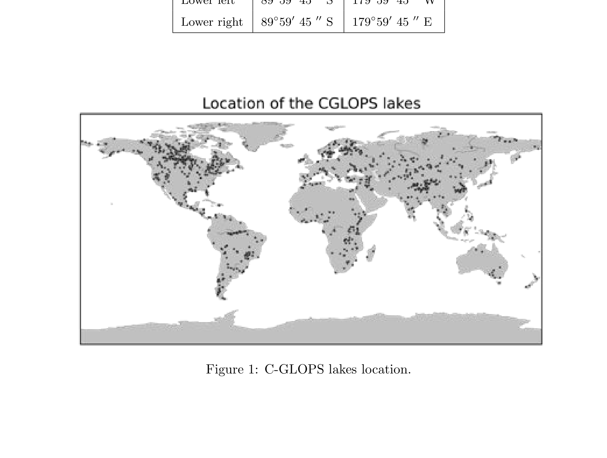

# PRODUCT USER MANUAL LAKE SURFACE WATER TEMPERATURE 1KM PRODUCTS

2020-08-16

- [1 Change
  Record](#change-record)
- [2 Acronyms](#acronyms)
- [3 General
  definitions](#general-definitions)
- [4 Background of the
  document](#background-of-the-document)
  - [4.1 Executive
    summary](#executive-summary)
  - [4.2 Scope and
    objectives](#scope-and-objectives)
  - [4.3 Content of the
    document](#content-of-the-document)
  - [4.4 Related
    documents](#related-documents)
    - [4.4.1 Applicable
      documents](#applicable-documents)
    - [4.4.2 Input](#input)
    - [4.4.3 External
      documents](#external-documents)
- [5 Review of user
  requirements](#review-of-user-requirements)
- [6 Algorithm](#algorithm)
  - [6.1 Overview](#overview)
    - [6.1.1 Lake Surface Water
      Temperature retrieval](#lake-surface-water-temperature-retrieval)
    - [6.1.2 Lake-specific
      inputs to radiative transfer modelling
      (simulation)](#lake-specific-inputs-to-radiative-transfer-modelling-simulation)
    - [6.1.3
      Classification](#classification)
    - [6.1.4
      Gridding](#gridding)
    - [6.1.5 Temporal
      aggregation](#temporal-aggregation)
  - [6.2 Limitations of the
    product](#limitations-of-the-product)
- [7 Product
  description](#product-description)
  - [7.1 The C-GLOPS
    products](#the-c-glops-products)
  - [7.2 File
    naming](#file-naming)
  - [7.3 File
    format](#file-format)
  - [7.4 Product
    content](#product-content)
    - [7.4.1 Data
      file](#data-file)
  - [7.5 Product
    characteristics](#product-characteristics)
    - [7.5.1 Projection and grid
      information](#projection-and-grid-information)
    - [7.5.2 Spatial
      information](#spatial-information)
    - [7.5.3 Temporal
      information](#temporal-information)
    - [7.5.4 Data
      policies](#data-policies)
    - [7.5.5
      Contacts](#contacts)
    - [7.5.6 Sample
      product](#sample-product)
- [8 Validation](#validation)
- [9 References](#references)

Dissemination Level

Document Release Sheet

|  |  |  |
|----|----|----|
| PU | Public | X |
| PP | Restricted to other programme participants (including the Commission Services) |  |
| RE | Restricted to a group specified by the consortium (including the Commission Services) |  |
| CO | Confidential, only for members of the consortium (including the Commission Services) |  |
|  |  |  |
| — | — | — |
| Book Captain: | Laura Carrea (University of Reading) | Sign |
| Approval: |  | Sign |
| Endorsement: |  | Sign |
| Distribution: | Public |  |

# Change Record

Change Record

| Issue/Rev | Date | Page(s) | Description of Change | Release |
|----|----|----|----|----|
| I1.01: | 26.06.2018 | 18 | First Version for PUM Lake Surface Water Temperature products Version 1.1.0 |  |
| I1.02: | 09.11.2017 | 18 | Internal review |  |
| I1.03: | 27.06.2018 | 21 | Internal review |  |
| I1.04: | 26.06.2018 | 21 | Internal review |  |
| I1.05: | 22.03.2019 | 21 | Corrections according to Review 4 |  |
| I1.06: | 22.05.2019 | 20 | Final minor corrections according to Review 4 |  |
| I1.07: | 30.11.2019 | 20 | Inclusion of the validation of the LSWT product from Sentinel-3A SLSTR instrument. Update of the C-GLOPS website link at the University of Reading. Introduction of SLSTR-A LSWT v1.0.2 for reprocessed data. |  |
| I1.08: | 22.04.2020 | 20 | Inclusion of the LSWT product from Sentinel-3A and Sentinel-3B SLSTR instruments. |  |
| I1.09: | 15.08.2020 | 22 | Inclusion of the LSWT product from Sentinel-3A and Sentinel-3B SLSTR instruments and the reprocessed SLSTR-A LSWT product. |  |

# Acronyms

**AATRS** Advanced Along-Track Scanning Radiometer.

**ARC** ATSR Reprocessing for Climate.

**ATBD** Algorithm Theoretical Basis Document.

**BT** Brightness Temperature.

**C-GLOPS** Copernicus Global Land Operations.

**CCI** Climate Change Initiative.

**ECV** Essential Climate Variable.

**ESA** European Space Agency.

**GHRSST** Group for High Resolution SST.

**GLWD** Global Lakes and Wetlands Database.

**LSWT** Lake Surface Water Temperature.

**MAP** Maximum Aposteriori Probability.

**MERIS** MEdium Resolution Imaging Spectometer.

**NIR** Near-InfraRed.

**NRT** Near Real Time.

**NWP** Numerical Weather Prediction.

**OE** Optimal Estimation.

**PML** Plymouth Marine Laboratory.

**PUM** Product User Manual.

**QAR** Quality Assessment Report.

**RTM** Radiative Transfer Model.

**SLSTR** Sea and Land Surface Temperature Radiometer.

**SLSTRA** Sentinel-3A Sea and Land Surface Temperature Radiometer.

**SST** Sea Surface Tempertaure.

**SWIR** Short-Wave-InfraRed.

**TCWV** Total Column Water Vapour.

**VIS** Visible.

**WGS84** World Geodetic System 1984.

# General definitions

- **L2P** Geophysical variables derived from Level 1 source data on the
  Level 1 grid (typically the satellite swath projection). Ancillary
  data and metadata added following the Group for High Resolution SST
  (GHRSST) Data Specification.

- **L3U** L2 data granules remapped to a regular latitude/longitude grid
  without combining observations from multiple source files. L3U files
  will typically be sparse, corresponding to a single satellite orbit.

- **L3C** LSWT observations from a single instrument combined into a
  space-time grid. In this project, a typical L3C file may contain all
  the observations from a single instrument in a 24-hour period.

# Background of the document

## Executive summary

The C-GLOPS Lake Water provides an optical and thermal characterization
of nominally 1000 inland water bodies (listed in the Algorithm
Theoretical Basis Document (ATBD)) that belong to the world’s largest
(according to the Global Lakes and Wetlands Database Global Lakes and
Wetlands Database (GLWD)) or are otherwise of specific environmental
monitoring interest. The products contain four sets of parameters: lake
water surface temperature, lake water reflectance (all wavebands that
are available after atmospheric correction), turbidity (derived from
suspended solids concentration estimates) and a trophic state index
(derived from phytoplankton biomass by proxy of chlorophyll-a).
Production and delivery of the parameters are over 10-day intervals on a
set grid (starting the 1st, 11th and 21st day of each month) and mapped
to a common global grid at either nominally 300m (~0.0026°) or 1000m
(~0.01°) resolution.

This Product User Manual (PUM) describes the LSWT products based on
observations in the visible and infrared by the Advanced Along-Track
Scanning Radiometer (AATSR) instrument on Envisat and by the SLSTR-A and
Sentinel-3B Sea and Land Surface Temperature Radiometer (SLSTR-A)
instruments on Sentinel-3A and Sentinel-3B. Table 1 summarises the
C-GLOPS products.

Table 1: C-GLOPS LSWT products.

| Sensor            | version | type                 | period covered             |
|-------------------|---------|----------------------|----------------------------|
| AATSR             | v1.0.2  | historical           | 11-May-2002 to 01-Apr-2012 |
| SLSTR-A           | v1.0.1  | Near Real Time (NRT) | 10-Apr-2018 to 20-Aug-2020 |
| SLSTR-A           | v1.0.2  | reprocessed          | 01-Jun-2016 to 30-Apr-2020 |
| SLSTR-A + SLSTR-A | v1.1.0  | NRT                  | 21-Aug-2020 to current     |

It also summarizes the validation results of the AATSR C-GLOPS product
carried out through comparison with in-situ measurements. The validation
of SLSTR-A is performed with a comparison with in-situ measurements for
data until the end of 2018. For the NRT LSWT product from SLSTR-A/B a
validity check is performed with a comparison with the climatology
routinely. This document also summarises the assessment of the
reprocessed SLSTR-A LSWT product and the assessment of the new SLSTR-AB
C-GLOPS LSWT product reported in details in the Quality Assessment
Report (QAR) and in the ATBD.

## Scope and objectives

This document provides an overview on the products provided within the
Lake Surface Water Temperature Service. The products follow the
specification (CGLOPS2-SSD) of the Global Component of the Copernicus
Land Service. The Sea and Land Surface Temperature Radiometer (SLSTR)
product is both operationally generated and reprocessed while the AATSR
product is a reprocessing of the full archive. They are delivered freely
through the Copernicus Global Land portal
(http://land.copernicus.vgt.vito.be). The main aim of the document is to
help users in selecting the data products they require, understanding
features and limitations and to then enable them to read and use the
data. A summary of how the data were produced is also included.

## Content of the document

This document is structured as follows:

- Chapter 2 recalls the users requirements, and the expected performance

- Chapter 3 review the retrieval methodology

- Chapter 4 describes the technical properties of the product

- Chapter 5 summarizes the results of the quality assessment

## Related documents

### Applicable documents

AD1: Annex I Technical Specifications JRC/IPR/2015/H.5/0026/OC to
Contract Notice 2015/S 151-277962 of 7th August 2015

AD2: Appendix 1 Copernicus Global land Component Product and Service
Detailed Technical requirements to Technical Annex to Contract Notice
2015/S 151-277962 of 7th August 2015

### Input

The inputs are:

- the Service Specifications of the Global Component of the Copernicus
  Land Service with document ID CGLOPS2_SSD

- the Algorithm Theoretical Basis Document of the Lake Surface Water
  Temperature

- the report describing the results of the scientific quality assessment
  of the Lake Surface Water Temperature

### External documents

ΝΑ

# Review of user requirements

According to the applicable document \[AD2\], the user’s requirements
relevant for LSWT are:

**Definition** The Lake Surface Water Temperature LSWT is defined as the
temperature of the water at the surface of the water body (surface skin
temperature).

**Geometric properties** The baseline dataset pixel size shall be
provided at a resolution of 1km. The target baseline location accuracy
shall be 1/3 of the at-nadir instantaneous field of view. Pixel
co-ordinates shall be given for the centre of the pixel.

**Geographical coverage** The initial window definition is aligned to
the global dataset produced during the GIO phase for the most widely
used output data:

- geographic projection: lat lon
- geodetical datum: WGS84
- pixel size: 1/120°
- accuracy: min 10 digits
- coordinate position: pixel centre
- global window coordinates: UL: 180W 90N, LR: 180E 90S

**Accuracy requirements** LSWT is an Essential Climate Variable (ECV)
(GCOS-200, 2016) with an associated uncertainty requirement of 1°K.

**Temporal Definition** As a baseline the physical parameter is computed
by and representative of decades, i.e. for ten-day periods a decade is
defined as follows: days 1 to 10, days 11 to 20 and days 21 to end of
month for each month of the year.

# Algorithm

The algorithm to derive the LSWT product from imagery of visible and
infrared radiometers consists of many components which aim to retrieve
the LSWT from the observed reflectances and brightness temperatures for
only-water pixels. The core of the algorithm is the retrieval part which
is based on Optimal Estimation (OE) given simulations and observations.
The other components of the algorithm prepare the inputs for the
retrieval part, namely simulate the brightness temperatures and classify
a pixel as water or non-water. Finally, the observations are gridded in
a regular 1/120° resolution grid and subsequently they are aggregated in
time.

## Overview

The core algorithm used for LSWT retrieval is an adaptation of the
European Space Agency (ESA) Climate Change Initiative (CCI) Sea Surface
Temperature (SST) retrieval algorithm \[Merchant and Team, 2017\] for
lakes developed within the UK-based National Environment Research
Council (UK) (NERC) GloboLakes project. It comprises the following
conceptual steps:

**Preparatory processing** This includes orbit file reading, validity
checks, association of auxiliary information to the orbit file being
processed, and any pre-processing adjustment to the data themselves.

**Classification** It identifies valid pixels for LSWT retrieval.
Although sometimes referred to as cloud detection, this also involves
identifying which image pixels cover only lake water.

**Retrieval of LSWT (geophysical inversion)** In case of inland water,
LSWT is calculated dynamically given prior information with OE.
Estimation of the retrieval uncertainty at pixel level is also part of
this step. The prime retrieval is of the radiometric temperature of the
inland water, which is taken as equivalent to the skin temperature.

**Gridding/averaging** The algorithm grids the full resolution imagery
(L2P) into a L3C daily file. The L3C product is then aggregated in time
to generate the C-GLOPS product.

After the preparatory processing, before LSWT retrievals can be made it
is first necessary to define the location of each lake, achieved through
the use of a land water mask and a water detection algorithm since lakes
have generally a dynamic extension. A suitable cloud detection algorithm
must then be employed to minimize the effect of cloud contamination in
the retrieved LSWT, while at the same time keeping the number of
observations incorrectly flagged as cloud to a minimum.

The approach to both cloud detection and LSWT retrieval in the CCI SST
processor is physics and it depends on forward modelling of clear-sky
infrared observations. Such modelling requires, as input, data
describing the state of the atmosphere and the surface.

Some of these data are lake-specific, in particular the prior surface
temperature and the lake surface emissivity and they will be discussed
in details.

In particular, it has been found that Numerical Weather Prediction
(NWP)-based values are not (at present) sufficiently accurate for this
purpose \[MacCallum and Merchant, 2013\]. Therefore, an alternative
source for these values needs to be identified. The prior surface
temperature is generated in form of a spatially-completed daily
climatology using a modification of the CCI SST retrieval algorithm. The
climatology will be stored in the prior surface temperature variable
within the retrieval algorithm through a look-up in the pre-processing
phase.

Moreover, since the performance of the CCI cloud detection (Bayesian)
depends on how accurate the prior surface temperature is, in the process
of creation of a suitable prior we attempted a classification of water
pixels which does not rely on the Bayesian cloud detection and therefore
on an accurate prior. The water pixel classification and the generation
of the prior surface temperature will be discussed in details in this
document.

The emissivity algorithm involves interpolation of fresh and saline
water emissivity according to the nature of any given lake.

The adaptations of the CCI SST processor for lakes are related to the
following aspects:

- accurate land water mask for inland water

- water detection algorithm in presence of clouds

- prior lake surface water temperature

- lake surface emissivity

A summary of the main algorithms involved in the generation of the
10-day C-GLOPS LSWT products is reported in the following subsections.

### Lake Surface Water Temperature retrieval

The LSWT is estimated for each (clear-sky) water pixel using joint
optimal estimation OE \[MacCallum and Merchant, 2012\] of surface
temperature and Total Column Water Vapour (TCWV) given the simulations
and observations. The form of OE used is to return the Maximum
A-posteriori Probability (MAP) assuming Gaussian error characteristics.
OE also gives an uncertainty estimate for each retrieval.

### Lake-specific inputs to radiative transfer modelling (simulation)

The LSWT retrieval algorithm is based on radiative transfer modelling.
The algorithm is generic with respect to what choice of Radiative
Transfer Model (RTM) is applied, as long as appropriate simulations of
Brightness Temperature (BT) and visible reflectance can be made. In
addition, the Jacobian (derivative of BT) is required with respect to
prior surface temperature and prior TCWV; any radiative transfer model
that simulates BT can provide the Jacobians by perturbation if it does
not directly output them. Thus, discussion of the RTM as such is
properly outside the scope of this document. Likewise, the algorithm is
generic with respect to the origin of the profiles of atmospheric
temperature and water vapour that are required to run the RTM: the
sourcing of such numerical weather prediction NWP fields for a given
location and observation is a generic process for which any implementer
of the retrieval algorithm will have a preferred local solution.
However, the sourcing of the prior surface temperature, and the lake
surface emissivity, e, are also required, and we have found that
NWP-based values for these are not (at present) sufficiently accurate
for this purpose. Therefore, they need to be specified by an algorithm,
presented here.

### Classification

Valid LSWT can be estimated only for pixels that are effectively water
and free of cloud. The algorithm for the discrimination of water and
non-water pixels in presence of clouds is based on threshold tests on
the Visible (VIS), Near-InfraRed (NIR), and Short-Wave-InfraRed (SWIR)
channels of the AATSR and SLSTR-A/B instruments. The thresholds to
detect water in presence of clouds have been defined starting from the
thresholds to detect water proposed within the ATSR Reprocessing for
Climate (ARC) Lake project \[MacCallum and Merchant, 2013\]. These
thresholds have been then tuned according the probability of clouds over
water computed on observations from the MEdium Resolution Imaging
Spectrometer (MERIS) instrument on Envisat like the AATSR instrument.
The probability of clouds have been computed by the Plymouth Marine
Laboratory (PML) with the method in \[Schiller et al., Sept. 2008\]
within the GloboLakes project. Importantly, at this stage the water
detection algorithm has been applied only to inland-water pixels in the
water bodies identifier mask \[Carrea et al., 2015\] built from the ESA
CCI Land Cover Project.

### Gridding

The LSWT product is required on a 1/120° latitude-longitude grid, and
thus a gridding algorithm is specified to take the observations from the
imagery resolution to the product resolution. The gridding algorithm is
based on the nearest neighbour scheme. The single orbit files are
combined into a space grid to obtain a daily L3C file.

### Temporal aggregation

The LSWT product is required on a 10-day basis. The temporal aggregation
of the observations is performed as a weighted average according to
weights related to the uncertainties and the quality of the
observations. The average is performed on the anomalies with respect to
a 20-year base. The temporal aggregation of the uncertainties is carried
out using a technique which take into account the error covariance
matrix estimated through the available observations.

## Limitations of the product

The most crucial assumption is related to the water detection algorithm
which is used to detect water in presence of clouds. The algorithm
relies on threshold tests which are applied to visible channels and
combinations. Since the spectral properties at the measured wavelengths
vary, lakes are optically diverse. Consequently, the thresholds depend
on water type and each threshold may be different for each water type.
Also, the thresholds depend on wind and satellite zenith angle and false
positives can be introduced by cloud/mountain shadowing. In this version
of the water detection algorithm one threshold for all the lakes has
been derived and utilised. As a result some water pixels may have not
been detected as water and more importantly some cloud/land contaminated
pixels may have been included in the set of pixel where the retrieval
has been applied. The $\chi^2$ test on the retrieval (see ATBD) which
has been used to derive the quality levels may have been of help in
those cases. The performance of the water detection is captured in a
water detection score which is used together with $\chi^2$ and other
parameters) to set the value of the quality levels. They range from 2
(worst quality) to 5 (best quality). We recommend to use ideally LSWT
only with quality levels 4 and 5 where the confidence of the results is
the highest. LSWT of quality levels = 3,2 should be used with care.

# Product description

## The C-GLOPS products

Currently, the C-GLOPS product consists of three types of data:
historical, reprocessed and NRT. The dataset available for day-time are
(see also Table 1):

- AATSR LSWT (v1.0.2) starting in May 2002 and continuing through April
  2012 (historical data)

- SLSTR-A reprocessed LSWT (v1.0.2) starting on the 01-Nov-2016 until
  10-Apr-2018. This reprocessing was performed because of problems in
  the SLSTR-A ground segment related to the NWP fields. The L1b files
  used for product were all Non-Time-Critical and the set of L1b files
  used was complete

- SLSTR-A reprocessed LSWT (v1.0.2) starting on the 11-Apr-2018 until
  30-Apr-2020. The L1b files used for the product are Non-Time-Critical
  and all the L1b data were available at the time of processing. An
  evaluation of the benefit of regular reprocessing is reported in the
  QAR.

- SLSTR-A NRT LSWT (v1.0.1) starting on the 11-Apr-2018 until current
  time (NRT data). The L1b files used for the product are partly
  Non-Time-Critical and party Near-Real-Time. Moreover, not necessarily
  all the L1b data were available at the time of processing.

- SLSTR-AB NRT LSWT (v1.1.0) is planned to start on the 21-Aug-2020. The
  L1b files used for the product will be partly Non-Time-Critical and
  party Near-Real-Time. Moreover, not necessarily all the L1b data were
  available at the time of processing.

Each file contains one set of LSWT which provides a measure of the
10-day average temperature of the skin of the water for all the in-land
water bodies included in C-GLOPS list (see Appendix of ATBD) at 1/120°
resolution. Each LSWT has a correspondent uncertainty estimate, a
quality level value and the standard deviation of the observations used
for the 10-day aggregation.

## File naming

For the Lake Surface Water Temperature Products, the following naming
convention is used:
`c_gls_<Acronym>-<YYYYMMDDHHmm>-<AREA>-<SENSOR>-<Version>.<EXTENSION>`
where

- `<Acronym>` is the name of the product, which is LSWT.
- `<YYYYMMDDHHmm>` gives the temporal location of the file. YYYY, MM, DD
  denote the year, the month, the day of the product. The day is the
  first day of the decadal average. Because time is not relevant, HHmm
  is always set to 0000.
- `<AREA>` gives the spatial coverage of the file. In our case, `<AREA>`
  is either GLOBE (Table 2).
- `<SENSOR>` gives the name of the sensor used to retrieve the product,
  either AATSR, SLSTR-A or SLSTR-AB.
- The `<Version>` is
  - 1.0.2 for historical AATSR data
  - 1.0.1 for NRT SLSTR-A data
  - 1.0.2 for reprocessed SLSTR-A data
  - 1.1.0 for NRT SLSTR-AB data
- `<EXTENSION>` is indicating the file format, which is .nc for the
  netCDF4 files produced.

Table 2: Naming convention and bounding box for continental subsets

| Short name Continent | Continent | Bounding Box           |
|----------------------|-----------|------------------------|
| GLOBE                | global    | 180°W 180°E, 90°N 90°S |

Example: c_gls_LSWT_200504010000_GLOBE_AATSR_v1.0.2.nc

## File format

The file format is netCDF CF1.6. The format of each parameter (band) is
provided in Table 4.

## Product content

### Data file

The dimensions of the product are listed in Table 3 and the variables
that are coming with the products are listed in Table 4.

Each variable in the netCDF file has attributes associated with. The
most important attributes to be able to read the data are reported in
Table 5, where:

- **units**: The units of the data after applying the scale_factor and
  add_offset conversion.
- **scale_factor**: Multiply the data stored in the NetCDF file by this
  number.

Table 3: Dimensions of the LSWT product

Table 4: Variables in the LSWT product.

| Dimension name | Data type | Description |
|----|----|----|
| lat | float | Latitude |
| lon | float | Longitude |
| time | int | Day at the beginning of the 10 days |
| Variable name | Data type | Description |
| — | — | — |
| lake_surface_water_temperature | short | 10-day aggregated lake surface water temperature |
| lwst_uncertainty | short | Uncertainty of the LSWT obtained from the OE uncertainty propagated through the 10 days taking into account a number of observations \< 10 |
| lwst_standard_deviation | short | Standard deviation of the LSWT observations within the 10 days. It is 0 in case of 1 observation only. |
| quality_level | byte | Overall quality indicators |
| n_lswt | byte | Number of observations contributing to the 10-day product |
| time_obs | short | Time of the observations used to build the 10-day C-GLOPS product |

- **add_offset**: After applying scale_factor, add this to obtain the
  data in the units specified in the units attribute.
- \*\*\_FillValue\*\*: The number put into the data arrays where there
  are no valid data (before applying the scale_factor and add_offset
  attributes).

Table 5: Attributes of the variables in the LSWT product.

|                                | units | scale_factor | add_offset | \_FillValue |
|--------------------------------|-------|--------------|------------|-------------|
| lake_surface_water_temperature | K     | 0.01         | 273.15     | -32768      |
| lwst_uncertainty               | K     | 0.001        | 0          | -32768      |
| lwst_standard_deviation        | K     | 0.001        | 0          | -32768      |
| quality_level                  |       |              |            | 0           |
| n_lswt                         |       |              |            | 0           |
| time_obs                       |       |              |            | 0           |

## Product characteristics

### Projection and grid information

Global, regional, or water-body specific files in NetCDF4 format, mapped
to a global 1/120° grid and including dimensions latitude, longitude
(WGS84 projection, EPSG: 4326), and time (seconds since 1981-01-01
00:00:00).

### Spatial information

The spatial extension of the global product covers the full globe. The
bounding box coordinates of the global product are reported in Table 6.
Figure 1 shows the distribution of the C-GLOPS lakes around the globe.
The full list of lakes is reported in the ATBD and at the following
website http://www.laketemp.net/home_CGLOPS/cglops_targets.php.

Table 6: Bounding box coordinates of the global product.

|  | Latitude | Longitude |
|----|----|----|
| Upper left | 89°59′45″N | 179°59′45″W |
| Upper right | 89°59′45″N | 179°59′45″E |
| {fig-alt=“This global map, titled ‘Location of the CGLOPS lakes’ and referred to as ‘Figure 1: C-GLOPS lakes location’, illustrates the distribution of Copernicus Global Lake and Ocean Products and Services (C-GLOPS) lakes worldwide. The continents are rendered in grey, and oceans in white. Individual C-GLOPS lake locations are marked as small black dots across the landmasses. The spatial distribution shows a higher concentration of monitored lakes in North America (particularly Canada and the USA), Europe, central Africa, and parts of Asia. Fewer lakes are visible in South America and Australia. The map includes Antarctica at the bottom. Above the map, a small table provides the bounding box coordinates for the global product: |  | Latitude |

This global map, titled “Location of the CGLOPS lakes” and referred to
as “Figure 1: C-GLOPS lakes location”, illustrates the distribution of
Copernicus Global Lake and Ocean Products and Services (C-GLOPS) lakes
worldwide. The continents are rendered in grey, and oceans in white.
Individual C-GLOPS lake locations are marked as small black dots across
the landmasses. The spatial distribution shows a higher concentration of
monitored lakes in North America (particularly Canada and the USA),
Europe, central Africa, and parts of Asia. Fewer lakes are visible in
South America and Australia. The map includes Antarctica at the bottom.

Above the map, a small table provides the bounding box coordinates for
the global product: \| \| Latitude \| Longitude \| \|—\|—\|—\| \| Lower
left \| 89°59’ 45’’ S \| 179°59’ 45’’ W \| \| Lower right \| 89°59’ 45’’
S \| 179°59’ 45’’ E \|

### Temporal information

The LSWT product (v1.0.1/v1.0.2 for SLSTR-A, v1.1.0 for SLSTR-AB and
v1.0.2 for AATSR) is 10-day composite. The temporal information
YYYYMMDDHHmm in the filename corresponds to the start date of the
10-daily period. The variable time in the netCDF4 file contains the
start date of the 10-day period as seconds since 1981-01-01 00:00:00.

The 10-day averages are always comprising the following days: 1-10,
11-20, 21-end of the month. Therefore, the last period of the month may
have between 8 and 11 observation days. In addition to this theoretical
time frame, the products contain the temporal information of the actual
observations used to construct the 10-day LSWT product. It is in the
form of a flag, where the first bit set to 1 implies that the
observation on day 1 of the 10-day period was present and used in the
temporal aggregation, and so on.

### Data policies

Any use of the Lake Surface Water Temperature product implies the
obligation to include in any publication or communication using these
products the following citation: The products were extracted from land
service of Copernicus, the Earth Observation program of the European
Commission. The research leading to the current version of the products
has received funding from the UK NERC GloboLakes project.

### Contacts

- Accountable contact: European Commission Directorate General Joint
  Research Centre, Email address:
  <copernicuslandproducts@jrc.ec.europa.eu>

- Scientific contact: University of Reading, Email address:
  <c.j.merchant@reading.ac.uk>, <l.carrea@reading.ac.uk>

- Production and distribution contact: University of Reading Email
  address: <l.carrea@reading.ac.uk>

### Sample product

Figures 2 and 3 provide an example of the SLSTR-A LSWT product for the
lakes Malawi, Malombe, Chiuta and Chilwa in Malawi for the period
starting on the 11-Jun-2018. They show the LSWT, its uncertainty and the
number of observations in Figure 2, and the quality levels, the standard
deviation and the time of the observations in Figure 3.

Figures 4 and 5 provide an example of the SLSTR-AB LSWT product for the
for a glacial lake in Greenland (centre lat=65.087, lon=-50.040, maximum
distance from land = 1.8 km) for the 10-day period starting on the
21-Jul-2020 using SLSTR-AB data. They show the LSWT, its uncertainty and
the number of observations in Figure 4, and the quality levels, the
standard deviation and the time of the observations in Figure 5. Despite
the lake is small, the 10-day SLSTR-AB LSWT product has a good number of
observations for most of the lake, good values of uncertainty and high
quality levels which indicates that the product is very reliable.

Three choropleth maps display Copernicus Land Monitoring Service (CLMS)
data for Lake Malawi, dated 20180611. The maps share a geographical
extent, with longitudes from approximately +34° to +35° and latitudes
from -10° to -15°.

1.  **Left Map: Lake Surface Water Temperature (LSWT)**. The colour
    scale ranges from purple to yellow, representing LSWT in Kelvin (K).
    Values range from 292.0 K (purple) to 300.0 K (yellow). Specific
    scale increments are 292.0, 292.8, 293.6, 294.4, 295.2, 296.0,
    296.8, 297.6, 298.4, 299.2, and 300.0 K. The northern and central
    parts of the lake show warmer temperatures (yellow/orange), while
    the southern arm displays cooler temperatures (purple/red).
2.  **Middle Map: LSWT Uncertainty**. The colour scale ranges from
    white/light blue to dark green/black, representing LSWT uncertainty
    in Kelvin (K). Values range from 0.0 K (white/light blue) to 1.0 K
    (dark green/black). Specific scale increments are 0.0, 0.1, 0.2,
    0.3, 0.4, 0.5, 0.6, 0.7, 0.8, 0.9, and 1.0 K. Higher uncertainty
    (darker colours) is observed in the northern and central areas of
    the lake, with lower uncertainty (lighter colours) predominantly in
    the southern parts.
3.  **Right Map: Number of observations**. The colour scale ranges from
    white/light yellow to black/dark red, indicating the number of
    observations used for the data composite. Values range from 0
    (white) to 6 (black). Specific scale increments are 0, 1, 2, 3, 4,
    5, and 6. The central and northern areas of the lake generally
    exhibit higher numbers of observations (up to 6), whereas the
    southernmost sections have fewer observations (1-2).

Three choropleth maps of Lake Malawi for the period starting 2018-06-11,
depicting Lake Surface Water Temperature (LSWT) Standard Deviation,
Quality Levels, and Observation Days used for temporal aggregation. All
maps show a geographic area spanning approximately 9°S to 15°S latitude
and 34°E to 35°E longitude.

1.  **LSWT Standard Deviation (left map):** Shows the standard deviation
    of Lake Surface Water Temperature in Kelvin (K). The colour scale
    ranges from 0.0 K (light blue/white) to 2.0 K (dark purple),
    indicating variability in LSWT. Areas in the northern and central
    parts of the lake show higher standard deviation (pink/purple),
    while southern areas tend to have lower values (light blue/white).
2.  **Quality levels (middle map):** Displays data quality levels. The
    colour scale represents four discrete quality levels: 2 (dark
    purple), 3 (light purple), 4 (light green), and 5 (dark green). The
    majority of the lake area is covered by quality levels 4 and 5,
    indicating high data quality, with smaller, scattered regions
    showing lower quality levels 2 and 3.
3.  **Observation days (right map):** Illustrates the combinations of
    days within the 10-day period (1-10) for which observations were
    used to construct the LSWT product. The legend lists various
    combinations of day numbers (e.g., “3+6+7+10”, “2+7+10”, “7+10”,
    “2+3+5+6+10”, “2+3”). These combinations vary spatially across the
    lake, indicating heterogeneous data availability for temporal
    aggregation. For instance, the northern tip predominantly shows
    combinations involving days 7 and 10, while the central and southern
    parts show a wider mix of days, including combinations like “2+3” at
    the southern end.

This image displays three choropleth maps side-by-side, illustrating
data for an “NN-Glacial-Lake” region for the period starting 2020-07-21.
All maps cover the geographic extent from approximately -50.4° to -49.8°
longitude and +64.8° to +65.4° latitude.

1.  **Left Map: Lake Surface Water Temperature (LSWT)**
    - Title: “NN-Glacial-Lake 20200721”
    - Data: Lake Surface Water Temperature in Kelvin (K).
    - Colour scale: A vertical bar ranging from purple (276.5 K) at the
      bottom to yellow (281.5 K) at the top.
    - Spatial pattern: Shows clusters of pixels with varying LSWT,
      generally higher (yellow/orange) in some areas and lower
      (purple/dark blue) in others, within the observed lake region.
2.  **Middle Map: LSWT Uncertainty**
    - Title: “Lake NN-Glacial-Lake 20200721”
    - Data: LSWT Uncertainty in Kelvin (K).
    - Colour scale: A vertical bar ranging from light blue/green (0.0 K)
      at the bottom to black (1.0 K) at the top.
    - Spatial pattern: Areas with observed LSWT also show corresponding
      uncertainty values, with higher uncertainty (darker colours)
      distributed across parts of the lake.
3.  **Right Map: Number of Observations**
    - Title: “Lake NN-Glacial-Lake 20200721”
    - Data: Number of observations.
    - Colour scale: A vertical bar ranging from white/light grey (0) at
      the bottom to red (12) at the top.
    - Spatial pattern: Indicates the count of individual observations
      contributing to the 10-day composite LSWT product for each pixel.
      Areas with higher observation density (darker colours, up to 12
      observations) are clustered, while other areas have fewer
      observations (lighter colours).

The maps collectively show the derived Lake Surface Water Temperature,
its associated uncertainty, and the underlying data density used to
create the 10-day composite product, all within a specific glacial lake
region in July 2020.

This figure presents three gridded maps showing characteristics of a
Lake Surface Water Temperature (LSWT) product for a specific Glacial
Lake on 2020-07-21, within the geographic coordinates of approximately
-50.4° to -49.8° longitude and +64.8° to +65.4° latitude.

1.  **Left Map: LSWT Standard Deviation (K)** This map displays the
    standard deviation of Lake Surface Water Temperature in Kelvin (K).
    The colour legend ranges from 0.0 K (dark blue) to 3.0 K (dark red),
    with intermediate values marked at 0.2 K increments. The pixels
    indicating the lake show a range of standard deviations, with values
    generally between 0.0 K and 2.0 K.

2.  **Middle Map: Quality levels** This map shows the quality levels of
    the LSWT product. The colour legend ranges from 2 (dark purple) to 5
    (dark green), with 3 (light purple) and 4 (light green) as
    intermediate levels. The majority of the lake pixels exhibit quality
    levels of 4 or 5, with a few areas at level 2 or 3.

3.  **Right Map: Observation days flag** This map indicates which
    specific observation days contributed to the 10-day LSWT composite
    product for each pixel, within the 10-day period starting
    2020-07-21. The legend shows a complex colour coding representing
    various combinations of observation days, such as “1+2”, “1+3+4”,
    “1+3+4+6”, “2+3+10”, and “1+3+4+6+9+10+11”. These numbers correspond
    to specific days within the 10-day period. Different parts of the
    lake were constructed from observations on varying sets of days.

# Validation

A detailed description of the validation and respective results are
provided with the QAR. The AATSR LSWT product was tested against in-situ
data, for the set of lakes where in-situ measurements were available.
The SLSTR-A LSWT product was compared with in-situ measurements and for
NRT validity check it is routinely compared with the climatology
described in the ATBD.

A first assessment of the L2P LSWT data (for both AATSR and SLSTR-A
instruments) is performed mainly through basic statistics and time
series comparison with in-situ measurements. Time series comparison of
in-situ data and satellite derived parameters enables to assess the
behaviour of both measurement techniques over time. The focus is on the
consistency of the time series on the one hand and on the comparability
of the datasets on the other hand. The order of magnitude and seasonal
patterns are investigated. The assessment of the available sites/lakes
shows that the products are consistent in time and mainly also in space.
Seasonal patterns are as expected. The in-situ measurements show at
times possible invalid data. The comparison between the C-GLOPS products
and in-situ measurements show same magnitude, but only a few analysis
could be performed at this stage. In future and in a scope of a second
level validation these investigations will be intensified dependently on
the availability of an extended in-situ measurements dataset.

An assessment of the reprocessed SLSTR-A LSWTs shows benefits for both
the uncertainties and the confidence levels. This suggests that regular
reprocessing of the NRT product is beneficial for its usability.

Regarding the SLSTR-AB C-GLOPS LSWT, a comparative analysis of LSWTs
from the two instruments during the tandem phase shows a very good
agreement between the temperatures from the two instruments as shown in
the ATBD. Moreover, an assessment of the improvements offered by the
inclusion of the measurements from a second instrument is reported in
the QAR. The LSWTs utilised to generated the 10-day product are doubled,
the uncertainties are lower and the quality levels higher granting more
reliability in the product.

Manual inspection of all products for more than 1000 water bodies is
impossible and in most cases requires local knowledge. The validation of
the products is, and always will be, based on a small sample of
well-studied areas. Users of these products are therefore advised to
inspect the results for their area of interest before generating
derivative products. This inspection could include, for example,
histograms to identify outliers. Users are also advised to take into
account the number of observations underlying the results. Where
observations are sparse, having a small number of satellite passes to
cover a large water body can lead to visual inconsistencies that do not
reflect the state of the water body at any particular time this is
merely the nature of creating aggregate products. Expert users are
encouraged to take part in the validation of these products that is
increasingly taking place at the global scale. The spatio-temporal
coverage and quality of the global lake water products can be improved
if the algorithms underlying these products can be accurately adjusted
to waters of each optical type.

# References

- L. Carrea, O. Embury, and C.J. Merchant. Datasets related to in-land
  water for limnology and remote sensing applications: distance-to-land,
  distance-to-water, water-body identifier and lake-centre co-ordinates.
  *Geoscience Data Journal*, 2:83-97, 2015.

- S. MacCallum and C.J. Merchant. Surface water temperature observations
  of large lakes by optimal estimation. *Canandian J Rem Sens*,
  38:25-45, 2012.

- S. MacCallum and C.J. Merchant. ATSR reprocessing for climate lake
  surface temperature: ARC-Lake Algorithm Theoretical Basis Document
  (no. v1.4), Univ. of Edinburgh. Retrieved from
  <http://www.laketemp.net/home/dataF/ARC-Lake-ATBD-v1.4.pdf>, 2013.

- C.J. Merchant and SST CCI Team. Algorithm Theoretical Basis Document
  (Phase II EXP 1.8), European Space Agency Contract Report. Retrieved
  from
  <http://www.esa-sst-cci.org/PUG/pdf/SST-CCI-ATBD-UOR-202_Issue-1-signed.pdf>,
  2017.

- H. Schiller, C. Brockmann, H. Krasemann, and W. Schoenfeld. A method
  for detection and classification of clouds over water. In Proc. of the
  2nd MERIS (A)ATSR Users Workshop, Sept. 2008.
