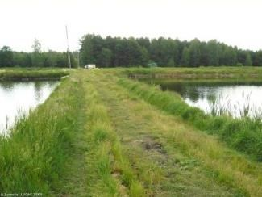

# Coastal Zones Monitoring 2012-2018 - Nomenclature Guideline

Copernicus Land Monitoring Service

This document functions as a land cover and land use nomenclature guideline specifically tailored for the Copernicus local land monitoring product focusing on Coastal Zones. It provides detailed descriptions of all Level 5 land cover and land use classes, encompassing their geographic characteristics, available input datasets, and the interpretation methods employed. It offers a structured framework for accurate and consistent classification of land features within the coastal environment. The document aims to standardise the classification process.

Published

June 3, 2026

Keywords

Coastal Zones, Land Cover, Land Use, nomenclature guideline, thematic classes, satellite image classification, change detection layer, visual interpretation, object delineation, minimum mapping unit

  
**Contact:**

European Environment Agency (EEA)  
Kongens Nytorv 6  
1050 Copenhagen K  
Denmark  
[**https://land.copernicus.eu/**](https://land.copernicus.eu/)

# 1 Introduction

This document provides a **comprehensive Land Cover/Land Use nomenclature guideline for the Copernicus local land monitoring product Coastal Zones**, which is covering the detailed description of all level 5 classes, their geographic characteristics, available input datasets and relevant methods to interpret the respective classes.

# 2 LC/LU Product Description

The Coastal Zones Land Cover/Land Use product is providing a detailed LC/LU dataset for areas along the marine coastline of the EEA39 countries. A 10 km inland buffer zone and the CLC (Corine Land Cover) buffer zone seawards along the coastline define the Area of Interest (AoI) of the CZ mapping. In the first project phase the AoI was amended to include all areas relevant for the Coastal Zones product (estuaries, coastal lowlands, nature reserves). The total covered area on land along all European coastline is approximately 715.000 km².

The CZ component contains 3 complementary service elements:

1.  LC/LU status maps for the reference year 2012

2.  LC/LU status maps for the reference year 2018

3.  LC/LU change layer 2012-2018 derived from and fully consistent with a) and b) to characterize the evolution of the coastline over time

The Coastal Zones LC/LU layer differentiates 71 thematic LC/LU classes. The layers are based on satellite image classification to derive the 2012 and 2018 LC/LU situation. A key element is a visual interpretation and delineation of LC/LU from VHR satellite imagery for the reference years 2012 and 2018.

The change detection layer makes use of the LC/LU 2012 status information, applying a visual change interpretation and delineation using the VHR satellite imagery from the reference years 2012 and 2018.

The nomenclature is designed based on the MAES ecosystem typology, as part of the EU Biodiversity Strategy to 2020. Furthermore, this LC/LU nomenclature ensures compatibility to other European established LC/LU products such as CLC and Urban Atlas as well as Riparian Zones and Natura2000 to a high degree.

Compared to the last two products the nomenclature experienced some adaptations to reduce ambiguities and to reflect the particularities of coastal zones better.

## 2.1 Product Specifications of the Land Cover and Land Use Product

[TABLE]

# 3 Coastal Zones LC/LU Nomenclature

The nomenclature of the CZ products follows the same approach as the other hotspot nomenclatures. All thematic hotspot nomenclatures share a set of core classes in common. Building on this basis each hotspot product is amended with additionally detailing classes required by the topic of the specific product. The LC/LU classes and the hierarchical structure of the nomenclature are conceived in a way to allow the merging of different hotspot products to one at the level of the core classes. The current CZ nomenclature is the result of two revisions. The first revision was introduced in summer 2017 and aimed at:

- Harmonisation within the thematic hotspot mapping products

- Reduction of classes to those reliably derivable from EO data

- Removal of thematic overlaps and gaps

- Harmonisation of hierarchical inconsistencies

The second revision was introduced in late 2019 after extensive discussions with mapping experts and CZ product users. The second revision aimed at the further harmonisation of the nomenclature and to maximise the usefulness of the product for the user community. At the current stage (Q1-2020) the second revision is only implemented by the CZ product, not by the other thematic hotspot products yet. The translation from the 2017 version into the 2019 version is a matter of class recoding, thus consistency is preserved.

The creation of the new Natura 2000 nomenclature, based on the v1 of this guideline, experienced a coding inconsistency due to which an extension of the CZ Nomenclature to include a level 5 was decided to guarantee harmonisation between the products. With this novelty, the updated CZ nomenclature and the Natura 2000 nomenclature are identical until Level 2 and only vary in an extended subdivision of parent classes on level 4 or 5.

In line with the other thematic hotspot products the CZ nomenclature is designed to address the MAES classes at level 2.[^1] Table 2 describes how CZ classes shall be aggregated to map MAES at level 2.

![This diagram presents a hierarchical land cover/land use (LCLU) nomenclature system organised into five thematic levels, with a sixth column for 'Ecosystem types level 2 (MAES)' (Mapping and Assessment of Ecosystems and their Services). The classification begins with three main Level 1 categories, which are then progressively refined into more specific classes up to Level 4. The Level 1 categories are: 1. \*\*1 Urban\*\*: This category encompasses four Level 2 sub-categories: \* \*\*1.1 Urban fabric, industrial, commercial, public, military and private units\*\*: This expands into two Level 3 types: \* \*\*1.1.1 Urban fabric (predominantly public and private units)\*\*, which further divides into three Level 4 classes based on Imperviousness Density (IMD): '1.1.1.1 Continuous urban fabric (IMD ≥80%)', '1.1.1.2 Dense urban fabric (IMD ≥30-80%)', and '1.1.1.3 Low density fabric (IMD \<30%)'. \* \*\*1.1.2 Industrial, commercial, public and military units\*\*, which divides into '1.1.2.1 Industrial, commercial, public and military units (other)' and '1.1.2.2 Nuclear energy plants and associated land'. \* \*\*1.2 Transport infrastructure\*\*: This expands into four Level 3 types: '1.2.1 Road networks and associated land', '1.2.2 Railways and associated land', '1.2.3 Port areas and associated land' (which further categorizes into seven Level 4 classes: '1.2.3.1 Cargo port', '1.2.3.2 Passenger port', '1.2.3.3 Fishing port', '1.2.3.4 Naval port', '1.2.3.5 Marinas', '1.2.3.6 Local multi-functional harbours', and '1.2.3.7 Shipyards'), and '1.2.4 Airports and associated land'. \* \*\*1.3 Mineral extraction, dump and construction sites, land without current use\*\*: This expands into two Level 3 types: \* \*\*1.3.1 Mineral extraction, dump and construction sites\*\*, which further divides into three Level 4 classes: '1.3.1.1 Mineral extraction sites', '1.3.1.2 Dump sites', and '1.3.1.3 Construction sites'. \* \*\*1.3.2 Land without current use\*\*. \* \*\*1.4 Green urban, sports and leisure facilities\*\*. All Level 1 '1 Urban' categories map to 'Urban' in the Ecosystem types level 2 (MAES) column. 2. \*\*2 Cropland\*\*: This category encompasses three Level 2 sub-categories: \* \*\*2.1 Arable land\*\*: This expands into '2.1.1 Arable irrigated and non-irrigated land' and '2.1.2 Greenhouses' at Level 3. \* \*\*2.2 Permanent crops\*\*: This expands into '2.2.1 Vineyards, fruit trees and berry plantations' and '2.2.2 Olive groves' at Level 3. \* \*\*2.3 Heterogeneous agricultural area\*\*: This expands into four Level 3 types: '2.3.1 Annual crops associated with permanent crops', '2.3.2 Complex cultivation patterns', '2.3.3 Land principally occupied by agriculture with significant areas of natural vegetation', and '2.3.4 Agro-forestry'. All Level 1 '2 Cropland' categories map to 'Cropland' in the Ecosystem types level 2 (MAES) column. 3. \*\*3 Woodland and forest\*\*: This category encompasses six Level 2 sub-categories: \* \*\*3.1 Broadleaved forest\*\*: This expands into '3.1.1 Natural & semi-natural broadleaved forest' and '3.1.2 Highly artificial broadleaved plantations' at Level 3. \* \*\*3.2 Coniferous forest\*\*: This expands into '3.2.1 Natural & semi-natural coniferous forest' and '3.2.2 Highly artificial coniferous plantations' at Level 3. \* \*\*3.3 Mixed forest\*\*: This expands into '3.3.1 Natural & semi-natural mixed forest' and '3.3.2 Highly artificial mixed plantations' at Level 3. \* \*\*3.4 Transitional woodland and scrub\*\*. \*](Coastal_Zones_2012-2018_Nomenclature_Guideline_v1-media/image1.png)

![This diagram presents a hierarchical Land Cover / Land Use (LCLU) classification nomenclature for Copernicus Land Monitoring Service (CLMS) Coastal Zones (CZ) products, detailing classes from Level 1 to Level 4, with a broader aggregation level on the right. The classification system includes: - \*\*Level 1 categories (leftmost column):\*\* - \`4 Grassland\` - \`5 Heathland and scrub\` - \`6 Open spaces with little or no vegetation\` - \`7 Wetland\` - \`8 Water\` - \*\*Level 2 sub-categories:\*\* - Under \`4 Grassland\`: \`4.1 Managed grassland\`, \`4.2 Natural & semi-natural grassland\` - Under \`5 Heathland and scrub\`: \`5.1 Heathland and moorland\`, \`5.2 Alpine scrub land\`, \`5.3 Sclerophyllous scrubs\` - Under \`6 Open spaces with little or no vegetation\`: \`6.1 Sparsely vegetated areas\`, \`6.2 Beaches, dunes, river banks\`, \`6.3 Bare rocks, burnt areas, glaciers and perpetual snow\` - Under \`7 Wetland\`: \`7.1 Inland wetlands\`, \`7.2 Coastal wetlands\` - Under \`8 Water\`: \`8.1 Water courses\`, \`8.2 Lakes and reservoirs\`, \`8.3 Transitional waters\`, \`8.4 Sea and ocean\` - \*\*Level 3 sub-categories:\*\* - Under \`4.2 Natural & semi-natural grassland\`: \`4.2.1 Semi-natural grassland\`, \`4.2.2 Alpine and sub-alpine natural grassland\` - Under \`6.1 Sparsely vegetated areas\`: \`6.1.1 Sparse vegetation on sands\`, \`6.1.2 Sparse vegetation on rocks\` - Under \`6.2 Beaches, dunes, river banks\`: \`6.2.1 Beaches and dunes\`, \`6.2.2 River banks\` - Under \`6.3 Bare rocks, burnt areas, glaciers and perpetual snow\`: \`6.3.1 Bare rocks, outcrops, cliffs\`, \`6.3.2 Burnt areas (except burnt forest)\`, \`6.3.3 Glaciers and perpetual snow\` - Under \`7.1 Inland wetlands\`: \`7.1.1 Inland marshes\`, \`7.1.2 Peat bogs\` - Under \`7.2 Coastal wetlands\`: \`7.2.1 Salt marshes\`, \`7.2.2 Salines\`, \`7.2.3 Intertidal flats\` - Under \`8.1 Water courses\`: \`8.1.1 Natural & semi-natural water courses\`, \`8.1.2 Highly modified water courses and canals\`, \`8.1.3 Seasonally connected water courses (oxbows)\` - Under \`8.2 Lakes and reservoirs\`: \`8.2.1 Natural lakes\`, \`8.2.2 Reservoirs\`, \`8.2.3 Aquaculture ponds\`, \`8.2.4 Standing water bodies of extractive industrial sites\` - Under \`8.3 Transitional waters\`: \`8.3.1 Lagoons\`, \`8.3.2 Estuaries\`, \`8.3.3 Marine inlets and fjords\` - Under \`8.4 Sea and ocean\`: \`8.4.1 Open sea\`, \`8.4.2 Coastal waters\` - \*\*Level 4 sub-categories (rightmost detailed column):\*\* - Under \`6.2.1 Beaches and dunes\`: \`6.2.1.1 Beaches\` (\`6.2.1.1.1 Sandy beaches\`, \`6.2.1.1.2 Shingle beaches\`), \`6.2.1.2 Dunes\` - Under \`6.3.1 Bare rocks, outcrops, cliffs\`: \`6.3.1.1 Bare rocks and outcrops\`, \`6.3.1.2 Coastal cliffs\` - Under \`7.1.2 Peat bogs\`: \`7.1.2.1 Exploited peat bogs\`, \`7.1.2.2 Unexploited peat bogs\` - \*\*Aggregated Higher-Level Categories (rightmost column):\*\* - \`Grassland\` (aggregates \`4 Grassland\` categories) - \`Heathland and shrub\` (aggregates \`5 Heathland and scrub\` categories) - \`Sparsely vegetated land\` (aggregates \`6 Open spaces with little or no vegetation\` categories) - \`Wetlands\` (aggregates \`7 Wetland\` categories) - \`Marine inlets and transitional waters\` (aggregates \`7.2 Coastal wetlands\` and \`8.3 Transitional waters\` categories) - \`Rivers and lakes\` (aggregates \`8.1 Water courses\` and \`8.2 Lakes and reservoirs\` categories) - \`Open ocean\` (aggregates \`8.4.1 Open sea\`) - \`Coastal\` (aggregates \`8.4.2 Coastal waters\`) This nomenclature is part of the current Coastal Zones (CZ) products and is structured to allow merging of different hotspot products at the level of core classes.](Coastal_Zones_2012-2018_Nomenclature_Guideline_v1-media/image2.png)

Table 2: Detailed CZ LC/LU classes and cross reference to MAES Level 2

# 4 Mapping Rules

**Object Delineation:**

Object delineation is performed on VHR EO data (see Table 1) as primary data source. In areas, where two or more satellite scenes overlap, the most suitable scene is chosen as primary data source. In this regard a detailed prioritization system has been established considering especially acquisition year and acquisition month.

In cases where clouds or cloud shadows cover the area of interest alternative image data can be used. Low resolution images (e.g. Sentinel-2) can mitigate gaps according to land cover type (e.g. small gaps due to clouds on big forest coverage can be mitigated by low resolution images).

**Delineation Rules:**

Object delineation should be as follows:

- Delineation shall be angular and not round.

- Avoid digitizing too many vertices: Use vertices as few as possible and only as many as necessary to define the shape of an object.

- Avoid mapping sharp angles.

- Use road centres (roads \< 10m width) as border between two objects if roads separate two features. E.g. a forest and an agricultural area are separated by a road feature \< 10m width. Map the border between forest and agriculture in the middle of the road.

**Minimum Mapping Unit (MMU) / Minimum Mapping Width (MMW):**

The minimum mapping unit defined is ≥ 0.5 ha for all objects. A minimum width of ≥ 10m is required for all features.

*MMU Exceptions:*

- Objects located at the border of the Area of Interest:

If an object is cut by the AoI border and the portion lying inside the AoI therefore is \< 0.5 ha, this feature is mapped, if the whole object (inside and outside the AoI) amounts to ≥ 0.5 ha. However, the MMU of those divided features lying inside the AoI shall have a MMU of at least ≥ 0.1 ha. Smaller objects will be generalized.

- Linear features (roads, railways, rivers) that are split in two or more polygons by other linear elements (e.g. the road/railway network) will be mapped even if the resulting segments are smaller than the MMU in order to preserve the network. However, features \< 0.1 ha will be generalized.

- Urban objects which are confined by roads or railways. Features \< 0.25 ha will be generalized.

- Complex changes (see below).

*MMW Exceptions:*

- To maintain continuity of linear features (Codes 1.2.1, 1.2.2, 8.1.1 and 8.1.2); the MMW may fall below the limit of 10 m over a distance of up to 100m.

**Good Practice for Data Display – Mapping Scale:**

On-screen mapping scale is 1:5.000-1:10.000 depending on the landscape and feature class. Large homogeneous objects like agricultural areas or woodland are mapped at scales 1:8.000-1:10.000. For all other features, 1:5.000 mapping scale is applied.

**Overlap Rules:**

Objects may not overlap. In case of real objects overlay, the following rules apply:

- If objects overlap on **different levels**, the top level is mapped. Example: if an artificial canal overlaps a river, the canal is mapped continuously.

- If objects overlap on **the same level**, the visually dominant object is mapped continuously. However, if roads and railways meet on the same level, railways are mapped continuously to maintain the railway network.

**Priority Rules:**

The priority rules applied are defined as follows:

- Objects \< 0.5 ha are added to the neighbouring object of the same sub-class.

- Objects \< 0.5 ha are added to the neighbouring object with the longest common border line. Exception: Objects surrounded by railways or roads. If an object is below the MMU size and completely surrounded by a road or railway network, it shall be aggregated with that surrounding traffic line. However, an exception is made for urban objects. Please see respective definition with classes *1 Urban.*

**Water level rules**

Differences due to different water levels are not considered as a land cover / land use change. The reference year 2012 serves as basis for the LC/LU mapping and the water level of 2012 will be delineated. If there are temporal fluctuations of water level between 2012 and 2018 following procedures will be applied:

- **Flood event:**

A flood event is an exceptional situation and not considered as a "Different water level". In case of a flood event the actual/real LC/LU should be mapped (use EU Hydro, OSM or adequate data sources for identification). In those cases no comment "Different water level" but “Flooded area” will be allocated.

- **Higher water level in 2012:**

In case of a higher water level in 2012, the water level of 2012 will be mapped, and the temporal dried up areas in 2018 will not be mapped. The water areas will be flagged with the comment "Different water level".

- **Higher water level in 2018:**

In case of a higher water level in 2018, the water level of 2012 will be mapped. The areas covered by water in 2018 get mapped with the actual land cover of 2012 and get attributed with the comment "Different water level"

- **Different water level on coastline**

The coastline is derived from the adapted product of the EU-Hydro coastline. This coastline will not be changed even if the imagery shows different water level. In the case of different water levels due to tides the polygons should get the comment "Different water level".

- Flagging of polygons due to different water level should just be applied if the MMW and MMU specifications are met, the difference should be lager then 0,5 ha and wider than 10m.

**Geometric inconsistencies between 2012 and 2018**

Sometimes geometric inconsistencies between 2012 and 2018 can be seen on image data. In this case the delineation will be performed as follows:

- 2012 LC/LU will be mapped according to image geometries (2012 is base geometry).

- 2018 LC/LU will not be changed due to image distortion. In case of real LC/LU changes these will be “interpolated” based on the 2012 image geometries.

**Application of Additional Data Sources:**

For data interpretation, additional data sources like CORINE Land Cover (CLC) 2012/2018, Urban Atlas (UA) 2012/2018, Riparian Zones mapping (RZ) 2012/2018, Natura2000 mapping (N2K) 2012, topographic maps, national WMS services, COTS navigation data and auxiliary data including local expertise is used.

- RZ and N2k: existing Hot Spot Mappings are fully integrated in the CZ dataset.

- UA2012/2018: UA data are partly integrated in the CZ dataset. Suitable classes are selected and after adaptation of geometries integrated in the CZ dataset.

- CLC2012/2018: CLC is used as important data source for class assignment. CLC data use ensures data compatibility between CLC and CZ.

- In-situ data: Diverse national in-situ data like WMS services, specific maps or classifications as well as descriptions and maps of N2000 or RAMSAR sites are used to support the object interpretation.

**Allowed Comments:**

In order to clarify certain mapping delineations, there are some comments defined as product attributes.

| **Order No** | **Description; Note** | **Comment** |
|----|----|----|
| 1 | Polygons \< 0.5 ha at outer AoI site boundary, that have an apparent continuation outside the AoI boundary visible on the image data. | "Area size exception (at Coastal Zones AoI boundary)" |
| 2 | Polygons \< 0.5 ha inside AoI site boundary; e.g. to ensure continuity of road/rail/river network at intersections of these classes. Urban objects confined by roads or railways ≥ 0.25 ha up to \< 0.5 ha. | "Area size exception (inside Coastal Zones AoI boundary)" |
| 3 | Changes over several classes. Each change is \< 0.5 ha but overall change (=sum of individual change areas) is \> 0.5 ha. | "Splitted change" |
| 4 | Polygons \< 0.5 ha with no change but connected to change polygons (same code at a neighbouring polygon in one of the two years). | "Areas related to change" |
| 5 | For areas completely or partially flooded by water (flooded land). Flooding should be an exceptional event and only be used with classes which are not part of a riparian, lake or coastal system. The comment is given only in the year of the flooding event. | "Flooded area 2012" or “Flooded area 2018” |
| 6 | Different water levels in image data which shows no flood event and occur regularly (e.g. tide on the coastline, difference in water level of reservoirs and dams, seasonal changes of water discharge of rivers). Regarding delineation see above water level rules. | "Different water level" |

Table 3: List of allowed comments {.caption-top .table}

# 5 Definition and rules for change mapping

Following definitions and rules for Land Cover Change (LCC) mapping are based on the LCC rules of Corine Land Cover (CLC). The given rules were adopted and expanded to the Natura 2000, Riparian Zone and Coastal Zones specifications and requirements.

## 5.1 V.I Mapping of Land Cover Change in Coastal Zones project

In the Coastal Zones project, change mapping is carried out by visual interpretation of 2012 LC/LU vector data and satellite imagery of the timeframe 2018 and subsequent direct delineation of change polygons.

The basis of identification of changes is the interpretation of detectable land cover differences on satellite images from 2012 and 2018. The use of ancillary data is recommended.

Interpreters must be aware that not every change visible on the images should be treated as changes, e.g.:

- transient phenomena such as floods and temporary water-logging;

- seasonal changes in natural vegetation;

- seasonal changes in agriculture, such as effects of crop rotation on arable land;

- forest plantation growth, still not reaching the height and/or canopy closure of forest;

- changes of water level;

- temporal changes in water cover of fishpond cassettes being part of their management;

- seasonal changes of snow spots in high mountains.

- …

The introduction of false changes must also be avoided. Many of these can and should be excluded by pure logics. These vary from country to country (e.g. while normally sea water does not change into pasture, it might happen in the Netherlands), thus following examples are not exhaustive and not binding for all cases. However, in most cases they can be considered valid.

Highly improbable changes are for example (not a complete list):

- Classes *1.1.1 Urban fabric (predominantly public and private units)* 🡪 any other class than urban: urban areas seldom disappear.

- Classes *5 Heathland and scrub* 🡪 3.x.1.0: bushy vegetation classes of different climatic zones do not change between each other.

- *8.1.2 Highly modified natural water courses* 🡪 any other class: highly modified natural water courses and canals do not change to another class.

- etc.

**Minimum Mapping Unit and Minimum Mapping Width for changes**

The Minimum Mapping Unit (MMU) for LCC was set to ≥0.5 ha.

The Minimum Mapping Width (MMW) of ≥10 m is also valid for the LCC polygons.

**Exceptions** from MMU are defined where a generalization of change objects \< 0.5 ha is not reasonable because it would discard valuable information:

- Simple Change: Changes located at the border of a CZ AoI that continue outside, forming together objects of ≥ 0.5 ha. Those polygons will have the common attribute that is given for objects cut by CZ border. Objects \< 0.05 ha will be generalized.

- Complex Change: When a LCC polygon ≥ 0.5 ha is formed by several polygons, also polygons \< 0.5 ha have to be considered. See also 0. Complex changes. As the minimum mapping size for single change polygons of complex changes 0.05 ha is proposed.

- Single changes \< 0.05 ha will be generalized.

Land Cover Changes are changes that occur between the timespan 2012 (± 2 years) and the timespan 2018 (± 1 year). Changes resulting from different interpretations of the same subject are not considered as change.

**Direct delineation of changes**

Change polygons are drawn directly over the corresponding image by visual interpretation and are not generated automatically by a GIS operation.

## 5.2 V.II Simple change

Simple changes are modifications where either a single polygon changes from one LC/LU class to another or a new polygon ≥ 0.5 ha emerges within an existing, larger polygon.

![This image depicts an illustrative example of Land Cover Change (LCC) detected between two interpretation periods: 2012 and 2018. The 'Interpretation 2012' panel shows a larger light yellow polygon labelled 2.1.1.0, which encloses a complex red polygon labelled 1.1.1.1. Within this red polygon, a smaller, distinct light purple polygon is present, labelled 1.4.0.0. The 'Interpretation 2018' panel shows the same spatial arrangement of the outer light yellow polygon (2.1.1.0) and the main red polygon (1.1.1.1). However, the internal light purple polygon (1.4.0.0) from the 2012 interpretation has changed, and is now also classified as red, labelled 1.1.1.1. This demonstrates a land cover change where the area previously classified as 1.4.0.0 transitioned to 1.1.1.1 by 2018. No scale bar or compass orientation is visible.](Coastal_Zones_2012-2018_Nomenclature_Guideline_v1-media/image8.png)

Figure 1: The loss of green urban area ≥ 0.5 ha (1.4) in 2012 by becoming urban fabric in 2018.

## 5.3 V.III Complex changes

Although the MMU for change mapping is 0.5 ha, in some cases change polygons \< 0.5 ha are also mapped. When a new polygon is formed by taking area from several other polygons (e.g. a road construction, urban growth, …), the individually connected change parts can be mapped even if they are \< 0.5 ha, given they altogether make up a ≥ 0.5 ha complex change polygon (shown in Figure 2).

The minimum mapping unit for single polygons of complex changes is: ≥ 0.05 ha

![This conceptual diagram illustrates the process of delineating Land Cover Change (LCC) polygons, specifically how multiple small change polygons are aggregated to meet the Minimum Mapping Unit (MMU) requirement. It features four panels showing land cover from 2012 and 2018, both as raw imagery and interpreted classifications. 1. \*\*Image 2012:\*\* Displays an initial land cover state with three main classes: 4.1.0.0 (light green, top), 1.1.1.1 (red, bottom left), and 2.1.1.0 (light yellow, bottom right). Two smaller potential change areas are depicted with hatched patterns: a 0.1 ha area (hatched brown) and a 0.4 ha area (hatched orange), both adjacent to the 1.1.1.1 class. 2. \*\*Image 2018:\*\* Shows the subsequent land cover state where class 1.1.1.1 (red) has expanded, absorbing the areas previously shown as 0.1 ha and 0.4 ha. The light green (4.1.0.0) and light yellow (2.1.1.0) areas are adjusted accordingly. 3. \*\*Interpretation 2012:\*\* Presents the interpreted land cover classification for 2012, showing the primary classes 4.1.0.0, 1.1.1.1, and 2.1.1.0. A black outline highlights the combined area of the two small polygons (0.1 ha and 0.4 ha), totaling 0.5 ha, which is labelled 4.1.0.0. This outline signifies the detected location of potential Land Cover Change. 4. \*\*Interpretation 2018:\*\* Illustrates the interpreted land cover classification for 2018. The class 1.1.1.1 (red) has expanded to cover the previously identified change area. A smaller black outline within the expanded 1.1.1.1 area explicitly labels this newly reclassified section as 1.1.1.1. The diagram demonstrates that while individual change polygons (0.1 ha and 0.4 ha) may fall below the 0.5 ha Minimum Mapping Unit (MMU), they are aggregated into a single, mappable Land Cover Change polygon when their combined area meets or exceeds the MMU threshold of 0.5 ha, as part of the Copernicus Land Monitoring Service (CLMS) Land Cover Change detection process between 2012 and 2018.](Coastal_Zones_2012-2018_Nomenclature_Guideline_v1-media/image9.png)

Figure 2: Urban expansion: Changes with MMU \< 0.5 ha make up a complex change area of 0.5 ha.

Explanation of shown figure: In 2018 urban area (1.1.1.1) has taken 0.1 ha from managed grassland (4.1) and 0.4 ha from arable land (2.1.1). That means in 2018 we have one single class and in 2012 two different classes \<0.5ha. These two changes make up a complex change area of 0.5 ha.

Complex changes have to have a common attribute (“splitted change”) in 2012 and in 2018 and must make up altogether ≥ 0.5 ha.

**Every mapped complex change should result in a correct status mapping of 2012 and 2018. The derived status maps need to fulfil the mapping specifications, especially the Minimum Mapping Unit of 0.5 ha.** If all polygons are dissolved by their 2012 level 5 code no object should have an area \<0.5 ha (the same applies for 2018 respectively). If this can't be guaranteed the single change parts need to be generalized.

![This illustrative diagram explains the mapping process for a complex land cover change (LCC) between 2012 and 2018, demonstrating how smaller polygons combine to meet a Minimum Mapping Unit (MMU) threshold. The diagram consists of four panels: 1. \*\*Image 2012:\*\* Shows a uniform green area classified as '4.1.0.0' (interpreted from context as Green Urban Area). 2. \*\*Image 2018:\*\* Shows the same green area, but with two new, distinct polygons having appeared within it: a red polygon of '0.4 ha' and a light blue polygon of '0.15 ha'. Both individual polygons are below the 0.5 ha MMU for single change polygons. 3. \*\*Interpretation 2012:\*\* Depicts the interpreted land cover for 2012. The larger green area is labelled '4.1.0.0'. An 'L'-shaped outline, also labelled '4.1.0.0', indicates the specific area that will undergo change. 4. \*\*Interpretation 2018:\*\* Shows the interpreted land cover for 2018. The previously outlined 'L'-shaped area is now filled red and labelled '1.1.1.1' (interpreted from context as Urban Fabric). This 'L'-shaped polygon represents the combined area of the two smaller polygons from Image 2018 (0.4 ha + 0.15 ha = 0.55 ha). The diagram demonstrates that when multiple connected change parts, individually smaller than the 0.5 ha MMU, collectively form a complex change polygon that is 0.5 ha or greater, they are mapped as a single LCC event, changing from Green Urban Area to Urban Fabric in this example.](Coastal_Zones_2012-2018_Nomenclature_Guideline_v1-media/image10.png)

Figure 3: Urban expansion: Changes with MMU \< 0.5 ha make up a complex change area of 0.5 ha, but because the single changes would result in an incorrect status map 2018 they are generalized to one class.

### 5.3.1 V.III.II Handling changes in, by-definition, change classes — changes at landscape level

CZ nomenclature includes some land cover classes that, by definition, are characterized by a land cover change. These classes are:

- 1.3.1.1 Mineral extraction sites

- 1.3.1.2 Dump sites

- 1.3.1.3 Construction sites

- 1.3.2 Land without current use

- 3.4 Transitional woodland and scrub

If a construction site in 2012 is visible, a new construction, mainly urban, is likely to be visible in 2018 as well. If a construction site in 2018 is visible, another former land use, is likely to be visible in 2012.

Transitional woodland indicates that a regrowth of forest should appear from 2012 to 2018 or deforestation between 2012 and 2018 (exception possible).

# 6 Description of Mapping Features

The following table represents a high-level description of the CZ nomenclature structure. The full overview including the class hierarchies can be found in **Table 2**, the detailed class definition can be found in this chapter further below.

[TABLE]

Table 4: High level description of the CZ LC/LU nomenclature {.caption-top .table}

The nomenclature of the Coastal Zone mapping is based on a five-digit system representing the thematic *Levels 1 - 5*. *Level 1* represents the highest rank in the hierarchical system and is the most generic level. Each of the 8 *Level 1* parent classes is further subdivided into sub classes (or child classes) one or several more times representing the *Levels 2 - 5*. For consistency purposes in the mapping data, classes ending on *Levels 2 - 4* are filled up with "0" if they are not further subdivided, so every class has a five-digit code on *Level 5* (e.g. "*2.1.1.0.0 Arable irrigated and non-irrigated land*").

**Important Note:**

For better reading of this guideline, no "0" are displayed in the codes resulting in a different number of digits of codes of the most specific child class.

In order to better distinguish between a parent class (on any hierarchical level) and the last child class, parent classes are referred to as e.g. "classes 6.2.1 Beaches and dunes" indicating that all child classes within this parent class are addressed.

# 1 Urban

![A circular photograph depicting an urban landscape under a clear blue sky. The image captures a view from a high vantage point, likely a building or elevated structure. In the foreground on the right, a tall, light-coloured building is partially visible, extending upwards beyond the frame. An elevated road or highway, featuring several vehicles, stretches horizontally across the middle ground. In the background on the left, another tall building and several other structures are visible. The scene primarily consists of artificial surfaces and built structures, with minimal visible vegetation.](Coastal_Zones_2012-2018_Nomenclature_Guideline_v1-media/image11.png)

The urban classes contain land that is covered by building structures and transport network. Urban fabrics appear in blue and darkish blue-grey on satellite images.

The establishment of the boundary between continuous, dense and low-density urban fabric can be difficult to delimit. The main aspects to determine these classes are either by the presence and quantity of vegetation, or by the use of the IM.D HRL.

From the UA Mapping Guide:

- Surfaces with dominant human influence but without agricultural land use. These areas include all artificial structures and their associated non-sealed and vegetated surfaces.

- Artificial structures are defined as buildings, roads, all constructions of infrastructure and other artificially sealed or paved areas.

- Associated non-sealed and vegetated surfaces are areas functionally related to human activities, except agriculture.

- Also, the areas where the natural surface is replaced by extraction and/or deposition or designed landscapes (such as urban parks or leisure parks) are mapped in this class.

- The land use is dominated by permanent population.

Specific generalization/delineation rules are applied for urban classes:

- Segments of roads, rivers and railways \< 0.5 ha, that are necessary to represent the “network” of each feature will be mapped. Features \< 0.1 ha will be generalized.

- Urban objects confined by roads or railways ≥ 0.25 up to \< 0.5ha. Smaller urban objects will be generalized.

- If an infrastructure line is crossing a river, the bridge has to be mapped if the bridge is wider than 10 meters.

- Specific generalization rules are applied to *1.1.1.3 Low density fabric (IM.D \<30%)*, (see description of the specific class).

***This category includes:***

**1.1 Urban fabric, industrial, commercial, public, military and private units**

Urban fabric contains land covered by artificial structures and transport networks. Industrial or commercial units are almost completely covered by artificial surface.

- 1.1.1 Urban fabric  

  - 1.1.1.1 Continuous urban fabric (IM.D ≥80%)

  - 1.1.1.2 Dense urban fabric (IM.D ≥30-80%)

  - 1.1.1.3 Low density urban fabric (IM.D \<30%)

- 1.1.2 Industrial, commercial, public and military units  

  - 1.1.2.1 Industrial, commercial, public and military units (ther)
  - 1.1.2.2 Nuclear energy plants and associated land

**1.2 Transport infrastructure**

Motorways, roads and railways with its associated land and installations are included in this class if width \>10 m. Airports and port areas with installations and associated land are included. If an infrastructure line is crossing a river, the bridge has to be mapped if the bridge is wider than 10 m.

- 1.2.1 Road networks and associated land

- 1.2.2 Railways and associated land

- 1.2.3 Port areas and associated land

  - 1.2.3.1 Cargo port

  - 1.2.3.2 Passenger port

  - 1.3.3.3 Fishing port

  - 1.3.3.4 Naval port

  - 1.3.3.5 Marinas

  - 1.3.3.6 Local multi-functional harbours

- 1.2.4 Airports and associated land  

**1.3 Mineral extraction, dump and construction sites, land without current use**

Dump sites include public, industrial or mine dump sites. Construction development, soil and bedrock excavations and earthwork are included in this class. Land without current use is land that is in transitional phase and it is included in urban areas.

- 1.3.1.1 Mineral extraction sites

- 1.3.1.2 Dump sites

- 1.3.1.3 Construction sites

- 1.3.2 Land without current use  

**1.4 Green urban, sports and leisure facilities**

Green urban areas are areas with vegetation within the urban fabric and it includes parks. Sports and leisure facilities are included (camping grounds, sport grounds, leisure parks, golf courses, racecourses, etc.). It also comprises parks not surrounded by urban areas.

**1.1.1.1 Continuous urban fabric (IM.D ≥80%)**

**Definition:**

Buildings and its associated land together with artificial surfaced areas covers more than 80% of the total surface. Non-linear areas of vegetation and bare soil are exceptional.

The average degree of soil sealing is ≥ 80% for the whole compound.

![A photograph showcasing a dense urban area, likely residential, characterised by a mix of older and newer buildings under an overcast sky. In the mid-ground and background, a prominent cluster of multi-story buildings features pitched dark grey roofs with numerous dormer windows, and facades painted in shades of pink, light blue, and grey-green. In the foreground, smaller buildings with light-coloured walls and dark roofs are partially obscured by tree foliage. No text is visible within the image itself.](Coastal_Zones_2012-2018_Nomenclature_Guideline_v1-media/image12.jpeg)

Continuous urban fabric IM.D. \>80% (Tallinn, Estonia). Credit: K. Larsson

![A panoramic photograph depicts a dense urban landscape under a cloudy sky. The foreground and midground are dominated by closely packed residential and commercial buildings, featuring varied architectural styles and rooflines, primarily in shades of beige, white, and terracotta. In the background, modern architectural structures with curving white facades and numerous industrial port cranes are visible, suggesting proximity to a major port or industrial zone. The image caption identifies this as 'Continuous urban fabric IM.D. \>80% (Tallinn, Estonia). Credit: K. Larsson', illustrating an area where Imperviousness Density (IMD) exceeds 80%.](Coastal_Zones_2012-2018_Nomenclature_Guideline_v1-media/image13.jpg)

Continuous urban fabric IM.D. \>80% (Valencia, Spain). Credit: A. Kreisel

***This category includes:***

- Built-up areas and their associated land with dominant residential use; mostly inner-city areas with central business district as long as there is partial residential use.

- Buildings, roads and sealed areas cover most of the area; non-linear areas of vegetation and bare soil.

***This category excludes:***

- *1.1.2.1 Industrial, commercial, public and military units (other)*; *1.1.1.2 Dense urban fabric (IM.D ≥30-80%)*; and *1.1.1.3 Low density urban fabric (IM.D\<30%).*  

**Attributes:**

- N/A 

**Appearance:**

Urban fabric appears in blue or dark blue /grey colours on satellite images.

Distinguishing between different levels of urban fabric has to be done with help of IM.D HRL.

![A classified land use/land cover map of an urban area in Skien, Norway, overlaid on a SPOT-5 (2.5 m) false-colour satellite image from 2012-08-11 (Source: CNES). The satellite image displays vegetation in red and urban/sealed areas in blue-grey. The map delineates distinct land cover classes using light blue and lime green polygon boundaries, each identified by a numerical code. The visible land cover classes are: \* \*\*1.1.1.1\*\*: Continuous urban fabric (likely Imperviousness Density \>80%, as per context) observed in dense city blocks along the river. \* \*\*1.1.1.2\*\*: Dense urban fabric (likely Imperviousness Density ≥30-80%, as per context) located in areas with slightly lower building density than 1.1.1.1. \* \*\*1.1.2.1\*\*: Industrial, commercial, public and military units, and areas associated with transport infrastructure like bridges. These polygons are seen adjacent to urban fabric and spanning river crossings. \* \*\*1.4.0.0\*\*: Non-linear areas of vegetation and bare soil, appearing as less built-up or green spaces within the urban environment. \* \*\*1.2.1.0\*\*: Appears in a smaller area near the river and bridges, likely related to specific infrastructure or land use not explicitly defined in the direct context. \* \*\*8.1.1.0\*\*: Water bodies, specifically the river flowing through the city. The map shows a complex urban landscape with a major river, bridges, and varying densities of urban development.](Coastal_Zones_2012-2018_Nomenclature_Guideline_v1-media/image14.png)

1.1.1.1, City Drammen (Norway). SPOT-5 (2.5m) (1/2/3 Band Combination). Date: 2013-07-20. Source: CNES 2011©, Distribution Airbus DS/Spot Image

![A false-colour infrared SPOT-5 satellite image depicting a section of the city of Drammen, Norway, captured on 2013-07-20. The image uses a 1/2/3 band combination. Urban areas, consisting of buildings and sealed surfaces, appear in shades of grey and blue, indicating dense development. Vegetated areas are rendered in various shades of red. A large, dark body of water is visible in the lower right, likely a fjord or river, with some surrounding shoreline details. A light blue polygon outlines a specific area within the city, representing land cover category '1.1.1.1 Continuous Urban Fabric' with an Imperviousness Density (IM.D.) greater than 80%. The imagery has a spatial resolution of 2.5 metres. The source is CNES 2011©, with distribution by Airbus DS/Spot Image.](Coastal_Zones_2012-2018_Nomenclature_Guideline_v1-media/image15.jpg)

1.1.1.1, City Skien (Norway). SPOT-5 (2.5 m). (1/2/3 Band Combination). Date: 2012-08-11. Source: CNES 2011©, Distribution Airbus DS/Spot Image

![This map displays an unspecified European urban-coastal area, likely in Norway, combining a satellite image base with a thematic overlay. The underlying satellite imagery uses reddish-brown tones for terrestrial features (likely vegetation or urban areas) and dark grey/black for water bodies, consistent with a false-colour composite. Overlaid on this is a dark red thematic layer, representing areas classified as 'Continuous urban fabric' with an Imperviousness Density (IM.D.) greater than 80%. A light blue polygon outline delineates a large contiguous area of this high-density urban fabric, showing internal divisions also in light blue. Additional thin yellow dotted lines and a short green line are present on the map, but their specific meaning is not provided. The image lacks a scale bar, compass, legend, or explicit date, but similar images in the document refer to SPOT-5 (2.5m) imagery from 2012-2013.](Coastal_Zones_2012-2018_Nomenclature_Guideline_v1-media/image16.jpg)

1.1.1.1, City Skien (Norway). SPOT-5 and HR I.MD. (1/2/3 Band Combination). Date: 2012-08-11. Source: CNES 2011©, Distribution Airbus DS/Spot Image

**Methodological advice:**

- If local in-situ data other than UA available, use if suitable.

- IM.D HRL has to be used outside UA Core, for delineation support.

- For interpretation of urban density: Use IM.D HRL.

**1.1.1.2 Dense urban fabric (IM.D ≥30-80%)**

**Definition:**

Predominant residential usage contains more than 30% non-sealed areas, independent of the housing scheme (single family houses or high-rise dwellings, city centre or suburb). The non-sealed areas might be private gardens or common green areas.

The average degree of soil sealing is \> 30-80% for the whole compound.

![A ground-level photograph captures a residential street environment, identified in the surrounding document context as an example of 'Dense urban fabric (IM.D ≥30-80%)'. The scene features a paved footpath made of light brown/reddish pavers on the right foreground. Immediately adjacent to the footpath, a dense, neatly trimmed green hedge runs horizontally across the image. Behind this hedge, there is a strip of green lawn, various shrubs, and partially obscured by the foliage, a dark-coloured car. Two structures are visible next to the hedge: a wooden enclosure with a light green lid positioned closer to the viewer, and a small, light grey metal box mounted on a pole. In the background, three residential houses are visible, all featuring light-coloured (white/cream) facades and reddish-brown tiled roofs. The closest house on the right has white vertical siding with blue trim around its windows. Trees with green foliage are present in the background and along the left side of the image. The sky above is clear and blue.](Coastal_Zones_2012-2018_Nomenclature_Guideline_v1-media/image17.jpeg)

Dense urban fabric (IM.D ≥30-80%): City: Stockholm. Credits: European Union LUCAS 2009

![A photograph depicting a dense urban fabric scene in Stockholm, Sweden, intended as an example for classification purposes. The image shows a paved asphalt road in the foreground, flanked by grassy verges and trees. In the middle ground, there are more trees and a low-rise building on the left. Several multi-story residential apartment buildings are visible in the background, characterised by their reddish-brown and yellowish-brown facades. The scene is illuminated by natural daylight under a clear blue sky. This photograph illustrates 'Dense urban fabric' as defined by an Imperviousness Density (IM.D) ranging from 30% to 80%.](Coastal_Zones_2012-2018_Nomenclature_Guideline_v1-media/image18.jpeg)

Dense urban fabric (IM.D ≥30-80%): City: Stockholm. Credits: European Union LUCAS 2009

***This category includes:***

- Predominant residential usage. Contains more than 30% non-sealed areas, independent of their housing scheme (single family houses or high-rise dwellings, city centres or suburb).

***This category excludes:***

- Nurseries with dominant areas of greenhouses (no or only small fields) → *2.1.2* *Greenhouses.*

- Allotment gardens → *1.4 Green urban, sports and leisure facilities.*

- Holiday villages (“Club Med”) → *1.4 Green urban, sports and leisure facilities.*

**Attributes:**

- N/A  

**Appearance:**

![This map displays a false-colour infrared satellite image of Lunde, Norway, acquired on 2012-08-11 from SPOT-5 (2.5m) imagery (Source: CNES 2011©, Distribution Airbus DS/Spot Image). The image uses a false-colour infrared composite where dense vegetation appears bright red, and impervious surfaces (buildings, roads) or bare soil appear grey/blue. The image shows several land use and land cover (LULC) classes outlined by black polygons and labelled with numerical codes: \* Area \`1112\` represents 'Dense urban fabric (Imperviousness Density ≥30-80%)'. This area shows a dense network of grey/blue streets and buildings interspersed with substantial bright red vegetation, indicative of residential areas with private gardens or common green spaces. \* Area \`1111\`, located to the southwest, appears as a more concentrated grey/blue area, likely representing 'Continuous urban fabric' (typically with Imperviousness Density \>80%). \* Area \`1400\`, to the west of the urban areas, is a large bright red expanse indicating dense vegetation, which includes a distinct red sports track, consistent with 'Green urban, sports and leisure facilities'. \* Area \`1210\`, in the northwest, is a linear-shaped area with mixed grey/blue and some red, possibly representing 'Industrial or commercial units and associated land' or transport infrastructure.](Coastal_Zones_2012-2018_Nomenclature_Guideline_v1-media/image19.png)

1.1.1.2 City Larvik (Norway). SPOT-5 (2.5m) (1/2/3 Band Combination). Date: 2012-08-11. Source: CNES 2011©, Distribution Airbus DS/Spot Image

![This map is a false-colour infrared satellite image of the urban fabric in Larvik, Norway, acquired on 2012-08-11 by SPOT-5 (Satellite Pour l'Observation de la Terre 5) at 2.5m resolution, using a 1/2/3 band combination. The image depicts a dense urban area, classified as category 1.1.1.2 Predominant residential usage, consistent with an Imperviousness Density (IM.D) of ≥30-80%. Vegetation appears bright red, a river in the upper part of the image is dark blue-black, and built-up areas including buildings and roads are shown in shades of grey and white. Light blue lines delineate specific urban fabric polygons, representing classified land cover units, while thinner orange lines indicate other land parcel boundaries. The source is Centre National d'Études Spatiales (CNES) 2011©, distributed by Airbus Defence and Space/Spot Image.](Coastal_Zones_2012-2018_Nomenclature_Guideline_v1-media/image20.jpg)

1.1.1.2 City Lunde (Norway). SPOT-5 (2.5m) (1/2/3 Band Combination). Date: 2012-08-11. Source: CNES 2011©, Distribution Airbus DS/Spot Image

![This image displays a false-colour infrared satellite map of a section of Larvik, Norway, dated 2012-08-11. The imagery was captured by SPOT-5 at a 2.5m resolution, using a 1/2/3 Band Combination, sourced from CNES 2011© and distributed by Airbus DS/Spot Image. A dark, winding river runs across the upper part of the image, bordered by red-coloured vegetation. The central area shows a mosaic of built-up features and vegetation. Superimposed over this imagery is a gridded layer of coloured pixels, ranging from dark reddish-brown to lighter orange and yellow. These colours likely represent varying degrees of Imperviousness Density (IM.D) or soil sealing, consistent with the document's classification of 'Predominant residential usage' (category 1.1.1.2) which typically features an average degree of soil sealing between \>30-80%. Light blue polygons outline specific land parcels or urban zones, while thin yellow dashed lines suggest other boundaries or linear features.](Coastal_Zones_2012-2018_Nomenclature_Guideline_v1-media/image21.jpg)

1.1.1.2 City Lunde (Norway). SPOT-5 and HR I.MD. (1/2/3 Band Combination). Date: 2012-08-11. Source: CNES 2011©, Distribution Airbus DS/Spot Image

**Methodological advice:**

- If local in-situ data other than UA available, use if suitable.

- IM.D HRL has to be used outside UA Core, for delineation support.

- For interpretation of urban density: Use IM.D HRL.

**1.1.1.3 Low density urban fabric (IM.D \<30%)**

**Definition:**

Low density urban fabric contains residential buildings, roads and other artificially surfaced areas. The vegetated areas are predominant, but the land is not dedicated to forestry or agriculture.

The average degree of soil sealing is \< 30% for the whole compound.

The build-up areas adjacent to small farms will be included in this class.

![A ground-level photograph illustrating 'Low density urban fabric' with an Imperviousness Density (IM.D) of less than 30%. The image captures a narrow, unpaved street, likely residential, in Costa del Sol, Spain. Both sides of the street are lined with dense green hedges. In the mid-ground, a person is riding a bicycle away from the viewer. On the right, two houses are visible; one is a yellow-sided building with a brown roof and dormer windows, while another yellow building with a dark roof extends further to the right. Various trees, including taller conifers and deciduous trees, are scattered throughout the scene. The sky is bright but overcast. This scene depicts an area where vegetated spaces are predominant over residential buildings and artificially surfaced areas, with an average degree of soil sealing less than 30%. Credits for the image are attributed to M. Palacios.](Coastal_Zones_2012-2018_Nomenclature_Guideline_v1-media/image22.jpeg)

Low density urban fabric (IM.D \<30%) (Täby, Sweden). Credits: K. Larsson

![A ground-level photograph illustrating an area classified as 'Low density urban fabric' (Imperviousness Density (IM.D) less than 30%), taken in Täby, Sweden. The image shows a heart-shaped swimming pool with blue water and steps, surrounded by a light-coloured paved patio. This artificial surface is set within a large, manicured green lawn. In the background, several white residential buildings with red-tiled roofs are visible, alongside palm trees and other green vegetation. The scene combines artificial elements with predominant green spaces, fitting the description of low-density urban fabric where vegetated areas are significant and soil sealing is below 30%.](Coastal_Zones_2012-2018_Nomenclature_Guideline_v1-media/image23.jpeg)

Low density urban fabric (IM.D \<30%) (Costa del Sol, Spain). Credits: M. Palacios

***This category includes:***

- Residential buildings, roads and other artificially surfaced areas. The vegetated areas are predominant, but the land is not dedicated to forestry or agriculture.

- Build-up areas on small farms.

***This category excludes:***

- Allotment gardens → *1.4 Green urban, sports and leisure facilities*.

**Attributes:**

- N/A  

**Appearance:**

![This map displays a False Colour Infrared (FCIR) satellite image of a landscape in City Skien, Norway, captured on 2012-08-11 by SPOT-5 at 2.5m resolution, sourced from CNES 2011© and distributed by Airbus DS/Spot Image. The imagery uses a 1/2/3 band combination, rendering healthy vegetation in shades of red. The map illustrates '1.1.1.3 Low density urban fabric (IM.D \<30%)' as defined in Copernicus Land Monitoring Service (CLMS) guidelines. The base imagery shows extensive red areas representing forests or active agricultural fields, interspersed with lighter brown or tan areas potentially indicating bare soil or harvested land. A prominent dark linear feature, outlined in dark green and yellow, traverses the scene, likely representing a major road or river, with an associated dark, almost black, body of water. Overlaid on this imagery are two sets of polygons: light green outlines delineate various land parcels or land cover units, while light blue outlines specifically highlight areas classified as low-density urban fabric. These light blue polygons typically enclose clusters of buildings and associated artificial surfaces within a predominantly vegetated or agricultural landscape, consistent with the definition of low-density urban fabric with an Imperviousness Density (IM.D) below 30%.](Coastal_Zones_2012-2018_Nomenclature_Guideline_v1-media/image24.jpg)

1.1.1.3 Low Density Urban fabric at Siljan region (Norway). SPOT-5 (2.5m) (1/2/3 Band Combination). Date: 2012-08-11. Source: CNES 2011©, Distribution Airbus DS/Spot Image

![This satellite image, acquired on 2011-07-23 by SPOT-5 at 2.5m resolution using a 1/2/3 Band Combination, illustrates the mapping of 'Low Density Urban fabric' in a region with scattered houses, specifically an example from Poland. The image displays a landscape primarily covered by vegetation (dark red and reddish-brown tones in the false-colour infrared composite), a dark blue/black body of water (likely a river) running horizontally across the lower part, and areas designated as Low Density Urban fabric. These urban areas are represented by scattered pixelated squares in light yellow, orange, and brown, indicating artificial surfaces and buildings where the average degree of soil sealing is less than 30%. Large accumulations of these houses are delineated by irregular polygons outlined in light blue, representing the mapped features according to the classification guidelines. Additional finer yellow-green lines are visible, marking other boundaries or features. The image source is CNES.](Coastal_Zones_2012-2018_Nomenclature_Guideline_v1-media/image25.jpg)

1.1.1.3, City Skien (Norway). SPOT-5 (2.5m) (1/2/3 Band Combination) together with HR IM.D. Date: 2012-08-11. Source: CNES 2011©, Distribution Airbus DS/Spot Image

![This image is a false-colour infrared satellite photograph from SPOT-5, acquired on 2011-07-23, with a 2.5m resolution using a 1/2/3 Band Combination. The image displays an agricultural landscape in Poland, characterized by a mosaic of cultivated fields appearing in shades of red and magenta (indicating vigorous vegetation) and cyan (suggesting bare soil or less vegetated areas). A linear feature, likely a river or stream, with dense reddish vegetation, runs across the lower part of the image. Numerous small, light-coloured features, representing individual buildings, are scattered throughout the fields. Several clusters of these buildings are highlighted by a yellow outline and labelled '1113', which corresponds to the 'Low Density Urban Fabric' class (from surrounding document context). The caption states, 'In regions with scattered houses, only large accumulations of houses are mapped', illustrating the mapping convention for this land cover class. The image source is CNES 2011©, Distribution Airbus DS/Spot Image.](Coastal_Zones_2012-2018_Nomenclature_Guideline_v1-media/image26.png)

In regions with scattered houses, only large accumulations of houses are mapped (Example from Poland). SPOT-5 (2.5m) (1/2/3 Band Combination). Date: 2011-07-23. Source: CNES 2011©, Distribution Airbus DS/Spot Image

![This is a false-colour infrared satellite map (SPOT-5, 2.5m, 1/2/3 Band Combination) of the Siljan region in Norway, dated 2012-08-11. The imagery source is CNES 2011©, distributed by Airbus DS/Spot Image. The map depicts a coastal or lake area, with dark black representing water bodies. Various land cover units are delineated by yellow polygons and labelled with numerical codes from a land cover nomenclature system (e.g., Copernicus Land Monitoring Service, CLMS). Polygons labelled '1113' represent 'Low Density Urban fabric,' characterized by scattered white/light grey spots (likely buildings) within a predominant reddish-brown vegetated background. Areas labelled '4100' denote 'Inland waters.' The larger contiguous area labelled '3110' signifies 'Broad-leaved forest,' appearing as a reddish-brown expanse covering extensive vegetated terrain. The map illustrates the spatial distribution of low-density settlements, water features, and forest land cover.](Coastal_Zones_2012-2018_Nomenclature_Guideline_v1-media/image27.png)

Village Årea (Sweden): Example of generalized delineation of a low density urban fabric area (1.1.1.3). SPOT-5 (2.5m) (1/2/3 Band Combination). Date: 2011-07-23. Source: CNES 2011©, Distribution Airbus DS/Spot Image

**MMU exceptions:**

- Exceptions from MMU \>0.5 ha are made for “*1.2.1 Road networks and associated land”* and”*1.2.2 Railways and associated land*” in order to keep the network formed by these linear features (always with 0.1 ha \< MMU \< 0.5 ha).

- Further exception is all urban elements being encircled by rails, roads or rivers. In those cases, urban features up to a MMU of 0.25 ha are kept and flagged with comments (“Area size exception”).

**MMW exceptions:**

- To maintain continuity of linear features (1.2.1 / 1.2.2 / 8.1.1 / 8.1.2), the MMW may fall below the limit of 10 m over a distance of up to 100 m.

**Methodological advice:**

- If local in-situ data other than UA available, use if suitable.

- IM.D HRL has to be used outside UA Core, for delineation support.

- For interpretation of urban density: Use IM.D HRL.

*Generalisation rules:*

If a strict MMU \>0.5 ha mapping of *1.1.1.3 Low density fabric (IMD \<30%)* is applied, the low urban density areas would be underestimated. Therefore, to get a good representation of the area, the following generalisation rules will be adopted:

- Do not apply the 10 m MMW distance rule at the urban fringe but apply a \< 50m MMW to generalize outline.

- Include private gardens.

- Avoid mapping of single urban segments.

- Map the “whole structure”.

- Close gaps at the urban fringe applying a maximum width of 50 m.

In any case, real agricultural/grassland parcel contained within urban surroundings, will be mapped as agricultural/grassland.

![A false-colour infrared satellite map illustrating the application of Copernicus Land Monitoring Service (CLMS) CORINE Land Cover (CLC) generalization rules for scattered urban areas. The background imagery shows vegetated areas in red, indicating agricultural fields or natural vegetation. Overlaid on this imagery are yellow-outlined polygons representing classified land cover features, with light blue indicating urban areas. Three CLC land cover codes are labelled: \* '1112' identifies Discontinuous urban fabric, representing a linear settlement pattern along a road. \* '2320' identifies Peatbogs in the upper right. \* '3110' identifies Broad-leaved forest, also in the upper right. The map visually demonstrates generalization criteria for urban areas: \* An arrow labelled '\< 50 m' indicates a gap between urban segments that is less than 50 meters wide, which has been generalized (closed) to form a single continuous urban polygon. \* An arrow labelled '\> 50 m' indicates a gap between urban segments that is greater than 50 meters wide, which remains as a distinct separation between different urban polygons. This illustrates the rule that gaps of less than 50 meters at the urban fringe are closed to generalize the outline and connect single blocks, while larger real agricultural/grassland parcels are mapped separately.](Coastal_Zones_2012-2018_Nomenclature_Guideline_v1-media/image28.png)

Example of generalized delineation of a low density urban fabric area, 1.1.1.2 (Example from Poland). SPOT-5 (2.5m) (1/2/3 Band Combination). Date: 2011-07-23. Source: CNES 2011©, Distribution Airbus DS/Spot Image

![This map illustrates the generalized delineation of low-density urban fabric (CLMS class 1.1.1.2) in an area of Poland, comparing raw satellite imagery with its mapped land cover representation. The imagery is a false-colour infrared composite from SPOT-5 (2.5m resolution), dated 2011-07-23, sourced from CNES 2011©, Distribution Airbus DS/Spot Image. The image consists of three panels: 1. \*\*Left panel:\*\* Displays the raw SPOT-5 satellite imagery without any land cover classification overlay. It shows a dispersed pattern of built-up areas (appearing turquoise/cyan) surrounded by agricultural fields (red for vegetation). A linear feature, likely a road, runs through the scene. 2. \*\*Middle panel:\*\* Overlays green polygon outlines representing land cover units on the satellite imagery. This panel shows the initial stages of generalization. Key land cover classes identified by labels are: \`1112\` (Discontinuous low-density urban fabric), \`2110\` (Non-irrigated arable land), \`3110\` (Broad-leaved forest), and \`4100\` (Grassland/Agricultural land). Yellow arrows indicate areas where individual buildings and their private gardens, initially seen as separate units, are being generalized and integrated into larger \`1112\` polygons. A scale bar indicates '30 m'. 3. \*\*Right panel:\*\* A zoomed-in section of the middle panel, showing further generalization where the \`1112\` polygons have been consolidated to represent the 'whole structure' of the low-density urban fabric, including private gardens and closing gaps at the urban fringe with a maximum width of 50 m. Individual urban segments are avoided, and real agricultural/grassland parcels (like \`2110\`) within the urban surroundings remain mapped as distinct units. The map demonstrates the application of CLMS generalization rules for urban areas, specifically how discontinuous elements are aggregated to provide a comprehensive cartographic representation.](Coastal_Zones_2012-2018_Nomenclature_Guideline_v1-media/image29.png)

Generalized mapping of scattered urban areas. Gardens have to be included. Gaps of less than 50 meters are generalized and single blocks are connected. Large agricultural areas (width \> 50 m) at the urban border should be excluded.

![This image displays a side-by-side comparison of a false-colour SPOT-5 satellite image (2.5 m resolution, 1/2/3 Band Combination) of an agricultural area with scattered urban development, dated 2011-07-23. The left panel shows the original raw imagery with individual buildings (cyan/blue) dispersed among agricultural fields (red/brown). The right panel shows the same area with green polygons overlaid, illustrating the application of generalisation rules for mapping land cover. These polygons delineate 'scattered urban areas' (Corine Land Cover code 1.1.1.2, or 1112 as labelled) by connecting individual buildings, including private gardens, and closing gaps of less than 50 meters to represent the 'whole structure' of low-density urban fabric. Yellow arrows highlight specific areas where multiple smaller structures or segments have been merged into larger, continuous urban polygons. This example from Poland demonstrates how Copernicus Land Monitoring Service (CLMS) methodologies for land use / land cover (LULC) mapping, such as for Urban Atlas (UA) or CORINE Land Cover (CLC+), are applied to ensure comprehensive representation of urban areas. The imagery source is CNES 2011©, distributed by Airbus DS/Spot Image.](Coastal_Zones_2012-2018_Nomenclature_Guideline_v1-media/image30.png)

Gardens included, outline generalized to support a cartographic representation of urban areas. Otherwise urban areas will be underestimated and not presented correctly. Do not include too much agricultural area (Example from Poland). SPOT-5 (2.5m) (1/2/3 Band Combination). Date: 2011-07-23. Source: CNES 2011©, Distribution Airbus DS/Spot Image

![This image illustrates the application of generalization rules for mapping scattered urban areas, likely Class 1.1.2 Discontinuous urban fabric (labelled '1112' in two sections), based on high-resolution satellite imagery. The base imagery is a false-colour composite, depicting vegetation in red hues and built-up or bare areas in bluish-white. A yellow boundary outlines the generalized urban area. The image demonstrates specific rules: gaps between urban features that are less than 50 metres ('\< 50 m') are integrated into the urban delineation, effectively connecting single blocks and including private gardens to represent the 'whole structure'. Conversely, large agricultural areas or gaps exceeding 50 metres ('\> 50 m') at the urban border are excluded from the generalized urban area. No scale bar, compass, or explicit data source is visible, but the context indicates similar examples use SPOT-5 imagery from 2011.](Coastal_Zones_2012-2018_Nomenclature_Guideline_v1-media/image31.png)

Urban mapping example from Poland: SPOT-5 (2.5m) (1/2/3 Band Combination). Date: 2011-07-23. Source: CNES 2011©, Distribution Airbus DS/Spot Image

![A false-colour SPOT-5 satellite image (2.5m resolution, 1/2/3 band combination) dated 2011-07-23, depicting a low-density urban fabric area in Poland. The image shows a mixed landscape of scattered residential buildings, extensive vegetation (appearing in various shades of red due to the false-colour composite, indicating healthy vegetation), and agricultural fields (rendered in greenish-blue). Three yellow ellipses highlight specific areas for illustration: the top ellipse encircles a linear cluster of buildings with associated vegetation; the central, larger ellipse highlights a more dispersed area of residential buildings, gardens, and fragmented green spaces; and the bottom ellipse outlines another linear arrangement of buildings and trees along a road or path, adjacent to a major linear infrastructure feature. This image serves as an example for generalized delineation, including private gardens, connecting single urban blocks across gaps of less than 50 meters, and excluding large agricultural areas, in line with Copernicus Land Monitoring Service (CLMS) guidelines for mapping CORINE Land Cover (CLC) class 1.1.1.2 Low density fabric. Source: CNES 2011©, Distribution Airbus DS/Spot Image.](Coastal_Zones_2012-2018_Nomenclature_Guideline_v1-media/image32.png)

Generalize urban outline, include gardens, and use 2.3.2 Complex cultivation patterns for heterogenous areas (example from Poland). SPOT-5 (2.5m) (Poland) (1/2/3 Band Combination). Date: 2011-07-23. Source: CNES 2011©, Distribution Airbus DS/Spot Image

![This map displays a generalized land cover/land use (LCLU) classification for a rural-urban fringe area in Poland, based on SPOT-5 satellite imagery from 2011-07-23 (CNES 2011©, Distribution Airbus DS/Spot Image). The imagery uses a false-colour infrared band combination (1/2/3 Band Combination), where active vegetation appears reddish. Polygons on the map are delineated by two distinct outline colours: \* \*\*Yellow-outlined polygons\*\* represent various land cover classes that are part of the generalized mapping output, including:](Coastal_Zones_2012-2018_Nomenclature_Guideline_v1-media/image33.png)

Generalize urban outline, include gardens, and use 2.3.2 Complex cultivation patterns for heterogenous areas (example from Poland). SPOT-5 (2.5m) (Poland) (1/2/3 Band Combination). Date: 2011-07-23. Source: CNES 2011©, Distribution Airbus DS/Spot Image

*Use of auxiliary data:*

If UA is available, keep the outline and just correct real errors. “Fine-tuning” of the class borders is not necessary.

![This map displays a false-colour infrared satellite image from SPOT-5 (2.5m resolution, 1/2/3 Band Combination, Date: 2011-07-23, Source: CNES 2011©, Distribution Airbus DS/Spot Image) of a rural or peri-urban area in Poland, overlaid with yellow polygon boundaries and numerical land cover classification labels. The base imagery shows vegetation in shades of red and magenta, with less dense vegetation or urban features appearing in green/cyan tones. The map illustrates the application of land cover generalization rules, particularly for urban areas. A central linear settlement, likely a road, is extensively mapped as '1112 Low density urban fabric', corresponding to CORINE Land Cover (CLC) code 1.1.1.2. These polygons include private gardens and connect single urban blocks, generalizing gaps of less than 50 meters to provide a continuous urban outline. Other areas within the generalized urban footprint are labelled '1121', representing an associated type of urban fabric or urban land use. Surrounding this urban development are large parcels of agricultural fields, shown with striped red and green patterns, which are mapped with labels '4100' and '2110' (both indicating agricultural fields or arable land). A distinct, dark, irregular polygon in the upper-central area is labelled '3310', representing a forest or dense woodland area. The visualization highlights how small urban segments are connected and private gardens included in urban](Coastal_Zones_2012-2018_Nomenclature_Guideline_v1-media/image34.png)

UA delineation of a village in Poland presented on SPOT-5 (2.5m) (1/2/3 Band Combination). Date: 2011-07-23. Source: CNES 2011©, Distribution Airbus DS/Spot Image

If OSM delineation is too precise, please correct real errors and perhaps parts of the outline.

![This map illustrates the generalization process for land cover mapping, comparing an initial delineation (left panel, 'Before generalization') with a generalized representation (right panel, 'After generalization') using SPOT-5 (2.5m) satellite imagery from 2011-07-23, focused on an area in Poland. The base imagery uses a 1/2/3 band combination, showing vegetation in reddish-pink hues and some lighter green/blueish areas, likely specific crop types or bare soil. Yellow polygons delineate land cover classes. In the left panel, the polygons show more fragmented boundaries. Labels indicate: - \`1112\` (Discontinuous urban fabric): outlines areas with scattered buildings and associated non-sealed surfaces, located in the top, middle-right, and bottom parts of the image. - \`2110\` (Non-irrigated arable land): a large, elongated agricultural parcel on the left. - \`4100\` (Inland marshes): a smaller, irregular natural area in the middle. Black arrows in the left panel highlight narrow gaps between urban fabric polygons, indicating areas that are candidates for generalization. The right panel shows the same land cover classes with simplified and more continuous outlines. Small gaps between urban fabric polygons (1112) that were present in the left panel have been closed, and single urban blocks connected, resulting in smoother and consolidated representations of the discontinuous urban fabric areas. Large agricultural areas (2110) remain largely unchanged. This process demonstrates how gaps of less than 50 meters are generalized and urban structures are mapped as 'whole structures' to ensure accurate cartographic representation and avoid underestimation of urban areas. Data source: CNES 2011©, Distribution Airbus DS/Spot Image.](Coastal_Zones_2012-2018_Nomenclature_Guideline_v1-media/image35.png)

Left side. Very precise OSM delineation Keep OSM, and just correct errors. Right side: manual delineation – map urban outline generalized. Example from Poland. SPOT-5 (2.5m) (1/2/3 Band Combination). Date: 2011-07-23. Source: CNES 2011©, Distribution Airbus DS/Spot Image

**1.1.2.1 Industrial, commercial, public and military units (other)**

**Definition:**

This category contains Industrial, commercial, public and military units. Included in this class are also all kinds of energy producing facilities except nuclear energy plants. The administrative border and associated areas, such as roads, sealed areas and vegetated areas are included, if these areas are below the MMU. It also contains public, military and private services.

At least 30% of the ground is covered by artificial surfaces. More than 50% of those artificial surfaces are occupied by buildings and/or artificial structures with non-residential use, i.e. industrial, commercial or carriage related uses are dominant.

The texture is homogenous with large buildings, car parks and sheds representing industrial or commercial complexes. Industrial or commercial units located in urban fabric are only taken into account if they are clearly distinguishable from residential areas.

![A ground-level photograph depicting an urban street scene on a bright day. In the foreground, metal tram tracks run diagonally across a cobbled street surface. In the midground, several pedestrians are visible walking on a wide pavement to the left, in front of large buildings. A dark-coloured car is parked on the right side of the street, and several kiosks or small stalls are present further along the pavement to the right. The background is dominated by two large, light-coloured buildings with distinctive arched roofs and numerous windows. The larger building on the left features a tall chimney. The sky above is partly cloudy. No specific location labels or dates are visible within the image.](Coastal_Zones_2012-2018_Nomenclature_Guideline_v1-media/image36.jpeg)

Industrial or commercial units. (Riga, Latvia). Credits: K. Larsson

![A ground-level photograph depicting an industrial site under a clear blue sky. The image features several large, low-rise industrial buildings with light-coloured roofs in the midground. In front of these buildings, extensive outdoor storage areas are visible, filled with neatly stacked bundles of industrial pipes in various colours, including red, grey, and black. In the background, a taller, white industrial structure with a prominent crane arm extends upwards. The foreground shows uncultivated land with dry grass and sparse bushes, indicative of a peripheral or buffer zone. This photograph illustrates an industrial land use type, relevant for classification in products like the Copernicus Land Monitoring Service (CLMS) Urban Atlas (UA) or CORINE Land Cover (CLC).](Coastal_Zones_2012-2018_Nomenclature_Guideline_v1-media/image37.jpeg)

Industrial site (Madrid, Spain). Credits: M. Palacios

***This category includes:***

*Industrial uses and related areas:*

- Sites of industrial activities, including their related areas.

- Production sites.

- Energy plants (except nuclear energy plants): solar, hydroelectric, thermal, electric and wind farms.

- Refineries

- Farming industries (farms with large buildings and / or greenhouses below MMU, not production fields).

- Antennas, even with predominant vegetated areas. The vegetated areas may be predominant, but the land is not dedicated to forestry or agriculture.

- Lighthouses

- Water treatment plants, sewage plants and seawater desalination plants.

- Stud farms, agricultural facilities (cooperatives, state farm centres, livestock farms, living and exploitation buildings).

- Oil camps including administrative area.

- Abandoned industrial sites and by-products of industrial activities where buildings are still present.

- Water retention infrastructure (dam) and hydro-electric stations.

- Telecommunication networks (relay stations for TV, telescopes, radars) including associated land.

- Bare soil/grassland used for storage of material next to industrial sites.

*Commercial uses, retail parks and related areas:*

- Surfaces purely occupied by commercial activities, including their related areas (e.g. parking areas even larger than the MMU).

- High-rise office buildings.

- Petrol and service stations within built-up areas.

- Large shopping centres.

*Public, military and private services not related to the transport system:*

- Surfaces purely occupied by general government, public or private administrations including their related areas (access ways, lawns, parking areas).

- Schools and universities research and development establishments, including associated areas like sports fields, meadows also if \> 0.5 ha whenever they are inside the administrative limit.

- Hospitals and other health services or buildings.

- Places of worship (churches / cathedrals / religious buildings).

- Active archaeological sites and museums, near to urban areas.

- Administration buildings, ministries.

- Penitentiaries.

- Military areas excluding naval ports and airports.

- Sealed military exercise areas fenced and under current use.

- Castles, etc. not primarily used for residential purposes (building management, etc.).

- Private storage areas without a residential component, such as compounds of garages.

- Company benefit schemes (retirement home, convalescent homes, orphanages, etc.).

- Exposition sites, fair sites.

- Military barracks, test tracks, biological waste water treatment plants, water houses, transformers. The administrative boundary should be included and also associated land like storage space or meadows.

- Cemeteries.

- Jetties without boats (boats belong to the water body), if the jetties are not part of a port area.

*Civil protection and supply infrastructure:*

- Dams and dikes if they are un-vegetated.

- Irrigation and drainage canals and ponds and other technical public infrastructure, to be mapped with the roads, embankments and associated land included.

- Includes also breakwaters, sea walls, flood defences, piers (if not part of a port area) and other coastal protection structures if \> 0,5ha (MMU).

- Locks as a part of shipping infrastructure.

- (Ancient) city walls, other protecting walls, bunkers.

- Avalanche barriers.

- Security, law and order services (fire stations, penal establishments, etc.).

***This category excludes:***

- Nuclear power stations and sites related to nuclear energy production like nuclear reprocessing plants or research reactors → *1.1.2.2 Nuclear energy plants and associated land*.

- Petrol stations along fast transit and main roads with access only from these roads. They are mapped together with the road transport system → *1.2.1 Road network and associated land*.

- Public parks → *1.4 Green urban, sports and leisure facilities.*

- Isolated holiday resorts including their hotels → *1.4 Green urban, sports and leisure facilities.*

- Sport centres or bathing centres → *1.4 Green urban, sports and leisure facilities.*

- Noise barriers → *1.2.1 Road network and associated land* or *1.2.2 Railways and associated land*.

- Lines of trees (woody barriers) for shelter or shading → *3.5 Lines of trees and scrub.*

- Water courses (within e.g. diked canals) if the water area is wider than 10 m → classes *8 Water.*

- Dams, barrages and lakes of hydropower stations along natural water courses → classes *8 Water.*

- Piers (if related to port) → classes *1.2.3 Port areas* *and associated land*.

- Greenhouse surfaces → *2.1.2 Greenhouses.*

- Dykes and dams, if they are vegetated → grassland or suitable LC/LU.

- Non-active archaeological sites → map according to their actual LC/LU.

- Water bodies related to the extractive industry (mines and gravel) → *8.2.4 Standing water bodies of extractive industrial sites.*

- Toxic lake, used for disposal → *8.2.4 Standing water bodies of extractive industrial sites* (if additional information is available indicating that the lake is used for industrial purposes; if no information is available: *8.2.1 Natural lakes* or *8.2.2 Reservoirs*).

- Small (usually temporal) agricultural dump sites (hay storage, manure, organic material, silage), if there is no other (permanent) storage or industrial facility in the neighbourhood → *1.3.1.2 Dump sites.*

- Afforestation setting, but used as transect for power line poles; power line poles visible → Current LC/LU.

- Open grassland, wood or other natural areas \> 0,5 ha (MMU) within the boundaries of military sites → *respective LC class.*

**Attributes:**

- N/A  

**Appearance:**

![The map displays a local geographic area in False Colour Infrared (FCIR) satellite imagery, highlighting different land cover and land use (LCLU) types and overlaid boundaries. A large, dark blue/black area in the upper left and upper right represents a significant water body. A prominent light blue polygon delineates a large, complex artificial area, most likely an industrial or institutional site, located between the water body and a residential area. This site contains numerous grey-blue rectangular structures (buildings) and associated grey-blue impervious surfaces such as roads and parking lots. Outside this light blue polygon, especially to the south and east, the landscape is dominated by red tones, characteristic of healthy vegetation in FCIR imagery, mixed with urban structures. Thin green lines represent smaller parcel boundaries or detailed Land Cover / Land Use (LCLU) unit boundaries within the vegetated urban areas, and also border the water body and the industrial site. A thin yellow line outlines a larger perimeter, possibly indicating a broader study area or administrative boundary, encompassing the water body and adjacent land. A thin white linear feature, likely a bridge or road, is visible crossing the water body in the upper right. No scale bar, compass orientation, legend, or explicit date/source information is present. The map serves as an example for illustrating different land cover types and their boundaries within a mapping context such as the Copernicus Land Monitoring Service (CLMS) or CORINE Land Cover (CLC).](Coastal_Zones_2012-2018_Nomenclature_Guideline_v1-media/image38.jpg)

Industrial site of Skien (Norway). SPOT-5 (2.5m) (1/2/3 Band Combination). Date: 2012-08-11. Source: CNES 2011©, Distribution Airbus DS/Spot Image

![A false-colour satellite image from SPOT-5, dated 2012-08-11, depicting an industrial site in Skien, Norway. The image uses a 1/2/3 Band Combination, with a 2.5m resolution. Two distinct areas, identified as industrial or commercial units, are outlined in cyan and labelled with the class code '1.1.2.1'. These areas prominently feature large buildings with light-coloured roofs. Surrounding these industrial zones, the image displays dense urban fabric (residential areas) to the south and west, characterised by closely packed structures. To the north and east, there are areas with mixed vegetation and structures. A transport corridor, likely a railway line, runs diagonally through the western portion of the image. A small, dark blue water body is visible in the upper right quadrant.](Coastal_Zones_2012-2018_Nomenclature_Guideline_v1-media/image39.png)

Example of 1.1.2.1 in Batman, Anatolia region (Turkey). SPOT-5 (2.5m) (1/2/3 Band Combination). Date: 2011-07-16. Source: CNES 2011©, Distribution Airbus DS/Spot Image

![This false-colour satellite map shows an industrial site in Skien, Norway, captured by SPOT-5 imagery (2.5m resolution, 1/2/3 Band Combination) on 2012-08-11. The base imagery displays dense vegetation in shades of red, while urban structures and bare ground appear grey and brown. A river meanders through the landscape, bordered by built-up areas and vegetated banks. Overlaid on the imagery are blue lines delineating various Land Cover / Land Use (LCLU) polygons. Specific features are highlighted by light blue (cyan) outlines. One prominent cyan-outlined polygon, encompassing a cluster of buildings, is explicitly labelled '1.1.2.1'. This label corresponds to the Copernicus Land Monitoring Service (CLMS) CORINE Land Cover (CLC) nomenclature for 'Industrial, commercial, and transport units' within the broader 'Artificial surfaces \> Urban fabric \> Non-residential urban fabric' categories. The imagery source is CNES 2011©, distributed by Airbus DS/Spot Image.](Coastal_Zones_2012-2018_Nomenclature_Guideline_v1-media/image40.png)

Active archaeological site: Hosap castle – Guzelsu (Turkey). SPOT-5 (2.5m) (1/2/3 Band Combination). Date: 2011-08-16. Source: CNES 2011©, Distribution Airbus DS/Spot Image

**Methodological advice:**

- If local in-situ data other than UA available, use if suitable.

- For interpretation of urban density: Use IM.D HRL.

*Interpretation of dams and associated land:*

Map dams as follows:

Dam and associated infrastructure: 1.1.2.1 Industrial, commercial, public and military units (other).

Channel: 8.1.2 Highly modified water courses and canals.

Water: 8.1.1 Natural/semi-natural water courses.

![A CORINE Land Cover (CLC) classification example map displaying a dam complex and associated water features based on aerial or satellite imagery. The map features three distinct delineated areas with specific CLC class codes. The large, curved structure of the dam and its immediate infrastructure are classified as '1.1.2.1 Industrial, commercial, public and military units (other)'. A section of the water course directly downstream from the dam is classified as '8.1.2.0 Highly modified water courses and canals'. Further downstream, a wider section of the river is classified as '8.1.1.0 Natural/semi-natural water courses'. The base imagery shows dark water bodies, brown and reddish areas representing land, and green/grey tones for the dam structure and vegetation, with light blue outlines indicating the classified land cover boundaries.](Coastal_Zones_2012-2018_Nomenclature_Guideline_v1-media/image41.png)

Ataturk dam, Sanliurfa region (Turkey). SPOT-5 (2.5m) (1/2/3 Band Combination). Date: 2011-07-05. Source: CNES 2011©, Distribution Airbus DS/Spot Image

**1.1.2.2 Nuclear energy plants and associated land**

**Definition:**

Nuclear power plants pose a risk for coastal areas through thermal pollution and possible contamination of water. This class comprises nuclear power stations near rivers or the sea including reactor blocks, open air water basins and highly artificial streams inside the nuclear power station, cooling towers, administrative buildings, facility car parks and associated land inside the fencing. Included are also nuclear reprocessing plants and research reactors. Delineation should follow the fencing of the site.

![An aerial photograph of a large nuclear power plant facility situated in a rural coastal area. The foreground consists of vibrant green agricultural fields, segmented by hedges or low walls, suggesting pastureland. In the mid-ground, the extensive industrial complex includes at least five large, cylindrical cooling towers, with visible steam emanating from one. Numerous grey, light blue, peach, and white industrial buildings, along with several tall chimneys or stacks, form the main operational area. A road runs through the facility, which is bordered by scrubland. In the background, rolling hills rise from the coastal plain, and the coastline of a body of water is visible to the right. The image illustrates a nuclear energy plant and its associated land, including reactor blocks, cooling towers, and administrative buildings, as defined for land cover mapping classification.](Coastal_Zones_2012-2018_Nomenclature_Guideline_v1-media/image42.jpeg)

Sellafield nuclear fuel reprocessing and nuclear decommissioning site (Seascale, UK). Credit: Von Simon Ledingham, CC BY-SA 2.0, https://commons.wikimedia.org/w/index.php?curid=7938296

![A photograph of the Sellafield nuclear fuel reprocessing and nuclear decommissioning site located near Seascale, UK. The image captures the industrial complex from across a wide expanse of dark, wet sand or intertidal flats in the foreground, backed by sandy dunes with sparse vegetation in the mid-ground. The nuclear plant dominates the background, featuring multiple large, grey, concrete structures, including several prominent domed reactor buildings and a series of rectangular auxiliary buildings. Steam or exhaust is visibly rising from a tall industrial structure positioned towards the right side of the complex. A row of smaller, lighter-coloured buildings with various coloured containers (red, white, blue, green) is visible in the lower mid-ground, in front of the main plant structures. The photograph is credited to Simon Ledingham, CC BY-SA 2.0. This image serves as an example for the classification of '1.1.2.2 Nuclear energy plants and associated land' within Copernicus Land Monitoring Service (CLMS) guidelines.](Coastal_Zones_2012-2018_Nomenclature_Guideline_v1-media/image43.jpg)

Gravelines Nuclear Power Station (France). Credit: Raimond Spekking / CC BY-SA 4.0 (via Wikimedia Commons), CC BY-SA 4.0, https://commons.wikimedia.org/w/index.php?curid=32461775

***This category includes:***

- Nuclear power plants, including their related area.

- Nuclear reprocessing plants.

- Nuclear research reactors not meant for energy production.

- Highly artificial water bodies inside the nuclear energy plant.

***This category excludes:***

- Water surfaces belonging to the sea or a river not predominantly enclosed by man-made structure of the facility→ classes *8 Water*.

- Power lines leaving the enclosed area → *map according to land cover*.

- Docking station for ships → *1.2.3.1* Cargo port.

**Attributes:**

- N/A  

**Appearance:**

![This is a false-colour infrared satellite image (SPOT-5, 2.5m resolution, 1/2/3 band combination) showing the Vandellòs nuclear energy plant and its associated land in Spain, captured on 2011-09-29. The image depicts a coastal area with teal/cyan water, sandy intertidal zones, and reddish-pink vegetated land. The extensive complex of the nuclear power plant is prominently displayed, featuring multiple large grey/white buildings, structures, and artificial water channels (also teal/cyan) for cooling. The entire area associated with the plant is precisely delineated by a bright green boundary line. Within this boundary, to the east of the main power plant structures, there is a distinct cluster of large circular storage tanks, which is explicitly labelled with the land cover classification '1.1.2.2'. This label represents industrial or energy production facilities, specifically related to the nuclear plant. The imagery is © Airbus Defence and Space, provided under EC/ESA CSC-DA.](Coastal_Zones_2012-2018_Nomenclature_Guideline_v1-media/image44.png)

Delineation of Gravelines nuclear energy plant and associated land (France). SPOT-6 (1.5m) (4/3/2 Band Combination). Date: 2014-07-17. © Airbus Defence and Space, provided under EC/ESA CSC-DA

![An aerial map depicts the delineation of the Gravelines Nuclear Energy Plant and its associated land in France, based on satellite imagery from 2014-07-17. The underlying imagery is from SPOT-6 at 1.5 m resolution, displayed using a 4/3/2 Band Combination (false-colour infrared), where vegetated areas appear red, water bodies are dark blue, and artificial structures or bare ground are visible in shades of grey, purple, and light beige. A prominent green outline encircles the entire area classified as the nuclear energy plant. Within this delineated boundary, the land cover classification code '1.1.2.2' is labelled, identifying the area as 'Nuclear energy plants' according to the Copernicus Land Monitoring Service (CLMS) nomenclature guidelines. The map illustrates the extensive industrial infrastructure of the power station, including buildings, cooling systems, and access roads, situated adjacent to a large water body. A blue structure extends from the plant into the water on the south-east side. The data source is © Airbus Defence and Space, provided under EC/ESA CSC-DA.](Coastal_Zones_2012-2018_Nomenclature_Guideline_v1-media/image45.png)

Delineation of\* \*Vandellòs nuclear energy plant and associated land (Spain). SPOT-5 (2.5m) (1/2/3 Band Combination). Date: 2011-09-29. © Airbus Defence and Space, provided under EC/ESA CSC-DA

***Methodological advice:***

- If local in-situ data other than UA available, use if suitable.

**1.2.1 Road network and associated land**

**Definition:**

Road network and its associated land. In this sense, a road is identified as the route with a specially prepared surface that is intended for use by wheeled vehicles. MMU for roads is \>=10m.

![A photograph depicting an urban landscape with a prominent multi-level road network and adjacent buildings under a clear blue sky. In the foreground and center, a wide elevated road, likely a highway or motorway, carries multiple vehicles including cars and vans. Below the elevated structure, a ground-level access road is visible, with a parked bus and car, and a road sign with red and blue circles (unreadable specifics). To the right, a tall, modern building with many windows dominates the vertical space, exhibiting grey, panelled facades. Further in the background, more buildings and urban infrastructure are visible. The scene illustrates typical artificial surfaces within an urban environment, consistent with land cover classification guidance for road networks and associated land.](Coastal_Zones_2012-2018_Nomenclature_Guideline_v1-media/image46.jpeg)

Road network and associated land (Stockholm, Sweden) Credit: K. Larsson

***This category includes:***

- Roads, crossings, intersections and parking areas, including roundabouts and sealed areas with “road surface”.

- Slopes of embankments or cut sections.

- Areas enclosed by roads or railways, without direct access and without agricultural land use, not representing any *Urban categories* and whenever below MMU.

- Fenced areas along roads (e.g. as for protection against wild animals).

- Areas enclosed by motorways, exits or service roads with no detectable access, if they are below MMU.

- Non-woody noise barriers (fences, walls, earth walls) adjacent to roads.

- Rest areas, service stations and parking areas only accessible from the fast transit roads.

- Foot- or bicycle paths parallel to the traffic line.

- Closed-down roads.

- Green strips, alleyways (with trees and bushes), if less than 10m.

***This category excludes:***

- Motorways under construction → *1.3.1.3* *Construction sites.*

- Closed-down roads (classified under the real appropriate land cover category) if MMW less than 10m.

- Land plots \> 0.5 ha surrounded but roads and not considered as associated land → Current land cover category.

- Non-sealed dirt tracks and forest roads, even if \>10m → Generalize to adjoining LCLU class.

**Attributes:**

- N/A  

**Appearance:**

![Satellite imagery of Bismil, Turkey, acquired on 2013-07-13 by SPOT-5 at 2.5m resolution. The image uses a false colour infrared (1/2/3 Band Combination, typically Green, Red, Near-Infrared) where healthy vegetation appears in shades of red. Key features include a wide, dark river flowing vertically along the right side of the image. The landscape on both sides of the river consists of vibrant red areas, indicating dense vegetation or forests, interspersed with lighter red/pink rectangular plots, characteristic of agricultural fields. A prominent, light blue linear feature runs vertically through the left half of the image, representing a road, consistent with the document's classification of 'fast transit roads' (Category 1.2.1). An irregularly shaped dark body of water, likely a small lake or pond, is visible on the far left. The source of the imagery is CNES 2013©, distributed by Airbus DS/Spot Image.](Coastal_Zones_2012-2018_Nomenclature_Guideline_v1-media/image47.jpg)

Example of 1.2.1 from Siljan (Norway) presented on SPOT-5 (2.5m) (1/2/3 Band Combination). Date: 2012-08-11. Source: CNES 2011©, Distribution Airbus DS/Spot Image

![A false-colour infrared satellite image of Bismil, Turkey, acquired on 2013-07-13 by SPOT-5 with 2.5m resolution, illustrating Category 1.2.1 Transport infrastructure within a Land Cover / Land Use (LULC) mapping context. In this 1/2/3 Band Combination, dense vegetation appears in shades of red, water bodies (a prominent river) are dark brown to black, and impervious surfaces (urban areas, buildings, industrial zones) appear grey-blue. Overlaid on the base imagery are thin green lines delineating various land cover parcels or units. Prominently displayed are thick cyan (light blue) lines representing linear transport infrastructure, such as roads and possibly motorways, traversing urban and natural landscapes and following the course of the river. The imagery, sourced from CNES 2013© and distributed by Airbus DS/Spot Image, provides a detailed view of the urban fabric and its interaction with the natural environment and transport networks.](Coastal_Zones_2012-2018_Nomenclature_Guideline_v1-media/image48.jpg)

Example of 1.2.1 city of Skien (Norway) presented on SPOT-5 (2.5m) (1/2/3 Band Combination). Date: 2012-08-11. Source: CNES 2011©, Distribution Airbus DS/Spot Image

![An aerial false-colour infrared satellite image from SPOT-5 (2.5m resolution, 1/2/3 Band Combination) dated 2012-08-11, showing the city of Skien, Norway. The image depicts a diverse landscape that includes an urban area in the top half, a wide river with braided channels and associated riparian vegetation in the middle, and agricultural fields in the bottom half. Urban areas are characterised by dense light blue/white structures with a distinct street grid, while agricultural fields appear as bright red, rectangular plots. The river water is dark teal, bordered by reddish vegetation. A prominent transportation network, highlighted in bright cyan, includes a major highway, a large bridge crossing the river, and complex interchanges. The numerical label '1210' is precisely marked at the point where the highway traverses the river via the bridge. This image serves as an example for the Copernicus Land Monitoring Service (CLMS) Land Use / Land Cover (LULC) nomenclature category 1.2.1, 'Fast transit roads and associated land'. The source is CNES 2011©, Distribution Airbus DS/Spot Image.](Coastal_Zones_2012-2018_Nomenclature_Guideline_v1-media/image49.png)

Example of 1.2.1 Bismil (Turkey). SPOT-5 (2.5m) (1/2/3 Band Combination). Date: 2013-07-13. Source: CNES 2013©, Distribution Airbus DS/Spot Image

**Methodological advice:**

- If local in-situ data other than UA available, use if suitable.

- Use COTS transport infrastructure data.

- Roads will be used from COTS navigation systems, where available. In case of geometrical differences between EO data and COTS navigation data, the COTS navigation data has to be corrected in line with the EO data.

- Roads do not necessarily have to form a closed network. Isolated traffic lines are possible, but they have to be mapped with regard to the MMU criterion.

- Associated land \< 0.5 ha MMU is mapped with the roads as it is visible in the EO data and topographic maps.

- If a road is covered by a tunnel, the LU/LC over the tunnel has to be mapped.

*Specific generalisation rule:*

![A thematic map displaying various land cover/land use (LCLU) classes using a numerical nomenclature system, likely from the Copernicus Land Monitoring Service (CLMS). The map shows a generic geographic area with polygons outlined in grey and coloured predominantly light green. Key LCLU class codes visible across the map include: 1.1.1.1, 1.1.2.1, 1.2.1.0, 1.2.2.0, 1.4.0.0, 2.1.1.0, 3.5.0.0, 4.1.0.0, and 8.1.1.0. Linear features, representing transport infrastructure, are present. Specifically, some linear features are labelled 1.2.1.0 and 1.2.2.0 (e.g., a crossing intersection in the centre). Other linear features are highlighted in purple and are labelled 3.5.0.0, likely representing non-sealed dirt tracks or bare soil features, based on the context. An 'Identify' pop-up window is visible in the lower central part of the map, indicating information for a selected feature. This window shows: - Identify from: \<Top-most layer\> - Location: 4.201.819,924 2.988.572,209 Meters (representing a coordinate in a projected Coordinate Reference System, CRS, with units in meters) - Identified 1 feature The background colour for most polygons is light green, suggesting agricultural or natural vegetated areas (e.g., 2.1.1.0, 4.1.0.0). The codes 1.1.1.1 and 1.1.2.1 typically represent different types of urban fabric, while 1.2.1.0 and 1.2.2.0 denote transport infrastructure. Code 1.4.0.0 generally refers to artificial non-agricultural vegetated areas. Code 3.5.0.0, for the purple linear features, implies bare soil or construction sites, potentially classifying unsealed roads. Code 8.1.1.0 is also present but its specific LCLU meaning is not provided within the image or directly in the immediate context.](Coastal_Zones_2012-2018_Nomenclature_Guideline_v1-media/image50.png)

3.5 Lines of trees and scrub surrounded by road network (1.2.1) and area \< 0.5 ha: map as associated feature and generalize into road

**1.2.2 Railways and associated land**

**Definition:**

Railways and its associated land. In this sense, a railway is identified as one or more railway tracks comprising a network that is operated for the conveyance of passengers and/or goods. MMU for railways is \>=10m.

![A photograph depicting a train station scene from a raised platform perspective, looking down a set of railway tracks. On the left, a blue commuter train is stopped at a platform where several people are standing. Text on the side of the train is partially obscured but reads 'ROSERSBERG' and 'SLOSSBANAN'. A signpost on the platform also clearly displays 'ROSERSBERG'. The platform has a shelter structure and benches. A fence separates the platform from the two parallel railway tracks, which recede into the distance, curving slightly to the right. Overhead lines for the train are visible above the tracks. To the right of the tracks, a paved path or road runs parallel, with some vegetation and a building visible further along. In the background, there are buildings and trees, suggesting a suburban or urban environment. The lighting indicates a sunny day, possibly in autumn given the colour of the distant foliage. This image illustrates 'Railways and associated land' for Copernicus Land Monitoring Service (CLMS) Land Use / Land Cover (LULC) mapping, particularly relevant for identifying transport infrastructure and associated features.](Coastal_Zones_2012-2018_Nomenclature_Guideline_v1-media/image51.jpeg)

Railways and associated land (Täby, Sweden) Credit: K. Larsson

***This category includes:***

- Railway facilities including stations, cargo stations and service areas.

- Closed-down rails ≥ 10m MMW and where infrastructure is still visible.

- Mono-rails and funiculars if ≥ 10m MMW

***This category excludes:***

- Rails ending in industrial sites→ *1.1.2.1 Industrial, commercial, public and military units (other).*

- Tramways → *1.2.1* *Road network and associated land.*

- Railways and high-speed train under construction → *1.3.1.3 Construction sites.*

- Closed-down transport network (classified under the real appropriate land cover category) if MMW less than 10m.

**Attributes:**

- N/A  

**Appearance:**

![False-color infrared satellite imagery of the city of Gvarv, Norway, captured by SPOT-5 on 2012-08-11 with a 2.5m resolution (1/2/3 Band Combination). The image displays vegetation in shades of red, built-up areas and roads in grey and blue tones, and a dark river flowing through the scene. Overlaid on the imagery, a prominent bright blue line delineates a railway network, including a section crossing the river via a bridge and extending through an urbanized area with associated land. Additionally, thin yellow and green lines define various polygonal land cover units or parcels. This image serves as an illustration for identifying category 1.2.2, 'Railways and associated land,' in Copernicus Land Monitoring Service (CLMS) guidelines. Source: CNES 2011©, Distribution Airbus DS/Spot Image.](Coastal_Zones_2012-2018_Nomenclature_Guideline_v1-media/image52.jpg)

1.2.2 city of Lunde (Norway). SPOT-5 (2.5m) (1/2/3 Band Combination) Date: 2012-08-11. Source: CNES 2011©, Distribution Airbus DS/Spot Image

![This is a false-colour infrared satellite image (1/2/3 Band Combination) of Lunde, Norway, captured by SPOT-5 on 2012-08-11, with 2.5m resolution. The image illustrates the Copernicus Land Monitoring Service (CLMS) category '1.2.2 Railways and associated land'. A section of a railway line and its associated land is highlighted in a light blue outline, curving alongside a dark, winding river. Surrounding the railway and river are areas depicted in bright red, indicating dense vegetation, and greyish-white areas representing urban infrastructure and buildings. Additional thin yellow-green outlines delineate various land cover parcels throughout the scene. The image provides a visual example for identifying railway features, which, according to CLMS guidelines, must have a Minimum Mapping Unit (MMU) of at least 10 meters to be classified under this category. The data source is CNES 2011©, Distribution Airbus DS/Spot Image.](Coastal_Zones_2012-2018_Nomenclature_Guideline_v1-media/image53.jpg)

1.2.2 city of Gvarv (Norway.) SPOT-5 (2.5m) (1/2/3 Band Combination) Date: 2012-08-11. Source: CNES 2011©, Distribution Airbus DS/Spot Image

**Methodological advice:**

- If local in-situ data other than UA available, use if suitable.

- Use COTS transport infrastructure data, if available.

- Railways do not necessarily have to form a closed network. Isolated railway lines are possible, but they have to be mapped with regard to the MMU criterion.

- Associated land \< 0.5 ha is mapped with the railways as it is visible in the EO data and topographic maps, also in industrial sites.

- Railways always form the top-level. They clip all other features.

- Minimum mapping width \>=10m.

- If a railway is covered by a tunnel, the LU/LC over the tunnel has to be mapped.

*Generalisation rules:*

Secondary railway lines within urban context have to be mapped if they are visible in the images or if they can be supported by ancillary data.

In industrial sites, rail networks are often complicated and hard to delineate in SPOT5/6 if no ancillary data are available. If no auxiliary data are available, map only those railroad features that can be detected with SPOT5/6 data.

![This false-colour infrared satellite map, dated 2012-08-11, displays an urban-industrial area identified as part of the city of Lunde, Norway. The imagery is from SPOT-5, with a 2.5m resolution and a 1/2/3 Band Combination, sourced from CNES 2011© and distributed by Airbus DS/Spot Image. Vegetation is depicted in shades of red/magenta, while impervious surfaces and buildings appear in light blue/grey tones. A prominent red outline delineates a specific area of interest, likely a mapping unit for land cover analysis. Within this outlined area, an extensive network of bright cyan lines represents railway tracks, particularly concentrated in a large central complex, indicative of a railway marshalling yard or industrial site. This railway infrastructure, according to associated methodological advice, forms the top-level feature, clipping other elements, and is mapped with a minimum width of 10m. Numerous buildings, other urban infrastructure, and additional road networks are visible surrounding and intersecting the outlined area.](Coastal_Zones_2012-2018_Nomenclature_Guideline_v1-media/image54.jpg)

Industrial site with railways from ancillary data in turquoise. Example from Stockholm (Sweden). SPOT-5 (2.5m) (1/2/3 Band Combination). Date: 2012-08-11. Source: CNES 2011©, Distribution Airbus DS/Spot Image.

**1.2.3.1 Cargo port**

**Definition:**

This class comprises container terminals with special infrastructure to load and unload cargo to and from ships, as well as move and store container on the harbour site. Included are storage areas, lifting devices, containers and quays. Oil and gas terminals adjacent or connected to a port site are also included. Industrial facilities may be situated next to cargo ports. The port delineation only comprises the storage areas for cargo (container, gas and oil tanks, open air coal storage). Areas and facilities for processing goods are considered industrial areas. Cargo ports are usually well connected to major transport infrastructure and often have access to a railway line.

Distinguishable to other port types by large container ships, storage facilities and connection to transport infrastructure. Ships on the water surface are included in the water body.

As many industrial sites at the coast have their own loading facilities, caution should be taken when delineating port areas and the adjoining industrial sites. If a site is primarily used for storage it should be included in the port areas, otherwise, e.g. if production sites are visible, it should be mapped as 1.1.2.1 Industrial, commercial, public and military units (other).

![An aerial photograph depicting a large cargo port facility, focusing on the container terminal area. The foreground is dominated by extensive paved surfaces used for storage, with numerous rows of stacked shipping containers. The containers are predominantly yellow/beige, red, and blue. Along the quay, several large ship-to-shore gantry cranes, some white/light blue and others green, are visible, indicating active cargo handling. Multiple large cargo ships are docked in the harbour basin adjacent to the container storage areas. In the distant background, further industrial buildings and patches of vegetation are visible under a partly cloudy sky. This image exemplifies a cargo port as defined in the associated document text, featuring container terminals, storage areas, lifting devices, and quays.](Coastal_Zones_2012-2018_Nomenclature_Guideline_v1-media/image55.jpg)

Port of Antwerp (Belgium). Credit: Arminius, CC BY-SA 3.0, https://commons.wikimedia.org/w/index.php?curid=3499475

![An elevated ground-level photograph displays an expansive coastal cargo port and associated industrial facilities under a clear, bright sky. The foreground on the right shows a vegetated hillside. Stretching across the midground is a large port complex. On the left, extensive container terminals are visible, featuring numerous stacked shipping containers in various colours (red, blue, green, white), several large yellow gantry cranes, and quays along the water's edge. Towards the right of the container terminals, a prominent oil and gas terminal contains a dense array of white cylindrical storage tanks of different sizes, many with domed roofs, along with connecting infrastructure. A multi-lane highway runs parallel to the industrial facilities on the right side of the image, showing moving traffic. In the background, the open sea features a long breakwater extending from the port and small visible vessels. This image illustrates a 'Cargo port' land use/land cover class, including container terminals, storage areas, lifting devices, containers, quays, and adjacent oil and gas terminals as defined in Copernicus Land Monitoring Service (CLMS) guidelines.](Coastal_Zones_2012-2018_Nomenclature_Guideline_v1-media/image56.jpg)

Cargo port Barcelona (Spain). Credit: A. Kreisel

***This category includes:***

- Gas and oil terminals adjacent or connected to a port site.

- Coal harbours and associated land (open air coal storage).

- Commercial ports.

- Storage areas of any size (e.g. car parks for commercial shipping of vehicles).

- Administrative area.

- Infrastructure of port areas, including quays, transport and storage areas and associated areas.

- Shipping infrastructure and port facilities.

- Piers, if related to a port.

***This category excludes:***

- Any other type of port or marinas → classes *1.2.3 Port areas and associated land.*

- Lighthouses → *1.1.2.1 Industrial, commercial, public and military units (other).*

- If cargo is processed in any kind, e.g. coal power plants or refineries → *1.1.2.1 Industrial, commercial, public and military units (other).*

- Boats and ships on the water → classes *8 Water.*

- Port area water connected to open sea *→* classes *8.4 Sea and ocean.*

- Port area water connected to river or lakes → *8.1.1 Natural & semi-natural water courses or 8.2.1 Natural lakes*.

- Highly artificial inner harbour areas (partly) separated from the natural water body → *8.1.2* *Highly modified water courses and canals.*

- Moles, breakwaters and other coastal protection structures, if \> 0,5 ha (MMU)→ *1.1.2.1 Industrial, commercial, public and military units (other).*

**Attributes:**

- N/A  

**Appearance:**

![False-colour satellite map showing the delineation of a cargo port area and associated land in Le Havre, France, captured by SPOT-5 at 2.5m resolution on 2012-09-09. The image uses a 1/2/3 Band Combination. Water bodies are dark teal/blue, vegetation appears bright red, and urban/impervious surfaces are grey/blue/white. Various land units within the port complex are outlined by green polygons. A white arrow labelled '1.2.3.1' points to a large area characterised by numerous circular storage tanks, likely for liquids or bulk materials, and rectangular industrial buildings, indicative of a cargo or industrial port facility. Another white arrow labelled '1.2.3.5' points to a smaller, enclosed water body filled with numerous leisure boats docked in berths, characteristic of a marina. The map illustrates the spatial distribution and specific classification examples of different types of port infrastructure and land use within the broader port area. The image is copyrighted by Airbus Defence and Space and provided under EC/ESA CSC-DA.](Coastal_Zones_2012-2018_Nomenclature_Guideline_v1-media/image57.png)

Delineation of a cargo port area and associated land located at Dunkirk (France). SPOT-6 (1.5m) (4/3/2 Band Combination). Date: 2014-07-17. © Airbus Defence and Space, provided under EC/ESA CSC-DA

![A false-colour infrared satellite image of the cargo port area in Dunkirk, France, acquired on 2014-07-17 by SPOT-6 at 1.5 m resolution, using a 4/3/2 Band Combination (near-infrared, red, green). The image displays extensive port infrastructure, including numerous large circular storage tanks, cargo terminals, long piers, and industrial buildings along the coastline. Vegetation appears in shades of red, while impervious surfaces are grey and water bodies are dark blue. Green lines delineate various land use/land cover (LULC) classifications within the port area. Specific areas are annotated with CLMS (Copernicus Land Monitoring Service) land cover codes: \* \`1.2.3.1\` is labelled on sections containing chemical or oil storage tanks, large open cargo storage areas, and associated facilities, indicating 'Cargo Port areas and associated land'. \* \`1.1.2.1\` is labelled on a long linear breakwater on the lower left, and also on a dense section of general industrial/commercial facilities on the upper right, indicating 'Industrial, commercial, public and military units (other)'. The image data is © Airbus Defence and Space, provided under EC/ESA CSC-DA.](Coastal_Zones_2012-2018_Nomenclature_Guideline_v1-media/image58.png)

Delineation of a cargo port area and associated land located at Le Havre (France). SPOT-5 (2.5m) (1/2/3 Band Combination). Date: 2012-09-09. © Airbus Defence and Space, provided under EC/ESA CSC-DA

**Methodological advice:**

- Delineation of harbour areas of different purposes as well as to urban and industrial units may be difficult. If local in-situ data other than UA is available, use if suitable. Decision must be taken in each case individually depending on the LC/LU situation and additional data.

**1.2.3.2 Passenger port**

**Definition:**

Public port specialized on transportation of people. Infrastructure includes quays, piers, passenger terminals and large car parks. At passenger ports with car ferries, a large open area for the temporary parking of cars may be available. Also, facilities to restock the supplies of passenger ferries and cruise ships may be visible.

Distinguishable to other port types by ferries of different size including car ferries and the associated infrastructure on land like large passenger terminal buildings. Ships on the water surface are included in the water body.

Passenger ports are often enclosed by fencing and only accessible through main gateways.

Passenger ports are often part of a greater port area in combination with a cargo port and/or a marina.

![A photograph depicts a bustling passenger port under a clear sky, featuring two large cruise ships docked. In the foreground, the 'AIDAdiva' cruise ship is prominently displayed, showing its name and the website 'www.aida.de' on its white hull, which is adorned with blue and white wave patterns. In the background, another cruise ship, identified by the distinctive red TUI Cruises logo on its funnel, is also docked. The port infrastructure visible includes a modern passenger terminal building with white tensile fabric roof structures, a multi-lane paved road with a blue bus and other vehicles, and numerous palm trees lining the waterfront. In the far background, industrial port elements, including a large red gantry crane and cargo containers, indicate a broader port complex with both passenger and cargo facilities.](Coastal_Zones_2012-2018_Nomenclature_Guideline_v1-media/image59.jpeg)

Port of Las Palmas (Spain). Credit: By Bengt Nyman from Vaxholm, Sweden - D81_5789, CC BY 2.0, https://commons.wikimedia.org/w/index.php?curid=56716943

![This photograph presents an aerial, oblique view of a large passenger port, consistent with a ferry terminal. The image depicts a coastal setting under a clear blue sky, with calm turquoise water in the harbour. Several large white car ferries are docked or maneuvering, prominently featuring the 'P&O' logo on their sides. The land area of the port is extensively developed with large concrete and asphalt surfaces for vehicle marshalling, queuing, and parking, including designated parking bays marked with yellow lines. Complex road infrastructure, including multi-lane roads, flyovers, and roundabouts, connects the port to the hinterland. Terminal buildings, loading ramps, and piers are visible, facilitating the movement of passengers and vehicles onto and off the ferries. Breakwaters protect the harbour entrance from the open sea. The photograph illustrates a typical European passenger port with car ferry operations, highlighting the substantial land-use footprint for vehicle handling and maritime transport infrastructure.](Coastal_Zones_2012-2018_Nomenclature_Guideline_v1-media/image60.jpg)

Port of Dover (UK). Credit: DeFacto - Own work, CC BY-SA 4.0, https://commons.wikimedia.org/w/index.php?curid=71471831

***This category includes:***

- Passenger port area and associated land enclosed by fences or walls.

- Infrastructure of port areas, including quays, piers, passenger terminals, transport and storage areas and associated areas.

- Shipping and infrastructure port facilities.

- Piers, if related to port.

***This category excludes:***

- Any other type of port or marinas → classes *1.2.3 Port areas and associated land*.

- Lighthouses → *1.1.2.1 Industrial, commercial, public and military units (other).*

- Boats and ships on the water → classes *8 Water.*

- Port area water, connected to open sea *→* classes *8.4 Sea and ocean.*

- Port area water, connected to river or lakes → classes *8 Water.*

- Highly artificial inner harbour areas (partly) separated from the natural water body → *8.1.2* *Highly modified water courses and canals.*

- Moles, breakwaters and other coastal protection structures, if \> 0,5 ha (MMU)→ *1.1.2.1 Industrial, commercial, public and military units (other).*

**Attributes:**

- N/A  

**Appearance:**

![Choropleth map of a passenger port area in Split, Croatia, based on SPOT-5 satellite imagery from 2011-11-12. The imagery, provided by © Airbus Defence and Space under EC/ESA CSC-DA, has a 2.5m resolution and uses a 1/2/3 Band Combination. A bright green outline delineates the 'Passenger port area and associated land', which is indicated by the label '1.2.3.2' and an accompanying arrow. This boundary encompasses several piers, harbour basins containing ships, and the adjacent land infrastructure typical of a port, set against the backdrop of urban development along the coastline.](Coastal_Zones_2012-2018_Nomenclature_Guideline_v1-media/image61.png)

Delineation of a passenger port area and associated land in Tarifa (Spain). SPOT-5 (2.5m) (1/2/3 Band Combination). Date: 2011-07-07. © Airbus Defence and Space, provided under EC/ESA CSC-DA

![This image is a false-colour composite satellite map of a passenger port area and associated land in Tarifa, Spain, captured on 2011-07-07 by SPOT-5 (2.5m resolution, 1/2/3 band combination). The land cover data, provided by Airbus Defence and Space under EC/ESA CSC-DA, shows urban and industrial areas in a greyish-brown colour, while vegetation appears reddish-brown, and water is dark blue/black. A bright green polygon delineates the boundary of the port area, which includes multiple piers, quays, and adjacent land infrastructure for transport and storage. An arrow points to a specific section within this outlined area, labelled '1.2.3.2', indicating a classification code for a passenger port within a land cover nomenclature system like CORINE Land Cover (CLC+). The image visually differentiates the port facilities from the open water and surrounding urban fabric.](Coastal_Zones_2012-2018_Nomenclature_Guideline_v1-media/image62.png)

Delineation of a passenger port area and associated land located at Split (Croatia). SPOT-5 (2.5m) (1/2/3 Band Combination). Date: 2011-11-12. © Airbus Defence and Space, provided under EC/ESA CSC-DA

**Methodological advice:**

- Delineation of harbour areas of different purposes as well as to urban areas may be difficult. If local in-situ data other than UA is available, use if suitable.

**1.2.3.3 Fishing port**

**Definition:**

Port designated mainly for fishing purposes.

Boats in harbour basin of a specific type (medium size but broader and less sharp). Fishing nets spread out for drying on the harbour site might be visible. Processing facility nearby needed.

Port areas contain the infrastructure of the port area. Quays, piers and also the transport and storage area associated to the port.

![A panoramic photograph depicts a multi-purpose port area under a cloudy sky. The left side of the image shows a concrete quay with a white van parked, bordering a series of long, low-rise buildings with light-coloured roofs, likely warehouses or storage facilities. Further into the background on the left, industrial cranes are visible, along with additional buildings of a town or city. The central-background features a tall white industrial tower and a large, weathered cylindrical building, suggesting a grain silo or similar bulk storage. The water body in the foreground and mid-ground is a harbour basin. On the right, a long concrete pier extends into the water, with several vessels moored, including two passenger ferries (one predominantly blue and white, and one all white). A smaller red and white boat is moored near the cylindrical building. The harbour opens to a wider body of water in the distance, where a small island with a white lighthouse and distant residential buildings are visible. This image serves as an example for Copernicus Land Monitoring Service (CLMS) Land Use / Land Cover (LULC) delineation challenges in complex coastal and port environments.](Coastal_Zones_2012-2018_Nomenclature_Guideline_v1-media/image63.jpg)

Fishing port of Keroman in Loirent (France). Credit: Par XIIIfromTOKYO — Travail personnel, CC BY-SA 3.0, https://commons.wikimedia.org/w/index.php?curid=15828518

***This category includes:***

- Fishing ports and associated land.

- Administrative area and warehouses.

- Infrastructure of port areas, including quays, transport and storage areas and associated areas.

- Delivery areas.

- Shipping and infrastructure port facilities.

- Piers, if related to the port.

***This category excludes:***

- Any other type of port or marinas → classes *1.2.3 Port areas and associated land.*

- Lighthouses → *1.1.2.1 Industrial, commercial, public and military units (other).*

- Boats and ships on the water → classes *8 Water.*

- Port area water, connected to open sea *→* classes *8.4 Sea and ocean.*

- Port area water, connected to river or lakes → classes *8 Water.*

- Highly artificial inner harbour areas (partly) separated from the natural water body → *8.1.2* *Highly modified water courses and canals.*

- Moles, breakwaters and other coastal protection structures, if \> 0,5 ha (MMU)→ *1.1.2.1 Industrial, commercial, public and military units (other).*

**Attributes:**

- N/A  

**Appearance:**

![A false-color satellite image displays an urban waterfront and port area. Vegetation appears in red hues, urban structures and impervious surfaces in lighter grey/blue/white, and water in dark blue. A green polygon outlines a complex port area, delineating its classified extent. Two white arrows point to specific sub-areas within this outline, each marked with a classification code. One arrow points to an area labeled '1.2.3.3', which refers to Shipping and infrastructure port facilities, showing multiple pier structures and adjacent buildings along a waterway. Another arrow points to an area labeled '1.2.3.4', which refers to a Naval port, characterized by large pier areas and industrial-style buildings on the lower left side of the main port basin. A large red-hued shape, possibly a vessel or a natural feature, is visible in the open water in the bottom right. The image illustrates the detailed delineation of different port categories.](Coastal_Zones_2012-2018_Nomenclature_Guideline_v1-media/image64.png)

Delineation of a fishing port and associated land located at Loirent (France). SPOT- (2.5m) (1/2/3 Band Combination). Date: 2012-01-14. © Airbus Defence and Space, provided under EC/ESA CSC-DA

**Methodological advice:**

- Delineation of harbour areas of different purposes as well as to urban and industrial units may be difficult. If local in-situ data other than UA is available, use if suitable.  

**1.2.3.4 Naval port**

**Definition:**

Often in natural bay situations and next to public ports. For loading and unloading heavy military machinery stable and broad piers are needed. Piers and jetties are longer than at other port types since naval ships are large in size.

Naval ships might be visible on water as well as military vehicles on the harbour site. Delineation is according to the fencing of the military area.

Naval port areas contain the infrastructure of the port area, arsenals, heliports and barracks. Quays, piers and the transport and storage area associated to the port are included in this class. Submarine harbours are considered as naval ports.

![An aerial photograph showing a large naval port with extensive infrastructure, located in Lorient, France. The central feature of the port is a large aircraft carrier docked within a prominent dry dock on the right side of the image. To its left, several additional dry docks are visible, alongside numerous port buildings, industrial cranes, and artificial surfaces. A large gantry crane is a notable feature among the port's equipment. In the foreground, more urban or industrial buildings line the waterfront. The port opens to a wide body of water (sea or ocean) in the background, where multiple smaller boats and yachts are visible. The image metadata states it is a 'Delineation of a fishing port and associated land located at Loirent (France). SPOT- (2.5m) (1/2/3 Band Combination). Date: 2012-01-14. © Airbus Defence and Space, provided under EC/ESA CSC-DA.' While the caption refers to a 'fishing port,' the visual content, specifically the presence of an aircraft carrier and extensive military-grade port facilities, depicts a naval port.](Coastal_Zones_2012-2018_Nomenclature_Guideline_v1-media/image65.jpg)

Naval Base Toulon (France). Credit: Jesfr - Own work, CC BY-SA 3.0, https://commons.wikimedia.org/w/index.php?curid=7198238

***This category includes:***

- Naval ports for military ships and associated military area.

- Submarine harbours.

- Administrative area.

- Infrastructure of port areas, including quays, transport and storage areas and associated areas.

- Barracks, arsenals, heliports.

- Shipping and infrastructure port facilities.

- Piers, if related to port.

***This category excludes:***

- Any other type of port or marinas → classes *1.2.3 Port areas and associated land.*

- Lighthouses → *1.1.2.1 Industrial, commercial, public and military units (other).*

- Boats and ships on the water → classes *8 Water.*

- Port area water, connected to open sea *→* classes *8.4 Sea and ocean.*

- Port area water, connected to river or lakes → classes *8 Water.*

- Highly artificial inner harbour areas (partly) separated from the natural water body → *8.1.2* *Highly modified water courses and canals.*

- Moles, breakwaters and other coastal protection structures, if \> 0,5 ha (MMU)→ *1.1.2.1 Industrial, commercial, public and military units (other).*

**Attributes:**

- N/A  

**Appearance:**

![An aerial or satellite image, likely in false colour infrared, displaying a port area and its surrounding urban and industrial land cover. Vegetation appears red, water is dark blue, and artificial surfaces are light blue/grey. A thick green outline delineates the total area under consideration for land cover classification. Two specific areas within this outline are highlighted by red arrows and labelled with Copernicus Land Monitoring Service (CLMS) Land Use / Land Cover (LULC) classification codes: 1. An inland area, primarily consisting of large industrial buildings and infrastructure, is labelled '1.1.2.1', which corresponds to 'Industrial, commercial, public and military units (other)'. 2. A section of quays and associated buildings within the main harbour is labelled '1.2.3.4', which represents 'Military port areas'. The map visually distinguishes between these detailed land use classes, providing an example for defining complex artificial surfaces within a coastal urban environment, including a visible marina on the far right.](Coastal_Zones_2012-2018_Nomenclature_Guideline_v1-media/image66.png)

1.2.3.4 Naval port in Toulon (France). SPOT-5 (2.5m) (1/2/3 Band Combination). Date: 2011-05-28. © Airbus Defence and Space, provided under EC/ESA CSC-DA

**Methodological advice:**

- Delineation of harbour areas of different purposes as well as to urban and industrial units may be difficult. If local in-situ data other than UA is available, use if suitable.  

**1.2.3.5 Marinas**

**Definition:**

Public leisure facility usually with open access. This class comprises a wide system of small jetties for passenger traffic with many small-scale boats parked tightly next to each other. For its leisure purpose, restaurants, parks and promenades to sojourn are included in this class. Contrary to other port types, boats on the water surface are included in this class because of their high density and rather permanently parked situation.

![An aerial photograph depicts a busy marina and coastal town under a clear sky. In the foreground and midground, numerous white sailboats and a few motor yachts are docked along an extensive network of light-coloured jetties within a calm blue harbour. On the land bordering the marina, several multi-story buildings with white facades and red-tiled roofs are visible, some featuring red awnings indicating outdoor seating areas, consistent with a leisure facility. A prominent, larger building with a modern design and extensive windows overlooks the marina. In the background, beyond a stretch of open water, a sandy beach is visible, backed by more urban development and green spaces. A tall, white lighthouse stands prominently on the distant coastline, with a wider expanse of deep blue sea extending to the horizon. The image illustrates a typical marina environment, characterized by high density of leisure boats and associated land-based amenities.](Coastal_Zones_2012-2018_Nomenclature_Guideline_v1-media/image67.jpeg)

Hohe Düne Marina and Yacht Club Rostock (Germany). Credit: Beauwell - Own work, CC0, https://commons.wikimedia.org/w/index.php?curid=26976918

***This category includes:***

- Administrative area of inland harbours and seaports.

- Port area water on marina or yachting ports (small area, not complying with MMU or MMW)

- Infrastructure of port areas, including quays, transport and storage areas and associated areas.

- Shipping infrastructure and port facilities.

- Piers, if related to port.

- Boats and related water surface are included

***This category excludes:***

- Any other type of port → classes *1.2.3 Port areas and associated land.*

- Lighthouses → *1.1.2.1 Industrial, commercial, public and military units (other).*

- Moles, breakwaters and other coastal protection structures, if \> 0,5 ha (MMU)→ *1.1.2.1 Industrial, commercial, public and military units (other).*

**Attributes:**

- N/A  

**Appearance:**

![This is a satellite image (False Colour Composite, 4/3/2 Band Combination) displaying the coastal area of Dunkirk, France, captured on 2014-07-17 by SPOT-6 (1.5m resolution), provided under EC/ESA CSC-DA by Airbus Defence and Space. The image shows urban development (grey/white buildings), vegetated areas (red), and the sea (dark blue). A bright green line delineates the perimeter of a marina, encompassing both the land-based port infrastructure and the water area where boats are docked. An arrow points specifically to the water surface within the marina containing boats, labelled with the classification code '1.2.3.5'. Based on the surrounding documentation, this code corresponds to 'Port area water on marina or yachting ports'.](Coastal_Zones_2012-2018_Nomenclature_Guideline_v1-media/image68.png)

Delineation of a marina in Split (Croatia). SPOT- (2.5m) (1/2/3 Band Combination). Date: 2011-11-12. © Airbus Defence and Space, provided under EC/ESA CSC-DA

![This map displays the Land Cover / Land Use (LCLU) classification of port areas and marinas in Split, Croatia, based on SPOT satellite imagery from 2011-11-12, using a 1/2/3 band combination at 2.5 m resolution. The base imagery is copyright © Airbus Defence and Space, provided under EC/ESA CSC-DA. Green polygons delineate classified areas according to the Copernicus Land Monitoring Service (CLMS) nomenclature. The label '1.2.3.1' points to a large area on the western side of the port, representing Commercial and industrial port areas. The label '1.2.3.5' points to several smaller, distinct areas, including multiple yachting ports and marinas on the eastern side, indicating the Marinas, yachting ports and associated land classification. The map illustrates the detailed delineation of different types of port facilities within an urban coastal environment.](Coastal_Zones_2012-2018_Nomenclature_Guideline_v1-media/image69.png)

Delineation of marinas in Dunkirk (France). SPOT-6 (1.5m) (4/3/2 Band Combination). Date: 2014-07-17. © Airbus Defence and Space, provided under EC/ESA CSC-DA

**Methodological advice:**

- Delineation of harbour areas of different purposes as well as to urban and industrial units may be difficult. If local in-situ data other than UA is available, use if suitable.  

**1.2.3.6 Local multi-functional harbours**

**Definition:**

Small scale harbour with different purposes and without major economic significance. Often more integrated in an urban area without clearly visible delineation. As a consequence, the delineation is less strict and includes also the nearby area that is influenced by the harbour atmosphere like buildings facing the harbour front, promenades, green urban areas and places to sojourn. If boats in the harbour basin are in a densely parked situation like in marinas, the affected water area is included in the harbour area.

Port areas contain the infrastructure of the port area. Quays, piers as well as the transport and storage area associated to the port are included in this class.

![A wide-angle terrestrial photograph captures a colourful coastal town nestled around a natural, horseshoe-shaped harbour. Multi-storey buildings, painted in pastel shades of pink, yellow, orange, red, and white, line the waterfront and extend up the steep, densely forested hillsides. A prominent church with a light-coloured bell tower is visible on the left side, higher on the hill. The surrounding hills are covered with lush green vegetation, primarily trees, with individual villas scattered among the foliage. The harbour water is deep blue-green, containing numerous small to medium-sized boats and yachts, both docked along the quays and anchored. Quaysides are lined with promenades and small establishments. Several larger sailing yachts are visible further out in the bay. The sky is overcast with grey clouds. No text or labels are visible within the photograph. While the document's surrounding context refers to an image file named \`image68.png\` as a SPOT satellite image of Split, Croatia, dated 2011-11-12, this provided visual is a terrestrial photograph, and its specific geographic location or capture date cannot be determined from the image content itself.](Coastal_Zones_2012-2018_Nomenclature_Guideline_v1-media/image70.jpg)

Portofino Harbour (Italy). Credit: Zinnmann - Own work, CC BY-SA 3.0, https://commons.wikimedia.org/w/index.php?curid=78901984

***This category includes:***

- Administrative area.

- Immediate surrounding of harbour area not related to harbour activity but dependent on harbour atmosphere for touristic or leisure activity.

- Infrastructure of port areas, including quays, transport and storage areas and associated areas.

- Small scale fish processing facilities

- Shipping infrastructure and port facilities.

- Piers, if related to port.

***This category excludes:***

- Ports of greater size with specific purposes or marinas → classes *1.2.3 Port areas and associated land.*

- Lighthouses → *1.1.2.1 Industrial, commercial, public and military units (other).*

- Boats and ships on the water → classes *8 Water.*

- Port area water, connected to open sea *→* classes *8.4 Sea and ocean.*

- Port area water, connected to river or lakes → classes *8 Water.*

- Moles, breakwaters and other coastal protection structures, if \> 0,5 ha (MMU)→ *1.1.2.1 Industrial, commercial, public and military units (other).*

**Attributes:**

- N/A  

**Appearance:**

![An annotated false-colour satellite image depicting a coastal area with a small harbour and surrounding land, illustrating Copernicus Urban Atlas (UA) land cover classification polygons. Green polygons delineate various land cover and land use units. The image shows a body of dark blue water with land masses appearing in reddish-brown (vegetation) and bluish-grey/white (urban/artificial surfaces). Four distinct polygons are labelled with white arrows pointing to the classified areas: \* '1.1.1.1' points to an area of high-density artificial surfaces, likely continuous urban fabric, in the upper land portion. \* '1.2.3.6' points to the central harbour area, which the accompanying text defines as 'Harbour areas (small)'. This polygon covers the port infrastructure, including quays and storage areas. \* '1.1.2.1' points to a linear artificial area along the coast, likely an 'Industrial, commercial, public and military unit (other)'. \* '6.3.1.1' points to a natural vegetated area on the landward side, adjacent to the artificial surfaces.](Coastal_Zones_2012-2018_Nomenclature_Guideline_v1-media/image71.png)

Delineation of a local multi-functional harbour in Pontevenere (Italy). SPOT- (2.5m) (1/2/3 Band Combination). Date: 2011-08-19. © Airbus Defence and Space, provided under EC/ESA CSC-DA

**Methodological advice:**

- Delineation of harbour areas of different purposes as well as to urban and industrial units may be difficult. If local in-situ data other than UA is available, use if suitable.  

**1.2.3.7 Shipyards**

**Definition:**

Shipyards have an increased environmental impact on the adjoining water bodies. Through welding, painting and sandblasting water may be contaminated. Ship breaking can release toxic materials which may be washed away.

Large shipyards contain dry docks, specialised cranes, slipways, painting facilities and large areas and/or buildings for construction of ships.

Their location is often near harbour sites or industrial areas and may have their independent loading/unloading station for materials needed for ship construction. Associated land like administrative buildings and car parks for employees are included. If the area is fenced, delineate along the fencing.

Separation between shipyards and harbour sites may be difficult. Use fencing or roads if possible and useful.

![A photograph depicting a large shipyard with a ship under construction within a dry dock. The right side of the image features the red hull of a large vessel, almost entirely enveloped in an extensive brown metal scaffolding structure. The dry dock floor, located centrally and to the left, is a grey concrete surface covered with numerous dark, rectangular support blocks and various construction components. To the left, the high, vertical walls of the dry dock are visible, showing signs of rust on their metal paneling. In the background, multiple large gantry cranes and a tall white tower crane are present, alongside industrial buildings and a multi-story structure under construction. The sky is overcast. According to the accompanying document caption, this image illustrates a local multi-functional harbour in Pontevenere, Italy, captured on 2011-08-19. The image is sourced from Airbus Defence and Space, provided under EC/ESA CSC-DA. This land use type is classified as 'Shipyards' (1.2.3.7) within the document's nomenclature guidelines.](Coastal_Zones_2012-2018_Nomenclature_Guideline_v1-media/image72.jpg)

Gdynia Shipyard (Poland). Credit: Vadimka assumed (based on copyright claims). Own work assumed (based on copyright claims)., CC BY-SA 3.0, https://commons.wikimedia.org/w/index.php?curid=1436355

![An aerial photograph of the Meyer Werft shipyard, showing its extensive industrial facilities along a waterway. Prominent features include several large, light-coloured shipbuilding halls, one of which is clearly labelled 'THE MEYER WERFT YARD'. Adjacent to these halls is a large dock basin containing smaller vessels, cranes, and other industrial structures. The waterway extends into a network of canals, surrounded by a mix of other industrial buildings, car parks, green agricultural fields, and forested areas. A town or urban area is visible in the distance. The image metadata indicates it is SPOT- (2.5m) (1/2/3 Band Combination) imagery, dated 2011-08-19, © Airbus Defence and Space, provided under EC/ESA CSC-DA.](Coastal_Zones_2012-2018_Nomenclature_Guideline_v1-media/image73.jpg)

Shipyard in Papenburg (Germany). Credit: Ra Boe / Wikipedia, CC BY-SA 3.0 de, https://commons.wikimedia.org/w/index.php?curid=25978461

***This category includes:***

- Open air ground or building for ship parking

- Water surface entirely enclosed by shipyard, accessed through a lock.

- Storage areas of any size (e.g. car parks for commercial shipping of vehicles).

- Administrative area, infrastructure and associated land.

- Piers, if related to shipyard.

***This category excludes:***

- Any type of port or marinas → classes *1.2.3 Port areas and associated land.*

- Lighthouses → *1.1.2.1 Industrial, commercial and military units (other).*

- Boats and ships on the water → classes *8 Water.*

- Port area water, connected to open sea *→* classes *8.4 Sea and ocean.*

- Port area water, connected to river or lakes → *8.1.1 Natural & semi-natural water courses or 8.2.1 Natural lakes*.

- Highly artificial inner harbour areas (partly) separated from the natural water body → *8.1.2* *Highly modified water courses and canals.*

- Moles, breakwaters and other coastal protection structures, if \> 0,5 ha (MMU)→ *1.1.2.1 Industrial, commercial, public and military units (other).*

**Attributes:**

- N/A  

**Appearance:**

![This is a false-colour satellite image displaying the delineation of a shipyard in Pula, Croatia, acquired on 2017-07-26 by SPOT-7 at 2 m resolution, sourced from Airbus DS Geo SA (2018). The image uses a 1/2/3 band combination (Near Infrared, Red, Green), rendering active vegetation in bright red and water bodies in grey-blue tones. The central feature is a large industrial shipyard complex, encompassing multiple long, light-coloured buildings, extensive grey impervious surfaces likely representing storage areas and car parks, and a large enclosed water surface. A bright green polygon line outlines the boundary of the shipyard area, which includes the industrial structures, associated land, storage facilities, and the enclosed water body. Surrounding the delineated shipyard are additional areas of red-coloured vegetation and other grey-toned urban or industrial land covers.](Coastal_Zones_2012-2018_Nomenclature_Guideline_v1-media/image74.png)

Delineation of a shipyard in Papenburg (Germany). Pléiades 1A (2m) (1/2/3 Band Combination). Date: 2018-07-01. Source: Airbus DS Geo SA (2018)

![An aerial or satellite map displays a coastal industrial area, likely a port facility, bordered by a large body of dark blue water. The main industrial landmass is delineated by a bright green polygon, with small red dots marking its vertices. Within this polygon, numerous buildings are visible, characterised by white, grey, brown, and reddish roofs, indicative of various industrial or commercial structures. A long, narrow bridge or causeway connects the industrial area to an adjacent, densely built-up urban area visible on the right side of the image. Buildings in this urban area appear in red and yellow tones, suggesting a false-colour rendering. A large, grey vessel, possibly a cargo ship or barge, is present in the water near the bridge. No scale bar, compass orientation, legend, or data source/reference year is provided.](Coastal_Zones_2012-2018_Nomenclature_Guideline_v1-media/image75.png)

Delineation of a shipyard in Pula (Croatia). SPOT-7 (2 m) (1/2/3 Band Combination). Date: 2017-07-26. Source: Airbus DS Geo SA (2018)

**Methodological advice:**

- Delineation of harbour areas of different purposes as well as to urban and industrial units may be difficult. If local in-situ data other than UA is available, use if suitable. Decision must be taken in each case individually depending on the LC/LU situation and additional data.  

**1.2.4 Airports and associated land**

**Definition:**

Everything associated with the airport (runways, buildings, hangars, associated land) is included in this class, also all grassland areas, even if \> 0.5 ha.

Artificial runways surrounded by grassed areas are easily distinguishable in satellite images.

Heliports (helicopters ports) are also included in this category if they are \>0.5 ha.

![A photograph showing a large, white passenger airplane parked on a wet tarmac at an airport, viewed through a multi-pane window from inside a terminal building. The airplane has blue markings on its tail and winglets. A red ground service vehicle is positioned near the nose of the aircraft. In the background, other parked aircraft and airport buildings are visible under an overcast, grey sky, indicating rainy or wet conditions. This image serves as a visual illustration for the classification of 'Airports and associated land' in land use/land cover documentation.](Coastal_Zones_2012-2018_Nomenclature_Guideline_v1-media/image76.jpeg)

Airport, (Arlanda Stockholm, Sweden). Credits: K. Larsson

***This category includes:***

- Administrative area of airports, mostly fenced.

- Included are all airport installations: runways, buildings and associated land (mainly grassland).

- Military airports.

***This category excludes:***

- Aerodromes without sealed runway → *1.4 Green urban, sports and leisure facilities*.

- Sport airfield → *1.4 Green urban, sports and leisure facilities.*

**Attributes:**

- N/A  

**Appearance:**

![A false colour composite satellite image of Worms Airport, Germany, captured by SPOT-5 (2.5m resolution) on 2010-07-14. The image uses a 1/2/3 Band Combination, where healthy vegetation appears bright red, and impervious surfaces and artificial structures are depicted in light blue/cyan. The central area is dominated by the airport, featuring extensive light blue/cyan impervious surfaces for runways, taxiways, large hangars, various buildings, and parking lots. Within the airport's perimeter, there are significant areas of brownish-green grassland. To the west of the airport, a residential or urban area is visible, characterised by a mix of light blue structures and red vegetation. Surrounding the airport, agricultural fields are visible in varying shades of red (indicating healthy crops or vegetation) and white/light brown (representing bare soil or harvested areas). A major road is discernible along the northern and western boundaries of the airport. The image serves as an example for the Copernicus Land Monitoring Service (CLMS) classification of airports.](Coastal_Zones_2012-2018_Nomenclature_Guideline_v1-media/image77.jpg)

Military airport at Wilhelmswöerth (Germany). SPOT-5 (2.5m) (1/2/3 Band Combination). Date: 2010-07-14. Source: CNES 2011©, Distribution Airbus DS/Spot Image

![False-colour infrared satellite image of the Military airport at Wilhelmswöerth, Germany, captured on 2010-07-14 by SPOT-5 (2.5m) using a 1/2/3 Band Combination. The image shows the airport infrastructure, including long, light blue/cyan runways and associated buildings, centrally positioned within a landscape of agricultural fields and vegetated areas. Healthy vegetation, such as forested patches and some cultivated fields, appears in various shades of red, with denser vegetation appearing darker red. Areas with less vegetation or bare soil appear in tones of green. Small, dark blue/black water bodies are visible within some vegetated zones. The image illustrates the physical appearance of a military airport for land cover classification purposes, consistent with Copernicus Land Monitoring Service (CLMS) guidelines. Source: CNES 2011©, Distribution Airbus DS/Spot Image.](Coastal_Zones_2012-2018_Nomenclature_Guideline_v1-media/image78.jpg)

Airport Worms (Germany).\* \*SPOT-5 (2.5m) (1/2/3 Band Combination). Date: 2010-07-14. Source: CNES 2011©, Distribution Airbus DS/Spot Image

![This map displays a false-colour infrared satellite image of an airport facility. The main airport area, including the dark grey runways, light grey/white buildings, and associated vegetated land, is outlined by a light blue polygon boundary. The number '1240', which corresponds to the CORINE Land Cover (CLC) code for 'Airports', is labelled within this outlined area. Surrounding the airport to the north and west are other built-up areas and agricultural fields, depicted in various shades of red, indicating vegetated areas. To the south and east, a winding river appears as a dark blue/black feature, flanked by riparian zones and further agricultural parcels. Additional land parcels are outlined by thinner, dark blue lines. No specific geographic location, scale bar, compass, or date is visible on the image itself, but the surrounding document context refers to examples such as Arlanda (Stockholm, Sweden) and airports in Germany.](Coastal_Zones_2012-2018_Nomenclature_Guideline_v1-media/image79.png)

Erzinkan airport (Turkey)*.* SPOT-5 (2.5m) (1/2/3 Band Combination). Date: 2011-09-16. Source: CNES 2011©, Distribution Airbus DS/Spot Image

**Methodological advice:**

- If local in-situ data other than UA available, use if suitable.  

**1.3.1.1 Mineral extraction sites**

**Definition:**

This class includes areas with open pit extraction of construction material or other minerals and resources.

Quarries, open-cast mines and gravel pits are easily recognizable on false colour satellite images (bright patches) because they contrast with their surroundings.

Sites being exploited/in use or only recently abandoned, with no trace of vegetation, are comprised. Associated land, buildings and infrastructures are included.

![A wide panoramic photograph captures a vast open-pit mining operation, likely a lignite or coal mine, under a clear sky with scattered clouds. The foreground and middle ground show extensive excavations with multiple terraced layers of earth, revealing different strata and dark mineral deposits. Large-scale mining machinery, including bucket-wheel excavators and a complex network of conveyor belts, is visible throughout the site, transporting extracted material. The landscape transitions from lighter, yellowish-brown overburden on the left to darker, grey-blue mining areas on the right. In the distant background, several industrial structures are visible: power plant cooling towers emit plumes, and multiple wind turbines are scattered across the horizon, indicating a broader energy landscape. The overall scene depicts a highly industrialised, transformed natural environment. Based on the surrounding document context, this image depicts a mineral extraction site, similar to the 'Gravel pit near Geinsheim (Germany)'. The image credit is Fritz Geller-Grimm.](Coastal_Zones_2012-2018_Nomenclature_Guideline_v1-media/image80.jpg)

Garzweiler surface mine (Germany). Credit: Raimond Spekking / CC BY-SA 4.0 (via Wikimedia Commons), CC BY-SA 4.0, https://commons.wikimedia.org/w/index.php?curid=151584

![An aerial photograph depicts a mineral extraction site, identified by the accompanying document caption as the Garzweiler surface mine in Germany. The image shows a large open-pit operation featuring extensive piles of light grey sand or gravel. Central to the site are industrial processing structures including multiple conveyor belts and machinery for material handling. Adjacent to the extraction area is a turquoise-coloured body of water, likely a flooded pit or artificial lake, with a long bridge or pier extending across it, connecting to the main processing area. The site is bordered by natural green vegetation, including clusters of trees and light green agricultural fields, with scattered residential buildings visible in the background. A road with vehicles is also present in the upper left background. The image credit is given as Raimond Spekking / CC BY-SA 4.0 (via Wikimedia Commons).](Coastal_Zones_2012-2018_Nomenclature_Guideline_v1-media/image81.jpg)

Gravel pit near Geinsheim (Germany). Credit: Fritz Geller-Grimm - Own work, CC BY-SA 3.0, https://commons.wikimedia.org/w/index.php?curid=3352715

***This category includes:***

- Open pit extraction sites (sand, quarries, coal) including water surface (whenever \<MMU) open-cast mines, oil and gas fields; including infrastructure: buildings, roads, parking lots, etc.

- Their protecting dikes and / or vegetation belts and associated land such as service areas, storage depots.

- Mine dump sites, raw or liquid wastes, legal or illegal, their protecting dikes and / or vegetation belts and associated land such as service areas.

- Areas of deposited overburden.

- Active gravel pits.

- Inland salines (including water surface).

- Clear evidence of actual exploitation needs to be identifiable in the data, such as machinery on site, or ongoing excavation of any stage, etc. In case there are no extractive activity evidences → map according to their actual LC/LU.

***This category excludes:***

- Water bodies \> MMU → classes *8 Water.*

- Exploited peat bogs → *7.1.2.1 Exploited peat bog.*

- Coastal salines → *7.2.2* *Salines*.

- Re-cultivated areas → map according to their actual LC/LU.

- Decanting basins of biological water treatment plants → *8.2.2 Reservoirs* or *8.2.4 Standing water bodies of extractive industrial sites*.

- Non-active gravel pits → map according to their actual LC/LU, *mainly 3.4 Transitional woodland and scrub* (if bushes are visible); classes *6.1 Sparsely vegetated areas;* and *6.2.2 River banks*.

**Attributes:**

- N/A  

**Appearance:**

![A satellite map displays a gravel pit area in Turkey as observed by SPOT-5 (2.5m resolution) on 2013-08-07, using a 1/2/3 Band Combination where vegetation appears in shades of red. The image is overlaid with polygons representing Land Cover / Land Use (LCLU) classifications, each labelled with a numeric code. The main features and their associated codes are: - \`1.3.1.0\`: An active gravel pit, outlined in light blue, showing lighter tones of bare earth. - \`1.2.1.0\`: Adjacent to the gravel pit, likely representing a mine dump site or raw/liquid waste area, given the surrounding document context. - \`4.2.1.0\`: An area of distinct red colour, likely another land cover type, possibly agricultural or sparsely vegetated. - \`3.2.1.0\` (repeated multiple times) and \`3.3.1.0\`: Widespread areas classified as forest or other vegetated land, showing deep red tones. - \`8.2.1.0\`: A dark-toned water body, likely a reservoir or standing water body. The classification polygons are outlined in green, and most labels are white, except for \`3.2.1.0\` and \`3.3.1.0\`, which are green. The imagery source is CNES 2013©, distributed by Airbus DS/Spot Image.](Coastal_Zones_2012-2018_Nomenclature_Guideline_v1-media/image82.png)

Delineation of mineral extraction site at Bostrac (Norway). SPOT-5 (2.5m) (1/2/3 Band Combination). Date: 2010-08-11. Source: CNES 2011©, Distribution Airbus DS/Spot Image

![A satellite image displaying the delineation of land cover classes in Bostrac, Norway, captured by SPOT-5 (2.5m, 1/2/3 Band Combination) on 2010-08-11. The image, sourced from CNES 2011© and distributed by Airbus DS/Spot Image, depicts a river system with numerous islands and adjacent land. Overlaid polygons indicate different land cover types. A central area, shaded in light cyan and labelled '1.3.1.0', represents an active mineral extraction site, likely an active gravel pit, situated within the river system. Dark teal shaded areas predominantly indicate water bodies, such as the main river channel and its branches. Areas shaded in reddish-brown, adjacent to the water bodies and land, include a polygon labelled '3.4.0.0', which corresponds to 'Transitional woodland and scrub' according to the document context. Other blue lines delineate additional polygon boundaries.](Coastal_Zones_2012-2018_Nomenclature_Guideline_v1-media/image83.png)

Gravel pit (Turkey)*.* SPOT-5 (2.5m) (1/2/3 Band Combination). Date: 2013-08-07. Source: CNES 2013©, Distribution Airbus DS/Spot Image

**Methodological advice:**

- If local in-situ data other than UA available, use if suitable.  

**1.3.1.2 Dump sites**

**Definition:**

This class includes public and industrial dump sites.

Dump sites are often located near large towns or major industrial areas. Sites being in use or only recently abandoned, with no trace of vegetation, are comprised. Associated land, buildings and infrastructures are included.

Landfills may be confused with extraction site since their surface is mostly bare soil. Landfills usually don’t have heavy machinery on-site other than trucks delivering trash. In most cases landfills have a flat open ground with staircase structure since trash is deposited in several layers and each time gets buried under soil.

Dump sites may look similar to industrial sites with large areas where waste can be stored in order to be recycled.

![The image depicts an outdoor industrial scrap metal yard under a partly cloudy blue sky. In the left foreground, a large, dense pile of rusted metal, consisting of various beams, pipes, and industrial components, rises behind a low concrete block wall. The middle ground features an unpaved open area with several vehicles and heavy machinery, including a white semi-trailer truck cab and two excavator-like material handlers with hydraulic arms (one red, one yellow). Additional piles of indistinct materials are visible further in the background. Two tall blue vertical structures, possibly part of a gateway or utility, frame the scene. No specific date or location information is visible within the image itself. This scene represents an active industrial operation for metallic waste management, characteristic of a 'Dump site' as defined in land use/land cover classification.](Coastal_Zones_2012-2018_Nomenclature_Guideline_v1-media/image84.jpeg)

Dump site (Madrid, Spain). Credits: M. Palacios

![A wide-angle photograph capturing a large dump site, also known as a landfill, located in an open, dry landscape. The foreground features a slope covered with tall, light green grasses and scattered low vegetation. The mid-ground and background reveal extensive areas of bare, light brown soil and earthworks, consistent with a landfill's tiered or 'staircase structure' as it develops. A central accumulation of mixed waste materials, including visible piles of scrap metal, plastics, and general debris, is present in the mid-ground. A brown and orange piece of heavy machinery, possibly an excavator or loader, is visible on the left side of the waste accumulation, near a pile of dark material. In the far background, the landscape extends to include lighter-coloured structures, potentially industrial buildings or part of an urban area, alongside green fields under a clear sky. The image is captioned: 'Dump site (Madrid, Spain). Credits: M. Palacios.'](Coastal_Zones_2012-2018_Nomenclature_Guideline_v1-media/image85.jpeg)

Dump site (Madrid, Spain). Credits: M. Palacios

***This category includes:***

- Public or industrial dump sites and landfills, raw or liquid wastes, legal or illegal, their protecting dikes and / or vegetation belts and associated land such as service areas.

- Agricultural dump sites (hay storage, manure, organic material, silage).

***This category excludes:***

- Water bodies \> MMU → classes *8 Water.*

- Re-cultivated areas → map according to their actual LC/LU.

- Decanting basins of biological water treatment plants → *8.2.2 Reservoirs* or *8.2.4 Standing water bodies of extractive industrial sites*.

**Attributes:**

- N/A  

**Appearance:**

![An aerial image depicting a large dump site and landfill near Madrid, Spain, outlined by a prominent green boundary. The imagery is presented in false-colour infrared, where healthy vegetation appears in shades of red, while bare soil, artificial surfaces, and landfill material are shown in light grey, beige, and white tones. Within the green-outlined area, the central and western parts are dominated by extensive, terraced bare soil areas, characteristic of landfill operations with 'staircase structure' for waste deposition. Towards the east, the site includes large blue and pink rectangular industrial buildings or covers, surrounded by other grey artificial structures and a network of access roads. Surrounding and intermixed with the core landfill areas are vegetated slopes and patches (red). The broader landscape shows a mix of vegetated terrain (red) and urban/industrial infrastructure (grey/white buildings) outside the main dump site boundary. The image is credited to M. Palacios and is associated with Copernicus Land Monitoring Service (CLMS) nomenclature guidelines for the 2012–2018 period.](Coastal_Zones_2012-2018_Nomenclature_Guideline_v1-media/image86.png)

Delineation of a dump site near Athens (Greece). Pléiades 1B (2m) (1/2/3 Band Combination). Date: 2018-07-16. Source: Airbus DS Geo SA (2018)

![This map displays a satellite image, specifically a Pléiades 1B (2m) false-colour composite (1/2/3 Band Combination), dated 2018-07-16, sourced from Airbus DS Geo SA (2018). It shows a dump site near Athens, Greece, clearly delineated by a bright green polygonal outline. Inside the delineated area, the dump site features extensive light-grey to beige bare soil areas arranged in stepped, terraced formations characteristic of landfills, along with several large industrial buildings with dark blue roofs and a network of internal access roads. Two small, dark water bodies are visible within the lower portion of the outlined area. The surrounding landscape, outside the green boundary, is predominantly covered with dense vegetation (appearing red in the false-colour composite) and traversed by a major highway in the lower right section, along with other smaller roads.](Coastal_Zones_2012-2018_Nomenclature_Guideline_v1-media/image87.png)

Delineation of a dump site near Málaga (Spain)*.* Pléiades 1B (2m) (1/2/3 Band Combination). Date: 2018-07-21. Source: Airbus DS Geo SA (2018)

**Methodological advice:**

- If local in-situ data other than UA and CLC available, use if suitable.  

**1.3.1.3 Construction sites**

**Definition:**

This class includes spaces under construction, soil or bedrock excavations and earth work.

Construction sites are easily identifiable on satellite images. Included are construction sites for buildings, dams and motorways.

Construction site (Cadiz, Spain). Credits: M. Palacios

![A ground-level photograph depicting a construction site near Cadiz, Spain. The image shows several large, multi-story buildings with light-coloured facades and terracotta-tiled roofs, some appearing unfinished or under construction. In the mid-ground, an oval-shaped, light blue swimming pool is visible, surrounded by disturbed bare earth and evidence of earthworks and soil excavation. The foreground also shows some scrub vegetation. In the background, a coastline with the sea and a hazy urban skyline are discernible. The provided caption for this image states: 'Construction site (Cadiz, Spain). Credits: M. Palacios'.](Coastal_Zones_2012-2018_Nomenclature_Guideline_v1-media/image89.jpeg)

Construction site (Malaga, Spain). Credits: M. Palacios

***This category includes:***

- Spaces under construction or development, soil or bedrock excavations for construction purposes or other earthworks visible in the image.

- Clear evidence of actual construction needs to be identifiable in the data, such as actual excavations and machinery on site, or ongoing construction of any stage, etc. In case there are no extractive activity evidences → map according to their actual LC/LU.

***This category excludes:***

- Water bodies \> MMU → classes *8 Water.*

- Land plots in or in the vicinity of urban areas which are designated for buildings (i.e. existing street network) but construction has not started yet → *1.3.2 Land without current use*.

**Attributes:**

- N/A  

**Appearance:**

![False-colour infrared satellite map displaying various Land Use / Land Cover (LULC) classes identified by numerical codes, likely from the Copernicus Land Monitoring Service (CLMS) or CORINE Land Cover (CLC) nomenclature. The image features a large central area, outlined in light blue and labelled '1.3.3.0', which visually corresponds to a 'Construction site' or area of extensive earthworks, appearing light blue/grey due to bare soil and excavations in the false-colour infrared rendition. This is consistent with the definition of construction sites provided in the document context. Surrounding areas are delineated by green outlines and labelled with codes such as '3.3.1.0' (likely vegetation, appearing reddish-pink), '1.4.0.0' (partially visible), and '4.2.1.0'. Another area, outlined in light blue and encompassing a building structure, is labelled '1.1.2.1'. Additional green-outlined areas are labelled '1.3.1.4' and '1.1.1.0' (partially visible). No scale bar, compass, or specific geographic location is explicitly visible within the image frame.](Coastal_Zones_2012-2018_Nomenclature_Guideline_v1-media/image90.png)

Delineation of construction site at Skien (Norway). SPOT-5 (2.5m) (1/2/3 Band Combination). Date: 2010-08-11. Source: CNES 2011©, Distribution Airbus DS/Spot Image

**Methodological advice:**

- If local in-situ data other than UA available, use if suitable.  

**1.3.2 Land without current use**

**Definition:**

Areas in the close to artificial surfaces, still waiting to be used or re-used, is obviously in a transitional position, “waiting to be used” and will be mapped as *Land without current use*.

“Land without current use” located outside urban areas will be classified according to their land cover – mostly grassland or transitional (bushes have to be visible).

![A ground-level photograph depicts an open, undeveloped plot of land primarily covered in dry, yellowish-brown grass and sparse green weeds or bushes. In the immediate foreground, a wire fence is visible with some dry plant matter tangled in its mesh. The midground is dominated by the large, uncultivated area, appearing as a 'Land without current use' or waste land. In the background, two residential buildings are visible: a light-coloured house on the left and a distinctive yellow house on the right. Between the houses and further back, a tall, lattice-structure antenna tower stands prominently against a clear, light blue sky. Several trees and shrubs are also visible in the background, delineating the edge of the undeveloped plot from the residential area.](Coastal_Zones_2012-2018_Nomenclature_Guideline_v1-media/image91.jpeg)

Land without current use (Malaga, Spain). Credits: M. Palacios

***This category includes:***

- Waste land, removed former industrial areas, (“brown fields”) gaps in between new construction areas or leftover land in the urban context (“green fields”).

- No actual agricultural or recreational use.

- No construction is visible, without maintenance, but no undisturbed fully natural or semi-natural vegetation (secondary rural vegetation).

- Areas where the street network is already finished but actual construction of buildings is still not visible.

- Non-active archaeological sites, archaeological sites without infrastructure, (like e.g. museum, parking places, access roads) if inside urban continuum.

***This category excludes:***

- “Leftover areas”, areas too small / narrow for any construction with regard to the MMU size → map to the appropriate neighbour class as associated land.

- Active archaeological sites → *1.1.2.1 Industrial, commercial, public and military units (other).*

**Attributes:**

- N/A  

**Appearance:**

![This is a false-colour satellite image (likely near-infrared composite) displaying a landscape near Malaga, Spain, from the 2012–2018 period. The image depicts a mix of urban, vegetated, and agricultural land cover types. In the bottom-right quadrant, a dense urban area is visible, characterised by a grid street pattern and numerous white/light blue buildings. A winding dark blue/black feature on the left side is a river or stream. Vibrant red areas, characteristic of healthy vegetation in false-colour infrared imagery, are concentrated along the river and in various patches, indicating natural or semi-natural vegetation. Light brown and reddish-brown patches represent agricultural fields or bare soil. A specific parcel of land in the central-left area is highlighted by a light blue outline, identifying it as 'Land without current use'. This highlighted zone appears to consist of unmaintained vegetation (red) and some bare ground, positioned in a transitional area between the urban fabric and the natural/agricultural landscapes.](Coastal_Zones_2012-2018_Nomenclature_Guideline_v1-media/image92.jpeg)

Land without current use near Porsgun (Norway). SPOT-5 (2.5m) (1/2/3 Band Combination). Date: 2010-08-11. Source: CNES 2011©, Distribution Airbus DS/Spot Image

![False-colour satellite image displaying an example of land cover/land use (LULC) classification within an urban or peri-urban setting. Vegetated areas are depicted in red, while impervious surfaces (buildings, roads) and bare ground appear in shades of grey and blue. A larger study area is delineated by a green outline, within which several distinct LULC polygons are highlighted with a cyan outline and labelled with numerical codes: \* \`1.3.4.0\`: A large central polygon, representing 'Land without current use,' which appears as light grey/blue bare ground or sparse vegetation. This aligns with the textual definition of land without current use (waste land, former industrial areas, gaps between construction). \* \`1.1.2.1\`: An adjacent area containing multiple dark grey/blue structures, identified as 'Industrial, commercial, public and military units (other).' \* \`1.2.1.0\`: Two distinct areas appearing as grey/blue, consistent with urban fabric or built-up zones. \* \`1.4.0.0\`: An area coloured red, indicating green urban areas or natural vegetation. The map demonstrates the segmentation and classification of land cover features using a hierarchical nomenclature system. No scale bar, compass orientation, or specific date is visible on the image itself, though it is presented as an example of land without current use.](Coastal_Zones_2012-2018_Nomenclature_Guideline_v1-media/image93.png)

Ruins near Caykoy (Turkey). SPOT-5 (2.5m) (1/2/3 Band Combination). Date: 2011-06-30. Source: CNES 2011©, Distribution Airbus DS/Spot Image

![This is a false-colour satellite image depicting an urban development area in Malaga, Spain. The image shows a landscape dominated by a structured network of roads and roundabouts, delineating numerous plots of land. Vegetation appears in bright red, indicating its presence, while bare earth and impervious surfaces like roads and some structures appear in shades of grey and cyan. In the top right, a more densely built-up urban area with established buildings is visible. The central and lower-middle sections feature an extensive, well-planned street network with large, mostly undeveloped land parcels between the roads, consistent with areas where the street network is complete but building construction is not yet visible. Some sparse vegetation is present within these undeveloped plots and along road edges. A major multi-lane highway or main road runs along the left side of the image, bordering a river or large drainage channel. The bottom-right section shows open land with winding paths and more natural or semi-natural vegetation patterns. This image serves as an example of 'Land without current use,' including areas like 'green fields' or 'brown fields' within an urban context where construction is absent and the land lacks active agricultural or recreational use.](Coastal_Zones_2012-2018_Nomenclature_Guideline_v1-media/image94.jpg)

Unfinished urban development outside Madrid (Spain) SuperView-1 (2m) (1/2/3). Date: 2018-06-24. Source: Airbus DS Geo SA (2018)

**Methodological advice:**

- If local in-situ data other than UA available, use if suitable.  

**1.4 Green urban, sports and leisure facilities**

**Definition:**

All sports and leisure facilities including associated land, whether public or commercially managed. Public arenas for any kind of sports including associated green areas, parking places, etc. Usually near to human settlements. Vegetation is often planted and regularly worked by humans; strongly human-influenced.

Public green areas such as gardens, zoos, parks, castle parks with predominantly recreational use and sporting facilities independent of being non-sealed, sealed or built-up, are entirely included on this category.

![This image is a SPOT-5 satellite photograph depicting 'Land without current use' near Porsgun, Norway, captured on 2010-08-11. The imagery utilizes a 1/2/3 band combination with a 2.5m resolution. The scene shows a densely vegetated area, predominantly mixed forest, with individual tree canopies and undergrowth visible. A dirt track or path traverses the lower-left and central parts of the image. A light-coloured linear wooden structure, possibly a fence or barrier, is located in the mid-right within the wooded area. Strong sunlight reflections are present in the upper right quadrant. The image illustrates a natural or unmanaged green space. The source of the imagery is CNES 2011©, distributed by Airbus DS/Spot Image.](Coastal_Zones_2012-2018_Nomenclature_Guideline_v1-media/image95.jpeg)

Green urban areas (Täby, Sweden). Credits: K. Larsson

Golf course. Credits: M. Palacios

***This category includes:***

- Public green areas for predominantly recreational use such as gardens, zoos, parks, castle parks.

- Suburban natural areas that have become and are managed as urban parks.

- Forests or green areas extending from the surroundings into urban areas are mapped as green when at least two sides are bordered by urban areas and structures, and traces of recreational use are visible.

- Golf courses.

- Sports fields (also outside the settlement area).

- Camp grounds.

- Leisure parks.

- Riding grounds and associated horse stables and riding halls.

- Racecourses.

- Amusement parks.

- Swimming resorts etc.

- Isolated holiday villages.

- Allotment gardens.

- Glider or sports airports, aerodromes without sealed runway.

- Skiing slopes.

- Buildings belonging to 1.4 areas such as riding halls next to riding grounds, or tennis halls next to tennis court complexes.

***This category excludes:***

- Private gardens within housing areas → *classes 1.1.1 Urban fabric (predominantly public and private units).*

- Cemeteries → *1.1.2.1 Industrial, commercial, public and military units (other)*.

- Buildings within parks, such as castles or museums → *1.1.2.1 Industrial, commercial, public and military units (other)*.

- Patches of natural vegetation or agricultural areas enclosed by built-up areas without being managed as green urban areas → *2.1.1 Arable irrigated and non-irrigated land* or *4.1 Managed grassland.*

- Motor racing courses within industrial zone used for test purposes → *1.1.2.1 Industrial, commercial, public and military units (other)*.

- Caravan parking used for commercial activities → *1.1.2.1 Industrial, commercial, public and military units (other)*.

- Soccer fields, etc. within e.g. military bases or within university campuses → *1.1.2.1 Industrial, commercial, public and military units (other)*.

- Boats → classes *8 Water.*

**Attributes:**

- N/A  

**Appearance:**

![This is a satellite image of Uleforss, Norway, acquired by SPOT-5 (2.5m resolution) on 2010-08-11, using a 1/2/3 Band Combination (likely Near-Infrared, Red, Green). The image shows various land cover units delineated by coloured polygon outlines and labelled with numeric codes. The base imagery displays dense vegetation in shades of dark red, while built-up or less vegetated areas appear lighter grey/blue. Two large land cover units, labelled \`1400\` and outlined in cyan, appear to represent major sport and leisure facilities, consistent with the context referring to a golf course. A smaller, cyan-outlined unit labelled \`1420\` is also present, likely another type of sport or leisure facility. Surrounding these are green-outlined polygons: units labelled \`3310\` appear as dark red, dense vegetation, consistent with forest or woodland. A unit labelled \`2110\` is also green-outlined and shows mixed lighter textures, likely representing agricultural land or grassland as per the CORINE Land Cover (CLC) classification structure. The data source is CNES 2011©, Distribution Airbus DS/Spot Image.](Coastal_Zones_2012-2018_Nomenclature_Guideline_v1-media/image97.png)

Green urban area in Skien (Norway). SPOT-5 (2.5m) (1/2/3 Band Combination). Date: 2010-08-11. Source: CNES 2011©, Distribution Airbus DS/Spot Image

![False Colour Composite (FCC) satellite image of a green urban area in Skien, Norway, captured on 2010-08-11 by SPOT-5 with 2.5m resolution (1/2/3 Band Combination). The image displays land cover polygons outlined in green lines, with two notable areas labelled with four-digit codes. The area labelled '1400' appears as a managed green space, indicated by bright red tones (healthy vegetation) and linear features, potentially corresponding to a Copernicus Land Monitoring Service (CLMS) artificial non-agricultural vegetated area such as a green urban area or sport and leisure facility. The area labelled '3210' shows dense natural vegetation, indicated by strong, uniform red colouration, consistent with a forest or semi-natural area. The surrounding land cover includes more dense vegetation and a dark area along the upper right edge, likely representing water. Source: CNES 2011©, Distribution Airbus DS/Spot Image.](Coastal_Zones_2012-2018_Nomenclature_Guideline_v1-media/image98.png)

Golf course at Uleforss (Norway). SPOT-5 (2.5m) (1/2/3 Band Combination). Date: 2010-08-11. Source: CNES 2011©, Distribution Airbus DS/Spot Image.

**Methodological advice:**

- If local in-situ data other than UA available, use if suitable.  

# 2 Cropland

![A ground-level photograph, presented within a circular frame, depicts a wide, tilled brown agricultural field under a partly cloudy sky. In the mid-ground, a series of five centre-pivot irrigation systems are visible, actively spraying water across the dry soil. A gentle green hillside forms the distant horizon. This image illustrates an example of irrigated cropland, relevant to Copernicus Land Monitoring Service (CLMS) Land Use / Land Cover (LULC) classifications such as '2.1.1 Arable irrigated and non-irrigated land'.](Coastal_Zones_2012-2018_Nomenclature_Guideline_v1-media/Picture1.png)

Cropland is the main food production area. It includes both, intensively managed ecosystems and multifunctional areas supporting many semi-natural and natural species along with food production (lower intensity management). It comprises regularly or recently cultivated agricultural, horticultural and domestic habitats and agro-ecosystems with significant coverage of natural vegetation (agricultural mosaics)[^2].

Croplands is categorised in three main groups:

- Arable land

- Permanent crops

- Heterogeneous agricultural areas

**Arable land** is land under a rotation system used for annually harvested plants and fallow lands. The land is permanently or not irrigated. It includes cereals, oil seed plants, vegetables, beets, fodder and flooded crops such as rice and other inundated croplands.

**Permanent crops** are surfaces that are not under a rotation system but last for many seasons and need not to be replanted after harvest. Included are ligneous crops of standard cultures for fruit production such as extensive fruit orchards, olive groves, chestnut groves, walnut groves, shrub orchards such as vineyards and some specific low-system orchard plantation, espaliers and climbers. In the case of irrigated permanent crops, the qualification of irrigation prevails over permanent, thus, all the irrigated permanent crops are classified as *2.1.1 Arable irrigated and non-irrigated land*.

**Heterogeneous agricultural areas** comprise surfaces where several categories are mixed. This may be either annual crops associated with permanent crops on the same parcel or annual crops cultivated under forest trees. Moreover, also combinations of annual crops, meadows and/or permanent crops mixed with natural vegetation or natural areas belong to this class.

Specific decision rules have been stabilised to distinct different types of heterogeneous agricultural areas:

- Annual crops associated or in mosaic with permanent crops (vineyards, olives groves and non-irrigated fruits trees) in parcels \< 0.5 has. →*2.3.1 Annual crops associated with permanent crops*.

- Mosaic or association of arable land and permanent crops in parcels \< 0.5 has. →*2.3.2 Complex cultivation patterns*.

- Mix of arable land and pastures → *2.3.2 Complex cultivation patterns.*

- Crops (annual/permanent/irrigated/non-irrigated) and mosaic of crops and pastures in mosaic or invaded by natural vegetation (agricultural area \> 75% and presence of parcels) → *2.3.3 Land principally occupied by agriculture with significant areas of natural vegetation.*

- Agro-forestry landscapes in specific locations → *2.3.4 Agro-forestry*.

***This category includes:***

- **2.1 Arable land**

  - 2.1.1 Arable irrigated and non-irrigated land

  - 2.1.2 Greenhouses

- **2.2 Permanent crops**

  - 2.2.1 Vineyards, fruit trees and berry plantations

  - 2.2.2 Olive groves

- **2.3 Heterogeneous agricultural area**

  - 2.3.1 Annual crops associated with permanent crops

  - 2.3.2 Complex cultivation patterns

  - 2.3.3 Land principally occupied by agriculture with significant areas of natural vegetation

  - 2.3.4 Agro-forestry

**2.1.1 Arable irrigated and non-irrigated land**

This class includes the following land cover/land use types: non-irrigated arable land; irrigated arable land and rice fields; and complex patterns of irrigated and non-irrigated arable land.

- **Class 2.1.1 Type A: Non-irrigated arable land**  

**Definition**

All kind of crops like cereals, legumes, fodder crops, root crops and fallow land. Includes flower and tree (nurseries) cultivation and vegetables (e.g. asparagus), whether open field or under plastic sheets. Includes market gardening and aromatic, medicinal and culinary plants.

![A photograph depicting a large field dominated by bright yellow flowering crops, most likely oilseed rape or canola, extending across the mid-ground and filling a significant portion of the frame. In the immediate foreground, a narrow strip of green grass is visible. A gently sloping hill rises in the background, covered with sparse, brownish-green vegetation and several small, darker green shrubs or trees. This image is presented in the source document as an illustration of 'Class 2.1.1 Type A: Non-irrigated arable land' and is described by the caption 'Schematic representation of managed non-irrigated arable land'.](Coastal_Zones_2012-2018_Nomenclature_Guideline_v1-media/image100.png)

Non-irrigated arable land: Rapeseed in Germany. Credits: M. Probeck

![The image depicts a rural landscape identified in its surrounding context as a 'Schematic representation of managed non-irrigated arable land.' In the foreground, a large, light brown field with faint linear patterns indicates recently harvested or fallow agricultural land. Behind this, a gently sloping hillside is visible. The lower portion of the hill is covered in dry, light brown vegetation, while the upper portion is extensively cultivated with numerous small green plants arranged in distinct rows, suggestive of permanent crops or young plantations on lighter-coloured soil. The sky is clear blue with a few scattered white clouds.](Coastal_Zones_2012-2018_Nomenclature_Guideline_v1-media/image101.jpeg)

Non-irrigated arable land: Parcel of cereal harvested in Central Spain. Credits: M. Palacios

![A schematic map illustrating a simplified rural landscape with four distinct land cover and land use features. The map depicts a river, shown in solid blue, flowing horizontally through the central part of the area. Large sections of light yellow with thin vertical green stripes represent 'Arable land,' which constitutes the majority of the mapped area, extending both north and south of the river. White areas with less dense vertical green stripes denote 'Roads,' segmenting the arable land parcels. A 'Rural settlement' is situated north of the river, represented by a cluster of black and grey rectangular shapes. A legend on the right side of the map clearly labels each feature: 'Arable land,' 'Rural settlement,' 'Roads,' and 'River.' The map does not include a scale bar, compass, or specific geographic coordinates.](Coastal_Zones_2012-2018_Nomenclature_Guideline_v1-media/image102.png)

Schematic representation of managed non-irrigated arable land.

***This type includes:***

- All kinds of non-irrigated, arable land excluding permanent crops.

- Includes „hop plantations”.

- Multi-year crops as asparagus and chicory – also if planted under plastic sheets.

- Semi-permanent crops as strawberries.

- Temporary fallow land (land under three yearly rotation systems).

- Drained arable land.

- Non-permanent industrial crops as textile plants (e.g. cotton, flax), oleaginous plants (e.g. rapeseed, sunflower).

- Tobacco.

- Condiment plants.

- Sugar cane.

- Flowers under rotation system.

- Industrial flower crops as lavender species.

- Nurseries-garden (seedlings of fruit trees and shrubs).

- Abandoned irrigated arable land even the irrigation channel network is still visible in the satellite image.

- Strawberries not irrigated.

- Cereals burnt after harvesting (usual practice in Anatolia, Turkey).

- Arable fields using for growing hay.

***This type excludes:***

- Permanent crops → *2.2* *Permanent crops*.

- Managed and natural grassland → classes *4 Grassland*.

- Allotment gardens, city gardens → *1.4 Green urban, sports and leisure facilities.*

- Land that lies fallow for at least three years and which looks like grassland → *4.2.1 Natural & semi- natural grassland.* Forest tree nurseries with non-commercial purposes located in forest areas → *3.4 Transitional woodland and scrub*.

- Fruit and berry plantation under greenhouses → *2.1.2* *Greenhouses*.

- Osier trees for wicker production → *2.2.1 Vineyards, fruit trees and berry plantations.*

- Permanent plantations of roses → *2.2.1 Vineyards, fruit trees and berry plantations.*

- Wine-growing nurseries →*2.2.1 Vineyards, fruit trees and berry plantations*.

**Attributes:**

- N/A  

**Appearance:**

![Satellite imagery depicting non-irrigated arable land in Central Europe (Germany), sourced from SPOT-5 with 2.5 meter resolution. The image shows a landscape structured by a mosaic of rectangular fields, exhibiting a heterogeneous pattern of different colours and textures. Bright red areas indicate vital green vegetation, while green and light blue areas are evidence of open soil from fields that have already been harvested. The parenthetical '(1/2/3' likely refers to the spectral bands used for this false-colour composite.](Coastal_Zones_2012-2018_Nomenclature_Guideline_v1-media/image104.jpg)

Non-irrigated agricultural fields in Northern Germany. SPOT-5 (2.5 m) (1/2/3 Band Combination). Date: 2012-07-27. Source: CNES 2012©, Distribution Airbus DS/Spot Image

- Landscape structured by fields of rectangular size.

- Mix of diverse crops resulting in a heterogeneous pattern of different image colours and image textures.

- Located on fertile grounds and in vicinity to settlements.

- Mix of red, green and blue colours. Red colours indicate vital green whereas green and light blue colours are an evidence for open soil of fields which already have been harvested.

![This image is a SPOT-5 satellite photograph (2.5 m spatial resolution) of non-irrigated agricultural fields in Northern Germany, acquired on 2012-07-27. The imagery uses a 1/2/3 Band Combination. It depicts a landscape structured by rectangular fields, showing a heterogeneous pattern of different colours and textures indicative of diverse crops. Red colours signify vital green vegetation, while green and light blue colours suggest open soil from fields that have already been harvested. Thin linear features, likely field boundaries or access paths, separate the agricultural parcels. The source is CNES 2012©, distributed by Airbus DS/Spot Image.](Coastal_Zones_2012-2018_Nomenclature_Guideline_v1-media/image105.jpg)

Non-irrigated arable land in central Europe (Germany). SPOT-5 (2.5 m) (1/2/3 Band Combination). Date: 2010-06-28. Source: CNES 2010©, Distribution Airbus DS/Spot Image

- Plough furrows are a typical characteristic of crops.  

![An aerial image showing non-irrigated arable land and a small settlement in central Europe, consistent with the description of non-irrigated arable land in Germany from the surrounding document context. The image was captured on 2010-06-28 by the SPOT-5 satellite at a 2.5 m resolution, using a 1/2/3 Band Combination. The landscape is structured by rectangular agricultural fields exhibiting a heterogeneous pattern of different colours and textures. Light brown/tan and light green/grey fields likely represent open soil or harvested areas, while areas in red indicate vital green vegetation or crops. A small settlement is visible in the lower central part of the image, characterized by a cluster of features and intense red/magenta colours. Thin linear features, likely roads or paths, traverse the agricultural fields and connect to the settlement. The source is CNES 2010©, Distribution Airbus DS/Spot Image.](Coastal_Zones_2012-2018_Nomenclature_Guideline_v1-media/image106.jpg)

Non-irrigated arable land in Altnkusak (Anatolia, Turkey) SPOT-5 (2,5 m.) (NIR/R/G Band Combination). Date: 2011-08-05 Source: CNES 2011© Distribution Airbus DS/Spot Image

- Yellow/white colours in summertime. 

![This map displays a false-colour infrared SPOT-5 satellite image from 2012-07-27, showing land cover classification polygons in Northern Germany. The imagery uses a 1/2/3 Band Combination (Near-Infrared, Red, Green). Vital green vegetation appears as red or pink, while open soil or harvested fields appear as light blue or white. Dark blue areas represent water bodies. The image delineates several land cover / land use (LULC) types with specific numerical codes. The classified areas include: \* \*\*2.1.1.0:\*\* Non-irrigated arable land, encompassing large agricultural fields. Some fields show active vegetation (pink/red tones), while others appear to be bare soil or recently harvested (lighter white/blue tones). \* \*\*3.1.1.0:\*\* Areas of dense, semi-natural vegetation or forest, notably along the riparian zones. \* \*\*3.2.1.0:\*\* Additional areas of dense, semi-natural vegetation or forest, similar to 3.1.1.0 but in different patches. \* \*\*4.2.1.0:\*\* A smaller, distinct patch of land classified as a wetland. \* \*\*8.1.1.0:\*\* A large water body, likely a river or lake, forming the lower edge of the mapped area. Polygons are outlined with a black border and a thinner yellow inner border. The data source is CNES 2012©, distributed by Airbus DS/Spot Image.](Coastal_Zones_2012-2018_Nomenclature_Guideline_v1-media/image107.png)

Non-irrigated arable land in northern Sweden. (1/2/3 Band Combination). SPOT-5 image. Date: 2013-08-05. Source: CNES 2013©, Distribution Airbus DS/Spot.

- Square allotments, flat surface. Occasionally ploughing furrows can be seen. 

**Methodological advice:**

- Computer assisted visual interpretation of DWH CORE_03 data.

- Use of additional data sources like e.g. AWiFS imagery of DWH CORE_08, Core_01 EO data, Landsat Archive, HR Grassland layer or any other additional data source available on national/local level for effective differentiation between arable land and grassland.

- EO data acquired outside the vegetation period may also support the discrimination between arable land and grassland.

- Ancillary data in specific cases (LPIS - Land Parcel Identification System -Swedish Board of Agriculture-/ Topographic map –Lantmäteriet- in the case of Sweden).

- **Class 2.1.1 Type B: Irrigated arable land and rice fields**

**Definition:**

Crops irrigated permanently or periodically. Most of the crops cannot be cultivated without an artificial water supply.

Use of permanent irrigation infrastructure (irrigation channels, drainage network, irrigation ponds). This class includes also rice fields and irrigated fruits trees and vineyards in Mediterranean region. Irrigated arable land is restricted to Mediterranean areas, except clear areas with irrigated permanent infrastructures in other regions (such as Po river valley or Danube plain in Romania). The delimitation of Mediterranean will be based on biogeographic regions cartography.

***This type includes:***

- **Traditional irrigated arable land with permanent irrigation infrastructure**. Traditional irrigation areas located in fertile alluvial soils alongside the main Mediterranean rivers. These areas also include intensively or extensively managed fruit trees.  

![A ground-level photograph depicts a vibrant green agricultural field, likely planted with maize (corn), under a bright sky. A concrete irrigation channel, filled with flowing water, traverses the foreground from left to right, featuring a semicircular collection basin at its visible origin on the left. The channel is supported by concrete structures. Beyond the cultivated area, the landscape includes scattered deciduous trees and shrubs. The image captures a lush environment, characteristic of a growing season. The source of the image is CNES 2013©, distributed by Airbus DS/Spot, and it was taken on 2013-08-05.](Coastal_Zones_2012-2018_Nomenclature_Guideline_v1-media/image108.png)

Irrigation channel in Osmaniye (Turkey). Credits:\* \*By Ozgurmulazimoglu - Own work, CC BY-SA 3.0, https://commons.wikimedia.org/w/index.php?curid=20304812

![Conceptual map illustrating various Land Use / Land Cover (LULC) types within an agricultural landscape. The legend defines ten feature types: \* \*\*Irrigated arable land:\*\* Dark green solid fill. \* \*\*Fallow land in irrigated areas:\*\* Light brown solid fill. \* \*\*Irrigated fruit trees:\*\* Pattern of small green circles arranged in grids. \* \*\*Non-irrigated arable land:\*\* Light yellow solid fill. \* \*\*Alluvial grassland:\*\* Medium green solid fill. \* \*\*Trees:\*\* Small green tree symbols. \* \*\*Rivers:\*\* Thick blue wavy lines with thin light blue internal lines. \* \*\*Roads:\*\* Wide light green solid lines. \* \*\*Rural buildings:\*\* Black and grey rectangular shapes. \* \*\*Irrigation channel:\*\* Thin light blue wavy lines. The map depicts a central river flowing through the landscape, flanked by alluvial grassland and tree clusters. Multiple parcels of irrigated arable land, non-irrigated arable land, fallow land in irrigated areas, and irrigated fruit trees are distributed across the area. Rural buildings are scattered, and a network of roads and irrigation channels connects various land parcels. Irrigation channels are notably present near irrigated arable land and fruit tree plantations.](Coastal_Zones_2012-2018_Nomenclature_Guideline_v1-media/image109.png)

Schematic representation of a permanent irrigated area with irrigation channels.

- **Rice fields** in Italy, Spain, Portugal or France (e.g. Camargue). Rice fields can be periodically flooded.

- **Irrigated land using underground water** when parcels \> 0.5 ha (regardless of the irrigation system). In many cases, parcels occupied with crops under sprinkling irrigation systems are mixed with parcels occupied by non-irrigated crops. The location of irrigated parcels can vary from an agricultural year to another within de same area.

![The image displays two distinct visual components: a photograph on the left and a schematic diagram on the right. The photograph, titled 'Sprinkler irrigation. Credit: M. Palacios,' depicts an agricultural field being irrigated by multiple sprinklers, creating misty water plumes. In the background, rolling hills with sparse vegetation and several electricity pylons are visible under a clear sky. The right-hand component is a 'Schematic representation of an area irrigated in summer-time using underground water.' This diagram illustrates different land use types within a grid-like agricultural landscape. A legend defines the colours: \* Dark green squares represent 'Irrigated arable land.' \* A circular area, partially light green, denotes 'Center-pivot irrigation.' This circular area also contains unlabelled light yellow and dark yellow/orange segments. \* Light yellow/beige rectangles and polygons signify 'Non-irrigated arable land.' \* Thin grey lines indicate 'Roads' that traverse the parcels. The schematic shows a landscape primarily composed of non-irrigated arable land, with several distinct parcels dedicated to irrigated arable land and one large circular field utilizing center-pivot irrigation.](Coastal_Zones_2012-2018_Nomenclature_Guideline_v1-media/image110.jpg)

- **Areas predominantly irrigated using centre-pivots irrigation systems**. Main areas are located in Turkey (Tigris-Euphrates basins), Central Spain (La Mancha and Ebro Valley) or Portugal (Alentejo).  

![The image contains two visual components illustrating center-pivot irrigation. The left component is a photograph of a 'Center-pivot irrigation system' in an agricultural field. The system, a large metal structure on wheels, is positioned over freshly tilled brown soil, under a cloudy sky. The photograph is credited to J. Pecci. The right component is a schematic map titled 'Schematic representation of an area irrigated using center-pivot irrigation systems'. It depicts a simplified land use / land cover (LULC) pattern related to irrigation. The legend defines six features: - \*\*Center-pivot irrigation\*\*: Shown as light green circular or partial circular segments. - \*\*Other irrigated parcels\*\*: Represented by darker green rectangular or irregular shapes. - \*\*Non-irrigated arable land\*\*: Shown as a beige/light yellow background filling the areas not otherwise classified. - \*\*Roads\*\*: Depicted as thin light yellow lines. - \*\*Rural buildings\*\*: Marked by small black rectangles. - \*\*Irrigation pond\*\*: Represented by a small dark blue square. The schematic displays multiple circular center-pivot irrigated areas, some of which are partially depicted. These are interspersed with non-irrigated arable land. One rectangular 'Other irrigated parcels' area is visible. A dark blue square represents an irrigation pond, and small black rectangles denote rural buildings. A thin light yellow line indicates a road segment. The image collectively illustrates the physical infrastructure and spatial patterns associated with irrigated arable land, a key component in land cover classification like the CLC+ Class 2.1.1 Type B.](Coastal_Zones_2012-2018_Nomenclature_Guideline_v1-media/image111.jpg)

The location of the centre-pivot systems can vary from an agricultural year to another within the same area.

![The photograph shows a wide, open agricultural field under a blue sky with scattered white clouds. The field itself appears to be dry, possibly stubble or fallow land after harvest, coloured in shades of light brown and yellow. Several sections of a large, articulated centre-pivot irrigation system are prominently visible, extending horizontally across the midground. Utility poles and power lines are present in the foreground and overhead. The image depicts a rural landscape focused on agricultural land management.](Coastal_Zones_2012-2018_Nomenclature_Guideline_v1-media/image112.jpeg)

Examples of centre-pivot irrigation system not used to irrigate parcels in summertime. Credits: M. Palacios

- **Fruit trees irrigated permanently and intensively managed**. Full irrigation is needed to maintain these crops (e.g. orange trees, lemon trees, peach trees, etc.). Irrigated strawberries fields intensively managed. Intensively irrigated vineyards in Mediterranean region. In many cases associated to artificial irrigations ponds. Well represented in Southern Spain. Parcel with young tree plantations are also included (identifiable by soil removal, big parcels, presence of irrigation ponds, etc.).  

![The image displays two distinct visuals side-by-side: a photograph on the left and a schematic land cover map on the right, both illustrating irrigated agricultural areas. The photograph, captioned 'Irrigation pond and fruits trees in South-East Spain. Credit: M. Palacios', shows a large body of water in the foreground identified as an irrigation pond, with cultivated land, specifically fruit trees, extending towards a mountainous background under a clear sky. The schematic representation, captioned 'Schematic representation of irrigated fruits trees parcels with irrigation ponds', depicts a detailed plan-view layout of agricultural parcels and associated infrastructure. The legend defines six land cover and infrastructure types: - \*\*Irrigated arable land\*\* (light green solid fill) - \*\*Irrigated fruit trees\*\* (darker green, featuring a grid of small dark green squares representing trees) - \*\*Non-irrigated arable land\*\* (light yellow, with faint vertical lines) - \*\*Roads\*\* (thin light grey lines delineating parcels) - \*\*Rural buildings\*\* (black rectangles with a small white rectangular highlight) - \*\*Irrigation pond\*\* (dark blue solid fill, appearing as rectangles or squares) The schematic illustrates various arrangements of these features, including parcels of irrigated fruit trees and irrigated arable land positioned adjacent to irrigation ponds, surrounded by non-irrigated arable land, and traversed by roads. Several rural buildings are also depicted within the agricultural landscape.](Coastal_Zones_2012-2018_Nomenclature_Guideline_v1-media/image113.jpg)

***This type excludes:***

- Drainage network intended to clean up wet soils → Classification according to their actual land cover.

- Crops under greenhouses → *2.1.2* *Greenhouses*.

- In specific locations across Europe, crops could be sporadically irrigated using sprinkler systems (e.g. improvement of production of potatoes or maize in dry summers in Central and Western Europe or irrigation of winter cereals in Southern Europe). Olive-trees, other fruit trees and vineyards could be also sporadically irrigated using localization irrigation systems. These categories are not included in this class → other arable land categories.

- Ancient rice fields with irrigation channels should be mapped according to their actual land cover.

**Attributes:**

- N/A 

**Appearance:**

*Traditional irrigated arable land with permanent irrigation infrastructure*

![A false-colour infrared satellite image displays an agricultural landscape during the 2012–2018 period, likely used for land cover mapping in a Copernicus Land Monitoring Service (CLMS) context. The image features bright red areas indicating vigorously vegetated agricultural fields or crops, contrasting with lighter brown or tan areas representing bare soil or dry vegetation, suggesting fallow land or harvested fields. A dense cluster of grey and white features at the center marks a small village or urban settlement. A light grey, sinuous linear feature, likely a riverbed or valley, traverses the right side of the image. Numerous narrow, darker lines represent roads or tracks connecting fields and the village. The colours are characteristic of false-colour infrared imagery, where high chlorophyll content (healthy vegetation) appears red.](Coastal_Zones_2012-2018_Nomenclature_Guideline_v1-media/image114.jpg)

Traditional irrigated area in Saka (Anatolia, Turkey) SPOT-5 (2.5 m.) (NIR/R/G Band Combination). Date: 2011-09-06 Source: CNES 2011© Distribution Airbus DS/Spot Image.

- Red colours in summertime.

- Regular and small-medium parcels.

- Irrigation channels visible.

- Villages and farms.

*Rice fields*

![This satellite image depicts a traditional irrigated agricultural area in Saka, Anatolia, Turkey, captured by SPOT-5 on 2011-09-06. The image utilizes a Near-Infrared/Red/Green (NIR/R/G) band combination, which renders active vegetation, such as cultivated crops or rice fields, in shades of deep red. The landscape is organised into numerous regular, small-to-medium-sized parcels. Lighter, fine linear features define the boundaries of these parcels, indicating irrigation channels and field divisions. Several smaller, brighter green areas are scattered throughout the image, possibly representing villages or farm structures within the agricultural matrix. The imagery has a spatial resolution of 2.5 m and is sourced from CNES 2011© Distribution Airbus DS/Spot Image.](Coastal_Zones_2012-2018_Nomenclature_Guideline_v1-media/image115.jpg)

Rice fields at Rosayenda, Italy. SPOT-5 (2.5 m) (1/2/3 band combination). Date: 2011-07-29. Source: CNES 20011©, Distribution Airbus DS / Spot Image

- In specific locations as deltas o near big rivers. Other locations are also possible.

- Red colours in summertime. Presence of water in spring and soil in winter.

- Regular and small-medium parcels.

- Clear presence of irrigation channels visible.

- Presence of buildings.

*Irrigated land using underground water*

![High-resolution satellite imagery depicting an agricultural landscape composed of numerous rectangular parcels. Many parcels appear bright green, indicating actively growing vegetation (likely crops) in a false-colour infrared band combination, characteristic of irrigated land. These vegetated parcels are intermixed with other parcels appearing in various shades of brown and light grey, suggesting bare soil, fallow land, or non-irrigated areas. The parcels exhibit regular, medium to large sizes. This imagery exemplifies characteristics of 'Irrigated land using underground water,' which features regular medium and big parcels, and is mixed with not irrigated parcels. The image resolution is consistent with SPOT-5 (2.5 m) satellite data, as mentioned in the surrounding document context.](Coastal_Zones_2012-2018_Nomenclature_Guideline_v1-media/image116.jpeg)

Viransehir, Turkey. Source: SPOT-5 (2.5 m) Natural colour combination. Date: 2006-09-16. CNES 2006 ©, Distribution Airbus DS / Spot Image

- Regular medium and big parcels.

- Red colour in infrared bands combinations in summertime.

- Mixed with not irrigated parcels.

*Centre-pivot irrigation landscape*

![This satellite photo displays an agricultural landscape characterised by numerous circular fields, indicative of centre-pivot irrigation systems. The circular fields are predominantly dark green, suggesting active vegetation, and some show visible concentric patterns from the irrigation equipment. Interspersed among these are several irregularly shaped or rectangular fields, also showing green vegetation. Scattered throughout the scene are small, dark blue water bodies, likely ponds or reservoirs, which support the irrigation infrastructure. The surrounding areas consist of a mix of vegetated patches and lighter-coloured ground, possibly bare soil or less intensely cultivated land. No specific location or date is provided on the image itself, but it represents a 'Centre-pivot irrigation landscape' as described in the accompanying text.](Coastal_Zones_2012-2018_Nomenclature_Guideline_v1-media/image117.jpeg)

Zaragoza (Ebro valley), Spain. Source: SPOT-5 (2.5 m) Natural colour combination. Date: 2006-08-27 CNES 2006 ©, Distribution Airbus DS / Spot Image

- Typical round shape of centre-pivot irrigation systems.

- Red colour in infrared bands combinations in summertime.

- Mixed with not irrigated parcels.

*Intensively managed fruit trees plantations*

![Satellite imagery, dated 2006-09-16, depicting irrigated agricultural land and a built-up area in Viransehir, Turkey. The image is sourced from SPOT-5 satellite with a 2.5 m resolution, presented as a 'Natural colour combination'. A dark blue body of water is visible at the bottom left. Adjacent to the water and extending into the central and right areas are numerous agricultural parcels, varying in shape from regular to irregular. Many parcels are intensely red, indicating healthy vegetation likely under irrigation, while others are light grey or brown, possibly representing bare soil, harvested fields, or fallow land. In the upper central part of the image, a cluster of white and light grey features with red specks denotes a built-up area with buildings. The image illustrates 'irrigated land using underground water', characterized by regular and small-to-medium parcels and visible irrigation channels, consistent with summertime appearance.](Coastal_Zones_2012-2018_Nomenclature_Guideline_v1-media/image118.jpg)

Irrigated fruits trees plantation in Morhamam (Anatolia, Turkey) SPOT-5 (2.5 m.) (NIR/R/G Band Combination). Date: 2011-06-29 Source: CNES 2011© Distribution Airbus DS/Spot Image.

- Identification of lines of trees.

- Red colour in infrared bands combinations in summertime.

**Methodological advice:**

- **Traditional irrigated land with permanent infrastructures**:

  - Extraction or irrigated land based on spectral signature of summer-time imagery.

  - Delineation of permanent irrigable land.

  - Non-irrigated land in the date of the image, fallow land and parcels presumably irrigated in springtime within irrigable areas are included in *2.1.1 Arable irrigated and non-irrigated land.*

  - Irrigated fruit-trees within these traditional irrigated areas are included in *2.1.1 Arable irrigated and non-irrigated land.*

  - Centre-pivot irrigation parcels within these traditional irrigated areas are included in *2.1.1 Arable irrigated and non-irrigated land.*

![Two conceptual maps demonstrate land use classification. The left map shows a detailed landscape with various land cover and land use elements, accompanied by a legend. The legend defines the following elements: \* \*\*Irrigated arable land\*\* (dark green polygons) \* \*\*Fallow land in irrigated areas\*\* (light brown/beige polygons) \* \*\*Irrigated fruit trees\*\* (dark blue stippled squares) \* \*\*Non-irrigated arable land\*\* (light yellow with vertical stripes) \* \*\*Alluvial grassland\*\* (medium green polygons) \* \*\*Trees\*\* (small light green/grey symbols) \* \*\*Rivers\*\* (wide blue lines) \* \*\*Roads\*\* (narrow light green lines) \* \*\*Rural buildings\*\* (black squares with white borders) \* \*\*Irrigation channel\*\* (thin light blue lines) This detailed map depicts a river winding through an agricultural area with roads and rural buildings. It shows distinct parcels of irrigated arable land, fallow land, irrigated fruit trees, and non-irrigated arable land, with irrigation channels branching from the river. The right map simplifies this landscape by classifying most of the area under a single category, \*\*2.1.1\*\*, which represents 'Arable irrigated and non-irrigated land.' This aggregated class, shown in bright green, encompasses the previously distinct irrigated arable land, fallow land in irrigated areas, irrigated fruit trees, and alluvial grassland. Areas identified as 'Non-irrigated arable land' from the left map (light yellow with vertical stripes) are also present in the right map, both as background and as distinct parcels not labelled 2.1.1. The classification demonstrates that diverse agricultural land uses and natural areas, including the river, are grouped under this broader category for higher-level mapping.](Coastal_Zones_2012-2018_Nomenclature_Guideline_v1-media/image120.png)

Example of final result of classification of traditional irrigated land with traditional infrastructures

- **Irrigated land using underground water**:

  - Extraction or irrigated land based on spectral signature of summer-time imagery of use of series of images (as Landsat).

  - Parcels with the accurate spectral signature and \> 0.5 ha will be considered as *2.1.1 Arable irrigated and non-irrigated land*.

  - Only it will be considered parcels irrigated at the date of the image. If summer-time imagery are not available Landsat time series will be used.

![Two illustrative maps showing land cover classification of irrigated and non-irrigated arable land. A legend defines four categories: 'Irrigated arable land' (dark green solid polygons and light green solid polygons/semi-circles), 'Center-pivot irrigation' (represented by a segmented pie chart symbol in the legend, but visually mapped as light green semi-circular areas within the 'Irrigated arable land' class), 'Non-irrigated arable land' (light yellow background with vertical stripes), and 'Roads' (grey lines). The left map displays a landscape with a grid of grey roads intersecting various parcels. It shows multiple dark green and light green polygons and light green semi-circular features representing 'Irrigated arable land,' embedded within a 'Non-irrigated arable land' background. The arrangement suggests a structured agricultural area with permanent infrastructure. The right map shows a less structured distribution of 'Irrigated arable land' (dark green and light green polygons and semi-circles) against the 'Non-irrigated arable land' background. This map lacks any visible road network. Both maps demonstrate typical spatial patterns resulting from land cover classification, particularly highlighting irrigated agricultural areas.](Coastal_Zones_2012-2018_Nomenclature_Guideline_v1-media/image121.png)

Example of final result of classification of irrigated land using underground water

- **Centre pivot irrigation systems**

  - These types of irrigated landscapes are considered in the same way that other areas irrigated by underground water.

  - Extraction or irrigated land based on spectral signature of summer-time imagery.

  - Parcels with the accurate spectral signature and \> 0.5 ha will be considered as *2.1.1 Arable irrigated and non-irrigated land*.

  - Only it will be considered parcels irrigated at the date of the image. If summer-time imagery are not available Landsat time series will be used.

  - Generalization rules will be applied grouping parcels where centre pivots irrigation systems are included.

![The image displays two illustrative maps showcasing different levels of land cover classification for an agricultural landscape, accompanied by a legend. The legend defines six categories: \* \*\*Center-pivot irrigation\*\*: represented by a light green circular field containing segments of dark green and solid light beige. On the left map, several circular fields are shown, some entirely dark green, others partially dark green (irrigated) and partially solid light beige (non-irrigated). \* \*\*Other irrigated parcels\*\*: represented by a solid dark green colour. On the left map, these appear as dark green polygons, including some rectangular and irregularly shaped areas, as well as segments within circular fields. \* \*\*Non-irrigated arable land\*\*: represented by a light beige colour with a faint striped pattern in the legend. On the left map, these appear as solid light beige polygons, often as segments within the circular fields. \* \*\*Roads\*\*: represented by a solid light beige rectangle in the legend. On the left map, these are depicted as thin white lines connecting various features. \* \*\*Rural buildings\*\*: represented by a black square. On the left map, these are small black rectangular features. \* \*\*Irrigation pond\*\*: represented by a dark blue square. On the left map, this is a dark blue rectangular feature. The left map shows a detailed view of an agricultural area with multiple land cover features. It includes circular fields indicative of center-pivot irrigation, some of which are fully irrigated (dark green) and others showing a mix of irrigated (dark green) and non-irrigated (light beige) sections. Other irrigated parcels are also visible as dark green areas. The map includes an irrigation pond, rural buildings, and a network of roads (white lines). The right map presents a more generalized classification result. A large, contiguous light green polygon is labelled '2110', which, according to the accompanying text, represents the aggregated class '2.1.1 Arable irrigated and non-irrigated land'. The areas surrounding this large polygon are depicted in solid light beige. These maps demonstrate the transition from a detailed, multi-feature mapping of irrigated and non-irrigated land (left) to a consolidated, higher-level classification, likely corresponding to a Copernicus Land Monitoring Service (CLMS) or CORINE Land Cover (CLC) category for arable land (right).](Coastal_Zones_2012-2018_Nomenclature_Guideline_v1-media/image123.png)

Example of final result of classification of centre pivot irrigation systems

- **Intensively managed fruit trees plantations**:

  - The identification will be carried out using visual interpretation.

  - All intensively managed irrigated fruit trees parcels are considered as irrigated land.

  - Young tree-plantations (e.g. visible due to the presence of ponds and soil removal) will be also included.

![This image comprises two example maps illustrating land cover classification of irrigated land, accompanied by a shared legend. The legend defines six land cover/land use categories: \* \*\*Irrigated arable land:\*\* shown as bright green polygons. \* \*\*Irrigated fruit trees:\*\* shown as dark blue squares containing light blue dots. \* \*\*Non-irrigated arable land:\*\* shown as a light yellow background with vertical stripes. \* \*\*Roads:\*\* shown as grey lines. \* \*\*Rural buildings:\*\* shown as black rectangles with white borders. \* \*\*Irrigation pond:\*\* shown as solid dark blue squares. The map on the left provides a detailed depiction of an agricultural landscape. It features multiple bright green polygons representing Irrigated arable land, clusters of dark blue dotted squares for Irrigated fruit trees, several dark blue square Irrigation ponds, black and white Rural buildings, and grey Roads, all set against a light yellow striped background of Non-irrigated arable land. This map illustrates the complexity and arrangement of various land use elements within a typical rural area. The map on the right presents a simplified view of the classification result for irrigated land. It displays several bright green polygons, each labelled with the code '2110', positioned against the light yellow striped Non-irrigated arable land background. These '2110' polygons specifically represent 'Irrigated arable land' (corresponding to the CORINE Land Cover, CLC, category 2.1.1 Arable irrigated and non-irrigated land, as indicated by the surrounding document context for parcels identified via spectral signature and greater than 0.5 ha). This map highlights the areas that have been classified as irrigated arable land, representing a final result of classification.](Coastal_Zones_2012-2018_Nomenclature_Guideline_v1-media/image125.png)

Example of a final result of classification of intensively managed fruit trees plantations.

*Distinction irrigated/non-irrigated land in Mediterranean region:*

In order to extract irrigated areas in Mediterranean region, the use of time series images is essential: irrigated areas are characterized by red colours in infrared combinations bands in summer time, meanwhile, at the same time, non-irrigated parcels have not vegetation.

![This satellite imagery displays a false-colour composite comparing land cover on two dates: SPOT-5 data from June 2011 (left panel) and SPOT-5 data from July 15, 2011 (right panel). The imagery highlights actively vegetated areas in shades of red, with non-vegetated or fallow land appearing in greys and tans. The right panel, dated July 15, 2011, shows a significantly higher intensity and extent of red, indicating actively growing, healthy vegetation. This includes numerous distinct circular and semi-circular patterns characteristic of centre pivot irrigation systems. The left panel from June 2011 shows less developed vegetation in these areas, indicating the impact of irrigation on vegetation growth during the summer period. Visible features also include scattered clouds (white) and their shadows (dark patches). This comparison illustrates the use of summer-time imagery and spectral signatures to identify irrigated land for land cover classification, such as for the CORINE Land Cover (CLC) category 2.1.1 Arable irrigated and non-irrigated land.](Coastal_Zones_2012-2018_Nomenclature_Guideline_v1-media/image126.png)

Harran (Turkey) SPOT-5 (2.5 m.) (NIR/R/G Band Combination). Date: 2011-06-04 and 2011-07-15. Source: CNES 2011© Distribution Airbus DS/Spot Image.

- There are discrepancies between coverages on the overlapped area. It is not possible to produce a proper LC/LU interpretation for irrigated land using only mono-temporal CORE03 images. In this case is only possible to detect irrigated parcels (in red colours) using the most suitable image (in this case the image dated 2011-07-15).  

![This satellite image presents an aerial view of an agricultural landscape, likely within the Mediterranean region, showcasing a variety of field patterns. The most distinctive features are numerous circular fields, characteristic of centre pivot irrigation systems, which are distributed across the scene. These circular fields display varying colours, suggesting different crops or land cover states (greens, browns, reddish tones). Alongside these, there are also rectangular and irregularly shaped fields. Several dark, irregularly shaped water bodies are visible, contrasting with the cultivated land. The image serves as an example of the final result of classification for centre pivot irrigation systems, as described in the Copernicus Land Monitoring Service (CLMS) nomenclature guidelines, often derived from spectral signatures of summer-time imagery.](Coastal_Zones_2012-2018_Nomenclature_Guideline_v1-media/image127.jpg)

Akoren (Turkey) SPOT-5 (2.5 m.) (NIR/R/G Band Combination). Date: 2011-06-04. Source: CNES 2011© Distribution Airbus DS/Spot Image. Irrigated parcels are only visible in the image dated 2011-08-15.

![This satellite imagery displays a classified landscape, primarily featuring agricultural fields in varied grey-green and light brown tones. Distinct areas identified as centre pivot irrigation systems are highlighted in bright red. These red classified parcels are scattered across the image, exhibiting mostly irregular shapes, though some display curved or segmented circular patterns consistent with centre pivot irrigation infrastructure. The image serves as an example of a final classification result for irrigated land, specifically for land parcels greater than 0.5 hectares identified as '2.1.1 Arable irrigated and non-irrigated land'.](Coastal_Zones_2012-2018_Nomenclature_Guideline_v1-media/image128.jpg)

Akoren (Turkey) SPOT-5 (2.5 m.) (NIR/R/G Band Combination). Date: 2011-08-15. Source: CNES 2011© Distribution Airbus DS/Spot Image.\* Irrigated parcels are only visible in the image dated 2011-08-15.

- When using only one acquisition date image, irrigated areas can be often dismissed. Further assessment and revision will be required.

- CORE03 and Landsat series will be used.

- The reference year for the time series selection must be the most frequent year on the CORE03 product.

- Both irrigated and non-irrigated area delimitation should be performed through CORE03 product, while time series Landsat images must be considered to assign the appropriate category (*2.1.1*).

- **Class 2.1.1 Type C: Complex patterns of irrigated and non-irrigated arable land**  

**Definition:**

Small irrigated parcels mixed with non-irrigated arable land parcels. Includes irrigated fruits trees.

![A detailed map of an agricultural land parcel illustrating three distinct land cover types. The legend indicates: \* Solid bright green areas represent 'Irrigated arable land'. \* Light yellow areas with vertical stripes represent 'Non-irrigated arable land'. \* Light brown rectangular areas containing clusters of dark blue dots represent 'Irrigated fruit trees'. The map shows a mosaic of these land cover types across multiple contiguous and non-contiguous parcels arranged in an elongated, angled pattern. 'Irrigated arable land' is the most prevalent type, covering large sections. 'Non-irrigated arable land' appears in smaller, often linear parcels interspersed among the irrigated areas. Several distinct, smaller plots of 'Irrigated fruit trees' are embedded within the 'Irrigated arable land', featuring individual tree representations. No scale bar, compass, or specific geographic coordinates are visible.](Coastal_Zones_2012-2018_Nomenclature_Guideline_v1-media/image1291.png)

Schematic representation of complex patters of irrigated and non-irrigated arable land

***This type includes:***

- Mosaic of small irrigated and non-irrigated parcels.

- Mosaic of small irrigated and non-irrigated parcels due abandonment process of irrigated parcels in traditional irrigated arable land.

- This class includes irrigated fruits trees.

***This type excludes***:

- Mosaic of small parcels of diverse annual crops, pastures and/or permanent crops → *2.3.2* *Complex cultivation patterns.*

- Complex patterns of irrigated and non-irrigated arable with significant presence of natural vegetation → *2.3.3* *Land principally occupied by agriculture with significant areas of natural vegetation*.

**Attributes**:

- N/A 

**Appearance:**

![False-colour infrared satellite image of Megala Kalivia, Greece, captured on 2011-09-02 by SPOT-5 at 2.5 m resolution, illustrating Class 2.1.1 Type C 'Complex patterns of irrigated and non-irrigated arable land' from a Copernicus Land Monitoring Service (CLMS) Land Use / Land Cover (LULC) nomenclature guideline. The image, using a 1/2/3 band combination, shows distinct land cover types: \* Irregularly shaped bright red parcels represent irrigated arable land, indicating active vegetation in infrared bands. \* Lighter, pale blue-green to greyish-white rectangular fields represent non-irrigated arable land, showing less to no active vegetation, consistent with summertime conditions. \* A central, densely built-up settlement area is visible with a grid-like street pattern, appearing in shades of blue and green, indicating buildings and some interspersed green spaces. \* A linear, dark feature, likely a river or stream, runs along the western (left) edge of the image. The image serves as an example for interpreting Copernicus CORINE Land Cover (CLC) classifications for agricultural land with mixed irrigation practices.](Coastal_Zones_2012-2018_Nomenclature_Guideline_v1-media/image129.jpg)

Example of Type C class 2.1.1 Kallithiro (Turkey). SPOT-5 (2.5 m) (1/2/3 Band Combination). Date: 2011-09-02. Source: CNES 2011©, Distribution Airbus DS/Spot Image

![This is a satellite image illustrating Class 2.1.1 Type C 'Complex patterns of irrigated and non-irrigated arable land' in Kallithiro, Turkey. The image, captured by SPOT-5 on 2011-09-02 at 2.5 m resolution, uses a 1/2/3 Band Combination (false-colour infrared composite). It shows a mosaic of small, rectangular agricultural parcels. Irrigated parcels appear in various shades of red and pink, indicative of active vegetation in infrared bands. Non-irrigated parcels are represented in shades of green and teal, consistent with a lack of vegetation during summertime. A yellow-green outline delineates a large area exhibiting these complex land cover patterns. The image source is CNES 2011©, distributed by Airbus DS/Spot Image.](Coastal_Zones_2012-2018_Nomenclature_Guideline_v1-media/image130.jpg)

Example of Type C class 2.1.1 Megala Kalivia (Greece). SPOT-5 (2.5 m) (1/2/3 Band Combination). Date: 2011-09-02. Source: CNES 2011©, Distribution Airbus DS/Spot Image

- Mosaic of irrigated parcels (red colours in infrared bands combinations) and non-irrigated parcels (not presence of vegetation in summertime).

- Small parcels with presence of red colours (infrared bands combinations) in summertime.

- In many cases, presence of irrigated trees.

- In the case of irrigated land in abandonment process, located in traditional irrigated valleys.

**Methodological advice**:

- Visual interpretation.  

**2.1.2 Greenhouses**

**Definition:**

All types of greenhouses regardless of whether they have solid glass or plastic roofs. The greenhouses are used to breed plants, vegetables or flowers.

***This category includes:***

- All kinds of greenhouses used to breed trees, plants, vegetables or flowers.

- Greenhouses with open roofs (not covered) at time of EO data acquisition but with clear presence of infrastructure.

Greenhouse in Almeria (Andalusia, Spain). Credit: Eurostat Lucas 2009.

![A ground-level photograph of an agricultural landscape in Almeria, Andalusia, Spain, depicting the infrastructure of greenhouses. The image shows a large, flat, dry field covered by a dense grid of vertical poles and horizontal supports, forming the skeletal structure for extensive protected cultivation. A dark, mesh fence or netting is visible in the foreground. The background features a clear blue sky and distant hills or mountains. The photo is attributed to '© Eurostat LUCAS 2009' in the bottom left corner.](Coastal_Zones_2012-2018_Nomenclature_Guideline_v1-media/image132.jpeg)

Greenhouses structure in Almeria (Andalusia, Spain). Credit: Eurostat Lucas 2009.

***This category excludes:***

- Crops grown under plastic sheets (e.g. asparagus, strawberries plantations and other vegetables) *→* *Other types of crops.*  

**Attributes:**

- N/A  

**Appearance:**

![This is a false-colour satellite or aerial image displaying an agricultural landscape with diverse land cover types. The image shows a patchwork of rectangular and irregularly shaped plots. Many plots appear bright red, characteristic of healthy vegetation or dense crops in a false-colour infrared composite. A significant portion of the area is covered by bright blue-green features, primarily rectangular, which, based on the document's context, are indicative of greenhouses or highly reflective artificial structures. Darker green/brown areas represent sparse vegetation or uncultivated land. The upper right corner shows a darker, textured area, likely natural vegetation or less intensively managed land. No scale bar, compass, or specific labels are visible within the image itself.](Coastal_Zones_2012-2018_Nomenclature_Guideline_v1-media/image133.jpeg)

Nursery with greenhouses, Lampertheim, (Germany). SPOT-5 (2.5 m) (1/2/3 Band Combination). Date: 2010-07-14 Source: CNES 2010©, Distribution Airbus DS/Spot Image

- Mostly located in rural areas at the outer border of settlements, but near cities.

- High reflection of buildings due to the plastic or glass roofs. This may lead to confusions with industrial or commercial buildings. It is therefore recommended to check the objects with high-resolution data sources or other data sources like e.g. topographic maps.

- Oftentimes surrounded by small fields where vegetables or flowers are grown.

![A SPOT-5 satellite photograph, acquired on 2010-07-14, shows a nursery with greenhouses in Lampertheim, Germany. The imagery uses a 1/2/3 Band Combination at 2.5 m resolution. The main features are multiple parallel rows of rectangular greenhouse structures, which appear in bright shades of blue and white, indicating high reflectivity from their plastic or glass roofs. These greenhouses are surrounded by agricultural fields or vegetated areas, which are depicted in shades of red and green in this false-colour composite. The image source is CNES 2010©, distributed by Airbus DS/Spot Image.](Coastal_Zones_2012-2018_Nomenclature_Guideline_v1-media/image134.jpeg)

Nursery with greenhouses, Lampertheim, (Germany). SPOT-5 (2.5 m) (1/2/3 Band Combination). Date: 2010-07-14 Source: CNES 2010©, Distribution Airbus DS/Spot Image

- Typical characteristic: long but very small narrow, parallel buildings.

- Certain types of greenhouses can open their roofs. In this case, the greenhouse may appear as a normal field.

![An aerial or satellite image displays an agricultural landscape characterized by a very high density of greenhouses. These structures appear as numerous bright, reflective, rectangular shapes, primarily white or light blue, distributed extensively across the scene. Their high reflectivity is characteristic of plastic or glass roofs. These greenhouses are interspersed with areas of reddish-brown ground, indicative of bare soil or low-lying vegetation typical of other agricultural fields. Faint linear features, possibly roads or field boundaries, crisscross the landscape. This pattern is characteristic of intensive agricultural regions, such as Almería, Andalusia, Spain.](Coastal_Zones_2012-2018_Nomenclature_Guideline_v1-media/image135.jpeg)

Greenhouses in Koru (Turkey). SPOT-5 (2.5 m) (1/2/3 Band Combination). Date: 2011-06-29. Source: CNES 2011©, Distribution Airbus DS/Spot Image.

- Typical characteristic: long but very small narrow, parallel buildings.

- In Mediterranean areas, located in very intensive agricultural areas and in many cases mixed with irrigated parcels.

**Methodological advice*:***

- Computer assisted visual interpretation of DWH CORE_03 data.

- Use VHR data sources like e.g. aerial orthophotos from national data bases or any other adequate VHR images to verify the interpretation.

**2.2.1 Vineyards, fruit frees and berry plantations**

**Definition:**

Parcels planted with fruit trees, single or mixed fruit species, fruit trees associated with permanently grassed surfaces, small fruit trees or shrubs and berry plantations. Includes chestnut and walnut groves. Furthermore, it includes plantations of traditional and intensive managed grapevine grown mainly for winemaking, but also raisins, table grapes and non-alcoholic grape juice.

![A wide-angle landscape photograph captures an agricultural valley, viewed from an elevated perspective, under a clear, bright sky. In the immediate foreground on the right, green foliage from a tree or large bush is partially visible. The mid-ground is dominated by extensive, light green cultivated agricultural fields, arranged in distinct rectangular and trapezoidal parcels with visible linear crop rows. These fields appear to be growing a cereal or similar crop. Some parcels are separated by darker linear features, possibly hedges or tracks. Towards the mid-left, a small cluster of rural buildings with reddish-brown roofs and surrounding trees indicates a small settlement or farm. The background is composed of a steep, densely forested hillside, defining the valley's edge.](Coastal_Zones_2012-2018_Nomenclature_Guideline_v1-media/image136.jpg)

Vineyards in Dordogne (France). Credits: C. Alonso

![A photograph of an agricultural landscape featuring a large field of green row crops, likely a vineyard or fruit tree plantation, covering a gentle slope under a blue sky with scattered white cumulus clouds. In the immediate foreground, there is an area of dry, light brown herbaceous vegetation and stubble. A tall, metallic lattice power pylon is visible on a more distant hill to the left, and a wooden utility pole stands closer in the mid-ground. The row crops follow the contour of the land. The overall scene depicts typical Mediterranean or Southern European agricultural land cover.](Coastal_Zones_2012-2018_Nomenclature_Guideline_v1-media/image137.jpg)

Vineyards in Duero Valley (Central Spain). Credits: M. Palacios

![A photograph depicts a rural, hilly landscape under a blue sky with scattered white clouds. In the immediate foreground, a wire mesh fence with a grey post partially obstructs the view. Behind the fence, a field of green grass with numerous small white and yellow wildflowers is visible. Several young, leafy green trees, characteristic of a fruit tree plantation or orchard, are sparsely distributed across this field. In the mid-ground, the terrain rises gently, also covered in grass and dotted with a few individual trees. Further in the background, a larger, densely forested hill dominates the horizon, with what appear to be a few buildings nestled near its peak. The bottom left corner of the image contains the copyright text: '© Copernicus LUCAS 2009'.](Coastal_Zones_2012-2018_Nomenclature_Guideline_v1-media/image138.jpg)

Apple trees in Slovakia. Credit: Eurostat Lucas 2009.

![A ground-level photograph depicts an agricultural area identified as a fruit tree plantation. Rows of trees with green foliage line the scene, extending into the background. The ground is covered with dry leaves, small stones, and sparse green vegetation. A low, dry-stone wall runs along the left side of the image. In the foreground, an open, blue-coloured document or folder lies on the ground, its text unreadable. Hills or mountains are visible in the distant background under an overcast sky. The attribution 'Eurostat/ECAE 2005' is visible in the bottom-left corner.](Coastal_Zones_2012-2018_Nomenclature_Guideline_v1-media/image139.jpg)

Almond trees in Valencia region (Spain). Credit: Eurostat Lucas 2009.

![A photograph depicting an agricultural field, likely a fruit tree plantation, with visible rows of young trees. A dirt track runs diagonally from the bottom left towards the middle right foreground. The ground, especially near the track, appears muddy or wet. In the background, a dense line of mature trees is visible, along with a metal structure resembling a power line pylon on the left side. The image illustrates typical characteristics of 'fruit trees and berry plantations' as defined in the surrounding document text for Copernicus Land Monitoring Service (CLMS) land cover classification.](Coastal_Zones_2012-2018_Nomenclature_Guideline_v1-media/image140.jpg)

Cherry fruit trees, western Germany. Source: © LUCAS 2012

![A ground-level photograph showing rows of young, green leafy plants, likely fruit trees or berry plants, planted in dark, tilled soil. The plants are arranged in linear rows, extending towards the horizon, with clear, bare earth paths between the rows. A central path of dark soil is prominent in the foreground and middle ground. In the background, denser green vegetation, possibly mature trees or vines, is visible under a bright, clear sky. This image exemplifies land cover types such as 'Vineyards, fruit trees and berry plantations'.](Coastal_Zones_2012-2018_Nomenclature_Guideline_v1-media/image141.jpg)

Low stem fruit trees near Rome, Italy. Source: © LUCAS 2012

Vineyard in Loutsa (Island of Evia), Greece. Credits: N. Kolpatzik

***This type includes:***

- Plantations of traditional and intensive managed grapevine including vine-growing nurseries, interspaces of vegetation and small access roads.

- Complex cultivation patterns where vineyards cover more than 50% of the area.

- Abandoned vineyards in case they still have the characteristic structure.

- Scattered high-stem and low-stem deciduous and evergreen fruit trees (e.g. apple, pear, plum, apricot, peach, cherry, citrus trees) planted in the field. The underground is mostly grassland but can also be arable land.

- Deciduous or evergreen fruit trees and berry plantations.

- Central Europe: “meadow orchards” which is a traditional landscape in the temperate, maritime climate. Mediterranean zone: non-irrigated fruit trees (almonds and others as *ceratonia siliqua* or cherries and chestnut trees in mountainous areas), in many cases mixed with vineyards and olive groves and cereals. Pistachio trees in Turkey.

- Willow plantations for wicker production.

- Abandoned orchards which still preserve characteristic alignments.

- Dwarf trees, shrubs espaliers or perennial ligneous climbers.

- Permanent florist plantation of roses.

- Permanent industrial plants like coffee, cacao, mulberry and tea.

- Plantation of vineyards associated to fruit trees within the same parcel where vines cover at least 40% of the cover.

***This type excludes***:

- Intensively irrigated vineyards in Mediterranean region → *2.1.1 Arable irrigated and non-irrigated land.*

- Annual crops associated with vineyards (*2.3.1* *Annual crops associated with permanent crops*) if the single features are \< 0.5 ha.

- Intensively / permanently irrigated fruit trees and berry plantations → 2.1.1 Arable irrigated and non-irrigated land.

- Fruit trees under greenhouses → 2.1.2 Greenhouses.

- Hop plantations →2.1.1 Arable irrigated and non-irrigated land.

- Olive groves → 2.2.2 Olive groves.

- Fruit tree nurseries → 2.1.1 Arable irrigated and non-irrigated land.

- Strawberries → 2.1.1 Arable irrigated and non-irrigated land.

- Multi-year plants as asparagus → 2.1.1 Arable irrigated and non-irrigated land.

- Carob trees → 3.1 Broadleaved forest.

- Abandoned orchards where plantation structures have disappeared → 3.4 Transitional woodland and scrub.

**Appearance:**

*Vineyards:*

![This satellite image, captured on 2010-06-03 by the SPOT-5 satellite with 2.5 m resolution (1/2/3 Band Combination), displays an aerial view of vineyards in Oestrich-Winkel, Germany. The landscape is characterised by a mosaic of small, irregularly shaped agricultural parcels, many of which show distinct linear patterns indicative of cultivated rows. Several parcels exhibit high reflectance of open soil, a characteristic of cultivated vineyards. Small clusters of light-coloured and reddish-brown features, consistent with buildings, are visible, suggesting scattered settlements or farm structures within the agricultural area. The image source is CNES 2010©, Distribution Airbus DS/Spot Image.](Coastal_Zones_2012-2018_Nomenclature_Guideline_v1-media/image143.jpeg)

Vineyards at Úbeda (Spain). SPOT-5 (2.5 m) (1/2/3 Band Combination). Date: 2011-08-12. Source: CNES 2011©, Distribution Airbus DS/Spot Image

- Characteristic structure: small parcel sizes, terraced cultivation and high reflectance of open soil when cultivated in rows.  

![False-colour satellite image depicting agricultural land, specifically vineyards, at Úbeda, Spain. The image, captured by the SPOT-5 satellite on 2011-08-12 with 2.5 m resolution (1/2/3 Band Combination), shows a mosaic of small, rectangular to irregularly shaped parcels. These parcels exhibit two dominant colour tones: dark red, typically indicating healthy, dense vegetation, and a lighter cyan/turquoise, likely representing bare soil or less vegetated areas characteristic of open soil between cultivated rows. A prominent, winding dark red feature, possibly a valley or watercourse with associated dense vegetation, traverses the image, separating the cultivated parcels. The image reflects the characteristic structure of vineyards with small parcel sizes and potentially terraced cultivation. Source: CNES 2011©, Distribution Airbus DS/Spot Image.](Coastal_Zones_2012-2018_Nomenclature_Guideline_v1-media/image144.jpeg)

Vineyard at Oestrich-Winkel (Germany). SPOT-5 (2.5 m) (1/2/3 Band Combination). Date: 2010-06-03. Source: CNES 2010©, Distribution Airbus DS/Spot Image.

- Characteristic structure: small parcel sizes, terraced cultivation and high reflectance of open soil when cultivated in rows.  

![This is a False Colour Composite (FCC) SPOT-5 satellite image, captured on 2010-06-03 with 2.5 m resolution, showing vineyards near Oestrich-Winkel, Germany. The image uses a 1/2/3 Band Combination (likely Near-Infrared, Red, Green). A dark blue river flows horizontally through the centre, crossed by a light blue bridge. On both sides of the river, the landscape is dominated by numerous small, irregularly shaped agricultural parcels, many of which are characteristic vineyards displaying high reflectance (red/magenta tones) typical of healthy vegetation in this band combination. Some parcels show turquoise/light blue tones, possibly representing open soil or specific crop stages. Fine white lines delineate the individual parcels and cultivation rows. Many parcels, particularly on the upper bank, exhibit patterns consistent with terraced cultivation along hilly terrain. Denser, darker red and green vegetation, indicative of forests or natural areas, covers the steeper slopes surrounding the cultivated land. The image source is CNES 2010©, distributed by Airbus DS/Spot Image.](Coastal_Zones_2012-2018_Nomenclature_Guideline_v1-media/image145.jpeg)

Vineyard at Lösnich (Germany).\* \*SPOT-5 (2.5 m) (1/2/3 Band Combination). Date: 2010-06-03. Source: CNES 2010©, Distribution Airbus DS/Spot Image.

- Location in Central Europe and other Atlantic areas: very often located at steep river shores and at sun-oriented hillsides.  

*High stem fruit trees:*

![Aerial false-colour satellite image showing an agricultural landscape identified as vineyards at Úbeda, Spain. The image was captured by the SPOT-5 satellite on 2011-08-12, using a 1/2/3 Band Combination (Green, Red, Near-Infrared) at 2.5 m resolution, which renders healthy vegetation in reddish/magenta tones. The scene features multiple small parcels of land, characteristic of vineyards, with visible rows of cultivation and areas of open soil. One specific land parcel in the central-right area is highlighted with a magenta border. Buildings and other structures, appearing in lighter tones, are visible in the upper-left corner. The surrounding document context highlights vineyard characteristics such as small parcel sizes, terraced cultivation, and high reflectance of open soil when cultivated in rows. Source: CNES 2011©, Distribution Airbus DS/Spot Image.](Coastal_Zones_2012-2018_Nomenclature_Guideline_v1-media/image146.jpg)

High stem fruit trees, Helmarshausen (Germany), Spot 5 (2.5 m) (1/2/3 Band Combination). Date: 2010-06-28. Source: CNES 2010©, Distribution Airbus DS/Spot Image.

- In vicinity to urban areas or agricultural farms; mostly private use.

- In most cases irregular planting scheme

- In Central Europe: Understory is normally grassland, sometimes also arable land (e.g. Luxemburg)

![This satellite image shows an agricultural landscape including vineyards, a highway, water bodies, and urbanized areas, captured near Úbeda, Spain, on 2011-08-12. The image uses a false-colour infrared band combination (1/2/3 Band Combination) from a SPOT-5 sensor with 2.5 m resolution. In this representation, healthy vegetation, such as dense agricultural fields and some vineyard plots, appears bright red. Areas with lower vegetation density or exposed soil in vineyards show lighter red or turquoise tones, indicating rows of cultivation and open soil. Roads and impervious surfaces in urban areas appear in various shades of turquoise or light blue, while bodies of water (likely irrigation ponds) are dark blue to black. A prominent highway runs diagonally across the image from southwest to northeast, intersecting various agricultural parcels. Urban structures with a distinct circular street pattern are visible in the lower right, and other industrial or urban-edge facilities, including sports fields, are present in the lower-left quadrant. The overall scene depicts a mix of intensive agriculture, transport infrastructure, and peri-urban development. The source is CNES 2011©, distributed by Airbus DS/Spot Image.](Coastal_Zones_2012-2018_Nomenclature_Guideline_v1-media/image147.jpg)

High stem fruit trees, Ingelheim am Rhein (Germany), Spot 5 (2.5 m) (1/2/3 Band Combination). Date: 2010-06-03. Source: CNES 2010©, Distribution Airbus DS/Spot Image.

- Sometimes planted in small stripes.

- In Central Europe: understory is normally grassland, sometimes also arable land (e.g. Luxemburg).

![False-colour satellite imagery acquired on 2011-08-12 from SPOT-5 (2.5 m resolution, 1/2/3 Band Combination, Source: CNES 2011©, Distribution Airbus DS/Spot Image) showcasing a landscape primarily composed of agricultural fields, an urban/industrial area, and a prominent river system. The image uses a false-colour composite where active vegetation appears in shades of red. In the upper-left, an urban or industrial complex is visible with grey-blue buildings and linear infrastructure including roads. Extending from the upper-left and across the central and lower-left portions of the image are extensive agricultural areas, many exhibiting a characteristic grid pattern of small, dark red dots, indicative of structured cultivation such as vineyards or high stem fruit trees. A meandering river valley runs diagonally from the top-right towards the bottom-middle, delineated by a light blue (cyan) polygon boundary. Within this boundary, several areas show intense red coloration, indicating dense vegetation or specific crop types, such as vineyards, often located at river shores and hillsides. Dry, sparsely vegetated or bare land appears in lighter tan and brown tones, particularly in the upper-right and far-right sections, marked by dendritic patterns of erosion or dry stream beds.](Coastal_Zones_2012-2018_Nomenclature_Guideline_v1-media/image148.jpg)

Example of pistachio cultivation. Nizip (Turkey) 1/2/3 Band Combination). Date: 2011-05-07. Source: CNES 2011©, Distribution Airbus DS/Spot Image

- Regular planting scheme.

- Big tree crown and red colour in infrared band combinations.

- Understory without vegetation.

- Usually in fertile soils.

*Low stem fruit trees:*

- Appearance similar to orchards and shrub, but regular planting scheme.

- Coarse texture.

- Appearance similar to arable crops.

- In many cases (e.g. tea plantations) ancillary data is needed for identification.

![This satellite image, captured by SPOT-5 at 2.5 m resolution using a 1/2/3 Band Combination on 2013-09-05, displays an apple plantation at Schwarmstedt, Germany. The central agricultural field, delineated by a magenta boundary, shows a regular planting scheme with distinct rows of trees appearing reddish-brown, indicative of vegetation in this infrared band combination. Lighter, more reflective strips are visible between the tree rows. Surrounding fields exhibit varying colours, including green/teal and darker red, suggesting different land cover types or vegetation stages. The image illustrates characteristics used for identifying 'Low stem fruit trees' and is relevant for Copernicus Land Monitoring Service (CLMS) CORINE Land Cover (CLC) class 221 (Fruit trees and berry plantations). The source is CNES 2013©, Distribution Airbus DS/Spot Image.](Coastal_Zones_2012-2018_Nomenclature_Guideline_v1-media/image149.jpeg)

Schwarmstedt (Germany). SPOT-5 (2.5 m) (1/2/3 Band Combination). Central Europe (Germany). Date: 2013-09-05. Source: CNES 2013©, Distribution Airbus DS/Spot Image.

![A satellite photograph showing a cultivated agricultural field, outlined in magenta. The main field appears in a deep reddish-pink colour, characteristic of healthy vegetation when viewed in a 1/2/3 Band Combination (likely including near-infrared). This coloration and the coarse texture are noted in the surrounding document text as characteristics of low stem fruit trees, orchards, or arable crops. To the left of the magenta-outlined field, an adjacent field is visible, rendered in a greenish-grey hue, indicating different vegetation or land use. Another field is partially visible at the top right, also in reddish-pink. The image was captured over Schwarmstedt, Germany, on 2013-09-05 by SPOT-5, with a 2.5 m resolution. The source is CNES 2013©, Distribution Airbus DS/Spot Image.](Coastal_Zones_2012-2018_Nomenclature_Guideline_v1-media/image150.jpeg)

Apple plantation at Schwarmstedt (Germany). SPOT-5 (2.5 m) (1/2/3 Band Combination). Date: 2013-09-05. Source: CNES 2013©, Distribution Airbus DS/Spot Image.

**Methodological advice**:

- Use of CLC class 221 as orientation.

- Final detailed delineation and identification using computer assisted visual interpretation.

- Use information of topographic maps to support the interpretation.

- Where fruit trees are associated to olive trees on the same parcel, the following rules are applied:

  - Fruit tree cover 50%, olive tree cover 50% → *2.2.2 Olive groves.*

  - Fruit tree cover \> 50%: → *2.2.1 Vineyards, fruit trees and berry plantations.*

  - Fruit tree cover \< 50%: → *2.2.2 Olive groves.*

*Generalization for fruit trees and berry plantations mixed with fallow land or annual agricultural crops:*

- Inside this type of LC/LU, a differentiation between potential annual agricultural parcels and fallow land that is under preparation for new plantations is not feasible. Those areas of fallow or annual arable land will therefore be included in *2.2.1* although they may partially be slightly \> 0.5 ha in order to represent the dominating character of *2.2.1*.  

![This is a false-colour infrared satellite photograph depicting an agricultural landscape near Schwarmstedt, Germany, captured on 2013-09-05. The image, sourced from CNES 2013© and distributed by Airbus DS/Spot Image, was taken by a SPOT-5 sensor at 2.5 m resolution using a 1/2/3 Band Combination. A prominent, dark green, meandering river flows through the centre of the scene. The surrounding land is extensively cultivated, divided into numerous elongated parcels. Most fields appear in vibrant red and orange tones, characteristic of actively vegetated areas in false-colour infrared imagery, consistent with the context description of an apple plantation or other agricultural crops. Some fields show lighter orange/tan colours, potentially indicating bare soil or harvested land, while a few parcels, such as those in the lower right and upper central areas, exhibit blue or cyan tones, which can represent fallow land or specific ground conditions. Small, clustered light green and white patches, particularly along the river and in the upper right quadrant, denote scattered buildings or settlements. The high resolution provides clear detail of field boundaries and land cover patterns.](Coastal_Zones_2012-2018_Nomenclature_Guideline_v1-media/image151.jpg)

Śniadków Dolny (Poland). Spot 6 (1.5 m) (4/1/3 Band Combination). Date: 2013-08-06. Source: CNES 2013©, Distribution Airbus DS/Spot Image.

*Approach for small, vegetation less stripes of fallow land/annual crops inside areas which are mainly covered by low stem fruit trees:*

- Cut out big, related blocks of areas without vegetation (see yellow arrow).

- Integrate smaller stripes without vegetation into *2.2.1.*

![Satellite imagery of Śniadków Dolny, Poland, acquired on 2013-08-06 by SPOT 6 (1.5 m resolution) using a 4/1/3 Band Combination (Near Infrared/Blue/Red). The image shows a landscape dominated by agricultural parcels, residential areas, and linear infrastructure like roads. Healthy vegetation, such as agricultural fields, appears in shades of red due to the false-colour composite. Other areas show greens, oranges, and grey/purple tones for different land cover types. Yellow lines delineate distinct parcels or mapping units. Several of these parcels are labelled with CORINE Land Cover (CLC) codes: '221' (Vineyards, fruit trees and berry plantations) is visible in several agricultural areas. Other visible CLC codes include '111' (Continuous urban fabric), '112' (Discontinuous urban fabric), '121' (Industrial or commercial units), and '131' (Mineral extraction sites), indicating a mix of artificial surfaces and agricultural land use. The image source is CNES 2013©, Distribution Airbus DS/Spot Image.](Coastal_Zones_2012-2018_Nomenclature_Guideline_v1-media/image152.jpg)

Bogoria (Poland). Spot 6 (1.5 m) (4/1/3 Band Combination). Date: 2013-08-06. Source: CNES 2013©, Distribution Airbus DS/Spot Image.

- If **\>** 75% of area is covered by fruit trees, map whole area as *2.2.1.*

- Areas with \< 75 % fruit trees will be mapped as *2.3.2 Complex cultivation patterns.*

**2.2.2 Olive groves**

**Definition:**

Areas planted with olive trees.

![Ground-level photograph of an olive grove on a gentle slope under a partly cloudy sky. Numerous olive trees with green foliage are visible, casting shadows on the dry, yellowish-brown ground, which has sparse grass and patches of bare soil. A darker green bush is present in the immediate foreground. A vegetated hill forms the background. This image exemplifies land cover/land use (LULC) class 2.2.2 'Olive groves' as described in a land classification guideline, particularly for areas where fruit tree cover is less than 50%.](Coastal_Zones_2012-2018_Nomenclature_Guideline_v1-media/image153.jpeg)

Olive groves in a mountainous area in South-western Spain. Credits: M. Palacios

![A ground-level photograph depicting a landscape dominated by young olive trees planted in linear rows on a gently sloping agricultural field. The foreground shows tilled, bare earth with small olive trees, each with a dark protective covering around its trunk. Further up the slope, green vegetation, likely grass or cover crops, grows between the tree rows. The sky above is partly cloudy. This image illustrates land cover characteristics relevant for classifying olive groves and fruit tree plantations in agricultural contexts, particularly regarding the differentiation of small, vegetation-less areas of fallow land or annual crops within these cultivated zones.](Coastal_Zones_2012-2018_Nomenclature_Guideline_v1-media/image154.jpeg)

Young plantation of olive trees in Southern Spain. Credits: J. Pecci

![A photograph depicting olive groves in a rural, possibly mountainous, setting. The foreground features rows of mature olive trees with silver-green foliage, planted on dry, light brown soil with scattered patches of green vegetation. The trees are spaced to allow light and access, creating visible lines leading towards the background. Beyond the immediate groves, the mid-ground shows a landscape with more dense, natural-looking tree cover and possibly a valley. Distant hazy mountains are visible on the horizon, suggesting a Mediterranean or similar climate. The photo illustrates the Copernicus Land Monitoring Service (CLMS) CORINE Land Cover (CLC) category 2.2.2 'Olive groves'.](Coastal_Zones_2012-2018_Nomenclature_Guideline_v1-media/image155.jpeg)

Olive groves in Kathenes (Island of Evia), Greece. Credits: N. Kolpatzik

![A photograph depicting extensive olive groves in a dry, hilly landscape in South-western Spain. In the foreground, a large, bushy olive tree with lighter green leaves stands prominently, with smaller shrubs and dry earth visible around it. The middle ground features numerous olive trees scattered across a gentle slope with light brown, arid soil, suggesting a Mediterranean climate. In the background, a small town or settlement is visible, nestled at the base of a range of large, grey mountains under a clear blue sky. The image illustrates a typical rural landscape where olive cultivation is integrated into a mountainous environment. The photograph is credited to M. Palacios.](Coastal_Zones_2012-2018_Nomenclature_Guideline_v1-media/image156.jpeg)

Olive groves in Kallithea (Island of Evia), Greece. Credits: N. Kolpatzik

***This category includes:***

- Olive trees dedicated to production of olives and oil.

- There are some instances when olive and vineyard parcels are combined, in this case the parcels have to be delimitated individually if they are \> 0.5 ha but should be included in the same polygon when they are \< 0.5 ha. Whether they are assigned to olive grove or to vineyards will depend on density.

***This category excludes:***

- Olive trees are considered as non-irrigated crops, except in specific sites where they are in association or mosaic with irrigated annual crops →*2.1.1 Arable irrigated and non-irrigated land.*

- Wild olive trees → *5.3 Sclerophyllous scrubs*.

- Abandoned olive trees → *5.3 Sclerophyllous scrubs.*

**Attributes**:

- N/A  

**Appearance:**

- Scattered trees on grassland or arable land.

- Regular and irregular planting scheme.

- In most cases clearly visible in the images due to characteristic spotted structure.

![This image is a false-colour composite satellite image from SPOT-5, taken on 2011-03-18, showing an olive grove in Badajoz, Spain. The image uses a 1/2/3 Band Combination, which renders healthy vegetation in shades of red. The main feature is an agricultural area outlined by a light blue polygon, containing numerous regularly planted trees exhibiting a characteristic spotted structure, consistent with olive trees. Adjacent to the olive grove polygon, other land parcels are visible, some appearing as lighter beige/brown (possibly fallow or harvested land) and others as darker red vegetated areas. An extensive dark red area on the far left represents dense vegetation or another natural feature. The imagery has a 2.5 m resolution. Source: CNES 2011©, Distribution Airbus DS/Spot Image. This image serves as an example for the Copernicus Land Monitoring Service (CLMS) nomenclature guidelines for classifying olive groves.](Coastal_Zones_2012-2018_Nomenclature_Guideline_v1-media/image157.jpg)

Olive grove with vineyards around. Úbeda (Spain). SPOT-5 (2.5 m) (1/2/3 Band Combination). Date: 2011-08-12. Source: CNES 2011©, Distribution Airbus DS/Spot Image

![Satellite imagery acquired by SPOT-5 at 2.5 m resolution on 2011-08-12, using a 1/2/3 Band Combination (false color infrared), showing an olive grove with surrounding vineyards near Úbeda, Spain. The image displays a mosaic of agricultural parcels. Prominent areas, particularly in the center and upper right, are characterised by a reddish-purple hue with a distinct speckled or spotted structure, consistent with olive groves as described in the accompanying text regarding their 'characteristic spotted structure'. Brighter green areas indicate other types of vegetation or agricultural land, including vineyards mentioned in the caption. Greyish linear features represent roads or tracks, and irregular field boundaries delineate the parcels. The source of the imagery is CNES 2011©, distributed by Airbus DS/Spot Image.](Coastal_Zones_2012-2018_Nomenclature_Guideline_v1-media/image158.jpeg)

Olive grove, Badajoz (Spain). SPOT-5 (2.5 m.) (1/2/3 Band Combination). Date: 2011-03-18. Source: CNES 2011©, Distribution Airbus DS/Spot Image.

**Methodological advice**:

- Use of CLC class 223 as information source, excluding the areas irrigated over the images.

- In situ data (as Spanish SIOSE land cover map).

- Spectral signature.

- Final detailed delineation and identification using computer assisted visual interpretation.

- In case fruit trees are associated to olive trees on the same parcel, map

  - *2.2.2* *Olive groves*, if olive trees cover ≥ 50%.

  - *2.2.1 Vineyards, fruit trees and berry plantations*, if olive trees cover \< 50%.

**2.3.1 Annual crops associated with permanent crops**

**Definition:**

Non-permanent crops (arable land or pasture) associated with permanent crops on the same parcel.

Mosaic of annual crops and permanent crops (parcels less than 0.5 ha).

This class is used in Mediterranean areas, where associations olive groves/vineyards and annual crops are not rare.

![A photograph of an agricultural landscape, likely in a Mediterranean area, depicting a mosaic of different crop types under an overcast sky. In the foreground, reddish-brown tilled earth with scattered small stones is visible. The mid-ground features several olive trees (Olea europaea) with distinctive grey-green foliage, spaced in a field. Behind the olive trees, rows of smaller, darker green permanent crops, likely vineyards or other fruit trees, are arranged in rows. In the background, a gently sloping hill is covered with a field of light yellow-brown annual crops, characteristic of cereal grains. A very faint watermark 'www.photo-forum.com' is present in the bottom-left corner. This image exemplifies 'Annual crops associated with permanent crops' as defined in Copernicus Land Monitoring Service (CLMS) guidelines, highlighting common agricultural practices in Mediterranean regions with associations of olive groves, vineyards, and annual crops within the same parcels.](Coastal_Zones_2012-2018_Nomenclature_Guideline_v1-media/image159.jpeg)

Typical landscape of annual crops in association and mosaic with olive groves and vineyards in Spain. Credit: Eurostat Lucas 2009.

***This category includes:***

- Association of annual and permanent crops while the proportion of each crop is below the MMU of 0.5 ha.  

***This category excludes:***

- Permanent crops (vineyards and olive groves) non-cultivated in mosaic or association with annual crops → *2.2.1 Vineyards, fruit trees and berry plantations*/*2.2.2* *Olive groves.*  

**Attributes:**

- N/A  

**Appearance:**

- The same appearance that annual crops, olive groves and vineyards.  

**Methodological advice:**

- Computer assisted visual interpretation of Core_03_EO data and other available data sources.

- Classification based on CLC guideline for class 241.

**2.3.2 Complex cultivation patterns**

**Definition:**

Mosaic of small parcels of diverse annual crops, pastures and/or permanent crops. Small irrigated parcels mixed with non-irrigated arable land (includes irrigated fruit trees).

This class includes mixed parcels (\< 0.5 ha) of permanent crops (fruits trees as almonds and others, berry plantations, vineyards and olive groves.

The distinction from *2.3.3* *Land principally occupied by agriculture with significant areas of natural vegetation* is that in class *2.3.2, the* natural vegetation (patches of trees, small forests, and scrub) or natural objects like little lakes or ponds, need to be present. This is not the case for *2.3.2 Complex Cultivation Patterns.* Here we only have a mixture of annual crops, grassland and/or permanent crops, but no natural vegetation.

For the distinction of complex cultivation patterns in *2.1.1 Arable irrigated and non-irrigated land* regarding irrigation, is that in the complex pattern in class 2.1.1 there are irrigated parcels (annual and permanents crops), but given the size of the parcels (\<0.5 ha), it is not possible to distinguish between *2.1.1 Arable irrigated and non-irrigated land*.

![An illustrative map depicting a rural landscape with a central settlement and surrounding agricultural land uses. The map includes a legend on the right side defining five land cover categories: \* \*\*Grassland:\*\* Represented by solid light green areas. \* \*\*Orchards:\*\* Depicted as light green areas containing clusters of dark green circular shapes. \* \*\*Arable land:\*\* Shown as white areas with thin, light yellow vertical stripes. \* \*\*Rural settlement:\*\* Illustrated by a central cluster of small, rectangular building-like shapes, some filled black and some filled grey, with thin white outlines. \* \*\*Roads:\*\* Represented by narrow, solid light green strips with a central white line. The map shows a central rural settlement surrounded by a mosaic of various agricultural land types. Large patches of grassland and arable land are interspersed with smaller orchard areas. Roads are depicted as linear features connecting through the agricultural fields and into the settlement. This configuration represents a typical complex cultivation pattern with a mixture of different agricultural parcels and a settlement.](Coastal_Zones_2012-2018_Nomenclature_Guideline_v1-media/image160.png)

Schematic representation of 2.3.2 complex cultivation patterns

***This category includes:***

- Diverse annual crops, pastures and/or all kinds of permanent crops (vineyard, fruit trees, berry plantation, olives groves, etc.).

- Mixed parcels of permanent crops (fruits trees as almonds and others, berry plantations, vineyards and olive groves. Each category covers less than \< 0.5 ha.

***This category excludes:***

- Hobby gardens / city gardens / allotment gardens →*1.4 Green urban, sports and leisure facilities*.

- Market gardening → *2.1.1 Arable irrigated and non-irrigated land.*

- Nursery cultivation →*2.1.1 Arable irrigated and non-irrigated land*.

- Irrigated or non-irrigated arable land parcels larger than 0.5 ha →*2.1.1 Arable irrigated and non-irrigated land*.

- Complex patterns of irrigated and non-irrigated arable (land) with significant presence of natural vegetation →*2.3.3 Land principally occupied by agriculture with significant areas of natural vegetation.*

**Attributes:**

- N/A  

**Appearance:**

![A false-colour infrared satellite or aerial image showing a coastal landscape, likely illustrating CORINE Land Cover (CLC) class 2.3.2 'Complex Cultivation Patterns'. The image uses a false-colour infrared composite where dense vegetation appears in shades of dark red/magenta, and a body of water (sea or large lake) is dark blue/cyan in the upper right. A long, narrow area of agricultural land, approximately 1 km in length, is outlined by a magenta polygon, running roughly north-south. Within this polygon, numerous small, rectangular parcels exhibit varied spectral responses (shades of pink, purple, and lighter red/white), indicating a mixture of diverse annual crops, pastures, and/or permanent crops, consistent with parcels typically smaller than 0.5 ha. This area is bordered by dense natural vegetation (dark red) to the east and south, and by scattered artificial features (light blue/cyan roads and buildings) to the west and along the coastline. No scale bar, compass, legend, or year is visible.](Coastal_Zones_2012-2018_Nomenclature_Guideline_v1-media/image161.jpeg)

Mix of annual and permanent crops, Bad Salzig (Germany). SPOT-5 (2.5 m) (1/2/3 Band Combination). Date: 2010-06-03. Source: CNES 2010©, Distribution Airbus DS/Spot Image.

- Coarse texture.

- Mix of diverse colours.

- Small parcels separated or mixed with rows of trees or vines.

- Very fine texture and characteristic pattern caused by small parcels of diverse annual crops, pasture and/or annual crops.

**Methodological advice:**

- Apply CLC guidelines for class 242 and do a refinement.

- Investigate image texture and structure to find objects of this class.

- Computer assisted visual interpretation.

**2.3.3 Land principally occupied by agriculture with significant areas of natural vegetation**

**Definition:**

Areas principally occupied by agriculture (mix of crops/grassland), interspersed with significant natural areas.

![A landscape photograph shows a rural, hilly valley with a river winding through the centre. In the foreground, various land cover elements are labelled: a 'FRUIT TREE' on the left, 'GRASSES' in the bottom centre and upper right, and an 'OLIVE TREE' on the bottom right. A white arrow points to a patch of 'ARABLE LAND' in the mid-ground. The hillsides flanking the river in the background are covered in dense natural vegetation, contributing to a mosaic landscape. This image serves as a schematic representation of Copernicus Land Monitoring Service (CLMS) Land Cover / Land Use (LULC) category 2.3.3, defined as land principally occupied by agriculture with significant areas of natural vegetation, typically involving parcels of crops and natural vegetation smaller than 0.5 hectares.](Coastal_Zones_2012-2018_Nomenclature_Guideline_v1-media/image162.jpeg)

Agricultural parcel included in an area with vegetation natural (spontaneous grasses, trees, scrub, etc.). Credits: M. Rodriguez

![A conceptual diagram illustrating a land cover/land use (LULC) mosaic, specifically depicting 'Land principally occupied by agriculture with significant areas of natural vegetation,' which aligns with CORINE Land Cover (CLC) guidelines. The diagram features a central 'Rural settlement' area composed of multiple black and grey rectangular shapes. This settlement is surrounded by a patchwork of different land cover classes: \* 'Grassland' is represented by light green areas. \* 'Orchards' are shown as dark green areas containing multiple dark green circular dots. \* 'Arable land' is depicted by pale yellow areas with fine vertical white stripes. \* 'Natural vegetation' appears as dark brown areas with clusters of small green trees. \* 'Roads' are visible as narrow, light green strips that traverse the landscape, connecting to the central settlement and separating other land parcels. The diagram illustrates the interspersion of small parcels of agricultural land (including grassland, orchards, and arable land) with patches of natural vegetation and elements of rural infrastructure.](Coastal_Zones_2012-2018_Nomenclature_Guideline_v1-media/image163.png)

Schematic representation of 2.3.3 land principally occupied by agriculture with significant areas of natural vegetation

***This category includes:***

- Parcels of annual cropland in mosaic/association with natural vegetation \< 0.5 ha.

- Parcels of permanent crops in mosaic/association with natural vegetation \< 0.5 ha.

- Parcels of natural/semi-natural vegetation (forest, groups of trees, shrub, and small water bodies) \< 0.5 ha mixed with arable land.

- *Hortillonage* (vegetable crops and canals) in France.

- Agriculture and scattered heaps of stones.

***This category excludes:***

- Mixture of arable land and permanent crops without parcels of natural vegetation → *2.3.2* *Complex cultivation patterns.*

- Areas, where agricultural area *(classes 2.1, 2.2, 2.3)* is \> 75% → classes *2 Cropland.*

- Areas, where natural/semi-natural area is \> 75% → classes *3* *Woodland and forest.*

- Hedged areas.

- Areas with grassland and natural vegetation → *4.1 Managed grassland* or *4.2.1 Semi-natural grassland.*

**Attributes:**

- N/A  

**Appearance:**

Heterogeneous areas with predominant land parcels structure but presence of natural vegetation.

![Satellite image of land cover in Germersheim, Germany, acquired on 2010-07-14 by SPOT-5 with 2.5 m resolution, using a Near-Infrared/Red/Green (NIR/R/G) band combination. In this false-colour composite, healthy vegetation appears bright red, water bodies appear dark blue, and other land covers (e.g., bare soil, senescent crops) appear in lighter brown/beige/greenish tones. A prominent river flows through the scene, appearing dark blue, bordered by bright red vegetation. The image illustrates CORINE Land Cover (CLC) class 2.3.3, described as 'Land principally occupied by agriculture with significant areas of natural vegetation'. A yellow polygon highlights an example of this class, showing a heterogeneous area comprising regularly shaped agricultural parcels (lighter tones) mixed with significant patches of natural vegetation (bright red). Source: CNES 2011©, Distribution Airbus DS/Spot Image.](Coastal_Zones_2012-2018_Nomenclature_Guideline_v1-media/image164.png)

Agricultural area with natural vegetation in Inandik (Anatolia, Turkey) SPOT-5 (2.5 m.) (NIR/R/G Band Combination). Date: 2011-07-16 Source: CNES 2011© Distribution Airbus DS/Spot Image.

![This false-colour satellite image, captured by SPOT-5 on 2011-07-16 with 2.5 m resolution, depicts land cover in Inandik, Anatolia, Turkey, using a Near Infrared (NIR)/Red (R)/Green (G) band combination. The image features distinct land parcels delineated by yellow boundaries and labelled with four-digit codes representing CORINE Land Cover (CLC) categories. A large polygon, labelled '2330', represents 'Agricultural area with natural vegetation'. This area exhibits a heterogeneous appearance with predominant land parcel structure mixed with natural vegetation, shown as alternating stripes of deep red (indicating healthy vegetation) and lighter green/blue tones. Two adjacent polygons, labelled '4100', predominantly show healthy vegetation (deep red) consistent with grassland categories, likely corresponding to 'Managed grassland' or 'Semi-natural grassland' classifications. Linear features, possibly roads or water channels, are visible, running alongside a larger dark blue water body located in the bottom right of the image. Source: CNES 2011© Distribution Airbus DS/Spot Image.](Coastal_Zones_2012-2018_Nomenclature_Guideline_v1-media/image165.jpg)

Land principally occupied by agriculture with significant areas of natural vegetation (2330) in Germersheim (Germany). SPOT-5 (2.5 m.) (NIR/R/G Band Combination). Date: 2010-07-14. Source: CNES 2011©, Distribution Airbus DS/Spot Image.

**Methodological advice:**

- Computer assisted visual interpretation.  

**2.3.4 Agro-forestry**

**Definition:**

Agro-forestry is a land use management system in which trees or shrubs are grown around or among crops or pastures. It combines agricultural and forestry techniques to achieve a more sustainable land use system. An example of this landscape is the *dehesa* (located in southern and central Spain and southern Portugal where it is called *montado*).

This category is limited to the **Mediterranean area**.

In this landscape the understory is regularly cleared of scrubs to improve grasslands or trees.

In agroforestry areas with T.C.D. \< 30% it is frequent the presence of arable land.

Agro-forestry areas with more than 50% of scrub understory are considered as forest.

Agro-forestry areas (grassland understory) with less than 10% T.C.D. are considered as grassland.

![A photograph depicting an agro-forestry landscape, likely a \*dehesa\* or \*montado\* system found in the Mediterranean area. The image shows numerous scattered broadleaf trees with gnarled trunks and green canopies, casting shadows on the dry, light-brown understory composed of sparse grass and fallen leaves. The ground is partially shaded and partially exposed to direct sunlight. The scene illustrates an open woodland or pasture where trees are grown among crops or pastures, characteristic of the definition of agro-forestry.](Coastal_Zones_2012-2018_Nomenclature_Guideline_v1-media/image166.jpeg)

Dehesa of cork oaks with very high T.C.D. in South-western Spain. Credits: M. Palacios

![A photograph depicting an agro-forestry landscape, likely a \*dehesa\* or \*montado\* typical of the Mediterranean area. The foreground and midground are dominated by dense, low-lying green and yellowish shrubs or scrub vegetation. Scattered evergreen trees, appearing to be oaks, are visible in the midground and background, forming a sparse woodland pattern. The ground cover consists of dry earth and sparse grasses. The sky is clear blue. The scene illustrates a land use management system combining agricultural and forestry techniques, with a visible understory that is characteristic of areas where it is regularly cleared.](Coastal_Zones_2012-2018_Nomenclature_Guideline_v1-media/image167.jpeg)

Dehesa invaded by scrubs. Credits: M. Palacios

![A ground-level photograph depicts an agro-forestry landscape, characteristic of a dehesa or montado system found in the Mediterranean area (Southern and Central Spain, Southern Portugal). The foreground and mid-ground consist of green grassland, indicating a grassland understory, dotted with small yellow flowers. In the background, numerous scattered evergreen trees with dense, rounded canopies are visible under an overcast sky. This image illustrates a land use management system where trees are integrated with pastureland.](Coastal_Zones_2012-2018_Nomenclature_Guideline_v1-media/image168.jpeg)

Dehesa in Spain in springtime. Credit: C. Alonso

![This schematic map illustrates an agricultural and agro-forestry land use system. The legend defines six feature types: Grassland (bright yellow), Arable land (light yellow), Farm buildings (black rectangular shapes), Trees (stylized green tree icons), Roads (white lines bordered by yellow), and Water trough (blue rectangular shapes). The map primarily depicts extensive areas of Grassland with numerous scattered Trees, representing an agro-forestry landscape. Several polygonal parcels of land are outlined. Portions of Arable land are shown, notably near the center and in the upper right section. Farm buildings are located in the upper right corner of the map. White Roads traverse the landscape, with one leading towards the farm buildings. Two distinct Water troughs are visible within the Grassland areas. No specific geographic location, scale bar, or compass orientation is provided, but it conceptually represents a typical agro-forestry land unit, consistent with a dehesa.](Coastal_Zones_2012-2018_Nomenclature_Guideline_v1-media/image169.png)

Schematic representation of 2.3.4 Agro-forestry T.C.D \< 30%

***This category includes:***

- Trees (several species of *quercus*) with an understory of grasses (predominant) or arable land.

- Areas of forest trees imbricated with fruit trees/ olive trees but neither of them dominates.

- Trees (predominantly *quercus* species.) planted in agricultural lands.

- Pastures mixed with agricultural lands, or parcels that vary their use (between agricultural or pasture) depending on the year, mixed with trees.

***This category excludes:***

- Scandinavian forest meadows → *4.2.1 Semi-natural grassland* / classes *3 Woodland and forest.*

- Fruit trees including meadow orchards of Central Europe → *2.2.1 Vineyards, fruit trees and berry plantations.*

- Complex cultivation patterns → *2.3.2* *Complex cultivation patterns*.

- Annual crops associated with permanent crops → *2.3.1* *Annual crops associated with permanent crops*.

- Olive groves → *2.2.2 Olive groves.*

- Grasslands with trees in other locations (not in Mediterranean areas) → classes *4 Grassland.*

- Atlantic parkland (EUNIS Code E7.1) and sub-continental parkland (EUNIS Code E7.2) → classes *4* *Grassland.*

- Agro-forestry areas with more than 50% of scrub understory → classes *3 Woodland and forest.*

- Agroforestry areas (grassland understory) with less than 10% T.C.D*.* → *classes 4 Grassland.*

**Attributes**:

- N/A  

**Appearance:**

- Land with scattered trees.

- Big parcels with different management and **Appearance:** grasses (dry in summertime), arable land and scrubs.

- Distinction from forest with low density (classes *3* *Woodland and Forest*) and classes *4 Grassland* is based in the use of in situ data (e.g. specific national databases as SIOSE in Spain).

![This satellite image displays land cover patterns in Extremadura, Spain, captured on 2011-03-18 by SPOT-5 at 2.5 m resolution, using a 1/2/3 Band Combination. The image exemplifies an agroforestry area with Tree Cover Density (TCD) less than 30%, which includes grassland and arable land understory, differentiated from surrounding land uses. The visual characteristics are: \* Large, geometrically shaped areas of bright green, indicating agricultural fields or grasslands, prominent on the left and upper-left. \* Areas of reddish-brown, also in distinct geometric shapes, appearing as agricultural fields, notably in the lower-left and scattered patches elsewhere. \* A substantial, irregularly shaped area in the central and right portions of the image, outlined in yellow, characterized by a dark, mottled reddish-brown texture with numerous scattered brighter spots and fine linear patterns. This area represents the agroforestry landscape with scattered trees, grassland, and arable land understory. \* Several smaller, brighter light blue-white patches with distinct rectangular or irregular structures are visible within the central agroforestry area, also delineated by yellow outlines, indicating settlements or other developed features. The yellow outlines serve to delineate various land cover parcels, distinguishing the agroforestry areas and developed zones from the adjacent agricultural fields. The data source is CNES 2011©, distributed by Airbus DS/Spot Image.](Coastal_Zones_2012-2018_Nomenclature_Guideline_v1-media/image170.jpeg)

Badajoz (Spain). SPOT-5 (2.5 m.) (1/2/3 Band Combination). Date: 2011-03-18. Source: CNES 2011©, Distribution Airbus DS/Spot Image.

![High-resolution SPOT-5 satellite imagery, captured on 2011-03-18, shows an agro-forestry area near Badajoz, Spain, provided as an example for Copernicus Land Monitoring Service (CLMS) classification guidelines. The image is a false-colour composite using a SPOT-5 1/2/3 (Green/Red/Near-Infrared) band combination at 2.5-metre spatial resolution. In this composite, healthy vegetation appears red. The landscape features numerous scattered trees, visible as small, bright reddish-brown circular points, distributed across lighter grey-green agricultural parcels and grasslands. A distinct winding feature, also appearing intensely reddish, suggests a densely vegetated area such as a riparian zone or a natural drainage course. This imagery illustrates the appearance of CORINE Land Cover (CLC) class 244 'Agro-forestry areas', characterized by land with scattered trees, varied management, grasses, arable land, and scrubs. The source of the imagery is CNES 2011©, distributed by Airbus DS/Spot Image.](Coastal_Zones_2012-2018_Nomenclature_Guideline_v1-media/image171.jpeg)

Example of Agroforestry T.C.D. \< 30% with grassland and arable land understory. Extremadura (Spain). SPOT-5 (2.5 m) (1/2/3 Band Combination). Date: 2011-03-18. Source: CNES 2011©, Distribution Airbus DS/Spot Image.

**Methodological advice**:

- Use of CLC class 244 as information source.

- Use of in situ-data.

- Final detailed delineation and identification using computer assisted visual interpretation.

- Distinction from forest (classes *3* *Woodland and Forest*) is based in the use of in situ data (e.g. specific national databases as SIOSE in Spain).

- T.C.D. assignation.

# 3 Woodland and forest

The woodland and forest classes are mainly dominated by woody vegetation of various ages or by succession of climax vegetation types[^3]. The interpretation is done according to FAO (2000) with tree cover \>10%, MMU of 0.5 ha and trees able to reach 5 m height in-situ at maturity. Young natural stands and all plantations established for forestry purposes, which have yet to reach a crown density of 10% or tree height of 5 m, are also included as forest. These areas normally are part of the forest area although temporarily small in height because of human intervention or natural reasons but which are expected to revert to forest.

Forest further comprises:

- Nurseries and seed orchards that constitute an integral part of the forest;

- Forest roads;

- Cleared tracts \< 0.5 ha;

- Firebreaks and other small open areas \< 0.5 ha;

- Forest in national parks, nature reserves and other protected areas with an area of more than 0.5 ha and width of more than 10 m (which goes beyond the FAO Forest definition of 20 m);

- Plantations primarily used for forestry purposes, including rubber wood plantations and cork oak stands.

Land predominantly used for agricultural practices is excluded. Excluded is also land with:

- Either a crown cover (or equivalent stocking level) of 5-10% of trees able to reach a height of 5m at maturity in situ;

- A crown cover (or equivalent stocking level) of more than 10% of trees not able to reach a height of 5m at maturity in situ (e.g. dwarf or stunted trees);

- Shrub or bush cover of more than 10 percent is not accounted as forest.

The differentiation between broadleaved, coniferous and mixed forest is in accordance with CLC interpretation guideline and HR Forest definition.

**Broadleaved forest:** Vegetation formation composed principally of trees, including shrub and bush understoreys, where broadleaved species predominate and represent more than 75% of the pattern.

**Coniferous forest:** Vegetation formation composed principally of trees, including shrub and bush understoreys, where coniferous species predominate and represent more than 75% of the pattern.

**Mixed forest:** Vegetation formation composed principally of trees, including shrub and bush understoreys, where neither broadleaved nor coniferous species predominate. The share of coniferous or broad-leaved species does not exceed 75% in the canopy closure.

The definition of Woodland and Forest is mainly oriented along aggregated EUNIS habitat classes.

Forest type interpretation might be problematic in locations with sunny slopes or in hilly regions with shady slopes.

Fire breaks will be classified according to their current land covers.

***This category includes:***

- **3.1 Broadleaved forest**

  - 3.1.1 Natural & semi-natural broadleaved forest

  - 3.1.2 Highly artificial broadleaved plantations

- **3.2 Coniferous forest**

  - 3.2.1 Natural & semi-natural coniferous forest

  - 3.2.2 Highly artificial coniferous plantations

- **3.3 Mixed forest**

  - 3.3.1 Natural & semi-natural mixed forest

  - 3.3.2 Highly artificial mixed plantations

- **3.4 Transitional woodland and scrub**

- **3.5 Lines of trees and scrub**

- **3.6 Damaged forest**

**3.1.1 Natural & semi-natural broadleaved forest**

**Definition:**

This type of forest comprises the tree species *Fagus* (EUNIS G1.6), deciduous or semi-deciduous thermophiles types like *Quercus* species and *Carpinus orientalis*, *Castanea sativa* or *Ostrya carpinifolia* (EUNIS G1.7). Moreover, *Quercus robur* or *Quercus petraea* on acid soils (G1.8), non-riverine/swamp forest composed of *Betula*, *Populus tremula* or *Sorbus aucuparia* (G1.9) species; *Quercus robur*, *Ulmus spp*., *Fraxinus excelsior*, *Tilia cordata* or *Acer platanoides* (G1.A) and woods dominated by *Alnus* (G1.B).

Also forest on wet ground (e.g. moors, swamps, marshes, fens or peat bogs). On non-acid peat the class is comprised of the tree species *Alnus*, *Populus*, *Quercus* swamp woods (EUNIS G1.4). On wet acid peat *Betula pubescens* or rarely *Alnus glutinosa* (EUNIS G1.5) are predominate.

In addition, this class comprises broadleaved sclerophyllous or lauriphyllous evergreen trees and palms, which are characteristic for the Mediterranean and warm-temperate humid zones (EUNIS class G2). In these regions broadleaved evergreen forest is predominate and represents more than 75% of the pattern.

![A ground-level photograph depicting a dense natural or semi-natural broadleaved forest. The image features numerous tall, slender trees with smooth, light grey bark and green foliage primarily concentrated in the upper canopy. The forest floor is densely covered with fallen brown leaves, suggesting a late summer or early autumn scene. The light is diffused, indicating either an overcast sky or significant canopy cover. This visual example represents a broadleaved forest type, consistent with the definition of '3.1.1 Natural & semi-natural broadleaved forest' in Copernicus Land Monitoring Service (CLMS) documentation, which includes species such as \*Fagus\*, \*Quercus\*, \*Betula\*, and \*Alnus\*.](Coastal_Zones_2012-2018_Nomenclature_Guideline_v1-media/image173.jpg)

Broadleaved forest (beech), Bavaria, Germany. Credits: M. Probeck

![A photograph capturing the dense canopy of a forest during the autumn season. The trees display a vibrant array of deciduous foliage colours, ranging from bright yellows and oranges to deep reds, interspersed with patches of darker green, indicating a mix of coniferous or late-changing broadleaved species. The upper third of the image shows an overcast sky with dark grey clouds and some lighter, diffused sky visible between the clouds and the tree line. The image depicts a natural or semi-natural forest environment.](Coastal_Zones_2012-2018_Nomenclature_Guideline_v1-media/image174.jpg)

Broadleaved forest (beech and maple), Stockholm, Sweden. Credits: E. Alkrona

![This photograph presents a broad panoramic view of a varied European landscape captured from an elevated perspective. In the foreground, a river flows, flanked by dense, lush green broadleaved forest, indicative of a riparian zone. Patches of exposed gravel or sand are visible along the riverbanks. The midground features rolling hills with distinct land uses: immediately to the right of the riverine forest are terraced agricultural fields, specifically vineyards, identifiable by their characteristic parallel rows. Further up the slope, patches of sparser vegetation, possibly scrubland or grassland, are visible. A small, light brown building with a red roof stands near a winding dirt road on the right side of the image, close to the riverbank. In the background, a scattered urban settlement or town with numerous buildings is visible on a distant hill to the left. Towards the centre-right, a prominent historical structure, possibly a castle or large fort, sits atop a hill. A range of mountains or large hills stretches across the far horizon under a clear blue sky. The image showcases a mosaic of natural forest cover, agricultural land, and human infrastructure within a mountainous environment, consistent with descriptions of 'Natural & semi-natural broadleaved forest' in the document.](Coastal_Zones_2012-2018_Nomenclature_Guideline_v1-media/image175.jpg)

Broadleaved forest in La Rioja region (Spain). Credits: C. Alonso

Poplar (Populus sp.) plantation. Credits: M. Palacios

Broadleaved swamp forest, Island of Rügen, Germany. Credits: U. Weingart

![The image is a photograph depicting a hilly landscape. In the foreground and midground, dense, dark green broadleaved forest or scrub covers the slopes. These trees exhibit characteristics of evergreen or semi-evergreen species, consistent with sclerophyllous or lauriphyllous vegetation found in warm-temperate humid zones (EUNIS class G2). The background features drier, lighter-coloured hills with scattered smaller trees, indicative of cultivated areas such as olive groves, or sparse natural scrub. The overall setting suggests a Mediterranean environment. No text is visible within the image.](Coastal_Zones_2012-2018_Nomenclature_Guideline_v1-media/image178.jpg)

Broadleaved evergreen forest (Quercus ilex, Quercus coccifera, Juniperus spec.) in Ano Vathia (Island of Evia), Greece. Credits: N. Kolpatzik

***This type includes:***

- Vegetation formation composed of trees, including shrub and bush understories, where broadleaved species (EUNIS classes G1.6, G1.7, G1.8, G1.9, G1.A and G1.B) predominate and represent more than 75% of the pattern.

- Broadleaved swamp forest: Vegetation formation composed principally of trees, including shrub and bush understory, where broadleaved species (EUNIS classes G1.4, G1.5) predominate on acid peat/non-acid peat but wet soil and represent more than 75% of the pattern.

- Broadleaved evergreen forest of the Mediterranean and warm-temperate humid zones. Includes all extensively managed but sometimes regularly planted semi-natural broadleaved forests in Southern, Central and Northern Europe composed of regional forest types.

- Includes all extensively managed but sometimes regularly planted semi-natural broadleaved forests in Southern, Central and Northern Europe composed of regional forest types.

- Linear broadleaved forest stripes at river sides.

***This type excludes:***

- Clear-cut or regrowth of other natural & semi-natural broadleaved forest → *3.4* *Transitional woodland and scrub.*

- Clear-cut or regrowth of broadleaved swamp forest → *3.4 Transitional woodland and scrub.*

- All intensively managed highly artificial broadleaved forest plantations, composed of exotic types → *3.1.2* *Highly artificial broadleaved plantations.*

- Heathlands and moorlands where vegetation cover is composed of heather, scrub and transitional woodland (e.g. birch, alder, pine) → *5.1* *Heathlands and moorland.*

- Scrub and reeds in rivers or at river shores → *3.4 Transitional woodland and scrub.*

- Broadleaved evergreen eucalyptus plantations → *3.1.2* *Highly artificial broadleaved plantations.*

**Attributes:**

- N/A  

**Appearance:**

![The image is a false-colour satellite or aerial photograph depicting a landscape primarily composed of dense forest areas and adjacent agricultural fields. Healthy vegetation, characteristic of forests, is rendered in dark red and magenta, indicating strong chlorophyll reflectance typical of false-colour infrared imagery. Within these extensively forested zones, lighter red patches suggest areas of less dense vegetation, recent clear-cuts, or younger growth stages. Other land cover types, such as agricultural fields or potentially bare soil, appear in shades of blue-green and lighter magenta/pink, some exhibiting distinct linear patterns indicative of cultivation or managed plots. The landscape is segmented by white dashed lines, which delineate individual land parcels or mapping units. No scale bar, compass, or textual labels are visible within the image itself.](Coastal_Zones_2012-2018_Nomenclature_Guideline_v1-media/image179.jpg)

Natural & semi-natural deciduous broadleaved forest near the Danube river near Károlyháza (Hungary). SPOT-5 (2.5 m) (1/2/3 Band Combination). Date: 2011-07-10. Source: CNES 2011©, Distribution Airbus DS/Spot Image

![False-colour satellite imagery depicts a riverine landscape dominated by a wide, central river channel, appearing dark blue, that flows diagonally from the top-left to the bottom-right. Numerous narrower, highly sinuous secondary river channels, oxbow lakes, and wetland areas also appear dark blue, indicating water bodies. Extensive areas of dense broadleaved forest vegetation are prominent, rendered in a dark red or magenta colour, particularly along the river banks and throughout the floodplains, consistent with 'linear broadleaved forest stripes at river sides' and 'broadleaved swamp forest'. Interspersed with these forests are agricultural fields, some appearing bright light green/cyan, indicating actively vegetated areas, while others are dark red, suggesting different crop types, vegetation stages, or bare soil. In the upper-right corner, a small settlement or village is visible, characterized by a granular texture and lighter-coloured built-up features. A distinct, thin white linear feature, possibly a road or a levee, runs parallel to the main river channel in several sections.](Coastal_Zones_2012-2018_Nomenclature_Guideline_v1-media/image180.jpg)

Broadleaved forest at the Danube River near Kisbodak (Hungary). Spot 5 (2.5 m) (1/2/3 Band Combination). Date: 2011-07-10. Source: CNES 2011©, Distribution Airbus DS/Spot Image

*Broadleaved swamp forest:*

- Located on wet grounds.

- Near or in vicinity to exploited/unexploited peat bogs, moors, swamps or marshes. Therefore, swamp forest often shows regular, streaky shape.

- Flown through or not by rivers.

![False-colour satellite image displaying a mosaic of land cover types. The image features a 'Swamp forest' on the left, identified by a green arrow pointing to an elongated dark red area, characteristic of dense vegetation. On the right, a large, rectangular 'Exploited Peat bog' is highlighted by a green arrow, appearing in dark green with distinct linear features, suggesting cultivation or drainage. The surrounding landscape consists of various agricultural fields and forest patches, rendered in a palette of red, magenta, and turquoise, indicating a band combination that enhances vegetation (red/magenta). Based on the surrounding documentation, this imagery is likely from a SPOT-5 satellite, with 2.5 m resolution, and captured around 2011-07-10, serving as an example for land cover classification within Copernicus Land Monitoring Service (CLMS) guidelines, particularly for differentiating broadleaved swamp forests from exploited peat bogs.](Coastal_Zones_2012-2018_Nomenclature_Guideline_v1-media/image181.png)

“Borsteler Moor” near Borstel, Germany. SPOT-5 (2.5 m) (1/2/3 Band Combination). Date: 2013-09-05. Source: CNES 2013©, Distribution Airbus DS/Spot Image

*Broadleaved evergreen forest:*

![A false-colour infrared satellite image displays a vegetated landscape, likely a broadleaved swamp forest or similar wetland environment. The image uses an infrared band combination, where dense, healthy vegetation appears in dark purple tones, while sparser or different vegetation types are shown in brighter magenta-pink hues. Scattered throughout the image are small areas of bright cyan-blue, which may represent water bodies, bare ground, or other non-vegetated surfaces. A prominent, irregularly shaped yellow polygon delineates a large area of darker purple, denser vegetation. This delineated area exhibits a somewhat streaky shape, consistent with characteristics of swamp forests often found on wet grounds, near peat bogs, moors, swamps, or marshes. No textual labels or dates are visible within the image itself.](Coastal_Zones_2012-2018_Nomenclature_Guideline_v1-media/image182.jpeg)

Mediterranean sclerophyllous forest (Quercus rotundifolia) in South Western Spain*.* SPOT-5 (2.5 m) (1/2/3 Band Combination). Date: 2011-03-18. Source: CNES 2011© Distribution Airbus DS/Spot Image

**Methodological advice:**

- Additional information from topographic maps or other auxiliary data sets is necessary to indicate the location nearby moors, swamps, marshes, fens or peat bogs.

- Use CLC information and look for forest located inside class 411 or 412.

- Manual/visual or semi-automatic classification of broadleaved forest border according to CORE_03 data.

- Visual interpretation or automatic pre-classification based on CORE_08, CORE_03 and CORE_01 data using HR forest layer as training data.

- Spectral separation between broadleaved and coniferous forest.

**3.1.2 Highly artificial broadleaved plantations**

**Definition:**

Cultivated deciduous broadleaved tree formations planted for the production of wood, composed of *exotic species* or native species *out of their natural range*, planted in clearly unnatural stand or as monocultures (e.g. row plantation).

***This category includes:***

- Exotic species (e.g. *Eucalyptus sp.)* planted in clearly unnatural pattern (basically row plantation).

- Monoculture stands out of their natural range with clearly artificial planting pattern.

- Visible clear cuts more than 0.5 ha in *Eucalyptus* sp. plantations. Many of these plantations have a management based on harvesting (felling, chipping and hauling) and short-term regeneration. In this case the clear cuts between harvesting and regeneration are considered as fallow land and will be included in *3.1.2 Highly artificial broadleaved plantations.*

***This category excludes:***

- Small, linear forest stands \> 25m width, planted for wind shield purposes → *3.1.1 Natural and semi-natural broadleaved forest.*

- Small, linear forest stands \< 25m width, planted for wind shield purposes (sporadically transgressions are allowed if linear character is retained) → *3.5 Lines of trees and scrub.*

- Natural stands planted in monocultures and structured by regular road network → *3.1.1 Natural and semi-natural broadleaved forest.*

- Semi-natural broadleaved forest planted in the natural stands for timber production → *3.1.1 Natural and semi-natural broadleaved forest.*

- Naturalized plantations (basically not visible rows or plantations integrated in the landscape) of exotic trees (mainly *Eucalyptus* sp.) → *3.1.1 Natural and semi-natural broadleaved forest.*

**Attributes:**

- N/A  

**Appearance:**

**Eucalyptus sp*. monocultures*:

- Red colours in infrared bands combinations.

- Plantation in stands.

- Visible rows.

- Presence of forest tracks and forest and firebreaks.

- Presence of clear cuts.

![A ground-level photograph depicts a \*Eucalyptus sp.\* plantation in Southern Spain, specifically near Lepe (Huelva). A dirt road or forest track extends through the middle foreground and recedes into the background, flanked by young to medium-sized eucalyptus trees. The trees form a dense canopy in the background and along the sides of the road. The ground adjacent to the road shows some bare earth and sparse undergrowth. The sky is bright and clear. The image caption states: 'Eucalyptus sp. plantation in Southern Spain. Lepe (Huelva, Spain) SPOT-5 (2.5 m) (NIR Band Combination). Date: 2011-08-06. Source: CNES 2011© Distribution Airbus DS/Spot Image.'](Coastal_Zones_2012-2018_Nomenclature_Guideline_v1-media/image183.jpeg)

Eucalyptus sp. plantation in Southern Spain. Credit: 2009 Ministerio de Fomento IGN

![This is an aerial or satellite image depicting a \*Eucalyptus sp.\* plantation in Southern Spain, based on 2009 data from the Ministerio de Fomento IGN. The image primarily features large areas of reddish-toned vegetation, consistent with \*Eucalyptus\* monocultures as they appear in infrared band combinations. These areas are segmented into distinct 'stands' by a network of visible white, linear features, which represent forest tracks and firebreaks. Within these plantation areas, several lighter-toned patches are visible, indicating recent clear cuts or areas of sparse vegetation. A dark blue water body, likely a pond or reservoir, is prominently located in the lower right quadrant. Other land cover types, appearing in lighter, less saturated tones (possibly bare ground or different vegetation), are visible towards the top-left and bottom-left areas of the image.](Coastal_Zones_2012-2018_Nomenclature_Guideline_v1-media/image184.jpg)

Eucalyptus sp. plantation in Southern Spain. Lepe (Huelva, Spain) SPOT-5 (2.5 m) (NIR Band Combination). Date: 2011-08-06. Source: CNES 2011© Distribution Airbus DS/Spot Image.

**Methodological advice:**

- Manual interpretation of semi-automatic classification of broadleaved forest border

- If other local in-situ data available, use if suitable.

*Harvesting clear cuts in eucalyptus sp. plantations delineation rules*:

- Included in eucalyptus sp. Plantations (*3.1.2* *Highly artificial broadleaved plantation*).

- Bare soil visible

- Plantations rows visible.

![Satellite image depicting a landscape dominated by \*Eucalyptus sp.\* plantations in Lepe, Huelva, Southern Spain. The image is a false-colour composite using a Near-Infrared (NIR) band combination, acquired by SPOT-5 at 2.5 m resolution on 2011-08-06. Dense areas of \*Eucalyptus sp.\* monocultures appear in deep reddish-brown, characteristic of their spectral signature in infrared bands. Within these reddish areas, linear features such as forest tracks and firebreaks are visible, along with indications of plantations in stands and visible rows. Lighter greenish-blue and patchy brown areas represent other land cover types, potentially agricultural fields, pastures, or areas of less dense natural vegetation. Small dark blue features, likely water bodies, are also present. The imagery credit is CNES 2011© Distribution Airbus DS/Spot Image, with additional context referencing 2009 Ministerio de Fomento IGN.](Coastal_Zones_2012-2018_Nomenclature_Guideline_v1-media/image185.jpg)

Clear cuts between harvesting and restoration in an eucalyptus plantation. Cortegana (Huelva, Spain) SPOT-5 (2.5 m) (NIR Band Combination). Date: 2011-08-06. Source: CNES 2011© Distribution Airbus DS/Spot Image

**3.2.1 Natural & semi-natural coniferous forest**

**Definition:**

Vegetation formation composed principally of coniferous trees, including shrub and bush understoreys and where coniferous species are predominate and represent more than 75% of the pattern.

This class comprises coniferous tree species mainly evergreen (*Abies*, *Cedrus*, *Picea*, *Pinus*, *Taxus*, *Cupressaceae*) but also deciduous *Larix* (EUNIS G3) or *Juniperus Sabina* (but with low TCD).

This class also comprises coniferous tree and scrub species (EUNIS G3.D) like e.g. *Pinus sylvestris*, *Pinus rotundata* and *Picea abies*, growing on a humid to wet peaty substrate, with an permanently high water level and even higher than the surrounding water table.

![A ground-level photograph depicting a natural or semi-natural coniferous forest on a rocky slope. The image features several tall, mature coniferous trees with dark green foliage and visible trunks, interspersed with smaller trees and shrubs. The ground consists of numerous light-coloured rocks and patches of green grass and other sparse vegetation. The terrain slopes upwards into the background, where the coniferous tree cover appears denser. This image illustrates a typical landscape for the Copernicus Land Monitoring Service (CLMS) land cover class '3.2.1 Natural & semi-natural coniferous forest,' which is defined as vegetation principally composed of coniferous trees representing more than 75% of the pattern, including species like \*Abies\*, \*Cedrus\*, \*Picea\*, \*Pinus\*, \*Taxus\*, \*Cupressaceae\*, \*Larix\*, and \*Juniperus Sabina\* (EUNIS G3 and G3.D).](Coastal_Zones_2012-2018_Nomenclature_Guideline_v1-media/image186.jpeg)

Other natural coniferous (spruce) forest in Attali (Island of Evia), Greece. Credits: N. Kolpatzik

![A wide-angle landscape photograph depicting a dense coniferous forest situated in a rugged, rocky valley or ravine. The foreground consists of barren, light-coloured rock formations and arid vegetation. The middle ground is dominated by a lush, green stand of coniferous trees, which fills the valley. In the background, more treeless, rugged mountains extend under a bright sky. The image serves as an illustration for the 'Natural & semi-natural coniferous forest' land cover class, defined as vegetation primarily composed of coniferous trees representing over 75% of the pattern. No specific caption or date is visible on the image itself.](Coastal_Zones_2012-2018_Nomenclature_Guideline_v1-media/image187.jpeg)

Coniferous forest (Pinus canariensis). Credits: M. Palacios

![This photograph is titled 'Other natural coniferous (spruce) forest in Attali (Island of Evia), Greece.' The image depicts a natural forest landscape featuring dense green coniferous shrubs in the immediate foreground, which frame a central area of reddish-purple low-lying vegetation, likely heathland, interspersed with smaller green coniferous saplings. In the middle ground, a thick band of coniferous trees, including several taller, slender spruce trees, forms a dense canopy. A darker, more distant forest line is visible in the background, set against a partly cloudy sky with patches of white and blue. The photograph, illustrating a 'Natural & semi-natural coniferous forest' land cover type, is credited to N. Kolpa.](Coastal_Zones_2012-2018_Nomenclature_Guideline_v1-media/image188.jpg)

Dwarf pine on swampland, Bavaria, Germany. Credits: M. Probeck

![A ground-level photograph depicting a natural or semi-natural coniferous forest. The image shows numerous slender, tall coniferous trees, likely pine or spruce species, with a dense, green understorey of small shrubs, grasses, and moss covering the uneven forest floor. Dappled sunlight filters through the tree canopy. In the bottom left corner, the copyright text '© Eurostat LUZS 2008' is visible. This photograph serves as an example of a 'Natural & semi-natural coniferous forest,' aligning with descriptions of vegetation formations composed principally of coniferous trees, including shrub and bush understoreys.](Coastal_Zones_2012-2018_Nomenclature_Guideline_v1-media/image189.png)

Coniferous forest (Pinus) in Sweden. Source: © LUCAS 2012.

***This type includes:***

- Vegetation formation composed principally of trees; including shrub and bush understory where coniferous species are predominate and represent more than 75% of the pattern.

- Coniferous swamp forest: Vegetation formation composed principally of trees, including shrub and bush understory, where coniferous species are predominate on acid peat/non-acid peat, but wet soil and represent more than 75% of the pattern.

- Includes all extensively managed, but sometime regularly planted semi-natural coniferous forests in Southern, Central and Northern Europe composed of regional forest types.

- Linear coniferous forest stripes at river sides.

***This type excludes:***

- Heathlands and moorlands where vegetation cover is composed of heather, scrub and transitional coniferous woodland (e.g. pine) → *5.1* *Heathlands and moorland*.

- Clear-cut or regrowth of coniferous forest → *3.4* *Transitional woodland and scrub.*

- Artificial coniferous plantation of exotic species → *3.2.2* *Highly artificial coniferous plantations.*

**Attributes:**

- N/A  

**Methodological advice:**

- Additional information from topographic maps or other auxiliary data sets is necessary to indicate the location nearby moors, swamps, marshes, fens or peat bogs.

- Use CLC information and look for forest located inside 411 or 412.

- Manual/visual interpretation of coniferous forest border according to CORE_03 data.

**Appearance:**

![This is a false-colour infrared satellite image of a rural landscape, likely used for land cover mapping, showing a mix of vegetation and infrastructure. The image is predominantly coloured with deep red and maroon tones in the central and lower-right areas, indicating healthy, dense vegetation, consistent with the surrounding text's reference to 'natural or semi-natural coniferous' forest. Lighter green/cyan areas appear as rectangular parcels in the upper-left, upper-right, and bottom-left, typically representing bare soil, sparse vegetation, or distinct agricultural fields. A prominent straight dark linear feature, possibly a road or railway, crosses the image diagonally from top-centre to bottom-right, with a thinner parallel line suggesting a secondary transport route or canal. A small, irregular dark blue/black shape in the bottom-right corner suggests a water body. The overall pattern includes numerous rectangular plots indicative of agricultural land use.](Coastal_Zones_2012-2018_Nomenclature_Guideline_v1-media/image190.jpg)

Other natural or semi-natural coniferous forest located near Bezenye (Hungary). SPOT-5 (2.5 m) (1/2/3 Band Combination). Date: 2011-07-10. Source: CNES 2011©, Distribution Airbus DS/Spot Image

![A false-colour SPOT-5 satellite image depicts other natural or semi-natural coniferous forest located near Bezenye, Hungary. The image, captured on 2011-07-10, has a spatial resolution of 2.5 m and uses a 1/2/3 Band Combination, which renders healthy vegetation in shades of deep red and dark purple. The forested area exhibits variations in these colours, suggesting different tree species or canopy densities within the coniferous woodland. Linear features, possibly tracks or narrow clearings, traverse the forest. A lighter-coloured area, potentially representing built-up land or cleared terrain, is visible in the upper left corner. The image serves as an example for land cover classification within the Copernicus Land Monitoring Service (CLMS) framework, specifically for coniferous forest types. Source: CNES 2011©, Distribution Airbus DS/Spot Image.](Coastal_Zones_2012-2018_Nomenclature_Guideline_v1-media/image191.jpg)

Other natural or semi-natural coniferous forest, Harz, Germany. SPOT-5 (2.5 m) (1/2/3 Band Combination). Date: 2011-09-03. Source: CNES 2011©, Distribution Airbus DS/Spot Image

- No spectral difference to fluvial/riparian or swamp coniferous forest.

- Distinction by location: Not located at or near the river on mostly wet grounds.

![A false-colour composite satellite image from SPOT-5 (2.5 m resolution, 1/2/3 Band Combination) dated 2011-07-10, showing a landscape near Bezenye, Hungary. The image displays a winding river, appearing dark blue/black, which forms a large C-shaped bend. Inside this bend is a substantial area of natural or semi-natural coniferous forest, depicted in deep red. Scattered within the forest are lighter red rectangular patches, possibly indicating clearings or areas with less dense vegetation. Adjacent to the forest, and across the river, are agricultural fields or grasslands, shown in shades of cyan and light green. On the inner bank of the river bend, towards the right side of the image, there is a visible settlement area characterised by a network of light-coloured streets and dense building structures against a red background. The image source is CNES 2011©, Distribution Airbus DS/Spot Image.](Coastal_Zones_2012-2018_Nomenclature_Guideline_v1-media/image192.jpg)

Coniferous forest located at the Monsini Danube River near Magyarkimle (Hungary). Spot 5 (2.5 m) (1/2/3 Band Combination). Date: 2011-07-10. Source: CNES 2011©, Distribution Airbus DS/Spot Image

**3.2.2 Highly artificial coniferous plantations**

**Definition:**

Cultivated coniferous tree formations planted for the production of wood, composed of exotic species or native species out of their natural range, planted in clearly unnatural stands or as monocultures (e.g. clearly visible row plantation).

![A photograph depicting a dense, highly artificial coniferous plantation, characterized by trees planted in discernible rows with uniform spacing, extending into the background. The ground beneath the trees is covered predominantly with green grass, interspersed with some areas of brownish ground cover. A partially obscured watermark 'www.eea.europa.eu' is visible in the bottom left corner. This image serves as an example of a 'Highly artificial coniferous plantation,' defined as cultivated coniferous tree formations planted for wood production, as discussed in the surrounding document text.](Coastal_Zones_2012-2018_Nomenclature_Guideline_v1-media/image193.png)

Highly artificial coniferous plantations (Pine) in the north west of Spain. Source: © LUCAS 2012.

***This category includes:***

- Highly artificial coniferous tree formations planted in monocultures and out of their natural range.

- Christmas tree plantations.

***This category excludes:***

- Small, linear forest stands \< 25m MMW (sporadically transgressions are allowed if linear character is retained), probably planted as wind shield – No plantation → *3.5 Lines of trees and scrub.*

- Clearly detectable monoculture coniferous stands (e.g. row plantation) not composed of exotic species and planted not out of their natural range will be classified as *3.2.1 Natural and semi-natural coniferous forest.*

- Semi-natural coniferous forest planted in the natural environments for timber production → *3.2.1 Natural and semi-natural coniferous forest.*

**Attributes:**

- N/A  

**Appearance:**

![This map displays a land cover classification derived from aerial or satellite imagery, illustrating various land use / land cover (LULC) types outlined with polygons and labelled with numerical codes. The central area, outlined in light blue, is labelled \`3220\` and represents a 'Highly artificial coniferous plantation,' characterized by distinct rows of trees. Surrounding this plantation are areas labelled \`2110\`, which appear as reddish-brown agricultural fields, typically classified as Arable land. Other areas, labelled \`4100\`, are light brown/yellowish fields, likely agricultural land or pastures. In the upper right, an area labelled \`1113\` depicts a built-up or urban area, possibly Discontinuous urban fabric. Along the top, a linear feature (likely a road or infrastructure) is visible, bordered by an area labelled \`3110\`, which appears to be forest, possibly broad-leaved. The image provides an example of detailed land cover mapping using specific nomenclature. No scale bar, compass, or explicit date/source is directly visible on the image, but the surrounding document context indicates such images are typically from sources like LUCAS or SPOT-5, with resolutions of 2.5 m, from around 2012.](Coastal_Zones_2012-2018_Nomenclature_Guideline_v1-media/image194.jpg)

Highly artificial coniferous plantation (Christmas trees) near Gifhorn, Germany. Spot 6 (1.5 m) (4/1/3 Band Combination). Date: 2013-09-28. Source: CNES 2011©, Distribution Airbus DS/Spot Image

![This map displays a false-colour satellite or aerial image illustrating land cover/land use classifications. Two distinct polygons are delineated with outlines and numerical labels. The polygon outlined in yellow, labelled '1.1.2.1', depicts an area with artificial features, including bright green shapes (possibly vegetation or specific building materials) and light blue elements, consistent with an artificial surface class, such as discontinuous urban fabric or residential area. The polygon outlined in light blue, labelled '3.2.2.0', shows a highly artificial coniferous plantation, characterized by distinct reddish-brown linear patterns indicating cultivated rows of trees. Surrounding land cover includes large agricultural fields, some appearing reddish-brown (suggesting bare soil or specific crops) and others light green (indicating different types of vegetation or crops). Additional thin yellow and light blue lines are visible, representing linear features like roads or field boundaries. No scale, compass, or explicit geographic location is provided.](Coastal_Zones_2012-2018_Nomenclature_Guideline_v1-media/image195.png)

Highly artificial coniferous plantation (Christmas trees) near Bischofsheim, Germany. SPOT-5 (2.5 m) (1/2/3 Band Combination). Date: 2012-05-25. Source: CNES 2011©, Distribution Airbus DS/Spot Image

- Regular planting scheme.

- Coniferous plantations in arable land (in many cases related to set-aside obligations). Only highly artificial coniferous plantations are included here.

Highly artificial coniferous plantation in Central Spain. Credit: 2009 Ministerio de Fomento IGN

![Satellite imagery depicting a landscape near Bischofsheim, Germany, captured on 2012-05-25. The image shows a mosaic of geometrically shaped land parcels, with distinct colour variations. Prominent rectangular areas appear in a dark reddish-brown hue, identified as highly artificial coniferous plantations (Christmas trees) in the accompanying documentation. Other parcels exhibit lighter green, grey-brown, and light blue-grey tones, likely representing different agricultural fields or land cover types. The imagery has a 2.5 m resolution and was processed using a 1/2/3 Band Combination from the SPOT-5 satellite. Source: CNES 2011©, Distribution Airbus DS/Spot Image.](Coastal_Zones_2012-2018_Nomenclature_Guideline_v1-media/image197.jpg)

Coniferous plantation in Central Spain. Credit: SPOT-5 (2.5 m) (NIR Band Combination). Date: 2012-07-04. Source: CNES 2011© Distribution Airbus DS/Spot Image.

**Methodological advice:**

- Semi-automatic or manual/visual classification based on CORE_03 data.

- If situation is unclear, map *3.2.1 Natural and semi-natural coniferous forest.*

**3.3.1 Natural & semi-natural mixed forest**

**Definition:**

Vegetation formation composed of coniferous and deciduous trees, including shrub and bush understoreys.

Neither broadleaved nor coniferous species predominate. The share of coniferous or broadleaved species does not exceed 75% in the canopy closure.

Furthermore, this class includes mixed forest on wet ground (e.g. moors, swamps, marshes, fens or peat bogs) and forest which consists of a mix of broadleaved deciduous or evergreen and coniferous trees.

Mixed forest (Pinus sylvestris, Quercus petraea), Germany. Source: © LUCAS 2012

***This category includes:***

- Vegetation formation composed principally of trees, including shrub and bush understory, where neither broad-leaved nor coniferous species predominate and the share of coniferous or broad-leaved species does not exceed 75% in the canopy closure.

- Mixed swamp forest: Vegetation formation composed principally of trees, including shrub and bush understory, where neither broadleaved nor coniferous species predominate on (acidic) peat/non (acidic) peat but wet soil and the share of coniferous or broad-leaved species does not exceed 75% in the canopy closure.

- Includes all extensively managed, semi-natural mixed forests in Southern, Central and Northern Europe composed of regional forest types.

***This type excludes:***

- Clear-cut or regrowth of other natural and semi-natural mixed forest → *3.4* *Transitional woodland and scrub.*

- Heathlands and moorlands where the vegetation cover is composed of heather, scrub and transitional woodland (e.g. birch, alder, pine) → *5.1* *Heathland and moorland.*

**Attributes:**

- N/A  

**Appearance:**

![Aerial image displaying a mosaic of land cover classifications, overlaid with magenta and green polygon boundaries and corresponding numeric codes. The imagery uses a false-colour infrared composite, where dense, healthy vegetation appears in shades of dark red and maroon, indicating forested areas. Lighter red/pinkish tones suggest sparser vegetation or open ground, while bright white patches are visible, representing non-vegetated areas or bare soil. Magenta lines delineate the main land cover units, while thinner green lines mark specific internal sub-divisions or feature boundaries. Visible land cover codes include: \`3310\` (referencing a large area of dense forest, consistent with 'Mixed forest' in the document's context), \`4100\` (an area of lighter vegetation or open ground, likely related to wetlands or wet soil given the document's discussion of 'Mixed swamp forest' and 'forest on wet ground'), and \`3210\` (a smaller vegetation patch, potentially grassland). A faint \`4112\` label is also partially visible near the top, consistent with a wetland classification. This image exemplifies high-resolution land use/land cover (LULC) mapping.](Coastal_Zones_2012-2018_Nomenclature_Guideline_v1-media/image199.png)

Other mixed forest near Runkel, Germany. SPOT-5 (2.5 m) (1/2/3 Band Combination). Date: 2010-06-03. Source: CNES 2010©, Distribution Airbus DS/Spot Image

*Mixed swamp forest:*

- Located on wet grounds.

- Near or in vicinity to exploited/unexploited peat bogs, moors, swamps or marshes. Therefore, swamp forest often shows regular, streaky shape.

- Flown through or not by rivers.

![False-colour infrared satellite image of land cover near Runkel, Germany, captured on 2010-06-03 by the SPOT-5 sensor at 2.5 m resolution, using a 1/2/3 Band Combination. The image depicts a heterogeneous landscape with distinct land cover types. Extensive areas of deep red represent 'Other mixed forest,' including shrub and bush understory, where neither broad-leaved nor coniferous species predominate. Adjacent to these forested areas are numerous rectangular parcels, appearing in shades of vibrant green, light pink, and grey/purple, indicative of agricultural fields or other managed open land. White diagonal lines are visible, delineating some of the field boundaries or land parcels. The image source is CNES 2010©, Distribution Airbus DS/Spot Image.](Coastal_Zones_2012-2018_Nomenclature_Guideline_v1-media/image200.jpg)

Mixed swamp forest, “Großes Moor” near Uchte, Northern Germany. SPOT-5 (2.5 m) (1/2/3 Band Combination). Date: 2013-09-05. Source: CNES 2013©, Distribution Airbus DS/Spot Image

**Methodological advice:**

- Additional information from topographic maps or other auxiliary data sets is necessary to indicate the location nearby moors, swamps, marshes, fens or peat bogs.

- Use CLC information and look for forest inside classes located inside 411 or 412.

- Manual/visual or semi-automatic classification of broadleaved forest border according to CORE_03 data.

**3.3.2 Highly artificial mixed plantations**

**Definition:**

Mixed plantations (EUNIS G4.F) of coniferous and deciduous species where at least one constituent is exotic or outside its natural range, or if composed of native species planted in clearly unnatural stands.

***This category includes:***

- Cultivated mixed tree formations planted for the production of wood, composed of exotic species, of native species out of their natural range, or of native species planted in clearly unnatural stands, often as monocultures  

***This category excludes:***

- Small, linear forest stands (MMW \> 25m) of mixed forest, planted for wind shield purposes → *3.3.1 Natural and semi-natural mixed forest.*

- Small, linear forest stands (MMW \< 25m) of mixed forest (sporadically transgressions are allowed if linear character is retained), planted for wind shield purposes → *3.5 Lines of trees and scrub.*

- Semi-natural mixed forest planted in the natural stands for timber production → *3.3.1 Natural and semi-natural mixed forest*

**Attributes:**

- N/A  

**Methodological advice:**

- Manual interpretation of semi-automatic classification of mixed forest border.

- T.C.D. attribute is either derived automatically by intersection with the High-Resolution Forest Layer (Tree Cover Density product) or manually if an automatic approach is not feasible.

**3.4 Transitional woodland and scrub**

**Definition:**

Bushy or herbaceous vegetation with scattered trees that represent either woodland degradation, or forest regeneration/colonization. The class is comprised of EUNIS G5.6 which defines early stages of woodland regrowth or newly colonizing woodland composed predominantly of young individuals of high-forest species that are still less than 5 m in height as transitional woodland.

![This photograph shows an open, semi-natural landscape characterized by scattered trees and bushy vegetation. In the foreground and midground, several small trees or large shrubs with light green-yellow foliage are visible. The ground cover is sparse, appearing as dry, light brown soil or very short, dry grass. More mature, darker green trees are distributed across the midground and background under a clear, bright blue sky, suggesting a landscape consistent with the definition of 'Transitional woodland and scrub.' This environment aligns with EUNIS G5.6, describing early stages of woodland regrowth or newly colonizing woodland.](Coastal_Zones_2012-2018_Nomenclature_Guideline_v1-media/image201.jpeg)

Transitional woodland. Credits: M. Palacios

![A photograph depicting a recently clear-cut or deforested land area under a cloudy sky. The foreground and midground consist of exposed soil, logging debris, and numerous very small, young saplings planted in distinct rows. A single, tall, slender, bare tree stem stands prominently in the foreground. In the background, a dense, dark green line of mature coniferous forest is visible, marking the edge of the cleared area. The scene illustrates an early stage of forest regeneration or reforestation after timber harvesting.](Coastal_Zones_2012-2018_Nomenclature_Guideline_v1-media/image202.jpeg)

Transitional woodland, Scotland Credits: M. Rosengren

***This category includes:***

- Pre- or post-formation of broadleaved evergreen forest with usually thick evergreen shrub stratum composed of evergreen oaks, olive trees, pines etc. Crown cover \< 30%.

- Abandoned agricultural land under colonization of trees and shrub. Scattered trees or shrub cover more than 30%.

- Abandoned peat bogs covered by scrubs and trees in recovering process.

- Abandoned fruit tree plantations and orchards.

- Abandoned vineyards, where original structure is not visible anymore.

- Shrub along river sides and on river banks (may include small patches of reeds with area \< 0.5 ha) where neither climax tree-like forest formations nor grassland is detected (mainly located in areas of Mediterranean and continental climates with a summer season with warm-temperate & low precipitation).

![A photograph of a landscape featuring a wide, light-coloured sandy area in the foreground. In the midground, a narrow, dark blue water body (likely a river or stream) is visible, flanked by dense green riparian vegetation, consistent with 'shrub along river' mentioned in the document context. A light-coloured bridge with several arches spans the water body. In the background, two hills rise against a clear blue sky. The larger hill on the right has several buildings visible near its summit, indicating some form of development, and sparse, brownish vegetation, characteristic of 'Transitional woodland and scrub'. The image credits are M. Palacios.](Coastal_Zones_2012-2018_Nomenclature_Guideline_v1-media/image203.jpeg)

Reeds alongside a Mediterranean River: Credits: M. Palacios

- Abandoned military training areas in regeneration process.

- Clear-cuts in forest areas.

- Forest regrowth areas, that have not reached the climax vegetation.

- Young forest plantations of young trees that are still less than 5 m in height.

- Forest nurseries inside forest areas.

- Short-rotation Salix beds for biomass production.

***This category excludes:***

- Forest stands with canopy cover of at least 50% → classes *3.1 Broadleaved forest, 3.2 Coniferous forest or 3.3 Mixed forest.*

- Abandoned olive groves → *5.3* *Sclerophyllous scrubs*.

- Climax vegetation → classes *3* Woodland and forest

- Stable/climax tree-like forest formations on wet land with a tree height of less than 4 m → *5.1 Heathland and moorland or 5.2 Alpine scrub land.*

- Reed covered wetland along river sides *→ 7.1.1 Inland Marshes.*

**Attributes:**

- N/A  

**Appearance:**

- Colour and texture of young clear-cuts is very similar to natural or managed grassland.

- Forest clear-cuts often show rectangular shapes.

- Multi-temporal information is helpful to clarify whether the area was forest before.

- Often scattered single trees or tree patches.

- Sometimes coarse texture and mix with open areas.

![A false-colour satellite image of a transitional forest landscape near Zella-Mehlis, Germany, captured by SPOT-5 with 2.5 m resolution on 2012-08-01. The imagery uses a 1/2/3 Band Combination. Dense, mature vegetation appears as deep red, textured areas. Lighter, pinkish-red patches, some with rectangular or irregular shapes, indicate clear-cuts, young regenerating vegetation, or open land. Two prominent, winding dark blue features represent rivers or large water bodies. Several thin, bright white linear features crisscross the landscape, likely paths or roads. The source is CNES 2012©, Distribution Airbus DS/Spot Image.](Coastal_Zones_2012-2018_Nomenclature_Guideline_v1-media/image204.jpg)

Forest clear-cuts at the Danube river side (Hungary). SPOT-5 (2.5 m) (1/2/3 Band Combination). Date: 2011-07-10. Source: CNES 2011©, Distribution Airbus DS/Spot Image

![A false-colour infrared satellite image from SPOT-5 (2.5 m resolution, 1/2/3 band combination) dated 2011-07-10, showing land cover classification at the Danube river side in Hungary. The image highlights a large, irregularly shaped area of 'Forest clear-cuts' appearing in pinkish-red tones with some lighter, almost white, linear features, labelled with the code 3.4.0.0. This area is enclosed by a thick green polygon, representing a mapping unit boundary. Adjacent areas, outside this polygon and also delimited by green lines, show dense 'Coniferous forest' (or similar forest type) in dark green tones, labelled with the code 3.2.1.0. The image illustrates the appearance of clear-cut areas in satellite imagery. The source is CNES 2011©, distributed by Airbus DS/Spot Image.](Coastal_Zones_2012-2018_Nomenclature_Guideline_v1-media/image205.png)

Transitional forest near Zella-Mehlis, Germany. SPOT-5 (2.5 m) (1/2/3 Band Combination). Date: 2012-08-01. Source: CNES 2012©, Distribution Airbus DS/Spot Image

**Methodological advice:**

- Check agricultural and woodland environments for this class.

- Use CLC class 324 to check for stable objects of this class.

- Perform manual/visual interpretation on CORE_03 data.

- Use auxiliary information e.g. geological maps to clarify specific geomorphological conditions like e.g. calcareous grounds.

**3.5 Lines of trees and scrub**

**Definition:**

More or less continuous lines of trees/scrub forming strips within a matrix of grassy or cultivated land or along roads, typically used for shelter or shading. The predominantly width of these tree lines is between 10m, and 25 m (sporadically transgressions are allowed if linear character is retained).

![This photograph depicts an agricultural landscape under a clear blue sky. The foreground is dominated by a field of dense, bright yellow flowering plants, likely a crop such as rapeseed. In the mid-ground, a distinct, continuous line of tall green deciduous trees stretches horizontally across the image, appearing as a natural barrier or windbreak. This linear feature of trees exemplifies the 'Lines of trees and scrub' land cover class (EUNIS G5.1), often found within agricultural or cultivated land environments as defined in Copernicus Land Monitoring Service (CLMS) guidelines. Partially obscured, unreadable text is visible in the bottom-left corner, starting with 'www.e'.](Coastal_Zones_2012-2018_Nomenclature_Guideline_v1-media/image206.png)

Lines of tress and scrub, eastern Germany. Source: © LUCAS 2012.

This class is comprised of EUNIS G5.1 – early stages of woodland regrowth or newly-colonizing woodland composed predominantly of young individuals of high-forest species that are still less than 5 m in height. Includes young native woodland replanted with indigenous trees and naturally colonizing stands of non-native trees.

***This category includes:***

- Lines of trees and shrub ≥ 10m width (and normally ≤ 25 m width), and ≥ 0.5 ha MMU inside urban or agricultural areas.

- Lines of trees along rivers below Strahler Level 3 (except clear and relevant Mediterranean gallery forests – narrow stretches or strips of forests along the banks of a water body-).

***This category excludes:***

- Lines of trees and shrub \< 10 m or predominantly \> 25 m MMW or \< 0.5 ha MMU.

- Lines of forest along rivers with Strahler Level ≥ 3-6: → classes *3 Woodland and forest.*

- Lines of trees at the border of forest clear-cut → *3.4* *Transitional woodland and scrub.*

**Attributes:**

- N/A  

**Appearance:**

- Mostly deciduous or mixed forest.

- Includes bushes.

- In case of very small rivers, lines of trees and scrub will cover the creek.

- Lines of trees and scrub may adjoin to forest features.

![This is a SPOT-5 (2.5 m resolution) satellite image from 2010-07-10, displaying an agricultural landscape near Guntershausen, Germany, using a 1/2/3 band combination. The image shows distinct land cover types, with large areas of what appears to be bare soil or recently tilled fields in reddish tones and vegetated fields in green. A specific linear feature, representing 'lines of trees and scrub,' is highlighted by a magenta outline. This feature exemplifies the EUNIS G5.1 class for early stages of woodland regrowth or newly-colonizing woodland in urban or agricultural areas. The image source is CNES 2010©, distributed by Airbus DS/Spot Image.](Coastal_Zones_2012-2018_Nomenclature_Guideline_v1-media/image207.jpg)

Lines of trees and scrub near Novákpuszta (Hungary). SPOT-5 (2.5 m) (1/2/3 Band Combination). Date: 2011-07-10. Source: CNES 2011©, Distribution Airbus DS/Spot Image

![This satellite image, acquired on 2011-10-04 by SPOT-5 at 2.5 m resolution, illustrates lines of forest along a river with a Strahler level 3, indicative of forest close to riparian zones. The image utilizes a 1/2/3 Band Combination. Visible features include a dark blue linear river, a light green linear band of trees and scrub following the river, and adjacent agricultural fields appearing in bright pink and dark red hues, characteristic of vegetation in false-color infrared imagery. The source is CNES 2011©, with distribution by Airbus DS/Spot Image.](Coastal_Zones_2012-2018_Nomenclature_Guideline_v1-media/image208.jpg)

Lines of trees and scrub near Guntershausen, Germany. SPOT-5 (2.5 m) (1/2/3 Band Combination). Date: 2010-07-10. Source: CNES 2010©, Distribution Airbus DS/Spot Image

![False-colour SPOT-5 satellite image (2.5 m resolution, 1/2/3 Band Combination) acquired on 2012-09-17, illustrating land cover classification. The image features a dark blue meandering river bordered by a distinct strip of vegetation, outlined in yellow. This vegetation strip is labelled '3.5.0.0' in a white box. Surrounding the river and its riparian zone are various agricultural fields, appearing in shades of magenta/red and turquoise/light green. According to the accompanying text, the label '3.5.0.0' represents 'Lines of forest along river with Strahler level 4 (or higher)', which are typically categorised under the broader CORINE Land Cover (CLC) '3 Woodland and forest' classes. A purple line, possibly a boundary, is partially visible in the bottom right corner.](Coastal_Zones_2012-2018_Nomenclature_Guideline_v1-media/image209.png)

Example: Lines of trees along river with Strahler level 3 → Forest close to riparian zones. SPOT-5 (2.5 m) (1/2/3 Band Combination). Date: 2011-10-04. Source: CNES 2011©, Distribution Airbus DS/Spot Image

![A false-colour satellite map, likely sourced from SPOT-5 with 2.5 m resolution (1/2/3 band combination) around 2011, illustrating various land cover/land use (LULC) classifications. The map shows an area with a river and its adjacent landscape, delineated by green polygon boundaries. The satellite imagery uses a false-colour representation where vibrant red indicates vegetated areas (e.g., forests, agricultural fields), dark blue represents deep water, and light cyan/blue indicates shallow water or bare ground/impervious surfaces. Specific land cover units are identified by numerical codes: - \*\*2.1.1.0\*\* labels an area of agricultural fields, shown in red with a patterned texture. - \*\*3.1.1.0\*\* labels forested or woodland areas, appearing as dark red with dense texture, prominently along the river's riparian zones and in larger patches. - \*\*6.1.2.0\*\* labels an artificial area, featuring buildings and potentially bare ground or infrastructure. - \*\*8.1.1.0\*\* labels the main river channel, appearing dark blue, along with its immediate light cyan/blue features, possibly sandbars or shallow banks. The surrounding context suggests this area is classified as 'Forest close to riparian zones' if associated with a Strahler Level 3 river. - \*\*8.2.1.0\*\* labels an adjacent standing water body, likely a lake or pond, appearing as a dark blue polygon.](Coastal_Zones_2012-2018_Nomenclature_Guideline_v1-media/image210.png)

Example: Lines of forest along river with Strahler level 4 (or higher) → SPOT-5 (2.5 m) (1/2/3 Band Combination). Date: 2012-09-17. Source: CNES 2011©, Distribution Airbus DS/Spot Image

**Methodological advice:**

- Visual interpretation and manual delineation of respective features.

- Do not include forest shadow areas.

- Map lines of trees and scrub a bit smaller and map the “general” tree outline.

- Use GLE data set, when available, to avoid overlays.

**3.6 Damaged forest**

**Definition:**

Damaged forest includes areas still visible in the satellite image e.g. spectrally due to discoloration of needles and leaves or trees lying on the ground. Either pests, storm or tornado events or snow and ice damage may have caused the forest damage.

In most cases, the damage affects monocultures, as these are more vulnerable than mixed forests. Severe bark-beetle attacks, however, are most evident in national parks, as the park regulations do not allow counteractions that may confine the damage.

Forest damaged by fire will mainly occur in Southern Europe where wildfires are a common phenomenon. In Central Europe forest fires are rare and occur only sometimes during very hot and dry summers on south-facing slopes.

![A photograph depicting a severely damaged forest landscape. Numerous tall, bare, and dead trees, stripped of all foliage, stand prominently on a sloping hillside under an overcast, light grey sky. The ground cover consists of sparse, yellowish-brown grasses and some darker, more resilient shrubbery or younger trees, particularly in the lower left section. Several visible tree stumps and broken trunks on the ground indicate a significant event of tree mortality. This image serves as an example of 'damaged forest' as defined in the surrounding technical documentation, showing areas where trees are dead or lying on the ground.](Coastal_Zones_2012-2018_Nomenclature_Guideline_v1-media/image211.png)

Other damaged forest: Bark-beetle damage, Bavarian Forest, Germany. Credits: M. Probeck

![A ground-level photograph depicts a landscape with evidence of forest damage. In the foreground, there is an open field covered with dry, yellow-brown grass. Scattered across the mid-ground and extending into the background are numerous dead trees, appearing as tall, slender bare trunks or stumps. Interspersed among the damaged trees and in the foreground are patches of smaller, greener vegetation, including what appear to be young trees or bushes, indicating some regeneration or untouched areas. A dense line of damaged forest forms the horizon under an overcast sky. This image exemplifies the concept of 'Damaged forest,' which can result from pests, storm, tornado events, or snow and ice damage, leading to features like discoloration of needles and leaves or trees lying on the ground.](Coastal_Zones_2012-2018_Nomenclature_Guideline_v1-media/image212.jpg)

Other damaged forest: Bark-beetle damage, Bavarian Forest, Germany. Credits: M. Probeck.

![A ground-level photograph depicts a landscape extensively damaged by a wildfire, consistent with the definition of 'Damaged forest' as areas affected by events like fire. The foreground and midground are covered in grey ash and char, with numerous blackened, bare tree trunks and branches protruding from the ground. These trees show clear signs of burning, with no visible foliage. In the background, denser vegetation, likely shrubs or smaller trees, also appears charred and dark, with some hints of remaining dark foliage or unburnt areas. The sky above is blue with scattered white clouds. The image captures the immediate aftermath of a fire, illustrating severe environmental damage to a forest or scrubland ecosystem.](Coastal_Zones_2012-2018_Nomenclature_Guideline_v1-media/image213.jpeg)

Wildfire in Alcalá la Real (Spain). Credit: Michelangelo-36 - Self-photographed, CC BY 2.5, https://commons.wikimedia.org/w/index.php?curid=1118633

***This category includes:***

- Forest damaged by fire.

- Forest damaged by storm, tornado or snow events as long as trees are lying on the ground.

- Forest damaged by pests like e.g. bark-beetle as long as the damage is visible due to discoloration.

***This category excludes:***

- *Other natural features damaged by fire* → *6.3.2 Burnt areas (except burnt forest).*

- Areas already cleared after a storm event → *3.4* *Transitional woodland and scrub.*

- Areas already cleared and prepared or ready for afforestation → *3.4* *Transitional woodland and scrub.*

- Forest clear-cuts → *3.4* *Transitional woodland and scrub.*

- Afforestation→ *3.4* *Transitional woodland and scrub.*

**Attributes**:

- N/A  

**Appearance:**

- Clearly visible in EO data due to different colour scheme: greenish to bluish colours instead of red/brown colours for forest areas.

- Located inside or at the border of forests.

- Located primarily in Southern Europe.

- Compact area.

![This is a false-colour satellite image depicting a forest area with visible damage likely caused by bark beetle infestation. The surrounding healthy vegetation appears in reddish-brown tones, typical for a 1/2/3 band combination (Green/Red/Near-Infrared), while the central left area shows a distinct, large greenish-blue region. This greenish-blue colour signifies the presence of deadwood within the forest stands, a characteristic appearance of bark beetle damage in Earth Observation data. The image illustrates the spectral signature of damaged forest.](Coastal_Zones_2012-2018_Nomenclature_Guideline_v1-media/image214.jpeg)

Forest damaged by fire in Benicolet (Spain). Credit: SPOT-5 (2.5 m) (1/2/3 Band Combination). Date: 2011-06-22. Source: CNES 2011©, Distribution Airbus DS/Spot Image.

![A false-colour satellite image depicts a coastal landmass, specifically showing an area identified as 'Forest damaged by fire in Benicolet (Spain)'. The image was captured by SPOT-5 (2.5 m) using a 1/2/3 Band Combination on 2011-06-22. The source is CNES 2011©, distributed by Airbus DS/Spot Image. The dark blue area represents the sea. The landmass primarily features reddish-pink areas, indicating healthy dense vegetation or forest. Light yellow patches are scattered across the land, likely representing other land cover types such as agricultural fields or sparsely vegetated areas. A distinct central area of the landmass is covered in greenish tones, suggesting a different type of healthy forest or dense vegetation. An irregular, compact dark red patch is visible within the reddish-pink forested area, clearly delineating the forest area affected by fire.](Coastal_Zones_2012-2018_Nomenclature_Guideline_v1-media/image215.jpeg)

Almost 1.500 ha of forest affected by fire in San Joan de Labritja (Spain). Credit: SPOT-5 (2.5 m) (1/2/3 Band Combination). Date: 2011-06-17. Source: CNES 2011©, Distribution Airbus DS/Spot Image.

Damaged forest by bark beetle

- In case of bark-beetle clearly visible due to greenish appearance of deadwood inside vital forest stands.

- Sometimes mix of deadwood and natural regrowth - mix of green and light red spectral signatures.

![A false-colour infrared satellite image depicts a forested landscape. Healthy, dense forest appears in various shades of red. Within these red areas, patches of lighter, bluish-green land cover are visible, which, in the context of the surrounding document, represent areas of forest damage, deadwood, or recent clear-cuts and natural regrowth. Two distinct, irregularly shaped areas of this lighter, bluish-green land cover are highlighted with bright yellow polygon outlines. These areas are consistent with the description of '3.4 Transitional woodland and scrub' for damaged forests in the Copernicus Land Monitoring Service (CLMS) CORINE Land Cover (CLC) nomenclature. No scale bar, compass, or specific date/source information is visible within the image.](Coastal_Zones_2012-2018_Nomenclature_Guideline_v1-media/image216.jpg)

Bark-beetle damage, Harz National Park, Central Germany. SPOT-5 (2.5 m) (1/2/3 Band Combination). Date: 2011-09-03. Source: CNES 2011©, Distribution Airbus DS/Spot Image

**Methodological advice**:

- In case of tornado/wind/storm or snow damage: verification of the observation of forest damage in the media (e.g. internet, newspaper) or based on additional data sources. Visual interpretation and manual delineation of the areas affected.

- Usage of boundary of national parks to identify locations that are prone to bark beetle attacks. Visual interpretation and manual delineation.

- Analysis of multi-temporal time series, if appropriate.

- Recent fire events show blackish shades. When several months have passed, forest damaged by fire may resemble other causes such pests.

- Final detailed delineation and identification using computer assisted visual interpretation.

# 4 Grassland

![A photograph depicting a rural or agricultural landscape, framed within an oval border. The scene shows a field with low-lying, dry vegetation or stubble, likely after a harvest. Two large, cylindrical hay bales are visible, one prominently in the mid-ground casting a shadow to its left, and another less distinct in the far background. To the left of the foreground hay bale, a small, bare tree or shrub with several branches stands. In the background, beyond the field, there is a dark line of trees or dense vegetation against a muted, light-coloured sky. The overall colour palette of the image is desaturated, with tones of beige, brown, and grey.](Coastal_Zones_2012-2018_Nomenclature_Guideline_v1-media/Picture3.png)

The grassland classes are areas dominated by grassy vegetation of two kinds –managed pastures and (semi-) natural (extensively managed) grasslands[^4]. Generally, grasses (basically *g*raminacea** plants but can include tall forbs, rushes and sedges, mosses and lichens) covers more than 30% of the soils (EUNIS description), called below Crown Cover Density (C.C.D.).

According to Annex I of the EU Habitats Directive, European natural grasslands are limited to alpine meadows (as Alpine, Pyrenean and Oro-Iberian grasslands) and other located grasslands.

In this sense, level 2 natural grasslands are considered as natural and semi-natural grasslands and managed grasslands are agricultural grasslands. The main characteristics of agricultural grassland are the high human influence, basically cultivation and visible parcel structure in EO data.

Semi-natural grasslands are frequently associated with trees and scrubs. These grasslands should be managed to maintain their grass coverage, basically by cutting out scrubs manually or mechanically. The combination of trees and grasslands is also present in many locations in Europe (in alluvial areas; in wooded hay meadows; due forest clearing, etc.). *Dehesas* and other wooded pastures, as *Fennoscandinavian wooded pastures,* are included in Cropland class (agroforestry systems located in South Western Europe) or woodland and forest (in the case of forest pastures)*.*

***This category includes:***

- **4.1 Managed grassland**

- **4.2 Natural & semi-natural grassland**

  - 4.2.1 Semi-natural grassland

  - 4.2.2 Alpine and sub-alpine natural grassland

**4.1 Managed grassland**

**Definition:**

Managed grasslands are considered intensively managed areas for the production of grass. From a land use point of view, in the case of these agricultural grasslands, grass is a crop in the same way as cereals or others. Managed grasslands could be divided into improved and semi-improved grasslands according to their management.

Agricultural grasslands occupy huge areas in the lowlands of the European plain and in United Kingdom and Ireland, where they have a longer growing season due to climatic conditions, leaving dryer areas for arable crops. In many areas, arable land and agricultural grasslands are mixed.

This category corresponds to 231 Corine class (Pastures). According to the statistical analysis of Corine Land Cover 2006 data, pastures (231 classes) occupied 66% of more than 60.000.000 ha considered as grasslands (classes 231-pastures- and 321 –natural grasslands-).

The main characteristics of an ideally improved agricultural grassland farmland are [^5]

- The grass farmland is dominated by selected grasses, especially perennial, and the crop is very dense. In early spring, the grassland is often fertilized by the farmer. These grass farmland areas are chlorophyll rich almost all year long and do not contain or contain very little dead biomass.

- Intensive cutting and grazing is done during the grass growing season (usually from April to September).

- The grass could be cut and preserved for winter feeding. The grass for silage must be harvested in an optimum moment.

- Some farmers spread the grass by mower to achieve a better wilt, with the objective to remove excessive moisture for silage. This process could generate rows in the land due to accumulation of grasses. In many cases, this makes grasses undistinguishable from arable land using remote sensing techniques.

- Fertilizers are applied.

- Agricultural grassland could be reseeded.

- Usually there are farm buildings (silages; covered yards; stables, etc.) around.

- Often/mainly used for grazing.

- Improved grassland could be included in rotation. In many countries and in European regulations (as EC Regulation 796/2004 related to EU agricultural policy) an area is considered as “permanent grassland” if the land is covered by grasses during at least five years.

Per definition, there is no tree or scrub presence in improved grasslands

In between the intensively used grass farmland or in specific regions (as the *bocage* landscape in France), there can be plots of less intensive or extensive grassland, e.g. mowed only once a year. This type of grasslands (lowland and mountain hay meadows) could be considered as semi-improved grasslands (*prairie* in France; *prado* in Spain). Like in mountain alpine meadows, the percentage of wild floral species can increase. These grasslands can content trees and scrubs, especially trees walls around the parcels.

Managed (improved) grasslands in Friesland (The Netherlands). Credit: European Union, 2012. LUCAS

![This map illustrates a generic agricultural landscape, depicting the spatial arrangement of various land cover types and features. The legend defines five categories: \* \*\*Hay meadows\*\* are shown as large dark green areas, representing improved agricultural grassland farmland or pastures, consistent with CORINE Land Cover (CLC) class 231 'Pastures.' \* \*\*Arable land\*\* is depicted as light yellow rectangular plots. \* \*\*Farms\*\* are represented by black rectangular buildings or complexes. \* \*\*Trees\*\* are indicated by individual or small clusters of green tree icons. \* \*\*Roads\*\* are shown as light green linear features traversing the landscape. The spatial pattern displays large expanses of hay meadows interspersed with rectangular parcels of arable land. Farm buildings are typically clustered, sometimes with groups of trees nearby. Roads connect different components of this rural setting. No specific geographic location, scale, compass, or reference year is provided.](Coastal_Zones_2012-2018_Nomenclature_Guideline_v1-media/image219.jpeg)

Schematic representation of managed (improved) grasslands

![A ground-level photograph shows a rural village nestled on a gentle hillside, with a clear blue sky above. The foreground and midground feature open fields of varied green and brown tones, characteristic of grasslands or pastures, interspersed with numerous bare deciduous trees, indicating a late autumn or early spring season. The village, located further back on the hill, consists of a cluster of buildings with light-coloured facades and dark roofs, including one prominent structure with a steeple. This image depicts a typical European rural and agricultural landscape, potentially representing CORINE Land Cover (CLC) classes such as 'Pastures' (CLC class 231) or 'natural grasslands' (CLC class 321) as described in land cover monitoring contexts.](Coastal_Zones_2012-2018_Nomenclature_Guideline_v1-media/image220.jpeg)

Managed (semi-improved) grasslands. Prairies in Auvergne, France. Credit: C. Alonso

![Choropleth map illustrating a generic rural landscape, depicting various land use and land cover elements. The legend defines six features: Hay meadows (light blue/teal), Arable land (cream/light yellow), Trees (small green circular icons), Rural settlement (black and grey rectangular blocks), Roads (light green strips), and River (dark blue wavy line). The map displays a winding river flowing through the central and lower portions, bordered by a dense concentration of trees. Large parcels of Hay meadows and Arable land constitute the majority of the landscape, frequently delineated by tree lines. A Rural settlement is situated in the upper right quadrant, accessed by roads. Trees are prominently featured as boundaries between agricultural parcels and along the riverbanks. The map represents a typical agricultural area with mixed land uses. No specific geographic location, scale, or date is provided.](Coastal_Zones_2012-2018_Nomenclature_Guideline_v1-media/image221.jpeg)

Schematic representation of managed (semi-improved) grasslands

Managed grasslands are discriminated from arable land using Landsat and VHR images, specific colour and structure patterns (arable land parcels are generally more angular in shape than pastures and the texture is smooth) and the identification of cultivation tracks, but a certain grade of confusion between two classes is expected. Arable land, in Continental; Mediterranean and Nordic environments, typically appears on flat lowland soils with clay / fine sediment and few blocks. They are therefore generally more angular in shape than pastures and the texture is smooth.

![This map displays a sample of land cover/land use (LCLU) classification polygons overlaid on false colour infrared satellite imagery. The base imagery shows healthy vegetation in shades of red and pink, while water bodies appear dark or black, and artificial/impervious surfaces may appear bluish-grey. No specific geographic location, scale bar, compass, legend, or reference year is visible. Several polygons, delineated by black, thin yellow, or thin green outlines, are labelled with hierarchical numeric codes, likely representing a granular classification system such as the Copernicus Land Monitoring Service (CLMS) CORINE Land Cover (CLC+) framework. The labelled polygons and their visually interpreted LCLU types are: \* \*\*1.1.1.3\*\*: Appears as vegetated areas, potentially Artificial Surfaces / Vegetated Urban Fabric, common near infrastructure. \* \*\*1.2.1.0\*\*: A linear feature in the upper part, consistent with Artificial Surfaces / Transport Network, such as a road. \* \*\*2.1.1.0\*\*: A large, rectangular area of uniform bright pink vegetation, indicative of Agricultural Areas / Arable Land or Improved Grassland, as described in the accompanying text. \* \*\*3.2.1.0\*\*: An area of mixed vegetation, likely Forests and Semi-natural Areas / Natural Grassland or Sclerophyllous vegetation. \* \*\*3.3.1.0\*\*: Dense, deep red vegetation, classified as Forests and Semi-natural Areas / Forest or dense scrub. \* \*\*3.5.0.0\*\*: Another vegetated area, likely Forests and Semi-natural Areas / Sparsely Vegetated Areas or Transitional Woodland-Shrub. \* \*\*4.1.0.0\*\*: An area with mixed vegetation, visually resembling grassland or a field, potentially representing Wetlands (based on CLC first-level categories) or specific grassland types (e.g., lowland hay meadows). \* \*\*8.1.1.0\*\*: A dark, uniform area in the lower part, clearly representing a Water Body. The map illustrates a heterogeneous landscape comprising agricultural fields, dense forest, semi-natural vegetation, and a water body, with some presence of artificial surfaces/infrastructure.](Coastal_Zones_2012-2018_Nomenclature_Guideline_v1-media/image222.png)

Managed grassland in Scandinavia. Borders to arable land. SPOT-5 image.\* (\*1/2/3 Band Combination). Date: 2011-08-24. Source: CNES 2011©, Distribution Airbus DS/Spot Image.

***This category includes:***

- Improved and semi-improved grasslands.

- Agricultural grassland fenced by lines of trees (including hedges and/or scrub).

- Abandoned arable land used as pastures or without use (*set aside*) within agricultural areas.

- Managed grasslands may content patches of arable land (less than 25% according CORINE rules; 30% according EUNIS general rules).

- Managed grasslands with scrub and trees (basically due to processes of land abandonment in mountains but also in lowland environment) where grasses are dominant.

- Improved and semi-improved grasslands without trees.

![A photograph of a rural landscape, which the document's caption describes as a 'schematic representation of managed (semi-improved) grasslands' (despite being a photo). In the foreground, a dry stone wall stretches across the image. Behind the wall, to the left, a vibrant green grassy field, indicative of managed grassland, is visible, with a narrow track or small water channel running through it. To the right of the wall, the vegetation is browner and appears sparser, suggesting either drier conditions, less intensive management, or scrubland. A bare-branched tree, possibly a pollarded variety, grows immediately adjacent to the stone wall, near the center of the image. The background features additional trees under an overcast sky. This scene aligns with descriptions of semi-improved grasslands featuring 'trees walls around the parcels' or bocage landscapes.](Coastal_Zones_2012-2018_Nomenclature_Guideline_v1-media/image223.jpeg)

Managed grasslands plot containing scrubs and trees (right), in this case due a process of land abandonment (Central Spain). Credit: M. Palacios

***This category excludes:***

- Agroforestry systems (*dehesas*). → *2.3.4 Agro-forestry.*

- Urban grasslands (Urban lawns and sport turfs like golf, cricket, tennis, football or polo courses, plots without use in non-urban dense environments colonized by herbaceous plants and grasses of aerodromes, grassland belonging to industrial areas). → *1.4 Green urban, sports and leisure facilities.*

- Land plot clearly dominated by scrubs and trees and where grasses are not dominant → *3.4 Transitional woodland and scrub*.

- Meadows of dump sites→ 4.2.1 *Semi-natural grassland.*

**Attributes**:

- N/A  

**Appearance:**

*Managed (improved) grasslands*

- Located in fertile soils, preferably in Atlantic and Continental regions in flat or low slope sites.

- In many cases, presence of agricultural buildings and infrastructure.

- Land plot structure present.

- Homogenous texture based on high permanent grasses density.

- Red colours present in band combinations based on infrared during all the year. Decrease of greenness due to summer-time mowing.

![This image is a false-colour infrared satellite image displaying a rural landscape dominated by rectangular agricultural fields. The fields appear in shades of red and magenta, indicative of vegetated areas when rendered with infrared band combinations, where healthy vegetation shows strong reflection in the near-infrared. A bright green diamond marker is positioned centrally over one of these fields, likely denoting a sampling point for land cover classification or validation. A small cluster of white or grey structures, possibly buildings, is visible slightly to the right of the green marker. A dark, possibly water-filled, area is present towards the bottom edge of the image.](Coastal_Zones_2012-2018_Nomenclature_Guideline_v1-media/image224.jpeg)

Hade Edge (United Kingdom). SPOT-5 (2.5 m) (1/2/3 Band Combination). Date: 2012-01-31. Source: CNES 2012©, Distribution Airbus DS/Spot Image

*Managed (semi-improved) grasslands*

- Located in lowland areas in humid regions around Europe.

- Located in mountainous areas in Mediterranean region.

- Sometimes presence of trees in walls used as fence between grassland plots. These trees in walls/fences are not considered as *3.5* *Lines of trees and scrub*.

- Presence of buildings (villages and agricultural facilities).

- Frequently mixed with agricultural grasslands. Lowland hay meadows are placed in less productive locations. In many cases related to forests.

- Land plot structure present (in many cases bigger than surrounded agricultural grasslands).

- Homogenous texture based on high permanent grasses density, but in any cases covered by scrubs and trees.

- Red colours present in band combinations based on infrared during all the year.

- Managed (semi-improved) grasslands fenced by lines of trees (including hedges and/or scrub) are considered as *4.1 Managed grassland.*

![This is a SPOT-5 satellite image (2.5 m resolution, 1/2/3 Band Combination) of Hade Edge, United Kingdom, captured on 2012-01-31. The image displays a rural landscape dominated by bright red areas, characteristic of dense vegetation (likely high permanent grasses density, indicating managed grasslands) when viewed in infrared band combinations. The terrain is structured into distinct land plots, delineated by numerous linear features that appear as fences or walls, some potentially incorporating lines of trees or scrub. Darker brown/grey patches within the red vegetated areas indicate less vigorous vegetation, bare soil, or non-vegetated surfaces. Small, light-coloured features are scattered throughout, consistent with agricultural buildings or other infrastructure. A single, small green dot is centrally located within a vegetated land plot. The image source is CNES 2012©, distributed by Airbus DS/Spot Image.](Coastal_Zones_2012-2018_Nomenclature_Guideline_v1-media/image225.jpg)

Example of grassland with trees. Omex (France). SPOT-5 (2.5 m) (1/2/3 Band Combination). Date: 2011-10-04. Source: CNES 2011©, Distribution Airbus DS/Spot Image

*Difference between managed (semi-Improved) and semi-natural grasslands*

|  | Managed (semi-improved) grassland | Semi-natural grassland |
|----|----|----|
| **Land use** | Managed land parcel normally used for hay production | Normally used for grazing either because it cannot be mowed or because it is located on poor soils (calcareous soils, etc.). Normally never used for hay production |
| **Environmental conditions** | Normally located in more humid environments (except semi-natural tall-herb humid meadows) and more fertile soils (as at bottoms of river valleys). | Normally located in poor soils areas (calcareous soils, sands, etc.). In many cases (Mediterranean areas) conditioned by a period of water scarcity (usually summer-time). |
| **Degree of management** | Grassland that is more or less frequently mowed and/or managed in other ways. More homogeneous grass coverage. In specific conditions could be irrigated. In the case of grassland with trees they could be also managed (e.g. cut for forage). | The herbaceous plants are natural but are created and maintained as permanent grasslands by non-intensive activities, such as grazing. Less homogenous grass coverage. |
| **Landscape** | Normally artificially limited by fences, tree lines, small stone walls and other type of structures in order to facilitate its management. Normally small regular parcels. | Normally larger areas, and normally with no parcel structure. In many cases presence of trees and shrubs due process on natural vegetation invasion or land abandonment |
| **Location** | Near villages, fertile soils of valleys and accessible areas | Normally located on slopes or poor soils which limit the production. Located in less accessible areas. |

![This image presents a visual comparison between Managed grassland (classified as 4.1.0.0) and Semi-natural grassland (classified as 4.2.1.0), using a central SPOT-5 satellite image from 2011-10-04, alongside six ground-level photographs. The satellite image, with a 2.5 m resolution and 1/2/3 band combination (showing red colours based on infrared, indicating vegetation), depicts a rural landscape near Omex, France, with fields, structures, and varied terrain. The source is CNES 2011©, Distribution Airbus DS/Spot Image. The upper yellow bounding box in the satellite image highlights an area labelled '4.1.0.0 Managed grassland'. This area is associated with three ground photos and descriptions: \* Photo 1: A green field bordered by a stone wall and trees, described as 'Normally with parcel structure'. \* Photo 2: A field with hay bales, described as 'More management. Hay production'. \* Photo 3: A vibrant green, flat field surrounded by trees, described as 'Located in more productive areas/soils'. The lower yellow bounding box in the satellite image highlights an area labelled '4.2.1.0 Semi-natural grassland'. This area is associated with three ground photos and descriptions: \* Photo 1: Rolling hills with sparse vegetation and mountains in the background, described as 'Normally without parcel structure'. \* Photo 2: A green field with scattered shrubs and small trees, described as 'Less management. Usually presence of shrubs/trees'. \* Photo 3: A dry, light brown field with sparse trees, set against snow-capped mountains, described as 'Located in less productive areas/soils'. Yellow arrows connect the ground photos and their descriptions to the corresponding classified areas within the central SPOT-5 satellite image.](Coastal_Zones_2012-2018_Nomenclature_Guideline_v1-media/image226.png)

Managed (semi-improved)/semi-natural grassland main differences. Mountain hay meadows/calcareous semi-natural grasslands in Central Spain example. Spot 5 (2.5 m) (1/2/3 Band Combination). Date: 2011-08-27. Source: CNES 2011©, Distribution Airbus DS/Spot Image. Credits: M. Palacios

*Treatment of trees/shrubs walls in managed grassland*

- The lines of trees/shrubs used for separating parcels of managed grassland are included as managed grassland (in the same feature).

- Only lines of trees with more than 10 m width will be extracted and classified as *3.5 Lines of trees and shrub.*

![This map displays satellite imagery of an agricultural and semi-natural landscape in Omex, France. The base imagery is a SPOT-5 satellite image captured on 2011-10-04, at 2.5 m resolution, utilizing a 1/2/3 Band Combination (Near-Infrared in the red channel, which renders healthy vegetation in red hues). The source is CNES 2011©, Distribution Airbus DS/Spot Image. Two overlaid polygons define distinct land cover features: \* A linear feature, outlined in green and labelled '3.5.0.0', represents a strip of dense, healthy vegetation, appearing bright red, consistent with a hedgerow or line of scrub/trees. \* A larger, irregular area, outlined in blue and labelled '4.2.1.0', encompasses a mosaic of lighter brown/tan parcels (likely fields or grassland with sparse vegetation) and numerous linear and patchy features of dense red vegetation (trees, scrub, hedges). This area is presented as an example of 'grassland with trees' in the document's context, aligning with the description of managed (semi-improved) grasslands often fenced by trees or scrub.](Coastal_Zones_2012-2018_Nomenclature_Guideline_v1-media/image227.png)

Managed Grassland. Spot 5 (2.5 m) (1/2/3 Band Combination). Date: 2011-08-27. Source: CNES 2011©, Distribution Airbus DS/Spot Image.

*Managed grassland of an alpine valley*

- Rectangle shape of meadows.

- Homogeneous structure.

- No scrub/ bushes inside grassland but used to border grasslands.

- Infrastructure is present (streets, villages).

- “Mosaic” of colours due to different mowing stages.

![This image is a false-colour infrared satellite or aerial composite displaying a landscape with a mix of vegetation and hydrological features. Extensive areas of dense vegetation are depicted in shades of deep reddish-brown and dark red, characteristic of healthy forests or dense shrubland in false-colour infrared. Interspersed within these are numerous irregularly shaped parcels of lighter green or yellowish-green vegetation, which, based on the document's context, represent managed grasslands for hay production or grazing. Some thin, winding light grey or white linear features are visible within these lighter green parcels, possibly indicating tracks, minor roads, or field boundaries. Several small, light blue or turquoise patches and linear features are present, particularly in the lower central and right sections, suggesting water bodies like streams or wet areas. The image lacks a scale bar, compass orientation, or explicit geographic labels.](Coastal_Zones_2012-2018_Nomenclature_Guideline_v1-media/image228.jpg)

Managed grassland in mountain regions. France. Spot 5 (2.5 m) (1/2/3 Band Combination). Source: CNES 2011©, Distribution Airbus DS/Spot Image.

![This is a false-colour satellite image depicting a diverse landscape, likely in a valley or mountainous region of Central Europe, showcasing various land cover types. The image itself contains no overlay text, but the accompanying document context indicates it illustrates 'Managed (semi-improved)/semi-natural grassland main differences,' specifically mentioning 'Mountain hay meadows/calcareous semi-natural grasslands.' A prominent bright cyan river flows along the entire left edge of the image. Areas of dense vegetation, characteristic of forests or vigorous plant growth in false-colour infrared composites, appear as dark red, particularly on the right side and integrated throughout the landscape. Open areas, rendered in shades of light pink, beige, and greenish tones, represent grasslands or agricultural fields; some exhibit irregular boundaries typical of semi-natural grasslands, while others appear more structured and parcelled, suggesting managed areas. A cluster of white and light grey features on the far left, adjacent to the river, indicates a small settlement with buildings and associated infrastructure like thin white roads or paths. The image provides a high-resolution view, distinguishing individual features and land parcels.](Coastal_Zones_2012-2018_Nomenclature_Guideline_v1-media/image229.jpg)

Managed grassland in mountain regions. France. Spot 5 (2.5 m) (1/2/3 Band Combination). Source: CNES 2011©, Distribution Airbus DS/Spot Image.

*Grassland in special cases:*

- *Meadows of industrial sites \>0.5 ha* → *4.1 Managed grassland.*

- Grassland in motorway junctions → *4.1 Managed grassland.*

- Grassland on dykes/ dams → *4.1 Managed grassland.*

🡪 Case by case decision, whether *4.1 Managed grassland* or 4.2.1 *Semi-natural grassland*. Decide by colour and texture.

![False-colour satellite imagery displays a landscape composed of agricultural fields, roads, and parts of a settlement. Areas with high vegetation vigour, likely grassland or crops, appear in shades of red, while roads and areas with less vigorous vegetation or bare ground are depicted in light blue and green hues. Two distinct, irregularly shaped parcels of land are outlined in bright green and labelled '4.1.0.0' in green text, indicating their classification. Based on the surrounding documentation, this classification code likely corresponds to '4.1 Managed grassland.' The imagery is likely from the Spot 5 sensor with a 2.5 m resolution, using a 1/2/3 band combination, and dated around 2011-08-27.](Coastal_Zones_2012-2018_Nomenclature_Guideline_v1-media/image230.png)

“Managed” grassland of motorway junctions. Spot 5 (2.5 m) (1/2/3 Band Combination). Source: CNES ©, Distribution Airbus DS/Spot Image.

**Methodological advice**:

- Use of Corine class 231 as reference.

- Arable land/managed grasslands (= permanent) discrimination: use of Landsat imagery or other EO datasets acquired outside the vegetation period (August-October, March/April) and application of specific colour patterns.

Typical arable land colour patterns in Landsat images

Typical grasslands colour patterns in Landsat images

- Use of VHR images to detect cultivation tracks. In many cases, mowing management of grassland produces tracks similar to those in arable land but with different pattern and row distance.  

![False-colour satellite imagery displaying large, segmented agricultural fields, characteristic of arable land. The image shows a mosaic of colours: bright red areas indicate dense vegetation, lighter pink/red areas suggest varying vegetation stages, and light blue/grey areas likely represent bare soil or fields with less vegetation. A numeric label '2110' is centrally placed on one of the parcels, likely referring to a CORINE Land Cover (CLC) class, potentially 'Non-irrigated arable land' (CLC code 211). The image illustrates typical colour patterns used for discriminating arable land from managed grasslands in Landsat imagery, as described in the surrounding document context. No scale bar or orientation is visible.](Coastal_Zones_2012-2018_Nomenclature_Guideline_v1-media/image257.png)

Visible cultivation tracks near Beppen (Germany). SPOT-5 (2.5 m) (1/2/3 Band Combination). Date: 2013-09-05. Source: CNES 2011©, Distribution Airbus DS/Spot Image

![False-colour infrared satellite imagery, likely from Spot 5 at 2.5 m resolution (circa 2011, sourced from CNES and Airbus DS/Spot Image), displays a landscape with a dark, winding river and various land parcels outlined in yellow. Different land cover types are distinguished by colour and numeric labels. A large purplish-brown area is labelled '4100', corresponding to 'Managed grassland' as per the document's classification guidelines. A bright pink-red area to the upper right and another to the mid-right are labelled '2110', which aligns with 'Arable land' (similar to CORINE Land Cover class 211). Other areas appear in shades of green and brown. The image illustrates the application of spectral colour patterns for discriminating between agricultural land and managed grasslands using Earth Observation (EO) datasets.](Coastal_Zones_2012-2018_Nomenclature_Guideline_v1-media/image258.png)

Homogenous parcels of grassland without visible mowing tracks, Ahsen-Oetzen (Germany). SPOT-5 (2.5 m) (1/2/3 Band Combination). Date: 2013-09-05. Source: CNES 2011©, Distribution Airbus DS/Spot Image

![This is a false-colour infrared satellite image from Spot 5, captured in 2011, with a 2.5 m resolution, using a 1/2/3 band combination. The image depicts managed grassland in a mountain region of France, serving as an example for land cover classification within systems like CORINE Land Cover (CLC). Dominant features are large, irregular patches of bright red vegetation, indicative of healthy chlorophyll content. Some of these vegetated areas exhibit subtle linear patterns, characteristic of cultivation or mowing tracks often seen in managed grasslands. Thin white linear features, likely roads or paths, crisscross the scene, defining boundaries between the vegetated parcels. Darker green/grey patches are also visible, contrasting with the vibrant red vegetation. The image source is CNES ©, distributed by Airbus DS/Spot Image.](Coastal_Zones_2012-2018_Nomenclature_Guideline_v1-media/image259.jpeg)

Tracks in cropland and grassland with no tracks. SPOT-5 (2.5m), Band combination (1/2/3). Date: 2011-05-06.\* \*Source: CNES 2012©, Distribution Airbus DS/Spot Image

![A ground-level photograph depicts a mowed grassland field located near Beppen, Germany, featuring distinct parallel cultivation or mowing tracks across its extensive surface. The field is predominantly covered by dry, light brown and yellow cut grass, extending towards a distant treeline under an overcast sky. Along the left edge of the field, a strip of taller, unmanaged green-brown vegetation defines a boundary or path. In the foreground, a small, bright red marker is visible on the ground. The scene's associated metadata refers to a date of 2013-09-05 and a source of CNES 2011©, Distribution Airbus DS/. Faint, unreadable text is present in the bottom left corner of the image.](Coastal_Zones_2012-2018_Nomenclature_Guideline_v1-media/image260.jpeg)

Examples of rows in a grassland parcel due mowing management. Credits: Eurostat. LUCAS 2009

![A ground-level photograph depicts a rural landscape under a partly cloudy blue sky. A narrow, green grassy track runs from the foreground towards the horizon. To the left of the track is a large field of mature, golden-yellow cereal crops, likely wheat or barley, extending into the distance. To the right of the track, a strip of taller, dry, light brown grasses and weeds separates the track from a dense, dark green hedgerow or line of bushes. A small cluster of dark green trees is visible on the distant horizon. The scene illustrates common agricultural land cover types, including arable land, managed grassland, and semi-natural grassland elements, characteristic of late summer or early autumn.](Coastal_Zones_2012-2018_Nomenclature_Guideline_v1-media/image261.jpeg)

Examples of rows in a grassland parcel due mowing management. Credits: Eurostat. LUCAS 2009

- Use of specific in-situ data (as Land Parcel identification System in the case of Sweden).

- Grassland is often situated in specific locations, e. g. along rivers and near lakes.

- Final detailed delineation and identification using computer assisted visual interpretation.

- Use of semi-automatic methods or visual interpretation to determine tree density.

*Special case: Grasslands containing trees and scrubs*

- Grassland with trees (including trees in fences \< 10 meters) → *4.1 Managed grasslands.*

- Small patches of forest inside these areas → classes *3 Woodland and forest.*

- Lines of trees with more 10 meters → *3.5 Lines of trees and scrub.*

*Difference between arable land and managed grassland*

[TABLE]

**4.2.1 Semi-natural grassland**

**Definition:**

By (semi-) natural grasslands we mean areas where the herbaceous plants are natural but are created and maintained as permanent grasslands by less intensive agricultural activities[^6]. Here are also included marginal grasslands: abandoned crop invaded by grasses; areas near roads and other infrastructures; abandoned dumping sites, etc.

Semi-natural grasslands include both dry grasslands and mesic grasslands:

- *Dry Grasslands:* The EUNIS definition of dry grassland is: “*Well drained or dry lands dominated by grass or herbs, mostly not fertilized and with low productivity. Included are \[Artemisia\] steppes. Excluded are dry Mediterranean lands with shrubs of other genera where the shrub cover exceeds 10%; these are listed as garrigue* (F6)[^7].”  

  The Annex I of Habitat Directive considers diverse grassland types as dry grasslands, from **calcareous grasslands of central and western Europe,** to steppes in Pannonic region or pseudo-steppes in Mediterranean areas. In all cases, these are grasslands located in less fertile soils, and are extensively managed (not ploughed and rarely fertilized) and used for livestock grazing. In Annex I this type of grasslands are considered as semi-natural.

  In the Mediterranean Region, dry grasslands are considered by the Annex I of Habitat Directive as **pseudo-steppes**. They are characterized by their loss of greenness in summertime and are devoted to livestock grazing. In Hungary and other countries, we find steppes grasslands (known here as *puszta*), as part of the dry grasslands. **Pannonian steppes** are flat alluvial plains dominated by herbaceous plants extensively managed and strongly transformed by agriculture. Turkey is also dominated by the **Eurasian steppe** (Central Anatolia steppe; Easter Anatolia Montane Steppe and Ponto-Sarmatic steppes in the Black Sea region). Semi-natural dry grasslands are also present in **salt steppes** and in **gypsum steppes** across Europe. Mediterranean salt steppes (Limonietalia); Iberian gypsum vegetation (Gypsophiletalia) and Pannonic salt steppes and salt marshes are also considered as semi-natural grasslands. Nordic ***alvar*** grasslands are also included here. These grasslands are located in dry calcareous and limestone bedrocks, covered by snow in winter and subject to strong winds. Regularly clearing is necessary to avoid scrubs. Coastal grasslands as ***machairs*** (specific coastal old landscape present in dunes in western Ireland and Scotland) dominated by grasses are also included.

  In the case of steppes (Anatolian steppe) and Mediterranean pseudo-steppes (dry Mediterranean grasslands), grasses and grass-like plants are mixed with patches of rocks and/or sparsely vegetated areas. These habitats (especially Anatolian steppes) are characterized by low biomass due to dry conditions and poor soils. In many cases these steppes suffer for over-grazing and erosion[^8]. As results, especially during summer time, it is not feasibly the distinction using EO data between areas covered by grasses (classes 4 *Grassland*) and rocks and areas with sparsely vegetation (classes *6* *Open spaces with little or no vegetation*). In this case has been adopted the concept of steppes and pseudo-steppes as an edaphic climax habitat dominated by grasses and grass-like plants but with a high presence of sparsely vegetated areas. In this sense, generalization rules are applied (inclusion as grassland patches of low vegetation biomass) in order to avoid an excessive mapping fragmentation.

  Dry grassland in Atlantic and Continental regions are restricted to very located sites affected by poor soils conditions such as calcareous dry grasslands in Western Germany, grasslands located in chalk cliffs in Denmark, grassland located in karstic regions in the Balkans or Nordic *alvars*[^9].

![A ground-level photograph depicts a hilly natural landscape under a clear blue sky. In the foreground, a vibrant yellow field of flowering plants, likely rapeseed or similar crop, occupies the lower third of the image. The midground features a gently sloping hillside covered in dry, light brown grass, dotted with numerous small to medium-sized, conical evergreen trees, characteristic of junipers. Faint tracks or paths are visible traversing the grassy slope. The top of the hill shows denser tree cover against the skyline.](Coastal_Zones_2012-2018_Nomenclature_Guideline_v1-media/image262.jpg)

Dry grassland with trees on the Franconian Alb (juniper heathland), Germany. Credit: M. Probeck

![A conceptual landscape profile diagram illustrating the spatial arrangement of different land cover types and their underlying substrate. The legend defines four elements: \* 'Calcareous substrate' is represented by a grey area with a black grid pattern. \* 'Grasses' is represented by a wavy green line. \* 'Arable land' is represented by small green sprouts arranged in rows. \* 'Trees' is represented by small green trees with brown trunks. The diagram depicts a flat plain on the far left, featuring 'Grasses' growing over a uniform solid grey ground layer. Moving to the right, the terrain transitions into a rising slope. This slope is characterised by the 'Calcareous substrate' (grey with a grid pattern). On the lower part of this 'Calcareous substrate' slope, patches of 'Grasses' are present. Further up the slope, 'Arable land' is shown in distinct cultivated rows. At the highest point of the slope, a cluster of 'Trees' is depicted, also growing on the 'Calcareous substrate'.](Coastal_Zones_2012-2018_Nomenclature_Guideline_v1-media/image263.jpeg)

Schematic representation of calcareous dry grasslands

![This photo captures a semi-natural grassland landscape under a partly cloudy sky, featuring undulating terrain with hills in the background. The foreground consists of dry, yellow-brown herbaceous vegetation, with a wire fence and two wooden posts indicating a boundary. In the midground, a herd of light-coloured sheep is grazing amongst the dry grass, scattered across the field. Several sparse trees with dark green canopies are also visible in the midground, typical of drought-resistant species. The background shows rolling hills densely covered with dark green vegetation. The dry appearance of the grass suggests a dry season or a semi-arid climate, consistent with areas maintained as permanent grasslands by less intensive agricultural activities.](Coastal_Zones_2012-2018_Nomenclature_Guideline_v1-media/image264.jpeg)

Dry Mediterranean grasslands in Extremadura region, South Western Spain. Credit: M. Palacios

![This map illustrates a generic rural landscape, showing various land cover types and features, with a legend provided on the right. The dominant land cover is Grassland, represented by a solid yellow fill. Arable land is shown with a light yellow or white fill, appearing in the top right. Key features are marked with specific symbols and lines: Farm buildings are depicted as solid black squares. Tree outlines are shown as white shapes on the yellow grassland. Roads are represented by solid yellow lines. Cattle tracks are shown as finer, branched yellow lines. Water troughs are indicated by small blue squares. Temporary streams are represented by textured yellow outlines. No scale bar, compass, or specific geographic location is provided.](Coastal_Zones_2012-2018_Nomenclature_Guideline_v1-media/image265.jpeg)

Schematic representation of Mediterranean pseudo-steppes in summertime

![A wide-angle photograph capturing an extensive, open semi-natural grassland under a clear blue sky with scattered clouds. The landscape is dominated by dry, light brown and yellowish herbaceous vegetation, indicating low productivity. There is visible text in the bottom left corner: 'Grassland of low, N0.15' and 'LuLuC'. This image represents the characteristics of dry grasslands, often unfertilised and created or maintained by less intensive agricultural activities, as referenced in the accompanying document section on semi-natural grasslands and their EUNIS definition.](Coastal_Zones_2012-2018_Nomenclature_Guideline_v1-media/image266.jpeg)

Pannonian dry grasslands in northwestern Hungary. Credits: European Union, 2012. LUCAS

![A photograph depicting an open, semi-natural dry grassland landscape under a partly cloudy sky. A long, low stone wall runs from the foreground towards the background, dividing the grassland. Several light brown cattle are grazing on both sides of the wall. On the left, two cows are visible, one in the foreground looking towards the viewer. On the right, a small herd of cattle is visible further in the distance. A dirt track runs parallel to the wall on the right side. The visible text in the bottom left corner reads: 'SE östra Öland, Boen, 2012' and 'LUCAS'.](Coastal_Zones_2012-2018_Nomenclature_Guideline_v1-media/image267.jpeg)

Nordic alvar (Oländ, Sweden). Credits: European Union, 2012. LUCAS

![A wide-angle photograph capturing a semi-natural dry grassland landscape under a clear blue sky. The foreground shows lighter, possibly sandy, soil transitioning into a vast expanse of mixed herbaceous vegetation, displaying various shades of green and drier, straw-coloured patches. Red poppies, along with yellow and white wildflowers, are visible interspersed throughout the grassland. In the background, a distinct line of dark green trees, likely conifers, defines the horizon. The scene depicts an open, sunny environment characteristic of dry grasslands or pseudo-steppes, consistent with areas extensively managed and referenced in the Habitats Directive.](Coastal_Zones_2012-2018_Nomenclature_Guideline_v1-media/image268.jpeg)

Grasses covering an abandoned arable land. Credit: M. Palacios

![A ground-level photograph depicts an outdoor scene dominated by a metal chain-link fence topped with barbed wire stretching horizontally across the middle ground. Beyond the fence, a field of dry, light-coloured herbaceous vegetation, consistent with dry or marginal grassland, extends towards the horizon. Some taller clumps of vegetation are visible within the field. The foreground consists of sparse green grass and patches of bare soil. In the background, under a clear blue sky with sparse clouds, two tall utility poles or masts are visible; the pole on the right features a cross-like structure at its apex. No text or specific dates are visible in the image.](Coastal_Zones_2012-2018_Nomenclature_Guideline_v1-media/image269.jpeg)

Grasses in a military camp. Credit: M. Palacios

- *Mesic Grasslands:* The EUNIS definition of mesic grasslands (E2) is: “*Lowland and montane mesotrophic and eutrophic pastures and hay meadows of the boreal, nemoral, warm-temperate humid and Mediterranean zones. They are generally more fertile than dry grasslands (E1) and include sports fields and agriculturally improved and reseeded pastures*”. In EUNIS habitat classification[^10], the habitats are separated according the presence of water: waterlogged (the water table at or above ground level for at least half of the year), permafrost (habitats where the soil is at a temperature of less than 0^(o)C throughout the year) and other (always dry; mesic, moist or humid; only seasonally wet; regularly but infrequently flooded or occasionally flooded by extreme weather conditions but which are free-draining; wet but not waterlogged; permanent snow and ice.). Here we consider mesic grasslands as mesic and moist or humid grasslands. The separation between mesic grasslands and wetlands is that the latter are waterlogged or frequently flooded.  

  Taken into account Annex I Habitat Directive and EUNIS classification following grasslands types are included here:

  - Semi-natural humid meadows: wet pastures (including riverine meadows), Mediterranean alluvial meadows and Northern boreal alluvial meadows.

  - Mesophile grassland not included in *4.1 Managed grassland,* including abandoned hay meadows.

![This photograph depicts a broad, open rural landscape under a partly cloudy sky. The foreground is dominated by a field of tall, mixed green and yellowish-brown grasses and herbaceous plants, characteristic of unmanaged or semi-natural grasslands. In the mid-ground, a line of deciduous trees partially obscures distant, gently rolling hills. Faint structures, possibly from a small village or settlement, are discernible among the trees and at the base of the hills. The sky is light blue with scattered white clouds. A copyright notice in the bottom left corner reads: '© Copernicus \| EEA 2008'.](Coastal_Zones_2012-2018_Nomenclature_Guideline_v1-media/image270.jpeg)

Spontaneous grassland in Bieszczday district (Poland). Credits: Eurostat, LUCAS, 2009

![A ground-level photograph depicts a rural landscape with multiple land cover types. In the foreground, there is a vibrant green grassland interspersed with numerous dark green tussocks of rush-like plants. Behind this, a band of lighter, yellowish-green vegetation, possibly indicative of a dry grassland or wetland margin, stretches horizontally across the midground. A narrow, dark linear feature, potentially a stream or ditch, runs through this midground area. Further back, a dense coniferous forest, likely a plantation, covers a hillside with dark green foliage. In the far background, rolling hills are visible under a bright, overcast sky. No specific location or date information is embedded within the image.](Coastal_Zones_2012-2018_Nomenclature_Guideline_v1-media/image271.jpeg)

Wet grassland in Donegal (Ireland): Credits: Eurostat, LUCAS, 2009

![A ground-level photograph depicting dry Mediterranean grasslands in the Extremadura region of South Western Spain. In the foreground, dry, light-brown and green grasses are visible, with a multi-strand barbed wire fence stretching horizontally across the middle of the frame. A dark, bare-branched tree trunk is positioned on the right side, partially obscuring the fence. The middle ground features a large, green pasture where several dark-coloured cattle are grazing, backed by a horizontal line of green trees. In the distant background, hazy mountains are visible under a pale, clear sky.](Coastal_Zones_2012-2018_Nomenclature_Guideline_v1-media/image272.jpeg)

Wet grassland alongside river humid soils in Spain. Credit: M. Palacios

![A schematic map illustrating typical land cover distribution in calcareous dry grasslands. The map depicts a landscape with a central 'Water body' (dark blue, wavy shape) flowing horizontally. Adjacent to the water body are 'Grassland' areas (bright green). Scattered within the 'Grassland' and along the 'Water bodies' are small clusters of 'Trees' (represented by small green icons). The majority of the surrounding area is 'Arable land' (pale yellow with faint vertical lines). A thin 'Roads' feature (white line) appears to traverse the grassland and water body towards the left. A legend on the right defines five land cover categories: 'Grassland' (green), 'Arable land' (pale yellow), 'Trees' (green icon), 'Water bodies' (dark blue), and 'Roads' (white line). No geographic scale, compass, or specific date is visible.](Coastal_Zones_2012-2018_Nomenclature_Guideline_v1-media/image273.jpeg)

Schematic representation of Mediterranean alluvial meadows

*Differentiation between natural mesic grasslands and wetlands (classes *7 Wetland*):*

![This image is a false-colour satellite or aerial photograph depicting a diverse landscape. It appears to use a near-infrared (NIR-Red-Green) band combination, where healthy vegetation is displayed in shades of deep red and pink, water bodies are dark, and bare soil or urban areas appear in shades of light blue or cyan. A prominent dark, meandering river runs through the central and lower portions of the image. Surrounding the river are extensive areas of healthy vegetation (deep red), intermingled with lighter pink rectangular patches indicative of agricultural fields or less dense grasslands. In the upper right and lower left, lighter blue/cyan tones and denser linear features suggest built-up areas or roads forming small settlements. Thin magenta-coloured lines crisscross the landscape, possibly representing roads, tracks, or classification boundaries. The imagery showcases a mix of riparian, agricultural, and vegetated land cover types.](Coastal_Zones_2012-2018_Nomenclature_Guideline_v1-media/image274.png)

Differentiation between grasslands and wetlands near Drozdowo (Poland). SPOT-5 (2.5 m.) (1/2/3 Band Combination). Date: 2011-08-27. Source: CNES 2011© Distribution Airbus DS/Spot Image

| **Grasslands** | **Wetlands** |
|----|----|
| **Colour:** | **Colour:** |
| • Deep red, light red. | • Brown, deep red, orange-green-brown |
| • Blue-green, red-green. | • Red-blue/grey. |
| **Other features:** | **Other features:** |
| • Sometimes mowing structures. | • Sometimes mowing tracks (cutting of reeds). |
| • No parcels, heterogeneous appearance. | • No parcels. |
| • Texturized. | • Heterogeneous appearance. |
|  | • Use auxiliary data (GIO wetlands layer) to identify permanent water plains. |

***This category includes:***

- Natural grasslands, according Corine 321 classification.

- Hydrophilous tall herbs areas.

- Wet grasslands alongside river in dry environments (including former gravels covered by grasses and grass-like plants).

- Grassland which are open because of topographical or climatic reasons (such as grasslands periodically planed by ice).

- Mesic and dry grasses of military training areas.

- Grassland covering abandoned arable land.

- Mediterranean dry grasslands ploughed to remove scrubs.

- Marginal grasses located near infrastructures (as intersections of railroads) if \> 0.5 ha.

- Meadows of dump sites.

- Typical afforestation setting, but used as transect for power line poles, no regeneration or replanting of trees visible, power line poles visible.

![A photograph of a vast, dry Mediterranean grassland landscape under a clear, bright blue sky. The ground is covered with yellowish-brown dry grasses and scattered low, green-brown scrub vegetation. The terrain appears flat or gently rolling, extending to a distant horizon with a faint, darker line indicating hills or mountains. This image is an example of Mediterranean grasslands ploughed 3-5 years prior to remove invading scrubs from the parcel, located in Extremadura, Spain. Credits: European Union, 2012. Data source: LUCAS (Land Use/Cover Area frame Survey).](Coastal_Zones_2012-2018_Nomenclature_Guideline_v1-media/image275.jpeg)

Examples of Mediterranean grasslands ploughed 3-5 years to remove scrubs invading the parcel. Example in Extremadura, Spain. Credits: European Union, 2012. LUCAS

Examples of Mediterranean grasslands ploughed 3-5 years to remove scrubs invading the parcel. Example in Extremadura, Spain. Credits: European Union, 2012. LUCAS

***This category excludes:***

- Wet grasslands, which are wet at most times of the year, should be considered to be included in the wetland layer (in the case of sedge communities and tall rush swamps) → classes *7 Wetland.*

- Habitats of bogs and boreal mires (including herbaceous plants such as sphagnum and others) → classes *7 Wetland.*

- (In Nordic conditions) Grazed/moved humid pastures → *4.1 Managed grassland.*

- Managed grasslands → *4.1* *Managed grassland*.

- Agroforestry systems. → *2.3.4* *Agro-forestry*.

- All grasslands with more than 30% scrub cover is considered as scrub (CORINE consider 25%) → classes *5* *Heathland and scrub*.

- Clear cutting areas, new forests. → *3.4* *Transitional woodland and scrub*.

- Reeds covering former gravels → *3.4 Transitional woodland and scrub.*

- Broadleaved evergreen forests, which may appear with low tree crown coverage and may be misinterpreted as semi-natural grassland (4.2.1) → *3.1.1 Natural and semi-natural broadleaved forest.*

- Grasslands growing in temporary wet areas.

**Attributes:**

- N/A  

**Appearance:**

*Calcareous/limestone dry grasslands:*

- Located in less fertile soils (such as limestone) in Atlantic and Continental regions.

- Frequently mixed with rocks and scrubs/trees.

- Land plot structure present (big plots surrounded by smaller agricultural grassland plots).

- Medium texture.

- Predominant green/orange colours present in band combinations based on infrared during all the year. Less greenness than agricultural grasslands in the same area.

![The image displays a false-colour infrared satellite image of a landscape, where vegetated areas appear in shades of red and magenta. A prominent green polygon with an irregular boundary delineates a specific land cover area within this landscape. This delineated area exhibits a textured pattern, consistent with descriptions of dry grasslands potentially mixed with rocks, scrub, or low-density trees, or possibly terraced land. A small green diamond marker is centrally positioned within the green polygon, likely indicating a sample or validation point. The surrounding areas also show similar vegetated patterns and some darker, possibly less vegetated, patches. The use of infrared band combinations is characteristic for distinguishing vegetation types and vigour, as described for 'Calcareous/limestone dry grasslands' and 'Mediterranean dry grasslands'.](Coastal_Zones_2012-2018_Nomenclature_Guideline_v1-media/image277.jpeg)

Calcareous dry grasslands example with trees (Himsklamm Natura 2000 site, Germany. SPOT-5 (2.5 m) (1/2/3 Band Combination). Date: 2012-08-27. Source: CNES 2012©, Distribution Airbus DS/Spot Image

*Mediterranean dry grasslands:*

- Located in the Mediterranean regions in areas affected by dry summers.

- Frequently mixed with scrubs. In some areas mixed with wooded grasslands.

- Generally, land plot structure is present (big plots).

- Non-homogenous texture.

- Green/Red colours in spring-time band combinations based on infrared. Brown colours in summertime (annual grasses). In some cases, white colours due over-grazing.

![False-colour infrared satellite imagery, captured by SPOT-5 at 2.5 m resolution with a 1/2/3 Band Combination on 2012-08-27, displays an example of calcareous dry grasslands with trees within the Himsklamm Natura 2000 site in Germany. A prominent green line outlines a polygonal area, representing a boundary within or around the Natura 2000 site. Inside this boundary, a small, bright green circular marker is visible. The underlying land cover shows a heterogeneous pattern of reddish tones, characteristic of vegetation in false-colour infrared, mixed with brownish and greyish areas, consistent with dry grasslands and scattered trees or scrubs. The imagery source is CNES 2012©, Distribution Airbus DS/Spot Image.](Coastal_Zones_2012-2018_Nomenclature_Guideline_v1-media/image278.jpeg)

Mediterranean dry grasslands example (Contrada Giammaiano Natura 2000 site, Sicily, Italy). SPOT-5 (2.5 m.) (1/2/3 Band Combination). Date: 2011-07-16. Source: CNES 2012©, Distribution Airbus DS/Spot Image

*Pannonian steppes:*

- Located in flat areas in Pannonian region (Hungary; Romania; Slovak Republic; Czech Republic; Austria; Serbia and Croatia), but centred in the Hungarian plain (*puszta*).

- Mixed with agricultural land areas located in areas less productive.

- Usually big plots with presence of drainage channels in specific locations (Duna-Tizsa plain).

- Non-homogenous texture based on a medium grass density and bare soil patches.

- Green-brown colours in spring and autumn respectively.

![This satellite image, likely rendered with a false-colour infrared band combination, displays a landscape identified as Pannonian steppes, potentially within the Hungarian Plain (\*puszta\*) or the broader Pannonian region (including Hungary, Romania, Slovak Republic, Czech Republic, Austria, Serbia, and Croatia). The image shows a mix of land cover types: large, rectangular agricultural land plots, appearing in shades of light brown and dark reddish-brown, are interspersed with areas of less regularly textured natural or semi-natural vegetation, characteristic of steppes. A prominent bright green irregular polygon outlines a large area of interest within the landscape. Inside this outlined area, near the centre-right, a small, bright green diamond-shaped point is visible, likely indicating a reference or sampling location. A dark, winding feature resembling a river or water body is present on the left side, and a small built-up area with grey structures can be seen in the upper-left corner. The reddish-brown tones suggest areas of actively photosynthesizing vegetation, while lighter brown and tan areas may indicate drier vegetation or bare soil. The high resolution, consistent with SPOT-5 (2.5 m) imagery, allows for detailed observation of land use patterns.](Coastal_Zones_2012-2018_Nomenclature_Guideline_v1-media/image279.jpg)

Pannonic steppe grasslands example. (Hortobágy Natura 2000 site, Hungary. SPOT-5 (2.5 m.) (1/2/3 Band Combination). Date: 2011-09-22. Source: CNES 2012©, Distribution Airbus DS/Spot Image

*Anatolian steppes:*

- Located in Centre and Eastern Anatolian (montane steppes) and Black Sea region.

- Frequently mixed with scrubs. No tree presence.

- No land plot structure present but surrounded by arable land plots.

- Non-homogenous texture.

- Green-Brown colour during all the year in dry locations. Green colours in montane steppes during less dry periods.

![This is a satellite image showing an example of Pannonic steppe grasslands, specifically the Hortobágy Natura 2000 site in Hungary. The image was captured on 2011-09-22 by SPOT-5 satellite at 2.5 m resolution, using a 1/2/3 Band Combination. The land cover displays a non-homogenous texture with characteristic areas of medium grass density and bare soil patches, consistent with Pannonian steppe ecosystems. The predominant colours are light brown/grey. A bright green circular marker is centrally placed within the image, likely indicating a specific point of interest or a sampling location. Faint linear features, potentially roads or drainage channels, are visible in the lower right portion of the image. The source is CNES 2012©, distributed by Airbus DS/Spot Image.](Coastal_Zones_2012-2018_Nomenclature_Guideline_v1-media/image280.jpeg)

Anatolian steppe example. Sultanhanı (South of Tuz Lake, Turkey). SPOT-5 (2.5 m.). Date: 2011-11-27. Source: CNES 2012©, Distribution Airbus DS/Spot Image

*Coastal meadows (machair):*

- Located to sand dunes in Scotland and Ireland.

- Could be mixed with scrubs and agricultural plots.

- No land plot structure present.

- Homogenous texture based on medium grasses coverage and the presence of sand.

- Red colours present in band combinations based on infrared during all the year. Also, brown due to the sand.

![This map displays a false-colour satellite image of the Anatolian steppe, specifically the area near Sultanhanı, south of Tuz Lake, Turkey. The image was captured by SPOT-5 with 2.5 m resolution on 2011-11-27. The source is CNES 2012©, Distribution Airbus DS/Spot Image. A large, dark blue/purple water body, consistent with Tuz Lake, occupies the left side of the image. Surrounding land areas are rendered in shades of brown, tan, and light green, characteristic of steppe grasslands and potential arable land, as described in the accompanying document context. An irregular green line outlines a significant portion of the land, potentially indicating the boundary of the Anatolian steppe or a specific land cover unit. A distinct bright green point marker is located inland, in the upper-central part of the image, likely indicating the Sultanhanı location.](Coastal_Zones_2012-2018_Nomenclature_Guideline_v1-media/image281.jpeg)

Machair example. Termoncarragh Lake and Annagh Machair SPA (Ireland). In green, Nature 2000 site limits. IRS (20 m.) (3/4/2 Band Combination) Date: 2011-03-31.

*Nordic alvar:*

- Located in Boreal region (basically Sweden and Baltic countries).

- Grasses occupying areas with rocks and scrubs.

- Without land plot structure.

- Non-homogenous texture (grasses, rocks and scrubs).

- Grasses appear in red to green colours.

![A high-resolution SPOT-5 satellite image, dated 2011-11-27, shows an example of an Anatolian steppe near Sultanhanı, south of Tuz Lake, Turkey. The imagery, with a 2.5 m resolution, uses an infrared band combination. Drier areas exhibit green-brown colours, while montane steppes with more active vegetation appear green. Some reddish patches are also visible, consistent with infrared band combinations for land cover analysis. A bright green polygonal line delineates a boundary on the left side of the image, and a small, bright green circular marker is centrally located within the image. The image source is CNES 2012©, distributed by Airbus DS/Spot Image.](Coastal_Zones_2012-2018_Nomenclature_Guideline_v1-media/image282.jpg)

Nordic Alvar example. Stora Alvaret Natura 2000 site, Sweden. Grasslands appear in red colour. SPOT-5 (2.5 m.) (1/2/3 Band Combination) Date: 2011-06-29. Source: CNES 2012©, Distribution Airbus DS/Spot Image

*Grasslands in military camps:*

- Non-homogeneous texture (grasses, sandy areas, low bushes, heath)

- Xeric grassland appears in green colours.

![This false-colour infrared satellite or aerial image displays an example of 'Grasslands in military camps'. A yellow boundary line delineates a large, irregularly shaped grassland area. Within this boundary, the landscape exhibits a non-homogeneous texture, consisting of various vegetation types appearing in reddish and pinkish tones, interspersed with lighter, possibly sandy areas. Darker vegetated patches and linear features are also visible. A dark body of water is present in the upper-left corner of the image. A linear feature, likely a road or track, runs vertically along the right side. No scale bar, compass, or specific date is visible on the image itself.](Coastal_Zones_2012-2018_Nomenclature_Guideline_v1-media/image283.jpeg)

Semi-natural grassland (4.2.1) on a former military training site. SPOT-5 (2.5m), Band combination (1/2/3). Date: 2011-05-06.\* \*Source: CNES 2012©, Distribution Airbus DS/Spot Image

*Semi-natural mesophile grassland:*

- Located in Atlantic and Continental biogeographic regions or in mountains in other areas.

- Could be mixed with scrubs, trees and agricultural plots.

- No land plot structure present.

- Homogenous texture based on medium grasses coverage.

- Red colours present in band combinations based on infrared during all the year. Also, brown due to the sand.

- The texture is often more rough than arable land and flamed with alternating dryer and more humid parts.

![This is a SPOT-5 (2.5 m) satellite image displaying a semi-natural grassland area (Copernicus Land Cover Plus class 4.2.1) on a former military training site. The image uses a Band combination (1/2/3). The semi-natural grassland is delineated by a bright green, irregular outline and contains a central green diamond marker. The internal area exhibits a non-homogeneous texture, characteristic of grasses, sandy areas, low bushes, and heath, with xeric grassland appearing in greenish colours. The area surrounding the outlined grassland features dark red vegetation. The image date is 2011-05-06. Source: CNES 2012©, Distribution Airbus DS/Spot Image.](Coastal_Zones_2012-2018_Nomenclature_Guideline_v1-media/image284.jpg)

Hydrophilous tall herb example. Rečice Natura 2000 site, Croatia. SPOT-5 (2.5 m). Date: 2011-08-25. Source: CNES 2012©, Distribution Airbus DS/Spot Image

*Alluvial meadows*:

- Associated to humid soils/valleys alongside rivers and humid soils.

- Frequently flooded. In big alluvial grassland mixed with agricultural plots.

- Shape related to rivers valleys. In big rivers presence of abandoned meander.

- No land plot structure present.

- Homogenous-medium texture based on high permanent grasses density (water sometimes).

- Red colours present in band combinations based on infrared during all the year. In many locations affected by a loss of greenness in summer-time (green colours).

![This is a false-colour infrared satellite image from SPOT-5 (2.5 m resolution) dated 2011-08-25, showing a landscape in Croatia identified as a 'Hydrophilous tall herb example' within the Rečice Natura 2000 site. The image displays a meandering river, appearing dark, with prominent bright red areas within and along its banks, indicating dense, healthy hydrophilous vegetation or wet grasslands. Surrounding the river are numerous rectangular land plots, characteristic of agricultural fields, shown in varying shades of red, pink, and lighter beige/grey, reflecting different vegetation types or stages of cultivation. A straight, dark grey linear feature, likely a road or highway, bisects the image horizontally, passing underneath the river meander. The overall composition highlights the contrast between the natural riparian environment and the adjacent agricultural land. The source is CNES 2012©, Distribution Airbus DS/Spot Image.](Coastal_Zones_2012-2018_Nomenclature_Guideline_v1-media/image285.jpeg)

Alluvial meadow example in Umurca (Turkey) SPOT-5 (2.5 m.) (NIR/R/G Band Combination). Date: 2011-07-05 Source: CNES 2011© Distribution Airbus DS/Spot Image.

**Methodological advice**:

- Use of Corine class 321 as reference.

- Subtract alpine-subalpine grasslands using digital elevation model as reference.

- Soil identification as a proxy: calcareous, sand, chalk, gypsum.…

- Identification of potential areas of dry grasslands using bio-geographical regions information.

- Final detailed delineation and identification using computer assisted visual interpretation.

**4.2.2 Alpine and sub-alpine natural grassland**

**Definition:**

According EUNIS definition “*primary and secondary grass- or sedge- dominated formations of the alpine and subalpine levels of boreal, nemoral, Mediterranean, warm-temperate humid and Anatolian mountains*”[^11].

This category includes following natural grasslands identified in Annex I Habitat Directive:

- 6140 *Siliceous Pyrenean Festuca eskia grasslands*[^12] (in the Pyrenees and Cantabrian mountains in Spain);

- 6150 *Siliceous alpine and boreal grasslands*[^13] (acidic grasslands of mountains in the Alps, Carpathians and Scandinavia together with higher mountains elsewhere in northern Europe such as in the north of the British Isles);

- 6160 *Oro-Iberian Festuca indigesta grasslands*[^14] (located in the high Mediterranean mountains of the Iberian Peninsula); and

- 6170 *Alpine and subalpine calcareous grasslands* (present in the Alps, Pyrenees, Carpathian and Scandinavian mountains, highest mountains of Corsica, Apennines, Cantabrian, Betic and Iberic mountains in Spain, Dinaric Alps, the mountains of Greece and Turkey and the Scottish Highlands[^15])

These natural grasslands are known commonly as *alpine meadows.* In all the cases, these alpine meadows involve grasses growing above the limits of the mountain hay meadows and forests (in many cases in areas with mountain scrublands and barren rocks).

The majority of these alpine grasslands are grazed traditionally in summertime under traditional transhumance regimes.

Per definition, there are no trees in alpine grasslands or their presence is rare.

Related EUNIS Habitat Classification: E4.

![A photograph depicting several cattle grazing in a dry, rocky alpine or sub-alpine natural grassland under a clear blue sky. The foreground shows sparse, yellowish-brown grass interspersed with numerous rocks and small shrubs. In the middle ground, four cows are visible; three are predominantly brown, and one has white and brown markings. A steep, vegetated hillside, appearing greener than the foreground, rises in the background, characteristic of a mountainous landscape. This scene represents the 'alpine meadows' and natural grasslands, such as those identified in Annex I of the Habitats Directive (92/43/EEC), which are subject to grazing.](Coastal_Zones_2012-2018_Nomenclature_Guideline_v1-media/image286.jpeg)

Oro-Iberian festuca indigesta grasslands at altitude above 2,000 m. in Madrid region (Spanish Central Mountains range) Credit: M. Palacios

![This ecological zonation diagram illustrates the distribution of land cover types across an altitudinal gradient in a mountain environment. From highest altitude (left) to lowest altitude (right): 1. The uppermost section of the slope is designated as 'Bare rocks'. 2. Immediately below the bare rocks, the terrain transitions to 'Grasses with bare soil'. 3. Further down the slope, extensive areas of 'Alpine meadows' are depicted. 4. A horizontal dashed line, labelled 'Tree line', marks the boundary between the alpine zone and lower elevations. 5. Below the tree line, the landscape is characterised by 'Mountain hay meadows'. 6. At the lowest visible altitude, at the foot of the mountain slope, human settlements (houses) are shown.](Coastal_Zones_2012-2018_Nomenclature_Guideline_v1-media/image287.png)

Schematic representation of alpine grasslands

Alpine and subalpine grassland could be located in alpine valley bottom, slopes or mountain tops.

![This image presents four photographs illustrating different natural grassland environments within alpine and sub-alpine regions. The top-left photograph, captioned 'GRASSES IN ALPINE VALLEY BOTTON', shows a wide, flat alpine valley floor covered in lush green grass, bordered by steep, rocky mountain slopes with visible snow and glaciers under a cloudy sky. The top-right photograph, titled 'GRASSES IN ALPINE SLOPES', depicts a broad alpine valley with expansive green grasslands covering its slopes, intermixed with patches of dark coniferous forest, viewed under a clear blue sky. Distant rocky peaks are visible. The bottom-left photograph, labelled 'GRASSES, SCRUBS AND BARE ROCKS IN ALPINE SLOPES', focuses on a mountain slope exhibiting a mosaic of green grasses, low-lying scrub vegetation, and significant areas of exposed, layered bare rock under a clear blue sky. The bottom-right photograph, titled 'GRASSES IN ALPINE MOUNTAIN TOPS', offers a panoramic vista of a rugged alpine mountain range, where green grasses and sparse vegetation extend up to rocky peaks, some still bearing snow, against a clear blue sky. These images provide visual examples of what are commonly known as 'alpine meadows', which include various Annex I Habitat Directive grassland types.](Coastal_Zones_2012-2018_Nomenclature_Guideline_v1-media/image288.jpeg)

Location of alpine and subalpine grasslands. Credit: M. Rodriguez

***This category includes***:

- Natural grasslands (occasionally grazed) above the tree line[^16] with low fraction of bare rock or gravel, shrubs and sporadic trees. Grasslands cover at least 30% of the surface in combination with alpine heathland or other forms of vegetation which sums up to at least 50% vegetation cover. Areas with less than 50% vegetation cover are considered *6.1 Sparsely vegetated areas*. Marginally managed grassland close to the tree line with high grasses density and no land plot structure present are also included here.

- In the case of Nordic countries this class includes natural grasslands and extensive/former grazed grasslands above the tree line.

***This category excludes:***

- Mountain hay meadows (managed grasslands) below tree line → *4.1* *Managed grassland*.

- Alpine heaths usually located between the tree line and the grasslands formations → *5.1 Heathland and scrub.*

- Surfaces covered by mosses and lichen → classes *6 Open spaces with little or no vegetation*.

- Grasslands with less than 50 % field cover (in climax stage), such as snow bed grassland → classes *6 Open spaces with little or no vegetation.*

![A photograph illustrating different grassland types and a tree-line in a mountainous landscape, with land cover classifications annotated. The foreground shows 'Mountain hay meadows' which are further labelled as 'Managed grasslands without trees and scrubs 4.1.0.0'. The mid-ground features a forested mountain slope. A dashed green line, labelled 'Tree-line', separates the forested area from the treeless upper slopes. These upper slopes are identified as 'Alpine grasslands 4.2.2.0' by a green arrow and green dashed outlines. The image includes the copyright '©European Union, 2012' and source 'LUCAS'.](Coastal_Zones_2012-2018_Nomenclature_Guideline_v1-media/image289.png)

Alpine meadows/mountain hay meadows discrimination using a theoretical tree line (dotted line in red). Alps in Austria. Credit of photography: European Union, 2012. LUCAS

**Attributes**:

- N/A  

**Appearance:**

- Located over the tree limit in high mountains in Alpine region (valleys and slopes).

- Frequently mixed with rocks; non-permanent water and peat bog.

- Discrimination affected by mountain shadows.

- No land plot structure present.

- Homogenous-medium texture based on high permanent grasses density (rocks).

- Red colours present in band combinations based on infrared during all the year (frequently covered by snow during wintertime). Grasslands in valleys present more greenness than slope grasses.

- In Nordic countries this category is normally a heterogeneous vegetation type where grass dominates in a mosaic of heath vegetation, mire vegetation, alpine willow bushes and rocky ground.

![Aerial or satellite imagery depicting mountainous terrain in the Alps, Austria, with varying land cover types. The image features a mix of colours: reddish areas, which likely represent vegetation in infrared band combinations, contrast with greenish-blue and lighter brown/grey areas, suggesting bare ground, rock, or different types of vegetation. A small, bright green square marker, indicative of a sampling point, is centrally positioned in the image. A faint, thin red dotted line, representing a theoretical tree line, is visible in the upper right quadrant. The visual texture implies a heterogeneous landscape characteristic of an alpine environment, combining vegetation, rock, and potentially snow patches. The credit is to European Union, 2012, LUCAS (Land Use/Cover Area frame Survey).](Coastal_Zones_2012-2018_Nomenclature_Guideline_v1-media/image290.jpeg)

Siliceous Pyrenean Festuca eskia grassland example. SPOT-5 (2.5 m) (1/2/3 Band Combination). Tendeñera Natura 2000 site, Spain. Date: 2011-09-08.

![This image is a false-colour infrared satellite photograph of the Siliceous Pyrenean Festuca eskia grassland, located within the Tendeñera Natura 2000 (N2K) site in the Pyrenees. The image was acquired by the SPOT-5 satellite with a 2.5 m resolution using a 1/2/3 Band Combination, which renders healthy vegetation in shades of reddish-purple. Key features include a bright green circular point located near the top-centre, and an irregular light green line delineating a boundary across the lower part of the image, likely the Natura 2000 site boundary. Patches of lighter blue/white are visible towards the top, possibly indicating snow or bare rock. Darker linear features suggest valleys, shadows, or water bodies across the mountainous terrain.](Coastal_Zones_2012-2018_Nomenclature_Guideline_v1-media/image291.jpeg)

Alpine calcareous grassland example. Verwall Natura 2000 site, Austria. SPOT-5 (2.5 m) (1/2/3 Band Combination) Date: 2012-09-28. Source: CNES 2012©, Distribution Airbus DS/Spot Image

![This is satellite imagery, captured on 2011-09-08 by SPOT-5 at 2.5 m resolution using a 1/2/3 band combination, showing a Siliceous Pyrenean Festuca eskia grassland example within the Tendeñera Natura 2000 site in Spain. The image depicts mountainous terrain with a dark blue/black water body in the upper left. The land cover includes extensive reddish areas, which represent vegetation as seen in an infrared band combination, and lighter brown/beige areas indicating bare ground, rocky outcrops, or sparsely vegetated slopes. A small, bright green circular marker is centrally located on one of the lighter brown slopes, likely denoting a specific point of interest or a sampling location.](Coastal_Zones_2012-2018_Nomenclature_Guideline_v1-media/image292.jpeg)

Alpine grassland example. Border between Bosnia and Herzegovina and Montenegro. SPOT-5 (2.5 m) (1/2/3 Band Combination) Date: 2011-10-18. Source: CNES 2012©, Distribution Airbus DS/Spot Image

![Satellite imagery depicting an example of Alpine calcareous grassland within the Verwall Natura 2000 (N2K) site in Austria. The image is sourced from SPOT-5 satellite data, offering 2.5 m resolution and presented with a 1/2/3 Band Combination, which results in reddish-brown land cover tones interspersed with darker areas and lighter patches. A large, irregularly shaped area of interest is delineated by a bright green outline, and a small, bright green diamond marker is positioned within this outlined area. The imagery shows varied textures and colours, characteristic of a high-mountain environment.](Coastal_Zones_2012-2018_Nomenclature_Guideline_v1-media/image293.jpeg)

Alpine grassland example. IRS (20 m.) example. (Durness Natura 2000 site, Scotland, UK). Date: 2013-06-05. Source: CNES 2012©, Distribution Airbus DS/Spot Image

![False-colour infrared satellite image displaying various land cover classes delineated by boundaries and labelled with land cover nomenclature codes. Vegetated areas appear in shades of red, water bodies in dark blue/black, and bare ground or rock in greyish-brown and greenish-grey tones. A large, irregularly shaped area on the left is outlined in red and labelled with the code '4.2.2.0'. Two areas in the upper and lower right are labelled '5.1.0.0'. A distinct river flows through the centre of the image, bordered by a yellow-green outline. Adjacent to the river, an area on the left bank is labelled '8.1.1.0', and an area across the river on the right bank is labelled '6.2.3.0'. Fainter yellow lines delineate other land cover class boundaries. The imagery shows a mountainous or hilly landscape with a river valley. No scale bar, compass, specific date, or source information is visible within the image.](Coastal_Zones_2012-2018_Nomenclature_Guideline_v1-media/image294.png)

Example from mountainous parts of Scandinavia. (1/2/3 Band Combination). Spot 6 image. Date: 2013-07-24. Source: CNES 2013©, Distribution Airbus DS/Spot Image.

![A SPOT-5 (2.5 m resolution) satellite image, acquired on 2012-09-28, showcasing Alpine calcareous grassland within the Verwall Natura 2000 site in Austria. The image uses a 1/2/3 band combination, where healthy vegetation (grasslands, sparse forest) appears in shades of red, and areas of snow, ice, or bare rock are rendered in cyan/light blue. Overlaid on the imagery are yellow polygons that delineate land cover parcels. The label '4.2.2.0' is clearly visible within a large yellow-outlined area in the central-right, corresponding to the Alpine calcareous grassland. Other partially obscured labels, such as '4.2.\[unreadable\]' and '4.2.2.1', are visible in additional yellow-outlined polygons. A blue jagged line, likely representing the tree limit or a snowline, forms a boundary between the red vegetated areas and the cyan snow-covered or bare rock areas. The image depicts a high mountain landscape with vegetated slopes transitioning into snow and rock at higher altitudes. The source is CNES 2012©, Distribution Airbus DS/Spot Image.](Coastal_Zones_2012-2018_Nomenclature_Guideline_v1-media/image295.png)

Alpine grassland example. France. Spot 5 (2.5 m) (1/2/3 Band Combination). Date: 2011-07-18. Source: CNES 2011©, Distribution Airbus DS/Spot Image

**Methodological advice**:

- Extraction of potential subalpine (this zone also includes forests) and alpine zones (above the tree line) included in LC/LU buffer area using EU-DEM according regional altitudinal zones (selection of mountain ranges): 

| **Mountainous Area** | **Subalpine Altitudinal Zone (m a.s.l.)** |
|----|----|
| Alps | 1,600 m |
| Black Forest, Harz, Vosges | 1,200 m |
| Pyrenees | 1,600 m |
| Cantabrian Mountains and mountains of Central Spain | 1,700 m |
| Carpathians Mountains | 1,390 m |
| Tatra Mountains | 1,550 m |
| Uplands of Scotland | 900 m |
| Mountains of Turkey | 1,500 m |
| Mountains of Corsica | 1,600 m |

- Analysis of the extraction of tree line from HRL Forest.

- Final delineation and identification using computer assisted visual interpretation.

- In the case of Nordic countries, and considering the heterogeneous nature of this class, a polygon may include up to 30% of *3.1.1 Natural & semi-natural broadleaved forest, 5.1 Heathland and moorland, 5.2 Alpine scrub land, 7.1.2.2 Unexploited peat bog, 6.1 Sparsely vegetated areas and 6.3.1.1 Bare rocks and outcrops* if these surfaces are too small to map separately. The specified class should therefore cover at least 70% of the surface. The minimum mapping unit for these heterogeneous classes will be around 1 ha.

# 5 Heathland and scrub

Heathland and scrub is divided into three classes depending on whether the shrubby vegetation is evergreen and adapted to water loss (*Sclerophyllous scrubs*) or not. If not, it is distinguished between low growing heath vegetation (*Heathland and moorland*) and tree-like shrub vegetation (*Alpine scrub land*).

*Heathland and moorland* appear in both temperate and frigid zones. Areas with heath and dwarf scrub vegetation adheres to the *5.1* *Heathland and moorlands*. Areas dominated by brush woods and bush-like forest in sub-alpine areas close to the tree limit adheres to the *5.2* *Alpine scrub land*.

Sclerophyllous scrubs appear in Mediterranean region. As a general rule, the geographical distribution of sclerophyllous scrub is congruent with the cultivation of olive trees.

***This category includes:***

- **5.1 Heathland and moorland**

- **5.2 Alpine scrub land**

- **5.3 Sclerophyllous scrubs**

**5.1 Heathland and moorland**

**Definition:**

Areas with low and closed cover, dominated by brush, bushes and herbaceous vegetation or dwarf shrubs. They are mostly secondary ecosystems with unfavourable natural conditions. The field layer has a cover \> 50 % and tree cover \< 10 %.

![A ground-level photograph depicting a natural landscape dominated by light, pale yellow-green, low-growing vegetation, consistent with lichens or dry mosses. Interspersed among this dominant cover are patches of darker green, low-lying scrub or dwarf vegetation. The terrain is undulating with gentle mounds. In the background, hazy hills or mountains are visible under a pale, overcast sky. This image represents a typical Heathland and moorland or Alpine scrub land environment, aligning with CORINE Land Cover (CLC) classes 5.1 Heathland and moorland or 5.2 Alpine scrub land, characteristic of heterogeneous Nordic landscapes.](Coastal_Zones_2012-2018_Nomenclature_Guideline_v1-media/image297.jpeg)

Un-grassed lichen area of Rödfjället, Dalarana, Sweden. Credit: Charlotta Cristvall

![A ground-level photograph depicts a small, brown and white bird with a patterned back and a pale belly, standing amidst an extensive field of low-growing, reddish-brown heath and dwarf scrub vegetation. The terrain is slightly uneven, showing patches of lighter ground, possibly indicating exposed soil or lichen. This image represents a typical \*Heathland and moorland\* landscape, a habitat classified as \*5.1 Heathland and moorland\* within the Copernicus Land Monitoring Service (CLMS) CORINE Land Cover (CLC) nomenclature guidelines for heterogeneous areas with heath and dwarf scrub vegetation.](Coastal_Zones_2012-2018_Nomenclature_Guideline_v1-media/image298.jpeg)

Stornärfjället, Dalarna (Sweden). Credit: Sebastian Kirppu

![A ground-level photograph depicting a natural landscape, likely a heathland or moorland, under a light blue sky with scattered clouds. The foreground and midground are dominated by dense, low-growing, dark green shrubby vegetation, appearing as clusters and undulating patches. Interspersed between these shrubs are areas of lighter, yellowish-brown dry grass or sparse vegetation, particularly in the mid-right. The immediate foreground features exposed grey rock or tangled dead woody material. In the background, the terrain continues with similar vegetation, and a horizontal line resembling a fence or power lines is visible against the horizon. The image illustrates the type of landscape described as '5.1 Heathland and moorland' in Copernicus Land Monitoring Service (CLMS) documentation.](Coastal_Zones_2012-2018_Nomenclature_Guideline_v1-media/image299.jpeg)

Juniperus communis subsp. nana in Mediterranean Alpine-subalpine mountains. Credits: M. Palacios-

![A photograph depicting a hilly, rural landscape under an overcast sky. In the foreground, there is an area of brownish-green, rough vegetation consistent with heathland or scrub. The midground features several bright green pastures, irregularly shaped and separated by low stone walls. Scattered rocks and boulders are visible within these pastures. In the background, further hills rise, covered with a mix of green and brown vegetation, and several white houses or buildings are scattered across the landscape. The image provides an example of a mixed landscape that could represent 'Heathland and moorland' as described in CORINE Land Cover (CLC) and CLC+ nomenclature guidelines.](Coastal_Zones_2012-2018_Nomenclature_Guideline_v1-media/image300.jpeg)

Heathland invading grasslands in Ireland. Credit: A. Utanda

***This category includes:***

- Areas where the field layer has a cover of more than 50 % at the phenological mature stage. (The date of the satellite data is crucial, especially in the northern countries where the vegetation period is short. An area may change from 0 % to 100 % green field cover within weeks).

- Heath and scrub formation in Atlantic, sub-Atlantic and sub-Continental areas with *Ulex spp*., *Calluna vulgaris*, V*accinium spp.*, *Erica spp*, *Genista spp.*, *Vaccinium myrtillus* and *Rubus spp*.

- Moors in supra-Mediterranean area (400 m-1100 m of elevation) with box trees and gorse, *Buxus spp*., *Astragalus spp*., *Bupleurum spp.*, etc.

- Sub Alpine tall herbs with dominating bushy facies, *Calluna spp., Vaccinium spp., Rubus spp., Juniperus nana, etc*.

- Arctic moors areas with moss, lichen, gramineous coverage and small dwarf or prostrate shrub formations (*Betula nana*, *Salix lapponum*, *Salix glauca*, *Juniperus alpina*, *Dryas spp*.).

- Heathland of Mediterranean mountains (apart from alpine and subalpine areas), including *Juniperus sp*. and *Erica* rich heaths.

- Grey dunes with heathland vegetation.

- Mosaics of complex distribution between *5.1 Heathland and moorland, 3.1.1 Natural & semi-natural broadleaved forest, 4.2.2 Alpine and sub-alpine natural grassland, 5.2 Alpine scrub land,* classes *6.1 Sparsely vegetated areas,* classes *6.2.1.1 Beaches, 6.2.1.2 Dunes* and *7.1.2.2 Unexploited peat bogs,* where *5.1 Heathland and moorland* covers at least 70% of the surface.

***This category excludes:***

- Low maquis/scrub vegetation (CLC class 323) and heathland under recolonizing process where tree-like species cover more than 30% of the surface (CLC class 324) are excluded.

- Non-sclerophyllous scrub, such as dwarf pine (*Pinus mugo*) and green alder (*Alnus viridis*) in mountainous regions → *5.2 Alpine scrub land*.

- Leafy bush, bushy fens and Salix spp. Thickets→ *5.2 Alpine scrub land*.

- Juniper bush → *5.2 Alpine scrub land*; or in Mediterranean areas → *5.3 Sclerophyllous scrubs*.

- Areas with \> 50% field coverage with predominance of grass vegetation → classes *4 Grassland*.

- Areas with field coverage between 10-50 % field cover → classes *6 Open spaces with little or no vegetation*

- Areas with peat producing vegetation → classes *7 Wetland*.

- Areas with \> 10 % tree coverage → classes *3* *Woodland and forest*.

**Attributes:**

- N/A  

**Appearance:**

- In Scandinavia this vegetation type occurs in a mosaic with mire vegetation, alpine grasslands, alpine willow bushes and rocky ground. This requires generalization where 5.1 should cover at least 70 % of the delineated area.

- In alpine areas, the delineation between grass heath (*4.2.2*) and herbaceous heath (*5.1*) is associated with low accuracy when validated in field. A recommendation in the interpretation is to consequently also use additional supporting data.

![A false-colour satellite imagery map displays distinct CORINE Land Cover (CLC) classes outlined by yellow boundaries. The image shows a landscape mosaic of different vegetation types and a water body. The main labelled land cover classes and their associated CLC codes are: \* '321 Natural Grasslands' (appearing bright cyan/turquoise). \* '311 Broad-leaved Forest' (appearing bright red/pink). \* '322 Moors and Heathland' (appearing darker magenta/purple). A dark, irregularly shaped lake, and a winding dark river are also visible within the depicted area. The imagery uses false colour where red tones typically indicate dense vegetation (like forest), and cyan/purple tones indicate other vegetation or open areas. Specific geographic location, scale bar, compass, and date are not visible, but the surrounding context suggests this is representative of Scandinavian landscapes.](Coastal_Zones_2012-2018_Nomenclature_Guideline_v1-media/image301.png)

LC CLC classes. Alpine area south east of Kebnekaise, Sweden. (1/2/3 Band Combination). Spot 6 image. Date: 2013-07-24. Source: CNES 2013©, Distribution Airbus DS/Spot Image.

Example from alpine and subalpine areas with *Juniperus nana*, *Loiseleuria procumbens*, *Empetrum hermaphroditum*, *Arctostaphylos uva-ursi*, *Arctostaphylos alpina* and elements of Alpine flora.

![A false-colour Copernicus Land Monitoring Service (CLMS) satellite image (Spot 6, 1/2/3 Band Combination) showing land cover classifications in an alpine area southeast of Kebnekaise, Sweden. The image displays a mosaic of land cover types delineated by black outlines and labelled with CORINE Land Cover (CLC) codes. The colour scheme represents: \* Bright red/magenta: Densely vegetated areas (forests, heaths, scrubs). \* Dark blue/cyan: Water bodies (lakes, rivers) or wet/moist areas (wetlands). \* Light pink/purple: Areas with sparser vegetation or bare ground. Specific land cover classes identified by their CLC codes within the delineated polygons are: \* \*\*3.1.1.0\*\*: Woodland and forest. This appears as a large magenta area on the right. \* \*\*4.2.2.0\*\*: Grass heath. This appears as a smaller magenta area near the top-center. \* \*\*5.1.0.0\*\*: Herbaceous heath. This class appears in two large magenta areas, one on the bottom-left and another on the far right. \* \*\*5.2.0.0\*\*: Alpine scrub land. This appears as a magenta area in the lower-right quadrant. \* \*\*6.1.2.0\*\*: Open spaces with little or no vegetation. This appears as a cyan-coloured area in the mid-left. \* \*\*6.3.1.0\*\*: Open spaces with little or no vegetation. These appear as several distinct light cyan-coloured polygons in the top-left quadrant. \* \*\*7.1.2.2\*\*: Wetland. This class encompasses the dark blue lake in the center, a meandering cyan river feature on the right, and other surrounding blue/cyan areas, appearing in three distinct locations across the map. The map illustrates the spatial distribution and heterogeneity of various land cover types typical of an alpine environment, including forest, different types of heath and scrub, open spaces, and wetlands.](Coastal_Zones_2012-2018_Nomenclature_Guideline_v1-media/image302.png)

Heathlands and Moorlands (5.1) SPOT 6 image.\* \*(1/2/3 Band Combination). (1/2/3 Band Combination). Spot 6 image. Date: 2013-07-24. Source: CNES 2013©, Distribution Airbus DS/Spot Image.

Examples from Scandinavian alpine area. Heathlands and Moorlands vary with areas of predominantly dwarf shrubs (brown to grey in IR) and more herbaceous (appears redder).

Areas with predominance of grass in alpine areas belong to *4.2.2* *Alpine and subalpine natural grassland*.

![A false-colour SPOT 6 satellite image, acquired on 2013-07-24, showcasing distinct land cover types in an alpine area south-east of Kebnekaise, Sweden, using a 1/2/3 band combination. The central and upper right portions of the image are labelled '5.1.0.0 Heatland and Moorland,' appearing as a mottled dark green/teal. This CORINE Land Cover (CLC) class refers to vegetation types associated with species like \*Juniperus nana\* and \*Empetrum hermaphroditum\*. Areas towards the lower left and right, labelled 'Grassland,' display a reddish-pink tone, indicative of actively vegetated areas in this false-colour infrared representation. Thin, lighter green linear features, likely pathways, traverse the landscape. The image provides a visual example of land cover classification in mountainous regions for CLMS purposes.](Coastal_Zones_2012-2018_Nomenclature_Guideline_v1-media/image303.png)

Heathland and Moorlands in the southern parts of Scandinavia. SPOT-5 image. 1/2/3 Band Combination). Date: 2011-06-28. Source: CNES 2011©, Distribution Airbus DS/Spot Image.

Example of delineation between grassland (\>30% grass coverage) and Heathlands and Moorlands. The area is used as gunnery range.

![A false-colour SPOT 6 satellite image, dated 2013-07-24, using a 1/2/3 Band Combination, depicts an alpine and subalpine area south-east of Kebnekaise, Sweden. The image highlights various land cover types. Three distinct areas are annotated with orange boxes: 'Heathland' appears in two locations, one in the mid-left and one in the upper-right, characterized by light blue/green tones often mixed with darker vegetation. A central area is labelled 'Natural grassland,' also showing light blue/green tones. A 'Sparsely vegetated' area is indicated in the lower-right, featuring a similar colour palette. Darker reddish-brown areas, likely representing woodland and forest, surround these lighter-toned features, and small patches of what appear to be water bodies are also visible. The surrounding context indicates this image exemplifies areas with \*Juniperus nana\*, \*Loiseleuria procumbens\*, \*Empetrum hermaphroditum\*, \*Arctostaphylos uva-ursi\*, and \*Arctostaphylos alpina\* flora. The image source is CNES 2013©, distributed by Airbus DS/Spot Image.](Coastal_Zones_2012-2018_Nomenclature_Guideline_v1-media/image304.png)

Heathland on a military training site located near Munster, Germany (Niedersachsen), SPOT-5 (2.5m), Date: 2011-05-06. Source: CNES 2011©, Distribution Airbus DS/Spot Image

**Methodological advice:**

- CLC class 322 (CLC 311, 333) as indication (see image below) And Landsat-5/8 images for orientation.

- National supporting data (vegetation map, topographical map, land cover map, Nature 2000 habitat map).

- Supporting remote sensing data.

- Computer assisted visual interpretation of SPOT-5 data.

- Other supporting data as GIO HRL layers.

![This is a SPOT-5 satellite image, dated 2011-06-28, using a 1/2/3 Band Combination, sourced from CNES 2011©, Distribution Airbus DS/Spot Image. It depicts Heathlands and Moorlands in the southern parts of Scandinavia. The image shows diverse land cover with irregularly shaped white outlines delineating various patches. A large central area and several smaller polygons appear in shades of light greenish-cyan, consistent with the description of Heathlands and Moorlands (CORINE Land Cover class 5.1), with the label '5.1' visible within one of the larger polygons. Surrounding areas feature darker green vegetation, likely forests, and some small dark blue/black water bodies. Other smaller, rectangular reddish-brown patches are also visible. A label '322' is present within another polygon.](Coastal_Zones_2012-2018_Nomenclature_Guideline_v1-media/image305.jpeg)

CLC Class 322 “Moors and heathland” used to localize heathland. Munster in Germany (Niedersachsen), SPOT-5 (2.5m), Date: 2011-05-06. Source: CNES 2011©, Distribution Airbus DS/Spot Image

**5.2 Alpine scrub land**

**Definition:**

This class only includes dwarf pines in high mountain ranges like the Alps, the Pyrenees or the High Tatra at the tree limit and thickets and brush woods in temperate and boreal climate areas with a total crown cover of \> 30%.

5.2 Alpine scrub land: Mountain dwarf pine in the Bavarian Alps, Germany. Credits: M. Probeck

![A photograph depicting a natural outdoor landscape under a clear blue sky with some distant white clouds. A person wearing a light-coloured jacket and dark hat is visible on the left, standing amidst dense green scrubland vegetation and casting a fishing line into a calm, dark blue lake. A low, treeless hill covered in similar vegetation rises on the right side of the background. The scene suggests a remote, natural environment with scrub or dwarf shrub vegetation, consistent with heathlands, moorlands, or alpine scrub land.](Coastal_Zones_2012-2018_Nomenclature_Guideline_v1-media/image307.jpeg)

5.2 Alpine scrub land, Salix in boreal climate zone of Kiruna, Sweden. Credits: S. Kirppu.

***This category includes:***

- Thickets and brush woods in temperate and boreal climate areas (box, bramble thickets, broom fields, gorse thickets, bracken fields, common juniper-scrubs, willow brush).

- Brush woods and bush-like forest in alpine areas with dwarf mountain pine scrub or green alder scrub (*Pinus mugo ssp*. mughus and *Alnus spp*.) Alpine willow brush, etc., accompanied by *Rhododendron spp*.

***This category excludes:***

- Typical heath and dwarf scrub vegetation → *5.1* *Heathland and Moorland*.

- Areas with vegetation \> 5 meter, and a tree coverage \> 10 % → classes *3* *Woodland and forest*.

- Sclerophyllous bushes of arid zones, *Maquis* and *garrigue* in France and Spain, *Phrygana* in Greece, *Matorral* and *tomillares* in Spain → *5.3* *Sclerophyllous scrubs*.

- Shrub- or tall forb-dominated vegetation aside from northern or mountainous locations → *5.1 Heathland and Moorland/4.2.1 Semi-natural grassland.*

**Attributes:**

- N/A  

**Appearance:**

![This image displays an excerpt of false-colour infrared satellite imagery overlaid with land cover classification polygons outlined in black, each bearing a unique numeric code. The background imagery shows dense healthy vegetation in shades of magenta/pink and water bodies or wet areas in dark to light teal/blue. The image features several distinct land cover classes identified by their codes: \* A large area in the top right/center is labelled \*\*3.1.1.0\*\*, appearing as dense magenta vegetation, consistent with a sub-class of 'Woodland and forest.' \* A large area in the bottom center is labelled \*\*5.2.0.0\*\*, also showing magenta vegetation, which corresponds to 'Alpine scrub land' or 'Thickets and brush woods in temperate and boreal climate areas' (e.g., dwarf mountain pine scrub, willow brush), as defined in the surrounding context. \* A linear feature running vertically along the right side is labelled \*\*5.1.0.0\*\*, appearing in a lighter teal/blue shade, consistent with 'Heathland and Moorland,' which often includes wet and boggy areas. \* Areas labelled \*\*7.1.2.2\*\* appear as dark teal (a lake in the mid-left) and lighter teal linear features (riverine areas). This class represents water bodies or wetlands. \* A smaller vegetated area in the top left is labelled \*\*4.2.2.0\*\*, whose specific type is not explicitly defined by the provided context. The image demonstrates the application of a detailed land cover/land use (LULC) classification system, likely from the Copernicus Land Monitoring Service (CLMS) or a CORINE Land Cover (CLC) derivative, to distinguish various natural and semi-natural land types. No scale bar, compass, legend, or data source year is visible.](Coastal_Zones_2012-2018_Nomenclature_Guideline_v1-media/image308.png)

5.2 Alpine scrub land. Location: Kiruna, Sweden. SPOT-6 image (1.5 m), Band Combination. (3/4/2). Date: 2013-07-24. Source: CNES 2013©, Distribution Airbus DS/Spot Image.

Salix scrub (*5.2 Alpine scrub land*) appears in slightly greyer relatively to the Nordic subalpine/subarctic forests with Betula pubescens ssp. Czerepanovii

Example from mountainous area near Kebnekaise, Sweden.

- Salix scrub 🡪 *5.2 Alpine scrub land*.

- Dwarf scrubs 🡪 *5.1 Heathland and moorland.*

- Peat producing areas 🡪 *7.1.2.2 Unexploited peat bog.*

- Nordic subalpine / subarctic forests, classes *3 Woodland and forest.*

![This false-colour satellite image, using Band Combination (3/4/2), depicts different land cover types near Kiruna, Sweden, acquired on 2013-07-24 by SPOT-6 at a 1.5 m resolution. The data source is CNES 2013©, distributed by Airbus DS/Spot Image. A large black area, likely water, is visible on the left. The image showcases three distinct land cover classes, identified by their CLC+ (next-generation land cover/land use) nomenclature codes: - \*\*5.1.0.0\*\*, corresponding to Heathland and Moorland (Dwarf scrubs), appears as a lighter, desaturated purplish-pink. - \*\*5.2.0.0\*\*, identified as Alpine scrub land (Salix scrub), is pointed to by a white arrow and is characterised by an intense red/pink colour, differentiating it from the surrounding lighter purplish-pink vegetation. - \*\*7.1.2.2\*\*, representing Unexploited peat bog, is visible as dark greenish-blue/teal areas.](Coastal_Zones_2012-2018_Nomenclature_Guideline_v1-media/image309.png)

5.2 in low laying parts of mountainous areas relative to dwarf scrubs (5.1). Location: Kiruna, Sweden. SPOT-6 image (1.5 m), Band Combination. (3/4/2). Date: 2013-07-24. Source: CNES 2013©, Distribution Airbus DS/Spot Image

Salix scrub (*5.2 Alpine scrub land*) appears in intense red colour in low laying parts of mountainous areas relative to dwarf scrubs (*5.1 Heathland and moorland*).

Example from mountainous area south of Kebnekaise, Sweden.

- Salix scrub 🡪 *5.2 Alpine scrub land*

- Dwarf scrubs 🡪 *5.1 Heathland and moorland*

- Peat producing areas 🡪 *7.1.2.2 Unexploited peat bog.*

- According to CLC the whole area is 322 - Moors and Heathland.

![This map displays a false-colour satellite image of a mountainous area near Kiruna, Sweden, captured on 2013-07-24 by SPOT-6 using a Band Combination of (3/4/2). Yellow polygons delineate different land cover units, with several areas explicitly labelled with CORINE Land Cover (CLC) codes. The central large polygon, labelled \`311\`, appears intensely red, which the accompanying text identifies as Salix scrub (\*5.2 Alpine scrub land\*). To the west of \`311\`, an area labelled \`321\` appears turquoise/light blue, corresponding to Natural grasslands (CLC class 321). Below \`321\`, an area labelled \`322\` appears dark grey/purple, corresponding to Moors and heathland (CLC class 322). In the lower-left, an area labelled \`412\` appears dark blue/black, indicating Marshes or water (CLC class 412). A winding river and several dark water bodies are visible, forming an intricate hydrological network across the landscape. The image source is CNES 2013©, distributed by Airbus DS/Spot Image.](Coastal_Zones_2012-2018_Nomenclature_Guideline_v1-media/image310.png)

SPOT-6 image (1.5m), Band Combination (1/2/3). Location: Kiruna, Sweden. Date: 2013-07-24. Source: CNES 2013©, Distribution Airbus DS/Spot Image.

Salix scrubs in the Nordic alpine areas appear close to streams. May be included in CLC classes 311, 322 and 412 (yellow lines). A low, dense and rough texture is often seen in the orthographic photo

![A SPOT-6 satellite image displaying a mountainous area near Kiruna, Sweden, captured on 2013-07-24. The image uses a band combination (1/2/3) with a resolution of 1.5 m. Prominent features include intense red areas representing Salix scrub (\*5.2 Alpine scrub land\*) in low-lying mountainous regions. Lighter, yellowish-brown areas correspond to dwarf scrubs (\*5.1 Heathland and moorland\*). Whitish-blue features are visible, likely water bodies, snow, or ice, alongside darker purplish-brown areas. A distinct yellow line diagonally traverses the lower portion of the image. The image source is CNES 2013©, distributed by Airbus DS/Spot Image.](Coastal_Zones_2012-2018_Nomenclature_Guideline_v1-media/image311.jpg)

Dwarf pine region in the Alps (Austria). Difference in height and texture to neighbouring coniferous forest is clearly visible. SPOT-5 (2.5m), Band combination (1/2/3). CNES 2011©, Distribution Airbus DS/Spot Image.

**Methodological advice:**

- Computer-assisted visual interpretation in alpine and subalpine areas, CLC 322 (and 311).

- Additional in-situ data, information from the regional authorities and vegetation maps.

- The distinction from (coniferous) forest in mountainous areas will be done by using the HRL Forest Layer, DEMs and national in-situ data.

**5.3 Sclerophyllous scrubs**

**Definition:**

This class includes evergreen sclerophyllous bushes and scrubs, also includes *maquis*, *garrigue* and *phrygana*.

It corresponds to CLC class 323 and characterized by hard, leathery, evergreen foliage that is adapted to prevent moisture loss.

The geographical distribution is more or less identical with the cultivation of olive trees.

“Garriga” in Catalonia (Spain). Credits: European Union, 2012 LUCAS

![A landscape photograph depicting an open, dry environment under a clear, pale blue sky. The foreground is dominated by dense clumps of tall, straw-coloured grasses with visible seed heads, interspersed with some greener vegetation and low scrub. The mid-ground shows sparser vegetation and exposed sandy or dusty ground. In the background, low, undulating hills or mountains are visible on the horizon. A copyright notice '©European Union, 2013' and the attribution 'EEA' are visible in the bottom left corner.](Coastal_Zones_2012-2018_Nomenclature_Guideline_v1-media/image313.jpeg)

Sclerophyllous vegetation (Stipa tenaccissima) in Central Spain. Credits: European Union, 2012 LUCAS

![This is a ground-level photograph depicting an expansive area of garriga, a type of sclerophyllous scrubland. The foreground and midground are densely covered with a mix of green and yellowish-brown low-lying bushes, scrubs, and grasses, exhibiting varied textures. Scattered taller green bushes or small trees are interspersed within this vegetation. In the distant background, a dense line of trees or a forest is visible, with faint hills or mountains beyond it under a clear, light sky. The vegetation is characteristic of the CORINE Land Cover (CLC) class 323, defined as evergreen sclerophyllous bushes and scrubs, including maquis, garrigue, and phrygana. The location is identified as Catalonia, Spain.](Coastal_Zones_2012-2018_Nomenclature_Guideline_v1-media/image314.jpeg)

Sclerophyllous scrubs (Asparagus spec., Euphorbia spec., Cistus spec., Olea europaea var. sylvestris) in Loutsa (Island of Evia), Greece. Credits: N. Kolpatzik

![A photograph depicting a dry, hilly landscape covered with sclerophyllous vegetation, specifically \*Stipa tenacissima\*, in Central Spain. The foreground features several greenish-brown, bushy plants mixed with areas of dry, yellowish-brown grass and soil. The terrain slopes upwards into a series of hills covered with similar sparse scrub and dry vegetation, extending towards a clear, light blue sky. The image credits state 'European Union, 2012 LUCAS'. This type of vegetation is described in the surrounding context as corresponding to CORINE Land Cover (CLC) class 323.](Coastal_Zones_2012-2018_Nomenclature_Guideline_v1-media/image315.jpeg)

Scrubs (Retama sphaerocarpa) invading a grassland area in south-western Spain. Credits: M. Palacios

***This category includes:***

- Bushes of arid zones.

- *Maquis* and *garrigue* in France, Italy and Spain.

- *Phrygana* in Greece.

- *Matorral*, *tomillares* and *espartales* in Spain.

- Either type must occupy more than 50% of the area.

- Areas covered with junipers in Mediterranean areas \> 0.5ha.

***This category excludes:***

- Arborescent shrubs which are in the limits of forest formations with more or less dense arborescent cover. These arborescent shrubs have usually a thick high evergreen shrub stratum organized around several types of trees. The crown cover of these trees is more than 30%. They will be mapped in the forest class. If the crown cover is less than 30%, it is assigned to *3.4* *Transitional woodland and scrub*.

- If bushes of scrub occupy less than 50% of coverage → classes 6.1 *Sparsely vegetated areas*.

**Attributes**:

- N/A 

**Appearance:**

![False-colour satellite imagery from SPOT-5 (2.5 m resolution), acquired on 2011-03-18, depicting a landscape in Badajoz, Spain. The image uses a 1/2/3 band combination. Healthy vegetation, likely agricultural fields, appears as bright red, rectangular patterns. Other natural vegetation areas are visible in darker red and brown tones. Two distinct polygons are delineated with black outlines and labelled in yellow text: one in the upper-left as 'Sparsely vegetated areas' and another in the central-right as 'Sparsely vegetated area'. These areas exhibit brown and greenish tones, contrasting with the more intensely vegetated red areas. The imagery source is CNES 2011© Distribution Airbus.](Coastal_Zones_2012-2018_Nomenclature_Guideline_v1-media/image316.jpeg)

Tren, Albania. SPOT5, 2.5m. (1/2/3 Band Combination). Date: 2011-08-22. Source: CNES 2011©, Distribution Airbus DS/Spot Image.

Mediterranean scrubs in Albania in summertime.

![This image is a false-colour satellite composite depicting Mediterranean scrubs in Tren, Albania. It was acquired by SPOT5 on 2011-08-22, at a 2.5m resolution, using a 1/2/3 band combination. The image displays a landscape primarily characterised by a large, irregularly shaped area of dark reddish-brown vegetation, consistent with Mediterranean scrubland such as \*maquis\*, \*garrigue\*, \*phrygana\*, \*matorral\*, \*tomillares\*, and \*espartales\*. This main area is delineated by a green boundary line, suggesting its classification as a distinct land cover unit. Surrounding this feature are patches of greener vegetation, likely forests or other scrub types, and some darker zones. The imagery source is CNES 2011©, Distribution Airbus DS/Spot Image.](Coastal_Zones_2012-2018_Nomenclature_Guideline_v1-media/image317.png)

Badajoz (Spain) SPOT-5 (2.5 m.) (1/2/3 Band Combination). Date: 2011-03-18 Source: CNES 2011© Distribution Airbus DS/Spot Image

*Matorral* in South-Western Spain. In Mediterranean areas, rain is concentrated in spring and autumn and red colours in scrubs are not rare as is the case.

**Methodological advice**:

- Sometimes is complicate to distinguish this class from the forested areas, as the colours in the SPOT image are quite similar (sometimes the only difference is density). Therefore, auxiliary information is necessary to support a correct interpretation and delineation.

- Use of CLC class 3.2.3 as information source.

- Use HRL Forests to detect the trees, which can be potentially, *5.3 Sclerophyllous scrubs*.

- Final detailed delineation and identification using computer assisted visual interpretation.

# 6 Open spaces with little or no vegetation

![A photograph depicting a single deer, likely a roe deer, standing on a rocky, sparsely vegetated hillside. The deer is light brown with a distinct white rump patch and is facing away from the camera, looking towards a calm body of water (likely a lake) in the middle ground. The lake is partially bordered by dense green vegetation, appearing to be trees or scrubland. In the background, several mountain peaks are visible under an overcast sky, with some peaks retaining patches of snow, indicative of a high-altitude or northern European environment. The foreground consists of rugged, rocky ground with scattered low-lying plants.](Coastal_Zones_2012-2018_Nomenclature_Guideline_v1-media/image318.jpg)

Natural areas covered with little or no vegetation, including open thermophile formations of sandy or rocky grounds distributed on calcareous or siliceous soils frequently disturbed by erosion, sparsely vegetated areas of stones on steep slopes, screes, cliffs, rock fares, limestone pavements with plant communities colonising their tracks, beaches, sand dunes and plains, riverbanks, perpetual snow and ice, and burnt areas (other than forest areas).

Sparsely vegetated areas have less than 50 % field cover (herb, grass and/or scrub) at the phenological mature stage and less than 10 % tree cover.

***This category includes:***

- **6.1 Sparsely vegetated areas**

  - 6.1.1 Sparse vegetation on sands

  - 6.1.2 Sparse vegetation on rocks

- **6.2 Beaches, dunes, river banks**

  - 6.2.1 Beaches and dunes

    - 6.2.1.1 Beaches

      - 6.2.1.1.1 Sandy beach

      - 6.2.1.1.2 Shingle beach

    - 6.2.1.2 Dunes

  - 6.2.2 River banks

- **6.3 Bare rocks, burnt areas, glaciers and perpetual snow**

  - 6.3.1 Bare rocks, outcrops, cliffs

    - 6.3.1.1 Bare rocks and outcrops

    - 6.3.1.2 Coastal cliffs

  - 6.3.2 Burnt areas (except burnt forest)

  - 6.3.3 Glaciers and perpetual snow

**6.1.1 Sparse vegetation on sands**

**Definition:**

Sparsely vegetated areas on sandy ground. The field layer has a vegetation cover between 10 % and 50 %. To be differentiated from dunes by form and location.

![A wide-angle landscape photograph depicts an open, relatively flat sandy area in the foreground and middle ground, with sparse, low-lying, reddish-brown vegetation clumps scattered across the sand. This area aligns with the classification '6.1.1 Sparse vegetation on sands' which is defined as sandy ground with 10% to 50% vegetation cover in the field layer. In the background, a dense, dark green conifer forest stretches horizontally across the scene. The sky above is blue with scattered white cumulus clouds.](Coastal_Zones_2012-2018_Nomenclature_Guideline_v1-media/image319.jpeg)

Desert-like landscape in Lieberoser Heide, Brandenburg (Germany). Credit: J.-H. Janßen - Own work, CC BY-SA 3.0, https://commons.wikimedia.org/w/index.php?curid=28987289

***This category includes:***

- Sparsely vegetated area with a field cover between 10 % and 50 % at the phonological mature stage*.*

- Snow bed vegetation and transitions.

- Sparsely vegetated heath.

- Mosaics of complex distribution between *6.1.1* *Sparse vegetation on sands*, *3.1.1* *Natural & semi-natural broadleaved forest*, *4.2.2 Alpine* and sub-alpine natural grassland, *5.1* *Heathlands and moorland*, *7.1.2.2 Unexploited peat bog*, classes *6.2.1 Beaches* and *6.2.1.2 Dunes* where *6.1.1* *Sparse vegetation on sands* areas cover at least 70% of the surface.

***This category excludes:***

- Non-natural sparsely vegetated areas in urban areas and croplands → classes *1* *Urban* / 2 *Cropland*.

- Areas with \>10 % tree cover → classes *3* *Woodland and forest*.

- Sparse vegetation on rocky river banks → *6.2.2 River banks*.

- Areas with \>50 % field cover → classes *4 Grassland*/5 *Heathland and scrub*.

- Areas with \< 10 % field cover → classes *6.3 Bare rocks, burnt areas, glaciers and perpetual snow.*

- Areas with dunes or sand plains with or without a grass cove → *6.2.1.2 Dunes.*

- Burnt areas → *6.3.2* *Burnt areas (except burnt forest)*.

- Wetland → classes *7* *Wetland*.

- Bare rock, debris without vegetation → *classes 6.3 Bare rocks, burnt areas, glaciers and perpetual snow.*

**Attributes**:

- N/A  

**Appearance**:

Challenges with *6.1.1 Sparse vegetation on sands*:

- It is natural scattered and occurs in a mosaic with heath vegetation, mire vegetation, alpine grassland and willow bushes. This requires generalization where 6.1.1 should cover at least 70 % of the delineated area.

- The date of the satellite data is thus crucial, especially in the northern countries where the vegetation period is narrow. An area may change from 0 % field cover to 100 % field cover within weeks. A recommendation in the interpretation is to consequently also use additional supporting data.

- The differentiation to 6.1.2 Sparse vegetation on rocks can be difficult solely on the bases of satellite imagery. A recommendation in the interpretation is to consequently also use additional supporting data (e.g. European Soil Database Maps).[^17]

**Methodological advice**:

- CORINE Land Cover class 333 (*Sparsely vegetated areas*) as indication.

- National supporting map data: vegetation map, topographical map, land cover map, Nature 2000 habitat maps.

- Supporting remote sensing data: other satellite data, national aerial orthophotos (often available as WMS-service), Google Earth.

- Other supporting data: GIO HRL layers, OpenStreetMap.

- Computer assisted visual interpretation of SPOT-5 data.

**6.1.2 Sparse vegetation on rocks**

**Definition:**

Sparsely vegetated areas. The field layer has a vegetation cover between 10 % and 50 %.

![A wide-angle photograph taken during either sunrise or sunset, showcasing a sparsely vegetated, rocky, hilly landscape. The foreground is dominated by reddish-brown low-lying vegetation, consistent with heath, interspersed with numerous rocks and areas of bare ground. A wooden pole with a cross-shaped marker, typical of hiking trail indicators in northern regions, stands prominently in the left foreground. In the mid-ground, a darker, flatter plain or valley extends, leading to a prominent, conical mountain under a pale, clear sky in the background. Small patches of snow are visible on some distant hillsides. This image exemplifies 'Sparsely vegetated areas,' where the field layer has a vegetation cover between 10% and 50%, often found in mosaics with heath vegetation, mire vegetation, or alpine grassland.](Coastal_Zones_2012-2018_Nomenclature_Guideline_v1-media/image320.jpeg)

Sparsely vegetated areas in the foreground Nipfjället, Sweden. Credits S. Kirppu.

![A landscape photograph depicting sparsely vegetated areas, identified as Nipfjället, Sweden. The upper third of the image shows a clear blue sky. The mid-ground is dominated by light brown, undulating hills and mountains with scattered patches of dark green vegetation. In the lower mid-ground, a flatter area contains several large, light-coloured structures resembling greenhouses or agricultural polytunnels, surrounded by denser green vegetation, including some trees. The foreground consists of dry, light brown soil with sparse, low-lying dark green scrub or bushes, consistent with a vegetation cover between 10% and 50%. The overall environment appears dry or semi-arid.](Coastal_Zones_2012-2018_Nomenclature_Guideline_v1-media/image321.png)

Sparsely vegetated areas in the background. South of Spain. Credits: M. Palacios.

***This category includes:***

- Sparsely vegetated area with a field cover between 10 % and 50 % at the phonological mature stage*.*

- Snow bed vegetation and transitions.

- Sparsely vegetated heath.

- Sparsely vegetated and unstable areas of stones, boulders, or rubble on steep slopes.

- Sparsely vegetation of ‘lapie’ areas, limestone paving and karstic areas.

- Mosaics of complex distribution between *6.1.2* *Sparse vegetation on rocks areas*, *3.1.1* *Natural & semi-natural broadleaved forest*, *4.2.2 Alpine* and sub-alpine natural grassland, *5.1* *Heathlands and moorland*, *7.1.2.2 Unexploited peat bog*, classes *6.2.1 Beaches* and *6.2.1.2 Dunes* where *6.1.2 Sparse vegetation on rocks areas cover at least 70% of the surface.*

***This category excludes:***

- Non-natural sparsely vegetated areas in urban areas and croplands → classes *1* *Urban* / 2 *Cropland*.

- Areas with \>10 % tree cover → classes *3* *Woodland and forest*.

- Sparse vegetation on rocky river banks → *6.2.2 River banks*.

- Areas with \>50 % field cover → classes *4 Grassland*/5 *Heathland and scrub*.

- Areas with \< 10 % field cover → classes *6.3 Bare rocks, burnt areas, glaciers and perpetual snow.*

- Areas with dunes or sand plains with or without a grass cove → *6.2.1.2 Dunes.*

- Burnt areas→ *6.3.2* *Burnt areas (except burnt forest)*.

- Wetland→ classes *7* *Wetland*.

- Bare rock, debris without vegetation → classes *6.3 Bare rocks, burnt areas, glaciers and perpetual snow.*

**Attributes**:

- N/A  

**Appearance**:

Challenges with *6.1.2 Sparse vegetation on rocks*:

- It is natural scattered and occurs in a mosaic with heath vegetation, mire vegetation, alpine grassland and willow bushes. This requires generalization where 6.1.2 should cover at least 70 % of the delineated area.

- The date of the satellite data is thus crucial, especially in the northern countries where the vegetation period is narrow. An area may change from 0 % field cover to 100 % field cover within weeks. A recommendation in the interpretation is to consequently also use additional supporting data.

- The differentiation to 6.1.1 Sparse vegetation on sands can be difficult solely on the bases of satellite imagery. A recommendation in the interpretation is to consequently also use additional supporting data (e.g. European Soil Database Maps).[^18]

In dry environments sparsely vegetated areas may be covered by grasses in spring.

![This map displays a detailed segment of a land cover classification, likely derived from a Copernicus Land Monitoring Service (CLMS) or CORINE Land Cover (CLC+) product. The landscape is depicted with various shades of green, yellow, and brown, indicating different land cover types. Specific land cover polygons are outlined in blue and labelled with classification codes to highlight distinct features: \* \*\*6.1.2.0\*\*: Represents Sparse vegetation on rocks or scree, shown in a light green/yellow colour. \* \*\*6.3.1.1\*\*: Denotes Bare rock, debris without vegetation, appearing within a darker green area. \* \*\*4.2.1.0\*\*: Identifies Heathland and scrub, characterised by a light yellow/beige hue. \* \*\*3.4.0.0\*\*: Corresponds to Mire vegetation (bogs, fens, moors), depicted in a brownish-orange colour. The map illustrates the fine-scale mapping of natural and semi-natural areas, including mosaic patterns of sparse vegetation, bare rock, heathland, and mire vegetation. No specific geographic location, scale, legend, or reference year is visible on the map.](Coastal_Zones_2012-2018_Nomenclature_Guideline_v1-media/image322.png)

Sparsely vegetated areas, Ölands alvar, Sweden. SPOT-5 data.

Example from Ölands alvar (a limestone barren plain).

![A false-colour satellite image, sourced from SPOT-5 data, depicting a mountainous or hilly landscape identified in the context as 'Sparsely vegetated areas, Ölands alvar, Sweden.' The image shows a transition from areas with denser vegetation, appearing in prominent reddish-pink tones, particularly concentrated in the lower-left, possibly along a valley or watercourse that appears dark blue/grey. The central and upper regions are dominated by lighter, almost white or beige tones, indicative of sparsely vegetated areas, bare rock, or exposed soil. The terrain exhibits clear patterns of ridges and valleys. This image illustrates challenges in classifying sparse vegetation, specifically class 6.1.2 'Sparse vegetation on rocks.'](Coastal_Zones_2012-2018_Nomenclature_Guideline_v1-media/image323.jpg)

6.1.2 Sparse vegetation on rocks in Agalar (Anatolia, Turkey) SPOT-5 (2.5 m) (NIR/R/G Band Combination). Date: 2011-06-29 Source: CNES 2011© Distribution Airbus DS/Spot Image.

Example from Turkey. The semi-arid condition of this areas (cold steppe) give as a result this type of vegetation composed of very low-density xeric scrubland.

![This is a false-colour satellite image depicting the CORINE Land Cover (CLC) class 6.1.2, 'Sparse vegetation on rocks', located in Agalar, Anatolia, Turkey. The image was acquired on 2011-06-29 using SPOT-5 data with a 2.5 m resolution, presented as a Near Infrared (NIR)/Red (R)/Green (G) band combination. The image displays a mountainous or rugged landscape. Dominant land cover features include extensive areas of reddish-brown and pink tones, intermixed with bright turquoise, representing various forms of sparsely vegetated ground and exposed rock. Darker, greenish-black regions are visible, particularly in the upper and middle parts of the image, indicating shaded slopes or deep valleys. Small, scattered light blue patches are also present across the lower sections.](Coastal_Zones_2012-2018_Nomenclature_Guideline_v1-media/image324.jpg)

6.1.2 Sparse vegetation on rocks in the Alps. SPOT-5 (2.5 m) (NIR/R/G Band Combination). Date: 2012-09-07 Source: CNES 2011© Distribution Airbus DS/Spot Image

Example in the Alps.

**Methodological advice**:

- CORINE Land Cover class 333 (*Sparsely vegetated areas*) as indication.

- National supporting map data: vegetation map, topographical map, land cover map, Nature 2000 habitat maps.

- Supporting remote sensing data: other satellite data, national aerial orthophotos (often available as WMS-service), Google Earth.

- Other supporting data: GIO HRL layers, OpenStreetMap.

- Computer assisted visual interpretation of SPOT-5 data.

**6.2.1.1.1 Sandy beach**

**Definition:**

This class includes beaches (up to the drift line that means up to the high point of material deposited by water) with sand, along lakes, rivers or sea and also artificial “beaches” in urban areas.

Trees or shrub should cover \< 10%.

![A photograph showing a sandy beach in a cove, identified as being at the Doñana Natura 2000 (N2K) site in Southern Spain. The beach features light-coloured sand and is situated between steep, arid hills covered with sparse, low-density vegetation. The water in the cove is clear and turquoise. Multiple individuals are visible on the beach. Buildings are discernible on the distant hills overlooking the cove. The image is credited to M. Palacios and serves as an example for defining the 'Sandy beach' land cover class.](Coastal_Zones_2012-2018_Nomenclature_Guideline_v1-media/image325.jpeg)

Beach at Lanzarote (Canary Islands, Spain). Credit: K. Larsson

![A photograph depicting a wide, sandy beach extending into the distance under a blue sky with scattered white clouds. The ocean is visible on the right, with gentle waves breaking near the shoreline. Faint tracks are visible on the sand, suggesting a low level of activity. No significant vegetation or built structures are visible, consistent with the Copernicus Land Monitoring Service (CLMS) CORINE Land Cover (CLC) definition for a sandy beach where trees or shrubs cover less than 10%. The image is from Lanzarote, Canary Islands, Spain. Credit: K. Larsson.](Coastal_Zones_2012-2018_Nomenclature_Guideline_v1-media/image326.jpeg)

Beach at Doñana Natura 2000 site (Southern Spain). Credits: M. Palacios

***This category includes:***

- Beaches with sand, gravel, shingle, pebbles or cobblestones, along lakes, rivers or sea.

- Artificial “beaches” in urban areas (if \> 0.5 ha.), if not included in *1.4 Green urban, sports and leisure facilities*.

- Dunes and sand plains close to the drift line along rivers, lakes and sea.

- Inland dunes and sand plains, i.e. not only just above the drift line.

- Shifting dunes with mobile, not vegetated or open grasslands (white dune).

- Grey dunes fixed, stabilised or colonised by more or less closed perennial grasslands.

***This category excludes:***

- Areas with \> 10 % tree cover → classes *3* *Woodland and forest*.

- Areas with \> 50 % field cover → classes *4* *Grassland*/5 *Heathland and scrub*.

- River banks with sand and gravel, accumulation of material at bars and floodplain → *6.2.2* *River banks*.

- Bare rock on cliffs → *6.3.1.2 Coastal cliffs*.

- Wet areas → classes *7* *Wetland*.

- Inland dune heaths (crowberry and heather brown dunes) → *5.1* *Heathland and moorland.*

- Inland dunes thickets occupied by dense formations of shrubs including sea buckthorn privet, elder, willow, gorse or broom often festooned with creepers → *5.1 Heathland and Moorland.*

- Dune sclerophyllous scrubs → *5.3* *Sclerophyllous scrubs*.

- Machair (natural coastal sand-plain) formations if \< 50 % of field vegetation 🡪 *6.2.1.2 Dunes* and if \> 50 % of field vegetation (grass) → classes *4* *Grassland.*

- Wet areas → classes 7 *Wetland*.

**Attributes**:

- N/A 

**Appearance**:

![Satellite imagery depicting a coastal landscape at Sudersand, Sweden. The image shows a body of turquoise-coloured water (sea) meeting a wide, light-coloured sandy beach. Immediately behind the beach, a strip of coastal dunes is visible, which transitions into a dense forest, likely consisting of coniferous trees. Further inland, the landscape includes agricultural fields, interspersed with scattered buildings and roads, indicating a developed but vegetated area. A small green circle with a central dot is visible on the sandy beach, which could represent a sampling or reference point for land cover analysis. The accompanying caption states: 'Example of Beach (sand). (Sudersand, Sweden). SPOT-5. Credit (1/2/3 Band Combination). Date: 2012-08-22. Source: CNES 2011©, Distribution Airbus DS/Spot Image.' This image serves as an example for the Copernicus Land Monitoring Service (CLMS) CORINE Land Cover (CLC) and CLC+ nomenclature, specifically referencing categories like 'Beach (sand)', 'Dunes', and potentially related to CORINE Land Cover class 331 (Beaches, dunes and sand plains).](Coastal_Zones_2012-2018_Nomenclature_Guideline_v1-media/image327.jpeg)

Example of Beach (sand), 20 -30 m wide. Sudersand, Sweden. Aerial orthophoto. Credit imagery: Lantmäteriet, Sweden

![A blurry aerial orthophoto showing a coastal area, used as an example of a sandy beach. The image depicts a dark blue body of water in the foreground, transitioning to a light blue or white band along the coastline, representing a beach area stated to be 20-30 m wide. Inland, the land cover appears varied with dark and light reddish-brown and green hues, indicative of built-up areas and vegetation, though specific features are indistinct due to blurriness. The image is credited to Lantmäteriet, Sweden, and is identified as Sudersand, Sweden, likely representing the period 2012-2018 based on its filename.](Coastal_Zones_2012-2018_Nomenclature_Guideline_v1-media/image328.jpeg)

Example of Beach (sand). (Sudersand, Sweden). SPOT-5. Credit (1/2/3 Band Combination). Date: 2012-08-22. Source: CNES 2011©, Distribution Airbus DS/Spot Image

**Methodological advice**:

- CORINE Land Cover class 331 (Beaches, dunes and sand plains) as indication

- National supporting map data: vegetation map, topographical map, land cover map, Nature 2000 habitat maps.

- Supporting remote sensing data: other satellite data, national aerial orthophotos (often available as WMS-service), Google Earth.

- Other supporting data: GIO HRL layers, OpenStreetMap.

- Computer assisted visual interpretation of SPOT-5 data.

- A discrimination of the drift line is seldom available in supporting map data (vegetation map with the class beach can be an exception). Proposed approach is to define the limit between the often brighter beach and the darker (debris)/or vegetated areas inland through interpretation of the remote sensing data.

**6.2.1.1.2 Shingle beach**

**Definition:**

This class includes beaches (up to the drift line that means up to the high point of material deposited by water) with gravel, shingle, pebbles or cobblestones along lakes, rivers or sea and also artificial “beaches” in urban areas.

Trees or shrub should cover \< 10%.

![A ground-level photograph depicts a wide shingle beach composed of dark brown and grey pebbles, meeting the sea under an overcast sky. In the midground, waves with white foam break along the coastline. In the background, two piers extend from the shore into the water. The pier on the right appears partially ruined, with a distinct skeletal structure visible at its far end. Another, less distinct, pier or structure is visible further to the left along the coast. The sky is filled with dense grey clouds. This image serves as an example of a 'Shingle beach' land cover type, as defined in the document, which falls under CORINE Land Cover (CLC) class 331 (Beaches, dunes and sand plains).](Coastal_Zones_2012-2018_Nomenclature_Guideline_v1-media/image329.png)

Shingle beach near Brighton (UK). Credit: A. Kreisel

![A ground-level photograph depicts a shingle beach and its adjacent clear coastal waters under a light blue sky. In the foreground, the beach consists of numerous small, light-coloured pebbles and gravel. Gentle, translucent waves of blue-green water wash over the shore, allowing the rocky seabed to be clearly visible near the coastline. Further out, the water deepens in colour to a rich blue. In the background, a dark green, forested landmass, likely an island or distant coastline, is visible above the horizon line. This image serves as an example of a 'Shingle beach' and is consistent with the CORINE Land Cover (CLC) class 331 (Beaches, dunes and sand plains).](Coastal_Zones_2012-2018_Nomenclature_Guideline_v1-media/image330.jpg)

Stupova Beach (Croatia). Credit: Michal Klajban - Own work, CC BY-SA 4.0, https://commons.wikimedia.org/w/index.php?curid=74913673

***This category includes:***

- Beaches with gravel, shingle, pebbles or cobblestones, along lakes, rivers or sea.

- Artificial “beaches” in urban areas (if \> 0.5 ha.), if not included in *1.4 Green urban, sports and leisure facilities*.

***This category excludes:***

- Areas with \> 10 % tree cover → classes *3* *Woodland and forest*.

- Areas with \> 50 % field cover → classes *4* *Grassland*/5 *Heathland and scrub*.

- River banks with sand and gravel, accumulation of material at bars and floodplain → *6.2.2* *River banks*.

- Bare rock on cliffs → *6.3.1.2* *Coastal cliffs*.

- Wet areas → classes *7* *Wetland*.

**Attributes**:

- N/A  

**Appearance**:

![This satellite image displays a segment of a coastal area, likely a lake or sea, in a false-colour composite. The large body of water in the upper right quadrant appears dark blue/black. The land area to the lower left shows a distinct pattern: an urbanized zone with a grid-like street network and buildings rendered in reddish-purple hues, characteristic of a false-colour infrared band combination where built-up areas and bare soil often appear purplish or reddish. Along the immediate shoreline, there is a narrow strip of bluish-green land cover, indicative of features such as beaches, sand, or sparse coastal vegetation. A small, bright yellow-green point is marked on this coastal strip, potentially highlighting a specific feature or a sampling location for land cover classification. No scale bar, compass, or specific geographic labels are visible. The image likely illustrates a feature corresponding to land cover classes such as 'Beaches, dunes and sand plains' (e.g., CORINE Land Cover class 331).](Coastal_Zones_2012-2018_Nomenclature_Guideline_v1-media/image331.jpeg)

Example of Beach (cobblestones), 10 -20 m wide. (Skäret, Sweden). Aerial orthophoto. Credit: Lantmäteriet, Lantmäteriet

**Methodological advice**:

- CORINE Land Cover class 331 (Beaches, dunes and sand plains) as indication

- National supporting map data: vegetation map, topographical map, land cover map, Natura 2000 habitat maps.

- Supporting remote sensing data: other satellite data, national aerial orthophotos (often available as WMS-service), Google Earth.

- Other supporting data: GIO HRL layers, OpenStreetMap.

- Computer assisted visual interpretation of SPOT-5 data.

- A discrimination of the drift line is seldom available in supporting map data (vegetation map with the class beach can be an exception). Proposed approach is to define the limit between the often brighter beach and the darker (debris)/or vegetated areas inland through interpretation of the remote sensing data.

**6.2.1.2 Dune**

**Definition:**

This class includes dunes above the drift line that means above the high point of material deposited by water.

Trees or shrub should cover \< 10%. The dunes and sand plains can be partly vegetated with grass.

![A wide-angle photograph captures an extensive landscape of coastal sand dunes, characteristic of an arid environment. In the foreground and mid-ground, numerous light brown sand dunes are visible, interspersed with patches of dark green, scrubby vegetation. A thin, light-coloured pole stands vertically amidst the vegetation on the right side. The distant background features the blue expanse of the ocean under a hazy sky, with what appears to be a small white buoy or boat far out at sea. This photograph depicts a dune environment within the Doñana Natura 2000 site in Southern Spain. Credits: M. Palacios.](Coastal_Zones_2012-2018_Nomenclature_Guideline_v1-media/image332.jpeg)

Maspalomas dune, (Canary Islands, Spain). Credits: M. Palacios

Dune in Doñana Natura 2000 site (Southern Spain) Credits: M. Palacios

***This category includes:***

- Dunes and sand plains close to the drift line along rivers, lakes and sea.

- Inland dunes and sand plains, i.e. not only just above the drift line.

- Shifting dunes with mobile, not vegetated or open grasslands (white dune).

- Grey dunes fixed, stabilised or colonised by more or less closed perennial grasslands.

- Machair (natural coastal sand-plain) formations if \< 50 % of field vegetation not covered by grasses.

***This category excludes:***

- Areas with \> 10 % tree cover → classes *3* *Woodland and forest*.

- Areas with \> 50 % field cover → classes *4 Grassland/5* *Heathland and scrub*.

- Bare rocks → *6.3.1.1* *Bare rocks and outcrops*.

- Bare rocks on cliffs → *6.3.1.2 Coastal cliffs.*

- Wet areas → classes *7* *Wetland*.

- Inland dune heaths (crowberry and heather brown dunes) → *5.1 Heathland and moorland*.

- Inland dunes thickets occupied by dense formations of shrubs including sea buckthorn privet, elder, willow, gorse or broom often festooned with creepers → *5.1 Heathland and moorland.*

- Dune sclerophyllous scrubs → *5.3 Sclerophyllous scrubs.*

- Machair (natural coastal sand-plain) formations if \> 50 % of field vegetation (grass) → classes *4* *Grassland*.

**Attributes**:

- N/A  

**Appearance**:

![A false-colour infrared satellite or aerial image depicting a coastal landscape. The image shows a large dark water body (sea or ocean) occupying the left and top-left portions, with a narrow, light-coloured sandy coastline forming a clear boundary. On the land side, immediately adjacent to the water, is a strip of light blue-white, indicating bare sand, consistent with beaches, dunes, or sand plains (CORINE Land Cover class 331). Inland from this sandy strip, the dominant land cover is represented by shades of dark red and maroon, characteristic of vegetated areas such as grasslands, heathland, or scrubland, likely indicating strong near-infrared reflectance from healthy vegetation. Interspersed within these red vegetated areas are patches of lighter grey-white terrain, suggesting bare ground or less vegetated dune formations. A thin, sinuous grey line representing a stream or river bed flows through the vegetated and bare land towards the coast in the upper-right section. No geographic labels, scale bar, compass, legend, or specific date are visible.](Coastal_Zones_2012-2018_Nomenclature_Guideline_v1-media/image334.jpg)

Dunes near Portu Mago, Sardinia (Italy). Pléiades 1B (2m) (1/2/3 Band Combination). Date: 2018-08-13. Source: Airbus DS Geo SA (2018)

**Methodological advice**:

- CORINE Land Cover class 331 (Beaches, dunes and sand plains) as indication

- National supporting map data: vegetation map, topographical map, land cover map, Nature 2000 habitat maps.

- Supporting remote sensing data: other satellite data, national aerial orthophotos (often available as WMS-service), Google Earth.

- Other supporting data: GIO HRL layers, OpenStreetMap.

- Computer assisted visual interpretation of SPOT-5 data.

- A discrimination of the drift line is seldom available in supporting map data (vegetation map with the class beach can be an exception). Proposed approach is to define the limit between the often brighter beach and the darker (debris)/or vegetated areas inland through interpretation of the remote sensing data.

**6.2.2 River banks**

**Definition:**

Sand and gravel of river banks including accumulation of material at bars and floodplain. Little or no vegetation (\< 10 %).

![A photograph depicts a wide, flat, exposed riverbed or floodplain composed primarily of grey and beige sand and gravel in the foreground, showing very sparse or no vegetation. In the mid-ground, a dense line of green vegetation, including bushes and trees, separates the gravel bed from the background. Behind this vegetation, some white signs or structures and power line pylons are visible. The background features a range of forested hills under an overcast sky. To the right, a prominent, steep, reddish-brown rocky cliff face rises. Text in the bottom-left corner of the image reads: 'Dati \[unreadable\] 2012' and 'LOCK \[unreadable\]'. This image is presented as an example for the Copernicus Land Monitoring Service (CLMS) documentation, illustrating features of river banks with little or no vegetation, aligning with characteristics of CORINE Land Cover (CLC) classes such as 'River banks.'](Coastal_Zones_2012-2018_Nomenclature_Guideline_v1-media/image335.jpg)

River bank in Var River (Alps Maritimes, France). Credit: European Union, LUCAS.

***This category includes:***

- Sand and gravel of natural river banks (at the time of the image).

- Deposit material at bars and floodplain may also consist of silt and clay.

- Alluvial fans with little or no vegetation or crops.

- Completely or partly dry river beds with a width \> 10m.

- Dry river bed sections \> 10m in width and max. 100m in length, which are parts of a \>10m river system.

***This category excludes:***

- Beaches along sea and lakes → *6.2.1.1.1 Sandy beach or 6.2.1.1.2 Shingle beach*

- River banks/River beds with a width \< 10m along a water course with a width \> 10 m → get generalized as *8.1.1 Natural* *&* *semi-natural water courses.*

**Attributes**:

- N/A 

**Appearance**:

![This satellite image is a false-colour composite, likely a Near-Infrared, Red, Green (NIR/R/G) band combination, depicting a wide, braided river system. Water bodies are shown in dark green and cyan. Within the river channels and along the banks, extensive light pink and greyish-white areas represent sand and gravel accumulations and river bars, consistent with the Copernicus Land Monitoring Service (CLMS) Land Use / Land Cover (LULC) category 6.2.2, defined as 'Sand and gravel of river banks including accumulation of material at bars and floodplain. Little or no vegetation (\< 10 %).' The surrounding vegetated areas, which may include agricultural fields or forests, appear in intense pink and red hues. A small green circle is annotated over a narrow water channel or an island within the river system, likely indicating a sampling point or an example feature for land cover classification. The precise geographic location, acquisition date, and spatial resolution are not embedded in the image, but similar imagery in the document context references SPOT-5 data with 2.5 m resolution.](Coastal_Zones_2012-2018_Nomenclature_Guideline_v1-media/image336.jpeg)

River banks. (Torneträsk, Sweden). Aerial orthophoto. Credit imagery: Lantmäteriet, Sweden.

![Aerial/satellite imagery illustrating the Copernicus Land Monitoring Service (CLMS) Land Cover / Land Use (LCLU) category 6.2.2, specifically 'River banks,' located in Anatolia, Turkey. The image was acquired by SPOT-5 on 2011-06-30, providing a 2.5 m spatial resolution, and is presented with a Near-Infrared (NIR)/Red/Green band combination. It shows a wide, meandering river with multiple dark blue channels representing water. Extensive bright green/yellow areas denote vegetated zones, likely riverine islands and floodplains, while orange/brown hues correspond to bare soil, sand, and gravel bars typical of river banks or sparsely vegetated land. The image captures the accumulation of material at bars and floodplains with little or no vegetation, consistent with the definition of CLC+ (next-generation land cover/land use) category 6.2.2. The imagery source is CNES 2011© Distribution Airbus DS/Spot Image.](Coastal_Zones_2012-2018_Nomenclature_Guideline_v1-media/image337.jpeg)

River banks. (Torneträsk, Sweden). SPOT-5. (1/2/3 Band Combination). Date: 2011-07-22. Source: CNES 2011©, Distribution Airbus DS/Spot Image.

![This is a false-colour satellite orthophoto from SPOT-5, acquired on 2011-07-22, using a 1/2/3 band combination. The image depicts a wide river system with multiple braided channels appearing in light blue/cyan, indicating water or wet sand/gravel. Extensive dry river beds and sand/gravel banks are prominent. The surrounding land shows areas of reddish vegetation, which represents healthy plant cover in this false-colour composite, interspersed with lighter, possibly bare soil or sparsely vegetated areas. The image serves as an example for defining 'River banks' within a land cover nomenclature guideline, specifically illustrating features like natural river banks, deposit material at bars, alluvial fans with little or no vegetation, and completely or partly dry river beds with a width greater than 10 m. Credit: CNES 2011©, Distribution Airbus DS/Spot Image.](Coastal_Zones_2012-2018_Nomenclature_Guideline_v1-media/image338.jpg)

River banks (6.2.2) in Anatolia (Turkey) SPOT-5 (2,5 m.) (NIR/R/G Band Combination). Date: 2011-06-30. Source: CNES 2011© Distribution Airbus DS/Spot Image.

**MMW Exceptions:**

- To maintain continuity of linear features, the MMW may fall below the limit of 10 m over a distance of up to 100 m.  

**Methodological advice:**

- National supporting map data: vegetation map, topographical map, land cover map, Nature 2000 habitat maps.

- Supporting remote sensing data: other satellite data, national aerial orthophotos (often available as WMS-service), Google Earth.

- Other supporting data: GIO HRL layers, OpenStreetMap.

- Computer assisted visual interpretation of SPOT-5 data.

**6.3.1.1 Bare rocks and outcrops**

**Definition:**

Bedrock outcrops and blocky areas with little or no high vegetation (\< 10 %) but can be moss or lichen covered.

![A ground-level photograph depicting a steep, dark grey rocky hillside or cliff face with prominent, near-vertical geological strata. The base of the formation transitions to a sandy area, possibly a beach or dry riverbed, littered with scattered dark grey rock fragments and boulders. The upper section of the hillside is rugged and appears to be composed of blocky areas with little to no visible high vegetation. The sky is bright and clear blue, suggesting sunny conditions. The image illustrates the land cover class 'Bare rocks and outcrops' as defined by CLMS, showing bedrock outcrops and blocky areas with minimal vegetation cover. The photograph was taken in Portugal, with credits to C. Gruber.](Coastal_Zones_2012-2018_Nomenclature_Guideline_v1-media/image339.jpg)

Bare rocks, Loferer Steinberge (Austria). Credit: A. Kreisel

![A photograph depicting the mountainous landscape of Loferer Steinberge, Austria. The foreground and midground are dominated by grey bare rock outcrops and blocky areas, with visible patches of white snow and sparse, low-lying green vegetation. In the distant background, a green valley with fields and a small settlement is visible under a partially cloudy sky. This image illustrates the land cover type 'Bare rocks and outcrops', defined as bedrock outcrops and blocky areas with little or no high vegetation (typically less than 10%), which may include moss or lichen cover. The image credit is A. Kreisel.](Coastal_Zones_2012-2018_Nomenclature_Guideline_v1-media/image340.jpg)

Bare rocks and outcrops (Portugal). Credits: C. Gruber

![A photograph depicting a volcanic landscape under a clear blue sky. In the foreground, the ground consists of reddish-brown and dark grey bare rock and scree. The midground features a prominent reddish-brown volcanic cone, with a winding dark road or path visible to its left, traversing older dark lava flows. In the background, a larger, taller volcano with some green vegetation on its slopes is visible, partially shadowed. The scene suggests an arid, rocky, high-altitude volcanic environment, characteristic of 'Bare rocks and outcrops' land cover, specifically 'Volcanic bare rocks'. No text is visible in the image itself.](Coastal_Zones_2012-2018_Nomenclature_Guideline_v1-media/image341.jpeg)

Etna’s volcanic landscape (Italy). Credits: A. Utanda

![A ground-level photograph depicts a landscape dominated by a large, rugged bare rock formation or outcrop, extending from the lower left to the upper right of the frame, under a bright, hazy blue sky. The rocks are light brown to reddish-brown, appearing dry and weathered. Sparse, greyish-green, low-lying scrub vegetation is visible in the foreground and near the base of the rock formation, indicating areas with little high vegetation. The ground in the immediate foreground is sandy or dusty. This image illustrates the land cover type 'Bare rocks and outcrops' as defined in the document.](Coastal_Zones_2012-2018_Nomenclature_Guideline_v1-media/image342.jpeg)

Volcanic bare rocks in (Canary Islands, Spain). Credits: M. Palacios

***This category includes:***

- Scree, cliffs, rock outcrops, rocks and reef flats.

- Block litter and mountain-top-debris.

- Not vegetated lapiaz.

- Sites and products of recent volcanic activities, volcanic ash and lapilli fields, barren lava fields.

- Not vegetated supra-littoral rocky zones.

- Eroded areas with little or no high vegetation (\< 10 %).

- Bare areas in reservoirs, dams, barrages and lakes of hydropower stations.

***This category excludes:***

- Beaches with sand, gravel, shingle, pebbles or cobblestones along lakes or sea → *6.2.1.1.1 Sandy Beach or 6.2.1.1.2 Shingle Beach*.

- Cliff and rocks along the coastline → *6.3.1.2 Coastal cliffs.*

- Areas with more than 10 % field, bush or tree cover.

- Rivers banks (sand and gravel) → *6.2.2* *River banks*.

- Dry river beds → *6.2.2 River banks.*

**Attributes**:

- N/A 

**Appearance**:

![This is a false-color satellite image using a 1/2/3 Band Combination, dated 2012-08-11, and sourced from CNES 2011©, Distribution Airbus DS/Spot Image. The image displays a landscape in Norway featuring a prominent blue river meandering from the top-left to the bottom-right. The surrounding terrain consists of steep hillsides, predominantly covered by bare rock and very sparse vegetation (estimated at less than 10% coverage), which appears in shades of dark green and teal. Patches of bright red across the landscape indicate the presence of healthy vegetation, identified in the context as birch trees, reflecting strongly in the near-infrared spectrum. This imagery serves as an example for the CORINE Land Cover (CLC) class 332, 'Bare rocks'.](Coastal_Zones_2012-2018_Nomenclature_Guideline_v1-media/image343.jpg)

Bare rocks formations (6.3.1.1) in Anatolia (Turkey). SPOT-5 (2,5 m.) (NIR/R/G Band Combination). Date: 2011-06-30 Source: CNES 2011© Distribution Airbus DS/Spot Image

![Satellite imagery rendered in a Near Infrared (NIR)/Red/Green (R/G) false colour composite, showing land cover features. A large area of dense vegetation appears in deep green/teal, indicating high infrared reflectance characteristic of healthy plant cover. A distinct, winding band of bright red areas, consistent with bare rock formations or very sparse vegetation as per CORINE Land Cover (CLC) class 332 (Bare rocks) or CLMS class 6.3.1.1 (Bare rocks formations), traverses the lower portion of the image. A thin, winding feature in lighter blue-green is visible in the upper left, potentially a river or path. Yellow lines are overlaid onto the imagery, delineating a boundary that largely follows the interface between the red bare rock area and the green vegetated areas, then extends into the green region. The image is consistent with high-resolution SPOT-5 imagery (2.5 m resolution) from the early 2010s, as referenced in the surrounding document text for similar images.](Coastal_Zones_2012-2018_Nomenclature_Guideline_v1-media/image344.png)

Example of bare rock with \<10% vegetation. It is a steep hillside dotted with birch. (Norway) Image (1/2/3 Band Combination). Date: 2012-08-11. Source: CNES 2011©, Distribution Airbus DS/Spot Image.

![This satellite image depicts bare rock formations, identified as CLC+ (Copernicus Land Monitoring Service next-generation land cover/land use) category 6.3.1.1, located in Anatolia, Turkey. Captured by the SPOT-5 satellite on 2011-06-30, the image has a spatial resolution of 2.5 m. It uses a Near-Infrared/Red/Green (NIR/R/G) band combination, which renders the landscape in false colours: bare rock and sparse, low-lying vegetation appear in shades of reddish-brown and dark green, while highly reflective surfaces such as snow, ice, or specific mineral outcrops are depicted in bright teal and light blue. The image showcases rugged mountainous terrain with distinct peaks, valleys, and eroded slopes, characteristic of areas with little or no high vegetation (\< 10 %). Source: CNES 2011© Distribution Airbus DS/Spot Image.](Coastal_Zones_2012-2018_Nomenclature_Guideline_v1-media/image345.jpg)

Example of bare rock with \<10% vegetation in the Alps (Austria). SPOT-5 (2.5m), Date: 2012-09-07. Source: CNES 2011©, Distribution Airbus DS/Spot Image.

**Methodological advice:**

- CORINE Land Cover class 332 (Bare rocks) as indication.

- National supporting map data: vegetation map, topographical map, land cover map, Nature 2000 habitat maps.

- Supporting remote sensing data: other satellite data, national aerial orthophotos (often available as WMS-service), Google Earth.

- Other supporting data: GIO HRL layers, OpenStreetMap.

- Computer assisted visual interpretation of SPOT-5 data.

**6.3.1.2 Coastal cliffs**

**Definition:**

Coastline with an elevation difference between land and sea resulting in gravitational and erosion activity. It is form of coast where the action of marine waves has formed steep cliffs. The cliffs may or may not be precipitous.

![A ground-level photograph depicts a coastal landscape featuring prominent, stratified sandstone cliffs overlooking the turquoise waters of the sea. The cliffs exhibit clear horizontal layering, indicative of sedimentary rock formations and show signs of erosion. Several isolated rock formations, or sea stacks, rise from the sea near the shoreline. A narrow sandy beach, partially shaded by the cliffs, is visible, with a few small groups of people present. Sparse, dry Mediterranean-type vegetation covers the cliff tops and slopes. A wooden fence is partially visible along the top edge of the cliff on the right, suggesting a pathway or viewing point. The sky is clear and blue. No text or specific dates are visible within the image itself. This image serves as an example of 'Coastal cliffs' as defined in Copernicus Land Monitoring Service (CLMS) documentation, characterised by an elevation difference between land and sea and the action of marine waves.](Coastal_Zones_2012-2018_Nomenclature_Guideline_v1-media/image346.jpg)

Coastal cliffs near Lagos (Portugal). Credits: Luc. T from Buggenhout, België, CC BY 2.0, https://commons.wikimedia.org/w/index.php?curid=43600517

![A photograph depicting rugged coastal cliffs meeting a deep blue sea under a partly cloudy sky. The cliffs are steep, appearing brownish-grey and rocky, with visible stratification and erosion features. Sparse, dry, low-lying vegetation covers parts of the plateau above the cliffs. White foam from breaking marine waves is visible at the base of the cliffs, indicating active marine erosion. The coastline stretches into the background, revealing further cliff formations and the open sea. This image serves as an example of a coastal cliff landscape as described in the Copernicus Land Monitoring Service (CLMS) documentation, particularly related to the CORINE Land Cover (CLC) classification.](Coastal_Zones_2012-2018_Nomenclature_Guideline_v1-media/image347.png)

Coastal cliffs near Sagres (Portugal). Credit: C. Gruber

***This category includes:***

- Scree, cliffs, rocks and outcrops along a coastline with an elevation difference between land and the sea.

- Eroded areas with little or no high vegetation (\< 10 %).

***This category excludes:***

- Beaches with sand, gravel, shingle, pebbles or cobblestones along lakes or sea→ 6.2.1.1.1 Sandy beach or 6.2.1.1.2 Shingle beach.

- Areas with more than 10 % field, bush or tree cover.

- River banks (sand and gravel) → *6.2.2 River banks*.

- Rocks not situated on the coastline → *6.3.1.1 Bare rocks and outcrops.*

**Attributes**:

- N/A 

**Appearance**:

![This is a false-color satellite image depicting a coastal landscape. Healthy vegetation, including forests and agricultural fields, appears in shades of bright to dark red, indicating high reflectance in the Near-Infrared spectrum. Residential areas and urban infrastructure, characterized by buildings and roads, are visible as darker, mottled regions embedded within the vegetated areas. A distinct white to light grey band outlines the coastline, suggesting exposed rocky cliffs or sandy beaches. The ocean or sea appears in dark blue, with lighter blue and greenish hues in the shallower coastal waters, indicative of bathymetry, submerged features like seagrass, or sediment. The image shows a detailed view, allowing individual buildings, field patterns, and coastal erosion features to be discerned.](Coastal_Zones_2012-2018_Nomenclature_Guideline_v1-media/image348.png)

Cliffs at the British coastline near Fairlight (UK). SuperView-1 (2m) (1/2/3). Date: 2018-09-02. Source: Airbus DS Geo SA (2018)

**Methodological advice:**

- CORINE Land Cover class 332 (Bare rocks) as indication.

- Digital Elevation Models for calculating slopes on coastline (EU DEM)

- National supporting map data: vegetation map, topographical map, land cover map, Nature 2000 habitat maps.

- Supporting remote sensing data: other satellite data, national aerial orthophotos (often available as WMS-service), Google Earth.

- Other supporting data: GIO HRL layers, OpenStreetMap.

- Computer assisted visual interpretation of SPOT-5 data.

**6.3.2 Burnt areas (except burnt forest)**

**Definition:**

Areas affected by recent fires, still mainly black, not in forest.

![A ground-level photograph depicts an open landscape affected by a recent fire, showing extensive areas of blackened, burnt shrubs and bushes. The ground consists of scorched earth interspersed with lighter reddish-brown soil and scattered rocks. In the distant background, rolling hills and mountains are visible under a clear, pale blue sky. No signs of new vegetation growth are apparent. A copyright notice in the lower-left corner states '© E.E.A. / LUCAS 2009,' indicating the European Environment Agency and the Land Use/Cover Area frame Survey as the source and the year 2009. This image illustrates an area classified as 'Burnt areas (except burnt forest).'](Coastal_Zones_2012-2018_Nomenclature_Guideline_v1-media/image349.jpg)

Scrubland affected by fire (North Western Spain). Credit: European Union, LUCAS

***This category includes:***

- All vegetation classes except forest which recently have been affects by fires and do not show any new vegetation cover.  

***This category excludes:***

- Human farming management by burning arable lands → classes *2* *Cropland*.

- Burnt forest area→ *3.6 Damaged forest*

- Fires in urban areas → classes *1* *Urban*.

**Attributes**:

- N/A 

**Appearance**:

- Black areas in the image. 

**Methodological advice:**

- CORINE Land Cover class 3.3.4 (Burnt areas) as indication.

- National supporting map data: vegetation map, topographical map, land cover map, Nature 2000 habitat maps.

- Supporting remote sensing data: other satellite data, national aerial orthophotos (often available as WMS-service), Google Earth.

- Other supporting data: GIO HRL layers, OpenStreetMap.

- Computer assisted visual interpretation of SPOT-5 data.

- Use supporting data to distinguish that the natural/semi-natural area burned is non-forest.

**6.3.3 Glaciers and perpetual snow**

**Definition:**

Land covered by glaciers or permanent snowfields.

![A wide-angle photograph capturing the Glacier Gepatschferner and permanent snowfields in Tyrol, Austria, under a partly cloudy sky. The image features a vast, light grey glacial ice sheet with visible surface textures and crevasses, extending across the midground and background. Dark, rugged mountain peaks and rocky slopes, some partially covered in snow, frame the glacier. The foreground consists of dark brown rocky terrain. This landscape is classified as CORINE Land Cover (CLC) class 6.3.3, 'Glaciers and perpetual snow.' The credit for the photograph is F. Innerbichler.](Coastal_Zones_2012-2018_Nomenclature_Guideline_v1-media/image350.jpg)

Glacier Übeltalferner (6.3.3) in Southern Tirol (Italy). Credit: A. Kreisel

![A photograph depicting the Glacier Übeltalferner in Southern Tirol, Italy. The image showcases a vast mountain landscape dominated by white glacial ice and permanent snowfields, extending across valleys and lower slopes. Several dark, rugged rocky mountain peaks and ridges rise above the snowline under a clear blue sky. In the middle ground, a small, multi-story building, likely a mountain hut, is visible perched on a rocky outcrop. Two very small human figures can be discerned on the snow-covered glacier surface in the foreground, providing a sense of the immense scale of the glaciated terrain. This image serves as an example for CORINE Land Cover (CLC) class 6.3.3, defined as 'Glaciers and perpetual snow.' The photograph is credited to A. Kreisel.](Coastal_Zones_2012-2018_Nomenclature_Guideline_v1-media/image351.jpg)

Glacier Gepatschferner and permanent snowfields (6.3.3) in Tyrol (Austria). Credit: F. Innerbichler

***This category includes:***

- Glaciers and perpetual snow.  

***This category excludes:***

- Temporary snow or ice covered areas → map according to the dominant LC/LU (e.g. bare rocks 6.3.1.1).  

**Attributes**:

- N/A  

**Appearance**:

![This map displays an infrared orthophoto of a glaciated, high-altitude region, specifically Kebnekaise, Sweden, enhanced with yellow polygon outlines and labels indicating different CORINE Land Cover (CLC) classes. The base imagery, credited to Lantmäteriet, Sweden, shows land cover types with false colours typical of infrared imagery. The delineated land cover categories are: \* 'CLC: Glaciers and perpetual snow' (appearing as large pink/magenta areas). \* 'CLC: Bare rock' (appearing as dark blue-green areas, often adjacent to glaciers). \* 'CLC: Sparsely vegetated areas' (appearing as lighter blue-green areas). \* 'CLC: Moors and heathland' (appearing as darker green-brown areas). The map visually represents the spatial distribution of these distinct land cover types in a mountainous environment, highlighting the extent of glacial and non-forested natural/semi-natural areas through visual interpretation based on CLC nomenclature guidelines. No scale bar, compass, or specific reference year is explicitly visible on the map, but the surrounding context implies it relates to the 2012-2018 nomenclature period.](Coastal_Zones_2012-2018_Nomenclature_Guideline_v1-media/image352.jpeg)

Glacier and perpetual snow (Kebnekaise, Sweden). SPOT-5. The delineation of the class (yellow polygons) is from CORINE Land Cover and corresponds well to the satellite image (3/4/2 Band Combination). Date: 2010-09-07. Source: CNES 2011©, Distribution Airbus DS/Spot Image

![This topographic map illustrates areas classified as glaciers and perpetual snow in a mountainous region, specifically Kebnekaise, Sweden. The map features light grey contour lines depicting the terrain's elevation and slopes. Glaciers and perpetual snow are represented by distinct blue dotted patterned areas, predominantly located in the upper and left sections of the map, consistent with CORINE Land Cover (CLC) class 335. Smaller light blue lines indicate watercourses or rivers, and small light blue polygons represent water bodies such as lakes or ponds, visible in the lower part of the map. No scale bar, compass, legend, or specific date is visible on the map itself.](Coastal_Zones_2012-2018_Nomenclature_Guideline_v1-media/image353.png)

Glacier and perpetual snow according to topographical map. (Kebnekaise, Sweden). Credit: Lantmäteriet, Sweden

![Satellite image captured by SPOT-5 on 2010-09-07, showing glaciers and perpetual snow in the Kebnekaise region of Sweden. The image uses a 3/4/2 band combination. Dominant features include large white masses of glaciers and permanent snowfields, contrasting with dark blue water bodies, likely glacial lakes or fjords. Surrounding mountainous terrain appears in shades of blue-green and reddish-brown, indicative of bare rock or sparse vegetation. The image provides a detailed view of the rugged topography and the extent of glacial ice cover. The source is CNES 2011©, distributed by Airbus DS/Spot Image.](Coastal_Zones_2012-2018_Nomenclature_Guideline_v1-media/image354.jpeg)

Infrared orthophoto over glacier and perpetual snow. (Kebnekaise, Sweden). Credit: Lantmäteriet, Sweden.

**Methodological advice:**

- CORINE Land Cover class 335 (Glaciers and perpetual snow) as indication.

- Glacier inventories: e.g. Randolph Glacier Inventory

- National supporting map data: vegetation map, topographical map, land cover map, Nature 2000 habitat maps.

- Supporting remote sensing data: other satellite data, national aerial orthophotos (often available as WMS-service), Google Earth.

- Other supporting data: GIO HRL layers, OpenStreetMap.

- Computer assisted visual interpretation of SPOT-5 data.

- Use supporting map data to identify glaciers and permanent snow, especially when the date of the image is not appropriate.

- The identification of glaciers and permanent snow fields depends on an appropriate date of the image with low cloud coverage since clouds can lead to misinterpretations due to very similar appearance in the satellite images.

# 7 Wetland

According to Article 1.1 of the Ramsar Convention[^19] (1971), wetlands are: “*areas of marsh, fen, peatland or water, whether natural or artificial, permanent or temporary, with water that is static or flowing, fresh, brackish or salt, including areas of marine water the depth of which at low tide does not exceed six meters*”. Wetland refers to both inland freshwater/saline wetlands and coastal salt marshes influenced by the sea.

Inland wetlands are predominantly **water-logged** specific plant and animal communities supporting **water regulation** and **peat-related processes**. This class includes natural or modified mires, bogs and fens, as well as peat extraction sites[^20]. Surfaces of temporary water are included in wetlands. According EUNIS guidelines (see table below), water-logged means the presence of the water table at or above ground level for at least half of the year.

Coastal salt marshes, according to the EUNIS habitat description, are dominated by sediments and salt-tolerant stands of vegetation, occurring on the extreme upper shore of sheltered coasts and periodically covered by high tides

These classes include according EUNIS habitat types: salt marsh drift lines, upper salt marshes, mid-upper salt marshes and saline brackish reed, rush and sedge beds and littoral sediments not included in *7.2.3 Intertidal flats*, classes *6.2.1 Beaches* or *6.2.1.2 Dunes*. Salines (active ones and in process of abandonment) will be also identified, based on CORINE land cover and computer assisted visual interpretation. Intertidal flats are un-vegetated areas covered by mud, sand and rock and not included in the classes *6.2.1 Beaches, 7.2.1 Salt marshes* or *8.3.2* *Estuaries*.

***Adaptation of water interpretation in EUNIS***[^21] ***and related LC/LU classes of the CZ nomenclature.***

![\| Colour \| PRESENCE OF WATER \| CZ NOMENCLATURE \| \|---\|---\|---\| \| Yellow \| Always dry (except extraordinary floods) \| Classes 1 Urban (except ponds related to industrial units); 2 Cropland (except rice fields); 3 Woodland and forest (except riparian/fluvial and swamp forests; 4 Grassland (except mesic grasslands); 5 Heathland and scrub; 6.1 Sparsely vegetated areas; 6.3.1.1 Bare rocks and outcrops; 6.3.2 Burnt areas \| \| Red \| Permafrost \| N/A \| \| Light grey (implied) \| Ice \| 6.3.3 Glaciers and perpetual snow \| \| Light grey (implied) \| Permanent snow \| 6.3.3 Glaciers and perpetual snow \| \| Light blue \| Mesic, moist, or humid \| 3 Riparian and fluvial forest; As mesic grasslands included in classes 4 Grassland \| This table presents a classification framework for identifying land cover types based on the presence of water, likely for the Copernicus Land Monitoring Service (CLMS) Wetland (WET) High Resolution Layer (HRL). It categorizes specific CZ (Coastal Zone) Nomenclature land cover classes and their exceptions depending on water conditions: 'Always dry' areas encompass a broad range of land cover types from Urban to Burnt areas, with specific exclusions (e.g., industrial ponds, rice fields, riparian forests, mesic grasslands). 'Permafrost' is noted as not applicable (N/A) within this nomenclature context. Both 'Ice' and 'Permanent snow' are mapped to class 6.3.3, labelled 'Glaciers and perpetual snow'. 'Mesic, moist, or humid' conditions are associated with '3 Riparian and fluvial forest' and integrate 'mesic grasslands' into '4 Grassland'.](Coastal_Zones_2012-2018_Nomenclature_Guideline_v1-media/image3.png)

![\| Hydrological Condition / Description \| Corresponding Copernicus Land Monitoring Service (CLMS) Classes \| \|---\|---\| \| Water-logged (the water table at or above ground level for at least half of the year). Wet soil (including periods with presence of dry soils in dry regions). \| As swamp forest included in classes 3 Woodland and forest 7.1.1 Inland marshes, classes 7.1.2 Peat bogs 7.2.1 Salt marshes & 7.2.2 Salines \| \| Permanently covered by water table, but water level variations occur (including occasionally periods with presence of wet soils). \| 7.2.3 Intertidal flats; 8.1.1 Natural & semi-natural water courses; 8.1.3 Seasonally connected water courses (oxbows); classes 8.2 Lakes and reservoirs (except temporary water bodies); 8.3.1 Lagoons; 8.3.2 Estuaries \| \| Permanently covered by water with tidal movements \| 8.3.3 Marine inlets and fjords; classes 8.4 Sea and ocean \| This table presents a classification of wetland and water body types based on their hydrological conditions, mapping each condition to specific Copernicus Land Monitoring Service (CLMS) land cover classes. The classification distinguishes between water-logged/wet soil conditions (linking to swamp forests, inland marshes, peat bogs, salt marshes, and salines), permanently water-covered areas with water level variations (intertidal flats, natural/semi-natural water courses, oxbows, lakes, reservoirs, lagoons, estuaries), and areas permanently covered by water with tidal movements (marine inlets, fjords, sea, and ocean).](Coastal_Zones_2012-2018_Nomenclature_Guideline_v1-media/image4.png)

A decision criteria tree is established to clarify guideline distinctions between Level 5 classes as follows:

![This diagram illustrates a decision tree for classifying wetland types, likely for a land cover nomenclature such as CORINE Land Cover (CLC) within the Copernicus Land Monitoring Service (CLMS) framework. The process starts by confirming 'Inland?' and 'Wet soil?' conditions, leading to the '7 Wetland' classification. From '7 Wetland', the first decision point is 'Salinity?'. A footnote indicates that ancillary data is necessary to determine salinity. 1. IF 'Salinity?' is YES, THEN the process proceeds to 'Saline marshes'. \* From 'Saline marshes', IF the area is 'Exploited?' (NO), THEN it is classified as '7.1.1.0 Inland (saline) marshes'. \* From 'Saline marshes', IF the area is 'Exploited?' (YES), THEN it is classified as '1.3.1.0 Mineral Extraction'. 2. IF 'Salinity?' is NO, THEN the process branches based on vegetation type: \* IF the vegetation consists of 'Reeds/grasses/grass-like plants', THEN the area is classified as '7.1.1.0 Inland (freshwater) marshes'. \* IF the vegetation consists of 'Mosses, dwarf shrub vegetation and herbaceous vegetation typical for hummock mires, lawn and carpet mires, mud-bottom mires', THEN the area is identified as a 'Peat bog'. \* From 'Peat bog', IF the area is 'Exploited?' (NO), THEN it is classified as '7.1.2.2 Unexploited peat bog'. \* From 'Peat bog', IF the area is 'Exploited?' (YES), THEN it is classified as '7.1.2.1 Exploited peat bog'.](Coastal_Zones_2012-2018_Nomenclature_Guideline_v1-media/image356.png)

***This category includes:***

- **7.1 Inland wetlands**

  - 7.1.1 Inland marshes

  - 7.1.2 Peat bogs

    - 7.1.2.1 Exploited peat bog

    - 7.1.2.2 Unexploited peat bog

- **7.2 Coastal wetlands**

  - 7.2.1 Salt marshes

  - 7.2.2 Salines

  - 7.2.3 Intertidal flats

**7.1.1 Inland marshes**

**Definition:**

Inland wetlands without a direct connection to the open ocean with significant content of water, which is influenced by a certain seasonal fluctuation.

This category corresponds to 411 CORINE Land Cover class (Inland marshes), and includes both, inland freshwater marshes and inland salt marshes.

Inland saline marshes (also including reed coverage) are created where saline ground water rises to the surface, or in endorheic basins. This class is located predominantly in Pannonic region (*Pannonic salt steppes*), Turkey, in Mediterranean specific locations and in endorheic basins across Europe.

Inland freshwater marshes include areas covered by reeds and not covered by reeds (basically mud areas and/or waterlogged grasses and grass-like plants). Grasslands highly wet and visible in the images are included here.

***Reed*** is a common name for several tall, grass-like plants of wetlands and rivers. They are all members of the order Poales: *Poaceae*, *Cyperaceae*, *Sparganiaceae*, *Typhacea* or *Restionaceae*. Reed in marshes groups basically two types of plants:

- Sedges (*Cyperaceae* family) are monocotyledon plants with solid and triangular stems; 3-ranked leaves; with flowers, and lenticular or triangular fruits. Sedges are common in wet habitats, including marshes, and in tundra habitats.

- Rushes (*Juncaceae family*) are monocotyledon plants with solid and mostly round stems; few leaves, only basal or reduced to sheaths; with flowers and fruits in capsules. Rushes are common in wet habitats.

![The image is a ground-level photograph depicting an extensive inland marsh wetland under an overcast sky. In the foreground, shallow water reflects the grey sky, interspersed with dense stands of tall, grass-like reeds and sedges. The vegetation appears in shades of dry golden-brown and green, forming distinct patches and small islands within the waterlogged area. A darker strip of ground is visible along the left edge of the foreground. In the mid-ground and background, similar patterns of water and vegetation extend towards a distant horizon line, which is marked by a faint strip of trees or shrubs. This environment represents an inland wetland, specifically corresponding to CORINE Land Cover (CLC) class 411, 'Inland marshes.'](Coastal_Zones_2012-2018_Nomenclature_Guideline_v1-media/image357.jpeg)

Inland freshwater marshes in Tablas de Daimiel Natura 2000 Site (Central Spain). Credits: M. Palacios

![A ground-level photograph depicting a wide, flat expanse of white, salt-encrusted terrain under a clear blue sky. The foreground shows a heavily cracked and textured salt crust, indicating dry conditions typical of inland saline marshes or salt steppes. A faint, dark horizon line separates the white landscape from the blue sky. Text visible in the bottom left corner reads 'Inland Saline Marshes (Hungary)' and '2010'. This type of landscape is characteristic of the Pannonic region, known for its Pannonic salt steppes.](Coastal_Zones_2012-2018_Nomenclature_Guideline_v1-media/image358.jpeg)

Inland saline marsh in Central Spain. Credit: European Union, 2012, LUCAS.

![This photograph illustrates a natural landscape representing an inland marsh ecosystem, consistent with the CORINE Land Cover (CLC) class 411 (Inland marshes). The foreground features a central body of water labelled 'WATER', which is delineated by blue dotted lines. Adjacent to the water, an area is labelled 'PRESENCE OF CYPERACEAE PLANTS', referring to the sedge family often found in wetlands. Another area of vegetation is labelled 'GRASSES'. The midground consists of a dense coniferous forest, and a rugged mountain range forms the background. The visual elements align with the description of inland wetlands that include sedges and wet grasslands.](Coastal_Zones_2012-2018_Nomenclature_Guideline_v1-media/image359.png)

Interpretation of cyperaceae plants in a wetland. Credits of photography: M. Rodriguez

![A photograph depicting a natural scene of an inland marsh or wetland environment. In the foreground, a turbid, brownish-green body of water occupies the lower third of the frame. Growing densely at the water's edge is a vibrant green band of tall, grass-like wetland vegetation, consistent with reeds, sedges (Cyperaceae family), or rushes (Juncaceae family). This marsh vegetation forms a distinct boundary between the water and the background. Behind this vegetation, a thick line of mature green trees and shrubs forms a dense, continuous canopy, extending across the upper background. The lush foliage indicates a growing season. No text, labels, or temporal indicators are present within the image.](Coastal_Zones_2012-2018_Nomenclature_Guideline_v1-media/image360.png)

Juncaceae plants. Credits: M. Palacios

Lakes and ponds inside inland wetlands ≥ 0.5 ha are considered as *8.2* *Lakes and reservoirs*.

***This category includes:***

- Areas flooded at least six months a year with low or no vegetation.

- Areas where reeds are harvested.

- Reed covered wetland along river sides.

- Reed beds in saline marshes with coverage less than 30%.

- Marshes (freshwater or salt) with or without vegetation (reeds) coverage.

- Grasslands highly wet or flooded at least six months a year.

- Bare soils as results of previous presence of water will be also included within this category.

- It will be taken into account that the Baltic Sea has only brackish coastal waters, which qualify for inland freshwater marshes.

- Limestone mires.

- **In Nordic conditions:** *7.1.1 Inland marshes* include non-grazed/mowed and non-peat producing wetlands. These areas normally have a vegetation of tall grasses and sedges.

***This category excludes:***

- Floating aquatic vegetation (species such as *Nuphar* spp., *Nymphaea* spp., *Potamageton* spp. and *Lemna* spp.) is not considered as reeds and is included in classes *8 Water*.

- Grassland highly wet or flooded less than six months a year → *4.1 / 4.2.1 Managed or semi-natural grassland* located in mesic environments.

- Open water ≥ 0.5 ha in wetland areas (*8.2.1 Natural lakes).*

- Rice fields → *2.1.1 Arable irrigated and non-irrigated land.*

- Mesic/moist grasslands → *4.1 / 4.2.1 Managed or semi-natural grassland* located in mesic environments

- Reeds mixed with trees (\> 5m) in rivers banks → classes *3 Woodland and forest.*

- Shrub along river sides and on river banks (may include small patches of reeds with area \< 0.5 Ha) where neither climax tree-like forest formations nor grassland is detected (mainly located in areas of Mediterranean and continental climates with a summer season with warm-temperate & low precipitation) → *3.4 Transitional woodland and shrub.*

- Marine wetlands such as salt marshes or salines → classes *7.2 Coastal wetlands*.

- Inland exploited salines and extraction of sodium minerals in salt marshes, salt lakes or other locations → *1.3.1.1* *Mineral extraction sites*.

- Mires with more than 30% of tree cover density are considered as classes *3 Woodland and forest.*

**Attributes**:

- N/A 

**Appearance:**

![A false-colour infrared satellite image depicts an inland marsh wetland ecosystem interspersed with vegetated land. Healthy vegetation, characteristic of agricultural fields or other densely vegetated areas, appears in shades of dark red and magenta. Open water or very dense wetland vegetation is represented by dark blue to black tones, while lighter blue and cyan areas indicate shallower water, wet soil, or specific types of wetland vegetation, such as tall grasses and sedges. Several irregularly shaped wetland features are prominent in the central and upper-central portions of the image, bordered by distinct parcels of vegetated land. A dark linear feature, likely a road or track, traverses the upper-left quadrant of the image.](Coastal_Zones_2012-2018_Nomenclature_Guideline_v1-media/image361.jpg)

SPOT-5 (2,5 m). (1/2/3 band combination). Pannonic Salt Steppes example. Felső-kiskunsági szikes tavak és Miklapuszta Natura 2000 site, Hungary. Date: 2011-02-24. Source: CNES 2011©, Distribution Airbus DS/Spot Image.

*Examples of “Inland marshes” interpretation rules:*

![This image is a false-colour infrared satellite image from SPOT-5 (2.5 m resolution, 1/2/3 band combination) depicting a section of the Pannonic Salt Steppes, specifically the Felső-kiskunsági szike area. A green line outlines the 'Limit of Natura 2000 Site'. Several distinct land cover types are annotated and linked to their classification labels: - Vibrant red vegetated areas are identified as 'Grass-like plants/water-logged area visible in imagery' and 'Reeds/grass-like plants/water-logged area visible in imagery', both classified as '7.1.1.0 Inland (freshwater) marshes'. - Light brown/tan patches, possibly indicating dried areas, are labelled 'Bare soil from previous water-logged area', also classified as '7.1.1.0 Inland (freshwater) marshes'. - Darker green patches correspond to '3.1.1.0 Woodland and forest'. - Lighter red/pink vegetated areas are denoted as 'Mesic/moist/humid grasslands', classified as '4.2.1.0 Semi-natural grasslands'. - The large, dark blue water body in the centre is identified as 'Open water visible in imagery', classified as '8.2.1.0 Natural Water Bodies'.](Coastal_Zones_2012-2018_Nomenclature_Guideline_v1-media/image362.png)

Araslövssjöområdet Natura 2000 site (limits in green), Sweden. SPOT-5 (2.5 m), (1/2/3 band combination). Date: 2011-06-28. Source: CNES 2011©, Distribution Airbus DS/Spot Image

![This is a false-colour satellite map of the Felső-kiskunsági szikes tavak és Miklapuszta Natura 2000 site in Hungary, acquired on 2011-02-24 from SPOT-5 (2.5 m resolution, 1/2/3 band combination). The green line delineates the 'Limit of Natura 2000 Site'. Within this boundary, the map highlights specific land cover types: an arrow points to a mottled dark blue area identified as 'Reeds' classified as '7.1.1.0 Inland (freshwater) marshes'. Another arrow points to a uniform dark blue area identified as 'Open water visible in imagery' classified as '8.2.1.0 Natural Water Bodies'. The surrounding land shows red/pinkish tones, indicative of vegetated land cover, with some lighter blue areas also present. The image illustrates the typical appearance of wetland features within the Pannonic Salt Steppes. Data source: CNES 2011©, Distribution Airbus DS/Spot Image.](Coastal_Zones_2012-2018_Nomenclature_Guideline_v1-media/image363.png)

Srebarna Natura 2000 site (in green), Bulgaria. SPOT-5 2.5 m. (1/2/3 band combination). Date: 2011-04-26. Source: CNES 2011©, Distribution Airbus DS/Spot Image

![This false-colour infrared satellite image displays a landscape showing different water-related land cover types within a Natura 2000 site. The imagery uses a '1/2/3 band combination', typically meaning vegetation appears in shades of red/purple and water features in shades of blue. A green line demarcates the 'Limit of Natura 2000 site', which is identified from the surrounding context as the Araslövssjöområdet Natura 2000 site in Sweden. Two distinct water-related features are annotated with labels and corresponding land cover codes: 1. Light blue, mottled areas are identified as 'Water-logged. Saline soil' and classified as '7.1.1.0 Inland (freshwater) marshes'. 2. Darker blue, more uniform areas are identified as 'Open water visible in imagery' and classified as '8.2.1.0 Natural Water Bodies'. The image serves as an example for interpreting 'Inland marshes' based on Copernicus Land Monitoring Service (CLMS) nomenclature guidelines.](Coastal_Zones_2012-2018_Nomenclature_Guideline_v1-media/image364.png)

Pannonic Salt Steppes example. Felső-kiskunsági szikes tavak és Miklapuszta Natura 2000 site, Hungary. SPOT-5 2.5 m (1/2/3 band combination). Date: 2011-02-24. Source: CNES 2011©, Distribution Airbus DS/Spot Image

*Wetlands with reeds examples:*

![False-colour infrared satellite map showing land cover classification according to the 2012–2018 Copernicus Land Monitoring Service (CLMS) Nomenclature Guideline interpretation rules for 'Inland marshes.' The background imagery is SPOT-5 (2.5 m resolution, 1/2/3 band combination) acquired on 2011-02-24, with the source attributed to CNES 2011©, Distribution Airbus DS/Spot Image. The map depicts a section of the Felső-kiskunsági szikes tavak és Miklapuszta Natura 2000 site in Hungary, an example of Pannonic Salt Steppes. Delineated polygons with black borders and yellow labels indicate the following land cover types: - \*\*2.1.1.0\*\*: Non-irrigated arable land (appearing in light blue/white hues). - \*\*3.1.1.0\*\*: Broad-leaved forest (areas with strong reddish-pink tones). - \*\*3.2.1.0\*\*: Coniferous forest (a dark red area on the far left). - \*\*3.3.1.0\*\*: Mixed forest (bottom right, reddish-pink area). - \*\*3.4.0.0\*\*: Transitional woodland and shrub (lighter red areas, particularly near water bodies). - \*\*7.1.1.0\*\*: Inland marshes (extensive reddish-pink areas with interspersed green/teal tones, comprising the central wetland complex). - \*\*8.1.1.0\*\*: Rivers, large streams (the prominent dark blue/black water body on the right edge). - \*\*8.2.1.0\*\*: Lakes, ponds, reservoirs (a smaller, dark blue/black water body located within the central 7.1.1.0 inland marsh area). The map visually demonstrates the application of specific land cover interpretation rules for classifying complex wetland environments and their surrounding landscape components within a designated Natura 2000 site.](Coastal_Zones_2012-2018_Nomenclature_Guideline_v1-media/image365.png)

Example of 7.1.1 in Umeå, Sweden. (1/2/3 band combination). SPOT-5 image. Date: 2011-07-08. Source: CNES 2011©, Distribution Airbus DS/Spot Image.

![This is a false-colour composite satellite image from SPOT-5, acquired on 2011-06-28, at 2.5 m resolution, using a 1/2/3 band combination (typically Green/Red/Near-Infrared). The image depicts a landscape in the Araslövssjöområdet Natura 2000 (N2K) site in Sweden, serving as an example for interpreting 'Inland marshes' in a Copernicus Land Monitoring Service (CLMS) context. Healthy vegetation appears bright red, water bodies (such as the prominent winding river and a larger water body on the right) are bright blue, while bare ground, low vegetation, and some artificial surfaces are shown in shades of purple, light blue, and white. Distinct artificial features include light grey/white roads and several bright blue/cyan circular basins, likely part of a wastewater treatment or industrial facility, visible in the upper left and upper right quadrants. Dense forested areas appear as irregular bright red patches along the river and elsewhere. The Natura 2000 site limits themselves are not overlaid or visible within this image. Source: CNES 2011©, Distribution Airbus DS/Spot Image.](Coastal_Zones_2012-2018_Nomenclature_Guideline_v1-media/image366.jpg)

7.1.1 Inland marshes (with reeds). Murnau, Southern Bavaria. SPOT-5 (2.5 m), (1/2/3 band combination). Date: 2011-06-28. Source: CNES 2011©, Distribution Airbus DS/Spot Image.

![This is a false-colour composite satellite image, acquired by SPOT-5 at 2.5 m resolution on 2011-06-28, using a 1/2/3 band combination. The image depicts a landscape identified as the Araslövssjöområdet Natura 2000 site in Sweden. A prominent, meandering river appears in bright cyan, indicating water. The river is flanked by linear strips of dark reddish-brown vegetation, characteristic of riparian zones or forested areas. Surrounding the river and vegetation are extensive agricultural fields, appearing in varying shades of bright pink and red (representing vigorous vegetation) and lighter greenish-blue (indicating less vigorous vegetation or bare soil). In the upper left area, a settlement is visible as light-coloured structures with small dark dots. A faint white line, likely a track or road, is visible crossing the landscape and extending towards the river. The image source is CNES 2011©, distributed by Airbus DS/Spot Image.](Coastal_Zones_2012-2018_Nomenclature_Guideline_v1-media/image367.jpg)

7.1.1 Inland marshes (with reeds, mowed and mixed with grassland). Murnau, Southern Bavaria. SPOT-5 (2.5 m. (1/2/3 band combination). Date: 2011-06-28. Source: CNES 2011©, Distribution Airbus DS/Spot Image

*Wetland and semi-natural (mesic) grassland distinction example:*

![False-colour satellite image of the Araslövssjöområdet Natura 2000 site in Sweden, captured by SPOT-5 at 2.5 m resolution using a 1/2/3 band combination on 2011-06-28. The image source is CNES 2011©, distributed by Airbus DS/Spot Image. The Natura 2000 site boundary is depicted by white outlines, encompassing a diverse landscape. Within these boundaries, two distinct land cover types are labelled with CORINE Land Cover (CLC) codes: '411' identifies an area of Inland marshes, appearing as mottled reddish-purple and green vegetation. '412' identifies an area of Saline marshes, characterized by a yellowish-green colour. Surrounding the marsh areas are dense forests and woodlands, depicted in deep red, and a network of river channels and water bodies, shown in light blue/cyan. The image illustrates examples of 'Inland marshes' interpretation rules, contrasting different wetland types within the protected area.](Coastal_Zones_2012-2018_Nomenclature_Guideline_v1-media/image368.jpg)

7.1.1 Inland marsh with CLC class 411 overlay. Neighbouring moorland shows yellow-green-spectral signatures. Location: South of Murnau, Southern Bavaria. SPOT-5 (2.5 m), (1/2/3 band combination). Date: 2011-06-28. Source: CNES 2011©, Distribution Airbus DS/Spot Image

- Check GIO wetlands Layer.

- Map orange brown-green/red-blue/Blue-grey areas as classes *7 Wetland.*

- Map other neighbouring grassland areas as *4.2.1 Semi-natural grassland* (located in mesic environments).

**Methodological advice:**

- Main identification will be based on **CORINE Land Cover** class 4.1.1 and **Soils Map of Europe.**

- The existing knowledge on locations of large inland salines (Southern Europe, Pannonian Region or Turkey) will be taken into account and their surrounding ecosystems will be analysed in order to detect possible occurrences of salines in *7.1.1 Inland marshes.*

- The dividing line between the wetland and water classes is difficult to define without the contribution of images of different dates during the same year (in order to take into account the seasonality). The **GIO-Land HR Water/Wetland Layers** may help to identify the boundaries between those two classes, but it should be noted that the pixel size of GIO-Land HR Layers is 20m and the production of GIO-Land HR Layers is based on the analysis of imagery corresponding to different years (2006-2009-2012), not to different seasons.

- Other important datasets to detect these boundaries are **Natura 2000 Network** and **Wetland Ramsar Sites** databases. They are particularly relevant in the Mediterranean area and are highly recommended to use in the detection of Wetland Areas and Areas of Special Concern.

- Any available ancillary or in-situ data sources will also be used.

*Special case in Nordic conditions:*

- In the case of Nordic countries, when typical mire/peat structures cannot be seen in the satellite image/orthographic photo, it is difficult to determine if an area is peat producing or not. Therefore, the position in the terrain is used for guidance. Areas directly adjacent to bigger rivers or lakes are included in *7.1.1 Inland marshes* when visual interpretation is insufficient. This is because of lower chances of peat production when oxygen from flowing water is supplied to the ecosystem as opposed to ecosystems adjacent to standing water.

- Non-peat producing wetlands with a low-growing vegetation of grasses and sedges are generally grazed/mowed. These areas are included in *7.1.1 Inland marshes*.

- Non-grazed/mowed and non-peat producing wetlands normally have a vegetation of tall grasses and sedges and are included in *7.1.1 Inland marshes*. Temporarily flooded areas with low grasses and sedges are included in *4.2.1 Semi-natural grassland* (located in mesic environments).

**7.1.2.1 Exploited peat bog**

**Definition:**

Open exploited peat producing wetlands that are not greatly affected by lakes, sea water or water from water courses. Exploited peat bogs are characterized by linear trench and parcel structure.

![A ground-level photograph depicting a wide, flat, dark brown peatland landscape under a light, overcast sky. The foreground and middle ground show parallel rows of disturbed, dark soil, indicative of peat extraction or preparation. A narrow drainage ditch containing standing water and sparse green vegetation runs from the foreground into the mid-ground, separating two sections of the peatland. A faint line of green trees or shrubs is visible on the distant horizon. The bottom left corner includes the attribution '©European Union, 2012' and 'LUCAS'.](Coastal_Zones_2012-2018_Nomenclature_Guideline_v1-media/image369.jpg)

Exploited peat bog in Roscommon (Ireland). Credit: European Union, 2012, LUCAS.

***This category includes:***

- Extraction of peat in mires.  

***This category excludes:***

- Abandoned peat extraction site with regrowth → classes *3 Woodland and forest.*

- *Unexploited peat bogs 🡪 7.1.2.2 Unexploited peat bog.*

- Exploited peat bogs which are covered by trees, water bodies or managed grassland on an area \> 0.5 ha 🡪 classes *3 Woodland and forest* / classes *8.1 Water courses* / classes *8.2 Lakes and Reservoirs* / *4.1 Managed grassland.*

**Attributes**:

N/A

**Appearance**:

![This map displays a false-colour infrared orthophoto depicting an area in Roscommon, Ireland. The background imagery, credited to Lantmäteriet, shows an 'Exploited peat bog' as a large, bright cyan-green rectangular feature, characterized by a distinct linear trench and parcel structure, occupying a central position in the image. This colour indicates healthy, actively vegetated areas in infrared imagery. Surrounding this central feature are darker brown and green hues representing other land cover types, likely various vegetation or bare soil. Several dark blue water bodies are visible, predominantly to the west and south of the main peat bog. All discernible land cover features, including the exploited peat bog and water bodies, are delineated by clear yellow polygon outlines. No scale bar or compass is visible.](Coastal_Zones_2012-2018_Nomenclature_Guideline_v1-media/image370.png)

The delineation of the exploited peat bog (yellow polygons) is from CORINE Land Cover and corresponds fairly to the satellite image. Sweden. SPOT-5 data. Credit imagery: ESA

![This map displays SPOT-5 satellite imagery of an exploited peat bog in Sweden, overlaid with yellow polygons representing the delineation from CORINE Land Cover (CLC). The background imagery is credited to ESA. The main yellow polygon highlights a large, elongated exploited peat bog area, characterized by distinct linear trench and parcel structures, which are typical features of peat extraction. In the upper left quadrant, a large, dark, irregularly shaped water body (lake) is visible, partially enclosed by a separate yellow CLC polygon. A smaller, similar dark water body is also visible in the lower left, also delineated by a yellow CLC polygon. The surrounding land cover, outside the yellow delineations, appears as dark red-brown areas, consistent with woodlands, forests, or unexploited natural vegetation.](Coastal_Zones_2012-2018_Nomenclature_Guideline_v1-media/image371.png)

The same area as above but infrared orthophotos as image background. Credit imagery: Lantmäteriet

![This is a false-colour infrared orthophoto showing an exploited peat bog in Sweden. The image displays a landscape composed of agricultural fields, forested areas, and the characteristic patterns of an exploited peat bog. The central area, representing the peat bog, appears in shades of dark green and brownish-green, featuring distinct linear trench and parcel structures. Surrounding this central feature are fields and patches in vibrant red and pink hues, indicating healthy vegetation, as is typical for false-colour infrared imagery. Some lighter cyan and pale green areas are also visible, potentially representing water bodies or other specific land cover types. The imagery is credited to Lantmäteriet.](Coastal_Zones_2012-2018_Nomenclature_Guideline_v1-media/image372.jpeg)

Exploited peat bog in northern Germany SPOT-5 (2.5m), CNES 2011©, Distribution Airbus DS/Spot Image.

![False-colour infrared satellite map showing CORINE Land Cover (CLC) delineations for an area in Sweden, based on SPOT-5 data from ESA. The map displays various land cover types identified by white polygons and numerical CLC codes. The central area, highlighted by a large white polygon, is labelled '412', representing an Exploited Peat Bog, characterized by its green appearance and visible linear trench and parcel structure. Surrounding land cover classes include: areas labelled '311' (Woodland and forest), which appear as darker red/brown; areas labelled '243' (Land principally occupied by agriculture, with significant areas of natural vegetation), appearing in shades of pink/red; areas labelled '231' (Pastures); and areas labelled '211' (Arable land). The image background is satellite imagery, where red tones indicate vegetation and lighter greens/pinks indicate agricultural or bare land. No scale bar, compass, or specific date is visible, but the surrounding document context implies a reference to the 2012–2018 period.](Coastal_Zones_2012-2018_Nomenclature_Guideline_v1-media/image373.jpeg)

Exploited peat bog in northern Germany – right side: CLC overlay Source: SPOT-5 (2.5m), CNES 2011©, Distribution Airbus DS/Spot Image.

**Methodological advice:**

- National supporting map data: vegetation map, topographical map, land cover map, Nature 2000 habitat map, CLC data.

- Supporting remote sensing data: other satellite data, national aerial orthophotos (often available as WMS-service), Google earth.

- Other supporting data: GIO HR layers, OpenStreetMap.

- Computer assisted visual interpretation of SPOT-5 data.

**7.1.2.2 Unexploited peat bog**

**Definition:**

Open unexploited peat-producing wetlands that are not greatly affected by lakes, sea water or water from water courses.

In Nordic conditions this class is normally a heterogeneous vegetation type where mire vegetation dominates in a mosaic of heath vegetation, alpine grassland, alpine willow bushes and a rocky ground.

Alternative names are proposed for this class as “Peat producing land” or “Peat bog and other peat producing land”.

![A wide-angle landscape photograph depicts an open, uncultivated area characterized by low-lying vegetation, consistent with an unexploited peat bog or moorland. The foreground is a mix of green grasses and darker, purplish-brown heather or scrub. A narrow, light-coloured track or path is visible, winding through the mid-ground towards the distant, gently sloping hills. The hills are covered in similar low vegetation under a cloudy sky. Scattered light-coloured rocks are present in the mid-ground on the right side. A faint, light-coloured vertical post is visible in the middle-left foreground. The image is attributed with '©European Union, 2012' and 'LUCAS'.](Coastal_Zones_2012-2018_Nomenclature_Guideline_v1-media/image374.jpg)

Unexploited peat bog near Benderloch (Wester Scotland, United Kingdom). Credit: European Union, 2012, LUCAS.

***This category includes:***

- The mire types hummock, lawn, carpet mires and mud-bottom mires.

- Peat bogs in Alpine Sub-Alpine environment across Europe.

- Mosaics of complex distribution between *7.1.2.2* *Unexploited peat bog* and *8.2.1 Natural lakes*, where *7.1.2.2 Unexploited peat bog* cover at least 70% of the surface.

***This category excludes:***

- Areas with \>10 % tree cover → classes *3 Woodland and forest.*

- Peat extraction site → *7.1.2.1* *Exploited peat bog*.

**Attributes**:

- N/A  

**Appearance**:

![This map displays satellite imagery of an unexploited peat bog near Benderloch, Wester Scotland, United Kingdom, with land cover classification polygons overlaid. The central feature is a large, irregularly shaped area of peat bog, characterized by a distinct reddish-pink hue in the satellite imagery, contrasting with surrounding green and brown vegetated areas and dark blue water bodies to the right. This central peat bog area is delineated by a polygon outlined in yellow. An accompanying text label within the image identifies this area as 'CORINE Land Cover (CLC), Peat bog (412)' and 'MAES (Mapping and Assessment of Ecosystems and their Services): Unexploited peat bogs (7212)'. Other adjacent land cover features are also outlined with yellow polygons. The delineation of the peat bog is sourced from a Nature 2000 habitat map. The satellite imagery credit is ESA.](Coastal_Zones_2012-2018_Nomenclature_Guideline_v1-media/image375.jpeg)

Unexploited peat bog. Typical raised peatbog. Jordbärsmuren-Albo Natura 2000 site, Sweden, SPOT-5 data. The delineation of the peat bog (yellow polygons) is from CORINE Land Cover and corresponds well to the satellite image. Credit imagery: ESA

![Choropleth map displaying an unexploited peat bog within the Jordbärsmuren-Albo Natura 2000 (N2K) site in Sweden, based on SPOT-5 satellite imagery. The map features a large, irregularly shaped land feature, delineated by a red polygon. A text label points to this polygon, identifying it with three classifications: 'CORINE Land Cover: Peat bog (1412)', 'MAES: Unexploited peat bogs (7212)', and 'Natura 2000: Active raised bogs (7110)'. The delineated area shows a mosaic of brown, pink, and green tones, characteristic of bog vegetation, surrounded by dark blue areas representing water and green areas representing other vegetated land. The red delineation, originating from CORINE Land Cover (CLC), visually corresponds to the extent of the peat bog as seen in the satellite image. The imagery credit is ESA.](Coastal_Zones_2012-2018_Nomenclature_Guideline_v1-media/image376.jpeg)

Same area as left. The delineation of the peat bog (red polygons) is from Nature 2000 habitat map, also corresponding well to the satellite image. Credit imagery: ESA

![A satellite map shows an unexploited peat bog at the Jordbärsmuren-Albo Natura 2000 (N2K) site in Sweden. The base imagery, derived from SPOT-5 data and credited to the European Space Agency (ESA), depicts a landscape with varied green vegetation, reddish-brown areas, and dark water bodies. Overlaid on this imagery are yellow polygons, which represent the delineation of the peat bog as defined by CORINE Land Cover (CLC). The caption notes that these CLC polygons correspond well to the satellite image.](Coastal_Zones_2012-2018_Nomenclature_Guideline_v1-media/image377.jpg)

Area in the north of Sweden mapped as peat bog in CORINE LC. SPOT-5. Credit imagery: ESA

![This map presents a satellite image of a landscape in Northern Sweden, depicting different peat bog classifications, likely derived from SPOT-5 data. The image identifies two main peat bog types: 'Peat bog (Aapa Mire)' is labelled on the left, covering a broad, complex-patterned area. 'Peat bog (Transition mire)' is identified on the right, within a rectangular callout box. The base satellite imagery shows varying shades of green, brown, and dark grey representing vegetation and peatland, along with dark blue water bodies. Overlaid blue polygons delineate the boundaries of various land cover units, including the labelled peat bog areas and adjacent patches of denser vegetation or forest. No scale bar, compass, or explicit data source is visible within the image frame.](Coastal_Zones_2012-2018_Nomenclature_Guideline_v1-media/image378.png)

Same area as left. Aerial orthophoto with delineation (based on Nature 2000 habitat map). Credit imagery: Lantmäteriet

In low lying areas or local depressions complex mire types include areas of open peat, small ponds and streaks of mosses/heath vegetation.

**Methodological advice:**

- CORINE Land Cover class 4.1.2 (Peatbogs) as indication.

- National supporting map data: vegetation map, topographical map, land cover map, Nature 2000 habitat map.

- Supporting remote sensing data: other satellite data, national aerial orthophotos (often available as WMS-service), Google earth.

- Other supporting data: GIO HR layers, OpenStreetMap.

- Computer assisted visual interpretation of SPOT-5 data.

- In Sweden classification is based on the Land survey Topographic map, where “wetland” and “open land” overlap. Wetland class is visually interpreted and adjusted manually. Adjustments of delineation are made only where obvious errors in ancillary are discernible in visual interpretation. When typical mire/peat structures cannot be seen in the image, it is difficult to determine if an area is peat producing or not. Therefore, the position in the terrain is used for guidance. Areas directly adjacent to bigger rivers or lakes are included in *7.1.1 Inland marshes* when visual interpretation is insufficient. This is because of lower chances of peat production when oxygen from flowing water is supplied to the ecosystem as opposed to ecosystems adjacent to standing water. Grazed areas from LPIS that overlap wetland from the Topographic map are included in *7.1.1 Inland marshes*.

**7.2.1 Salt marshes**

**Definition:**

Vegetated low-lying coastal areas, above the high-tide line, susceptible to flooding by seawater. Often in the process of filling in, gradually being colonized by salt tolerant plants (saline reed beds). Salt marshes also appear without or less vegetation coverage.

![A landscape photograph depicting an extensive, flat wetland or peatbog environment under a clear blue sky with scattered white clouds. The foreground features light-coloured rocks, while the middle ground and background are dominated by dense, low-lying vegetation with varying hues of green, brown, and reddish-brown. A small, dark water body is visible within the vegetation towards the centre-right of the image. The overall scene suggests a complex mire type, potentially corresponding to CORINE Land Cover (CLC) class 4.1.2 (Peatbogs). Partially obscured, unreadable text is present in the bottom-left corner, likely a credit or watermark.](Coastal_Zones_2012-2018_Nomenclature_Guideline_v1-media/image379.jpeg)

Salt marshes with salt tolerant plants in Camargue (Southern France). Credits: European Union 2012, LUCAS.

![A ground-level photograph depicts a landscape with a foreground dominated by tall, bright green grass-like vegetation, characteristic of a wetland or mire environment. Beyond this, the midground transitions into a flatter area with browner, more sparse vegetation, potentially indicating an open peat area or drier section of a bog. In the far background, a gentle hillside is visible, populated with scattered residential buildings, suggesting human settlement adjacent to the natural area. The sky above is blue with some white clouds. No text or specific labels are visible within the image.](Coastal_Zones_2012-2018_Nomenclature_Guideline_v1-media/image380.jpeg)

Reeds (foreground) and salt tolerant plants (background) in marshes of Foz do Rio Miñor Natura 2000 site (Galicia, Spain). Credit: M. Palacios

On the date of the EO data of reference these areas may be covered or not by water. In this category, all the marsh area will be considered as *7.2.1 Salt marshes*, regardless if it is covered by water or not on the date of the image.

![A ground-level photograph depicting a salt marsh or intertidal wetland environment. The foreground features exposed mudflats with meandering shallow water channels and sparse patches of green vegetation. Moving towards the midground, the vegetation becomes denser and taller, appearing as brownish-green marsh grasses. In the background, a line of trees defines the edge of the wetland, with buildings partially visible on higher ground beyond the treeline under a bright sky. The scene is consistent with low-lying areas or local depressions, potentially including open peat, small ponds, and streaks of mosses/heath vegetation, as described for complex mire types like '7.1.1 Inland marshes' or '7.2.1 Salt marshes' in the surrounding text.](Coastal_Zones_2012-2018_Nomenclature_Guideline_v1-media/image381.jpeg)

Salt marsh in Foz do Rio Miñor Natura 2000 site during low tide (Galicia, Spain). Credit: M. Palacios

![A ground-level photograph shows an extensive wetland landscape under a partly cloudy blue sky. The foreground and midground feature shallow, dark water intermingled with dense, light brown, reedy marsh vegetation growing in distinct patches. In the background, a low, tree-covered hill is visible, with a small settlement of buildings appearing along the water's edge to the right of the hill. The scene illustrates a typical salt marsh or inland marsh environment, characterised by vegetated low-lying areas susceptible to flooding.](Coastal_Zones_2012-2018_Nomenclature_Guideline_v1-media/image382.jpeg)

Salt marsh in Foz do Rio Miñor Natura 2000 site during high tide (Galicia, Spain). Credit: M. Palacios

***This category includes:***

- Muddy areas covered by water in coastal salt marshes.

- Vegetated beds in salt marshes including reed coverage (basically salt-tolerant plants, but also sedges and rushes).

- Salt marshes in delta areas, estuaries, intertidal flats and coastal lagoons (with or without vegetation coverage).

- Floating aquatic vegetation.

***This category excludes:***

- Inland salt marshes → *7.1.1 Inland marshes.*

- Coastal lagoons → *8.3.1 Lagoons.*

- Salines → *7.2.2* *Salines.*

- Intertidal flats → *7.2.3* *Intertidal flats.*

- Estuaries → *8.3.2* *Estuaries.*

**Attributes:**

- N/A 

**Appearance:**

Flat areas covered by water, mud or moist soil in/near the coastline or in estuaries and other coastal landscapes:

![False-colour satellite image of a coastal and estuarine landscape in Doñana National Park, Spain, acquired by SPOT-5 on 2011-08-11 at 2.5 m resolution using a 1/2/3 Band Combination. The image shows a dark blue expanse of open water (ocean/sea) on the left, bordering a light-coloured, textured strip of coastal dunes or sandy areas. A prominent, winding river or estuary, appearing light blue, flows through the landscape, separating various land cover types. Extensive areas of bright red indicate vegetated zones, characteristic of healthy vegetation in false-colour composites, likely encompassing natural marshlands and agricultural fields. Distinct, geometrically regular rectangular fields, appearing in shades of blue and turquoise, are clearly visible in the upper right and central-right regions; these are identified as rice fields. Other features include areas of bare earth or mudflats in brown and tan tones, and scattered clusters of light pink/white features along the river that may represent urban or built-up areas. The source is CNES 2011©, Distribution Airbus DS/Spot Image.](Coastal_Zones_2012-2018_Nomenclature_Guideline_v1-media/image383.jpg)

Marshes in Doñana Natura 2000 site, Spain and estuary of the Guadalquivir river SPOT-5 (2.5 m) (1/2/3 Band Combination). Date: 2011-08-01. Source: CNES 2011©, Distribution Airbus DS/Spot Image

*Vegetated flat areas in/near the coastline or in estuaries and other coastal landscapes*:

![False-colour satellite imagery of marshes in the Doñana Natura 2000 site, Spain, and the estuary of the Guadalquivir river. Acquired by SPOT-5 at 2.5 m resolution, using a 1/2/3 Band Combination. The imagery displays a false-colour infrared view where coastal waters appear teal/light blue. Vegetated areas, including coastal marshes and rectangular agricultural fields, are rendered in shades of red and magenta, indicating chlorophyll activity. A river or channel, also appearing red, meanders through the landscape towards the coast. Small settlements are visible as clusters of lighter tones on the right side. The date of acquisition is 2011-08-01. Source: CNES 2011©, Distribution Airbus DS/Spot Image.](Coastal_Zones_2012-2018_Nomenclature_Guideline_v1-media/image384.jpeg)

Marais at Gironde estuary (France) SPOT-5 (25 m) (1/2/3 Band Combination). Date: 2011-08-01. Source: CNES 2011©, Distribution Airbus DS/Spot Image

*In the case of salt marshes transformed to agriculture, classification rules are applied as follows*:

![Satellite imagery from a SPOT-5 sensor showing a transformed salt marsh within the Doñana National Park, Spain, acquired on 2011-08-11. The image uses a 1/2/3 Band Combination, likely a false-colour infrared composite (Near-Infrared, Red, Green assigned to RGB channels, respectively), where healthy vegetation appears in shades of bright red. The image displays large, grid-like areas of bright red vegetation, indicating dense plant cover, interspersed with lighter brown or tan areas of bare soil or drier land, and some darker, possibly water-filled, channels. A distinct winding natural water channel or river forms a boundary within the vegetated area. The resolution is 2.5 metres. The caption specifies that the area is 'without agricultural use,' despite its patterned appearance. Source: CNES 2011©, Distribution Airbus DS/Spot Image.](Coastal_Zones_2012-2018_Nomenclature_Guideline_v1-media/image385.jpg)

Rice fields in Doñana National Park (Spain). SPOT-5 (2.5 m) (1/2/3 Band Combination). Date: 2011-08-11. Source: CNES 2011©, Distribution Airbus DS/Spot Image.

- Agricultural activity is evident → *2.1.1 Arable irrigated and non-irrigated land.*  

![A satellite image captured by SPOT-5 (2.5 m resolution) on 2011-08-11, using a 1/2/3 Band Combination, showing rice fields within Doñana National Park, Spain. The image displays a landscape dominated by distinct land cover types: large, rectangular parcels of bright red indicate healthy vegetation, specifically identified as rice fields, particularly prominent in the upper-left and lower-right sections. Extensive areas of muted greenish-brown parcels are also visible, representing other land surfaces, possibly dry fields or fallow land. A prominent light blue linear feature, likely a river or estuary, runs vertically along the right side, separating agricultural areas. Several smaller, irregular light blue water bodies and areas with white edges, suggesting salt flats or very shallow water, are present in the lower-left corner. A small, distinctive white and blue structure with a triangular shape is located near the top-center within a greenish-brown parcel. The surrounding context indicates that this image illustrates agricultural activity on what may have been transformed salt marshes, and would be classified as '2.1.1 Arable irrigated and non-irrigated land'.](Coastal_Zones_2012-2018_Nomenclature_Guideline_v1-media/image386.jpg)

Transformed salt marsh in Doñana National Park (Spain) without agricultural use. SPOT-5 (2.5 m) (1/2/3 Band Combination). Date: 2011-08-11. Source: CNES 2011©, Distribution Airbus DS/Spot Image.

- Parcels and drainage channels are visible but agricultural activity is abandoned → *6.1 Sparsely vegetated areas* if covered by sparsely vegetated with a field cover between 10 % and 50 % at the phonological mature stage. If the area is water- logged → *7.2.1 Salt marshes.* 

![A false colour composite satellite image of rice fields and surrounding landscape within Doñana National Park, Spain, captured on 2011-08-11 by SPOT-5 (2.5 m resolution, 1/2/3 Band Combination). The image displays active vegetation in bright red, indicating high chlorophyll content, which likely represents salt marshes or other natural vegetated areas. Extensive agricultural fields, specifically rice fields, appear as light grey/greenish rectangular areas with visible linear structures, possibly irrigation channels. A dark blue river meanders through the landscape, emptying into a larger dark blue water body, likely the Atlantic Ocean or a bay, along the right edge of the image. The image illustrates a coastal landscape where natural wetlands and agricultural land use coexist. The data source is CNES 2011©, distributed by Airbus DS/Spot Image.](Coastal_Zones_2012-2018_Nomenclature_Guideline_v1-media/image387.jpg)

Pineiou Delta, Natura 2000 site (Greece). SPOT-5 (2.5 m) (1/2/3 Band Combination). Date: 2011-08-23. Source: CNES 2011©, Distribution Airbus DS/Spot Image

- Parcels and drainage channels are visible but the area is covered by grassland or scrubland → classes *4.2* *Natural and semi-natural grassland* / classes 5 *Heathland and scrub*. 

![False-color satellite imagery of the Gironde estuary in France, captured by SPOT-5 on 2011-08-01 using a 1/2/3 Band Combination at 25 m resolution. The image shows marshlands ('marais') and coastal landscapes. Deep red colours indicate densely vegetated areas, characteristic of marshlands, while lighter beige/white tones likely represent less vegetated or bare soil/mudflat areas within the estuary. A prominent dark blue area on the right depicts the Atlantic Ocean or the Bay of Biscay, separated from the land by a thin white line representing a sandy coastline or beach. A winding, dark linear feature within the red vegetated area appears to be a river or estuarine channel flowing towards the sea. The image source is CNES 2011©, Distribution Airbus DS/Spot Image.](Coastal_Zones_2012-2018_Nomenclature_Guideline_v1-media/image388.jpg)

Pineiou Delta, Natura 2000 site (Greece). SPOT-5 (2.5 m) (1/2/3 Band Combination). Date: 2011-08-23. Source: CNES 2011©, Distribution Airbus DS/Spot Image

- The area is invaded by scrubs and trees → *3.4* *Transitional woodland and scrub*.  

These rules for transformed salt marshes also apply to *8.3.1 Lagoons*.

*The treatment of water inside salt marshes is based on the following rules*:

- Water-logged areas (having water or not at the date of the image) are classified as *7.2.1 Salt marshes.*

- Relevant ponds and channels visible in the image (containing water or clear surface depressions) will be classified as *8.3.1 Lagoons.*

![A false-colour satellite image of the Pineiou Delta, a Natura 2000 site in Greece, acquired on 2011-08-23 by SPOT-5 at 2.5 m resolution, using a 1/2/3 Band Combination (likely Near-infrared, Red, Green). A prominent river, outlined in green, flows from the top-right towards the bottom-right, with its water appearing cyan/blue. To the left of the river, a large, irregularly shaped area of light grey/lavender tone, indicative of bare soil, mudflats, or sparsely vegetated land (potentially transformed salt marsh), is delineated by a yellow dotted line. Further to the left, the landscape is reddish-brown, representing vegetated areas, with visible patterns suggesting historical channels or landforms. To the right of the river, a distinct grid of rectangular agricultural fields is visible, with some parcels highlighted in a lighter cyan shade. The image source is CNES 2011©, Distribution Airbus DS/Spot Image.](Coastal_Zones_2012-2018_Nomenclature_Guideline_v1-media/image389.png)

Relevant and clear ponds and channels in salt marshes are classified as 8.3.1 Lagoons. SPOT-5 (2.5 m) (1/2/3 Band Combination). Date: 2011-08-01. Source: CNES 2011©, Distribution Airbus DS/Spot Image

**Methodological advice:**

- Computer assisted visual interpretation complemented by Natura 2000 database and CORINE Land Cover class 421.

- Main identification will be based on CORINE Land Cover class 421 and Soils Map of Europe.

- Use of Transitional Water layer (European Framework Directive) to identify general limits of coastal waters.

- Use of ancillary information:

  - GIO-Land HR Water/Wetland Layers.

  - Natura 2000 database.

  - Wetland Ramsar Sites.

  - Soils map of Europe.

  - Any available ancillary or in-situ data sources.

**7.2.2 Salines**

**Definition:**

CORINE Land Cover 422 S*alines* class definition is adopted: “*Salt-pans, active or in process of abandonment. Sections of salt marsh exploited for the production of salt by evaporation. They are clearly distinguishable from the rest of the marsh by their parcelling and embankment systems*”[^22].

![A photograph depicting a dry, open landscape identified as salt marshes and salines in Lanzarote, Canary Islands, Spain. A wide dirt track or path runs from the foreground towards the background, flanked on the left by a low, weathered fence or wall. Beyond the fence, green vegetation, likely shrubs or marshland plants, is visible. To the right of the path is a large, flat expanse of light-coloured, dry land, featuring white patches indicative of salt deposits from evaporation. In the distant background, low hills or mountains are visible under a clear blue sky. Text overlays in the bottom left corner read 'CLMS 2012' and 'LU/LCAT'. The image illustrates the Copernicus Land Monitoring Service (CLMS) CORINE Land Cover (CLC) class 422 Salines, which covers salt-pans and sections of salt marsh exploited for salt production.](Coastal_Zones_2012-2018_Nomenclature_Guideline_v1-media/image390.jpeg)

Salines des Pesquieres (Southern France). Credits: European Union 2012, LUCAS.

![A photograph depicting Salines des Pesquieres in Southern France, captured in 2012 by LUCAS. The image shows an expansive area of artificial salt pans (salines) segmented into numerous rectangular and irregular basins. Many basins are filled with water exhibiting various colours, including white, light blue, grey, and distinct pink, indicative of different stages of salt production or microbial activity. Other basins appear dry or partially filled with white salt crystals. The surrounding landscape is arid and rocky, with a darker terrain extending towards distant mountains under a clear blue sky. A body of water, likely a coastal lagoon or sea, is visible on the far left. The image illustrates the CORINE Land Cover (CLC) class 422 definition for 'Salines,' highlighting their parcelling and embankment systems for salt production by evaporation in a coastal environment.](Coastal_Zones_2012-2018_Nomenclature_Guideline_v1-media/image391.jpeg)

Salt marshes in Lanzarote (Canary island, Spain). Credit: C. Alonso

***This category includes:***

- Exploited coastal salines.

- Salines organized to breed fish in coastal areas and any type of fish farms in maritime environments (including inland oyster fish farms).

***This category excludes:***

- Saline coastal lagoons → *7.2.1 Salt marshes.*

- Salines not exploited (irregular forms, presence of vegetation in ponds, barriers covered by vegetation) will be classified in other classes like *8.3.1 Lagoons* or *7.2.1 Salt marshes.*

- Freshwater fish ponds → *8.2.3 Aquaculture ponds*.

- Inland salines → *1.3.1.1* *Mineral extraction sites*.

- Floating fish farms → classes *8.4 Sea and ocean*

**Attributes:**

- N/A  

**Appearance:**

Water ponds with regular shape, close quarters and many small ponds in or near the coastline. Different colours of ponds according to their level of water. Without vegetation. In many cases, associated to buildings.

![This aerial image, captured in 2012 and credited to European Union LUCAS, depicts the coastal landscape of Salines des Pesquieres in Southern France. The central feature is a large complex of exploited coastal salines and/or fish farms, visible as a series of regularly shaped, interconnected water ponds. These ponds display varying colours from dark blue to light green, indicative of different water levels and conditions, and are located directly adjacent to the dark blue sea on the right. A developed urban area, characterized by white and grey building clusters, extends along the coastline towards the upper right, including a visible port or marina structure. Further inland, particularly in the upper left, the landscape is predominantly composed of agricultural land, distinguishable by numerous reddish-brown and lighter brown rectangular parcels.](Coastal_Zones_2012-2018_Nomenclature_Guideline_v1-media/image392.jpeg)

Santa Pola salines (Spain) SPOT-5 (2.5 m) (1/2/3 Band Combination). Date: 2011-08-12. Source: CNES 2011©, Distribution Airbus DS/Spot Image.

**Methodological advice:**

- Computer assisted visual interpretation complemented by Natura 2000 database and CORINE Land Cover class 422 Saline.

- Use auxiliary data sets to identify salines.

- Use of Transitional Water layer (European Framework Directive) to identify general limits of coastal waters.

**7.2.3 Intertidal flats**

**Definition:**

CORINE Land Cover 423 *Intertidal flats* class definition is adopted: “*Generally un-vegetated expanses of mud, sand or rock lying between high and low water marks*”[^23].

![A photograph depicting an intertidal flat at Nissum Bredning, Denmark. The foreground shows an expansive, generally un-vegetated area of muddy, greenish ground partially covered by shallow water, with numerous patches of dark green vegetation (likely algae or seaweed) and exposed dark rock or sediment formations. In the midground, a strip of land with deciduous trees and faint structures is visible under a partly cloudy sky. The image credits at the bottom left state '© European Union, 2012' and 'LUCAS'.](Coastal_Zones_2012-2018_Nomenclature_Guideline_v1-media/image393.jpeg)

Intertidal flat in Étel (Bretagne, France). Credits: European Union, 2012, LUCAS

![A ground-level photograph depicting an intertidal flat in Étel, Bretagne, France. The foreground shows cracked, moist, light brown mud or sand. Scattered across the mud are numerous small, dense clumps of green-brown vegetation, characteristic of salt-tolerant grasses or marsh plants. In the midground, the landscape remains flat and extends towards a faint horizon line, with more continuous patches of green vegetation visible. A clear blue sky dominates the upper half of the image. The image is copyrighted '©European Union, 2012' and attributed to 'LUCAS'.](Coastal_Zones_2012-2018_Nomenclature_Guideline_v1-media/image394.jpeg)

Intertidal flat (Nissum Bredning, Denmark). Credits: European Union, 2012, LUCAS

***This category includes:***

- Area between tide marks, basically composed by mud, rocks or boulders.  

***This category excludes:***

- Coastal lagoons and marshes → *8.3.1 Lagoons*, *7.2.1 Salt marshes.*

- Estuaries (rivers meet the sea and salt water is diluted by fresh river water) → 8.3.2 *Estuarie*s.

- Beaches and dunes → classes *6.2.1 Beaches* or *6.2.1.2 Dunes.*

- Transformed intertidal flats 🡪 Current land cover.

**Attributes:**

N/A

**Appearance:**

Generally, mud flats along the coastline, between the mean low water and the mean high water. Tidal channels can be present but are included in the intertidal channel class because of their changing nature.

![This map displays an aerial or satellite view of a coastal environment, illustrating the boundary between two distinct land cover classes. A yellow line delineates the primary separation. To the left of this line, a dark teal/blue area is labelled '8.4.2.0', representing a water body. Yellow arrows point to specific curved features, likely tidal channels or shallow banks, within this '8.4.2.0' area that are adjacent to the main boundary. To the right of the yellow line, a larger area is labelled '7.2.3.0', which corresponds to 'Intertidal flats' as per the Copernicus Land Monitoring Service (CLMS) nomenclature guideline. This area shows lighter teal/green tones with intricate patterns of exposed sediment banks and tidal channels, characteristic of intertidal zones. The far-right edge of the map shows a reddish-brown and green pattern, indicating vegetated terrestrial land cover, possibly agricultural. The map highlights the visual and spatial characteristics used to differentiate intertidal flats (7.2.3.0), influenced by the sea and tidal channels, from adjacent water bodies.](Coastal_Zones_2012-2018_Nomenclature_Guideline_v1-media/image395.png)

Wadden sea (Germany). SPOT-5 (2.5 m) (1/2/3 Band Combination). Date: 2011-04-25. © Airbus Defence and Space, provided under EC/ESA CSC-DA

*Difference between intertidal flats and estuaries*:

*7.2.3 Intertidal flats* are characterized by the influence of the sea and the presence of tidal channels. *8.3.2 Estuaries* are characterized by the influence of the river.

![A schematic map illustrating the spatial characteristics of 'INTERTIDAL FLATS' under 'SEA INFLUENCE'. The map shows a large blue main water body on the left, with a prominent white arrow pointing upstream, explicitly labelled 'SEA INFLUENCE'. Adjacent to this main blue water body is a narrow yellow strip, representing a coastal feature such as a beach or barrier island. To the right, a large, irregularly shaped grey area is depicted as 'INTERTIDAL FLATS', and this area is intricately dissected by numerous lighter blue, branching channels, representing tidal creeks or waterways. The area surrounding the intertidal flats and main water body is coloured green, representing general land cover. The visual highlights the definition of intertidal flats by their network of tidal channels and the influence of the sea.](Coastal_Zones_2012-2018_Nomenclature_Guideline_v1-media/image396.png)

Schematic differentiation 7.2.3 Intertidal flats

![A schematic diagram illustrating the conceptual distinction between estuaries and intertidal flats. The diagram shows a body of water (blue) adjacent to land (green). An area labeled 'ESTUARIES' extends inland from the main water body. An arrow pointing from the inland direction towards the 'ESTUARIES' area explicitly states 'RIVER INFLUENCE', indicating that estuaries are characterized by river input. A distinct yellow-coloured band along the open coastline represents intertidal flats, which are visually separate from the river-influenced estuaries.](Coastal_Zones_2012-2018_Nomenclature_Guideline_v1-media/image397.png)

Schematic differentiation 8.3.2 Estuaries

**Methodological advice:**

- Integration of Corine Land Class "4.2.3 Intertidal flats": The polygons of CLC will be integrated without any change of delineation. No additional intertidal flats, which possibly are below the Minimum Mapping Unit of CLC (25 ha), will be mapped visually.

- Use of EU-DEM (0 m altitude line) to identify the landward border of intertidal flat.

- The landward border will be defined by the supra-tidal zone (zone regularly splashed, but not submerged by sea water).

- Use of Transitional Water layer (European Framework Directive) to identify general limits of coastal waters.

- Computer assisted visual interpretation.

- Lower tide images should be prioritized for mapping process.

- Ancillary information is needed in case of confusion with *7.2.1 Salt marshes.*

# 8 Water

![A circular photograph depicting a wide body of water, identified as an estuary, with a foreground bank covered in green vegetation. Across the water, a dense line of trees forms the middle ground, extending horizontally. Above the treeline in the far background, several tall, slender structures, possibly industrial towers or power lines, are visible against a blue sky with scattered white clouds. The image is presented as an example of CORINE Land Cover (CLC) class 8.3.2 Estuaries, characterised by river influence.](Coastal_Zones_2012-2018_Nomenclature_Guideline_v1-media/Picture8.png)

This level comprises all rivers and lakes, which are the permanent freshwater inland surface waters, as well as coastal water bodies influenced by saline sea water like lagoons, marine inlets and estuaries. This includes water courses and water bodies[^24]. Open sea is also included in this parent class.

Level 2 differentiates:

Water courses, which are separated according to their morphology into the riparian systems: interconnected rivers, streams or springs and separated water bodies belonging to the river systems (oxbow lakes or dead side-arms, flood ponds, etc.).

- Inland water bodies of natural, semi-natural and artificial origin

- Transitional waters at the coastline, which extend inland

- Coastal waters and open sea

**In general, for this category, the water level visible in the EO data used for interpretation will be mapped. Where the water is missing, the current land cover seen in the image will be mapped. This general principle is valid for lakes (especially** **dams, barrages and lakes of hydropower stations), rivers, oxbows, fishponds, etc.**

***This category includes:***

- **8.1 Water courses**

  - 8.1.1 Natural & semi-natural water courses

  - 8.1.2 Highly modified water courses and canals

  - 8.1.3 Seasonally connected water courses (oxbows)

- **8.2 Lakes and reservoirs**

  - 8.2.1 Natural lakes

  - 8.2.2 Reservoirs

  - 8.2.3 Aquaculture ponds

  - 8.2.4 Standing water bodies of extractive industrial sites

- **8.3 Transitional waters**

  - 8.3.1 Lagoons

  - 8.3.2 Estuaries

  - 8.3.3 Marine inlets and fjords

- **8.4 Sea and ocean**

  - 8.4.1 Open sea

  - 8.4.2 Coastal waters

A specific decision tree has been elaborated to distinguish between the classes of 8.2 *Lakes and reservoirs*:

![This diagram is a decision tree outlining the classification process for water bodies, specifically for the '8.2 Lakes and reservoirs' category within a nomenclature guideline. The process starts by categorizing the water body as either 'Natural or naturalized' or 'Artificial'. 1. \*\*IF\*\* the water body is classified as 'Natural or naturalized': \* \*\*IF\*\* it is 'Natural': \* \*\*IF\*\* it is identified as 'Oxbows or dead side-arms' (indicated by a 'Yes' decision), \*\*THEN\*\* it is classified as '8.1.3.0 Seasonally connected water courses (oxbows)'. \* \*\*IF NOT\*\* 'Oxbows or dead side-arms' (indicated by a 'No' decision), \*\*THEN\*\* it is classified as '8.2.1.0 Natural lakes'. \* \*\*IF\*\* it is 'Naturalized': \*\*THEN\*\* it is classified as '8.2.1.0 Natural lakes'. This includes specific types such as 'Lakes with artificial origin and non completely man-made structure in urban areas (including parks and golf courses)' and 'Ponds resulting from former extractive industries (gravel mining)'. 2. \*\*IF\*\* the water body is classified as 'Artificial': \* \*\*IF\*\* it consists of 'Water bodies included in industrial sites', \*\*THEN\*\* it is classified as '1.1.2.1 Industrial, commercial, public and military units (other)'. \* \*\*IF\*\* it consists of 'Completely man-made ponds', \*\*THEN\*\* it is classified as '8.2.2.0 Reservoirs'. \* \*\*IF\*\* it consists of 'Highly modified inland fish ponds', \*\*THEN\*\* it is classified as '8.2.3.0 Aquaculture ponds'. \* \*\*IF\*\* it consists of 'Water bodies in mineral extraction sites or gravel pits', \*\*THEN\*\* it is classified as '8.2.4.0 Standing water bodies of extractive industrial sites'. \* \*\*IF\*\* it consists of 'Inland salines', \*\*THEN\*\* it is classified as '1.3.1.0 Mineral extraction sites'.](Coastal_Zones_2012-2018_Nomenclature_Guideline_v1-media/image3992.png)

![This is a decision tree diagram for classifying water bodies under the '9.2 Lakes and reservoirs' category. The classification process starts from '9.2 Lakes and reservoirs' and proceeds through a series of conditional questions. 1. The first decision point asks: 'Natural or naturalized?'. \* IF 'Natural', THEN proceed to the next decision: 'Oxbows or dead side-arms?'. \* IF 'Yes' to 'Oxbows or dead side-arms?', THEN classify as '8.1.3 Seasonally connected water courses (oxbows)'. \* IF 'No' to 'Oxbows or dead side-arms?', THEN classify as '8.2.1 Natural lakes'. \* IF 'Naturalized', THEN classify as '8.2.1 Natural lakes including: Reservoirs (natural water courses with artificial dams); Lakes with artificial origin and not completely man-made structure in urban areas (including parks and golf courses); Ponds resulting from former extractive industries (gravel mining)'. 2. A parallel decision path starts from '9.2 Lakes and reservoirs' asking: 'Artificial?'. \* IF 'Water bodies included in industrial sites?', THEN classify as '1.1.2 Industrial, commercial and military units'. \* IF 'Completely man-made ponds?', THEN classify as '8.2.2 Reservoirs'. \* IF 'Highly modified inland fish ponds?', THEN classify as '8.2.3 Aquacultural ponds'. \* IF 'Water bodies in mineral extraction sites or gravel pits?', THEN classify as '8.2.4 Standing water bodies of extractive industrial sites'. \* IF 'Inland salines?', THEN classify as '1.3.1 Mineral extraction, dump and construction sites'.](Coastal_Zones_2012-2018_Nomenclature_Guideline_v1-media/image399.png)

**8.1.1 Natural** **& semi-natural water courses**

**Definition**

Natural stream of water that empties into another body of water or into the sea. Also, water courses that cease to flow for part of the year, leaving a partially dry bed or water pools (EUNIS definition class C2.5) are included here. Different classes of temporary rivers are considered[^25]: snowmelt and glacier meltwater; perched and semi-perched alluvial; and karstic non-permanent streams.

Permanent running water courses occur throughout Europe but are characteristic of well-watered areas as Atlantic and Continental biogeographical regions. In the Mediterranean region they are restricted to large water courses.

Permanent interconnected running water course in Antalya Province (Southern Turkey). Credits: M. Escobar

![A photograph depicting a wide, flowing natural water course or river. The water surface shows ripples and reflections of the sky and trees from the far bank. The immediate foreground on both banks features tall green grass and lighter-coloured reeds. The far bank is densely covered with a line of lush green deciduous trees and shrubs. In the background, there is a gentle rise of land with more vegetation under a partly cloudy blue sky. Small, unreadable text or a watermark is present in the bottom-left corner. This image illustrates a typical natural or semi-natural permanent running water course, as defined in CLMS land cover classifications.](Coastal_Zones_2012-2018_Nomenclature_Guideline_v1-media/image401.jpeg)

River in Northern Wales (United Kingdom). Credits: European Commission 2012. LUCAS

![A photograph depicting a permanent interconnected natural or semi-natural running water course in Antalya Province, Southern Turkey. The image shows a shallow stream flowing over and around exposed rocks, with reflections of the sky on its surface. The banks of the water course are densely vegetated with green shrubs and grasses, and gentle, green hills rise in the background under a bright, clear sky. This type of water course is defined within the EUNIS class C2.5 (Natural & semi-natural water courses). Credits: M. Escobar. Partially unreadable text in the bottom left corner appears to say 'p.Pissed \[unreadable\]'.](Coastal_Zones_2012-2018_Nomenclature_Guideline_v1-media/image402.jpeg)

Intermittently running water course (Ribeira de Odeleite, Algarve, Portugal). Credits: Eurostat LUCAS 2013.

***This category includes:***

- Natural streams of water with more than 10 m wide (permanent and non-permanent).

- Un- or less vegetated river beds with width \< 10m along water courses with a width \> 10m.

***This category excludes:***

- Highly modified natural water courses and canals → *8.1.2 Highly modified water courses and canals.*

- Dams, barrages, lakes of hydropower stations and other water bodies → *8.2.1 Natural lakes.*

- Water bodies belonging to the river system → *8.1.3 Seasonally connected water courses (oxbows) (dead side arms, flood ponds).*

- Small rivers completely covered by vegetation (trees, scrub, hedges) → map current land cover.

- Bank within a river that is covered by scrub is not considered as inland wetlands will be classified as *3.4* *Transitional woodland and scrub.*

- Lakes that are connected to the river systems are mapped as *8.2.1 Natural lakes.*

- Small marinas in rivers: Marina water surface → *8.2.1 Natural lakes /* Sports facilities around water → *1.4 Green urban, sports and leisure facilities.*

- Completely or partly dry river beds with a width \> 10m → map whole river bed as *6.2.2 River Bank*.

- Dry river bed sections \< 10m in width and max 100m in length, which are parts of a \> 10m river system → 6.2.2 *River Bank.*

**Attributes**:

- In the cases of braided fluvial systems, the main channels will be extracted (\> 10 m) and the adjacent area of bare soils will be extracted and classified as *6.2.2* *River banks* with the attribute “*braided river*”.  

**Appearance:**

![This map presents a false-colour satellite image, likely used for land cover classification within the Copernicus Land Monitoring Service (CLMS). The image displays a diverse landscape featuring: a prominent, meandering river, identifiable as a dark blue linear feature, which appears to be greater than 10 m in width; several dark blue lake or pond water bodies; and various land cover types surrounding them. Built-up or urban areas, including settlements, appear in teal/cyan tones. Dense vegetation, such as forests or woodlands, is rendered in dark reddish-purple, notably covering higher ground and hills. Agricultural fields or areas with sparser vegetation are shown in lighter reddish-purple or pinkish hues, forming a matrix around other features. The image does not include a legend, scale bar, or geographic coordinate system.](Coastal_Zones_2012-2018_Nomenclature_Guideline_v1-media/image403.png)

River Weser in Bodenwerder (Lower Saxony, Germany). SPOT-5 (2.5 m) (1/2/3 band combination). Date: 2011-02-05. Source: CNES 2011©, Distribution Airbus DS/Spot Image.

![A false-colour infrared satellite or aerial image showing a segment of the River Weser near Bodenwerder, Germany. The river appears as a distinct, winding, greenish-blue feature, indicating a water body. The surrounding landscape is dominated by dense vegetation, likely forests or woodlands, rendered in various shades of deep red, characteristic of healthy vegetation in infrared imagery. Areas of lighter reddish-brown may indicate less dense vegetation, agricultural land, or other land cover types. The river banks are clearly delineated as the interface between the water and the land.](Coastal_Zones_2012-2018_Nomenclature_Guideline_v1-media/image404.jpg)

Intermittent river in Aetolia-Acarnania region (Greece). SPOT-5 (2.5 m) (1/2/3 band combination). Date: 2011-02-05. Source: CNES 2011©, Distribution Airbus DS/Spot Image.

**MMU Exceptions:**

- Exceptions from MMU \>0.5 ha are made for “*8.1.1”* in order to keep the network formed by these linear features.  

**Methodological advice:**

- If possible, water objects extraction by automated pixel-based classification of imagery. If not, computer assisted visual interpretation will be applied.

- Intermittent water status will be obtained by visual interpretation (e.g. is summer imagery are available in arid zone) or attending clime.

- Main channel identification will be obtained by visual interpretation using as auxiliary data EU-HYDRO and/or OSM data.

- Use of ancillary information:

  - GIO-Land HR Water/Wetland Layers.

  - Water Framework Directive data (large rivers and lakes).

  - Any available ancillary or in-situ data sources.

- Regarding the identification of main channels in images where the water is not present, the following rules are applied:  

  - Dry channel in river banks → delineation of main visible dry channel/s (\> 10 m.) as *8.1.1 Natural* *& semi-natural water courses*  

![This image is a false-color infrared satellite view displaying a meandering or braided river system and its surrounding floodplain. The river channel and adjacent wet or sandy areas are depicted in shades of light cyan/turquoise. A distinct darker blue line is overlaid, delineating the likely main active watercourse within the broader riverbed. The land surrounding the river is predominantly shown in deep red, characteristic of healthy vegetation (e.g., forests or agricultural crops) when using a false-color infrared band combination (typically Green, Red, Near-Infrared). Within these red vegetated areas, there are also rectangular patches of lighter cyan/greenish tones, suggesting different land cover types such as bare soil or specific agricultural fields. Linear features, potentially field boundaries or minor roads, are also visible in the terrestrial areas. No scale, compass, or specific geographic labels are embedded within the image itself. The surrounding document context indicates such images are derived from SPOT-5 satellite data with a 2.5 m resolution.](Coastal_Zones_2012-2018_Nomenclature_Guideline_v1-media/image405.jpg)

Example of delineation of dry braided rivers. Euphrates River (Turkey). SPOT-5 (2.5 m) (1/2/3 Band Combination). Date: 2011-06-25. Source: CNES 2011©, Distribution Airbus DS/Spot Image

- River banks without presence of channels \> 10 m. → classification of all area as *6.2.2* *Rivers banks*.  

![This satellite image displays a landscape featuring a wide, mostly dry, braided river channel within the Euphrates River basin in Turkey. The imagery was acquired by SPOT-5 at a 2.5 m resolution, using a 1/2/3 band combination. The central, broad, pale blue area represents the dry braided riverbed. Surrounding the river and covering the mountainous terrain are extensive areas of bright red-coloured vegetation, which typically indicates healthy vegetation in near-infrared band combinations. Other areas show lighter brown and green natural terrain. In the upper left, a small cluster of buildings is visible, connected by thin, winding grey lines interpreted as roads or tracks. This image serves as an example for the delineation of dry braided river channels, particularly relevant for the '8.1.1 Natural & semi-natural water courses' classification in land cover mapping.](Coastal_Zones_2012-2018_Nomenclature_Guideline_v1-media/image406.jpg)

River system where it is not possible to delineate water channels \> 10 m. Tributary of the Euphrates River (Turkey). SPOT-5 (2.5 m) (1/2/3 Band Combination). Date: 2011-06-29. Source: CNES 2011©, Distribution Airbus DS/Spot Image

*Approach for differentiation between 8.1.1 Natural & semi-natural water courses and flooded areas:*

![False-colour infrared satellite map showing the delineation of dry braided river channels of the Euphrates River in Turkey, dated 2011-06-25, from SPOT-5 imagery with 2.5 m resolution. Vegetation appears in shades of red and green, while the dry river channels are visible as dark, winding features. Agricultural fields are shown as rectangular patches in varying colours. Overlaid on the imagery are geographical outlines: a thin white line delineates larger landscape units, and yellow/orange lines delineate specific features, including the complex meandering river course. A label '8.1.1' is visible along one of the yellow lines, indicating the classification 'Natural & semi-natural water courses' as per the surrounding context. A 'Identify Results' pop-up window displays attributes for a selected feature from the 'EUATIC_Draft_WL' layer, showing: 'FID' = 1, 'PZ' = 5, and 'VHI' = 1. Coordinates displayed are X: 532704.48, Y: 3792757.51.](Coastal_Zones_2012-2018_Nomenclature_Guideline_v1-media/image407.jpeg)

Map main river as *8.1.1 Natural* & *semi-natural water courses*

- Use EU-Hydro or other adequate data sources for identification).  

Map bordering the flooded areas as 7.1.1 *Inland marshes or 4.2.1 Semi-natural grassland (mesic type)* – depending on the surrounding landscape.

*Approach for differentiation between 8.1.1 Natural & semi-natural water courses and neighbouring (flooded) areas:*

![False-colour satellite imagery of a section of the Euphrates River in Turkey, dated 2011-06-25, from SPOT-5 (2.5 m) using a 1/2/3 Band Combination. The image illustrates the delineation of a main river channel (classified as 8.1.1 Natural & semi-natural water courses) as a dark, meandering feature with a thin yellow outline. Surrounding the river are areas of magenta and dark red tones, likely representing different types of bare soil, sparse vegetation, or former floodplains, contrasted with distinct rectangular agricultural fields shown in bright green and red. A small, partially unreadable Geographic Information System (GIS) pop-up window in the bottom left corner indicates 'Mosaicing of \[unreadable\]... 2.5m' and options for 'True color'. The image demonstrates the approach for delineating river channels, especially dry ones, for land cover mapping. The source is CNES 2011©, Distribution Airbus DS/Spot Image.](Coastal_Zones_2012-2018_Nomenclature_Guideline_v1-media/image408.jpeg)

- Map main river as *8.1.1 Natural* *& semi-natural water courses*

- Use auxiliary data (e. g. EU-Hydro) to map river and permanent water bodies

- Flooded / wet grassland: *4.2.1 Semi-natural grassland (mesic type, without trees) / 4.1 Managed grassland* according to auxiliary data or additional satellite data

**8.1.2 Highly modified water courses and canals**

**Definition**

Natural water courses highly modified due to man-made interventions (usually concrete bedding and or straightened river shores).

Artificial water courses according to the Water Framework Directive[^26] **Definition:** “*water bodies which have been created in a location where no water body existed before and which have not been created by the direct physical alteration, movement or realignment of an existing water body*”.

![A photograph depicting a straightened water course, likely a river or canal, flowing between wide, concrete-lined banks within an urban environment. On the left side, multi-story residential buildings are visible behind landscaped green areas and young trees. In the background, a distant city skyline is present under a clear blue sky. The water surface is calm, reflecting the sky. This image exemplifies a 'highly modified water course and canal' (potentially CORINE Land Cover (CLC) or CLC+ class 8.1.2), characterized by significant man-made interventions such as concrete bedding and straightened river shores, as referenced in the accompanying text for differentiating land cover classes under guidelines like those for the Water Framework Directive.](Coastal_Zones_2012-2018_Nomenclature_Guideline_v1-media/image409.jpeg)

Highly modified natural water course (Río Manzanares crossing Madrid city). Credits: M. Palacios.

![A photograph depicting a dirt track running parallel to a river with green grassy banks. On the left side of the track, a dense line of trees with green foliage forms a wooded area. The river, which appears wide and calm, flows towards the right side of the image, with a faint bridge visible in the distance across it. The sky above is partly cloudy. The image is credited as '© European Union, 2017' and attributes 'LUCAS'. This image serves as an example for mapping '8.1.1 Natural & semi-natural water courses' within the Copernicus Land Monitoring Service (CLMS) guidelines.](Coastal_Zones_2012-2018_Nomenclature_Guideline_v1-media/image410.jpeg)

Canal in Lingen (Lower Saxony, Germany). Credits: Eurostat LUCAS 202.

***This category includes:***

- Highly modified natural water courses and artificial water courses \> 10 m width.

- Inner harbour areas.

***This category excludes:***

- Natural water courses partially modified (e.g. flood control structures as bank modification) → other *river classes.*  

**Attributes**:

- N/A  

**Appearance:**

![This image is an aerial or satellite false-colour infrared image displaying different land cover types, primarily water bodies and surrounding vegetation, used for classification examples. In this imagery, healthy vegetation appears in shades of red/magenta, while water bodies appear in shades of blue. The image is annotated with three labels pointing to distinct features: 1. An arrow points to a straight, narrow water channel in the upper-middle part of the image, labelled 'Highly modified water channel' and '8.1.2.0 Highly modified water courses and canals'. This channel is distinguishable by its uniform width and linearity, contrasting with natural features. 2. An arrow points to a wider, curvilinear water course in the lower-middle part of the image, labelled 'Natural water course (not) modified' and '8.1.1.0 Natural/seminatural water courses'. This water body shows a more irregular shape typical of natural river systems. 3. An arrow points to a lighter blue, patchy area adjacent to the natural water course, labelled 'Grass-like plants/water-logged area visible in imagery' and '7.1.1.0 Inland marshes'. This indicates an area with wetland characteristics or specific vegetation types. The background shows large areas of reddish vegetation, likely agricultural fields or natural green spaces, and a larger, darker blue water body on the far right.](Coastal_Zones_2012-2018_Nomenclature_Guideline_v1-media/image411.png)

Danube river in Gemenc Ramsar Site, Hungary. SPOT-5 2.5 m. (1/2/3 band combination). Date: 2011-02-24. Source: CNES 2011©, Distribution Airbus DS/Spot Image.

**Methodological advice:**

- If possible, water objects extraction by automated pixel-based classification of imagery. If not, computer assisted visual interpretation will be applied.

- Main channel identification using EU-HYDRO and/or OSM data.

- Use of ancillary information:

  - GIO-Land HR Water/Wetland Layers.

  - Water Framework Directive data (large rivers).

  - Any available ancillary or in-situ data sources.

- In case the situation is unambiguous, *8.1.1 Natural* *& semi-natural water courses* will be mapped.  

**8.1.3 Seasonally connected water courses (oxbows)**

**Definition:**

Lentic backwaters as oxbow lakes, dead side-arms, abandoned braid, etc. separated from the main rivers channels.

![This image is an aerial or high-altitude photograph depicting a natural riverine landscape. A broad, braided main river channel, characterised by light-coloured sediment banks, flows from the upper right, curving towards the upper left, then veering right again. A prominent C-shaped water body, consistent with an oxbow lake or a seasonally connected water course, is visible adjacent to the main channel, appearing partially separated. A smaller, darker blue water body is located below this C-shaped feature. The land surrounding the water courses is covered by dense green vegetation, indicative of wetlands or riparian zones. In the background, darker green areas suggest forest cover. The immediate foreground on the left consists of rocky, barren terrain, implying the photo was taken from an elevated position. A narrow, unpaved track or road runs horizontally across the mid-ground.](Coastal_Zones_2012-2018_Nomenclature_Guideline_v1-media/image412.jpeg)

Intermittent oxbow lake in Scandinavia. Credit: I, Boffe, CC BY 2.5, https://commons.wikimedia.org/w/index.php?curid=2333357

***This category includes:***

- Permanent and temporarily separated water bodies belonging to the river system.  

***This category excludes:***

- Oxbow lakes, dead side-arms, meander scar, abandoned braid, etc. not water-logged at the date of the image. → Map according to current land cover.

- Secondary river channels. → *8.1.1 Natural* *& semi-natural water courses.*

**Attributes**:

N/A

**Appearance:**

![False-colour satellite image illustrating a 'Seasonally connected water course' in Scandinavia, specifically an intermittent oxbow lake system. The image displays a main river channel as a dark blue, relatively straight feature along the right side. To its left, a prominent, C-shaped water body, also dark blue, represents a lentic backwater or oxbow lake, appearing largely water-logged. The surrounding landscape consists of a mosaic of rectangular fields, with colour variations suggesting different land cover types: pink and deep red indicate bare soil or dry vegetation, while patches of teal and green denote lush vegetation or healthy agricultural crops. Smaller, diffuse purplish-white areas may represent built-up or urban features. This image serves as an example for Copernicus Land Monitoring Service (CLMS) guidelines on mapping water features. Credit: I, Boffe, CC BY 2.5.](Coastal_Zones_2012-2018_Nomenclature_Guideline_v1-media/image413.jpeg)

Permanent dead side-arms of Danube river (Tolna, Hungary). SPOT-5 (2.5 m) (1/2/3 band combination). Date: 2011-02-24. Source: CNES 2011©, Distribution Airbus DS/Spot Image

*Treatment of permanent/temporary separated water bodies belonging to the river system:*

In order to prevent mapping exceptional events such as floods, non-distinction should be applied between permanent and temporary separated water bodies belonging to the river system. Temporary separated water bodies belonging to the river system mainly correspond to riverine flooding covering old oxbows and other terrain depressions. In those areas, land may be covered with shallow, slow-moving floodwater for days or even weeks as exceptional situations. In these cases of temporary flooded areas, *permanent* land cover will be mapped (e.g. grasslands, wetlands or agricultural features).

![This satellite image, captured by SPOT-5 at 2.5 m resolution on 2011-02-24 using a 1/2/3 band combination (false colour infrared), shows the permanent dead side-arms of the Danube river near Tolna, Hungary. The main Danube river channel runs through the image, appearing dark blue/black, with an elongated island visible within it. To the west of the main channel, a large, dark blue/black, meandering water body represents an oxbow lake or dead side-arm, indicating a former river course. Surrounding these water features are extensive agricultural fields, appearing in vibrant red and pink tones due to the false colour representation of healthy vegetation. Patches of light grey and finely textured areas suggest urban or built-up land. The image source is CNES 2011©, Distribution Airbus DS/Spot Image.](Coastal_Zones_2012-2018_Nomenclature_Guideline_v1-media/image414.jpg)

Temporary flood ponds in Danube River in Borcea (Romania). SPOT-5 (2.5 m) (1/2/3 Band Combination). Date: 2011-04-21. Source: CNES 2011©, Distribution Airbus DS/Spot Image.

*Approach to separate *8.1.3 Seasonally connected water courses (oxbows)* from *8.1.1 Natural &* *semi-natural water courses* in case of high water level*:**

![This is a false-colour satellite image captured by SPOT-5, depicting permanent dead side-arms of the Danube River near Tolna, Hungary, on 2011-02-24. The image uses a 1/2/3 band combination (Green, Red, Near-Infrared), which renders healthy vegetation in shades of vibrant red and water bodies in dark blue-green. The central area shows a complex network of irregularly shaped dark blue-green water bodies, identified as oxbow lakes and dead side-arms, intertwined with and surrounded by dense, healthy vegetation shown in red. Lighter grey-brown areas are visible at the edges, likely representing other land cover types. The image resolution is 2.5 metres per pixel. Source: CNES 2011©, Distribution Airbus DS/Spot Image.](Coastal_Zones_2012-2018_Nomenclature_Guideline_v1-media/image415.jpeg)

SPOT-6, 2013

- No separation visible and situation unclear – flooded or normal water level?  

![This satellite imagery displays a Copernicus Land Monitoring Service (CLMS) land cover classification example of permanent dead side-arms of the Danube river in Tolna, Hungary, dated 2011-02-24. The image is a SPOT-5 (2.5 m resolution) false-colour composite using 1/2/3 band combination, where dense vegetation appears in shades of red, and water bodies appear in dark blue. Overlaid are light blue and light green polygons representing land cover classification boundaries. The classified areas are labelled with CLMS nomenclature codes: \* \*\*8.1.3.0\*\* (dark blue polygons outlined in light blue) designates 'Permanent and temporarily separated water bodies belonging to the river system,' specifically dead side-arms. This code is shown multiple times across the larger water features. \* \*\*8.1.1.0\*\* (dark blue polygon outlined in light blue, indicated by a yellow arrow) represents 'Natural & semi-natural water courses,' seen in a narrower water channel connecting to the larger bodies. \* \*\*7.1.1.0\*\* (red polygons outlined in light green or light blue) indicates surrounding vegetated areas, likely riparian forests or wetlands adjacent to the water bodies. Yellow arrows point towards the water bodies classified as 8.1.1.0 and 8.1.3.0. The classification illustrates the mapping approach for complex riverine environments.](Coastal_Zones_2012-2018_Nomenclature_Guideline_v1-media/image416.png)

Map water course from auxiliary data; separate *8.1.3 Seasonally connected water courses (oxbows)* from *8.1.1 Natural* *& semi-natural water courses.*

- If high water level, use auxiliary data to define river course, insert comment: „high water level” – classified according to auxiliary data sets.

- If „normal” water level: extend *8.1.1 Natural* *& semi-natural water courses* and include *8.1.3 Seasonally connected water courses (oxbows)* into *8.1.1 Natural* & *semi-natural water courses.*

For complicated areas an experienced photo-interpreter should make an analysis and propose a mapping strategy in order to ensure a more or less „homogeneous” mapping of those areas

**Methodological advice:**

- If possible, water objects extraction by automated pixel-based classification of imagery. If not, computer assisted visual interpretation will be applied.

- Use of ancillary information:

  - GIO-Land HR Water/Wetland Layers.

  - Water Framework Directive data (large rivers).

  - Any available ancillary or in-situ data sources.

**8.2.1 Natural lakes**

**Definition**

Natural permanent and temporary lakes, dams, barrages and lakes of hydropower stations. Included are also lakes with artificial origin in urban environments and lakes resulting from former extractive industries (gravel mining, open cast pit) after restoration.

![A panoramic photograph capturing a wide natural landscape featuring a large, calm blue lake in the central and left-midground, reflecting the clear sky. The lake is bordered by steep hills and mountains, which are densely covered with dark green coniferous forests. In the background, a range of higher, rugged mountains with lighter blue-grey peaks, suggestive of rock formations or snow, rises under a bright sky. On the lower right side of the image, along the lake's shore, a small village or settlement with multiple buildings is visible, nestled among the trees. The foreground also presents a section of forested hillside. This image illustrates a natural water body within a predominantly forest and mountain land cover environment.](Coastal_Zones_2012-2018_Nomenclature_Guideline_v1-media/image417.png)

Permanent natural water body in the Bavarian Alps (S-Germany). Credits: M. Probeck

![A photograph depicting a permanent natural water body in the Bavarian Alps, Southern Germany, credited to M. Probeck. In the foreground, a line of several white rowboats with red interiors and gunwales are tied to a dock, facing the open water. In the middle ground, a larger white motorboat or sightseeing vessel and several smaller rowboats are visible on the lake's surface. The distant shoreline is densely covered with green trees under a bright blue sky with scattered white clouds. This image illustrates the type of feature classified under 8.2.1 'Natural lakes' in Copernicus Land Monitoring Service (CLMS) nomenclature guidelines, which include natural permanent and temporary lakes.](Coastal_Zones_2012-2018_Nomenclature_Guideline_v1-media/image418.jpeg)

Lake in a green area in Madrid city (Spain). Credits: M. Palacios

***This category includes:***

- Lakes, ponds and pools of natural origin containing fresh water.

- Lakes, ponds and pools of artificial origin but with natural structure.

- Dams, barrages and lakes of hydropower stations (including their tails).

- Lakes with artificial origin in urban environments.

- Lakes resulting from former extractive industries (gravel mining, open cast pit) after restoration.

- Water surface of temporary ponds visible at time of satellite acquisition date.

- Floating aquatic vegetation.

***This category excludes:***

- Fish ponds → *8.2.3 Aquaculture ponds.*

- Ponds and lakes with completely man-made structure → *8.2.2 Reservoirs.*

- Dam structure and related sealed areas at dams, barrages and lakes of hydropower stations will be classified as *1.1.2.1 Industrial, commercial, public and military units (other)*. Soil removed in these sites for industrial purposes will be classified as *1.3.1.1* *Mineral extraction*.

- Those parts of watercourses that pass through a power dam will be classified as *8.1.2 Highly modified water courses and canals*

- Areas fallen dry due to low water level → *6.3.1.1 Bare rocks and outcrops.*

- Flooded areas e.g. due to heavy rain conditions etc. 🡪 map according to current land cover.

**Attributes**:

- N/A  

**Appearance:**

![This Spot 5 satellite image, acquired on 2011-05-07, displays the land cover around the tail of a hydropower lake on the Euphrates river near Kasaba, Turkey. The image is a false-colour composite with a spatial resolution of 2.5 metres, likely using a 1/2/3 band combination (Near-Infrared, Red, Green). Water bodies, including the prominent central hydropower lake and three smaller ponds, are depicted in dark blue to black. Dense vegetation, such as forests or active agricultural areas, appears in shades of bright red. Urban areas, characterised by residential buildings, roads, and industrial units, are visible as light blue-cyan and grey linear and patchy features, primarily to the north, west, and east of the main lake. The surrounding context indicates that the classification of such water features (e.g., hydropower lakes, lakes of artificial origin in urban environments, or lakes from former extractive industries) is a key aspect of Copernicus Land Monitoring Service (CLMS) guidelines. A dark, almost black, potentially shadowed or disturbed area, is visible within the vegetation in the southwest. The image data is ©CNES 2011, distributed by Airbus DS/Spot Image.](Coastal_Zones_2012-2018_Nomenclature_Guideline_v1-media/image419.png)

Lake Öreg-tó (Hungary). SPOT-5 (2.5 m) (1/2/3 band combination). Date: 2011-08-15. © Airbus Defence and Space, provided under EC/ESA CSC-DA

![Satellite imagery of Lake Öreg-tó in Hungary, captured by SPOT-5 on 2011-08-15 using a 1/2/3 band combination at 2.5 m resolution. The image displays an elongated, dark-coloured water body with its delineated limits indicated by a light blue/cyan polygon. The surrounding land features varied terrain with brownish, light green, and reddish hues, suggesting sparse vegetation, bare soil, or agricultural land. Two visible settlements, appearing as clusters of red-toned features, are present: one on the left bank in the upper left, and another slightly inland on the left bank in the middle section. A prominent red boundary line follows the right bank in the upper right section of the image, running parallel to and outside the delineated water body. The image is sourced from © Airbus Defence and Space, provided under EC/ESA CSC-DA.](Coastal_Zones_2012-2018_Nomenclature_Guideline_v1-media/image420.jpeg)

Tail of a hydropower lake in Euphrates river, Kasaba (Turkey), Spot 5 (2.5 m; 1/2/3 band combination). Date: 2011-05-07. CNES 2011©, Distribution Airbus DS/Spot Image.

**Delimitation of water level in dams, barrages and lakes of hydropower stations:**

The water level visible in the image of 2012 will be used to delineate the limits of the water body.

In case of a higher water level in 2006, the water level of 2012 will be mapped. The flooded areas in 2006 get mapped with the actual land cover of 2012 and get the attributed with the comment “temporal fluctuation of water level” (Table 3).

![An aerial photograph showing the tail of a hydropower lake in the Euphrates river, near Kasaba, Turkey. The image was captured by the SPOT 5 satellite on 2011-05-07, using a 1/2/3 band combination with a spatial resolution of 2.5 metres. It depicts a pale green/light brown water body nestled between steep, dark, rocky mountain slopes. A dam structure is visible in the upper background. Red dashed lines are manually overlaid along the visible water's edge, highlighting the current water level for delineation purposes, consistent with Copernicus Land Monitoring Service (CLMS) guidelines for water body classification.](Coastal_Zones_2012-2018_Nomenclature_Guideline_v1-media/image421.png)

Delimitation of water bodies using the maximum water lever. This is the **wrong interpretation**. Canary Islands (Spain). Credit: M. Palacios.

![A SPOT-5 satellite photograph (2.5 m resolution, 1/2/3 band combination), dated 2011-05-07 (CNES 2011©, Distribution Airbus DS/Spot Image), depicts the tail of a hydropower lake on the Euphrates river near Kasaba, Turkey. The image shows a light green or muddy-coloured water body contained within a valley with steep, rocky, brownish slopes. A dam structure is visible at the far end of the lake. A red dashed line is manually annotated along the visible shoreline, precisely delineating the current water level against the land. This delineation method is used to define the limits of water bodies, specifically for dams, barrages, and lakes of hydropower stations, with guidelines referencing the water level visible in the 2012 image for such delineations.](Coastal_Zones_2012-2018_Nomenclature_Guideline_v1-media/image422.png)

Delimitation of water bodies using the current water level. This is the **correct interpretation**. Canary Islands (Spain). Credit: M. Palacios.

**Methodological advice:**

- If possible, water objects extraction by automated pixel-based classification of imagery. If not, computer assisted visual interpretation will be applied.

- Use of ancillary information:

  - GIO-Land HR Water/Wetland Layers.

  - Water Framework Directive data (large rivers).

  - CORINE Land Cover.

  - Any available ancillary or in-situ data sources.

*Treatment of small temporary natural water bodies in special cases*:

*8.2.1 Natural lakes* include small temporary water bodies outside of the river bed and the river flood plain. These temporary water ponds are affected by a recurrent dry phase or are located in specific geomorphological sites such as karstic formations (e.g. turloughs in Scotland and Ireland or ponds in poljes and dolines in Balkan countries and other karst sites in Europe). Here are not included temporary natural water bodies (ponds and lakes) related to wetland and coastal systems, temporal ponds within the river system, boreal snow-melt pools and ponds from abandoned or restored quarries.

![This false-colour satellite image displays a landscape, likely from the Canary Islands, Spain, for the purpose of illustrating water body delimitation in land cover mapping. Dense vegetation, such as forests or scrubland, appears bright red due to near-infrared reflection. Interspersed areas of lighter grey-green indicate sparser vegetation or bare ground. Two prominent dark-coloured water bodies, appearing nearly black, are visible in the central-lower and central parts of the image. The upper water body exhibits a bright white reflection, consistent with sun glint. Faint, irregular white lines indicate paths or disturbed ground. The image visually represents land cover types as seen in remote sensing data for classification tasks such as CORINE Land Cover (CLC) mapping.](Coastal_Zones_2012-2018_Nomenclature_Guideline_v1-media/image423.jpg)

Temporary Mediterranean ponds in Castilla-La Mancha (Spain) SPOT-5 (2.5 m) (1/2/3 Band Combination). Date: 2011-07-22. Source: CNES 2011©, Distribution Airbus DS/Spot Image.

![This false-colour satellite image from the Canary Islands (Spain) illustrates the \*\*wrong interpretation\*\* for 'Delimitation of water bodies using the maximum water level.' The image, implicitly referencing 2012 water levels as per the surrounding context, displays a dark blue/black water body. A thick green polygon outlines this water body, representing its maximum historical extent. The surrounding land cover appears as a mosaic of red, orange, and light green patches, characteristic of agricultural fields or natural vegetation in false-colour imagery. The accompanying text labels this approach as incorrect for water body mapping in the Copernicus Land Monitoring Service (CLMS) guidelines. Credit: M. Palacios.](Coastal_Zones_2012-2018_Nomenclature_Guideline_v1-media/image424.jpg)

Croaghill Turlough Natura 2000 site, Ireland (outlined Natura 2000 site limit). IRS 20 m. (3/4/2 band combination). Date: 2011-04-29. Credits: CNES 2011©, Distribution Airbus DS/Spot Image.

These temporary ponds are characterized by their small size, inherently shallow and their variability related to the water permanency (in many Mediterranean locations these ponds contain water only during very humid years). Many of these ponds have been converted to arable land. New small ponds have been created across Europe for cattle watering using rainfall or underground water.

**8.2.2 Reservoirs**

**Definition:**

Ponds with completely man-made structure. In Mediterranean countries water reservoirs are used for irrigation and located in agricultural surroundings. This category includes ponds and water basins for industrial use/sewage not connected with buildings and other facilities and storage tanks.

The main characteristics of highly artificial water bodies are rectangular shape, concrete border, sometimes fenced.

Despite the name, this class does not include semi-natural water bodies created by the construction of a dam.

![An elevated photograph of a rural, hilly landscape featuring terraced agricultural fields, scattered buildings, and an artificial water reservoir. In the mid-ground, a large, rectangular, light-blue lined artificial water reservoir is centrally located among green and brown terraced fields. The foreground shows a densely vegetated hillside with shrubs and a winding dirt path. In the background, more terraced fields, houses with red/brown roofs, and a winding road are visible. An area in the upper left background suggests an industrial or quarry site. No text, dates, or scale information is visible within the image.](Coastal_Zones_2012-2018_Nomenclature_Guideline_v1-media/image425.jpeg)

Irrigation pond with completely man-made structure (Canary Islands, Spain). Credits: M. Palacios

![A ground-level photograph depicts a multi-strand wire fence with concrete posts extending from the foreground towards the horizon on the left. To the left of the fence is dry earth or low vegetation. Behind the fence, a large, still body of water, possibly a pond or reservoir, stretches into the distance, reflecting the pale sky. A blue spherical object floats in the water near the right edge of the frame. The sky is clear with a soft gradient, suggesting either dawn or dusk. The image carries the copyright notice '©European Union, 2012' and is attributed to 'LUCAS' (Land Use/Cover Area frame Survey).](Coastal_Zones_2012-2018_Nomenclature_Guideline_v1-media/image426.jpeg)

Irrigation pond in Sicily (Italy. Credits: European Commission, 2012, LUCAS

***This category includes:***

- Completely artificial ponds usually made of concrete used for irrigation or industrial use deposits (sedimentation ponds, sewage ponds, storm water ponds or water ponds near ski areas used to make artificial snow).

- Other man-made liquid pools not connected with buildings or tanks.

***This category excludes:***

- Natural or naturalized ponds, dams, barrages and lakes of hydropower stations. → *8.2.1 Natural lakes.*

- Lakes in urban areas (parks, recreational and sport lakes) with artificial origin → *8.2.1 Natural lakes.*

- Water ponds/lakes in industrial sites → *1.1.2.1 Industrial, commercial, public and military units (other)*.

- Lakes that originate from former extractive industries → *8.2.4* *Standing water bodies of extractive industrial sites.*

- Fish ponds → *8.2.3 Aquaculture ponds.*

**Attributes**:

- N/A 

**Appearance:**

Artificial ponds/lakes with regular shape:

![A false-colour infrared satellite image displays an agricultural landscape featuring large, man-made water bodies. The image shows several distinct land cover types. The water bodies appear in dark blue tones; a larger, irregularly shaped pond contains reddish-pink patches, possibly indicating vegetation or shallow areas, while an adjacent smaller, rectangular pond is uniformly dark blue and divided into two sections. Surrounding these ponds are numerous geometrically shaped agricultural parcels. Many parcels are rendered in vibrant reddish-pink, indicative of healthy, actively vegetated areas, typically crops. Other parcels appear in lighter blue-green or grey-green hues, suggesting bare soil, harvested fields, or different types of vegetation. Thin, dark linear features, likely roads or irrigation canals, crisscross the cultivated land. The image illustrates a highly structured agricultural environment, consistent with the description of artificial irrigation ponds from the accompanying documentation.](Coastal_Zones_2012-2018_Nomenclature_Guideline_v1-media/image427.jpg)

Irrigation water pond in Thessaly (Greece) SPOT-5 (2.5 m) (1/2/3 Band Combination). Date: 2011-08-23. Source: CNES 2011©, Distribution Airbus DS/Spot Image.

**Methodological advice:**

- Delineation and identification using computer assisted visual interpretation HRL Water.

- Use on CLC as ancillary information.

If there is no water in these completely man-made ponds, they will be mapped also as *8.2.2 Reservoirs*, considering their completely artificial structure and not the presence of water.

**8.2.3 Aquaculture ponds**

**Definition:**

Highly transformed controlled fresh-water ponds, artificial lakes or dam that is stocked with fish and is used in aquaculture for fish farming.

{width=“2.17in” ***This category includes:*** - Highly transformed fresh-water ponds used as fish farming.  

***This category excludes:***

- Natural water bodies used as fish farming. → *8.2.1 Natural lakes.*

- Coastal water surfaces highly transformed used mainly for fish-breeding activities → *7.2.2 Salines* or *8.3.1 Lagoons* if fish farming is included in coastal lagoons.

- Completely man-made ponds with concrete structure → *8.2.2 Reservoirs.*

- Silted basins that are not used any more → map current land cover.

- Fish cages systems in lakes, dams, barrages, lakes of hydropower stations or in the sea.

**Attributes**:

- N/A 

**Appearance:**

Water ponds with regular shape, close quarters and many small ponds. Differentiable for saline ponds due the presence in the waters of algae and the related characteristic water colour.

![This conceptual map illustrates land cover features, specifically the delineation of aquaculture ponds. The map shows a light green land area populated with clusters of stylized trees (light green canopies with dark grey trunks). Several water bodies are depicted in various shades of blue, ranging from light blue to dark blue. These water bodies are primarily enclosed by a thick red outline, with some internal segments of the larger water body separated by thin dark green lines. The classification code '8.2.3.0' is positioned next to multiple red-outlined water bodies, indicating that these features represent aquaculture ponds, as defined by the surrounding documentation for category '8.2.3 Aquaculture ponds.' No scale, compass, legend, or specific geographic location is indicated.](Coastal_Zones_2012-2018_Nomenclature_Guideline_v1-media/image429.png)

Typical pattern of fish ponds in the region of Třeboňsko (Czech Republic)

**Methodological advice:**

- Delineation and identification using computer assisted visual interpretation.  

**8.2.4 Standing water bodies of extractive industrial sites**

**Definition:**

Water bodies related to active quarries, due to leaking from groundwater or rain accumulation.

![A ground-level photograph depicting an industrial landscape featuring a large, calm body of water alongside a conveyor belt system under a clear blue sky. The water body has an unpaved, sandy-coloured shoreline. A long, dark grey conveyor belt, laden with light-coloured aggregate material (likely gravel or sand), runs across the mid-ground, supported by a metal framework, extending horizontally parallel to the water's edge. In the background, beyond the water, a distant tree line is visible. A lamppost stands vertically on the far right. Text visible in the bottom left corner states: '©European Union, 2012' and 'LUCAS'.](Coastal_Zones_2012-2018_Nomenclature_Guideline_v1-media/image430.jpeg)

Mining pond near Tornitz (Saxony-Anhalt, Germany). European Union, 2012, LUCAS

***This category includes:***

- Water bodies in active gravel pits.

- Water bodies associated with open pit extraction of gravel.

- Decanting pools associated with mining activities.

- Toxic lake, used for disposal → *8.2.4 Standing water bodies of extractive industrial sites* (if additional information is available indicating that the lake is used for industrial purposes), and *8.2.1 Natural lakes or 8.2.2 Reservoirs,* if no information is available.

***This category excludes:***

- Mineral treatment pools in mine facilities with industrial liquids and mud. → *8.2.2 Reservoirs.*

- Water bodies associated to waste treatment plants. → *8.2.2 Reservoirs.*

- Liquid pools in industrial facilities → *1.1.2.1 Industrial, commercial, public and military units (other)*

**Attributes**:

- N/A 

**Appearance:**

Ponds with regular shape and related with soil removal.

![This false-colour satellite image map, acquired by SPOT-5 (2.5 m resolution) in 2011-07, depicts an agricultural and urban landscape in Bozbulut, Turkey. The image uses a 1/2/3 band combination, where healthy vegetation, primarily agricultural fields, appears in shades of red and pink. Bare soil or urban built-up areas are shown in lighter tones, such as the town visible on the left side of the map. A winding river, depicted in dark teal/blue, traverses the upper right and lower right portions of the map. The central feature is a prominent gravel pit area containing multiple water bodies, outlined in black and filled with light blue and dark blue, consistent with 'Water bodies related to active quarries'. These water bodies are situated within the broader agricultural matrix. No scale bar, compass, or explicit legend is visible within the image frame.](Coastal_Zones_2012-2018_Nomenclature_Guideline_v1-media/image431.jpeg)

Water bodies in extraction area - Villedaigne (France) Credit: SPOT-5 (2.5 m.) (1/2/3 Band Combination). Date: 2011-03-20. Source: CNES 2011©, Distribution Airbus DS/Spot Image.

Water bodies from restored or naturalized or non-active quarries are not included in this category. The main differentiation active/non-active is based in the presence of recent removed soil around the water bodies.

![False-colour infrared satellite imagery from SPOT-5 (2.5 m resolution, 1/2/3 Band Combination) dated 2011-03-20, showing land cover classification examples in Villedaigne, France. The image depicts a river (dark blue) running horizontally across the upper part, surrounded by agricultural fields (red/green hues). Two distinct types of water bodies are highlighted: 1. An area labelled 'Bare soil = active quarry' indicates a large, dark blue water body with surrounding light green/pale blue bare soil, identified as '8.2.4.0 Standing water bodies of extractive industrial sites.' 2. Further south, a cluster of smaller, dark blue water bodies interspersed with red vegetation is labelled 'Naturalized ponds,' classified as '8.2.1.0 Natural lakes.' The image helps differentiate active quarry water bodies from naturalized ponds based on surrounding bare soil (recent removed soil) versus vegetation. Source: CNES 2011©, Distribution Airbus DS/Spot Image.](Coastal_Zones_2012-2018_Nomenclature_Guideline_v1-media/image432.png)

Water bodies in a gravel pit area - Bozbulut (Turkey) Credit: SPOT-5 (2.5 m) (1/2/3 Band Combination). Date: 2011-07-05. Source: CNES 2011©, Distribution Airbus DS/Spot

**Methodological advice:**

- Delineation and identification using computer assisted visual interpretation.

- Use on CLC as ancillary information.

**8.3.1 Lagoons**

**Definition:**

CORINE Land Cover class 521 Coastal lagoons, is adopted: “*Stretches of salt or brackish water in coastal areas which are separated from the sea by a tongue of land or other similar topography. These water bodies can be connected to the sea at limited points, either permanently or for parts of the year only*”[^27].

Coastal lagoons are considered as a water ecosystem composed by water and specific adapted vegetation (reed beds and marsh plants). Coastal lagoons also appear without or less vegetation coverage.

This category is relevant in Mediterranean coastal areas. This class is also present in Baltic Sea and are a scarce habitat in the Atlantic coast.

![Ground-level photograph depicting a sandy landform, appearing as a spit or narrow strip of land, separating two distinct bodies of water under a clear blue sky. The water body on the right is expansive and dark, while the one on the left is calmer and appears shallower. A dense line of green trees forms the horizon in the background. Partially obscured text in the bottom left corner reads 'Copernicus Land Monitoring Service'. The image visually represents the characteristics of a coastal lagoon, consistent with the CORINE Land Cover (CLC) class 521 definition.](Coastal_Zones_2012-2018_Nomenclature_Guideline_v1-media/image433.jpeg)

Coastal lagoon at Golfo di Signo (Sardinia, Italy). Credits: European Union 2012, LUCAS.

![This photograph depicts a coastal scene featuring a large body of water, possibly a lagoon or estuary, on the left, with an exposed muddy or sandy intertidal zone. A paved promenade or walkway runs along the right side of the image, separated from the water by a low stone bank or wall. Two human figures are visible walking on the promenade in the distance. Low green vegetation grows along the immediate edge of the promenade next to the water. Distant land is visible across the water, and a settlement or town can be seen along the right edge of the promenade in the background. The sky is blue with scattered white clouds. Text in the bottom left corner reads '©European Union, 2011' and 'LUCAS'.](Coastal_Zones_2012-2018_Nomenclature_Guideline_v1-media/image434.jpeg)

Orbetello Lake (Grosseto, Italy). Credits: European Union 2012, LUCAS.

***This category includes:***

- Open water of coastal lagoons.

- Tidal channels.

- Floating aquatic vegetation in coastal lagoons.

- Areas separated by barriers in coastal lagoons and not included in salines or fish farms.

- Coastal lagoons separated from the sea by rocks if they are distinguishable from fjords and other related features. This type can usually be found on the coasts of Scotland, Wales and Ireland (silled or chocked coastal lagoons).

- Percolation lagoons if they are clearly separated from sea by sand banks or shingle.

- Coastal lagoons separated from the sea by artificial structures, as roads.

***This category excludes:***

- *Estuarine lagoon (a lagoon into which a major river flows)* → *8.3.2 Estuaries*.

- *Inland salt marshes* → *7.1.1 Inland marshes.*

- *Coastal salt marshes* → *7.2.1 Salt marshes*

- Muddy areas resulting from tidal fluctuations → *7.2.3 Intertidal flats*

- *Water courses* → *8.1.1 Natural* & *semi-natural water courses.*

- Beaches and dunes → classes *6.2.1 Beaches* or *6.2.1.2 Dunes*.

- Fjords and other coastal lagoons not separated from the sea by a visible tongue of land are not included → *8.3.3 Marine inlets and fjords.*

**Attributes:**

- N/A  

**Appearance:**

Unvegetated (water coverage) water bodies generally separated from the sea by a land barrier (usually sand).

![False-colour satellite imagery showing a schematic representation of a typical coastal lagoon landscape. The image depicts a large, irregularly shaped coastal lagoon (dark blue) in the central part, clearly separated from the open sea (dark blue/black on the west and south) by a narrow land barrier. To the north of the lagoon, an airport facility with white/light grey runways and associated infrastructure is visible. The surrounding terrestrial areas are predominantly reddish-pink, indicating vegetated land or bare soil in this false-colour infrared composite. A prominent green line outlines the perimeter of the designated 'typical coastal lagoon landscape' area, encompassing the lagoon, the airport, and adjacent land. No scale bar, compass, or explicit data source/year is visible.](Coastal_Zones_2012-2018_Nomenclature_Guideline_v1-media/image435.jpeg)

SPOT-5 (2.5 m) (1/2/3 band combination). Limnes Voulkaria Kai Saltini Natura 2000 site, Greece. Date: 2011-02-05. Source: CNES 2011©, Distribution Airbus DS/Spot Image. In green, limits of Natura 2000 site.

![This conceptual diagram illustrates the spatial arrangement and classification codes for a coastal lagoon ecosystem. It depicts a body of 'Coastal waters (8.4.2.0)' connected to an inner 'Lagoons (8.3.1.0)' via a 'Tidal channel (8.3.1.0)'. The lagoons are physically separated from the coastal waters by a land barrier identified as 'Beaches (6.2.1) or Dunes (6.2.2.0)'. Inland from the lagoons, in the upper right, are areas labelled 'Marshes (7.2.1.0 Salt marshes)', visually represented by green and black vegetation. Yellow arrows highlight the beach/dune barrier and the tidal channel, while green arrows point towards the marsh areas. The diagram provides classification codes for each feature, suggesting its use in a land cover or habitat nomenclature system.](Coastal_Zones_2012-2018_Nomenclature_Guideline_v1-media/image436.png)

Schematic representation of typical coastal lagoon landscape.

The following types of coastal lagoons are considered according their main morphological characteristics:

**Isolated lagoons**: These are shallow bodies of water separated from the sea by a sand barrier (dunes and beaches). These lagoons are connected to the sea at limited points. Typical of Mediterranean coastal areas. In Spain called *Albuferas*.

![This schematic map illustrates the land cover and land use (LULC) classification within a typical coastal lagoon landscape. The map features a large central \`Coastal lagoon\` (light blue, labelled 8.3.1.0 Lagoons) that is partially separated from the \`Open sea\` (dark blue) by a narrow \`Sand bank\` (yellow). A channel of \`Coastal waters\` (8.4.2.0) breaches the sand bank, connecting the lagoon to the open sea. Land cover features include: \* \`Sandy beach\` (6.2.1.1) located on the yellow \`Sand bank\`. \* \`Vegetated dunes\` (olive green) adjacent to the sand bank. \* \`Pine forest\` (dark green, labelled 3.2.1.0 Natural & semi-natural coniferous forest) located inland from the vegetated dunes and bordering the lagoon. \* Extensive areas of \`Arable irrigated and non-irrigated land\` (2.1.1.0) further inland, encompassing \`Rice fields\` (light green) and \`Irrigated land\` (off-white). \* \`Sclerophyllous scrubs\` (5.3.0.0) situated between the lagoon and the sandy beach/pine forest area. The numeric labels (e.g., 8.3.1.0, 2.1.1.0) correspond to a hierarchical land cover nomenclature. The landscape depicted is characteristic of isolated coastal lagoons found in Mediterranean areas.](Coastal_Zones_2012-2018_Nomenclature_Guideline_v1-media/image437.png)

Schematic view of La Albufera coastal lagoon (Valencia, Spain).

- In many cases, these coastal lagoons separated by sand barriers, are open to the sea due to sea erosion or other processes (**leaky, restricted or open type lagoons**). In other cases, they are surrounded completely by sand banks. Many of these lagoons are man-made transformed (especially by the construction of roads on the sand barriers).  

![A schematic map illustrating typical land cover and water body classifications in a coastal lagoon landscape. The map delineates four main categories with associated numerical codes. The dominant inland area is classified as '2.1.1.0 Arable irrigated and non-irrigated land' (light green). Adjacent to this, a large inland water body is labelled '8.3.1.0 Lagoons' (light blue). This lagoon is separated from the '8.4.2.0 Coastal Waters' (dark blue) by narrow strips of '6.2.1.1 Sandy beach' (yellow), which are also referred to as 'Sand bank' in the legend. The legend provides a colour-coded key: light blue for 'Coastal lagoon', yellow for 'Sand bank', light green for 'Irrigated land', and dark blue for 'Open sea'. This arrangement depicts an isolated coastal lagoon system, where arable land borders the lagoon, which is then separated from the open sea by a sand barrier.](Coastal_Zones_2012-2018_Nomenclature_Guideline_v1-media/image438.png)

Schematic view of open coastal lagoon. Limni Kiknolakka (Greece).

![This map displays a schematic representation of a typical coastal lagoon landscape, illustrating different land cover and water body types with associated nomenclature codes. The map features an area of dark blue, labelled as 'Open sea' (8.4.2.0 Coastal waters), adjacent to a light blue area representing a 'Coastal lagoon' (8.3.1.0 Lagoons). These two water bodies are separated by a beige land strip identified as a 'Sand bank'. A specific section of this sand bank is labelled '6.2.1.1 Sandy beach'. At the northern tip of the sand bank, a small olive-green area is designated as 'Vegetated area'. The legend on the right clarifies the colour coding: light blue for Coastal lagoon, beige for Sand bank, olive green for Vegetated area, and dark blue for Open sea.](Coastal_Zones_2012-2018_Nomenclature_Guideline_v1-media/image439.png)

Schematic view of Falsterbo coastal lagoons complex (Scania Province, Sweden)

![This schematic map illustrates a typical coastal lagoon landscape, identifying various land cover and land use (LCLU) classes using a hierarchical nomenclature, consistent with the Copernicus Land Monitoring Service (CLMS) CORINE Land Cover (CLC) or CLC+ framework. The map depicts the following LCLU classes: - \*\*Open sea (dark blue):\*\* Labelled '8.4.2.0 Coastal waters'. - \*\*Coastal lagoon (light blue):\*\* Labelled '8.3.1.0 Lagoons', an inland body of water. - \*\*Sand bank / Sandy beach (yellow):\*\* Labelled '6.2.1.1 Sandy beach', forming a barrier between the open sea and the lagoon. Yellow arrows point to this feature. - \*\*Continuous urban fabric (red):\*\* Labelled '1.1.1.1 Continuous urban fabric', situated near the coast adjacent to the sandy beach. A red arrow points to this feature. - \*\*Sclerophyllous vegetation (dark olive green):\*\* Appears as scattered patches within the coastal zone. - \*\*Arable irrigated and non-irrigated land (light green):\*\* Labelled '2.1.1.0 Arable irrigated and non-irrigated land', located further inland. - \*\*Roads (white lines):\*\* Represented by white lines connecting different areas. The legend on the right lists the colour codes and corresponding LCLU types: Coastal lagoon (light blue), Sand bank (yellow), Urban area (red), Sclerophyllous vegetation (dark olive green), Irrigated land (light green), Roads (light blue, referring to the line feature on the map), and Open sea (dark blue). No scale, compass, or specific geographic location is indicated on the map itself, but the surrounding context mentions 'Limnes Voulkaria Kai Saltini Natura 2000 site, Greece' and 'La Albufera coastal lagoon (Valencia, Spain)' as examples of such landscapes.](Coastal_Zones_2012-2018_Nomenclature_Guideline_v1-media/image440.png)

Schematic view of a transformed coastal lagoon. Logarou lake (Koronisia, Greece).

- **Percolation lagoons**[^28]: These are normally separated from the sea by sand or shingle banks. Seawater enters by percolating through the bank. 

![Choropleth map depicting a schematic representation of a typical coastal lagoon landscape, illustrating various land cover and water body types. The map includes a legend defining six categories alongside their classification codes. \* \*\*Light blue\*\* represents 'Coastal lagoon' (8.3.1.0 Lagoons). \* \*\*Yellow\*\* represents 'Sand bank' (6.2.1.1 Sandy beach). \* \*\*Dark olive green\*\* represents 'Vegetated dunes' (5.1.0.0 Heathland and Moorland). \* \*\*Light brown\*\* represents 'Arable land' (2.1.1.0 Arable irrigated and non-irrigated land). \* \*\*Grey\*\* represents 'Cliffs' (6.3.1.2 Coastal cliffs). \* \*\*Dark blue\*\* represents 'Open sea' (8.4.2.0 Coastal Waters). The map shows a large light blue area labelled '8.3.1.0 Lagoons' (Coastal lagoon) inland. This lagoon is separated from a dark blue body of open sea labelled '8.4.2.0 Coastal Waters' by a long, narrow yellow strip labelled '6.2.1.1 Sandy beach' (Sand bank). A dark olive green strip labelled '5.1.0.0 Heathland and Moorland' (Vegetated dunes) is depicted along the sandy beach, with a red arrow pointing to it. The broader land areas surrounding the lagoon and coast are coloured light brown and labelled '2.1.1.0 Arable irrigated and non-irrigated land' (Arable land). To the northeast, a grey area labelled '6.3.1.2 Coastal cliffs' (Cliffs) is situated adjacent to the open sea. A second red arrow points to the sandy beach separating the open sea from the coastal waters.](Coastal_Zones_2012-2018_Nomenclature_Guideline_v1-media/image441.png)

Schematic view of percolation Cemlyn lagoon (north Wales, United Kingdom)

*Discrimination of marshes in coastal lagoons areas:*

Reed and vegetated areas in coastal lagoons areas are considered as *7.2.1 Salt marshes.*

![A satellite imagery map displays the Limnes Voulkaria Kai Saltini Natura 2000 (N2K) site in Greece, dated 2011-02-05. The image source is SPOT-5 (2.5 m resolution, 1/2/3 band combination) from CNES 2011©, distributed by Airbus DS/Spot Image. A green line delineates the 'Limit of Natura 2000 site'. The central feature is a large, irregularly shaped body of dark blue water, identified as 'Open water visible in imagery' and classified as '8.3.1.0 Lagoons'. Surrounding the open water is a band of greenish vegetation, labelled 'Reeds and vegetation', and classified as '7.2.1.0 Salt marshes'. The broader surrounding land areas appear in reddish and pinkish tones, characteristic of false-colour infrared imagery, indicating vegetated or agricultural land. The map illustrates the distinct zonation of a coastal lagoon ecosystem.](Coastal_Zones_2012-2018_Nomenclature_Guideline_v1-media/image442.png)

Limnes Voulkaria Kai Saltini Natura 2000 site, Greece. SPOT-5 (2.5 m) (1/2/3 band combination). Date: 2011-02-05. Source: CNES 2011©, Distribution Airbus DS/Spot Image.

Marshes could be located in following situations in coastal lagoons:

1.  Reed beds and marsh plants inside coastal lagoons.

2.  Reed beds and marsh plants located in the shoreline of coastal lagoons.

3.  Reed beds and marsh plants dividing two coastal lagoons.

4.  Reed beds and marsh plants separated from coastal lagoons not related with estuaries or coastal lagoons.

In the case of complex coastal lagoons (coastal lagoons related to coastal wetlands and estuaries) vegetation (reed beds and marsh plants) will be classified as *7.2.1 Salt marshes.*

![This schematic map illustrates an open coastal lagoon environment, displaying various land cover and water body types with a corresponding legend. The represented geographic features include a large Coastal lagoon (light blue) connected to the Open sea (dark blue) by a channel that cuts through a Sand bank (yellow). The land surrounding the lagoon system is classified as Irrigated land (light green). Within the Coastal lagoon, there are several areas (labelled A, B, C, D) depicted as Reedbeds and marsh plants (grey areas with green reed icons). Area B is situated close to the irrigated land, while areas A, C, and D are distributed as islands or peninsulas within the lagoon. No scale bar, compass, or specific reference year is provided.](Coastal_Zones_2012-2018_Nomenclature_Guideline_v1-media/image443.png)

Concept of coastal marshes: A, B, C and D situations are considered as 7.2.1 Salt marshes

![This is a schematic map illustrating the spatial distribution of various land and water cover types typical of a coastal lagoon environment. The map uses distinct colours and includes a legend for classification. The legend identifies the following categories and their corresponding colours: \* Light blue: Coastal lagoon (corresponding to 8.3.1.0 Lagoons) \* Yellow: Sand bank (corresponding to 6.2.1.1 Sandy beach) \* Light grey: Salt marshes (corresponding to 7.2.1.0 Salt marshes) \* Pale blue: Rivers/estuaries (corresponding to the river body within 8.3.3.0 Estuaries) \* Dark blue: Open sea \* Light green: Irrigated land (corresponding to 2.1.1.0 Arable irrigated and non-irrigated land) \* Dark olive green: Sclerophyllous vegetation (corresponding to 5.3.0.0 Sclerophyllous scrubs) The map shows a complex coastal landscape where large light blue areas representing '8.3.1.0 Lagoons' are separated from the dark blue 'Open sea' by yellow '6.2.1.1 Sandy beach' formations. A pale blue river flows through a grey '7.2.1.0 Salt marshes' area, forming a '8.3.3.0 Estuaries' section before reaching the sandy beach and open sea. Inland, light green '2.1.1.0 Arable irrigated and non-irrigated land' is adjacent to dark olive green '5.3.0.0 Sclerophyllous scrubs' and the grey 'Salt marshes'. The layout indicates the typical interconnections of these natural and anthropogenic land cover types in a coastal zone. No scale bar, compass, or specific geographic location name is provided on the map.](Coastal_Zones_2012-2018_Nomenclature_Guideline_v1-media/image444.png)

Schematic concept for differentiation between 8.3.1 Lagoons / 7.2.1 Salt marshes.

Special cases are coastal lagoons covered by reed bed and marsh plants and the presence of a tidal channel. In these cases, the tidal channels will be classified as *7.2.1 Salt marshes.*

![This schematic map illustrates land cover and land use classification within a coastal area featuring lagoons and marshes. The legend defines six categories: \* Light blue represents 'Coastal lagoon'. \* Yellow represents 'Sand bank'. \* Grey represents 'Reed beds and marsh plants'. \* Light blue (a slightly different shade) represents 'Rivers'. \* Dark blue represents 'Open sea'. \* Light green represents 'Irrigated land'. The map shows a coastal stretch where a 'Sand bank' (yellow) partially separates the 'Open sea' (dark blue) from inland water bodies and vegetated areas. Several areas of 'Reed beds and marsh plants' (grey) are explicitly labelled as '7.2.1.0 Salt marshes', some forming islands within the 'Coastal lagoon' (light blue) and others bordering it. A large 'Coastal lagoon' area is labelled '8.3.1.0 Lagoons'. 'Rivers' (lighter blue lines) flow through the 'Reed beds and marsh plants' and into the 'Coastal lagoon'. Inland, 'Irrigated land' (light green) borders the marsh areas. Red outlines delineate the boundaries of the 'Salt marshes' and 'Lagoons' units.](Coastal_Zones_2012-2018_Nomenclature_Guideline_v1-media/image445.png)

Schematic concept of coastal lagoons with reed beds and tide channels (Leaky coastal lagoon of Ria Formosa in Portugal)

**Methodological advice:**

- Computer assisted visual interpretation complemented by ancillary information.

- CORINE Land cover class 521 *Coastal lagoons*.

- Use of Transitional Water layer (European Framework Directive) to identify general limits of coastal waters.

- Use of ancillary information:

  - GIO-Land HR Water/Wetland Layers.

  - Natura 2000 database.

  - Wetland Ramsar Sites.

  - Any available ancillary or in-situ data sources.

**8.3.2 Estuaries**

**Definition:**

CORINE Land Cover 522 Estuaries class is adopted: “*The mouth of a river within which the tide ebbs and flows, either permanently or for parts of the year only*”[^29].

In many cases, estuaries are associated with marshes.

![This photograph captures a wide expanse of the Ria Formosa coastal lagoon in Portugal. The water has a murky, light brown colour with small ripples visible in the foreground. Numerous small boats, many with white hulls, are scattered across the water, indicating recreational or fishing activity. A low-lying landmass, covered in dark green vegetation, forms the distant horizon line, with an indistinct, taller structure or hill visible towards the right side of the background. The sky above is light blue with scattered white cumulus clouds. The image illustrates a coastal lagoon environment, which is relevant to CORINE Land Cover (CLC) class 521 'Coastal lagoons' and the identification of Transitional Water layers for the European Water Framework Directive.](Coastal_Zones_2012-2018_Nomenclature_Guideline_v1-media/image446.jpeg)

Estuary of Guadalquivir River (Southern Spain). Credits: E. Mazón

***This category includes:***

- Estuaries.  

***This category excludes:***

- Marshes in estuaries → *7.2.1 Salt marshes.*

- Coastal waters → *8.4.2* Coastal waters*.*

- Coastal lagoons → *8.3.1 Lagoons*.

- Rivers ending in highly artificial harbours will not be categorized as *8.3.2* *Estuaries*.

- Fjords, *rias* (in north-western Spain) and straits → *8.3.3 Marine inlets and fjords.*

**Attributes**:

- N/A  

**Appearance:**

Ending of rivers which flow into the sea.

Estuaries are influenced by tides and in small rivers sand/mud appears when low tide occurs.

![Satellite imagery of the Axios Delta in Greece, captured by SPOT-5 at 2.5 m resolution on 2011-09-17, using a 1/2/3 band combination. The image depicts the river meeting the sea, with land on either side. Healthy vegetation appears in red/pink tones, while deeper water bodies are dark blue. A specific area of the delta, encompassing the estuarine zone and tidal mudflats not covered by vegetation, is outlined in dark blue and shaded in a lighter cyan colour. This shaded area represents the classification category '8.3.2 Estuaries' according to the surrounding documentation, highlighting the part of the delta influenced by tides. The source is CNES 2011©, Distribution Airbus DS/Spot Image.](Coastal_Zones_2012-2018_Nomenclature_Guideline_v1-media/image447.jpg)

Gironde Estuary delineated (France). SPOT-5 (2.5 m) (1/2/3 Band Combination). Date: 2011-08-01 Source: CNES 2011©, Distribution Airbus DS/Spot Image.

![This schematic map illustrates land cover/land use classifications for a coastal estuarine system. It depicts five distinct categories: - \*\*8.4.2.0 Coastal waters\*\*: Represented by a dark blue area in the upper left, signifying the open sea. - \*\*6.2.1 Beaches\*\*: Shown as narrow light grey strips bordering the land and the coastal waters/estuary. - \*\*8.3.3.0 Estuaries\*\*: A large light blue water body, wider than the inland water courses, connecting to the coastal waters. - \*\*7.2.1.0 Salt marshes\*\*: Depicted as green dotted patches primarily within the estuarine area and along its banks. - \*\*8.1.1.0 Natural/seminatural water courses\*\*: Narrower light blue channels extending inland from the estuary, representing rivers. The surrounding land is represented by a light brown/tan colour. The diagram shows how these different land cover classes are spatially arranged in a river mouth and coastal transition zone according to a specific nomenclature. No scale bar or compass is visible.](Coastal_Zones_2012-2018_Nomenclature_Guideline_v1-media/image448.png)

Schematic representation of typical estuary morphology

In delta rivers, the area where the river meets the sea is classified as *8.3.2* *Estuaries*. The area affected by tides (presence of mud in the image) inside the deltaic system and not covered by vegetation is also classified as *8.3.2* *Estuaries.*

![A satellite image showing the deltaic morphology of the Gironde Estuary in France. The image depicts a complex network of dark blue waterways (river channels and sea) branching through lighter reddish-brown land areas, which represent vegetation or tidal flats, and white patches, indicative of exposed sand or mudflats. This imagery illustrates features classified as '8.3.2 Estuaries' within environmental land cover nomenclature guidelines, specifically for delta rivers and areas influenced by tides. The image was acquired by the SPOT-5 satellite on 2011-08-01, has a spatial resolution of 2.5 metres, and uses a 1/2/3 Band Combination. The source is CNES 2011©, Distribution Airbus DS/Spot Image.](Coastal_Zones_2012-2018_Nomenclature_Guideline_v1-media/image449.png)

Axios Delta (Greece). SPOT-5 (2.5 m) (1/2/3 Band Combination). Date: 2011-09-17. Source: CNES 2011©, Distribution Airbus DS/Spot Image.

![This is a schematic map illustrating typical land cover classifications within an estuarine environment, likely adhering to CORINE Land Cover (CLC) nomenclature. The map displays four distinct land cover classes based on a colour legend: \* \*\*8.3.2 Estuaries\*\* (grey): Represents the main body of the estuary where fresh and saltwater mix, often appearing as wider river-like channels and expansive intertidal flats. \* \*\*7.2.1 Salt marshes\*\* (peach/light orange): Depicts vegetated intertidal areas adjacent to the estuary and coastal waters, forming intricate patterns along the water's edge. \* \*\*8.4.2 Coastal waters\*\* (dark blue): Shows the open water body, defining the seaward extent of the estuarine system. \* \*\*6.1.1 Sparse veg. on sands\*\* (olive green): Indicates areas with low-density vegetation on sandy substrates, typically found on higher ground or sandbanks bordering the estuarine and marsh zones. The map demonstrates the spatial interrelation of these environmental features, with estuaries extending inland, bordered by salt marshes, and opening into coastal waters, with sparse vegetation found on sandy areas within or adjacent to this system. No scale, compass, or specific geographic location is provided, as it is a conceptual representation of estuary morphology.](Coastal_Zones_2012-2018_Nomenclature_Guideline_v1-media/image4501.png)

Schematic representation of level 5 classification of Axios Delta (Greece)

The limits between *8.1.1 Natural & semi-natural water courses* and *8.3.2* *Estuaries* is based in the following practical visual rules:

- There is a clear narrowing of the river channel → the limits is drawn where the river begins to be wider. Usually, there are muddy areas from this point.

- The estuary is formed by a river and a major tributary and the river begins to be wider → the limit is the confluent of two rivers.

- In deltas and at big rivers where no difference in the width of the channel is apparent and salt marshes or complex coastal systems are present → the limit is the point where wet mud banks forming salt marshes or old wetlands transformed by agriculture appear.

**Methodological advice:**

- Computer assisted visual interpretation complemented by ancillary information. The delimitation *8.3.2* *Estuaries* / *8.1* *Water courses* will be determined by the photo-interpreter according to morphological characteristics as e.g. river junctions or other geographic elements as bare or sandy capes.

- CORINE Land cover class 522 Estuaries*.*

- Use of Transitional Water layer (European Framework Directive) to identify general limits of coastal waters.

- Use of ancillary information:

  - GIO-Land HR Water/Wetland Layers.

  - Natura 2000 database.

  - Wetland Ramsar Sites.

  - Any available ancillary or in-situ data sources.

**8.3.3 Marine inlets and fjords**

**Definition:**

Marine inlets and fjords are valley-shaped openings in the coastline stretching inland. Fjords are created through glacier activity where a valley is carved out and later submerged because of rising sea level. Marine inlets, e.g. ria coast in north-western Spain, originate from rivers forming a valley which is flooded due to a rise of sea level. Both can have a complex structure of branches, which may unite to one before entering the sea. Water inside marine inlets and fjords are influenced by the sea and its tide and are therefore saline. Delineation on the water surface is a straight line between the two points of entry into the sea on each side of the inlet. In contrast to the often long and linear shaped fjords, marine inlets can have a very broad funnel shaped opening to the sea. To differentiate between a marine inlet and a bay (8.4.2 Coastal waters) a river terminating in the marine inlet or a dry valley formerly shaped by a river can be used as indicator.

![The photo depicts a wide coastal inlet, likely a ria or estuary, under clear blue skies. The expansive water features numerous aquaculture installations, appearing as rafts or mussel farms, and a small marina with docked boats in the foreground. On the right side, a densely populated urban area with a complex multi-level road interchange occupies the sloping land. Further along the shoreline, an industrial or commercial area is visible, leading towards a large cable-stayed bridge spanning the water in the mid-distance. The background consists of several layers of hills, some vegetated and others showing signs of land disturbance, with another bridge or viaduct visible high on the leftmost hill. This landscape exemplifies features relevant to Copernicus Land Monitoring Service (CLMS) classifications such as CORINE Land Cover (CLC) class 522 Estuaries, Transitional Water bodies under the Water Framework Directive (2000/60/EC), and the monitoring of land use and land cover (LULC) changes, including urban development and aquaculture. The scene is consistent with a 'ria coast' in north-western Spain.](Coastal_Zones_2012-2018_Nomenclature_Guideline_v1-media/image450.jpg)

Ria coast near Vigo (Spain). Credit: Harpagornis - Own work, CC BY-SA 3.0, https://commons.wikimedia.org/w/index.php?curid=18115391

![This photograph presents a panoramic view of a deep blue body of water, which appears to be a fjord or marine inlet, winding through a mountainous landscape under a bright blue sky with scattered white cumulus clouds. The water is calm and dark, reflecting the sky and indicating depth. On both sides, steep mountain slopes rise directly from the water's edge. The foreground and left side of the image feature rugged, grey rocky outcrops interspersed with patches of light green vegetation, likely mosses and grasses. Further along the slopes, especially prominent on the right side of the image, the mountains are covered in dense, dark green forest. The distant background shows a continuation of this mountainous, forested terrain. The image exemplifies the characteristic morphology of a fjord or marine inlet, a valley-shaped opening in the coastline.](Coastal_Zones_2012-2018_Nomenclature_Guideline_v1-media/image451.jpg)

Lysefjord (Norway). Credit: Andreas Tille - Eigenes Werk, CC BY-SA 4.0, https://commons.wikimedia.org/w/index.php?curid=924946

***This category includes:***

- Coastal fjords of northern Europe (Scandinavia, Ireland, Scotland, Faroe Islands).

- Ria coast in Northern Spain and Andalusia, north-western France, Ireland, England and Wales, Croatia, Montenegro and Malta.

- Some kind of lochs in Scotland, if they were carved by rivers or glaciers and open into the sea.

***This category excludes:***

- Mouths of rivers → *8.1.1 Natural* *& semi-natural water courses.*

- Deltas → *8.3.2 Estuaries.*

- Bays and coastal enclosures by spits → *8.4.2 Coastal waters.*

- Lagoons connected to the sea → *8.3.1 Lagoons.*

- Tidal inlets and channels → depending on size and location *7.2.1 Salt marshes*, *7.2.3 Intertidal flats* or *8.4.2 Coastal waters.*

**Attributes**:

- N/A  

**Appearance**:

![False-colour satellite imagery of a ria coast near Vigo, Spain, obtained from SPOT-5 (2.5 m resolution, 1/2/3 band combination) on 2011-04-29 and 2011-08-10. The image displays land cover with healthy vegetation appearing red, water bodies as dark blue/black, and some lighter turquoise areas indicating bare land or urban features. Three yellow lines delineate specific water bodies, each labelled '8.3.2.0', which corresponds to the 'Estuaries' classification in the land cover nomenclature. These delineations highlight river tributaries relevant for classifying this ria coast.](Coastal_Zones_2012-2018_Nomenclature_Guideline_v1-media/image452.png)

Delineation of fjords near Stongfjorden (Norway). SPOT-5 (2.5 m) (1/2/3 band combination). Date: 2012-06-28. © Airbus Defence and Space, provided under EC/ESA CSC-DA

![False-colour satellite image displaying the coastal landscape near Stongfjorden, Norway, captured by SPOT-5 (2.5 m resolution) on 2012-06-28 using a 1/2/3 band combination. The image depicts land in shades of deep red (dense vegetation) and light blue/turquoise (urban areas, sparse vegetation, or bare soil), while water bodies appear black. Two large, complex coastal water bodies are labelled with the Copernicus Land Monitoring Service (CLMS) Land Cover / Land Use (LCLU) classification code '8.3.2.0', which corresponds to 'Fjords and rias' as per the surrounding context. Yellow lines delineate the extent of these '8.3.2.0' classified areas. A river system, also shown in black, is visible in the upper right, with yellow arrows indicating its general direction. A zoomed-in inset, highlighted by a yellow box, provides a magnified view of a smaller coastal inlet within one of the '8.3.2.0' classified areas, showing more detail of the water and surrounding land. A yellow arrow in the top right corner indicates the North direction. Data source: © Airbus Defence and Space, provided under EC/ESA CSC-DA.](Coastal_Zones_2012-2018_Nomenclature_Guideline_v1-media/image453.png)

Delineation of ria coast near Vigo (Spain). Yellow arrows indicate the river tributaries necessary for this class. The mini map shows a bay situation since there is no river source. SPOT-5 (2.5 m) (1/2/3 band combination). Date: 2011-04-29 and 2011-08-10. © Airbus Defence and Space, provided under EC/ESA CSC-DA

**Methodological advice:**

- Computer assisted visual interpretation complemented by ancillary information.  

**8.4.1 Open sea**

**Definition:**

Open water of seas and oceans outside coastal waters.

The coastal waters are defined as all water areas extending from the landside up to one nautical mile into the sea (see detailed description in 8.4.2 Coastal waters).

![A wide-angle photograph capturing the vastness of the open sea under a twilight sky. The sky transitions from a light blue at the top, fading into soft orange and yellow hues along the horizon. Scattered, elongated grey clouds are visible across the horizon. The sea occupies the lower two-thirds of the image, appearing dark blue with distinct ripples on its surface, reflecting the dim light from the sky. No land is visible, emphasising the open water environment. This photograph serves as a visual example for the 'Open sea' category (8.4.1) in a Copernicus Land Monitoring Service (CLMS) nomenclature guideline.](Coastal_Zones_2012-2018_Nomenclature_Guideline_v1-media/image454.jpg)

Open sea in the Bay of Biscay. Credit: By STHLM, CC BY 3.0, https://commons.wikimedia.org/w/index.php?curid=54638112

***This category includes:***

- Open water outside of coastal waters, including the Baltic Sea, the Bothnia Sea and the Gulf of Bothnia.  

***This category excludes:***

- Sea area that is within the coastline and one nautical mile seawards → *8.4.2 Coastal waters*  

**Appearance:**

![This map displays a coastal area, likely from satellite imagery, illustrating the delineation of marine zones based on distance from the land. The landmass is visible at the top, rendered in a false-colour composite where vegetation appears red and urban/bare areas are darker. Immediately adjacent to the land, a light blue/green strip indicates the shoreline and shallow water. This transitions into a darker blue area, explicitly labelled '8.4.2.0 Coastal waters'. Further offshore, a yellow line delineates the boundary between the 'Coastal waters' and the open ocean. An orange arrow extends from the coastline to this yellow line, annotated with '= 1 nautical mile', indicating the width of the coastal waters zone. Beyond the yellow line, the area is labelled '8.4.1.0 Open sea' and is rendered in black. The map visually defines 'Coastal waters' as extending one nautical mile seaward from the landside, with 'Open sea' beginning beyond this limit.](Coastal_Zones_2012-2018_Nomenclature_Guideline_v1-media/image455.png)

Delineation of coastal waters and open sea at the British coastline near Fairlight (UK). SuperView-1 (2m) (1/2/3). Date: 2018-09-02. Source: Airbus DS Geo SA (2018)

**Methodological advice:**

- The mapping of open sea will be an automated GIS operation.  

**8.4.2 Coastal Waters**

**Definition:**

Water area between the coastline (or the theoretical coastline in case of estuaries, inlets, fjords, etc.) and the open sea.

The European water framework directive defines coastal waters as "*surface water on the landward side of a line, every point of which is at a distance of **one nautical mile** on the seaward side from the nearest point of the baseline from which the breadth of territorial waters is measured, extending where appropriate up to the outer limit of transitional waters*"[^30]. Hence the coastal waters extend from the landward extent of either the coastal or transitional waters out to one nautical mile from the baseline. According to the United Nations Convention on the on the Law of the Sea (UNCLOS) the baseline is measured as the low-water line except along the mouths of estuaries and heads of bays where it cuts across open water.[^31]

![This image is a high-resolution satellite photograph, identified as SuperView-1 (2m) imagery provided by Airbus DS Geo SA, dated 2018-09-02. It depicts the delineation of coastal waters and open sea along the British coastline near Fairlight, UK. The view is from a high vantage point, looking along a long, sandy beach. The sea transitions from deep blue in the open water to lighter turquoise tones and white breaking waves closer to shore. The beach itself is light brown to orange. It is backed by steep, dark, layered cliffs, with sparsely vegetated scrubland on the plateau above the cliffs. The coastline extends prominently into the distance under a clear, pale blue sky.](Coastal_Zones_2012-2018_Nomenclature_Guideline_v1-media/image456.jpg)

Atlantic Ocean near Sagres (Portugal). Credit: C. Gruber.

![A photograph depicting a wide expanse of choppy, dark blue-green open sea in the foreground, with numerous whitecaps indicative of windy conditions. Two white sailboats are visible on the water, one towards the left and one towards the right, appearing distant. In the mid-ground, a larger, darker vessel or ship is faintly discernible through a heavy atmospheric haze. The background features a large, grey mountain range, largely obscured by this haze, rising above the horizon. The sky is a pale, hazy grey-blue. The image illustrates the concept of 'open sea,' defined as water outside of coastal waters (beyond one nautical mile from the coastline, as referenced in the European Water Framework Directive (Directive 2000/60/EC)). The image is credited to STHLM, CC BY 3.0.](Coastal_Zones_2012-2018_Nomenclature_Guideline_v1-media/image457.jpg)

Strait of Gibraltar seen from Tarifa (Spain). Credit: CC BY-SA 3.0, https://commons.wikimedia.org/w/index.php?curid=58051

***This category includes:***

- Open water outside the coastline up to one nautical mile seawards.  

***This category excludes:***

- Sea area that is within a geometry classified as port area → classes *1.2.3 Port areas and associated land.*

- Estuaries. Estuaries are areas greatly affected by freshwater influence (\> 20 m³/s) and variate in water level → *8.3.2 Estuaries.*

- Intertidal flats → *7.2.3 Intertidal flats*.

- Coastal lagoons. Coastal lagoons are areas separated from the sea. These water bodies can be connected to the sea at limited points, either permanently or for parts of the year only → *8.3.1* *Lagoons.*

- Inlets evolved from valleys created by former glaciers or rivers which later submerged, e.g. ria coasts, fjords and some kind of lochs in Scotland → *8.3.3* *Marine inlets and fjords.*

- All water outside of one nautical mile 🡪 *8.4.1 Open sea.*

**Attributes**:

- N/A 

**Appearance:**

![This satellite image displays a rugged, potentially rocky coastline, transitioning into the open sea. The landmass (left and bottom) exhibits varied topography with reddish tones, characteristic of vegetation or bare soil in a false-colour composite. The sea (top and right) appears dark. A prominent yellow line traces the intricate land-sea interface, representing the baseline from which the extent of coastal waters is measured. The label '8.4.2.0' is positioned over the open sea, identifying this area's classification within a Land Use / Land Cover (LULC) nomenclature. Based on the surrounding documentation, '8.4.2.0' corresponds to the Copernicus Land Monitoring Service (CLMS) category for 'Open water outside the coastline up to one nautical mile seawards.'](Coastal_Zones_2012-2018_Nomenclature_Guideline_v1-media/image458.png)

Delineation of a coastline in Catalonia (Spain). (1/2/3 Band Combination). Date: 2012-09-07. © Airbus Defence and Space, provided under EC/ESA CSC-DA

![A satellite map showing the delineation of coastal land cover types using Copernicus Land Monitoring Service (CLMS) nomenclature codes. The map displays a coastal area, likely a European intertidal zone, in a satellite image with dark turquoise/blue-green tones for water and exposed sediment, and reddish-brown/purple tones for land. Two primary land cover classes are identified by numeric labels: '7.2.3.0' (Intertidal flats) and '8.4.2.0' (Open water / Coastal water area). A yellow polyline delineates the boundary between these two classes, separating the open water/coastal water (left) from the extensive intertidal flats (centre-right) that feature intricate channels and exposed sediment banks. Several yellow arrows point to specific segments of this delineated boundary. No scale bar, compass, legend, or explicit date/source is visible in the image itself.](Coastal_Zones_2012-2018_Nomenclature_Guideline_v1-media/image459.png)

8.4.2 Coastal waters separated from the other marine classes by the presence of fine sediment deposition of Intertidal flats (7.2.3) that are in between high and low water marks. (Wadden Sea, Germany). (1/2/3 Band Combination). Date: 2011-04-25. © Airbus Defence and Space, provided under EC/ESA CSC-DA

![This conceptual diagram illustrates the delineation rules for Copernicus Land Monitoring Service (CLMS) Land Cover / Land Use (LCLU) class 8.4.2 Coastal waters in four different coastal and fluvial environments. Key elements are colour-coded: \* Green represents terrestrial land. \* Dark blue represents CLMS class 8.4.2 Coastal waters. \* Light blue represents inland or transitional water bodies, such as estuaries (CLMS class 8.3.2), coastal lagoons (CLMS class 8.3.1), and marine inlets or fjords (CLMS class 8.3.3). \* Grey areas represent intertidal flats or sediments (CLMS class 7.2.3 Intertidal flats). \* Yellow areas also represent intertidal flats or sandy beaches (CLMS class 7.2.3 Intertidal flats). \* The red dotted line with red dots indicates the delineation boundary for the 8.4.2 Coastal waters class. The diagram shows: 1. \*\*Top-left:\*\* A river delta environment. The red dotted line delineates the coastal waters (dark blue) from the estuarine river channels (light blue) and associated intertidal flats/sediments (grey) of the delta, which are excluded from 8.4.2 Coastal waters. 2. \*\*Top-right:\*\* A river mouth with a sandy beach or intertidal flat (yellow). The red dotted line separates the coastal waters (dark blue) from the yellow intertidal zone and the land (green). 3. \*\*Bottom-left:\*\* A wide marine inlet or fjord (light blue) connected to the coastal waters. The red dotted line defines the outer boundary of the 8.4.2 Coastal waters (dark blue), excluding the interior of the inlet (light blue) and any associated intertidal flats (yellow). 4. \*\*Bottom-right:\*\* A coastal lagoon (light blue with grey intertidal areas) connected to the coastal waters by a narrow channel. The red dotted line delineates the 8.4.2 Coastal waters (dark blue) to exclude the lagoon system (light blue and grey). In all examples, the red dotted line consistently establishes the boundary for the 8.4.2 Coastal waters, explicitly separating it from estuaries, intertidal flats, coastal lagoons, and marine inlets/fjords as per CLMS classification guidelines.](Coastal_Zones_2012-2018_Nomenclature_Guideline_v1-media/image460.png)

Schematic representation of classes 8.4 Sea and ocean (red dot line)

**Methodological advice:**

- CLC class 523 as indication.

- The delineation between 8.4.1 Open sea and 8.4.2 Coastal waters will be made by GIS operations considering a specific buffer from the coastline.

- Use of EU DEM as indication of coastal line and the exterior border of intertidal flats.

- Use of Transitional Waters layer (European Union Framework Directive) as indication of limits between open sea and coastal wetlands/coastal lagoons/intertidal flats.

- National data (coastal line from national supporting data such as topographical maps is used as a support to define the borderline between water courses and coastal sea).

- Supporting remote sensing data and depth data to delineate from *8.2 Lakes and reservoirs*.

- Computer assisted visual interpretation of SPOT-5 data.

\#List of Abbreviations

| AOI | Area of Interest |
|----|----|
| CLC | CORINE Land Cover |
| C.C.D. | Crown Cover Density |
| CNES | Centre National d'Études Spatiales (National Centre for Space Studies) |
| DEM | Digital Elevation Model |
| DWH | Data Warehouse of the European Space Agency |
| EC | European Commission |
| EEA | European Environment Agency |
| EO | Earth Observation |
| ESA | European Space Agency |
| EU | European Union |
| EU-DEM | European Digital Elevation Model |
| EU-HYDRO | European Hydrography Layer |
| EUNIS | European Natural Information System |
| GIO | GMES Initial Operations |
| HR | High Resolution |
| HRL | High Resolution Layer |
| IGN | Instituto Geografico Nacional (National Geography Institute) |
| IR | Infra-Red |
| IM.D | Imperviousness Density |
| LC/LU | Land Cover/Land Use |
| LPIS | Land Parcel Identification System |
| LUCAS | Land Use/Cover area Frame Statistical Survey |
| MAES | Mapping and Assessment of Ecosystems and their Services |
| MMU | Minimum Mapping Unit |
| MMW | Minimum Mapping Width(s) |
| N/A | Not Applicable |
| N2K | Natura2000 |
| NDVI | Normalised Difference Vegetation Index |
| NIR | Near Infra-Red |
| OSM | Open Street Map |
| RZ | Riparian Zones |
| SPOT | Satellite Pour l´Observation de la Terre |
| SIOSE | Sistema de Información sobre Ocupación del Suelo de España (Information System on Land Use-Spain) |
| T.C.D./TCD | Tree Cover Density |
| UA | Urban Atlas |
| VHR | Very High Resolution |
| WMS | Web Map Service |

\#Document Control Information

[TABLE]

Document Approver(s) and Reviewer(s)

| **Name**        | **Role**        | **Action** | **Date** |
|-----------------|-----------------|------------|----------|
| Hans Dufourmont | Project Officer |            |          |

**Document History**

| **Revision** | **Date** | **Short description of changes** |
|----|----|----|
| 1.2 | 15/02/2021 | Classes 832 Estuaries and 833 Marine inlets and fjords have been swapped. Reservoirs are defined under |
| 1.1 | 01/10/2020 | Update of codes according to change in Nomenclature |
| 1.0 | 24/01/2020 | Final Nomenclature Guideline |
| 0.3 | 19/12/2019 | Preliminary Nomenclature Guideline (incl. adaptions after training, comments to be clarified by EEA) |
| 0.2 | 06/12/2019 | Preliminary Nomenclature Guideline (including all adaptations resulting of the User Consultation) |
| 0.1 | 21/09/2019 | Preliminary Nomenclature Guideline (before User consultation) |

Applicable Documents

| **ID** | **Document Name / Content**                       |
|--------|---------------------------------------------------|
| 1      | EEA/DIS/R0/18/008 Framework Service Contract      |
| 2      | EEA/DIS/R0/18/008 ANNEX I – TENDER SPECIFICATIONS |
| 3      | EEA/DIS/R0/18/008 Specific Contract               |
| 4      | Minutes of Meeting for Kick-Off (22 May 2019)     |

# 7 Change Log

[TABLE]

Back to top

## Footnotes

## Reuse

EUPL (\>= 1.2)

[^1]: MAES, J., et al. (2013): Mapping and assessment of ecosystems and their services. An analytical framework for ecosystem assessments under Action 5 of the EU Biodiversity Strategy to 2020, Discussion paper (http://ec.europa.eu/environment/nature/knowledge/ecosystem_assessment/pdf/ MAESWorkingPaper2013.pdf)

[^2]: European Commission (2016): Mapping and Assessment of Ecosystems and their Services. Mapping and assessing the condition of Europe’s ecosystems: Progress and challenges. 3rd Report, Final (2016); [https://ec.europa.eu/environment/nature/knowledge/ ecosystem_assessment/pdf/ 3rdMAESReport_Condition.pdf](https://ec.europa.eu/environment/nature/knowledge/%20ecosystem_assessment/pdf/%203rdMAESReport_Condition.pdf); Pages 59-70

[^3]: European Commission (2016): Mapping and Assessment of Ecosystems and their Services. Mapping and assessing the condition of Europe’s ecosystems: Progress and challenges. 3rd Report, Final (2016); [https://ec.europa.eu/environment/nature/knowledge/ ecosystem_assessment/pdf/ 3rdMAESReport_Condition.pdf](https://ec.europa.eu/environment/nature/knowledge/%20ecosystem_assessment/pdf/%203rdMAESReport_Condition.pdf); Pages 83-92

[^4]: European Commission (2016): Mapping and Assessment of Ecosystems and their Services. Mapping and assessing the condition of Europe’s ecosystems: Progress and challenges. 3rd Report, Final (2016); [https://ec.europa.eu/environment/nature/knowledge/ ecosystem_assessment/pdf/ 3rdMAESReport_Condition.pdf](https://ec.europa.eu/environment/nature/knowledge/%20ecosystem_assessment/pdf/%203rdMAESReport_Condition.pdf); Pages 71-82

[^5]: Intensive British Agricultural Grasslands. An Introduction to Production & Biodiversity. [*http://www.countrysideinfo.co.uk/ag_grasslnd/index.htm*](http://www.countrysideinfo.co.uk/ag_grasslnd/index.htm)

[^6]: FAO, [*http://www.fao.org/agriculture/crops/core-themes/theme/spi/gcwg/definitions/en/*](http://www.fao.org/agriculture/crops/core-themes/theme/spi/gcwg/definitions/en/)

[^7]: http://eunis.eea.europa.eu/habitats/539

[^8]: Richard, D. and Condé, S. (coordinators): Biogeographical regions in Europe, The Anatolian region –the biogeographical transition to Asia in Europe’s biodiversity –biogeographical regions and seas, European Environment Agency.

[^9]: European Communities (2008): LIFE and Europe’s grasslands-Restoring a forgotten habitat, Office for Official Publications of the European Communities, Luxembourg.

[^10]: http://searchmesh.org/pdf/GMHM1%20EUNIS_Habitat_Classification_Revised_2004.pdf

[^11]: http://eunis.eea.europa.eu/habitats/146

[^12]: http://eunis.eea.europa.eu/habitats/10114

[^13]: http://forum.eionet.europa.eu/x_habitat-art17report/library/datasheets/habitats/grasslands/grasslands/6150-siliceous_grassland

[^14]: http://eunis.eea.europa.eu/habitats/10116

[^15]: http://ec.europa.eu/environment/nature/natura2000/management/habitats/pdf/6170_Alpine_calcareous_grasslands.pdf

[^16]: Berdanier, A. B. (2010) Global Treeline Position. Nature Education Knowledge 3(10):11. http://www.nature.com/scitable/knowledge/library/global-treeline-position-15897370

[^17]: https://esdac.jrc.ec.europa.eu/resource-type/european-soil-database-maps

[^18]: https://esdac.jrc.ec.europa.eu/resource-type/european-soil-database-maps

[^19]: http://www.ramsar.org/

[^20]: MAES, J., et al. (2013): Mapping and assessment of ecosystems and their services. An analytical framework for ecosystem assessments under Action 5 of the EU Biodiversity Strategy to 2020, Discussion paper (http://ec.europa.eu/environment/nature/knowledge/ecosystem_assessment/pdf/ MAESWorkingPaper2013.pdf)

[^21]: DAVIES, C.E., MOSS, D. and O HILL, M. (2004): EUNIS Habitat Classification Revised, 2004, report to European Environment Agency/European Topic Centre on Nature Protection and Biodiversity.

[^22]: Bossard, M., Feranec, and J. Otahel, J. (2000): CORINE land cover technical guide – Addendum 2000, Technical report No 40, European Environment Agency.

[^23]: Bossard, M., Feranec, and J. Otahel, J. (2000): CORINE land cover technical guide – Addendum 2000, Technical report No 40, European Environment Agency.

[^24]: European Commission (2016): Mapping and Assessment of Ecosystems and their Services. Mapping and assessing the condition of Europe’s ecosystems: Progress and challenges. 3rd Report, Final (2016); [https://ec.europa.eu/environment/nature/knowledge/ ecosystem_assessment/pdf/ 3rdMAESReport_Condition.pdf](https://ec.europa.eu/environment/nature/knowledge/%20ecosystem_assessment/pdf/%203rdMAESReport_Condition.pdf); Pages 106-245

[^25]: Larned, S.T., Daltry, T., Arscott, D.B. and. Tockner, K. (2010). Emerging concepts in temporary-river ecology. *Freshwater Biology* 55, 717–738

[^26]: Directive 2000/60/EC of the European Parliament and of the Council of 23 October 2000 establishing a framework for Community action in the field of water policy

[^27]: Bossard, M., Feranec, and J. Otahel, J. (2000): CORINE land cover technical guide – Addendum 2000, Technical report No 40, European Environment Agency.

[^28]: http://jncc.defra.gov.uk/protectedsites/sacselection/habitat.asp?FeatureIntCode=H1150

[^29]: Bossard, M., Feranec, and J. Otahel, J. (2000): CORINE land cover technical guide – Addendum 2000, Technical report No 40, European Environment Agency.

[^30]: http://inspire.ec.europa.eu/featureconcept/WFDCoastalWater

[^31]: Common Implementation Strategy for the Water Framework Directive (2000/60/EC) https://circabc.europa.eu/sd/a/85912f96-4dca-432e-84d6-a4dded785da5/Guidance%20No%205%20-%20characterisation%20of%20coastal%20waters%20-%20COAST%20(WG%202.4).pdf
